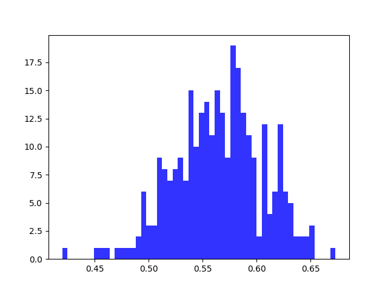
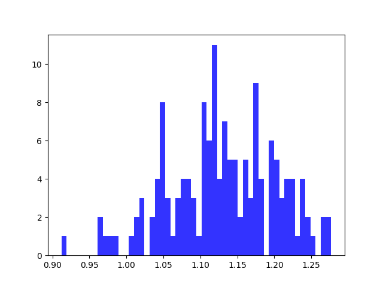

# TSP report Experiment 1

## Utilizations distribution for each core

| Average utilizations | Variance utilizations | Min | Max |
| ------ | ------ | ------ | ------ |
| 0.565 | 0.002 | 0.420 | 0.673 |

## Utilizations distribution for each system, i.e. for both cores

| Average utilizations | Variance utilizations | Min | Max |
| ------ | ------ | ------ | ------ |
| 1.1297 | 0.005 | 0.912 | 1.277 |

