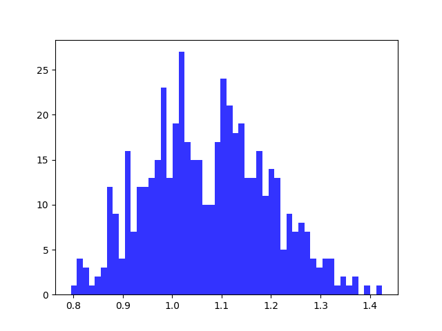

# TSP report Experiment 2

## Utilizations distribution for each core

| Average utilizations | Variance utilizations | Min | Max |
| ------ | ------ | ------ | ------ |
| 0.536 | 0.004 | 0.370 | 0.743 |

## Utilizations distribution for each system, i.e. for both cores

| Average utilizations | Variance utilizations | Min | Max |
| ------ | ------ | ------ | ------ |
| 1.073 | 0.015 | 0.795 | 1.425 |

