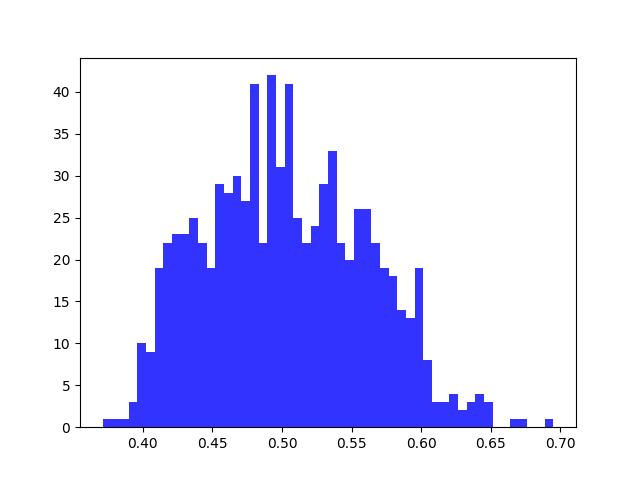
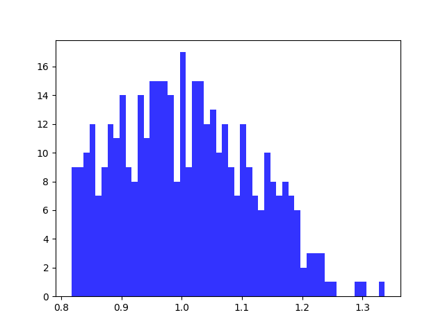

# TSP report Experiment 3

## Utilizations distribution for each core

| Average utilizations | Variance utilizations | Min | Max |
| ------ | ------ | ------ | ------ |
| 0.503 | 0.003 | 0.371 | 0.695 |

## Utilizations distribution for each system, i.e. for both cores

| Average utilizations | Variance utilizations | Min | Max |
| ------ | ------ | ------ | ------ |
| 1.006 | 0.012 | 0.817 | 1.337 |

