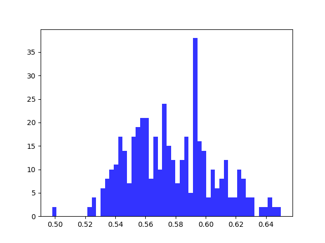
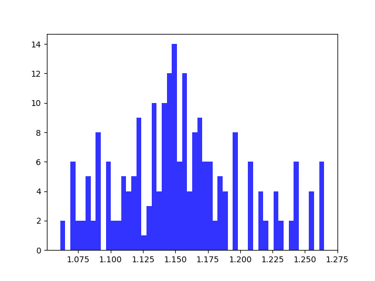

# TSP report Experiment 4

## Utilizations distribution for each core

| Average utilizations | Variance utilizations | Min | Max |
| ------ | ------ | ------ | ------ |
| 0.577 | 0.001 | 0.498 | 0.650 |

## Utilizations distribution for each system, i.e. for both cores

| Average utilizations | Variance utilizations | Min | Max |
| ------ | ------ | ------ | ------ |
| 1.154 | 0.002 | 1.061 | 1.265 |

