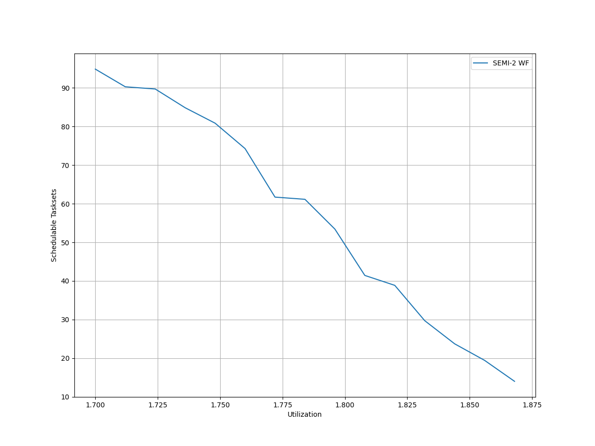
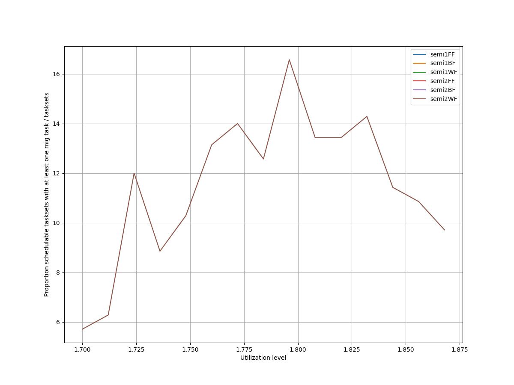
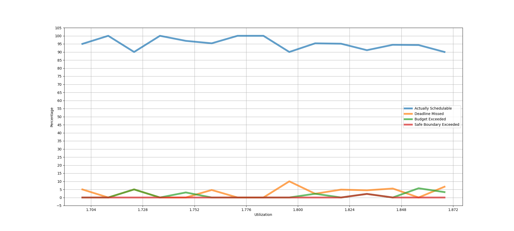
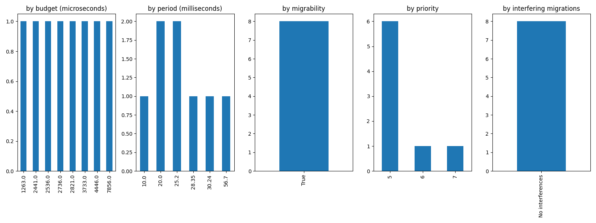
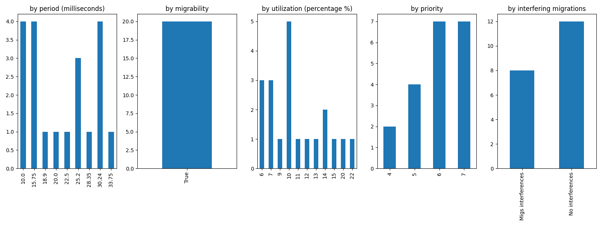
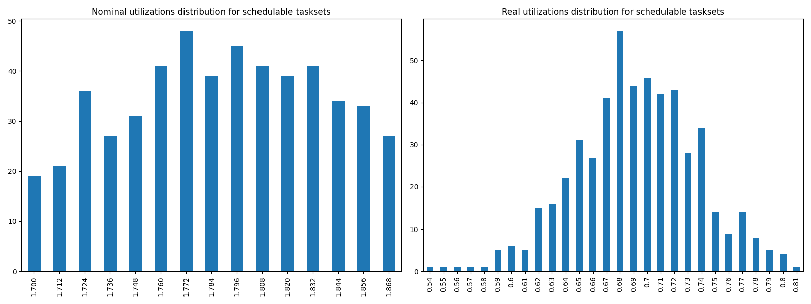
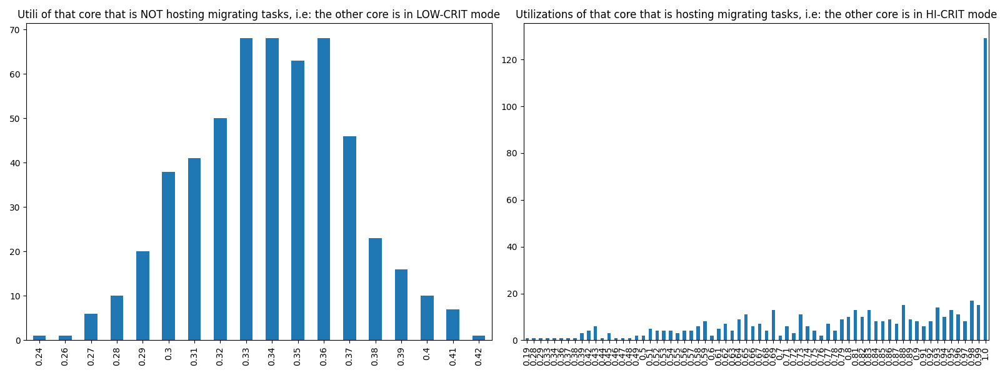

# Report on Experiment 1

## Overall data

### Experiments input parameters

**_Variable_ parameters**: those on which, in this experiment, we iterate.

| Utilization lower bound | Utilization higher bound | Utilization step |
| ------ | ------ | ------ |
| 1.7 | 1.875 | 0.012 |

**_Static_ parameters**: those that have a constant value.

| Criticality factor | HI-CRIT proportion | Taskset size |
| ------ | ------ | ------ |
| 2 | 0.5 | 12 |

   Algorithm to generate tasks utilization: DRS algorithm <https://sigbed.org/2020/12/21/the-dirichlet-rescale-drs-algorithm-a-general-purpose-method-underpinning-synthetic-task-set-generation/>
   Utilizations range generation: `[5%, 60%]`

   **Normal** periods range from which to extract at random = `[10, 200] milliseconds`.

   **Big** periods range from which to extract at random = `[400, 1000] milliseconds`.

   From the latter, 1 or 2 periods are selected. The remaings, are selected from the former.

   Max periods armonicity: 2

### Output

| Schedulable | Not schedulable | Budget Exceeded | Safe Boundary Exceeded |
| ------ | ------ | ------ | ------ |
| 94.91% | 3.45% | 1.45% | 0.18% |

Number of executions: 550

Schedulable executions: 522/550 = 94.91%

_Not_ schedulable executions: 19/550 = 3.45%

Budget Exceeded executions: 8/550 = 1.45 %

Safe Boundary Exceeded executions: 1/550 = 0.18 %

NS + BE executions: 27/550 = 4.91 %

### **Simulations**

#### **Weighted schedulability experiment 1 according to simulations.**

#### **Percentage of (schedulable tasksets with at least one migrating tasks / number of schedulable tasksets) of experiment 1 according to simulations.** 

 

### **Real Executions**

#### **Schedulability for each level**

The tasksets with i) at least one migrating task and ii) marked as schedulable by the RTA are executed on a real target, in order to see how many of them are also schedulable in a real-world scenario. The following graph shows, for each "Utilization" level (x-axis), the percentage of:

   - Actually schedulable tasksets, i.e. those that have all tasks that meet their deadlines;
   - Deadline Missed tasksets, i.e. those in which (at least) a tasks did not meet (at least) one of its deadlines; 
   - Budget Exceeded tasksets, i.e. those in which a criticality-level budget exceeding is detected (LO-crit budget for LO-crit tasks and HI-crit budget for HI-crit tasks). This type of event makes experiment invalid.

We want to see, thanks to this graphs, how many tasksets remain schedulable in the real-world. The RTA does not take into account overhead time, so we expect that there will be some tasksets that are not actually schedulable.

#### **Tasksets, grouped by differents parameters, with a Budget_Exceeded task.**

With the following graphs, we sum-up the features of the tasks that have occurred in a Criticality-level Budget Exceeded event. Each graph is like a "group-by" SQL operation.
 In the first one, "by budget", we can see, for each _criticality-level budget value_, how many tasks with that criticality-level budget has exceeded it. In the second one, we can see for each _period_ value, how many tasks has exceeded their criticality-level budget.

#### **Tasksets, grouped by differents parameters, with at least one task missing one (or more) of its deadlines.**

With the following graphs, we sum-up the features of the tasks that have missed (at least) one of them deadlines. As the Budget Exceeded graphs, each graph is like a "group-by" SQL operation.

### **Nominal utilizations VS Real utilizations about schedulable tasksets**

| Average real utilizations | Variance real utilizations | Min | Max |
| ------ | ------ | ------ | ------ |
| 0.692 | 0.002 | 0.540 | 0.810 |

### **Utils of the core that will have to accommodate migrating tasks VS Utils of the core when it is actually accomodating them**

These two graphs show the utilizations level of that core $`c_{i}`$ that, sooner or later, will have to accomodate migrating tasks of the other core $`c_{j}`$. The left one, shows the distribution utilizations levels when the core $`c_{i}`$ is **not** accomodating the other core's $`c_{j}`$ migrating tasks, i.e. $`c_{j}`$ is in **LOW-CRIT mode.**
The right one, shows the distribution utilizations levels when the core $`c_{i}`$ **is** accomodating the other core's $`c_{j}`$ migrating tasks, i.e. $`c_{j}`$ is in **HIGH-CRIT mode**.

| Average utilizations **not** hosting migs | Variance utilizations **not** hosting migs | Min | Max |
| ------ | ------ | ------ | ------ |
| 0.339 | 0.001 | 0.240 | 0.420 |

| Average utilizations hosting migs | Variance utilizations hosting migs | Min | Max |
| ------ | ------ | ------ | ------ |
| 0.821 | 0.032 | 0.190 | 1.000 |

## Bad tasksets

Click here to expand this section.

### **Not schedulable tasksets**

Click here to expand this section.

Ovvero quando almeno un task non completa entra almeno una sua deadline.

  1. Taskset **e1_semi2wf_t1809**

    Taskset execution params:
	 
    "id": "e1_semi2wf_t1809",
    "size": "12",
    "utilization": "1.760",
    "realutilization": 0.67,
    "criticality_factor": "2",
    "hicrit_proportion": "0.5"

   
 
Click here to see the deadlines missed tasks list.

   Time values are expressed as **micro-seconds**.

Task:  1

    
    "id": " 1",
    "basecpu": " 2",
    "priority": " 5",
    "period": 10000.0,
    "C(LO)": 1316.0,
    "C(HI)": 1316.0,
    "criticality": "LOW",
    "migrable": "True",
    "completedruns": " 11341",
    "preemptions": " 0",
    "minresponsejitter": " 0.000000000",
    "maxresponsejitter": " 0.000682919",
    "minreleasejitter": " 0.000000000",
    "maxreleasejitter": " 114.390006234",
    "avgresponsejitter": " 0.000569853",
    "deadlinesmissed": " 1",
    "deadlinemissedtargetcore": " 0",
    "deadlinemissedaftermigration": " 1",
    "budgetexceeded": " 0",
    "budgetexceededtargetcore": " 0",
    "budgetexceededaftermigration": " 0",
    "timesmigrated": " 7",
    "timesrestored": " 7",
    "timesonc1": " 2",
    "timesonc2": " 11337",
    "lockedtime": " 0.000039700"

   

   
 
Click here to see the CPUs log.

   Idle time is expressed as **seconds**.

   Util values are expressed as **percentage** %.

   CPU: 1

    
    "id": 1,
    "hyperperiod": 113400000,
    "lowtohigh": " 0",
    "hightolow": " 0",
    "idletime": 73033059,
    "util": 35.59694973544974,
    "idletimeduringhostingmig": 6614,
    "utilduringhostingmig": 88.90454621707767

   CPU: 2

    
    "id": 2,
    "hyperperiod": 22680000,
    "lowtohigh": " 20",
    "hightolow": " 20",
    "idletime": 77770664,
    "util": 31.41916754850088,
    "idletimeduringhostingmig": 0,
    "utilduringhostingmig": null

   Real Utilization: 0.6699999999999999
   

   
 
Click here to see the whole tasksets.

   Time values are expressed as **micro-seconds**.

   Task:  8

    
    "id": " 8",
    "basecpu": " 1",
    "priority": " 5",
    "period": 135000.0,
    "C(LO)": 19658.0,
    "C(HI)": 19658.0,
    "criticality": "LOW",
    "migrable": "False",
    "completedruns": " 841",
    "preemptions": " 1",
    "minresponsejitter": " 0.000000000",
    "maxresponsejitter": " 0.012259483",
    "minreleasejitter": " 0.000000000",
    "maxreleasejitter": " 114.265006339",
    "avgresponsejitter": " 0.010506231",
    "deadlinesmissed": " 0",
    "deadlinemissedtargetcore": " 0",
    "deadlinemissedaftermigration": " 0",
    "budgetexceeded": " 0",
    "budgetexceededtargetcore": " 0",
    "budgetexceededaftermigration": " 0",
    "timesmigrated": " 0",
    "timesrestored": " 0",
    "timesonc1": " 841",
    "timesonc2": " 0",
    "lockedtime": " 0.000020667"

   Task:  11

    
    "id": " 11",
    "basecpu": " 1",
    "priority": " 4",
    "period": 157500.0,
    "C(LO)": 15262.0,
    "C(HI)": 15262.0,
    "criticality": "LOW",
    "migrable": "False",
    "completedruns": " 721",
    "preemptions": " 0",
    "minresponsejitter": " 0.000000000",
    "maxresponsejitter": " 0.009473147",
    "minreleasejitter": " 0.000000000",
    "maxreleasejitter": " 114.242506324",
    "avgresponsejitter": " 0.008090898",
    "deadlinesmissed": " 0",
    "deadlinemissedtargetcore": " 0",
    "deadlinemissedaftermigration": " 0",
    "budgetexceeded": " 0",
    "budgetexceededtargetcore": " 0",
    "budgetexceededaftermigration": " 0",
    "timesmigrated": " 0",
    "timesrestored": " 0",
    "timesonc1": " 720",
    "timesonc2": " 0",
    "lockedtime": " 0.000010012"

   Task:  2

    
    "id": " 2",
    "basecpu": " 1",
    "priority": " 3",
    "period": 56700.0,
    "C(LO)": 5519.0,
    "C(HI)": 11039.0,
    "criticality": "HIGH",
    "migrable": "False",
    "completedruns": " 2001",
    "preemptions": " 28",
    "minresponsejitter": " 0.000000000",
    "maxresponsejitter": " 0.015256772",
    "minreleasejitter": " 0.000000000",
    "maxreleasejitter": " 114.343306793",
    "avgresponsejitter": " 0.002973033",
    "deadlinesmissed": " 0",
    "deadlinemissedtargetcore": " 0",
    "deadlinemissedaftermigration": " 0",
    "budgetexceeded": " 0",
    "budgetexceededtargetcore": " 0",
    "budgetexceededaftermigration": " 0",
    "timesmigrated": " 0",
    "timesrestored": " 0",
    "timesonc1": " 2028",
    "timesonc2": " 0",
    "lockedtime": " 0.000012958"

   Task:  6

    
    "id": " 6",
    "basecpu": " 1",
    "priority": " 2",
    "period": 112500.0,
    "C(LO)": 9846.0,
    "C(HI)": 19693.0,
    "criticality": "HIGH",
    "migrable": "False",
    "completedruns": " 1009",
    "preemptions": " 99",
    "minresponsejitter": " 0.000000000",
    "maxresponsejitter": " 0.009197201",
    "minreleasejitter": " 0.000000000",
    "maxreleasejitter": " 114.289873907",
    "avgresponsejitter": " 0.005440550",
    "deadlinesmissed": " 0",
    "deadlinemissedtargetcore": " 0",
    "deadlinemissedaftermigration": " 0",
    "budgetexceeded": " 0",
    "budgetexceededtargetcore": " 0",
    "budgetexceededaftermigration": " 0",
    "timesmigrated": " 0",
    "timesrestored": " 0",
    "timesonc1": " 1107",
    "timesonc2": " 0",
    "lockedtime": " 0.000005868"

   Task:  7

    
    "id": " 7",
    "basecpu": " 1",
    "priority": " 1",
    "period": 129600.0,
    "C(LO)": 4921.0,
    "C(HI)": 9842.0,
    "criticality": "HIGH",
    "migrable": "False",
    "completedruns": " 876",
    "preemptions": " 39",
    "minresponsejitter": " 0.000000000",
    "maxresponsejitter": " 0.017689604",
    "minreleasejitter": " 0.000000000",
    "maxreleasejitter": " 114.274204480",
    "avgresponsejitter": " 0.002804081",
    "deadlinesmissed": " 0",
    "deadlinemissedtargetcore": " 0",
    "deadlinemissedaftermigration": " 0",
    "budgetexceeded": " 0",
    "budgetexceededtargetcore": " 0",
    "budgetexceededaftermigration": " 0",
    "timesmigrated": " 0",
    "timesrestored": " 0",
    "timesonc1": " 914",
    "timesonc2": " 0",
    "lockedtime": " 0.000000318"

   Task:  12

    
    "id": " 12",
    "basecpu": " 1",
    "priority": " 0",
    "period": 590625.0,
    "C(LO)": 120689.0,
    "C(HI)": 120689.0,
    "criticality": "LOW",
    "migrable": "False",
    "completedruns": " 193",
    "preemptions": " 625",
    "minresponsejitter": " 0.000000000",
    "maxresponsejitter": " 0.110507994",
    "minreleasejitter": " 0.000000000",
    "maxreleasejitter": " 113.809381538",
    "avgresponsejitter": " 0.083354237",
    "deadlinesmissed": " 0",
    "deadlinemissedtargetcore": " 0",
    "deadlinemissedaftermigration": " 0",
    "budgetexceeded": " 0",
    "budgetexceededtargetcore": " 0",
    "budgetexceededaftermigration": " 0",
    "timesmigrated": " 0",
    "timesrestored": " 0",
    "timesonc1": " 817",
    "timesonc2": " 0",
    "lockedtime": " 0.000029667"

   Task:  10

    
    "id": " 10",
    "basecpu": " 2",
    "priority": " 0",
    "period": 141750.0,
    "C(LO)": 21017.0,
    "C(HI)": 42034.0,
    "criticality": "HIGH",
    "migrable": "False",
    "completedruns": " 801",
    "preemptions": " 1208",
    "minresponsejitter": " 0.000000000",
    "maxresponsejitter": " 0.037960655",
    "minreleasejitter": " 0.000000000",
    "maxreleasejitter": " 114.258256012",
    "avgresponsejitter": " 0.013901153",
    "deadlinesmissed": " 0",
    "deadlinemissedtargetcore": " 0",
    "deadlinemissedaftermigration": " 0",
    "budgetexceeded": " 7",
    "budgetexceededtargetcore": " 0",
    "budgetexceededaftermigration": " 0",
    "timesmigrated": " 0",
    "timesrestored": " 0",
    "timesonc1": " 0",
    "timesonc2": " 2015",
    "lockedtime": " 0.000018291"

   Task:  3

    
    "id": " 3",
    "basecpu": " 2",
    "priority": " 2",
    "period": 63000.0,
    "C(LO)": 4633.0,
    "C(HI)": 9267.0,
    "criticality": "HIGH",
    "migrable": "False",
    "completedruns": " 1801",
    "preemptions": " 371",
    "minresponsejitter": " 0.000000000",
    "maxresponsejitter": " 0.006013790",
    "minreleasejitter": " 0.000000000",
    "maxreleasejitter": " 114.337006036",
    "avgresponsejitter": " 0.002496814",
    "deadlinesmissed": " 0",
    "deadlinemissedtargetcore": " 0",
    "deadlinemissedaftermigration": " 0",
    "budgetexceeded": " 8",
    "budgetexceededtargetcore": " 0",
    "budgetexceededaftermigration": " 0",
    "timesmigrated": " 0",
    "timesrestored": " 0",
    "timesonc1": " 0",
    "timesonc2": " 2179",
    "lockedtime": " 0.000013829"

   Task:  5

    
    "id": " 5",
    "basecpu": " 2",
    "priority": " 1",
    "period": 100800.0,
    "C(LO)": 3305.0,
    "C(HI)": 6610.0,
    "criticality": "HIGH",
    "migrable": "False",
    "completedruns": " 1126",
    "preemptions": " 175",
    "minresponsejitter": " 0.000000000",
    "maxresponsejitter": " 0.004283739",
    "minreleasejitter": " 0.000000000",
    "maxreleasejitter": " 114.299206165",
    "avgresponsejitter": " 0.001735027",
    "deadlinesmissed": " 0",
    "deadlinemissedtargetcore": " 0",
    "deadlinemissedaftermigration": " 0",
    "budgetexceeded": " 5",
    "budgetexceededtargetcore": " 0",
    "budgetexceededaftermigration": " 0",
    "timesmigrated": " 0",
    "timesrestored": " 0",
    "timesonc1": " 0",
    "timesonc2": " 1305",
    "lockedtime": " 0.000002658"

   Task:  4

    
    "id": " 4",
    "basecpu": " 2",
    "priority": " 4",
    "period": 84000.0,
    "C(LO)": 12662.0,
    "C(HI)": 12662.0,
    "criticality": "LOW",
    "migrable": "False",
    "completedruns": " 1351",
    "preemptions": " 750",
    "minresponsejitter": " 0.000000000",
    "maxresponsejitter": " 0.008497919",
    "minreleasejitter": " 0.000000000",
    "maxreleasejitter": " 114.316006126",
    "avgresponsejitter": " 0.007024045",
    "deadlinesmissed": " 0",
    "deadlinemissedtargetcore": " 0",
    "deadlinemissedaftermigration": " 0",
    "budgetexceeded": " 0",
    "budgetexceededtargetcore": " 0",
    "budgetexceededaftermigration": " 0",
    "timesmigrated": " 0",
    "timesrestored": " 0",
    "timesonc1": " 0",
    "timesonc2": " 2100",
    "lockedtime": " 0.000003685"

   Task:  1

    
    "id": " 1",
    "basecpu": " 2",
    "priority": " 5",
    "period": 10000.0,
    "C(LO)": 1316.0,
    "C(HI)": 1316.0,
    "criticality": "LOW",
    "migrable": "True",
    "completedruns": " 11341",
    "preemptions": " 0",
    "minresponsejitter": " 0.000000000",
    "maxresponsejitter": " 0.000682919",
    "minreleasejitter": " 0.000000000",
    "maxreleasejitter": " 114.390006234",
    "avgresponsejitter": " 0.000569853",
    "deadlinesmissed": " 1",
    "deadlinemissedtargetcore": " 0",
    "deadlinemissedaftermigration": " 1",
    "budgetexceeded": " 0",
    "budgetexceededtargetcore": " 0",
    "budgetexceededaftermigration": " 0",
    "timesmigrated": " 7",
    "timesrestored": " 7",
    "timesonc1": " 2",
    "timesonc2": " 11337",
    "lockedtime": " 0.000039700"

   Task:  9

    
    "id": " 9",
    "basecpu": " 2",
    "priority": " 3",
    "period": 140000.0,
    "C(LO)": 10611.0,
    "C(HI)": 10611.0,
    "criticality": "LOW",
    "migrable": "False",
    "completedruns": " 811",
    "preemptions": " 270",
    "minresponsejitter": " 0.000000000",
    "maxresponsejitter": " 0.007151685",
    "minreleasejitter": " 0.000000000",
    "maxreleasejitter": " 114.260668162",
    "avgresponsejitter": " 0.005821303",
    "deadlinesmissed": " 0",
    "deadlinemissedtargetcore": " 0",
    "deadlinemissedaftermigration": " 0",
    "budgetexceeded": " 0",
    "budgetexceededtargetcore": " 0",
    "budgetexceededaftermigration": " 0",
    "timesmigrated": " 0",
    "timesrestored": " 0",
    "timesonc1": " 0",
    "timesonc2": " 1080",
    "lockedtime": " 0.000003775"

   

  2. Taskset **e1_semi2wf_t1853**

    Taskset execution params:
	 
    "id": "e1_semi2wf_t1853",
    "size": "12",
    "utilization": "1.760",
    "realutilization": 0.68,
    "criticality_factor": "2",
    "hicrit_proportion": "0.5"

   
 
Click here to see the deadlines missed tasks list.

   Time values are expressed as **micro-seconds**.

Task:  1

    
    "id": " 1",
    "basecpu": " 1",
    "priority": " 6",
    "period": 25200.0,
    "C(LO)": 2481.0,
    "C(HI)": 2481.0,
    "criticality": "LOW",
    "migrable": "True",
    "completedruns": " 3255",
    "preemptions": " 0",
    "minresponsejitter": " 0.000000000",
    "maxresponsejitter": " 0.001393240",
    "minreleasejitter": " 0.000000000",
    "maxreleasejitter": " 82.975606378",
    "avgresponsejitter": " 0.001190553",
    "deadlinesmissed": " 1",
    "deadlinemissedtargetcore": " 0",
    "deadlinemissedaftermigration": " 0",
    "budgetexceeded": " 0",
    "budgetexceededtargetcore": " 0",
    "budgetexceededaftermigration": " 0",
    "timesmigrated": " 5",
    "timesrestored": " 4",
    "timesonc1": " 3250",
    "timesonc2": " 3",
    "lockedtime": " 0.000003961"

   

   
 
Click here to see the CPUs log.

   Idle time is expressed as **seconds**.

   Util values are expressed as **percentage** %.

   CPU: 1

    
    "id": 1,
    "hyperperiod": 37800000,
    "lowtohigh": " 12",
    "hightolow": " 12",
    "idletime": 70992656,
    "util": 37.39624691358024,
    "idletimeduringhostingmig": 0,
    "utilduringhostingmig": null

   CPU: 2

    
    "id": 2,
    "hyperperiod": 113400000,
    "lowtohigh": " 0",
    "hightolow": " 0",
    "idletime": 77989467,
    "util": 31.226219576719572,
    "idletimeduringhostingmig": 56906,
    "utilduringhostingmig": 56.285672584250676

   Real Utilization: 0.6799999999999999
   

   
 
Click here to see the whole tasksets.

   Time values are expressed as **micro-seconds**.

   Task:  1

    
    "id": " 1",
    "basecpu": " 1",
    "priority": " 6",
    "period": 25200.0,
    "C(LO)": 2481.0,
    "C(HI)": 2481.0,
    "criticality": "LOW",
    "migrable": "True",
    "completedruns": " 3255",
    "preemptions": " 0",
    "minresponsejitter": " 0.000000000",
    "maxresponsejitter": " 0.001393240",
    "minreleasejitter": " 0.000000000",
    "maxreleasejitter": " 82.975606378",
    "avgresponsejitter": " 0.001190553",
    "deadlinesmissed": " 1",
    "deadlinemissedtargetcore": " 0",
    "deadlinemissedaftermigration": " 0",
    "budgetexceeded": " 0",
    "budgetexceededtargetcore": " 0",
    "budgetexceededaftermigration": " 0",
    "timesmigrated": " 5",
    "timesrestored": " 4",
    "timesonc1": " 3250",
    "timesonc2": " 3",
    "lockedtime": " 0.000003961"

   Task:  6

    
    "id": " 6",
    "basecpu": " 1",
    "priority": " 5",
    "period": 72000.0,
    "C(LO)": 5463.0,
    "C(HI)": 5463.0,
    "criticality": "LOW",
    "migrable": "False",
    "completedruns": " 1576",
    "preemptions": " 1",
    "minresponsejitter": " 0.000000000",
    "maxresponsejitter": " 0.003266895",
    "minreleasejitter": " 0.000000000",
    "maxreleasejitter": " 114.328006907",
    "avgresponsejitter": " 0.002811835",
    "deadlinesmissed": " 0",
    "deadlinemissedtargetcore": " 0",
    "deadlinemissedaftermigration": " 0",
    "budgetexceeded": " 0",
    "budgetexceededtargetcore": " 0",
    "budgetexceededaftermigration": " 0",
    "timesmigrated": " 0",
    "timesrestored": " 0",
    "timesonc1": " 1576",
    "timesonc2": " 0",
    "lockedtime": " 0.000018628"

   Task:  7

    
    "id": " 7",
    "basecpu": " 1",
    "priority": " 4",
    "period": 78750.0,
    "C(LO)": 15496.0,
    "C(HI)": 15496.0,
    "criticality": "LOW",
    "migrable": "False",
    "completedruns": " 1441",
    "preemptions": " 444",
    "minresponsejitter": " 0.000000000",
    "maxresponsejitter": " 0.013986297",
    "minreleasejitter": " 0.000000000",
    "maxreleasejitter": " 114.321256366",
    "avgresponsejitter": " 0.008768207",
    "deadlinesmissed": " 0",
    "deadlinemissedtargetcore": " 0",
    "deadlinemissedaftermigration": " 0",
    "budgetexceeded": " 0",
    "budgetexceededtargetcore": " 0",
    "budgetexceededaftermigration": " 0",
    "timesmigrated": " 0",
    "timesrestored": " 0",
    "timesonc1": " 1884",
    "timesonc2": " 0",
    "lockedtime": " 0.000016201"

   Task:  9

    
    "id": " 9",
    "basecpu": " 1",
    "priority": " 3",
    "period": 105000.0,
    "C(LO)": 14169.0,
    "C(HI)": 14169.0,
    "criticality": "LOW",
    "migrable": "False",
    "completedruns": " 1081",
    "preemptions": " 419",
    "minresponsejitter": " 0.000000000",
    "maxresponsejitter": " 0.013024952",
    "minreleasejitter": " 0.000000000",
    "maxreleasejitter": " 114.295006273",
    "avgresponsejitter": " 0.008236339",
    "deadlinesmissed": " 0",
    "deadlinemissedtargetcore": " 0",
    "deadlinemissedaftermigration": " 0",
    "budgetexceeded": " 0",
    "budgetexceededtargetcore": " 0",
    "budgetexceededaftermigration": " 0",
    "timesmigrated": " 0",
    "timesrestored": " 0",
    "timesonc1": " 1499",
    "timesonc2": " 0",
    "lockedtime": " 0.000008486"

   Task:  10

    
    "id": " 10",
    "basecpu": " 1",
    "priority": " 2",
    "period": 118125.0,
    "C(LO)": 12726.0,
    "C(HI)": 25452.0,
    "criticality": "HIGH",
    "migrable": "False",
    "completedruns": " 961",
    "preemptions": " 242",
    "minresponsejitter": " 0.000000000",
    "maxresponsejitter": " 0.024178426",
    "minreleasejitter": " 0.000000000",
    "maxreleasejitter": " 114.281881309",
    "avgresponsejitter": " 0.007322204",
    "deadlinesmissed": " 0",
    "deadlinemissedtargetcore": " 0",
    "deadlinemissedaftermigration": " 0",
    "budgetexceeded": " 10",
    "budgetexceededtargetcore": " 0",
    "budgetexceededaftermigration": " 0",
    "timesmigrated": " 0",
    "timesrestored": " 0",
    "timesonc1": " 1212",
    "timesonc2": " 0",
    "lockedtime": " 0.000014889"

   Task:  11

    
    "id": " 11",
    "basecpu": " 1",
    "priority": " 1",
    "period": 140000.0,
    "C(LO)": 4735.0,
    "C(HI)": 9471.0,
    "criticality": "HIGH",
    "migrable": "False",
    "completedruns": " 811",
    "preemptions": " 63",
    "minresponsejitter": " 0.000000000",
    "maxresponsejitter": " 0.012267417",
    "minreleasejitter": " 0.000000000",
    "maxreleasejitter": " 114.260006273",
    "avgresponsejitter": " 0.002542826",
    "deadlinesmissed": " 0",
    "deadlinemissedtargetcore": " 0",
    "deadlinemissedaftermigration": " 0",
    "budgetexceeded": " 2",
    "budgetexceededtargetcore": " 0",
    "budgetexceededaftermigration": " 0",
    "timesmigrated": " 0",
    "timesrestored": " 0",
    "timesonc1": " 875",
    "timesonc2": " 0",
    "lockedtime": " 0.000003712"

   Task:  12

    
    "id": " 12",
    "basecpu": " 1",
    "priority": " 0",
    "period": 700000.0,
    "C(LO)": 61530.0,
    "C(HI)": 123060.0,
    "criticality": "HIGH",
    "migrable": "False",
    "completedruns": " 163",
    "preemptions": " 420",
    "minresponsejitter": " 0.000000000",
    "maxresponsejitter": " 0.065977060",
    "minreleasejitter": " 0.000000000",
    "maxreleasejitter": " 113.707869129",
    "avgresponsejitter": " 0.046020676",
    "deadlinesmissed": " 0",
    "deadlinemissedtargetcore": " 0",
    "deadlinemissedaftermigration": " 0",
    "budgetexceeded": " 0",
    "budgetexceededtargetcore": " 0",
    "budgetexceededaftermigration": " 0",
    "timesmigrated": " 0",
    "timesrestored": " 0",
    "timesonc1": " 582",
    "timesonc2": " 0",
    "lockedtime": " 0.000011634"

   Task:  5

    
    "id": " 5",
    "basecpu": " 2",
    "priority": " 0",
    "period": 70875.0,
    "C(LO)": 7748.0,
    "C(HI)": 15496.0,
    "criticality": "HIGH",
    "migrable": "False",
    "completedruns": " 1601",
    "preemptions": " 358",
    "minresponsejitter": " 0.000000000",
    "maxresponsejitter": " 0.022350210",
    "minreleasejitter": " 0.000000000",
    "maxreleasejitter": " 114.329131529",
    "avgresponsejitter": " 0.005070778",
    "deadlinesmissed": " 0",
    "deadlinemissedtargetcore": " 0",
    "deadlinemissedaftermigration": " 0",
    "budgetexceeded": " 0",
    "budgetexceededtargetcore": " 0",
    "budgetexceededaftermigration": " 0",
    "timesmigrated": " 0",
    "timesrestored": " 0",
    "timesonc1": " 0",
    "timesonc2": " 1958",
    "lockedtime": " 0.000013084"

   Task:  2

    
    "id": " 2",
    "basecpu": " 2",
    "priority": " 2",
    "period": 40000.0,
    "C(LO)": 1771.0,
    "C(HI)": 3542.0,
    "criticality": "HIGH",
    "migrable": "False",
    "completedruns": " 2836",
    "preemptions": " 29",
    "minresponsejitter": " 0.000000000",
    "maxresponsejitter": " 0.010036751",
    "minreleasejitter": " 0.000000000",
    "maxreleasejitter": " 114.360006120",
    "avgresponsejitter": " 0.000898222",
    "deadlinesmissed": " 0",
    "deadlinemissedtargetcore": " 0",
    "deadlinemissedaftermigration": " 0",
    "budgetexceeded": " 0",
    "budgetexceededtargetcore": " 0",
    "budgetexceededaftermigration": " 0",
    "timesmigrated": " 0",
    "timesrestored": " 0",
    "timesonc1": " 0",
    "timesonc2": " 2864",
    "lockedtime": " 0.000011724"

   Task:  4

    
    "id": " 4",
    "basecpu": " 2",
    "priority": " 1",
    "period": 64800.0,
    "C(LO)": 2825.0,
    "C(HI)": 5651.0,
    "criticality": "HIGH",
    "migrable": "False",
    "completedruns": " 1751",
    "preemptions": " 63",
    "minresponsejitter": " 0.000000000",
    "maxresponsejitter": " 0.011111664",
    "minreleasejitter": " 0.000000000",
    "maxreleasejitter": " 114.335206120",
    "avgresponsejitter": " 0.001527459",
    "deadlinesmissed": " 0",
    "deadlinemissedtargetcore": " 0",
    "deadlinemissedaftermigration": " 0",
    "budgetexceeded": " 0",
    "budgetexceededtargetcore": " 0",
    "budgetexceededaftermigration": " 0",
    "timesmigrated": " 0",
    "timesrestored": " 0",
    "timesonc1": " 0",
    "timesonc2": " 1813",
    "lockedtime": " 0.000024796"

   Task:  3

    
    "id": " 3",
    "basecpu": " 2",
    "priority": " 4",
    "period": 60000.0,
    "C(LO)": 13418.0,
    "C(HI)": 13418.0,
    "criticality": "LOW",
    "migrable": "False",
    "completedruns": " 1891",
    "preemptions": " 0",
    "minresponsejitter": " 0.000000000",
    "maxresponsejitter": " 0.008315811",
    "minreleasejitter": " 0.000000000",
    "maxreleasejitter": " 114.340006012",
    "avgresponsejitter": " 0.007105937",
    "deadlinesmissed": " 0",
    "deadlinemissedtargetcore": " 0",
    "deadlinemissedaftermigration": " 0",
    "budgetexceeded": " 0",
    "budgetexceededtargetcore": " 0",
    "budgetexceededaftermigration": " 0",
    "timesmigrated": " 0",
    "timesrestored": " 0",
    "timesonc1": " 0",
    "timesonc2": " 1890",
    "lockedtime": " 0.000027613"

   Task:  8

    
    "id": " 8",
    "basecpu": " 2",
    "priority": " 3",
    "period": 84375.0,
    "C(LO)": 14926.0,
    "C(HI)": 14926.0,
    "criticality": "LOW",
    "migrable": "False",
    "completedruns": " 1345",
    "preemptions": " 154",
    "minresponsejitter": " 0.000000000",
    "maxresponsejitter": " 0.017409637",
    "minreleasejitter": " 0.000000000",
    "maxreleasejitter": " 114.315631468",
    "avgresponsejitter": " 0.008754267",
    "deadlinesmissed": " 0",
    "deadlinemissedtargetcore": " 0",
    "deadlinemissedaftermigration": " 0",
    "budgetexceeded": " 0",
    "budgetexceededtargetcore": " 0",
    "budgetexceededaftermigration": " 0",
    "timesmigrated": " 0",
    "timesrestored": " 0",
    "timesonc1": " 0",
    "timesonc2": " 1498",
    "lockedtime": " 0.000017946"

   

  3. Taskset **e1_semi2wf_t2832**

    Taskset execution params:
	 
    "id": "e1_semi2wf_t2832",
    "size": "12",
    "utilization": "1.796",
    "realutilization": 0.61,
    "criticality_factor": "2",
    "hicrit_proportion": "0.5"

   
 
Click here to see the deadlines missed tasks list.

   Time values are expressed as **micro-seconds**.

Task:  1

    
    "id": " 1",
    "basecpu": " 1",
    "priority": " 6",
    "period": 25200.0,
    "C(LO)": 1505.0,
    "C(HI)": 1505.0,
    "criticality": "LOW",
    "migrable": "True",
    "completedruns": " 4501",
    "preemptions": " 1",
    "minresponsejitter": " 0.000000000",
    "maxresponsejitter": " 0.000794132",
    "minreleasejitter": " 0.000000000",
    "maxreleasejitter": " 114.374806790",
    "avgresponsejitter": " 0.000674955",
    "deadlinesmissed": " 1",
    "deadlinemissedtargetcore": " 0",
    "deadlinemissedaftermigration": " 0",
    "budgetexceeded": " 0",
    "budgetexceededtargetcore": " 0",
    "budgetexceededaftermigration": " 0",
    "timesmigrated": " 7",
    "timesrestored": " 7",
    "timesonc1": " 4489",
    "timesonc2": " 11",
    "lockedtime": " 0.000084517"

   

   
 
Click here to see the CPUs log.

   Idle time is expressed as **seconds**.

   Util values are expressed as **percentage** %.

   CPU: 1

    
    "id": 1,
    "hyperperiod": 113400000,
    "lowtohigh": " 27",
    "hightolow": " 27",
    "idletime": 73387279,
    "util": 35.28458641975308,
    "idletimeduringhostingmig": 0,
    "utilduringhostingmig": null

   CPU: 2

    
    "id": 2,
    "hyperperiod": 18900000,
    "lowtohigh": " 0",
    "hightolow": " 0",
    "idletime": 84363568,
    "util": 25.605319223985887,
    "idletimeduringhostingmig": 181711,
    "utilduringhostingmig": 50.039317254500865

   Real Utilization: 0.61
   

   
 
Click here to see the whole tasksets.

   Time values are expressed as **micro-seconds**.

   Task:  1

    
    "id": " 1",
    "basecpu": " 1",
    "priority": " 6",
    "period": 25200.0,
    "C(LO)": 1505.0,
    "C(HI)": 1505.0,
    "criticality": "LOW",
    "migrable": "True",
    "completedruns": " 4501",
    "preemptions": " 1",
    "minresponsejitter": " 0.000000000",
    "maxresponsejitter": " 0.000794132",
    "minreleasejitter": " 0.000000000",
    "maxreleasejitter": " 114.374806790",
    "avgresponsejitter": " 0.000674955",
    "deadlinesmissed": " 1",
    "deadlinemissedtargetcore": " 0",
    "deadlinemissedaftermigration": " 0",
    "budgetexceeded": " 0",
    "budgetexceededtargetcore": " 0",
    "budgetexceededaftermigration": " 0",
    "timesmigrated": " 7",
    "timesrestored": " 7",
    "timesonc1": " 4489",
    "timesonc2": " 11",
    "lockedtime": " 0.000084517"

   Task:  5

    
    "id": " 5",
    "basecpu": " 1",
    "priority": " 5",
    "period": 78750.0,
    "C(LO)": 5454.0,
    "C(HI)": 5454.0,
    "criticality": "LOW",
    "migrable": "True",
    "completedruns": " 1010",
    "preemptions": " 16",
    "minresponsejitter": " 0.000000000",
    "maxresponsejitter": " 0.004022474",
    "minreleasejitter": " 0.000000000",
    "maxreleasejitter": " 80.380767291",
    "avgresponsejitter": " 0.002806489",
    "deadlinesmissed": " 0",
    "deadlinemissedtargetcore": " 0",
    "deadlinemissedaftermigration": " 0",
    "budgetexceeded": " 0",
    "budgetexceededtargetcore": " 0",
    "budgetexceededaftermigration": " 0",
    "timesmigrated": " 2",
    "timesrestored": " 1",
    "timesonc1": " 1024",
    "timesonc2": " 1",
    "lockedtime": " 0.000015952"

   Task:  11

    
    "id": " 11",
    "basecpu": " 1",
    "priority": " 4",
    "period": 200000.0,
    "C(LO)": 12778.0,
    "C(HI)": 12778.0,
    "criticality": "LOW",
    "migrable": "False",
    "completedruns": " 568",
    "preemptions": " 182",
    "minresponsejitter": " 0.000000000",
    "maxresponsejitter": " 0.011800595",
    "minreleasejitter": " 0.000000000",
    "maxreleasejitter": " 114.200006267",
    "avgresponsejitter": " 0.007125024",
    "deadlinesmissed": " 0",
    "deadlinemissedtargetcore": " 0",
    "deadlinemissedaftermigration": " 0",
    "budgetexceeded": " 0",
    "budgetexceededtargetcore": " 0",
    "budgetexceededaftermigration": " 0",
    "timesmigrated": " 0",
    "timesrestored": " 0",
    "timesonc1": " 749",
    "timesonc2": " 0",
    "lockedtime": " 0.000001267"

   Task:  3

    
    "id": " 3",
    "basecpu": " 1",
    "priority": " 3",
    "period": 56250.0,
    "C(LO)": 3259.0,
    "C(HI)": 6519.0,
    "criticality": "HIGH",
    "migrable": "False",
    "completedruns": " 2017",
    "preemptions": " 146",
    "minresponsejitter": " 0.000000000",
    "maxresponsejitter": " 0.004347138",
    "minreleasejitter": " 0.000000000",
    "maxreleasejitter": " 114.343756465",
    "avgresponsejitter": " 0.001679796",
    "deadlinesmissed": " 0",
    "deadlinemissedtargetcore": " 0",
    "deadlinemissedaftermigration": " 0",
    "budgetexceeded": " 10",
    "budgetexceededtargetcore": " 0",
    "budgetexceededaftermigration": " 0",
    "timesmigrated": " 0",
    "timesrestored": " 0",
    "timesonc1": " 2172",
    "timesonc2": " 0",
    "lockedtime": " 0.000005417"

   Task:  6

    
    "id": " 6",
    "basecpu": " 1",
    "priority": " 2",
    "period": 84375.0,
    "C(LO)": 13088.0,
    "C(HI)": 26177.0,
    "criticality": "HIGH",
    "migrable": "False",
    "completedruns": " 1345",
    "preemptions": " 475",
    "minresponsejitter": " 0.000000000",
    "maxresponsejitter": " 0.019086441",
    "minreleasejitter": " 0.000000000",
    "maxreleasejitter": " 114.315631715",
    "avgresponsejitter": " 0.007600760",
    "deadlinesmissed": " 0",
    "deadlinemissedtargetcore": " 0",
    "deadlinemissedaftermigration": " 0",
    "budgetexceeded": " 9",
    "budgetexceededtargetcore": " 0",
    "budgetexceededaftermigration": " 0",
    "timesmigrated": " 0",
    "timesrestored": " 0",
    "timesonc1": " 1828",
    "timesonc2": " 0",
    "lockedtime": " 0.000013910"

   Task:  8

    
    "id": " 8",
    "basecpu": " 1",
    "priority": " 1",
    "period": 108000.0,
    "C(LO)": 10152.0,
    "C(HI)": 20305.0,
    "criticality": "HIGH",
    "migrable": "False",
    "completedruns": " 1051",
    "preemptions": " 327",
    "minresponsejitter": " 0.000000000",
    "maxresponsejitter": " 0.020238658",
    "minreleasejitter": " 0.000000000",
    "maxreleasejitter": " 114.292006459",
    "avgresponsejitter": " 0.006215444",
    "deadlinesmissed": " 0",
    "deadlinemissedtargetcore": " 0",
    "deadlinemissedaftermigration": " 0",
    "budgetexceeded": " 8",
    "budgetexceededtargetcore": " 0",
    "budgetexceededaftermigration": " 0",
    "timesmigrated": " 0",
    "timesrestored": " 0",
    "timesonc1": " 1385",
    "timesonc2": " 0",
    "lockedtime": " 0.000001222"

   Task:  12

    
    "id": " 12",
    "basecpu": " 1",
    "priority": " 0",
    "period": 810000.0,
    "C(LO)": 152477.0,
    "C(HI)": 152477.0,
    "criticality": "LOW",
    "migrable": "False",
    "completedruns": " 141",
    "preemptions": " 1011",
    "minresponsejitter": " 0.000000000",
    "maxresponsejitter": " 0.131535288",
    "minreleasejitter": " 0.000000000",
    "maxreleasejitter": " 113.590006411",
    "avgresponsejitter": " 0.108890354",
    "deadlinesmissed": " 0",
    "deadlinemissedtargetcore": " 0",
    "deadlinemissedaftermigration": " 0",
    "budgetexceeded": " 0",
    "budgetexceededtargetcore": " 0",
    "budgetexceededaftermigration": " 0",
    "timesmigrated": " 0",
    "timesrestored": " 0",
    "timesonc1": " 1151",
    "timesonc2": " 0",
    "lockedtime": " 0.000042471"

   Task:  4

    
    "id": " 4",
    "basecpu": " 2",
    "priority": " 2",
    "period": 75600.0,
    "C(LO)": 12385.0,
    "C(HI)": 24771.0,
    "criticality": "HIGH",
    "migrable": "False",
    "completedruns": " 1501",
    "preemptions": " 0",
    "minresponsejitter": " 0.000000000",
    "maxresponsejitter": " 0.007660664",
    "minreleasejitter": " 0.000000000",
    "maxreleasejitter": " 114.324406850",
    "avgresponsejitter": " 0.006541952",
    "deadlinesmissed": " 0",
    "deadlinemissedtargetcore": " 0",
    "deadlinemissedaftermigration": " 0",
    "budgetexceeded": " 0",
    "budgetexceededtargetcore": " 0",
    "budgetexceededaftermigration": " 0",
    "timesmigrated": " 0",
    "timesrestored": " 0",
    "timesonc1": " 0",
    "timesonc2": " 1500",
    "lockedtime": " 0.000048892"

   Task:  9

    
    "id": " 9",
    "basecpu": " 2",
    "priority": " 1",
    "period": 118125.0,
    "C(LO)": 8952.0,
    "C(HI)": 17904.0,
    "criticality": "HIGH",
    "migrable": "False",
    "completedruns": " 961",
    "preemptions": " 178",
    "minresponsejitter": " 0.000000000",
    "maxresponsejitter": " 0.013774117",
    "minreleasejitter": " 0.000000000",
    "maxreleasejitter": " 114.281881129",
    "avgresponsejitter": " 0.005088387",
    "deadlinesmissed": " 0",
    "deadlinemissedtargetcore": " 0",
    "deadlinemissedaftermigration": " 0",
    "budgetexceeded": " 0",
    "budgetexceededtargetcore": " 0",
    "budgetexceededaftermigration": " 0",
    "timesmigrated": " 0",
    "timesrestored": " 0",
    "timesonc1": " 0",
    "timesonc2": " 1138",
    "lockedtime": " 0.000023619"

   Task:  10

    
    "id": " 10",
    "basecpu": " 2",
    "priority": " 0",
    "period": 131250.0,
    "C(LO)": 9273.0,
    "C(HI)": 18547.0,
    "criticality": "HIGH",
    "migrable": "False",
    "completedruns": " 865",
    "preemptions": " 192",
    "minresponsejitter": " 0.000000000",
    "maxresponsejitter": " 0.017375592",
    "minreleasejitter": " 0.000000000",
    "maxreleasejitter": " 114.268756258",
    "avgresponsejitter": " 0.005581339",
    "deadlinesmissed": " 0",
    "deadlinemissedtargetcore": " 0",
    "deadlinemissedaftermigration": " 0",
    "budgetexceeded": " 0",
    "budgetexceededtargetcore": " 0",
    "budgetexceededaftermigration": " 0",
    "timesmigrated": " 0",
    "timesrestored": " 0",
    "timesonc1": " 0",
    "timesonc2": " 1056",
    "lockedtime": " 0.000016024"

   Task:  7

    
    "id": " 7",
    "basecpu": " 2",
    "priority": " 3",
    "period": 94500.0,
    "C(LO)": 10131.0,
    "C(HI)": 10131.0,
    "criticality": "LOW",
    "migrable": "False",
    "completedruns": " 1201",
    "preemptions": " 150",
    "minresponsejitter": " 0.000000000",
    "maxresponsejitter": " 0.007344778",
    "minreleasejitter": " 0.000000000",
    "maxreleasejitter": " 114.305506532",
    "avgresponsejitter": " 0.005492354",
    "deadlinesmissed": " 0",
    "deadlinemissedtargetcore": " 0",
    "deadlinemissedaftermigration": " 0",
    "budgetexceeded": " 0",
    "budgetexceededtargetcore": " 0",
    "budgetexceededaftermigration": " 0",
    "timesmigrated": " 0",
    "timesrestored": " 0",
    "timesonc1": " 0",
    "timesonc2": " 1350",
    "lockedtime": " 0.000013288"

   Task:  2

    
    "id": " 2",
    "basecpu": " 2",
    "priority": " 4",
    "period": 30240.0,
    "C(LO)": 2205.0,
    "C(HI)": 2205.0,
    "criticality": "LOW",
    "migrable": "False",
    "completedruns": " 3751",
    "preemptions": " 0",
    "minresponsejitter": " 0.000000000",
    "maxresponsejitter": " 0.001222498",
    "minreleasejitter": " 0.000000000",
    "maxreleasejitter": " 114.369766435",
    "avgresponsejitter": " 0.001046928",
    "deadlinesmissed": " 0",
    "deadlinemissedtargetcore": " 0",
    "deadlinemissedaftermigration": " 0",
    "budgetexceeded": " 0",
    "budgetexceededtargetcore": " 0",
    "budgetexceededaftermigration": " 0",
    "timesmigrated": " 0",
    "timesrestored": " 0",
    "timesonc1": " 0",
    "timesonc2": " 3750",
    "lockedtime": " 0.000030961"

   

  4. Taskset **e1_semi2wf_t2887**

    Taskset execution params:
	 
    "id": "e1_semi2wf_t2887",
    "size": "12",
    "utilization": "1.796",
    "realutilization": 0.69,
    "criticality_factor": "2",
    "hicrit_proportion": "0.5"

   
 
Click here to see the deadlines missed tasks list.

   Time values are expressed as **micro-seconds**.

Task:  1

    
    "id": " 1",
    "basecpu": " 1",
    "priority": " 7",
    "period": 15750.0,
    "C(LO)": 3008.0,
    "C(HI)": 3008.0,
    "criticality": "LOW",
    "migrable": "True",
    "completedruns": " 7201",
    "preemptions": " 1",
    "minresponsejitter": " 0.000000000",
    "maxresponsejitter": " 0.001729613",
    "minreleasejitter": " 0.000000000",
    "maxreleasejitter": " 114.384256351",
    "avgresponsejitter": " 0.001476562",
    "deadlinesmissed": " 1",
    "deadlinemissedtargetcore": " 0",
    "deadlinemissedaftermigration": " 1",
    "budgetexceeded": " 0",
    "budgetexceededtargetcore": " 0",
    "budgetexceededaftermigration": " 0",
    "timesmigrated": " 1",
    "timesrestored": " 1",
    "timesonc1": " 7200",
    "timesonc2": " 0",
    "lockedtime": " 0.000021360"

   

   
 
Click here to see the CPUs log.

   Idle time is expressed as **seconds**.

   Util values are expressed as **percentage** %.

   CPU: 1

    
    "id": 1,
    "hyperperiod": 113400000,
    "lowtohigh": " 14",
    "hightolow": " 14",
    "idletime": 70714126,
    "util": 37.641864197530865,
    "idletimeduringhostingmig": 0,
    "utilduringhostingmig": null

   CPU: 2

    
    "id": 2,
    "hyperperiod": 11340000,
    "lowtohigh": " 0",
    "hightolow": " 0",
    "idletime": 78556864,
    "util": 30.725869488536148,
    "idletimeduringhostingmig": 12716,
    "utilduringhostingmig": 73.65596966997452

   Real Utilization: 0.69
   

   
 
Click here to see the whole tasksets.

   Time values are expressed as **micro-seconds**.

   Task:  1

    
    "id": " 1",
    "basecpu": " 1",
    "priority": " 7",
    "period": 15750.0,
    "C(LO)": 3008.0,
    "C(HI)": 3008.0,
    "criticality": "LOW",
    "migrable": "True",
    "completedruns": " 7201",
    "preemptions": " 1",
    "minresponsejitter": " 0.000000000",
    "maxresponsejitter": " 0.001729613",
    "minreleasejitter": " 0.000000000",
    "maxreleasejitter": " 114.384256351",
    "avgresponsejitter": " 0.001476562",
    "deadlinesmissed": " 1",
    "deadlinemissedtargetcore": " 0",
    "deadlinemissedaftermigration": " 1",
    "budgetexceeded": " 0",
    "budgetexceededtargetcore": " 0",
    "budgetexceededaftermigration": " 0",
    "timesmigrated": " 1",
    "timesrestored": " 1",
    "timesonc1": " 7200",
    "timesonc2": " 0",
    "lockedtime": " 0.000021360"

   Task:  5

    
    "id": " 5",
    "basecpu": " 1",
    "priority": " 6",
    "period": 90000.0,
    "C(LO)": 12750.0,
    "C(HI)": 12750.0,
    "criticality": "LOW",
    "migrable": "False",
    "completedruns": " 1261",
    "preemptions": " 462",
    "minresponsejitter": " 0.000000000",
    "maxresponsejitter": " 0.009580063",
    "minreleasejitter": " 0.000000000",
    "maxreleasejitter": " 114.310006468",
    "avgresponsejitter": " 0.007323327",
    "deadlinesmissed": " 0",
    "deadlinemissedtargetcore": " 0",
    "deadlinemissedaftermigration": " 0",
    "budgetexceeded": " 0",
    "budgetexceededtargetcore": " 0",
    "budgetexceededaftermigration": " 0",
    "timesmigrated": " 0",
    "timesrestored": " 0",
    "timesonc1": " 1722",
    "timesonc2": " 0",
    "lockedtime": " 0.000003033"

   Task:  7

    
    "id": " 7",
    "basecpu": " 1",
    "priority": " 5",
    "period": 112500.0,
    "C(LO)": 6538.0,
    "C(HI)": 6538.0,
    "criticality": "LOW",
    "migrable": "False",
    "completedruns": " 1009",
    "preemptions": " 163",
    "minresponsejitter": " 0.000000000",
    "maxresponsejitter": " 0.005596691",
    "minreleasejitter": " 0.000000000",
    "maxreleasejitter": " 114.287506372",
    "avgresponsejitter": " 0.003611162",
    "deadlinesmissed": " 0",
    "deadlinemissedtargetcore": " 0",
    "deadlinemissedaftermigration": " 0",
    "budgetexceeded": " 0",
    "budgetexceededtargetcore": " 0",
    "budgetexceededaftermigration": " 0",
    "timesmigrated": " 0",
    "timesrestored": " 0",
    "timesonc1": " 1171",
    "timesonc2": " 0",
    "lockedtime": " 0.000003276"

   Task:  9

    
    "id": " 9",
    "basecpu": " 1",
    "priority": " 4",
    "period": 131250.0,
    "C(LO)": 10899.0,
    "C(HI)": 10899.0,
    "criticality": "LOW",
    "migrable": "False",
    "completedruns": " 865",
    "preemptions": " 319",
    "minresponsejitter": " 0.000000000",
    "maxresponsejitter": " 0.015854435",
    "minreleasejitter": " 0.000000000",
    "maxreleasejitter": " 114.268756607",
    "avgresponsejitter": " 0.006675162",
    "deadlinesmissed": " 0",
    "deadlinemissedtargetcore": " 0",
    "deadlinemissedaftermigration": " 0",
    "budgetexceeded": " 0",
    "budgetexceededtargetcore": " 0",
    "budgetexceededaftermigration": " 0",
    "timesmigrated": " 0",
    "timesrestored": " 0",
    "timesonc1": " 1183",
    "timesonc2": " 0",
    "lockedtime": " 0.000003565"

   Task:  2

    
    "id": " 2",
    "basecpu": " 1",
    "priority": " 3",
    "period": 56700.0,
    "C(LO)": 1568.0,
    "C(HI)": 3136.0,
    "criticality": "HIGH",
    "migrable": "False",
    "completedruns": " 2001",
    "preemptions": " 15",
    "minresponsejitter": " 0.000000000",
    "maxresponsejitter": " 0.007445147",
    "minreleasejitter": " 0.000000000",
    "maxreleasejitter": " 114.343306123",
    "avgresponsejitter": " 0.000725598",
    "deadlinesmissed": " 0",
    "deadlinemissedtargetcore": " 0",
    "deadlinemissedaftermigration": " 0",
    "budgetexceeded": " 5",
    "budgetexceededtargetcore": " 0",
    "budgetexceededaftermigration": " 0",
    "timesmigrated": " 0",
    "timesrestored": " 0",
    "timesonc1": " 2020",
    "timesonc2": " 0",
    "lockedtime": " 0.000005886"

   Task:  3

    
    "id": " 3",
    "basecpu": " 1",
    "priority": " 2",
    "period": 75600.0,
    "C(LO)": 2020.9999999999998,
    "C(HI)": 4041.9999999999995,
    "criticality": "HIGH",
    "migrable": "False",
    "completedruns": " 1501",
    "preemptions": " 33",
    "minresponsejitter": " 0.000000000",
    "maxresponsejitter": " 0.009186835",
    "minreleasejitter": " 0.000000000",
    "maxreleasejitter": " 114.324406231",
    "avgresponsejitter": " 0.001027532",
    "deadlinesmissed": " 0",
    "deadlinemissedtargetcore": " 0",
    "deadlinemissedaftermigration": " 0",
    "budgetexceeded": " 5",
    "budgetexceededtargetcore": " 0",
    "budgetexceededaftermigration": " 0",
    "timesmigrated": " 0",
    "timesrestored": " 0",
    "timesonc1": " 1538",
    "timesonc2": " 0",
    "lockedtime": " 0.000000000"

   Task:  11

    
    "id": " 11",
    "basecpu": " 1",
    "priority": " 1",
    "period": 200000.0,
    "C(LO)": 21280.0,
    "C(HI)": 42561.0,
    "criticality": "HIGH",
    "migrable": "False",
    "completedruns": " 568",
    "preemptions": " 730",
    "minresponsejitter": " 0.000000000",
    "maxresponsejitter": " 0.040592745",
    "minreleasejitter": " 0.000000000",
    "maxreleasejitter": " 114.200006550",
    "avgresponsejitter": " 0.014771246",
    "deadlinesmissed": " 0",
    "deadlinemissedtargetcore": " 0",
    "deadlinemissedaftermigration": " 0",
    "budgetexceeded": " 3",
    "budgetexceededtargetcore": " 0",
    "budgetexceededaftermigration": " 0",
    "timesmigrated": " 0",
    "timesrestored": " 0",
    "timesonc1": " 1300",
    "timesonc2": " 0",
    "lockedtime": " 0.000008168"

   Task:  12

    
    "id": " 12",
    "basecpu": " 1",
    "priority": " 0",
    "period": 700000.0,
    "C(LO)": 62945.0,
    "C(HI)": 125890.0,
    "criticality": "HIGH",
    "migrable": "False",
    "completedruns": " 163",
    "preemptions": " 687",
    "minresponsejitter": " 0.000000000",
    "maxresponsejitter": " 0.095279345",
    "minreleasejitter": " 0.000000000",
    "maxreleasejitter": " 113.700007369",
    "avgresponsejitter": " 0.045970108",
    "deadlinesmissed": " 0",
    "deadlinemissedtargetcore": " 0",
    "deadlinemissedaftermigration": " 0",
    "budgetexceeded": " 1",
    "budgetexceededtargetcore": " 0",
    "budgetexceededaftermigration": " 0",
    "timesmigrated": " 0",
    "timesrestored": " 0",
    "timesonc1": " 850",
    "timesonc2": " 0",
    "lockedtime": " 0.000009592"

   Task:  10

    
    "id": " 10",
    "basecpu": " 2",
    "priority": " 0",
    "period": 140000.0,
    "C(LO)": 24192.0,
    "C(HI)": 48385.0,
    "criticality": "HIGH",
    "migrable": "False",
    "completedruns": " 811",
    "preemptions": " 215",
    "minresponsejitter": " 0.000000000",
    "maxresponsejitter": " 0.025124456",
    "minreleasejitter": " 0.000000000",
    "maxreleasejitter": " 114.260006240",
    "avgresponsejitter": " 0.014257189",
    "deadlinesmissed": " 0",
    "deadlinemissedtargetcore": " 0",
    "deadlinemissedaftermigration": " 0",
    "budgetexceeded": " 0",
    "budgetexceededtargetcore": " 0",
    "budgetexceededaftermigration": " 0",
    "timesmigrated": " 0",
    "timesrestored": " 0",
    "timesonc1": " 0",
    "timesonc2": " 1025",
    "lockedtime": " 0.000013661"

   Task:  6

    
    "id": " 6",
    "basecpu": " 2",
    "priority": " 1",
    "period": 90720.0,
    "C(LO)": 6587.0,
    "C(HI)": 13174.0,
    "criticality": "HIGH",
    "migrable": "False",
    "completedruns": " 1251",
    "preemptions": " 52",
    "minresponsejitter": " 0.000000000",
    "maxresponsejitter": " 0.015609420",
    "minreleasejitter": " 0.000000000",
    "maxreleasejitter": " 114.309286348",
    "avgresponsejitter": " 0.003761237",
    "deadlinesmissed": " 0",
    "deadlinemissedtargetcore": " 0",
    "deadlinemissedaftermigration": " 0",
    "budgetexceeded": " 0",
    "budgetexceededtargetcore": " 0",
    "budgetexceededaftermigration": " 0",
    "timesmigrated": " 0",
    "timesrestored": " 0",
    "timesonc1": " 0",
    "timesonc2": " 1302",
    "lockedtime": " 0.000007889"

   Task:  4

    
    "id": " 4",
    "basecpu": " 2",
    "priority": " 3",
    "period": 84000.0,
    "C(LO)": 19066.0,
    "C(HI)": 19066.0,
    "criticality": "LOW",
    "migrable": "False",
    "completedruns": " 1351",
    "preemptions": " 0",
    "minresponsejitter": " 0.000000000",
    "maxresponsejitter": " 0.011891670",
    "minreleasejitter": " 0.000000000",
    "maxreleasejitter": " 114.316006447",
    "avgresponsejitter": " 0.010198492",
    "deadlinesmissed": " 0",
    "deadlinemissedtargetcore": " 0",
    "deadlinemissedaftermigration": " 0",
    "budgetexceeded": " 0",
    "budgetexceededtargetcore": " 0",
    "budgetexceededaftermigration": " 0",
    "timesmigrated": " 0",
    "timesrestored": " 0",
    "timesonc1": " 0",
    "timesonc2": " 1350",
    "lockedtime": " 0.000022489"

   Task:  8

    
    "id": " 8",
    "basecpu": " 2",
    "priority": " 2",
    "period": 118125.0,
    "C(LO)": 12151.0,
    "C(HI)": 12151.0,
    "criticality": "LOW",
    "migrable": "False",
    "completedruns": " 961",
    "preemptions": " 60",
    "minresponsejitter": " 0.000000000",
    "maxresponsejitter": " 0.019032228",
    "minreleasejitter": " 0.000000000",
    "maxreleasejitter": " 114.281881117",
    "avgresponsejitter": " 0.007097432",
    "deadlinesmissed": " 0",
    "deadlinemissedtargetcore": " 0",
    "deadlinemissedaftermigration": " 0",
    "budgetexceeded": " 0",
    "budgetexceededtargetcore": " 0",
    "budgetexceededaftermigration": " 0",
    "timesmigrated": " 0",
    "timesrestored": " 0",
    "timesonc1": " 0",
    "timesonc2": " 1020",
    "lockedtime": " 0.000023492"

   

  5. Taskset **e1_semi2wf_t2967**

    Taskset execution params:
	 
    "id": "e1_semi2wf_t2967",
    "size": "12",
    "utilization": "1.796",
    "realutilization": 0.73,
    "criticality_factor": "2",
    "hicrit_proportion": "0.5"

   
 
Click here to see the deadlines missed tasks list.

   Time values are expressed as **micro-seconds**.

Task:  1

    
    "id": " 1",
    "basecpu": " 1",
    "priority": " 5",
    "period": 15750.0,
    "C(LO)": 1514.0,
    "C(HI)": 1514.0,
    "criticality": "LOW",
    "migrable": "True",
    "completedruns": " 7201",
    "preemptions": " 1",
    "minresponsejitter": " 0.000000000",
    "maxresponsejitter": " 0.000800261",
    "minreleasejitter": " 0.000000000",
    "maxreleasejitter": " 114.384256459",
    "avgresponsejitter": " 0.000675907",
    "deadlinesmissed": " 1",
    "deadlinemissedtargetcore": " 0",
    "deadlinemissedaftermigration": " 0",
    "budgetexceeded": " 0",
    "budgetexceededtargetcore": " 0",
    "budgetexceededaftermigration": " 0",
    "timesmigrated": " 5",
    "timesrestored": " 5",
    "timesonc1": " 7198",
    "timesonc2": " 2",
    "lockedtime": " 0.000069204"

   

   
 
Click here to see the CPUs log.

   Idle time is expressed as **seconds**.

   Util values are expressed as **percentage** %.

   CPU: 1

    
    "id": 1,
    "hyperperiod": 12600000,
    "lowtohigh": " 25",
    "hightolow": " 25",
    "idletime": 74822436,
    "util": 34.019015873015874,
    "idletimeduringhostingmig": 0,
    "utilduringhostingmig": null

   CPU: 2

    
    "id": 2,
    "hyperperiod": 113400000,
    "lowtohigh": " 0",
    "hightolow": " 0",
    "idletime": 68823243,
    "util": 39.309309523809524,
    "idletimeduringhostingmig": 2929,
    "utilduringhostingmig": 93.8081346186369

   Real Utilization: 0.73
   

   
 
Click here to see the whole tasksets.

   Time values are expressed as **micro-seconds**.

   Task:  1

    
    "id": " 1",
    "basecpu": " 1",
    "priority": " 5",
    "period": 15750.0,
    "C(LO)": 1514.0,
    "C(HI)": 1514.0,
    "criticality": "LOW",
    "migrable": "True",
    "completedruns": " 7201",
    "preemptions": " 1",
    "minresponsejitter": " 0.000000000",
    "maxresponsejitter": " 0.000800261",
    "minreleasejitter": " 0.000000000",
    "maxreleasejitter": " 114.384256459",
    "avgresponsejitter": " 0.000675907",
    "deadlinesmissed": " 1",
    "deadlinemissedtargetcore": " 0",
    "deadlinemissedaftermigration": " 0",
    "budgetexceeded": " 0",
    "budgetexceededtargetcore": " 0",
    "budgetexceededaftermigration": " 0",
    "timesmigrated": " 5",
    "timesrestored": " 5",
    "timesonc1": " 7198",
    "timesonc2": " 2",
    "lockedtime": " 0.000069204"

   Task:  2

    
    "id": " 2",
    "basecpu": " 1",
    "priority": " 4",
    "period": 22500.0,
    "C(LO)": 4268.0,
    "C(HI)": 4268.0,
    "criticality": "LOW",
    "migrable": "False",
    "completedruns": " 5041",
    "preemptions": " 246",
    "minresponsejitter": " 0.000000000",
    "maxresponsejitter": " 0.003319048",
    "minreleasejitter": " 0.000000000",
    "maxreleasejitter": " 114.377506339",
    "avgresponsejitter": " 0.002186727",
    "deadlinesmissed": " 0",
    "deadlinemissedtargetcore": " 0",
    "deadlinemissedaftermigration": " 0",
    "budgetexceeded": " 0",
    "budgetexceededtargetcore": " 0",
    "budgetexceededaftermigration": " 0",
    "timesmigrated": " 0",
    "timesrestored": " 0",
    "timesonc1": " 5286",
    "timesonc2": " 0",
    "lockedtime": " 0.000002841"

   Task:  3

    
    "id": " 3",
    "basecpu": " 1",
    "priority": " 3",
    "period": 35000.0,
    "C(LO)": 3100.0,
    "C(HI)": 6200.0,
    "criticality": "HIGH",
    "migrable": "False",
    "completedruns": " 3241",
    "preemptions": " 40",
    "minresponsejitter": " 0.000000000",
    "maxresponsejitter": " 0.005472099",
    "minreleasejitter": " 0.000000000",
    "maxreleasejitter": " 114.365006222",
    "avgresponsejitter": " 0.001556150",
    "deadlinesmissed": " 0",
    "deadlinemissedtargetcore": " 0",
    "deadlinemissedaftermigration": " 0",
    "budgetexceeded": " 18",
    "budgetexceededtargetcore": " 0",
    "budgetexceededaftermigration": " 0",
    "timesmigrated": " 0",
    "timesrestored": " 0",
    "timesonc1": " 3298",
    "timesonc2": " 0",
    "lockedtime": " 0.000039096"

   Task:  8

    
    "id": " 8",
    "basecpu": " 1",
    "priority": " 2",
    "period": 112500.0,
    "C(LO)": 20862.0,
    "C(HI)": 20862.0,
    "criticality": "LOW",
    "migrable": "False",
    "completedruns": " 1009",
    "preemptions": " 1156",
    "minresponsejitter": " 0.000000000",
    "maxresponsejitter": " 0.015520069",
    "minreleasejitter": " 0.000000000",
    "maxreleasejitter": " 114.290422327",
    "avgresponsejitter": " 0.012340910",
    "deadlinesmissed": " 0",
    "deadlinemissedtargetcore": " 0",
    "deadlinemissedaftermigration": " 0",
    "budgetexceeded": " 0",
    "budgetexceededtargetcore": " 0",
    "budgetexceededaftermigration": " 0",
    "timesmigrated": " 0",
    "timesrestored": " 0",
    "timesonc1": " 2164",
    "timesonc2": " 0",
    "lockedtime": " 0.000032976"

   Task:  9

    
    "id": " 9",
    "basecpu": " 1",
    "priority": " 1",
    "period": 150000.0,
    "C(LO)": 5682.0,
    "C(HI)": 11364.0,
    "criticality": "HIGH",
    "migrable": "False",
    "completedruns": " 757",
    "preemptions": " 144",
    "minresponsejitter": " 0.000000000",
    "maxresponsejitter": " 0.009751859",
    "minreleasejitter": " 0.000000000",
    "maxreleasejitter": " 114.250006616",
    "avgresponsejitter": " 0.003118123",
    "deadlinesmissed": " 0",
    "deadlinemissedtargetcore": " 0",
    "deadlinemissedaftermigration": " 0",
    "budgetexceeded": " 6",
    "budgetexceededtargetcore": " 0",
    "budgetexceededaftermigration": " 0",
    "timesmigrated": " 0",
    "timesrestored": " 0",
    "timesonc1": " 906",
    "timesonc2": " 0",
    "lockedtime": " 0.000004444"

   Task:  10

    
    "id": " 10",
    "basecpu": " 1",
    "priority": " 0",
    "period": 168000.0,
    "C(LO)": 11450.0,
    "C(HI)": 22901.0,
    "criticality": "HIGH",
    "migrable": "False",
    "completedruns": " 676",
    "preemptions": " 531",
    "minresponsejitter": " 0.000000000",
    "maxresponsejitter": " 0.025659796",
    "minreleasejitter": " 0.000000000",
    "maxreleasejitter": " 114.232006595",
    "avgresponsejitter": " 0.008089015",
    "deadlinesmissed": " 0",
    "deadlinemissedtargetcore": " 0",
    "deadlinemissedaftermigration": " 0",
    "budgetexceeded": " 1",
    "budgetexceededtargetcore": " 0",
    "budgetexceededaftermigration": " 0",
    "timesmigrated": " 0",
    "timesrestored": " 0",
    "timesonc1": " 1207",
    "timesonc2": " 0",
    "lockedtime": " 0.000005108"

   Task:  5

    
    "id": " 5",
    "basecpu": " 2",
    "priority": " 3",
    "period": 70875.0,
    "C(LO)": 6656.0,
    "C(HI)": 13312.0,
    "criticality": "HIGH",
    "migrable": "False",
    "completedruns": " 1601",
    "preemptions": " 120",
    "minresponsejitter": " 0.000000000",
    "maxresponsejitter": " 0.012565862",
    "minreleasejitter": " 0.000000000",
    "maxreleasejitter": " 114.329131324",
    "avgresponsejitter": " 0.003795835",
    "deadlinesmissed": " 0",
    "deadlinemissedtargetcore": " 0",
    "deadlinemissedaftermigration": " 0",
    "budgetexceeded": " 0",
    "budgetexceededtargetcore": " 0",
    "budgetexceededaftermigration": " 0",
    "timesmigrated": " 0",
    "timesrestored": " 0",
    "timesonc1": " 0",
    "timesonc2": " 1720",
    "lockedtime": " 0.000043000"

   Task:  11

    
    "id": " 11",
    "basecpu": " 2",
    "priority": " 1",
    "period": 181440.0,
    "C(LO)": 10083.0,
    "C(HI)": 20167.0,
    "criticality": "HIGH",
    "migrable": "False",
    "completedruns": " 626",
    "preemptions": " 129",
    "minresponsejitter": " 0.000000000",
    "maxresponsejitter": " 0.017596574",
    "minreleasejitter": " 0.000000000",
    "maxreleasejitter": " 114.218566339",
    "avgresponsejitter": " 0.006259604",
    "deadlinesmissed": " 0",
    "deadlinemissedtargetcore": " 0",
    "deadlinemissedaftermigration": " 0",
    "budgetexceeded": " 0",
    "budgetexceededtargetcore": " 0",
    "budgetexceededaftermigration": " 0",
    "timesmigrated": " 0",
    "timesrestored": " 0",
    "timesonc1": " 0",
    "timesonc2": " 754",
    "lockedtime": " 0.000006132"

   Task:  7

    
    "id": " 7",
    "basecpu": " 2",
    "priority": " 2",
    "period": 100800.0,
    "C(LO)": 4507.0,
    "C(HI)": 9014.0,
    "criticality": "HIGH",
    "migrable": "False",
    "completedruns": " 1126",
    "preemptions": " 80",
    "minresponsejitter": " 0.000000000",
    "maxresponsejitter": " 0.013193820",
    "minreleasejitter": " 0.000000000",
    "maxreleasejitter": " 114.299354868",
    "avgresponsejitter": " 0.002621949",
    "deadlinesmissed": " 0",
    "deadlinemissedtargetcore": " 0",
    "deadlinemissedaftermigration": " 0",
    "budgetexceeded": " 0",
    "budgetexceededtargetcore": " 0",
    "budgetexceededaftermigration": " 0",
    "timesmigrated": " 0",
    "timesrestored": " 0",
    "timesonc1": " 0",
    "timesonc2": " 1205",
    "lockedtime": " 0.000004282"

   Task:  12

    
    "id": " 12",
    "basecpu": " 2",
    "priority": " 0",
    "period": 648000.0,
    "C(LO)": 199423.0,
    "C(HI)": 199423.0,
    "criticality": "LOW",
    "migrable": "False",
    "completedruns": " 176",
    "preemptions": " 1106",
    "minresponsejitter": " 0.000000000",
    "maxresponsejitter": " 0.165883877",
    "minreleasejitter": " 0.000000000",
    "maxreleasejitter": " 113.752006435",
    "avgresponsejitter": " 0.137614015",
    "deadlinesmissed": " 0",
    "deadlinemissedtargetcore": " 0",
    "deadlinemissedaftermigration": " 0",
    "budgetexceeded": " 0",
    "budgetexceededtargetcore": " 0",
    "budgetexceededaftermigration": " 0",
    "timesmigrated": " 0",
    "timesrestored": " 0",
    "timesonc1": " 0",
    "timesonc2": " 1281",
    "lockedtime": " 0.000093961"

   Task:  4

    
    "id": " 4",
    "basecpu": " 2",
    "priority": " 5",
    "period": 52500.0,
    "C(LO)": 8078.999999999999,
    "C(HI)": 8078.999999999999,
    "criticality": "LOW",
    "migrable": "False",
    "completedruns": " 2161",
    "preemptions": " 0",
    "minresponsejitter": " 0.000000000",
    "maxresponsejitter": " 0.004921237",
    "minreleasejitter": " 0.000000000",
    "maxreleasejitter": " 114.347506345",
    "avgresponsejitter": " 0.004205787",
    "deadlinesmissed": " 0",
    "deadlinemissedtargetcore": " 0",
    "deadlinemissedaftermigration": " 0",
    "budgetexceeded": " 0",
    "budgetexceededtargetcore": " 0",
    "budgetexceededaftermigration": " 0",
    "timesmigrated": " 0",
    "timesrestored": " 0",
    "timesonc1": " 0",
    "timesonc2": " 2160",
    "lockedtime": " 0.000064066"

   Task:  6

    
    "id": " 6",
    "basecpu": " 2",
    "priority": " 4",
    "period": 87500.0,
    "C(LO)": 7473.0,
    "C(HI)": 7473.0,
    "criticality": "LOW",
    "migrable": "False",
    "completedruns": " 1297",
    "preemptions": " 0",
    "minresponsejitter": " 0.000000000",
    "maxresponsejitter": " 0.004532784",
    "minreleasejitter": " 0.000000000",
    "maxreleasejitter": " 114.312506321",
    "avgresponsejitter": " 0.003874096",
    "deadlinesmissed": " 0",
    "deadlinemissedtargetcore": " 0",
    "deadlinemissedaftermigration": " 0",
    "budgetexceeded": " 0",
    "budgetexceededtargetcore": " 0",
    "budgetexceededaftermigration": " 0",
    "timesmigrated": " 0",
    "timesrestored": " 0",
    "timesonc1": " 0",
    "timesonc2": " 1296",
    "lockedtime": " 0.000032877"

   

  6. Taskset **e1_semi2wf_t303**

    Taskset execution params:
	 
    "id": "e1_semi2wf_t303",
    "size": "12",
    "utilization": "1.700",
    "realutilization": 0.69,
    "criticality_factor": "2",
    "hicrit_proportion": "0.5"

   
 
Click here to see the deadlines missed tasks list.

   Time values are expressed as **micro-seconds**.

Task:  1

    
    "id": " 1",
    "basecpu": " 1",
    "priority": " 6",
    "period": 18900.0,
    "C(LO)": 2791.0,
    "C(HI)": 2791.0,
    "criticality": "LOW",
    "migrable": "True",
    "completedruns": " 6001",
    "preemptions": " 1",
    "minresponsejitter": " 0.000000000",
    "maxresponsejitter": " 0.001585937",
    "minreleasejitter": " 0.000000000",
    "maxreleasejitter": " 114.381106342",
    "avgresponsejitter": " 0.001355396",
    "deadlinesmissed": " 1",
    "deadlinemissedtargetcore": " 0",
    "deadlinemissedaftermigration": " 1",
    "budgetexceeded": " 0",
    "budgetexceededtargetcore": " 0",
    "budgetexceededaftermigration": " 0",
    "timesmigrated": " 2",
    "timesrestored": " 2",
    "timesonc1": " 6000",
    "timesonc2": " 0",
    "lockedtime": " 0.000036526"

   

   
 
Click here to see the CPUs log.

   Idle time is expressed as **seconds**.

   Util values are expressed as **percentage** %.

   CPU: 1

    
    "id": 1,
    "hyperperiod": 28350000,
    "lowtohigh": " 18",
    "hightolow": " 18",
    "idletime": 72039130,
    "util": 36.473430335097,
    "idletimeduringhostingmig": 0,
    "utilduringhostingmig": null

   CPU: 2

    
    "id": 2,
    "hyperperiod": 113400000,
    "lowtohigh": " 0",
    "hightolow": " 0",
    "idletime": 75617183,
    "util": 33.3181807760141,
    "idletimeduringhostingmig": 0,
    "utilduringhostingmig": 100.0

   Real Utilization: 0.69
   

   
 
Click here to see the whole tasksets.

   Time values are expressed as **micro-seconds**.

   Task:  1

    
    "id": " 1",
    "basecpu": " 1",
    "priority": " 6",
    "period": 18900.0,
    "C(LO)": 2791.0,
    "C(HI)": 2791.0,
    "criticality": "LOW",
    "migrable": "True",
    "completedruns": " 6001",
    "preemptions": " 1",
    "minresponsejitter": " 0.000000000",
    "maxresponsejitter": " 0.001585937",
    "minreleasejitter": " 0.000000000",
    "maxreleasejitter": " 114.381106342",
    "avgresponsejitter": " 0.001355396",
    "deadlinesmissed": " 1",
    "deadlinemissedtargetcore": " 0",
    "deadlinemissedaftermigration": " 1",
    "budgetexceeded": " 0",
    "budgetexceededtargetcore": " 0",
    "budgetexceededaftermigration": " 0",
    "timesmigrated": " 2",
    "timesrestored": " 2",
    "timesonc1": " 6000",
    "timesonc2": " 0",
    "lockedtime": " 0.000036526"

   Task:  8

    
    "id": " 8",
    "basecpu": " 1",
    "priority": " 5",
    "period": 157500.0,
    "C(LO)": 14130.0,
    "C(HI)": 14130.0,
    "criticality": "LOW",
    "migrable": "True",
    "completedruns": " 721",
    "preemptions": " 238",
    "minresponsejitter": " 0.000000000",
    "maxresponsejitter": " 0.010281883",
    "minreleasejitter": " 0.000000000",
    "maxreleasejitter": " 114.242506631",
    "avgresponsejitter": " 0.007943727",
    "deadlinesmissed": " 0",
    "deadlinemissedtargetcore": " 0",
    "deadlinemissedaftermigration": " 0",
    "budgetexceeded": " 0",
    "budgetexceededtargetcore": " 0",
    "budgetexceededaftermigration": " 0",
    "timesmigrated": " 0",
    "timesrestored": " 0",
    "timesonc1": " 958",
    "timesonc2": " 0",
    "lockedtime": " 0.000004255"

   Task:  2

    
    "id": " 2",
    "basecpu": " 1",
    "priority": " 4",
    "period": 47250.0,
    "C(LO)": 2200.0,
    "C(HI)": 4400.0,
    "criticality": "HIGH",
    "migrable": "False",
    "completedruns": " 2401",
    "preemptions": " 0",
    "minresponsejitter": " 0.000000000",
    "maxresponsejitter": " 0.002421369",
    "minreleasejitter": " 0.000000000",
    "maxreleasejitter": " 114.352756441",
    "avgresponsejitter": " 0.001050772",
    "deadlinesmissed": " 0",
    "deadlinemissedtargetcore": " 0",
    "deadlinemissedaftermigration": " 0",
    "budgetexceeded": " 4",
    "budgetexceededtargetcore": " 0",
    "budgetexceededaftermigration": " 0",
    "timesmigrated": " 0",
    "timesrestored": " 0",
    "timesonc1": " 2404",
    "timesonc2": " 0",
    "lockedtime": " 0.000004514"

   Task:  3

    
    "id": " 3",
    "basecpu": " 1",
    "priority": " 3",
    "period": 67500.0,
    "C(LO)": 5788.0,
    "C(HI)": 11576.0,
    "criticality": "HIGH",
    "migrable": "False",
    "completedruns": " 1681",
    "preemptions": " 195",
    "minresponsejitter": " 0.000000000",
    "maxresponsejitter": " 0.008265763",
    "minreleasejitter": " 0.000000000",
    "maxreleasejitter": " 114.332506339",
    "avgresponsejitter": " 0.003171192",
    "deadlinesmissed": " 0",
    "deadlinemissedtargetcore": " 0",
    "deadlinemissedaftermigration": " 0",
    "budgetexceeded": " 9",
    "budgetexceededtargetcore": " 0",
    "budgetexceededaftermigration": " 0",
    "timesmigrated": " 0",
    "timesrestored": " 0",
    "timesonc1": " 1884",
    "timesonc2": " 0",
    "lockedtime": " 0.000004646"

   Task:  9

    
    "id": " 9",
    "basecpu": " 1",
    "priority": " 2",
    "period": 162000.0,
    "C(LO)": 31756.0,
    "C(HI)": 31756.0,
    "criticality": "LOW",
    "migrable": "False",
    "completedruns": " 701",
    "preemptions": " 1000",
    "minresponsejitter": " 0.000000000",
    "maxresponsejitter": " 0.034371721",
    "minreleasejitter": " 0.000000000",
    "maxreleasejitter": " 114.238007027",
    "avgresponsejitter": " 0.020369249",
    "deadlinesmissed": " 0",
    "deadlinemissedtargetcore": " 0",
    "deadlinemissedaftermigration": " 0",
    "budgetexceeded": " 0",
    "budgetexceededtargetcore": " 0",
    "budgetexceededaftermigration": " 0",
    "timesmigrated": " 0",
    "timesrestored": " 0",
    "timesonc1": " 1700",
    "timesonc2": " 0",
    "lockedtime": " 0.000018922"

   Task:  10

    
    "id": " 10",
    "basecpu": " 1",
    "priority": " 1",
    "period": 168750.0,
    "C(LO)": 12976.0,
    "C(HI)": 12976.0,
    "criticality": "LOW",
    "migrable": "False",
    "completedruns": " 673",
    "preemptions": " 338",
    "minresponsejitter": " 0.000000000",
    "maxresponsejitter": " 0.041678688",
    "minreleasejitter": " 0.000000000",
    "maxreleasejitter": " 114.231256234",
    "avgresponsejitter": " 0.008300748",
    "deadlinesmissed": " 0",
    "deadlinemissedtargetcore": " 0",
    "deadlinemissedaftermigration": " 0",
    "budgetexceeded": " 0",
    "budgetexceededtargetcore": " 0",
    "budgetexceededaftermigration": " 0",
    "timesmigrated": " 0",
    "timesrestored": " 0",
    "timesonc1": " 1010",
    "timesonc2": " 0",
    "lockedtime": " 0.000003799"

   Task:  7

    
    "id": " 7",
    "basecpu": " 1",
    "priority": " 0",
    "period": 150000.0,
    "C(LO)": 8804.0,
    "C(HI)": 17609.0,
    "criticality": "HIGH",
    "migrable": "False",
    "completedruns": " 757",
    "preemptions": " 261",
    "minresponsejitter": " 0.000000000",
    "maxresponsejitter": " 0.029722015",
    "minreleasejitter": " 0.000000000",
    "maxreleasejitter": " 114.272860850",
    "avgresponsejitter": " 0.005361393",
    "deadlinesmissed": " 0",
    "deadlinemissedtargetcore": " 0",
    "deadlinemissedaftermigration": " 0",
    "budgetexceeded": " 5",
    "budgetexceededtargetcore": " 0",
    "budgetexceededaftermigration": " 0",
    "timesmigrated": " 0",
    "timesrestored": " 0",
    "timesonc1": " 1022",
    "timesonc2": " 0",
    "lockedtime": " 0.000007565"

   Task:  6

    
    "id": " 6",
    "basecpu": " 2",
    "priority": " 1",
    "period": 118125.0,
    "C(LO)": 11421.0,
    "C(HI)": 22842.0,
    "criticality": "HIGH",
    "migrable": "False",
    "completedruns": " 961",
    "preemptions": " 115",
    "minresponsejitter": " 0.000000000",
    "maxresponsejitter": " 0.048859294",
    "minreleasejitter": " 0.000000000",
    "maxreleasejitter": " 114.281881508",
    "avgresponsejitter": " 0.007296535",
    "deadlinesmissed": " 0",
    "deadlinemissedtargetcore": " 0",
    "deadlinemissedaftermigration": " 0",
    "budgetexceeded": " 0",
    "budgetexceededtargetcore": " 0",
    "budgetexceededaftermigration": " 0",
    "timesmigrated": " 0",
    "timesrestored": " 0",
    "timesonc1": " 0",
    "timesonc2": " 1075",
    "lockedtime": " 0.000017817"

   Task:  5

    
    "id": " 5",
    "basecpu": " 2",
    "priority": " 2",
    "period": 113400.0,
    "C(LO)": 5480.0,
    "C(HI)": 10960.0,
    "criticality": "HIGH",
    "migrable": "False",
    "completedruns": " 1001",
    "preemptions": " 20",
    "minresponsejitter": " 0.000000000",
    "maxresponsejitter": " 0.043479808",
    "minreleasejitter": " 0.000000000",
    "maxreleasejitter": " 114.286606559",
    "avgresponsejitter": " 0.003405183",
    "deadlinesmissed": " 0",
    "deadlinemissedtargetcore": " 0",
    "deadlinemissedaftermigration": " 0",
    "budgetexceeded": " 0",
    "budgetexceededtargetcore": " 0",
    "budgetexceededaftermigration": " 0",
    "timesmigrated": " 0",
    "timesrestored": " 0",
    "timesonc1": " 0",
    "timesonc2": " 1020",
    "lockedtime": " 0.000036901"

   Task:  4

    
    "id": " 4",
    "basecpu": " 2",
    "priority": " 3",
    "period": 90720.0,
    "C(LO)": 3596.0,
    "C(HI)": 7192.0,
    "criticality": "HIGH",
    "migrable": "False",
    "completedruns": " 1251",
    "preemptions": " 10",
    "minresponsejitter": " 0.000000000",
    "maxresponsejitter": " 0.041450628",
    "minreleasejitter": " 0.000000000",
    "maxreleasejitter": " 114.309286628",
    "avgresponsejitter": " 0.002069955",
    "deadlinesmissed": " 0",
    "deadlinemissedtargetcore": " 0",
    "deadlinemissedaftermigration": " 0",
    "budgetexceeded": " 0",
    "budgetexceededtargetcore": " 0",
    "budgetexceededaftermigration": " 0",
    "timesmigrated": " 0",
    "timesrestored": " 0",
    "timesonc1": " 0",
    "timesonc2": " 1260",
    "lockedtime": " 0.000010216"

   Task:  11

    
    "id": " 11",
    "basecpu": " 2",
    "priority": " 4",
    "period": 200000.0,
    "C(LO)": 64252.0,
    "C(HI)": 64252.0,
    "criticality": "LOW",
    "migrable": "False",
    "completedruns": " 568",
    "preemptions": " 0",
    "minresponsejitter": " 0.000000000",
    "maxresponsejitter": " 0.040523796",
    "minreleasejitter": " 0.000000000",
    "maxreleasejitter": " 114.200006141",
    "avgresponsejitter": " 0.034683252",
    "deadlinesmissed": " 0",
    "deadlinemissedtargetcore": " 0",
    "deadlinemissedaftermigration": " 0",
    "budgetexceeded": " 0",
    "budgetexceededtargetcore": " 0",
    "budgetexceededaftermigration": " 0",
    "timesmigrated": " 0",
    "timesrestored": " 0",
    "timesonc1": " 0",
    "timesonc2": " 567",
    "lockedtime": " 0.000060489"

   Task:  12

    
    "id": " 12",
    "basecpu": " 2",
    "priority": " 0",
    "period": 504000.0,
    "C(LO)": 58986.0,
    "C(HI)": 58986.0,
    "criticality": "LOW",
    "migrable": "False",
    "completedruns": " 226",
    "preemptions": " 205",
    "minresponsejitter": " 0.000000000",
    "maxresponsejitter": " 0.085986234",
    "minreleasejitter": " 0.000000000",
    "maxreleasejitter": " 113.896006114",
    "avgresponsejitter": " 0.040679691",
    "deadlinesmissed": " 0",
    "deadlinemissedtargetcore": " 0",
    "deadlinemissedaftermigration": " 0",
    "budgetexceeded": " 0",
    "budgetexceededtargetcore": " 0",
    "budgetexceededaftermigration": " 0",
    "timesmigrated": " 0",
    "timesrestored": " 0",
    "timesonc1": " 0",
    "timesonc2": " 430",
    "lockedtime": " 0.000012703"

   

  7. Taskset **e1_semi2wf_t3038**

    Taskset execution params:
	 
    "id": "e1_semi2wf_t3038",
    "size": "12",
    "utilization": "1.796",
    "realutilization": 0.67,
    "criticality_factor": "2",
    "hicrit_proportion": "0.5"

   
 
Click here to see the deadlines missed tasks list.

   Time values are expressed as **micro-seconds**.

Task:  1

    
    "id": " 1",
    "basecpu": " 2",
    "priority": " 6",
    "period": 30240.0,
    "C(LO)": 1935.0,
    "C(HI)": 1935.0,
    "criticality": "LOW",
    "migrable": "True",
    "completedruns": " 3751",
    "preemptions": " 0",
    "minresponsejitter": " 0.000000000",
    "maxresponsejitter": " 0.001065817",
    "minreleasejitter": " 0.000000000",
    "maxreleasejitter": " 114.369766514",
    "avgresponsejitter": " 0.000904808",
    "deadlinesmissed": " 1",
    "deadlinemissedtargetcore": " 0",
    "deadlinemissedaftermigration": " 0",
    "budgetexceeded": " 0",
    "budgetexceededtargetcore": " 0",
    "budgetexceededaftermigration": " 0",
    "timesmigrated": " 3",
    "timesrestored": " 3",
    "timesonc1": " 1",
    "timesonc2": " 3748",
    "lockedtime": " 0.000006835"

   

   
 
Click here to see the CPUs log.

   Idle time is expressed as **seconds**.

   Util values are expressed as **percentage** %.

   CPU: 1

    
    "id": 1,
    "hyperperiod": 18900000,
    "lowtohigh": " 0",
    "hightolow": " 0",
    "idletime": 77618770,
    "util": 31.553112874779544,
    "idletimeduringhostingmig": 15434,
    "utilduringhostingmig": 66.18465448490426

   CPU: 2

    
    "id": 2,
    "hyperperiod": 113400000,
    "lowtohigh": " 9",
    "hightolow": " 9",
    "idletime": 73370573,
    "util": 35.29931834215168,
    "idletimeduringhostingmig": 0,
    "utilduringhostingmig": null

   Real Utilization: 0.6699999999999999
   

   
 
Click here to see the whole tasksets.

   Time values are expressed as **micro-seconds**.

   Task:  5

    
    "id": " 5",
    "basecpu": " 1",
    "priority": " 4",
    "period": 70000.0,
    "C(LO)": 17318.0,
    "C(HI)": 17318.0,
    "criticality": "LOW",
    "migrable": "False",
    "completedruns": " 1621",
    "preemptions": " 1",
    "minresponsejitter": " 0.000000000",
    "maxresponsejitter": " 0.010785754",
    "minreleasejitter": " 0.000000000",
    "maxreleasejitter": " 114.330006366",
    "avgresponsejitter": " 0.009230754",
    "deadlinesmissed": " 0",
    "deadlinemissedtargetcore": " 0",
    "deadlinemissedaftermigration": " 0",
    "budgetexceeded": " 0",
    "budgetexceededtargetcore": " 0",
    "budgetexceededaftermigration": " 0",
    "timesmigrated": " 0",
    "timesrestored": " 0",
    "timesonc1": " 1621",
    "timesonc2": " 0",
    "lockedtime": " 0.000026661"

   Task:  9

    
    "id": " 9",
    "basecpu": " 1",
    "priority": " 3",
    "period": 180000.0,
    "C(LO)": 17456.0,
    "C(HI)": 17456.0,
    "criticality": "LOW",
    "migrable": "False",
    "completedruns": " 631",
    "preemptions": " 30",
    "minresponsejitter": " 0.000000000",
    "maxresponsejitter": " 0.021505901",
    "minreleasejitter": " 0.000000000",
    "maxreleasejitter": " 114.220006267",
    "avgresponsejitter": " 0.009805162",
    "deadlinesmissed": " 0",
    "deadlinemissedtargetcore": " 0",
    "deadlinemissedaftermigration": " 0",
    "budgetexceeded": " 0",
    "budgetexceededtargetcore": " 0",
    "budgetexceededaftermigration": " 0",
    "timesmigrated": " 0",
    "timesrestored": " 0",
    "timesonc1": " 660",
    "timesonc2": " 0",
    "lockedtime": " 0.000010952"

   Task:  4

    
    "id": " 4",
    "basecpu": " 1",
    "priority": " 2",
    "period": 65625.0,
    "C(LO)": 6357.0,
    "C(HI)": 12715.0,
    "criticality": "HIGH",
    "migrable": "False",
    "completedruns": " 1729",
    "preemptions": " 45",
    "minresponsejitter": " 0.000000000",
    "maxresponsejitter": " 0.014543982",
    "minreleasejitter": " 0.000000000",
    "maxreleasejitter": " 114.340498387",
    "avgresponsejitter": " 0.003533673",
    "deadlinesmissed": " 0",
    "deadlinemissedtargetcore": " 0",
    "deadlinemissedaftermigration": " 0",
    "budgetexceeded": " 0",
    "budgetexceededtargetcore": " 0",
    "budgetexceededaftermigration": " 0",
    "timesmigrated": " 0",
    "timesrestored": " 0",
    "timesonc1": " 1773",
    "timesonc2": " 0",
    "lockedtime": " 0.000014988"

   Task:  6

    
    "id": " 6",
    "basecpu": " 1",
    "priority": " 1",
    "period": 87500.0,
    "C(LO)": 8378.0,
    "C(HI)": 16757.0,
    "criticality": "HIGH",
    "migrable": "False",
    "completedruns": " 1297",
    "preemptions": " 45",
    "minresponsejitter": " 0.000000000",
    "maxresponsejitter": " 0.025619447",
    "minreleasejitter": " 0.000000000",
    "maxreleasejitter": " 114.312506243",
    "avgresponsejitter": " 0.004727498",
    "deadlinesmissed": " 0",
    "deadlinemissedtargetcore": " 0",
    "deadlinemissedaftermigration": " 0",
    "budgetexceeded": " 0",
    "budgetexceededtargetcore": " 0",
    "budgetexceededaftermigration": " 0",
    "timesmigrated": " 0",
    "timesrestored": " 0",
    "timesonc1": " 1341",
    "timesonc2": " 0",
    "lockedtime": " 0.000001679"

   Task:  10

    
    "id": " 10",
    "basecpu": " 1",
    "priority": " 0",
    "period": 189000.0,
    "C(LO)": 11091.0,
    "C(HI)": 22182.0,
    "criticality": "HIGH",
    "migrable": "False",
    "completedruns": " 601",
    "preemptions": " 91",
    "minresponsejitter": " 0.000000000",
    "maxresponsejitter": " 0.020870847",
    "minreleasejitter": " 0.000000000",
    "maxreleasejitter": " 114.211006231",
    "avgresponsejitter": " 0.006549994",
    "deadlinesmissed": " 0",
    "deadlinemissedtargetcore": " 0",
    "deadlinemissedaftermigration": " 0",
    "budgetexceeded": " 0",
    "budgetexceededtargetcore": " 0",
    "budgetexceededaftermigration": " 0",
    "timesmigrated": " 0",
    "timesrestored": " 0",
    "timesonc1": " 691",
    "timesonc2": " 0",
    "lockedtime": " 0.000004120"

   Task:  11

    
    "id": " 11",
    "basecpu": " 2",
    "priority": " 1",
    "period": 600000.0,
    "C(LO)": 83118.0,
    "C(HI)": 166237.0,
    "criticality": "HIGH",
    "migrable": "False",
    "completedruns": " 190",
    "preemptions": " 645",
    "minresponsejitter": " 0.000000000",
    "maxresponsejitter": " 0.138589192",
    "minreleasejitter": " 0.000000000",
    "maxreleasejitter": " 113.805972186",
    "avgresponsejitter": " 0.056886859",
    "deadlinesmissed": " 0",
    "deadlinemissedtargetcore": " 0",
    "deadlinemissedaftermigration": " 0",
    "budgetexceeded": " 1",
    "budgetexceededtargetcore": " 0",
    "budgetexceededaftermigration": " 0",
    "timesmigrated": " 0",
    "timesrestored": " 0",
    "timesonc1": " 0",
    "timesonc2": " 835",
    "lockedtime": " 0.000019613"

   Task:  7

    
    "id": " 7",
    "basecpu": " 2",
    "priority": " 2",
    "period": 120000.0,
    "C(LO)": 10825.0,
    "C(HI)": 21651.0,
    "criticality": "HIGH",
    "migrable": "False",
    "completedruns": " 946",
    "preemptions": " 294",
    "minresponsejitter": " 0.000000000",
    "maxresponsejitter": " 0.023745222",
    "minreleasejitter": " 0.000000000",
    "maxreleasejitter": " 114.280006360",
    "avgresponsejitter": " 0.006660859",
    "deadlinesmissed": " 0",
    "deadlinemissedtargetcore": " 0",
    "deadlinemissedaftermigration": " 0",
    "budgetexceeded": " 7",
    "budgetexceededtargetcore": " 0",
    "budgetexceededaftermigration": " 0",
    "timesmigrated": " 0",
    "timesrestored": " 0",
    "timesonc1": " 0",
    "timesonc2": " 1246",
    "lockedtime": " 0.000017829"

   Task:  12

    
    "id": " 12",
    "basecpu": " 2",
    "priority": " 0",
    "period": 810000.0,
    "C(LO)": 38912.0,
    "C(HI)": 77824.0,
    "criticality": "HIGH",
    "migrable": "False",
    "completedruns": " 141",
    "preemptions": " 208",
    "minresponsejitter": " 0.000000000",
    "maxresponsejitter": " 0.124072006",
    "minreleasejitter": " 0.000000000",
    "maxreleasejitter": " 113.590006138",
    "avgresponsejitter": " 0.025385994",
    "deadlinesmissed": " 0",
    "deadlinemissedtargetcore": " 0",
    "deadlinemissedaftermigration": " 0",
    "budgetexceeded": " 1",
    "budgetexceededtargetcore": " 0",
    "budgetexceededaftermigration": " 0",
    "timesmigrated": " 0",
    "timesrestored": " 0",
    "timesonc1": " 0",
    "timesonc2": " 349",
    "lockedtime": " 0.000005252"

   Task:  3

    
    "id": " 3",
    "basecpu": " 2",
    "priority": " 4",
    "period": 52500.0,
    "C(LO)": 6765.0,
    "C(HI)": 6765.0,
    "criticality": "LOW",
    "migrable": "False",
    "completedruns": " 2161",
    "preemptions": " 319",
    "minresponsejitter": " 0.000000000",
    "maxresponsejitter": " 0.007475492",
    "minreleasejitter": " 0.000000000",
    "maxreleasejitter": " 114.347506294",
    "avgresponsejitter": " 0.003761691",
    "deadlinesmissed": " 0",
    "deadlinemissedtargetcore": " 0",
    "deadlinemissedaftermigration": " 0",
    "budgetexceeded": " 0",
    "budgetexceededtargetcore": " 0",
    "budgetexceededaftermigration": " 0",
    "timesmigrated": " 0",
    "timesrestored": " 0",
    "timesonc1": " 0",
    "timesonc2": " 2479",
    "lockedtime": " 0.000025688"

   Task:  8

    
    "id": " 8",
    "basecpu": " 2",
    "priority": " 3",
    "period": 168750.0,
    "C(LO)": 18170.0,
    "C(HI)": 18170.0,
    "criticality": "LOW",
    "migrable": "False",
    "completedruns": " 673",
    "preemptions": " 392",
    "minresponsejitter": " 0.000000000",
    "maxresponsejitter": " 0.017938339",
    "minreleasejitter": " 0.000000000",
    "maxreleasejitter": " 114.231256303",
    "avgresponsejitter": " 0.011079267",
    "deadlinesmissed": " 0",
    "deadlinemissedtargetcore": " 0",
    "deadlinemissedaftermigration": " 0",
    "budgetexceeded": " 0",
    "budgetexceededtargetcore": " 0",
    "budgetexceededaftermigration": " 0",
    "timesmigrated": " 0",
    "timesrestored": " 0",
    "timesonc1": " 0",
    "timesonc2": " 1064",
    "lockedtime": " 0.000005249"

   Task:  2

    
    "id": " 2",
    "basecpu": " 2",
    "priority": " 5",
    "period": 45360.0,
    "C(LO)": 4302.0,
    "C(HI)": 4302.0,
    "criticality": "LOW",
    "migrable": "False",
    "completedruns": " 2501",
    "preemptions": " 0",
    "minresponsejitter": " 0.000000000",
    "maxresponsejitter": " 0.002538450",
    "minreleasejitter": " 0.000000000",
    "maxreleasejitter": " 114.354646153",
    "avgresponsejitter": " 0.002175697",
    "deadlinesmissed": " 0",
    "deadlinemissedtargetcore": " 0",
    "deadlinemissedaftermigration": " 0",
    "budgetexceeded": " 0",
    "budgetexceededtargetcore": " 0",
    "budgetexceededaftermigration": " 0",
    "timesmigrated": " 0",
    "timesrestored": " 0",
    "timesonc1": " 0",
    "timesonc2": " 2500",
    "lockedtime": " 0.000012562"

   Task:  1

    
    "id": " 1",
    "basecpu": " 2",
    "priority": " 6",
    "period": 30240.0,
    "C(LO)": 1935.0,
    "C(HI)": 1935.0,
    "criticality": "LOW",
    "migrable": "True",
    "completedruns": " 3751",
    "preemptions": " 0",
    "minresponsejitter": " 0.000000000",
    "maxresponsejitter": " 0.001065817",
    "minreleasejitter": " 0.000000000",
    "maxreleasejitter": " 114.369766514",
    "avgresponsejitter": " 0.000904808",
    "deadlinesmissed": " 1",
    "deadlinemissedtargetcore": " 0",
    "deadlinemissedaftermigration": " 0",
    "budgetexceeded": " 0",
    "budgetexceededtargetcore": " 0",
    "budgetexceededaftermigration": " 0",
    "timesmigrated": " 3",
    "timesrestored": " 3",
    "timesonc1": " 1",
    "timesonc2": " 3748",
    "lockedtime": " 0.000006835"

   

  8. Taskset **e1_semi2wf_t3132**

    Taskset execution params:
	 
    "id": "e1_semi2wf_t3132",
    "size": "12",
    "utilization": "1.796",
    "realutilization": 0.62,
    "criticality_factor": "2",
    "hicrit_proportion": "0.5"

   
 
Click here to see the deadlines missed tasks list.

   Time values are expressed as **micro-seconds**.

Task:  1

    
    "id": " 1",
    "basecpu": " 1",
    "priority": " 7",
    "period": 22500.0,
    "C(LO)": 2401.0,
    "C(HI)": 2401.0,
    "criticality": "LOW",
    "migrable": "True",
    "completedruns": " 5041",
    "preemptions": " 1",
    "minresponsejitter": " 0.000000000",
    "maxresponsejitter": " 0.001353793",
    "minreleasejitter": " 0.000000000",
    "maxreleasejitter": " 114.377506198",
    "avgresponsejitter": " 0.001149306",
    "deadlinesmissed": " 2",
    "deadlinemissedtargetcore": " 1",
    "deadlinemissedaftermigration": " 1",
    "budgetexceeded": " 1",
    "budgetexceededtargetcore": " 0",
    "budgetexceededaftermigration": " 0",
    "timesmigrated": " 5",
    "timesrestored": " 5",
    "timesonc1": " 5036",
    "timesonc2": " 3",
    "lockedtime": " 0.000017547"

   

   
 
Click here to see the CPUs log.

   Idle time is expressed as **seconds**.

   Util values are expressed as **percentage** %.

   CPU: 1

    
    "id": 1,
    "hyperperiod": 113400000,
    "lowtohigh": " 35",
    "hightolow": " 35",
    "idletime": 75722340,
    "util": 33.22544973544973,
    "idletimeduringhostingmig": 0,
    "utilduringhostingmig": null

   CPU: 2

    
    "id": 2,
    "hyperperiod": 28350000,
    "lowtohigh": " 0",
    "hightolow": " 0",
    "idletime": 80127671,
    "util": 29.340678130511463,
    "idletimeduringhostingmig": 74384,
    "utilduringhostingmig": 66.85574245293529

   Real Utilization: 0.62
   

   
 
Click here to see the whole tasksets.

   Time values are expressed as **micro-seconds**.

   Task:  1

    
    "id": " 1",
    "basecpu": " 1",
    "priority": " 7",
    "period": 22500.0,
    "C(LO)": 2401.0,
    "C(HI)": 2401.0,
    "criticality": "LOW",
    "migrable": "True",
    "completedruns": " 5041",
    "preemptions": " 1",
    "minresponsejitter": " 0.000000000",
    "maxresponsejitter": " 0.001353793",
    "minreleasejitter": " 0.000000000",
    "maxreleasejitter": " 114.377506198",
    "avgresponsejitter": " 0.001149306",
    "deadlinesmissed": " 2",
    "deadlinemissedtargetcore": " 1",
    "deadlinemissedaftermigration": " 1",
    "budgetexceeded": " 1",
    "budgetexceededtargetcore": " 0",
    "budgetexceededaftermigration": " 0",
    "timesmigrated": " 5",
    "timesrestored": " 5",
    "timesonc1": " 5036",
    "timesonc2": " 3",
    "lockedtime": " 0.000017547"

   Task:  2

    
    "id": " 2",
    "basecpu": " 1",
    "priority": " 6",
    "period": 40000.0,
    "C(LO)": 2315.0,
    "C(HI)": 2315.0,
    "criticality": "LOW",
    "migrable": "False",
    "completedruns": " 2836",
    "preemptions": " 0",
    "minresponsejitter": " 0.000000000",
    "maxresponsejitter": " 0.001298805",
    "minreleasejitter": " 0.000000000",
    "maxreleasejitter": " 114.360006198",
    "avgresponsejitter": " 0.001102691",
    "deadlinesmissed": " 0",
    "deadlinemissedtargetcore": " 0",
    "deadlinemissedaftermigration": " 0",
    "budgetexceeded": " 0",
    "budgetexceededtargetcore": " 0",
    "budgetexceededaftermigration": " 0",
    "timesmigrated": " 0",
    "timesrestored": " 0",
    "timesonc1": " 2835",
    "timesonc2": " 0",
    "lockedtime": " 0.000001973"

   Task:  4

    
    "id": " 4",
    "basecpu": " 1",
    "priority": " 5",
    "period": 50400.0,
    "C(LO)": 3194.0,
    "C(HI)": 3194.0,
    "criticality": "LOW",
    "migrable": "False",
    "completedruns": " 2251",
    "preemptions": " 183",
    "minresponsejitter": " 0.000000000",
    "maxresponsejitter": " 0.003154453",
    "minreleasejitter": " 0.000000000",
    "maxreleasejitter": " 114.349606342",
    "avgresponsejitter": " 0.001668177",
    "deadlinesmissed": " 0",
    "deadlinemissedtargetcore": " 0",
    "deadlinemissedaftermigration": " 0",
    "budgetexceeded": " 0",
    "budgetexceededtargetcore": " 0",
    "budgetexceededaftermigration": " 0",
    "timesmigrated": " 0",
    "timesrestored": " 0",
    "timesonc1": " 2433",
    "timesonc2": " 0",
    "lockedtime": " 0.000026270"

   Task:  8

    
    "id": " 8",
    "basecpu": " 1",
    "priority": " 4",
    "period": 113400.0,
    "C(LO)": 11784.0,
    "C(HI)": 11784.0,
    "criticality": "LOW",
    "migrable": "False",
    "completedruns": " 1001",
    "preemptions": " 417",
    "minresponsejitter": " 0.000000000",
    "maxresponsejitter": " 0.009828288",
    "minreleasejitter": " 0.000000000",
    "maxreleasejitter": " 114.286606234",
    "avgresponsejitter": " 0.006752541",
    "deadlinesmissed": " 0",
    "deadlinemissedtargetcore": " 0",
    "deadlinemissedaftermigration": " 0",
    "budgetexceeded": " 0",
    "budgetexceededtargetcore": " 0",
    "budgetexceededaftermigration": " 0",
    "timesmigrated": " 0",
    "timesrestored": " 0",
    "timesonc1": " 1417",
    "timesonc2": " 0",
    "lockedtime": " 0.000016688"

   Task:  3

    
    "id": " 3",
    "basecpu": " 1",
    "priority": " 3",
    "period": 45360.0,
    "C(LO)": 2557.0,
    "C(HI)": 5114.0,
    "criticality": "HIGH",
    "migrable": "False",
    "completedruns": " 2501",
    "preemptions": " 213",
    "minresponsejitter": " 0.000000000",
    "maxresponsejitter": " 0.004083279",
    "minreleasejitter": " 0.000000000",
    "maxreleasejitter": " 114.354646231",
    "avgresponsejitter": " 0.001345595",
    "deadlinesmissed": " 0",
    "deadlinemissedtargetcore": " 0",
    "deadlinemissedaftermigration": " 0",
    "budgetexceeded": " 14",
    "budgetexceededtargetcore": " 0",
    "budgetexceededaftermigration": " 0",
    "timesmigrated": " 0",
    "timesrestored": " 0",
    "timesonc1": " 2727",
    "timesonc2": " 0",
    "lockedtime": " 0.000000934"

   Task:  5

    
    "id": " 5",
    "basecpu": " 1",
    "priority": " 2",
    "period": 52500.0,
    "C(LO)": 3582.0,
    "C(HI)": 7165.0,
    "criticality": "HIGH",
    "migrable": "False",
    "completedruns": " 2161",
    "preemptions": " 158",
    "minresponsejitter": " 0.000000000",
    "maxresponsejitter": " 0.005297934",
    "minreleasejitter": " 0.000000000",
    "maxreleasejitter": " 114.347506231",
    "avgresponsejitter": " 0.001892186",
    "deadlinesmissed": " 0",
    "deadlinemissedtargetcore": " 0",
    "deadlinemissedaftermigration": " 0",
    "budgetexceeded": " 12",
    "budgetexceededtargetcore": " 0",
    "budgetexceededaftermigration": " 0",
    "timesmigrated": " 0",
    "timesrestored": " 0",
    "timesonc1": " 2330",
    "timesonc2": " 0",
    "lockedtime": " 0.000000000"

   Task:  7

    
    "id": " 7",
    "basecpu": " 1",
    "priority": " 1",
    "period": 84375.0,
    "C(LO)": 7442.0,
    "C(HI)": 14885.0,
    "criticality": "HIGH",
    "migrable": "False",
    "completedruns": " 1345",
    "preemptions": " 500",
    "minresponsejitter": " 0.000000000",
    "maxresponsejitter": " 0.016771282",
    "minreleasejitter": " 0.000000000",
    "maxreleasejitter": " 114.315631423",
    "avgresponsejitter": " 0.004698201",
    "deadlinesmissed": " 0",
    "deadlinemissedtargetcore": " 0",
    "deadlinemissedaftermigration": " 0",
    "budgetexceeded": " 7",
    "budgetexceededtargetcore": " 0",
    "budgetexceededaftermigration": " 0",
    "timesmigrated": " 0",
    "timesrestored": " 0",
    "timesonc1": " 1851",
    "timesonc2": " 0",
    "lockedtime": " 0.000002976"

   Task:  12

    
    "id": " 12",
    "basecpu": " 1",
    "priority": " 0",
    "period": 708750.0,
    "C(LO)": 73358.0,
    "C(HI)": 146717.0,
    "criticality": "HIGH",
    "migrable": "False",
    "completedruns": " 161",
    "preemptions": " 953",
    "minresponsejitter": " 0.000000000",
    "maxresponsejitter": " 0.115624619",
    "minreleasejitter": " 0.000000000",
    "maxreleasejitter": " 113.691257054",
    "avgresponsejitter": " 0.053887868",
    "deadlinesmissed": " 0",
    "deadlinemissedtargetcore": " 0",
    "deadlinemissedaftermigration": " 0",
    "budgetexceeded": " 2",
    "budgetexceededtargetcore": " 0",
    "budgetexceededaftermigration": " 0",
    "timesmigrated": " 0",
    "timesrestored": " 0",
    "timesonc1": " 1115",
    "timesonc2": " 0",
    "lockedtime": " 0.000008159"

   Task:  11

    
    "id": " 11",
    "basecpu": " 2",
    "priority": " 0",
    "period": 196875.0,
    "C(LO)": 43632.0,
    "C(HI)": 87264.0,
    "criticality": "HIGH",
    "migrable": "False",
    "completedruns": " 577",
    "preemptions": " 360",
    "minresponsejitter": " 0.000000000",
    "maxresponsejitter": " 0.046752931",
    "minreleasejitter": " 0.000000000",
    "maxreleasejitter": " 114.203131342",
    "avgresponsejitter": " 0.027901892",
    "deadlinesmissed": " 0",
    "deadlinemissedtargetcore": " 0",
    "deadlinemissedaftermigration": " 0",
    "budgetexceeded": " 0",
    "budgetexceededtargetcore": " 0",
    "budgetexceededaftermigration": " 0",
    "timesmigrated": " 0",
    "timesrestored": " 0",
    "timesonc1": " 0",
    "timesonc2": " 936",
    "lockedtime": " 0.000032814"

   Task:  10

    
    "id": " 10",
    "basecpu": " 2",
    "priority": " 1",
    "period": 162000.0,
    "C(LO)": 10268.0,
    "C(HI)": 20536.0,
    "criticality": "HIGH",
    "migrable": "False",
    "completedruns": " 701",
    "preemptions": " 0",
    "minresponsejitter": " 0.000000000",
    "maxresponsejitter": " 0.006313964",
    "minreleasejitter": " 0.000000000",
    "maxreleasejitter": " 114.238006195",
    "avgresponsejitter": " 0.005435384",
    "deadlinesmissed": " 0",
    "deadlinemissedtargetcore": " 0",
    "deadlinemissedaftermigration": " 0",
    "budgetexceeded": " 0",
    "budgetexceededtargetcore": " 0",
    "budgetexceededaftermigration": " 0",
    "timesmigrated": " 0",
    "timesrestored": " 0",
    "timesonc1": " 0",
    "timesonc2": " 700",
    "lockedtime": " 0.000003700"

   Task:  6

    
    "id": " 6",
    "basecpu": " 2",
    "priority": " 3",
    "period": 75600.0,
    "C(LO)": 13547.0,
    "C(HI)": 13547.0,
    "criticality": "LOW",
    "migrable": "False",
    "completedruns": " 1501",
    "preemptions": " 0",
    "minresponsejitter": " 0.000000000",
    "maxresponsejitter": " 0.008392078",
    "minreleasejitter": " 0.000000000",
    "maxreleasejitter": " 114.324406324",
    "avgresponsejitter": " 0.007214544",
    "deadlinesmissed": " 0",
    "deadlinemissedtargetcore": " 0",
    "deadlinemissedaftermigration": " 0",
    "budgetexceeded": " 0",
    "budgetexceededtargetcore": " 0",
    "budgetexceededaftermigration": " 0",
    "timesmigrated": " 0",
    "timesrestored": " 0",
    "timesonc1": " 0",
    "timesonc2": " 1500",
    "lockedtime": " 0.000047751"

   Task:  9

    
    "id": " 9",
    "basecpu": " 2",
    "priority": " 2",
    "period": 141750.0,
    "C(LO)": 11648.0,
    "C(HI)": 11648.0,
    "criticality": "LOW",
    "migrable": "False",
    "completedruns": " 801",
    "preemptions": " 0",
    "minresponsejitter": " 0.000000000",
    "maxresponsejitter": " 0.007187541",
    "minreleasejitter": " 0.000000000",
    "maxreleasejitter": " 114.258256234",
    "avgresponsejitter": " 0.006184910",
    "deadlinesmissed": " 0",
    "deadlinemissedtargetcore": " 0",
    "deadlinemissedaftermigration": " 0",
    "budgetexceeded": " 0",
    "budgetexceededtargetcore": " 0",
    "budgetexceededaftermigration": " 0",
    "timesmigrated": " 0",
    "timesrestored": " 0",
    "timesonc1": " 0",
    "timesonc2": " 800",
    "lockedtime": " 0.000012291"

   

  9. Taskset **e1_semi2wf_t3339**

    Taskset execution params:
	 
    "id": "e1_semi2wf_t3339",
    "size": "12",
    "utilization": "1.808",
    "realutilization": 0.63,
    "criticality_factor": "2",
    "hicrit_proportion": "0.5"

   
 
Click here to see the deadlines missed tasks list.

   Time values are expressed as **micro-seconds**.

Task:  1

    
    "id": " 1",
    "basecpu": " 1",
    "priority": " 7",
    "period": 25200.0,
    "C(LO)": 1455.0,
    "C(HI)": 1455.0,
    "criticality": "LOW",
    "migrable": "True",
    "completedruns": " 4501",
    "preemptions": " 1",
    "minresponsejitter": " 0.000000000",
    "maxresponsejitter": " 0.000765688",
    "minreleasejitter": " 0.000000000",
    "maxreleasejitter": " 114.374806640",
    "avgresponsejitter": " 0.000649736",
    "deadlinesmissed": " 2",
    "deadlinemissedtargetcore": " 1",
    "deadlinemissedaftermigration": " 0",
    "budgetexceeded": " 0",
    "budgetexceededtargetcore": " 0",
    "budgetexceededaftermigration": " 0",
    "timesmigrated": " 5",
    "timesrestored": " 5",
    "timesonc1": " 4498",
    "timesonc2": " 1",
    "lockedtime": " 0.000019495"

Task:  2

    
    "id": " 2",
    "basecpu": " 1",
    "priority": " 6",
    "period": 30240.0,
    "C(LO)": 1839.0,
    "C(HI)": 1839.0,
    "criticality": "LOW",
    "migrable": "True",
    "completedruns": " 3751",
    "preemptions": " 0",
    "minresponsejitter": " 0.000000000",
    "maxresponsejitter": " 0.001004802",
    "minreleasejitter": " 0.000000000",
    "maxreleasejitter": " 114.369766234",
    "avgresponsejitter": " 0.000849240",
    "deadlinesmissed": " 1",
    "deadlinemissedtargetcore": " 0",
    "deadlinemissedaftermigration": " 0",
    "budgetexceeded": " 0",
    "budgetexceededtargetcore": " 0",
    "budgetexceededaftermigration": " 0",
    "timesmigrated": " 2",
    "timesrestored": " 2",
    "timesonc1": " 3748",
    "timesonc2": " 1",
    "lockedtime": " 0.000000817"

   

   
 
Click here to see the CPUs log.

   Idle time is expressed as **seconds**.

   Util values are expressed as **percentage** %.

   CPU: 1

    
    "id": 1,
    "hyperperiod": 113400000,
    "lowtohigh": " 22",
    "hightolow": " 22",
    "idletime": 71182424,
    "util": 37.228902998236336,
    "idletimeduringhostingmig": 0,
    "utilduringhostingmig": null

   CPU: 2

    
    "id": 2,
    "hyperperiod": 56700000,
    "lowtohigh": " 0",
    "hightolow": " 0",
    "idletime": 84450604,
    "util": 25.528567901234567,
    "idletimeduringhostingmig": 32772,
    "utilduringhostingmig": 69.17230285870168

   Real Utilization: 0.63
   

   
 
Click here to see the whole tasksets.

   Time values are expressed as **micro-seconds**.

   Task:  1

    
    "id": " 1",
    "basecpu": " 1",
    "priority": " 7",
    "period": 25200.0,
    "C(LO)": 1455.0,
    "C(HI)": 1455.0,
    "criticality": "LOW",
    "migrable": "True",
    "completedruns": " 4501",
    "preemptions": " 1",
    "minresponsejitter": " 0.000000000",
    "maxresponsejitter": " 0.000765688",
    "minreleasejitter": " 0.000000000",
    "maxreleasejitter": " 114.374806640",
    "avgresponsejitter": " 0.000649736",
    "deadlinesmissed": " 2",
    "deadlinemissedtargetcore": " 1",
    "deadlinemissedaftermigration": " 0",
    "budgetexceeded": " 0",
    "budgetexceededtargetcore": " 0",
    "budgetexceededaftermigration": " 0",
    "timesmigrated": " 5",
    "timesrestored": " 5",
    "timesonc1": " 4498",
    "timesonc2": " 1",
    "lockedtime": " 0.000019495"

   Task:  2

    
    "id": " 2",
    "basecpu": " 1",
    "priority": " 6",
    "period": 30240.0,
    "C(LO)": 1839.0,
    "C(HI)": 1839.0,
    "criticality": "LOW",
    "migrable": "True",
    "completedruns": " 3751",
    "preemptions": " 0",
    "minresponsejitter": " 0.000000000",
    "maxresponsejitter": " 0.001004802",
    "minreleasejitter": " 0.000000000",
    "maxreleasejitter": " 114.369766234",
    "avgresponsejitter": " 0.000849240",
    "deadlinesmissed": " 1",
    "deadlinemissedtargetcore": " 0",
    "deadlinemissedaftermigration": " 0",
    "budgetexceeded": " 0",
    "budgetexceededtargetcore": " 0",
    "budgetexceededaftermigration": " 0",
    "timesmigrated": " 2",
    "timesrestored": " 2",
    "timesonc1": " 3748",
    "timesonc2": " 1",
    "lockedtime": " 0.000000817"

   Task:  3

    
    "id": " 3",
    "basecpu": " 1",
    "priority": " 5",
    "period": 35000.0,
    "C(LO)": 2645.0,
    "C(HI)": 2645.0,
    "criticality": "LOW",
    "migrable": "False",
    "completedruns": " 3241",
    "preemptions": " 159",
    "minresponsejitter": " 0.000000000",
    "maxresponsejitter": " 0.003042420",
    "minreleasejitter": " 0.000000000",
    "maxreleasejitter": " 114.365006351",
    "avgresponsejitter": " 0.001319598",
    "deadlinesmissed": " 0",
    "deadlinemissedtargetcore": " 0",
    "deadlinemissedaftermigration": " 0",
    "budgetexceeded": " 0",
    "budgetexceededtargetcore": " 0",
    "budgetexceededaftermigration": " 0",
    "timesmigrated": " 0",
    "timesrestored": " 0",
    "timesonc1": " 3399",
    "timesonc2": " 0",
    "lockedtime": " 0.000014402"

   Task:  5

    
    "id": " 5",
    "basecpu": " 1",
    "priority": " 4",
    "period": 63000.0,
    "C(LO)": 11071.0,
    "C(HI)": 11071.0,
    "criticality": "LOW",
    "migrable": "False",
    "completedruns": " 1801",
    "preemptions": " 384",
    "minresponsejitter": " 0.000000000",
    "maxresponsejitter": " 0.009015853",
    "minreleasejitter": " 0.000000000",
    "maxreleasejitter": " 114.337006192",
    "avgresponsejitter": " 0.006077502",
    "deadlinesmissed": " 0",
    "deadlinemissedtargetcore": " 0",
    "deadlinemissedaftermigration": " 0",
    "budgetexceeded": " 0",
    "budgetexceededtargetcore": " 0",
    "budgetexceededaftermigration": " 0",
    "timesmigrated": " 0",
    "timesrestored": " 0",
    "timesonc1": " 2184",
    "timesonc2": " 0",
    "lockedtime": " 0.000004462"

   Task:  7

    
    "id": " 7",
    "basecpu": " 1",
    "priority": " 3",
    "period": 100000.0,
    "C(LO)": 5747.0,
    "C(HI)": 5747.0,
    "criticality": "LOW",
    "migrable": "False",
    "completedruns": " 1135",
    "preemptions": " 275",
    "minresponsejitter": " 0.000000000",
    "maxresponsejitter": " 0.012025961",
    "minreleasejitter": " 0.000000000",
    "maxreleasejitter": " 114.300006135",
    "avgresponsejitter": " 0.003397282",
    "deadlinesmissed": " 0",
    "deadlinemissedtargetcore": " 0",
    "deadlinemissedaftermigration": " 0",
    "budgetexceeded": " 0",
    "budgetexceededtargetcore": " 0",
    "budgetexceededaftermigration": " 0",
    "timesmigrated": " 0",
    "timesrestored": " 0",
    "timesonc1": " 1409",
    "timesonc2": " 0",
    "lockedtime": " 0.000006168"

   Task:  4

    
    "id": " 4",
    "basecpu": " 1",
    "priority": " 2",
    "period": 60480.0,
    "C(LO)": 6001.0,
    "C(HI)": 12002.0,
    "criticality": "HIGH",
    "migrable": "False",
    "completedruns": " 1876",
    "preemptions": " 343",
    "minresponsejitter": " 0.000000000",
    "maxresponsejitter": " 0.017272363",
    "minreleasejitter": " 0.000000000",
    "maxreleasejitter": " 114.343790916",
    "avgresponsejitter": " 0.003614195",
    "deadlinesmissed": " 0",
    "deadlinemissedtargetcore": " 0",
    "deadlinemissedaftermigration": " 0",
    "budgetexceeded": " 13",
    "budgetexceededtargetcore": " 0",
    "budgetexceededaftermigration": " 0",
    "timesmigrated": " 0",
    "timesrestored": " 0",
    "timesonc1": " 2231",
    "timesonc2": " 0",
    "lockedtime": " 0.000005889"

   Task:  10

    
    "id": " 10",
    "basecpu": " 1",
    "priority": " 1",
    "period": 131250.0,
    "C(LO)": 15966.000000000002,
    "C(HI)": 31932.000000000004,
    "criticality": "HIGH",
    "migrable": "False",
    "completedruns": " 865",
    "preemptions": " 783",
    "minresponsejitter": " 0.000000000",
    "maxresponsejitter": " 0.034455685",
    "minreleasejitter": " 0.000000000",
    "maxreleasejitter": " 114.268756363",
    "avgresponsejitter": " 0.010842922",
    "deadlinesmissed": " 0",
    "deadlinemissedtargetcore": " 0",
    "deadlinemissedaftermigration": " 0",
    "budgetexceeded": " 8",
    "budgetexceededtargetcore": " 0",
    "budgetexceededaftermigration": " 0",
    "timesmigrated": " 0",
    "timesrestored": " 0",
    "timesonc1": " 1655",
    "timesonc2": " 0",
    "lockedtime": " 0.000005877"

   Task:  12

    
    "id": " 12",
    "basecpu": " 1",
    "priority": " 0",
    "period": 708750.0,
    "C(LO)": 51108.0,
    "C(HI)": 102216.0,
    "criticality": "HIGH",
    "migrable": "False",
    "completedruns": " 161",
    "preemptions": " 618",
    "minresponsejitter": " 0.000000000",
    "maxresponsejitter": " 0.083631895",
    "minreleasejitter": " 0.000000000",
    "maxreleasejitter": " 113.691256360",
    "avgresponsejitter": " 0.039604435",
    "deadlinesmissed": " 0",
    "deadlinemissedtargetcore": " 0",
    "deadlinemissedaftermigration": " 0",
    "budgetexceeded": " 1",
    "budgetexceededtargetcore": " 0",
    "budgetexceededaftermigration": " 0",
    "timesmigrated": " 0",
    "timesrestored": " 0",
    "timesonc1": " 779",
    "timesonc2": " 0",
    "lockedtime": " 0.000004661"

   Task:  8

    
    "id": " 8",
    "basecpu": " 2",
    "priority": " 2",
    "period": 108000.0,
    "C(LO)": 19367.0,
    "C(HI)": 38735.0,
    "criticality": "HIGH",
    "migrable": "False",
    "completedruns": " 1051",
    "preemptions": " 126",
    "minresponsejitter": " 0.000000000",
    "maxresponsejitter": " 0.019549357",
    "minreleasejitter": " 0.000000000",
    "maxreleasejitter": " 114.292006246",
    "avgresponsejitter": " 0.011148898",
    "deadlinesmissed": " 0",
    "deadlinemissedtargetcore": " 0",
    "deadlinemissedaftermigration": " 0",
    "budgetexceeded": " 0",
    "budgetexceededtargetcore": " 0",
    "budgetexceededaftermigration": " 0",
    "timesmigrated": " 0",
    "timesrestored": " 0",
    "timesonc1": " 0",
    "timesonc2": " 1176",
    "lockedtime": " 0.000009919"

   Task:  11

    
    "id": " 11",
    "basecpu": " 2",
    "priority": " 0",
    "period": 168750.0,
    "C(LO)": 14055.0,
    "C(HI)": 28110.0,
    "criticality": "HIGH",
    "migrable": "False",
    "completedruns": " 673",
    "preemptions": " 85",
    "minresponsejitter": " 0.000000000",
    "maxresponsejitter": " 0.029259844",
    "minreleasejitter": " 0.000000000",
    "maxreleasejitter": " 114.231256459",
    "avgresponsejitter": " 0.008363270",
    "deadlinesmissed": " 0",
    "deadlinemissedtargetcore": " 0",
    "deadlinemissedaftermigration": " 0",
    "budgetexceeded": " 0",
    "budgetexceededtargetcore": " 0",
    "budgetexceededaftermigration": " 0",
    "timesmigrated": " 0",
    "timesrestored": " 0",
    "timesonc1": " 0",
    "timesonc2": " 757",
    "lockedtime": " 0.000005387"

   Task:  9

    
    "id": " 9",
    "basecpu": " 2",
    "priority": " 1",
    "period": 113400.0,
    "C(LO)": 5930.0,
    "C(HI)": 11860.0,
    "criticality": "HIGH",
    "migrable": "False",
    "completedruns": " 1001",
    "preemptions": " 41",
    "minresponsejitter": " 0.000000000",
    "maxresponsejitter": " 0.019627090",
    "minreleasejitter": " 0.000000000",
    "maxreleasejitter": " 114.286606129",
    "avgresponsejitter": " 0.003339156",
    "deadlinesmissed": " 0",
    "deadlinemissedtargetcore": " 0",
    "deadlinemissedaftermigration": " 0",
    "budgetexceeded": " 0",
    "budgetexceededtargetcore": " 0",
    "budgetexceededaftermigration": " 0",
    "timesmigrated": " 0",
    "timesrestored": " 0",
    "timesonc1": " 0",
    "timesonc2": " 1041",
    "lockedtime": " 0.000027991"

   Task:  6

    
    "id": " 6",
    "basecpu": " 2",
    "priority": " 3",
    "period": 75000.0,
    "C(LO)": 12361.0,
    "C(HI)": 12361.0,
    "criticality": "LOW",
    "migrable": "False",
    "completedruns": " 1513",
    "preemptions": " 0",
    "minresponsejitter": " 0.000000000",
    "maxresponsejitter": " 0.007637577",
    "minreleasejitter": " 0.000000000",
    "maxreleasejitter": " 114.325006384",
    "avgresponsejitter": " 0.006544306",
    "deadlinesmissed": " 0",
    "deadlinemissedtargetcore": " 0",
    "deadlinemissedaftermigration": " 0",
    "budgetexceeded": " 0",
    "budgetexceededtargetcore": " 0",
    "budgetexceededaftermigration": " 0",
    "timesmigrated": " 0",
    "timesrestored": " 0",
    "timesonc1": " 0",
    "timesonc2": " 1512",
    "lockedtime": " 0.000031297"

   

  10. Taskset **e1_semi2wf_t3534**

    Taskset execution params:
	 
    "id": "e1_semi2wf_t3534",
    "size": "12",
    "utilization": "1.820",
    "realutilization": 0.65,
    "criticality_factor": "2",
    "hicrit_proportion": "0.5"

   
 
Click here to see the deadlines missed tasks list.

   Time values are expressed as **micro-seconds**.

Task:  1

    
    "id": " 1",
    "basecpu": " 2",
    "priority": " 6",
    "period": 15750.0,
    "C(LO)": 1754.0,
    "C(HI)": 1754.0,
    "criticality": "LOW",
    "migrable": "True",
    "completedruns": " 7201",
    "preemptions": " 0",
    "minresponsejitter": " 0.000000000",
    "maxresponsejitter": " 0.000949042",
    "minreleasejitter": " 0.000000000",
    "maxreleasejitter": " 114.384256156",
    "avgresponsejitter": " 0.000802282",
    "deadlinesmissed": " 1",
    "deadlinemissedtargetcore": " 0",
    "deadlinemissedaftermigration": " 0",
    "budgetexceeded": " 0",
    "budgetexceededtargetcore": " 0",
    "budgetexceededaftermigration": " 0",
    "timesmigrated": " 4",
    "timesrestored": " 4",
    "timesonc1": " 3",
    "timesonc2": " 7196",
    "lockedtime": " 0.000039973"

   

   
 
Click here to see the CPUs log.

   Idle time is expressed as **seconds**.

   Util values are expressed as **percentage** %.

   CPU: 1

    
    "id": 1,
    "hyperperiod": 22680000,
    "lowtohigh": " 0",
    "hightolow": " 0",
    "idletime": 81407352,
    "util": 28.212211640211635,
    "idletimeduringhostingmig": 29499,
    "utilduringhostingmig": 59.98019291557569

   CPU: 2

    
    "id": 2,
    "hyperperiod": 113400000,
    "lowtohigh": " 14",
    "hightolow": " 14",
    "idletime": 71159192,
    "util": 37.249389770723106,
    "idletimeduringhostingmig": 0,
    "utilduringhostingmig": null

   Real Utilization: 0.65
   

   
 
Click here to see the whole tasksets.

   Time values are expressed as **micro-seconds**.

   Task:  3

    
    "id": " 3",
    "basecpu": " 1",
    "priority": " 4",
    "period": 56700.0,
    "C(LO)": 7252.0,
    "C(HI)": 7252.0,
    "criticality": "LOW",
    "migrable": "False",
    "completedruns": " 2001",
    "preemptions": " 1",
    "minresponsejitter": " 0.000000000",
    "maxresponsejitter": " 0.004393604",
    "minreleasejitter": " 0.000000000",
    "maxreleasejitter": " 114.343306474",
    "avgresponsejitter": " 0.003746099",
    "deadlinesmissed": " 0",
    "deadlinemissedtargetcore": " 0",
    "deadlinemissedaftermigration": " 0",
    "budgetexceeded": " 0",
    "budgetexceededtargetcore": " 0",
    "budgetexceededaftermigration": " 0",
    "timesmigrated": " 0",
    "timesrestored": " 0",
    "timesonc1": " 2001",
    "timesonc2": " 0",
    "lockedtime": " 0.000016523"

   Task:  7

    
    "id": " 7",
    "basecpu": " 1",
    "priority": " 3",
    "period": 151200.0,
    "C(LO)": 15864.0,
    "C(HI)": 15864.0,
    "criticality": "LOW",
    "migrable": "False",
    "completedruns": " 751",
    "preemptions": " 1",
    "minresponsejitter": " 0.000000000",
    "maxresponsejitter": " 0.010089060",
    "minreleasejitter": " 0.000000000",
    "maxreleasejitter": " 114.248806468",
    "avgresponsejitter": " 0.008420751",
    "deadlinesmissed": " 0",
    "deadlinemissedtargetcore": " 0",
    "deadlinemissedaftermigration": " 0",
    "budgetexceeded": " 0",
    "budgetexceededtargetcore": " 0",
    "budgetexceededaftermigration": " 0",
    "timesmigrated": " 0",
    "timesrestored": " 0",
    "timesonc1": " 751",
    "timesonc2": " 0",
    "lockedtime": " 0.000012285"

   Task:  9

    
    "id": " 9",
    "basecpu": " 1",
    "priority": " 2",
    "period": 168000.0,
    "C(LO)": 19097.0,
    "C(HI)": 38195.0,
    "criticality": "HIGH",
    "migrable": "False",
    "completedruns": " 676",
    "preemptions": " 122",
    "minresponsejitter": " 0.000000000",
    "maxresponsejitter": " 0.016202186",
    "minreleasejitter": " 0.000000000",
    "maxreleasejitter": " 114.233815838",
    "avgresponsejitter": " 0.010943844",
    "deadlinesmissed": " 0",
    "deadlinemissedtargetcore": " 0",
    "deadlinemissedaftermigration": " 0",
    "budgetexceeded": " 0",
    "budgetexceededtargetcore": " 0",
    "budgetexceededaftermigration": " 0",
    "timesmigrated": " 0",
    "timesrestored": " 0",
    "timesonc1": " 797",
    "timesonc2": " 0",
    "lockedtime": " 0.000008931"

   Task:  10

    
    "id": " 10",
    "basecpu": " 1",
    "priority": " 1",
    "period": 181440.0,
    "C(LO)": 12850.0,
    "C(HI)": 25700.0,
    "criticality": "HIGH",
    "migrable": "False",
    "completedruns": " 626",
    "preemptions": " 14",
    "minresponsejitter": " 0.000000000",
    "maxresponsejitter": " 0.019536793",
    "minreleasejitter": " 0.000000000",
    "maxreleasejitter": " 114.218567030",
    "avgresponsejitter": " 0.007069562",
    "deadlinesmissed": " 0",
    "deadlinemissedtargetcore": " 0",
    "deadlinemissedaftermigration": " 0",
    "budgetexceeded": " 0",
    "budgetexceededtargetcore": " 0",
    "budgetexceededaftermigration": " 0",
    "timesmigrated": " 0",
    "timesrestored": " 0",
    "timesonc1": " 639",
    "timesonc2": " 0",
    "lockedtime": " 0.000001757"

   Task:  11

    
    "id": " 11",
    "basecpu": " 1",
    "priority": " 0",
    "period": 189000.0,
    "C(LO)": 21710.0,
    "C(HI)": 43421.0,
    "criticality": "HIGH",
    "migrable": "False",
    "completedruns": " 601",
    "preemptions": " 68",
    "minresponsejitter": " 0.000000000",
    "maxresponsejitter": " 0.035198264",
    "minreleasejitter": " 0.000000000",
    "maxreleasejitter": " 114.211007339",
    "avgresponsejitter": " 0.012323003",
    "deadlinesmissed": " 0",
    "deadlinemissedtargetcore": " 0",
    "deadlinemissedaftermigration": " 0",
    "budgetexceeded": " 0",
    "budgetexceededtargetcore": " 0",
    "budgetexceededaftermigration": " 0",
    "timesmigrated": " 0",
    "timesrestored": " 0",
    "timesonc1": " 668",
    "timesonc2": " 0",
    "lockedtime": " 0.000007201"

   Task:  12

    
    "id": " 12",
    "basecpu": " 2",
    "priority": " 0",
    "period": 506250.0,
    "C(LO)": 70914.0,
    "C(HI)": 141828.0,
    "criticality": "HIGH",
    "migrable": "False",
    "completedruns": " 225",
    "preemptions": " 1025",
    "minresponsejitter": " 0.000000000",
    "maxresponsejitter": " 0.121188979",
    "minreleasejitter": " 0.000000000",
    "maxreleasejitter": " 113.893756216",
    "avgresponsejitter": " 0.051856571",
    "deadlinesmissed": " 0",
    "deadlinemissedtargetcore": " 0",
    "deadlinemissedaftermigration": " 0",
    "budgetexceeded": " 1",
    "budgetexceededtargetcore": " 0",
    "budgetexceededaftermigration": " 0",
    "timesmigrated": " 0",
    "timesrestored": " 0",
    "timesonc1": " 0",
    "timesonc2": " 1250",
    "lockedtime": " 0.000011357"

   Task:  4

    
    "id": " 4",
    "basecpu": " 2",
    "priority": " 2",
    "period": 67500.0,
    "C(LO)": 6628.0,
    "C(HI)": 13256.0,
    "criticality": "HIGH",
    "migrable": "False",
    "completedruns": " 1681",
    "preemptions": " 424",
    "minresponsejitter": " 0.000000000",
    "maxresponsejitter": " 0.022114937",
    "minreleasejitter": " 0.000000000",
    "maxreleasejitter": " 114.332506036",
    "avgresponsejitter": " 0.003920105",
    "deadlinesmissed": " 0",
    "deadlinemissedtargetcore": " 0",
    "deadlinemissedaftermigration": " 0",
    "budgetexceeded": " 9",
    "budgetexceededtargetcore": " 0",
    "budgetexceededaftermigration": " 0",
    "timesmigrated": " 0",
    "timesrestored": " 0",
    "timesonc1": " 0",
    "timesonc2": " 2113",
    "lockedtime": " 0.000002114"

   Task:  8

    
    "id": " 8",
    "basecpu": " 2",
    "priority": " 1",
    "period": 162000.0,
    "C(LO)": 5408.0,
    "C(HI)": 10816.0,
    "criticality": "HIGH",
    "migrable": "False",
    "completedruns": " 701",
    "preemptions": " 130",
    "minresponsejitter": " 0.000000000",
    "maxresponsejitter": " 0.018785844",
    "minreleasejitter": " 0.000000000",
    "maxreleasejitter": " 114.238006270",
    "avgresponsejitter": " 0.003057480",
    "deadlinesmissed": " 0",
    "deadlinemissedtargetcore": " 0",
    "deadlinemissedaftermigration": " 0",
    "budgetexceeded": " 4",
    "budgetexceededtargetcore": " 0",
    "budgetexceededaftermigration": " 0",
    "timesmigrated": " 0",
    "timesrestored": " 0",
    "timesonc1": " 0",
    "timesonc2": " 834",
    "lockedtime": " 0.000000970"

   Task:  6

    
    "id": " 6",
    "basecpu": " 2",
    "priority": " 3",
    "period": 150000.0,
    "C(LO)": 24651.0,
    "C(HI)": 24651.0,
    "criticality": "LOW",
    "migrable": "False",
    "completedruns": " 757",
    "preemptions": " 827",
    "minresponsejitter": " 0.000000000",
    "maxresponsejitter": " 0.024042763",
    "minreleasejitter": " 0.000000000",
    "maxreleasejitter": " 114.250006604",
    "avgresponsejitter": " 0.014859910",
    "deadlinesmissed": " 0",
    "deadlinemissedtargetcore": " 0",
    "deadlinemissedaftermigration": " 0",
    "budgetexceeded": " 0",
    "budgetexceededtargetcore": " 0",
    "budgetexceededaftermigration": " 0",
    "timesmigrated": " 0",
    "timesrestored": " 0",
    "timesonc1": " 0",
    "timesonc2": " 1583",
    "lockedtime": " 0.000010453"

   Task:  1

    
    "id": " 1",
    "basecpu": " 2",
    "priority": " 6",
    "period": 15750.0,
    "C(LO)": 1754.0,
    "C(HI)": 1754.0,
    "criticality": "LOW",
    "migrable": "True",
    "completedruns": " 7201",
    "preemptions": " 0",
    "minresponsejitter": " 0.000000000",
    "maxresponsejitter": " 0.000949042",
    "minreleasejitter": " 0.000000000",
    "maxreleasejitter": " 114.384256156",
    "avgresponsejitter": " 0.000802282",
    "deadlinesmissed": " 1",
    "deadlinemissedtargetcore": " 0",
    "deadlinemissedaftermigration": " 0",
    "budgetexceeded": " 0",
    "budgetexceededtargetcore": " 0",
    "budgetexceededaftermigration": " 0",
    "timesmigrated": " 4",
    "timesrestored": " 4",
    "timesonc1": " 3",
    "timesonc2": " 7196",
    "lockedtime": " 0.000039973"

   Task:  5

    
    "id": " 5",
    "basecpu": " 2",
    "priority": " 4",
    "period": 100800.0,
    "C(LO)": 10089.0,
    "C(HI)": 10089.0,
    "criticality": "LOW",
    "migrable": "False",
    "completedruns": " 1126",
    "preemptions": " 388",
    "minresponsejitter": " 0.000000000",
    "maxresponsejitter": " 0.008736865",
    "minreleasejitter": " 0.000000000",
    "maxreleasejitter": " 114.299206039",
    "avgresponsejitter": " 0.005688616",
    "deadlinesmissed": " 0",
    "deadlinemissedtargetcore": " 0",
    "deadlinemissedaftermigration": " 0",
    "budgetexceeded": " 0",
    "budgetexceededtargetcore": " 0",
    "budgetexceededaftermigration": " 0",
    "timesmigrated": " 0",
    "timesrestored": " 0",
    "timesonc1": " 0",
    "timesonc2": " 1513",
    "lockedtime": " 0.000013646"

   Task:  2

    
    "id": " 2",
    "basecpu": " 2",
    "priority": " 5",
    "period": 45000.0,
    "C(LO)": 3117.0,
    "C(HI)": 3117.0,
    "criticality": "LOW",
    "migrable": "True",
    "completedruns": " 2521",
    "preemptions": " 0",
    "minresponsejitter": " 0.000000000",
    "maxresponsejitter": " 0.001796003",
    "minreleasejitter": " 0.000000000",
    "maxreleasejitter": " 114.355006144",
    "avgresponsejitter": " 0.001534399",
    "deadlinesmissed": " 0",
    "deadlinemissedtargetcore": " 0",
    "deadlinemissedaftermigration": " 0",
    "budgetexceeded": " 0",
    "budgetexceededtargetcore": " 0",
    "budgetexceededaftermigration": " 0",
    "timesmigrated": " 1",
    "timesrestored": " 1",
    "timesonc1": " 1",
    "timesonc2": " 2519",
    "lockedtime": " 0.000000000"

   

  11. Taskset **e1_semi2wf_t3543**

    Taskset execution params:
	 
    "id": "e1_semi2wf_t3543",
    "size": "12",
    "utilization": "1.820",
    "realutilization": 0.72,
    "criticality_factor": "2",
    "hicrit_proportion": "0.5"

   
 
Click here to see the deadlines missed tasks list.

   Time values are expressed as **micro-seconds**.

Task:  1

    
    "id": " 1",
    "basecpu": " 2",
    "priority": " 4",
    "period": 10000.0,
    "C(LO)": 949.0,
    "C(HI)": 949.0,
    "criticality": "LOW",
    "migrable": "True",
    "completedruns": " 9878",
    "preemptions": " 0",
    "minresponsejitter": " 0.000000000",
    "maxresponsejitter": " 0.000451210",
    "minreleasejitter": " 0.000000000",
    "maxreleasejitter": " 99.760006916",
    "avgresponsejitter": " 0.000378574",
    "deadlinesmissed": " 1",
    "deadlinemissedtargetcore": " 0",
    "deadlinemissedaftermigration": " 1",
    "budgetexceeded": " 0",
    "budgetexceededtargetcore": " 0",
    "budgetexceededaftermigration": " 0",
    "timesmigrated": " 3",
    "timesrestored": " 2",
    "timesonc1": " 0",
    "timesonc2": " 9876",
    "lockedtime": " 0.000082631"

   

   
 
Click here to see the CPUs log.

   Idle time is expressed as **seconds**.

   Util values are expressed as **percentage** %.

   CPU: 1

    
    "id": 1,
    "hyperperiod": 113400000,
    "lowtohigh": " 0",
    "hightolow": " 0",
    "idletime": 70579415,
    "util": 37.7606569664903,
    "idletimeduringhostingmig": 731,
    "utilduringhostingmig": 97.67862813591617

   CPU: 2

    
    "id": 2,
    "hyperperiod": 18900000,
    "lowtohigh": " 12",
    "hightolow": " 12",
    "idletime": 74417004,
    "util": 34.376539682539686,
    "idletimeduringhostingmig": 0,
    "utilduringhostingmig": null

   Real Utilization: 0.72
   

   
 
Click here to see the whole tasksets.

   Time values are expressed as **micro-seconds**.

   Task:  4

    
    "id": " 4",
    "basecpu": " 1",
    "priority": " 6",
    "period": 94500.0,
    "C(LO)": 14724.0,
    "C(HI)": 14724.0,
    "criticality": "LOW",
    "migrable": "False",
    "completedruns": " 1201",
    "preemptions": " 1",
    "minresponsejitter": " 0.000000000",
    "maxresponsejitter": " 0.009144174",
    "minreleasejitter": " 0.000000000",
    "maxreleasejitter": " 114.305506586",
    "avgresponsejitter": " 0.007843156",
    "deadlinesmissed": " 0",
    "deadlinemissedtargetcore": " 0",
    "deadlinemissedaftermigration": " 0",
    "budgetexceeded": " 0",
    "budgetexceededtargetcore": " 0",
    "budgetexceededaftermigration": " 0",
    "timesmigrated": " 0",
    "timesrestored": " 0",
    "timesonc1": " 1201",
    "timesonc2": " 0",
    "lockedtime": " 0.000016204"

   Task:  6

    
    "id": " 6",
    "basecpu": " 1",
    "priority": " 5",
    "period": 120000.0,
    "C(LO)": 15817.999999999998,
    "C(HI)": 15817.999999999998,
    "criticality": "LOW",
    "migrable": "False",
    "completedruns": " 946",
    "preemptions": " 80",
    "minresponsejitter": " 0.000000000",
    "maxresponsejitter": " 0.018664168",
    "minreleasejitter": " 0.000000000",
    "maxreleasejitter": " 114.280006685",
    "avgresponsejitter": " 0.009079477",
    "deadlinesmissed": " 0",
    "deadlinemissedtargetcore": " 0",
    "deadlinemissedaftermigration": " 0",
    "budgetexceeded": " 0",
    "budgetexceededtargetcore": " 0",
    "budgetexceededaftermigration": " 0",
    "timesmigrated": " 0",
    "timesrestored": " 0",
    "timesonc1": " 1025",
    "timesonc2": " 0",
    "lockedtime": " 0.000027327"

   Task:  3

    
    "id": " 3",
    "basecpu": " 1",
    "priority": " 4",
    "period": 75000.0,
    "C(LO)": 7555.0,
    "C(HI)": 15110.0,
    "criticality": "HIGH",
    "migrable": "False",
    "completedruns": " 1513",
    "preemptions": " 47",
    "minresponsejitter": " 0.000000000",
    "maxresponsejitter": " 0.013628243",
    "minreleasejitter": " 0.000000000",
    "maxreleasejitter": " 114.325006598",
    "avgresponsejitter": " 0.004157033",
    "deadlinesmissed": " 0",
    "deadlinemissedtargetcore": " 0",
    "deadlinemissedaftermigration": " 0",
    "budgetexceeded": " 0",
    "budgetexceededtargetcore": " 0",
    "budgetexceededaftermigration": " 0",
    "timesmigrated": " 0",
    "timesrestored": " 0",
    "timesonc1": " 1559",
    "timesonc2": " 0",
    "lockedtime": " 0.000025288"

   Task:  9

    
    "id": " 9",
    "basecpu": " 1",
    "priority": " 3",
    "period": 175000.0,
    "C(LO)": 9931.0,
    "C(HI)": 19862.0,
    "criticality": "HIGH",
    "migrable": "False",
    "completedruns": " 649",
    "preemptions": " 49",
    "minresponsejitter": " 0.000000000",
    "maxresponsejitter": " 0.021411465",
    "minreleasejitter": " 0.000000000",
    "maxreleasejitter": " 114.225006261",
    "avgresponsejitter": " 0.005863613",
    "deadlinesmissed": " 0",
    "deadlinemissedtargetcore": " 0",
    "deadlinemissedaftermigration": " 0",
    "budgetexceeded": " 0",
    "budgetexceededtargetcore": " 0",
    "budgetexceededaftermigration": " 0",
    "timesmigrated": " 0",
    "timesrestored": " 0",
    "timesonc1": " 697",
    "timesonc2": " 0",
    "lockedtime": " 0.000006336"

   Task:  10

    
    "id": " 10",
    "basecpu": " 1",
    "priority": " 2",
    "period": 181440.0,
    "C(LO)": 7034.0,
    "C(HI)": 14069.0,
    "criticality": "HIGH",
    "migrable": "False",
    "completedruns": " 626",
    "preemptions": " 72",
    "minresponsejitter": " 0.000000000",
    "maxresponsejitter": " 0.025014261",
    "minreleasejitter": " 0.000000000",
    "maxreleasejitter": " 114.220035210",
    "avgresponsejitter": " 0.004521649",
    "deadlinesmissed": " 0",
    "deadlinemissedtargetcore": " 0",
    "deadlinemissedaftermigration": " 0",
    "budgetexceeded": " 0",
    "budgetexceededtargetcore": " 0",
    "budgetexceededaftermigration": " 0",
    "timesmigrated": " 0",
    "timesrestored": " 0",
    "timesonc1": " 697",
    "timesonc2": " 0",
    "lockedtime": " 0.000006234"

   Task:  11

    
    "id": " 11",
    "basecpu": " 1",
    "priority": " 1",
    "period": 196875.0,
    "C(LO)": 6169.0,
    "C(HI)": 12338.0,
    "criticality": "HIGH",
    "migrable": "False",
    "completedruns": " 577",
    "preemptions": " 28",
    "minresponsejitter": " 0.000000000",
    "maxresponsejitter": " 0.021119892",
    "minreleasejitter": " 0.000000000",
    "maxreleasejitter": " 114.203131562",
    "avgresponsejitter": " 0.003533063",
    "deadlinesmissed": " 0",
    "deadlinemissedtargetcore": " 0",
    "deadlinemissedaftermigration": " 0",
    "budgetexceeded": " 0",
    "budgetexceededtargetcore": " 0",
    "budgetexceededaftermigration": " 0",
    "timesmigrated": " 0",
    "timesrestored": " 0",
    "timesonc1": " 604",
    "timesonc2": " 0",
    "lockedtime": " 0.000003541"

   Task:  12

    
    "id": " 12",
    "basecpu": " 1",
    "priority": " 0",
    "period": 708750.0,
    "C(LO)": 136824.0,
    "C(HI)": 136824.0,
    "criticality": "LOW",
    "migrable": "False",
    "completedruns": " 161",
    "preemptions": " 558",
    "minresponsejitter": " 0.000000000",
    "maxresponsejitter": " 0.128683222",
    "minreleasejitter": " 0.000000000",
    "maxreleasejitter": " 113.691256841",
    "avgresponsejitter": " 0.099525946",
    "deadlinesmissed": " 0",
    "deadlinemissedtargetcore": " 0",
    "deadlinemissedaftermigration": " 0",
    "budgetexceeded": " 0",
    "budgetexceededtargetcore": " 0",
    "budgetexceededaftermigration": " 0",
    "timesmigrated": " 0",
    "timesrestored": " 0",
    "timesonc1": " 718",
    "timesonc2": " 0",
    "lockedtime": " 0.000057012"

   Task:  7

    
    "id": " 7",
    "basecpu": " 2",
    "priority": " 0",
    "period": 151200.0,
    "C(LO)": 25767.0,
    "C(HI)": 51535.0,
    "criticality": "HIGH",
    "migrable": "False",
    "completedruns": " 751",
    "preemptions": " 1208",
    "minresponsejitter": " 0.000000000",
    "maxresponsejitter": " 0.057555613",
    "minreleasejitter": " 0.000000000",
    "maxreleasejitter": " 114.250745267",
    "avgresponsejitter": " 0.017492787",
    "deadlinesmissed": " 0",
    "deadlinemissedtargetcore": " 0",
    "deadlinemissedaftermigration": " 0",
    "budgetexceeded": " 5",
    "budgetexceededtargetcore": " 0",
    "budgetexceededaftermigration": " 0",
    "timesmigrated": " 0",
    "timesrestored": " 0",
    "timesonc1": " 0",
    "timesonc2": " 1963",
    "lockedtime": " 0.000030360"

   Task:  5

    
    "id": " 5",
    "basecpu": " 2",
    "priority": " 1",
    "period": 112500.0,
    "C(LO)": 4290.0,
    "C(HI)": 8580.0,
    "criticality": "HIGH",
    "migrable": "False",
    "completedruns": " 1009",
    "preemptions": " 122",
    "minresponsejitter": " 0.000000000",
    "maxresponsejitter": " 0.009420667",
    "minreleasejitter": " 0.000000000",
    "maxreleasejitter": " 114.287506168",
    "avgresponsejitter": " 0.002417195",
    "deadlinesmissed": " 0",
    "deadlinemissedtargetcore": " 0",
    "deadlinemissedaftermigration": " 0",
    "budgetexceeded": " 7",
    "budgetexceededtargetcore": " 0",
    "budgetexceededaftermigration": " 0",
    "timesmigrated": " 0",
    "timesrestored": " 0",
    "timesonc1": " 0",
    "timesonc2": " 1137",
    "lockedtime": " 0.000013216"

   Task:  2

    
    "id": " 2",
    "basecpu": " 2",
    "priority": " 3",
    "period": 42000.0,
    "C(LO)": 8430.0,
    "C(HI)": 8430.0,
    "criticality": "LOW",
    "migrable": "False",
    "completedruns": " 2701",
    "preemptions": " 838",
    "minresponsejitter": " 0.000000000",
    "maxresponsejitter": " 0.005570297",
    "minreleasejitter": " 0.000000000",
    "maxreleasejitter": " 114.358006649",
    "avgresponsejitter": " 0.004512093",
    "deadlinesmissed": " 0",
    "deadlinemissedtargetcore": " 0",
    "deadlinemissedaftermigration": " 0",
    "budgetexceeded": " 0",
    "budgetexceededtargetcore": " 0",
    "budgetexceededaftermigration": " 0",
    "timesmigrated": " 0",
    "timesrestored": " 0",
    "timesonc1": " 0",
    "timesonc2": " 3538",
    "lockedtime": " 0.000025087"

   Task:  8

    
    "id": " 8",
    "basecpu": " 2",
    "priority": " 2",
    "period": 168750.0,
    "C(LO)": 28917.0,
    "C(HI)": 28917.0,
    "criticality": "LOW",
    "migrable": "False",
    "completedruns": " 673",
    "preemptions": " 1134",
    "minresponsejitter": " 0.000000000",
    "maxresponsejitter": " 0.024294492",
    "minreleasejitter": " 0.000000000",
    "maxreleasejitter": " 114.231256258",
    "avgresponsejitter": " 0.017739165",
    "deadlinesmissed": " 0",
    "deadlinemissedtargetcore": " 0",
    "deadlinemissedaftermigration": " 0",
    "budgetexceeded": " 0",
    "budgetexceededtargetcore": " 0",
    "budgetexceededaftermigration": " 0",
    "timesmigrated": " 0",
    "timesrestored": " 0",
    "timesonc1": " 0",
    "timesonc2": " 1806",
    "lockedtime": " 0.000022150"

   Task:  1

    
    "id": " 1",
    "basecpu": " 2",
    "priority": " 4",
    "period": 10000.0,
    "C(LO)": 949.0,
    "C(HI)": 949.0,
    "criticality": "LOW",
    "migrable": "True",
    "completedruns": " 9878",
    "preemptions": " 0",
    "minresponsejitter": " 0.000000000",
    "maxresponsejitter": " 0.000451210",
    "minreleasejitter": " 0.000000000",
    "maxreleasejitter": " 99.760006916",
    "avgresponsejitter": " 0.000378574",
    "deadlinesmissed": " 1",
    "deadlinemissedtargetcore": " 0",
    "deadlinemissedaftermigration": " 1",
    "budgetexceeded": " 0",
    "budgetexceededtargetcore": " 0",
    "budgetexceededaftermigration": " 0",
    "timesmigrated": " 3",
    "timesrestored": " 2",
    "timesonc1": " 0",
    "timesonc2": " 9876",
    "lockedtime": " 0.000082631"

   

  12. Taskset **e1_semi2wf_t4045**

    Taskset execution params:
	 
    "id": "e1_semi2wf_t4045",
    "size": "12",
    "utilization": "1.832",
    "realutilization": 0.81,
    "criticality_factor": "2",
    "hicrit_proportion": "0.5"

   
 
Click here to see the deadlines missed tasks list.

   Time values are expressed as **micro-seconds**.

Task:  1

    
    "id": " 1",
    "basecpu": " 1",
    "priority": " 5",
    "period": 30240.0,
    "C(LO)": 6607.0,
    "C(HI)": 6607.0,
    "criticality": "LOW",
    "migrable": "True",
    "completedruns": " 3751",
    "preemptions": " 1",
    "minresponsejitter": " 0.000000000",
    "maxresponsejitter": " 0.003989114",
    "minreleasejitter": " 0.000000000",
    "maxreleasejitter": " 114.369766535",
    "avgresponsejitter": " 0.003405135",
    "deadlinesmissed": " 1",
    "deadlinemissedtargetcore": " 0",
    "deadlinemissedaftermigration": " 0",
    "budgetexceeded": " 0",
    "budgetexceededtargetcore": " 0",
    "budgetexceededaftermigration": " 0",
    "timesmigrated": " 1",
    "timesrestored": " 1",
    "timesonc1": " 3749",
    "timesonc2": " 1",
    "lockedtime": " 0.000034459"

   

   
 
Click here to see the CPUs log.

   Idle time is expressed as **seconds**.

   Util values are expressed as **percentage** %.

   CPU: 1

    
    "id": 1,
    "hyperperiod": 113400000,
    "lowtohigh": " 16",
    "hightolow": " 16",
    "idletime": 62738153,
    "util": 44.67535008818342,
    "idletimeduringhostingmig": 0,
    "utilduringhostingmig": null

   CPU: 2

    
    "id": 2,
    "hyperperiod": 18900000,
    "lowtohigh": " 0",
    "hightolow": " 0",
    "idletime": 72362724,
    "util": 36.18807407407407,
    "idletimeduringhostingmig": 30460,
    "utilduringhostingmig": 63.82551690557344

   Real Utilization: 0.81
   

   
 
Click here to see the whole tasksets.

   Time values are expressed as **micro-seconds**.

   Task:  1

    
    "id": " 1",
    "basecpu": " 1",
    "priority": " 5",
    "period": 30240.0,
    "C(LO)": 6607.0,
    "C(HI)": 6607.0,
    "criticality": "LOW",
    "migrable": "True",
    "completedruns": " 3751",
    "preemptions": " 1",
    "minresponsejitter": " 0.000000000",
    "maxresponsejitter": " 0.003989114",
    "minreleasejitter": " 0.000000000",
    "maxreleasejitter": " 114.369766535",
    "avgresponsejitter": " 0.003405135",
    "deadlinesmissed": " 1",
    "deadlinemissedtargetcore": " 0",
    "deadlinemissedaftermigration": " 0",
    "budgetexceeded": " 0",
    "budgetexceededtargetcore": " 0",
    "budgetexceededaftermigration": " 0",
    "timesmigrated": " 1",
    "timesrestored": " 1",
    "timesonc1": " 3749",
    "timesonc2": " 1",
    "lockedtime": " 0.000034459"

   Task:  7

    
    "id": " 7",
    "basecpu": " 1",
    "priority": " 4",
    "period": 90000.0,
    "C(LO)": 22200.0,
    "C(HI)": 22200.0,
    "criticality": "LOW",
    "migrable": "False",
    "completedruns": " 1261",
    "preemptions": " 479",
    "minresponsejitter": " 0.000000000",
    "maxresponsejitter": " 0.017840910",
    "minreleasejitter": " 0.000000000",
    "maxreleasejitter": " 114.312804138",
    "avgresponsejitter": " 0.013184604",
    "deadlinesmissed": " 0",
    "deadlinemissedtargetcore": " 0",
    "deadlinemissedaftermigration": " 0",
    "budgetexceeded": " 0",
    "budgetexceededtargetcore": " 0",
    "budgetexceededaftermigration": " 0",
    "timesmigrated": " 0",
    "timesrestored": " 0",
    "timesonc1": " 1739",
    "timesonc2": " 0",
    "lockedtime": " 0.000043021"

   Task:  8

    
    "id": " 8",
    "basecpu": " 1",
    "priority": " 3",
    "period": 100800.0,
    "C(LO)": 4453.0,
    "C(HI)": 8906.0,
    "criticality": "HIGH",
    "migrable": "False",
    "completedruns": " 1126",
    "preemptions": " 20",
    "minresponsejitter": " 0.000000000",
    "maxresponsejitter": " 0.019988069",
    "minreleasejitter": " 0.000000000",
    "maxreleasejitter": " 114.299206553",
    "avgresponsejitter": " 0.002422186",
    "deadlinesmissed": " 0",
    "deadlinemissedtargetcore": " 0",
    "deadlinemissedaftermigration": " 0",
    "budgetexceeded": " 6",
    "budgetexceededtargetcore": " 0",
    "budgetexceededaftermigration": " 0",
    "timesmigrated": " 0",
    "timesrestored": " 0",
    "timesonc1": " 1151",
    "timesonc2": " 0",
    "lockedtime": " 0.000006790"

   Task:  9

    
    "id": " 9",
    "basecpu": " 1",
    "priority": " 2",
    "period": 113400.0,
    "C(LO)": 7571.0,
    "C(HI)": 15143.0,
    "criticality": "HIGH",
    "migrable": "False",
    "completedruns": " 1001",
    "preemptions": " 69",
    "minresponsejitter": " 0.000000000",
    "maxresponsejitter": " 0.020709931",
    "minreleasejitter": " 0.000000000",
    "maxreleasejitter": " 114.286606378",
    "avgresponsejitter": " 0.004585078",
    "deadlinesmissed": " 0",
    "deadlinemissedtargetcore": " 0",
    "deadlinemissedaftermigration": " 0",
    "budgetexceeded": " 6",
    "budgetexceededtargetcore": " 0",
    "budgetexceededaftermigration": " 0",
    "timesmigrated": " 0",
    "timesrestored": " 0",
    "timesonc1": " 1075",
    "timesonc2": " 0",
    "lockedtime": " 0.000011541"

   Task:  10

    
    "id": " 10",
    "basecpu": " 1",
    "priority": " 1",
    "period": 181440.0,
    "C(LO)": 41973.0,
    "C(HI)": 41973.0,
    "criticality": "LOW",
    "migrable": "False",
    "completedruns": " 626",
    "preemptions": " 685",
    "minresponsejitter": " 0.000000000",
    "maxresponsejitter": " 0.051009721",
    "minreleasejitter": " 0.000000000",
    "maxreleasejitter": " 114.233842595",
    "avgresponsejitter": " 0.029130240",
    "deadlinesmissed": " 0",
    "deadlinemissedtargetcore": " 0",
    "deadlinemissedaftermigration": " 0",
    "budgetexceeded": " 0",
    "budgetexceededtargetcore": " 0",
    "budgetexceededaftermigration": " 0",
    "timesmigrated": " 0",
    "timesrestored": " 0",
    "timesonc1": " 1310",
    "timesonc2": " 0",
    "lockedtime": " 0.000037309"

   Task:  11

    
    "id": " 11",
    "basecpu": " 1",
    "priority": " 0",
    "period": 525000.0,
    "C(LO)": 18339.0,
    "C(HI)": 36678.0,
    "criticality": "HIGH",
    "migrable": "False",
    "completedruns": " 217",
    "preemptions": " 127",
    "minresponsejitter": " 0.000000000",
    "maxresponsejitter": " 0.059557757",
    "minreleasejitter": " 0.000000000",
    "maxreleasejitter": " 113.893489610",
    "avgresponsejitter": " 0.014014547",
    "deadlinesmissed": " 0",
    "deadlinemissedtargetcore": " 0",
    "deadlinemissedaftermigration": " 0",
    "budgetexceeded": " 4",
    "budgetexceededtargetcore": " 0",
    "budgetexceededaftermigration": " 0",
    "timesmigrated": " 0",
    "timesrestored": " 0",
    "timesonc1": " 347",
    "timesonc2": " 0",
    "lockedtime": " 0.000006748"

   Task:  3

    
    "id": " 3",
    "basecpu": " 2",
    "priority": " 3",
    "period": 60000.0,
    "C(LO)": 5263.0,
    "C(HI)": 10527.0,
    "criticality": "HIGH",
    "migrable": "False",
    "completedruns": " 1891",
    "preemptions": " 71",
    "minresponsejitter": " 0.000000000",
    "maxresponsejitter": " 0.014485249",
    "minreleasejitter": " 0.000000000",
    "maxreleasejitter": " 114.340006114",
    "avgresponsejitter": " 0.003007610",
    "deadlinesmissed": " 0",
    "deadlinemissedtargetcore": " 0",
    "deadlinemissedaftermigration": " 0",
    "budgetexceeded": " 0",
    "budgetexceededtargetcore": " 0",
    "budgetexceededaftermigration": " 0",
    "timesmigrated": " 0",
    "timesrestored": " 0",
    "timesonc1": " 0",
    "timesonc2": " 1961",
    "lockedtime": " 0.000029159"

   Task:  6

    
    "id": " 6",
    "basecpu": " 2",
    "priority": " 1",
    "period": 84000.0,
    "C(LO)": 3484.0,
    "C(HI)": 6968.0,
    "criticality": "HIGH",
    "migrable": "False",
    "completedruns": " 1351",
    "preemptions": " 54",
    "minresponsejitter": " 0.000000000",
    "maxresponsejitter": " 0.004962204",
    "minreleasejitter": " 0.000000000",
    "maxreleasejitter": " 114.316006123",
    "avgresponsejitter": " 0.001783955",
    "deadlinesmissed": " 0",
    "deadlinemissedtargetcore": " 0",
    "deadlinemissedaftermigration": " 0",
    "budgetexceeded": " 0",
    "budgetexceededtargetcore": " 0",
    "budgetexceededaftermigration": " 0",
    "timesmigrated": " 0",
    "timesrestored": " 0",
    "timesonc1": " 0",
    "timesonc2": " 1404",
    "lockedtime": " 0.000007171"

   Task:  4

    
    "id": " 4",
    "basecpu": " 2",
    "priority": " 2",
    "period": 70000.0,
    "C(LO)": 1958.9999999999998,
    "C(HI)": 3918.9999999999995,
    "criticality": "HIGH",
    "migrable": "False",
    "completedruns": " 1621",
    "preemptions": " 10",
    "minresponsejitter": " 0.000000000",
    "maxresponsejitter": " 0.002816637",
    "minreleasejitter": " 0.000000000",
    "maxreleasejitter": " 114.332288324",
    "avgresponsejitter": " 0.000927865",
    "deadlinesmissed": " 0",
    "deadlinemissedtargetcore": " 0",
    "deadlinemissedaftermigration": " 0",
    "budgetexceeded": " 0",
    "budgetexceededtargetcore": " 0",
    "budgetexceededaftermigration": " 0",
    "timesmigrated": " 0",
    "timesrestored": " 0",
    "timesonc1": " 0",
    "timesonc2": " 1630",
    "lockedtime": " 0.000005643"

   Task:  12

    
    "id": " 12",
    "basecpu": " 2",
    "priority": " 0",
    "period": 945000.0,
    "C(LO)": 232462.0,
    "C(HI)": 232462.0,
    "criticality": "LOW",
    "migrable": "False",
    "completedruns": " 121",
    "preemptions": " 1128",
    "minresponsejitter": " 0.000000000",
    "maxresponsejitter": " 0.185119453",
    "minreleasejitter": " 0.000000000",
    "maxreleasejitter": " 113.455006114",
    "avgresponsejitter": " 0.159933327",
    "deadlinesmissed": " 0",
    "deadlinemissedtargetcore": " 0",
    "deadlinemissedaftermigration": " 0",
    "budgetexceeded": " 0",
    "budgetexceededtargetcore": " 0",
    "budgetexceededaftermigration": " 0",
    "timesmigrated": " 0",
    "timesrestored": " 0",
    "timesonc1": " 0",
    "timesonc2": " 1248",
    "lockedtime": " 0.000034889"

   Task:  5

    
    "id": " 5",
    "basecpu": " 2",
    "priority": " 4",
    "period": 75600.0,
    "C(LO)": 17059.0,
    "C(HI)": 17059.0,
    "criticality": "LOW",
    "migrable": "False",
    "completedruns": " 1501",
    "preemptions": " 235",
    "minresponsejitter": " 0.000000000",
    "maxresponsejitter": " 0.012374961",
    "minreleasejitter": " 0.000000000",
    "maxreleasejitter": " 114.324406255",
    "avgresponsejitter": " 0.009328769",
    "deadlinesmissed": " 0",
    "deadlinemissedtargetcore": " 0",
    "deadlinemissedaftermigration": " 0",
    "budgetexceeded": " 0",
    "budgetexceededtargetcore": " 0",
    "budgetexceededaftermigration": " 0",
    "timesmigrated": " 0",
    "timesrestored": " 0",
    "timesonc1": " 0",
    "timesonc2": " 1735",
    "lockedtime": " 0.000065586"

   Task:  2

    
    "id": " 2",
    "basecpu": " 2",
    "priority": " 5",
    "period": 56250.0,
    "C(LO)": 3244.0,
    "C(HI)": 3244.0,
    "criticality": "LOW",
    "migrable": "False",
    "completedruns": " 2017",
    "preemptions": " 0",
    "minresponsejitter": " 0.000000000",
    "maxresponsejitter": " 0.001871526",
    "minreleasejitter": " 0.000000000",
    "maxreleasejitter": " 114.343756120",
    "avgresponsejitter": " 0.001606330",
    "deadlinesmissed": " 0",
    "deadlinemissedtargetcore": " 0",
    "deadlinemissedaftermigration": " 0",
    "budgetexceeded": " 0",
    "budgetexceededtargetcore": " 0",
    "budgetexceededaftermigration": " 0",
    "timesmigrated": " 0",
    "timesrestored": " 0",
    "timesonc1": " 0",
    "timesonc2": " 2016",
    "lockedtime": " 0.000014889"

   

  13. Taskset **e1_semi2wf_t4103**

    Taskset execution params:
	 
    "id": "e1_semi2wf_t4103",
    "size": "12",
    "utilization": "1.832",
    "realutilization": 0.65,
    "criticality_factor": "2",
    "hicrit_proportion": "0.5"

   
 
Click here to see the deadlines missed tasks list.

   Time values are expressed as **micro-seconds**.

Task:  1

    
    "id": " 1",
    "basecpu": " 2",
    "priority": " 7",
    "period": 28350.0,
    "C(LO)": 2366.0,
    "C(HI)": 2366.0,
    "criticality": "LOW",
    "migrable": "True",
    "completedruns": " 4001",
    "preemptions": " 0",
    "minresponsejitter": " 0.000000000",
    "maxresponsejitter": " 0.001324805",
    "minreleasejitter": " 0.000000000",
    "maxreleasejitter": " 114.371656018",
    "avgresponsejitter": " 0.001132060",
    "deadlinesmissed": " 1",
    "deadlinemissedtargetcore": " 1",
    "deadlinemissedaftermigration": " 0",
    "budgetexceeded": " 0",
    "budgetexceededtargetcore": " 0",
    "budgetexceededaftermigration": " 0",
    "timesmigrated": " 2",
    "timesrestored": " 2",
    "timesonc1": " 4",
    "timesonc2": " 3995",
    "lockedtime": " 0.000009613"

   

   
 
Click here to see the CPUs log.

   Idle time is expressed as **seconds**.

   Util values are expressed as **percentage** %.

   CPU: 1

    
    "id": 1,
    "hyperperiod": 113400000,
    "lowtohigh": " 0",
    "hightolow": " 0",
    "idletime": 81093680,
    "util": 28.488818342151674,
    "idletimeduringhostingmig": 86584,
    "utilduringhostingmig": 32.53440134644454

   CPU: 2

    
    "id": 2,
    "hyperperiod": 22680000,
    "lowtohigh": " 14",
    "hightolow": " 14",
    "idletime": 71286087,
    "util": 37.13748941798942,
    "idletimeduringhostingmig": 0,
    "utilduringhostingmig": null

   Real Utilization: 0.65
   

   
 
Click here to see the whole tasksets.

   Time values are expressed as **micro-seconds**.

   Task:  7

    
    "id": " 7",
    "basecpu": " 1",
    "priority": " 3",
    "period": 129600.0,
    "C(LO)": 32624.0,
    "C(HI)": 32624.0,
    "criticality": "LOW",
    "migrable": "False",
    "completedruns": " 876",
    "preemptions": " 1",
    "minresponsejitter": " 0.000000000",
    "maxresponsejitter": " 0.020469075",
    "minreleasejitter": " 0.000000000",
    "maxreleasejitter": " 114.270406270",
    "avgresponsejitter": " 0.017604048",
    "deadlinesmissed": " 0",
    "deadlinemissedtargetcore": " 0",
    "deadlinemissedaftermigration": " 0",
    "budgetexceeded": " 0",
    "budgetexceededtargetcore": " 0",
    "budgetexceededaftermigration": " 0",
    "timesmigrated": " 0",
    "timesrestored": " 0",
    "timesonc1": " 876",
    "timesonc2": " 0",
    "lockedtime": " 0.000025940"

   Task:  5

    
    "id": " 5",
    "basecpu": " 1",
    "priority": " 2",
    "period": 67500.0,
    "C(LO)": 3799.0,
    "C(HI)": 7599.0,
    "criticality": "HIGH",
    "migrable": "False",
    "completedruns": " 1681",
    "preemptions": " 0",
    "minresponsejitter": " 0.000000000",
    "maxresponsejitter": " 0.002220387",
    "minreleasejitter": " 0.000000000",
    "maxreleasejitter": " 114.332506393",
    "avgresponsejitter": " 0.001905294",
    "deadlinesmissed": " 0",
    "deadlinemissedtargetcore": " 0",
    "deadlinemissedaftermigration": " 0",
    "budgetexceeded": " 0",
    "budgetexceededtargetcore": " 0",
    "budgetexceededaftermigration": " 0",
    "timesmigrated": " 0",
    "timesrestored": " 0",
    "timesonc1": " 1680",
    "timesonc2": " 0",
    "lockedtime": " 0.000011297"

   Task:  8

    
    "id": " 8",
    "basecpu": " 1",
    "priority": " 1",
    "period": 140000.0,
    "C(LO)": 12956.0,
    "C(HI)": 25912.0,
    "criticality": "HIGH",
    "migrable": "False",
    "completedruns": " 811",
    "preemptions": " 109",
    "minresponsejitter": " 0.000000000",
    "maxresponsejitter": " 0.028298604",
    "minreleasejitter": " 0.000000000",
    "maxreleasejitter": " 114.260006252",
    "avgresponsejitter": " 0.007931171",
    "deadlinesmissed": " 0",
    "deadlinemissedtargetcore": " 0",
    "deadlinemissedaftermigration": " 0",
    "budgetexceeded": " 0",
    "budgetexceededtargetcore": " 0",
    "budgetexceededaftermigration": " 0",
    "timesmigrated": " 0",
    "timesrestored": " 0",
    "timesonc1": " 919",
    "timesonc2": " 0",
    "lockedtime": " 0.000005994"

   Task:  11

    
    "id": " 11",
    "basecpu": " 1",
    "priority": " 0",
    "period": 196875.0,
    "C(LO)": 26057.0,
    "C(HI)": 52114.0,
    "criticality": "HIGH",
    "migrable": "False",
    "completedruns": " 577",
    "preemptions": " 218",
    "minresponsejitter": " 0.000000000",
    "maxresponsejitter": " 0.045010613",
    "minreleasejitter": " 0.000000000",
    "maxreleasejitter": " 114.203131405",
    "avgresponsejitter": " 0.017188673",
    "deadlinesmissed": " 0",
    "deadlinemissedtargetcore": " 0",
    "deadlinemissedaftermigration": " 0",
    "budgetexceeded": " 0",
    "budgetexceededtargetcore": " 0",
    "budgetexceededaftermigration": " 0",
    "timesmigrated": " 0",
    "timesrestored": " 0",
    "timesonc1": " 794",
    "timesonc2": " 0",
    "lockedtime": " 0.000009036"

   Task:  12

    
    "id": " 12",
    "basecpu": " 2",
    "priority": " 0",
    "period": 648000.0,
    "C(LO)": 133350.0,
    "C(HI)": 266700.0,
    "criticality": "HIGH",
    "migrable": "False",
    "completedruns": " 176",
    "preemptions": " 1308",
    "minresponsejitter": " 0.000000000",
    "maxresponsejitter": " 0.172129108",
    "minreleasejitter": " 0.000000000",
    "maxreleasejitter": " 113.752006465",
    "avgresponsejitter": " 0.096114156",
    "deadlinesmissed": " 0",
    "deadlinemissedtargetcore": " 0",
    "deadlinemissedaftermigration": " 0",
    "budgetexceeded": " 0",
    "budgetexceededtargetcore": " 0",
    "budgetexceededaftermigration": " 0",
    "timesmigrated": " 0",
    "timesrestored": " 0",
    "timesonc1": " 0",
    "timesonc2": " 1483",
    "lockedtime": " 0.000018270"

   Task:  4

    
    "id": " 4",
    "basecpu": " 2",
    "priority": " 2",
    "period": 63000.0,
    "C(LO)": 3554.0,
    "C(HI)": 7109.0,
    "criticality": "HIGH",
    "migrable": "False",
    "completedruns": " 1801",
    "preemptions": " 85",
    "minresponsejitter": " 0.000000000",
    "maxresponsejitter": " 0.005762477",
    "minreleasejitter": " 0.000000000",
    "maxreleasejitter": " 114.337006255",
    "avgresponsejitter": " 0.001854117",
    "deadlinesmissed": " 0",
    "deadlinemissedtargetcore": " 0",
    "deadlinemissedaftermigration": " 0",
    "budgetexceeded": " 7",
    "budgetexceededtargetcore": " 0",
    "budgetexceededaftermigration": " 0",
    "timesmigrated": " 0",
    "timesrestored": " 0",
    "timesonc1": " 0",
    "timesonc2": " 1892",
    "lockedtime": " 0.000001150"

   Task:  9

    
    "id": " 9",
    "basecpu": " 2",
    "priority": " 1",
    "period": 157500.0,
    "C(LO)": 6816.0,
    "C(HI)": 13632.0,
    "criticality": "HIGH",
    "migrable": "False",
    "completedruns": " 721",
    "preemptions": " 180",
    "minresponsejitter": " 0.000000000",
    "maxresponsejitter": " 0.012634462",
    "minreleasejitter": " 0.000000000",
    "maxreleasejitter": " 114.242506141",
    "avgresponsejitter": " 0.004135520",
    "deadlinesmissed": " 0",
    "deadlinemissedtargetcore": " 0",
    "deadlinemissedaftermigration": " 0",
    "budgetexceeded": " 7",
    "budgetexceededtargetcore": " 0",
    "budgetexceededaftermigration": " 0",
    "timesmigrated": " 0",
    "timesrestored": " 0",
    "timesonc1": " 0",
    "timesonc2": " 907",
    "lockedtime": " 0.000001471"

   Task:  3

    
    "id": " 3",
    "basecpu": " 2",
    "priority": " 5",
    "period": 60480.0,
    "C(LO)": 6589.0,
    "C(HI)": 6589.0,
    "criticality": "LOW",
    "migrable": "False",
    "completedruns": " 1876",
    "preemptions": " 291",
    "minresponsejitter": " 0.000000000",
    "maxresponsejitter": " 0.006715823",
    "minreleasejitter": " 0.000000000",
    "maxreleasejitter": " 114.339526198",
    "avgresponsejitter": " 0.003624586",
    "deadlinesmissed": " 0",
    "deadlinemissedtargetcore": " 0",
    "deadlinemissedaftermigration": " 0",
    "budgetexceeded": " 0",
    "budgetexceededtargetcore": " 0",
    "budgetexceededaftermigration": " 0",
    "timesmigrated": " 0",
    "timesrestored": " 0",
    "timesonc1": " 0",
    "timesonc2": " 2166",
    "lockedtime": " 0.000002213"

   Task:  1

    
    "id": " 1",
    "basecpu": " 2",
    "priority": " 7",
    "period": 28350.0,
    "C(LO)": 2366.0,
    "C(HI)": 2366.0,
    "criticality": "LOW",
    "migrable": "True",
    "completedruns": " 4001",
    "preemptions": " 0",
    "minresponsejitter": " 0.000000000",
    "maxresponsejitter": " 0.001324805",
    "minreleasejitter": " 0.000000000",
    "maxreleasejitter": " 114.371656018",
    "avgresponsejitter": " 0.001132060",
    "deadlinesmissed": " 1",
    "deadlinemissedtargetcore": " 1",
    "deadlinemissedaftermigration": " 0",
    "budgetexceeded": " 0",
    "budgetexceededtargetcore": " 0",
    "budgetexceededaftermigration": " 0",
    "timesmigrated": " 2",
    "timesrestored": " 2",
    "timesonc1": " 4",
    "timesonc2": " 3995",
    "lockedtime": " 0.000009613"

   Task:  10

    
    "id": " 10",
    "basecpu": " 2",
    "priority": " 3",
    "period": 180000.0,
    "C(LO)": 13316.0,
    "C(HI)": 13316.0,
    "criticality": "LOW",
    "migrable": "False",
    "completedruns": " 631",
    "preemptions": " 335",
    "minresponsejitter": " 0.000000000",
    "maxresponsejitter": " 0.016169435",
    "minreleasejitter": " 0.000000000",
    "maxreleasejitter": " 114.221655982",
    "avgresponsejitter": " 0.008208132",
    "deadlinesmissed": " 0",
    "deadlinemissedtargetcore": " 0",
    "deadlinemissedaftermigration": " 0",
    "budgetexceeded": " 0",
    "budgetexceededtargetcore": " 0",
    "budgetexceededaftermigration": " 0",
    "timesmigrated": " 0",
    "timesrestored": " 0",
    "timesonc1": " 0",
    "timesonc2": " 965",
    "lockedtime": " 0.000011847"

   Task:  6

    
    "id": " 6",
    "basecpu": " 2",
    "priority": " 4",
    "period": 94500.0,
    "C(LO)": 6879.0,
    "C(HI)": 6879.0,
    "criticality": "LOW",
    "migrable": "False",
    "completedruns": " 1201",
    "preemptions": " 48",
    "minresponsejitter": " 0.000000000",
    "maxresponsejitter": " 0.008031153",
    "minreleasejitter": " 0.000000000",
    "maxreleasejitter": " 114.305506300",
    "avgresponsejitter": " 0.003698862",
    "deadlinesmissed": " 0",
    "deadlinemissedtargetcore": " 0",
    "deadlinemissedaftermigration": " 0",
    "budgetexceeded": " 0",
    "budgetexceededtargetcore": " 0",
    "budgetexceededaftermigration": " 0",
    "timesmigrated": " 0",
    "timesrestored": " 0",
    "timesonc1": " 0",
    "timesonc2": " 1248",
    "lockedtime": " 0.000002535"

   Task:  2

    
    "id": " 2",
    "basecpu": " 2",
    "priority": " 6",
    "period": 42000.0,
    "C(LO)": 2843.0,
    "C(HI)": 2843.0,
    "criticality": "LOW",
    "migrable": "True",
    "completedruns": " 2701",
    "preemptions": " 100",
    "minresponsejitter": " 0.000000000",
    "maxresponsejitter": " 0.002936547",
    "minreleasejitter": " 0.000000000",
    "maxreleasejitter": " 114.358006015",
    "avgresponsejitter": " 0.001430180",
    "deadlinesmissed": " 0",
    "deadlinemissedtargetcore": " 0",
    "deadlinemissedaftermigration": " 0",
    "budgetexceeded": " 0",
    "budgetexceededtargetcore": " 0",
    "budgetexceededaftermigration": " 0",
    "timesmigrated": " 2",
    "timesrestored": " 2",
    "timesonc1": " 3",
    "timesonc2": " 2797",
    "lockedtime": " 0.000013679"

   

  14. Taskset **e1_semi2wf_t4226**

    Taskset execution params:
	 
    "id": "e1_semi2wf_t4226",
    "size": "12",
    "utilization": "1.844",
    "realutilization": 0.72,
    "criticality_factor": "2",
    "hicrit_proportion": "0.5"

   
 
Click here to see the deadlines missed tasks list.

   Time values are expressed as **micro-seconds**.

Task:  1

    
    "id": " 1",
    "basecpu": " 2",
    "priority": " 4",
    "period": 20000.0,
    "C(LO)": 1814.0,
    "C(HI)": 1814.0,
    "criticality": "LOW",
    "migrable": "True",
    "completedruns": " 1508",
    "preemptions": " 0",
    "minresponsejitter": " 0.000000000",
    "maxresponsejitter": " 0.000983574",
    "minreleasejitter": " 0.000000000",
    "maxreleasejitter": " 31.120006859",
    "avgresponsejitter": " 0.000839514",
    "deadlinesmissed": " 1",
    "deadlinemissedtargetcore": " 0",
    "deadlinemissedaftermigration": " 0",
    "budgetexceeded": " 0",
    "budgetexceededtargetcore": " 0",
    "budgetexceededaftermigration": " 0",
    "timesmigrated": " 3",
    "timesrestored": " 2",
    "timesonc1": " 4",
    "timesonc2": " 1502",
    "lockedtime": " 0.000024237"

   

   
 
Click here to see the CPUs log.

   Idle time is expressed as **seconds**.

   Util values are expressed as **percentage** %.

   CPU: 1

    
    "id": 1,
    "hyperperiod": 113400000,
    "lowtohigh": " 0",
    "hightolow": " 0",
    "idletime": 71453693,
    "util": 36.98968871252205,
    "idletimeduringhostingmig": 49436,
    "utilduringhostingmig": 64.145373842282

   CPU: 2

    
    "id": 2,
    "hyperperiod": 56700000,
    "lowtohigh": " 18",
    "hightolow": " 18",
    "idletime": 73190664,
    "util": 35.45796825396825,
    "idletimeduringhostingmig": 0,
    "utilduringhostingmig": null

   Real Utilization: 0.72
   

   
 
Click here to see the whole tasksets.

   Time values are expressed as **micro-seconds**.

   Task:  3

    
    "id": " 3",
    "basecpu": " 1",
    "priority": " 6",
    "period": 42000.0,
    "C(LO)": 5136.0,
    "C(HI)": 5136.0,
    "criticality": "LOW",
    "migrable": "False",
    "completedruns": " 2701",
    "preemptions": " 1",
    "minresponsejitter": " 0.000000000",
    "maxresponsejitter": " 0.003062559",
    "minreleasejitter": " 0.000000000",
    "maxreleasejitter": " 114.358006369",
    "avgresponsejitter": " 0.002627571",
    "deadlinesmissed": " 0",
    "deadlinemissedtargetcore": " 0",
    "deadlinemissedaftermigration": " 0",
    "budgetexceeded": " 0",
    "budgetexceededtargetcore": " 0",
    "budgetexceededaftermigration": " 0",
    "timesmigrated": " 0",
    "timesrestored": " 0",
    "timesonc1": " 2701",
    "timesonc2": " 0",
    "lockedtime": " 0.000024670"

   Task:  4

    
    "id": " 4",
    "basecpu": " 1",
    "priority": " 5",
    "period": 50000.0,
    "C(LO)": 6371.0,
    "C(HI)": 6371.0,
    "criticality": "LOW",
    "migrable": "False",
    "completedruns": " 2269",
    "preemptions": " 108",
    "minresponsejitter": " 0.000000000",
    "maxresponsejitter": " 0.006838192",
    "minreleasejitter": " 0.000000000",
    "maxreleasejitter": " 114.350006631",
    "avgresponsejitter": " 0.003425544",
    "deadlinesmissed": " 0",
    "deadlinemissedtargetcore": " 0",
    "deadlinemissedaftermigration": " 0",
    "budgetexceeded": " 0",
    "budgetexceededtargetcore": " 0",
    "budgetexceededaftermigration": " 0",
    "timesmigrated": " 0",
    "timesrestored": " 0",
    "timesonc1": " 2376",
    "timesonc2": " 0",
    "lockedtime": " 0.000015000"

   Task:  2

    
    "id": " 2",
    "basecpu": " 1",
    "priority": " 4",
    "period": 35000.0,
    "C(LO)": 2376.0,
    "C(HI)": 4752.0,
    "criticality": "HIGH",
    "migrable": "False",
    "completedruns": " 3241",
    "preemptions": " 0",
    "minresponsejitter": " 0.000000000",
    "maxresponsejitter": " 0.001331835",
    "minreleasejitter": " 0.000000000",
    "maxreleasejitter": " 114.365006189",
    "avgresponsejitter": " 0.001137868",
    "deadlinesmissed": " 0",
    "deadlinemissedtargetcore": " 0",
    "deadlinemissedaftermigration": " 0",
    "budgetexceeded": " 0",
    "budgetexceededtargetcore": " 0",
    "budgetexceededaftermigration": " 0",
    "timesmigrated": " 0",
    "timesrestored": " 0",
    "timesonc1": " 3240",
    "timesonc2": " 0",
    "lockedtime": " 0.000011354"

   Task:  5

    
    "id": " 5",
    "basecpu": " 1",
    "priority": " 3",
    "period": 50400.0,
    "C(LO)": 1872.0,
    "C(HI)": 3745.0,
    "criticality": "HIGH",
    "migrable": "False",
    "completedruns": " 2251",
    "preemptions": " 38",
    "minresponsejitter": " 0.000000000",
    "maxresponsejitter": " 0.004691192",
    "minreleasejitter": " 0.000000000",
    "maxreleasejitter": " 114.349606453",
    "avgresponsejitter": " 0.000916279",
    "deadlinesmissed": " 0",
    "deadlinemissedtargetcore": " 0",
    "deadlinemissedaftermigration": " 0",
    "budgetexceeded": " 0",
    "budgetexceededtargetcore": " 0",
    "budgetexceededaftermigration": " 0",
    "timesmigrated": " 0",
    "timesrestored": " 0",
    "timesonc1": " 2288",
    "timesonc2": " 0",
    "lockedtime": " 0.000000270"

   Task:  10

    
    "id": " 10",
    "basecpu": " 1",
    "priority": " 2",
    "period": 181440.0,
    "C(LO)": 45151.0,
    "C(HI)": 45151.0,
    "criticality": "LOW",
    "migrable": "False",
    "completedruns": " 626",
    "preemptions": " 1313",
    "minresponsejitter": " 0.000000000",
    "maxresponsejitter": " 0.037114718",
    "minreleasejitter": " 0.000000000",
    "maxreleasejitter": " 114.218566309",
    "avgresponsejitter": " 0.029009051",
    "deadlinesmissed": " 0",
    "deadlinemissedtargetcore": " 0",
    "deadlinemissedaftermigration": " 0",
    "budgetexceeded": " 0",
    "budgetexceededtargetcore": " 0",
    "budgetexceededaftermigration": " 0",
    "timesmigrated": " 0",
    "timesrestored": " 0",
    "timesonc1": " 1938",
    "timesonc2": " 0",
    "lockedtime": " 0.000029763"

   Task:  11

    
    "id": " 11",
    "basecpu": " 1",
    "priority": " 1",
    "period": 189000.0,
    "C(LO)": 10492.0,
    "C(HI)": 20985.0,
    "criticality": "HIGH",
    "migrable": "False",
    "completedruns": " 601",
    "preemptions": " 159",
    "minresponsejitter": " 0.000000000",
    "maxresponsejitter": " 0.040996060",
    "minreleasejitter": " 0.000000000",
    "maxreleasejitter": " 114.211006114",
    "avgresponsejitter": " 0.006356444",
    "deadlinesmissed": " 0",
    "deadlinemissedtargetcore": " 0",
    "deadlinemissedaftermigration": " 0",
    "budgetexceeded": " 0",
    "budgetexceededtargetcore": " 0",
    "budgetexceededaftermigration": " 0",
    "timesmigrated": " 0",
    "timesrestored": " 0",
    "timesonc1": " 759",
    "timesonc2": " 0",
    "lockedtime": " 0.000005009"

   Task:  12

    
    "id": " 12",
    "basecpu": " 1",
    "priority": " 0",
    "period": 506250.0,
    "C(LO)": 26181.0,
    "C(HI)": 52362.0,
    "criticality": "HIGH",
    "migrable": "False",
    "completedruns": " 225",
    "preemptions": " 303",
    "minresponsejitter": " 0.000000000",
    "maxresponsejitter": " 0.056971396",
    "minreleasejitter": " 0.000000000",
    "maxreleasejitter": " 113.893756342",
    "avgresponsejitter": " 0.020097012",
    "deadlinesmissed": " 0",
    "deadlinemissedtargetcore": " 0",
    "deadlinemissedaftermigration": " 0",
    "budgetexceeded": " 0",
    "budgetexceededtargetcore": " 0",
    "budgetexceededaftermigration": " 0",
    "timesmigrated": " 0",
    "timesrestored": " 0",
    "timesonc1": " 527",
    "timesonc2": " 0",
    "lockedtime": " 0.000005237"

   Task:  8

    
    "id": " 8",
    "basecpu": " 2",
    "priority": " 1",
    "period": 108000.0,
    "C(LO)": 14744.0,
    "C(HI)": 29488.0,
    "criticality": "HIGH",
    "migrable": "False",
    "completedruns": " 1051",
    "preemptions": " 264",
    "minresponsejitter": " 0.000000000",
    "maxresponsejitter": " 0.021378354",
    "minreleasejitter": " 0.000000000",
    "maxreleasejitter": " 114.292006318",
    "avgresponsejitter": " 0.008480595",
    "deadlinesmissed": " 0",
    "deadlinemissedtargetcore": " 0",
    "deadlinemissedaftermigration": " 0",
    "budgetexceeded": " 9",
    "budgetexceededtargetcore": " 0",
    "budgetexceededaftermigration": " 0",
    "timesmigrated": " 0",
    "timesrestored": " 0",
    "timesonc1": " 0",
    "timesonc2": " 1323",
    "lockedtime": " 0.000012294"

   Task:  6

    
    "id": " 6",
    "basecpu": " 2",
    "priority": " 2",
    "period": 70875.0,
    "C(LO)": 3578.0,
    "C(HI)": 7157.0,
    "criticality": "HIGH",
    "migrable": "False",
    "completedruns": " 1601",
    "preemptions": " 36",
    "minresponsejitter": " 0.000000000",
    "maxresponsejitter": " 0.004102045",
    "minreleasejitter": " 0.000000000",
    "maxreleasejitter": " 114.329130898",
    "avgresponsejitter": " 0.001820775",
    "deadlinesmissed": " 0",
    "deadlinemissedtargetcore": " 0",
    "deadlinemissedaftermigration": " 0",
    "budgetexceeded": " 9",
    "budgetexceededtargetcore": " 0",
    "budgetexceededaftermigration": " 0",
    "timesmigrated": " 0",
    "timesrestored": " 0",
    "timesonc1": " 0",
    "timesonc2": " 1645",
    "lockedtime": " 0.000004580"

   Task:  9

    
    "id": " 9",
    "basecpu": " 2",
    "priority": " 0",
    "period": 175000.0,
    "C(LO)": 67591.0,
    "C(HI)": 67591.0,
    "criticality": "LOW",
    "migrable": "False",
    "completedruns": " 649",
    "preemptions": " 1101",
    "minresponsejitter": " 0.000000000",
    "maxresponsejitter": " 0.057876568",
    "minreleasejitter": " 0.000000000",
    "maxreleasejitter": " 114.225007162",
    "avgresponsejitter": " 0.041941925",
    "deadlinesmissed": " 0",
    "deadlinemissedtargetcore": " 0",
    "deadlinemissedaftermigration": " 0",
    "budgetexceeded": " 0",
    "budgetexceededtargetcore": " 0",
    "budgetexceededaftermigration": " 0",
    "timesmigrated": " 0",
    "timesrestored": " 0",
    "timesonc1": " 0",
    "timesonc2": " 1749",
    "lockedtime": " 0.000054754"

   Task:  1

    
    "id": " 1",
    "basecpu": " 2",
    "priority": " 4",
    "period": 20000.0,
    "C(LO)": 1814.0,
    "C(HI)": 1814.0,
    "criticality": "LOW",
    "migrable": "True",
    "completedruns": " 1508",
    "preemptions": " 0",
    "minresponsejitter": " 0.000000000",
    "maxresponsejitter": " 0.000983574",
    "minreleasejitter": " 0.000000000",
    "maxreleasejitter": " 31.120006859",
    "avgresponsejitter": " 0.000839514",
    "deadlinesmissed": " 1",
    "deadlinemissedtargetcore": " 0",
    "deadlinemissedaftermigration": " 0",
    "budgetexceeded": " 0",
    "budgetexceededtargetcore": " 0",
    "budgetexceededaftermigration": " 0",
    "timesmigrated": " 3",
    "timesrestored": " 2",
    "timesonc1": " 4",
    "timesonc2": " 1502",
    "lockedtime": " 0.000024237"

   Task:  7

    
    "id": " 7",
    "basecpu": " 2",
    "priority": " 3",
    "period": 78750.0,
    "C(LO)": 5501.0,
    "C(HI)": 5501.0,
    "criticality": "LOW",
    "migrable": "True",
    "completedruns": " 1441",
    "preemptions": " 41",
    "minresponsejitter": " 0.000000000",
    "maxresponsejitter": " 0.004104826",
    "minreleasejitter": " 0.000000000",
    "maxreleasejitter": " 114.321256471",
    "avgresponsejitter": " 0.002832150",
    "deadlinesmissed": " 0",
    "deadlinemissedtargetcore": " 0",
    "deadlinemissedaftermigration": " 0",
    "budgetexceeded": " 0",
    "budgetexceededtargetcore": " 0",
    "budgetexceededaftermigration": " 0",
    "timesmigrated": " 1",
    "timesrestored": " 1",
    "timesonc1": " 1",
    "timesonc2": " 1480",
    "lockedtime": " 0.000013453"

   

  15. Taskset **e1_semi2wf_t4382**

    Taskset execution params:
	 
    "id": "e1_semi2wf_t4382",
    "size": "12",
    "utilization": "1.844",
    "realutilization": 0.68,
    "criticality_factor": "2",
    "hicrit_proportion": "0.5"

   
 
Click here to see the deadlines missed tasks list.

   Time values are expressed as **micro-seconds**.

Task:  1

    
    "id": " 1",
    "basecpu": " 2",
    "priority": " 5",
    "period": 15750.0,
    "C(LO)": 1971.0,
    "C(HI)": 1971.0,
    "criticality": "LOW",
    "migrable": "True",
    "completedruns": " 3601",
    "preemptions": " 0",
    "minresponsejitter": " 0.000000000",
    "maxresponsejitter": " 0.001079775",
    "minreleasejitter": " 0.000000000",
    "maxreleasejitter": " 57.684256255",
    "avgresponsejitter": " 0.000922766",
    "deadlinesmissed": " 1",
    "deadlinemissedtargetcore": " 0",
    "deadlinemissedaftermigration": " 1",
    "budgetexceeded": " 0",
    "budgetexceededtargetcore": " 0",
    "budgetexceededaftermigration": " 0",
    "timesmigrated": " 4",
    "timesrestored": " 4",
    "timesonc1": " 0",
    "timesonc2": " 3599",
    "lockedtime": " 0.000035438"

   

   
 
Click here to see the CPUs log.

   Idle time is expressed as **seconds**.

   Util values are expressed as **percentage** %.

   CPU: 1

    
    "id": 1,
    "hyperperiod": 56700000,
    "lowtohigh": " 0",
    "hightolow": " 0",
    "idletime": 37625589,
    "util": 33.6409365079365,
    "idletimeduringhostingmig": 705,
    "utilduringhostingmig": 98.40320717537541

   CPU: 2

    
    "id": 2,
    "hyperperiod": 37800000,
    "lowtohigh": " 11",
    "hightolow": " 11",
    "idletime": 37231703,
    "util": 34.335620811287484,
    "idletimeduringhostingmig": 0,
    "utilduringhostingmig": null

   Real Utilization: 0.68
   

   
 
Click here to see the whole tasksets.

   Time values are expressed as **micro-seconds**.

   Task:  3

    
    "id": " 3",
    "basecpu": " 1",
    "priority": " 5",
    "period": 39375.0,
    "C(LO)": 5355.0,
    "C(HI)": 5355.0,
    "criticality": "LOW",
    "migrable": "False",
    "completedruns": " 1441",
    "preemptions": " 1",
    "minresponsejitter": " 0.000000000",
    "maxresponsejitter": " 0.003197489",
    "minreleasejitter": " 0.000000000",
    "maxreleasejitter": " 57.660631553",
    "avgresponsejitter": " 0.002742607",
    "deadlinesmissed": " 0",
    "deadlinemissedtargetcore": " 0",
    "deadlinemissedaftermigration": " 0",
    "budgetexceeded": " 0",
    "budgetexceededtargetcore": " 0",
    "budgetexceededaftermigration": " 0",
    "timesmigrated": " 0",
    "timesrestored": " 0",
    "timesonc1": " 1441",
    "timesonc2": " 0",
    "lockedtime": " 0.000021568"

   Task:  6

    
    "id": " 6",
    "basecpu": " 1",
    "priority": " 4",
    "period": 90000.0,
    "C(LO)": 8344.0,
    "C(HI)": 8344.0,
    "criticality": "LOW",
    "migrable": "False",
    "completedruns": " 631",
    "preemptions": " 0",
    "minresponsejitter": " 0.000000000",
    "maxresponsejitter": " 0.005075856",
    "minreleasejitter": " 0.000000000",
    "maxreleasejitter": " 57.610006351",
    "avgresponsejitter": " 0.004379081",
    "deadlinesmissed": " 0",
    "deadlinemissedtargetcore": " 0",
    "deadlinemissedaftermigration": " 0",
    "budgetexceeded": " 0",
    "budgetexceededtargetcore": " 0",
    "budgetexceededaftermigration": " 0",
    "timesmigrated": " 0",
    "timesrestored": " 0",
    "timesonc1": " 630",
    "timesonc2": " 0",
    "lockedtime": " 0.000002246"

   Task:  7

    
    "id": " 7",
    "basecpu": " 1",
    "priority": " 3",
    "period": 101250.0,
    "C(LO)": 14062.0,
    "C(HI)": 14062.0,
    "criticality": "LOW",
    "migrable": "False",
    "completedruns": " 561",
    "preemptions": " 89",
    "minresponsejitter": " 0.000000000",
    "maxresponsejitter": " 0.012629733",
    "minreleasejitter": " 0.000000000",
    "maxreleasejitter": " 57.598756661",
    "avgresponsejitter": " 0.007894384",
    "deadlinesmissed": " 0",
    "deadlinemissedtargetcore": " 0",
    "deadlinemissedaftermigration": " 0",
    "budgetexceeded": " 0",
    "budgetexceededtargetcore": " 0",
    "budgetexceededaftermigration": " 0",
    "timesmigrated": " 0",
    "timesrestored": " 0",
    "timesonc1": " 649",
    "timesonc2": " 0",
    "lockedtime": " 0.000007024"

   Task:  8

    
    "id": " 8",
    "basecpu": " 1",
    "priority": " 2",
    "period": 131250.0,
    "C(LO)": 7771.0,
    "C(HI)": 15542.0,
    "criticality": "HIGH",
    "migrable": "False",
    "completedruns": " 433",
    "preemptions": " 27",
    "minresponsejitter": " 0.000000000",
    "maxresponsejitter": " 0.015833165",
    "minreleasejitter": " 0.000000000",
    "maxreleasejitter": " 57.568756697",
    "avgresponsejitter": " 0.004388676",
    "deadlinesmissed": " 0",
    "deadlinemissedtargetcore": " 0",
    "deadlinemissedaftermigration": " 0",
    "budgetexceeded": " 0",
    "budgetexceededtargetcore": " 0",
    "budgetexceededaftermigration": " 0",
    "timesmigrated": " 0",
    "timesrestored": " 0",
    "timesonc1": " 459",
    "timesonc2": " 0",
    "lockedtime": " 0.000002937"

   Task:  9

    
    "id": " 9",
    "basecpu": " 1",
    "priority": " 1",
    "period": 150000.0,
    "C(LO)": 16680.0,
    "C(HI)": 33361.0,
    "criticality": "HIGH",
    "migrable": "False",
    "completedruns": " 379",
    "preemptions": " 138",
    "minresponsejitter": " 0.000000000",
    "maxresponsejitter": " 0.023468937",
    "minreleasejitter": " 0.000000000",
    "maxreleasejitter": " 57.550006535",
    "avgresponsejitter": " 0.010530240",
    "deadlinesmissed": " 0",
    "deadlinemissedtargetcore": " 0",
    "deadlinemissedaftermigration": " 0",
    "budgetexceeded": " 0",
    "budgetexceededtargetcore": " 0",
    "budgetexceededaftermigration": " 0",
    "timesmigrated": " 0",
    "timesrestored": " 0",
    "timesonc1": " 516",
    "timesonc2": " 0",
    "lockedtime": " 0.000007069"

   Task:  12

    
    "id": " 12",
    "basecpu": " 1",
    "priority": " 0",
    "period": 700000.0,
    "C(LO)": 69474.0,
    "C(HI)": 138948.0,
    "criticality": "HIGH",
    "migrable": "False",
    "completedruns": " 82",
    "preemptions": " 164",
    "minresponsejitter": " 0.000000000",
    "maxresponsejitter": " 0.071619727",
    "minreleasejitter": " 0.000000000",
    "maxreleasejitter": " 57.002364862",
    "avgresponsejitter": " 0.048216021",
    "deadlinesmissed": " 0",
    "deadlinemissedtargetcore": " 0",
    "deadlinemissedaftermigration": " 0",
    "budgetexceeded": " 0",
    "budgetexceededtargetcore": " 0",
    "budgetexceededaftermigration": " 0",
    "timesmigrated": " 0",
    "timesrestored": " 0",
    "timesonc1": " 245",
    "timesonc2": " 0",
    "lockedtime": " 0.000011577"

   Task:  11

    
    "id": " 11",
    "basecpu": " 2",
    "priority": " 0",
    "period": 200000.0,
    "C(LO)": 27472.0,
    "C(HI)": 54945.0,
    "criticality": "HIGH",
    "migrable": "False",
    "completedruns": " 285",
    "preemptions": " 644",
    "minresponsejitter": " 0.000000000",
    "maxresponsejitter": " 0.045421414",
    "minreleasejitter": " 0.000000000",
    "maxreleasejitter": " 57.600006369",
    "avgresponsejitter": " 0.019981183",
    "deadlinesmissed": " 0",
    "deadlinemissedtargetcore": " 0",
    "deadlinemissedaftermigration": " 0",
    "budgetexceeded": " 4",
    "budgetexceededtargetcore": " 0",
    "budgetexceededaftermigration": " 0",
    "timesmigrated": " 0",
    "timesrestored": " 0",
    "timesonc1": " 0",
    "timesonc2": " 932",
    "lockedtime": " 0.000014393"

   Task:  10

    
    "id": " 10",
    "basecpu": " 2",
    "priority": " 1",
    "period": 168750.0,
    "C(LO)": 13120.0,
    "C(HI)": 26241.0,
    "criticality": "HIGH",
    "migrable": "False",
    "completedruns": " 337",
    "preemptions": " 304",
    "minresponsejitter": " 0.000000000",
    "maxresponsejitter": " 0.021843264",
    "minreleasejitter": " 0.000000000",
    "maxreleasejitter": " 57.531256093",
    "avgresponsejitter": " 0.008599243",
    "deadlinesmissed": " 0",
    "deadlinemissedtargetcore": " 0",
    "deadlinemissedaftermigration": " 0",
    "budgetexceeded": " 2",
    "budgetexceededtargetcore": " 0",
    "budgetexceededaftermigration": " 0",
    "timesmigrated": " 0",
    "timesrestored": " 0",
    "timesonc1": " 0",
    "timesonc2": " 642",
    "lockedtime": " 0.000005673"

   Task:  4

    
    "id": " 4",
    "basecpu": " 2",
    "priority": " 2",
    "period": 52500.0,
    "C(LO)": 2855.0,
    "C(HI)": 5710.0,
    "criticality": "HIGH",
    "migrable": "False",
    "completedruns": " 1081",
    "preemptions": " 0",
    "minresponsejitter": " 0.000000000",
    "maxresponsejitter": " 0.003188078",
    "minreleasejitter": " 0.000000000",
    "maxreleasejitter": " 57.647506324",
    "avgresponsejitter": " 0.001406745",
    "deadlinesmissed": " 0",
    "deadlinemissedtargetcore": " 0",
    "deadlinemissedaftermigration": " 0",
    "budgetexceeded": " 5",
    "budgetexceededtargetcore": " 0",
    "budgetexceededaftermigration": " 0",
    "timesmigrated": " 0",
    "timesrestored": " 0",
    "timesonc1": " 0",
    "timesonc2": " 1085",
    "lockedtime": " 0.000006159"

   Task:  5

    
    "id": " 5",
    "basecpu": " 2",
    "priority": " 3",
    "period": 63000.0,
    "C(LO)": 12233.0,
    "C(HI)": 12233.0,
    "criticality": "LOW",
    "migrable": "False",
    "completedruns": " 901",
    "preemptions": " 297",
    "minresponsejitter": " 0.000000000",
    "maxresponsejitter": " 0.008306405",
    "minreleasejitter": " 0.000000000",
    "maxreleasejitter": " 57.637886715",
    "avgresponsejitter": " 0.006706069",
    "deadlinesmissed": " 0",
    "deadlinemissedtargetcore": " 0",
    "deadlinemissedaftermigration": " 0",
    "budgetexceeded": " 0",
    "budgetexceededtargetcore": " 0",
    "budgetexceededaftermigration": " 0",
    "timesmigrated": " 0",
    "timesrestored": " 0",
    "timesonc1": " 0",
    "timesonc2": " 1197",
    "lockedtime": " 0.000005742"

   Task:  1

    
    "id": " 1",
    "basecpu": " 2",
    "priority": " 5",
    "period": 15750.0,
    "C(LO)": 1971.0,
    "C(HI)": 1971.0,
    "criticality": "LOW",
    "migrable": "True",
    "completedruns": " 3601",
    "preemptions": " 0",
    "minresponsejitter": " 0.000000000",
    "maxresponsejitter": " 0.001079775",
    "minreleasejitter": " 0.000000000",
    "maxreleasejitter": " 57.684256255",
    "avgresponsejitter": " 0.000922766",
    "deadlinesmissed": " 1",
    "deadlinemissedtargetcore": " 0",
    "deadlinemissedaftermigration": " 1",
    "budgetexceeded": " 0",
    "budgetexceededtargetcore": " 0",
    "budgetexceededaftermigration": " 0",
    "timesmigrated": " 4",
    "timesrestored": " 4",
    "timesonc1": " 0",
    "timesonc2": " 3599",
    "lockedtime": " 0.000035438"

   Task:  2

    
    "id": " 2",
    "basecpu": " 2",
    "priority": " 4",
    "period": 18900.0,
    "C(LO)": 1487.0,
    "C(HI)": 1487.0,
    "criticality": "LOW",
    "migrable": "True",
    "completedruns": " 3001",
    "preemptions": " 0",
    "minresponsejitter": " 0.000000000",
    "maxresponsejitter": " 0.000777907",
    "minreleasejitter": " 0.000000000",
    "maxreleasejitter": " 57.681106102",
    "avgresponsejitter": " 0.000666036",
    "deadlinesmissed": " 0",
    "deadlinemissedtargetcore": " 0",
    "deadlinemissedaftermigration": " 0",
    "budgetexceeded": " 0",
    "budgetexceededtargetcore": " 0",
    "budgetexceededaftermigration": " 0",
    "timesmigrated": " 2",
    "timesrestored": " 2",
    "timesonc1": " 0",
    "timesonc2": " 3000",
    "lockedtime": " 0.000000384"

   

  16. Taskset **e1_semi2wf_t5131**

    Taskset execution params:
	 
    "id": "e1_semi2wf_t5131",
    "size": "12",
    "utilization": "1.868",
    "realutilization": 0.77,
    "criticality_factor": "2",
    "hicrit_proportion": "0.5"

   
 
Click here to see the deadlines missed tasks list.

   Time values are expressed as **micro-seconds**.

Task:  1

    
    "id": " 1",
    "basecpu": " 1",
    "priority": " 7",
    "period": 33750.0,
    "C(LO)": 3187.0,
    "C(HI)": 3187.0,
    "criticality": "LOW",
    "migrable": "True",
    "completedruns": " 3361",
    "preemptions": " 1",
    "minresponsejitter": " 0.000000000",
    "maxresponsejitter": " 0.001839108",
    "minreleasejitter": " 0.000000000",
    "maxreleasejitter": " 114.366256511",
    "avgresponsejitter": " 0.001567559",
    "deadlinesmissed": " 1",
    "deadlinemissedtargetcore": " 1",
    "deadlinemissedaftermigration": " 0",
    "budgetexceeded": " 0",
    "budgetexceededtargetcore": " 0",
    "budgetexceededaftermigration": " 0",
    "timesmigrated": " 4",
    "timesrestored": " 4",
    "timesonc1": " 3359",
    "timesonc2": " 1",
    "lockedtime": " 0.000034186"

   

   
 
Click here to see the CPUs log.

   Idle time is expressed as **seconds**.

   Util values are expressed as **percentage** %.

   CPU: 1

    
    "id": 1,
    "hyperperiod": 56700000,
    "lowtohigh": " 17",
    "hightolow": " 17",
    "idletime": 70318457,
    "util": 37.99077865961199,
    "idletimeduringhostingmig": 0,
    "utilduringhostingmig": null

   CPU: 2

    
    "id": 2,
    "hyperperiod": 113400000,
    "lowtohigh": " 0",
    "hightolow": " 0",
    "idletime": 69638208,
    "util": 38.5906455026455,
    "idletimeduringhostingmig": 24660,
    "utilduringhostingmig": 81.26011657332188

   Real Utilization: 0.77
   

   
 
Click here to see the whole tasksets.

   Time values are expressed as **micro-seconds**.

   Task:  1

    
    "id": " 1",
    "basecpu": " 1",
    "priority": " 7",
    "period": 33750.0,
    "C(LO)": 3187.0,
    "C(HI)": 3187.0,
    "criticality": "LOW",
    "migrable": "True",
    "completedruns": " 3361",
    "preemptions": " 1",
    "minresponsejitter": " 0.000000000",
    "maxresponsejitter": " 0.001839108",
    "minreleasejitter": " 0.000000000",
    "maxreleasejitter": " 114.366256511",
    "avgresponsejitter": " 0.001567559",
    "deadlinesmissed": " 1",
    "deadlinemissedtargetcore": " 1",
    "deadlinemissedaftermigration": " 0",
    "budgetexceeded": " 0",
    "budgetexceededtargetcore": " 0",
    "budgetexceededaftermigration": " 0",
    "timesmigrated": " 4",
    "timesrestored": " 4",
    "timesonc1": " 3359",
    "timesonc2": " 1",
    "lockedtime": " 0.000034186"

   Task:  3

    
    "id": " 3",
    "basecpu": " 1",
    "priority": " 6",
    "period": 50000.0,
    "C(LO)": 3394.0,
    "C(HI)": 3394.0,
    "criticality": "LOW",
    "migrable": "False",
    "completedruns": " 2269",
    "preemptions": " 84",
    "minresponsejitter": " 0.000000000",
    "maxresponsejitter": " 0.003683057",
    "minreleasejitter": " 0.000000000",
    "maxreleasejitter": " 114.350006453",
    "avgresponsejitter": " 0.001742207",
    "deadlinesmissed": " 0",
    "deadlinemissedtargetcore": " 0",
    "deadlinemissedaftermigration": " 0",
    "budgetexceeded": " 0",
    "budgetexceededtargetcore": " 0",
    "budgetexceededaftermigration": " 0",
    "timesmigrated": " 0",
    "timesrestored": " 0",
    "timesonc1": " 2352",
    "timesonc2": " 0",
    "lockedtime": " 0.000005069"

   Task:  5

    
    "id": " 5",
    "basecpu": " 1",
    "priority": " 5",
    "period": 113400.0,
    "C(LO)": 27925.0,
    "C(HI)": 27925.0,
    "criticality": "LOW",
    "migrable": "False",
    "completedruns": " 1001",
    "preemptions": " 726",
    "minresponsejitter": " 0.000000000",
    "maxresponsejitter": " 0.020918568",
    "minreleasejitter": " 0.000000000",
    "maxreleasejitter": " 114.286606351",
    "avgresponsejitter": " 0.016255225",
    "deadlinesmissed": " 0",
    "deadlinemissedtargetcore": " 0",
    "deadlinemissedaftermigration": " 0",
    "budgetexceeded": " 0",
    "budgetexceededtargetcore": " 0",
    "budgetexceededaftermigration": " 0",
    "timesmigrated": " 0",
    "timesrestored": " 0",
    "timesonc1": " 1726",
    "timesonc2": " 0",
    "lockedtime": " 0.000022535"

   Task:  8

    
    "id": " 8",
    "basecpu": " 1",
    "priority": " 4",
    "period": 151200.0,
    "C(LO)": 13896.0,
    "C(HI)": 13896.0,
    "criticality": "LOW",
    "migrable": "False",
    "completedruns": " 751",
    "preemptions": " 258",
    "minresponsejitter": " 0.000000000",
    "maxresponsejitter": " 0.012066694",
    "minreleasejitter": " 0.000000000",
    "maxreleasejitter": " 114.248806123",
    "avgresponsejitter": " 0.007943769",
    "deadlinesmissed": " 0",
    "deadlinemissedtargetcore": " 0",
    "deadlinemissedaftermigration": " 0",
    "budgetexceeded": " 0",
    "budgetexceededtargetcore": " 0",
    "budgetexceededaftermigration": " 0",
    "timesmigrated": " 0",
    "timesrestored": " 0",
    "timesonc1": " 1008",
    "timesonc2": " 0",
    "lockedtime": " 0.000008508"

   Task:  4

    
    "id": " 4",
    "basecpu": " 1",
    "priority": " 3",
    "period": 84000.0,
    "C(LO)": 5012.0,
    "C(HI)": 10025.0,
    "criticality": "HIGH",
    "migrable": "False",
    "completedruns": " 1351",
    "preemptions": " 164",
    "minresponsejitter": " 0.000000000",
    "maxresponsejitter": " 0.022507706",
    "minreleasejitter": " 0.000000000",
    "maxreleasejitter": " 114.316006402",
    "avgresponsejitter": " 0.002826940",
    "deadlinesmissed": " 0",
    "deadlinemissedtargetcore": " 0",
    "deadlinemissedaftermigration": " 0",
    "budgetexceeded": " 6",
    "budgetexceededtargetcore": " 0",
    "budgetexceededaftermigration": " 0",
    "timesmigrated": " 0",
    "timesrestored": " 0",
    "timesonc1": " 1520",
    "timesonc2": " 0",
    "lockedtime": " 0.000003724"

   Task:  6

    
    "id": " 6",
    "basecpu": " 1",
    "priority": " 2",
    "period": 126000.0,
    "C(LO)": 7067.0,
    "C(HI)": 14135.0,
    "criticality": "HIGH",
    "migrable": "False",
    "completedruns": " 901",
    "preemptions": " 145",
    "minresponsejitter": " 0.000000000",
    "maxresponsejitter": " 0.009439769",
    "minreleasejitter": " 0.000000000",
    "maxreleasejitter": " 114.274006471",
    "avgresponsejitter": " 0.003966192",
    "deadlinesmissed": " 0",
    "deadlinemissedtargetcore": " 0",
    "deadlinemissedaftermigration": " 0",
    "budgetexceeded": " 5",
    "budgetexceededtargetcore": " 0",
    "budgetexceededaftermigration": " 0",
    "timesmigrated": " 0",
    "timesrestored": " 0",
    "timesonc1": " 1050",
    "timesonc2": " 0",
    "lockedtime": " 0.000004387"

   Task:  7

    
    "id": " 7",
    "basecpu": " 1",
    "priority": " 1",
    "period": 131250.0,
    "C(LO)": 3555.0,
    "C(HI)": 7110.0,
    "criticality": "HIGH",
    "migrable": "False",
    "completedruns": " 865",
    "preemptions": " 25",
    "minresponsejitter": " 0.000000000",
    "maxresponsejitter": " 0.031499724",
    "minreleasejitter": " 0.000000000",
    "maxreleasejitter": " 114.268756246",
    "avgresponsejitter": " 0.002088060",
    "deadlinesmissed": " 0",
    "deadlinemissedtargetcore": " 0",
    "deadlinemissedaftermigration": " 0",
    "budgetexceeded": " 5",
    "budgetexceededtargetcore": " 0",
    "budgetexceededaftermigration": " 0",
    "timesmigrated": " 0",
    "timesrestored": " 0",
    "timesonc1": " 894",
    "timesonc2": " 0",
    "lockedtime": " 0.000000619"

   Task:  12

    
    "id": " 12",
    "basecpu": " 1",
    "priority": " 0",
    "period": 590625.0,
    "C(LO)": 47291.0,
    "C(HI)": 94583.0,
    "criticality": "HIGH",
    "migrable": "False",
    "completedruns": " 193",
    "preemptions": " 406",
    "minresponsejitter": " 0.000000000",
    "maxresponsejitter": " 0.087420727",
    "minreleasejitter": " 0.000000000",
    "maxreleasejitter": " 113.809381393",
    "avgresponsejitter": " 0.036869712",
    "deadlinesmissed": " 0",
    "deadlinemissedtargetcore": " 0",
    "deadlinemissedaftermigration": " 0",
    "budgetexceeded": " 1",
    "budgetexceededtargetcore": " 0",
    "budgetexceededaftermigration": " 0",
    "timesmigrated": " 0",
    "timesrestored": " 0",
    "timesonc1": " 599",
    "timesonc2": " 0",
    "lockedtime": " 0.000007066"

   Task:  2

    
    "id": " 2",
    "basecpu": " 2",
    "priority": " 3",
    "period": 45000.0,
    "C(LO)": 7735.0,
    "C(HI)": 15470.0,
    "criticality": "HIGH",
    "migrable": "False",
    "completedruns": " 2521",
    "preemptions": " 0",
    "minresponsejitter": " 0.000000000",
    "maxresponsejitter": " 0.004700096",
    "minreleasejitter": " 0.000000000",
    "maxreleasejitter": " 114.355006369",
    "avgresponsejitter": " 0.004026586",
    "deadlinesmissed": " 0",
    "deadlinemissedtargetcore": " 0",
    "deadlinemissedaftermigration": " 0",
    "budgetexceeded": " 0",
    "budgetexceededtargetcore": " 0",
    "budgetexceededaftermigration": " 0",
    "timesmigrated": " 0",
    "timesrestored": " 0",
    "timesonc1": " 0",
    "timesonc2": " 2520",
    "lockedtime": " 0.000056462"

   Task:  11

    
    "id": " 11",
    "basecpu": " 2",
    "priority": " 0",
    "period": 506250.0,
    "C(LO)": 13930.0,
    "C(HI)": 27860.0,
    "criticality": "HIGH",
    "migrable": "False",
    "completedruns": " 225",
    "preemptions": " 30",
    "minresponsejitter": " 0.000000000",
    "maxresponsejitter": " 0.064145426",
    "minreleasejitter": " 0.000000000",
    "maxreleasejitter": " 113.913326330",
    "avgresponsejitter": " 0.009495111",
    "deadlinesmissed": " 0",
    "deadlinemissedtargetcore": " 0",
    "deadlinemissedaftermigration": " 0",
    "budgetexceeded": " 0",
    "budgetexceededtargetcore": " 0",
    "budgetexceededaftermigration": " 0",
    "timesmigrated": " 0",
    "timesrestored": " 0",
    "timesonc1": " 0",
    "timesonc2": " 254",
    "lockedtime": " 0.000008715"

   Task:  9

    
    "id": " 9",
    "basecpu": " 2",
    "priority": " 2",
    "period": 181440.0,
    "C(LO)": 82540.0,
    "C(HI)": 82540.0,
    "criticality": "LOW",
    "migrable": "False",
    "completedruns": " 626",
    "preemptions": " 656",
    "minresponsejitter": " 0.000000000",
    "maxresponsejitter": " 0.062006940",
    "minreleasejitter": " 0.000000000",
    "maxreleasejitter": " 114.218566270",
    "avgresponsejitter": " 0.048683294",
    "deadlinesmissed": " 0",
    "deadlinemissedtargetcore": " 0",
    "deadlinemissedaftermigration": " 0",
    "budgetexceeded": " 0",
    "budgetexceededtargetcore": " 0",
    "budgetexceededaftermigration": " 0",
    "timesmigrated": " 0",
    "timesrestored": " 0",
    "timesonc1": " 0",
    "timesonc2": " 1281",
    "lockedtime": " 0.000062207"

   Task:  10

    
    "id": " 10",
    "basecpu": " 2",
    "priority": " 1",
    "period": 189000.0,
    "C(LO)": 12835.0,
    "C(HI)": 12835.0,
    "criticality": "LOW",
    "migrable": "False",
    "completedruns": " 601",
    "preemptions": " 36",
    "minresponsejitter": " 0.000000000",
    "maxresponsejitter": " 0.062619171",
    "minreleasejitter": " 0.000000000",
    "maxreleasejitter": " 114.211006315",
    "avgresponsejitter": " 0.007818682",
    "deadlinesmissed": " 0",
    "deadlinemissedtargetcore": " 0",
    "deadlinemissedaftermigration": " 0",
    "budgetexceeded": " 0",
    "budgetexceededtargetcore": " 0",
    "budgetexceededaftermigration": " 0",
    "timesmigrated": " 0",
    "timesrestored": " 0",
    "timesonc1": " 0",
    "timesonc2": " 636",
    "lockedtime": " 0.000014204"

   

  17. Taskset **e1_semi2wf_t5213**

    Taskset execution params:
	 
    "id": "e1_semi2wf_t5213",
    "size": "12",
    "utilization": "1.868",
    "realutilization": 0.79,
    "criticality_factor": "2",
    "hicrit_proportion": "0.5"

   
 
Click here to see the deadlines missed tasks list.

   Time values are expressed as **micro-seconds**.

Task:  1

    
    "id": " 1",
    "basecpu": " 2",
    "priority": " 6",
    "period": 10000.0,
    "C(LO)": 520.0,
    "C(HI)": 520.0,
    "criticality": "LOW",
    "migrable": "True",
    "completedruns": " 5626",
    "preemptions": " 0",
    "minresponsejitter": " 0.000000000",
    "maxresponsejitter": " 0.000204514",
    "minreleasejitter": " 0.000000000",
    "maxreleasejitter": " 57.240006763",
    "avgresponsejitter": " 0.000173045",
    "deadlinesmissed": " 1",
    "deadlinemissedtargetcore": " 0",
    "deadlinemissedaftermigration": " 0",
    "budgetexceeded": " 0",
    "budgetexceededtargetcore": " 0",
    "budgetexceededaftermigration": " 0",
    "timesmigrated": " 4",
    "timesrestored": " 3",
    "timesonc1": " 1",
    "timesonc2": " 5623",
    "lockedtime": " 0.000012012"

   

   
 
Click here to see the CPUs log.

   Idle time is expressed as **seconds**.

   Util values are expressed as **percentage** %.

   CPU: 1

    
    "id": 1,
    "hyperperiod": 18900000,
    "lowtohigh": " 7",
    "hightolow": " 7",
    "idletime": 33908460,
    "util": 40.19671957671957,
    "idletimeduringhostingmig": 22648,
    "utilduringhostingmig": 75.3152622916871

   CPU: 2

    
    "id": 2,
    "hyperperiod": 56700000,
    "lowtohigh": " 9",
    "hightolow": " 9",
    "idletime": 34581376,
    "util": 39.009918871252204,
    "idletimeduringhostingmig": 14427,
    "utilduringhostingmig": 65.06356701779876

   Real Utilization: 0.79
   

   
 
Click here to see the whole tasksets.

   Time values are expressed as **micro-seconds**.

   Task:  4

    
    "id": " 4",
    "basecpu": " 1",
    "priority": " 4",
    "period": 63000.0,
    "C(LO)": 7697.0,
    "C(HI)": 7697.0,
    "criticality": "LOW",
    "migrable": "True",
    "completedruns": " 901",
    "preemptions": " 1",
    "minresponsejitter": " 0.000000000",
    "maxresponsejitter": " 0.004670592",
    "minreleasejitter": " 0.000000000",
    "maxreleasejitter": " 57.637006402",
    "avgresponsejitter": " 0.003998658",
    "deadlinesmissed": " 0",
    "deadlinemissedtargetcore": " 0",
    "deadlinemissedaftermigration": " 0",
    "budgetexceeded": " 0",
    "budgetexceededtargetcore": " 0",
    "budgetexceededaftermigration": " 0",
    "timesmigrated": " 1",
    "timesrestored": " 1",
    "timesonc1": " 901",
    "timesonc2": " 0",
    "lockedtime": " 0.000013327"

   Task:  2

    
    "id": " 2",
    "basecpu": " 1",
    "priority": " 3",
    "period": 47250.0,
    "C(LO)": 3336.0,
    "C(HI)": 6673.0,
    "criticality": "HIGH",
    "migrable": "False",
    "completedruns": " 1201",
    "preemptions": " 0",
    "minresponsejitter": " 0.000000000",
    "maxresponsejitter": " 0.003683288",
    "minreleasejitter": " 0.000000000",
    "maxreleasejitter": " 57.652756192",
    "avgresponsejitter": " 0.001667574",
    "deadlinesmissed": " 0",
    "deadlinemissedtargetcore": " 0",
    "deadlinemissedaftermigration": " 0",
    "budgetexceeded": " 5",
    "budgetexceededtargetcore": " 0",
    "budgetexceededaftermigration": " 0",
    "timesmigrated": " 0",
    "timesrestored": " 0",
    "timesonc1": " 1205",
    "timesonc2": " 0",
    "lockedtime": " 0.000011117"

   Task:  3

    
    "id": " 3",
    "basecpu": " 1",
    "priority": " 2",
    "period": 54000.0,
    "C(LO)": 2576.0,
    "C(HI)": 5152.0,
    "criticality": "HIGH",
    "migrable": "False",
    "completedruns": " 1051",
    "preemptions": " 0",
    "minresponsejitter": " 0.000000000",
    "maxresponsejitter": " 0.002561589",
    "minreleasejitter": " 0.000000000",
    "maxreleasejitter": " 57.646006303",
    "avgresponsejitter": " 0.001252081",
    "deadlinesmissed": " 0",
    "deadlinemissedtargetcore": " 0",
    "deadlinemissedaftermigration": " 0",
    "budgetexceeded": " 0",
    "budgetexceededtargetcore": " 0",
    "budgetexceededaftermigration": " 0",
    "timesmigrated": " 0",
    "timesrestored": " 0",
    "timesonc1": " 1050",
    "timesonc2": " 0",
    "lockedtime": " 0.000009465"

   Task:  10

    
    "id": " 10",
    "basecpu": " 1",
    "priority": " 1",
    "period": 131250.0,
    "C(LO)": 59786.0,
    "C(HI)": 59786.0,
    "criticality": "LOW",
    "migrable": "False",
    "completedruns": " 433",
    "preemptions": " 689",
    "minresponsejitter": " 0.000000000",
    "maxresponsejitter": " 0.045094985",
    "minreleasejitter": " 0.000000000",
    "maxreleasejitter": " 57.568756447",
    "avgresponsejitter": " 0.036482559",
    "deadlinesmissed": " 0",
    "deadlinemissedtargetcore": " 0",
    "deadlinemissedaftermigration": " 0",
    "budgetexceeded": " 0",
    "budgetexceededtargetcore": " 0",
    "budgetexceededaftermigration": " 0",
    "timesmigrated": " 0",
    "timesrestored": " 0",
    "timesonc1": " 1121",
    "timesonc2": " 0",
    "lockedtime": " 0.000043423"

   Task:  11

    
    "id": " 11",
    "basecpu": " 1",
    "priority": " 0",
    "period": 151200.0,
    "C(LO)": 9096.0,
    "C(HI)": 18193.0,
    "criticality": "HIGH",
    "migrable": "False",
    "completedruns": " 376",
    "preemptions": " 51",
    "minresponsejitter": " 0.000000000",
    "maxresponsejitter": " 0.049441480",
    "minreleasejitter": " 0.000000000",
    "maxreleasejitter": " 57.548806492",
    "avgresponsejitter": " 0.006496399",
    "deadlinesmissed": " 0",
    "deadlinemissedtargetcore": " 0",
    "deadlinemissedaftermigration": " 0",
    "budgetexceeded": " 2",
    "budgetexceededtargetcore": " 0",
    "budgetexceededaftermigration": " 0",
    "timesmigrated": " 0",
    "timesrestored": " 0",
    "timesonc1": " 428",
    "timesonc2": " 0",
    "lockedtime": " 0.000000408"

   Task:  9

    
    "id": " 9",
    "basecpu": " 2",
    "priority": " 1",
    "period": 118125.0,
    "C(LO)": 10629.0,
    "C(HI)": 21258.0,
    "criticality": "HIGH",
    "migrable": "False",
    "completedruns": " 481",
    "preemptions": " 359",
    "minresponsejitter": " 0.000000000",
    "maxresponsejitter": " 0.027455096",
    "minreleasejitter": " 0.000000000",
    "maxreleasejitter": " 57.581881345",
    "avgresponsejitter": " 0.006891598",
    "deadlinesmissed": " 0",
    "deadlinemissedtargetcore": " 0",
    "deadlinemissedaftermigration": " 0",
    "budgetexceeded": " 1",
    "budgetexceededtargetcore": " 0",
    "budgetexceededaftermigration": " 0",
    "timesmigrated": " 0",
    "timesrestored": " 0",
    "timesonc1": " 0",
    "timesonc2": " 840",
    "lockedtime": " 0.000000297"

   Task:  5

    
    "id": " 5",
    "basecpu": " 2",
    "priority": " 3",
    "period": 78750.0,
    "C(LO)": 4074.9999999999995,
    "C(HI)": 8151.0,
    "criticality": "HIGH",
    "migrable": "False",
    "completedruns": " 721",
    "preemptions": " 114",
    "minresponsejitter": " 0.000000000",
    "maxresponsejitter": " 0.009882201",
    "minreleasejitter": " 0.000000000",
    "maxreleasejitter": " 57.621865958",
    "avgresponsejitter": " 0.002137634",
    "deadlinesmissed": " 0",
    "deadlinemissedtargetcore": " 0",
    "deadlinemissedaftermigration": " 0",
    "budgetexceeded": " 5",
    "budgetexceededtargetcore": " 0",
    "budgetexceededaftermigration": " 0",
    "timesmigrated": " 0",
    "timesrestored": " 0",
    "timesonc1": " 0",
    "timesonc2": " 839",
    "lockedtime": " 0.000010817"

   Task:  7

    
    "id": " 7",
    "basecpu": " 2",
    "priority": " 2",
    "period": 90000.0,
    "C(LO)": 3881.0,
    "C(HI)": 7763.0,
    "criticality": "HIGH",
    "migrable": "False",
    "completedruns": " 631",
    "preemptions": " 84",
    "minresponsejitter": " 0.000000000",
    "maxresponsejitter": " 0.010088156",
    "minreleasejitter": " 0.000000000",
    "maxreleasejitter": " 57.610006228",
    "avgresponsejitter": " 0.002079324",
    "deadlinesmissed": " 0",
    "deadlinemissedtargetcore": " 0",
    "deadlinemissedaftermigration": " 0",
    "budgetexceeded": " 3",
    "budgetexceededtargetcore": " 0",
    "budgetexceededaftermigration": " 0",
    "timesmigrated": " 0",
    "timesrestored": " 0",
    "timesonc1": " 0",
    "timesonc2": " 717",
    "lockedtime": " 0.000000000"

   Task:  12

    
    "id": " 12",
    "basecpu": " 2",
    "priority": " 0",
    "period": 506250.0,
    "C(LO)": 92268.0,
    "C(HI)": 92268.0,
    "criticality": "LOW",
    "migrable": "False",
    "completedruns": " 113",
    "preemptions": " 762",
    "minresponsejitter": " 0.000000000",
    "maxresponsejitter": " 0.098464336",
    "minreleasejitter": " 0.000000000",
    "maxreleasejitter": " 57.193756348",
    "avgresponsejitter": " 0.065862961",
    "deadlinesmissed": " 0",
    "deadlinemissedtargetcore": " 0",
    "deadlinemissedaftermigration": " 0",
    "budgetexceeded": " 0",
    "budgetexceededtargetcore": " 0",
    "budgetexceededaftermigration": " 0",
    "timesmigrated": " 0",
    "timesrestored": " 0",
    "timesonc1": " 0",
    "timesonc2": " 874",
    "lockedtime": " 0.000012799"

   Task:  8

    
    "id": " 8",
    "basecpu": " 2",
    "priority": " 4",
    "period": 112500.0,
    "C(LO)": 19747.0,
    "C(HI)": 19747.0,
    "criticality": "LOW",
    "migrable": "False",
    "completedruns": " 505",
    "preemptions": " 518",
    "minresponsejitter": " 0.000000000",
    "maxresponsejitter": " 0.020184432",
    "minreleasejitter": " 0.000000000",
    "maxreleasejitter": " 57.587506126",
    "avgresponsejitter": " 0.011578796",
    "deadlinesmissed": " 0",
    "deadlinemissedtargetcore": " 0",
    "deadlinemissedaftermigration": " 0",
    "budgetexceeded": " 0",
    "budgetexceededtargetcore": " 0",
    "budgetexceededaftermigration": " 0",
    "timesmigrated": " 0",
    "timesrestored": " 0",
    "timesonc1": " 0",
    "timesonc2": " 1022",
    "lockedtime": " 0.000004589"

   Task:  6

    
    "id": " 6",
    "basecpu": " 2",
    "priority": " 5",
    "period": 84000.0,
    "C(LO)": 12911.0,
    "C(HI)": 12911.0,
    "criticality": "LOW",
    "migrable": "False",
    "completedruns": " 676",
    "preemptions": " 389",
    "minresponsejitter": " 0.000000000",
    "maxresponsejitter": " 0.008192877",
    "minreleasejitter": " 0.000000000",
    "maxreleasejitter": " 57.616006213",
    "avgresponsejitter": " 0.006967456",
    "deadlinesmissed": " 0",
    "deadlinemissedtargetcore": " 0",
    "deadlinemissedaftermigration": " 0",
    "budgetexceeded": " 0",
    "budgetexceededtargetcore": " 0",
    "budgetexceededaftermigration": " 0",
    "timesmigrated": " 0",
    "timesrestored": " 0",
    "timesonc1": " 0",
    "timesonc2": " 1064",
    "lockedtime": " 0.000018483"

   Task:  1

    
    "id": " 1",
    "basecpu": " 2",
    "priority": " 6",
    "period": 10000.0,
    "C(LO)": 520.0,
    "C(HI)": 520.0,
    "criticality": "LOW",
    "migrable": "True",
    "completedruns": " 5626",
    "preemptions": " 0",
    "minresponsejitter": " 0.000000000",
    "maxresponsejitter": " 0.000204514",
    "minreleasejitter": " 0.000000000",
    "maxreleasejitter": " 57.240006763",
    "avgresponsejitter": " 0.000173045",
    "deadlinesmissed": " 1",
    "deadlinemissedtargetcore": " 0",
    "deadlinemissedaftermigration": " 0",
    "budgetexceeded": " 0",
    "budgetexceededtargetcore": " 0",
    "budgetexceededaftermigration": " 0",
    "timesmigrated": " 4",
    "timesrestored": " 3",
    "timesonc1": " 1",
    "timesonc2": " 5623",
    "lockedtime": " 0.000012012"

   

  18. Taskset **e1_semi2wf_t730**

    Taskset execution params:
	 
    "id": "e1_semi2wf_t730",
    "size": "12",
    "utilization": "1.724",
    "realutilization": 0.69,
    "criticality_factor": "2",
    "hicrit_proportion": "0.5"

   
 
Click here to see the deadlines missed tasks list.

   Time values are expressed as **micro-seconds**.

Task:  1

    
    "id": " 1",
    "basecpu": " 2",
    "priority": " 7",
    "period": 10000.0,
    "C(LO)": 1371.0,
    "C(HI)": 1371.0,
    "criticality": "LOW",
    "migrable": "True",
    "completedruns": " 5671",
    "preemptions": " 0",
    "minresponsejitter": " 0.000000000",
    "maxresponsejitter": " 0.000709877",
    "minreleasejitter": " 0.000000000",
    "maxreleasejitter": " 57.690006018",
    "avgresponsejitter": " 0.000602318",
    "deadlinesmissed": " 1",
    "deadlinemissedtargetcore": " 0",
    "deadlinemissedaftermigration": " 1",
    "budgetexceeded": " 0",
    "budgetexceededtargetcore": " 0",
    "budgetexceededaftermigration": " 0",
    "timesmigrated": " 3",
    "timesrestored": " 3",
    "timesonc1": " 0",
    "timesonc2": " 5669",
    "lockedtime": " 0.000016565"

   

   
 
Click here to see the CPUs log.

   Idle time is expressed as **seconds**.

   Util values are expressed as **percentage** %.

   CPU: 1

    
    "id": 1,
    "hyperperiod": 22680000,
    "lowtohigh": " 0",
    "hightolow": " 0",
    "idletime": 38221580,
    "util": 32.58980599647266,
    "idletimeduringhostingmig": 0,
    "utilduringhostingmig": 100.0

   CPU: 2

    
    "id": 2,
    "hyperperiod": 56700000,
    "lowtohigh": " 9",
    "hightolow": " 9",
    "idletime": 36564615,
    "util": 35.51214285714286,
    "idletimeduringhostingmig": 0,
    "utilduringhostingmig": null

   Real Utilization: 0.69
   

   
 
Click here to see the whole tasksets.

   Time values are expressed as **micro-seconds**.

   Task:  3

    
    "id": " 3",
    "basecpu": " 1",
    "priority": " 3",
    "period": 72000.0,
    "C(LO)": 30511.0,
    "C(HI)": 30511.0,
    "criticality": "LOW",
    "migrable": "False",
    "completedruns": " 789",
    "preemptions": " 0",
    "minresponsejitter": " 0.000000000",
    "maxresponsejitter": " 0.019144862",
    "minreleasejitter": " 0.000000000",
    "maxreleasejitter": " 57.664006547",
    "avgresponsejitter": " 0.016274027",
    "deadlinesmissed": " 0",
    "deadlinemissedtargetcore": " 0",
    "deadlinemissedaftermigration": " 0",
    "budgetexceeded": " 0",
    "budgetexceededtargetcore": " 0",
    "budgetexceededaftermigration": " 0",
    "timesmigrated": " 0",
    "timesrestored": " 0",
    "timesonc1": " 788",
    "timesonc2": " 0",
    "lockedtime": " 0.000015913"

   Task:  5

    
    "id": " 5",
    "basecpu": " 1",
    "priority": " 2",
    "period": 81000.0,
    "C(LO)": 2471.0,
    "C(HI)": 4942.0,
    "criticality": "HIGH",
    "migrable": "False",
    "completedruns": " 701",
    "preemptions": " 1",
    "minresponsejitter": " 0.000000000",
    "maxresponsejitter": " 0.001386444",
    "minreleasejitter": " 0.000000000",
    "maxreleasejitter": " 57.619006429",
    "avgresponsejitter": " 0.001186462",
    "deadlinesmissed": " 0",
    "deadlinemissedtargetcore": " 0",
    "deadlinemissedaftermigration": " 0",
    "budgetexceeded": " 0",
    "budgetexceededtargetcore": " 0",
    "budgetexceededaftermigration": " 0",
    "timesmigrated": " 0",
    "timesrestored": " 0",
    "timesonc1": " 701",
    "timesonc2": " 0",
    "lockedtime": " 0.000006997"

   Task:  6

    
    "id": " 6",
    "basecpu": " 1",
    "priority": " 1",
    "period": 84000.0,
    "C(LO)": 3521.0,
    "C(HI)": 7043.0,
    "criticality": "HIGH",
    "migrable": "False",
    "completedruns": " 676",
    "preemptions": " 9",
    "minresponsejitter": " 0.000000000",
    "maxresponsejitter": " 0.003390135",
    "minreleasejitter": " 0.000000000",
    "maxreleasejitter": " 57.616006580",
    "avgresponsejitter": " 0.001768489",
    "deadlinesmissed": " 0",
    "deadlinemissedtargetcore": " 0",
    "deadlinemissedaftermigration": " 0",
    "budgetexceeded": " 0",
    "budgetexceededtargetcore": " 0",
    "budgetexceededaftermigration": " 0",
    "timesmigrated": " 0",
    "timesrestored": " 0",
    "timesonc1": " 684",
    "timesonc2": " 0",
    "lockedtime": " 0.000003736"

   Task:  8

    
    "id": " 8",
    "basecpu": " 1",
    "priority": " 0",
    "period": 94500.0,
    "C(LO)": 11349.0,
    "C(HI)": 22699.0,
    "criticality": "HIGH",
    "migrable": "False",
    "completedruns": " 601",
    "preemptions": " 54",
    "minresponsejitter": " 0.000000000",
    "maxresponsejitter": " 0.026861285",
    "minreleasejitter": " 0.000000000",
    "maxreleasejitter": " 57.606168637",
    "avgresponsejitter": " 0.007135835",
    "deadlinesmissed": " 0",
    "deadlinemissedtargetcore": " 0",
    "deadlinemissedaftermigration": " 0",
    "budgetexceeded": " 0",
    "budgetexceededtargetcore": " 0",
    "budgetexceededaftermigration": " 0",
    "timesmigrated": " 0",
    "timesrestored": " 0",
    "timesonc1": " 654",
    "timesonc2": " 0",
    "lockedtime": " 0.000001532"

   Task:  7

    
    "id": " 7",
    "basecpu": " 2",
    "priority": " 3",
    "period": 87500.0,
    "C(LO)": 13322.0,
    "C(HI)": 26645.0,
    "criticality": "HIGH",
    "migrable": "False",
    "completedruns": " 649",
    "preemptions": " 445",
    "minresponsejitter": " 0.000000000",
    "maxresponsejitter": " 0.020271087",
    "minreleasejitter": " 0.000000000",
    "maxreleasejitter": " 57.612506276",
    "avgresponsejitter": " 0.008134850",
    "deadlinesmissed": " 0",
    "deadlinemissedtargetcore": " 0",
    "deadlinemissedaftermigration": " 0",
    "budgetexceeded": " 7",
    "budgetexceededtargetcore": " 0",
    "budgetexceededaftermigration": " 0",
    "timesmigrated": " 0",
    "timesrestored": " 0",
    "timesonc1": " 0",
    "timesonc2": " 1100",
    "lockedtime": " 0.000002853"

   Task:  4

    
    "id": " 4",
    "basecpu": " 2",
    "priority": " 4",
    "period": 75000.0,
    "C(LO)": 2331.0,
    "C(HI)": 4662.0,
    "criticality": "HIGH",
    "migrable": "False",
    "completedruns": " 757",
    "preemptions": " 9",
    "minresponsejitter": " 0.000000000",
    "maxresponsejitter": " 0.007703751",
    "minreleasejitter": " 0.000000000",
    "maxreleasejitter": " 57.625006099",
    "avgresponsejitter": " 0.001170222",
    "deadlinesmissed": " 0",
    "deadlinemissedtargetcore": " 0",
    "deadlinemissedaftermigration": " 0",
    "budgetexceeded": " 1",
    "budgetexceededtargetcore": " 0",
    "budgetexceededaftermigration": " 0",
    "timesmigrated": " 0",
    "timesrestored": " 0",
    "timesonc1": " 0",
    "timesonc2": " 766",
    "lockedtime": " 0.000000135"

   Task:  9

    
    "id": " 9",
    "basecpu": " 2",
    "priority": " 2",
    "period": 112500.0,
    "C(LO)": 3345.0,
    "C(HI)": 6690.0,
    "criticality": "HIGH",
    "migrable": "False",
    "completedruns": " 505",
    "preemptions": " 37",
    "minresponsejitter": " 0.000000000",
    "maxresponsejitter": " 0.007994090",
    "minreleasejitter": " 0.000000000",
    "maxreleasejitter": " 57.591809201",
    "avgresponsejitter": " 0.001816180",
    "deadlinesmissed": " 0",
    "deadlinemissedtargetcore": " 0",
    "deadlinemissedaftermigration": " 0",
    "budgetexceeded": " 1",
    "budgetexceededtargetcore": " 0",
    "budgetexceededaftermigration": " 0",
    "timesmigrated": " 0",
    "timesrestored": " 0",
    "timesonc1": " 0",
    "timesonc2": " 542",
    "lockedtime": " 0.000000000"

   Task:  1

    
    "id": " 1",
    "basecpu": " 2",
    "priority": " 7",
    "period": 10000.0,
    "C(LO)": 1371.0,
    "C(HI)": 1371.0,
    "criticality": "LOW",
    "migrable": "True",
    "completedruns": " 5671",
    "preemptions": " 0",
    "minresponsejitter": " 0.000000000",
    "maxresponsejitter": " 0.000709877",
    "minreleasejitter": " 0.000000000",
    "maxreleasejitter": " 57.690006018",
    "avgresponsejitter": " 0.000602318",
    "deadlinesmissed": " 1",
    "deadlinemissedtargetcore": " 0",
    "deadlinemissedaftermigration": " 1",
    "budgetexceeded": " 0",
    "budgetexceededtargetcore": " 0",
    "budgetexceededaftermigration": " 0",
    "timesmigrated": " 3",
    "timesrestored": " 3",
    "timesonc1": " 0",
    "timesonc2": " 5669",
    "lockedtime": " 0.000016565"

   Task:  12

    
    "id": " 12",
    "basecpu": " 2",
    "priority": " 0",
    "period": 590625.0,
    "C(LO)": 66910.0,
    "C(HI)": 66910.0,
    "criticality": "LOW",
    "migrable": "False",
    "completedruns": " 97",
    "preemptions": " 508",
    "minresponsejitter": " 0.000000000",
    "maxresponsejitter": " 0.059937477",
    "minreleasejitter": " 0.000000000",
    "maxreleasejitter": " 57.109381622",
    "avgresponsejitter": " 0.046154958",
    "deadlinesmissed": " 0",
    "deadlinemissedtargetcore": " 0",
    "deadlinemissedaftermigration": " 0",
    "budgetexceeded": " 0",
    "budgetexceededtargetcore": " 0",
    "budgetexceededaftermigration": " 0",
    "timesmigrated": " 0",
    "timesrestored": " 0",
    "timesonc1": " 0",
    "timesonc2": " 604",
    "lockedtime": " 0.000006631"

   Task:  2

    
    "id": " 2",
    "basecpu": " 2",
    "priority": " 6",
    "period": 20000.0,
    "C(LO)": 1807.0,
    "C(HI)": 1807.0,
    "criticality": "LOW",
    "migrable": "False",
    "completedruns": " 2836",
    "preemptions": " 0",
    "minresponsejitter": " 0.000000000",
    "maxresponsejitter": " 0.000974018",
    "minreleasejitter": " 0.000000000",
    "maxreleasejitter": " 57.680688270",
    "avgresponsejitter": " 0.000832264",
    "deadlinesmissed": " 0",
    "deadlinemissedtargetcore": " 0",
    "deadlinemissedaftermigration": " 0",
    "budgetexceeded": " 0",
    "budgetexceededtargetcore": " 0",
    "budgetexceededaftermigration": " 0",
    "timesmigrated": " 0",
    "timesrestored": " 0",
    "timesonc1": " 0",
    "timesonc2": " 2835",
    "lockedtime": " 0.000000643"

   Task:  11

    
    "id": " 11",
    "basecpu": " 2",
    "priority": " 1",
    "period": 506250.0,
    "C(LO)": 38795.0,
    "C(HI)": 38795.0,
    "criticality": "LOW",
    "migrable": "False",
    "completedruns": " 113",
    "preemptions": " 324",
    "minresponsejitter": " 0.000000000",
    "maxresponsejitter": " 0.040378333",
    "minreleasejitter": " 0.000000000",
    "maxreleasejitter": " 57.193756213",
    "avgresponsejitter": " 0.026379781",
    "deadlinesmissed": " 0",
    "deadlinemissedtargetcore": " 0",
    "deadlinemissedaftermigration": " 0",
    "budgetexceeded": " 0",
    "budgetexceededtargetcore": " 0",
    "budgetexceededaftermigration": " 0",
    "timesmigrated": " 0",
    "timesrestored": " 0",
    "timesonc1": " 0",
    "timesonc2": " 436",
    "lockedtime": " 0.000002826"

   Task:  10

    
    "id": " 10",
    "basecpu": " 2",
    "priority": " 5",
    "period": 113400.0,
    "C(LO)": 8116.999999999999,
    "C(HI)": 8116.999999999999,
    "criticality": "LOW",
    "migrable": "False",
    "completedruns": " 501",
    "preemptions": " 202",
    "minresponsejitter": " 0.000000000",
    "maxresponsejitter": " 0.006518937",
    "minreleasejitter": " 0.000000000",
    "maxreleasejitter": " 57.586606099",
    "avgresponsejitter": " 0.004640904",
    "deadlinesmissed": " 0",
    "deadlinemissedtargetcore": " 0",
    "deadlinemissedaftermigration": " 0",
    "budgetexceeded": " 0",
    "budgetexceededtargetcore": " 0",
    "budgetexceededaftermigration": " 0",
    "timesmigrated": " 0",
    "timesrestored": " 0",
    "timesonc1": " 0",
    "timesonc2": " 702",
    "lockedtime": " 0.000003502"

   

  19. Taskset **e1_semi2wf_t905**

    Taskset execution params:
	 
    "id": "e1_semi2wf_t905",
    "size": "12",
    "utilization": "1.724",
    "realutilization": 0.64,
    "criticality_factor": "2",
    "hicrit_proportion": "0.5"

   
 
Click here to see the deadlines missed tasks list.

   Time values are expressed as **micro-seconds**.

Task:  1

    
    "id": " 1",
    "basecpu": " 1",
    "priority": " 7",
    "period": 30240.0,
    "C(LO)": 1990.0,
    "C(HI)": 1990.0,
    "criticality": "LOW",
    "migrable": "True",
    "completedruns": " 1876",
    "preemptions": " 1",
    "minresponsejitter": " 0.000000000",
    "maxresponsejitter": " 0.001094141",
    "minreleasejitter": " 0.000000000",
    "maxreleasejitter": " 57.669766330",
    "avgresponsejitter": " 0.000927318",
    "deadlinesmissed": " 1",
    "deadlinemissedtargetcore": " 0",
    "deadlinemissedaftermigration": " 1",
    "budgetexceeded": " 0",
    "budgetexceededtargetcore": " 0",
    "budgetexceededaftermigration": " 0",
    "timesmigrated": " 2",
    "timesrestored": " 2",
    "timesonc1": " 1875",
    "timesonc2": " 0",
    "lockedtime": " 0.000007997"

   

   
 
Click here to see the CPUs log.

   Idle time is expressed as **seconds**.

   Util values are expressed as **percentage** %.

   CPU: 1

    
    "id": 1,
    "hyperperiod": 37800000,
    "lowtohigh": " 7",
    "hightolow": " 7",
    "idletime": 36700047,
    "util": 35.27328571428572,
    "idletimeduringhostingmig": 0,
    "utilduringhostingmig": null

   CPU: 2

    
    "id": 2,
    "hyperperiod": 56700000,
    "lowtohigh": " 0",
    "hightolow": " 0",
    "idletime": 40064371,
    "util": 29.33973368606702,
    "idletimeduringhostingmig": 75,
    "utilduringhostingmig": 99.87041260626167

   Real Utilization: 0.6399999999999999
   

   
 
Click here to see the whole tasksets.

   Time values are expressed as **micro-seconds**.

   Task:  1

    
    "id": " 1",
    "basecpu": " 1",
    "priority": " 7",
    "period": 30240.0,
    "C(LO)": 1990.0,
    "C(HI)": 1990.0,
    "criticality": "LOW",
    "migrable": "True",
    "completedruns": " 1876",
    "preemptions": " 1",
    "minresponsejitter": " 0.000000000",
    "maxresponsejitter": " 0.001094141",
    "minreleasejitter": " 0.000000000",
    "maxreleasejitter": " 57.669766330",
    "avgresponsejitter": " 0.000927318",
    "deadlinesmissed": " 1",
    "deadlinemissedtargetcore": " 0",
    "deadlinemissedaftermigration": " 1",
    "budgetexceeded": " 0",
    "budgetexceededtargetcore": " 0",
    "budgetexceededaftermigration": " 0",
    "timesmigrated": " 2",
    "timesrestored": " 2",
    "timesonc1": " 1875",
    "timesonc2": " 0",
    "lockedtime": " 0.000007997"

   Task:  2

    
    "id": " 2",
    "basecpu": " 1",
    "priority": " 6",
    "period": 56250.0,
    "C(LO)": 6901.0,
    "C(HI)": 6901.0,
    "criticality": "LOW",
    "migrable": "False",
    "completedruns": " 1009",
    "preemptions": " 119",
    "minresponsejitter": " 0.000000000",
    "maxresponsejitter": " 0.005211598",
    "minreleasejitter": " 0.000000000",
    "maxreleasejitter": " 57.643756847",
    "avgresponsejitter": " 0.003686715",
    "deadlinesmissed": " 0",
    "deadlinemissedtargetcore": " 0",
    "deadlinemissedaftermigration": " 0",
    "budgetexceeded": " 0",
    "budgetexceededtargetcore": " 0",
    "budgetexceededaftermigration": " 0",
    "timesmigrated": " 0",
    "timesrestored": " 0",
    "timesonc1": " 1127",
    "timesonc2": " 0",
    "lockedtime": " 0.000009928"

   Task:  3

    
    "id": " 3",
    "basecpu": " 1",
    "priority": " 5",
    "period": 60000.0,
    "C(LO)": 4781.0,
    "C(HI)": 4781.0,
    "criticality": "LOW",
    "migrable": "False",
    "completedruns": " 946",
    "preemptions": " 70",
    "minresponsejitter": " 0.000000000",
    "maxresponsejitter": " 0.007917916",
    "minreleasejitter": " 0.000000000",
    "maxreleasejitter": " 57.640571646",
    "avgresponsejitter": " 0.002504721",
    "deadlinesmissed": " 0",
    "deadlinemissedtargetcore": " 0",
    "deadlinemissedaftermigration": " 0",
    "budgetexceeded": " 0",
    "budgetexceededtargetcore": " 0",
    "budgetexceededaftermigration": " 0",
    "timesmigrated": " 0",
    "timesrestored": " 0",
    "timesonc1": " 1015",
    "timesonc2": " 0",
    "lockedtime": " 0.000005724"

   Task:  7

    
    "id": " 7",
    "basecpu": " 1",
    "priority": " 4",
    "period": 100800.0,
    "C(LO)": 9933.0,
    "C(HI)": 9933.0,
    "criticality": "LOW",
    "migrable": "False",
    "completedruns": " 564",
    "preemptions": " 90",
    "minresponsejitter": " 0.000000000",
    "maxresponsejitter": " 0.012158096",
    "minreleasejitter": " 0.000000000",
    "maxreleasejitter": " 57.649606474",
    "avgresponsejitter": " 0.005705114",
    "deadlinesmissed": " 0",
    "deadlinemissedtargetcore": " 0",
    "deadlinemissedaftermigration": " 0",
    "budgetexceeded": " 0",
    "budgetexceededtargetcore": " 0",
    "budgetexceededaftermigration": " 0",
    "timesmigrated": " 0",
    "timesrestored": " 0",
    "timesonc1": " 653",
    "timesonc2": " 0",
    "lockedtime": " 0.000001315"

   Task:  8

    
    "id": " 8",
    "basecpu": " 1",
    "priority": " 3",
    "period": 105000.0,
    "C(LO)": 6195.0,
    "C(HI)": 6195.0,
    "criticality": "LOW",
    "migrable": "False",
    "completedruns": " 541",
    "preemptions": " 81",
    "minresponsejitter": " 0.000000000",
    "maxresponsejitter": " 0.008516063",
    "minreleasejitter": " 0.000000000",
    "maxreleasejitter": " 57.595006336",
    "avgresponsejitter": " 0.003395682",
    "deadlinesmissed": " 0",
    "deadlinemissedtargetcore": " 0",
    "deadlinemissedaftermigration": " 0",
    "budgetexceeded": " 0",
    "budgetexceededtargetcore": " 0",
    "budgetexceededaftermigration": " 0",
    "timesmigrated": " 0",
    "timesrestored": " 0",
    "timesonc1": " 621",
    "timesonc2": " 0",
    "lockedtime": " 0.000000799"

   Task:  4

    
    "id": " 4",
    "basecpu": " 1",
    "priority": " 2",
    "period": 63000.0,
    "C(LO)": 7513.0,
    "C(HI)": 15026.0,
    "criticality": "HIGH",
    "migrable": "False",
    "completedruns": " 901",
    "preemptions": " 179",
    "minresponsejitter": " 0.000000000",
    "maxresponsejitter": " 0.015199607",
    "minreleasejitter": " 0.000000000",
    "maxreleasejitter": " 57.637006396",
    "avgresponsejitter": " 0.004410444",
    "deadlinesmissed": " 0",
    "deadlinemissedtargetcore": " 0",
    "deadlinemissedaftermigration": " 0",
    "budgetexceeded": " 6",
    "budgetexceededtargetcore": " 0",
    "budgetexceededaftermigration": " 0",
    "timesmigrated": " 0",
    "timesrestored": " 0",
    "timesonc1": " 1085",
    "timesonc2": " 0",
    "lockedtime": " 0.000001351"

   Task:  11

    
    "id": " 11",
    "basecpu": " 1",
    "priority": " 1",
    "period": 180000.0,
    "C(LO)": 6981.0,
    "C(HI)": 13963.0,
    "criticality": "HIGH",
    "migrable": "False",
    "completedruns": " 316",
    "preemptions": " 66",
    "minresponsejitter": " 0.000000000",
    "maxresponsejitter": " 0.009905991",
    "minreleasejitter": " 0.000000000",
    "maxreleasejitter": " 57.522678009",
    "avgresponsejitter": " 0.004087574",
    "deadlinesmissed": " 0",
    "deadlinemissedtargetcore": " 0",
    "deadlinemissedaftermigration": " 0",
    "budgetexceeded": " 1",
    "budgetexceededtargetcore": " 0",
    "budgetexceededaftermigration": " 0",
    "timesmigrated": " 0",
    "timesrestored": " 0",
    "timesonc1": " 382",
    "timesonc2": " 0",
    "lockedtime": " 0.000000000"

   Task:  12

    
    "id": " 12",
    "basecpu": " 1",
    "priority": " 0",
    "period": 590625.0,
    "C(LO)": 56461.0,
    "C(HI)": 112923.0,
    "criticality": "HIGH",
    "migrable": "False",
    "completedruns": " 97",
    "preemptions": " 280",
    "minresponsejitter": " 0.000000000",
    "maxresponsejitter": " 0.056985532",
    "minreleasejitter": " 0.000000000",
    "maxreleasejitter": " 57.109381523",
    "avgresponsejitter": " 0.041342276",
    "deadlinesmissed": " 0",
    "deadlinemissedtargetcore": " 0",
    "deadlinemissedaftermigration": " 0",
    "budgetexceeded": " 0",
    "budgetexceededtargetcore": " 0",
    "budgetexceededaftermigration": " 0",
    "timesmigrated": " 0",
    "timesrestored": " 0",
    "timesonc1": " 376",
    "timesonc2": " 0",
    "lockedtime": " 0.000005159"

   Task:  6

    
    "id": " 6",
    "basecpu": " 2",
    "priority": " 1",
    "period": 75000.0,
    "C(LO)": 9302.0,
    "C(HI)": 18604.0,
    "criticality": "HIGH",
    "migrable": "False",
    "completedruns": " 757",
    "preemptions": " 99",
    "minresponsejitter": " 0.000000000",
    "maxresponsejitter": " 0.027905766",
    "minreleasejitter": " 0.000000000",
    "maxreleasejitter": " 57.625006123",
    "avgresponsejitter": " 0.005529778",
    "deadlinesmissed": " 0",
    "deadlinemissedtargetcore": " 0",
    "deadlinemissedaftermigration": " 0",
    "budgetexceeded": " 0",
    "budgetexceededtargetcore": " 0",
    "budgetexceededaftermigration": " 0",
    "timesmigrated": " 0",
    "timesrestored": " 0",
    "timesonc1": " 0",
    "timesonc2": " 855",
    "lockedtime": " 0.000018937"

   Task:  10

    
    "id": " 10",
    "basecpu": " 2",
    "priority": " 0",
    "period": 141750.0,
    "C(LO)": 9252.0,
    "C(HI)": 18505.0,
    "criticality": "HIGH",
    "migrable": "False",
    "completedruns": " 401",
    "preemptions": " 68",
    "minresponsejitter": " 0.000000000",
    "maxresponsejitter": " 0.027982931",
    "minreleasejitter": " 0.000000000",
    "maxreleasejitter": " 57.558256141",
    "avgresponsejitter": " 0.005446592",
    "deadlinesmissed": " 0",
    "deadlinemissedtargetcore": " 0",
    "deadlinemissedaftermigration": " 0",
    "budgetexceeded": " 0",
    "budgetexceededtargetcore": " 0",
    "budgetexceededaftermigration": " 0",
    "timesmigrated": " 0",
    "timesrestored": " 0",
    "timesonc1": " 0",
    "timesonc2": " 468",
    "lockedtime": " 0.000005015"

   Task:  5

    
    "id": " 5",
    "basecpu": " 2",
    "priority": " 2",
    "period": 64800.0,
    "C(LO)": 3240.0,
    "C(HI)": 6480.0,
    "criticality": "HIGH",
    "migrable": "False",
    "completedruns": " 876",
    "preemptions": " 0",
    "minresponsejitter": " 0.000000000",
    "maxresponsejitter": " 0.001865315",
    "minreleasejitter": " 0.000000000",
    "maxreleasejitter": " 57.635205940",
    "avgresponsejitter": " 0.001602586",
    "deadlinesmissed": " 0",
    "deadlinemissedtargetcore": " 0",
    "deadlinemissedaftermigration": " 0",
    "budgetexceeded": " 0",
    "budgetexceededtargetcore": " 0",
    "budgetexceededaftermigration": " 0",
    "timesmigrated": " 0",
    "timesrestored": " 0",
    "timesonc1": " 0",
    "timesonc2": " 875",
    "lockedtime": " 0.000005201"

   Task:  9

    
    "id": " 9",
    "basecpu": " 2",
    "priority": " 3",
    "period": 108000.0,
    "C(LO)": 33732.0,
    "C(HI)": 33732.0,
    "criticality": "LOW",
    "migrable": "False",
    "completedruns": " 526",
    "preemptions": " 0",
    "minresponsejitter": " 0.000000000",
    "maxresponsejitter": " 0.021181165",
    "minreleasejitter": " 0.000000000",
    "maxreleasejitter": " 57.592006168",
    "avgresponsejitter": " 0.018156961",
    "deadlinesmissed": " 0",
    "deadlinemissedtargetcore": " 0",
    "deadlinemissedaftermigration": " 0",
    "budgetexceeded": " 0",
    "budgetexceededtargetcore": " 0",
    "budgetexceededaftermigration": " 0",
    "timesmigrated": " 0",
    "timesrestored": " 0",
    "timesonc1": " 0",
    "timesonc2": " 525",
    "lockedtime": " 0.000013075"

   

### **Criticality Level Budget Exceeded**

Click here to expand this section.

Ovvero quando un task di un taskset ha ecceduto il suo criticality-level budget, cioè un LO-crit task che eccede il suo LO-crit budget, oppure un HI-crit task che eccede il suo HI-crit budget.

  2. Taskset **e1_semi2wf_t1641**

    Taskset execution params:
	 
    "id": "e1_semi2wf_t1641",
    "size": "12",
    "utilization": "1.748",
    "realutilization": 1.09,
    "criticality_factor": "2",
    "hicrit_proportion": "0.5"

   
 
Click here to see the guilty task.

   Time values are expressed as **micro-seconds**.

Task:  1

    
    "id": " 1",
    "basecpu": " 2",
    "priority": " 5",
    "period": 20000.0,
    "C(LO)": 2736.0,
    "C(HI)": 2736.0,
    "criticality": "LOW",
    "migrable": "True",
    "completedruns": " 3801",
    "preemptions": " 1",
    "minresponsejitter": " 0.000000000",
    "maxresponsejitter": " 0.001556922",
    "minreleasejitter": " 0.000000000",
    "maxreleasejitter": " 77.003206931",
    "avgresponsejitter": " 0.001334526",
    "deadlinesmissed": " 1",
    "deadlinemissedtargetcore": " 0",
    "deadlinemissedaftermigration": " 0",
    "budgetexceeded": " 1",
    "budgetexceededtargetcore": " 0",
    "budgetexceededaftermigration": " 0",
    "timesmigrated": " 1",
    "timesrestored": " 1",
    "timesonc1": " 1",
    "timesonc2": " 3799",
    "lockedtime": " 0.000013988"

   

   
 
Click here to see the CPUs log.

   Idle time is expressed as **seconds**.

   Util values are expressed as **percentage** %.

   CPU: 1

    
    "id": 1,
    "hyperperiod": 113400000,
    "lowtohigh": " 0",
    "hightolow": " 0",
    "idletime": 49823787,
    "util": 56.0636798941799,
    "idletimeduringhostingmig": 365,
    "utilduringhostingmig": 98.6564087462269

   CPU: 2

    
    "id": 2,
    "hyperperiod": 113400000,
    "lowtohigh": " 16",
    "hightolow": " 16",
    "idletime": 52970569,
    "util": 53.288739858906524,
    "idletimeduringhostingmig": 0,
    "utilduringhostingmig": null

   Real Utilization: 1.09
   

   
 
Click here to see the whole tasksets.

   Time values are expressed as **micro-seconds**.

   Task:  2

    
    "id": " 2",
    "basecpu": " 1",
    "priority": " 5",
    "period": 52500.0,
    "C(LO)": 4581.0,
    "C(HI)": 4581.0,
    "criticality": "LOW",
    "migrable": "False",
    "completedruns": " 1449",
    "preemptions": " 0",
    "minresponsejitter": " 0.000000000",
    "maxresponsejitter": " 0.002705874",
    "minreleasejitter": " 0.000000000",
    "maxreleasejitter": " 76.967506994",
    "avgresponsejitter": " 0.002318117",
    "deadlinesmissed": " 0",
    "deadlinemissedtargetcore": " 0",
    "deadlinemissedaftermigration": " 0",
    "budgetexceeded": " 0",
    "budgetexceededtargetcore": " 0",
    "budgetexceededaftermigration": " 0",
    "timesmigrated": " 0",
    "timesrestored": " 0",
    "timesonc1": " 1448",
    "timesonc2": " 0",
    "lockedtime": " 0.000018742"

   Task:  6

    
    "id": " 6",
    "basecpu": " 1",
    "priority": " 4",
    "period": 72000.0,
    "C(LO)": 16791.0,
    "C(HI)": 16791.0,
    "criticality": "LOW",
    "migrable": "False",
    "completedruns": " 1057",
    "preemptions": " 165",
    "minresponsejitter": " 0.000000000",
    "maxresponsejitter": " 0.013109195",
    "minreleasejitter": " 0.000000000",
    "maxreleasejitter": " 76.961530844",
    "avgresponsejitter": " 0.009296099",
    "deadlinesmissed": " 0",
    "deadlinemissedtargetcore": " 0",
    "deadlinemissedaftermigration": " 0",
    "budgetexceeded": " 0",
    "budgetexceededtargetcore": " 0",
    "budgetexceededaftermigration": " 0",
    "timesmigrated": " 0",
    "timesrestored": " 0",
    "timesonc1": " 1221",
    "timesonc2": " 0",
    "lockedtime": " 0.000026952"

   Task:  10

    
    "id": " 10",
    "basecpu": " 1",
    "priority": " 3",
    "period": 113400.0,
    "C(LO)": 9292.0,
    "C(HI)": 9292.0,
    "criticality": "LOW",
    "migrable": "False",
    "completedruns": " 672",
    "preemptions": " 91",
    "minresponsejitter": " 0.000000000",
    "maxresponsejitter": " 0.017547054",
    "minreleasejitter": " 0.000000000",
    "maxreleasejitter": " 76.978006498",
    "avgresponsejitter": " 0.005565886",
    "deadlinesmissed": " 0",
    "deadlinemissedtargetcore": " 0",
    "deadlinemissedaftermigration": " 0",
    "budgetexceeded": " 0",
    "budgetexceededtargetcore": " 0",
    "budgetexceededaftermigration": " 0",
    "timesmigrated": " 0",
    "timesrestored": " 0",
    "timesonc1": " 762",
    "timesonc2": " 0",
    "lockedtime": " 0.000003282"

   Task:  4

    
    "id": " 4",
    "basecpu": " 1",
    "priority": " 2",
    "period": 67500.0,
    "C(LO)": 7571.0,
    "C(HI)": 15143.0,
    "criticality": "HIGH",
    "migrable": "False",
    "completedruns": " 1127",
    "preemptions": " 57",
    "minresponsejitter": " 0.000000000",
    "maxresponsejitter": " 0.018664886",
    "minreleasejitter": " 0.000000000",
    "maxreleasejitter": " 76.937506946",
    "avgresponsejitter": " 0.004278309",
    "deadlinesmissed": " 0",
    "deadlinemissedtargetcore": " 0",
    "deadlinemissedaftermigration": " 0",
    "budgetexceeded": " 0",
    "budgetexceededtargetcore": " 0",
    "budgetexceededaftermigration": " 0",
    "timesmigrated": " 0",
    "timesrestored": " 0",
    "timesonc1": " 1183",
    "timesonc2": " 0",
    "lockedtime": " 0.000009529"

   Task:  11

    
    "id": " 11",
    "basecpu": " 1",
    "priority": " 1",
    "period": 168000.0,
    "C(LO)": 18281.0,
    "C(HI)": 36563.0,
    "criticality": "HIGH",
    "migrable": "False",
    "completedruns": " 454",
    "preemptions": " 163",
    "minresponsejitter": " 0.000000000",
    "maxresponsejitter": " 0.022222447",
    "minreleasejitter": " 0.000000000",
    "maxreleasejitter": " 76.936006456",
    "avgresponsejitter": " 0.011118751",
    "deadlinesmissed": " 0",
    "deadlinemissedtargetcore": " 0",
    "deadlinemissedaftermigration": " 0",
    "budgetexceeded": " 0",
    "budgetexceededtargetcore": " 0",
    "budgetexceededaftermigration": " 0",
    "timesmigrated": " 0",
    "timesrestored": " 0",
    "timesonc1": " 616",
    "timesonc2": " 0",
    "lockedtime": " 0.000006402"

   Task:  12

    
    "id": " 12",
    "basecpu": " 1",
    "priority": " 0",
    "period": 590625.0,
    "C(LO)": 17699.0,
    "C(HI)": 35399.0,
    "criticality": "HIGH",
    "migrable": "False",
    "completedruns": " 130",
    "preemptions": " 48",
    "minresponsejitter": " 0.000000000",
    "maxresponsejitter": " 0.034679682",
    "minreleasejitter": " 0.000000000",
    "maxreleasejitter": " 76.622932682",
    "avgresponsejitter": " 0.012384742",
    "deadlinesmissed": " 0",
    "deadlinemissedtargetcore": " 0",
    "deadlinemissedaftermigration": " 0",
    "budgetexceeded": " 0",
    "budgetexceededtargetcore": " 0",
    "budgetexceededaftermigration": " 0",
    "timesmigrated": " 0",
    "timesrestored": " 0",
    "timesonc1": " 177",
    "timesonc2": " 0",
    "lockedtime": " 0.000000363"

   Task:  3

    
    "id": " 3",
    "basecpu": " 2",
    "priority": " 2",
    "period": 60000.0,
    "C(LO)": 7254.0,
    "C(HI)": 14508.0,
    "criticality": "HIGH",
    "migrable": "False",
    "completedruns": " 1268",
    "preemptions": " 57",
    "minresponsejitter": " 0.000000000",
    "maxresponsejitter": " 0.014240775",
    "minreleasejitter": " 0.000000000",
    "maxreleasejitter": " 76.960008679",
    "avgresponsejitter": " 0.004090643",
    "deadlinesmissed": " 0",
    "deadlinemissedtargetcore": " 0",
    "deadlinemissedaftermigration": " 0",
    "budgetexceeded": " 6",
    "budgetexceededtargetcore": " 0",
    "budgetexceededaftermigration": " 0",
    "timesmigrated": " 0",
    "timesrestored": " 0",
    "timesonc1": " 0",
    "timesonc2": " 1330",
    "lockedtime": " 0.000000682"

   Task:  7

    
    "id": " 7",
    "basecpu": " 2",
    "priority": " 1",
    "period": 87500.0,
    "C(LO)": 7662.0,
    "C(HI)": 15324.0,
    "criticality": "HIGH",
    "migrable": "False",
    "completedruns": " 870",
    "preemptions": " 150",
    "minresponsejitter": " 0.000000000",
    "maxresponsejitter": " 0.020228186",
    "minreleasejitter": " 0.000000000",
    "maxreleasejitter": " 76.951974468",
    "avgresponsejitter": " 0.004683447",
    "deadlinesmissed": " 0",
    "deadlinemissedtargetcore": " 0",
    "deadlinemissedaftermigration": " 0",
    "budgetexceeded": " 7",
    "budgetexceededtargetcore": " 0",
    "budgetexceededaftermigration": " 0",
    "timesmigrated": " 0",
    "timesrestored": " 0",
    "timesonc1": " 0",
    "timesonc2": " 1026",
    "lockedtime": " 0.000017336"

   Task:  8

    
    "id": " 8",
    "basecpu": " 2",
    "priority": " 0",
    "period": 100800.0,
    "C(LO)": 4868.0,
    "C(HI)": 9736.0,
    "criticality": "HIGH",
    "migrable": "False",
    "completedruns": " 755",
    "preemptions": " 121",
    "minresponsejitter": " 0.000000000",
    "maxresponsejitter": " 0.020051438",
    "minreleasejitter": " 0.000000000",
    "maxreleasejitter": " 76.905209670",
    "avgresponsejitter": " 0.003055514",
    "deadlinesmissed": " 0",
    "deadlinemissedtargetcore": " 0",
    "deadlinemissedaftermigration": " 0",
    "budgetexceeded": " 3",
    "budgetexceededtargetcore": " 0",
    "budgetexceededaftermigration": " 0",
    "timesmigrated": " 0",
    "timesrestored": " 0",
    "timesonc1": " 0",
    "timesonc2": " 878",
    "lockedtime": " 0.000004898"

   Task:  1

    
    "id": " 1",
    "basecpu": " 2",
    "priority": " 5",
    "period": 20000.0,
    "C(LO)": 2736.0,
    "C(HI)": 2736.0,
    "criticality": "LOW",
    "migrable": "True",
    "completedruns": " 3801",
    "preemptions": " 1",
    "minresponsejitter": " 0.000000000",
    "maxresponsejitter": " 0.001556922",
    "minreleasejitter": " 0.000000000",
    "maxreleasejitter": " 77.003206931",
    "avgresponsejitter": " 0.001334526",
    "deadlinesmissed": " 1",
    "deadlinemissedtargetcore": " 0",
    "deadlinemissedaftermigration": " 0",
    "budgetexceeded": " 1",
    "budgetexceededtargetcore": " 0",
    "budgetexceededaftermigration": " 0",
    "timesmigrated": " 1",
    "timesrestored": " 1",
    "timesonc1": " 1",
    "timesonc2": " 3799",
    "lockedtime": " 0.000013988"

   Task:  9

    
    "id": " 9",
    "basecpu": " 2",
    "priority": " 3",
    "period": 101250.0,
    "C(LO)": 13125.0,
    "C(HI)": 13125.0,
    "criticality": "LOW",
    "migrable": "False",
    "completedruns": " 752",
    "preemptions": " 270",
    "minresponsejitter": " 0.000000000",
    "maxresponsejitter": " 0.011856321",
    "minreleasejitter": " 0.000000000",
    "maxreleasejitter": " 76.937507505",
    "avgresponsejitter": " 0.007585405",
    "deadlinesmissed": " 0",
    "deadlinemissedtargetcore": " 0",
    "deadlinemissedaftermigration": " 0",
    "budgetexceeded": " 0",
    "budgetexceededtargetcore": " 0",
    "budgetexceededaftermigration": " 0",
    "timesmigrated": " 0",
    "timesrestored": " 0",
    "timesonc1": " 0",
    "timesonc2": " 1021",
    "lockedtime": " 0.000020264"

   Task:  5

    
    "id": " 5",
    "basecpu": " 2",
    "priority": " 4",
    "period": 70000.0,
    "C(LO)": 4455.0,
    "C(HI)": 4455.0,
    "criticality": "LOW",
    "migrable": "False",
    "completedruns": " 1087",
    "preemptions": " 0",
    "minresponsejitter": " 0.000000000",
    "maxresponsejitter": " 0.002631625",
    "minreleasejitter": " 0.000000000",
    "maxreleasejitter": " 76.950007387",
    "avgresponsejitter": " 0.002257895",
    "deadlinesmissed": " 0",
    "deadlinemissedtargetcore": " 0",
    "deadlinemissedaftermigration": " 0",
    "budgetexceeded": " 0",
    "budgetexceededtargetcore": " 0",
    "budgetexceededaftermigration": " 0",
    "timesmigrated": " 0",
    "timesrestored": " 0",
    "timesonc1": " 0",
    "timesonc2": " 1086",
    "lockedtime": " 0.000010489"

   

  3. Taskset **e1_semi2wf_t3209**

    Taskset execution params:
	 
    "id": "e1_semi2wf_t3209",
    "size": "12",
    "utilization": "1.808",
    "realutilization": 1.23,
    "criticality_factor": "2",
    "hicrit_proportion": "0.5"

   
 
Click here to see the guilty task.

   Time values are expressed as **micro-seconds**.

Task:  1

    
    "id": " 1",
    "basecpu": " 2",
    "priority": " 5",
    "period": 25200.0,
    "C(LO)": 2446.0,
    "C(HI)": 2446.0,
    "criticality": "LOW",
    "migrable": "True",
    "completedruns": " 648",
    "preemptions": " 1",
    "minresponsejitter": " 0.000000000",
    "maxresponsejitter": " 0.001372652",
    "minreleasejitter": " 0.000000000",
    "maxreleasejitter": " 17.312507018",
    "avgresponsejitter": " 0.001174135",
    "deadlinesmissed": " 2",
    "deadlinemissedtargetcore": " 1",
    "deadlinemissedaftermigration": " 0",
    "budgetexceeded": " 1",
    "budgetexceededtargetcore": " 0",
    "budgetexceededaftermigration": " 0",
    "timesmigrated": " 1",
    "timesrestored": " 1",
    "timesonc1": " 1",
    "timesonc2": " 645",
    "lockedtime": " 0.000002874"

   

   
 
Click here to see the CPUs log.

   Idle time is expressed as **seconds**.

   Util values are expressed as **percentage** %.

   CPU: 1

    
    "id": 1,
    "hyperperiod": 7560000,
    "lowtohigh": " 4",
    "hightolow": " 4",
    "idletime": 11731493,
    "util": 58.61907231040565,
    "idletimeduringhostingmig": 34136,
    "utilduringhostingmig": 18.325158511783698

   CPU: 2

    
    "id": 2,
    "hyperperiod": 28350000,
    "lowtohigh": " 2",
    "hightolow": " 2",
    "idletime": 10157785,
    "util": 64.17007054673721,
    "idletimeduringhostingmig": 2480,
    "utilduringhostingmig": 68.02887714322547

   Real Utilization: 1.23
   

   
 
Click here to see the whole tasksets.

   Time values are expressed as **micro-seconds**.

   Task:  5

    
    "id": " 5",
    "basecpu": " 1",
    "priority": " 5",
    "period": 67500.0,
    "C(LO)": 3551.0,
    "C(HI)": 3551.0,
    "criticality": "LOW",
    "migrable": "True",
    "completedruns": " 243",
    "preemptions": " 0",
    "minresponsejitter": " 0.000000000",
    "maxresponsejitter": " 0.002055192",
    "minreleasejitter": " 0.000000000",
    "maxreleasejitter": " 17.267506477",
    "avgresponsejitter": " 0.001763775",
    "deadlinesmissed": " 0",
    "deadlinemissedtargetcore": " 0",
    "deadlinemissedaftermigration": " 0",
    "budgetexceeded": " 0",
    "budgetexceededtargetcore": " 0",
    "budgetexceededaftermigration": " 0",
    "timesmigrated": " 0",
    "timesrestored": " 0",
    "timesonc1": " 242",
    "timesonc2": " 0",
    "lockedtime": " 0.000006105"

   Task:  6

    
    "id": " 6",
    "basecpu": " 1",
    "priority": " 4",
    "period": 72000.0,
    "C(LO)": 14545.0,
    "C(HI)": 14545.0,
    "criticality": "LOW",
    "migrable": "False",
    "completedruns": " 228",
    "preemptions": " 15",
    "minresponsejitter": " 0.000000000",
    "maxresponsejitter": " 0.011002805",
    "minreleasejitter": " 0.000000000",
    "maxreleasejitter": " 17.272006354",
    "avgresponsejitter": " 0.007856054",
    "deadlinesmissed": " 0",
    "deadlinemissedtargetcore": " 0",
    "deadlinemissedaftermigration": " 0",
    "budgetexceeded": " 0",
    "budgetexceededtargetcore": " 0",
    "budgetexceededaftermigration": " 0",
    "timesmigrated": " 0",
    "timesrestored": " 0",
    "timesonc1": " 242",
    "timesonc2": " 0",
    "lockedtime": " 0.000003820"

   Task:  3

    
    "id": " 3",
    "basecpu": " 1",
    "priority": " 3",
    "period": 52500.0,
    "C(LO)": 3616.0,
    "C(HI)": 7233.0,
    "criticality": "HIGH",
    "migrable": "False",
    "completedruns": " 312",
    "preemptions": " 8",
    "minresponsejitter": " 0.000000000",
    "maxresponsejitter": " 0.010510598",
    "minreleasejitter": " 0.000000000",
    "maxreleasejitter": " 17.280675847",
    "avgresponsejitter": " 0.001977231",
    "deadlinesmissed": " 0",
    "deadlinemissedtargetcore": " 0",
    "deadlinemissedaftermigration": " 0",
    "budgetexceeded": " 1",
    "budgetexceededtargetcore": " 0",
    "budgetexceededaftermigration": " 0",
    "timesmigrated": " 0",
    "timesrestored": " 0",
    "timesonc1": " 320",
    "timesonc2": " 0",
    "lockedtime": " 0.000002129"

   Task:  4

    
    "id": " 4",
    "basecpu": " 1",
    "priority": " 2",
    "period": 60000.0,
    "C(LO)": 3719.0,
    "C(HI)": 7438.0,
    "criticality": "HIGH",
    "migrable": "False",
    "completedruns": " 273",
    "preemptions": " 1",
    "minresponsejitter": " 0.000000000",
    "maxresponsejitter": " 0.004114456",
    "minreleasejitter": " 0.000000000",
    "maxreleasejitter": " 17.263849676",
    "avgresponsejitter": " 0.001901072",
    "deadlinesmissed": " 0",
    "deadlinemissedtargetcore": " 0",
    "deadlinemissedaftermigration": " 0",
    "budgetexceeded": " 1",
    "budgetexceededtargetcore": " 0",
    "budgetexceededaftermigration": " 0",
    "timesmigrated": " 0",
    "timesrestored": " 0",
    "timesonc1": " 274",
    "timesonc2": " 0",
    "lockedtime": " 0.000000390"

   Task:  7

    
    "id": " 7",
    "basecpu": " 1",
    "priority": " 1",
    "period": 90000.0,
    "C(LO)": 5130.0,
    "C(HI)": 10261.0,
    "criticality": "HIGH",
    "migrable": "False",
    "completedruns": " 183",
    "preemptions": " 0",
    "minresponsejitter": " 0.000000000",
    "maxresponsejitter": " 0.005808411",
    "minreleasejitter": " 0.000000000",
    "maxreleasejitter": " 17.290006432",
    "avgresponsejitter": " 0.002614264",
    "deadlinesmissed": " 0",
    "deadlinemissedtargetcore": " 0",
    "deadlinemissedaftermigration": " 0",
    "budgetexceeded": " 1",
    "budgetexceededtargetcore": " 0",
    "budgetexceededaftermigration": " 0",
    "timesmigrated": " 0",
    "timesrestored": " 0",
    "timesonc1": " 183",
    "timesonc2": " 0",
    "lockedtime": " 0.000000000"

   Task:  8

    
    "id": " 8",
    "basecpu": " 1",
    "priority": " 0",
    "period": 108000.0,
    "C(LO)": 10193.0,
    "C(HI)": 20386.0,
    "criticality": "HIGH",
    "migrable": "False",
    "completedruns": " 153",
    "preemptions": " 34",
    "minresponsejitter": " 0.000000000",
    "maxresponsejitter": " 0.011950006",
    "minreleasejitter": " 0.000000000",
    "maxreleasejitter": " 17.308006231",
    "avgresponsejitter": " 0.005829757",
    "deadlinesmissed": " 0",
    "deadlinemissedtargetcore": " 0",
    "deadlinemissedaftermigration": " 0",
    "budgetexceeded": " 1",
    "budgetexceededtargetcore": " 0",
    "budgetexceededaftermigration": " 0",
    "timesmigrated": " 0",
    "timesrestored": " 0",
    "timesonc1": " 187",
    "timesonc2": " 0",
    "lockedtime": " 0.000001631"

   Task:  9

    
    "id": " 9",
    "basecpu": " 2",
    "priority": " 2",
    "period": 112500.0,
    "C(LO)": 27064.0,
    "C(HI)": 54128.0,
    "criticality": "HIGH",
    "migrable": "False",
    "completedruns": " 146",
    "preemptions": " 132",
    "minresponsejitter": " 0.000000000",
    "maxresponsejitter": " 0.026406580",
    "minreleasejitter": " 0.000000000",
    "maxreleasejitter": " 17.207042508",
    "avgresponsejitter": " 0.015587294",
    "deadlinesmissed": " 0",
    "deadlinemissedtargetcore": " 0",
    "deadlinemissedaftermigration": " 0",
    "budgetexceeded": " 0",
    "budgetexceededtargetcore": " 0",
    "budgetexceededaftermigration": " 0",
    "timesmigrated": " 0",
    "timesrestored": " 0",
    "timesonc1": " 0",
    "timesonc2": " 277",
    "lockedtime": " 0.000001024"

   Task:  10

    
    "id": " 10",
    "basecpu": " 2",
    "priority": " 1",
    "period": 113400.0,
    "C(LO)": 3418.0,
    "C(HI)": 6837.0,
    "criticality": "HIGH",
    "migrable": "False",
    "completedruns": " 145",
    "preemptions": " 9",
    "minresponsejitter": " 0.000000000",
    "maxresponsejitter": " 0.023246408",
    "minreleasejitter": " 0.000000000",
    "maxreleasejitter": " 17.221037730",
    "avgresponsejitter": " 0.002007075",
    "deadlinesmissed": " 0",
    "deadlinemissedtargetcore": " 0",
    "deadlinemissedaftermigration": " 0",
    "budgetexceeded": " 2",
    "budgetexceededtargetcore": " 0",
    "budgetexceededaftermigration": " 0",
    "timesmigrated": " 0",
    "timesrestored": " 0",
    "timesonc1": " 0",
    "timesonc2": " 155",
    "lockedtime": " 0.000000387"

   Task:  12

    
    "id": " 12",
    "basecpu": " 2",
    "priority": " 0",
    "period": 405000.0,
    "C(LO)": 83653.0,
    "C(HI)": 83653.0,
    "criticality": "LOW",
    "migrable": "False",
    "completedruns": " 42",
    "preemptions": " 148",
    "minresponsejitter": " 0.000000000",
    "maxresponsejitter": " 0.075115559",
    "minreleasejitter": " 0.000000000",
    "maxreleasejitter": " 17.226082919",
    "avgresponsejitter": " 0.055947559",
    "deadlinesmissed": " 0",
    "deadlinemissedtargetcore": " 0",
    "deadlinemissedaftermigration": " 0",
    "budgetexceeded": " 0",
    "budgetexceededtargetcore": " 0",
    "budgetexceededaftermigration": " 0",
    "timesmigrated": " 0",
    "timesrestored": " 0",
    "timesonc1": " 0",
    "timesonc2": " 189",
    "lockedtime": " 0.000001841"

   Task:  1

    
    "id": " 1",
    "basecpu": " 2",
    "priority": " 5",
    "period": 25200.0,
    "C(LO)": 2446.0,
    "C(HI)": 2446.0,
    "criticality": "LOW",
    "migrable": "True",
    "completedruns": " 648",
    "preemptions": " 1",
    "minresponsejitter": " 0.000000000",
    "maxresponsejitter": " 0.001372652",
    "minreleasejitter": " 0.000000000",
    "maxreleasejitter": " 17.312507018",
    "avgresponsejitter": " 0.001174135",
    "deadlinesmissed": " 2",
    "deadlinemissedtargetcore": " 1",
    "deadlinemissedaftermigration": " 0",
    "budgetexceeded": " 1",
    "budgetexceededtargetcore": " 0",
    "budgetexceededaftermigration": " 0",
    "timesmigrated": " 1",
    "timesrestored": " 1",
    "timesonc1": " 1",
    "timesonc2": " 645",
    "lockedtime": " 0.000002874"

   Task:  11

    
    "id": " 11",
    "basecpu": " 2",
    "priority": " 3",
    "period": 168750.0,
    "C(LO)": 12510.0,
    "C(HI)": 12510.0,
    "criticality": "LOW",
    "migrable": "False",
    "completedruns": " 98",
    "preemptions": " 41",
    "minresponsejitter": " 0.000000000",
    "maxresponsejitter": " 0.009616306",
    "minreleasejitter": " 0.000000000",
    "maxreleasejitter": " 17.200008330",
    "avgresponsejitter": " 0.007156877",
    "deadlinesmissed": " 0",
    "deadlinemissedtargetcore": " 0",
    "deadlinemissedaftermigration": " 0",
    "budgetexceeded": " 0",
    "budgetexceededtargetcore": " 0",
    "budgetexceededaftermigration": " 0",
    "timesmigrated": " 0",
    "timesrestored": " 0",
    "timesonc1": " 0",
    "timesonc2": " 138",
    "lockedtime": " 0.000001694"

   Task:  2

    
    "id": " 2",
    "basecpu": " 2",
    "priority": " 4",
    "period": 39375.0,
    "C(LO)": 2740.0,
    "C(HI)": 2740.0,
    "criticality": "LOW",
    "migrable": "True",
    "completedruns": " 415",
    "preemptions": " 0",
    "minresponsejitter": " 0.000000000",
    "maxresponsejitter": " 0.001557342",
    "minreleasejitter": " 0.000000000",
    "maxreleasejitter": " 17.262445745",
    "avgresponsejitter": " 0.001335174",
    "deadlinesmissed": " 0",
    "deadlinemissedtargetcore": " 0",
    "deadlinemissedaftermigration": " 0",
    "budgetexceeded": " 0",
    "budgetexceededtargetcore": " 0",
    "budgetexceededaftermigration": " 0",
    "timesmigrated": " 1",
    "timesrestored": " 1",
    "timesonc1": " 1",
    "timesonc2": " 413",
    "lockedtime": " 0.000003480"

   

  4. Taskset **e1_semi2wf_t4015**

    Taskset execution params:
	 
    "id": "e1_semi2wf_t4015",
    "size": "12",
    "utilization": "1.832",
    "realutilization": 0.82,
    "criticality_factor": "2",
    "hicrit_proportion": "0.5"

   
 
Click here to see the guilty task.

   Time values are expressed as **micro-seconds**.

Task:  1

    
    "id": " 1",
    "basecpu": " 2",
    "priority": " 5",
    "period": 25200.0,
    "C(LO)": 4446.0,
    "C(HI)": 4446.0,
    "criticality": "LOW",
    "migrable": "True",
    "completedruns": " 4053",
    "preemptions": " 1",
    "minresponsejitter": " 0.000000000",
    "maxresponsejitter": " 0.002623721",
    "minreleasejitter": " 0.000000000",
    "maxreleasejitter": " 103.130881685",
    "avgresponsejitter": " 0.002239673",
    "deadlinesmissed": " 1",
    "deadlinemissedtargetcore": " 0",
    "deadlinemissedaftermigration": " 0",
    "budgetexceeded": " 1",
    "budgetexceededtargetcore": " 0",
    "budgetexceededaftermigration": " 0",
    "timesmigrated": " 3",
    "timesrestored": " 3",
    "timesonc1": " 1",
    "timesonc2": " 4051",
    "lockedtime": " 0.000023811"

   

   
 
Click here to see the CPUs log.

   Idle time is expressed as **seconds**.

   Util values are expressed as **percentage** %.

   CPU: 1

    
    "id": 1,
    "hyperperiod": 37800000,
    "lowtohigh": " 0",
    "hightolow": " 0",
    "idletime": 67840191,
    "util": 40.17619841269842,
    "idletimeduringhostingmig": 641,
    "utilduringhostingmig": 98.33263968369576

   CPU: 2

    
    "id": 2,
    "hyperperiod": 113400000,
    "lowtohigh": " 10",
    "hightolow": " 10",
    "idletime": 65403677,
    "util": 42.32479982363315,
    "idletimeduringhostingmig": 0,
    "utilduringhostingmig": null

   Real Utilization: 0.8200000000000001
   

   
 
Click here to see the whole tasksets.

   Time values are expressed as **micro-seconds**.

   Task:  2

    
    "id": " 2",
    "basecpu": " 1",
    "priority": " 5",
    "period": 67500.0,
    "C(LO)": 8069.0,
    "C(HI)": 8069.0,
    "criticality": "LOW",
    "migrable": "False",
    "completedruns": " 1515",
    "preemptions": " 0",
    "minresponsejitter": " 0.000000000",
    "maxresponsejitter": " 0.004912069",
    "minreleasejitter": " 0.000000000",
    "maxreleasejitter": " 103.127506345",
    "avgresponsejitter": " 0.004192453",
    "deadlinesmissed": " 0",
    "deadlinemissedtargetcore": " 0",
    "deadlinemissedaftermigration": " 0",
    "budgetexceeded": " 0",
    "budgetexceededtargetcore": " 0",
    "budgetexceededaftermigration": " 0",
    "timesmigrated": " 0",
    "timesrestored": " 0",
    "timesonc1": " 1514",
    "timesonc2": " 0",
    "lockedtime": " 0.000017441"

   Task:  4

    
    "id": " 4",
    "basecpu": " 1",
    "priority": " 4",
    "period": 84000.0,
    "C(LO)": 17554.0,
    "C(HI)": 17554.0,
    "criticality": "LOW",
    "migrable": "False",
    "completedruns": " 1217",
    "preemptions": " 151",
    "minresponsejitter": " 0.000000000",
    "maxresponsejitter": " 0.015654492",
    "minreleasejitter": " 0.000000000",
    "maxreleasejitter": " 103.066951796",
    "avgresponsejitter": " 0.009898922",
    "deadlinesmissed": " 0",
    "deadlinemissedtargetcore": " 0",
    "deadlinemissedaftermigration": " 0",
    "budgetexceeded": " 0",
    "budgetexceededtargetcore": " 0",
    "budgetexceededaftermigration": " 0",
    "timesmigrated": " 0",
    "timesrestored": " 0",
    "timesonc1": " 1367",
    "timesonc2": " 0",
    "lockedtime": " 0.000022330"

   Task:  5

    
    "id": " 5",
    "basecpu": " 1",
    "priority": " 3",
    "period": 84375.0,
    "C(LO)": 12557.0,
    "C(HI)": 25114.0,
    "criticality": "HIGH",
    "migrable": "False",
    "completedruns": " 1212",
    "preemptions": " 92",
    "minresponsejitter": " 0.000000000",
    "maxresponsejitter": " 0.022386844",
    "minreleasejitter": " 0.000000000",
    "maxreleasejitter": " 103.093756114",
    "avgresponsejitter": " 0.007370300",
    "deadlinesmissed": " 0",
    "deadlinemissedtargetcore": " 0",
    "deadlinemissedaftermigration": " 0",
    "budgetexceeded": " 0",
    "budgetexceededtargetcore": " 0",
    "budgetexceededaftermigration": " 0",
    "timesmigrated": " 0",
    "timesrestored": " 0",
    "timesonc1": " 1303",
    "timesonc2": " 0",
    "lockedtime": " 0.000008598"

   Task:  7

    
    "id": " 7",
    "basecpu": " 1",
    "priority": " 2",
    "period": 120000.0,
    "C(LO)": 8071.0,
    "C(HI)": 16143.000000000002,
    "criticality": "HIGH",
    "migrable": "False",
    "completedruns": " 853",
    "preemptions": " 50",
    "minresponsejitter": " 0.000000000",
    "maxresponsejitter": " 0.021452060",
    "minreleasejitter": " 0.000000000",
    "maxreleasejitter": " 103.120006156",
    "avgresponsejitter": " 0.004581360",
    "deadlinesmissed": " 0",
    "deadlinemissedtargetcore": " 0",
    "deadlinemissedaftermigration": " 0",
    "budgetexceeded": " 0",
    "budgetexceededtargetcore": " 0",
    "budgetexceededaftermigration": " 0",
    "timesmigrated": " 0",
    "timesrestored": " 0",
    "timesonc1": " 902",
    "timesonc2": " 0",
    "lockedtime": " 0.000001925"

   Task:  10

    
    "id": " 10",
    "basecpu": " 1",
    "priority": " 1",
    "period": 196875.0,
    "C(LO)": 6056.0,
    "C(HI)": 12112.0,
    "criticality": "HIGH",
    "migrable": "False",
    "completedruns": " 520",
    "preemptions": " 36",
    "minresponsejitter": " 0.000000000",
    "maxresponsejitter": " 0.018339928",
    "minreleasejitter": " 0.000000000",
    "maxreleasejitter": " 102.986114387",
    "avgresponsejitter": " 0.003652093",
    "deadlinesmissed": " 0",
    "deadlinemissedtargetcore": " 0",
    "deadlinemissedaftermigration": " 0",
    "budgetexceeded": " 0",
    "budgetexceededtargetcore": " 0",
    "budgetexceededaftermigration": " 0",
    "timesmigrated": " 0",
    "timesrestored": " 0",
    "timesonc1": " 555",
    "timesonc2": " 0",
    "lockedtime": " 0.000002679"

   Task:  11

    
    "id": " 11",
    "basecpu": " 1",
    "priority": " 0",
    "period": 472500.0,
    "C(LO)": 27385.0,
    "C(HI)": 27385.0,
    "criticality": "LOW",
    "migrable": "False",
    "completedruns": " 218",
    "preemptions": " 92",
    "minresponsejitter": " 0.000000000",
    "maxresponsejitter": " 0.036550198",
    "minreleasejitter": " 0.000000000",
    "maxreleasejitter": " 103.075080228",
    "avgresponsejitter": " 0.018155640",
    "deadlinesmissed": " 0",
    "deadlinemissedtargetcore": " 0",
    "deadlinemissedaftermigration": " 0",
    "budgetexceeded": " 0",
    "budgetexceededtargetcore": " 0",
    "budgetexceededaftermigration": " 0",
    "timesmigrated": " 0",
    "timesrestored": " 0",
    "timesonc1": " 309",
    "timesonc2": " 0",
    "lockedtime": " 0.000000679"

   Task:  9

    
    "id": " 9",
    "basecpu": " 2",
    "priority": " 1",
    "period": 175000.0,
    "C(LO)": 31999.0,
    "C(HI)": 63999.0,
    "criticality": "HIGH",
    "migrable": "False",
    "completedruns": " 585",
    "preemptions": " 646",
    "minresponsejitter": " 0.000000000",
    "maxresponsejitter": " 0.049979294",
    "minreleasejitter": " 0.000000000",
    "maxreleasejitter": " 103.025006363",
    "avgresponsejitter": " 0.020511018",
    "deadlinesmissed": " 0",
    "deadlinemissedtargetcore": " 0",
    "deadlinemissedaftermigration": " 0",
    "budgetexceeded": " 4",
    "budgetexceededtargetcore": " 0",
    "budgetexceededaftermigration": " 0",
    "timesmigrated": " 0",
    "timesrestored": " 0",
    "timesonc1": " 0",
    "timesonc2": " 1234",
    "lockedtime": " 0.000014387"

   Task:  8

    
    "id": " 8",
    "basecpu": " 2",
    "priority": " 2",
    "period": 140000.0,
    "C(LO)": 8118.0,
    "C(HI)": 16236.0,
    "criticality": "HIGH",
    "migrable": "False",
    "completedruns": " 731",
    "preemptions": " 151",
    "minresponsejitter": " 0.000000000",
    "maxresponsejitter": " 0.014643357",
    "minreleasejitter": " 0.000000000",
    "maxreleasejitter": " 103.067073066",
    "avgresponsejitter": " 0.004850583",
    "deadlinesmissed": " 0",
    "deadlinemissedtargetcore": " 0",
    "deadlinemissedaftermigration": " 0",
    "budgetexceeded": " 3",
    "budgetexceededtargetcore": " 0",
    "budgetexceededaftermigration": " 0",
    "timesmigrated": " 0",
    "timesrestored": " 0",
    "timesonc1": " 0",
    "timesonc2": " 884",
    "lockedtime": " 0.000007024"

   Task:  6

    
    "id": " 6",
    "basecpu": " 2",
    "priority": " 3",
    "period": 101250.0,
    "C(LO)": 2919.0,
    "C(HI)": 5839.0,
    "criticality": "HIGH",
    "migrable": "False",
    "completedruns": " 1010",
    "preemptions": " 50",
    "minresponsejitter": " 0.000000000",
    "maxresponsejitter": " 0.005468985",
    "minreleasejitter": " 0.000000000",
    "maxreleasejitter": " 103.064036640",
    "avgresponsejitter": " 0.001550769",
    "deadlinesmissed": " 0",
    "deadlinemissedtargetcore": " 0",
    "deadlinemissedaftermigration": " 0",
    "budgetexceeded": " 3",
    "budgetexceededtargetcore": " 0",
    "budgetexceededaftermigration": " 0",
    "timesmigrated": " 0",
    "timesrestored": " 0",
    "timesonc1": " 0",
    "timesonc2": " 1062",
    "lockedtime": " 0.000024045"

   Task:  1

    
    "id": " 1",
    "basecpu": " 2",
    "priority": " 5",
    "period": 25200.0,
    "C(LO)": 4446.0,
    "C(HI)": 4446.0,
    "criticality": "LOW",
    "migrable": "True",
    "completedruns": " 4053",
    "preemptions": " 1",
    "minresponsejitter": " 0.000000000",
    "maxresponsejitter": " 0.002623721",
    "minreleasejitter": " 0.000000000",
    "maxreleasejitter": " 103.130881685",
    "avgresponsejitter": " 0.002239673",
    "deadlinesmissed": " 1",
    "deadlinemissedtargetcore": " 0",
    "deadlinemissedaftermigration": " 0",
    "budgetexceeded": " 1",
    "budgetexceededtargetcore": " 0",
    "budgetexceededaftermigration": " 0",
    "timesmigrated": " 3",
    "timesrestored": " 3",
    "timesonc1": " 1",
    "timesonc2": " 4051",
    "lockedtime": " 0.000023811"

   Task:  12

    
    "id": " 12",
    "basecpu": " 2",
    "priority": " 0",
    "period": 648000.0,
    "C(LO)": 76994.0,
    "C(HI)": 76994.0,
    "criticality": "LOW",
    "migrable": "False",
    "completedruns": " 159",
    "preemptions": " 514",
    "minresponsejitter": " 0.000000000",
    "maxresponsejitter": " 0.085012748",
    "minreleasejitter": " 0.000000000",
    "maxreleasejitter": " 102.736006180",
    "avgresponsejitter": " 0.057118222",
    "deadlinesmissed": " 0",
    "deadlinemissedtargetcore": " 0",
    "deadlinemissedaftermigration": " 0",
    "budgetexceeded": " 0",
    "budgetexceededtargetcore": " 0",
    "budgetexceededaftermigration": " 0",
    "timesmigrated": " 0",
    "timesrestored": " 0",
    "timesonc1": " 0",
    "timesonc2": " 672",
    "lockedtime": " 0.000011601"

   Task:  3

    
    "id": " 3",
    "basecpu": " 2",
    "priority": " 4",
    "period": 70875.0,
    "C(LO)": 8306.0,
    "C(HI)": 8306.0,
    "criticality": "LOW",
    "migrable": "False",
    "completedruns": " 1442",
    "preemptions": " 197",
    "minresponsejitter": " 0.000000000",
    "maxresponsejitter": " 0.007610604",
    "minreleasejitter": " 0.000000000",
    "maxreleasejitter": " 103.060010916",
    "avgresponsejitter": " 0.004625544",
    "deadlinesmissed": " 0",
    "deadlinemissedtargetcore": " 0",
    "deadlinemissedaftermigration": " 0",
    "budgetexceeded": " 0",
    "budgetexceededtargetcore": " 0",
    "budgetexceededaftermigration": " 0",
    "timesmigrated": " 0",
    "timesrestored": " 0",
    "timesonc1": " 0",
    "timesonc2": " 1638",
    "lockedtime": " 0.000003754"

   

  5. Taskset **e1_semi2wf_t4796**

    Taskset execution params:
	 
    "id": "e1_semi2wf_t4796",
    "size": "12",
    "utilization": "1.856",
    "realutilization": 1.98,
    "criticality_factor": "2",
    "hicrit_proportion": "0.5"

   
 
Click here to see the guilty task.

   Time values are expressed as **micro-seconds**.

Task:  1

    
    "id": " 1",
    "basecpu": " 1",
    "priority": " 5",
    "period": 56700.0,
    "C(LO)": 7851.0,
    "C(HI)": 7851.0,
    "criticality": "LOW",
    "migrable": "True",
    "completedruns": " 27",
    "preemptions": " 1",
    "minresponsejitter": " 0.000000000",
    "maxresponsejitter": " 0.004755859",
    "minreleasejitter": " 0.000000000",
    "maxreleasejitter": " 2.512010126",
    "avgresponsejitter": " 0.004023285",
    "deadlinesmissed": " 1",
    "deadlinemissedtargetcore": " 0",
    "deadlinemissedaftermigration": " 0",
    "budgetexceeded": " 1",
    "budgetexceededtargetcore": " 0",
    "budgetexceededaftermigration": " 0",
    "timesmigrated": " 1",
    "timesrestored": " 1",
    "timesonc1": " 25",
    "timesonc2": " 1",
    "lockedtime": " 0.000000135"

   

   
 
Click here to see the CPUs log.

   Idle time is expressed as **seconds**.

   Util values are expressed as **percentage** %.

   CPU: 1

    
    "id": 1,
    "hyperperiod": 113400000,
    "lowtohigh": " 1",
    "hightolow": " 1",
    "idletime": 980415,
    "util": 99.1354365079365,
    "idletimeduringhostingmig": 0,
    "utilduringhostingmig": null

   CPU: 2

    
    "id": 2,
    "hyperperiod": 113400000,
    "lowtohigh": " 0",
    "hightolow": " 0",
    "idletime": 886946,
    "util": 99.217860670194,
    "idletimeduringhostingmig": 1256,
    "utilduringhostingmig": 96.03109397712191

   Real Utilization: 1.98
   

   
 
Click here to see the whole tasksets.

   Time values are expressed as **micro-seconds**.

   Task:  1

    
    "id": " 1",
    "basecpu": " 1",
    "priority": " 5",
    "period": 56700.0,
    "C(LO)": 7851.0,
    "C(HI)": 7851.0,
    "criticality": "LOW",
    "migrable": "True",
    "completedruns": " 27",
    "preemptions": " 1",
    "minresponsejitter": " 0.000000000",
    "maxresponsejitter": " 0.004755859",
    "minreleasejitter": " 0.000000000",
    "maxreleasejitter": " 2.512010126",
    "avgresponsejitter": " 0.004023285",
    "deadlinesmissed": " 1",
    "deadlinemissedtargetcore": " 0",
    "deadlinemissedaftermigration": " 0",
    "budgetexceeded": " 1",
    "budgetexceededtargetcore": " 0",
    "budgetexceededaftermigration": " 0",
    "timesmigrated": " 1",
    "timesrestored": " 1",
    "timesonc1": " 25",
    "timesonc2": " 1",
    "lockedtime": " 0.000000135"

   Task:  4

    
    "id": " 4",
    "basecpu": " 1",
    "priority": " 4",
    "period": 108000.0,
    "C(LO)": 7188.0,
    "C(HI)": 7188.0,
    "criticality": "LOW",
    "migrable": "False",
    "completedruns": " 15",
    "preemptions": " 1",
    "minresponsejitter": " 0.000000000",
    "maxresponsejitter": " 0.007214066",
    "minreleasejitter": " 0.000000000",
    "maxreleasejitter": " 2.404007357",
    "avgresponsejitter": " 0.003991994",
    "deadlinesmissed": " 0",
    "deadlinemissedtargetcore": " 0",
    "deadlinemissedaftermigration": " 0",
    "budgetexceeded": " 0",
    "budgetexceededtargetcore": " 0",
    "budgetexceededaftermigration": " 0",
    "timesmigrated": " 0",
    "timesrestored": " 0",
    "timesonc1": " 15",
    "timesonc2": " 0",
    "lockedtime": " 0.000000000"

   Task:  6

    
    "id": " 6",
    "basecpu": " 1",
    "priority": " 3",
    "period": 151200.0,
    "C(LO)": 34925.0,
    "C(HI)": 34925.0,
    "criticality": "LOW",
    "migrable": "False",
    "completedruns": " 11",
    "preemptions": " 1",
    "minresponsejitter": " 0.000000000",
    "maxresponsejitter": " 0.028038817",
    "minreleasejitter": " 0.000000000",
    "maxreleasejitter": " 2.360809156",
    "avgresponsejitter": " 0.019336676",
    "deadlinesmissed": " 0",
    "deadlinemissedtargetcore": " 0",
    "deadlinemissedaftermigration": " 0",
    "budgetexceeded": " 0",
    "budgetexceededtargetcore": " 0",
    "budgetexceededaftermigration": " 0",
    "timesmigrated": " 0",
    "timesrestored": " 0",
    "timesonc1": " 11",
    "timesonc2": " 0",
    "lockedtime": " 0.000000000"

   Task:  8

    
    "id": " 8",
    "basecpu": " 1",
    "priority": " 2",
    "period": 168000.0,
    "C(LO)": 15537.0,
    "C(HI)": 31075.0,
    "criticality": "HIGH",
    "migrable": "False",
    "completedruns": " 10",
    "preemptions": " 4",
    "minresponsejitter": " 0.000000000",
    "maxresponsejitter": " 0.038805396",
    "minreleasejitter": " 0.000000000",
    "maxreleasejitter": " 2.344006351",
    "avgresponsejitter": " 0.012367453",
    "deadlinesmissed": " 0",
    "deadlinemissedtargetcore": " 0",
    "deadlinemissedaftermigration": " 0",
    "budgetexceeded": " 1",
    "budgetexceededtargetcore": " 0",
    "budgetexceededaftermigration": " 0",
    "timesmigrated": " 0",
    "timesrestored": " 0",
    "timesonc1": " 14",
    "timesonc2": " 0",
    "lockedtime": " 0.000000414"

   Task:  9

    
    "id": " 9",
    "basecpu": " 1",
    "priority": " 1",
    "period": 168750.0,
    "C(LO)": 18191.0,
    "C(HI)": 36383.0,
    "criticality": "HIGH",
    "migrable": "False",
    "completedruns": " 10",
    "preemptions": " 4",
    "minresponsejitter": " 0.000000000",
    "maxresponsejitter": " 0.015563123",
    "minreleasejitter": " 0.000000000",
    "maxreleasejitter": " 2.382818730",
    "avgresponsejitter": " 0.011192835",
    "deadlinesmissed": " 0",
    "deadlinemissedtargetcore": " 0",
    "deadlinemissedaftermigration": " 0",
    "budgetexceeded": " 0",
    "budgetexceededtargetcore": " 0",
    "budgetexceededaftermigration": " 0",
    "timesmigrated": " 0",
    "timesrestored": " 0",
    "timesonc1": " 13",
    "timesonc2": " 0",
    "lockedtime": " 0.000000000"

   Task:  10

    
    "id": " 10",
    "basecpu": " 1",
    "priority": " 0",
    "period": 189000.0,
    "C(LO)": 7665.0,
    "C(HI)": 15330.0,
    "criticality": "HIGH",
    "migrable": "False",
    "completedruns": " 9",
    "preemptions": " 0",
    "minresponsejitter": " 0.000000000",
    "maxresponsejitter": " 0.004645144",
    "minreleasejitter": " 0.000000000",
    "maxreleasejitter": " 2.323006348",
    "avgresponsejitter": " 0.003930580",
    "deadlinesmissed": " 0",
    "deadlinemissedtargetcore": " 0",
    "deadlinemissedaftermigration": " 0",
    "budgetexceeded": " 0",
    "budgetexceededtargetcore": " 0",
    "budgetexceededaftermigration": " 0",
    "timesmigrated": " 0",
    "timesrestored": " 0",
    "timesonc1": " 8",
    "timesonc2": " 0",
    "lockedtime": " 0.000000000"

   Task:  11

    
    "id": " 11",
    "basecpu": " 2",
    "priority": " 1",
    "period": 200000.0,
    "C(LO)": 32997.0,
    "C(HI)": 65994.0,
    "criticality": "HIGH",
    "migrable": "False",
    "completedruns": " 9",
    "preemptions": " 1",
    "minresponsejitter": " 0.000000000",
    "maxresponsejitter": " 0.033678243",
    "minreleasejitter": " 0.000000000",
    "maxreleasejitter": " 2.400006330",
    "avgresponsejitter": " 0.019580676",
    "deadlinesmissed": " 0",
    "deadlinemissedtargetcore": " 0",
    "deadlinemissedaftermigration": " 0",
    "budgetexceeded": " 0",
    "budgetexceededtargetcore": " 0",
    "budgetexceededaftermigration": " 0",
    "timesmigrated": " 0",
    "timesrestored": " 0",
    "timesonc1": " 0",
    "timesonc2": " 9",
    "lockedtime": " 0.000000000"

   Task:  12

    
    "id": " 12",
    "basecpu": " 2",
    "priority": " 0",
    "period": 787500.0,
    "C(LO)": 44191.0,
    "C(HI)": 88383.0,
    "criticality": "HIGH",
    "migrable": "False",
    "completedruns": " 3",
    "preemptions": " 2",
    "minresponsejitter": " 0.000000000",
    "maxresponsejitter": " 0.058300907",
    "minreleasejitter": " 0.000000000",
    "maxreleasejitter": " 1.796293799",
    "avgresponsejitter": " 0.035019423",
    "deadlinesmissed": " 0",
    "deadlinemissedtargetcore": " 0",
    "deadlinemissedaftermigration": " 0",
    "budgetexceeded": " 0",
    "budgetexceededtargetcore": " 0",
    "budgetexceededaftermigration": " 0",
    "timesmigrated": " 0",
    "timesrestored": " 0",
    "timesonc1": " 0",
    "timesonc2": " 4",
    "lockedtime": " 0.000000408"

   Task:  5

    
    "id": " 5",
    "basecpu": " 2",
    "priority": " 2",
    "period": 141750.0,
    "C(LO)": 3956.0000000000005,
    "C(HI)": 7912.000000000001,
    "criticality": "HIGH",
    "migrable": "False",
    "completedruns": " 12",
    "preemptions": " 0",
    "minresponsejitter": " 0.000000000",
    "maxresponsejitter": " 0.002293826",
    "minreleasejitter": " 0.000000000",
    "maxreleasejitter": " 2.426130387",
    "avgresponsejitter": " 0.001916114",
    "deadlinesmissed": " 0",
    "deadlinemissedtargetcore": " 0",
    "deadlinemissedaftermigration": " 0",
    "budgetexceeded": " 0",
    "budgetexceededtargetcore": " 0",
    "budgetexceededaftermigration": " 0",
    "timesmigrated": " 0",
    "timesrestored": " 0",
    "timesonc1": " 0",
    "timesonc2": " 11",
    "lockedtime": " 0.000000000"

   Task:  2

    
    "id": " 2",
    "basecpu": " 2",
    "priority": " 5",
    "period": 90000.0,
    "C(LO)": 16242.0,
    "C(HI)": 16242.0,
    "criticality": "LOW",
    "migrable": "False",
    "completedruns": " 18",
    "preemptions": " 0",
    "minresponsejitter": " 0.000000000",
    "maxresponsejitter": " 0.009794291",
    "minreleasejitter": " 0.000000000",
    "maxreleasejitter": " 2.440006204",
    "avgresponsejitter": " 0.008519192",
    "deadlinesmissed": " 0",
    "deadlinemissedtargetcore": " 0",
    "deadlinemissedaftermigration": " 0",
    "budgetexceeded": " 0",
    "budgetexceededtargetcore": " 0",
    "budgetexceededaftermigration": " 0",
    "timesmigrated": " 0",
    "timesrestored": " 0",
    "timesonc1": " 0",
    "timesonc2": " 17",
    "lockedtime": " 0.000000000"

   Task:  3

    
    "id": " 3",
    "basecpu": " 2",
    "priority": " 4",
    "period": 90720.0,
    "C(LO)": 15409.0,
    "C(HI)": 15409.0,
    "criticality": "LOW",
    "migrable": "False",
    "completedruns": " 18",
    "preemptions": " 0",
    "minresponsejitter": " 0.000000000",
    "maxresponsejitter": " 0.009563562",
    "minreleasejitter": " 0.000000000",
    "maxreleasejitter": " 2.451525934",
    "avgresponsejitter": " 0.008094964",
    "deadlinesmissed": " 0",
    "deadlinemissedtargetcore": " 0",
    "deadlinemissedaftermigration": " 0",
    "budgetexceeded": " 0",
    "budgetexceededtargetcore": " 0",
    "budgetexceededaftermigration": " 0",
    "timesmigrated": " 0",
    "timesrestored": " 0",
    "timesonc1": " 0",
    "timesonc2": " 17",
    "lockedtime": " 0.000000000"

   Task:  7

    
    "id": " 7",
    "basecpu": " 2",
    "priority": " 3",
    "period": 157500.0,
    "C(LO)": 14163.0,
    "C(HI)": 14163.0,
    "criticality": "LOW",
    "migrable": "False",
    "completedruns": " 11",
    "preemptions": " 1",
    "minresponsejitter": " 0.000000000",
    "maxresponsejitter": " 0.016403559",
    "minreleasejitter": " 0.000000000",
    "maxreleasejitter": " 2.417507940",
    "avgresponsejitter": " 0.008470207",
    "deadlinesmissed": " 0",
    "deadlinemissedtargetcore": " 0",
    "deadlinemissedaftermigration": " 0",
    "budgetexceeded": " 0",
    "budgetexceededtargetcore": " 0",
    "budgetexceededaftermigration": " 0",
    "timesmigrated": " 0",
    "timesrestored": " 0",
    "timesonc1": " 0",
    "timesonc2": " 11",
    "lockedtime": " 0.000000135"

   

  6. Taskset **e1_semi2wf_t4804**

    Taskset execution params:
	 
    "id": "e1_semi2wf_t4804",
    "size": "12",
    "utilization": "1.856",
    "realutilization": 1.58,
    "criticality_factor": "2",
    "hicrit_proportion": "0.5"

   
 
Click here to see the guilty task.

   Time values are expressed as **micro-seconds**.

Task:  1

    
    "id": " 1",
    "basecpu": " 2",
    "priority": " 6",
    "period": 28350.0,
    "C(LO)": 2533.0,
    "C(HI)": 2533.0,
    "criticality": "LOW",
    "migrable": "True",
    "completedruns": " 1381",
    "preemptions": " 1",
    "minresponsejitter": " 0.000000000",
    "maxresponsejitter": " 0.001435652",
    "minreleasejitter": " 0.000000000",
    "maxreleasejitter": " 40.123007489",
    "avgresponsejitter": " 0.001221381",
    "deadlinesmissed": " 1",
    "deadlinemissedtargetcore": " 0",
    "deadlinemissedaftermigration": " 0",
    "budgetexceeded": " 1",
    "budgetexceededtargetcore": " 0",
    "budgetexceededaftermigration": " 0",
    "timesmigrated": " 3",
    "timesrestored": " 3",
    "timesonc1": " 4",
    "timesonc2": " 1376",
    "lockedtime": " 0.000013847"

   

   
 
Click here to see the CPUs log.

   Idle time is expressed as **seconds**.

   Util values are expressed as **percentage** %.

   CPU: 1

    
    "id": 1,
    "hyperperiod": 11340000,
    "lowtohigh": " 0",
    "hightolow": " 0",
    "idletime": 25245874,
    "util": 77.73732451499119,
    "idletimeduringhostingmig": 87711,
    "utilduringhostingmig": 38.39654445849136

   CPU: 2

    
    "id": 2,
    "hyperperiod": 113400000,
    "lowtohigh": " 6",
    "hightolow": " 6",
    "idletime": 22705611,
    "util": 79.97741534391534,
    "idletimeduringhostingmig": 0,
    "utilduringhostingmig": null

   Real Utilization: 1.58
   

   
 
Click here to see the whole tasksets.

   Time values are expressed as **micro-seconds**.

   Task:  2

    
    "id": " 2",
    "basecpu": " 1",
    "priority": " 4",
    "period": 33750.0,
    "C(LO)": 9474.0,
    "C(HI)": 9474.0,
    "criticality": "LOW",
    "migrable": "False",
    "completedruns": " 1161",
    "preemptions": " 0",
    "minresponsejitter": " 0.000000000",
    "maxresponsejitter": " 0.005794958",
    "minreleasejitter": " 0.000000000",
    "maxreleasejitter": " 40.116256117",
    "avgresponsejitter": " 0.004954477",
    "deadlinesmissed": " 0",
    "deadlinemissedtargetcore": " 0",
    "deadlinemissedaftermigration": " 0",
    "budgetexceeded": " 0",
    "budgetexceededtargetcore": " 0",
    "budgetexceededaftermigration": " 0",
    "timesmigrated": " 0",
    "timesrestored": " 0",
    "timesonc1": " 1160",
    "timesonc2": " 0",
    "lockedtime": " 0.000004174"

   Task:  4

    
    "id": " 4",
    "basecpu": " 1",
    "priority": " 3",
    "period": 64800.0,
    "C(LO)": 13805.0,
    "C(HI)": 13805.0,
    "criticality": "LOW",
    "migrable": "False",
    "completedruns": " 605",
    "preemptions": " 122",
    "minresponsejitter": " 0.000000000",
    "maxresponsejitter": " 0.014123495",
    "minreleasejitter": " 0.000000000",
    "maxreleasejitter": " 40.075609030",
    "avgresponsejitter": " 0.008336348",
    "deadlinesmissed": " 0",
    "deadlinemissedtargetcore": " 0",
    "deadlinemissedaftermigration": " 0",
    "budgetexceeded": " 0",
    "budgetexceededtargetcore": " 0",
    "budgetexceededaftermigration": " 0",
    "timesmigrated": " 0",
    "timesrestored": " 0",
    "timesonc1": " 726",
    "timesonc2": " 0",
    "lockedtime": " 0.000008949"

   Task:  3

    
    "id": " 3",
    "basecpu": " 1",
    "priority": " 2",
    "period": 47250.0,
    "C(LO)": 3867.0,
    "C(HI)": 7734.0,
    "criticality": "HIGH",
    "migrable": "False",
    "completedruns": " 830",
    "preemptions": " 21",
    "minresponsejitter": " 0.000000000",
    "maxresponsejitter": " 0.014688988",
    "minreleasejitter": " 0.000000000",
    "maxreleasejitter": " 40.123006453",
    "avgresponsejitter": " 0.002131078",
    "deadlinesmissed": " 0",
    "deadlinemissedtargetcore": " 0",
    "deadlinemissedaftermigration": " 0",
    "budgetexceeded": " 0",
    "budgetexceededtargetcore": " 0",
    "budgetexceededaftermigration": " 0",
    "timesmigrated": " 0",
    "timesrestored": " 0",
    "timesonc1": " 850",
    "timesonc2": " 0",
    "lockedtime": " 0.000013459"

   Task:  6

    
    "id": " 6",
    "basecpu": " 1",
    "priority": " 1",
    "period": 90000.0,
    "C(LO)": 2921.0,
    "C(HI)": 5842.0,
    "criticality": "HIGH",
    "migrable": "False",
    "completedruns": " 436",
    "preemptions": " 8",
    "minresponsejitter": " 0.000000000",
    "maxresponsejitter": " 0.003664078",
    "minreleasejitter": " 0.000000000",
    "maxreleasejitter": " 40.064461258",
    "avgresponsejitter": " 0.001465102",
    "deadlinesmissed": " 0",
    "deadlinemissedtargetcore": " 0",
    "deadlinemissedaftermigration": " 0",
    "budgetexceeded": " 0",
    "budgetexceededtargetcore": " 0",
    "budgetexceededaftermigration": " 0",
    "timesmigrated": " 0",
    "timesrestored": " 0",
    "timesonc1": " 443",
    "timesonc2": " 0",
    "lockedtime": " 0.000000799"

   Task:  9

    
    "id": " 9",
    "basecpu": " 1",
    "priority": " 0",
    "period": 162000.0,
    "C(LO)": 11129.0,
    "C(HI)": 22259.0,
    "criticality": "HIGH",
    "migrable": "False",
    "completedruns": " 243",
    "preemptions": " 62",
    "minresponsejitter": " 0.000000000",
    "maxresponsejitter": " 0.014261931",
    "minreleasejitter": " 0.000000000",
    "maxreleasejitter": " 40.042006895",
    "avgresponsejitter": " 0.006688619",
    "deadlinesmissed": " 0",
    "deadlinemissedtargetcore": " 0",
    "deadlinemissedaftermigration": " 0",
    "budgetexceeded": " 0",
    "budgetexceededtargetcore": " 0",
    "budgetexceededaftermigration": " 0",
    "timesmigrated": " 0",
    "timesrestored": " 0",
    "timesonc1": " 304",
    "timesonc2": " 0",
    "lockedtime": " 0.000001679"

   Task:  11

    
    "id": " 11",
    "basecpu": " 2",
    "priority": " 1",
    "period": 196875.0,
    "C(LO)": 23497.0,
    "C(HI)": 46994.0,
    "criticality": "HIGH",
    "migrable": "False",
    "completedruns": " 200",
    "preemptions": " 145",
    "minresponsejitter": " 0.000000000",
    "maxresponsejitter": " 0.058762465",
    "minreleasejitter": " 0.000000000",
    "maxreleasejitter": " 39.999918718",
    "avgresponsejitter": " 0.016173667",
    "deadlinesmissed": " 0",
    "deadlinemissedtargetcore": " 0",
    "deadlinemissedaftermigration": " 0",
    "budgetexceeded": " 1",
    "budgetexceededtargetcore": " 0",
    "budgetexceededaftermigration": " 0",
    "timesmigrated": " 0",
    "timesrestored": " 0",
    "timesonc1": " 0",
    "timesonc2": " 345",
    "lockedtime": " 0.000004459"

   Task:  5

    
    "id": " 5",
    "basecpu": " 2",
    "priority": " 3",
    "period": 70875.0,
    "C(LO)": 4352.0,
    "C(HI)": 8705.0,
    "criticality": "HIGH",
    "migrable": "False",
    "completedruns": " 553",
    "preemptions": " 17",
    "minresponsejitter": " 0.000000000",
    "maxresponsejitter": " 0.010513865",
    "minreleasejitter": " 0.000000000",
    "maxreleasejitter": " 40.052131511",
    "avgresponsejitter": " 0.002323276",
    "deadlinesmissed": " 0",
    "deadlinemissedtargetcore": " 0",
    "deadlinemissedaftermigration": " 0",
    "budgetexceeded": " 4",
    "budgetexceededtargetcore": " 0",
    "budgetexceededaftermigration": " 0",
    "timesmigrated": " 0",
    "timesrestored": " 0",
    "timesonc1": " 0",
    "timesonc2": " 573",
    "lockedtime": " 0.000000652"

   Task:  7

    
    "id": " 7",
    "basecpu": " 2",
    "priority": " 2",
    "period": 105000.0,
    "C(LO)": 2863.0,
    "C(HI)": 5727.0,
    "criticality": "HIGH",
    "migrable": "False",
    "completedruns": " 374",
    "preemptions": " 13",
    "minresponsejitter": " 0.000000000",
    "maxresponsejitter": " 0.005157745",
    "minreleasejitter": " 0.000000000",
    "maxreleasejitter": " 40.060008694",
    "avgresponsejitter": " 0.001477910",
    "deadlinesmissed": " 0",
    "deadlinemissedtargetcore": " 0",
    "deadlinemissedaftermigration": " 0",
    "budgetexceeded": " 1",
    "budgetexceededtargetcore": " 0",
    "budgetexceededaftermigration": " 0",
    "timesmigrated": " 0",
    "timesrestored": " 0",
    "timesonc1": " 0",
    "timesonc2": " 387",
    "lockedtime": " 0.000001823"

   Task:  10

    
    "id": " 10",
    "basecpu": " 2",
    "priority": " 4",
    "period": 168000.0,
    "C(LO)": 42223.0,
    "C(HI)": 42223.0,
    "criticality": "LOW",
    "migrable": "False",
    "completedruns": " 234",
    "preemptions": " 189",
    "minresponsejitter": " 0.000000000",
    "maxresponsejitter": " 0.027925183",
    "minreleasejitter": " 0.000000000",
    "maxreleasejitter": " 39.976006225",
    "avgresponsejitter": " 0.023834895",
    "deadlinesmissed": " 0",
    "deadlinemissedtargetcore": " 0",
    "deadlinemissedaftermigration": " 0",
    "budgetexceeded": " 0",
    "budgetexceededtargetcore": " 0",
    "budgetexceededaftermigration": " 0",
    "timesmigrated": " 0",
    "timesrestored": " 0",
    "timesonc1": " 0",
    "timesonc2": " 422",
    "lockedtime": " 0.000009502"

   Task:  12

    
    "id": " 12",
    "basecpu": " 2",
    "priority": " 0",
    "period": 590625.0,
    "C(LO)": 107240.0,
    "C(HI)": 107240.0,
    "criticality": "LOW",
    "migrable": "False",
    "completedruns": " 68",
    "preemptions": " 267",
    "minresponsejitter": " 0.000000000",
    "maxresponsejitter": " 0.104436526",
    "minreleasejitter": " 0.000000000",
    "maxreleasejitter": " 40.015499303",
    "avgresponsejitter": " 0.075143952",
    "deadlinesmissed": " 0",
    "deadlinemissedtargetcore": " 0",
    "deadlinemissedaftermigration": " 0",
    "budgetexceeded": " 0",
    "budgetexceededtargetcore": " 0",
    "budgetexceededaftermigration": " 0",
    "timesmigrated": " 0",
    "timesrestored": " 0",
    "timesonc1": " 0",
    "timesonc2": " 334",
    "lockedtime": " 0.000010378"

   Task:  1

    
    "id": " 1",
    "basecpu": " 2",
    "priority": " 6",
    "period": 28350.0,
    "C(LO)": 2533.0,
    "C(HI)": 2533.0,
    "criticality": "LOW",
    "migrable": "True",
    "completedruns": " 1381",
    "preemptions": " 1",
    "minresponsejitter": " 0.000000000",
    "maxresponsejitter": " 0.001435652",
    "minreleasejitter": " 0.000000000",
    "maxreleasejitter": " 40.123007489",
    "avgresponsejitter": " 0.001221381",
    "deadlinesmissed": " 1",
    "deadlinemissedtargetcore": " 0",
    "deadlinemissedaftermigration": " 0",
    "budgetexceeded": " 1",
    "budgetexceededtargetcore": " 0",
    "budgetexceededaftermigration": " 0",
    "timesmigrated": " 3",
    "timesrestored": " 3",
    "timesonc1": " 4",
    "timesonc2": " 1376",
    "lockedtime": " 0.000013847"

   Task:  8

    
    "id": " 8",
    "basecpu": " 2",
    "priority": " 5",
    "period": 140000.0,
    "C(LO)": 8100.0,
    "C(HI)": 8100.0,
    "criticality": "LOW",
    "migrable": "True",
    "completedruns": " 281",
    "preemptions": " 41",
    "minresponsejitter": " 0.000000000",
    "maxresponsejitter": " 0.006180853",
    "minreleasejitter": " 0.000000000",
    "maxreleasejitter": " 40.060006658",
    "avgresponsejitter": " 0.004434709",
    "deadlinesmissed": " 0",
    "deadlinemissedtargetcore": " 0",
    "deadlinemissedaftermigration": " 0",
    "budgetexceeded": " 0",
    "budgetexceededtargetcore": " 0",
    "budgetexceededaftermigration": " 0",
    "timesmigrated": " 1",
    "timesrestored": " 1",
    "timesonc1": " 1",
    "timesonc2": " 320",
    "lockedtime": " 0.000001784"

   

  7. Taskset **e1_semi2wf_t5135**

    Taskset execution params:
	 
    "id": "e1_semi2wf_t5135",
    "size": "12",
    "utilization": "1.868",
    "realutilization": 1.88,
    "criticality_factor": "2",
    "hicrit_proportion": "0.5"

   
 
Click here to see the guilty task.

   Time values are expressed as **micro-seconds**.

Task:  1

    
    "id": " 1",
    "basecpu": " 1",
    "priority": " 5",
    "period": 10000.0,
    "C(LO)": 1269.0,
    "C(HI)": 1269.0,
    "criticality": "LOW",
    "migrable": "True",
    "completedruns": " 1112",
    "preemptions": " 1",
    "minresponsejitter": " 0.000000000",
    "maxresponsejitter": " 0.000648108",
    "minreleasejitter": " 0.000000000",
    "maxreleasejitter": " 12.115598802",
    "avgresponsejitter": " 0.000555934",
    "deadlinesmissed": " 2",
    "deadlinemissedtargetcore": " 0",
    "deadlinemissedaftermigration": " 0",
    "budgetexceeded": " 1",
    "budgetexceededtargetcore": " 0",
    "budgetexceededaftermigration": " 0",
    "timesmigrated": " 2",
    "timesrestored": " 2",
    "timesonc1": " 1108",
    "timesonc2": " 2",
    "lockedtime": " 0.000001793"

   

   
 
Click here to see the CPUs log.

   Idle time is expressed as **seconds**.

   Util values are expressed as **percentage** %.

   CPU: 1

    
    "id": 1,
    "hyperperiod": 22680000,
    "lowtohigh": " 4",
    "hightolow": " 4",
    "idletime": 6793094,
    "util": 94.00961728395062,
    "idletimeduringhostingmig": 0,
    "utilduringhostingmig": null

   CPU: 2

    
    "id": 2,
    "hyperperiod": 113400000,
    "lowtohigh": " 0",
    "hightolow": " 0",
    "idletime": 7144573,
    "util": 93.69967107583774,
    "idletimeduringhostingmig": 7237,
    "utilduringhostingmig": 61.826141998101065

   Real Utilization: 1.88
   

   
 
Click here to see the whole tasksets.

   Time values are expressed as **micro-seconds**.

   Task:  1

    
    "id": " 1",
    "basecpu": " 1",
    "priority": " 5",
    "period": 10000.0,
    "C(LO)": 1269.0,
    "C(HI)": 1269.0,
    "criticality": "LOW",
    "migrable": "True",
    "completedruns": " 1112",
    "preemptions": " 1",
    "minresponsejitter": " 0.000000000",
    "maxresponsejitter": " 0.000648108",
    "minreleasejitter": " 0.000000000",
    "maxreleasejitter": " 12.115598802",
    "avgresponsejitter": " 0.000555934",
    "deadlinesmissed": " 2",
    "deadlinemissedtargetcore": " 0",
    "deadlinemissedaftermigration": " 0",
    "budgetexceeded": " 1",
    "budgetexceededtargetcore": " 0",
    "budgetexceededaftermigration": " 0",
    "timesmigrated": " 2",
    "timesrestored": " 2",
    "timesonc1": " 1108",
    "timesonc2": " 2",
    "lockedtime": " 0.000001793"

   Task:  5

    
    "id": " 5",
    "basecpu": " 1",
    "priority": " 4",
    "period": 94500.0,
    "C(LO)": 27547.0,
    "C(HI)": 27547.0,
    "criticality": "LOW",
    "migrable": "False",
    "completedruns": " 119",
    "preemptions": " 176",
    "minresponsejitter": " 0.000000000",
    "maxresponsejitter": " 0.018502754",
    "minreleasejitter": " 0.000000000",
    "maxreleasejitter": " 12.056507219",
    "avgresponsejitter": " 0.015638372",
    "deadlinesmissed": " 0",
    "deadlinemissedtargetcore": " 0",
    "deadlinemissedaftermigration": " 0",
    "budgetexceeded": " 0",
    "budgetexceededtargetcore": " 0",
    "budgetexceededaftermigration": " 0",
    "timesmigrated": " 0",
    "timesrestored": " 0",
    "timesonc1": " 294",
    "timesonc2": " 0",
    "lockedtime": " 0.000003541"

   Task:  3

    
    "id": " 3",
    "basecpu": " 1",
    "priority": " 3",
    "period": 45000.0,
    "C(LO)": 3524.0,
    "C(HI)": 7049.0,
    "criticality": "HIGH",
    "migrable": "False",
    "completedruns": " 248",
    "preemptions": " 12",
    "minresponsejitter": " 0.000000000",
    "maxresponsejitter": " 0.003672468",
    "minreleasejitter": " 0.000000000",
    "maxreleasejitter": " 12.074490532",
    "avgresponsejitter": " 0.001789949",
    "deadlinesmissed": " 0",
    "deadlinemissedtargetcore": " 0",
    "deadlinemissedaftermigration": " 0",
    "budgetexceeded": " 2",
    "budgetexceededtargetcore": " 0",
    "budgetexceededaftermigration": " 0",
    "timesmigrated": " 0",
    "timesrestored": " 0",
    "timesonc1": " 261",
    "timesonc2": " 0",
    "lockedtime": " 0.000000414"

   Task:  7

    
    "id": " 7",
    "basecpu": " 1",
    "priority": " 2",
    "period": 105000.0,
    "C(LO)": 12971.0,
    "C(HI)": 12971.0,
    "criticality": "LOW",
    "migrable": "False",
    "completedruns": " 107",
    "preemptions": " 60",
    "minresponsejitter": " 0.000000000",
    "maxresponsejitter": " 0.008563435",
    "minreleasejitter": " 0.000000000",
    "maxreleasejitter": " 12.026961360",
    "avgresponsejitter": " 0.007250078",
    "deadlinesmissed": " 0",
    "deadlinemissedtargetcore": " 0",
    "deadlinemissedaftermigration": " 0",
    "budgetexceeded": " 0",
    "budgetexceededtargetcore": " 0",
    "budgetexceededaftermigration": " 0",
    "timesmigrated": " 0",
    "timesrestored": " 0",
    "timesonc1": " 166",
    "timesonc2": " 0",
    "lockedtime": " 0.000000228"

   Task:  10

    
    "id": " 10",
    "basecpu": " 1",
    "priority": " 1",
    "period": 181440.0,
    "C(LO)": 8010.0,
    "C(HI)": 16021.0,
    "criticality": "HIGH",
    "migrable": "False",
    "completedruns": " 63",
    "preemptions": " 31",
    "minresponsejitter": " 0.000000000",
    "maxresponsejitter": " 0.020101357",
    "minreleasejitter": " 0.000000000",
    "maxreleasejitter": " 12.078121183",
    "avgresponsejitter": " 0.005197586",
    "deadlinesmissed": " 0",
    "deadlinemissedtargetcore": " 0",
    "deadlinemissedaftermigration": " 0",
    "budgetexceeded": " 1",
    "budgetexceededtargetcore": " 0",
    "budgetexceededaftermigration": " 0",
    "timesmigrated": " 0",
    "timesrestored": " 0",
    "timesonc1": " 94",
    "timesonc2": " 0",
    "lockedtime": " 0.000000399"

   Task:  11

    
    "id": " 11",
    "basecpu": " 1",
    "priority": " 0",
    "period": 472500.0,
    "C(LO)": 38233.0,
    "C(HI)": 76467.0,
    "criticality": "HIGH",
    "migrable": "False",
    "completedruns": " 25",
    "preemptions": " 71",
    "minresponsejitter": " 0.000000000",
    "maxresponsejitter": " 0.063854354",
    "minreleasejitter": " 0.000000000",
    "maxreleasejitter": " 11.884518859",
    "avgresponsejitter": " 0.025254691",
    "deadlinesmissed": " 0",
    "deadlinemissedtargetcore": " 0",
    "deadlinemissedaftermigration": " 0",
    "budgetexceeded": " 1",
    "budgetexceededtargetcore": " 0",
    "budgetexceededaftermigration": " 0",
    "timesmigrated": " 0",
    "timesrestored": " 0",
    "timesonc1": " 96",
    "timesonc2": " 0",
    "lockedtime": " 0.000000841"

   Task:  9

    
    "id": " 9",
    "basecpu": " 2",
    "priority": " 1",
    "period": 141750.0,
    "C(LO)": 21294.0,
    "C(HI)": 42589.0,
    "criticality": "HIGH",
    "migrable": "False",
    "completedruns": " 80",
    "preemptions": " 48",
    "minresponsejitter": " 0.000000000",
    "maxresponsejitter": " 0.029768309",
    "minreleasejitter": " 0.000000000",
    "maxreleasejitter": " 12.056506258",
    "avgresponsejitter": " 0.014271384",
    "deadlinesmissed": " 0",
    "deadlinemissedtargetcore": " 0",
    "deadlinemissedaftermigration": " 0",
    "budgetexceeded": " 0",
    "budgetexceededtargetcore": " 0",
    "budgetexceededaftermigration": " 0",
    "timesmigrated": " 0",
    "timesrestored": " 0",
    "timesonc1": " 0",
    "timesonc2": " 127",
    "lockedtime": " 0.000001505"

   Task:  12

    
    "id": " 12",
    "basecpu": " 2",
    "priority": " 0",
    "period": 590625.0,
    "C(LO)": 29832.0,
    "C(HI)": 59665.0,
    "criticality": "HIGH",
    "migrable": "False",
    "completedruns": " 20",
    "preemptions": " 17",
    "minresponsejitter": " 0.000000000",
    "maxresponsejitter": " 0.031096688",
    "minreleasejitter": " 0.000000000",
    "maxreleasejitter": " 11.652392937",
    "avgresponsejitter": " 0.020238420",
    "deadlinesmissed": " 0",
    "deadlinemissedtargetcore": " 0",
    "deadlinemissedaftermigration": " 0",
    "budgetexceeded": " 0",
    "budgetexceededtargetcore": " 0",
    "budgetexceededaftermigration": " 0",
    "timesmigrated": " 0",
    "timesrestored": " 0",
    "timesonc1": " 0",
    "timesonc2": " 36",
    "lockedtime": " 0.000000000"

   Task:  6

    
    "id": " 6",
    "basecpu": " 2",
    "priority": " 2",
    "period": 100800.0,
    "C(LO)": 4437.0,
    "C(HI)": 8874.0,
    "criticality": "HIGH",
    "migrable": "False",
    "completedruns": " 112",
    "preemptions": " 5",
    "minresponsejitter": " 0.000000000",
    "maxresponsejitter": " 0.004909676",
    "minreleasejitter": " 0.000000000",
    "maxreleasejitter": " 12.088006207",
    "avgresponsejitter": " 0.002360856",
    "deadlinesmissed": " 0",
    "deadlinemissedtargetcore": " 0",
    "deadlinemissedaftermigration": " 0",
    "budgetexceeded": " 0",
    "budgetexceededtargetcore": " 0",
    "budgetexceededaftermigration": " 0",
    "timesmigrated": " 0",
    "timesrestored": " 0",
    "timesonc1": " 0",
    "timesonc2": " 116",
    "lockedtime": " 0.000000378"

   Task:  2

    
    "id": " 2",
    "basecpu": " 2",
    "priority": " 5",
    "period": 37800.0,
    "C(LO)": 6802.0,
    "C(HI)": 6802.0,
    "criticality": "LOW",
    "migrable": "False",
    "completedruns": " 295",
    "preemptions": " 1",
    "minresponsejitter": " 0.000000000",
    "maxresponsejitter": " 0.004105324",
    "minreleasejitter": " 0.000000000",
    "maxreleasejitter": " 12.075406264",
    "avgresponsejitter": " 0.003527760",
    "deadlinesmissed": " 0",
    "deadlinemissedtargetcore": " 0",
    "deadlinemissedaftermigration": " 0",
    "budgetexceeded": " 0",
    "budgetexceededtargetcore": " 0",
    "budgetexceededaftermigration": " 0",
    "timesmigrated": " 0",
    "timesrestored": " 0",
    "timesonc1": " 0",
    "timesonc2": " 295",
    "lockedtime": " 0.000003381"

   Task:  8

    
    "id": " 8",
    "basecpu": " 2",
    "priority": " 3",
    "period": 129600.0,
    "C(LO)": 21712.0,
    "C(HI)": 21712.0,
    "criticality": "LOW",
    "migrable": "False",
    "completedruns": " 87",
    "preemptions": " 41",
    "minresponsejitter": " 0.000000000",
    "maxresponsejitter": " 0.019751267",
    "minreleasejitter": " 0.000000000",
    "maxreleasejitter": " 12.016006198",
    "avgresponsejitter": " 0.013144649",
    "deadlinesmissed": " 0",
    "deadlinemissedtargetcore": " 0",
    "deadlinemissedaftermigration": " 0",
    "budgetexceeded": " 0",
    "budgetexceededtargetcore": " 0",
    "budgetexceededaftermigration": " 0",
    "timesmigrated": " 0",
    "timesrestored": " 0",
    "timesonc1": " 0",
    "timesonc2": " 127",
    "lockedtime": " 0.000001378"

   Task:  4

    
    "id": " 4",
    "basecpu": " 2",
    "priority": " 4",
    "period": 56250.0,
    "C(LO)": 4626.0,
    "C(HI)": 4626.0,
    "criticality": "LOW",
    "migrable": "False",
    "completedruns": " 199",
    "preemptions": " 11",
    "minresponsejitter": " 0.000000000",
    "maxresponsejitter": " 0.006626682",
    "minreleasejitter": " 0.000000000",
    "maxreleasejitter": " 12.081883673",
    "avgresponsejitter": " 0.002527135",
    "deadlinesmissed": " 0",
    "deadlinemissedtargetcore": " 0",
    "deadlinemissedaftermigration": " 0",
    "budgetexceeded": " 0",
    "budgetexceededtargetcore": " 0",
    "budgetexceededaftermigration": " 0",
    "timesmigrated": " 0",
    "timesrestored": " 0",
    "timesonc1": " 0",
    "timesonc2": " 209",
    "lockedtime": " 0.000002321"

   

  8. Taskset **e1_semi2wf_t795**

    Taskset execution params:
	 
    "id": "e1_semi2wf_t795",
    "size": "12",
    "utilization": "1.724",
    "realutilization": 1.16,
    "criticality_factor": "2",
    "hicrit_proportion": "0.5"

   
 
Click here to see the guilty task.

   Time values are expressed as **micro-seconds**.

Task:  1

    
    "id": " 1",
    "basecpu": " 2",
    "priority": " 5",
    "period": 20000.0,
    "C(LO)": 3738.0,
    "C(HI)": 3738.0,
    "criticality": "LOW",
    "migrable": "True",
    "completedruns": " 3548",
    "preemptions": " 1",
    "minresponsejitter": " 0.000000000",
    "maxresponsejitter": " 0.002185135",
    "minreleasejitter": " 0.000000000",
    "maxreleasejitter": " 71.943047054",
    "avgresponsejitter": " 0.001869141",
    "deadlinesmissed": " 1",
    "deadlinemissedtargetcore": " 0",
    "deadlinemissedaftermigration": " 0",
    "budgetexceeded": " 1",
    "budgetexceededtargetcore": " 0",
    "budgetexceededaftermigration": " 0",
    "timesmigrated": " 1",
    "timesrestored": " 1",
    "timesonc1": " 1",
    "timesonc2": " 3546",
    "lockedtime": " 0.000065426"

   

   
 
Click here to see the CPUs log.

   Idle time is expressed as **seconds**.

   Util values are expressed as **percentage** %.

   CPU: 1

    
    "id": 1,
    "hyperperiod": 113400000,
    "lowtohigh": " 0",
    "hightolow": " 0",
    "idletime": 46180547,
    "util": 59.27641358024691,
    "idletimeduringhostingmig": 4118,
    "utilduringhostingmig": 80.21333845858159

   CPU: 2

    
    "id": 2,
    "hyperperiod": 22680000,
    "lowtohigh": " 14",
    "hightolow": " 14",
    "idletime": 48784396,
    "util": 56.98025044091711,
    "idletimeduringhostingmig": 0,
    "utilduringhostingmig": null

   Real Utilization: 1.16
   

   
 
Click here to see the whole tasksets.

   Time values are expressed as **micro-seconds**.

   Task:  2

    
    "id": " 2",
    "basecpu": " 1",
    "priority": " 5",
    "period": 35000.0,
    "C(LO)": 7979.999999999999,
    "C(HI)": 7979.999999999999,
    "criticality": "LOW",
    "migrable": "False",
    "completedruns": " 2028",
    "preemptions": " 1",
    "minresponsejitter": " 0.000000000",
    "maxresponsejitter": " 0.004851613",
    "minreleasejitter": " 0.000000000",
    "maxreleasejitter": " 71.910006712",
    "avgresponsejitter": " 0.004164964",
    "deadlinesmissed": " 0",
    "deadlinemissedtargetcore": " 0",
    "deadlinemissedaftermigration": " 0",
    "budgetexceeded": " 0",
    "budgetexceededtargetcore": " 0",
    "budgetexceededaftermigration": " 0",
    "timesmigrated": " 0",
    "timesrestored": " 0",
    "timesonc1": " 2028",
    "timesonc2": " 0",
    "lockedtime": " 0.000016922"

   Task:  7

    
    "id": " 7",
    "basecpu": " 1",
    "priority": " 4",
    "period": 100000.0,
    "C(LO)": 9636.0,
    "C(HI)": 9636.0,
    "criticality": "LOW",
    "migrable": "False",
    "completedruns": " 711",
    "preemptions": " 51",
    "minresponsejitter": " 0.000000000",
    "maxresponsejitter": " 0.010611580",
    "minreleasejitter": " 0.000000000",
    "maxreleasejitter": " 71.902193123",
    "avgresponsejitter": " 0.005345523",
    "deadlinesmissed": " 0",
    "deadlinemissedtargetcore": " 0",
    "deadlinemissedaftermigration": " 0",
    "budgetexceeded": " 0",
    "budgetexceededtargetcore": " 0",
    "budgetexceededaftermigration": " 0",
    "timesmigrated": " 0",
    "timesrestored": " 0",
    "timesonc1": " 761",
    "timesonc2": " 0",
    "lockedtime": " 0.000014129"

   Task:  3

    
    "id": " 3",
    "basecpu": " 1",
    "priority": " 3",
    "period": 52500.0,
    "C(LO)": 5627.0,
    "C(HI)": 11255.0,
    "criticality": "HIGH",
    "migrable": "False",
    "completedruns": " 1353",
    "preemptions": " 65",
    "minresponsejitter": " 0.000000000",
    "maxresponsejitter": " 0.009040390",
    "minreleasejitter": " 0.000000000",
    "maxreleasejitter": " 71.927506114",
    "avgresponsejitter": " 0.003119219",
    "deadlinesmissed": " 0",
    "deadlinemissedtargetcore": " 0",
    "deadlinemissedaftermigration": " 0",
    "budgetexceeded": " 0",
    "budgetexceededtargetcore": " 0",
    "budgetexceededaftermigration": " 0",
    "timesmigrated": " 0",
    "timesrestored": " 0",
    "timesonc1": " 1417",
    "timesonc2": " 0",
    "lockedtime": " 0.000006090"

   Task:  6

    
    "id": " 6",
    "basecpu": " 1",
    "priority": " 2",
    "period": 87500.0,
    "C(LO)": 5295.0,
    "C(HI)": 10590.0,
    "criticality": "HIGH",
    "migrable": "False",
    "completedruns": " 812",
    "preemptions": " 0",
    "minresponsejitter": " 0.000000000",
    "maxresponsejitter": " 0.003155691",
    "minreleasejitter": " 0.000000000",
    "maxreleasejitter": " 71.882554802",
    "avgresponsejitter": " 0.002717787",
    "deadlinesmissed": " 0",
    "deadlinemissedtargetcore": " 0",
    "deadlinemissedaftermigration": " 0",
    "budgetexceeded": " 0",
    "budgetexceededtargetcore": " 0",
    "budgetexceededaftermigration": " 0",
    "timesmigrated": " 0",
    "timesrestored": " 0",
    "timesonc1": " 811",
    "timesonc2": " 0",
    "lockedtime": " 0.000000883"

   Task:  10

    
    "id": " 10",
    "basecpu": " 1",
    "priority": " 1",
    "period": 129600.0,
    "C(LO)": 6644.0,
    "C(HI)": 13288.0,
    "criticality": "HIGH",
    "migrable": "False",
    "completedruns": " 549",
    "preemptions": " 92",
    "minresponsejitter": " 0.000000000",
    "maxresponsejitter": " 0.018089186",
    "minreleasejitter": " 0.000000000",
    "maxreleasejitter": " 71.891206622",
    "avgresponsejitter": " 0.004390390",
    "deadlinesmissed": " 0",
    "deadlinemissedtargetcore": " 0",
    "deadlinemissedaftermigration": " 0",
    "budgetexceeded": " 0",
    "budgetexceededtargetcore": " 0",
    "budgetexceededaftermigration": " 0",
    "timesmigrated": " 0",
    "timesrestored": " 0",
    "timesonc1": " 640",
    "timesonc2": " 0",
    "lockedtime": " 0.000005351"

   Task:  12

    
    "id": " 12",
    "basecpu": " 1",
    "priority": " 0",
    "period": 504000.0,
    "C(LO)": 60513.0,
    "C(HI)": 60513.0,
    "criticality": "LOW",
    "migrable": "False",
    "completedruns": " 142",
    "preemptions": " 309",
    "minresponsejitter": " 0.000000000",
    "maxresponsejitter": " 0.062003396",
    "minreleasejitter": " 0.000000000",
    "maxreleasejitter": " 71.567534709",
    "avgresponsejitter": " 0.044169138",
    "deadlinesmissed": " 0",
    "deadlinemissedtargetcore": " 0",
    "deadlinemissedaftermigration": " 0",
    "budgetexceeded": " 0",
    "budgetexceededtargetcore": " 0",
    "budgetexceededaftermigration": " 0",
    "timesmigrated": " 0",
    "timesrestored": " 0",
    "timesonc1": " 450",
    "timesonc2": " 0",
    "lockedtime": " 0.000011883"

   Task:  4

    
    "id": " 4",
    "basecpu": " 2",
    "priority": " 2",
    "period": 60480.0,
    "C(LO)": 7964.000000000001,
    "C(HI)": 15928.999999999998,
    "criticality": "HIGH",
    "migrable": "False",
    "completedruns": " 1174",
    "preemptions": " 306",
    "minresponsejitter": " 0.000000000",
    "maxresponsejitter": " 0.019238402",
    "minreleasejitter": " 0.000000000",
    "maxreleasejitter": " 71.887919093",
    "avgresponsejitter": " 0.004936066",
    "deadlinesmissed": " 0",
    "deadlinemissedtargetcore": " 0",
    "deadlinemissedaftermigration": " 0",
    "budgetexceeded": " 5",
    "budgetexceededtargetcore": " 0",
    "budgetexceededaftermigration": " 0",
    "timesmigrated": " 0",
    "timesrestored": " 0",
    "timesonc1": " 0",
    "timesonc2": " 1484",
    "lockedtime": " 0.000006189"

   Task:  9

    
    "id": " 9",
    "basecpu": " 2",
    "priority": " 0",
    "period": 113400.0,
    "C(LO)": 6832.0,
    "C(HI)": 13664.0,
    "criticality": "HIGH",
    "migrable": "False",
    "completedruns": " 627",
    "preemptions": " 137",
    "minresponsejitter": " 0.000000000",
    "maxresponsejitter": " 0.015539366",
    "minreleasejitter": " 0.000000000",
    "maxreleasejitter": " 71.899173042",
    "avgresponsejitter": " 0.004163904",
    "deadlinesmissed": " 0",
    "deadlinemissedtargetcore": " 0",
    "deadlinemissedaftermigration": " 0",
    "budgetexceeded": " 5",
    "budgetexceededtargetcore": " 0",
    "budgetexceededaftermigration": " 0",
    "timesmigrated": " 0",
    "timesrestored": " 0",
    "timesonc1": " 0",
    "timesonc2": " 768",
    "lockedtime": " 0.000002736"

   Task:  8

    
    "id": " 8",
    "basecpu": " 2",
    "priority": " 1",
    "period": 101250.0,
    "C(LO)": 4760.0,
    "C(HI)": 9520.0,
    "criticality": "HIGH",
    "migrable": "False",
    "completedruns": " 702",
    "preemptions": " 99",
    "minresponsejitter": " 0.000000000",
    "maxresponsejitter": " 0.010998742",
    "minreleasejitter": " 0.000000000",
    "maxreleasejitter": " 71.897039441",
    "avgresponsejitter": " 0.002810670",
    "deadlinesmissed": " 0",
    "deadlinemissedtargetcore": " 0",
    "deadlinemissedaftermigration": " 0",
    "budgetexceeded": " 4",
    "budgetexceededtargetcore": " 0",
    "budgetexceededaftermigration": " 0",
    "timesmigrated": " 0",
    "timesrestored": " 0",
    "timesonc1": " 0",
    "timesonc2": " 804",
    "lockedtime": " 0.000002132"

   Task:  1

    
    "id": " 1",
    "basecpu": " 2",
    "priority": " 5",
    "period": 20000.0,
    "C(LO)": 3738.0,
    "C(HI)": 3738.0,
    "criticality": "LOW",
    "migrable": "True",
    "completedruns": " 3548",
    "preemptions": " 1",
    "minresponsejitter": " 0.000000000",
    "maxresponsejitter": " 0.002185135",
    "minreleasejitter": " 0.000000000",
    "maxreleasejitter": " 71.943047054",
    "avgresponsejitter": " 0.001869141",
    "deadlinesmissed": " 1",
    "deadlinemissedtargetcore": " 0",
    "deadlinemissedaftermigration": " 0",
    "budgetexceeded": " 1",
    "budgetexceededtargetcore": " 0",
    "budgetexceededaftermigration": " 0",
    "timesmigrated": " 1",
    "timesrestored": " 1",
    "timesonc1": " 1",
    "timesonc2": " 3546",
    "lockedtime": " 0.000065426"

   Task:  11

    
    "id": " 11",
    "basecpu": " 2",
    "priority": " 3",
    "period": 135000.0,
    "C(LO)": 16794.0,
    "C(HI)": 16794.0,
    "criticality": "LOW",
    "migrable": "False",
    "completedruns": " 527",
    "preemptions": " 182",
    "minresponsejitter": " 0.000000000",
    "maxresponsejitter": " 0.012567586",
    "minreleasejitter": " 0.000000000",
    "maxreleasejitter": " 71.877310679",
    "avgresponsejitter": " 0.009657613",
    "deadlinesmissed": " 0",
    "deadlinemissedtargetcore": " 0",
    "deadlinemissedaftermigration": " 0",
    "budgetexceeded": " 0",
    "budgetexceededtargetcore": " 0",
    "budgetexceededaftermigration": " 0",
    "timesmigrated": " 0",
    "timesrestored": " 0",
    "timesonc1": " 0",
    "timesonc2": " 708",
    "lockedtime": " 0.000004811"

   Task:  5

    
    "id": " 5",
    "basecpu": " 2",
    "priority": " 4",
    "period": 81000.0,
    "C(LO)": 4240.0,
    "C(HI)": 4240.0,
    "criticality": "LOW",
    "migrable": "False",
    "completedruns": " 877",
    "preemptions": " 73",
    "minresponsejitter": " 0.000000000",
    "maxresponsejitter": " 0.004560952",
    "minreleasejitter": " 0.000000000",
    "maxreleasejitter": " 71.875009000",
    "avgresponsejitter": " 0.002290069",
    "deadlinesmissed": " 0",
    "deadlinemissedtargetcore": " 0",
    "deadlinemissedaftermigration": " 0",
    "budgetexceeded": " 0",
    "budgetexceededtargetcore": " 0",
    "budgetexceededaftermigration": " 0",
    "timesmigrated": " 0",
    "timesrestored": " 0",
    "timesonc1": " 0",
    "timesonc2": " 949",
    "lockedtime": " 0.000005823"

   

  9. Taskset **e1_semi2wf_t808**

    Taskset execution params:
	 
    "id": "e1_semi2wf_t808",
    "size": "12",
    "utilization": "1.724",
    "realutilization": 2.0,
    "criticality_factor": "2",
    "hicrit_proportion": "0.5"

   
 
Click here to see the guilty task.

   Time values are expressed as **micro-seconds**.

Task:  1

    
    "id": " 1",
    "basecpu": " 2",
    "priority": " 7",
    "period": 30240.0,
    "C(LO)": 2830.0,
    "C(HI)": 2830.0,
    "criticality": "LOW",
    "migrable": "True",
    "completedruns": " 4",
    "preemptions": " 1",
    "minresponsejitter": " 0.000000000",
    "maxresponsejitter": " 0.001567811",
    "minreleasejitter": " 0.000000000",
    "maxreleasejitter": " 1.099478249",
    "avgresponsejitter": " 0.001496550",
    "deadlinesmissed": " 1",
    "deadlinemissedtargetcore": " 0",
    "deadlinemissedaftermigration": " 1",
    "budgetexceeded": " 1",
    "budgetexceededtargetcore": " 0",
    "budgetexceededaftermigration": " 0",
    "timesmigrated": " 1",
    "timesrestored": " 1",
    "timesonc1": " 0",
    "timesonc2": " 3",
    "lockedtime": " 0.000000000"

   

   
 
Click here to see the CPUs log.

   Idle time is expressed as **seconds**.

   Util values are expressed as **percentage** %.

   CPU: 1

    
    "id": 1,
    "hyperperiod": 56700000,
    "lowtohigh": " 0",
    "hightolow": " 0",
    "idletime": 69687,
    "util": 99.87709523809524,
    "idletimeduringhostingmig": 0,
    "utilduringhostingmig": 100.0

   CPU: 2

    
    "id": 2,
    "hyperperiod": 56700000,
    "lowtohigh": " 1",
    "hightolow": " 1",
    "idletime": 20,
    "util": 99.99996472663139,
    "idletimeduringhostingmig": 0,
    "utilduringhostingmig": null

   Real Utilization: 2.0
   

   
 
Click here to see the whole tasksets.

   Time values are expressed as **micro-seconds**.

   Task:  4

    
    "id": " 4",
    "basecpu": " 1",
    "priority": " 3",
    "period": 101250.0,
    "C(LO)": 32138.0,
    "C(HI)": 32138.0,
    "criticality": "LOW",
    "migrable": "False",
    "completedruns": " 2",
    "preemptions": " 1",
    "minresponsejitter": " 0.000000000",
    "maxresponsejitter": " 0.015237781",
    "minreleasejitter": " 0.000000000",
    "maxreleasejitter": " 1.000015628",
    "avgresponsejitter": " 0.015237781",
    "deadlinesmissed": " 0",
    "deadlinemissedtargetcore": " 0",
    "deadlinemissedaftermigration": " 0",
    "budgetexceeded": " 0",
    "budgetexceededtargetcore": " 0",
    "budgetexceededaftermigration": " 0",
    "timesmigrated": " 0",
    "timesrestored": " 0",
    "timesonc1": " 2",
    "timesonc2": " 0",
    "lockedtime": " 0.000000231"

   Task:  7

    
    "id": " 7",
    "basecpu": " 1",
    "priority": " 2",
    "period": 140000.0,
    "C(LO)": 13531.0,
    "C(HI)": 27062.0,
    "criticality": "HIGH",
    "migrable": "False",
    "completedruns": " 2",
    "preemptions": " 0",
    "minresponsejitter": " 0.000000000",
    "maxresponsejitter": " 0.007222297",
    "minreleasejitter": " 0.000000000",
    "maxreleasejitter": " 1.015259288",
    "avgresponsejitter": " 0.007222297",
    "deadlinesmissed": " 0",
    "deadlinemissedtargetcore": " 0",
    "deadlinemissedaftermigration": " 0",
    "budgetexceeded": " 0",
    "budgetexceededtargetcore": " 0",
    "budgetexceededaftermigration": " 0",
    "timesmigrated": " 0",
    "timesrestored": " 0",
    "timesonc1": " 1",
    "timesonc2": " 0",
    "lockedtime": " 0.000000000"

   Task:  8

    
    "id": " 8",
    "basecpu": " 1",
    "priority": " 1",
    "period": 141750.0,
    "C(LO)": 5564.0,
    "C(HI)": 11128.0,
    "criticality": "HIGH",
    "migrable": "False",
    "completedruns": " 2",
    "preemptions": " 0",
    "minresponsejitter": " 0.000000000",
    "maxresponsejitter": " 0.002626601",
    "minreleasejitter": " 0.000000000",
    "maxreleasejitter": " 1.022485868",
    "avgresponsejitter": " 0.002626601",
    "deadlinesmissed": " 0",
    "deadlinemissedtargetcore": " 0",
    "deadlinemissedaftermigration": " 0",
    "budgetexceeded": " 0",
    "budgetexceededtargetcore": " 0",
    "budgetexceededaftermigration": " 0",
    "timesmigrated": " 0",
    "timesrestored": " 0",
    "timesonc1": " 1",
    "timesonc2": " 0",
    "lockedtime": " 0.000000000"

   Task:  10

    
    "id": " 10",
    "basecpu": " 1",
    "priority": " 0",
    "period": 168750.0,
    "C(LO)": 12106.0,
    "C(HI)": 24213.0,
    "criticality": "HIGH",
    "migrable": "False",
    "completedruns": " 2",
    "preemptions": " 0",
    "minresponsejitter": " 0.000000000",
    "maxresponsejitter": " 0.006462456",
    "minreleasejitter": " 0.000000000",
    "maxreleasejitter": " 1.025116495",
    "avgresponsejitter": " 0.006462456",
    "deadlinesmissed": " 0",
    "deadlinemissedtargetcore": " 0",
    "deadlinemissedaftermigration": " 0",
    "budgetexceeded": " 0",
    "budgetexceededtargetcore": " 0",
    "budgetexceededaftermigration": " 0",
    "timesmigrated": " 0",
    "timesrestored": " 0",
    "timesonc1": " 1",
    "timesonc2": " 0",
    "lockedtime": " 0.000000000"

   Task:  3

    
    "id": " 3",
    "basecpu": " 2",
    "priority": " 4",
    "period": 70875.0,
    "C(LO)": 8118.999999999999,
    "C(HI)": 16237.999999999998,
    "criticality": "HIGH",
    "migrable": "False",
    "completedruns": " 3",
    "preemptions": " 0",
    "minresponsejitter": " 0.000000000",
    "maxresponsejitter": " 0.004578006",
    "minreleasejitter": " 0.000000000",
    "maxreleasejitter": " 1.070881808",
    "avgresponsejitter": " 0.004384252",
    "deadlinesmissed": " 0",
    "deadlinemissedtargetcore": " 0",
    "deadlinemissedaftermigration": " 0",
    "budgetexceeded": " 0",
    "budgetexceededtargetcore": " 0",
    "budgetexceededaftermigration": " 0",
    "timesmigrated": " 0",
    "timesrestored": " 0",
    "timesonc1": " 0",
    "timesonc2": " 2",
    "lockedtime": " 0.000000000"

   Task:  6

    
    "id": " 6",
    "basecpu": " 2",
    "priority": " 2",
    "period": 135000.0,
    "C(LO)": 8640.0,
    "C(HI)": 17280.0,
    "criticality": "HIGH",
    "migrable": "False",
    "completedruns": " 2",
    "preemptions": " 1",
    "minresponsejitter": " 0.000000000",
    "maxresponsejitter": " 0.011747880",
    "minreleasejitter": " 0.000000000",
    "maxreleasejitter": " 1.029711670",
    "avgresponsejitter": " 0.011747880",
    "deadlinesmissed": " 0",
    "deadlinemissedtargetcore": " 0",
    "deadlinemissedaftermigration": " 0",
    "budgetexceeded": " 1",
    "budgetexceededtargetcore": " 0",
    "budgetexceededaftermigration": " 0",
    "timesmigrated": " 0",
    "timesrestored": " 0",
    "timesonc1": " 0",
    "timesonc2": " 3",
    "lockedtime": " 0.000000000"

   Task:  9

    
    "id": " 9",
    "basecpu": " 2",
    "priority": " 1",
    "period": 162000.0,
    "C(LO)": 5927.0,
    "C(HI)": 11855.0,
    "criticality": "HIGH",
    "migrable": "False",
    "completedruns": " 2",
    "preemptions": " 0",
    "minresponsejitter": " 0.000000000",
    "maxresponsejitter": " 0.002832372",
    "minreleasejitter": " 0.000000000",
    "maxreleasejitter": " 1.041464213",
    "avgresponsejitter": " 0.002832372",
    "deadlinesmissed": " 0",
    "deadlinemissedtargetcore": " 0",
    "deadlinemissedaftermigration": " 0",
    "budgetexceeded": " 0",
    "budgetexceededtargetcore": " 0",
    "budgetexceededaftermigration": " 0",
    "timesmigrated": " 0",
    "timesrestored": " 0",
    "timesonc1": " 0",
    "timesonc2": " 1",
    "lockedtime": " 0.000000000"

   Task:  11

    
    "id": " 11",
    "basecpu": " 2",
    "priority": " 3",
    "period": 180000.0,
    "C(LO)": 36482.0,
    "C(HI)": 36482.0,
    "criticality": "LOW",
    "migrable": "False",
    "completedruns": " 2",
    "preemptions": " 0",
    "minresponsejitter": " 0.000000000",
    "maxresponsejitter": " 0.016528580",
    "minreleasejitter": " 0.000000000",
    "maxreleasejitter": " 1.013178991",
    "avgresponsejitter": " 0.016528580",
    "deadlinesmissed": " 0",
    "deadlinemissedtargetcore": " 0",
    "deadlinemissedaftermigration": " 0",
    "budgetexceeded": " 0",
    "budgetexceededtargetcore": " 0",
    "budgetexceededaftermigration": " 0",
    "timesmigrated": " 0",
    "timesrestored": " 0",
    "timesonc1": " 0",
    "timesonc2": " 1",
    "lockedtime": " 0.000000000"

   Task:  12

    
    "id": " 12",
    "basecpu": " 2",
    "priority": " 0",
    "period": 787500.0,
    "C(LO)": 92023.0,
    "C(HI)": 92023.0,
    "criticality": "LOW",
    "migrable": "False",
    "completedruns": " 2",
    "preemptions": " 1",
    "minresponsejitter": " 0.000000000",
    "maxresponsejitter": " 0.055167372",
    "minreleasejitter": " 0.000000000",
    "maxreleasejitter": " 1.044300688",
    "avgresponsejitter": " 0.055167372",
    "deadlinesmissed": " 0",
    "deadlinemissedtargetcore": " 0",
    "deadlinemissedaftermigration": " 0",
    "budgetexceeded": " 0",
    "budgetexceededtargetcore": " 0",
    "budgetexceededaftermigration": " 0",
    "timesmigrated": " 0",
    "timesrestored": " 0",
    "timesonc1": " 0",
    "timesonc2": " 2",
    "lockedtime": " 0.000000000"

   Task:  1

    
    "id": " 1",
    "basecpu": " 2",
    "priority": " 7",
    "period": 30240.0,
    "C(LO)": 2830.0,
    "C(HI)": 2830.0,
    "criticality": "LOW",
    "migrable": "True",
    "completedruns": " 4",
    "preemptions": " 1",
    "minresponsejitter": " 0.000000000",
    "maxresponsejitter": " 0.001567811",
    "minreleasejitter": " 0.000000000",
    "maxreleasejitter": " 1.099478249",
    "avgresponsejitter": " 0.001496550",
    "deadlinesmissed": " 1",
    "deadlinemissedtargetcore": " 0",
    "deadlinemissedaftermigration": " 1",
    "budgetexceeded": " 1",
    "budgetexceededtargetcore": " 0",
    "budgetexceededaftermigration": " 0",
    "timesmigrated": " 1",
    "timesrestored": " 1",
    "timesonc1": " 0",
    "timesonc2": " 3",
    "lockedtime": " 0.000000000"

   Task:  5

    
    "id": " 5",
    "basecpu": " 2",
    "priority": " 5",
    "period": 126000.0,
    "C(LO)": 10013.0,
    "C(HI)": 10013.0,
    "criticality": "LOW",
    "migrable": "True",
    "completedruns": " 2",
    "preemptions": " 0",
    "minresponsejitter": " 0.000000000",
    "maxresponsejitter": " 0.004861673",
    "minreleasejitter": " 0.000000000",
    "maxreleasejitter": " 1.004021883",
    "avgresponsejitter": " 0.004861673",
    "deadlinesmissed": " 0",
    "deadlinemissedtargetcore": " 0",
    "deadlinemissedaftermigration": " 0",
    "budgetexceeded": " 0",
    "budgetexceededtargetcore": " 0",
    "budgetexceededaftermigration": " 0",
    "timesmigrated": " 0",
    "timesrestored": " 0",
    "timesonc1": " 0",
    "timesonc2": " 1",
    "lockedtime": " 0.000000000"

   Task:  2

    
    "id": " 2",
    "basecpu": " 2",
    "priority": " 6",
    "period": 64800.0,
    "C(LO)": 4431.0,
    "C(HI)": 4431.0,
    "criticality": "LOW",
    "migrable": "True",
    "completedruns": " 2",
    "preemptions": " 0",
    "minresponsejitter": " 0.000000000",
    "maxresponsejitter": " 0.002456450",
    "minreleasejitter": " 0.000000000",
    "maxreleasejitter": " 1.001561589",
    "avgresponsejitter": " 0.002456450",
    "deadlinesmissed": " 0",
    "deadlinemissedtargetcore": " 0",
    "deadlinemissedaftermigration": " 0",
    "budgetexceeded": " 0",
    "budgetexceededtargetcore": " 0",
    "budgetexceededaftermigration": " 0",
    "timesmigrated": " 1",
    "timesrestored": " 1",
    "timesonc1": " 0",
    "timesonc2": " 1",
    "lockedtime": " 0.000000000"

   

### **Safe Boundary Exceeded**

Click here to expand this section.

Ovvero quando un taskset ha troppi core (2 nel contesto dual-core) eseguenti in HI-crit mode.

  1. Taskset **e1_semi2wf_t3961**

    Taskset execution params:
	 
    "id": "e1_semi2wf_t3961",
    "size": "12",
    "utilization": "1.832",
    "realutilization": 0.69,
    "criticality_factor": "2",
    "hicrit_proportion": "0.5"

   
 
Click here to see the CPUs log.

   Idle time is expressed as **seconds**.

   Util values are expressed as **percentage** %.

   CPU: 1

    
    "id": 1,
    "hyperperiod": 113400000,
    "lowtohigh": " 28",
    "hightolow": " 27",
    "idletime": 76545436,
    "util": 32.49961552028219,
    "idletimeduringhostingmig": 11236,
    "utilduringhostingmig": 79.48437043529069

   CPU: 2

    
    "id": 2,
    "hyperperiod": 22680000,
    "lowtohigh": " 24",
    "hightolow": " 23",
    "idletime": 71360954,
    "util": 37.071469135802474,
    "idletimeduringhostingmig": 6254,
    "utilduringhostingmig": 86.55458571612847

   Real Utilization: 0.69
   

   
 
Click here to see the whole tasksets.

   Time values are expressed as **micro-seconds**.

   Task:  1

    
    "id": " 1",
    "basecpu": " 1",
    "priority": " 7",
    "period": 10000.0,
    "C(LO)": 686.0,
    "C(HI)": 686.0,
    "criticality": "LOW",
    "migrable": "True",
    "completedruns": " 1116",
    "preemptions": " 0",
    "minresponsejitter": " 0.000000000",
    "maxresponsejitter": " 0.000294514",
    "minreleasejitter": " 0.000000000",
    "maxreleasejitter": " 12.140006763",
    "avgresponsejitter": " 0.000254243",
    "deadlinesmissed": " 0",
    "deadlinemissedtargetcore": " 0",
    "deadlinemissedaftermigration": " 0",
    "budgetexceeded": " 0",
    "budgetexceededtargetcore": " 0",
    "budgetexceededaftermigration": " 0",
    "timesmigrated": " 1",
    "timesrestored": " 0",
    "timesonc1": " 1115",
    "timesonc2": " 0",
    "lockedtime": " 0.000003832"

   Task:  3

    
    "id": " 3",
    "basecpu": " 1",
    "priority": " 6",
    "period": 45000.0,
    "C(LO)": 11911.0,
    "C(HI)": 11911.0,
    "criticality": "LOW",
    "migrable": "False",
    "completedruns": " 2464",
    "preemptions": " 124",
    "minresponsejitter": " 0.000000000",
    "maxresponsejitter": " 0.007633222",
    "minreleasejitter": " 0.000000000",
    "maxreleasejitter": " 111.790006411",
    "avgresponsejitter": " 0.006333078",
    "deadlinesmissed": " 0",
    "deadlinemissedtargetcore": " 0",
    "deadlinemissedaftermigration": " 0",
    "budgetexceeded": " 0",
    "budgetexceededtargetcore": " 0",
    "budgetexceededaftermigration": " 0",
    "timesmigrated": " 0",
    "timesrestored": " 0",
    "timesonc1": " 2587",
    "timesonc2": " 0",
    "lockedtime": " 0.000014375"

   Task:  4

    
    "id": " 4",
    "basecpu": " 1",
    "priority": " 5",
    "period": 50000.0,
    "C(LO)": 2453.0,
    "C(HI)": 4906.0,
    "criticality": "HIGH",
    "migrable": "False",
    "completedruns": " 2218",
    "preemptions": " 0",
    "minresponsejitter": " 0.000000000",
    "maxresponsejitter": " 0.002745294",
    "minreleasejitter": " 0.000000000",
    "maxreleasejitter": " 111.800006192",
    "avgresponsejitter": " 0.001185502",
    "deadlinesmissed": " 0",
    "deadlinemissedtargetcore": " 0",
    "deadlinemissedaftermigration": " 0",
    "budgetexceeded": " 3",
    "budgetexceededtargetcore": " 0",
    "budgetexceededaftermigration": " 0",
    "timesmigrated": " 0",
    "timesrestored": " 0",
    "timesonc1": " 2220",
    "timesonc2": " 0",
    "lockedtime": " 0.000003964"

   Task:  5

    
    "id": " 5",
    "basecpu": " 1",
    "priority": " 4",
    "period": 70875.0,
    "C(LO)": 3711.0,
    "C(HI)": 7423.0,
    "criticality": "HIGH",
    "migrable": "False",
    "completedruns": " 1565",
    "preemptions": " 101",
    "minresponsejitter": " 0.000000000",
    "maxresponsejitter": " 0.010398835",
    "minreleasejitter": " 0.000000000",
    "maxreleasejitter": " 111.777631462",
    "avgresponsejitter": " 0.002066733",
    "deadlinesmissed": " 0",
    "deadlinemissedtargetcore": " 0",
    "deadlinemissedaftermigration": " 0",
    "budgetexceeded": " 7",
    "budgetexceededtargetcore": " 0",
    "budgetexceededaftermigration": " 0",
    "timesmigrated": " 0",
    "timesrestored": " 0",
    "timesonc1": " 1672",
    "timesonc2": " 0",
    "lockedtime": " 0.000000937"

   Task:  6

    
    "id": " 6",
    "basecpu": " 1",
    "priority": " 3",
    "period": 72000.0,
    "C(LO)": 1886.0,
    "C(HI)": 3773.0,
    "criticality": "HIGH",
    "migrable": "False",
    "completedruns": " 1541",
    "preemptions": " 10",
    "minresponsejitter": " 0.000000000",
    "maxresponsejitter": " 0.004352718",
    "minreleasejitter": " 0.000000000",
    "maxreleasejitter": " 111.808006321",
    "avgresponsejitter": " 0.000894186",
    "deadlinesmissed": " 0",
    "deadlinemissedtargetcore": " 0",
    "deadlinemissedaftermigration": " 0",
    "budgetexceeded": " 5",
    "budgetexceededtargetcore": " 0",
    "budgetexceededaftermigration": " 0",
    "timesmigrated": " 0",
    "timesrestored": " 0",
    "timesonc1": " 1555",
    "timesonc2": " 0",
    "lockedtime": " 0.000015324"

   Task:  7

    
    "id": " 7",
    "basecpu": " 1",
    "priority": " 2",
    "period": 75600.0,
    "C(LO)": 2226.0,
    "C(HI)": 4452.0,
    "criticality": "HIGH",
    "migrable": "False",
    "completedruns": " 1467",
    "preemptions": " 48",
    "minresponsejitter": " 0.000000000",
    "maxresponsejitter": " 0.003900321",
    "minreleasejitter": " 0.000000000",
    "maxreleasejitter": " 111.754006192",
    "avgresponsejitter": " 0.001103976",
    "deadlinesmissed": " 0",
    "deadlinemissedtargetcore": " 0",
    "deadlinemissedaftermigration": " 0",
    "budgetexceeded": " 7",
    "budgetexceededtargetcore": " 0",
    "budgetexceededaftermigration": " 0",
    "timesmigrated": " 0",
    "timesrestored": " 0",
    "timesonc1": " 1521",
    "timesonc2": " 0",
    "lockedtime": " 0.000006781"

   Task:  9

    
    "id": " 9",
    "basecpu": " 1",
    "priority": " 1",
    "period": 112500.0,
    "C(LO)": 9462.0,
    "C(HI)": 18924.0,
    "criticality": "HIGH",
    "migrable": "False",
    "completedruns": " 987",
    "preemptions": " 278",
    "minresponsejitter": " 0.000000000",
    "maxresponsejitter": " 0.011518240",
    "minreleasejitter": " 0.000000000",
    "maxreleasejitter": " 111.812506610",
    "avgresponsejitter": " 0.005327231",
    "deadlinesmissed": " 0",
    "deadlinemissedtargetcore": " 0",
    "deadlinemissedaftermigration": " 0",
    "budgetexceeded": " 6",
    "budgetexceededtargetcore": " 0",
    "budgetexceededaftermigration": " 0",
    "timesmigrated": " 0",
    "timesrestored": " 0",
    "timesonc1": " 1270",
    "timesonc2": " 0",
    "lockedtime": " 0.000007099"

   Task:  12

    
    "id": " 12",
    "basecpu": " 1",
    "priority": " 0",
    "period": 506250.0,
    "C(LO)": 41399.0,
    "C(HI)": 41399.0,
    "criticality": "LOW",
    "migrable": "False",
    "completedruns": " 220",
    "preemptions": " 476",
    "minresponsejitter": " 0.000000000",
    "maxresponsejitter": " 0.038028417",
    "minreleasejitter": " 0.000000000",
    "maxreleasejitter": " 111.368111432",
    "avgresponsejitter": " 0.027731802",
    "deadlinesmissed": " 0",
    "deadlinemissedtargetcore": " 0",
    "deadlinemissedaftermigration": " 0",
    "budgetexceeded": " 0",
    "budgetexceededtargetcore": " 0",
    "budgetexceededaftermigration": " 0",
    "timesmigrated": " 0",
    "timesrestored": " 0",
    "timesonc1": " 695",
    "timesonc2": " 0",
    "lockedtime": " 0.000010688"

   Task:  2

    
    "id": " 2",
    "basecpu": " 2",
    "priority": " 2",
    "period": 35000.0,
    "C(LO)": 9338.0,
    "C(HI)": 18676.0,
    "criticality": "HIGH",
    "migrable": "False",
    "completedruns": " 3167",
    "preemptions": " 134",
    "minresponsejitter": " 0.000000000",
    "maxresponsejitter": " 0.017351541",
    "minreleasejitter": " 0.000000000",
    "maxreleasejitter": " 111.775006168",
    "avgresponsejitter": " 0.005207276",
    "deadlinesmissed": " 0",
    "deadlinemissedtargetcore": " 0",
    "deadlinemissedaftermigration": " 0",
    "budgetexceeded": " 24",
    "budgetexceededtargetcore": " 0",
    "budgetexceededaftermigration": " 0",
    "timesmigrated": " 0",
    "timesrestored": " 0",
    "timesonc1": " 0",
    "timesonc2": " 3324",
    "lockedtime": " 0.000048438"

   Task:  10

    
    "id": " 10",
    "basecpu": " 2",
    "priority": " 1",
    "period": 129600.0,
    "C(LO)": 24235.0,
    "C(HI)": 24235.0,
    "criticality": "LOW",
    "migrable": "False",
    "completedruns": " 856",
    "preemptions": " 311",
    "minresponsejitter": " 0.000000000",
    "maxresponsejitter": " 0.023290381",
    "minreleasejitter": " 0.000000000",
    "maxreleasejitter": " 111.678408057",
    "avgresponsejitter": " 0.014822468",
    "deadlinesmissed": " 0",
    "deadlinemissedtargetcore": " 0",
    "deadlinemissedaftermigration": " 0",
    "budgetexceeded": " 0",
    "budgetexceededtargetcore": " 0",
    "budgetexceededaftermigration": " 0",
    "timesmigrated": " 0",
    "timesrestored": " 0",
    "timesonc1": " 0",
    "timesonc2": " 1166",
    "lockedtime": " 0.000011532"

   Task:  11

    
    "id": " 11",
    "basecpu": " 2",
    "priority": " 0",
    "period": 181440.0,
    "C(LO)": 20027.0,
    "C(HI)": 20027.0,
    "criticality": "LOW",
    "migrable": "False",
    "completedruns": " 612",
    "preemptions": " 255",
    "minresponsejitter": " 0.000000000",
    "maxresponsejitter": " 0.025553781",
    "minreleasejitter": " 0.000000000",
    "maxreleasejitter": " 111.691102135",
    "avgresponsejitter": " 0.013036195",
    "deadlinesmissed": " 0",
    "deadlinemissedtargetcore": " 0",
    "deadlinemissedaftermigration": " 0",
    "budgetexceeded": " 0",
    "budgetexceededtargetcore": " 0",
    "budgetexceededaftermigration": " 0",
    "timesmigrated": " 0",
    "timesrestored": " 0",
    "timesonc1": " 0",
    "timesonc2": " 866",
    "lockedtime": " 0.000006306"

   Task:  8

    
    "id": " 8",
    "basecpu": " 2",
    "priority": " 3",
    "period": 108000.0,
    "C(LO)": 11172.0,
    "C(HI)": 11172.0,
    "criticality": "LOW",
    "migrable": "True",
    "completedruns": " 1028",
    "preemptions": " 0",
    "minresponsejitter": " 0.000000000",
    "maxresponsejitter": " 0.006895102",
    "minreleasejitter": " 0.000000000",
    "maxreleasejitter": " 111.808007976",
    "avgresponsejitter": " 0.005922664",
    "deadlinesmissed": " 0",
    "deadlinemissedtargetcore": " 0",
    "deadlinemissedaftermigration": " 0",
    "budgetexceeded": " 0",
    "budgetexceededtargetcore": " 0",
    "budgetexceededaftermigration": " 0",
    "timesmigrated": " 0",
    "timesrestored": " 0",
    "timesonc1": " 0",
    "timesonc2": " 1027",
    "lockedtime": " 0.000034297"

   

## Focus for each Utilization level.

Click here to expand this section.

### Level 1.7

   Tasksets executed: 20

   - Tasksets actually schedulable: 19/20 = 95.0 %

   - Tasksets **not** schedulable: 1/20 = 5.0 %

   - Tasksets exceeding level-criticality budget: 0/20 = 0.0 %

   - Tasksets exceeding safe boundary: 0/20 = 0.0 %

### Level 1.712

   Tasksets executed: 21

   - Tasksets actually schedulable: 21/21 = 100.0 %

   - Tasksets **not** schedulable: 0/21 = 0.0 %

   - Tasksets exceeding level-criticality budget: 0/21 = 0.0 %

   - Tasksets exceeding safe boundary: 0/21 = 0.0 %

### Level 1.724

   Tasksets executed: 40

   - Tasksets actually schedulable: 36/40 = 90.0 %

   - Tasksets **not** schedulable: 2/40 = 5.0 %

   - Tasksets exceeding level-criticality budget: 2/40 = 5.0 %

   - Tasksets exceeding safe boundary: 0/40 = 0.0 %

### Level 1.736

   Tasksets executed: 27

   - Tasksets actually schedulable: 27/27 = 100.0 %

   - Tasksets **not** schedulable: 0/27 = 0.0 %

   - Tasksets exceeding level-criticality budget: 0/27 = 0.0 %

   - Tasksets exceeding safe boundary: 0/27 = 0.0 %

### Level 1.748

   Tasksets executed: 32

   - Tasksets actually schedulable: 31/32 = 96.875 %

   - Tasksets **not** schedulable: 0/32 = 0.0 %

   - Tasksets exceeding level-criticality budget: 1/32 = 3.125 %

   - Tasksets exceeding safe boundary: 0/32 = 0.0 %

### Level 1.76

   Tasksets executed: 43

   - Tasksets actually schedulable: 41/43 = 95.34883720930233 %

   - Tasksets **not** schedulable: 2/43 = 4.651162790697675 %

   - Tasksets exceeding level-criticality budget: 0/43 = 0.0 %

   - Tasksets exceeding safe boundary: 0/43 = 0.0 %

### Level 1.772

   Tasksets executed: 48

   - Tasksets actually schedulable: 48/48 = 100.0 %

   - Tasksets **not** schedulable: 0/48 = 0.0 %

   - Tasksets exceeding level-criticality budget: 0/48 = 0.0 %

   - Tasksets exceeding safe boundary: 0/48 = 0.0 %

### Level 1.784

   Tasksets executed: 39

   - Tasksets actually schedulable: 39/39 = 100.0 %

   - Tasksets **not** schedulable: 0/39 = 0.0 %

   - Tasksets exceeding level-criticality budget: 0/39 = 0.0 %

   - Tasksets exceeding safe boundary: 0/39 = 0.0 %

### Level 1.796

   Tasksets executed: 50

   - Tasksets actually schedulable: 45/50 = 90.0 %

   - Tasksets **not** schedulable: 5/50 = 10.0 %

   - Tasksets exceeding level-criticality budget: 0/50 = 0.0 %

   - Tasksets exceeding safe boundary: 0/50 = 0.0 %

### Level 1.808

   Tasksets executed: 43

   - Tasksets actually schedulable: 41/43 = 95.34883720930233 %

   - Tasksets **not** schedulable: 1/43 = 2.3255813953488373 %

   - Tasksets exceeding level-criticality budget: 1/43 = 2.3255813953488373 %

   - Tasksets exceeding safe boundary: 0/43 = 0.0 %

### Level 1.82

   Tasksets executed: 41

   - Tasksets actually schedulable: 39/41 = 95.1219512195122 %

   - Tasksets **not** schedulable: 2/41 = 4.878048780487805 %

   - Tasksets exceeding level-criticality budget: 0/41 = 0.0 %

   - Tasksets exceeding safe boundary: 0/41 = 0.0 %

### Level 1.832

   Tasksets executed: 45

   - Tasksets actually schedulable: 41/45 = 91.11111111111111 %

   - Tasksets **not** schedulable: 2/45 = 4.444444444444445 %

   - Tasksets exceeding level-criticality budget: 1/45 = 2.2222222222222223 %

   - Tasksets exceeding safe boundary: 1/45 = 2.2222222222222223 %

### Level 1.844

   Tasksets executed: 36

   - Tasksets actually schedulable: 34/36 = 94.44444444444444 %

   - Tasksets **not** schedulable: 2/36 = 5.555555555555555 %

   - Tasksets exceeding level-criticality budget: 0/36 = 0.0 %

   - Tasksets exceeding safe boundary: 0/36 = 0.0 %

### Level 1.856

   Tasksets executed: 35

   - Tasksets actually schedulable: 33/35 = 94.28571428571428 %

   - Tasksets **not** schedulable: 0/35 = 0.0 %

   - Tasksets exceeding level-criticality budget: 2/35 = 5.714285714285714 %

   - Tasksets exceeding safe boundary: 0/35 = 0.0 %

### Level 1.868

   Tasksets executed: 30

   - Tasksets actually schedulable: 27/30 = 90.0 %

   - Tasksets **not** schedulable: 2/30 = 6.666666666666667 %

   - Tasksets exceeding level-criticality budget: 1/30 = 3.3333333333333335 %

   - Tasksets exceeding safe boundary: 0/30 = 0.0 %

