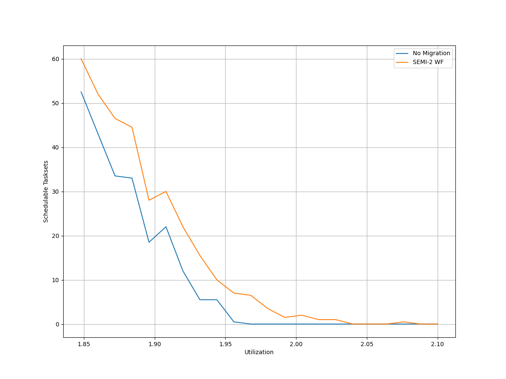
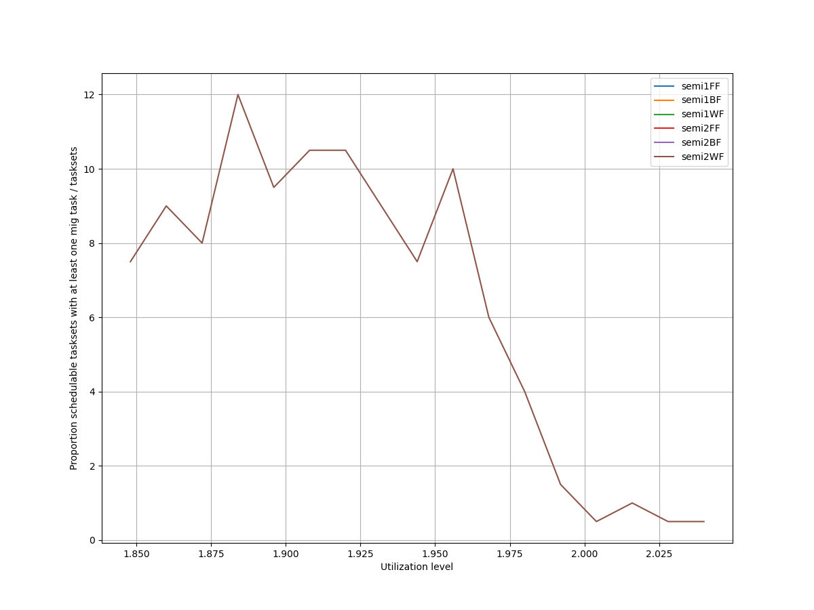
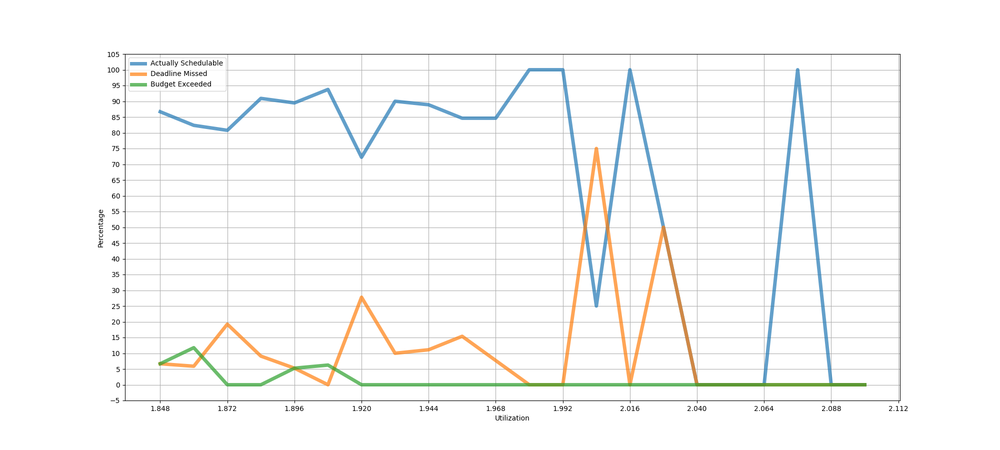
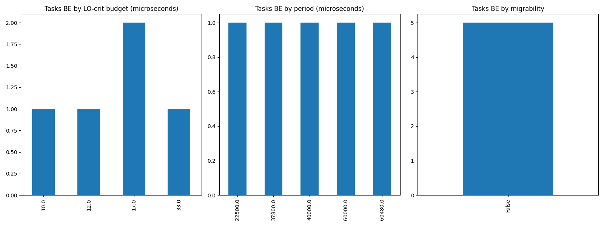
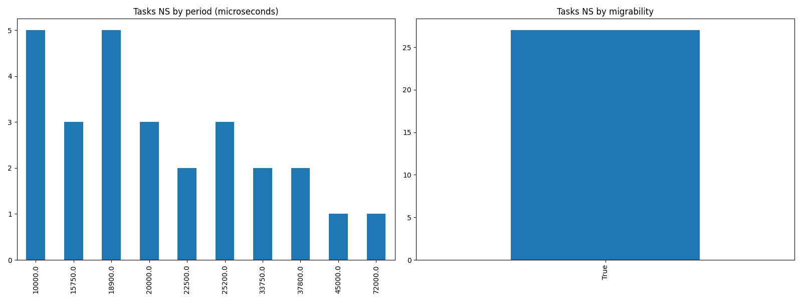

# Report on Experiment 1

   ## Overall data

   Utilization range = [1.848, 2.1] with step = 0.012

  Number of executions: 207

Schedulable executions: 176/207 = 85.02415458937197 %

_Not_ schedulable executions: 25/207 = 12.077294685990339 %

Budget Exceeded executions: 5/207 = 2.4154589371980677 %

Safe Boundary Exceeded executions: 1/207 = 0.4830917874396135 %

NS + BE executions: 30/207 = 14.492753623188406 %

### **Simulations**

#### **Weighted schedulability experiment 1 according to simulations.**

#### **Percentage of (schedulable tasksets with at least one migrating tasks / number of schedulable tasksets) of experiment 1 according to simulations.** 

 

### **Real Executions**

#### **Schedulability for each level**

#### **Tasksets, grouped by (LO-crit budget, Period & Migrability), with a Budget_Exceeded task.**

#### **Tasksets, grouped by (Period & Migrability), with at least one task missing one (or more) of its deadlines.**

## Bad tasksets

Click here to expand this section.

### **Not schedulable tasksets**

Click here to expand this section.

Ovvero quando almeno un task non completa entra almeno una sua deadline.

  1. Taskset **e1_semi2wf_t1293**

    Taskset execution params:
	 
    "id": "e1_semi2wf_t1293",
    "size": "12",
    "utilization": "1.9200000000000002",
    "criticality_factor": "2",
    "hicrit_proportion": "0.5"

   
 
Click here to see the deadlines missed tasks list.

   Time values are expressed as **micro-seconds**.

Task:  1

    
    "id": " 1",
    "basecpu": " 1",
    "priority": " 6",
    "period": 22500.0,
    "C(LO)": 1526.0,
    "C(HI)": 1526.0,
    "criticality": "LOW",
    "migrable": "True",
    "completedruns": " 5041",
    "preemptions": " 1",
    "minresponsejitter": " 0.000000000",
    "maxresponsejitter": " 0.000022099",
    "minreleasejitter": " 0.000000000",
    "maxreleasejitter": " 114.377506255",
    "avgresponsejitter": " 0.000011682",
    "deadlinesmissed": " 1",
    "deadlinemissedtargetcore": " 0",
    "budgetexceeded": " 0",
    "budgetexceededtargetcore": " 0",
    "timesmigrated": " 11",
    "timesrestored": " 11",
    "timesonc1": " 5030",
    "timesonc2": " 10",
    "lockedtime": " 0.000126072"

   

   
 
Click here to see the CPUs log.

   Idle time is expressed as **seconds**.

   CPU: 1

    
    "id": 1,
    "hyperperiod": 113400000,
    "lowtohigh": " 23",
    "hightolow": " 23",
    "idletime": 84839052,
    "util": 25.18602116402117

   CPU: 2

    
    "id": 2,
    "hyperperiod": 56700000,
    "lowtohigh": " 0",
    "hightolow": " 0",
    "idletime": 84421562,
    "util": -48.89164373897708

   

   
 
Click here to see the whole tasksets.

   Time values are expressed as **micro-seconds**.

   Task:  11

    
    "id": " 11",
    "basecpu": " 1",
    "priority": " 1",
    "period": 162000.0,
    "C(LO)": 32182.000000000004,
    "C(HI)": 64365.00000000001,
    "criticality": "HIGH",
    "migrable": "False",
    "completedruns": " 701",
    "preemptions": " 763",
    "minresponsejitter": " 0.000000000",
    "maxresponsejitter": " 0.051133808",
    "minreleasejitter": " 0.000000000",
    "maxreleasejitter": " 114.240480754",
    "avgresponsejitter": " 0.015936414",
    "deadlinesmissed": " 0",
    "deadlinemissedtargetcore": " 0",
    "budgetexceeded": " 9",
    "budgetexceededtargetcore": " 0",
    "timesmigrated": " 0",
    "timesrestored": " 0",
    "timesonc1": " 1472",
    "timesonc2": " 0",
    "lockedtime": " 0.000069742"

   Task:  6

    
    "id": " 6",
    "basecpu": " 1",
    "priority": " 2",
    "period": 81000.0,
    "C(LO)": 6950.0,
    "C(HI)": 13901.0,
    "criticality": "HIGH",
    "migrable": "False",
    "completedruns": " 1401",
    "preemptions": " 102",
    "minresponsejitter": " 0.000000000",
    "maxresponsejitter": " 0.015771862",
    "minreleasejitter": " 0.000000000",
    "maxreleasejitter": " 114.319006165",
    "avgresponsejitter": " 0.003173700",
    "deadlinesmissed": " 0",
    "deadlinemissedtargetcore": " 0",
    "budgetexceeded": " 14",
    "budgetexceededtargetcore": " 0",
    "timesmigrated": " 0",
    "timesrestored": " 0",
    "timesonc1": " 1516",
    "timesonc2": " 0",
    "lockedtime": " 0.000043934"

   Task:  12

    
    "id": " 12",
    "basecpu": " 1",
    "priority": " 0",
    "period": 648000.0,
    "C(LO)": 31084.0,
    "C(HI)": 62168.0,
    "criticality": "HIGH",
    "migrable": "False",
    "completedruns": " 176",
    "preemptions": " 172",
    "minresponsejitter": " 0.000000000",
    "maxresponsejitter": " 0.027416922",
    "minreleasejitter": " 0.000000000",
    "maxreleasejitter": " 113.782689261",
    "avgresponsejitter": " 0.014973784",
    "deadlinesmissed": " 0",
    "deadlinemissedtargetcore": " 0",
    "budgetexceeded": " 0",
    "budgetexceededtargetcore": " 0",
    "timesmigrated": " 0",
    "timesrestored": " 0",
    "timesonc1": " 347",
    "timesonc2": " 0",
    "lockedtime": " 0.000021877"

   Task:  7

    
    "id": " 7",
    "basecpu": " 1",
    "priority": " 4",
    "period": 90720.0,
    "C(LO)": 10408.0,
    "C(HI)": 10408.0,
    "criticality": "LOW",
    "migrable": "False",
    "completedruns": " 1251",
    "preemptions": " 327",
    "minresponsejitter": " 0.000000000",
    "maxresponsejitter": " 0.005563261",
    "minreleasejitter": " 0.000000000",
    "maxreleasejitter": " 114.309286291",
    "avgresponsejitter": " 0.004633396",
    "deadlinesmissed": " 0",
    "deadlinemissedtargetcore": " 0",
    "budgetexceeded": " 0",
    "budgetexceededtargetcore": " 0",
    "timesmigrated": " 0",
    "timesrestored": " 0",
    "timesonc1": " 1577",
    "timesonc2": " 0",
    "lockedtime": " 0.000068057"

   Task:  9

    
    "id": " 9",
    "basecpu": " 1",
    "priority": " 3",
    "period": 126000.0,
    "C(LO)": 14217.0,
    "C(HI)": 14217.0,
    "criticality": "LOW",
    "migrable": "False",
    "completedruns": " 901",
    "preemptions": " 308",
    "minresponsejitter": " 0.000000000",
    "maxresponsejitter": " 0.012459279",
    "minreleasejitter": " 0.000000000",
    "maxreleasejitter": " 114.274006150",
    "avgresponsejitter": " 0.006551943",
    "deadlinesmissed": " 0",
    "deadlinemissedtargetcore": " 0",
    "budgetexceeded": " 0",
    "budgetexceededtargetcore": " 0",
    "timesmigrated": " 0",
    "timesrestored": " 0",
    "timesonc1": " 1208",
    "timesonc2": " 0",
    "lockedtime": " 0.000027832"

   Task:  5

    
    "id": " 5",
    "basecpu": " 1",
    "priority": " 5",
    "period": 65625.0,
    "C(LO)": 5261.0,
    "C(HI)": 5261.0,
    "criticality": "LOW",
    "migrable": "True",
    "completedruns": " 1729",
    "preemptions": " 0",
    "minresponsejitter": " 0.000000000",
    "maxresponsejitter": " 0.000012853",
    "minreleasejitter": " 0.000000000",
    "maxreleasejitter": " 114.334381204",
    "avgresponsejitter": " 0.000010934",
    "deadlinesmissed": " 0",
    "deadlinemissedtargetcore": " 0",
    "budgetexceeded": " 0",
    "budgetexceededtargetcore": " 0",
    "timesmigrated": " 1",
    "timesrestored": " 1",
    "timesonc1": " 1727",
    "timesonc2": " 1",
    "lockedtime": " 0.000000000"

   Task:  1

    
    "id": " 1",
    "basecpu": " 1",
    "priority": " 6",
    "period": 22500.0,
    "C(LO)": 1526.0,
    "C(HI)": 1526.0,
    "criticality": "LOW",
    "migrable": "True",
    "completedruns": " 5041",
    "preemptions": " 1",
    "minresponsejitter": " 0.000000000",
    "maxresponsejitter": " 0.000022099",
    "minreleasejitter": " 0.000000000",
    "maxreleasejitter": " 114.377506255",
    "avgresponsejitter": " 0.000011682",
    "deadlinesmissed": " 1",
    "deadlinemissedtargetcore": " 0",
    "budgetexceeded": " 0",
    "budgetexceededtargetcore": " 0",
    "timesmigrated": " 11",
    "timesrestored": " 11",
    "timesonc1": " 5030",
    "timesonc2": " 10",
    "lockedtime": " 0.000126072"

   Task:  3

    
    "id": " 3",
    "basecpu": " 2",
    "priority": " 2",
    "period": 54000.0,
    "C(LO)": 12253.0,
    "C(HI)": 24506.0,
    "criticality": "HIGH",
    "migrable": "False",
    "completedruns": " 2101",
    "preemptions": " 74",
    "minresponsejitter": " 0.000000000",
    "maxresponsejitter": " 0.015561754",
    "minreleasejitter": " 0.000000000",
    "maxreleasejitter": " 114.346006162",
    "avgresponsejitter": " 0.005601853",
    "deadlinesmissed": " 0",
    "deadlinemissedtargetcore": " 0",
    "budgetexceeded": " 0",
    "budgetexceededtargetcore": " 0",
    "timesmigrated": " 0",
    "timesrestored": " 0",
    "timesonc1": " 0",
    "timesonc2": " 2174",
    "lockedtime": " 0.000017943"

   Task:  10

    
    "id": " 10",
    "basecpu": " 2",
    "priority": " 0",
    "period": 151200.0,
    "C(LO)": 11319.0,
    "C(HI)": 22638.0,
    "criticality": "HIGH",
    "migrable": "False",
    "completedruns": " 751",
    "preemptions": " 120",
    "minresponsejitter": " 0.000000000",
    "maxresponsejitter": " 0.014350045",
    "minreleasejitter": " 0.000000000",
    "maxreleasejitter": " 114.248805973",
    "avgresponsejitter": " 0.005626757",
    "deadlinesmissed": " 0",
    "deadlinemissedtargetcore": " 0",
    "budgetexceeded": " 0",
    "budgetexceededtargetcore": " 0",
    "timesmigrated": " 0",
    "timesrestored": " 0",
    "timesonc1": " 0",
    "timesonc2": " 870",
    "lockedtime": " 0.000024087"

   Task:  4

    
    "id": " 4",
    "basecpu": " 2",
    "priority": " 1",
    "period": 63000.0,
    "C(LO)": 191.0,
    "C(HI)": 383.0,
    "criticality": "HIGH",
    "migrable": "False",
    "completedruns": " 1801",
    "preemptions": " 0",
    "minresponsejitter": " 0.000000000",
    "maxresponsejitter": " 0.000106393",
    "minreleasejitter": " 0.000000000",
    "maxreleasejitter": " 114.337006354",
    "avgresponsejitter": " 0.000086282",
    "deadlinesmissed": " 0",
    "deadlinemissedtargetcore": " 0",
    "budgetexceeded": " 0",
    "budgetexceededtargetcore": " 0",
    "timesmigrated": " 0",
    "timesrestored": " 0",
    "timesonc1": " 0",
    "timesonc2": " 1800",
    "lockedtime": " 0.000043135"

   Task:  2

    
    "id": " 2",
    "basecpu": " 2",
    "priority": " 4",
    "period": 45000.0,
    "C(LO)": 7007.0,
    "C(HI)": 7007.0,
    "criticality": "LOW",
    "migrable": "False",
    "completedruns": " 2521",
    "preemptions": " 0",
    "minresponsejitter": " 0.000000000",
    "maxresponsejitter": " 0.003725586",
    "minreleasejitter": " 0.000000000",
    "maxreleasejitter": " 114.355006243",
    "avgresponsejitter": " 0.003093823",
    "deadlinesmissed": " 0",
    "deadlinemissedtargetcore": " 0",
    "budgetexceeded": " 0",
    "budgetexceededtargetcore": " 0",
    "timesmigrated": " 0",
    "timesrestored": " 0",
    "timesonc1": " 0",
    "timesonc2": " 2520",
    "lockedtime": " 0.000201291"

   Task:  8

    
    "id": " 8",
    "basecpu": " 2",
    "priority": " 3",
    "period": 113400.0,
    "C(LO)": 12947.0,
    "C(HI)": 12947.0,
    "criticality": "LOW",
    "migrable": "False",
    "completedruns": " 1001",
    "preemptions": " 106",
    "minresponsejitter": " 0.000000000",
    "maxresponsejitter": " 0.010234363",
    "minreleasejitter": " 0.000000000",
    "maxreleasejitter": " 114.286606090",
    "avgresponsejitter": " 0.006028988",
    "deadlinesmissed": " 0",
    "deadlinemissedtargetcore": " 0",
    "budgetexceeded": " 0",
    "budgetexceededtargetcore": " 0",
    "timesmigrated": " 0",
    "timesrestored": " 0",
    "timesonc1": " 0",
    "timesonc2": " 1106",
    "lockedtime": " 0.000055784"

   

  2. Taskset **e1_semi2wf_t1298**

    Taskset execution params:
	 
    "id": "e1_semi2wf_t1298",
    "size": "12",
    "utilization": "1.9200000000000002",
    "criticality_factor": "2",
    "hicrit_proportion": "0.5"

   
 
Click here to see the deadlines missed tasks list.

   Time values are expressed as **micro-seconds**.

Task:  1

    
    "id": " 1",
    "basecpu": " 2",
    "priority": " 5",
    "period": 10000.0,
    "C(LO)": 1612.0,
    "C(HI)": 1612.0,
    "criticality": "LOW",
    "migrable": "True",
    "completedruns": " 3781",
    "preemptions": " 0",
    "minresponsejitter": " 0.000000000",
    "maxresponsejitter": " 0.000022748",
    "minreleasejitter": " 0.000000000",
    "maxreleasejitter": " 38.790005961",
    "avgresponsejitter": " 0.000011628",
    "deadlinesmissed": " 1",
    "deadlinemissedtargetcore": " 0",
    "budgetexceeded": " 0",
    "budgetexceededtargetcore": " 0",
    "timesmigrated": " 8",
    "timesrestored": " 8",
    "timesonc1": " 0",
    "timesonc2": " 3779",
    "lockedtime": " 0.000060784"

   

   
 
Click here to see the CPUs log.

   Idle time is expressed as **seconds**.

   CPU: 1

    
    "id": 1,
    "hyperperiod": 37800000,
    "lowtohigh": " 30",
    "hightolow": " 30",
    "idletime": 26622426,
    "util": 29.570301587301586

   CPU: 2

    
    "id": 2,
    "hyperperiod": 22680000,
    "lowtohigh": " 22",
    "hightolow": " 22",
    "idletime": 27054607,
    "util": -19.288390652557325

   

   
 
Click here to see the whole tasksets.

   Time values are expressed as **micro-seconds**.

   Task:  6

    
    "id": " 6",
    "basecpu": " 1",
    "priority": " 2",
    "period": 50400.0,
    "C(LO)": 6691.0,
    "C(HI)": 13382.0,
    "criticality": "HIGH",
    "migrable": "False",
    "completedruns": " 751",
    "preemptions": " 64",
    "minresponsejitter": " 0.000000000",
    "maxresponsejitter": " 0.011611306",
    "minreleasejitter": " 0.000000000",
    "maxreleasejitter": " 38.749606526",
    "avgresponsejitter": " 0.003202429",
    "deadlinesmissed": " 0",
    "deadlinemissedtargetcore": " 0",
    "budgetexceeded": " 11",
    "budgetexceededtargetcore": " 0",
    "timesmigrated": " 0",
    "timesrestored": " 0",
    "timesonc1": " 825",
    "timesonc2": " 0",
    "lockedtime": " 0.000014859"

   Task:  3

    
    "id": " 3",
    "basecpu": " 1",
    "priority": " 3",
    "period": 35000.0,
    "C(LO)": 4441.0,
    "C(HI)": 8883.0,
    "criticality": "HIGH",
    "migrable": "False",
    "completedruns": " 1081",
    "preemptions": " 70",
    "minresponsejitter": " 0.000000000",
    "maxresponsejitter": " 0.006266021",
    "minreleasejitter": " 0.000000000",
    "maxreleasejitter": " 38.765006357",
    "avgresponsejitter": " 0.002027766",
    "deadlinesmissed": " 0",
    "deadlinemissedtargetcore": " 0",
    "budgetexceeded": " 19",
    "budgetexceededtargetcore": " 0",
    "timesmigrated": " 0",
    "timesrestored": " 0",
    "timesonc1": " 1169",
    "timesonc2": " 0",
    "lockedtime": " 0.000036099"

   Task:  10

    
    "id": " 10",
    "basecpu": " 1",
    "priority": " 1",
    "period": 168000.0,
    "C(LO)": 59987.0,
    "C(HI)": 59987.0,
    "criticality": "LOW",
    "migrable": "False",
    "completedruns": " 226",
    "preemptions": " 476",
    "minresponsejitter": " 0.000000000",
    "maxresponsejitter": " 0.040273441",
    "minreleasejitter": " 0.000000000",
    "maxreleasejitter": " 38.632006456",
    "avgresponsejitter": " 0.029609589",
    "deadlinesmissed": " 0",
    "deadlinemissedtargetcore": " 0",
    "budgetexceeded": " 0",
    "budgetexceededtargetcore": " 0",
    "timesmigrated": " 0",
    "timesrestored": " 0",
    "timesonc1": " 701",
    "timesonc2": " 0",
    "lockedtime": " 0.000078030"

   Task:  2

    
    "id": " 2",
    "basecpu": " 1",
    "priority": " 5",
    "period": 18900.0,
    "C(LO)": 501.00000000000006,
    "C(HI)": 501.00000000000006,
    "criticality": "LOW",
    "migrable": "True",
    "completedruns": " 1364",
    "preemptions": " 0",
    "minresponsejitter": " 0.000000000",
    "maxresponsejitter": " 0.000023246",
    "minreleasejitter": " 0.000000000",
    "maxreleasejitter": " 26.741806345",
    "avgresponsejitter": " 0.000011895",
    "deadlinesmissed": " 0",
    "deadlinemissedtargetcore": " 0",
    "budgetexceeded": " 0",
    "budgetexceededtargetcore": " 0",
    "timesmigrated": " 5",
    "timesrestored": " 5",
    "timesonc1": " 1358",
    "timesonc2": " 5",
    "lockedtime": " 0.000025318"

   Task:  11

    
    "id": " 11",
    "basecpu": " 1",
    "priority": " 0",
    "period": 180000.0,
    "C(LO)": 3635.0,
    "C(HI)": 3635.0,
    "criticality": "LOW",
    "migrable": "False",
    "completedruns": " 211",
    "preemptions": " 18",
    "minresponsejitter": " 0.000000000",
    "maxresponsejitter": " 0.005094964",
    "minreleasejitter": " 0.000000000",
    "maxreleasejitter": " 38.620007267",
    "avgresponsejitter": " 0.001671318",
    "deadlinesmissed": " 0",
    "deadlinemissedtargetcore": " 0",
    "budgetexceeded": " 0",
    "budgetexceededtargetcore": " 0",
    "timesmigrated": " 0",
    "timesrestored": " 0",
    "timesonc1": " 228",
    "timesonc2": " 0",
    "lockedtime": " 0.000010033"

   Task:  7

    
    "id": " 7",
    "basecpu": " 1",
    "priority": " 4",
    "period": 87500.0,
    "C(LO)": 1437.0,
    "C(HI)": 1437.0,
    "criticality": "LOW",
    "migrable": "False",
    "completedruns": " 433",
    "preemptions": " 2",
    "minresponsejitter": " 0.000000000",
    "maxresponsejitter": " 0.000777291",
    "minreleasejitter": " 0.000000000",
    "maxreleasejitter": " 38.712506694",
    "avgresponsejitter": " 0.000646511",
    "deadlinesmissed": " 0",
    "deadlinemissedtargetcore": " 0",
    "budgetexceeded": " 0",
    "budgetexceededtargetcore": " 0",
    "timesmigrated": " 0",
    "timesrestored": " 0",
    "timesonc1": " 434",
    "timesonc2": " 0",
    "lockedtime": " 0.000005126"

   Task:  4

    
    "id": " 4",
    "basecpu": " 2",
    "priority": " 3",
    "period": 37800.0,
    "C(LO)": 5373.0,
    "C(HI)": 10746.0,
    "criticality": "HIGH",
    "migrable": "False",
    "completedruns": " 1001",
    "preemptions": " 272",
    "minresponsejitter": " 0.000000000",
    "maxresponsejitter": " 0.011397910",
    "minreleasejitter": " 0.000000000",
    "maxreleasejitter": " 38.768744165",
    "avgresponsejitter": " 0.002730135",
    "deadlinesmissed": " 0",
    "deadlinemissedtargetcore": " 0",
    "budgetexceeded": " 10",
    "budgetexceededtargetcore": " 0",
    "timesmigrated": " 0",
    "timesrestored": " 0",
    "timesonc1": " 0",
    "timesonc2": " 1282",
    "lockedtime": " 0.000068432"

   Task:  8

    
    "id": " 8",
    "basecpu": " 2",
    "priority": " 2",
    "period": 100800.0,
    "C(LO)": 3022.0,
    "C(HI)": 6045.0,
    "criticality": "HIGH",
    "migrable": "False",
    "completedruns": " 376",
    "preemptions": " 56",
    "minresponsejitter": " 0.000000000",
    "maxresponsejitter": " 0.011356066",
    "minreleasejitter": " 0.000000000",
    "maxreleasejitter": " 38.699206862",
    "avgresponsejitter": " 0.001536580",
    "deadlinesmissed": " 0",
    "deadlinemissedtargetcore": " 0",
    "budgetexceeded": " 6",
    "budgetexceededtargetcore": " 0",
    "timesmigrated": " 0",
    "timesrestored": " 0",
    "timesonc1": " 0",
    "timesonc2": " 437",
    "lockedtime": " 0.000019739"

   Task:  12

    
    "id": " 12",
    "basecpu": " 2",
    "priority": " 0",
    "period": 648000.0,
    "C(LO)": 8339.0,
    "C(HI)": 16679.0,
    "criticality": "HIGH",
    "migrable": "False",
    "completedruns": " 60",
    "preemptions": " 20",
    "minresponsejitter": " 0.000000000",
    "maxresponsejitter": " 0.018118102",
    "minreleasejitter": " 0.000000000",
    "maxreleasejitter": " 38.584005982",
    "avgresponsejitter": " 0.004792252",
    "deadlinesmissed": " 0",
    "deadlinemissedtargetcore": " 0",
    "budgetexceeded": " 3",
    "budgetexceededtargetcore": " 0",
    "timesmigrated": " 0",
    "timesrestored": " 0",
    "timesonc1": " 0",
    "timesonc2": " 82",
    "lockedtime": " 0.000000396"

   Task:  9

    
    "id": " 9",
    "basecpu": " 2",
    "priority": " 1",
    "period": 120000.0,
    "C(LO)": 657.0,
    "C(HI)": 1314.0,
    "criticality": "HIGH",
    "migrable": "False",
    "completedruns": " 316",
    "preemptions": " 2",
    "minresponsejitter": " 0.000000000",
    "maxresponsejitter": " 0.000871736",
    "minreleasejitter": " 0.000000000",
    "maxreleasejitter": " 38.680024742",
    "avgresponsejitter": " 0.000295369",
    "deadlinesmissed": " 0",
    "deadlinemissedtargetcore": " 0",
    "budgetexceeded": " 3",
    "budgetexceededtargetcore": " 0",
    "timesmigrated": " 0",
    "timesrestored": " 0",
    "timesonc1": " 0",
    "timesonc2": " 320",
    "lockedtime": " 0.000000000"

   Task:  5

    
    "id": " 5",
    "basecpu": " 2",
    "priority": " 4",
    "period": 39375.0,
    "C(LO)": 17256.0,
    "C(HI)": 17256.0,
    "criticality": "LOW",
    "migrable": "False",
    "completedruns": " 961",
    "preemptions": " 696",
    "minresponsejitter": " 0.000000000",
    "maxresponsejitter": " 0.009205051",
    "minreleasejitter": " 0.000000000",
    "maxreleasejitter": " 38.760630958",
    "avgresponsejitter": " 0.007649979",
    "deadlinesmissed": " 0",
    "deadlinemissedtargetcore": " 0",
    "budgetexceeded": " 0",
    "budgetexceededtargetcore": " 0",
    "timesmigrated": " 0",
    "timesrestored": " 0",
    "timesonc1": " 0",
    "timesonc2": " 1656",
    "lockedtime": " 0.000105147"

   Task:  1

    
    "id": " 1",
    "basecpu": " 2",
    "priority": " 5",
    "period": 10000.0,
    "C(LO)": 1612.0,
    "C(HI)": 1612.0,
    "criticality": "LOW",
    "migrable": "True",
    "completedruns": " 3781",
    "preemptions": " 0",
    "minresponsejitter": " 0.000000000",
    "maxresponsejitter": " 0.000022748",
    "minreleasejitter": " 0.000000000",
    "maxreleasejitter": " 38.790005961",
    "avgresponsejitter": " 0.000011628",
    "deadlinesmissed": " 1",
    "deadlinemissedtargetcore": " 0",
    "budgetexceeded": " 0",
    "budgetexceededtargetcore": " 0",
    "timesmigrated": " 8",
    "timesrestored": " 8",
    "timesonc1": " 0",
    "timesonc2": " 3779",
    "lockedtime": " 0.000060784"

   

  3. Taskset **e1_semi2wf_t1315**

    Taskset execution params:
	 
    "id": "e1_semi2wf_t1315",
    "size": "12",
    "utilization": "1.9200000000000002",
    "criticality_factor": "2",
    "hicrit_proportion": "0.5"

   
 
Click here to see the deadlines missed tasks list.

   Time values are expressed as **micro-seconds**.

Task:  2

    
    "id": " 2",
    "basecpu": " 2",
    "priority": " 3",
    "period": 25200.0,
    "C(LO)": 4466.0,
    "C(HI)": 4466.0,
    "criticality": "LOW",
    "migrable": "True",
    "completedruns": " 1334",
    "preemptions": " 0",
    "minresponsejitter": " 0.000000000",
    "maxresponsejitter": " 0.000022925",
    "minreleasejitter": " 0.000000000",
    "maxreleasejitter": " 34.566407634",
    "avgresponsejitter": " 0.000011604",
    "deadlinesmissed": " 1",
    "deadlinemissedtargetcore": " 0",
    "budgetexceeded": " 0",
    "budgetexceededtargetcore": " 0",
    "timesmigrated": " 2",
    "timesrestored": " 1",
    "timesonc1": " 1",
    "timesonc2": " 1331",
    "lockedtime": " 0.000034036"

   

   
 
Click here to see the CPUs log.

   Idle time is expressed as **seconds**.

   CPU: 1

    
    "id": 1,
    "hyperperiod": 113400000,
    "lowtohigh": " 0",
    "hightolow": " 0",
    "idletime": 77885226,
    "util": 31.31814285714286

   CPU: 2

    
    "id": 2,
    "hyperperiod": 5670000,
    "lowtohigh": " 12",
    "hightolow": " 12",
    "idletime": 82622875,
    "util": -1357.1935626102293

   

   
 
Click here to see the whole tasksets.

   Time values are expressed as **micro-seconds**.

   Task:  3

    
    "id": " 3",
    "basecpu": " 1",
    "priority": " 5",
    "period": 42000.0,
    "C(LO)": 3714.0,
    "C(HI)": 7428.0,
    "criticality": "HIGH",
    "migrable": "False",
    "completedruns": " 2701",
    "preemptions": " 38",
    "minresponsejitter": " 0.000000000",
    "maxresponsejitter": " 0.006292342",
    "minreleasejitter": " 0.000000000",
    "maxreleasejitter": " 114.358760730",
    "avgresponsejitter": " 0.001694141",
    "deadlinesmissed": " 0",
    "deadlinemissedtargetcore": " 0",
    "budgetexceeded": " 0",
    "budgetexceededtargetcore": " 0",
    "timesmigrated": " 0",
    "timesrestored": " 0",
    "timesonc1": " 2738",
    "timesonc2": " 0",
    "lockedtime": " 0.000000000"

   Task:  7

    
    "id": " 7",
    "basecpu": " 1",
    "priority": " 2",
    "period": 87500.0,
    "C(LO)": 2551.0,
    "C(HI)": 5103.0,
    "criticality": "HIGH",
    "migrable": "False",
    "completedruns": " 1297",
    "preemptions": " 92",
    "minresponsejitter": " 0.000000000",
    "maxresponsejitter": " 0.016230505",
    "minreleasejitter": " 0.000000000",
    "maxreleasejitter": " 114.313100667",
    "avgresponsejitter": " 0.001349303",
    "deadlinesmissed": " 0",
    "deadlinemissedtargetcore": " 0",
    "budgetexceeded": " 0",
    "budgetexceededtargetcore": " 0",
    "timesmigrated": " 0",
    "timesrestored": " 0",
    "timesonc1": " 1388",
    "timesonc2": " 0",
    "lockedtime": " 0.000003931"

   Task:  12

    
    "id": " 12",
    "basecpu": " 1",
    "priority": " 0",
    "period": 907200.0,
    "C(LO)": 23040.0,
    "C(HI)": 46081.0,
    "criticality": "HIGH",
    "migrable": "False",
    "completedruns": " 126",
    "preemptions": " 113",
    "minresponsejitter": " 0.000000000",
    "maxresponsejitter": " 0.014656435",
    "minreleasejitter": " 0.000000000",
    "maxreleasejitter": " 113.506708592",
    "avgresponsejitter": " 0.011035267",
    "deadlinesmissed": " 0",
    "deadlinemissedtargetcore": " 0",
    "budgetexceeded": " 0",
    "budgetexceededtargetcore": " 0",
    "timesmigrated": " 0",
    "timesrestored": " 0",
    "timesonc1": " 238",
    "timesonc2": " 0",
    "lockedtime": " 0.000009135"

   Task:  5

    
    "id": " 5",
    "basecpu": " 1",
    "priority": " 4",
    "period": 56700.0,
    "C(LO)": 773.0,
    "C(HI)": 1546.0,
    "criticality": "HIGH",
    "migrable": "False",
    "completedruns": " 2001",
    "preemptions": " 11",
    "minresponsejitter": " 0.000000000",
    "maxresponsejitter": " 0.000743339",
    "minreleasejitter": " 0.000000000",
    "maxreleasejitter": " 114.343306291",
    "avgresponsejitter": " 0.000343336",
    "deadlinesmissed": " 0",
    "deadlinemissedtargetcore": " 0",
    "budgetexceeded": " 0",
    "budgetexceededtargetcore": " 0",
    "timesmigrated": " 0",
    "timesrestored": " 0",
    "timesonc1": " 2011",
    "timesonc2": " 0",
    "lockedtime": " 0.000000000"

   Task:  8

    
    "id": " 8",
    "basecpu": " 1",
    "priority": " 1",
    "period": 90000.0,
    "C(LO)": 335.0,
    "C(HI)": 670.0,
    "criticality": "HIGH",
    "migrable": "False",
    "completedruns": " 1261",
    "preemptions": " 11",
    "minresponsejitter": " 0.000000000",
    "maxresponsejitter": " 0.001519264",
    "minreleasejitter": " 0.000000000",
    "maxreleasejitter": " 114.314085988",
    "avgresponsejitter": " 0.000156760",
    "deadlinesmissed": " 0",
    "deadlinemissedtargetcore": " 0",
    "budgetexceeded": " 0",
    "budgetexceededtargetcore": " 0",
    "timesmigrated": " 0",
    "timesrestored": " 0",
    "timesonc1": " 1271",
    "timesonc2": " 0",
    "lockedtime": " 0.000001156"

   Task:  6

    
    "id": " 6",
    "basecpu": " 1",
    "priority": " 3",
    "period": 75600.0,
    "C(LO)": 23655.0,
    "C(HI)": 23655.0,
    "criticality": "LOW",
    "migrable": "False",
    "completedruns": " 1501",
    "preemptions": " 1221",
    "minresponsejitter": " 0.000000000",
    "maxresponsejitter": " 0.014848721",
    "minreleasejitter": " 0.000000000",
    "maxreleasejitter": " 114.324406258",
    "avgresponsejitter": " 0.011052694",
    "deadlinesmissed": " 0",
    "deadlinemissedtargetcore": " 0",
    "budgetexceeded": " 0",
    "budgetexceededtargetcore": " 0",
    "timesmigrated": " 0",
    "timesrestored": " 0",
    "timesonc1": " 2721",
    "timesonc2": " 0",
    "lockedtime": " 0.000023054"

   Task:  4

    
    "id": " 4",
    "basecpu": " 1",
    "priority": " 6",
    "period": 45360.0,
    "C(LO)": 8309.0,
    "C(HI)": 8309.0,
    "criticality": "LOW",
    "migrable": "False",
    "completedruns": " 2501",
    "preemptions": " 537",
    "minresponsejitter": " 0.000000000",
    "maxresponsejitter": " 0.004800976",
    "minreleasejitter": " 0.000000000",
    "maxreleasejitter": " 114.354646186",
    "avgresponsejitter": " 0.003741613",
    "deadlinesmissed": " 0",
    "deadlinemissedtargetcore": " 0",
    "budgetexceeded": " 0",
    "budgetexceededtargetcore": " 0",
    "timesmigrated": " 0",
    "timesrestored": " 0",
    "timesonc1": " 3037",
    "timesonc2": " 0",
    "lockedtime": " 0.000029066"

   Task:  1

    
    "id": " 1",
    "basecpu": " 1",
    "priority": " 7",
    "period": 15750.0,
    "C(LO)": 747.0,
    "C(HI)": 747.0,
    "criticality": "LOW",
    "migrable": "False",
    "completedruns": " 7202",
    "preemptions": " 0",
    "minresponsejitter": " 0.000000000",
    "maxresponsejitter": " 0.000401321",
    "minreleasejitter": " 0.000000000",
    "maxreleasejitter": " 114.400014051",
    "avgresponsejitter": " 0.000327453",
    "deadlinesmissed": " 0",
    "deadlinemissedtargetcore": " 0",
    "budgetexceeded": " 0",
    "budgetexceededtargetcore": " 0",
    "timesmigrated": " 0",
    "timesrestored": " 0",
    "timesonc1": " 7201",
    "timesonc2": " 0",
    "lockedtime": " 0.000077616"

   Task:  9

    
    "id": " 9",
    "basecpu": " 2",
    "priority": " 1",
    "period": 94500.0,
    "C(LO)": 25905.0,
    "C(HI)": 51811.0,
    "criticality": "HIGH",
    "migrable": "False",
    "completedruns": " 1201",
    "preemptions": " 219",
    "minresponsejitter": " 0.000000000",
    "maxresponsejitter": " 0.038092682",
    "minreleasejitter": " 0.000000000",
    "maxreleasejitter": " 114.305506249",
    "avgresponsejitter": " 0.012069808",
    "deadlinesmissed": " 0",
    "deadlinemissedtargetcore": " 0",
    "budgetexceeded": " 12",
    "budgetexceededtargetcore": " 0",
    "timesmigrated": " 0",
    "timesrestored": " 0",
    "timesonc1": " 0",
    "timesonc2": " 1431",
    "lockedtime": " 0.000074628"

   Task:  11

    
    "id": " 11",
    "basecpu": " 2",
    "priority": " 0",
    "period": 472500.0,
    "C(LO)": 101653.0,
    "C(HI)": 101653.0,
    "criticality": "LOW",
    "migrable": "False",
    "completedruns": " 241",
    "preemptions": " 209",
    "minresponsejitter": " 0.000000000",
    "maxresponsejitter": " 0.059960462",
    "minreleasejitter": " 0.000000000",
    "maxreleasejitter": " 113.940688117",
    "avgresponsejitter": " 0.046841766",
    "deadlinesmissed": " 0",
    "deadlinemissedtargetcore": " 0",
    "budgetexceeded": " 0",
    "budgetexceededtargetcore": " 0",
    "timesmigrated": " 0",
    "timesrestored": " 0",
    "timesonc1": " 0",
    "timesonc2": " 449",
    "lockedtime": " 0.000017934"

   Task:  2

    
    "id": " 2",
    "basecpu": " 2",
    "priority": " 3",
    "period": 25200.0,
    "C(LO)": 4466.0,
    "C(HI)": 4466.0,
    "criticality": "LOW",
    "migrable": "True",
    "completedruns": " 1334",
    "preemptions": " 0",
    "minresponsejitter": " 0.000000000",
    "maxresponsejitter": " 0.000022925",
    "minreleasejitter": " 0.000000000",
    "maxreleasejitter": " 34.566407634",
    "avgresponsejitter": " 0.000011604",
    "deadlinesmissed": " 1",
    "deadlinemissedtargetcore": " 0",
    "budgetexceeded": " 0",
    "budgetexceededtargetcore": " 0",
    "timesmigrated": " 2",
    "timesrestored": " 1",
    "timesonc1": " 1",
    "timesonc2": " 1331",
    "lockedtime": " 0.000034036"

   Task:  10

    
    "id": " 10",
    "basecpu": " 2",
    "priority": " 2",
    "period": 101250.0,
    "C(LO)": 11656.0,
    "C(HI)": 11656.0,
    "criticality": "LOW",
    "migrable": "False",
    "completedruns": " 1121",
    "preemptions": " 58",
    "minresponsejitter": " 0.000000000",
    "maxresponsejitter": " 0.006218174",
    "minreleasejitter": " 0.000000000",
    "maxreleasejitter": " 114.298756207",
    "avgresponsejitter": " 0.005167697",
    "deadlinesmissed": " 0",
    "deadlinemissedtargetcore": " 0",
    "budgetexceeded": " 0",
    "budgetexceededtargetcore": " 0",
    "timesmigrated": " 0",
    "timesrestored": " 0",
    "timesonc1": " 0",
    "timesonc2": " 1178",
    "lockedtime": " 0.000032676"

   

  4. Taskset **e1_semi2wf_t137**

    Taskset execution params:
	 
    "id": "e1_semi2wf_t137",
    "size": "12",
    "utilization": "1.848",
    "criticality_factor": "2",
    "hicrit_proportion": "0.5"

   
 
Click here to see the deadlines missed tasks list.

   Time values are expressed as **micro-seconds**.

Task:  2

    
    "id": " 2",
    "basecpu": " 1",
    "priority": " 4",
    "period": 18900.0,
    "C(LO)": 3470.0,
    "C(HI)": 3470.0,
    "criticality": "LOW",
    "migrable": "True",
    "completedruns": " 6001",
    "preemptions": " 1",
    "minresponsejitter": " 0.000000000",
    "maxresponsejitter": " 0.000022658",
    "minreleasejitter": " 0.000000000",
    "maxreleasejitter": " 114.381106363",
    "avgresponsejitter": " 0.000011766",
    "deadlinesmissed": " 1",
    "deadlinemissedtargetcore": " 0",
    "budgetexceeded": " 0",
    "budgetexceededtargetcore": " 0",
    "timesmigrated": " 5",
    "timesrestored": " 5",
    "timesonc1": " 5998",
    "timesonc2": " 2",
    "lockedtime": " 0.000035120"

   

   
 
Click here to see the CPUs log.

   Idle time is expressed as **seconds**.

   CPU: 1

    
    "id": 1,
    "hyperperiod": 113400000,
    "lowtohigh": " 23",
    "hightolow": " 23",
    "idletime": 84284127,
    "util": 25.67537301587302

   CPU: 2

    
    "id": 2,
    "hyperperiod": 113400000,
    "lowtohigh": " 0",
    "hightolow": " 0",
    "idletime": 77634512,
    "util": 31.539231040564374

   

   
 
Click here to see the whole tasksets.

   Time values are expressed as **micro-seconds**.

   Task:  5

    
    "id": " 5",
    "basecpu": " 1",
    "priority": " 2",
    "period": 56250.0,
    "C(LO)": 6135.0,
    "C(HI)": 12270.0,
    "criticality": "HIGH",
    "migrable": "False",
    "completedruns": " 2017",
    "preemptions": " 347",
    "minresponsejitter": " 0.000000000",
    "maxresponsejitter": " 0.010237601",
    "minreleasejitter": " 0.000000000",
    "maxreleasejitter": " 114.343756309",
    "avgresponsejitter": " 0.002834760",
    "deadlinesmissed": " 0",
    "deadlinemissedtargetcore": " 0",
    "budgetexceeded": " 19",
    "budgetexceededtargetcore": " 0",
    "timesmigrated": " 0",
    "timesrestored": " 0",
    "timesonc1": " 2382",
    "timesonc2": " 0",
    "lockedtime": " 0.000051694"

   Task:  10

    
    "id": " 10",
    "basecpu": " 1",
    "priority": " 0",
    "period": 196875.0,
    "C(LO)": 16483.0,
    "C(HI)": 32966.0,
    "criticality": "HIGH",
    "migrable": "False",
    "completedruns": " 577",
    "preemptions": " 351",
    "minresponsejitter": " 0.000000000",
    "maxresponsejitter": " 0.041177763",
    "minreleasejitter": " 0.000000000",
    "maxreleasejitter": " 114.203131288",
    "avgresponsejitter": " 0.008774868",
    "deadlinesmissed": " 0",
    "deadlinemissedtargetcore": " 0",
    "budgetexceeded": " 4",
    "budgetexceededtargetcore": " 0",
    "timesmigrated": " 0",
    "timesrestored": " 0",
    "timesonc1": " 931",
    "timesonc2": " 0",
    "lockedtime": " 0.000018204"

   Task:  8

    
    "id": " 8",
    "basecpu": " 1",
    "priority": " 1",
    "period": 181440.0,
    "C(LO)": 54880.0,
    "C(HI)": 54880.0,
    "criticality": "LOW",
    "migrable": "False",
    "completedruns": " 626",
    "preemptions": " 1298",
    "minresponsejitter": " 0.000000000",
    "maxresponsejitter": " 0.034197435",
    "minreleasejitter": " 0.000000000",
    "maxreleasejitter": " 114.218566210",
    "avgresponsejitter": " 0.026491075",
    "deadlinesmissed": " 0",
    "deadlinemissedtargetcore": " 0",
    "budgetexceeded": " 0",
    "budgetexceededtargetcore": " 0",
    "timesmigrated": " 0",
    "timesrestored": " 0",
    "timesonc1": " 1923",
    "timesonc2": " 0",
    "lockedtime": " 0.000102132"

   Task:  2

    
    "id": " 2",
    "basecpu": " 1",
    "priority": " 4",
    "period": 18900.0,
    "C(LO)": 3470.0,
    "C(HI)": 3470.0,
    "criticality": "LOW",
    "migrable": "True",
    "completedruns": " 6001",
    "preemptions": " 1",
    "minresponsejitter": " 0.000000000",
    "maxresponsejitter": " 0.000022658",
    "minreleasejitter": " 0.000000000",
    "maxreleasejitter": " 114.381106363",
    "avgresponsejitter": " 0.000011766",
    "deadlinesmissed": " 1",
    "deadlinemissedtargetcore": " 0",
    "budgetexceeded": " 0",
    "budgetexceededtargetcore": " 0",
    "timesmigrated": " 5",
    "timesrestored": " 5",
    "timesonc1": " 5998",
    "timesonc2": " 2",
    "lockedtime": " 0.000035120"

   Task:  4

    
    "id": " 4",
    "basecpu": " 1",
    "priority": " 3",
    "period": 54000.0,
    "C(LO)": 4160.0,
    "C(HI)": 4160.0,
    "criticality": "LOW",
    "migrable": "False",
    "completedruns": " 2101",
    "preemptions": " 0",
    "minresponsejitter": " 0.000000000",
    "maxresponsejitter": " 0.002215964",
    "minreleasejitter": " 0.000000000",
    "maxreleasejitter": " 114.346007222",
    "avgresponsejitter": " 0.001854880",
    "deadlinesmissed": " 0",
    "deadlinemissedtargetcore": " 0",
    "budgetexceeded": " 0",
    "budgetexceededtargetcore": " 0",
    "timesmigrated": " 0",
    "timesrestored": " 0",
    "timesonc1": " 2100",
    "timesonc2": " 0",
    "lockedtime": " 0.000025471"

   Task:  7

    
    "id": " 7",
    "basecpu": " 2",
    "priority": " 3",
    "period": 67500.0,
    "C(LO)": 9295.0,
    "C(HI)": 18591.0,
    "criticality": "HIGH",
    "migrable": "False",
    "completedruns": " 1681",
    "preemptions": " 782",
    "minresponsejitter": " 0.000000000",
    "maxresponsejitter": " 0.006364108",
    "minreleasejitter": " 0.000000000",
    "maxreleasejitter": " 114.333622859",
    "avgresponsejitter": " 0.004184099",
    "deadlinesmissed": " 0",
    "deadlinemissedtargetcore": " 0",
    "budgetexceeded": " 0",
    "budgetexceededtargetcore": " 0",
    "timesmigrated": " 0",
    "timesrestored": " 0",
    "timesonc1": " 0",
    "timesonc2": " 2462",
    "lockedtime": " 0.000005880"

   Task:  6

    
    "id": " 6",
    "basecpu": " 2",
    "priority": " 4",
    "period": 64800.0,
    "C(LO)": 2697.0,
    "C(HI)": 5395.0,
    "criticality": "HIGH",
    "migrable": "False",
    "completedruns": " 1751",
    "preemptions": " 261",
    "minresponsejitter": " 0.000000000",
    "maxresponsejitter": " 0.002715066",
    "minreleasejitter": " 0.000000000",
    "maxreleasejitter": " 114.335207174",
    "avgresponsejitter": " 0.001244667",
    "deadlinesmissed": " 0",
    "deadlinemissedtargetcore": " 0",
    "budgetexceeded": " 0",
    "budgetexceededtargetcore": " 0",
    "timesmigrated": " 0",
    "timesrestored": " 0",
    "timesonc1": " 0",
    "timesonc2": " 2011",
    "lockedtime": " 0.000037727"

   Task:  11

    
    "id": " 11",
    "basecpu": " 2",
    "priority": " 1",
    "period": 600000.0,
    "C(LO)": 4391.0,
    "C(HI)": 8783.0,
    "criticality": "HIGH",
    "migrable": "False",
    "completedruns": " 190",
    "preemptions": " 13",
    "minresponsejitter": " 0.000000000",
    "maxresponsejitter": " 0.007477273",
    "minreleasejitter": " 0.000000000",
    "maxreleasejitter": " 113.800039318",
    "avgresponsejitter": " 0.002031547",
    "deadlinesmissed": " 0",
    "deadlinemissedtargetcore": " 0",
    "budgetexceeded": " 0",
    "budgetexceededtargetcore": " 0",
    "timesmigrated": " 0",
    "timesrestored": " 0",
    "timesonc1": " 0",
    "timesonc2": " 202",
    "lockedtime": " 0.000000216"

   Task:  12

    
    "id": " 12",
    "basecpu": " 2",
    "priority": " 0",
    "period": 630000.0,
    "C(LO)": 2037.9999999999998,
    "C(HI)": 4077.0,
    "criticality": "HIGH",
    "migrable": "False",
    "completedruns": " 181",
    "preemptions": " 7",
    "minresponsejitter": " 0.000000000",
    "maxresponsejitter": " 0.002228712",
    "minreleasejitter": " 0.000000000",
    "maxreleasejitter": " 113.770998042",
    "avgresponsejitter": " 0.000922390",
    "deadlinesmissed": " 0",
    "deadlinemissedtargetcore": " 0",
    "budgetexceeded": " 0",
    "budgetexceededtargetcore": " 0",
    "timesmigrated": " 0",
    "timesrestored": " 0",
    "timesonc1": " 0",
    "timesonc2": " 187",
    "lockedtime": " 0.000000000"

   Task:  9

    
    "id": " 9",
    "basecpu": " 2",
    "priority": " 2",
    "period": 189000.0,
    "C(LO)": 76263.0,
    "C(HI)": 76263.0,
    "criticality": "LOW",
    "migrable": "False",
    "completedruns": " 601",
    "preemptions": " 3125",
    "minresponsejitter": " 0.000000000",
    "maxresponsejitter": " 0.048725114",
    "minreleasejitter": " 0.000000000",
    "maxreleasejitter": " 114.211006441",
    "avgresponsejitter": " 0.037968856",
    "deadlinesmissed": " 0",
    "deadlinemissedtargetcore": " 0",
    "budgetexceeded": " 0",
    "budgetexceededtargetcore": " 0",
    "timesmigrated": " 0",
    "timesrestored": " 0",
    "timesonc1": " 0",
    "timesonc2": " 3725",
    "lockedtime": " 0.000125162"

   Task:  3

    
    "id": " 3",
    "basecpu": " 2",
    "priority": " 5",
    "period": 22500.0,
    "C(LO)": 2527.0,
    "C(HI)": 2527.0,
    "criticality": "LOW",
    "migrable": "False",
    "completedruns": " 5041",
    "preemptions": " 0",
    "minresponsejitter": " 0.000000000",
    "maxresponsejitter": " 0.001345826",
    "minreleasejitter": " 0.000000000",
    "maxreleasejitter": " 114.377506156",
    "avgresponsejitter": " 0.001117291",
    "deadlinesmissed": " 0",
    "deadlinemissedtargetcore": " 0",
    "budgetexceeded": " 0",
    "budgetexceededtargetcore": " 0",
    "timesmigrated": " 0",
    "timesrestored": " 0",
    "timesonc1": " 0",
    "timesonc2": " 5040",
    "lockedtime": " 0.000067823"

   Task:  1

    
    "id": " 1",
    "basecpu": " 2",
    "priority": " 6",
    "period": 10000.0,
    "C(LO)": 36.0,
    "C(HI)": 36.0,
    "criticality": "LOW",
    "migrable": "False",
    "completedruns": " 11341",
    "preemptions": " 0",
    "minresponsejitter": " 0.000000000",
    "maxresponsejitter": " 0.000029135",
    "minreleasejitter": " 0.000000000",
    "maxreleasejitter": " 114.390006096",
    "avgresponsejitter": " 0.000018438",
    "deadlinesmissed": " 0",
    "deadlinemissedtargetcore": " 0",
    "budgetexceeded": " 0",
    "budgetexceededtargetcore": " 0",
    "timesmigrated": " 0",
    "timesrestored": " 0",
    "timesonc1": " 0",
    "timesonc2": " 11340",
    "lockedtime": " 0.000024186"

   

  5. Taskset **e1_semi2wf_t1372**

    Taskset execution params:
	 
    "id": "e1_semi2wf_t1372",
    "size": "12",
    "utilization": "1.9200000000000002",
    "criticality_factor": "2",
    "hicrit_proportion": "0.5"

   
 
Click here to see the deadlines missed tasks list.

   Time values are expressed as **micro-seconds**.

Task:  2

    
    "id": " 2",
    "basecpu": " 1",
    "priority": " 5",
    "period": 20000.0,
    "C(LO)": 813.0,
    "C(HI)": 813.0,
    "criticality": "LOW",
    "migrable": "True",
    "completedruns": " 3532",
    "preemptions": " 0",
    "minresponsejitter": " 0.000000000",
    "maxresponsejitter": " 0.000021480",
    "minreleasejitter": " 0.000000000",
    "maxreleasejitter": " 71.600008168",
    "avgresponsejitter": " 0.000011673",
    "deadlinesmissed": " 1",
    "deadlinemissedtargetcore": " 0",
    "budgetexceeded": " 0",
    "budgetexceededtargetcore": " 0",
    "timesmigrated": " 8",
    "timesrestored": " 7",
    "timesonc1": " 3526",
    "timesonc2": " 4",
    "lockedtime": " 0.000024961"

   

   
 
Click here to see the CPUs log.

   Idle time is expressed as **seconds**.

   CPU: 1

    
    "id": 1,
    "hyperperiod": 18900000,
    "lowtohigh": " 24",
    "hightolow": " 24",
    "idletime": 87851221,
    "util": -364.82127513227516

   CPU: 2

    
    "id": 2,
    "hyperperiod": 113400000,
    "lowtohigh": " 0",
    "hightolow": " 0",
    "idletime": 82766553,
    "util": 27.013621693121692

   

   
 
Click here to see the whole tasksets.

   Time values are expressed as **micro-seconds**.

   Task:  9

    
    "id": " 9",
    "basecpu": " 1",
    "priority": " 1",
    "period": 131250.0,
    "C(LO)": 33036.0,
    "C(HI)": 66072.0,
    "criticality": "HIGH",
    "migrable": "False",
    "completedruns": " 865",
    "preemptions": " 1040",
    "minresponsejitter": " 0.000000000",
    "maxresponsejitter": " 0.049998306",
    "minreleasejitter": " 0.000000000",
    "maxreleasejitter": " 114.268756556",
    "avgresponsejitter": " 0.016121613",
    "deadlinesmissed": " 0",
    "deadlinemissedtargetcore": " 0",
    "budgetexceeded": " 9",
    "budgetexceededtargetcore": " 0",
    "timesmigrated": " 0",
    "timesrestored": " 0",
    "timesonc1": " 1913",
    "timesonc2": " 0",
    "lockedtime": " 0.000123180"

   Task:  7

    
    "id": " 7",
    "basecpu": " 1",
    "priority": " 2",
    "period": 75600.0,
    "C(LO)": 6813.0,
    "C(HI)": 13626.0,
    "criticality": "HIGH",
    "migrable": "False",
    "completedruns": " 1501",
    "preemptions": " 309",
    "minresponsejitter": " 0.000000000",
    "maxresponsejitter": " 0.011130027",
    "minreleasejitter": " 0.000000000",
    "maxreleasejitter": " 114.324407135",
    "avgresponsejitter": " 0.003189147",
    "deadlinesmissed": " 0",
    "deadlinemissedtargetcore": " 0",
    "budgetexceeded": " 11",
    "budgetexceededtargetcore": " 0",
    "timesmigrated": " 0",
    "timesrestored": " 0",
    "timesonc1": " 1820",
    "timesonc2": " 0",
    "lockedtime": " 0.000109195"

   Task:  10

    
    "id": " 10",
    "basecpu": " 1",
    "priority": " 0",
    "period": 157500.0,
    "C(LO)": 8402.0,
    "C(HI)": 16805.0,
    "criticality": "HIGH",
    "migrable": "False",
    "completedruns": " 721",
    "preemptions": " 109",
    "minresponsejitter": " 0.000000000",
    "maxresponsejitter": " 0.011848853",
    "minreleasejitter": " 0.000000000",
    "maxreleasejitter": " 114.242506441",
    "avgresponsejitter": " 0.003858826",
    "deadlinesmissed": " 0",
    "deadlinemissedtargetcore": " 0",
    "budgetexceeded": " 4",
    "budgetexceededtargetcore": " 0",
    "timesmigrated": " 0",
    "timesrestored": " 0",
    "timesonc1": " 833",
    "timesonc2": " 0",
    "lockedtime": " 0.000007282"

   Task:  6

    
    "id": " 6",
    "basecpu": " 1",
    "priority": " 3",
    "period": 50000.0,
    "C(LO)": 4611.0,
    "C(HI)": 4611.0,
    "criticality": "LOW",
    "migrable": "False",
    "completedruns": " 2269",
    "preemptions": " 84",
    "minresponsejitter": " 0.000000000",
    "maxresponsejitter": " 0.002648357",
    "minreleasejitter": " 0.000000000",
    "maxreleasejitter": " 114.350006441",
    "avgresponsejitter": " 0.002047802",
    "deadlinesmissed": " 0",
    "deadlinemissedtargetcore": " 0",
    "budgetexceeded": " 0",
    "budgetexceededtargetcore": " 0",
    "timesmigrated": " 0",
    "timesrestored": " 0",
    "timesonc1": " 2352",
    "timesonc2": " 0",
    "lockedtime": " 0.000043300"

   Task:  2

    
    "id": " 2",
    "basecpu": " 1",
    "priority": " 5",
    "period": 20000.0,
    "C(LO)": 813.0,
    "C(HI)": 813.0,
    "criticality": "LOW",
    "migrable": "True",
    "completedruns": " 3532",
    "preemptions": " 0",
    "minresponsejitter": " 0.000000000",
    "maxresponsejitter": " 0.000021480",
    "minreleasejitter": " 0.000000000",
    "maxreleasejitter": " 71.600008168",
    "avgresponsejitter": " 0.000011673",
    "deadlinesmissed": " 1",
    "deadlinemissedtargetcore": " 0",
    "budgetexceeded": " 0",
    "budgetexceededtargetcore": " 0",
    "timesmigrated": " 8",
    "timesrestored": " 7",
    "timesonc1": " 3526",
    "timesonc2": " 4",
    "lockedtime": " 0.000024961"

   Task:  4

    
    "id": " 4",
    "basecpu": " 1",
    "priority": " 4",
    "period": 33750.0,
    "C(LO)": 445.0,
    "C(HI)": 445.0,
    "criticality": "LOW",
    "migrable": "False",
    "completedruns": " 3361",
    "preemptions": " 1",
    "minresponsejitter": " 0.000000000",
    "maxresponsejitter": " 0.000240835",
    "minreleasejitter": " 0.000000000",
    "maxreleasejitter": " 114.366256474",
    "avgresponsejitter": " 0.000197198",
    "deadlinesmissed": " 0",
    "deadlinemissedtargetcore": " 0",
    "budgetexceeded": " 0",
    "budgetexceededtargetcore": " 0",
    "timesmigrated": " 0",
    "timesrestored": " 0",
    "timesonc1": " 3361",
    "timesonc2": " 0",
    "lockedtime": " 0.000069757"

   Task:  11

    
    "id": " 11",
    "basecpu": " 2",
    "priority": " 1",
    "period": 200000.0,
    "C(LO)": 59094.0,
    "C(HI)": 118189.0,
    "criticality": "HIGH",
    "migrable": "False",
    "completedruns": " 568",
    "preemptions": " 1768",
    "minresponsejitter": " 0.000000000",
    "maxresponsejitter": " 0.040556850",
    "minreleasejitter": " 0.000000000",
    "maxreleasejitter": " 114.201340988",
    "avgresponsejitter": " 0.030172685",
    "deadlinesmissed": " 0",
    "deadlinemissedtargetcore": " 0",
    "budgetexceeded": " 0",
    "budgetexceededtargetcore": " 0",
    "timesmigrated": " 0",
    "timesrestored": " 0",
    "timesonc1": " 0",
    "timesonc2": " 2335",
    "lockedtime": " 0.000142802"

   Task:  8

    
    "id": " 8",
    "basecpu": " 2",
    "priority": " 2",
    "period": 101250.0,
    "C(LO)": 8173.0,
    "C(HI)": 16346.0,
    "criticality": "HIGH",
    "migrable": "False",
    "completedruns": " 1121",
    "preemptions": " 391",
    "minresponsejitter": " 0.000000000",
    "maxresponsejitter": " 0.006498961",
    "minreleasejitter": " 0.000000000",
    "maxreleasejitter": " 114.298756108",
    "avgresponsejitter": " 0.003980168",
    "deadlinesmissed": " 0",
    "deadlinemissedtargetcore": " 0",
    "budgetexceeded": " 0",
    "budgetexceededtargetcore": " 0",
    "timesmigrated": " 0",
    "timesrestored": " 0",
    "timesonc1": " 0",
    "timesonc2": " 1511",
    "lockedtime": " 0.000099559"

   Task:  12

    
    "id": " 12",
    "basecpu": " 2",
    "priority": " 0",
    "period": 540000.0,
    "C(LO)": 291.0,
    "C(HI)": 582.0,
    "criticality": "HIGH",
    "migrable": "False",
    "completedruns": " 211",
    "preemptions": " 2",
    "minresponsejitter": " 0.000000000",
    "maxresponsejitter": " 0.003271511",
    "minreleasejitter": " 0.000000000",
    "maxreleasejitter": " 113.860006129",
    "avgresponsejitter": " 0.000151231",
    "deadlinesmissed": " 0",
    "deadlinemissedtargetcore": " 0",
    "budgetexceeded": " 0",
    "budgetexceededtargetcore": " 0",
    "timesmigrated": " 0",
    "timesrestored": " 0",
    "timesonc1": " 0",
    "timesonc2": " 212",
    "lockedtime": " 0.000004213"

   Task:  1

    
    "id": " 1",
    "basecpu": " 2",
    "priority": " 5",
    "period": 18900.0,
    "C(LO)": 1834.0,
    "C(HI)": 1834.0,
    "criticality": "LOW",
    "migrable": "False",
    "completedruns": " 6001",
    "preemptions": " 0",
    "minresponsejitter": " 0.000000000",
    "maxresponsejitter": " 0.000982586",
    "minreleasejitter": " 0.000000000",
    "maxreleasejitter": " 114.381106072",
    "avgresponsejitter": " 0.000813958",
    "deadlinesmissed": " 0",
    "deadlinemissedtargetcore": " 0",
    "budgetexceeded": " 0",
    "budgetexceededtargetcore": " 0",
    "timesmigrated": " 0",
    "timesrestored": " 0",
    "timesonc1": " 0",
    "timesonc2": " 6000",
    "lockedtime": " 0.000147126"

   Task:  3

    
    "id": " 3",
    "basecpu": " 2",
    "priority": " 4",
    "period": 30240.0,
    "C(LO)": 2303.0,
    "C(HI)": 2303.0,
    "criticality": "LOW",
    "migrable": "False",
    "completedruns": " 3751",
    "preemptions": " 0",
    "minresponsejitter": " 0.000000000",
    "maxresponsejitter": " 0.001227964",
    "minreleasejitter": " 0.000000000",
    "maxreleasejitter": " 114.369766120",
    "avgresponsejitter": " 0.001017760",
    "deadlinesmissed": " 0",
    "deadlinemissedtargetcore": " 0",
    "budgetexceeded": " 0",
    "budgetexceededtargetcore": " 0",
    "timesmigrated": " 0",
    "timesrestored": " 0",
    "timesonc1": " 0",
    "timesonc2": " 3750",
    "lockedtime": " 0.000020967"

   Task:  5

    
    "id": " 5",
    "basecpu": " 2",
    "priority": " 3",
    "period": 42000.0,
    "C(LO)": 2386.0,
    "C(HI)": 2386.0,
    "criticality": "LOW",
    "migrable": "False",
    "completedruns": " 2701",
    "preemptions": " 0",
    "minresponsejitter": " 0.000000000",
    "maxresponsejitter": " 0.001271874",
    "minreleasejitter": " 0.000000000",
    "maxreleasejitter": " 114.358006273",
    "avgresponsejitter": " 0.001057880",
    "deadlinesmissed": " 0",
    "deadlinemissedtargetcore": " 0",
    "budgetexceeded": " 0",
    "budgetexceededtargetcore": " 0",
    "timesmigrated": " 0",
    "timesrestored": " 0",
    "timesonc1": " 0",
    "timesonc2": " 2700",
    "lockedtime": " 0.000024916"

   

  6. Taskset **e1_semi2wf_t1391**

    Taskset execution params:
	 
    "id": "e1_semi2wf_t1391",
    "size": "12",
    "utilization": "1.9200000000000002",
    "criticality_factor": "2",
    "hicrit_proportion": "0.5"

   
 
Click here to see the deadlines missed tasks list.

   Time values are expressed as **micro-seconds**.

Task:  1

    
    "id": " 1",
    "basecpu": " 1",
    "priority": " 5",
    "period": 22500.0,
    "C(LO)": 2133.0,
    "C(HI)": 2133.0,
    "criticality": "LOW",
    "migrable": "True",
    "completedruns": " 3576",
    "preemptions": " 0",
    "minresponsejitter": " 0.000000000",
    "maxresponsejitter": " 0.000021931",
    "minreleasejitter": " 0.000000000",
    "maxreleasejitter": " 81.415006225",
    "avgresponsejitter": " 0.000011793",
    "deadlinesmissed": " 1",
    "deadlinemissedtargetcore": " 0",
    "budgetexceeded": " 0",
    "budgetexceededtargetcore": " 0",
    "timesmigrated": " 2",
    "timesrestored": " 2",
    "timesonc1": " 3567",
    "timesonc2": " 7",
    "lockedtime": " 0.000006420"

   

   
 
Click here to see the CPUs log.

   Idle time is expressed as **seconds**.

   CPU: 1

    
    "id": 1,
    "hyperperiod": 113400000,
    "lowtohigh": " 25",
    "hightolow": " 25",
    "idletime": 80705156,
    "util": 28.831432098765433

   CPU: 2

    
    "id": 2,
    "hyperperiod": 113400000,
    "lowtohigh": " 0",
    "hightolow": " 0",
    "idletime": 80083159,
    "util": 29.379930335097

   

   
 
Click here to see the whole tasksets.

   Time values are expressed as **micro-seconds**.

   Task:  12

    
    "id": " 12",
    "basecpu": " 1",
    "priority": " 0",
    "period": 787500.0,
    "C(LO)": 157884.0,
    "C(HI)": 315769.0,
    "criticality": "HIGH",
    "migrable": "False",
    "completedruns": " 145",
    "preemptions": " 605",
    "minresponsejitter": " 0.000000000",
    "maxresponsejitter": " 0.107943411",
    "minreleasejitter": " 0.000000000",
    "maxreleasejitter": " 113.615697721",
    "avgresponsejitter": " 0.083217949",
    "deadlinesmissed": " 0",
    "deadlinemissedtargetcore": " 0",
    "budgetexceeded": " 0",
    "budgetexceededtargetcore": " 0",
    "timesmigrated": " 0",
    "timesrestored": " 0",
    "timesonc1": " 749",
    "timesonc2": " 0",
    "lockedtime": " 0.000029069"

   Task:  10

    
    "id": " 10",
    "basecpu": " 1",
    "priority": " 1",
    "period": 181440.0,
    "C(LO)": 8003.0,
    "C(HI)": 16007.0,
    "criticality": "HIGH",
    "migrable": "False",
    "completedruns": " 626",
    "preemptions": " 135",
    "minresponsejitter": " 0.000000000",
    "maxresponsejitter": " 0.024941300",
    "minreleasejitter": " 0.000000000",
    "maxreleasejitter": " 114.218566898",
    "avgresponsejitter": " 0.004275492",
    "deadlinesmissed": " 0",
    "deadlinemissedtargetcore": " 0",
    "budgetexceeded": " 10",
    "budgetexceededtargetcore": " 0",
    "timesmigrated": " 0",
    "timesrestored": " 0",
    "timesonc1": " 770",
    "timesonc2": " 0",
    "lockedtime": " 0.000023649"

   Task:  4

    
    "id": " 4",
    "basecpu": " 1",
    "priority": " 2",
    "period": 70000.0,
    "C(LO)": 1164.0,
    "C(HI)": 2328.0,
    "criticality": "HIGH",
    "migrable": "False",
    "completedruns": " 1621",
    "preemptions": " 15",
    "minresponsejitter": " 0.000000000",
    "maxresponsejitter": " 0.001653363",
    "minreleasejitter": " 0.000000000",
    "maxreleasejitter": " 114.330006345",
    "avgresponsejitter": " 0.000528240",
    "deadlinesmissed": " 0",
    "deadlinemissedtargetcore": " 0",
    "budgetexceeded": " 15",
    "budgetexceededtargetcore": " 0",
    "timesmigrated": " 0",
    "timesrestored": " 0",
    "timesonc1": " 1650",
    "timesonc2": " 0",
    "lockedtime": " 0.000000670"

   Task:  9

    
    "id": " 9",
    "basecpu": " 1",
    "priority": " 3",
    "period": 105000.0,
    "C(LO)": 31492.0,
    "C(HI)": 31492.0,
    "criticality": "LOW",
    "migrable": "False",
    "completedruns": " 1081",
    "preemptions": " 364",
    "minresponsejitter": " 0.000000000",
    "maxresponsejitter": " 0.016780613",
    "minreleasejitter": " 0.000000000",
    "maxreleasejitter": " 114.295006589",
    "avgresponsejitter": " 0.014034240",
    "deadlinesmissed": " 0",
    "deadlinemissedtargetcore": " 0",
    "budgetexceeded": " 0",
    "budgetexceededtargetcore": " 0",
    "timesmigrated": " 0",
    "timesrestored": " 0",
    "timesonc1": " 1444",
    "timesonc2": " 0",
    "lockedtime": " 0.000037249"

   Task:  1

    
    "id": " 1",
    "basecpu": " 1",
    "priority": " 5",
    "period": 22500.0,
    "C(LO)": 2133.0,
    "C(HI)": 2133.0,
    "criticality": "LOW",
    "migrable": "True",
    "completedruns": " 3576",
    "preemptions": " 0",
    "minresponsejitter": " 0.000000000",
    "maxresponsejitter": " 0.000021931",
    "minreleasejitter": " 0.000000000",
    "maxreleasejitter": " 81.415006225",
    "avgresponsejitter": " 0.000011793",
    "deadlinesmissed": " 1",
    "deadlinemissedtargetcore": " 0",
    "budgetexceeded": " 0",
    "budgetexceededtargetcore": " 0",
    "timesmigrated": " 2",
    "timesrestored": " 2",
    "timesonc1": " 3567",
    "timesonc2": " 7",
    "lockedtime": " 0.000006420"

   Task:  6

    
    "id": " 6",
    "basecpu": " 1",
    "priority": " 4",
    "period": 87500.0,
    "C(LO)": 7163.0,
    "C(HI)": 7163.0,
    "criticality": "LOW",
    "migrable": "False",
    "completedruns": " 1297",
    "preemptions": " 102",
    "minresponsejitter": " 0.000000000",
    "maxresponsejitter": " 0.003826883",
    "minreleasejitter": " 0.000000000",
    "maxreleasejitter": " 114.312506607",
    "avgresponsejitter": " 0.003155471",
    "deadlinesmissed": " 0",
    "deadlinemissedtargetcore": " 0",
    "budgetexceeded": " 0",
    "budgetexceededtargetcore": " 0",
    "timesmigrated": " 0",
    "timesrestored": " 0",
    "timesonc1": " 1398",
    "timesonc2": " 0",
    "lockedtime": " 0.000013231"

   Task:  7

    
    "id": " 7",
    "basecpu": " 2",
    "priority": " 2",
    "period": 100000.0,
    "C(LO)": 21115.0,
    "C(HI)": 42231.0,
    "criticality": "HIGH",
    "migrable": "False",
    "completedruns": " 1135",
    "preemptions": " 650",
    "minresponsejitter": " 0.000000000",
    "maxresponsejitter": " 0.022128381",
    "minreleasejitter": " 0.000000000",
    "maxreleasejitter": " 114.300006075",
    "avgresponsejitter": " 0.010738547",
    "deadlinesmissed": " 0",
    "deadlinemissedtargetcore": " 0",
    "budgetexceeded": " 0",
    "budgetexceededtargetcore": " 0",
    "timesmigrated": " 0",
    "timesrestored": " 0",
    "timesonc1": " 0",
    "timesonc2": " 1784",
    "lockedtime": " 0.000029964"

   Task:  3

    
    "id": " 3",
    "basecpu": " 2",
    "priority": " 3",
    "period": 56700.0,
    "C(LO)": 1818.0,
    "C(HI)": 3637.0,
    "criticality": "HIGH",
    "migrable": "False",
    "completedruns": " 2001",
    "preemptions": " 12",
    "minresponsejitter": " 0.000000000",
    "maxresponsejitter": " 0.001426414",
    "minreleasejitter": " 0.000000000",
    "maxreleasejitter": " 114.343305976",
    "avgresponsejitter": " 0.000807120",
    "deadlinesmissed": " 0",
    "deadlinemissedtargetcore": " 0",
    "budgetexceeded": " 0",
    "budgetexceededtargetcore": " 0",
    "timesmigrated": " 0",
    "timesrestored": " 0",
    "timesonc1": " 0",
    "timesonc2": " 2012",
    "lockedtime": " 0.000005706"

   Task:  8

    
    "id": " 8",
    "basecpu": " 2",
    "priority": " 1",
    "period": 100800.0,
    "C(LO)": 1858.0,
    "C(HI)": 3716.0,
    "criticality": "HIGH",
    "migrable": "False",
    "completedruns": " 1126",
    "preemptions": " 17",
    "minresponsejitter": " 0.000000000",
    "maxresponsejitter": " 0.020337568",
    "minreleasejitter": " 0.000000000",
    "maxreleasejitter": " 114.299206078",
    "avgresponsejitter": " 0.000922165",
    "deadlinesmissed": " 0",
    "deadlinemissedtargetcore": " 0",
    "budgetexceeded": " 0",
    "budgetexceededtargetcore": " 0",
    "timesmigrated": " 0",
    "timesrestored": " 0",
    "timesonc1": " 0",
    "timesonc2": " 1142",
    "lockedtime": " 0.000000571"

   Task:  5

    
    "id": " 5",
    "basecpu": " 2",
    "priority": " 4",
    "period": 70875.0,
    "C(LO)": 19058.0,
    "C(HI)": 19058.0,
    "criticality": "LOW",
    "migrable": "False",
    "completedruns": " 1601",
    "preemptions": " 425",
    "minresponsejitter": " 0.000000000",
    "maxresponsejitter": " 0.010728661",
    "minreleasejitter": " 0.000000000",
    "maxreleasejitter": " 114.329131408",
    "avgresponsejitter": " 0.008630372",
    "deadlinesmissed": " 0",
    "deadlinemissedtargetcore": " 0",
    "budgetexceeded": " 0",
    "budgetexceededtargetcore": " 0",
    "timesmigrated": " 0",
    "timesrestored": " 0",
    "timesonc1": " 0",
    "timesonc2": " 2025",
    "lockedtime": " 0.000051988"

   Task:  11

    
    "id": " 11",
    "basecpu": " 2",
    "priority": " 0",
    "period": 420000.0,
    "C(LO)": 38144.0,
    "C(HI)": 38144.0,
    "criticality": "LOW",
    "migrable": "False",
    "completedruns": " 271",
    "preemptions": " 324",
    "minresponsejitter": " 0.000000000",
    "maxresponsejitter": " 0.041182544",
    "minreleasejitter": " 0.000000000",
    "maxreleasejitter": " 113.985134697",
    "avgresponsejitter": " 0.020399664",
    "deadlinesmissed": " 0",
    "deadlinemissedtargetcore": " 0",
    "budgetexceeded": " 0",
    "budgetexceededtargetcore": " 0",
    "timesmigrated": " 0",
    "timesrestored": " 0",
    "timesonc1": " 0",
    "timesonc2": " 594",
    "lockedtime": " 0.000009574"

   Task:  2

    
    "id": " 2",
    "basecpu": " 2",
    "priority": " 5",
    "period": 30240.0,
    "C(LO)": 1144.0,
    "C(HI)": 1144.0,
    "criticality": "LOW",
    "migrable": "False",
    "completedruns": " 3751",
    "preemptions": " 0",
    "minresponsejitter": " 0.000000000",
    "maxresponsejitter": " 0.000623733",
    "minreleasejitter": " 0.000000000",
    "maxreleasejitter": " 114.369765985",
    "avgresponsejitter": " 0.000511261",
    "deadlinesmissed": " 0",
    "deadlinemissedtargetcore": " 0",
    "budgetexceeded": " 0",
    "budgetexceededtargetcore": " 0",
    "timesmigrated": " 0",
    "timesrestored": " 0",
    "timesonc1": " 0",
    "timesonc2": " 3750",
    "lockedtime": " 0.000041604"

   

  7. Taskset **e1_semi2wf_t1573**

    Taskset execution params:
	 
    "id": "e1_semi2wf_t1573",
    "size": "12",
    "utilization": "1.9320000000000002",
    "criticality_factor": "2",
    "hicrit_proportion": "0.5"

   
 
Click here to see the deadlines missed tasks list.

   Time values are expressed as **micro-seconds**.

Task:  3

    
    "id": " 3",
    "basecpu": " 2",
    "priority": " 2",
    "period": 37800.0,
    "C(LO)": 8818.0,
    "C(HI)": 8818.0,
    "criticality": "LOW",
    "migrable": "True",
    "completedruns": " 1001",
    "preemptions": " 0",
    "minresponsejitter": " 0.000000000",
    "maxresponsejitter": " 0.000021688",
    "minreleasejitter": " 0.000000000",
    "maxreleasejitter": " 38.762206784",
    "avgresponsejitter": " 0.000012060",
    "deadlinesmissed": " 1",
    "deadlinemissedtargetcore": " 0",
    "budgetexceeded": " 0",
    "budgetexceededtargetcore": " 0",
    "timesmigrated": " 3",
    "timesrestored": " 3",
    "timesonc1": " 3",
    "timesonc2": " 996",
    "lockedtime": " 0.000095955"

   

   
 
Click here to see the CPUs log.

   Idle time is expressed as **seconds**.

   CPU: 1

    
    "id": 1,
    "hyperperiod": 37800000,
    "lowtohigh": " 0",
    "hightolow": " 0",
    "idletime": 27269517,
    "util": 27.858420634920634

   CPU: 2

    
    "id": 2,
    "hyperperiod": 1890000,
    "lowtohigh": " 6",
    "hightolow": " 6",
    "idletime": 28441977,
    "util": -1404.866507936508

   

   
 
Click here to see the whole tasksets.

   Time values are expressed as **micro-seconds**.

   Task:  8

    
    "id": " 8",
    "basecpu": " 1",
    "priority": " 2",
    "period": 84000.0,
    "C(LO)": 9423.0,
    "C(HI)": 18846.0,
    "criticality": "HIGH",
    "migrable": "False",
    "completedruns": " 451",
    "preemptions": " 266",
    "minresponsejitter": " 0.000000000",
    "maxresponsejitter": " 0.007296336",
    "minreleasejitter": " 0.000000000",
    "maxreleasejitter": " 38.716006249",
    "avgresponsejitter": " 0.004411799",
    "deadlinesmissed": " 0",
    "deadlinemissedtargetcore": " 0",
    "budgetexceeded": " 0",
    "budgetexceededtargetcore": " 0",
    "timesmigrated": " 0",
    "timesrestored": " 0",
    "timesonc1": " 716",
    "timesonc2": " 0",
    "lockedtime": " 0.000011742"

   Task:  9

    
    "id": " 9",
    "basecpu": " 1",
    "priority": " 1",
    "period": 100000.0,
    "C(LO)": 5653.0,
    "C(HI)": 11306.0,
    "criticality": "HIGH",
    "migrable": "False",
    "completedruns": " 379",
    "preemptions": " 72",
    "minresponsejitter": " 0.000000000",
    "maxresponsejitter": " 0.004765544",
    "minreleasejitter": " 0.000000000",
    "maxreleasejitter": " 38.700280961",
    "avgresponsejitter": " 0.002569372",
    "deadlinesmissed": " 0",
    "deadlinemissedtargetcore": " 0",
    "budgetexceeded": " 0",
    "budgetexceededtargetcore": " 0",
    "timesmigrated": " 0",
    "timesrestored": " 0",
    "timesonc1": " 450",
    "timesonc2": " 0",
    "lockedtime": " 0.000010255"

   Task:  5

    
    "id": " 5",
    "basecpu": " 1",
    "priority": " 4",
    "period": 67500.0,
    "C(LO)": 3810.0,
    "C(HI)": 7621.0,
    "criticality": "HIGH",
    "migrable": "False",
    "completedruns": " 561",
    "preemptions": " 13",
    "minresponsejitter": " 0.000000000",
    "maxresponsejitter": " 0.002099871",
    "minreleasejitter": " 0.000000000",
    "maxreleasejitter": " 38.732506357",
    "avgresponsejitter": " 0.001684156",
    "deadlinesmissed": " 0",
    "deadlinemissedtargetcore": " 0",
    "budgetexceeded": " 0",
    "budgetexceededtargetcore": " 0",
    "timesmigrated": " 0",
    "timesrestored": " 0",
    "timesonc1": " 573",
    "timesonc2": " 0",
    "lockedtime": " 0.000003583"

   Task:  6

    
    "id": " 6",
    "basecpu": " 1",
    "priority": " 3",
    "period": 72000.0,
    "C(LO)": 2130.0,
    "C(HI)": 4261.0,
    "criticality": "HIGH",
    "migrable": "False",
    "completedruns": " 526",
    "preemptions": " 20",
    "minresponsejitter": " 0.000000000",
    "maxresponsejitter": " 0.001339384",
    "minreleasejitter": " 0.000000000",
    "maxreleasejitter": " 38.728006207",
    "avgresponsejitter": " 0.000956363",
    "deadlinesmissed": " 0",
    "deadlinemissedtargetcore": " 0",
    "budgetexceeded": " 0",
    "budgetexceededtargetcore": " 0",
    "timesmigrated": " 0",
    "timesrestored": " 0",
    "timesonc1": " 545",
    "timesonc2": " 0",
    "lockedtime": " 0.000000000"

   Task:  4

    
    "id": " 4",
    "basecpu": " 1",
    "priority": " 5",
    "period": 50400.0,
    "C(LO)": 263.0,
    "C(HI)": 527.0,
    "criticality": "HIGH",
    "migrable": "False",
    "completedruns": " 751",
    "preemptions": " 0",
    "minresponsejitter": " 0.000000000",
    "maxresponsejitter": " 0.000147775",
    "minreleasejitter": " 0.000000000",
    "maxreleasejitter": " 38.749606414",
    "avgresponsejitter": " 0.000120649",
    "deadlinesmissed": " 0",
    "deadlinemissedtargetcore": " 0",
    "budgetexceeded": " 0",
    "budgetexceededtargetcore": " 0",
    "timesmigrated": " 0",
    "timesrestored": " 0",
    "timesonc1": " 750",
    "timesonc2": " 0",
    "lockedtime": " 0.000000000"

   Task:  12

    
    "id": " 12",
    "basecpu": " 1",
    "priority": " 0",
    "period": 756000.0,
    "C(LO)": 223522.0,
    "C(HI)": 223522.0,
    "criticality": "LOW",
    "migrable": "False",
    "completedruns": " 51",
    "preemptions": " 1072",
    "minresponsejitter": " 0.000000000",
    "maxresponsejitter": " 0.135732375",
    "minreleasejitter": " 0.000000000",
    "maxreleasejitter": " 38.049071414",
    "avgresponsejitter": " 0.111425616",
    "deadlinesmissed": " 0",
    "deadlinemissedtargetcore": " 0",
    "budgetexceeded": " 0",
    "budgetexceededtargetcore": " 0",
    "timesmigrated": " 0",
    "timesrestored": " 0",
    "timesonc1": " 1122",
    "timesonc2": " 0",
    "lockedtime": " 0.000068405"

   Task:  1

    
    "id": " 1",
    "basecpu": " 1",
    "priority": " 8",
    "period": 10000.0,
    "C(LO)": 506.00000000000006,
    "C(HI)": 506.00000000000006,
    "criticality": "LOW",
    "migrable": "False",
    "completedruns": " 3782",
    "preemptions": " 0",
    "minresponsejitter": " 0.000000000",
    "maxresponsejitter": " 0.000277225",
    "minreleasejitter": " 0.000000000",
    "maxreleasejitter": " 38.800015135",
    "avgresponsejitter": " 0.000224498",
    "deadlinesmissed": " 0",
    "deadlinemissedtargetcore": " 0",
    "budgetexceeded": " 0",
    "budgetexceededtargetcore": " 0",
    "timesmigrated": " 0",
    "timesrestored": " 0",
    "timesonc1": " 3781",
    "timesonc2": " 0",
    "lockedtime": " 0.000012183"

   Task:  2

    
    "id": " 2",
    "basecpu": " 1",
    "priority": " 7",
    "period": 18900.0,
    "C(LO)": 443.0,
    "C(HI)": 443.0,
    "criticality": "LOW",
    "migrable": "False",
    "completedruns": " 2001",
    "preemptions": " 35",
    "minresponsejitter": " 0.000000000",
    "maxresponsejitter": " 0.000506829",
    "minreleasejitter": " 0.000000000",
    "maxreleasejitter": " 38.781106306",
    "avgresponsejitter": " 0.000201721",
    "deadlinesmissed": " 0",
    "deadlinemissedtargetcore": " 0",
    "budgetexceeded": " 0",
    "budgetexceededtargetcore": " 0",
    "timesmigrated": " 0",
    "timesrestored": " 0",
    "timesonc1": " 2035",
    "timesonc2": " 0",
    "lockedtime": " 0.000054883"

   Task:  11

    
    "id": " 11",
    "basecpu": " 1",
    "priority": " 6",
    "period": 196875.0,
    "C(LO)": 479.0,
    "C(HI)": 479.0,
    "criticality": "LOW",
    "migrable": "False",
    "completedruns": " 193",
    "preemptions": " 0",
    "minresponsejitter": " 0.000000000",
    "maxresponsejitter": " 0.000260628",
    "minreleasejitter": " 0.000000000",
    "maxreleasejitter": " 38.603131538",
    "avgresponsejitter": " 0.000215829",
    "deadlinesmissed": " 0",
    "deadlinemissedtargetcore": " 0",
    "budgetexceeded": " 0",
    "budgetexceededtargetcore": " 0",
    "timesmigrated": " 0",
    "timesrestored": " 0",
    "timesonc1": " 192",
    "timesonc2": " 0",
    "lockedtime": " 0.000000000"

   Task:  10

    
    "id": " 10",
    "basecpu": " 2",
    "priority": " 0",
    "period": 135000.0,
    "C(LO)": 35737.0,
    "C(HI)": 71475.0,
    "criticality": "HIGH",
    "migrable": "False",
    "completedruns": " 281",
    "preemptions": " 103",
    "minresponsejitter": " 0.000000000",
    "maxresponsejitter": " 0.059948925",
    "minreleasejitter": " 0.000000000",
    "maxreleasejitter": " 38.665006985",
    "avgresponsejitter": " 0.018229036",
    "deadlinesmissed": " 0",
    "deadlinemissedtargetcore": " 0",
    "budgetexceeded": " 6",
    "budgetexceededtargetcore": " 0",
    "timesmigrated": " 0",
    "timesrestored": " 0",
    "timesonc1": " 0",
    "timesonc2": " 389",
    "lockedtime": " 0.000053574"

   Task:  7

    
    "id": " 7",
    "basecpu": " 2",
    "priority": " 1",
    "period": 75600.0,
    "C(LO)": 20941.0,
    "C(HI)": 20941.0,
    "criticality": "LOW",
    "migrable": "False",
    "completedruns": " 501",
    "preemptions": " 0",
    "minresponsejitter": " 0.000000000",
    "maxresponsejitter": " 0.011106381",
    "minreleasejitter": " 0.000000000",
    "maxreleasejitter": " 38.724426138",
    "avgresponsejitter": " 0.009317796",
    "deadlinesmissed": " 0",
    "deadlinemissedtargetcore": " 0",
    "budgetexceeded": " 0",
    "budgetexceededtargetcore": " 0",
    "timesmigrated": " 0",
    "timesrestored": " 0",
    "timesonc1": " 0",
    "timesonc2": " 500",
    "lockedtime": " 0.000009075"

   Task:  3

    
    "id": " 3",
    "basecpu": " 2",
    "priority": " 2",
    "period": 37800.0,
    "C(LO)": 8818.0,
    "C(HI)": 8818.0,
    "criticality": "LOW",
    "migrable": "True",
    "completedruns": " 1001",
    "preemptions": " 0",
    "minresponsejitter": " 0.000000000",
    "maxresponsejitter": " 0.000021688",
    "minreleasejitter": " 0.000000000",
    "maxreleasejitter": " 38.762206784",
    "avgresponsejitter": " 0.000012060",
    "deadlinesmissed": " 1",
    "deadlinemissedtargetcore": " 0",
    "budgetexceeded": " 0",
    "budgetexceededtargetcore": " 0",
    "timesmigrated": " 3",
    "timesrestored": " 3",
    "timesonc1": " 3",
    "timesonc2": " 996",
    "lockedtime": " 0.000095955"

   

  8. Taskset **e1_semi2wf_t1592**

    Taskset execution params:
	 
    "id": "e1_semi2wf_t1592",
    "size": "12",
    "utilization": "1.9320000000000002",
    "criticality_factor": "2",
    "hicrit_proportion": "0.5"

   
 
Click here to see the deadlines missed tasks list.

   Time values are expressed as **micro-seconds**.

Task:  1

    
    "id": " 1",
    "basecpu": " 2",
    "priority": " 4",
    "period": 20000.0,
    "C(LO)": 3309.0,
    "C(HI)": 3309.0,
    "criticality": "LOW",
    "migrable": "True",
    "completedruns": " 4683",
    "preemptions": " 0",
    "minresponsejitter": " 0.000000000",
    "maxresponsejitter": " 0.000021976",
    "minreleasejitter": " 0.000000000",
    "maxreleasejitter": " 94.623046486",
    "avgresponsejitter": " 0.000011498",
    "deadlinesmissed": " 4",
    "deadlinemissedtargetcore": " 0",
    "budgetexceeded": " 0",
    "budgetexceededtargetcore": " 0",
    "timesmigrated": " 15",
    "timesrestored": " 15",
    "timesonc1": " 17",
    "timesonc2": " 4661",
    "lockedtime": " 0.000103060"

   

   
 
Click here to see the CPUs log.

   Idle time is expressed as **seconds**.

   CPU: 1

    
    "id": 1,
    "hyperperiod": 113400000,
    "lowtohigh": " 0",
    "hightolow": " 0",
    "idletime": 73526419,
    "util": 35.16188800705467

   CPU: 2

    
    "id": 2,
    "hyperperiod": 113400000,
    "lowtohigh": " 38",
    "hightolow": " 38",
    "idletime": 76911293,
    "util": 32.17699029982364

   

   
 
Click here to see the whole tasksets.

   Time values are expressed as **micro-seconds**.

   Task:  3

    
    "id": " 3",
    "basecpu": " 1",
    "priority": " 3",
    "period": 47250.0,
    "C(LO)": 2165.0,
    "C(HI)": 4330.0,
    "criticality": "HIGH",
    "migrable": "False",
    "completedruns": " 2401",
    "preemptions": " 18",
    "minresponsejitter": " 0.000000000",
    "maxresponsejitter": " 0.002876201",
    "minreleasejitter": " 0.000000000",
    "maxreleasejitter": " 114.352756072",
    "avgresponsejitter": " 0.000963796",
    "deadlinesmissed": " 0",
    "deadlinemissedtargetcore": " 0",
    "budgetexceeded": " 0",
    "budgetexceededtargetcore": " 0",
    "timesmigrated": " 0",
    "timesrestored": " 0",
    "timesonc1": " 2418",
    "timesonc2": " 0",
    "lockedtime": " 0.000031751"

   Task:  9

    
    "id": " 9",
    "basecpu": " 1",
    "priority": " 1",
    "period": 129600.0,
    "C(LO)": 4650.0,
    "C(HI)": 9301.0,
    "criticality": "HIGH",
    "migrable": "False",
    "completedruns": " 876",
    "preemptions": " 104",
    "minresponsejitter": " 0.000000000",
    "maxresponsejitter": " 0.005925027",
    "minreleasejitter": " 0.000000000",
    "maxreleasejitter": " 114.270406354",
    "avgresponsejitter": " 0.002144132",
    "deadlinesmissed": " 0",
    "deadlinemissedtargetcore": " 0",
    "budgetexceeded": " 0",
    "budgetexceededtargetcore": " 0",
    "timesmigrated": " 0",
    "timesrestored": " 0",
    "timesonc1": " 979",
    "timesonc2": " 0",
    "lockedtime": " 0.000015748"

   Task:  4

    
    "id": " 4",
    "basecpu": " 1",
    "priority": " 2",
    "period": 50000.0,
    "C(LO)": 1740.0,
    "C(HI)": 3480.0,
    "criticality": "HIGH",
    "migrable": "False",
    "completedruns": " 2269",
    "preemptions": " 73",
    "minresponsejitter": " 0.000000000",
    "maxresponsejitter": " 0.013279327",
    "minreleasejitter": " 0.000000000",
    "maxreleasejitter": " 114.350006351",
    "avgresponsejitter": " 0.000889661",
    "deadlinesmissed": " 0",
    "deadlinemissedtargetcore": " 0",
    "budgetexceeded": " 0",
    "budgetexceededtargetcore": " 0",
    "timesmigrated": " 0",
    "timesrestored": " 0",
    "timesonc1": " 2341",
    "timesonc2": " 0",
    "lockedtime": " 0.000035288"

   Task:  2

    
    "id": " 2",
    "basecpu": " 1",
    "priority": " 4",
    "period": 35000.0,
    "C(LO)": 444.0,
    "C(HI)": 889.0,
    "criticality": "HIGH",
    "migrable": "False",
    "completedruns": " 3241",
    "preemptions": " 1",
    "minresponsejitter": " 0.000000000",
    "maxresponsejitter": " 0.009957072",
    "minreleasejitter": " 0.000000000",
    "maxreleasejitter": " 114.365006372",
    "avgresponsejitter": " 0.000199480",
    "deadlinesmissed": " 0",
    "deadlinemissedtargetcore": " 0",
    "budgetexceeded": " 0",
    "budgetexceededtargetcore": " 0",
    "timesmigrated": " 0",
    "timesrestored": " 0",
    "timesonc1": " 3241",
    "timesonc2": " 0",
    "lockedtime": " 0.000036628"

   Task:  12

    
    "id": " 12",
    "basecpu": " 1",
    "priority": " 0",
    "period": 675000.0,
    "C(LO)": 268276.0,
    "C(HI)": 268276.0,
    "criticality": "LOW",
    "migrable": "False",
    "completedruns": " 169",
    "preemptions": " 1737",
    "minresponsejitter": " 0.000000000",
    "maxresponsejitter": " 0.177239306",
    "minreleasejitter": " 0.000000000",
    "maxreleasejitter": " 113.725006474",
    "avgresponsejitter": " 0.142682423",
    "deadlinesmissed": " 0",
    "deadlinemissedtargetcore": " 0",
    "budgetexceeded": " 0",
    "budgetexceededtargetcore": " 0",
    "timesmigrated": " 0",
    "timesrestored": " 0",
    "timesonc1": " 1905",
    "timesonc2": " 0",
    "lockedtime": " 0.000134141"

   Task:  8

    
    "id": " 8",
    "basecpu": " 1",
    "priority": " 6",
    "period": 90720.0,
    "C(LO)": 21957.0,
    "C(HI)": 21957.0,
    "criticality": "LOW",
    "migrable": "False",
    "completedruns": " 1251",
    "preemptions": " 1",
    "minresponsejitter": " 0.000000000",
    "maxresponsejitter": " 0.011696568",
    "minreleasejitter": " 0.000000000",
    "maxreleasejitter": " 114.309286207",
    "avgresponsejitter": " 0.009699688",
    "deadlinesmissed": " 0",
    "deadlinemissedtargetcore": " 0",
    "budgetexceeded": " 0",
    "budgetexceededtargetcore": " 0",
    "timesmigrated": " 0",
    "timesrestored": " 0",
    "timesonc1": " 1251",
    "timesonc2": " 0",
    "lockedtime": " 0.000071838"

   Task:  10

    
    "id": " 10",
    "basecpu": " 1",
    "priority": " 5",
    "period": 150000.0,
    "C(LO)": 3312.0,
    "C(HI)": 3312.0,
    "criticality": "LOW",
    "migrable": "False",
    "completedruns": " 757",
    "preemptions": " 11",
    "minresponsejitter": " 0.000000000",
    "maxresponsejitter": " 0.013127114",
    "minreleasejitter": " 0.000000000",
    "maxreleasejitter": " 114.250007252",
    "avgresponsejitter": " 0.001604613",
    "deadlinesmissed": " 0",
    "deadlinemissedtargetcore": " 0",
    "budgetexceeded": " 0",
    "budgetexceededtargetcore": " 0",
    "timesmigrated": " 0",
    "timesrestored": " 0",
    "timesonc1": " 767",
    "timesonc2": " 0",
    "lockedtime": " 0.000017790"

   Task:  5

    
    "id": " 5",
    "basecpu": " 2",
    "priority": " 3",
    "period": 54000.0,
    "C(LO)": 4927.0,
    "C(HI)": 9855.0,
    "criticality": "HIGH",
    "migrable": "False",
    "completedruns": " 2101",
    "preemptions": " 130",
    "minresponsejitter": " 0.000000000",
    "maxresponsejitter": " 0.006877907",
    "minreleasejitter": " 0.000000000",
    "maxreleasejitter": " 114.346006150",
    "avgresponsejitter": " 0.002209168",
    "deadlinesmissed": " 0",
    "deadlinemissedtargetcore": " 0",
    "budgetexceeded": " 17",
    "budgetexceededtargetcore": " 0",
    "timesmigrated": " 0",
    "timesrestored": " 0",
    "timesonc1": " 0",
    "timesonc2": " 2247",
    "lockedtime": " 0.000044985"

   Task:  6

    
    "id": " 6",
    "basecpu": " 2",
    "priority": " 2",
    "period": 56700.0,
    "C(LO)": 1854.0,
    "C(HI)": 3709.0,
    "criticality": "HIGH",
    "migrable": "False",
    "completedruns": " 2001",
    "preemptions": " 62",
    "minresponsejitter": " 0.000000000",
    "maxresponsejitter": " 0.002622402",
    "minreleasejitter": " 0.000000000",
    "maxreleasejitter": " 114.343306183",
    "avgresponsejitter": " 0.000840532",
    "deadlinesmissed": " 0",
    "deadlinemissedtargetcore": " 0",
    "budgetexceeded": " 21",
    "budgetexceededtargetcore": " 0",
    "timesmigrated": " 0",
    "timesrestored": " 0",
    "timesonc1": " 0",
    "timesonc2": " 2083",
    "lockedtime": " 0.000045856"

   Task:  7

    
    "id": " 7",
    "basecpu": " 2",
    "priority": " 1",
    "period": 81000.0,
    "C(LO)": 39605.0,
    "C(HI)": 39605.0,
    "criticality": "LOW",
    "migrable": "False",
    "completedruns": " 1401",
    "preemptions": " 1386",
    "minresponsejitter": " 0.000000000",
    "maxresponsejitter": " 0.022660565",
    "minreleasejitter": " 0.000000000",
    "maxreleasejitter": " 114.319006117",
    "avgresponsejitter": " 0.017674132",
    "deadlinesmissed": " 0",
    "deadlinemissedtargetcore": " 0",
    "budgetexceeded": " 0",
    "budgetexceededtargetcore": " 0",
    "timesmigrated": " 0",
    "timesrestored": " 0",
    "timesonc1": " 0",
    "timesonc2": " 2786",
    "lockedtime": " 0.000103805"

   Task:  1

    
    "id": " 1",
    "basecpu": " 2",
    "priority": " 4",
    "period": 20000.0,
    "C(LO)": 3309.0,
    "C(HI)": 3309.0,
    "criticality": "LOW",
    "migrable": "True",
    "completedruns": " 4683",
    "preemptions": " 0",
    "minresponsejitter": " 0.000000000",
    "maxresponsejitter": " 0.000021976",
    "minreleasejitter": " 0.000000000",
    "maxreleasejitter": " 94.623046486",
    "avgresponsejitter": " 0.000011498",
    "deadlinesmissed": " 4",
    "deadlinemissedtargetcore": " 0",
    "budgetexceeded": " 0",
    "budgetexceededtargetcore": " 0",
    "timesmigrated": " 15",
    "timesrestored": " 15",
    "timesonc1": " 17",
    "timesonc2": " 4661",
    "lockedtime": " 0.000103060"

   Task:  11

    
    "id": " 11",
    "basecpu": " 2",
    "priority": " 0",
    "period": 600000.0,
    "C(LO)": 65761.0,
    "C(HI)": 65761.0,
    "criticality": "LOW",
    "migrable": "False",
    "completedruns": " 190",
    "preemptions": " 426",
    "minresponsejitter": " 0.000000000",
    "maxresponsejitter": " 0.059173751",
    "minreleasejitter": " 0.000000000",
    "maxreleasejitter": " 113.800006387",
    "avgresponsejitter": " 0.037757775",
    "deadlinesmissed": " 0",
    "deadlinemissedtargetcore": " 0",
    "budgetexceeded": " 0",
    "budgetexceededtargetcore": " 0",
    "timesmigrated": " 0",
    "timesrestored": " 0",
    "timesonc1": " 0",
    "timesonc2": " 615",
    "lockedtime": " 0.000024318"

   

  9. Taskset **e1_semi2wf_t1730**

    Taskset execution params:
	 
    "id": "e1_semi2wf_t1730",
    "size": "12",
    "utilization": "1.9440000000000002",
    "criticality_factor": "2",
    "hicrit_proportion": "0.5"

   
 
Click here to see the deadlines missed tasks list.

   Time values are expressed as **micro-seconds**.

Task:  1

    
    "id": " 1",
    "basecpu": " 2",
    "priority": " 6",
    "period": 18900.0,
    "C(LO)": 1512.0,
    "C(HI)": 1512.0,
    "criticality": "LOW",
    "migrable": "True",
    "completedruns": " 6001",
    "preemptions": " 0",
    "minresponsejitter": " 0.000000000",
    "maxresponsejitter": " 0.000021414",
    "minreleasejitter": " 0.000000000",
    "maxreleasejitter": " 114.381105946",
    "avgresponsejitter": " 0.000011535",
    "deadlinesmissed": " 1",
    "deadlinemissedtargetcore": " 0",
    "budgetexceeded": " 0",
    "budgetexceededtargetcore": " 0",
    "timesmigrated": " 6",
    "timesrestored": " 6",
    "timesonc1": " 3",
    "timesonc2": " 5996",
    "lockedtime": " 0.000102144"

   

   
 
Click here to see the CPUs log.

   Idle time is expressed as **seconds**.

   CPU: 1

    
    "id": 1,
    "hyperperiod": 37800000,
    "lowtohigh": " 0",
    "hightolow": " 0",
    "idletime": 77006846,
    "util": -103.72181481481482

   CPU: 2

    
    "id": 2,
    "hyperperiod": 113400000,
    "lowtohigh": " 18",
    "hightolow": " 18",
    "idletime": 80175247,
    "util": 29.298723985890646

   

   
 
Click here to see the whole tasksets.

   Time values are expressed as **micro-seconds**.

   Task:  11

    
    "id": " 11",
    "basecpu": " 1",
    "priority": " 0",
    "period": 504000.0,
    "C(LO)": 60995.0,
    "C(HI)": 121990.0,
    "criticality": "HIGH",
    "migrable": "False",
    "completedruns": " 226",
    "preemptions": " 465",
    "minresponsejitter": " 0.000000000",
    "maxresponsejitter": " 0.048614880",
    "minreleasejitter": " 0.000000000",
    "maxreleasejitter": " 113.896006447",
    "avgresponsejitter": " 0.032761850",
    "deadlinesmissed": " 0",
    "deadlinemissedtargetcore": " 0",
    "budgetexceeded": " 0",
    "budgetexceededtargetcore": " 0",
    "timesmigrated": " 0",
    "timesrestored": " 0",
    "timesonc1": " 690",
    "timesonc2": " 0",
    "lockedtime": " 0.000025372"

   Task:  6

    
    "id": " 6",
    "basecpu": " 1",
    "priority": " 1",
    "period": 75000.0,
    "C(LO)": 9075.0,
    "C(HI)": 18150.0,
    "criticality": "HIGH",
    "migrable": "False",
    "completedruns": " 1513",
    "preemptions": " 427",
    "minresponsejitter": " 0.000000000",
    "maxresponsejitter": " 0.017521282",
    "minreleasejitter": " 0.000000000",
    "maxreleasejitter": " 114.325006480",
    "avgresponsejitter": " 0.004676652",
    "deadlinesmissed": " 0",
    "deadlinemissedtargetcore": " 0",
    "budgetexceeded": " 0",
    "budgetexceededtargetcore": " 0",
    "timesmigrated": " 0",
    "timesrestored": " 0",
    "timesonc1": " 1939",
    "timesonc2": " 0",
    "lockedtime": " 0.000047820"

   Task:  5

    
    "id": " 5",
    "basecpu": " 1",
    "priority": " 2",
    "period": 54000.0,
    "C(LO)": 24211.0,
    "C(HI)": 24211.0,
    "criticality": "LOW",
    "migrable": "False",
    "completedruns": " 2101",
    "preemptions": " 1092",
    "minresponsejitter": " 0.000000000",
    "maxresponsejitter": " 0.013433739",
    "minreleasejitter": " 0.000000000",
    "maxreleasejitter": " 114.346006303",
    "avgresponsejitter": " 0.010855661",
    "deadlinesmissed": " 0",
    "deadlinemissedtargetcore": " 0",
    "budgetexceeded": " 0",
    "budgetexceededtargetcore": " 0",
    "timesmigrated": " 0",
    "timesrestored": " 0",
    "timesonc1": " 3192",
    "timesonc2": " 0",
    "lockedtime": " 0.000073661"

   Task:  3

    
    "id": " 3",
    "basecpu": " 1",
    "priority": " 4",
    "period": 30240.0,
    "C(LO)": 501.99999999999994,
    "C(HI)": 501.99999999999994,
    "criticality": "LOW",
    "migrable": "False",
    "completedruns": " 3751",
    "preemptions": " 1",
    "minresponsejitter": " 0.000000000",
    "maxresponsejitter": " 0.000275207",
    "minreleasejitter": " 0.000000000",
    "maxreleasejitter": " 114.369766402",
    "avgresponsejitter": " 0.000222847",
    "deadlinesmissed": " 0",
    "deadlinemissedtargetcore": " 0",
    "budgetexceeded": " 0",
    "budgetexceededtargetcore": " 0",
    "timesmigrated": " 0",
    "timesrestored": " 0",
    "timesonc1": " 3751",
    "timesonc2": " 0",
    "lockedtime": " 0.000042994"

   Task:  4

    
    "id": " 4",
    "basecpu": " 1",
    "priority": " 3",
    "period": 33750.0,
    "C(LO)": 510.00000000000006,
    "C(HI)": 510.00000000000006,
    "criticality": "LOW",
    "migrable": "False",
    "completedruns": " 3361",
    "preemptions": " 3",
    "minresponsejitter": " 0.000000000",
    "maxresponsejitter": " 0.000548174",
    "minreleasejitter": " 0.000000000",
    "maxreleasejitter": " 114.366256369",
    "avgresponsejitter": " 0.000227198",
    "deadlinesmissed": " 0",
    "deadlinemissedtargetcore": " 0",
    "budgetexceeded": " 0",
    "budgetexceededtargetcore": " 0",
    "timesmigrated": " 0",
    "timesrestored": " 0",
    "timesonc1": " 3363",
    "timesonc2": " 0",
    "lockedtime": " 0.000035360"

   Task:  8

    
    "id": " 8",
    "basecpu": " 2",
    "priority": " 3",
    "period": 175000.0,
    "C(LO)": 21784.0,
    "C(HI)": 43569.0,
    "criticality": "HIGH",
    "migrable": "False",
    "completedruns": " 649",
    "preemptions": " 534",
    "minresponsejitter": " 0.000000000",
    "maxresponsejitter": " 0.040339114",
    "minreleasejitter": " 0.000000000",
    "maxreleasejitter": " 114.225006865",
    "avgresponsejitter": " 0.011603492",
    "deadlinesmissed": " 0",
    "deadlinemissedtargetcore": " 0",
    "budgetexceeded": " 7",
    "budgetexceededtargetcore": " 0",
    "timesmigrated": " 0",
    "timesrestored": " 0",
    "timesonc1": " 0",
    "timesonc2": " 1189",
    "lockedtime": " 0.000041441"

   Task:  9

    
    "id": " 9",
    "basecpu": " 2",
    "priority": " 2",
    "period": 180000.0,
    "C(LO)": 16574.0,
    "C(HI)": 33149.0,
    "criticality": "HIGH",
    "migrable": "False",
    "completedruns": " 631",
    "preemptions": " 401",
    "minresponsejitter": " 0.000000000",
    "maxresponsejitter": " 0.027760054",
    "minreleasejitter": " 0.000000000",
    "maxreleasejitter": " 114.220006607",
    "avgresponsejitter": " 0.008984994",
    "deadlinesmissed": " 0",
    "deadlinemissedtargetcore": " 0",
    "budgetexceeded": " 2",
    "budgetexceededtargetcore": " 0",
    "timesmigrated": " 0",
    "timesrestored": " 0",
    "timesonc1": " 0",
    "timesonc2": " 1033",
    "lockedtime": " 0.000021517"

   Task:  10

    
    "id": " 10",
    "basecpu": " 2",
    "priority": " 1",
    "period": 200000.0,
    "C(LO)": 4020.0,
    "C(HI)": 8040.999999999999,
    "criticality": "HIGH",
    "migrable": "False",
    "completedruns": " 568",
    "preemptions": " 72",
    "minresponsejitter": " 0.000000000",
    "maxresponsejitter": " 0.010379625",
    "minreleasejitter": " 0.000000000",
    "maxreleasejitter": " 114.200006030",
    "avgresponsejitter": " 0.002095486",
    "deadlinesmissed": " 0",
    "deadlinemissedtargetcore": " 0",
    "budgetexceeded": " 6",
    "budgetexceededtargetcore": " 0",
    "timesmigrated": " 0",
    "timesrestored": " 0",
    "timesonc1": " 0",
    "timesonc2": " 645",
    "lockedtime": " 0.000010498"

   Task:  12

    
    "id": " 12",
    "basecpu": " 2",
    "priority": " 0",
    "period": 506250.0,
    "C(LO)": 4721.0,
    "C(HI)": 9442.0,
    "criticality": "HIGH",
    "migrable": "False",
    "completedruns": " 225",
    "preemptions": " 28",
    "minresponsejitter": " 0.000000000",
    "maxresponsejitter": " 0.010234670",
    "minreleasejitter": " 0.000000000",
    "maxreleasejitter": " 113.894753592",
    "avgresponsejitter": " 0.002276066",
    "deadlinesmissed": " 0",
    "deadlinemissedtargetcore": " 0",
    "budgetexceeded": " 3",
    "budgetexceededtargetcore": " 0",
    "timesmigrated": " 0",
    "timesrestored": " 0",
    "timesonc1": " 0",
    "timesonc2": " 255",
    "lockedtime": " 0.000011565"

   Task:  2

    
    "id": " 2",
    "basecpu": " 2",
    "priority": " 5",
    "period": 28350.0,
    "C(LO)": 9674.0,
    "C(HI)": 9674.0,
    "criticality": "LOW",
    "migrable": "False",
    "completedruns": " 4001",
    "preemptions": " 0",
    "minresponsejitter": " 0.000000000",
    "maxresponsejitter": " 0.005131679",
    "minreleasejitter": " 0.000000000",
    "maxreleasejitter": " 114.371656261",
    "avgresponsejitter": " 0.004271991",
    "deadlinesmissed": " 0",
    "deadlinemissedtargetcore": " 0",
    "budgetexceeded": " 0",
    "budgetexceededtargetcore": " 0",
    "timesmigrated": " 0",
    "timesrestored": " 0",
    "timesonc1": " 0",
    "timesonc2": " 4000",
    "lockedtime": " 0.000062192"

   Task:  1

    
    "id": " 1",
    "basecpu": " 2",
    "priority": " 6",
    "period": 18900.0,
    "C(LO)": 1512.0,
    "C(HI)": 1512.0,
    "criticality": "LOW",
    "migrable": "True",
    "completedruns": " 6001",
    "preemptions": " 0",
    "minresponsejitter": " 0.000000000",
    "maxresponsejitter": " 0.000021414",
    "minreleasejitter": " 0.000000000",
    "maxreleasejitter": " 114.381105946",
    "avgresponsejitter": " 0.000011535",
    "deadlinesmissed": " 1",
    "deadlinemissedtargetcore": " 0",
    "budgetexceeded": " 0",
    "budgetexceededtargetcore": " 0",
    "timesmigrated": " 6",
    "timesrestored": " 6",
    "timesonc1": " 3",
    "timesonc2": " 5996",
    "lockedtime": " 0.000102144"

   Task:  7

    
    "id": " 7",
    "basecpu": " 2",
    "priority": " 4",
    "period": 126000.0,
    "C(LO)": 8386.0,
    "C(HI)": 8386.0,
    "criticality": "LOW",
    "migrable": "False",
    "completedruns": " 901",
    "preemptions": " 89",
    "minresponsejitter": " 0.000000000",
    "maxresponsejitter": " 0.009122751",
    "minreleasejitter": " 0.000000000",
    "maxreleasejitter": " 114.274006036",
    "avgresponsejitter": " 0.004114943",
    "deadlinesmissed": " 0",
    "deadlinemissedtargetcore": " 0",
    "budgetexceeded": " 0",
    "budgetexceededtargetcore": " 0",
    "timesmigrated": " 0",
    "timesrestored": " 0",
    "timesonc1": " 0",
    "timesonc2": " 989",
    "lockedtime": " 0.000015544"

   

  10. Taskset **e1_semi2wf_t1886**

    Taskset execution params:
	 
    "id": "e1_semi2wf_t1886",
    "size": "12",
    "utilization": "1.9560000000000002",
    "criticality_factor": "2",
    "hicrit_proportion": "0.5"

   
 
Click here to see the deadlines missed tasks list.

   Time values are expressed as **micro-seconds**.

Task:  2

    
    "id": " 2",
    "basecpu": " 1",
    "priority": " 6",
    "period": 18900.0,
    "C(LO)": 584.0,
    "C(HI)": 584.0,
    "criticality": "LOW",
    "migrable": "True",
    "completedruns": " 1502",
    "preemptions": " 0",
    "minresponsejitter": " 0.000000000",
    "maxresponsejitter": " 0.000013435",
    "minreleasejitter": " 0.000000000",
    "maxreleasejitter": " 29.350030105",
    "avgresponsejitter": " 0.000011835",
    "deadlinesmissed": " 1",
    "deadlinemissedtargetcore": " 0",
    "budgetexceeded": " 0",
    "budgetexceededtargetcore": " 0",
    "timesmigrated": " 4",
    "timesrestored": " 3",
    "timesonc1": " 1493",
    "timesonc2": " 7",
    "lockedtime": " 0.000021297"

Task:  1

    
    "id": " 1",
    "basecpu": " 1",
    "priority": " 7",
    "period": 10000.0,
    "C(LO)": 154.0,
    "C(HI)": 154.0,
    "criticality": "LOW",
    "migrable": "True",
    "completedruns": " 2837",
    "preemptions": " 0",
    "minresponsejitter": " 0.000000000",
    "maxresponsejitter": " 0.000021354",
    "minreleasejitter": " 0.000000000",
    "maxreleasejitter": " 29.350011414",
    "avgresponsejitter": " 0.000011820",
    "deadlinesmissed": " 2",
    "deadlinemissedtargetcore": " 0",
    "budgetexceeded": " 0",
    "budgetexceededtargetcore": " 0",
    "timesmigrated": " 7",
    "timesrestored": " 6",
    "timesonc1": " 2823",
    "timesonc2": " 11",
    "lockedtime": " 0.000009258"

   

   
 
Click here to see the CPUs log.

   Idle time is expressed as **seconds**.

   CPU: 1

    
    "id": 1,
    "hyperperiod": 113400000,
    "lowtohigh": " 64",
    "hightolow": " 64",
    "idletime": 85881491,
    "util": 24.266762786596118

   CPU: 2

    
    "id": 2,
    "hyperperiod": 56700000,
    "lowtohigh": " 0",
    "hightolow": " 0",
    "idletime": 93419135,
    "util": -64.7603791887125

   

   
 
Click here to see the whole tasksets.

   Time values are expressed as **micro-seconds**.

   Task:  12

    
    "id": " 12",
    "basecpu": " 1",
    "priority": " 0",
    "period": 405000.0,
    "C(LO)": 80453.0,
    "C(HI)": 160906.0,
    "criticality": "HIGH",
    "migrable": "False",
    "completedruns": " 281",
    "preemptions": " 967",
    "minresponsejitter": " 0.000000000",
    "maxresponsejitter": " 0.110089616",
    "minreleasejitter": " 0.000000000",
    "maxreleasejitter": " 113.995006520",
    "avgresponsejitter": " 0.041831571",
    "deadlinesmissed": " 0",
    "deadlinemissedtargetcore": " 0",
    "budgetexceeded": " 3",
    "budgetexceededtargetcore": " 0",
    "timesmigrated": " 0",
    "timesrestored": " 0",
    "timesonc1": " 1250",
    "timesonc2": " 0",
    "lockedtime": " 0.000032090"

   Task:  8

    
    "id": " 8",
    "basecpu": " 1",
    "priority": " 3",
    "period": 60480.0,
    "C(LO)": 4101.0,
    "C(HI)": 8202.0,
    "criticality": "HIGH",
    "migrable": "False",
    "completedruns": " 1876",
    "preemptions": " 85",
    "minresponsejitter": " 0.000000000",
    "maxresponsejitter": " 0.006904246",
    "minreleasejitter": " 0.000000000",
    "maxreleasejitter": " 114.339526345",
    "avgresponsejitter": " 0.001856544",
    "deadlinesmissed": " 0",
    "deadlinemissedtargetcore": " 0",
    "budgetexceeded": " 23",
    "budgetexceededtargetcore": " 0",
    "timesmigrated": " 0",
    "timesrestored": " 0",
    "timesonc1": " 1983",
    "timesonc2": " 0",
    "lockedtime": " 0.000007306"

   Task:  7

    
    "id": " 7",
    "basecpu": " 1",
    "priority": " 4",
    "period": 54000.0,
    "C(LO)": 2888.0,
    "C(HI)": 5776.0,
    "criticality": "HIGH",
    "migrable": "False",
    "completedruns": " 2101",
    "preemptions": " 9",
    "minresponsejitter": " 0.000000000",
    "maxresponsejitter": " 0.006753366",
    "minreleasejitter": " 0.000000000",
    "maxreleasejitter": " 114.346006505",
    "avgresponsejitter": " 0.001303820",
    "deadlinesmissed": " 0",
    "deadlinemissedtargetcore": " 0",
    "budgetexceeded": " 19",
    "budgetexceededtargetcore": " 0",
    "timesmigrated": " 0",
    "timesrestored": " 0",
    "timesonc1": " 2128",
    "timesonc2": " 0",
    "lockedtime": " 0.000013186"

   Task:  10

    
    "id": " 10",
    "basecpu": " 1",
    "priority": " 1",
    "period": 126000.0,
    "C(LO)": 5816.0,
    "C(HI)": 11632.0,
    "criticality": "HIGH",
    "migrable": "False",
    "completedruns": " 901",
    "preemptions": " 79",
    "minresponsejitter": " 0.000000000",
    "maxresponsejitter": " 0.010119991",
    "minreleasejitter": " 0.000000000",
    "maxreleasejitter": " 114.274006523",
    "avgresponsejitter": " 0.002667483",
    "deadlinesmissed": " 0",
    "deadlinemissedtargetcore": " 0",
    "budgetexceeded": " 10",
    "budgetexceededtargetcore": " 0",
    "timesmigrated": " 0",
    "timesrestored": " 0",
    "timesonc1": " 989",
    "timesonc2": " 0",
    "lockedtime": " 0.000003312"

   Task:  9

    
    "id": " 9",
    "basecpu": " 1",
    "priority": " 2",
    "period": 112500.0,
    "C(LO)": 2351.0,
    "C(HI)": 4703.0,
    "criticality": "HIGH",
    "migrable": "False",
    "completedruns": " 1009",
    "preemptions": " 48",
    "minresponsejitter": " 0.000000000",
    "maxresponsejitter": " 0.007473480",
    "minreleasejitter": " 0.000000000",
    "maxreleasejitter": " 114.287506285",
    "avgresponsejitter": " 0.001140889",
    "deadlinesmissed": " 0",
    "deadlinemissedtargetcore": " 0",
    "budgetexceeded": " 9",
    "budgetexceededtargetcore": " 0",
    "timesmigrated": " 0",
    "timesrestored": " 0",
    "timesonc1": " 1065",
    "timesonc2": " 0",
    "lockedtime": " 0.000013066"

   Task:  6

    
    "id": " 6",
    "basecpu": " 1",
    "priority": " 5",
    "period": 50400.0,
    "C(LO)": 7574.0,
    "C(HI)": 7574.0,
    "criticality": "LOW",
    "migrable": "False",
    "completedruns": " 2251",
    "preemptions": " 172",
    "minresponsejitter": " 0.000000000",
    "maxresponsejitter": " 0.004042093",
    "minreleasejitter": " 0.000000000",
    "maxreleasejitter": " 114.349606105",
    "avgresponsejitter": " 0.003345366",
    "deadlinesmissed": " 0",
    "deadlinemissedtargetcore": " 0",
    "budgetexceeded": " 0",
    "budgetexceededtargetcore": " 0",
    "timesmigrated": " 0",
    "timesrestored": " 0",
    "timesonc1": " 2422",
    "timesonc2": " 0",
    "lockedtime": " 0.000016520"

   Task:  2

    
    "id": " 2",
    "basecpu": " 1",
    "priority": " 6",
    "period": 18900.0,
    "C(LO)": 584.0,
    "C(HI)": 584.0,
    "criticality": "LOW",
    "migrable": "True",
    "completedruns": " 1502",
    "preemptions": " 0",
    "minresponsejitter": " 0.000000000",
    "maxresponsejitter": " 0.000013435",
    "minreleasejitter": " 0.000000000",
    "maxreleasejitter": " 29.350030105",
    "avgresponsejitter": " 0.000011835",
    "deadlinesmissed": " 1",
    "deadlinemissedtargetcore": " 0",
    "budgetexceeded": " 0",
    "budgetexceededtargetcore": " 0",
    "timesmigrated": " 4",
    "timesrestored": " 3",
    "timesonc1": " 1493",
    "timesonc2": " 7",
    "lockedtime": " 0.000021297"

   Task:  1

    
    "id": " 1",
    "basecpu": " 1",
    "priority": " 7",
    "period": 10000.0,
    "C(LO)": 154.0,
    "C(HI)": 154.0,
    "criticality": "LOW",
    "migrable": "True",
    "completedruns": " 2837",
    "preemptions": " 0",
    "minresponsejitter": " 0.000000000",
    "maxresponsejitter": " 0.000021354",
    "minreleasejitter": " 0.000000000",
    "maxreleasejitter": " 29.350011414",
    "avgresponsejitter": " 0.000011820",
    "deadlinesmissed": " 2",
    "deadlinemissedtargetcore": " 0",
    "budgetexceeded": " 0",
    "budgetexceededtargetcore": " 0",
    "timesmigrated": " 7",
    "timesrestored": " 6",
    "timesonc1": " 2823",
    "timesonc2": " 11",
    "lockedtime": " 0.000009258"

   Task:  11

    
    "id": " 11",
    "basecpu": " 2",
    "priority": " 0",
    "period": 131250.0,
    "C(LO)": 50393.0,
    "C(HI)": 100787.0,
    "criticality": "HIGH",
    "migrable": "False",
    "completedruns": " 865",
    "preemptions": " 1205",
    "minresponsejitter": " 0.000000000",
    "maxresponsejitter": " 0.026951123",
    "minreleasejitter": " 0.000000000",
    "maxreleasejitter": " 114.268756156",
    "avgresponsejitter": " 0.022545162",
    "deadlinesmissed": " 0",
    "deadlinemissedtargetcore": " 0",
    "budgetexceeded": " 0",
    "budgetexceededtargetcore": " 0",
    "timesmigrated": " 0",
    "timesrestored": " 0",
    "timesonc1": " 0",
    "timesonc2": " 2069",
    "lockedtime": " 0.000087997"

   Task:  3

    
    "id": " 3",
    "basecpu": " 2",
    "priority": " 3",
    "period": 20000.0,
    "C(LO)": 4198.0,
    "C(HI)": 4198.0,
    "criticality": "LOW",
    "migrable": "False",
    "completedruns": " 26",
    "preemptions": " 0",
    "minresponsejitter": " 0.000000000",
    "maxresponsejitter": " 0.002186691",
    "minreleasejitter": " 0.000000000",
    "maxreleasejitter": " 1.480006285",
    "avgresponsejitter": " 0.001852357",
    "deadlinesmissed": " 0",
    "deadlinemissedtargetcore": " 0",
    "budgetexceeded": " 0",
    "budgetexceededtargetcore": " 0",
    "timesmigrated": " 0",
    "timesrestored": " 0",
    "timesonc1": " 0",
    "timesonc2": " 25",
    "lockedtime": " 0.000002303"

   Task:  5

    
    "id": " 5",
    "basecpu": " 2",
    "priority": " 1",
    "period": 33750.0,
    "C(LO)": 195.0,
    "C(HI)": 195.0,
    "criticality": "LOW",
    "migrable": "False",
    "completedruns": " 3361",
    "preemptions": " 0",
    "minresponsejitter": " 0.000000000",
    "maxresponsejitter": " 0.000107258",
    "minreleasejitter": " 0.000000000",
    "maxreleasejitter": " 114.366256252",
    "avgresponsejitter": " 0.000090276",
    "deadlinesmissed": " 0",
    "deadlinemissedtargetcore": " 0",
    "budgetexceeded": " 0",
    "budgetexceededtargetcore": " 0",
    "timesmigrated": " 0",
    "timesrestored": " 0",
    "timesonc1": " 0",
    "timesonc2": " 3360",
    "lockedtime": " 0.000056937"

   Task:  4

    
    "id": " 4",
    "basecpu": " 2",
    "priority": " 2",
    "period": 28350.0,
    "C(LO)": 45.0,
    "C(HI)": 45.0,
    "criticality": "LOW",
    "migrable": "False",
    "completedruns": " 4001",
    "preemptions": " 0",
    "minresponsejitter": " 0.000000000",
    "maxresponsejitter": " 0.000027294",
    "minreleasejitter": " 0.000000000",
    "maxreleasejitter": " 114.371656345",
    "avgresponsejitter": " 0.000025174",
    "deadlinesmissed": " 0",
    "deadlinemissedtargetcore": " 0",
    "budgetexceeded": " 0",
    "budgetexceededtargetcore": " 0",
    "timesmigrated": " 0",
    "timesrestored": " 0",
    "timesonc1": " 0",
    "timesonc2": " 4000",
    "lockedtime": " 0.000061075"

   

  11. Taskset **e1_semi2wf_t1975**

    Taskset execution params:
	 
    "id": "e1_semi2wf_t1975",
    "size": "12",
    "utilization": "1.9560000000000002",
    "criticality_factor": "2",
    "hicrit_proportion": "0.5"

   
 
Click here to see the deadlines missed tasks list.

   Time values are expressed as **micro-seconds**.

Task:  1

    
    "id": " 1",
    "basecpu": " 1",
    "priority": " 7",
    "period": 10000.0,
    "C(LO)": 878.0,
    "C(HI)": 878.0,
    "criticality": "LOW",
    "migrable": "True",
    "completedruns": " 1852",
    "preemptions": " 0",
    "minresponsejitter": " 0.000000000",
    "maxresponsejitter": " 0.000020802",
    "minreleasejitter": " 0.000000000",
    "maxreleasejitter": " 19.500007841",
    "avgresponsejitter": " 0.000011781",
    "deadlinesmissed": " 1",
    "deadlinemissedtargetcore": " 1",
    "budgetexceeded": " 0",
    "budgetexceededtargetcore": " 0",
    "timesmigrated": " 2",
    "timesrestored": " 1",
    "timesonc1": " 1847",
    "timesonc2": " 3",
    "lockedtime": " 0.000003571"

   

   
 
Click here to see the CPUs log.

   Idle time is expressed as **seconds**.

   CPU: 1

    
    "id": 1,
    "hyperperiod": 22680000,
    "lowtohigh": " 16",
    "hightolow": " 16",
    "idletime": 16294038,
    "util": 28.15679894179894

   CPU: 2

    
    "id": 2,
    "hyperperiod": 18900000,
    "lowtohigh": " 0",
    "hightolow": " 0",
    "idletime": 15709633,
    "util": 16.880248677248673

   

   
 
Click here to see the whole tasksets.

   Time values are expressed as **micro-seconds**.

   Task:  12

    
    "id": " 12",
    "basecpu": " 1",
    "priority": " 0",
    "period": 840000.0,
    "C(LO)": 117736.0,
    "C(HI)": 235472.0,
    "criticality": "HIGH",
    "migrable": "False",
    "completedruns": " 28",
    "preemptions": " 230",
    "minresponsejitter": " 0.000000000",
    "maxresponsejitter": " 0.079433676",
    "minreleasejitter": " 0.000000000",
    "maxreleasejitter": " 22.845507883",
    "avgresponsejitter": " 0.067078447",
    "deadlinesmissed": " 0",
    "deadlinemissedtargetcore": " 0",
    "budgetexceeded": " 0",
    "budgetexceededtargetcore": " 0",
    "timesmigrated": " 0",
    "timesrestored": " 0",
    "timesonc1": " 257",
    "timesonc2": " 0",
    "lockedtime": " 0.000008396"

   Task:  7

    
    "id": " 7",
    "basecpu": " 1",
    "priority": " 1",
    "period": 70000.0,
    "C(LO)": 5558.0,
    "C(HI)": 11116.0,
    "criticality": "HIGH",
    "migrable": "False",
    "completedruns": " 325",
    "preemptions": " 32",
    "minresponsejitter": " 0.000000000",
    "maxresponsejitter": " 0.007091526",
    "minreleasejitter": " 0.000000000",
    "maxreleasejitter": " 23.610006399",
    "avgresponsejitter": " 0.002635150",
    "deadlinesmissed": " 0",
    "deadlinemissedtargetcore": " 0",
    "budgetexceeded": " 3",
    "budgetexceededtargetcore": " 0",
    "timesmigrated": " 0",
    "timesrestored": " 0",
    "timesonc1": " 359",
    "timesonc2": " 0",
    "lockedtime": " 0.000004057"

   Task:  5

    
    "id": " 5",
    "basecpu": " 1",
    "priority": " 3",
    "period": 45360.0,
    "C(LO)": 1619.0,
    "C(HI)": 3238.0,
    "criticality": "HIGH",
    "migrable": "False",
    "completedruns": " 501",
    "preemptions": " 34",
    "minresponsejitter": " 0.000000000",
    "maxresponsejitter": " 0.004272949",
    "minreleasejitter": " 0.000000000",
    "maxreleasejitter": " 23.634646237",
    "avgresponsejitter": " 0.000815315",
    "deadlinesmissed": " 0",
    "deadlinemissedtargetcore": " 0",
    "budgetexceeded": " 8",
    "budgetexceededtargetcore": " 0",
    "timesmigrated": " 0",
    "timesrestored": " 0",
    "timesonc1": " 542",
    "timesonc2": " 0",
    "lockedtime": " 0.000009447"

   Task:  6

    
    "id": " 6",
    "basecpu": " 1",
    "priority": " 2",
    "period": 67500.0,
    "C(LO)": 1147.0,
    "C(HI)": 2295.0,
    "criticality": "HIGH",
    "migrable": "False",
    "completedruns": " 337",
    "preemptions": " 4",
    "minresponsejitter": " 0.000000000",
    "maxresponsejitter": " 0.001547426",
    "minreleasejitter": " 0.000000000",
    "maxreleasejitter": " 23.612506303",
    "avgresponsejitter": " 0.000525928",
    "deadlinesmissed": " 0",
    "deadlinemissedtargetcore": " 0",
    "budgetexceeded": " 1",
    "budgetexceededtargetcore": " 0",
    "timesmigrated": " 0",
    "timesrestored": " 0",
    "timesonc1": " 341",
    "timesonc2": " 0",
    "lockedtime": " 0.000002489"

   Task:  4

    
    "id": " 4",
    "basecpu": " 1",
    "priority": " 4",
    "period": 42000.0,
    "C(LO)": 308.0,
    "C(HI)": 617.0,
    "criticality": "HIGH",
    "migrable": "False",
    "completedruns": " 541",
    "preemptions": " 1",
    "minresponsejitter": " 0.000000000",
    "maxresponsejitter": " 0.000407940",
    "minreleasejitter": " 0.000000000",
    "maxreleasejitter": " 23.638006177",
    "avgresponsejitter": " 0.000141886",
    "deadlinesmissed": " 0",
    "deadlinemissedtargetcore": " 0",
    "budgetexceeded": " 4",
    "budgetexceededtargetcore": " 0",
    "timesmigrated": " 0",
    "timesrestored": " 0",
    "timesonc1": " 545",
    "timesonc2": " 0",
    "lockedtime": " 0.000003339"

   Task:  2

    
    "id": " 2",
    "basecpu": " 1",
    "priority": " 6",
    "period": 20000.0,
    "C(LO)": 5425.0,
    "C(HI)": 5425.0,
    "criticality": "LOW",
    "migrable": "False",
    "completedruns": " 1135",
    "preemptions": " 1",
    "minresponsejitter": " 0.000000000",
    "maxresponsejitter": " 0.002880949",
    "minreleasejitter": " 0.000000000",
    "maxreleasejitter": " 23.660006270",
    "avgresponsejitter": " 0.002395285",
    "deadlinesmissed": " 0",
    "deadlinemissedtargetcore": " 0",
    "budgetexceeded": " 0",
    "budgetexceededtargetcore": " 0",
    "timesmigrated": " 0",
    "timesrestored": " 0",
    "timesonc1": " 1135",
    "timesonc2": " 0",
    "lockedtime": " 0.000023438"

   Task:  1

    
    "id": " 1",
    "basecpu": " 1",
    "priority": " 7",
    "period": 10000.0,
    "C(LO)": 878.0,
    "C(HI)": 878.0,
    "criticality": "LOW",
    "migrable": "True",
    "completedruns": " 1852",
    "preemptions": " 0",
    "minresponsejitter": " 0.000000000",
    "maxresponsejitter": " 0.000020802",
    "minreleasejitter": " 0.000000000",
    "maxreleasejitter": " 19.500007841",
    "avgresponsejitter": " 0.000011781",
    "deadlinesmissed": " 1",
    "deadlinemissedtargetcore": " 1",
    "budgetexceeded": " 0",
    "budgetexceededtargetcore": " 0",
    "timesmigrated": " 2",
    "timesrestored": " 1",
    "timesonc1": " 1847",
    "timesonc2": " 3",
    "lockedtime": " 0.000003571"

   Task:  8

    
    "id": " 8",
    "basecpu": " 1",
    "priority": " 5",
    "period": 75600.0,
    "C(LO)": 5491.0,
    "C(HI)": 5491.0,
    "criticality": "LOW",
    "migrable": "False",
    "completedruns": " 301",
    "preemptions": " 62",
    "minresponsejitter": " 0.000000000",
    "maxresponsejitter": " 0.005753453",
    "minreleasejitter": " 0.000000000",
    "maxreleasejitter": " 23.604406384",
    "avgresponsejitter": " 0.002714204",
    "deadlinesmissed": " 0",
    "deadlinemissedtargetcore": " 0",
    "budgetexceeded": " 0",
    "budgetexceededtargetcore": " 0",
    "timesmigrated": " 0",
    "timesrestored": " 0",
    "timesonc1": " 362",
    "timesonc2": " 0",
    "lockedtime": " 0.000008417"

   Task:  11

    
    "id": " 11",
    "basecpu": " 2",
    "priority": " 0",
    "period": 450000.0,
    "C(LO)": 126912.0,
    "C(HI)": 253825.00000000003,
    "criticality": "HIGH",
    "migrable": "False",
    "completedruns": " 52",
    "preemptions": " 139",
    "minresponsejitter": " 0.000000000",
    "maxresponsejitter": " 0.085949456",
    "minreleasejitter": " 0.000000000",
    "maxreleasejitter": " 23.500305676",
    "avgresponsejitter": " 0.066075673",
    "deadlinesmissed": " 0",
    "deadlinemissedtargetcore": " 0",
    "budgetexceeded": " 0",
    "budgetexceededtargetcore": " 0",
    "timesmigrated": " 0",
    "timesrestored": " 0",
    "timesonc1": " 0",
    "timesonc2": " 190",
    "lockedtime": " 0.000024045"

   Task:  9

    
    "id": " 9",
    "basecpu": " 2",
    "priority": " 2",
    "period": 94500.0,
    "C(LO)": 19373.0,
    "C(HI)": 19373.0,
    "criticality": "LOW",
    "migrable": "False",
    "completedruns": " 241",
    "preemptions": " 56",
    "minresponsejitter": " 0.000000000",
    "maxresponsejitter": " 0.010366787",
    "minreleasejitter": " 0.000000000",
    "maxreleasejitter": " 23.585506189",
    "avgresponsejitter": " 0.008654928",
    "deadlinesmissed": " 0",
    "deadlinemissedtargetcore": " 0",
    "budgetexceeded": " 0",
    "budgetexceededtargetcore": " 0",
    "timesmigrated": " 0",
    "timesrestored": " 0",
    "timesonc1": " 0",
    "timesonc2": " 296",
    "lockedtime": " 0.000012207"

   Task:  10

    
    "id": " 10",
    "basecpu": " 2",
    "priority": " 1",
    "period": 126000.0,
    "C(LO)": 23512.0,
    "C(HI)": 23512.0,
    "criticality": "LOW",
    "migrable": "False",
    "completedruns": " 181",
    "preemptions": " 80",
    "minresponsejitter": " 0.000000000",
    "maxresponsejitter": " 0.012618886",
    "minreleasejitter": " 0.000000000",
    "maxreleasejitter": " 23.554006186",
    "avgresponsejitter": " 0.010562348",
    "deadlinesmissed": " 0",
    "deadlinemissedtargetcore": " 0",
    "budgetexceeded": " 0",
    "budgetexceededtargetcore": " 0",
    "timesmigrated": " 0",
    "timesrestored": " 0",
    "timesonc1": " 0",
    "timesonc2": " 260",
    "lockedtime": " 0.000016748"

   Task:  3

    
    "id": " 3",
    "basecpu": " 2",
    "priority": " 3",
    "period": 30240.0,
    "C(LO)": 283.0,
    "C(HI)": 283.0,
    "criticality": "LOW",
    "migrable": "False",
    "completedruns": " 751",
    "preemptions": " 0",
    "minresponsejitter": " 0.000000000",
    "maxresponsejitter": " 0.000163378",
    "minreleasejitter": " 0.000000000",
    "maxreleasejitter": " 23.649766105",
    "avgresponsejitter": " 0.000127901",
    "deadlinesmissed": " 0",
    "deadlinemissedtargetcore": " 0",
    "budgetexceeded": " 0",
    "budgetexceededtargetcore": " 0",
    "timesmigrated": " 0",
    "timesrestored": " 0",
    "timesonc1": " 0",
    "timesonc2": " 750",
    "lockedtime": " 0.000022583"

   

  12. Taskset **e1_semi2wf_t2069**

    Taskset execution params:
	 
    "id": "e1_semi2wf_t2069",
    "size": "12",
    "utilization": "1.9680000000000002",
    "criticality_factor": "2",
    "hicrit_proportion": "0.5"

   
 
Click here to see the deadlines missed tasks list.

   Time values are expressed as **micro-seconds**.

Task:  2

    
    "id": " 2",
    "basecpu": " 2",
    "priority": " 2",
    "period": 20000.0,
    "C(LO)": 998.0,
    "C(HI)": 998.0,
    "criticality": "LOW",
    "migrable": "True",
    "completedruns": " 5671",
    "preemptions": " 0",
    "minresponsejitter": " 0.000000000",
    "maxresponsejitter": " 0.000021793",
    "minreleasejitter": " 0.000000000",
    "maxreleasejitter": " 114.380005880",
    "avgresponsejitter": " 0.000011652",
    "deadlinesmissed": " 1",
    "deadlinemissedtargetcore": " 0",
    "budgetexceeded": " 0",
    "budgetexceededtargetcore": " 0",
    "timesmigrated": " 8",
    "timesrestored": " 8",
    "timesonc1": " 7",
    "timesonc2": " 5662",
    "lockedtime": " 0.000074943"

   

   
 
Click here to see the CPUs log.

   Idle time is expressed as **seconds**.

   CPU: 1

    
    "id": 1,
    "hyperperiod": 113400000,
    "lowtohigh": " 133",
    "hightolow": " 133",
    "idletime": 79994023,
    "util": 29.458533509700175

   CPU: 2

    
    "id": 2,
    "hyperperiod": 113400000,
    "lowtohigh": " 9",
    "hightolow": " 9",
    "idletime": 82405679,
    "util": 27.331852733686063

   

   
 
Click here to see the whole tasksets.

   Time values are expressed as **micro-seconds**.

   Task:  6

    
    "id": " 6",
    "basecpu": " 1",
    "priority": " 3",
    "period": 70000.0,
    "C(LO)": 9791.0,
    "C(HI)": 19582.0,
    "criticality": "HIGH",
    "migrable": "False",
    "completedruns": " 1621",
    "preemptions": " 530",
    "minresponsejitter": " 0.000000000",
    "maxresponsejitter": " 0.014257709",
    "minreleasejitter": " 0.000000000",
    "maxreleasejitter": " 114.330006372",
    "avgresponsejitter": " 0.004501447",
    "deadlinesmissed": " 0",
    "deadlinemissedtargetcore": " 0",
    "budgetexceeded": " 15",
    "budgetexceededtargetcore": " 0",
    "timesmigrated": " 0",
    "timesrestored": " 0",
    "timesonc1": " 2165",
    "timesonc2": " 0",
    "lockedtime": " 0.000040871"

   Task:  9

    
    "id": " 9",
    "basecpu": " 1",
    "priority": " 1",
    "period": 131250.0,
    "C(LO)": 11760.0,
    "C(HI)": 23521.0,
    "criticality": "HIGH",
    "migrable": "False",
    "completedruns": " 865",
    "preemptions": " 282",
    "minresponsejitter": " 0.000000000",
    "maxresponsejitter": " 0.021549643",
    "minreleasejitter": " 0.000000000",
    "maxreleasejitter": " 114.268756324",
    "avgresponsejitter": " 0.005445571",
    "deadlinesmissed": " 0",
    "deadlinemissedtargetcore": " 0",
    "budgetexceeded": " 8",
    "budgetexceededtargetcore": " 0",
    "timesmigrated": " 0",
    "timesrestored": " 0",
    "timesonc1": " 1154",
    "timesonc2": " 0",
    "lockedtime": " 0.000012210"

   Task:  4

    
    "id": " 4",
    "basecpu": " 1",
    "priority": " 4",
    "period": 45360.0,
    "C(LO)": 1251.0,
    "C(HI)": 2502.0,
    "criticality": "HIGH",
    "migrable": "False",
    "completedruns": " 2501",
    "preemptions": " 32",
    "minresponsejitter": " 0.000000000",
    "maxresponsejitter": " 0.001817300",
    "minreleasejitter": " 0.000000000",
    "maxreleasejitter": " 114.354646165",
    "avgresponsejitter": " 0.000568835",
    "deadlinesmissed": " 0",
    "deadlinemissedtargetcore": " 0",
    "budgetexceeded": " 23",
    "budgetexceededtargetcore": " 0",
    "timesmigrated": " 0",
    "timesrestored": " 0",
    "timesonc1": " 2555",
    "timesonc2": " 0",
    "lockedtime": " 0.000019583"

   Task:  1

    
    "id": " 1",
    "basecpu": " 1",
    "priority": " 5",
    "period": 15750.0,
    "C(LO)": 250.99999999999997,
    "C(HI)": 501.99999999999994,
    "criticality": "HIGH",
    "migrable": "False",
    "completedruns": " 7201",
    "preemptions": " 0",
    "minresponsejitter": " 0.000000000",
    "maxresponsejitter": " 0.000368901",
    "minreleasejitter": " 0.000000000",
    "maxreleasejitter": " 114.384256447",
    "avgresponsejitter": " 0.000113021",
    "deadlinesmissed": " 0",
    "deadlinemissedtargetcore": " 0",
    "budgetexceeded": " 84",
    "budgetexceededtargetcore": " 0",
    "timesmigrated": " 0",
    "timesrestored": " 0",
    "timesonc1": " 7284",
    "timesonc2": " 0",
    "lockedtime": " 0.000015604"

   Task:  8

    
    "id": " 8",
    "basecpu": " 1",
    "priority": " 2",
    "period": 126000.0,
    "C(LO)": 1551.0,
    "C(HI)": 3102.0,
    "criticality": "HIGH",
    "migrable": "False",
    "completedruns": " 901",
    "preemptions": " 12",
    "minresponsejitter": " 0.000000000",
    "maxresponsejitter": " 0.002163541",
    "minreleasejitter": " 0.000000000",
    "maxreleasejitter": " 114.274128030",
    "avgresponsejitter": " 0.000699051",
    "deadlinesmissed": " 0",
    "deadlinemissedtargetcore": " 0",
    "budgetexceeded": " 3",
    "budgetexceededtargetcore": " 0",
    "timesmigrated": " 0",
    "timesrestored": " 0",
    "timesonc1": " 915",
    "timesonc2": " 0",
    "lockedtime": " 0.000000000"

   Task:  12

    
    "id": " 12",
    "basecpu": " 1",
    "priority": " 0",
    "period": 567000.0,
    "C(LO)": 210060.0,
    "C(HI)": 210060.0,
    "criticality": "LOW",
    "migrable": "False",
    "completedruns": " 201",
    "preemptions": " 1917",
    "minresponsejitter": " 0.000000000",
    "maxresponsejitter": " 0.133457336",
    "minreleasejitter": " 0.000000000",
    "maxreleasejitter": " 113.833126736",
    "avgresponsejitter": " 0.105673943",
    "deadlinesmissed": " 0",
    "deadlinemissedtargetcore": " 0",
    "budgetexceeded": " 0",
    "budgetexceededtargetcore": " 0",
    "timesmigrated": " 0",
    "timesrestored": " 0",
    "timesonc1": " 2117",
    "timesonc2": " 0",
    "lockedtime": " 0.000093483"

   Task:  5

    
    "id": " 5",
    "basecpu": " 1",
    "priority": " 8",
    "period": 52500.0,
    "C(LO)": 1065.0,
    "C(HI)": 1065.0,
    "criticality": "LOW",
    "migrable": "True",
    "completedruns": " 738",
    "preemptions": " 0",
    "minresponsejitter": " 0.000000000",
    "maxresponsejitter": " 0.000021574",
    "minreleasejitter": " 0.000000000",
    "maxreleasejitter": " 39.640027508",
    "avgresponsejitter": " 0.000011907",
    "deadlinesmissed": " 0",
    "deadlinemissedtargetcore": " 0",
    "budgetexceeded": " 0",
    "budgetexceededtargetcore": " 0",
    "timesmigrated": " 6",
    "timesrestored": " 6",
    "timesonc1": " 730",
    "timesonc2": " 7",
    "lockedtime": " 0.000003577"

   Task:  7

    
    "id": " 7",
    "basecpu": " 1",
    "priority": " 7",
    "period": 100000.0,
    "C(LO)": 272.0,
    "C(HI)": 272.0,
    "criticality": "LOW",
    "migrable": "True",
    "completedruns": " 133",
    "preemptions": " 0",
    "minresponsejitter": " 0.000000000",
    "maxresponsejitter": " 0.000013129",
    "minreleasejitter": " 0.000000000",
    "maxreleasejitter": " 14.100025538",
    "avgresponsejitter": " 0.000012030",
    "deadlinesmissed": " 0",
    "deadlinemissedtargetcore": " 0",
    "budgetexceeded": " 0",
    "budgetexceededtargetcore": " 0",
    "timesmigrated": " 3",
    "timesrestored": " 3",
    "timesonc1": " 129",
    "timesonc2": " 3",
    "lockedtime": " 0.000005306"

   Task:  11

    
    "id": " 11",
    "basecpu": " 1",
    "priority": " 6",
    "period": 181440.0,
    "C(LO)": 393.0,
    "C(HI)": 393.0,
    "criticality": "LOW",
    "migrable": "True",
    "completedruns": " 626",
    "preemptions": " 1",
    "minresponsejitter": " 0.000000000",
    "maxresponsejitter": " 0.000013336",
    "minreleasejitter": " 0.000000000",
    "maxreleasejitter": " 114.218567526",
    "avgresponsejitter": " 0.000011904",
    "deadlinesmissed": " 0",
    "deadlinemissedtargetcore": " 0",
    "budgetexceeded": " 0",
    "budgetexceededtargetcore": " 0",
    "timesmigrated": " 6",
    "timesrestored": " 6",
    "timesonc1": " 623",
    "timesonc2": " 3",
    "lockedtime": " 0.000002465"

   Task:  10

    
    "id": " 10",
    "basecpu": " 2",
    "priority": " 0",
    "period": 168000.0,
    "C(LO)": 58056.0,
    "C(HI)": 116112.0,
    "criticality": "HIGH",
    "migrable": "False",
    "completedruns": " 676",
    "preemptions": " 1564",
    "minresponsejitter": " 0.000000000",
    "maxresponsejitter": " 0.091361432",
    "minreleasejitter": " 0.000000000",
    "maxreleasejitter": " 114.232006159",
    "avgresponsejitter": " 0.029112255",
    "deadlinesmissed": " 0",
    "deadlinemissedtargetcore": " 0",
    "budgetexceeded": " 9",
    "budgetexceededtargetcore": " 0",
    "timesmigrated": " 0",
    "timesrestored": " 0",
    "timesonc1": " 0",
    "timesonc2": " 2248",
    "lockedtime": " 0.000058270"

   Task:  3

    
    "id": " 3",
    "basecpu": " 2",
    "priority": " 1",
    "period": 25200.0,
    "C(LO)": 6568.0,
    "C(HI)": 6568.0,
    "criticality": "LOW",
    "migrable": "False",
    "completedruns": " 4501",
    "preemptions": " 613",
    "minresponsejitter": " 0.000000000",
    "maxresponsejitter": " 0.003511162",
    "minreleasejitter": " 0.000000000",
    "maxreleasejitter": " 114.374806234",
    "avgresponsejitter": " 0.002901360",
    "deadlinesmissed": " 0",
    "deadlinemissedtargetcore": " 0",
    "budgetexceeded": " 0",
    "budgetexceededtargetcore": " 0",
    "timesmigrated": " 0",
    "timesrestored": " 0",
    "timesonc1": " 0",
    "timesonc2": " 5113",
    "lockedtime": " 0.000091123"

   Task:  2

    
    "id": " 2",
    "basecpu": " 2",
    "priority": " 2",
    "period": 20000.0,
    "C(LO)": 998.0,
    "C(HI)": 998.0,
    "criticality": "LOW",
    "migrable": "True",
    "completedruns": " 5671",
    "preemptions": " 0",
    "minresponsejitter": " 0.000000000",
    "maxresponsejitter": " 0.000021793",
    "minreleasejitter": " 0.000000000",
    "maxreleasejitter": " 114.380005880",
    "avgresponsejitter": " 0.000011652",
    "deadlinesmissed": " 1",
    "deadlinemissedtargetcore": " 0",
    "budgetexceeded": " 0",
    "budgetexceededtargetcore": " 0",
    "timesmigrated": " 8",
    "timesrestored": " 8",
    "timesonc1": " 7",
    "timesonc2": " 5662",
    "lockedtime": " 0.000074943"

   

  13. Taskset **e1_semi2wf_t2665**

    Taskset execution params:
	 
    "id": "e1_semi2wf_t2665",
    "size": "12",
    "utilization": "2.004",
    "criticality_factor": "2",
    "hicrit_proportion": "0.5"

   
 
Click here to see the deadlines missed tasks list.

   Time values are expressed as **micro-seconds**.

Task:  1

    
    "id": " 1",
    "basecpu": " 1",
    "priority": " 6",
    "period": 33750.0,
    "C(LO)": 2369.0,
    "C(HI)": 2369.0,
    "criticality": "LOW",
    "migrable": "True",
    "completedruns": " 3361",
    "preemptions": " 1",
    "minresponsejitter": " 0.000000000",
    "maxresponsejitter": " 0.000021691",
    "minreleasejitter": " 0.000000000",
    "maxreleasejitter": " 114.366256276",
    "avgresponsejitter": " 0.000011895",
    "deadlinesmissed": " 1",
    "deadlinemissedtargetcore": " 0",
    "budgetexceeded": " 0",
    "budgetexceededtargetcore": " 0",
    "timesmigrated": " 7",
    "timesrestored": " 7",
    "timesonc1": " 3355",
    "timesonc2": " 5",
    "lockedtime": " 0.000024874"

   

   
 
Click here to see the CPUs log.

   Idle time is expressed as **seconds**.

   CPU: 1

    
    "id": 1,
    "hyperperiod": 113400000,
    "lowtohigh": " 27",
    "hightolow": " 27",
    "idletime": 91233588,
    "util": 19.54710052910052

   CPU: 2

    
    "id": 2,
    "hyperperiod": 113400000,
    "lowtohigh": " 32",
    "hightolow": " 32",
    "idletime": 81098950,
    "util": 28.484171075837736

   

   
 
Click here to see the whole tasksets.

   Time values are expressed as **micro-seconds**.

   Task:  8

    
    "id": " 8",
    "basecpu": " 1",
    "priority": " 2",
    "period": 126000.0,
    "C(LO)": 15645.0,
    "C(HI)": 31291.0,
    "criticality": "HIGH",
    "migrable": "False",
    "completedruns": " 901",
    "preemptions": " 282",
    "minresponsejitter": " 0.000000000",
    "maxresponsejitter": " 0.024775859",
    "minreleasejitter": " 0.000000000",
    "maxreleasejitter": " 114.274006333",
    "avgresponsejitter": " 0.007024805",
    "deadlinesmissed": " 0",
    "deadlinemissedtargetcore": " 0",
    "budgetexceeded": " 5",
    "budgetexceededtargetcore": " 0",
    "timesmigrated": " 0",
    "timesrestored": " 0",
    "timesonc1": " 1187",
    "timesonc2": " 0",
    "lockedtime": " 0.000023261"

   Task:  5

    
    "id": " 5",
    "basecpu": " 1",
    "priority": " 3",
    "period": 90000.0,
    "C(LO)": 9840.0,
    "C(HI)": 19680.0,
    "criticality": "HIGH",
    "migrable": "False",
    "completedruns": " 1261",
    "preemptions": " 5",
    "minresponsejitter": " 0.000000000",
    "maxresponsejitter": " 0.013748760",
    "minreleasejitter": " 0.000000000",
    "maxreleasejitter": " 114.310006312",
    "avgresponsejitter": " 0.004430937",
    "deadlinesmissed": " 0",
    "deadlinemissedtargetcore": " 0",
    "budgetexceeded": " 16",
    "budgetexceededtargetcore": " 0",
    "timesmigrated": " 0",
    "timesrestored": " 0",
    "timesonc1": " 1281",
    "timesonc2": " 0",
    "lockedtime": " 0.000009156"

   Task:  11

    
    "id": " 11",
    "basecpu": " 1",
    "priority": " 0",
    "period": 600000.0,
    "C(LO)": 43658.0,
    "C(HI)": 87316.0,
    "criticality": "HIGH",
    "migrable": "False",
    "completedruns": " 190",
    "preemptions": " 173",
    "minresponsejitter": " 0.000000000",
    "maxresponsejitter": " 0.076137841",
    "minreleasejitter": " 0.000000000",
    "maxreleasejitter": " 113.800025883",
    "avgresponsejitter": " 0.022097760",
    "deadlinesmissed": " 0",
    "deadlinemissedtargetcore": " 0",
    "budgetexceeded": " 2",
    "budgetexceededtargetcore": " 0",
    "timesmigrated": " 0",
    "timesrestored": " 0",
    "timesonc1": " 364",
    "timesonc2": " 0",
    "lockedtime": " 0.000013288"

   Task:  9

    
    "id": " 9",
    "basecpu": " 1",
    "priority": " 1",
    "period": 181440.0,
    "C(LO)": 3102.0,
    "C(HI)": 6205.0,
    "criticality": "HIGH",
    "migrable": "False",
    "completedruns": " 626",
    "preemptions": " 42",
    "minresponsejitter": " 0.000000000",
    "maxresponsejitter": " 0.006439595",
    "minreleasejitter": " 0.000000000",
    "maxreleasejitter": " 114.224713790",
    "avgresponsejitter": " 0.001447634",
    "deadlinesmissed": " 0",
    "deadlinemissedtargetcore": " 0",
    "budgetexceeded": " 4",
    "budgetexceededtargetcore": " 0",
    "timesmigrated": " 0",
    "timesrestored": " 0",
    "timesonc1": " 671",
    "timesonc2": " 0",
    "lockedtime": " 0.000019769"

   Task:  6

    
    "id": " 6",
    "basecpu": " 1",
    "priority": " 5",
    "period": 100000.0,
    "C(LO)": 18691.0,
    "C(HI)": 18691.0,
    "criticality": "LOW",
    "migrable": "True",
    "completedruns": " 1135",
    "preemptions": " 0",
    "minresponsejitter": " 0.000000000",
    "maxresponsejitter": " 0.000013090",
    "minreleasejitter": " 0.000000000",
    "maxreleasejitter": " 114.300006291",
    "avgresponsejitter": " 0.000011712",
    "deadlinesmissed": " 0",
    "deadlinemissedtargetcore": " 0",
    "budgetexceeded": " 0",
    "budgetexceededtargetcore": " 0",
    "timesmigrated": " 1",
    "timesrestored": " 1",
    "timesonc1": " 1134",
    "timesonc2": " 0",
    "lockedtime": " 0.000000000"

   Task:  10

    
    "id": " 10",
    "basecpu": " 1",
    "priority": " 4",
    "period": 189000.0,
    "C(LO)": 20378.0,
    "C(HI)": 20378.0,
    "criticality": "LOW",
    "migrable": "False",
    "completedruns": " 601",
    "preemptions": " 171",
    "minresponsejitter": " 0.000000000",
    "maxresponsejitter": " 0.010869868",
    "minreleasejitter": " 0.000000000",
    "maxreleasejitter": " 114.211006393",
    "avgresponsejitter": " 0.009095871",
    "deadlinesmissed": " 0",
    "deadlinemissedtargetcore": " 0",
    "budgetexceeded": " 0",
    "budgetexceededtargetcore": " 0",
    "timesmigrated": " 0",
    "timesrestored": " 0",
    "timesonc1": " 771",
    "timesonc2": " 0",
    "lockedtime": " 0.000025354"

   Task:  1

    
    "id": " 1",
    "basecpu": " 1",
    "priority": " 6",
    "period": 33750.0,
    "C(LO)": 2369.0,
    "C(HI)": 2369.0,
    "criticality": "LOW",
    "migrable": "True",
    "completedruns": " 3361",
    "preemptions": " 1",
    "minresponsejitter": " 0.000000000",
    "maxresponsejitter": " 0.000021691",
    "minreleasejitter": " 0.000000000",
    "maxreleasejitter": " 114.366256276",
    "avgresponsejitter": " 0.000011895",
    "deadlinesmissed": " 1",
    "deadlinemissedtargetcore": " 0",
    "budgetexceeded": " 0",
    "budgetexceededtargetcore": " 0",
    "timesmigrated": " 7",
    "timesrestored": " 7",
    "timesonc1": " 3355",
    "timesonc2": " 5",
    "lockedtime": " 0.000024874"

   Task:  7

    
    "id": " 7",
    "basecpu": " 2",
    "priority": " 1",
    "period": 100800.0,
    "C(LO)": 30842.0,
    "C(HI)": 61685.0,
    "criticality": "HIGH",
    "migrable": "False",
    "completedruns": " 1126",
    "preemptions": " 681",
    "minresponsejitter": " 0.000000000",
    "maxresponsejitter": " 0.043608814",
    "minreleasejitter": " 0.000000000",
    "maxreleasejitter": " 114.299206099",
    "avgresponsejitter": " 0.013871297",
    "deadlinesmissed": " 0",
    "deadlinemissedtargetcore": " 0",
    "budgetexceeded": " 5",
    "budgetexceededtargetcore": " 0",
    "timesmigrated": " 0",
    "timesrestored": " 0",
    "timesonc1": " 0",
    "timesonc2": " 1811",
    "lockedtime": " 0.000053592"

   Task:  2

    
    "id": " 2",
    "basecpu": " 2",
    "priority": " 2",
    "period": 45360.0,
    "C(LO)": 926.0,
    "C(HI)": 1852.0,
    "criticality": "HIGH",
    "migrable": "False",
    "completedruns": " 2501",
    "preemptions": " 0",
    "minresponsejitter": " 0.000000000",
    "maxresponsejitter": " 0.001283817",
    "minreleasejitter": " 0.000000000",
    "maxreleasejitter": " 114.354646186",
    "avgresponsejitter": " 0.000417129",
    "deadlinesmissed": " 0",
    "deadlinemissedtargetcore": " 0",
    "budgetexceeded": " 27",
    "budgetexceededtargetcore": " 0",
    "timesmigrated": " 0",
    "timesrestored": " 0",
    "timesonc1": " 0",
    "timesonc2": " 2527",
    "lockedtime": " 0.000044117"

   Task:  12

    
    "id": " 12",
    "basecpu": " 2",
    "priority": " 0",
    "period": 945000.0,
    "C(LO)": 291014.0,
    "C(HI)": 291014.0,
    "criticality": "LOW",
    "migrable": "False",
    "completedruns": " 121",
    "preemptions": " 898",
    "minresponsejitter": " 0.000000000",
    "maxresponsejitter": " 0.199043838",
    "minreleasejitter": " 0.000000000",
    "maxreleasejitter": " 113.455006030",
    "avgresponsejitter": " 0.150511532",
    "deadlinesmissed": " 0",
    "deadlinemissedtargetcore": " 0",
    "budgetexceeded": " 0",
    "budgetexceededtargetcore": " 0",
    "timesmigrated": " 0",
    "timesrestored": " 0",
    "timesonc1": " 0",
    "timesonc2": " 1018",
    "lockedtime": " 0.000081940"

   Task:  4

    
    "id": " 4",
    "basecpu": " 2",
    "priority": " 3",
    "period": 56700.0,
    "C(LO)": 1674.0,
    "C(HI)": 1674.0,
    "criticality": "LOW",
    "migrable": "True",
    "completedruns": " 1722",
    "preemptions": " 0",
    "minresponsejitter": " 0.000000000",
    "maxresponsejitter": " 0.000013237",
    "minreleasejitter": " 0.000000000",
    "maxreleasejitter": " 98.524027808",
    "avgresponsejitter": " 0.000011405",
    "deadlinesmissed": " 0",
    "deadlinemissedtargetcore": " 0",
    "budgetexceeded": " 0",
    "budgetexceededtargetcore": " 0",
    "timesmigrated": " 3",
    "timesrestored": " 3",
    "timesonc1": " 3",
    "timesonc2": " 1718",
    "lockedtime": " 0.000012237"

   Task:  3

    
    "id": " 3",
    "basecpu": " 2",
    "priority": " 4",
    "period": 54000.0,
    "C(LO)": 109.0,
    "C(HI)": 109.0,
    "criticality": "LOW",
    "migrable": "True",
    "completedruns": " 1808",
    "preemptions": " 0",
    "minresponsejitter": " 0.000000000",
    "maxresponsejitter": " 0.000022003",
    "minreleasejitter": " 0.000000000",
    "maxreleasejitter": " 98.524008243",
    "avgresponsejitter": " 0.000011808",
    "deadlinesmissed": " 0",
    "deadlinemissedtargetcore": " 0",
    "budgetexceeded": " 0",
    "budgetexceededtargetcore": " 0",
    "timesmigrated": " 4",
    "timesrestored": " 4",
    "timesonc1": " 2",
    "timesonc2": " 1805",
    "lockedtime": " 0.000026799"

   

  14. Taskset **e1_semi2wf_t2667**

    Taskset execution params:
	 
    "id": "e1_semi2wf_t2667",
    "size": "12",
    "utilization": "2.004",
    "criticality_factor": "2",
    "hicrit_proportion": "0.5"

   
 
Click here to see the deadlines missed tasks list.

   Time values are expressed as **micro-seconds**.

Task:  1

    
    "id": " 1",
    "basecpu": " 1",
    "priority": " 6",
    "period": 10000.0,
    "C(LO)": 778.0,
    "C(HI)": 778.0,
    "criticality": "LOW",
    "migrable": "True",
    "completedruns": " 8312",
    "preemptions": " 0",
    "minresponsejitter": " 0.000000000",
    "maxresponsejitter": " 0.000021096",
    "minreleasejitter": " 0.000000000",
    "maxreleasejitter": " 84.100006679",
    "avgresponsejitter": " 0.000011613",
    "deadlinesmissed": " 2",
    "deadlinemissedtargetcore": " 1",
    "budgetexceeded": " 0",
    "budgetexceededtargetcore": " 0",
    "timesmigrated": " 3",
    "timesrestored": " 3",
    "timesonc1": " 8304",
    "timesonc2": " 5",
    "lockedtime": " 0.000103114"

   

   
 
Click here to see the CPUs log.

   Idle time is expressed as **seconds**.

   CPU: 1

    
    "id": 1,
    "hyperperiod": 113400000,
    "lowtohigh": " 19",
    "hightolow": " 19",
    "idletime": 82412960,
    "util": 27.325432098765432

   CPU: 2

    
    "id": 2,
    "hyperperiod": 113400000,
    "lowtohigh": " 0",
    "hightolow": " 0",
    "idletime": 78071613,
    "util": 31.153780423280423

   

   
 
Click here to see the whole tasksets.

   Time values are expressed as **micro-seconds**.

   Task:  9

    
    "id": " 9",
    "basecpu": " 1",
    "priority": " 1",
    "period": 162000.0,
    "C(LO)": 18478.0,
    "C(HI)": 36956.0,
    "criticality": "HIGH",
    "migrable": "False",
    "completedruns": " 701",
    "preemptions": " 538",
    "minresponsejitter": " 0.000000000",
    "maxresponsejitter": " 0.031421306",
    "minreleasejitter": " 0.000000000",
    "maxreleasejitter": " 114.242146796",
    "avgresponsejitter": " 0.008845312",
    "deadlinesmissed": " 0",
    "deadlinemissedtargetcore": " 0",
    "budgetexceeded": " 8",
    "budgetexceededtargetcore": " 0",
    "timesmigrated": " 0",
    "timesrestored": " 0",
    "timesonc1": " 1246",
    "timesonc2": " 0",
    "lockedtime": " 0.000038559"

   Task:  8

    
    "id": " 8",
    "basecpu": " 1",
    "priority": " 2",
    "period": 131250.0,
    "C(LO)": 12681.0,
    "C(HI)": 25362.0,
    "criticality": "HIGH",
    "migrable": "False",
    "completedruns": " 865",
    "preemptions": " 481",
    "minresponsejitter": " 0.000000000",
    "maxresponsejitter": " 0.021883637",
    "minreleasejitter": " 0.000000000",
    "maxreleasejitter": " 114.268756363",
    "avgresponsejitter": " 0.006588874",
    "deadlinesmissed": " 0",
    "deadlinemissedtargetcore": " 0",
    "budgetexceeded": " 11",
    "budgetexceededtargetcore": " 0",
    "timesmigrated": " 0",
    "timesrestored": " 0",
    "timesonc1": " 1356",
    "timesonc2": " 0",
    "lockedtime": " 0.000026366"

   Task:  12

    
    "id": " 12",
    "basecpu": " 1",
    "priority": " 0",
    "period": 900000.0,
    "C(LO)": 52791.0,
    "C(HI)": 105582.0,
    "criticality": "HIGH",
    "migrable": "False",
    "completedruns": " 127",
    "preemptions": " 283",
    "minresponsejitter": " 0.000000000",
    "maxresponsejitter": " 0.053089471",
    "minreleasejitter": " 0.000000000",
    "maxreleasejitter": " 113.500006664",
    "avgresponsejitter": " 0.027164634",
    "deadlinesmissed": " 0",
    "deadlinemissedtargetcore": " 0",
    "budgetexceeded": " 0",
    "budgetexceededtargetcore": " 0",
    "timesmigrated": " 0",
    "timesrestored": " 0",
    "timesonc1": " 409",
    "timesonc2": " 0",
    "lockedtime": " 0.000001520"

   Task:  6

    
    "id": " 6",
    "basecpu": " 1",
    "priority": " 3",
    "period": 72000.0,
    "C(LO)": 13620.0,
    "C(HI)": 13620.0,
    "criticality": "LOW",
    "migrable": "False",
    "completedruns": " 1576",
    "preemptions": " 683",
    "minresponsejitter": " 0.000000000",
    "maxresponsejitter": " 0.007297676",
    "minreleasejitter": " 0.000000000",
    "maxreleasejitter": " 114.328006339",
    "avgresponsejitter": " 0.006039508",
    "deadlinesmissed": " 0",
    "deadlinemissedtargetcore": " 0",
    "budgetexceeded": " 0",
    "budgetexceededtargetcore": " 0",
    "timesmigrated": " 0",
    "timesrestored": " 0",
    "timesonc1": " 2258",
    "timesonc2": " 0",
    "lockedtime": " 0.000057369"

   Task:  5

    
    "id": " 5",
    "basecpu": " 1",
    "priority": " 4",
    "period": 54000.0,
    "C(LO)": 8051.000000000001,
    "C(HI)": 8051.000000000001,
    "criticality": "LOW",
    "migrable": "False",
    "completedruns": " 2101",
    "preemptions": " 414",
    "minresponsejitter": " 0.000000000",
    "maxresponsejitter": " 0.004295270",
    "minreleasejitter": " 0.000000000",
    "maxreleasejitter": " 114.346006213",
    "avgresponsejitter": " 0.003572895",
    "deadlinesmissed": " 0",
    "deadlinemissedtargetcore": " 0",
    "budgetexceeded": " 0",
    "budgetexceededtargetcore": " 0",
    "timesmigrated": " 0",
    "timesrestored": " 0",
    "timesonc1": " 2514",
    "timesonc2": " 0",
    "lockedtime": " 0.000036288"

   Task:  2

    
    "id": " 2",
    "basecpu": " 1",
    "priority": " 5",
    "period": 15750.0,
    "C(LO)": 1681.0,
    "C(HI)": 1681.0,
    "criticality": "LOW",
    "migrable": "True",
    "completedruns": " 920",
    "preemptions": " 0",
    "minresponsejitter": " 0.000000000",
    "maxresponsejitter": " 0.000013330",
    "minreleasejitter": " 0.000000000",
    "maxreleasejitter": " 15.460024994",
    "avgresponsejitter": " 0.000011769",
    "deadlinesmissed": " 0",
    "deadlinemissedtargetcore": " 0",
    "budgetexceeded": " 0",
    "budgetexceededtargetcore": " 0",
    "timesmigrated": " 1",
    "timesrestored": " 1",
    "timesonc1": " 918",
    "timesonc2": " 1",
    "lockedtime": " 0.000007766"

   Task:  1

    
    "id": " 1",
    "basecpu": " 1",
    "priority": " 6",
    "period": 10000.0,
    "C(LO)": 778.0,
    "C(HI)": 778.0,
    "criticality": "LOW",
    "migrable": "True",
    "completedruns": " 8312",
    "preemptions": " 0",
    "minresponsejitter": " 0.000000000",
    "maxresponsejitter": " 0.000021096",
    "minreleasejitter": " 0.000000000",
    "maxreleasejitter": " 84.100006679",
    "avgresponsejitter": " 0.000011613",
    "deadlinesmissed": " 2",
    "deadlinemissedtargetcore": " 1",
    "budgetexceeded": " 0",
    "budgetexceededtargetcore": " 0",
    "timesmigrated": " 3",
    "timesrestored": " 3",
    "timesonc1": " 8304",
    "timesonc2": " 5",
    "lockedtime": " 0.000103114"

   Task:  11

    
    "id": " 11",
    "basecpu": " 2",
    "priority": " 0",
    "period": 453600.0,
    "C(LO)": 78699.0,
    "C(HI)": 157398.0,
    "criticality": "HIGH",
    "migrable": "False",
    "completedruns": " 251",
    "preemptions": " 542",
    "minresponsejitter": " 0.000000000",
    "maxresponsejitter": " 0.061317514",
    "minreleasejitter": " 0.000000000",
    "maxreleasejitter": " 113.946406051",
    "avgresponsejitter": " 0.044124754",
    "deadlinesmissed": " 0",
    "deadlinemissedtargetcore": " 0",
    "budgetexceeded": " 0",
    "budgetexceededtargetcore": " 0",
    "timesmigrated": " 0",
    "timesrestored": " 0",
    "timesonc1": " 0",
    "timesonc2": " 792",
    "lockedtime": " 0.000069745"

   Task:  3

    
    "id": " 3",
    "basecpu": " 2",
    "priority": " 2",
    "period": 33750.0,
    "C(LO)": 2033.0,
    "C(HI)": 4067.0000000000005,
    "criticality": "HIGH",
    "migrable": "False",
    "completedruns": " 3361",
    "preemptions": " 12",
    "minresponsejitter": " 0.000000000",
    "maxresponsejitter": " 0.009041144",
    "minreleasejitter": " 0.000000000",
    "maxreleasejitter": " 114.366256192",
    "avgresponsejitter": " 0.000928724",
    "deadlinesmissed": " 0",
    "deadlinemissedtargetcore": " 0",
    "budgetexceeded": " 0",
    "budgetexceededtargetcore": " 0",
    "timesmigrated": " 0",
    "timesrestored": " 0",
    "timesonc1": " 0",
    "timesonc2": " 3372",
    "lockedtime": " 0.000014219"

   Task:  10

    
    "id": " 10",
    "basecpu": " 2",
    "priority": " 1",
    "period": 200000.0,
    "C(LO)": 1747.0,
    "C(HI)": 3495.0,
    "criticality": "HIGH",
    "migrable": "False",
    "completedruns": " 568",
    "preemptions": " 19",
    "minresponsejitter": " 0.000000000",
    "maxresponsejitter": " 0.006933030",
    "minreleasejitter": " 0.000000000",
    "maxreleasejitter": " 114.207291886",
    "avgresponsejitter": " 0.000837150",
    "deadlinesmissed": " 0",
    "deadlinemissedtargetcore": " 0",
    "budgetexceeded": " 0",
    "budgetexceededtargetcore": " 0",
    "timesmigrated": " 0",
    "timesrestored": " 0",
    "timesonc1": " 0",
    "timesonc2": " 586",
    "lockedtime": " 0.000001087"

   Task:  4

    
    "id": " 4",
    "basecpu": " 2",
    "priority": " 4",
    "period": 50000.0,
    "C(LO)": 15466.0,
    "C(HI)": 15466.0,
    "criticality": "LOW",
    "migrable": "False",
    "completedruns": " 2269",
    "preemptions": " 0",
    "minresponsejitter": " 0.000000000",
    "maxresponsejitter": " 0.008244078",
    "minreleasejitter": " 0.000000000",
    "maxreleasejitter": " 114.350006141",
    "avgresponsejitter": " 0.006871823",
    "deadlinesmissed": " 0",
    "deadlinemissedtargetcore": " 0",
    "budgetexceeded": " 0",
    "budgetexceededtargetcore": " 0",
    "timesmigrated": " 0",
    "timesrestored": " 0",
    "timesonc1": " 0",
    "timesonc2": " 2268",
    "lockedtime": " 0.000160447"

   Task:  7

    
    "id": " 7",
    "basecpu": " 2",
    "priority": " 3",
    "period": 78750.0,
    "C(LO)": 11666.0,
    "C(HI)": 11666.0,
    "criticality": "LOW",
    "migrable": "False",
    "completedruns": " 1441",
    "preemptions": " 132",
    "minresponsejitter": " 0.000000000",
    "maxresponsejitter": " 0.013902613",
    "minreleasejitter": " 0.000000000",
    "maxreleasejitter": " 114.321255967",
    "avgresponsejitter": " 0.005842336",
    "deadlinesmissed": " 0",
    "deadlinemissedtargetcore": " 0",
    "budgetexceeded": " 0",
    "budgetexceededtargetcore": " 0",
    "timesmigrated": " 0",
    "timesrestored": " 0",
    "timesonc1": " 0",
    "timesonc2": " 1572",
    "lockedtime": " 0.000072937"

   

  15. Taskset **e1_semi2wf_t2731**

    Taskset execution params:
	 
    "id": "e1_semi2wf_t2731",
    "size": "12",
    "utilization": "2.004",
    "criticality_factor": "2",
    "hicrit_proportion": "0.5"

   
 
Click here to see the deadlines missed tasks list.

   Time values are expressed as **micro-seconds**.

Task:  3

    
    "id": " 3",
    "basecpu": " 2",
    "priority": " 5",
    "period": 25200.0,
    "C(LO)": 2428.0,
    "C(HI)": 2428.0,
    "criticality": "LOW",
    "migrable": "True",
    "completedruns": " 4501",
    "preemptions": " 0",
    "minresponsejitter": " 0.000000000",
    "maxresponsejitter": " 0.000013132",
    "minreleasejitter": " 0.000000000",
    "maxreleasejitter": " 114.374805856",
    "avgresponsejitter": " 0.000008321",
    "deadlinesmissed": " 1",
    "deadlinemissedtargetcore": " 1",
    "budgetexceeded": " 0",
    "budgetexceededtargetcore": " 0",
    "timesmigrated": " 9",
    "timesrestored": " 9",
    "timesonc1": " 9",
    "timesonc2": " 4490",
    "lockedtime": " 0.000034216"

Task:  1

    
    "id": " 1",
    "basecpu": " 2",
    "priority": " 6",
    "period": 15750.0,
    "C(LO)": 1354.0,
    "C(HI)": 1354.0,
    "criticality": "LOW",
    "migrable": "True",
    "completedruns": " 7201",
    "preemptions": " 0",
    "minresponsejitter": " 0.000000000",
    "maxresponsejitter": " 0.000021402",
    "minreleasejitter": " 0.000000000",
    "maxreleasejitter": " 114.384255955",
    "avgresponsejitter": " 0.000011505",
    "deadlinesmissed": " 3",
    "deadlinemissedtargetcore": " 2",
    "budgetexceeded": " 0",
    "budgetexceededtargetcore": " 0",
    "timesmigrated": " 9",
    "timesrestored": " 9",
    "timesonc1": " 14",
    "timesonc2": " 7183",
    "lockedtime": " 0.000024237"

   

   
 
Click here to see the CPUs log.

   Idle time is expressed as **seconds**.

   CPU: 1

    
    "id": 1,
    "hyperperiod": 113400000,
    "lowtohigh": " 18",
    "hightolow": " 18",
    "idletime": 88487672,
    "util": 21.968543209876543

   CPU: 2

    
    "id": 2,
    "hyperperiod": 22680000,
    "lowtohigh": " 52",
    "hightolow": " 52",
    "idletime": 85395336,
    "util": -276.5226455026455

   

   
 
Click here to see the whole tasksets.

   Time values are expressed as **micro-seconds**.

   Task:  9

    
    "id": " 9",
    "basecpu": " 1",
    "priority": " 2",
    "period": 105000.0,
    "C(LO)": 13500.0,
    "C(HI)": 27001.0,
    "criticality": "HIGH",
    "migrable": "False",
    "completedruns": " 1081",
    "preemptions": " 123",
    "minresponsejitter": " 0.000000000",
    "maxresponsejitter": " 0.015409339",
    "minreleasejitter": " 0.000000000",
    "maxreleasejitter": " 114.295006219",
    "avgresponsejitter": " 0.006163865",
    "deadlinesmissed": " 0",
    "deadlinemissedtargetcore": " 0",
    "budgetexceeded": " 1",
    "budgetexceededtargetcore": " 0",
    "timesmigrated": " 0",
    "timesrestored": " 0",
    "timesonc1": " 1204",
    "timesonc2": " 0",
    "lockedtime": " 0.000043183"

   Task:  10

    
    "id": " 10",
    "basecpu": " 1",
    "priority": " 1",
    "period": 151200.0,
    "C(LO)": 16128.0,
    "C(HI)": 32257.0,
    "criticality": "HIGH",
    "migrable": "False",
    "completedruns": " 751",
    "preemptions": " 68",
    "minresponsejitter": " 0.000000000",
    "maxresponsejitter": " 0.028472775",
    "minreleasejitter": " 0.000000000",
    "maxreleasejitter": " 114.248807054",
    "avgresponsejitter": " 0.007652306",
    "deadlinesmissed": " 0",
    "deadlinemissedtargetcore": " 0",
    "budgetexceeded": " 7",
    "budgetexceededtargetcore": " 0",
    "timesmigrated": " 0",
    "timesrestored": " 0",
    "timesonc1": " 825",
    "timesonc2": " 0",
    "lockedtime": " 0.000024586"

   Task:  6

    
    "id": " 6",
    "basecpu": " 1",
    "priority": " 3",
    "period": 60480.0,
    "C(LO)": 4497.0,
    "C(HI)": 8994.0,
    "criticality": "HIGH",
    "migrable": "False",
    "completedruns": " 1876",
    "preemptions": " 17",
    "minresponsejitter": " 0.000000000",
    "maxresponsejitter": " 0.006147453",
    "minreleasejitter": " 0.000000000",
    "maxreleasejitter": " 114.339526664",
    "avgresponsejitter": " 0.002002787",
    "deadlinesmissed": " 0",
    "deadlinemissedtargetcore": " 0",
    "budgetexceeded": " 10",
    "budgetexceededtargetcore": " 0",
    "timesmigrated": " 0",
    "timesrestored": " 0",
    "timesonc1": " 1902",
    "timesonc2": " 0",
    "lockedtime": " 0.000016700"

   Task:  2

    
    "id": " 2",
    "basecpu": " 1",
    "priority": " 4",
    "period": 20000.0,
    "C(LO)": 4102.0,
    "C(HI)": 4102.0,
    "criticality": "LOW",
    "migrable": "True",
    "completedruns": " 591",
    "preemptions": " 0",
    "minresponsejitter": " 0.000000000",
    "maxresponsejitter": " 0.000022336",
    "minreleasejitter": " 0.000000000",
    "maxreleasejitter": " 12.780006471",
    "avgresponsejitter": " 0.000011781",
    "deadlinesmissed": " 0",
    "deadlinemissedtargetcore": " 0",
    "budgetexceeded": " 0",
    "budgetexceededtargetcore": " 0",
    "timesmigrated": " 1",
    "timesrestored": " 0",
    "timesonc1": " 590",
    "timesonc2": " 0",
    "lockedtime": " 0.000002835"

   Task:  12

    
    "id": " 12",
    "basecpu": " 1",
    "priority": " 0",
    "period": 506250.0,
    "C(LO)": 91183.0,
    "C(HI)": 91183.0,
    "criticality": "LOW",
    "migrable": "False",
    "completedruns": " 225",
    "preemptions": " 315",
    "minresponsejitter": " 0.000000000",
    "maxresponsejitter": " 0.069669210",
    "minreleasejitter": " 0.000000000",
    "maxreleasejitter": " 113.893756544",
    "avgresponsejitter": " 0.046372847",
    "deadlinesmissed": " 0",
    "deadlinemissedtargetcore": " 0",
    "budgetexceeded": " 0",
    "budgetexceededtargetcore": " 0",
    "timesmigrated": " 0",
    "timesrestored": " 0",
    "timesonc1": " 539",
    "timesonc2": " 0",
    "lockedtime": " 0.000042441"

   Task:  8

    
    "id": " 8",
    "basecpu": " 2",
    "priority": " 1",
    "period": 90000.0,
    "C(LO)": 15265.0,
    "C(HI)": 30531.0,
    "criticality": "HIGH",
    "migrable": "False",
    "completedruns": " 1261",
    "preemptions": " 932",
    "minresponsejitter": " 0.000000000",
    "maxresponsejitter": " 0.022782447",
    "minreleasejitter": " 0.000000000",
    "maxreleasejitter": " 114.310433937",
    "avgresponsejitter": " 0.007217526",
    "deadlinesmissed": " 0",
    "deadlinemissedtargetcore": " 0",
    "budgetexceeded": " 9",
    "budgetexceededtargetcore": " 0",
    "timesmigrated": " 0",
    "timesrestored": " 0",
    "timesonc1": " 0",
    "timesonc2": " 2201",
    "lockedtime": " 0.000015219"

   Task:  5

    
    "id": " 5",
    "basecpu": " 2",
    "priority": " 3",
    "period": 56700.0,
    "C(LO)": 5387.0,
    "C(HI)": 10774.0,
    "criticality": "HIGH",
    "migrable": "False",
    "completedruns": " 2001",
    "preemptions": " 104",
    "minresponsejitter": " 0.000000000",
    "maxresponsejitter": " 0.007907300",
    "minreleasejitter": " 0.000000000",
    "maxreleasejitter": " 114.343306093",
    "avgresponsejitter": " 0.002448721",
    "deadlinesmissed": " 0",
    "deadlinemissedtargetcore": " 0",
    "budgetexceeded": " 21",
    "budgetexceededtargetcore": " 0",
    "timesmigrated": " 0",
    "timesrestored": " 0",
    "timesonc1": " 0",
    "timesonc2": " 2125",
    "lockedtime": " 0.000008649"

   Task:  7

    
    "id": " 7",
    "basecpu": " 2",
    "priority": " 2",
    "period": 70000.0,
    "C(LO)": 738.0,
    "C(HI)": 1477.0,
    "criticality": "HIGH",
    "migrable": "False",
    "completedruns": " 1621",
    "preemptions": " 1",
    "minresponsejitter": " 0.000000000",
    "maxresponsejitter": " 0.001035231",
    "minreleasejitter": " 0.000000000",
    "maxreleasejitter": " 114.330006132",
    "avgresponsejitter": " 0.000331492",
    "deadlinesmissed": " 0",
    "deadlinemissedtargetcore": " 0",
    "budgetexceeded": " 22",
    "budgetexceededtargetcore": " 0",
    "timesmigrated": " 0",
    "timesrestored": " 0",
    "timesonc1": " 0",
    "timesonc2": " 1643",
    "lockedtime": " 0.000032673"

   Task:  11

    
    "id": " 11",
    "basecpu": " 2",
    "priority": " 0",
    "period": 504000.0,
    "C(LO)": 123257.0,
    "C(HI)": 123257.0,
    "criticality": "LOW",
    "migrable": "False",
    "completedruns": " 226",
    "preemptions": " 1755",
    "minresponsejitter": " 0.000000000",
    "maxresponsejitter": " 0.082543535",
    "minreleasejitter": " 0.000000000",
    "maxreleasejitter": " 113.896040769",
    "avgresponsejitter": " 0.062820772",
    "deadlinesmissed": " 0",
    "deadlinemissedtargetcore": " 0",
    "budgetexceeded": " 0",
    "budgetexceededtargetcore": " 0",
    "timesmigrated": " 0",
    "timesrestored": " 0",
    "timesonc1": " 0",
    "timesonc2": " 1980",
    "lockedtime": " 0.000050228"

   Task:  3

    
    "id": " 3",
    "basecpu": " 2",
    "priority": " 5",
    "period": 25200.0,
    "C(LO)": 2428.0,
    "C(HI)": 2428.0,
    "criticality": "LOW",
    "migrable": "True",
    "completedruns": " 4501",
    "preemptions": " 0",
    "minresponsejitter": " 0.000000000",
    "maxresponsejitter": " 0.000013132",
    "minreleasejitter": " 0.000000000",
    "maxreleasejitter": " 114.374805856",
    "avgresponsejitter": " 0.000008321",
    "deadlinesmissed": " 1",
    "deadlinemissedtargetcore": " 1",
    "budgetexceeded": " 0",
    "budgetexceededtargetcore": " 0",
    "timesmigrated": " 9",
    "timesrestored": " 9",
    "timesonc1": " 9",
    "timesonc2": " 4490",
    "lockedtime": " 0.000034216"

   Task:  1

    
    "id": " 1",
    "basecpu": " 2",
    "priority": " 6",
    "period": 15750.0,
    "C(LO)": 1354.0,
    "C(HI)": 1354.0,
    "criticality": "LOW",
    "migrable": "True",
    "completedruns": " 7201",
    "preemptions": " 0",
    "minresponsejitter": " 0.000000000",
    "maxresponsejitter": " 0.000021402",
    "minreleasejitter": " 0.000000000",
    "maxreleasejitter": " 114.384255955",
    "avgresponsejitter": " 0.000011505",
    "deadlinesmissed": " 3",
    "deadlinemissedtargetcore": " 2",
    "budgetexceeded": " 0",
    "budgetexceededtargetcore": " 0",
    "timesmigrated": " 9",
    "timesrestored": " 9",
    "timesonc1": " 14",
    "timesonc2": " 7183",
    "lockedtime": " 0.000024237"

   Task:  4

    
    "id": " 4",
    "basecpu": " 2",
    "priority": " 4",
    "period": 45000.0,
    "C(LO)": 1000.0,
    "C(HI)": 1000.0,
    "criticality": "LOW",
    "migrable": "False",
    "completedruns": " 2521",
    "preemptions": " 0",
    "minresponsejitter": " 0.000000000",
    "maxresponsejitter": " 0.000541153",
    "minreleasejitter": " 0.000000000",
    "maxreleasejitter": " 114.355006054",
    "avgresponsejitter": " 0.000446997",
    "deadlinesmissed": " 0",
    "deadlinemissedtargetcore": " 0",
    "budgetexceeded": " 0",
    "budgetexceededtargetcore": " 0",
    "timesmigrated": " 0",
    "timesrestored": " 0",
    "timesonc1": " 0",
    "timesonc2": " 2520",
    "lockedtime": " 0.000007979"

   

  16. Taskset **e1_semi2wf_t3116**

    Taskset execution params:
	 
    "id": "e1_semi2wf_t3116",
    "size": "12",
    "utilization": "2.028",
    "criticality_factor": "2",
    "hicrit_proportion": "0.5"

   
 
Click here to see the deadlines missed tasks list.

   Time values are expressed as **micro-seconds**.

Task:  1

    
    "id": " 1",
    "basecpu": " 2",
    "priority": " 5",
    "period": 15750.0,
    "C(LO)": 1522.0,
    "C(HI)": 1522.0,
    "criticality": "LOW",
    "migrable": "True",
    "completedruns": " 2401",
    "preemptions": " 0",
    "minresponsejitter": " 0.000000000",
    "maxresponsejitter": " 0.000022228",
    "minreleasejitter": " 0.000000000",
    "maxreleasejitter": " 38.784255961",
    "avgresponsejitter": " 0.000011763",
    "deadlinesmissed": " 1",
    "deadlinemissedtargetcore": " 1",
    "budgetexceeded": " 0",
    "budgetexceededtargetcore": " 0",
    "timesmigrated": " 1",
    "timesrestored": " 1",
    "timesonc1": " 2",
    "timesonc2": " 2397",
    "lockedtime": " 0.000020844"

   

   
 
Click here to see the CPUs log.

   Idle time is expressed as **seconds**.

   CPU: 1

    
    "id": 1,
    "hyperperiod": 37800000,
    "lowtohigh": " 8",
    "hightolow": " 8",
    "idletime": 26026501,
    "util": 31.14682275132276

   CPU: 2

    
    "id": 2,
    "hyperperiod": 22680000,
    "lowtohigh": " 4",
    "hightolow": " 4",
    "idletime": 25835952,
    "util": -13.91513227513228

   

   
 
Click here to see the whole tasksets.

   Time values are expressed as **micro-seconds**.

   Task:  9

    
    "id": " 9",
    "basecpu": " 1",
    "priority": " 1",
    "period": 151200.0,
    "C(LO)": 18863.0,
    "C(HI)": 37726.0,
    "criticality": "HIGH",
    "migrable": "False",
    "completedruns": " 251",
    "preemptions": " 59",
    "minresponsejitter": " 0.000000000",
    "maxresponsejitter": " 0.026958796",
    "minreleasejitter": " 0.000000000",
    "maxreleasejitter": " 38.648826177",
    "avgresponsejitter": " 0.009985345",
    "deadlinesmissed": " 0",
    "deadlinemissedtargetcore": " 0",
    "budgetexceeded": " 2",
    "budgetexceededtargetcore": " 0",
    "timesmigrated": " 0",
    "timesrestored": " 0",
    "timesonc1": " 311",
    "timesonc2": " 0",
    "lockedtime": " 0.000016327"

   Task:  11

    
    "id": " 11",
    "basecpu": " 1",
    "priority": " 0",
    "period": 472500.0,
    "C(LO)": 34919.0,
    "C(HI)": 69839.0,
    "criticality": "HIGH",
    "migrable": "False",
    "completedruns": " 81",
    "preemptions": " 64",
    "minresponsejitter": " 0.000000000",
    "maxresponsejitter": " 0.034643051",
    "minreleasejitter": " 0.000000000",
    "maxreleasejitter": " 38.342247994",
    "avgresponsejitter": " 0.018638613",
    "deadlinesmissed": " 0",
    "deadlinemissedtargetcore": " 0",
    "budgetexceeded": " 0",
    "budgetexceededtargetcore": " 0",
    "timesmigrated": " 0",
    "timesrestored": " 0",
    "timesonc1": " 144",
    "timesonc2": " 0",
    "lockedtime": " 0.000009456"

   Task:  6

    
    "id": " 6",
    "basecpu": " 1",
    "priority": " 2",
    "period": 100000.0,
    "C(LO)": 710.0,
    "C(HI)": 1420.0,
    "criticality": "HIGH",
    "migrable": "False",
    "completedruns": " 379",
    "preemptions": " 1",
    "minresponsejitter": " 0.000000000",
    "maxresponsejitter": " 0.007085637",
    "minreleasejitter": " 0.000000000",
    "maxreleasejitter": " 38.700006423",
    "avgresponsejitter": " 0.000344396",
    "deadlinesmissed": " 0",
    "deadlinemissedtargetcore": " 0",
    "budgetexceeded": " 6",
    "budgetexceededtargetcore": " 0",
    "timesmigrated": " 0",
    "timesrestored": " 0",
    "timesonc1": " 385",
    "timesonc2": " 0",
    "lockedtime": " 0.000019529"

   Task:  7

    
    "id": " 7",
    "basecpu": " 1",
    "priority": " 3",
    "period": 120000.0,
    "C(LO)": 34763.0,
    "C(HI)": 34763.0,
    "criticality": "LOW",
    "migrable": "False",
    "completedruns": " 316",
    "preemptions": " 188",
    "minresponsejitter": " 0.000000000",
    "maxresponsejitter": " 0.025510087",
    "minreleasejitter": " 0.000000000",
    "maxreleasejitter": " 38.680007435",
    "avgresponsejitter": " 0.016626559",
    "deadlinesmissed": " 0",
    "deadlinemissedtargetcore": " 0",
    "budgetexceeded": " 0",
    "budgetexceededtargetcore": " 0",
    "timesmigrated": " 0",
    "timesrestored": " 0",
    "timesonc1": " 503",
    "timesonc2": " 0",
    "lockedtime": " 0.000036324"

   Task:  4

    
    "id": " 4",
    "basecpu": " 1",
    "priority": " 4",
    "period": 67500.0,
    "C(LO)": 13735.0,
    "C(HI)": 13735.0,
    "criticality": "LOW",
    "migrable": "False",
    "completedruns": " 561",
    "preemptions": " 71",
    "minresponsejitter": " 0.000000000",
    "maxresponsejitter": " 0.007311003",
    "minreleasejitter": " 0.000000000",
    "maxreleasejitter": " 38.732506207",
    "avgresponsejitter": " 0.006046285",
    "deadlinesmissed": " 0",
    "deadlinemissedtargetcore": " 0",
    "budgetexceeded": " 0",
    "budgetexceededtargetcore": " 0",
    "timesmigrated": " 0",
    "timesrestored": " 0",
    "timesonc1": " 631",
    "timesonc2": " 0",
    "lockedtime": " 0.000013610"

   Task:  3

    
    "id": " 3",
    "basecpu": " 1",
    "priority": " 5",
    "period": 37800.0,
    "C(LO)": 3956.9999999999995,
    "C(HI)": 3956.9999999999995,
    "criticality": "LOW",
    "migrable": "True",
    "completedruns": " 1001",
    "preemptions": " 1",
    "minresponsejitter": " 0.000000000",
    "maxresponsejitter": " 0.000021366",
    "minreleasejitter": " 0.000000000",
    "maxreleasejitter": " 38.762206423",
    "avgresponsejitter": " 0.000011997",
    "deadlinesmissed": " 0",
    "deadlinemissedtargetcore": " 0",
    "budgetexceeded": " 0",
    "budgetexceededtargetcore": " 0",
    "timesmigrated": " 1",
    "timesrestored": " 1",
    "timesonc1": " 1000",
    "timesonc2": " 1",
    "lockedtime": " 0.000012369"

   Task:  12

    
    "id": " 12",
    "basecpu": " 2",
    "priority": " 0",
    "period": 648000.0,
    "C(LO)": 107953.0,
    "C(HI)": 215906.0,
    "criticality": "HIGH",
    "migrable": "False",
    "completedruns": " 60",
    "preemptions": " 357",
    "minresponsejitter": " 0.000000000",
    "maxresponsejitter": " 0.077210547",
    "minreleasejitter": " 0.000000000",
    "maxreleasejitter": " 38.584005964",
    "avgresponsejitter": " 0.060171108",
    "deadlinesmissed": " 0",
    "deadlinemissedtargetcore": " 0",
    "budgetexceeded": " 0",
    "budgetexceededtargetcore": " 0",
    "timesmigrated": " 0",
    "timesrestored": " 0",
    "timesonc1": " 0",
    "timesonc2": " 416",
    "lockedtime": " 0.000025823"

   Task:  8

    
    "id": " 8",
    "basecpu": " 2",
    "priority": " 2",
    "period": 140000.0,
    "C(LO)": 3242.0,
    "C(HI)": 6484.0,
    "criticality": "HIGH",
    "migrable": "False",
    "completedruns": " 271",
    "preemptions": " 17",
    "minresponsejitter": " 0.000000000",
    "maxresponsejitter": " 0.004104910",
    "minreleasejitter": " 0.000000000",
    "maxreleasejitter": " 38.662486916",
    "avgresponsejitter": " 0.001450423",
    "deadlinesmissed": " 0",
    "deadlinemissedtargetcore": " 0",
    "budgetexceeded": " 2",
    "budgetexceededtargetcore": " 0",
    "timesmigrated": " 0",
    "timesrestored": " 0",
    "timesonc1": " 0",
    "timesonc2": " 289",
    "lockedtime": " 0.000000000"

   Task:  10

    
    "id": " 10",
    "basecpu": " 2",
    "priority": " 1",
    "period": 168000.0,
    "C(LO)": 3692.0,
    "C(HI)": 7384.0,
    "criticality": "HIGH",
    "migrable": "False",
    "completedruns": " 226",
    "preemptions": " 11",
    "minresponsejitter": " 0.000000000",
    "maxresponsejitter": " 0.005058835",
    "minreleasejitter": " 0.000000000",
    "maxreleasejitter": " 38.632006721",
    "avgresponsejitter": " 0.001642114",
    "deadlinesmissed": " 0",
    "deadlinemissedtargetcore": " 0",
    "budgetexceeded": " 2",
    "budgetexceededtargetcore": " 0",
    "timesmigrated": " 0",
    "timesrestored": " 0",
    "timesonc1": " 0",
    "timesonc2": " 238",
    "lockedtime": " 0.000000000"

   Task:  2

    
    "id": " 2",
    "basecpu": " 2",
    "priority": " 4",
    "period": 20000.0,
    "C(LO)": 5005.0,
    "C(HI)": 5005.0,
    "criticality": "LOW",
    "migrable": "False",
    "completedruns": " 1891",
    "preemptions": " 258",
    "minresponsejitter": " 0.000000000",
    "maxresponsejitter": " 0.002682177",
    "minreleasejitter": " 0.000000000",
    "maxreleasejitter": " 38.780006177",
    "avgresponsejitter": " 0.002215444",
    "deadlinesmissed": " 0",
    "deadlinemissedtargetcore": " 0",
    "budgetexceeded": " 0",
    "budgetexceededtargetcore": " 0",
    "timesmigrated": " 0",
    "timesrestored": " 0",
    "timesonc1": " 0",
    "timesonc2": " 2148",
    "lockedtime": " 0.000069291"

   Task:  5

    
    "id": " 5",
    "basecpu": " 2",
    "priority": " 3",
    "period": 78750.0,
    "C(LO)": 19542.0,
    "C(HI)": 19542.0,
    "criticality": "LOW",
    "migrable": "False",
    "completedruns": " 481",
    "preemptions": " 190",
    "minresponsejitter": " 0.000000000",
    "maxresponsejitter": " 0.012991727",
    "minreleasejitter": " 0.000000000",
    "maxreleasejitter": " 38.722406748",
    "avgresponsejitter": " 0.009518775",
    "deadlinesmissed": " 0",
    "deadlinemissedtargetcore": " 0",
    "budgetexceeded": " 0",
    "budgetexceededtargetcore": " 0",
    "timesmigrated": " 0",
    "timesrestored": " 0",
    "timesonc1": " 0",
    "timesonc2": " 670",
    "lockedtime": " 0.000024877"

   Task:  1

    
    "id": " 1",
    "basecpu": " 2",
    "priority": " 5",
    "period": 15750.0,
    "C(LO)": 1522.0,
    "C(HI)": 1522.0,
    "criticality": "LOW",
    "migrable": "True",
    "completedruns": " 2401",
    "preemptions": " 0",
    "minresponsejitter": " 0.000000000",
    "maxresponsejitter": " 0.000022228",
    "minreleasejitter": " 0.000000000",
    "maxreleasejitter": " 38.784255961",
    "avgresponsejitter": " 0.000011763",
    "deadlinesmissed": " 1",
    "deadlinemissedtargetcore": " 1",
    "budgetexceeded": " 0",
    "budgetexceededtargetcore": " 0",
    "timesmigrated": " 1",
    "timesrestored": " 1",
    "timesonc1": " 2",
    "timesonc2": " 2397",
    "lockedtime": " 0.000020844"

   

  17. Taskset **e1_semi2wf_t370**

    Taskset execution params:
	 
    "id": "e1_semi2wf_t370",
    "size": "12",
    "utilization": "1.86",
    "criticality_factor": "2",
    "hicrit_proportion": "0.5"

   
 
Click here to see the deadlines missed tasks list.

   Time values are expressed as **micro-seconds**.

Task:  4

    
    "id": " 4",
    "basecpu": " 2",
    "priority": " 6",
    "period": 45000.0,
    "C(LO)": 2698.0,
    "C(HI)": 2698.0,
    "criticality": "LOW",
    "migrable": "True",
    "completedruns": " 2521",
    "preemptions": " 0",
    "minresponsejitter": " 0.000000000",
    "maxresponsejitter": " 0.000022727",
    "minreleasejitter": " 0.000000000",
    "maxreleasejitter": " 114.355006156",
    "avgresponsejitter": " 0.000011718",
    "deadlinesmissed": " 1",
    "deadlinemissedtargetcore": " 0",
    "budgetexceeded": " 0",
    "budgetexceededtargetcore": " 0",
    "timesmigrated": " 5",
    "timesrestored": " 5",
    "timesonc1": " 6",
    "timesonc2": " 2513",
    "lockedtime": " 0.000074928"

   

   
 
Click here to see the CPUs log.

   Idle time is expressed as **seconds**.

   CPU: 1

    
    "id": 1,
    "hyperperiod": 3780000,
    "lowtohigh": " 0",
    "hightolow": " 0",
    "idletime": 79416506,
    "util": -2000.965767195767

   CPU: 2

    
    "id": 2,
    "hyperperiod": 113400000,
    "lowtohigh": " 11",
    "hightolow": " 11",
    "idletime": 80347715,
    "util": 29.146635802469135

   

   
 
Click here to see the whole tasksets.

   Time values are expressed as **micro-seconds**.

   Task:  2

    
    "id": " 2",
    "basecpu": " 1",
    "priority": " 3",
    "period": 26250.0,
    "C(LO)": 4550.0,
    "C(HI)": 9100.0,
    "criticality": "HIGH",
    "migrable": "False",
    "completedruns": " 4321",
    "preemptions": " 270",
    "minresponsejitter": " 0.000000000",
    "maxresponsejitter": " 0.004956742",
    "minreleasejitter": " 0.000000000",
    "maxreleasejitter": " 114.373756195",
    "avgresponsejitter": " 0.002147625",
    "deadlinesmissed": " 0",
    "deadlinemissedtargetcore": " 0",
    "budgetexceeded": " 0",
    "budgetexceededtargetcore": " 0",
    "timesmigrated": " 0",
    "timesrestored": " 0",
    "timesonc1": " 4590",
    "timesonc2": " 0",
    "lockedtime": " 0.000032108"

   Task:  3

    
    "id": " 3",
    "basecpu": " 1",
    "priority": " 2",
    "period": 30240.0,
    "C(LO)": 1690.0,
    "C(HI)": 3381.0,
    "criticality": "HIGH",
    "migrable": "False",
    "completedruns": " 3751",
    "preemptions": " 246",
    "minresponsejitter": " 0.000000000",
    "maxresponsejitter": " 0.005591171",
    "minreleasejitter": " 0.000000000",
    "maxreleasejitter": " 114.369766285",
    "avgresponsejitter": " 0.000902210",
    "deadlinesmissed": " 0",
    "deadlinemissedtargetcore": " 0",
    "budgetexceeded": " 0",
    "budgetexceededtargetcore": " 0",
    "timesmigrated": " 0",
    "timesrestored": " 0",
    "timesonc1": " 3996",
    "timesonc2": " 0",
    "lockedtime": " 0.000014105"

   Task:  9

    
    "id": " 9",
    "basecpu": " 1",
    "priority": " 0",
    "period": 126000.0,
    "C(LO)": 1552.0,
    "C(HI)": 3104.0,
    "criticality": "HIGH",
    "migrable": "False",
    "completedruns": " 901",
    "preemptions": " 26",
    "minresponsejitter": " 0.000000000",
    "maxresponsejitter": " 0.003259511",
    "minreleasejitter": " 0.000000000",
    "maxreleasejitter": " 114.274006378",
    "avgresponsejitter": " 0.000746414",
    "deadlinesmissed": " 0",
    "deadlinemissedtargetcore": " 0",
    "budgetexceeded": " 0",
    "budgetexceededtargetcore": " 0",
    "timesmigrated": " 0",
    "timesrestored": " 0",
    "timesonc1": " 926",
    "timesonc2": " 0",
    "lockedtime": " 0.000024820"

   Task:  1

    
    "id": " 1",
    "basecpu": " 1",
    "priority": " 4",
    "period": 20000.0,
    "C(LO)": 4779.0,
    "C(HI)": 4779.0,
    "criticality": "LOW",
    "migrable": "False",
    "completedruns": " 5671",
    "preemptions": " 1",
    "minresponsejitter": " 0.000000000",
    "maxresponsejitter": " 0.002544760",
    "minreleasejitter": " 0.000000000",
    "maxreleasejitter": " 114.380006315",
    "avgresponsejitter": " 0.002113435",
    "deadlinesmissed": " 0",
    "deadlinemissedtargetcore": " 0",
    "budgetexceeded": " 0",
    "budgetexceededtargetcore": " 0",
    "timesmigrated": " 0",
    "timesrestored": " 0",
    "timesonc1": " 5671",
    "timesonc2": " 0",
    "lockedtime": " 0.000129420"

   Task:  6

    
    "id": " 6",
    "basecpu": " 1",
    "priority": " 1",
    "period": 78750.0,
    "C(LO)": 15083.0,
    "C(HI)": 15083.0,
    "criticality": "LOW",
    "migrable": "False",
    "completedruns": " 1441",
    "preemptions": " 836",
    "minresponsejitter": " 0.000000000",
    "maxresponsejitter": " 0.011325486",
    "minreleasejitter": " 0.000000000",
    "maxreleasejitter": " 114.324371213",
    "avgresponsejitter": " 0.007671225",
    "deadlinesmissed": " 0",
    "deadlinemissedtargetcore": " 0",
    "budgetexceeded": " 0",
    "budgetexceededtargetcore": " 0",
    "timesmigrated": " 0",
    "timesrestored": " 0",
    "timesonc1": " 2276",
    "timesonc2": " 0",
    "lockedtime": " 0.000054775"

   Task:  12

    
    "id": " 12",
    "basecpu": " 2",
    "priority": " 0",
    "period": 708750.0,
    "C(LO)": 136528.0,
    "C(HI)": 273056.0,
    "criticality": "HIGH",
    "migrable": "False",
    "completedruns": " 161",
    "preemptions": " 607",
    "minresponsejitter": " 0.000000000",
    "maxresponsejitter": " 0.240976123",
    "minreleasejitter": " 0.000000000",
    "maxreleasejitter": " 113.691257063",
    "avgresponsejitter": " 0.076370901",
    "deadlinesmissed": " 0",
    "deadlinemissedtargetcore": " 0",
    "budgetexceeded": " 3",
    "budgetexceededtargetcore": " 0",
    "timesmigrated": " 0",
    "timesrestored": " 0",
    "timesonc1": " 0",
    "timesonc2": " 770",
    "lockedtime": " 0.000108021"

   Task:  11

    
    "id": " 11",
    "basecpu": " 2",
    "priority": " 1",
    "period": 630000.0,
    "C(LO)": 27402.0,
    "C(HI)": 54804.0,
    "criticality": "HIGH",
    "migrable": "False",
    "completedruns": " 181",
    "preemptions": " 7",
    "minresponsejitter": " 0.000000000",
    "maxresponsejitter": " 0.016859817",
    "minreleasejitter": " 0.000000000",
    "maxreleasejitter": " 113.771314940",
    "avgresponsejitter": " 0.012206087",
    "deadlinesmissed": " 0",
    "deadlinemissedtargetcore": " 0",
    "budgetexceeded": " 0",
    "budgetexceededtargetcore": " 0",
    "timesmigrated": " 0",
    "timesrestored": " 0",
    "timesonc1": " 0",
    "timesonc2": " 187",
    "lockedtime": " 0.000000000"

   Task:  8

    
    "id": " 8",
    "basecpu": " 2",
    "priority": " 2",
    "period": 120000.0,
    "C(LO)": 546.0,
    "C(HI)": 1093.0,
    "criticality": "HIGH",
    "migrable": "False",
    "completedruns": " 946",
    "preemptions": " 2",
    "minresponsejitter": " 0.000000000",
    "maxresponsejitter": " 0.002476616",
    "minreleasejitter": " 0.000000000",
    "maxreleasejitter": " 114.282072727",
    "avgresponsejitter": " 0.000246982",
    "deadlinesmissed": " 0",
    "deadlinemissedtargetcore": " 0",
    "budgetexceeded": " 8",
    "budgetexceededtargetcore": " 0",
    "timesmigrated": " 0",
    "timesrestored": " 0",
    "timesonc1": " 0",
    "timesonc2": " 955",
    "lockedtime": " 0.000048366"

   Task:  10

    
    "id": " 10",
    "basecpu": " 2",
    "priority": " 3",
    "period": 140000.0,
    "C(LO)": 40842.0,
    "C(HI)": 40842.0,
    "criticality": "LOW",
    "migrable": "False",
    "completedruns": " 811",
    "preemptions": " 613",
    "minresponsejitter": " 0.000000000",
    "maxresponsejitter": " 0.026008688",
    "minreleasejitter": " 0.000000000",
    "maxreleasejitter": " 114.260007195",
    "avgresponsejitter": " 0.018828396",
    "deadlinesmissed": " 0",
    "deadlinemissedtargetcore": " 0",
    "budgetexceeded": " 0",
    "budgetexceededtargetcore": " 0",
    "timesmigrated": " 0",
    "timesrestored": " 0",
    "timesonc1": " 0",
    "timesonc2": " 1423",
    "lockedtime": " 0.000129973"

   Task:  7

    
    "id": " 7",
    "basecpu": " 2",
    "priority": " 4",
    "period": 87500.0,
    "C(LO)": 5829.0,
    "C(HI)": 5829.0,
    "criticality": "LOW",
    "migrable": "False",
    "completedruns": " 1297",
    "preemptions": " 47",
    "minresponsejitter": " 0.000000000",
    "maxresponsejitter": " 0.003118577",
    "minreleasejitter": " 0.000000000",
    "maxreleasejitter": " 114.312506360",
    "avgresponsejitter": " 0.002584489",
    "deadlinesmissed": " 0",
    "deadlinemissedtargetcore": " 0",
    "budgetexceeded": " 0",
    "budgetexceededtargetcore": " 0",
    "timesmigrated": " 0",
    "timesrestored": " 0",
    "timesonc1": " 0",
    "timesonc2": " 1343",
    "lockedtime": " 0.000054763"

   Task:  4

    
    "id": " 4",
    "basecpu": " 2",
    "priority": " 6",
    "period": 45000.0,
    "C(LO)": 2698.0,
    "C(HI)": 2698.0,
    "criticality": "LOW",
    "migrable": "True",
    "completedruns": " 2521",
    "preemptions": " 0",
    "minresponsejitter": " 0.000000000",
    "maxresponsejitter": " 0.000022727",
    "minreleasejitter": " 0.000000000",
    "maxreleasejitter": " 114.355006156",
    "avgresponsejitter": " 0.000011718",
    "deadlinesmissed": " 1",
    "deadlinemissedtargetcore": " 0",
    "budgetexceeded": " 0",
    "budgetexceededtargetcore": " 0",
    "timesmigrated": " 5",
    "timesrestored": " 5",
    "timesonc1": " 6",
    "timesonc2": " 2513",
    "lockedtime": " 0.000074928"

   Task:  5

    
    "id": " 5",
    "basecpu": " 2",
    "priority": " 5",
    "period": 63000.0,
    "C(LO)": 2937.0,
    "C(HI)": 2937.0,
    "criticality": "LOW",
    "migrable": "False",
    "completedruns": " 1801",
    "preemptions": " 0",
    "minresponsejitter": " 0.000000000",
    "maxresponsejitter": " 0.001561387",
    "minreleasejitter": " 0.000000000",
    "maxreleasejitter": " 114.337006622",
    "avgresponsejitter": " 0.001300928",
    "deadlinesmissed": " 0",
    "deadlinemissedtargetcore": " 0",
    "budgetexceeded": " 0",
    "budgetexceededtargetcore": " 0",
    "timesmigrated": " 0",
    "timesrestored": " 0",
    "timesonc1": " 0",
    "timesonc2": " 1800",
    "lockedtime": " 0.000063201"

   

  18. Taskset **e1_semi2wf_t450**

    Taskset execution params:
	 
    "id": "e1_semi2wf_t450",
    "size": "12",
    "utilization": "1.872",
    "criticality_factor": "2",
    "hicrit_proportion": "0.5"

   
 
Click here to see the deadlines missed tasks list.

   Time values are expressed as **micro-seconds**.

Task:  1

    
    "id": " 1",
    "basecpu": " 2",
    "priority": " 6",
    "period": 10000.0,
    "C(LO)": 981.0000000000001,
    "C(HI)": 981.0000000000001,
    "criticality": "LOW",
    "migrable": "True",
    "completedruns": " 2836",
    "preemptions": " 0",
    "minresponsejitter": " 0.000000000",
    "maxresponsejitter": " 0.000021940",
    "minreleasejitter": " 0.000000000",
    "maxreleasejitter": " 29.340006180",
    "avgresponsejitter": " 0.000011477",
    "deadlinesmissed": " 2",
    "deadlinemissedtargetcore": " 0",
    "budgetexceeded": " 0",
    "budgetexceededtargetcore": " 0",
    "timesmigrated": " 4",
    "timesrestored": " 4",
    "timesonc1": " 2",
    "timesonc2": " 2831",
    "lockedtime": " 0.000004276"

   

   
 
Click here to see the CPUs log.

   Idle time is expressed as **seconds**.

   CPU: 1

    
    "id": 1,
    "hyperperiod": 28350000,
    "lowtohigh": " 0",
    "hightolow": " 0",
    "idletime": 20002738,
    "util": 29.443604938271605

   CPU: 2

    
    "id": 2,
    "hyperperiod": 22680000,
    "lowtohigh": " 21",
    "hightolow": " 21",
    "idletime": 19417635,
    "util": 14.384325396825389

   

   
 
Click here to see the whole tasksets.

   Time values are expressed as **micro-seconds**.

   Task:  8

    
    "id": " 8",
    "basecpu": " 1",
    "priority": " 1",
    "period": 141750.0,
    "C(LO)": 14383.0,
    "C(HI)": 28767.0,
    "criticality": "HIGH",
    "migrable": "False",
    "completedruns": " 201",
    "preemptions": " 1",
    "minresponsejitter": " 0.000000000",
    "maxresponsejitter": " 0.008609904",
    "minreleasejitter": " 0.000000000",
    "maxreleasejitter": " 29.216172616",
    "avgresponsejitter": " 0.006441009",
    "deadlinesmissed": " 0",
    "deadlinemissedtargetcore": " 0",
    "budgetexceeded": " 0",
    "budgetexceededtargetcore": " 0",
    "timesmigrated": " 0",
    "timesrestored": " 0",
    "timesonc1": " 201",
    "timesonc2": " 0",
    "lockedtime": " 0.000000000"

   Task:  11

    
    "id": " 11",
    "basecpu": " 1",
    "priority": " 0",
    "period": 590625.0,
    "C(LO)": 57170.0,
    "C(HI)": 114341.0,
    "criticality": "HIGH",
    "migrable": "False",
    "completedruns": " 49",
    "preemptions": " 83",
    "minresponsejitter": " 0.000000000",
    "maxresponsejitter": " 0.059281453",
    "minreleasejitter": " 0.000000000",
    "maxreleasejitter": " 28.759381387",
    "avgresponsejitter": " 0.028697477",
    "deadlinesmissed": " 0",
    "deadlinemissedtargetcore": " 0",
    "budgetexceeded": " 0",
    "budgetexceededtargetcore": " 0",
    "timesmigrated": " 0",
    "timesrestored": " 0",
    "timesonc1": " 131",
    "timesonc2": " 0",
    "lockedtime": " 0.000000517"

   Task:  7

    
    "id": " 7",
    "basecpu": " 1",
    "priority": " 2",
    "period": 126000.0,
    "C(LO)": 103.0,
    "C(HI)": 207.0,
    "criticality": "HIGH",
    "migrable": "False",
    "completedruns": " 226",
    "preemptions": " 0",
    "minresponsejitter": " 0.000000000",
    "maxresponsejitter": " 0.000056024",
    "minreleasejitter": " 0.000000000",
    "maxreleasejitter": " 29.225505171",
    "avgresponsejitter": " 0.000048243",
    "deadlinesmissed": " 0",
    "deadlinemissedtargetcore": " 0",
    "budgetexceeded": " 0",
    "budgetexceededtargetcore": " 0",
    "timesmigrated": " 0",
    "timesrestored": " 0",
    "timesonc1": " 225",
    "timesonc2": " 0",
    "lockedtime": " 0.000000000"

   Task:  9

    
    "id": " 9",
    "basecpu": " 1",
    "priority": " 3",
    "period": 157500.0,
    "C(LO)": 42760.0,
    "C(HI)": 42760.0,
    "criticality": "LOW",
    "migrable": "False",
    "completedruns": " 181",
    "preemptions": " 180",
    "minresponsejitter": " 0.000000000",
    "maxresponsejitter": " 0.024044973",
    "minreleasejitter": " 0.000000000",
    "maxreleasejitter": " 29.193844769",
    "avgresponsejitter": " 0.020381348",
    "deadlinesmissed": " 0",
    "deadlinemissedtargetcore": " 0",
    "budgetexceeded": " 0",
    "budgetexceededtargetcore": " 0",
    "timesmigrated": " 0",
    "timesrestored": " 0",
    "timesonc1": " 360",
    "timesonc2": " 0",
    "lockedtime": " 0.000000000"

   Task:  2

    
    "id": " 2",
    "basecpu": " 1",
    "priority": " 4",
    "period": 15750.0,
    "C(LO)": 2999.0,
    "C(HI)": 2999.0,
    "criticality": "LOW",
    "migrable": "False",
    "completedruns": " 1801",
    "preemptions": " 1",
    "minresponsejitter": " 0.000000000",
    "maxresponsejitter": " 0.001591435",
    "minreleasejitter": " 0.000000000",
    "maxreleasejitter": " 29.334256637",
    "avgresponsejitter": " 0.001328580",
    "deadlinesmissed": " 0",
    "deadlinemissedtargetcore": " 0",
    "budgetexceeded": " 0",
    "budgetexceededtargetcore": " 0",
    "timesmigrated": " 0",
    "timesrestored": " 0",
    "timesonc1": " 1801",
    "timesonc2": " 0",
    "lockedtime": " 0.000016829"

   Task:  4

    
    "id": " 4",
    "basecpu": " 2",
    "priority": " 3",
    "period": 64800.0,
    "C(LO)": 10468.0,
    "C(HI)": 20936.0,
    "criticality": "HIGH",
    "migrable": "False",
    "completedruns": " 439",
    "preemptions": " 287",
    "minresponsejitter": " 0.000000000",
    "maxresponsejitter": " 0.025455207",
    "minreleasejitter": " 0.000000000",
    "maxreleasejitter": " 29.317606700",
    "avgresponsejitter": " 0.005123465",
    "deadlinesmissed": " 0",
    "deadlinemissedtargetcore": " 0",
    "budgetexceeded": " 4",
    "budgetexceededtargetcore": " 0",
    "timesmigrated": " 0",
    "timesrestored": " 0",
    "timesonc1": " 0",
    "timesonc2": " 729",
    "lockedtime": " 0.000009733"

   Task:  5

    
    "id": " 5",
    "basecpu": " 2",
    "priority": " 2",
    "period": 72000.0,
    "C(LO)": 2120.0,
    "C(HI)": 4240.0,
    "criticality": "HIGH",
    "migrable": "False",
    "completedruns": " 395",
    "preemptions": " 31",
    "minresponsejitter": " 0.000000000",
    "maxresponsejitter": " 0.002982871",
    "minreleasejitter": " 0.000000000",
    "maxreleasejitter": " 29.296006261",
    "avgresponsejitter": " 0.000969736",
    "deadlinesmissed": " 0",
    "deadlinemissedtargetcore": " 0",
    "budgetexceeded": " 5",
    "budgetexceededtargetcore": " 0",
    "timesmigrated": " 0",
    "timesrestored": " 0",
    "timesonc1": " 0",
    "timesonc2": " 430",
    "lockedtime": " 0.000000387"

   Task:  3

    
    "id": " 3",
    "basecpu": " 2",
    "priority": " 4",
    "period": 26250.0,
    "C(LO)": 643.0,
    "C(HI)": 1286.0,
    "criticality": "HIGH",
    "migrable": "False",
    "completedruns": " 1081",
    "preemptions": " 12",
    "minresponsejitter": " 0.000000000",
    "maxresponsejitter": " 0.000908742",
    "minreleasejitter": " 0.000000000",
    "maxreleasejitter": " 29.323756937",
    "avgresponsejitter": " 0.000290255",
    "deadlinesmissed": " 0",
    "deadlinemissedtargetcore": " 0",
    "budgetexceeded": " 12",
    "budgetexceededtargetcore": " 0",
    "timesmigrated": " 0",
    "timesrestored": " 0",
    "timesonc1": " 0",
    "timesonc2": " 1104",
    "lockedtime": " 0.000018811"

   Task:  6

    
    "id": " 6",
    "basecpu": " 2",
    "priority": " 5",
    "period": 90000.0,
    "C(LO)": 21703.0,
    "C(HI)": 21703.0,
    "criticality": "LOW",
    "migrable": "False",
    "completedruns": " 316",
    "preemptions": " 128",
    "minresponsejitter": " 0.000000000",
    "maxresponsejitter": " 0.011552685",
    "minreleasejitter": " 0.000000000",
    "maxreleasejitter": " 29.260025321",
    "avgresponsejitter": " 0.009642039",
    "deadlinesmissed": " 0",
    "deadlinemissedtargetcore": " 0",
    "budgetexceeded": " 0",
    "budgetexceededtargetcore": " 0",
    "timesmigrated": " 0",
    "timesrestored": " 0",
    "timesonc1": " 0",
    "timesonc2": " 443",
    "lockedtime": " 0.000001688"

   Task:  10

    
    "id": " 10",
    "basecpu": " 2",
    "priority": " 1",
    "period": 181440.0,
    "C(LO)": 31503.999999999996,
    "C(HI)": 31503.999999999996,
    "criticality": "LOW",
    "migrable": "False",
    "completedruns": " 158",
    "preemptions": " 355",
    "minresponsejitter": " 0.000000000",
    "maxresponsejitter": " 0.030678571",
    "minreleasejitter": " 0.000000000",
    "maxreleasejitter": " 29.304646087",
    "avgresponsejitter": " 0.016344291",
    "deadlinesmissed": " 0",
    "deadlinemissedtargetcore": " 0",
    "budgetexceeded": " 0",
    "budgetexceededtargetcore": " 0",
    "timesmigrated": " 0",
    "timesrestored": " 0",
    "timesonc1": " 0",
    "timesonc2": " 512",
    "lockedtime": " 0.000009315"

   Task:  1

    
    "id": " 1",
    "basecpu": " 2",
    "priority": " 6",
    "period": 10000.0,
    "C(LO)": 981.0000000000001,
    "C(HI)": 981.0000000000001,
    "criticality": "LOW",
    "migrable": "True",
    "completedruns": " 2836",
    "preemptions": " 0",
    "minresponsejitter": " 0.000000000",
    "maxresponsejitter": " 0.000021940",
    "minreleasejitter": " 0.000000000",
    "maxreleasejitter": " 29.340006180",
    "avgresponsejitter": " 0.000011477",
    "deadlinesmissed": " 2",
    "deadlinemissedtargetcore": " 0",
    "budgetexceeded": " 0",
    "budgetexceededtargetcore": " 0",
    "timesmigrated": " 4",
    "timesrestored": " 4",
    "timesonc1": " 2",
    "timesonc2": " 2831",
    "lockedtime": " 0.000004276"

   Task:  12

    
    "id": " 12",
    "basecpu": " 2",
    "priority": " 0",
    "period": 907200.0,
    "C(LO)": 61633.0,
    "C(HI)": 61633.0,
    "criticality": "LOW",
    "migrable": "False",
    "completedruns": " 33",
    "preemptions": " 137",
    "minresponsejitter": " 0.000000000",
    "maxresponsejitter": " 0.040911820",
    "minreleasejitter": " 0.000000000",
    "maxreleasejitter": " 29.144352637",
    "avgresponsejitter": " 0.030498772",
    "deadlinesmissed": " 0",
    "deadlinemissedtargetcore": " 0",
    "budgetexceeded": " 0",
    "budgetexceededtargetcore": " 0",
    "timesmigrated": " 0",
    "timesrestored": " 0",
    "timesonc1": " 0",
    "timesonc2": " 169",
    "lockedtime": " 0.000004213"

   

  19. Taskset **e1_semi2wf_t499**

    Taskset execution params:
	 
    "id": "e1_semi2wf_t499",
    "size": "12",
    "utilization": "1.872",
    "criticality_factor": "2",
    "hicrit_proportion": "0.5"

   
 
Click here to see the deadlines missed tasks list.

   Time values are expressed as **micro-seconds**.

Task:  1

    
    "id": " 1",
    "basecpu": " 2",
    "priority": " 4",
    "period": 33750.0,
    "C(LO)": 150.0,
    "C(HI)": 150.0,
    "criticality": "LOW",
    "migrable": "True",
    "completedruns": " 3361",
    "preemptions": " 0",
    "minresponsejitter": " 0.000000000",
    "maxresponsejitter": " 0.000021739",
    "minreleasejitter": " 0.000000000",
    "maxreleasejitter": " 114.366256210",
    "avgresponsejitter": " 0.000011688",
    "deadlinesmissed": " 1",
    "deadlinemissedtargetcore": " 0",
    "budgetexceeded": " 0",
    "budgetexceededtargetcore": " 0",
    "timesmigrated": " 2",
    "timesrestored": " 2",
    "timesonc1": " 2",
    "timesonc2": " 3357",
    "lockedtime": " 0.000066844"

   

   
 
Click here to see the CPUs log.

   Idle time is expressed as **seconds**.

   CPU: 1

    
    "id": 1,
    "hyperperiod": 113400000,
    "lowtohigh": " 27",
    "hightolow": " 27",
    "idletime": 83071401,
    "util": 26.744796296296286

   CPU: 2

    
    "id": 2,
    "hyperperiod": 28350000,
    "lowtohigh": " 24",
    "hightolow": " 24",
    "idletime": 82624119,
    "util": -191.44310052910055

   

   
 
Click here to see the whole tasksets.

   Time values are expressed as **micro-seconds**.

   Task:  2

    
    "id": " 2",
    "basecpu": " 1",
    "priority": " 3",
    "period": 56250.0,
    "C(LO)": 8130.999999999999,
    "C(HI)": 16261.999999999998,
    "criticality": "HIGH",
    "migrable": "False",
    "completedruns": " 2017",
    "preemptions": " 140",
    "minresponsejitter": " 0.000000000",
    "maxresponsejitter": " 0.016437138",
    "minreleasejitter": " 0.000000000",
    "maxreleasejitter": " 114.343756432",
    "avgresponsejitter": " 0.004028727",
    "deadlinesmissed": " 0",
    "deadlinemissedtargetcore": " 0",
    "budgetexceeded": " 14",
    "budgetexceededtargetcore": " 0",
    "timesmigrated": " 0",
    "timesrestored": " 0",
    "timesonc1": " 2170",
    "timesonc2": " 0",
    "lockedtime": " 0.000063994"

   Task:  12

    
    "id": " 12",
    "basecpu": " 1",
    "priority": " 0",
    "period": 504000.0,
    "C(LO)": 34255.0,
    "C(HI)": 68510.0,
    "criticality": "HIGH",
    "migrable": "False",
    "completedruns": " 226",
    "preemptions": " 134",
    "minresponsejitter": " 0.000000000",
    "maxresponsejitter": " 0.057301859",
    "minreleasejitter": " 0.000000000",
    "maxreleasejitter": " 113.897511820",
    "avgresponsejitter": " 0.018390574",
    "deadlinesmissed": " 0",
    "deadlinemissedtargetcore": " 0",
    "budgetexceeded": " 2",
    "budgetexceededtargetcore": " 0",
    "timesmigrated": " 0",
    "timesrestored": " 0",
    "timesonc1": " 361",
    "timesonc2": " 0",
    "lockedtime": " 0.000021559"

   Task:  10

    
    "id": " 10",
    "basecpu": " 1",
    "priority": " 2",
    "period": 189000.0,
    "C(LO)": 11280.0,
    "C(HI)": 22561.0,
    "criticality": "HIGH",
    "migrable": "False",
    "completedruns": " 601",
    "preemptions": " 53",
    "minresponsejitter": " 0.000000000",
    "maxresponsejitter": " 0.021800474",
    "minreleasejitter": " 0.000000000",
    "maxreleasejitter": " 114.211006201",
    "avgresponsejitter": " 0.005429351",
    "deadlinesmissed": " 0",
    "deadlinemissedtargetcore": " 0",
    "budgetexceeded": " 7",
    "budgetexceededtargetcore": " 0",
    "timesmigrated": " 0",
    "timesrestored": " 0",
    "timesonc1": " 660",
    "timesonc2": " 0",
    "lockedtime": " 0.000009520"

   Task:  11

    
    "id": " 11",
    "basecpu": " 1",
    "priority": " 1",
    "period": 200000.0,
    "C(LO)": 8309.0,
    "C(HI)": 16618.0,
    "criticality": "HIGH",
    "migrable": "False",
    "completedruns": " 568",
    "preemptions": " 68",
    "minresponsejitter": " 0.000000000",
    "maxresponsejitter": " 0.024133808",
    "minreleasejitter": " 0.000000000",
    "maxreleasejitter": " 114.200006775",
    "avgresponsejitter": " 0.004514273",
    "deadlinesmissed": " 0",
    "deadlinemissedtargetcore": " 0",
    "budgetexceeded": " 4",
    "budgetexceededtargetcore": " 0",
    "timesmigrated": " 0",
    "timesrestored": " 0",
    "timesonc1": " 639",
    "timesonc2": " 0",
    "lockedtime": " 0.000005342"

   Task:  7

    
    "id": " 7",
    "basecpu": " 1",
    "priority": " 4",
    "period": 90720.0,
    "C(LO)": 13163.0,
    "C(HI)": 13163.0,
    "criticality": "LOW",
    "migrable": "False",
    "completedruns": " 1251",
    "preemptions": " 61",
    "minresponsejitter": " 0.000000000",
    "maxresponsejitter": " 0.012684399",
    "minreleasejitter": " 0.000000000",
    "maxreleasejitter": " 114.309286477",
    "avgresponsejitter": " 0.006108745",
    "deadlinesmissed": " 0",
    "deadlinemissedtargetcore": " 0",
    "budgetexceeded": " 0",
    "budgetexceededtargetcore": " 0",
    "timesmigrated": " 0",
    "timesrestored": " 0",
    "timesonc1": " 1311",
    "timesonc2": " 0",
    "lockedtime": " 0.000051075"

   Task:  4

    
    "id": " 4",
    "basecpu": " 1",
    "priority": " 5",
    "period": 81000.0,
    "C(LO)": 11225.0,
    "C(HI)": 11225.0,
    "criticality": "LOW",
    "migrable": "False",
    "completedruns": " 1401",
    "preemptions": " 1",
    "minresponsejitter": " 0.000000000",
    "maxresponsejitter": " 0.005983685",
    "minreleasejitter": " 0.000000000",
    "maxreleasejitter": " 114.319006468",
    "avgresponsejitter": " 0.004967670",
    "deadlinesmissed": " 0",
    "deadlinemissedtargetcore": " 0",
    "budgetexceeded": " 0",
    "budgetexceededtargetcore": " 0",
    "timesmigrated": " 0",
    "timesrestored": " 0",
    "timesonc1": " 1401",
    "timesonc2": " 0",
    "lockedtime": " 0.000040919"

   Task:  3

    
    "id": " 3",
    "basecpu": " 1",
    "priority": " 6",
    "period": 78750.0,
    "C(LO)": 3256.0,
    "C(HI)": 3256.0,
    "criticality": "LOW",
    "migrable": "True",
    "completedruns": " 14",
    "preemptions": " 0",
    "minresponsejitter": " 0.000000000",
    "maxresponsejitter": " 0.000021904",
    "minreleasejitter": " 0.000000000",
    "maxreleasejitter": " 1.945008342",
    "avgresponsejitter": " 0.000013667",
    "deadlinesmissed": " 0",
    "deadlinemissedtargetcore": " 0",
    "budgetexceeded": " 0",
    "budgetexceededtargetcore": " 0",
    "timesmigrated": " 1",
    "timesrestored": " 0",
    "timesonc1": " 13",
    "timesonc2": " 0",
    "lockedtime": " 0.000000297"

   Task:  8

    
    "id": " 8",
    "basecpu": " 2",
    "priority": " 0",
    "period": 112500.0,
    "C(LO)": 33573.0,
    "C(HI)": 67146.0,
    "criticality": "HIGH",
    "migrable": "False",
    "completedruns": " 1009",
    "preemptions": " 536",
    "minresponsejitter": " 0.000000000",
    "maxresponsejitter": " 0.059400838",
    "minreleasejitter": " 0.000000000",
    "maxreleasejitter": " 114.295506736",
    "avgresponsejitter": " 0.016644799",
    "deadlinesmissed": " 0",
    "deadlinemissedtargetcore": " 0",
    "budgetexceeded": " 12",
    "budgetexceededtargetcore": " 0",
    "timesmigrated": " 0",
    "timesrestored": " 0",
    "timesonc1": " 0",
    "timesonc2": " 1556",
    "lockedtime": " 0.000071465"

   Task:  5

    
    "id": " 5",
    "basecpu": " 2",
    "priority": " 1",
    "period": 84375.0,
    "C(LO)": 1204.0,
    "C(HI)": 2408.0,
    "criticality": "HIGH",
    "migrable": "False",
    "completedruns": " 1345",
    "preemptions": " 1",
    "minresponsejitter": " 0.000000000",
    "maxresponsejitter": " 0.008967279",
    "minreleasejitter": " 0.000000000",
    "maxreleasejitter": " 114.315631922",
    "avgresponsejitter": " 0.000547348",
    "deadlinesmissed": " 0",
    "deadlinemissedtargetcore": " 0",
    "budgetexceeded": " 12",
    "budgetexceededtargetcore": " 0",
    "timesmigrated": " 0",
    "timesrestored": " 0",
    "timesonc1": " 0",
    "timesonc2": " 1357",
    "lockedtime": " 0.000000141"

   Task:  9

    
    "id": " 9",
    "basecpu": " 2",
    "priority": " 2",
    "period": 113400.0,
    "C(LO)": 20595.0,
    "C(HI)": 20595.0,
    "criticality": "LOW",
    "migrable": "False",
    "completedruns": " 1001",
    "preemptions": " 336",
    "minresponsejitter": " 0.000000000",
    "maxresponsejitter": " 0.016082138",
    "minreleasejitter": " 0.000000000",
    "maxreleasejitter": " 114.286605970",
    "avgresponsejitter": " 0.009533048",
    "deadlinesmissed": " 0",
    "deadlinemissedtargetcore": " 0",
    "budgetexceeded": " 0",
    "budgetexceededtargetcore": " 0",
    "timesmigrated": " 0",
    "timesrestored": " 0",
    "timesonc1": " 0",
    "timesonc2": " 1336",
    "lockedtime": " 0.000070432"

   Task:  6

    
    "id": " 6",
    "basecpu": " 2",
    "priority": " 3",
    "period": 90000.0,
    "C(LO)": 9719.0,
    "C(HI)": 9719.0,
    "criticality": "LOW",
    "migrable": "False",
    "completedruns": " 1261",
    "preemptions": " 0",
    "minresponsejitter": " 0.000000000",
    "maxresponsejitter": " 0.005152622",
    "minreleasejitter": " 0.000000000",
    "maxreleasejitter": " 114.310006895",
    "avgresponsejitter": " 0.004336018",
    "deadlinesmissed": " 0",
    "deadlinemissedtargetcore": " 0",
    "budgetexceeded": " 0",
    "budgetexceededtargetcore": " 0",
    "timesmigrated": " 0",
    "timesrestored": " 0",
    "timesonc1": " 0",
    "timesonc2": " 1260",
    "lockedtime": " 0.000018628"

   Task:  1

    
    "id": " 1",
    "basecpu": " 2",
    "priority": " 4",
    "period": 33750.0,
    "C(LO)": 150.0,
    "C(HI)": 150.0,
    "criticality": "LOW",
    "migrable": "True",
    "completedruns": " 3361",
    "preemptions": " 0",
    "minresponsejitter": " 0.000000000",
    "maxresponsejitter": " 0.000021739",
    "minreleasejitter": " 0.000000000",
    "maxreleasejitter": " 114.366256210",
    "avgresponsejitter": " 0.000011688",
    "deadlinesmissed": " 1",
    "deadlinemissedtargetcore": " 0",
    "budgetexceeded": " 0",
    "budgetexceededtargetcore": " 0",
    "timesmigrated": " 2",
    "timesrestored": " 2",
    "timesonc1": " 2",
    "timesonc2": " 3357",
    "lockedtime": " 0.000066844"

   

  20. Taskset **e1_semi2wf_t524**

    Taskset execution params:
	 
    "id": "e1_semi2wf_t524",
    "size": "12",
    "utilization": "1.872",
    "criticality_factor": "2",
    "hicrit_proportion": "0.5"

   
 
Click here to see the deadlines missed tasks list.

   Time values are expressed as **micro-seconds**.

Task:  1

    
    "id": " 1",
    "basecpu": " 2",
    "priority": " 6",
    "period": 25200.0,
    "C(LO)": 3088.0,
    "C(HI)": 3088.0,
    "criticality": "LOW",
    "migrable": "True",
    "completedruns": " 4501",
    "preemptions": " 0",
    "minresponsejitter": " 0.000000000",
    "maxresponsejitter": " 0.000023459",
    "minreleasejitter": " 0.000000000",
    "maxreleasejitter": " 114.374805859",
    "avgresponsejitter": " 0.000011706",
    "deadlinesmissed": " 1",
    "deadlinemissedtargetcore": " 0",
    "budgetexceeded": " 0",
    "budgetexceededtargetcore": " 0",
    "timesmigrated": " 6",
    "timesrestored": " 6",
    "timesonc1": " 1",
    "timesonc2": " 4498",
    "lockedtime": " 0.000014012"

   

   
 
Click here to see the CPUs log.

   Idle time is expressed as **seconds**.

   CPU: 1

    
    "id": 1,
    "hyperperiod": 11340000,
    "lowtohigh": " 0",
    "hightolow": " 0",
    "idletime": 82557281,
    "util": -628.0183509700177

   CPU: 2

    
    "id": 2,
    "hyperperiod": 113400000,
    "lowtohigh": " 17",
    "hightolow": " 17",
    "idletime": 83695480,
    "util": 26.194462081128748

   

   
 
Click here to see the whole tasksets.

   Time values are expressed as **micro-seconds**.

   Task:  10

    
    "id": " 10",
    "basecpu": " 1",
    "priority": " 0",
    "period": 180000.0,
    "C(LO)": 20633.0,
    "C(HI)": 41267.0,
    "criticality": "HIGH",
    "migrable": "False",
    "completedruns": " 631",
    "preemptions": " 163",
    "minresponsejitter": " 0.000000000",
    "maxresponsejitter": " 0.024701541",
    "minreleasejitter": " 0.000000000",
    "maxreleasejitter": " 114.227113450",
    "avgresponsejitter": " 0.010682120",
    "deadlinesmissed": " 0",
    "deadlinemissedtargetcore": " 0",
    "budgetexceeded": " 0",
    "budgetexceededtargetcore": " 0",
    "timesmigrated": " 0",
    "timesrestored": " 0",
    "timesonc1": " 793",
    "timesonc2": " 0",
    "lockedtime": " 0.000005619"

   Task:  4

    
    "id": " 4",
    "basecpu": " 1",
    "priority": " 2",
    "period": 90000.0,
    "C(LO)": 10197.0,
    "C(HI)": 20395.0,
    "criticality": "HIGH",
    "migrable": "False",
    "completedruns": " 1261",
    "preemptions": " 120",
    "minresponsejitter": " 0.000000000",
    "maxresponsejitter": " 0.016347357",
    "minreleasejitter": " 0.000000000",
    "maxreleasejitter": " 114.314352709",
    "avgresponsejitter": " 0.005084562",
    "deadlinesmissed": " 0",
    "deadlinemissedtargetcore": " 0",
    "budgetexceeded": " 0",
    "budgetexceededtargetcore": " 0",
    "timesmigrated": " 0",
    "timesrestored": " 0",
    "timesonc1": " 1380",
    "timesonc2": " 0",
    "lockedtime": " 0.000009276"

   Task:  7

    
    "id": " 7",
    "basecpu": " 1",
    "priority": " 1",
    "period": 140000.0,
    "C(LO)": 8688.0,
    "C(HI)": 17377.0,
    "criticality": "HIGH",
    "migrable": "False",
    "completedruns": " 811",
    "preemptions": " 85",
    "minresponsejitter": " 0.000000000",
    "maxresponsejitter": " 0.011226526",
    "minreleasejitter": " 0.000000000",
    "maxreleasejitter": " 114.260006450",
    "avgresponsejitter": " 0.004412270",
    "deadlinesmissed": " 0",
    "deadlinemissedtargetcore": " 0",
    "budgetexceeded": " 0",
    "budgetexceededtargetcore": " 0",
    "timesmigrated": " 0",
    "timesrestored": " 0",
    "timesonc1": " 895",
    "timesonc2": " 0",
    "lockedtime": " 0.000000829"

   Task:  2

    
    "id": " 2",
    "basecpu": " 1",
    "priority": " 4",
    "period": 64800.0,
    "C(LO)": 12878.0,
    "C(HI)": 12878.0,
    "criticality": "LOW",
    "migrable": "False",
    "completedruns": " 1751",
    "preemptions": " 1",
    "minresponsejitter": " 0.000000000",
    "maxresponsejitter": " 0.006865357",
    "minreleasejitter": " 0.000000000",
    "maxreleasejitter": " 114.335206526",
    "avgresponsejitter": " 0.005748156",
    "deadlinesmissed": " 0",
    "deadlinemissedtargetcore": " 0",
    "budgetexceeded": " 0",
    "budgetexceededtargetcore": " 0",
    "timesmigrated": " 0",
    "timesrestored": " 0",
    "timesonc1": " 1751",
    "timesonc2": " 0",
    "lockedtime": " 0.000013174"

   Task:  5

    
    "id": " 5",
    "basecpu": " 1",
    "priority": " 3",
    "period": 90720.0,
    "C(LO)": 11018.0,
    "C(HI)": 11018.0,
    "criticality": "LOW",
    "migrable": "False",
    "completedruns": " 1251",
    "preemptions": " 0",
    "minresponsejitter": " 0.000000000",
    "maxresponsejitter": " 0.005865249",
    "minreleasejitter": " 0.000000000",
    "maxreleasejitter": " 114.309286535",
    "avgresponsejitter": " 0.004892520",
    "deadlinesmissed": " 0",
    "deadlinemissedtargetcore": " 0",
    "budgetexceeded": " 0",
    "budgetexceededtargetcore": " 0",
    "timesmigrated": " 0",
    "timesrestored": " 0",
    "timesonc1": " 1250",
    "timesonc2": " 0",
    "lockedtime": " 0.000004456"

   Task:  6

    
    "id": " 6",
    "basecpu": " 2",
    "priority": " 2",
    "period": 94500.0,
    "C(LO)": 14347.0,
    "C(HI)": 28695.0,
    "criticality": "HIGH",
    "migrable": "False",
    "completedruns": " 1201",
    "preemptions": " 224",
    "minresponsejitter": " 0.000000000",
    "maxresponsejitter": " 0.020523039",
    "minreleasejitter": " 0.000000000",
    "maxreleasejitter": " 114.305505985",
    "avgresponsejitter": " 0.006499664",
    "deadlinesmissed": " 0",
    "deadlinemissedtargetcore": " 0",
    "budgetexceeded": " 13",
    "budgetexceededtargetcore": " 0",
    "timesmigrated": " 0",
    "timesrestored": " 0",
    "timesonc1": " 0",
    "timesonc2": " 1437",
    "lockedtime": " 0.000003063"

   Task:  11

    
    "id": " 11",
    "basecpu": " 2",
    "priority": " 1",
    "period": 525000.0,
    "C(LO)": 59347.0,
    "C(HI)": 118695.0,
    "criticality": "HIGH",
    "migrable": "False",
    "completedruns": " 217",
    "preemptions": " 346",
    "minresponsejitter": " 0.000000000",
    "maxresponsejitter": " 0.102673784",
    "minreleasejitter": " 0.000000000",
    "maxreleasejitter": " 113.875005859",
    "avgresponsejitter": " 0.031796733",
    "deadlinesmissed": " 0",
    "deadlinemissedtargetcore": " 0",
    "budgetexceeded": " 3",
    "budgetexceededtargetcore": " 0",
    "timesmigrated": " 0",
    "timesrestored": " 0",
    "timesonc1": " 0",
    "timesonc2": " 565",
    "lockedtime": " 0.000013018"

   Task:  12

    
    "id": " 12",
    "basecpu": " 2",
    "priority": " 0",
    "period": 600000.0,
    "C(LO)": 2104.0,
    "C(HI)": 4209.0,
    "criticality": "HIGH",
    "migrable": "False",
    "completedruns": " 190",
    "preemptions": " 4",
    "minresponsejitter": " 0.000000000",
    "maxresponsejitter": " 0.015046120",
    "minreleasejitter": " 0.000000000",
    "maxreleasejitter": " 113.800005958",
    "avgresponsejitter": " 0.001020198",
    "deadlinesmissed": " 0",
    "deadlinemissedtargetcore": " 0",
    "budgetexceeded": " 1",
    "budgetexceededtargetcore": " 0",
    "timesmigrated": " 0",
    "timesrestored": " 0",
    "timesonc1": " 0",
    "timesonc2": " 194",
    "lockedtime": " 0.000000252"

   Task:  8

    
    "id": " 8",
    "basecpu": " 2",
    "priority": " 4",
    "period": 141750.0,
    "C(LO)": 32984.0,
    "C(HI)": 32984.0,
    "criticality": "LOW",
    "migrable": "False",
    "completedruns": " 801",
    "preemptions": " 458",
    "minresponsejitter": " 0.000000000",
    "maxresponsejitter": " 0.017567508",
    "minreleasejitter": " 0.000000000",
    "maxreleasejitter": " 114.259687826",
    "avgresponsejitter": " 0.014636871",
    "deadlinesmissed": " 0",
    "deadlinemissedtargetcore": " 0",
    "budgetexceeded": " 0",
    "budgetexceededtargetcore": " 0",
    "timesmigrated": " 0",
    "timesrestored": " 0",
    "timesonc1": " 0",
    "timesonc2": " 1258",
    "lockedtime": " 0.000009739"

   Task:  1

    
    "id": " 1",
    "basecpu": " 2",
    "priority": " 6",
    "period": 25200.0,
    "C(LO)": 3088.0,
    "C(HI)": 3088.0,
    "criticality": "LOW",
    "migrable": "True",
    "completedruns": " 4501",
    "preemptions": " 0",
    "minresponsejitter": " 0.000000000",
    "maxresponsejitter": " 0.000023459",
    "minreleasejitter": " 0.000000000",
    "maxreleasejitter": " 114.374805859",
    "avgresponsejitter": " 0.000011706",
    "deadlinesmissed": " 1",
    "deadlinemissedtargetcore": " 0",
    "budgetexceeded": " 0",
    "budgetexceededtargetcore": " 0",
    "timesmigrated": " 6",
    "timesrestored": " 6",
    "timesonc1": " 1",
    "timesonc2": " 4498",
    "lockedtime": " 0.000014012"

   Task:  3

    
    "id": " 3",
    "basecpu": " 2",
    "priority": " 5",
    "period": 70875.0,
    "C(LO)": 3035.0,
    "C(HI)": 3035.0,
    "criticality": "LOW",
    "migrable": "False",
    "completedruns": " 1601",
    "preemptions": " 7",
    "minresponsejitter": " 0.000000000",
    "maxresponsejitter": " 0.001637150",
    "minreleasejitter": " 0.000000000",
    "maxreleasejitter": " 114.329130781",
    "avgresponsejitter": " 0.001341474",
    "deadlinesmissed": " 0",
    "deadlinemissedtargetcore": " 0",
    "budgetexceeded": " 0",
    "budgetexceededtargetcore": " 0",
    "timesmigrated": " 0",
    "timesrestored": " 0",
    "timesonc1": " 0",
    "timesonc2": " 1607",
    "lockedtime": " 0.000000000"

   Task:  9

    
    "id": " 9",
    "basecpu": " 2",
    "priority": " 3",
    "period": 157500.0,
    "C(LO)": 5820.0,
    "C(HI)": 5820.0,
    "criticality": "LOW",
    "migrable": "False",
    "completedruns": " 721",
    "preemptions": " 9",
    "minresponsejitter": " 0.000000000",
    "maxresponsejitter": " 0.003089901",
    "minreleasejitter": " 0.000000000",
    "maxreleasejitter": " 114.242506111",
    "avgresponsejitter": " 0.002567622",
    "deadlinesmissed": " 0",
    "deadlinemissedtargetcore": " 0",
    "budgetexceeded": " 0",
    "budgetexceededtargetcore": " 0",
    "timesmigrated": " 0",
    "timesrestored": " 0",
    "timesonc1": " 0",
    "timesonc2": " 729",
    "lockedtime": " 0.000000000"

   

  21. Taskset **e1_semi2wf_t527**

    Taskset execution params:
	 
    "id": "e1_semi2wf_t527",
    "size": "12",
    "utilization": "1.872",
    "criticality_factor": "2",
    "hicrit_proportion": "0.5"

   
 
Click here to see the deadlines missed tasks list.

   Time values are expressed as **micro-seconds**.

Task:  5

    
    "id": " 5",
    "basecpu": " 2",
    "priority": " 2",
    "period": 72000.0,
    "C(LO)": 4413.0,
    "C(HI)": 4413.0,
    "criticality": "LOW",
    "migrable": "True",
    "completedruns": " 1576",
    "preemptions": " 0",
    "minresponsejitter": " 0.000000000",
    "maxresponsejitter": " 0.000022730",
    "minreleasejitter": " 0.000000000",
    "maxreleasejitter": " 114.328006288",
    "avgresponsejitter": " 0.000011754",
    "deadlinesmissed": " 1",
    "deadlinemissedtargetcore": " 0",
    "budgetexceeded": " 0",
    "budgetexceededtargetcore": " 0",
    "timesmigrated": " 1",
    "timesrestored": " 1",
    "timesonc1": " 1",
    "timesonc2": " 1573",
    "lockedtime": " 0.000040625"

   

   
 
Click here to see the CPUs log.

   Idle time is expressed as **seconds**.

   CPU: 1

    
    "id": 1,
    "hyperperiod": 113400000,
    "lowtohigh": " 0",
    "hightolow": " 0",
    "idletime": 86041704,
    "util": 24.125481481481486

   CPU: 2

    
    "id": 2,
    "hyperperiod": 7560000,
    "lowtohigh": " 2",
    "hightolow": " 2",
    "idletime": 87228967,
    "util": -1053.822314814815

   

   
 
Click here to see the whole tasksets.

   Time values are expressed as **micro-seconds**.

   Task:  10

    
    "id": " 10",
    "basecpu": " 1",
    "priority": " 1",
    "period": 196875.0,
    "C(LO)": 31000.0,
    "C(HI)": 62001.0,
    "criticality": "HIGH",
    "migrable": "False",
    "completedruns": " 577",
    "preemptions": " 719",
    "minresponsejitter": " 0.000000000",
    "maxresponsejitter": " 0.034150264",
    "minreleasejitter": " 0.000000000",
    "maxreleasejitter": " 114.203291841",
    "avgresponsejitter": " 0.015913595",
    "deadlinesmissed": " 0",
    "deadlinemissedtargetcore": " 0",
    "budgetexceeded": " 0",
    "budgetexceededtargetcore": " 0",
    "timesmigrated": " 0",
    "timesrestored": " 0",
    "timesonc1": " 1295",
    "timesonc2": " 0",
    "lockedtime": " 0.000016661"

   Task:  8

    
    "id": " 8",
    "basecpu": " 1",
    "priority": " 2",
    "period": 151200.0,
    "C(LO)": 12645.0,
    "C(HI)": 25291.0,
    "criticality": "HIGH",
    "migrable": "False",
    "completedruns": " 751",
    "preemptions": " 348",
    "minresponsejitter": " 0.000000000",
    "maxresponsejitter": " 0.011307090",
    "minreleasejitter": " 0.000000000",
    "maxreleasejitter": " 114.249054021",
    "avgresponsejitter": " 0.006047168",
    "deadlinesmissed": " 0",
    "deadlinemissedtargetcore": " 0",
    "budgetexceeded": " 0",
    "budgetexceededtargetcore": " 0",
    "timesmigrated": " 0",
    "timesrestored": " 0",
    "timesonc1": " 1098",
    "timesonc2": " 0",
    "lockedtime": " 0.000000670"

   Task:  7

    
    "id": " 7",
    "basecpu": " 1",
    "priority": " 3",
    "period": 112500.0,
    "C(LO)": 3614.0,
    "C(HI)": 7228.0,
    "criticality": "HIGH",
    "migrable": "False",
    "completedruns": " 1009",
    "preemptions": " 59",
    "minresponsejitter": " 0.000000000",
    "maxresponsejitter": " 0.010616090",
    "minreleasejitter": " 0.000000000",
    "maxreleasejitter": " 114.287506453",
    "avgresponsejitter": " 0.001692631",
    "deadlinesmissed": " 0",
    "deadlinemissedtargetcore": " 0",
    "budgetexceeded": " 0",
    "budgetexceededtargetcore": " 0",
    "timesmigrated": " 0",
    "timesrestored": " 0",
    "timesonc1": " 1067",
    "timesonc2": " 0",
    "lockedtime": " 0.000000000"

   Task:  1

    
    "id": " 1",
    "basecpu": " 1",
    "priority": " 6",
    "period": 20000.0,
    "C(LO)": 440.0,
    "C(HI)": 880.0,
    "criticality": "HIGH",
    "migrable": "False",
    "completedruns": " 5671",
    "preemptions": " 13",
    "minresponsejitter": " 0.000000000",
    "maxresponsejitter": " 0.000412721",
    "minreleasejitter": " 0.000000000",
    "maxreleasejitter": " 114.380006282",
    "avgresponsejitter": " 0.000195655",
    "deadlinesmissed": " 0",
    "deadlinemissedtargetcore": " 0",
    "budgetexceeded": " 0",
    "budgetexceededtargetcore": " 0",
    "timesmigrated": " 0",
    "timesrestored": " 0",
    "timesonc1": " 5683",
    "timesonc2": " 0",
    "lockedtime": " 0.000017120"

   Task:  3

    
    "id": " 3",
    "basecpu": " 1",
    "priority": " 4",
    "period": 50400.0,
    "C(LO)": 495.0,
    "C(HI)": 990.9999999999999,
    "criticality": "HIGH",
    "migrable": "False",
    "completedruns": " 2251",
    "preemptions": " 1",
    "minresponsejitter": " 0.000000000",
    "maxresponsejitter": " 0.000396784",
    "minreleasejitter": " 0.000000000",
    "maxreleasejitter": " 114.349606270",
    "avgresponsejitter": " 0.000221222",
    "deadlinesmissed": " 0",
    "deadlinemissedtargetcore": " 0",
    "budgetexceeded": " 0",
    "budgetexceededtargetcore": " 0",
    "timesmigrated": " 0",
    "timesrestored": " 0",
    "timesonc1": " 2251",
    "timesonc2": " 0",
    "lockedtime": " 0.000008934"

   Task:  2

    
    "id": " 2",
    "basecpu": " 1",
    "priority": " 8",
    "period": 50000.0,
    "C(LO)": 6046.0,
    "C(HI)": 6046.0,
    "criticality": "LOW",
    "migrable": "False",
    "completedruns": " 2270",
    "preemptions": " 0",
    "minresponsejitter": " 0.000000000",
    "maxresponsejitter": " 0.003214411",
    "minreleasejitter": " 0.000000000",
    "maxreleasejitter": " 114.400015520",
    "avgresponsejitter": " 0.002680640",
    "deadlinesmissed": " 0",
    "deadlinemissedtargetcore": " 0",
    "budgetexceeded": " 0",
    "budgetexceededtargetcore": " 0",
    "timesmigrated": " 0",
    "timesrestored": " 0",
    "timesonc1": " 2269",
    "timesonc2": " 0",
    "lockedtime": " 0.000013742"

   Task:  9

    
    "id": " 9",
    "basecpu": " 1",
    "priority": " 5",
    "period": 181440.0,
    "C(LO)": 16498.0,
    "C(HI)": 16498.0,
    "criticality": "LOW",
    "migrable": "False",
    "completedruns": " 626",
    "preemptions": " 349",
    "minresponsejitter": " 0.000000000",
    "maxresponsejitter": " 0.012016592",
    "minreleasejitter": " 0.000000000",
    "maxreleasejitter": " 114.218566183",
    "avgresponsejitter": " 0.007838898",
    "deadlinesmissed": " 0",
    "deadlinemissedtargetcore": " 0",
    "budgetexceeded": " 0",
    "budgetexceededtargetcore": " 0",
    "timesmigrated": " 0",
    "timesrestored": " 0",
    "timesonc1": " 974",
    "timesonc2": " 0",
    "lockedtime": " 0.000007321"

   Task:  11

    
    "id": " 11",
    "basecpu": " 1",
    "priority": " 0",
    "period": 506250.0,
    "C(LO)": 9379.0,
    "C(HI)": 9379.0,
    "criticality": "LOW",
    "migrable": "False",
    "completedruns": " 225",
    "preemptions": " 80",
    "minresponsejitter": " 0.000000000",
    "maxresponsejitter": " 0.013644135",
    "minreleasejitter": " 0.000000000",
    "maxreleasejitter": " 113.893756387",
    "avgresponsejitter": " 0.004688348",
    "deadlinesmissed": " 0",
    "deadlinemissedtargetcore": " 0",
    "budgetexceeded": " 0",
    "budgetexceededtargetcore": " 0",
    "timesmigrated": " 0",
    "timesrestored": " 0",
    "timesonc1": " 304",
    "timesonc2": " 0",
    "lockedtime": " 0.000001676"

   Task:  4

    
    "id": " 4",
    "basecpu": " 1",
    "priority": " 7",
    "period": 65625.0,
    "C(LO)": 344.0,
    "C(HI)": 344.0,
    "criticality": "LOW",
    "migrable": "False",
    "completedruns": " 1729",
    "preemptions": " 0",
    "minresponsejitter": " 0.000000000",
    "maxresponsejitter": " 0.000186961",
    "minreleasejitter": " 0.000000000",
    "maxreleasejitter": " 114.334381634",
    "avgresponsejitter": " 0.000154985",
    "deadlinesmissed": " 0",
    "deadlinemissedtargetcore": " 0",
    "budgetexceeded": " 0",
    "budgetexceededtargetcore": " 0",
    "timesmigrated": " 0",
    "timesrestored": " 0",
    "timesonc1": " 1728",
    "timesonc2": " 0",
    "lockedtime": " 0.000001213"

   Task:  12

    
    "id": " 12",
    "basecpu": " 2",
    "priority": " 0",
    "period": 945000.0,
    "C(LO)": 431172.0,
    "C(HI)": 862345.0,
    "criticality": "HIGH",
    "migrable": "False",
    "completedruns": " 121",
    "preemptions": " 430",
    "minresponsejitter": " 0.000000000",
    "maxresponsejitter": " 0.521288021",
    "minreleasejitter": " 0.000000000",
    "maxreleasejitter": " 113.455006249",
    "avgresponsejitter": " 0.199654183",
    "deadlinesmissed": " 0",
    "deadlinemissedtargetcore": " 0",
    "budgetexceeded": " 2",
    "budgetexceededtargetcore": " 0",
    "timesmigrated": " 0",
    "timesrestored": " 0",
    "timesonc1": " 0",
    "timesonc2": " 552",
    "lockedtime": " 0.000040577"

   Task:  5

    
    "id": " 5",
    "basecpu": " 2",
    "priority": " 2",
    "period": 72000.0,
    "C(LO)": 4413.0,
    "C(HI)": 4413.0,
    "criticality": "LOW",
    "migrable": "True",
    "completedruns": " 1576",
    "preemptions": " 0",
    "minresponsejitter": " 0.000000000",
    "maxresponsejitter": " 0.000022730",
    "minreleasejitter": " 0.000000000",
    "maxreleasejitter": " 114.328006288",
    "avgresponsejitter": " 0.000011754",
    "deadlinesmissed": " 1",
    "deadlinemissedtargetcore": " 0",
    "budgetexceeded": " 0",
    "budgetexceededtargetcore": " 0",
    "timesmigrated": " 1",
    "timesrestored": " 1",
    "timesonc1": " 1",
    "timesonc2": " 1573",
    "lockedtime": " 0.000040625"

   Task:  6

    
    "id": " 6",
    "basecpu": " 2",
    "priority": " 1",
    "period": 108000.0,
    "C(LO)": 5658.0,
    "C(HI)": 5658.0,
    "criticality": "LOW",
    "migrable": "False",
    "completedruns": " 1051",
    "preemptions": " 0",
    "minresponsejitter": " 0.000000000",
    "maxresponsejitter": " 0.003002706",
    "minreleasejitter": " 0.000000000",
    "maxreleasejitter": " 114.292006153",
    "avgresponsejitter": " 0.002491030",
    "deadlinesmissed": " 0",
    "deadlinemissedtargetcore": " 0",
    "budgetexceeded": " 0",
    "budgetexceededtargetcore": " 0",
    "timesmigrated": " 0",
    "timesrestored": " 0",
    "timesonc1": " 0",
    "timesonc2": " 1050",
    "lockedtime": " 0.000012589"

   

  22. Taskset **e1_semi2wf_t570**

    Taskset execution params:
	 
    "id": "e1_semi2wf_t570",
    "size": "12",
    "utilization": "1.872",
    "criticality_factor": "2",
    "hicrit_proportion": "0.5"

   
 
Click here to see the deadlines missed tasks list.

   Time values are expressed as **micro-seconds**.

Task:  1

    
    "id": " 1",
    "basecpu": " 1",
    "priority": " 6",
    "period": 18900.0,
    "C(LO)": 2367.0,
    "C(HI)": 2367.0,
    "criticality": "LOW",
    "migrable": "True",
    "completedruns": " 5552",
    "preemptions": " 0",
    "minresponsejitter": " 0.000000000",
    "maxresponsejitter": " 0.000021429",
    "minreleasejitter": " 0.000000000",
    "maxreleasejitter": " 105.895006324",
    "avgresponsejitter": " 0.000011757",
    "deadlinesmissed": " 1",
    "deadlinemissedtargetcore": " 0",
    "budgetexceeded": " 0",
    "budgetexceededtargetcore": " 0",
    "timesmigrated": " 5",
    "timesrestored": " 5",
    "timesonc1": " 5548",
    "timesonc2": " 2",
    "lockedtime": " 0.000031159"

   

   
 
Click here to see the CPUs log.

   Idle time is expressed as **seconds**.

   CPU: 1

    
    "id": 1,
    "hyperperiod": 113400000,
    "lowtohigh": " 34",
    "hightolow": " 34",
    "idletime": 81498200,
    "util": 28.132098765432104

   CPU: 2

    
    "id": 2,
    "hyperperiod": 18900000,
    "lowtohigh": " 0",
    "hightolow": " 0",
    "idletime": 82065343,
    "util": -334.20816402116407

   

   
 
Click here to see the whole tasksets.

   Time values are expressed as **micro-seconds**.

   Task:  9

    
    "id": " 9",
    "basecpu": " 1",
    "priority": " 2",
    "period": 140000.0,
    "C(LO)": 16814.0,
    "C(HI)": 33629.0,
    "criticality": "HIGH",
    "migrable": "False",
    "completedruns": " 811",
    "preemptions": " 350",
    "minresponsejitter": " 0.000000000",
    "maxresponsejitter": " 0.036082514",
    "minreleasejitter": " 0.000000000",
    "maxreleasejitter": " 114.260007444",
    "avgresponsejitter": " 0.008642541",
    "deadlinesmissed": " 0",
    "deadlinemissedtargetcore": " 0",
    "budgetexceeded": " 11",
    "budgetexceededtargetcore": " 0",
    "timesmigrated": " 0",
    "timesrestored": " 0",
    "timesonc1": " 1171",
    "timesonc2": " 0",
    "lockedtime": " 0.000042441"

   Task:  11

    
    "id": " 11",
    "basecpu": " 1",
    "priority": " 0",
    "period": 504000.0,
    "C(LO)": 35118.0,
    "C(HI)": 70236.0,
    "criticality": "HIGH",
    "migrable": "False",
    "completedruns": " 226",
    "preemptions": " 255",
    "minresponsejitter": " 0.000000000",
    "maxresponsejitter": " 0.066733586",
    "minreleasejitter": " 0.000000000",
    "maxreleasejitter": " 113.904006084",
    "avgresponsejitter": " 0.018999231",
    "deadlinesmissed": " 0",
    "deadlinemissedtargetcore": " 0",
    "budgetexceeded": " 3",
    "budgetexceededtargetcore": " 0",
    "timesmigrated": " 0",
    "timesrestored": " 0",
    "timesonc1": " 483",
    "timesonc2": " 0",
    "lockedtime": " 0.000013667"

   Task:  6

    
    "id": " 6",
    "basecpu": " 1",
    "priority": " 3",
    "period": 87500.0,
    "C(LO)": 2916.0,
    "C(HI)": 5832.0,
    "criticality": "HIGH",
    "migrable": "False",
    "completedruns": " 1297",
    "preemptions": " 64",
    "minresponsejitter": " 0.000000000",
    "maxresponsejitter": " 0.021098679",
    "minreleasejitter": " 0.000000000",
    "maxreleasejitter": " 114.312506532",
    "avgresponsejitter": " 0.001447057",
    "deadlinesmissed": " 0",
    "deadlinemissedtargetcore": " 0",
    "budgetexceeded": " 11",
    "budgetexceededtargetcore": " 0",
    "timesmigrated": " 0",
    "timesrestored": " 0",
    "timesonc1": " 1371",
    "timesonc2": " 0",
    "lockedtime": " 0.000010835"

   Task:  10

    
    "id": " 10",
    "basecpu": " 1",
    "priority": " 1",
    "period": 200000.0,
    "C(LO)": 6170.0,
    "C(HI)": 12341.0,
    "criticality": "HIGH",
    "migrable": "False",
    "completedruns": " 568",
    "preemptions": " 86",
    "minresponsejitter": " 0.000000000",
    "maxresponsejitter": " 0.024450886",
    "minreleasejitter": " 0.000000000",
    "maxreleasejitter": " 114.200007054",
    "avgresponsejitter": " 0.003276426",
    "deadlinesmissed": " 0",
    "deadlinemissedtargetcore": " 0",
    "budgetexceeded": " 9",
    "budgetexceededtargetcore": " 0",
    "timesmigrated": " 0",
    "timesrestored": " 0",
    "timesonc1": " 662",
    "timesonc2": " 0",
    "lockedtime": " 0.000022676"

   Task:  7

    
    "id": " 7",
    "basecpu": " 1",
    "priority": " 5",
    "period": 113400.0,
    "C(LO)": 27013.0,
    "C(HI)": 27013.0,
    "criticality": "LOW",
    "migrable": "False",
    "completedruns": " 1001",
    "preemptions": " 1",
    "minresponsejitter": " 0.000000000",
    "maxresponsejitter": " 0.014363559",
    "minreleasejitter": " 0.000000000",
    "maxreleasejitter": " 114.286606444",
    "avgresponsejitter": " 0.012017505",
    "deadlinesmissed": " 0",
    "deadlinemissedtargetcore": " 0",
    "budgetexceeded": " 0",
    "budgetexceededtargetcore": " 0",
    "timesmigrated": " 0",
    "timesrestored": " 0",
    "timesonc1": " 1001",
    "timesonc2": " 0",
    "lockedtime": " 0.000069835"

   Task:  8

    
    "id": " 8",
    "basecpu": " 1",
    "priority": " 4",
    "period": 126000.0,
    "C(LO)": 16507.0,
    "C(HI)": 16507.0,
    "criticality": "LOW",
    "migrable": "False",
    "completedruns": " 901",
    "preemptions": " 301",
    "minresponsejitter": " 0.000000000",
    "maxresponsejitter": " 0.008814450",
    "minreleasejitter": " 0.000000000",
    "maxreleasejitter": " 114.274006733",
    "avgresponsejitter": " 0.007328949",
    "deadlinesmissed": " 0",
    "deadlinemissedtargetcore": " 0",
    "budgetexceeded": " 0",
    "budgetexceededtargetcore": " 0",
    "timesmigrated": " 0",
    "timesrestored": " 0",
    "timesonc1": " 1201",
    "timesonc2": " 0",
    "lockedtime": " 0.000031435"

   Task:  1

    
    "id": " 1",
    "basecpu": " 1",
    "priority": " 6",
    "period": 18900.0,
    "C(LO)": 2367.0,
    "C(HI)": 2367.0,
    "criticality": "LOW",
    "migrable": "True",
    "completedruns": " 5552",
    "preemptions": " 0",
    "minresponsejitter": " 0.000000000",
    "maxresponsejitter": " 0.000021429",
    "minreleasejitter": " 0.000000000",
    "maxreleasejitter": " 105.895006324",
    "avgresponsejitter": " 0.000011757",
    "deadlinesmissed": " 1",
    "deadlinemissedtargetcore": " 0",
    "budgetexceeded": " 0",
    "budgetexceededtargetcore": " 0",
    "timesmigrated": " 5",
    "timesrestored": " 5",
    "timesonc1": " 5548",
    "timesonc2": " 2",
    "lockedtime": " 0.000031159"

   Task:  4

    
    "id": " 4",
    "basecpu": " 2",
    "priority": " 1",
    "period": 50400.0,
    "C(LO)": 12139.0,
    "C(HI)": 24279.0,
    "criticality": "HIGH",
    "migrable": "False",
    "completedruns": " 2251",
    "preemptions": " 841",
    "minresponsejitter": " 0.000000000",
    "maxresponsejitter": " 0.012049688",
    "minreleasejitter": " 0.000000000",
    "maxreleasejitter": " 114.349606246",
    "avgresponsejitter": " 0.006150243",
    "deadlinesmissed": " 0",
    "deadlinemissedtargetcore": " 0",
    "budgetexceeded": " 0",
    "budgetexceededtargetcore": " 0",
    "timesmigrated": " 0",
    "timesrestored": " 0",
    "timesonc1": " 0",
    "timesonc2": " 3091",
    "lockedtime": " 0.000078468"

   Task:  2

    
    "id": " 2",
    "basecpu": " 2",
    "priority": " 2",
    "period": 20000.0,
    "C(LO)": 197.0,
    "C(HI)": 395.0,
    "criticality": "HIGH",
    "migrable": "False",
    "completedruns": " 5671",
    "preemptions": " 0",
    "minresponsejitter": " 0.000000000",
    "maxresponsejitter": " 0.000107384",
    "minreleasejitter": " 0.000000000",
    "maxreleasejitter": " 114.380006027",
    "avgresponsejitter": " 0.000086799",
    "deadlinesmissed": " 0",
    "deadlinemissedtargetcore": " 0",
    "budgetexceeded": " 0",
    "budgetexceededtargetcore": " 0",
    "timesmigrated": " 0",
    "timesrestored": " 0",
    "timesonc1": " 0",
    "timesonc2": " 5670",
    "lockedtime": " 0.000061435"

   Task:  3

    
    "id": " 3",
    "basecpu": " 2",
    "priority": " 4",
    "period": 33750.0,
    "C(LO)": 10110.0,
    "C(HI)": 10110.0,
    "criticality": "LOW",
    "migrable": "False",
    "completedruns": " 3361",
    "preemptions": " 1",
    "minresponsejitter": " 0.000000000",
    "maxresponsejitter": " 0.038581547",
    "minreleasejitter": " 0.000000000",
    "maxreleasejitter": " 114.366255958",
    "avgresponsejitter": " 0.004510309",
    "deadlinesmissed": " 0",
    "deadlinemissedtargetcore": " 0",
    "budgetexceeded": " 0",
    "budgetexceededtargetcore": " 0",
    "timesmigrated": " 0",
    "timesrestored": " 0",
    "timesonc1": " 0",
    "timesonc2": " 3361",
    "lockedtime": " 0.000137273"

   Task:  5

    
    "id": " 5",
    "basecpu": " 2",
    "priority": " 3",
    "period": 60000.0,
    "C(LO)": 2194.0,
    "C(HI)": 2194.0,
    "criticality": "LOW",
    "migrable": "False",
    "completedruns": " 1891",
    "preemptions": " 0",
    "minresponsejitter": " 0.000000000",
    "maxresponsejitter": " 0.001169973",
    "minreleasejitter": " 0.000000000",
    "maxreleasejitter": " 114.340007099",
    "avgresponsejitter": " 0.000970619",
    "deadlinesmissed": " 0",
    "deadlinemissedtargetcore": " 0",
    "budgetexceeded": " 0",
    "budgetexceededtargetcore": " 0",
    "timesmigrated": " 0",
    "timesrestored": " 0",
    "timesonc1": " 0",
    "timesonc2": " 1890",
    "lockedtime": " 0.000029844"

   Task:  12

    
    "id": " 12",
    "basecpu": " 2",
    "priority": " 0",
    "period": 787500.0,
    "C(LO)": 25115.0,
    "C(HI)": 25115.0,
    "criticality": "LOW",
    "migrable": "False",
    "completedruns": " 145",
    "preemptions": " 139",
    "minresponsejitter": " 0.000000000",
    "maxresponsejitter": " 0.023687808",
    "minreleasejitter": " 0.000000000",
    "maxreleasejitter": " 113.612506243",
    "avgresponsejitter": " 0.013164853",
    "deadlinesmissed": " 0",
    "deadlinemissedtargetcore": " 0",
    "budgetexceeded": " 0",
    "budgetexceededtargetcore": " 0",
    "timesmigrated": " 0",
    "timesrestored": " 0",
    "timesonc1": " 0",
    "timesonc2": " 283",
    "lockedtime": " 0.000012306"

   

  23. Taskset **e1_semi2wf_t671**

    Taskset execution params:
	 
    "id": "e1_semi2wf_t671",
    "size": "12",
    "utilization": "1.8840000000000001",
    "criticality_factor": "2",
    "hicrit_proportion": "0.5"

   
 
Click here to see the deadlines missed tasks list.

   Time values are expressed as **micro-seconds**.

Task:  2

    
    "id": " 2",
    "basecpu": " 1",
    "priority": " 4",
    "period": 18900.0,
    "C(LO)": 1650.0,
    "C(HI)": 1650.0,
    "criticality": "LOW",
    "migrable": "True",
    "completedruns": " 6001",
    "preemptions": " 1",
    "minresponsejitter": " 0.000000000",
    "maxresponsejitter": " 0.000023033",
    "minreleasejitter": " 0.000000000",
    "maxreleasejitter": " 114.381106339",
    "avgresponsejitter": " 0.000011769",
    "deadlinesmissed": " 1",
    "deadlinemissedtargetcore": " 0",
    "budgetexceeded": " 0",
    "budgetexceededtargetcore": " 0",
    "timesmigrated": " 8",
    "timesrestored": " 8",
    "timesonc1": " 5999",
    "timesonc2": " 1",
    "lockedtime": " 0.000066363"

   

   
 
Click here to see the CPUs log.

   Idle time is expressed as **seconds**.

   CPU: 1

    
    "id": 1,
    "hyperperiod": 9450000,
    "lowtohigh": " 25",
    "hightolow": " 25",
    "idletime": 85601430,
    "util": -805.8352380952382

   CPU: 2

    
    "id": 2,
    "hyperperiod": 113400000,
    "lowtohigh": " 0",
    "hightolow": " 0",
    "idletime": 76662847,
    "util": 32.39607848324515

   

   
 
Click here to see the whole tasksets.

   Time values are expressed as **micro-seconds**.

   Task:  9

    
    "id": " 9",
    "basecpu": " 1",
    "priority": " 0",
    "period": 150000.0,
    "C(LO)": 23747.0,
    "C(HI)": 47495.0,
    "criticality": "HIGH",
    "migrable": "False",
    "completedruns": " 757",
    "preemptions": " 556",
    "minresponsejitter": " 0.000000000",
    "maxresponsejitter": " 0.039164246",
    "minreleasejitter": " 0.000000000",
    "maxreleasejitter": " 114.250006547",
    "avgresponsejitter": " 0.011493225",
    "deadlinesmissed": " 0",
    "deadlinemissedtargetcore": " 0",
    "budgetexceeded": " 9",
    "budgetexceededtargetcore": " 0",
    "timesmigrated": " 0",
    "timesrestored": " 0",
    "timesonc1": " 1321",
    "timesonc2": " 0",
    "lockedtime": " 0.000069877"

   Task:  7

    
    "id": " 7",
    "basecpu": " 1",
    "priority": " 1",
    "period": 78750.0,
    "C(LO)": 9590.0,
    "C(HI)": 19180.0,
    "criticality": "HIGH",
    "migrable": "False",
    "completedruns": " 1441",
    "preemptions": " 284",
    "minresponsejitter": " 0.000000000",
    "maxresponsejitter": " 0.022701718",
    "minreleasejitter": " 0.000000000",
    "maxreleasejitter": " 114.321256333",
    "avgresponsejitter": " 0.004326673",
    "deadlinesmissed": " 0",
    "deadlinemissedtargetcore": " 0",
    "budgetexceeded": " 16",
    "budgetexceededtargetcore": " 0",
    "timesmigrated": " 0",
    "timesrestored": " 0",
    "timesonc1": " 1740",
    "timesonc2": " 0",
    "lockedtime": " 0.000035961"

   Task:  8

    
    "id": " 8",
    "basecpu": " 1",
    "priority": " 2",
    "period": 112500.0,
    "C(LO)": 24497.0,
    "C(HI)": 24497.0,
    "criticality": "LOW",
    "migrable": "False",
    "completedruns": " 1009",
    "preemptions": " 556",
    "minresponsejitter": " 0.000000000",
    "maxresponsejitter": " 0.013057402",
    "minreleasejitter": " 0.000000000",
    "maxreleasejitter": " 114.287506303",
    "avgresponsejitter": " 0.010891432",
    "deadlinesmissed": " 0",
    "deadlinemissedtargetcore": " 0",
    "budgetexceeded": " 0",
    "budgetexceededtargetcore": " 0",
    "timesmigrated": " 0",
    "timesrestored": " 0",
    "timesonc1": " 1564",
    "timesonc2": " 0",
    "lockedtime": " 0.000053078"

   Task:  2

    
    "id": " 2",
    "basecpu": " 1",
    "priority": " 4",
    "period": 18900.0,
    "C(LO)": 1650.0,
    "C(HI)": 1650.0,
    "criticality": "LOW",
    "migrable": "True",
    "completedruns": " 6001",
    "preemptions": " 1",
    "minresponsejitter": " 0.000000000",
    "maxresponsejitter": " 0.000023033",
    "minreleasejitter": " 0.000000000",
    "maxreleasejitter": " 114.381106339",
    "avgresponsejitter": " 0.000011769",
    "deadlinesmissed": " 1",
    "deadlinemissedtargetcore": " 0",
    "budgetexceeded": " 0",
    "budgetexceededtargetcore": " 0",
    "timesmigrated": " 8",
    "timesrestored": " 8",
    "timesonc1": " 5999",
    "timesonc2": " 1",
    "lockedtime": " 0.000066363"

   Task:  4

    
    "id": " 4",
    "basecpu": " 1",
    "priority": " 3",
    "period": 45000.0,
    "C(LO)": 1965.9999999999998,
    "C(HI)": 1965.9999999999998,
    "criticality": "LOW",
    "migrable": "False",
    "completedruns": " 2521",
    "preemptions": " 54",
    "minresponsejitter": " 0.000000000",
    "maxresponsejitter": " 0.001076312",
    "minreleasejitter": " 0.000000000",
    "maxreleasejitter": " 114.355006402",
    "avgresponsejitter": " 0.000873871",
    "deadlinesmissed": " 0",
    "deadlinemissedtargetcore": " 0",
    "budgetexceeded": " 0",
    "budgetexceededtargetcore": " 0",
    "timesmigrated": " 0",
    "timesrestored": " 0",
    "timesonc1": " 2574",
    "timesonc2": " 0",
    "lockedtime": " 0.000061441"

   Task:  10

    
    "id": " 10",
    "basecpu": " 2",
    "priority": " 2",
    "period": 162000.0,
    "C(LO)": 33768.0,
    "C(HI)": 67536.0,
    "criticality": "HIGH",
    "migrable": "False",
    "completedruns": " 701",
    "preemptions": " 1268",
    "minresponsejitter": " 0.000000000",
    "maxresponsejitter": " 0.035938940",
    "minreleasejitter": " 0.000000000",
    "maxreleasejitter": " 114.238005964",
    "avgresponsejitter": " 0.017437498",
    "deadlinesmissed": " 0",
    "deadlinemissedtargetcore": " 0",
    "budgetexceeded": " 0",
    "budgetexceededtargetcore": " 0",
    "timesmigrated": " 0",
    "timesrestored": " 0",
    "timesonc1": " 0",
    "timesonc2": " 1968",
    "lockedtime": " 0.000061273"

   Task:  5

    
    "id": " 5",
    "basecpu": " 2",
    "priority": " 3",
    "period": 60480.0,
    "C(LO)": 1251.0,
    "C(HI)": 2503.0,
    "criticality": "HIGH",
    "migrable": "False",
    "completedruns": " 1876",
    "preemptions": " 96",
    "minresponsejitter": " 0.000000000",
    "maxresponsejitter": " 0.001121063",
    "minreleasejitter": " 0.000000000",
    "maxreleasejitter": " 114.339525970",
    "avgresponsejitter": " 0.000566568",
    "deadlinesmissed": " 0",
    "deadlinemissedtargetcore": " 0",
    "budgetexceeded": " 0",
    "budgetexceededtargetcore": " 0",
    "timesmigrated": " 0",
    "timesrestored": " 0",
    "timesonc1": " 0",
    "timesonc2": " 1971",
    "lockedtime": " 0.000003186"

   Task:  12

    
    "id": " 12",
    "basecpu": " 2",
    "priority": " 0",
    "period": 945000.0,
    "C(LO)": 13367.0,
    "C(HI)": 26734.0,
    "criticality": "HIGH",
    "migrable": "False",
    "completedruns": " 121",
    "preemptions": " 97",
    "minresponsejitter": " 0.000000000",
    "maxresponsejitter": " 0.007882492",
    "minreleasejitter": " 0.000000000",
    "maxreleasejitter": " 113.455006087",
    "avgresponsejitter": " 0.006054132",
    "deadlinesmissed": " 0",
    "deadlinemissedtargetcore": " 0",
    "budgetexceeded": " 0",
    "budgetexceededtargetcore": " 0",
    "timesmigrated": " 0",
    "timesrestored": " 0",
    "timesonc1": " 0",
    "timesonc2": " 217",
    "lockedtime": " 0.000001282"

   Task:  11

    
    "id": " 11",
    "basecpu": " 2",
    "priority": " 1",
    "period": 590625.0,
    "C(LO)": 2621.0,
    "C(HI)": 5243.0,
    "criticality": "HIGH",
    "migrable": "False",
    "completedruns": " 193",
    "preemptions": " 11",
    "minresponsejitter": " 0.000000000",
    "maxresponsejitter": " 0.002325838",
    "minreleasejitter": " 0.000000000",
    "maxreleasejitter": " 113.810804432",
    "avgresponsejitter": " 0.001183685",
    "deadlinesmissed": " 0",
    "deadlinemissedtargetcore": " 0",
    "budgetexceeded": " 0",
    "budgetexceededtargetcore": " 0",
    "timesmigrated": " 0",
    "timesrestored": " 0",
    "timesonc1": " 0",
    "timesonc2": " 203",
    "lockedtime": " 0.000002616"

   Task:  6

    
    "id": " 6",
    "basecpu": " 2",
    "priority": " 4",
    "period": 75600.0,
    "C(LO)": 34440.0,
    "C(HI)": 34440.0,
    "criticality": "LOW",
    "migrable": "False",
    "completedruns": " 1501",
    "preemptions": " 2266",
    "minresponsejitter": " 0.000000000",
    "maxresponsejitter": " 0.018747399",
    "minreleasejitter": " 0.000000000",
    "maxreleasejitter": " 114.324407619",
    "avgresponsejitter": " 0.015426069",
    "deadlinesmissed": " 0",
    "deadlinemissedtargetcore": " 0",
    "budgetexceeded": " 0",
    "budgetexceededtargetcore": " 0",
    "timesmigrated": " 0",
    "timesrestored": " 0",
    "timesonc1": " 0",
    "timesonc2": " 3766",
    "lockedtime": " 0.000232514"

   Task:  3

    
    "id": " 3",
    "basecpu": " 2",
    "priority": " 5",
    "period": 40000.0,
    "C(LO)": 792.0,
    "C(HI)": 792.0,
    "criticality": "LOW",
    "migrable": "False",
    "completedruns": " 2836",
    "preemptions": " 0",
    "minresponsejitter": " 0.000000000",
    "maxresponsejitter": " 0.000417027",
    "minreleasejitter": " 0.000000000",
    "maxreleasejitter": " 114.360039321",
    "avgresponsejitter": " 0.000343958",
    "deadlinesmissed": " 0",
    "deadlinemissedtargetcore": " 0",
    "budgetexceeded": " 0",
    "budgetexceededtargetcore": " 0",
    "timesmigrated": " 0",
    "timesrestored": " 0",
    "timesonc1": " 0",
    "timesonc2": " 2835",
    "lockedtime": " 0.000003234"

   Task:  1

    
    "id": " 1",
    "basecpu": " 2",
    "priority": " 6",
    "period": 10000.0,
    "C(LO)": 42.0,
    "C(HI)": 42.0,
    "criticality": "LOW",
    "migrable": "False",
    "completedruns": " 11341",
    "preemptions": " 0",
    "minresponsejitter": " 0.000000000",
    "maxresponsejitter": " 0.000036871",
    "minreleasejitter": " 0.000000000",
    "maxreleasejitter": " 114.390006264",
    "avgresponsejitter": " 0.000025066",
    "deadlinesmissed": " 0",
    "deadlinemissedtargetcore": " 0",
    "budgetexceeded": " 0",
    "budgetexceededtargetcore": " 0",
    "timesmigrated": " 0",
    "timesrestored": " 0",
    "timesonc1": " 0",
    "timesonc2": " 11340",
    "lockedtime": " 0.000151126"

   

  24. Taskset **e1_semi2wf_t788**

    Taskset execution params:
	 
    "id": "e1_semi2wf_t788",
    "size": "12",
    "utilization": "1.8840000000000001",
    "criticality_factor": "2",
    "hicrit_proportion": "0.5"

   
 
Click here to see the deadlines missed tasks list.

   Time values are expressed as **micro-seconds**.

Task:  1

    
    "id": " 1",
    "basecpu": " 2",
    "priority": " 4",
    "period": 15750.0,
    "C(LO)": 4164.0,
    "C(HI)": 4164.0,
    "criticality": "LOW",
    "migrable": "True",
    "completedruns": " 7201",
    "preemptions": " 0",
    "minresponsejitter": " 0.000000000",
    "maxresponsejitter": " 0.000022979",
    "minreleasejitter": " 0.000000000",
    "maxreleasejitter": " 114.384256066",
    "avgresponsejitter": " 0.000011694",
    "deadlinesmissed": " 1",
    "deadlinemissedtargetcore": " 0",
    "budgetexceeded": " 0",
    "budgetexceededtargetcore": " 0",
    "timesmigrated": " 3",
    "timesrestored": " 3",
    "timesonc1": " 2",
    "timesonc2": " 7197",
    "lockedtime": " 0.000274144"

   

   
 
Click here to see the CPUs log.

   Idle time is expressed as **seconds**.

   CPU: 1

    
    "id": 1,
    "hyperperiod": 113400000,
    "lowtohigh": " 0",
    "hightolow": " 0",
    "idletime": 79205257,
    "util": 30.154094356261012

   CPU: 2

    
    "id": 2,
    "hyperperiod": 22680000,
    "lowtohigh": " 27",
    "hightolow": " 27",
    "idletime": 86301663,
    "util": -280.5187962962963

   

   
 
Click here to see the whole tasksets.

   Time values are expressed as **micro-seconds**.

   Task:  11

    
    "id": " 11",
    "basecpu": " 1",
    "priority": " 0",
    "period": 525000.0,
    "C(LO)": 48383.0,
    "C(HI)": 96767.0,
    "criticality": "HIGH",
    "migrable": "False",
    "completedruns": " 217",
    "preemptions": " 338",
    "minresponsejitter": " 0.000000000",
    "maxresponsejitter": " 0.057992279",
    "minreleasejitter": " 0.000000000",
    "maxreleasejitter": " 113.875006526",
    "avgresponsejitter": " 0.027403117",
    "deadlinesmissed": " 0",
    "deadlinemissedtargetcore": " 0",
    "budgetexceeded": " 0",
    "budgetexceededtargetcore": " 0",
    "timesmigrated": " 0",
    "timesrestored": " 0",
    "timesonc1": " 554",
    "timesonc2": " 0",
    "lockedtime": " 0.000051820"

   Task:  3

    
    "id": " 3",
    "basecpu": " 1",
    "priority": " 4",
    "period": 47250.0,
    "C(LO)": 4302.0,
    "C(HI)": 8604.0,
    "criticality": "HIGH",
    "migrable": "False",
    "completedruns": " 2401",
    "preemptions": " 13",
    "minresponsejitter": " 0.000000000",
    "maxresponsejitter": " 0.002375333",
    "minreleasejitter": " 0.000000000",
    "maxreleasejitter": " 114.352757577",
    "avgresponsejitter": " 0.001901697",
    "deadlinesmissed": " 0",
    "deadlinemissedtargetcore": " 0",
    "budgetexceeded": " 0",
    "budgetexceededtargetcore": " 0",
    "timesmigrated": " 0",
    "timesrestored": " 0",
    "timesonc1": " 2413",
    "timesonc2": " 0",
    "lockedtime": " 0.000106480"

   Task:  10

    
    "id": " 10",
    "basecpu": " 1",
    "priority": " 1",
    "period": 151200.0,
    "C(LO)": 247.0,
    "C(HI)": 494.0,
    "criticality": "HIGH",
    "migrable": "False",
    "completedruns": " 751",
    "preemptions": " 1",
    "minresponsejitter": " 0.000000000",
    "maxresponsejitter": " 0.002128459",
    "minreleasejitter": " 0.000000000",
    "maxreleasejitter": " 114.248806309",
    "avgresponsejitter": " 0.000115859",
    "deadlinesmissed": " 0",
    "deadlinemissedtargetcore": " 0",
    "budgetexceeded": " 0",
    "budgetexceededtargetcore": " 0",
    "timesmigrated": " 0",
    "timesrestored": " 0",
    "timesonc1": " 751",
    "timesonc2": " 0",
    "lockedtime": " 0.000000000"

   Task:  8

    
    "id": " 8",
    "basecpu": " 1",
    "priority": " 3",
    "period": 129600.0,
    "C(LO)": 56004.0,
    "C(HI)": 56004.0,
    "criticality": "LOW",
    "migrable": "False",
    "completedruns": " 876",
    "preemptions": " 1399",
    "minresponsejitter": " 0.000000000",
    "maxresponsejitter": " 0.033324817",
    "minreleasejitter": " 0.000000000",
    "maxreleasejitter": " 114.270406189",
    "avgresponsejitter": " 0.026288541",
    "deadlinesmissed": " 0",
    "deadlinemissedtargetcore": " 0",
    "budgetexceeded": " 0",
    "budgetexceededtargetcore": " 0",
    "timesmigrated": " 0",
    "timesrestored": " 0",
    "timesonc1": " 2274",
    "timesonc2": " 0",
    "lockedtime": " 0.000244694"

   Task:  4

    
    "id": " 4",
    "basecpu": " 1",
    "priority": " 5",
    "period": 67500.0,
    "C(LO)": 2874.0,
    "C(HI)": 2874.0,
    "criticality": "LOW",
    "migrable": "False",
    "completedruns": " 1681",
    "preemptions": " 0",
    "minresponsejitter": " 0.000000000",
    "maxresponsejitter": " 0.001527901",
    "minreleasejitter": " 0.000000000",
    "maxreleasejitter": " 114.332586459",
    "avgresponsejitter": " 0.001269153",
    "deadlinesmissed": " 0",
    "deadlinemissedtargetcore": " 0",
    "budgetexceeded": " 0",
    "budgetexceededtargetcore": " 0",
    "timesmigrated": " 0",
    "timesrestored": " 0",
    "timesonc1": " 1680",
    "timesonc2": " 0",
    "lockedtime": " 0.000000000"

   Task:  9

    
    "id": " 9",
    "basecpu": " 1",
    "priority": " 2",
    "period": 135000.0,
    "C(LO)": 1862.0,
    "C(HI)": 1862.0,
    "criticality": "LOW",
    "migrable": "False",
    "completedruns": " 841",
    "preemptions": " 5",
    "minresponsejitter": " 0.000000000",
    "maxresponsejitter": " 0.002900562",
    "minreleasejitter": " 0.000000000",
    "maxreleasejitter": " 114.266386492",
    "avgresponsejitter": " 0.000824393",
    "deadlinesmissed": " 0",
    "deadlinemissedtargetcore": " 0",
    "budgetexceeded": " 0",
    "budgetexceededtargetcore": " 0",
    "timesmigrated": " 0",
    "timesrestored": " 0",
    "timesonc1": " 845",
    "timesonc2": " 0",
    "lockedtime": " 0.000000583"

   Task:  2

    
    "id": " 2",
    "basecpu": " 1",
    "priority": " 6",
    "period": 22500.0,
    "C(LO)": 148.0,
    "C(HI)": 148.0,
    "criticality": "LOW",
    "migrable": "False",
    "completedruns": " 5041",
    "preemptions": " 1",
    "minresponsejitter": " 0.000000000",
    "maxresponsejitter": " 0.000090523",
    "minreleasejitter": " 0.000000000",
    "maxreleasejitter": " 114.377506381",
    "avgresponsejitter": " 0.000069366",
    "deadlinesmissed": " 0",
    "deadlinemissedtargetcore": " 0",
    "budgetexceeded": " 0",
    "budgetexceededtargetcore": " 0",
    "timesmigrated": " 0",
    "timesrestored": " 0",
    "timesonc1": " 5041",
    "timesonc2": " 0",
    "lockedtime": " 0.000054892"

   Task:  6

    
    "id": " 6",
    "basecpu": " 2",
    "priority": " 2",
    "period": 101250.0,
    "C(LO)": 12322.0,
    "C(HI)": 24645.0,
    "criticality": "HIGH",
    "migrable": "False",
    "completedruns": " 1121",
    "preemptions": " 407",
    "minresponsejitter": " 0.000000000",
    "maxresponsejitter": " 0.027260808",
    "minreleasejitter": " 0.000000000",
    "maxreleasejitter": " 114.298756174",
    "avgresponsejitter": " 0.006234763",
    "deadlinesmissed": " 0",
    "deadlinemissedtargetcore": " 0",
    "budgetexceeded": " 17",
    "budgetexceededtargetcore": " 0",
    "timesmigrated": " 0",
    "timesrestored": " 0",
    "timesonc1": " 0",
    "timesonc2": " 1544",
    "lockedtime": " 0.000020216"

   Task:  12

    
    "id": " 12",
    "basecpu": " 2",
    "priority": " 0",
    "period": 840000.0,
    "C(LO)": 43935.0,
    "C(HI)": 87871.0,
    "criticality": "HIGH",
    "migrable": "False",
    "completedruns": " 136",
    "preemptions": " 234",
    "minresponsejitter": " 0.000000000",
    "maxresponsejitter": " 0.087073264",
    "minreleasejitter": " 0.000000000",
    "maxreleasejitter": " 113.562514955",
    "avgresponsejitter": " 0.022826598",
    "deadlinesmissed": " 0",
    "deadlinemissedtargetcore": " 0",
    "budgetexceeded": " 1",
    "budgetexceededtargetcore": " 0",
    "timesmigrated": " 0",
    "timesrestored": " 0",
    "timesonc1": " 0",
    "timesonc2": " 370",
    "lockedtime": " 0.000034838"

   Task:  7

    
    "id": " 7",
    "basecpu": " 2",
    "priority": " 1",
    "period": 120000.0,
    "C(LO)": 6143.0,
    "C(HI)": 12287.0,
    "criticality": "HIGH",
    "migrable": "False",
    "completedruns": " 946",
    "preemptions": " 184",
    "minresponsejitter": " 0.000000000",
    "maxresponsejitter": " 0.009450351",
    "minreleasejitter": " 0.000000000",
    "maxreleasejitter": " 114.280005961",
    "avgresponsejitter": " 0.002908420",
    "deadlinesmissed": " 0",
    "deadlinemissedtargetcore": " 0",
    "budgetexceeded": " 9",
    "budgetexceededtargetcore": " 0",
    "timesmigrated": " 0",
    "timesrestored": " 0",
    "timesonc1": " 0",
    "timesonc2": " 1138",
    "lockedtime": " 0.000024979"

   Task:  5

    
    "id": " 5",
    "basecpu": " 2",
    "priority": " 3",
    "period": 72000.0,
    "C(LO)": 21915.0,
    "C(HI)": 21915.0,
    "criticality": "LOW",
    "migrable": "False",
    "completedruns": " 1576",
    "preemptions": " 852",
    "minresponsejitter": " 0.000000000",
    "maxresponsejitter": " 0.011679634",
    "minreleasejitter": " 0.000000000",
    "maxreleasejitter": " 114.328005952",
    "avgresponsejitter": " 0.009728129",
    "deadlinesmissed": " 0",
    "deadlinemissedtargetcore": " 0",
    "budgetexceeded": " 0",
    "budgetexceededtargetcore": " 0",
    "timesmigrated": " 0",
    "timesrestored": " 0",
    "timesonc1": " 0",
    "timesonc2": " 2427",
    "lockedtime": " 0.000183868"

   Task:  1

    
    "id": " 1",
    "basecpu": " 2",
    "priority": " 4",
    "period": 15750.0,
    "C(LO)": 4164.0,
    "C(HI)": 4164.0,
    "criticality": "LOW",
    "migrable": "True",
    "completedruns": " 7201",
    "preemptions": " 0",
    "minresponsejitter": " 0.000000000",
    "maxresponsejitter": " 0.000022979",
    "minreleasejitter": " 0.000000000",
    "maxreleasejitter": " 114.384256066",
    "avgresponsejitter": " 0.000011694",
    "deadlinesmissed": " 1",
    "deadlinemissedtargetcore": " 0",
    "budgetexceeded": " 0",
    "budgetexceededtargetcore": " 0",
    "timesmigrated": " 3",
    "timesrestored": " 3",
    "timesonc1": " 2",
    "timesonc2": " 7197",
    "lockedtime": " 0.000274144"

   

  25. Taskset **e1_semi2wf_t950**

    Taskset execution params:
	 
    "id": "e1_semi2wf_t950",
    "size": "12",
    "utilization": "1.8960000000000001",
    "criticality_factor": "2",
    "hicrit_proportion": "0.5"

   
 
Click here to see the deadlines missed tasks list.

   Time values are expressed as **micro-seconds**.

Task:  2

    
    "id": " 2",
    "basecpu": " 2",
    "priority": " 5",
    "period": 37800.0,
    "C(LO)": 6580.0,
    "C(HI)": 6580.0,
    "criticality": "LOW",
    "migrable": "True",
    "completedruns": " 1346",
    "preemptions": " 0",
    "minresponsejitter": " 0.000000000",
    "maxresponsejitter": " 0.000021399",
    "minreleasejitter": " 0.000000000",
    "maxreleasejitter": " 51.803207222",
    "avgresponsejitter": " 0.000011649",
    "deadlinesmissed": " 1",
    "deadlinemissedtargetcore": " 0",
    "budgetexceeded": " 0",
    "budgetexceededtargetcore": " 0",
    "timesmigrated": " 2",
    "timesrestored": " 1",
    "timesonc1": " 1",
    "timesonc2": " 1343",
    "lockedtime": " 0.000007508"

   

   
 
Click here to see the CPUs log.

   Idle time is expressed as **seconds**.

   CPU: 1

    
    "id": 1,
    "hyperperiod": 113400000,
    "lowtohigh": " 0",
    "hightolow": " 0",
    "idletime": 82417862,
    "util": 27.321109347442686

   CPU: 2

    
    "id": 2,
    "hyperperiod": 113400000,
    "lowtohigh": " 26",
    "hightolow": " 26",
    "idletime": 86914137,
    "util": 23.35614021164021

   

   
 
Click here to see the whole tasksets.

   Time values are expressed as **micro-seconds**.

   Task:  1

    
    "id": " 1",
    "basecpu": " 1",
    "priority": " 3",
    "period": 20000.0,
    "C(LO)": 2575.0,
    "C(HI)": 5151.0,
    "criticality": "HIGH",
    "migrable": "False",
    "completedruns": " 5671",
    "preemptions": " 0",
    "minresponsejitter": " 0.000000000",
    "maxresponsejitter": " 0.001375141",
    "minreleasejitter": " 0.000000000",
    "maxreleasejitter": " 114.380006171",
    "avgresponsejitter": " 0.001136000",
    "deadlinesmissed": " 0",
    "deadlinemissedtargetcore": " 0",
    "budgetexceeded": " 0",
    "budgetexceededtargetcore": " 0",
    "timesmigrated": " 0",
    "timesrestored": " 0",
    "timesonc1": " 5670",
    "timesonc2": " 0",
    "lockedtime": " 0.000015574"

   Task:  10

    
    "id": " 10",
    "basecpu": " 1",
    "priority": " 1",
    "period": 181440.0,
    "C(LO)": 16513.0,
    "C(HI)": 33026.0,
    "criticality": "HIGH",
    "migrable": "False",
    "completedruns": " 626",
    "preemptions": " 334",
    "minresponsejitter": " 0.000000000",
    "maxresponsejitter": " 0.019989111",
    "minreleasejitter": " 0.000000000",
    "maxreleasejitter": " 114.218566390",
    "avgresponsejitter": " 0.008878249",
    "deadlinesmissed": " 0",
    "deadlinemissedtargetcore": " 0",
    "budgetexceeded": " 0",
    "budgetexceededtargetcore": " 0",
    "timesmigrated": " 0",
    "timesrestored": " 0",
    "timesonc1": " 959",
    "timesonc2": " 0",
    "lockedtime": " 0.000020754"

   Task:  11

    
    "id": " 11",
    "basecpu": " 1",
    "priority": " 0",
    "period": 504000.0,
    "C(LO)": 43693.0,
    "C(HI)": 87387.0,
    "criticality": "HIGH",
    "migrable": "False",
    "completedruns": " 226",
    "preemptions": " 341",
    "minresponsejitter": " 0.000000000",
    "maxresponsejitter": " 0.040566414",
    "minreleasejitter": " 0.000000000",
    "maxreleasejitter": " 113.896006811",
    "avgresponsejitter": " 0.024022405",
    "deadlinesmissed": " 0",
    "deadlinemissedtargetcore": " 0",
    "budgetexceeded": " 0",
    "budgetexceededtargetcore": " 0",
    "timesmigrated": " 0",
    "timesrestored": " 0",
    "timesonc1": " 566",
    "timesonc2": " 0",
    "lockedtime": " 0.000008267"

   Task:  3

    
    "id": " 3",
    "basecpu": " 1",
    "priority": " 5",
    "period": 40000.0,
    "C(LO)": 6943.0,
    "C(HI)": 6943.0,
    "criticality": "LOW",
    "migrable": "False",
    "completedruns": " 2836",
    "preemptions": " 1",
    "minresponsejitter": " 0.000000000",
    "maxresponsejitter": " 0.003693405",
    "minreleasejitter": " 0.000000000",
    "maxreleasejitter": " 114.360007372",
    "avgresponsejitter": " 0.003080550",
    "deadlinesmissed": " 0",
    "deadlinemissedtargetcore": " 0",
    "budgetexceeded": " 0",
    "budgetexceededtargetcore": " 0",
    "timesmigrated": " 0",
    "timesrestored": " 0",
    "timesonc1": " 2836",
    "timesonc2": " 0",
    "lockedtime": " 0.000027607"

   Task:  7

    
    "id": " 7",
    "basecpu": " 1",
    "priority": " 2",
    "period": 112500.0,
    "C(LO)": 14186.0,
    "C(HI)": 14186.0,
    "criticality": "LOW",
    "migrable": "False",
    "completedruns": " 1009",
    "preemptions": " 255",
    "minresponsejitter": " 0.000000000",
    "maxresponsejitter": " 0.012499147",
    "minreleasejitter": " 0.000000000",
    "maxreleasejitter": " 114.287506390",
    "avgresponsejitter": " 0.006963063",
    "deadlinesmissed": " 0",
    "deadlinemissedtargetcore": " 0",
    "budgetexceeded": " 0",
    "budgetexceededtargetcore": " 0",
    "timesmigrated": " 0",
    "timesrestored": " 0",
    "timesonc1": " 1263",
    "timesonc2": " 0",
    "lockedtime": " 0.000022447"

   Task:  5

    
    "id": " 5",
    "basecpu": " 1",
    "priority": " 4",
    "period": 50000.0,
    "C(LO)": 399.0,
    "C(HI)": 399.0,
    "criticality": "LOW",
    "migrable": "False",
    "completedruns": " 2269",
    "preemptions": " 0",
    "minresponsejitter": " 0.000000000",
    "maxresponsejitter": " 0.000213970",
    "minreleasejitter": " 0.000000000",
    "maxreleasejitter": " 114.350006216",
    "avgresponsejitter": " 0.000176730",
    "deadlinesmissed": " 0",
    "deadlinemissedtargetcore": " 0",
    "budgetexceeded": " 0",
    "budgetexceededtargetcore": " 0",
    "timesmigrated": " 0",
    "timesrestored": " 0",
    "timesonc1": " 2268",
    "timesonc2": " 0",
    "lockedtime": " 0.000012868"

   Task:  8

    
    "id": " 8",
    "basecpu": " 2",
    "priority": " 1",
    "period": 129600.0,
    "C(LO)": 31248.0,
    "C(HI)": 62497.0,
    "criticality": "HIGH",
    "migrable": "False",
    "completedruns": " 876",
    "preemptions": " 588",
    "minresponsejitter": " 0.000000000",
    "maxresponsejitter": " 0.052796580",
    "minreleasejitter": " 0.000000000",
    "maxreleasejitter": " 114.276160748",
    "avgresponsejitter": " 0.015979991",
    "deadlinesmissed": " 0",
    "deadlinemissedtargetcore": " 0",
    "budgetexceeded": " 17",
    "budgetexceededtargetcore": " 0",
    "timesmigrated": " 0",
    "timesrestored": " 0",
    "timesonc1": " 0",
    "timesonc2": " 1480",
    "lockedtime": " 0.000044643"

   Task:  6

    
    "id": " 6",
    "basecpu": " 2",
    "priority": " 2",
    "period": 101250.0,
    "C(LO)": 2808.0,
    "C(HI)": 5617.0,
    "criticality": "HIGH",
    "migrable": "False",
    "completedruns": " 1121",
    "preemptions": " 17",
    "minresponsejitter": " 0.000000000",
    "maxresponsejitter": " 0.014901592",
    "minreleasejitter": " 0.000000000",
    "maxreleasejitter": " 114.298756147",
    "avgresponsejitter": " 0.001265556",
    "deadlinesmissed": " 0",
    "deadlinemissedtargetcore": " 0",
    "budgetexceeded": " 5",
    "budgetexceededtargetcore": " 0",
    "timesmigrated": " 0",
    "timesrestored": " 0",
    "timesonc1": " 0",
    "timesonc2": " 1142",
    "lockedtime": " 0.000004703"

   Task:  12

    
    "id": " 12",
    "basecpu": " 2",
    "priority": " 0",
    "period": 945000.0,
    "C(LO)": 16483.0,
    "C(HI)": 32966.0,
    "criticality": "HIGH",
    "migrable": "False",
    "completedruns": " 121",
    "preemptions": " 6",
    "minresponsejitter": " 0.000000000",
    "maxresponsejitter": " 0.022160838",
    "minreleasejitter": " 0.000000000",
    "maxreleasejitter": " 113.456644613",
    "avgresponsejitter": " 0.008381838",
    "deadlinesmissed": " 0",
    "deadlinemissedtargetcore": " 0",
    "budgetexceeded": " 4",
    "budgetexceededtargetcore": " 0",
    "timesmigrated": " 0",
    "timesrestored": " 0",
    "timesonc1": " 0",
    "timesonc2": " 130",
    "lockedtime": " 0.000000000"

   Task:  2

    
    "id": " 2",
    "basecpu": " 2",
    "priority": " 5",
    "period": 37800.0,
    "C(LO)": 6580.0,
    "C(HI)": 6580.0,
    "criticality": "LOW",
    "migrable": "True",
    "completedruns": " 1346",
    "preemptions": " 0",
    "minresponsejitter": " 0.000000000",
    "maxresponsejitter": " 0.000021399",
    "minreleasejitter": " 0.000000000",
    "maxreleasejitter": " 51.803207222",
    "avgresponsejitter": " 0.000011649",
    "deadlinesmissed": " 1",
    "deadlinemissedtargetcore": " 0",
    "budgetexceeded": " 0",
    "budgetexceededtargetcore": " 0",
    "timesmigrated": " 2",
    "timesrestored": " 1",
    "timesonc1": " 1",
    "timesonc2": " 1343",
    "lockedtime": " 0.000007508"

   Task:  9

    
    "id": " 9",
    "basecpu": " 2",
    "priority": " 3",
    "period": 131250.0,
    "C(LO)": 20070.0,
    "C(HI)": 20070.0,
    "criticality": "LOW",
    "migrable": "False",
    "completedruns": " 865",
    "preemptions": " 220",
    "minresponsejitter": " 0.000000000",
    "maxresponsejitter": " 0.012414339",
    "minreleasejitter": " 0.000000000",
    "maxreleasejitter": " 114.268755946",
    "avgresponsejitter": " 0.009134072",
    "deadlinesmissed": " 0",
    "deadlinemissedtargetcore": " 0",
    "budgetexceeded": " 0",
    "budgetexceededtargetcore": " 0",
    "timesmigrated": " 0",
    "timesrestored": " 0",
    "timesonc1": " 0",
    "timesonc2": " 1084",
    "lockedtime": " 0.000026189"

   Task:  4

    
    "id": " 4",
    "basecpu": " 2",
    "priority": " 4",
    "period": 45000.0,
    "C(LO)": 3408.0,
    "C(HI)": 3408.0,
    "criticality": "LOW",
    "migrable": "False",
    "completedruns": " 2521",
    "preemptions": " 0",
    "minresponsejitter": " 0.000000000",
    "maxresponsejitter": " 0.001811976",
    "minreleasejitter": " 0.000000000",
    "maxreleasejitter": " 114.355006273",
    "avgresponsejitter": " 0.001508790",
    "deadlinesmissed": " 0",
    "deadlinemissedtargetcore": " 0",
    "budgetexceeded": " 0",
    "budgetexceededtargetcore": " 0",
    "timesmigrated": " 0",
    "timesrestored": " 0",
    "timesonc1": " 0",
    "timesonc2": " 2520",
    "lockedtime": " 0.000060453"

   

### **Criticality Level Budget Exceeded**

Click here to expand this section.

Ovvero quando un task di un taskset ha ecceduto il suo criticality-level budget, cioè un LO-crit task che eccede il suo LO-crit budget, oppure un HI-crit task che eccede il suo HI-crit budget.

  2. Taskset **e1_semi2wf_t1077**

    Taskset execution params:
	 
    "id": "e1_semi2wf_t1077",
    "size": "12",
    "utilization": "1.9080000000000001",
    "criticality_factor": "2",
    "hicrit_proportion": "0.5"

   
 
Click here to see the guilty task.

   Time values are expressed as **micro-seconds**.

Task:  3

    
    "id": " 3",
    "basecpu": " 1",
    "priority": " 4",
    "period": 60480.0,
    "C(LO)": 17.0,
    "C(HI)": 34.0,
    "criticality": "HIGH",
    "migrable": "False",
    "completedruns": " 76",
    "preemptions": " 1",
    "minresponsejitter": " 0.000000000",
    "maxresponsejitter": " 0.000034949",
    "minreleasejitter": " 0.000000000",
    "maxreleasejitter": " 5.475526297",
    "avgresponsejitter": " 0.000021850",
    "deadlinesmissed": " 0",
    "deadlinemissedtargetcore": " 0",
    "budgetexceeded": " 38",
    "budgetexceededtargetcore": " 0",
    "timesmigrated": " 0",
    "timesrestored": " 0",
    "timesonc1": " 113",
    "timesonc2": " 0",
    "lockedtime": " 0.000000228"

   

   
 
Click here to see the CPUs log.

   Idle time is expressed as **seconds**.

   CPU: 1

    
    "id": 1,
    "hyperperiod": 113400000,
    "lowtohigh": " 38",
    "hightolow": " 37",
    "idletime": 3437696,
    "util": 96.96852204585538

   CPU: 2

    
    "id": 2,
    "hyperperiod": 56700000,
    "lowtohigh": " 0",
    "hightolow": " 0",
    "idletime": 3026195,
    "util": 94.66279541446208

   

   
 
Click here to see the whole tasksets.

   Time values are expressed as **micro-seconds**.

   Task:  9

    
    "id": " 9",
    "basecpu": " 1",
    "priority": " 2",
    "period": 181440.0,
    "C(LO)": 22151.0,
    "C(HI)": 44303.0,
    "criticality": "HIGH",
    "migrable": "False",
    "completedruns": " 26",
    "preemptions": " 7",
    "minresponsejitter": " 0.000000000",
    "maxresponsejitter": " 0.011761907",
    "minreleasejitter": " 0.000000000",
    "maxreleasejitter": " 5.354607078",
    "avgresponsejitter": " 0.010097679",
    "deadlinesmissed": " 0",
    "deadlinemissedtargetcore": " 0",
    "budgetexceeded": " 0",
    "budgetexceededtargetcore": " 0",
    "timesmigrated": " 0",
    "timesrestored": " 0",
    "timesonc1": " 32",
    "timesonc2": " 0",
    "lockedtime": " 0.000000000"

   Task:  10

    
    "id": " 10",
    "basecpu": " 1",
    "priority": " 1",
    "period": 189000.0,
    "C(LO)": 19491.0,
    "C(HI)": 38983.0,
    "criticality": "HIGH",
    "migrable": "False",
    "completedruns": " 25",
    "preemptions": " 14",
    "minresponsejitter": " 0.000000000",
    "maxresponsejitter": " 0.019858291",
    "minreleasejitter": " 0.000000000",
    "maxreleasejitter": " 5.347006417",
    "avgresponsejitter": " 0.009384664",
    "deadlinesmissed": " 0",
    "deadlinemissedtargetcore": " 0",
    "budgetexceeded": " 0",
    "budgetexceededtargetcore": " 0",
    "timesmigrated": " 0",
    "timesrestored": " 0",
    "timesonc1": " 38",
    "timesonc2": " 0",
    "lockedtime": " 0.000000952"

   Task:  7

    
    "id": " 7",
    "basecpu": " 1",
    "priority": " 3",
    "period": 129600.0,
    "C(LO)": 2522.0,
    "C(HI)": 5044.0,
    "criticality": "HIGH",
    "migrable": "False",
    "completedruns": " 36",
    "preemptions": " 2",
    "minresponsejitter": " 0.000000000",
    "maxresponsejitter": " 0.003181880",
    "minreleasejitter": " 0.000000000",
    "maxreleasejitter": " 5.406406393",
    "avgresponsejitter": " 0.001136360",
    "deadlinesmissed": " 0",
    "deadlinemissedtargetcore": " 0",
    "budgetexceeded": " 1",
    "budgetexceededtargetcore": " 0",
    "timesmigrated": " 0",
    "timesrestored": " 0",
    "timesonc1": " 38",
    "timesonc2": " 0",
    "lockedtime": " 0.000000892"

   Task:  1

    
    "id": " 1",
    "basecpu": " 1",
    "priority": " 5",
    "period": 22500.0,
    "C(LO)": 129.0,
    "C(HI)": 258.0,
    "criticality": "HIGH",
    "migrable": "False",
    "completedruns": " 203",
    "preemptions": " 0",
    "minresponsejitter": " 0.000000000",
    "maxresponsejitter": " 0.000073916",
    "minreleasejitter": " 0.000000000",
    "maxreleasejitter": " 5.522506378",
    "avgresponsejitter": " 0.000062411",
    "deadlinesmissed": " 0",
    "deadlinemissedtargetcore": " 0",
    "budgetexceeded": " 0",
    "budgetexceededtargetcore": " 0",
    "timesmigrated": " 0",
    "timesrestored": " 0",
    "timesonc1": " 202",
    "timesonc2": " 0",
    "lockedtime": " 0.000001255"

   Task:  3

    
    "id": " 3",
    "basecpu": " 1",
    "priority": " 4",
    "period": 60480.0,
    "C(LO)": 17.0,
    "C(HI)": 34.0,
    "criticality": "HIGH",
    "migrable": "False",
    "completedruns": " 76",
    "preemptions": " 1",
    "minresponsejitter": " 0.000000000",
    "maxresponsejitter": " 0.000034949",
    "minreleasejitter": " 0.000000000",
    "maxreleasejitter": " 5.475526297",
    "avgresponsejitter": " 0.000021850",
    "deadlinesmissed": " 0",
    "deadlinemissedtargetcore": " 0",
    "budgetexceeded": " 38",
    "budgetexceededtargetcore": " 0",
    "timesmigrated": " 0",
    "timesrestored": " 0",
    "timesonc1": " 113",
    "timesonc2": " 0",
    "lockedtime": " 0.000000228"

   Task:  11

    
    "id": " 11",
    "basecpu": " 1",
    "priority": " 0",
    "period": 630000.0,
    "C(LO)": 153052.0,
    "C(HI)": 153052.0,
    "criticality": "LOW",
    "migrable": "False",
    "completedruns": " 9",
    "preemptions": " 43",
    "minresponsejitter": " 0.000000000",
    "maxresponsejitter": " 0.093533450",
    "minreleasejitter": " 0.000000000",
    "maxreleasejitter": " 5.410074069",
    "avgresponsejitter": " 0.075908646",
    "deadlinesmissed": " 0",
    "deadlinemissedtargetcore": " 0",
    "budgetexceeded": " 0",
    "budgetexceededtargetcore": " 0",
    "timesmigrated": " 0",
    "timesrestored": " 0",
    "timesonc1": " 51",
    "timesonc2": " 0",
    "lockedtime": " 0.000003051"

   Task:  6

    
    "id": " 6",
    "basecpu": " 1",
    "priority": " 6",
    "period": 100000.0,
    "C(LO)": 16209.999999999998,
    "C(HI)": 16209.999999999998,
    "criticality": "LOW",
    "migrable": "True",
    "completedruns": " 47",
    "preemptions": " 0",
    "minresponsejitter": " 0.000000000",
    "maxresponsejitter": " 0.000013228",
    "minreleasejitter": " 0.000000000",
    "maxreleasejitter": " 5.500028051",
    "avgresponsejitter": " 0.000010772",
    "deadlinesmissed": " 0",
    "deadlinemissedtargetcore": " 0",
    "budgetexceeded": " 0",
    "budgetexceededtargetcore": " 0",
    "timesmigrated": " 4",
    "timesrestored": " 3",
    "timesonc1": " 44",
    "timesonc2": " 2",
    "lockedtime": " 0.000000276"

   Task:  5

    
    "id": " 5",
    "basecpu": " 1",
    "priority": " 7",
    "period": 75000.0,
    "C(LO)": 2637.0,
    "C(HI)": 2637.0,
    "criticality": "LOW",
    "migrable": "True",
    "completedruns": " 62",
    "preemptions": " 0",
    "minresponsejitter": " 0.000000000",
    "maxresponsejitter": " 0.000020952",
    "minreleasejitter": " 0.000000000",
    "maxreleasejitter": " 5.500009330",
    "avgresponsejitter": " 0.000012273",
    "deadlinesmissed": " 0",
    "deadlinemissedtargetcore": " 0",
    "budgetexceeded": " 0",
    "budgetexceededtargetcore": " 0",
    "timesmigrated": " 6",
    "timesrestored": " 5",
    "timesonc1": " 57",
    "timesonc2": " 4",
    "lockedtime": " 0.000000643"

   Task:  8

    
    "id": " 8",
    "basecpu": " 2",
    "priority": " 1",
    "period": 162000.0,
    "C(LO)": 41658.0,
    "C(HI)": 83316.0,
    "criticality": "HIGH",
    "migrable": "False",
    "completedruns": " 29",
    "preemptions": " 7",
    "minresponsejitter": " 0.000000000",
    "maxresponsejitter": " 0.023283489",
    "minreleasejitter": " 0.000000000",
    "maxreleasejitter": " 5.378434438",
    "avgresponsejitter": " 0.018180069",
    "deadlinesmissed": " 0",
    "deadlinemissedtargetcore": " 0",
    "budgetexceeded": " 0",
    "budgetexceededtargetcore": " 0",
    "timesmigrated": " 0",
    "timesrestored": " 0",
    "timesonc1": " 0",
    "timesonc2": " 35",
    "lockedtime": " 0.000000456"

   Task:  12

    
    "id": " 12",
    "basecpu": " 2",
    "priority": " 0",
    "period": 900000.0,
    "C(LO)": 194602.0,
    "C(HI)": 194602.0,
    "criticality": "LOW",
    "migrable": "False",
    "completedruns": " 6",
    "preemptions": " 16",
    "minresponsejitter": " 0.000000000",
    "maxresponsejitter": " 0.121130889",
    "minreleasejitter": " 0.000000000",
    "maxreleasejitter": " 4.600006300",
    "avgresponsejitter": " 0.108000162",
    "deadlinesmissed": " 0",
    "deadlinemissedtargetcore": " 0",
    "budgetexceeded": " 0",
    "budgetexceededtargetcore": " 0",
    "timesmigrated": " 0",
    "timesrestored": " 0",
    "timesonc1": " 0",
    "timesonc2": " 21",
    "lockedtime": " 0.000000652"

   Task:  2

    
    "id": " 2",
    "basecpu": " 2",
    "priority": " 3",
    "period": 54000.0,
    "C(LO)": 10423.0,
    "C(HI)": 10423.0,
    "criticality": "LOW",
    "migrable": "False",
    "completedruns": " 85",
    "preemptions": " 1",
    "minresponsejitter": " 0.000000000",
    "maxresponsejitter": " 0.005530631",
    "minreleasejitter": " 0.000000000",
    "maxreleasejitter": " 5.482006027",
    "avgresponsejitter": " 0.004654078",
    "deadlinesmissed": " 0",
    "deadlinemissedtargetcore": " 0",
    "budgetexceeded": " 0",
    "budgetexceededtargetcore": " 0",
    "timesmigrated": " 0",
    "timesrestored": " 0",
    "timesonc1": " 0",
    "timesonc2": " 85",
    "lockedtime": " 0.000001835"

   Task:  4

    
    "id": " 4",
    "basecpu": " 2",
    "priority": " 2",
    "period": 70000.0,
    "C(LO)": 2998.0,
    "C(HI)": 2998.0,
    "criticality": "LOW",
    "migrable": "False",
    "completedruns": " 66",
    "preemptions": " 0",
    "minresponsejitter": " 0.000000000",
    "maxresponsejitter": " 0.001590676",
    "minreleasejitter": " 0.000000000",
    "maxreleasejitter": " 5.480006201",
    "avgresponsejitter": " 0.001333492",
    "deadlinesmissed": " 0",
    "deadlinemissedtargetcore": " 0",
    "budgetexceeded": " 0",
    "budgetexceededtargetcore": " 0",
    "timesmigrated": " 0",
    "timesrestored": " 0",
    "timesonc1": " 0",
    "timesonc2": " 65",
    "lockedtime": " 0.000001033"

   

  3. Taskset **e1_semi2wf_t155**

    Taskset execution params:
	 
    "id": "e1_semi2wf_t155",
    "size": "12",
    "utilization": "1.848",
    "criticality_factor": "2",
    "hicrit_proportion": "0.5"

   
 
Click here to see the guilty task.

   Time values are expressed as **micro-seconds**.

Task:  2

    
    "id": " 2",
    "basecpu": " 1",
    "priority": " 5",
    "period": 40000.0,
    "C(LO)": 33.0,
    "C(HI)": 33.0,
    "criticality": "LOW",
    "migrable": "False",
    "completedruns": " 1",
    "preemptions": " 1",
    "minresponsejitter": " 0.000000000",
    "maxresponsejitter": " 0.000000000",
    "minreleasejitter": " 0.000000000",
    "maxreleasejitter": " 0.000000000",
    "avgresponsejitter": " 0.000000000",
    "deadlinesmissed": " 0",
    "deadlinemissedtargetcore": " 0",
    "budgetexceeded": " 1",
    "budgetexceededtargetcore": " 0",
    "timesmigrated": " 0",
    "timesrestored": " 0",
    "timesonc1": " 1",
    "timesonc2": " 0",
    "lockedtime": " 0.000000000"

   

   
 
Click here to see the CPUs log.

   Idle time is expressed as **seconds**.

   CPU: 1

    
    "id": 1,
    "hyperperiod": 113400000,
    "lowtohigh": " 0",
    "hightolow": " 0",
    "idletime": 15,
    "util": 99.99998677248678

   CPU: 2

    
    "id": 2,
    "hyperperiod": 56700000,
    "lowtohigh": " 0",
    "hightolow": " 0",
    "idletime": 15,
    "util": 99.99997354497354

   

   
 
Click here to see the whole tasksets.

   Time values are expressed as **micro-seconds**.

   Task:  10

    
    "id": " 10",
    "basecpu": " 1",
    "priority": " 1",
    "period": 180000.0,
    "C(LO)": 22194.0,
    "C(HI)": 44388.0,
    "criticality": "HIGH",
    "migrable": "False",
    "completedruns": " 1",
    "preemptions": " 0",
    "minresponsejitter": " 0.000000000",
    "maxresponsejitter": " 0.000000000",
    "minreleasejitter": " 0.000000000",
    "maxreleasejitter": " 0.000000000",
    "avgresponsejitter": " 0.000000000",
    "deadlinesmissed": " 0",
    "deadlinemissedtargetcore": " 0",
    "budgetexceeded": " 0",
    "budgetexceededtargetcore": " 0",
    "timesmigrated": " 0",
    "timesrestored": " 0",
    "timesonc1": " 0",
    "timesonc2": " 0",
    "lockedtime": " 0.000000000"

   Task:  12

    
    "id": " 12",
    "basecpu": " 1",
    "priority": " 0",
    "period": 630000.0,
    "C(LO)": 61522.0,
    "C(HI)": 123044.0,
    "criticality": "HIGH",
    "migrable": "False",
    "completedruns": " 1",
    "preemptions": " 0",
    "minresponsejitter": " 0.000000000",
    "maxresponsejitter": " 0.000000000",
    "minreleasejitter": " 0.000000000",
    "maxreleasejitter": " 0.000000000",
    "avgresponsejitter": " 0.000000000",
    "deadlinesmissed": " 0",
    "deadlinemissedtargetcore": " 0",
    "budgetexceeded": " 0",
    "budgetexceededtargetcore": " 0",
    "timesmigrated": " 0",
    "timesrestored": " 0",
    "timesonc1": " 0",
    "timesonc2": " 0",
    "lockedtime": " 0.000000000"

   Task:  8

    
    "id": " 8",
    "basecpu": " 1",
    "priority": " 2",
    "period": 168750.0,
    "C(LO)": 10952.0,
    "C(HI)": 21904.0,
    "criticality": "HIGH",
    "migrable": "False",
    "completedruns": " 1",
    "preemptions": " 0",
    "minresponsejitter": " 0.000000000",
    "maxresponsejitter": " 0.000000000",
    "minreleasejitter": " 0.000000000",
    "maxreleasejitter": " 0.000000000",
    "avgresponsejitter": " 0.000000000",
    "deadlinesmissed": " 0",
    "deadlinemissedtargetcore": " 0",
    "budgetexceeded": " 0",
    "budgetexceededtargetcore": " 0",
    "timesmigrated": " 0",
    "timesrestored": " 0",
    "timesonc1": " 0",
    "timesonc2": " 0",
    "lockedtime": " 0.000000000"

   Task:  3

    
    "id": " 3",
    "basecpu": " 1",
    "priority": " 4",
    "period": 50400.0,
    "C(LO)": 9772.0,
    "C(HI)": 9772.0,
    "criticality": "LOW",
    "migrable": "False",
    "completedruns": " 1",
    "preemptions": " 0",
    "minresponsejitter": " 0.000000000",
    "maxresponsejitter": " 0.000000000",
    "minreleasejitter": " 0.000000000",
    "maxreleasejitter": " 0.000000000",
    "avgresponsejitter": " 0.000000000",
    "deadlinesmissed": " 0",
    "deadlinemissedtargetcore": " 0",
    "budgetexceeded": " 0",
    "budgetexceededtargetcore": " 0",
    "timesmigrated": " 0",
    "timesrestored": " 0",
    "timesonc1": " 0",
    "timesonc2": " 0",
    "lockedtime": " 0.000000000"

   Task:  5

    
    "id": " 5",
    "basecpu": " 1",
    "priority": " 3",
    "period": 101250.0,
    "C(LO)": 16174.0,
    "C(HI)": 16174.0,
    "criticality": "LOW",
    "migrable": "False",
    "completedruns": " 1",
    "preemptions": " 0",
    "minresponsejitter": " 0.000000000",
    "maxresponsejitter": " 0.000000000",
    "minreleasejitter": " 0.000000000",
    "maxreleasejitter": " 0.000000000",
    "avgresponsejitter": " 0.000000000",
    "deadlinesmissed": " 0",
    "deadlinemissedtargetcore": " 0",
    "budgetexceeded": " 0",
    "budgetexceededtargetcore": " 0",
    "timesmigrated": " 0",
    "timesrestored": " 0",
    "timesonc1": " 0",
    "timesonc2": " 0",
    "lockedtime": " 0.000000000"

   Task:  2

    
    "id": " 2",
    "basecpu": " 1",
    "priority": " 5",
    "period": 40000.0,
    "C(LO)": 33.0,
    "C(HI)": 33.0,
    "criticality": "LOW",
    "migrable": "False",
    "completedruns": " 1",
    "preemptions": " 1",
    "minresponsejitter": " 0.000000000",
    "maxresponsejitter": " 0.000000000",
    "minreleasejitter": " 0.000000000",
    "maxreleasejitter": " 0.000000000",
    "avgresponsejitter": " 0.000000000",
    "deadlinesmissed": " 0",
    "deadlinemissedtargetcore": " 0",
    "budgetexceeded": " 1",
    "budgetexceededtargetcore": " 0",
    "timesmigrated": " 0",
    "timesrestored": " 0",
    "timesonc1": " 1",
    "timesonc2": " 0",
    "lockedtime": " 0.000000000"

   Task:  7

    
    "id": " 7",
    "basecpu": " 2",
    "priority": " 2",
    "period": 126000.0,
    "C(LO)": 17803.0,
    "C(HI)": 35607.0,
    "criticality": "HIGH",
    "migrable": "False",
    "completedruns": " 1",
    "preemptions": " 0",
    "minresponsejitter": " 0.000000000",
    "maxresponsejitter": " 0.000000000",
    "minreleasejitter": " 0.000000000",
    "maxreleasejitter": " 0.000000000",
    "avgresponsejitter": " 0.000000000",
    "deadlinesmissed": " 0",
    "deadlinemissedtargetcore": " 0",
    "budgetexceeded": " 0",
    "budgetexceededtargetcore": " 0",
    "timesmigrated": " 0",
    "timesrestored": " 0",
    "timesonc1": " 0",
    "timesonc2": " 0",
    "lockedtime": " 0.000000000"

   Task:  11

    
    "id": " 11",
    "basecpu": " 2",
    "priority": " 0",
    "period": 450000.0,
    "C(LO)": 31599.000000000004,
    "C(HI)": 63199.00000000001,
    "criticality": "HIGH",
    "migrable": "False",
    "completedruns": " 1",
    "preemptions": " 0",
    "minresponsejitter": " 0.000000000",
    "maxresponsejitter": " 0.000000000",
    "minreleasejitter": " 0.000000000",
    "maxreleasejitter": " 0.000000000",
    "avgresponsejitter": " 0.000000000",
    "deadlinesmissed": " 0",
    "deadlinemissedtargetcore": " 0",
    "budgetexceeded": " 0",
    "budgetexceededtargetcore": " 0",
    "timesmigrated": " 0",
    "timesrestored": " 0",
    "timesonc1": " 0",
    "timesonc2": " 0",
    "lockedtime": " 0.000000000"

   Task:  9

    
    "id": " 9",
    "basecpu": " 2",
    "priority": " 1",
    "period": 175000.0,
    "C(LO)": 11385.0,
    "C(HI)": 22770.0,
    "criticality": "HIGH",
    "migrable": "False",
    "completedruns": " 1",
    "preemptions": " 0",
    "minresponsejitter": " 0.000000000",
    "maxresponsejitter": " 0.000000000",
    "minreleasejitter": " 0.000000000",
    "maxreleasejitter": " 0.000000000",
    "avgresponsejitter": " 0.000000000",
    "deadlinesmissed": " 0",
    "deadlinemissedtargetcore": " 0",
    "budgetexceeded": " 0",
    "budgetexceededtargetcore": " 0",
    "timesmigrated": " 0",
    "timesrestored": " 0",
    "timesonc1": " 0",
    "timesonc2": " 0",
    "lockedtime": " 0.000000000"

   Task:  6

    
    "id": " 6",
    "basecpu": " 2",
    "priority": " 3",
    "period": 108000.0,
    "C(LO)": 31267.999999999996,
    "C(HI)": 31267.999999999996,
    "criticality": "LOW",
    "migrable": "False",
    "completedruns": " 1",
    "preemptions": " 0",
    "minresponsejitter": " 0.000000000",
    "maxresponsejitter": " 0.000000000",
    "minreleasejitter": " 0.000000000",
    "maxreleasejitter": " 0.000000000",
    "avgresponsejitter": " 0.000000000",
    "deadlinesmissed": " 0",
    "deadlinemissedtargetcore": " 0",
    "budgetexceeded": " 0",
    "budgetexceededtargetcore": " 0",
    "timesmigrated": " 0",
    "timesrestored": " 0",
    "timesonc1": " 0",
    "timesonc2": " 0",
    "lockedtime": " 0.000000000"

   Task:  4

    
    "id": " 4",
    "basecpu": " 2",
    "priority": " 4",
    "period": 56700.0,
    "C(LO)": 3718.0,
    "C(HI)": 3718.0,
    "criticality": "LOW",
    "migrable": "False",
    "completedruns": " 1",
    "preemptions": " 1",
    "minresponsejitter": " 0.000000000",
    "maxresponsejitter": " 0.000000000",
    "minreleasejitter": " 0.000000000",
    "maxreleasejitter": " 0.000000000",
    "avgresponsejitter": " 0.000000000",
    "deadlinesmissed": " 0",
    "deadlinemissedtargetcore": " 0",
    "budgetexceeded": " 0",
    "budgetexceededtargetcore": " 0",
    "timesmigrated": " 0",
    "timesrestored": " 0",
    "timesonc1": " 0",
    "timesonc2": " 1",
    "lockedtime": " 0.000000000"

   Task:  1

    
    "id": " 1",
    "basecpu": " 2",
    "priority": " 5",
    "period": 15750.0,
    "C(LO)": 213.0,
    "C(HI)": 213.0,
    "criticality": "LOW",
    "migrable": "True",
    "completedruns": " 2",
    "preemptions": " 0",
    "minresponsejitter": " 0.000000000",
    "maxresponsejitter": " 0.000022970",
    "minreleasejitter": " 0.000000000",
    "maxreleasejitter": " 1.000016435",
    "avgresponsejitter": " 0.000022970",
    "deadlinesmissed": " 0",
    "deadlinemissedtargetcore": " 0",
    "budgetexceeded": " 0",
    "budgetexceededtargetcore": " 0",
    "timesmigrated": " 0",
    "timesrestored": " 0",
    "timesonc1": " 0",
    "timesonc2": " 1",
    "lockedtime": " 0.000000432"

   

  4. Taskset **e1_semi2wf_t306**

    Taskset execution params:
	 
    "id": "e1_semi2wf_t306",
    "size": "12",
    "utilization": "1.86",
    "criticality_factor": "2",
    "hicrit_proportion": "0.5"

   
 
Click here to see the guilty task.

   Time values are expressed as **micro-seconds**.

Task:  3

    
    "id": " 3",
    "basecpu": " 1",
    "priority": " 6",
    "period": 60000.0,
    "C(LO)": 12.0,
    "C(HI)": 12.0,
    "criticality": "LOW",
    "migrable": "False",
    "completedruns": " 2",
    "preemptions": " 1",
    "minresponsejitter": " 0.000000000",
    "maxresponsejitter": " 0.000009318",
    "minreleasejitter": " 0.000000000",
    "maxreleasejitter": " 1.004681039",
    "avgresponsejitter": " 0.000009318",
    "deadlinesmissed": " 0",
    "deadlinemissedtargetcore": " 0",
    "budgetexceeded": " 1",
    "budgetexceededtargetcore": " 0",
    "timesmigrated": " 0",
    "timesrestored": " 0",
    "timesonc1": " 2",
    "timesonc2": " 0",
    "lockedtime": " 0.000000000"

   

   
 
Click here to see the CPUs log.

   Idle time is expressed as **seconds**.

   CPU: 1

    
    "id": 1,
    "hyperperiod": 37800000,
    "lowtohigh": " 0",
    "hightolow": " 0",
    "idletime": 19,
    "util": 99.99994973544973

   CPU: 2

    
    "id": 2,
    "hyperperiod": 7087500,
    "lowtohigh": " 0",
    "hightolow": " 0",
    "idletime": 11,
    "util": 99.99984479717813

   

   
 
Click here to see the whole tasksets.

   Time values are expressed as **micro-seconds**.

   Task:  12

    
    "id": " 12",
    "basecpu": " 1",
    "priority": " 0",
    "period": 945000.0,
    "C(LO)": 96824.0,
    "C(HI)": 193649.0,
    "criticality": "HIGH",
    "migrable": "False",
    "completedruns": " 1",
    "preemptions": " 3",
    "minresponsejitter": " 0.000000000",
    "maxresponsejitter": " 0.000000000",
    "minreleasejitter": " 0.000000000",
    "maxreleasejitter": " 0.000000000",
    "avgresponsejitter": " 0.000000000",
    "deadlinesmissed": " 0",
    "deadlinemissedtargetcore": " 0",
    "budgetexceeded": " 0",
    "budgetexceededtargetcore": " 0",
    "timesmigrated": " 0",
    "timesrestored": " 0",
    "timesonc1": " 3",
    "timesonc2": " 0",
    "lockedtime": " 0.000000000"

   Task:  11

    
    "id": " 11",
    "basecpu": " 1",
    "priority": " 1",
    "period": 504000.0,
    "C(LO)": 21871.0,
    "C(HI)": 43742.0,
    "criticality": "HIGH",
    "migrable": "False",
    "completedruns": " 2",
    "preemptions": " 0",
    "minresponsejitter": " 0.000000000",
    "maxresponsejitter": " 0.009094691",
    "minreleasejitter": " 0.000000000",
    "maxreleasejitter": " 1.014222387",
    "avgresponsejitter": " 0.009094691",
    "deadlinesmissed": " 0",
    "deadlinemissedtargetcore": " 0",
    "budgetexceeded": " 0",
    "budgetexceededtargetcore": " 0",
    "timesmigrated": " 0",
    "timesrestored": " 0",
    "timesonc1": " 1",
    "timesonc2": " 0",
    "lockedtime": " 0.000000000"

   Task:  9

    
    "id": " 9",
    "basecpu": " 1",
    "priority": " 2",
    "period": 168000.0,
    "C(LO)": 5708.0,
    "C(HI)": 11416.0,
    "criticality": "HIGH",
    "migrable": "False",
    "completedruns": " 2",
    "preemptions": " 0",
    "minresponsejitter": " 0.000000000",
    "maxresponsejitter": " 0.002544706",
    "minreleasejitter": " 0.000000000",
    "maxreleasejitter": " 1.011673258",
    "avgresponsejitter": " 0.002544706",
    "deadlinesmissed": " 0",
    "deadlinemissedtargetcore": " 0",
    "budgetexceeded": " 0",
    "budgetexceededtargetcore": " 0",
    "timesmigrated": " 0",
    "timesrestored": " 0",
    "timesonc1": " 1",
    "timesonc2": " 0",
    "lockedtime": " 0.000000000"

   Task:  7

    
    "id": " 7",
    "basecpu": " 1",
    "priority": " 4",
    "period": 87500.0,
    "C(LO)": 574.0,
    "C(HI)": 1148.0,
    "criticality": "HIGH",
    "migrable": "False",
    "completedruns": " 2",
    "preemptions": " 0",
    "minresponsejitter": " 0.000000000",
    "maxresponsejitter": " 0.000216339",
    "minreleasejitter": " 0.000000000",
    "maxreleasejitter": " 1.011366000",
    "avgresponsejitter": " 0.000216339",
    "deadlinesmissed": " 0",
    "deadlinemissedtargetcore": " 0",
    "budgetexceeded": " 0",
    "budgetexceededtargetcore": " 0",
    "timesmigrated": " 0",
    "timesrestored": " 0",
    "timesonc1": " 1",
    "timesonc2": " 0",
    "lockedtime": " 0.000000000"

   Task:  8

    
    "id": " 8",
    "basecpu": " 1",
    "priority": " 3",
    "period": 126000.0,
    "C(LO)": 172.0,
    "C(HI)": 344.0,
    "criticality": "HIGH",
    "migrable": "False",
    "completedruns": " 2",
    "preemptions": " 0",
    "minresponsejitter": " 0.000000000",
    "maxresponsejitter": " 0.000082183",
    "minreleasejitter": " 0.000000000",
    "maxreleasejitter": " 1.011586934",
    "avgresponsejitter": " 0.000082183",
    "deadlinesmissed": " 0",
    "deadlinemissedtargetcore": " 0",
    "budgetexceeded": " 0",
    "budgetexceededtargetcore": " 0",
    "timesmigrated": " 0",
    "timesrestored": " 0",
    "timesonc1": " 1",
    "timesonc2": " 0",
    "lockedtime": " 0.000000000"

   Task:  4

    
    "id": " 4",
    "basecpu": " 1",
    "priority": " 5",
    "period": 65625.0,
    "C(LO)": 18051.0,
    "C(HI)": 18051.0,
    "criticality": "LOW",
    "migrable": "False",
    "completedruns": " 2",
    "preemptions": " 0",
    "minresponsejitter": " 0.000000000",
    "maxresponsejitter": " 0.006666598",
    "minreleasejitter": " 0.000000000",
    "maxreleasejitter": " 1.004694961",
    "avgresponsejitter": " 0.006666598",
    "deadlinesmissed": " 0",
    "deadlinemissedtargetcore": " 0",
    "budgetexceeded": " 0",
    "budgetexceededtargetcore": " 0",
    "timesmigrated": " 0",
    "timesrestored": " 0",
    "timesonc1": " 1",
    "timesonc2": " 0",
    "lockedtime": " 0.000000000"

   Task:  1

    
    "id": " 1",
    "basecpu": " 1",
    "priority": " 8",
    "period": 33750.0,
    "C(LO)": 5023.0,
    "C(HI)": 5023.0,
    "criticality": "LOW",
    "migrable": "False",
    "completedruns": " 3",
    "preemptions": " 0",
    "minresponsejitter": " 0.000000000",
    "maxresponsejitter": " 0.002344580",
    "minreleasejitter": " 0.000000000",
    "maxreleasejitter": " 1.033758102",
    "avgresponsejitter": " 0.002227514",
    "deadlinesmissed": " 0",
    "deadlinemissedtargetcore": " 0",
    "budgetexceeded": " 0",
    "budgetexceededtargetcore": " 0",
    "timesmigrated": " 0",
    "timesrestored": " 0",
    "timesonc1": " 2",
    "timesonc2": " 0",
    "lockedtime": " 0.000000000"

   Task:  2

    
    "id": " 2",
    "basecpu": " 1",
    "priority": " 7",
    "period": 47250.0,
    "C(LO)": 6370.0,
    "C(HI)": 6370.0,
    "criticality": "LOW",
    "migrable": "False",
    "completedruns": " 3",
    "preemptions": " 0",
    "minresponsejitter": " 0.000000000",
    "maxresponsejitter": " 0.003284826",
    "minreleasejitter": " 0.000000000",
    "maxreleasejitter": " 1.047257255",
    "avgresponsejitter": " 0.002631492",
    "deadlinesmissed": " 0",
    "deadlinemissedtargetcore": " 0",
    "budgetexceeded": " 0",
    "budgetexceededtargetcore": " 0",
    "timesmigrated": " 0",
    "timesrestored": " 0",
    "timesonc1": " 2",
    "timesonc2": " 0",
    "lockedtime": " 0.000000000"

   Task:  3

    
    "id": " 3",
    "basecpu": " 1",
    "priority": " 6",
    "period": 60000.0,
    "C(LO)": 12.0,
    "C(HI)": 12.0,
    "criticality": "LOW",
    "migrable": "False",
    "completedruns": " 2",
    "preemptions": " 1",
    "minresponsejitter": " 0.000000000",
    "maxresponsejitter": " 0.000009318",
    "minreleasejitter": " 0.000000000",
    "maxreleasejitter": " 1.004681039",
    "avgresponsejitter": " 0.000009318",
    "deadlinesmissed": " 0",
    "deadlinemissedtargetcore": " 0",
    "budgetexceeded": " 1",
    "budgetexceededtargetcore": " 0",
    "timesmigrated": " 0",
    "timesrestored": " 0",
    "timesonc1": " 2",
    "timesonc2": " 0",
    "lockedtime": " 0.000000000"

   Task:  10

    
    "id": " 10",
    "basecpu": " 2",
    "priority": " 0",
    "period": 168750.0,
    "C(LO)": 49719.0,
    "C(HI)": 99438.0,
    "criticality": "HIGH",
    "migrable": "False",
    "completedruns": " 2",
    "preemptions": " 0",
    "minresponsejitter": " 0.000000000",
    "maxresponsejitter": " 0.018562706",
    "minreleasejitter": " 0.000000000",
    "maxreleasejitter": " 1.006417126",
    "avgresponsejitter": " 0.018562706",
    "deadlinesmissed": " 0",
    "deadlinemissedtargetcore": " 0",
    "budgetexceeded": " 0",
    "budgetexceededtargetcore": " 0",
    "timesmigrated": " 0",
    "timesrestored": " 0",
    "timesonc1": " 0",
    "timesonc2": " 1",
    "lockedtime": " 0.000000000"

   Task:  6

    
    "id": " 6",
    "basecpu": " 2",
    "priority": " 1",
    "period": 70875.0,
    "C(LO)": 14942.0,
    "C(HI)": 14942.0,
    "criticality": "LOW",
    "migrable": "False",
    "completedruns": " 2",
    "preemptions": " 0",
    "minresponsejitter": " 0.000000000",
    "maxresponsejitter": " 0.006373105",
    "minreleasejitter": " 0.000000000",
    "maxreleasejitter": " 1.000039264",
    "avgresponsejitter": " 0.006373105",
    "deadlinesmissed": " 0",
    "deadlinemissedtargetcore": " 0",
    "budgetexceeded": " 0",
    "budgetexceededtargetcore": " 0",
    "timesmigrated": " 0",
    "timesrestored": " 0",
    "timesonc1": " 0",
    "timesonc2": " 1",
    "lockedtime": " 0.000000000"

   Task:  5

    
    "id": " 5",
    "basecpu": " 2",
    "priority": " 2",
    "period": 67500.0,
    "C(LO)": 8467.0,
    "C(HI)": 8467.0,
    "criticality": "LOW",
    "migrable": "True",
    "completedruns": " 2",
    "preemptions": " 0",
    "minresponsejitter": " 0.000000000",
    "maxresponsejitter": " 0.000022051",
    "minreleasejitter": " 0.000000000",
    "maxreleasejitter": " 1.000012213",
    "avgresponsejitter": " 0.000022051",
    "deadlinesmissed": " 0",
    "deadlinemissedtargetcore": " 0",
    "budgetexceeded": " 0",
    "budgetexceededtargetcore": " 0",
    "timesmigrated": " 0",
    "timesrestored": " 0",
    "timesonc1": " 0",
    "timesonc2": " 1",
    "lockedtime": " 0.000000000"

   

  5. Taskset **e1_semi2wf_t340**

    Taskset execution params:
	 
    "id": "e1_semi2wf_t340",
    "size": "12",
    "utilization": "1.86",
    "criticality_factor": "2",
    "hicrit_proportion": "0.5"

   
 
Click here to see the guilty task.

   Time values are expressed as **micro-seconds**.

Task:  2

    
    "id": " 2",
    "basecpu": " 1",
    "priority": " 4",
    "period": 37800.0,
    "C(LO)": 17.0,
    "C(HI)": 34.0,
    "criticality": "HIGH",
    "migrable": "False",
    "completedruns": " 73",
    "preemptions": " 1",
    "minresponsejitter": " 0.000000000",
    "maxresponsejitter": " 0.000034108",
    "minreleasejitter": " 0.000000000",
    "maxreleasejitter": " 3.683806186",
    "avgresponsejitter": " 0.000023234",
    "deadlinesmissed": " 0",
    "deadlinemissedtargetcore": " 0",
    "budgetexceeded": " 43",
    "budgetexceededtargetcore": " 0",
    "timesmigrated": " 0",
    "timesrestored": " 0",
    "timesonc1": " 115",
    "timesonc2": " 0",
    "lockedtime": " 0.000000246"

   

   
 
Click here to see the CPUs log.

   Idle time is expressed as **seconds**.

   CPU: 1

    
    "id": 1,
    "hyperperiod": 37800000,
    "lowtohigh": " 42",
    "hightolow": " 41",
    "idletime": 1803140,
    "util": 95.22978835978836

   CPU: 2

    
    "id": 2,
    "hyperperiod": 113400000,
    "lowtohigh": " 0",
    "hightolow": " 0",
    "idletime": 1920534,
    "util": 98.3064074074074

   

   
 
Click here to see the whole tasksets.

   Time values are expressed as **micro-seconds**.

   Task:  12

    
    "id": " 12",
    "basecpu": " 1",
    "priority": " 0",
    "period": 590625.0,
    "C(LO)": 39167.0,
    "C(HI)": 78335.0,
    "criticality": "HIGH",
    "migrable": "False",
    "completedruns": " 6",
    "preemptions": " 6",
    "minresponsejitter": " 0.000000000",
    "maxresponsejitter": " 0.038425435",
    "minreleasejitter": " 0.000000000",
    "maxreleasejitter": " 3.363582877",
    "avgresponsejitter": " 0.022101213",
    "deadlinesmissed": " 0",
    "deadlinemissedtargetcore": " 0",
    "budgetexceeded": " 0",
    "budgetexceededtargetcore": " 0",
    "timesmigrated": " 0",
    "timesrestored": " 0",
    "timesonc1": " 11",
    "timesonc2": " 0",
    "lockedtime": " 0.000000000"

   Task:  3

    
    "id": " 3",
    "basecpu": " 1",
    "priority": " 3",
    "period": 47250.0,
    "C(LO)": 2190.0,
    "C(HI)": 4380.0,
    "criticality": "HIGH",
    "migrable": "False",
    "completedruns": " 59",
    "preemptions": " 0",
    "minresponsejitter": " 0.000000000",
    "maxresponsejitter": " 0.002361243",
    "minreleasejitter": " 0.000000000",
    "maxreleasejitter": " 3.693256598",
    "avgresponsejitter": " 0.001008772",
    "deadlinesmissed": " 0",
    "deadlinemissedtargetcore": " 0",
    "budgetexceeded": " 0",
    "budgetexceededtargetcore": " 0",
    "timesmigrated": " 0",
    "timesrestored": " 0",
    "timesonc1": " 58",
    "timesonc2": " 0",
    "lockedtime": " 0.000000000"

   Task:  11

    
    "id": " 11",
    "basecpu": " 1",
    "priority": " 1",
    "period": 180000.0,
    "C(LO)": 4022.9999999999995,
    "C(HI)": 8047.0,
    "criticality": "HIGH",
    "migrable": "False",
    "completedruns": " 17",
    "preemptions": " 0",
    "minresponsejitter": " 0.000000000",
    "maxresponsejitter": " 0.002076628",
    "minreleasejitter": " 0.000000000",
    "maxreleasejitter": " 3.700027294",
    "avgresponsejitter": " 0.001811769",
    "deadlinesmissed": " 0",
    "deadlinemissedtargetcore": " 0",
    "budgetexceeded": " 0",
    "budgetexceededtargetcore": " 0",
    "timesmigrated": " 0",
    "timesrestored": " 0",
    "timesonc1": " 16",
    "timesonc2": " 0",
    "lockedtime": " 0.000000315"

   Task:  2

    
    "id": " 2",
    "basecpu": " 1",
    "priority": " 4",
    "period": 37800.0,
    "C(LO)": 17.0,
    "C(HI)": 34.0,
    "criticality": "HIGH",
    "migrable": "False",
    "completedruns": " 73",
    "preemptions": " 1",
    "minresponsejitter": " 0.000000000",
    "maxresponsejitter": " 0.000034108",
    "minreleasejitter": " 0.000000000",
    "maxreleasejitter": " 3.683806186",
    "avgresponsejitter": " 0.000023234",
    "deadlinesmissed": " 0",
    "deadlinemissedtargetcore": " 0",
    "budgetexceeded": " 43",
    "budgetexceededtargetcore": " 0",
    "timesmigrated": " 0",
    "timesrestored": " 0",
    "timesonc1": " 115",
    "timesonc2": " 0",
    "lockedtime": " 0.000000246"

   Task:  8

    
    "id": " 8",
    "basecpu": " 1",
    "priority": " 2",
    "period": 100800.0,
    "C(LO)": 61427.0,
    "C(HI)": 61427.0,
    "criticality": "LOW",
    "migrable": "False",
    "completedruns": " 28",
    "preemptions": " 49",
    "minresponsejitter": " 0.000000000",
    "maxresponsejitter": " 0.033130700",
    "minreleasejitter": " 0.000000000",
    "maxreleasejitter": " 3.620806183",
    "avgresponsejitter": " 0.028045748",
    "deadlinesmissed": " 0",
    "deadlinemissedtargetcore": " 0",
    "budgetexceeded": " 0",
    "budgetexceededtargetcore": " 0",
    "timesmigrated": " 0",
    "timesrestored": " 0",
    "timesonc1": " 76",
    "timesonc2": " 0",
    "lockedtime": " 0.000012270"

   Task:  5

    
    "id": " 5",
    "basecpu": " 1",
    "priority": " 5",
    "period": 65625.0,
    "C(LO)": 5786.0,
    "C(HI)": 5786.0,
    "criticality": "LOW",
    "migrable": "True",
    "completedruns": " 12",
    "preemptions": " 0",
    "minresponsejitter": " 0.000000000",
    "maxresponsejitter": " 0.000012877",
    "minreleasejitter": " 0.000000000",
    "maxreleasejitter": " 1.656256568",
    "avgresponsejitter": " 0.000011754",
    "deadlinesmissed": " 0",
    "deadlinemissedtargetcore": " 0",
    "budgetexceeded": " 0",
    "budgetexceededtargetcore": " 0",
    "timesmigrated": " 2",
    "timesrestored": " 1",
    "timesonc1": " 11",
    "timesonc2": " 0",
    "lockedtime": " 0.000000000"

   Task:  1

    
    "id": " 1",
    "basecpu": " 1",
    "priority": " 6",
    "period": 33750.0,
    "C(LO)": 506.99999999999994,
    "C(HI)": 506.99999999999994,
    "criticality": "LOW",
    "migrable": "True",
    "completedruns": " 82",
    "preemptions": " 0",
    "minresponsejitter": " 0.000000000",
    "maxresponsejitter": " 0.000021691",
    "minreleasejitter": " 0.000000000",
    "maxreleasejitter": " 3.700008093",
    "avgresponsejitter": " 0.000012682",
    "deadlinesmissed": " 0",
    "deadlinemissedtargetcore": " 0",
    "budgetexceeded": " 0",
    "budgetexceededtargetcore": " 0",
    "timesmigrated": " 4",
    "timesrestored": " 3",
    "timesonc1": " 78",
    "timesonc2": " 3",
    "lockedtime": " 0.000002562"

   Task:  4

    
    "id": " 4",
    "basecpu": " 2",
    "priority": " 2",
    "period": 56250.0,
    "C(LO)": 5700.0,
    "C(HI)": 11401.0,
    "criticality": "HIGH",
    "migrable": "False",
    "completedruns": " 50",
    "preemptions": " 0",
    "minresponsejitter": " 0.000000000",
    "maxresponsejitter": " 0.002991820",
    "minreleasejitter": " 0.000000000",
    "maxreleasejitter": " 3.700006219",
    "avgresponsejitter": " 0.002560384",
    "deadlinesmissed": " 0",
    "deadlinemissedtargetcore": " 0",
    "budgetexceeded": " 0",
    "budgetexceededtargetcore": " 0",
    "timesmigrated": " 0",
    "timesrestored": " 0",
    "timesonc1": " 0",
    "timesonc2": " 49",
    "lockedtime": " 0.000001375"

   Task:  10

    
    "id": " 10",
    "basecpu": " 2",
    "priority": " 0",
    "period": 120000.0,
    "C(LO)": 5519.0,
    "C(HI)": 11038.0,
    "criticality": "HIGH",
    "migrable": "False",
    "completedruns": " 24",
    "preemptions": " 1",
    "minresponsejitter": " 0.000000000",
    "maxresponsejitter": " 0.014628844",
    "minreleasejitter": " 0.000000000",
    "maxreleasejitter": " 3.649155970",
    "avgresponsejitter": " 0.002832300",
    "deadlinesmissed": " 0",
    "deadlinemissedtargetcore": " 0",
    "budgetexceeded": " 0",
    "budgetexceededtargetcore": " 0",
    "timesmigrated": " 0",
    "timesrestored": " 0",
    "timesonc1": " 0",
    "timesonc2": " 24",
    "lockedtime": " 0.000000165"

   Task:  7

    
    "id": " 7",
    "basecpu": " 2",
    "priority": " 3",
    "period": 87500.0,
    "C(LO)": 25425.0,
    "C(HI)": 25425.0,
    "criticality": "LOW",
    "migrable": "False",
    "completedruns": " 32",
    "preemptions": " 4",
    "minresponsejitter": " 0.000000000",
    "maxresponsejitter": " 0.013220378",
    "minreleasejitter": " 0.000000000",
    "maxreleasejitter": " 3.625005982",
    "avgresponsejitter": " 0.011084306",
    "deadlinesmissed": " 0",
    "deadlinemissedtargetcore": " 0",
    "budgetexceeded": " 0",
    "budgetexceededtargetcore": " 0",
    "timesmigrated": " 0",
    "timesrestored": " 0",
    "timesonc1": " 0",
    "timesonc2": " 35",
    "lockedtime": " 0.000002444"

   Task:  9

    
    "id": " 9",
    "basecpu": " 2",
    "priority": " 1",
    "period": 101250.0,
    "C(LO)": 20621.0,
    "C(HI)": 20621.0,
    "criticality": "LOW",
    "migrable": "False",
    "completedruns": " 28",
    "preemptions": " 5",
    "minresponsejitter": " 0.000000000",
    "maxresponsejitter": " 0.024708847",
    "minreleasejitter": " 0.000000000",
    "maxreleasejitter": " 3.637798147",
    "avgresponsejitter": " 0.010424802",
    "deadlinesmissed": " 0",
    "deadlinemissedtargetcore": " 0",
    "budgetexceeded": " 0",
    "budgetexceededtargetcore": " 0",
    "timesmigrated": " 0",
    "timesrestored": " 0",
    "timesonc1": " 0",
    "timesonc2": " 32",
    "lockedtime": " 0.000000252"

   Task:  6

    
    "id": " 6",
    "basecpu": " 2",
    "priority": " 4",
    "period": 84000.0,
    "C(LO)": 7352.0,
    "C(HI)": 7352.0,
    "criticality": "LOW",
    "migrable": "True",
    "completedruns": " 34",
    "preemptions": " 0",
    "minresponsejitter": " 0.000000000",
    "maxresponsejitter": " 0.000021589",
    "minreleasejitter": " 0.000000000",
    "maxreleasejitter": " 3.688006303",
    "avgresponsejitter": " 0.000012637",
    "deadlinesmissed": " 0",
    "deadlinemissedtargetcore": " 0",
    "budgetexceeded": " 0",
    "budgetexceededtargetcore": " 0",
    "timesmigrated": " 0",
    "timesrestored": " 0",
    "timesonc1": " 0",
    "timesonc2": " 33",
    "lockedtime": " 0.000000387"

   

  6. Taskset **e1_semi2wf_t971**

    Taskset execution params:
	 
    "id": "e1_semi2wf_t971",
    "size": "12",
    "utilization": "1.8960000000000001",
    "criticality_factor": "2",
    "hicrit_proportion": "0.5"

   
 
Click here to see the guilty task.

   Time values are expressed as **micro-seconds**.

Task:  1

    
    "id": " 1",
    "basecpu": " 1",
    "priority": " 6",
    "period": 22500.0,
    "C(LO)": 10.0,
    "C(HI)": 10.0,
    "criticality": "LOW",
    "migrable": "False",
    "completedruns": " 1",
    "preemptions": " 1",
    "minresponsejitter": " 0.000000000",
    "maxresponsejitter": " 0.000000000",
    "minreleasejitter": " 0.000000000",
    "maxreleasejitter": " 0.000000000",
    "avgresponsejitter": " 0.000000000",
    "deadlinesmissed": " 0",
    "deadlinemissedtargetcore": " 0",
    "budgetexceeded": " 1",
    "budgetexceededtargetcore": " 0",
    "timesmigrated": " 0",
    "timesrestored": " 0",
    "timesonc1": " 1",
    "timesonc2": " 0",
    "lockedtime": " 0.000000234"

   

   
 
Click here to see the CPUs log.

   Idle time is expressed as **seconds**.

   CPU: 1

    
    "id": 1,
    "hyperperiod": 113400000,
    "lowtohigh": " 0",
    "hightolow": " 0",
    "idletime": 16,
    "util": 99.99998589065255

   CPU: 2

    
    "id": 2,
    "hyperperiod": 18900000,
    "lowtohigh": " 0",
    "hightolow": " 0",
    "idletime": 14,
    "util": 99.99992592592592

   

   
 
Click here to see the whole tasksets.

   Time values are expressed as **micro-seconds**.

   Task:  8

    
    "id": " 8",
    "basecpu": " 1",
    "priority": " 1",
    "period": 60480.0,
    "C(LO)": 8186.000000000001,
    "C(HI)": 16372.999999999998,
    "criticality": "HIGH",
    "migrable": "False",
    "completedruns": " 1",
    "preemptions": " 0",
    "minresponsejitter": " 0.000000000",
    "maxresponsejitter": " 0.000000000",
    "minreleasejitter": " 0.000000000",
    "maxreleasejitter": " 0.000000000",
    "avgresponsejitter": " 0.000000000",
    "deadlinesmissed": " 0",
    "deadlinemissedtargetcore": " 0",
    "budgetexceeded": " 0",
    "budgetexceededtargetcore": " 0",
    "timesmigrated": " 0",
    "timesrestored": " 0",
    "timesonc1": " 0",
    "timesonc2": " 0",
    "lockedtime": " 0.000000000"

   Task:  6

    
    "id": " 6",
    "basecpu": " 1",
    "priority": " 3",
    "period": 56250.0,
    "C(LO)": 5795.0,
    "C(HI)": 11590.0,
    "criticality": "HIGH",
    "migrable": "False",
    "completedruns": " 1",
    "preemptions": " 0",
    "minresponsejitter": " 0.000000000",
    "maxresponsejitter": " 0.000000000",
    "minreleasejitter": " 0.000000000",
    "maxreleasejitter": " 0.000000000",
    "avgresponsejitter": " 0.000000000",
    "deadlinesmissed": " 0",
    "deadlinemissedtargetcore": " 0",
    "budgetexceeded": " 0",
    "budgetexceededtargetcore": " 0",
    "timesmigrated": " 0",
    "timesrestored": " 0",
    "timesonc1": " 0",
    "timesonc2": " 0",
    "lockedtime": " 0.000000000"

   Task:  7

    
    "id": " 7",
    "basecpu": " 1",
    "priority": " 2",
    "period": 56700.0,
    "C(LO)": 3838.0,
    "C(HI)": 7676.0,
    "criticality": "HIGH",
    "migrable": "False",
    "completedruns": " 1",
    "preemptions": " 0",
    "minresponsejitter": " 0.000000000",
    "maxresponsejitter": " 0.000000000",
    "minreleasejitter": " 0.000000000",
    "maxreleasejitter": " 0.000000000",
    "avgresponsejitter": " 0.000000000",
    "deadlinesmissed": " 0",
    "deadlinemissedtargetcore": " 0",
    "budgetexceeded": " 0",
    "budgetexceededtargetcore": " 0",
    "timesmigrated": " 0",
    "timesrestored": " 0",
    "timesonc1": " 0",
    "timesonc2": " 0",
    "lockedtime": " 0.000000000"

   Task:  5

    
    "id": " 5",
    "basecpu": " 1",
    "priority": " 4",
    "period": 47250.0,
    "C(LO)": 693.0,
    "C(HI)": 1386.0,
    "criticality": "HIGH",
    "migrable": "False",
    "completedruns": " 1",
    "preemptions": " 0",
    "minresponsejitter": " 0.000000000",
    "maxresponsejitter": " 0.000000000",
    "minreleasejitter": " 0.000000000",
    "maxreleasejitter": " 0.000000000",
    "avgresponsejitter": " 0.000000000",
    "deadlinesmissed": " 0",
    "deadlinemissedtargetcore": " 0",
    "budgetexceeded": " 0",
    "budgetexceededtargetcore": " 0",
    "timesmigrated": " 0",
    "timesrestored": " 0",
    "timesonc1": " 0",
    "timesonc2": " 0",
    "lockedtime": " 0.000000000"

   Task:  10

    
    "id": " 10",
    "basecpu": " 1",
    "priority": " 0",
    "period": 162000.0,
    "C(LO)": 44644.0,
    "C(HI)": 44644.0,
    "criticality": "LOW",
    "migrable": "False",
    "completedruns": " 1",
    "preemptions": " 0",
    "minresponsejitter": " 0.000000000",
    "maxresponsejitter": " 0.000000000",
    "minreleasejitter": " 0.000000000",
    "maxreleasejitter": " 0.000000000",
    "avgresponsejitter": " 0.000000000",
    "deadlinesmissed": " 0",
    "deadlinemissedtargetcore": " 0",
    "budgetexceeded": " 0",
    "budgetexceededtargetcore": " 0",
    "timesmigrated": " 0",
    "timesrestored": " 0",
    "timesonc1": " 0",
    "timesonc2": " 0",
    "lockedtime": " 0.000000000"

   Task:  3

    
    "id": " 3",
    "basecpu": " 1",
    "priority": " 5",
    "period": 35000.0,
    "C(LO)": 777.0,
    "C(HI)": 777.0,
    "criticality": "LOW",
    "migrable": "False",
    "completedruns": " 1",
    "preemptions": " 0",
    "minresponsejitter": " 0.000000000",
    "maxresponsejitter": " 0.000000000",
    "minreleasejitter": " 0.000000000",
    "maxreleasejitter": " 0.000000000",
    "avgresponsejitter": " 0.000000000",
    "deadlinesmissed": " 0",
    "deadlinemissedtargetcore": " 0",
    "budgetexceeded": " 0",
    "budgetexceededtargetcore": " 0",
    "timesmigrated": " 0",
    "timesrestored": " 0",
    "timesonc1": " 0",
    "timesonc2": " 0",
    "lockedtime": " 0.000000000"

   Task:  1

    
    "id": " 1",
    "basecpu": " 1",
    "priority": " 6",
    "period": 22500.0,
    "C(LO)": 10.0,
    "C(HI)": 10.0,
    "criticality": "LOW",
    "migrable": "False",
    "completedruns": " 1",
    "preemptions": " 1",
    "minresponsejitter": " 0.000000000",
    "maxresponsejitter": " 0.000000000",
    "minreleasejitter": " 0.000000000",
    "maxreleasejitter": " 0.000000000",
    "avgresponsejitter": " 0.000000000",
    "deadlinesmissed": " 0",
    "deadlinemissedtargetcore": " 0",
    "budgetexceeded": " 1",
    "budgetexceededtargetcore": " 0",
    "timesmigrated": " 0",
    "timesrestored": " 0",
    "timesonc1": " 1",
    "timesonc2": " 0",
    "lockedtime": " 0.000000234"

   Task:  4

    
    "id": " 4",
    "basecpu": " 2",
    "priority": " 2",
    "period": 39375.0,
    "C(LO)": 10631.0,
    "C(HI)": 21262.0,
    "criticality": "HIGH",
    "migrable": "False",
    "completedruns": " 1",
    "preemptions": " 0",
    "minresponsejitter": " 0.000000000",
    "maxresponsejitter": " 0.000000000",
    "minreleasejitter": " 0.000000000",
    "maxreleasejitter": " 0.000000000",
    "avgresponsejitter": " 0.000000000",
    "deadlinesmissed": " 0",
    "deadlinemissedtargetcore": " 0",
    "budgetexceeded": " 0",
    "budgetexceededtargetcore": " 0",
    "timesmigrated": " 0",
    "timesrestored": " 0",
    "timesonc1": " 0",
    "timesonc2": " 0",
    "lockedtime": " 0.000000000"

   Task:  2

    
    "id": " 2",
    "basecpu": " 2",
    "priority": " 3",
    "period": 33750.0,
    "C(LO)": 2212.0,
    "C(HI)": 4424.0,
    "criticality": "HIGH",
    "migrable": "False",
    "completedruns": " 1",
    "preemptions": " 0",
    "minresponsejitter": " 0.000000000",
    "maxresponsejitter": " 0.000000000",
    "minreleasejitter": " 0.000000000",
    "maxreleasejitter": " 0.000000000",
    "avgresponsejitter": " 0.000000000",
    "deadlinesmissed": " 0",
    "deadlinemissedtargetcore": " 0",
    "budgetexceeded": " 0",
    "budgetexceededtargetcore": " 0",
    "timesmigrated": " 0",
    "timesrestored": " 0",
    "timesonc1": " 0",
    "timesonc2": " 0",
    "lockedtime": " 0.000000000"

   Task:  11

    
    "id": " 11",
    "basecpu": " 2",
    "priority": " 1",
    "period": 420000.0,
    "C(LO)": 78366.0,
    "C(HI)": 78366.0,
    "criticality": "LOW",
    "migrable": "False",
    "completedruns": " 1",
    "preemptions": " 0",
    "minresponsejitter": " 0.000000000",
    "maxresponsejitter": " 0.000000000",
    "minreleasejitter": " 0.000000000",
    "maxreleasejitter": " 0.000000000",
    "avgresponsejitter": " 0.000000000",
    "deadlinesmissed": " 0",
    "deadlinemissedtargetcore": " 0",
    "budgetexceeded": " 0",
    "budgetexceededtargetcore": " 0",
    "timesmigrated": " 0",
    "timesrestored": " 0",
    "timesonc1": " 0",
    "timesonc2": " 0",
    "lockedtime": " 0.000000000"

   Task:  12

    
    "id": " 12",
    "basecpu": " 2",
    "priority": " 0",
    "period": 675000.0,
    "C(LO)": 52397.0,
    "C(HI)": 52397.0,
    "criticality": "LOW",
    "migrable": "False",
    "completedruns": " 1",
    "preemptions": " 0",
    "minresponsejitter": " 0.000000000",
    "maxresponsejitter": " 0.000000000",
    "minreleasejitter": " 0.000000000",
    "maxreleasejitter": " 0.000000000",
    "avgresponsejitter": " 0.000000000",
    "deadlinesmissed": " 0",
    "deadlinemissedtargetcore": " 0",
    "budgetexceeded": " 0",
    "budgetexceededtargetcore": " 0",
    "timesmigrated": " 0",
    "timesrestored": " 0",
    "timesonc1": " 0",
    "timesonc2": " 0",
    "lockedtime": " 0.000000000"

   Task:  9

    
    "id": " 9",
    "basecpu": " 2",
    "priority": " 4",
    "period": 75600.0,
    "C(LO)": 1583.0,
    "C(HI)": 1583.0,
    "criticality": "LOW",
    "migrable": "True",
    "completedruns": " 1",
    "preemptions": " 1",
    "minresponsejitter": " 0.000000000",
    "maxresponsejitter": " 0.000000000",
    "minreleasejitter": " 0.000000000",
    "maxreleasejitter": " 0.000000000",
    "avgresponsejitter": " 0.000000000",
    "deadlinesmissed": " 0",
    "deadlinemissedtargetcore": " 0",
    "budgetexceeded": " 0",
    "budgetexceededtargetcore": " 0",
    "timesmigrated": " 0",
    "timesrestored": " 0",
    "timesonc1": " 0",
    "timesonc2": " 1",
    "lockedtime": " 0.000000000"

   

### **Safe Boundary Exceeded**

Click here to expand this section.

Ovvero quando un taskset ha troppi core (2 nel contesto dual-core) eseguenti in HI-crit mode.

  1. Taskset **e1_semi2wf_t2034**

    Taskset execution params:
	 
    "id": "e1_semi2wf_t2034",
    "size": "12",
    "utilization": "1.9680000000000002",
    "criticality_factor": "2",
    "hicrit_proportion": "0.5"

   
 
Click here to see the CPUs log.

   Idle time is expressed as **seconds**.

   CPU: 1

    
    "id": 1,
    "hyperperiod": 56700000,
    "lowtohigh": " 21",
    "hightolow": " 20",
    "idletime": 39224252,
    "util": 30.82142504409171

   CPU: 2

    
    "id": 2,
    "hyperperiod": 11340000,
    "lowtohigh": " 44",
    "hightolow": " 43",
    "idletime": 39533672,
    "util": -248.6214462081129

   

   
 
Click here to see the whole tasksets.

   Time values are expressed as **micro-seconds**.

   Task:  8

    
    "id": " 8",
    "basecpu": " 1",
    "priority": " 2",
    "period": 90720.0,
    "C(LO)": 15848.999999999998,
    "C(HI)": 31697.999999999996,
    "criticality": "HIGH",
    "migrable": "False",
    "completedruns": " 613",
    "preemptions": " 134",
    "minresponsejitter": " 0.000000000",
    "maxresponsejitter": " 0.027832598",
    "minreleasejitter": " 0.000000000",
    "maxreleasejitter": " 56.429926577",
    "avgresponsejitter": " 0.007641544",
    "deadlinesmissed": " 0",
    "deadlinemissedtargetcore": " 0",
    "budgetexceeded": " 7",
    "budgetexceededtargetcore": " 0",
    "timesmigrated": " 0",
    "timesrestored": " 0",
    "timesonc1": " 753",
    "timesonc2": " 0",
    "lockedtime": " 0.000020916"

   Task:  9

    
    "id": " 9",
    "basecpu": " 1",
    "priority": " 1",
    "period": 126000.0,
    "C(LO)": 8431.0,
    "C(HI)": 16863.0,
    "criticality": "HIGH",
    "migrable": "False",
    "completedruns": " 442",
    "preemptions": " 24",
    "minresponsejitter": " 0.000000000",
    "maxresponsejitter": " 0.011822375",
    "minreleasejitter": " 0.000000000",
    "maxreleasejitter": " 56.445031051",
    "avgresponsejitter": " 0.003849553",
    "deadlinesmissed": " 0",
    "deadlinemissedtargetcore": " 0",
    "budgetexceeded": " 2",
    "budgetexceededtargetcore": " 0",
    "timesmigrated": " 0",
    "timesrestored": " 0",
    "timesonc1": " 467",
    "timesonc2": " 0",
    "lockedtime": " 0.000014796"

   Task:  4

    
    "id": " 4",
    "basecpu": " 1",
    "priority": " 3",
    "period": 56250.0,
    "C(LO)": 1157.0,
    "C(HI)": 2315.0,
    "criticality": "HIGH",
    "migrable": "False",
    "completedruns": " 988",
    "preemptions": " 1",
    "minresponsejitter": " 0.000000000",
    "maxresponsejitter": " 0.001545622",
    "minreleasejitter": " 0.000000000",
    "maxreleasejitter": " 56.462506291",
    "avgresponsejitter": " 0.000527637",
    "deadlinesmissed": " 0",
    "deadlinemissedtargetcore": " 0",
    "budgetexceeded": " 12",
    "budgetexceededtargetcore": " 0",
    "timesmigrated": " 0",
    "timesrestored": " 0",
    "timesonc1": " 1000",
    "timesonc2": " 0",
    "lockedtime": " 0.000001303"

   Task:  12

    
    "id": " 12",
    "basecpu": " 1",
    "priority": " 0",
    "period": 945000.0,
    "C(LO)": 248201.0,
    "C(HI)": 248201.0,
    "criticality": "LOW",
    "migrable": "False",
    "completedruns": " 60",
    "preemptions": " 336",
    "minresponsejitter": " 0.000000000",
    "maxresponsejitter": " 0.164800048",
    "minreleasejitter": " 0.000000000",
    "maxreleasejitter": " 55.819636366",
    "avgresponsejitter": " 0.129762402",
    "deadlinesmissed": " 0",
    "deadlinemissedtargetcore": " 0",
    "budgetexceeded": " 0",
    "budgetexceededtargetcore": " 0",
    "timesmigrated": " 0",
    "timesrestored": " 0",
    "timesonc1": " 395",
    "timesonc2": " 0",
    "lockedtime": " 0.000021766"

   Task:  7

    
    "id": " 7",
    "basecpu": " 1",
    "priority": " 4",
    "period": 90000.0,
    "C(LO)": 11812.0,
    "C(HI)": 11812.0,
    "criticality": "LOW",
    "migrable": "False",
    "completedruns": " 618",
    "preemptions": " 17",
    "minresponsejitter": " 0.000000000",
    "maxresponsejitter": " 0.006280544",
    "minreleasejitter": " 0.000000000",
    "maxreleasejitter": " 56.440007294",
    "avgresponsejitter": " 0.005247174",
    "deadlinesmissed": " 0",
    "deadlinemissedtargetcore": " 0",
    "budgetexceeded": " 0",
    "budgetexceededtargetcore": " 0",
    "timesmigrated": " 0",
    "timesrestored": " 0",
    "timesonc1": " 634",
    "timesonc2": " 0",
    "lockedtime": " 0.000015228"

   Task:  6

    
    "id": " 6",
    "basecpu": " 1",
    "priority": " 5",
    "period": 70875.0,
    "C(LO)": 3569.0,
    "C(HI)": 3569.0,
    "criticality": "LOW",
    "migrable": "True",
    "completedruns": " 298",
    "preemptions": " 0",
    "minresponsejitter": " 0.000000000",
    "maxresponsejitter": " 0.000013288",
    "minreleasejitter": " 0.000000000",
    "maxreleasejitter": " 21.979006483",
    "avgresponsejitter": " 0.000011967",
    "deadlinesmissed": " 0",
    "deadlinemissedtargetcore": " 0",
    "budgetexceeded": " 0",
    "budgetexceededtargetcore": " 0",
    "timesmigrated": " 2",
    "timesrestored": " 2",
    "timesonc1": " 295",
    "timesonc2": " 2",
    "lockedtime": " 0.000001237"

   Task:  5

    
    "id": " 5",
    "basecpu": " 1",
    "priority": " 6",
    "period": 63000.0,
    "C(LO)": 863.0,
    "C(HI)": 863.0,
    "criticality": "LOW",
    "migrable": "True",
    "completedruns": " 19",
    "preemptions": " 0",
    "minresponsejitter": " 0.000000000",
    "maxresponsejitter": " 0.000022087",
    "minreleasejitter": " 0.000000000",
    "maxreleasejitter": " 2.080026802",
    "avgresponsejitter": " 0.000013159",
    "deadlinesmissed": " 0",
    "deadlinemissedtargetcore": " 0",
    "budgetexceeded": " 0",
    "budgetexceededtargetcore": " 0",
    "timesmigrated": " 1",
    "timesrestored": " 1",
    "timesonc1": " 17",
    "timesonc2": " 1",
    "lockedtime": " 0.000000748"

   Task:  1

    
    "id": " 1",
    "basecpu": " 2",
    "priority": " 3",
    "period": 25200.0,
    "C(LO)": 4600.0,
    "C(HI)": 9201.0,
    "criticality": "HIGH",
    "migrable": "False",
    "completedruns": " 2205",
    "preemptions": " 2",
    "minresponsejitter": " 0.000000000",
    "maxresponsejitter": " 0.006421973",
    "minreleasejitter": " 0.000000000",
    "maxreleasejitter": " 56.515606646",
    "avgresponsejitter": " 0.002065435",
    "deadlinesmissed": " 0",
    "deadlinemissedtargetcore": " 0",
    "budgetexceeded": " 21",
    "budgetexceededtargetcore": " 0",
    "timesmigrated": " 0",
    "timesrestored": " 0",
    "timesonc1": " 0",
    "timesonc2": " 2227",
    "lockedtime": " 0.000036829"

   Task:  11

    
    "id": " 11",
    "basecpu": " 2",
    "priority": " 0",
    "period": 567000.0,
    "C(LO)": 28252.0,
    "C(HI)": 56504.0,
    "criticality": "HIGH",
    "migrable": "False",
    "completedruns": " 99",
    "preemptions": " 62",
    "minresponsejitter": " 0.000000000",
    "maxresponsejitter": " 0.044187084",
    "minreleasejitter": " 0.000000000",
    "maxreleasejitter": " 55.999006315",
    "avgresponsejitter": " 0.013727571",
    "deadlinesmissed": " 0",
    "deadlinemissedtargetcore": " 0",
    "budgetexceeded": " 2",
    "budgetexceededtargetcore": " 0",
    "timesmigrated": " 0",
    "timesrestored": " 0",
    "timesonc1": " 0",
    "timesonc2": " 162",
    "lockedtime": " 0.000000970"

   Task:  2

    
    "id": " 2",
    "basecpu": " 2",
    "priority": " 2",
    "period": 35000.0,
    "C(LO)": 1112.0,
    "C(HI)": 2224.0,
    "criticality": "HIGH",
    "migrable": "False",
    "completedruns": " 1588",
    "preemptions": " 1",
    "minresponsejitter": " 0.000000000",
    "maxresponsejitter": " 0.003780396",
    "minreleasejitter": " 0.000000000",
    "maxreleasejitter": " 56.510006964",
    "avgresponsejitter": " 0.000508529",
    "deadlinesmissed": " 0",
    "deadlinemissedtargetcore": " 0",
    "budgetexceeded": " 21",
    "budgetexceededtargetcore": " 0",
    "timesmigrated": " 0",
    "timesrestored": " 0",
    "timesonc1": " 0",
    "timesonc2": " 1609",
    "lockedtime": " 0.000003946"

   Task:  10

    
    "id": " 10",
    "basecpu": " 2",
    "priority": " 1",
    "period": 151200.0,
    "C(LO)": 56367.0,
    "C(HI)": 56367.0,
    "criticality": "LOW",
    "migrable": "False",
    "completedruns": " 368",
    "preemptions": " 705",
    "minresponsejitter": " 0.000000000",
    "maxresponsejitter": " 0.032887459",
    "minreleasejitter": " 0.000000000",
    "maxreleasejitter": " 56.340886153",
    "avgresponsejitter": " 0.027239988",
    "deadlinesmissed": " 0",
    "deadlinemissedtargetcore": " 0",
    "budgetexceeded": " 0",
    "budgetexceededtargetcore": " 0",
    "timesmigrated": " 0",
    "timesrestored": " 0",
    "timesonc1": " 0",
    "timesonc2": " 1072",
    "lockedtime": " 0.000030787"

   Task:  3

    
    "id": " 3",
    "basecpu": " 2",
    "priority": " 4",
    "period": 54000.0,
    "C(LO)": 4561.0,
    "C(HI)": 4561.0,
    "criticality": "LOW",
    "migrable": "True",
    "completedruns": " 1030",
    "preemptions": " 0",
    "minresponsejitter": " 0.000000000",
    "maxresponsejitter": " 0.000021940",
    "minreleasejitter": " 0.000000000",
    "maxreleasejitter": " 56.518756658",
    "avgresponsejitter": " 0.000011757",
    "deadlinesmissed": " 0",
    "deadlinemissedtargetcore": " 0",
    "budgetexceeded": " 0",
    "budgetexceededtargetcore": " 0",
    "timesmigrated": " 1",
    "timesrestored": " 0",
    "timesonc1": " 1",
    "timesonc2": " 1028",
    "lockedtime": " 0.000023402"

   

## Focus for each Utilization level.

Click here to expand this section.

### Level 1.848

   Tasksets executed: 15

   - Tasksets actually schedulable: 13/15 = 86.66666666666667 %

   - Tasksets **not** schedulable: 1/15 = 6.666666666666667 %

   - Tasksets exceeding level-criticality budget: 1/15 = 6.666666666666667 %

   - Tasksets exceeding safe boundary: 0/15 = 0.0 %

### Level 1.86

   Tasksets executed: 17

   - Tasksets actually schedulable: 14/17 = 82.35294117647058 %

   - Tasksets **not** schedulable: 1/17 = 5.88235294117647 %

   - Tasksets exceeding level-criticality budget: 2/17 = 11.76470588235294 %

   - Tasksets exceeding safe boundary: 0/17 = 0.0 %

### Level 1.872

   Tasksets executed: 26

   - Tasksets actually schedulable: 21/26 = 80.76923076923077 %

   - Tasksets **not** schedulable: 5/26 = 19.230769230769234 %

   - Tasksets exceeding level-criticality budget: 0/26 = 0.0 %

   - Tasksets exceeding safe boundary: 0/26 = 0.0 %

### Level 1.8840000000000001

   Tasksets executed: 22

   - Tasksets actually schedulable: 20/22 = 90.9090909090909 %

   - Tasksets **not** schedulable: 2/22 = 9.090909090909092 %

   - Tasksets exceeding level-criticality budget: 0/22 = 0.0 %

   - Tasksets exceeding safe boundary: 0/22 = 0.0 %

### Level 1.8960000000000001

   Tasksets executed: 19

   - Tasksets actually schedulable: 17/19 = 89.47368421052632 %

   - Tasksets **not** schedulable: 1/19 = 5.263157894736842 %

   - Tasksets exceeding level-criticality budget: 1/19 = 5.263157894736842 %

   - Tasksets exceeding safe boundary: 0/19 = 0.0 %

### Level 1.9080000000000001

   Tasksets executed: 16

   - Tasksets actually schedulable: 15/16 = 93.75 %

   - Tasksets **not** schedulable: 0/16 = 0.0 %

   - Tasksets exceeding level-criticality budget: 1/16 = 6.25 %

   - Tasksets exceeding safe boundary: 0/16 = 0.0 %

### Level 1.9200000000000002

   Tasksets executed: 18

   - Tasksets actually schedulable: 13/18 = 72.22222222222221 %

   - Tasksets **not** schedulable: 5/18 = 27.77777777777778 %

   - Tasksets exceeding level-criticality budget: 0/18 = 0.0 %

   - Tasksets exceeding safe boundary: 0/18 = 0.0 %

### Level 1.9320000000000002

   Tasksets executed: 20

   - Tasksets actually schedulable: 18/20 = 90.0 %

   - Tasksets **not** schedulable: 2/20 = 10.0 %

   - Tasksets exceeding level-criticality budget: 0/20 = 0.0 %

   - Tasksets exceeding safe boundary: 0/20 = 0.0 %

### Level 1.9440000000000002

   Tasksets executed: 9

   - Tasksets actually schedulable: 8/9 = 88.88888888888889 %

   - Tasksets **not** schedulable: 1/9 = 11.11111111111111 %

   - Tasksets exceeding level-criticality budget: 0/9 = 0.0 %

   - Tasksets exceeding safe boundary: 0/9 = 0.0 %

### Level 1.9560000000000002

   Tasksets executed: 13

   - Tasksets actually schedulable: 11/13 = 84.61538461538461 %

   - Tasksets **not** schedulable: 2/13 = 15.384615384615385 %

   - Tasksets exceeding level-criticality budget: 0/13 = 0.0 %

   - Tasksets exceeding safe boundary: 0/13 = 0.0 %

### Level 1.9680000000000002

   Tasksets executed: 13

   - Tasksets actually schedulable: 11/13 = 84.61538461538461 %

   - Tasksets **not** schedulable: 1/13 = 7.6923076923076925 %

   - Tasksets exceeding level-criticality budget: 0/13 = 0.0 %

   - Tasksets exceeding safe boundary: 1/13 = 7.6923076923076925 %

### Level 1.9800000000000002

   Tasksets executed: 7

   - Tasksets actually schedulable: 7/7 = 100.0 %

   - Tasksets **not** schedulable: 0/7 = 0.0 %

   - Tasksets exceeding level-criticality budget: 0/7 = 0.0 %

   - Tasksets exceeding safe boundary: 0/7 = 0.0 %

### Level 1.9920000000000002

   Tasksets executed: 3

   - Tasksets actually schedulable: 3/3 = 100.0 %

   - Tasksets **not** schedulable: 0/3 = 0.0 %

   - Tasksets exceeding level-criticality budget: 0/3 = 0.0 %

   - Tasksets exceeding safe boundary: 0/3 = 0.0 %

### Level 2.004

   Tasksets executed: 4

   - Tasksets actually schedulable: 1/4 = 25.0 %

   - Tasksets **not** schedulable: 3/4 = 75.0 %

   - Tasksets exceeding level-criticality budget: 0/4 = 0.0 %

   - Tasksets exceeding safe boundary: 0/4 = 0.0 %

### Level 2.016

   Tasksets executed: 2

   - Tasksets actually schedulable: 2/2 = 100.0 %

   - Tasksets **not** schedulable: 0/2 = 0.0 %

   - Tasksets exceeding level-criticality budget: 0/2 = 0.0 %

   - Tasksets exceeding safe boundary: 0/2 = 0.0 %

### Level 2.028

   Tasksets executed: 2

   - Tasksets actually schedulable: 1/2 = 50.0 %

   - Tasksets **not** schedulable: 1/2 = 50.0 %

   - Tasksets exceeding level-criticality budget: 0/2 = 0.0 %

   - Tasksets exceeding safe boundary: 0/2 = 0.0 %

### Level 2.04

   Tasksets executed: 0

   - Tasksets actually schedulable: 0/0 = 0 %

   - Tasksets **not** schedulable: 0/0 = 0 %

   - Tasksets exceeding level-criticality budget: 0/0 = 0 %

   - Tasksets exceeding safe boundary: 0/0 = 0 %

### Level 2.052

   Tasksets executed: 0

   - Tasksets actually schedulable: 0/0 = 0 %

   - Tasksets **not** schedulable: 0/0 = 0 %

   - Tasksets exceeding level-criticality budget: 0/0 = 0 %

   - Tasksets exceeding safe boundary: 0/0 = 0 %

### Level 2.064

   Tasksets executed: 0

   - Tasksets actually schedulable: 0/0 = 0 %

   - Tasksets **not** schedulable: 0/0 = 0 %

   - Tasksets exceeding level-criticality budget: 0/0 = 0 %

   - Tasksets exceeding safe boundary: 0/0 = 0 %

### Level 2.076

   Tasksets executed: 1

   - Tasksets actually schedulable: 1/1 = 100.0 %

   - Tasksets **not** schedulable: 0/1 = 0.0 %

   - Tasksets exceeding level-criticality budget: 0/1 = 0.0 %

   - Tasksets exceeding safe boundary: 0/1 = 0.0 %

### Level 2.088

   Tasksets executed: 0

   - Tasksets actually schedulable: 0/0 = 0 %

   - Tasksets **not** schedulable: 0/0 = 0 %

   - Tasksets exceeding level-criticality budget: 0/0 = 0 %

   - Tasksets exceeding safe boundary: 0/0 = 0 %

### Level 2.1

   Tasksets executed: 0

   - Tasksets actually schedulable: 0/0 = 0 %

   - Tasksets **not** schedulable: 0/0 = 0 %

   - Tasksets exceeding level-criticality budget: 0/0 = 0 %

   - Tasksets exceeding safe boundary: 0/0 = 0 %

