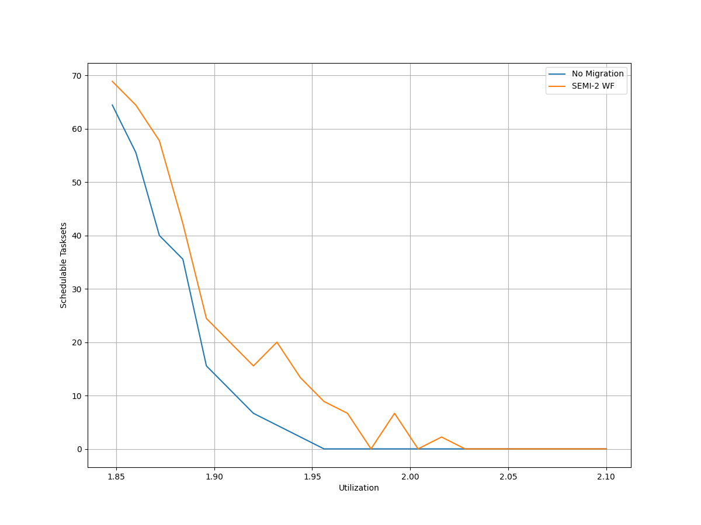
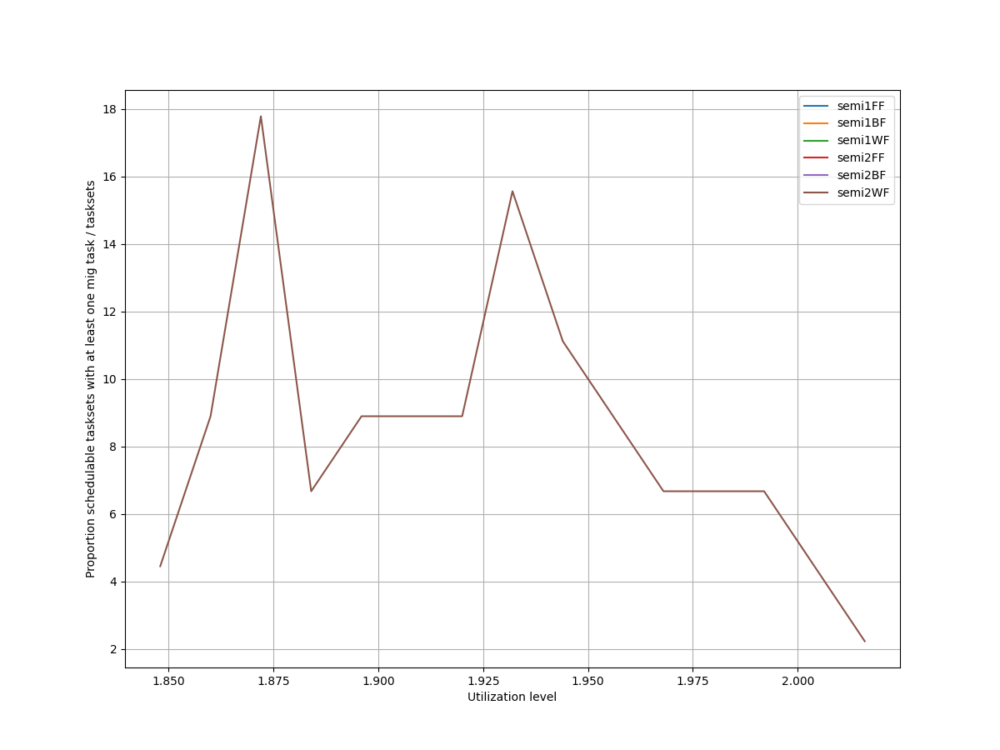
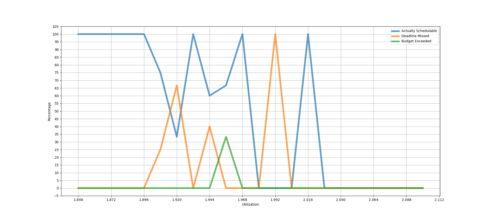
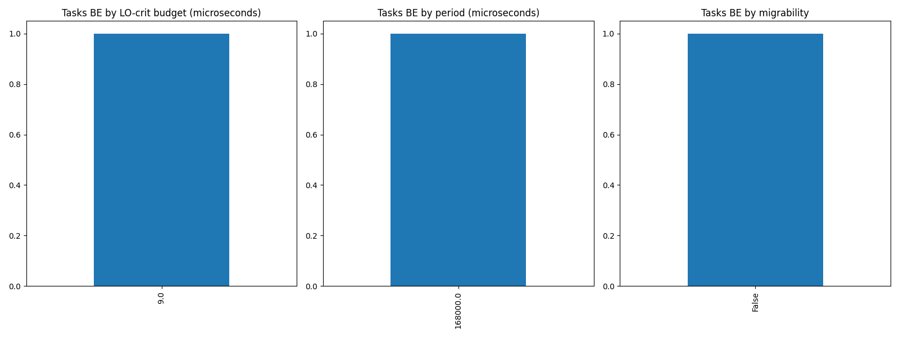
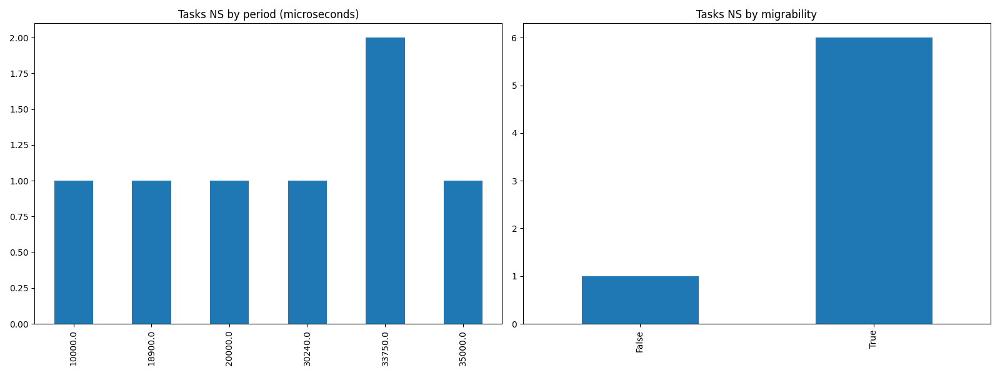

# Report on Experiment 1

   ## Overall data

   Utilization range = [1.848, 2.1] with step = 0.012

  Number of executions: 45

Schedulable executions: 38/45 = 84.44444444444444 %

_Not_ schedulable executions: 6/45 = 13.333333333333334 %

Budget Exceeded executions: 1/45 = 2.2222222222222223 %

Safe Boundary Exceeded executions: 0/45 = 0.0 %

NS + BE executions: 7/45 = 15.555555555555555 %

### **Simulations**

#### **Weighted schedulability experiment 1 according to simulations.**

#### **Percentage of (schedulable tasksets with at least one migrating tasks / number of schedulable tasksets) of experiment 1 according to simulations.** 

 

### **Real Executions**

#### **Schedulability for each level**

#### **Tasksets, grouped by (LO-crit budget, Period & Migrability), with a Budget_Exceeded task.**

#### **Tasksets, grouped by (Period & Migrability), with at least one task missing one (or more) of its deadlines.**

## Bad tasksets

Click here to expand this section.

### **Not schedulable tasksets**

Click here to expand this section.

Ovvero quando almeno un task non completa entra almeno una sua deadline.

  1. Taskset **e1_semi2wf_t265**

    Taskset execution params:
	 
    "id": "e1_semi2wf_t265",
    "size": "12",
    "utilization": "1.9080000000000001",
    "criticality_factor": "2",
    "hicrit_proportion": "0.5"

   
 
Click here to see the deadlines missed tasks list.

   Time values are expressed as **micro-seconds**.

Task:  1

    
    "id": " 1",
    "basecpu": " 2",
    "priority": " 5",
    "period": 18900.0,
    "C(LO)": 1609.0,
    "C(HI)": 1609.0,
    "criticality": "LOW",
    "migrable": "True",
    "completedruns": " 1164",
    "preemptions": " 0",
    "minresponsejitter": " 0.000000000",
    "maxresponsejitter": " 0.000434901",
    "minreleasejitter": " 0.000000000",
    "maxreleasejitter": " 22.961806922",
    "avgresponsejitter": " 0.000290171",
    "deadlinesmissed": " 2",
    "deadlinemissedtargetcore": " 0",
    "budgetexceeded": " 0",
    "budgetexceededtargetcore": " 0",
    "timesmigrated": " 4",
    "timesrestored": " 3",
    "timesonc1": " 2",
    "timesonc2": " 1159",
    "lockedtime": " 0.000041730"

   

   
 
Click here to see the CPUs log.

   Idle time is expressed as **seconds**.

   CPU: 1

    
    "id": 1,
    "hyperperiod": 22680000,
    "lowtohigh": " 0",
    "hightolow": " 0",
    "idletime": 39791823,
    "util": -75.44895502645502

   CPU: 2

    
    "id": 2,
    "hyperperiod": 56700000,
    "lowtohigh": " 10",
    "hightolow": " 10",
    "idletime": 41903007,
    "util": 26.09698941798942

   

   
 
Click here to see the whole tasksets.

   Time values are expressed as **micro-seconds**.

   Task:  12

    
    "id": " 12",
    "basecpu": " 1",
    "priority": " 0",
    "period": 540000.0,
    "C(LO)": 67242.0,
    "C(HI)": 134484.0,
    "criticality": "HIGH",
    "migrable": "False",
    "completedruns": " 106",
    "preemptions": " 272",
    "minresponsejitter": " 0.000000000",
    "maxresponsejitter": " 0.049762916",
    "minreleasejitter": " 0.000000000",
    "maxreleasejitter": " 57.169211823",
    "avgresponsejitter": " 0.036643030",
    "deadlinesmissed": " 0",
    "deadlinemissedtargetcore": " 0",
    "budgetexceeded": " 0",
    "budgetexceededtargetcore": " 0",
    "timesmigrated": " 0",
    "timesrestored": " 0",
    "timesonc1": " 377",
    "timesonc2": " 0",
    "lockedtime": " 0.000022378"

   Task:  3

    
    "id": " 3",
    "basecpu": " 1",
    "priority": " 2",
    "period": 35000.0,
    "C(LO)": 3394.0,
    "C(HI)": 6788.0,
    "criticality": "HIGH",
    "migrable": "False",
    "completedruns": " 1621",
    "preemptions": " 101",
    "minresponsejitter": " 0.000000000",
    "maxresponsejitter": " 0.006555835",
    "minreleasejitter": " 0.000000000",
    "maxreleasejitter": " 57.665639793",
    "avgresponsejitter": " 0.001677219",
    "deadlinesmissed": " 0",
    "deadlinemissedtargetcore": " 0",
    "budgetexceeded": " 0",
    "budgetexceededtargetcore": " 0",
    "timesmigrated": " 0",
    "timesrestored": " 0",
    "timesonc1": " 1721",
    "timesonc2": " 0",
    "lockedtime": " 0.000014793"

   Task:  6

    
    "id": " 6",
    "basecpu": " 1",
    "priority": " 1",
    "period": 78750.0,
    "C(LO)": 5867.0,
    "C(HI)": 11734.0,
    "criticality": "HIGH",
    "migrable": "False",
    "completedruns": " 721",
    "preemptions": " 41",
    "minresponsejitter": " 0.000000000",
    "maxresponsejitter": " 0.009792012",
    "minreleasejitter": " 0.000000000",
    "maxreleasejitter": " 57.621256093",
    "avgresponsejitter": " 0.002755907",
    "deadlinesmissed": " 0",
    "deadlinemissedtargetcore": " 0",
    "budgetexceeded": " 0",
    "budgetexceededtargetcore": " 0",
    "timesmigrated": " 0",
    "timesrestored": " 0",
    "timesonc1": " 761",
    "timesonc2": " 0",
    "lockedtime": " 0.000000162"

   Task:  2

    
    "id": " 2",
    "basecpu": " 1",
    "priority": " 5",
    "period": 28350.0,
    "C(LO)": 6407.0,
    "C(HI)": 6407.0,
    "criticality": "LOW",
    "migrable": "False",
    "completedruns": " 2001",
    "preemptions": " 1",
    "minresponsejitter": " 0.000000000",
    "maxresponsejitter": " 0.003398805",
    "minreleasejitter": " 0.000000000",
    "maxreleasejitter": " 57.671656324",
    "avgresponsejitter": " 0.002832441",
    "deadlinesmissed": " 0",
    "deadlinemissedtargetcore": " 0",
    "budgetexceeded": " 0",
    "budgetexceededtargetcore": " 0",
    "timesmigrated": " 0",
    "timesrestored": " 0",
    "timesonc1": " 2001",
    "timesonc2": " 0",
    "lockedtime": " 0.000039132"

   Task:  8

    
    "id": " 8",
    "basecpu": " 1",
    "priority": " 3",
    "period": 120000.0,
    "C(LO)": 10412.0,
    "C(HI)": 10412.0,
    "criticality": "LOW",
    "migrable": "False",
    "completedruns": " 474",
    "preemptions": " 82",
    "minresponsejitter": " 0.000000000",
    "maxresponsejitter": " 0.008856135",
    "minreleasejitter": " 0.000000000",
    "maxreleasejitter": " 57.640006357",
    "avgresponsejitter": " 0.005126435",
    "deadlinesmissed": " 0",
    "deadlinemissedtargetcore": " 0",
    "budgetexceeded": " 0",
    "budgetexceededtargetcore": " 0",
    "timesmigrated": " 0",
    "timesrestored": " 0",
    "timesonc1": " 555",
    "timesonc2": " 0",
    "lockedtime": " 0.000016571"

   Task:  5

    
    "id": " 5",
    "basecpu": " 1",
    "priority": " 4",
    "period": 72000.0,
    "C(LO)": 4386.0,
    "C(HI)": 4386.0,
    "criticality": "LOW",
    "migrable": "False",
    "completedruns": " 789",
    "preemptions": " 46",
    "minresponsejitter": " 0.000000000",
    "maxresponsejitter": " 0.005557634",
    "minreleasejitter": " 0.000000000",
    "maxreleasejitter": " 57.664006213",
    "avgresponsejitter": " 0.002111042",
    "deadlinesmissed": " 0",
    "deadlinemissedtargetcore": " 0",
    "budgetexceeded": " 0",
    "budgetexceededtargetcore": " 0",
    "timesmigrated": " 0",
    "timesrestored": " 0",
    "timesonc1": " 834",
    "timesonc2": " 0",
    "lockedtime": " 0.000005381"

   Task:  11

    
    "id": " 11",
    "basecpu": " 2",
    "priority": " 0",
    "period": 189000.0,
    "C(LO)": 43958.0,
    "C(HI)": 87917.0,
    "criticality": "HIGH",
    "migrable": "False",
    "completedruns": " 301",
    "preemptions": " 189",
    "minresponsejitter": " 0.000000000",
    "maxresponsejitter": " 0.072251973",
    "minreleasejitter": " 0.000000000",
    "maxreleasejitter": " 57.511006078",
    "avgresponsejitter": " 0.020935928",
    "deadlinesmissed": " 0",
    "deadlinemissedtargetcore": " 0",
    "budgetexceeded": " 4",
    "budgetexceededtargetcore": " 0",
    "timesmigrated": " 0",
    "timesrestored": " 0",
    "timesonc1": " 0",
    "timesonc2": " 493",
    "lockedtime": " 0.000021297"

   Task:  7

    
    "id": " 7",
    "basecpu": " 2",
    "priority": " 2",
    "period": 100000.0,
    "C(LO)": 3976.9999999999995,
    "C(HI)": 7955.0,
    "criticality": "HIGH",
    "migrable": "False",
    "completedruns": " 568",
    "preemptions": " 33",
    "minresponsejitter": " 0.000000000",
    "maxresponsejitter": " 0.011900309",
    "minreleasejitter": " 0.000000000",
    "maxreleasejitter": " 57.600006252",
    "avgresponsejitter": " 0.001981498",
    "deadlinesmissed": " 0",
    "deadlinemissedtargetcore": " 0",
    "budgetexceeded": " 3",
    "budgetexceededtargetcore": " 0",
    "timesmigrated": " 0",
    "timesrestored": " 0",
    "timesonc1": " 0",
    "timesonc2": " 603",
    "lockedtime": " 0.000008261"

   Task:  9

    
    "id": " 9",
    "basecpu": " 2",
    "priority": " 1",
    "period": 141750.0,
    "C(LO)": 3040.0,
    "C(HI)": 6080.0,
    "criticality": "HIGH",
    "migrable": "False",
    "completedruns": " 401",
    "preemptions": " 38",
    "minresponsejitter": " 0.000000000",
    "maxresponsejitter": " 0.004668054",
    "minreleasejitter": " 0.000000000",
    "maxreleasejitter": " 57.567133793",
    "avgresponsejitter": " 0.001415592",
    "deadlinesmissed": " 0",
    "deadlinemissedtargetcore": " 0",
    "budgetexceeded": " 3",
    "budgetexceededtargetcore": " 0",
    "timesmigrated": " 0",
    "timesrestored": " 0",
    "timesonc1": " 0",
    "timesonc2": " 441",
    "lockedtime": " 0.000001057"

   Task:  4

    
    "id": " 4",
    "basecpu": " 2",
    "priority": " 4",
    "period": 70875.0,
    "C(LO)": 17841.0,
    "C(HI)": 17841.0,
    "criticality": "LOW",
    "migrable": "False",
    "completedruns": " 801",
    "preemptions": " 78",
    "minresponsejitter": " 0.000000000",
    "maxresponsejitter": " 0.009865303",
    "minreleasejitter": " 0.000000000",
    "maxreleasejitter": " 57.629131246",
    "avgresponsejitter": " 0.008001264",
    "deadlinesmissed": " 0",
    "deadlinemissedtargetcore": " 0",
    "budgetexceeded": " 0",
    "budgetexceededtargetcore": " 0",
    "timesmigrated": " 0",
    "timesrestored": " 0",
    "timesonc1": " 0",
    "timesonc2": " 878",
    "lockedtime": " 0.000043844"

   Task:  1

    
    "id": " 1",
    "basecpu": " 2",
    "priority": " 5",
    "period": 18900.0,
    "C(LO)": 1609.0,
    "C(HI)": 1609.0,
    "criticality": "LOW",
    "migrable": "True",
    "completedruns": " 1164",
    "preemptions": " 0",
    "minresponsejitter": " 0.000000000",
    "maxresponsejitter": " 0.000434901",
    "minreleasejitter": " 0.000000000",
    "maxreleasejitter": " 22.961806922",
    "avgresponsejitter": " 0.000290171",
    "deadlinesmissed": " 2",
    "deadlinemissedtargetcore": " 0",
    "budgetexceeded": " 0",
    "budgetexceededtargetcore": " 0",
    "timesmigrated": " 4",
    "timesrestored": " 3",
    "timesonc1": " 2",
    "timesonc2": " 1159",
    "lockedtime": " 0.000041730"

   Task:  10

    
    "id": " 10",
    "basecpu": " 2",
    "priority": " 3",
    "period": 150000.0,
    "C(LO)": 2664.0,
    "C(HI)": 2664.0,
    "criticality": "LOW",
    "migrable": "False",
    "completedruns": " 379",
    "preemptions": " 15",
    "minresponsejitter": " 0.000000000",
    "maxresponsejitter": " 0.010428604",
    "minreleasejitter": " 0.000000000",
    "maxreleasejitter": " 57.550006030",
    "avgresponsejitter": " 0.001328772",
    "deadlinesmissed": " 0",
    "deadlinemissedtargetcore": " 0",
    "budgetexceeded": " 0",
    "budgetexceededtargetcore": " 0",
    "timesmigrated": " 0",
    "timesrestored": " 0",
    "timesonc1": " 0",
    "timesonc2": " 393",
    "lockedtime": " 0.000014973"

   

  2. Taskset **e1_semi2wf_t291**

    Taskset execution params:
	 
    "id": "e1_semi2wf_t291",
    "size": "12",
    "utilization": "1.9200000000000002",
    "criticality_factor": "2",
    "hicrit_proportion": "0.5"

   
 
Click here to see the deadlines missed tasks list.

   Time values are expressed as **micro-seconds**.

Task:  5

    
    "id": " 5",
    "basecpu": " 1",
    "priority": " 8",
    "period": 35000.0,
    "C(LO)": 1625.0,
    "C(HI)": 1625.0,
    "criticality": "LOW",
    "migrable": "True",
    "completedruns": " 213",
    "preemptions": " 0",
    "minresponsejitter": " 0.000000000",
    "maxresponsejitter": " 0.000440769",
    "minreleasejitter": " 0.000000000",
    "maxreleasejitter": " 8.385007189",
    "avgresponsejitter": " 0.000301742",
    "deadlinesmissed": " 1",
    "deadlinemissedtargetcore": " 1",
    "budgetexceeded": " 0",
    "budgetexceededtargetcore": " 0",
    "timesmigrated": " 3",
    "timesrestored": " 2",
    "timesonc1": " 198",
    "timesonc2": " 13",
    "lockedtime": " 0.000001745"

   

   
 
Click here to see the CPUs log.

   Idle time is expressed as **seconds**.

   CPU: 1

    
    "id": 1,
    "hyperperiod": 113400000,
    "lowtohigh": " 172",
    "hightolow": " 172",
    "idletime": 72017916,
    "util": 36.49213756613756

   CPU: 2

    
    "id": 2,
    "hyperperiod": 28350000,
    "lowtohigh": " 0",
    "hightolow": " 0",
    "idletime": 80519894,
    "util": -184.02079012345678

   

   
 
Click here to see the whole tasksets.

   Time values are expressed as **micro-seconds**.

   Task:  2

    
    "id": " 2",
    "basecpu": " 1",
    "priority": " 5",
    "period": 25200.0,
    "C(LO)": 1069.0,
    "C(HI)": 2138.0,
    "criticality": "HIGH",
    "migrable": "False",
    "completedruns": " 4501",
    "preemptions": " 0",
    "minresponsejitter": " 0.000000000",
    "maxresponsejitter": " 0.001520429",
    "minreleasejitter": " 0.000000000",
    "maxreleasejitter": " 114.374806291",
    "avgresponsejitter": " 0.000486447",
    "deadlinesmissed": " 0",
    "deadlinemissedtargetcore": " 0",
    "budgetexceeded": " 44",
    "budgetexceededtargetcore": " 0",
    "timesmigrated": " 0",
    "timesrestored": " 0",
    "timesonc1": " 4544",
    "timesonc2": " 0",
    "lockedtime": " 0.000004949"

   Task:  1

    
    "id": " 1",
    "basecpu": " 1",
    "priority": " 6",
    "period": 18900.0,
    "C(LO)": 547.0,
    "C(HI)": 1094.0,
    "criticality": "HIGH",
    "migrable": "False",
    "completedruns": " 6001",
    "preemptions": " 0",
    "minresponsejitter": " 0.000000000",
    "maxresponsejitter": " 0.000782222",
    "minreleasejitter": " 0.000000000",
    "maxreleasejitter": " 114.381106288",
    "avgresponsejitter": " 0.000245529",
    "deadlinesmissed": " 0",
    "deadlinemissedtargetcore": " 0",
    "budgetexceeded": " 42",
    "budgetexceededtargetcore": " 0",
    "timesmigrated": " 0",
    "timesrestored": " 0",
    "timesonc1": " 6042",
    "timesonc2": " 0",
    "lockedtime": " 0.000018763"

   Task:  7

    
    "id": " 7",
    "basecpu": " 1",
    "priority": " 2",
    "period": 60000.0,
    "C(LO)": 1378.0,
    "C(HI)": 2757.0,
    "criticality": "HIGH",
    "migrable": "False",
    "completedruns": " 1891",
    "preemptions": " 87",
    "minresponsejitter": " 0.000000000",
    "maxresponsejitter": " 0.002442015",
    "minreleasejitter": " 0.000000000",
    "maxreleasejitter": " 114.340006210",
    "avgresponsejitter": " 0.000634826",
    "deadlinesmissed": " 0",
    "deadlinemissedtargetcore": " 0",
    "budgetexceeded": " 15",
    "budgetexceededtargetcore": " 0",
    "timesmigrated": " 0",
    "timesrestored": " 0",
    "timesonc1": " 1992",
    "timesonc2": " 0",
    "lockedtime": " 0.000012024"

   Task:  4

    
    "id": " 4",
    "basecpu": " 1",
    "priority": " 3",
    "period": 33750.0,
    "C(LO)": 673.0,
    "C(HI)": 1347.0,
    "criticality": "HIGH",
    "migrable": "False",
    "completedruns": " 3361",
    "preemptions": " 36",
    "minresponsejitter": " 0.000000000",
    "maxresponsejitter": " 0.001404105",
    "minreleasejitter": " 0.000000000",
    "maxreleasejitter": " 114.366256288",
    "avgresponsejitter": " 0.000304694",
    "deadlinesmissed": " 0",
    "deadlinemissedtargetcore": " 0",
    "budgetexceeded": " 27",
    "budgetexceededtargetcore": " 0",
    "timesmigrated": " 0",
    "timesrestored": " 0",
    "timesonc1": " 3423",
    "timesonc2": " 0",
    "lockedtime": " 0.000007946"

   Task:  3

    
    "id": " 3",
    "basecpu": " 1",
    "priority": " 4",
    "period": 30240.0,
    "C(LO)": 569.0,
    "C(HI)": 1138.0,
    "criticality": "HIGH",
    "migrable": "False",
    "completedruns": " 3751",
    "preemptions": " 2",
    "minresponsejitter": " 0.000000000",
    "maxresponsejitter": " 0.000798402",
    "minreleasejitter": " 0.000000000",
    "maxreleasejitter": " 114.369766270",
    "avgresponsejitter": " 0.000254955",
    "deadlinesmissed": " 0",
    "deadlinemissedtargetcore": " 0",
    "budgetexceeded": " 44",
    "budgetexceededtargetcore": " 0",
    "timesmigrated": " 0",
    "timesrestored": " 0",
    "timesonc1": " 3796",
    "timesonc2": " 0",
    "lockedtime": " 0.000000000"

   Task:  11

    
    "id": " 11",
    "basecpu": " 1",
    "priority": " 1",
    "period": 900000.0,
    "C(LO)": 387325.0,
    "C(HI)": 387325.0,
    "criticality": "LOW",
    "migrable": "False",
    "completedruns": " 127",
    "preemptions": " 3632",
    "minresponsejitter": " 0.000000000",
    "maxresponsejitter": " 0.228604408",
    "minreleasejitter": " 0.000000000",
    "maxreleasejitter": " 113.500737655",
    "avgresponsejitter": " 0.190089613",
    "deadlinesmissed": " 0",
    "deadlinemissedtargetcore": " 0",
    "budgetexceeded": " 0",
    "budgetexceededtargetcore": " 0",
    "timesmigrated": " 0",
    "timesrestored": " 0",
    "timesonc1": " 3758",
    "timesonc2": " 0",
    "lockedtime": " 0.000064480"

   Task:  12

    
    "id": " 12",
    "basecpu": " 1",
    "priority": " 0",
    "period": 907200.0,
    "C(LO)": 163233.0,
    "C(HI)": 163233.0,
    "criticality": "LOW",
    "migrable": "False",
    "completedruns": " 126",
    "preemptions": " 1456",
    "minresponsejitter": " 0.000000000",
    "maxresponsejitter": " 0.305872763",
    "minreleasejitter": " 0.000000000",
    "maxreleasejitter": " 113.493761138",
    "avgresponsejitter": " 0.094349826",
    "deadlinesmissed": " 0",
    "deadlinemissedtargetcore": " 0",
    "budgetexceeded": " 0",
    "budgetexceededtargetcore": " 0",
    "timesmigrated": " 0",
    "timesrestored": " 0",
    "timesonc1": " 1581",
    "timesonc2": " 0",
    "lockedtime": " 0.000032973"

   Task:  8

    
    "id": " 8",
    "basecpu": " 1",
    "priority": " 7",
    "period": 81000.0,
    "C(LO)": 5944.0,
    "C(HI)": 5944.0,
    "criticality": "LOW",
    "migrable": "False",
    "completedruns": " 1402",
    "preemptions": " 5",
    "minresponsejitter": " 0.000000000",
    "maxresponsejitter": " 0.003527243",
    "minreleasejitter": " 0.000000000",
    "maxreleasejitter": " 114.400014123",
    "avgresponsejitter": " 0.002631288",
    "deadlinesmissed": " 0",
    "deadlinemissedtargetcore": " 0",
    "budgetexceeded": " 0",
    "budgetexceededtargetcore": " 0",
    "timesmigrated": " 0",
    "timesrestored": " 0",
    "timesonc1": " 1406",
    "timesonc2": " 0",
    "lockedtime": " 0.000009976"

   Task:  5

    
    "id": " 5",
    "basecpu": " 1",
    "priority": " 8",
    "period": 35000.0,
    "C(LO)": 1625.0,
    "C(HI)": 1625.0,
    "criticality": "LOW",
    "migrable": "True",
    "completedruns": " 213",
    "preemptions": " 0",
    "minresponsejitter": " 0.000000000",
    "maxresponsejitter": " 0.000440769",
    "minreleasejitter": " 0.000000000",
    "maxreleasejitter": " 8.385007189",
    "avgresponsejitter": " 0.000301742",
    "deadlinesmissed": " 1",
    "deadlinemissedtargetcore": " 1",
    "budgetexceeded": " 0",
    "budgetexceededtargetcore": " 0",
    "timesmigrated": " 3",
    "timesrestored": " 2",
    "timesonc1": " 198",
    "timesonc2": " 13",
    "lockedtime": " 0.000001745"

   Task:  6

    
    "id": " 6",
    "basecpu": " 2",
    "priority": " 1",
    "period": 50000.0,
    "C(LO)": 13634.0,
    "C(HI)": 27269.0,
    "criticality": "HIGH",
    "migrable": "False",
    "completedruns": " 2269",
    "preemptions": " 96",
    "minresponsejitter": " 0.000000000",
    "maxresponsejitter": " 0.017255991",
    "minreleasejitter": " 0.000000000",
    "maxreleasejitter": " 114.350006249",
    "avgresponsejitter": " 0.006422378",
    "deadlinesmissed": " 0",
    "deadlinemissedtargetcore": " 0",
    "budgetexceeded": " 0",
    "budgetexceededtargetcore": " 0",
    "timesmigrated": " 0",
    "timesrestored": " 0",
    "timesonc1": " 0",
    "timesonc2": " 2364",
    "lockedtime": " 0.000062135"

   Task:  10

    
    "id": " 10",
    "basecpu": " 2",
    "priority": " 0",
    "period": 157500.0,
    "C(LO)": 38461.0,
    "C(HI)": 38461.0,
    "criticality": "LOW",
    "migrable": "False",
    "completedruns": " 721",
    "preemptions": " 289",
    "minresponsejitter": " 0.000000000",
    "maxresponsejitter": " 0.036431760",
    "minreleasejitter": " 0.000000000",
    "maxreleasejitter": " 114.242506306",
    "avgresponsejitter": " 0.019905165",
    "deadlinesmissed": " 0",
    "deadlinemissedtargetcore": " 0",
    "budgetexceeded": " 0",
    "budgetexceededtargetcore": " 0",
    "timesmigrated": " 0",
    "timesrestored": " 0",
    "timesonc1": " 0",
    "timesonc2": " 1009",
    "lockedtime": " 0.000028228"

   Task:  9

    
    "id": " 9",
    "basecpu": " 2",
    "priority": " 2",
    "period": 141750.0,
    "C(LO)": 18993.0,
    "C(HI)": 18993.0,
    "criticality": "LOW",
    "migrable": "False",
    "completedruns": " 801",
    "preemptions": " 1",
    "minresponsejitter": " 0.000000000",
    "maxresponsejitter": " 0.010114156",
    "minreleasejitter": " 0.000000000",
    "maxreleasejitter": " 114.258256751",
    "avgresponsejitter": " 0.008368411",
    "deadlinesmissed": " 0",
    "deadlinemissedtargetcore": " 0",
    "budgetexceeded": " 0",
    "budgetexceededtargetcore": " 0",
    "timesmigrated": " 0",
    "timesrestored": " 0",
    "timesonc1": " 0",
    "timesonc2": " 801",
    "lockedtime": " 0.000045210"

   

  3. Taskset **e1_semi2wf_t315**

    Taskset execution params:
	 
    "id": "e1_semi2wf_t315",
    "size": "12",
    "utilization": "1.9200000000000002",
    "criticality_factor": "2",
    "hicrit_proportion": "0.5"

   
 
Click here to see the deadlines missed tasks list.

   Time values are expressed as **micro-seconds**.

Task:  1

    
    "id": " 1",
    "basecpu": " 1",
    "priority": " 6",
    "period": 30240.0,
    "C(LO)": 1672.0,
    "C(HI)": 1672.0,
    "criticality": "LOW",
    "migrable": "True",
    "completedruns": " 3751",
    "preemptions": " 1",
    "minresponsejitter": " 0.000000000",
    "maxresponsejitter": " 0.000450502",
    "minreleasejitter": " 0.000000000",
    "maxreleasejitter": " 114.369766186",
    "avgresponsejitter": " 0.000300102",
    "deadlinesmissed": " 1",
    "deadlinemissedtargetcore": " 0",
    "budgetexceeded": " 0",
    "budgetexceededtargetcore": " 0",
    "timesmigrated": " 9",
    "timesrestored": " 9",
    "timesonc1": " 3741",
    "timesonc2": " 9",
    "lockedtime": " 0.000016508"

   

   
 
Click here to see the CPUs log.

   Idle time is expressed as **seconds**.

   CPU: 1

    
    "id": 1,
    "hyperperiod": 56700000,
    "lowtohigh": " 34",
    "hightolow": " 34",
    "idletime": 83322117,
    "util": -46.9525873015873

   CPU: 2

    
    "id": 2,
    "hyperperiod": 113400000,
    "lowtohigh": " 0",
    "hightolow": " 0",
    "idletime": 82971378,
    "util": 26.833

   

   
 
Click here to see the whole tasksets.

   Time values are expressed as **micro-seconds**.

   Task:  12

    
    "id": " 12",
    "basecpu": " 1",
    "priority": " 0",
    "period": 472500.0,
    "C(LO)": 92289.0,
    "C(HI)": 184578.0,
    "criticality": "HIGH",
    "migrable": "False",
    "completedruns": " 241",
    "preemptions": " 914",
    "minresponsejitter": " 0.000000000",
    "maxresponsejitter": " 0.156667520",
    "minreleasejitter": " 0.000000000",
    "maxreleasejitter": " 113.927507129",
    "avgresponsejitter": " 0.049221895",
    "deadlinesmissed": " 0",
    "deadlinemissedtargetcore": " 0",
    "budgetexceeded": " 5",
    "budgetexceededtargetcore": " 0",
    "timesmigrated": " 0",
    "timesrestored": " 0",
    "timesonc1": " 1159",
    "timesonc2": " 0",
    "lockedtime": " 0.000072078"

   Task:  10

    
    "id": " 10",
    "basecpu": " 1",
    "priority": " 1",
    "period": 175000.0,
    "C(LO)": 14019.0,
    "C(HI)": 28039.0,
    "criticality": "HIGH",
    "migrable": "False",
    "completedruns": " 649",
    "preemptions": " 243",
    "minresponsejitter": " 0.000000000",
    "maxresponsejitter": " 0.020860393",
    "minreleasejitter": " 0.000000000",
    "maxreleasejitter": " 114.225006276",
    "avgresponsejitter": " 0.006863090",
    "deadlinesmissed": " 0",
    "deadlinemissedtargetcore": " 0",
    "budgetexceeded": " 8",
    "budgetexceededtargetcore": " 0",
    "timesmigrated": " 0",
    "timesrestored": " 0",
    "timesonc1": " 899",
    "timesonc2": " 0",
    "lockedtime": " 0.000017399"

   Task:  2

    
    "id": " 2",
    "basecpu": " 1",
    "priority": " 2",
    "period": 42000.0,
    "C(LO)": 2525.0,
    "C(HI)": 5050.0,
    "criticality": "HIGH",
    "migrable": "False",
    "completedruns": " 2701",
    "preemptions": " 27",
    "minresponsejitter": " 0.000000000",
    "maxresponsejitter": " 0.005902255",
    "minreleasejitter": " 0.000000000",
    "maxreleasejitter": " 114.358006447",
    "avgresponsejitter": " 0.001144610",
    "deadlinesmissed": " 0",
    "deadlinemissedtargetcore": " 0",
    "budgetexceeded": " 21",
    "budgetexceededtargetcore": " 0",
    "timesmigrated": " 0",
    "timesrestored": " 0",
    "timesonc1": " 2748",
    "timesonc2": " 0",
    "lockedtime": " 0.000038832"

   Task:  8

    
    "id": " 8",
    "basecpu": " 1",
    "priority": " 3",
    "period": 141750.0,
    "C(LO)": 16333.0,
    "C(HI)": 16333.0,
    "criticality": "LOW",
    "migrable": "False",
    "completedruns": " 801",
    "preemptions": " 295",
    "minresponsejitter": " 0.000000000",
    "maxresponsejitter": " 0.013550288",
    "minreleasejitter": " 0.000000000",
    "maxreleasejitter": " 114.258256306",
    "avgresponsejitter": " 0.007615195",
    "deadlinesmissed": " 0",
    "deadlinemissedtargetcore": " 0",
    "budgetexceeded": " 0",
    "budgetexceededtargetcore": " 0",
    "timesmigrated": " 0",
    "timesrestored": " 0",
    "timesonc1": " 1095",
    "timesonc2": " 0",
    "lockedtime": " 0.000050153"

   Task:  6

    
    "id": " 6",
    "basecpu": " 1",
    "priority": " 4",
    "period": 100000.0,
    "C(LO)": 8764.0,
    "C(HI)": 8764.0,
    "criticality": "LOW",
    "migrable": "False",
    "completedruns": " 1135",
    "preemptions": " 194",
    "minresponsejitter": " 0.000000000",
    "maxresponsejitter": " 0.005626577",
    "minreleasejitter": " 0.000000000",
    "maxreleasejitter": " 114.300006240",
    "avgresponsejitter": " 0.003968988",
    "deadlinesmissed": " 0",
    "deadlinemissedtargetcore": " 0",
    "budgetexceeded": " 0",
    "budgetexceededtargetcore": " 0",
    "timesmigrated": " 0",
    "timesrestored": " 0",
    "timesonc1": " 1328",
    "timesonc2": " 0",
    "lockedtime": " 0.000048429"

   Task:  5

    
    "id": " 5",
    "basecpu": " 1",
    "priority": " 5",
    "period": 64800.0,
    "C(LO)": 3950.9999999999995,
    "C(HI)": 3950.9999999999995,
    "criticality": "LOW",
    "migrable": "True",
    "completedruns": " 1751",
    "preemptions": " 0",
    "minresponsejitter": " 0.000000000",
    "maxresponsejitter": " 0.001056156",
    "minreleasejitter": " 0.000000000",
    "maxreleasejitter": " 114.335206207",
    "avgresponsejitter": " 0.000703577",
    "deadlinesmissed": " 0",
    "deadlinemissedtargetcore": " 0",
    "budgetexceeded": " 0",
    "budgetexceededtargetcore": " 0",
    "timesmigrated": " 4",
    "timesrestored": " 4",
    "timesonc1": " 1747",
    "timesonc2": " 3",
    "lockedtime": " 0.000016243"

   Task:  1

    
    "id": " 1",
    "basecpu": " 1",
    "priority": " 6",
    "period": 30240.0,
    "C(LO)": 1672.0,
    "C(HI)": 1672.0,
    "criticality": "LOW",
    "migrable": "True",
    "completedruns": " 3751",
    "preemptions": " 1",
    "minresponsejitter": " 0.000000000",
    "maxresponsejitter": " 0.000450502",
    "minreleasejitter": " 0.000000000",
    "maxreleasejitter": " 114.369766186",
    "avgresponsejitter": " 0.000300102",
    "deadlinesmissed": " 1",
    "deadlinemissedtargetcore": " 0",
    "budgetexceeded": " 0",
    "budgetexceededtargetcore": " 0",
    "timesmigrated": " 9",
    "timesrestored": " 9",
    "timesonc1": " 3741",
    "timesonc2": " 9",
    "lockedtime": " 0.000016508"

   Task:  11

    
    "id": " 11",
    "basecpu": " 2",
    "priority": " 0",
    "period": 200000.0,
    "C(LO)": 59640.0,
    "C(HI)": 119281.0,
    "criticality": "HIGH",
    "migrable": "False",
    "completedruns": " 568",
    "preemptions": " 669",
    "minresponsejitter": " 0.000000000",
    "maxresponsejitter": " 0.036964369",
    "minreleasejitter": " 0.000000000",
    "maxreleasejitter": " 114.200007078",
    "avgresponsejitter": " 0.029062604",
    "deadlinesmissed": " 0",
    "deadlinemissedtargetcore": " 0",
    "budgetexceeded": " 0",
    "budgetexceededtargetcore": " 0",
    "timesmigrated": " 0",
    "timesrestored": " 0",
    "timesonc1": " 0",
    "timesonc2": " 1236",
    "lockedtime": " 0.000121498"

   Task:  4

    
    "id": " 4",
    "basecpu": " 2",
    "priority": " 2",
    "period": 54000.0,
    "C(LO)": 1117.0,
    "C(HI)": 2234.0,
    "criticality": "HIGH",
    "migrable": "False",
    "completedruns": " 2101",
    "preemptions": " 0",
    "minresponsejitter": " 0.000000000",
    "maxresponsejitter": " 0.000601874",
    "minreleasejitter": " 0.000000000",
    "maxreleasejitter": " 114.346006234",
    "avgresponsejitter": " 0.000498477",
    "deadlinesmissed": " 0",
    "deadlinemissedtargetcore": " 0",
    "budgetexceeded": " 0",
    "budgetexceededtargetcore": " 0",
    "timesmigrated": " 0",
    "timesrestored": " 0",
    "timesonc1": " 0",
    "timesonc2": " 2100",
    "lockedtime": " 0.000024351"

   Task:  9

    
    "id": " 9",
    "basecpu": " 2",
    "priority": " 1",
    "period": 168000.0,
    "C(LO)": 1684.0,
    "C(HI)": 3368.0,
    "criticality": "HIGH",
    "migrable": "False",
    "completedruns": " 676",
    "preemptions": " 4",
    "minresponsejitter": " 0.000000000",
    "maxresponsejitter": " 0.004700270",
    "minreleasejitter": " 0.000000000",
    "maxreleasejitter": " 114.232006931",
    "avgresponsejitter": " 0.000763087",
    "deadlinesmissed": " 0",
    "deadlinemissedtargetcore": " 0",
    "budgetexceeded": " 0",
    "budgetexceededtargetcore": " 0",
    "timesmigrated": " 0",
    "timesrestored": " 0",
    "timesonc1": " 0",
    "timesonc2": " 679",
    "lockedtime": " 0.000038141"

   Task:  3

    
    "id": " 3",
    "basecpu": " 2",
    "priority": " 4",
    "period": 47250.0,
    "C(LO)": 8714.0,
    "C(HI)": 8714.0,
    "criticality": "LOW",
    "migrable": "False",
    "completedruns": " 2401",
    "preemptions": " 2",
    "minresponsejitter": " 0.000000000",
    "maxresponsejitter": " 0.004648246",
    "minreleasejitter": " 0.000000000",
    "maxreleasejitter": " 114.352755856",
    "avgresponsejitter": " 0.003862060",
    "deadlinesmissed": " 0",
    "deadlinemissedtargetcore": " 0",
    "budgetexceeded": " 0",
    "budgetexceededtargetcore": " 0",
    "timesmigrated": " 0",
    "timesrestored": " 0",
    "timesonc1": " 0",
    "timesonc2": " 2402",
    "lockedtime": " 0.000112183"

   Task:  7

    
    "id": " 7",
    "basecpu": " 2",
    "priority": " 3",
    "period": 120000.0,
    "C(LO)": 10496.0,
    "C(HI)": 10496.0,
    "criticality": "LOW",
    "migrable": "False",
    "completedruns": " 946",
    "preemptions": " 89",
    "minresponsejitter": " 0.000000000",
    "maxresponsejitter": " 0.009988306",
    "minreleasejitter": " 0.000000000",
    "maxreleasejitter": " 114.280006279",
    "avgresponsejitter": " 0.005039916",
    "deadlinesmissed": " 0",
    "deadlinemissedtargetcore": " 0",
    "budgetexceeded": " 0",
    "budgetexceededtargetcore": " 0",
    "timesmigrated": " 0",
    "timesrestored": " 0",
    "timesonc1": " 0",
    "timesonc2": " 1034",
    "lockedtime": " 0.000041471"

   

  4. Taskset **e1_semi2wf_t393**

    Taskset execution params:
	 
    "id": "e1_semi2wf_t393",
    "size": "12",
    "utilization": "1.9440000000000002",
    "criticality_factor": "2",
    "hicrit_proportion": "0.5"

   
 
Click here to see the deadlines missed tasks list.

   Time values are expressed as **micro-seconds**.

Task:  2

    
    "id": " 2",
    "basecpu": " 2",
    "priority": " 5",
    "period": 33750.0,
    "C(LO)": 3249.0,
    "C(HI)": 3249.0,
    "criticality": "LOW",
    "migrable": "True",
    "completedruns": " 3361",
    "preemptions": " 0",
    "minresponsejitter": " 0.000000000",
    "maxresponsejitter": " 0.000868865",
    "minreleasejitter": " 0.000000000",
    "maxreleasejitter": " 114.366256315",
    "avgresponsejitter": " 0.000577048",
    "deadlinesmissed": " 1",
    "deadlinemissedtargetcore": " 0",
    "budgetexceeded": " 0",
    "budgetexceededtargetcore": " 0",
    "timesmigrated": " 6",
    "timesrestored": " 6",
    "timesonc1": " 3",
    "timesonc2": " 3356",
    "lockedtime": " 0.000031835"

   

   
 
Click here to see the CPUs log.

   Idle time is expressed as **seconds**.

   CPU: 1

    
    "id": 1,
    "hyperperiod": 113400000,
    "lowtohigh": " 45",
    "hightolow": " 45",
    "idletime": 85660620,
    "util": 24.461534391534386

   CPU: 2

    
    "id": 2,
    "hyperperiod": 56700000,
    "lowtohigh": " 20",
    "hightolow": " 20",
    "idletime": 87346126,
    "util": -54.049604938271614

   

   
 
Click here to see the whole tasksets.

   Time values are expressed as **micro-seconds**.

   Task:  12

    
    "id": " 12",
    "basecpu": " 1",
    "priority": " 0",
    "period": 708750.0,
    "C(LO)": 117733.0,
    "C(HI)": 235466.0,
    "criticality": "HIGH",
    "migrable": "False",
    "completedruns": " 161",
    "preemptions": " 558",
    "minresponsejitter": " 0.000000000",
    "maxresponsejitter": " 0.169667874",
    "minreleasejitter": " 0.000000000",
    "maxreleasejitter": " 113.691685345",
    "avgresponsejitter": " 0.064399814",
    "deadlinesmissed": " 0",
    "deadlinemissedtargetcore": " 0",
    "budgetexceeded": " 4",
    "budgetexceededtargetcore": " 0",
    "timesmigrated": " 0",
    "timesrestored": " 0",
    "timesonc1": " 722",
    "timesonc2": " 0",
    "lockedtime": " 0.000065670"

   Task:  8

    
    "id": " 8",
    "basecpu": " 1",
    "priority": " 1",
    "period": 120000.0,
    "C(LO)": 19770.0,
    "C(HI)": 39541.0,
    "criticality": "HIGH",
    "migrable": "False",
    "completedruns": " 946",
    "preemptions": " 430",
    "minresponsejitter": " 0.000000000",
    "maxresponsejitter": " 0.027940453",
    "minreleasejitter": " 0.000000000",
    "maxreleasejitter": " 114.280006189",
    "avgresponsejitter": " 0.009309661",
    "deadlinesmissed": " 0",
    "deadlinemissedtargetcore": " 0",
    "budgetexceeded": " 5",
    "budgetexceededtargetcore": " 0",
    "timesmigrated": " 0",
    "timesrestored": " 0",
    "timesonc1": " 1380",
    "timesonc2": " 0",
    "lockedtime": " 0.000052417"

   Task:  1

    
    "id": " 1",
    "basecpu": " 1",
    "priority": " 2",
    "period": 28350.0,
    "C(LO)": 1093.0,
    "C(HI)": 2187.0,
    "criticality": "HIGH",
    "migrable": "False",
    "completedruns": " 4001",
    "preemptions": " 20",
    "minresponsejitter": " 0.000000000",
    "maxresponsejitter": " 0.004142210",
    "minreleasejitter": " 0.000000000",
    "maxreleasejitter": " 114.371656342",
    "avgresponsejitter": " 0.000509237",
    "deadlinesmissed": " 0",
    "deadlinemissedtargetcore": " 0",
    "budgetexceeded": " 36",
    "budgetexceededtargetcore": " 0",
    "timesmigrated": " 0",
    "timesrestored": " 0",
    "timesonc1": " 4056",
    "timesonc2": " 0",
    "lockedtime": " 0.000082183"

   Task:  3

    
    "id": " 3",
    "basecpu": " 1",
    "priority": " 5",
    "period": 52500.0,
    "C(LO)": 6667.0,
    "C(HI)": 6667.0,
    "criticality": "LOW",
    "migrable": "True",
    "completedruns": " 2161",
    "preemptions": " 1",
    "minresponsejitter": " 0.000000000",
    "maxresponsejitter": " 0.001775141",
    "minreleasejitter": " 0.000000000",
    "maxreleasejitter": " 114.347506381",
    "avgresponsejitter": " 0.001189892",
    "deadlinesmissed": " 0",
    "deadlinemissedtargetcore": " 0",
    "budgetexceeded": " 0",
    "budgetexceededtargetcore": " 0",
    "timesmigrated": " 4",
    "timesrestored": " 4",
    "timesonc1": " 2158",
    "timesonc2": " 3",
    "lockedtime": " 0.000020105"

   Task:  7

    
    "id": " 7",
    "basecpu": " 1",
    "priority": " 4",
    "period": 100000.0,
    "C(LO)": 6791.0,
    "C(HI)": 6791.0,
    "criticality": "LOW",
    "migrable": "False",
    "completedruns": " 1135",
    "preemptions": " 51",
    "minresponsejitter": " 0.000000000",
    "maxresponsejitter": " 0.005193432",
    "minreleasejitter": " 0.000000000",
    "maxreleasejitter": " 114.300006243",
    "avgresponsejitter": " 0.003065844",
    "deadlinesmissed": " 0",
    "deadlinemissedtargetcore": " 0",
    "budgetexceeded": " 0",
    "budgetexceededtargetcore": " 0",
    "timesmigrated": " 0",
    "timesrestored": " 0",
    "timesonc1": " 1185",
    "timesonc2": " 0",
    "lockedtime": " 0.000040147"

   Task:  9

    
    "id": " 9",
    "basecpu": " 1",
    "priority": " 3",
    "period": 131250.0,
    "C(LO)": 6508.0,
    "C(HI)": 6508.0,
    "criticality": "LOW",
    "migrable": "False",
    "completedruns": " 865",
    "preemptions": " 0",
    "minresponsejitter": " 0.000000000",
    "maxresponsejitter": " 0.003467300",
    "minreleasejitter": " 0.000000000",
    "maxreleasejitter": " 114.268756363",
    "avgresponsejitter": " 0.002872763",
    "deadlinesmissed": " 0",
    "deadlinemissedtargetcore": " 0",
    "budgetexceeded": " 0",
    "budgetexceededtargetcore": " 0",
    "timesmigrated": " 0",
    "timesrestored": " 0",
    "timesonc1": " 864",
    "timesonc2": " 0",
    "lockedtime": " 0.000022844"

   Task:  10

    
    "id": " 10",
    "basecpu": " 2",
    "priority": " 1",
    "period": 150000.0,
    "C(LO)": 26185.0,
    "C(HI)": 52371.0,
    "criticality": "HIGH",
    "migrable": "False",
    "completedruns": " 757",
    "preemptions": " 445",
    "minresponsejitter": " 0.000000000",
    "maxresponsejitter": " 0.039161982",
    "minreleasejitter": " 0.000000000",
    "maxreleasejitter": " 114.253296796",
    "avgresponsejitter": " 0.012150132",
    "deadlinesmissed": " 0",
    "deadlinemissedtargetcore": " 0",
    "budgetexceeded": " 6",
    "budgetexceededtargetcore": " 0",
    "timesmigrated": " 0",
    "timesrestored": " 0",
    "timesonc1": " 0",
    "timesonc2": " 1207",
    "lockedtime": " 0.000055189"

   Task:  11

    
    "id": " 11",
    "basecpu": " 2",
    "priority": " 0",
    "period": 420000.0,
    "C(LO)": 55735.0,
    "C(HI)": 111470.0,
    "criticality": "HIGH",
    "migrable": "False",
    "completedruns": " 271",
    "preemptions": " 433",
    "minresponsejitter": " 0.000000000",
    "maxresponsejitter": " 0.072316619",
    "minreleasejitter": " 0.000000000",
    "maxreleasejitter": " 113.980007051",
    "avgresponsejitter": " 0.027186045",
    "deadlinesmissed": " 0",
    "deadlinemissedtargetcore": " 0",
    "budgetexceeded": " 0",
    "budgetexceededtargetcore": " 0",
    "timesmigrated": " 0",
    "timesrestored": " 0",
    "timesonc1": " 0",
    "timesonc2": " 703",
    "lockedtime": " 0.000051706"

   Task:  6

    
    "id": " 6",
    "basecpu": " 2",
    "priority": " 2",
    "period": 75000.0,
    "C(LO)": 6521.0,
    "C(HI)": 13042.0,
    "criticality": "HIGH",
    "migrable": "False",
    "completedruns": " 1513",
    "preemptions": " 91",
    "minresponsejitter": " 0.000000000",
    "maxresponsejitter": " 0.009172592",
    "minreleasejitter": " 0.000000000",
    "maxreleasejitter": " 114.325006123",
    "avgresponsejitter": " 0.002938877",
    "deadlinesmissed": " 0",
    "deadlinemissedtargetcore": " 0",
    "budgetexceeded": " 14",
    "budgetexceededtargetcore": " 0",
    "timesmigrated": " 0",
    "timesrestored": " 0",
    "timesonc1": " 0",
    "timesonc2": " 1617",
    "lockedtime": " 0.000057502"

   Task:  2

    
    "id": " 2",
    "basecpu": " 2",
    "priority": " 5",
    "period": 33750.0,
    "C(LO)": 3249.0,
    "C(HI)": 3249.0,
    "criticality": "LOW",
    "migrable": "True",
    "completedruns": " 3361",
    "preemptions": " 0",
    "minresponsejitter": " 0.000000000",
    "maxresponsejitter": " 0.000868865",
    "minreleasejitter": " 0.000000000",
    "maxreleasejitter": " 114.366256315",
    "avgresponsejitter": " 0.000577048",
    "deadlinesmissed": " 1",
    "deadlinemissedtargetcore": " 0",
    "budgetexceeded": " 0",
    "budgetexceededtargetcore": " 0",
    "timesmigrated": " 6",
    "timesrestored": " 6",
    "timesonc1": " 3",
    "timesonc2": " 3356",
    "lockedtime": " 0.000031835"

   Task:  4

    
    "id": " 4",
    "basecpu": " 2",
    "priority": " 4",
    "period": 56250.0,
    "C(LO)": 3569.0,
    "C(HI)": 3569.0,
    "criticality": "LOW",
    "migrable": "False",
    "completedruns": " 2017",
    "preemptions": " 0",
    "minresponsejitter": " 0.000000000",
    "maxresponsejitter": " 0.001901637",
    "minreleasejitter": " 0.000000000",
    "maxreleasejitter": " 114.343755988",
    "avgresponsejitter": " 0.001583228",
    "deadlinesmissed": " 0",
    "deadlinemissedtargetcore": " 0",
    "budgetexceeded": " 0",
    "budgetexceededtargetcore": " 0",
    "timesmigrated": " 0",
    "timesrestored": " 0",
    "timesonc1": " 0",
    "timesonc2": " 2016",
    "lockedtime": " 0.000037210"

   Task:  5

    
    "id": " 5",
    "basecpu": " 2",
    "priority": " 3",
    "period": 56700.0,
    "C(LO)": 704.0,
    "C(HI)": 704.0,
    "criticality": "LOW",
    "migrable": "False",
    "completedruns": " 2001",
    "preemptions": " 0",
    "minresponsejitter": " 0.000000000",
    "maxresponsejitter": " 0.000381796",
    "minreleasejitter": " 0.000000000",
    "maxreleasejitter": " 114.343305964",
    "avgresponsejitter": " 0.000311979",
    "deadlinesmissed": " 0",
    "deadlinemissedtargetcore": " 0",
    "budgetexceeded": " 0",
    "budgetexceededtargetcore": " 0",
    "timesmigrated": " 0",
    "timesrestored": " 0",
    "timesonc1": " 0",
    "timesonc2": " 2000",
    "lockedtime": " 0.000173679"

   

  5. Taskset **e1_semi2wf_t397**

    Taskset execution params:
	 
    "id": "e1_semi2wf_t397",
    "size": "12",
    "utilization": "1.9440000000000002",
    "criticality_factor": "2",
    "hicrit_proportion": "0.5"

   
 
Click here to see the deadlines missed tasks list.

   Time values are expressed as **micro-seconds**.

Task:  1

    
    "id": " 1",
    "basecpu": " 2",
    "priority": " 5",
    "period": 20000.0,
    "C(LO)": 3504.0,
    "C(HI)": 3504.0,
    "criticality": "LOW",
    "migrable": "True",
    "completedruns": " 3459",
    "preemptions": " 0",
    "minresponsejitter": " 0.000000000",
    "maxresponsejitter": " 0.000940369",
    "minreleasejitter": " 0.000000000",
    "maxreleasejitter": " 70.140006724",
    "avgresponsejitter": " 0.000624474",
    "deadlinesmissed": " 2",
    "deadlinemissedtargetcore": " 0",
    "budgetexceeded": " 0",
    "budgetexceededtargetcore": " 0",
    "timesmigrated": " 3",
    "timesrestored": " 2",
    "timesonc1": " 1",
    "timesonc2": " 3455",
    "lockedtime": " 0.000045402"

   

   
 
Click here to see the CPUs log.

   Idle time is expressed as **seconds**.

   CPU: 1

    
    "id": 1,
    "hyperperiod": 22680000,
    "lowtohigh": " 0",
    "hightolow": " 0",
    "idletime": 82906356,
    "util": -265.5483068783069

   CPU: 2

    
    "id": 2,
    "hyperperiod": 113400000,
    "lowtohigh": " 43",
    "hightolow": " 43",
    "idletime": 87063527,
    "util": 23.22440299823633

   

   
 
Click here to see the whole tasksets.

   Time values are expressed as **micro-seconds**.

   Task:  12

    
    "id": " 12",
    "basecpu": " 1",
    "priority": " 0",
    "period": 708750.0,
    "C(LO)": 141344.0,
    "C(HI)": 282688.0,
    "criticality": "HIGH",
    "migrable": "False",
    "completedruns": " 161",
    "preemptions": " 680",
    "minresponsejitter": " 0.000000000",
    "maxresponsejitter": " 0.089775622",
    "minreleasejitter": " 0.000000000",
    "maxreleasejitter": " 113.698115195",
    "avgresponsejitter": " 0.069516234",
    "deadlinesmissed": " 0",
    "deadlinemissedtargetcore": " 0",
    "budgetexceeded": " 0",
    "budgetexceededtargetcore": " 0",
    "timesmigrated": " 0",
    "timesrestored": " 0",
    "timesonc1": " 840",
    "timesonc2": " 0",
    "lockedtime": " 0.000058339"

   Task:  10

    
    "id": " 10",
    "basecpu": " 1",
    "priority": " 2",
    "period": 151200.0,
    "C(LO)": 18332.0,
    "C(HI)": 36664.0,
    "criticality": "HIGH",
    "migrable": "False",
    "completedruns": " 751",
    "preemptions": " 328",
    "minresponsejitter": " 0.000000000",
    "maxresponsejitter": " 0.018898604",
    "minreleasejitter": " 0.000000000",
    "maxreleasejitter": " 114.248806354",
    "avgresponsejitter": " 0.008897625",
    "deadlinesmissed": " 0",
    "deadlinemissedtargetcore": " 0",
    "budgetexceeded": " 0",
    "budgetexceededtargetcore": " 0",
    "timesmigrated": " 0",
    "timesrestored": " 0",
    "timesonc1": " 1078",
    "timesonc2": " 0",
    "lockedtime": " 0.000039453"

   Task:  11

    
    "id": " 11",
    "basecpu": " 1",
    "priority": " 1",
    "period": 168000.0,
    "C(LO)": 6341.0,
    "C(HI)": 12682.0,
    "criticality": "HIGH",
    "migrable": "False",
    "completedruns": " 676",
    "preemptions": " 87",
    "minresponsejitter": " 0.000000000",
    "maxresponsejitter": " 0.012855808",
    "minreleasejitter": " 0.000000000",
    "maxreleasejitter": " 114.232006279",
    "avgresponsejitter": " 0.003063562",
    "deadlinesmissed": " 0",
    "deadlinemissedtargetcore": " 0",
    "budgetexceeded": " 0",
    "budgetexceededtargetcore": " 0",
    "timesmigrated": " 0",
    "timesrestored": " 0",
    "timesonc1": " 762",
    "timesonc2": " 0",
    "lockedtime": " 0.000008288"

   Task:  7

    
    "id": " 7",
    "basecpu": " 1",
    "priority": " 3",
    "period": 101250.0,
    "C(LO)": 16963.0,
    "C(HI)": 16963.0,
    "criticality": "LOW",
    "migrable": "False",
    "completedruns": " 1121",
    "preemptions": " 58",
    "minresponsejitter": " 0.000000000",
    "maxresponsejitter": " 0.010056544",
    "minreleasejitter": " 0.000000000",
    "maxreleasejitter": " 114.298756931",
    "avgresponsejitter": " 0.007560907",
    "deadlinesmissed": " 0",
    "deadlinemissedtargetcore": " 0",
    "budgetexceeded": " 0",
    "budgetexceededtargetcore": " 0",
    "timesmigrated": " 0",
    "timesrestored": " 0",
    "timesonc1": " 1178",
    "timesonc2": " 0",
    "lockedtime": " 0.000021129"

   Task:  2

    
    "id": " 2",
    "basecpu": " 1",
    "priority": " 5",
    "period": 22500.0,
    "C(LO)": 1274.0,
    "C(HI)": 1274.0,
    "criticality": "LOW",
    "migrable": "False",
    "completedruns": " 5041",
    "preemptions": " 1",
    "minresponsejitter": " 0.000000000",
    "maxresponsejitter": " 0.000682856",
    "minreleasejitter": " 0.000000000",
    "maxreleasejitter": " 114.377506321",
    "avgresponsejitter": " 0.000569258",
    "deadlinesmissed": " 0",
    "deadlinemissedtargetcore": " 0",
    "budgetexceeded": " 0",
    "budgetexceededtargetcore": " 0",
    "timesmigrated": " 0",
    "timesrestored": " 0",
    "timesonc1": " 5041",
    "timesonc2": " 0",
    "lockedtime": " 0.000058694"

   Task:  6

    
    "id": " 6",
    "basecpu": " 1",
    "priority": " 4",
    "period": 94500.0,
    "C(LO)": 2232.0,
    "C(HI)": 2232.0,
    "criticality": "LOW",
    "migrable": "False",
    "completedruns": " 1201",
    "preemptions": " 0",
    "minresponsejitter": " 0.000000000",
    "maxresponsejitter": " 0.001190730",
    "minreleasejitter": " 0.000000000",
    "maxreleasejitter": " 114.305506943",
    "avgresponsejitter": " 0.000995198",
    "deadlinesmissed": " 0",
    "deadlinemissedtargetcore": " 0",
    "budgetexceeded": " 0",
    "budgetexceededtargetcore": " 0",
    "timesmigrated": " 0",
    "timesrestored": " 0",
    "timesonc1": " 1200",
    "timesonc2": " 0",
    "lockedtime": " 0.000004441"

   Task:  9

    
    "id": " 9",
    "basecpu": " 2",
    "priority": " 0",
    "period": 120000.0,
    "C(LO)": 25889.0,
    "C(HI)": 51779.0,
    "criticality": "HIGH",
    "migrable": "False",
    "completedruns": " 946",
    "preemptions": " 560",
    "minresponsejitter": " 0.000000000",
    "maxresponsejitter": " 0.046348162",
    "minreleasejitter": " 0.000000000",
    "maxreleasejitter": " 114.280006189",
    "avgresponsejitter": " 0.013054991",
    "deadlinesmissed": " 0",
    "deadlinemissedtargetcore": " 0",
    "budgetexceeded": " 7",
    "budgetexceededtargetcore": " 0",
    "timesmigrated": " 0",
    "timesrestored": " 0",
    "timesonc1": " 0",
    "timesonc2": " 1512",
    "lockedtime": " 0.000067694"

   Task:  8

    
    "id": " 8",
    "basecpu": " 2",
    "priority": " 1",
    "period": 118125.0,
    "C(LO)": 8005.0,
    "C(HI)": 16010.0,
    "criticality": "HIGH",
    "migrable": "False",
    "completedruns": " 961",
    "preemptions": " 176",
    "minresponsejitter": " 0.000000000",
    "maxresponsejitter": " 0.010795874",
    "minreleasejitter": " 0.000000000",
    "maxreleasejitter": " 114.281882078",
    "avgresponsejitter": " 0.003732480",
    "deadlinesmissed": " 0",
    "deadlinemissedtargetcore": " 0",
    "budgetexceeded": " 5",
    "budgetexceededtargetcore": " 0",
    "timesmigrated": " 0",
    "timesrestored": " 0",
    "timesonc1": " 0",
    "timesonc2": " 1141",
    "lockedtime": " 0.000004532"

   Task:  3

    
    "id": " 3",
    "basecpu": " 2",
    "priority": " 2",
    "period": 45360.0,
    "C(LO)": 2172.0,
    "C(HI)": 4345.0,
    "criticality": "HIGH",
    "migrable": "False",
    "completedruns": " 2501",
    "preemptions": " 126",
    "minresponsejitter": " 0.000000000",
    "maxresponsejitter": " 0.006803492",
    "minreleasejitter": " 0.000000000",
    "maxreleasejitter": " 114.354646225",
    "avgresponsejitter": " 0.001051384",
    "deadlinesmissed": " 0",
    "deadlinemissedtargetcore": " 0",
    "budgetexceeded": " 31",
    "budgetexceededtargetcore": " 0",
    "timesmigrated": " 0",
    "timesrestored": " 0",
    "timesonc1": " 0",
    "timesonc2": " 2657",
    "lockedtime": " 0.000034489"

   Task:  1

    
    "id": " 1",
    "basecpu": " 2",
    "priority": " 5",
    "period": 20000.0,
    "C(LO)": 3504.0,
    "C(HI)": 3504.0,
    "criticality": "LOW",
    "migrable": "True",
    "completedruns": " 3459",
    "preemptions": " 0",
    "minresponsejitter": " 0.000000000",
    "maxresponsejitter": " 0.000940369",
    "minreleasejitter": " 0.000000000",
    "maxreleasejitter": " 70.140006724",
    "avgresponsejitter": " 0.000624474",
    "deadlinesmissed": " 2",
    "deadlinemissedtargetcore": " 0",
    "budgetexceeded": " 0",
    "budgetexceededtargetcore": " 0",
    "timesmigrated": " 3",
    "timesrestored": " 2",
    "timesonc1": " 1",
    "timesonc2": " 3455",
    "lockedtime": " 0.000045402"

   Task:  4

    
    "id": " 4",
    "basecpu": " 2",
    "priority": " 4",
    "period": 78750.0,
    "C(LO)": 7579.0,
    "C(HI)": 7579.0,
    "criticality": "LOW",
    "migrable": "False",
    "completedruns": " 1441",
    "preemptions": " 122",
    "minresponsejitter": " 0.000000000",
    "maxresponsejitter": " 0.004883577",
    "minreleasejitter": " 0.000000000",
    "maxreleasejitter": " 114.321255994",
    "avgresponsejitter": " 0.003399913",
    "deadlinesmissed": " 0",
    "deadlinemissedtargetcore": " 0",
    "budgetexceeded": " 0",
    "budgetexceededtargetcore": " 0",
    "timesmigrated": " 0",
    "timesrestored": " 0",
    "timesonc1": " 0",
    "timesonc2": " 1562",
    "lockedtime": " 0.000081123"

   Task:  5

    
    "id": " 5",
    "basecpu": " 2",
    "priority": " 3",
    "period": 84375.0,
    "C(LO)": 3803.0,
    "C(HI)": 3803.0,
    "criticality": "LOW",
    "migrable": "False",
    "completedruns": " 1345",
    "preemptions": " 61",
    "minresponsejitter": " 0.000000000",
    "maxresponsejitter": " 0.002908195",
    "minreleasejitter": " 0.000000000",
    "maxreleasejitter": " 114.315631102",
    "avgresponsejitter": " 0.001715994",
    "deadlinesmissed": " 0",
    "deadlinemissedtargetcore": " 0",
    "budgetexceeded": " 0",
    "budgetexceededtargetcore": " 0",
    "timesmigrated": " 0",
    "timesrestored": " 0",
    "timesonc1": " 0",
    "timesonc2": " 1405",
    "lockedtime": " 0.000033559"

   

  6. Taskset **e1_semi2wf_t563**

    Taskset execution params:
	 
    "id": "e1_semi2wf_t563",
    "size": "12",
    "utilization": "1.9920000000000002",
    "criticality_factor": "2",
    "hicrit_proportion": "0.5"

   
 
Click here to see the deadlines missed tasks list.

   Time values are expressed as **micro-seconds**.

Task:  1

    
    "id": " 1",
    "basecpu": " 1",
    "priority": " 5",
    "period": 10000.0,
    "C(LO)": 1644.0,
    "C(HI)": 1644.0,
    "criticality": "LOW",
    "migrable": "True",
    "completedruns": " 909",
    "preemptions": " 0",
    "minresponsejitter": " 0.000000000",
    "maxresponsejitter": " 0.000447240",
    "minreleasejitter": " 0.000000000",
    "maxreleasejitter": " 10.070006300",
    "avgresponsejitter": " 0.000292925",
    "deadlinesmissed": " 3",
    "deadlinemissedtargetcore": " 0",
    "budgetexceeded": " 0",
    "budgetexceededtargetcore": " 0",
    "timesmigrated": " 2",
    "timesrestored": " 1",
    "timesonc1": " 903",
    "timesonc2": " 2",
    "lockedtime": " 0.000002637"

   

   
 
Click here to see the CPUs log.

   Idle time is expressed as **seconds**.

   CPU: 1

    
    "id": 1,
    "hyperperiod": 113400000,
    "lowtohigh": " 30",
    "hightolow": " 30",
    "idletime": 80491146,
    "util": 29.020153439153447

   CPU: 2

    
    "id": 2,
    "hyperperiod": 7560000,
    "lowtohigh": " 0",
    "hightolow": " 0",
    "idletime": 77230579,
    "util": -921.5685052910052

   

   
 
Click here to see the whole tasksets.

   Time values are expressed as **micro-seconds**.

   Task:  10

    
    "id": " 10",
    "basecpu": " 1",
    "priority": " 1",
    "period": 181440.0,
    "C(LO)": 18642.0,
    "C(HI)": 37284.0,
    "criticality": "HIGH",
    "migrable": "False",
    "completedruns": " 626",
    "preemptions": " 148",
    "minresponsejitter": " 0.000000000",
    "maxresponsejitter": " 0.044753351",
    "minreleasejitter": " 0.000000000",
    "maxreleasejitter": " 114.218567243",
    "avgresponsejitter": " 0.010410054",
    "deadlinesmissed": " 0",
    "deadlinemissedtargetcore": " 0",
    "budgetexceeded": " 7",
    "budgetexceededtargetcore": " 0",
    "timesmigrated": " 0",
    "timesrestored": " 0",
    "timesonc1": " 780",
    "timesonc2": " 0",
    "lockedtime": " 0.000020039"

   Task:  6

    
    "id": " 6",
    "basecpu": " 1",
    "priority": " 3",
    "period": 84000.0,
    "C(LO)": 5593.0,
    "C(HI)": 11186.0,
    "criticality": "HIGH",
    "migrable": "False",
    "completedruns": " 1351",
    "preemptions": " 22",
    "minresponsejitter": " 0.000000000",
    "maxresponsejitter": " 0.007873051",
    "minreleasejitter": " 0.000000000",
    "maxreleasejitter": " 114.316006871",
    "avgresponsejitter": " 0.002541937",
    "deadlinesmissed": " 0",
    "deadlinemissedtargetcore": " 0",
    "budgetexceeded": " 22",
    "budgetexceededtargetcore": " 0",
    "timesmigrated": " 0",
    "timesrestored": " 0",
    "timesonc1": " 1394",
    "timesonc2": " 0",
    "lockedtime": " 0.000014387"

   Task:  11

    
    "id": " 11",
    "basecpu": " 1",
    "priority": " 0",
    "period": 567000.0,
    "C(LO)": 31167.0,
    "C(HI)": 62335.0,
    "criticality": "HIGH",
    "migrable": "False",
    "completedruns": " 201",
    "preemptions": " 55",
    "minresponsejitter": " 0.000000000",
    "maxresponsejitter": " 0.056012024",
    "minreleasejitter": " 0.000000000",
    "maxreleasejitter": " 113.833007162",
    "avgresponsejitter": " 0.016730381",
    "deadlinesmissed": " 0",
    "deadlinemissedtargetcore": " 0",
    "budgetexceeded": " 1",
    "budgetexceededtargetcore": " 0",
    "timesmigrated": " 0",
    "timesrestored": " 0",
    "timesonc1": " 256",
    "timesonc2": " 0",
    "lockedtime": " 0.000003673"

   Task:  9

    
    "id": " 9",
    "basecpu": " 1",
    "priority": " 2",
    "period": 175000.0,
    "C(LO)": 57625.0,
    "C(HI)": 57625.0,
    "criticality": "LOW",
    "migrable": "False",
    "completedruns": " 649",
    "preemptions": " 330",
    "minresponsejitter": " 0.000000000",
    "maxresponsejitter": " 0.036317243",
    "minreleasejitter": " 0.000000000",
    "maxreleasejitter": " 114.225007294",
    "avgresponsejitter": " 0.026350583",
    "deadlinesmissed": " 0",
    "deadlinemissedtargetcore": " 0",
    "budgetexceeded": " 0",
    "budgetexceededtargetcore": " 0",
    "timesmigrated": " 0",
    "timesrestored": " 0",
    "timesonc1": " 978",
    "timesonc2": " 0",
    "lockedtime": " 0.000072580"

   Task:  1

    
    "id": " 1",
    "basecpu": " 1",
    "priority": " 5",
    "period": 10000.0,
    "C(LO)": 1644.0,
    "C(HI)": 1644.0,
    "criticality": "LOW",
    "migrable": "True",
    "completedruns": " 909",
    "preemptions": " 0",
    "minresponsejitter": " 0.000000000",
    "maxresponsejitter": " 0.000447240",
    "minreleasejitter": " 0.000000000",
    "maxreleasejitter": " 10.070006300",
    "avgresponsejitter": " 0.000292925",
    "deadlinesmissed": " 3",
    "deadlinemissedtargetcore": " 0",
    "budgetexceeded": " 0",
    "budgetexceededtargetcore": " 0",
    "timesmigrated": " 2",
    "timesrestored": " 1",
    "timesonc1": " 903",
    "timesonc2": " 2",
    "lockedtime": " 0.000002637"

   Task:  7

    
    "id": " 7",
    "basecpu": " 1",
    "priority": " 4",
    "period": 140000.0,
    "C(LO)": 12823.0,
    "C(HI)": 12823.0,
    "criticality": "LOW",
    "migrable": "False",
    "completedruns": " 811",
    "preemptions": " 1",
    "minresponsejitter": " 0.000000000",
    "maxresponsejitter": " 0.006821901",
    "minreleasejitter": " 0.000000000",
    "maxreleasejitter": " 114.260006423",
    "avgresponsejitter": " 0.005667348",
    "deadlinesmissed": " 0",
    "deadlinemissedtargetcore": " 0",
    "budgetexceeded": " 0",
    "budgetexceededtargetcore": " 0",
    "timesmigrated": " 0",
    "timesrestored": " 0",
    "timesonc1": " 811",
    "timesonc2": " 0",
    "lockedtime": " 0.000009646"

   Task:  4

    
    "id": " 4",
    "basecpu": " 2",
    "priority": " 3",
    "period": 37800.0,
    "C(LO)": 5150.0,
    "C(HI)": 10301.0,
    "criticality": "HIGH",
    "migrable": "False",
    "completedruns": " 3001",
    "preemptions": " 121",
    "minresponsejitter": " 0.000000000",
    "maxresponsejitter": " 0.003356387",
    "minreleasejitter": " 0.000000000",
    "maxreleasejitter": " 114.362205970",
    "avgresponsejitter": " 0.002295526",
    "deadlinesmissed": " 0",
    "deadlinemissedtargetcore": " 0",
    "budgetexceeded": " 0",
    "budgetexceededtargetcore": " 0",
    "timesmigrated": " 0",
    "timesrestored": " 0",
    "timesonc1": " 0",
    "timesonc2": " 3121",
    "lockedtime": " 0.000007634"

   Task:  5

    
    "id": " 5",
    "basecpu": " 2",
    "priority": " 2",
    "period": 60480.0,
    "C(LO)": 4011.0,
    "C(HI)": 8023.000000000001,
    "criticality": "HIGH",
    "migrable": "False",
    "completedruns": " 1876",
    "preemptions": " 347",
    "minresponsejitter": " 0.000000000",
    "maxresponsejitter": " 0.003684541",
    "minreleasejitter": " 0.000000000",
    "maxreleasejitter": " 114.339525901",
    "avgresponsejitter": " 0.001917348",
    "deadlinesmissed": " 0",
    "deadlinemissedtargetcore": " 0",
    "budgetexceeded": " 0",
    "budgetexceededtargetcore": " 0",
    "timesmigrated": " 0",
    "timesrestored": " 0",
    "timesonc1": " 0",
    "timesonc2": " 2222",
    "lockedtime": " 0.000041318"

   Task:  3

    
    "id": " 3",
    "basecpu": " 2",
    "priority": " 4",
    "period": 33750.0,
    "C(LO)": 1320.0,
    "C(HI)": 2641.0,
    "criticality": "HIGH",
    "migrable": "False",
    "completedruns": " 3361",
    "preemptions": " 0",
    "minresponsejitter": " 0.000000000",
    "maxresponsejitter": " 0.000710775",
    "minreleasejitter": " 0.000000000",
    "maxreleasejitter": " 114.366256090",
    "avgresponsejitter": " 0.000586778",
    "deadlinesmissed": " 0",
    "deadlinemissedtargetcore": " 0",
    "budgetexceeded": " 0",
    "budgetexceededtargetcore": " 0",
    "timesmigrated": " 0",
    "timesrestored": " 0",
    "timesonc1": " 0",
    "timesonc2": " 3360",
    "lockedtime": " 0.000006165"

   Task:  8

    
    "id": " 8",
    "basecpu": " 2",
    "priority": " 1",
    "period": 157500.0,
    "C(LO)": 51358.0,
    "C(HI)": 51358.0,
    "criticality": "LOW",
    "migrable": "False",
    "completedruns": " 721",
    "preemptions": " 1894",
    "minresponsejitter": " 0.000000000",
    "maxresponsejitter": " 0.033875901",
    "minreleasejitter": " 0.000000000",
    "maxreleasejitter": " 114.243328444",
    "avgresponsejitter": " 0.026356529",
    "deadlinesmissed": " 0",
    "deadlinemissedtargetcore": " 0",
    "budgetexceeded": " 0",
    "budgetexceededtargetcore": " 0",
    "timesmigrated": " 0",
    "timesrestored": " 0",
    "timesonc1": " 0",
    "timesonc2": " 2614",
    "lockedtime": " 0.000036168"

   Task:  2

    
    "id": " 2",
    "basecpu": " 2",
    "priority": " 5",
    "period": 15750.0,
    "C(LO)": 1886.0,
    "C(HI)": 1886.0,
    "criticality": "LOW",
    "migrable": "False",
    "completedruns": " 7201",
    "preemptions": " 0",
    "minresponsejitter": " 0.000000000",
    "maxresponsejitter": " 0.001011237",
    "minreleasejitter": " 0.000000000",
    "maxreleasejitter": " 114.384256270",
    "avgresponsejitter": " 0.000833351",
    "deadlinesmissed": " 0",
    "deadlinemissedtargetcore": " 0",
    "budgetexceeded": " 0",
    "budgetexceededtargetcore": " 0",
    "timesmigrated": " 0",
    "timesrestored": " 0",
    "timesonc1": " 0",
    "timesonc2": " 7200",
    "lockedtime": " 0.000074147"

   Task:  12

    
    "id": " 12",
    "basecpu": " 2",
    "priority": " 0",
    "period": 756000.0,
    "C(LO)": 21737.0,
    "C(HI)": 21737.0,
    "criticality": "LOW",
    "migrable": "False",
    "completedruns": " 151",
    "preemptions": " 123",
    "minresponsejitter": " 0.000000000",
    "maxresponsejitter": " 0.016988021",
    "minreleasejitter": " 0.000000000",
    "maxreleasejitter": " 113.646871928",
    "avgresponsejitter": " 0.010367159",
    "deadlinesmissed": " 0",
    "deadlinemissedtargetcore": " 0",
    "budgetexceeded": " 0",
    "budgetexceededtargetcore": " 0",
    "timesmigrated": " 0",
    "timesrestored": " 0",
    "timesonc1": " 0",
    "timesonc2": " 273",
    "lockedtime": " 0.000001108"

   

### **Criticality Level Budget Exceeded**

Click here to expand this section.

Ovvero quando un task di un taskset ha ecceduto il suo criticality-level budget, cioè un LO-crit task che eccede il suo LO-crit budget, oppure un HI-crit task che eccede il suo HI-crit budget.

  2. Taskset **e1_semi2wf_t408**

    Taskset execution params:
	 
    "id": "e1_semi2wf_t408",
    "size": "12",
    "utilization": "1.9560000000000002",
    "criticality_factor": "2",
    "hicrit_proportion": "0.5"

   
 
Click here to see the guilty task.

   Time values are expressed as **micro-seconds**.

Task:  10

    
    "id": " 10",
    "basecpu": " 2",
    "priority": " 1",
    "period": 168000.0,
    "C(LO)": 9.0,
    "C(HI)": 19.0,
    "criticality": "HIGH",
    "migrable": "False",
    "completedruns": " 2",
    "preemptions": " 1",
    "minresponsejitter": " 0.000000000",
    "maxresponsejitter": " 0.000022637",
    "minreleasejitter": " 0.000000000",
    "maxreleasejitter": " 1.016546186",
    "avgresponsejitter": " 0.000022637",
    "deadlinesmissed": " 0",
    "deadlinemissedtargetcore": " 0",
    "budgetexceeded": " 3",
    "budgetexceededtargetcore": " 0",
    "timesmigrated": " 0",
    "timesrestored": " 0",
    "timesonc1": " 0",
    "timesonc2": " 4",
    "lockedtime": " 0.000000000"

   

   
 
Click here to see the CPUs log.

   Idle time is expressed as **seconds**.

   CPU: 1

    
    "id": 1,
    "hyperperiod": 56700000,
    "lowtohigh": " 0",
    "hightolow": " 0",
    "idletime": 78129,
    "util": 99.86220634920635

   CPU: 2

    
    "id": 2,
    "hyperperiod": 37800000,
    "lowtohigh": " 2",
    "hightolow": " 1",
    "idletime": 58693,
    "util": 99.84472751322751

   

   
 
Click here to see the whole tasksets.

   Time values are expressed as **micro-seconds**.

   Task:  2

    
    "id": " 2",
    "basecpu": " 1",
    "priority": " 4",
    "period": 33750.0,
    "C(LO)": 5847.0,
    "C(HI)": 11695.0,
    "criticality": "HIGH",
    "migrable": "False",
    "completedruns": " 6",
    "preemptions": " 1",
    "minresponsejitter": " 0.000000000",
    "maxresponsejitter": " 0.004978081",
    "minreleasejitter": " 0.000000000",
    "maxreleasejitter": " 1.135007033",
    "avgresponsejitter": " 0.002912093",
    "deadlinesmissed": " 1",
    "deadlinemissedtargetcore": " 0",
    "budgetexceeded": " 0",
    "budgetexceededtargetcore": " 0",
    "timesmigrated": " 0",
    "timesrestored": " 0",
    "timesonc1": " 5",
    "timesonc2": " 0",
    "lockedtime": " 0.000000000"

   Task:  5

    
    "id": " 5",
    "basecpu": " 1",
    "priority": " 1",
    "period": 90720.0,
    "C(LO)": 6827.0,
    "C(HI)": 13654.0,
    "criticality": "HIGH",
    "migrable": "False",
    "completedruns": " 3",
    "preemptions": " 1",
    "minresponsejitter": " 0.000000000",
    "maxresponsejitter": " 0.005755117",
    "minreleasejitter": " 0.000000000",
    "maxreleasejitter": " 1.098477739",
    "avgresponsejitter": " 0.004037826",
    "deadlinesmissed": " 0",
    "deadlinemissedtargetcore": " 0",
    "budgetexceeded": " 0",
    "budgetexceededtargetcore": " 0",
    "timesmigrated": " 0",
    "timesrestored": " 0",
    "timesonc1": " 3",
    "timesonc2": " 0",
    "lockedtime": " 0.000000000"

   Task:  11

    
    "id": " 11",
    "basecpu": " 1",
    "priority": " 0",
    "period": 450000.0,
    "C(LO)": 18663.0,
    "C(HI)": 37326.0,
    "criticality": "HIGH",
    "migrable": "False",
    "completedruns": " 2",
    "preemptions": " 0",
    "minresponsejitter": " 0.000000000",
    "maxresponsejitter": " 0.009902207",
    "minreleasejitter": " 0.000000000",
    "maxreleasejitter": " 1.015994784",
    "avgresponsejitter": " 0.009902207",
    "deadlinesmissed": " 0",
    "deadlinemissedtargetcore": " 0",
    "budgetexceeded": " 0",
    "budgetexceededtargetcore": " 0",
    "timesmigrated": " 0",
    "timesrestored": " 0",
    "timesonc1": " 1",
    "timesonc2": " 0",
    "lockedtime": " 0.000000000"

   Task:  4

    
    "id": " 4",
    "basecpu": " 1",
    "priority": " 2",
    "period": 90000.0,
    "C(LO)": 2480.0,
    "C(HI)": 4961.0,
    "criticality": "HIGH",
    "migrable": "False",
    "completedruns": " 3",
    "preemptions": " 0",
    "minresponsejitter": " 0.000000000",
    "maxresponsejitter": " 0.001138865",
    "minreleasejitter": " 0.000000000",
    "maxreleasejitter": " 1.097332090",
    "avgresponsejitter": " 0.000978568",
    "deadlinesmissed": " 0",
    "deadlinemissedtargetcore": " 0",
    "budgetexceeded": " 0",
    "budgetexceededtargetcore": " 0",
    "timesmigrated": " 0",
    "timesrestored": " 0",
    "timesonc1": " 2",
    "timesonc2": " 0",
    "lockedtime": " 0.000000000"

   Task:  3

    
    "id": " 3",
    "basecpu": " 1",
    "priority": " 5",
    "period": 54000.0,
    "C(LO)": 10510.0,
    "C(HI)": 10510.0,
    "criticality": "LOW",
    "migrable": "True",
    "completedruns": " 5",
    "preemptions": " 0",
    "minresponsejitter": " 0.000000000",
    "maxresponsejitter": " 0.002654616",
    "minreleasejitter": " 0.000000000",
    "maxreleasejitter": " 1.162006474",
    "avgresponsejitter": " 0.002018099",
    "deadlinesmissed": " 0",
    "deadlinemissedtargetcore": " 0",
    "budgetexceeded": " 0",
    "budgetexceededtargetcore": " 0",
    "timesmigrated": " 0",
    "timesrestored": " 0",
    "timesonc1": " 4",
    "timesonc2": " 0",
    "lockedtime": " 0.000000000"

   Task:  7

    
    "id": " 7",
    "basecpu": " 1",
    "priority": " 3",
    "period": 113400.0,
    "C(LO)": 20994.0,
    "C(HI)": 20994.0,
    "criticality": "LOW",
    "migrable": "False",
    "completedruns": " 3",
    "preemptions": " 0",
    "minresponsejitter": " 0.000000000",
    "maxresponsejitter": " 0.009934970",
    "minreleasejitter": " 0.000000000",
    "maxreleasejitter": " 1.113406363",
    "avgresponsejitter": " 0.008411408",
    "deadlinesmissed": " 0",
    "deadlinemissedtargetcore": " 0",
    "budgetexceeded": " 0",
    "budgetexceededtargetcore": " 0",
    "timesmigrated": " 0",
    "timesrestored": " 0",
    "timesonc1": " 2",
    "timesonc2": " 0",
    "lockedtime": " 0.000000225"

   Task:  6

    
    "id": " 6",
    "basecpu": " 2",
    "priority": " 2",
    "period": 100800.0,
    "C(LO)": 30281.0,
    "C(HI)": 60562.0,
    "criticality": "HIGH",
    "migrable": "False",
    "completedruns": " 3",
    "preemptions": " 1",
    "minresponsejitter": " 0.000000000",
    "maxresponsejitter": " 0.016033862",
    "minreleasejitter": " 0.000000000",
    "maxreleasejitter": " 1.100806147",
    "avgresponsejitter": " 0.013279390",
    "deadlinesmissed": " 0",
    "deadlinemissedtargetcore": " 0",
    "budgetexceeded": " 0",
    "budgetexceededtargetcore": " 0",
    "timesmigrated": " 0",
    "timesrestored": " 0",
    "timesonc1": " 0",
    "timesonc2": " 3",
    "lockedtime": " 0.000000135"

   Task:  10

    
    "id": " 10",
    "basecpu": " 2",
    "priority": " 1",
    "period": 168000.0,
    "C(LO)": 9.0,
    "C(HI)": 19.0,
    "criticality": "HIGH",
    "migrable": "False",
    "completedruns": " 2",
    "preemptions": " 1",
    "minresponsejitter": " 0.000000000",
    "maxresponsejitter": " 0.000022637",
    "minreleasejitter": " 0.000000000",
    "maxreleasejitter": " 1.016546186",
    "avgresponsejitter": " 0.000022637",
    "deadlinesmissed": " 0",
    "deadlinemissedtargetcore": " 0",
    "budgetexceeded": " 3",
    "budgetexceededtargetcore": " 0",
    "timesmigrated": " 0",
    "timesrestored": " 0",
    "timesonc1": " 0",
    "timesonc2": " 4",
    "lockedtime": " 0.000000000"

   Task:  12

    
    "id": " 12",
    "basecpu": " 2",
    "priority": " 0",
    "period": 700000.0,
    "C(LO)": 165231.0,
    "C(HI)": 165231.0,
    "criticality": "LOW",
    "migrable": "False",
    "completedruns": " 2",
    "preemptions": " 4",
    "minresponsejitter": " 0.000000000",
    "maxresponsejitter": " 0.071664135",
    "minreleasejitter": " 0.000000000",
    "maxreleasejitter": " 1.016573123",
    "avgresponsejitter": " 0.071664135",
    "deadlinesmissed": " 0",
    "deadlinemissedtargetcore": " 0",
    "budgetexceeded": " 0",
    "budgetexceededtargetcore": " 0",
    "timesmigrated": " 0",
    "timesrestored": " 0",
    "timesonc1": " 0",
    "timesonc2": " 5",
    "lockedtime": " 0.000000000"

   Task:  9

    
    "id": " 9",
    "basecpu": " 2",
    "priority": " 3",
    "period": 140000.0,
    "C(LO)": 5932.0,
    "C(HI)": 5932.0,
    "criticality": "LOW",
    "migrable": "False",
    "completedruns": " 3",
    "preemptions": " 0",
    "minresponsejitter": " 0.000000000",
    "maxresponsejitter": " 0.002250411",
    "minreleasejitter": " 0.000000000",
    "maxreleasejitter": " 1.140006198",
    "avgresponsejitter": " 0.002213462",
    "deadlinesmissed": " 0",
    "deadlinemissedtargetcore": " 0",
    "budgetexceeded": " 0",
    "budgetexceededtargetcore": " 0",
    "timesmigrated": " 0",
    "timesrestored": " 0",
    "timesonc1": " 0",
    "timesonc2": " 2",
    "lockedtime": " 0.000000000"

   Task:  8

    
    "id": " 8",
    "basecpu": " 2",
    "priority": " 4",
    "period": 135000.0,
    "C(LO)": 4185.0,
    "C(HI)": 4185.0,
    "criticality": "LOW",
    "migrable": "False",
    "completedruns": " 3",
    "preemptions": " 0",
    "minresponsejitter": " 0.000000000",
    "maxresponsejitter": " 0.002116480",
    "minreleasejitter": " 0.000000000",
    "maxreleasejitter": " 1.135006126",
    "avgresponsejitter": " 0.002099733",
    "deadlinesmissed": " 0",
    "deadlinemissedtargetcore": " 0",
    "budgetexceeded": " 0",
    "budgetexceededtargetcore": " 0",
    "timesmigrated": " 0",
    "timesrestored": " 0",
    "timesonc1": " 0",
    "timesonc2": " 2",
    "lockedtime": " 0.000000162"

   Task:  1

    
    "id": " 1",
    "basecpu": " 2",
    "priority": " 5",
    "period": 18900.0,
    "C(LO)": 580.0,
    "C(HI)": 580.0,
    "criticality": "LOW",
    "migrable": "False",
    "completedruns": " 10",
    "preemptions": " 0",
    "minresponsejitter": " 0.000000000",
    "maxresponsejitter": " 0.000293282",
    "minreleasejitter": " 0.000000000",
    "maxreleasejitter": " 1.151205952",
    "avgresponsejitter": " 0.000246688",
    "deadlinesmissed": " 0",
    "deadlinemissedtargetcore": " 0",
    "budgetexceeded": " 0",
    "budgetexceededtargetcore": " 0",
    "timesmigrated": " 0",
    "timesrestored": " 0",
    "timesonc1": " 0",
    "timesonc2": " 9",
    "lockedtime": " 0.000000000"

   

### **Safe Boundary Exceeded**

Click here to expand this section.

Ovvero quando un taskset ha troppi core (2 nel contesto dual-core) eseguenti in HI-crit mode.

## Focus for each Utilization level.

Click here to expand this section.

### Level 1.848

   Tasksets executed: 1

   - Tasksets actually schedulable: 1/1 = 100.0 %

   - Tasksets **not** schedulable: 0/1 = 0.0 %

   - Tasksets exceeding level-criticality budget: 0/1 = 0.0 %

   - Tasksets exceeding safe boundary: 0/1 = 0.0 %

### Level 1.86

   Tasksets executed: 3

   - Tasksets actually schedulable: 3/3 = 100.0 %

   - Tasksets **not** schedulable: 0/3 = 0.0 %

   - Tasksets exceeding level-criticality budget: 0/3 = 0.0 %

   - Tasksets exceeding safe boundary: 0/3 = 0.0 %

### Level 1.872

   Tasksets executed: 8

   - Tasksets actually schedulable: 8/8 = 100.0 %

   - Tasksets **not** schedulable: 0/8 = 0.0 %

   - Tasksets exceeding level-criticality budget: 0/8 = 0.0 %

   - Tasksets exceeding safe boundary: 0/8 = 0.0 %

### Level 1.8840000000000001

   Tasksets executed: 3

   - Tasksets actually schedulable: 3/3 = 100.0 %

   - Tasksets **not** schedulable: 0/3 = 0.0 %

   - Tasksets exceeding level-criticality budget: 0/3 = 0.0 %

   - Tasksets exceeding safe boundary: 0/3 = 0.0 %

### Level 1.8960000000000001

   Tasksets executed: 4

   - Tasksets actually schedulable: 4/4 = 100.0 %

   - Tasksets **not** schedulable: 0/4 = 0.0 %

   - Tasksets exceeding level-criticality budget: 0/4 = 0.0 %

   - Tasksets exceeding safe boundary: 0/4 = 0.0 %

### Level 1.9080000000000001

   Tasksets executed: 4

   - Tasksets actually schedulable: 3/4 = 75.0 %

   - Tasksets **not** schedulable: 1/4 = 25.0 %

   - Tasksets exceeding level-criticality budget: 0/4 = 0.0 %

   - Tasksets exceeding safe boundary: 0/4 = 0.0 %

### Level 1.9200000000000002

   Tasksets executed: 3

   - Tasksets actually schedulable: 1/3 = 33.33333333333333 %

   - Tasksets **not** schedulable: 2/3 = 66.66666666666666 %

   - Tasksets exceeding level-criticality budget: 0/3 = 0.0 %

   - Tasksets exceeding safe boundary: 0/3 = 0.0 %

### Level 1.9320000000000002

   Tasksets executed: 7

   - Tasksets actually schedulable: 7/7 = 100.0 %

   - Tasksets **not** schedulable: 0/7 = 0.0 %

   - Tasksets exceeding level-criticality budget: 0/7 = 0.0 %

   - Tasksets exceeding safe boundary: 0/7 = 0.0 %

### Level 1.9440000000000002

   Tasksets executed: 5

   - Tasksets actually schedulable: 3/5 = 60.0 %

   - Tasksets **not** schedulable: 2/5 = 40.0 %

   - Tasksets exceeding level-criticality budget: 0/5 = 0.0 %

   - Tasksets exceeding safe boundary: 0/5 = 0.0 %

### Level 1.9560000000000002

   Tasksets executed: 3

   - Tasksets actually schedulable: 2/3 = 66.66666666666666 %

   - Tasksets **not** schedulable: 0/3 = 0.0 %

   - Tasksets exceeding level-criticality budget: 1/3 = 33.33333333333333 %

   - Tasksets exceeding safe boundary: 0/3 = 0.0 %

### Level 1.9680000000000002

   Tasksets executed: 2

   - Tasksets actually schedulable: 2/2 = 100.0 %

   - Tasksets **not** schedulable: 0/2 = 0.0 %

   - Tasksets exceeding level-criticality budget: 0/2 = 0.0 %

   - Tasksets exceeding safe boundary: 0/2 = 0.0 %

### Level 1.9800000000000002

   Tasksets executed: 0

   - Tasksets actually schedulable: 0/0 = 0 %

   - Tasksets **not** schedulable: 0/0 = 0 %

   - Tasksets exceeding level-criticality budget: 0/0 = 0 %

   - Tasksets exceeding safe boundary: 0/0 = 0 %

### Level 1.9920000000000002

   Tasksets executed: 1

   - Tasksets actually schedulable: 0/1 = 0.0 %

   - Tasksets **not** schedulable: 1/1 = 100.0 %

   - Tasksets exceeding level-criticality budget: 0/1 = 0.0 %

   - Tasksets exceeding safe boundary: 0/1 = 0.0 %

### Level 2.004

   Tasksets executed: 0

   - Tasksets actually schedulable: 0/0 = 0 %

   - Tasksets **not** schedulable: 0/0 = 0 %

   - Tasksets exceeding level-criticality budget: 0/0 = 0 %

   - Tasksets exceeding safe boundary: 0/0 = 0 %

### Level 2.016

   Tasksets executed: 1

   - Tasksets actually schedulable: 1/1 = 100.0 %

   - Tasksets **not** schedulable: 0/1 = 0.0 %

   - Tasksets exceeding level-criticality budget: 0/1 = 0.0 %

   - Tasksets exceeding safe boundary: 0/1 = 0.0 %

### Level 2.028

   Tasksets executed: 0

   - Tasksets actually schedulable: 0/0 = 0 %

   - Tasksets **not** schedulable: 0/0 = 0 %

   - Tasksets exceeding level-criticality budget: 0/0 = 0 %

   - Tasksets exceeding safe boundary: 0/0 = 0 %

### Level 2.04

   Tasksets executed: 0

   - Tasksets actually schedulable: 0/0 = 0 %

   - Tasksets **not** schedulable: 0/0 = 0 %

   - Tasksets exceeding level-criticality budget: 0/0 = 0 %

   - Tasksets exceeding safe boundary: 0/0 = 0 %

### Level 2.052

   Tasksets executed: 0

   - Tasksets actually schedulable: 0/0 = 0 %

   - Tasksets **not** schedulable: 0/0 = 0 %

   - Tasksets exceeding level-criticality budget: 0/0 = 0 %

   - Tasksets exceeding safe boundary: 0/0 = 0 %

### Level 2.064

   Tasksets executed: 0

   - Tasksets actually schedulable: 0/0 = 0 %

   - Tasksets **not** schedulable: 0/0 = 0 %

   - Tasksets exceeding level-criticality budget: 0/0 = 0 %

   - Tasksets exceeding safe boundary: 0/0 = 0 %

### Level 2.076

   Tasksets executed: 0

   - Tasksets actually schedulable: 0/0 = 0 %

   - Tasksets **not** schedulable: 0/0 = 0 %

   - Tasksets exceeding level-criticality budget: 0/0 = 0 %

   - Tasksets exceeding safe boundary: 0/0 = 0 %

### Level 2.088

   Tasksets executed: 0

   - Tasksets actually schedulable: 0/0 = 0 %

   - Tasksets **not** schedulable: 0/0 = 0 %

   - Tasksets exceeding level-criticality budget: 0/0 = 0 %

   - Tasksets exceeding safe boundary: 0/0 = 0 %

### Level 2.1

   Tasksets executed: 0

   - Tasksets actually schedulable: 0/0 = 0 %

   - Tasksets **not** schedulable: 0/0 = 0 %

   - Tasksets exceeding level-criticality budget: 0/0 = 0 %

   - Tasksets exceeding safe boundary: 0/0 = 0 %

