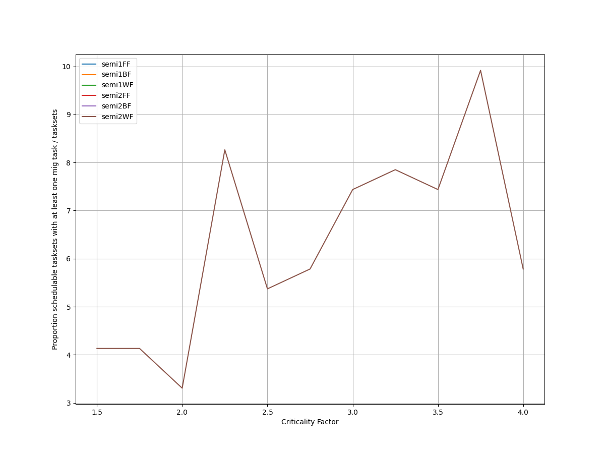
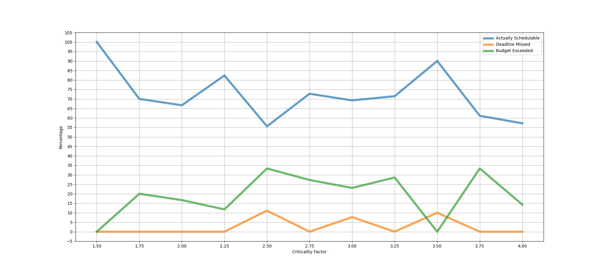
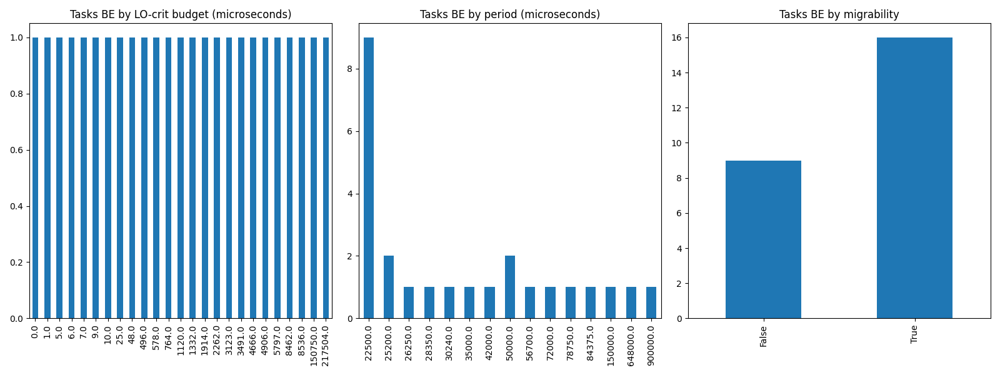
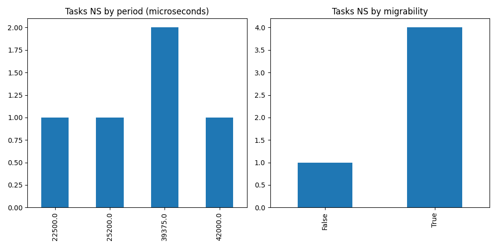

# Report on Experiment 2

   ## Overall data

   Utilization range = [1.8, 2.1] with step = 0.012

   Criticality factor range = [1.5, 4.0] with step = 0.25

  Number of executions: 120

Schedulable executions: 86/120 = 71.66666666666667 %

_Not_ schedulable executions: 3/120 = 2.5 %

Budget Exceeded executions: 25/120 = 20.833333333333336 %

Safe Boundary Exceeded executions: 6/120 = 5.0 %

NS + BE executions: 28/120 = 23.333333333333332 %

### **Simulations**

#### **Weighted schedulability experiment 2 according to simulations.**

#### **Percentage of (schedulable tasksets with at least one migrating tasks / number of schedulable tasksets) of experiment 2 according to simulations.** 

 

### **Real Executions**

#### **Schedulability for each level**

#### **Tasksets, grouped by (LO-crit budget, Period & Migrability), with a Budget_Exceeded task.**

#### **Tasksets, grouped by (Period & Migrability), with at least one task missing one (or more) of its deadlines.**

## Bad tasksets

Click here to expand this section.

### **Not schedulable tasksets**

Click here to expand this section.

Ovvero quando almeno un task non completa entra almeno una sua deadline.

  1. Taskset **e2_semi2wf_t1468**

    Taskset execution params:
	 
    "id": "e2_semi2wf_t1468",
    "size": "12",
    "utilization": "1.86",
    "criticality_factor": "3.0",
    "hicrit_proportion": "0.5"

   
 
Click here to see the deadlines missed tasks list.

   Time values are expressed as **micro-seconds**.

Task:  1

    
    "id": " 1",
    "basecpu": " 2",
    "priority": " 4",
    "period": 25200.0,
    "C(LO)": 3669.0,
    "C(HI)": 3669.0,
    "criticality": "LOW",
    "migrable": "True",
    "completedruns": " 2522",
    "preemptions": " 0",
    "minresponsejitter": " 0.000000000",
    "maxresponsejitter": " 0.002209637",
    "minreleasejitter": " 0.000000000",
    "maxreleasejitter": " 64.504008949",
    "avgresponsejitter": " 0.001832760",
    "deadlinesmissed": " 1",
    "budgetexceeded": " 0",
    "timesmigrated": " 4",
    "timesrestored": " 3",
    "timesonc1": " 1",
    "timesonc2": " 2519",
    "lockedtime": " 0.000046814"

   

   
 
Click here to see the CPUs log.

   Idle time is expressed as **seconds**.

   CPU: 1

    
    "id": 1,
    "hyperperiod": 113400000,
    "lowtohigh": " 0",
    "hightolow": " 0",
    "idletime": 80867515,
    "util": 28.688258377425043

   CPU: 2

    
    "id": 2,
    "hyperperiod": 28350000,
    "lowtohigh": " 39",
    "hightolow": " 39",
    "idletime": 84301789,
    "util": -197.36080776014109

   

   
 
Click here to see the whole tasksets.

   Time values are expressed as **micro-seconds**.

   Task:  5

    
    "id": " 5",
    "basecpu": " 1",
    "priority": " 2",
    "period": 52500.0,
    "C(LO)": 3224.0,
    "C(HI)": 9674.0,
    "criticality": "HIGH",
    "migrable": "False",
    "completedruns": " 2161",
    "preemptions": " 75",
    "minresponsejitter": " 0.000000000",
    "maxresponsejitter": " 0.005868078",
    "minreleasejitter": " 0.000000000",
    "maxreleasejitter": " 114.347506180",
    "avgresponsejitter": " 0.001727375",
    "deadlinesmissed": " 0",
    "budgetexceeded": " 0",
    "timesmigrated": " 0",
    "timesrestored": " 0",
    "timesonc1": " 2235",
    "timesonc2": " 0",
    "lockedtime": " 0.000013958"

   Task:  11

    
    "id": " 11",
    "basecpu": " 1",
    "priority": " 1",
    "period": 100800.0,
    "C(LO)": 5464.0,
    "C(HI)": 16394.0,
    "criticality": "HIGH",
    "migrable": "False",
    "completedruns": " 1126",
    "preemptions": " 149",
    "minresponsejitter": " 0.000000000",
    "maxresponsejitter": " 0.012172354",
    "minreleasejitter": " 0.000000000",
    "maxreleasejitter": " 114.300671766",
    "avgresponsejitter": " 0.003132267",
    "deadlinesmissed": " 0",
    "budgetexceeded": " 0",
    "timesmigrated": " 0",
    "timesrestored": " 0",
    "timesonc1": " 1274",
    "timesonc2": " 0",
    "lockedtime": " 0.000026219"

   Task:  3

    
    "id": " 3",
    "basecpu": " 1",
    "priority": " 3",
    "period": 39375.0,
    "C(LO)": 1696.0,
    "C(HI)": 5089.0,
    "criticality": "HIGH",
    "migrable": "False",
    "completedruns": " 2881",
    "preemptions": " 53",
    "minresponsejitter": " 0.000000000",
    "maxresponsejitter": " 0.005033132",
    "minreleasejitter": " 0.000000000",
    "maxreleasejitter": " 114.360630970",
    "avgresponsejitter": " 0.000912673",
    "deadlinesmissed": " 0",
    "budgetexceeded": " 0",
    "timesmigrated": " 0",
    "timesrestored": " 0",
    "timesonc1": " 2933",
    "timesonc2": " 0",
    "lockedtime": " 0.000004159"

   Task:  12

    
    "id": " 12",
    "basecpu": " 1",
    "priority": " 0",
    "period": 450000.0,
    "C(LO)": 4690.0,
    "C(HI)": 14072.0,
    "criticality": "HIGH",
    "migrable": "False",
    "completedruns": " 253",
    "preemptions": " 13",
    "minresponsejitter": " 0.000000000",
    "maxresponsejitter": " 0.007922991",
    "minreleasejitter": " 0.000000000",
    "maxreleasejitter": " 113.952014511",
    "avgresponsejitter": " 0.002497850",
    "deadlinesmissed": " 0",
    "budgetexceeded": " 0",
    "timesmigrated": " 0",
    "timesrestored": " 0",
    "timesonc1": " 265",
    "timesonc2": " 0",
    "lockedtime": " 0.000000685"

   Task:  2

    
    "id": " 2",
    "basecpu": " 1",
    "priority": " 6",
    "period": 35000.0,
    "C(LO)": 6650.0,
    "C(HI)": 6650.0,
    "criticality": "LOW",
    "migrable": "False",
    "completedruns": " 3241",
    "preemptions": " 1",
    "minresponsejitter": " 0.000000000",
    "maxresponsejitter": " 0.004001366",
    "minreleasejitter": " 0.000000000",
    "maxreleasejitter": " 114.365005973",
    "avgresponsejitter": " 0.003330072",
    "deadlinesmissed": " 0",
    "budgetexceeded": " 0",
    "timesmigrated": " 0",
    "timesrestored": " 0",
    "timesonc1": " 3241",
    "timesonc2": " 0",
    "lockedtime": " 0.000033835"

   Task:  4

    
    "id": " 4",
    "basecpu": " 1",
    "priority": " 5",
    "period": 45360.0,
    "C(LO)": 6811.0,
    "C(HI)": 6811.0,
    "criticality": "LOW",
    "migrable": "False",
    "completedruns": " 2501",
    "preemptions": " 243",
    "minresponsejitter": " 0.000000000",
    "maxresponsejitter": " 0.008028748",
    "minreleasejitter": " 0.000000000",
    "maxreleasejitter": " 114.354645967",
    "avgresponsejitter": " 0.003733048",
    "deadlinesmissed": " 0",
    "budgetexceeded": " 0",
    "timesmigrated": " 0",
    "timesrestored": " 0",
    "timesonc1": " 2743",
    "timesonc2": " 0",
    "lockedtime": " 0.000045577"

   Task:  8

    
    "id": " 8",
    "basecpu": " 1",
    "priority": " 4",
    "period": 70000.0,
    "C(LO)": 4321.0,
    "C(HI)": 4321.0,
    "criticality": "LOW",
    "migrable": "False",
    "completedruns": " 1621",
    "preemptions": " 79",
    "minresponsejitter": " 0.000000000",
    "maxresponsejitter": " 0.006519535",
    "minreleasejitter": " 0.000000000",
    "maxreleasejitter": " 114.333392988",
    "avgresponsejitter": " 0.002333261",
    "deadlinesmissed": " 0",
    "budgetexceeded": " 0",
    "timesmigrated": " 0",
    "timesrestored": " 0",
    "timesonc1": " 1699",
    "timesonc2": " 0",
    "lockedtime": " 0.000012502"

   Task:  9

    
    "id": " 9",
    "basecpu": " 2",
    "priority": " 0",
    "period": 70875.0,
    "C(LO)": 10741.0,
    "C(HI)": 32224.999999999996,
    "criticality": "HIGH",
    "migrable": "False",
    "completedruns": " 1601",
    "preemptions": " 417",
    "minresponsejitter": " 0.000000000",
    "maxresponsejitter": " 0.035108123",
    "minreleasejitter": " 0.000000000",
    "maxreleasejitter": " 114.331331529",
    "avgresponsejitter": " 0.006284156",
    "deadlinesmissed": " 0",
    "budgetexceeded": " 19",
    "timesmigrated": " 0",
    "timesrestored": " 0",
    "timesonc1": " 0",
    "timesonc2": " 2036",
    "lockedtime": " 0.000044610"

   Task:  6

    
    "id": " 6",
    "basecpu": " 2",
    "priority": " 1",
    "period": 56250.0,
    "C(LO)": 2259.0,
    "C(HI)": 6778.0,
    "criticality": "HIGH",
    "migrable": "False",
    "completedruns": " 2017",
    "preemptions": " 54",
    "minresponsejitter": " 0.000000000",
    "maxresponsejitter": " 0.012617619",
    "minreleasejitter": " 0.000000000",
    "maxreleasejitter": " 114.343755748",
    "avgresponsejitter": " 0.001289931",
    "deadlinesmissed": " 0",
    "budgetexceeded": " 20",
    "timesmigrated": " 0",
    "timesrestored": " 0",
    "timesonc1": " 0",
    "timesonc2": " 2090",
    "lockedtime": " 0.000036132"

   Task:  10

    
    "id": " 10",
    "basecpu": " 2",
    "priority": " 2",
    "period": 75600.0,
    "C(LO)": 13261.0,
    "C(HI)": 13261.0,
    "criticality": "LOW",
    "migrable": "False",
    "completedruns": " 1501",
    "preemptions": " 0",
    "minresponsejitter": " 0.000000000",
    "maxresponsejitter": " 0.007984850",
    "minreleasejitter": " 0.000000000",
    "maxreleasejitter": " 114.324405904",
    "avgresponsejitter": " 0.006648991",
    "deadlinesmissed": " 0",
    "budgetexceeded": " 0",
    "timesmigrated": " 0",
    "timesrestored": " 0",
    "timesonc1": " 0",
    "timesonc2": " 1500",
    "lockedtime": " 0.000052426"

   Task:  1

    
    "id": " 1",
    "basecpu": " 2",
    "priority": " 4",
    "period": 25200.0,
    "C(LO)": 3669.0,
    "C(HI)": 3669.0,
    "criticality": "LOW",
    "migrable": "True",
    "completedruns": " 2522",
    "preemptions": " 0",
    "minresponsejitter": " 0.000000000",
    "maxresponsejitter": " 0.002209637",
    "minreleasejitter": " 0.000000000",
    "maxreleasejitter": " 64.504008949",
    "avgresponsejitter": " 0.001832760",
    "deadlinesmissed": " 1",
    "budgetexceeded": " 0",
    "timesmigrated": " 4",
    "timesrestored": " 3",
    "timesonc1": " 1",
    "timesonc2": " 2519",
    "lockedtime": " 0.000046814"

   Task:  7

    
    "id": " 7",
    "basecpu": " 2",
    "priority": " 3",
    "period": 63000.0,
    "C(LO)": 3428.0,
    "C(HI)": 3428.0,
    "criticality": "LOW",
    "migrable": "True",
    "completedruns": " 1801",
    "preemptions": " 0",
    "minresponsejitter": " 0.000000000",
    "maxresponsejitter": " 0.002063802",
    "minreleasejitter": " 0.000000000",
    "maxreleasejitter": " 114.337005802",
    "avgresponsejitter": " 0.001723964",
    "deadlinesmissed": " 0",
    "budgetexceeded": " 0",
    "timesmigrated": " 4",
    "timesrestored": " 4",
    "timesonc1": " 2",
    "timesonc2": " 1798",
    "lockedtime": " 0.000015616"

   

  2. Taskset **e2_semi2wf_t2042**

    Taskset execution params:
	 
    "id": "e2_semi2wf_t2042",
    "size": "12",
    "utilization": "1.9560000000000002",
    "criticality_factor": "3.5",
    "hicrit_proportion": "0.5"

   
 
Click here to see the deadlines missed tasks list.

   Time values are expressed as **micro-seconds**.

Task:  1

    
    "id": " 1",
    "basecpu": " 2",
    "priority": " 4",
    "period": 22500.0,
    "C(LO)": 6088.0,
    "C(HI)": 6088.0,
    "criticality": "LOW",
    "migrable": "True",
    "completedruns": " 359",
    "preemptions": " 0",
    "minresponsejitter": " 0.000000000",
    "maxresponsejitter": " 0.003651751",
    "minreleasejitter": " 0.000000000",
    "maxreleasejitter": " 9.032507652",
    "avgresponsejitter": " 0.003007210",
    "deadlinesmissed": " 1",
    "budgetexceeded": " 0",
    "timesmigrated": " 2",
    "timesrestored": " 1",
    "timesonc1": " 1",
    "timesonc2": " 356",
    "lockedtime": " 0.000006072"

   

   
 
Click here to see the CPUs log.

   Idle time is expressed as **seconds**.

   CPU: 1

    
    "id": 1,
    "hyperperiod": 28350000,
    "lowtohigh": " 0",
    "hightolow": " 0",
    "idletime": 20944648,
    "util": 26.12117107583775

   CPU: 2

    
    "id": 2,
    "hyperperiod": 18900000,
    "lowtohigh": " 7",
    "hightolow": " 7",
    "idletime": 22730618,
    "util": -20.267820105820107

   

   
 
Click here to see the whole tasksets.

   Time values are expressed as **micro-seconds**.

   Task:  7

    
    "id": " 7",
    "basecpu": " 1",
    "priority": " 2",
    "period": 113400.0,
    "C(LO)": 9770.0,
    "C(HI)": 34195.0,
    "criticality": "HIGH",
    "migrable": "False",
    "completedruns": " 251",
    "preemptions": " 28",
    "minresponsejitter": " 0.000000000",
    "maxresponsejitter": " 0.013081498",
    "minreleasejitter": " 0.000000000",
    "maxreleasejitter": " 29.237133303",
    "avgresponsejitter": " 0.005119198",
    "deadlinesmissed": " 0",
    "budgetexceeded": " 0",
    "timesmigrated": " 0",
    "timesrestored": " 0",
    "timesonc1": " 278",
    "timesonc2": " 0",
    "lockedtime": " 0.000000486"

   Task:  10

    
    "id": " 10",
    "basecpu": " 1",
    "priority": " 1",
    "period": 175000.0,
    "C(LO)": 9704.0,
    "C(HI)": 33967.0,
    "criticality": "HIGH",
    "migrable": "False",
    "completedruns": " 163",
    "preemptions": " 22",
    "minresponsejitter": " 0.000000000",
    "maxresponsejitter": " 0.011541742",
    "minreleasejitter": " 0.000000000",
    "maxreleasejitter": " 29.175006087",
    "avgresponsejitter": " 0.005110868",
    "deadlinesmissed": " 0",
    "budgetexceeded": " 0",
    "timesmigrated": " 0",
    "timesrestored": " 0",
    "timesonc1": " 184",
    "timesonc2": " 0",
    "lockedtime": " 0.000000000"

   Task:  2

    
    "id": " 2",
    "basecpu": " 1",
    "priority": " 4",
    "period": 37800.0,
    "C(LO)": 892.0,
    "C(HI)": 3123.0,
    "criticality": "HIGH",
    "migrable": "False",
    "completedruns": " 751",
    "preemptions": " 0",
    "minresponsejitter": " 0.000000000",
    "maxresponsejitter": " 0.000528598",
    "minreleasejitter": " 0.000000000",
    "maxreleasejitter": " 29.312205973",
    "avgresponsejitter": " 0.000442865",
    "deadlinesmissed": " 0",
    "budgetexceeded": " 0",
    "timesmigrated": " 0",
    "timesrestored": " 0",
    "timesonc1": " 750",
    "timesonc2": " 0",
    "lockedtime": " 0.000001222"

   Task:  6

    
    "id": " 6",
    "basecpu": " 1",
    "priority": " 3",
    "period": 112500.0,
    "C(LO)": 1146.0,
    "C(HI)": 4011.0,
    "criticality": "HIGH",
    "migrable": "False",
    "completedruns": " 253",
    "preemptions": " 1",
    "minresponsejitter": " 0.000000000",
    "maxresponsejitter": " 0.001140634",
    "minreleasejitter": " 0.000000000",
    "maxreleasejitter": " 29.237506655",
    "avgresponsejitter": " 0.000586294",
    "deadlinesmissed": " 0",
    "budgetexceeded": " 0",
    "timesmigrated": " 0",
    "timesrestored": " 0",
    "timesonc1": " 253",
    "timesonc2": " 0",
    "lockedtime": " 0.000004078"

   Task:  12

    
    "id": " 12",
    "basecpu": " 1",
    "priority": " 0",
    "period": 810000.0,
    "C(LO)": 180714.0,
    "C(HI)": 180714.0,
    "criticality": "LOW",
    "migrable": "False",
    "completedruns": " 36",
    "preemptions": " 177",
    "minresponsejitter": " 0.000000000",
    "maxresponsejitter": " 0.126711928",
    "minreleasejitter": " 0.000000000",
    "maxreleasejitter": " 28.540006144",
    "avgresponsejitter": " 0.106129790",
    "deadlinesmissed": " 0",
    "budgetexceeded": " 0",
    "timesmigrated": " 0",
    "timesrestored": " 0",
    "timesonc1": " 212",
    "timesonc2": " 0",
    "lockedtime": " 0.000004066"

   Task:  8

    
    "id": " 8",
    "basecpu": " 1",
    "priority": " 5",
    "period": 131250.0,
    "C(LO)": 12832.0,
    "C(HI)": 12832.0,
    "criticality": "LOW",
    "migrable": "False",
    "completedruns": " 217",
    "preemptions": " 0",
    "minresponsejitter": " 0.000000000",
    "maxresponsejitter": " 0.007716706",
    "minreleasejitter": " 0.000000000",
    "maxreleasejitter": " 29.219373670",
    "avgresponsejitter": " 0.006514219",
    "deadlinesmissed": " 0",
    "budgetexceeded": " 0",
    "timesmigrated": " 0",
    "timesrestored": " 0",
    "timesonc1": " 216",
    "timesonc2": " 0",
    "lockedtime": " 0.000000823"

   Task:  3

    
    "id": " 3",
    "basecpu": " 1",
    "priority": " 6",
    "period": 65625.0,
    "C(LO)": 1151.0,
    "C(HI)": 1151.0,
    "criticality": "LOW",
    "migrable": "False",
    "completedruns": " 433",
    "preemptions": " 1",
    "minresponsejitter": " 0.000000000",
    "maxresponsejitter": " 0.000694438",
    "minreleasejitter": " 0.000000000",
    "maxreleasejitter": " 29.284381237",
    "avgresponsejitter": " 0.000577703",
    "deadlinesmissed": " 0",
    "budgetexceeded": " 0",
    "timesmigrated": " 0",
    "timesrestored": " 0",
    "timesonc1": " 433",
    "timesonc2": " 0",
    "lockedtime": " 0.000002261"

   Task:  4

    
    "id": " 4",
    "basecpu": " 2",
    "priority": " 1",
    "period": 78750.0,
    "C(LO)": 12651.0,
    "C(HI)": 44278.0,
    "criticality": "HIGH",
    "migrable": "False",
    "completedruns": " 361",
    "preemptions": " 28",
    "minresponsejitter": " 0.000000000",
    "maxresponsejitter": " 0.034633757",
    "minreleasejitter": " 0.000000000",
    "maxreleasejitter": " 29.271255829",
    "avgresponsejitter": " 0.007055799",
    "deadlinesmissed": " 0",
    "budgetexceeded": " 6",
    "timesmigrated": " 0",
    "timesrestored": " 0",
    "timesonc1": " 0",
    "timesonc2": " 394",
    "lockedtime": " 0.000001874"

   Task:  9

    
    "id": " 9",
    "basecpu": " 2",
    "priority": " 0",
    "period": 157500.0,
    "C(LO)": 1794.0,
    "C(HI)": 6281.0,
    "criticality": "HIGH",
    "migrable": "False",
    "completedruns": " 181",
    "preemptions": " 3",
    "minresponsejitter": " 0.000000000",
    "maxresponsejitter": " 0.005352282",
    "minreleasejitter": " 0.000000000",
    "maxreleasejitter": " 29.198885336",
    "avgresponsejitter": " 0.000970192",
    "deadlinesmissed": " 0",
    "budgetexceeded": " 1",
    "timesmigrated": " 0",
    "timesrestored": " 0",
    "timesonc1": " 0",
    "timesonc2": " 184",
    "lockedtime": " 0.000000000"

   Task:  1

    
    "id": " 1",
    "basecpu": " 2",
    "priority": " 4",
    "period": 22500.0,
    "C(LO)": 6088.0,
    "C(HI)": 6088.0,
    "criticality": "LOW",
    "migrable": "True",
    "completedruns": " 359",
    "preemptions": " 0",
    "minresponsejitter": " 0.000000000",
    "maxresponsejitter": " 0.003651751",
    "minreleasejitter": " 0.000000000",
    "maxreleasejitter": " 9.032507652",
    "avgresponsejitter": " 0.003007210",
    "deadlinesmissed": " 1",
    "budgetexceeded": " 0",
    "timesmigrated": " 2",
    "timesrestored": " 1",
    "timesonc1": " 1",
    "timesonc2": " 356",
    "lockedtime": " 0.000006072"

   Task:  5

    
    "id": " 5",
    "basecpu": " 2",
    "priority": " 3",
    "period": 84375.0,
    "C(LO)": 7581.0,
    "C(HI)": 7581.0,
    "criticality": "LOW",
    "migrable": "False",
    "completedruns": " 337",
    "preemptions": " 0",
    "minresponsejitter": " 0.000000000",
    "maxresponsejitter": " 0.004544225",
    "minreleasejitter": " 0.000000000",
    "maxreleasejitter": " 29.265630892",
    "avgresponsejitter": " 0.003811417",
    "deadlinesmissed": " 0",
    "budgetexceeded": " 0",
    "timesmigrated": " 0",
    "timesrestored": " 0",
    "timesonc1": " 0",
    "timesonc2": " 336",
    "lockedtime": " 0.000009655"

   Task:  11

    
    "id": " 11",
    "basecpu": " 2",
    "priority": " 2",
    "period": 180000.0,
    "C(LO)": 7385.0,
    "C(HI)": 7385.0,
    "criticality": "LOW",
    "migrable": "False",
    "completedruns": " 159",
    "preemptions": " 3",
    "minresponsejitter": " 0.000000000",
    "maxresponsejitter": " 0.007197859",
    "minreleasejitter": " 0.000000000",
    "maxreleasejitter": " 29.260005964",
    "avgresponsejitter": " 0.003788165",
    "deadlinesmissed": " 0",
    "budgetexceeded": " 0",
    "timesmigrated": " 0",
    "timesrestored": " 0",
    "timesonc1": " 0",
    "timesonc2": " 161",
    "lockedtime": " 0.000003285"

   

  3. Taskset **e2_semi2wf_t984**

    Taskset execution params:
	 
    "id": "e2_semi2wf_t984",
    "size": "12",
    "utilization": "1.86",
    "criticality_factor": "2.5",
    "hicrit_proportion": "0.5"

   
 
Click here to see the deadlines missed tasks list.

   Time values are expressed as **micro-seconds**.

Task:  3

    
    "id": " 3",
    "basecpu": " 1",
    "priority": " 3",
    "period": 42000.0,
    "C(LO)": 3012.0,
    "C(HI)": 3012.0,
    "criticality": "LOW",
    "migrable": "True",
    "completedruns": " 2701",
    "preemptions": " 1",
    "minresponsejitter": " 0.000000000",
    "maxresponsejitter": " 0.001813417",
    "minreleasejitter": " 0.000000000",
    "maxreleasejitter": " 114.358006210",
    "avgresponsejitter": " 0.001511652",
    "deadlinesmissed": " 1",
    "budgetexceeded": " 0",
    "timesmigrated": " 4",
    "timesrestored": " 4",
    "timesonc1": " 2699",
    "timesonc2": " 1",
    "lockedtime": " 0.000013099"

   

   
 
Click here to see the CPUs log.

   Idle time is expressed as **seconds**.

   CPU: 1

    
    "id": 1,
    "hyperperiod": 3150000,
    "lowtohigh": " 19",
    "hightolow": " 19",
    "idletime": 83643866,
    "util": -2555.3608253968255

   CPU: 2

    
    "id": 2,
    "hyperperiod": 113400000,
    "lowtohigh": " 0",
    "hightolow": " 0",
    "idletime": 75937649,
    "util": 33.03558289241623

   

   
 
Click here to see the whole tasksets.

   Time values are expressed as **micro-seconds**.

   Task:  10

    
    "id": " 10",
    "basecpu": " 1",
    "priority": " 0",
    "period": 105000.0,
    "C(LO)": 12531.0,
    "C(HI)": 31328.0,
    "criticality": "HIGH",
    "migrable": "False",
    "completedruns": " 1081",
    "preemptions": " 5",
    "minresponsejitter": " 0.000000000",
    "maxresponsejitter": " 0.029929559",
    "minreleasejitter": " 0.000000000",
    "maxreleasejitter": " 114.295006210",
    "avgresponsejitter": " 0.006394072",
    "deadlinesmissed": " 0",
    "budgetexceeded": " 8",
    "timesmigrated": " 0",
    "timesrestored": " 0",
    "timesonc1": " 1093",
    "timesonc2": " 0",
    "lockedtime": " 0.000000258"

   Task:  8

    
    "id": " 8",
    "basecpu": " 1",
    "priority": " 1",
    "period": 78750.0,
    "C(LO)": 6097.0,
    "C(HI)": 15244.0,
    "criticality": "HIGH",
    "migrable": "False",
    "completedruns": " 1441",
    "preemptions": " 23",
    "minresponsejitter": " 0.000000000",
    "maxresponsejitter": " 0.020908778",
    "minreleasejitter": " 0.000000000",
    "maxreleasejitter": " 114.321256189",
    "avgresponsejitter": " 0.003129210",
    "deadlinesmissed": " 0",
    "budgetexceeded": " 11",
    "timesmigrated": " 0",
    "timesrestored": " 0",
    "timesonc1": " 1474",
    "timesonc2": " 0",
    "lockedtime": " 0.000002964"

   Task:  6

    
    "id": " 6",
    "basecpu": " 1",
    "priority": " 2",
    "period": 65625.0,
    "C(LO)": 14618.0,
    "C(HI)": 14618.0,
    "criticality": "LOW",
    "migrable": "False",
    "completedruns": " 1729",
    "preemptions": " 250",
    "minresponsejitter": " 0.000000000",
    "maxresponsejitter": " 0.010513285",
    "minreleasejitter": " 0.000000000",
    "maxreleasejitter": " 114.334381213",
    "avgresponsejitter": " 0.007542664",
    "deadlinesmissed": " 0",
    "budgetexceeded": " 0",
    "timesmigrated": " 0",
    "timesrestored": " 0",
    "timesonc1": " 1978",
    "timesonc2": " 0",
    "lockedtime": " 0.000006676"

   Task:  1

    
    "id": " 1",
    "basecpu": " 1",
    "priority": " 4",
    "period": 26250.0,
    "C(LO)": 3392.0,
    "C(HI)": 3392.0,
    "criticality": "LOW",
    "migrable": "True",
    "completedruns": " 914",
    "preemptions": " 0",
    "minresponsejitter": " 0.000000000",
    "maxresponsejitter": " 0.002040456",
    "minreleasejitter": " 0.000000000",
    "maxreleasejitter": " 24.940009847",
    "avgresponsejitter": " 0.001713012",
    "deadlinesmissed": " 0",
    "budgetexceeded": " 0",
    "timesmigrated": " 1",
    "timesrestored": " 0",
    "timesonc1": " 913",
    "timesonc2": " 0",
    "lockedtime": " 0.000001622"

   Task:  3

    
    "id": " 3",
    "basecpu": " 1",
    "priority": " 3",
    "period": 42000.0,
    "C(LO)": 3012.0,
    "C(HI)": 3012.0,
    "criticality": "LOW",
    "migrable": "True",
    "completedruns": " 2701",
    "preemptions": " 1",
    "minresponsejitter": " 0.000000000",
    "maxresponsejitter": " 0.001813417",
    "minreleasejitter": " 0.000000000",
    "maxreleasejitter": " 114.358006210",
    "avgresponsejitter": " 0.001511652",
    "deadlinesmissed": " 1",
    "budgetexceeded": " 0",
    "timesmigrated": " 4",
    "timesrestored": " 4",
    "timesonc1": " 2699",
    "timesonc2": " 1",
    "lockedtime": " 0.000013099"

   Task:  12

    
    "id": " 12",
    "basecpu": " 2",
    "priority": " 0",
    "period": 675000.0,
    "C(LO)": 81486.0,
    "C(HI)": 203716.0,
    "criticality": "HIGH",
    "migrable": "False",
    "completedruns": " 169",
    "preemptions": " 584",
    "minresponsejitter": " 0.000000000",
    "maxresponsejitter": " 0.072004556",
    "minreleasejitter": " 0.000000000",
    "maxreleasejitter": " 113.726871129",
    "avgresponsejitter": " 0.052654754",
    "deadlinesmissed": " 0",
    "budgetexceeded": " 0",
    "timesmigrated": " 0",
    "timesrestored": " 0",
    "timesonc1": " 0",
    "timesonc2": " 752",
    "lockedtime": " 0.000009063"

   Task:  2

    
    "id": " 2",
    "basecpu": " 2",
    "priority": " 4",
    "period": 30240.0,
    "C(LO)": 1457.0,
    "C(HI)": 3644.0,
    "criticality": "HIGH",
    "migrable": "False",
    "completedruns": " 3751",
    "preemptions": " 45",
    "minresponsejitter": " 0.000000000",
    "maxresponsejitter": " 0.003222372",
    "minreleasejitter": " 0.000000000",
    "maxreleasejitter": " 114.369765901",
    "avgresponsejitter": " 0.000757255",
    "deadlinesmissed": " 0",
    "budgetexceeded": " 0",
    "timesmigrated": " 0",
    "timesrestored": " 0",
    "timesonc1": " 0",
    "timesonc2": " 3795",
    "lockedtime": " 0.000000000"

   Task:  11

    
    "id": " 11",
    "basecpu": " 2",
    "priority": " 1",
    "period": 120000.0,
    "C(LO)": 1497.0,
    "C(HI)": 3743.0,
    "criticality": "HIGH",
    "migrable": "False",
    "completedruns": " 946",
    "preemptions": " 47",
    "minresponsejitter": " 0.000000000",
    "maxresponsejitter": " 0.018960625",
    "minreleasejitter": " 0.000000000",
    "maxreleasejitter": " 114.280005859",
    "avgresponsejitter": " 0.000984192",
    "deadlinesmissed": " 0",
    "budgetexceeded": " 0",
    "timesmigrated": " 0",
    "timesrestored": " 0",
    "timesonc1": " 0",
    "timesonc2": " 992",
    "lockedtime": " 0.000001387"

   Task:  7

    
    "id": " 7",
    "basecpu": " 2",
    "priority": " 2",
    "period": 75600.0,
    "C(LO)": 831.0,
    "C(HI)": 2077.0,
    "criticality": "HIGH",
    "migrable": "False",
    "completedruns": " 1501",
    "preemptions": " 1",
    "minresponsejitter": " 0.000000000",
    "maxresponsejitter": " 0.002834655",
    "minreleasejitter": " 0.000000000",
    "maxreleasejitter": " 114.324405802",
    "avgresponsejitter": " 0.000416535",
    "deadlinesmissed": " 0",
    "budgetexceeded": " 0",
    "timesmigrated": " 0",
    "timesrestored": " 0",
    "timesonc1": " 0",
    "timesonc2": " 1501",
    "lockedtime": " 0.000000420"

   Task:  9

    
    "id": " 9",
    "basecpu": " 2",
    "priority": " 3",
    "period": 90720.0,
    "C(LO)": 27196.0,
    "C(HI)": 27196.0,
    "criticality": "LOW",
    "migrable": "False",
    "completedruns": " 1251",
    "preemptions": " 641",
    "minresponsejitter": " 0.000000000",
    "maxresponsejitter": " 0.020714150",
    "minreleasejitter": " 0.000000000",
    "maxreleasejitter": " 114.309941162",
    "avgresponsejitter": " 0.014766619",
    "deadlinesmissed": " 0",
    "budgetexceeded": " 0",
    "timesmigrated": " 0",
    "timesrestored": " 0",
    "timesonc1": " 0",
    "timesonc2": " 1891",
    "lockedtime": " 0.000022640"

   Task:  4

    
    "id": " 4",
    "basecpu": " 2",
    "priority": " 6",
    "period": 45000.0,
    "C(LO)": 4078.0,
    "C(HI)": 4078.0,
    "criticality": "LOW",
    "migrable": "False",
    "completedruns": " 2521",
    "preemptions": " 0",
    "minresponsejitter": " 0.000000000",
    "maxresponsejitter": " 0.002458456",
    "minreleasejitter": " 0.000000000",
    "maxreleasejitter": " 114.355005778",
    "avgresponsejitter": " 0.002044330",
    "deadlinesmissed": " 0",
    "budgetexceeded": " 0",
    "timesmigrated": " 0",
    "timesrestored": " 0",
    "timesonc1": " 0",
    "timesonc2": " 2520",
    "lockedtime": " 0.000012805"

   Task:  5

    
    "id": " 5",
    "basecpu": " 2",
    "priority": " 5",
    "period": 54000.0,
    "C(LO)": 3936.0000000000005,
    "C(HI)": 3936.0000000000005,
    "criticality": "LOW",
    "migrable": "False",
    "completedruns": " 2101",
    "preemptions": " 0",
    "minresponsejitter": " 0.000000000",
    "maxresponsejitter": " 0.002366901",
    "minreleasejitter": " 0.000000000",
    "maxreleasejitter": " 114.346005841",
    "avgresponsejitter": " 0.001976640",
    "deadlinesmissed": " 0",
    "budgetexceeded": " 0",
    "timesmigrated": " 0",
    "timesrestored": " 0",
    "timesonc1": " 0",
    "timesonc2": " 2100",
    "lockedtime": " 0.000013090"

   

### **Criticality Level Budget Exceeded**

Click here to expand this section.

Ovvero quando un task di un taskset ha ecceduto il suo criticality-level budget, cioè un LO-crit task che eccede il suo LO-crit budget, oppure un HI-crit task che eccede il suo HI-crit budget.

  2. Taskset **e2_semi2wf_t1012**

    Taskset execution params:
	 
    "id": "e2_semi2wf_t1012",
    "size": "12",
    "utilization": "1.8840000000000001",
    "criticality_factor": "2.5",
    "hicrit_proportion": "0.5"

   
 
Click here to see the guilty task.

   Time values are expressed as **micro-seconds**.

Task:  3

    
    "id": " 3",
    "basecpu": " 1",
    "priority": " 3",
    "period": 50000.0,
    "C(LO)": 6.0,
    "C(HI)": 16.0,
    "criticality": "HIGH",
    "migrable": "False",
    "completedruns": " 1",
    "preemptions": " 1",
    "minresponsejitter": " 0.000000000",
    "maxresponsejitter": " 0.000000000",
    "minreleasejitter": " 0.000000000",
    "maxreleasejitter": " 0.000000000",
    "avgresponsejitter": " 0.000000000",
    "deadlinesmissed": " 0",
    "budgetexceeded": " 2",
    "timesmigrated": " 0",
    "timesrestored": " 0",
    "timesonc1": " 2",
    "timesonc2": " 0",
    "lockedtime": " 0.000000000"

   

   
 
Click here to see the CPUs log.

   Idle time is expressed as **seconds**.

   CPU: 1

    
    "id": 1,
    "hyperperiod": 113400000,
    "lowtohigh": " 1",
    "hightolow": " 0",
    "idletime": 16,
    "util": 99.99998589065255

   CPU: 2

    
    "id": 2,
    "hyperperiod": 7560000,
    "lowtohigh": " 0",
    "hightolow": " 0",
    "idletime": 14,
    "util": 99.99981481481481

   

   
 
Click here to see the whole tasksets.

   Time values are expressed as **micro-seconds**.

   Task:  10

    
    "id": " 10",
    "basecpu": " 1",
    "priority": " 1",
    "period": 141750.0,
    "C(LO)": 14162.0,
    "C(HI)": 35406.0,
    "criticality": "HIGH",
    "migrable": "False",
    "completedruns": " 1",
    "preemptions": " 0",
    "minresponsejitter": " 0.000000000",
    "maxresponsejitter": " 0.000000000",
    "minreleasejitter": " 0.000000000",
    "maxreleasejitter": " 0.000000000",
    "avgresponsejitter": " 0.000000000",
    "deadlinesmissed": " 0",
    "budgetexceeded": " 0",
    "timesmigrated": " 0",
    "timesrestored": " 0",
    "timesonc1": " 0",
    "timesonc2": " 0",
    "lockedtime": " 0.000000000"

   Task:  9

    
    "id": " 9",
    "basecpu": " 1",
    "priority": " 2",
    "period": 129600.0,
    "C(LO)": 9446.0,
    "C(HI)": 23616.0,
    "criticality": "HIGH",
    "migrable": "False",
    "completedruns": " 1",
    "preemptions": " 0",
    "minresponsejitter": " 0.000000000",
    "maxresponsejitter": " 0.000000000",
    "minreleasejitter": " 0.000000000",
    "maxreleasejitter": " 0.000000000",
    "avgresponsejitter": " 0.000000000",
    "deadlinesmissed": " 0",
    "budgetexceeded": " 0",
    "timesmigrated": " 0",
    "timesrestored": " 0",
    "timesonc1": " 0",
    "timesonc2": " 0",
    "lockedtime": " 0.000000000"

   Task:  11

    
    "id": " 11",
    "basecpu": " 1",
    "priority": " 0",
    "period": 450000.0,
    "C(LO)": 9323.0,
    "C(HI)": 23308.0,
    "criticality": "HIGH",
    "migrable": "False",
    "completedruns": " 1",
    "preemptions": " 0",
    "minresponsejitter": " 0.000000000",
    "maxresponsejitter": " 0.000000000",
    "minreleasejitter": " 0.000000000",
    "maxreleasejitter": " 0.000000000",
    "avgresponsejitter": " 0.000000000",
    "deadlinesmissed": " 0",
    "budgetexceeded": " 0",
    "timesmigrated": " 0",
    "timesrestored": " 0",
    "timesonc1": " 0",
    "timesonc2": " 0",
    "lockedtime": " 0.000000000"

   Task:  3

    
    "id": " 3",
    "basecpu": " 1",
    "priority": " 3",
    "period": 50000.0,
    "C(LO)": 6.0,
    "C(HI)": 16.0,
    "criticality": "HIGH",
    "migrable": "False",
    "completedruns": " 1",
    "preemptions": " 1",
    "minresponsejitter": " 0.000000000",
    "maxresponsejitter": " 0.000000000",
    "minreleasejitter": " 0.000000000",
    "maxreleasejitter": " 0.000000000",
    "avgresponsejitter": " 0.000000000",
    "deadlinesmissed": " 0",
    "budgetexceeded": " 2",
    "timesmigrated": " 0",
    "timesrestored": " 0",
    "timesonc1": " 2",
    "timesonc2": " 0",
    "lockedtime": " 0.000000000"

   Task:  7

    
    "id": " 7",
    "basecpu": " 1",
    "priority": " 4",
    "period": 87500.0,
    "C(LO)": 18322.0,
    "C(HI)": 18322.0,
    "criticality": "LOW",
    "migrable": "False",
    "completedruns": " 2",
    "preemptions": " 0",
    "minresponsejitter": " 0.000000000",
    "maxresponsejitter": " 0.010052144",
    "minreleasejitter": " 0.000000000",
    "maxreleasejitter": " 1.010319099",
    "avgresponsejitter": " 0.010052144",
    "deadlinesmissed": " 0",
    "budgetexceeded": " 0",
    "timesmigrated": " 0",
    "timesrestored": " 0",
    "timesonc1": " 1",
    "timesonc2": " 0",
    "lockedtime": " 0.000000000"

   Task:  5

    
    "id": " 5",
    "basecpu": " 1",
    "priority": " 6",
    "period": 63000.0,
    "C(LO)": 10296.0,
    "C(HI)": 10296.0,
    "criticality": "LOW",
    "migrable": "True",
    "completedruns": " 2",
    "preemptions": " 0",
    "minresponsejitter": " 0.000000000",
    "maxresponsejitter": " 0.005780583",
    "minreleasejitter": " 0.000000000",
    "maxreleasejitter": " 1.000017279",
    "avgresponsejitter": " 0.005780583",
    "deadlinesmissed": " 0",
    "budgetexceeded": " 0",
    "timesmigrated": " 1",
    "timesrestored": " 0",
    "timesonc1": " 1",
    "timesonc2": " 0",
    "lockedtime": " 0.000000000"

   Task:  6

    
    "id": " 6",
    "basecpu": " 1",
    "priority": " 5",
    "period": 64800.0,
    "C(LO)": 9272.0,
    "C(HI)": 9272.0,
    "criticality": "LOW",
    "migrable": "False",
    "completedruns": " 2",
    "preemptions": " 0",
    "minresponsejitter": " 0.000000000",
    "maxresponsejitter": " 0.004511255",
    "minreleasejitter": " 0.000000000",
    "maxreleasejitter": " 1.005803270",
    "avgresponsejitter": " 0.004511255",
    "deadlinesmissed": " 0",
    "budgetexceeded": " 0",
    "timesmigrated": " 0",
    "timesrestored": " 0",
    "timesonc1": " 1",
    "timesonc2": " 0",
    "lockedtime": " 0.000000000"

   Task:  8

    
    "id": " 8",
    "basecpu": " 2",
    "priority": " 1",
    "period": 105000.0,
    "C(LO)": 17893.0,
    "C(HI)": 44734.0,
    "criticality": "HIGH",
    "migrable": "False",
    "completedruns": " 2",
    "preemptions": " 0",
    "minresponsejitter": " 0.000000000",
    "maxresponsejitter": " 0.008284514",
    "minreleasejitter": " 0.000000000",
    "maxreleasejitter": " 1.007763429",
    "avgresponsejitter": " 0.008284514",
    "deadlinesmissed": " 0",
    "budgetexceeded": " 0",
    "timesmigrated": " 0",
    "timesrestored": " 0",
    "timesonc1": " 0",
    "timesonc2": " 1",
    "lockedtime": " 0.000000000"

   Task:  12

    
    "id": " 12",
    "basecpu": " 2",
    "priority": " 0",
    "period": 504000.0,
    "C(LO)": 21750.0,
    "C(HI)": 54376.0,
    "criticality": "HIGH",
    "migrable": "False",
    "completedruns": " 1",
    "preemptions": " 1",
    "minresponsejitter": " 0.000000000",
    "maxresponsejitter": " 0.000000000",
    "minreleasejitter": " 0.000000000",
    "maxreleasejitter": " 0.000000000",
    "avgresponsejitter": " 0.000000000",
    "deadlinesmissed": " 0",
    "budgetexceeded": " 0",
    "timesmigrated": " 0",
    "timesrestored": " 0",
    "timesonc1": " 0",
    "timesonc2": " 1",
    "lockedtime": " 0.000000000"

   Task:  2

    
    "id": " 2",
    "basecpu": " 2",
    "priority": " 3",
    "period": 35000.0,
    "C(LO)": 6982.0,
    "C(HI)": 6982.0,
    "criticality": "LOW",
    "migrable": "False",
    "completedruns": " 2",
    "preemptions": " 0",
    "minresponsejitter": " 0.000000000",
    "maxresponsejitter": " 0.003799216",
    "minreleasejitter": " 0.000000000",
    "maxreleasejitter": " 1.000104243",
    "avgresponsejitter": " 0.003799216",
    "deadlinesmissed": " 0",
    "budgetexceeded": " 0",
    "timesmigrated": " 0",
    "timesrestored": " 0",
    "timesonc1": " 0",
    "timesonc2": " 1",
    "lockedtime": " 0.000000000"

   Task:  4

    
    "id": " 4",
    "basecpu": " 2",
    "priority": " 2",
    "period": 60000.0,
    "C(LO)": 8737.0,
    "C(HI)": 8737.0,
    "criticality": "LOW",
    "migrable": "False",
    "completedruns": " 2",
    "preemptions": " 0",
    "minresponsejitter": " 0.000000000",
    "maxresponsejitter": " 0.003851649",
    "minreleasejitter": " 0.000000000",
    "maxreleasejitter": " 1.003907324",
    "avgresponsejitter": " 0.003851649",
    "deadlinesmissed": " 0",
    "budgetexceeded": " 0",
    "timesmigrated": " 0",
    "timesrestored": " 0",
    "timesonc1": " 0",
    "timesonc2": " 1",
    "lockedtime": " 0.000000000"

   Task:  1

    
    "id": " 1",
    "basecpu": " 2",
    "priority": " 4",
    "period": 30240.0,
    "C(LO)": 147.0,
    "C(HI)": 147.0,
    "criticality": "LOW",
    "migrable": "False",
    "completedruns": " 2",
    "preemptions": " 0",
    "minresponsejitter": " 0.000000000",
    "maxresponsejitter": " 0.000084441",
    "minreleasejitter": " 0.000000000",
    "maxreleasejitter": " 1.000015402",
    "avgresponsejitter": " 0.000084441",
    "deadlinesmissed": " 0",
    "budgetexceeded": " 0",
    "timesmigrated": " 0",
    "timesrestored": " 0",
    "timesonc1": " 0",
    "timesonc2": " 1",
    "lockedtime": " 0.000000000"

   

  3. Taskset **e2_semi2wf_t1017**

    Taskset execution params:
	 
    "id": "e2_semi2wf_t1017",
    "size": "12",
    "utilization": "1.8960000000000001",
    "criticality_factor": "2.5",
    "hicrit_proportion": "0.5"

   
 
Click here to see the guilty task.

   Time values are expressed as **micro-seconds**.

Task:  1

    
    "id": " 1",
    "basecpu": " 2",
    "priority": " 2",
    "period": 22500.0,
    "C(LO)": 764.0,
    "C(HI)": 764.0,
    "criticality": "LOW",
    "migrable": "True",
    "completedruns": " 1886",
    "preemptions": " 1",
    "minresponsejitter": " 0.000000000",
    "maxresponsejitter": " 0.000459970",
    "minreleasejitter": " 0.000000000",
    "maxreleasejitter": " 43.420006811",
    "avgresponsejitter": " 0.000381201",
    "deadlinesmissed": " 1",
    "budgetexceeded": " 1",
    "timesmigrated": " 1",
    "timesrestored": " 1",
    "timesonc1": " 1",
    "timesonc2": " 1884",
    "lockedtime": " 0.000044111"

   

   
 
Click here to see the CPUs log.

   Idle time is expressed as **seconds**.

   CPU: 1

    
    "id": 1,
    "hyperperiod": 113400000,
    "lowtohigh": " 18",
    "hightolow": " 18",
    "idletime": 27925027,
    "util": 75.37475573192239

   CPU: 2

    
    "id": 2,
    "hyperperiod": 7560000,
    "lowtohigh": " 2",
    "hightolow": " 2",
    "idletime": 28778112,
    "util": -280.66285714285715

   

   
 
Click here to see the whole tasksets.

   Time values are expressed as **micro-seconds**.

   Task:  12

    
    "id": " 12",
    "basecpu": " 1",
    "priority": " 0",
    "period": 420000.0,
    "C(LO)": 22431.0,
    "C(HI)": 56079.0,
    "criticality": "HIGH",
    "migrable": "False",
    "completedruns": " 102",
    "preemptions": " 99",
    "minresponsejitter": " 0.000000000",
    "maxresponsejitter": " 0.054956003",
    "minreleasejitter": " 0.000000000",
    "maxreleasejitter": " 43.007161285",
    "avgresponsejitter": " 0.014044661",
    "deadlinesmissed": " 0",
    "budgetexceeded": " 1",
    "timesmigrated": " 0",
    "timesrestored": " 0",
    "timesonc1": " 201",
    "timesonc2": " 0",
    "lockedtime": " 0.000001468"

   Task:  5

    
    "id": " 5",
    "basecpu": " 1",
    "priority": " 4",
    "period": 56700.0,
    "C(LO)": 2656.0,
    "C(HI)": 6641.0,
    "criticality": "HIGH",
    "migrable": "False",
    "completedruns": " 750",
    "preemptions": " 58",
    "minresponsejitter": " 0.000000000",
    "maxresponsejitter": " 0.006825312",
    "minreleasejitter": " 0.000000000",
    "maxreleasejitter": " 43.415679691",
    "avgresponsejitter": " 0.001551282",
    "deadlinesmissed": " 0",
    "budgetexceeded": " 3",
    "timesmigrated": " 0",
    "timesrestored": " 0",
    "timesonc1": " 810",
    "timesonc2": " 0",
    "lockedtime": " 0.000003508"

   Task:  10

    
    "id": " 10",
    "basecpu": " 1",
    "priority": " 2",
    "period": 131250.0,
    "C(LO)": 5818.0,
    "C(HI)": 14546.0,
    "criticality": "HIGH",
    "migrable": "False",
    "completedruns": " 325",
    "preemptions": " 55",
    "minresponsejitter": " 0.000000000",
    "maxresponsejitter": " 0.012993766",
    "minreleasejitter": " 0.000000000",
    "maxreleasejitter": " 43.393756009",
    "avgresponsejitter": " 0.003630661",
    "deadlinesmissed": " 0",
    "budgetexceeded": " 6",
    "timesmigrated": " 0",
    "timesrestored": " 0",
    "timesonc1": " 385",
    "timesonc2": " 0",
    "lockedtime": " 0.000003808"

   Task:  8

    
    "id": " 8",
    "basecpu": " 1",
    "priority": " 3",
    "period": 78750.0,
    "C(LO)": 2946.0,
    "C(HI)": 7367.0,
    "criticality": "HIGH",
    "migrable": "False",
    "completedruns": " 540",
    "preemptions": " 70",
    "minresponsejitter": " 0.000000000",
    "maxresponsejitter": " 0.012334153",
    "minreleasejitter": " 0.000000000",
    "maxreleasejitter": " 43.369645375",
    "avgresponsejitter": " 0.001927637",
    "deadlinesmissed": " 0",
    "budgetexceeded": " 6",
    "timesmigrated": " 0",
    "timesrestored": " 0",
    "timesonc1": " 615",
    "timesonc2": " 0",
    "lockedtime": " 0.000002697"

   Task:  11

    
    "id": " 11",
    "basecpu": " 1",
    "priority": " 1",
    "period": 200000.0,
    "C(LO)": 3840.0,
    "C(HI)": 9600.0,
    "criticality": "HIGH",
    "migrable": "False",
    "completedruns": " 214",
    "preemptions": " 34",
    "minresponsejitter": " 0.000000000",
    "maxresponsejitter": " 0.010824204",
    "minreleasejitter": " 0.000000000",
    "maxreleasejitter": " 43.403164655",
    "avgresponsejitter": " 0.002414730",
    "deadlinesmissed": " 0",
    "budgetexceeded": " 2",
    "timesmigrated": " 0",
    "timesrestored": " 0",
    "timesonc1": " 249",
    "timesonc2": " 0",
    "lockedtime": " 0.000001060"

   Task:  4

    
    "id": " 4",
    "basecpu": " 1",
    "priority": " 6",
    "period": 40000.0,
    "C(LO)": 6572.0,
    "C(HI)": 6572.0,
    "criticality": "LOW",
    "migrable": "False",
    "completedruns": " 1062",
    "preemptions": " 154",
    "minresponsejitter": " 0.000000000",
    "maxresponsejitter": " 0.007657595",
    "minreleasejitter": " 0.000000000",
    "maxreleasejitter": " 43.400006934",
    "avgresponsejitter": " 0.003561228",
    "deadlinesmissed": " 0",
    "budgetexceeded": " 0",
    "timesmigrated": " 0",
    "timesrestored": " 0",
    "timesonc1": " 1215",
    "timesonc2": " 0",
    "lockedtime": " 0.000029820"

   Task:  7

    
    "id": " 7",
    "basecpu": " 1",
    "priority": " 5",
    "period": 75600.0,
    "C(LO)": 8496.0,
    "C(HI)": 8496.0,
    "criticality": "LOW",
    "migrable": "False",
    "completedruns": " 563",
    "preemptions": " 179",
    "minresponsejitter": " 0.000000000",
    "maxresponsejitter": " 0.011221102",
    "minreleasejitter": " 0.000000000",
    "maxreleasejitter": " 43.411606979",
    "avgresponsejitter": " 0.005029351",
    "deadlinesmissed": " 0",
    "budgetexceeded": " 0",
    "timesmigrated": " 0",
    "timesrestored": " 0",
    "timesonc1": " 741",
    "timesonc2": " 0",
    "lockedtime": " 0.000009982"

   Task:  3

    
    "id": " 3",
    "basecpu": " 1",
    "priority": " 7",
    "period": 39375.0,
    "C(LO)": 4374.0,
    "C(HI)": 4374.0,
    "criticality": "LOW",
    "migrable": "False",
    "completedruns": " 1079",
    "preemptions": " 0",
    "minresponsejitter": " 0.000000000",
    "maxresponsejitter": " 0.002638054",
    "minreleasejitter": " 0.000000000",
    "maxreleasejitter": " 43.406880970",
    "avgresponsejitter": " 0.002179946",
    "deadlinesmissed": " 0",
    "budgetexceeded": " 0",
    "timesmigrated": " 0",
    "timesrestored": " 0",
    "timesonc1": " 1078",
    "timesonc2": " 0",
    "lockedtime": " 0.000010937"

   Task:  2

    
    "id": " 2",
    "basecpu": " 1",
    "priority": " 8",
    "period": 33750.0,
    "C(LO)": 2874.0,
    "C(HI)": 2874.0,
    "criticality": "LOW",
    "migrable": "True",
    "completedruns": " 1258",
    "preemptions": " 0",
    "minresponsejitter": " 0.000000000",
    "maxresponsejitter": " 0.001731423",
    "minreleasejitter": " 0.000000000",
    "maxreleasejitter": " 43.390007126",
    "avgresponsejitter": " 0.001448291",
    "deadlinesmissed": " 0",
    "budgetexceeded": " 0",
    "timesmigrated": " 3",
    "timesrestored": " 3",
    "timesonc1": " 1256",
    "timesonc2": " 1",
    "lockedtime": " 0.000020270"

   Task:  9

    
    "id": " 9",
    "basecpu": " 2",
    "priority": " 0",
    "period": 100800.0,
    "C(LO)": 18915.0,
    "C(HI)": 47287.0,
    "criticality": "HIGH",
    "migrable": "False",
    "completedruns": " 422",
    "preemptions": " 234",
    "minresponsejitter": " 0.000000000",
    "maxresponsejitter": " 0.036422435",
    "minreleasejitter": " 0.000000000",
    "maxreleasejitter": " 43.336006580",
    "avgresponsejitter": " 0.011378820",
    "deadlinesmissed": " 0",
    "budgetexceeded": " 2",
    "timesmigrated": " 0",
    "timesrestored": " 0",
    "timesonc1": " 0",
    "timesonc2": " 657",
    "lockedtime": " 0.000032832"

   Task:  6

    
    "id": " 6",
    "basecpu": " 2",
    "priority": " 1",
    "period": 60000.0,
    "C(LO)": 25013.0,
    "C(HI)": 25013.0,
    "criticality": "LOW",
    "migrable": "False",
    "completedruns": " 708",
    "preemptions": " 235",
    "minresponsejitter": " 0.000000000",
    "maxresponsejitter": " 0.015453390",
    "minreleasejitter": " 0.000000000",
    "maxreleasejitter": " 43.360007342",
    "avgresponsejitter": " 0.012704613",
    "deadlinesmissed": " 0",
    "budgetexceeded": " 0",
    "timesmigrated": " 0",
    "timesrestored": " 0",
    "timesonc1": " 0",
    "timesonc2": " 942",
    "lockedtime": " 0.000044222"

   Task:  1

    
    "id": " 1",
    "basecpu": " 2",
    "priority": " 2",
    "period": 22500.0,
    "C(LO)": 764.0,
    "C(HI)": 764.0,
    "criticality": "LOW",
    "migrable": "True",
    "completedruns": " 1886",
    "preemptions": " 1",
    "minresponsejitter": " 0.000000000",
    "maxresponsejitter": " 0.000459970",
    "minreleasejitter": " 0.000000000",
    "maxreleasejitter": " 43.420006811",
    "avgresponsejitter": " 0.000381201",
    "deadlinesmissed": " 1",
    "budgetexceeded": " 1",
    "timesmigrated": " 1",
    "timesrestored": " 1",
    "timesonc1": " 1",
    "timesonc2": " 1884",
    "lockedtime": " 0.000044111"

   

  4. Taskset **e2_semi2wf_t1104**

    Taskset execution params:
	 
    "id": "e2_semi2wf_t1104",
    "size": "12",
    "utilization": "1.9920000000000002",
    "criticality_factor": "2.5",
    "hicrit_proportion": "0.5"

   
 
Click here to see the guilty task.

   Time values are expressed as **micro-seconds**.

Task:  1

    
    "id": " 1",
    "basecpu": " 2",
    "priority": " 6",
    "period": 25200.0,
    "C(LO)": 1332.0,
    "C(HI)": 1332.0,
    "criticality": "LOW",
    "migrable": "True",
    "completedruns": " 939",
    "preemptions": " 1",
    "minresponsejitter": " 0.000000000",
    "maxresponsejitter": " 0.000800679",
    "minreleasejitter": " 0.000000000",
    "maxreleasejitter": " 24.646006411",
    "avgresponsejitter": " 0.000675132",
    "deadlinesmissed": " 1",
    "budgetexceeded": " 1",
    "timesmigrated": " 3",
    "timesrestored": " 2",
    "timesonc1": " 6",
    "timesonc2": " 932",
    "lockedtime": " 0.000009054"

   

   
 
Click here to see the CPUs log.

   Idle time is expressed as **seconds**.

   CPU: 1

    
    "id": 1,
    "hyperperiod": 113400000,
    "lowtohigh": " 0",
    "hightolow": " 0",
    "idletime": 15019077,
    "util": 86.75566402116402

   CPU: 2

    
    "id": 2,
    "hyperperiod": 7560000,
    "lowtohigh": " 16",
    "hightolow": " 15",
    "idletime": 15166244,
    "util": -100.61169312169312

   

   
 
Click here to see the whole tasksets.

   Time values are expressed as **micro-seconds**.

   Task:  10

    
    "id": " 10",
    "basecpu": " 1",
    "priority": " 1",
    "period": 129600.0,
    "C(LO)": 8868.0,
    "C(HI)": 22171.0,
    "criticality": "HIGH",
    "migrable": "False",
    "completedruns": " 184",
    "preemptions": " 31",
    "minresponsejitter": " 0.000000000",
    "maxresponsejitter": " 0.006775144",
    "minreleasejitter": " 0.000000000",
    "maxreleasejitter": " 24.587207243",
    "avgresponsejitter": " 0.004672808",
    "deadlinesmissed": " 0",
    "budgetexceeded": " 0",
    "timesmigrated": " 0",
    "timesrestored": " 0",
    "timesonc1": " 214",
    "timesonc2": " 0",
    "lockedtime": " 0.000001306"

   Task:  3

    
    "id": " 3",
    "basecpu": " 1",
    "priority": " 3",
    "period": 42000.0,
    "C(LO)": 2405.0,
    "C(HI)": 6012.0,
    "criticality": "HIGH",
    "migrable": "False",
    "completedruns": " 564",
    "preemptions": " 0",
    "minresponsejitter": " 0.000000000",
    "maxresponsejitter": " 0.001450706",
    "minreleasejitter": " 0.000000000",
    "maxreleasejitter": " 24.604374378",
    "avgresponsejitter": " 0.001209787",
    "deadlinesmissed": " 0",
    "budgetexceeded": " 0",
    "timesmigrated": " 0",
    "timesrestored": " 0",
    "timesonc1": " 563",
    "timesonc2": " 0",
    "lockedtime": " 0.000005090"

   Task:  4

    
    "id": " 4",
    "basecpu": " 1",
    "priority": " 2",
    "period": 50000.0,
    "C(LO)": 1444.0,
    "C(HI)": 3610.0,
    "criticality": "HIGH",
    "migrable": "False",
    "completedruns": " 474",
    "preemptions": " 0",
    "minresponsejitter": " 0.000000000",
    "maxresponsejitter": " 0.000868913",
    "minreleasejitter": " 0.000000000",
    "maxreleasejitter": " 24.600006955",
    "avgresponsejitter": " 0.000733838",
    "deadlinesmissed": " 0",
    "budgetexceeded": " 0",
    "timesmigrated": " 0",
    "timesrestored": " 0",
    "timesonc1": " 473",
    "timesonc2": " 0",
    "lockedtime": " 0.000000000"

   Task:  11

    
    "id": " 11",
    "basecpu": " 1",
    "priority": " 0",
    "period": 405000.0,
    "C(LO)": 227466.0,
    "C(HI)": 227466.0,
    "criticality": "LOW",
    "migrable": "False",
    "completedruns": " 60",
    "preemptions": " 341",
    "minresponsejitter": " 0.000000000",
    "maxresponsejitter": " 0.146948829",
    "minreleasejitter": " 0.000000000",
    "maxreleasejitter": " 24.490006183",
    "avgresponsejitter": " 0.122291502",
    "deadlinesmissed": " 0",
    "budgetexceeded": " 0",
    "timesmigrated": " 0",
    "timesrestored": " 0",
    "timesonc1": " 400",
    "timesonc2": " 0",
    "lockedtime": " 0.000020715"

   Task:  8

    
    "id": " 8",
    "basecpu": " 1",
    "priority": " 4",
    "period": 84000.0,
    "C(LO)": 602.0,
    "C(HI)": 602.0,
    "criticality": "LOW",
    "migrable": "False",
    "completedruns": " 283",
    "preemptions": " 0",
    "minresponsejitter": " 0.000000000",
    "maxresponsejitter": " 0.000362517",
    "minreleasejitter": " 0.000000000",
    "maxreleasejitter": " 24.604007276",
    "avgresponsejitter": " 0.000304925",
    "deadlinesmissed": " 0",
    "budgetexceeded": " 0",
    "timesmigrated": " 0",
    "timesrestored": " 0",
    "timesonc1": " 282",
    "timesonc2": " 0",
    "lockedtime": " 0.000003859"

   Task:  9

    
    "id": " 9",
    "basecpu": " 2",
    "priority": " 1",
    "period": 105000.0,
    "C(LO)": 11559.0,
    "C(HI)": 28897.0,
    "criticality": "HIGH",
    "migrable": "False",
    "completedruns": " 227",
    "preemptions": " 76",
    "minresponsejitter": " 0.000000000",
    "maxresponsejitter": " 0.019550508",
    "minreleasejitter": " 0.000000000",
    "maxreleasejitter": " 24.632379979",
    "avgresponsejitter": " 0.006168931",
    "deadlinesmissed": " 0",
    "budgetexceeded": " 2",
    "timesmigrated": " 0",
    "timesrestored": " 0",
    "timesonc1": " 0",
    "timesonc2": " 304",
    "lockedtime": " 0.000003727"

   Task:  6

    
    "id": " 6",
    "basecpu": " 2",
    "priority": " 2",
    "period": 60480.0,
    "C(LO)": 1976.0,
    "C(HI)": 4941.0,
    "criticality": "HIGH",
    "migrable": "False",
    "completedruns": " 392",
    "preemptions": " 10",
    "minresponsejitter": " 0.000000000",
    "maxresponsejitter": " 0.009176799",
    "minreleasejitter": " 0.000000000",
    "maxreleasejitter": " 24.587885099",
    "avgresponsejitter": " 0.001082586",
    "deadlinesmissed": " 0",
    "budgetexceeded": " 6",
    "timesmigrated": " 0",
    "timesrestored": " 0",
    "timesonc1": " 0",
    "timesonc2": " 407",
    "lockedtime": " 0.000000000"

   Task:  2

    
    "id": " 2",
    "basecpu": " 2",
    "priority": " 3",
    "period": 39375.0,
    "C(LO)": 890.0,
    "C(HI)": 2227.0,
    "criticality": "HIGH",
    "migrable": "False",
    "completedruns": " 602",
    "preemptions": " 2",
    "minresponsejitter": " 0.000000000",
    "maxresponsejitter": " 0.001629012",
    "minreleasejitter": " 0.000000000",
    "maxreleasejitter": " 24.632001405",
    "avgresponsejitter": " 0.000456123",
    "deadlinesmissed": " 0",
    "budgetexceeded": " 8",
    "timesmigrated": " 0",
    "timesrestored": " 0",
    "timesonc1": " 0",
    "timesonc2": " 611",
    "lockedtime": " 0.000000000"

   Task:  12

    
    "id": " 12",
    "basecpu": " 2",
    "priority": " 0",
    "period": 840000.0,
    "C(LO)": 280380.0,
    "C(HI)": 280380.0,
    "criticality": "LOW",
    "migrable": "False",
    "completedruns": " 29",
    "preemptions": " 343",
    "minresponsejitter": " 0.000000000",
    "maxresponsejitter": " 0.202227754",
    "minreleasejitter": " 0.000000000",
    "maxreleasejitter": " 23.692609294",
    "avgresponsejitter": " 0.163884928",
    "deadlinesmissed": " 0",
    "budgetexceeded": " 0",
    "timesmigrated": " 0",
    "timesrestored": " 0",
    "timesonc1": " 0",
    "timesonc2": " 371",
    "lockedtime": " 0.000008583"

   Task:  7

    
    "id": " 7",
    "basecpu": " 2",
    "priority": " 4",
    "period": 78750.0,
    "C(LO)": 12798.0,
    "C(HI)": 12798.0,
    "criticality": "LOW",
    "migrable": "False",
    "completedruns": " 302",
    "preemptions": " 59",
    "minresponsejitter": " 0.000000000",
    "maxresponsejitter": " 0.008338129",
    "minreleasejitter": " 0.000000000",
    "maxreleasejitter": " 24.625008658",
    "avgresponsejitter": " 0.006548126",
    "deadlinesmissed": " 0",
    "budgetexceeded": " 0",
    "timesmigrated": " 0",
    "timesrestored": " 0",
    "timesonc1": " 0",
    "timesonc2": " 360",
    "lockedtime": " 0.000000544"

   Task:  5

    
    "id": " 5",
    "basecpu": " 2",
    "priority": " 5",
    "period": 54000.0,
    "C(LO)": 3999.0,
    "C(HI)": 3999.0,
    "criticality": "LOW",
    "migrable": "True",
    "completedruns": " 3",
    "preemptions": " 0",
    "minresponsejitter": " 0.000000000",
    "maxresponsejitter": " 0.002380625",
    "minreleasejitter": " 0.000000000",
    "maxreleasejitter": " 1.054006426",
    "avgresponsejitter": " 0.002081345",
    "deadlinesmissed": " 0",
    "budgetexceeded": " 0",
    "timesmigrated": " 1",
    "timesrestored": " 0",
    "timesonc1": " 0",
    "timesonc2": " 2",
    "lockedtime": " 0.000000000"

   Task:  1

    
    "id": " 1",
    "basecpu": " 2",
    "priority": " 6",
    "period": 25200.0,
    "C(LO)": 1332.0,
    "C(HI)": 1332.0,
    "criticality": "LOW",
    "migrable": "True",
    "completedruns": " 939",
    "preemptions": " 1",
    "minresponsejitter": " 0.000000000",
    "maxresponsejitter": " 0.000800679",
    "minreleasejitter": " 0.000000000",
    "maxreleasejitter": " 24.646006411",
    "avgresponsejitter": " 0.000675132",
    "deadlinesmissed": " 1",
    "budgetexceeded": " 1",
    "timesmigrated": " 3",
    "timesrestored": " 2",
    "timesonc1": " 6",
    "timesonc2": " 932",
    "lockedtime": " 0.000009054"

   

  5. Taskset **e2_semi2wf_t1218**

    Taskset execution params:
	 
    "id": "e2_semi2wf_t1218",
    "size": "12",
    "utilization": "1.848",
    "criticality_factor": "2.75",
    "hicrit_proportion": "0.5"

   
 
Click here to see the guilty task.

   Time values are expressed as **micro-seconds**.

Task:  8

    
    "id": " 8",
    "basecpu": " 1",
    "priority": " 2",
    "period": 150000.0,
    "C(LO)": 7.0,
    "C(HI)": 7.0,
    "criticality": "LOW",
    "migrable": "False",
    "completedruns": " 1",
    "preemptions": " 1",
    "minresponsejitter": " 0.000000000",
    "maxresponsejitter": " 0.000000000",
    "minreleasejitter": " 0.000000000",
    "maxreleasejitter": " 0.000000000",
    "avgresponsejitter": " 0.000000000",
    "deadlinesmissed": " 0",
    "budgetexceeded": " 1",
    "timesmigrated": " 0",
    "timesrestored": " 0",
    "timesonc1": " 1",
    "timesonc2": " 0",
    "lockedtime": " 0.000000000"

   

   
 
Click here to see the CPUs log.

   Idle time is expressed as **seconds**.

   CPU: 1

    
    "id": 1,
    "hyperperiod": 3150000,
    "lowtohigh": " 0",
    "hightolow": " 0",
    "idletime": 14,
    "util": 99.99955555555556

   CPU: 2

    
    "id": 2,
    "hyperperiod": 56700000,
    "lowtohigh": " 0",
    "hightolow": " 0",
    "idletime": 16,
    "util": 99.99997178130512

   

   
 
Click here to see the whole tasksets.

   Time values are expressed as **micro-seconds**.

   Task:  12

    
    "id": " 12",
    "basecpu": " 1",
    "priority": " 0",
    "period": 787500.0,
    "C(LO)": 62179.0,
    "C(HI)": 170993.0,
    "criticality": "HIGH",
    "migrable": "False",
    "completedruns": " 1",
    "preemptions": " 0",
    "minresponsejitter": " 0.000000000",
    "maxresponsejitter": " 0.000000000",
    "minreleasejitter": " 0.000000000",
    "maxreleasejitter": " 0.000000000",
    "avgresponsejitter": " 0.000000000",
    "deadlinesmissed": " 0",
    "budgetexceeded": " 0",
    "timesmigrated": " 0",
    "timesrestored": " 0",
    "timesonc1": " 0",
    "timesonc2": " 0",
    "lockedtime": " 0.000000000"

   Task:  10

    
    "id": " 10",
    "basecpu": " 1",
    "priority": " 1",
    "period": 196875.0,
    "C(LO)": 12771.0,
    "C(HI)": 35122.0,
    "criticality": "HIGH",
    "migrable": "False",
    "completedruns": " 1",
    "preemptions": " 0",
    "minresponsejitter": " 0.000000000",
    "maxresponsejitter": " 0.000000000",
    "minreleasejitter": " 0.000000000",
    "maxreleasejitter": " 0.000000000",
    "avgresponsejitter": " 0.000000000",
    "deadlinesmissed": " 0",
    "budgetexceeded": " 0",
    "timesmigrated": " 0",
    "timesrestored": " 0",
    "timesonc1": " 0",
    "timesonc2": " 0",
    "lockedtime": " 0.000000000"

   Task:  3

    
    "id": " 3",
    "basecpu": " 1",
    "priority": " 3",
    "period": 45000.0,
    "C(LO)": 15540.0,
    "C(HI)": 15540.0,
    "criticality": "LOW",
    "migrable": "False",
    "completedruns": " 2",
    "preemptions": " 0",
    "minresponsejitter": " 0.000000000",
    "maxresponsejitter": " 0.006961057",
    "minreleasejitter": " 0.000000000",
    "maxreleasejitter": " 1.002080778",
    "avgresponsejitter": " 0.006961057",
    "deadlinesmissed": " 0",
    "budgetexceeded": " 0",
    "timesmigrated": " 0",
    "timesrestored": " 0",
    "timesonc1": " 1",
    "timesonc2": " 0",
    "lockedtime": " 0.000000000"

   Task:  1

    
    "id": " 1",
    "basecpu": " 1",
    "priority": " 4",
    "period": 22500.0,
    "C(LO)": 3716.0,
    "C(HI)": 3716.0,
    "criticality": "LOW",
    "migrable": "False",
    "completedruns": " 2",
    "preemptions": " 0",
    "minresponsejitter": " 0.000000000",
    "maxresponsejitter": " 0.002060192",
    "minreleasejitter": " 0.000000000",
    "maxreleasejitter": " 1.000015354",
    "avgresponsejitter": " 0.002060192",
    "deadlinesmissed": " 0",
    "budgetexceeded": " 0",
    "timesmigrated": " 0",
    "timesrestored": " 0",
    "timesonc1": " 1",
    "timesonc2": " 0",
    "lockedtime": " 0.000000000"

   Task:  8

    
    "id": " 8",
    "basecpu": " 1",
    "priority": " 2",
    "period": 150000.0,
    "C(LO)": 7.0,
    "C(HI)": 7.0,
    "criticality": "LOW",
    "migrable": "False",
    "completedruns": " 1",
    "preemptions": " 1",
    "minresponsejitter": " 0.000000000",
    "maxresponsejitter": " 0.000000000",
    "minreleasejitter": " 0.000000000",
    "maxreleasejitter": " 0.000000000",
    "avgresponsejitter": " 0.000000000",
    "deadlinesmissed": " 0",
    "budgetexceeded": " 1",
    "timesmigrated": " 0",
    "timesrestored": " 0",
    "timesonc1": " 1",
    "timesonc2": " 0",
    "lockedtime": " 0.000000000"

   Task:  5

    
    "id": " 5",
    "basecpu": " 2",
    "priority": " 3",
    "period": 78750.0,
    "C(LO)": 6356.0,
    "C(HI)": 17481.0,
    "criticality": "HIGH",
    "migrable": "False",
    "completedruns": " 1",
    "preemptions": " 1",
    "minresponsejitter": " 0.000000000",
    "maxresponsejitter": " 0.000000000",
    "minreleasejitter": " 0.000000000",
    "maxreleasejitter": " 0.000000000",
    "avgresponsejitter": " 0.000000000",
    "deadlinesmissed": " 0",
    "budgetexceeded": " 0",
    "timesmigrated": " 0",
    "timesrestored": " 0",
    "timesonc1": " 0",
    "timesonc2": " 1",
    "lockedtime": " 0.000000000"

   Task:  7

    
    "id": " 7",
    "basecpu": " 2",
    "priority": " 2",
    "period": 105000.0,
    "C(LO)": 1220.0,
    "C(HI)": 3355.0,
    "criticality": "HIGH",
    "migrable": "False",
    "completedruns": " 1",
    "preemptions": " 0",
    "minresponsejitter": " 0.000000000",
    "maxresponsejitter": " 0.000000000",
    "minreleasejitter": " 0.000000000",
    "maxreleasejitter": " 0.000000000",
    "avgresponsejitter": " 0.000000000",
    "deadlinesmissed": " 0",
    "budgetexceeded": " 0",
    "timesmigrated": " 0",
    "timesrestored": " 0",
    "timesonc1": " 0",
    "timesonc2": " 0",
    "lockedtime": " 0.000000000"

   Task:  11

    
    "id": " 11",
    "basecpu": " 2",
    "priority": " 0",
    "period": 540000.0,
    "C(LO)": 4303.0,
    "C(HI)": 11835.0,
    "criticality": "HIGH",
    "migrable": "False",
    "completedruns": " 1",
    "preemptions": " 0",
    "minresponsejitter": " 0.000000000",
    "maxresponsejitter": " 0.000000000",
    "minreleasejitter": " 0.000000000",
    "maxreleasejitter": " 0.000000000",
    "avgresponsejitter": " 0.000000000",
    "deadlinesmissed": " 0",
    "budgetexceeded": " 0",
    "timesmigrated": " 0",
    "timesrestored": " 0",
    "timesonc1": " 0",
    "timesonc2": " 0",
    "lockedtime": " 0.000000000"

   Task:  2

    
    "id": " 2",
    "basecpu": " 2",
    "priority": " 4",
    "period": 28350.0,
    "C(LO)": 100.0,
    "C(HI)": 275.0,
    "criticality": "HIGH",
    "migrable": "False",
    "completedruns": " 2",
    "preemptions": " 0",
    "minresponsejitter": " 0.000000000",
    "maxresponsejitter": " 0.000063628",
    "minreleasejitter": " 0.000000000",
    "maxreleasejitter": " 1.008522450",
    "avgresponsejitter": " 0.000063628",
    "deadlinesmissed": " 0",
    "budgetexceeded": " 0",
    "timesmigrated": " 0",
    "timesrestored": " 0",
    "timesonc1": " 0",
    "timesonc2": " 1",
    "lockedtime": " 0.000000000"

   Task:  9

    
    "id": " 9",
    "basecpu": " 2",
    "priority": " 1",
    "period": 168750.0,
    "C(LO)": 58896.0,
    "C(HI)": 58896.0,
    "criticality": "LOW",
    "migrable": "False",
    "completedruns": " 1",
    "preemptions": " 0",
    "minresponsejitter": " 0.000000000",
    "maxresponsejitter": " 0.000000000",
    "minreleasejitter": " 0.000000000",
    "maxreleasejitter": " 0.000000000",
    "avgresponsejitter": " 0.000000000",
    "deadlinesmissed": " 0",
    "budgetexceeded": " 0",
    "timesmigrated": " 0",
    "timesrestored": " 0",
    "timesonc1": " 0",
    "timesonc2": " 0",
    "lockedtime": " 0.000000000"

   Task:  4

    
    "id": " 4",
    "basecpu": " 2",
    "priority": " 6",
    "period": 63000.0,
    "C(LO)": 13740.0,
    "C(HI)": 13740.0,
    "criticality": "LOW",
    "migrable": "True",
    "completedruns": " 2",
    "preemptions": " 0",
    "minresponsejitter": " 0.000000000",
    "maxresponsejitter": " 0.005566538",
    "minreleasejitter": " 0.000000000",
    "maxreleasejitter": " 1.000017252",
    "avgresponsejitter": " 0.005566538",
    "deadlinesmissed": " 0",
    "budgetexceeded": " 0",
    "timesmigrated": " 0",
    "timesrestored": " 0",
    "timesonc1": " 0",
    "timesonc2": " 1",
    "lockedtime": " 0.000000243"

   Task:  6

    
    "id": " 6",
    "basecpu": " 2",
    "priority": " 5",
    "period": 81000.0,
    "C(LO)": 7222.0,
    "C(HI)": 7222.0,
    "criticality": "LOW",
    "migrable": "False",
    "completedruns": " 2",
    "preemptions": " 0",
    "minresponsejitter": " 0.000000000",
    "maxresponsejitter": " 0.002930090",
    "minreleasejitter": " 0.000000000",
    "maxreleasejitter": " 1.005588441",
    "avgresponsejitter": " 0.002930090",
    "deadlinesmissed": " 0",
    "budgetexceeded": " 0",
    "timesmigrated": " 0",
    "timesrestored": " 0",
    "timesonc1": " 0",
    "timesonc2": " 1",
    "lockedtime": " 0.000000000"

   

  6. Taskset **e2_semi2wf_t1334**

    Taskset execution params:
	 
    "id": "e2_semi2wf_t1334",
    "size": "12",
    "utilization": "1.9800000000000002",
    "criticality_factor": "2.75",
    "hicrit_proportion": "0.5"

   
 
Click here to see the guilty task.

   Time values are expressed as **micro-seconds**.

Task:  1

    
    "id": " 1",
    "basecpu": " 2",
    "priority": " 4",
    "period": 22500.0,
    "C(LO)": 48.0,
    "C(HI)": 48.0,
    "criticality": "LOW",
    "migrable": "False",
    "completedruns": " 1",
    "preemptions": " 1",
    "minresponsejitter": " 0.000000000",
    "maxresponsejitter": " 0.000000000",
    "minreleasejitter": " 0.000000000",
    "maxreleasejitter": " 0.000000000",
    "avgresponsejitter": " 0.000000000",
    "deadlinesmissed": " 0",
    "budgetexceeded": " 1",
    "timesmigrated": " 0",
    "timesrestored": " 0",
    "timesonc1": " 0",
    "timesonc2": " 1",
    "lockedtime": " 0.000000000"

   

   
 
Click here to see the CPUs log.

   Idle time is expressed as **seconds**.

   CPU: 1

    
    "id": 1,
    "hyperperiod": 56700000,
    "lowtohigh": " 0",
    "hightolow": " 0",
    "idletime": 16,
    "util": 99.99997178130512

   CPU: 2

    
    "id": 2,
    "hyperperiod": 56700000,
    "lowtohigh": " 0",
    "hightolow": " 0",
    "idletime": 13,
    "util": 99.9999770723104

   

   
 
Click here to see the whole tasksets.

   Time values are expressed as **micro-seconds**.

   Task:  8

    
    "id": " 8",
    "basecpu": " 1",
    "priority": " 2",
    "period": 151200.0,
    "C(LO)": 15013.0,
    "C(HI)": 41287.0,
    "criticality": "HIGH",
    "migrable": "False",
    "completedruns": " 1",
    "preemptions": " 0",
    "minresponsejitter": " 0.000000000",
    "maxresponsejitter": " 0.000000000",
    "minreleasejitter": " 0.000000000",
    "maxreleasejitter": " 0.000000000",
    "avgresponsejitter": " 0.000000000",
    "deadlinesmissed": " 0",
    "budgetexceeded": " 0",
    "timesmigrated": " 0",
    "timesrestored": " 0",
    "timesonc1": " 0",
    "timesonc2": " 0",
    "lockedtime": " 0.000000000"

   Task:  11

    
    "id": " 11",
    "basecpu": " 1",
    "priority": " 0",
    "period": 567000.0,
    "C(LO)": 35488.0,
    "C(HI)": 97594.0,
    "criticality": "HIGH",
    "migrable": "False",
    "completedruns": " 1",
    "preemptions": " 0",
    "minresponsejitter": " 0.000000000",
    "maxresponsejitter": " 0.000000000",
    "minreleasejitter": " 0.000000000",
    "maxreleasejitter": " 0.000000000",
    "avgresponsejitter": " 0.000000000",
    "deadlinesmissed": " 0",
    "budgetexceeded": " 0",
    "timesmigrated": " 0",
    "timesrestored": " 0",
    "timesonc1": " 0",
    "timesonc2": " 0",
    "lockedtime": " 0.000000000"

   Task:  9

    
    "id": " 9",
    "basecpu": " 1",
    "priority": " 1",
    "period": 162000.0,
    "C(LO)": 1330.0,
    "C(HI)": 3658.0,
    "criticality": "HIGH",
    "migrable": "False",
    "completedruns": " 1",
    "preemptions": " 0",
    "minresponsejitter": " 0.000000000",
    "maxresponsejitter": " 0.000000000",
    "minreleasejitter": " 0.000000000",
    "maxreleasejitter": " 0.000000000",
    "avgresponsejitter": " 0.000000000",
    "deadlinesmissed": " 0",
    "budgetexceeded": " 0",
    "timesmigrated": " 0",
    "timesrestored": " 0",
    "timesonc1": " 0",
    "timesonc2": " 0",
    "lockedtime": " 0.000000000"

   Task:  7

    
    "id": " 7",
    "basecpu": " 1",
    "priority": " 4",
    "period": 141750.0,
    "C(LO)": 44188.0,
    "C(HI)": 44188.0,
    "criticality": "LOW",
    "migrable": "False",
    "completedruns": " 1",
    "preemptions": " 0",
    "minresponsejitter": " 0.000000000",
    "maxresponsejitter": " 0.000000000",
    "minreleasejitter": " 0.000000000",
    "maxreleasejitter": " 0.000000000",
    "avgresponsejitter": " 0.000000000",
    "deadlinesmissed": " 0",
    "budgetexceeded": " 0",
    "timesmigrated": " 0",
    "timesrestored": " 0",
    "timesonc1": " 0",
    "timesonc2": " 0",
    "lockedtime": " 0.000000000"

   Task:  10

    
    "id": " 10",
    "basecpu": " 1",
    "priority": " 3",
    "period": 189000.0,
    "C(LO)": 20640.0,
    "C(HI)": 20640.0,
    "criticality": "LOW",
    "migrable": "False",
    "completedruns": " 1",
    "preemptions": " 0",
    "minresponsejitter": " 0.000000000",
    "maxresponsejitter": " 0.000000000",
    "minreleasejitter": " 0.000000000",
    "maxreleasejitter": " 0.000000000",
    "avgresponsejitter": " 0.000000000",
    "deadlinesmissed": " 0",
    "budgetexceeded": " 0",
    "timesmigrated": " 0",
    "timesrestored": " 0",
    "timesonc1": " 0",
    "timesonc2": " 0",
    "lockedtime": " 0.000000000"

   Task:  6

    
    "id": " 6",
    "basecpu": " 1",
    "priority": " 5",
    "period": 131250.0,
    "C(LO)": 9433.0,
    "C(HI)": 9433.0,
    "criticality": "LOW",
    "migrable": "True",
    "completedruns": " 1",
    "preemptions": " 0",
    "minresponsejitter": " 0.000000000",
    "maxresponsejitter": " 0.000000000",
    "minreleasejitter": " 0.000000000",
    "maxreleasejitter": " 0.000000000",
    "avgresponsejitter": " 0.000000000",
    "deadlinesmissed": " 0",
    "budgetexceeded": " 0",
    "timesmigrated": " 0",
    "timesrestored": " 0",
    "timesonc1": " 0",
    "timesonc2": " 0",
    "lockedtime": " 0.000000000"

   Task:  3

    
    "id": " 3",
    "basecpu": " 1",
    "priority": " 6",
    "period": 63000.0,
    "C(LO)": 3101.0,
    "C(HI)": 3101.0,
    "criticality": "LOW",
    "migrable": "True",
    "completedruns": " 1",
    "preemptions": " 1",
    "minresponsejitter": " 0.000000000",
    "maxresponsejitter": " 0.000000000",
    "minreleasejitter": " 0.000000000",
    "maxreleasejitter": " 0.000000000",
    "avgresponsejitter": " 0.000000000",
    "deadlinesmissed": " 0",
    "budgetexceeded": " 0",
    "timesmigrated": " 0",
    "timesrestored": " 0",
    "timesonc1": " 1",
    "timesonc2": " 0",
    "lockedtime": " 0.000000141"

   Task:  2

    
    "id": " 2",
    "basecpu": " 2",
    "priority": " 3",
    "period": 56250.0,
    "C(LO)": 6917.0,
    "C(HI)": 19024.0,
    "criticality": "HIGH",
    "migrable": "False",
    "completedruns": " 1",
    "preemptions": " 0",
    "minresponsejitter": " 0.000000000",
    "maxresponsejitter": " 0.000000000",
    "minreleasejitter": " 0.000000000",
    "maxreleasejitter": " 0.000000000",
    "avgresponsejitter": " 0.000000000",
    "deadlinesmissed": " 0",
    "budgetexceeded": " 0",
    "timesmigrated": " 0",
    "timesrestored": " 0",
    "timesonc1": " 0",
    "timesonc2": " 0",
    "lockedtime": " 0.000000000"

   Task:  5

    
    "id": " 5",
    "basecpu": " 2",
    "priority": " 1",
    "period": 90000.0,
    "C(LO)": 3513.0,
    "C(HI)": 9661.0,
    "criticality": "HIGH",
    "migrable": "False",
    "completedruns": " 1",
    "preemptions": " 0",
    "minresponsejitter": " 0.000000000",
    "maxresponsejitter": " 0.000000000",
    "minreleasejitter": " 0.000000000",
    "maxreleasejitter": " 0.000000000",
    "avgresponsejitter": " 0.000000000",
    "deadlinesmissed": " 0",
    "budgetexceeded": " 0",
    "timesmigrated": " 0",
    "timesrestored": " 0",
    "timesonc1": " 0",
    "timesonc2": " 0",
    "lockedtime": " 0.000000000"

   Task:  4

    
    "id": " 4",
    "basecpu": " 2",
    "priority": " 2",
    "period": 70875.0,
    "C(LO)": 504.0,
    "C(HI)": 1386.0,
    "criticality": "HIGH",
    "migrable": "False",
    "completedruns": " 1",
    "preemptions": " 0",
    "minresponsejitter": " 0.000000000",
    "maxresponsejitter": " 0.000000000",
    "minreleasejitter": " 0.000000000",
    "maxreleasejitter": " 0.000000000",
    "avgresponsejitter": " 0.000000000",
    "deadlinesmissed": " 0",
    "budgetexceeded": " 0",
    "timesmigrated": " 0",
    "timesrestored": " 0",
    "timesonc1": " 0",
    "timesonc2": " 0",
    "lockedtime": " 0.000000000"

   Task:  12

    
    "id": " 12",
    "basecpu": " 2",
    "priority": " 0",
    "period": 900000.0,
    "C(LO)": 452612.0,
    "C(HI)": 452612.0,
    "criticality": "LOW",
    "migrable": "False",
    "completedruns": " 1",
    "preemptions": " 0",
    "minresponsejitter": " 0.000000000",
    "maxresponsejitter": " 0.000000000",
    "minreleasejitter": " 0.000000000",
    "maxreleasejitter": " 0.000000000",
    "avgresponsejitter": " 0.000000000",
    "deadlinesmissed": " 0",
    "budgetexceeded": " 0",
    "timesmigrated": " 0",
    "timesrestored": " 0",
    "timesonc1": " 0",
    "timesonc2": " 0",
    "lockedtime": " 0.000000000"

   Task:  1

    
    "id": " 1",
    "basecpu": " 2",
    "priority": " 4",
    "period": 22500.0,
    "C(LO)": 48.0,
    "C(HI)": 48.0,
    "criticality": "LOW",
    "migrable": "False",
    "completedruns": " 1",
    "preemptions": " 1",
    "minresponsejitter": " 0.000000000",
    "maxresponsejitter": " 0.000000000",
    "minreleasejitter": " 0.000000000",
    "maxreleasejitter": " 0.000000000",
    "avgresponsejitter": " 0.000000000",
    "deadlinesmissed": " 0",
    "budgetexceeded": " 1",
    "timesmigrated": " 0",
    "timesrestored": " 0",
    "timesonc1": " 0",
    "timesonc2": " 1",
    "lockedtime": " 0.000000000"

   

  7. Taskset **e2_semi2wf_t1381**

    Taskset execution params:
	 
    "id": "e2_semi2wf_t1381",
    "size": "12",
    "utilization": "2.028",
    "criticality_factor": "2.75",
    "hicrit_proportion": "0.5"

   
 
Click here to see the guilty task.

   Time values are expressed as **micro-seconds**.

Task:  1

    
    "id": " 1",
    "basecpu": " 2",
    "priority": " 6",
    "period": 22500.0,
    "C(LO)": 4906.0,
    "C(HI)": 4906.0,
    "criticality": "LOW",
    "migrable": "True",
    "completedruns": " 2523",
    "preemptions": " 1",
    "minresponsejitter": " 0.000000000",
    "maxresponsejitter": " 0.002949604",
    "minreleasejitter": " 0.000000000",
    "maxreleasejitter": " 57.756707132",
    "avgresponsejitter": " 0.002461637",
    "deadlinesmissed": " 2",
    "budgetexceeded": " 1",
    "timesmigrated": " 4",
    "timesrestored": " 3",
    "timesonc1": " 6",
    "timesonc2": " 2515",
    "lockedtime": " 0.000018237"

   

   
 
Click here to see the CPUs log.

   Idle time is expressed as **seconds**.

   CPU: 1

    
    "id": 1,
    "hyperperiod": 56700000,
    "lowtohigh": " 0",
    "hightolow": " 0",
    "idletime": 38695258,
    "util": 31.75439506172839

   CPU: 2

    
    "id": 2,
    "hyperperiod": 113400000,
    "lowtohigh": " 30",
    "hightolow": " 29",
    "idletime": 35282245,
    "util": 68.88690917107584

   

   
 
Click here to see the whole tasksets.

   Time values are expressed as **micro-seconds**.

   Task:  9

    
    "id": " 9",
    "basecpu": " 1",
    "priority": " 1",
    "period": 105000.0,
    "C(LO)": 12900.0,
    "C(HI)": 35475.0,
    "criticality": "HIGH",
    "migrable": "False",
    "completedruns": " 542",
    "preemptions": " 71",
    "minresponsejitter": " 0.000000000",
    "maxresponsejitter": " 0.008257772",
    "minreleasejitter": " 0.000000000",
    "maxreleasejitter": " 57.712306928",
    "avgresponsejitter": " 0.006553390",
    "deadlinesmissed": " 0",
    "budgetexceeded": " 0",
    "timesmigrated": " 0",
    "timesrestored": " 0",
    "timesonc1": " 612",
    "timesonc2": " 0",
    "lockedtime": " 0.000014219"

   Task:  8

    
    "id": " 8",
    "basecpu": " 1",
    "priority": " 2",
    "period": 94500.0,
    "C(LO)": 5673.0,
    "C(HI)": 15601.0,
    "criticality": "HIGH",
    "migrable": "False",
    "completedruns": " 602",
    "preemptions": " 1",
    "minresponsejitter": " 0.000000000",
    "maxresponsejitter": " 0.003639135",
    "minreleasejitter": " 0.000000000",
    "maxreleasejitter": " 57.709545661",
    "avgresponsejitter": " 0.002842351",
    "deadlinesmissed": " 0",
    "budgetexceeded": " 0",
    "timesmigrated": " 0",
    "timesrestored": " 0",
    "timesonc1": " 602",
    "timesonc2": " 0",
    "lockedtime": " 0.000000985"

   Task:  6

    
    "id": " 6",
    "basecpu": " 1",
    "priority": " 3",
    "period": 63000.0,
    "C(LO)": 19726.0,
    "C(HI)": 19726.0,
    "criticality": "LOW",
    "migrable": "False",
    "completedruns": " 902",
    "preemptions": " 101",
    "minresponsejitter": " 0.000000000",
    "maxresponsejitter": " 0.014133390",
    "minreleasejitter": " 0.000000000",
    "maxreleasejitter": " 57.700431351",
    "avgresponsejitter": " 0.009932592",
    "deadlinesmissed": " 0",
    "budgetexceeded": " 0",
    "timesmigrated": " 0",
    "timesrestored": " 0",
    "timesonc1": " 1002",
    "timesonc2": " 0",
    "lockedtime": " 0.000010610"

   Task:  11

    
    "id": " 11",
    "basecpu": " 1",
    "priority": " 0",
    "period": 700000.0,
    "C(LO)": 86155.0,
    "C(HI)": 86155.0,
    "criticality": "LOW",
    "migrable": "False",
    "completedruns": " 82",
    "preemptions": " 161",
    "minresponsejitter": " 0.000000000",
    "maxresponsejitter": " 0.071970210",
    "minreleasejitter": " 0.000000000",
    "maxreleasejitter": " 57.000006757",
    "avgresponsejitter": " 0.054053465",
    "deadlinesmissed": " 0",
    "budgetexceeded": " 0",
    "timesmigrated": " 0",
    "timesrestored": " 0",
    "timesonc1": " 242",
    "timesonc2": " 0",
    "lockedtime": " 0.000014357"

   Task:  5

    
    "id": " 5",
    "basecpu": " 1",
    "priority": " 4",
    "period": 56700.0,
    "C(LO)": 839.0,
    "C(HI)": 839.0,
    "criticality": "LOW",
    "migrable": "False",
    "completedruns": " 1002",
    "preemptions": " 0",
    "minresponsejitter": " 0.000000000",
    "maxresponsejitter": " 0.000505976",
    "minreleasejitter": " 0.000000000",
    "maxreleasejitter": " 57.700010610",
    "avgresponsejitter": " 0.000419802",
    "deadlinesmissed": " 0",
    "budgetexceeded": " 0",
    "timesmigrated": " 0",
    "timesrestored": " 0",
    "timesonc1": " 1001",
    "timesonc2": " 0",
    "lockedtime": " 0.000004147"

   Task:  12

    
    "id": " 12",
    "basecpu": " 2",
    "priority": " 0",
    "period": 900000.0,
    "C(LO)": 127473.0,
    "C(HI)": 350552.0,
    "criticality": "HIGH",
    "migrable": "False",
    "completedruns": " 64",
    "preemptions": " 510",
    "minresponsejitter": " 0.000000000",
    "maxresponsejitter": " 0.110172913",
    "minreleasejitter": " 0.000000000",
    "maxreleasejitter": " 56.808752012",
    "avgresponsejitter": " 0.089373994",
    "deadlinesmissed": " 0",
    "budgetexceeded": " 0",
    "timesmigrated": " 0",
    "timesrestored": " 0",
    "timesonc1": " 0",
    "timesonc2": " 573",
    "lockedtime": " 0.000020399"

   Task:  3

    
    "id": " 3",
    "basecpu": " 2",
    "priority": " 3",
    "period": 45000.0,
    "C(LO)": 972.0,
    "C(HI)": 2674.0,
    "criticality": "HIGH",
    "migrable": "False",
    "completedruns": " 1263",
    "preemptions": " 0",
    "minresponsejitter": " 0.000000000",
    "maxresponsejitter": " 0.002004027",
    "minreleasejitter": " 0.000000000",
    "maxreleasejitter": " 57.745006222",
    "avgresponsejitter": " 0.000493745",
    "deadlinesmissed": " 0",
    "budgetexceeded": " 16",
    "timesmigrated": " 0",
    "timesrestored": " 0",
    "timesonc1": " 0",
    "timesonc2": " 1278",
    "lockedtime": " 0.000000000"

   Task:  4

    
    "id": " 4",
    "basecpu": " 2",
    "priority": " 2",
    "period": 45360.0,
    "C(LO)": 563.0,
    "C(HI)": 1550.0,
    "criticality": "HIGH",
    "migrable": "False",
    "completedruns": " 1253",
    "preemptions": " 24",
    "minresponsejitter": " 0.000000000",
    "maxresponsejitter": " 0.006438634",
    "minreleasejitter": " 0.000000000",
    "maxreleasejitter": " 57.745533387",
    "avgresponsejitter": " 0.000357048",
    "deadlinesmissed": " 0",
    "budgetexceeded": " 14",
    "timesmigrated": " 0",
    "timesrestored": " 0",
    "timesonc1": " 0",
    "timesonc2": " 1290",
    "lockedtime": " 0.000012039"

   Task:  10

    
    "id": " 10",
    "basecpu": " 2",
    "priority": " 1",
    "period": 200000.0,
    "C(LO)": 1576.0,
    "C(HI)": 4335.0,
    "criticality": "HIGH",
    "migrable": "False",
    "completedruns": " 285",
    "preemptions": " 10",
    "minresponsejitter": " 0.000000000",
    "maxresponsejitter": " 0.007208526",
    "minreleasejitter": " 0.000000000",
    "maxreleasejitter": " 57.600005856",
    "avgresponsejitter": " 0.000898532",
    "deadlinesmissed": " 0",
    "budgetexceeded": " 0",
    "timesmigrated": " 0",
    "timesrestored": " 0",
    "timesonc1": " 0",
    "timesonc2": " 294",
    "lockedtime": " 0.000000420"

   Task:  1

    
    "id": " 1",
    "basecpu": " 2",
    "priority": " 6",
    "period": 22500.0,
    "C(LO)": 4906.0,
    "C(HI)": 4906.0,
    "criticality": "LOW",
    "migrable": "True",
    "completedruns": " 2523",
    "preemptions": " 1",
    "minresponsejitter": " 0.000000000",
    "maxresponsejitter": " 0.002949604",
    "minreleasejitter": " 0.000000000",
    "maxreleasejitter": " 57.756707132",
    "avgresponsejitter": " 0.002461637",
    "deadlinesmissed": " 2",
    "budgetexceeded": " 1",
    "timesmigrated": " 4",
    "timesrestored": " 3",
    "timesonc1": " 6",
    "timesonc2": " 2515",
    "lockedtime": " 0.000018237"

   Task:  2

    
    "id": " 2",
    "basecpu": " 2",
    "priority": " 5",
    "period": 35000.0,
    "C(LO)": 7598.0,
    "C(HI)": 7598.0,
    "criticality": "LOW",
    "migrable": "False",
    "completedruns": " 1623",
    "preemptions": " 180",
    "minresponsejitter": " 0.000000000",
    "maxresponsejitter": " 0.007399147",
    "minreleasejitter": " 0.000000000",
    "maxreleasejitter": " 57.735006258",
    "avgresponsejitter": " 0.004058682",
    "deadlinesmissed": " 0",
    "budgetexceeded": " 0",
    "timesmigrated": " 0",
    "timesrestored": " 0",
    "timesonc1": " 0",
    "timesonc2": " 1802",
    "lockedtime": " 0.000032324"

   Task:  7

    
    "id": " 7",
    "basecpu": " 2",
    "priority": " 4",
    "period": 75000.0,
    "C(LO)": 10053.0,
    "C(HI)": 10053.0,
    "criticality": "LOW",
    "migrable": "False",
    "completedruns": " 758",
    "preemptions": " 106",
    "minresponsejitter": " 0.000000000",
    "maxresponsejitter": " 0.012991051",
    "minreleasejitter": " 0.000000000",
    "maxreleasejitter": " 57.706686468",
    "avgresponsejitter": " 0.005553976",
    "deadlinesmissed": " 0",
    "budgetexceeded": " 0",
    "timesmigrated": " 0",
    "timesrestored": " 0",
    "timesonc1": " 0",
    "timesonc2": " 863",
    "lockedtime": " 0.000003742"

   

  8. Taskset **e2_semi2wf_t1485**

    Taskset execution params:
	 
    "id": "e2_semi2wf_t1485",
    "size": "12",
    "utilization": "1.872",
    "criticality_factor": "3.0",
    "hicrit_proportion": "0.5"

   
 
Click here to see the guilty task.

   Time values are expressed as **micro-seconds**.

Task:  3

    
    "id": " 3",
    "basecpu": " 2",
    "priority": " 5",
    "period": 56700.0,
    "C(LO)": 1.0,
    "C(HI)": 1.0,
    "criticality": "LOW",
    "migrable": "False",
    "completedruns": " 1",
    "preemptions": " 1",
    "minresponsejitter": " 0.000000000",
    "maxresponsejitter": " 0.000000000",
    "minreleasejitter": " 0.000000000",
    "maxreleasejitter": " 0.000000000",
    "avgresponsejitter": " 0.000000000",
    "deadlinesmissed": " 0",
    "budgetexceeded": " 1",
    "timesmigrated": " 0",
    "timesrestored": " 0",
    "timesonc1": " 0",
    "timesonc2": " 1",
    "lockedtime": " 0.000000000"

   

   
 
Click here to see the CPUs log.

   Idle time is expressed as **seconds**.

   CPU: 1

    
    "id": 1,
    "hyperperiod": 113400000,
    "lowtohigh": " 0",
    "hightolow": " 0",
    "idletime": 16,
    "util": 99.99998589065255

   CPU: 2

    
    "id": 2,
    "hyperperiod": 113400000,
    "lowtohigh": " 0",
    "hightolow": " 0",
    "idletime": 14,
    "util": 99.99998765432099

   

   
 
Click here to see the whole tasksets.

   Time values are expressed as **micro-seconds**.

   Task:  11

    
    "id": " 11",
    "basecpu": " 1",
    "priority": " 0",
    "period": 200000.0,
    "C(LO)": 24024.0,
    "C(HI)": 72073.0,
    "criticality": "HIGH",
    "migrable": "False",
    "completedruns": " 1",
    "preemptions": " 0",
    "minresponsejitter": " 0.000000000",
    "maxresponsejitter": " 0.000000000",
    "minreleasejitter": " 0.000000000",
    "maxreleasejitter": " 0.000000000",
    "avgresponsejitter": " 0.000000000",
    "deadlinesmissed": " 0",
    "budgetexceeded": " 0",
    "timesmigrated": " 0",
    "timesrestored": " 0",
    "timesonc1": " 0",
    "timesonc2": " 0",
    "lockedtime": " 0.000000000"

   Task:  9

    
    "id": " 9",
    "basecpu": " 1",
    "priority": " 2",
    "period": 126000.0,
    "C(LO)": 11958.0,
    "C(HI)": 35874.0,
    "criticality": "HIGH",
    "migrable": "False",
    "completedruns": " 1",
    "preemptions": " 0",
    "minresponsejitter": " 0.000000000",
    "maxresponsejitter": " 0.000000000",
    "minreleasejitter": " 0.000000000",
    "maxreleasejitter": " 0.000000000",
    "avgresponsejitter": " 0.000000000",
    "deadlinesmissed": " 0",
    "budgetexceeded": " 0",
    "timesmigrated": " 0",
    "timesrestored": " 0",
    "timesonc1": " 0",
    "timesonc2": " 0",
    "lockedtime": " 0.000000000"

   Task:  10

    
    "id": " 10",
    "basecpu": " 1",
    "priority": " 1",
    "period": 151200.0,
    "C(LO)": 5717.0,
    "C(HI)": 17152.0,
    "criticality": "HIGH",
    "migrable": "False",
    "completedruns": " 1",
    "preemptions": " 0",
    "minresponsejitter": " 0.000000000",
    "maxresponsejitter": " 0.000000000",
    "minreleasejitter": " 0.000000000",
    "maxreleasejitter": " 0.000000000",
    "avgresponsejitter": " 0.000000000",
    "deadlinesmissed": " 0",
    "budgetexceeded": " 0",
    "timesmigrated": " 0",
    "timesrestored": " 0",
    "timesonc1": " 0",
    "timesonc2": " 0",
    "lockedtime": " 0.000000000"

   Task:  5

    
    "id": " 5",
    "basecpu": " 1",
    "priority": " 3",
    "period": 72000.0,
    "C(LO)": 4466.0,
    "C(HI)": 4466.0,
    "criticality": "LOW",
    "migrable": "True",
    "completedruns": " 1",
    "preemptions": " 0",
    "minresponsejitter": " 0.000000000",
    "maxresponsejitter": " 0.000000000",
    "minreleasejitter": " 0.000000000",
    "maxreleasejitter": " 0.000000000",
    "avgresponsejitter": " 0.000000000",
    "deadlinesmissed": " 0",
    "budgetexceeded": " 0",
    "timesmigrated": " 0",
    "timesrestored": " 0",
    "timesonc1": " 0",
    "timesonc2": " 0",
    "lockedtime": " 0.000000000"

   Task:  4

    
    "id": " 4",
    "basecpu": " 1",
    "priority": " 4",
    "period": 70875.0,
    "C(LO)": 3760.0,
    "C(HI)": 3760.0,
    "criticality": "LOW",
    "migrable": "True",
    "completedruns": " 1",
    "preemptions": " 0",
    "minresponsejitter": " 0.000000000",
    "maxresponsejitter": " 0.000000000",
    "minreleasejitter": " 0.000000000",
    "maxreleasejitter": " 0.000000000",
    "avgresponsejitter": " 0.000000000",
    "deadlinesmissed": " 0",
    "budgetexceeded": " 0",
    "timesmigrated": " 0",
    "timesrestored": " 0",
    "timesonc1": " 0",
    "timesonc2": " 0",
    "lockedtime": " 0.000000000"

   Task:  2

    
    "id": " 2",
    "basecpu": " 1",
    "priority": " 5",
    "period": 35000.0,
    "C(LO)": 1773.0,
    "C(HI)": 1773.0,
    "criticality": "LOW",
    "migrable": "True",
    "completedruns": " 1",
    "preemptions": " 1",
    "minresponsejitter": " 0.000000000",
    "maxresponsejitter": " 0.000000000",
    "minreleasejitter": " 0.000000000",
    "maxreleasejitter": " 0.000000000",
    "avgresponsejitter": " 0.000000000",
    "deadlinesmissed": " 0",
    "budgetexceeded": " 0",
    "timesmigrated": " 0",
    "timesrestored": " 0",
    "timesonc1": " 1",
    "timesonc2": " 0",
    "lockedtime": " 0.000000144"

   Task:  1

    
    "id": " 1",
    "basecpu": " 2",
    "priority": " 3",
    "period": 22500.0,
    "C(LO)": 2748.0,
    "C(HI)": 8245.0,
    "criticality": "HIGH",
    "migrable": "False",
    "completedruns": " 1",
    "preemptions": " 0",
    "minresponsejitter": " 0.000000000",
    "maxresponsejitter": " 0.000000000",
    "minreleasejitter": " 0.000000000",
    "maxreleasejitter": " 0.000000000",
    "avgresponsejitter": " 0.000000000",
    "deadlinesmissed": " 0",
    "budgetexceeded": " 0",
    "timesmigrated": " 0",
    "timesrestored": " 0",
    "timesonc1": " 0",
    "timesonc2": " 0",
    "lockedtime": " 0.000000000"

   Task:  12

    
    "id": " 12",
    "basecpu": " 2",
    "priority": " 0",
    "period": 787500.0,
    "C(LO)": 43436.0,
    "C(HI)": 130310.00000000001,
    "criticality": "HIGH",
    "migrable": "False",
    "completedruns": " 1",
    "preemptions": " 0",
    "minresponsejitter": " 0.000000000",
    "maxresponsejitter": " 0.000000000",
    "minreleasejitter": " 0.000000000",
    "maxreleasejitter": " 0.000000000",
    "avgresponsejitter": " 0.000000000",
    "deadlinesmissed": " 0",
    "budgetexceeded": " 0",
    "timesmigrated": " 0",
    "timesrestored": " 0",
    "timesonc1": " 0",
    "timesonc2": " 0",
    "lockedtime": " 0.000000000"

   Task:  7

    
    "id": " 7",
    "basecpu": " 2",
    "priority": " 1",
    "period": 94500.0,
    "C(LO)": 4281.0,
    "C(HI)": 12843.0,
    "criticality": "HIGH",
    "migrable": "False",
    "completedruns": " 1",
    "preemptions": " 0",
    "minresponsejitter": " 0.000000000",
    "maxresponsejitter": " 0.000000000",
    "minreleasejitter": " 0.000000000",
    "maxreleasejitter": " 0.000000000",
    "avgresponsejitter": " 0.000000000",
    "deadlinesmissed": " 0",
    "budgetexceeded": " 0",
    "timesmigrated": " 0",
    "timesrestored": " 0",
    "timesonc1": " 0",
    "timesonc2": " 0",
    "lockedtime": " 0.000000000"

   Task:  8

    
    "id": " 8",
    "basecpu": " 2",
    "priority": " 2",
    "period": 108000.0,
    "C(LO)": 16411.0,
    "C(HI)": 16411.0,
    "criticality": "LOW",
    "migrable": "False",
    "completedruns": " 1",
    "preemptions": " 0",
    "minresponsejitter": " 0.000000000",
    "maxresponsejitter": " 0.000000000",
    "minreleasejitter": " 0.000000000",
    "maxreleasejitter": " 0.000000000",
    "avgresponsejitter": " 0.000000000",
    "deadlinesmissed": " 0",
    "budgetexceeded": " 0",
    "timesmigrated": " 0",
    "timesrestored": " 0",
    "timesonc1": " 0",
    "timesonc2": " 0",
    "lockedtime": " 0.000000000"

   Task:  6

    
    "id": " 6",
    "basecpu": " 2",
    "priority": " 4",
    "period": 81000.0,
    "C(LO)": 10357.0,
    "C(HI)": 10357.0,
    "criticality": "LOW",
    "migrable": "False",
    "completedruns": " 1",
    "preemptions": " 0",
    "minresponsejitter": " 0.000000000",
    "maxresponsejitter": " 0.000000000",
    "minreleasejitter": " 0.000000000",
    "maxreleasejitter": " 0.000000000",
    "avgresponsejitter": " 0.000000000",
    "deadlinesmissed": " 0",
    "budgetexceeded": " 0",
    "timesmigrated": " 0",
    "timesrestored": " 0",
    "timesonc1": " 0",
    "timesonc2": " 0",
    "lockedtime": " 0.000000000"

   Task:  3

    
    "id": " 3",
    "basecpu": " 2",
    "priority": " 5",
    "period": 56700.0,
    "C(LO)": 1.0,
    "C(HI)": 1.0,
    "criticality": "LOW",
    "migrable": "False",
    "completedruns": " 1",
    "preemptions": " 1",
    "minresponsejitter": " 0.000000000",
    "maxresponsejitter": " 0.000000000",
    "minreleasejitter": " 0.000000000",
    "maxreleasejitter": " 0.000000000",
    "avgresponsejitter": " 0.000000000",
    "deadlinesmissed": " 0",
    "budgetexceeded": " 1",
    "timesmigrated": " 0",
    "timesrestored": " 0",
    "timesonc1": " 0",
    "timesonc2": " 1",
    "lockedtime": " 0.000000000"

   

  9. Taskset **e2_semi2wf_t1524**

    Taskset execution params:
	 
    "id": "e2_semi2wf_t1524",
    "size": "12",
    "utilization": "1.9200000000000002",
    "criticality_factor": "3.0",
    "hicrit_proportion": "0.5"

   
 
Click here to see the guilty task.

   Time values are expressed as **micro-seconds**.

Task:  2

    
    "id": " 2",
    "basecpu": " 1",
    "priority": " 4",
    "period": 30240.0,
    "C(LO)": 8536.0,
    "C(HI)": 8536.0,
    "criticality": "LOW",
    "migrable": "True",
    "completedruns": " 634",
    "preemptions": " 1",
    "minresponsejitter": " 0.000000000",
    "maxresponsejitter": " 0.005121270",
    "minreleasejitter": " 0.000000000",
    "maxreleasejitter": " 20.152008601",
    "avgresponsejitter": " 0.004282895",
    "deadlinesmissed": " 1",
    "budgetexceeded": " 1",
    "timesmigrated": " 2",
    "timesrestored": " 2",
    "timesonc1": " 632",
    "timesonc2": " 1",
    "lockedtime": " 0.000007670"

   

   
 
Click here to see the CPUs log.

   Idle time is expressed as **seconds**.

   CPU: 1

    
    "id": 1,
    "hyperperiod": 4536000,
    "lowtohigh": " 4",
    "hightolow": " 4",
    "idletime": 13705451,
    "util": -202.14839065255734

   CPU: 2

    
    "id": 2,
    "hyperperiod": 113400000,
    "lowtohigh": " 0",
    "hightolow": " 0",
    "idletime": 14009668,
    "util": 87.64579541446209

   

   
 
Click here to see the whole tasksets.

   Time values are expressed as **micro-seconds**.

   Task:  11

    
    "id": " 11",
    "basecpu": " 1",
    "priority": " 0",
    "period": 181440.0,
    "C(LO)": 17575.0,
    "C(HI)": 52726.0,
    "criticality": "HIGH",
    "migrable": "False",
    "completedruns": " 107",
    "preemptions": " 39",
    "minresponsejitter": " 0.000000000",
    "maxresponsejitter": " 0.038963057",
    "minreleasejitter": " 0.000000000",
    "maxreleasejitter": " 20.057545802",
    "avgresponsejitter": " 0.010315210",
    "deadlinesmissed": " 0",
    "budgetexceeded": " 2",
    "timesmigrated": " 0",
    "timesrestored": " 0",
    "timesonc1": " 147",
    "timesonc2": " 0",
    "lockedtime": " 0.000001697"

   Task:  6

    
    "id": " 6",
    "basecpu": " 1",
    "priority": " 2",
    "period": 72000.0,
    "C(LO)": 6703.0,
    "C(HI)": 20111.0,
    "criticality": "HIGH",
    "migrable": "False",
    "completedruns": " 267",
    "preemptions": " 33",
    "minresponsejitter": " 0.000000000",
    "maxresponsejitter": " 0.008775931",
    "minreleasejitter": " 0.000000000",
    "maxreleasejitter": " 20.080006778",
    "avgresponsejitter": " 0.003786489",
    "deadlinesmissed": " 0",
    "budgetexceeded": " 0",
    "timesmigrated": " 0",
    "timesrestored": " 0",
    "timesonc1": " 299",
    "timesonc2": " 0",
    "lockedtime": " 0.000003288"

   Task:  10

    
    "id": " 10",
    "basecpu": " 1",
    "priority": " 1",
    "period": 168000.0,
    "C(LO)": 1963.0,
    "C(HI)": 5889.0,
    "criticality": "HIGH",
    "migrable": "False",
    "completedruns": " 115",
    "preemptions": " 1",
    "minresponsejitter": " 0.000000000",
    "maxresponsejitter": " 0.005799847",
    "minreleasejitter": " 0.000000000",
    "maxreleasejitter": " 19.984006243",
    "avgresponsejitter": " 0.001055991",
    "deadlinesmissed": " 0",
    "budgetexceeded": " 2",
    "timesmigrated": " 0",
    "timesrestored": " 0",
    "timesonc1": " 117",
    "timesonc2": " 0",
    "lockedtime": " 0.000001225"

   Task:  2

    
    "id": " 2",
    "basecpu": " 1",
    "priority": " 4",
    "period": 30240.0,
    "C(LO)": 8536.0,
    "C(HI)": 8536.0,
    "criticality": "LOW",
    "migrable": "True",
    "completedruns": " 634",
    "preemptions": " 1",
    "minresponsejitter": " 0.000000000",
    "maxresponsejitter": " 0.005121270",
    "minreleasejitter": " 0.000000000",
    "maxreleasejitter": " 20.152008601",
    "avgresponsejitter": " 0.004282895",
    "deadlinesmissed": " 1",
    "budgetexceeded": " 1",
    "timesmigrated": " 2",
    "timesrestored": " 2",
    "timesonc1": " 632",
    "timesonc2": " 1",
    "lockedtime": " 0.000007670"

   Task:  4

    
    "id": " 4",
    "basecpu": " 1",
    "priority": " 3",
    "period": 56700.0,
    "C(LO)": 4337.0,
    "C(HI)": 4337.0,
    "criticality": "LOW",
    "migrable": "False",
    "completedruns": " 339",
    "preemptions": " 0",
    "minresponsejitter": " 0.000000000",
    "maxresponsejitter": " 0.002600565",
    "minreleasejitter": " 0.000000000",
    "maxreleasejitter": " 20.107906057",
    "avgresponsejitter": " 0.002167402",
    "deadlinesmissed": " 0",
    "budgetexceeded": " 0",
    "timesmigrated": " 0",
    "timesrestored": " 0",
    "timesonc1": " 338",
    "timesonc2": " 0",
    "lockedtime": " 0.000003583"

   Task:  12

    
    "id": " 12",
    "basecpu": " 2",
    "priority": " 0",
    "period": 907200.0,
    "C(LO)": 102179.0,
    "C(HI)": 306539.0,
    "criticality": "HIGH",
    "migrable": "False",
    "completedruns": " 23",
    "preemptions": " 121",
    "minresponsejitter": " 0.000000000",
    "maxresponsejitter": " 0.078647249",
    "minreleasejitter": " 0.000000000",
    "maxreleasejitter": " 20.056500372",
    "avgresponsejitter": " 0.059492655",
    "deadlinesmissed": " 0",
    "budgetexceeded": " 0",
    "timesmigrated": " 0",
    "timesrestored": " 0",
    "timesonc1": " 0",
    "timesonc2": " 143",
    "lockedtime": " 0.000002024"

   Task:  3

    
    "id": " 3",
    "basecpu": " 2",
    "priority": " 2",
    "period": 42000.0,
    "C(LO)": 2329.0,
    "C(HI)": 6988.0,
    "criticality": "HIGH",
    "migrable": "False",
    "completedruns": " 458",
    "preemptions": " 8",
    "minresponsejitter": " 0.000000000",
    "maxresponsejitter": " 0.006683733",
    "minreleasejitter": " 0.000000000",
    "maxreleasejitter": " 20.152005943",
    "avgresponsejitter": " 0.001211486",
    "deadlinesmissed": " 0",
    "budgetexceeded": " 0",
    "timesmigrated": " 0",
    "timesrestored": " 0",
    "timesonc1": " 0",
    "timesonc2": " 465",
    "lockedtime": " 0.000005315"

   Task:  8

    
    "id": " 8",
    "basecpu": " 2",
    "priority": " 1",
    "period": 108000.0,
    "C(LO)": 4752.0,
    "C(HI)": 14256.0,
    "criticality": "HIGH",
    "migrable": "False",
    "completedruns": " 179",
    "preemptions": " 15",
    "minresponsejitter": " 0.000000000",
    "maxresponsejitter": " 0.004233000",
    "minreleasejitter": " 0.000000000",
    "maxreleasejitter": " 20.116006526",
    "avgresponsejitter": " 0.002435183",
    "deadlinesmissed": " 0",
    "budgetexceeded": " 0",
    "timesmigrated": " 0",
    "timesrestored": " 0",
    "timesonc1": " 0",
    "timesonc2": " 193",
    "lockedtime": " 0.000005411"

   Task:  7

    
    "id": " 7",
    "basecpu": " 2",
    "priority": " 4",
    "period": 94500.0,
    "C(LO)": 11392.0,
    "C(HI)": 11392.0,
    "criticality": "LOW",
    "migrable": "False",
    "completedruns": " 204",
    "preemptions": " 57",
    "minresponsejitter": " 0.000000000",
    "maxresponsejitter": " 0.008141477",
    "minreleasejitter": " 0.000000000",
    "maxreleasejitter": " 20.093028120",
    "avgresponsejitter": " 0.006010859",
    "deadlinesmissed": " 0",
    "budgetexceeded": " 0",
    "timesmigrated": " 0",
    "timesrestored": " 0",
    "timesonc1": " 0",
    "timesonc2": " 260",
    "lockedtime": " 0.000005183"

   Task:  1

    
    "id": " 1",
    "basecpu": " 2",
    "priority": " 6",
    "period": 22500.0,
    "C(LO)": 2525.0,
    "C(HI)": 2525.0,
    "criticality": "LOW",
    "migrable": "False",
    "completedruns": " 853",
    "preemptions": " 0",
    "minresponsejitter": " 0.000000000",
    "maxresponsejitter": " 0.001526646",
    "minreleasejitter": " 0.000000000",
    "maxreleasejitter": " 20.147505859",
    "avgresponsejitter": " 0.001268562",
    "deadlinesmissed": " 0",
    "budgetexceeded": " 0",
    "timesmigrated": " 0",
    "timesrestored": " 0",
    "timesonc1": " 0",
    "timesonc2": " 852",
    "lockedtime": " 0.000004384"

   Task:  9

    
    "id": " 9",
    "basecpu": " 2",
    "priority": " 3",
    "period": 150000.0,
    "C(LO)": 12614.0,
    "C(HI)": 12614.0,
    "criticality": "LOW",
    "migrable": "False",
    "completedruns": " 129",
    "preemptions": " 13",
    "minresponsejitter": " 0.000000000",
    "maxresponsejitter": " 0.014460072",
    "minreleasejitter": " 0.000000000",
    "maxreleasejitter": " 20.050005751",
    "avgresponsejitter": " 0.006749261",
    "deadlinesmissed": " 0",
    "budgetexceeded": " 0",
    "timesmigrated": " 0",
    "timesrestored": " 0",
    "timesonc1": " 0",
    "timesonc2": " 141",
    "lockedtime": " 0.000002853"

   Task:  5

    
    "id": " 5",
    "basecpu": " 2",
    "priority": " 5",
    "period": 65625.0,
    "C(LO)": 199.0,
    "C(HI)": 199.0,
    "criticality": "LOW",
    "migrable": "False",
    "completedruns": " 293",
    "preemptions": " 0",
    "minresponsejitter": " 0.000000000",
    "maxresponsejitter": " 0.000119916",
    "minreleasejitter": " 0.000000000",
    "maxreleasejitter": " 20.096881559",
    "avgresponsejitter": " 0.000103498",
    "deadlinesmissed": " 0",
    "budgetexceeded": " 0",
    "timesmigrated": " 0",
    "timesrestored": " 0",
    "timesonc1": " 0",
    "timesonc2": " 292",
    "lockedtime": " 0.000000000"

   

  10. Taskset **e2_semi2wf_t1606**

    Taskset execution params:
	 
    "id": "e2_semi2wf_t1606",
    "size": "12",
    "utilization": "2.004",
    "criticality_factor": "3.0",
    "hicrit_proportion": "0.5"

   
 
Click here to see the guilty task.

   Time values are expressed as **micro-seconds**.

Task:  1

    
    "id": " 1",
    "basecpu": " 1",
    "priority": " 6",
    "period": 28350.0,
    "C(LO)": 3123.0,
    "C(HI)": 3123.0,
    "criticality": "LOW",
    "migrable": "True",
    "completedruns": " 921",
    "preemptions": " 1",
    "minresponsejitter": " 0.000000000",
    "maxresponsejitter": " 0.001882222",
    "minreleasejitter": " 0.000000000",
    "maxreleasejitter": " 27.082006387",
    "avgresponsejitter": " 0.001566793",
    "deadlinesmissed": " 1",
    "budgetexceeded": " 1",
    "timesmigrated": " 1",
    "timesrestored": " 1",
    "timesonc1": " 919",
    "timesonc2": " 1",
    "lockedtime": " 0.000001991"

   

   
 
Click here to see the CPUs log.

   Idle time is expressed as **seconds**.

   CPU: 1

    
    "id": 1,
    "hyperperiod": 22680000,
    "lowtohigh": " 3",
    "hightolow": " 3",
    "idletime": 17624971,
    "util": 22.28848765432099

   CPU: 2

    
    "id": 2,
    "hyperperiod": 113400000,
    "lowtohigh": " 0",
    "hightolow": " 0",
    "idletime": 17964664,
    "util": 84.15814462081129

   

   
 
Click here to see the whole tasksets.

   Time values are expressed as **micro-seconds**.

   Task:  8

    
    "id": " 8",
    "basecpu": " 1",
    "priority": " 3",
    "period": 151200.0,
    "C(LO)": 15371.0,
    "C(HI)": 46114.0,
    "criticality": "HIGH",
    "migrable": "False",
    "completedruns": " 174",
    "preemptions": " 24",
    "minresponsejitter": " 0.000000000",
    "maxresponsejitter": " 0.041710309",
    "minreleasejitter": " 0.000000000",
    "maxreleasejitter": " 27.006406294",
    "avgresponsejitter": " 0.008595571",
    "deadlinesmissed": " 0",
    "budgetexceeded": " 2",
    "timesmigrated": " 0",
    "timesrestored": " 0",
    "timesonc1": " 199",
    "timesonc2": " 0",
    "lockedtime": " 0.000000826"

   Task:  12

    
    "id": " 12",
    "basecpu": " 1",
    "priority": " 0",
    "period": 945000.0,
    "C(LO)": 47393.0,
    "C(HI)": 142181.0,
    "criticality": "HIGH",
    "migrable": "False",
    "completedruns": " 29",
    "preemptions": " 50",
    "minresponsejitter": " 0.000000000",
    "maxresponsejitter": " 0.047735937",
    "minreleasejitter": " 0.000000000",
    "maxreleasejitter": " 26.516706150",
    "avgresponsejitter": " 0.029454333",
    "deadlinesmissed": " 0",
    "budgetexceeded": " 0",
    "timesmigrated": " 0",
    "timesrestored": " 0",
    "timesonc1": " 78",
    "timesonc2": " 0",
    "lockedtime": " 0.000000000"

   Task:  9

    
    "id": " 9",
    "basecpu": " 1",
    "priority": " 2",
    "period": 168000.0,
    "C(LO)": 3642.0,
    "C(HI)": 10927.0,
    "criticality": "HIGH",
    "migrable": "False",
    "completedruns": " 157",
    "preemptions": " 18",
    "minresponsejitter": " 0.000000000",
    "maxresponsejitter": " 0.009148105",
    "minreleasejitter": " 0.000000000",
    "maxreleasejitter": " 27.048122805",
    "avgresponsejitter": " 0.002147775",
    "deadlinesmissed": " 0",
    "budgetexceeded": " 0",
    "timesmigrated": " 0",
    "timesrestored": " 0",
    "timesonc1": " 174",
    "timesonc2": " 0",
    "lockedtime": " 0.000000000"

   Task:  10

    
    "id": " 10",
    "basecpu": " 1",
    "priority": " 1",
    "period": 181440.0,
    "C(LO)": 2711.0,
    "C(HI)": 8133.0,
    "criticality": "HIGH",
    "migrable": "False",
    "completedruns": " 145",
    "preemptions": " 16",
    "minresponsejitter": " 0.000000000",
    "maxresponsejitter": " 0.009215805",
    "minreleasejitter": " 0.000000000",
    "maxreleasejitter": " 26.950015511",
    "avgresponsejitter": " 0.001713432",
    "deadlinesmissed": " 0",
    "budgetexceeded": " 1",
    "timesmigrated": " 0",
    "timesrestored": " 0",
    "timesonc1": " 161",
    "timesonc2": " 0",
    "lockedtime": " 0.000000000"

   Task:  4

    
    "id": " 4",
    "basecpu": " 1",
    "priority": " 5",
    "period": 45360.0,
    "C(LO)": 8925.0,
    "C(HI)": 8925.0,
    "criticality": "LOW",
    "migrable": "False",
    "completedruns": " 576",
    "preemptions": " 0",
    "minresponsejitter": " 0.000000000",
    "maxresponsejitter": " 0.005361871",
    "minreleasejitter": " 0.000000000",
    "maxreleasejitter": " 27.036646847",
    "avgresponsejitter": " 0.004445568",
    "deadlinesmissed": " 0",
    "budgetexceeded": " 0",
    "timesmigrated": " 0",
    "timesrestored": " 0",
    "timesonc1": " 575",
    "timesonc2": " 0",
    "lockedtime": " 0.000003030"

   Task:  5

    
    "id": " 5",
    "basecpu": " 1",
    "priority": " 4",
    "period": 70000.0,
    "C(LO)": 10239.0,
    "C(HI)": 10239.0,
    "criticality": "LOW",
    "migrable": "False",
    "completedruns": " 374",
    "preemptions": " 108",
    "minresponsejitter": " 0.000000000",
    "maxresponsejitter": " 0.012476574",
    "minreleasejitter": " 0.000000000",
    "maxreleasejitter": " 27.041857991",
    "avgresponsejitter": " 0.005930538",
    "deadlinesmissed": " 0",
    "budgetexceeded": " 0",
    "timesmigrated": " 0",
    "timesrestored": " 0",
    "timesonc1": " 481",
    "timesonc2": " 0",
    "lockedtime": " 0.000002318"

   Task:  1

    
    "id": " 1",
    "basecpu": " 1",
    "priority": " 6",
    "period": 28350.0,
    "C(LO)": 3123.0,
    "C(HI)": 3123.0,
    "criticality": "LOW",
    "migrable": "True",
    "completedruns": " 921",
    "preemptions": " 1",
    "minresponsejitter": " 0.000000000",
    "maxresponsejitter": " 0.001882222",
    "minreleasejitter": " 0.000000000",
    "maxreleasejitter": " 27.082006387",
    "avgresponsejitter": " 0.001566793",
    "deadlinesmissed": " 1",
    "budgetexceeded": " 1",
    "timesmigrated": " 1",
    "timesrestored": " 1",
    "timesonc1": " 919",
    "timesonc2": " 1",
    "lockedtime": " 0.000001991"

   Task:  7

    
    "id": " 7",
    "basecpu": " 2",
    "priority": " 1",
    "period": 150000.0,
    "C(LO)": 21234.0,
    "C(HI)": 63704.0,
    "criticality": "HIGH",
    "migrable": "False",
    "completedruns": " 175",
    "preemptions": " 84",
    "minresponsejitter": " 0.000000000",
    "maxresponsejitter": " 0.024178628",
    "minreleasejitter": " 0.000000000",
    "maxreleasejitter": " 26.950005748",
    "avgresponsejitter": " 0.011938486",
    "deadlinesmissed": " 0",
    "budgetexceeded": " 0",
    "timesmigrated": " 0",
    "timesrestored": " 0",
    "timesonc1": " 0",
    "timesonc2": " 258",
    "lockedtime": " 0.000002706"

   Task:  11

    
    "id": " 11",
    "basecpu": " 2",
    "priority": " 0",
    "period": 630000.0,
    "C(LO)": 26828.0,
    "C(HI)": 80485.0,
    "criticality": "HIGH",
    "migrable": "False",
    "completedruns": " 43",
    "preemptions": " 24",
    "minresponsejitter": " 0.000000000",
    "maxresponsejitter": " 0.026715096",
    "minreleasejitter": " 0.000000000",
    "maxreleasejitter": " 26.830094967",
    "avgresponsejitter": " 0.016660811",
    "deadlinesmissed": " 0",
    "budgetexceeded": " 0",
    "timesmigrated": " 0",
    "timesrestored": " 0",
    "timesonc1": " 0",
    "timesonc2": " 66",
    "lockedtime": " 0.000000000"

   Task:  3

    
    "id": " 3",
    "basecpu": " 2",
    "priority": " 3",
    "period": 40000.0,
    "C(LO)": 12550.0,
    "C(HI)": 12550.0,
    "criticality": "LOW",
    "migrable": "False",
    "completedruns": " 653",
    "preemptions": " 101",
    "minresponsejitter": " 0.000000000",
    "maxresponsejitter": " 0.007579426",
    "minreleasejitter": " 0.000000000",
    "maxreleasejitter": " 27.040006120",
    "avgresponsejitter": " 0.006331234",
    "deadlinesmissed": " 0",
    "budgetexceeded": " 0",
    "timesmigrated": " 0",
    "timesrestored": " 0",
    "timesonc1": " 0",
    "timesonc2": " 753",
    "lockedtime": " 0.000006036"

   Task:  6

    
    "id": " 6",
    "basecpu": " 2",
    "priority": " 2",
    "period": 72000.0,
    "C(LO)": 8346.0,
    "C(HI)": 8346.0,
    "criticality": "LOW",
    "migrable": "False",
    "completedruns": " 364",
    "preemptions": " 40",
    "minresponsejitter": " 0.000000000",
    "maxresponsejitter": " 0.005068291",
    "minreleasejitter": " 0.000000000",
    "maxreleasejitter": " 27.064005781",
    "avgresponsejitter": " 0.004183393",
    "deadlinesmissed": " 0",
    "budgetexceeded": " 0",
    "timesmigrated": " 0",
    "timesrestored": " 0",
    "timesonc1": " 0",
    "timesonc2": " 403",
    "lockedtime": " 0.000001856"

   Task:  2

    
    "id": " 2",
    "basecpu": " 2",
    "priority": " 4",
    "period": 39375.0,
    "C(LO)": 130.0,
    "C(HI)": 130.0,
    "criticality": "LOW",
    "migrable": "True",
    "completedruns": " 664",
    "preemptions": " 0",
    "minresponsejitter": " 0.000000000",
    "maxresponsejitter": " 0.000086814",
    "minreleasejitter": " 0.000000000",
    "maxreleasejitter": " 27.066256462",
    "avgresponsejitter": " 0.000069474",
    "deadlinesmissed": " 0",
    "budgetexceeded": " 0",
    "timesmigrated": " 0",
    "timesrestored": " 0",
    "timesonc1": " 0",
    "timesonc2": " 663",
    "lockedtime": " 0.000004408"

   

  11. Taskset **e2_semi2wf_t1699**

    Taskset execution params:
	 
    "id": "e2_semi2wf_t1699",
    "size": "12",
    "utilization": "1.848",
    "criticality_factor": "3.25",
    "hicrit_proportion": "0.5"

   
 
Click here to see the guilty task.

   Time values are expressed as **micro-seconds**.

Task:  2

    
    "id": " 2",
    "basecpu": " 1",
    "priority": " 3",
    "period": 25200.0,
    "C(LO)": 8462.0,
    "C(HI)": 8462.0,
    "criticality": "LOW",
    "migrable": "True",
    "completedruns": " 3",
    "preemptions": " 1",
    "minresponsejitter": " 0.000000000",
    "maxresponsejitter": " 0.004665435",
    "minreleasejitter": " 0.000000000",
    "maxreleasejitter": " 1.129606784",
    "avgresponsejitter": " 0.004526550",
    "deadlinesmissed": " 1",
    "budgetexceeded": " 1",
    "timesmigrated": " 0",
    "timesrestored": " 0",
    "timesonc1": " 2",
    "timesonc2": " 0",
    "lockedtime": " 0.000000000"

   

   
 
Click here to see the CPUs log.

   Idle time is expressed as **seconds**.

   CPU: 1

    
    "id": 1,
    "hyperperiod": 113400000,
    "lowtohigh": " 0",
    "hightolow": " 0",
    "idletime": 104411,
    "util": 99.90792680776013

   CPU: 2

    
    "id": 2,
    "hyperperiod": 113400000,
    "lowtohigh": " 2",
    "hightolow": " 2",
    "idletime": 19939,
    "util": 99.98241710758377

   

   
 
Click here to see the whole tasksets.

   Time values are expressed as **micro-seconds**.

   Task:  6

    
    "id": " 6",
    "basecpu": " 1",
    "priority": " 1",
    "period": 129600.0,
    "C(LO)": 10157.0,
    "C(HI)": 33011.0,
    "criticality": "HIGH",
    "migrable": "False",
    "completedruns": " 2",
    "preemptions": " 0",
    "minresponsejitter": " 0.000000000",
    "maxresponsejitter": " 0.006039916",
    "minreleasejitter": " 0.000000000",
    "maxreleasejitter": " 1.011415285",
    "avgresponsejitter": " 0.006039916",
    "deadlinesmissed": " 0",
    "budgetexceeded": " 0",
    "timesmigrated": " 0",
    "timesrestored": " 0",
    "timesonc1": " 1",
    "timesonc2": " 0",
    "lockedtime": " 0.000000000"

   Task:  9

    
    "id": " 9",
    "basecpu": " 1",
    "priority": " 0",
    "period": 168750.0,
    "C(LO)": 11715.0,
    "C(HI)": 38075.0,
    "criticality": "HIGH",
    "migrable": "False",
    "completedruns": " 2",
    "preemptions": " 0",
    "minresponsejitter": " 0.000000000",
    "maxresponsejitter": " 0.006151634",
    "minreleasejitter": " 0.000000000",
    "maxreleasejitter": " 1.017459426",
    "avgresponsejitter": " 0.006151634",
    "deadlinesmissed": " 0",
    "budgetexceeded": " 0",
    "timesmigrated": " 0",
    "timesrestored": " 0",
    "timesonc1": " 1",
    "timesonc2": " 0",
    "lockedtime": " 0.000000000"

   Task:  2

    
    "id": " 2",
    "basecpu": " 1",
    "priority": " 3",
    "period": 25200.0,
    "C(LO)": 8462.0,
    "C(HI)": 8462.0,
    "criticality": "LOW",
    "migrable": "True",
    "completedruns": " 3",
    "preemptions": " 1",
    "minresponsejitter": " 0.000000000",
    "maxresponsejitter": " 0.004665435",
    "minreleasejitter": " 0.000000000",
    "maxreleasejitter": " 1.129606784",
    "avgresponsejitter": " 0.004526550",
    "deadlinesmissed": " 1",
    "budgetexceeded": " 1",
    "timesmigrated": " 0",
    "timesrestored": " 0",
    "timesonc1": " 2",
    "timesonc2": " 0",
    "lockedtime": " 0.000000000"

   Task:  8

    
    "id": " 8",
    "basecpu": " 1",
    "priority": " 2",
    "period": 151200.0,
    "C(LO)": 15899.0,
    "C(HI)": 15899.0,
    "criticality": "LOW",
    "migrable": "False",
    "completedruns": " 2",
    "preemptions": " 0",
    "minresponsejitter": " 0.000000000",
    "maxresponsejitter": " 0.006933294",
    "minreleasejitter": " 0.000000000",
    "maxreleasejitter": " 1.004477462",
    "avgresponsejitter": " 0.006933294",
    "deadlinesmissed": " 0",
    "budgetexceeded": " 0",
    "timesmigrated": " 0",
    "timesrestored": " 0",
    "timesonc1": " 1",
    "timesonc2": " 0",
    "lockedtime": " 0.000000000"

   Task:  4

    
    "id": " 4",
    "basecpu": " 2",
    "priority": " 2",
    "period": 90720.0,
    "C(LO)": 8740.0,
    "C(HI)": 28407.0,
    "criticality": "HIGH",
    "migrable": "False",
    "completedruns": " 3",
    "preemptions": " 0",
    "minresponsejitter": " 0.000000000",
    "maxresponsejitter": " 0.003964973",
    "minreleasejitter": " 0.000000000",
    "maxreleasejitter": " 1.090726210",
    "avgresponsejitter": " 0.003887931",
    "deadlinesmissed": " 0",
    "budgetexceeded": " 0",
    "timesmigrated": " 0",
    "timesrestored": " 0",
    "timesonc1": " 0",
    "timesonc2": " 2",
    "lockedtime": " 0.000000000"

   Task:  3

    
    "id": " 3",
    "basecpu": " 2",
    "priority": " 3",
    "period": 50400.0,
    "C(LO)": 2123.0,
    "C(HI)": 6901.0,
    "criticality": "HIGH",
    "migrable": "False",
    "completedruns": " 4",
    "preemptions": " 0",
    "minresponsejitter": " 0.000000000",
    "maxresponsejitter": " 0.001152153",
    "minreleasejitter": " 0.000000000",
    "maxreleasejitter": " 1.100806204",
    "avgresponsejitter": " 0.001070724",
    "deadlinesmissed": " 0",
    "budgetexceeded": " 0",
    "timesmigrated": " 0",
    "timesrestored": " 0",
    "timesonc1": " 0",
    "timesonc2": " 3",
    "lockedtime": " 0.000000000"

   Task:  5

    
    "id": " 5",
    "basecpu": " 2",
    "priority": " 1",
    "period": 108000.0,
    "C(LO)": 769.0,
    "C(HI)": 2499.0,
    "criticality": "HIGH",
    "migrable": "False",
    "completedruns": " 3",
    "preemptions": " 0",
    "minresponsejitter": " 0.000000000",
    "maxresponsejitter": " 0.000448102",
    "minreleasejitter": " 0.000000000",
    "maxreleasejitter": " 1.108006330",
    "avgresponsejitter": " 0.000421562",
    "deadlinesmissed": " 0",
    "budgetexceeded": " 0",
    "timesmigrated": " 0",
    "timesrestored": " 0",
    "timesonc1": " 0",
    "timesonc2": " 2",
    "lockedtime": " 0.000000000"

   Task:  1

    
    "id": " 1",
    "basecpu": " 2",
    "priority": " 4",
    "period": 22500.0,
    "C(LO)": 20.0,
    "C(HI)": 66.0,
    "criticality": "HIGH",
    "migrable": "False",
    "completedruns": " 8",
    "preemptions": " 0",
    "minresponsejitter": " 0.000000000",
    "maxresponsejitter": " 0.000033595",
    "minreleasejitter": " 0.000000000",
    "maxreleasejitter": " 1.135006090",
    "avgresponsejitter": " 0.000021048",
    "deadlinesmissed": " 0",
    "budgetexceeded": " 2",
    "timesmigrated": " 0",
    "timesrestored": " 0",
    "timesonc1": " 0",
    "timesonc2": " 9",
    "lockedtime": " 0.000000000"

   Task:  12

    
    "id": " 12",
    "basecpu": " 2",
    "priority": " 0",
    "period": 540000.0,
    "C(LO)": 219736.0,
    "C(HI)": 219736.0,
    "criticality": "LOW",
    "migrable": "False",
    "completedruns": " 2",
    "preemptions": " 9",
    "minresponsejitter": " 0.000000000",
    "maxresponsejitter": " 0.102118342",
    "minreleasejitter": " 0.000000000",
    "maxreleasejitter": " 1.012961027",
    "avgresponsejitter": " 0.102118342",
    "deadlinesmissed": " 0",
    "budgetexceeded": " 0",
    "timesmigrated": " 0",
    "timesrestored": " 0",
    "timesonc1": " 0",
    "timesonc2": " 10",
    "lockedtime": " 0.000000000"

   Task:  11

    
    "id": " 11",
    "basecpu": " 2",
    "priority": " 5",
    "period": 506250.0,
    "C(LO)": 14465.0,
    "C(HI)": 14465.0,
    "criticality": "LOW",
    "migrable": "False",
    "completedruns": " 2",
    "preemptions": " 0",
    "minresponsejitter": " 0.000000000",
    "maxresponsejitter": " 0.006196207",
    "minreleasejitter": " 0.000000000",
    "maxreleasejitter": " 1.001171021",
    "avgresponsejitter": " 0.006196207",
    "deadlinesmissed": " 0",
    "budgetexceeded": " 0",
    "timesmigrated": " 0",
    "timesrestored": " 0",
    "timesonc1": " 0",
    "timesonc2": " 1",
    "lockedtime": " 0.000000000"

   Task:  7

    
    "id": " 7",
    "basecpu": " 2",
    "priority": " 7",
    "period": 140000.0,
    "C(LO)": 1738.0,
    "C(HI)": 1738.0,
    "criticality": "LOW",
    "migrable": "False",
    "completedruns": " 2",
    "preemptions": " 0",
    "minresponsejitter": " 0.000000000",
    "maxresponsejitter": " 0.000870336",
    "minreleasejitter": " 0.000000000",
    "maxreleasejitter": " 1.000017432",
    "avgresponsejitter": " 0.000870336",
    "deadlinesmissed": " 0",
    "budgetexceeded": " 0",
    "timesmigrated": " 0",
    "timesrestored": " 0",
    "timesonc1": " 0",
    "timesonc2": " 1",
    "lockedtime": " 0.000000000"

   Task:  10

    
    "id": " 10",
    "basecpu": " 2",
    "priority": " 6",
    "period": 181440.0,
    "C(LO)": 466.0,
    "C(HI)": 466.0,
    "criticality": "LOW",
    "migrable": "False",
    "completedruns": " 2",
    "preemptions": " 0",
    "minresponsejitter": " 0.000000000",
    "maxresponsejitter": " 0.000275000",
    "minreleasejitter": " 0.000000000",
    "maxreleasejitter": " 1.000891976",
    "avgresponsejitter": " 0.000275000",
    "deadlinesmissed": " 0",
    "budgetexceeded": " 0",
    "timesmigrated": " 0",
    "timesrestored": " 0",
    "timesonc1": " 0",
    "timesonc2": " 1",
    "lockedtime": " 0.000000000"

   

  12. Taskset **e2_semi2wf_t1743**

    Taskset execution params:
	 
    "id": "e2_semi2wf_t1743",
    "size": "12",
    "utilization": "1.8960000000000001",
    "criticality_factor": "3.25",
    "hicrit_proportion": "0.5"

   
 
Click here to see the guilty task.

   Time values are expressed as **micro-seconds**.

Task:  2

    
    "id": " 2",
    "basecpu": " 1",
    "priority": " 3",
    "period": 50000.0,
    "C(LO)": 10.0,
    "C(HI)": 33.0,
    "criticality": "HIGH",
    "migrable": "False",
    "completedruns": " 159",
    "preemptions": " 1",
    "minresponsejitter": " 0.000000000",
    "maxresponsejitter": " 0.000033126",
    "minreleasejitter": " 0.000000000",
    "maxreleasejitter": " 8.850006084",
    "avgresponsejitter": " 0.000021411",
    "deadlinesmissed": " 0",
    "budgetexceeded": " 125",
    "timesmigrated": " 0",
    "timesrestored": " 0",
    "timesonc1": " 283",
    "timesonc2": " 0",
    "lockedtime": " 0.000000000"

   

   
 
Click here to see the CPUs log.

   Idle time is expressed as **seconds**.

   CPU: 1

    
    "id": 1,
    "hyperperiod": 113400000,
    "lowtohigh": " 125",
    "hightolow": " 124",
    "idletime": 5486015,
    "util": 95.1622442680776

   CPU: 2

    
    "id": 2,
    "hyperperiod": 22680000,
    "lowtohigh": " 0",
    "hightolow": " 0",
    "idletime": 5421602,
    "util": 76.09522927689594

   

   
 
Click here to see the whole tasksets.

   Time values are expressed as **micro-seconds**.

   Task:  6

    
    "id": " 6",
    "basecpu": " 1",
    "priority": " 1",
    "period": 101250.0,
    "C(LO)": 8192.0,
    "C(HI)": 26624.0,
    "criticality": "HIGH",
    "migrable": "False",
    "completedruns": " 79",
    "preemptions": " 15",
    "minresponsejitter": " 0.000000000",
    "maxresponsejitter": " 0.021349685",
    "minreleasejitter": " 0.000000000",
    "maxreleasejitter": " 8.796256045",
    "avgresponsejitter": " 0.004751159",
    "deadlinesmissed": " 0",
    "budgetexceeded": " 1",
    "timesmigrated": " 0",
    "timesrestored": " 0",
    "timesonc1": " 94",
    "timesonc2": " 0",
    "lockedtime": " 0.000000402"

   Task:  11

    
    "id": " 11",
    "basecpu": " 1",
    "priority": " 0",
    "period": 181440.0,
    "C(LO)": 10062.0,
    "C(HI)": 32703.999999999996,
    "criticality": "HIGH",
    "migrable": "False",
    "completedruns": " 45",
    "preemptions": " 18",
    "minresponsejitter": " 0.000000000",
    "maxresponsejitter": " 0.023661907",
    "minreleasejitter": " 0.000000000",
    "maxreleasejitter": " 8.801925982",
    "avgresponsejitter": " 0.005991517",
    "deadlinesmissed": " 0",
    "budgetexceeded": " 0",
    "timesmigrated": " 0",
    "timesrestored": " 0",
    "timesonc1": " 62",
    "timesonc2": " 0",
    "lockedtime": " 0.000000000"

   Task:  3

    
    "id": " 3",
    "basecpu": " 1",
    "priority": " 2",
    "period": 64800.0,
    "C(LO)": 258.0,
    "C(HI)": 841.0,
    "criticality": "HIGH",
    "migrable": "False",
    "completedruns": " 123",
    "preemptions": " 0",
    "minresponsejitter": " 0.000000000",
    "maxresponsejitter": " 0.000157823",
    "minreleasejitter": " 0.000000000",
    "maxreleasejitter": " 8.840806084",
    "avgresponsejitter": " 0.000132889",
    "deadlinesmissed": " 0",
    "budgetexceeded": " 0",
    "timesmigrated": " 0",
    "timesrestored": " 0",
    "timesonc1": " 122",
    "timesonc2": " 0",
    "lockedtime": " 0.000000243"

   Task:  2

    
    "id": " 2",
    "basecpu": " 1",
    "priority": " 3",
    "period": 50000.0,
    "C(LO)": 10.0,
    "C(HI)": 33.0,
    "criticality": "HIGH",
    "migrable": "False",
    "completedruns": " 159",
    "preemptions": " 1",
    "minresponsejitter": " 0.000000000",
    "maxresponsejitter": " 0.000033126",
    "minreleasejitter": " 0.000000000",
    "maxreleasejitter": " 8.850006084",
    "avgresponsejitter": " 0.000021411",
    "deadlinesmissed": " 0",
    "budgetexceeded": " 125",
    "timesmigrated": " 0",
    "timesrestored": " 0",
    "timesonc1": " 283",
    "timesonc2": " 0",
    "lockedtime": " 0.000000000"

   Task:  7

    
    "id": " 7",
    "basecpu": " 1",
    "priority": " 4",
    "period": 126000.0,
    "C(LO)": 32354.0,
    "C(HI)": 32354.0,
    "criticality": "LOW",
    "migrable": "False",
    "completedruns": " 64",
    "preemptions": " 38",
    "minresponsejitter": " 0.000000000",
    "maxresponsejitter": " 0.021467784",
    "minreleasejitter": " 0.000000000",
    "maxreleasejitter": " 8.812005982",
    "avgresponsejitter": " 0.017791480",
    "deadlinesmissed": " 0",
    "budgetexceeded": " 0",
    "timesmigrated": " 0",
    "timesrestored": " 0",
    "timesonc1": " 101",
    "timesonc2": " 0",
    "lockedtime": " 0.000001042"

   Task:  1

    
    "id": " 1",
    "basecpu": " 1",
    "priority": " 5",
    "period": 22500.0,
    "C(LO)": 4442.0,
    "C(HI)": 4442.0,
    "criticality": "LOW",
    "migrable": "True",
    "completedruns": " 353",
    "preemptions": " 0",
    "minresponsejitter": " 0.000000000",
    "maxresponsejitter": " 0.002668267",
    "minreleasejitter": " 0.000000000",
    "maxreleasejitter": " 8.897507123",
    "avgresponsejitter": " 0.002227258",
    "deadlinesmissed": " 0",
    "budgetexceeded": " 0",
    "timesmigrated": " 2",
    "timesrestored": " 1",
    "timesonc1": " 352",
    "timesonc2": " 0",
    "lockedtime": " 0.000004315"

   Task:  12

    
    "id": " 12",
    "basecpu": " 2",
    "priority": " 0",
    "period": 840000.0,
    "C(LO)": 102175.0,
    "C(HI)": 332069.0,
    "criticality": "HIGH",
    "migrable": "False",
    "completedruns": " 11",
    "preemptions": " 18",
    "minresponsejitter": " 0.000000000",
    "maxresponsejitter": " 0.060989444",
    "minreleasejitter": " 0.000000000",
    "maxreleasejitter": " 8.591903009",
    "avgresponsejitter": " 0.050193586",
    "deadlinesmissed": " 0",
    "budgetexceeded": " 0",
    "timesmigrated": " 0",
    "timesrestored": " 0",
    "timesonc1": " 0",
    "timesonc2": " 28",
    "lockedtime": " 0.000001796"

   Task:  10

    
    "id": " 10",
    "basecpu": " 2",
    "priority": " 1",
    "period": 180000.0,
    "C(LO)": 8387.0,
    "C(HI)": 27257.0,
    "criticality": "HIGH",
    "migrable": "False",
    "completedruns": " 45",
    "preemptions": " 5",
    "minresponsejitter": " 0.000000000",
    "maxresponsejitter": " 0.005073805",
    "minreleasejitter": " 0.000000000",
    "maxreleasejitter": " 8.740006396",
    "avgresponsejitter": " 0.004131781",
    "deadlinesmissed": " 0",
    "budgetexceeded": " 0",
    "timesmigrated": " 0",
    "timesrestored": " 0",
    "timesonc1": " 0",
    "timesonc2": " 49",
    "lockedtime": " 0.000001036"

   Task:  9

    
    "id": " 9",
    "basecpu": " 2",
    "priority": " 2",
    "period": 140000.0,
    "C(LO)": 56544.0,
    "C(HI)": 56544.0,
    "criticality": "LOW",
    "migrable": "False",
    "completedruns": " 58",
    "preemptions": " 66",
    "minresponsejitter": " 0.000000000",
    "maxresponsejitter": " 0.035241640",
    "minreleasejitter": " 0.000000000",
    "maxreleasejitter": " 8.840005892",
    "avgresponsejitter": " 0.029457027",
    "deadlinesmissed": " 0",
    "budgetexceeded": " 0",
    "timesmigrated": " 0",
    "timesrestored": " 0",
    "timesonc1": " 0",
    "timesonc2": " 123",
    "lockedtime": " 0.000005093"

   Task:  8

    
    "id": " 8",
    "basecpu": " 2",
    "priority": " 3",
    "period": 135000.0,
    "C(LO)": 2289.0,
    "C(HI)": 2289.0,
    "criticality": "LOW",
    "migrable": "False",
    "completedruns": " 60",
    "preemptions": " 0",
    "minresponsejitter": " 0.000000000",
    "maxresponsejitter": " 0.001374955",
    "minreleasejitter": " 0.000000000",
    "maxreleasejitter": " 8.830006375",
    "avgresponsejitter": " 0.001164156",
    "deadlinesmissed": " 0",
    "budgetexceeded": " 0",
    "timesmigrated": " 0",
    "timesrestored": " 0",
    "timesonc1": " 0",
    "timesonc2": " 59",
    "lockedtime": " 0.000002417"

   Task:  4

    
    "id": " 4",
    "basecpu": " 2",
    "priority": " 5",
    "period": 70875.0,
    "C(LO)": 921.0,
    "C(HI)": 921.0,
    "criticality": "LOW",
    "migrable": "False",
    "completedruns": " 113",
    "preemptions": " 0",
    "minresponsejitter": " 0.000000000",
    "maxresponsejitter": " 0.000550024",
    "minreleasejitter": " 0.000000000",
    "maxreleasejitter": " 8.867131874",
    "avgresponsejitter": " 0.000462772",
    "deadlinesmissed": " 0",
    "budgetexceeded": " 0",
    "timesmigrated": " 0",
    "timesrestored": " 0",
    "timesonc1": " 0",
    "timesonc2": " 112",
    "lockedtime": " 0.000000288"

   Task:  5

    
    "id": " 5",
    "basecpu": " 2",
    "priority": " 4",
    "period": 72000.0,
    "C(LO)": 311.0,
    "C(HI)": 311.0,
    "criticality": "LOW",
    "migrable": "False",
    "completedruns": " 111",
    "preemptions": " 0",
    "minresponsejitter": " 0.000000000",
    "maxresponsejitter": " 0.000187946",
    "minreleasejitter": " 0.000000000",
    "maxreleasejitter": " 8.848006420",
    "avgresponsejitter": " 0.000161303",
    "deadlinesmissed": " 0",
    "budgetexceeded": " 0",
    "timesmigrated": " 0",
    "timesrestored": " 0",
    "timesonc1": " 0",
    "timesonc2": " 110",
    "lockedtime": " 0.000001393"

   

  13. Taskset **e2_semi2wf_t1758**

    Taskset execution params:
	 
    "id": "e2_semi2wf_t1758",
    "size": "12",
    "utilization": "1.9080000000000001",
    "criticality_factor": "3.25",
    "hicrit_proportion": "0.5"

   
 
Click here to see the guilty task.

   Time values are expressed as **micro-seconds**.

Task:  1

    
    "id": " 1",
    "basecpu": " 2",
    "priority": " 5",
    "period": 22500.0,
    "C(LO)": 1120.0,
    "C(HI)": 1120.0,
    "criticality": "LOW",
    "migrable": "True",
    "completedruns": " 4297",
    "preemptions": " 1",
    "minresponsejitter": " 0.000000000",
    "maxresponsejitter": " 0.000679324",
    "minreleasejitter": " 0.000000000",
    "maxreleasejitter": " 97.667207171",
    "avgresponsejitter": " 0.000561393",
    "deadlinesmissed": " 1",
    "budgetexceeded": " 1",
    "timesmigrated": " 10",
    "timesrestored": " 10",
    "timesonc1": " 3",
    "timesonc2": " 4293",
    "lockedtime": " 0.000028255"

   

   
 
Click here to see the CPUs log.

   Idle time is expressed as **seconds**.

   CPU: 1

    
    "id": 1,
    "hyperperiod": 113400000,
    "lowtohigh": " 0",
    "hightolow": " 0",
    "idletime": 77965256,
    "util": 31.247569664902997

   CPU: 2

    
    "id": 2,
    "hyperperiod": 37800000,
    "lowtohigh": " 44",
    "hightolow": " 44",
    "idletime": 76238802,
    "util": -101.68995238095238

   

   
 
Click here to see the whole tasksets.

   Time values are expressed as **micro-seconds**.

   Task:  11

    
    "id": " 11",
    "basecpu": " 1",
    "priority": " 0",
    "period": 540000.0,
    "C(LO)": 67777.0,
    "C(HI)": 220276.0,
    "criticality": "HIGH",
    "migrable": "False",
    "completedruns": " 180",
    "preemptions": " 330",
    "minresponsejitter": " 0.000000000",
    "maxresponsejitter": " 0.049639450",
    "minreleasejitter": " 0.000000000",
    "maxreleasejitter": " 97.120006081",
    "avgresponsejitter": " 0.036862817",
    "deadlinesmissed": " 0",
    "budgetexceeded": " 0",
    "timesmigrated": " 0",
    "timesrestored": " 0",
    "timesonc1": " 509",
    "timesonc2": " 0",
    "lockedtime": " 0.000017087"

   Task:  8

    
    "id": " 8",
    "basecpu": " 1",
    "priority": " 1",
    "period": 140000.0,
    "C(LO)": 12950.0,
    "C(HI)": 42087.0,
    "criticality": "HIGH",
    "migrable": "False",
    "completedruns": " 692",
    "preemptions": " 209",
    "minresponsejitter": " 0.000000000",
    "maxresponsejitter": " 0.011250634",
    "minreleasejitter": " 0.000000000",
    "maxreleasejitter": " 97.612080862",
    "avgresponsejitter": " 0.006882048",
    "deadlinesmissed": " 0",
    "budgetexceeded": " 0",
    "timesmigrated": " 0",
    "timesrestored": " 0",
    "timesonc1": " 900",
    "timesonc2": " 0",
    "lockedtime": " 0.000016084"

   Task:  4

    
    "id": " 4",
    "basecpu": " 1",
    "priority": " 2",
    "period": 50400.0,
    "C(LO)": 2093.0,
    "C(HI)": 6804.0,
    "criticality": "HIGH",
    "migrable": "False",
    "completedruns": " 1920",
    "preemptions": " 2",
    "minresponsejitter": " 0.000000000",
    "maxresponsejitter": " 0.003545706",
    "minreleasejitter": " 0.000000000",
    "maxreleasejitter": " 97.667206739",
    "avgresponsejitter": " 0.001051090",
    "deadlinesmissed": " 0",
    "budgetexceeded": " 0",
    "timesmigrated": " 0",
    "timesrestored": " 0",
    "timesonc1": " 1921",
    "timesonc2": " 0",
    "lockedtime": " 0.000009105"

   Task:  6

    
    "id": " 6",
    "basecpu": " 1",
    "priority": " 4",
    "period": 81000.0,
    "C(LO)": 4526.0,
    "C(HI)": 4526.0,
    "criticality": "LOW",
    "migrable": "False",
    "completedruns": " 1195",
    "preemptions": " 0",
    "minresponsejitter": " 0.000000000",
    "maxresponsejitter": " 0.002721366",
    "minreleasejitter": " 0.000000000",
    "maxreleasejitter": " 97.633006309",
    "avgresponsejitter": " 0.002275922",
    "deadlinesmissed": " 0",
    "budgetexceeded": " 0",
    "timesmigrated": " 0",
    "timesrestored": " 0",
    "timesonc1": " 1194",
    "timesonc2": " 0",
    "lockedtime": " 0.000009351"

   Task:  12

    
    "id": " 12",
    "basecpu": " 1",
    "priority": " 3",
    "period": 600000.0,
    "C(LO)": 21912.0,
    "C(HI)": 21912.0,
    "criticality": "LOW",
    "migrable": "False",
    "completedruns": " 163",
    "preemptions": " 61",
    "minresponsejitter": " 0.000000000",
    "maxresponsejitter": " 0.015741357",
    "minreleasejitter": " 0.000000000",
    "maxreleasejitter": " 97.600007994",
    "avgresponsejitter": " 0.011335450",
    "deadlinesmissed": " 0",
    "budgetexceeded": " 0",
    "timesmigrated": " 0",
    "timesrestored": " 0",
    "timesonc1": " 223",
    "timesonc2": " 0",
    "lockedtime": " 0.000013667"

   Task:  2

    
    "id": " 2",
    "basecpu": " 1",
    "priority": " 5",
    "period": 37800.0,
    "C(LO)": 1274.0,
    "C(HI)": 1274.0,
    "criticality": "LOW",
    "migrable": "False",
    "completedruns": " 2559",
    "preemptions": " 0",
    "minresponsejitter": " 0.000000000",
    "maxresponsejitter": " 0.000770844",
    "minreleasejitter": " 0.000000000",
    "maxreleasejitter": " 97.654605970",
    "avgresponsejitter": " 0.000645640",
    "deadlinesmissed": " 0",
    "budgetexceeded": " 0",
    "timesmigrated": " 0",
    "timesrestored": " 0",
    "timesonc1": " 2558",
    "timesonc2": " 0",
    "lockedtime": " 0.000025114"

   Task:  3

    
    "id": " 3",
    "basecpu": " 2",
    "priority": " 2",
    "period": 47250.0,
    "C(LO)": 6965.0,
    "C(HI)": 22636.0,
    "criticality": "HIGH",
    "migrable": "False",
    "completedruns": " 2047",
    "preemptions": " 276",
    "minresponsejitter": " 0.000000000",
    "maxresponsejitter": " 0.020629105",
    "minreleasejitter": " 0.000000000",
    "maxreleasejitter": " 97.626256033",
    "avgresponsejitter": " 0.003846486",
    "deadlinesmissed": " 0",
    "budgetexceeded": " 24",
    "timesmigrated": " 0",
    "timesrestored": " 0",
    "timesonc1": " 0",
    "timesonc2": " 2346",
    "lockedtime": " 0.000031715"

   Task:  10

    
    "id": " 10",
    "basecpu": " 2",
    "priority": " 0",
    "period": 189000.0,
    "C(LO)": 14023.0,
    "C(HI)": 45576.0,
    "criticality": "HIGH",
    "migrable": "False",
    "completedruns": " 513",
    "preemptions": " 234",
    "minresponsejitter": " 0.000000000",
    "maxresponsejitter": " 0.041112778",
    "minreleasejitter": " 0.000000000",
    "maxreleasejitter": " 97.583072769",
    "avgresponsejitter": " 0.008075967",
    "deadlinesmissed": " 0",
    "budgetexceeded": " 8",
    "timesmigrated": " 0",
    "timesrestored": " 0",
    "timesonc1": " 0",
    "timesonc2": " 754",
    "lockedtime": " 0.000001850"

   Task:  7

    
    "id": " 7",
    "basecpu": " 2",
    "priority": " 1",
    "period": 100800.0,
    "C(LO)": 1343.0,
    "C(HI)": 4364.0,
    "criticality": "HIGH",
    "migrable": "False",
    "completedruns": " 960",
    "preemptions": " 19",
    "minresponsejitter": " 0.000000000",
    "maxresponsejitter": " 0.005118246",
    "minreleasejitter": " 0.000000000",
    "maxreleasejitter": " 97.566405955",
    "avgresponsejitter": " 0.000720198",
    "deadlinesmissed": " 0",
    "budgetexceeded": " 12",
    "timesmigrated": " 0",
    "timesrestored": " 0",
    "timesonc1": " 0",
    "timesonc2": " 990",
    "lockedtime": " 0.000047192"

   Task:  9

    
    "id": " 9",
    "basecpu": " 2",
    "priority": " 3",
    "period": 150000.0,
    "C(LO)": 14861.0,
    "C(HI)": 14861.0,
    "criticality": "LOW",
    "migrable": "False",
    "completedruns": " 646",
    "preemptions": " 173",
    "minresponsejitter": " 0.000000000",
    "maxresponsejitter": " 0.009564940",
    "minreleasejitter": " 0.000000000",
    "maxreleasejitter": " 97.600836535",
    "avgresponsejitter": " 0.007590195",
    "deadlinesmissed": " 0",
    "budgetexceeded": " 0",
    "timesmigrated": " 0",
    "timesrestored": " 0",
    "timesonc1": " 0",
    "timesonc2": " 818",
    "lockedtime": " 0.000014742"

   Task:  1

    
    "id": " 1",
    "basecpu": " 2",
    "priority": " 5",
    "period": 22500.0,
    "C(LO)": 1120.0,
    "C(HI)": 1120.0,
    "criticality": "LOW",
    "migrable": "True",
    "completedruns": " 4297",
    "preemptions": " 1",
    "minresponsejitter": " 0.000000000",
    "maxresponsejitter": " 0.000679324",
    "minreleasejitter": " 0.000000000",
    "maxreleasejitter": " 97.667207171",
    "avgresponsejitter": " 0.000561393",
    "deadlinesmissed": " 1",
    "budgetexceeded": " 1",
    "timesmigrated": " 10",
    "timesrestored": " 10",
    "timesonc1": " 3",
    "timesonc2": " 4293",
    "lockedtime": " 0.000028255"

   Task:  5

    
    "id": " 5",
    "basecpu": " 2",
    "priority": " 4",
    "period": 75000.0,
    "C(LO)": 1940.0,
    "C(HI)": 1940.0,
    "criticality": "LOW",
    "migrable": "False",
    "completedruns": " 1290",
    "preemptions": " 0",
    "minresponsejitter": " 0.000000000",
    "maxresponsejitter": " 0.001171042",
    "minreleasejitter": " 0.000000000",
    "maxreleasejitter": " 97.600007517",
    "avgresponsejitter": " 0.000976715",
    "deadlinesmissed": " 0",
    "budgetexceeded": " 0",
    "timesmigrated": " 0",
    "timesrestored": " 0",
    "timesonc1": " 0",
    "timesonc2": " 1289",
    "lockedtime": " 0.000005117"

   

  14. Taskset **e2_semi2wf_t1804**

    Taskset execution params:
	 
    "id": "e2_semi2wf_t1804",
    "size": "12",
    "utilization": "1.9560000000000002",
    "criticality_factor": "3.25",
    "hicrit_proportion": "0.5"

   
 
Click here to see the guilty task.

   Time values are expressed as **micro-seconds**.

Task:  1

    
    "id": " 1",
    "basecpu": " 2",
    "priority": " 4",
    "period": 22500.0,
    "C(LO)": 578.0,
    "C(HI)": 578.0,
    "criticality": "LOW",
    "migrable": "True",
    "completedruns": " 43",
    "preemptions": " 1",
    "minresponsejitter": " 0.000000000",
    "maxresponsejitter": " 0.000346318",
    "minreleasejitter": " 0.000000000",
    "maxreleasejitter": " 1.945007916",
    "avgresponsejitter": " 0.000292150",
    "deadlinesmissed": " 1",
    "budgetexceeded": " 1",
    "timesmigrated": " 1",
    "timesrestored": " 1",
    "timesonc1": " 1",
    "timesonc2": " 41",
    "lockedtime": " 0.000000535"

   

   
 
Click here to see the CPUs log.

   Idle time is expressed as **seconds**.

   CPU: 1

    
    "id": 1,
    "hyperperiod": 37800000,
    "lowtohigh": " 1",
    "hightolow": " 1",
    "idletime": 545088,
    "util": 98.55796825396826

   CPU: 2

    
    "id": 2,
    "hyperperiod": 22680000,
    "lowtohigh": " 1",
    "hightolow": " 1",
    "idletime": 597163,
    "util": 97.36700617283951

   

   
 
Click here to see the whole tasksets.

   Time values are expressed as **micro-seconds**.

   Task:  7

    
    "id": " 7",
    "basecpu": " 1",
    "priority": " 1",
    "period": 100800.0,
    "C(LO)": 6514.0,
    "C(HI)": 21171.0,
    "criticality": "HIGH",
    "migrable": "False",
    "completedruns": " 11",
    "preemptions": " 1",
    "minresponsejitter": " 0.000000000",
    "maxresponsejitter": " 0.005306514",
    "minreleasejitter": " 0.000000000",
    "maxreleasejitter": " 1.907206955",
    "avgresponsejitter": " 0.003300300",
    "deadlinesmissed": " 0",
    "budgetexceeded": " 0",
    "timesmigrated": " 0",
    "timesrestored": " 0",
    "timesonc1": " 11",
    "timesonc2": " 0",
    "lockedtime": " 0.000000402"

   Task:  2

    
    "id": " 2",
    "basecpu": " 1",
    "priority": " 4",
    "period": 26250.0,
    "C(LO)": 1526.0,
    "C(HI)": 4960.0,
    "criticality": "HIGH",
    "migrable": "False",
    "completedruns": " 37",
    "preemptions": " 0",
    "minresponsejitter": " 0.000000000",
    "maxresponsejitter": " 0.003259691",
    "minreleasejitter": " 0.000000000",
    "maxreleasejitter": " 1.918756189",
    "avgresponsejitter": " 0.000852880",
    "deadlinesmissed": " 0",
    "budgetexceeded": " 1",
    "timesmigrated": " 0",
    "timesrestored": " 0",
    "timesonc1": " 37",
    "timesonc2": " 0",
    "lockedtime": " 0.000000000"

   Task:  6

    
    "id": " 6",
    "basecpu": " 1",
    "priority": " 2",
    "period": 87500.0,
    "C(LO)": 1606.0,
    "C(HI)": 5219.0,
    "criticality": "HIGH",
    "migrable": "False",
    "completedruns": " 12",
    "preemptions": " 0",
    "minresponsejitter": " 0.000000000",
    "maxresponsejitter": " 0.000935811",
    "minreleasejitter": " 0.000000000",
    "maxreleasejitter": " 1.875006168",
    "avgresponsejitter": " 0.000819201",
    "deadlinesmissed": " 0",
    "budgetexceeded": " 0",
    "timesmigrated": " 0",
    "timesrestored": " 0",
    "timesonc1": " 11",
    "timesonc2": " 0",
    "lockedtime": " 0.000000000"

   Task:  4

    
    "id": " 4",
    "basecpu": " 1",
    "priority": " 3",
    "period": 60000.0,
    "C(LO)": 491.0,
    "C(HI)": 1596.0,
    "criticality": "HIGH",
    "migrable": "False",
    "completedruns": " 17",
    "preemptions": " 0",
    "minresponsejitter": " 0.000000000",
    "maxresponsejitter": " 0.000289967",
    "minreleasejitter": " 0.000000000",
    "maxreleasejitter": " 1.900006135",
    "avgresponsejitter": " 0.000253471",
    "deadlinesmissed": " 0",
    "budgetexceeded": " 0",
    "timesmigrated": " 0",
    "timesrestored": " 0",
    "timesonc1": " 16",
    "timesonc2": " 0",
    "lockedtime": " 0.000000375"

   Task:  12

    
    "id": " 12",
    "basecpu": " 1",
    "priority": " 0",
    "period": 675000.0,
    "C(LO)": 274795.0,
    "C(HI)": 274795.0,
    "criticality": "LOW",
    "migrable": "False",
    "completedruns": " 3",
    "preemptions": " 24",
    "minresponsejitter": " 0.000000000",
    "maxresponsejitter": " 0.170537351",
    "minreleasejitter": " 0.000000000",
    "maxreleasejitter": " 1.677697309",
    "avgresponsejitter": " 0.162998399",
    "deadlinesmissed": " 0",
    "budgetexceeded": " 0",
    "timesmigrated": " 0",
    "timesrestored": " 0",
    "timesonc1": " 26",
    "timesonc2": " 0",
    "lockedtime": " 0.000002207"

   Task:  9

    
    "id": " 9",
    "basecpu": " 1",
    "priority": " 5",
    "period": 157500.0,
    "C(LO)": 8587.0,
    "C(HI)": 8587.0,
    "criticality": "LOW",
    "migrable": "False",
    "completedruns": " 7",
    "preemptions": " 0",
    "minresponsejitter": " 0.000000000",
    "maxresponsejitter": " 0.005004477",
    "minreleasejitter": " 0.000000000",
    "maxreleasejitter": " 1.787509288",
    "avgresponsejitter": " 0.004458757",
    "deadlinesmissed": " 0",
    "budgetexceeded": " 0",
    "timesmigrated": " 0",
    "timesrestored": " 0",
    "timesonc1": " 6",
    "timesonc2": " 0",
    "lockedtime": " 0.000000171"

   Task:  8

    
    "id": " 8",
    "basecpu": " 1",
    "priority": " 6",
    "period": 135000.0,
    "C(LO)": 5365.0,
    "C(HI)": 5365.0,
    "criticality": "LOW",
    "migrable": "True",
    "completedruns": " 8",
    "preemptions": " 0",
    "minresponsejitter": " 0.000000000",
    "maxresponsejitter": " 0.003220003",
    "minreleasejitter": " 0.000000000",
    "maxreleasejitter": " 1.810297607",
    "avgresponsejitter": " 0.002825520",
    "deadlinesmissed": " 0",
    "budgetexceeded": " 0",
    "timesmigrated": " 1",
    "timesrestored": " 1",
    "timesonc1": " 6",
    "timesonc2": " 1",
    "lockedtime": " 0.000000502"

   Task:  3

    
    "id": " 3",
    "basecpu": " 2",
    "priority": " 2",
    "period": 39375.0,
    "C(LO)": 4058.0,
    "C(HI)": 13188.0,
    "criticality": "HIGH",
    "migrable": "False",
    "completedruns": " 27",
    "preemptions": " 1",
    "minresponsejitter": " 0.000000000",
    "maxresponsejitter": " 0.011713357",
    "minreleasejitter": " 0.000000000",
    "maxreleasejitter": " 1.984381297",
    "avgresponsejitter": " 0.002373943",
    "deadlinesmissed": " 0",
    "budgetexceeded": " 1",
    "timesmigrated": " 0",
    "timesrestored": " 0",
    "timesonc1": " 0",
    "timesonc2": " 28",
    "lockedtime": " 0.000001093"

   Task:  5

    
    "id": " 5",
    "basecpu": " 2",
    "priority": " 1",
    "period": 70875.0,
    "C(LO)": 3214.0,
    "C(HI)": 10448.0,
    "criticality": "HIGH",
    "migrable": "False",
    "completedruns": " 16",
    "preemptions": " 0",
    "minresponsejitter": " 0.000000000",
    "maxresponsejitter": " 0.001881168",
    "minreleasejitter": " 0.000000000",
    "maxreleasejitter": " 1.992256219",
    "avgresponsejitter": " 0.001591577",
    "deadlinesmissed": " 0",
    "budgetexceeded": " 0",
    "timesmigrated": " 0",
    "timesrestored": " 0",
    "timesonc1": " 0",
    "timesonc2": " 15",
    "lockedtime": " 0.000000000"

   Task:  11

    
    "id": " 11",
    "basecpu": " 2",
    "priority": " 0",
    "period": 453600.0,
    "C(LO)": 188577.0,
    "C(HI)": 188577.0,
    "criticality": "LOW",
    "migrable": "False",
    "completedruns": " 4",
    "preemptions": " 22",
    "minresponsejitter": " 0.000000000",
    "maxresponsejitter": " 0.120198982",
    "minreleasejitter": " 0.000000000",
    "maxreleasejitter": " 1.917351003",
    "avgresponsejitter": " 0.105168492",
    "deadlinesmissed": " 0",
    "budgetexceeded": " 0",
    "timesmigrated": " 0",
    "timesrestored": " 0",
    "timesonc1": " 0",
    "timesonc2": " 25",
    "lockedtime": " 0.000001219"

   Task:  10

    
    "id": " 10",
    "basecpu": " 2",
    "priority": " 3",
    "period": 181440.0,
    "C(LO)": 8264.0,
    "C(HI)": 8264.0,
    "criticality": "LOW",
    "migrable": "False",
    "completedruns": " 7",
    "preemptions": " 0",
    "minresponsejitter": " 0.000000000",
    "maxresponsejitter": " 0.004557045",
    "minreleasejitter": " 0.000000000",
    "maxreleasejitter": " 1.907207934",
    "avgresponsejitter": " 0.004011838",
    "deadlinesmissed": " 0",
    "budgetexceeded": " 0",
    "timesmigrated": " 0",
    "timesrestored": " 0",
    "timesonc1": " 0",
    "timesonc2": " 6",
    "lockedtime": " 0.000000000"

   Task:  1

    
    "id": " 1",
    "basecpu": " 2",
    "priority": " 4",
    "period": 22500.0,
    "C(LO)": 578.0,
    "C(HI)": 578.0,
    "criticality": "LOW",
    "migrable": "True",
    "completedruns": " 43",
    "preemptions": " 1",
    "minresponsejitter": " 0.000000000",
    "maxresponsejitter": " 0.000346318",
    "minreleasejitter": " 0.000000000",
    "maxreleasejitter": " 1.945007916",
    "avgresponsejitter": " 0.000292150",
    "deadlinesmissed": " 1",
    "budgetexceeded": " 1",
    "timesmigrated": " 1",
    "timesrestored": " 1",
    "timesonc1": " 1",
    "timesonc2": " 41",
    "lockedtime": " 0.000000535"

   

  15. Taskset **e2_semi2wf_t2203**

    Taskset execution params:
	 
    "id": "e2_semi2wf_t2203",
    "size": "12",
    "utilization": "1.872",
    "criticality_factor": "3.75",
    "hicrit_proportion": "0.5"

   
 
Click here to see the guilty task.

   Time values are expressed as **micro-seconds**.

Task:  3

    
    "id": " 3",
    "basecpu": " 2",
    "priority": " 2",
    "period": 72000.0,
    "C(LO)": 4666.0,
    "C(HI)": 4666.0,
    "criticality": "LOW",
    "migrable": "True",
    "completedruns": " 452",
    "preemptions": " 1",
    "minresponsejitter": " 0.000000000",
    "maxresponsejitter": " 0.002796730",
    "minreleasejitter": " 0.000000000",
    "maxreleasejitter": " 33.477766282",
    "avgresponsejitter": " 0.002334580",
    "deadlinesmissed": " 1",
    "budgetexceeded": " 1",
    "timesmigrated": " 2",
    "timesrestored": " 2",
    "timesonc1": " 2",
    "timesonc2": " 449",
    "lockedtime": " 0.000008210"

   

   
 
Click here to see the CPUs log.

   Idle time is expressed as **seconds**.

   CPU: 1

    
    "id": 1,
    "hyperperiod": 113400000,
    "lowtohigh": " 17",
    "hightolow": " 17",
    "idletime": 22994895,
    "util": 79.72231481481481

   CPU: 2

    
    "id": 2,
    "hyperperiod": 22680000,
    "lowtohigh": " 4",
    "hightolow": " 4",
    "idletime": 24249778,
    "util": -6.921419753086425

   

   
 
Click here to see the whole tasksets.

   Time values are expressed as **micro-seconds**.

   Task:  5

    
    "id": " 5",
    "basecpu": " 1",
    "priority": " 3",
    "period": 100000.0,
    "C(LO)": 3150.0,
    "C(HI)": 11816.0,
    "criticality": "HIGH",
    "migrable": "False",
    "completedruns": " 326",
    "preemptions": " 11",
    "minresponsejitter": " 0.000000000",
    "maxresponsejitter": " 0.011616562",
    "minreleasejitter": " 0.000000000",
    "maxreleasejitter": " 33.414692207",
    "avgresponsejitter": " 0.001664117",
    "deadlinesmissed": " 0",
    "budgetexceeded": " 1",
    "timesmigrated": " 0",
    "timesrestored": " 0",
    "timesonc1": " 337",
    "timesonc2": " 0",
    "lockedtime": " 0.000001315"

   Task:  8

    
    "id": " 8",
    "basecpu": " 1",
    "priority": " 1",
    "period": 168750.0,
    "C(LO)": 4835.0,
    "C(HI)": 18133.0,
    "criticality": "HIGH",
    "migrable": "False",
    "completedruns": " 194",
    "preemptions": " 12",
    "minresponsejitter": " 0.000000000",
    "maxresponsejitter": " 0.013988895",
    "minreleasejitter": " 0.000000000",
    "maxreleasejitter": " 33.416552775",
    "avgresponsejitter": " 0.002557886",
    "deadlinesmissed": " 0",
    "budgetexceeded": " 3",
    "timesmigrated": " 0",
    "timesrestored": " 0",
    "timesonc1": " 208",
    "timesonc2": " 0",
    "lockedtime": " 0.000000315"

   Task:  4

    
    "id": " 4",
    "basecpu": " 1",
    "priority": " 4",
    "period": 81000.0,
    "C(LO)": 2281.0,
    "C(HI)": 8556.0,
    "criticality": "HIGH",
    "migrable": "False",
    "completedruns": " 403",
    "preemptions": " 0",
    "minresponsejitter": " 0.000000000",
    "maxresponsejitter": " 0.005062709",
    "minreleasejitter": " 0.000000000",
    "maxreleasejitter": " 33.481006240",
    "avgresponsejitter": " 0.001184985",
    "deadlinesmissed": " 0",
    "budgetexceeded": " 6",
    "timesmigrated": " 0",
    "timesrestored": " 0",
    "timesonc1": " 408",
    "timesonc2": " 0",
    "lockedtime": " 0.000000952"

   Task:  7

    
    "id": " 7",
    "basecpu": " 1",
    "priority": " 2",
    "period": 151200.0,
    "C(LO)": 3465.0,
    "C(HI)": 12993.0,
    "criticality": "HIGH",
    "migrable": "False",
    "completedruns": " 216",
    "preemptions": " 5",
    "minresponsejitter": " 0.000000000",
    "maxresponsejitter": " 0.008252156",
    "minreleasejitter": " 0.000000000",
    "maxreleasejitter": " 33.359185432",
    "avgresponsejitter": " 0.001837027",
    "deadlinesmissed": " 0",
    "budgetexceeded": " 3",
    "timesmigrated": " 0",
    "timesrestored": " 0",
    "timesonc1": " 223",
    "timesonc2": " 0",
    "lockedtime": " 0.000000384"

   Task:  2

    
    "id": " 2",
    "basecpu": " 1",
    "priority": " 5",
    "period": 63000.0,
    "C(LO)": 1000.0,
    "C(HI)": 3753.0,
    "criticality": "HIGH",
    "migrable": "False",
    "completedruns": " 517",
    "preemptions": " 0",
    "minresponsejitter": " 0.000000000",
    "maxresponsejitter": " 0.002726270",
    "minreleasejitter": " 0.000000000",
    "maxreleasejitter": " 33.445006066",
    "avgresponsejitter": " 0.000515514",
    "deadlinesmissed": " 0",
    "budgetexceeded": " 4",
    "timesmigrated": " 0",
    "timesrestored": " 0",
    "timesonc1": " 520",
    "timesonc2": " 0",
    "lockedtime": " 0.000002571"

   Task:  12

    
    "id": " 12",
    "basecpu": " 1",
    "priority": " 0",
    "period": 907200.0,
    "C(LO)": 295758.0,
    "C(HI)": 295758.0,
    "criticality": "LOW",
    "migrable": "False",
    "completedruns": " 37",
    "preemptions": " 276",
    "minresponsejitter": " 0.000000000",
    "maxresponsejitter": " 0.206613186",
    "minreleasejitter": " 0.000000000",
    "maxreleasejitter": " 32.762703072",
    "avgresponsejitter": " 0.165382571",
    "deadlinesmissed": " 0",
    "budgetexceeded": " 0",
    "timesmigrated": " 0",
    "timesrestored": " 0",
    "timesonc1": " 312",
    "timesonc2": " 0",
    "lockedtime": " 0.000004225"

   Task:  1

    
    "id": " 1",
    "basecpu": " 1",
    "priority": " 8",
    "period": 37800.0,
    "C(LO)": 3034.0,
    "C(HI)": 3034.0,
    "criticality": "LOW",
    "migrable": "True",
    "completedruns": " 194",
    "preemptions": " 0",
    "minresponsejitter": " 0.000000000",
    "maxresponsejitter": " 0.001820673",
    "minreleasejitter": " 0.000000000",
    "maxreleasejitter": " 8.257609556",
    "avgresponsejitter": " 0.001521390",
    "deadlinesmissed": " 0",
    "budgetexceeded": " 0",
    "timesmigrated": " 2",
    "timesrestored": " 1",
    "timesonc1": " 191",
    "timesonc2": " 2",
    "lockedtime": " 0.000001120"

   Task:  10

    
    "id": " 10",
    "basecpu": " 1",
    "priority": " 7",
    "period": 189000.0,
    "C(LO)": 12794.0,
    "C(HI)": 12794.0,
    "criticality": "LOW",
    "migrable": "True",
    "completedruns": " 173",
    "preemptions": " 0",
    "minresponsejitter": " 0.000000000",
    "maxresponsejitter": " 0.007697784",
    "minreleasejitter": " 0.000000000",
    "maxreleasejitter": " 33.319007907",
    "avgresponsejitter": " 0.006382583",
    "deadlinesmissed": " 0",
    "budgetexceeded": " 0",
    "timesmigrated": " 2",
    "timesrestored": " 2",
    "timesonc1": " 172",
    "timesonc2": " 0",
    "lockedtime": " 0.000001532"

   Task:  11

    
    "id": " 11",
    "basecpu": " 1",
    "priority": " 6",
    "period": 675000.0,
    "C(LO)": 27679.0,
    "C(HI)": 27679.0,
    "criticality": "LOW",
    "migrable": "False",
    "completedruns": " 50",
    "preemptions": " 4",
    "minresponsejitter": " 0.000000000",
    "maxresponsejitter": " 0.016603688",
    "minreleasejitter": " 0.000000000",
    "maxreleasejitter": " 33.400009958",
    "avgresponsejitter": " 0.013735069",
    "deadlinesmissed": " 0",
    "budgetexceeded": " 0",
    "timesmigrated": " 0",
    "timesrestored": " 0",
    "timesonc1": " 53",
    "timesonc2": " 0",
    "lockedtime": " 0.000000739"

   Task:  9

    
    "id": " 9",
    "basecpu": " 2",
    "priority": " 0",
    "period": 181440.0,
    "C(LO)": 25671.0,
    "C(HI)": 96268.0,
    "criticality": "HIGH",
    "migrable": "False",
    "completedruns": " 180",
    "preemptions": " 46",
    "minresponsejitter": " 0.000000000",
    "maxresponsejitter": " 0.083516108",
    "minreleasejitter": " 0.000000000",
    "maxreleasejitter": " 33.296325925",
    "avgresponsejitter": " 0.016272967",
    "deadlinesmissed": " 0",
    "budgetexceeded": " 4",
    "timesmigrated": " 0",
    "timesrestored": " 0",
    "timesonc1": " 0",
    "timesonc2": " 229",
    "lockedtime": " 0.000001294"

   Task:  6

    
    "id": " 6",
    "basecpu": " 2",
    "priority": " 1",
    "period": 140000.0,
    "C(LO)": 39877.0,
    "C(HI)": 39877.0,
    "criticality": "LOW",
    "migrable": "False",
    "completedruns": " 233",
    "preemptions": " 60",
    "minresponsejitter": " 0.000000000",
    "maxresponsejitter": " 0.026351114",
    "minreleasejitter": " 0.000000000",
    "maxreleasejitter": " 33.340006634",
    "avgresponsejitter": " 0.020726207",
    "deadlinesmissed": " 0",
    "budgetexceeded": " 0",
    "timesmigrated": " 0",
    "timesrestored": " 0",
    "timesonc1": " 0",
    "timesonc2": " 292",
    "lockedtime": " 0.000006102"

   Task:  3

    
    "id": " 3",
    "basecpu": " 2",
    "priority": " 2",
    "period": 72000.0,
    "C(LO)": 4666.0,
    "C(HI)": 4666.0,
    "criticality": "LOW",
    "migrable": "True",
    "completedruns": " 452",
    "preemptions": " 1",
    "minresponsejitter": " 0.000000000",
    "maxresponsejitter": " 0.002796730",
    "minreleasejitter": " 0.000000000",
    "maxreleasejitter": " 33.477766282",
    "avgresponsejitter": " 0.002334580",
    "deadlinesmissed": " 1",
    "budgetexceeded": " 1",
    "timesmigrated": " 2",
    "timesrestored": " 2",
    "timesonc1": " 2",
    "timesonc2": " 449",
    "lockedtime": " 0.000008210"

   

  16. Taskset **e2_semi2wf_t2222**

    Taskset execution params:
	 
    "id": "e2_semi2wf_t2222",
    "size": "12",
    "utilization": "1.8840000000000001",
    "criticality_factor": "3.75",
    "hicrit_proportion": "0.5"

   
 
Click here to see the guilty task.

   Time values are expressed as **micro-seconds**.

Task:  2

    
    "id": " 2",
    "basecpu": " 2",
    "priority": " 6",
    "period": 26250.0,
    "C(LO)": 0.0,
    "C(HI)": 0.0,
    "criticality": "LOW",
    "migrable": "False",
    "completedruns": " 1",
    "preemptions": " 1",
    "minresponsejitter": " 0.000000000",
    "maxresponsejitter": " 0.000000000",
    "minreleasejitter": " 0.000000000",
    "maxreleasejitter": " 0.000000000",
    "avgresponsejitter": " 0.000000000",
    "deadlinesmissed": " 0",
    "budgetexceeded": " 1",
    "timesmigrated": " 0",
    "timesrestored": " 0",
    "timesonc1": " 0",
    "timesonc2": " 1",
    "lockedtime": " 0.000000000"

   

   
 
Click here to see the CPUs log.

   Idle time is expressed as **seconds**.

   CPU: 1

    
    "id": 1,
    "hyperperiod": 16200000,
    "lowtohigh": " 0",
    "hightolow": " 0",
    "idletime": 15,
    "util": 99.9999074074074

   CPU: 2

    
    "id": 2,
    "hyperperiod": 7560000,
    "lowtohigh": " 0",
    "hightolow": " 0",
    "idletime": 15,
    "util": 99.99980158730159

   

   
 
Click here to see the whole tasksets.

   Time values are expressed as **micro-seconds**.

   Task:  10

    
    "id": " 10",
    "basecpu": " 1",
    "priority": " 0",
    "period": 112500.0,
    "C(LO)": 9975.0,
    "C(HI)": 37409.0,
    "criticality": "HIGH",
    "migrable": "False",
    "completedruns": " 1",
    "preemptions": " 0",
    "minresponsejitter": " 0.000000000",
    "maxresponsejitter": " 0.000000000",
    "minreleasejitter": " 0.000000000",
    "maxreleasejitter": " 0.000000000",
    "avgresponsejitter": " 0.000000000",
    "deadlinesmissed": " 0",
    "budgetexceeded": " 0",
    "timesmigrated": " 0",
    "timesrestored": " 0",
    "timesonc1": " 0",
    "timesonc2": " 0",
    "lockedtime": " 0.000000000"

   Task:  1

    
    "id": " 1",
    "basecpu": " 1",
    "priority": " 2",
    "period": 22500.0,
    "C(LO)": 1224.0,
    "C(HI)": 4592.0,
    "criticality": "HIGH",
    "migrable": "False",
    "completedruns": " 1",
    "preemptions": " 0",
    "minresponsejitter": " 0.000000000",
    "maxresponsejitter": " 0.000000000",
    "minreleasejitter": " 0.000000000",
    "maxreleasejitter": " 0.000000000",
    "avgresponsejitter": " 0.000000000",
    "deadlinesmissed": " 0",
    "budgetexceeded": " 0",
    "timesmigrated": " 0",
    "timesrestored": " 0",
    "timesonc1": " 0",
    "timesonc2": " 0",
    "lockedtime": " 0.000000000"

   Task:  9

    
    "id": " 9",
    "basecpu": " 1",
    "priority": " 1",
    "period": 72000.0,
    "C(LO)": 1169.0,
    "C(HI)": 4385.0,
    "criticality": "HIGH",
    "migrable": "False",
    "completedruns": " 1",
    "preemptions": " 0",
    "minresponsejitter": " 0.000000000",
    "maxresponsejitter": " 0.000000000",
    "minreleasejitter": " 0.000000000",
    "maxreleasejitter": " 0.000000000",
    "avgresponsejitter": " 0.000000000",
    "deadlinesmissed": " 0",
    "budgetexceeded": " 0",
    "timesmigrated": " 0",
    "timesrestored": " 0",
    "timesonc1": " 0",
    "timesonc2": " 0",
    "lockedtime": " 0.000000000"

   Task:  4

    
    "id": " 4",
    "basecpu": " 1",
    "priority": " 4",
    "period": 45000.0,
    "C(LO)": 12847.0,
    "C(HI)": 12847.0,
    "criticality": "LOW",
    "migrable": "True",
    "completedruns": " 1",
    "preemptions": " 1",
    "minresponsejitter": " 0.000000000",
    "maxresponsejitter": " 0.000000000",
    "minreleasejitter": " 0.000000000",
    "maxreleasejitter": " 0.000000000",
    "avgresponsejitter": " 0.000000000",
    "deadlinesmissed": " 0",
    "budgetexceeded": " 0",
    "timesmigrated": " 0",
    "timesrestored": " 0",
    "timesonc1": " 1",
    "timesonc2": " 0",
    "lockedtime": " 0.000000165"

   Task:  7

    
    "id": " 7",
    "basecpu": " 1",
    "priority": " 3",
    "period": 64800.0,
    "C(LO)": 3745.0,
    "C(HI)": 3745.0,
    "criticality": "LOW",
    "migrable": "False",
    "completedruns": " 1",
    "preemptions": " 0",
    "minresponsejitter": " 0.000000000",
    "maxresponsejitter": " 0.000000000",
    "minreleasejitter": " 0.000000000",
    "maxreleasejitter": " 0.000000000",
    "avgresponsejitter": " 0.000000000",
    "deadlinesmissed": " 0",
    "budgetexceeded": " 0",
    "timesmigrated": " 0",
    "timesrestored": " 0",
    "timesonc1": " 0",
    "timesonc2": " 0",
    "lockedtime": " 0.000000000"

   Task:  12

    
    "id": " 12",
    "basecpu": " 2",
    "priority": " 0",
    "period": 504000.0,
    "C(LO)": 49180.0,
    "C(HI)": 184428.0,
    "criticality": "HIGH",
    "migrable": "False",
    "completedruns": " 1",
    "preemptions": " 0",
    "minresponsejitter": " 0.000000000",
    "maxresponsejitter": " 0.000000000",
    "minreleasejitter": " 0.000000000",
    "maxreleasejitter": " 0.000000000",
    "avgresponsejitter": " 0.000000000",
    "deadlinesmissed": " 0",
    "budgetexceeded": " 0",
    "timesmigrated": " 0",
    "timesrestored": " 0",
    "timesonc1": " 0",
    "timesonc2": " 0",
    "lockedtime": " 0.000000000"

   Task:  11

    
    "id": " 11",
    "basecpu": " 2",
    "priority": " 1",
    "period": 151200.0,
    "C(LO)": 6312.0,
    "C(HI)": 23671.0,
    "criticality": "HIGH",
    "migrable": "False",
    "completedruns": " 1",
    "preemptions": " 0",
    "minresponsejitter": " 0.000000000",
    "maxresponsejitter": " 0.000000000",
    "minreleasejitter": " 0.000000000",
    "maxreleasejitter": " 0.000000000",
    "avgresponsejitter": " 0.000000000",
    "deadlinesmissed": " 0",
    "budgetexceeded": " 0",
    "timesmigrated": " 0",
    "timesrestored": " 0",
    "timesonc1": " 0",
    "timesonc2": " 0",
    "lockedtime": " 0.000000000"

   Task:  5

    
    "id": " 5",
    "basecpu": " 2",
    "priority": " 2",
    "period": 54000.0,
    "C(LO)": 1987.0,
    "C(HI)": 7454.0,
    "criticality": "HIGH",
    "migrable": "False",
    "completedruns": " 1",
    "preemptions": " 0",
    "minresponsejitter": " 0.000000000",
    "maxresponsejitter": " 0.000000000",
    "minreleasejitter": " 0.000000000",
    "maxreleasejitter": " 0.000000000",
    "avgresponsejitter": " 0.000000000",
    "deadlinesmissed": " 0",
    "budgetexceeded": " 0",
    "timesmigrated": " 0",
    "timesrestored": " 0",
    "timesonc1": " 0",
    "timesonc2": " 0",
    "lockedtime": " 0.000000000"

   Task:  3

    
    "id": " 3",
    "basecpu": " 2",
    "priority": " 5",
    "period": 39375.0,
    "C(LO)": 5435.0,
    "C(HI)": 5435.0,
    "criticality": "LOW",
    "migrable": "False",
    "completedruns": " 1",
    "preemptions": " 0",
    "minresponsejitter": " 0.000000000",
    "maxresponsejitter": " 0.000000000",
    "minreleasejitter": " 0.000000000",
    "maxreleasejitter": " 0.000000000",
    "avgresponsejitter": " 0.000000000",
    "deadlinesmissed": " 0",
    "budgetexceeded": " 0",
    "timesmigrated": " 0",
    "timesrestored": " 0",
    "timesonc1": " 0",
    "timesonc2": " 0",
    "lockedtime": " 0.000000000"

   Task:  6

    
    "id": " 6",
    "basecpu": " 2",
    "priority": " 4",
    "period": 60000.0,
    "C(LO)": 6586.0,
    "C(HI)": 6586.0,
    "criticality": "LOW",
    "migrable": "False",
    "completedruns": " 1",
    "preemptions": " 0",
    "minresponsejitter": " 0.000000000",
    "maxresponsejitter": " 0.000000000",
    "minreleasejitter": " 0.000000000",
    "maxreleasejitter": " 0.000000000",
    "avgresponsejitter": " 0.000000000",
    "deadlinesmissed": " 0",
    "budgetexceeded": " 0",
    "timesmigrated": " 0",
    "timesrestored": " 0",
    "timesonc1": " 0",
    "timesonc2": " 0",
    "lockedtime": " 0.000000000"

   Task:  8

    
    "id": " 8",
    "basecpu": " 2",
    "priority": " 3",
    "period": 70000.0,
    "C(LO)": 2432.0,
    "C(HI)": 2432.0,
    "criticality": "LOW",
    "migrable": "False",
    "completedruns": " 1",
    "preemptions": " 0",
    "minresponsejitter": " 0.000000000",
    "maxresponsejitter": " 0.000000000",
    "minreleasejitter": " 0.000000000",
    "maxreleasejitter": " 0.000000000",
    "avgresponsejitter": " 0.000000000",
    "deadlinesmissed": " 0",
    "budgetexceeded": " 0",
    "timesmigrated": " 0",
    "timesrestored": " 0",
    "timesonc1": " 0",
    "timesonc2": " 0",
    "lockedtime": " 0.000000000"

   Task:  2

    
    "id": " 2",
    "basecpu": " 2",
    "priority": " 6",
    "period": 26250.0,
    "C(LO)": 0.0,
    "C(HI)": 0.0,
    "criticality": "LOW",
    "migrable": "False",
    "completedruns": " 1",
    "preemptions": " 1",
    "minresponsejitter": " 0.000000000",
    "maxresponsejitter": " 0.000000000",
    "minreleasejitter": " 0.000000000",
    "maxreleasejitter": " 0.000000000",
    "avgresponsejitter": " 0.000000000",
    "deadlinesmissed": " 0",
    "budgetexceeded": " 1",
    "timesmigrated": " 0",
    "timesrestored": " 0",
    "timesonc1": " 0",
    "timesonc2": " 1",
    "lockedtime": " 0.000000000"

   

  17. Taskset **e2_semi2wf_t2233**

    Taskset execution params:
	 
    "id": "e2_semi2wf_t2233",
    "size": "12",
    "utilization": "1.8960000000000001",
    "criticality_factor": "3.75",
    "hicrit_proportion": "0.5"

   
 
Click here to see the guilty task.

   Time values are expressed as **micro-seconds**.

Task:  12

    
    "id": " 12",
    "basecpu": " 2",
    "priority": " 0",
    "period": 900000.0,
    "C(LO)": 217504.0,
    "C(HI)": 217504.0,
    "criticality": "LOW",
    "migrable": "True",
    "completedruns": " 3",
    "preemptions": " 42",
    "minresponsejitter": " 0.000000000",
    "maxresponsejitter": " 0.127696387",
    "minreleasejitter": " 0.000000000",
    "maxreleasejitter": " 1.900397847",
    "avgresponsejitter": " 0.122247255",
    "deadlinesmissed": " 0",
    "budgetexceeded": " 1",
    "timesmigrated": " 1",
    "timesrestored": " 0",
    "timesonc1": " 16",
    "timesonc2": " 28",
    "lockedtime": " 0.000001550"

   

   
 
Click here to see the CPUs log.

   Idle time is expressed as **seconds**.

   CPU: 1

    
    "id": 1,
    "hyperperiod": 56700000,
    "lowtohigh": " 2",
    "hightolow": " 2",
    "idletime": 1677283,
    "util": 97.04182892416226

   CPU: 2

    
    "id": 2,
    "hyperperiod": 56700000,
    "lowtohigh": " 2",
    "hightolow": " 1",
    "idletime": 1395505,
    "util": 97.53879188712521

   

   
 
Click here to see the whole tasksets.

   Time values are expressed as **micro-seconds**.

   Task:  8

    
    "id": " 8",
    "basecpu": " 1",
    "priority": " 0",
    "period": 75600.0,
    "C(LO)": 11349.0,
    "C(HI)": 42559.0,
    "criticality": "HIGH",
    "migrable": "False",
    "completedruns": " 29",
    "preemptions": " 7",
    "minresponsejitter": " 0.000000000",
    "maxresponsejitter": " 0.022144625",
    "minreleasejitter": " 0.000000000",
    "maxreleasejitter": " 3.043595736",
    "avgresponsejitter": " 0.006455715",
    "deadlinesmissed": " 0",
    "budgetexceeded": " 1",
    "timesmigrated": " 0",
    "timesrestored": " 0",
    "timesonc1": " 36",
    "timesonc2": " 0",
    "lockedtime": " 0.000001168"

   Task:  7

    
    "id": " 7",
    "basecpu": " 1",
    "priority": " 1",
    "period": 67500.0,
    "C(LO)": 3256.0,
    "C(HI)": 12212.0,
    "criticality": "HIGH",
    "migrable": "False",
    "completedruns": " 32",
    "preemptions": " 1",
    "minresponsejitter": " 0.000000000",
    "maxresponsejitter": " 0.005121670",
    "minreleasejitter": " 0.000000000",
    "maxreleasejitter": " 3.025867495",
    "avgresponsejitter": " 0.001738781",
    "deadlinesmissed": " 0",
    "budgetexceeded": " 1",
    "timesmigrated": " 0",
    "timesrestored": " 0",
    "timesonc1": " 33",
    "timesonc2": " 0",
    "lockedtime": " 0.000000000"

   Task:  6

    
    "id": " 6",
    "basecpu": " 1",
    "priority": " 2",
    "period": 56250.0,
    "C(LO)": 237.0,
    "C(HI)": 889.0,
    "criticality": "HIGH",
    "migrable": "False",
    "completedruns": " 38",
    "preemptions": " 0",
    "minresponsejitter": " 0.000000000",
    "maxresponsejitter": " 0.000142649",
    "minreleasejitter": " 0.000000000",
    "maxreleasejitter": " 3.025761474",
    "avgresponsejitter": " 0.000123964",
    "deadlinesmissed": " 0",
    "budgetexceeded": " 0",
    "timesmigrated": " 0",
    "timesrestored": " 0",
    "timesonc1": " 37",
    "timesonc2": " 0",
    "lockedtime": " 0.000000402"

   Task:  2

    
    "id": " 2",
    "basecpu": " 1",
    "priority": " 7",
    "period": 28350.0,
    "C(LO)": 1128.0,
    "C(HI)": 1128.0,
    "criticality": "LOW",
    "migrable": "True",
    "completedruns": " 74",
    "preemptions": " 0",
    "minresponsejitter": " 0.000000000",
    "maxresponsejitter": " 0.000678976",
    "minreleasejitter": " 0.000000000",
    "maxreleasejitter": " 3.041208604",
    "avgresponsejitter": " 0.000578745",
    "deadlinesmissed": " 0",
    "budgetexceeded": " 0",
    "timesmigrated": " 0",
    "timesrestored": " 0",
    "timesonc1": " 73",
    "timesonc2": " 0",
    "lockedtime": " 0.000000000"

   Task:  10

    
    "id": " 10",
    "basecpu": " 1",
    "priority": " 4",
    "period": 113400.0,
    "C(LO)": 4420.0,
    "C(HI)": 4420.0,
    "criticality": "LOW",
    "migrable": "False",
    "completedruns": " 20",
    "preemptions": " 1",
    "minresponsejitter": " 0.000000000",
    "maxresponsejitter": " 0.002728502",
    "minreleasejitter": " 0.000000000",
    "maxreleasejitter": " 3.041704102",
    "avgresponsejitter": " 0.002240285",
    "deadlinesmissed": " 0",
    "budgetexceeded": " 0",
    "timesmigrated": " 0",
    "timesrestored": " 0",
    "timesonc1": " 20",
    "timesonc2": " 0",
    "lockedtime": " 0.000000000"

   Task:  3

    
    "id": " 3",
    "basecpu": " 1",
    "priority": " 6",
    "period": 33750.0,
    "C(LO)": 1280.0,
    "C(HI)": 1280.0,
    "criticality": "LOW",
    "migrable": "True",
    "completedruns": " 63",
    "preemptions": " 0",
    "minresponsejitter": " 0.000000000",
    "maxresponsejitter": " 0.000769994",
    "minreleasejitter": " 0.000000000",
    "maxreleasejitter": " 3.058756718",
    "avgresponsejitter": " 0.000655042",
    "deadlinesmissed": " 0",
    "budgetexceeded": " 0",
    "timesmigrated": " 1",
    "timesrestored": " 1",
    "timesonc1": " 61",
    "timesonc2": " 1",
    "lockedtime": " 0.000001051"

   Task:  9

    
    "id": " 9",
    "basecpu": " 1",
    "priority": " 5",
    "period": 90720.0,
    "C(LO)": 2195.0,
    "C(HI)": 2195.0,
    "criticality": "LOW",
    "migrable": "False",
    "completedruns": " 24",
    "preemptions": " 0",
    "minresponsejitter": " 0.000000000",
    "maxresponsejitter": " 0.001313703",
    "minreleasejitter": " 0.000000000",
    "maxreleasejitter": " 2.995846604",
    "avgresponsejitter": " 0.001103453",
    "deadlinesmissed": " 0",
    "budgetexceeded": " 0",
    "timesmigrated": " 0",
    "timesrestored": " 0",
    "timesonc1": " 23",
    "timesonc2": " 0",
    "lockedtime": " 0.000000000"

   Task:  11

    
    "id": " 11",
    "basecpu": " 1",
    "priority": " 3",
    "period": 525000.0,
    "C(LO)": 134.0,
    "C(HI)": 134.0,
    "criticality": "LOW",
    "migrable": "False",
    "completedruns": " 5",
    "preemptions": " 0",
    "minresponsejitter": " 0.000000000",
    "maxresponsejitter": " 0.000085604",
    "minreleasejitter": " 0.000000000",
    "maxreleasejitter": " 2.575007814",
    "avgresponsejitter": " 0.000073943",
    "deadlinesmissed": " 0",
    "budgetexceeded": " 0",
    "timesmigrated": " 0",
    "timesrestored": " 0",
    "timesonc1": " 4",
    "timesonc2": " 0",
    "lockedtime": " 0.000000000"

   Task:  4

    
    "id": " 4",
    "basecpu": " 2",
    "priority": " 2",
    "period": 35000.0,
    "C(LO)": 5427.0,
    "C(HI)": 20351.0,
    "criticality": "HIGH",
    "migrable": "False",
    "completedruns": " 56",
    "preemptions": " 6",
    "minresponsejitter": " 0.000000000",
    "maxresponsejitter": " 0.007813129",
    "minreleasejitter": " 0.000000000",
    "maxreleasejitter": " 2.890427844",
    "avgresponsejitter": " 0.002849754",
    "deadlinesmissed": " 0",
    "budgetexceeded": " 1",
    "timesmigrated": " 0",
    "timesrestored": " 0",
    "timesonc1": " 0",
    "timesonc2": " 62",
    "lockedtime": " 0.000000568"

   Task:  1

    
    "id": " 1",
    "basecpu": " 2",
    "priority": " 3",
    "period": 22500.0,
    "C(LO)": 863.0,
    "C(HI)": 3236.0,
    "criticality": "HIGH",
    "migrable": "False",
    "completedruns": " 86",
    "preemptions": " 0",
    "minresponsejitter": " 0.000000000",
    "maxresponsejitter": " 0.000512577",
    "minreleasejitter": " 0.000000000",
    "maxreleasejitter": " 2.890008015",
    "avgresponsejitter": " 0.000426189",
    "deadlinesmissed": " 0",
    "budgetexceeded": " 0",
    "timesmigrated": " 0",
    "timesrestored": " 0",
    "timesonc1": " 0",
    "timesonc2": " 85",
    "lockedtime": " 0.000001628"

   Task:  5

    
    "id": " 5",
    "basecpu": " 2",
    "priority": " 1",
    "period": 50400.0,
    "C(LO)": 377.0,
    "C(HI)": 1416.0,
    "criticality": "HIGH",
    "migrable": "False",
    "completedruns": " 39",
    "preemptions": " 0",
    "minresponsejitter": " 0.000000000",
    "maxresponsejitter": " 0.000814562",
    "minreleasejitter": " 0.000000000",
    "maxreleasejitter": " 2.864806456",
    "avgresponsejitter": " 0.000209682",
    "deadlinesmissed": " 0",
    "budgetexceeded": " 1",
    "timesmigrated": " 0",
    "timesrestored": " 0",
    "timesonc1": " 0",
    "timesonc2": " 39",
    "lockedtime": " 0.000000976"

   Task:  12

    
    "id": " 12",
    "basecpu": " 2",
    "priority": " 0",
    "period": 900000.0,
    "C(LO)": 217504.0,
    "C(HI)": 217504.0,
    "criticality": "LOW",
    "migrable": "True",
    "completedruns": " 3",
    "preemptions": " 42",
    "minresponsejitter": " 0.000000000",
    "maxresponsejitter": " 0.127696387",
    "minreleasejitter": " 0.000000000",
    "maxreleasejitter": " 1.900397847",
    "avgresponsejitter": " 0.122247255",
    "deadlinesmissed": " 0",
    "budgetexceeded": " 1",
    "timesmigrated": " 1",
    "timesrestored": " 0",
    "timesonc1": " 16",
    "timesonc2": " 28",
    "lockedtime": " 0.000001550"

   

  18. Taskset **e2_semi2wf_t2268**

    Taskset execution params:
	 
    "id": "e2_semi2wf_t2268",
    "size": "12",
    "utilization": "1.9440000000000002",
    "criticality_factor": "3.75",
    "hicrit_proportion": "0.5"

   
 
Click here to see the guilty task.

   Time values are expressed as **micro-seconds**.

Task:  1

    
    "id": " 1",
    "basecpu": " 2",
    "priority": " 6",
    "period": 22500.0,
    "C(LO)": 25.0,
    "C(HI)": 25.0,
    "criticality": "LOW",
    "migrable": "False",
    "completedruns": " 1",
    "preemptions": " 1",
    "minresponsejitter": " 0.000000000",
    "maxresponsejitter": " 0.000000000",
    "minreleasejitter": " 0.000000000",
    "maxreleasejitter": " 0.000000000",
    "avgresponsejitter": " 0.000000000",
    "deadlinesmissed": " 0",
    "budgetexceeded": " 1",
    "timesmigrated": " 0",
    "timesrestored": " 0",
    "timesonc1": " 0",
    "timesonc2": " 1",
    "lockedtime": " 0.000000168"

   

   
 
Click here to see the CPUs log.

   Idle time is expressed as **seconds**.

   CPU: 1

    
    "id": 1,
    "hyperperiod": 113400000,
    "lowtohigh": " 0",
    "hightolow": " 0",
    "idletime": 14,
    "util": 99.99998765432099

   CPU: 2

    
    "id": 2,
    "hyperperiod": 56700000,
    "lowtohigh": " 0",
    "hightolow": " 0",
    "idletime": 16,
    "util": 99.99997178130512

   

   
 
Click here to see the whole tasksets.

   Time values are expressed as **micro-seconds**.

   Task:  6

    
    "id": " 6",
    "basecpu": " 1",
    "priority": " 2",
    "period": 100800.0,
    "C(LO)": 8993.0,
    "C(HI)": 33727.0,
    "criticality": "HIGH",
    "migrable": "False",
    "completedruns": " 1",
    "preemptions": " 0",
    "minresponsejitter": " 0.000000000",
    "maxresponsejitter": " 0.000000000",
    "minreleasejitter": " 0.000000000",
    "maxreleasejitter": " 0.000000000",
    "avgresponsejitter": " 0.000000000",
    "deadlinesmissed": " 0",
    "budgetexceeded": " 0",
    "timesmigrated": " 0",
    "timesrestored": " 0",
    "timesonc1": " 0",
    "timesonc2": " 0",
    "lockedtime": " 0.000000000"

   Task:  11

    
    "id": " 11",
    "basecpu": " 1",
    "priority": " 0",
    "period": 810000.0,
    "C(LO)": 42491.0,
    "C(HI)": 159344.0,
    "criticality": "HIGH",
    "migrable": "False",
    "completedruns": " 1",
    "preemptions": " 0",
    "minresponsejitter": " 0.000000000",
    "maxresponsejitter": " 0.000000000",
    "minreleasejitter": " 0.000000000",
    "maxreleasejitter": " 0.000000000",
    "avgresponsejitter": " 0.000000000",
    "deadlinesmissed": " 0",
    "budgetexceeded": " 0",
    "timesmigrated": " 0",
    "timesrestored": " 0",
    "timesonc1": " 0",
    "timesonc2": " 0",
    "lockedtime": " 0.000000000"

   Task:  10

    
    "id": " 10",
    "basecpu": " 1",
    "priority": " 1",
    "period": 200000.0,
    "C(LO)": 7775.0,
    "C(HI)": 29159.0,
    "criticality": "HIGH",
    "migrable": "False",
    "completedruns": " 1",
    "preemptions": " 0",
    "minresponsejitter": " 0.000000000",
    "maxresponsejitter": " 0.000000000",
    "minreleasejitter": " 0.000000000",
    "maxreleasejitter": " 0.000000000",
    "avgresponsejitter": " 0.000000000",
    "deadlinesmissed": " 0",
    "budgetexceeded": " 0",
    "timesmigrated": " 0",
    "timesrestored": " 0",
    "timesonc1": " 0",
    "timesonc2": " 0",
    "lockedtime": " 0.000000000"

   Task:  9

    
    "id": " 9",
    "basecpu": " 1",
    "priority": " 3",
    "period": 175000.0,
    "C(LO)": 30670.0,
    "C(HI)": 30670.0,
    "criticality": "LOW",
    "migrable": "False",
    "completedruns": " 1",
    "preemptions": " 0",
    "minresponsejitter": " 0.000000000",
    "maxresponsejitter": " 0.000000000",
    "minreleasejitter": " 0.000000000",
    "maxreleasejitter": " 0.000000000",
    "avgresponsejitter": " 0.000000000",
    "deadlinesmissed": " 0",
    "budgetexceeded": " 0",
    "timesmigrated": " 0",
    "timesrestored": " 0",
    "timesonc1": " 0",
    "timesonc2": " 0",
    "lockedtime": " 0.000000000"

   Task:  5

    
    "id": " 5",
    "basecpu": " 1",
    "priority": " 4",
    "period": 90720.0,
    "C(LO)": 12578.0,
    "C(HI)": 12578.0,
    "criticality": "LOW",
    "migrable": "True",
    "completedruns": " 1",
    "preemptions": " 1",
    "minresponsejitter": " 0.000000000",
    "maxresponsejitter": " 0.000000000",
    "minreleasejitter": " 0.000000000",
    "maxreleasejitter": " 0.000000000",
    "avgresponsejitter": " 0.000000000",
    "deadlinesmissed": " 0",
    "budgetexceeded": " 0",
    "timesmigrated": " 0",
    "timesrestored": " 0",
    "timesonc1": " 1",
    "timesonc2": " 0",
    "lockedtime": " 0.000000000"

   Task:  2

    
    "id": " 2",
    "basecpu": " 2",
    "priority": " 3",
    "period": 45360.0,
    "C(LO)": 4470.0,
    "C(HI)": 16763.0,
    "criticality": "HIGH",
    "migrable": "False",
    "completedruns": " 1",
    "preemptions": " 0",
    "minresponsejitter": " 0.000000000",
    "maxresponsejitter": " 0.000000000",
    "minreleasejitter": " 0.000000000",
    "maxreleasejitter": " 0.000000000",
    "avgresponsejitter": " 0.000000000",
    "deadlinesmissed": " 0",
    "budgetexceeded": " 0",
    "timesmigrated": " 0",
    "timesrestored": " 0",
    "timesonc1": " 0",
    "timesonc2": " 0",
    "lockedtime": " 0.000000000"

   Task:  12

    
    "id": " 12",
    "basecpu": " 2",
    "priority": " 0",
    "period": 900000.0,
    "C(LO)": 39971.0,
    "C(HI)": 149892.0,
    "criticality": "HIGH",
    "migrable": "False",
    "completedruns": " 1",
    "preemptions": " 0",
    "minresponsejitter": " 0.000000000",
    "maxresponsejitter": " 0.000000000",
    "minreleasejitter": " 0.000000000",
    "maxreleasejitter": " 0.000000000",
    "avgresponsejitter": " 0.000000000",
    "deadlinesmissed": " 0",
    "budgetexceeded": " 0",
    "timesmigrated": " 0",
    "timesrestored": " 0",
    "timesonc1": " 0",
    "timesonc2": " 0",
    "lockedtime": " 0.000000000"

   Task:  3

    
    "id": " 3",
    "basecpu": " 2",
    "priority": " 2",
    "period": 52500.0,
    "C(LO)": 160.0,
    "C(HI)": 601.0,
    "criticality": "HIGH",
    "migrable": "False",
    "completedruns": " 1",
    "preemptions": " 0",
    "minresponsejitter": " 0.000000000",
    "maxresponsejitter": " 0.000000000",
    "minreleasejitter": " 0.000000000",
    "maxreleasejitter": " 0.000000000",
    "avgresponsejitter": " 0.000000000",
    "deadlinesmissed": " 0",
    "budgetexceeded": " 0",
    "timesmigrated": " 0",
    "timesrestored": " 0",
    "timesonc1": " 0",
    "timesonc2": " 0",
    "lockedtime": " 0.000000000"

   Task:  8

    
    "id": " 8",
    "basecpu": " 2",
    "priority": " 1",
    "period": 140000.0,
    "C(LO)": 45261.0,
    "C(HI)": 45261.0,
    "criticality": "LOW",
    "migrable": "False",
    "completedruns": " 1",
    "preemptions": " 0",
    "minresponsejitter": " 0.000000000",
    "maxresponsejitter": " 0.000000000",
    "minreleasejitter": " 0.000000000",
    "maxreleasejitter": " 0.000000000",
    "avgresponsejitter": " 0.000000000",
    "deadlinesmissed": " 0",
    "budgetexceeded": " 0",
    "timesmigrated": " 0",
    "timesrestored": " 0",
    "timesonc1": " 0",
    "timesonc2": " 0",
    "lockedtime": " 0.000000000"

   Task:  7

    
    "id": " 7",
    "basecpu": " 2",
    "priority": " 4",
    "period": 118125.0,
    "C(LO)": 6423.0,
    "C(HI)": 6423.0,
    "criticality": "LOW",
    "migrable": "False",
    "completedruns": " 1",
    "preemptions": " 0",
    "minresponsejitter": " 0.000000000",
    "maxresponsejitter": " 0.000000000",
    "minreleasejitter": " 0.000000000",
    "maxreleasejitter": " 0.000000000",
    "avgresponsejitter": " 0.000000000",
    "deadlinesmissed": " 0",
    "budgetexceeded": " 0",
    "timesmigrated": " 0",
    "timesrestored": " 0",
    "timesonc1": " 0",
    "timesonc2": " 0",
    "lockedtime": " 0.000000000"

   Task:  4

    
    "id": " 4",
    "basecpu": " 2",
    "priority": " 5",
    "period": 70875.0,
    "C(LO)": 1885.0,
    "C(HI)": 1885.0,
    "criticality": "LOW",
    "migrable": "False",
    "completedruns": " 1",
    "preemptions": " 0",
    "minresponsejitter": " 0.000000000",
    "maxresponsejitter": " 0.000000000",
    "minreleasejitter": " 0.000000000",
    "maxreleasejitter": " 0.000000000",
    "avgresponsejitter": " 0.000000000",
    "deadlinesmissed": " 0",
    "budgetexceeded": " 0",
    "timesmigrated": " 0",
    "timesrestored": " 0",
    "timesonc1": " 0",
    "timesonc2": " 0",
    "lockedtime": " 0.000000000"

   Task:  1

    
    "id": " 1",
    "basecpu": " 2",
    "priority": " 6",
    "period": 22500.0,
    "C(LO)": 25.0,
    "C(HI)": 25.0,
    "criticality": "LOW",
    "migrable": "False",
    "completedruns": " 1",
    "preemptions": " 1",
    "minresponsejitter": " 0.000000000",
    "maxresponsejitter": " 0.000000000",
    "minreleasejitter": " 0.000000000",
    "maxreleasejitter": " 0.000000000",
    "avgresponsejitter": " 0.000000000",
    "deadlinesmissed": " 0",
    "budgetexceeded": " 1",
    "timesmigrated": " 0",
    "timesrestored": " 0",
    "timesonc1": " 0",
    "timesonc2": " 1",
    "lockedtime": " 0.000000168"

   

  19. Taskset **e2_semi2wf_t2317**

    Taskset execution params:
	 
    "id": "e2_semi2wf_t2317",
    "size": "12",
    "utilization": "1.9920000000000002",
    "criticality_factor": "3.75",
    "hicrit_proportion": "0.5"

   
 
Click here to see the guilty task.

   Time values are expressed as **micro-seconds**.

Task:  1

    
    "id": " 1",
    "basecpu": " 2",
    "priority": " 4",
    "period": 22500.0,
    "C(LO)": 2262.0,
    "C(HI)": 2262.0,
    "criticality": "LOW",
    "migrable": "True",
    "completedruns": " 261",
    "preemptions": " 2",
    "minresponsejitter": " 0.000000000",
    "maxresponsejitter": " 0.009734222",
    "minreleasejitter": " 0.000000000",
    "maxreleasejitter": " 6.907280511",
    "avgresponsejitter": " 0.001182712",
    "deadlinesmissed": " 2",
    "budgetexceeded": " 1",
    "timesmigrated": " 1",
    "timesrestored": " 1",
    "timesonc1": " 4",
    "timesonc2": " 256",
    "lockedtime": " 0.000005742"

   

   
 
Click here to see the CPUs log.

   Idle time is expressed as **seconds**.

   CPU: 1

    
    "id": 1,
    "hyperperiod": 56700000,
    "lowtohigh": " 0",
    "hightolow": " 0",
    "idletime": 3716196,
    "util": 93.44586243386243

   CPU: 2

    
    "id": 2,
    "hyperperiod": 113400000,
    "lowtohigh": " 1",
    "hightolow": " 1",
    "idletime": 3388502,
    "util": 97.01190299823634

   

   
 
Click here to see the whole tasksets.

   Time values are expressed as **micro-seconds**.

   Task:  8

    
    "id": " 8",
    "basecpu": " 1",
    "priority": " 1",
    "period": 135000.0,
    "C(LO)": 5328.0,
    "C(HI)": 19983.0,
    "criticality": "HIGH",
    "migrable": "False",
    "completedruns": " 45",
    "preemptions": " 5",
    "minresponsejitter": " 0.000000000",
    "maxresponsejitter": " 0.010364661",
    "minreleasejitter": " 0.000000000",
    "maxreleasejitter": " 6.805008165",
    "avgresponsejitter": " 0.003120760",
    "deadlinesmissed": " 0",
    "budgetexceeded": " 0",
    "timesmigrated": " 0",
    "timesrestored": " 0",
    "timesonc1": " 49",
    "timesonc2": " 0",
    "lockedtime": " 0.000000799"

   Task:  3

    
    "id": " 3",
    "basecpu": " 1",
    "priority": " 4",
    "period": 42000.0,
    "C(LO)": 682.0,
    "C(HI)": 2559.0,
    "criticality": "HIGH",
    "migrable": "False",
    "completedruns": " 142",
    "preemptions": " 0",
    "minresponsejitter": " 0.000000000",
    "maxresponsejitter": " 0.000406435",
    "minreleasejitter": " 0.000000000",
    "maxreleasejitter": " 6.880007033",
    "avgresponsejitter": " 0.000340874",
    "deadlinesmissed": " 0",
    "budgetexceeded": " 0",
    "timesmigrated": " 0",
    "timesrestored": " 0",
    "timesonc1": " 141",
    "timesonc2": " 0",
    "lockedtime": " 0.000000240"

   Task:  5

    
    "id": " 5",
    "basecpu": " 1",
    "priority": " 3",
    "period": 60000.0,
    "C(LO)": 939.0,
    "C(HI)": 3524.0,
    "criticality": "HIGH",
    "migrable": "False",
    "completedruns": " 100",
    "preemptions": " 0",
    "minresponsejitter": " 0.000000000",
    "maxresponsejitter": " 0.000565249",
    "minreleasejitter": " 0.000000000",
    "maxreleasejitter": " 6.880313697",
    "avgresponsejitter": " 0.000469697",
    "deadlinesmissed": " 0",
    "budgetexceeded": " 0",
    "timesmigrated": " 0",
    "timesrestored": " 0",
    "timesonc1": " 99",
    "timesonc2": " 0",
    "lockedtime": " 0.000000309"

   Task:  7

    
    "id": " 7",
    "basecpu": " 1",
    "priority": " 2",
    "period": 75000.0,
    "C(LO)": 612.0,
    "C(HI)": 2298.0,
    "criticality": "HIGH",
    "migrable": "False",
    "completedruns": " 80",
    "preemptions": " 0",
    "minresponsejitter": " 0.000000000",
    "maxresponsejitter": " 0.000368613",
    "minreleasejitter": " 0.000000000",
    "maxreleasejitter": " 6.850006087",
    "avgresponsejitter": " 0.000303997",
    "deadlinesmissed": " 0",
    "budgetexceeded": " 0",
    "timesmigrated": " 0",
    "timesrestored": " 0",
    "timesonc1": " 79",
    "timesonc2": " 0",
    "lockedtime": " 0.000000967"

   Task:  4

    
    "id": " 4",
    "basecpu": " 1",
    "priority": " 5",
    "period": 45360.0,
    "C(LO)": 15072.0,
    "C(HI)": 15072.0,
    "criticality": "LOW",
    "migrable": "False",
    "completedruns": " 132",
    "preemptions": " 22",
    "minresponsejitter": " 0.000000000",
    "maxresponsejitter": " 0.009341703",
    "minreleasejitter": " 0.000000000",
    "maxreleasejitter": " 6.896806204",
    "avgresponsejitter": " 0.007571502",
    "deadlinesmissed": " 0",
    "budgetexceeded": " 0",
    "timesmigrated": " 0",
    "timesrestored": " 0",
    "timesonc1": " 153",
    "timesonc2": " 0",
    "lockedtime": " 0.000005324"

   Task:  11

    
    "id": " 11",
    "basecpu": " 1",
    "priority": " 0",
    "period": 405000.0,
    "C(LO)": 121574.0,
    "C(HI)": 121574.0,
    "criticality": "LOW",
    "migrable": "False",
    "completedruns": " 16",
    "preemptions": " 91",
    "minresponsejitter": " 0.000000000",
    "maxresponsejitter": " 0.094434823",
    "minreleasejitter": " 0.000000000",
    "maxreleasejitter": " 6.682206892",
    "avgresponsejitter": " 0.076755910",
    "deadlinesmissed": " 0",
    "budgetexceeded": " 0",
    "timesmigrated": " 0",
    "timesrestored": " 0",
    "timesonc1": " 106",
    "timesonc2": " 0",
    "lockedtime": " 0.000001955"

   Task:  2

    
    "id": " 2",
    "basecpu": " 1",
    "priority": " 6",
    "period": 39375.0,
    "C(LO)": 483.0,
    "C(HI)": 483.0,
    "criticality": "LOW",
    "migrable": "False",
    "completedruns": " 152",
    "preemptions": " 0",
    "minresponsejitter": " 0.000000000",
    "maxresponsejitter": " 0.000293760",
    "minreleasejitter": " 0.000000000",
    "maxreleasejitter": " 6.906255997",
    "avgresponsejitter": " 0.000243652",
    "deadlinesmissed": " 0",
    "budgetexceeded": " 0",
    "timesmigrated": " 0",
    "timesrestored": " 0",
    "timesonc1": " 151",
    "timesonc2": " 0",
    "lockedtime": " 0.000002387"

   Task:  12

    
    "id": " 12",
    "basecpu": " 2",
    "priority": " 0",
    "period": 708750.0,
    "C(LO)": 51100.0,
    "C(HI)": 191628.0,
    "criticality": "HIGH",
    "migrable": "False",
    "completedruns": " 10",
    "preemptions": " 14",
    "minresponsejitter": " 0.000000000",
    "maxresponsejitter": " 0.123101886",
    "minreleasejitter": " 0.000000000",
    "maxreleasejitter": " 6.676636817",
    "avgresponsejitter": " 0.037970538",
    "deadlinesmissed": " 0",
    "budgetexceeded": " 1",
    "timesmigrated": " 0",
    "timesrestored": " 0",
    "timesonc1": " 0",
    "timesonc2": " 24",
    "lockedtime": " 0.000000835"

   Task:  10

    
    "id": " 10",
    "basecpu": " 2",
    "priority": " 1",
    "period": 200000.0,
    "C(LO)": 953.0,
    "C(HI)": 3574.0,
    "criticality": "HIGH",
    "migrable": "False",
    "completedruns": " 31",
    "preemptions": " 0",
    "minresponsejitter": " 0.000000000",
    "maxresponsejitter": " 0.000558057",
    "minreleasejitter": " 0.000000000",
    "maxreleasejitter": " 6.800006345",
    "avgresponsejitter": " 0.000483925",
    "deadlinesmissed": " 0",
    "budgetexceeded": " 0",
    "timesmigrated": " 0",
    "timesrestored": " 0",
    "timesonc1": " 0",
    "timesonc2": " 30",
    "lockedtime": " 0.000000000"

   Task:  9

    
    "id": " 9",
    "basecpu": " 2",
    "priority": " 2",
    "period": 168750.0,
    "C(LO)": 85998.0,
    "C(HI)": 85998.0,
    "criticality": "LOW",
    "migrable": "False",
    "completedruns": " 36",
    "preemptions": " 67",
    "minresponsejitter": " 0.000000000",
    "maxresponsejitter": " 0.059049679",
    "minreleasejitter": " 0.000000000",
    "maxreleasejitter": " 6.737508246",
    "avgresponsejitter": " 0.046920087",
    "deadlinesmissed": " 0",
    "budgetexceeded": " 0",
    "timesmigrated": " 0",
    "timesrestored": " 0",
    "timesonc1": " 0",
    "timesonc2": " 102",
    "lockedtime": " 0.000004279"

   Task:  6

    
    "id": " 6",
    "basecpu": " 2",
    "priority": " 3",
    "period": 67500.0,
    "C(LO)": 10156.0,
    "C(HI)": 10156.0,
    "criticality": "LOW",
    "migrable": "True",
    "completedruns": " 87",
    "preemptions": " 0",
    "minresponsejitter": " 0.000000000",
    "maxresponsejitter": " 0.006099120",
    "minreleasejitter": " 0.000000000",
    "maxreleasejitter": " 6.750366171",
    "avgresponsejitter": " 0.005132060",
    "deadlinesmissed": " 0",
    "budgetexceeded": " 0",
    "timesmigrated": " 1",
    "timesrestored": " 1",
    "timesonc1": " 1",
    "timesonc2": " 85",
    "lockedtime": " 0.000000000"

   Task:  1

    
    "id": " 1",
    "basecpu": " 2",
    "priority": " 4",
    "period": 22500.0,
    "C(LO)": 2262.0,
    "C(HI)": 2262.0,
    "criticality": "LOW",
    "migrable": "True",
    "completedruns": " 261",
    "preemptions": " 2",
    "minresponsejitter": " 0.000000000",
    "maxresponsejitter": " 0.009734222",
    "minreleasejitter": " 0.000000000",
    "maxreleasejitter": " 6.907280511",
    "avgresponsejitter": " 0.001182712",
    "deadlinesmissed": " 2",
    "budgetexceeded": " 1",
    "timesmigrated": " 1",
    "timesrestored": " 1",
    "timesonc1": " 4",
    "timesonc2": " 256",
    "lockedtime": " 0.000005742"

   

  20. Taskset **e2_semi2wf_t2362**

    Taskset execution params:
	 
    "id": "e2_semi2wf_t2362",
    "size": "12",
    "utilization": "2.04",
    "criticality_factor": "3.75",
    "hicrit_proportion": "0.5"

   
 
Click here to see the guilty task.

   Time values are expressed as **micro-seconds**.

Task:  11

    
    "id": " 11",
    "basecpu": " 2",
    "priority": " 1",
    "period": 648000.0,
    "C(LO)": 150750.0,
    "C(HI)": 150750.0,
    "criticality": "LOW",
    "migrable": "True",
    "completedruns": " 4",
    "preemptions": " 25",
    "minresponsejitter": " 0.000000000",
    "maxresponsejitter": " 0.086364003",
    "minreleasejitter": " 0.000000000",
    "maxreleasejitter": " 2.296692300",
    "avgresponsejitter": " 0.075429273",
    "deadlinesmissed": " 0",
    "budgetexceeded": " 1",
    "timesmigrated": " 1",
    "timesrestored": " 0",
    "timesonc1": " 18",
    "timesonc2": " 10",
    "lockedtime": " 0.000000556"

   

   
 
Click here to see the CPUs log.

   Idle time is expressed as **seconds**.

   CPU: 1

    
    "id": 1,
    "hyperperiod": 113400000,
    "lowtohigh": " 0",
    "hightolow": " 0",
    "idletime": 1410105,
    "util": 98.75652116402117

   CPU: 2

    
    "id": 2,
    "hyperperiod": 113400000,
    "lowtohigh": " 2",
    "hightolow": " 1",
    "idletime": 1167755,
    "util": 98.97023368606702

   

   
 
Click here to see the whole tasksets.

   Time values are expressed as **micro-seconds**.

   Task:  4

    
    "id": " 4",
    "basecpu": " 1",
    "priority": " 1",
    "period": 39375.0,
    "C(LO)": 3314.0,
    "C(HI)": 12430.0,
    "criticality": "HIGH",
    "migrable": "False",
    "completedruns": " 56",
    "preemptions": " 4",
    "minresponsejitter": " 0.000000000",
    "maxresponsejitter": " 0.003943399",
    "minreleasejitter": " 0.000000000",
    "maxreleasejitter": " 3.126256718",
    "avgresponsejitter": " 0.001828643",
    "deadlinesmissed": " 0",
    "budgetexceeded": " 0",
    "timesmigrated": " 0",
    "timesrestored": " 0",
    "timesonc1": " 59",
    "timesonc2": " 0",
    "lockedtime": " 0.000000000"

   Task:  8

    
    "id": " 8",
    "basecpu": " 1",
    "priority": " 0",
    "period": 112500.0,
    "C(LO)": 4953.0,
    "C(HI)": 18577.0,
    "criticality": "HIGH",
    "migrable": "False",
    "completedruns": " 21",
    "preemptions": " 4",
    "minresponsejitter": " 0.000000000",
    "maxresponsejitter": " 0.008796099",
    "minreleasejitter": " 0.000000000",
    "maxreleasejitter": " 3.140630943",
    "avgresponsejitter": " 0.003039387",
    "deadlinesmissed": " 0",
    "budgetexceeded": " 0",
    "timesmigrated": " 0",
    "timesrestored": " 0",
    "timesonc1": " 24",
    "timesonc2": " 0",
    "lockedtime": " 0.000000000"

   Task:  3

    
    "id": " 3",
    "basecpu": " 1",
    "priority": " 3",
    "period": 35000.0,
    "C(LO)": 10626.0,
    "C(HI)": 10626.0,
    "criticality": "LOW",
    "migrable": "False",
    "completedruns": " 63",
    "preemptions": " 23",
    "minresponsejitter": " 0.000000000",
    "maxresponsejitter": " 0.007438273",
    "minreleasejitter": " 0.000000000",
    "maxreleasejitter": " 3.135006607",
    "avgresponsejitter": " 0.005755526",
    "deadlinesmissed": " 0",
    "budgetexceeded": " 0",
    "timesmigrated": " 0",
    "timesrestored": " 0",
    "timesonc1": " 85",
    "timesonc2": " 0",
    "lockedtime": " 0.000000330"

   Task:  2

    
    "id": " 2",
    "basecpu": " 1",
    "priority": " 4",
    "period": 30240.0,
    "C(LO)": 2627.0,
    "C(HI)": 2627.0,
    "criticality": "LOW",
    "migrable": "True",
    "completedruns": " 73",
    "preemptions": " 4",
    "minresponsejitter": " 0.000000000",
    "maxresponsejitter": " 0.002369793",
    "minreleasejitter": " 0.000000000",
    "maxreleasejitter": " 3.147046604",
    "avgresponsejitter": " 0.001385919",
    "deadlinesmissed": " 0",
    "budgetexceeded": " 0",
    "timesmigrated": " 0",
    "timesrestored": " 0",
    "timesonc1": " 76",
    "timesonc2": " 0",
    "lockedtime": " 0.000000315"

   Task:  5

    
    "id": " 5",
    "basecpu": " 1",
    "priority": " 2",
    "period": 54000.0,
    "C(LO)": 4374.0,
    "C(HI)": 4374.0,
    "criticality": "LOW",
    "migrable": "False",
    "completedruns": " 41",
    "preemptions": " 5",
    "minresponsejitter": " 0.000000000",
    "maxresponsejitter": " 0.008264919",
    "minreleasejitter": " 0.000000000",
    "maxreleasejitter": " 3.106026057",
    "avgresponsejitter": " 0.002591721",
    "deadlinesmissed": " 0",
    "budgetexceeded": " 0",
    "timesmigrated": " 0",
    "timesrestored": " 0",
    "timesonc1": " 45",
    "timesonc2": " 0",
    "lockedtime": " 0.000000264"

   Task:  1

    
    "id": " 1",
    "basecpu": " 1",
    "priority": " 5",
    "period": 22500.0,
    "C(LO)": 1596.0,
    "C(HI)": 1596.0,
    "criticality": "LOW",
    "migrable": "True",
    "completedruns": " 97",
    "preemptions": " 0",
    "minresponsejitter": " 0.000000000",
    "maxresponsejitter": " 0.000959492",
    "minreleasejitter": " 0.000000000",
    "maxreleasejitter": " 3.137507763",
    "avgresponsejitter": " 0.000814381",
    "deadlinesmissed": " 0",
    "budgetexceeded": " 0",
    "timesmigrated": " 0",
    "timesrestored": " 0",
    "timesonc1": " 96",
    "timesonc2": " 0",
    "lockedtime": " 0.000000423"

   Task:  7

    
    "id": " 7",
    "basecpu": " 2",
    "priority": " 4",
    "period": 100000.0,
    "C(LO)": 9002.0,
    "C(HI)": 33760.0,
    "criticality": "HIGH",
    "migrable": "False",
    "completedruns": " 22",
    "preemptions": " 1",
    "minresponsejitter": " 0.000000000",
    "maxresponsejitter": " 0.005689339",
    "minreleasejitter": " 0.000000000",
    "maxreleasejitter": " 3.000012435",
    "avgresponsejitter": " 0.004611994",
    "deadlinesmissed": " 0",
    "budgetexceeded": " 0",
    "timesmigrated": " 0",
    "timesrestored": " 0",
    "timesonc1": " 0",
    "timesonc2": " 22",
    "lockedtime": " 0.000000165"

   Task:  9

    
    "id": " 9",
    "basecpu": " 2",
    "priority": " 3",
    "period": 157500.0,
    "C(LO)": 3970.9999999999995,
    "C(HI)": 14892.0,
    "criticality": "HIGH",
    "migrable": "False",
    "completedruns": " 14",
    "preemptions": " 0",
    "minresponsejitter": " 0.000000000",
    "maxresponsejitter": " 0.002347207",
    "minreleasejitter": " 0.000000000",
    "maxreleasejitter": " 2.890007231",
    "avgresponsejitter": " 0.001915318",
    "deadlinesmissed": " 0",
    "budgetexceeded": " 0",
    "timesmigrated": " 0",
    "timesrestored": " 0",
    "timesonc1": " 0",
    "timesonc2": " 13",
    "lockedtime": " 0.000000240"

   Task:  10

    
    "id": " 10",
    "basecpu": " 2",
    "priority": " 2",
    "period": 162000.0,
    "C(LO)": 1495.0,
    "C(HI)": 5608.0,
    "criticality": "HIGH",
    "migrable": "False",
    "completedruns": " 14",
    "preemptions": " 0",
    "minresponsejitter": " 0.000000000",
    "maxresponsejitter": " 0.000829892",
    "minreleasejitter": " 0.000000000",
    "maxreleasejitter": " 2.944008105",
    "avgresponsejitter": " 0.000730529",
    "deadlinesmissed": " 0",
    "budgetexceeded": " 0",
    "timesmigrated": " 0",
    "timesrestored": " 0",
    "timesonc1": " 0",
    "timesonc2": " 13",
    "lockedtime": " 0.000000796"

   Task:  6

    
    "id": " 6",
    "basecpu": " 2",
    "priority": " 5",
    "period": 65625.0,
    "C(LO)": 510.99999999999994,
    "C(HI)": 1917.0,
    "criticality": "HIGH",
    "migrable": "False",
    "completedruns": " 32",
    "preemptions": " 0",
    "minresponsejitter": " 0.000000000",
    "maxresponsejitter": " 0.001305613",
    "minreleasejitter": " 0.000000000",
    "maxreleasejitter": " 2.968757153",
    "avgresponsejitter": " 0.000326120",
    "deadlinesmissed": " 0",
    "budgetexceeded": " 2",
    "timesmigrated": " 0",
    "timesrestored": " 0",
    "timesonc1": " 0",
    "timesonc2": " 33",
    "lockedtime": " 0.000001024"

   Task:  12

    
    "id": " 12",
    "basecpu": " 2",
    "priority": " 0",
    "period": 900000.0,
    "C(LO)": 259256.0,
    "C(HI)": 259256.0,
    "criticality": "LOW",
    "migrable": "False",
    "completedruns": " 3",
    "preemptions": " 18",
    "minresponsejitter": " 0.000000000",
    "maxresponsejitter": " 0.154512360",
    "minreleasejitter": " 0.000000000",
    "maxreleasejitter": " 1.903680790",
    "avgresponsejitter": " 0.153867622",
    "deadlinesmissed": " 0",
    "budgetexceeded": " 0",
    "timesmigrated": " 0",
    "timesrestored": " 0",
    "timesonc1": " 0",
    "timesonc2": " 20",
    "lockedtime": " 0.000002973"

   Task:  11

    
    "id": " 11",
    "basecpu": " 2",
    "priority": " 1",
    "period": 648000.0,
    "C(LO)": 150750.0,
    "C(HI)": 150750.0,
    "criticality": "LOW",
    "migrable": "True",
    "completedruns": " 4",
    "preemptions": " 25",
    "minresponsejitter": " 0.000000000",
    "maxresponsejitter": " 0.086364003",
    "minreleasejitter": " 0.000000000",
    "maxreleasejitter": " 2.296692300",
    "avgresponsejitter": " 0.075429273",
    "deadlinesmissed": " 0",
    "budgetexceeded": " 1",
    "timesmigrated": " 1",
    "timesrestored": " 0",
    "timesonc1": " 18",
    "timesonc2": " 10",
    "lockedtime": " 0.000000556"

   

  21. Taskset **e2_semi2wf_t2554**

    Taskset execution params:
	 
    "id": "e2_semi2wf_t2554",
    "size": "12",
    "utilization": "1.9920000000000002",
    "criticality_factor": "4.0",
    "hicrit_proportion": "0.5"

   
 
Click here to see the guilty task.

   Time values are expressed as **micro-seconds**.

Task:  1

    
    "id": " 1",
    "basecpu": " 1",
    "priority": " 5",
    "period": 35000.0,
    "C(LO)": 5797.0,
    "C(HI)": 5797.0,
    "criticality": "LOW",
    "migrable": "True",
    "completedruns": " 366",
    "preemptions": " 1",
    "minresponsejitter": " 0.000000000",
    "maxresponsejitter": " 0.003477715",
    "minreleasejitter": " 0.000000000",
    "maxreleasejitter": " 13.775006471",
    "avgresponsejitter": " 0.002892649",
    "deadlinesmissed": " 1",
    "budgetexceeded": " 1",
    "timesmigrated": " 1",
    "timesrestored": " 1",
    "timesonc1": " 365",
    "timesonc2": " 0",
    "lockedtime": " 0.000002880"

   

   
 
Click here to see the CPUs log.

   Idle time is expressed as **seconds**.

   CPU: 1

    
    "id": 1,
    "hyperperiod": 113400000,
    "lowtohigh": " 4",
    "hightolow": " 4",
    "idletime": 8257796,
    "util": 92.71799294532627

   CPU: 2

    
    "id": 2,
    "hyperperiod": 113400000,
    "lowtohigh": " 65",
    "hightolow": " 65",
    "idletime": 8222297,
    "util": 92.74929717813052

   

   
 
Click here to see the whole tasksets.

   Time values are expressed as **micro-seconds**.

   Task:  7

    
    "id": " 7",
    "basecpu": " 1",
    "priority": " 2",
    "period": 105000.0,
    "C(LO)": 4833.0,
    "C(HI)": 19333.0,
    "criticality": "HIGH",
    "migrable": "False",
    "completedruns": " 123",
    "preemptions": " 4",
    "minresponsejitter": " 0.000000000",
    "maxresponsejitter": " 0.010077216",
    "minreleasejitter": " 0.000000000",
    "maxreleasejitter": " 13.707584204",
    "avgresponsejitter": " 0.002523682",
    "deadlinesmissed": " 0",
    "budgetexceeded": " 1",
    "timesmigrated": " 0",
    "timesrestored": " 0",
    "timesonc1": " 127",
    "timesonc2": " 0",
    "lockedtime": " 0.000000000"

   Task:  10

    
    "id": " 10",
    "basecpu": " 1",
    "priority": " 1",
    "period": 175000.0,
    "C(LO)": 6603.0,
    "C(HI)": 26415.0,
    "criticality": "HIGH",
    "migrable": "False",
    "completedruns": " 74",
    "preemptions": " 9",
    "minresponsejitter": " 0.000000000",
    "maxresponsejitter": " 0.014789336",
    "minreleasejitter": " 0.000000000",
    "maxreleasejitter": " 13.617602279",
    "avgresponsejitter": " 0.003872691",
    "deadlinesmissed": " 0",
    "budgetexceeded": " 0",
    "timesmigrated": " 0",
    "timesrestored": " 0",
    "timesonc1": " 82",
    "timesonc2": " 0",
    "lockedtime": " 0.000000000"

   Task:  4

    
    "id": " 4",
    "basecpu": " 1",
    "priority": " 3",
    "period": 72000.0,
    "C(LO)": 1537.0,
    "C(HI)": 6151.0,
    "criticality": "HIGH",
    "migrable": "False",
    "completedruns": " 178",
    "preemptions": " 2",
    "minresponsejitter": " 0.000000000",
    "maxresponsejitter": " 0.006779006",
    "minreleasejitter": " 0.000000000",
    "maxreleasejitter": " 13.672463724",
    "avgresponsejitter": " 0.000846381",
    "deadlinesmissed": " 0",
    "budgetexceeded": " 3",
    "timesmigrated": " 0",
    "timesrestored": " 0",
    "timesonc1": " 182",
    "timesonc2": " 0",
    "lockedtime": " 0.000000402"

   Task:  5

    
    "id": " 5",
    "basecpu": " 1",
    "priority": " 4",
    "period": 90000.0,
    "C(LO)": 19622.0,
    "C(HI)": 19622.0,
    "criticality": "LOW",
    "migrable": "False",
    "completedruns": " 143",
    "preemptions": " 27",
    "minresponsejitter": " 0.000000000",
    "maxresponsejitter": " 0.015122153",
    "minreleasejitter": " 0.000000000",
    "maxreleasejitter": " 13.690006769",
    "avgresponsejitter": " 0.010231658",
    "deadlinesmissed": " 0",
    "budgetexceeded": " 0",
    "timesmigrated": " 0",
    "timesrestored": " 0",
    "timesonc1": " 169",
    "timesonc2": " 0",
    "lockedtime": " 0.000001039"

   Task:  11

    
    "id": " 11",
    "basecpu": " 1",
    "priority": " 0",
    "period": 506250.0,
    "C(LO)": 109181.0,
    "C(HI)": 109181.0,
    "criticality": "LOW",
    "migrable": "False",
    "completedruns": " 27",
    "preemptions": " 75",
    "minresponsejitter": " 0.000000000",
    "maxresponsejitter": " 0.090380177",
    "minreleasejitter": " 0.000000000",
    "maxreleasejitter": " 13.656256291",
    "avgresponsejitter": " 0.068420730",
    "deadlinesmissed": " 0",
    "budgetexceeded": " 0",
    "timesmigrated": " 0",
    "timesrestored": " 0",
    "timesonc1": " 101",
    "timesonc2": " 0",
    "lockedtime": " 0.000003637"

   Task:  1

    
    "id": " 1",
    "basecpu": " 1",
    "priority": " 5",
    "period": 35000.0,
    "C(LO)": 5797.0,
    "C(HI)": 5797.0,
    "criticality": "LOW",
    "migrable": "True",
    "completedruns": " 366",
    "preemptions": " 1",
    "minresponsejitter": " 0.000000000",
    "maxresponsejitter": " 0.003477715",
    "minreleasejitter": " 0.000000000",
    "maxreleasejitter": " 13.775006471",
    "avgresponsejitter": " 0.002892649",
    "deadlinesmissed": " 1",
    "budgetexceeded": " 1",
    "timesmigrated": " 1",
    "timesrestored": " 1",
    "timesonc1": " 365",
    "timesonc2": " 0",
    "lockedtime": " 0.000002880"

   Task:  12

    
    "id": " 12",
    "basecpu": " 2",
    "priority": " 0",
    "period": 907200.0,
    "C(LO)": 54373.0,
    "C(HI)": 217494.0,
    "criticality": "HIGH",
    "migrable": "False",
    "completedruns": " 16",
    "preemptions": " 24",
    "minresponsejitter": " 0.000000000",
    "maxresponsejitter": " 0.040786814",
    "minreleasejitter": " 0.000000000",
    "maxreleasejitter": " 13.717340817",
    "avgresponsejitter": " 0.032360637",
    "deadlinesmissed": " 0",
    "budgetexceeded": " 0",
    "timesmigrated": " 0",
    "timesrestored": " 0",
    "timesonc1": " 0",
    "timesonc2": " 39",
    "lockedtime": " 0.000000438"

   Task:  8

    
    "id": " 8",
    "basecpu": " 2",
    "priority": " 1",
    "period": 118125.0,
    "C(LO)": 3479.0,
    "C(HI)": 13918.0,
    "criticality": "HIGH",
    "migrable": "False",
    "completedruns": " 110",
    "preemptions": " 9",
    "minresponsejitter": " 0.000000000",
    "maxresponsejitter": " 0.025858520",
    "minreleasejitter": " 0.000000000",
    "maxreleasejitter": " 13.757505862",
    "avgresponsejitter": " 0.002471580",
    "deadlinesmissed": " 0",
    "budgetexceeded": " 0",
    "timesmigrated": " 0",
    "timesrestored": " 0",
    "timesonc1": " 0",
    "timesonc2": " 118",
    "lockedtime": " 0.000000000"

   Task:  3

    
    "id": " 3",
    "basecpu": " 2",
    "priority": " 2",
    "period": 65625.0,
    "C(LO)": 20.0,
    "C(HI)": 83.0,
    "criticality": "HIGH",
    "migrable": "False",
    "completedruns": " 196",
    "preemptions": " 0",
    "minresponsejitter": " 0.000000000",
    "maxresponsejitter": " 0.000033808",
    "minreleasejitter": " 0.000000000",
    "maxreleasejitter": " 13.731256465",
    "avgresponsejitter": " 0.000019517",
    "deadlinesmissed": " 0",
    "budgetexceeded": " 65",
    "timesmigrated": " 0",
    "timesrestored": " 0",
    "timesonc1": " 0",
    "timesonc2": " 260",
    "lockedtime": " 0.000000000"

   Task:  6

    
    "id": " 6",
    "basecpu": " 2",
    "priority": " 4",
    "period": 90720.0,
    "C(LO)": 33225.0,
    "C(HI)": 33225.0,
    "criticality": "LOW",
    "migrable": "False",
    "completedruns": " 142",
    "preemptions": " 47",
    "minresponsejitter": " 0.000000000",
    "maxresponsejitter": " 0.025529414",
    "minreleasejitter": " 0.000000000",
    "maxreleasejitter": " 13.703998976",
    "avgresponsejitter": " 0.018335655",
    "deadlinesmissed": " 0",
    "budgetexceeded": " 0",
    "timesmigrated": " 0",
    "timesrestored": " 0",
    "timesonc1": " 0",
    "timesonc2": " 188",
    "lockedtime": " 0.000005234"

   Task:  2

    
    "id": " 2",
    "basecpu": " 2",
    "priority": " 5",
    "period": 50000.0,
    "C(LO)": 9471.0,
    "C(HI)": 9471.0,
    "criticality": "LOW",
    "migrable": "False",
    "completedruns": " 257",
    "preemptions": " 0",
    "minresponsejitter": " 0.000000000",
    "maxresponsejitter": " 0.005678946",
    "minreleasejitter": " 0.000000000",
    "maxreleasejitter": " 13.750005943",
    "avgresponsejitter": " 0.004691396",
    "deadlinesmissed": " 0",
    "budgetexceeded": " 0",
    "timesmigrated": " 0",
    "timesrestored": " 0",
    "timesonc1": " 0",
    "timesonc2": " 256",
    "lockedtime": " 0.000002658"

   Task:  9

    
    "id": " 9",
    "basecpu": " 2",
    "priority": " 3",
    "period": 120000.0,
    "C(LO)": 6916.0,
    "C(HI)": 6916.0,
    "criticality": "LOW",
    "migrable": "False",
    "completedruns": " 108",
    "preemptions": " 4",
    "minresponsejitter": " 0.000000000",
    "maxresponsejitter": " 0.022109541",
    "minreleasejitter": " 0.000000000",
    "maxreleasejitter": " 13.720006511",
    "avgresponsejitter": " 0.003925075",
    "deadlinesmissed": " 0",
    "budgetexceeded": " 0",
    "timesmigrated": " 0",
    "timesrestored": " 0",
    "timesonc1": " 0",
    "timesonc2": " 111",
    "lockedtime": " 0.000000682"

   

  22. Taskset **e2_semi2wf_t291**

    Taskset execution params:
	 
    "id": "e2_semi2wf_t291",
    "size": "12",
    "utilization": "1.8960000000000001",
    "criticality_factor": "1.75",
    "hicrit_proportion": "0.5"

   
 
Click here to see the guilty task.

   Time values are expressed as **micro-seconds**.

Task:  1

    
    "id": " 1",
    "basecpu": " 1",
    "priority": " 6",
    "period": 22500.0,
    "C(LO)": 496.0,
    "C(HI)": 496.0,
    "criticality": "LOW",
    "migrable": "True",
    "completedruns": " 3311",
    "preemptions": " 1",
    "minresponsejitter": " 0.000000000",
    "maxresponsejitter": " 0.000309649",
    "minreleasejitter": " 0.000000000",
    "maxreleasejitter": " 75.491206547",
    "avgresponsejitter": " 0.000249039",
    "deadlinesmissed": " 1",
    "budgetexceeded": " 1",
    "timesmigrated": " 3",
    "timesrestored": " 3",
    "timesonc1": " 3307",
    "timesonc2": " 3",
    "lockedtime": " 0.000052213"

   

   
 
Click here to see the CPUs log.

   Idle time is expressed as **seconds**.

   CPU: 1

    
    "id": 1,
    "hyperperiod": 113400000,
    "lowtohigh": " 28",
    "hightolow": " 28",
    "idletime": 48441862,
    "util": 57.28230864197531

   CPU: 2

    
    "id": 2,
    "hyperperiod": 11340000,
    "lowtohigh": " 0",
    "hightolow": " 0",
    "idletime": 46286361,
    "util": -308.1689682539683

   

   
 
Click here to see the whole tasksets.

   Time values are expressed as **micro-seconds**.

   Task:  9

    
    "id": " 9",
    "basecpu": " 1",
    "priority": " 1",
    "period": 150000.0,
    "C(LO)": 14442.0,
    "C(HI)": 25273.0,
    "criticality": "HIGH",
    "migrable": "False",
    "completedruns": " 498",
    "preemptions": " 333",
    "minresponsejitter": " 0.000000000",
    "maxresponsejitter": " 0.046316426",
    "minreleasejitter": " 0.000000000",
    "maxreleasejitter": " 75.422262838",
    "avgresponsejitter": " 0.009305207",
    "deadlinesmissed": " 0",
    "budgetexceeded": " 5",
    "timesmigrated": " 0",
    "timesrestored": " 0",
    "timesonc1": " 835",
    "timesonc2": " 0",
    "lockedtime": " 0.000020997"

   Task:  10

    
    "id": " 10",
    "basecpu": " 1",
    "priority": " 0",
    "period": 168750.0,
    "C(LO)": 16162.0,
    "C(HI)": 28284.0,
    "criticality": "HIGH",
    "migrable": "False",
    "completedruns": " 443",
    "preemptions": " 272",
    "minresponsejitter": " 0.000000000",
    "maxresponsejitter": " 0.055241408",
    "minreleasejitter": " 0.000000000",
    "maxreleasejitter": " 75.430614757",
    "avgresponsejitter": " 0.010643760",
    "deadlinesmissed": " 0",
    "budgetexceeded": " 5",
    "timesmigrated": " 0",
    "timesrestored": " 0",
    "timesonc1": " 719",
    "timesonc2": " 0",
    "lockedtime": " 0.000023360"

   Task:  5

    
    "id": " 5",
    "basecpu": " 1",
    "priority": " 4",
    "period": 50400.0,
    "C(LO)": 2856.0,
    "C(HI)": 4999.0,
    "criticality": "HIGH",
    "migrable": "False",
    "completedruns": " 1479",
    "preemptions": " 83",
    "minresponsejitter": " 0.000000000",
    "maxresponsejitter": " 0.004039502",
    "minreleasejitter": " 0.000000000",
    "maxreleasejitter": " 75.440806036",
    "avgresponsejitter": " 0.001478880",
    "deadlinesmissed": " 0",
    "budgetexceeded": " 10",
    "timesmigrated": " 0",
    "timesrestored": " 0",
    "timesonc1": " 1571",
    "timesonc2": " 0",
    "lockedtime": " 0.000021363"

   Task:  6

    
    "id": " 6",
    "basecpu": " 1",
    "priority": " 3",
    "period": 56700.0,
    "C(LO)": 2840.0,
    "C(HI)": 4970.0,
    "criticality": "HIGH",
    "migrable": "False",
    "completedruns": " 1315",
    "preemptions": " 73",
    "minresponsejitter": " 0.000000000",
    "maxresponsejitter": " 0.003922096",
    "minreleasejitter": " 0.000000000",
    "maxreleasejitter": " 75.447106141",
    "avgresponsejitter": " 0.001457865",
    "deadlinesmissed": " 0",
    "budgetexceeded": " 8",
    "timesmigrated": " 0",
    "timesrestored": " 0",
    "timesonc1": " 1395",
    "timesonc2": " 0",
    "lockedtime": " 0.000018970"

   Task:  11

    
    "id": " 11",
    "basecpu": " 1",
    "priority": " 2",
    "period": 181440.0,
    "C(LO)": 56801.0,
    "C(HI)": 56801.0,
    "criticality": "LOW",
    "migrable": "False",
    "completedruns": " 412",
    "preemptions": " 1153",
    "minresponsejitter": " 0.000000000",
    "maxresponsejitter": " 0.039014574",
    "minreleasejitter": " 0.000000000",
    "maxreleasejitter": " 75.395171225",
    "avgresponsejitter": " 0.031235787",
    "deadlinesmissed": " 0",
    "budgetexceeded": " 0",
    "timesmigrated": " 0",
    "timesrestored": " 0",
    "timesonc1": " 1564",
    "timesonc2": " 0",
    "lockedtime": " 0.000118252"

   Task:  3

    
    "id": " 3",
    "basecpu": " 1",
    "priority": " 5",
    "period": 39375.0,
    "C(LO)": 2177.0,
    "C(HI)": 2177.0,
    "criticality": "LOW",
    "migrable": "True",
    "completedruns": " 1892",
    "preemptions": " 0",
    "minresponsejitter": " 0.000000000",
    "maxresponsejitter": " 0.001314880",
    "minreleasejitter": " 0.000000000",
    "maxreleasejitter": " 75.421158153",
    "avgresponsejitter": " 0.001096979",
    "deadlinesmissed": " 0",
    "budgetexceeded": " 0",
    "timesmigrated": " 3",
    "timesrestored": " 3",
    "timesonc1": " 1889",
    "timesonc2": " 2",
    "lockedtime": " 0.000008432"

   Task:  1

    
    "id": " 1",
    "basecpu": " 1",
    "priority": " 6",
    "period": 22500.0,
    "C(LO)": 496.0,
    "C(HI)": 496.0,
    "criticality": "LOW",
    "migrable": "True",
    "completedruns": " 3311",
    "preemptions": " 1",
    "minresponsejitter": " 0.000000000",
    "maxresponsejitter": " 0.000309649",
    "minreleasejitter": " 0.000000000",
    "maxreleasejitter": " 75.491206547",
    "avgresponsejitter": " 0.000249039",
    "deadlinesmissed": " 1",
    "budgetexceeded": " 1",
    "timesmigrated": " 3",
    "timesrestored": " 3",
    "timesonc1": " 3307",
    "timesonc2": " 3",
    "lockedtime": " 0.000052213"

   Task:  8

    
    "id": " 8",
    "basecpu": " 2",
    "priority": " 1",
    "period": 126000.0,
    "C(LO)": 34995.0,
    "C(HI)": 61242.0,
    "criticality": "HIGH",
    "migrable": "False",
    "completedruns": " 593",
    "preemptions": " 612",
    "minresponsejitter": " 0.000000000",
    "maxresponsejitter": " 0.025060021",
    "minreleasejitter": " 0.000000000",
    "maxreleasejitter": " 75.466005748",
    "avgresponsejitter": " 0.018979925",
    "deadlinesmissed": " 0",
    "budgetexceeded": " 0",
    "timesmigrated": " 0",
    "timesrestored": " 0",
    "timesonc1": " 0",
    "timesonc2": " 1204",
    "lockedtime": " 0.000102679"

   Task:  7

    
    "id": " 7",
    "basecpu": " 2",
    "priority": " 2",
    "period": 113400.0,
    "C(LO)": 3476.0,
    "C(HI)": 6084.0,
    "criticality": "HIGH",
    "migrable": "False",
    "completedruns": " 658",
    "preemptions": " 40",
    "minresponsejitter": " 0.000000000",
    "maxresponsejitter": " 0.004372339",
    "minreleasejitter": " 0.000000000",
    "maxreleasejitter": " 75.390405964",
    "avgresponsejitter": " 0.001827634",
    "deadlinesmissed": " 0",
    "budgetexceeded": " 0",
    "timesmigrated": " 0",
    "timesrestored": " 0",
    "timesonc1": " 0",
    "timesonc2": " 697",
    "lockedtime": " 0.000036865"

   Task:  12

    
    "id": " 12",
    "basecpu": " 2",
    "priority": " 0",
    "period": 756000.0,
    "C(LO)": 213369.0,
    "C(HI)": 213369.0,
    "criticality": "LOW",
    "migrable": "False",
    "completedruns": " 100",
    "preemptions": " 857",
    "minresponsejitter": " 0.000000000",
    "maxresponsejitter": " 0.162340252",
    "minreleasejitter": " 0.000000000",
    "maxreleasejitter": " 75.107683273",
    "avgresponsejitter": " 0.133806360",
    "deadlinesmissed": " 0",
    "budgetexceeded": " 0",
    "timesmigrated": " 0",
    "timesrestored": " 0",
    "timesonc1": " 0",
    "timesonc2": " 956",
    "lockedtime": " 0.000121195"

   Task:  2

    
    "id": " 2",
    "basecpu": " 2",
    "priority": " 4",
    "period": 26250.0,
    "C(LO)": 3990.9999999999995,
    "C(HI)": 3990.9999999999995,
    "criticality": "LOW",
    "migrable": "False",
    "completedruns": " 2839",
    "preemptions": " 0",
    "minresponsejitter": " 0.000000000",
    "maxresponsejitter": " 0.002395760",
    "minreleasejitter": " 0.000000000",
    "maxreleasejitter": " 75.471256318",
    "avgresponsejitter": " 0.001995799",
    "deadlinesmissed": " 0",
    "budgetexceeded": " 0",
    "timesmigrated": " 0",
    "timesrestored": " 0",
    "timesonc1": " 0",
    "timesonc2": " 2838",
    "lockedtime": " 0.000049778"

   Task:  4

    
    "id": " 4",
    "basecpu": " 2",
    "priority": " 3",
    "period": 45000.0,
    "C(LO)": 389.0,
    "C(HI)": 389.0,
    "criticality": "LOW",
    "migrable": "False",
    "completedruns": " 1657",
    "preemptions": " 0",
    "minresponsejitter": " 0.000000000",
    "maxresponsejitter": " 0.000233922",
    "minreleasejitter": " 0.000000000",
    "maxreleasejitter": " 75.475006577",
    "avgresponsejitter": " 0.000197330",
    "deadlinesmissed": " 0",
    "budgetexceeded": " 0",
    "timesmigrated": " 0",
    "timesrestored": " 0",
    "timesonc1": " 0",
    "timesonc2": " 1656",
    "lockedtime": " 0.000094417"

   

  23. Taskset **e2_semi2wf_t306**

    Taskset execution params:
	 
    "id": "e2_semi2wf_t306",
    "size": "12",
    "utilization": "1.9080000000000001",
    "criticality_factor": "1.75",
    "hicrit_proportion": "0.5"

   
 
Click here to see the guilty task.

   Time values are expressed as **micro-seconds**.

Task:  2

    
    "id": " 2",
    "basecpu": " 1",
    "priority": " 4",
    "period": 42000.0,
    "C(LO)": 3491.0,
    "C(HI)": 3491.0,
    "criticality": "LOW",
    "migrable": "True",
    "completedruns": " 2083",
    "preemptions": " 1",
    "minresponsejitter": " 0.000000000",
    "maxresponsejitter": " 0.002094099",
    "minreleasejitter": " 0.000000000",
    "maxreleasejitter": " 88.444007384",
    "avgresponsejitter": " 0.001755222",
    "deadlinesmissed": " 1",
    "budgetexceeded": " 1",
    "timesmigrated": " 2",
    "timesrestored": " 2",
    "timesonc1": " 2081",
    "timesonc2": " 1",
    "lockedtime": " 0.000032318"

   

   
 
Click here to see the CPUs log.

   Idle time is expressed as **seconds**.

   CPU: 1

    
    "id": 1,
    "hyperperiod": 5670000,
    "lowtohigh": " 13",
    "hightolow": " 13",
    "idletime": 53361736,
    "util": -841.1240917107584

   CPU: 2

    
    "id": 2,
    "hyperperiod": 113400000,
    "lowtohigh": " 0",
    "hightolow": " 0",
    "idletime": 54935411,
    "util": 51.55607495590829

   

   
 
Click here to see the whole tasksets.

   Time values are expressed as **micro-seconds**.

   Task:  7

    
    "id": " 7",
    "basecpu": " 1",
    "priority": " 2",
    "period": 126000.0,
    "C(LO)": 12424.0,
    "C(HI)": 21743.0,
    "criticality": "HIGH",
    "migrable": "False",
    "completedruns": " 695",
    "preemptions": " 9",
    "minresponsejitter": " 0.000000000",
    "maxresponsejitter": " 0.044790712",
    "minreleasejitter": " 0.000000000",
    "maxreleasejitter": " 88.319632850",
    "avgresponsejitter": " 0.006504069",
    "deadlinesmissed": " 0",
    "budgetexceeded": " 7",
    "timesmigrated": " 0",
    "timesrestored": " 0",
    "timesonc1": " 710",
    "timesonc2": " 0",
    "lockedtime": " 0.000002261"

   Task:  11

    
    "id": " 11",
    "basecpu": " 1",
    "priority": " 0",
    "period": 567000.0,
    "C(LO)": 48555.0,
    "C(HI)": 84972.0,
    "criticality": "HIGH",
    "migrable": "False",
    "completedruns": " 156",
    "preemptions": " 117",
    "minresponsejitter": " 0.000000000",
    "maxresponsejitter": " 0.069839324",
    "minreleasejitter": " 0.000000000",
    "maxreleasejitter": " 88.339500390",
    "avgresponsejitter": " 0.031843396",
    "deadlinesmissed": " 0",
    "budgetexceeded": " 1",
    "timesmigrated": " 0",
    "timesrestored": " 0",
    "timesonc1": " 273",
    "timesonc2": " 0",
    "lockedtime": " 0.000010444"

   Task:  10

    
    "id": " 10",
    "basecpu": " 1",
    "priority": " 1",
    "period": 141750.0,
    "C(LO)": 10013.0,
    "C(HI)": 17523.0,
    "criticality": "HIGH",
    "migrable": "False",
    "completedruns": " 618",
    "preemptions": " 37",
    "minresponsejitter": " 0.000000000",
    "maxresponsejitter": " 0.015592961",
    "minreleasejitter": " 0.000000000",
    "maxreleasejitter": " 88.325881366",
    "avgresponsejitter": " 0.005207177",
    "deadlinesmissed": " 0",
    "budgetexceeded": " 5",
    "timesmigrated": " 0",
    "timesrestored": " 0",
    "timesonc1": " 659",
    "timesonc2": " 0",
    "lockedtime": " 0.000005649"

   Task:  9

    
    "id": " 9",
    "basecpu": " 1",
    "priority": " 3",
    "period": 135000.0,
    "C(LO)": 59149.0,
    "C(HI)": 59149.0,
    "criticality": "LOW",
    "migrable": "False",
    "completedruns": " 649",
    "preemptions": " 421",
    "minresponsejitter": " 0.000000000",
    "maxresponsejitter": " 0.037540198",
    "minreleasejitter": " 0.000000000",
    "maxreleasejitter": " 88.345006979",
    "avgresponsejitter": " 0.030519486",
    "deadlinesmissed": " 0",
    "budgetexceeded": " 0",
    "timesmigrated": " 0",
    "timesrestored": " 0",
    "timesonc1": " 1069",
    "timesonc2": " 0",
    "lockedtime": " 0.000066342"

   Task:  2

    
    "id": " 2",
    "basecpu": " 1",
    "priority": " 4",
    "period": 42000.0,
    "C(LO)": 3491.0,
    "C(HI)": 3491.0,
    "criticality": "LOW",
    "migrable": "True",
    "completedruns": " 2083",
    "preemptions": " 1",
    "minresponsejitter": " 0.000000000",
    "maxresponsejitter": " 0.002094099",
    "minreleasejitter": " 0.000000000",
    "maxreleasejitter": " 88.444007384",
    "avgresponsejitter": " 0.001755222",
    "deadlinesmissed": " 1",
    "budgetexceeded": " 1",
    "timesmigrated": " 2",
    "timesrestored": " 2",
    "timesonc1": " 2081",
    "timesonc2": " 1",
    "lockedtime": " 0.000032318"

   Task:  4

    
    "id": " 4",
    "basecpu": " 2",
    "priority": " 3",
    "period": 56700.0,
    "C(LO)": 7226.0,
    "C(HI)": 12647.0,
    "criticality": "HIGH",
    "migrable": "False",
    "completedruns": " 1544",
    "preemptions": " 169",
    "minresponsejitter": " 0.000000000",
    "maxresponsejitter": " 0.011147216",
    "minreleasejitter": " 0.000000000",
    "maxreleasejitter": " 88.431406429",
    "avgresponsejitter": " 0.003864730",
    "deadlinesmissed": " 0",
    "budgetexceeded": " 0",
    "timesmigrated": " 0",
    "timesrestored": " 0",
    "timesonc1": " 0",
    "timesonc2": " 1712",
    "lockedtime": " 0.000013084"

   Task:  8

    
    "id": " 8",
    "basecpu": " 2",
    "priority": " 1",
    "period": 129600.0,
    "C(LO)": 9574.0,
    "C(HI)": 16755.0,
    "criticality": "HIGH",
    "migrable": "False",
    "completedruns": " 676",
    "preemptions": " 228",
    "minresponsejitter": " 0.000000000",
    "maxresponsejitter": " 0.018226294",
    "minreleasejitter": " 0.000000000",
    "maxreleasejitter": " 88.350405787",
    "avgresponsejitter": " 0.005951880",
    "deadlinesmissed": " 0",
    "budgetexceeded": " 0",
    "timesmigrated": " 0",
    "timesrestored": " 0",
    "timesonc1": " 0",
    "timesonc2": " 903",
    "lockedtime": " 0.000009465"

   Task:  6

    
    "id": " 6",
    "basecpu": " 2",
    "priority": " 2",
    "period": 112500.0,
    "C(LO)": 7317.0,
    "C(HI)": 12806.0,
    "criticality": "HIGH",
    "migrable": "False",
    "completedruns": " 779",
    "preemptions": " 196",
    "minresponsejitter": " 0.000000000",
    "maxresponsejitter": " 0.011492207",
    "minreleasejitter": " 0.000000000",
    "maxreleasejitter": " 88.415364462",
    "avgresponsejitter": " 0.004592835",
    "deadlinesmissed": " 0",
    "budgetexceeded": " 0",
    "timesmigrated": " 0",
    "timesrestored": " 0",
    "timesonc1": " 0",
    "timesonc2": " 974",
    "lockedtime": " 0.000004390"

   Task:  1

    
    "id": " 1",
    "basecpu": " 2",
    "priority": " 6",
    "period": 25200.0,
    "C(LO)": 6504.0,
    "C(HI)": 6504.0,
    "criticality": "LOW",
    "migrable": "False",
    "completedruns": " 3471",
    "preemptions": " 1",
    "minresponsejitter": " 0.000000000",
    "maxresponsejitter": " 0.003910081",
    "minreleasejitter": " 0.000000000",
    "maxreleasejitter": " 88.418806318",
    "avgresponsejitter": " 0.003242949",
    "deadlinesmissed": " 0",
    "budgetexceeded": " 0",
    "timesmigrated": " 0",
    "timesrestored": " 0",
    "timesonc1": " 0",
    "timesonc2": " 3471",
    "lockedtime": " 0.000019520"

   Task:  3

    
    "id": " 3",
    "basecpu": " 2",
    "priority": " 5",
    "period": 52500.0,
    "C(LO)": 6250.0,
    "C(HI)": 6250.0,
    "criticality": "LOW",
    "migrable": "False",
    "completedruns": " 1667",
    "preemptions": " 138",
    "minresponsejitter": " 0.000000000",
    "maxresponsejitter": " 0.007512946",
    "minreleasejitter": " 0.000000000",
    "maxreleasejitter": " 88.412507682",
    "avgresponsejitter": " 0.003388048",
    "deadlinesmissed": " 0",
    "budgetexceeded": " 0",
    "timesmigrated": " 0",
    "timesrestored": " 0",
    "timesonc1": " 0",
    "timesonc2": " 1804",
    "lockedtime": " 0.000022372"

   Task:  12

    
    "id": " 12",
    "basecpu": " 2",
    "priority": " 0",
    "period": 590625.0,
    "C(LO)": 47397.0,
    "C(HI)": 47397.0,
    "criticality": "LOW",
    "migrable": "False",
    "completedruns": " 149",
    "preemptions": " 365",
    "minresponsejitter": " 0.000000000",
    "maxresponsejitter": " 0.052207727",
    "minreleasejitter": " 0.000000000",
    "maxreleasejitter": " 87.821880772",
    "avgresponsejitter": " 0.033833264",
    "deadlinesmissed": " 0",
    "budgetexceeded": " 0",
    "timesmigrated": " 0",
    "timesrestored": " 0",
    "timesonc1": " 0",
    "timesonc2": " 513",
    "lockedtime": " 0.000014405"

   Task:  5

    
    "id": " 5",
    "basecpu": " 2",
    "priority": " 4",
    "period": 90000.0,
    "C(LO)": 1535.0,
    "C(HI)": 1535.0,
    "criticality": "LOW",
    "migrable": "False",
    "completedruns": " 973",
    "preemptions": " 0",
    "minresponsejitter": " 0.000000000",
    "maxresponsejitter": " 0.000928853",
    "minreleasejitter": " 0.000000000",
    "maxreleasejitter": " 88.390005751",
    "avgresponsejitter": " 0.000772796",
    "deadlinesmissed": " 0",
    "budgetexceeded": " 0",
    "timesmigrated": " 0",
    "timesrestored": " 0",
    "timesonc1": " 0",
    "timesonc2": " 972",
    "lockedtime": " 0.000019312"

   

  24. Taskset **e2_semi2wf_t490**

    Taskset execution params:
	 
    "id": "e2_semi2wf_t490",
    "size": "12",
    "utilization": "1.848",
    "criticality_factor": "2.0",
    "hicrit_proportion": "0.5"

   
 
Click here to see the guilty task.

   Time values are expressed as **micro-seconds**.

Task:  7

    
    "id": " 7",
    "basecpu": " 1",
    "priority": " 2",
    "period": 78750.0,
    "C(LO)": 9.0,
    "C(HI)": 18.0,
    "criticality": "HIGH",
    "migrable": "False",
    "completedruns": " 2",
    "preemptions": " 1",
    "minresponsejitter": " 0.000000000",
    "maxresponsejitter": " 0.000024360",
    "minreleasejitter": " 0.000000000",
    "maxreleasejitter": " 1.029909826",
    "avgresponsejitter": " 0.000024360",
    "deadlinesmissed": " 0",
    "budgetexceeded": " 3",
    "timesmigrated": " 0",
    "timesrestored": " 0",
    "timesonc1": " 4",
    "timesonc2": " 0",
    "lockedtime": " 0.000000000"

   

   
 
Click here to see the CPUs log.

   Idle time is expressed as **seconds**.

   CPU: 1

    
    "id": 1,
    "hyperperiod": 28350000,
    "lowtohigh": " 2",
    "hightolow": " 1",
    "idletime": 29936,
    "util": 99.89440564373898

   CPU: 2

    
    "id": 2,
    "hyperperiod": 22680000,
    "lowtohigh": " 0",
    "hightolow": " 0",
    "idletime": 14,
    "util": 99.99993827160493

   

   
 
Click here to see the whole tasksets.

   Time values are expressed as **micro-seconds**.

   Task:  8

    
    "id": " 8",
    "basecpu": " 1",
    "priority": " 1",
    "period": 118125.0,
    "C(LO)": 11471.0,
    "C(HI)": 22942.0,
    "criticality": "HIGH",
    "migrable": "False",
    "completedruns": " 2",
    "preemptions": " 0",
    "minresponsejitter": " 0.000000000",
    "maxresponsejitter": " 0.005119937",
    "minreleasejitter": " 0.000000000",
    "maxreleasejitter": " 1.029938336",
    "avgresponsejitter": " 0.005119937",
    "deadlinesmissed": " 0",
    "budgetexceeded": " 0",
    "timesmigrated": " 0",
    "timesrestored": " 0",
    "timesonc1": " 1",
    "timesonc2": " 0",
    "lockedtime": " 0.000000000"

   Task:  11

    
    "id": " 11",
    "basecpu": " 1",
    "priority": " 0",
    "period": 162000.0,
    "C(LO)": 14069.0,
    "C(HI)": 28139.0,
    "criticality": "HIGH",
    "migrable": "False",
    "completedruns": " 2",
    "preemptions": " 0",
    "minresponsejitter": " 0.000000000",
    "maxresponsejitter": " 0.007809273",
    "minreleasejitter": " 0.000000000",
    "maxreleasejitter": " 1.035062336",
    "avgresponsejitter": " 0.007809273",
    "deadlinesmissed": " 0",
    "budgetexceeded": " 0",
    "timesmigrated": " 0",
    "timesrestored": " 0",
    "timesonc1": " 1",
    "timesonc2": " 0",
    "lockedtime": " 0.000000000"

   Task:  1

    
    "id": " 1",
    "basecpu": " 1",
    "priority": " 4",
    "period": 25200.0,
    "C(LO)": 96.0,
    "C(HI)": 192.0,
    "criticality": "HIGH",
    "migrable": "False",
    "completedruns": " 5",
    "preemptions": " 0",
    "minresponsejitter": " 0.000000000",
    "maxresponsejitter": " 0.000058634",
    "minreleasejitter": " 0.000000000",
    "maxreleasejitter": " 1.075606354",
    "avgresponsejitter": " 0.000053372",
    "deadlinesmissed": " 0",
    "budgetexceeded": " 0",
    "timesmigrated": " 0",
    "timesrestored": " 0",
    "timesonc1": " 4",
    "timesonc2": " 0",
    "lockedtime": " 0.000000000"

   Task:  7

    
    "id": " 7",
    "basecpu": " 1",
    "priority": " 2",
    "period": 78750.0,
    "C(LO)": 9.0,
    "C(HI)": 18.0,
    "criticality": "HIGH",
    "migrable": "False",
    "completedruns": " 2",
    "preemptions": " 1",
    "minresponsejitter": " 0.000000000",
    "maxresponsejitter": " 0.000024360",
    "minreleasejitter": " 0.000000000",
    "maxreleasejitter": " 1.029909826",
    "avgresponsejitter": " 0.000024360",
    "deadlinesmissed": " 0",
    "budgetexceeded": " 3",
    "timesmigrated": " 0",
    "timesrestored": " 0",
    "timesonc1": " 4",
    "timesonc2": " 0",
    "lockedtime": " 0.000000000"

   Task:  10

    
    "id": " 10",
    "basecpu": " 1",
    "priority": " 3",
    "period": 131250.0,
    "C(LO)": 40613.0,
    "C(HI)": 40613.0,
    "criticality": "LOW",
    "migrable": "False",
    "completedruns": " 2",
    "preemptions": " 1",
    "minresponsejitter": " 0.000000000",
    "maxresponsejitter": " 0.024343646",
    "minreleasejitter": " 0.000000000",
    "maxreleasejitter": " 1.005562381",
    "avgresponsejitter": " 0.024343646",
    "deadlinesmissed": " 0",
    "budgetexceeded": " 0",
    "timesmigrated": " 0",
    "timesrestored": " 0",
    "timesonc1": " 2",
    "timesonc2": " 0",
    "lockedtime": " 0.000000000"

   Task:  5

    
    "id": " 5",
    "basecpu": " 1",
    "priority": " 5",
    "period": 56700.0,
    "C(LO)": 10171.0,
    "C(HI)": 10171.0,
    "criticality": "LOW",
    "migrable": "False",
    "completedruns": " 3",
    "preemptions": " 0",
    "minresponsejitter": " 0.000000000",
    "maxresponsejitter": " 0.005830592",
    "minreleasejitter": " 0.000000000",
    "maxreleasejitter": " 1.056706195",
    "avgresponsejitter": " 0.005596318",
    "deadlinesmissed": " 0",
    "budgetexceeded": " 0",
    "timesmigrated": " 0",
    "timesrestored": " 0",
    "timesonc1": " 2",
    "timesonc2": " 0",
    "lockedtime": " 0.000000240"

   Task:  12

    
    "id": " 12",
    "basecpu": " 2",
    "priority": " 0",
    "period": 567000.0,
    "C(LO)": 96416.0,
    "C(HI)": 192833.0,
    "criticality": "HIGH",
    "migrable": "False",
    "completedruns": " 2",
    "preemptions": " 1",
    "minresponsejitter": " 0.000000000",
    "maxresponsejitter": " 0.056071378",
    "minreleasejitter": " 0.000000000",
    "maxreleasejitter": " 1.013948102",
    "avgresponsejitter": " 0.056071378",
    "deadlinesmissed": " 0",
    "budgetexceeded": " 0",
    "timesmigrated": " 0",
    "timesrestored": " 0",
    "timesonc1": " 0",
    "timesonc2": " 2",
    "lockedtime": " 0.000000000"

   Task:  9

    
    "id": " 9",
    "basecpu": " 2",
    "priority": " 1",
    "period": 120000.0,
    "C(LO)": 5503.0,
    "C(HI)": 11007.0,
    "criticality": "HIGH",
    "migrable": "False",
    "completedruns": " 2",
    "preemptions": " 0",
    "minresponsejitter": " 0.000000000",
    "maxresponsejitter": " 0.002989360",
    "minreleasejitter": " 0.000000000",
    "maxreleasejitter": " 1.010954787",
    "avgresponsejitter": " 0.002989360",
    "deadlinesmissed": " 0",
    "budgetexceeded": " 0",
    "timesmigrated": " 0",
    "timesrestored": " 0",
    "timesonc1": " 0",
    "timesonc2": " 1",
    "lockedtime": " 0.000000000"

   Task:  4

    
    "id": " 4",
    "basecpu": " 2",
    "priority": " 3",
    "period": 40000.0,
    "C(LO)": 9983.0,
    "C(HI)": 9983.0,
    "criticality": "LOW",
    "migrable": "False",
    "completedruns": " 2",
    "preemptions": " 0",
    "minresponsejitter": " 0.000000000",
    "maxresponsejitter": " 0.005145694",
    "minreleasejitter": " 0.000000000",
    "maxreleasejitter": " 1.004150285",
    "avgresponsejitter": " 0.005145694",
    "deadlinesmissed": " 0",
    "budgetexceeded": " 0",
    "timesmigrated": " 0",
    "timesrestored": " 0",
    "timesonc1": " 0",
    "timesonc2": " 1",
    "lockedtime": " 0.000000000"

   Task:  3

    
    "id": " 3",
    "basecpu": " 2",
    "priority": " 4",
    "period": 37800.0,
    "C(LO)": 7926.000000000001,
    "C(HI)": 7926.000000000001,
    "criticality": "LOW",
    "migrable": "False",
    "completedruns": " 2",
    "preemptions": " 0",
    "minresponsejitter": " 0.000000000",
    "maxresponsejitter": " 0.003277177",
    "minreleasejitter": " 0.000000000",
    "maxreleasejitter": " 1.000869228",
    "avgresponsejitter": " 0.003277177",
    "deadlinesmissed": " 0",
    "budgetexceeded": " 0",
    "timesmigrated": " 0",
    "timesrestored": " 0",
    "timesonc1": " 0",
    "timesonc2": " 1",
    "lockedtime": " 0.000000000"

   Task:  6

    
    "id": " 6",
    "basecpu": " 2",
    "priority": " 2",
    "period": 67500.0,
    "C(LO)": 3159.0,
    "C(HI)": 3159.0,
    "criticality": "LOW",
    "migrable": "False",
    "completedruns": " 3",
    "preemptions": " 0",
    "minresponsejitter": " 0.000000000",
    "maxresponsejitter": " 0.001651033",
    "minreleasejitter": " 0.000000000",
    "maxreleasejitter": " 1.067506856",
    "avgresponsejitter": " 0.001581649",
    "deadlinesmissed": " 0",
    "budgetexceeded": " 0",
    "timesmigrated": " 0",
    "timesrestored": " 0",
    "timesonc1": " 0",
    "timesonc2": " 2",
    "lockedtime": " 0.000000000"

   Task:  2

    
    "id": " 2",
    "basecpu": " 2",
    "priority": " 5",
    "period": 33750.0,
    "C(LO)": 1535.0,
    "C(HI)": 1535.0,
    "criticality": "LOW",
    "migrable": "True",
    "completedruns": " 2",
    "preemptions": " 0",
    "minresponsejitter": " 0.000000000",
    "maxresponsejitter": " 0.000849162",
    "minreleasejitter": " 0.000000000",
    "maxreleasejitter": " 1.000015694",
    "avgresponsejitter": " 0.000849162",
    "deadlinesmissed": " 0",
    "budgetexceeded": " 0",
    "timesmigrated": " 0",
    "timesrestored": " 0",
    "timesonc1": " 0",
    "timesonc2": " 1",
    "lockedtime": " 0.000000000"

   

  25. Taskset **e2_semi2wf_t751**

    Taskset execution params:
	 
    "id": "e2_semi2wf_t751",
    "size": "12",
    "utilization": "1.872",
    "criticality_factor": "2.25",
    "hicrit_proportion": "0.5"

   
 
Click here to see the guilty task.

   Time values are expressed as **micro-seconds**.

Task:  8

    
    "id": " 8",
    "basecpu": " 1",
    "priority": " 2",
    "period": 84375.0,
    "C(LO)": 5.0,
    "C(HI)": 12.0,
    "criticality": "HIGH",
    "migrable": "False",
    "completedruns": " 1",
    "preemptions": " 1",
    "minresponsejitter": " 0.000000000",
    "maxresponsejitter": " 0.000000000",
    "minreleasejitter": " 0.000000000",
    "maxreleasejitter": " 0.000000000",
    "avgresponsejitter": " 0.000000000",
    "deadlinesmissed": " 0",
    "budgetexceeded": " 2",
    "timesmigrated": " 0",
    "timesrestored": " 0",
    "timesonc1": " 2",
    "timesonc2": " 0",
    "lockedtime": " 0.000000000"

   

   
 
Click here to see the CPUs log.

   Idle time is expressed as **seconds**.

   CPU: 1

    
    "id": 1,
    "hyperperiod": 37800000,
    "lowtohigh": " 1",
    "hightolow": " 0",
    "idletime": 15,
    "util": 99.99996031746032

   CPU: 2

    
    "id": 2,
    "hyperperiod": 113400000,
    "lowtohigh": " 0",
    "hightolow": " 0",
    "idletime": 16,
    "util": 99.99998589065255

   

   
 
Click here to see the whole tasksets.

   Time values are expressed as **micro-seconds**.

   Task:  4

    
    "id": " 4",
    "basecpu": " 1",
    "priority": " 3",
    "period": 56250.0,
    "C(LO)": 6943.0,
    "C(HI)": 15622.0,
    "criticality": "HIGH",
    "migrable": "False",
    "completedruns": " 2",
    "preemptions": " 0",
    "minresponsejitter": " 0.000000000",
    "maxresponsejitter": " 0.004063450",
    "minreleasejitter": " 0.000000000",
    "maxreleasejitter": " 1.010810204",
    "avgresponsejitter": " 0.004063450",
    "deadlinesmissed": " 0",
    "budgetexceeded": " 0",
    "timesmigrated": " 0",
    "timesrestored": " 0",
    "timesonc1": " 1",
    "timesonc2": " 0",
    "lockedtime": " 0.000000000"

   Task:  9

    
    "id": " 9",
    "basecpu": " 1",
    "priority": " 1",
    "period": 108000.0,
    "C(LO)": 6591.0,
    "C(HI)": 14831.0,
    "criticality": "HIGH",
    "migrable": "False",
    "completedruns": " 1",
    "preemptions": " 0",
    "minresponsejitter": " 0.000000000",
    "maxresponsejitter": " 0.000000000",
    "minreleasejitter": " 0.000000000",
    "maxreleasejitter": " 0.000000000",
    "avgresponsejitter": " 0.000000000",
    "deadlinesmissed": " 0",
    "budgetexceeded": " 0",
    "timesmigrated": " 0",
    "timesrestored": " 0",
    "timesonc1": " 0",
    "timesonc2": " 0",
    "lockedtime": " 0.000000000"

   Task:  10

    
    "id": " 10",
    "basecpu": " 1",
    "priority": " 0",
    "period": 168000.0,
    "C(LO)": 1922.0,
    "C(HI)": 4324.0,
    "criticality": "HIGH",
    "migrable": "False",
    "completedruns": " 1",
    "preemptions": " 0",
    "minresponsejitter": " 0.000000000",
    "maxresponsejitter": " 0.000000000",
    "minreleasejitter": " 0.000000000",
    "maxreleasejitter": " 0.000000000",
    "avgresponsejitter": " 0.000000000",
    "deadlinesmissed": " 0",
    "budgetexceeded": " 0",
    "timesmigrated": " 0",
    "timesrestored": " 0",
    "timesonc1": " 0",
    "timesonc2": " 0",
    "lockedtime": " 0.000000000"

   Task:  8

    
    "id": " 8",
    "basecpu": " 1",
    "priority": " 2",
    "period": 84375.0,
    "C(LO)": 5.0,
    "C(HI)": 12.0,
    "criticality": "HIGH",
    "migrable": "False",
    "completedruns": " 1",
    "preemptions": " 1",
    "minresponsejitter": " 0.000000000",
    "maxresponsejitter": " 0.000000000",
    "minreleasejitter": " 0.000000000",
    "maxreleasejitter": " 0.000000000",
    "avgresponsejitter": " 0.000000000",
    "deadlinesmissed": " 0",
    "budgetexceeded": " 2",
    "timesmigrated": " 0",
    "timesrestored": " 0",
    "timesonc1": " 2",
    "timesonc2": " 0",
    "lockedtime": " 0.000000000"

   Task:  5

    
    "id": " 5",
    "basecpu": " 1",
    "priority": " 4",
    "period": 70000.0,
    "C(LO)": 19263.0,
    "C(HI)": 19263.0,
    "criticality": "LOW",
    "migrable": "False",
    "completedruns": " 2",
    "preemptions": " 0",
    "minresponsejitter": " 0.000000000",
    "maxresponsejitter": " 0.008305649",
    "minreleasejitter": " 0.000000000",
    "maxreleasejitter": " 1.002499934",
    "avgresponsejitter": " 0.008305649",
    "deadlinesmissed": " 0",
    "budgetexceeded": " 0",
    "timesmigrated": " 0",
    "timesrestored": " 0",
    "timesonc1": " 1",
    "timesonc2": " 0",
    "lockedtime": " 0.000000000"

   Task:  2

    
    "id": " 2",
    "basecpu": " 1",
    "priority": " 5",
    "period": 33750.0,
    "C(LO)": 4695.0,
    "C(HI)": 4695.0,
    "criticality": "LOW",
    "migrable": "False",
    "completedruns": " 2",
    "preemptions": " 0",
    "minresponsejitter": " 0.000000000",
    "maxresponsejitter": " 0.002477988",
    "minreleasejitter": " 0.000000000",
    "maxreleasejitter": " 1.000016432",
    "avgresponsejitter": " 0.002477988",
    "deadlinesmissed": " 0",
    "budgetexceeded": " 0",
    "timesmigrated": " 0",
    "timesrestored": " 0",
    "timesonc1": " 1",
    "timesonc2": " 0",
    "lockedtime": " 0.000000000"

   Task:  6

    
    "id": " 6",
    "basecpu": " 2",
    "priority": " 2",
    "period": 75600.0,
    "C(LO)": 12575.0,
    "C(HI)": 28294.0,
    "criticality": "HIGH",
    "migrable": "False",
    "completedruns": " 2",
    "preemptions": " 0",
    "minresponsejitter": " 0.000000000",
    "maxresponsejitter": " 0.006996895",
    "minreleasejitter": " 0.000000000",
    "maxreleasejitter": " 1.007093898",
    "avgresponsejitter": " 0.006996895",
    "deadlinesmissed": " 0",
    "budgetexceeded": " 0",
    "timesmigrated": " 0",
    "timesrestored": " 0",
    "timesonc1": " 0",
    "timesonc2": " 1",
    "lockedtime": " 0.000000000"

   Task:  12

    
    "id": " 12",
    "basecpu": " 2",
    "priority": " 0",
    "period": 648000.0,
    "C(LO)": 38577.0,
    "C(HI)": 86799.0,
    "criticality": "HIGH",
    "migrable": "False",
    "completedruns": " 1",
    "preemptions": " 0",
    "minresponsejitter": " 0.000000000",
    "maxresponsejitter": " 0.000000000",
    "minreleasejitter": " 0.000000000",
    "maxreleasejitter": " 0.000000000",
    "avgresponsejitter": " 0.000000000",
    "deadlinesmissed": " 0",
    "budgetexceeded": " 0",
    "timesmigrated": " 0",
    "timesrestored": " 0",
    "timesonc1": " 0",
    "timesonc2": " 0",
    "lockedtime": " 0.000000000"

   Task:  11

    
    "id": " 11",
    "basecpu": " 2",
    "priority": " 1",
    "period": 175000.0,
    "C(LO)": 37810.0,
    "C(HI)": 37810.0,
    "criticality": "LOW",
    "migrable": "False",
    "completedruns": " 1",
    "preemptions": " 1",
    "minresponsejitter": " 0.000000000",
    "maxresponsejitter": " 0.000000000",
    "minreleasejitter": " 0.000000000",
    "maxreleasejitter": " 0.000000000",
    "avgresponsejitter": " 0.000000000",
    "deadlinesmissed": " 0",
    "budgetexceeded": " 0",
    "timesmigrated": " 0",
    "timesrestored": " 0",
    "timesonc1": " 0",
    "timesonc2": " 1",
    "lockedtime": " 0.000000000"

   Task:  7

    
    "id": " 7",
    "basecpu": " 2",
    "priority": " 3",
    "period": 84000.0,
    "C(LO)": 12188.0,
    "C(HI)": 12188.0,
    "criticality": "LOW",
    "migrable": "False",
    "completedruns": " 2",
    "preemptions": " 0",
    "minresponsejitter": " 0.000000000",
    "maxresponsejitter": " 0.004895237",
    "minreleasejitter": " 0.000000000",
    "maxreleasejitter": " 1.002194694",
    "avgresponsejitter": " 0.004895237",
    "deadlinesmissed": " 0",
    "budgetexceeded": " 0",
    "timesmigrated": " 0",
    "timesrestored": " 0",
    "timesonc1": " 0",
    "timesonc2": " 1",
    "lockedtime": " 0.000000000"

   Task:  3

    
    "id": " 3",
    "basecpu": " 2",
    "priority": " 4",
    "period": 35000.0,
    "C(LO)": 3034.0,
    "C(HI)": 3034.0,
    "criticality": "LOW",
    "migrable": "True",
    "completedruns": " 2",
    "preemptions": " 0",
    "minresponsejitter": " 0.000000000",
    "maxresponsejitter": " 0.001409285",
    "minreleasejitter": " 0.000000000",
    "maxreleasejitter": " 1.000781435",
    "avgresponsejitter": " 0.001409285",
    "deadlinesmissed": " 0",
    "budgetexceeded": " 0",
    "timesmigrated": " 0",
    "timesrestored": " 0",
    "timesonc1": " 0",
    "timesonc2": " 1",
    "lockedtime": " 0.000000000"

   Task:  1

    
    "id": " 1",
    "basecpu": " 2",
    "priority": " 5",
    "period": 22500.0,
    "C(LO)": 1365.0,
    "C(HI)": 1365.0,
    "criticality": "LOW",
    "migrable": "True",
    "completedruns": " 2",
    "preemptions": " 0",
    "minresponsejitter": " 0.000000000",
    "maxresponsejitter": " 0.000760096",
    "minreleasejitter": " 0.000000000",
    "maxreleasejitter": " 1.000016985",
    "avgresponsejitter": " 0.000760096",
    "deadlinesmissed": " 0",
    "budgetexceeded": " 0",
    "timesmigrated": " 0",
    "timesrestored": " 0",
    "timesonc1": " 0",
    "timesonc2": " 1",
    "lockedtime": " 0.000000138"

   

  26. Taskset **e2_semi2wf_t843**

    Taskset execution params:
	 
    "id": "e2_semi2wf_t843",
    "size": "12",
    "utilization": "1.9680000000000002",
    "criticality_factor": "2.25",
    "hicrit_proportion": "0.5"

   
 
Click here to see the guilty task.

   Time values are expressed as **micro-seconds**.

Task:  1

    
    "id": " 1",
    "basecpu": " 2",
    "priority": " 7",
    "period": 22500.0,
    "C(LO)": 1914.0,
    "C(HI)": 1914.0,
    "criticality": "LOW",
    "migrable": "True",
    "completedruns": " 862",
    "preemptions": " 1",
    "minresponsejitter": " 0.000000000",
    "maxresponsejitter": " 0.001156892",
    "minreleasejitter": " 0.000000000",
    "maxreleasejitter": " 20.372507925",
    "avgresponsejitter": " 0.000961898",
    "deadlinesmissed": " 1",
    "budgetexceeded": " 1",
    "timesmigrated": " 4",
    "timesrestored": " 4",
    "timesonc1": " 3",
    "timesonc2": " 858",
    "lockedtime": " 0.000023405"

   

   
 
Click here to see the CPUs log.

   Idle time is expressed as **seconds**.

   CPU: 1

    
    "id": 1,
    "hyperperiod": 37800000,
    "lowtohigh": " 0",
    "hightolow": " 0",
    "idletime": 13361109,
    "util": 64.6531507936508

   CPU: 2

    
    "id": 2,
    "hyperperiod": 113400000,
    "lowtohigh": " 7",
    "hightolow": " 7",
    "idletime": 13238473,
    "util": 88.32586155202821

   

   
 
Click here to see the whole tasksets.

   Time values are expressed as **micro-seconds**.

   Task:  7

    
    "id": " 7",
    "basecpu": " 1",
    "priority": " 1",
    "period": 100000.0,
    "C(LO)": 18503.0,
    "C(HI)": 41632.0,
    "criticality": "HIGH",
    "migrable": "False",
    "completedruns": " 195",
    "preemptions": " 74",
    "minresponsejitter": " 0.000000000",
    "maxresponsejitter": " 0.017784802",
    "minreleasejitter": " 0.000000000",
    "maxreleasejitter": " 20.300006054",
    "avgresponsejitter": " 0.010864964",
    "deadlinesmissed": " 0",
    "budgetexceeded": " 0",
    "timesmigrated": " 0",
    "timesrestored": " 0",
    "timesonc1": " 268",
    "timesonc2": " 0",
    "lockedtime": " 0.000011105"

   Task:  12

    
    "id": " 12",
    "basecpu": " 1",
    "priority": " 0",
    "period": 600000.0,
    "C(LO)": 61555.0,
    "C(HI)": 138499.0,
    "criticality": "HIGH",
    "migrable": "False",
    "completedruns": " 34",
    "preemptions": " 49",
    "minresponsejitter": " 0.000000000",
    "maxresponsejitter": " 0.047421003",
    "minreleasejitter": " 0.000000000",
    "maxreleasejitter": " 20.215070048",
    "avgresponsejitter": " 0.037492784",
    "deadlinesmissed": " 0",
    "budgetexceeded": " 0",
    "timesmigrated": " 0",
    "timesrestored": " 0",
    "timesonc1": " 82",
    "timesonc2": " 0",
    "lockedtime": " 0.000008736"

   Task:  6

    
    "id": " 6",
    "basecpu": " 1",
    "priority": " 2",
    "period": 94500.0,
    "C(LO)": 1308.0,
    "C(HI)": 2943.0,
    "criticality": "HIGH",
    "migrable": "False",
    "completedruns": " 206",
    "preemptions": " 0",
    "minresponsejitter": " 0.000000000",
    "maxresponsejitter": " 0.000793189",
    "minreleasejitter": " 0.000000000",
    "maxreleasejitter": " 20.278006102",
    "avgresponsejitter": " 0.000665210",
    "deadlinesmissed": " 0",
    "budgetexceeded": " 0",
    "timesmigrated": " 0",
    "timesrestored": " 0",
    "timesonc1": " 205",
    "timesonc2": " 0",
    "lockedtime": " 0.000002778"

   Task:  2

    
    "id": " 2",
    "basecpu": " 1",
    "priority": " 3",
    "period": 33750.0,
    "C(LO)": 10370.0,
    "C(HI)": 10370.0,
    "criticality": "LOW",
    "migrable": "False",
    "completedruns": " 575",
    "preemptions": " 0",
    "minresponsejitter": " 0.000000000",
    "maxresponsejitter": " 0.006247309",
    "minreleasejitter": " 0.000000000",
    "maxreleasejitter": " 20.338756258",
    "avgresponsejitter": " 0.005271556",
    "deadlinesmissed": " 0",
    "budgetexceeded": " 0",
    "timesmigrated": " 0",
    "timesrestored": " 0",
    "timesonc1": " 574",
    "timesonc2": " 0",
    "lockedtime": " 0.000018333"

   Task:  5

    
    "id": " 5",
    "basecpu": " 2",
    "priority": " 2",
    "period": 84375.0,
    "C(LO)": 16185.000000000002,
    "C(HI)": 36418.0,
    "criticality": "HIGH",
    "migrable": "False",
    "completedruns": " 231",
    "preemptions": " 133",
    "minresponsejitter": " 0.000000000",
    "maxresponsejitter": " 0.036883793",
    "minreleasejitter": " 0.000000000",
    "maxreleasejitter": " 20.324565616",
    "avgresponsejitter": " 0.009625081",
    "deadlinesmissed": " 0",
    "budgetexceeded": " 5",
    "timesmigrated": " 0",
    "timesrestored": " 0",
    "timesonc1": " 0",
    "timesonc2": " 368",
    "lockedtime": " 0.000002348"

   Task:  11

    
    "id": " 11",
    "basecpu": " 2",
    "priority": " 0",
    "period": 567000.0,
    "C(LO)": 43591.0,
    "C(HI)": 98079.0,
    "criticality": "HIGH",
    "migrable": "False",
    "completedruns": " 36",
    "preemptions": " 67",
    "minresponsejitter": " 0.000000000",
    "maxresponsejitter": " 0.099301787",
    "minreleasejitter": " 0.000000000",
    "maxreleasejitter": " 20.282309718",
    "avgresponsejitter": " 0.028617447",
    "deadlinesmissed": " 0",
    "budgetexceeded": " 1",
    "timesmigrated": " 0",
    "timesrestored": " 0",
    "timesonc1": " 0",
    "timesonc2": " 103",
    "lockedtime": " 0.000003859"

   Task:  10

    
    "id": " 10",
    "basecpu": " 2",
    "priority": " 1",
    "period": 162000.0,
    "C(LO)": 4575.0,
    "C(HI)": 10295.0,
    "criticality": "HIGH",
    "migrable": "False",
    "completedruns": " 121",
    "preemptions": " 12",
    "minresponsejitter": " 0.000000000",
    "maxresponsejitter": " 0.010303054",
    "minreleasejitter": " 0.000000000",
    "maxreleasejitter": " 20.279707441",
    "avgresponsejitter": " 0.002553766",
    "deadlinesmissed": " 0",
    "budgetexceeded": " 1",
    "timesmigrated": " 0",
    "timesrestored": " 0",
    "timesonc1": " 0",
    "timesonc2": " 133",
    "lockedtime": " 0.000000661"

   Task:  1

    
    "id": " 1",
    "basecpu": " 2",
    "priority": " 7",
    "period": 22500.0,
    "C(LO)": 1914.0,
    "C(HI)": 1914.0,
    "criticality": "LOW",
    "migrable": "True",
    "completedruns": " 862",
    "preemptions": " 1",
    "minresponsejitter": " 0.000000000",
    "maxresponsejitter": " 0.001156892",
    "minreleasejitter": " 0.000000000",
    "maxreleasejitter": " 20.372507925",
    "avgresponsejitter": " 0.000961898",
    "deadlinesmissed": " 1",
    "budgetexceeded": " 1",
    "timesmigrated": " 4",
    "timesrestored": " 4",
    "timesonc1": " 3",
    "timesonc2": " 858",
    "lockedtime": " 0.000023405"

   Task:  3

    
    "id": " 3",
    "basecpu": " 2",
    "priority": " 6",
    "period": 37800.0,
    "C(LO)": 3131.0,
    "C(HI)": 3131.0,
    "criticality": "LOW",
    "migrable": "False",
    "completedruns": " 514",
    "preemptions": " 23",
    "minresponsejitter": " 0.000000000",
    "maxresponsejitter": " 0.002966796",
    "minreleasejitter": " 0.000000000",
    "maxreleasejitter": " 20.353606417",
    "avgresponsejitter": " 0.001629429",
    "deadlinesmissed": " 0",
    "budgetexceeded": " 0",
    "timesmigrated": " 0",
    "timesrestored": " 0",
    "timesonc1": " 0",
    "timesonc2": " 536",
    "lockedtime": " 0.000006946"

   Task:  8

    
    "id": " 8",
    "basecpu": " 2",
    "priority": " 4",
    "period": 120000.0,
    "C(LO)": 8828.0,
    "C(HI)": 8828.0,
    "criticality": "LOW",
    "migrable": "False",
    "completedruns": " 163",
    "preemptions": " 30",
    "minresponsejitter": " 0.000000000",
    "maxresponsejitter": " 0.006877739",
    "minreleasejitter": " 0.000000000",
    "maxreleasejitter": " 20.320006339",
    "avgresponsejitter": " 0.004684300",
    "deadlinesmissed": " 0",
    "budgetexceeded": " 0",
    "timesmigrated": " 0",
    "timesrestored": " 0",
    "timesonc1": " 0",
    "timesonc2": " 192",
    "lockedtime": " 0.000002021"

   Task:  9

    
    "id": " 9",
    "basecpu": " 2",
    "priority": " 3",
    "period": 157500.0,
    "C(LO)": 5951.0,
    "C(HI)": 5951.0,
    "criticality": "LOW",
    "migrable": "False",
    "completedruns": " 125",
    "preemptions": " 0",
    "minresponsejitter": " 0.000000000",
    "maxresponsejitter": " 0.003556574",
    "minreleasejitter": " 0.000000000",
    "maxreleasejitter": " 20.372507168",
    "avgresponsejitter": " 0.002971408",
    "deadlinesmissed": " 0",
    "budgetexceeded": " 0",
    "timesmigrated": " 0",
    "timesrestored": " 0",
    "timesonc1": " 0",
    "timesonc2": " 124",
    "lockedtime": " 0.000000000"

   Task:  4

    
    "id": " 4",
    "basecpu": " 2",
    "priority": " 5",
    "period": 56250.0,
    "C(LO)": 1965.9999999999998,
    "C(HI)": 1965.9999999999998,
    "criticality": "LOW",
    "migrable": "False",
    "completedruns": " 346",
    "preemptions": " 11",
    "minresponsejitter": " 0.000000000",
    "maxresponsejitter": " 0.002744303",
    "minreleasejitter": " 0.000000000",
    "maxreleasejitter": " 20.350007132",
    "avgresponsejitter": " 0.001027177",
    "deadlinesmissed": " 0",
    "budgetexceeded": " 0",
    "timesmigrated": " 0",
    "timesrestored": " 0",
    "timesonc1": " 0",
    "timesonc2": " 356",
    "lockedtime": " 0.000003132"

   

### **Safe Boundary Exceeded**

Click here to expand this section.

Ovvero quando un taskset ha troppi core (2 nel contesto dual-core) eseguenti in HI-crit mode.

  1. Taskset **e2_semi2wf_t2264**

    Taskset execution params:
	 
    "id": "e2_semi2wf_t2264",
    "size": "12",
    "utilization": "1.9320000000000002",
    "criticality_factor": "3.75",
    "hicrit_proportion": "0.5"

   
 
Click here to see the CPUs log.

   Idle time is expressed as **seconds**.

   CPU: 1

    
    "id": 1,
    "hyperperiod": 113400000,
    "lowtohigh": " 13",
    "hightolow": " 12",
    "idletime": 20428261,
    "util": 81.98566049382717

   CPU: 2

    
    "id": 2,
    "hyperperiod": 56700000,
    "lowtohigh": " 3",
    "hightolow": " 2",
    "idletime": 22374747,
    "util": 60.53836507936508

   

   
 
Click here to see the whole tasksets.

   Time values are expressed as **micro-seconds**.

   Task:  7

    
    "id": " 7",
    "basecpu": " 1",
    "priority": " 1",
    "period": 63000.0,
    "C(LO)": 5714.0,
    "C(HI)": 21427.0,
    "criticality": "HIGH",
    "migrable": "False",
    "completedruns": " 467",
    "preemptions": " 67",
    "minresponsejitter": " 0.000000000",
    "maxresponsejitter": " 0.017303685",
    "minreleasejitter": " 0.000000000",
    "maxreleasejitter": " 30.296101114",
    "avgresponsejitter": " 0.003284601",
    "deadlinesmissed": " 0",
    "budgetexceeded": " 0",
    "timesmigrated": " 0",
    "timesrestored": " 0",
    "timesonc1": " 533",
    "timesonc2": " 0",
    "lockedtime": " 0.000003844"

   Task:  12

    
    "id": " 12",
    "basecpu": " 1",
    "priority": " 0",
    "period": 787500.0,
    "C(LO)": 37548.0,
    "C(HI)": 140807.0,
    "criticality": "HIGH",
    "migrable": "False",
    "completedruns": " 39",
    "preemptions": " 67",
    "minresponsejitter": " 0.000000000",
    "maxresponsejitter": " 0.116664144",
    "minreleasejitter": " 0.000000000",
    "maxreleasejitter": " 30.141232517",
    "avgresponsejitter": " 0.024073180",
    "deadlinesmissed": " 0",
    "budgetexceeded": " 1",
    "timesmigrated": " 0",
    "timesrestored": " 0",
    "timesonc1": " 106",
    "timesonc2": " 0",
    "lockedtime": " 0.000003526"

   Task:  4

    
    "id": " 4",
    "basecpu": " 1",
    "priority": " 2",
    "period": 50000.0,
    "C(LO)": 587.0,
    "C(HI)": 2202.0,
    "criticality": "HIGH",
    "migrable": "False",
    "completedruns": " 588",
    "preemptions": " 7",
    "minresponsejitter": " 0.000000000",
    "maxresponsejitter": " 0.009499138",
    "minreleasejitter": " 0.000000000",
    "maxreleasejitter": " 30.300006090",
    "avgresponsejitter": " 0.000353502",
    "deadlinesmissed": " 0",
    "budgetexceeded": " 7",
    "timesmigrated": " 0",
    "timesrestored": " 0",
    "timesonc1": " 601",
    "timesonc2": " 0",
    "lockedtime": " 0.000006018"

   Task:  3

    
    "id": " 3",
    "basecpu": " 1",
    "priority": " 3",
    "period": 45360.0,
    "C(LO)": 138.0,
    "C(HI)": 521.0,
    "criticality": "HIGH",
    "migrable": "False",
    "completedruns": " 647",
    "preemptions": " 0",
    "minresponsejitter": " 0.000000000",
    "maxresponsejitter": " 0.000351670",
    "minreleasejitter": " 0.000000000",
    "maxreleasejitter": " 30.257206084",
    "avgresponsejitter": " 0.000073285",
    "deadlinesmissed": " 0",
    "budgetexceeded": " 5",
    "timesmigrated": " 0",
    "timesrestored": " 0",
    "timesonc1": " 651",
    "timesonc2": " 0",
    "lockedtime": " 0.000000000"

   Task:  6

    
    "id": " 6",
    "basecpu": " 1",
    "priority": " 5",
    "period": 60480.0,
    "C(LO)": 17510.0,
    "C(HI)": 17510.0,
    "criticality": "LOW",
    "migrable": "False",
    "completedruns": " 486",
    "preemptions": " 116",
    "minresponsejitter": " 0.000000000",
    "maxresponsejitter": " 0.011926616",
    "minreleasejitter": " 0.000000000",
    "maxreleasejitter": " 30.272326087",
    "avgresponsejitter": " 0.009090480",
    "deadlinesmissed": " 0",
    "budgetexceeded": " 0",
    "timesmigrated": " 0",
    "timesrestored": " 0",
    "timesonc1": " 601",
    "timesonc2": " 0",
    "lockedtime": " 0.000029075"

   Task:  10

    
    "id": " 10",
    "basecpu": " 1",
    "priority": " 4",
    "period": 87500.0,
    "C(LO)": 7386.0,
    "C(HI)": 7386.0,
    "criticality": "LOW",
    "migrable": "False",
    "completedruns": " 336",
    "preemptions": " 21",
    "minresponsejitter": " 0.000000000",
    "maxresponsejitter": " 0.014608243",
    "minreleasejitter": " 0.000000000",
    "maxreleasejitter": " 30.226387892",
    "avgresponsejitter": " 0.004235919",
    "deadlinesmissed": " 0",
    "budgetexceeded": " 0",
    "timesmigrated": " 0",
    "timesrestored": " 0",
    "timesonc1": " 356",
    "timesonc2": " 0",
    "lockedtime": " 0.000002619"

   Task:  1

    
    "id": " 1",
    "basecpu": " 1",
    "priority": " 6",
    "period": 35000.0,
    "C(LO)": 2456.0,
    "C(HI)": 2456.0,
    "criticality": "LOW",
    "migrable": "True",
    "completedruns": " 839",
    "preemptions": " 0",
    "minresponsejitter": " 0.000000000",
    "maxresponsejitter": " 0.001480120",
    "minreleasejitter": " 0.000000000",
    "maxreleasejitter": " 30.295007931",
    "avgresponsejitter": " 0.001232441",
    "deadlinesmissed": " 0",
    "budgetexceeded": " 0",
    "timesmigrated": " 2",
    "timesrestored": " 1",
    "timesonc1": " 837",
    "timesonc2": " 1",
    "lockedtime": " 0.000005823"

   Task:  5

    
    "id": " 5",
    "basecpu": " 2",
    "priority": " 1",
    "period": 56250.0,
    "C(LO)": 8411.0,
    "C(HI)": 31543.0,
    "criticality": "HIGH",
    "migrable": "False",
    "completedruns": " 522",
    "preemptions": " 67",
    "minresponsejitter": " 0.000000000",
    "maxresponsejitter": " 0.010888529",
    "minreleasejitter": " 0.000000000",
    "maxreleasejitter": " 30.250005919",
    "avgresponsejitter": " 0.004509045",
    "deadlinesmissed": " 0",
    "budgetexceeded": " 0",
    "timesmigrated": " 0",
    "timesrestored": " 0",
    "timesonc1": " 0",
    "timesonc2": " 588",
    "lockedtime": " 0.000010625"

   Task:  11

    
    "id": " 11",
    "basecpu": " 2",
    "priority": " 0",
    "period": 100000.0,
    "C(LO)": 1130.0,
    "C(HI)": 4237.0,
    "criticality": "HIGH",
    "migrable": "False",
    "completedruns": " 294",
    "preemptions": " 2",
    "minresponsejitter": " 0.000000000",
    "maxresponsejitter": " 0.002933417",
    "minreleasejitter": " 0.000000000",
    "maxreleasejitter": " 30.200005928",
    "avgresponsejitter": " 0.000590360",
    "deadlinesmissed": " 0",
    "budgetexceeded": " 3",
    "timesmigrated": " 0",
    "timesrestored": " 0",
    "timesonc1": " 0",
    "timesonc2": " 298",
    "lockedtime": " 0.000017462"

   Task:  8

    
    "id": " 8",
    "basecpu": " 2",
    "priority": " 3",
    "period": 67500.0,
    "C(LO)": 8686.0,
    "C(HI)": 8686.0,
    "criticality": "LOW",
    "migrable": "False",
    "completedruns": " 436",
    "preemptions": " 37",
    "minresponsejitter": " 0.000000000",
    "maxresponsejitter": " 0.006739393",
    "minreleasejitter": " 0.000000000",
    "maxreleasejitter": " 30.295005931",
    "avgresponsejitter": " 0.004493300",
    "deadlinesmissed": " 0",
    "budgetexceeded": " 0",
    "timesmigrated": " 0",
    "timesrestored": " 0",
    "timesonc1": " 0",
    "timesonc2": " 472",
    "lockedtime": " 0.000006174"

   Task:  9

    
    "id": " 9",
    "basecpu": " 2",
    "priority": " 2",
    "period": 81000.0,
    "C(LO)": 8083.999999999999,
    "C(HI)": 8083.999999999999,
    "criticality": "LOW",
    "migrable": "False",
    "completedruns": " 363",
    "preemptions": " 27",
    "minresponsejitter": " 0.000000000",
    "maxresponsejitter": " 0.006760553",
    "minreleasejitter": " 0.000000000",
    "maxreleasejitter": " 30.241005892",
    "avgresponsejitter": " 0.004150243",
    "deadlinesmissed": " 0",
    "budgetexceeded": " 0",
    "timesmigrated": " 0",
    "timesrestored": " 0",
    "timesonc1": " 0",
    "timesonc2": " 389",
    "lockedtime": " 0.000007324"

   Task:  2

    
    "id": " 2",
    "basecpu": " 2",
    "priority": " 4",
    "period": 42000.0,
    "C(LO)": 3433.0,
    "C(HI)": 3433.0,
    "criticality": "LOW",
    "migrable": "True",
    "completedruns": " 699",
    "preemptions": " 0",
    "minresponsejitter": " 0.000000000",
    "maxresponsejitter": " 0.002063132",
    "minreleasejitter": " 0.000000000",
    "maxreleasejitter": " 30.274005874",
    "avgresponsejitter": " 0.001716649",
    "deadlinesmissed": " 0",
    "budgetexceeded": " 0",
    "timesmigrated": " 0",
    "timesrestored": " 0",
    "timesonc1": " 0",
    "timesonc2": " 698",
    "lockedtime": " 0.000017802"

   

  2. Taskset **e2_semi2wf_t2558**

    Taskset execution params:
	 
    "id": "e2_semi2wf_t2558",
    "size": "12",
    "utilization": "1.9920000000000002",
    "criticality_factor": "4.0",
    "hicrit_proportion": "0.5"

   
 
Click here to see the CPUs log.

   Idle time is expressed as **seconds**.

   CPU: 1

    
    "id": 1,
    "hyperperiod": 113400000,
    "lowtohigh": " 41",
    "hightolow": " 40",
    "idletime": 79233592,
    "util": 30.129107583774257

   CPU: 2

    
    "id": 2,
    "hyperperiod": 113400000,
    "lowtohigh": " 16",
    "hightolow": " 15",
    "idletime": 81894171,
    "util": 27.78291798941798

   

   
 
Click here to see the whole tasksets.

   Time values are expressed as **micro-seconds**.

   Task:  5

    
    "id": " 5",
    "basecpu": " 1",
    "priority": " 2",
    "period": 84375.0,
    "C(LO)": 6457.0,
    "C(HI)": 25828.0,
    "criticality": "HIGH",
    "migrable": "False",
    "completedruns": " 1249",
    "preemptions": " 99",
    "minresponsejitter": " 0.000000000",
    "maxresponsejitter": " 0.032008174",
    "minreleasejitter": " 0.000000000",
    "maxreleasejitter": " 106.218757793",
    "avgresponsejitter": " 0.003656772",
    "deadlinesmissed": " 0",
    "budgetexceeded": " 11",
    "timesmigrated": " 0",
    "timesrestored": " 0",
    "timesonc1": " 1358",
    "timesonc2": " 0",
    "lockedtime": " 0.000006090"

   Task:  11

    
    "id": " 11",
    "basecpu": " 1",
    "priority": " 0",
    "period": 420000.0,
    "C(LO)": 29336.0,
    "C(HI)": 117344.0,
    "criticality": "HIGH",
    "migrable": "False",
    "completedruns": " 252",
    "preemptions": " 309",
    "minresponsejitter": " 0.000000000",
    "maxresponsejitter": " 0.059160369",
    "minreleasejitter": " 0.000000000",
    "maxreleasejitter": " 106.011110613",
    "avgresponsejitter": " 0.017172054",
    "deadlinesmissed": " 0",
    "budgetexceeded": " 2",
    "timesmigrated": " 0",
    "timesrestored": " 0",
    "timesonc1": " 562",
    "timesonc2": " 0",
    "lockedtime": " 0.000005844"

   Task:  3

    
    "id": " 3",
    "basecpu": " 1",
    "priority": " 3",
    "period": 45000.0,
    "C(LO)": 717.0,
    "C(HI)": 2868.0,
    "criticality": "HIGH",
    "migrable": "False",
    "completedruns": " 2341",
    "preemptions": " 4",
    "minresponsejitter": " 0.000000000",
    "maxresponsejitter": " 0.003840357",
    "minreleasejitter": " 0.000000000",
    "maxreleasejitter": " 106.255631057",
    "avgresponsejitter": " 0.000370814",
    "deadlinesmissed": " 0",
    "budgetexceeded": " 21",
    "timesmigrated": " 0",
    "timesrestored": " 0",
    "timesonc1": " 2365",
    "timesonc2": " 0",
    "lockedtime": " 0.000000000"

   Task:  10

    
    "id": " 10",
    "basecpu": " 1",
    "priority": " 1",
    "period": 129600.0,
    "C(LO)": 915.0,
    "C(HI)": 3663.0,
    "criticality": "HIGH",
    "migrable": "False",
    "completedruns": " 814",
    "preemptions": " 10",
    "minresponsejitter": " 0.000000000",
    "maxresponsejitter": " 0.009230357",
    "minreleasejitter": " 0.000000000",
    "maxreleasejitter": " 106.235206219",
    "avgresponsejitter": " 0.000515619",
    "deadlinesmissed": " 0",
    "budgetexceeded": " 7",
    "timesmigrated": " 0",
    "timesrestored": " 0",
    "timesonc1": " 830",
    "timesonc2": " 0",
    "lockedtime": " 0.000001003"

   Task:  7

    
    "id": " 7",
    "basecpu": " 1",
    "priority": " 4",
    "period": 105000.0,
    "C(LO)": 18307.0,
    "C(HI)": 18307.0,
    "criticality": "LOW",
    "migrable": "False",
    "completedruns": " 1004",
    "preemptions": " 437",
    "minresponsejitter": " 0.000000000",
    "maxresponsejitter": " 0.014762523",
    "minreleasejitter": " 0.000000000",
    "maxreleasejitter": " 106.210633225",
    "avgresponsejitter": " 0.009675351",
    "deadlinesmissed": " 0",
    "budgetexceeded": " 0",
    "timesmigrated": " 0",
    "timesrestored": " 0",
    "timesonc1": " 1440",
    "timesonc2": " 0",
    "lockedtime": " 0.000012913"

   Task:  4

    
    "id": " 4",
    "basecpu": " 1",
    "priority": " 5",
    "period": 72000.0,
    "C(LO)": 6039.0,
    "C(HI)": 6039.0,
    "criticality": "LOW",
    "migrable": "False",
    "completedruns": " 1463",
    "preemptions": " 0",
    "minresponsejitter": " 0.000000000",
    "maxresponsejitter": " 0.003631261",
    "minreleasejitter": " 0.000000000",
    "maxreleasejitter": " 106.192005973",
    "avgresponsejitter": " 0.003015871",
    "deadlinesmissed": " 0",
    "budgetexceeded": " 0",
    "timesmigrated": " 0",
    "timesrestored": " 0",
    "timesonc1": " 1462",
    "timesonc2": " 0",
    "lockedtime": " 0.000003907"

   Task:  1

    
    "id": " 1",
    "basecpu": " 1",
    "priority": " 6",
    "period": 22500.0,
    "C(LO)": 1285.0,
    "C(HI)": 1285.0,
    "criticality": "LOW",
    "migrable": "True",
    "completedruns": " 4680",
    "preemptions": " 0",
    "minresponsejitter": " 0.000000000",
    "maxresponsejitter": " 0.000778562",
    "minreleasejitter": " 0.000000000",
    "maxreleasejitter": " 106.255007063",
    "avgresponsejitter": " 0.000645640",
    "deadlinesmissed": " 0",
    "budgetexceeded": " 0",
    "timesmigrated": " 13",
    "timesrestored": " 12",
    "timesonc1": " 4676",
    "timesonc2": " 3",
    "lockedtime": " 0.000061676"

   Task:  9

    
    "id": " 9",
    "basecpu": " 2",
    "priority": " 1",
    "period": 120000.0,
    "C(LO)": 15416.0,
    "C(HI)": 61664.0,
    "criticality": "HIGH",
    "migrable": "False",
    "completedruns": " 878",
    "preemptions": " 271",
    "minresponsejitter": " 0.000000000",
    "maxresponsejitter": " 0.050603318",
    "minreleasejitter": " 0.000000000",
    "maxreleasejitter": " 106.120006559",
    "avgresponsejitter": " 0.008940817",
    "deadlinesmissed": " 0",
    "budgetexceeded": " 13",
    "timesmigrated": " 0",
    "timesrestored": " 0",
    "timesonc1": " 0",
    "timesonc2": " 1161",
    "lockedtime": " 0.000017592"

   Task:  12

    
    "id": " 12",
    "basecpu": " 2",
    "priority": " 0",
    "period": 700000.0,
    "C(LO)": 43132.0,
    "C(HI)": 172530.0,
    "criticality": "HIGH",
    "migrable": "False",
    "completedruns": " 152",
    "preemptions": " 168",
    "minresponsejitter": " 0.000000000",
    "maxresponsejitter": " 0.122313261",
    "minreleasejitter": " 0.000000000",
    "maxreleasejitter": " 106.016004892",
    "avgresponsejitter": " 0.027969979",
    "deadlinesmissed": " 0",
    "budgetexceeded": " 3",
    "timesmigrated": " 0",
    "timesrestored": " 0",
    "timesonc1": " 0",
    "timesonc2": " 322",
    "lockedtime": " 0.000009471"

   Task:  6

    
    "id": " 6",
    "basecpu": " 2",
    "priority": " 3",
    "period": 101250.0,
    "C(LO)": 12765.0,
    "C(HI)": 12765.0,
    "criticality": "LOW",
    "migrable": "False",
    "completedruns": " 1041",
    "preemptions": " 125",
    "minresponsejitter": " 0.000000000",
    "maxresponsejitter": " 0.009001508",
    "minreleasejitter": " 0.000000000",
    "maxreleasejitter": " 106.198755955",
    "avgresponsejitter": " 0.006581745",
    "deadlinesmissed": " 0",
    "budgetexceeded": " 0",
    "timesmigrated": " 0",
    "timesrestored": " 0",
    "timesonc1": " 0",
    "timesonc2": " 1165",
    "lockedtime": " 0.000025486"

   Task:  2

    
    "id": " 2",
    "basecpu": " 2",
    "priority": " 4",
    "period": 39375.0,
    "C(LO)": 2424.0,
    "C(HI)": 2424.0,
    "criticality": "LOW",
    "migrable": "True",
    "completedruns": " 2675",
    "preemptions": " 1",
    "minresponsejitter": " 0.000000000",
    "maxresponsejitter": " 0.001877862",
    "minreleasejitter": " 0.000000000",
    "maxreleasejitter": " 106.249381324",
    "avgresponsejitter": " 0.001212282",
    "deadlinesmissed": " 2",
    "budgetexceeded": " 0",
    "timesmigrated": " 6",
    "timesrestored": " 6",
    "timesonc1": " 9",
    "timesonc2": " 2664",
    "lockedtime": " 0.000029547"

   Task:  8

    
    "id": " 8",
    "basecpu": " 2",
    "priority": " 2",
    "period": 113400.0,
    "C(LO)": 5797.0,
    "C(HI)": 5797.0,
    "criticality": "LOW",
    "migrable": "False",
    "completedruns": " 930",
    "preemptions": " 9",
    "minresponsejitter": " 0.000000000",
    "maxresponsejitter": " 0.004932595",
    "minreleasejitter": " 0.000000000",
    "maxreleasejitter": " 106.235207039",
    "avgresponsejitter": " 0.002923450",
    "deadlinesmissed": " 0",
    "budgetexceeded": " 0",
    "timesmigrated": " 0",
    "timesrestored": " 0",
    "timesonc1": " 0",
    "timesonc2": " 938",
    "lockedtime": " 0.000008189"

   

  3. Taskset **e2_semi2wf_t2562**

    Taskset execution params:
	 
    "id": "e2_semi2wf_t2562",
    "size": "12",
    "utilization": "1.9920000000000002",
    "criticality_factor": "4.0",
    "hicrit_proportion": "0.5"

   
 
Click here to see the CPUs log.

   Idle time is expressed as **seconds**.

   CPU: 1

    
    "id": 1,
    "hyperperiod": 113400000,
    "lowtohigh": " 1",
    "hightolow": " 0",
    "idletime": 16,
    "util": 99.99998589065255

   CPU: 2

    
    "id": 2,
    "hyperperiod": 113400000,
    "lowtohigh": " 1",
    "hightolow": " 0",
    "idletime": 14,
    "util": 99.99998765432099

   

   
 
Click here to see the whole tasksets.

   Time values are expressed as **micro-seconds**.

   Task:  9

    
    "id": " 9",
    "basecpu": " 1",
    "priority": " 1",
    "period": 196875.0,
    "C(LO)": 12966.0,
    "C(HI)": 51866.0,
    "criticality": "HIGH",
    "migrable": "False",
    "completedruns": " 1",
    "preemptions": " 0",
    "minresponsejitter": " 0.000000000",
    "maxresponsejitter": " 0.000000000",
    "minreleasejitter": " 0.000000000",
    "maxreleasejitter": " 0.000000000",
    "avgresponsejitter": " 0.000000000",
    "deadlinesmissed": " 0",
    "budgetexceeded": " 0",
    "timesmigrated": " 0",
    "timesrestored": " 0",
    "timesonc1": " 0",
    "timesonc2": " 0",
    "lockedtime": " 0.000000000"

   Task:  2

    
    "id": " 2",
    "basecpu": " 1",
    "priority": " 3",
    "period": 26250.0,
    "C(LO)": 1718.0,
    "C(HI)": 6875.0,
    "criticality": "HIGH",
    "migrable": "False",
    "completedruns": " 3",
    "preemptions": " 0",
    "minresponsejitter": " 0.000000000",
    "maxresponsejitter": " 0.005315345",
    "minreleasejitter": " 0.000000000",
    "maxreleasejitter": " 1.026256937",
    "avgresponsejitter": " 0.003888459",
    "deadlinesmissed": " 0",
    "budgetexceeded": " 1",
    "timesmigrated": " 0",
    "timesrestored": " 0",
    "timesonc1": " 3",
    "timesonc2": " 0",
    "lockedtime": " 0.000000000"

   Task:  11

    
    "id": " 11",
    "basecpu": " 1",
    "priority": " 0",
    "period": 600000.0,
    "C(LO)": 2946.0,
    "C(HI)": 11787.0,
    "criticality": "HIGH",
    "migrable": "False",
    "completedruns": " 1",
    "preemptions": " 0",
    "minresponsejitter": " 0.000000000",
    "maxresponsejitter": " 0.000000000",
    "minreleasejitter": " 0.000000000",
    "maxreleasejitter": " 0.000000000",
    "avgresponsejitter": " 0.000000000",
    "deadlinesmissed": " 0",
    "budgetexceeded": " 0",
    "timesmigrated": " 0",
    "timesrestored": " 0",
    "timesonc1": " 0",
    "timesonc2": " 0",
    "lockedtime": " 0.000000000"

   Task:  10

    
    "id": " 10",
    "basecpu": " 1",
    "priority": " 2",
    "period": 200000.0,
    "C(LO)": 63438.99999999999,
    "C(HI)": 63438.99999999999,
    "criticality": "LOW",
    "migrable": "False",
    "completedruns": " 2",
    "preemptions": " 1",
    "minresponsejitter": " 0.000000000",
    "maxresponsejitter": " 0.034081658",
    "minreleasejitter": " 0.000000000",
    "maxreleasejitter": " 1.010994766",
    "avgresponsejitter": " 0.034081658",
    "deadlinesmissed": " 0",
    "budgetexceeded": " 0",
    "timesmigrated": " 0",
    "timesrestored": " 0",
    "timesonc1": " 2",
    "timesonc2": " 0",
    "lockedtime": " 0.000000000"

   Task:  7

    
    "id": " 7",
    "basecpu": " 1",
    "priority": " 5",
    "period": 100000.0,
    "C(LO)": 10216.0,
    "C(HI)": 10216.0,
    "criticality": "LOW",
    "migrable": "False",
    "completedruns": " 2",
    "preemptions": " 0",
    "minresponsejitter": " 0.000000000",
    "maxresponsejitter": " 0.004466138",
    "minreleasejitter": " 0.000000000",
    "maxreleasejitter": " 1.000251898",
    "avgresponsejitter": " 0.004466138",
    "deadlinesmissed": " 0",
    "budgetexceeded": " 0",
    "timesmigrated": " 0",
    "timesrestored": " 0",
    "timesonc1": " 1",
    "timesonc2": " 0",
    "lockedtime": " 0.000000000"

   Task:  8

    
    "id": " 8",
    "basecpu": " 1",
    "priority": " 4",
    "period": 118125.0,
    "C(LO)": 2054.0,
    "C(HI)": 2054.0,
    "criticality": "LOW",
    "migrable": "False",
    "completedruns": " 2",
    "preemptions": " 0",
    "minresponsejitter": " 0.000000000",
    "maxresponsejitter": " 0.000948102",
    "minreleasejitter": " 0.000000000",
    "maxreleasejitter": " 1.004722595",
    "avgresponsejitter": " 0.000948102",
    "deadlinesmissed": " 0",
    "budgetexceeded": " 0",
    "timesmigrated": " 0",
    "timesrestored": " 0",
    "timesonc1": " 1",
    "timesonc2": " 0",
    "lockedtime": " 0.000000000"

   Task:  6

    
    "id": " 6",
    "basecpu": " 1",
    "priority": " 6",
    "period": 81000.0,
    "C(LO)": 455.0,
    "C(HI)": 455.0,
    "criticality": "LOW",
    "migrable": "True",
    "completedruns": " 2",
    "preemptions": " 0",
    "minresponsejitter": " 0.000000000",
    "maxresponsejitter": " 0.000229486",
    "minreleasejitter": " 0.000000000",
    "maxreleasejitter": " 1.000017300",
    "avgresponsejitter": " 0.000229486",
    "deadlinesmissed": " 0",
    "budgetexceeded": " 0",
    "timesmigrated": " 1",
    "timesrestored": " 0",
    "timesonc1": " 1",
    "timesonc2": " 0",
    "lockedtime": " 0.000000135"

   Task:  12

    
    "id": " 12",
    "basecpu": " 2",
    "priority": " 0",
    "period": 675000.0,
    "C(LO)": 81759.0,
    "C(HI)": 327038.0,
    "criticality": "HIGH",
    "migrable": "False",
    "completedruns": " 1",
    "preemptions": " 2",
    "minresponsejitter": " 0.000000000",
    "maxresponsejitter": " 0.000000000",
    "minreleasejitter": " 0.000000000",
    "maxreleasejitter": " 0.000000000",
    "avgresponsejitter": " 0.000000000",
    "deadlinesmissed": " 0",
    "budgetexceeded": " 0",
    "timesmigrated": " 0",
    "timesrestored": " 0",
    "timesonc1": " 0",
    "timesonc2": " 2",
    "lockedtime": " 0.000000000"

   Task:  1

    
    "id": " 1",
    "basecpu": " 2",
    "priority": " 3",
    "period": 25200.0,
    "C(LO)": 355.0,
    "C(HI)": 1423.0,
    "criticality": "HIGH",
    "migrable": "False",
    "completedruns": " 3",
    "preemptions": " 0",
    "minresponsejitter": " 0.000000000",
    "maxresponsejitter": " 0.000191544",
    "minreleasejitter": " 0.000000000",
    "maxreleasejitter": " 1.025206414",
    "avgresponsejitter": " 0.000187622",
    "deadlinesmissed": " 0",
    "budgetexceeded": " 0",
    "timesmigrated": " 0",
    "timesrestored": " 0",
    "timesonc1": " 0",
    "timesonc2": " 2",
    "lockedtime": " 0.000000000"

   Task:  3

    
    "id": " 3",
    "basecpu": " 2",
    "priority": " 1",
    "period": 35000.0,
    "C(LO)": 18.0,
    "C(HI)": 75.0,
    "criticality": "HIGH",
    "migrable": "False",
    "completedruns": " 2",
    "preemptions": " 1",
    "minresponsejitter": " 0.000000000",
    "maxresponsejitter": " 0.000009706",
    "minreleasejitter": " 0.000000000",
    "maxreleasejitter": " 1.014396093",
    "avgresponsejitter": " 0.000009706",
    "deadlinesmissed": " 0",
    "budgetexceeded": " 1",
    "timesmigrated": " 0",
    "timesrestored": " 0",
    "timesonc1": " 0",
    "timesonc2": " 3",
    "lockedtime": " 0.000000000"

   Task:  5

    
    "id": " 5",
    "basecpu": " 2",
    "priority": " 2",
    "period": 56700.0,
    "C(LO)": 24693.0,
    "C(HI)": 24693.0,
    "criticality": "LOW",
    "migrable": "False",
    "completedruns": " 2",
    "preemptions": " 0",
    "minresponsejitter": " 0.000000000",
    "maxresponsejitter": " 0.013623417",
    "minreleasejitter": " 0.000000000",
    "maxreleasejitter": " 1.000768658",
    "avgresponsejitter": " 0.013623417",
    "deadlinesmissed": " 0",
    "budgetexceeded": " 0",
    "timesmigrated": " 0",
    "timesrestored": " 0",
    "timesonc1": " 0",
    "timesonc2": " 1",
    "lockedtime": " 0.000000000"

   Task:  4

    
    "id": " 4",
    "basecpu": " 2",
    "priority": " 4",
    "period": 40000.0,
    "C(LO)": 1038.0,
    "C(HI)": 1038.0,
    "criticality": "LOW",
    "migrable": "True",
    "completedruns": " 2",
    "preemptions": " 0",
    "minresponsejitter": " 0.000000000",
    "maxresponsejitter": " 0.000553291",
    "minreleasejitter": " 0.000000000",
    "maxreleasejitter": " 1.000015730",
    "avgresponsejitter": " 0.000553291",
    "deadlinesmissed": " 0",
    "budgetexceeded": " 0",
    "timesmigrated": " 0",
    "timesrestored": " 0",
    "timesonc1": " 0",
    "timesonc2": " 1",
    "lockedtime": " 0.000000000"

   

  4. Taskset **e2_semi2wf_t351**

    Taskset execution params:
	 
    "id": "e2_semi2wf_t351",
    "size": "12",
    "utilization": "1.9560000000000002",
    "criticality_factor": "1.75",
    "hicrit_proportion": "0.5"

   
 
Click here to see the CPUs log.

   Idle time is expressed as **seconds**.

   CPU: 1

    
    "id": 1,
    "hyperperiod": 113400000,
    "lowtohigh": " 16",
    "hightolow": " 15",
    "idletime": 18232064,
    "util": 83.92234215167548

   CPU: 2

    
    "id": 2,
    "hyperperiod": 113400000,
    "lowtohigh": " 10",
    "hightolow": " 9",
    "idletime": 18463119,
    "util": 83.71858994708995

   

   
 
Click here to see the whole tasksets.

   Time values are expressed as **micro-seconds**.

   Task:  5

    
    "id": " 5",
    "basecpu": " 1",
    "priority": " 2",
    "period": 60000.0,
    "C(LO)": 6516.0,
    "C(HI)": 11404.0,
    "criticality": "HIGH",
    "migrable": "False",
    "completedruns": " 500",
    "preemptions": " 19",
    "minresponsejitter": " 0.000000000",
    "maxresponsejitter": " 0.010309420",
    "minreleasejitter": " 0.000000000",
    "maxreleasejitter": " 30.880006108",
    "avgresponsejitter": " 0.003429474",
    "deadlinesmissed": " 0",
    "budgetexceeded": " 5",
    "timesmigrated": " 0",
    "timesrestored": " 0",
    "timesonc1": " 523",
    "timesonc2": " 0",
    "lockedtime": " 0.000013183"

   Task:  1

    
    "id": " 1",
    "basecpu": " 1",
    "priority": " 3",
    "period": 26250.0,
    "C(LO)": 2401.0,
    "C(HI)": 4202.0,
    "criticality": "HIGH",
    "migrable": "False",
    "completedruns": " 1142",
    "preemptions": " 10",
    "minresponsejitter": " 0.000000000",
    "maxresponsejitter": " 0.006787105",
    "minreleasejitter": " 0.000000000",
    "maxreleasejitter": " 30.925007919",
    "avgresponsejitter": " 0.001261432",
    "deadlinesmissed": " 0",
    "budgetexceeded": " 7",
    "timesmigrated": " 0",
    "timesrestored": " 0",
    "timesonc1": " 1158",
    "timesonc2": " 0",
    "lockedtime": " 0.000006411"

   Task:  6

    
    "id": " 6",
    "basecpu": " 1",
    "priority": " 1",
    "period": 63000.0,
    "C(LO)": 4355.0,
    "C(HI)": 7622.0,
    "criticality": "HIGH",
    "migrable": "False",
    "completedruns": " 476",
    "preemptions": " 13",
    "minresponsejitter": " 0.000000000",
    "maxresponsejitter": " 0.011979979",
    "minreleasejitter": " 0.000000000",
    "maxreleasejitter": " 30.862006246",
    "avgresponsejitter": " 0.002316381",
    "deadlinesmissed": " 0",
    "budgetexceeded": " 4",
    "timesmigrated": " 0",
    "timesrestored": " 0",
    "timesonc1": " 492",
    "timesonc2": " 0",
    "lockedtime": " 0.000006799"

   Task:  12

    
    "id": " 12",
    "basecpu": " 1",
    "priority": " 0",
    "period": 675000.0,
    "C(LO)": 276239.0,
    "C(HI)": 276239.0,
    "criticality": "LOW",
    "migrable": "False",
    "completedruns": " 46",
    "preemptions": " 516",
    "minresponsejitter": " 0.000000000",
    "maxresponsejitter": " 0.203273898",
    "minreleasejitter": " 0.000000000",
    "maxreleasejitter": " 30.703180270",
    "avgresponsejitter": " 0.167873261",
    "deadlinesmissed": " 0",
    "budgetexceeded": " 0",
    "timesmigrated": " 0",
    "timesrestored": " 0",
    "timesonc1": " 561",
    "timesonc2": " 0",
    "lockedtime": " 0.000037273"

   Task:  10

    
    "id": " 10",
    "basecpu": " 1",
    "priority": " 4",
    "period": 129600.0,
    "C(LO)": 9934.0,
    "C(HI)": 9934.0,
    "criticality": "LOW",
    "migrable": "True",
    "completedruns": " 232",
    "preemptions": " 10",
    "minresponsejitter": " 0.000000000",
    "maxresponsejitter": " 0.006404063",
    "minreleasejitter": " 0.000000000",
    "maxreleasejitter": " 30.808006685",
    "avgresponsejitter": " 0.004978634",
    "deadlinesmissed": " 0",
    "budgetexceeded": " 0",
    "timesmigrated": " 2",
    "timesrestored": " 1",
    "timesonc1": " 240",
    "timesonc2": " 1",
    "lockedtime": " 0.000004273"

   Task:  4

    
    "id": " 4",
    "basecpu": " 1",
    "priority": " 5",
    "period": 52500.0,
    "C(LO)": 1085.0,
    "C(HI)": 1085.0,
    "criticality": "LOW",
    "migrable": "True",
    "completedruns": " 296",
    "preemptions": " 0",
    "minresponsejitter": " 0.000000000",
    "maxresponsejitter": " 0.000657351",
    "minreleasejitter": " 0.000000000",
    "maxreleasejitter": " 16.435008330",
    "avgresponsejitter": " 0.000547405",
    "deadlinesmissed": " 0",
    "budgetexceeded": " 0",
    "timesmigrated": " 2",
    "timesrestored": " 1",
    "timesonc1": " 294",
    "timesonc2": " 1",
    "lockedtime": " 0.000004868"

   Task:  9

    
    "id": " 9",
    "basecpu": " 2",
    "priority": " 1",
    "period": 120000.0,
    "C(LO)": 20311.0,
    "C(HI)": 35545.0,
    "criticality": "HIGH",
    "migrable": "False",
    "completedruns": " 251",
    "preemptions": " 131",
    "minresponsejitter": " 0.000000000",
    "maxresponsejitter": " 0.019051604",
    "minreleasejitter": " 0.000000000",
    "maxreleasejitter": " 30.880006592",
    "avgresponsejitter": " 0.011265883",
    "deadlinesmissed": " 0",
    "budgetexceeded": " 0",
    "timesmigrated": " 0",
    "timesrestored": " 0",
    "timesonc1": " 0",
    "timesonc2": " 381",
    "lockedtime": " 0.000015060"

   Task:  2

    
    "id": " 2",
    "basecpu": " 2",
    "priority": " 3",
    "period": 35000.0,
    "C(LO)": 2449.0,
    "C(HI)": 4286.0,
    "criticality": "HIGH",
    "migrable": "False",
    "completedruns": " 856",
    "preemptions": " 5",
    "minresponsejitter": " 0.000000000",
    "maxresponsejitter": " 0.006271024",
    "minreleasejitter": " 0.000000000",
    "maxreleasejitter": " 30.890006550",
    "avgresponsejitter": " 0.001264754",
    "deadlinesmissed": " 0",
    "budgetexceeded": " 9",
    "timesmigrated": " 0",
    "timesrestored": " 0",
    "timesonc1": " 0",
    "timesonc2": " 869",
    "lockedtime": " 0.000007844"

   Task:  8

    
    "id": " 8",
    "basecpu": " 2",
    "priority": " 2",
    "period": 100000.0,
    "C(LO)": 3107.0,
    "C(HI)": 5437.0,
    "criticality": "HIGH",
    "migrable": "False",
    "completedruns": " 301",
    "preemptions": " 5",
    "minresponsejitter": " 0.000000000",
    "maxresponsejitter": " 0.007409874",
    "minreleasejitter": " 0.000000000",
    "maxreleasejitter": " 30.900005961",
    "avgresponsejitter": " 0.001627580",
    "deadlinesmissed": " 0",
    "budgetexceeded": " 1",
    "timesmigrated": " 0",
    "timesrestored": " 0",
    "timesonc1": " 0",
    "timesonc2": " 306",
    "lockedtime": " 0.000004748"

   Task:  11

    
    "id": " 11",
    "basecpu": " 2",
    "priority": " 0",
    "period": 525000.0,
    "C(LO)": 181044.0,
    "C(HI)": 181044.0,
    "criticality": "LOW",
    "migrable": "False",
    "completedruns": " 58",
    "preemptions": " 377",
    "minresponsejitter": " 0.000000000",
    "maxresponsejitter": " 0.148886165",
    "minreleasejitter": " 0.000000000",
    "maxreleasejitter": " 30.417768688",
    "avgresponsejitter": " 0.111548036",
    "deadlinesmissed": " 0",
    "budgetexceeded": " 0",
    "timesmigrated": " 0",
    "timesrestored": " 0",
    "timesonc1": " 0",
    "timesonc2": " 434",
    "lockedtime": " 0.000025387"

   Task:  7

    
    "id": " 7",
    "basecpu": " 2",
    "priority": " 4",
    "period": 75600.0,
    "C(LO)": 8092.999999999999,
    "C(HI)": 8092.999999999999,
    "criticality": "LOW",
    "migrable": "True",
    "completedruns": " 397",
    "preemptions": " 0",
    "minresponsejitter": " 0.000000000",
    "maxresponsejitter": " 0.004853523",
    "minreleasejitter": " 0.000000000",
    "maxreleasejitter": " 30.862006703",
    "avgresponsejitter": " 0.004061727",
    "deadlinesmissed": " 0",
    "budgetexceeded": " 0",
    "timesmigrated": " 3",
    "timesrestored": " 3",
    "timesonc1": " 5",
    "timesonc2": " 391",
    "lockedtime": " 0.000007826"

   Task:  3

    
    "id": " 3",
    "basecpu": " 2",
    "priority": " 5",
    "period": 42000.0,
    "C(LO)": 2237.0,
    "C(HI)": 2237.0,
    "criticality": "LOW",
    "migrable": "True",
    "completedruns": " 577",
    "preemptions": " 0",
    "minresponsejitter": " 0.000000000",
    "maxresponsejitter": " 0.001344805",
    "minreleasejitter": " 0.000000000",
    "maxreleasejitter": " 25.150008532",
    "avgresponsejitter": " 0.001115727",
    "deadlinesmissed": " 0",
    "budgetexceeded": " 0",
    "timesmigrated": " 3",
    "timesrestored": " 2",
    "timesonc1": " 3",
    "timesonc2": " 573",
    "lockedtime": " 0.000014601"

   

  5. Taskset **e2_semi2wf_t500**

    Taskset execution params:
	 
    "id": "e2_semi2wf_t500",
    "size": "12",
    "utilization": "1.86",
    "criticality_factor": "2.0",
    "hicrit_proportion": "0.5"

   
 
Click here to see the CPUs log.

   Idle time is expressed as **seconds**.

   CPU: 1

    
    "id": 1,
    "hyperperiod": 113400000,
    "lowtohigh": " 2",
    "hightolow": " 1",
    "idletime": 609628,
    "util": 99.46240917107583

   CPU: 2

    
    "id": 2,
    "hyperperiod": 11340000,
    "lowtohigh": " 31",
    "hightolow": " 30",
    "idletime": 789917,
    "util": 93.03424162257495

   

   
 
Click here to see the whole tasksets.

   Time values are expressed as **micro-seconds**.

   Task:  7

    
    "id": " 7",
    "basecpu": " 1",
    "priority": " 2",
    "period": 84000.0,
    "C(LO)": 6479.0,
    "C(HI)": 12959.0,
    "criticality": "HIGH",
    "migrable": "False",
    "completedruns": " 16",
    "preemptions": " 0",
    "minresponsejitter": " 0.000000000",
    "maxresponsejitter": " 0.003866453",
    "minreleasejitter": " 0.000000000",
    "maxreleasejitter": " 2.178150790",
    "avgresponsejitter": " 0.003320045",
    "deadlinesmissed": " 0",
    "budgetexceeded": " 0",
    "timesmigrated": " 0",
    "timesrestored": " 0",
    "timesonc1": " 15",
    "timesonc2": " 0",
    "lockedtime": " 0.000000231"

   Task:  3

    
    "id": " 3",
    "basecpu": " 1",
    "priority": " 3",
    "period": 39375.0,
    "C(LO)": 2515.0,
    "C(HI)": 5030.0,
    "criticality": "HIGH",
    "migrable": "False",
    "completedruns": " 32",
    "preemptions": " 0",
    "minresponsejitter": " 0.000000000",
    "maxresponsejitter": " 0.003845486",
    "minreleasejitter": " 0.000000000",
    "maxreleasejitter": " 2.181256748",
    "avgresponsejitter": " 0.001367814",
    "deadlinesmissed": " 2",
    "budgetexceeded": " 2",
    "timesmigrated": " 0",
    "timesrestored": " 0",
    "timesonc1": " 31",
    "timesonc2": " 0",
    "lockedtime": " 0.000000814"

   Task:  12

    
    "id": " 12",
    "basecpu": " 1",
    "priority": " 0",
    "period": 700000.0,
    "C(LO)": 37630.0,
    "C(HI)": 75260.0,
    "criticality": "HIGH",
    "migrable": "False",
    "completedruns": " 3",
    "preemptions": " 1",
    "minresponsejitter": " 0.000000000",
    "maxresponsejitter": " 0.024202141",
    "minreleasejitter": " 0.000000000",
    "maxreleasejitter": " 1.700006880",
    "avgresponsejitter": " 0.022979766",
    "deadlinesmissed": " 0",
    "budgetexceeded": " 0",
    "timesmigrated": " 0",
    "timesrestored": " 0",
    "timesonc1": " 3",
    "timesonc2": " 0",
    "lockedtime": " 0.000000697"

   Task:  11

    
    "id": " 11",
    "basecpu": " 1",
    "priority": " 1",
    "period": 181440.0,
    "C(LO)": 67529.0,
    "C(HI)": 67529.0,
    "criticality": "LOW",
    "migrable": "False",
    "completedruns": " 7",
    "preemptions": " 13",
    "minresponsejitter": " 0.000000000",
    "maxresponsejitter": " 0.043446949",
    "minreleasejitter": " 0.000000000",
    "maxreleasejitter": " 1.914573736",
    "avgresponsejitter": " 0.038828760",
    "deadlinesmissed": " 0",
    "budgetexceeded": " 0",
    "timesmigrated": " 0",
    "timesrestored": " 0",
    "timesonc1": " 19",
    "timesonc2": " 0",
    "lockedtime": " 0.000000535"

   Task:  5

    
    "id": " 5",
    "basecpu": " 1",
    "priority": " 5",
    "period": 56700.0,
    "C(LO)": 6858.0,
    "C(HI)": 6858.0,
    "criticality": "LOW",
    "migrable": "True",
    "completedruns": " 22",
    "preemptions": " 0",
    "minresponsejitter": " 0.000000000",
    "maxresponsejitter": " 0.004113387",
    "minreleasejitter": " 0.000000000",
    "maxreleasejitter": " 2.134007027",
    "avgresponsejitter": " 0.003343679",
    "deadlinesmissed": " 0",
    "budgetexceeded": " 0",
    "timesmigrated": " 1",
    "timesrestored": " 0",
    "timesonc1": " 21",
    "timesonc2": " 0",
    "lockedtime": " 0.000000000"

   Task:  8

    
    "id": " 8",
    "basecpu": " 1",
    "priority": " 4",
    "period": 129600.0,
    "C(LO)": 10972.0,
    "C(HI)": 10972.0,
    "criticality": "LOW",
    "migrable": "False",
    "completedruns": " 11",
    "preemptions": " 0",
    "minresponsejitter": " 0.000000000",
    "maxresponsejitter": " 0.006246508",
    "minreleasejitter": " 0.000000000",
    "maxreleasejitter": " 2.166407006",
    "avgresponsejitter": " 0.005374294",
    "deadlinesmissed": " 0",
    "budgetexceeded": " 0",
    "timesmigrated": " 0",
    "timesrestored": " 0",
    "timesonc1": " 10",
    "timesonc2": " 0",
    "lockedtime": " 0.000000000"

   Task:  6

    
    "id": " 6",
    "basecpu": " 2",
    "priority": " 2",
    "period": 60000.0,
    "C(LO)": 8083.0,
    "C(HI)": 16166.0,
    "criticality": "HIGH",
    "migrable": "False",
    "completedruns": " 21",
    "preemptions": " 1",
    "minresponsejitter": " 0.000000000",
    "maxresponsejitter": " 0.004812973",
    "minreleasejitter": " 0.000000000",
    "maxreleasejitter": " 2.140006054",
    "avgresponsejitter": " 0.004007985",
    "deadlinesmissed": " 0",
    "budgetexceeded": " 0",
    "timesmigrated": " 0",
    "timesrestored": " 0",
    "timesonc1": " 0",
    "timesonc2": " 21",
    "lockedtime": " 0.000000000"

   Task:  10

    
    "id": " 10",
    "basecpu": " 2",
    "priority": " 0",
    "period": 151200.0,
    "C(LO)": 8571.0,
    "C(HI)": 17142.0,
    "criticality": "HIGH",
    "migrable": "False",
    "completedruns": " 9",
    "preemptions": " 3",
    "minresponsejitter": " 0.000000000",
    "maxresponsejitter": " 0.004850459",
    "minreleasejitter": " 0.000000000",
    "maxreleasejitter": " 2.058405889",
    "avgresponsejitter": " 0.004145505",
    "deadlinesmissed": " 0",
    "budgetexceeded": " 0",
    "timesmigrated": " 0",
    "timesrestored": " 0",
    "timesonc1": " 0",
    "timesonc2": " 11",
    "lockedtime": " 0.000000306"

   Task:  2

    
    "id": " 2",
    "basecpu": " 2",
    "priority": " 3",
    "period": 35000.0,
    "C(LO)": 12.0,
    "C(HI)": 24.0,
    "criticality": "HIGH",
    "migrable": "False",
    "completedruns": " 35",
    "preemptions": " 1",
    "minresponsejitter": " 0.000000000",
    "maxresponsejitter": " 0.000025634",
    "minreleasejitter": " 0.000000000",
    "maxreleasejitter": " 2.155005748",
    "avgresponsejitter": " 0.000022123",
    "deadlinesmissed": " 0",
    "budgetexceeded": " 31",
    "timesmigrated": " 0",
    "timesrestored": " 0",
    "timesonc1": " 0",
    "timesonc2": " 66",
    "lockedtime": " 0.000000243"

   Task:  9

    
    "id": " 9",
    "basecpu": " 2",
    "priority": " 1",
    "period": 135000.0,
    "C(LO)": 67452.0,
    "C(HI)": 67452.0,
    "criticality": "LOW",
    "migrable": "False",
    "completedruns": " 10",
    "preemptions": " 23",
    "minresponsejitter": " 0.000000000",
    "maxresponsejitter": " 0.040527213",
    "minreleasejitter": " 0.000000000",
    "maxreleasejitter": " 2.084513565",
    "avgresponsejitter": " 0.032158387",
    "deadlinesmissed": " 0",
    "budgetexceeded": " 0",
    "timesmigrated": " 0",
    "timesrestored": " 0",
    "timesonc1": " 0",
    "timesonc2": " 32",
    "lockedtime": " 0.000000535"

   Task:  1

    
    "id": " 1",
    "basecpu": " 2",
    "priority": " 5",
    "period": 22500.0,
    "C(LO)": 163.0,
    "C(HI)": 163.0,
    "criticality": "LOW",
    "migrable": "False",
    "completedruns": " 54",
    "preemptions": " 0",
    "minresponsejitter": " 0.000000000",
    "maxresponsejitter": " 0.000104502",
    "minreleasejitter": " 0.000000000",
    "maxreleasejitter": " 2.170005976",
    "avgresponsejitter": " 0.000087144",
    "deadlinesmissed": " 0",
    "budgetexceeded": " 0",
    "timesmigrated": " 0",
    "timesrestored": " 0",
    "timesonc1": " 0",
    "timesonc2": " 53",
    "lockedtime": " 0.000000604"

   Task:  4

    
    "id": " 4",
    "basecpu": " 2",
    "priority": " 4",
    "period": 47250.0,
    "C(LO)": 105.0,
    "C(HI)": 105.0,
    "criticality": "LOW",
    "migrable": "False",
    "completedruns": " 27",
    "preemptions": " 0",
    "minresponsejitter": " 0.000000000",
    "maxresponsejitter": " 0.000066631",
    "minreleasejitter": " 0.000000000",
    "maxreleasejitter": " 2.181256970",
    "avgresponsejitter": " 0.000055099",
    "deadlinesmissed": " 0",
    "budgetexceeded": " 0",
    "timesmigrated": " 0",
    "timesrestored": " 0",
    "timesonc1": " 0",
    "timesonc2": " 26",
    "lockedtime": " 0.000001321"

   

  6. Taskset **e2_semi2wf_t794**

    Taskset execution params:
	 
    "id": "e2_semi2wf_t794",
    "size": "12",
    "utilization": "1.9200000000000002",
    "criticality_factor": "2.25",
    "hicrit_proportion": "0.5"

   
 
Click here to see the CPUs log.

   Idle time is expressed as **seconds**.

   CPU: 1

    
    "id": 1,
    "hyperperiod": 18900000,
    "lowtohigh": " 16",
    "hightolow": " 15",
    "idletime": 19648750,
    "util": -3.9616402116402014

   CPU: 2

    
    "id": 2,
    "hyperperiod": 56700000,
    "lowtohigh": " 3",
    "hightolow": " 2",
    "idletime": 20523097,
    "util": 63.80406172839506

   

   
 
Click here to see the whole tasksets.

   Time values are expressed as **micro-seconds**.

   Task:  3

    
    "id": " 3",
    "basecpu": " 1",
    "priority": " 4",
    "period": 84000.0,
    "C(LO)": 11328.0,
    "C(HI)": 25488.0,
    "criticality": "HIGH",
    "migrable": "False",
    "completedruns": " 365",
    "preemptions": " 65",
    "minresponsejitter": " 0.000000000",
    "maxresponsejitter": " 0.019525084",
    "minreleasejitter": " 0.000000000",
    "maxreleasejitter": " 31.492006111",
    "avgresponsejitter": " 0.005965691",
    "deadlinesmissed": " 0",
    "budgetexceeded": " 4",
    "timesmigrated": " 0",
    "timesrestored": " 0",
    "timesonc1": " 433",
    "timesonc2": " 0",
    "lockedtime": " 0.000000727"

   Task:  4

    
    "id": " 4",
    "basecpu": " 1",
    "priority": " 3",
    "period": 94500.0,
    "C(LO)": 3015.0,
    "C(HI)": 6785.0,
    "criticality": "HIGH",
    "migrable": "False",
    "completedruns": " 325",
    "preemptions": " 7",
    "minresponsejitter": " 0.000000000",
    "maxresponsejitter": " 0.004418102",
    "minreleasejitter": " 0.000000000",
    "maxreleasejitter": " 31.524131670",
    "avgresponsejitter": " 0.001568805",
    "deadlinesmissed": " 0",
    "budgetexceeded": " 3",
    "timesmigrated": " 0",
    "timesrestored": " 0",
    "timesonc1": " 334",
    "timesonc2": " 0",
    "lockedtime": " 0.000000000"

   Task:  1

    
    "id": " 1",
    "basecpu": " 1",
    "priority": " 5",
    "period": 47250.0,
    "C(LO)": 1256.0,
    "C(HI)": 2827.0,
    "criticality": "HIGH",
    "migrable": "False",
    "completedruns": " 649",
    "preemptions": " 6",
    "minresponsejitter": " 0.000000000",
    "maxresponsejitter": " 0.002118961",
    "minreleasejitter": " 0.000000000",
    "maxreleasejitter": " 31.570756084",
    "avgresponsejitter": " 0.000655937",
    "deadlinesmissed": " 0",
    "budgetexceeded": " 6",
    "timesmigrated": " 0",
    "timesrestored": " 0",
    "timesonc1": " 660",
    "timesonc2": " 0",
    "lockedtime": " 0.000002264"

   Task:  5

    
    "id": " 5",
    "basecpu": " 1",
    "priority": " 2",
    "period": 108000.0,
    "C(LO)": 2780.0,
    "C(HI)": 6256.0,
    "criticality": "HIGH",
    "migrable": "False",
    "completedruns": " 285",
    "preemptions": " 2",
    "minresponsejitter": " 0.000000000",
    "maxresponsejitter": " 0.004644474",
    "minreleasejitter": " 0.000000000",
    "maxreleasejitter": " 31.564006099",
    "avgresponsejitter": " 0.001432757",
    "deadlinesmissed": " 0",
    "budgetexceeded": " 3",
    "timesmigrated": " 0",
    "timesrestored": " 0",
    "timesonc1": " 289",
    "timesonc2": " 0",
    "lockedtime": " 0.000001787"

   Task:  11

    
    "id": " 11",
    "basecpu": " 1",
    "priority": " 1",
    "period": 590625.0,
    "C(LO)": 228676.0,
    "C(HI)": 228676.0,
    "criticality": "LOW",
    "migrable": "False",
    "completedruns": " 53",
    "preemptions": " 348",
    "minresponsejitter": " 0.000000000",
    "maxresponsejitter": " 0.158123883",
    "minreleasejitter": " 0.000000000",
    "maxreleasejitter": " 31.121881216",
    "avgresponsejitter": " 0.128021790",
    "deadlinesmissed": " 0",
    "budgetexceeded": " 0",
    "timesmigrated": " 0",
    "timesrestored": " 0",
    "timesonc1": " 400",
    "timesonc2": " 0",
    "lockedtime": " 0.000008580"

   Task:  2

    
    "id": " 2",
    "basecpu": " 1",
    "priority": " 6",
    "period": 50000.0,
    "C(LO)": 2878.0,
    "C(HI)": 2878.0,
    "criticality": "LOW",
    "migrable": "True",
    "completedruns": " 613",
    "preemptions": " 0",
    "minresponsejitter": " 0.000000000",
    "maxresponsejitter": " 0.001723883",
    "minreleasejitter": " 0.000000000",
    "maxreleasejitter": " 31.550006108",
    "avgresponsejitter": " 0.001443279",
    "deadlinesmissed": " 0",
    "budgetexceeded": " 0",
    "timesmigrated": " 3",
    "timesrestored": " 3",
    "timesonc1": " 604",
    "timesonc2": " 8",
    "lockedtime": " 0.000001892"

   Task:  12

    
    "id": " 12",
    "basecpu": " 1",
    "priority": " 0",
    "period": 787500.0,
    "C(LO)": 41606.0,
    "C(HI)": 41606.0,
    "criticality": "LOW",
    "migrable": "False",
    "completedruns": " 40",
    "preemptions": " 46",
    "minresponsejitter": " 0.000000000",
    "maxresponsejitter": " 0.040343835",
    "minreleasejitter": " 0.000000000",
    "maxreleasejitter": " 30.925006856",
    "avgresponsejitter": " 0.023822820",
    "deadlinesmissed": " 0",
    "budgetexceeded": " 0",
    "timesmigrated": " 0",
    "timesrestored": " 0",
    "timesonc1": " 85",
    "timesonc2": " 0",
    "lockedtime": " 0.000003120"

   Task:  10

    
    "id": " 10",
    "basecpu": " 2",
    "priority": " 0",
    "period": 151200.0,
    "C(LO)": 31704.999999999996,
    "C(HI)": 71337.0,
    "criticality": "HIGH",
    "migrable": "False",
    "completedruns": " 203",
    "preemptions": " 77",
    "minresponsejitter": " 0.000000000",
    "maxresponsejitter": " 0.042787045",
    "minreleasejitter": " 0.000000000",
    "maxreleasejitter": " 31.393613667",
    "avgresponsejitter": " 0.019568574",
    "deadlinesmissed": " 0",
    "budgetexceeded": " 1",
    "timesmigrated": " 0",
    "timesrestored": " 0",
    "timesonc1": " 0",
    "timesonc2": " 280",
    "lockedtime": " 0.000004832"

   Task:  7

    
    "id": " 7",
    "basecpu": " 2",
    "priority": " 1",
    "period": 113400.0,
    "C(LO)": 2003.0,
    "C(HI)": 4507.0,
    "criticality": "HIGH",
    "migrable": "False",
    "completedruns": " 271",
    "preemptions": " 4",
    "minresponsejitter": " 0.000000000",
    "maxresponsejitter": " 0.015959402",
    "minreleasejitter": " 0.000000000",
    "maxreleasejitter": " 31.504606075",
    "avgresponsejitter": " 0.001147772",
    "deadlinesmissed": " 0",
    "budgetexceeded": " 2",
    "timesmigrated": " 0",
    "timesrestored": " 0",
    "timesonc1": " 0",
    "timesonc2": " 276",
    "lockedtime": " 0.000000943"

   Task:  9

    
    "id": " 9",
    "basecpu": " 2",
    "priority": " 2",
    "period": 135000.0,
    "C(LO)": 27754.0,
    "C(HI)": 27754.0,
    "criticality": "LOW",
    "migrable": "False",
    "completedruns": " 228",
    "preemptions": " 27",
    "minresponsejitter": " 0.000000000",
    "maxresponsejitter": " 0.028657601",
    "minreleasejitter": " 0.000000000",
    "maxreleasejitter": " 31.510005751",
    "avgresponsejitter": " 0.014760535",
    "deadlinesmissed": " 0",
    "budgetexceeded": " 0",
    "timesmigrated": " 0",
    "timesrestored": " 0",
    "timesonc1": " 0",
    "timesonc2": " 254",
    "lockedtime": " 0.000005583"

   Task:  8

    
    "id": " 8",
    "basecpu": " 2",
    "priority": " 3",
    "period": 131250.0,
    "C(LO)": 16351.999999999998,
    "C(HI)": 16351.999999999998,
    "criticality": "LOW",
    "migrable": "True",
    "completedruns": " 234",
    "preemptions": " 1",
    "minresponsejitter": " 0.000000000",
    "maxresponsejitter": " 0.009844447",
    "minreleasejitter": " 0.000000000",
    "maxreleasejitter": " 31.450006571",
    "avgresponsejitter": " 0.008224003",
    "deadlinesmissed": " 0",
    "budgetexceeded": " 0",
    "timesmigrated": " 2",
    "timesrestored": " 0",
    "timesonc1": " 0",
    "timesonc2": " 234",
    "lockedtime": " 0.000002336"

   Task:  6

    
    "id": " 6",
    "basecpu": " 2",
    "priority": " 4",
    "period": 112500.0,
    "C(LO)": 9864.0,
    "C(HI)": 9864.0,
    "criticality": "LOW",
    "migrable": "True",
    "completedruns": " 273",
    "preemptions": " 0",
    "minresponsejitter": " 0.000000000",
    "maxresponsejitter": " 0.005912799",
    "minreleasejitter": " 0.000000000",
    "maxreleasejitter": " 31.487505991",
    "avgresponsejitter": " 0.004915931",
    "deadlinesmissed": " 0",
    "budgetexceeded": " 0",
    "timesmigrated": " 0",
    "timesrestored": " 0",
    "timesonc1": " 0",
    "timesonc2": " 272",
    "lockedtime": " 0.000006613"

   

## Focus for each Criticality Factor level.

Click here to expand this section.

### Level 1.5

   Tasksets executed: 5

   - Tasksets actually schedulable: 5/5 = 100.0 %

   - Tasksets **not** schedulable: 0/5 = 0.0 %

   - Tasksets exceeding level-criticality budget: 0/5 = 0.0 %

   - Tasksets exceeding safe boundary: 0/5 = 0.0 %

### Level 1.75

   Tasksets executed: 10

   - Tasksets actually schedulable: 7/10 = 70.0 %

   - Tasksets **not** schedulable: 0/10 = 0.0 %

   - Tasksets exceeding level-criticality budget: 2/10 = 20.0 %

   - Tasksets exceeding safe boundary: 1/10 = 10.0 %

### Level 2.0

   Tasksets executed: 6

   - Tasksets actually schedulable: 4/6 = 66.66666666666666 %

   - Tasksets **not** schedulable: 0/6 = 0.0 %

   - Tasksets exceeding level-criticality budget: 1/6 = 16.666666666666664 %

   - Tasksets exceeding safe boundary: 1/6 = 16.666666666666664 %

### Level 2.25

   Tasksets executed: 17

   - Tasksets actually schedulable: 14/17 = 82.35294117647058 %

   - Tasksets **not** schedulable: 0/17 = 0.0 %

   - Tasksets exceeding level-criticality budget: 2/17 = 11.76470588235294 %

   - Tasksets exceeding safe boundary: 1/17 = 5.88235294117647 %

### Level 2.5

   Tasksets executed: 9

   - Tasksets actually schedulable: 5/9 = 55.55555555555556 %

   - Tasksets **not** schedulable: 1/9 = 11.11111111111111 %

   - Tasksets exceeding level-criticality budget: 3/9 = 33.33333333333333 %

   - Tasksets exceeding safe boundary: 0/9 = 0.0 %

### Level 2.75

   Tasksets executed: 11

   - Tasksets actually schedulable: 8/11 = 72.72727272727273 %

   - Tasksets **not** schedulable: 0/11 = 0.0 %

   - Tasksets exceeding level-criticality budget: 3/11 = 27.27272727272727 %

   - Tasksets exceeding safe boundary: 0/11 = 0.0 %

### Level 3.0

   Tasksets executed: 13

   - Tasksets actually schedulable: 9/13 = 69.23076923076923 %

   - Tasksets **not** schedulable: 1/13 = 7.6923076923076925 %

   - Tasksets exceeding level-criticality budget: 3/13 = 23.076923076923077 %

   - Tasksets exceeding safe boundary: 0/13 = 0.0 %

### Level 3.25

   Tasksets executed: 14

   - Tasksets actually schedulable: 10/14 = 71.42857142857143 %

   - Tasksets **not** schedulable: 0/14 = 0.0 %

   - Tasksets exceeding level-criticality budget: 4/14 = 28.57142857142857 %

   - Tasksets exceeding safe boundary: 0/14 = 0.0 %

### Level 3.5

   Tasksets executed: 10

   - Tasksets actually schedulable: 9/10 = 90.0 %

   - Tasksets **not** schedulable: 1/10 = 10.0 %

   - Tasksets exceeding level-criticality budget: 0/10 = 0.0 %

   - Tasksets exceeding safe boundary: 0/10 = 0.0 %

### Level 3.75

   Tasksets executed: 18

   - Tasksets actually schedulable: 11/18 = 61.111111111111114 %

   - Tasksets **not** schedulable: 0/18 = 0.0 %

   - Tasksets exceeding level-criticality budget: 6/18 = 33.33333333333333 %

   - Tasksets exceeding safe boundary: 1/18 = 5.555555555555555 %

### Level 4.0

   Tasksets executed: 7

   - Tasksets actually schedulable: 4/7 = 57.14285714285714 %

   - Tasksets **not** schedulable: 0/7 = 0.0 %

   - Tasksets exceeding level-criticality budget: 1/7 = 14.285714285714285 %

   - Tasksets exceeding safe boundary: 2/7 = 28.57142857142857 %

