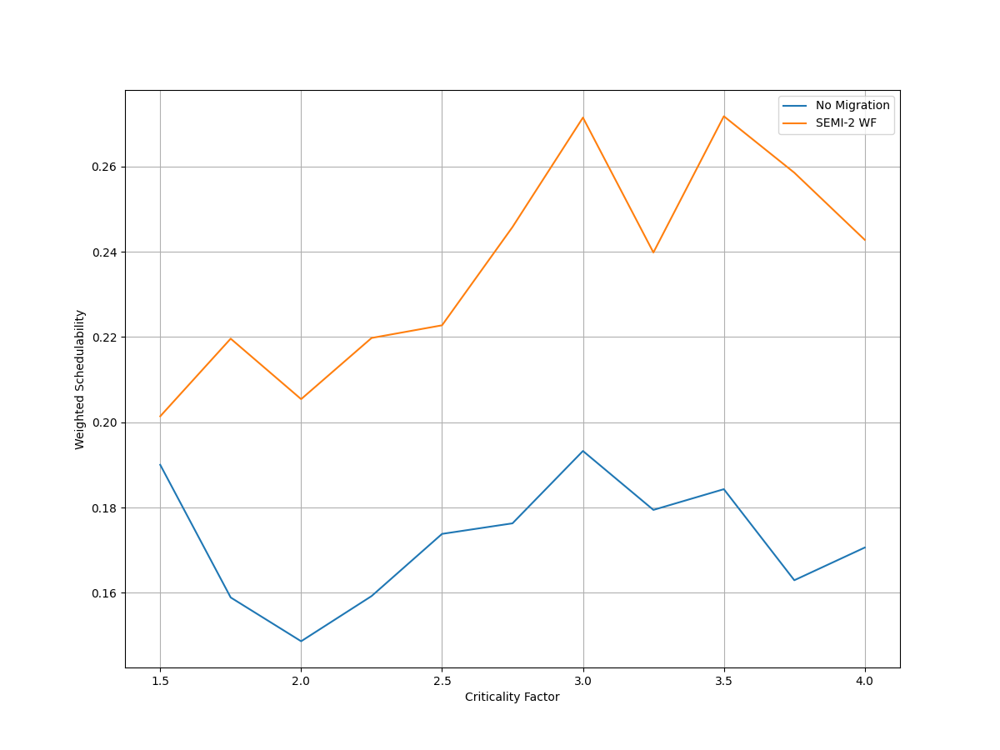
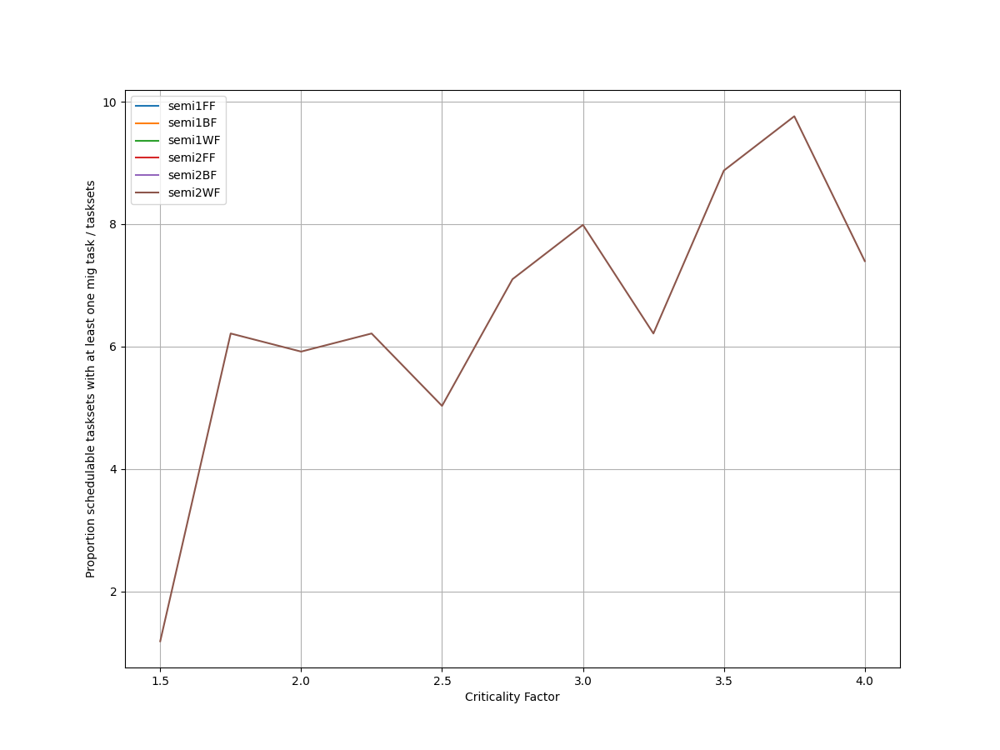
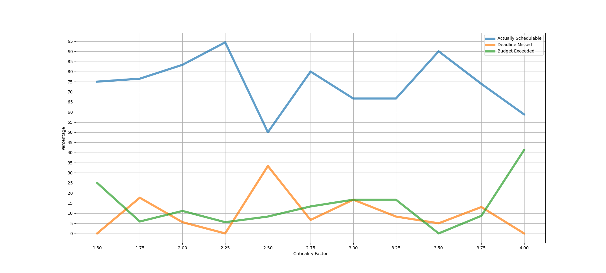
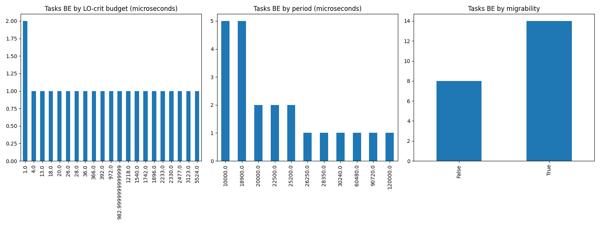
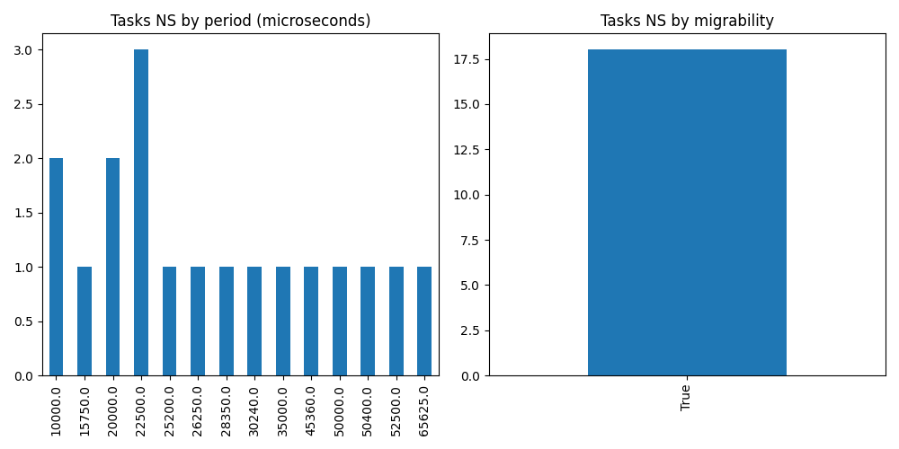

# Report on Experiment 2

   ## Overall data

   Utilization range = [1.8, 2.1] with step = 0.012

   Criticality factor range = [1.5, 4.0] with step = 0.25

  Number of executions: 174

Schedulable executions: 131/174 = 75.28735632183908 %

_Not_ schedulable executions: 17/174 = 9.770114942528735 %

Budget Exceeded executions: 22/174 = 12.643678160919542 %

Safe Boundary Exceeded executions: 4/174 = 2.2988505747126435 %

NS + BE executions: 39/174 = 22.413793103448278 %

### **Simulations**

#### **Weighted schedulability experiment 2 according to simulations.**

#### **Percentage of (schedulable tasksets with at least one migrating tasks / number of schedulable tasksets) of experiment 2 according to simulations.** 

 

### **Real Executions**

#### **Schedulability for each level**

#### **Tasksets, grouped by (LO-crit budget, Period & Migrability), with a Budget_Exceeded task.**

#### **Tasksets, grouped by (Period & Migrability), with at least one task missing one (or more) of its deadlines.**

## Bad tasksets

Click here to expand this section.

### **Not schedulable tasksets**

Click here to expand this section.

Ovvero quando almeno un task non completa entra almeno una sua deadline.

  1. Taskset **e2_semi2wf_t1393**

    Taskset execution params:
	 
    "id": "e2_semi2wf_t1393",
    "size": "12",
    "utilization": "1.836",
    "criticality_factor": "2.5",
    "hicrit_proportion": "0.5"

   
 
Click here to see the deadlines missed tasks list.

   Time values are expressed as **micro-seconds**.

Task:  1

    
    "id": " 1",
    "basecpu": " 2",
    "priority": " 4",
    "period": 22500.0,
    "C(LO)": 3135.0,
    "C(HI)": 3135.0,
    "criticality": "LOW",
    "migrable": "True",
    "completedruns": " 5041",
    "preemptions": " 0",
    "minresponsejitter": " 0.000000000",
    "maxresponsejitter": " 0.001672883",
    "minreleasejitter": " 0.000000000",
    "maxreleasejitter": " 114.377505961",
    "avgresponsejitter": " 0.001385018",
    "deadlinesmissed": " 3",
    "budgetexceeded": " 0",
    "timesmigrated": " 10",
    "timesrestored": " 10",
    "timesonc1": " 5",
    "timesonc2": " 5032",
    "lockedtime": " 0.000092372"

   

   
 
Click here to see the CPUs log.

   Idle time is expressed as **seconds**.

   CPU: 1

    
    "id": 1,
    "hyperperiod": 113400000,
    "lowtohigh": " 0",
    "hightolow": " 0",
    "idletime": 83972924,
    "util": 25.949802469135804

   CPU: 2

    
    "id": 2,
    "hyperperiod": 3780000,
    "lowtohigh": " 11",
    "hightolow": " 11",
    "idletime": 81700718,
    "util": -2061.394656084656

   

   
 
Click here to see the whole tasksets.

   Time values are expressed as **micro-seconds**.

   Task:  3

    
    "id": " 3",
    "basecpu": " 1",
    "priority": " 5",
    "period": 42000.0,
    "C(LO)": 2825.0,
    "C(HI)": 7062.0,
    "criticality": "HIGH",
    "migrable": "False",
    "completedruns": " 2701",
    "preemptions": " 0",
    "minresponsejitter": " 0.000000000",
    "maxresponsejitter": " 0.001504544",
    "minreleasejitter": " 0.000000000",
    "maxreleasejitter": " 114.358006577",
    "avgresponsejitter": " 0.001254396",
    "deadlinesmissed": " 0",
    "budgetexceeded": " 0",
    "timesmigrated": " 0",
    "timesrestored": " 0",
    "timesonc1": " 2700",
    "timesonc2": " 0",
    "lockedtime": " 0.000020201"

   Task:  9

    
    "id": " 9",
    "basecpu": " 1",
    "priority": " 1",
    "period": 126000.0,
    "C(LO)": 8035.000000000001,
    "C(HI)": 20088.0,
    "criticality": "HIGH",
    "migrable": "False",
    "completedruns": " 901",
    "preemptions": " 92",
    "minresponsejitter": " 0.000000000",
    "maxresponsejitter": " 0.014762225",
    "minreleasejitter": " 0.000000000",
    "maxreleasejitter": " 114.275303700",
    "avgresponsejitter": " 0.003972045",
    "deadlinesmissed": " 0",
    "budgetexceeded": " 0",
    "timesmigrated": " 0",
    "timesrestored": " 0",
    "timesonc1": " 992",
    "timesonc2": " 0",
    "lockedtime": " 0.000007598"

   Task:  6

    
    "id": " 6",
    "basecpu": " 1",
    "priority": " 3",
    "period": 87500.0,
    "C(LO)": 2817.0,
    "C(HI)": 7044.0,
    "criticality": "HIGH",
    "migrable": "False",
    "completedruns": " 1297",
    "preemptions": " 3",
    "minresponsejitter": " 0.000000000",
    "maxresponsejitter": " 0.002731357",
    "minreleasejitter": " 0.000000000",
    "maxreleasejitter": " 114.312506583",
    "avgresponsejitter": " 0.001252727",
    "deadlinesmissed": " 0",
    "budgetexceeded": " 0",
    "timesmigrated": " 0",
    "timesrestored": " 0",
    "timesonc1": " 1299",
    "timesonc2": " 0",
    "lockedtime": " 0.000004045"

   Task:  12

    
    "id": " 12",
    "basecpu": " 1",
    "priority": " 0",
    "period": 453600.0,
    "C(LO)": 11534.0,
    "C(HI)": 28836.0,
    "criticality": "HIGH",
    "migrable": "False",
    "completedruns": " 251",
    "preemptions": " 46",
    "minresponsejitter": " 0.000000000",
    "maxresponsejitter": " 0.017081988",
    "minreleasejitter": " 0.000000000",
    "maxreleasejitter": " 113.946406297",
    "avgresponsejitter": " 0.005897982",
    "deadlinesmissed": " 0",
    "budgetexceeded": " 0",
    "timesmigrated": " 0",
    "timesrestored": " 0",
    "timesonc1": " 296",
    "timesonc2": " 0",
    "lockedtime": " 0.000013363"

   Task:  8

    
    "id": " 8",
    "basecpu": " 1",
    "priority": " 2",
    "period": 120000.0,
    "C(LO)": 1428.0,
    "C(HI)": 3572.0,
    "criticality": "HIGH",
    "migrable": "False",
    "completedruns": " 946",
    "preemptions": " 0",
    "minresponsejitter": " 0.000000000",
    "maxresponsejitter": " 0.000762486",
    "minreleasejitter": " 0.000000000",
    "maxreleasejitter": " 114.280006339",
    "avgresponsejitter": " 0.000636303",
    "deadlinesmissed": " 0",
    "budgetexceeded": " 0",
    "timesmigrated": " 0",
    "timesrestored": " 0",
    "timesonc1": " 945",
    "timesonc2": " 0",
    "lockedtime": " 0.000023117"

   Task:  5

    
    "id": " 5",
    "basecpu": " 1",
    "priority": " 6",
    "period": 75000.0,
    "C(LO)": 19974.0,
    "C(HI)": 19974.0,
    "criticality": "LOW",
    "migrable": "False",
    "completedruns": " 1513",
    "preemptions": " 1",
    "minresponsejitter": " 0.000000000",
    "maxresponsejitter": " 0.010621559",
    "minreleasejitter": " 0.000000000",
    "maxreleasejitter": " 114.325006450",
    "avgresponsejitter": " 0.008821399",
    "deadlinesmissed": " 0",
    "budgetexceeded": " 0",
    "timesmigrated": " 0",
    "timesrestored": " 0",
    "timesonc1": " 1513",
    "timesonc2": " 0",
    "lockedtime": " 0.000065862"

   Task:  11

    
    "id": " 11",
    "basecpu": " 1",
    "priority": " 4",
    "period": 189000.0,
    "C(LO)": 22348.0,
    "C(HI)": 22348.0,
    "criticality": "LOW",
    "migrable": "False",
    "completedruns": " 601",
    "preemptions": " 82",
    "minresponsejitter": " 0.000000000",
    "maxresponsejitter": " 0.022901664",
    "minreleasejitter": " 0.000000000",
    "maxreleasejitter": " 114.211007156",
    "avgresponsejitter": " 0.011039868",
    "deadlinesmissed": " 0",
    "budgetexceeded": " 0",
    "timesmigrated": " 0",
    "timesrestored": " 0",
    "timesonc1": " 682",
    "timesonc2": " 0",
    "lockedtime": " 0.000042063"

   Task:  7

    
    "id": " 7",
    "basecpu": " 2",
    "priority": " 0",
    "period": 108000.0,
    "C(LO)": 23599.0,
    "C(HI)": 58999.0,
    "criticality": "HIGH",
    "migrable": "False",
    "completedruns": " 1051",
    "preemptions": " 923",
    "minresponsejitter": " 0.000000000",
    "maxresponsejitter": " 0.057520213",
    "minreleasejitter": " 0.000000000",
    "maxreleasejitter": " 114.292006111",
    "avgresponsejitter": " 0.011734709",
    "deadlinesmissed": " 0",
    "budgetexceeded": " 11",
    "timesmigrated": " 0",
    "timesrestored": " 0",
    "timesonc1": " 0",
    "timesonc2": " 1984",
    "lockedtime": " 0.000059787"

   Task:  10

    
    "id": " 10",
    "basecpu": " 2",
    "priority": " 1",
    "period": 135000.0,
    "C(LO)": 25914.0,
    "C(HI)": 25914.0,
    "criticality": "LOW",
    "migrable": "False",
    "completedruns": " 841",
    "preemptions": " 252",
    "minresponsejitter": " 0.000000000",
    "maxresponsejitter": " 0.015542111",
    "minreleasejitter": " 0.000000000",
    "maxreleasejitter": " 114.266556931",
    "avgresponsejitter": " 0.011699610",
    "deadlinesmissed": " 0",
    "budgetexceeded": " 0",
    "timesmigrated": " 0",
    "timesrestored": " 0",
    "timesonc1": " 0",
    "timesonc2": " 1092",
    "lockedtime": " 0.000013595"

   Task:  1

    
    "id": " 1",
    "basecpu": " 2",
    "priority": " 4",
    "period": 22500.0,
    "C(LO)": 3135.0,
    "C(HI)": 3135.0,
    "criticality": "LOW",
    "migrable": "True",
    "completedruns": " 5041",
    "preemptions": " 0",
    "minresponsejitter": " 0.000000000",
    "maxresponsejitter": " 0.001672883",
    "minreleasejitter": " 0.000000000",
    "maxreleasejitter": " 114.377505961",
    "avgresponsejitter": " 0.001385018",
    "deadlinesmissed": " 3",
    "budgetexceeded": " 0",
    "timesmigrated": " 10",
    "timesrestored": " 10",
    "timesonc1": " 5",
    "timesonc2": " 5032",
    "lockedtime": " 0.000092372"

   Task:  4

    
    "id": " 4",
    "basecpu": " 2",
    "priority": " 2",
    "period": 60000.0,
    "C(LO)": 2444.0,
    "C(HI)": 2444.0,
    "criticality": "LOW",
    "migrable": "False",
    "completedruns": " 1891",
    "preemptions": " 69",
    "minresponsejitter": " 0.000000000",
    "maxresponsejitter": " 0.001901303",
    "minreleasejitter": " 0.000000000",
    "maxreleasejitter": " 114.340006126",
    "avgresponsejitter": " 0.001106979",
    "deadlinesmissed": " 0",
    "budgetexceeded": " 0",
    "timesmigrated": " 0",
    "timesrestored": " 0",
    "timesonc1": " 0",
    "timesonc2": " 1959",
    "lockedtime": " 0.000076718"

   Task:  2

    
    "id": " 2",
    "basecpu": " 2",
    "priority": " 3",
    "period": 37800.0,
    "C(LO)": 1195.0,
    "C(HI)": 1195.0,
    "criticality": "LOW",
    "migrable": "False",
    "completedruns": " 3001",
    "preemptions": " 0",
    "minresponsejitter": " 0.000000000",
    "maxresponsejitter": " 0.000641652",
    "minreleasejitter": " 0.000000000",
    "maxreleasejitter": " 114.362206159",
    "avgresponsejitter": " 0.000531874",
    "deadlinesmissed": " 0",
    "budgetexceeded": " 0",
    "timesmigrated": " 0",
    "timesrestored": " 0",
    "timesonc1": " 0",
    "timesonc2": " 3000",
    "lockedtime": " 0.000054988"

   

  2. Taskset **e2_semi2wf_t1459**

    Taskset execution params:
	 
    "id": "e2_semi2wf_t1459",
    "size": "12",
    "utilization": "1.8960000000000001",
    "criticality_factor": "2.5",
    "hicrit_proportion": "0.5"

   
 
Click here to see the deadlines missed tasks list.

   Time values are expressed as **micro-seconds**.

Task:  1

    
    "id": " 1",
    "basecpu": " 2",
    "priority": " 4",
    "period": 15750.0,
    "C(LO)": 2521.0,
    "C(HI)": 2521.0,
    "criticality": "LOW",
    "migrable": "True",
    "completedruns": " 3784",
    "preemptions": " 0",
    "minresponsejitter": " 0.000000000",
    "maxresponsejitter": " 0.001344012",
    "minreleasejitter": " 0.000000000",
    "maxreleasejitter": " 60.566506805",
    "avgresponsejitter": " 0.001116640",
    "deadlinesmissed": " 1",
    "budgetexceeded": " 0",
    "timesmigrated": " 4",
    "timesrestored": " 3",
    "timesonc1": " 1",
    "timesonc2": " 3781",
    "lockedtime": " 0.000029655"

   

   
 
Click here to see the CPUs log.

   Idle time is expressed as **seconds**.

   CPU: 1

    
    "id": 1,
    "hyperperiod": 113400000,
    "lowtohigh": " 15",
    "hightolow": " 15",
    "idletime": 85615316,
    "util": 24.50148500881835

   CPU: 2

    
    "id": 2,
    "hyperperiod": 113400000,
    "lowtohigh": " 12",
    "hightolow": " 12",
    "idletime": 88135834,
    "util": 22.278805996472656

   

   
 
Click here to see the whole tasksets.

   Time values are expressed as **micro-seconds**.

   Task:  11

    
    "id": " 11",
    "basecpu": " 1",
    "priority": " 1",
    "period": 630000.0,
    "C(LO)": 40207.0,
    "C(HI)": 100517.0,
    "criticality": "HIGH",
    "migrable": "False",
    "completedruns": " 181",
    "preemptions": " 60",
    "minresponsejitter": " 0.000000000",
    "maxresponsejitter": " 0.080656372",
    "minreleasejitter": " 0.000000000",
    "maxreleasejitter": " 113.770006327",
    "avgresponsejitter": " 0.019332456",
    "deadlinesmissed": " 0",
    "budgetexceeded": " 1",
    "timesmigrated": " 0",
    "timesrestored": " 0",
    "timesonc1": " 241",
    "timesonc2": " 0",
    "lockedtime": " 0.000004664"

   Task:  12

    
    "id": " 12",
    "basecpu": " 1",
    "priority": " 0",
    "period": 648000.0,
    "C(LO)": 34913.0,
    "C(HI)": 87282.0,
    "criticality": "HIGH",
    "migrable": "False",
    "completedruns": " 176",
    "preemptions": " 76",
    "minresponsejitter": " 0.000000000",
    "maxresponsejitter": " 0.064447057",
    "minreleasejitter": " 0.000000000",
    "maxreleasejitter": " 113.752006066",
    "avgresponsejitter": " 0.017904279",
    "deadlinesmissed": " 0",
    "budgetexceeded": " 2",
    "timesmigrated": " 0",
    "timesrestored": " 0",
    "timesonc1": " 253",
    "timesonc2": " 0",
    "lockedtime": " 0.000005120"

   Task:  9

    
    "id": " 9",
    "basecpu": " 1",
    "priority": " 2",
    "period": 180000.0,
    "C(LO)": 9561.0,
    "C(HI)": 23904.0,
    "criticality": "HIGH",
    "migrable": "False",
    "completedruns": " 631",
    "preemptions": " 32",
    "minresponsejitter": " 0.000000000",
    "maxresponsejitter": " 0.016354889",
    "minreleasejitter": " 0.000000000",
    "maxreleasejitter": " 114.220006505",
    "avgresponsejitter": " 0.004685628",
    "deadlinesmissed": " 0",
    "budgetexceeded": " 3",
    "timesmigrated": " 0",
    "timesrestored": " 0",
    "timesonc1": " 665",
    "timesonc2": " 0",
    "lockedtime": " 0.000004526"

   Task:  8

    
    "id": " 8",
    "basecpu": " 1",
    "priority": " 3",
    "period": 168750.0,
    "C(LO)": 8149.0,
    "C(HI)": 20374.0,
    "criticality": "HIGH",
    "migrable": "False",
    "completedruns": " 673",
    "preemptions": " 34",
    "minresponsejitter": " 0.000000000",
    "maxresponsejitter": " 0.022297643",
    "minreleasejitter": " 0.000000000",
    "maxreleasejitter": " 114.231959018",
    "avgresponsejitter": " 0.004169805",
    "deadlinesmissed": " 0",
    "budgetexceeded": " 9",
    "timesmigrated": " 0",
    "timesrestored": " 0",
    "timesonc1": " 715",
    "timesonc2": " 0",
    "lockedtime": " 0.000000000"

   Task:  5

    
    "id": " 5",
    "basecpu": " 1",
    "priority": " 4",
    "period": 75600.0,
    "C(LO)": 22802.0,
    "C(HI)": 22802.0,
    "criticality": "LOW",
    "migrable": "False",
    "completedruns": " 1501",
    "preemptions": " 270",
    "minresponsejitter": " 0.000000000",
    "maxresponsejitter": " 0.012889072",
    "minreleasejitter": " 0.000000000",
    "maxreleasejitter": " 114.324406492",
    "avgresponsejitter": " 0.010200195",
    "deadlinesmissed": " 0",
    "budgetexceeded": " 0",
    "timesmigrated": " 0",
    "timesrestored": " 0",
    "timesonc1": " 1770",
    "timesonc2": " 0",
    "lockedtime": " 0.000031369"

   Task:  3

    
    "id": " 3",
    "basecpu": " 1",
    "priority": " 6",
    "period": 45000.0,
    "C(LO)": 3220.0,
    "C(HI)": 3220.0,
    "criticality": "LOW",
    "migrable": "True",
    "completedruns": " 5",
    "preemptions": " 0",
    "minresponsejitter": " 0.000000000",
    "maxresponsejitter": " 0.001659126",
    "minreleasejitter": " 0.000000000",
    "maxreleasejitter": " 1.135007102",
    "avgresponsejitter": " 0.001413901",
    "deadlinesmissed": " 0",
    "budgetexceeded": " 0",
    "timesmigrated": " 1",
    "timesrestored": " 0",
    "timesonc1": " 4",
    "timesonc2": " 0",
    "lockedtime": " 0.000000000"

   Task:  4

    
    "id": " 4",
    "basecpu": " 1",
    "priority": " 5",
    "period": 56250.0,
    "C(LO)": 1540.0,
    "C(HI)": 1540.0,
    "criticality": "LOW",
    "migrable": "False",
    "completedruns": " 2017",
    "preemptions": " 1",
    "minresponsejitter": " 0.000000000",
    "maxresponsejitter": " 0.000823213",
    "minreleasejitter": " 0.000000000",
    "maxreleasejitter": " 114.343756417",
    "avgresponsejitter": " 0.000688844",
    "deadlinesmissed": " 0",
    "budgetexceeded": " 0",
    "timesmigrated": " 0",
    "timesrestored": " 0",
    "timesonc1": " 2017",
    "timesonc2": " 0",
    "lockedtime": " 0.000021688"

   Task:  7

    
    "id": " 7",
    "basecpu": " 2",
    "priority": " 1",
    "period": 141750.0,
    "C(LO)": 29119.0,
    "C(HI)": 72798.0,
    "criticality": "HIGH",
    "migrable": "False",
    "completedruns": " 801",
    "preemptions": " 403",
    "minresponsejitter": " 0.000000000",
    "maxresponsejitter": " 0.059131715",
    "minreleasejitter": " 0.000000000",
    "maxreleasejitter": " 114.258256171",
    "avgresponsejitter": " 0.014389153",
    "deadlinesmissed": " 0",
    "budgetexceeded": " 6",
    "timesmigrated": " 0",
    "timesrestored": " 0",
    "timesonc1": " 0",
    "timesonc2": " 1209",
    "lockedtime": " 0.000023495"

   Task:  10

    
    "id": " 10",
    "basecpu": " 2",
    "priority": " 0",
    "period": 200000.0,
    "C(LO)": 7875.999999999999,
    "C(HI)": 19690.0,
    "criticality": "HIGH",
    "migrable": "False",
    "completedruns": " 568",
    "preemptions": " 113",
    "minresponsejitter": " 0.000000000",
    "maxresponsejitter": " 0.052623907",
    "minreleasejitter": " 0.000000000",
    "maxreleasejitter": " 114.200006222",
    "avgresponsejitter": " 0.004194871",
    "deadlinesmissed": " 0",
    "budgetexceeded": " 6",
    "timesmigrated": " 0",
    "timesrestored": " 0",
    "timesonc1": " 0",
    "timesonc2": " 686",
    "lockedtime": " 0.000002360"

   Task:  1

    
    "id": " 1",
    "basecpu": " 2",
    "priority": " 4",
    "period": 15750.0,
    "C(LO)": 2521.0,
    "C(HI)": 2521.0,
    "criticality": "LOW",
    "migrable": "True",
    "completedruns": " 3784",
    "preemptions": " 0",
    "minresponsejitter": " 0.000000000",
    "maxresponsejitter": " 0.001344012",
    "minreleasejitter": " 0.000000000",
    "maxreleasejitter": " 60.566506805",
    "avgresponsejitter": " 0.001116640",
    "deadlinesmissed": " 1",
    "budgetexceeded": " 0",
    "timesmigrated": " 4",
    "timesrestored": " 3",
    "timesonc1": " 1",
    "timesonc2": " 3781",
    "lockedtime": " 0.000029655"

   Task:  6

    
    "id": " 6",
    "basecpu": " 2",
    "priority": " 2",
    "period": 87500.0,
    "C(LO)": 13303.0,
    "C(HI)": 13303.0,
    "criticality": "LOW",
    "migrable": "False",
    "completedruns": " 1297",
    "preemptions": " 347",
    "minresponsejitter": " 0.000000000",
    "maxresponsejitter": " 0.008613502",
    "minreleasejitter": " 0.000000000",
    "maxreleasejitter": " 114.312506099",
    "avgresponsejitter": " 0.006157318",
    "deadlinesmissed": " 0",
    "budgetexceeded": " 0",
    "timesmigrated": " 0",
    "timesrestored": " 0",
    "timesonc1": " 0",
    "timesonc2": " 1643",
    "lockedtime": " 0.000023483"

   Task:  2

    
    "id": " 2",
    "basecpu": " 2",
    "priority": " 3",
    "period": 33750.0,
    "C(LO)": 792.0,
    "C(HI)": 792.0,
    "criticality": "LOW",
    "migrable": "True",
    "completedruns": " 1767",
    "preemptions": " 0",
    "minresponsejitter": " 0.000000000",
    "maxresponsejitter": " 0.000421147",
    "minreleasejitter": " 0.000000000",
    "maxreleasejitter": " 60.568758048",
    "avgresponsejitter": " 0.000347568",
    "deadlinesmissed": " 0",
    "budgetexceeded": " 0",
    "timesmigrated": " 4",
    "timesrestored": " 4",
    "timesonc1": " 3",
    "timesonc2": " 1763",
    "lockedtime": " 0.000008423"

   

  3. Taskset **e2_semi2wf_t1471**

    Taskset execution params:
	 
    "id": "e2_semi2wf_t1471",
    "size": "12",
    "utilization": "1.9080000000000001",
    "criticality_factor": "2.5",
    "hicrit_proportion": "0.5"

   
 
Click here to see the deadlines missed tasks list.

   Time values are expressed as **micro-seconds**.

Task:  1

    
    "id": " 1",
    "basecpu": " 1",
    "priority": " 6",
    "period": 26250.0,
    "C(LO)": 1346.0,
    "C(HI)": 1346.0,
    "criticality": "LOW",
    "migrable": "True",
    "completedruns": " 4321",
    "preemptions": " 1",
    "minresponsejitter": " 0.000000000",
    "maxresponsejitter": " 0.000724529",
    "minreleasejitter": " 0.000000000",
    "maxreleasejitter": " 114.373756291",
    "avgresponsejitter": " 0.000598922",
    "deadlinesmissed": " 1",
    "budgetexceeded": " 0",
    "timesmigrated": " 4",
    "timesrestored": " 4",
    "timesonc1": " 4319",
    "timesonc2": " 1",
    "lockedtime": " 0.000037979"

   

   
 
Click here to see the CPUs log.

   Idle time is expressed as **seconds**.

   CPU: 1

    
    "id": 1,
    "hyperperiod": 113400000,
    "lowtohigh": " 17",
    "hightolow": " 17",
    "idletime": 83083120,
    "util": 26.734462081128754

   CPU: 2

    
    "id": 2,
    "hyperperiod": 56700000,
    "lowtohigh": " 0",
    "hightolow": " 0",
    "idletime": 85108748,
    "util": -50.10361199294533

   

   
 
Click here to see the whole tasksets.

   Time values are expressed as **micro-seconds**.

   Task:  7

    
    "id": " 7",
    "basecpu": " 1",
    "priority": " 3",
    "period": 141750.0,
    "C(LO)": 11492.0,
    "C(HI)": 28731.0,
    "criticality": "HIGH",
    "migrable": "False",
    "completedruns": " 801",
    "preemptions": " 145",
    "minresponsejitter": " 0.000000000",
    "maxresponsejitter": " 0.020785087",
    "minreleasejitter": " 0.000000000",
    "maxreleasejitter": " 114.258256306",
    "avgresponsejitter": " 0.005403114",
    "deadlinesmissed": " 0",
    "budgetexceeded": " 7",
    "timesmigrated": " 0",
    "timesrestored": " 0",
    "timesonc1": " 952",
    "timesonc2": " 0",
    "lockedtime": " 0.000009432"

   Task:  11

    
    "id": " 11",
    "basecpu": " 1",
    "priority": " 0",
    "period": 420000.0,
    "C(LO)": 33773.0,
    "C(HI)": 84432.0,
    "criticality": "HIGH",
    "migrable": "False",
    "completedruns": " 271",
    "preemptions": " 193",
    "minresponsejitter": " 0.000000000",
    "maxresponsejitter": " 0.069773201",
    "minreleasejitter": " 0.000000000",
    "maxreleasejitter": " 113.982074495",
    "avgresponsejitter": " 0.018512703",
    "deadlinesmissed": " 0",
    "budgetexceeded": " 2",
    "timesmigrated": " 0",
    "timesrestored": " 0",
    "timesonc1": " 465",
    "timesonc2": " 0",
    "lockedtime": " 0.000009207"

   Task:  9

    
    "id": " 9",
    "basecpu": " 1",
    "priority": " 2",
    "period": 181440.0,
    "C(LO)": 11880.0,
    "C(HI)": 29701.0,
    "criticality": "HIGH",
    "migrable": "False",
    "completedruns": " 626",
    "preemptions": " 224",
    "minresponsejitter": " 0.000000000",
    "maxresponsejitter": " 0.028163538",
    "minreleasejitter": " 0.000000000",
    "maxreleasejitter": " 114.218566390",
    "avgresponsejitter": " 0.006120033",
    "deadlinesmissed": " 0",
    "budgetexceeded": " 4",
    "timesmigrated": " 0",
    "timesrestored": " 0",
    "timesonc1": " 853",
    "timesonc2": " 0",
    "lockedtime": " 0.000026742"

   Task:  10

    
    "id": " 10",
    "basecpu": " 1",
    "priority": " 1",
    "period": 200000.0,
    "C(LO)": 2155.0,
    "C(HI)": 5388.0,
    "criticality": "HIGH",
    "migrable": "False",
    "completedruns": " 568",
    "preemptions": " 10",
    "minresponsejitter": " 0.000000000",
    "maxresponsejitter": " 0.007497387",
    "minreleasejitter": " 0.000000000",
    "maxreleasejitter": " 114.200006096",
    "avgresponsejitter": " 0.001061937",
    "deadlinesmissed": " 0",
    "budgetexceeded": " 4",
    "timesmigrated": " 0",
    "timesrestored": " 0",
    "timesonc1": " 581",
    "timesonc2": " 0",
    "lockedtime": " 0.000003288"

   Task:  2

    
    "id": " 2",
    "basecpu": " 1",
    "priority": " 5",
    "period": 54000.0,
    "C(LO)": 14134.0,
    "C(HI)": 14134.0,
    "criticality": "LOW",
    "migrable": "False",
    "completedruns": " 2101",
    "preemptions": " 471",
    "minresponsejitter": " 0.000000000",
    "maxresponsejitter": " 0.008224616",
    "minreleasejitter": " 0.000000000",
    "maxreleasejitter": " 114.346006450",
    "avgresponsejitter": " 0.006412688",
    "deadlinesmissed": " 0",
    "budgetexceeded": " 0",
    "timesmigrated": " 0",
    "timesrestored": " 0",
    "timesonc1": " 2571",
    "timesonc2": " 0",
    "lockedtime": " 0.000053784"

   Task:  1

    
    "id": " 1",
    "basecpu": " 1",
    "priority": " 6",
    "period": 26250.0,
    "C(LO)": 1346.0,
    "C(HI)": 1346.0,
    "criticality": "LOW",
    "migrable": "True",
    "completedruns": " 4321",
    "preemptions": " 1",
    "minresponsejitter": " 0.000000000",
    "maxresponsejitter": " 0.000724529",
    "minreleasejitter": " 0.000000000",
    "maxreleasejitter": " 114.373756291",
    "avgresponsejitter": " 0.000598922",
    "deadlinesmissed": " 1",
    "budgetexceeded": " 0",
    "timesmigrated": " 4",
    "timesrestored": " 4",
    "timesonc1": " 4319",
    "timesonc2": " 1",
    "lockedtime": " 0.000037979"

   Task:  4

    
    "id": " 4",
    "basecpu": " 1",
    "priority": " 4",
    "period": 72000.0,
    "C(LO)": 3117.0,
    "C(HI)": 3117.0,
    "criticality": "LOW",
    "migrable": "False",
    "completedruns": " 1576",
    "preemptions": " 64",
    "minresponsejitter": " 0.000000000",
    "maxresponsejitter": " 0.002320399",
    "minreleasejitter": " 0.000000000",
    "maxreleasejitter": " 114.328006207",
    "avgresponsejitter": " 0.001403423",
    "deadlinesmissed": " 0",
    "budgetexceeded": " 0",
    "timesmigrated": " 0",
    "timesrestored": " 0",
    "timesonc1": " 1639",
    "timesonc2": " 0",
    "lockedtime": " 0.000007955"

   Task:  6

    
    "id": " 6",
    "basecpu": " 2",
    "priority": " 1",
    "period": 135000.0,
    "C(LO)": 27684.0,
    "C(HI)": 69212.0,
    "criticality": "HIGH",
    "migrable": "False",
    "completedruns": " 841",
    "preemptions": " 236",
    "minresponsejitter": " 0.000000000",
    "maxresponsejitter": " 0.018689312",
    "minreleasejitter": " 0.000000000",
    "maxreleasejitter": " 114.265006159",
    "avgresponsejitter": " 0.012715640",
    "deadlinesmissed": " 0",
    "budgetexceeded": " 0",
    "timesmigrated": " 0",
    "timesrestored": " 0",
    "timesonc1": " 0",
    "timesonc2": " 1076",
    "lockedtime": " 0.000065117"

   Task:  12

    
    "id": " 12",
    "basecpu": " 2",
    "priority": " 0",
    "period": 708750.0,
    "C(LO)": 42244.0,
    "C(HI)": 105610.0,
    "criticality": "HIGH",
    "migrable": "False",
    "completedruns": " 161",
    "preemptions": " 82",
    "minresponsejitter": " 0.000000000",
    "maxresponsejitter": " 0.041673066",
    "minreleasejitter": " 0.000000000",
    "maxreleasejitter": " 113.691257090",
    "avgresponsejitter": " 0.020461610",
    "deadlinesmissed": " 0",
    "budgetexceeded": " 0",
    "timesmigrated": " 0",
    "timesrestored": " 0",
    "timesonc1": " 0",
    "timesonc2": " 242",
    "lockedtime": " 0.000012294"

   Task:  8

    
    "id": " 8",
    "basecpu": " 2",
    "priority": " 2",
    "period": 168750.0,
    "C(LO)": 34324.0,
    "C(HI)": 34324.0,
    "criticality": "LOW",
    "migrable": "False",
    "completedruns": " 673",
    "preemptions": " 258",
    "minresponsejitter": " 0.000000000",
    "maxresponsejitter": " 0.022062417",
    "minreleasejitter": " 0.000000000",
    "maxreleasejitter": " 114.231256084",
    "avgresponsejitter": " 0.015892532",
    "deadlinesmissed": " 0",
    "budgetexceeded": " 0",
    "timesmigrated": " 0",
    "timesrestored": " 0",
    "timesonc1": " 0",
    "timesonc2": " 930",
    "lockedtime": " 0.000062123"

   Task:  5

    
    "id": " 5",
    "basecpu": " 2",
    "priority": " 3",
    "period": 90720.0,
    "C(LO)": 7747.0,
    "C(HI)": 7747.0,
    "criticality": "LOW",
    "migrable": "False",
    "completedruns": " 1251",
    "preemptions": " 57",
    "minresponsejitter": " 0.000000000",
    "maxresponsejitter": " 0.004328655",
    "minreleasejitter": " 0.000000000",
    "maxreleasejitter": " 114.309286123",
    "avgresponsejitter": " 0.003418264",
    "deadlinesmissed": " 0",
    "budgetexceeded": " 0",
    "timesmigrated": " 0",
    "timesrestored": " 0",
    "timesonc1": " 0",
    "timesonc2": " 1307",
    "lockedtime": " 0.000074321"

   Task:  3

    
    "id": " 3",
    "basecpu": " 2",
    "priority": " 4",
    "period": 70000.0,
    "C(LO)": 475.0,
    "C(HI)": 475.0,
    "criticality": "LOW",
    "migrable": "False",
    "completedruns": " 1621",
    "preemptions": " 0",
    "minresponsejitter": " 0.000000000",
    "maxresponsejitter": " 0.000255802",
    "minreleasejitter": " 0.000000000",
    "maxreleasejitter": " 114.330006285",
    "avgresponsejitter": " 0.000212018",
    "deadlinesmissed": " 0",
    "budgetexceeded": " 0",
    "timesmigrated": " 0",
    "timesrestored": " 0",
    "timesonc1": " 0",
    "timesonc2": " 1620",
    "lockedtime": " 0.000036369"

   

  4. Taskset **e2_semi2wf_t1485**

    Taskset execution params:
	 
    "id": "e2_semi2wf_t1485",
    "size": "12",
    "utilization": "1.9200000000000002",
    "criticality_factor": "2.5",
    "hicrit_proportion": "0.5"

   
 
Click here to see the deadlines missed tasks list.

   Time values are expressed as **micro-seconds**.

Task:  4

    
    "id": " 4",
    "basecpu": " 2",
    "priority": " 6",
    "period": 50400.0,
    "C(LO)": 3066.0,
    "C(HI)": 3066.0,
    "criticality": "LOW",
    "migrable": "True",
    "completedruns": " 2251",
    "preemptions": " 0",
    "minresponsejitter": " 0.000000000",
    "maxresponsejitter": " 0.001630886",
    "minreleasejitter": " 0.000000000",
    "maxreleasejitter": " 114.349606643",
    "avgresponsejitter": " 0.001357793",
    "deadlinesmissed": " 1",
    "budgetexceeded": " 0",
    "timesmigrated": " 2",
    "timesrestored": " 2",
    "timesonc1": " 1",
    "timesonc2": " 2248",
    "lockedtime": " 0.000025159"

   

   
 
Click here to see the CPUs log.

   Idle time is expressed as **seconds**.

   CPU: 1

    
    "id": 1,
    "hyperperiod": 18900000,
    "lowtohigh": " 0",
    "hightolow": " 0",
    "idletime": 82778108,
    "util": -337.97940740740745

   CPU: 2

    
    "id": 2,
    "hyperperiod": 113400000,
    "lowtohigh": " 7",
    "hightolow": " 7",
    "idletime": 79635541,
    "util": 29.77465520282186

   

   
 
Click here to see the whole tasksets.

   Time values are expressed as **micro-seconds**.

   Task:  2

    
    "id": " 2",
    "basecpu": " 1",
    "priority": " 2",
    "period": 18900.0,
    "C(LO)": 1704.0,
    "C(HI)": 4260.0,
    "criticality": "HIGH",
    "migrable": "False",
    "completedruns": " 6001",
    "preemptions": " 466",
    "minresponsejitter": " 0.000000000",
    "maxresponsejitter": " 0.001089030",
    "minreleasejitter": " 0.000000000",
    "maxreleasejitter": " 114.381106363",
    "avgresponsejitter": " 0.000766039",
    "deadlinesmissed": " 0",
    "budgetexceeded": " 0",
    "timesmigrated": " 0",
    "timesrestored": " 0",
    "timesonc1": " 6466",
    "timesonc2": " 0",
    "lockedtime": " 0.000018637"

   Task:  6

    
    "id": " 6",
    "basecpu": " 1",
    "priority": " 1",
    "period": 100000.0,
    "C(LO)": 8154.0,
    "C(HI)": 20385.0,
    "criticality": "HIGH",
    "migrable": "False",
    "completedruns": " 1135",
    "preemptions": " 361",
    "minresponsejitter": " 0.000000000",
    "maxresponsejitter": " 0.010640012",
    "minreleasejitter": " 0.000000000",
    "maxreleasejitter": " 114.300139814",
    "avgresponsejitter": " 0.004355865",
    "deadlinesmissed": " 0",
    "budgetexceeded": " 0",
    "timesmigrated": " 0",
    "timesrestored": " 0",
    "timesonc1": " 1495",
    "timesonc2": " 0",
    "lockedtime": " 0.000018874"

   Task:  7

    
    "id": " 7",
    "basecpu": " 1",
    "priority": " 0",
    "period": 112500.0,
    "C(LO)": 4761.0,
    "C(HI)": 11903.0,
    "criticality": "HIGH",
    "migrable": "False",
    "completedruns": " 1009",
    "preemptions": " 244",
    "minresponsejitter": " 0.000000000",
    "maxresponsejitter": " 0.009052072",
    "minreleasejitter": " 0.000000000",
    "maxreleasejitter": " 114.287506072",
    "avgresponsejitter": " 0.002583186",
    "deadlinesmissed": " 0",
    "budgetexceeded": " 0",
    "timesmigrated": " 0",
    "timesrestored": " 0",
    "timesonc1": " 1252",
    "timesonc2": " 0",
    "lockedtime": " 0.000009381"

   Task:  3

    
    "id": " 3",
    "basecpu": " 1",
    "priority": " 3",
    "period": 30240.0,
    "C(LO)": 10777.0,
    "C(HI)": 10777.0,
    "criticality": "LOW",
    "migrable": "False",
    "completedruns": " 3751",
    "preemptions": " 1764",
    "minresponsejitter": " 0.000000000",
    "maxresponsejitter": " 0.005914745",
    "minreleasejitter": " 0.000000000",
    "maxreleasejitter": " 114.369766282",
    "avgresponsejitter": " 0.004860973",
    "deadlinesmissed": " 0",
    "budgetexceeded": " 0",
    "timesmigrated": " 0",
    "timesrestored": " 0",
    "timesonc1": " 5514",
    "timesonc2": " 0",
    "lockedtime": " 0.000079207"

   Task:  1

    
    "id": " 1",
    "basecpu": " 1",
    "priority": " 4",
    "period": 10000.0,
    "C(LO)": 338.0,
    "C(HI)": 338.0,
    "criticality": "LOW",
    "migrable": "False",
    "completedruns": " 11341",
    "preemptions": " 1",
    "minresponsejitter": " 0.000000000",
    "maxresponsejitter": " 0.000189030",
    "minreleasejitter": " 0.000000000",
    "maxreleasejitter": " 114.390006168",
    "avgresponsejitter": " 0.000144565",
    "deadlinesmissed": " 0",
    "budgetexceeded": " 0",
    "timesmigrated": " 0",
    "timesrestored": " 0",
    "timesonc1": " 11341",
    "timesonc2": " 0",
    "lockedtime": " 0.000040366"

   Task:  10

    
    "id": " 10",
    "basecpu": " 2",
    "priority": " 2",
    "period": 189000.0,
    "C(LO)": 27701.0,
    "C(HI)": 69253.0,
    "criticality": "HIGH",
    "migrable": "False",
    "completedruns": " 601",
    "preemptions": " 229",
    "minresponsejitter": " 0.000000000",
    "maxresponsejitter": " 0.049257991",
    "minreleasejitter": " 0.000000000",
    "maxreleasejitter": " 114.211006880",
    "avgresponsejitter": " 0.013758048",
    "deadlinesmissed": " 0",
    "budgetexceeded": " 3",
    "timesmigrated": " 0",
    "timesrestored": " 0",
    "timesonc1": " 0",
    "timesonc2": " 832",
    "lockedtime": " 0.000043333"

   Task:  12

    
    "id": " 12",
    "basecpu": " 2",
    "priority": " 0",
    "period": 810000.0,
    "C(LO)": 51850.0,
    "C(HI)": 129624.99999999999,
    "criticality": "HIGH",
    "migrable": "False",
    "completedruns": " 141",
    "preemptions": " 166",
    "minresponsejitter": " 0.000000000",
    "maxresponsejitter": " 0.057579829",
    "minreleasejitter": " 0.000000000",
    "maxreleasejitter": " 113.590006760",
    "avgresponsejitter": " 0.027573189",
    "deadlinesmissed": " 0",
    "budgetexceeded": " 0",
    "timesmigrated": " 0",
    "timesrestored": " 0",
    "timesonc1": " 0",
    "timesonc2": " 306",
    "lockedtime": " 0.000016979"

   Task:  8

    
    "id": " 8",
    "basecpu": " 2",
    "priority": " 3",
    "period": 168000.0,
    "C(LO)": 1448.0,
    "C(HI)": 3620.0,
    "criticality": "HIGH",
    "migrable": "False",
    "completedruns": " 676",
    "preemptions": " 2",
    "minresponsejitter": " 0.000000000",
    "maxresponsejitter": " 0.002548021",
    "minreleasejitter": " 0.000000000",
    "maxreleasejitter": " 114.239636538",
    "avgresponsejitter": " 0.000657294",
    "deadlinesmissed": " 0",
    "budgetexceeded": " 4",
    "timesmigrated": " 0",
    "timesrestored": " 0",
    "timesonc1": " 0",
    "timesonc2": " 681",
    "lockedtime": " 0.000006505"

   Task:  9

    
    "id": " 9",
    "basecpu": " 2",
    "priority": " 4",
    "period": 175000.0,
    "C(LO)": 34377.0,
    "C(HI)": 34377.0,
    "criticality": "LOW",
    "migrable": "False",
    "completedruns": " 649",
    "preemptions": " 187",
    "minresponsejitter": " 0.000000000",
    "maxresponsejitter": " 0.019796369",
    "minreleasejitter": " 0.000000000",
    "maxreleasejitter": " 114.225007075",
    "avgresponsejitter": " 0.015492453",
    "deadlinesmissed": " 0",
    "budgetexceeded": " 0",
    "timesmigrated": " 0",
    "timesrestored": " 0",
    "timesonc1": " 0",
    "timesonc2": " 835",
    "lockedtime": " 0.000053012"

   Task:  11

    
    "id": " 11",
    "basecpu": " 2",
    "priority": " 1",
    "period": 756000.0,
    "C(LO)": 92437.0,
    "C(HI)": 92437.0,
    "criticality": "LOW",
    "migrable": "False",
    "completedruns": " 151",
    "preemptions": " 257",
    "minresponsejitter": " 0.000000000",
    "maxresponsejitter": " 0.069909706",
    "minreleasejitter": " 0.000000000",
    "maxreleasejitter": " 113.659848862",
    "avgresponsejitter": " 0.047785093",
    "deadlinesmissed": " 0",
    "budgetexceeded": " 0",
    "timesmigrated": " 0",
    "timesrestored": " 0",
    "timesonc1": " 0",
    "timesonc2": " 407",
    "lockedtime": " 0.000012745"

   Task:  5

    
    "id": " 5",
    "basecpu": " 2",
    "priority": " 5",
    "period": 65625.0,
    "C(LO)": 4402.0,
    "C(HI)": 4402.0,
    "criticality": "LOW",
    "migrable": "True",
    "completedruns": " 1729",
    "preemptions": " 60",
    "minresponsejitter": " 0.000000000",
    "maxresponsejitter": " 0.003957790",
    "minreleasejitter": " 0.000000000",
    "maxreleasejitter": " 114.334381312",
    "avgresponsejitter": " 0.002002556",
    "deadlinesmissed": " 0",
    "budgetexceeded": " 0",
    "timesmigrated": " 3",
    "timesrestored": " 3",
    "timesonc1": " 3",
    "timesonc2": " 1785",
    "lockedtime": " 0.000025483"

   Task:  4

    
    "id": " 4",
    "basecpu": " 2",
    "priority": " 6",
    "period": 50400.0,
    "C(LO)": 3066.0,
    "C(HI)": 3066.0,
    "criticality": "LOW",
    "migrable": "True",
    "completedruns": " 2251",
    "preemptions": " 0",
    "minresponsejitter": " 0.000000000",
    "maxresponsejitter": " 0.001630886",
    "minreleasejitter": " 0.000000000",
    "maxreleasejitter": " 114.349606643",
    "avgresponsejitter": " 0.001357793",
    "deadlinesmissed": " 1",
    "budgetexceeded": " 0",
    "timesmigrated": " 2",
    "timesrestored": " 2",
    "timesonc1": " 1",
    "timesonc2": " 2248",
    "lockedtime": " 0.000025159"

   

  5. Taskset **e2_semi2wf_t1886**

    Taskset execution params:
	 
    "id": "e2_semi2wf_t1886",
    "size": "12",
    "utilization": "1.9800000000000002",
    "criticality_factor": "2.75",
    "hicrit_proportion": "0.5"

   
 
Click here to see the deadlines missed tasks list.

   Time values are expressed as **micro-seconds**.

Task:  1

    
    "id": " 1",
    "basecpu": " 2",
    "priority": " 4",
    "period": 35000.0,
    "C(LO)": 6501.0,
    "C(HI)": 6501.0,
    "criticality": "LOW",
    "migrable": "True",
    "completedruns": " 3241",
    "preemptions": " 0",
    "minresponsejitter": " 0.000000000",
    "maxresponsejitter": " 0.003451462",
    "minreleasejitter": " 0.000000000",
    "maxreleasejitter": " 114.365005949",
    "avgresponsejitter": " 0.002872066",
    "deadlinesmissed": " 1",
    "budgetexceeded": " 0",
    "timesmigrated": " 7",
    "timesrestored": " 7",
    "timesonc1": " 5",
    "timesonc2": " 3234",
    "lockedtime": " 0.000042613"

   

   
 
Click here to see the CPUs log.

   Idle time is expressed as **seconds**.

   CPU: 1

    
    "id": 1,
    "hyperperiod": 113400000,
    "lowtohigh": " 17",
    "hightolow": " 17",
    "idletime": 79901417,
    "util": 29.54019664902998

   CPU: 2

    
    "id": 2,
    "hyperperiod": 113400000,
    "lowtohigh": " 51",
    "hightolow": " 51",
    "idletime": 77071166,
    "util": 32.036008818342154

   

   
 
Click here to see the whole tasksets.

   Time values are expressed as **micro-seconds**.

   Task:  6

    
    "id": " 6",
    "basecpu": " 1",
    "priority": " 3",
    "period": 112500.0,
    "C(LO)": 10739.0,
    "C(HI)": 29533.0,
    "criticality": "HIGH",
    "migrable": "False",
    "completedruns": " 1009",
    "preemptions": " 79",
    "minresponsejitter": " 0.000000000",
    "maxresponsejitter": " 0.020815300",
    "minreleasejitter": " 0.000000000",
    "maxreleasejitter": " 114.287506315",
    "avgresponsejitter": " 0.004964231",
    "deadlinesmissed": " 0",
    "budgetexceeded": " 12",
    "timesmigrated": " 0",
    "timesrestored": " 0",
    "timesonc1": " 1099",
    "timesonc2": " 0",
    "lockedtime": " 0.000017520"

   Task:  10

    
    "id": " 10",
    "basecpu": " 1",
    "priority": " 1",
    "period": 196875.0,
    "C(LO)": 13206.0,
    "C(HI)": 36319.0,
    "criticality": "HIGH",
    "migrable": "False",
    "completedruns": " 577",
    "preemptions": " 100",
    "minresponsejitter": " 0.000000000",
    "maxresponsejitter": " 0.021502126",
    "minreleasejitter": " 0.000000000",
    "maxreleasejitter": " 114.203131610",
    "avgresponsejitter": " 0.006105147",
    "deadlinesmissed": " 0",
    "budgetexceeded": " 1",
    "timesmigrated": " 0",
    "timesrestored": " 0",
    "timesonc1": " 677",
    "timesonc2": " 0",
    "lockedtime": " 0.000003862"

   Task:  8

    
    "id": " 8",
    "basecpu": " 1",
    "priority": " 2",
    "period": 126000.0,
    "C(LO)": 459.0,
    "C(HI)": 1262.0,
    "criticality": "HIGH",
    "migrable": "False",
    "completedruns": " 901",
    "preemptions": " 0",
    "minresponsejitter": " 0.000000000",
    "maxresponsejitter": " 0.000781676",
    "minreleasejitter": " 0.000000000",
    "maxreleasejitter": " 114.274006186",
    "avgresponsejitter": " 0.000207853",
    "deadlinesmissed": " 0",
    "budgetexceeded": " 4",
    "timesmigrated": " 0",
    "timesrestored": " 0",
    "timesonc1": " 904",
    "timesonc2": " 0",
    "lockedtime": " 0.000017928"

   Task:  11

    
    "id": " 11",
    "basecpu": " 1",
    "priority": " 0",
    "period": 420000.0,
    "C(LO)": 163311.0,
    "C(HI)": 163311.0,
    "criticality": "LOW",
    "migrable": "False",
    "completedruns": " 271",
    "preemptions": " 888",
    "minresponsejitter": " 0.000000000",
    "maxresponsejitter": " 0.108449826",
    "minreleasejitter": " 0.000000000",
    "maxreleasejitter": " 113.980007628",
    "avgresponsejitter": " 0.081130492",
    "deadlinesmissed": " 0",
    "budgetexceeded": " 0",
    "timesmigrated": " 0",
    "timesrestored": " 0",
    "timesonc1": " 1158",
    "timesonc2": " 0",
    "lockedtime": " 0.000047661"

   Task:  9

    
    "id": " 9",
    "basecpu": " 1",
    "priority": " 4",
    "period": 135000.0,
    "C(LO)": 10216.0,
    "C(HI)": 10216.0,
    "criticality": "LOW",
    "migrable": "True",
    "completedruns": " 841",
    "preemptions": " 1",
    "minresponsejitter": " 0.000000000",
    "maxresponsejitter": " 0.006074997",
    "minreleasejitter": " 0.000000000",
    "maxreleasejitter": " 114.265006474",
    "avgresponsejitter": " 0.004559273",
    "deadlinesmissed": " 0",
    "budgetexceeded": " 0",
    "timesmigrated": " 1",
    "timesrestored": " 1",
    "timesonc1": " 840",
    "timesonc2": " 1",
    "lockedtime": " 0.000007102"

   Task:  3

    
    "id": " 3",
    "basecpu": " 1",
    "priority": " 6",
    "period": 64800.0,
    "C(LO)": 1403.0,
    "C(HI)": 1403.0,
    "criticality": "LOW",
    "migrable": "True",
    "completedruns": " 1751",
    "preemptions": " 1",
    "minresponsejitter": " 0.000000000",
    "maxresponsejitter": " 0.000749255",
    "minreleasejitter": " 0.000000000",
    "maxreleasejitter": " 114.335206625",
    "avgresponsejitter": " 0.000627399",
    "deadlinesmissed": " 0",
    "budgetexceeded": " 0",
    "timesmigrated": " 7",
    "timesrestored": " 7",
    "timesonc1": " 1747",
    "timesonc2": " 4",
    "lockedtime": " 0.000018838"

   Task:  7

    
    "id": " 7",
    "basecpu": " 1",
    "priority": " 5",
    "period": 120000.0,
    "C(LO)": 845.0,
    "C(HI)": 845.0,
    "criticality": "LOW",
    "migrable": "True",
    "completedruns": " 946",
    "preemptions": " 0",
    "minresponsejitter": " 0.000000000",
    "maxresponsejitter": " 0.000448186",
    "minreleasejitter": " 0.000000000",
    "maxreleasejitter": " 114.280006165",
    "avgresponsejitter": " 0.000374979",
    "deadlinesmissed": " 0",
    "budgetexceeded": " 0",
    "timesmigrated": " 2",
    "timesrestored": " 2",
    "timesonc1": " 943",
    "timesonc2": " 2",
    "lockedtime": " 0.000008721"

   Task:  2

    
    "id": " 2",
    "basecpu": " 2",
    "priority": " 3",
    "period": 50400.0,
    "C(LO)": 5170.0,
    "C(HI)": 14217.0,
    "criticality": "HIGH",
    "migrable": "False",
    "completedruns": " 2251",
    "preemptions": " 93",
    "minresponsejitter": " 0.000000000",
    "maxresponsejitter": " 0.011343550",
    "minreleasejitter": " 0.000000000",
    "maxreleasejitter": " 114.349606234",
    "avgresponsejitter": " 0.002454483",
    "deadlinesmissed": " 0",
    "budgetexceeded": " 20",
    "timesmigrated": " 0",
    "timesrestored": " 0",
    "timesonc1": " 0",
    "timesonc2": " 2363",
    "lockedtime": " 0.000044946"

   Task:  4

    
    "id": " 4",
    "basecpu": " 2",
    "priority": " 2",
    "period": 70000.0,
    "C(LO)": 3673.0,
    "C(HI)": 10101.0,
    "criticality": "HIGH",
    "migrable": "False",
    "completedruns": " 1621",
    "preemptions": " 49",
    "minresponsejitter": " 0.000000000",
    "maxresponsejitter": " 0.009173048",
    "minreleasejitter": " 0.000000000",
    "maxreleasejitter": " 114.332320646",
    "avgresponsejitter": " 0.001754619",
    "deadlinesmissed": " 0",
    "budgetexceeded": " 17",
    "timesmigrated": " 0",
    "timesrestored": " 0",
    "timesonc1": " 0",
    "timesonc2": " 1686",
    "lockedtime": " 0.000001700"

   Task:  5

    
    "id": " 5",
    "basecpu": " 2",
    "priority": " 1",
    "period": 87500.0,
    "C(LO)": 2117.0,
    "C(HI)": 5823.0,
    "criticality": "HIGH",
    "migrable": "False",
    "completedruns": " 1297",
    "preemptions": " 32",
    "minresponsejitter": " 0.000000000",
    "maxresponsejitter": " 0.004048312",
    "minreleasejitter": " 0.000000000",
    "maxreleasejitter": " 114.312506387",
    "avgresponsejitter": " 0.001019904",
    "deadlinesmissed": " 0",
    "budgetexceeded": " 14",
    "timesmigrated": " 0",
    "timesrestored": " 0",
    "timesonc1": " 0",
    "timesonc2": " 1342",
    "lockedtime": " 0.000001862"

   Task:  12

    
    "id": " 12",
    "basecpu": " 2",
    "priority": " 0",
    "period": 540000.0,
    "C(LO)": 189567.0,
    "C(HI)": 189567.0,
    "criticality": "LOW",
    "migrable": "False",
    "completedruns": " 211",
    "preemptions": " 1050",
    "minresponsejitter": " 0.000000000",
    "maxresponsejitter": " 0.124183985",
    "minreleasejitter": " 0.000000000",
    "maxreleasejitter": " 113.860005961",
    "avgresponsejitter": " 0.099570934",
    "deadlinesmissed": " 0",
    "budgetexceeded": " 0",
    "timesmigrated": " 0",
    "timesrestored": " 0",
    "timesonc1": " 0",
    "timesonc2": " 1260",
    "lockedtime": " 0.000060273"

   Task:  1

    
    "id": " 1",
    "basecpu": " 2",
    "priority": " 4",
    "period": 35000.0,
    "C(LO)": 6501.0,
    "C(HI)": 6501.0,
    "criticality": "LOW",
    "migrable": "True",
    "completedruns": " 3241",
    "preemptions": " 0",
    "minresponsejitter": " 0.000000000",
    "maxresponsejitter": " 0.003451462",
    "minreleasejitter": " 0.000000000",
    "maxreleasejitter": " 114.365005949",
    "avgresponsejitter": " 0.002872066",
    "deadlinesmissed": " 1",
    "budgetexceeded": " 0",
    "timesmigrated": " 7",
    "timesrestored": " 7",
    "timesonc1": " 5",
    "timesonc2": " 3234",
    "lockedtime": " 0.000042613"

   

  6. Taskset **e2_semi2wf_t2087**

    Taskset execution params:
	 
    "id": "e2_semi2wf_t2087",
    "size": "12",
    "utilization": "1.848",
    "criticality_factor": "3.0",
    "hicrit_proportion": "0.5"

   
 
Click here to see the deadlines missed tasks list.

   Time values are expressed as **micro-seconds**.

Task:  2

    
    "id": " 2",
    "basecpu": " 1",
    "priority": " 6",
    "period": 28350.0,
    "C(LO)": 2357.0,
    "C(HI)": 2357.0,
    "criticality": "LOW",
    "migrable": "True",
    "completedruns": " 4001",
    "preemptions": " 1",
    "minresponsejitter": " 0.000000000",
    "maxresponsejitter": " 0.001257796",
    "minreleasejitter": " 0.000000000",
    "maxreleasejitter": " 114.371656447",
    "avgresponsejitter": " 0.001044438",
    "deadlinesmissed": " 2",
    "budgetexceeded": " 0",
    "timesmigrated": " 5",
    "timesrestored": " 5",
    "timesonc1": " 3995",
    "timesonc2": " 4",
    "lockedtime": " 0.000122976"

   

   
 
Click here to see the CPUs log.

   Idle time is expressed as **seconds**.

   CPU: 1

    
    "id": 1,
    "hyperperiod": 113400000,
    "lowtohigh": " 34",
    "hightolow": " 34",
    "idletime": 76773769,
    "util": 32.29826366843034

   CPU: 2

    
    "id": 2,
    "hyperperiod": 2835000,
    "lowtohigh": " 0",
    "hightolow": " 0",
    "idletime": 77991440,
    "util": -2651.020811287478

   

   
 
Click here to see the whole tasksets.

   Time values are expressed as **micro-seconds**.

   Task:  10

    
    "id": " 10",
    "basecpu": " 1",
    "priority": " 2",
    "period": 181440.0,
    "C(LO)": 16167.999999999998,
    "C(HI)": 48504.0,
    "criticality": "HIGH",
    "migrable": "False",
    "completedruns": " 626",
    "preemptions": " 204",
    "minresponsejitter": " 0.000000000",
    "maxresponsejitter": " 0.058422550",
    "minreleasejitter": " 0.000000000",
    "maxreleasejitter": " 114.219641505",
    "avgresponsejitter": " 0.009569523",
    "deadlinesmissed": " 0",
    "budgetexceeded": " 9",
    "timesmigrated": " 0",
    "timesrestored": " 0",
    "timesonc1": " 838",
    "timesonc2": " 0",
    "lockedtime": " 0.000036706"

   Task:  12

    
    "id": " 12",
    "basecpu": " 1",
    "priority": " 0",
    "period": 453600.0,
    "C(LO)": 6624.0,
    "C(HI)": 19872.0,
    "criticality": "HIGH",
    "migrable": "False",
    "completedruns": " 251",
    "preemptions": " 26",
    "minresponsejitter": " 0.000000000",
    "maxresponsejitter": " 0.041027150",
    "minreleasejitter": " 0.000000000",
    "maxreleasejitter": " 113.947597787",
    "avgresponsejitter": " 0.003990486",
    "deadlinesmissed": " 0",
    "budgetexceeded": " 3",
    "timesmigrated": " 0",
    "timesrestored": " 0",
    "timesonc1": " 279",
    "timesonc2": " 0",
    "lockedtime": " 0.000000429"

   Task:  11

    
    "id": " 11",
    "basecpu": " 1",
    "priority": " 1",
    "period": 189000.0,
    "C(LO)": 258.0,
    "C(HI)": 775.0,
    "criticality": "HIGH",
    "migrable": "False",
    "completedruns": " 601",
    "preemptions": " 0",
    "minresponsejitter": " 0.000000000",
    "maxresponsejitter": " 0.000555532",
    "minreleasejitter": " 0.000000000",
    "maxreleasejitter": " 114.251010381",
    "avgresponsejitter": " 0.000120970",
    "deadlinesmissed": " 0",
    "budgetexceeded": " 7",
    "timesmigrated": " 0",
    "timesrestored": " 0",
    "timesonc1": " 607",
    "timesonc2": " 0",
    "lockedtime": " 0.000015171"

   Task:  4

    
    "id": " 4",
    "basecpu": " 1",
    "priority": " 4",
    "period": 60480.0,
    "C(LO)": 43.0,
    "C(HI)": 129.0,
    "criticality": "HIGH",
    "migrable": "False",
    "completedruns": " 1876",
    "preemptions": " 1",
    "minresponsejitter": " 0.000000000",
    "maxresponsejitter": " 0.001166898",
    "minreleasejitter": " 0.000000000",
    "maxreleasejitter": " 114.339526378",
    "avgresponsejitter": " 0.000024898",
    "deadlinesmissed": " 0",
    "budgetexceeded": " 15",
    "timesmigrated": " 0",
    "timesrestored": " 0",
    "timesonc1": " 1891",
    "timesonc2": " 0",
    "lockedtime": " 0.000006273"

   Task:  7

    
    "id": " 7",
    "basecpu": " 1",
    "priority": " 5",
    "period": 101250.0,
    "C(LO)": 50443.0,
    "C(HI)": 50443.0,
    "criticality": "LOW",
    "migrable": "False",
    "completedruns": " 1121",
    "preemptions": " 807",
    "minresponsejitter": " 0.000000000",
    "maxresponsejitter": " 0.028006874",
    "minreleasejitter": " 0.000000000",
    "maxreleasejitter": " 114.298756252",
    "avgresponsejitter": " 0.023112670",
    "deadlinesmissed": " 0",
    "budgetexceeded": " 0",
    "timesmigrated": " 0",
    "timesrestored": " 0",
    "timesonc1": " 1927",
    "timesonc2": " 0",
    "lockedtime": " 0.000229898"

   Task:  2

    
    "id": " 2",
    "basecpu": " 1",
    "priority": " 6",
    "period": 28350.0,
    "C(LO)": 2357.0,
    "C(HI)": 2357.0,
    "criticality": "LOW",
    "migrable": "True",
    "completedruns": " 4001",
    "preemptions": " 1",
    "minresponsejitter": " 0.000000000",
    "maxresponsejitter": " 0.001257796",
    "minreleasejitter": " 0.000000000",
    "maxreleasejitter": " 114.371656447",
    "avgresponsejitter": " 0.001044438",
    "deadlinesmissed": " 2",
    "budgetexceeded": " 0",
    "timesmigrated": " 5",
    "timesrestored": " 5",
    "timesonc1": " 3995",
    "timesonc2": " 4",
    "lockedtime": " 0.000122976"

   Task:  9

    
    "id": " 9",
    "basecpu": " 1",
    "priority": " 3",
    "period": 168750.0,
    "C(LO)": 5933.0,
    "C(HI)": 5933.0,
    "criticality": "LOW",
    "migrable": "False",
    "completedruns": " 673",
    "preemptions": " 94",
    "minresponsejitter": " 0.000000000",
    "maxresponsejitter": " 0.004402444",
    "minreleasejitter": " 0.000000000",
    "maxreleasejitter": " 114.231256982",
    "avgresponsejitter": " 0.002745180",
    "deadlinesmissed": " 0",
    "budgetexceeded": " 0",
    "timesmigrated": " 0",
    "timesrestored": " 0",
    "timesonc1": " 766",
    "timesonc2": " 0",
    "lockedtime": " 0.000021153"

   Task:  6

    
    "id": " 6",
    "basecpu": " 2",
    "priority": " 1",
    "period": 94500.0,
    "C(LO)": 9730.0,
    "C(HI)": 29192.0,
    "criticality": "HIGH",
    "migrable": "False",
    "completedruns": " 1201",
    "preemptions": " 120",
    "minresponsejitter": " 0.000000000",
    "maxresponsejitter": " 0.010275264",
    "minreleasejitter": " 0.000000000",
    "maxreleasejitter": " 114.308040411",
    "avgresponsejitter": " 0.004729820",
    "deadlinesmissed": " 0",
    "budgetexceeded": " 0",
    "timesmigrated": " 0",
    "timesrestored": " 0",
    "timesonc1": " 0",
    "timesonc2": " 1320",
    "lockedtime": " 0.000000000"

   Task:  8

    
    "id": " 8",
    "basecpu": " 2",
    "priority": " 0",
    "period": 141750.0,
    "C(LO)": 426.0,
    "C(HI)": 1279.0,
    "criticality": "HIGH",
    "migrable": "False",
    "completedruns": " 801",
    "preemptions": " 0",
    "minresponsejitter": " 0.000000000",
    "maxresponsejitter": " 0.000227742",
    "minreleasejitter": " 0.000000000",
    "maxreleasejitter": " 114.258256345",
    "avgresponsejitter": " 0.000191213",
    "deadlinesmissed": " 0",
    "budgetexceeded": " 0",
    "timesmigrated": " 0",
    "timesrestored": " 0",
    "timesonc1": " 0",
    "timesonc2": " 800",
    "lockedtime": " 0.000035414"

   Task:  1

    
    "id": " 1",
    "basecpu": " 2",
    "priority": " 4",
    "period": 18900.0,
    "C(LO)": 5935.0,
    "C(HI)": 5935.0,
    "criticality": "LOW",
    "migrable": "False",
    "completedruns": " 6001",
    "preemptions": " 0",
    "minresponsejitter": " 0.000000000",
    "maxresponsejitter": " 0.003157381",
    "minreleasejitter": " 0.000000000",
    "maxreleasejitter": " 114.381106234",
    "avgresponsejitter": " 0.002620691",
    "deadlinesmissed": " 0",
    "budgetexceeded": " 0",
    "timesmigrated": " 0",
    "timesrestored": " 0",
    "timesonc1": " 0",
    "timesonc2": " 6000",
    "lockedtime": " 0.000255255"

   Task:  3

    
    "id": " 3",
    "basecpu": " 2",
    "priority": " 3",
    "period": 45000.0,
    "C(LO)": 10009.0,
    "C(HI)": 10009.0,
    "criticality": "LOW",
    "migrable": "False",
    "completedruns": " 2521",
    "preemptions": " 539",
    "minresponsejitter": " 0.000000000",
    "maxresponsejitter": " 0.008420667",
    "minreleasejitter": " 0.000000000",
    "maxreleasejitter": " 114.355006078",
    "avgresponsejitter": " 0.005030538",
    "deadlinesmissed": " 0",
    "budgetexceeded": " 0",
    "timesmigrated": " 0",
    "timesrestored": " 0",
    "timesonc1": " 0",
    "timesonc2": " 3059",
    "lockedtime": " 0.000134132"

   Task:  5

    
    "id": " 5",
    "basecpu": " 2",
    "priority": " 2",
    "period": 78750.0,
    "C(LO)": 4701.0,
    "C(HI)": 4701.0,
    "criticality": "LOW",
    "migrable": "False",
    "completedruns": " 1441",
    "preemptions": " 74",
    "minresponsejitter": " 0.000000000",
    "maxresponsejitter": " 0.005451309",
    "minreleasejitter": " 0.000000000",
    "maxreleasejitter": " 114.321256120",
    "avgresponsejitter": " 0.002220363",
    "deadlinesmissed": " 0",
    "budgetexceeded": " 0",
    "timesmigrated": " 0",
    "timesrestored": " 0",
    "timesonc1": " 0",
    "timesonc2": " 1514",
    "lockedtime": " 0.000025063"

   

  7. Taskset **e2_semi2wf_t2112**

    Taskset execution params:
	 
    "id": "e2_semi2wf_t2112",
    "size": "12",
    "utilization": "1.872",
    "criticality_factor": "3.0",
    "hicrit_proportion": "0.5"

   
 
Click here to see the deadlines missed tasks list.

   Time values are expressed as **micro-seconds**.

Task:  2

    
    "id": " 2",
    "basecpu": " 2",
    "priority": " 3",
    "period": 50000.0,
    "C(LO)": 11722.0,
    "C(HI)": 11722.0,
    "criticality": "LOW",
    "migrable": "True",
    "completedruns": " 2269",
    "preemptions": " 0",
    "minresponsejitter": " 0.000000000",
    "maxresponsejitter": " 0.006242492",
    "minreleasejitter": " 0.000000000",
    "maxreleasejitter": " 114.350006258",
    "avgresponsejitter": " 0.005213889",
    "deadlinesmissed": " 1",
    "budgetexceeded": " 0",
    "timesmigrated": " 3",
    "timesrestored": " 3",
    "timesonc1": " 4",
    "timesonc2": " 2263",
    "lockedtime": " 0.000054640"

   

   
 
Click here to see the CPUs log.

   Idle time is expressed as **seconds**.

   CPU: 1

    
    "id": 1,
    "hyperperiod": 113400000,
    "lowtohigh": " 0",
    "hightolow": " 0",
    "idletime": 86466253,
    "util": 23.751099647266315

   CPU: 2

    
    "id": 2,
    "hyperperiod": 56700000,
    "lowtohigh": " 11",
    "hightolow": " 11",
    "idletime": 80697013,
    "util": -42.322774250440915

   

   
 
Click here to see the whole tasksets.

   Time values are expressed as **micro-seconds**.

   Task:  6

    
    "id": " 6",
    "basecpu": " 1",
    "priority": " 2",
    "period": 72000.0,
    "C(LO)": 4968.0,
    "C(HI)": 14904.0,
    "criticality": "HIGH",
    "migrable": "False",
    "completedruns": " 1576",
    "preemptions": " 183",
    "minresponsejitter": " 0.000000000",
    "maxresponsejitter": " 0.015407483",
    "minreleasejitter": " 0.000000000",
    "maxreleasejitter": " 114.328006264",
    "avgresponsejitter": " 0.002451817",
    "deadlinesmissed": " 0",
    "budgetexceeded": " 0",
    "timesmigrated": " 0",
    "timesrestored": " 0",
    "timesonc1": " 1758",
    "timesonc2": " 0",
    "lockedtime": " 0.000010901"

   Task:  4

    
    "id": " 4",
    "basecpu": " 1",
    "priority": " 3",
    "period": 52500.0,
    "C(LO)": 2441.0,
    "C(HI)": 7323.0,
    "criticality": "HIGH",
    "migrable": "False",
    "completedruns": " 2161",
    "preemptions": " 125",
    "minresponsejitter": " 0.000000000",
    "maxresponsejitter": " 0.002086057",
    "minreleasejitter": " 0.000000000",
    "maxreleasejitter": " 114.347506279",
    "avgresponsejitter": " 0.001098886",
    "deadlinesmissed": " 0",
    "budgetexceeded": " 0",
    "timesmigrated": " 0",
    "timesrestored": " 0",
    "timesonc1": " 2285",
    "timesonc2": " 0",
    "lockedtime": " 0.000003162"

   Task:  10

    
    "id": " 10",
    "basecpu": " 1",
    "priority": " 0",
    "period": 141750.0,
    "C(LO)": 6343.0,
    "C(HI)": 19031.0,
    "criticality": "HIGH",
    "migrable": "False",
    "completedruns": " 801",
    "preemptions": " 236",
    "minresponsejitter": " 0.000000000",
    "maxresponsejitter": " 0.013296270",
    "minreleasejitter": " 0.000000000",
    "maxreleasejitter": " 114.258256351",
    "avgresponsejitter": " 0.003330790",
    "deadlinesmissed": " 0",
    "budgetexceeded": " 0",
    "timesmigrated": " 0",
    "timesrestored": " 0",
    "timesonc1": " 1036",
    "timesonc2": " 0",
    "lockedtime": " 0.000010219"

   Task:  8

    
    "id": " 8",
    "basecpu": " 1",
    "priority": " 1",
    "period": 112500.0,
    "C(LO)": 1494.0,
    "C(HI)": 4482.0,
    "criticality": "HIGH",
    "migrable": "False",
    "completedruns": " 1009",
    "preemptions": " 33",
    "minresponsejitter": " 0.000000000",
    "maxresponsejitter": " 0.004210583",
    "minreleasejitter": " 0.000000000",
    "maxreleasejitter": " 114.287506441",
    "avgresponsejitter": " 0.000675541",
    "deadlinesmissed": " 0",
    "budgetexceeded": " 0",
    "timesmigrated": " 0",
    "timesrestored": " 0",
    "timesonc1": " 1041",
    "timesonc2": " 0",
    "lockedtime": " 0.000009060"

   Task:  5

    
    "id": " 5",
    "basecpu": " 1",
    "priority": " 5",
    "period": 70000.0,
    "C(LO)": 16470.0,
    "C(HI)": 16470.0,
    "criticality": "LOW",
    "migrable": "False",
    "completedruns": " 1621",
    "preemptions": " 504",
    "minresponsejitter": " 0.000000000",
    "maxresponsejitter": " 0.009519751",
    "minreleasejitter": " 0.000000000",
    "maxreleasejitter": " 114.330007042",
    "avgresponsejitter": " 0.007432288",
    "deadlinesmissed": " 0",
    "budgetexceeded": " 0",
    "timesmigrated": " 0",
    "timesrestored": " 0",
    "timesonc1": " 2124",
    "timesonc2": " 0",
    "lockedtime": " 0.000029826"

   Task:  7

    
    "id": " 7",
    "basecpu": " 1",
    "priority": " 4",
    "period": 94500.0,
    "C(LO)": 8257.0,
    "C(HI)": 8257.0,
    "criticality": "LOW",
    "migrable": "False",
    "completedruns": " 1201",
    "preemptions": " 119",
    "minresponsejitter": " 0.000000000",
    "maxresponsejitter": " 0.013283393",
    "minreleasejitter": " 0.000000000",
    "maxreleasejitter": " 114.305506444",
    "avgresponsejitter": " 0.003920075",
    "deadlinesmissed": " 0",
    "budgetexceeded": " 0",
    "timesmigrated": " 0",
    "timesrestored": " 0",
    "timesonc1": " 1319",
    "timesonc2": " 0",
    "lockedtime": " 0.000011733"

   Task:  3

    
    "id": " 3",
    "basecpu": " 1",
    "priority": " 6",
    "period": 50400.0,
    "C(LO)": 1139.0,
    "C(HI)": 1139.0,
    "criticality": "LOW",
    "migrable": "False",
    "completedruns": " 2251",
    "preemptions": " 0",
    "minresponsejitter": " 0.000000000",
    "maxresponsejitter": " 0.000608964",
    "minreleasejitter": " 0.000000000",
    "maxreleasejitter": " 114.349606213",
    "avgresponsejitter": " 0.000506610",
    "deadlinesmissed": " 0",
    "budgetexceeded": " 0",
    "timesmigrated": " 0",
    "timesrestored": " 0",
    "timesonc1": " 2250",
    "timesonc2": " 0",
    "lockedtime": " 0.000002799"

   Task:  1

    
    "id": " 1",
    "basecpu": " 1",
    "priority": " 7",
    "period": 30240.0,
    "C(LO)": 400.0,
    "C(HI)": 400.0,
    "criticality": "LOW",
    "migrable": "False",
    "completedruns": " 3751",
    "preemptions": " 1",
    "minresponsejitter": " 0.000000000",
    "maxresponsejitter": " 0.000228375",
    "minreleasejitter": " 0.000000000",
    "maxreleasejitter": " 114.369766348",
    "avgresponsejitter": " 0.000180441",
    "deadlinesmissed": " 0",
    "budgetexceeded": " 0",
    "timesmigrated": " 0",
    "timesrestored": " 0",
    "timesonc1": " 3751",
    "timesonc2": " 0",
    "lockedtime": " 0.000007411"

   Task:  12

    
    "id": " 12",
    "basecpu": " 2",
    "priority": " 0",
    "period": 567000.0,
    "C(LO)": 96260.0,
    "C(HI)": 288781.0,
    "criticality": "HIGH",
    "migrable": "False",
    "completedruns": " 201",
    "preemptions": " 237",
    "minresponsejitter": " 0.000000000",
    "maxresponsejitter": " 0.215438760",
    "minreleasejitter": " 0.000000000",
    "maxreleasejitter": " 113.833348207",
    "avgresponsejitter": " 0.054464495",
    "deadlinesmissed": " 0",
    "budgetexceeded": " 3",
    "timesmigrated": " 0",
    "timesrestored": " 0",
    "timesonc1": " 0",
    "timesonc2": " 440",
    "lockedtime": " 0.000019300"

   Task:  9

    
    "id": " 9",
    "basecpu": " 2",
    "priority": " 1",
    "period": 113400.0,
    "C(LO)": 728.0,
    "C(HI)": 2185.0,
    "criticality": "HIGH",
    "migrable": "False",
    "completedruns": " 1001",
    "preemptions": " 3",
    "minresponsejitter": " 0.000000000",
    "maxresponsejitter": " 0.006753853",
    "minreleasejitter": " 0.000000000",
    "maxreleasejitter": " 114.286606237",
    "avgresponsejitter": " 0.000344150",
    "deadlinesmissed": " 0",
    "budgetexceeded": " 8",
    "timesmigrated": " 0",
    "timesrestored": " 0",
    "timesonc1": " 0",
    "timesonc2": " 1011",
    "lockedtime": " 0.000008793"

   Task:  2

    
    "id": " 2",
    "basecpu": " 2",
    "priority": " 3",
    "period": 50000.0,
    "C(LO)": 11722.0,
    "C(HI)": 11722.0,
    "criticality": "LOW",
    "migrable": "True",
    "completedruns": " 2269",
    "preemptions": " 0",
    "minresponsejitter": " 0.000000000",
    "maxresponsejitter": " 0.006242492",
    "minreleasejitter": " 0.000000000",
    "maxreleasejitter": " 114.350006258",
    "avgresponsejitter": " 0.005213889",
    "deadlinesmissed": " 1",
    "budgetexceeded": " 0",
    "timesmigrated": " 3",
    "timesrestored": " 3",
    "timesonc1": " 4",
    "timesonc2": " 2263",
    "lockedtime": " 0.000054640"

   Task:  11

    
    "id": " 11",
    "basecpu": " 2",
    "priority": " 2",
    "period": 180000.0,
    "C(LO)": 41366.0,
    "C(HI)": 41366.0,
    "criticality": "LOW",
    "migrable": "False",
    "completedruns": " 631",
    "preemptions": " 161",
    "minresponsejitter": " 0.000000000",
    "maxresponsejitter": " 0.028205114",
    "minreleasejitter": " 0.000000000",
    "maxreleasejitter": " 114.220006351",
    "avgresponsejitter": " 0.019778613",
    "deadlinesmissed": " 0",
    "budgetexceeded": " 0",
    "timesmigrated": " 0",
    "timesrestored": " 0",
    "timesonc1": " 0",
    "timesonc2": " 791",
    "lockedtime": " 0.000041237"

   

  8. Taskset **e2_semi2wf_t2156**

    Taskset execution params:
	 
    "id": "e2_semi2wf_t2156",
    "size": "12",
    "utilization": "1.9080000000000001",
    "criticality_factor": "3.0",
    "hicrit_proportion": "0.5"

   
 
Click here to see the deadlines missed tasks list.

   Time values are expressed as **micro-seconds**.

Task:  1

    
    "id": " 1",
    "basecpu": " 1",
    "priority": " 6",
    "period": 20000.0,
    "C(LO)": 1916.0,
    "C(HI)": 1916.0,
    "criticality": "LOW",
    "migrable": "True",
    "completedruns": " 342",
    "preemptions": " 0",
    "minresponsejitter": " 0.000000000",
    "maxresponsejitter": " 0.001016480",
    "minreleasejitter": " 0.000000000",
    "maxreleasejitter": " 7.800006315",
    "avgresponsejitter": " 0.000851315",
    "deadlinesmissed": " 1",
    "budgetexceeded": " 0",
    "timesmigrated": " 2",
    "timesrestored": " 1",
    "timesonc1": " 338",
    "timesonc2": " 2",
    "lockedtime": " 0.000004411"

   

   
 
Click here to see the CPUs log.

   Idle time is expressed as **seconds**.

   CPU: 1

    
    "id": 1,
    "hyperperiod": 113400000,
    "lowtohigh": " 8",
    "hightolow": " 8",
    "idletime": 80351886,
    "util": 29.142957671957674

   CPU: 2

    
    "id": 2,
    "hyperperiod": 113400000,
    "lowtohigh": " 0",
    "hightolow": " 0",
    "idletime": 82205096,
    "util": 27.508733686067018

   

   
 
Click here to see the whole tasksets.

   Time values are expressed as **micro-seconds**.

   Task:  12

    
    "id": " 12",
    "basecpu": " 1",
    "priority": " 0",
    "period": 567000.0,
    "C(LO)": 51438.0,
    "C(HI)": 154315.0,
    "criticality": "HIGH",
    "migrable": "False",
    "completedruns": " 201",
    "preemptions": " 237",
    "minresponsejitter": " 0.000000000",
    "maxresponsejitter": " 0.109286814",
    "minreleasejitter": " 0.000000000",
    "maxreleasejitter": " 113.833006225",
    "avgresponsejitter": " 0.029207333",
    "deadlinesmissed": " 0",
    "budgetexceeded": " 1",
    "timesmigrated": " 0",
    "timesrestored": " 0",
    "timesonc1": " 438",
    "timesonc2": " 0",
    "lockedtime": " 0.000025910"

   Task:  9

    
    "id": " 9",
    "basecpu": " 1",
    "priority": " 1",
    "period": 162000.0,
    "C(LO)": 9514.0,
    "C(HI)": 28544.0,
    "criticality": "HIGH",
    "migrable": "False",
    "completedruns": " 701",
    "preemptions": " 75",
    "minresponsejitter": " 0.000000000",
    "maxresponsejitter": " 0.035785186",
    "minreleasejitter": " 0.000000000",
    "maxreleasejitter": " 114.238006432",
    "avgresponsejitter": " 0.004925892",
    "deadlinesmissed": " 0",
    "budgetexceeded": " 7",
    "timesmigrated": " 0",
    "timesrestored": " 0",
    "timesonc1": " 782",
    "timesonc2": " 0",
    "lockedtime": " 0.000007327"

   Task:  11

    
    "id": " 11",
    "basecpu": " 1",
    "priority": " 2",
    "period": 196875.0,
    "C(LO)": 38081.0,
    "C(HI)": 38081.0,
    "criticality": "LOW",
    "migrable": "False",
    "completedruns": " 577",
    "preemptions": " 418",
    "minresponsejitter": " 0.000000000",
    "maxresponsejitter": " 0.032880450",
    "minreleasejitter": " 0.000000000",
    "maxreleasejitter": " 114.203131754",
    "avgresponsejitter": " 0.019067165",
    "deadlinesmissed": " 0",
    "budgetexceeded": " 0",
    "timesmigrated": " 0",
    "timesrestored": " 0",
    "timesonc1": " 994",
    "timesonc2": " 0",
    "lockedtime": " 0.000072844"

   Task:  8

    
    "id": " 8",
    "basecpu": " 1",
    "priority": " 3",
    "period": 150000.0,
    "C(LO)": 19457.0,
    "C(HI)": 19457.0,
    "criticality": "LOW",
    "migrable": "False",
    "completedruns": " 757",
    "preemptions": " 114",
    "minresponsejitter": " 0.000000000",
    "maxresponsejitter": " 0.014338048",
    "minreleasejitter": " 0.000000000",
    "maxreleasejitter": " 114.250006201",
    "avgresponsejitter": " 0.009128526",
    "deadlinesmissed": " 0",
    "budgetexceeded": " 0",
    "timesmigrated": " 0",
    "timesrestored": " 0",
    "timesonc1": " 870",
    "timesonc2": " 0",
    "lockedtime": " 0.000030165"

   Task:  3

    
    "id": " 3",
    "basecpu": " 1",
    "priority": " 4",
    "period": 60480.0,
    "C(LO)": 6945.0,
    "C(HI)": 6945.0,
    "criticality": "LOW",
    "migrable": "False",
    "completedruns": " 1876",
    "preemptions": " 131",
    "minresponsejitter": " 0.000000000",
    "maxresponsejitter": " 0.005009643",
    "minreleasejitter": " 0.000000000",
    "maxreleasejitter": " 114.339526411",
    "avgresponsejitter": " 0.003147285",
    "deadlinesmissed": " 0",
    "budgetexceeded": " 0",
    "timesmigrated": " 0",
    "timesrestored": " 0",
    "timesonc1": " 2006",
    "timesonc2": " 0",
    "lockedtime": " 0.000053736"

   Task:  1

    
    "id": " 1",
    "basecpu": " 1",
    "priority": " 6",
    "period": 20000.0,
    "C(LO)": 1916.0,
    "C(HI)": 1916.0,
    "criticality": "LOW",
    "migrable": "True",
    "completedruns": " 342",
    "preemptions": " 0",
    "minresponsejitter": " 0.000000000",
    "maxresponsejitter": " 0.001016480",
    "minreleasejitter": " 0.000000000",
    "maxreleasejitter": " 7.800006315",
    "avgresponsejitter": " 0.000851315",
    "deadlinesmissed": " 1",
    "budgetexceeded": " 0",
    "timesmigrated": " 2",
    "timesrestored": " 1",
    "timesonc1": " 338",
    "timesonc2": " 2",
    "lockedtime": " 0.000004411"

   Task:  2

    
    "id": " 2",
    "basecpu": " 1",
    "priority": " 5",
    "period": 45000.0,
    "C(LO)": 2716.0,
    "C(HI)": 2716.0,
    "criticality": "LOW",
    "migrable": "True",
    "completedruns": " 2521",
    "preemptions": " 1",
    "minresponsejitter": " 0.000000000",
    "maxresponsejitter": " 0.001447186",
    "minreleasejitter": " 0.000000000",
    "maxreleasejitter": " 114.355006529",
    "avgresponsejitter": " 0.001197505",
    "deadlinesmissed": " 0",
    "budgetexceeded": " 0",
    "timesmigrated": " 3",
    "timesrestored": " 3",
    "timesonc1": " 2518",
    "timesonc2": " 3",
    "lockedtime": " 0.000071799"

   Task:  7

    
    "id": " 7",
    "basecpu": " 2",
    "priority": " 1",
    "period": 100800.0,
    "C(LO)": 9910.0,
    "C(HI)": 29732.0,
    "criticality": "HIGH",
    "migrable": "False",
    "completedruns": " 1126",
    "preemptions": " 97",
    "minresponsejitter": " 0.000000000",
    "maxresponsejitter": " 0.005748171",
    "minreleasejitter": " 0.000000000",
    "maxreleasejitter": " 114.299206132",
    "avgresponsejitter": " 0.004428465",
    "deadlinesmissed": " 0",
    "budgetexceeded": " 0",
    "timesmigrated": " 0",
    "timesrestored": " 0",
    "timesonc1": " 0",
    "timesonc2": " 1222",
    "lockedtime": " 0.000042153"

   Task:  10

    
    "id": " 10",
    "basecpu": " 2",
    "priority": " 0",
    "period": 181440.0,
    "C(LO)": 2256.0,
    "C(HI)": 6770.0,
    "criticality": "HIGH",
    "migrable": "False",
    "completedruns": " 626",
    "preemptions": " 19",
    "minresponsejitter": " 0.000000000",
    "maxresponsejitter": " 0.001745318",
    "minreleasejitter": " 0.000000000",
    "maxreleasejitter": " 114.219720994",
    "avgresponsejitter": " 0.001008919",
    "deadlinesmissed": " 0",
    "budgetexceeded": " 0",
    "timesmigrated": " 0",
    "timesrestored": " 0",
    "timesonc1": " 0",
    "timesonc2": " 644",
    "lockedtime": " 0.000040547"

   Task:  5

    
    "id": " 5",
    "basecpu": " 2",
    "priority": " 3",
    "period": 87500.0,
    "C(LO)": 1083.0,
    "C(HI)": 3250.0,
    "criticality": "HIGH",
    "migrable": "False",
    "completedruns": " 1297",
    "preemptions": " 8",
    "minresponsejitter": " 0.000000000",
    "maxresponsejitter": " 0.016782784",
    "minreleasejitter": " 0.000000000",
    "maxreleasejitter": " 114.312506186",
    "avgresponsejitter": " 0.000566255",
    "deadlinesmissed": " 0",
    "budgetexceeded": " 0",
    "timesmigrated": " 0",
    "timesrestored": " 0",
    "timesonc1": " 0",
    "timesonc2": " 1304",
    "lockedtime": " 0.000014321"

   Task:  6

    
    "id": " 6",
    "basecpu": " 2",
    "priority": " 2",
    "period": 90000.0,
    "C(LO)": 100.0,
    "C(HI)": 301.0,
    "criticality": "HIGH",
    "migrable": "False",
    "completedruns": " 1261",
    "preemptions": " 0",
    "minresponsejitter": " 0.000000000",
    "maxresponsejitter": " 0.000061267",
    "minreleasejitter": " 0.000000000",
    "maxreleasejitter": " 114.310006360",
    "avgresponsejitter": " 0.000050706",
    "deadlinesmissed": " 0",
    "budgetexceeded": " 0",
    "timesmigrated": " 0",
    "timesrestored": " 0",
    "timesonc1": " 0",
    "timesonc2": " 1260",
    "lockedtime": " 0.000075985"

   Task:  4

    
    "id": " 4",
    "basecpu": " 2",
    "priority": " 4",
    "period": 64800.0,
    "C(LO)": 31926.000000000004,
    "C(HI)": 31926.000000000004,
    "criticality": "LOW",
    "migrable": "False",
    "completedruns": " 1751",
    "preemptions": " 2",
    "minresponsejitter": " 0.000000000",
    "maxresponsejitter": " 0.016991523",
    "minreleasejitter": " 0.000000000",
    "maxreleasejitter": " 114.335206057",
    "avgresponsejitter": " 0.014175664",
    "deadlinesmissed": " 0",
    "budgetexceeded": " 0",
    "timesmigrated": " 0",
    "timesrestored": " 0",
    "timesonc1": " 0",
    "timesonc2": " 1752",
    "lockedtime": " 0.000192979"

   

  9. Taskset **e2_semi2wf_t2504**

    Taskset execution params:
	 
    "id": "e2_semi2wf_t2504",
    "size": "12",
    "utilization": "1.9200000000000002",
    "criticality_factor": "3.25",
    "hicrit_proportion": "0.5"

   
 
Click here to see the deadlines missed tasks list.

   Time values are expressed as **micro-seconds**.

Task:  1

    
    "id": " 1",
    "basecpu": " 2",
    "priority": " 4",
    "period": 25200.0,
    "C(LO)": 2318.0,
    "C(HI)": 2318.0,
    "criticality": "LOW",
    "migrable": "True",
    "completedruns": " 2251",
    "preemptions": " 0",
    "minresponsejitter": " 0.000000000",
    "maxresponsejitter": " 0.001230168",
    "minreleasejitter": " 0.000000000",
    "maxreleasejitter": " 57.674805961",
    "avgresponsejitter": " 0.001026156",
    "deadlinesmissed": " 1",
    "budgetexceeded": " 0",
    "timesmigrated": " 5",
    "timesrestored": " 5",
    "timesonc1": " 2",
    "timesonc2": " 2247",
    "lockedtime": " 0.000027868"

   

   
 
Click here to see the CPUs log.

   Idle time is expressed as **seconds**.

   CPU: 1

    
    "id": 1,
    "hyperperiod": 22680000,
    "lowtohigh": " 0",
    "hightolow": " 0",
    "idletime": 42286959,
    "util": -86.4504365079365

   CPU: 2

    
    "id": 2,
    "hyperperiod": 56700000,
    "lowtohigh": " 9",
    "hightolow": " 9",
    "idletime": 41706984,
    "util": 26.442708994708994

   

   
 
Click here to see the whole tasksets.

   Time values are expressed as **micro-seconds**.

   Task:  10

    
    "id": " 10",
    "basecpu": " 1",
    "priority": " 1",
    "period": 162000.0,
    "C(LO)": 9661.0,
    "C(HI)": 31399.999999999996,
    "criticality": "HIGH",
    "migrable": "False",
    "completedruns": " 351",
    "preemptions": " 26",
    "minresponsejitter": " 0.000000000",
    "maxresponsejitter": " 0.006872000",
    "minreleasejitter": " 0.000000000",
    "maxreleasejitter": " 57.553382760",
    "avgresponsejitter": " 0.004353982",
    "deadlinesmissed": " 0",
    "budgetexceeded": " 0",
    "timesmigrated": " 0",
    "timesrestored": " 0",
    "timesonc1": " 376",
    "timesonc2": " 0",
    "lockedtime": " 0.000004850"

   Task:  11

    
    "id": " 11",
    "basecpu": " 1",
    "priority": " 0",
    "period": 504000.0,
    "C(LO)": 22974.0,
    "C(HI)": 74667.0,
    "criticality": "HIGH",
    "migrable": "False",
    "completedruns": " 114",
    "preemptions": " 44",
    "minresponsejitter": " 0.000000000",
    "maxresponsejitter": " 0.028235426",
    "minreleasejitter": " 0.000000000",
    "maxreleasejitter": " 57.448006706",
    "avgresponsejitter": " 0.011524784",
    "deadlinesmissed": " 0",
    "budgetexceeded": " 0",
    "timesmigrated": " 0",
    "timesrestored": " 0",
    "timesonc1": " 157",
    "timesonc2": " 0",
    "lockedtime": " 0.000005772"

   Task:  3

    
    "id": " 3",
    "basecpu": " 1",
    "priority": " 3",
    "period": 64800.0,
    "C(LO)": 2592.0,
    "C(HI)": 8424.0,
    "criticality": "HIGH",
    "migrable": "False",
    "completedruns": " 876",
    "preemptions": " 14",
    "minresponsejitter": " 0.000000000",
    "maxresponsejitter": " 0.003196643",
    "minreleasejitter": " 0.000000000",
    "maxreleasejitter": " 57.635206054",
    "avgresponsejitter": " 0.001162925",
    "deadlinesmissed": " 0",
    "budgetexceeded": " 0",
    "timesmigrated": " 0",
    "timesrestored": " 0",
    "timesonc1": " 889",
    "timesonc2": " 0",
    "lockedtime": " 0.000002039"

   Task:  4

    
    "id": " 4",
    "basecpu": " 1",
    "priority": " 2",
    "period": 70875.0,
    "C(LO)": 1247.0,
    "C(HI)": 4054.9999999999995,
    "criticality": "HIGH",
    "migrable": "False",
    "completedruns": " 801",
    "preemptions": " 10",
    "minresponsejitter": " 0.000000000",
    "maxresponsejitter": " 0.001996063",
    "minreleasejitter": " 0.000000000",
    "maxreleasejitter": " 57.632239414",
    "avgresponsejitter": " 0.000565072",
    "deadlinesmissed": " 0",
    "budgetexceeded": " 0",
    "timesmigrated": " 0",
    "timesrestored": " 0",
    "timesonc1": " 810",
    "timesonc2": " 0",
    "lockedtime": " 0.000001610"

   Task:  5

    
    "id": " 5",
    "basecpu": " 1",
    "priority": " 6",
    "period": 81000.0,
    "C(LO)": 30500.0,
    "C(HI)": 30500.0,
    "criticality": "LOW",
    "migrable": "False",
    "completedruns": " 701",
    "preemptions": " 1",
    "minresponsejitter": " 0.000000000",
    "maxresponsejitter": " 0.016256057",
    "minreleasejitter": " 0.000000000",
    "maxreleasejitter": " 57.619006153",
    "avgresponsejitter": " 0.013588189",
    "deadlinesmissed": " 0",
    "budgetexceeded": " 0",
    "timesmigrated": " 0",
    "timesrestored": " 0",
    "timesonc1": " 701",
    "timesonc2": " 0",
    "lockedtime": " 0.000056030"

   Task:  9

    
    "id": " 9",
    "basecpu": " 1",
    "priority": " 4",
    "period": 157500.0,
    "C(LO)": 3829.0,
    "C(HI)": 3829.0,
    "criticality": "LOW",
    "migrable": "False",
    "completedruns": " 361",
    "preemptions": " 5",
    "minresponsejitter": " 0.000000000",
    "maxresponsejitter": " 0.002187258",
    "minreleasejitter": " 0.000000000",
    "maxreleasejitter": " 57.551561721",
    "avgresponsejitter": " 0.001711462",
    "deadlinesmissed": " 0",
    "budgetexceeded": " 0",
    "timesmigrated": " 0",
    "timesrestored": " 0",
    "timesonc1": " 365",
    "timesonc2": " 0",
    "lockedtime": " 0.000004177"

   Task:  6

    
    "id": " 6",
    "basecpu": " 1",
    "priority": " 5",
    "period": 90720.0,
    "C(LO)": 457.0,
    "C(HI)": 457.0,
    "criticality": "LOW",
    "migrable": "False",
    "completedruns": " 626",
    "preemptions": " 0",
    "minresponsejitter": " 0.000000000",
    "maxresponsejitter": " 0.000247661",
    "minreleasejitter": " 0.000000000",
    "maxreleasejitter": " 57.609287438",
    "avgresponsejitter": " 0.000206159",
    "deadlinesmissed": " 0",
    "budgetexceeded": " 0",
    "timesmigrated": " 0",
    "timesrestored": " 0",
    "timesonc1": " 625",
    "timesonc2": " 0",
    "lockedtime": " 0.000023880"

   Task:  7

    
    "id": " 7",
    "basecpu": " 2",
    "priority": " 1",
    "period": 108000.0,
    "C(LO)": 15436.0,
    "C(HI)": 50169.0,
    "criticality": "HIGH",
    "migrable": "False",
    "completedruns": " 526",
    "preemptions": " 253",
    "minresponsejitter": " 0.000000000",
    "maxresponsejitter": " 0.045326396",
    "minreleasejitter": " 0.000000000",
    "maxreleasejitter": " 57.597360300",
    "avgresponsejitter": " 0.008329048",
    "deadlinesmissed": " 0",
    "budgetexceeded": " 9",
    "timesmigrated": " 0",
    "timesrestored": " 0",
    "timesonc1": " 0",
    "timesonc2": " 787",
    "lockedtime": " 0.000012138"

   Task:  12

    
    "id": " 12",
    "basecpu": " 2",
    "priority": " 0",
    "period": 675000.0,
    "C(LO)": 23856.0,
    "C(HI)": 77532.0,
    "criticality": "HIGH",
    "migrable": "False",
    "completedruns": " 85",
    "preemptions": " 66",
    "minresponsejitter": " 0.000000000",
    "maxresponsejitter": " 0.025613928",
    "minreleasejitter": " 0.000000000",
    "maxreleasejitter": " 57.032987489",
    "avgresponsejitter": " 0.012748835",
    "deadlinesmissed": " 0",
    "budgetexceeded": " 0",
    "timesmigrated": " 0",
    "timesrestored": " 0",
    "timesonc1": " 0",
    "timesonc2": " 150",
    "lockedtime": " 0.000006742"

   Task:  8

    
    "id": " 8",
    "basecpu": " 2",
    "priority": " 2",
    "period": 113400.0,
    "C(LO)": 22936.0,
    "C(HI)": 22936.0,
    "criticality": "LOW",
    "migrable": "False",
    "completedruns": " 501",
    "preemptions": " 0",
    "minresponsejitter": " 0.000000000",
    "maxresponsejitter": " 0.012146399",
    "minreleasejitter": " 0.000000000",
    "maxreleasejitter": " 57.586606066",
    "avgresponsejitter": " 0.010228114",
    "deadlinesmissed": " 0",
    "budgetexceeded": " 0",
    "timesmigrated": " 0",
    "timesrestored": " 0",
    "timesonc1": " 0",
    "timesonc2": " 500",
    "lockedtime": " 0.000000000"

   Task:  2

    
    "id": " 2",
    "basecpu": " 2",
    "priority": " 3",
    "period": 45360.0,
    "C(LO)": 5045.0,
    "C(HI)": 5045.0,
    "criticality": "LOW",
    "migrable": "False",
    "completedruns": " 1251",
    "preemptions": " 0",
    "minresponsejitter": " 0.000000000",
    "maxresponsejitter": " 0.002675171",
    "minreleasejitter": " 0.000000000",
    "maxreleasejitter": " 57.654646246",
    "avgresponsejitter": " 0.002236165",
    "deadlinesmissed": " 0",
    "budgetexceeded": " 0",
    "timesmigrated": " 0",
    "timesrestored": " 0",
    "timesonc1": " 0",
    "timesonc2": " 1250",
    "lockedtime": " 0.000035051"

   Task:  1

    
    "id": " 1",
    "basecpu": " 2",
    "priority": " 4",
    "period": 25200.0,
    "C(LO)": 2318.0,
    "C(HI)": 2318.0,
    "criticality": "LOW",
    "migrable": "True",
    "completedruns": " 2251",
    "preemptions": " 0",
    "minresponsejitter": " 0.000000000",
    "maxresponsejitter": " 0.001230168",
    "minreleasejitter": " 0.000000000",
    "maxreleasejitter": " 57.674805961",
    "avgresponsejitter": " 0.001026156",
    "deadlinesmissed": " 1",
    "budgetexceeded": " 0",
    "timesmigrated": " 5",
    "timesrestored": " 5",
    "timesonc1": " 2",
    "timesonc2": " 2247",
    "lockedtime": " 0.000027868"

   

  10. Taskset **e2_semi2wf_t2957**

    Taskset execution params:
	 
    "id": "e2_semi2wf_t2957",
    "size": "12",
    "utilization": "2.028",
    "criticality_factor": "3.5",
    "hicrit_proportion": "0.5"

   
 
Click here to see the deadlines missed tasks list.

   Time values are expressed as **micro-seconds**.

Task:  1

    
    "id": " 1",
    "basecpu": " 2",
    "priority": " 5",
    "period": 10000.0,
    "C(LO)": 2165.0,
    "C(HI)": 2165.0,
    "criticality": "LOW",
    "migrable": "True",
    "completedruns": " 2837",
    "preemptions": " 0",
    "minresponsejitter": " 0.000000000",
    "maxresponsejitter": " 0.001149982",
    "minreleasejitter": " 0.000000000",
    "maxreleasejitter": " 29.350010511",
    "avgresponsejitter": " 0.000960012",
    "deadlinesmissed": " 2",
    "budgetexceeded": " 0",
    "timesmigrated": " 4",
    "timesrestored": " 3",
    "timesonc1": " 7",
    "timesonc2": " 2827",
    "lockedtime": " 0.000031225"

   

   
 
Click here to see the CPUs log.

   Idle time is expressed as **seconds**.

   CPU: 1

    
    "id": 1,
    "hyperperiod": 56700000,
    "lowtohigh": " 14",
    "hightolow": " 14",
    "idletime": 39990175,
    "util": 29.47059082892416

   CPU: 2

    
    "id": 2,
    "hyperperiod": 18900000,
    "lowtohigh": " 15",
    "hightolow": " 15",
    "idletime": 43375185,
    "util": -129.4983333333333

   

   
 
Click here to see the whole tasksets.

   Time values are expressed as **micro-seconds**.

   Task:  5

    
    "id": " 5",
    "basecpu": " 1",
    "priority": " 2",
    "period": 65625.0,
    "C(LO)": 3599.0,
    "C(HI)": 12597.0,
    "criticality": "HIGH",
    "migrable": "False",
    "completedruns": " 865",
    "preemptions": " 41",
    "minresponsejitter": " 0.000000000",
    "maxresponsejitter": " 0.016833694",
    "minreleasejitter": " 0.000000000",
    "maxreleasejitter": " 57.634381219",
    "avgresponsejitter": " 0.001897712",
    "deadlinesmissed": " 0",
    "budgetexceeded": " 10",
    "timesmigrated": " 0",
    "timesrestored": " 0",
    "timesonc1": " 915",
    "timesonc2": " 0",
    "lockedtime": " 0.000008727"

   Task:  12

    
    "id": " 12",
    "basecpu": " 1",
    "priority": " 0",
    "period": 787500.0,
    "C(LO)": 41856.0,
    "C(HI)": 146496.0,
    "criticality": "HIGH",
    "migrable": "False",
    "completedruns": " 73",
    "preemptions": " 157",
    "minresponsejitter": " 0.000000000",
    "maxresponsejitter": " 0.068292441",
    "minreleasejitter": " 0.000000000",
    "maxreleasejitter": " 56.915929255",
    "avgresponsejitter": " 0.024202808",
    "deadlinesmissed": " 0",
    "budgetexceeded": " 2",
    "timesmigrated": " 0",
    "timesrestored": " 0",
    "timesonc1": " 231",
    "timesonc2": " 0",
    "lockedtime": " 0.000014426"

   Task:  8

    
    "id": " 8",
    "basecpu": " 1",
    "priority": " 1",
    "period": 108000.0,
    "C(LO)": 3875.0,
    "C(HI)": 13564.0,
    "criticality": "HIGH",
    "migrable": "False",
    "completedruns": " 526",
    "preemptions": " 67",
    "minresponsejitter": " 0.000000000",
    "maxresponsejitter": " 0.009277450",
    "minreleasejitter": " 0.000000000",
    "maxreleasejitter": " 57.592006288",
    "avgresponsejitter": " 0.001848243",
    "deadlinesmissed": " 0",
    "budgetexceeded": " 2",
    "timesmigrated": " 0",
    "timesrestored": " 0",
    "timesonc1": " 594",
    "timesonc2": " 0",
    "lockedtime": " 0.000014495"

   Task:  6

    
    "id": " 6",
    "basecpu": " 1",
    "priority": " 3",
    "period": 81000.0,
    "C(LO)": 24903.0,
    "C(HI)": 24903.0,
    "criticality": "LOW",
    "migrable": "False",
    "completedruns": " 701",
    "preemptions": " 728",
    "minresponsejitter": " 0.000000000",
    "maxresponsejitter": " 0.015497865",
    "minreleasejitter": " 0.000000000",
    "maxreleasejitter": " 57.619006318",
    "avgresponsejitter": " 0.011846477",
    "deadlinesmissed": " 0",
    "budgetexceeded": " 0",
    "timesmigrated": " 0",
    "timesrestored": " 0",
    "timesonc1": " 1428",
    "timesonc2": " 0",
    "lockedtime": " 0.000040114"

   Task:  3

    
    "id": " 3",
    "basecpu": " 1",
    "priority": " 4",
    "period": 22500.0,
    "C(LO)": 4225.0,
    "C(HI)": 4225.0,
    "criticality": "LOW",
    "migrable": "True",
    "completedruns": " 2521",
    "preemptions": " 0",
    "minresponsejitter": " 0.000000000",
    "maxresponsejitter": " 0.002248649",
    "minreleasejitter": " 0.000000000",
    "maxreleasejitter": " 57.677506435",
    "avgresponsejitter": " 0.001869625",
    "deadlinesmissed": " 0",
    "budgetexceeded": " 0",
    "timesmigrated": " 6",
    "timesrestored": " 6",
    "timesonc1": " 2519",
    "timesonc2": " 1",
    "lockedtime": " 0.000019949"

   Task:  2

    
    "id": " 2",
    "basecpu": " 1",
    "priority": " 5",
    "period": 15750.0,
    "C(LO)": 269.0,
    "C(HI)": 269.0,
    "criticality": "LOW",
    "migrable": "True",
    "completedruns": " 3601",
    "preemptions": " 1",
    "minresponsejitter": " 0.000000000",
    "maxresponsejitter": " 0.000149471",
    "minreleasejitter": " 0.000000000",
    "maxreleasejitter": " 57.684256306",
    "avgresponsejitter": " 0.000120078",
    "deadlinesmissed": " 0",
    "budgetexceeded": " 0",
    "timesmigrated": " 4",
    "timesrestored": " 4",
    "timesonc1": " 3598",
    "timesonc2": " 3",
    "lockedtime": " 0.000039772"

   Task:  10

    
    "id": " 10",
    "basecpu": " 2",
    "priority": " 1",
    "period": 189000.0,
    "C(LO)": 15954.0,
    "C(HI)": 55841.0,
    "criticality": "HIGH",
    "migrable": "False",
    "completedruns": " 301",
    "preemptions": " 135",
    "minresponsejitter": " 0.000000000",
    "maxresponsejitter": " 0.049391940",
    "minreleasejitter": " 0.000000000",
    "maxreleasejitter": " 57.511006270",
    "avgresponsejitter": " 0.008425189",
    "deadlinesmissed": " 0",
    "budgetexceeded": " 4",
    "timesmigrated": " 0",
    "timesrestored": " 0",
    "timesonc1": " 0",
    "timesonc2": " 439",
    "lockedtime": " 0.000013069"

   Task:  4

    
    "id": " 4",
    "basecpu": " 2",
    "priority": " 2",
    "period": 54000.0,
    "C(LO)": 2360.0,
    "C(HI)": 8261.0,
    "criticality": "HIGH",
    "migrable": "False",
    "completedruns": " 1051",
    "preemptions": " 25",
    "minresponsejitter": " 0.000000000",
    "maxresponsejitter": " 0.011049736",
    "minreleasejitter": " 0.000000000",
    "maxreleasejitter": " 57.646006222",
    "avgresponsejitter": " 0.001118688",
    "deadlinesmissed": " 0",
    "budgetexceeded": " 9",
    "timesmigrated": " 0",
    "timesrestored": " 0",
    "timesonc1": " 0",
    "timesonc2": " 1084",
    "lockedtime": " 0.000042562"

   Task:  11

    
    "id": " 11",
    "basecpu": " 2",
    "priority": " 0",
    "period": 472500.0,
    "C(LO)": 11691.0,
    "C(HI)": 40918.0,
    "criticality": "HIGH",
    "migrable": "False",
    "completedruns": " 121",
    "preemptions": " 27",
    "minresponsejitter": " 0.000000000",
    "maxresponsejitter": " 0.029381132",
    "minreleasejitter": " 0.000000000",
    "maxreleasejitter": " 57.227506814",
    "avgresponsejitter": " 0.005855787",
    "deadlinesmissed": " 0",
    "budgetexceeded": " 2",
    "timesmigrated": " 0",
    "timesrestored": " 0",
    "timesonc1": " 0",
    "timesonc2": " 149",
    "lockedtime": " 0.000002279"

   Task:  1

    
    "id": " 1",
    "basecpu": " 2",
    "priority": " 5",
    "period": 10000.0,
    "C(LO)": 2165.0,
    "C(HI)": 2165.0,
    "criticality": "LOW",
    "migrable": "True",
    "completedruns": " 2837",
    "preemptions": " 0",
    "minresponsejitter": " 0.000000000",
    "maxresponsejitter": " 0.001149982",
    "minreleasejitter": " 0.000000000",
    "maxreleasejitter": " 29.350010511",
    "avgresponsejitter": " 0.000960012",
    "deadlinesmissed": " 2",
    "budgetexceeded": " 0",
    "timesmigrated": " 4",
    "timesrestored": " 3",
    "timesonc1": " 7",
    "timesonc2": " 2827",
    "lockedtime": " 0.000031225"

   Task:  7

    
    "id": " 7",
    "basecpu": " 2",
    "priority": " 4",
    "period": 100000.0,
    "C(LO)": 19974.0,
    "C(HI)": 19974.0,
    "criticality": "LOW",
    "migrable": "False",
    "completedruns": " 568",
    "preemptions": " 121",
    "minresponsejitter": " 0.000000000",
    "maxresponsejitter": " 0.011781766",
    "minreleasejitter": " 0.000000000",
    "maxreleasejitter": " 57.600006111",
    "avgresponsejitter": " 0.009035568",
    "deadlinesmissed": " 0",
    "budgetexceeded": " 0",
    "timesmigrated": " 0",
    "timesrestored": " 0",
    "timesonc1": " 0",
    "timesonc2": " 688",
    "lockedtime": " 0.000052805"

   Task:  9

    
    "id": " 9",
    "basecpu": " 2",
    "priority": " 3",
    "period": 126000.0,
    "C(LO)": 7639.0,
    "C(HI)": 7639.0,
    "criticality": "LOW",
    "migrable": "False",
    "completedruns": " 451",
    "preemptions": " 60",
    "minresponsejitter": " 0.000000000",
    "maxresponsejitter": " 0.016027336",
    "minreleasejitter": " 0.000000000",
    "maxreleasejitter": " 57.574006820",
    "avgresponsejitter": " 0.003700204",
    "deadlinesmissed": " 0",
    "budgetexceeded": " 0",
    "timesmigrated": " 0",
    "timesrestored": " 0",
    "timesonc1": " 0",
    "timesonc2": " 510",
    "lockedtime": " 0.000027432"

   

  11. Taskset **e2_semi2wf_t3194**

    Taskset execution params:
	 
    "id": "e2_semi2wf_t3194",
    "size": "12",
    "utilization": "1.9320000000000002",
    "criticality_factor": "3.75",
    "hicrit_proportion": "0.5"

   
 
Click here to see the deadlines missed tasks list.

   Time values are expressed as **micro-seconds**.

Task:  1

    
    "id": " 1",
    "basecpu": " 2",
    "priority": " 5",
    "period": 30240.0,
    "C(LO)": 3778.0,
    "C(HI)": 3778.0,
    "criticality": "LOW",
    "migrable": "True",
    "completedruns": " 3305",
    "preemptions": " 0",
    "minresponsejitter": " 0.000000000",
    "maxresponsejitter": " 0.002014949",
    "minreleasejitter": " 0.000000000",
    "maxreleasejitter": " 100.882726784",
    "avgresponsejitter": " 0.001666300",
    "deadlinesmissed": " 1",
    "budgetexceeded": " 0",
    "timesmigrated": " 9",
    "timesrestored": " 8",
    "timesonc1": " 1",
    "timesonc2": " 3302",
    "lockedtime": " 0.000037841"

   

   
 
Click here to see the CPUs log.

   Idle time is expressed as **seconds**.

   CPU: 1

    
    "id": 1,
    "hyperperiod": 113400000,
    "lowtohigh": " 37",
    "hightolow": " 37",
    "idletime": 88863472,
    "util": 21.63714991181658

   CPU: 2

    
    "id": 2,
    "hyperperiod": 37800000,
    "lowtohigh": " 17",
    "hightolow": " 17",
    "idletime": 88666108,
    "util": -134.5664232804233

   

   
 
Click here to see the whole tasksets.

   Time values are expressed as **micro-seconds**.

   Task:  12

    
    "id": " 12",
    "basecpu": " 1",
    "priority": " 0",
    "period": 567000.0,
    "C(LO)": 46854.0,
    "C(HI)": 175704.0,
    "criticality": "HIGH",
    "migrable": "False",
    "completedruns": " 201",
    "preemptions": " 161",
    "minresponsejitter": " 0.000000000",
    "maxresponsejitter": " 0.118008931",
    "minreleasejitter": " 0.000000000",
    "maxreleasejitter": " 113.833006267",
    "avgresponsejitter": " 0.024644156",
    "deadlinesmissed": " 0",
    "budgetexceeded": " 1",
    "timesmigrated": " 0",
    "timesrestored": " 0",
    "timesonc1": " 362",
    "timesonc2": " 0",
    "lockedtime": " 0.000029216"

   Task:  9

    
    "id": " 9",
    "basecpu": " 1",
    "priority": " 2",
    "period": 105000.0,
    "C(LO)": 6301.0,
    "C(HI)": 23631.0,
    "criticality": "HIGH",
    "migrable": "False",
    "completedruns": " 1081",
    "preemptions": " 22",
    "minresponsejitter": " 0.000000000",
    "maxresponsejitter": " 0.023560303",
    "minreleasejitter": " 0.000000000",
    "maxreleasejitter": " 114.295006492",
    "avgresponsejitter": " 0.002872360",
    "deadlinesmissed": " 0",
    "budgetexceeded": " 11",
    "timesmigrated": " 0",
    "timesrestored": " 0",
    "timesonc1": " 1113",
    "timesonc2": " 0",
    "lockedtime": " 0.000013096"

   Task:  11

    
    "id": " 11",
    "basecpu": " 1",
    "priority": " 1",
    "period": 140000.0,
    "C(LO)": 3656.0,
    "C(HI)": 13712.0,
    "criticality": "HIGH",
    "migrable": "False",
    "completedruns": " 811",
    "preemptions": " 5",
    "minresponsejitter": " 0.000000000",
    "maxresponsejitter": " 0.008414048",
    "minreleasejitter": " 0.000000000",
    "maxreleasejitter": " 114.260006294",
    "avgresponsejitter": " 0.001649093",
    "deadlinesmissed": " 0",
    "budgetexceeded": " 5",
    "timesmigrated": " 0",
    "timesrestored": " 0",
    "timesonc1": " 820",
    "timesonc2": " 0",
    "lockedtime": " 0.000005682"

   Task:  4

    
    "id": " 4",
    "basecpu": " 1",
    "priority": " 3",
    "period": 72000.0,
    "C(LO)": 100.0,
    "C(HI)": 376.0,
    "criticality": "HIGH",
    "migrable": "False",
    "completedruns": " 1576",
    "preemptions": " 0",
    "minresponsejitter": " 0.000000000",
    "maxresponsejitter": " 0.000279922",
    "minreleasejitter": " 0.000000000",
    "maxreleasejitter": " 114.328006387",
    "avgresponsejitter": " 0.000051982",
    "deadlinesmissed": " 0",
    "budgetexceeded": " 20",
    "timesmigrated": " 0",
    "timesrestored": " 0",
    "timesonc1": " 1595",
    "timesonc2": " 0",
    "lockedtime": " 0.000000979"

   Task:  7

    
    "id": " 7",
    "basecpu": " 1",
    "priority": " 4",
    "period": 100000.0,
    "C(LO)": 30649.0,
    "C(HI)": 30649.0,
    "criticality": "LOW",
    "migrable": "False",
    "completedruns": " 1135",
    "preemptions": " 126",
    "minresponsejitter": " 0.000000000",
    "maxresponsejitter": " 0.016475150",
    "minreleasejitter": " 0.000000000",
    "maxreleasejitter": " 114.300006390",
    "avgresponsejitter": " 0.013584556",
    "deadlinesmissed": " 0",
    "budgetexceeded": " 0",
    "timesmigrated": " 0",
    "timesrestored": " 0",
    "timesonc1": " 1260",
    "timesonc2": " 0",
    "lockedtime": " 0.000069273"

   Task:  6

    
    "id": " 6",
    "basecpu": " 1",
    "priority": " 5",
    "period": 90000.0,
    "C(LO)": 624.0,
    "C(HI)": 624.0,
    "criticality": "LOW",
    "migrable": "True",
    "completedruns": " 1261",
    "preemptions": " 1",
    "minresponsejitter": " 0.000000000",
    "maxresponsejitter": " 0.000333985",
    "minreleasejitter": " 0.000000000",
    "maxreleasejitter": " 114.310007135",
    "avgresponsejitter": " 0.000277192",
    "deadlinesmissed": " 0",
    "budgetexceeded": " 0",
    "timesmigrated": " 1",
    "timesrestored": " 1",
    "timesonc1": " 1260",
    "timesonc2": " 1",
    "lockedtime": " 0.000024574"

   Task:  8

    
    "id": " 8",
    "basecpu": " 2",
    "priority": " 1",
    "period": 100800.0,
    "C(LO)": 12041.0,
    "C(HI)": 45156.0,
    "criticality": "HIGH",
    "migrable": "False",
    "completedruns": " 1126",
    "preemptions": " 296",
    "minresponsejitter": " 0.000000000",
    "maxresponsejitter": " 0.034942784",
    "minreleasejitter": " 0.000000000",
    "maxreleasejitter": " 114.299206177",
    "avgresponsejitter": " 0.005945414",
    "deadlinesmissed": " 0",
    "budgetexceeded": " 10",
    "timesmigrated": " 0",
    "timesrestored": " 0",
    "timesonc1": " 0",
    "timesonc2": " 1431",
    "lockedtime": " 0.000038402"

   Task:  10

    
    "id": " 10",
    "basecpu": " 2",
    "priority": " 0",
    "period": 135000.0,
    "C(LO)": 7585.0,
    "C(HI)": 28444.0,
    "criticality": "HIGH",
    "migrable": "False",
    "completedruns": " 841",
    "preemptions": " 151",
    "minresponsejitter": " 0.000000000",
    "maxresponsejitter": " 0.023027751",
    "minreleasejitter": " 0.000000000",
    "maxreleasejitter": " 114.265006177",
    "avgresponsejitter": " 0.003882387",
    "deadlinesmissed": " 0",
    "budgetexceeded": " 7",
    "timesmigrated": " 0",
    "timesrestored": " 0",
    "timesonc1": " 0",
    "timesonc2": " 998",
    "lockedtime": " 0.000024610"

   Task:  2

    
    "id": " 2",
    "basecpu": " 2",
    "priority": " 4",
    "period": 40000.0,
    "C(LO)": 7184.0,
    "C(HI)": 7184.0,
    "criticality": "LOW",
    "migrable": "True",
    "completedruns": " 2836",
    "preemptions": " 259",
    "minresponsejitter": " 0.000000000",
    "maxresponsejitter": " 0.005777559",
    "minreleasejitter": " 0.000000000",
    "maxreleasejitter": " 114.360006174",
    "avgresponsejitter": " 0.003339339",
    "deadlinesmissed": " 0",
    "budgetexceeded": " 0",
    "timesmigrated": " 4",
    "timesrestored": " 4",
    "timesonc1": " 2",
    "timesonc2": " 3092",
    "lockedtime": " 0.000072721"

   Task:  1

    
    "id": " 1",
    "basecpu": " 2",
    "priority": " 5",
    "period": 30240.0,
    "C(LO)": 3778.0,
    "C(HI)": 3778.0,
    "criticality": "LOW",
    "migrable": "True",
    "completedruns": " 3305",
    "preemptions": " 0",
    "minresponsejitter": " 0.000000000",
    "maxresponsejitter": " 0.002014949",
    "minreleasejitter": " 0.000000000",
    "maxreleasejitter": " 100.882726784",
    "avgresponsejitter": " 0.001666300",
    "deadlinesmissed": " 1",
    "budgetexceeded": " 0",
    "timesmigrated": " 9",
    "timesrestored": " 8",
    "timesonc1": " 1",
    "timesonc2": " 3302",
    "lockedtime": " 0.000037841"

   Task:  5

    
    "id": " 5",
    "basecpu": " 2",
    "priority": " 2",
    "period": 87500.0,
    "C(LO)": 1400.0,
    "C(HI)": 1400.0,
    "criticality": "LOW",
    "migrable": "True",
    "completedruns": " 1297",
    "preemptions": " 24",
    "minresponsejitter": " 0.000000000",
    "maxresponsejitter": " 0.005470204",
    "minreleasejitter": " 0.000000000",
    "maxreleasejitter": " 114.312506189",
    "avgresponsejitter": " 0.000652856",
    "deadlinesmissed": " 0",
    "budgetexceeded": " 0",
    "timesmigrated": " 1",
    "timesrestored": " 1",
    "timesonc1": " 0",
    "timesonc2": " 1320",
    "lockedtime": " 0.000011763"

   Task:  3

    
    "id": " 3",
    "basecpu": " 2",
    "priority": " 3",
    "period": 50000.0,
    "C(LO)": 60.0,
    "C(HI)": 60.0,
    "criticality": "LOW",
    "migrable": "True",
    "completedruns": " 2269",
    "preemptions": " 1",
    "minresponsejitter": " 0.000000000",
    "maxresponsejitter": " 0.001644658",
    "minreleasejitter": " 0.000000000",
    "maxreleasejitter": " 114.350006387",
    "avgresponsejitter": " 0.000030649",
    "deadlinesmissed": " 0",
    "budgetexceeded": " 0",
    "timesmigrated": " 1",
    "timesrestored": " 1",
    "timesonc1": " 1",
    "timesonc2": " 2268",
    "lockedtime": " 0.000061670"

   

  12. Taskset **e2_semi2wf_t3252**

    Taskset execution params:
	 
    "id": "e2_semi2wf_t3252",
    "size": "12",
    "utilization": "1.9920000000000002",
    "criticality_factor": "3.75",
    "hicrit_proportion": "0.5"

   
 
Click here to see the deadlines missed tasks list.

   Time values are expressed as **micro-seconds**.

Task:  4

    
    "id": " 4",
    "basecpu": " 2",
    "priority": " 4",
    "period": 52500.0,
    "C(LO)": 9905.0,
    "C(HI)": 9905.0,
    "criticality": "LOW",
    "migrable": "True",
    "completedruns": " 361",
    "preemptions": " 1",
    "minresponsejitter": " 0.000000000",
    "maxresponsejitter": " 0.005252309",
    "minreleasejitter": " 0.000000000",
    "maxreleasejitter": " 19.847506123",
    "avgresponsejitter": " 0.004352453",
    "deadlinesmissed": " 2",
    "budgetexceeded": " 0",
    "timesmigrated": " 1",
    "timesrestored": " 1",
    "timesonc1": " 2",
    "timesonc2": " 357",
    "lockedtime": " 0.000009652"

   

   
 
Click here to see the CPUs log.

   Idle time is expressed as **seconds**.

   CPU: 1

    
    "id": 1,
    "hyperperiod": 7560000,
    "lowtohigh": " 151",
    "hightolow": " 151",
    "idletime": 14516552,
    "util": -92.01788359788358

   CPU: 2

    
    "id": 2,
    "hyperperiod": 18900000,
    "lowtohigh": " 4",
    "hightolow": " 4",
    "idletime": 13873617,
    "util": 26.594619047619048

   

   
 
Click here to see the whole tasksets.

   Time values are expressed as **micro-seconds**.

   Task:  11

    
    "id": " 11",
    "basecpu": " 1",
    "priority": " 0",
    "period": 504000.0,
    "C(LO)": 42918.0,
    "C(HI)": 160942.0,
    "criticality": "HIGH",
    "migrable": "False",
    "completedruns": " 39",
    "preemptions": " 133",
    "minresponsejitter": " 0.000000000",
    "maxresponsejitter": " 0.029318411",
    "minreleasejitter": " 0.000000000",
    "maxreleasejitter": " 19.648075709",
    "avgresponsejitter": " 0.022103471",
    "deadlinesmissed": " 0",
    "budgetexceeded": " 0",
    "timesmigrated": " 0",
    "timesrestored": " 0",
    "timesonc1": " 171",
    "timesonc2": " 0",
    "lockedtime": " 0.000002000"

   Task:  10

    
    "id": " 10",
    "basecpu": " 1",
    "priority": " 1",
    "period": 180000.0,
    "C(LO)": 13359.0,
    "C(HI)": 50099.0,
    "criticality": "HIGH",
    "migrable": "False",
    "completedruns": " 106",
    "preemptions": " 59",
    "minresponsejitter": " 0.000000000",
    "maxresponsejitter": " 0.009822444",
    "minreleasejitter": " 0.000000000",
    "maxreleasejitter": " 19.720059730",
    "avgresponsejitter": " 0.006125390",
    "deadlinesmissed": " 0",
    "budgetexceeded": " 0",
    "timesmigrated": " 0",
    "timesrestored": " 0",
    "timesonc1": " 164",
    "timesonc2": " 0",
    "lockedtime": " 0.000000381"

   Task:  7

    
    "id": " 7",
    "basecpu": " 1",
    "priority": " 2",
    "period": 84000.0,
    "C(LO)": 9.0,
    "C(HI)": 35.0,
    "criticality": "HIGH",
    "migrable": "False",
    "completedruns": " 226",
    "preemptions": " 0",
    "minresponsejitter": " 0.000000000",
    "maxresponsejitter": " 0.000025655",
    "minreleasejitter": " 0.000000000",
    "maxreleasejitter": " 19.816006673",
    "avgresponsejitter": " 0.000018141",
    "deadlinesmissed": " 0",
    "budgetexceeded": " 151",
    "timesmigrated": " 0",
    "timesrestored": " 0",
    "timesonc1": " 376",
    "timesonc2": " 0",
    "lockedtime": " 0.000000000"

   Task:  3

    
    "id": " 3",
    "basecpu": " 1",
    "priority": " 4",
    "period": 33750.0,
    "C(LO)": 9122.0,
    "C(HI)": 9122.0,
    "criticality": "LOW",
    "migrable": "False",
    "completedruns": " 561",
    "preemptions": " 286",
    "minresponsejitter": " 0.000000000",
    "maxresponsejitter": " 0.004903616",
    "minreleasejitter": " 0.000000000",
    "maxreleasejitter": " 19.866256312",
    "avgresponsejitter": " 0.004034919",
    "deadlinesmissed": " 0",
    "budgetexceeded": " 0",
    "timesmigrated": " 0",
    "timesrestored": " 0",
    "timesonc1": " 846",
    "timesonc2": " 0",
    "lockedtime": " 0.000004216"

   Task:  6

    
    "id": " 6",
    "basecpu": " 1",
    "priority": " 3",
    "period": 78750.0,
    "C(LO)": 5721.0,
    "C(HI)": 5721.0,
    "criticality": "LOW",
    "migrable": "False",
    "completedruns": " 241",
    "preemptions": " 53",
    "minresponsejitter": " 0.000000000",
    "maxresponsejitter": " 0.003085258",
    "minreleasejitter": " 0.000000000",
    "maxreleasejitter": " 19.821316126",
    "avgresponsejitter": " 0.002549781",
    "deadlinesmissed": " 0",
    "budgetexceeded": " 0",
    "timesmigrated": " 0",
    "timesrestored": " 0",
    "timesonc1": " 293",
    "timesonc2": " 0",
    "lockedtime": " 0.000000000"

   Task:  1

    
    "id": " 1",
    "basecpu": " 1",
    "priority": " 6",
    "period": 10000.0,
    "C(LO)": 85.0,
    "C(HI)": 85.0,
    "criticality": "LOW",
    "migrable": "False",
    "completedruns": " 1891",
    "preemptions": " 1",
    "minresponsejitter": " 0.000000000",
    "maxresponsejitter": " 0.000055751",
    "minreleasejitter": " 0.000000000",
    "maxreleasejitter": " 19.890006243",
    "avgresponsejitter": " 0.000044892",
    "deadlinesmissed": " 0",
    "budgetexceeded": " 0",
    "timesmigrated": " 0",
    "timesrestored": " 0",
    "timesonc1": " 1891",
    "timesonc2": " 0",
    "lockedtime": " 0.000007129"

   Task:  2

    
    "id": " 2",
    "basecpu": " 1",
    "priority": " 5",
    "period": 15750.0,
    "C(LO)": 91.0,
    "C(HI)": 91.0,
    "criticality": "LOW",
    "migrable": "False",
    "completedruns": " 1201",
    "preemptions": " 0",
    "minresponsejitter": " 0.000000000",
    "maxresponsejitter": " 0.000053904",
    "minreleasejitter": " 0.000000000",
    "maxreleasejitter": " 19.884256189",
    "avgresponsejitter": " 0.000045168",
    "deadlinesmissed": " 0",
    "budgetexceeded": " 0",
    "timesmigrated": " 0",
    "timesrestored": " 0",
    "timesonc1": " 1200",
    "timesonc2": " 0",
    "lockedtime": " 0.000012321"

   Task:  9

    
    "id": " 9",
    "basecpu": " 2",
    "priority": " 1",
    "period": 131250.0,
    "C(LO)": 13968.0,
    "C(HI)": 52383.0,
    "criticality": "HIGH",
    "migrable": "False",
    "completedruns": " 145",
    "preemptions": " 18",
    "minresponsejitter": " 0.000000000",
    "maxresponsejitter": " 0.042454826",
    "minreleasejitter": " 0.000000000",
    "maxreleasejitter": " 19.768756147",
    "avgresponsejitter": " 0.007333456",
    "deadlinesmissed": " 0",
    "budgetexceeded": " 2",
    "timesmigrated": " 0",
    "timesrestored": " 0",
    "timesonc1": " 0",
    "timesonc2": " 164",
    "lockedtime": " 0.000001817"

   Task:  8

    
    "id": " 8",
    "basecpu": " 2",
    "priority": " 2",
    "period": 87500.0,
    "C(LO)": 4148.0,
    "C(HI)": 15556.0,
    "criticality": "HIGH",
    "migrable": "False",
    "completedruns": " 217",
    "preemptions": " 7",
    "minresponsejitter": " 0.000000000",
    "maxresponsejitter": " 0.015414267",
    "minreleasejitter": " 0.000000000",
    "maxreleasejitter": " 19.812506171",
    "avgresponsejitter": " 0.002128685",
    "deadlinesmissed": " 0",
    "budgetexceeded": " 2",
    "timesmigrated": " 0",
    "timesrestored": " 0",
    "timesonc1": " 0",
    "timesonc2": " 225",
    "lockedtime": " 0.000003526"

   Task:  12

    
    "id": " 12",
    "basecpu": " 2",
    "priority": " 0",
    "period": 700000.0,
    "C(LO)": 12102.0,
    "C(HI)": 45385.0,
    "criticality": "HIGH",
    "migrable": "False",
    "completedruns": " 28",
    "preemptions": " 2",
    "minresponsejitter": " 0.000000000",
    "maxresponsejitter": " 0.012535240",
    "minreleasejitter": " 0.000000000",
    "maxreleasejitter": " 19.206744862",
    "avgresponsejitter": " 0.005686850",
    "deadlinesmissed": " 0",
    "budgetexceeded": " 0",
    "timesmigrated": " 0",
    "timesrestored": " 0",
    "timesonc1": " 0",
    "timesonc2": " 29",
    "lockedtime": " 0.000000000"

   Task:  5

    
    "id": " 5",
    "basecpu": " 2",
    "priority": " 3",
    "period": 75600.0,
    "C(LO)": 15593.0,
    "C(HI)": 15593.0,
    "criticality": "LOW",
    "migrable": "False",
    "completedruns": " 251",
    "preemptions": " 27",
    "minresponsejitter": " 0.000000000",
    "maxresponsejitter": " 0.012968270",
    "minreleasejitter": " 0.000000000",
    "maxreleasejitter": " 19.824406327",
    "avgresponsejitter": " 0.007392685",
    "deadlinesmissed": " 0",
    "budgetexceeded": " 0",
    "timesmigrated": " 0",
    "timesrestored": " 0",
    "timesonc1": " 0",
    "timesonc2": " 277",
    "lockedtime": " 0.000008429"

   Task:  4

    
    "id": " 4",
    "basecpu": " 2",
    "priority": " 4",
    "period": 52500.0,
    "C(LO)": 9905.0,
    "C(HI)": 9905.0,
    "criticality": "LOW",
    "migrable": "True",
    "completedruns": " 361",
    "preemptions": " 1",
    "minresponsejitter": " 0.000000000",
    "maxresponsejitter": " 0.005252309",
    "minreleasejitter": " 0.000000000",
    "maxreleasejitter": " 19.847506123",
    "avgresponsejitter": " 0.004352453",
    "deadlinesmissed": " 2",
    "budgetexceeded": " 0",
    "timesmigrated": " 1",
    "timesrestored": " 1",
    "timesonc1": " 2",
    "timesonc2": " 357",
    "lockedtime": " 0.000009652"

   

  13. Taskset **e2_semi2wf_t3262**

    Taskset execution params:
	 
    "id": "e2_semi2wf_t3262",
    "size": "12",
    "utilization": "1.9920000000000002",
    "criticality_factor": "3.75",
    "hicrit_proportion": "0.5"

   
 
Click here to see the deadlines missed tasks list.

   Time values are expressed as **micro-seconds**.

Task:  1

    
    "id": " 1",
    "basecpu": " 2",
    "priority": " 5",
    "period": 10000.0,
    "C(LO)": 891.0,
    "C(HI)": 891.0,
    "criticality": "LOW",
    "migrable": "True",
    "completedruns": " 5671",
    "preemptions": " 0",
    "minresponsejitter": " 0.000000000",
    "maxresponsejitter": " 0.000475330",
    "minreleasejitter": " 0.000000000",
    "maxreleasejitter": " 57.690006069",
    "avgresponsejitter": " 0.000389201",
    "deadlinesmissed": " 1",
    "budgetexceeded": " 0",
    "timesmigrated": " 6",
    "timesrestored": " 6",
    "timesonc1": " 5",
    "timesonc2": " 5664",
    "lockedtime": " 0.000091730"

   

   
 
Click here to see the CPUs log.

   Idle time is expressed as **seconds**.

   CPU: 1

    
    "id": 1,
    "hyperperiod": 11340000,
    "lowtohigh": " 9",
    "hightolow": " 9",
    "idletime": 43366920,
    "util": -282.42433862433865

   CPU: 2

    
    "id": 2,
    "hyperperiod": 56700000,
    "lowtohigh": " 16",
    "hightolow": " 16",
    "idletime": 46536038,
    "util": 17.925858906525576

   

   
 
Click here to see the whole tasksets.

   Time values are expressed as **micro-seconds**.

   Task:  10

    
    "id": " 10",
    "basecpu": " 1",
    "priority": " 1",
    "period": 141750.0,
    "C(LO)": 14016.0,
    "C(HI)": 52562.0,
    "criticality": "HIGH",
    "migrable": "False",
    "completedruns": " 401",
    "preemptions": " 172",
    "minresponsejitter": " 0.000000000",
    "maxresponsejitter": " 0.018695081",
    "minreleasejitter": " 0.000000000",
    "maxreleasejitter": " 57.558417793",
    "avgresponsejitter": " 0.007013916",
    "deadlinesmissed": " 0",
    "budgetexceeded": " 2",
    "timesmigrated": " 0",
    "timesrestored": " 0",
    "timesonc1": " 574",
    "timesonc2": " 0",
    "lockedtime": " 0.000019312"

   Task:  12

    
    "id": " 12",
    "basecpu": " 1",
    "priority": " 0",
    "period": 708750.0,
    "C(LO)": 48159.0,
    "C(HI)": 180598.0,
    "criticality": "HIGH",
    "migrable": "False",
    "completedruns": " 81",
    "preemptions": " 138",
    "minresponsejitter": " 0.000000000",
    "maxresponsejitter": " 0.079076928",
    "minreleasejitter": " 0.000000000",
    "maxreleasejitter": " 56.997548610",
    "avgresponsejitter": " 0.026374646",
    "deadlinesmissed": " 0",
    "budgetexceeded": " 0",
    "timesmigrated": " 0",
    "timesrestored": " 0",
    "timesonc1": " 218",
    "timesonc2": " 0",
    "lockedtime": " 0.000017498"

   Task:  8

    
    "id": " 8",
    "basecpu": " 1",
    "priority": " 2",
    "period": 70875.0,
    "C(LO)": 380.0,
    "C(HI)": 1425.0,
    "criticality": "HIGH",
    "migrable": "False",
    "completedruns": " 801",
    "preemptions": " 2",
    "minresponsejitter": " 0.000000000",
    "maxresponsejitter": " 0.000842366",
    "minreleasejitter": " 0.000000000",
    "maxreleasejitter": " 57.629131456",
    "avgresponsejitter": " 0.000177444",
    "deadlinesmissed": " 0",
    "budgetexceeded": " 7",
    "timesmigrated": " 0",
    "timesrestored": " 0",
    "timesonc1": " 809",
    "timesonc2": " 0",
    "lockedtime": " 0.000013658"

   Task:  6

    
    "id": " 6",
    "basecpu": " 1",
    "priority": " 3",
    "period": 54000.0,
    "C(LO)": 9848.0,
    "C(HI)": 9848.0,
    "criticality": "LOW",
    "migrable": "False",
    "completedruns": " 1051",
    "preemptions": " 256",
    "minresponsejitter": " 0.000000000",
    "maxresponsejitter": " 0.008106414",
    "minreleasejitter": " 0.000000000",
    "maxreleasejitter": " 57.646006456",
    "avgresponsejitter": " 0.004646994",
    "deadlinesmissed": " 0",
    "budgetexceeded": " 0",
    "timesmigrated": " 0",
    "timesrestored": " 0",
    "timesonc1": " 1306",
    "timesonc2": " 0",
    "lockedtime": " 0.000044255"

   Task:  4

    
    "id": " 4",
    "basecpu": " 1",
    "priority": " 4",
    "period": 35000.0,
    "C(LO)": 5612.0,
    "C(HI)": 5612.0,
    "criticality": "LOW",
    "migrable": "False",
    "completedruns": " 1621",
    "preemptions": " 130",
    "minresponsejitter": " 0.000000000",
    "maxresponsejitter": " 0.003122150",
    "minreleasejitter": " 0.000000000",
    "maxreleasejitter": " 57.665006354",
    "avgresponsejitter": " 0.002485270",
    "deadlinesmissed": " 0",
    "budgetexceeded": " 0",
    "timesmigrated": " 0",
    "timesrestored": " 0",
    "timesonc1": " 1750",
    "timesonc2": " 0",
    "lockedtime": " 0.000071036"

   Task:  3

    
    "id": " 3",
    "basecpu": " 1",
    "priority": " 5",
    "period": 30240.0,
    "C(LO)": 293.0,
    "C(HI)": 293.0,
    "criticality": "LOW",
    "migrable": "True",
    "completedruns": " 1876",
    "preemptions": " 1",
    "minresponsejitter": " 0.000000000",
    "maxresponsejitter": " 0.000160619",
    "minreleasejitter": " 0.000000000",
    "maxreleasejitter": " 57.669766180",
    "avgresponsejitter": " 0.000134532",
    "deadlinesmissed": " 0",
    "budgetexceeded": " 0",
    "timesmigrated": " 1",
    "timesrestored": " 1",
    "timesonc1": " 1873",
    "timesonc2": " 3",
    "lockedtime": " 0.000011084"

   Task:  5

    
    "id": " 5",
    "basecpu": " 2",
    "priority": " 2",
    "period": 47250.0,
    "C(LO)": 4783.0,
    "C(HI)": 17936.0,
    "criticality": "HIGH",
    "migrable": "False",
    "completedruns": " 1201",
    "preemptions": " 283",
    "minresponsejitter": " 0.000000000",
    "maxresponsejitter": " 0.012278441",
    "minreleasejitter": " 0.000000000",
    "maxreleasejitter": " 57.652755994",
    "avgresponsejitter": " 0.002292492",
    "deadlinesmissed": " 0",
    "budgetexceeded": " 7",
    "timesmigrated": " 0",
    "timesrestored": " 0",
    "timesonc1": " 0",
    "timesonc2": " 1490",
    "lockedtime": " 0.000010168"

   Task:  9

    
    "id": " 9",
    "basecpu": " 2",
    "priority": " 1",
    "period": 105000.0,
    "C(LO)": 6300.0,
    "C(HI)": 23628.0,
    "criticality": "HIGH",
    "migrable": "False",
    "completedruns": " 541",
    "preemptions": " 109",
    "minresponsejitter": " 0.000000000",
    "maxresponsejitter": " 0.017742826",
    "minreleasejitter": " 0.000000000",
    "maxreleasejitter": " 57.595006432",
    "avgresponsejitter": " 0.003003372",
    "deadlinesmissed": " 0",
    "budgetexceeded": " 5",
    "timesmigrated": " 0",
    "timesrestored": " 0",
    "timesonc1": " 0",
    "timesonc2": " 654",
    "lockedtime": " 0.000025574"

   Task:  11

    
    "id": " 11",
    "basecpu": " 2",
    "priority": " 0",
    "period": 175000.0,
    "C(LO)": 9823.0,
    "C(HI)": 36839.0,
    "criticality": "HIGH",
    "migrable": "False",
    "completedruns": " 325",
    "preemptions": " 194",
    "minresponsejitter": " 0.000000000",
    "maxresponsejitter": " 0.028949793",
    "minreleasejitter": " 0.000000000",
    "maxreleasejitter": " 57.525006216",
    "avgresponsejitter": " 0.005061078",
    "deadlinesmissed": " 0",
    "budgetexceeded": " 4",
    "timesmigrated": " 0",
    "timesrestored": " 0",
    "timesonc1": " 0",
    "timesonc2": " 522",
    "lockedtime": " 0.000017174"

   Task:  1

    
    "id": " 1",
    "basecpu": " 2",
    "priority": " 5",
    "period": 10000.0,
    "C(LO)": 891.0,
    "C(HI)": 891.0,
    "criticality": "LOW",
    "migrable": "True",
    "completedruns": " 5671",
    "preemptions": " 0",
    "minresponsejitter": " 0.000000000",
    "maxresponsejitter": " 0.000475330",
    "minreleasejitter": " 0.000000000",
    "maxreleasejitter": " 57.690006069",
    "avgresponsejitter": " 0.000389201",
    "deadlinesmissed": " 1",
    "budgetexceeded": " 0",
    "timesmigrated": " 6",
    "timesrestored": " 6",
    "timesonc1": " 5",
    "timesonc2": " 5664",
    "lockedtime": " 0.000091730"

   Task:  7

    
    "id": " 7",
    "basecpu": " 2",
    "priority": " 3",
    "period": 64800.0,
    "C(LO)": 3960.0,
    "C(HI)": 3960.0,
    "criticality": "LOW",
    "migrable": "False",
    "completedruns": " 876",
    "preemptions": " 137",
    "minresponsejitter": " 0.000000000",
    "maxresponsejitter": " 0.002572913",
    "minreleasejitter": " 0.000000000",
    "maxreleasejitter": " 57.635206222",
    "avgresponsejitter": " 0.001810979",
    "deadlinesmissed": " 0",
    "budgetexceeded": " 0",
    "timesmigrated": " 0",
    "timesrestored": " 0",
    "timesonc1": " 0",
    "timesonc2": " 1012",
    "lockedtime": " 0.000020616"

   Task:  2

    
    "id": " 2",
    "basecpu": " 2",
    "priority": " 4",
    "period": 18900.0,
    "C(LO)": 536.0,
    "C(HI)": 536.0,
    "criticality": "LOW",
    "migrable": "True",
    "completedruns": " 2904",
    "preemptions": " 58",
    "minresponsejitter": " 0.000000000",
    "maxresponsejitter": " 0.000753198",
    "minreleasejitter": " 0.000000000",
    "maxreleasejitter": " 55.847806144",
    "avgresponsejitter": " 0.000245610",
    "deadlinesmissed": " 0",
    "budgetexceeded": " 0",
    "timesmigrated": " 5",
    "timesrestored": " 4",
    "timesonc1": " 3",
    "timesonc2": " 2958",
    "lockedtime": " 0.000039736"

   

  14. Taskset **e2_semi2wf_t473**

    Taskset execution params:
	 
    "id": "e2_semi2wf_t473",
    "size": "12",
    "utilization": "1.9200000000000002",
    "criticality_factor": "1.75",
    "hicrit_proportion": "0.5"

   
 
Click here to see the deadlines missed tasks list.

   Time values are expressed as **micro-seconds**.

Task:  2

    
    "id": " 2",
    "basecpu": " 2",
    "priority": " 4",
    "period": 20000.0,
    "C(LO)": 794.0,
    "C(HI)": 794.0,
    "criticality": "LOW",
    "migrable": "True",
    "completedruns": " 5671",
    "preemptions": " 0",
    "minresponsejitter": " 0.000000000",
    "maxresponsejitter": " 0.000421805",
    "minreleasejitter": " 0.000000000",
    "maxreleasejitter": " 114.380006949",
    "avgresponsejitter": " 0.000349444",
    "deadlinesmissed": " 1",
    "budgetexceeded": " 0",
    "timesmigrated": " 1",
    "timesrestored": " 1",
    "timesonc1": " 1",
    "timesonc2": " 5668",
    "lockedtime": " 0.000436129"

   

   
 
Click here to see the CPUs log.

   Idle time is expressed as **seconds**.

   CPU: 1

    
    "id": 1,
    "hyperperiod": 113400000,
    "lowtohigh": " 0",
    "hightolow": " 0",
    "idletime": 78376148,
    "util": 30.885231040564378

   CPU: 2

    
    "id": 2,
    "hyperperiod": 37800000,
    "lowtohigh": " 1",
    "hightolow": " 1",
    "idletime": 77459023,
    "util": -104.91805026455029

   

   
 
Click here to see the whole tasksets.

   Time values are expressed as **micro-seconds**.

   Task:  5

    
    "id": " 5",
    "basecpu": " 1",
    "priority": " 3",
    "period": 100800.0,
    "C(LO)": 13324.0,
    "C(HI)": 23318.0,
    "criticality": "HIGH",
    "migrable": "False",
    "completedruns": " 1126",
    "preemptions": " 662",
    "minresponsejitter": " 0.000000000",
    "maxresponsejitter": " 0.010375730",
    "minreleasejitter": " 0.000000000",
    "maxreleasejitter": " 114.299207054",
    "avgresponsejitter": " 0.006028126",
    "deadlinesmissed": " 0",
    "budgetexceeded": " 0",
    "timesmigrated": " 0",
    "timesrestored": " 0",
    "timesonc1": " 1787",
    "timesonc2": " 0",
    "lockedtime": " 0.000107802"

   Task:  3

    
    "id": " 3",
    "basecpu": " 1",
    "priority": " 4",
    "period": 30240.0,
    "C(LO)": 3125.0,
    "C(HI)": 5469.0,
    "criticality": "HIGH",
    "migrable": "False",
    "completedruns": " 3751",
    "preemptions": " 520",
    "minresponsejitter": " 0.000000000",
    "maxresponsejitter": " 0.001858508",
    "minreleasejitter": " 0.000000000",
    "maxreleasejitter": " 114.369766483",
    "avgresponsejitter": " 0.001403387",
    "deadlinesmissed": " 0",
    "budgetexceeded": " 0",
    "timesmigrated": " 0",
    "timesrestored": " 0",
    "timesonc1": " 4270",
    "timesonc2": " 0",
    "lockedtime": " 0.000075841"

   Task:  1

    
    "id": " 1",
    "basecpu": " 1",
    "priority": " 5",
    "period": 10000.0,
    "C(LO)": 348.0,
    "C(HI)": 610.0,
    "criticality": "HIGH",
    "migrable": "False",
    "completedruns": " 11341",
    "preemptions": " 0",
    "minresponsejitter": " 0.000000000",
    "maxresponsejitter": " 0.000195634",
    "minreleasejitter": " 0.000000000",
    "maxreleasejitter": " 114.390006526",
    "avgresponsejitter": " 0.000151532",
    "deadlinesmissed": " 0",
    "budgetexceeded": " 0",
    "timesmigrated": " 0",
    "timesrestored": " 0",
    "timesonc1": " 11340",
    "timesonc2": " 0",
    "lockedtime": " 0.000367748"

   Task:  9

    
    "id": " 9",
    "basecpu": " 1",
    "priority": " 1",
    "period": 181440.0,
    "C(LO)": 6142.0,
    "C(HI)": 10750.0,
    "criticality": "HIGH",
    "migrable": "False",
    "completedruns": " 626",
    "preemptions": " 200",
    "minresponsejitter": " 0.000000000",
    "maxresponsejitter": " 0.006196477",
    "minreleasejitter": " 0.000000000",
    "maxreleasejitter": " 114.219736904",
    "avgresponsejitter": " 0.002860985",
    "deadlinesmissed": " 0",
    "budgetexceeded": " 0",
    "timesmigrated": " 0",
    "timesrestored": " 0",
    "timesonc1": " 825",
    "timesonc2": " 0",
    "lockedtime": " 0.000027219"

   Task:  6

    
    "id": " 6",
    "basecpu": " 1",
    "priority": " 2",
    "period": 101250.0,
    "C(LO)": 3399.0,
    "C(HI)": 5948.0,
    "criticality": "HIGH",
    "migrable": "False",
    "completedruns": " 1121",
    "preemptions": " 191",
    "minresponsejitter": " 0.000000000",
    "maxresponsejitter": " 0.008906000",
    "minreleasejitter": " 0.000000000",
    "maxreleasejitter": " 114.298756498",
    "avgresponsejitter": " 0.001675291",
    "deadlinesmissed": " 0",
    "budgetexceeded": " 0",
    "timesmigrated": " 0",
    "timesrestored": " 0",
    "timesonc1": " 1311",
    "timesonc2": " 0",
    "lockedtime": " 0.000020535"

   Task:  12

    
    "id": " 12",
    "basecpu": " 1",
    "priority": " 0",
    "period": 787500.0,
    "C(LO)": 233827.0,
    "C(HI)": 233827.0,
    "criticality": "LOW",
    "migrable": "False",
    "completedruns": " 145",
    "preemptions": " 2484",
    "minresponsejitter": " 0.000000000",
    "maxresponsejitter": " 0.154065186",
    "minreleasejitter": " 0.000000000",
    "maxreleasejitter": " 113.612506562",
    "avgresponsejitter": " 0.126325351",
    "deadlinesmissed": " 0",
    "budgetexceeded": " 0",
    "timesmigrated": " 0",
    "timesrestored": " 0",
    "timesonc1": " 2628",
    "timesonc2": " 0",
    "lockedtime": " 0.000277601"

   Task:  7

    
    "id": " 7",
    "basecpu": " 1",
    "priority": " 6",
    "period": 108000.0,
    "C(LO)": 5967.0,
    "C(HI)": 5967.0,
    "criticality": "LOW",
    "migrable": "False",
    "completedruns": " 1051",
    "preemptions": " 1",
    "minresponsejitter": " 0.000000000",
    "maxresponsejitter": " 0.003178817",
    "minreleasejitter": " 0.000000000",
    "maxreleasejitter": " 114.292006273",
    "avgresponsejitter": " 0.002633913",
    "deadlinesmissed": " 0",
    "budgetexceeded": " 0",
    "timesmigrated": " 0",
    "timesrestored": " 0",
    "timesonc1": " 1051",
    "timesonc2": " 0",
    "lockedtime": " 0.000020246"

   Task:  11

    
    "id": " 11",
    "basecpu": " 2",
    "priority": " 0",
    "period": 700000.0,
    "C(LO)": 253735.0,
    "C(HI)": 444037.0,
    "criticality": "HIGH",
    "migrable": "False",
    "completedruns": " 163",
    "preemptions": " 1218",
    "minresponsejitter": " 0.000000000",
    "maxresponsejitter": " 0.311010784",
    "minreleasejitter": " 0.000000000",
    "maxreleasejitter": " 113.700394805",
    "avgresponsejitter": " 0.134553943",
    "deadlinesmissed": " 0",
    "budgetexceeded": " 1",
    "timesmigrated": " 0",
    "timesrestored": " 0",
    "timesonc1": " 0",
    "timesonc2": " 1381",
    "lockedtime": " 0.000321387"

   Task:  10

    
    "id": " 10",
    "basecpu": " 2",
    "priority": " 1",
    "period": 189000.0,
    "C(LO)": 33248.0,
    "C(HI)": 33248.0,
    "criticality": "LOW",
    "migrable": "False",
    "completedruns": " 601",
    "preemptions": " 443",
    "minresponsejitter": " 0.000000000",
    "maxresponsejitter": " 0.023276045",
    "minreleasejitter": " 0.000000000",
    "maxreleasejitter": " 114.213694778",
    "avgresponsejitter": " 0.014835453",
    "deadlinesmissed": " 0",
    "budgetexceeded": " 0",
    "timesmigrated": " 0",
    "timesrestored": " 0",
    "timesonc1": " 0",
    "timesonc2": " 1043",
    "lockedtime": " 0.000137261"

   Task:  8

    
    "id": " 8",
    "basecpu": " 2",
    "priority": " 2",
    "period": 168000.0,
    "C(LO)": 11019.0,
    "C(HI)": 11019.0,
    "criticality": "LOW",
    "migrable": "False",
    "completedruns": " 676",
    "preemptions": " 134",
    "minresponsejitter": " 0.000000000",
    "maxresponsejitter": " 0.006241769",
    "minreleasejitter": " 0.000000000",
    "maxreleasejitter": " 114.232006387",
    "avgresponsejitter": " 0.004957544",
    "deadlinesmissed": " 0",
    "budgetexceeded": " 0",
    "timesmigrated": " 0",
    "timesrestored": " 0",
    "timesonc1": " 0",
    "timesonc2": " 809",
    "lockedtime": " 0.000045736"

   Task:  4

    
    "id": " 4",
    "basecpu": " 2",
    "priority": " 3",
    "period": 94500.0,
    "C(LO)": 5764.0,
    "C(HI)": 5764.0,
    "criticality": "LOW",
    "migrable": "False",
    "completedruns": " 1201",
    "preemptions": " 135",
    "minresponsejitter": " 0.000000000",
    "maxresponsejitter": " 0.003471934",
    "minreleasejitter": " 0.000000000",
    "maxreleasejitter": " 114.305506042",
    "avgresponsejitter": " 0.002582018",
    "deadlinesmissed": " 0",
    "budgetexceeded": " 0",
    "timesmigrated": " 0",
    "timesrestored": " 0",
    "timesonc1": " 0",
    "timesonc2": " 1335",
    "lockedtime": " 0.000056342"

   Task:  2

    
    "id": " 2",
    "basecpu": " 2",
    "priority": " 4",
    "period": 20000.0,
    "C(LO)": 794.0,
    "C(HI)": 794.0,
    "criticality": "LOW",
    "migrable": "True",
    "completedruns": " 5671",
    "preemptions": " 0",
    "minresponsejitter": " 0.000000000",
    "maxresponsejitter": " 0.000421805",
    "minreleasejitter": " 0.000000000",
    "maxreleasejitter": " 114.380006949",
    "avgresponsejitter": " 0.000349444",
    "deadlinesmissed": " 1",
    "budgetexceeded": " 0",
    "timesmigrated": " 1",
    "timesrestored": " 1",
    "timesonc1": " 1",
    "timesonc2": " 5668",
    "lockedtime": " 0.000436129"

   

  15. Taskset **e2_semi2wf_t504**

    Taskset execution params:
	 
    "id": "e2_semi2wf_t504",
    "size": "12",
    "utilization": "1.9440000000000002",
    "criticality_factor": "1.75",
    "hicrit_proportion": "0.5"

   
 
Click here to see the deadlines missed tasks list.

   Time values are expressed as **micro-seconds**.

Task:  1

    
    "id": " 1",
    "basecpu": " 1",
    "priority": " 8",
    "period": 22500.0,
    "C(LO)": 2235.0,
    "C(HI)": 2235.0,
    "criticality": "LOW",
    "migrable": "True",
    "completedruns": " 168",
    "preemptions": " 0",
    "minresponsejitter": " 0.000000000",
    "maxresponsejitter": " 0.001199712",
    "minreleasejitter": " 0.000000000",
    "maxreleasejitter": " 4.735007222",
    "avgresponsejitter": " 0.000986447",
    "deadlinesmissed": " 1",
    "budgetexceeded": " 0",
    "timesmigrated": " 3",
    "timesrestored": " 2",
    "timesonc1": " 157",
    "timesonc2": " 9",
    "lockedtime": " 0.000005306"

   

   
 
Click here to see the CPUs log.

   Idle time is expressed as **seconds**.

   CPU: 1

    
    "id": 1,
    "hyperperiod": 113400000,
    "lowtohigh": " 98",
    "hightolow": " 98",
    "idletime": 72493450,
    "util": 36.07279541446208

   CPU: 2

    
    "id": 2,
    "hyperperiod": 5670000,
    "lowtohigh": " 0",
    "hightolow": " 0",
    "idletime": 74563650,
    "util": -1215.0555555555557

   

   
 
Click here to see the whole tasksets.

   Time values are expressed as **micro-seconds**.

   Task:  9

    
    "id": " 9",
    "basecpu": " 1",
    "priority": " 2",
    "period": 70875.0,
    "C(LO)": 3795.0,
    "C(HI)": 6641.0,
    "criticality": "HIGH",
    "migrable": "False",
    "completedruns": " 1601",
    "preemptions": " 36",
    "minresponsejitter": " 0.000000000",
    "maxresponsejitter": " 0.004942012",
    "minreleasejitter": " 0.000000000",
    "maxreleasejitter": " 114.329131601",
    "avgresponsejitter": " 0.001706613",
    "deadlinesmissed": " 0",
    "budgetexceeded": " 10",
    "timesmigrated": " 0",
    "timesrestored": " 0",
    "timesonc1": " 1646",
    "timesonc2": " 0",
    "lockedtime": " 0.000009805"

   Task:  3

    
    "id": " 3",
    "basecpu": " 1",
    "priority": " 5",
    "period": 37800.0,
    "C(LO)": 1351.0,
    "C(HI)": 2365.0,
    "criticality": "HIGH",
    "migrable": "False",
    "completedruns": " 3001",
    "preemptions": " 1",
    "minresponsejitter": " 0.000000000",
    "maxresponsejitter": " 0.001924778",
    "minreleasejitter": " 0.000000000",
    "maxreleasejitter": " 114.362206655",
    "avgresponsejitter": " 0.000610895",
    "deadlinesmissed": " 0",
    "budgetexceeded": " 30",
    "timesmigrated": " 0",
    "timesrestored": " 0",
    "timesonc1": " 3031",
    "timesonc2": " 0",
    "lockedtime": " 0.000000000"

   Task:  8

    
    "id": " 8",
    "basecpu": " 1",
    "priority": " 3",
    "period": 60480.0,
    "C(LO)": 815.0,
    "C(HI)": 1427.0,
    "criticality": "HIGH",
    "migrable": "False",
    "completedruns": " 1876",
    "preemptions": " 24",
    "minresponsejitter": " 0.000000000",
    "maxresponsejitter": " 0.001002658",
    "minreleasejitter": " 0.000000000",
    "maxreleasejitter": " 114.339526258",
    "avgresponsejitter": " 0.000369234",
    "deadlinesmissed": " 0",
    "budgetexceeded": " 22",
    "timesmigrated": " 0",
    "timesrestored": " 0",
    "timesonc1": " 1921",
    "timesonc2": " 0",
    "lockedtime": " 0.000000856"

   Task:  7

    
    "id": " 7",
    "basecpu": " 1",
    "priority": " 4",
    "period": 56700.0,
    "C(LO)": 656.0,
    "C(HI)": 1149.0,
    "criticality": "HIGH",
    "migrable": "False",
    "completedruns": " 2001",
    "preemptions": " 2",
    "minresponsejitter": " 0.000000000",
    "maxresponsejitter": " 0.001312910",
    "minreleasejitter": " 0.000000000",
    "maxreleasejitter": " 114.343306459",
    "avgresponsejitter": " 0.000294919",
    "deadlinesmissed": " 0",
    "budgetexceeded": " 22",
    "timesmigrated": " 0",
    "timesrestored": " 0",
    "timesonc1": " 2024",
    "timesonc2": " 0",
    "lockedtime": " 0.000000000"

   Task:  10

    
    "id": " 10",
    "basecpu": " 1",
    "priority": " 1",
    "period": 90000.0,
    "C(LO)": 175.0,
    "C(HI)": 306.0,
    "criticality": "HIGH",
    "migrable": "False",
    "completedruns": " 1261",
    "preemptions": " 0",
    "minresponsejitter": " 0.000000000",
    "maxresponsejitter": " 0.000223219",
    "minreleasejitter": " 0.000000000",
    "maxreleasejitter": " 114.310006937",
    "avgresponsejitter": " 0.000081685",
    "deadlinesmissed": " 0",
    "budgetexceeded": " 14",
    "timesmigrated": " 0",
    "timesrestored": " 0",
    "timesonc1": " 1274",
    "timesonc2": " 0",
    "lockedtime": " 0.000038099"

   Task:  12

    
    "id": " 12",
    "basecpu": " 1",
    "priority": " 0",
    "period": 600000.0,
    "C(LO)": 353037.0,
    "C(HI)": 353037.0,
    "criticality": "LOW",
    "migrable": "False",
    "completedruns": " 190",
    "preemptions": " 3789",
    "minresponsejitter": " 0.000000000",
    "maxresponsejitter": " 0.218851652",
    "minreleasejitter": " 0.000000000",
    "maxreleasejitter": " 113.800006189",
    "avgresponsejitter": " 0.173666012",
    "deadlinesmissed": " 0",
    "budgetexceeded": " 0",
    "timesmigrated": " 0",
    "timesrestored": " 0",
    "timesonc1": " 3978",
    "timesonc2": " 0",
    "lockedtime": " 0.000391381"

   Task:  1

    
    "id": " 1",
    "basecpu": " 1",
    "priority": " 8",
    "period": 22500.0,
    "C(LO)": 2235.0,
    "C(HI)": 2235.0,
    "criticality": "LOW",
    "migrable": "True",
    "completedruns": " 168",
    "preemptions": " 0",
    "minresponsejitter": " 0.000000000",
    "maxresponsejitter": " 0.001199712",
    "minreleasejitter": " 0.000000000",
    "maxreleasejitter": " 4.735007222",
    "avgresponsejitter": " 0.000986447",
    "deadlinesmissed": " 1",
    "budgetexceeded": " 0",
    "timesmigrated": " 3",
    "timesrestored": " 2",
    "timesonc1": " 157",
    "timesonc2": " 9",
    "lockedtime": " 0.000005306"

   Task:  6

    
    "id": " 6",
    "basecpu": " 1",
    "priority": " 6",
    "period": 54000.0,
    "C(LO)": 4466.0,
    "C(HI)": 4466.0,
    "criticality": "LOW",
    "migrable": "False",
    "completedruns": " 2101",
    "preemptions": " 132",
    "minresponsejitter": " 0.000000000",
    "maxresponsejitter": " 0.002621312",
    "minreleasejitter": " 0.000000000",
    "maxreleasejitter": " 114.346006111",
    "avgresponsejitter": " 0.001991195",
    "deadlinesmissed": " 0",
    "budgetexceeded": " 0",
    "timesmigrated": " 0",
    "timesrestored": " 0",
    "timesonc1": " 2232",
    "timesonc2": " 0",
    "lockedtime": " 0.000070264"

   Task:  2

    
    "id": " 2",
    "basecpu": " 1",
    "priority": " 7",
    "period": 26250.0,
    "C(LO)": 460.0,
    "C(HI)": 460.0,
    "criticality": "LOW",
    "migrable": "False",
    "completedruns": " 4322",
    "preemptions": " 0",
    "minresponsejitter": " 0.000000000",
    "maxresponsejitter": " 0.000255583",
    "minreleasejitter": " 0.000000000",
    "maxreleasejitter": " 114.400014240",
    "avgresponsejitter": " 0.000203393",
    "deadlinesmissed": " 0",
    "budgetexceeded": " 0",
    "timesmigrated": " 0",
    "timesrestored": " 0",
    "timesonc1": " 4321",
    "timesonc2": " 0",
    "lockedtime": " 0.000133096"

   Task:  5

    
    "id": " 5",
    "basecpu": " 2",
    "priority": " 1",
    "period": 52500.0,
    "C(LO)": 12781.0,
    "C(HI)": 22367.0,
    "criticality": "HIGH",
    "migrable": "False",
    "completedruns": " 2161",
    "preemptions": " 0",
    "minresponsejitter": " 0.000000000",
    "maxresponsejitter": " 0.006800724",
    "minreleasejitter": " 0.000000000",
    "maxreleasejitter": " 114.347506757",
    "avgresponsejitter": " 0.005672081",
    "deadlinesmissed": " 0",
    "budgetexceeded": " 0",
    "timesmigrated": " 0",
    "timesrestored": " 0",
    "timesonc1": " 0",
    "timesonc2": " 2160",
    "lockedtime": " 0.000188087"

   Task:  11

    
    "id": " 11",
    "basecpu": " 2",
    "priority": " 0",
    "period": 162000.0,
    "C(LO)": 55316.0,
    "C(HI)": 55316.0,
    "criticality": "LOW",
    "migrable": "False",
    "completedruns": " 701",
    "preemptions": " 666",
    "minresponsejitter": " 0.000000000",
    "maxresponsejitter": " 0.039887294",
    "minreleasejitter": " 0.000000000",
    "maxreleasejitter": " 114.238006826",
    "avgresponsejitter": " 0.029256574",
    "deadlinesmissed": " 0",
    "budgetexceeded": " 0",
    "timesmigrated": " 0",
    "timesrestored": " 0",
    "timesonc1": " 0",
    "timesonc2": " 1366",
    "lockedtime": " 0.000224694"

   Task:  4

    
    "id": " 4",
    "basecpu": " 2",
    "priority": " 2",
    "period": 45000.0,
    "C(LO)": 8321.0,
    "C(HI)": 8321.0,
    "criticality": "LOW",
    "migrable": "False",
    "completedruns": " 2521",
    "preemptions": " 0",
    "minresponsejitter": " 0.000000000",
    "maxresponsejitter": " 0.004414697",
    "minreleasejitter": " 0.000000000",
    "maxreleasejitter": " 114.355006108",
    "avgresponsejitter": " 0.003692625",
    "deadlinesmissed": " 0",
    "budgetexceeded": " 0",
    "timesmigrated": " 0",
    "timesrestored": " 0",
    "timesonc1": " 0",
    "timesonc2": " 2520",
    "lockedtime": " 0.000107706"

   

  16. Taskset **e2_semi2wf_t547**

    Taskset execution params:
	 
    "id": "e2_semi2wf_t547",
    "size": "12",
    "utilization": "1.9920000000000002",
    "criticality_factor": "1.75",
    "hicrit_proportion": "0.5"

   
 
Click here to see the deadlines missed tasks list.

   Time values are expressed as **micro-seconds**.

Task:  4

    
    "id": " 4",
    "basecpu": " 1",
    "priority": " 5",
    "period": 65625.0,
    "C(LO)": 1833.0,
    "C(HI)": 1833.0,
    "criticality": "LOW",
    "migrable": "True",
    "completedruns": " 1729",
    "preemptions": " 1",
    "minresponsejitter": " 0.000000000",
    "maxresponsejitter": " 0.000978703",
    "minreleasejitter": " 0.000000000",
    "maxreleasejitter": " 114.334381189",
    "avgresponsejitter": " 0.000812505",
    "deadlinesmissed": " 1",
    "budgetexceeded": " 0",
    "timesmigrated": " 1",
    "timesrestored": " 1",
    "timesonc1": " 1727",
    "timesonc2": " 1",
    "lockedtime": " 0.000007339"

   

   
 
Click here to see the CPUs log.

   Idle time is expressed as **seconds**.

   CPU: 1

    
    "id": 1,
    "hyperperiod": 37800000,
    "lowtohigh": " 12",
    "hightolow": " 12",
    "idletime": 79157116,
    "util": -109.41035978835978

   CPU: 2

    
    "id": 2,
    "hyperperiod": 113400000,
    "lowtohigh": " 12",
    "hightolow": " 12",
    "idletime": 82922135,
    "util": 26.876424162257493

   

   
 
Click here to see the whole tasksets.

   Time values are expressed as **micro-seconds**.

   Task:  12

    
    "id": " 12",
    "basecpu": " 1",
    "priority": " 0",
    "period": 945000.0,
    "C(LO)": 181304.0,
    "C(HI)": 317282.0,
    "criticality": "HIGH",
    "migrable": "False",
    "completedruns": " 121",
    "preemptions": " 429",
    "minresponsejitter": " 0.000000000",
    "maxresponsejitter": " 0.129076790",
    "minreleasejitter": " 0.000000000",
    "maxreleasejitter": " 113.455006444",
    "avgresponsejitter": " 0.097212363",
    "deadlinesmissed": " 0",
    "budgetexceeded": " 0",
    "timesmigrated": " 0",
    "timesrestored": " 0",
    "timesonc1": " 549",
    "timesonc2": " 0",
    "lockedtime": " 0.000022607"

   Task:  6

    
    "id": " 6",
    "basecpu": " 1",
    "priority": " 2",
    "period": 108000.0,
    "C(LO)": 17974.0,
    "C(HI)": 31454.999999999996,
    "criticality": "HIGH",
    "migrable": "False",
    "completedruns": " 1051",
    "preemptions": " 189",
    "minresponsejitter": " 0.000000000",
    "maxresponsejitter": " 0.028509862",
    "minreleasejitter": " 0.000000000",
    "maxreleasejitter": " 114.292006565",
    "avgresponsejitter": " 0.008832198",
    "deadlinesmissed": " 0",
    "budgetexceeded": " 3",
    "timesmigrated": " 0",
    "timesrestored": " 0",
    "timesonc1": " 1242",
    "timesonc2": " 0",
    "lockedtime": " 0.000015186"

   Task:  8

    
    "id": " 8",
    "basecpu": " 1",
    "priority": " 1",
    "period": 126000.0,
    "C(LO)": 6556.0,
    "C(HI)": 11473.0,
    "criticality": "HIGH",
    "migrable": "False",
    "completedruns": " 901",
    "preemptions": " 38",
    "minresponsejitter": " 0.000000000",
    "maxresponsejitter": " 0.019248213",
    "minreleasejitter": " 0.000000000",
    "maxreleasejitter": " 114.274006324",
    "avgresponsejitter": " 0.003014225",
    "deadlinesmissed": " 0",
    "budgetexceeded": " 9",
    "timesmigrated": " 0",
    "timesrestored": " 0",
    "timesonc1": " 947",
    "timesonc2": " 0",
    "lockedtime": " 0.000000426"

   Task:  9

    
    "id": " 9",
    "basecpu": " 1",
    "priority": " 3",
    "period": 175000.0,
    "C(LO)": 34381.0,
    "C(HI)": 34381.0,
    "criticality": "LOW",
    "migrable": "False",
    "completedruns": " 649",
    "preemptions": " 129",
    "minresponsejitter": " 0.000000000",
    "maxresponsejitter": " 0.019932769",
    "minreleasejitter": " 0.000000000",
    "maxreleasejitter": " 114.225006294",
    "avgresponsejitter": " 0.015547742",
    "deadlinesmissed": " 0",
    "budgetexceeded": " 0",
    "timesmigrated": " 0",
    "timesrestored": " 0",
    "timesonc1": " 777",
    "timesonc2": " 0",
    "lockedtime": " 0.000024769"

   Task:  5

    
    "id": " 5",
    "basecpu": " 1",
    "priority": " 4",
    "period": 72000.0,
    "C(LO)": 3262.0,
    "C(HI)": 3262.0,
    "criticality": "LOW",
    "migrable": "True",
    "completedruns": " 1576",
    "preemptions": " 28",
    "minresponsejitter": " 0.000000000",
    "maxresponsejitter": " 0.002654306",
    "minreleasejitter": " 0.000000000",
    "maxreleasejitter": " 114.328006589",
    "avgresponsejitter": " 0.001460477",
    "deadlinesmissed": " 0",
    "budgetexceeded": " 0",
    "timesmigrated": " 1",
    "timesrestored": " 1",
    "timesonc1": " 1602",
    "timesonc2": " 1",
    "lockedtime": " 0.000021616"

   Task:  4

    
    "id": " 4",
    "basecpu": " 1",
    "priority": " 5",
    "period": 65625.0,
    "C(LO)": 1833.0,
    "C(HI)": 1833.0,
    "criticality": "LOW",
    "migrable": "True",
    "completedruns": " 1729",
    "preemptions": " 1",
    "minresponsejitter": " 0.000000000",
    "maxresponsejitter": " 0.000978703",
    "minreleasejitter": " 0.000000000",
    "maxreleasejitter": " 114.334381189",
    "avgresponsejitter": " 0.000812505",
    "deadlinesmissed": " 1",
    "budgetexceeded": " 0",
    "timesmigrated": " 1",
    "timesrestored": " 1",
    "timesonc1": " 1727",
    "timesonc2": " 1",
    "lockedtime": " 0.000007339"

   Task:  10

    
    "id": " 10",
    "basecpu": " 2",
    "priority": " 1",
    "period": 181440.0,
    "C(LO)": 46740.0,
    "C(HI)": 81795.0,
    "criticality": "HIGH",
    "migrable": "False",
    "completedruns": " 626",
    "preemptions": " 553",
    "minresponsejitter": " 0.000000000",
    "maxresponsejitter": " 0.036863559",
    "minreleasejitter": " 0.000000000",
    "maxreleasejitter": " 114.218566420",
    "avgresponsejitter": " 0.022741910",
    "deadlinesmissed": " 0",
    "budgetexceeded": " 0",
    "timesmigrated": " 0",
    "timesrestored": " 0",
    "timesonc1": " 0",
    "timesonc2": " 1178",
    "lockedtime": " 0.000043291"

   Task:  7

    
    "id": " 7",
    "basecpu": " 2",
    "priority": " 2",
    "period": 120000.0,
    "C(LO)": 11396.0,
    "C(HI)": 19944.0,
    "criticality": "HIGH",
    "migrable": "False",
    "completedruns": " 946",
    "preemptions": " 70",
    "minresponsejitter": " 0.000000000",
    "maxresponsejitter": " 0.015373057",
    "minreleasejitter": " 0.000000000",
    "maxreleasejitter": " 114.280581093",
    "avgresponsejitter": " 0.005234435",
    "deadlinesmissed": " 0",
    "budgetexceeded": " 9",
    "timesmigrated": " 0",
    "timesrestored": " 0",
    "timesonc1": " 0",
    "timesonc2": " 1024",
    "lockedtime": " 0.000000000"

   Task:  11

    
    "id": " 11",
    "basecpu": " 2",
    "priority": " 0",
    "period": 787500.0,
    "C(LO)": 69609.0,
    "C(HI)": 121816.0,
    "criticality": "HIGH",
    "migrable": "False",
    "completedruns": " 145",
    "preemptions": " 277",
    "minresponsejitter": " 0.000000000",
    "maxresponsejitter": " 0.120727568",
    "minreleasejitter": " 0.000000000",
    "maxreleasejitter": " 113.612506706",
    "avgresponsejitter": " 0.040629607",
    "deadlinesmissed": " 0",
    "budgetexceeded": " 3",
    "timesmigrated": " 0",
    "timesrestored": " 0",
    "timesonc1": " 0",
    "timesonc2": " 424",
    "lockedtime": " 0.000013997"

   Task:  1

    
    "id": " 1",
    "basecpu": " 2",
    "priority": " 5",
    "period": 30240.0,
    "C(LO)": 3972.0,
    "C(HI)": 3972.0,
    "criticality": "LOW",
    "migrable": "True",
    "completedruns": " 1593",
    "preemptions": " 0",
    "minresponsejitter": " 0.000000000",
    "maxresponsejitter": " 0.002108045",
    "minreleasejitter": " 0.000000000",
    "maxreleasejitter": " 49.111846673",
    "avgresponsejitter": " 0.001760174",
    "deadlinesmissed": " 0",
    "budgetexceeded": " 0",
    "timesmigrated": " 4",
    "timesrestored": " 3",
    "timesonc1": " 0",
    "timesonc2": " 1592",
    "lockedtime": " 0.000009465"

   Task:  3

    
    "id": " 3",
    "basecpu": " 2",
    "priority": " 3",
    "period": 50000.0,
    "C(LO)": 3696.0,
    "C(HI)": 3696.0,
    "criticality": "LOW",
    "migrable": "False",
    "completedruns": " 2269",
    "preemptions": " 58",
    "minresponsejitter": " 0.000000000",
    "maxresponsejitter": " 0.004060826",
    "minreleasejitter": " 0.000000000",
    "maxreleasejitter": " 114.350006210",
    "avgresponsejitter": " 0.001684682",
    "deadlinesmissed": " 0",
    "budgetexceeded": " 0",
    "timesmigrated": " 0",
    "timesrestored": " 0",
    "timesonc1": " 0",
    "timesonc2": " 2326",
    "lockedtime": " 0.000021432"

   Task:  2

    
    "id": " 2",
    "basecpu": " 2",
    "priority": " 4",
    "period": 40000.0,
    "C(LO)": 1089.0,
    "C(HI)": 1089.0,
    "criticality": "LOW",
    "migrable": "False",
    "completedruns": " 2836",
    "preemptions": " 16",
    "minresponsejitter": " 0.000000000",
    "maxresponsejitter": " 0.002595078",
    "minreleasejitter": " 0.000000000",
    "maxreleasejitter": " 114.360006090",
    "avgresponsejitter": " 0.000494943",
    "deadlinesmissed": " 0",
    "budgetexceeded": " 0",
    "timesmigrated": " 0",
    "timesrestored": " 0",
    "timesonc1": " 0",
    "timesonc2": " 2851",
    "lockedtime": " 0.000034399"

   

  17. Taskset **e2_semi2wf_t760**

    Taskset execution params:
	 
    "id": "e2_semi2wf_t760",
    "size": "12",
    "utilization": "1.872",
    "criticality_factor": "2.0",
    "hicrit_proportion": "0.5"

   
 
Click here to see the deadlines missed tasks list.

   Time values are expressed as **micro-seconds**.

Task:  1

    
    "id": " 1",
    "basecpu": " 2",
    "priority": " 5",
    "period": 22500.0,
    "C(LO)": 3170.0,
    "C(HI)": 3170.0,
    "criticality": "LOW",
    "migrable": "True",
    "completedruns": " 5041",
    "preemptions": " 0",
    "minresponsejitter": " 0.000000000",
    "maxresponsejitter": " 0.001695535",
    "minreleasejitter": " 0.000000000",
    "maxreleasejitter": " 114.377506288",
    "avgresponsejitter": " 0.001402979",
    "deadlinesmissed": " 1",
    "budgetexceeded": " 0",
    "timesmigrated": " 5",
    "timesrestored": " 5",
    "timesonc1": " 3",
    "timesonc2": " 5036",
    "lockedtime": " 0.000107877"

   

   
 
Click here to see the CPUs log.

   Idle time is expressed as **seconds**.

   CPU: 1

    
    "id": 1,
    "hyperperiod": 113400000,
    "lowtohigh": " 0",
    "hightolow": " 0",
    "idletime": 81320870,
    "util": 28.288474426807767

   CPU: 2

    
    "id": 2,
    "hyperperiod": 113400000,
    "lowtohigh": " 25",
    "hightolow": " 25",
    "idletime": 74812406,
    "util": 34.027860670194

   

   
 
Click here to see the whole tasksets.

   Time values are expressed as **micro-seconds**.

   Task:  4

    
    "id": " 4",
    "basecpu": " 1",
    "priority": " 3",
    "period": 90000.0,
    "C(LO)": 8439.0,
    "C(HI)": 16879.0,
    "criticality": "HIGH",
    "migrable": "False",
    "completedruns": " 1261",
    "preemptions": " 22",
    "minresponsejitter": " 0.000000000",
    "maxresponsejitter": " 0.004964348",
    "minreleasejitter": " 0.000000000",
    "maxreleasejitter": " 114.310006414",
    "avgresponsejitter": " 0.003737976",
    "deadlinesmissed": " 0",
    "budgetexceeded": " 0",
    "timesmigrated": " 0",
    "timesrestored": " 0",
    "timesonc1": " 1282",
    "timesonc2": " 0",
    "lockedtime": " 0.000038357"

   Task:  7

    
    "id": " 7",
    "basecpu": " 1",
    "priority": " 1",
    "period": 120000.0,
    "C(LO)": 11093.0,
    "C(HI)": 22187.0,
    "criticality": "HIGH",
    "migrable": "False",
    "completedruns": " 946",
    "preemptions": " 37",
    "minresponsejitter": " 0.000000000",
    "maxresponsejitter": " 0.008474943",
    "minreleasejitter": " 0.000000000",
    "maxreleasejitter": " 114.280006402",
    "avgresponsejitter": " 0.004952802",
    "deadlinesmissed": " 0",
    "budgetexceeded": " 0",
    "timesmigrated": " 0",
    "timesrestored": " 0",
    "timesonc1": " 982",
    "timesonc2": " 0",
    "lockedtime": " 0.000001835"

   Task:  5

    
    "id": " 5",
    "basecpu": " 1",
    "priority": " 2",
    "period": 105000.0,
    "C(LO)": 5418.0,
    "C(HI)": 10837.0,
    "criticality": "HIGH",
    "migrable": "False",
    "completedruns": " 1081",
    "preemptions": " 3",
    "minresponsejitter": " 0.000000000",
    "maxresponsejitter": " 0.017417922",
    "minreleasejitter": " 0.000000000",
    "maxreleasejitter": " 114.302808039",
    "avgresponsejitter": " 0.002431327",
    "deadlinesmissed": " 0",
    "budgetexceeded": " 0",
    "timesmigrated": " 0",
    "timesrestored": " 0",
    "timesonc1": " 1083",
    "timesonc2": " 0",
    "lockedtime": " 0.000013844"

   Task:  6

    
    "id": " 6",
    "basecpu": " 1",
    "priority": " 5",
    "period": 108000.0,
    "C(LO)": 29471.0,
    "C(HI)": 29471.0,
    "criticality": "LOW",
    "migrable": "False",
    "completedruns": " 1051",
    "preemptions": " 1",
    "minresponsejitter": " 0.000000000",
    "maxresponsejitter": " 0.015668631",
    "minreleasejitter": " 0.000000000",
    "maxreleasejitter": " 114.292006532",
    "avgresponsejitter": " 0.013088246",
    "deadlinesmissed": " 0",
    "budgetexceeded": " 0",
    "timesmigrated": " 0",
    "timesrestored": " 0",
    "timesonc1": " 1051",
    "timesonc2": " 0",
    "lockedtime": " 0.000039649"

   Task:  11

    
    "id": " 11",
    "basecpu": " 1",
    "priority": " 0",
    "period": 405000.0,
    "C(LO)": 47850.0,
    "C(HI)": 47850.0,
    "criticality": "LOW",
    "migrable": "False",
    "completedruns": " 281",
    "preemptions": " 129",
    "minresponsejitter": " 0.000000000",
    "maxresponsejitter": " 0.050079739",
    "minreleasejitter": " 0.000000000",
    "maxreleasejitter": " 113.995006441",
    "avgresponsejitter": " 0.022913859",
    "deadlinesmissed": " 0",
    "budgetexceeded": " 0",
    "timesmigrated": " 0",
    "timesrestored": " 0",
    "timesonc1": " 409",
    "timesonc2": " 0",
    "lockedtime": " 0.000014138"

   Task:  9

    
    "id": " 9",
    "basecpu": " 1",
    "priority": " 4",
    "period": 131250.0,
    "C(LO)": 1148.0,
    "C(HI)": 1148.0,
    "criticality": "LOW",
    "migrable": "False",
    "completedruns": " 865",
    "preemptions": " 0",
    "minresponsejitter": " 0.000000000",
    "maxresponsejitter": " 0.000615441",
    "minreleasejitter": " 0.000000000",
    "maxreleasejitter": " 114.268756492",
    "avgresponsejitter": " 0.000513162",
    "deadlinesmissed": " 0",
    "budgetexceeded": " 0",
    "timesmigrated": " 0",
    "timesrestored": " 0",
    "timesonc1": " 864",
    "timesonc2": " 0",
    "lockedtime": " 0.000008508"

   Task:  12

    
    "id": " 12",
    "basecpu": " 2",
    "priority": " 0",
    "period": 420000.0,
    "C(LO)": 56934.0,
    "C(HI)": 113868.0,
    "criticality": "HIGH",
    "migrable": "False",
    "completedruns": " 271",
    "preemptions": " 521",
    "minresponsejitter": " 0.000000000",
    "maxresponsejitter": " 0.098657045",
    "minreleasejitter": " 0.000000000",
    "maxreleasejitter": " 113.981061727",
    "avgresponsejitter": " 0.032971240",
    "deadlinesmissed": " 0",
    "budgetexceeded": " 3",
    "timesmigrated": " 0",
    "timesrestored": " 0",
    "timesonc1": " 0",
    "timesonc2": " 794",
    "lockedtime": " 0.000025655"

   Task:  3

    
    "id": " 3",
    "basecpu": " 2",
    "priority": " 1",
    "period": 84375.0,
    "C(LO)": 5957.0,
    "C(HI)": 11914.0,
    "criticality": "HIGH",
    "migrable": "False",
    "completedruns": " 1345",
    "preemptions": " 121",
    "minresponsejitter": " 0.000000000",
    "maxresponsejitter": " 0.029445811",
    "minreleasejitter": " 0.000000000",
    "maxreleasejitter": " 114.315631297",
    "avgresponsejitter": " 0.003201649",
    "deadlinesmissed": " 0",
    "budgetexceeded": " 8",
    "timesmigrated": " 0",
    "timesrestored": " 0",
    "timesonc1": " 0",
    "timesonc2": " 1473",
    "lockedtime": " 0.000009426"

   Task:  2

    
    "id": " 2",
    "basecpu": " 2",
    "priority": " 3",
    "period": 63000.0,
    "C(LO)": 1906.0,
    "C(HI)": 3812.0,
    "criticality": "HIGH",
    "migrable": "False",
    "completedruns": " 1801",
    "preemptions": " 24",
    "minresponsejitter": " 0.000000000",
    "maxresponsejitter": " 0.019654369",
    "minreleasejitter": " 0.000000000",
    "maxreleasejitter": " 114.337006171",
    "avgresponsejitter": " 0.000920279",
    "deadlinesmissed": " 0",
    "budgetexceeded": " 14",
    "timesmigrated": " 0",
    "timesrestored": " 0",
    "timesonc1": " 0",
    "timesonc2": " 1838",
    "lockedtime": " 0.000014874"

   Task:  8

    
    "id": " 8",
    "basecpu": " 2",
    "priority": " 4",
    "period": 129600.0,
    "C(LO)": 40025.0,
    "C(HI)": 40025.0,
    "criticality": "LOW",
    "migrable": "False",
    "completedruns": " 876",
    "preemptions": " 662",
    "minresponsejitter": " 0.000000000",
    "maxresponsejitter": " 0.022953351",
    "minreleasejitter": " 0.000000000",
    "maxreleasejitter": " 114.270406288",
    "avgresponsejitter": " 0.018832565",
    "deadlinesmissed": " 0",
    "budgetexceeded": " 0",
    "timesmigrated": " 0",
    "timesrestored": " 0",
    "timesonc1": " 0",
    "timesonc2": " 1537",
    "lockedtime": " 0.000087483"

   Task:  1

    
    "id": " 1",
    "basecpu": " 2",
    "priority": " 5",
    "period": 22500.0,
    "C(LO)": 3170.0,
    "C(HI)": 3170.0,
    "criticality": "LOW",
    "migrable": "True",
    "completedruns": " 5041",
    "preemptions": " 0",
    "minresponsejitter": " 0.000000000",
    "maxresponsejitter": " 0.001695535",
    "minreleasejitter": " 0.000000000",
    "maxreleasejitter": " 114.377506288",
    "avgresponsejitter": " 0.001402979",
    "deadlinesmissed": " 1",
    "budgetexceeded": " 0",
    "timesmigrated": " 5",
    "timesrestored": " 5",
    "timesonc1": " 3",
    "timesonc2": " 5036",
    "lockedtime": " 0.000107877"

   Task:  10

    
    "id": " 10",
    "basecpu": " 2",
    "priority": " 2",
    "period": 157500.0,
    "C(LO)": 11653.0,
    "C(HI)": 11653.0,
    "criticality": "LOW",
    "migrable": "False",
    "completedruns": " 721",
    "preemptions": " 58",
    "minresponsejitter": " 0.000000000",
    "maxresponsejitter": " 0.028296459",
    "minreleasejitter": " 0.000000000",
    "maxreleasejitter": " 114.243715637",
    "avgresponsejitter": " 0.005933541",
    "deadlinesmissed": " 0",
    "budgetexceeded": " 0",
    "timesmigrated": " 0",
    "timesrestored": " 0",
    "timesonc1": " 0",
    "timesonc2": " 778",
    "lockedtime": " 0.000005231"

   

### **Criticality Level Budget Exceeded**

Click here to expand this section.

Ovvero quando un task di un taskset ha ecceduto il suo criticality-level budget, cioè un LO-crit task che eccede il suo LO-crit budget, oppure un HI-crit task che eccede il suo HI-crit budget.

  2. Taskset **e2_semi2wf_t1144**

    Taskset execution params:
	 
    "id": "e2_semi2wf_t1144",
    "size": "12",
    "utilization": "1.9080000000000001",
    "criticality_factor": "2.25",
    "hicrit_proportion": "0.5"

   
 
Click here to see the guilty task.

   Time values are expressed as **micro-seconds**.

Task:  2

    
    "id": " 2",
    "basecpu": " 2",
    "priority": " 5",
    "period": 22500.0,
    "C(LO)": 366.0,
    "C(HI)": 366.0,
    "criticality": "LOW",
    "migrable": "True",
    "completedruns": " 1121",
    "preemptions": " 1",
    "minresponsejitter": " 0.000000000",
    "maxresponsejitter": " 0.000200658",
    "minreleasejitter": " 0.000000000",
    "maxreleasejitter": " 26.200178685",
    "avgresponsejitter": " 0.000165853",
    "deadlinesmissed": " 2",
    "budgetexceeded": " 1",
    "timesmigrated": " 4",
    "timesrestored": " 4",
    "timesonc1": " 5",
    "timesonc2": " 1114",
    "lockedtime": " 0.000024312"

   

   
 
Click here to see the CPUs log.

   Idle time is expressed as **seconds**.

   CPU: 1

    
    "id": 1,
    "hyperperiod": 113400000,
    "lowtohigh": " 3",
    "hightolow": " 3",
    "idletime": 18104212,
    "util": 84.03508641975309

   CPU: 2

    
    "id": 2,
    "hyperperiod": 113400000,
    "lowtohigh": " 7",
    "hightolow": " 7",
    "idletime": 17847859,
    "util": 84.26114726631393

   

   
 
Click here to see the whole tasksets.

   Time values are expressed as **micro-seconds**.

   Task:  11

    
    "id": " 11",
    "basecpu": " 1",
    "priority": " 0",
    "period": 450000.0,
    "C(LO)": 50911.0,
    "C(HI)": 114550.0,
    "criticality": "HIGH",
    "migrable": "False",
    "completedruns": " 57",
    "preemptions": " 87",
    "minresponsejitter": " 0.000000000",
    "maxresponsejitter": " 0.034420207",
    "minreleasejitter": " 0.000000000",
    "maxreleasejitter": " 25.750007402",
    "avgresponsejitter": " 0.024617601",
    "deadlinesmissed": " 0",
    "budgetexceeded": " 0",
    "timesmigrated": " 0",
    "timesrestored": " 0",
    "timesonc1": " 143",
    "timesonc2": " 0",
    "lockedtime": " 0.000005820"

   Task:  10

    
    "id": " 10",
    "basecpu": " 1",
    "priority": " 1",
    "period": 200000.0,
    "C(LO)": 18984.0,
    "C(HI)": 42715.0,
    "criticality": "HIGH",
    "migrable": "False",
    "completedruns": " 127",
    "preemptions": " 37",
    "minresponsejitter": " 0.000000000",
    "maxresponsejitter": " 0.022626222",
    "minreleasejitter": " 0.000000000",
    "maxreleasejitter": " 26.000734970",
    "avgresponsejitter": " 0.009729201",
    "deadlinesmissed": " 0",
    "budgetexceeded": " 0",
    "timesmigrated": " 0",
    "timesrestored": " 0",
    "timesonc1": " 163",
    "timesonc2": " 0",
    "lockedtime": " 0.000005237"

   Task:  5

    
    "id": " 5",
    "basecpu": " 1",
    "priority": " 2",
    "period": 113400.0,
    "C(LO)": 5541.0,
    "C(HI)": 12469.0,
    "criticality": "HIGH",
    "migrable": "False",
    "completedruns": " 224",
    "preemptions": " 31",
    "minresponsejitter": " 0.000000000",
    "maxresponsejitter": " 0.008788979",
    "minreleasejitter": " 0.000000000",
    "maxreleasejitter": " 26.174806315",
    "avgresponsejitter": " 0.002684991",
    "deadlinesmissed": " 0",
    "budgetexceeded": " 3",
    "timesmigrated": " 0",
    "timesrestored": " 0",
    "timesonc1": " 257",
    "timesonc2": " 0",
    "lockedtime": " 0.000002694"

   Task:  7

    
    "id": " 7",
    "basecpu": " 1",
    "priority": " 3",
    "period": 135000.0,
    "C(LO)": 26062.0,
    "C(HI)": 26062.0,
    "criticality": "LOW",
    "migrable": "False",
    "completedruns": " 188",
    "preemptions": " 116",
    "minresponsejitter": " 0.000000000",
    "maxresponsejitter": " 0.017653159",
    "minreleasejitter": " 0.000000000",
    "maxreleasejitter": " 26.110193838",
    "avgresponsejitter": " 0.012367141",
    "deadlinesmissed": " 0",
    "budgetexceeded": " 0",
    "timesmigrated": " 0",
    "timesrestored": " 0",
    "timesonc1": " 303",
    "timesonc2": " 0",
    "lockedtime": " 0.000006553"

   Task:  1

    
    "id": " 1",
    "basecpu": " 1",
    "priority": " 5",
    "period": 20000.0,
    "C(LO)": 1890.0,
    "C(HI)": 1890.0,
    "criticality": "LOW",
    "migrable": "True",
    "completedruns": " 1261",
    "preemptions": " 1",
    "minresponsejitter": " 0.000000000",
    "maxresponsejitter": " 0.001011069",
    "minreleasejitter": " 0.000000000",
    "maxreleasejitter": " 26.180006270",
    "avgresponsejitter": " 0.000840408",
    "deadlinesmissed": " 0",
    "budgetexceeded": " 0",
    "timesmigrated": " 0",
    "timesrestored": " 0",
    "timesonc1": " 1261",
    "timesonc2": " 0",
    "lockedtime": " 0.000007688"

   Task:  4

    
    "id": " 4",
    "basecpu": " 1",
    "priority": " 4",
    "period": 72000.0,
    "C(LO)": 6018.0,
    "C(HI)": 6018.0,
    "criticality": "LOW",
    "migrable": "False",
    "completedruns": " 351",
    "preemptions": " 0",
    "minresponsejitter": " 0.000000000",
    "maxresponsejitter": " 0.003196351",
    "minreleasejitter": " 0.000000000",
    "maxreleasejitter": " 26.128006201",
    "avgresponsejitter": " 0.002664844",
    "deadlinesmissed": " 0",
    "budgetexceeded": " 0",
    "timesmigrated": " 0",
    "timesrestored": " 0",
    "timesonc1": " 350",
    "timesonc2": " 0",
    "lockedtime": " 0.000001946"

   Task:  3

    
    "id": " 3",
    "basecpu": " 2",
    "priority": " 3",
    "period": 50400.0,
    "C(LO)": 6217.0,
    "C(HI)": 13989.0,
    "criticality": "HIGH",
    "migrable": "False",
    "completedruns": " 501",
    "preemptions": " 60",
    "minresponsejitter": " 0.000000000",
    "maxresponsejitter": " 0.012940670",
    "minreleasejitter": " 0.000000000",
    "maxreleasejitter": " 26.149606381",
    "avgresponsejitter": " 0.002912799",
    "deadlinesmissed": " 0",
    "budgetexceeded": " 7",
    "timesmigrated": " 0",
    "timesrestored": " 0",
    "timesonc1": " 0",
    "timesonc2": " 567",
    "lockedtime": " 0.000009135"

   Task:  12

    
    "id": " 12",
    "basecpu": " 2",
    "priority": " 0",
    "period": 540000.0,
    "C(LO)": 50036.0,
    "C(HI)": 112581.0,
    "criticality": "HIGH",
    "migrable": "False",
    "completedruns": " 48",
    "preemptions": " 76",
    "minresponsejitter": " 0.000000000",
    "maxresponsejitter": " 0.059525033",
    "minreleasejitter": " 0.000000000",
    "maxreleasejitter": " 25.840201024",
    "avgresponsejitter": " 0.027634622",
    "deadlinesmissed": " 0",
    "budgetexceeded": " 0",
    "timesmigrated": " 0",
    "timesrestored": " 0",
    "timesonc1": " 0",
    "timesonc2": " 123",
    "lockedtime": " 0.000000372"

   Task:  9

    
    "id": " 9",
    "basecpu": " 2",
    "priority": " 1",
    "period": 181440.0,
    "C(LO)": 5268.0,
    "C(HI)": 11853.0,
    "criticality": "HIGH",
    "migrable": "False",
    "completedruns": " 140",
    "preemptions": " 14",
    "minresponsejitter": " 0.000000000",
    "maxresponsejitter": " 0.006449045",
    "minreleasejitter": " 0.000000000",
    "maxreleasejitter": " 26.038726108",
    "avgresponsejitter": " 0.002377414",
    "deadlinesmissed": " 0",
    "budgetexceeded": " 0",
    "timesmigrated": " 0",
    "timesrestored": " 0",
    "timesonc1": " 0",
    "timesonc2": " 153",
    "lockedtime": " 0.000002634"

   Task:  8

    
    "id": " 8",
    "basecpu": " 2",
    "priority": " 2",
    "period": 151200.0,
    "C(LO)": 48133.0,
    "C(HI)": 48133.0,
    "criticality": "LOW",
    "migrable": "False",
    "completedruns": " 168",
    "preemptions": " 176",
    "minresponsejitter": " 0.000000000",
    "maxresponsejitter": " 0.030077393",
    "minreleasejitter": " 0.000000000",
    "maxreleasejitter": " 26.109103679",
    "avgresponsejitter": " 0.022182646",
    "deadlinesmissed": " 0",
    "budgetexceeded": " 0",
    "timesmigrated": " 0",
    "timesrestored": " 0",
    "timesonc1": " 0",
    "timesonc2": " 343",
    "lockedtime": " 0.000014883"

   Task:  6

    
    "id": " 6",
    "basecpu": " 2",
    "priority": " 4",
    "period": 131250.0,
    "C(LO)": 9544.0,
    "C(HI)": 9544.0,
    "criticality": "LOW",
    "migrable": "True",
    "completedruns": " 193",
    "preemptions": " 26",
    "minresponsejitter": " 0.000000000",
    "maxresponsejitter": " 0.005235910",
    "minreleasejitter": " 0.000000000",
    "maxreleasejitter": " 26.068755982",
    "avgresponsejitter": " 0.004191495",
    "deadlinesmissed": " 0",
    "budgetexceeded": " 0",
    "timesmigrated": " 0",
    "timesrestored": " 0",
    "timesonc1": " 0",
    "timesonc2": " 218",
    "lockedtime": " 0.000002943"

   Task:  2

    
    "id": " 2",
    "basecpu": " 2",
    "priority": " 5",
    "period": 22500.0,
    "C(LO)": 366.0,
    "C(HI)": 366.0,
    "criticality": "LOW",
    "migrable": "True",
    "completedruns": " 1121",
    "preemptions": " 1",
    "minresponsejitter": " 0.000000000",
    "maxresponsejitter": " 0.000200658",
    "minreleasejitter": " 0.000000000",
    "maxreleasejitter": " 26.200178685",
    "avgresponsejitter": " 0.000165853",
    "deadlinesmissed": " 2",
    "budgetexceeded": " 1",
    "timesmigrated": " 4",
    "timesrestored": " 4",
    "timesonc1": " 5",
    "timesonc2": " 1114",
    "lockedtime": " 0.000024312"

   

  3. Taskset **e2_semi2wf_t1573**

    Taskset execution params:
	 
    "id": "e2_semi2wf_t1573",
    "size": "12",
    "utilization": "1.9920000000000002",
    "criticality_factor": "2.5",
    "hicrit_proportion": "0.5"

   
 
Click here to see the guilty task.

   Time values are expressed as **micro-seconds**.

Task:  1

    
    "id": " 1",
    "basecpu": " 1",
    "priority": " 7",
    "period": 10000.0,
    "C(LO)": 26.0,
    "C(HI)": 26.0,
    "criticality": "LOW",
    "migrable": "True",
    "completedruns": " 1",
    "preemptions": " 1",
    "minresponsejitter": " 0.000000000",
    "maxresponsejitter": " 0.000000000",
    "minreleasejitter": " 0.000000000",
    "maxreleasejitter": " 0.000000000",
    "avgresponsejitter": " 0.000000000",
    "deadlinesmissed": " 0",
    "budgetexceeded": " 1",
    "timesmigrated": " 0",
    "timesrestored": " 0",
    "timesonc1": " 1",
    "timesonc2": " 0",
    "lockedtime": " 0.000000000"

   

   
 
Click here to see the CPUs log.

   Idle time is expressed as **seconds**.

   CPU: 1

    
    "id": 1,
    "hyperperiod": 113400000,
    "lowtohigh": " 0",
    "hightolow": " 0",
    "idletime": 18,
    "util": 99.99998412698413

   CPU: 2

    
    "id": 2,
    "hyperperiod": 5400000,
    "lowtohigh": " 0",
    "hightolow": " 0",
    "idletime": 12,
    "util": 99.99977777777778

   

   
 
Click here to see the whole tasksets.

   Time values are expressed as **micro-seconds**.

   Task:  12

    
    "id": " 12",
    "basecpu": " 1",
    "priority": " 0",
    "period": 675000.0,
    "C(LO)": 70147.0,
    "C(HI)": 175367.0,
    "criticality": "HIGH",
    "migrable": "False",
    "completedruns": " 1",
    "preemptions": " 0",
    "minresponsejitter": " 0.000000000",
    "maxresponsejitter": " 0.000000000",
    "minreleasejitter": " 0.000000000",
    "maxreleasejitter": " 0.000000000",
    "avgresponsejitter": " 0.000000000",
    "deadlinesmissed": " 0",
    "budgetexceeded": " 0",
    "timesmigrated": " 0",
    "timesrestored": " 0",
    "timesonc1": " 0",
    "timesonc2": " 0",
    "lockedtime": " 0.000000000"

   Task:  10

    
    "id": " 10",
    "basecpu": " 1",
    "priority": " 1",
    "period": 196875.0,
    "C(LO)": 13417.0,
    "C(HI)": 33544.0,
    "criticality": "HIGH",
    "migrable": "False",
    "completedruns": " 1",
    "preemptions": " 0",
    "minresponsejitter": " 0.000000000",
    "maxresponsejitter": " 0.000000000",
    "minreleasejitter": " 0.000000000",
    "maxreleasejitter": " 0.000000000",
    "avgresponsejitter": " 0.000000000",
    "deadlinesmissed": " 0",
    "budgetexceeded": " 0",
    "timesmigrated": " 0",
    "timesrestored": " 0",
    "timesonc1": " 0",
    "timesonc2": " 0",
    "lockedtime": " 0.000000000"

   Task:  9

    
    "id": " 9",
    "basecpu": " 1",
    "priority": " 2",
    "period": 181440.0,
    "C(LO)": 9791.0,
    "C(HI)": 24479.0,
    "criticality": "HIGH",
    "migrable": "False",
    "completedruns": " 1",
    "preemptions": " 0",
    "minresponsejitter": " 0.000000000",
    "maxresponsejitter": " 0.000000000",
    "minreleasejitter": " 0.000000000",
    "maxreleasejitter": " 0.000000000",
    "avgresponsejitter": " 0.000000000",
    "deadlinesmissed": " 0",
    "budgetexceeded": " 0",
    "timesmigrated": " 0",
    "timesrestored": " 0",
    "timesonc1": " 0",
    "timesonc2": " 0",
    "lockedtime": " 0.000000000"

   Task:  4

    
    "id": " 4",
    "basecpu": " 1",
    "priority": " 3",
    "period": 81000.0,
    "C(LO)": 2693.0,
    "C(HI)": 6734.0,
    "criticality": "HIGH",
    "migrable": "False",
    "completedruns": " 1",
    "preemptions": " 0",
    "minresponsejitter": " 0.000000000",
    "maxresponsejitter": " 0.000000000",
    "minreleasejitter": " 0.000000000",
    "maxreleasejitter": " 0.000000000",
    "avgresponsejitter": " 0.000000000",
    "deadlinesmissed": " 0",
    "budgetexceeded": " 0",
    "timesmigrated": " 0",
    "timesrestored": " 0",
    "timesonc1": " 0",
    "timesonc2": " 0",
    "lockedtime": " 0.000000000"

   Task:  8

    
    "id": " 8",
    "basecpu": " 1",
    "priority": " 4",
    "period": 180000.0,
    "C(LO)": 41703.0,
    "C(HI)": 41703.0,
    "criticality": "LOW",
    "migrable": "False",
    "completedruns": " 1",
    "preemptions": " 0",
    "minresponsejitter": " 0.000000000",
    "maxresponsejitter": " 0.000000000",
    "minreleasejitter": " 0.000000000",
    "maxreleasejitter": " 0.000000000",
    "avgresponsejitter": " 0.000000000",
    "deadlinesmissed": " 0",
    "budgetexceeded": " 0",
    "timesmigrated": " 0",
    "timesrestored": " 0",
    "timesonc1": " 0",
    "timesonc2": " 0",
    "lockedtime": " 0.000000000"

   Task:  2

    
    "id": " 2",
    "basecpu": " 1",
    "priority": " 6",
    "period": 20000.0,
    "C(LO)": 1079.0,
    "C(HI)": 1079.0,
    "criticality": "LOW",
    "migrable": "True",
    "completedruns": " 1",
    "preemptions": " 0",
    "minresponsejitter": " 0.000000000",
    "maxresponsejitter": " 0.000000000",
    "minreleasejitter": " 0.000000000",
    "maxreleasejitter": " 0.000000000",
    "avgresponsejitter": " 0.000000000",
    "deadlinesmissed": " 0",
    "budgetexceeded": " 0",
    "timesmigrated": " 0",
    "timesrestored": " 0",
    "timesonc1": " 0",
    "timesonc2": " 0",
    "lockedtime": " 0.000000000"

   Task:  6

    
    "id": " 6",
    "basecpu": " 1",
    "priority": " 5",
    "period": 120000.0,
    "C(LO)": 5979.0,
    "C(HI)": 5979.0,
    "criticality": "LOW",
    "migrable": "True",
    "completedruns": " 1",
    "preemptions": " 0",
    "minresponsejitter": " 0.000000000",
    "maxresponsejitter": " 0.000000000",
    "minreleasejitter": " 0.000000000",
    "maxreleasejitter": " 0.000000000",
    "avgresponsejitter": " 0.000000000",
    "deadlinesmissed": " 0",
    "budgetexceeded": " 0",
    "timesmigrated": " 0",
    "timesrestored": " 0",
    "timesonc1": " 0",
    "timesonc2": " 0",
    "lockedtime": " 0.000000000"

   Task:  1

    
    "id": " 1",
    "basecpu": " 1",
    "priority": " 7",
    "period": 10000.0,
    "C(LO)": 26.0,
    "C(HI)": 26.0,
    "criticality": "LOW",
    "migrable": "True",
    "completedruns": " 1",
    "preemptions": " 1",
    "minresponsejitter": " 0.000000000",
    "maxresponsejitter": " 0.000000000",
    "minreleasejitter": " 0.000000000",
    "maxreleasejitter": " 0.000000000",
    "avgresponsejitter": " 0.000000000",
    "deadlinesmissed": " 0",
    "budgetexceeded": " 1",
    "timesmigrated": " 0",
    "timesrestored": " 0",
    "timesonc1": " 1",
    "timesonc2": " 0",
    "lockedtime": " 0.000000000"

   Task:  11

    
    "id": " 11",
    "basecpu": " 2",
    "priority": " 0",
    "period": 540000.0,
    "C(LO)": 111383.0,
    "C(HI)": 278458.0,
    "criticality": "HIGH",
    "migrable": "False",
    "completedruns": " 1",
    "preemptions": " 0",
    "minresponsejitter": " 0.000000000",
    "maxresponsejitter": " 0.000000000",
    "minreleasejitter": " 0.000000000",
    "maxreleasejitter": " 0.000000000",
    "avgresponsejitter": " 0.000000000",
    "deadlinesmissed": " 0",
    "budgetexceeded": " 0",
    "timesmigrated": " 0",
    "timesrestored": " 0",
    "timesonc1": " 0",
    "timesonc2": " 0",
    "lockedtime": " 0.000000000"

   Task:  7

    
    "id": " 7",
    "basecpu": " 2",
    "priority": " 1",
    "period": 150000.0,
    "C(LO)": 7983.000000000001,
    "C(HI)": 19958.0,
    "criticality": "HIGH",
    "migrable": "False",
    "completedruns": " 1",
    "preemptions": " 0",
    "minresponsejitter": " 0.000000000",
    "maxresponsejitter": " 0.000000000",
    "minreleasejitter": " 0.000000000",
    "maxreleasejitter": " 0.000000000",
    "avgresponsejitter": " 0.000000000",
    "deadlinesmissed": " 0",
    "budgetexceeded": " 0",
    "timesmigrated": " 0",
    "timesrestored": " 0",
    "timesonc1": " 0",
    "timesonc2": " 0",
    "lockedtime": " 0.000000000"

   Task:  5

    
    "id": " 5",
    "basecpu": " 2",
    "priority": " 2",
    "period": 112500.0,
    "C(LO)": 23899.0,
    "C(HI)": 23899.0,
    "criticality": "LOW",
    "migrable": "False",
    "completedruns": " 1",
    "preemptions": " 0",
    "minresponsejitter": " 0.000000000",
    "maxresponsejitter": " 0.000000000",
    "minreleasejitter": " 0.000000000",
    "maxreleasejitter": " 0.000000000",
    "avgresponsejitter": " 0.000000000",
    "deadlinesmissed": " 0",
    "budgetexceeded": " 0",
    "timesmigrated": " 0",
    "timesrestored": " 0",
    "timesonc1": " 0",
    "timesonc2": " 0",
    "lockedtime": " 0.000000000"

   Task:  3

    
    "id": " 3",
    "basecpu": " 2",
    "priority": " 3",
    "period": 33750.0,
    "C(LO)": 4873.0,
    "C(HI)": 4873.0,
    "criticality": "LOW",
    "migrable": "True",
    "completedruns": " 1",
    "preemptions": " 1",
    "minresponsejitter": " 0.000000000",
    "maxresponsejitter": " 0.000000000",
    "minreleasejitter": " 0.000000000",
    "maxreleasejitter": " 0.000000000",
    "avgresponsejitter": " 0.000000000",
    "deadlinesmissed": " 0",
    "budgetexceeded": " 0",
    "timesmigrated": " 0",
    "timesrestored": " 0",
    "timesonc1": " 0",
    "timesonc2": " 1",
    "lockedtime": " 0.000000162"

   

  4. Taskset **e2_semi2wf_t1714**

    Taskset execution params:
	 
    "id": "e2_semi2wf_t1714",
    "size": "12",
    "utilization": "1.812",
    "criticality_factor": "2.75",
    "hicrit_proportion": "0.5"

   
 
Click here to see the guilty task.

   Time values are expressed as **micro-seconds**.

Task:  1

    
    "id": " 1",
    "basecpu": " 2",
    "priority": " 5",
    "period": 10000.0,
    "C(LO)": 982.9999999999999,
    "C(HI)": 982.9999999999999,
    "criticality": "LOW",
    "migrable": "True",
    "completedruns": " 1180",
    "preemptions": " 1",
    "minresponsejitter": " 0.000000000",
    "maxresponsejitter": " 0.000529592",
    "minreleasejitter": " 0.000000000",
    "maxreleasejitter": " 12.794119883",
    "avgresponsejitter": " 0.000431162",
    "deadlinesmissed": " 2",
    "budgetexceeded": " 1",
    "timesmigrated": " 1",
    "timesrestored": " 1",
    "timesonc1": " 1",
    "timesonc2": " 1177",
    "lockedtime": " 0.000016577"

   

   
 
Click here to see the CPUs log.

   Idle time is expressed as **seconds**.

   CPU: 1

    
    "id": 1,
    "hyperperiod": 113400000,
    "lowtohigh": " 0",
    "hightolow": " 0",
    "idletime": 8781559,
    "util": 92.25612081128747

   CPU: 2

    
    "id": 2,
    "hyperperiod": 37800000,
    "lowtohigh": " 3",
    "hightolow": " 3",
    "idletime": 8316000,
    "util": 78.0

   

   
 
Click here to see the whole tasksets.

   Time values are expressed as **micro-seconds**.

   Task:  8

    
    "id": " 8",
    "basecpu": " 1",
    "priority": " 2",
    "period": 65625.0,
    "C(LO)": 4515.0,
    "C(HI)": 12418.0,
    "criticality": "HIGH",
    "migrable": "False",
    "completedruns": " 181",
    "preemptions": " 12",
    "minresponsejitter": " 0.000000000",
    "maxresponsejitter": " 0.006483189",
    "minreleasejitter": " 0.000000000",
    "maxreleasejitter": " 12.746881502",
    "avgresponsejitter": " 0.002044024",
    "deadlinesmissed": " 0",
    "budgetexceeded": " 0",
    "timesmigrated": " 0",
    "timesrestored": " 0",
    "timesonc1": " 192",
    "timesonc2": " 0",
    "lockedtime": " 0.000000997"

   Task:  11

    
    "id": " 11",
    "basecpu": " 1",
    "priority": " 1",
    "period": 189000.0,
    "C(LO)": 12939.0,
    "C(HI)": 35584.0,
    "criticality": "HIGH",
    "migrable": "False",
    "completedruns": " 64",
    "preemptions": " 11",
    "minresponsejitter": " 0.000000000",
    "maxresponsejitter": " 0.012380447",
    "minreleasejitter": " 0.000000000",
    "maxreleasejitter": " 12.718039180",
    "avgresponsejitter": " 0.005875303",
    "deadlinesmissed": " 0",
    "budgetexceeded": " 0",
    "timesmigrated": " 0",
    "timesrestored": " 0",
    "timesonc1": " 74",
    "timesonc2": " 0",
    "lockedtime": " 0.000000517"

   Task:  12

    
    "id": " 12",
    "basecpu": " 1",
    "priority": " 0",
    "period": 567000.0,
    "C(LO)": 23563.0,
    "C(HI)": 64797.99999999999,
    "criticality": "HIGH",
    "migrable": "False",
    "completedruns": " 22",
    "preemptions": " 23",
    "minresponsejitter": " 0.000000000",
    "maxresponsejitter": " 0.015815486",
    "minreleasejitter": " 0.000000000",
    "maxreleasejitter": " 12.349662535",
    "avgresponsejitter": " 0.011418387",
    "deadlinesmissed": " 0",
    "budgetexceeded": " 0",
    "timesmigrated": " 0",
    "timesrestored": " 0",
    "timesonc1": " 44",
    "timesonc2": " 0",
    "lockedtime": " 0.000001520"

   Task:  3

    
    "id": " 3",
    "basecpu": " 1",
    "priority": " 4",
    "period": 35000.0,
    "C(LO)": 8772.0,
    "C(HI)": 8772.0,
    "criticality": "LOW",
    "migrable": "False",
    "completedruns": " 338",
    "preemptions": " 63",
    "minresponsejitter": " 0.000000000",
    "maxresponsejitter": " 0.004679718",
    "minreleasejitter": " 0.000000000",
    "maxreleasejitter": " 12.760523459",
    "avgresponsejitter": " 0.003861489",
    "deadlinesmissed": " 0",
    "budgetexceeded": " 0",
    "timesmigrated": " 0",
    "timesrestored": " 0",
    "timesonc1": " 400",
    "timesonc2": " 0",
    "lockedtime": " 0.000007688"

   Task:  9

    
    "id": " 9",
    "basecpu": " 1",
    "priority": " 3",
    "period": 168000.0,
    "C(LO)": 23650.0,
    "C(HI)": 23650.0,
    "criticality": "LOW",
    "migrable": "False",
    "completedruns": " 72",
    "preemptions": " 51",
    "minresponsejitter": " 0.000000000",
    "maxresponsejitter": " 0.016400673",
    "minreleasejitter": " 0.000000000",
    "maxreleasejitter": " 12.764176661",
    "avgresponsejitter": " 0.011241676",
    "deadlinesmissed": " 0",
    "budgetexceeded": " 0",
    "timesmigrated": " 0",
    "timesrestored": " 0",
    "timesonc1": " 122",
    "timesonc2": " 0",
    "lockedtime": " 0.000000835"

   Task:  2

    
    "id": " 2",
    "basecpu": " 1",
    "priority": " 5",
    "period": 15750.0,
    "C(LO)": 43.0,
    "C(HI)": 43.0,
    "criticality": "LOW",
    "migrable": "False",
    "completedruns": " 750",
    "preemptions": " 0",
    "minresponsejitter": " 0.000000000",
    "maxresponsejitter": " 0.000036486",
    "minreleasejitter": " 0.000000000",
    "maxreleasejitter": " 12.781006162",
    "avgresponsejitter": " 0.000025276",
    "deadlinesmissed": " 0",
    "budgetexceeded": " 0",
    "timesmigrated": " 0",
    "timesrestored": " 0",
    "timesonc1": " 749",
    "timesonc2": " 0",
    "lockedtime": " 0.000005495"

   Task:  10

    
    "id": " 10",
    "basecpu": " 2",
    "priority": " 0",
    "period": 180000.0,
    "C(LO)": 17265.0,
    "C(HI)": 47479.0,
    "criticality": "HIGH",
    "migrable": "False",
    "completedruns": " 67",
    "preemptions": " 46",
    "minresponsejitter": " 0.000000000",
    "maxresponsejitter": " 0.021992459",
    "minreleasejitter": " 0.000000000",
    "maxreleasejitter": " 12.701479760",
    "avgresponsejitter": " 0.009631799",
    "deadlinesmissed": " 0",
    "budgetexceeded": " 0",
    "timesmigrated": " 0",
    "timesrestored": " 0",
    "timesonc1": " 0",
    "timesonc2": " 112",
    "lockedtime": " 0.000001156"

   Task:  6

    
    "id": " 6",
    "basecpu": " 2",
    "priority": " 1",
    "period": 56250.0,
    "C(LO)": 2613.0,
    "C(HI)": 7186.0,
    "criticality": "HIGH",
    "migrable": "False",
    "completedruns": " 211",
    "preemptions": " 19",
    "minresponsejitter": " 0.000000000",
    "maxresponsejitter": " 0.011653177",
    "minreleasejitter": " 0.000000000",
    "maxreleasejitter": " 12.756255940",
    "avgresponsejitter": " 0.001327462",
    "deadlinesmissed": " 0",
    "budgetexceeded": " 1",
    "timesmigrated": " 0",
    "timesrestored": " 0",
    "timesonc1": " 0",
    "timesonc2": " 230",
    "lockedtime": " 0.000000892"

   Task:  4

    
    "id": " 4",
    "basecpu": " 2",
    "priority": " 2",
    "period": 50400.0,
    "C(LO)": 392.0,
    "C(HI)": 1079.0,
    "criticality": "HIGH",
    "migrable": "False",
    "completedruns": " 235",
    "preemptions": " 3",
    "minresponsejitter": " 0.000000000",
    "maxresponsejitter": " 0.000668709",
    "minreleasejitter": " 0.000000000",
    "maxreleasejitter": " 12.743205979",
    "avgresponsejitter": " 0.000181880",
    "deadlinesmissed": " 0",
    "budgetexceeded": " 2",
    "timesmigrated": " 0",
    "timesrestored": " 0",
    "timesonc1": " 0",
    "timesonc2": " 239",
    "lockedtime": " 0.000000577"

   Task:  5

    
    "id": " 5",
    "basecpu": " 2",
    "priority": " 4",
    "period": 52500.0,
    "C(LO)": 13519.0,
    "C(HI)": 13519.0,
    "criticality": "LOW",
    "migrable": "False",
    "completedruns": " 226",
    "preemptions": " 106",
    "minresponsejitter": " 0.000000000",
    "maxresponsejitter": " 0.007686258",
    "minreleasejitter": " 0.000000000",
    "maxreleasejitter": " 12.760008514",
    "avgresponsejitter": " 0.006165210",
    "deadlinesmissed": " 0",
    "budgetexceeded": " 0",
    "timesmigrated": " 0",
    "timesrestored": " 0",
    "timesonc1": " 0",
    "timesonc2": " 331",
    "lockedtime": " 0.000005691"

   Task:  7

    
    "id": " 7",
    "basecpu": " 2",
    "priority": " 3",
    "period": 60480.0,
    "C(LO)": 9505.0,
    "C(HI)": 9505.0,
    "criticality": "LOW",
    "migrable": "False",
    "completedruns": " 196",
    "preemptions": " 90",
    "minresponsejitter": " 0.000000000",
    "maxresponsejitter": " 0.012839018",
    "minreleasejitter": " 0.000000000",
    "maxreleasejitter": " 12.733125949",
    "avgresponsejitter": " 0.004890589",
    "deadlinesmissed": " 0",
    "budgetexceeded": " 0",
    "timesmigrated": " 0",
    "timesrestored": " 0",
    "timesonc1": " 0",
    "timesonc2": " 285",
    "lockedtime": " 0.000006480"

   Task:  1

    
    "id": " 1",
    "basecpu": " 2",
    "priority": " 5",
    "period": 10000.0,
    "C(LO)": 982.9999999999999,
    "C(HI)": 982.9999999999999,
    "criticality": "LOW",
    "migrable": "True",
    "completedruns": " 1180",
    "preemptions": " 1",
    "minresponsejitter": " 0.000000000",
    "maxresponsejitter": " 0.000529592",
    "minreleasejitter": " 0.000000000",
    "maxreleasejitter": " 12.794119883",
    "avgresponsejitter": " 0.000431162",
    "deadlinesmissed": " 2",
    "budgetexceeded": " 1",
    "timesmigrated": " 1",
    "timesrestored": " 1",
    "timesonc1": " 1",
    "timesonc2": " 1177",
    "lockedtime": " 0.000016577"

   

  5. Taskset **e2_semi2wf_t1883**

    Taskset execution params:
	 
    "id": "e2_semi2wf_t1883",
    "size": "12",
    "utilization": "1.9680000000000002",
    "criticality_factor": "2.75",
    "hicrit_proportion": "0.5"

   
 
Click here to see the guilty task.

   Time values are expressed as **micro-seconds**.

Task:  2

    
    "id": " 2",
    "basecpu": " 1",
    "priority": " 6",
    "period": 25200.0,
    "C(LO)": 2477.0,
    "C(HI)": 2477.0,
    "criticality": "LOW",
    "migrable": "True",
    "completedruns": " 101",
    "preemptions": " 2",
    "minresponsejitter": " 0.000000000",
    "maxresponsejitter": " 0.001327532",
    "minreleasejitter": " 0.000000000",
    "maxreleasejitter": " 3.520007601",
    "avgresponsejitter": " 0.001104123",
    "deadlinesmissed": " 1",
    "budgetexceeded": " 1",
    "timesmigrated": " 1",
    "timesrestored": " 1",
    "timesonc1": " 97",
    "timesonc2": " 4",
    "lockedtime": " 0.000001024"

   

   
 
Click here to see the CPUs log.

   Idle time is expressed as **seconds**.

   CPU: 1

    
    "id": 1,
    "hyperperiod": 22680000,
    "lowtohigh": " 2",
    "hightolow": " 2",
    "idletime": 1683285,
    "util": 92.57810846560847

   CPU: 2

    
    "id": 2,
    "hyperperiod": 37800000,
    "lowtohigh": " 0",
    "hightolow": " 0",
    "idletime": 1736200,
    "util": 95.40687830687831

   

   
 
Click here to see the whole tasksets.

   Time values are expressed as **micro-seconds**.

   Task:  11

    
    "id": " 11",
    "basecpu": " 1",
    "priority": " 1",
    "period": 405000.0,
    "C(LO)": 34129.0,
    "C(HI)": 93856.0,
    "criticality": "HIGH",
    "migrable": "False",
    "completedruns": " 8",
    "preemptions": " 6",
    "minresponsejitter": " 0.000000000",
    "maxresponsejitter": " 0.020873144",
    "minreleasejitter": " 0.000000000",
    "maxreleasejitter": " 3.449534586",
    "avgresponsejitter": " 0.016778291",
    "deadlinesmissed": " 0",
    "budgetexceeded": " 0",
    "timesmigrated": " 0",
    "timesrestored": " 0",
    "timesonc1": " 13",
    "timesonc2": " 0",
    "lockedtime": " 0.000000520"

   Task:  12

    
    "id": " 12",
    "basecpu": " 1",
    "priority": " 0",
    "period": 472500.0,
    "C(LO)": 37471.0,
    "C(HI)": 103046.0,
    "criticality": "HIGH",
    "migrable": "False",
    "completedruns": " 7",
    "preemptions": " 12",
    "minresponsejitter": " 0.000000000",
    "maxresponsejitter": " 0.113607105",
    "minreleasejitter": " 0.000000000",
    "maxreleasejitter": " 3.362507096",
    "avgresponsejitter": " 0.032786949",
    "deadlinesmissed": " 0",
    "budgetexceeded": " 1",
    "timesmigrated": " 0",
    "timesrestored": " 0",
    "timesonc1": " 19",
    "timesonc2": " 0",
    "lockedtime": " 0.000001480"

   Task:  4

    
    "id": " 4",
    "basecpu": " 1",
    "priority": " 2",
    "period": 72000.0,
    "C(LO)": 1352.0,
    "C(HI)": 3720.0,
    "criticality": "HIGH",
    "migrable": "False",
    "completedruns": " 36",
    "preemptions": " 1",
    "minresponsejitter": " 0.000000000",
    "maxresponsejitter": " 0.002329553",
    "minreleasejitter": " 0.000000000",
    "maxreleasejitter": " 3.448897159",
    "avgresponsejitter": " 0.000723474",
    "deadlinesmissed": " 0",
    "budgetexceeded": " 1",
    "timesmigrated": " 0",
    "timesrestored": " 0",
    "timesonc1": " 37",
    "timesonc2": " 0",
    "lockedtime": " 0.000000000"

   Task:  9

    
    "id": " 9",
    "basecpu": " 1",
    "priority": " 3",
    "period": 162000.0,
    "C(LO)": 36358.0,
    "C(HI)": 36358.0,
    "criticality": "LOW",
    "migrable": "False",
    "completedruns": " 17",
    "preemptions": " 13",
    "minresponsejitter": " 0.000000000",
    "maxresponsejitter": " 0.025492682",
    "minreleasejitter": " 0.000000000",
    "maxreleasejitter": " 3.430008177",
    "avgresponsejitter": " 0.017745508",
    "deadlinesmissed": " 0",
    "budgetexceeded": " 0",
    "timesmigrated": " 0",
    "timesrestored": " 0",
    "timesonc1": " 29",
    "timesonc2": " 0",
    "lockedtime": " 0.000002021"

   Task:  2

    
    "id": " 2",
    "basecpu": " 1",
    "priority": " 6",
    "period": 25200.0,
    "C(LO)": 2477.0,
    "C(HI)": 2477.0,
    "criticality": "LOW",
    "migrable": "True",
    "completedruns": " 101",
    "preemptions": " 2",
    "minresponsejitter": " 0.000000000",
    "maxresponsejitter": " 0.001327532",
    "minreleasejitter": " 0.000000000",
    "maxreleasejitter": " 3.520007601",
    "avgresponsejitter": " 0.001104123",
    "deadlinesmissed": " 1",
    "budgetexceeded": " 1",
    "timesmigrated": " 1",
    "timesrestored": " 1",
    "timesonc1": " 97",
    "timesonc2": " 4",
    "lockedtime": " 0.000001024"

   Task:  8

    
    "id": " 8",
    "basecpu": " 1",
    "priority": " 4",
    "period": 151200.0,
    "C(LO)": 14381.0,
    "C(HI)": 14381.0,
    "criticality": "LOW",
    "migrable": "False",
    "completedruns": " 18",
    "preemptions": " 0",
    "minresponsejitter": " 0.000000000",
    "maxresponsejitter": " 0.007435826",
    "minreleasejitter": " 0.000000000",
    "maxreleasejitter": " 3.419208474",
    "avgresponsejitter": " 0.006464760",
    "deadlinesmissed": " 0",
    "budgetexceeded": " 0",
    "timesmigrated": " 0",
    "timesrestored": " 0",
    "timesonc1": " 17",
    "timesonc2": " 0",
    "lockedtime": " 0.000000000"

   Task:  3

    
    "id": " 3",
    "basecpu": " 1",
    "priority": " 5",
    "period": 60000.0,
    "C(LO)": 4059.0,
    "C(HI)": 4059.0,
    "criticality": "LOW",
    "migrable": "True",
    "completedruns": " 43",
    "preemptions": " 2",
    "minresponsejitter": " 0.000000000",
    "maxresponsejitter": " 0.002908835",
    "minreleasejitter": " 0.000000000",
    "maxreleasejitter": " 3.460052535",
    "avgresponsejitter": " 0.001864646",
    "deadlinesmissed": " 0",
    "budgetexceeded": " 0",
    "timesmigrated": " 1",
    "timesrestored": " 1",
    "timesonc1": " 43",
    "timesonc2": " 1",
    "lockedtime": " 0.000003342"

   Task:  6

    
    "id": " 6",
    "basecpu": " 2",
    "priority": " 2",
    "period": 87500.0,
    "C(LO)": 8175.999999999999,
    "C(HI)": 22486.0,
    "criticality": "HIGH",
    "migrable": "False",
    "completedruns": " 30",
    "preemptions": " 5",
    "minresponsejitter": " 0.000000000",
    "maxresponsejitter": " 0.021093438",
    "minreleasejitter": " 0.000000000",
    "maxreleasejitter": " 3.467892327",
    "avgresponsejitter": " 0.004215282",
    "deadlinesmissed": " 0",
    "budgetexceeded": " 0",
    "timesmigrated": " 0",
    "timesrestored": " 0",
    "timesonc1": " 0",
    "timesonc2": " 34",
    "lockedtime": " 0.000000498"

   Task:  10

    
    "id": " 10",
    "basecpu": " 2",
    "priority": " 0",
    "period": 168000.0,
    "C(LO)": 12070.0,
    "C(HI)": 33193.0,
    "criticality": "HIGH",
    "migrable": "False",
    "completedruns": " 16",
    "preemptions": " 13",
    "minresponsejitter": " 0.000000000",
    "maxresponsejitter": " 0.029977489",
    "minreleasejitter": " 0.000000000",
    "maxreleasejitter": " 3.352006258",
    "avgresponsejitter": " 0.014388874",
    "deadlinesmissed": " 0",
    "budgetexceeded": " 0",
    "timesmigrated": " 0",
    "timesrestored": " 0",
    "timesonc1": " 0",
    "timesonc2": " 28",
    "lockedtime": " 0.000000405"

   Task:  7

    
    "id": " 7",
    "basecpu": " 2",
    "priority": " 1",
    "period": 100800.0,
    "C(LO)": 1369.0,
    "C(HI)": 3767.0,
    "criticality": "HIGH",
    "migrable": "False",
    "completedruns": " 27",
    "preemptions": " 0",
    "minresponsejitter": " 0.000000000",
    "maxresponsejitter": " 0.000728078",
    "minreleasejitter": " 0.000000000",
    "maxreleasejitter": " 3.520047450",
    "avgresponsejitter": " 0.000614787",
    "deadlinesmissed": " 0",
    "budgetexceeded": " 0",
    "timesmigrated": " 0",
    "timesrestored": " 0",
    "timesonc1": " 0",
    "timesonc2": " 26",
    "lockedtime": " 0.000000877"

   Task:  5

    
    "id": " 5",
    "basecpu": " 2",
    "priority": " 3",
    "period": 84375.0,
    "C(LO)": 40956.0,
    "C(HI)": 40956.0,
    "criticality": "LOW",
    "migrable": "False",
    "completedruns": " 31",
    "preemptions": " 27",
    "minresponsejitter": " 0.000000000",
    "maxresponsejitter": " 0.021337523",
    "minreleasejitter": " 0.000000000",
    "maxreleasejitter": " 3.446880958",
    "avgresponsejitter": " 0.018597291",
    "deadlinesmissed": " 0",
    "budgetexceeded": " 0",
    "timesmigrated": " 0",
    "timesrestored": " 0",
    "timesonc1": " 0",
    "timesonc2": " 57",
    "lockedtime": " 0.000004595"

   Task:  1

    
    "id": " 1",
    "basecpu": " 2",
    "priority": " 4",
    "period": 20000.0,
    "C(LO)": 72.0,
    "C(HI)": 72.0,
    "criticality": "LOW",
    "migrable": "True",
    "completedruns": " 128",
    "preemptions": " 0",
    "minresponsejitter": " 0.000000000",
    "maxresponsejitter": " 0.000049447",
    "minreleasejitter": " 0.000000000",
    "maxreleasejitter": " 3.520009165",
    "avgresponsejitter": " 0.000039315",
    "deadlinesmissed": " 0",
    "budgetexceeded": " 0",
    "timesmigrated": " 0",
    "timesrestored": " 0",
    "timesonc1": " 0",
    "timesonc2": " 127",
    "lockedtime": " 0.000002934"

   

  6. Taskset **e2_semi2wf_t2076**

    Taskset execution params:
	 
    "id": "e2_semi2wf_t2076",
    "size": "12",
    "utilization": "1.836",
    "criticality_factor": "3.0",
    "hicrit_proportion": "0.5"

   
 
Click here to see the guilty task.

   Time values are expressed as **micro-seconds**.

Task:  1

    
    "id": " 1",
    "basecpu": " 2",
    "priority": " 5",
    "period": 26250.0,
    "C(LO)": 20.0,
    "C(HI)": 20.0,
    "criticality": "LOW",
    "migrable": "False",
    "completedruns": " 1",
    "preemptions": " 1",
    "minresponsejitter": " 0.000000000",
    "maxresponsejitter": " 0.000000000",
    "minreleasejitter": " 0.000000000",
    "maxreleasejitter": " 0.000000000",
    "avgresponsejitter": " 0.000000000",
    "deadlinesmissed": " 0",
    "budgetexceeded": " 1",
    "timesmigrated": " 0",
    "timesrestored": " 0",
    "timesonc1": " 0",
    "timesonc2": " 1",
    "lockedtime": " 0.000000000"

   

   
 
Click here to see the CPUs log.

   Idle time is expressed as **seconds**.

   CPU: 1

    
    "id": 1,
    "hyperperiod": 22680000,
    "lowtohigh": " 0",
    "hightolow": " 0",
    "idletime": 16,
    "util": 99.99992945326278

   CPU: 2

    
    "id": 2,
    "hyperperiod": 56700000,
    "lowtohigh": " 0",
    "hightolow": " 0",
    "idletime": 14,
    "util": 99.99997530864198

   

   
 
Click here to see the whole tasksets.

   Time values are expressed as **micro-seconds**.

   Task:  11

    
    "id": " 11",
    "basecpu": " 1",
    "priority": " 0",
    "period": 141750.0,
    "C(LO)": 20216.0,
    "C(HI)": 60648.0,
    "criticality": "HIGH",
    "migrable": "False",
    "completedruns": " 1",
    "preemptions": " 0",
    "minresponsejitter": " 0.000000000",
    "maxresponsejitter": " 0.000000000",
    "minreleasejitter": " 0.000000000",
    "maxreleasejitter": " 0.000000000",
    "avgresponsejitter": " 0.000000000",
    "deadlinesmissed": " 0",
    "budgetexceeded": " 0",
    "timesmigrated": " 0",
    "timesrestored": " 0",
    "timesonc1": " 0",
    "timesonc2": " 0",
    "lockedtime": " 0.000000000"

   Task:  2

    
    "id": " 2",
    "basecpu": " 1",
    "priority": " 2",
    "period": 45000.0,
    "C(LO)": 2540.0,
    "C(HI)": 7621.0,
    "criticality": "HIGH",
    "migrable": "False",
    "completedruns": " 1",
    "preemptions": " 0",
    "minresponsejitter": " 0.000000000",
    "maxresponsejitter": " 0.000000000",
    "minreleasejitter": " 0.000000000",
    "maxreleasejitter": " 0.000000000",
    "avgresponsejitter": " 0.000000000",
    "deadlinesmissed": " 0",
    "budgetexceeded": " 0",
    "timesmigrated": " 0",
    "timesrestored": " 0",
    "timesonc1": " 0",
    "timesonc2": " 0",
    "lockedtime": " 0.000000000"

   Task:  9

    
    "id": " 9",
    "basecpu": " 1",
    "priority": " 1",
    "period": 108000.0,
    "C(LO)": 4271.0,
    "C(HI)": 12814.0,
    "criticality": "HIGH",
    "migrable": "False",
    "completedruns": " 1",
    "preemptions": " 0",
    "minresponsejitter": " 0.000000000",
    "maxresponsejitter": " 0.000000000",
    "minreleasejitter": " 0.000000000",
    "maxreleasejitter": " 0.000000000",
    "avgresponsejitter": " 0.000000000",
    "deadlinesmissed": " 0",
    "budgetexceeded": " 0",
    "timesmigrated": " 0",
    "timesrestored": " 0",
    "timesonc1": " 0",
    "timesonc2": " 0",
    "lockedtime": " 0.000000000"

   Task:  5

    
    "id": " 5",
    "basecpu": " 1",
    "priority": " 5",
    "period": 70000.0,
    "C(LO)": 4064.0,
    "C(HI)": 4064.0,
    "criticality": "LOW",
    "migrable": "True",
    "completedruns": " 1",
    "preemptions": " 1",
    "minresponsejitter": " 0.000000000",
    "maxresponsejitter": " 0.000000000",
    "minreleasejitter": " 0.000000000",
    "maxreleasejitter": " 0.000000000",
    "avgresponsejitter": " 0.000000000",
    "deadlinesmissed": " 0",
    "budgetexceeded": " 0",
    "timesmigrated": " 0",
    "timesrestored": " 0",
    "timesonc1": " 1",
    "timesonc2": " 0",
    "lockedtime": " 0.000000763"

   Task:  10

    
    "id": " 10",
    "basecpu": " 1",
    "priority": " 3",
    "period": 120000.0,
    "C(LO)": 6384.0,
    "C(HI)": 6384.0,
    "criticality": "LOW",
    "migrable": "False",
    "completedruns": " 1",
    "preemptions": " 0",
    "minresponsejitter": " 0.000000000",
    "maxresponsejitter": " 0.000000000",
    "minreleasejitter": " 0.000000000",
    "maxreleasejitter": " 0.000000000",
    "avgresponsejitter": " 0.000000000",
    "deadlinesmissed": " 0",
    "budgetexceeded": " 0",
    "timesmigrated": " 0",
    "timesrestored": " 0",
    "timesonc1": " 0",
    "timesonc2": " 0",
    "lockedtime": " 0.000000000"

   Task:  6

    
    "id": " 6",
    "basecpu": " 1",
    "priority": " 4",
    "period": 78750.0,
    "C(LO)": 3562.0,
    "C(HI)": 3562.0,
    "criticality": "LOW",
    "migrable": "False",
    "completedruns": " 1",
    "preemptions": " 0",
    "minresponsejitter": " 0.000000000",
    "maxresponsejitter": " 0.000000000",
    "minreleasejitter": " 0.000000000",
    "maxreleasejitter": " 0.000000000",
    "avgresponsejitter": " 0.000000000",
    "deadlinesmissed": " 0",
    "budgetexceeded": " 0",
    "timesmigrated": " 0",
    "timesrestored": " 0",
    "timesonc1": " 0",
    "timesonc2": " 0",
    "lockedtime": " 0.000000000"

   Task:  8

    
    "id": " 8",
    "basecpu": " 2",
    "priority": " 1",
    "period": 100000.0,
    "C(LO)": 17683.0,
    "C(HI)": 53051.0,
    "criticality": "HIGH",
    "migrable": "False",
    "completedruns": " 1",
    "preemptions": " 0",
    "minresponsejitter": " 0.000000000",
    "maxresponsejitter": " 0.000000000",
    "minreleasejitter": " 0.000000000",
    "maxreleasejitter": " 0.000000000",
    "avgresponsejitter": " 0.000000000",
    "deadlinesmissed": " 0",
    "budgetexceeded": " 0",
    "timesmigrated": " 0",
    "timesrestored": " 0",
    "timesonc1": " 0",
    "timesonc2": " 0",
    "lockedtime": " 0.000000000"

   Task:  4

    
    "id": " 4",
    "basecpu": " 2",
    "priority": " 2",
    "period": 56250.0,
    "C(LO)": 3065.0,
    "C(HI)": 9195.0,
    "criticality": "HIGH",
    "migrable": "False",
    "completedruns": " 1",
    "preemptions": " 0",
    "minresponsejitter": " 0.000000000",
    "maxresponsejitter": " 0.000000000",
    "minreleasejitter": " 0.000000000",
    "maxreleasejitter": " 0.000000000",
    "avgresponsejitter": " 0.000000000",
    "deadlinesmissed": " 0",
    "budgetexceeded": " 0",
    "timesmigrated": " 0",
    "timesrestored": " 0",
    "timesonc1": " 0",
    "timesonc2": " 0",
    "lockedtime": " 0.000000000"

   Task:  12

    
    "id": " 12",
    "basecpu": " 2",
    "priority": " 0",
    "period": 405000.0,
    "C(LO)": 12122.0,
    "C(HI)": 36368.0,
    "criticality": "HIGH",
    "migrable": "False",
    "completedruns": " 1",
    "preemptions": " 0",
    "minresponsejitter": " 0.000000000",
    "maxresponsejitter": " 0.000000000",
    "minreleasejitter": " 0.000000000",
    "maxreleasejitter": " 0.000000000",
    "avgresponsejitter": " 0.000000000",
    "deadlinesmissed": " 0",
    "budgetexceeded": " 0",
    "timesmigrated": " 0",
    "timesrestored": " 0",
    "timesonc1": " 0",
    "timesonc2": " 0",
    "lockedtime": " 0.000000000"

   Task:  3

    
    "id": " 3",
    "basecpu": " 2",
    "priority": " 4",
    "period": 54000.0,
    "C(LO)": 9300.0,
    "C(HI)": 9300.0,
    "criticality": "LOW",
    "migrable": "False",
    "completedruns": " 1",
    "preemptions": " 0",
    "minresponsejitter": " 0.000000000",
    "maxresponsejitter": " 0.000000000",
    "minreleasejitter": " 0.000000000",
    "maxreleasejitter": " 0.000000000",
    "avgresponsejitter": " 0.000000000",
    "deadlinesmissed": " 0",
    "budgetexceeded": " 0",
    "timesmigrated": " 0",
    "timesrestored": " 0",
    "timesonc1": " 0",
    "timesonc2": " 0",
    "lockedtime": " 0.000000000"

   Task:  7

    
    "id": " 7",
    "basecpu": " 2",
    "priority": " 3",
    "period": 90720.0,
    "C(LO)": 619.0,
    "C(HI)": 619.0,
    "criticality": "LOW",
    "migrable": "False",
    "completedruns": " 1",
    "preemptions": " 0",
    "minresponsejitter": " 0.000000000",
    "maxresponsejitter": " 0.000000000",
    "minreleasejitter": " 0.000000000",
    "maxreleasejitter": " 0.000000000",
    "avgresponsejitter": " 0.000000000",
    "deadlinesmissed": " 0",
    "budgetexceeded": " 0",
    "timesmigrated": " 0",
    "timesrestored": " 0",
    "timesonc1": " 0",
    "timesonc2": " 0",
    "lockedtime": " 0.000000000"

   Task:  1

    
    "id": " 1",
    "basecpu": " 2",
    "priority": " 5",
    "period": 26250.0,
    "C(LO)": 20.0,
    "C(HI)": 20.0,
    "criticality": "LOW",
    "migrable": "False",
    "completedruns": " 1",
    "preemptions": " 1",
    "minresponsejitter": " 0.000000000",
    "maxresponsejitter": " 0.000000000",
    "minreleasejitter": " 0.000000000",
    "maxreleasejitter": " 0.000000000",
    "avgresponsejitter": " 0.000000000",
    "deadlinesmissed": " 0",
    "budgetexceeded": " 1",
    "timesmigrated": " 0",
    "timesrestored": " 0",
    "timesonc1": " 0",
    "timesonc2": " 1",
    "lockedtime": " 0.000000000"

   

  7. Taskset **e2_semi2wf_t2185**

    Taskset execution params:
	 
    "id": "e2_semi2wf_t2185",
    "size": "12",
    "utilization": "1.9440000000000002",
    "criticality_factor": "3.0",
    "hicrit_proportion": "0.5"

   
 
Click here to see the guilty task.

   Time values are expressed as **micro-seconds**.

Task:  1

    
    "id": " 1",
    "basecpu": " 1",
    "priority": " 5",
    "period": 20000.0,
    "C(LO)": 1.0,
    "C(HI)": 3.0,
    "criticality": "HIGH",
    "migrable": "False",
    "completedruns": " 1",
    "preemptions": " 1",
    "minresponsejitter": " 0.000000000",
    "maxresponsejitter": " 0.000000000",
    "minreleasejitter": " 0.000000000",
    "maxreleasejitter": " 0.000000000",
    "avgresponsejitter": " 0.000000000",
    "deadlinesmissed": " 0",
    "budgetexceeded": " 2",
    "timesmigrated": " 0",
    "timesrestored": " 0",
    "timesonc1": " 2",
    "timesonc2": " 0",
    "lockedtime": " 0.000000000"

   

   
 
Click here to see the CPUs log.

   Idle time is expressed as **seconds**.

   CPU: 1

    
    "id": 1,
    "hyperperiod": 37800000,
    "lowtohigh": " 1",
    "hightolow": " 0",
    "idletime": 17,
    "util": 99.99995502645503

   CPU: 2

    
    "id": 2,
    "hyperperiod": 37800000,
    "lowtohigh": " 0",
    "hightolow": " 0",
    "idletime": 13,
    "util": 99.99996560846562

   

   
 
Click here to see the whole tasksets.

   Time values are expressed as **micro-seconds**.

   Task:  7

    
    "id": " 7",
    "basecpu": " 1",
    "priority": " 1",
    "period": 84000.0,
    "C(LO)": 6141.0,
    "C(HI)": 18424.0,
    "criticality": "HIGH",
    "migrable": "False",
    "completedruns": " 1",
    "preemptions": " 0",
    "minresponsejitter": " 0.000000000",
    "maxresponsejitter": " 0.000000000",
    "minreleasejitter": " 0.000000000",
    "maxreleasejitter": " 0.000000000",
    "avgresponsejitter": " 0.000000000",
    "deadlinesmissed": " 0",
    "budgetexceeded": " 0",
    "timesmigrated": " 0",
    "timesrestored": " 0",
    "timesonc1": " 0",
    "timesonc2": " 0",
    "lockedtime": " 0.000000000"

   Task:  3

    
    "id": " 3",
    "basecpu": " 1",
    "priority": " 3",
    "period": 30240.0,
    "C(LO)": 1845.0,
    "C(HI)": 5536.0,
    "criticality": "HIGH",
    "migrable": "False",
    "completedruns": " 1",
    "preemptions": " 0",
    "minresponsejitter": " 0.000000000",
    "maxresponsejitter": " 0.000000000",
    "minreleasejitter": " 0.000000000",
    "maxreleasejitter": " 0.000000000",
    "avgresponsejitter": " 0.000000000",
    "deadlinesmissed": " 0",
    "budgetexceeded": " 0",
    "timesmigrated": " 0",
    "timesrestored": " 0",
    "timesonc1": " 0",
    "timesonc2": " 0",
    "lockedtime": " 0.000000000"

   Task:  6

    
    "id": " 6",
    "basecpu": " 1",
    "priority": " 2",
    "period": 75000.0,
    "C(LO)": 1635.0,
    "C(HI)": 4905.0,
    "criticality": "HIGH",
    "migrable": "False",
    "completedruns": " 1",
    "preemptions": " 0",
    "minresponsejitter": " 0.000000000",
    "maxresponsejitter": " 0.000000000",
    "minreleasejitter": " 0.000000000",
    "maxreleasejitter": " 0.000000000",
    "avgresponsejitter": " 0.000000000",
    "deadlinesmissed": " 0",
    "budgetexceeded": " 0",
    "timesmigrated": " 0",
    "timesrestored": " 0",
    "timesonc1": " 0",
    "timesonc2": " 0",
    "lockedtime": " 0.000000000"

   Task:  2

    
    "id": " 2",
    "basecpu": " 1",
    "priority": " 4",
    "period": 25200.0,
    "C(LO)": 253.00000000000003,
    "C(HI)": 760.0,
    "criticality": "HIGH",
    "migrable": "False",
    "completedruns": " 1",
    "preemptions": " 0",
    "minresponsejitter": " 0.000000000",
    "maxresponsejitter": " 0.000000000",
    "minreleasejitter": " 0.000000000",
    "maxreleasejitter": " 0.000000000",
    "avgresponsejitter": " 0.000000000",
    "deadlinesmissed": " 0",
    "budgetexceeded": " 0",
    "timesmigrated": " 0",
    "timesrestored": " 0",
    "timesonc1": " 0",
    "timesonc2": " 0",
    "lockedtime": " 0.000000000"

   Task:  1

    
    "id": " 1",
    "basecpu": " 1",
    "priority": " 5",
    "period": 20000.0,
    "C(LO)": 1.0,
    "C(HI)": 3.0,
    "criticality": "HIGH",
    "migrable": "False",
    "completedruns": " 1",
    "preemptions": " 1",
    "minresponsejitter": " 0.000000000",
    "maxresponsejitter": " 0.000000000",
    "minreleasejitter": " 0.000000000",
    "maxreleasejitter": " 0.000000000",
    "avgresponsejitter": " 0.000000000",
    "deadlinesmissed": " 0",
    "budgetexceeded": " 2",
    "timesmigrated": " 0",
    "timesrestored": " 0",
    "timesonc1": " 2",
    "timesonc2": " 0",
    "lockedtime": " 0.000000000"

   Task:  11

    
    "id": " 11",
    "basecpu": " 1",
    "priority": " 0",
    "period": 590625.0,
    "C(LO)": 203228.0,
    "C(HI)": 203228.0,
    "criticality": "LOW",
    "migrable": "False",
    "completedruns": " 1",
    "preemptions": " 0",
    "minresponsejitter": " 0.000000000",
    "maxresponsejitter": " 0.000000000",
    "minreleasejitter": " 0.000000000",
    "maxreleasejitter": " 0.000000000",
    "avgresponsejitter": " 0.000000000",
    "deadlinesmissed": " 0",
    "budgetexceeded": " 0",
    "timesmigrated": " 0",
    "timesrestored": " 0",
    "timesonc1": " 0",
    "timesonc2": " 0",
    "lockedtime": " 0.000000000"

   Task:  8

    
    "id": " 8",
    "basecpu": " 1",
    "priority": " 6",
    "period": 84375.0,
    "C(LO)": 9784.0,
    "C(HI)": 9784.0,
    "criticality": "LOW",
    "migrable": "False",
    "completedruns": " 2",
    "preemptions": " 0",
    "minresponsejitter": " 0.000000000",
    "maxresponsejitter": " 0.004831294",
    "minreleasejitter": " 0.000000000",
    "maxreleasejitter": " 1.000018057",
    "avgresponsejitter": " 0.004831294",
    "deadlinesmissed": " 0",
    "budgetexceeded": " 0",
    "timesmigrated": " 0",
    "timesrestored": " 0",
    "timesonc1": " 1",
    "timesonc2": " 0",
    "lockedtime": " 0.000000000"

   Task:  5

    
    "id": " 5",
    "basecpu": " 2",
    "priority": " 2",
    "period": 60480.0,
    "C(LO)": 10129.0,
    "C(HI)": 30388.0,
    "criticality": "HIGH",
    "migrable": "False",
    "completedruns": " 1",
    "preemptions": " 0",
    "minresponsejitter": " 0.000000000",
    "maxresponsejitter": " 0.000000000",
    "minreleasejitter": " 0.000000000",
    "maxreleasejitter": " 0.000000000",
    "avgresponsejitter": " 0.000000000",
    "deadlinesmissed": " 0",
    "budgetexceeded": " 0",
    "timesmigrated": " 0",
    "timesrestored": " 0",
    "timesonc1": " 0",
    "timesonc2": " 0",
    "lockedtime": " 0.000000000"

   Task:  4

    
    "id": " 4",
    "basecpu": " 2",
    "priority": " 4",
    "period": 47250.0,
    "C(LO)": 10319.0,
    "C(HI)": 10319.0,
    "criticality": "LOW",
    "migrable": "True",
    "completedruns": " 2",
    "preemptions": " 0",
    "minresponsejitter": " 0.000000000",
    "maxresponsejitter": " 0.003768979",
    "minreleasejitter": " 0.000000000",
    "maxreleasejitter": " 1.000014039",
    "avgresponsejitter": " 0.003768979",
    "deadlinesmissed": " 0",
    "budgetexceeded": " 0",
    "timesmigrated": " 0",
    "timesrestored": " 0",
    "timesonc1": " 0",
    "timesonc2": " 1",
    "lockedtime": " 0.000000000"

   Task:  10

    
    "id": " 10",
    "basecpu": " 2",
    "priority": " 1",
    "period": 150000.0,
    "C(LO)": 21004.0,
    "C(HI)": 21004.0,
    "criticality": "LOW",
    "migrable": "False",
    "completedruns": " 1",
    "preemptions": " 0",
    "minresponsejitter": " 0.000000000",
    "maxresponsejitter": " 0.000000000",
    "minreleasejitter": " 0.000000000",
    "maxreleasejitter": " 0.000000000",
    "avgresponsejitter": " 0.000000000",
    "deadlinesmissed": " 0",
    "budgetexceeded": " 0",
    "timesmigrated": " 0",
    "timesrestored": " 0",
    "timesonc1": " 0",
    "timesonc2": " 0",
    "lockedtime": " 0.000000000"

   Task:  9

    
    "id": " 9",
    "basecpu": " 2",
    "priority": " 3",
    "period": 120000.0,
    "C(LO)": 10532.0,
    "C(HI)": 10532.0,
    "criticality": "LOW",
    "migrable": "True",
    "completedruns": " 1",
    "preemptions": " 1",
    "minresponsejitter": " 0.000000000",
    "maxresponsejitter": " 0.000000000",
    "minreleasejitter": " 0.000000000",
    "maxreleasejitter": " 0.000000000",
    "avgresponsejitter": " 0.000000000",
    "deadlinesmissed": " 0",
    "budgetexceeded": " 0",
    "timesmigrated": " 0",
    "timesrestored": " 0",
    "timesonc1": " 0",
    "timesonc2": " 1",
    "lockedtime": " 0.000000000"

   Task:  12

    
    "id": " 12",
    "basecpu": " 2",
    "priority": " 0",
    "period": 700000.0,
    "C(LO)": 25960.0,
    "C(HI)": 25960.0,
    "criticality": "LOW",
    "migrable": "False",
    "completedruns": " 1",
    "preemptions": " 0",
    "minresponsejitter": " 0.000000000",
    "maxresponsejitter": " 0.000000000",
    "minreleasejitter": " 0.000000000",
    "maxreleasejitter": " 0.000000000",
    "avgresponsejitter": " 0.000000000",
    "deadlinesmissed": " 0",
    "budgetexceeded": " 0",
    "timesmigrated": " 0",
    "timesrestored": " 0",
    "timesonc1": " 0",
    "timesonc2": " 0",
    "lockedtime": " 0.000000000"

   

  8. Taskset **e2_semi2wf_t2247**

    Taskset execution params:
	 
    "id": "e2_semi2wf_t2247",
    "size": "12",
    "utilization": "1.9920000000000002",
    "criticality_factor": "3.0",
    "hicrit_proportion": "0.5"

   
 
Click here to see the guilty task.

   Time values are expressed as **micro-seconds**.

Task:  2

    
    "id": " 2",
    "basecpu": " 1",
    "priority": " 6",
    "period": 18900.0,
    "C(LO)": 2330.0,
    "C(HI)": 2330.0,
    "criticality": "LOW",
    "migrable": "True",
    "completedruns": " 576",
    "preemptions": " 1",
    "minresponsejitter": " 0.000000000",
    "maxresponsejitter": " 0.001237351",
    "minreleasejitter": " 0.000000000",
    "maxreleasejitter": " 11.868581021",
    "avgresponsejitter": " 0.001039889",
    "deadlinesmissed": " 2",
    "budgetexceeded": " 1",
    "timesmigrated": " 2",
    "timesrestored": " 2",
    "timesonc1": " 572",
    "timesonc2": " 2",
    "lockedtime": " 0.000005294"

   

   
 
Click here to see the CPUs log.

   Idle time is expressed as **seconds**.

   CPU: 1

    
    "id": 1,
    "hyperperiod": 18900000,
    "lowtohigh": " 6",
    "hightolow": " 6",
    "idletime": 8471814,
    "util": 55.175587301587306

   CPU: 2

    
    "id": 2,
    "hyperperiod": 113400000,
    "lowtohigh": " 2",
    "hightolow": " 2",
    "idletime": 8068041,
    "util": 92.8853253968254

   

   
 
Click here to see the whole tasksets.

   Time values are expressed as **micro-seconds**.

   Task:  5

    
    "id": " 5",
    "basecpu": " 1",
    "priority": " 3",
    "period": 67500.0,
    "C(LO)": 5099.0,
    "C(HI)": 15299.0,
    "criticality": "HIGH",
    "migrable": "False",
    "completedruns": " 162",
    "preemptions": " 13",
    "minresponsejitter": " 0.000000000",
    "maxresponsejitter": " 0.010754592",
    "minreleasejitter": " 0.000000000",
    "maxreleasejitter": " 11.803997787",
    "avgresponsejitter": " 0.002461907",
    "deadlinesmissed": " 0",
    "budgetexceeded": " 5",
    "timesmigrated": " 0",
    "timesrestored": " 0",
    "timesonc1": " 179",
    "timesonc2": " 0",
    "lockedtime": " 0.000000000"

   Task:  9

    
    "id": " 9",
    "basecpu": " 1",
    "priority": " 1",
    "period": 150000.0,
    "C(LO)": 10574.0,
    "C(HI)": 31724.000000000004,
    "criticality": "HIGH",
    "migrable": "False",
    "completedruns": " 74",
    "preemptions": " 24",
    "minresponsejitter": " 0.000000000",
    "maxresponsejitter": " 0.015410378",
    "minreleasejitter": " 0.000000000",
    "maxreleasejitter": " 11.812373432",
    "avgresponsejitter": " 0.005290054",
    "deadlinesmissed": " 0",
    "budgetexceeded": " 1",
    "timesmigrated": " 0",
    "timesrestored": " 0",
    "timesonc1": " 98",
    "timesonc2": " 0",
    "lockedtime": " 0.000001898"

   Task:  7

    
    "id": " 7",
    "basecpu": " 1",
    "priority": " 2",
    "period": 100000.0,
    "C(LO)": 6247.0,
    "C(HI)": 18742.0,
    "criticality": "HIGH",
    "migrable": "False",
    "completedruns": " 110",
    "preemptions": " 16",
    "minresponsejitter": " 0.000000000",
    "maxresponsejitter": " 0.004849342",
    "minreleasejitter": " 0.000000000",
    "maxreleasejitter": " 11.809854015",
    "avgresponsejitter": " 0.002923793",
    "deadlinesmissed": " 0",
    "budgetexceeded": " 0",
    "timesmigrated": " 0",
    "timesrestored": " 0",
    "timesonc1": " 125",
    "timesonc2": " 0",
    "lockedtime": " 0.000000958"

   Task:  12

    
    "id": " 12",
    "basecpu": " 1",
    "priority": " 0",
    "period": 700000.0,
    "C(LO)": 29950.0,
    "C(HI)": 89852.0,
    "criticality": "HIGH",
    "migrable": "False",
    "completedruns": " 17",
    "preemptions": " 15",
    "minresponsejitter": " 0.000000000",
    "maxresponsejitter": " 0.018793207",
    "minreleasejitter": " 0.000000000",
    "maxreleasejitter": " 11.511058297",
    "avgresponsejitter": " 0.014855318",
    "deadlinesmissed": " 0",
    "budgetexceeded": " 0",
    "timesmigrated": " 0",
    "timesrestored": " 0",
    "timesonc1": " 31",
    "timesonc2": " 0",
    "lockedtime": " 0.000000805"

   Task:  2

    
    "id": " 2",
    "basecpu": " 1",
    "priority": " 6",
    "period": 18900.0,
    "C(LO)": 2330.0,
    "C(HI)": 2330.0,
    "criticality": "LOW",
    "migrable": "True",
    "completedruns": " 576",
    "preemptions": " 1",
    "minresponsejitter": " 0.000000000",
    "maxresponsejitter": " 0.001237351",
    "minreleasejitter": " 0.000000000",
    "maxreleasejitter": " 11.868581021",
    "avgresponsejitter": " 0.001039889",
    "deadlinesmissed": " 2",
    "budgetexceeded": " 1",
    "timesmigrated": " 2",
    "timesrestored": " 2",
    "timesonc1": " 572",
    "timesonc2": " 2",
    "lockedtime": " 0.000005294"

   Task:  6

    
    "id": " 6",
    "basecpu": " 1",
    "priority": " 5",
    "period": 75000.0,
    "C(LO)": 5952.0,
    "C(HI)": 5952.0,
    "criticality": "LOW",
    "migrable": "False",
    "completedruns": " 146",
    "preemptions": " 21",
    "minresponsejitter": " 0.000000000",
    "maxresponsejitter": " 0.004247087",
    "minreleasejitter": " 0.000000000",
    "maxreleasejitter": " 11.800010102",
    "avgresponsejitter": " 0.002810592",
    "deadlinesmissed": " 0",
    "budgetexceeded": " 0",
    "timesmigrated": " 0",
    "timesrestored": " 0",
    "timesonc1": " 166",
    "timesonc2": " 0",
    "lockedtime": " 0.000003366"

   Task:  8

    
    "id": " 8",
    "basecpu": " 1",
    "priority": " 4",
    "period": 135000.0,
    "C(LO)": 4110.0,
    "C(HI)": 4110.0,
    "criticality": "LOW",
    "migrable": "False",
    "completedruns": " 82",
    "preemptions": " 2",
    "minresponsejitter": " 0.000000000",
    "maxresponsejitter": " 0.003012255",
    "minreleasejitter": " 0.000000000",
    "maxreleasejitter": " 11.802470426",
    "avgresponsejitter": " 0.001870468",
    "deadlinesmissed": " 0",
    "budgetexceeded": " 0",
    "timesmigrated": " 0",
    "timesrestored": " 0",
    "timesonc1": " 83",
    "timesonc2": " 0",
    "lockedtime": " 0.000000417"

   Task:  10

    
    "id": " 10",
    "basecpu": " 2",
    "priority": " 1",
    "period": 175000.0,
    "C(LO)": 38181.0,
    "C(HI)": 114543.0,
    "criticality": "HIGH",
    "migrable": "False",
    "completedruns": " 64",
    "preemptions": " 92",
    "minresponsejitter": " 0.000000000",
    "maxresponsejitter": " 0.075351556",
    "minreleasejitter": " 0.000000000",
    "maxreleasejitter": " 11.850928799",
    "avgresponsejitter": " 0.019652186",
    "deadlinesmissed": " 0",
    "budgetexceeded": " 2",
    "timesmigrated": " 0",
    "timesrestored": " 0",
    "timesonc1": " 0",
    "timesonc2": " 157",
    "lockedtime": " 0.000004075"

   Task:  11

    
    "id": " 11",
    "basecpu": " 2",
    "priority": " 0",
    "period": 181440.0,
    "C(LO)": 697.0,
    "C(HI)": 2091.0,
    "criticality": "HIGH",
    "migrable": "False",
    "completedruns": " 61",
    "preemptions": " 2",
    "minresponsejitter": " 0.000000000",
    "maxresponsejitter": " 0.001627306",
    "minreleasejitter": " 0.000000000",
    "maxreleasejitter": " 11.704966240",
    "avgresponsejitter": " 0.000343568",
    "deadlinesmissed": " 0",
    "budgetexceeded": " 0",
    "timesmigrated": " 0",
    "timesrestored": " 0",
    "timesonc1": " 0",
    "timesonc2": " 62",
    "lockedtime": " 0.000000000"

   Task:  4

    
    "id": " 4",
    "basecpu": " 2",
    "priority": " 2",
    "period": 64800.0,
    "C(LO)": 13699.0,
    "C(HI)": 13699.0,
    "criticality": "LOW",
    "migrable": "False",
    "completedruns": " 169",
    "preemptions": " 93",
    "minresponsejitter": " 0.000000000",
    "maxresponsejitter": " 0.008854724",
    "minreleasejitter": " 0.000000000",
    "maxreleasejitter": " 11.821605946",
    "avgresponsejitter": " 0.006483273",
    "deadlinesmissed": " 0",
    "budgetexceeded": " 0",
    "timesmigrated": " 0",
    "timesrestored": " 0",
    "timesonc1": " 0",
    "timesonc2": " 261",
    "lockedtime": " 0.000005622"

   Task:  3

    
    "id": " 3",
    "basecpu": " 2",
    "priority": " 3",
    "period": 35000.0,
    "C(LO)": 2437.0,
    "C(HI)": 2437.0,
    "criticality": "LOW",
    "migrable": "False",
    "completedruns": " 312",
    "preemptions": " 0",
    "minresponsejitter": " 0.000000000",
    "maxresponsejitter": " 0.001296880",
    "minreleasejitter": " 0.000000000",
    "maxreleasejitter": " 11.850006958",
    "avgresponsejitter": " 0.001083474",
    "deadlinesmissed": " 0",
    "budgetexceeded": " 0",
    "timesmigrated": " 0",
    "timesrestored": " 0",
    "timesonc1": " 0",
    "timesonc2": " 311",
    "lockedtime": " 0.000001435"

   Task:  1

    
    "id": " 1",
    "basecpu": " 2",
    "priority": " 4",
    "period": 15750.0,
    "C(LO)": 911.0,
    "C(HI)": 911.0,
    "criticality": "LOW",
    "migrable": "True",
    "completedruns": " 692",
    "preemptions": " 0",
    "minresponsejitter": " 0.000000000",
    "maxresponsejitter": " 0.000484414",
    "minreleasejitter": " 0.000000000",
    "maxreleasejitter": " 11.867507480",
    "avgresponsejitter": " 0.000404105",
    "deadlinesmissed": " 0",
    "budgetexceeded": " 0",
    "timesmigrated": " 2",
    "timesrestored": " 2",
    "timesonc1": " 3",
    "timesonc2": " 688",
    "lockedtime": " 0.000009958"

   

  9. Taskset **e2_semi2wf_t2372**

    Taskset execution params:
	 
    "id": "e2_semi2wf_t2372",
    "size": "12",
    "utilization": "1.8",
    "criticality_factor": "3.25",
    "hicrit_proportion": "0.5"

   
 
Click here to see the guilty task.

   Time values are expressed as **micro-seconds**.

Task:  1

    
    "id": " 1",
    "basecpu": " 2",
    "priority": " 2",
    "period": 18900.0,
    "C(LO)": 3123.0,
    "C(HI)": 3123.0,
    "criticality": "LOW",
    "migrable": "True",
    "completedruns": " 434",
    "preemptions": " 1",
    "minresponsejitter": " 0.000000000",
    "maxresponsejitter": " 0.001666916",
    "minreleasejitter": " 0.000000000",
    "maxreleasejitter": " 9.191597135",
    "avgresponsejitter": " 0.001381910",
    "deadlinesmissed": " 2",
    "budgetexceeded": " 1",
    "timesmigrated": " 1",
    "timesrestored": " 1",
    "timesonc1": " 1",
    "timesonc2": " 431",
    "lockedtime": " 0.000018946"

   

   
 
Click here to see the CPUs log.

   Idle time is expressed as **seconds**.

   CPU: 1

    
    "id": 1,
    "hyperperiod": 37800000,
    "lowtohigh": " 0",
    "hightolow": " 0",
    "idletime": 5559286,
    "util": 85.29289417989418

   CPU: 2

    
    "id": 2,
    "hyperperiod": 18900000,
    "lowtohigh": " 3",
    "hightolow": " 3",
    "idletime": 6077992,
    "util": 67.84131216931218

   

   
 
Click here to see the whole tasksets.

   Time values are expressed as **micro-seconds**.

   Task:  7

    
    "id": " 7",
    "basecpu": " 1",
    "priority": " 3",
    "period": 75000.0,
    "C(LO)": 3531.0,
    "C(HI)": 11477.0,
    "criticality": "HIGH",
    "migrable": "False",
    "completedruns": " 111",
    "preemptions": " 15",
    "minresponsejitter": " 0.000000000",
    "maxresponsejitter": " 0.005287685",
    "minreleasejitter": " 0.000000000",
    "maxreleasejitter": " 9.175006414",
    "avgresponsejitter": " 0.001670781",
    "deadlinesmissed": " 0",
    "budgetexceeded": " 0",
    "timesmigrated": " 0",
    "timesrestored": " 0",
    "timesonc1": " 125",
    "timesonc2": " 0",
    "lockedtime": " 0.000005760"

   Task:  12

    
    "id": " 12",
    "basecpu": " 1",
    "priority": " 0",
    "period": 420000.0,
    "C(LO)": 10084.0,
    "C(HI)": 32775.0,
    "criticality": "HIGH",
    "migrable": "False",
    "completedruns": " 21",
    "preemptions": " 12",
    "minresponsejitter": " 0.000000000",
    "maxresponsejitter": " 0.009261628",
    "minreleasejitter": " 0.000000000",
    "maxreleasejitter": " 8.982722282",
    "avgresponsejitter": " 0.005162084",
    "deadlinesmissed": " 0",
    "budgetexceeded": " 0",
    "timesmigrated": " 0",
    "timesrestored": " 0",
    "timesonc1": " 32",
    "timesonc2": " 0",
    "lockedtime": " 0.000001324"

   Task:  11

    
    "id": " 11",
    "basecpu": " 1",
    "priority": " 1",
    "period": 157500.0,
    "C(LO)": 2036.0,
    "C(HI)": 6619.0,
    "criticality": "HIGH",
    "migrable": "False",
    "completedruns": " 53",
    "preemptions": " 6",
    "minresponsejitter": " 0.000000000",
    "maxresponsejitter": " 0.002650937",
    "minreleasejitter": " 0.000000000",
    "maxreleasejitter": " 9.037661273",
    "avgresponsejitter": " 0.001012934",
    "deadlinesmissed": " 0",
    "budgetexceeded": " 0",
    "timesmigrated": " 0",
    "timesrestored": " 0",
    "timesonc1": " 58",
    "timesonc2": " 0",
    "lockedtime": " 0.000001405"

   Task:  10

    
    "id": " 10",
    "basecpu": " 1",
    "priority": " 2",
    "period": 100800.0,
    "C(LO)": 793.0,
    "C(HI)": 2578.0,
    "criticality": "HIGH",
    "migrable": "False",
    "completedruns": " 83",
    "preemptions": " 1",
    "minresponsejitter": " 0.000000000",
    "maxresponsejitter": " 0.003319808",
    "minreleasejitter": " 0.000000000",
    "maxreleasejitter": " 9.170731111",
    "avgresponsejitter": " 0.000387922",
    "deadlinesmissed": " 0",
    "budgetexceeded": " 0",
    "timesmigrated": " 0",
    "timesrestored": " 0",
    "timesonc1": " 83",
    "timesonc2": " 0",
    "lockedtime": " 0.000000000"

   Task:  5

    
    "id": " 5",
    "basecpu": " 1",
    "priority": " 4",
    "period": 47250.0,
    "C(LO)": 102.0,
    "C(HI)": 332.0,
    "criticality": "HIGH",
    "migrable": "False",
    "completedruns": " 175",
    "preemptions": " 0",
    "minresponsejitter": " 0.000000000",
    "maxresponsejitter": " 0.000060480",
    "minreleasejitter": " 0.000000000",
    "maxreleasejitter": " 9.174256384",
    "avgresponsejitter": " 0.000050643",
    "deadlinesmissed": " 0",
    "budgetexceeded": " 0",
    "timesmigrated": " 0",
    "timesrestored": " 0",
    "timesonc1": " 174",
    "timesonc2": " 0",
    "lockedtime": " 0.000001381"

   Task:  2

    
    "id": " 2",
    "basecpu": " 1",
    "priority": " 8",
    "period": 22500.0,
    "C(LO)": 6788.0,
    "C(HI)": 6788.0,
    "criticality": "LOW",
    "migrable": "False",
    "completedruns": " 365",
    "preemptions": " 1",
    "minresponsejitter": " 0.000000000",
    "maxresponsejitter": " 0.003603988",
    "minreleasejitter": " 0.000000000",
    "maxreleasejitter": " 9.167507126",
    "avgresponsejitter": " 0.003029030",
    "deadlinesmissed": " 0",
    "budgetexceeded": " 0",
    "timesmigrated": " 0",
    "timesrestored": " 0",
    "timesonc1": " 365",
    "timesonc2": " 0",
    "lockedtime": " 0.000012096"

   Task:  3

    
    "id": " 3",
    "basecpu": " 1",
    "priority": " 7",
    "period": 26250.0,
    "C(LO)": 6638.0,
    "C(HI)": 6638.0,
    "criticality": "LOW",
    "migrable": "False",
    "completedruns": " 313",
    "preemptions": " 0",
    "minresponsejitter": " 0.000000000",
    "maxresponsejitter": " 0.003524324",
    "minreleasejitter": " 0.000000000",
    "maxreleasejitter": " 9.163756189",
    "avgresponsejitter": " 0.002905006",
    "deadlinesmissed": " 0",
    "budgetexceeded": " 0",
    "timesmigrated": " 0",
    "timesrestored": " 0",
    "timesonc1": " 312",
    "timesonc2": " 0",
    "lockedtime": " 0.000011207"

   Task:  8

    
    "id": " 8",
    "basecpu": " 1",
    "priority": " 5",
    "period": 84375.0,
    "C(LO)": 3375.0,
    "C(HI)": 3375.0,
    "criticality": "LOW",
    "migrable": "False",
    "completedruns": " 99",
    "preemptions": " 6",
    "minresponsejitter": " 0.000000000",
    "maxresponsejitter": " 0.004925099",
    "minreleasejitter": " 0.000000000",
    "maxreleasejitter": " 9.184381390",
    "avgresponsejitter": " 0.001579958",
    "deadlinesmissed": " 0",
    "budgetexceeded": " 0",
    "timesmigrated": " 0",
    "timesrestored": " 0",
    "timesonc1": " 104",
    "timesonc2": " 0",
    "lockedtime": " 0.000000883"

   Task:  4

    
    "id": " 4",
    "basecpu": " 1",
    "priority": " 6",
    "period": 37800.0,
    "C(LO)": 1269.0,
    "C(HI)": 1269.0,
    "criticality": "LOW",
    "migrable": "False",
    "completedruns": " 218",
    "preemptions": " 10",
    "minresponsejitter": " 0.000000000",
    "maxresponsejitter": " 0.004009565",
    "minreleasejitter": " 0.000000000",
    "maxreleasejitter": " 9.166876450",
    "avgresponsejitter": " 0.000701622",
    "deadlinesmissed": " 0",
    "budgetexceeded": " 0",
    "timesmigrated": " 0",
    "timesrestored": " 0",
    "timesonc1": " 227",
    "timesonc2": " 0",
    "lockedtime": " 0.000008090"

   Task:  9

    
    "id": " 9",
    "basecpu": " 2",
    "priority": " 0",
    "period": 100000.0,
    "C(LO)": 12927.0,
    "C(HI)": 42014.0,
    "criticality": "HIGH",
    "migrable": "False",
    "completedruns": " 83",
    "preemptions": " 31",
    "minresponsejitter": " 0.000000000",
    "maxresponsejitter": " 0.036543183",
    "minreleasejitter": " 0.000000000",
    "maxreleasejitter": " 9.100006324",
    "avgresponsejitter": " 0.006799456",
    "deadlinesmissed": " 0",
    "budgetexceeded": " 3",
    "timesmigrated": " 0",
    "timesrestored": " 0",
    "timesonc1": " 0",
    "timesonc2": " 116",
    "lockedtime": " 0.000008327"

   Task:  6

    
    "id": " 6",
    "basecpu": " 2",
    "priority": " 1",
    "period": 70000.0,
    "C(LO)": 19650.0,
    "C(HI)": 19650.0,
    "criticality": "LOW",
    "migrable": "False",
    "completedruns": " 118",
    "preemptions": " 49",
    "minresponsejitter": " 0.000000000",
    "maxresponsejitter": " 0.011815955",
    "minreleasejitter": " 0.000000000",
    "maxreleasejitter": " 9.120006892",
    "avgresponsejitter": " 0.009227739",
    "deadlinesmissed": " 0",
    "budgetexceeded": " 0",
    "timesmigrated": " 0",
    "timesrestored": " 0",
    "timesonc1": " 0",
    "timesonc2": " 166",
    "lockedtime": " 0.000017126"

   Task:  1

    
    "id": " 1",
    "basecpu": " 2",
    "priority": " 2",
    "period": 18900.0,
    "C(LO)": 3123.0,
    "C(HI)": 3123.0,
    "criticality": "LOW",
    "migrable": "True",
    "completedruns": " 434",
    "preemptions": " 1",
    "minresponsejitter": " 0.000000000",
    "maxresponsejitter": " 0.001666916",
    "minreleasejitter": " 0.000000000",
    "maxreleasejitter": " 9.191597135",
    "avgresponsejitter": " 0.001381910",
    "deadlinesmissed": " 2",
    "budgetexceeded": " 1",
    "timesmigrated": " 1",
    "timesrestored": " 1",
    "timesonc1": " 1",
    "timesonc2": " 431",
    "lockedtime": " 0.000018946"

   

  10. Taskset **e2_semi2wf_t2425**

    Taskset execution params:
	 
    "id": "e2_semi2wf_t2425",
    "size": "12",
    "utilization": "1.848",
    "criticality_factor": "3.25",
    "hicrit_proportion": "0.5"

   
 
Click here to see the guilty task.

   Time values are expressed as **micro-seconds**.

Task:  9

    
    "id": " 9",
    "basecpu": " 1",
    "priority": " 2",
    "period": 120000.0,
    "C(LO)": 4.0,
    "C(HI)": 14.0,
    "criticality": "HIGH",
    "migrable": "False",
    "completedruns": " 1",
    "preemptions": " 1",
    "minresponsejitter": " 0.000000000",
    "maxresponsejitter": " 0.000000000",
    "minreleasejitter": " 0.000000000",
    "maxreleasejitter": " 0.000000000",
    "avgresponsejitter": " 0.000000000",
    "deadlinesmissed": " 0",
    "budgetexceeded": " 2",
    "timesmigrated": " 0",
    "timesrestored": " 0",
    "timesonc1": " 2",
    "timesonc2": " 0",
    "lockedtime": " 0.000000000"

   

   
 
Click here to see the CPUs log.

   Idle time is expressed as **seconds**.

   CPU: 1

    
    "id": 1,
    "hyperperiod": 113400000,
    "lowtohigh": " 1",
    "hightolow": " 0",
    "idletime": 16,
    "util": 99.99998589065255

   CPU: 2

    
    "id": 2,
    "hyperperiod": 56700000,
    "lowtohigh": " 0",
    "hightolow": " 0",
    "idletime": 15,
    "util": 99.99997354497354

   

   
 
Click here to see the whole tasksets.

   Time values are expressed as **micro-seconds**.

   Task:  12

    
    "id": " 12",
    "basecpu": " 1",
    "priority": " 0",
    "period": 600000.0,
    "C(LO)": 46919.0,
    "C(HI)": 152487.0,
    "criticality": "HIGH",
    "migrable": "False",
    "completedruns": " 1",
    "preemptions": " 0",
    "minresponsejitter": " 0.000000000",
    "maxresponsejitter": " 0.000000000",
    "minreleasejitter": " 0.000000000",
    "maxreleasejitter": " 0.000000000",
    "avgresponsejitter": " 0.000000000",
    "deadlinesmissed": " 0",
    "budgetexceeded": " 0",
    "timesmigrated": " 0",
    "timesrestored": " 0",
    "timesonc1": " 0",
    "timesonc2": " 0",
    "lockedtime": " 0.000000000"

   Task:  11

    
    "id": " 11",
    "basecpu": " 1",
    "priority": " 1",
    "period": 150000.0,
    "C(LO)": 11565.0,
    "C(HI)": 37587.0,
    "criticality": "HIGH",
    "migrable": "False",
    "completedruns": " 1",
    "preemptions": " 0",
    "minresponsejitter": " 0.000000000",
    "maxresponsejitter": " 0.000000000",
    "minreleasejitter": " 0.000000000",
    "maxreleasejitter": " 0.000000000",
    "avgresponsejitter": " 0.000000000",
    "deadlinesmissed": " 0",
    "budgetexceeded": " 0",
    "timesmigrated": " 0",
    "timesrestored": " 0",
    "timesonc1": " 0",
    "timesonc2": " 0",
    "lockedtime": " 0.000000000"

   Task:  9

    
    "id": " 9",
    "basecpu": " 1",
    "priority": " 2",
    "period": 120000.0,
    "C(LO)": 4.0,
    "C(HI)": 14.0,
    "criticality": "HIGH",
    "migrable": "False",
    "completedruns": " 1",
    "preemptions": " 1",
    "minresponsejitter": " 0.000000000",
    "maxresponsejitter": " 0.000000000",
    "minreleasejitter": " 0.000000000",
    "maxreleasejitter": " 0.000000000",
    "avgresponsejitter": " 0.000000000",
    "deadlinesmissed": " 0",
    "budgetexceeded": " 2",
    "timesmigrated": " 0",
    "timesrestored": " 0",
    "timesonc1": " 2",
    "timesonc2": " 0",
    "lockedtime": " 0.000000000"

   Task:  5

    
    "id": " 5",
    "basecpu": " 1",
    "priority": " 5",
    "period": 81000.0,
    "C(LO)": 35387.0,
    "C(HI)": 35387.0,
    "criticality": "LOW",
    "migrable": "False",
    "completedruns": " 2",
    "preemptions": " 0",
    "minresponsejitter": " 0.000000000",
    "maxresponsejitter": " 0.015991712",
    "minreleasejitter": " 0.000000000",
    "maxreleasejitter": " 1.000016925",
    "avgresponsejitter": " 0.015991712",
    "deadlinesmissed": " 0",
    "budgetexceeded": " 0",
    "timesmigrated": " 0",
    "timesrestored": " 0",
    "timesonc1": " 1",
    "timesonc2": " 0",
    "lockedtime": " 0.000000000"

   Task:  6

    
    "id": " 6",
    "basecpu": " 1",
    "priority": " 4",
    "period": 101250.0,
    "C(LO)": 707.0,
    "C(HI)": 707.0,
    "criticality": "LOW",
    "migrable": "False",
    "completedruns": " 2",
    "preemptions": " 0",
    "minresponsejitter": " 0.000000000",
    "maxresponsejitter": " 0.000350180",
    "minreleasejitter": " 0.000000000",
    "maxreleasejitter": " 1.016014538",
    "avgresponsejitter": " 0.000350180",
    "deadlinesmissed": " 0",
    "budgetexceeded": " 0",
    "timesmigrated": " 0",
    "timesrestored": " 0",
    "timesonc1": " 1",
    "timesonc2": " 0",
    "lockedtime": " 0.000000000"

   Task:  7

    
    "id": " 7",
    "basecpu": " 1",
    "priority": " 3",
    "period": 108000.0,
    "C(LO)": 546.0,
    "C(HI)": 546.0,
    "criticality": "LOW",
    "migrable": "False",
    "completedruns": " 2",
    "preemptions": " 0",
    "minresponsejitter": " 0.000000000",
    "maxresponsejitter": " 0.000203162",
    "minreleasejitter": " 0.000000000",
    "maxreleasejitter": " 1.016369177",
    "avgresponsejitter": " 0.000203162",
    "deadlinesmissed": " 0",
    "budgetexceeded": " 0",
    "timesmigrated": " 0",
    "timesrestored": " 0",
    "timesonc1": " 1",
    "timesonc2": " 0",
    "lockedtime": " 0.000000000"

   Task:  10

    
    "id": " 10",
    "basecpu": " 2",
    "priority": " 0",
    "period": 141750.0,
    "C(LO)": 11249.0,
    "C(HI)": 36560.0,
    "criticality": "HIGH",
    "migrable": "False",
    "completedruns": " 1",
    "preemptions": " 1",
    "minresponsejitter": " 0.000000000",
    "maxresponsejitter": " 0.000000000",
    "minreleasejitter": " 0.000000000",
    "maxreleasejitter": " 0.000000000",
    "avgresponsejitter": " 0.000000000",
    "deadlinesmissed": " 0",
    "budgetexceeded": " 0",
    "timesmigrated": " 0",
    "timesrestored": " 0",
    "timesonc1": " 0",
    "timesonc2": " 1",
    "lockedtime": " 0.000000000"

   Task:  2

    
    "id": " 2",
    "basecpu": " 2",
    "priority": " 2",
    "period": 60000.0,
    "C(LO)": 3765.0,
    "C(HI)": 12238.0,
    "criticality": "HIGH",
    "migrable": "False",
    "completedruns": " 2",
    "preemptions": " 0",
    "minresponsejitter": " 0.000000000",
    "maxresponsejitter": " 0.001594234",
    "minreleasejitter": " 0.000000000",
    "maxreleasejitter": " 1.011309982",
    "avgresponsejitter": " 0.001594234",
    "deadlinesmissed": " 0",
    "budgetexceeded": " 0",
    "timesmigrated": " 0",
    "timesrestored": " 0",
    "timesonc1": " 0",
    "timesonc2": " 1",
    "lockedtime": " 0.000000000"

   Task:  3

    
    "id": " 3",
    "basecpu": " 2",
    "priority": " 1",
    "period": 64800.0,
    "C(LO)": 3412.0,
    "C(HI)": 11089.0,
    "criticality": "HIGH",
    "migrable": "False",
    "completedruns": " 2",
    "preemptions": " 0",
    "minresponsejitter": " 0.000000000",
    "maxresponsejitter": " 0.001714580",
    "minreleasejitter": " 0.000000000",
    "maxreleasejitter": " 1.012908348",
    "avgresponsejitter": " 0.001714580",
    "deadlinesmissed": " 0",
    "budgetexceeded": " 0",
    "timesmigrated": " 0",
    "timesrestored": " 0",
    "timesonc1": " 0",
    "timesonc2": " 1",
    "lockedtime": " 0.000000000"

   Task:  8

    
    "id": " 8",
    "basecpu": " 2",
    "priority": " 3",
    "period": 113400.0,
    "C(LO)": 14038.0,
    "C(HI)": 14038.0,
    "criticality": "LOW",
    "migrable": "False",
    "completedruns": " 2",
    "preemptions": " 0",
    "minresponsejitter": " 0.000000000",
    "maxresponsejitter": " 0.007459303",
    "minreleasejitter": " 0.000000000",
    "maxreleasejitter": " 1.003846033",
    "avgresponsejitter": " 0.007459303",
    "deadlinesmissed": " 0",
    "budgetexceeded": " 0",
    "timesmigrated": " 0",
    "timesrestored": " 0",
    "timesonc1": " 0",
    "timesonc2": " 1",
    "lockedtime": " 0.000000000"

   Task:  4

    
    "id": " 4",
    "basecpu": " 2",
    "priority": " 4",
    "period": 65625.0,
    "C(LO)": 5392.0,
    "C(HI)": 5392.0,
    "criticality": "LOW",
    "migrable": "False",
    "completedruns": " 2",
    "preemptions": " 0",
    "minresponsejitter": " 0.000000000",
    "maxresponsejitter": " 0.002678652",
    "minreleasejitter": " 0.000000000",
    "maxreleasejitter": " 1.001162517",
    "avgresponsejitter": " 0.002678652",
    "deadlinesmissed": " 0",
    "budgetexceeded": " 0",
    "timesmigrated": " 0",
    "timesrestored": " 0",
    "timesonc1": " 0",
    "timesonc2": " 1",
    "lockedtime": " 0.000000000"

   Task:  1

    
    "id": " 1",
    "basecpu": " 2",
    "priority": " 5",
    "period": 39375.0,
    "C(LO)": 2174.0,
    "C(HI)": 2174.0,
    "criticality": "LOW",
    "migrable": "True",
    "completedruns": " 2",
    "preemptions": " 0",
    "minresponsejitter": " 0.000000000",
    "maxresponsejitter": " 0.001141754",
    "minreleasejitter": " 0.000000000",
    "maxreleasejitter": " 1.000016120",
    "avgresponsejitter": " 0.001141754",
    "deadlinesmissed": " 0",
    "budgetexceeded": " 0",
    "timesmigrated": " 0",
    "timesrestored": " 0",
    "timesonc1": " 0",
    "timesonc2": " 1",
    "lockedtime": " 0.000000165"

   

  11. Taskset **e2_semi2wf_t3107**

    Taskset execution params:
	 
    "id": "e2_semi2wf_t3107",
    "size": "12",
    "utilization": "1.848",
    "criticality_factor": "3.75",
    "hicrit_proportion": "0.5"

   
 
Click here to see the guilty task.

   Time values are expressed as **micro-seconds**.

Task:  2

    
    "id": " 2",
    "basecpu": " 1",
    "priority": " 5",
    "period": 18900.0,
    "C(LO)": 1.0,
    "C(HI)": 5.0,
    "criticality": "HIGH",
    "migrable": "False",
    "completedruns": " 1",
    "preemptions": " 1",
    "minresponsejitter": " 0.000000000",
    "maxresponsejitter": " 0.000000000",
    "minreleasejitter": " 0.000000000",
    "maxreleasejitter": " 0.000000000",
    "avgresponsejitter": " 0.000000000",
    "deadlinesmissed": " 0",
    "budgetexceeded": " 2",
    "timesmigrated": " 0",
    "timesrestored": " 0",
    "timesonc1": " 2",
    "timesonc2": " 0",
    "lockedtime": " 0.000000000"

   

   
 
Click here to see the CPUs log.

   Idle time is expressed as **seconds**.

   CPU: 1

    
    "id": 1,
    "hyperperiod": 22680000,
    "lowtohigh": " 1",
    "hightolow": " 0",
    "idletime": 18,
    "util": 99.99992063492064

   CPU: 2

    
    "id": 2,
    "hyperperiod": 113400000,
    "lowtohigh": " 0",
    "hightolow": " 0",
    "idletime": 12,
    "util": 99.99998941798941

   

   
 
Click here to see the whole tasksets.

   Time values are expressed as **micro-seconds**.

   Task:  8

    
    "id": " 8",
    "basecpu": " 1",
    "priority": " 2",
    "period": 100800.0,
    "C(LO)": 5651.0,
    "C(HI)": 21191.0,
    "criticality": "HIGH",
    "migrable": "False",
    "completedruns": " 1",
    "preemptions": " 0",
    "minresponsejitter": " 0.000000000",
    "maxresponsejitter": " 0.000000000",
    "minreleasejitter": " 0.000000000",
    "maxreleasejitter": " 0.000000000",
    "avgresponsejitter": " 0.000000000",
    "deadlinesmissed": " 0",
    "budgetexceeded": " 0",
    "timesmigrated": " 0",
    "timesrestored": " 0",
    "timesonc1": " 0",
    "timesonc2": " 0",
    "lockedtime": " 0.000000000"

   Task:  4

    
    "id": " 4",
    "basecpu": " 1",
    "priority": " 3",
    "period": 42000.0,
    "C(LO)": 361.0,
    "C(HI)": 1357.0,
    "criticality": "HIGH",
    "migrable": "False",
    "completedruns": " 1",
    "preemptions": " 0",
    "minresponsejitter": " 0.000000000",
    "maxresponsejitter": " 0.000000000",
    "minreleasejitter": " 0.000000000",
    "maxreleasejitter": " 0.000000000",
    "avgresponsejitter": " 0.000000000",
    "deadlinesmissed": " 0",
    "budgetexceeded": " 0",
    "timesmigrated": " 0",
    "timesrestored": " 0",
    "timesonc1": " 0",
    "timesonc2": " 0",
    "lockedtime": " 0.000000000"

   Task:  1

    
    "id": " 1",
    "basecpu": " 1",
    "priority": " 6",
    "period": 10000.0,
    "C(LO)": 56.0,
    "C(HI)": 212.0,
    "criticality": "HIGH",
    "migrable": "False",
    "completedruns": " 2",
    "preemptions": " 0",
    "minresponsejitter": " 0.000000000",
    "maxresponsejitter": " 0.000029691",
    "minreleasejitter": " 0.000000000",
    "maxreleasejitter": " 1.003612021",
    "avgresponsejitter": " 0.000029691",
    "deadlinesmissed": " 0",
    "budgetexceeded": " 0",
    "timesmigrated": " 0",
    "timesrestored": " 0",
    "timesonc1": " 1",
    "timesonc2": " 0",
    "lockedtime": " 0.000000000"

   Task:  12

    
    "id": " 12",
    "basecpu": " 1",
    "priority": " 0",
    "period": 907200.0,
    "C(LO)": 1336.0,
    "C(HI)": 5011.0,
    "criticality": "HIGH",
    "migrable": "False",
    "completedruns": " 1",
    "preemptions": " 0",
    "minresponsejitter": " 0.000000000",
    "maxresponsejitter": " 0.000000000",
    "minreleasejitter": " 0.000000000",
    "maxreleasejitter": " 0.000000000",
    "avgresponsejitter": " 0.000000000",
    "deadlinesmissed": " 0",
    "budgetexceeded": " 0",
    "timesmigrated": " 0",
    "timesrestored": " 0",
    "timesonc1": " 0",
    "timesonc2": " 0",
    "lockedtime": " 0.000000000"

   Task:  2

    
    "id": " 2",
    "basecpu": " 1",
    "priority": " 5",
    "period": 18900.0,
    "C(LO)": 1.0,
    "C(HI)": 5.0,
    "criticality": "HIGH",
    "migrable": "False",
    "completedruns": " 1",
    "preemptions": " 1",
    "minresponsejitter": " 0.000000000",
    "maxresponsejitter": " 0.000000000",
    "minreleasejitter": " 0.000000000",
    "maxreleasejitter": " 0.000000000",
    "avgresponsejitter": " 0.000000000",
    "deadlinesmissed": " 0",
    "budgetexceeded": " 2",
    "timesmigrated": " 0",
    "timesrestored": " 0",
    "timesonc1": " 2",
    "timesonc2": " 0",
    "lockedtime": " 0.000000000"

   Task:  11

    
    "id": " 11",
    "basecpu": " 1",
    "priority": " 1",
    "period": 420000.0,
    "C(LO)": 175181.0,
    "C(HI)": 175181.0,
    "criticality": "LOW",
    "migrable": "False",
    "completedruns": " 1",
    "preemptions": " 0",
    "minresponsejitter": " 0.000000000",
    "maxresponsejitter": " 0.000000000",
    "minreleasejitter": " 0.000000000",
    "maxreleasejitter": " 0.000000000",
    "avgresponsejitter": " 0.000000000",
    "deadlinesmissed": " 0",
    "budgetexceeded": " 0",
    "timesmigrated": " 0",
    "timesrestored": " 0",
    "timesonc1": " 0",
    "timesonc2": " 0",
    "lockedtime": " 0.000000000"

   Task:  6

    
    "id": " 6",
    "basecpu": " 1",
    "priority": " 7",
    "period": 45360.0,
    "C(LO)": 6911.0,
    "C(HI)": 6911.0,
    "criticality": "LOW",
    "migrable": "True",
    "completedruns": " 2",
    "preemptions": " 0",
    "minresponsejitter": " 0.000000000",
    "maxresponsejitter": " 0.003587279",
    "minreleasejitter": " 0.000000000",
    "maxreleasejitter": " 1.000019024",
    "avgresponsejitter": " 0.003587279",
    "deadlinesmissed": " 0",
    "budgetexceeded": " 0",
    "timesmigrated": " 1",
    "timesrestored": " 0",
    "timesonc1": " 1",
    "timesonc2": " 0",
    "lockedtime": " 0.000000000"

   Task:  10

    
    "id": " 10",
    "basecpu": " 1",
    "priority": " 4",
    "period": 162000.0,
    "C(LO)": 23011.0,
    "C(HI)": 23011.0,
    "criticality": "LOW",
    "migrable": "False",
    "completedruns": " 1",
    "preemptions": " 0",
    "minresponsejitter": " 0.000000000",
    "maxresponsejitter": " 0.000000000",
    "minreleasejitter": " 0.000000000",
    "maxreleasejitter": " 0.000000000",
    "avgresponsejitter": " 0.000000000",
    "deadlinesmissed": " 0",
    "budgetexceeded": " 0",
    "timesmigrated": " 0",
    "timesrestored": " 0",
    "timesonc1": " 0",
    "timesonc2": " 0",
    "lockedtime": " 0.000000000"

   Task:  9

    
    "id": " 9",
    "basecpu": " 2",
    "priority": " 0",
    "period": 120000.0,
    "C(LO)": 9303.0,
    "C(HI)": 34887.0,
    "criticality": "HIGH",
    "migrable": "False",
    "completedruns": " 1",
    "preemptions": " 0",
    "minresponsejitter": " 0.000000000",
    "maxresponsejitter": " 0.000000000",
    "minreleasejitter": " 0.000000000",
    "maxreleasejitter": " 0.000000000",
    "avgresponsejitter": " 0.000000000",
    "deadlinesmissed": " 0",
    "budgetexceeded": " 0",
    "timesmigrated": " 0",
    "timesrestored": " 0",
    "timesonc1": " 0",
    "timesonc2": " 0",
    "lockedtime": " 0.000000000"

   Task:  5

    
    "id": " 5",
    "basecpu": " 2",
    "priority": " 2",
    "period": 45000.0,
    "C(LO)": 11153.0,
    "C(HI)": 11153.0,
    "criticality": "LOW",
    "migrable": "False",
    "completedruns": " 1",
    "preemptions": " 1",
    "minresponsejitter": " 0.000000000",
    "maxresponsejitter": " 0.000000000",
    "minreleasejitter": " 0.000000000",
    "maxreleasejitter": " 0.000000000",
    "avgresponsejitter": " 0.000000000",
    "deadlinesmissed": " 0",
    "budgetexceeded": " 0",
    "timesmigrated": " 0",
    "timesrestored": " 0",
    "timesonc1": " 0",
    "timesonc2": " 1",
    "lockedtime": " 0.000000000"

   Task:  7

    
    "id": " 7",
    "basecpu": " 2",
    "priority": " 1",
    "period": 84375.0,
    "C(LO)": 20527.0,
    "C(HI)": 20527.0,
    "criticality": "LOW",
    "migrable": "False",
    "completedruns": " 1",
    "preemptions": " 0",
    "minresponsejitter": " 0.000000000",
    "maxresponsejitter": " 0.000000000",
    "minreleasejitter": " 0.000000000",
    "maxreleasejitter": " 0.000000000",
    "avgresponsejitter": " 0.000000000",
    "deadlinesmissed": " 0",
    "budgetexceeded": " 0",
    "timesmigrated": " 0",
    "timesrestored": " 0",
    "timesonc1": " 0",
    "timesonc2": " 0",
    "lockedtime": " 0.000000000"

   Task:  3

    
    "id": " 3",
    "basecpu": " 2",
    "priority": " 3",
    "period": 37800.0,
    "C(LO)": 3213.0,
    "C(HI)": 3213.0,
    "criticality": "LOW",
    "migrable": "True",
    "completedruns": " 2",
    "preemptions": " 0",
    "minresponsejitter": " 0.000000000",
    "maxresponsejitter": " 0.001680955",
    "minreleasejitter": " 0.000000000",
    "maxreleasejitter": " 1.000013399",
    "avgresponsejitter": " 0.001680955",
    "deadlinesmissed": " 0",
    "budgetexceeded": " 0",
    "timesmigrated": " 0",
    "timesrestored": " 0",
    "timesonc1": " 0",
    "timesonc2": " 1",
    "lockedtime": " 0.000000000"

   

  12. Taskset **e2_semi2wf_t3147**

    Taskset execution params:
	 
    "id": "e2_semi2wf_t3147",
    "size": "12",
    "utilization": "1.8960000000000001",
    "criticality_factor": "3.75",
    "hicrit_proportion": "0.5"

   
 
Click here to see the guilty task.

   Time values are expressed as **micro-seconds**.

Task:  1

    
    "id": " 1",
    "basecpu": " 1",
    "priority": " 6",
    "period": 10000.0,
    "C(LO)": 1218.0,
    "C(HI)": 1218.0,
    "criticality": "LOW",
    "migrable": "True",
    "completedruns": " 551",
    "preemptions": " 1",
    "minresponsejitter": " 0.000000000",
    "maxresponsejitter": " 0.000651796",
    "minreleasejitter": " 0.000000000",
    "maxreleasejitter": " 6.504159030",
    "avgresponsejitter": " 0.000542405",
    "deadlinesmissed": " 2",
    "budgetexceeded": " 1",
    "timesmigrated": " 2",
    "timesrestored": " 2",
    "timesonc1": " 548",
    "timesonc2": " 1",
    "lockedtime": " 0.000001796"

   

   
 
Click here to see the CPUs log.

   Idle time is expressed as **seconds**.

   CPU: 1

    
    "id": 1,
    "hyperperiod": 37800000,
    "lowtohigh": " 2",
    "hightolow": " 2",
    "idletime": 3827245,
    "util": 89.87501322751322

   CPU: 2

    
    "id": 2,
    "hyperperiod": 37800000,
    "lowtohigh": " 2",
    "hightolow": " 2",
    "idletime": 3746186,
    "util": 90.08945502645503

   

   
 
Click here to see the whole tasksets.

   Time values are expressed as **micro-seconds**.

   Task:  4

    
    "id": " 4",
    "basecpu": " 1",
    "priority": " 2",
    "period": 108000.0,
    "C(LO)": 6459.0,
    "C(HI)": 24223.0,
    "criticality": "HIGH",
    "migrable": "False",
    "completedruns": " 52",
    "preemptions": " 16",
    "minresponsejitter": " 0.000000000",
    "maxresponsejitter": " 0.017561997",
    "minreleasejitter": " 0.000000000",
    "maxreleasejitter": " 6.410668399",
    "avgresponsejitter": " 0.003244706",
    "deadlinesmissed": " 0",
    "budgetexceeded": " 1",
    "timesmigrated": " 0",
    "timesrestored": " 0",
    "timesonc1": " 68",
    "timesonc2": " 0",
    "lockedtime": " 0.000001126"

   Task:  11

    
    "id": " 11",
    "basecpu": " 1",
    "priority": " 0",
    "period": 420000.0,
    "C(LO)": 7818.0,
    "C(HI)": 29318.0,
    "criticality": "HIGH",
    "migrable": "False",
    "completedruns": " 15",
    "preemptions": " 6",
    "minresponsejitter": " 0.000000000",
    "maxresponsejitter": " 0.017361363",
    "minreleasejitter": " 0.000000000",
    "maxreleasejitter": " 6.460582474",
    "avgresponsejitter": " 0.005271123",
    "deadlinesmissed": " 0",
    "budgetexceeded": " 1",
    "timesmigrated": " 0",
    "timesrestored": " 0",
    "timesonc1": " 21",
    "timesonc2": " 0",
    "lockedtime": " 0.000000000"

   Task:  9

    
    "id": " 9",
    "basecpu": " 1",
    "priority": " 1",
    "period": 168000.0,
    "C(LO)": 2623.0,
    "C(HI)": 9837.0,
    "criticality": "HIGH",
    "migrable": "False",
    "completedruns": " 34",
    "preemptions": " 3",
    "minresponsejitter": " 0.000000000",
    "maxresponsejitter": " 0.001935571",
    "minreleasejitter": " 0.000000000",
    "maxreleasejitter": " 6.376006204",
    "avgresponsejitter": " 0.001205724",
    "deadlinesmissed": " 0",
    "budgetexceeded": " 0",
    "timesmigrated": " 0",
    "timesrestored": " 0",
    "timesonc1": " 36",
    "timesonc2": " 0",
    "lockedtime": " 0.000000000"

   Task:  5

    
    "id": " 5",
    "basecpu": " 1",
    "priority": " 4",
    "period": 120000.0,
    "C(LO)": 20000.0,
    "C(HI)": 20000.0,
    "criticality": "LOW",
    "migrable": "False",
    "completedruns": " 47",
    "preemptions": " 29",
    "minresponsejitter": " 0.000000000",
    "maxresponsejitter": " 0.014559901",
    "minreleasejitter": " 0.000000000",
    "maxreleasejitter": " 6.400462495",
    "avgresponsejitter": " 0.009878538",
    "deadlinesmissed": " 0",
    "budgetexceeded": " 0",
    "timesmigrated": " 0",
    "timesrestored": " 0",
    "timesonc1": " 75",
    "timesonc2": " 0",
    "lockedtime": " 0.000000000"

   Task:  6

    
    "id": " 6",
    "basecpu": " 1",
    "priority": " 3",
    "period": 126000.0,
    "C(LO)": 20387.0,
    "C(HI)": 20387.0,
    "criticality": "LOW",
    "migrable": "False",
    "completedruns": " 45",
    "preemptions": " 43",
    "minresponsejitter": " 0.000000000",
    "maxresponsejitter": " 0.021074477",
    "minreleasejitter": " 0.000000000",
    "maxreleasejitter": " 6.418006168",
    "avgresponsejitter": " 0.010128895",
    "deadlinesmissed": " 0",
    "budgetexceeded": " 0",
    "timesmigrated": " 0",
    "timesrestored": " 0",
    "timesonc1": " 87",
    "timesonc2": " 0",
    "lockedtime": " 0.000000565"

   Task:  2

    
    "id": " 2",
    "basecpu": " 1",
    "priority": " 5",
    "period": 60480.0,
    "C(LO)": 7891.0,
    "C(HI)": 7891.0,
    "criticality": "LOW",
    "migrable": "False",
    "completedruns": " 92",
    "preemptions": " 28",
    "minresponsejitter": " 0.000000000",
    "maxresponsejitter": " 0.004816207",
    "minreleasejitter": " 0.000000000",
    "maxreleasejitter": " 6.443206282",
    "avgresponsejitter": " 0.003675709",
    "deadlinesmissed": " 0",
    "budgetexceeded": " 0",
    "timesmigrated": " 0",
    "timesrestored": " 0",
    "timesonc1": " 119",
    "timesonc2": " 0",
    "lockedtime": " 0.000001000"

   Task:  1

    
    "id": " 1",
    "basecpu": " 1",
    "priority": " 6",
    "period": 10000.0,
    "C(LO)": 1218.0,
    "C(HI)": 1218.0,
    "criticality": "LOW",
    "migrable": "True",
    "completedruns": " 551",
    "preemptions": " 1",
    "minresponsejitter": " 0.000000000",
    "maxresponsejitter": " 0.000651796",
    "minreleasejitter": " 0.000000000",
    "maxreleasejitter": " 6.504159030",
    "avgresponsejitter": " 0.000542405",
    "deadlinesmissed": " 2",
    "budgetexceeded": " 1",
    "timesmigrated": " 2",
    "timesrestored": " 2",
    "timesonc1": " 548",
    "timesonc2": " 1",
    "lockedtime": " 0.000001796"

   Task:  3

    
    "id": " 3",
    "basecpu": " 2",
    "priority": " 3",
    "period": 72000.0,
    "C(LO)": 5031.0,
    "C(HI)": 18867.0,
    "criticality": "HIGH",
    "migrable": "False",
    "completedruns": " 78",
    "preemptions": " 0",
    "minresponsejitter": " 0.000000000",
    "maxresponsejitter": " 0.009359667",
    "minreleasejitter": " 0.000000000",
    "maxreleasejitter": " 6.472614571",
    "avgresponsejitter": " 0.002313375",
    "deadlinesmissed": " 0",
    "budgetexceeded": " 1",
    "timesmigrated": " 0",
    "timesrestored": " 0",
    "timesonc1": " 0",
    "timesonc2": " 78",
    "lockedtime": " 0.000002300"

   Task:  10

    
    "id": " 10",
    "basecpu": " 2",
    "priority": " 1",
    "period": 180000.0,
    "C(LO)": 3007.0,
    "C(HI)": 11278.0,
    "criticality": "HIGH",
    "migrable": "False",
    "completedruns": " 32",
    "preemptions": " 0",
    "minresponsejitter": " 0.000000000",
    "maxresponsejitter": " 0.001598291",
    "minreleasejitter": " 0.000000000",
    "maxreleasejitter": " 6.402469027",
    "avgresponsejitter": " 0.001338135",
    "deadlinesmissed": " 0",
    "budgetexceeded": " 0",
    "timesmigrated": " 0",
    "timesrestored": " 0",
    "timesonc1": " 0",
    "timesonc2": " 31",
    "lockedtime": " 0.000000679"

   Task:  12

    
    "id": " 12",
    "basecpu": " 2",
    "priority": " 0",
    "period": 756000.0,
    "C(LO)": 5271.0,
    "C(HI)": 19766.0,
    "criticality": "HIGH",
    "migrable": "False",
    "completedruns": " 9",
    "preemptions": " 0",
    "minresponsejitter": " 0.000000000",
    "maxresponsejitter": " 0.012943201",
    "minreleasejitter": " 0.000000000",
    "maxreleasejitter": " 6.292006871",
    "avgresponsejitter": " 0.003515538",
    "deadlinesmissed": " 0",
    "budgetexceeded": " 1",
    "timesmigrated": " 0",
    "timesrestored": " 0",
    "timesonc1": " 0",
    "timesonc2": " 9",
    "lockedtime": " 0.000000000"

   Task:  8

    
    "id": " 8",
    "basecpu": " 2",
    "priority": " 2",
    "period": 140000.0,
    "C(LO)": 75342.0,
    "C(HI)": 75342.0,
    "criticality": "LOW",
    "migrable": "False",
    "completedruns": " 41",
    "preemptions": " 27",
    "minresponsejitter": " 0.000000000",
    "maxresponsejitter": " 0.043378264",
    "minreleasejitter": " 0.000000000",
    "maxreleasejitter": " 6.460006895",
    "avgresponsejitter": " 0.034657577",
    "deadlinesmissed": " 0",
    "budgetexceeded": " 0",
    "timesmigrated": " 0",
    "timesrestored": " 0",
    "timesonc1": " 0",
    "timesonc2": " 67",
    "lockedtime": " 0.000008595"

   Task:  7

    
    "id": " 7",
    "basecpu": " 2",
    "priority": " 4",
    "period": 131250.0,
    "C(LO)": 9649.0,
    "C(HI)": 9649.0,
    "criticality": "LOW",
    "migrable": "True",
    "completedruns": " 43",
    "preemptions": " 0",
    "minresponsejitter": " 0.000000000",
    "maxresponsejitter": " 0.005049144",
    "minreleasejitter": " 0.000000000",
    "maxreleasejitter": " 6.381256117",
    "avgresponsejitter": " 0.004368462",
    "deadlinesmissed": " 0",
    "budgetexceeded": " 0",
    "timesmigrated": " 0",
    "timesrestored": " 0",
    "timesonc1": " 0",
    "timesonc2": " 42",
    "lockedtime": " 0.000001186"

   

  13. Taskset **e2_semi2wf_t3399**

    Taskset execution params:
	 
    "id": "e2_semi2wf_t3399",
    "size": "12",
    "utilization": "1.812",
    "criticality_factor": "4.0",
    "hicrit_proportion": "0.5"

   
 
Click here to see the guilty task.

   Time values are expressed as **micro-seconds**.

Task:  2

    
    "id": " 2",
    "basecpu": " 2",
    "priority": " 2",
    "period": 20000.0,
    "C(LO)": 5524.0,
    "C(HI)": 5524.0,
    "criticality": "LOW",
    "migrable": "True",
    "completedruns": " 106",
    "preemptions": " 2",
    "minresponsejitter": " 0.000000000",
    "maxresponsejitter": " 0.002927889",
    "minreleasejitter": " 0.000000000",
    "maxreleasejitter": " 3.102540240",
    "avgresponsejitter": " 0.002459817",
    "deadlinesmissed": " 2",
    "budgetexceeded": " 1",
    "timesmigrated": " 1",
    "timesrestored": " 1",
    "timesonc1": " 2",
    "timesonc2": " 103",
    "lockedtime": " 0.000005120"

   

   
 
Click here to see the CPUs log.

   Idle time is expressed as **seconds**.

   CPU: 1

    
    "id": 1,
    "hyperperiod": 113400000,
    "lowtohigh": " 0",
    "hightolow": " 0",
    "idletime": 1731318,
    "util": 98.47326455026455

   CPU: 2

    
    "id": 2,
    "hyperperiod": 11340000,
    "lowtohigh": " 1",
    "hightolow": " 1",
    "idletime": 1674769,
    "util": 85.2313139329806

   

   
 
Click here to see the whole tasksets.

   Time values are expressed as **micro-seconds**.

   Task:  12

    
    "id": " 12",
    "basecpu": " 1",
    "priority": " 0",
    "period": 648000.0,
    "C(LO)": 48104.0,
    "C(HI)": 192416.0,
    "criticality": "HIGH",
    "migrable": "False",
    "completedruns": " 5",
    "preemptions": " 8",
    "minresponsejitter": " 0.000000000",
    "maxresponsejitter": " 0.027286219",
    "minreleasejitter": " 0.000000000",
    "maxreleasejitter": " 2.945285180",
    "avgresponsejitter": " 0.023651186",
    "deadlinesmissed": " 0",
    "budgetexceeded": " 0",
    "timesmigrated": " 0",
    "timesrestored": " 0",
    "timesonc1": " 12",
    "timesonc2": " 0",
    "lockedtime": " 0.000000408"

   Task:  11

    
    "id": " 11",
    "basecpu": " 1",
    "priority": " 1",
    "period": 525000.0,
    "C(LO)": 26898.0,
    "C(HI)": 107592.0,
    "criticality": "HIGH",
    "migrable": "False",
    "completedruns": " 5",
    "preemptions": " 4",
    "minresponsejitter": " 0.000000000",
    "maxresponsejitter": " 0.012968165",
    "minreleasejitter": " 0.000000000",
    "maxreleasejitter": " 2.576143339",
    "avgresponsejitter": " 0.011880468",
    "deadlinesmissed": " 0",
    "budgetexceeded": " 0",
    "timesmigrated": " 0",
    "timesrestored": " 0",
    "timesonc1": " 8",
    "timesonc2": " 0",
    "lockedtime": " 0.000000000"

   Task:  5

    
    "id": " 5",
    "basecpu": " 1",
    "priority": " 3",
    "period": 64800.0,
    "C(LO)": 2446.0,
    "C(HI)": 9786.0,
    "criticality": "HIGH",
    "migrable": "False",
    "completedruns": " 34",
    "preemptions": " 1",
    "minresponsejitter": " 0.000000000",
    "maxresponsejitter": " 0.002192973",
    "minreleasejitter": " 0.000000000",
    "maxreleasejitter": " 3.073606306",
    "avgresponsejitter": " 0.001172228",
    "deadlinesmissed": " 0",
    "budgetexceeded": " 0",
    "timesmigrated": " 0",
    "timesrestored": " 0",
    "timesonc1": " 34",
    "timesonc2": " 0",
    "lockedtime": " 0.000000252"

   Task:  10

    
    "id": " 10",
    "basecpu": " 1",
    "priority": " 2",
    "period": 180000.0,
    "C(LO)": 1971.9999999999998,
    "C(HI)": 7887.999999999999,
    "criticality": "HIGH",
    "migrable": "False",
    "completedruns": " 13",
    "preemptions": " 0",
    "minresponsejitter": " 0.000000000",
    "maxresponsejitter": " 0.001036066",
    "minreleasejitter": " 0.000000000",
    "maxreleasejitter": " 2.980006745",
    "avgresponsejitter": " 0.000867619",
    "deadlinesmissed": " 0",
    "budgetexceeded": " 0",
    "timesmigrated": " 0",
    "timesrestored": " 0",
    "timesonc1": " 12",
    "timesonc2": " 0",
    "lockedtime": " 0.000000000"

   Task:  3

    
    "id": " 3",
    "basecpu": " 1",
    "priority": " 7",
    "period": 35000.0,
    "C(LO)": 2352.0,
    "C(HI)": 2352.0,
    "criticality": "LOW",
    "migrable": "False",
    "completedruns": " 62",
    "preemptions": " 2",
    "minresponsejitter": " 0.000000000",
    "maxresponsejitter": " 0.001244087",
    "minreleasejitter": " 0.000000000",
    "maxreleasejitter": " 3.100008096",
    "avgresponsejitter": " 0.001053799",
    "deadlinesmissed": " 0",
    "budgetexceeded": " 0",
    "timesmigrated": " 0",
    "timesrestored": " 0",
    "timesonc1": " 63",
    "timesonc2": " 0",
    "lockedtime": " 0.000002015"

   Task:  7

    
    "id": " 7",
    "basecpu": " 1",
    "priority": " 5",
    "period": 94500.0,
    "C(LO)": 3883.0,
    "C(HI)": 3883.0,
    "criticality": "LOW",
    "migrable": "False",
    "completedruns": " 24",
    "preemptions": " 0",
    "minresponsejitter": " 0.000000000",
    "maxresponsejitter": " 0.002041598",
    "minreleasejitter": " 0.000000000",
    "maxreleasejitter": " 3.079784877",
    "avgresponsejitter": " 0.001747568",
    "deadlinesmissed": " 0",
    "budgetexceeded": " 0",
    "timesmigrated": " 0",
    "timesrestored": " 0",
    "timesonc1": " 23",
    "timesonc2": " 0",
    "lockedtime": " 0.000000000"

   Task:  4

    
    "id": " 4",
    "basecpu": " 1",
    "priority": " 6",
    "period": 47250.0,
    "C(LO)": 1672.0,
    "C(HI)": 1672.0,
    "criticality": "LOW",
    "migrable": "False",
    "completedruns": " 46",
    "preemptions": " 0",
    "minresponsejitter": " 0.000000000",
    "maxresponsejitter": " 0.000884997",
    "minreleasejitter": " 0.000000000",
    "maxreleasejitter": " 3.079161042",
    "avgresponsejitter": " 0.000727829",
    "deadlinesmissed": " 0",
    "budgetexceeded": " 0",
    "timesmigrated": " 0",
    "timesrestored": " 0",
    "timesonc1": " 45",
    "timesonc2": " 0",
    "lockedtime": " 0.000000000"

   Task:  1

    
    "id": " 1",
    "basecpu": " 1",
    "priority": " 8",
    "period": 18900.0,
    "C(LO)": 376.0,
    "C(HI)": 376.0,
    "criticality": "LOW",
    "migrable": "False",
    "completedruns": " 113",
    "preemptions": " 0",
    "minresponsejitter": " 0.000000000",
    "maxresponsejitter": " 0.000200039",
    "minreleasejitter": " 0.000000000",
    "maxreleasejitter": " 3.097906186",
    "avgresponsejitter": " 0.000169844",
    "deadlinesmissed": " 0",
    "budgetexceeded": " 0",
    "timesmigrated": " 0",
    "timesrestored": " 0",
    "timesonc1": " 112",
    "timesonc2": " 0",
    "lockedtime": " 0.000000000"

   Task:  8

    
    "id": " 8",
    "basecpu": " 1",
    "priority": " 4",
    "period": 120000.0,
    "C(LO)": 1360.0,
    "C(HI)": 1360.0,
    "criticality": "LOW",
    "migrable": "False",
    "completedruns": " 19",
    "preemptions": " 0",
    "minresponsejitter": " 0.000000000",
    "maxresponsejitter": " 0.000721691",
    "minreleasejitter": " 0.000000000",
    "maxreleasejitter": " 3.042534754",
    "avgresponsejitter": " 0.000617823",
    "deadlinesmissed": " 0",
    "budgetexceeded": " 0",
    "timesmigrated": " 0",
    "timesrestored": " 0",
    "timesonc1": " 18",
    "timesonc2": " 0",
    "lockedtime": " 0.000000141"

   Task:  6

    
    "id": " 6",
    "basecpu": " 2",
    "priority": " 1",
    "period": 81000.0,
    "C(LO)": 11043.0,
    "C(HI)": 44173.0,
    "criticality": "HIGH",
    "migrable": "False",
    "completedruns": " 27",
    "preemptions": " 4",
    "minresponsejitter": " 0.000000000",
    "maxresponsejitter": " 0.025476399",
    "minreleasejitter": " 0.000000000",
    "maxreleasejitter": " 3.025006042",
    "avgresponsejitter": " 0.005912183",
    "deadlinesmissed": " 0",
    "budgetexceeded": " 1",
    "timesmigrated": " 0",
    "timesrestored": " 0",
    "timesonc1": " 0",
    "timesonc2": " 31",
    "lockedtime": " 0.000001730"

   Task:  9

    
    "id": " 9",
    "basecpu": " 2",
    "priority": " 0",
    "period": 140000.0,
    "C(LO)": 4155.0,
    "C(HI)": 16622.0,
    "criticality": "HIGH",
    "migrable": "False",
    "completedruns": " 16",
    "preemptions": " 0",
    "minresponsejitter": " 0.000000000",
    "maxresponsejitter": " 0.002195354",
    "minreleasejitter": " 0.000000000",
    "maxreleasejitter": " 2.962246748",
    "avgresponsejitter": " 0.001883661",
    "deadlinesmissed": " 0",
    "budgetexceeded": " 0",
    "timesmigrated": " 0",
    "timesrestored": " 0",
    "timesonc1": " 0",
    "timesonc2": " 15",
    "lockedtime": " 0.000000000"

   Task:  2

    
    "id": " 2",
    "basecpu": " 2",
    "priority": " 2",
    "period": 20000.0,
    "C(LO)": 5524.0,
    "C(HI)": 5524.0,
    "criticality": "LOW",
    "migrable": "True",
    "completedruns": " 106",
    "preemptions": " 2",
    "minresponsejitter": " 0.000000000",
    "maxresponsejitter": " 0.002927889",
    "minreleasejitter": " 0.000000000",
    "maxreleasejitter": " 3.102540240",
    "avgresponsejitter": " 0.002459817",
    "deadlinesmissed": " 2",
    "budgetexceeded": " 1",
    "timesmigrated": " 1",
    "timesrestored": " 1",
    "timesonc1": " 2",
    "timesonc2": " 103",
    "lockedtime": " 0.000005120"

   

  14. Taskset **e2_semi2wf_t3454**

    Taskset execution params:
	 
    "id": "e2_semi2wf_t3454",
    "size": "12",
    "utilization": "1.86",
    "criticality_factor": "4.0",
    "hicrit_proportion": "0.5"

   
 
Click here to see the guilty task.

   Time values are expressed as **micro-seconds**.

Task:  6

    
    "id": " 6",
    "basecpu": " 1",
    "priority": " 1",
    "period": 90720.0,
    "C(LO)": 18.0,
    "C(HI)": 18.0,
    "criticality": "LOW",
    "migrable": "False",
    "completedruns": " 3",
    "preemptions": " 1",
    "minresponsejitter": " 0.000000000",
    "maxresponsejitter": " 0.000012327",
    "minreleasejitter": " 0.000000000",
    "maxreleasejitter": " 1.090726961",
    "avgresponsejitter": " 0.000010021",
    "deadlinesmissed": " 0",
    "budgetexceeded": " 1",
    "timesmigrated": " 0",
    "timesrestored": " 0",
    "timesonc1": " 3",
    "timesonc2": " 0",
    "lockedtime": " 0.000000000"

   

   
 
Click here to see the CPUs log.

   Idle time is expressed as **seconds**.

   CPU: 1

    
    "id": 1,
    "hyperperiod": 56700000,
    "lowtohigh": " 0",
    "hightolow": " 0",
    "idletime": 113273,
    "util": 99.80022398589065

   CPU: 2

    
    "id": 2,
    "hyperperiod": 56700000,
    "lowtohigh": " 0",
    "hightolow": " 0",
    "idletime": 125425,
    "util": 99.77879188712522

   

   
 
Click here to see the whole tasksets.

   Time values are expressed as **micro-seconds**.

   Task:  1

    
    "id": " 1",
    "basecpu": " 1",
    "priority": " 3",
    "period": 25200.0,
    "C(LO)": 1516.0,
    "C(HI)": 6065.0,
    "criticality": "HIGH",
    "migrable": "False",
    "completedruns": " 9",
    "preemptions": " 0",
    "minresponsejitter": " 0.000000000",
    "maxresponsejitter": " 0.000792937",
    "minreleasejitter": " 0.000000000",
    "maxreleasejitter": " 1.176406745",
    "avgresponsejitter": " 0.000699417",
    "deadlinesmissed": " 0",
    "budgetexceeded": " 0",
    "timesmigrated": " 0",
    "timesrestored": " 0",
    "timesonc1": " 8",
    "timesonc2": " 0",
    "lockedtime": " 0.000000000"

   Task:  12

    
    "id": " 12",
    "basecpu": " 1",
    "priority": " 0",
    "period": 525000.0,
    "C(LO)": 28551.0,
    "C(HI)": 114207.0,
    "criticality": "HIGH",
    "migrable": "False",
    "completedruns": " 2",
    "preemptions": " 1",
    "minresponsejitter": " 0.000000000",
    "maxresponsejitter": " 0.014677919",
    "minreleasejitter": " 0.000000000",
    "maxreleasejitter": " 1.016100000",
    "avgresponsejitter": " 0.014677919",
    "deadlinesmissed": " 0",
    "budgetexceeded": " 0",
    "timesmigrated": " 0",
    "timesrestored": " 0",
    "timesonc1": " 2",
    "timesonc2": " 0",
    "lockedtime": " 0.000000000"

   Task:  5

    
    "id": " 5",
    "basecpu": " 1",
    "priority": " 2",
    "period": 67500.0,
    "C(LO)": 26495.0,
    "C(HI)": 26495.0,
    "criticality": "LOW",
    "migrable": "False",
    "completedruns": " 4",
    "preemptions": " 1",
    "minresponsejitter": " 0.000000000",
    "maxresponsejitter": " 0.014072631",
    "minreleasejitter": " 0.000000000",
    "maxreleasejitter": " 1.135218396",
    "avgresponsejitter": " 0.012290898",
    "deadlinesmissed": " 0",
    "budgetexceeded": " 0",
    "timesmigrated": " 0",
    "timesrestored": " 0",
    "timesonc1": " 4",
    "timesonc2": " 0",
    "lockedtime": " 0.000000000"

   Task:  4

    
    "id": " 4",
    "basecpu": " 1",
    "priority": " 4",
    "period": 65625.0,
    "C(LO)": 8170.999999999999,
    "C(HI)": 8170.999999999999,
    "criticality": "LOW",
    "migrable": "False",
    "completedruns": " 4",
    "preemptions": " 0",
    "minresponsejitter": " 0.000000000",
    "maxresponsejitter": " 0.004011144",
    "minreleasejitter": " 0.000000000",
    "maxreleasejitter": " 1.131256526",
    "avgresponsejitter": " 0.003835826",
    "deadlinesmissed": " 0",
    "budgetexceeded": " 0",
    "timesmigrated": " 0",
    "timesrestored": " 0",
    "timesonc1": " 3",
    "timesonc2": " 0",
    "lockedtime": " 0.000000453"

   Task:  6

    
    "id": " 6",
    "basecpu": " 1",
    "priority": " 1",
    "period": 90720.0,
    "C(LO)": 18.0,
    "C(HI)": 18.0,
    "criticality": "LOW",
    "migrable": "False",
    "completedruns": " 3",
    "preemptions": " 1",
    "minresponsejitter": " 0.000000000",
    "maxresponsejitter": " 0.000012327",
    "minreleasejitter": " 0.000000000",
    "maxreleasejitter": " 1.090726961",
    "avgresponsejitter": " 0.000010021",
    "deadlinesmissed": " 0",
    "budgetexceeded": " 1",
    "timesmigrated": " 0",
    "timesrestored": " 0",
    "timesonc1": " 3",
    "timesonc2": " 0",
    "lockedtime": " 0.000000000"

   Task:  9

    
    "id": " 9",
    "basecpu": " 2",
    "priority": " 2",
    "period": 151200.0,
    "C(LO)": 10335.0,
    "C(HI)": 41343.0,
    "criticality": "HIGH",
    "migrable": "False",
    "completedruns": " 3",
    "preemptions": " 0",
    "minresponsejitter": " 0.000000000",
    "maxresponsejitter": " 0.004371622",
    "minreleasejitter": " 0.000000000",
    "maxreleasejitter": " 1.153220240",
    "avgresponsejitter": " 0.003982685",
    "deadlinesmissed": " 0",
    "budgetexceeded": " 0",
    "timesmigrated": " 0",
    "timesrestored": " 0",
    "timesonc1": " 0",
    "timesonc2": " 2",
    "lockedtime": " 0.000000000"

   Task:  10

    
    "id": " 10",
    "basecpu": " 2",
    "priority": " 1",
    "period": 157500.0,
    "C(LO)": 6354.0,
    "C(HI)": 25417.0,
    "criticality": "HIGH",
    "migrable": "False",
    "completedruns": " 3",
    "preemptions": " 0",
    "minresponsejitter": " 0.000000000",
    "maxresponsejitter": " 0.003186444",
    "minreleasejitter": " 0.000000000",
    "maxreleasejitter": " 1.157598793",
    "avgresponsejitter": " 0.002876264",
    "deadlinesmissed": " 0",
    "budgetexceeded": " 0",
    "timesmigrated": " 0",
    "timesrestored": " 0",
    "timesonc1": " 0",
    "timesonc2": " 2",
    "lockedtime": " 0.000000000"

   Task:  8

    
    "id": " 8",
    "basecpu": " 2",
    "priority": " 3",
    "period": 140000.0,
    "C(LO)": 651.0,
    "C(HI)": 2605.0,
    "criticality": "HIGH",
    "migrable": "False",
    "completedruns": " 3",
    "preemptions": " 0",
    "minresponsejitter": " 0.000000000",
    "maxresponsejitter": " 0.000296471",
    "minreleasejitter": " 0.000000000",
    "maxreleasejitter": " 1.140005967",
    "avgresponsejitter": " 0.000288700",
    "deadlinesmissed": " 0",
    "budgetexceeded": " 0",
    "timesmigrated": " 0",
    "timesrestored": " 0",
    "timesonc1": " 0",
    "timesonc2": " 2",
    "lockedtime": " 0.000000000"

   Task:  11

    
    "id": " 11",
    "basecpu": " 2",
    "priority": " 0",
    "period": 175000.0,
    "C(LO)": 444.0,
    "C(HI)": 1779.0,
    "criticality": "HIGH",
    "migrable": "False",
    "completedruns": " 3",
    "preemptions": " 0",
    "minresponsejitter": " 0.000000000",
    "maxresponsejitter": " 0.000239676",
    "minreleasejitter": " 0.000000000",
    "maxreleasejitter": " 1.175006069",
    "avgresponsejitter": " 0.000233003",
    "deadlinesmissed": " 0",
    "budgetexceeded": " 0",
    "timesmigrated": " 0",
    "timesrestored": " 0",
    "timesonc1": " 0",
    "timesonc2": " 2",
    "lockedtime": " 0.000000000"

   Task:  7

    
    "id": " 7",
    "basecpu": " 2",
    "priority": " 4",
    "period": 113400.0,
    "C(LO)": 24667.0,
    "C(HI)": 24667.0,
    "criticality": "LOW",
    "migrable": "False",
    "completedruns": " 3",
    "preemptions": " 1",
    "minresponsejitter": " 0.000000000",
    "maxresponsejitter": " 0.014372465",
    "minreleasejitter": " 0.000000000",
    "maxreleasejitter": " 1.113406126",
    "avgresponsejitter": " 0.012837468",
    "deadlinesmissed": " 0",
    "budgetexceeded": " 0",
    "timesmigrated": " 0",
    "timesrestored": " 0",
    "timesonc1": " 0",
    "timesonc2": " 3",
    "lockedtime": " 0.000000000"

   Task:  2

    
    "id": " 2",
    "basecpu": " 2",
    "priority": " 6",
    "period": 30240.0,
    "C(LO)": 5272.0,
    "C(HI)": 5272.0,
    "criticality": "LOW",
    "migrable": "True",
    "completedruns": " 7",
    "preemptions": " 1",
    "minresponsejitter": " 0.000000000",
    "maxresponsejitter": " 0.002554847",
    "minreleasejitter": " 0.000000000",
    "maxreleasejitter": " 1.151207742",
    "avgresponsejitter": " 0.002370898",
    "deadlinesmissed": " 0",
    "budgetexceeded": " 0",
    "timesmigrated": " 0",
    "timesrestored": " 0",
    "timesonc1": " 0",
    "timesonc2": " 7",
    "lockedtime": " 0.000000162"

   Task:  3

    
    "id": " 3",
    "basecpu": " 2",
    "priority": " 5",
    "period": 45000.0,
    "C(LO)": 1306.0,
    "C(HI)": 1306.0,
    "criticality": "LOW",
    "migrable": "False",
    "completedruns": " 6",
    "preemptions": " 0",
    "minresponsejitter": " 0.000000000",
    "maxresponsejitter": " 0.000664892",
    "minreleasejitter": " 0.000000000",
    "maxreleasejitter": " 1.180006195",
    "avgresponsejitter": " 0.000608886",
    "deadlinesmissed": " 0",
    "budgetexceeded": " 0",
    "timesmigrated": " 0",
    "timesrestored": " 0",
    "timesonc1": " 0",
    "timesonc2": " 5",
    "lockedtime": " 0.000000000"

   

  15. Taskset **e2_semi2wf_t3486**

    Taskset execution params:
	 
    "id": "e2_semi2wf_t3486",
    "size": "12",
    "utilization": "1.8960000000000001",
    "criticality_factor": "4.0",
    "hicrit_proportion": "0.5"

   
 
Click here to see the guilty task.

   Time values are expressed as **micro-seconds**.

Task:  1

    
    "id": " 1",
    "basecpu": " 1",
    "priority": " 6",
    "period": 22500.0,
    "C(LO)": 2233.0,
    "C(HI)": 2233.0,
    "criticality": "LOW",
    "migrable": "True",
    "completedruns": " 1870",
    "preemptions": " 1",
    "minresponsejitter": " 0.000000000",
    "maxresponsejitter": " 0.001198120",
    "minreleasejitter": " 0.000000000",
    "maxreleasejitter": " 43.053533760",
    "avgresponsejitter": " 0.000991324",
    "deadlinesmissed": " 2",
    "budgetexceeded": " 1",
    "timesmigrated": " 4",
    "timesrestored": " 3",
    "timesonc1": " 1863",
    "timesonc2": " 5",
    "lockedtime": " 0.000015862"

   

   
 
Click here to see the CPUs log.

   Idle time is expressed as **seconds**.

   CPU: 1

    
    "id": 1,
    "hyperperiod": 113400000,
    "lowtohigh": " 10",
    "hightolow": " 9",
    "idletime": 29764018,
    "util": 73.75307054673722

   CPU: 2

    
    "id": 2,
    "hyperperiod": 11340000,
    "lowtohigh": " 0",
    "hightolow": " 0",
    "idletime": 31431127,
    "util": -177.17043209876545

   

   
 
Click here to see the whole tasksets.

   Time values are expressed as **micro-seconds**.

   Task:  9

    
    "id": " 9",
    "basecpu": " 1",
    "priority": " 2",
    "period": 135000.0,
    "C(LO)": 7328.0,
    "C(HI)": 29312.0,
    "criticality": "HIGH",
    "migrable": "False",
    "completedruns": " 313",
    "preemptions": " 25",
    "minresponsejitter": " 0.000000000",
    "maxresponsejitter": " 0.020360084",
    "minreleasejitter": " 0.000000000",
    "maxreleasejitter": " 42.985943844",
    "avgresponsejitter": " 0.003631754",
    "deadlinesmissed": " 0",
    "budgetexceeded": " 5",
    "timesmigrated": " 0",
    "timesrestored": " 0",
    "timesonc1": " 342",
    "timesonc2": " 0",
    "lockedtime": " 0.000000000"

   Task:  6

    
    "id": " 6",
    "basecpu": " 1",
    "priority": " 3",
    "period": 87500.0,
    "C(LO)": 4213.0,
    "C(HI)": 16852.0,
    "criticality": "HIGH",
    "migrable": "False",
    "completedruns": " 482",
    "preemptions": " 30",
    "minresponsejitter": " 0.000000000",
    "maxresponsejitter": " 0.014350444",
    "minreleasejitter": " 0.000000000",
    "maxreleasejitter": " 43.000009402",
    "avgresponsejitter": " 0.002053841",
    "deadlinesmissed": " 0",
    "budgetexceeded": " 2",
    "timesmigrated": " 0",
    "timesrestored": " 0",
    "timesonc1": " 513",
    "timesonc2": " 0",
    "lockedtime": " 0.000005658"

   Task:  10

    
    "id": " 10",
    "basecpu": " 1",
    "priority": " 1",
    "period": 140000.0,
    "C(LO)": 1454.0,
    "C(HI)": 5817.0,
    "criticality": "HIGH",
    "migrable": "False",
    "completedruns": " 302",
    "preemptions": " 5",
    "minresponsejitter": " 0.000000000",
    "maxresponsejitter": " 0.004189565",
    "minreleasejitter": " 0.000000000",
    "maxreleasejitter": " 43.003226093",
    "avgresponsejitter": " 0.000713234",
    "deadlinesmissed": " 0",
    "budgetexceeded": " 3",
    "timesmigrated": " 0",
    "timesrestored": " 0",
    "timesonc1": " 309",
    "timesonc2": " 0",
    "lockedtime": " 0.000001183"

   Task:  12

    
    "id": " 12",
    "basecpu": " 1",
    "priority": " 0",
    "period": 840000.0,
    "C(LO)": 224462.0,
    "C(HI)": 224462.0,
    "criticality": "LOW",
    "migrable": "False",
    "completedruns": " 51",
    "preemptions": " 438",
    "minresponsejitter": " 0.000000000",
    "maxresponsejitter": " 0.143104949",
    "minreleasejitter": " 0.000000000",
    "maxreleasejitter": " 42.160635568",
    "avgresponsejitter": " 0.117787688",
    "deadlinesmissed": " 0",
    "budgetexceeded": " 0",
    "timesmigrated": " 0",
    "timesrestored": " 0",
    "timesonc1": " 488",
    "timesonc2": " 0",
    "lockedtime": " 0.000032574"

   Task:  1

    
    "id": " 1",
    "basecpu": " 1",
    "priority": " 6",
    "period": 22500.0,
    "C(LO)": 2233.0,
    "C(HI)": 2233.0,
    "criticality": "LOW",
    "migrable": "True",
    "completedruns": " 1870",
    "preemptions": " 1",
    "minresponsejitter": " 0.000000000",
    "maxresponsejitter": " 0.001198120",
    "minreleasejitter": " 0.000000000",
    "maxreleasejitter": " 43.053533760",
    "avgresponsejitter": " 0.000991324",
    "deadlinesmissed": " 2",
    "budgetexceeded": " 1",
    "timesmigrated": " 4",
    "timesrestored": " 3",
    "timesonc1": " 1863",
    "timesonc2": " 5",
    "lockedtime": " 0.000015862"

   Task:  3

    
    "id": " 3",
    "basecpu": " 1",
    "priority": " 5",
    "period": 54000.0,
    "C(LO)": 4942.0,
    "C(HI)": 4942.0,
    "criticality": "LOW",
    "migrable": "False",
    "completedruns": " 780",
    "preemptions": " 0",
    "minresponsejitter": " 0.000000000",
    "maxresponsejitter": " 0.002627970",
    "minreleasejitter": " 0.000000000",
    "maxreleasejitter": " 43.012007129",
    "avgresponsejitter": " 0.002176231",
    "deadlinesmissed": " 0",
    "budgetexceeded": " 0",
    "timesmigrated": " 0",
    "timesrestored": " 0",
    "timesonc1": " 779",
    "timesonc2": " 0",
    "lockedtime": " 0.000012063"

   Task:  7

    
    "id": " 7",
    "basecpu": " 1",
    "priority": " 4",
    "period": 90720.0,
    "C(LO)": 7770.0,
    "C(HI)": 7770.0,
    "criticality": "LOW",
    "migrable": "False",
    "completedruns": " 465",
    "preemptions": " 86",
    "minresponsejitter": " 0.000000000",
    "maxresponsejitter": " 0.006731468",
    "minreleasejitter": " 0.000000000",
    "maxreleasejitter": " 43.003367033",
    "avgresponsejitter": " 0.003641991",
    "deadlinesmissed": " 0",
    "budgetexceeded": " 0",
    "timesmigrated": " 0",
    "timesrestored": " 0",
    "timesonc1": " 550",
    "timesonc2": " 0",
    "lockedtime": " 0.000008015"

   Task:  11

    
    "id": " 11",
    "basecpu": " 2",
    "priority": " 0",
    "period": 189000.0,
    "C(LO)": 14143.0,
    "C(HI)": 56573.0,
    "criticality": "HIGH",
    "migrable": "False",
    "completedruns": " 224",
    "preemptions": " 24",
    "minresponsejitter": " 0.000000000",
    "maxresponsejitter": " 0.022661958",
    "minreleasejitter": " 0.000000000",
    "maxreleasejitter": " 42.958334709",
    "avgresponsejitter": " 0.007353045",
    "deadlinesmissed": " 0",
    "budgetexceeded": " 0",
    "timesmigrated": " 0",
    "timesrestored": " 0",
    "timesonc1": " 0",
    "timesonc2": " 247",
    "lockedtime": " 0.000000000"

   Task:  5

    
    "id": " 5",
    "basecpu": " 2",
    "priority": " 1",
    "period": 78750.0,
    "C(LO)": 1535.0,
    "C(HI)": 6141.0,
    "criticality": "HIGH",
    "migrable": "False",
    "completedruns": " 535",
    "preemptions": " 5",
    "minresponsejitter": " 0.000000000",
    "maxresponsejitter": " 0.015906195",
    "minreleasejitter": " 0.000000000",
    "maxreleasejitter": " 42.973756009",
    "avgresponsejitter": " 0.000804486",
    "deadlinesmissed": " 0",
    "budgetexceeded": " 0",
    "timesmigrated": " 0",
    "timesrestored": " 0",
    "timesonc1": " 0",
    "timesonc2": " 539",
    "lockedtime": " 0.000005201"

   Task:  2

    
    "id": " 2",
    "basecpu": " 2",
    "priority": " 2",
    "period": 47250.0,
    "C(LO)": 751.0,
    "C(HI)": 3006.0,
    "criticality": "HIGH",
    "migrable": "False",
    "completedruns": " 891",
    "preemptions": " 0",
    "minresponsejitter": " 0.000000000",
    "maxresponsejitter": " 0.000400718",
    "minreleasejitter": " 0.000000000",
    "maxreleasejitter": " 43.005256090",
    "avgresponsejitter": " 0.000330117",
    "deadlinesmissed": " 0",
    "budgetexceeded": " 0",
    "timesmigrated": " 0",
    "timesrestored": " 0",
    "timesonc1": " 0",
    "timesonc2": " 890",
    "lockedtime": " 0.000012420"

   Task:  4

    
    "id": " 4",
    "basecpu": " 2",
    "priority": " 4",
    "period": 64800.0,
    "C(LO)": 28590.0,
    "C(HI)": 28590.0,
    "criticality": "LOW",
    "migrable": "False",
    "completedruns": " 650",
    "preemptions": " 1",
    "minresponsejitter": " 0.000000000",
    "maxresponsejitter": " 0.015212153",
    "minreleasejitter": " 0.000000000",
    "maxreleasejitter": " 42.990406198",
    "avgresponsejitter": " 0.012596081",
    "deadlinesmissed": " 0",
    "budgetexceeded": " 0",
    "timesmigrated": " 0",
    "timesrestored": " 0",
    "timesonc1": " 0",
    "timesonc2": " 650",
    "lockedtime": " 0.000052036"

   Task:  8

    
    "id": " 8",
    "basecpu": " 2",
    "priority": " 3",
    "period": 105000.0,
    "C(LO)": 1984.9999999999998,
    "C(HI)": 1984.9999999999998,
    "criticality": "LOW",
    "migrable": "False",
    "completedruns": " 402",
    "preemptions": " 4",
    "minresponsejitter": " 0.000000000",
    "maxresponsejitter": " 0.015310471",
    "minreleasejitter": " 0.000000000",
    "maxreleasejitter": " 43.003966931",
    "avgresponsejitter": " 0.001008303",
    "deadlinesmissed": " 0",
    "budgetexceeded": " 0",
    "timesmigrated": " 0",
    "timesrestored": " 0",
    "timesonc1": " 0",
    "timesonc2": " 405",
    "lockedtime": " 0.000015303"

   

  16. Taskset **e2_semi2wf_t3536**

    Taskset execution params:
	 
    "id": "e2_semi2wf_t3536",
    "size": "12",
    "utilization": "1.9320000000000002",
    "criticality_factor": "4.0",
    "hicrit_proportion": "0.5"

   
 
Click here to see the guilty task.

   Time values are expressed as **micro-seconds**.

Task:  1

    
    "id": " 1",
    "basecpu": " 2",
    "priority": " 5",
    "period": 10000.0,
    "C(LO)": 972.0,
    "C(HI)": 972.0,
    "criticality": "LOW",
    "migrable": "True",
    "completedruns": " 2201",
    "preemptions": " 1",
    "minresponsejitter": " 0.000000000",
    "maxresponsejitter": " 0.000523937",
    "minreleasejitter": " 0.000000000",
    "maxreleasejitter": " 23.005006631",
    "avgresponsejitter": " 0.000429673",
    "deadlinesmissed": " 1",
    "budgetexceeded": " 1",
    "timesmigrated": " 1",
    "timesrestored": " 1",
    "timesonc1": " 1",
    "timesonc2": " 2199",
    "lockedtime": " 0.000054165"

   

   
 
Click here to see the CPUs log.

   Idle time is expressed as **seconds**.

   CPU: 1

    
    "id": 1,
    "hyperperiod": 113400000,
    "lowtohigh": " 8",
    "hightolow": " 8",
    "idletime": 17482980,
    "util": 84.58291005291005

   CPU: 2

    
    "id": 2,
    "hyperperiod": 11340000,
    "lowtohigh": " 4",
    "hightolow": " 4",
    "idletime": 17269861,
    "util": -52.29154320987655

   

   
 
Click here to see the whole tasksets.

   Time values are expressed as **micro-seconds**.

   Task:  7

    
    "id": " 7",
    "basecpu": " 1",
    "priority": " 1",
    "period": 87500.0,
    "C(LO)": 6908.0,
    "C(HI)": 27635.0,
    "criticality": "HIGH",
    "migrable": "False",
    "completedruns": " 253",
    "preemptions": " 48",
    "minresponsejitter": " 0.000000000",
    "maxresponsejitter": " 0.017934757",
    "minreleasejitter": " 0.000000000",
    "maxreleasejitter": " 22.962506285",
    "avgresponsejitter": " 0.003356144",
    "deadlinesmissed": " 0",
    "budgetexceeded": " 2",
    "timesmigrated": " 0",
    "timesrestored": " 0",
    "timesonc1": " 302",
    "timesonc2": " 0",
    "lockedtime": " 0.000005390"

   Task:  2

    
    "id": " 2",
    "basecpu": " 1",
    "priority": " 2",
    "period": 28350.0,
    "C(LO)": 1529.0,
    "C(HI)": 6117.0,
    "criticality": "HIGH",
    "migrable": "False",
    "completedruns": " 778",
    "preemptions": " 16",
    "minresponsejitter": " 0.000000000",
    "maxresponsejitter": " 0.004072291",
    "minreleasejitter": " 0.000000000",
    "maxreleasejitter": " 22.999606171",
    "avgresponsejitter": " 0.000731186",
    "deadlinesmissed": " 0",
    "budgetexceeded": " 4",
    "timesmigrated": " 0",
    "timesrestored": " 0",
    "timesonc1": " 797",
    "timesonc2": " 0",
    "lockedtime": " 0.000009114"

   Task:  10

    
    "id": " 10",
    "basecpu": " 1",
    "priority": " 0",
    "period": 129600.0,
    "C(LO)": 4785.0,
    "C(HI)": 19142.0,
    "criticality": "HIGH",
    "migrable": "False",
    "completedruns": " 171",
    "preemptions": " 16",
    "minresponsejitter": " 0.000000000",
    "maxresponsejitter": " 0.017401249",
    "minreleasejitter": " 0.000000000",
    "maxreleasejitter": " 22.902406210",
    "avgresponsejitter": " 0.002458372",
    "deadlinesmissed": " 0",
    "budgetexceeded": " 2",
    "timesmigrated": " 0",
    "timesrestored": " 0",
    "timesonc1": " 188",
    "timesonc2": " 0",
    "lockedtime": " 0.000004517"

   Task:  3

    
    "id": " 3",
    "basecpu": " 1",
    "priority": " 5",
    "period": 42000.0,
    "C(LO)": 6115.0,
    "C(HI)": 6115.0,
    "criticality": "LOW",
    "migrable": "True",
    "completedruns": " 525",
    "preemptions": " 0",
    "minresponsejitter": " 0.000000000",
    "maxresponsejitter": " 0.003258399",
    "minreleasejitter": " 0.000000000",
    "maxreleasejitter": " 22.966006207",
    "avgresponsejitter": " 0.002706432",
    "deadlinesmissed": " 0",
    "budgetexceeded": " 0",
    "timesmigrated": " 0",
    "timesrestored": " 0",
    "timesonc1": " 524",
    "timesonc2": " 0",
    "lockedtime": " 0.000005003"

   Task:  6

    
    "id": " 6",
    "basecpu": " 1",
    "priority": " 3",
    "period": 70000.0,
    "C(LO)": 5770.0,
    "C(HI)": 5770.0,
    "criticality": "LOW",
    "migrable": "False",
    "completedruns": " 316",
    "preemptions": " 0",
    "minresponsejitter": " 0.000000000",
    "maxresponsejitter": " 0.003056465",
    "minreleasejitter": " 0.000000000",
    "maxreleasejitter": " 22.980481366",
    "avgresponsejitter": " 0.002532438",
    "deadlinesmissed": " 0",
    "budgetexceeded": " 0",
    "timesmigrated": " 0",
    "timesrestored": " 0",
    "timesonc1": " 315",
    "timesonc2": " 0",
    "lockedtime": " 0.000008553"

   Task:  5

    
    "id": " 5",
    "basecpu": " 1",
    "priority": " 4",
    "period": 60000.0,
    "C(LO)": 3586.0,
    "C(HI)": 3586.0,
    "criticality": "LOW",
    "migrable": "True",
    "completedruns": " 368",
    "preemptions": " 0",
    "minresponsejitter": " 0.000000000",
    "maxresponsejitter": " 0.001907736",
    "minreleasejitter": " 0.000000000",
    "maxreleasejitter": " 22.960006369",
    "avgresponsejitter": " 0.001585742",
    "deadlinesmissed": " 0",
    "budgetexceeded": " 0",
    "timesmigrated": " 1",
    "timesrestored": " 1",
    "timesonc1": " 366",
    "timesonc2": " 1",
    "lockedtime": " 0.000008378"

   Task:  9

    
    "id": " 9",
    "basecpu": " 2",
    "priority": " 2",
    "period": 90720.0,
    "C(LO)": 9280.0,
    "C(HI)": 37121.0,
    "criticality": "HIGH",
    "migrable": "False",
    "completedruns": " 244",
    "preemptions": " 136",
    "minresponsejitter": " 0.000000000",
    "maxresponsejitter": " 0.027961823",
    "minreleasejitter": " 0.000000000",
    "maxreleasejitter": " 22.954246102",
    "avgresponsejitter": " 0.004684547",
    "deadlinesmissed": " 0",
    "budgetexceeded": " 1",
    "timesmigrated": " 0",
    "timesrestored": " 0",
    "timesonc1": " 0",
    "timesonc2": " 380",
    "lockedtime": " 0.000011426"

   Task:  12

    
    "id": " 12",
    "basecpu": " 2",
    "priority": " 0",
    "period": 405000.0,
    "C(LO)": 16938.0,
    "C(HI)": 67753.0,
    "criticality": "HIGH",
    "migrable": "False",
    "completedruns": " 56",
    "preemptions": " 58",
    "minresponsejitter": " 0.000000000",
    "maxresponsejitter": " 0.013408811",
    "minreleasejitter": " 0.000000000",
    "maxreleasejitter": " 22.878813763",
    "avgresponsejitter": " 0.008249568",
    "deadlinesmissed": " 0",
    "budgetexceeded": " 0",
    "timesmigrated": " 0",
    "timesrestored": " 0",
    "timesonc1": " 0",
    "timesonc2": " 113",
    "lockedtime": " 0.000003958"

   Task:  11

    
    "id": " 11",
    "basecpu": " 2",
    "priority": " 1",
    "period": 140000.0,
    "C(LO)": 2575.0,
    "C(HI)": 10301.0,
    "criticality": "HIGH",
    "migrable": "False",
    "completedruns": " 159",
    "preemptions": " 7",
    "minresponsejitter": " 0.000000000",
    "maxresponsejitter": " 0.008041423",
    "minreleasejitter": " 0.000000000",
    "maxreleasejitter": " 22.982214592",
    "avgresponsejitter": " 0.001282489",
    "deadlinesmissed": " 0",
    "budgetexceeded": " 3",
    "timesmigrated": " 0",
    "timesrestored": " 0",
    "timesonc1": " 0",
    "timesonc2": " 168",
    "lockedtime": " 0.000000000"

   Task:  8

    
    "id": " 8",
    "basecpu": " 2",
    "priority": " 3",
    "period": 90000.0,
    "C(LO)": 15382.0,
    "C(HI)": 15382.0,
    "criticality": "LOW",
    "migrable": "False",
    "completedruns": " 246",
    "preemptions": " 0",
    "minresponsejitter": " 0.000000000",
    "maxresponsejitter": " 0.008156423",
    "minreleasejitter": " 0.000000000",
    "maxreleasejitter": " 22.961220850",
    "avgresponsejitter": " 0.006875495",
    "deadlinesmissed": " 0",
    "budgetexceeded": " 0",
    "timesmigrated": " 0",
    "timesrestored": " 0",
    "timesonc1": " 0",
    "timesonc2": " 245",
    "lockedtime": " 0.000002429"

   Task:  1

    
    "id": " 1",
    "basecpu": " 2",
    "priority": " 5",
    "period": 10000.0,
    "C(LO)": 972.0,
    "C(HI)": 972.0,
    "criticality": "LOW",
    "migrable": "True",
    "completedruns": " 2201",
    "preemptions": " 1",
    "minresponsejitter": " 0.000000000",
    "maxresponsejitter": " 0.000523937",
    "minreleasejitter": " 0.000000000",
    "maxreleasejitter": " 23.005006631",
    "avgresponsejitter": " 0.000429673",
    "deadlinesmissed": " 1",
    "budgetexceeded": " 1",
    "timesmigrated": " 1",
    "timesrestored": " 1",
    "timesonc1": " 1",
    "timesonc2": " 2199",
    "lockedtime": " 0.000054165"

   Task:  4

    
    "id": " 4",
    "basecpu": " 2",
    "priority": " 4",
    "period": 45000.0,
    "C(LO)": 2099.0,
    "C(HI)": 2099.0,
    "criticality": "LOW",
    "migrable": "False",
    "completedruns": " 490",
    "preemptions": " 0",
    "minresponsejitter": " 0.000000000",
    "maxresponsejitter": " 0.001119030",
    "minreleasejitter": " 0.000000000",
    "maxreleasejitter": " 22.960436345",
    "avgresponsejitter": " 0.000947826",
    "deadlinesmissed": " 0",
    "budgetexceeded": " 0",
    "timesmigrated": " 0",
    "timesrestored": " 0",
    "timesonc1": " 0",
    "timesonc2": " 489",
    "lockedtime": " 0.000001517"

   

  17. Taskset **e2_semi2wf_t3537**

    Taskset execution params:
	 
    "id": "e2_semi2wf_t3537",
    "size": "12",
    "utilization": "1.9440000000000002",
    "criticality_factor": "4.0",
    "hicrit_proportion": "0.5"

   
 
Click here to see the guilty task.

   Time values are expressed as **micro-seconds**.

Task:  1

    
    "id": " 1",
    "basecpu": " 1",
    "priority": " 8",
    "period": 18900.0,
    "C(LO)": 1540.0,
    "C(HI)": 1540.0,
    "criticality": "LOW",
    "migrable": "True",
    "completedruns": " 576",
    "preemptions": " 1",
    "minresponsejitter": " 0.000000000",
    "maxresponsejitter": " 0.000822622",
    "minreleasejitter": " 0.000000000",
    "maxreleasejitter": " 11.867183231",
    "avgresponsejitter": " 0.000690907",
    "deadlinesmissed": " 1",
    "budgetexceeded": " 1",
    "timesmigrated": " 1",
    "timesrestored": " 1",
    "timesonc1": " 575",
    "timesonc2": " 0",
    "lockedtime": " 0.000001799"

   

   
 
Click here to see the CPUs log.

   Idle time is expressed as **seconds**.

   CPU: 1

    
    "id": 1,
    "hyperperiod": 113400000,
    "lowtohigh": " 11",
    "hightolow": " 11",
    "idletime": 7811908,
    "util": 93.11119223985891

   CPU: 2

    
    "id": 2,
    "hyperperiod": 3780000,
    "lowtohigh": " 0",
    "hightolow": " 0",
    "idletime": 9065916,
    "util": -139.83904761904765

   

   
 
Click here to see the whole tasksets.

   Time values are expressed as **micro-seconds**.

   Task:  9

    
    "id": " 9",
    "basecpu": " 1",
    "priority": " 1",
    "period": 141750.0,
    "C(LO)": 7307.0,
    "C(HI)": 29230.0,
    "criticality": "HIGH",
    "migrable": "False",
    "completedruns": " 78",
    "preemptions": " 13",
    "minresponsejitter": " 0.000000000",
    "maxresponsejitter": " 0.007282360",
    "minreleasejitter": " 0.000000000",
    "maxreleasejitter": " 11.773728892",
    "avgresponsejitter": " 0.003566691",
    "deadlinesmissed": " 0",
    "budgetexceeded": " 0",
    "timesmigrated": " 0",
    "timesrestored": " 0",
    "timesonc1": " 90",
    "timesonc2": " 0",
    "lockedtime": " 0.000000000"

   Task:  3

    
    "id": " 3",
    "basecpu": " 1",
    "priority": " 5",
    "period": 70000.0,
    "C(LO)": 2991.0,
    "C(HI)": 11966.0,
    "criticality": "HIGH",
    "migrable": "False",
    "completedruns": " 157",
    "preemptions": " 11",
    "minresponsejitter": " 0.000000000",
    "maxresponsejitter": " 0.018121850",
    "minreleasejitter": " 0.000000000",
    "maxreleasejitter": " 11.852255117",
    "avgresponsejitter": " 0.001633592",
    "deadlinesmissed": " 0",
    "budgetexceeded": " 3",
    "timesmigrated": " 0",
    "timesrestored": " 0",
    "timesonc1": " 170",
    "timesonc2": " 0",
    "lockedtime": " 0.000000000"

   Task:  7

    
    "id": " 7",
    "basecpu": " 1",
    "priority": " 2",
    "period": 120000.0,
    "C(LO)": 3012.0,
    "C(HI)": 12049.0,
    "criticality": "HIGH",
    "migrable": "False",
    "completedruns": " 92",
    "preemptions": " 9",
    "minresponsejitter": " 0.000000000",
    "maxresponsejitter": " 0.010341162",
    "minreleasejitter": " 0.000000000",
    "maxreleasejitter": " 11.813611958",
    "avgresponsejitter": " 0.001561441",
    "deadlinesmissed": " 0",
    "budgetexceeded": " 2",
    "timesmigrated": " 0",
    "timesrestored": " 0",
    "timesonc1": " 102",
    "timesonc2": " 0",
    "lockedtime": " 0.000000000"

   Task:  6

    
    "id": " 6",
    "basecpu": " 1",
    "priority": " 3",
    "period": 101250.0,
    "C(LO)": 1121.0,
    "C(HI)": 4487.0,
    "criticality": "HIGH",
    "migrable": "False",
    "completedruns": " 109",
    "preemptions": " 0",
    "minresponsejitter": " 0.000000000",
    "maxresponsejitter": " 0.002542036",
    "minreleasejitter": " 0.000000000",
    "maxreleasejitter": " 11.833757054",
    "avgresponsejitter": " 0.000532829",
    "deadlinesmissed": " 0",
    "budgetexceeded": " 2",
    "timesmigrated": " 0",
    "timesrestored": " 0",
    "timesonc1": " 110",
    "timesonc2": " 0",
    "lockedtime": " 0.000000246"

   Task:  5

    
    "id": " 5",
    "basecpu": " 1",
    "priority": " 4",
    "period": 87500.0,
    "C(LO)": 280.0,
    "C(HI)": 1122.0,
    "criticality": "HIGH",
    "migrable": "False",
    "completedruns": " 126",
    "preemptions": " 0",
    "minresponsejitter": " 0.000000000",
    "maxresponsejitter": " 0.000729559",
    "minreleasejitter": " 0.000000000",
    "maxreleasejitter": " 11.853494904",
    "avgresponsejitter": " 0.000141505",
    "deadlinesmissed": " 0",
    "budgetexceeded": " 4",
    "timesmigrated": " 0",
    "timesrestored": " 0",
    "timesonc1": " 129",
    "timesonc2": " 0",
    "lockedtime": " 0.000000000"

   Task:  10

    
    "id": " 10",
    "basecpu": " 1",
    "priority": " 6",
    "period": 168750.0,
    "C(LO)": 26184.0,
    "C(HI)": 26184.0,
    "criticality": "LOW",
    "migrable": "False",
    "completedruns": " 66",
    "preemptions": " 62",
    "minresponsejitter": " 0.000000000",
    "maxresponsejitter": " 0.017162351",
    "minreleasejitter": " 0.000000000",
    "maxreleasejitter": " 11.800008051",
    "avgresponsejitter": " 0.013126976",
    "deadlinesmissed": " 0",
    "budgetexceeded": " 0",
    "timesmigrated": " 0",
    "timesrestored": " 0",
    "timesonc1": " 127",
    "timesonc2": " 0",
    "lockedtime": " 0.000001580"

   Task:  2

    
    "id": " 2",
    "basecpu": " 1",
    "priority": " 7",
    "period": 35000.0,
    "C(LO)": 4986.0,
    "C(HI)": 4986.0,
    "criticality": "LOW",
    "migrable": "False",
    "completedruns": " 312",
    "preemptions": " 31",
    "minresponsejitter": " 0.000000000",
    "maxresponsejitter": " 0.003477396",
    "minreleasejitter": " 0.000000000",
    "maxreleasejitter": " 11.850008937",
    "avgresponsejitter": " 0.002265778",
    "deadlinesmissed": " 0",
    "budgetexceeded": " 0",
    "timesmigrated": " 0",
    "timesrestored": " 0",
    "timesonc1": " 342",
    "timesonc2": " 0",
    "lockedtime": " 0.000008039"

   Task:  12

    
    "id": " 12",
    "basecpu": " 1",
    "priority": " 0",
    "period": 900000.0,
    "C(LO)": 88814.0,
    "C(HI)": 88814.0,
    "criticality": "LOW",
    "migrable": "False",
    "completedruns": " 14",
    "preemptions": " 54",
    "minresponsejitter": " 0.000000000",
    "maxresponsejitter": " 0.069492856",
    "minreleasejitter": " 0.000000000",
    "maxreleasejitter": " 11.814884757",
    "avgresponsejitter": " 0.047170547",
    "deadlinesmissed": " 0",
    "budgetexceeded": " 0",
    "timesmigrated": " 0",
    "timesrestored": " 0",
    "timesonc1": " 67",
    "timesonc2": " 0",
    "lockedtime": " 0.000001682"

   Task:  1

    
    "id": " 1",
    "basecpu": " 1",
    "priority": " 8",
    "period": 18900.0,
    "C(LO)": 1540.0,
    "C(HI)": 1540.0,
    "criticality": "LOW",
    "migrable": "True",
    "completedruns": " 576",
    "preemptions": " 1",
    "minresponsejitter": " 0.000000000",
    "maxresponsejitter": " 0.000822622",
    "minreleasejitter": " 0.000000000",
    "maxreleasejitter": " 11.867183231",
    "avgresponsejitter": " 0.000690907",
    "deadlinesmissed": " 1",
    "budgetexceeded": " 1",
    "timesmigrated": " 1",
    "timesrestored": " 1",
    "timesonc1": " 575",
    "timesonc2": " 0",
    "lockedtime": " 0.000001799"

   Task:  11

    
    "id": " 11",
    "basecpu": " 2",
    "priority": " 0",
    "period": 472500.0,
    "C(LO)": 87914.0,
    "C(HI)": 351658.0,
    "criticality": "HIGH",
    "migrable": "False",
    "completedruns": " 24",
    "preemptions": " 6",
    "minresponsejitter": " 0.000000000",
    "maxresponsejitter": " 0.053088517",
    "minreleasejitter": " 0.000000000",
    "maxreleasejitter": " 11.397755871",
    "avgresponsejitter": " 0.040576246",
    "deadlinesmissed": " 0",
    "budgetexceeded": " 0",
    "timesmigrated": " 0",
    "timesrestored": " 0",
    "timesonc1": " 0",
    "timesonc2": " 29",
    "lockedtime": " 0.000001859"

   Task:  8

    
    "id": " 8",
    "basecpu": " 2",
    "priority": " 1",
    "period": 140000.0,
    "C(LO)": 14759.0,
    "C(HI)": 14759.0,
    "criticality": "LOW",
    "migrable": "False",
    "completedruns": " 79",
    "preemptions": " 0",
    "minresponsejitter": " 0.000000000",
    "maxresponsejitter": " 0.007806018",
    "minreleasejitter": " 0.000000000",
    "maxreleasejitter": " 11.780006477",
    "avgresponsejitter": " 0.006597378",
    "deadlinesmissed": " 0",
    "budgetexceeded": " 0",
    "timesmigrated": " 0",
    "timesrestored": " 0",
    "timesonc1": " 0",
    "timesonc2": " 78",
    "lockedtime": " 0.000001535"

   Task:  4

    
    "id": " 4",
    "basecpu": " 2",
    "priority": " 2",
    "period": 78750.0,
    "C(LO)": 6439.0,
    "C(HI)": 6439.0,
    "criticality": "LOW",
    "migrable": "False",
    "completedruns": " 139",
    "preemptions": " 1",
    "minresponsejitter": " 0.000000000",
    "maxresponsejitter": " 0.003396505",
    "minreleasejitter": " 0.000000000",
    "maxreleasejitter": " 11.788756009",
    "avgresponsejitter": " 0.002862790",
    "deadlinesmissed": " 0",
    "budgetexceeded": " 0",
    "timesmigrated": " 0",
    "timesrestored": " 0",
    "timesonc1": " 0",
    "timesonc2": " 139",
    "lockedtime": " 0.000004093"

   

  18. Taskset **e2_semi2wf_t3580**

    Taskset execution params:
	 
    "id": "e2_semi2wf_t3580",
    "size": "12",
    "utilization": "1.9800000000000002",
    "criticality_factor": "4.0",
    "hicrit_proportion": "0.5"

   
 
Click here to see the guilty task.

   Time values are expressed as **micro-seconds**.

Task:  1

    
    "id": " 1",
    "basecpu": " 2",
    "priority": " 5",
    "period": 10000.0,
    "C(LO)": 1742.0,
    "C(HI)": 1742.0,
    "criticality": "LOW",
    "migrable": "True",
    "completedruns": " 3543",
    "preemptions": " 1",
    "minresponsejitter": " 0.000000000",
    "maxresponsejitter": " 0.000929595",
    "minreleasejitter": " 0.000000000",
    "maxreleasejitter": " 36.420893381",
    "avgresponsejitter": " 0.000769865",
    "deadlinesmissed": " 3",
    "budgetexceeded": " 1",
    "timesmigrated": " 2",
    "timesrestored": " 2",
    "timesonc1": " 2",
    "timesonc2": " 3538",
    "lockedtime": " 0.000074901"

   

   
 
Click here to see the CPUs log.

   Idle time is expressed as **seconds**.

   CPU: 1

    
    "id": 1,
    "hyperperiod": 56700000,
    "lowtohigh": " 24",
    "hightolow": " 24",
    "idletime": 26217197,
    "util": 53.76155731922398

   CPU: 2

    
    "id": 2,
    "hyperperiod": 1890000,
    "lowtohigh": " 5",
    "hightolow": " 5",
    "idletime": 26876194,
    "util": -1322.0208465608466

   

   
 
Click here to see the whole tasksets.

   Time values are expressed as **micro-seconds**.

   Task:  6

    
    "id": " 6",
    "basecpu": " 1",
    "priority": " 1",
    "period": 63000.0,
    "C(LO)": 5781.0,
    "C(HI)": 23124.0,
    "criticality": "HIGH",
    "migrable": "False",
    "completedruns": " 564",
    "preemptions": " 62",
    "minresponsejitter": " 0.000000000",
    "maxresponsejitter": " 0.017260267",
    "minreleasejitter": " 0.000000000",
    "maxreleasejitter": " 36.407218075",
    "avgresponsejitter": " 0.002935099",
    "deadlinesmissed": " 0",
    "budgetexceeded": " 8",
    "timesmigrated": " 0",
    "timesrestored": " 0",
    "timesonc1": " 633",
    "timesonc2": " 0",
    "lockedtime": " 0.000010550"

   Task:  5

    
    "id": " 5",
    "basecpu": " 1",
    "priority": " 2",
    "period": 50000.0,
    "C(LO)": 1299.0,
    "C(HI)": 5197.0,
    "criticality": "HIGH",
    "migrable": "False",
    "completedruns": " 710",
    "preemptions": " 14",
    "minresponsejitter": " 0.000000000",
    "maxresponsejitter": " 0.005104529",
    "minreleasejitter": " 0.000000000",
    "maxreleasejitter": " 36.400008306",
    "avgresponsejitter": " 0.000626715",
    "deadlinesmissed": " 0",
    "budgetexceeded": " 7",
    "timesmigrated": " 0",
    "timesrestored": " 0",
    "timesonc1": " 730",
    "timesonc2": " 0",
    "lockedtime": " 0.000026622"

   Task:  3

    
    "id": " 3",
    "basecpu": " 1",
    "priority": " 3",
    "period": 37800.0,
    "C(LO)": 806.0,
    "C(HI)": 3226.0,
    "criticality": "HIGH",
    "migrable": "False",
    "completedruns": " 939",
    "preemptions": " 0",
    "minresponsejitter": " 0.000000000",
    "maxresponsejitter": " 0.001764535",
    "minreleasejitter": " 0.000000000",
    "maxreleasejitter": " 36.418606907",
    "avgresponsejitter": " 0.000367583",
    "deadlinesmissed": " 0",
    "budgetexceeded": " 9",
    "timesmigrated": " 0",
    "timesrestored": " 0",
    "timesonc1": " 947",
    "timesonc2": " 0",
    "lockedtime": " 0.000004396"

   Task:  12

    
    "id": " 12",
    "basecpu": " 1",
    "priority": " 0",
    "period": 453600.0,
    "C(LO)": 105454.0,
    "C(HI)": 105454.0,
    "criticality": "LOW",
    "migrable": "False",
    "completedruns": " 79",
    "preemptions": " 269",
    "minresponsejitter": " 0.000000000",
    "maxresponsejitter": " 0.067037453",
    "minreleasejitter": " 0.000000000",
    "maxreleasejitter": " 35.932094940",
    "avgresponsejitter": " 0.052258387",
    "deadlinesmissed": " 0",
    "budgetexceeded": " 0",
    "timesmigrated": " 0",
    "timesrestored": " 0",
    "timesonc1": " 347",
    "timesonc2": " 0",
    "lockedtime": " 0.000040183"

   Task:  7

    
    "id": " 7",
    "basecpu": " 1",
    "priority": " 4",
    "period": 64800.0,
    "C(LO)": 8756.0,
    "C(HI)": 8756.0,
    "criticality": "LOW",
    "migrable": "False",
    "completedruns": " 548",
    "preemptions": " 41",
    "minresponsejitter": " 0.000000000",
    "maxresponsejitter": " 0.006020450",
    "minreleasejitter": " 0.000000000",
    "maxreleasejitter": " 36.382298384",
    "avgresponsejitter": " 0.003963414",
    "deadlinesmissed": " 0",
    "budgetexceeded": " 0",
    "timesmigrated": " 0",
    "timesrestored": " 0",
    "timesonc1": " 588",
    "timesonc2": " 0",
    "lockedtime": " 0.000024339"

   Task:  4

    
    "id": " 4",
    "basecpu": " 1",
    "priority": " 5",
    "period": 42000.0,
    "C(LO)": 2782.0,
    "C(HI)": 2782.0,
    "criticality": "LOW",
    "migrable": "True",
    "completedruns": " 845",
    "preemptions": " 0",
    "minresponsejitter": " 0.000000000",
    "maxresponsejitter": " 0.001493435",
    "minreleasejitter": " 0.000000000",
    "maxreleasejitter": " 36.406008105",
    "avgresponsejitter": " 0.001237646",
    "deadlinesmissed": " 0",
    "budgetexceeded": " 0",
    "timesmigrated": " 2",
    "timesrestored": " 2",
    "timesonc1": " 842",
    "timesonc2": " 2",
    "lockedtime": " 0.000012339"

   Task:  11

    
    "id": " 11",
    "basecpu": " 2",
    "priority": " 0",
    "period": 189000.0,
    "C(LO)": 22686.0,
    "C(HI)": 90747.0,
    "criticality": "HIGH",
    "migrable": "False",
    "completedruns": " 189",
    "preemptions": " 233",
    "minresponsejitter": " 0.000000000",
    "maxresponsejitter": " 0.048310646",
    "minreleasejitter": " 0.000000000",
    "maxreleasejitter": " 36.343006102",
    "avgresponsejitter": " 0.011856231",
    "deadlinesmissed": " 0",
    "budgetexceeded": " 1",
    "timesmigrated": " 0",
    "timesrestored": " 0",
    "timesonc1": " 0",
    "timesonc2": " 422",
    "lockedtime": " 0.000013330"

   Task:  8

    
    "id": " 8",
    "basecpu": " 2",
    "priority": " 2",
    "period": 67500.0,
    "C(LO)": 1129.0,
    "C(HI)": 4519.0,
    "criticality": "HIGH",
    "migrable": "False",
    "completedruns": " 526",
    "preemptions": " 0",
    "minresponsejitter": " 0.000000000",
    "maxresponsejitter": " 0.002940958",
    "minreleasejitter": " 0.000000000",
    "maxreleasejitter": " 36.375011661",
    "avgresponsejitter": " 0.000512387",
    "deadlinesmissed": " 0",
    "budgetexceeded": " 2",
    "timesmigrated": " 0",
    "timesrestored": " 0",
    "timesonc1": " 0",
    "timesonc2": " 527",
    "lockedtime": " 0.000000000"

   Task:  10

    
    "id": " 10",
    "basecpu": " 2",
    "priority": " 1",
    "period": 157500.0,
    "C(LO)": 2214.0,
    "C(HI)": 8859.0,
    "criticality": "HIGH",
    "migrable": "False",
    "completedruns": " 226",
    "preemptions": " 6",
    "minresponsejitter": " 0.000000000",
    "maxresponsejitter": " 0.006136099",
    "minreleasejitter": " 0.000000000",
    "maxreleasejitter": " 36.287811396",
    "avgresponsejitter": " 0.001034375",
    "deadlinesmissed": " 0",
    "budgetexceeded": " 2",
    "timesmigrated": " 0",
    "timesrestored": " 0",
    "timesonc1": " 0",
    "timesonc2": " 233",
    "lockedtime": " 0.000000375"

   Task:  1

    
    "id": " 1",
    "basecpu": " 2",
    "priority": " 5",
    "period": 10000.0,
    "C(LO)": 1742.0,
    "C(HI)": 1742.0,
    "criticality": "LOW",
    "migrable": "True",
    "completedruns": " 3543",
    "preemptions": " 1",
    "minresponsejitter": " 0.000000000",
    "maxresponsejitter": " 0.000929595",
    "minreleasejitter": " 0.000000000",
    "maxreleasejitter": " 36.420893381",
    "avgresponsejitter": " 0.000769865",
    "deadlinesmissed": " 3",
    "budgetexceeded": " 1",
    "timesmigrated": " 2",
    "timesrestored": " 2",
    "timesonc1": " 2",
    "timesonc2": " 3538",
    "lockedtime": " 0.000074901"

   Task:  9

    
    "id": " 9",
    "basecpu": " 2",
    "priority": " 3",
    "period": 90000.0,
    "C(LO)": 12572.0,
    "C(HI)": 12572.0,
    "criticality": "LOW",
    "migrable": "False",
    "completedruns": " 395",
    "preemptions": " 56",
    "minresponsejitter": " 0.000000000",
    "maxresponsejitter": " 0.007835934",
    "minreleasejitter": " 0.000000000",
    "maxreleasejitter": " 36.370008375",
    "avgresponsejitter": " 0.005743468",
    "deadlinesmissed": " 0",
    "budgetexceeded": " 0",
    "timesmigrated": " 0",
    "timesrestored": " 0",
    "timesonc1": " 0",
    "timesonc2": " 450",
    "lockedtime": " 0.000000000"

   Task:  2

    
    "id": " 2",
    "basecpu": " 2",
    "priority": " 4",
    "period": 35000.0,
    "C(LO)": 2537.0,
    "C(HI)": 2537.0,
    "criticality": "LOW",
    "migrable": "False",
    "completedruns": " 1013",
    "preemptions": " 0",
    "minresponsejitter": " 0.000000000",
    "maxresponsejitter": " 0.001351132",
    "minreleasejitter": " 0.000000000",
    "maxreleasejitter": " 36.385006955",
    "avgresponsejitter": " 0.001122952",
    "deadlinesmissed": " 0",
    "budgetexceeded": " 0",
    "timesmigrated": " 0",
    "timesrestored": " 0",
    "timesonc1": " 0",
    "timesonc2": " 1012",
    "lockedtime": " 0.000003330"

   

  19. Taskset **e2_semi2wf_t3594**

    Taskset execution params:
	 
    "id": "e2_semi2wf_t3594",
    "size": "12",
    "utilization": "1.9920000000000002",
    "criticality_factor": "4.0",
    "hicrit_proportion": "0.5"

   
 
Click here to see the guilty task.

   Time values are expressed as **micro-seconds**.

Task:  1

    
    "id": " 1",
    "basecpu": " 2",
    "priority": " 3",
    "period": 25200.0,
    "C(LO)": 1896.0,
    "C(HI)": 1896.0,
    "criticality": "LOW",
    "migrable": "True",
    "completedruns": " 139",
    "preemptions": " 1",
    "minresponsejitter": " 0.000000000",
    "maxresponsejitter": " 0.001009432",
    "minreleasejitter": " 0.000000000",
    "maxreleasejitter": " 4.478581880",
    "avgresponsejitter": " 0.000846874",
    "deadlinesmissed": " 2",
    "budgetexceeded": " 1",
    "timesmigrated": " 1",
    "timesrestored": " 1",
    "timesonc1": " 1",
    "timesonc2": " 136",
    "lockedtime": " 0.000001973"

   

   
 
Click here to see the CPUs log.

   Idle time is expressed as **seconds**.

   CPU: 1

    
    "id": 1,
    "hyperperiod": 113400000,
    "lowtohigh": " 3",
    "hightolow": " 3",
    "idletime": 2559555,
    "util": 97.74289682539683

   CPU: 2

    
    "id": 2,
    "hyperperiod": 56700000,
    "lowtohigh": " 1",
    "hightolow": " 1",
    "idletime": 2621449,
    "util": 95.37663315696649

   

   
 
Click here to see the whole tasksets.

   Time values are expressed as **micro-seconds**.

   Task:  7

    
    "id": " 7",
    "basecpu": " 1",
    "priority": " 3",
    "period": 113400.0,
    "C(LO)": 5207.0,
    "C(HI)": 20831.0,
    "criticality": "HIGH",
    "migrable": "False",
    "completedruns": " 32",
    "preemptions": " 2",
    "minresponsejitter": " 0.000000000",
    "maxresponsejitter": " 0.002779054",
    "minreleasejitter": " 0.000000000",
    "maxreleasejitter": " 4.419591462",
    "avgresponsejitter": " 0.002257030",
    "deadlinesmissed": " 0",
    "budgetexceeded": " 0",
    "timesmigrated": " 0",
    "timesrestored": " 0",
    "timesonc1": " 33",
    "timesonc2": " 0",
    "lockedtime": " 0.000000246"

   Task:  12

    
    "id": " 12",
    "basecpu": " 1",
    "priority": " 0",
    "period": 504000.0,
    "C(LO)": 23067.0,
    "C(HI)": 92268.0,
    "criticality": "HIGH",
    "migrable": "False",
    "completedruns": " 8",
    "preemptions": " 2",
    "minresponsejitter": " 0.000000000",
    "maxresponsejitter": " 0.016428459",
    "minreleasejitter": " 0.000000000",
    "maxreleasejitter": " 4.025611742",
    "avgresponsejitter": " 0.010253559",
    "deadlinesmissed": " 0",
    "budgetexceeded": " 0",
    "timesmigrated": " 0",
    "timesrestored": " 0",
    "timesonc1": " 9",
    "timesonc2": " 0",
    "lockedtime": " 0.000000141"

   Task:  8

    
    "id": " 8",
    "basecpu": " 1",
    "priority": " 2",
    "period": 135000.0,
    "C(LO)": 3403.0,
    "C(HI)": 13615.0,
    "criticality": "HIGH",
    "migrable": "False",
    "completedruns": " 27",
    "preemptions": " 2",
    "minresponsejitter": " 0.000000000",
    "maxresponsejitter": " 0.005266904",
    "minreleasejitter": " 0.000000000",
    "maxreleasejitter": " 4.375006363",
    "avgresponsejitter": " 0.001650802",
    "deadlinesmissed": " 0",
    "budgetexceeded": " 0",
    "timesmigrated": " 0",
    "timesrestored": " 0",
    "timesonc1": " 28",
    "timesonc2": " 0",
    "lockedtime": " 0.000000000"

   Task:  10

    
    "id": " 10",
    "basecpu": " 1",
    "priority": " 1",
    "period": 175000.0,
    "C(LO)": 1746.0,
    "C(HI)": 6985.0,
    "criticality": "HIGH",
    "migrable": "False",
    "completedruns": " 21",
    "preemptions": " 0",
    "minresponsejitter": " 0.000000000",
    "maxresponsejitter": " 0.003913847",
    "minreleasejitter": " 0.000000000",
    "maxreleasejitter": " 4.328800565",
    "avgresponsejitter": " 0.001088760",
    "deadlinesmissed": " 0",
    "budgetexceeded": " 1",
    "timesmigrated": " 0",
    "timesrestored": " 0",
    "timesonc1": " 21",
    "timesonc2": " 0",
    "lockedtime": " 0.000000000"

   Task:  5

    
    "id": " 5",
    "basecpu": " 1",
    "priority": " 4",
    "period": 65625.0,
    "C(LO)": 30.0,
    "C(HI)": 122.0,
    "criticality": "HIGH",
    "migrable": "False",
    "completedruns": " 55",
    "preemptions": " 0",
    "minresponsejitter": " 0.000000000",
    "maxresponsejitter": " 0.000076264",
    "minreleasejitter": " 0.000000000",
    "maxreleasejitter": " 4.478865351",
    "avgresponsejitter": " 0.000020144",
    "deadlinesmissed": " 0",
    "budgetexceeded": " 2",
    "timesmigrated": " 0",
    "timesrestored": " 0",
    "timesonc1": " 56",
    "timesonc2": " 0",
    "lockedtime": " 0.000001309"

   Task:  6

    
    "id": " 6",
    "basecpu": " 1",
    "priority": " 5",
    "period": 81000.0,
    "C(LO)": 17899.0,
    "C(HI)": 17899.0,
    "criticality": "LOW",
    "migrable": "False",
    "completedruns": " 44",
    "preemptions": " 16",
    "minresponsejitter": " 0.000000000",
    "maxresponsejitter": " 0.014655592",
    "minreleasejitter": " 0.000000000",
    "maxreleasejitter": " 4.409211841",
    "avgresponsejitter": " 0.008591616",
    "deadlinesmissed": " 0",
    "budgetexceeded": " 0",
    "timesmigrated": " 0",
    "timesrestored": " 0",
    "timesonc1": " 59",
    "timesonc2": " 0",
    "lockedtime": " 0.000001961"

   Task:  4

    
    "id": " 4",
    "basecpu": " 1",
    "priority": " 6",
    "period": 56700.0,
    "C(LO)": 7872.000000000001,
    "C(HI)": 7872.000000000001,
    "criticality": "LOW",
    "migrable": "False",
    "completedruns": " 63",
    "preemptions": " 1",
    "minresponsejitter": " 0.000000000",
    "maxresponsejitter": " 0.005177228",
    "minreleasejitter": " 0.000000000",
    "maxreleasejitter": " 4.458706384",
    "avgresponsejitter": " 0.003439817",
    "deadlinesmissed": " 0",
    "budgetexceeded": " 0",
    "timesmigrated": " 0",
    "timesrestored": " 0",
    "timesonc1": " 63",
    "timesonc2": " 0",
    "lockedtime": " 0.000000988"

   Task:  2

    
    "id": " 2",
    "basecpu": " 1",
    "priority": " 7",
    "period": 30240.0,
    "C(LO)": 3021.0,
    "C(HI)": 3021.0,
    "criticality": "LOW",
    "migrable": "True",
    "completedruns": " 117",
    "preemptions": " 0",
    "minresponsejitter": " 0.000000000",
    "maxresponsejitter": " 0.001604291",
    "minreleasejitter": " 0.000000000",
    "maxreleasejitter": " 4.477606276",
    "avgresponsejitter": " 0.001350201",
    "deadlinesmissed": " 0",
    "budgetexceeded": " 0",
    "timesmigrated": " 0",
    "timesrestored": " 0",
    "timesonc1": " 116",
    "timesonc2": " 0",
    "lockedtime": " 0.000002949"

   Task:  11

    
    "id": " 11",
    "basecpu": " 2",
    "priority": " 0",
    "period": 196875.0,
    "C(LO)": 32899.0,
    "C(HI)": 131597.0,
    "criticality": "HIGH",
    "migrable": "False",
    "completedruns": " 19",
    "preemptions": " 17",
    "minresponsejitter": " 0.000000000",
    "maxresponsejitter": " 0.075166480",
    "minreleasejitter": " 0.000000000",
    "maxreleasejitter": " 4.346881396",
    "avgresponsejitter": " 0.019501096",
    "deadlinesmissed": " 0",
    "budgetexceeded": " 1",
    "timesmigrated": " 0",
    "timesrestored": " 0",
    "timesonc1": " 0",
    "timesonc2": " 36",
    "lockedtime": " 0.000002498"

   Task:  3

    
    "id": " 3",
    "basecpu": " 2",
    "priority": " 2",
    "period": 45360.0,
    "C(LO)": 7279.0,
    "C(HI)": 7279.0,
    "criticality": "LOW",
    "migrable": "True",
    "completedruns": " 77",
    "preemptions": " 0",
    "minresponsejitter": " 0.000000000",
    "maxresponsejitter": " 0.003852508",
    "minreleasejitter": " 0.000000000",
    "maxreleasejitter": " 4.402750868",
    "avgresponsejitter": " 0.003242946",
    "deadlinesmissed": " 0",
    "budgetexceeded": " 0",
    "timesmigrated": " 1",
    "timesrestored": " 1",
    "timesonc1": " 1",
    "timesonc2": " 75",
    "lockedtime": " 0.000004814"

   Task:  9

    
    "id": " 9",
    "basecpu": " 2",
    "priority": " 1",
    "period": 151200.0,
    "C(LO)": 17942.0,
    "C(HI)": 17942.0,
    "criticality": "LOW",
    "migrable": "False",
    "completedruns": " 24",
    "preemptions": " 0",
    "minresponsejitter": " 0.000000000",
    "maxresponsejitter": " 0.009279958",
    "minreleasejitter": " 0.000000000",
    "maxreleasejitter": " 4.327243012",
    "avgresponsejitter": " 0.007887526",
    "deadlinesmissed": " 0",
    "budgetexceeded": " 0",
    "timesmigrated": " 0",
    "timesrestored": " 0",
    "timesonc1": " 0",
    "timesonc2": " 23",
    "lockedtime": " 0.000000898"

   Task:  1

    
    "id": " 1",
    "basecpu": " 2",
    "priority": " 3",
    "period": 25200.0,
    "C(LO)": 1896.0,
    "C(HI)": 1896.0,
    "criticality": "LOW",
    "migrable": "True",
    "completedruns": " 139",
    "preemptions": " 1",
    "minresponsejitter": " 0.000000000",
    "maxresponsejitter": " 0.001009432",
    "minreleasejitter": " 0.000000000",
    "maxreleasejitter": " 4.478581880",
    "avgresponsejitter": " 0.000846874",
    "deadlinesmissed": " 2",
    "budgetexceeded": " 1",
    "timesmigrated": " 1",
    "timesrestored": " 1",
    "timesonc1": " 1",
    "timesonc2": " 136",
    "lockedtime": " 0.000001973"

   

  20. Taskset **e2_semi2wf_t484**

    Taskset execution params:
	 
    "id": "e2_semi2wf_t484",
    "size": "12",
    "utilization": "1.9320000000000002",
    "criticality_factor": "1.75",
    "hicrit_proportion": "0.5"

   
 
Click here to see the guilty task.

   Time values are expressed as **micro-seconds**.

Task:  1

    
    "id": " 1",
    "basecpu": " 1",
    "priority": " 6",
    "period": 28350.0,
    "C(LO)": 36.0,
    "C(HI)": 36.0,
    "criticality": "LOW",
    "migrable": "False",
    "completedruns": " 1",
    "preemptions": " 1",
    "minresponsejitter": " 0.000000000",
    "maxresponsejitter": " 0.000000000",
    "minreleasejitter": " 0.000000000",
    "maxreleasejitter": " 0.000000000",
    "avgresponsejitter": " 0.000000000",
    "deadlinesmissed": " 0",
    "budgetexceeded": " 1",
    "timesmigrated": " 0",
    "timesrestored": " 0",
    "timesonc1": " 1",
    "timesonc2": " 0",
    "lockedtime": " 0.000000000"

   

   
 
Click here to see the CPUs log.

   Idle time is expressed as **seconds**.

   CPU: 1

    
    "id": 1,
    "hyperperiod": 113400000,
    "lowtohigh": " 0",
    "hightolow": " 0",
    "idletime": 17,
    "util": 99.99998500881834

   CPU: 2

    
    "id": 2,
    "hyperperiod": 11340000,
    "lowtohigh": " 0",
    "hightolow": " 0",
    "idletime": 13,
    "util": 99.99988536155203

   

   
 
Click here to see the whole tasksets.

   Time values are expressed as **micro-seconds**.

   Task:  2

    
    "id": " 2",
    "basecpu": " 1",
    "priority": " 3",
    "period": 35000.0,
    "C(LO)": 4836.0,
    "C(HI)": 8463.0,
    "criticality": "HIGH",
    "migrable": "False",
    "completedruns": " 1",
    "preemptions": " 0",
    "minresponsejitter": " 0.000000000",
    "maxresponsejitter": " 0.000000000",
    "minreleasejitter": " 0.000000000",
    "maxreleasejitter": " 0.000000000",
    "avgresponsejitter": " 0.000000000",
    "deadlinesmissed": " 0",
    "budgetexceeded": " 0",
    "timesmigrated": " 0",
    "timesrestored": " 0",
    "timesonc1": " 0",
    "timesonc2": " 0",
    "lockedtime": " 0.000000000"

   Task:  11

    
    "id": " 11",
    "basecpu": " 1",
    "priority": " 0",
    "period": 648000.0,
    "C(LO)": 84019.0,
    "C(HI)": 147034.0,
    "criticality": "HIGH",
    "migrable": "False",
    "completedruns": " 1",
    "preemptions": " 0",
    "minresponsejitter": " 0.000000000",
    "maxresponsejitter": " 0.000000000",
    "minreleasejitter": " 0.000000000",
    "maxreleasejitter": " 0.000000000",
    "avgresponsejitter": " 0.000000000",
    "deadlinesmissed": " 0",
    "budgetexceeded": " 0",
    "timesmigrated": " 0",
    "timesrestored": " 0",
    "timesonc1": " 0",
    "timesonc2": " 0",
    "lockedtime": " 0.000000000"

   Task:  7

    
    "id": " 7",
    "basecpu": " 1",
    "priority": " 1",
    "period": 120000.0,
    "C(LO)": 6433.0,
    "C(HI)": 11259.0,
    "criticality": "HIGH",
    "migrable": "False",
    "completedruns": " 1",
    "preemptions": " 0",
    "minresponsejitter": " 0.000000000",
    "maxresponsejitter": " 0.000000000",
    "minreleasejitter": " 0.000000000",
    "maxreleasejitter": " 0.000000000",
    "avgresponsejitter": " 0.000000000",
    "deadlinesmissed": " 0",
    "budgetexceeded": " 0",
    "timesmigrated": " 0",
    "timesrestored": " 0",
    "timesonc1": " 0",
    "timesonc2": " 0",
    "lockedtime": " 0.000000000"

   Task:  5

    
    "id": " 5",
    "basecpu": " 1",
    "priority": " 5",
    "period": 90720.0,
    "C(LO)": 22789.0,
    "C(HI)": 22789.0,
    "criticality": "LOW",
    "migrable": "False",
    "completedruns": " 1",
    "preemptions": " 0",
    "minresponsejitter": " 0.000000000",
    "maxresponsejitter": " 0.000000000",
    "minreleasejitter": " 0.000000000",
    "maxreleasejitter": " 0.000000000",
    "avgresponsejitter": " 0.000000000",
    "deadlinesmissed": " 0",
    "budgetexceeded": " 0",
    "timesmigrated": " 0",
    "timesrestored": " 0",
    "timesonc1": " 0",
    "timesonc2": " 0",
    "lockedtime": " 0.000000000"

   Task:  9

    
    "id": " 9",
    "basecpu": " 1",
    "priority": " 2",
    "period": 150000.0,
    "C(LO)": 13274.0,
    "C(HI)": 13274.0,
    "criticality": "LOW",
    "migrable": "False",
    "completedruns": " 1",
    "preemptions": " 0",
    "minresponsejitter": " 0.000000000",
    "maxresponsejitter": " 0.000000000",
    "minreleasejitter": " 0.000000000",
    "maxreleasejitter": " 0.000000000",
    "avgresponsejitter": " 0.000000000",
    "deadlinesmissed": " 0",
    "budgetexceeded": " 0",
    "timesmigrated": " 0",
    "timesrestored": " 0",
    "timesonc1": " 0",
    "timesonc2": " 0",
    "lockedtime": " 0.000000000"

   Task:  8

    
    "id": " 8",
    "basecpu": " 1",
    "priority": " 4",
    "period": 140000.0,
    "C(LO)": 1069.0,
    "C(HI)": 1069.0,
    "criticality": "LOW",
    "migrable": "False",
    "completedruns": " 1",
    "preemptions": " 0",
    "minresponsejitter": " 0.000000000",
    "maxresponsejitter": " 0.000000000",
    "minreleasejitter": " 0.000000000",
    "maxreleasejitter": " 0.000000000",
    "avgresponsejitter": " 0.000000000",
    "deadlinesmissed": " 0",
    "budgetexceeded": " 0",
    "timesmigrated": " 0",
    "timesrestored": " 0",
    "timesonc1": " 0",
    "timesonc2": " 0",
    "lockedtime": " 0.000000000"

   Task:  1

    
    "id": " 1",
    "basecpu": " 1",
    "priority": " 6",
    "period": 28350.0,
    "C(LO)": 36.0,
    "C(HI)": 36.0,
    "criticality": "LOW",
    "migrable": "False",
    "completedruns": " 1",
    "preemptions": " 1",
    "minresponsejitter": " 0.000000000",
    "maxresponsejitter": " 0.000000000",
    "minreleasejitter": " 0.000000000",
    "maxreleasejitter": " 0.000000000",
    "avgresponsejitter": " 0.000000000",
    "deadlinesmissed": " 0",
    "budgetexceeded": " 1",
    "timesmigrated": " 0",
    "timesrestored": " 0",
    "timesonc1": " 1",
    "timesonc2": " 0",
    "lockedtime": " 0.000000000"

   Task:  12

    
    "id": " 12",
    "basecpu": " 2",
    "priority": " 0",
    "period": 708750.0,
    "C(LO)": 156727.0,
    "C(HI)": 274273.0,
    "criticality": "HIGH",
    "migrable": "False",
    "completedruns": " 1",
    "preemptions": " 0",
    "minresponsejitter": " 0.000000000",
    "maxresponsejitter": " 0.000000000",
    "minreleasejitter": " 0.000000000",
    "maxreleasejitter": " 0.000000000",
    "avgresponsejitter": " 0.000000000",
    "deadlinesmissed": " 0",
    "budgetexceeded": " 0",
    "timesmigrated": " 0",
    "timesrestored": " 0",
    "timesonc1": " 0",
    "timesonc2": " 0",
    "lockedtime": " 0.000000000"

   Task:  6

    
    "id": " 6",
    "basecpu": " 2",
    "priority": " 1",
    "period": 101250.0,
    "C(LO)": 5631.0,
    "C(HI)": 9854.0,
    "criticality": "HIGH",
    "migrable": "False",
    "completedruns": " 1",
    "preemptions": " 0",
    "minresponsejitter": " 0.000000000",
    "maxresponsejitter": " 0.000000000",
    "minreleasejitter": " 0.000000000",
    "maxreleasejitter": " 0.000000000",
    "avgresponsejitter": " 0.000000000",
    "deadlinesmissed": " 0",
    "budgetexceeded": " 0",
    "timesmigrated": " 0",
    "timesrestored": " 0",
    "timesonc1": " 0",
    "timesonc2": " 0",
    "lockedtime": " 0.000000000"

   Task:  4

    
    "id": " 4",
    "basecpu": " 2",
    "priority": " 3",
    "period": 60000.0,
    "C(LO)": 1177.0,
    "C(HI)": 2061.0,
    "criticality": "HIGH",
    "migrable": "False",
    "completedruns": " 1",
    "preemptions": " 0",
    "minresponsejitter": " 0.000000000",
    "maxresponsejitter": " 0.000000000",
    "minreleasejitter": " 0.000000000",
    "maxreleasejitter": " 0.000000000",
    "avgresponsejitter": " 0.000000000",
    "deadlinesmissed": " 0",
    "budgetexceeded": " 0",
    "timesmigrated": " 0",
    "timesrestored": " 0",
    "timesonc1": " 0",
    "timesonc2": " 0",
    "lockedtime": " 0.000000000"

   Task:  10

    
    "id": " 10",
    "basecpu": " 2",
    "priority": " 2",
    "period": 189000.0,
    "C(LO)": 50592.0,
    "C(HI)": 50592.0,
    "criticality": "LOW",
    "migrable": "False",
    "completedruns": " 1",
    "preemptions": " 0",
    "minresponsejitter": " 0.000000000",
    "maxresponsejitter": " 0.000000000",
    "minreleasejitter": " 0.000000000",
    "maxreleasejitter": " 0.000000000",
    "avgresponsejitter": " 0.000000000",
    "deadlinesmissed": " 0",
    "budgetexceeded": " 0",
    "timesmigrated": " 0",
    "timesrestored": " 0",
    "timesonc1": " 0",
    "timesonc2": " 0",
    "lockedtime": " 0.000000000"

   Task:  3

    
    "id": " 3",
    "basecpu": " 2",
    "priority": " 4",
    "period": 37800.0,
    "C(LO)": 8864.0,
    "C(HI)": 8864.0,
    "criticality": "LOW",
    "migrable": "True",
    "completedruns": " 1",
    "preemptions": " 1",
    "minresponsejitter": " 0.000000000",
    "maxresponsejitter": " 0.000000000",
    "minreleasejitter": " 0.000000000",
    "maxreleasejitter": " 0.000000000",
    "avgresponsejitter": " 0.000000000",
    "deadlinesmissed": " 0",
    "budgetexceeded": " 0",
    "timesmigrated": " 0",
    "timesrestored": " 0",
    "timesonc1": " 0",
    "timesonc2": " 1",
    "lockedtime": " 0.000000000"

   

  21. Taskset **e2_semi2wf_t680**

    Taskset execution params:
	 
    "id": "e2_semi2wf_t680",
    "size": "12",
    "utilization": "1.8",
    "criticality_factor": "2.0",
    "hicrit_proportion": "0.5"

   
 
Click here to see the guilty task.

   Time values are expressed as **micro-seconds**.

Task:  2

    
    "id": " 2",
    "basecpu": " 1",
    "priority": " 6",
    "period": 60480.0,
    "C(LO)": 28.0,
    "C(HI)": 28.0,
    "criticality": "LOW",
    "migrable": "False",
    "completedruns": " 1",
    "preemptions": " 1",
    "minresponsejitter": " 0.000000000",
    "maxresponsejitter": " 0.000000000",
    "minreleasejitter": " 0.000000000",
    "maxreleasejitter": " 0.000000000",
    "avgresponsejitter": " 0.000000000",
    "deadlinesmissed": " 0",
    "budgetexceeded": " 1",
    "timesmigrated": " 0",
    "timesrestored": " 0",
    "timesonc1": " 1",
    "timesonc2": " 0",
    "lockedtime": " 0.000000000"

   

   
 
Click here to see the CPUs log.

   Idle time is expressed as **seconds**.

   CPU: 1

    
    "id": 1,
    "hyperperiod": 113400000,
    "lowtohigh": " 0",
    "hightolow": " 0",
    "idletime": 17,
    "util": 99.99998500881834

   CPU: 2

    
    "id": 2,
    "hyperperiod": 18900000,
    "lowtohigh": " 0",
    "hightolow": " 0",
    "idletime": 13,
    "util": 99.99993121693122

   

   
 
Click here to see the whole tasksets.

   Time values are expressed as **micro-seconds**.

   Task:  1

    
    "id": " 1",
    "basecpu": " 1",
    "priority": " 5",
    "period": 22500.0,
    "C(LO)": 2879.0,
    "C(HI)": 5759.0,
    "criticality": "HIGH",
    "migrable": "False",
    "completedruns": " 1",
    "preemptions": " 0",
    "minresponsejitter": " 0.000000000",
    "maxresponsejitter": " 0.000000000",
    "minreleasejitter": " 0.000000000",
    "maxreleasejitter": " 0.000000000",
    "avgresponsejitter": " 0.000000000",
    "deadlinesmissed": " 0",
    "budgetexceeded": " 0",
    "timesmigrated": " 0",
    "timesrestored": " 0",
    "timesonc1": " 0",
    "timesonc2": " 0",
    "lockedtime": " 0.000000000"

   Task:  5

    
    "id": " 5",
    "basecpu": " 1",
    "priority": " 2",
    "period": 126000.0,
    "C(LO)": 6530.0,
    "C(HI)": 13060.0,
    "criticality": "HIGH",
    "migrable": "False",
    "completedruns": " 1",
    "preemptions": " 0",
    "minresponsejitter": " 0.000000000",
    "maxresponsejitter": " 0.000000000",
    "minreleasejitter": " 0.000000000",
    "maxreleasejitter": " 0.000000000",
    "avgresponsejitter": " 0.000000000",
    "deadlinesmissed": " 0",
    "budgetexceeded": " 0",
    "timesmigrated": " 0",
    "timesrestored": " 0",
    "timesonc1": " 0",
    "timesonc2": " 0",
    "lockedtime": " 0.000000000"

   Task:  10

    
    "id": " 10",
    "basecpu": " 1",
    "priority": " 0",
    "period": 196875.0,
    "C(LO)": 9221.0,
    "C(HI)": 18442.0,
    "criticality": "HIGH",
    "migrable": "False",
    "completedruns": " 1",
    "preemptions": " 0",
    "minresponsejitter": " 0.000000000",
    "maxresponsejitter": " 0.000000000",
    "minreleasejitter": " 0.000000000",
    "maxreleasejitter": " 0.000000000",
    "avgresponsejitter": " 0.000000000",
    "deadlinesmissed": " 0",
    "budgetexceeded": " 0",
    "timesmigrated": " 0",
    "timesrestored": " 0",
    "timesonc1": " 0",
    "timesonc2": " 0",
    "lockedtime": " 0.000000000"

   Task:  9

    
    "id": " 9",
    "basecpu": " 1",
    "priority": " 1",
    "period": 162000.0,
    "C(LO)": 5073.0,
    "C(HI)": 10146.0,
    "criticality": "HIGH",
    "migrable": "False",
    "completedruns": " 1",
    "preemptions": " 0",
    "minresponsejitter": " 0.000000000",
    "maxresponsejitter": " 0.000000000",
    "minreleasejitter": " 0.000000000",
    "maxreleasejitter": " 0.000000000",
    "avgresponsejitter": " 0.000000000",
    "deadlinesmissed": " 0",
    "budgetexceeded": " 0",
    "timesmigrated": " 0",
    "timesrestored": " 0",
    "timesonc1": " 0",
    "timesonc2": " 0",
    "lockedtime": " 0.000000000"

   Task:  3

    
    "id": " 3",
    "basecpu": " 1",
    "priority": " 3",
    "period": 67500.0,
    "C(LO)": 1697.0,
    "C(HI)": 3394.0,
    "criticality": "HIGH",
    "migrable": "False",
    "completedruns": " 1",
    "preemptions": " 0",
    "minresponsejitter": " 0.000000000",
    "maxresponsejitter": " 0.000000000",
    "minreleasejitter": " 0.000000000",
    "maxreleasejitter": " 0.000000000",
    "avgresponsejitter": " 0.000000000",
    "deadlinesmissed": " 0",
    "budgetexceeded": " 0",
    "timesmigrated": " 0",
    "timesrestored": " 0",
    "timesonc1": " 0",
    "timesonc2": " 0",
    "lockedtime": " 0.000000000"

   Task:  7

    
    "id": " 7",
    "basecpu": " 1",
    "priority": " 4",
    "period": 140000.0,
    "C(LO)": 30173.0,
    "C(HI)": 30173.0,
    "criticality": "LOW",
    "migrable": "False",
    "completedruns": " 1",
    "preemptions": " 0",
    "minresponsejitter": " 0.000000000",
    "maxresponsejitter": " 0.000000000",
    "minreleasejitter": " 0.000000000",
    "maxreleasejitter": " 0.000000000",
    "avgresponsejitter": " 0.000000000",
    "deadlinesmissed": " 0",
    "budgetexceeded": " 0",
    "timesmigrated": " 0",
    "timesrestored": " 0",
    "timesonc1": " 0",
    "timesonc2": " 0",
    "lockedtime": " 0.000000000"

   Task:  2

    
    "id": " 2",
    "basecpu": " 1",
    "priority": " 6",
    "period": 60480.0,
    "C(LO)": 28.0,
    "C(HI)": 28.0,
    "criticality": "LOW",
    "migrable": "False",
    "completedruns": " 1",
    "preemptions": " 1",
    "minresponsejitter": " 0.000000000",
    "maxresponsejitter": " 0.000000000",
    "minreleasejitter": " 0.000000000",
    "maxreleasejitter": " 0.000000000",
    "avgresponsejitter": " 0.000000000",
    "deadlinesmissed": " 0",
    "budgetexceeded": " 1",
    "timesmigrated": " 0",
    "timesrestored": " 0",
    "timesonc1": " 1",
    "timesonc2": " 0",
    "lockedtime": " 0.000000000"

   Task:  6

    
    "id": " 6",
    "basecpu": " 2",
    "priority": " 1",
    "period": 131250.0,
    "C(LO)": 41951.0,
    "C(HI)": 83903.0,
    "criticality": "HIGH",
    "migrable": "False",
    "completedruns": " 1",
    "preemptions": " 0",
    "minresponsejitter": " 0.000000000",
    "maxresponsejitter": " 0.000000000",
    "minreleasejitter": " 0.000000000",
    "maxreleasejitter": " 0.000000000",
    "avgresponsejitter": " 0.000000000",
    "deadlinesmissed": " 0",
    "budgetexceeded": " 0",
    "timesmigrated": " 0",
    "timesrestored": " 0",
    "timesonc1": " 0",
    "timesonc2": " 0",
    "lockedtime": " 0.000000000"

   Task:  8

    
    "id": " 8",
    "basecpu": " 2",
    "priority": " 3",
    "period": 151200.0,
    "C(LO)": 21249.0,
    "C(HI)": 21249.0,
    "criticality": "LOW",
    "migrable": "True",
    "completedruns": " 1",
    "preemptions": " 0",
    "minresponsejitter": " 0.000000000",
    "maxresponsejitter": " 0.000000000",
    "minreleasejitter": " 0.000000000",
    "maxreleasejitter": " 0.000000000",
    "avgresponsejitter": " 0.000000000",
    "deadlinesmissed": " 0",
    "budgetexceeded": " 0",
    "timesmigrated": " 0",
    "timesrestored": " 0",
    "timesonc1": " 0",
    "timesonc2": " 0",
    "lockedtime": " 0.000000000"

   Task:  12

    
    "id": " 12",
    "basecpu": " 2",
    "priority": " 0",
    "period": 540000.0,
    "C(LO)": 61017.0,
    "C(HI)": 61017.0,
    "criticality": "LOW",
    "migrable": "False",
    "completedruns": " 1",
    "preemptions": " 0",
    "minresponsejitter": " 0.000000000",
    "maxresponsejitter": " 0.000000000",
    "minreleasejitter": " 0.000000000",
    "maxreleasejitter": " 0.000000000",
    "avgresponsejitter": " 0.000000000",
    "deadlinesmissed": " 0",
    "budgetexceeded": " 0",
    "timesmigrated": " 0",
    "timesrestored": " 0",
    "timesonc1": " 0",
    "timesonc2": " 0",
    "lockedtime": " 0.000000000"

   Task:  4

    
    "id": " 4",
    "basecpu": " 2",
    "priority": " 4",
    "period": 78750.0,
    "C(LO)": 8390.0,
    "C(HI)": 8390.0,
    "criticality": "LOW",
    "migrable": "True",
    "completedruns": " 1",
    "preemptions": " 1",
    "minresponsejitter": " 0.000000000",
    "maxresponsejitter": " 0.000000000",
    "minreleasejitter": " 0.000000000",
    "maxreleasejitter": " 0.000000000",
    "avgresponsejitter": " 0.000000000",
    "deadlinesmissed": " 0",
    "budgetexceeded": " 0",
    "timesmigrated": " 0",
    "timesrestored": " 0",
    "timesonc1": " 0",
    "timesonc2": " 1",
    "lockedtime": " 0.000000000"

   Task:  11

    
    "id": " 11",
    "basecpu": " 2",
    "priority": " 2",
    "period": 472500.0,
    "C(LO)": 8702.0,
    "C(HI)": 8702.0,
    "criticality": "LOW",
    "migrable": "False",
    "completedruns": " 1",
    "preemptions": " 0",
    "minresponsejitter": " 0.000000000",
    "maxresponsejitter": " 0.000000000",
    "minreleasejitter": " 0.000000000",
    "maxreleasejitter": " 0.000000000",
    "avgresponsejitter": " 0.000000000",
    "deadlinesmissed": " 0",
    "budgetexceeded": " 0",
    "timesmigrated": " 0",
    "timesrestored": " 0",
    "timesonc1": " 0",
    "timesonc2": " 0",
    "lockedtime": " 0.000000000"

   

  22. Taskset **e2_semi2wf_t715**

    Taskset execution params:
	 
    "id": "e2_semi2wf_t715",
    "size": "12",
    "utilization": "1.824",
    "criticality_factor": "2.0",
    "hicrit_proportion": "0.5"

   
 
Click here to see the guilty task.

   Time values are expressed as **micro-seconds**.

Task:  4

    
    "id": " 4",
    "basecpu": " 1",
    "priority": " 3",
    "period": 30240.0,
    "C(LO)": 13.0,
    "C(HI)": 13.0,
    "criticality": "LOW",
    "migrable": "False",
    "completedruns": " 3",
    "preemptions": " 1",
    "minresponsejitter": " 0.000000000",
    "maxresponsejitter": " 0.000012018",
    "minreleasejitter": " 0.000000000",
    "maxreleasejitter": " 1.030247288",
    "avgresponsejitter": " 0.000010072",
    "deadlinesmissed": " 0",
    "budgetexceeded": " 1",
    "timesmigrated": " 0",
    "timesrestored": " 0",
    "timesonc1": " 3",
    "timesonc2": " 0",
    "lockedtime": " 0.000000000"

   

   
 
Click here to see the CPUs log.

   Idle time is expressed as **seconds**.

   CPU: 1

    
    "id": 1,
    "hyperperiod": 3780000,
    "lowtohigh": " 0",
    "hightolow": " 0",
    "idletime": 15,
    "util": 99.99960317460318

   CPU: 2

    
    "id": 2,
    "hyperperiod": 22680000,
    "lowtohigh": " 0",
    "hightolow": " 0",
    "idletime": 25663,
    "util": 99.88684744268078

   

   
 
Click here to see the whole tasksets.

   Time values are expressed as **micro-seconds**.

   Task:  12

    
    "id": " 12",
    "basecpu": " 1",
    "priority": " 0",
    "period": 756000.0,
    "C(LO)": 107267.0,
    "C(HI)": 214534.0,
    "criticality": "HIGH",
    "migrable": "False",
    "completedruns": " 1",
    "preemptions": " 5",
    "minresponsejitter": " 0.000000000",
    "maxresponsejitter": " 0.000000000",
    "minreleasejitter": " 0.000000000",
    "maxreleasejitter": " 0.000000000",
    "avgresponsejitter": " 0.000000000",
    "deadlinesmissed": " 0",
    "budgetexceeded": " 0",
    "timesmigrated": " 0",
    "timesrestored": " 0",
    "timesonc1": " 5",
    "timesonc2": " 0",
    "lockedtime": " 0.000000468"

   Task:  11

    
    "id": " 11",
    "basecpu": " 1",
    "priority": " 1",
    "period": 630000.0,
    "C(LO)": 42630.0,
    "C(HI)": 85260.0,
    "criticality": "HIGH",
    "migrable": "False",
    "completedruns": " 2",
    "preemptions": " 0",
    "minresponsejitter": " 0.000000000",
    "maxresponsejitter": " 0.016150411",
    "minreleasejitter": " 0.000000000",
    "maxreleasejitter": " 1.005900547",
    "avgresponsejitter": " 0.016150411",
    "deadlinesmissed": " 0",
    "budgetexceeded": " 0",
    "timesmigrated": " 0",
    "timesrestored": " 0",
    "timesonc1": " 1",
    "timesonc2": " 0",
    "lockedtime": " 0.000000000"

   Task:  5

    
    "id": " 5",
    "basecpu": " 1",
    "priority": " 2",
    "period": 60000.0,
    "C(LO)": 2424.0,
    "C(HI)": 4848.0,
    "criticality": "HIGH",
    "migrable": "False",
    "completedruns": " 2",
    "preemptions": " 1",
    "minresponsejitter": " 0.000000000",
    "maxresponsejitter": " 0.001072694",
    "minreleasejitter": " 0.000000000",
    "maxreleasejitter": " 1.004822907",
    "avgresponsejitter": " 0.001072694",
    "deadlinesmissed": " 0",
    "budgetexceeded": " 0",
    "timesmigrated": " 0",
    "timesrestored": " 0",
    "timesonc1": " 2",
    "timesonc2": " 0",
    "lockedtime": " 0.000000000"

   Task:  2

    
    "id": " 2",
    "basecpu": " 1",
    "priority": " 5",
    "period": 22500.0,
    "C(LO)": 8751.0,
    "C(HI)": 8751.0,
    "criticality": "LOW",
    "migrable": "False",
    "completedruns": " 4",
    "preemptions": " 0",
    "minresponsejitter": " 0.000000000",
    "maxresponsejitter": " 0.004236691",
    "minreleasejitter": " 0.000000000",
    "maxreleasejitter": " 1.045007333",
    "avgresponsejitter": " 0.003971634",
    "deadlinesmissed": " 0",
    "budgetexceeded": " 0",
    "timesmigrated": " 0",
    "timesrestored": " 0",
    "timesonc1": " 3",
    "timesonc2": " 0",
    "lockedtime": " 0.000000000"

   Task:  3

    
    "id": " 3",
    "basecpu": " 1",
    "priority": " 4",
    "period": 26250.0,
    "C(LO)": 1264.0,
    "C(HI)": 1264.0,
    "criticality": "LOW",
    "migrable": "False",
    "completedruns": " 4",
    "preemptions": " 0",
    "minresponsejitter": " 0.000000000",
    "maxresponsejitter": " 0.000544766",
    "minreleasejitter": " 0.000000000",
    "maxreleasejitter": " 1.052507273",
    "avgresponsejitter": " 0.000526991",
    "deadlinesmissed": " 0",
    "budgetexceeded": " 0",
    "timesmigrated": " 0",
    "timesrestored": " 0",
    "timesonc1": " 3",
    "timesonc2": " 0",
    "lockedtime": " 0.000000000"

   Task:  4

    
    "id": " 4",
    "basecpu": " 1",
    "priority": " 3",
    "period": 30240.0,
    "C(LO)": 13.0,
    "C(HI)": 13.0,
    "criticality": "LOW",
    "migrable": "False",
    "completedruns": " 3",
    "preemptions": " 1",
    "minresponsejitter": " 0.000000000",
    "maxresponsejitter": " 0.000012018",
    "minreleasejitter": " 0.000000000",
    "maxreleasejitter": " 1.030247288",
    "avgresponsejitter": " 0.000010072",
    "deadlinesmissed": " 0",
    "budgetexceeded": " 1",
    "timesmigrated": " 0",
    "timesrestored": " 0",
    "timesonc1": " 3",
    "timesonc2": " 0",
    "lockedtime": " 0.000000000"

   Task:  10

    
    "id": " 10",
    "basecpu": " 2",
    "priority": " 0",
    "period": 181440.0,
    "C(LO)": 30176.0,
    "C(HI)": 60352.0,
    "criticality": "HIGH",
    "migrable": "False",
    "completedruns": " 2",
    "preemptions": " 1",
    "minresponsejitter": " 0.000000000",
    "maxresponsejitter": " 0.011390051",
    "minreleasejitter": " 0.000000000",
    "maxreleasejitter": " 1.022090255",
    "avgresponsejitter": " 0.011390051",
    "deadlinesmissed": " 0",
    "budgetexceeded": " 0",
    "timesmigrated": " 0",
    "timesrestored": " 0",
    "timesonc1": " 0",
    "timesonc2": " 2",
    "lockedtime": " 0.000000000"

   Task:  6

    
    "id": " 6",
    "basecpu": " 2",
    "priority": " 2",
    "period": 105000.0,
    "C(LO)": 6444.0,
    "C(HI)": 12888.0,
    "criticality": "HIGH",
    "migrable": "False",
    "completedruns": " 2",
    "preemptions": " 0",
    "minresponsejitter": " 0.000000000",
    "maxresponsejitter": " 0.002738859",
    "minreleasejitter": " 0.000000000",
    "maxreleasejitter": " 1.017031838",
    "avgresponsejitter": " 0.002738859",
    "deadlinesmissed": " 0",
    "budgetexceeded": " 0",
    "timesmigrated": " 0",
    "timesrestored": " 0",
    "timesonc1": " 0",
    "timesonc2": " 1",
    "lockedtime": " 0.000000000"

   Task:  9

    
    "id": " 9",
    "basecpu": " 2",
    "priority": " 1",
    "period": 140000.0,
    "C(LO)": 3785.0,
    "C(HI)": 7570.0,
    "criticality": "HIGH",
    "migrable": "False",
    "completedruns": " 2",
    "preemptions": " 1",
    "minresponsejitter": " 0.000000000",
    "maxresponsejitter": " 0.002310559",
    "minreleasejitter": " 0.000000000",
    "maxreleasejitter": " 1.019775114",
    "avgresponsejitter": " 0.002310559",
    "deadlinesmissed": " 0",
    "budgetexceeded": " 0",
    "timesmigrated": " 0",
    "timesrestored": " 0",
    "timesonc1": " 0",
    "timesonc2": " 2",
    "lockedtime": " 0.000000000"

   Task:  8

    
    "id": " 8",
    "basecpu": " 2",
    "priority": " 3",
    "period": 129600.0,
    "C(LO)": 31950.0,
    "C(HI)": 31950.0,
    "criticality": "LOW",
    "migrable": "False",
    "completedruns": " 2",
    "preemptions": " 1",
    "minresponsejitter": " 0.000000000",
    "maxresponsejitter": " 0.015064216",
    "minreleasejitter": " 0.000000000",
    "maxreleasejitter": " 1.001963117",
    "avgresponsejitter": " 0.015064216",
    "deadlinesmissed": " 0",
    "budgetexceeded": " 0",
    "timesmigrated": " 0",
    "timesrestored": " 0",
    "timesonc1": " 0",
    "timesonc2": " 2",
    "lockedtime": " 0.000000000"

   Task:  1

    
    "id": " 1",
    "basecpu": " 2",
    "priority": " 5",
    "period": 10000.0,
    "C(LO)": 1021.9999999999999,
    "C(HI)": 1021.9999999999999,
    "criticality": "LOW",
    "migrable": "True",
    "completedruns": " 8",
    "preemptions": " 0",
    "minresponsejitter": " 0.000000000",
    "maxresponsejitter": " 0.000531411",
    "minreleasejitter": " 0.000000000",
    "maxreleasejitter": " 1.060006222",
    "avgresponsejitter": " 0.000451541",
    "deadlinesmissed": " 0",
    "budgetexceeded": " 0",
    "timesmigrated": " 0",
    "timesrestored": " 0",
    "timesonc1": " 0",
    "timesonc2": " 7",
    "lockedtime": " 0.000000000"

   Task:  7

    
    "id": " 7",
    "basecpu": " 2",
    "priority": " 4",
    "period": 108000.0,
    "C(LO)": 3049.0,
    "C(HI)": 3049.0,
    "criticality": "LOW",
    "migrable": "True",
    "completedruns": " 2",
    "preemptions": " 0",
    "minresponsejitter": " 0.000000000",
    "maxresponsejitter": " 0.001407556",
    "minreleasejitter": " 0.000000000",
    "maxreleasejitter": " 1.000551159",
    "avgresponsejitter": " 0.001407556",
    "deadlinesmissed": " 0",
    "budgetexceeded": " 0",
    "timesmigrated": " 0",
    "timesrestored": " 0",
    "timesonc1": " 0",
    "timesonc2": " 1",
    "lockedtime": " 0.000000000"

   

  23. Taskset **e2_semi2wf_t9**

    Taskset execution params:
	 
    "id": "e2_semi2wf_t9",
    "size": "12",
    "utilization": "1.8",
    "criticality_factor": "1.5",
    "hicrit_proportion": "0.5"

   
 
Click here to see the guilty task.

   Time values are expressed as **micro-seconds**.

Task:  1

    
    "id": " 1",
    "basecpu": " 1",
    "priority": " 6",
    "period": 18900.0,
    "C(LO)": 392.0,
    "C(HI)": 392.0,
    "criticality": "LOW",
    "migrable": "True",
    "completedruns": " 4594",
    "preemptions": " 1",
    "minresponsejitter": " 0.000000000",
    "maxresponsejitter": " 0.000207916",
    "minreleasejitter": " 0.000000000",
    "maxreleasejitter": " 87.807858324",
    "avgresponsejitter": " 0.000172958",
    "deadlinesmissed": " 2",
    "budgetexceeded": " 1",
    "timesmigrated": " 3",
    "timesrestored": " 3",
    "timesonc1": " 4583",
    "timesonc2": " 9",
    "lockedtime": " 0.000045057"

   

   
 
Click here to see the CPUs log.

   Idle time is expressed as **seconds**.

   CPU: 1

    
    "id": 1,
    "hyperperiod": 113400000,
    "lowtohigh": " 17",
    "hightolow": " 17",
    "idletime": 55078955,
    "util": 51.429492945326274

   CPU: 2

    
    "id": 2,
    "hyperperiod": 22680000,
    "lowtohigh": " 0",
    "hightolow": " 0",
    "idletime": 62544432,
    "util": -175.7691005291005

   

   
 
Click here to see the whole tasksets.

   Time values are expressed as **micro-seconds**.

   Task:  12

    
    "id": " 12",
    "basecpu": " 1",
    "priority": " 0",
    "period": 840000.0,
    "C(LO)": 149745.0,
    "C(HI)": 224618.0,
    "criticality": "HIGH",
    "migrable": "False",
    "completedruns": " 105",
    "preemptions": " 594",
    "minresponsejitter": " 0.000000000",
    "maxresponsejitter": " 0.237391520",
    "minreleasejitter": " 0.000000000",
    "maxreleasejitter": " 87.521049691",
    "avgresponsejitter": " 0.090716456",
    "deadlinesmissed": " 0",
    "budgetexceeded": " 1",
    "timesmigrated": " 0",
    "timesrestored": " 0",
    "timesonc1": " 699",
    "timesonc2": " 0",
    "lockedtime": " 0.000037438"

   Task:  2

    
    "id": " 2",
    "basecpu": " 1",
    "priority": " 3",
    "period": 56700.0,
    "C(LO)": 8466.0,
    "C(HI)": 12699.0,
    "criticality": "HIGH",
    "migrable": "False",
    "completedruns": " 1532",
    "preemptions": " 127",
    "minresponsejitter": " 0.000000000",
    "maxresponsejitter": " 0.018144156",
    "minreleasejitter": " 0.000000000",
    "maxreleasejitter": " 87.751008120",
    "avgresponsejitter": " 0.004136655",
    "deadlinesmissed": " 0",
    "budgetexceeded": " 15",
    "timesmigrated": " 0",
    "timesrestored": " 0",
    "timesonc1": " 1673",
    "timesonc2": " 0",
    "lockedtime": " 0.000006808"

   Task:  11

    
    "id": " 11",
    "basecpu": " 1",
    "priority": " 1",
    "period": 540000.0,
    "C(LO)": 11758.0,
    "C(HI)": 17638.0,
    "criticality": "HIGH",
    "migrable": "False",
    "completedruns": " 162",
    "preemptions": " 54",
    "minresponsejitter": " 0.000000000",
    "maxresponsejitter": " 0.012677315",
    "minreleasejitter": " 0.000000000",
    "maxreleasejitter": " 87.427445904",
    "avgresponsejitter": " 0.005733381",
    "deadlinesmissed": " 0",
    "budgetexceeded": " 1",
    "timesmigrated": " 0",
    "timesrestored": " 0",
    "timesonc1": " 216",
    "timesonc2": " 0",
    "lockedtime": " 0.000002078"

   Task:  5

    
    "id": " 5",
    "basecpu": " 1",
    "priority": " 4",
    "period": 108000.0,
    "C(LO)": 25189.0,
    "C(HI)": 25189.0,
    "criticality": "LOW",
    "migrable": "False",
    "completedruns": " 805",
    "preemptions": " 424",
    "minresponsejitter": " 0.000000000",
    "maxresponsejitter": " 0.014647565",
    "minreleasejitter": " 0.000000000",
    "maxreleasejitter": " 87.724006913",
    "avgresponsejitter": " 0.011327973",
    "deadlinesmissed": " 0",
    "budgetexceeded": " 0",
    "timesmigrated": " 0",
    "timesrestored": " 0",
    "timesonc1": " 1228",
    "timesonc2": " 0",
    "lockedtime": " 0.000030613"

   Task:  8

    
    "id": " 8",
    "basecpu": " 1",
    "priority": " 2",
    "period": 150000.0,
    "C(LO)": 26310.0,
    "C(HI)": 26310.0,
    "criticality": "LOW",
    "migrable": "False",
    "completedruns": " 580",
    "preemptions": " 487",
    "minresponsejitter": " 0.000000000",
    "maxresponsejitter": " 0.033627904",
    "minreleasejitter": " 0.000000000",
    "maxreleasejitter": " 87.700007090",
    "avgresponsejitter": " 0.013830180",
    "deadlinesmissed": " 0",
    "budgetexceeded": " 0",
    "timesmigrated": " 0",
    "timesrestored": " 0",
    "timesonc1": " 1066",
    "timesonc2": " 0",
    "lockedtime": " 0.000039853"

   Task:  3

    
    "id": " 3",
    "basecpu": " 1",
    "priority": " 5",
    "period": 67500.0,
    "C(LO)": 2209.0,
    "C(HI)": 2209.0,
    "criticality": "LOW",
    "migrable": "True",
    "completedruns": " 1287",
    "preemptions": " 0",
    "minresponsejitter": " 0.000000000",
    "maxresponsejitter": " 0.001176480",
    "minreleasejitter": " 0.000000000",
    "maxreleasejitter": " 87.737506162",
    "avgresponsejitter": " 0.000982330",
    "deadlinesmissed": " 0",
    "budgetexceeded": " 0",
    "timesmigrated": " 1",
    "timesrestored": " 1",
    "timesonc1": " 1283",
    "timesonc2": " 3",
    "lockedtime": " 0.000005781"

   Task:  1

    
    "id": " 1",
    "basecpu": " 1",
    "priority": " 6",
    "period": 18900.0,
    "C(LO)": 392.0,
    "C(HI)": 392.0,
    "criticality": "LOW",
    "migrable": "True",
    "completedruns": " 4594",
    "preemptions": " 1",
    "minresponsejitter": " 0.000000000",
    "maxresponsejitter": " 0.000207916",
    "minreleasejitter": " 0.000000000",
    "maxreleasejitter": " 87.807858324",
    "avgresponsejitter": " 0.000172958",
    "deadlinesmissed": " 2",
    "budgetexceeded": " 1",
    "timesmigrated": " 3",
    "timesrestored": " 3",
    "timesonc1": " 4583",
    "timesonc2": " 9",
    "lockedtime": " 0.000045057"

   Task:  6

    
    "id": " 6",
    "basecpu": " 2",
    "priority": " 1",
    "period": 113400.0,
    "C(LO)": 23256.0,
    "C(HI)": 34884.0,
    "criticality": "HIGH",
    "migrable": "False",
    "completedruns": " 767",
    "preemptions": " 150",
    "minresponsejitter": " 0.000000000",
    "maxresponsejitter": " 0.024671021",
    "minreleasejitter": " 0.000000000",
    "maxreleasejitter": " 87.758213324",
    "avgresponsejitter": " 0.011311559",
    "deadlinesmissed": " 0",
    "budgetexceeded": " 0",
    "timesmigrated": " 0",
    "timesrestored": " 0",
    "timesonc1": " 0",
    "timesonc2": " 916",
    "lockedtime": " 0.000027255"

   Task:  9

    
    "id": " 9",
    "basecpu": " 2",
    "priority": " 0",
    "period": 168000.0,
    "C(LO)": 16154.000000000002,
    "C(HI)": 24232.0,
    "criticality": "HIGH",
    "migrable": "False",
    "completedruns": " 518",
    "preemptions": " 41",
    "minresponsejitter": " 0.000000000",
    "maxresponsejitter": " 0.020515120",
    "minreleasejitter": " 0.000000000",
    "maxreleasejitter": " 87.690065637",
    "avgresponsejitter": " 0.007973471",
    "deadlinesmissed": " 0",
    "budgetexceeded": " 0",
    "timesmigrated": " 0",
    "timesrestored": " 0",
    "timesonc1": " 0",
    "timesonc2": " 558",
    "lockedtime": " 0.000019000"

   Task:  4

    
    "id": " 4",
    "basecpu": " 2",
    "priority": " 2",
    "period": 84000.0,
    "C(LO)": 5436.0,
    "C(HI)": 8154.0,
    "criticality": "HIGH",
    "migrable": "False",
    "completedruns": " 1035",
    "preemptions": " 0",
    "minresponsejitter": " 0.000000000",
    "maxresponsejitter": " 0.002887835",
    "minreleasejitter": " 0.000000000",
    "maxreleasejitter": " 87.772006751",
    "avgresponsejitter": " 0.002390018",
    "deadlinesmissed": " 0",
    "budgetexceeded": " 0",
    "timesmigrated": " 0",
    "timesrestored": " 0",
    "timesonc1": " 0",
    "timesonc2": " 1034",
    "lockedtime": " 0.000001174"

   Task:  7

    
    "id": " 7",
    "basecpu": " 2",
    "priority": " 4",
    "period": 120000.0,
    "C(LO)": 22294.0,
    "C(HI)": 22294.0,
    "criticality": "LOW",
    "migrable": "False",
    "completedruns": " 725",
    "preemptions": " 0",
    "minresponsejitter": " 0.000000000",
    "maxresponsejitter": " 0.011856856",
    "minreleasejitter": " 0.000000000",
    "maxreleasejitter": " 87.760007075",
    "avgresponsejitter": " 0.009878198",
    "deadlinesmissed": " 0",
    "budgetexceeded": " 0",
    "timesmigrated": " 0",
    "timesrestored": " 0",
    "timesonc1": " 0",
    "timesonc2": " 724",
    "lockedtime": " 0.000051610"

   Task:  10

    
    "id": " 10",
    "basecpu": " 2",
    "priority": " 3",
    "period": 189000.0,
    "C(LO)": 14945.0,
    "C(HI)": 14945.0,
    "criticality": "LOW",
    "migrable": "False",
    "completedruns": " 461",
    "preemptions": " 20",
    "minresponsejitter": " 0.000000000",
    "maxresponsejitter": " 0.017924198",
    "minreleasejitter": " 0.000000000",
    "maxreleasejitter": " 87.751220928",
    "avgresponsejitter": " 0.007080637",
    "deadlinesmissed": " 0",
    "budgetexceeded": " 0",
    "timesmigrated": " 0",
    "timesrestored": " 0",
    "timesonc1": " 0",
    "timesonc2": " 480",
    "lockedtime": " 0.000029583"

   

### **Safe Boundary Exceeded**

Click here to expand this section.

Ovvero quando un taskset ha troppi core (2 nel contesto dual-core) eseguenti in HI-crit mode.

  1. Taskset **e2_semi2wf_t1402**

    Taskset execution params:
	 
    "id": "e2_semi2wf_t1402",
    "size": "12",
    "utilization": "1.836",
    "criticality_factor": "2.5",
    "hicrit_proportion": "0.5"

   
 
Click here to see the CPUs log.

   Idle time is expressed as **seconds**.

   CPU: 1

    
    "id": 1,
    "hyperperiod": 113400000,
    "lowtohigh": " 1414",
    "hightolow": " 1413",
    "idletime": 58972647,
    "util": 47.995902116402114

   CPU: 2

    
    "id": 2,
    "hyperperiod": 37800000,
    "lowtohigh": " 5",
    "hightolow": " 4",
    "idletime": 56106803,
    "util": -48.43069576719577

   

   
 
Click here to see the whole tasksets.

   Time values are expressed as **micro-seconds**.

   Task:  11

    
    "id": " 11",
    "basecpu": " 1",
    "priority": " 1",
    "period": 189000.0,
    "C(LO)": 11392.0,
    "C(HI)": 28481.0,
    "criticality": "HIGH",
    "migrable": "False",
    "completedruns": " 433",
    "preemptions": " 81",
    "minresponsejitter": " 0.000000000",
    "maxresponsejitter": " 0.010852919",
    "minreleasejitter": " 0.000000000",
    "maxreleasejitter": " 82.469187895",
    "avgresponsejitter": " 0.005226426",
    "deadlinesmissed": " 0",
    "budgetexceeded": " 0",
    "timesmigrated": " 0",
    "timesrestored": " 0",
    "timesonc1": " 513",
    "timesonc2": " 0",
    "lockedtime": " 0.000003676"

   Task:  3

    
    "id": " 3",
    "basecpu": " 1",
    "priority": " 3",
    "period": 54000.0,
    "C(LO)": 2893.0,
    "C(HI)": 7233.0,
    "criticality": "HIGH",
    "migrable": "False",
    "completedruns": " 1512",
    "preemptions": " 7",
    "minresponsejitter": " 0.000000000",
    "maxresponsejitter": " 0.001538739",
    "minreleasejitter": " 0.000000000",
    "maxreleasejitter": " 82.540007141",
    "avgresponsejitter": " 0.001283580",
    "deadlinesmissed": " 0",
    "budgetexceeded": " 0",
    "timesmigrated": " 0",
    "timesrestored": " 0",
    "timesonc1": " 1518",
    "timesonc2": " 0",
    "lockedtime": " 0.000013456"

   Task:  10

    
    "id": " 10",
    "basecpu": " 1",
    "priority": " 2",
    "period": 175000.0,
    "C(LO)": 8222.0,
    "C(HI)": 20556.0,
    "criticality": "HIGH",
    "migrable": "False",
    "completedruns": " 468",
    "preemptions": " 64",
    "minresponsejitter": " 0.000000000",
    "maxresponsejitter": " 0.007644246",
    "minreleasejitter": " 0.000000000",
    "maxreleasejitter": " 82.550006426",
    "avgresponsejitter": " 0.003883237",
    "deadlinesmissed": " 0",
    "budgetexceeded": " 0",
    "timesmigrated": " 0",
    "timesrestored": " 0",
    "timesonc1": " 531",
    "timesonc2": " 0",
    "lockedtime": " 0.000003640"

   Task:  2

    
    "id": " 2",
    "basecpu": " 1",
    "priority": " 4",
    "period": 40000.0,
    "C(LO)": 13.0,
    "C(HI)": 33.0,
    "criticality": "HIGH",
    "migrable": "False",
    "completedruns": " 2040",
    "preemptions": " 1",
    "minresponsejitter": " 0.000000000",
    "maxresponsejitter": " 0.000027288",
    "minreleasejitter": " 0.000000000",
    "maxreleasejitter": " 82.520006643",
    "avgresponsejitter": " 0.000018748",
    "deadlinesmissed": " 0",
    "budgetexceeded": " 1414",
    "timesmigrated": " 0",
    "timesrestored": " 0",
    "timesonc1": " 3454",
    "timesonc2": " 0",
    "lockedtime": " 0.000009877"

   Task:  12

    
    "id": " 12",
    "basecpu": " 1",
    "priority": " 0",
    "period": 540000.0,
    "C(LO)": 148.0,
    "C(HI)": 372.0,
    "criticality": "HIGH",
    "migrable": "False",
    "completedruns": " 153",
    "preemptions": " 0",
    "minresponsejitter": " 0.000000000",
    "maxresponsejitter": " 0.000082730",
    "minreleasejitter": " 0.000000000",
    "maxreleasejitter": " 82.541096634",
    "avgresponsejitter": " 0.000068964",
    "deadlinesmissed": " 0",
    "budgetexceeded": " 0",
    "timesmigrated": " 0",
    "timesrestored": " 0",
    "timesonc1": " 152",
    "timesonc2": " 0",
    "lockedtime": " 0.000000000"

   Task:  5

    
    "id": " 5",
    "basecpu": " 1",
    "priority": " 5",
    "period": 63000.0,
    "C(LO)": 22125.0,
    "C(HI)": 22125.0,
    "criticality": "LOW",
    "migrable": "False",
    "completedruns": " 1296",
    "preemptions": " 143",
    "minresponsejitter": " 0.000000000",
    "maxresponsejitter": " 0.015101826",
    "minreleasejitter": " 0.000000000",
    "maxreleasejitter": " 82.522006300",
    "avgresponsejitter": " 0.010106742",
    "deadlinesmissed": " 0",
    "budgetexceeded": " 0",
    "timesmigrated": " 0",
    "timesrestored": " 0",
    "timesonc1": " 1438",
    "timesonc2": " 0",
    "lockedtime": " 0.000057213"

   Task:  4

    
    "id": " 4",
    "basecpu": " 1",
    "priority": " 6",
    "period": 56700.0,
    "C(LO)": 6301.0,
    "C(HI)": 6301.0,
    "criticality": "LOW",
    "migrable": "False",
    "completedruns": " 1440",
    "preemptions": " 0",
    "minresponsejitter": " 0.000000000",
    "maxresponsejitter": " 0.003354189",
    "minreleasejitter": " 0.000000000",
    "maxreleasejitter": " 82.534606273",
    "avgresponsejitter": " 0.002771877",
    "deadlinesmissed": " 0",
    "budgetexceeded": " 0",
    "timesmigrated": " 0",
    "timesrestored": " 0",
    "timesonc1": " 1439",
    "timesonc2": " 0",
    "lockedtime": " 0.000014607"

   Task:  9

    
    "id": " 9",
    "basecpu": " 2",
    "priority": " 0",
    "period": 126000.0,
    "C(LO)": 22647.0,
    "C(HI)": 56617.0,
    "criticality": "HIGH",
    "migrable": "False",
    "completedruns": " 648",
    "preemptions": " 229",
    "minresponsejitter": " 0.000000000",
    "maxresponsejitter": " 0.040689414",
    "minreleasejitter": " 0.000000000",
    "maxreleasejitter": " 82.396006213",
    "avgresponsejitter": " 0.012214351",
    "deadlinesmissed": " 0",
    "budgetexceeded": " 5",
    "timesmigrated": " 0",
    "timesrestored": " 0",
    "timesonc1": " 0",
    "timesonc2": " 881",
    "lockedtime": " 0.000028201"

   Task:  7

    
    "id": " 7",
    "basecpu": " 2",
    "priority": " 2",
    "period": 75000.0,
    "C(LO)": 18434.0,
    "C(HI)": 18434.0,
    "criticality": "LOW",
    "migrable": "False",
    "completedruns": " 1089",
    "preemptions": " 309",
    "minresponsejitter": " 0.000000000",
    "maxresponsejitter": " 0.014257273",
    "minreleasejitter": " 0.000000000",
    "maxreleasejitter": " 82.525006706",
    "avgresponsejitter": " 0.008887880",
    "deadlinesmissed": " 0",
    "budgetexceeded": " 0",
    "timesmigrated": " 0",
    "timesrestored": " 0",
    "timesonc1": " 0",
    "timesonc2": " 1397",
    "lockedtime": " 0.000054018"

   Task:  1

    
    "id": " 1",
    "basecpu": " 2",
    "priority": " 4",
    "period": 39375.0,
    "C(LO)": 6664.0,
    "C(HI)": 6664.0,
    "criticality": "LOW",
    "migrable": "True",
    "completedruns": " 2073",
    "preemptions": " 0",
    "minresponsejitter": " 0.000000000",
    "maxresponsejitter": " 0.003547111",
    "minreleasejitter": " 0.000000000",
    "maxreleasejitter": " 82.545631901",
    "avgresponsejitter": " 0.002940892",
    "deadlinesmissed": " 0",
    "budgetexceeded": " 0",
    "timesmigrated": " 1",
    "timesrestored": " 1",
    "timesonc1": " 0",
    "timesonc2": " 2072",
    "lockedtime": " 0.000028072"

   Task:  8

    
    "id": " 8",
    "basecpu": " 2",
    "priority": " 1",
    "period": 118125.0,
    "C(LO)": 8011.000000000001,
    "C(HI)": 8011.000000000001,
    "criticality": "LOW",
    "migrable": "False",
    "completedruns": " 692",
    "preemptions": " 65",
    "minresponsejitter": " 0.000000000",
    "maxresponsejitter": " 0.014428595",
    "minreleasejitter": " 0.000000000",
    "maxreleasejitter": " 82.509032072",
    "avgresponsejitter": " 0.004025486",
    "deadlinesmissed": " 0",
    "budgetexceeded": " 0",
    "timesmigrated": " 0",
    "timesrestored": " 0",
    "timesonc1": " 0",
    "timesonc2": " 756",
    "lockedtime": " 0.000006480"

   Task:  6

    
    "id": " 6",
    "basecpu": " 2",
    "priority": " 3",
    "period": 72000.0,
    "C(LO)": 2722.0,
    "C(HI)": 2722.0,
    "criticality": "LOW",
    "migrable": "True",
    "completedruns": " 1134",
    "preemptions": " 26",
    "minresponsejitter": " 0.000000000",
    "maxresponsejitter": " 0.004802369",
    "minreleasejitter": " 0.000000000",
    "maxreleasejitter": " 82.504006117",
    "avgresponsejitter": " 0.001271255",
    "deadlinesmissed": " 0",
    "budgetexceeded": " 0",
    "timesmigrated": " 1",
    "timesrestored": " 1",
    "timesonc1": " 0",
    "timesonc2": " 1159",
    "lockedtime": " 0.000040024"

   

  2. Taskset **e2_semi2wf_t2528**

    Taskset execution params:
	 
    "id": "e2_semi2wf_t2528",
    "size": "12",
    "utilization": "1.9440000000000002",
    "criticality_factor": "3.25",
    "hicrit_proportion": "0.5"

   
 
Click here to see the CPUs log.

   Idle time is expressed as **seconds**.

   CPU: 1

    
    "id": 1,
    "hyperperiod": 113400000,
    "lowtohigh": " 5",
    "hightolow": " 4",
    "idletime": 10660949,
    "util": 90.59881040564375

   CPU: 2

    
    "id": 2,
    "hyperperiod": 22680000,
    "lowtohigh": " 23",
    "hightolow": " 22",
    "idletime": 10459587,
    "util": 53.881891534391535

   

   
 
Click here to see the whole tasksets.

   Time values are expressed as **micro-seconds**.

   Task:  4

    
    "id": " 4",
    "basecpu": " 1",
    "priority": " 3",
    "period": 63000.0,
    "C(LO)": 4469.0,
    "C(HI)": 14524.0,
    "criticality": "HIGH",
    "migrable": "False",
    "completedruns": " 249",
    "preemptions": " 1",
    "minresponsejitter": " 0.000000000",
    "maxresponsejitter": " 0.010168532",
    "minreleasejitter": " 0.000000000",
    "maxreleasejitter": " 16.561006649",
    "avgresponsejitter": " 0.002070988",
    "deadlinesmissed": " 0",
    "budgetexceeded": " 3",
    "timesmigrated": " 0",
    "timesrestored": " 0",
    "timesonc1": " 252",
    "timesonc2": " 0",
    "lockedtime": " 0.000002604"

   Task:  5

    
    "id": " 5",
    "basecpu": " 1",
    "priority": " 2",
    "period": 70875.0,
    "C(LO)": 2255.0,
    "C(HI)": 7330.0,
    "criticality": "HIGH",
    "migrable": "False",
    "completedruns": " 222",
    "preemptions": " 4",
    "minresponsejitter": " 0.000000000",
    "maxresponsejitter": " 0.018273036",
    "minreleasejitter": " 0.000000000",
    "maxreleasejitter": " 16.592508018",
    "avgresponsejitter": " 0.001151511",
    "deadlinesmissed": " 0",
    "budgetexceeded": " 2",
    "timesmigrated": " 0",
    "timesrestored": " 0",
    "timesonc1": " 227",
    "timesonc2": " 0",
    "lockedtime": " 0.000003189"

   Task:  11

    
    "id": " 11",
    "basecpu": " 1",
    "priority": " 0",
    "period": 200000.0,
    "C(LO)": 3507.0,
    "C(HI)": 11398.0,
    "criticality": "HIGH",
    "migrable": "False",
    "completedruns": " 79",
    "preemptions": " 7",
    "minresponsejitter": " 0.000000000",
    "maxresponsejitter": " 0.004327495",
    "minreleasejitter": " 0.000000000",
    "maxreleasejitter": " 16.428376592",
    "avgresponsejitter": " 0.001718508",
    "deadlinesmissed": " 0",
    "budgetexceeded": " 0",
    "timesmigrated": " 0",
    "timesrestored": " 0",
    "timesonc1": " 85",
    "timesonc2": " 0",
    "lockedtime": " 0.000003634"

   Task:  10

    
    "id": " 10",
    "basecpu": " 1",
    "priority": " 1",
    "period": 175000.0,
    "C(LO)": 45470.0,
    "C(HI)": 45470.0,
    "criticality": "LOW",
    "migrable": "False",
    "completedruns": " 91",
    "preemptions": " 110",
    "minresponsejitter": " 0.000000000",
    "maxresponsejitter": " 0.027374721",
    "minreleasejitter": " 0.000000000",
    "maxreleasejitter": " 16.585038390",
    "avgresponsejitter": " 0.022159877",
    "deadlinesmissed": " 0",
    "budgetexceeded": " 0",
    "timesmigrated": " 0",
    "timesrestored": " 0",
    "timesonc1": " 200",
    "timesonc2": " 0",
    "lockedtime": " 0.000016574"

   Task:  7

    
    "id": " 7",
    "basecpu": " 1",
    "priority": " 4",
    "period": 87500.0,
    "C(LO)": 21239.0,
    "C(HI)": 21239.0,
    "criticality": "LOW",
    "migrable": "False",
    "completedruns": " 180",
    "preemptions": " 58",
    "minresponsejitter": " 0.000000000",
    "maxresponsejitter": " 0.012488171",
    "minreleasejitter": " 0.000000000",
    "maxreleasejitter": " 16.575007258",
    "avgresponsejitter": " 0.009789940",
    "deadlinesmissed": " 0",
    "budgetexceeded": " 0",
    "timesmigrated": " 0",
    "timesrestored": " 0",
    "timesonc1": " 237",
    "timesonc2": " 0",
    "lockedtime": " 0.000012060"

   Task:  2

    
    "id": " 2",
    "basecpu": " 1",
    "priority": " 5",
    "period": 30240.0,
    "C(LO)": 2265.0,
    "C(HI)": 2265.0,
    "criticality": "LOW",
    "migrable": "True",
    "completedruns": " 518",
    "preemptions": " 0",
    "minresponsejitter": " 0.000000000",
    "maxresponsejitter": " 0.001203655",
    "minreleasejitter": " 0.000000000",
    "maxreleasejitter": " 16.610006450",
    "avgresponsejitter": " 0.001002489",
    "deadlinesmissed": " 0",
    "budgetexceeded": " 0",
    "timesmigrated": " 4",
    "timesrestored": " 3",
    "timesonc1": " 514",
    "timesonc2": " 3",
    "lockedtime": " 0.000008799"

   Task:  3

    
    "id": " 3",
    "basecpu": " 2",
    "priority": " 2",
    "period": 60000.0,
    "C(LO)": 4514.0,
    "C(HI)": 14671.0,
    "criticality": "HIGH",
    "migrable": "False",
    "completedruns": " 262",
    "preemptions": " 8",
    "minresponsejitter": " 0.000000000",
    "maxresponsejitter": " 0.012506583",
    "minreleasejitter": " 0.000000000",
    "maxreleasejitter": " 16.600119381",
    "avgresponsejitter": " 0.002102961",
    "deadlinesmissed": " 0",
    "budgetexceeded": " 2",
    "timesmigrated": " 0",
    "timesrestored": " 0",
    "timesonc1": " 0",
    "timesonc2": " 271",
    "lockedtime": " 0.000000456"

   Task:  1

    
    "id": " 1",
    "basecpu": " 2",
    "priority": " 4",
    "period": 10000.0,
    "C(LO)": 276.0,
    "C(HI)": 899.0,
    "criticality": "HIGH",
    "migrable": "False",
    "completedruns": " 1562",
    "preemptions": " 1",
    "minresponsejitter": " 0.000000000",
    "maxresponsejitter": " 0.000607330",
    "minreleasejitter": " 0.000000000",
    "maxreleasejitter": " 16.600006937",
    "avgresponsejitter": " 0.000128850",
    "deadlinesmissed": " 0",
    "budgetexceeded": " 19",
    "timesmigrated": " 0",
    "timesrestored": " 0",
    "timesonc1": " 0",
    "timesonc2": " 1581",
    "lockedtime": " 0.000009033"

   Task:  9

    
    "id": " 9",
    "basecpu": " 2",
    "priority": " 1",
    "period": 118125.0,
    "C(LO)": 541.0,
    "C(HI)": 1758.0,
    "criticality": "HIGH",
    "migrable": "False",
    "completedruns": " 134",
    "preemptions": " 0",
    "minresponsejitter": " 0.000000000",
    "maxresponsejitter": " 0.001175598",
    "minreleasejitter": " 0.000000000",
    "maxreleasejitter": " 16.592506249",
    "avgresponsejitter": " 0.000257492",
    "deadlinesmissed": " 0",
    "budgetexceeded": " 2",
    "timesmigrated": " 0",
    "timesrestored": " 0",
    "timesonc1": " 0",
    "timesonc2": " 135",
    "lockedtime": " 0.000002180"

   Task:  12

    
    "id": " 12",
    "basecpu": " 2",
    "priority": " 0",
    "period": 567000.0,
    "C(LO)": 232215.0,
    "C(HI)": 232215.0,
    "criticality": "LOW",
    "migrable": "False",
    "completedruns": " 29",
    "preemptions": " 393",
    "minresponsejitter": " 0.000000000",
    "maxresponsejitter": " 0.143329048",
    "minreleasejitter": " 0.000000000",
    "maxreleasejitter": " 16.309007051",
    "avgresponsejitter": " 0.119837051",
    "deadlinesmissed": " 0",
    "budgetexceeded": " 0",
    "timesmigrated": " 0",
    "timesrestored": " 0",
    "timesonc1": " 0",
    "timesonc2": " 421",
    "lockedtime": " 0.000019216"

   Task:  8

    
    "id": " 8",
    "basecpu": " 2",
    "priority": " 3",
    "period": 100800.0,
    "C(LO)": 14253.0,
    "C(HI)": 14253.0,
    "criticality": "LOW",
    "migrable": "False",
    "completedruns": " 156",
    "preemptions": " 95",
    "minresponsejitter": " 0.000000000",
    "maxresponsejitter": " 0.007701402",
    "minreleasejitter": " 0.000000000",
    "maxreleasejitter": " 16.523206384",
    "avgresponsejitter": " 0.006458748",
    "deadlinesmissed": " 0",
    "budgetexceeded": " 0",
    "timesmigrated": " 0",
    "timesrestored": " 0",
    "timesonc1": " 0",
    "timesonc2": " 250",
    "lockedtime": " 0.000006526"

   Task:  6

    
    "id": " 6",
    "basecpu": " 2",
    "priority": " 5",
    "period": 75600.0,
    "C(LO)": 5688.0,
    "C(HI)": 5688.0,
    "criticality": "LOW",
    "migrable": "True",
    "completedruns": " 182",
    "preemptions": " 0",
    "minresponsejitter": " 0.000000000",
    "maxresponsejitter": " 0.003017724",
    "minreleasejitter": " 0.000000000",
    "maxreleasejitter": " 14.608009390",
    "avgresponsejitter": " 0.002526856",
    "deadlinesmissed": " 0",
    "budgetexceeded": " 0",
    "timesmigrated": " 3",
    "timesrestored": " 2",
    "timesonc1": " 2",
    "timesonc2": " 179",
    "lockedtime": " 0.000008192"

   

  3. Taskset **e2_semi2wf_t2898**

    Taskset execution params:
	 
    "id": "e2_semi2wf_t2898",
    "size": "12",
    "utilization": "1.9680000000000002",
    "criticality_factor": "3.5",
    "hicrit_proportion": "0.5"

   
 
Click here to see the CPUs log.

   Idle time is expressed as **seconds**.

   CPU: 1

    
    "id": 1,
    "hyperperiod": 56700000,
    "lowtohigh": " 1",
    "hightolow": " 0",
    "idletime": 675195,
    "util": 98.80917989417989

   CPU: 2

    
    "id": 2,
    "hyperperiod": 11340000,
    "lowtohigh": " 25",
    "hightolow": " 24",
    "idletime": 714485,
    "util": 93.69942680776015

   

   
 
Click here to see the whole tasksets.

   Time values are expressed as **micro-seconds**.

   Task:  7

    
    "id": " 7",
    "basecpu": " 1",
    "priority": " 3",
    "period": 90720.0,
    "C(LO)": 8078.999999999999,
    "C(HI)": 28277.0,
    "criticality": "HIGH",
    "migrable": "False",
    "completedruns": " 13",
    "preemptions": " 0",
    "minresponsejitter": " 0.000000000",
    "maxresponsejitter": " 0.018561279",
    "minreleasejitter": " 0.000000000",
    "maxreleasejitter": " 1.997926532",
    "avgresponsejitter": " 0.004623868",
    "deadlinesmissed": " 0",
    "budgetexceeded": " 1",
    "timesmigrated": " 0",
    "timesrestored": " 0",
    "timesonc1": " 13",
    "timesonc2": " 0",
    "lockedtime": " 0.000000685"

   Task:  8

    
    "id": " 8",
    "basecpu": " 1",
    "priority": " 2",
    "period": 112500.0,
    "C(LO)": 7981.999999999999,
    "C(HI)": 27938.0,
    "criticality": "HIGH",
    "migrable": "False",
    "completedruns": " 11",
    "preemptions": " 0",
    "minresponsejitter": " 0.000000000",
    "maxresponsejitter": " 0.004160207",
    "minreleasejitter": " 0.000000000",
    "maxreleasejitter": " 2.016495763",
    "avgresponsejitter": " 0.003580646",
    "deadlinesmissed": " 0",
    "budgetexceeded": " 0",
    "timesmigrated": " 0",
    "timesrestored": " 0",
    "timesonc1": " 10",
    "timesonc2": " 0",
    "lockedtime": " 0.000000000"

   Task:  9

    
    "id": " 9",
    "basecpu": " 1",
    "priority": " 4",
    "period": 126000.0,
    "C(LO)": 30677.0,
    "C(HI)": 30677.0,
    "criticality": "LOW",
    "migrable": "True",
    "completedruns": " 10",
    "preemptions": " 0",
    "minresponsejitter": " 0.000000000",
    "maxresponsejitter": " 0.016173988",
    "minreleasejitter": " 0.000000000",
    "maxreleasejitter": " 2.020424949",
    "avgresponsejitter": " 0.013503000",
    "deadlinesmissed": " 0",
    "budgetexceeded": " 0",
    "timesmigrated": " 3",
    "timesrestored": " 0",
    "timesonc1": " 9",
    "timesonc2": " 0",
    "lockedtime": " 0.000000135"

   Task:  11

    
    "id": " 11",
    "basecpu": " 1",
    "priority": " 1",
    "period": 453600.0,
    "C(LO)": 68840.0,
    "C(HI)": 68840.0,
    "criticality": "LOW",
    "migrable": "False",
    "completedruns": " 4",
    "preemptions": " 0",
    "minresponsejitter": " 0.000000000",
    "maxresponsejitter": " 0.031334351",
    "minreleasejitter": " 0.000000000",
    "maxreleasejitter": " 1.910471153",
    "avgresponsejitter": " 0.027569471",
    "deadlinesmissed": " 0",
    "budgetexceeded": " 0",
    "timesmigrated": " 0",
    "timesrestored": " 0",
    "timesonc1": " 3",
    "timesonc2": " 0",
    "lockedtime": " 0.000000000"

   Task:  12

    
    "id": " 12",
    "basecpu": " 1",
    "priority": " 0",
    "period": 787500.0,
    "C(LO)": 73401.0,
    "C(HI)": 73401.0,
    "criticality": "LOW",
    "migrable": "False",
    "completedruns": " 3",
    "preemptions": " 1",
    "minresponsejitter": " 0.000000000",
    "maxresponsejitter": " 0.032773492",
    "minreleasejitter": " 0.000000000",
    "maxreleasejitter": " 1.791480399",
    "avgresponsejitter": " 0.032090495",
    "deadlinesmissed": " 0",
    "budgetexceeded": " 0",
    "timesmigrated": " 0",
    "timesrestored": " 0",
    "timesonc1": " 3",
    "timesonc2": " 0",
    "lockedtime": " 0.000000000"

   Task:  2

    
    "id": " 2",
    "basecpu": " 2",
    "priority": " 3",
    "period": 18900.0,
    "C(LO)": 2147.0,
    "C(HI)": 7517.0,
    "criticality": "HIGH",
    "migrable": "False",
    "completedruns": " 55",
    "preemptions": " 4",
    "minresponsejitter": " 0.000000000",
    "maxresponsejitter": " 0.001205892",
    "minreleasejitter": " 0.000000000",
    "maxreleasejitter": " 2.001706069",
    "avgresponsejitter": " 0.000959030",
    "deadlinesmissed": " 0",
    "budgetexceeded": " 0",
    "timesmigrated": " 0",
    "timesrestored": " 0",
    "timesonc1": " 0",
    "timesonc2": " 58",
    "lockedtime": " 0.000000000"

   Task:  1

    
    "id": " 1",
    "basecpu": " 2",
    "priority": " 4",
    "period": 10000.0,
    "C(LO)": 216.0,
    "C(HI)": 759.0,
    "criticality": "HIGH",
    "migrable": "False",
    "completedruns": " 102",
    "preemptions": " 0",
    "minresponsejitter": " 0.000000000",
    "maxresponsejitter": " 0.000120234",
    "minreleasejitter": " 0.000000000",
    "maxreleasejitter": " 2.000006114",
    "avgresponsejitter": " 0.000103610",
    "deadlinesmissed": " 0",
    "budgetexceeded": " 0",
    "timesmigrated": " 0",
    "timesrestored": " 0",
    "timesonc1": " 0",
    "timesonc2": " 101",
    "lockedtime": " 0.000000616"

   Task:  3

    
    "id": " 3",
    "basecpu": " 2",
    "priority": " 2",
    "period": 28350.0,
    "C(LO)": 19.0,
    "C(HI)": 68.0,
    "criticality": "HIGH",
    "migrable": "False",
    "completedruns": " 37",
    "preemptions": " 0",
    "minresponsejitter": " 0.000000000",
    "maxresponsejitter": " 0.000031129",
    "minreleasejitter": " 0.000000000",
    "maxreleasejitter": " 1.992256300",
    "avgresponsejitter": " 0.000016327",
    "deadlinesmissed": " 0",
    "budgetexceeded": " 8",
    "timesmigrated": " 0",
    "timesrestored": " 0",
    "timesonc1": " 0",
    "timesonc2": " 44",
    "lockedtime": " 0.000000000"

   Task:  4

    
    "id": " 4",
    "basecpu": " 2",
    "priority": " 1",
    "period": 42000.0,
    "C(LO)": 12.0,
    "C(HI)": 44.0,
    "criticality": "HIGH",
    "migrable": "False",
    "completedruns": " 25",
    "preemptions": " 1",
    "minresponsejitter": " 0.000000000",
    "maxresponsejitter": " 0.000025246",
    "minreleasejitter": " 0.000000000",
    "maxreleasejitter": " 1.966006847",
    "avgresponsejitter": " 0.000018255",
    "deadlinesmissed": " 0",
    "budgetexceeded": " 17",
    "timesmigrated": " 0",
    "timesrestored": " 0",
    "timesonc1": " 0",
    "timesonc2": " 42",
    "lockedtime": " 0.000000820"

   Task:  10

    
    "id": " 10",
    "basecpu": " 2",
    "priority": " 0",
    "period": 189000.0,
    "C(LO)": 63149.0,
    "C(HI)": 63149.0,
    "criticality": "LOW",
    "migrable": "False",
    "completedruns": " 7",
    "preemptions": " 38",
    "minresponsejitter": " 0.000000000",
    "maxresponsejitter": " 0.036074817",
    "minreleasejitter": " 0.000000000",
    "maxreleasejitter": " 1.946022577",
    "avgresponsejitter": " 0.033833820",
    "deadlinesmissed": " 0",
    "budgetexceeded": " 0",
    "timesmigrated": " 0",
    "timesrestored": " 0",
    "timesonc1": " 0",
    "timesonc2": " 44",
    "lockedtime": " 0.000000000"

   Task:  6

    
    "id": " 6",
    "basecpu": " 2",
    "priority": " 5",
    "period": 64800.0,
    "C(LO)": 6204.0,
    "C(HI)": 6204.0,
    "criticality": "LOW",
    "migrable": "False",
    "completedruns": " 17",
    "preemptions": " 0",
    "minresponsejitter": " 0.000000000",
    "maxresponsejitter": " 0.003096024",
    "minreleasejitter": " 0.000000000",
    "maxreleasejitter": " 1.972361778",
    "avgresponsejitter": " 0.002635574",
    "deadlinesmissed": " 0",
    "budgetexceeded": " 0",
    "timesmigrated": " 0",
    "timesrestored": " 0",
    "timesonc1": " 0",
    "timesonc2": " 16",
    "lockedtime": " 0.000000381"

   Task:  5

    
    "id": " 5",
    "basecpu": " 2",
    "priority": " 6",
    "period": 54000.0,
    "C(LO)": 676.0,
    "C(HI)": 676.0,
    "criticality": "LOW",
    "migrable": "False",
    "completedruns": " 20",
    "preemptions": " 0",
    "minresponsejitter": " 0.000000000",
    "maxresponsejitter": " 0.000347523",
    "minreleasejitter": " 0.000000000",
    "maxreleasejitter": " 1.972007676",
    "avgresponsejitter": " 0.000294544",
    "deadlinesmissed": " 0",
    "budgetexceeded": " 0",
    "timesmigrated": " 0",
    "timesrestored": " 0",
    "timesonc1": " 0",
    "timesonc2": " 19",
    "lockedtime": " 0.000000414"

   

  4. Taskset **e2_semi2wf_t3290**

    Taskset execution params:
	 
    "id": "e2_semi2wf_t3290",
    "size": "12",
    "utilization": "2.028",
    "criticality_factor": "3.75",
    "hicrit_proportion": "0.5"

   
 
Click here to see the CPUs log.

   Idle time is expressed as **seconds**.

   CPU: 1

    
    "id": 1,
    "hyperperiod": 113400000,
    "lowtohigh": " 11",
    "hightolow": " 10",
    "idletime": 19041473,
    "util": 83.20857760141094

   CPU: 2

    
    "id": 2,
    "hyperperiod": 56700000,
    "lowtohigh": " 5",
    "hightolow": " 4",
    "idletime": 19309913,
    "util": 65.94371604938272

   

   
 
Click here to see the whole tasksets.

   Time values are expressed as **micro-seconds**.

   Task:  7

    
    "id": " 7",
    "basecpu": " 1",
    "priority": " 2",
    "period": 87500.0,
    "C(LO)": 8646.0,
    "C(HI)": 32424.0,
    "criticality": "HIGH",
    "migrable": "False",
    "completedruns": " 304",
    "preemptions": " 70",
    "minresponsejitter": " 0.000000000",
    "maxresponsejitter": " 0.020631417",
    "minreleasejitter": " 0.000000000",
    "maxreleasejitter": " 27.425006309",
    "avgresponsejitter": " 0.004367261",
    "deadlinesmissed": " 0",
    "budgetexceeded": " 6",
    "timesmigrated": " 0",
    "timesrestored": " 0",
    "timesonc1": " 379",
    "timesonc2": " 0",
    "lockedtime": " 0.000003955"

   Task:  11

    
    "id": " 11",
    "basecpu": " 1",
    "priority": " 0",
    "period": 181440.0,
    "C(LO)": 6011.0,
    "C(HI)": 22544.0,
    "criticality": "HIGH",
    "migrable": "False",
    "completedruns": " 147",
    "preemptions": " 19",
    "minresponsejitter": " 0.000000000",
    "maxresponsejitter": " 0.019229477",
    "minreleasejitter": " 0.000000000",
    "maxreleasejitter": " 27.309408703",
    "avgresponsejitter": " 0.003452892",
    "deadlinesmissed": " 0",
    "budgetexceeded": " 4",
    "timesmigrated": " 0",
    "timesrestored": " 0",
    "timesonc1": " 169",
    "timesonc2": " 0",
    "lockedtime": " 0.000005832"

   Task:  8

    
    "id": " 8",
    "basecpu": " 1",
    "priority": " 1",
    "period": 141750.0,
    "C(LO)": 2818.0,
    "C(HI)": 10570.0,
    "criticality": "HIGH",
    "migrable": "False",
    "completedruns": " 188",
    "preemptions": " 5",
    "minresponsejitter": " 0.000000000",
    "maxresponsejitter": " 0.008296000",
    "minreleasejitter": " 0.000000000",
    "maxreleasejitter": " 27.369301345",
    "avgresponsejitter": " 0.001323850",
    "deadlinesmissed": " 0",
    "budgetexceeded": " 1",
    "timesmigrated": " 0",
    "timesrestored": " 0",
    "timesonc1": " 193",
    "timesonc2": " 0",
    "lockedtime": " 0.000000000"

   Task:  5

    
    "id": " 5",
    "basecpu": " 1",
    "priority": " 3",
    "period": 70000.0,
    "C(LO)": 16567.0,
    "C(HI)": 16567.0,
    "criticality": "LOW",
    "migrable": "False",
    "completedruns": " 380",
    "preemptions": " 186",
    "minresponsejitter": " 0.000000000",
    "maxresponsejitter": " 0.013332688",
    "minreleasejitter": " 0.000000000",
    "maxreleasejitter": " 27.463828655",
    "avgresponsejitter": " 0.007991901",
    "deadlinesmissed": " 0",
    "budgetexceeded": " 0",
    "timesmigrated": " 0",
    "timesrestored": " 0",
    "timesonc1": " 565",
    "timesonc2": " 0",
    "lockedtime": " 0.000006832"

   Task:  3

    
    "id": " 3",
    "basecpu": " 1",
    "priority": " 4",
    "period": 47250.0,
    "C(LO)": 8208.0,
    "C(HI)": 8208.0,
    "criticality": "LOW",
    "migrable": "True",
    "completedruns": " 562",
    "preemptions": " 0",
    "minresponsejitter": " 0.000000000",
    "maxresponsejitter": " 0.004354691",
    "minreleasejitter": " 0.000000000",
    "maxreleasejitter": " 27.460563132",
    "avgresponsejitter": " 0.003642420",
    "deadlinesmissed": " 0",
    "budgetexceeded": " 0",
    "timesmigrated": " 1",
    "timesrestored": " 0",
    "timesonc1": " 561",
    "timesonc2": " 0",
    "lockedtime": " 0.000004441"

   Task:  1

    
    "id": " 1",
    "basecpu": " 1",
    "priority": " 5",
    "period": 18900.0,
    "C(LO)": 1133.0,
    "C(HI)": 1133.0,
    "criticality": "LOW",
    "migrable": "True",
    "completedruns": " 1403",
    "preemptions": " 0",
    "minresponsejitter": " 0.000000000",
    "maxresponsejitter": " 0.000608366",
    "minreleasejitter": " 0.000000000",
    "maxreleasejitter": " 27.478906210",
    "avgresponsejitter": " 0.000506715",
    "deadlinesmissed": " 0",
    "budgetexceeded": " 0",
    "timesmigrated": " 4",
    "timesrestored": " 3",
    "timesonc1": " 1402",
    "timesonc2": " 0",
    "lockedtime": " 0.000010724"

   Task:  12

    
    "id": " 12",
    "basecpu": " 2",
    "priority": " 0",
    "period": 708750.0,
    "C(LO)": 95247.0,
    "C(HI)": 357177.0,
    "criticality": "HIGH",
    "migrable": "False",
    "completedruns": " 39",
    "preemptions": " 98",
    "minresponsejitter": " 0.000000000",
    "maxresponsejitter": " 0.294381267",
    "minreleasejitter": " 0.000000000",
    "maxreleasejitter": " 27.223755994",
    "avgresponsejitter": " 0.063932411",
    "deadlinesmissed": " 0",
    "budgetexceeded": " 2",
    "timesmigrated": " 0",
    "timesrestored": " 0",
    "timesonc1": " 0",
    "timesonc2": " 138",
    "lockedtime": " 0.000008135"

   Task:  10

    
    "id": " 10",
    "basecpu": " 2",
    "priority": " 1",
    "period": 180000.0,
    "C(LO)": 2415.0,
    "C(HI)": 9059.0,
    "criticality": "HIGH",
    "migrable": "False",
    "completedruns": " 149",
    "preemptions": " 3",
    "minresponsejitter": " 0.000000000",
    "maxresponsejitter": " 0.002688529",
    "minreleasejitter": " 0.000000000",
    "maxreleasejitter": " 27.466673793",
    "avgresponsejitter": " 0.001090273",
    "deadlinesmissed": " 0",
    "budgetexceeded": " 0",
    "timesmigrated": " 0",
    "timesrestored": " 0",
    "timesonc1": " 0",
    "timesonc2": " 151",
    "lockedtime": " 0.000001760"

   Task:  9

    
    "id": " 9",
    "basecpu": " 2",
    "priority": " 2",
    "period": 168750.0,
    "C(LO)": 634.0,
    "C(HI)": 2378.0,
    "criticality": "HIGH",
    "migrable": "False",
    "completedruns": " 158",
    "preemptions": " 2",
    "minresponsejitter": " 0.000000000",
    "maxresponsejitter": " 0.001707120",
    "minreleasejitter": " 0.000000000",
    "maxreleasejitter": " 27.337180736",
    "avgresponsejitter": " 0.000300670",
    "deadlinesmissed": " 0",
    "budgetexceeded": " 3",
    "timesmigrated": " 0",
    "timesrestored": " 0",
    "timesonc1": " 0",
    "timesonc2": " 162",
    "lockedtime": " 0.000000000"

   Task:  4

    
    "id": " 4",
    "basecpu": " 2",
    "priority": " 4",
    "period": 67500.0,
    "C(LO)": 16798.0,
    "C(HI)": 16798.0,
    "criticality": "LOW",
    "migrable": "False",
    "completedruns": " 394",
    "preemptions": " 66",
    "minresponsejitter": " 0.000000000",
    "maxresponsejitter": " 0.010705838",
    "minreleasejitter": " 0.000000000",
    "maxreleasejitter": " 27.460007372",
    "avgresponsejitter": " 0.007726664",
    "deadlinesmissed": " 0",
    "budgetexceeded": " 0",
    "timesmigrated": " 0",
    "timesrestored": " 0",
    "timesonc1": " 0",
    "timesonc2": " 459",
    "lockedtime": " 0.000010447"

   Task:  6

    
    "id": " 6",
    "basecpu": " 2",
    "priority": " 3",
    "period": 84375.0,
    "C(LO)": 7679.0,
    "C(HI)": 7679.0,
    "criticality": "LOW",
    "migrable": "False",
    "completedruns": " 316",
    "preemptions": " 18",
    "minresponsejitter": " 0.000000000",
    "maxresponsejitter": " 0.005710369",
    "minreleasejitter": " 0.000000000",
    "maxreleasejitter": " 27.493756883",
    "avgresponsejitter": " 0.003436853",
    "deadlinesmissed": " 0",
    "budgetexceeded": " 0",
    "timesmigrated": " 0",
    "timesrestored": " 0",
    "timesonc1": " 0",
    "timesonc2": " 333",
    "lockedtime": " 0.000003811"

   Task:  2

    
    "id": " 2",
    "basecpu": " 2",
    "priority": " 5",
    "period": 45360.0,
    "C(LO)": 3628.0,
    "C(HI)": 3628.0,
    "criticality": "LOW",
    "migrable": "True",
    "completedruns": " 586",
    "preemptions": " 0",
    "minresponsejitter": " 0.000000000",
    "maxresponsejitter": " 0.001926300",
    "minreleasejitter": " 0.000000000",
    "maxreleasejitter": " 27.490246889",
    "avgresponsejitter": " 0.001606976",
    "deadlinesmissed": " 1",
    "budgetexceeded": " 0",
    "timesmigrated": " 2",
    "timesrestored": " 2",
    "timesonc1": " 7",
    "timesonc2": " 577",
    "lockedtime": " 0.000016529"

   

## Focus for each Criticality Factor level.

Click here to expand this section.

### Level 1.5

   Tasksets executed: 4

   - Tasksets actually schedulable: 3/4 = 75.0 %

   - Tasksets **not** schedulable: 0/4 = 0.0 %

   - Tasksets exceeding level-criticality budget: 1/4 = 25.0 %

   - Tasksets exceeding safe boundary: 0/4 = 0.0 %

### Level 1.75

   Tasksets executed: 17

   - Tasksets actually schedulable: 13/17 = 76.47058823529412 %

   - Tasksets **not** schedulable: 3/17 = 17.647058823529413 %

   - Tasksets exceeding level-criticality budget: 1/17 = 5.88235294117647 %

   - Tasksets exceeding safe boundary: 0/17 = 0.0 %

### Level 2.0

   Tasksets executed: 18

   - Tasksets actually schedulable: 15/18 = 83.33333333333334 %

   - Tasksets **not** schedulable: 1/18 = 5.555555555555555 %

   - Tasksets exceeding level-criticality budget: 2/18 = 11.11111111111111 %

   - Tasksets exceeding safe boundary: 0/18 = 0.0 %

### Level 2.25

   Tasksets executed: 18

   - Tasksets actually schedulable: 17/18 = 94.44444444444444 %

   - Tasksets **not** schedulable: 0/18 = 0.0 %

   - Tasksets exceeding level-criticality budget: 1/18 = 5.555555555555555 %

   - Tasksets exceeding safe boundary: 0/18 = 0.0 %

### Level 2.5

   Tasksets executed: 12

   - Tasksets actually schedulable: 6/12 = 50.0 %

   - Tasksets **not** schedulable: 4/12 = 33.33333333333333 %

   - Tasksets exceeding level-criticality budget: 1/12 = 8.333333333333332 %

   - Tasksets exceeding safe boundary: 1/12 = 8.333333333333332 %

### Level 2.75

   Tasksets executed: 15

   - Tasksets actually schedulable: 12/15 = 80.0 %

   - Tasksets **not** schedulable: 1/15 = 6.666666666666667 %

   - Tasksets exceeding level-criticality budget: 2/15 = 13.333333333333334 %

   - Tasksets exceeding safe boundary: 0/15 = 0.0 %

### Level 3.0

   Tasksets executed: 18

   - Tasksets actually schedulable: 12/18 = 66.66666666666666 %

   - Tasksets **not** schedulable: 3/18 = 16.666666666666664 %

   - Tasksets exceeding level-criticality budget: 3/18 = 16.666666666666664 %

   - Tasksets exceeding safe boundary: 0/18 = 0.0 %

### Level 3.25

   Tasksets executed: 12

   - Tasksets actually schedulable: 8/12 = 66.66666666666666 %

   - Tasksets **not** schedulable: 1/12 = 8.333333333333332 %

   - Tasksets exceeding level-criticality budget: 2/12 = 16.666666666666664 %

   - Tasksets exceeding safe boundary: 1/12 = 8.333333333333332 %

### Level 3.5

   Tasksets executed: 20

   - Tasksets actually schedulable: 18/20 = 90.0 %

   - Tasksets **not** schedulable: 1/20 = 5.0 %

   - Tasksets exceeding level-criticality budget: 0/20 = 0.0 %

   - Tasksets exceeding safe boundary: 1/20 = 5.0 %

### Level 3.75

   Tasksets executed: 23

   - Tasksets actually schedulable: 17/23 = 73.91304347826086 %

   - Tasksets **not** schedulable: 3/23 = 13.043478260869565 %

   - Tasksets exceeding level-criticality budget: 2/23 = 8.695652173913043 %

   - Tasksets exceeding safe boundary: 1/23 = 4.3478260869565215 %

### Level 4.0

   Tasksets executed: 17

   - Tasksets actually schedulable: 10/17 = 58.82352941176471 %

   - Tasksets **not** schedulable: 0/17 = 0.0 %

   - Tasksets exceeding level-criticality budget: 7/17 = 41.17647058823529 %

   - Tasksets exceeding safe boundary: 0/17 = 0.0 %

