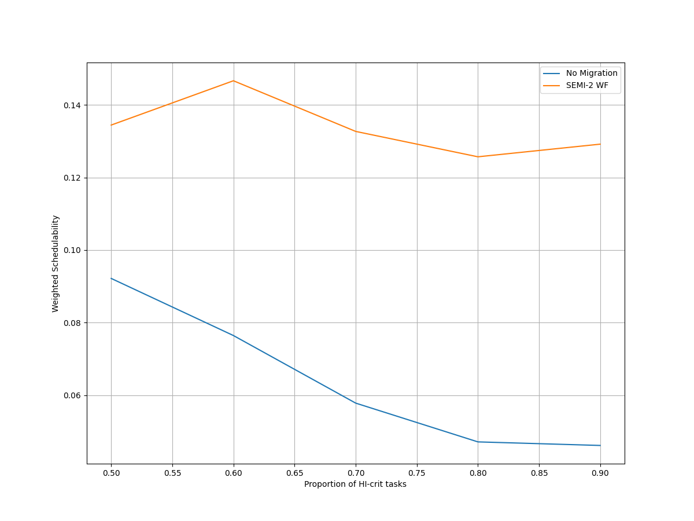
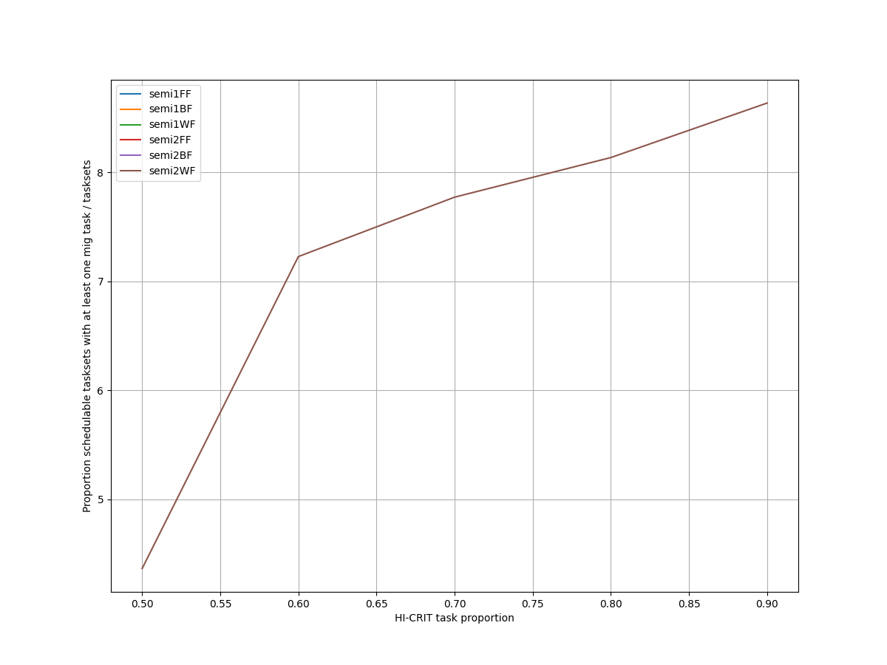
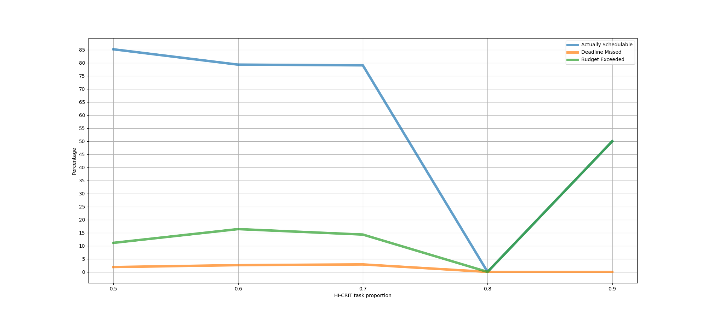
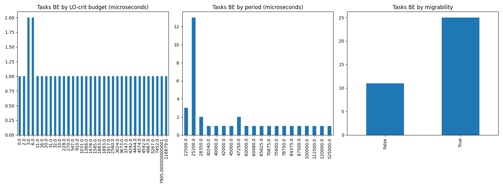
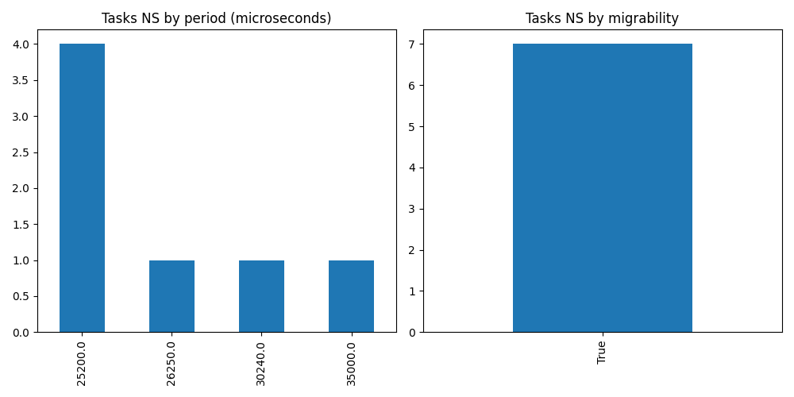

# Report on Experiment 3

   ## Overall data

   Utilization range = [1.8, 2.1] with step = 0.012

   Criticality factor range = [0.5, 0.9] with step = 0.1

  Number of executions: 277

Schedulable executions: 222/277 = 80.14440433212997 %

_Not_ schedulable executions: 7/277 = 2.527075812274368 %

Budget Exceeded executions: 41/277 = 14.801444043321299 %

Safe Boundary Exceeded executions: 7/277 = 2.527075812274368 %

NS + BE executions: 48/277 = 17.328519855595665 %

### **Simulations**

#### **Weighted schedulability experiment 3 according to simulations.**

#### **Percentage of (schedulable tasksets with at least one migrating tasks / number of schedulable tasksets) of experiment 3 according to simulations.** 

 

### **Real Executions**

#### **Schedulability for each level**

#### **Tasksets, grouped by (LO-crit budget, Period & Migrability), with a Budget_Exceeded task.**

#### **Tasksets, grouped by (Period & Migrability), with at least one task missing one (or more) of its deadlines.**

## Bad tasksets

Click here to expand this section.

### **Not schedulable tasksets**

Click here to expand this section.

Ovvero quando almeno un task non completa entra almeno una sua deadline.

  1. Taskset **e3_semi2wf_t2676**

    Taskset execution params:
	 
    "id": "e3_semi2wf_t2676",
    "size": "12",
    "utilization": "1.8960000000000001",
    "criticality_factor": "2",
    "hicrit_proportion": "0.6"

   
 
Click here to see the guilty tasks list.

   Time values are expressed as **micro-seconds**.

Task:  1

    
    "id": " 1",
    "basecpu": " 1",
    "priority": " 3",
    "period": 25200.0,
    "C(LO)": 4921.0,
    "C(HI)": 4921.0,
    "criticality": "LOW",
    "migrable": "True",
    "completedruns": " 1480",
    "preemptions": " 0",
    "minresponsejitter": " 0.000000000",
    "maxresponsejitter": " 0.002956273",
    "minreleasejitter": " 0.000000000",
    "maxreleasejitter": " 38.245606934",
    "avgresponsejitter": " 0.002463036",
    "deadlinesmissed": " 1",
    "budgetexceeded": " 0",
    "timesmigrated": " 4",
    "timesrestored": " 3",
    "timesonc1": " 1476",
    "timesonc2": " 2",
    "lockedtime": " 0.000015544"

   

   
 
Click here to see the CPUs log.

   Idle time is expressed as **seconds**.

   CPU: 1

    
    "id": 1,
    "hyperperiod": 56700000,
    "lowtohigh": " 21",
    "hightolow": " 21",
    "idletime": 81422187,
    "util": -43.60174074074075

   CPU: 2

    
    "id": 2,
    "hyperperiod": 113400000,
    "lowtohigh": " 0",
    "hightolow": " 0",
    "idletime": 76345862,
    "util": 32.675606701940026

   

   
 
Click here to see the whole tasksets.

   Time values are expressed as **micro-seconds**.

   Task:  9

    
    "id": " 9",
    "basecpu": " 1",
    "priority": " 0",
    "period": 196875.0,
    "C(LO)": 36986.0,
    "C(HI)": 73973.0,
    "criticality": "HIGH",
    "migrable": "False",
    "completedruns": " 577",
    "preemptions": " 329",
    "minresponsejitter": " 0.000000000",
    "maxresponsejitter": " 0.071833697",
    "minreleasejitter": " 0.000000000",
    "maxreleasejitter": " 114.203131126",
    "avgresponsejitter": " 0.020468168",
    "deadlinesmissed": " 0",
    "budgetexceeded": " 6",
    "timesmigrated": " 0",
    "timesrestored": " 0",
    "timesonc1": " 911",
    "timesonc2": " 0",
    "lockedtime": " 0.000029003"

   Task:  3

    
    "id": " 3",
    "basecpu": " 1",
    "priority": " 1",
    "period": 64800.0,
    "C(LO)": 6079.0,
    "C(HI)": 12158.0,
    "criticality": "HIGH",
    "migrable": "False",
    "completedruns": " 1751",
    "preemptions": " 55",
    "minresponsejitter": " 0.000000000",
    "maxresponsejitter": " 0.019268351",
    "minreleasejitter": " 0.000000000",
    "maxreleasejitter": " 114.335206324",
    "avgresponsejitter": " 0.003392294",
    "deadlinesmissed": " 0",
    "budgetexceeded": " 15",
    "timesmigrated": " 0",
    "timesrestored": " 0",
    "timesonc1": " 1820",
    "timesonc2": " 0",
    "lockedtime": " 0.000017553"

   Task:  6

    
    "id": " 6",
    "basecpu": " 1",
    "priority": " 2",
    "period": 84375.0,
    "C(LO)": 17858.0,
    "C(HI)": 17858.0,
    "criticality": "LOW",
    "migrable": "False",
    "completedruns": " 1345",
    "preemptions": " 160",
    "minresponsejitter": " 0.000000000",
    "maxresponsejitter": " 0.013613210",
    "minreleasejitter": " 0.000000000",
    "maxreleasejitter": " 114.315631126",
    "avgresponsejitter": " 0.009251994",
    "deadlinesmissed": " 0",
    "budgetexceeded": " 0",
    "timesmigrated": " 0",
    "timesrestored": " 0",
    "timesonc1": " 1504",
    "timesonc2": " 0",
    "lockedtime": " 0.000035580"

   Task:  1

    
    "id": " 1",
    "basecpu": " 1",
    "priority": " 3",
    "period": 25200.0,
    "C(LO)": 4921.0,
    "C(HI)": 4921.0,
    "criticality": "LOW",
    "migrable": "True",
    "completedruns": " 1480",
    "preemptions": " 0",
    "minresponsejitter": " 0.000000000",
    "maxresponsejitter": " 0.002956273",
    "minreleasejitter": " 0.000000000",
    "maxreleasejitter": " 38.245606934",
    "avgresponsejitter": " 0.002463036",
    "deadlinesmissed": " 1",
    "budgetexceeded": " 0",
    "timesmigrated": " 4",
    "timesrestored": " 3",
    "timesonc1": " 1476",
    "timesonc2": " 2",
    "lockedtime": " 0.000015544"

   Task:  12

    
    "id": " 12",
    "basecpu": " 2",
    "priority": " 0",
    "period": 840000.0,
    "C(LO)": 163347.0,
    "C(HI)": 326694.0,
    "criticality": "HIGH",
    "migrable": "False",
    "completedruns": " 136",
    "preemptions": " 797",
    "minresponsejitter": " 0.000000000",
    "maxresponsejitter": " 0.129762562",
    "minreleasejitter": " 0.000000000",
    "maxreleasejitter": " 113.560005871",
    "avgresponsejitter": " 0.102761294",
    "deadlinesmissed": " 0",
    "budgetexceeded": " 0",
    "timesmigrated": " 0",
    "timesrestored": " 0",
    "timesonc1": " 0",
    "timesonc2": " 932",
    "lockedtime": " 0.000027243"

   Task:  10

    
    "id": " 10",
    "basecpu": " 2",
    "priority": " 2",
    "period": 200000.0,
    "C(LO)": 6869.0,
    "C(HI)": 13738.0,
    "criticality": "HIGH",
    "migrable": "False",
    "completedruns": " 568",
    "preemptions": " 111",
    "minresponsejitter": " 0.000000000",
    "maxresponsejitter": " 0.006114586",
    "minreleasejitter": " 0.000000000",
    "maxreleasejitter": " 114.214720958",
    "avgresponsejitter": " 0.003540150",
    "deadlinesmissed": " 0",
    "budgetexceeded": " 0",
    "timesmigrated": " 0",
    "timesrestored": " 0",
    "timesonc1": " 0",
    "timesonc2": " 678",
    "lockedtime": " 0.000003282"

   Task:  11

    
    "id": " 11",
    "basecpu": " 2",
    "priority": " 1",
    "period": 450000.0,
    "C(LO)": 14615.0,
    "C(HI)": 29230.0,
    "criticality": "HIGH",
    "migrable": "False",
    "completedruns": " 253",
    "preemptions": " 102",
    "minresponsejitter": " 0.000000000",
    "maxresponsejitter": " 0.010574661",
    "minreleasejitter": " 0.000000000",
    "maxreleasejitter": " 113.950005976",
    "avgresponsejitter": " 0.007465438",
    "deadlinesmissed": " 0",
    "budgetexceeded": " 0",
    "timesmigrated": " 0",
    "timesrestored": " 0",
    "timesonc1": " 0",
    "timesonc2": " 354",
    "lockedtime": " 0.000008751"

   Task:  8

    
    "id": " 8",
    "basecpu": " 2",
    "priority": " 3",
    "period": 129600.0,
    "C(LO)": 1086.0,
    "C(HI)": 2172.0,
    "criticality": "HIGH",
    "migrable": "False",
    "completedruns": " 876",
    "preemptions": " 8",
    "minresponsejitter": " 0.000000000",
    "maxresponsejitter": " 0.015327820",
    "minreleasejitter": " 0.000000000",
    "maxreleasejitter": " 114.270405991",
    "avgresponsejitter": " 0.000566724",
    "deadlinesmissed": " 0",
    "budgetexceeded": " 0",
    "timesmigrated": " 0",
    "timesrestored": " 0",
    "timesonc1": " 0",
    "timesonc2": " 883",
    "lockedtime": " 0.000053402"

   Task:  5

    
    "id": " 5",
    "basecpu": " 2",
    "priority": " 4",
    "period": 75600.0,
    "C(LO)": 547.0,
    "C(HI)": 1095.0,
    "criticality": "HIGH",
    "migrable": "False",
    "completedruns": " 1501",
    "preemptions": " 3",
    "minresponsejitter": " 0.000000000",
    "maxresponsejitter": " 0.018827486",
    "minreleasejitter": " 0.000000000",
    "maxreleasejitter": " 114.324405811",
    "avgresponsejitter": " 0.000300423",
    "deadlinesmissed": " 0",
    "budgetexceeded": " 0",
    "timesmigrated": " 0",
    "timesrestored": " 0",
    "timesonc1": " 0",
    "timesonc2": " 1503",
    "lockedtime": " 0.000023135"

   Task:  7

    
    "id": " 7",
    "basecpu": " 2",
    "priority": " 5",
    "period": 100000.0,
    "C(LO)": 32958.0,
    "C(HI)": 32958.0,
    "criticality": "LOW",
    "migrable": "False",
    "completedruns": " 1135",
    "preemptions": " 805",
    "minresponsejitter": " 0.000000000",
    "maxresponsejitter": " 0.021001985",
    "minreleasejitter": " 0.000000000",
    "maxreleasejitter": " 114.300005913",
    "avgresponsejitter": " 0.016919078",
    "deadlinesmissed": " 0",
    "budgetexceeded": " 0",
    "timesmigrated": " 0",
    "timesrestored": " 0",
    "timesonc1": " 0",
    "timesonc2": " 1939",
    "lockedtime": " 0.000062498"

   Task:  4

    
    "id": " 4",
    "basecpu": " 2",
    "priority": " 6",
    "period": 70875.0,
    "C(LO)": 2334.0,
    "C(HI)": 2334.0,
    "criticality": "LOW",
    "migrable": "False",
    "completedruns": " 1601",
    "preemptions": " 0",
    "minresponsejitter": " 0.000000000",
    "maxresponsejitter": " 0.001405514",
    "minreleasejitter": " 0.000000000",
    "maxreleasejitter": " 114.329131066",
    "avgresponsejitter": " 0.001172213",
    "deadlinesmissed": " 0",
    "budgetexceeded": " 0",
    "timesmigrated": " 0",
    "timesrestored": " 0",
    "timesonc1": " 0",
    "timesonc2": " 1600",
    "lockedtime": " 0.000000811"

   Task:  2

    
    "id": " 2",
    "basecpu": " 2",
    "priority": " 7",
    "period": 28350.0,
    "C(LO)": 264.0,
    "C(HI)": 264.0,
    "criticality": "LOW",
    "migrable": "False",
    "completedruns": " 4001",
    "preemptions": " 0",
    "minresponsejitter": " 0.000000000",
    "maxresponsejitter": " 0.000166213",
    "minreleasejitter": " 0.000000000",
    "maxreleasejitter": " 114.371655976",
    "avgresponsejitter": " 0.000134520",
    "deadlinesmissed": " 0",
    "budgetexceeded": " 0",
    "timesmigrated": " 0",
    "timesrestored": " 0",
    "timesonc1": " 0",
    "timesonc2": " 4000",
    "lockedtime": " 0.000019453"

   

  2. Taskset **e3_semi2wf_t2726**

    Taskset execution params:
	 
    "id": "e3_semi2wf_t2726",
    "size": "12",
    "utilization": "1.9080000000000001",
    "criticality_factor": "2",
    "hicrit_proportion": "0.6"

   
 
Click here to see the guilty tasks list.

   Time values are expressed as **micro-seconds**.

Task:  1

    
    "id": " 1",
    "basecpu": " 2",
    "priority": " 5",
    "period": 25200.0,
    "C(LO)": 1373.0,
    "C(HI)": 1373.0,
    "criticality": "LOW",
    "migrable": "True",
    "completedruns": " 751",
    "preemptions": " 0",
    "minresponsejitter": " 0.000000000",
    "maxresponsejitter": " 0.000831913",
    "minreleasejitter": " 0.000000000",
    "maxreleasejitter": " 19.874806048",
    "avgresponsejitter": " 0.000690384",
    "deadlinesmissed": " 1",
    "budgetexceeded": " 0",
    "timesmigrated": " 3",
    "timesrestored": " 3",
    "timesonc1": " 1",
    "timesonc2": " 748",
    "lockedtime": " 0.000012399"

   

   
 
Click here to see the CPUs log.

   Idle time is expressed as **seconds**.

   CPU: 1

    
    "id": 1,
    "hyperperiod": 18900000,
    "lowtohigh": " 0",
    "hightolow": " 0",
    "idletime": 11798359,
    "util": 37.57482010582011

   CPU: 2

    
    "id": 2,
    "hyperperiod": 18900000,
    "lowtohigh": " 6",
    "hightolow": " 6",
    "idletime": 11516817,
    "util": 39.064460317460316

   

   
 
Click here to see the whole tasksets.

   Time values are expressed as **micro-seconds**.

   Task:  10

    
    "id": " 10",
    "basecpu": " 1",
    "priority": " 1",
    "period": 180000.0,
    "C(LO)": 14578.0,
    "C(HI)": 29157.0,
    "criticality": "HIGH",
    "migrable": "False",
    "completedruns": " 106",
    "preemptions": " 37",
    "minresponsejitter": " 0.000000000",
    "maxresponsejitter": " 0.036467904",
    "minreleasejitter": " 0.000000000",
    "maxreleasejitter": " 19.721075877",
    "avgresponsejitter": " 0.009172763",
    "deadlinesmissed": " 0",
    "budgetexceeded": " 0",
    "timesmigrated": " 0",
    "timesrestored": " 0",
    "timesonc1": " 142",
    "timesonc2": " 0",
    "lockedtime": " 0.000001099"

   Task:  11

    
    "id": " 11",
    "basecpu": " 1",
    "priority": " 0",
    "period": 700000.0,
    "C(LO)": 54259.0,
    "C(HI)": 108518.0,
    "criticality": "HIGH",
    "migrable": "False",
    "completedruns": " 28",
    "preemptions": " 45",
    "minresponsejitter": " 0.000000000",
    "maxresponsejitter": " 0.045869571",
    "minreleasejitter": " 0.000000000",
    "maxreleasejitter": " 19.201692027",
    "avgresponsejitter": " 0.032055736",
    "deadlinesmissed": " 0",
    "budgetexceeded": " 0",
    "timesmigrated": " 0",
    "timesrestored": " 0",
    "timesonc1": " 72",
    "timesonc2": " 0",
    "lockedtime": " 0.000001306"

   Task:  5

    
    "id": " 5",
    "basecpu": " 1",
    "priority": " 2",
    "period": 84000.0,
    "C(LO)": 3346.0,
    "C(HI)": 6692.0,
    "criticality": "HIGH",
    "migrable": "False",
    "completedruns": " 226",
    "preemptions": " 2",
    "minresponsejitter": " 0.000000000",
    "maxresponsejitter": " 0.004629423",
    "minreleasejitter": " 0.000000000",
    "maxreleasejitter": " 19.816006090",
    "avgresponsejitter": " 0.001690514",
    "deadlinesmissed": " 0",
    "budgetexceeded": " 0",
    "timesmigrated": " 0",
    "timesrestored": " 0",
    "timesonc1": " 227",
    "timesonc2": " 0",
    "lockedtime": " 0.000000643"

   Task:  6

    
    "id": " 6",
    "basecpu": " 1",
    "priority": " 3",
    "period": 131250.0,
    "C(LO)": 40579.0,
    "C(HI)": 40579.0,
    "criticality": "LOW",
    "migrable": "False",
    "completedruns": " 145",
    "preemptions": " 145",
    "minresponsejitter": " 0.000000000",
    "maxresponsejitter": " 0.029221438",
    "minreleasejitter": " 0.000000000",
    "maxreleasejitter": " 19.768756126",
    "avgresponsejitter": " 0.022845027",
    "deadlinesmissed": " 0",
    "budgetexceeded": " 0",
    "timesmigrated": " 0",
    "timesrestored": " 0",
    "timesonc1": " 289",
    "timesonc2": " 0",
    "lockedtime": " 0.000008465"

   Task:  2

    
    "id": " 2",
    "basecpu": " 1",
    "priority": " 5",
    "period": 30240.0,
    "C(LO)": 4882.0,
    "C(HI)": 4882.0,
    "criticality": "LOW",
    "migrable": "False",
    "completedruns": " 626",
    "preemptions": " 1",
    "minresponsejitter": " 0.000000000",
    "maxresponsejitter": " 0.002941853",
    "minreleasejitter": " 0.000000000",
    "maxreleasejitter": " 19.869766183",
    "avgresponsejitter": " 0.002463159",
    "deadlinesmissed": " 0",
    "budgetexceeded": " 0",
    "timesmigrated": " 0",
    "timesrestored": " 0",
    "timesonc1": " 626",
    "timesonc2": " 0",
    "lockedtime": " 0.000006369"

   Task:  3

    
    "id": " 3",
    "basecpu": " 1",
    "priority": " 4",
    "period": 50000.0,
    "C(LO)": 3861.0,
    "C(HI)": 3861.0,
    "criticality": "LOW",
    "migrable": "False",
    "completedruns": " 379",
    "preemptions": " 26",
    "minresponsejitter": " 0.000000000",
    "maxresponsejitter": " 0.005146919",
    "minreleasejitter": " 0.000000000",
    "maxreleasejitter": " 19.850006126",
    "avgresponsejitter": " 0.002111502",
    "deadlinesmissed": " 0",
    "budgetexceeded": " 0",
    "timesmigrated": " 0",
    "timesrestored": " 0",
    "timesonc1": " 404",
    "timesonc2": " 0",
    "lockedtime": " 0.000003000"

   Task:  9

    
    "id": " 9",
    "basecpu": " 2",
    "priority": " 1",
    "period": 168750.0,
    "C(LO)": 19199.0,
    "C(HI)": 38398.0,
    "criticality": "HIGH",
    "migrable": "False",
    "completedruns": " 113",
    "preemptions": " 72",
    "minresponsejitter": " 0.000000000",
    "maxresponsejitter": " 0.060490550",
    "minreleasejitter": " 0.000000000",
    "maxreleasejitter": " 19.731256222",
    "avgresponsejitter": " 0.012912495",
    "deadlinesmissed": " 0",
    "budgetexceeded": " 2",
    "timesmigrated": " 0",
    "timesrestored": " 0",
    "timesonc1": " 0",
    "timesonc2": " 186",
    "lockedtime": " 0.000004820"

   Task:  8

    
    "id": " 8",
    "basecpu": " 2",
    "priority": " 2",
    "period": 151200.0,
    "C(LO)": 7696.0,
    "C(HI)": 15393.0,
    "criticality": "HIGH",
    "migrable": "False",
    "completedruns": " 126",
    "preemptions": " 8",
    "minresponsejitter": " 0.000000000",
    "maxresponsejitter": " 0.004968018",
    "minreleasejitter": " 0.000000000",
    "maxreleasejitter": " 19.749463177",
    "avgresponsejitter": " 0.003830988",
    "deadlinesmissed": " 0",
    "budgetexceeded": " 0",
    "timesmigrated": " 0",
    "timesrestored": " 0",
    "timesonc1": " 0",
    "timesonc2": " 133",
    "lockedtime": " 0.000000000"

   Task:  4

    
    "id": " 4",
    "basecpu": " 2",
    "priority": " 4",
    "period": 54000.0,
    "C(LO)": 741.0,
    "C(HI)": 1482.0,
    "criticality": "HIGH",
    "migrable": "False",
    "completedruns": " 351",
    "preemptions": " 0",
    "minresponsejitter": " 0.000000000",
    "maxresponsejitter": " 0.001123447",
    "minreleasejitter": " 0.000000000",
    "maxreleasejitter": " 19.846006048",
    "avgresponsejitter": " 0.000379006",
    "deadlinesmissed": " 0",
    "budgetexceeded": " 4",
    "timesmigrated": " 0",
    "timesrestored": " 0",
    "timesonc1": " 0",
    "timesonc2": " 354",
    "lockedtime": " 0.000002721"

   Task:  12

    
    "id": " 12",
    "basecpu": " 2",
    "priority": " 0",
    "period": 900000.0,
    "C(LO)": 11477.0,
    "C(HI)": 22955.0,
    "criticality": "HIGH",
    "migrable": "False",
    "completedruns": " 22",
    "preemptions": " 7",
    "minresponsejitter": " 0.000000000",
    "maxresponsejitter": " 0.008473024",
    "minreleasejitter": " 0.000000000",
    "maxreleasejitter": " 19.000006153",
    "avgresponsejitter": " 0.006136381",
    "deadlinesmissed": " 0",
    "budgetexceeded": " 0",
    "timesmigrated": " 0",
    "timesrestored": " 0",
    "timesonc1": " 0",
    "timesonc2": " 28",
    "lockedtime": " 0.000000000"

   Task:  7

    
    "id": " 7",
    "basecpu": " 2",
    "priority": " 3",
    "period": 140000.0,
    "C(LO)": 73724.0,
    "C(HI)": 73724.0,
    "criticality": "LOW",
    "migrable": "False",
    "completedruns": " 136",
    "preemptions": " 268",
    "minresponsejitter": " 0.000000000",
    "maxresponsejitter": " 0.046132036",
    "minreleasejitter": " 0.000000000",
    "maxreleasejitter": " 19.760005928",
    "avgresponsejitter": " 0.038103333",
    "deadlinesmissed": " 0",
    "budgetexceeded": " 0",
    "timesmigrated": " 0",
    "timesrestored": " 0",
    "timesonc1": " 0",
    "timesonc2": " 403",
    "lockedtime": " 0.000012568"

   Task:  1

    
    "id": " 1",
    "basecpu": " 2",
    "priority": " 5",
    "period": 25200.0,
    "C(LO)": 1373.0,
    "C(HI)": 1373.0,
    "criticality": "LOW",
    "migrable": "True",
    "completedruns": " 751",
    "preemptions": " 0",
    "minresponsejitter": " 0.000000000",
    "maxresponsejitter": " 0.000831913",
    "minreleasejitter": " 0.000000000",
    "maxreleasejitter": " 19.874806048",
    "avgresponsejitter": " 0.000690384",
    "deadlinesmissed": " 1",
    "budgetexceeded": " 0",
    "timesmigrated": " 3",
    "timesrestored": " 3",
    "timesonc1": " 1",
    "timesonc2": " 748",
    "lockedtime": " 0.000012399"

   

  3. Taskset **e3_semi2wf_t393**

    Taskset execution params:
	 
    "id": "e3_semi2wf_t393",
    "size": "12",
    "utilization": "1.8840000000000001",
    "criticality_factor": "2",
    "hicrit_proportion": "0.5"

   
 
Click here to see the guilty tasks list.

   Time values are expressed as **micro-seconds**.

Task:  1

    
    "id": " 1",
    "basecpu": " 1",
    "priority": " 5",
    "period": 25200.0,
    "C(LO)": 5234.0,
    "C(HI)": 5234.0,
    "criticality": "LOW",
    "migrable": "True",
    "completedruns": " 2385",
    "preemptions": " 0",
    "minresponsejitter": " 0.000000000",
    "maxresponsejitter": " 0.003137517",
    "minreleasejitter": " 0.000000000",
    "maxreleasejitter": " 61.051606832",
    "avgresponsejitter": " 0.002606562",
    "deadlinesmissed": " 1",
    "budgetexceeded": " 0",
    "timesmigrated": " 5",
    "timesrestored": " 4",
    "timesonc1": " 2382",
    "timesonc2": " 1",
    "lockedtime": " 0.000007282"

   

   
 
Click here to see the CPUs log.

   Idle time is expressed as **seconds**.

   CPU: 1

    
    "id": 1,
    "hyperperiod": 113400000,
    "lowtohigh": " 15",
    "hightolow": " 15",
    "idletime": 74604820,
    "util": 34.21091710758377

   CPU: 2

    
    "id": 2,
    "hyperperiod": 113400000,
    "lowtohigh": " 0",
    "hightolow": " 0",
    "idletime": 76744647,
    "util": 32.323944444444436

   

   
 
Click here to see the whole tasksets.

   Time values are expressed as **micro-seconds**.

   Task:  8

    
    "id": " 8",
    "basecpu": " 1",
    "priority": " 3",
    "period": 181440.0,
    "C(LO)": 21249.0,
    "C(HI)": 42499.0,
    "criticality": "HIGH",
    "migrable": "False",
    "completedruns": " 626",
    "preemptions": " 188",
    "minresponsejitter": " 0.000000000",
    "maxresponsejitter": " 0.042022039",
    "minreleasejitter": " 0.000000000",
    "maxreleasejitter": " 114.218566637",
    "avgresponsejitter": " 0.012267727",
    "deadlinesmissed": " 0",
    "budgetexceeded": " 3",
    "timesmigrated": " 0",
    "timesrestored": " 0",
    "timesonc1": " 816",
    "timesonc2": " 0",
    "lockedtime": " 0.000014081"

   Task:  9

    
    "id": " 9",
    "basecpu": " 1",
    "priority": " 2",
    "period": 189000.0,
    "C(LO)": 13430.0,
    "C(HI)": 26860.0,
    "criticality": "HIGH",
    "migrable": "False",
    "completedruns": " 601",
    "preemptions": " 29",
    "minresponsejitter": " 0.000000000",
    "maxresponsejitter": " 0.039419276",
    "minreleasejitter": " 0.000000000",
    "maxreleasejitter": " 114.211005994",
    "avgresponsejitter": " 0.007364658",
    "deadlinesmissed": " 0",
    "budgetexceeded": " 7",
    "timesmigrated": " 0",
    "timesrestored": " 0",
    "timesonc1": " 636",
    "timesonc2": " 0",
    "lockedtime": " 0.000003033"

   Task:  10

    
    "id": " 10",
    "basecpu": " 1",
    "priority": " 1",
    "period": 196875.0,
    "C(LO)": 12788.0,
    "C(HI)": 25577.0,
    "criticality": "HIGH",
    "migrable": "False",
    "completedruns": " 577",
    "preemptions": " 120",
    "minresponsejitter": " 0.000000000",
    "maxresponsejitter": " 0.034005667",
    "minreleasejitter": " 0.000000000",
    "maxreleasejitter": " 114.203131333",
    "avgresponsejitter": " 0.007904766",
    "deadlinesmissed": " 0",
    "budgetexceeded": " 5",
    "timesmigrated": " 0",
    "timesrestored": " 0",
    "timesonc1": " 701",
    "timesonc2": " 0",
    "lockedtime": " 0.000009715"

   Task:  1

    
    "id": " 1",
    "basecpu": " 1",
    "priority": " 5",
    "period": 25200.0,
    "C(LO)": 5234.0,
    "C(HI)": 5234.0,
    "criticality": "LOW",
    "migrable": "True",
    "completedruns": " 2385",
    "preemptions": " 0",
    "minresponsejitter": " 0.000000000",
    "maxresponsejitter": " 0.003137517",
    "minreleasejitter": " 0.000000000",
    "maxreleasejitter": " 61.051606832",
    "avgresponsejitter": " 0.002606562",
    "deadlinesmissed": " 1",
    "budgetexceeded": " 0",
    "timesmigrated": " 5",
    "timesrestored": " 4",
    "timesonc1": " 2382",
    "timesonc2": " 1",
    "lockedtime": " 0.000007282"

   Task:  3

    
    "id": " 3",
    "basecpu": " 1",
    "priority": " 4",
    "period": 90000.0,
    "C(LO)": 16020.0,
    "C(HI)": 16020.0,
    "criticality": "LOW",
    "migrable": "False",
    "completedruns": " 1261",
    "preemptions": " 170",
    "minresponsejitter": " 0.000000000",
    "maxresponsejitter": " 0.012640375",
    "minreleasejitter": " 0.000000000",
    "maxreleasejitter": " 114.310006213",
    "avgresponsejitter": " 0.008332201",
    "deadlinesmissed": " 0",
    "budgetexceeded": " 0",
    "timesmigrated": " 0",
    "timesrestored": " 0",
    "timesonc1": " 1430",
    "timesonc2": " 0",
    "lockedtime": " 0.000023261"

   Task:  11

    
    "id": " 11",
    "basecpu": " 1",
    "priority": " 0",
    "period": 453600.0,
    "C(LO)": 62358.0,
    "C(HI)": 62358.0,
    "criticality": "LOW",
    "migrable": "False",
    "completedruns": " 251",
    "preemptions": " 342",
    "minresponsejitter": " 0.000000000",
    "maxresponsejitter": " 0.065903652",
    "minreleasejitter": " 0.000000000",
    "maxreleasejitter": " 113.946406733",
    "avgresponsejitter": " 0.038585495",
    "deadlinesmissed": " 0",
    "budgetexceeded": " 0",
    "timesmigrated": " 0",
    "timesrestored": " 0",
    "timesonc1": " 592",
    "timesonc2": " 0",
    "lockedtime": " 0.000020658"

   Task:  2

    
    "id": " 2",
    "basecpu": " 2",
    "priority": " 3",
    "period": 64800.0,
    "C(LO)": 12726.0,
    "C(HI)": 25452.0,
    "criticality": "HIGH",
    "migrable": "False",
    "completedruns": " 1751",
    "preemptions": " 148",
    "minresponsejitter": " 0.000000000",
    "maxresponsejitter": " 0.020947135",
    "minreleasejitter": " 0.000000000",
    "maxreleasejitter": " 114.335205934",
    "avgresponsejitter": " 0.006946799",
    "deadlinesmissed": " 0",
    "budgetexceeded": " 0",
    "timesmigrated": " 0",
    "timesrestored": " 0",
    "timesonc1": " 0",
    "timesonc2": " 1898",
    "lockedtime": " 0.000013898"

   Task:  7

    
    "id": " 7",
    "basecpu": " 2",
    "priority": " 1",
    "period": 168750.0,
    "C(LO)": 2205.0,
    "C(HI)": 4410.0,
    "criticality": "HIGH",
    "migrable": "False",
    "completedruns": " 673",
    "preemptions": " 3",
    "minresponsejitter": " 0.000000000",
    "maxresponsejitter": " 0.001624327",
    "minreleasejitter": " 0.000000000",
    "maxreleasejitter": " 114.231255871",
    "avgresponsejitter": " 0.001108910",
    "deadlinesmissed": " 0",
    "budgetexceeded": " 0",
    "timesmigrated": " 0",
    "timesrestored": " 0",
    "timesonc1": " 0",
    "timesonc2": " 675",
    "lockedtime": " 0.000006045"

   Task:  4

    
    "id": " 4",
    "basecpu": " 2",
    "priority": " 2",
    "period": 113400.0,
    "C(LO)": 551.0,
    "C(HI)": 1102.0,
    "criticality": "HIGH",
    "migrable": "False",
    "completedruns": " 1001",
    "preemptions": " 0",
    "minresponsejitter": " 0.000000000",
    "maxresponsejitter": " 0.000332288",
    "minreleasejitter": " 0.000000000",
    "maxreleasejitter": " 114.292477321",
    "avgresponsejitter": " 0.000274559",
    "deadlinesmissed": " 0",
    "budgetexceeded": " 0",
    "timesmigrated": " 0",
    "timesrestored": " 0",
    "timesonc1": " 0",
    "timesonc2": " 1000",
    "lockedtime": " 0.000018622"

   Task:  12

    
    "id": " 12",
    "basecpu": " 2",
    "priority": " 0",
    "period": 945000.0,
    "C(LO)": 212714.0,
    "C(HI)": 212714.0,
    "criticality": "LOW",
    "migrable": "False",
    "completedruns": " 121",
    "preemptions": " 515",
    "minresponsejitter": " 0.000000000",
    "maxresponsejitter": " 0.172387216",
    "minreleasejitter": " 0.000000000",
    "maxreleasejitter": " 113.455851841",
    "avgresponsejitter": " 0.133603201",
    "deadlinesmissed": " 0",
    "budgetexceeded": " 0",
    "timesmigrated": " 0",
    "timesrestored": " 0",
    "timesonc1": " 0",
    "timesonc2": " 635",
    "lockedtime": " 0.000018243"

   Task:  5

    
    "id": " 5",
    "basecpu": " 2",
    "priority": " 5",
    "period": 120000.0,
    "C(LO)": 22583.0,
    "C(HI)": 22583.0,
    "criticality": "LOW",
    "migrable": "False",
    "completedruns": " 946",
    "preemptions": " 0",
    "minresponsejitter": " 0.000000000",
    "maxresponsejitter": " 0.013585006",
    "minreleasejitter": " 0.000000000",
    "maxreleasejitter": " 114.280005880",
    "avgresponsejitter": " 0.011422180",
    "deadlinesmissed": " 0",
    "budgetexceeded": " 0",
    "timesmigrated": " 0",
    "timesrestored": " 0",
    "timesonc1": " 0",
    "timesonc2": " 945",
    "lockedtime": " 0.000036255"

   Task:  6

    
    "id": " 6",
    "basecpu": " 2",
    "priority": " 4",
    "period": 135000.0,
    "C(LO)": 1697.0,
    "C(HI)": 1697.0,
    "criticality": "LOW",
    "migrable": "False",
    "completedruns": " 841",
    "preemptions": " 0",
    "minresponsejitter": " 0.000000000",
    "maxresponsejitter": " 0.001027664",
    "minreleasejitter": " 0.000000000",
    "maxreleasejitter": " 114.265005874",
    "avgresponsejitter": " 0.000854583",
    "deadlinesmissed": " 0",
    "budgetexceeded": " 0",
    "timesmigrated": " 0",
    "timesrestored": " 0",
    "timesonc1": " 0",
    "timesonc2": " 840",
    "lockedtime": " 0.000031303"

   

  4. Taskset **e3_semi2wf_t4103**

    Taskset execution params:
	 
    "id": "e3_semi2wf_t4103",
    "size": "12",
    "utilization": "2.076",
    "criticality_factor": "2",
    "hicrit_proportion": "0.6"

   
 
Click here to see the guilty tasks list.

   Time values are expressed as **micro-seconds**.

Task:  1

    
    "id": " 1",
    "basecpu": " 1",
    "priority": " 5",
    "period": 35000.0,
    "C(LO)": 9855.0,
    "C(HI)": 9855.0,
    "criticality": "LOW",
    "migrable": "True",
    "completedruns": " 1065",
    "preemptions": " 0",
    "minresponsejitter": " 0.000000000",
    "maxresponsejitter": " 0.005905976",
    "minreleasejitter": " 0.000000000",
    "maxreleasejitter": " 38.206006547",
    "avgresponsejitter": " 0.004928724",
    "deadlinesmissed": " 1",
    "budgetexceeded": " 0",
    "timesmigrated": " 4",
    "timesrestored": " 4",
    "timesonc1": " 1060",
    "timesonc2": " 3",
    "lockedtime": " 0.000021210"

   

   
 
Click here to see the CPUs log.

   Idle time is expressed as **seconds**.

   CPU: 1

    
    "id": 1,
    "hyperperiod": 56700000,
    "lowtohigh": " 24",
    "hightolow": " 24",
    "idletime": 36936785,
    "util": 34.85575837742503

   CPU: 2

    
    "id": 2,
    "hyperperiod": 22680000,
    "lowtohigh": " 0",
    "hightolow": " 0",
    "idletime": 39181087,
    "util": -72.75611552028218

   

   
 
Click here to see the whole tasksets.

   Time values are expressed as **micro-seconds**.

   Task:  8

    
    "id": " 8",
    "basecpu": " 1",
    "priority": " 2",
    "period": 100000.0,
    "C(LO)": 12717.0,
    "C(HI)": 25434.0,
    "criticality": "HIGH",
    "migrable": "False",
    "completedruns": " 568",
    "preemptions": " 129",
    "minresponsejitter": " 0.000000000",
    "maxresponsejitter": " 0.024458532",
    "minreleasejitter": " 0.000000000",
    "maxreleasejitter": " 57.600189255",
    "avgresponsejitter": " 0.007472685",
    "deadlinesmissed": " 0",
    "budgetexceeded": " 4",
    "timesmigrated": " 0",
    "timesrestored": " 0",
    "timesonc1": " 700",
    "timesonc2": " 0",
    "lockedtime": " 0.000010964"

   Task:  6

    
    "id": " 6",
    "basecpu": " 1",
    "priority": " 3",
    "period": 56700.0,
    "C(LO)": 7055.0,
    "C(HI)": 14110.0,
    "criticality": "HIGH",
    "migrable": "False",
    "completedruns": " 1001",
    "preemptions": " 78",
    "minresponsejitter": " 0.000000000",
    "maxresponsejitter": " 0.026207640",
    "minreleasejitter": " 0.000000000",
    "maxreleasejitter": " 57.643306216",
    "avgresponsejitter": " 0.004145468",
    "deadlinesmissed": " 0",
    "budgetexceeded": " 13",
    "timesmigrated": " 0",
    "timesrestored": " 0",
    "timesonc1": " 1091",
    "timesonc2": " 0",
    "lockedtime": " 0.000017772"

   Task:  11

    
    "id": " 11",
    "basecpu": " 1",
    "priority": " 0",
    "period": 700000.0,
    "C(LO)": 58950.0,
    "C(HI)": 117900.0,
    "criticality": "HIGH",
    "migrable": "False",
    "completedruns": " 82",
    "preemptions": " 132",
    "minresponsejitter": " 0.000000000",
    "maxresponsejitter": " 0.124109709",
    "minreleasejitter": " 0.000000000",
    "maxreleasejitter": " 57.006492928",
    "avgresponsejitter": " 0.041065826",
    "deadlinesmissed": " 0",
    "budgetexceeded": " 3",
    "timesmigrated": " 0",
    "timesrestored": " 0",
    "timesonc1": " 216",
    "timesonc2": " 0",
    "lockedtime": " 0.000010189"

   Task:  10

    
    "id": " 10",
    "basecpu": " 1",
    "priority": " 1",
    "period": 151200.0,
    "C(LO)": 815.0,
    "C(HI)": 1631.0,
    "criticality": "HIGH",
    "migrable": "False",
    "completedruns": " 376",
    "preemptions": " 3",
    "minresponsejitter": " 0.000000000",
    "maxresponsejitter": " 0.009555186",
    "minreleasejitter": " 0.000000000",
    "maxreleasejitter": " 57.548806979",
    "avgresponsejitter": " 0.000463399",
    "deadlinesmissed": " 0",
    "budgetexceeded": " 4",
    "timesmigrated": " 0",
    "timesrestored": " 0",
    "timesonc1": " 382",
    "timesonc2": " 0",
    "lockedtime": " 0.000003060"

   Task:  1

    
    "id": " 1",
    "basecpu": " 1",
    "priority": " 5",
    "period": 35000.0,
    "C(LO)": 9855.0,
    "C(HI)": 9855.0,
    "criticality": "LOW",
    "migrable": "True",
    "completedruns": " 1065",
    "preemptions": " 0",
    "minresponsejitter": " 0.000000000",
    "maxresponsejitter": " 0.005905976",
    "minreleasejitter": " 0.000000000",
    "maxreleasejitter": " 38.206006547",
    "avgresponsejitter": " 0.004928724",
    "deadlinesmissed": " 1",
    "budgetexceeded": " 0",
    "timesmigrated": " 4",
    "timesrestored": " 4",
    "timesonc1": " 1060",
    "timesonc2": " 3",
    "lockedtime": " 0.000021210"

   Task:  9

    
    "id": " 9",
    "basecpu": " 1",
    "priority": " 4",
    "period": 112500.0,
    "C(LO)": 17762.0,
    "C(HI)": 17762.0,
    "criticality": "LOW",
    "migrable": "False",
    "completedruns": " 505",
    "preemptions": " 75",
    "minresponsejitter": " 0.000000000",
    "maxresponsejitter": " 0.016354300",
    "minreleasejitter": " 0.000000000",
    "maxreleasejitter": " 57.587506781",
    "avgresponsejitter": " 0.009638619",
    "deadlinesmissed": " 0",
    "budgetexceeded": " 0",
    "timesmigrated": " 0",
    "timesrestored": " 0",
    "timesonc1": " 579",
    "timesonc2": " 0",
    "lockedtime": " 0.000019366"

   Task:  5

    
    "id": " 5",
    "basecpu": " 2",
    "priority": " 2",
    "period": 54000.0,
    "C(LO)": 14448.0,
    "C(HI)": 28896.0,
    "criticality": "HIGH",
    "migrable": "False",
    "completedruns": " 1051",
    "preemptions": " 432",
    "minresponsejitter": " 0.000000000",
    "maxresponsejitter": " 0.010376577",
    "minreleasejitter": " 0.000000000",
    "maxreleasejitter": " 57.646006114",
    "avgresponsejitter": " 0.007558511",
    "deadlinesmissed": " 0",
    "budgetexceeded": " 0",
    "timesmigrated": " 0",
    "timesrestored": " 0",
    "timesonc1": " 0",
    "timesonc2": " 1482",
    "lockedtime": " 0.000012477"

   Task:  4

    
    "id": " 4",
    "basecpu": " 2",
    "priority": " 3",
    "period": 45360.0,
    "C(LO)": 2166.0,
    "C(HI)": 4332.0,
    "criticality": "HIGH",
    "migrable": "False",
    "completedruns": " 1251",
    "preemptions": " 0",
    "minresponsejitter": " 0.000000000",
    "maxresponsejitter": " 0.001299529",
    "minreleasejitter": " 0.000000000",
    "maxreleasejitter": " 57.654645778",
    "avgresponsejitter": " 0.001090535",
    "deadlinesmissed": " 0",
    "budgetexceeded": " 0",
    "timesmigrated": " 0",
    "timesrestored": " 0",
    "timesonc1": " 0",
    "timesonc2": " 1250",
    "lockedtime": " 0.000000489"

   Task:  3

    
    "id": " 3",
    "basecpu": " 2",
    "priority": " 4",
    "period": 42000.0,
    "C(LO)": 765.0,
    "C(HI)": 1530.0,
    "criticality": "HIGH",
    "migrable": "False",
    "completedruns": " 1351",
    "preemptions": " 0",
    "minresponsejitter": " 0.000000000",
    "maxresponsejitter": " 0.000460336",
    "minreleasejitter": " 0.000000000",
    "maxreleasejitter": " 57.658005754",
    "avgresponsejitter": " 0.000382102",
    "deadlinesmissed": " 0",
    "budgetexceeded": " 0",
    "timesmigrated": " 0",
    "timesrestored": " 0",
    "timesonc1": " 0",
    "timesonc2": " 1350",
    "lockedtime": " 0.000014345"

   Task:  7

    
    "id": " 7",
    "basecpu": " 2",
    "priority": " 1",
    "period": 90000.0,
    "C(LO)": 1561.0,
    "C(HI)": 3122.0,
    "criticality": "HIGH",
    "migrable": "False",
    "completedruns": " 631",
    "preemptions": " 18",
    "minresponsejitter": " 0.000000000",
    "maxresponsejitter": " 0.002202880",
    "minreleasejitter": " 0.000000000",
    "maxreleasejitter": " 57.610207096",
    "avgresponsejitter": " 0.000817958",
    "deadlinesmissed": " 0",
    "budgetexceeded": " 0",
    "timesmigrated": " 0",
    "timesrestored": " 0",
    "timesonc1": " 0",
    "timesonc2": " 648",
    "lockedtime": " 0.000003432"

   Task:  12

    
    "id": " 12",
    "basecpu": " 2",
    "priority": " 0",
    "period": 907200.0,
    "C(LO)": 198912.0,
    "C(HI)": 198912.0,
    "criticality": "LOW",
    "migrable": "False",
    "completedruns": " 64",
    "preemptions": " 609",
    "minresponsejitter": " 0.000000000",
    "maxresponsejitter": " 0.151151613",
    "minreleasejitter": " 0.000000000",
    "maxreleasejitter": " 57.248108835",
    "avgresponsejitter": " 0.126018441",
    "deadlinesmissed": " 0",
    "budgetexceeded": " 0",
    "timesmigrated": " 0",
    "timesrestored": " 0",
    "timesonc1": " 0",
    "timesonc2": " 672",
    "lockedtime": " 0.000012574"

   Task:  2

    
    "id": " 2",
    "basecpu": " 2",
    "priority": " 5",
    "period": 37800.0,
    "C(LO)": 1249.0,
    "C(HI)": 1249.0,
    "criticality": "LOW",
    "migrable": "False",
    "completedruns": " 1501",
    "preemptions": " 0",
    "minresponsejitter": " 0.000000000",
    "maxresponsejitter": " 0.000755093",
    "minreleasejitter": " 0.000000000",
    "maxreleasejitter": " 57.662205751",
    "avgresponsejitter": " 0.000631126",
    "deadlinesmissed": " 0",
    "budgetexceeded": " 0",
    "timesmigrated": " 0",
    "timesrestored": " 0",
    "timesonc1": " 0",
    "timesonc2": " 1500",
    "lockedtime": " 0.000054159"

   

  5. Taskset **e3_semi2wf_t4698**

    Taskset execution params:
	 
    "id": "e3_semi2wf_t4698",
    "size": "12",
    "utilization": "1.872",
    "criticality_factor": "2",
    "hicrit_proportion": "0.7"

   
 
Click here to see the guilty tasks list.

   Time values are expressed as **micro-seconds**.

Task:  2

    
    "id": " 2",
    "basecpu": " 1",
    "priority": " 5",
    "period": 30240.0,
    "C(LO)": 3992.0,
    "C(HI)": 3992.0,
    "criticality": "LOW",
    "migrable": "True",
    "completedruns": " 3751",
    "preemptions": " 1",
    "minresponsejitter": " 0.000000000",
    "maxresponsejitter": " 0.002406024",
    "minreleasejitter": " 0.000000000",
    "maxreleasejitter": " 114.369766159",
    "avgresponsejitter": " 0.001993532",
    "deadlinesmissed": " 1",
    "budgetexceeded": " 0",
    "timesmigrated": " 10",
    "timesrestored": " 10",
    "timesonc1": " 3741",
    "timesonc2": " 9",
    "lockedtime": " 0.000064483"

   

   
 
Click here to see the CPUs log.

   Idle time is expressed as **seconds**.

   CPU: 1

    
    "id": 1,
    "hyperperiod": 37800000,
    "lowtohigh": " 38",
    "hightolow": " 38",
    "idletime": 72733039,
    "util": -92.4154470899471

   CPU: 2

    
    "id": 2,
    "hyperperiod": 113400000,
    "lowtohigh": " 0",
    "hightolow": " 0",
    "idletime": 80635901,
    "util": 28.89250352733687

   

   
 
Click here to see the whole tasksets.

   Time values are expressed as **micro-seconds**.

   Task:  12

    
    "id": " 12",
    "basecpu": " 1",
    "priority": " 0",
    "period": 600000.0,
    "C(LO)": 89158.0,
    "C(HI)": 178316.0,
    "criticality": "HIGH",
    "migrable": "False",
    "completedruns": " 190",
    "preemptions": " 573",
    "minresponsejitter": " 0.000000000",
    "maxresponsejitter": " 0.191502943",
    "minreleasejitter": " 0.000000000",
    "maxreleasejitter": " 113.810731592",
    "avgresponsejitter": " 0.057731282",
    "deadlinesmissed": " 0",
    "budgetexceeded": " 2",
    "timesmigrated": " 0",
    "timesrestored": " 0",
    "timesonc1": " 764",
    "timesonc2": " 0",
    "lockedtime": " 0.000061051"

   Task:  6

    
    "id": " 6",
    "basecpu": " 1",
    "priority": " 1",
    "period": 105000.0,
    "C(LO)": 14794.0,
    "C(HI)": 29588.0,
    "criticality": "HIGH",
    "migrable": "False",
    "completedruns": " 1081",
    "preemptions": " 335",
    "minresponsejitter": " 0.000000000",
    "maxresponsejitter": " 0.037423880",
    "minreleasejitter": " 0.000000000",
    "maxreleasejitter": " 114.295194459",
    "avgresponsejitter": " 0.008670024",
    "deadlinesmissed": " 0",
    "budgetexceeded": " 16",
    "timesmigrated": " 0",
    "timesrestored": " 0",
    "timesonc1": " 1431",
    "timesonc2": " 0",
    "lockedtime": " 0.000010486"

   Task:  3

    
    "id": " 3",
    "basecpu": " 1",
    "priority": " 2",
    "period": 52500.0,
    "C(LO)": 382.0,
    "C(HI)": 765.0,
    "criticality": "HIGH",
    "migrable": "False",
    "completedruns": " 2161",
    "preemptions": " 1",
    "minresponsejitter": " 0.000000000",
    "maxresponsejitter": " 0.002088141",
    "minreleasejitter": " 0.000000000",
    "maxreleasejitter": " 114.347506940",
    "avgresponsejitter": " 0.000196363",
    "deadlinesmissed": " 0",
    "budgetexceeded": " 20",
    "timesmigrated": " 0",
    "timesrestored": " 0",
    "timesonc1": " 2181",
    "timesonc2": " 0",
    "lockedtime": " 0.000071838"

   Task:  5

    
    "id": " 5",
    "basecpu": " 1",
    "priority": " 4",
    "period": 75600.0,
    "C(LO)": 12751.0,
    "C(HI)": 12751.0,
    "criticality": "LOW",
    "migrable": "False",
    "completedruns": " 1501",
    "preemptions": " 0",
    "minresponsejitter": " 0.000000000",
    "maxresponsejitter": " 0.007674910",
    "minreleasejitter": " 0.000000000",
    "maxreleasejitter": " 114.324406111",
    "avgresponsejitter": " 0.006382186",
    "deadlinesmissed": " 0",
    "budgetexceeded": " 0",
    "timesmigrated": " 0",
    "timesrestored": " 0",
    "timesonc1": " 1500",
    "timesonc2": " 0",
    "lockedtime": " 0.000055796"

   Task:  2

    
    "id": " 2",
    "basecpu": " 1",
    "priority": " 5",
    "period": 30240.0,
    "C(LO)": 3992.0,
    "C(HI)": 3992.0,
    "criticality": "LOW",
    "migrable": "True",
    "completedruns": " 3751",
    "preemptions": " 1",
    "minresponsejitter": " 0.000000000",
    "maxresponsejitter": " 0.002406024",
    "minreleasejitter": " 0.000000000",
    "maxreleasejitter": " 114.369766159",
    "avgresponsejitter": " 0.001993532",
    "deadlinesmissed": " 1",
    "budgetexceeded": " 0",
    "timesmigrated": " 10",
    "timesrestored": " 10",
    "timesonc1": " 3741",
    "timesonc2": " 9",
    "lockedtime": " 0.000064483"

   Task:  7

    
    "id": " 7",
    "basecpu": " 1",
    "priority": " 3",
    "period": 120000.0,
    "C(LO)": 13176.0,
    "C(HI)": 13176.0,
    "criticality": "LOW",
    "migrable": "False",
    "completedruns": " 946",
    "preemptions": " 245",
    "minresponsejitter": " 0.000000000",
    "maxresponsejitter": " 0.017121483",
    "minreleasejitter": " 0.000000000",
    "maxreleasejitter": " 114.281140345",
    "avgresponsejitter": " 0.007596580",
    "deadlinesmissed": " 0",
    "budgetexceeded": " 0",
    "timesmigrated": " 0",
    "timesrestored": " 0",
    "timesonc1": " 1190",
    "timesonc2": " 0",
    "lockedtime": " 0.000038168"

   Task:  11

    
    "id": " 11",
    "basecpu": " 2",
    "priority": " 0",
    "period": 200000.0,
    "C(LO)": 33476.0,
    "C(HI)": 66952.0,
    "criticality": "HIGH",
    "migrable": "False",
    "completedruns": " 568",
    "preemptions": " 560",
    "minresponsejitter": " 0.000000000",
    "maxresponsejitter": " 0.030316586",
    "minreleasejitter": " 0.000000000",
    "maxreleasejitter": " 114.200006027",
    "avgresponsejitter": " 0.020242676",
    "deadlinesmissed": " 0",
    "budgetexceeded": " 0",
    "timesmigrated": " 0",
    "timesrestored": " 0",
    "timesonc1": " 0",
    "timesonc2": " 1127",
    "lockedtime": " 0.000040532"

   Task:  4

    
    "id": " 4",
    "basecpu": " 2",
    "priority": " 4",
    "period": 54000.0,
    "C(LO)": 3448.0,
    "C(HI)": 6896.0,
    "criticality": "HIGH",
    "migrable": "False",
    "completedruns": " 2101",
    "preemptions": " 106",
    "minresponsejitter": " 0.000000000",
    "maxresponsejitter": " 0.006505961",
    "minreleasejitter": " 0.000000000",
    "maxreleasejitter": " 114.346005961",
    "avgresponsejitter": " 0.001920781",
    "deadlinesmissed": " 0",
    "budgetexceeded": " 0",
    "timesmigrated": " 0",
    "timesrestored": " 0",
    "timesonc1": " 0",
    "timesonc2": " 2206",
    "lockedtime": " 0.000027631"

   Task:  9

    
    "id": " 9",
    "basecpu": " 2",
    "priority": " 2",
    "period": 157500.0,
    "C(LO)": 4565.0,
    "C(HI)": 9130.0,
    "criticality": "HIGH",
    "migrable": "False",
    "completedruns": " 721",
    "preemptions": " 54",
    "minresponsejitter": " 0.000000000",
    "maxresponsejitter": " 0.004756595",
    "minreleasejitter": " 0.000000000",
    "maxreleasejitter": " 114.246142700",
    "avgresponsejitter": " 0.002391994",
    "deadlinesmissed": " 0",
    "budgetexceeded": " 0",
    "timesmigrated": " 0",
    "timesrestored": " 0",
    "timesonc1": " 0",
    "timesonc2": " 774",
    "lockedtime": " 0.000002937"

   Task:  10

    
    "id": " 10",
    "basecpu": " 2",
    "priority": " 1",
    "period": 181440.0,
    "C(LO)": 3761.0,
    "C(HI)": 7523.0,
    "criticality": "HIGH",
    "migrable": "False",
    "completedruns": " 626",
    "preemptions": " 45",
    "minresponsejitter": " 0.000000000",
    "maxresponsejitter": " 0.008434486",
    "minreleasejitter": " 0.000000000",
    "maxreleasejitter": " 114.220248853",
    "avgresponsejitter": " 0.002152258",
    "deadlinesmissed": " 0",
    "budgetexceeded": " 0",
    "timesmigrated": " 0",
    "timesrestored": " 0",
    "timesonc1": " 0",
    "timesonc2": " 670",
    "lockedtime": " 0.000030592"

   Task:  8

    
    "id": " 8",
    "basecpu": " 2",
    "priority": " 3",
    "period": 131250.0,
    "C(LO)": 1376.0,
    "C(HI)": 2752.0,
    "criticality": "HIGH",
    "migrable": "False",
    "completedruns": " 865",
    "preemptions": " 11",
    "minresponsejitter": " 0.000000000",
    "maxresponsejitter": " 0.002789375",
    "minreleasejitter": " 0.000000000",
    "maxreleasejitter": " 114.272535742",
    "avgresponsejitter": " 0.000711697",
    "deadlinesmissed": " 0",
    "budgetexceeded": " 0",
    "timesmigrated": " 0",
    "timesrestored": " 0",
    "timesonc1": " 0",
    "timesonc2": " 875",
    "lockedtime": " 0.000001069"

   Task:  1

    
    "id": " 1",
    "basecpu": " 2",
    "priority": " 5",
    "period": 26250.0,
    "C(LO)": 7482.0,
    "C(HI)": 7482.0,
    "criticality": "LOW",
    "migrable": "False",
    "completedruns": " 4321",
    "preemptions": " 0",
    "minresponsejitter": " 0.000000000",
    "maxresponsejitter": " 0.004493270",
    "minreleasejitter": " 0.000000000",
    "maxreleasejitter": " 114.373755964",
    "avgresponsejitter": " 0.003732793",
    "deadlinesmissed": " 0",
    "budgetexceeded": " 0",
    "timesmigrated": " 0",
    "timesrestored": " 0",
    "timesonc1": " 0",
    "timesonc2": " 4320",
    "lockedtime": " 0.000116378"

   

  6. Taskset **e3_semi2wf_t5058**

    Taskset execution params:
	 
    "id": "e3_semi2wf_t5058",
    "size": "12",
    "utilization": "1.9200000000000002",
    "criticality_factor": "2",
    "hicrit_proportion": "0.7"

   
 
Click here to see the guilty tasks list.

   Time values are expressed as **micro-seconds**.

Task:  1

    
    "id": " 1",
    "basecpu": " 2",
    "priority": " 6",
    "period": 26250.0,
    "C(LO)": 1342.0,
    "C(HI)": 1342.0,
    "criticality": "LOW",
    "migrable": "True",
    "completedruns": " 1802",
    "preemptions": " 0",
    "minresponsejitter": " 0.000000000",
    "maxresponsejitter": " 0.000816099",
    "minreleasejitter": " 0.000000000",
    "maxreleasejitter": " 48.250010514",
    "avgresponsejitter": " 0.000677246",
    "deadlinesmissed": " 1",
    "budgetexceeded": " 0",
    "timesmigrated": " 5",
    "timesrestored": " 4",
    "timesonc1": " 2",
    "timesonc2": " 1798",
    "lockedtime": " 0.000041664"

   

   
 
Click here to see the CPUs log.

   Idle time is expressed as **seconds**.

   CPU: 1

    
    "id": 1,
    "hyperperiod": 56700000,
    "lowtohigh": " 0",
    "hightolow": " 0",
    "idletime": 41044699,
    "util": 27.610760141093465

   CPU: 2

    
    "id": 2,
    "hyperperiod": 56700000,
    "lowtohigh": " 31",
    "hightolow": " 31",
    "idletime": 40321575,
    "util": 28.886111111111106

   

   
 
Click here to see the whole tasksets.

   Time values are expressed as **micro-seconds**.

   Task:  10

    
    "id": " 10",
    "basecpu": " 1",
    "priority": " 1",
    "period": 168750.0,
    "C(LO)": 31982.999999999996,
    "C(HI)": 63966.99999999999,
    "criticality": "HIGH",
    "migrable": "False",
    "completedruns": " 337",
    "preemptions": " 174",
    "minresponsejitter": " 0.000000000",
    "maxresponsejitter": " 0.028506075",
    "minreleasejitter": " 0.000000000",
    "maxreleasejitter": " 57.531256216",
    "avgresponsejitter": " 0.017979207",
    "deadlinesmissed": " 0",
    "budgetexceeded": " 0",
    "timesmigrated": " 0",
    "timesrestored": " 0",
    "timesonc1": " 510",
    "timesonc2": " 0",
    "lockedtime": " 0.000016234"

   Task:  11

    
    "id": " 11",
    "basecpu": " 1",
    "priority": " 0",
    "period": 405000.0,
    "C(LO)": 34509.0,
    "C(HI)": 69019.0,
    "criticality": "HIGH",
    "migrable": "False",
    "completedruns": " 141",
    "preemptions": " 57",
    "minresponsejitter": " 0.000000000",
    "maxresponsejitter": " 0.027932670",
    "minreleasejitter": " 0.000000000",
    "maxreleasejitter": " 57.296916835",
    "avgresponsejitter": " 0.018984952",
    "deadlinesmissed": " 0",
    "budgetexceeded": " 0",
    "timesmigrated": " 0",
    "timesrestored": " 0",
    "timesonc1": " 197",
    "timesonc2": " 0",
    "lockedtime": " 0.000009514"

   Task:  3

    
    "id": " 3",
    "basecpu": " 1",
    "priority": " 3",
    "period": 45000.0,
    "C(LO)": 3520.0,
    "C(HI)": 7041.0,
    "criticality": "HIGH",
    "migrable": "False",
    "completedruns": " 1261",
    "preemptions": " 0",
    "minresponsejitter": " 0.000000000",
    "maxresponsejitter": " 0.002115628",
    "minreleasejitter": " 0.000000000",
    "maxreleasejitter": " 57.655006150",
    "avgresponsejitter": " 0.001758598",
    "deadlinesmissed": " 0",
    "budgetexceeded": " 0",
    "timesmigrated": " 0",
    "timesrestored": " 0",
    "timesonc1": " 1260",
    "timesonc2": " 0",
    "lockedtime": " 0.000005234"

   Task:  9

    
    "id": " 9",
    "basecpu": " 1",
    "priority": " 2",
    "period": 131250.0,
    "C(LO)": 2597.0,
    "C(HI)": 5195.0,
    "criticality": "HIGH",
    "migrable": "False",
    "completedruns": " 433",
    "preemptions": " 0",
    "minresponsejitter": " 0.000000000",
    "maxresponsejitter": " 0.001563763",
    "minreleasejitter": " 0.000000000",
    "maxreleasejitter": " 57.568756006",
    "avgresponsejitter": " 0.001298129",
    "deadlinesmissed": " 0",
    "budgetexceeded": " 0",
    "timesmigrated": " 0",
    "timesrestored": " 0",
    "timesonc1": " 432",
    "timesonc2": " 0",
    "lockedtime": " 0.000003979"

   Task:  5

    
    "id": " 5",
    "basecpu": " 1",
    "priority": " 4",
    "period": 70000.0,
    "C(LO)": 12600.0,
    "C(HI)": 12600.0,
    "criticality": "LOW",
    "migrable": "False",
    "completedruns": " 811",
    "preemptions": " 1",
    "minresponsejitter": " 0.000000000",
    "maxresponsejitter": " 0.007584306",
    "minreleasejitter": " 0.000000000",
    "maxreleasejitter": " 57.630006087",
    "avgresponsejitter": " 0.006310592",
    "deadlinesmissed": " 0",
    "budgetexceeded": " 0",
    "timesmigrated": " 0",
    "timesrestored": " 0",
    "timesonc1": " 811",
    "timesonc2": " 0",
    "lockedtime": " 0.000030081"

   Task:  8

    
    "id": " 8",
    "basecpu": " 2",
    "priority": " 1",
    "period": 112500.0,
    "C(LO)": 33318.0,
    "C(HI)": 66636.0,
    "criticality": "HIGH",
    "migrable": "False",
    "completedruns": " 505",
    "preemptions": " 587",
    "minresponsejitter": " 0.000000000",
    "maxresponsejitter": " 0.059817658",
    "minreleasejitter": " 0.000000000",
    "maxreleasejitter": " 57.587506060",
    "avgresponsejitter": " 0.019108829",
    "deadlinesmissed": " 0",
    "budgetexceeded": " 8",
    "timesmigrated": " 0",
    "timesrestored": " 0",
    "timesonc1": " 0",
    "timesonc2": " 1099",
    "lockedtime": " 0.000055390"

   Task:  2

    
    "id": " 2",
    "basecpu": " 2",
    "priority": " 3",
    "period": 35000.0,
    "C(LO)": 2053.0,
    "C(HI)": 4106.0,
    "criticality": "HIGH",
    "migrable": "False",
    "completedruns": " 1621",
    "preemptions": " 12",
    "minresponsejitter": " 0.000000000",
    "maxresponsejitter": " 0.005496970",
    "minreleasejitter": " 0.000000000",
    "maxreleasejitter": " 57.665005931",
    "avgresponsejitter": " 0.001061057",
    "deadlinesmissed": " 0",
    "budgetexceeded": " 14",
    "timesmigrated": " 0",
    "timesrestored": " 0",
    "timesonc1": " 0",
    "timesonc2": " 1646",
    "lockedtime": " 0.000052318"

   Task:  12

    
    "id": " 12",
    "basecpu": " 2",
    "priority": " 0",
    "period": 450000.0,
    "C(LO)": 8048.0,
    "C(HI)": 16097.0,
    "criticality": "HIGH",
    "migrable": "False",
    "completedruns": " 127",
    "preemptions": " 46",
    "minresponsejitter": " 0.000000000",
    "maxresponsejitter": " 0.020114619",
    "minreleasejitter": " 0.000000000",
    "maxreleasejitter": " 57.267578156",
    "avgresponsejitter": " 0.004654940",
    "deadlinesmissed": " 0",
    "budgetexceeded": " 2",
    "timesmigrated": " 0",
    "timesrestored": " 0",
    "timesonc1": " 0",
    "timesonc2": " 174",
    "lockedtime": " 0.000002030"

   Task:  6

    
    "id": " 6",
    "basecpu": " 2",
    "priority": " 2",
    "period": 90720.0,
    "C(LO)": 1425.0,
    "C(HI)": 2850.0,
    "criticality": "HIGH",
    "migrable": "False",
    "completedruns": " 626",
    "preemptions": " 24",
    "minresponsejitter": " 0.000000000",
    "maxresponsejitter": " 0.002189862",
    "minreleasejitter": " 0.000000000",
    "maxreleasejitter": " 57.609286390",
    "avgresponsejitter": " 0.000766246",
    "deadlinesmissed": " 0",
    "budgetexceeded": " 7",
    "timesmigrated": " 0",
    "timesrestored": " 0",
    "timesonc1": " 0",
    "timesonc2": " 656",
    "lockedtime": " 0.000001330"

   Task:  7

    
    "id": " 7",
    "basecpu": " 2",
    "priority": " 4",
    "period": 105000.0,
    "C(LO)": 10051.0,
    "C(HI)": 10051.0,
    "criticality": "LOW",
    "migrable": "False",
    "completedruns": " 541",
    "preemptions": " 22",
    "minresponsejitter": " 0.000000000",
    "maxresponsejitter": " 0.008566655",
    "minreleasejitter": " 0.000000000",
    "maxreleasejitter": " 57.595007625",
    "avgresponsejitter": " 0.005145042",
    "deadlinesmissed": " 0",
    "budgetexceeded": " 0",
    "timesmigrated": " 0",
    "timesrestored": " 0",
    "timesonc1": " 0",
    "timesonc2": " 562",
    "lockedtime": " 0.000003622"

   Task:  4

    
    "id": " 4",
    "basecpu": " 2",
    "priority": " 5",
    "period": 64800.0,
    "C(LO)": 4584.0,
    "C(HI)": 4584.0,
    "criticality": "LOW",
    "migrable": "True",
    "completedruns": " 467",
    "preemptions": " 43",
    "minresponsejitter": " 0.000000000",
    "maxresponsejitter": " 0.003480024",
    "minreleasejitter": " 0.000000000",
    "maxreleasejitter": " 31.132005754",
    "avgresponsejitter": " 0.002367324",
    "deadlinesmissed": " 0",
    "budgetexceeded": " 0",
    "timesmigrated": " 1",
    "timesrestored": " 0",
    "timesonc1": " 0",
    "timesonc2": " 509",
    "lockedtime": " 0.000004847"

   Task:  1

    
    "id": " 1",
    "basecpu": " 2",
    "priority": " 6",
    "period": 26250.0,
    "C(LO)": 1342.0,
    "C(HI)": 1342.0,
    "criticality": "LOW",
    "migrable": "True",
    "completedruns": " 1802",
    "preemptions": " 0",
    "minresponsejitter": " 0.000000000",
    "maxresponsejitter": " 0.000816099",
    "minreleasejitter": " 0.000000000",
    "maxreleasejitter": " 48.250010514",
    "avgresponsejitter": " 0.000677246",
    "deadlinesmissed": " 1",
    "budgetexceeded": " 0",
    "timesmigrated": " 5",
    "timesrestored": " 4",
    "timesonc1": " 2",
    "timesonc2": " 1798",
    "lockedtime": " 0.000041664"

   

  7. Taskset **e3_semi2wf_t5137**

    Taskset execution params:
	 
    "id": "e3_semi2wf_t5137",
    "size": "12",
    "utilization": "1.9320000000000002",
    "criticality_factor": "2",
    "hicrit_proportion": "0.7"

   
 
Click here to see the guilty tasks list.

   Time values are expressed as **micro-seconds**.

Task:  1

    
    "id": " 1",
    "basecpu": " 1",
    "priority": " 6",
    "period": 25200.0,
    "C(LO)": 2169.0,
    "C(HI)": 2169.0,
    "criticality": "LOW",
    "migrable": "True",
    "completedruns": " 1510",
    "preemptions": " 0",
    "minresponsejitter": " 0.000000000",
    "maxresponsejitter": " 0.001307021",
    "minreleasejitter": " 0.000000000",
    "maxreleasejitter": " 39.001607126",
    "avgresponsejitter": " 0.001092547",
    "deadlinesmissed": " 1",
    "budgetexceeded": " 0",
    "timesmigrated": " 3",
    "timesrestored": " 2",
    "timesonc1": " 1507",
    "timesonc2": " 1",
    "lockedtime": " 0.000024177"

   

   
 
Click here to see the CPUs log.

   Idle time is expressed as **seconds**.

   CPU: 1

    
    "id": 1,
    "hyperperiod": 56700000,
    "lowtohigh": " 19",
    "hightolow": " 19",
    "idletime": 38672002,
    "util": 31.795410934744268

   CPU: 2

    
    "id": 2,
    "hyperperiod": 37800000,
    "lowtohigh": " 0",
    "hightolow": " 0",
    "idletime": 40572466,
    "util": -7.334566137566128

   

   
 
Click here to see the whole tasksets.

   Time values are expressed as **micro-seconds**.

   Task:  7

    
    "id": " 7",
    "basecpu": " 1",
    "priority": " 2",
    "period": 141750.0,
    "C(LO)": 28152.0,
    "C(HI)": 56304.0,
    "criticality": "HIGH",
    "migrable": "False",
    "completedruns": " 401",
    "preemptions": " 285",
    "minresponsejitter": " 0.000000000",
    "maxresponsejitter": " 0.063832369",
    "minreleasejitter": " 0.000000000",
    "maxreleasejitter": " 57.562584045",
    "avgresponsejitter": " 0.017385015",
    "deadlinesmissed": " 0",
    "budgetexceeded": " 7",
    "timesmigrated": " 0",
    "timesrestored": " 0",
    "timesonc1": " 692",
    "timesonc2": " 0",
    "lockedtime": " 0.000013321"

   Task:  3

    
    "id": " 3",
    "basecpu": " 1",
    "priority": " 4",
    "period": 87500.0,
    "C(LO)": 9273.0,
    "C(HI)": 18546.0,
    "criticality": "HIGH",
    "migrable": "False",
    "completedruns": " 649",
    "preemptions": " 74",
    "minresponsejitter": " 0.000000000",
    "maxresponsejitter": " 0.014731739",
    "minreleasejitter": " 0.000000000",
    "maxreleasejitter": " 57.612506243",
    "avgresponsejitter": " 0.004809778",
    "deadlinesmissed": " 0",
    "budgetexceeded": " 6",
    "timesmigrated": " 0",
    "timesrestored": " 0",
    "timesonc1": " 728",
    "timesonc2": " 0",
    "lockedtime": " 0.000004063"

   Task:  12

    
    "id": " 12",
    "basecpu": " 1",
    "priority": " 0",
    "period": 787500.0,
    "C(LO)": 26357.0,
    "C(HI)": 52714.0,
    "criticality": "HIGH",
    "migrable": "False",
    "completedruns": " 73",
    "preemptions": " 60",
    "minresponsejitter": " 0.000000000",
    "maxresponsejitter": " 0.050080081",
    "minreleasejitter": " 0.000000000",
    "maxreleasejitter": " 56.917202183",
    "avgresponsejitter": " 0.016722414",
    "deadlinesmissed": " 0",
    "budgetexceeded": " 2",
    "timesmigrated": " 0",
    "timesrestored": " 0",
    "timesonc1": " 134",
    "timesonc2": " 0",
    "lockedtime": " 0.000003829"

   Task:  11

    
    "id": " 11",
    "basecpu": " 1",
    "priority": " 1",
    "period": 708750.0,
    "C(LO)": 9813.0,
    "C(HI)": 19626.0,
    "criticality": "HIGH",
    "migrable": "False",
    "completedruns": " 81",
    "preemptions": " 24",
    "minresponsejitter": " 0.000000000",
    "maxresponsejitter": " 0.035491625",
    "minreleasejitter": " 0.000000000",
    "maxreleasejitter": " 57.012713393",
    "avgresponsejitter": " 0.006325889",
    "deadlinesmissed": " 0",
    "budgetexceeded": " 2",
    "timesmigrated": " 0",
    "timesrestored": " 0",
    "timesonc1": " 106",
    "timesonc2": " 0",
    "lockedtime": " 0.000000934"

   Task:  5

    
    "id": " 5",
    "basecpu": " 1",
    "priority": " 3",
    "period": 108000.0,
    "C(LO)": 718.0,
    "C(HI)": 1436.0,
    "criticality": "HIGH",
    "migrable": "False",
    "completedruns": " 526",
    "preemptions": " 0",
    "minresponsejitter": " 0.000000000",
    "maxresponsejitter": " 0.001139967",
    "minreleasejitter": " 0.000000000",
    "maxreleasejitter": " 57.592006102",
    "avgresponsejitter": " 0.000361814",
    "deadlinesmissed": " 0",
    "budgetexceeded": " 2",
    "timesmigrated": " 0",
    "timesrestored": " 0",
    "timesonc1": " 527",
    "timesonc2": " 0",
    "lockedtime": " 0.000001270"

   Task:  8

    
    "id": " 8",
    "basecpu": " 1",
    "priority": " 5",
    "period": 150000.0,
    "C(LO)": 31164.0,
    "C(HI)": 31164.0,
    "criticality": "LOW",
    "migrable": "False",
    "completedruns": " 380",
    "preemptions": " 149",
    "minresponsejitter": " 0.000000000",
    "maxresponsejitter": " 0.019823988",
    "minreleasejitter": " 0.000000000",
    "maxreleasejitter": " 57.700012036",
    "avgresponsejitter": " 0.015974658",
    "deadlinesmissed": " 0",
    "budgetexceeded": " 0",
    "timesmigrated": " 0",
    "timesrestored": " 0",
    "timesonc1": " 528",
    "timesonc2": " 0",
    "lockedtime": " 0.000021601"

   Task:  1

    
    "id": " 1",
    "basecpu": " 1",
    "priority": " 6",
    "period": 25200.0,
    "C(LO)": 2169.0,
    "C(HI)": 2169.0,
    "criticality": "LOW",
    "migrable": "True",
    "completedruns": " 1510",
    "preemptions": " 0",
    "minresponsejitter": " 0.000000000",
    "maxresponsejitter": " 0.001307021",
    "minreleasejitter": " 0.000000000",
    "maxreleasejitter": " 39.001607126",
    "avgresponsejitter": " 0.001092547",
    "deadlinesmissed": " 1",
    "budgetexceeded": " 0",
    "timesmigrated": " 3",
    "timesrestored": " 2",
    "timesonc1": " 1507",
    "timesonc2": " 1",
    "lockedtime": " 0.000024177"

   Task:  9

    
    "id": " 9",
    "basecpu": " 2",
    "priority": " 1",
    "period": 151200.0,
    "C(LO)": 43742.0,
    "C(HI)": 87484.0,
    "criticality": "HIGH",
    "migrable": "False",
    "completedruns": " 376",
    "preemptions": " 207",
    "minresponsejitter": " 0.000000000",
    "maxresponsejitter": " 0.032684661",
    "minreleasejitter": " 0.000000000",
    "maxreleasejitter": " 57.549068366",
    "avgresponsejitter": " 0.024361252",
    "deadlinesmissed": " 0",
    "budgetexceeded": " 0",
    "timesmigrated": " 0",
    "timesrestored": " 0",
    "timesonc1": " 0",
    "timesonc2": " 582",
    "lockedtime": " 0.000020502"

   Task:  10

    
    "id": " 10",
    "basecpu": " 2",
    "priority": " 0",
    "period": 200000.0,
    "C(LO)": 13027.0,
    "C(HI)": 26054.0,
    "criticality": "HIGH",
    "migrable": "False",
    "completedruns": " 285",
    "preemptions": " 43",
    "minresponsejitter": " 0.000000000",
    "maxresponsejitter": " 0.037706871",
    "minreleasejitter": " 0.000000000",
    "maxreleasejitter": " 57.600005784",
    "avgresponsejitter": " 0.008005688",
    "deadlinesmissed": " 0",
    "budgetexceeded": " 0",
    "timesmigrated": " 0",
    "timesrestored": " 0",
    "timesonc1": " 0",
    "timesonc2": " 327",
    "lockedtime": " 0.000005601"

   Task:  4

    
    "id": " 4",
    "basecpu": " 2",
    "priority": " 2",
    "period": 100800.0,
    "C(LO)": 546.0,
    "C(HI)": 1093.0,
    "criticality": "HIGH",
    "migrable": "False",
    "completedruns": " 564",
    "preemptions": " 0",
    "minresponsejitter": " 0.000000000",
    "maxresponsejitter": " 0.000324520",
    "minreleasejitter": " 0.000000000",
    "maxreleasejitter": " 57.649605784",
    "avgresponsejitter": " 0.000272583",
    "deadlinesmissed": " 0",
    "budgetexceeded": " 0",
    "timesmigrated": " 0",
    "timesrestored": " 0",
    "timesonc1": " 0",
    "timesonc2": " 563",
    "lockedtime": " 0.000034051"

   Task:  2

    
    "id": " 2",
    "basecpu": " 2",
    "priority": " 4",
    "period": 56250.0,
    "C(LO)": 11274.0,
    "C(HI)": 11274.0,
    "criticality": "LOW",
    "migrable": "False",
    "completedruns": " 1009",
    "preemptions": " 0",
    "minresponsejitter": " 0.000000000",
    "maxresponsejitter": " 0.006786180",
    "minreleasejitter": " 0.000000000",
    "maxreleasejitter": " 57.643755751",
    "avgresponsejitter": " 0.005646613",
    "deadlinesmissed": " 0",
    "budgetexceeded": " 0",
    "timesmigrated": " 0",
    "timesrestored": " 0",
    "timesonc1": " 0",
    "timesonc2": " 1008",
    "lockedtime": " 0.000024532"

   Task:  6

    
    "id": " 6",
    "basecpu": " 2",
    "priority": " 3",
    "period": 120000.0,
    "C(LO)": 106.0,
    "C(HI)": 106.0,
    "criticality": "LOW",
    "migrable": "False",
    "completedruns": " 474",
    "preemptions": " 0",
    "minresponsejitter": " 0.000000000",
    "maxresponsejitter": " 0.000067126",
    "minreleasejitter": " 0.000000000",
    "maxreleasejitter": " 57.640005961",
    "avgresponsejitter": " 0.000057441",
    "deadlinesmissed": " 0",
    "budgetexceeded": " 0",
    "timesmigrated": " 0",
    "timesrestored": " 0",
    "timesonc1": " 0",
    "timesonc2": " 473",
    "lockedtime": " 0.000007201"

   

### **Criticality Level Budget Exceeded**

Click here to expand this section.

Ovvero quando un task di un taskset ha ecceduto il suo criticality-level budget, cioè un LO-crit task che eccede il suo LO-crit budget, oppure un HI-crit task che eccede il suo HI-crit budget.

  2. Taskset **e3_semi2wf_t10045**

    Taskset execution params:
	 
    "id": "e3_semi2wf_t10045",
    "size": "12",
    "utilization": "1.9920000000000002",
    "criticality_factor": "2",
    "hicrit_proportion": "0.8999999999999999"

   
 
Click here to see the guilty tasks list.

   Time values are expressed as **micro-seconds**.

Task:  9

    
    "id": " 9",
    "basecpu": " 1",
    "priority": " 2",
    "period": 120000.0,
    "C(LO)": 31.0,
    "C(HI)": 63.0,
    "criticality": "HIGH",
    "migrable": "False",
    "completedruns": " 326",
    "preemptions": " 1",
    "minresponsejitter": " 0.000000000",
    "maxresponsejitter": " 0.000066459",
    "minreleasejitter": " 0.000000000",
    "maxreleasejitter": " 39.881903072",
    "avgresponsejitter": " 0.000024075",
    "deadlinesmissed": " 0",
    "budgetexceeded": " 9",
    "timesmigrated": " 0",
    "timesrestored": " 0",
    "timesonc1": " 334",
    "timesonc2": " 0",
    "lockedtime": " 0.000001637"

   

   
 
Click here to see the CPUs log.

   Idle time is expressed as **seconds**.

   CPU: 1

    
    "id": 1,
    "hyperperiod": 113400000,
    "lowtohigh": " 22",
    "hightolow": " 21",
    "idletime": 29295474,
    "util": 74.16624867724867

   CPU: 2

    
    "id": 2,
    "hyperperiod": 113400000,
    "lowtohigh": " 0",
    "hightolow": " 0",
    "idletime": 29199674,
    "util": 74.25072839506173

   

   
 
Click here to see the whole tasksets.

   Time values are expressed as **micro-seconds**.

   Task:  12

    
    "id": " 12",
    "basecpu": " 1",
    "priority": " 0",
    "period": 675000.0,
    "C(LO)": 161611.0,
    "C(HI)": 323222.0,
    "criticality": "HIGH",
    "migrable": "False",
    "completedruns": " 59",
    "preemptions": " 174",
    "minresponsejitter": " 0.000000000",
    "maxresponsejitter": " 0.244423294",
    "minreleasejitter": " 0.000000000",
    "maxreleasejitter": " 39.476827700",
    "avgresponsejitter": " 0.093145847",
    "deadlinesmissed": " 0",
    "budgetexceeded": " 1",
    "timesmigrated": " 0",
    "timesrestored": " 0",
    "timesonc1": " 233",
    "timesonc2": " 0",
    "lockedtime": " 0.000014345"

   Task:  6

    
    "id": " 6",
    "basecpu": " 1",
    "priority": " 3",
    "period": 90720.0,
    "C(LO)": 15123.0,
    "C(HI)": 30246.0,
    "criticality": "HIGH",
    "migrable": "False",
    "completedruns": " 431",
    "preemptions": " 53",
    "minresponsejitter": " 0.000000000",
    "maxresponsejitter": " 0.024077231",
    "minreleasejitter": " 0.000000000",
    "maxreleasejitter": " 39.918886327",
    "avgresponsejitter": " 0.007941643",
    "deadlinesmissed": " 0",
    "budgetexceeded": " 4",
    "timesmigrated": " 0",
    "timesrestored": " 0",
    "timesonc1": " 487",
    "timesonc2": " 0",
    "lockedtime": " 0.000012835"

   Task:  5

    
    "id": " 5",
    "basecpu": " 1",
    "priority": " 4",
    "period": 81000.0,
    "C(LO)": 3448.0,
    "C(HI)": 6896.0,
    "criticality": "HIGH",
    "migrable": "False",
    "completedruns": " 483",
    "preemptions": " 3",
    "minresponsejitter": " 0.000000000",
    "maxresponsejitter": " 0.007051871",
    "minreleasejitter": " 0.000000000",
    "maxreleasejitter": " 39.961006306",
    "avgresponsejitter": " 0.001819907",
    "deadlinesmissed": " 0",
    "budgetexceeded": " 9",
    "timesmigrated": " 0",
    "timesrestored": " 0",
    "timesonc1": " 494",
    "timesonc2": " 0",
    "lockedtime": " 0.000012607"

   Task:  10

    
    "id": " 10",
    "basecpu": " 1",
    "priority": " 1",
    "period": 175000.0,
    "C(LO)": 2599.0,
    "C(HI)": 5198.0,
    "criticality": "HIGH",
    "migrable": "False",
    "completedruns": " 224",
    "preemptions": " 5",
    "minresponsejitter": " 0.000000000",
    "maxresponsejitter": " 0.010062459",
    "minreleasejitter": " 0.000000000",
    "maxreleasejitter": " 39.850007024",
    "avgresponsejitter": " 0.001391820",
    "deadlinesmissed": " 0",
    "budgetexceeded": " 0",
    "timesmigrated": " 0",
    "timesrestored": " 0",
    "timesonc1": " 228",
    "timesonc2": " 0",
    "lockedtime": " 0.000004390"

   Task:  9

    
    "id": " 9",
    "basecpu": " 1",
    "priority": " 2",
    "period": 120000.0,
    "C(LO)": 31.0,
    "C(HI)": 63.0,
    "criticality": "HIGH",
    "migrable": "False",
    "completedruns": " 326",
    "preemptions": " 1",
    "minresponsejitter": " 0.000000000",
    "maxresponsejitter": " 0.000066459",
    "minreleasejitter": " 0.000000000",
    "maxreleasejitter": " 39.881903072",
    "avgresponsejitter": " 0.000024075",
    "deadlinesmissed": " 0",
    "budgetexceeded": " 9",
    "timesmigrated": " 0",
    "timesrestored": " 0",
    "timesonc1": " 334",
    "timesonc2": " 0",
    "lockedtime": " 0.000001637"

   Task:  1

    
    "id": " 1",
    "basecpu": " 1",
    "priority": " 5",
    "period": 40000.0,
    "C(LO)": 3651.0,
    "C(HI)": 3651.0,
    "criticality": "LOW",
    "migrable": "True",
    "completedruns": " 239",
    "preemptions": " 0",
    "minresponsejitter": " 0.000000000",
    "maxresponsejitter": " 0.002191700",
    "minreleasejitter": " 0.000000000",
    "maxreleasejitter": " 10.480007979",
    "avgresponsejitter": " 0.001834273",
    "deadlinesmissed": " 0",
    "budgetexceeded": " 0",
    "timesmigrated": " 2",
    "timesrestored": " 1",
    "timesonc1": " 236",
    "timesonc2": " 2",
    "lockedtime": " 0.000001225"

   Task:  4

    
    "id": " 4",
    "basecpu": " 2",
    "priority": " 3",
    "period": 65625.0,
    "C(LO)": 15932.000000000002,
    "C(HI)": 31864.999999999996,
    "criticality": "HIGH",
    "migrable": "False",
    "completedruns": " 596",
    "preemptions": " 167",
    "minresponsejitter": " 0.000000000",
    "maxresponsejitter": " 0.011799120",
    "minreleasejitter": " 0.000000000",
    "maxreleasejitter": " 39.981257715",
    "avgresponsejitter": " 0.008228988",
    "deadlinesmissed": " 0",
    "budgetexceeded": " 0",
    "timesmigrated": " 0",
    "timesrestored": " 0",
    "timesonc1": " 0",
    "timesonc2": " 762",
    "lockedtime": " 0.000011985"

   Task:  11

    
    "id": " 11",
    "basecpu": " 2",
    "priority": " 0",
    "period": 590625.0,
    "C(LO)": 89849.0,
    "C(HI)": 179698.0,
    "criticality": "HIGH",
    "migrable": "False",
    "completedruns": " 67",
    "preemptions": " 175",
    "minresponsejitter": " 0.000000000",
    "maxresponsejitter": " 0.065935369",
    "minreleasejitter": " 0.000000000",
    "maxreleasejitter": " 39.402437087",
    "avgresponsejitter": " 0.048426769",
    "deadlinesmissed": " 0",
    "budgetexceeded": " 0",
    "timesmigrated": " 0",
    "timesrestored": " 0",
    "timesonc1": " 0",
    "timesonc2": " 241",
    "lockedtime": " 0.000006225"

   Task:  2

    
    "id": " 2",
    "basecpu": " 2",
    "priority": " 4",
    "period": 50000.0,
    "C(LO)": 2689.0,
    "C(HI)": 5378.0,
    "criticality": "HIGH",
    "migrable": "False",
    "completedruns": " 781",
    "preemptions": " 1",
    "minresponsejitter": " 0.000000000",
    "maxresponsejitter": " 0.001617087",
    "minreleasejitter": " 0.000000000",
    "maxreleasejitter": " 39.950005976",
    "avgresponsejitter": " 0.001345724",
    "deadlinesmissed": " 0",
    "budgetexceeded": " 0",
    "timesmigrated": " 0",
    "timesrestored": " 0",
    "timesonc1": " 0",
    "timesonc2": " 781",
    "lockedtime": " 0.000014387"

   Task:  8

    
    "id": " 8",
    "basecpu": " 2",
    "priority": " 1",
    "period": 112500.0,
    "C(LO)": 1535.0,
    "C(HI)": 3071.0,
    "criticality": "HIGH",
    "migrable": "False",
    "completedruns": " 348",
    "preemptions": " 3",
    "minresponsejitter": " 0.000000000",
    "maxresponsejitter": " 0.001503703",
    "minreleasejitter": " 0.000000000",
    "maxreleasejitter": " 39.925006033",
    "avgresponsejitter": " 0.000781030",
    "deadlinesmissed": " 0",
    "budgetexceeded": " 0",
    "timesmigrated": " 0",
    "timesrestored": " 0",
    "timesonc1": " 0",
    "timesonc2": " 350",
    "lockedtime": " 0.000001306"

   Task:  7

    
    "id": " 7",
    "basecpu": " 2",
    "priority": " 2",
    "period": 101250.0,
    "C(LO)": 1257.0,
    "C(HI)": 2514.0,
    "criticality": "HIGH",
    "migrable": "False",
    "completedruns": " 387",
    "preemptions": " 2",
    "minresponsejitter": " 0.000000000",
    "maxresponsejitter": " 0.001761348",
    "minreleasejitter": " 0.000000000",
    "maxreleasejitter": " 39.990516252",
    "avgresponsejitter": " 0.000639769",
    "deadlinesmissed": " 0",
    "budgetexceeded": " 0",
    "timesmigrated": " 0",
    "timesrestored": " 0",
    "timesonc1": " 0",
    "timesonc2": " 388",
    "lockedtime": " 0.000004733"

   Task:  3

    
    "id": " 3",
    "basecpu": " 2",
    "priority": " 5",
    "period": 54000.0,
    "C(LO)": 1271.0,
    "C(HI)": 1271.0,
    "criticality": "LOW",
    "migrable": "False",
    "completedruns": " 724",
    "preemptions": " 0",
    "minresponsejitter": " 0.000000000",
    "maxresponsejitter": " 0.000770517",
    "minreleasejitter": " 0.000000000",
    "maxreleasejitter": " 39.988006453",
    "avgresponsejitter": " 0.000645450",
    "deadlinesmissed": " 0",
    "budgetexceeded": " 0",
    "timesmigrated": " 0",
    "timesrestored": " 0",
    "timesonc1": " 0",
    "timesonc2": " 723",
    "lockedtime": " 0.000018450"

   

  3. Taskset **e3_semi2wf_t1050**

    Taskset execution params:
	 
    "id": "e3_semi2wf_t1050",
    "size": "12",
    "utilization": "1.9680000000000002",
    "criticality_factor": "2",
    "hicrit_proportion": "0.5"

   
 
Click here to see the guilty tasks list.

   Time values are expressed as **micro-seconds**.

Task:  5

    
    "id": " 5",
    "basecpu": " 1",
    "priority": " 5",
    "period": 65625.0,
    "C(LO)": 33.0,
    "C(HI)": 33.0,
    "criticality": "LOW",
    "migrable": "False",
    "completedruns": " 1",
    "preemptions": " 1",
    "minresponsejitter": " 0.000000000",
    "maxresponsejitter": " 0.000000000",
    "minreleasejitter": " 0.000000000",
    "maxreleasejitter": " 0.000000000",
    "avgresponsejitter": " 0.000000000",
    "deadlinesmissed": " 0",
    "budgetexceeded": " 1",
    "timesmigrated": " 0",
    "timesrestored": " 0",
    "timesonc1": " 1",
    "timesonc2": " 0",
    "lockedtime": " 0.000000000"

   

   
 
Click here to see the CPUs log.

   Idle time is expressed as **seconds**.

   CPU: 1

    
    "id": 1,
    "hyperperiod": 56700000,
    "lowtohigh": " 0",
    "hightolow": " 0",
    "idletime": 15,
    "util": 99.99997354497354

   CPU: 2

    
    "id": 2,
    "hyperperiod": 37800000,
    "lowtohigh": " 0",
    "hightolow": " 0",
    "idletime": 16,
    "util": 99.99995767195767

   

   
 
Click here to see the whole tasksets.

   Time values are expressed as **micro-seconds**.

   Task:  7

    
    "id": " 7",
    "basecpu": " 1",
    "priority": " 3",
    "period": 84000.0,
    "C(LO)": 15654.000000000002,
    "C(HI)": 31308.000000000004,
    "criticality": "HIGH",
    "migrable": "False",
    "completedruns": " 1",
    "preemptions": " 0",
    "minresponsejitter": " 0.000000000",
    "maxresponsejitter": " 0.000000000",
    "minreleasejitter": " 0.000000000",
    "maxreleasejitter": " 0.000000000",
    "avgresponsejitter": " 0.000000000",
    "deadlinesmissed": " 0",
    "budgetexceeded": " 0",
    "timesmigrated": " 0",
    "timesrestored": " 0",
    "timesonc1": " 0",
    "timesonc2": " 0",
    "lockedtime": " 0.000000000"

   Task:  9

    
    "id": " 9",
    "basecpu": " 1",
    "priority": " 1",
    "period": 101250.0,
    "C(LO)": 7602.0,
    "C(HI)": 15204.0,
    "criticality": "HIGH",
    "migrable": "False",
    "completedruns": " 1",
    "preemptions": " 0",
    "minresponsejitter": " 0.000000000",
    "maxresponsejitter": " 0.000000000",
    "minreleasejitter": " 0.000000000",
    "maxreleasejitter": " 0.000000000",
    "avgresponsejitter": " 0.000000000",
    "deadlinesmissed": " 0",
    "budgetexceeded": " 0",
    "timesmigrated": " 0",
    "timesrestored": " 0",
    "timesonc1": " 0",
    "timesonc2": " 0",
    "lockedtime": " 0.000000000"

   Task:  4

    
    "id": " 4",
    "basecpu": " 1",
    "priority": " 4",
    "period": 56700.0,
    "C(LO)": 412.0,
    "C(HI)": 824.0,
    "criticality": "HIGH",
    "migrable": "False",
    "completedruns": " 1",
    "preemptions": " 0",
    "minresponsejitter": " 0.000000000",
    "maxresponsejitter": " 0.000000000",
    "minreleasejitter": " 0.000000000",
    "maxreleasejitter": " 0.000000000",
    "avgresponsejitter": " 0.000000000",
    "deadlinesmissed": " 0",
    "budgetexceeded": " 0",
    "timesmigrated": " 0",
    "timesrestored": " 0",
    "timesonc1": " 0",
    "timesonc2": " 0",
    "lockedtime": " 0.000000000"

   Task:  8

    
    "id": " 8",
    "basecpu": " 1",
    "priority": " 2",
    "period": 90000.0,
    "C(LO)": 332.0,
    "C(HI)": 664.0,
    "criticality": "HIGH",
    "migrable": "False",
    "completedruns": " 1",
    "preemptions": " 0",
    "minresponsejitter": " 0.000000000",
    "maxresponsejitter": " 0.000000000",
    "minreleasejitter": " 0.000000000",
    "maxreleasejitter": " 0.000000000",
    "avgresponsejitter": " 0.000000000",
    "deadlinesmissed": " 0",
    "budgetexceeded": " 0",
    "timesmigrated": " 0",
    "timesrestored": " 0",
    "timesonc1": " 0",
    "timesonc2": " 0",
    "lockedtime": " 0.000000000"

   Task:  12

    
    "id": " 12",
    "basecpu": " 1",
    "priority": " 0",
    "period": 590625.0,
    "C(LO)": 253800.00000000003,
    "C(HI)": 253800.00000000003,
    "criticality": "LOW",
    "migrable": "False",
    "completedruns": " 1",
    "preemptions": " 0",
    "minresponsejitter": " 0.000000000",
    "maxresponsejitter": " 0.000000000",
    "minreleasejitter": " 0.000000000",
    "maxreleasejitter": " 0.000000000",
    "avgresponsejitter": " 0.000000000",
    "deadlinesmissed": " 0",
    "budgetexceeded": " 0",
    "timesmigrated": " 0",
    "timesrestored": " 0",
    "timesonc1": " 0",
    "timesonc2": " 0",
    "lockedtime": " 0.000000000"

   Task:  5

    
    "id": " 5",
    "basecpu": " 1",
    "priority": " 5",
    "period": 65625.0,
    "C(LO)": 33.0,
    "C(HI)": 33.0,
    "criticality": "LOW",
    "migrable": "False",
    "completedruns": " 1",
    "preemptions": " 1",
    "minresponsejitter": " 0.000000000",
    "maxresponsejitter": " 0.000000000",
    "minreleasejitter": " 0.000000000",
    "maxreleasejitter": " 0.000000000",
    "avgresponsejitter": " 0.000000000",
    "deadlinesmissed": " 0",
    "budgetexceeded": " 1",
    "timesmigrated": " 0",
    "timesrestored": " 0",
    "timesonc1": " 1",
    "timesonc2": " 0",
    "lockedtime": " 0.000000000"

   Task:  10

    
    "id": " 10",
    "basecpu": " 2",
    "priority": " 0",
    "period": 175000.0,
    "C(LO)": 40423.0,
    "C(HI)": 80846.0,
    "criticality": "HIGH",
    "migrable": "False",
    "completedruns": " 1",
    "preemptions": " 0",
    "minresponsejitter": " 0.000000000",
    "maxresponsejitter": " 0.000000000",
    "minreleasejitter": " 0.000000000",
    "maxreleasejitter": " 0.000000000",
    "avgresponsejitter": " 0.000000000",
    "deadlinesmissed": " 0",
    "budgetexceeded": " 0",
    "timesmigrated": " 0",
    "timesrestored": " 0",
    "timesonc1": " 0",
    "timesonc2": " 0",
    "lockedtime": " 0.000000000"

   Task:  3

    
    "id": " 3",
    "basecpu": " 2",
    "priority": " 2",
    "period": 40000.0,
    "C(LO)": 2377.0,
    "C(HI)": 4755.0,
    "criticality": "HIGH",
    "migrable": "False",
    "completedruns": " 1",
    "preemptions": " 0",
    "minresponsejitter": " 0.000000000",
    "maxresponsejitter": " 0.000000000",
    "minreleasejitter": " 0.000000000",
    "maxreleasejitter": " 0.000000000",
    "avgresponsejitter": " 0.000000000",
    "deadlinesmissed": " 0",
    "budgetexceeded": " 0",
    "timesmigrated": " 0",
    "timesrestored": " 0",
    "timesonc1": " 0",
    "timesonc2": " 0",
    "lockedtime": " 0.000000000"

   Task:  2

    
    "id": " 2",
    "basecpu": " 2",
    "priority": " 4",
    "period": 37800.0,
    "C(LO)": 6630.0,
    "C(HI)": 6630.0,
    "criticality": "LOW",
    "migrable": "True",
    "completedruns": " 1",
    "preemptions": " 0",
    "minresponsejitter": " 0.000000000",
    "maxresponsejitter": " 0.000000000",
    "minreleasejitter": " 0.000000000",
    "maxreleasejitter": " 0.000000000",
    "avgresponsejitter": " 0.000000000",
    "deadlinesmissed": " 0",
    "budgetexceeded": " 0",
    "timesmigrated": " 0",
    "timesrestored": " 0",
    "timesonc1": " 0",
    "timesonc2": " 0",
    "lockedtime": " 0.000000000"

   Task:  6

    
    "id": " 6",
    "basecpu": " 2",
    "priority": " 3",
    "period": 75600.0,
    "C(LO)": 7615.0,
    "C(HI)": 7615.0,
    "criticality": "LOW",
    "migrable": "False",
    "completedruns": " 1",
    "preemptions": " 0",
    "minresponsejitter": " 0.000000000",
    "maxresponsejitter": " 0.000000000",
    "minreleasejitter": " 0.000000000",
    "maxreleasejitter": " 0.000000000",
    "avgresponsejitter": " 0.000000000",
    "deadlinesmissed": " 0",
    "budgetexceeded": " 0",
    "timesmigrated": " 0",
    "timesrestored": " 0",
    "timesonc1": " 0",
    "timesonc2": " 0",
    "lockedtime": " 0.000000000"

   Task:  1

    
    "id": " 1",
    "basecpu": " 2",
    "priority": " 5",
    "period": 25200.0,
    "C(LO)": 2409.0,
    "C(HI)": 2409.0,
    "criticality": "LOW",
    "migrable": "True",
    "completedruns": " 1",
    "preemptions": " 1",
    "minresponsejitter": " 0.000000000",
    "maxresponsejitter": " 0.000000000",
    "minreleasejitter": " 0.000000000",
    "maxreleasejitter": " 0.000000000",
    "avgresponsejitter": " 0.000000000",
    "deadlinesmissed": " 0",
    "budgetexceeded": " 0",
    "timesmigrated": " 0",
    "timesrestored": " 0",
    "timesonc1": " 0",
    "timesonc2": " 1",
    "lockedtime": " 0.000000240"

   Task:  11

    
    "id": " 11",
    "basecpu": " 2",
    "priority": " 1",
    "period": 525000.0,
    "C(LO)": 21177.0,
    "C(HI)": 21177.0,
    "criticality": "LOW",
    "migrable": "False",
    "completedruns": " 1",
    "preemptions": " 0",
    "minresponsejitter": " 0.000000000",
    "maxresponsejitter": " 0.000000000",
    "minreleasejitter": " 0.000000000",
    "maxreleasejitter": " 0.000000000",
    "avgresponsejitter": " 0.000000000",
    "deadlinesmissed": " 0",
    "budgetexceeded": " 0",
    "timesmigrated": " 0",
    "timesrestored": " 0",
    "timesonc1": " 0",
    "timesonc2": " 0",
    "lockedtime": " 0.000000000"

   

  4. Taskset **e3_semi2wf_t197**

    Taskset execution params:
	 
    "id": "e3_semi2wf_t197",
    "size": "12",
    "utilization": "1.86",
    "criticality_factor": "2",
    "hicrit_proportion": "0.5"

   
 
Click here to see the guilty tasks list.

   Time values are expressed as **micro-seconds**.

Task:  1

    
    "id": " 1",
    "basecpu": " 1",
    "priority": " 6",
    "period": 25200.0,
    "C(LO)": 4292.0,
    "C(HI)": 4292.0,
    "criticality": "LOW",
    "migrable": "True",
    "completedruns": " 316",
    "preemptions": " 1",
    "minresponsejitter": " 0.000000000",
    "maxresponsejitter": " 0.002577084",
    "minreleasejitter": " 0.000000000",
    "maxreleasejitter": " 8.938007180",
    "avgresponsejitter": " 0.002145462",
    "deadlinesmissed": " 1",
    "budgetexceeded": " 1",
    "timesmigrated": " 1",
    "timesrestored": " 1",
    "timesonc1": " 314",
    "timesonc2": " 1",
    "lockedtime": " 0.000002291"

   

   
 
Click here to see the CPUs log.

   Idle time is expressed as **seconds**.

   CPU: 1

    
    "id": 1,
    "hyperperiod": 113400000,
    "lowtohigh": " 6",
    "hightolow": " 6",
    "idletime": 5034122,
    "util": 95.5607389770723

   CPU: 2

    
    "id": 2,
    "hyperperiod": 22680000,
    "lowtohigh": " 0",
    "hightolow": " 0",
    "idletime": 5201159,
    "util": 77.06720017636684

   

   
 
Click here to see the whole tasksets.

   Time values are expressed as **micro-seconds**.

   Task:  10

    
    "id": " 10",
    "basecpu": " 1",
    "priority": " 1",
    "period": 175000.0,
    "C(LO)": 14940.0,
    "C(HI)": 29881.0,
    "criticality": "HIGH",
    "migrable": "False",
    "completedruns": " 47",
    "preemptions": " 25",
    "minresponsejitter": " 0.000000000",
    "maxresponsejitter": " 0.030521655",
    "minreleasejitter": " 0.000000000",
    "maxreleasejitter": " 8.887230964",
    "avgresponsejitter": " 0.010036586",
    "deadlinesmissed": " 0",
    "budgetexceeded": " 3",
    "timesmigrated": " 0",
    "timesrestored": " 0",
    "timesonc1": " 74",
    "timesonc2": " 0",
    "lockedtime": " 0.000001255"

   Task:  8

    
    "id": " 8",
    "basecpu": " 1",
    "priority": " 3",
    "period": 87500.0,
    "C(LO)": 6528.0,
    "C(HI)": 13056.0,
    "criticality": "HIGH",
    "migrable": "False",
    "completedruns": " 92",
    "preemptions": " 14",
    "minresponsejitter": " 0.000000000",
    "maxresponsejitter": " 0.012077333",
    "minreleasejitter": " 0.000000000",
    "maxreleasejitter": " 8.875009285",
    "avgresponsejitter": " 0.003728051",
    "deadlinesmissed": " 0",
    "budgetexceeded": " 1",
    "timesmigrated": " 0",
    "timesrestored": " 0",
    "timesonc1": " 106",
    "timesonc2": " 0",
    "lockedtime": " 0.000001477"

   Task:  9

    
    "id": " 9",
    "basecpu": " 1",
    "priority": " 2",
    "period": 105000.0,
    "C(LO)": 6415.0,
    "C(HI)": 12830.0,
    "criticality": "HIGH",
    "migrable": "False",
    "completedruns": " 77",
    "preemptions": " 7",
    "minresponsejitter": " 0.000000000",
    "maxresponsejitter": " 0.009018075",
    "minreleasejitter": " 0.000000000",
    "maxreleasejitter": " 8.878206030",
    "avgresponsejitter": " 0.003585411",
    "deadlinesmissed": " 0",
    "budgetexceeded": " 1",
    "timesmigrated": " 0",
    "timesrestored": " 0",
    "timesonc1": " 84",
    "timesonc2": " 0",
    "lockedtime": " 0.000001766"

   Task:  11

    
    "id": " 11",
    "basecpu": " 1",
    "priority": " 0",
    "period": 181440.0,
    "C(LO)": 3118.0,
    "C(HI)": 6237.0,
    "criticality": "HIGH",
    "migrable": "False",
    "completedruns": " 45",
    "preemptions": " 5",
    "minresponsejitter": " 0.000000000",
    "maxresponsejitter": " 0.021337171",
    "minreleasejitter": " 0.000000000",
    "maxreleasejitter": " 8.804498595",
    "avgresponsejitter": " 0.002491078",
    "deadlinesmissed": " 0",
    "budgetexceeded": " 1",
    "timesmigrated": " 0",
    "timesrestored": " 0",
    "timesonc1": " 50",
    "timesonc2": " 0",
    "lockedtime": " 0.000001712"

   Task:  6

    
    "id": " 6",
    "basecpu": " 1",
    "priority": " 4",
    "period": 50000.0,
    "C(LO)": 8990.0,
    "C(HI)": 8990.0,
    "criticality": "LOW",
    "migrable": "False",
    "completedruns": " 160",
    "preemptions": " 43",
    "minresponsejitter": " 0.000000000",
    "maxresponsejitter": " 0.009997718",
    "minreleasejitter": " 0.000000000",
    "maxreleasejitter": " 8.900006264",
    "avgresponsejitter": " 0.005284048",
    "deadlinesmissed": " 0",
    "budgetexceeded": " 0",
    "timesmigrated": " 0",
    "timesrestored": " 0",
    "timesonc1": " 202",
    "timesonc2": " 0",
    "lockedtime": " 0.000002405"

   Task:  1

    
    "id": " 1",
    "basecpu": " 1",
    "priority": " 6",
    "period": 25200.0,
    "C(LO)": 4292.0,
    "C(HI)": 4292.0,
    "criticality": "LOW",
    "migrable": "True",
    "completedruns": " 316",
    "preemptions": " 1",
    "minresponsejitter": " 0.000000000",
    "maxresponsejitter": " 0.002577084",
    "minreleasejitter": " 0.000000000",
    "maxreleasejitter": " 8.938007180",
    "avgresponsejitter": " 0.002145462",
    "deadlinesmissed": " 1",
    "budgetexceeded": " 1",
    "timesmigrated": " 1",
    "timesrestored": " 1",
    "timesonc1": " 314",
    "timesonc2": " 1",
    "lockedtime": " 0.000002291"

   Task:  2

    
    "id": " 2",
    "basecpu": " 1",
    "priority": " 5",
    "period": 37800.0,
    "C(LO)": 4709.0,
    "C(HI)": 4709.0,
    "criticality": "LOW",
    "migrable": "False",
    "completedruns": " 211",
    "preemptions": " 0",
    "minresponsejitter": " 0.000000000",
    "maxresponsejitter": " 0.002827958",
    "minreleasejitter": " 0.000000000",
    "maxreleasejitter": " 8.900207054",
    "avgresponsejitter": " 0.002361715",
    "deadlinesmissed": " 0",
    "budgetexceeded": " 0",
    "timesmigrated": " 0",
    "timesrestored": " 0",
    "timesonc1": " 210",
    "timesonc2": " 0",
    "lockedtime": " 0.000001225"

   Task:  12

    
    "id": " 12",
    "basecpu": " 2",
    "priority": " 0",
    "period": 540000.0,
    "C(LO)": 85416.0,
    "C(HI)": 170833.0,
    "criticality": "HIGH",
    "migrable": "False",
    "completedruns": " 16",
    "preemptions": " 50",
    "minresponsejitter": " 0.000000000",
    "maxresponsejitter": " 0.069303874",
    "minreleasejitter": " 0.000000000",
    "maxreleasejitter": " 8.566378084",
    "avgresponsejitter": " 0.056485868",
    "deadlinesmissed": " 0",
    "budgetexceeded": " 0",
    "timesmigrated": " 0",
    "timesrestored": " 0",
    "timesonc1": " 0",
    "timesonc2": " 65",
    "lockedtime": " 0.000005601"

   Task:  7

    
    "id": " 7",
    "basecpu": " 2",
    "priority": " 1",
    "period": 60000.0,
    "C(LO)": 4251.0,
    "C(HI)": 8502.0,
    "criticality": "HIGH",
    "migrable": "False",
    "completedruns": " 134",
    "preemptions": " 8",
    "minresponsejitter": " 0.000000000",
    "maxresponsejitter": " 0.009009739",
    "minreleasejitter": " 0.000000000",
    "maxreleasejitter": " 8.924060748",
    "avgresponsejitter": " 0.002504063",
    "deadlinesmissed": " 0",
    "budgetexceeded": " 0",
    "timesmigrated": " 0",
    "timesrestored": " 0",
    "timesonc1": " 0",
    "timesonc2": " 141",
    "lockedtime": " 0.000002165"

   Task:  5

    
    "id": " 5",
    "basecpu": " 2",
    "priority": " 2",
    "period": 45360.0,
    "C(LO)": 12024.0,
    "C(HI)": 12024.0,
    "criticality": "LOW",
    "migrable": "False",
    "completedruns": " 176",
    "preemptions": " 44",
    "minresponsejitter": " 0.000000000",
    "maxresponsejitter": " 0.011364279",
    "minreleasejitter": " 0.000000000",
    "maxreleasejitter": " 8.894565471",
    "avgresponsejitter": " 0.006419574",
    "deadlinesmissed": " 0",
    "budgetexceeded": " 0",
    "timesmigrated": " 0",
    "timesrestored": " 0",
    "timesonc1": " 0",
    "timesonc2": " 219",
    "lockedtime": " 0.000003559"

   Task:  4

    
    "id": " 4",
    "basecpu": " 2",
    "priority": " 3",
    "period": 45000.0,
    "C(LO)": 7632.0,
    "C(HI)": 7632.0,
    "criticality": "LOW",
    "migrable": "False",
    "completedruns": " 178",
    "preemptions": " 0",
    "minresponsejitter": " 0.000000000",
    "maxresponsejitter": " 0.004567808",
    "minreleasejitter": " 0.000000000",
    "maxreleasejitter": " 8.920291865",
    "avgresponsejitter": " 0.003804270",
    "deadlinesmissed": " 0",
    "budgetexceeded": " 0",
    "timesmigrated": " 0",
    "timesrestored": " 0",
    "timesonc1": " 0",
    "timesonc2": " 177",
    "lockedtime": " 0.000002715"

   Task:  3

    
    "id": " 3",
    "basecpu": " 2",
    "priority": " 4",
    "period": 40000.0,
    "C(LO)": 637.0,
    "C(HI)": 637.0,
    "criticality": "LOW",
    "migrable": "False",
    "completedruns": " 200",
    "preemptions": " 0",
    "minresponsejitter": " 0.000000000",
    "maxresponsejitter": " 0.000384577",
    "minreleasejitter": " 0.000000000",
    "maxreleasejitter": " 8.920007673",
    "avgresponsejitter": " 0.000318096",
    "deadlinesmissed": " 0",
    "budgetexceeded": " 0",
    "timesmigrated": " 0",
    "timesrestored": " 0",
    "timesonc1": " 0",
    "timesonc2": " 199",
    "lockedtime": " 0.000003021"

   

  5. Taskset **e3_semi2wf_t2216**

    Taskset execution params:
	 
    "id": "e3_semi2wf_t2216",
    "size": "12",
    "utilization": "1.848",
    "criticality_factor": "2",
    "hicrit_proportion": "0.6"

   
 
Click here to see the guilty tasks list.

   Time values are expressed as **micro-seconds**.

Task:  8

    
    "id": " 8",
    "basecpu": " 2",
    "priority": " 3",
    "period": 78750.0,
    "C(LO)": 6.0,
    "C(HI)": 12.0,
    "criticality": "HIGH",
    "migrable": "False",
    "completedruns": " 1",
    "preemptions": " 1",
    "minresponsejitter": " 0.000000000",
    "maxresponsejitter": " 0.000000000",
    "minreleasejitter": " 0.000000000",
    "maxreleasejitter": " 0.000000000",
    "avgresponsejitter": " 0.000000000",
    "deadlinesmissed": " 0",
    "budgetexceeded": " 2",
    "timesmigrated": " 0",
    "timesrestored": " 0",
    "timesonc1": " 0",
    "timesonc2": " 2",
    "lockedtime": " 0.000000000"

   

   
 
Click here to see the CPUs log.

   Idle time is expressed as **seconds**.

   CPU: 1

    
    "id": 1,
    "hyperperiod": 18900000,
    "lowtohigh": " 0",
    "hightolow": " 0",
    "idletime": 14,
    "util": 99.99992592592592

   CPU: 2

    
    "id": 2,
    "hyperperiod": 113400000,
    "lowtohigh": " 1",
    "hightolow": " 0",
    "idletime": 16,
    "util": 99.99998589065255

   

   
 
Click here to see the whole tasksets.

   Time values are expressed as **micro-seconds**.

   Task:  2

    
    "id": " 2",
    "basecpu": " 1",
    "priority": " 2",
    "period": 25200.0,
    "C(LO)": 2885.0,
    "C(HI)": 5770.0,
    "criticality": "HIGH",
    "migrable": "False",
    "completedruns": " 2",
    "preemptions": " 0",
    "minresponsejitter": " 0.000000000",
    "maxresponsejitter": " 0.001719751",
    "minreleasejitter": " 0.000000000",
    "maxreleasejitter": " 1.006091856",
    "avgresponsejitter": " 0.001719751",
    "deadlinesmissed": " 0",
    "budgetexceeded": " 0",
    "timesmigrated": " 0",
    "timesrestored": " 0",
    "timesonc1": " 1",
    "timesonc2": " 0",
    "lockedtime": " 0.000000000"

   Task:  10

    
    "id": " 10",
    "basecpu": " 1",
    "priority": " 0",
    "period": 108000.0,
    "C(LO)": 9816.0,
    "C(HI)": 19633.0,
    "criticality": "HIGH",
    "migrable": "False",
    "completedruns": " 1",
    "preemptions": " 1",
    "minresponsejitter": " 0.000000000",
    "maxresponsejitter": " 0.000000000",
    "minreleasejitter": " 0.000000000",
    "maxreleasejitter": " 0.000000000",
    "avgresponsejitter": " 0.000000000",
    "deadlinesmissed": " 0",
    "budgetexceeded": " 0",
    "timesmigrated": " 0",
    "timesrestored": " 0",
    "timesonc1": " 1",
    "timesonc2": " 0",
    "lockedtime": " 0.000000243"

   Task:  1

    
    "id": " 1",
    "basecpu": " 1",
    "priority": " 4",
    "period": 22500.0,
    "C(LO)": 5287.0,
    "C(HI)": 5287.0,
    "criticality": "LOW",
    "migrable": "True",
    "completedruns": " 2",
    "preemptions": " 0",
    "minresponsejitter": " 0.000000000",
    "maxresponsejitter": " 0.002401252",
    "minreleasejitter": " 0.000000000",
    "maxreleasejitter": " 1.000014862",
    "avgresponsejitter": " 0.002401252",
    "deadlinesmissed": " 0",
    "budgetexceeded": " 0",
    "timesmigrated": " 0",
    "timesrestored": " 0",
    "timesonc1": " 1",
    "timesonc2": " 0",
    "lockedtime": " 0.000000000"

   Task:  5

    
    "id": " 5",
    "basecpu": " 1",
    "priority": " 1",
    "period": 56250.0,
    "C(LO)": 11451.0,
    "C(HI)": 11451.0,
    "criticality": "LOW",
    "migrable": "False",
    "completedruns": " 2",
    "preemptions": " 0",
    "minresponsejitter": " 0.000000000",
    "maxresponsejitter": " 0.006605003",
    "minreleasejitter": " 0.000000000",
    "maxreleasejitter": " 1.007815799",
    "avgresponsejitter": " 0.006605003",
    "deadlinesmissed": " 0",
    "budgetexceeded": " 0",
    "timesmigrated": " 0",
    "timesrestored": " 0",
    "timesonc1": " 1",
    "timesonc2": " 0",
    "lockedtime": " 0.000000000"

   Task:  4

    
    "id": " 4",
    "basecpu": " 1",
    "priority": " 3",
    "period": 50000.0,
    "C(LO)": 6928.0,
    "C(HI)": 6928.0,
    "criticality": "LOW",
    "migrable": "False",
    "completedruns": " 2",
    "preemptions": " 0",
    "minresponsejitter": " 0.000000000",
    "maxresponsejitter": " 0.003665006",
    "minreleasejitter": " 0.000000000",
    "maxreleasejitter": " 1.002421973",
    "avgresponsejitter": " 0.003665006",
    "deadlinesmissed": " 0",
    "budgetexceeded": " 0",
    "timesmigrated": " 0",
    "timesrestored": " 0",
    "timesonc1": " 1",
    "timesonc2": " 0",
    "lockedtime": " 0.000000000"

   Task:  12

    
    "id": " 12",
    "basecpu": " 2",
    "priority": " 0",
    "period": 648000.0,
    "C(LO)": 95321.0,
    "C(HI)": 190642.0,
    "criticality": "HIGH",
    "migrable": "False",
    "completedruns": " 1",
    "preemptions": " 0",
    "minresponsejitter": " 0.000000000",
    "maxresponsejitter": " 0.000000000",
    "minreleasejitter": " 0.000000000",
    "maxreleasejitter": " 0.000000000",
    "avgresponsejitter": " 0.000000000",
    "deadlinesmissed": " 0",
    "budgetexceeded": " 0",
    "timesmigrated": " 0",
    "timesrestored": " 0",
    "timesonc1": " 0",
    "timesonc2": " 0",
    "lockedtime": " 0.000000000"

   Task:  11

    
    "id": " 11",
    "basecpu": " 2",
    "priority": " 1",
    "period": 112500.0,
    "C(LO)": 3616.0,
    "C(HI)": 7233.0,
    "criticality": "HIGH",
    "migrable": "False",
    "completedruns": " 1",
    "preemptions": " 0",
    "minresponsejitter": " 0.000000000",
    "maxresponsejitter": " 0.000000000",
    "minreleasejitter": " 0.000000000",
    "maxreleasejitter": " 0.000000000",
    "avgresponsejitter": " 0.000000000",
    "deadlinesmissed": " 0",
    "budgetexceeded": " 0",
    "timesmigrated": " 0",
    "timesrestored": " 0",
    "timesonc1": " 0",
    "timesonc2": " 0",
    "lockedtime": " 0.000000000"

   Task:  9

    
    "id": " 9",
    "basecpu": " 2",
    "priority": " 2",
    "period": 105000.0,
    "C(LO)": 869.0,
    "C(HI)": 1739.0,
    "criticality": "HIGH",
    "migrable": "False",
    "completedruns": " 1",
    "preemptions": " 0",
    "minresponsejitter": " 0.000000000",
    "maxresponsejitter": " 0.000000000",
    "minreleasejitter": " 0.000000000",
    "maxreleasejitter": " 0.000000000",
    "avgresponsejitter": " 0.000000000",
    "deadlinesmissed": " 0",
    "budgetexceeded": " 0",
    "timesmigrated": " 0",
    "timesrestored": " 0",
    "timesonc1": " 0",
    "timesonc2": " 0",
    "lockedtime": " 0.000000000"

   Task:  3

    
    "id": " 3",
    "basecpu": " 2",
    "priority": " 4",
    "period": 39375.0,
    "C(LO)": 44.0,
    "C(HI)": 88.0,
    "criticality": "HIGH",
    "migrable": "False",
    "completedruns": " 2",
    "preemptions": " 0",
    "minresponsejitter": " 0.000000000",
    "maxresponsejitter": " 0.000025396",
    "minreleasejitter": " 0.000000000",
    "maxreleasejitter": " 1.014636426",
    "avgresponsejitter": " 0.000025396",
    "deadlinesmissed": " 0",
    "budgetexceeded": " 0",
    "timesmigrated": " 0",
    "timesrestored": " 0",
    "timesonc1": " 0",
    "timesonc2": " 1",
    "lockedtime": " 0.000000000"

   Task:  8

    
    "id": " 8",
    "basecpu": " 2",
    "priority": " 3",
    "period": 78750.0,
    "C(LO)": 6.0,
    "C(HI)": 12.0,
    "criticality": "HIGH",
    "migrable": "False",
    "completedruns": " 1",
    "preemptions": " 1",
    "minresponsejitter": " 0.000000000",
    "maxresponsejitter": " 0.000000000",
    "minreleasejitter": " 0.000000000",
    "maxreleasejitter": " 0.000000000",
    "avgresponsejitter": " 0.000000000",
    "deadlinesmissed": " 0",
    "budgetexceeded": " 2",
    "timesmigrated": " 0",
    "timesrestored": " 0",
    "timesonc1": " 0",
    "timesonc2": " 2",
    "lockedtime": " 0.000000000"

   Task:  6

    
    "id": " 6",
    "basecpu": " 2",
    "priority": " 6",
    "period": 56700.0,
    "C(LO)": 16152.0,
    "C(HI)": 16152.0,
    "criticality": "LOW",
    "migrable": "False",
    "completedruns": " 2",
    "preemptions": " 0",
    "minresponsejitter": " 0.000000000",
    "maxresponsejitter": " 0.008730069",
    "minreleasejitter": " 0.000000000",
    "maxreleasejitter": " 1.000017288",
    "avgresponsejitter": " 0.008730069",
    "deadlinesmissed": " 0",
    "budgetexceeded": " 0",
    "timesmigrated": " 0",
    "timesrestored": " 0",
    "timesonc1": " 0",
    "timesonc2": " 1",
    "lockedtime": " 0.000000000"

   Task:  7

    
    "id": " 7",
    "basecpu": " 2",
    "priority": " 5",
    "period": 60000.0,
    "C(LO)": 11864.0,
    "C(HI)": 11864.0,
    "criticality": "LOW",
    "migrable": "False",
    "completedruns": " 2",
    "preemptions": " 0",
    "minresponsejitter": " 0.000000000",
    "maxresponsejitter": " 0.005880384",
    "minreleasejitter": " 0.000000000",
    "maxreleasejitter": " 1.008752063",
    "avgresponsejitter": " 0.005880384",
    "deadlinesmissed": " 0",
    "budgetexceeded": " 0",
    "timesmigrated": " 0",
    "timesrestored": " 0",
    "timesonc1": " 0",
    "timesonc2": " 1",
    "lockedtime": " 0.000000000"

   

  6. Taskset **e3_semi2wf_t2289**

    Taskset execution params:
	 
    "id": "e3_semi2wf_t2289",
    "size": "12",
    "utilization": "1.848",
    "criticality_factor": "2",
    "hicrit_proportion": "0.6"

   
 
Click here to see the guilty tasks list.

   Time values are expressed as **micro-seconds**.

Task:  1

    
    "id": " 1",
    "basecpu": " 1",
    "priority": " 5",
    "period": 22500.0,
    "C(LO)": 1031.0,
    "C(HI)": 1031.0,
    "criticality": "LOW",
    "migrable": "True",
    "completedruns": " 2061",
    "preemptions": " 1",
    "minresponsejitter": " 0.000000000",
    "maxresponsejitter": " 0.000635111",
    "minreleasejitter": " 0.000000000",
    "maxreleasejitter": " 47.352257520",
    "avgresponsejitter": " 0.000523426",
    "deadlinesmissed": " 1",
    "budgetexceeded": " 1",
    "timesmigrated": " 2",
    "timesrestored": " 2",
    "timesonc1": " 2059",
    "timesonc2": " 1",
    "lockedtime": " 0.000045336"

   

   
 
Click here to see the CPUs log.

   Idle time is expressed as **seconds**.

   CPU: 1

    
    "id": 1,
    "hyperperiod": 113400000,
    "lowtohigh": " 19",
    "hightolow": " 19",
    "idletime": 32024798,
    "util": 71.75943738977072

   CPU: 2

    
    "id": 2,
    "hyperperiod": 113400000,
    "lowtohigh": " 0",
    "hightolow": " 0",
    "idletime": 31762120,
    "util": 71.9910758377425

   

   
 
Click here to see the whole tasksets.

   Time values are expressed as **micro-seconds**.

   Task:  9

    
    "id": " 9",
    "basecpu": " 1",
    "priority": " 1",
    "period": 100000.0,
    "C(LO)": 13297.0,
    "C(HI)": 26594.0,
    "criticality": "HIGH",
    "migrable": "False",
    "completedruns": " 465",
    "preemptions": " 265",
    "minresponsejitter": " 0.000000000",
    "maxresponsejitter": " 0.024352913",
    "minreleasejitter": " 0.000000000",
    "maxreleasejitter": " 47.305149123",
    "avgresponsejitter": " 0.008207396",
    "deadlinesmissed": " 0",
    "budgetexceeded": " 3",
    "timesmigrated": " 0",
    "timesrestored": " 0",
    "timesonc1": " 732",
    "timesonc2": " 0",
    "lockedtime": " 0.000010267"

   Task:  6

    
    "id": " 6",
    "basecpu": " 1",
    "priority": " 3",
    "period": 70875.0,
    "C(LO)": 6383.0,
    "C(HI)": 12766.0,
    "criticality": "HIGH",
    "migrable": "False",
    "completedruns": " 655",
    "preemptions": " 98",
    "minresponsejitter": " 0.000000000",
    "maxresponsejitter": " 0.009968018",
    "minreleasejitter": " 0.000000000",
    "maxreleasejitter": " 47.281381120",
    "avgresponsejitter": " 0.003347423",
    "deadlinesmissed": " 0",
    "budgetexceeded": " 9",
    "timesmigrated": " 0",
    "timesrestored": " 0",
    "timesonc1": " 761",
    "timesonc2": " 0",
    "lockedtime": " 0.000010432"

   Task:  7

    
    "id": " 7",
    "basecpu": " 1",
    "priority": " 2",
    "period": 72000.0,
    "C(LO)": 3350.0,
    "C(HI)": 6701.0,
    "criticality": "HIGH",
    "migrable": "False",
    "completedruns": " 645",
    "preemptions": " 55",
    "minresponsejitter": " 0.000000000",
    "maxresponsejitter": " 0.008924195",
    "minreleasejitter": " 0.000000000",
    "maxreleasejitter": " 47.299828841",
    "avgresponsejitter": " 0.001973805",
    "deadlinesmissed": " 0",
    "budgetexceeded": " 7",
    "timesmigrated": " 0",
    "timesrestored": " 0",
    "timesonc1": " 706",
    "timesonc2": " 0",
    "lockedtime": " 0.000002153"

   Task:  11

    
    "id": " 11",
    "basecpu": " 1",
    "priority": " 0",
    "period": 590625.0,
    "C(LO)": 18322.0,
    "C(HI)": 36645.0,
    "criticality": "HIGH",
    "migrable": "False",
    "completedruns": " 80",
    "preemptions": " 60",
    "minresponsejitter": " 0.000000000",
    "maxresponsejitter": " 0.027028309",
    "minreleasejitter": " 0.000000000",
    "maxreleasejitter": " 47.075442057",
    "avgresponsejitter": " 0.011552502",
    "deadlinesmissed": " 0",
    "budgetexceeded": " 0",
    "timesmigrated": " 0",
    "timesrestored": " 0",
    "timesonc1": " 139",
    "timesonc2": " 0",
    "lockedtime": " 0.000003087"

   Task:  3

    
    "id": " 3",
    "basecpu": " 1",
    "priority": " 4",
    "period": 28350.0,
    "C(LO)": 7434.0,
    "C(HI)": 7434.0,
    "criticality": "LOW",
    "migrable": "False",
    "completedruns": " 1636",
    "preemptions": " 248",
    "minresponsejitter": " 0.000000000",
    "maxresponsejitter": " 0.005024348",
    "minreleasejitter": " 0.000000000",
    "maxreleasejitter": " 47.323906562",
    "avgresponsejitter": " 0.003813138",
    "deadlinesmissed": " 0",
    "budgetexceeded": " 0",
    "timesmigrated": " 0",
    "timesrestored": " 0",
    "timesonc1": " 1883",
    "timesonc2": " 0",
    "lockedtime": " 0.000020844"

   Task:  1

    
    "id": " 1",
    "basecpu": " 1",
    "priority": " 5",
    "period": 22500.0,
    "C(LO)": 1031.0,
    "C(HI)": 1031.0,
    "criticality": "LOW",
    "migrable": "True",
    "completedruns": " 2061",
    "preemptions": " 1",
    "minresponsejitter": " 0.000000000",
    "maxresponsejitter": " 0.000635111",
    "minreleasejitter": " 0.000000000",
    "maxreleasejitter": " 47.352257520",
    "avgresponsejitter": " 0.000523426",
    "deadlinesmissed": " 1",
    "budgetexceeded": " 1",
    "timesmigrated": " 2",
    "timesrestored": " 2",
    "timesonc1": " 2059",
    "timesonc2": " 1",
    "lockedtime": " 0.000045336"

   Task:  12

    
    "id": " 12",
    "basecpu": " 2",
    "priority": " 0",
    "period": 648000.0,
    "C(LO)": 132306.0,
    "C(HI)": 264612.0,
    "criticality": "HIGH",
    "migrable": "False",
    "completedruns": " 73",
    "preemptions": " 465",
    "minresponsejitter": " 0.000000000",
    "maxresponsejitter": " 0.106872523",
    "minreleasejitter": " 0.000000000",
    "maxreleasejitter": " 47.008006916",
    "avgresponsejitter": " 0.083702180",
    "deadlinesmissed": " 0",
    "budgetexceeded": " 0",
    "timesmigrated": " 0",
    "timesrestored": " 0",
    "timesonc1": " 0",
    "timesonc2": " 537",
    "lockedtime": " 0.000045234"

   Task:  10

    
    "id": " 10",
    "basecpu": " 2",
    "priority": " 1",
    "period": 112500.0,
    "C(LO)": 6999.0,
    "C(HI)": 13999.0,
    "criticality": "HIGH",
    "migrable": "False",
    "completedruns": " 413",
    "preemptions": " 70",
    "minresponsejitter": " 0.000000000",
    "maxresponsejitter": " 0.006187084",
    "minreleasejitter": " 0.000000000",
    "maxreleasejitter": " 47.237506213",
    "avgresponsejitter": " 0.003594886",
    "deadlinesmissed": " 0",
    "budgetexceeded": " 0",
    "timesmigrated": " 0",
    "timesrestored": " 0",
    "timesonc1": " 0",
    "timesonc2": " 482",
    "lockedtime": " 0.000019661"

   Task:  5

    
    "id": " 5",
    "basecpu": " 2",
    "priority": " 2",
    "period": 60000.0,
    "C(LO)": 2782.0,
    "C(HI)": 5565.0,
    "criticality": "HIGH",
    "migrable": "False",
    "completedruns": " 774",
    "preemptions": " 31",
    "minresponsejitter": " 0.000000000",
    "maxresponsejitter": " 0.002566309",
    "minreleasejitter": " 0.000000000",
    "maxreleasejitter": " 47.320005868",
    "avgresponsejitter": " 0.001426727",
    "deadlinesmissed": " 0",
    "budgetexceeded": " 0",
    "timesmigrated": " 0",
    "timesrestored": " 0",
    "timesonc1": " 0",
    "timesonc2": " 804",
    "lockedtime": " 0.000008679"

   Task:  8

    
    "id": " 8",
    "basecpu": " 2",
    "priority": " 3",
    "period": 78750.0,
    "C(LO)": 14448.0,
    "C(HI)": 14448.0,
    "criticality": "LOW",
    "migrable": "False",
    "completedruns": " 590",
    "preemptions": " 128",
    "minresponsejitter": " 0.000000000",
    "maxresponsejitter": " 0.009652030",
    "minreleasejitter": " 0.000000000",
    "maxreleasejitter": " 47.306616132",
    "avgresponsejitter": " 0.007411255",
    "deadlinesmissed": " 0",
    "budgetexceeded": " 0",
    "timesmigrated": " 0",
    "timesrestored": " 0",
    "timesonc1": " 0",
    "timesonc2": " 717",
    "lockedtime": " 0.000021607"

   Task:  2

    
    "id": " 2",
    "basecpu": " 2",
    "priority": " 5",
    "period": 25200.0,
    "C(LO)": 1706.0,
    "C(HI)": 1706.0,
    "criticality": "LOW",
    "migrable": "False",
    "completedruns": " 1841",
    "preemptions": " 0",
    "minresponsejitter": " 0.000000000",
    "maxresponsejitter": " 0.001027345",
    "minreleasejitter": " 0.000000000",
    "maxreleasejitter": " 47.342805787",
    "avgresponsejitter": " 0.000854099",
    "deadlinesmissed": " 0",
    "budgetexceeded": " 0",
    "timesmigrated": " 0",
    "timesrestored": " 0",
    "timesonc1": " 0",
    "timesonc2": " 1840",
    "lockedtime": " 0.000026036"

   Task:  4

    
    "id": " 4",
    "basecpu": " 2",
    "priority": " 4",
    "period": 45000.0,
    "C(LO)": 2789.0,
    "C(HI)": 2789.0,
    "criticality": "LOW",
    "migrable": "False",
    "completedruns": " 1032",
    "preemptions": " 0",
    "minresponsejitter": " 0.000000000",
    "maxresponsejitter": " 0.001677826",
    "minreleasejitter": " 0.000000000",
    "maxreleasejitter": " 47.350006646",
    "avgresponsejitter": " 0.001395237",
    "deadlinesmissed": " 0",
    "budgetexceeded": " 0",
    "timesmigrated": " 0",
    "timesrestored": " 0",
    "timesonc1": " 0",
    "timesonc2": " 1031",
    "lockedtime": " 0.000078420"

   

  7. Taskset **e3_semi2wf_t2293**

    Taskset execution params:
	 
    "id": "e3_semi2wf_t2293",
    "size": "12",
    "utilization": "1.848",
    "criticality_factor": "2",
    "hicrit_proportion": "0.6"

   
 
Click here to see the guilty tasks list.

   Time values are expressed as **micro-seconds**.

   

   
 
Click here to see the CPUs log.

   Idle time is expressed as **seconds**.

   CPU: 1

    
    "id": 1,
    "hyperperiod": 56700000,
    "lowtohigh": " 1",
    "hightolow": " 0",
    "idletime": 20920620,
    "util": 63.10296296296296

   CPU: 2

    
    "id": 2,
    "hyperperiod": 56700000,
    "lowtohigh": " 12",
    "hightolow": " 12",
    "idletime": 22852229,
    "util": 59.69624514991182

   

   
 
Click here to see the whole tasksets.

   Time values are expressed as **micro-seconds**.

   Task:  6

    
    "id": " 6",
    "basecpu": " 1",
    "priority": " 1",
    "period": 70875.0,
    "C(LO)": 9825.0,
    "C(HI)": 19651.0,
    "criticality": "HIGH",
    "migrable": "False",
    "completedruns": " 452",
    "preemptions": " 98",
    "minresponsejitter": " 0.000000000",
    "maxresponsejitter": " 0.018603589",
    "minreleasejitter": " 0.000000000",
    "maxreleasejitter": " 32.893756171",
    "avgresponsejitter": " 0.005851649",
    "deadlinesmissed": " 0",
    "budgetexceeded": " 0",
    "timesmigrated": " 0",
    "timesrestored": " 0",
    "timesonc1": " 549",
    "timesonc2": " 0",
    "lockedtime": " 0.000003465"

   Task:  12

    
    "id": " 12",
    "basecpu": " 1",
    "priority": " 0",
    "period": 900000.0,
    "C(LO)": 75323.0,
    "C(HI)": 150647.0,
    "criticality": "HIGH",
    "migrable": "False",
    "completedruns": " 37",
    "preemptions": " 99",
    "minresponsejitter": " 0.000000000",
    "maxresponsejitter": " 0.075649637",
    "minreleasejitter": " 0.000000000",
    "maxreleasejitter": " 32.510535180",
    "avgresponsejitter": " 0.050026180",
    "deadlinesmissed": " 0",
    "budgetexceeded": " 0",
    "timesmigrated": " 0",
    "timesrestored": " 0",
    "timesonc1": " 135",
    "timesonc2": " 0",
    "lockedtime": " 0.000004273"

   Task:  1

    
    "id": " 1",
    "basecpu": " 1",
    "priority": " 3",
    "period": 25200.0,
    "C(LO)": 1794.0,
    "C(HI)": 3589.0,
    "criticality": "HIGH",
    "migrable": "False",
    "completedruns": " 1269",
    "preemptions": " 0",
    "minresponsejitter": " 0.000000000",
    "maxresponsejitter": " 0.001080634",
    "minreleasejitter": " 0.000000000",
    "maxreleasejitter": " 32.928406255",
    "avgresponsejitter": " 0.000896240",
    "deadlinesmissed": " 0",
    "budgetexceeded": " 0",
    "timesmigrated": " 0",
    "timesrestored": " 0",
    "timesonc1": " 1268",
    "timesonc2": " 0",
    "lockedtime": " 0.000002838"

   Task:  3

    
    "id": " 3",
    "basecpu": " 1",
    "priority": " 2",
    "period": 64800.0,
    "C(LO)": 95.0,
    "C(HI)": 191.0,
    "criticality": "HIGH",
    "migrable": "False",
    "completedruns": " 494",
    "preemptions": " 0",
    "minresponsejitter": " 0.000000000",
    "maxresponsejitter": " 0.000067171",
    "minreleasejitter": " 0.000000000",
    "maxreleasejitter": " 32.881606096",
    "avgresponsejitter": " 0.000053610",
    "deadlinesmissed": " 0",
    "budgetexceeded": " 0",
    "timesmigrated": " 0",
    "timesrestored": " 0",
    "timesonc1": " 493",
    "timesonc2": " 0",
    "lockedtime": " 0.000000258"

   Task:  2

    
    "id": " 2",
    "basecpu": " 1",
    "priority": " 4",
    "period": 50400.0,
    "C(LO)": 19848.0,
    "C(HI)": 19848.0,
    "criticality": "LOW",
    "migrable": "False",
    "completedruns": " 635",
    "preemptions": " 0",
    "minresponsejitter": " 0.000000000",
    "maxresponsejitter": " 0.011925345",
    "minreleasejitter": " 0.000000000",
    "maxreleasejitter": " 32.903207937",
    "avgresponsejitter": " 0.009926694",
    "deadlinesmissed": " 0",
    "budgetexceeded": " 0",
    "timesmigrated": " 0",
    "timesrestored": " 0",
    "timesonc1": " 634",
    "timesonc2": " 0",
    "lockedtime": " 0.000009288"

   Task:  10

    
    "id": " 10",
    "basecpu": " 2",
    "priority": " 0",
    "period": 151200.0,
    "C(LO)": 28756.0,
    "C(HI)": 57512.0,
    "criticality": "HIGH",
    "migrable": "False",
    "completedruns": " 213",
    "preemptions": " 149",
    "minresponsejitter": " 0.000000000",
    "maxresponsejitter": " 0.044627907",
    "minreleasejitter": " 0.000000000",
    "maxreleasejitter": " 32.908886502",
    "avgresponsejitter": " 0.017205934",
    "deadlinesmissed": " 0",
    "budgetexceeded": " 1",
    "timesmigrated": " 0",
    "timesrestored": " 0",
    "timesonc1": " 0",
    "timesonc2": " 362",
    "lockedtime": " 0.000004502"

   Task:  8

    
    "id": " 8",
    "basecpu": " 2",
    "priority": " 1",
    "period": 105000.0,
    "C(LO)": 7482.0,
    "C(HI)": 14965.0,
    "criticality": "HIGH",
    "migrable": "False",
    "completedruns": " 306",
    "preemptions": " 14",
    "minresponsejitter": " 0.000000000",
    "maxresponsejitter": " 0.015712907",
    "minreleasejitter": " 0.000000000",
    "maxreleasejitter": " 32.922176102",
    "avgresponsejitter": " 0.003991826",
    "deadlinesmissed": " 0",
    "budgetexceeded": " 2",
    "timesmigrated": " 0",
    "timesrestored": " 0",
    "timesonc1": " 0",
    "timesonc2": " 321",
    "lockedtime": " 0.000002072"

   Task:  7

    
    "id": " 7",
    "basecpu": " 2",
    "priority": " 2",
    "period": 75600.0,
    "C(LO)": 3385.0,
    "C(HI)": 6770.0,
    "criticality": "HIGH",
    "migrable": "False",
    "completedruns": " 424",
    "preemptions": " 5",
    "minresponsejitter": " 0.000000000",
    "maxresponsejitter": " 0.005416544",
    "minreleasejitter": " 0.000000000",
    "maxreleasejitter": " 32.903668204",
    "avgresponsejitter": " 0.001794838",
    "deadlinesmissed": " 0",
    "budgetexceeded": " 9",
    "timesmigrated": " 0",
    "timesrestored": " 0",
    "timesonc1": " 0",
    "timesonc2": " 437",
    "lockedtime": " 0.000023225"

   Task:  9

    
    "id": " 9",
    "basecpu": " 2",
    "priority": " 4",
    "period": 141750.0,
    "C(LO)": 13448.0,
    "C(HI)": 13448.0,
    "criticality": "LOW",
    "migrable": "False",
    "completedruns": " 227",
    "preemptions": " 29",
    "minresponsejitter": " 0.000000000",
    "maxresponsejitter": " 0.012837192",
    "minreleasejitter": " 0.000000000",
    "maxreleasejitter": " 32.893757553",
    "avgresponsejitter": " 0.006990357",
    "deadlinesmissed": " 0",
    "budgetexceeded": " 0",
    "timesmigrated": " 0",
    "timesrestored": " 0",
    "timesonc1": " 0",
    "timesonc2": " 255",
    "lockedtime": " 0.000013859"

   Task:  4

    
    "id": " 4",
    "basecpu": " 2",
    "priority": " 6",
    "period": 67500.0,
    "C(LO)": 4831.0,
    "C(HI)": 4831.0,
    "criticality": "LOW",
    "migrable": "True",
    "completedruns": " 475",
    "preemptions": " 0",
    "minresponsejitter": " 0.000000000",
    "maxresponsejitter": " 0.002895000",
    "minreleasejitter": " 0.000000000",
    "maxreleasejitter": " 32.929167643",
    "avgresponsejitter": " 0.002426613",
    "deadlinesmissed": " 0",
    "budgetexceeded": " 0",
    "timesmigrated": " 3",
    "timesrestored": " 3",
    "timesonc1": " 1",
    "timesonc2": " 473",
    "lockedtime": " 0.000002640"

   Task:  5

    
    "id": " 5",
    "basecpu": " 2",
    "priority": " 5",
    "period": 70000.0,
    "C(LO)": 4388.0,
    "C(HI)": 4388.0,
    "criticality": "LOW",
    "migrable": "False",
    "completedruns": " 458",
    "preemptions": " 2",
    "minresponsejitter": " 0.000000000",
    "maxresponsejitter": " 0.005350628",
    "minreleasejitter": " 0.000000000",
    "maxreleasejitter": " 32.920008006",
    "avgresponsejitter": " 0.002209132",
    "deadlinesmissed": " 0",
    "budgetexceeded": " 0",
    "timesmigrated": " 0",
    "timesrestored": " 0",
    "timesonc1": " 0",
    "timesonc2": " 459",
    "lockedtime": " 0.000003402"

   Task:  11

    
    "id": " 11",
    "basecpu": " 2",
    "priority": " 3",
    "period": 196875.0,
    "C(LO)": 4437.0,
    "C(HI)": 4437.0,
    "criticality": "LOW",
    "migrable": "False",
    "completedruns": " 164",
    "preemptions": " 1",
    "minresponsejitter": " 0.000000000",
    "maxresponsejitter": " 0.004506640",
    "minreleasejitter": " 0.000000000",
    "maxreleasejitter": " 32.901584303",
    "avgresponsejitter": " 0.002249480",
    "deadlinesmissed": " 0",
    "budgetexceeded": " 0",
    "timesmigrated": " 0",
    "timesrestored": " 0",
    "timesonc1": " 0",
    "timesonc2": " 164",
    "lockedtime": " 0.000001850"

   

  8. Taskset **e3_semi2wf_t2624**

    Taskset execution params:
	 
    "id": "e3_semi2wf_t2624",
    "size": "12",
    "utilization": "1.8960000000000001",
    "criticality_factor": "2",
    "hicrit_proportion": "0.6"

   
 
Click here to see the guilty tasks list.

   Time values are expressed as **micro-seconds**.

Task:  6

    
    "id": " 6",
    "basecpu": " 2",
    "priority": " 1",
    "period": 84375.0,
    "C(LO)": 0.0,
    "C(HI)": 0.0,
    "criticality": "HIGH",
    "migrable": "False",
    "completedruns": " 1",
    "preemptions": " 1",
    "minresponsejitter": " 0.000000000",
    "maxresponsejitter": " 0.000000000",
    "minreleasejitter": " 0.000000000",
    "maxreleasejitter": " 0.000000000",
    "avgresponsejitter": " 0.000000000",
    "deadlinesmissed": " 0",
    "budgetexceeded": " 2",
    "timesmigrated": " 0",
    "timesrestored": " 0",
    "timesonc1": " 0",
    "timesonc2": " 2",
    "lockedtime": " 0.000000000"

   

   
 
Click here to see the CPUs log.

   Idle time is expressed as **seconds**.

   CPU: 1

    
    "id": 1,
    "hyperperiod": 113400000,
    "lowtohigh": " 0",
    "hightolow": " 0",
    "idletime": 15,
    "util": 99.99998677248678

   CPU: 2

    
    "id": 2,
    "hyperperiod": 113400000,
    "lowtohigh": " 1",
    "hightolow": " 0",
    "idletime": 15,
    "util": 99.99998677248678

   

   
 
Click here to see the whole tasksets.

   Time values are expressed as **micro-seconds**.

   Task:  12

    
    "id": " 12",
    "basecpu": " 1",
    "priority": " 0",
    "period": 900000.0,
    "C(LO)": 121876.0,
    "C(HI)": 243753.0,
    "criticality": "HIGH",
    "migrable": "False",
    "completedruns": " 1",
    "preemptions": " 0",
    "minresponsejitter": " 0.000000000",
    "maxresponsejitter": " 0.000000000",
    "minreleasejitter": " 0.000000000",
    "maxreleasejitter": " 0.000000000",
    "avgresponsejitter": " 0.000000000",
    "deadlinesmissed": " 0",
    "budgetexceeded": " 0",
    "timesmigrated": " 0",
    "timesrestored": " 0",
    "timesonc1": " 0",
    "timesonc2": " 0",
    "lockedtime": " 0.000000000"

   Task:  10

    
    "id": " 10",
    "basecpu": " 1",
    "priority": " 2",
    "period": 181440.0,
    "C(LO)": 20905.0,
    "C(HI)": 41811.0,
    "criticality": "HIGH",
    "migrable": "False",
    "completedruns": " 1",
    "preemptions": " 1",
    "minresponsejitter": " 0.000000000",
    "maxresponsejitter": " 0.000000000",
    "minreleasejitter": " 0.000000000",
    "maxreleasejitter": " 0.000000000",
    "avgresponsejitter": " 0.000000000",
    "deadlinesmissed": " 0",
    "budgetexceeded": " 0",
    "timesmigrated": " 0",
    "timesrestored": " 0",
    "timesonc1": " 1",
    "timesonc2": " 0",
    "lockedtime": " 0.000000261"

   Task:  11

    
    "id": " 11",
    "basecpu": " 1",
    "priority": " 1",
    "period": 189000.0,
    "C(LO)": 16351.000000000002,
    "C(HI)": 32702.000000000004,
    "criticality": "HIGH",
    "migrable": "False",
    "completedruns": " 1",
    "preemptions": " 0",
    "minresponsejitter": " 0.000000000",
    "maxresponsejitter": " 0.000000000",
    "minreleasejitter": " 0.000000000",
    "maxreleasejitter": " 0.000000000",
    "avgresponsejitter": " 0.000000000",
    "deadlinesmissed": " 0",
    "budgetexceeded": " 0",
    "timesmigrated": " 0",
    "timesrestored": " 0",
    "timesonc1": " 0",
    "timesonc2": " 0",
    "lockedtime": " 0.000000000"

   Task:  4

    
    "id": " 4",
    "basecpu": " 1",
    "priority": " 3",
    "period": 70000.0,
    "C(LO)": 4509.0,
    "C(HI)": 9019.0,
    "criticality": "HIGH",
    "migrable": "False",
    "completedruns": " 2",
    "preemptions": " 0",
    "minresponsejitter": " 0.000000000",
    "maxresponsejitter": " 0.001908105",
    "minreleasejitter": " 0.000000000",
    "maxreleasejitter": " 1.009584060",
    "avgresponsejitter": " 0.001908105",
    "deadlinesmissed": " 0",
    "budgetexceeded": " 0",
    "timesmigrated": " 0",
    "timesrestored": " 0",
    "timesonc1": " 1",
    "timesonc2": " 0",
    "lockedtime": " 0.000000000"

   Task:  2

    
    "id": " 2",
    "basecpu": " 1",
    "priority": " 5",
    "period": 33750.0,
    "C(LO)": 3758.0,
    "C(HI)": 3758.0,
    "criticality": "LOW",
    "migrable": "True",
    "completedruns": " 2",
    "preemptions": " 0",
    "minresponsejitter": " 0.000000000",
    "maxresponsejitter": " 0.001992718",
    "minreleasejitter": " 0.000000000",
    "maxreleasejitter": " 1.000016108",
    "avgresponsejitter": " 0.001992718",
    "deadlinesmissed": " 0",
    "budgetexceeded": " 0",
    "timesmigrated": " 0",
    "timesrestored": " 0",
    "timesonc1": " 1",
    "timesonc2": " 0",
    "lockedtime": " 0.000000000"

   Task:  9

    
    "id": " 9",
    "basecpu": " 1",
    "priority": " 4",
    "period": 180000.0,
    "C(LO)": 18025.0,
    "C(HI)": 18025.0,
    "criticality": "LOW",
    "migrable": "False",
    "completedruns": " 2",
    "preemptions": " 0",
    "minresponsejitter": " 0.000000000",
    "maxresponsejitter": " 0.007564880",
    "minreleasejitter": " 0.000000000",
    "maxreleasejitter": " 1.002014946",
    "avgresponsejitter": " 0.007564880",
    "deadlinesmissed": " 0",
    "budgetexceeded": " 0",
    "timesmigrated": " 0",
    "timesrestored": " 0",
    "timesonc1": " 1",
    "timesonc2": " 0",
    "lockedtime": " 0.000000000"

   Task:  5

    
    "id": " 5",
    "basecpu": " 2",
    "priority": " 2",
    "period": 70875.0,
    "C(LO)": 12005.0,
    "C(HI)": 24010.0,
    "criticality": "HIGH",
    "migrable": "False",
    "completedruns": " 2",
    "preemptions": " 0",
    "minresponsejitter": " 0.000000000",
    "maxresponsejitter": " 0.006860441",
    "minreleasejitter": " 0.000000000",
    "maxreleasejitter": " 1.004970925",
    "avgresponsejitter": " 0.006860441",
    "deadlinesmissed": " 0",
    "budgetexceeded": " 0",
    "timesmigrated": " 0",
    "timesrestored": " 0",
    "timesonc1": " 0",
    "timesonc2": " 1",
    "lockedtime": " 0.000000000"

   Task:  8

    
    "id": " 8",
    "basecpu": " 2",
    "priority": " 0",
    "period": 129600.0,
    "C(LO)": 13349.0,
    "C(HI)": 26699.0,
    "criticality": "HIGH",
    "migrable": "False",
    "completedruns": " 1",
    "preemptions": " 0",
    "minresponsejitter": " 0.000000000",
    "maxresponsejitter": " 0.000000000",
    "minreleasejitter": " 0.000000000",
    "maxreleasejitter": " 0.000000000",
    "avgresponsejitter": " 0.000000000",
    "deadlinesmissed": " 0",
    "budgetexceeded": " 0",
    "timesmigrated": " 0",
    "timesrestored": " 0",
    "timesonc1": " 0",
    "timesonc2": " 0",
    "lockedtime": " 0.000000000"

   Task:  3

    
    "id": " 3",
    "basecpu": " 2",
    "priority": " 3",
    "period": 56250.0,
    "C(LO)": 4433.0,
    "C(HI)": 8866.0,
    "criticality": "HIGH",
    "migrable": "False",
    "completedruns": " 2",
    "preemptions": " 0",
    "minresponsejitter": " 0.000000000",
    "maxresponsejitter": " 0.002657571",
    "minreleasejitter": " 0.000000000",
    "maxreleasejitter": " 1.002309327",
    "avgresponsejitter": " 0.002657571",
    "deadlinesmissed": " 0",
    "budgetexceeded": " 0",
    "timesmigrated": " 0",
    "timesrestored": " 0",
    "timesonc1": " 0",
    "timesonc2": " 1",
    "lockedtime": " 0.000000000"

   Task:  6

    
    "id": " 6",
    "basecpu": " 2",
    "priority": " 1",
    "period": 84375.0,
    "C(LO)": 0.0,
    "C(HI)": 0.0,
    "criticality": "HIGH",
    "migrable": "False",
    "completedruns": " 1",
    "preemptions": " 1",
    "minresponsejitter": " 0.000000000",
    "maxresponsejitter": " 0.000000000",
    "minreleasejitter": " 0.000000000",
    "maxreleasejitter": " 0.000000000",
    "avgresponsejitter": " 0.000000000",
    "deadlinesmissed": " 0",
    "budgetexceeded": " 2",
    "timesmigrated": " 0",
    "timesrestored": " 0",
    "timesonc1": " 0",
    "timesonc2": " 2",
    "lockedtime": " 0.000000000"

   Task:  1

    
    "id": " 1",
    "basecpu": " 2",
    "priority": " 5",
    "period": 25200.0,
    "C(LO)": 4262.0,
    "C(HI)": 4262.0,
    "criticality": "LOW",
    "migrable": "False",
    "completedruns": " 2",
    "preemptions": " 0",
    "minresponsejitter": " 0.000000000",
    "maxresponsejitter": " 0.001803447",
    "minreleasejitter": " 0.000000000",
    "maxreleasejitter": " 1.000016291",
    "avgresponsejitter": " 0.001803447",
    "deadlinesmissed": " 0",
    "budgetexceeded": " 0",
    "timesmigrated": " 0",
    "timesrestored": " 0",
    "timesonc1": " 0",
    "timesonc2": " 1",
    "lockedtime": " 0.000000450"

   Task:  7

    
    "id": " 7",
    "basecpu": " 2",
    "priority": " 4",
    "period": 105000.0,
    "C(LO)": 1024.0,
    "C(HI)": 1024.0,
    "criticality": "LOW",
    "migrable": "False",
    "completedruns": " 2",
    "preemptions": " 0",
    "minresponsejitter": " 0.000000000",
    "maxresponsejitter": " 0.000480207",
    "minreleasejitter": " 0.000000000",
    "maxreleasejitter": " 1.001824556",
    "avgresponsejitter": " 0.000480207",
    "deadlinesmissed": " 0",
    "budgetexceeded": " 0",
    "timesmigrated": " 0",
    "timesrestored": " 0",
    "timesonc1": " 0",
    "timesonc2": " 1",
    "lockedtime": " 0.000000000"

   

  9. Taskset **e3_semi2wf_t2656**

    Taskset execution params:
	 
    "id": "e3_semi2wf_t2656",
    "size": "12",
    "utilization": "1.8960000000000001",
    "criticality_factor": "2",
    "hicrit_proportion": "0.6"

   
 
Click here to see the guilty tasks list.

   Time values are expressed as **micro-seconds**.

Task:  2

    
    "id": " 2",
    "basecpu": " 2",
    "priority": " 3",
    "period": 47250.0,
    "C(LO)": 1917.0,
    "C(HI)": 1917.0,
    "criticality": "LOW",
    "migrable": "True",
    "completedruns": " 43",
    "preemptions": " 1",
    "minresponsejitter": " 0.000000000",
    "maxresponsejitter": " 0.001152760",
    "minreleasejitter": " 0.000000000",
    "maxreleasejitter": " 2.984506459",
    "avgresponsejitter": " 0.000971252",
    "deadlinesmissed": " 1",
    "budgetexceeded": " 1",
    "timesmigrated": " 1",
    "timesrestored": " 1",
    "timesonc1": " 1",
    "timesonc2": " 41",
    "lockedtime": " 0.000001261"

   

   
 
Click here to see the CPUs log.

   Idle time is expressed as **seconds**.

   CPU: 1

    
    "id": 1,
    "hyperperiod": 113400000,
    "lowtohigh": " 0",
    "hightolow": " 0",
    "idletime": 1284219,
    "util": 98.86753174603174

   CPU: 2

    
    "id": 2,
    "hyperperiod": 37800000,
    "lowtohigh": " 1",
    "hightolow": " 1",
    "idletime": 1304344,
    "util": 96.5493544973545

   

   
 
Click here to see the whole tasksets.

   Time values are expressed as **micro-seconds**.

   Task:  9

    
    "id": " 9",
    "basecpu": " 1",
    "priority": " 2",
    "period": 100800.0,
    "C(LO)": 8497.0,
    "C(HI)": 16994.0,
    "criticality": "HIGH",
    "migrable": "False",
    "completedruns": " 21",
    "preemptions": " 10",
    "minresponsejitter": " 0.000000000",
    "maxresponsejitter": " 0.014130727",
    "minreleasejitter": " 0.000000000",
    "maxreleasejitter": " 2.915206342",
    "avgresponsejitter": " 0.005450312",
    "deadlinesmissed": " 0",
    "budgetexceeded": " 0",
    "timesmigrated": " 0",
    "timesrestored": " 0",
    "timesonc1": " 30",
    "timesonc2": " 0",
    "lockedtime": " 0.000001078"

   Task:  3

    
    "id": " 3",
    "basecpu": " 1",
    "priority": " 5",
    "period": 64800.0,
    "C(LO)": 4901.0,
    "C(HI)": 9803.0,
    "criticality": "HIGH",
    "migrable": "False",
    "completedruns": " 32",
    "preemptions": " 4",
    "minresponsejitter": " 0.000000000",
    "maxresponsejitter": " 0.015024739",
    "minreleasejitter": " 0.000000000",
    "maxreleasejitter": " 2.944006294",
    "avgresponsejitter": " 0.003596586",
    "deadlinesmissed": " 0",
    "budgetexceeded": " 0",
    "timesmigrated": " 0",
    "timesrestored": " 0",
    "timesonc1": " 35",
    "timesonc2": " 0",
    "lockedtime": " 0.000000000"

   Task:  12

    
    "id": " 12",
    "basecpu": " 1",
    "priority": " 0",
    "period": 756000.0,
    "C(LO)": 43064.0,
    "C(HI)": 86128.0,
    "criticality": "HIGH",
    "migrable": "False",
    "completedruns": " 4",
    "preemptions": " 6",
    "minresponsejitter": " 0.000000000",
    "maxresponsejitter": " 0.028968354",
    "minreleasejitter": " 0.000000000",
    "maxreleasejitter": " 2.529656084",
    "avgresponsejitter": " 0.023632018",
    "deadlinesmissed": " 0",
    "budgetexceeded": " 0",
    "timesmigrated": " 0",
    "timesrestored": " 0",
    "timesonc1": " 9",
    "timesonc2": " 0",
    "lockedtime": " 0.000000000"

   Task:  7

    
    "id": " 7",
    "basecpu": " 1",
    "priority": " 3",
    "period": 84375.0,
    "C(LO)": 4678.0,
    "C(HI)": 9356.0,
    "criticality": "HIGH",
    "migrable": "False",
    "completedruns": " 25",
    "preemptions": " 1",
    "minresponsejitter": " 0.000000000",
    "maxresponsejitter": " 0.003058438",
    "minreleasejitter": " 0.000000000",
    "maxreleasejitter": " 2.940631012",
    "avgresponsejitter": " 0.002336880",
    "deadlinesmissed": " 0",
    "budgetexceeded": " 0",
    "timesmigrated": " 0",
    "timesrestored": " 0",
    "timesonc1": " 25",
    "timesonc2": " 0",
    "lockedtime": " 0.000000000"

   Task:  5

    
    "id": " 5",
    "basecpu": " 1",
    "priority": " 4",
    "period": 75600.0,
    "C(LO)": 2084.0,
    "C(HI)": 4168.0,
    "criticality": "HIGH",
    "migrable": "False",
    "completedruns": " 28",
    "preemptions": " 0",
    "minresponsejitter": " 0.000000000",
    "maxresponsejitter": " 0.001254252",
    "minreleasejitter": " 0.000000000",
    "maxreleasejitter": " 2.965605985",
    "avgresponsejitter": " 0.001050360",
    "deadlinesmissed": " 0",
    "budgetexceeded": " 0",
    "timesmigrated": " 0",
    "timesrestored": " 0",
    "timesonc1": " 27",
    "timesonc2": " 0",
    "lockedtime": " 0.000000000"

   Task:  10

    
    "id": " 10",
    "basecpu": " 1",
    "priority": " 1",
    "period": 189000.0,
    "C(LO)": 882.0,
    "C(HI)": 1765.0,
    "criticality": "HIGH",
    "migrable": "False",
    "completedruns": " 12",
    "preemptions": " 0",
    "minresponsejitter": " 0.000000000",
    "maxresponsejitter": " 0.000524486",
    "minreleasejitter": " 0.000000000",
    "maxreleasejitter": " 2.893140003",
    "avgresponsejitter": " 0.000461622",
    "deadlinesmissed": " 0",
    "budgetexceeded": " 0",
    "timesmigrated": " 0",
    "timesrestored": " 0",
    "timesonc1": " 11",
    "timesonc2": " 0",
    "lockedtime": " 0.000000240"

   Task:  4

    
    "id": " 4",
    "basecpu": " 1",
    "priority": " 6",
    "period": 65625.0,
    "C(LO)": 18614.0,
    "C(HI)": 18614.0,
    "criticality": "LOW",
    "migrable": "False",
    "completedruns": " 32",
    "preemptions": " 10",
    "minresponsejitter": " 0.000000000",
    "maxresponsejitter": " 0.012341913",
    "minreleasejitter": " 0.000000000",
    "maxreleasejitter": " 2.968756093",
    "avgresponsejitter": " 0.009850324",
    "deadlinesmissed": " 0",
    "budgetexceeded": " 0",
    "timesmigrated": " 0",
    "timesrestored": " 0",
    "timesonc1": " 41",
    "timesonc2": " 0",
    "lockedtime": " 0.000000165"

   Task:  1

    
    "id": " 1",
    "basecpu": " 1",
    "priority": " 7",
    "period": 33750.0,
    "C(LO)": 2340.0,
    "C(HI)": 2340.0,
    "criticality": "LOW",
    "migrable": "False",
    "completedruns": " 60",
    "preemptions": " 0",
    "minresponsejitter": " 0.000000000",
    "maxresponsejitter": " 0.001390306",
    "minreleasejitter": " 0.000000000",
    "maxreleasejitter": " 2.957505979",
    "avgresponsejitter": " 0.001192150",
    "deadlinesmissed": " 0",
    "budgetexceeded": " 0",
    "timesmigrated": " 0",
    "timesrestored": " 0",
    "timesonc1": " 59",
    "timesonc2": " 0",
    "lockedtime": " 0.000000000"

   Task:  11

    
    "id": " 11",
    "basecpu": " 2",
    "priority": " 0",
    "period": 200000.0,
    "C(LO)": 64045.00000000001,
    "C(HI)": 128090.00000000001,
    "criticality": "HIGH",
    "migrable": "False",
    "completedruns": " 11",
    "preemptions": " 12",
    "minresponsejitter": " 0.000000000",
    "maxresponsejitter": " 0.109216643",
    "minreleasejitter": " 0.000000000",
    "maxreleasejitter": " 2.805352489",
    "avgresponsejitter": " 0.042601655",
    "deadlinesmissed": " 0",
    "budgetexceeded": " 1",
    "timesmigrated": " 0",
    "timesrestored": " 0",
    "timesonc1": " 0",
    "timesonc2": " 23",
    "lockedtime": " 0.000001402"

   Task:  8

    
    "id": " 8",
    "basecpu": " 2",
    "priority": " 1",
    "period": 94500.0,
    "C(LO)": 15057.0,
    "C(HI)": 15057.0,
    "criticality": "LOW",
    "migrable": "False",
    "completedruns": " 22",
    "preemptions": " 0",
    "minresponsejitter": " 0.000000000",
    "maxresponsejitter": " 0.008919177",
    "minreleasejitter": " 0.000000000",
    "maxreleasejitter": " 2.890009631",
    "avgresponsejitter": " 0.007531165",
    "deadlinesmissed": " 0",
    "budgetexceeded": " 0",
    "timesmigrated": " 0",
    "timesrestored": " 0",
    "timesonc1": " 0",
    "timesonc2": " 21",
    "lockedtime": " 0.000000000"

   Task:  6

    
    "id": " 6",
    "basecpu": " 2",
    "priority": " 2",
    "period": 84000.0,
    "C(LO)": 7849.0,
    "C(HI)": 7849.0,
    "criticality": "LOW",
    "migrable": "False",
    "completedruns": " 25",
    "preemptions": " 0",
    "minresponsejitter": " 0.000000000",
    "maxresponsejitter": " 0.004694859",
    "minreleasejitter": " 0.000000000",
    "maxreleasejitter": " 2.932006462",
    "avgresponsejitter": " 0.003966886",
    "deadlinesmissed": " 0",
    "budgetexceeded": " 0",
    "timesmigrated": " 0",
    "timesrestored": " 0",
    "timesonc1": " 0",
    "timesonc2": " 24",
    "lockedtime": " 0.000000000"

   Task:  2

    
    "id": " 2",
    "basecpu": " 2",
    "priority": " 3",
    "period": 47250.0,
    "C(LO)": 1917.0,
    "C(HI)": 1917.0,
    "criticality": "LOW",
    "migrable": "True",
    "completedruns": " 43",
    "preemptions": " 1",
    "minresponsejitter": " 0.000000000",
    "maxresponsejitter": " 0.001152760",
    "minreleasejitter": " 0.000000000",
    "maxreleasejitter": " 2.984506459",
    "avgresponsejitter": " 0.000971252",
    "deadlinesmissed": " 1",
    "budgetexceeded": " 1",
    "timesmigrated": " 1",
    "timesrestored": " 1",
    "timesonc1": " 1",
    "timesonc2": " 41",
    "lockedtime": " 0.000001261"

   

  10. Taskset **e3_semi2wf_t2662**

    Taskset execution params:
	 
    "id": "e3_semi2wf_t2662",
    "size": "12",
    "utilization": "1.8960000000000001",
    "criticality_factor": "2",
    "hicrit_proportion": "0.6"

   
 
Click here to see the guilty tasks list.

   Time values are expressed as **micro-seconds**.

Task:  7

    
    "id": " 7",
    "basecpu": " 1",
    "priority": " 2",
    "period": 75600.0,
    "C(LO)": 3.0,
    "C(HI)": 6.0,
    "criticality": "HIGH",
    "migrable": "False",
    "completedruns": " 1",
    "preemptions": " 1",
    "minresponsejitter": " 0.000000000",
    "maxresponsejitter": " 0.000000000",
    "minreleasejitter": " 0.000000000",
    "maxreleasejitter": " 0.000000000",
    "avgresponsejitter": " 0.000000000",
    "deadlinesmissed": " 0",
    "budgetexceeded": " 2",
    "timesmigrated": " 0",
    "timesrestored": " 0",
    "timesonc1": " 2",
    "timesonc2": " 0",
    "lockedtime": " 0.000000000"

   

   
 
Click here to see the CPUs log.

   Idle time is expressed as **seconds**.

   CPU: 1

    
    "id": 1,
    "hyperperiod": 56700000,
    "lowtohigh": " 1",
    "hightolow": " 0",
    "idletime": 16,
    "util": 99.99997178130512

   CPU: 2

    
    "id": 2,
    "hyperperiod": 11340000,
    "lowtohigh": " 0",
    "hightolow": " 0",
    "idletime": 14,
    "util": 99.99987654320988

   

   
 
Click here to see the whole tasksets.

   Time values are expressed as **micro-seconds**.

   Task:  9

    
    "id": " 9",
    "basecpu": " 1",
    "priority": " 1",
    "period": 94500.0,
    "C(LO)": 16879.0,
    "C(HI)": 33759.0,
    "criticality": "HIGH",
    "migrable": "False",
    "completedruns": " 1",
    "preemptions": " 0",
    "minresponsejitter": " 0.000000000",
    "maxresponsejitter": " 0.000000000",
    "minreleasejitter": " 0.000000000",
    "maxreleasejitter": " 0.000000000",
    "avgresponsejitter": " 0.000000000",
    "deadlinesmissed": " 0",
    "budgetexceeded": " 0",
    "timesmigrated": " 0",
    "timesrestored": " 0",
    "timesonc1": " 0",
    "timesonc2": " 0",
    "lockedtime": " 0.000000000"

   Task:  12

    
    "id": " 12",
    "basecpu": " 1",
    "priority": " 0",
    "period": 450000.0,
    "C(LO)": 30953.0,
    "C(HI)": 61907.0,
    "criticality": "HIGH",
    "migrable": "False",
    "completedruns": " 1",
    "preemptions": " 0",
    "minresponsejitter": " 0.000000000",
    "maxresponsejitter": " 0.000000000",
    "minreleasejitter": " 0.000000000",
    "maxreleasejitter": " 0.000000000",
    "avgresponsejitter": " 0.000000000",
    "deadlinesmissed": " 0",
    "budgetexceeded": " 0",
    "timesmigrated": " 0",
    "timesrestored": " 0",
    "timesonc1": " 0",
    "timesonc2": " 0",
    "lockedtime": " 0.000000000"

   Task:  3

    
    "id": " 3",
    "basecpu": " 1",
    "priority": " 3",
    "period": 50000.0,
    "C(LO)": 1955.0000000000002,
    "C(HI)": 3911.0000000000005,
    "criticality": "HIGH",
    "migrable": "False",
    "completedruns": " 2",
    "preemptions": " 0",
    "minresponsejitter": " 0.000000000",
    "maxresponsejitter": " 0.000910739",
    "minreleasejitter": " 0.000000000",
    "maxreleasejitter": " 1.011315093",
    "avgresponsejitter": " 0.000910739",
    "deadlinesmissed": " 0",
    "budgetexceeded": " 0",
    "timesmigrated": " 0",
    "timesrestored": " 0",
    "timesonc1": " 1",
    "timesonc2": " 0",
    "lockedtime": " 0.000000000"

   Task:  7

    
    "id": " 7",
    "basecpu": " 1",
    "priority": " 2",
    "period": 75600.0,
    "C(LO)": 3.0,
    "C(HI)": 6.0,
    "criticality": "HIGH",
    "migrable": "False",
    "completedruns": " 1",
    "preemptions": " 1",
    "minresponsejitter": " 0.000000000",
    "maxresponsejitter": " 0.000000000",
    "minreleasejitter": " 0.000000000",
    "maxreleasejitter": " 0.000000000",
    "avgresponsejitter": " 0.000000000",
    "deadlinesmissed": " 0",
    "budgetexceeded": " 2",
    "timesmigrated": " 0",
    "timesrestored": " 0",
    "timesonc1": " 2",
    "timesonc2": " 0",
    "lockedtime": " 0.000000000"

   Task:  4

    
    "id": " 4",
    "basecpu": " 1",
    "priority": " 5",
    "period": 50400.0,
    "C(LO)": 17855.0,
    "C(HI)": 17855.0,
    "criticality": "LOW",
    "migrable": "False",
    "completedruns": " 2",
    "preemptions": " 0",
    "minresponsejitter": " 0.000000000",
    "maxresponsejitter": " 0.010429835",
    "minreleasejitter": " 0.000000000",
    "maxreleasejitter": " 1.000016964",
    "avgresponsejitter": " 0.010429835",
    "deadlinesmissed": " 0",
    "budgetexceeded": " 0",
    "timesmigrated": " 0",
    "timesrestored": " 0",
    "timesonc1": " 1",
    "timesonc2": " 0",
    "lockedtime": " 0.000000135"

   Task:  5

    
    "id": " 5",
    "basecpu": " 1",
    "priority": " 4",
    "period": 56700.0,
    "C(LO)": 2095.0,
    "C(HI)": 2095.0,
    "criticality": "LOW",
    "migrable": "False",
    "completedruns": " 2",
    "preemptions": " 0",
    "minresponsejitter": " 0.000000000",
    "maxresponsejitter": " 0.000858069",
    "minreleasejitter": " 0.000000000",
    "maxreleasejitter": " 1.010452679",
    "avgresponsejitter": " 0.000858069",
    "deadlinesmissed": " 0",
    "budgetexceeded": " 0",
    "timesmigrated": " 0",
    "timesrestored": " 0",
    "timesonc1": " 1",
    "timesonc2": " 0",
    "lockedtime": " 0.000000000"

   Task:  10

    
    "id": " 10",
    "basecpu": " 2",
    "priority": " 1",
    "period": 141750.0,
    "C(LO)": 25611.0,
    "C(HI)": 51223.0,
    "criticality": "HIGH",
    "migrable": "False",
    "completedruns": " 1",
    "preemptions": " 1",
    "minresponsejitter": " 0.000000000",
    "maxresponsejitter": " 0.000000000",
    "minreleasejitter": " 0.000000000",
    "maxreleasejitter": " 0.000000000",
    "avgresponsejitter": " 0.000000000",
    "deadlinesmissed": " 0",
    "budgetexceeded": " 0",
    "timesmigrated": " 0",
    "timesrestored": " 0",
    "timesonc1": " 0",
    "timesonc2": " 1",
    "lockedtime": " 0.000000000"

   Task:  2

    
    "id": " 2",
    "basecpu": " 2",
    "priority": " 3",
    "period": 47250.0,
    "C(LO)": 2386.0,
    "C(HI)": 4773.0,
    "criticality": "HIGH",
    "migrable": "False",
    "completedruns": " 2",
    "preemptions": " 0",
    "minresponsejitter": " 0.000000000",
    "maxresponsejitter": " 0.001378889",
    "minreleasejitter": " 0.000000000",
    "maxreleasejitter": " 1.007516520",
    "avgresponsejitter": " 0.001378889",
    "deadlinesmissed": " 0",
    "budgetexceeded": " 0",
    "timesmigrated": " 0",
    "timesrestored": " 0",
    "timesonc1": " 0",
    "timesonc2": " 1",
    "lockedtime": " 0.000000000"

   Task:  8

    
    "id": " 8",
    "basecpu": " 2",
    "priority": " 2",
    "period": 90000.0,
    "C(LO)": 3630.0,
    "C(HI)": 7261.0,
    "criticality": "HIGH",
    "migrable": "False",
    "completedruns": " 2",
    "preemptions": " 0",
    "minresponsejitter": " 0.000000000",
    "maxresponsejitter": " 0.001674039",
    "minreleasejitter": " 0.000000000",
    "maxreleasejitter": " 1.008899670",
    "avgresponsejitter": " 0.001674039",
    "deadlinesmissed": " 0",
    "budgetexceeded": " 0",
    "timesmigrated": " 0",
    "timesrestored": " 0",
    "timesonc1": " 0",
    "timesonc2": " 1",
    "lockedtime": " 0.000000000"

   Task:  11

    
    "id": " 11",
    "basecpu": " 2",
    "priority": " 0",
    "period": 180000.0,
    "C(LO)": 4594.0,
    "C(HI)": 9189.0,
    "criticality": "HIGH",
    "migrable": "False",
    "completedruns": " 1",
    "preemptions": " 0",
    "minresponsejitter": " 0.000000000",
    "maxresponsejitter": " 0.000000000",
    "minreleasejitter": " 0.000000000",
    "maxreleasejitter": " 0.000000000",
    "avgresponsejitter": " 0.000000000",
    "deadlinesmissed": " 0",
    "budgetexceeded": " 0",
    "timesmigrated": " 0",
    "timesrestored": " 0",
    "timesonc1": " 0",
    "timesonc2": " 0",
    "lockedtime": " 0.000000000"

   Task:  1

    
    "id": " 1",
    "basecpu": " 2",
    "priority": " 5",
    "period": 25200.0,
    "C(LO)": 4284.0,
    "C(HI)": 4284.0,
    "criticality": "LOW",
    "migrable": "True",
    "completedruns": " 2",
    "preemptions": " 0",
    "minresponsejitter": " 0.000000000",
    "maxresponsejitter": " 0.002572808",
    "minreleasejitter": " 0.000000000",
    "maxreleasejitter": " 1.000015297",
    "avgresponsejitter": " 0.002572808",
    "deadlinesmissed": " 0",
    "budgetexceeded": " 0",
    "timesmigrated": " 0",
    "timesrestored": " 0",
    "timesonc1": " 0",
    "timesonc2": " 1",
    "lockedtime": " 0.000000000"

   Task:  6

    
    "id": " 6",
    "basecpu": " 2",
    "priority": " 4",
    "period": 60000.0,
    "C(LO)": 10050.0,
    "C(HI)": 10050.0,
    "criticality": "LOW",
    "migrable": "False",
    "completedruns": " 2",
    "preemptions": " 0",
    "minresponsejitter": " 0.000000000",
    "maxresponsejitter": " 0.004919147",
    "minreleasejitter": " 0.000000000",
    "maxreleasejitter": " 1.002592766",
    "avgresponsejitter": " 0.004919147",
    "deadlinesmissed": " 0",
    "budgetexceeded": " 0",
    "timesmigrated": " 0",
    "timesrestored": " 0",
    "timesonc1": " 0",
    "timesonc2": " 1",
    "lockedtime": " 0.000000000"

   

  11. Taskset **e3_semi2wf_t2700**

    Taskset execution params:
	 
    "id": "e3_semi2wf_t2700",
    "size": "12",
    "utilization": "1.8960000000000001",
    "criticality_factor": "2",
    "hicrit_proportion": "0.6"

   
 
Click here to see the guilty tasks list.

   Time values are expressed as **micro-seconds**.

Task:  2

    
    "id": " 2",
    "basecpu": " 2",
    "priority": " 3",
    "period": 30240.0,
    "C(LO)": 270.0,
    "C(HI)": 270.0,
    "criticality": "LOW",
    "migrable": "True",
    "completedruns": " 652",
    "preemptions": " 1",
    "minresponsejitter": " 0.000000000",
    "maxresponsejitter": " 0.000176814",
    "minreleasejitter": " 0.000000000",
    "maxreleasejitter": " 20.687506351",
    "avgresponsejitter": " 0.000141282",
    "deadlinesmissed": " 1",
    "budgetexceeded": " 1",
    "timesmigrated": " 3",
    "timesrestored": " 3",
    "timesonc1": " 4",
    "timesonc2": " 647",
    "lockedtime": " 0.000006655"

   

   
 
Click here to see the CPUs log.

   Idle time is expressed as **seconds**.

   CPU: 1

    
    "id": 1,
    "hyperperiod": 22680000,
    "lowtohigh": " 0",
    "hightolow": " 0",
    "idletime": 13007274,
    "util": 42.6487037037037

   CPU: 2

    
    "id": 2,
    "hyperperiod": 22680000,
    "lowtohigh": " 10",
    "hightolow": " 10",
    "idletime": 13019013,
    "util": 42.59694444444444

   

   
 
Click here to see the whole tasksets.

   Time values are expressed as **micro-seconds**.

   Task:  12

    
    "id": " 12",
    "basecpu": " 1",
    "priority": " 0",
    "period": 472500.0,
    "C(LO)": 61285.0,
    "C(HI)": 122571.0,
    "criticality": "HIGH",
    "migrable": "False",
    "completedruns": " 43",
    "preemptions": " 147",
    "minresponsejitter": " 0.000000000",
    "maxresponsejitter": " 0.056712985",
    "minreleasejitter": " 0.000000000",
    "maxreleasejitter": " 20.378491655",
    "avgresponsejitter": " 0.036005949",
    "deadlinesmissed": " 0",
    "budgetexceeded": " 0",
    "timesmigrated": " 0",
    "timesrestored": " 0",
    "timesonc1": " 189",
    "timesonc2": " 0",
    "lockedtime": " 0.000003138"

   Task:  9

    
    "id": " 9",
    "basecpu": " 1",
    "priority": " 1",
    "period": 141750.0,
    "C(LO)": 17125.0,
    "C(HI)": 34251.0,
    "criticality": "HIGH",
    "migrable": "False",
    "completedruns": " 140",
    "preemptions": " 80",
    "minresponsejitter": " 0.000000000",
    "maxresponsejitter": " 0.021754429",
    "minreleasejitter": " 0.000000000",
    "maxreleasejitter": " 20.561753562",
    "avgresponsejitter": " 0.010556520",
    "deadlinesmissed": " 0",
    "budgetexceeded": " 0",
    "timesmigrated": " 0",
    "timesrestored": " 0",
    "timesonc1": " 219",
    "timesonc2": " 0",
    "lockedtime": " 0.000000000"

   Task:  1

    
    "id": " 1",
    "basecpu": " 1",
    "priority": " 4",
    "period": 28350.0,
    "C(LO)": 569.0,
    "C(HI)": 1138.0,
    "criticality": "HIGH",
    "migrable": "False",
    "completedruns": " 696",
    "preemptions": " 0",
    "minresponsejitter": " 0.000000000",
    "maxresponsejitter": " 0.000339309",
    "minreleasejitter": " 0.000000000",
    "maxreleasejitter": " 20.674906084",
    "avgresponsejitter": " 0.000286658",
    "deadlinesmissed": " 0",
    "budgetexceeded": " 0",
    "timesmigrated": " 0",
    "timesrestored": " 0",
    "timesonc1": " 695",
    "timesonc2": " 0",
    "lockedtime": " 0.000000544"

   Task:  8

    
    "id": " 8",
    "basecpu": " 1",
    "priority": " 2",
    "period": 126000.0,
    "C(LO)": 868.0,
    "C(HI)": 1737.0,
    "criticality": "HIGH",
    "migrable": "False",
    "completedruns": " 158",
    "preemptions": " 0",
    "minresponsejitter": " 0.000000000",
    "maxresponsejitter": " 0.000516694",
    "minreleasejitter": " 0.000000000",
    "maxreleasejitter": " 20.667557075",
    "avgresponsejitter": " 0.000432267",
    "deadlinesmissed": " 0",
    "budgetexceeded": " 0",
    "timesmigrated": " 0",
    "timesrestored": " 0",
    "timesonc1": " 157",
    "timesonc2": " 0",
    "lockedtime": " 0.000000483"

   Task:  4

    
    "id": " 4",
    "basecpu": " 1",
    "priority": " 3",
    "period": 50400.0,
    "C(LO)": 29.0,
    "C(HI)": 59.0,
    "criticality": "HIGH",
    "migrable": "False",
    "completedruns": " 392",
    "preemptions": " 0",
    "minresponsejitter": " 0.000000000",
    "maxresponsejitter": " 0.000021907",
    "minreleasejitter": " 0.000000000",
    "maxreleasejitter": " 20.667534246",
    "avgresponsejitter": " 0.000019255",
    "deadlinesmissed": " 0",
    "budgetexceeded": " 0",
    "timesmigrated": " 0",
    "timesrestored": " 0",
    "timesonc1": " 391",
    "timesonc2": " 0",
    "lockedtime": " 0.000004610"

   Task:  7

    
    "id": " 7",
    "basecpu": " 1",
    "priority": " 5",
    "period": 72000.0,
    "C(LO)": 17155.0,
    "C(HI)": 17155.0,
    "criticality": "LOW",
    "migrable": "False",
    "completedruns": " 275",
    "preemptions": " 59",
    "minresponsejitter": " 0.000000000",
    "maxresponsejitter": " 0.012039174",
    "minreleasejitter": " 0.000000000",
    "maxreleasejitter": " 20.657912898",
    "avgresponsejitter": " 0.008860222",
    "deadlinesmissed": " 0",
    "budgetexceeded": " 0",
    "timesmigrated": " 0",
    "timesrestored": " 0",
    "timesonc1": " 333",
    "timesonc2": " 0",
    "lockedtime": " 0.000004243"

   Task:  3

    
    "id": " 3",
    "basecpu": " 1",
    "priority": " 7",
    "period": 33750.0,
    "C(LO)": 2996.0,
    "C(HI)": 2996.0,
    "criticality": "LOW",
    "migrable": "False",
    "completedruns": " 585",
    "preemptions": " 0",
    "minresponsejitter": " 0.000000000",
    "maxresponsejitter": " 0.001798610",
    "minreleasejitter": " 0.000000000",
    "maxreleasejitter": " 20.676255973",
    "avgresponsejitter": " 0.001500165",
    "deadlinesmissed": " 0",
    "budgetexceeded": " 0",
    "timesmigrated": " 0",
    "timesrestored": " 0",
    "timesonc1": " 584",
    "timesonc2": " 0",
    "lockedtime": " 0.000000889"

   Task:  6

    
    "id": " 6",
    "basecpu": " 1",
    "priority": " 6",
    "period": 54000.0,
    "C(LO)": 3757.0,
    "C(HI)": 3757.0,
    "criticality": "LOW",
    "migrable": "False",
    "completedruns": " 366",
    "preemptions": " 0",
    "minresponsejitter": " 0.000000000",
    "maxresponsejitter": " 0.002252913",
    "minreleasejitter": " 0.000000000",
    "maxreleasejitter": " 20.656010072",
    "avgresponsejitter": " 0.001877697",
    "deadlinesmissed": " 0",
    "budgetexceeded": " 0",
    "timesmigrated": " 0",
    "timesrestored": " 0",
    "timesonc1": " 365",
    "timesonc2": " 0",
    "lockedtime": " 0.000001282"

   Task:  5

    
    "id": " 5",
    "basecpu": " 2",
    "priority": " 2",
    "period": 52500.0,
    "C(LO)": 14538.0,
    "C(HI)": 29077.0,
    "criticality": "HIGH",
    "migrable": "False",
    "completedruns": " 376",
    "preemptions": " 90",
    "minresponsejitter": " 0.000000000",
    "maxresponsejitter": " 0.021351159",
    "minreleasejitter": " 0.000000000",
    "maxreleasejitter": " 20.635006240",
    "avgresponsejitter": " 0.007638318",
    "deadlinesmissed": " 0",
    "budgetexceeded": " 8",
    "timesmigrated": " 0",
    "timesrestored": " 0",
    "timesonc1": " 0",
    "timesonc2": " 473",
    "lockedtime": " 0.000009075"

   Task:  10

    
    "id": " 10",
    "basecpu": " 2",
    "priority": " 0",
    "period": 162000.0,
    "C(LO)": 842.0,
    "C(HI)": 1685.0,
    "criticality": "HIGH",
    "migrable": "False",
    "completedruns": " 123",
    "preemptions": " 2",
    "minresponsejitter": " 0.000000000",
    "maxresponsejitter": " 0.009147610",
    "minreleasejitter": " 0.000000000",
    "maxreleasejitter": " 20.634819877",
    "avgresponsejitter": " 0.000505907",
    "deadlinesmissed": " 0",
    "budgetexceeded": " 2",
    "timesmigrated": " 0",
    "timesrestored": " 0",
    "timesonc1": " 0",
    "timesonc2": " 126",
    "lockedtime": " 0.000004324"

   Task:  11

    
    "id": " 11",
    "basecpu": " 2",
    "priority": " 1",
    "period": 181440.0,
    "C(LO)": 67129.0,
    "C(HI)": 67129.0,
    "criticality": "LOW",
    "migrable": "False",
    "completedruns": " 110",
    "preemptions": " 153",
    "minresponsejitter": " 0.000000000",
    "maxresponsejitter": " 0.064425447",
    "minreleasejitter": " 0.000000000",
    "maxreleasejitter": " 20.602129994",
    "avgresponsejitter": " 0.038634192",
    "deadlinesmissed": " 0",
    "budgetexceeded": " 0",
    "timesmigrated": " 0",
    "timesrestored": " 0",
    "timesonc1": " 0",
    "timesonc2": " 262",
    "lockedtime": " 0.000012042"

   Task:  2

    
    "id": " 2",
    "basecpu": " 2",
    "priority": " 3",
    "period": 30240.0,
    "C(LO)": 270.0,
    "C(HI)": 270.0,
    "criticality": "LOW",
    "migrable": "True",
    "completedruns": " 652",
    "preemptions": " 1",
    "minresponsejitter": " 0.000000000",
    "maxresponsejitter": " 0.000176814",
    "minreleasejitter": " 0.000000000",
    "maxreleasejitter": " 20.687506351",
    "avgresponsejitter": " 0.000141282",
    "deadlinesmissed": " 1",
    "budgetexceeded": " 1",
    "timesmigrated": " 3",
    "timesrestored": " 3",
    "timesonc1": " 4",
    "timesonc2": " 647",
    "lockedtime": " 0.000006655"

   

  12. Taskset **e3_semi2wf_t2787**

    Taskset execution params:
	 
    "id": "e3_semi2wf_t2787",
    "size": "12",
    "utilization": "1.9080000000000001",
    "criticality_factor": "2",
    "hicrit_proportion": "0.6"

   
 
Click here to see the guilty tasks list.

   Time values are expressed as **micro-seconds**.

Task:  1

    
    "id": " 1",
    "basecpu": " 1",
    "priority": " 8",
    "period": 25200.0,
    "C(LO)": 3024.0,
    "C(HI)": 3024.0,
    "criticality": "LOW",
    "migrable": "True",
    "completedruns": " 303",
    "preemptions": " 1",
    "minresponsejitter": " 0.000000000",
    "maxresponsejitter": " 0.001821360",
    "minreleasejitter": " 0.000000000",
    "maxreleasejitter": " 8.619946399",
    "avgresponsejitter": " 0.001517547",
    "deadlinesmissed": " 1",
    "budgetexceeded": " 1",
    "timesmigrated": " 1",
    "timesrestored": " 1",
    "timesonc1": " 302",
    "timesonc2": " 0",
    "lockedtime": " 0.000000258"

   

   
 
Click here to see the CPUs log.

   Idle time is expressed as **seconds**.

   CPU: 1

    
    "id": 1,
    "hyperperiod": 113400000,
    "lowtohigh": " 1",
    "hightolow": " 1",
    "idletime": 4761018,
    "util": 95.80157142857144

   CPU: 2

    
    "id": 2,
    "hyperperiod": 113400000,
    "lowtohigh": " 0",
    "hightolow": " 0",
    "idletime": 4992902,
    "util": 95.59708818342152

   

   
 
Click here to see the whole tasksets.

   Time values are expressed as **micro-seconds**.

   Task:  12

    
    "id": " 12",
    "basecpu": " 1",
    "priority": " 0",
    "period": 945000.0,
    "C(LO)": 50928.0,
    "C(HI)": 101856.0,
    "criticality": "HIGH",
    "migrable": "False",
    "completedruns": " 10",
    "preemptions": " 24",
    "minresponsejitter": " 0.000000000",
    "maxresponsejitter": " 0.044659586",
    "minreleasejitter": " 0.000000000",
    "maxreleasejitter": " 8.575274973",
    "avgresponsejitter": " 0.032108192",
    "deadlinesmissed": " 0",
    "budgetexceeded": " 0",
    "timesmigrated": " 0",
    "timesrestored": " 0",
    "timesonc1": " 33",
    "timesonc2": " 0",
    "lockedtime": " 0.000000000"

   Task:  8

    
    "id": " 8",
    "basecpu": " 1",
    "priority": " 3",
    "period": 181440.0,
    "C(LO)": 9650.0,
    "C(HI)": 19300.0,
    "criticality": "HIGH",
    "migrable": "False",
    "completedruns": " 43",
    "preemptions": " 12",
    "minresponsejitter": " 0.000000000",
    "maxresponsejitter": " 0.014737345",
    "minreleasejitter": " 0.000000000",
    "maxreleasejitter": " 8.439047081",
    "avgresponsejitter": " 0.005654889",
    "deadlinesmissed": " 0",
    "budgetexceeded": " 0",
    "timesmigrated": " 0",
    "timesrestored": " 0",
    "timesonc1": " 54",
    "timesonc2": " 0",
    "lockedtime": " 0.000000000"

   Task:  11

    
    "id": " 11",
    "basecpu": " 1",
    "priority": " 1",
    "period": 506250.0,
    "C(LO)": 25581.0,
    "C(HI)": 51162.0,
    "criticality": "HIGH",
    "migrable": "False",
    "completedruns": " 17",
    "preemptions": " 28",
    "minresponsejitter": " 0.000000000",
    "maxresponsejitter": " 0.027225976",
    "minreleasejitter": " 0.000000000",
    "maxreleasejitter": " 8.593756907",
    "avgresponsejitter": " 0.017680468",
    "deadlinesmissed": " 0",
    "budgetexceeded": " 0",
    "timesmigrated": " 0",
    "timesrestored": " 0",
    "timesonc1": " 44",
    "timesonc2": " 0",
    "lockedtime": " 0.000000000"

   Task:  6

    
    "id": " 6",
    "basecpu": " 1",
    "priority": " 4",
    "period": 84000.0,
    "C(LO)": 3291.0,
    "C(HI)": 6582.0,
    "criticality": "HIGH",
    "migrable": "False",
    "completedruns": " 92",
    "preemptions": " 9",
    "minresponsejitter": " 0.000000000",
    "maxresponsejitter": " 0.004714075",
    "minreleasejitter": " 0.000000000",
    "maxreleasejitter": " 8.568148495",
    "avgresponsejitter": " 0.001876835",
    "deadlinesmissed": " 0",
    "budgetexceeded": " 0",
    "timesmigrated": " 0",
    "timesrestored": " 0",
    "timesonc1": " 100",
    "timesonc2": " 0",
    "lockedtime": " 0.000000000"

   Task:  3

    
    "id": " 3",
    "basecpu": " 1",
    "priority": " 5",
    "period": 45000.0,
    "C(LO)": 1759.0,
    "C(HI)": 3519.0,
    "criticality": "HIGH",
    "migrable": "False",
    "completedruns": " 171",
    "preemptions": " 5",
    "minresponsejitter": " 0.000000000",
    "maxresponsejitter": " 0.003753324",
    "minreleasejitter": " 0.000000000",
    "maxreleasejitter": " 8.605006817",
    "avgresponsejitter": " 0.000958796",
    "deadlinesmissed": " 0",
    "budgetexceeded": " 0",
    "timesmigrated": " 0",
    "timesrestored": " 0",
    "timesonc1": " 175",
    "timesonc2": " 0",
    "lockedtime": " 0.000000000"

   Task:  9

    
    "id": " 9",
    "basecpu": " 1",
    "priority": " 2",
    "period": 189000.0,
    "C(LO)": 2141.0,
    "C(HI)": 4283.0,
    "criticality": "HIGH",
    "migrable": "False",
    "completedruns": " 42",
    "preemptions": " 1",
    "minresponsejitter": " 0.000000000",
    "maxresponsejitter": " 0.003136526",
    "minreleasejitter": " 0.000000000",
    "maxreleasejitter": " 8.572155150",
    "avgresponsejitter": " 0.001183781",
    "deadlinesmissed": " 0",
    "budgetexceeded": " 1",
    "timesmigrated": " 0",
    "timesrestored": " 0",
    "timesonc1": " 43",
    "timesonc2": " 0",
    "lockedtime": " 0.000000000"

   Task:  4

    
    "id": " 4",
    "basecpu": " 1",
    "priority": " 6",
    "period": 47250.0,
    "C(LO)": 9581.0,
    "C(HI)": 9581.0,
    "criticality": "LOW",
    "migrable": "False",
    "completedruns": " 163",
    "preemptions": " 26",
    "minresponsejitter": " 0.000000000",
    "maxresponsejitter": " 0.007562213",
    "minreleasejitter": " 0.000000000",
    "maxreleasejitter": " 8.607256916",
    "avgresponsejitter": " 0.005058033",
    "deadlinesmissed": " 0",
    "budgetexceeded": " 0",
    "timesmigrated": " 0",
    "timesrestored": " 0",
    "timesonc1": " 188",
    "timesonc2": " 0",
    "lockedtime": " 0.000000667"

   Task:  2

    
    "id": " 2",
    "basecpu": " 1",
    "priority": " 7",
    "period": 28350.0,
    "C(LO)": 4721.0,
    "C(HI)": 4721.0,
    "criticality": "LOW",
    "migrable": "False",
    "completedruns": " 270",
    "preemptions": " 0",
    "minresponsejitter": " 0.000000000",
    "maxresponsejitter": " 0.002834556",
    "minreleasejitter": " 0.000000000",
    "maxreleasejitter": " 8.597806625",
    "avgresponsejitter": " 0.002371607",
    "deadlinesmissed": " 0",
    "budgetexceeded": " 0",
    "timesmigrated": " 0",
    "timesrestored": " 0",
    "timesonc1": " 269",
    "timesonc2": " 0",
    "lockedtime": " 0.000000315"

   Task:  1

    
    "id": " 1",
    "basecpu": " 1",
    "priority": " 8",
    "period": 25200.0,
    "C(LO)": 3024.0,
    "C(HI)": 3024.0,
    "criticality": "LOW",
    "migrable": "True",
    "completedruns": " 303",
    "preemptions": " 1",
    "minresponsejitter": " 0.000000000",
    "maxresponsejitter": " 0.001821360",
    "minreleasejitter": " 0.000000000",
    "maxreleasejitter": " 8.619946399",
    "avgresponsejitter": " 0.001517547",
    "deadlinesmissed": " 1",
    "budgetexceeded": " 1",
    "timesmigrated": " 1",
    "timesrestored": " 1",
    "timesonc1": " 302",
    "timesonc2": " 0",
    "lockedtime": " 0.000000258"

   Task:  10

    
    "id": " 10",
    "basecpu": " 2",
    "priority": " 0",
    "period": 196875.0,
    "C(LO)": 48648.0,
    "C(HI)": 97297.0,
    "criticality": "HIGH",
    "migrable": "False",
    "completedruns": " 40",
    "preemptions": " 18",
    "minresponsejitter": " 0.000000000",
    "maxresponsejitter": " 0.045862709",
    "minreleasejitter": " 0.000000000",
    "maxreleasejitter": " 8.481256015",
    "avgresponsejitter": " 0.029266135",
    "deadlinesmissed": " 0",
    "budgetexceeded": " 0",
    "timesmigrated": " 0",
    "timesrestored": " 0",
    "timesonc1": " 0",
    "timesonc2": " 57",
    "lockedtime": " 0.000001859"

   Task:  5

    
    "id": " 5",
    "basecpu": " 2",
    "priority": " 2",
    "period": 60480.0,
    "C(LO)": 23033.0,
    "C(HI)": 23033.0,
    "criticality": "LOW",
    "migrable": "False",
    "completedruns": " 127",
    "preemptions": " 1",
    "minresponsejitter": " 0.000000000",
    "maxresponsejitter": " 0.013833300",
    "minreleasejitter": " 0.000000000",
    "maxreleasejitter": " 8.560006649",
    "avgresponsejitter": " 0.011621156",
    "deadlinesmissed": " 0",
    "budgetexceeded": " 0",
    "timesmigrated": " 0",
    "timesrestored": " 0",
    "timesonc1": " 0",
    "timesonc2": " 127",
    "lockedtime": " 0.000004967"

   Task:  7

    
    "id": " 7",
    "basecpu": " 2",
    "priority": " 1",
    "period": 129600.0,
    "C(LO)": 6364.0,
    "C(HI)": 6364.0,
    "criticality": "LOW",
    "migrable": "False",
    "completedruns": " 60",
    "preemptions": " 0",
    "minresponsejitter": " 0.000000000",
    "maxresponsejitter": " 0.003799234",
    "minreleasejitter": " 0.000000000",
    "maxreleasejitter": " 8.516805970",
    "avgresponsejitter": " 0.003246189",
    "deadlinesmissed": " 0",
    "budgetexceeded": " 0",
    "timesmigrated": " 0",
    "timesrestored": " 0",
    "timesonc1": " 0",
    "timesonc2": " 59",
    "lockedtime": " 0.000000000"

   

  13. Taskset **e3_semi2wf_t2803**

    Taskset execution params:
	 
    "id": "e3_semi2wf_t2803",
    "size": "12",
    "utilization": "1.9200000000000002",
    "criticality_factor": "2",
    "hicrit_proportion": "0.6"

   
 
Click here to see the guilty tasks list.

   Time values are expressed as **micro-seconds**.

Task:  3

    
    "id": " 3",
    "basecpu": " 2",
    "priority": " 6",
    "period": 47250.0,
    "C(LO)": 32.0,
    "C(HI)": 32.0,
    "criticality": "LOW",
    "migrable": "True",
    "completedruns": " 1",
    "preemptions": " 1",
    "minresponsejitter": " 0.000000000",
    "maxresponsejitter": " 0.000000000",
    "minreleasejitter": " 0.000000000",
    "maxreleasejitter": " 0.000000000",
    "avgresponsejitter": " 0.000000000",
    "deadlinesmissed": " 0",
    "budgetexceeded": " 1",
    "timesmigrated": " 0",
    "timesrestored": " 0",
    "timesonc1": " 0",
    "timesonc2": " 1",
    "lockedtime": " 0.000000117"

   

   
 
Click here to see the CPUs log.

   Idle time is expressed as **seconds**.

   CPU: 1

    
    "id": 1,
    "hyperperiod": 113400000,
    "lowtohigh": " 0",
    "hightolow": " 0",
    "idletime": 15,
    "util": 99.99998677248678

   CPU: 2

    
    "id": 2,
    "hyperperiod": 113400000,
    "lowtohigh": " 0",
    "hightolow": " 0",
    "idletime": 16,
    "util": 99.99998589065255

   

   
 
Click here to see the whole tasksets.

   Time values are expressed as **micro-seconds**.

   Task:  11

    
    "id": " 11",
    "basecpu": " 1",
    "priority": " 0",
    "period": 196875.0,
    "C(LO)": 38413.0,
    "C(HI)": 76827.0,
    "criticality": "HIGH",
    "migrable": "False",
    "completedruns": " 1",
    "preemptions": " 0",
    "minresponsejitter": " 0.000000000",
    "maxresponsejitter": " 0.000000000",
    "minreleasejitter": " 0.000000000",
    "maxreleasejitter": " 0.000000000",
    "avgresponsejitter": " 0.000000000",
    "deadlinesmissed": " 0",
    "budgetexceeded": " 0",
    "timesmigrated": " 0",
    "timesrestored": " 0",
    "timesonc1": " 0",
    "timesonc2": " 0",
    "lockedtime": " 0.000000000"

   Task:  6

    
    "id": " 6",
    "basecpu": " 1",
    "priority": " 1",
    "period": 72000.0,
    "C(LO)": 10068.0,
    "C(HI)": 20137.0,
    "criticality": "HIGH",
    "migrable": "False",
    "completedruns": " 1",
    "preemptions": " 0",
    "minresponsejitter": " 0.000000000",
    "maxresponsejitter": " 0.000000000",
    "minreleasejitter": " 0.000000000",
    "maxreleasejitter": " 0.000000000",
    "avgresponsejitter": " 0.000000000",
    "deadlinesmissed": " 0",
    "budgetexceeded": " 0",
    "timesmigrated": " 0",
    "timesrestored": " 0",
    "timesonc1": " 0",
    "timesonc2": " 0",
    "lockedtime": " 0.000000000"

   Task:  5

    
    "id": " 5",
    "basecpu": " 1",
    "priority": " 2",
    "period": 67500.0,
    "C(LO)": 4110.0,
    "C(HI)": 8220.0,
    "criticality": "HIGH",
    "migrable": "False",
    "completedruns": " 1",
    "preemptions": " 0",
    "minresponsejitter": " 0.000000000",
    "maxresponsejitter": " 0.000000000",
    "minreleasejitter": " 0.000000000",
    "maxreleasejitter": " 0.000000000",
    "avgresponsejitter": " 0.000000000",
    "deadlinesmissed": " 0",
    "budgetexceeded": " 0",
    "timesmigrated": " 0",
    "timesrestored": " 0",
    "timesonc1": " 0",
    "timesonc2": " 0",
    "lockedtime": " 0.000000000"

   Task:  2

    
    "id": " 2",
    "basecpu": " 1",
    "priority": " 3",
    "period": 45000.0,
    "C(LO)": 4650.0,
    "C(HI)": 4650.0,
    "criticality": "LOW",
    "migrable": "False",
    "completedruns": " 1",
    "preemptions": " 0",
    "minresponsejitter": " 0.000000000",
    "maxresponsejitter": " 0.000000000",
    "minreleasejitter": " 0.000000000",
    "maxreleasejitter": " 0.000000000",
    "avgresponsejitter": " 0.000000000",
    "deadlinesmissed": " 0",
    "budgetexceeded": " 0",
    "timesmigrated": " 0",
    "timesrestored": " 0",
    "timesonc1": " 0",
    "timesonc2": " 0",
    "lockedtime": " 0.000000000"

   Task:  1

    
    "id": " 1",
    "basecpu": " 1",
    "priority": " 4",
    "period": 35000.0,
    "C(LO)": 2037.9999999999998,
    "C(HI)": 2037.9999999999998,
    "criticality": "LOW",
    "migrable": "True",
    "completedruns": " 1",
    "preemptions": " 1",
    "minresponsejitter": " 0.000000000",
    "maxresponsejitter": " 0.000000000",
    "minreleasejitter": " 0.000000000",
    "maxreleasejitter": " 0.000000000",
    "avgresponsejitter": " 0.000000000",
    "deadlinesmissed": " 0",
    "budgetexceeded": " 0",
    "timesmigrated": " 0",
    "timesrestored": " 0",
    "timesonc1": " 1",
    "timesonc2": " 0",
    "lockedtime": " 0.000000000"

   Task:  12

    
    "id": " 12",
    "basecpu": " 2",
    "priority": " 0",
    "period": 453600.0,
    "C(LO)": 96715.0,
    "C(HI)": 193430.0,
    "criticality": "HIGH",
    "migrable": "False",
    "completedruns": " 1",
    "preemptions": " 0",
    "minresponsejitter": " 0.000000000",
    "maxresponsejitter": " 0.000000000",
    "minreleasejitter": " 0.000000000",
    "maxreleasejitter": " 0.000000000",
    "avgresponsejitter": " 0.000000000",
    "deadlinesmissed": " 0",
    "budgetexceeded": " 0",
    "timesmigrated": " 0",
    "timesrestored": " 0",
    "timesonc1": " 0",
    "timesonc2": " 0",
    "lockedtime": " 0.000000000"

   Task:  4

    
    "id": " 4",
    "basecpu": " 2",
    "priority": " 3",
    "period": 65625.0,
    "C(LO)": 5230.0,
    "C(HI)": 10460.0,
    "criticality": "HIGH",
    "migrable": "False",
    "completedruns": " 1",
    "preemptions": " 0",
    "minresponsejitter": " 0.000000000",
    "maxresponsejitter": " 0.000000000",
    "minreleasejitter": " 0.000000000",
    "maxreleasejitter": " 0.000000000",
    "avgresponsejitter": " 0.000000000",
    "deadlinesmissed": " 0",
    "budgetexceeded": " 0",
    "timesmigrated": " 0",
    "timesrestored": " 0",
    "timesonc1": " 0",
    "timesonc2": " 0",
    "lockedtime": " 0.000000000"

   Task:  9

    
    "id": " 9",
    "basecpu": " 2",
    "priority": " 2",
    "period": 180000.0,
    "C(LO)": 11766.0,
    "C(HI)": 23533.0,
    "criticality": "HIGH",
    "migrable": "False",
    "completedruns": " 1",
    "preemptions": " 0",
    "minresponsejitter": " 0.000000000",
    "maxresponsejitter": " 0.000000000",
    "minreleasejitter": " 0.000000000",
    "maxreleasejitter": " 0.000000000",
    "avgresponsejitter": " 0.000000000",
    "deadlinesmissed": " 0",
    "budgetexceeded": " 0",
    "timesmigrated": " 0",
    "timesrestored": " 0",
    "timesonc1": " 0",
    "timesonc2": " 0",
    "lockedtime": " 0.000000000"

   Task:  10

    
    "id": " 10",
    "basecpu": " 2",
    "priority": " 1",
    "period": 181440.0,
    "C(LO)": 8383.0,
    "C(HI)": 16767.0,
    "criticality": "HIGH",
    "migrable": "False",
    "completedruns": " 1",
    "preemptions": " 0",
    "minresponsejitter": " 0.000000000",
    "maxresponsejitter": " 0.000000000",
    "minreleasejitter": " 0.000000000",
    "maxreleasejitter": " 0.000000000",
    "avgresponsejitter": " 0.000000000",
    "deadlinesmissed": " 0",
    "budgetexceeded": " 0",
    "timesmigrated": " 0",
    "timesrestored": " 0",
    "timesonc1": " 0",
    "timesonc2": " 0",
    "lockedtime": " 0.000000000"

   Task:  8

    
    "id": " 8",
    "basecpu": " 2",
    "priority": " 4",
    "period": 100000.0,
    "C(LO)": 9918.0,
    "C(HI)": 9918.0,
    "criticality": "LOW",
    "migrable": "False",
    "completedruns": " 1",
    "preemptions": " 0",
    "minresponsejitter": " 0.000000000",
    "maxresponsejitter": " 0.000000000",
    "minreleasejitter": " 0.000000000",
    "maxreleasejitter": " 0.000000000",
    "avgresponsejitter": " 0.000000000",
    "deadlinesmissed": " 0",
    "budgetexceeded": " 0",
    "timesmigrated": " 0",
    "timesrestored": " 0",
    "timesonc1": " 0",
    "timesonc2": " 0",
    "lockedtime": " 0.000000000"

   Task:  7

    
    "id": " 7",
    "basecpu": " 2",
    "priority": " 5",
    "period": 90720.0,
    "C(LO)": 5249.0,
    "C(HI)": 5249.0,
    "criticality": "LOW",
    "migrable": "True",
    "completedruns": " 1",
    "preemptions": " 0",
    "minresponsejitter": " 0.000000000",
    "maxresponsejitter": " 0.000000000",
    "minreleasejitter": " 0.000000000",
    "maxreleasejitter": " 0.000000000",
    "avgresponsejitter": " 0.000000000",
    "deadlinesmissed": " 0",
    "budgetexceeded": " 0",
    "timesmigrated": " 0",
    "timesrestored": " 0",
    "timesonc1": " 0",
    "timesonc2": " 0",
    "lockedtime": " 0.000000000"

   Task:  3

    
    "id": " 3",
    "basecpu": " 2",
    "priority": " 6",
    "period": 47250.0,
    "C(LO)": 32.0,
    "C(HI)": 32.0,
    "criticality": "LOW",
    "migrable": "True",
    "completedruns": " 1",
    "preemptions": " 1",
    "minresponsejitter": " 0.000000000",
    "maxresponsejitter": " 0.000000000",
    "minreleasejitter": " 0.000000000",
    "maxreleasejitter": " 0.000000000",
    "avgresponsejitter": " 0.000000000",
    "deadlinesmissed": " 0",
    "budgetexceeded": " 1",
    "timesmigrated": " 0",
    "timesrestored": " 0",
    "timesonc1": " 0",
    "timesonc2": " 1",
    "lockedtime": " 0.000000117"

   

  14. Taskset **e3_semi2wf_t2820**

    Taskset execution params:
	 
    "id": "e3_semi2wf_t2820",
    "size": "12",
    "utilization": "1.9200000000000002",
    "criticality_factor": "2",
    "hicrit_proportion": "0.6"

   
 
Click here to see the guilty tasks list.

   Time values are expressed as **micro-seconds**.

Task:  6

    
    "id": " 6",
    "basecpu": " 2",
    "priority": " 2",
    "period": 60480.0,
    "C(LO)": 20.0,
    "C(HI)": 20.0,
    "criticality": "LOW",
    "migrable": "False",
    "completedruns": " 989",
    "preemptions": " 1",
    "minresponsejitter": " 0.000000000",
    "maxresponsejitter": " 0.000017904",
    "minreleasejitter": " 0.000000000",
    "maxreleasejitter": " 60.701190874",
    "avgresponsejitter": " 0.000012321",
    "deadlinesmissed": " 0",
    "budgetexceeded": " 1",
    "timesmigrated": " 0",
    "timesrestored": " 0",
    "timesonc1": " 0",
    "timesonc2": " 989",
    "lockedtime": " 0.000000000"

   

   
 
Click here to see the CPUs log.

   Idle time is expressed as **seconds**.

   CPU: 1

    
    "id": 1,
    "hyperperiod": 37800000,
    "lowtohigh": " 50",
    "hightolow": " 50",
    "idletime": 41580282,
    "util": -10.000746031746033

   CPU: 2

    
    "id": 2,
    "hyperperiod": 113400000,
    "lowtohigh": " 0",
    "hightolow": " 0",
    "idletime": 38059244,
    "util": 66.43805643738978

   

   
 
Click here to see the whole tasksets.

   Time values are expressed as **micro-seconds**.

   Task:  2

    
    "id": " 2",
    "basecpu": " 1",
    "priority": " 4",
    "period": 35000.0,
    "C(LO)": 3363.0,
    "C(HI)": 6727.0,
    "criticality": "HIGH",
    "migrable": "False",
    "completedruns": " 1709",
    "preemptions": " 6",
    "minresponsejitter": " 0.000000000",
    "maxresponsejitter": " 0.005286961",
    "minreleasejitter": " 0.000000000",
    "maxreleasejitter": " 60.745007207",
    "avgresponsejitter": " 0.001735282",
    "deadlinesmissed": " 0",
    "budgetexceeded": " 22",
    "timesmigrated": " 0",
    "timesrestored": " 0",
    "timesonc1": " 1736",
    "timesonc2": " 0",
    "lockedtime": " 0.000003592"

   Task:  5

    
    "id": " 5",
    "basecpu": " 1",
    "priority": " 3",
    "period": 52500.0,
    "C(LO)": 3536.0,
    "C(HI)": 7073.0,
    "criticality": "HIGH",
    "migrable": "False",
    "completedruns": " 1140",
    "preemptions": " 2",
    "minresponsejitter": " 0.000000000",
    "maxresponsejitter": " 0.005531916",
    "minreleasejitter": " 0.000000000",
    "maxreleasejitter": " 60.747015399",
    "avgresponsejitter": " 0.001814688",
    "deadlinesmissed": " 0",
    "budgetexceeded": " 14",
    "timesmigrated": " 0",
    "timesrestored": " 0",
    "timesonc1": " 1155",
    "timesonc2": " 0",
    "lockedtime": " 0.000000000"

   Task:  10

    
    "id": " 10",
    "basecpu": " 1",
    "priority": " 1",
    "period": 135000.0,
    "C(LO)": 6928.0,
    "C(HI)": 13857.0,
    "criticality": "HIGH",
    "migrable": "False",
    "completedruns": " 444",
    "preemptions": " 35",
    "minresponsejitter": " 0.000000000",
    "maxresponsejitter": " 0.012146610",
    "minreleasejitter": " 0.000000000",
    "maxreleasejitter": " 60.670006171",
    "avgresponsejitter": " 0.003656099",
    "deadlinesmissed": " 0",
    "budgetexceeded": " 3",
    "timesmigrated": " 0",
    "timesrestored": " 0",
    "timesonc1": " 481",
    "timesonc2": " 0",
    "lockedtime": " 0.000004631"

   Task:  9

    
    "id": " 9",
    "basecpu": " 1",
    "priority": " 2",
    "period": 126000.0,
    "C(LO)": 4709.0,
    "C(HI)": 9418.0,
    "criticality": "HIGH",
    "migrable": "False",
    "completedruns": " 476",
    "preemptions": " 80",
    "minresponsejitter": " 0.000000000",
    "maxresponsejitter": " 0.009164231",
    "minreleasejitter": " 0.000000000",
    "maxreleasejitter": " 60.732276727",
    "avgresponsejitter": " 0.002701294",
    "deadlinesmissed": " 0",
    "budgetexceeded": " 6",
    "timesmigrated": " 0",
    "timesrestored": " 0",
    "timesonc1": " 561",
    "timesonc2": " 0",
    "lockedtime": " 0.000000000"

   Task:  11

    
    "id": " 11",
    "basecpu": " 1",
    "priority": " 0",
    "period": 200000.0,
    "C(LO)": 4922.0,
    "C(HI)": 9844.0,
    "criticality": "HIGH",
    "migrable": "False",
    "completedruns": " 300",
    "preemptions": " 30",
    "minresponsejitter": " 0.000000000",
    "maxresponsejitter": " 0.018971640",
    "minreleasejitter": " 0.000000000",
    "maxreleasejitter": " 60.613368808",
    "avgresponsejitter": " 0.003167631",
    "deadlinesmissed": " 0",
    "budgetexceeded": " 5",
    "timesmigrated": " 0",
    "timesrestored": " 0",
    "timesonc1": " 334",
    "timesonc2": " 0",
    "lockedtime": " 0.000001796"

   Task:  7

    
    "id": " 7",
    "basecpu": " 1",
    "priority": " 5",
    "period": 63000.0,
    "C(LO)": 18272.0,
    "C(HI)": 18272.0,
    "criticality": "LOW",
    "migrable": "False",
    "completedruns": " 950",
    "preemptions": " 62",
    "minresponsejitter": " 0.000000000",
    "maxresponsejitter": " 0.013107922",
    "minreleasejitter": " 0.000000000",
    "maxreleasejitter": " 60.724007177",
    "avgresponsejitter": " 0.009350847",
    "deadlinesmissed": " 0",
    "budgetexceeded": " 0",
    "timesmigrated": " 0",
    "timesrestored": " 0",
    "timesonc1": " 1011",
    "timesonc2": " 0",
    "lockedtime": " 0.000020736"

   Task:  3

    
    "id": " 3",
    "basecpu": " 1",
    "priority": " 6",
    "period": 40000.0,
    "C(LO)": 3719.0,
    "C(HI)": 3719.0,
    "criticality": "LOW",
    "migrable": "True",
    "completedruns": " 471",
    "preemptions": " 0",
    "minresponsejitter": " 0.000000000",
    "maxresponsejitter": " 0.002229477",
    "minreleasejitter": " 0.000000000",
    "maxreleasejitter": " 19.760007153",
    "avgresponsejitter": " 0.001853432",
    "deadlinesmissed": " 0",
    "budgetexceeded": " 0",
    "timesmigrated": " 3",
    "timesrestored": " 2",
    "timesonc1": " 470",
    "timesonc2": " 0",
    "lockedtime": " 0.000001625"

   Task:  12

    
    "id": " 12",
    "basecpu": " 2",
    "priority": " 0",
    "period": 506250.0,
    "C(LO)": 131122.0,
    "C(HI)": 262244.0,
    "criticality": "HIGH",
    "migrable": "False",
    "completedruns": " 119",
    "preemptions": " 588",
    "minresponsejitter": " 0.000000000",
    "maxresponsejitter": " 0.108402613",
    "minreleasejitter": " 0.000000000",
    "maxreleasejitter": " 60.231255958",
    "avgresponsejitter": " 0.085809237",
    "deadlinesmissed": " 0",
    "budgetexceeded": " 0",
    "timesmigrated": " 0",
    "timesrestored": " 0",
    "timesonc1": " 0",
    "timesonc2": " 706",
    "lockedtime": " 0.000028829"

   Task:  8

    
    "id": " 8",
    "basecpu": " 2",
    "priority": " 1",
    "period": 90000.0,
    "C(LO)": 556.0,
    "C(HI)": 1112.0,
    "criticality": "HIGH",
    "migrable": "False",
    "completedruns": " 665",
    "preemptions": " 2",
    "minresponsejitter": " 0.000000000",
    "maxresponsejitter": " 0.001169799",
    "minreleasejitter": " 0.000000000",
    "maxreleasejitter": " 60.670611703",
    "avgresponsejitter": " 0.000283273",
    "deadlinesmissed": " 0",
    "budgetexceeded": " 0",
    "timesmigrated": " 0",
    "timesrestored": " 0",
    "timesonc1": " 0",
    "timesonc2": " 666",
    "lockedtime": " 0.000012447"

   Task:  1

    
    "id": " 1",
    "basecpu": " 2",
    "priority": " 4",
    "period": 30240.0,
    "C(LO)": 12477.0,
    "C(HI)": 12477.0,
    "criticality": "LOW",
    "migrable": "False",
    "completedruns": " 1978",
    "preemptions": " 0",
    "minresponsejitter": " 0.000000000",
    "maxresponsejitter": " 0.007517787",
    "minreleasejitter": " 0.000000000",
    "maxreleasejitter": " 60.754247769",
    "avgresponsejitter": " 0.006282751",
    "deadlinesmissed": " 0",
    "budgetexceeded": " 0",
    "timesmigrated": " 0",
    "timesrestored": " 0",
    "timesonc1": " 0",
    "timesonc2": " 1977",
    "lockedtime": " 0.000030312"

   Task:  4

    
    "id": " 4",
    "basecpu": " 2",
    "priority": " 3",
    "period": 42000.0,
    "C(LO)": 1682.0,
    "C(HI)": 1682.0,
    "criticality": "LOW",
    "migrable": "False",
    "completedruns": " 1424",
    "preemptions": " 0",
    "minresponsejitter": " 0.000000000",
    "maxresponsejitter": " 0.001018763",
    "minreleasejitter": " 0.000000000",
    "maxreleasejitter": " 60.731137658",
    "avgresponsejitter": " 0.000849483",
    "deadlinesmissed": " 0",
    "budgetexceeded": " 0",
    "timesmigrated": " 0",
    "timesrestored": " 0",
    "timesonc1": " 0",
    "timesonc2": " 1423",
    "lockedtime": " 0.000008063"

   Task:  6

    
    "id": " 6",
    "basecpu": " 2",
    "priority": " 2",
    "period": 60480.0,
    "C(LO)": 20.0,
    "C(HI)": 20.0,
    "criticality": "LOW",
    "migrable": "False",
    "completedruns": " 989",
    "preemptions": " 1",
    "minresponsejitter": " 0.000000000",
    "maxresponsejitter": " 0.000017904",
    "minreleasejitter": " 0.000000000",
    "maxreleasejitter": " 60.701190874",
    "avgresponsejitter": " 0.000012321",
    "deadlinesmissed": " 0",
    "budgetexceeded": " 1",
    "timesmigrated": " 0",
    "timesrestored": " 0",
    "timesonc1": " 0",
    "timesonc2": " 989",
    "lockedtime": " 0.000000000"

   

  15. Taskset **e3_semi2wf_t2823**

    Taskset execution params:
	 
    "id": "e3_semi2wf_t2823",
    "size": "12",
    "utilization": "1.9200000000000002",
    "criticality_factor": "2",
    "hicrit_proportion": "0.6"

   
 
Click here to see the guilty tasks list.

   Time values are expressed as **micro-seconds**.

Task:  3

    
    "id": " 3",
    "basecpu": " 1",
    "priority": " 4",
    "period": 87500.0,
    "C(LO)": 3.0,
    "C(HI)": 3.0,
    "criticality": "LOW",
    "migrable": "False",
    "completedruns": " 1",
    "preemptions": " 1",
    "minresponsejitter": " 0.000000000",
    "maxresponsejitter": " 0.000000000",
    "minreleasejitter": " 0.000000000",
    "maxreleasejitter": " 0.000000000",
    "avgresponsejitter": " 0.000000000",
    "deadlinesmissed": " 0",
    "budgetexceeded": " 1",
    "timesmigrated": " 0",
    "timesrestored": " 0",
    "timesonc1": " 1",
    "timesonc2": " 0",
    "lockedtime": " 0.000000000"

   

   
 
Click here to see the CPUs log.

   Idle time is expressed as **seconds**.

   CPU: 1

    
    "id": 1,
    "hyperperiod": 37800000,
    "lowtohigh": " 0",
    "hightolow": " 0",
    "idletime": 15,
    "util": 99.99996031746032

   CPU: 2

    
    "id": 2,
    "hyperperiod": 113400000,
    "lowtohigh": " 0",
    "hightolow": " 0",
    "idletime": 16,
    "util": 99.99998589065255

   

   
 
Click here to see the whole tasksets.

   Time values are expressed as **micro-seconds**.

   Task:  7

    
    "id": " 7",
    "basecpu": " 1",
    "priority": " 2",
    "period": 151200.0,
    "C(LO)": 10957.0,
    "C(HI)": 21914.0,
    "criticality": "HIGH",
    "migrable": "False",
    "completedruns": " 1",
    "preemptions": " 0",
    "minresponsejitter": " 0.000000000",
    "maxresponsejitter": " 0.000000000",
    "minreleasejitter": " 0.000000000",
    "maxreleasejitter": " 0.000000000",
    "avgresponsejitter": " 0.000000000",
    "deadlinesmissed": " 0",
    "budgetexceeded": " 0",
    "timesmigrated": " 0",
    "timesrestored": " 0",
    "timesonc1": " 0",
    "timesonc2": " 0",
    "lockedtime": " 0.000000000"

   Task:  9

    
    "id": " 9",
    "basecpu": " 1",
    "priority": " 1",
    "period": 196875.0,
    "C(LO)": 14259.0,
    "C(HI)": 28519.0,
    "criticality": "HIGH",
    "migrable": "False",
    "completedruns": " 1",
    "preemptions": " 0",
    "minresponsejitter": " 0.000000000",
    "maxresponsejitter": " 0.000000000",
    "minreleasejitter": " 0.000000000",
    "maxreleasejitter": " 0.000000000",
    "avgresponsejitter": " 0.000000000",
    "deadlinesmissed": " 0",
    "budgetexceeded": " 0",
    "timesmigrated": " 0",
    "timesrestored": " 0",
    "timesonc1": " 0",
    "timesonc2": " 0",
    "lockedtime": " 0.000000000"

   Task:  2

    
    "id": " 2",
    "basecpu": " 1",
    "priority": " 3",
    "period": 40000.0,
    "C(LO)": 2613.0,
    "C(HI)": 5226.0,
    "criticality": "HIGH",
    "migrable": "False",
    "completedruns": " 1",
    "preemptions": " 0",
    "minresponsejitter": " 0.000000000",
    "maxresponsejitter": " 0.000000000",
    "minreleasejitter": " 0.000000000",
    "maxreleasejitter": " 0.000000000",
    "avgresponsejitter": " 0.000000000",
    "deadlinesmissed": " 0",
    "budgetexceeded": " 0",
    "timesmigrated": " 0",
    "timesrestored": " 0",
    "timesonc1": " 0",
    "timesonc2": " 0",
    "lockedtime": " 0.000000000"

   Task:  12

    
    "id": " 12",
    "basecpu": " 1",
    "priority": " 0",
    "period": 945000.0,
    "C(LO)": 514505.0,
    "C(HI)": 514505.0,
    "criticality": "LOW",
    "migrable": "False",
    "completedruns": " 1",
    "preemptions": " 0",
    "minresponsejitter": " 0.000000000",
    "maxresponsejitter": " 0.000000000",
    "minreleasejitter": " 0.000000000",
    "maxreleasejitter": " 0.000000000",
    "avgresponsejitter": " 0.000000000",
    "deadlinesmissed": " 0",
    "budgetexceeded": " 0",
    "timesmigrated": " 0",
    "timesrestored": " 0",
    "timesonc1": " 0",
    "timesonc2": " 0",
    "lockedtime": " 0.000000000"

   Task:  3

    
    "id": " 3",
    "basecpu": " 1",
    "priority": " 4",
    "period": 87500.0,
    "C(LO)": 3.0,
    "C(HI)": 3.0,
    "criticality": "LOW",
    "migrable": "False",
    "completedruns": " 1",
    "preemptions": " 1",
    "minresponsejitter": " 0.000000000",
    "maxresponsejitter": " 0.000000000",
    "minreleasejitter": " 0.000000000",
    "maxreleasejitter": " 0.000000000",
    "avgresponsejitter": " 0.000000000",
    "deadlinesmissed": " 0",
    "budgetexceeded": " 1",
    "timesmigrated": " 0",
    "timesrestored": " 0",
    "timesonc1": " 1",
    "timesonc2": " 0",
    "lockedtime": " 0.000000000"

   Task:  11

    
    "id": " 11",
    "basecpu": " 2",
    "priority": " 0",
    "period": 648000.0,
    "C(LO)": 57128.0,
    "C(HI)": 114256.0,
    "criticality": "HIGH",
    "migrable": "False",
    "completedruns": " 1",
    "preemptions": " 0",
    "minresponsejitter": " 0.000000000",
    "maxresponsejitter": " 0.000000000",
    "minreleasejitter": " 0.000000000",
    "maxreleasejitter": " 0.000000000",
    "avgresponsejitter": " 0.000000000",
    "deadlinesmissed": " 0",
    "budgetexceeded": " 0",
    "timesmigrated": " 0",
    "timesrestored": " 0",
    "timesonc1": " 0",
    "timesonc2": " 0",
    "lockedtime": " 0.000000000"

   Task:  1

    
    "id": " 1",
    "basecpu": " 2",
    "priority": " 5",
    "period": 30240.0,
    "C(LO)": 2042.0,
    "C(HI)": 4084.0,
    "criticality": "HIGH",
    "migrable": "False",
    "completedruns": " 1",
    "preemptions": " 0",
    "minresponsejitter": " 0.000000000",
    "maxresponsejitter": " 0.000000000",
    "minreleasejitter": " 0.000000000",
    "maxreleasejitter": " 0.000000000",
    "avgresponsejitter": " 0.000000000",
    "deadlinesmissed": " 0",
    "budgetexceeded": " 0",
    "timesmigrated": " 0",
    "timesrestored": " 0",
    "timesonc1": " 0",
    "timesonc2": " 0",
    "lockedtime": " 0.000000000"

   Task:  5

    
    "id": " 5",
    "basecpu": " 2",
    "priority": " 2",
    "period": 100800.0,
    "C(LO)": 3090.0,
    "C(HI)": 6181.0,
    "criticality": "HIGH",
    "migrable": "False",
    "completedruns": " 1",
    "preemptions": " 0",
    "minresponsejitter": " 0.000000000",
    "maxresponsejitter": " 0.000000000",
    "minreleasejitter": " 0.000000000",
    "maxreleasejitter": " 0.000000000",
    "avgresponsejitter": " 0.000000000",
    "deadlinesmissed": " 0",
    "budgetexceeded": " 0",
    "timesmigrated": " 0",
    "timesrestored": " 0",
    "timesonc1": " 0",
    "timesonc2": " 0",
    "lockedtime": " 0.000000000"

   Task:  8

    
    "id": " 8",
    "basecpu": " 2",
    "priority": " 1",
    "period": 157500.0,
    "C(LO)": 2715.0,
    "C(HI)": 5431.0,
    "criticality": "HIGH",
    "migrable": "False",
    "completedruns": " 1",
    "preemptions": " 0",
    "minresponsejitter": " 0.000000000",
    "maxresponsejitter": " 0.000000000",
    "minreleasejitter": " 0.000000000",
    "maxreleasejitter": " 0.000000000",
    "avgresponsejitter": " 0.000000000",
    "deadlinesmissed": " 0",
    "budgetexceeded": " 0",
    "timesmigrated": " 0",
    "timesrestored": " 0",
    "timesonc1": " 0",
    "timesonc2": " 0",
    "lockedtime": " 0.000000000"

   Task:  6

    
    "id": " 6",
    "basecpu": " 2",
    "priority": " 4",
    "period": 135000.0,
    "C(LO)": 43332.0,
    "C(HI)": 43332.0,
    "criticality": "LOW",
    "migrable": "False",
    "completedruns": " 1",
    "preemptions": " 0",
    "minresponsejitter": " 0.000000000",
    "maxresponsejitter": " 0.000000000",
    "minreleasejitter": " 0.000000000",
    "maxreleasejitter": " 0.000000000",
    "avgresponsejitter": " 0.000000000",
    "deadlinesmissed": " 0",
    "budgetexceeded": " 0",
    "timesmigrated": " 0",
    "timesrestored": " 0",
    "timesonc1": " 0",
    "timesonc2": " 0",
    "lockedtime": " 0.000000000"

   Task:  4

    
    "id": " 4",
    "basecpu": " 2",
    "priority": " 6",
    "period": 94500.0,
    "C(LO)": 12507.0,
    "C(HI)": 12507.0,
    "criticality": "LOW",
    "migrable": "True",
    "completedruns": " 1",
    "preemptions": " 1",
    "minresponsejitter": " 0.000000000",
    "maxresponsejitter": " 0.000000000",
    "minreleasejitter": " 0.000000000",
    "maxreleasejitter": " 0.000000000",
    "avgresponsejitter": " 0.000000000",
    "deadlinesmissed": " 0",
    "budgetexceeded": " 0",
    "timesmigrated": " 0",
    "timesrestored": " 0",
    "timesonc1": " 0",
    "timesonc2": " 1",
    "lockedtime": " 0.000000135"

   Task:  10

    
    "id": " 10",
    "basecpu": " 2",
    "priority": " 3",
    "period": 200000.0,
    "C(LO)": 18897.0,
    "C(HI)": 18897.0,
    "criticality": "LOW",
    "migrable": "False",
    "completedruns": " 1",
    "preemptions": " 0",
    "minresponsejitter": " 0.000000000",
    "maxresponsejitter": " 0.000000000",
    "minreleasejitter": " 0.000000000",
    "maxreleasejitter": " 0.000000000",
    "avgresponsejitter": " 0.000000000",
    "deadlinesmissed": " 0",
    "budgetexceeded": " 0",
    "timesmigrated": " 0",
    "timesrestored": " 0",
    "timesonc1": " 0",
    "timesonc2": " 0",
    "lockedtime": " 0.000000000"

   

  16. Taskset **e3_semi2wf_t2850**

    Taskset execution params:
	 
    "id": "e3_semi2wf_t2850",
    "size": "12",
    "utilization": "1.9200000000000002",
    "criticality_factor": "2",
    "hicrit_proportion": "0.6"

   
 
Click here to see the guilty tasks list.

   Time values are expressed as **micro-seconds**.

Task:  1

    
    "id": " 1",
    "basecpu": " 1",
    "priority": " 5",
    "period": 25200.0,
    "C(LO)": 4574.0,
    "C(HI)": 4574.0,
    "criticality": "LOW",
    "migrable": "True",
    "completedruns": " 41",
    "preemptions": " 1",
    "minresponsejitter": " 0.000000000",
    "maxresponsejitter": " 0.002728829",
    "minreleasejitter": " 0.000000000",
    "maxreleasejitter": " 2.008006892",
    "avgresponsejitter": " 0.002310694",
    "deadlinesmissed": " 1",
    "budgetexceeded": " 1",
    "timesmigrated": " 1",
    "timesrestored": " 1",
    "timesonc1": " 38",
    "timesonc2": " 2",
    "lockedtime": " 0.000000730"

   

   
 
Click here to see the CPUs log.

   Idle time is expressed as **seconds**.

   CPU: 1

    
    "id": 1,
    "hyperperiod": 113400000,
    "lowtohigh": " 1",
    "hightolow": " 1",
    "idletime": 601189,
    "util": 99.46985097001763

   CPU: 2

    
    "id": 2,
    "hyperperiod": 56700000,
    "lowtohigh": " 0",
    "hightolow": " 0",
    "idletime": 646686,
    "util": 98.85946031746032

   

   
 
Click here to see the whole tasksets.

   Time values are expressed as **micro-seconds**.

   Task:  10

    
    "id": " 10",
    "basecpu": " 1",
    "priority": " 1",
    "period": 168000.0,
    "C(LO)": 21024.0,
    "C(HI)": 42049.0,
    "criticality": "HIGH",
    "migrable": "False",
    "completedruns": " 7",
    "preemptions": " 8",
    "minresponsejitter": " 0.000000000",
    "maxresponsejitter": " 0.024215021",
    "minreleasejitter": " 0.000000000",
    "maxreleasejitter": " 1.840852541",
    "avgresponsejitter": " 0.018336856",
    "deadlinesmissed": " 0",
    "budgetexceeded": " 0",
    "timesmigrated": " 0",
    "timesrestored": " 0",
    "timesonc1": " 14",
    "timesonc2": " 0",
    "lockedtime": " 0.000000000"

   Task:  12

    
    "id": " 12",
    "basecpu": " 1",
    "priority": " 0",
    "period": 907200.0,
    "C(LO)": 95470.0,
    "C(HI)": 190940.0,
    "criticality": "HIGH",
    "migrable": "False",
    "completedruns": " 3",
    "preemptions": " 7",
    "minresponsejitter": " 0.000000000",
    "maxresponsejitter": " 0.057715736",
    "minreleasejitter": " 0.000000000",
    "maxreleasejitter": " 1.909738697",
    "avgresponsejitter": " 0.057048928",
    "deadlinesmissed": " 0",
    "budgetexceeded": " 0",
    "timesmigrated": " 0",
    "timesrestored": " 0",
    "timesonc1": " 9",
    "timesonc2": " 0",
    "lockedtime": " 0.000000000"

   Task:  6

    
    "id": " 6",
    "basecpu": " 1",
    "priority": " 3",
    "period": 70000.0,
    "C(LO)": 1880.0,
    "C(HI)": 3760.0,
    "criticality": "HIGH",
    "migrable": "False",
    "completedruns": " 16",
    "preemptions": " 0",
    "minresponsejitter": " 0.000000000",
    "maxresponsejitter": " 0.002527189",
    "minreleasejitter": " 0.000000000",
    "maxreleasejitter": " 1.980007342",
    "avgresponsejitter": " 0.001069285",
    "deadlinesmissed": " 0",
    "budgetexceeded": " 1",
    "timesmigrated": " 0",
    "timesrestored": " 0",
    "timesonc1": " 16",
    "timesonc2": " 0",
    "lockedtime": " 0.000000237"

   Task:  8

    
    "id": " 8",
    "basecpu": " 1",
    "priority": " 2",
    "period": 101250.0,
    "C(LO)": 2368.0,
    "C(HI)": 4737.0,
    "criticality": "HIGH",
    "migrable": "False",
    "completedruns": " 11",
    "preemptions": " 0",
    "minresponsejitter": " 0.000000000",
    "maxresponsejitter": " 0.001371318",
    "minreleasejitter": " 0.000000000",
    "maxreleasejitter": " 1.912541117",
    "avgresponsejitter": " 0.001201159",
    "deadlinesmissed": " 0",
    "budgetexceeded": " 0",
    "timesmigrated": " 0",
    "timesrestored": " 0",
    "timesonc1": " 10",
    "timesonc2": " 0",
    "lockedtime": " 0.000000000"

   Task:  4

    
    "id": " 4",
    "basecpu": " 1",
    "priority": " 4",
    "period": 56250.0,
    "C(LO)": 15219.0,
    "C(HI)": 15219.0,
    "criticality": "LOW",
    "migrable": "False",
    "completedruns": " 19",
    "preemptions": " 4",
    "minresponsejitter": " 0.000000000",
    "maxresponsejitter": " 0.009934916",
    "minreleasejitter": " 0.000000000",
    "maxreleasejitter": " 1.956256862",
    "avgresponsejitter": " 0.008266108",
    "deadlinesmissed": " 0",
    "budgetexceeded": " 0",
    "timesmigrated": " 0",
    "timesrestored": " 0",
    "timesonc1": " 22",
    "timesonc2": " 0",
    "lockedtime": " 0.000000571"

   Task:  1

    
    "id": " 1",
    "basecpu": " 1",
    "priority": " 5",
    "period": 25200.0,
    "C(LO)": 4574.0,
    "C(HI)": 4574.0,
    "criticality": "LOW",
    "migrable": "True",
    "completedruns": " 41",
    "preemptions": " 1",
    "minresponsejitter": " 0.000000000",
    "maxresponsejitter": " 0.002728829",
    "minreleasejitter": " 0.000000000",
    "maxreleasejitter": " 2.008006892",
    "avgresponsejitter": " 0.002310694",
    "deadlinesmissed": " 1",
    "budgetexceeded": " 1",
    "timesmigrated": " 1",
    "timesrestored": " 1",
    "timesonc1": " 38",
    "timesonc2": " 2",
    "lockedtime": " 0.000000730"

   Task:  9

    
    "id": " 9",
    "basecpu": " 2",
    "priority": " 1",
    "period": 140000.0,
    "C(LO)": 20108.0,
    "C(HI)": 40216.0,
    "criticality": "HIGH",
    "migrable": "False",
    "completedruns": " 9",
    "preemptions": " 7",
    "minresponsejitter": " 0.000000000",
    "maxresponsejitter": " 0.017182940",
    "minreleasejitter": " 0.000000000",
    "maxreleasejitter": " 1.980005940",
    "avgresponsejitter": " 0.011762703",
    "deadlinesmissed": " 0",
    "budgetexceeded": " 0",
    "timesmigrated": " 0",
    "timesrestored": " 0",
    "timesonc1": " 0",
    "timesonc2": " 15",
    "lockedtime": " 0.000000333"

   Task:  7

    
    "id": " 7",
    "basecpu": " 2",
    "priority": " 2",
    "period": 75000.0,
    "C(LO)": 6063.0,
    "C(HI)": 12126.0,
    "criticality": "HIGH",
    "migrable": "False",
    "completedruns": " 15",
    "preemptions": " 5",
    "minresponsejitter": " 0.000000000",
    "maxresponsejitter": " 0.008980447",
    "minreleasejitter": " 0.000000000",
    "maxreleasejitter": " 1.975005871",
    "avgresponsejitter": " 0.003770195",
    "deadlinesmissed": " 0",
    "budgetexceeded": " 0",
    "timesmigrated": " 0",
    "timesrestored": " 0",
    "timesonc1": " 0",
    "timesonc2": " 19",
    "lockedtime": " 0.000000691"

   Task:  11

    
    "id": " 11",
    "basecpu": " 2",
    "priority": " 0",
    "period": 708750.0,
    "C(LO)": 29828.0,
    "C(HI)": 59657.0,
    "criticality": "HIGH",
    "migrable": "False",
    "completedruns": " 3",
    "preemptions": " 2",
    "minresponsejitter": " 0.000000000",
    "maxresponsejitter": " 0.022190817",
    "minreleasejitter": " 0.000000000",
    "maxreleasejitter": " 1.710365736",
    "avgresponsejitter": " 0.019504661",
    "deadlinesmissed": " 0",
    "budgetexceeded": " 0",
    "timesmigrated": " 0",
    "timesrestored": " 0",
    "timesonc1": " 0",
    "timesonc2": " 4",
    "lockedtime": " 0.000000000"

   Task:  2

    
    "id": " 2",
    "basecpu": " 2",
    "priority": " 5",
    "period": 30240.0,
    "C(LO)": 10058.0,
    "C(HI)": 10058.0,
    "criticality": "LOW",
    "migrable": "False",
    "completedruns": " 35",
    "preemptions": " 0",
    "minresponsejitter": " 0.000000000",
    "maxresponsejitter": " 0.006035529",
    "minreleasejitter": " 0.000000000",
    "maxreleasejitter": " 1.997925844",
    "avgresponsejitter": " 0.005157495",
    "deadlinesmissed": " 0",
    "budgetexceeded": " 0",
    "timesmigrated": " 0",
    "timesrestored": " 0",
    "timesonc1": " 0",
    "timesonc2": " 34",
    "lockedtime": " 0.000000495"

   Task:  5

    
    "id": " 5",
    "basecpu": " 2",
    "priority": " 3",
    "period": 56700.0,
    "C(LO)": 1601.0,
    "C(HI)": 1601.0,
    "criticality": "LOW",
    "migrable": "False",
    "completedruns": " 19",
    "preemptions": " 0",
    "minresponsejitter": " 0.000000000",
    "maxresponsejitter": " 0.000928405",
    "minreleasejitter": " 0.000000000",
    "maxreleasejitter": " 1.963905748",
    "avgresponsejitter": " 0.000800018",
    "deadlinesmissed": " 0",
    "budgetexceeded": " 0",
    "timesmigrated": " 0",
    "timesrestored": " 0",
    "timesonc1": " 0",
    "timesonc2": " 18",
    "lockedtime": " 0.000000165"

   Task:  3

    
    "id": " 3",
    "basecpu": " 2",
    "priority": " 4",
    "period": 39375.0,
    "C(LO)": 497.00000000000006,
    "C(HI)": 497.00000000000006,
    "criticality": "LOW",
    "migrable": "False",
    "completedruns": " 27",
    "preemptions": " 0",
    "minresponsejitter": " 0.000000000",
    "maxresponsejitter": " 0.000300793",
    "minreleasejitter": " 0.000000000",
    "maxreleasejitter": " 1.984381366",
    "avgresponsejitter": " 0.000253547",
    "deadlinesmissed": " 0",
    "budgetexceeded": " 0",
    "timesmigrated": " 0",
    "timesrestored": " 0",
    "timesonc1": " 0",
    "timesonc2": " 26",
    "lockedtime": " 0.000000000"

   

  17. Taskset **e3_semi2wf_t3054**

    Taskset execution params:
	 
    "id": "e3_semi2wf_t3054",
    "size": "12",
    "utilization": "1.9440000000000002",
    "criticality_factor": "2",
    "hicrit_proportion": "0.6"

   
 
Click here to see the guilty tasks list.

   Time values are expressed as **micro-seconds**.

Task:  3

    
    "id": " 3",
    "basecpu": " 1",
    "priority": " 6",
    "period": 42000.0,
    "C(LO)": 3673.0,
    "C(HI)": 3673.0,
    "criticality": "LOW",
    "migrable": "True",
    "completedruns": " 611",
    "preemptions": " 1",
    "minresponsejitter": " 0.000000000",
    "maxresponsejitter": " 0.002207123",
    "minreleasejitter": " 0.000000000",
    "maxreleasejitter": " 26.633131538",
    "avgresponsejitter": " 0.001851012",
    "deadlinesmissed": " 1",
    "budgetexceeded": " 1",
    "timesmigrated": " 3",
    "timesrestored": " 3",
    "timesonc1": " 609",
    "timesonc2": " 1",
    "lockedtime": " 0.000005967"

   

   
 
Click here to see the CPUs log.

   Idle time is expressed as **seconds**.

   CPU: 1

    
    "id": 1,
    "hyperperiod": 28350000,
    "lowtohigh": " 4",
    "hightolow": " 4",
    "idletime": 17939435,
    "util": 36.721569664903

   CPU: 2

    
    "id": 2,
    "hyperperiod": 22680000,
    "lowtohigh": " 9",
    "hightolow": " 9",
    "idletime": 17801456,
    "util": 21.51033509700177

   

   
 
Click here to see the whole tasksets.

   Time values are expressed as **micro-seconds**.

   Task:  12

    
    "id": " 12",
    "basecpu": " 1",
    "priority": " 0",
    "period": 630000.0,
    "C(LO)": 103029.0,
    "C(HI)": 206058.0,
    "criticality": "HIGH",
    "migrable": "False",
    "completedruns": " 42",
    "preemptions": " 94",
    "minresponsejitter": " 0.000000000",
    "maxresponsejitter": " 0.095736898",
    "minreleasejitter": " 0.000000000",
    "maxreleasejitter": " 26.205467372",
    "avgresponsejitter": " 0.059651529",
    "deadlinesmissed": " 0",
    "budgetexceeded": " 0",
    "timesmigrated": " 0",
    "timesrestored": " 0",
    "timesonc1": " 135",
    "timesonc2": " 0",
    "lockedtime": " 0.000000411"

   Task:  11

    
    "id": " 11",
    "basecpu": " 1",
    "priority": " 1",
    "period": 567000.0,
    "C(LO)": 59372.0,
    "C(HI)": 118744.0,
    "criticality": "HIGH",
    "migrable": "False",
    "completedruns": " 47",
    "preemptions": " 78",
    "minresponsejitter": " 0.000000000",
    "maxresponsejitter": " 0.101465171",
    "minreleasejitter": " 0.000000000",
    "maxreleasejitter": " 26.531197441",
    "avgresponsejitter": " 0.037081793",
    "deadlinesmissed": " 0",
    "budgetexceeded": " 2",
    "timesmigrated": " 0",
    "timesrestored": " 0",
    "timesonc1": " 126",
    "timesonc2": " 0",
    "lockedtime": " 0.000001381"

   Task:  8

    
    "id": " 8",
    "basecpu": " 1",
    "priority": " 3",
    "period": 118125.0,
    "C(LO)": 9518.0,
    "C(HI)": 19037.0,
    "criticality": "HIGH",
    "migrable": "False",
    "completedruns": " 218",
    "preemptions": " 27",
    "minresponsejitter": " 0.000000000",
    "maxresponsejitter": " 0.012239841",
    "minreleasejitter": " 0.000000000",
    "maxreleasejitter": " 26.515008829",
    "avgresponsejitter": " 0.005046952",
    "deadlinesmissed": " 0",
    "budgetexceeded": " 1",
    "timesmigrated": " 0",
    "timesrestored": " 0",
    "timesonc1": " 245",
    "timesonc2": " 0",
    "lockedtime": " 0.000000583"

   Task:  9

    
    "id": " 9",
    "basecpu": " 1",
    "priority": " 2",
    "period": 135000.0,
    "C(LO)": 6663.0,
    "C(HI)": 13327.0,
    "criticality": "HIGH",
    "migrable": "False",
    "completedruns": " 191",
    "preemptions": " 19",
    "minresponsejitter": " 0.000000000",
    "maxresponsejitter": " 0.011671087",
    "minreleasejitter": " 0.000000000",
    "maxreleasejitter": " 26.527255159",
    "avgresponsejitter": " 0.003590129",
    "deadlinesmissed": " 0",
    "budgetexceeded": " 1",
    "timesmigrated": " 0",
    "timesrestored": " 0",
    "timesonc1": " 210",
    "timesonc2": " 0",
    "lockedtime": " 0.000003021"

   Task:  3

    
    "id": " 3",
    "basecpu": " 1",
    "priority": " 6",
    "period": 42000.0,
    "C(LO)": 3673.0,
    "C(HI)": 3673.0,
    "criticality": "LOW",
    "migrable": "True",
    "completedruns": " 611",
    "preemptions": " 1",
    "minresponsejitter": " 0.000000000",
    "maxresponsejitter": " 0.002207123",
    "minreleasejitter": " 0.000000000",
    "maxreleasejitter": " 26.633131538",
    "avgresponsejitter": " 0.001851012",
    "deadlinesmissed": " 1",
    "budgetexceeded": " 1",
    "timesmigrated": " 3",
    "timesrestored": " 3",
    "timesonc1": " 609",
    "timesonc2": " 1",
    "lockedtime": " 0.000005967"

   Task:  5

    
    "id": " 5",
    "basecpu": " 1",
    "priority": " 4",
    "period": 87500.0,
    "C(LO)": 5581.0,
    "C(HI)": 5581.0,
    "criticality": "LOW",
    "migrable": "False",
    "completedruns": " 294",
    "preemptions": " 0",
    "minresponsejitter": " 0.000000000",
    "maxresponsejitter": " 0.003347402",
    "minreleasejitter": " 0.000000000",
    "maxreleasejitter": " 26.550007468",
    "avgresponsejitter": " 0.002770961",
    "deadlinesmissed": " 0",
    "budgetexceeded": " 0",
    "timesmigrated": " 0",
    "timesrestored": " 0",
    "timesonc1": " 293",
    "timesonc2": " 0",
    "lockedtime": " 0.000001054"

   Task:  4

    
    "id": " 4",
    "basecpu": " 1",
    "priority": " 5",
    "period": 70000.0,
    "C(LO)": 2211.0,
    "C(HI)": 2211.0,
    "criticality": "LOW",
    "migrable": "True",
    "completedruns": " 367",
    "preemptions": " 0",
    "minresponsejitter": " 0.000000000",
    "maxresponsejitter": " 0.001329150",
    "minreleasejitter": " 0.000000000",
    "maxreleasejitter": " 26.555089607",
    "avgresponsejitter": " 0.001102486",
    "deadlinesmissed": " 0",
    "budgetexceeded": " 0",
    "timesmigrated": " 2",
    "timesrestored": " 2",
    "timesonc1": " 365",
    "timesonc2": " 1",
    "lockedtime": " 0.000000000"

   Task:  10

    
    "id": " 10",
    "basecpu": " 2",
    "priority": " 0",
    "period": 181440.0,
    "C(LO)": 54078.0,
    "C(HI)": 108156.0,
    "criticality": "HIGH",
    "migrable": "False",
    "completedruns": " 142",
    "preemptions": " 281",
    "minresponsejitter": " 0.000000000",
    "maxresponsejitter": " 0.096176009",
    "minreleasejitter": " 0.000000000",
    "maxreleasejitter": " 26.403033535",
    "avgresponsejitter": " 0.031721532",
    "deadlinesmissed": " 0",
    "budgetexceeded": " 1",
    "timesmigrated": " 0",
    "timesrestored": " 0",
    "timesonc1": " 0",
    "timesonc2": " 423",
    "lockedtime": " 0.000006447"

   Task:  2

    
    "id": " 2",
    "basecpu": " 2",
    "priority": " 2",
    "period": 37800.0,
    "C(LO)": 1977.0,
    "C(HI)": 3955.0,
    "criticality": "HIGH",
    "migrable": "False",
    "completedruns": " 680",
    "preemptions": " 0",
    "minresponsejitter": " 0.000000000",
    "maxresponsejitter": " 0.003105348",
    "minreleasejitter": " 0.000000000",
    "maxreleasejitter": " 26.629001360",
    "avgresponsejitter": " 0.001006300",
    "deadlinesmissed": " 0",
    "budgetexceeded": " 6",
    "timesmigrated": " 0",
    "timesrestored": " 0",
    "timesonc1": " 0",
    "timesonc2": " 685",
    "lockedtime": " 0.000001015"

   Task:  6

    
    "id": " 6",
    "basecpu": " 2",
    "priority": " 1",
    "period": 90000.0,
    "C(LO)": 1552.0,
    "C(HI)": 3104.0,
    "criticality": "HIGH",
    "migrable": "False",
    "completedruns": " 286",
    "preemptions": " 1",
    "minresponsejitter": " 0.000000000",
    "maxresponsejitter": " 0.002381502",
    "minreleasejitter": " 0.000000000",
    "maxreleasejitter": " 26.560005949",
    "avgresponsejitter": " 0.000792408",
    "deadlinesmissed": " 0",
    "budgetexceeded": " 2",
    "timesmigrated": " 0",
    "timesrestored": " 0",
    "timesonc1": " 0",
    "timesonc2": " 288",
    "lockedtime": " 0.000003315"

   Task:  7

    
    "id": " 7",
    "basecpu": " 2",
    "priority": " 3",
    "period": 108000.0,
    "C(LO)": 19104.0,
    "C(HI)": 19104.0,
    "criticality": "LOW",
    "migrable": "False",
    "completedruns": " 239",
    "preemptions": " 74",
    "minresponsejitter": " 0.000000000",
    "maxresponsejitter": " 0.012228339",
    "minreleasejitter": " 0.000000000",
    "maxreleasejitter": " 26.596006363",
    "avgresponsejitter": " 0.009813414",
    "deadlinesmissed": " 0",
    "budgetexceeded": " 0",
    "timesmigrated": " 0",
    "timesrestored": " 0",
    "timesonc1": " 0",
    "timesonc2": " 312",
    "lockedtime": " 0.000001985"

   Task:  1

    
    "id": " 1",
    "basecpu": " 2",
    "priority": " 4",
    "period": 25200.0,
    "C(LO)": 1326.0,
    "C(HI)": 1326.0,
    "criticality": "LOW",
    "migrable": "True",
    "completedruns": " 1019",
    "preemptions": " 0",
    "minresponsejitter": " 0.000000000",
    "maxresponsejitter": " 0.000800153",
    "minreleasejitter": " 0.000000000",
    "maxreleasejitter": " 26.628407255",
    "avgresponsejitter": " 0.000670447",
    "deadlinesmissed": " 0",
    "budgetexceeded": " 0",
    "timesmigrated": " 1",
    "timesrestored": " 1",
    "timesonc1": " 1",
    "timesonc2": " 1017",
    "lockedtime": " 0.000013033"

   

  18. Taskset **e3_semi2wf_t3094**

    Taskset execution params:
	 
    "id": "e3_semi2wf_t3094",
    "size": "12",
    "utilization": "1.9440000000000002",
    "criticality_factor": "2",
    "hicrit_proportion": "0.6"

   
 
Click here to see the guilty tasks list.

   Time values are expressed as **micro-seconds**.

Task:  5

    
    "id": " 5",
    "basecpu": " 1",
    "priority": " 5",
    "period": 60000.0,
    "C(LO)": 11.0,
    "C(HI)": 11.0,
    "criticality": "LOW",
    "migrable": "False",
    "completedruns": " 1",
    "preemptions": " 1",
    "minresponsejitter": " 0.000000000",
    "maxresponsejitter": " 0.000000000",
    "minreleasejitter": " 0.000000000",
    "maxreleasejitter": " 0.000000000",
    "avgresponsejitter": " 0.000000000",
    "deadlinesmissed": " 0",
    "budgetexceeded": " 1",
    "timesmigrated": " 0",
    "timesrestored": " 0",
    "timesonc1": " 1",
    "timesonc2": " 0",
    "lockedtime": " 0.000000000"

   

   
 
Click here to see the CPUs log.

   Idle time is expressed as **seconds**.

   CPU: 1

    
    "id": 1,
    "hyperperiod": 113400000,
    "lowtohigh": " 0",
    "hightolow": " 0",
    "idletime": 17,
    "util": 99.99998500881834

   CPU: 2

    
    "id": 2,
    "hyperperiod": 22680000,
    "lowtohigh": " 0",
    "hightolow": " 0",
    "idletime": 13,
    "util": 99.99994268077602

   

   
 
Click here to see the whole tasksets.

   Time values are expressed as **micro-seconds**.

   Task:  12

    
    "id": " 12",
    "basecpu": " 1",
    "priority": " 0",
    "period": 945000.0,
    "C(LO)": 163887.0,
    "C(HI)": 327775.0,
    "criticality": "HIGH",
    "migrable": "False",
    "completedruns": " 1",
    "preemptions": " 0",
    "minresponsejitter": " 0.000000000",
    "maxresponsejitter": " 0.000000000",
    "minreleasejitter": " 0.000000000",
    "maxreleasejitter": " 0.000000000",
    "avgresponsejitter": " 0.000000000",
    "deadlinesmissed": " 0",
    "budgetexceeded": " 0",
    "timesmigrated": " 0",
    "timesrestored": " 0",
    "timesonc1": " 0",
    "timesonc2": " 0",
    "lockedtime": " 0.000000000"

   Task:  8

    
    "id": " 8",
    "basecpu": " 1",
    "priority": " 3",
    "period": 129600.0,
    "C(LO)": 20835.0,
    "C(HI)": 41671.0,
    "criticality": "HIGH",
    "migrable": "False",
    "completedruns": " 1",
    "preemptions": " 0",
    "minresponsejitter": " 0.000000000",
    "maxresponsejitter": " 0.000000000",
    "minreleasejitter": " 0.000000000",
    "maxreleasejitter": " 0.000000000",
    "avgresponsejitter": " 0.000000000",
    "deadlinesmissed": " 0",
    "budgetexceeded": " 0",
    "timesmigrated": " 0",
    "timesrestored": " 0",
    "timesonc1": " 0",
    "timesonc2": " 0",
    "lockedtime": " 0.000000000"

   Task:  11

    
    "id": " 11",
    "basecpu": " 1",
    "priority": " 1",
    "period": 175000.0,
    "C(LO)": 11224.0,
    "C(HI)": 22448.0,
    "criticality": "HIGH",
    "migrable": "False",
    "completedruns": " 1",
    "preemptions": " 0",
    "minresponsejitter": " 0.000000000",
    "maxresponsejitter": " 0.000000000",
    "minreleasejitter": " 0.000000000",
    "maxreleasejitter": " 0.000000000",
    "avgresponsejitter": " 0.000000000",
    "deadlinesmissed": " 0",
    "budgetexceeded": " 0",
    "timesmigrated": " 0",
    "timesrestored": " 0",
    "timesonc1": " 0",
    "timesonc2": " 0",
    "lockedtime": " 0.000000000"

   Task:  9

    
    "id": " 9",
    "basecpu": " 1",
    "priority": " 2",
    "period": 140000.0,
    "C(LO)": 2636.0,
    "C(HI)": 5272.0,
    "criticality": "HIGH",
    "migrable": "False",
    "completedruns": " 1",
    "preemptions": " 0",
    "minresponsejitter": " 0.000000000",
    "maxresponsejitter": " 0.000000000",
    "minreleasejitter": " 0.000000000",
    "maxreleasejitter": " 0.000000000",
    "avgresponsejitter": " 0.000000000",
    "deadlinesmissed": " 0",
    "budgetexceeded": " 0",
    "timesmigrated": " 0",
    "timesrestored": " 0",
    "timesonc1": " 0",
    "timesonc2": " 0",
    "lockedtime": " 0.000000000"

   Task:  2

    
    "id": " 2",
    "basecpu": " 1",
    "priority": " 6",
    "period": 30240.0,
    "C(LO)": 3353.0,
    "C(HI)": 3353.0,
    "criticality": "LOW",
    "migrable": "False",
    "completedruns": " 2",
    "preemptions": " 0",
    "minresponsejitter": " 0.000000000",
    "maxresponsejitter": " 0.001642375",
    "minreleasejitter": " 0.000000000",
    "maxreleasejitter": " 1.000018186",
    "avgresponsejitter": " 0.001642375",
    "deadlinesmissed": " 0",
    "budgetexceeded": " 0",
    "timesmigrated": " 0",
    "timesrestored": " 0",
    "timesonc1": " 1",
    "timesonc2": " 0",
    "lockedtime": " 0.000000000"

   Task:  10

    
    "id": " 10",
    "basecpu": " 1",
    "priority": " 4",
    "period": 150000.0,
    "C(LO)": 698.0,
    "C(HI)": 698.0,
    "criticality": "LOW",
    "migrable": "False",
    "completedruns": " 1",
    "preemptions": " 0",
    "minresponsejitter": " 0.000000000",
    "maxresponsejitter": " 0.000000000",
    "minreleasejitter": " 0.000000000",
    "maxreleasejitter": " 0.000000000",
    "avgresponsejitter": " 0.000000000",
    "deadlinesmissed": " 0",
    "budgetexceeded": " 0",
    "timesmigrated": " 0",
    "timesrestored": " 0",
    "timesonc1": " 0",
    "timesonc2": " 0",
    "lockedtime": " 0.000000000"

   Task:  5

    
    "id": " 5",
    "basecpu": " 1",
    "priority": " 5",
    "period": 60000.0,
    "C(LO)": 11.0,
    "C(HI)": 11.0,
    "criticality": "LOW",
    "migrable": "False",
    "completedruns": " 1",
    "preemptions": " 1",
    "minresponsejitter": " 0.000000000",
    "maxresponsejitter": " 0.000000000",
    "minreleasejitter": " 0.000000000",
    "maxreleasejitter": " 0.000000000",
    "avgresponsejitter": " 0.000000000",
    "deadlinesmissed": " 0",
    "budgetexceeded": " 1",
    "timesmigrated": " 0",
    "timesrestored": " 0",
    "timesonc1": " 1",
    "timesonc2": " 0",
    "lockedtime": " 0.000000000"

   Task:  7

    
    "id": " 7",
    "basecpu": " 2",
    "priority": " 0",
    "period": 118125.0,
    "C(LO)": 27273.0,
    "C(HI)": 54547.0,
    "criticality": "HIGH",
    "migrable": "False",
    "completedruns": " 1",
    "preemptions": " 0",
    "minresponsejitter": " 0.000000000",
    "maxresponsejitter": " 0.000000000",
    "minreleasejitter": " 0.000000000",
    "maxreleasejitter": " 0.000000000",
    "avgresponsejitter": " 0.000000000",
    "deadlinesmissed": " 0",
    "budgetexceeded": " 0",
    "timesmigrated": " 0",
    "timesrestored": " 0",
    "timesonc1": " 0",
    "timesonc2": " 0",
    "lockedtime": " 0.000000000"

   Task:  1

    
    "id": " 1",
    "basecpu": " 2",
    "priority": " 2",
    "period": 28350.0,
    "C(LO)": 4073.0000000000005,
    "C(HI)": 8146.000000000001,
    "criticality": "HIGH",
    "migrable": "False",
    "completedruns": " 1",
    "preemptions": " 0",
    "minresponsejitter": " 0.000000000",
    "maxresponsejitter": " 0.000000000",
    "minreleasejitter": " 0.000000000",
    "maxreleasejitter": " 0.000000000",
    "avgresponsejitter": " 0.000000000",
    "deadlinesmissed": " 0",
    "budgetexceeded": " 0",
    "timesmigrated": " 0",
    "timesrestored": " 0",
    "timesonc1": " 0",
    "timesonc2": " 0",
    "lockedtime": " 0.000000000"

   Task:  6

    
    "id": " 6",
    "basecpu": " 2",
    "priority": " 1",
    "period": 60480.0,
    "C(LO)": 2142.0,
    "C(HI)": 4285.0,
    "criticality": "HIGH",
    "migrable": "False",
    "completedruns": " 1",
    "preemptions": " 0",
    "minresponsejitter": " 0.000000000",
    "maxresponsejitter": " 0.000000000",
    "minreleasejitter": " 0.000000000",
    "maxreleasejitter": " 0.000000000",
    "avgresponsejitter": " 0.000000000",
    "deadlinesmissed": " 0",
    "budgetexceeded": " 0",
    "timesmigrated": " 0",
    "timesrestored": " 0",
    "timesonc1": " 0",
    "timesonc2": " 0",
    "lockedtime": " 0.000000000"

   Task:  4

    
    "id": " 4",
    "basecpu": " 2",
    "priority": " 3",
    "period": 37800.0,
    "C(LO)": 4419.0,
    "C(HI)": 4419.0,
    "criticality": "LOW",
    "migrable": "False",
    "completedruns": " 1",
    "preemptions": " 1",
    "minresponsejitter": " 0.000000000",
    "maxresponsejitter": " 0.000000000",
    "minreleasejitter": " 0.000000000",
    "maxreleasejitter": " 0.000000000",
    "avgresponsejitter": " 0.000000000",
    "deadlinesmissed": " 0",
    "budgetexceeded": " 0",
    "timesmigrated": " 0",
    "timesrestored": " 0",
    "timesonc1": " 0",
    "timesonc2": " 1",
    "lockedtime": " 0.000000000"

   Task:  3

    
    "id": " 3",
    "basecpu": " 2",
    "priority": " 4",
    "period": 35000.0,
    "C(LO)": 1996.0,
    "C(HI)": 1996.0,
    "criticality": "LOW",
    "migrable": "True",
    "completedruns": " 2",
    "preemptions": " 0",
    "minresponsejitter": " 0.000000000",
    "maxresponsejitter": " 0.001098204",
    "minreleasejitter": " 0.000000000",
    "maxreleasejitter": " 1.000014117",
    "avgresponsejitter": " 0.001098204",
    "deadlinesmissed": " 0",
    "budgetexceeded": " 0",
    "timesmigrated": " 0",
    "timesrestored": " 0",
    "timesonc1": " 0",
    "timesonc2": " 1",
    "lockedtime": " 0.000000000"

   

  19. Taskset **e3_semi2wf_t3101**

    Taskset execution params:
	 
    "id": "e3_semi2wf_t3101",
    "size": "12",
    "utilization": "1.9560000000000002",
    "criticality_factor": "2",
    "hicrit_proportion": "0.6"

   
 
Click here to see the guilty tasks list.

   Time values are expressed as **micro-seconds**.

   

   
 
Click here to see the CPUs log.

   Idle time is expressed as **seconds**.

   CPU: 1

    
    "id": 1,
    "hyperperiod": 113400000,
    "lowtohigh": " 2",
    "hightolow": " 1",
    "idletime": 7154315,
    "util": 93.69108024691359

   CPU: 2

    
    "id": 2,
    "hyperperiod": 5670000,
    "lowtohigh": " 2",
    "hightolow": " 2",
    "idletime": 7284803,
    "util": -28.479770723104053

   

   
 
Click here to see the whole tasksets.

   Time values are expressed as **micro-seconds**.

   Task:  8

    
    "id": " 8",
    "basecpu": " 1",
    "priority": " 3",
    "period": 112500.0,
    "C(LO)": 17193.0,
    "C(HI)": 34387.0,
    "criticality": "HIGH",
    "migrable": "False",
    "completedruns": " 98",
    "preemptions": " 63",
    "minresponsejitter": " 0.000000000",
    "maxresponsejitter": " 0.019484589",
    "minreleasejitter": " 0.000000000",
    "maxreleasejitter": " 11.800006261",
    "avgresponsejitter": " 0.010113802",
    "deadlinesmissed": " 0",
    "budgetexceeded": " 0",
    "timesmigrated": " 0",
    "timesrestored": " 0",
    "timesonc1": " 160",
    "timesonc2": " 0",
    "lockedtime": " 0.000003565"

   Task:  11

    
    "id": " 11",
    "basecpu": " 1",
    "priority": " 1",
    "period": 405000.0,
    "C(LO)": 25280.0,
    "C(HI)": 50560.0,
    "criticality": "HIGH",
    "migrable": "False",
    "completedruns": " 28",
    "preemptions": " 29",
    "minresponsejitter": " 0.000000000",
    "maxresponsejitter": " 0.023593766",
    "minreleasejitter": " 0.000000000",
    "maxreleasejitter": " 11.530006036",
    "avgresponsejitter": " 0.014541360",
    "deadlinesmissed": " 0",
    "budgetexceeded": " 0",
    "timesmigrated": " 0",
    "timesrestored": " 0",
    "timesonc1": " 56",
    "timesonc2": " 0",
    "lockedtime": " 0.000001706"

   Task:  10

    
    "id": " 10",
    "basecpu": " 1",
    "priority": " 2",
    "period": 151200.0,
    "C(LO)": 7578.0,
    "C(HI)": 15157.0,
    "criticality": "HIGH",
    "migrable": "False",
    "completedruns": " 73",
    "preemptions": " 16",
    "minresponsejitter": " 0.000000000",
    "maxresponsejitter": " 0.019871036",
    "minreleasejitter": " 0.000000000",
    "maxreleasejitter": " 11.735854730",
    "avgresponsejitter": " 0.004838853",
    "deadlinesmissed": " 0",
    "budgetexceeded": " 0",
    "timesmigrated": " 0",
    "timesrestored": " 0",
    "timesonc1": " 88",
    "timesonc2": " 0",
    "lockedtime": " 0.000000480"

   Task:  7

    
    "id": " 7",
    "basecpu": " 1",
    "priority": " 4",
    "period": 105000.0,
    "C(LO)": 4584.0,
    "C(HI)": 9169.0,
    "criticality": "HIGH",
    "migrable": "False",
    "completedruns": " 105",
    "preemptions": " 1",
    "minresponsejitter": " 0.000000000",
    "maxresponsejitter": " 0.009311883",
    "minreleasejitter": " 0.000000000",
    "maxreleasejitter": " 11.815006108",
    "avgresponsejitter": " 0.002397961",
    "deadlinesmissed": " 0",
    "budgetexceeded": " 0",
    "timesmigrated": " 0",
    "timesrestored": " 0",
    "timesonc1": " 105",
    "timesonc2": " 0",
    "lockedtime": " 0.000000000"

   Task:  12

    
    "id": " 12",
    "basecpu": " 1",
    "priority": " 0",
    "period": 840000.0,
    "C(LO)": 16499.0,
    "C(HI)": 32999.0,
    "criticality": "HIGH",
    "migrable": "False",
    "completedruns": " 14",
    "preemptions": " 9",
    "minresponsejitter": " 0.000000000",
    "maxresponsejitter": " 0.036057856",
    "minreleasejitter": " 0.000000000",
    "maxreleasejitter": " 11.085152676",
    "avgresponsejitter": " 0.012108811",
    "deadlinesmissed": " 0",
    "budgetexceeded": " 1",
    "timesmigrated": " 0",
    "timesrestored": " 0",
    "timesonc1": " 23",
    "timesonc2": " 0",
    "lockedtime": " 0.000000000"

   Task:  5

    
    "id": " 5",
    "basecpu": " 1",
    "priority": " 5",
    "period": 70875.0,
    "C(LO)": 12607.0,
    "C(HI)": 12607.0,
    "criticality": "LOW",
    "migrable": "False",
    "completedruns": " 154",
    "preemptions": " 33",
    "minresponsejitter": " 0.000000000",
    "maxresponsejitter": " 0.010107580",
    "minreleasejitter": " 0.000000000",
    "maxreleasejitter": " 11.773006742",
    "avgresponsejitter": " 0.006483532",
    "deadlinesmissed": " 0",
    "budgetexceeded": " 0",
    "timesmigrated": " 0",
    "timesrestored": " 0",
    "timesonc1": " 186",
    "timesonc2": " 0",
    "lockedtime": " 0.000003213"

   Task:  3

    
    "id": " 3",
    "basecpu": " 1",
    "priority": " 6",
    "period": 39375.0,
    "C(LO)": 4284.0,
    "C(HI)": 4284.0,
    "criticality": "LOW",
    "migrable": "False",
    "completedruns": " 277",
    "preemptions": " 17",
    "minresponsejitter": " 0.000000000",
    "maxresponsejitter": " 0.003271093",
    "minreleasejitter": " 0.000000000",
    "maxreleasejitter": " 11.828131069",
    "avgresponsejitter": " 0.002187769",
    "deadlinesmissed": " 0",
    "budgetexceeded": " 0",
    "timesmigrated": " 0",
    "timesrestored": " 0",
    "timesonc1": " 293",
    "timesonc2": " 0",
    "lockedtime": " 0.000001315"

   Task:  1

    
    "id": " 1",
    "basecpu": " 1",
    "priority": " 7",
    "period": 25200.0,
    "C(LO)": 1376.0,
    "C(HI)": 1376.0,
    "criticality": "LOW",
    "migrable": "True",
    "completedruns": " 432",
    "preemptions": " 0",
    "minresponsejitter": " 0.000000000",
    "maxresponsejitter": " 0.000830523",
    "minreleasejitter": " 0.000000000",
    "maxreleasejitter": " 11.836006336",
    "avgresponsejitter": " 0.000700517",
    "deadlinesmissed": " 0",
    "budgetexceeded": " 0",
    "timesmigrated": " 1",
    "timesrestored": " 0",
    "timesonc1": " 431",
    "timesonc2": " 0",
    "lockedtime": " 0.000000264"

   Task:  9

    
    "id": " 9",
    "basecpu": " 2",
    "priority": " 0",
    "period": 141750.0,
    "C(LO)": 38607.0,
    "C(HI)": 77214.0,
    "criticality": "HIGH",
    "migrable": "False",
    "completedruns": " 78",
    "preemptions": " 52",
    "minresponsejitter": " 0.000000000",
    "maxresponsejitter": " 0.068503892",
    "minreleasejitter": " 0.000000000",
    "maxreleasejitter": " 11.774698805",
    "avgresponsejitter": " 0.022479610",
    "deadlinesmissed": " 0",
    "budgetexceeded": " 2",
    "timesmigrated": " 0",
    "timesrestored": " 0",
    "timesonc1": " 0",
    "timesonc2": " 131",
    "lockedtime": " 0.000004108"

   Task:  6

    
    "id": " 6",
    "basecpu": " 2",
    "priority": " 1",
    "period": 81000.0,
    "C(LO)": 3342.0,
    "C(HI)": 6685.0,
    "criticality": "HIGH",
    "migrable": "False",
    "completedruns": " 135",
    "preemptions": " 0",
    "minresponsejitter": " 0.000000000",
    "maxresponsejitter": " 0.002010300",
    "minreleasejitter": " 0.000000000",
    "maxreleasejitter": " 11.773007547",
    "avgresponsejitter": " 0.001644390",
    "deadlinesmissed": " 0",
    "budgetexceeded": " 0",
    "timesmigrated": " 0",
    "timesrestored": " 0",
    "timesonc1": " 0",
    "timesonc2": " 134",
    "lockedtime": " 0.000000453"

   Task:  4

    
    "id": " 4",
    "basecpu": " 2",
    "priority": " 2",
    "period": 67500.0,
    "C(LO)": 21218.0,
    "C(HI)": 21218.0,
    "criticality": "LOW",
    "migrable": "False",
    "completedruns": " 162",
    "preemptions": " 0",
    "minresponsejitter": " 0.000000000",
    "maxresponsejitter": " 0.012723589",
    "minreleasejitter": " 0.000000000",
    "maxreleasejitter": " 11.800277691",
    "avgresponsejitter": " 0.010649486",
    "deadlinesmissed": " 0",
    "budgetexceeded": " 0",
    "timesmigrated": " 0",
    "timesrestored": " 0",
    "timesonc1": " 0",
    "timesonc2": " 161",
    "lockedtime": " 0.000002607"

   Task:  2

    
    "id": " 2",
    "basecpu": " 2",
    "priority": " 3",
    "period": 33750.0,
    "C(LO)": 530.0,
    "C(HI)": 530.0,
    "criticality": "LOW",
    "migrable": "True",
    "completedruns": " 323",
    "preemptions": " 0",
    "minresponsejitter": " 0.000000000",
    "maxresponsejitter": " 0.000317042",
    "minreleasejitter": " 0.000000000",
    "maxreleasejitter": " 11.836836198",
    "avgresponsejitter": " 0.000268165",
    "deadlinesmissed": " 0",
    "budgetexceeded": " 0",
    "timesmigrated": " 1",
    "timesrestored": " 1",
    "timesonc1": " 1",
    "timesonc2": " 321",
    "lockedtime": " 0.000004453"

   

  20. Taskset **e3_semi2wf_t3272**

    Taskset execution params:
	 
    "id": "e3_semi2wf_t3272",
    "size": "12",
    "utilization": "1.9680000000000002",
    "criticality_factor": "2",
    "hicrit_proportion": "0.6"

   
 
Click here to see the guilty tasks list.

   Time values are expressed as **micro-seconds**.

Task:  11

    
    "id": " 11",
    "basecpu": " 2",
    "priority": " 1",
    "period": 525000.0,
    "C(LO)": 116879.0,
    "C(HI)": 116879.0,
    "criticality": "LOW",
    "migrable": "True",
    "completedruns": " 18",
    "preemptions": " 50",
    "minresponsejitter": " 0.000000000",
    "maxresponsejitter": " 0.064474883",
    "minreleasejitter": " 0.000000000",
    "maxreleasejitter": " 9.420521066",
    "avgresponsejitter": " 0.058696435",
    "deadlinesmissed": " 0",
    "budgetexceeded": " 1",
    "timesmigrated": " 2",
    "timesrestored": " 1",
    "timesonc1": " 6",
    "timesonc2": " 61",
    "lockedtime": " 0.000002709"

   

   
 
Click here to see the CPUs log.

   Idle time is expressed as **seconds**.

   CPU: 1

    
    "id": 1,
    "hyperperiod": 113400000,
    "lowtohigh": " 5",
    "hightolow": " 5",
    "idletime": 6489870,
    "util": 94.27701058201058

   CPU: 2

    
    "id": 2,
    "hyperperiod": 113400000,
    "lowtohigh": " 5",
    "hightolow": " 4",
    "idletime": 6145800,
    "util": 94.58042328042328

   

   
 
Click here to see the whole tasksets.

   Time values are expressed as **micro-seconds**.

   Task:  8

    
    "id": " 8",
    "basecpu": " 1",
    "priority": " 0",
    "period": 120000.0,
    "C(LO)": 37140.0,
    "C(HI)": 74280.0,
    "criticality": "HIGH",
    "migrable": "False",
    "completedruns": " 77",
    "preemptions": " 105",
    "minresponsejitter": " 0.000000000",
    "maxresponsejitter": " 0.059572465",
    "minreleasejitter": " 0.000000000",
    "maxreleasejitter": " 10.000006111",
    "avgresponsejitter": " 0.021538342",
    "deadlinesmissed": " 0",
    "budgetexceeded": " 1",
    "timesmigrated": " 0",
    "timesrestored": " 0",
    "timesonc1": " 182",
    "timesonc2": " 0",
    "lockedtime": " 0.000005489"

   Task:  4

    
    "id": " 4",
    "basecpu": " 1",
    "priority": " 1",
    "period": 65625.0,
    "C(LO)": 6222.0,
    "C(HI)": 12445.0,
    "criticality": "HIGH",
    "migrable": "False",
    "completedruns": " 140",
    "preemptions": " 11",
    "minresponsejitter": " 0.000000000",
    "maxresponsejitter": " 0.009786799",
    "minreleasejitter": " 0.000000000",
    "maxreleasejitter": " 10.058055318",
    "avgresponsejitter": " 0.003299378",
    "deadlinesmissed": " 0",
    "budgetexceeded": " 4",
    "timesmigrated": " 0",
    "timesrestored": " 0",
    "timesonc1": " 154",
    "timesonc2": " 0",
    "lockedtime": " 0.000001171"

   Task:  2

    
    "id": " 2",
    "basecpu": " 1",
    "priority": " 4",
    "period": 39375.0,
    "C(LO)": 3253.0,
    "C(HI)": 3253.0,
    "criticality": "LOW",
    "migrable": "False",
    "completedruns": " 233",
    "preemptions": " 0",
    "minresponsejitter": " 0.000000000",
    "maxresponsejitter": " 0.001957156",
    "minreleasejitter": " 0.000000000",
    "maxreleasejitter": " 10.095631724",
    "avgresponsejitter": " 0.001628021",
    "deadlinesmissed": " 0",
    "budgetexceeded": " 0",
    "timesmigrated": " 0",
    "timesrestored": " 0",
    "timesonc1": " 232",
    "timesonc2": " 0",
    "lockedtime": " 0.000001348"

   Task:  1

    
    "id": " 1",
    "basecpu": " 1",
    "priority": " 5",
    "period": 35000.0,
    "C(LO)": 1189.0,
    "C(HI)": 1189.0,
    "criticality": "LOW",
    "migrable": "True",
    "completedruns": " 261",
    "preemptions": " 0",
    "minresponsejitter": " 0.000000000",
    "maxresponsejitter": " 0.000717282",
    "minreleasejitter": " 0.000000000",
    "maxreleasejitter": " 10.065006838",
    "avgresponsejitter": " 0.000602111",
    "deadlinesmissed": " 0",
    "budgetexceeded": " 0",
    "timesmigrated": " 1",
    "timesrestored": " 1",
    "timesonc1": " 260",
    "timesonc2": " 0",
    "lockedtime": " 0.000001994"

   Task:  10

    
    "id": " 10",
    "basecpu": " 1",
    "priority": " 2",
    "period": 162000.0,
    "C(LO)": 4169.0,
    "C(HI)": 4169.0,
    "criticality": "LOW",
    "migrable": "False",
    "completedruns": " 58",
    "preemptions": " 3",
    "minresponsejitter": " 0.000000000",
    "maxresponsejitter": " 0.003987294",
    "minreleasejitter": " 0.000000000",
    "maxreleasejitter": " 10.072442811",
    "avgresponsejitter": " 0.002161426",
    "deadlinesmissed": " 0",
    "budgetexceeded": " 0",
    "timesmigrated": " 0",
    "timesrestored": " 0",
    "timesonc1": " 60",
    "timesonc2": " 0",
    "lockedtime": " 0.000000288"

   Task:  7

    
    "id": " 7",
    "basecpu": " 1",
    "priority": " 3",
    "period": 113400.0,
    "C(LO)": 868.0,
    "C(HI)": 868.0,
    "criticality": "LOW",
    "migrable": "False",
    "completedruns": " 82",
    "preemptions": " 0",
    "minresponsejitter": " 0.000000000",
    "maxresponsejitter": " 0.000520390",
    "minreleasejitter": " 0.000000000",
    "maxreleasejitter": " 10.072007616",
    "avgresponsejitter": " 0.000429748",
    "deadlinesmissed": " 0",
    "budgetexceeded": " 0",
    "timesmigrated": " 0",
    "timesrestored": " 0",
    "timesonc1": " 81",
    "timesonc2": " 0",
    "lockedtime": " 0.000001523"

   Task:  9

    
    "id": " 9",
    "basecpu": " 2",
    "priority": " 2",
    "period": 131250.0,
    "C(LO)": 43394.0,
    "C(HI)": 86789.0,
    "criticality": "HIGH",
    "migrable": "False",
    "completedruns": " 70",
    "preemptions": " 64",
    "minresponsejitter": " 0.000000000",
    "maxresponsejitter": " 0.027539150",
    "minreleasejitter": " 0.000000000",
    "maxreleasejitter": " 9.925006991",
    "avgresponsejitter": " 0.023021165",
    "deadlinesmissed": " 0",
    "budgetexceeded": " 0",
    "timesmigrated": " 0",
    "timesrestored": " 0",
    "timesonc1": " 0",
    "timesonc2": " 133",
    "lockedtime": " 0.000006931"

   Task:  6

    
    "id": " 6",
    "basecpu": " 2",
    "priority": " 3",
    "period": 90000.0,
    "C(LO)": 2451.0,
    "C(HI)": 4902.0,
    "criticality": "HIGH",
    "migrable": "False",
    "completedruns": " 102",
    "preemptions": " 0",
    "minresponsejitter": " 0.000000000",
    "maxresponsejitter": " 0.003915712",
    "minreleasejitter": " 0.000000000",
    "maxreleasejitter": " 10.000895634",
    "avgresponsejitter": " 0.001295658",
    "deadlinesmissed": " 0",
    "budgetexceeded": " 3",
    "timesmigrated": " 0",
    "timesrestored": " 0",
    "timesonc1": " 0",
    "timesonc2": " 104",
    "lockedtime": " 0.000001850"

   Task:  5

    
    "id": " 5",
    "basecpu": " 2",
    "priority": " 4",
    "period": 75600.0,
    "C(LO)": 1510.0,
    "C(HI)": 3020.0,
    "criticality": "HIGH",
    "migrable": "False",
    "completedruns": " 121",
    "preemptions": " 1",
    "minresponsejitter": " 0.000000000",
    "maxresponsejitter": " 0.002167625",
    "minreleasejitter": " 0.000000000",
    "maxreleasejitter": " 9.996406649",
    "avgresponsejitter": " 0.000769577",
    "deadlinesmissed": " 0",
    "budgetexceeded": " 1",
    "timesmigrated": " 0",
    "timesrestored": " 0",
    "timesonc1": " 0",
    "timesonc2": " 122",
    "lockedtime": " 0.000003655"

   Task:  3

    
    "id": " 3",
    "basecpu": " 2",
    "priority": " 5",
    "period": 50000.0,
    "C(LO)": 576.0,
    "C(HI)": 1153.0,
    "criticality": "HIGH",
    "migrable": "False",
    "completedruns": " 182",
    "preemptions": " 0",
    "minresponsejitter": " 0.000000000",
    "maxresponsejitter": " 0.000881414",
    "minreleasejitter": " 0.000000000",
    "maxreleasejitter": " 10.000008075",
    "avgresponsejitter": " 0.000293390",
    "deadlinesmissed": " 0",
    "budgetexceeded": " 1",
    "timesmigrated": " 0",
    "timesrestored": " 0",
    "timesonc1": " 0",
    "timesonc2": " 182",
    "lockedtime": " 0.000002940"

   Task:  12

    
    "id": " 12",
    "basecpu": " 2",
    "priority": " 0",
    "period": 648000.0,
    "C(LO)": 2584.0,
    "C(HI)": 5169.0,
    "criticality": "HIGH",
    "migrable": "False",
    "completedruns": " 15",
    "preemptions": " 0",
    "minresponsejitter": " 0.000000000",
    "maxresponsejitter": " 0.001541153",
    "minreleasejitter": " 0.000000000",
    "maxreleasejitter": " 9.470988054",
    "avgresponsejitter": " 0.001272462",
    "deadlinesmissed": " 0",
    "budgetexceeded": " 0",
    "timesmigrated": " 0",
    "timesrestored": " 0",
    "timesonc1": " 0",
    "timesonc2": " 14",
    "lockedtime": " 0.000000937"

   Task:  11

    
    "id": " 11",
    "basecpu": " 2",
    "priority": " 1",
    "period": 525000.0,
    "C(LO)": 116879.0,
    "C(HI)": 116879.0,
    "criticality": "LOW",
    "migrable": "True",
    "completedruns": " 18",
    "preemptions": " 50",
    "minresponsejitter": " 0.000000000",
    "maxresponsejitter": " 0.064474883",
    "minreleasejitter": " 0.000000000",
    "maxreleasejitter": " 9.420521066",
    "avgresponsejitter": " 0.058696435",
    "deadlinesmissed": " 0",
    "budgetexceeded": " 1",
    "timesmigrated": " 2",
    "timesrestored": " 1",
    "timesonc1": " 6",
    "timesonc2": " 61",
    "lockedtime": " 0.000002709"

   

  21. Taskset **e3_semi2wf_t3293**

    Taskset execution params:
	 
    "id": "e3_semi2wf_t3293",
    "size": "12",
    "utilization": "1.9680000000000002",
    "criticality_factor": "2",
    "hicrit_proportion": "0.6"

   
 
Click here to see the guilty tasks list.

   Time values are expressed as **micro-seconds**.

Task:  2

    
    "id": " 2",
    "basecpu": " 2",
    "priority": " 2",
    "period": 28350.0,
    "C(LO)": 228.0,
    "C(HI)": 228.0,
    "criticality": "LOW",
    "migrable": "True",
    "completedruns": " 1094",
    "preemptions": " 1",
    "minresponsejitter": " 0.000000000",
    "maxresponsejitter": " 0.000153429",
    "minreleasejitter": " 0.000000000",
    "maxreleasejitter": " 32.050109255",
    "avgresponsejitter": " 0.000118486",
    "deadlinesmissed": " 2",
    "budgetexceeded": " 1",
    "timesmigrated": " 1",
    "timesrestored": " 1",
    "timesonc1": " 3",
    "timesonc2": " 1089",
    "lockedtime": " 0.000005625"

   

   
 
Click here to see the CPUs log.

   Idle time is expressed as **seconds**.

   CPU: 1

    
    "id": 1,
    "hyperperiod": 113400000,
    "lowtohigh": " 0",
    "hightolow": " 0",
    "idletime": 21086352,
    "util": 81.40533333333333

   CPU: 2

    
    "id": 2,
    "hyperperiod": 28350000,
    "lowtohigh": " 1",
    "hightolow": " 1",
    "idletime": 22444279,
    "util": 20.831467372134043

   

   
 
Click here to see the whole tasksets.

   Time values are expressed as **micro-seconds**.

   Task:  3

    
    "id": " 3",
    "basecpu": " 1",
    "priority": " 5",
    "period": 33750.0,
    "C(LO)": 3306.0,
    "C(HI)": 6613.0,
    "criticality": "HIGH",
    "migrable": "False",
    "completedruns": " 921",
    "preemptions": " 61",
    "minresponsejitter": " 0.000000000",
    "maxresponsejitter": " 0.004283237",
    "minreleasejitter": " 0.000000000",
    "maxreleasejitter": " 32.016255973",
    "avgresponsejitter": " 0.001788505",
    "deadlinesmissed": " 0",
    "budgetexceeded": " 0",
    "timesmigrated": " 0",
    "timesrestored": " 0",
    "timesonc1": " 981",
    "timesonc2": " 0",
    "lockedtime": " 0.000000766"

   Task:  9

    
    "id": " 9",
    "basecpu": " 1",
    "priority": " 2",
    "period": 181440.0,
    "C(LO)": 14805.0,
    "C(HI)": 29610.0,
    "criticality": "HIGH",
    "migrable": "False",
    "completedruns": " 173",
    "preemptions": " 103",
    "minresponsejitter": " 0.000000000",
    "maxresponsejitter": " 0.016588024",
    "minreleasejitter": " 0.000000000",
    "maxreleasejitter": " 32.026246060",
    "avgresponsejitter": " 0.008994712",
    "deadlinesmissed": " 0",
    "budgetexceeded": " 0",
    "timesmigrated": " 0",
    "timesrestored": " 0",
    "timesonc1": " 275",
    "timesonc2": " 0",
    "lockedtime": " 0.000000000"

   Task:  12

    
    "id": " 12",
    "basecpu": " 1",
    "priority": " 0",
    "period": 540000.0,
    "C(LO)": 27817.0,
    "C(HI)": 55635.0,
    "criticality": "HIGH",
    "migrable": "False",
    "completedruns": " 59",
    "preemptions": " 58",
    "minresponsejitter": " 0.000000000",
    "maxresponsejitter": " 0.030405997",
    "minreleasejitter": " 0.000000000",
    "maxreleasejitter": " 31.781433432",
    "avgresponsejitter": " 0.017818357",
    "deadlinesmissed": " 0",
    "budgetexceeded": " 0",
    "timesmigrated": " 0",
    "timesrestored": " 0",
    "timesonc1": " 116",
    "timesonc2": " 0",
    "lockedtime": " 0.000000820"

   Task:  8

    
    "id": " 8",
    "basecpu": " 1",
    "priority": " 3",
    "period": 129600.0,
    "C(LO)": 6581.0,
    "C(HI)": 13163.0,
    "criticality": "HIGH",
    "migrable": "False",
    "completedruns": " 241",
    "preemptions": " 53",
    "minresponsejitter": " 0.000000000",
    "maxresponsejitter": " 0.010218402",
    "minreleasejitter": " 0.000000000",
    "maxreleasejitter": " 31.974406330",
    "avgresponsejitter": " 0.003862634",
    "deadlinesmissed": " 0",
    "budgetexceeded": " 0",
    "timesmigrated": " 0",
    "timesrestored": " 0",
    "timesonc1": " 293",
    "timesonc2": " 0",
    "lockedtime": " 0.000000000"

   Task:  6

    
    "id": " 6",
    "basecpu": " 1",
    "priority": " 4",
    "period": 75600.0,
    "C(LO)": 3067.0,
    "C(HI)": 6135.0,
    "criticality": "HIGH",
    "migrable": "False",
    "completedruns": " 412",
    "preemptions": " 31",
    "minresponsejitter": " 0.000000000",
    "maxresponsejitter": " 0.006385096",
    "minreleasejitter": " 0.000000000",
    "maxreleasejitter": " 31.998144114",
    "avgresponsejitter": " 0.001755084",
    "deadlinesmissed": " 0",
    "budgetexceeded": " 0",
    "timesmigrated": " 0",
    "timesrestored": " 0",
    "timesonc1": " 442",
    "timesonc2": " 0",
    "lockedtime": " 0.000000000"

   Task:  10

    
    "id": " 10",
    "basecpu": " 1",
    "priority": " 1",
    "period": 200000.0,
    "C(LO)": 752.0,
    "C(HI)": 1504.0,
    "criticality": "HIGH",
    "migrable": "False",
    "completedruns": " 157",
    "preemptions": " 0",
    "minresponsejitter": " 0.000000000",
    "maxresponsejitter": " 0.000452213",
    "minreleasejitter": " 0.000000000",
    "maxreleasejitter": " 32.000006087",
    "avgresponsejitter": " 0.000371505",
    "deadlinesmissed": " 0",
    "budgetexceeded": " 0",
    "timesmigrated": " 0",
    "timesrestored": " 0",
    "timesonc1": " 156",
    "timesonc2": " 0",
    "lockedtime": " 0.000000000"

   Task:  1

    
    "id": " 1",
    "basecpu": " 1",
    "priority": " 8",
    "period": 25200.0,
    "C(LO)": 3866.0,
    "C(HI)": 3866.0,
    "criticality": "LOW",
    "migrable": "False",
    "completedruns": " 1234",
    "preemptions": " 0",
    "minresponsejitter": " 0.000000000",
    "maxresponsejitter": " 0.002328979",
    "minreleasejitter": " 0.000000000",
    "maxreleasejitter": " 32.046406087",
    "avgresponsejitter": " 0.001941976",
    "deadlinesmissed": " 0",
    "budgetexceeded": " 0",
    "timesmigrated": " 0",
    "timesrestored": " 0",
    "timesonc1": " 1233",
    "timesonc2": " 0",
    "lockedtime": " 0.000009607"

   Task:  5

    
    "id": " 5",
    "basecpu": " 1",
    "priority": " 7",
    "period": 39375.0,
    "C(LO)": 3623.0,
    "C(HI)": 3623.0,
    "criticality": "LOW",
    "migrable": "False",
    "completedruns": " 790",
    "preemptions": " 43",
    "minresponsejitter": " 0.000000000",
    "maxresponsejitter": " 0.004396964",
    "minreleasejitter": " 0.000000000",
    "maxreleasejitter": " 32.027507856",
    "avgresponsejitter": " 0.001938366",
    "deadlinesmissed": " 0",
    "budgetexceeded": " 0",
    "timesmigrated": " 0",
    "timesrestored": " 0",
    "timesonc1": " 832",
    "timesonc2": " 0",
    "lockedtime": " 0.000005931"

   Task:  7

    
    "id": " 7",
    "basecpu": " 1",
    "priority": " 6",
    "period": 78750.0,
    "C(LO)": 4973.0,
    "C(HI)": 4973.0,
    "criticality": "LOW",
    "migrable": "False",
    "completedruns": " 396",
    "preemptions": " 49",
    "minresponsejitter": " 0.000000000",
    "maxresponsejitter": " 0.005103877",
    "minreleasejitter": " 0.000000000",
    "maxreleasejitter": " 32.029622646",
    "avgresponsejitter": " 0.002713225",
    "deadlinesmissed": " 0",
    "budgetexceeded": " 0",
    "timesmigrated": " 0",
    "timesrestored": " 0",
    "timesonc1": " 444",
    "timesonc2": " 0",
    "lockedtime": " 0.000001234"

   Task:  11

    
    "id": " 11",
    "basecpu": " 2",
    "priority": " 0",
    "period": 450000.0,
    "C(LO)": 213003.0,
    "C(HI)": 426007.0,
    "criticality": "HIGH",
    "migrable": "False",
    "completedruns": " 70",
    "preemptions": " 413",
    "minresponsejitter": " 0.000000000",
    "maxresponsejitter": " 0.308588111",
    "minreleasejitter": " 0.000000000",
    "maxreleasejitter": " 31.600006601",
    "avgresponsejitter": " 0.114368192",
    "deadlinesmissed": " 0",
    "budgetexceeded": " 1",
    "timesmigrated": " 0",
    "timesrestored": " 0",
    "timesonc1": " 0",
    "timesonc2": " 483",
    "lockedtime": " 0.000031823"

   Task:  4

    
    "id": " 4",
    "basecpu": " 2",
    "priority": " 1",
    "period": 37800.0,
    "C(LO)": 1973.0,
    "C(HI)": 1973.0,
    "criticality": "LOW",
    "migrable": "True",
    "completedruns": " 819",
    "preemptions": " 0",
    "minresponsejitter": " 0.000000000",
    "maxresponsejitter": " 0.001186243",
    "minreleasejitter": " 0.000000000",
    "maxreleasejitter": " 31.882827387",
    "avgresponsejitter": " 0.000995910",
    "deadlinesmissed": " 0",
    "budgetexceeded": " 0",
    "timesmigrated": " 1",
    "timesrestored": " 1",
    "timesonc1": " 2",
    "timesonc2": " 816",
    "lockedtime": " 0.000009066"

   Task:  2

    
    "id": " 2",
    "basecpu": " 2",
    "priority": " 2",
    "period": 28350.0,
    "C(LO)": 228.0,
    "C(HI)": 228.0,
    "criticality": "LOW",
    "migrable": "True",
    "completedruns": " 1094",
    "preemptions": " 1",
    "minresponsejitter": " 0.000000000",
    "maxresponsejitter": " 0.000153429",
    "minreleasejitter": " 0.000000000",
    "maxreleasejitter": " 32.050109255",
    "avgresponsejitter": " 0.000118486",
    "deadlinesmissed": " 2",
    "budgetexceeded": " 1",
    "timesmigrated": " 1",
    "timesrestored": " 1",
    "timesonc1": " 3",
    "timesonc2": " 1089",
    "lockedtime": " 0.000005625"

   

  22. Taskset **e3_semi2wf_t3296**

    Taskset execution params:
	 
    "id": "e3_semi2wf_t3296",
    "size": "12",
    "utilization": "1.9680000000000002",
    "criticality_factor": "2",
    "hicrit_proportion": "0.6"

   
 
Click here to see the guilty tasks list.

   Time values are expressed as **micro-seconds**.

Task:  1

    
    "id": " 1",
    "basecpu": " 1",
    "priority": " 6",
    "period": 28350.0,
    "C(LO)": 547.0,
    "C(HI)": 547.0,
    "criticality": "LOW",
    "migrable": "True",
    "completedruns": " 1841",
    "preemptions": " 1",
    "minresponsejitter": " 0.000000000",
    "maxresponsejitter": " 0.000332081",
    "minreleasejitter": " 0.000000000",
    "maxreleasejitter": " 53.164010204",
    "avgresponsejitter": " 0.000276979",
    "deadlinesmissed": " 1",
    "budgetexceeded": " 1",
    "timesmigrated": " 4",
    "timesrestored": " 4",
    "timesonc1": " 1838",
    "timesonc2": " 2",
    "lockedtime": " 0.000002865"

   

   
 
Click here to see the CPUs log.

   Idle time is expressed as **seconds**.

   CPU: 1

    
    "id": 1,
    "hyperperiod": 11340000,
    "lowtohigh": " 19",
    "hightolow": " 19",
    "idletime": 35535625,
    "util": -213.36529982363317

   CPU: 2

    
    "id": 2,
    "hyperperiod": 113400000,
    "lowtohigh": " 8",
    "hightolow": " 8",
    "idletime": 34042684,
    "util": 69.97999647266315

   

   
 
Click here to see the whole tasksets.

   Time values are expressed as **micro-seconds**.

   Task:  4

    
    "id": " 4",
    "basecpu": " 1",
    "priority": " 2",
    "period": 84000.0,
    "C(LO)": 13936.0,
    "C(HI)": 27873.0,
    "criticality": "HIGH",
    "migrable": "False",
    "completedruns": " 622",
    "preemptions": " 200",
    "minresponsejitter": " 0.000000000",
    "maxresponsejitter": " 0.031911243",
    "minreleasejitter": " 0.000000000",
    "maxreleasejitter": " 53.080006222",
    "avgresponsejitter": " 0.007517562",
    "deadlinesmissed": " 0",
    "budgetexceeded": " 8",
    "timesmigrated": " 0",
    "timesrestored": " 0",
    "timesonc1": " 829",
    "timesonc2": " 0",
    "lockedtime": " 0.000001886"

   Task:  11

    
    "id": " 11",
    "basecpu": " 1",
    "priority": " 0",
    "period": 472500.0,
    "C(LO)": 48636.0,
    "C(HI)": 97273.0,
    "criticality": "HIGH",
    "migrable": "False",
    "completedruns": " 112",
    "preemptions": " 186",
    "minresponsejitter": " 0.000000000",
    "maxresponsejitter": " 0.048460838",
    "minreleasejitter": " 0.000000000",
    "maxreleasejitter": " 52.976214246",
    "avgresponsejitter": " 0.029967294",
    "deadlinesmissed": " 0",
    "budgetexceeded": " 0",
    "timesmigrated": " 0",
    "timesrestored": " 0",
    "timesonc1": " 297",
    "timesonc2": " 0",
    "lockedtime": " 0.000001553"

   Task:  3

    
    "id": " 3",
    "basecpu": " 1",
    "priority": " 3",
    "period": 81000.0,
    "C(LO)": 3035.0,
    "C(HI)": 6071.0,
    "criticality": "HIGH",
    "migrable": "False",
    "completedruns": " 645",
    "preemptions": " 41",
    "minresponsejitter": " 0.000000000",
    "maxresponsejitter": " 0.004864733",
    "minreleasejitter": " 0.000000000",
    "maxreleasejitter": " 53.083006778",
    "avgresponsejitter": " 0.001565309",
    "deadlinesmissed": " 0",
    "budgetexceeded": " 8",
    "timesmigrated": " 0",
    "timesrestored": " 0",
    "timesonc1": " 693",
    "timesonc2": " 0",
    "lockedtime": " 0.000001919"

   Task:  8

    
    "id": " 8",
    "basecpu": " 1",
    "priority": " 1",
    "period": 118125.0,
    "C(LO)": 2006.0,
    "C(HI)": 4012.0,
    "criticality": "HIGH",
    "migrable": "False",
    "completedruns": " 443",
    "preemptions": " 7",
    "minresponsejitter": " 0.000000000",
    "maxresponsejitter": " 0.003002468",
    "minreleasejitter": " 0.000000000",
    "maxreleasejitter": " 53.111923940",
    "avgresponsejitter": " 0.001030640",
    "deadlinesmissed": " 0",
    "budgetexceeded": " 3",
    "timesmigrated": " 0",
    "timesrestored": " 0",
    "timesonc1": " 452",
    "timesonc2": " 0",
    "lockedtime": " 0.000000447"

   Task:  2

    
    "id": " 2",
    "basecpu": " 1",
    "priority": " 5",
    "period": 75600.0,
    "C(LO)": 17161.0,
    "C(HI)": 17161.0,
    "criticality": "LOW",
    "migrable": "False",
    "completedruns": " 691",
    "preemptions": " 58",
    "minresponsejitter": " 0.000000000",
    "maxresponsejitter": " 0.010650417",
    "minreleasejitter": " 0.000000000",
    "maxreleasejitter": " 53.088406580",
    "avgresponsejitter": " 0.008659486",
    "deadlinesmissed": " 0",
    "budgetexceeded": " 0",
    "timesmigrated": " 0",
    "timesrestored": " 0",
    "timesonc1": " 748",
    "timesonc2": " 0",
    "lockedtime": " 0.000006300"

   Task:  7

    
    "id": " 7",
    "basecpu": " 1",
    "priority": " 4",
    "period": 108000.0,
    "C(LO)": 6233.0,
    "C(HI)": 6233.0,
    "criticality": "LOW",
    "migrable": "False",
    "completedruns": " 484",
    "preemptions": " 58",
    "minresponsejitter": " 0.000000000",
    "maxresponsejitter": " 0.003978883",
    "minreleasejitter": " 0.000000000",
    "maxreleasejitter": " 53.056006291",
    "avgresponsejitter": " 0.003164700",
    "deadlinesmissed": " 0",
    "budgetexceeded": " 0",
    "timesmigrated": " 0",
    "timesrestored": " 0",
    "timesonc1": " 541",
    "timesonc2": " 0",
    "lockedtime": " 0.000003748"

   Task:  1

    
    "id": " 1",
    "basecpu": " 1",
    "priority": " 6",
    "period": 28350.0,
    "C(LO)": 547.0,
    "C(HI)": 547.0,
    "criticality": "LOW",
    "migrable": "True",
    "completedruns": " 1841",
    "preemptions": " 1",
    "minresponsejitter": " 0.000000000",
    "maxresponsejitter": " 0.000332081",
    "minreleasejitter": " 0.000000000",
    "maxreleasejitter": " 53.164010204",
    "avgresponsejitter": " 0.000276979",
    "deadlinesmissed": " 1",
    "budgetexceeded": " 1",
    "timesmigrated": " 4",
    "timesrestored": " 4",
    "timesonc1": " 1838",
    "timesonc2": " 2",
    "lockedtime": " 0.000002865"

   Task:  12

    
    "id": " 12",
    "basecpu": " 2",
    "priority": " 0",
    "period": 648000.0,
    "C(LO)": 165215.0,
    "C(HI)": 330431.0,
    "criticality": "HIGH",
    "migrable": "False",
    "completedruns": " 82",
    "preemptions": " 228",
    "minresponsejitter": " 0.000000000",
    "maxresponsejitter": " 0.131293913",
    "minreleasejitter": " 0.000000000",
    "maxreleasejitter": " 52.854168006",
    "avgresponsejitter": " 0.101767925",
    "deadlinesmissed": " 0",
    "budgetexceeded": " 0",
    "timesmigrated": " 0",
    "timesrestored": " 0",
    "timesonc1": " 0",
    "timesonc2": " 309",
    "lockedtime": " 0.000015880"

   Task:  10

    
    "id": " 10",
    "basecpu": " 2",
    "priority": " 1",
    "period": 150000.0,
    "C(LO)": 6181.0,
    "C(HI)": 12362.0,
    "criticality": "HIGH",
    "migrable": "False",
    "completedruns": " 349",
    "preemptions": " 20",
    "minresponsejitter": " 0.000000000",
    "maxresponsejitter": " 0.012842126",
    "minreleasejitter": " 0.000000000",
    "maxreleasejitter": " 53.050006012",
    "avgresponsejitter": " 0.003363444",
    "deadlinesmissed": " 0",
    "budgetexceeded": " 3",
    "timesmigrated": " 0",
    "timesrestored": " 0",
    "timesonc1": " 0",
    "timesonc2": " 371",
    "lockedtime": " 0.000002411"

   Task:  6

    
    "id": " 6",
    "basecpu": " 2",
    "priority": " 2",
    "period": 100800.0,
    "C(LO)": 3174.0,
    "C(HI)": 6348.0,
    "criticality": "HIGH",
    "migrable": "False",
    "completedruns": " 519",
    "preemptions": " 2",
    "minresponsejitter": " 0.000000000",
    "maxresponsejitter": " 0.016515865",
    "minreleasejitter": " 0.000000000",
    "maxreleasejitter": " 53.120878916",
    "avgresponsejitter": " 0.001672204",
    "deadlinesmissed": " 0",
    "budgetexceeded": " 5",
    "timesmigrated": " 0",
    "timesrestored": " 0",
    "timesonc1": " 0",
    "timesonc2": " 525",
    "lockedtime": " 0.000015156"

   Task:  9

    
    "id": " 9",
    "basecpu": " 2",
    "priority": " 3",
    "period": 135000.0,
    "C(LO)": 24833.0,
    "C(HI)": 24833.0,
    "criticality": "LOW",
    "migrable": "False",
    "completedruns": " 388",
    "preemptions": " 54",
    "minresponsejitter": " 0.000000000",
    "maxresponsejitter": " 0.023616976",
    "minreleasejitter": " 0.000000000",
    "maxreleasejitter": " 53.110275709",
    "avgresponsejitter": " 0.013551114",
    "deadlinesmissed": " 0",
    "budgetexceeded": " 0",
    "timesmigrated": " 0",
    "timesrestored": " 0",
    "timesonc1": " 0",
    "timesonc2": " 441",
    "lockedtime": " 0.000019498"

   Task:  5

    
    "id": " 5",
    "basecpu": " 2",
    "priority": " 4",
    "period": 90720.0,
    "C(LO)": 16156.0,
    "C(HI)": 16156.0,
    "criticality": "LOW",
    "migrable": "True",
    "completedruns": " 576",
    "preemptions": " 1",
    "minresponsejitter": " 0.000000000",
    "maxresponsejitter": " 0.009707180",
    "minreleasejitter": " 0.000000000",
    "maxreleasejitter": " 53.073286303",
    "avgresponsejitter": " 0.008128610",
    "deadlinesmissed": " 0",
    "budgetexceeded": " 0",
    "timesmigrated": " 0",
    "timesrestored": " 0",
    "timesonc1": " 0",
    "timesonc2": " 576",
    "lockedtime": " 0.000007159"

   

  23. Taskset **e3_semi2wf_t3437**

    Taskset execution params:
	 
    "id": "e3_semi2wf_t3437",
    "size": "12",
    "utilization": "1.9920000000000002",
    "criticality_factor": "2",
    "hicrit_proportion": "0.6"

   
 
Click here to see the guilty tasks list.

   Time values are expressed as **micro-seconds**.

Task:  2

    
    "id": " 2",
    "basecpu": " 1",
    "priority": " 6",
    "period": 25200.0,
    "C(LO)": 1883.0,
    "C(HI)": 1883.0,
    "criticality": "LOW",
    "migrable": "True",
    "completedruns": " 2041",
    "preemptions": " 1",
    "minresponsejitter": " 0.000000000",
    "maxresponsejitter": " 0.001133474",
    "minreleasejitter": " 0.000000000",
    "maxreleasejitter": " 52.408007574",
    "avgresponsejitter": " 0.000947069",
    "deadlinesmissed": " 1",
    "budgetexceeded": " 1",
    "timesmigrated": " 3",
    "timesrestored": " 3",
    "timesonc1": " 2036",
    "timesonc2": " 4",
    "lockedtime": " 0.000003384"

   

   
 
Click here to see the CPUs log.

   Idle time is expressed as **seconds**.

   CPU: 1

    
    "id": 1,
    "hyperperiod": 3780000,
    "lowtohigh": " 21",
    "hightolow": " 21",
    "idletime": 34655813,
    "util": -816.8204497354496

   CPU: 2

    
    "id": 2,
    "hyperperiod": 56700000,
    "lowtohigh": " 20",
    "hightolow": " 20",
    "idletime": 36043979,
    "util": 36.430372134038805

   

   
 
Click here to see the whole tasksets.

   Time values are expressed as **micro-seconds**.

   Task:  12

    
    "id": " 12",
    "basecpu": " 1",
    "priority": " 0",
    "period": 540000.0,
    "C(LO)": 94861.0,
    "C(HI)": 189722.0,
    "criticality": "HIGH",
    "migrable": "False",
    "completedruns": " 97",
    "preemptions": " 462",
    "minresponsejitter": " 0.000000000",
    "maxresponsejitter": " 0.070767862",
    "minreleasejitter": " 0.000000000",
    "maxreleasejitter": " 52.321055036",
    "avgresponsejitter": " 0.056508529",
    "deadlinesmissed": " 0",
    "budgetexceeded": " 0",
    "timesmigrated": " 0",
    "timesrestored": " 0",
    "timesonc1": " 558",
    "timesonc2": " 0",
    "lockedtime": " 0.000011153"

   Task:  10

    
    "id": " 10",
    "basecpu": " 1",
    "priority": " 1",
    "period": 108000.0,
    "C(LO)": 10918.0,
    "C(HI)": 21836.0,
    "criticality": "HIGH",
    "migrable": "False",
    "completedruns": " 477",
    "preemptions": " 226",
    "minresponsejitter": " 0.000000000",
    "maxresponsejitter": " 0.022318432",
    "minreleasejitter": " 0.000000000",
    "maxreleasejitter": " 52.303016255",
    "avgresponsejitter": " 0.006478024",
    "deadlinesmissed": " 0",
    "budgetexceeded": " 6",
    "timesmigrated": " 0",
    "timesrestored": " 0",
    "timesonc1": " 708",
    "timesonc2": " 0",
    "lockedtime": " 0.000000646"

   Task:  6

    
    "id": " 6",
    "basecpu": " 1",
    "priority": " 3",
    "period": 67500.0,
    "C(LO)": 5645.0,
    "C(HI)": 11291.0,
    "criticality": "HIGH",
    "migrable": "False",
    "completedruns": " 763",
    "preemptions": " 146",
    "minresponsejitter": " 0.000000000",
    "maxresponsejitter": " 0.011120429",
    "minreleasejitter": " 0.000000000",
    "maxreleasejitter": " 52.367507565",
    "avgresponsejitter": " 0.003143505",
    "deadlinesmissed": " 0",
    "budgetexceeded": " 9",
    "timesmigrated": " 0",
    "timesrestored": " 0",
    "timesonc1": " 917",
    "timesonc2": " 0",
    "lockedtime": " 0.000048787"

   Task:  9

    
    "id": " 9",
    "basecpu": " 1",
    "priority": " 2",
    "period": 105000.0,
    "C(LO)": 2105.0,
    "C(HI)": 4210.0,
    "criticality": "HIGH",
    "migrable": "False",
    "completedruns": " 491",
    "preemptions": " 2",
    "minresponsejitter": " 0.000000000",
    "maxresponsejitter": " 0.004104243",
    "minreleasejitter": " 0.000000000",
    "maxreleasejitter": " 52.347236919",
    "avgresponsejitter": " 0.001081033",
    "deadlinesmissed": " 0",
    "budgetexceeded": " 6",
    "timesmigrated": " 0",
    "timesrestored": " 0",
    "timesonc1": " 498",
    "timesonc2": " 0",
    "lockedtime": " 0.000000000"

   Task:  3

    
    "id": " 3",
    "basecpu": " 1",
    "priority": " 5",
    "period": 35000.0,
    "C(LO)": 4817.0,
    "C(HI)": 4817.0,
    "criticality": "LOW",
    "migrable": "False",
    "completedruns": " 1470",
    "preemptions": " 95",
    "minresponsejitter": " 0.000000000",
    "maxresponsejitter": " 0.004011631",
    "minreleasejitter": " 0.000000000",
    "maxreleasejitter": " 52.380006222",
    "avgresponsejitter": " 0.002475063",
    "deadlinesmissed": " 0",
    "budgetexceeded": " 0",
    "timesmigrated": " 0",
    "timesrestored": " 0",
    "timesonc1": " 1564",
    "timesonc2": " 0",
    "lockedtime": " 0.000009799"

   Task:  2

    
    "id": " 2",
    "basecpu": " 1",
    "priority": " 6",
    "period": 25200.0,
    "C(LO)": 1883.0,
    "C(HI)": 1883.0,
    "criticality": "LOW",
    "migrable": "True",
    "completedruns": " 2041",
    "preemptions": " 1",
    "minresponsejitter": " 0.000000000",
    "maxresponsejitter": " 0.001133474",
    "minreleasejitter": " 0.000000000",
    "maxreleasejitter": " 52.408007574",
    "avgresponsejitter": " 0.000947069",
    "deadlinesmissed": " 1",
    "budgetexceeded": " 1",
    "timesmigrated": " 3",
    "timesrestored": " 3",
    "timesonc1": " 2036",
    "timesonc2": " 4",
    "lockedtime": " 0.000003384"

   Task:  5

    
    "id": " 5",
    "basecpu": " 1",
    "priority": " 4",
    "period": 42000.0,
    "C(LO)": 1981.0000000000002,
    "C(HI)": 1981.0000000000002,
    "criticality": "LOW",
    "migrable": "False",
    "completedruns": " 1225",
    "preemptions": " 0",
    "minresponsejitter": " 0.000000000",
    "maxresponsejitter": " 0.001193847",
    "minreleasejitter": " 0.000000000",
    "maxreleasejitter": " 52.366007003",
    "avgresponsejitter": " 0.000995459",
    "deadlinesmissed": " 0",
    "budgetexceeded": " 0",
    "timesmigrated": " 0",
    "timesrestored": " 0",
    "timesonc1": " 1224",
    "timesonc2": " 0",
    "lockedtime": " 0.000000000"

   Task:  11

    
    "id": " 11",
    "basecpu": " 2",
    "priority": " 0",
    "period": 150000.0,
    "C(LO)": 33925.0,
    "C(HI)": 67851.0,
    "criticality": "HIGH",
    "migrable": "False",
    "completedruns": " 344",
    "preemptions": " 432",
    "minresponsejitter": " 0.000000000",
    "maxresponsejitter": " 0.057362976",
    "minreleasejitter": " 0.000000000",
    "maxreleasejitter": " 52.304521150",
    "avgresponsejitter": " 0.019989859",
    "deadlinesmissed": " 0",
    "budgetexceeded": " 1",
    "timesmigrated": " 0",
    "timesrestored": " 0",
    "timesonc1": " 0",
    "timesonc2": " 776",
    "lockedtime": " 0.000021901"

   Task:  4

    
    "id": " 4",
    "basecpu": " 2",
    "priority": " 2",
    "period": 39375.0,
    "C(LO)": 3770.0,
    "C(HI)": 7540.0,
    "criticality": "HIGH",
    "migrable": "False",
    "completedruns": " 1307",
    "preemptions": " 0",
    "minresponsejitter": " 0.000000000",
    "maxresponsejitter": " 0.005962508",
    "minreleasejitter": " 0.000000000",
    "maxreleasejitter": " 52.384380892",
    "avgresponsejitter": " 0.001918844",
    "deadlinesmissed": " 0",
    "budgetexceeded": " 16",
    "timesmigrated": " 0",
    "timesrestored": " 0",
    "timesonc1": " 0",
    "timesonc2": " 1322",
    "lockedtime": " 0.000000396"

   Task:  7

    
    "id": " 7",
    "basecpu": " 2",
    "priority": " 1",
    "period": 100000.0,
    "C(LO)": 5975.0,
    "C(HI)": 11950.0,
    "criticality": "HIGH",
    "migrable": "False",
    "completedruns": " 516",
    "preemptions": " 88",
    "minresponsejitter": " 0.000000000",
    "maxresponsejitter": " 0.011740066",
    "minreleasejitter": " 0.000000000",
    "maxreleasejitter": " 52.400005991",
    "avgresponsejitter": " 0.003419300",
    "deadlinesmissed": " 0",
    "budgetexceeded": " 3",
    "timesmigrated": " 0",
    "timesrestored": " 0",
    "timesonc1": " 0",
    "timesonc2": " 606",
    "lockedtime": " 0.000008655"

   Task:  1

    
    "id": " 1",
    "basecpu": " 2",
    "priority": " 4",
    "period": 22500.0,
    "C(LO)": 2707.0,
    "C(HI)": 2707.0,
    "criticality": "LOW",
    "migrable": "True",
    "completedruns": " 2286",
    "preemptions": " 0",
    "minresponsejitter": " 0.000000000",
    "maxresponsejitter": " 0.001632871",
    "minreleasejitter": " 0.000000000",
    "maxreleasejitter": " 52.390005976",
    "avgresponsejitter": " 0.001363381",
    "deadlinesmissed": " 0",
    "budgetexceeded": " 0",
    "timesmigrated": " 4",
    "timesrestored": " 4",
    "timesonc1": " 4",
    "timesonc2": " 2281",
    "lockedtime": " 0.000042595"

   Task:  8

    
    "id": " 8",
    "basecpu": " 2",
    "priority": " 3",
    "period": 101250.0,
    "C(LO)": 8894.0,
    "C(HI)": 8894.0,
    "criticality": "LOW",
    "migrable": "False",
    "completedruns": " 509",
    "preemptions": " 0",
    "minresponsejitter": " 0.000000000",
    "maxresponsejitter": " 0.005339913",
    "minreleasejitter": " 0.000000000",
    "maxreleasejitter": " 52.334804982",
    "avgresponsejitter": " 0.004456763",
    "deadlinesmissed": " 0",
    "budgetexceeded": " 0",
    "timesmigrated": " 0",
    "timesrestored": " 0",
    "timesonc1": " 0",
    "timesonc2": " 508",
    "lockedtime": " 0.000001339"

   

  24. Taskset **e3_semi2wf_t382**

    Taskset execution params:
	 
    "id": "e3_semi2wf_t382",
    "size": "12",
    "utilization": "1.8840000000000001",
    "criticality_factor": "2",
    "hicrit_proportion": "0.5"

   
 
Click here to see the guilty tasks list.

   Time values are expressed as **micro-seconds**.

Task:  1

    
    "id": " 1",
    "basecpu": " 2",
    "priority": " 4",
    "period": 22500.0,
    "C(LO)": 1893.0,
    "C(HI)": 1893.0,
    "criticality": "LOW",
    "migrable": "True",
    "completedruns": " 84",
    "preemptions": " 1",
    "minresponsejitter": " 0.000000000",
    "maxresponsejitter": " 0.001141577",
    "minreleasejitter": " 0.000000000",
    "maxreleasejitter": " 2.871106399",
    "avgresponsejitter": " 0.000958688",
    "deadlinesmissed": " 1",
    "budgetexceeded": " 1",
    "timesmigrated": " 1",
    "timesrestored": " 1",
    "timesonc1": " 5",
    "timesonc2": " 78",
    "lockedtime": " 0.000001231"

   

   
 
Click here to see the CPUs log.

   Idle time is expressed as **seconds**.

   CPU: 1

    
    "id": 1,
    "hyperperiod": 11340000,
    "lowtohigh": " 0",
    "hightolow": " 0",
    "idletime": 1310214,
    "util": 88.44608465608465

   CPU: 2

    
    "id": 2,
    "hyperperiod": 22680000,
    "lowtohigh": " 2",
    "hightolow": " 2",
    "idletime": 1187521,
    "util": 94.76401675485009

   

   
 
Click here to see the whole tasksets.

   Time values are expressed as **micro-seconds**.

   Task:  8

    
    "id": " 8",
    "basecpu": " 1",
    "priority": " 0",
    "period": 141750.0,
    "C(LO)": 29668.0,
    "C(HI)": 59337.0,
    "criticality": "HIGH",
    "migrable": "False",
    "completedruns": " 15",
    "preemptions": " 15",
    "minresponsejitter": " 0.000000000",
    "maxresponsejitter": " 0.021189429",
    "minreleasejitter": " 0.000000000",
    "maxreleasejitter": " 2.845493874",
    "avgresponsejitter": " 0.016392610",
    "deadlinesmissed": " 0",
    "budgetexceeded": " 0",
    "timesmigrated": " 0",
    "timesrestored": " 0",
    "timesonc1": " 29",
    "timesonc2": " 0",
    "lockedtime": " 0.000000000"

   Task:  6

    
    "id": " 6",
    "basecpu": " 1",
    "priority": " 1",
    "period": 70875.0,
    "C(LO)": 6722.0,
    "C(HI)": 13444.0,
    "criticality": "HIGH",
    "migrable": "False",
    "completedruns": " 28",
    "preemptions": " 3",
    "minresponsejitter": " 0.000000000",
    "maxresponsejitter": " 0.005810390",
    "minreleasejitter": " 0.000000000",
    "maxreleasejitter": " 2.842757285",
    "avgresponsejitter": " 0.003511694",
    "deadlinesmissed": " 0",
    "budgetexceeded": " 0",
    "timesmigrated": " 0",
    "timesrestored": " 0",
    "timesonc1": " 30",
    "timesonc2": " 0",
    "lockedtime": " 0.000000372"

   Task:  5

    
    "id": " 5",
    "basecpu": " 1",
    "priority": " 2",
    "period": 54000.0,
    "C(LO)": 1684.0,
    "C(HI)": 3368.0,
    "criticality": "HIGH",
    "migrable": "False",
    "completedruns": " 36",
    "preemptions": " 0",
    "minresponsejitter": " 0.000000000",
    "maxresponsejitter": " 0.001005000",
    "minreleasejitter": " 0.000000000",
    "maxreleasejitter": " 2.836006282",
    "avgresponsejitter": " 0.000848156",
    "deadlinesmissed": " 0",
    "budgetexceeded": " 0",
    "timesmigrated": " 0",
    "timesrestored": " 0",
    "timesonc1": " 35",
    "timesonc2": " 0",
    "lockedtime": " 0.000000991"

   Task:  2

    
    "id": " 2",
    "basecpu": " 1",
    "priority": " 6",
    "period": 25200.0,
    "C(LO)": 3241.0,
    "C(HI)": 3241.0,
    "criticality": "LOW",
    "migrable": "False",
    "completedruns": " 76",
    "preemptions": " 0",
    "minresponsejitter": " 0.000000000",
    "maxresponsejitter": " 0.001942249",
    "minreleasejitter": " 0.000000000",
    "maxreleasejitter": " 2.864805973",
    "avgresponsejitter": " 0.001630634",
    "deadlinesmissed": " 0",
    "budgetexceeded": " 0",
    "timesmigrated": " 0",
    "timesrestored": " 0",
    "timesonc1": " 75",
    "timesonc2": " 0",
    "lockedtime": " 0.000000375"

   Task:  4

    
    "id": " 4",
    "basecpu": " 1",
    "priority": " 5",
    "period": 37800.0,
    "C(LO)": 3451.0,
    "C(HI)": 3451.0,
    "criticality": "LOW",
    "migrable": "False",
    "completedruns": " 51",
    "preemptions": " 0",
    "minresponsejitter": " 0.000000000",
    "maxresponsejitter": " 0.002051835",
    "minreleasejitter": " 0.000000000",
    "maxreleasejitter": " 2.852206979",
    "avgresponsejitter": " 0.001706144",
    "deadlinesmissed": " 0",
    "budgetexceeded": " 0",
    "timesmigrated": " 0",
    "timesrestored": " 0",
    "timesonc1": " 50",
    "timesonc2": " 0",
    "lockedtime": " 0.000000000"

   Task:  11

    
    "id": " 11",
    "basecpu": " 1",
    "priority": " 3",
    "period": 420000.0,
    "C(LO)": 5377.0,
    "C(HI)": 5377.0,
    "criticality": "LOW",
    "migrable": "False",
    "completedruns": " 6",
    "preemptions": " 0",
    "minresponsejitter": " 0.000000000",
    "maxresponsejitter": " 0.003043345",
    "minreleasejitter": " 0.000000000",
    "maxreleasejitter": " 2.680006390",
    "avgresponsejitter": " 0.002792574",
    "deadlinesmissed": " 0",
    "budgetexceeded": " 0",
    "timesmigrated": " 0",
    "timesrestored": " 0",
    "timesonc1": " 5",
    "timesonc2": " 0",
    "lockedtime": " 0.000000000"

   Task:  10

    
    "id": " 10",
    "basecpu": " 1",
    "priority": " 4",
    "period": 189000.0,
    "C(LO)": 1250.0,
    "C(HI)": 1250.0,
    "criticality": "LOW",
    "migrable": "False",
    "completedruns": " 11",
    "preemptions": " 0",
    "minresponsejitter": " 0.000000000",
    "maxresponsejitter": " 0.000750697",
    "minreleasejitter": " 0.000000000",
    "maxreleasejitter": " 2.702928069",
    "avgresponsejitter": " 0.000623670",
    "deadlinesmissed": " 0",
    "budgetexceeded": " 0",
    "timesmigrated": " 0",
    "timesrestored": " 0",
    "timesonc1": " 10",
    "timesonc2": " 0",
    "lockedtime": " 0.000000000"

   Task:  7

    
    "id": " 7",
    "basecpu": " 2",
    "priority": " 2",
    "period": 129600.0,
    "C(LO)": 29299.0,
    "C(HI)": 58599.0,
    "criticality": "HIGH",
    "migrable": "False",
    "completedruns": " 16",
    "preemptions": " 15",
    "minresponsejitter": " 0.000000000",
    "maxresponsejitter": " 0.017810183",
    "minreleasejitter": " 0.000000000",
    "maxreleasejitter": " 2.815168811",
    "avgresponsejitter": " 0.015619441",
    "deadlinesmissed": " 0",
    "budgetexceeded": " 0",
    "timesmigrated": " 0",
    "timesrestored": " 0",
    "timesonc1": " 0",
    "timesonc2": " 30",
    "lockedtime": " 0.000000850"

   Task:  9

    
    "id": " 9",
    "basecpu": " 2",
    "priority": " 1",
    "period": 162000.0,
    "C(LO)": 8273.0,
    "C(HI)": 16546.0,
    "criticality": "HIGH",
    "migrable": "False",
    "completedruns": " 13",
    "preemptions": " 2",
    "minresponsejitter": " 0.000000000",
    "maxresponsejitter": " 0.005340610",
    "minreleasejitter": " 0.000000000",
    "maxreleasejitter": " 2.782006991",
    "avgresponsejitter": " 0.004539574",
    "deadlinesmissed": " 0",
    "budgetexceeded": " 0",
    "timesmigrated": " 0",
    "timesrestored": " 0",
    "timesonc1": " 0",
    "timesonc2": " 14",
    "lockedtime": " 0.000000330"

   Task:  3

    
    "id": " 3",
    "basecpu": " 2",
    "priority": " 3",
    "period": 28350.0,
    "C(LO)": 1426.0,
    "C(HI)": 2853.0,
    "criticality": "HIGH",
    "migrable": "False",
    "completedruns": " 67",
    "preemptions": " 1",
    "minresponsejitter": " 0.000000000",
    "maxresponsejitter": " 0.002229207",
    "minreleasejitter": " 0.000000000",
    "maxreleasejitter": " 2.842756832",
    "avgresponsejitter": " 0.000770697",
    "deadlinesmissed": " 0",
    "budgetexceeded": " 2",
    "timesmigrated": " 0",
    "timesrestored": " 0",
    "timesonc1": " 0",
    "timesonc2": " 69",
    "lockedtime": " 0.000001544"

   Task:  12

    
    "id": " 12",
    "basecpu": " 2",
    "priority": " 0",
    "period": 840000.0,
    "C(LO)": 197276.0,
    "C(HI)": 197276.0,
    "criticality": "LOW",
    "migrable": "False",
    "completedruns": " 4",
    "preemptions": " 21",
    "minresponsejitter": " 0.000000000",
    "maxresponsejitter": " 0.151231583",
    "minreleasejitter": " 0.000000000",
    "maxreleasejitter": " 2.680007195",
    "avgresponsejitter": " 0.109700225",
    "deadlinesmissed": " 0",
    "budgetexceeded": " 0",
    "timesmigrated": " 0",
    "timesrestored": " 0",
    "timesonc1": " 0",
    "timesonc2": " 24",
    "lockedtime": " 0.000000925"

   Task:  1

    
    "id": " 1",
    "basecpu": " 2",
    "priority": " 4",
    "period": 22500.0,
    "C(LO)": 1893.0,
    "C(HI)": 1893.0,
    "criticality": "LOW",
    "migrable": "True",
    "completedruns": " 84",
    "preemptions": " 1",
    "minresponsejitter": " 0.000000000",
    "maxresponsejitter": " 0.001141577",
    "minreleasejitter": " 0.000000000",
    "maxreleasejitter": " 2.871106399",
    "avgresponsejitter": " 0.000958688",
    "deadlinesmissed": " 1",
    "budgetexceeded": " 1",
    "timesmigrated": " 1",
    "timesrestored": " 1",
    "timesonc1": " 5",
    "timesonc2": " 78",
    "lockedtime": " 0.000001231"

   

  25. Taskset **e3_semi2wf_t4425**

    Taskset execution params:
	 
    "id": "e3_semi2wf_t4425",
    "size": "12",
    "utilization": "1.848",
    "criticality_factor": "2",
    "hicrit_proportion": "0.7"

   
 
Click here to see the guilty tasks list.

   Time values are expressed as **micro-seconds**.

   

   
 
Click here to see the CPUs log.

   Idle time is expressed as **seconds**.

   CPU: 1

    
    "id": 1,
    "hyperperiod": 56700000,
    "lowtohigh": " 1",
    "hightolow": " 0",
    "idletime": 8188421,
    "util": 85.55834038800705

   CPU: 2

    
    "id": 2,
    "hyperperiod": 18900000,
    "lowtohigh": " 9",
    "hightolow": " 9",
    "idletime": 7128790,
    "util": 62.28153439153439

   

   
 
Click here to see the whole tasksets.

   Time values are expressed as **micro-seconds**.

   Task:  2

    
    "id": " 2",
    "basecpu": " 1",
    "priority": " 5",
    "period": 25200.0,
    "C(LO)": 2107.0,
    "C(HI)": 4214.0,
    "criticality": "HIGH",
    "migrable": "False",
    "completedruns": " 470",
    "preemptions": " 0",
    "minresponsejitter": " 0.000000000",
    "maxresponsejitter": " 0.001268922",
    "minreleasejitter": " 0.000000000",
    "maxreleasejitter": " 12.793606904",
    "avgresponsejitter": " 0.001060246",
    "deadlinesmissed": " 0",
    "budgetexceeded": " 0",
    "timesmigrated": " 0",
    "timesrestored": " 0",
    "timesonc1": " 469",
    "timesonc2": " 0",
    "lockedtime": " 0.000006105"

   Task:  6

    
    "id": " 6",
    "basecpu": " 1",
    "priority": " 2",
    "period": 81000.0,
    "C(LO)": 6585.0,
    "C(HI)": 13171.0,
    "criticality": "HIGH",
    "migrable": "False",
    "completedruns": " 147",
    "preemptions": " 15",
    "minresponsejitter": " 0.000000000",
    "maxresponsejitter": " 0.005024859",
    "minreleasejitter": " 0.000000000",
    "maxreleasejitter": " 12.758973390",
    "avgresponsejitter": " 0.003383649",
    "deadlinesmissed": " 0",
    "budgetexceeded": " 0",
    "timesmigrated": " 0",
    "timesrestored": " 0",
    "timesonc1": " 161",
    "timesonc2": " 0",
    "lockedtime": " 0.000000868"

   Task:  9

    
    "id": " 9",
    "basecpu": " 1",
    "priority": " 1",
    "period": 157500.0,
    "C(LO)": 6413.0,
    "C(HI)": 12827.0,
    "criticality": "HIGH",
    "migrable": "False",
    "completedruns": " 76",
    "preemptions": " 7",
    "minresponsejitter": " 0.000000000",
    "maxresponsejitter": " 0.008242114",
    "minreleasejitter": " 0.000000000",
    "maxreleasejitter": " 12.655006078",
    "avgresponsejitter": " 0.003445255",
    "deadlinesmissed": " 0",
    "budgetexceeded": " 0",
    "timesmigrated": " 0",
    "timesrestored": " 0",
    "timesonc1": " 82",
    "timesonc2": " 0",
    "lockedtime": " 0.000001294"

   Task:  11

    
    "id": " 11",
    "basecpu": " 1",
    "priority": " 0",
    "period": 506250.0,
    "C(LO)": 14244.0,
    "C(HI)": 28488.0,
    "criticality": "HIGH",
    "migrable": "False",
    "completedruns": " 25",
    "preemptions": " 8",
    "minresponsejitter": " 0.000000000",
    "maxresponsejitter": " 0.009355598",
    "minreleasejitter": " 0.000000000",
    "maxreleasejitter": " 12.643756006",
    "avgresponsejitter": " 0.007485396",
    "deadlinesmissed": " 0",
    "budgetexceeded": " 0",
    "timesmigrated": " 0",
    "timesrestored": " 0",
    "timesonc1": " 32",
    "timesonc2": " 0",
    "lockedtime": " 0.000000330"

   Task:  4

    
    "id": " 4",
    "basecpu": " 1",
    "priority": " 4",
    "period": 67500.0,
    "C(LO)": 24274.0,
    "C(HI)": 24274.0,
    "criticality": "LOW",
    "migrable": "False",
    "completedruns": " 176",
    "preemptions": " 79",
    "minresponsejitter": " 0.000000000",
    "maxresponsejitter": " 0.015749075",
    "minreleasejitter": " 0.000000000",
    "maxreleasejitter": " 12.745007126",
    "avgresponsejitter": " 0.012665198",
    "deadlinesmissed": " 0",
    "budgetexceeded": " 0",
    "timesmigrated": " 0",
    "timesrestored": " 0",
    "timesonc1": " 254",
    "timesonc2": " 0",
    "lockedtime": " 0.000012138"

   Task:  7

    
    "id": " 7",
    "basecpu": " 1",
    "priority": " 3",
    "period": 84000.0,
    "C(LO)": 1191.0,
    "C(HI)": 1191.0,
    "criticality": "LOW",
    "migrable": "False",
    "completedruns": " 142",
    "preemptions": " 0",
    "minresponsejitter": " 0.000000000",
    "maxresponsejitter": " 0.000716781",
    "minreleasejitter": " 0.000000000",
    "maxreleasejitter": " 12.760006730",
    "avgresponsejitter": " 0.000604721",
    "deadlinesmissed": " 0",
    "budgetexceeded": " 0",
    "timesmigrated": " 0",
    "timesrestored": " 0",
    "timesonc1": " 141",
    "timesonc2": " 0",
    "lockedtime": " 0.000000000"

   Task:  12

    
    "id": " 12",
    "basecpu": " 2",
    "priority": " 0",
    "period": 900000.0,
    "C(LO)": 116455.0,
    "C(HI)": 232910.0,
    "criticality": "HIGH",
    "migrable": "False",
    "completedruns": " 15",
    "preemptions": " 74",
    "minresponsejitter": " 0.000000000",
    "maxresponsejitter": " 0.080912270",
    "minreleasejitter": " 0.000000000",
    "maxreleasejitter": " 12.729899598",
    "avgresponsejitter": " 0.068604850",
    "deadlinesmissed": " 0",
    "budgetexceeded": " 0",
    "timesmigrated": " 0",
    "timesrestored": " 0",
    "timesonc1": " 0",
    "timesonc2": " 88",
    "lockedtime": " 0.000005943"

   Task:  3

    
    "id": " 3",
    "basecpu": " 2",
    "priority": " 3",
    "period": 37800.0,
    "C(LO)": 2632.0,
    "C(HI)": 5264.0,
    "criticality": "HIGH",
    "migrable": "False",
    "completedruns": " 314",
    "preemptions": " 18",
    "minresponsejitter": " 0.000000000",
    "maxresponsejitter": " 0.009905462",
    "minreleasejitter": " 0.000000000",
    "maxreleasejitter": " 12.793606547",
    "avgresponsejitter": " 0.001401225",
    "deadlinesmissed": " 0",
    "budgetexceeded": " 3",
    "timesmigrated": " 0",
    "timesrestored": " 0",
    "timesonc1": " 0",
    "timesonc2": " 334",
    "lockedtime": " 0.000011081"

   Task:  1

    
    "id": " 1",
    "basecpu": " 2",
    "priority": " 4",
    "period": 22500.0,
    "C(LO)": 723.0,
    "C(HI)": 1446.0,
    "criticality": "HIGH",
    "migrable": "False",
    "completedruns": " 526",
    "preemptions": " 0",
    "minresponsejitter": " 0.000000000",
    "maxresponsejitter": " 0.001026114",
    "minreleasejitter": " 0.000000000",
    "maxreleasejitter": " 12.790006267",
    "avgresponsejitter": " 0.000364619",
    "deadlinesmissed": " 0",
    "budgetexceeded": " 4",
    "timesmigrated": " 0",
    "timesrestored": " 0",
    "timesonc1": " 0",
    "timesonc2": " 529",
    "lockedtime": " 0.000014592"

   Task:  10

    
    "id": " 10",
    "basecpu": " 2",
    "priority": " 1",
    "period": 189000.0,
    "C(LO)": 977.9999999999999,
    "C(HI)": 1957.0,
    "criticality": "HIGH",
    "migrable": "False",
    "completedruns": " 64",
    "preemptions": " 1",
    "minresponsejitter": " 0.000000000",
    "maxresponsejitter": " 0.001452219",
    "minreleasejitter": " 0.000000000",
    "maxreleasejitter": " 12.728524087",
    "avgresponsejitter": " 0.000522949",
    "deadlinesmissed": " 0",
    "budgetexceeded": " 2",
    "timesmigrated": " 0",
    "timesrestored": " 0",
    "timesonc1": " 0",
    "timesonc2": " 66",
    "lockedtime": " 0.000000000"

   Task:  8

    
    "id": " 8",
    "basecpu": " 2",
    "priority": " 2",
    "period": 112500.0,
    "C(LO)": 38956.0,
    "C(HI)": 38956.0,
    "criticality": "LOW",
    "migrable": "False",
    "completedruns": " 106",
    "preemptions": " 125",
    "minresponsejitter": " 0.000000000",
    "maxresponsejitter": " 0.025260841",
    "minreleasejitter": " 0.000000000",
    "maxreleasejitter": " 12.708392468",
    "avgresponsejitter": " 0.020645763",
    "deadlinesmissed": " 0",
    "budgetexceeded": " 0",
    "timesmigrated": " 0",
    "timesrestored": " 0",
    "timesonc1": " 0",
    "timesonc2": " 230",
    "lockedtime": " 0.000013438"

   Task:  5

    
    "id": " 5",
    "basecpu": " 2",
    "priority": " 5",
    "period": 75000.0,
    "C(LO)": 14074.0,
    "C(HI)": 14074.0,
    "criticality": "LOW",
    "migrable": "True",
    "completedruns": " 159",
    "preemptions": " 0",
    "minresponsejitter": " 0.000000000",
    "maxresponsejitter": " 0.008461375",
    "minreleasejitter": " 0.000000000",
    "maxreleasejitter": " 12.794829363",
    "avgresponsejitter": " 0.007213057",
    "deadlinesmissed": " 0",
    "budgetexceeded": " 0",
    "timesmigrated": " 2",
    "timesrestored": " 2",
    "timesonc1": " 1",
    "timesonc2": " 157",
    "lockedtime": " 0.000009514"

   

  26. Taskset **e3_semi2wf_t4570**

    Taskset execution params:
	 
    "id": "e3_semi2wf_t4570",
    "size": "12",
    "utilization": "1.86",
    "criticality_factor": "2",
    "hicrit_proportion": "0.7"

   
 
Click here to see the guilty tasks list.

   Time values are expressed as **micro-seconds**.

Task:  2

    
    "id": " 2",
    "basecpu": " 2",
    "priority": " 3",
    "period": 25200.0,
    "C(LO)": 7905.000000000001,
    "C(HI)": 7905.000000000001,
    "criticality": "LOW",
    "migrable": "True",
    "completedruns": " 1423",
    "preemptions": " 1",
    "minresponsejitter": " 0.000000000",
    "maxresponsejitter": " 0.004741381",
    "minreleasejitter": " 0.000000000",
    "maxreleasejitter": " 36.831256961",
    "avgresponsejitter": " 0.003960081",
    "deadlinesmissed": " 2",
    "budgetexceeded": " 1",
    "timesmigrated": " 3",
    "timesrestored": " 3",
    "timesonc1": " 2",
    "timesonc2": " 1419",
    "lockedtime": " 0.000023393"

   

   
 
Click here to see the CPUs log.

   Idle time is expressed as **seconds**.

   CPU: 1

    
    "id": 1,
    "hyperperiod": 113400000,
    "lowtohigh": " 0",
    "hightolow": " 0",
    "idletime": 27113129,
    "util": 76.0907151675485

   CPU: 2

    
    "id": 2,
    "hyperperiod": 9450000,
    "lowtohigh": " 20",
    "hightolow": " 20",
    "idletime": 23689424,
    "util": -150.68173544973544

   

   
 
Click here to see the whole tasksets.

   Time values are expressed as **micro-seconds**.

   Task:  5

    
    "id": " 5",
    "basecpu": " 1",
    "priority": " 4",
    "period": 65625.0,
    "C(LO)": 12732.0,
    "C(HI)": 25465.0,
    "criticality": "HIGH",
    "migrable": "False",
    "completedruns": " 548",
    "preemptions": " 145",
    "minresponsejitter": " 0.000000000",
    "maxresponsejitter": " 0.008846198",
    "minreleasejitter": " 0.000000000",
    "maxreleasejitter": " 36.831618333",
    "avgresponsejitter": " 0.006687811",
    "deadlinesmissed": " 0",
    "budgetexceeded": " 0",
    "timesmigrated": " 0",
    "timesrestored": " 0",
    "timesonc1": " 692",
    "timesonc2": " 0",
    "lockedtime": " 0.000006604"

   Task:  12

    
    "id": " 12",
    "basecpu": " 1",
    "priority": " 0",
    "period": 907200.0,
    "C(LO)": 99908.0,
    "C(HI)": 199817.0,
    "criticality": "HIGH",
    "migrable": "False",
    "completedruns": " 41",
    "preemptions": " 157",
    "minresponsejitter": " 0.000000000",
    "maxresponsejitter": " 0.075695745",
    "minreleasejitter": " 0.000000000",
    "maxreleasejitter": " 36.380806033",
    "avgresponsejitter": " 0.061721943",
    "deadlinesmissed": " 0",
    "budgetexceeded": " 0",
    "timesmigrated": " 0",
    "timesrestored": " 0",
    "timesonc1": " 197",
    "timesonc2": " 0",
    "lockedtime": " 0.000008958"

   Task:  10

    
    "id": " 10",
    "basecpu": " 1",
    "priority": " 2",
    "period": 168750.0,
    "C(LO)": 7791.0,
    "C(HI)": 15583.0,
    "criticality": "HIGH",
    "migrable": "False",
    "completedruns": " 214",
    "preemptions": " 5",
    "minresponsejitter": " 0.000000000",
    "maxresponsejitter": " 0.005491003",
    "minreleasejitter": " 0.000000000",
    "maxreleasejitter": " 36.775896751",
    "avgresponsejitter": " 0.003921495",
    "deadlinesmissed": " 0",
    "budgetexceeded": " 0",
    "timesmigrated": " 0",
    "timesrestored": " 0",
    "timesonc1": " 218",
    "timesonc2": " 0",
    "lockedtime": " 0.000002081"

   Task:  9

    
    "id": " 9",
    "basecpu": " 1",
    "priority": " 3",
    "period": 162000.0,
    "C(LO)": 727.0,
    "C(HI)": 1454.0,
    "criticality": "HIGH",
    "migrable": "False",
    "completedruns": " 223",
    "preemptions": " 0",
    "minresponsejitter": " 0.000000000",
    "maxresponsejitter": " 0.000436688",
    "minreleasejitter": " 0.000000000",
    "maxreleasejitter": " 36.802006327",
    "avgresponsejitter": " 0.000370153",
    "deadlinesmissed": " 0",
    "budgetexceeded": " 0",
    "timesmigrated": " 0",
    "timesrestored": " 0",
    "timesonc1": " 222",
    "timesonc2": " 0",
    "lockedtime": " 0.000002970"

   Task:  11

    
    "id": " 11",
    "basecpu": " 1",
    "priority": " 1",
    "period": 175000.0,
    "C(LO)": 373.0,
    "C(HI)": 746.0,
    "criticality": "HIGH",
    "migrable": "False",
    "completedruns": " 206",
    "preemptions": " 3",
    "minresponsejitter": " 0.000000000",
    "maxresponsejitter": " 0.001269517",
    "minreleasejitter": " 0.000000000",
    "maxreleasejitter": " 36.706732363",
    "avgresponsejitter": " 0.000204700",
    "deadlinesmissed": " 0",
    "budgetexceeded": " 0",
    "timesmigrated": " 0",
    "timesrestored": " 0",
    "timesonc1": " 208",
    "timesonc2": " 0",
    "lockedtime": " 0.000000000"

   Task:  1

    
    "id": " 1",
    "basecpu": " 1",
    "priority": " 7",
    "period": 22500.0,
    "C(LO)": 2110.0,
    "C(HI)": 2110.0,
    "criticality": "LOW",
    "migrable": "False",
    "completedruns": " 1594",
    "preemptions": " 0",
    "minresponsejitter": " 0.000000000",
    "maxresponsejitter": " 0.001270492",
    "minreleasejitter": " 0.000000000",
    "maxreleasejitter": " 36.820006090",
    "avgresponsejitter": " 0.001056661",
    "deadlinesmissed": " 0",
    "budgetexceeded": " 0",
    "timesmigrated": " 0",
    "timesrestored": " 0",
    "timesonc1": " 1593",
    "timesonc2": " 0",
    "lockedtime": " 0.000010733"

   Task:  8

    
    "id": " 8",
    "basecpu": " 1",
    "priority": " 5",
    "period": 157500.0,
    "C(LO)": 3662.0,
    "C(HI)": 3662.0,
    "criticality": "LOW",
    "migrable": "False",
    "completedruns": " 229",
    "preemptions": " 0",
    "minresponsejitter": " 0.000000000",
    "maxresponsejitter": " 0.002196477",
    "minreleasejitter": " 0.000000000",
    "maxreleasejitter": " 36.753646354",
    "avgresponsejitter": " 0.001828751",
    "deadlinesmissed": " 0",
    "budgetexceeded": " 0",
    "timesmigrated": " 0",
    "timesrestored": " 0",
    "timesonc1": " 228",
    "timesonc2": " 0",
    "lockedtime": " 0.000000000"

   Task:  6

    
    "id": " 6",
    "basecpu": " 1",
    "priority": " 6",
    "period": 131250.0,
    "C(LO)": 621.0,
    "C(HI)": 621.0,
    "criticality": "LOW",
    "migrable": "False",
    "completedruns": " 275",
    "preemptions": " 0",
    "minresponsejitter": " 0.000000000",
    "maxresponsejitter": " 0.000369568",
    "minreleasejitter": " 0.000000000",
    "maxreleasejitter": " 36.831257183",
    "avgresponsejitter": " 0.000314489",
    "deadlinesmissed": " 0",
    "budgetexceeded": " 0",
    "timesmigrated": " 0",
    "timesrestored": " 0",
    "timesonc1": " 274",
    "timesonc2": " 0",
    "lockedtime": " 0.000002691"

   Task:  7

    
    "id": " 7",
    "basecpu": " 2",
    "priority": " 0",
    "period": 135000.0,
    "C(LO)": 32067.0,
    "C(HI)": 64135.0,
    "criticality": "HIGH",
    "migrable": "False",
    "completedruns": " 267",
    "preemptions": " 244",
    "minresponsejitter": " 0.000000000",
    "maxresponsejitter": " 0.057646583",
    "minreleasejitter": " 0.000000000",
    "maxreleasejitter": " 36.782408526",
    "avgresponsejitter": " 0.019391495",
    "deadlinesmissed": " 0",
    "budgetexceeded": " 1",
    "timesmigrated": " 0",
    "timesrestored": " 0",
    "timesonc1": " 0",
    "timesonc2": " 511",
    "lockedtime": " 0.000015991"

   Task:  3

    
    "id": " 3",
    "basecpu": " 2",
    "priority": " 2",
    "period": 56250.0,
    "C(LO)": 4911.0,
    "C(HI)": 9823.0,
    "criticality": "HIGH",
    "migrable": "False",
    "completedruns": " 638",
    "preemptions": " 54",
    "minresponsejitter": " 0.000000000",
    "maxresponsejitter": " 0.010493036",
    "minreleasejitter": " 0.000000000",
    "maxreleasejitter": " 36.775007739",
    "avgresponsejitter": " 0.002869426",
    "deadlinesmissed": " 0",
    "budgetexceeded": " 13",
    "timesmigrated": " 0",
    "timesrestored": " 0",
    "timesonc1": " 0",
    "timesonc2": " 704",
    "lockedtime": " 0.000029841"

   Task:  4

    
    "id": " 4",
    "basecpu": " 2",
    "priority": " 1",
    "period": 63000.0,
    "C(LO)": 1917.0,
    "C(HI)": 3835.0,
    "criticality": "HIGH",
    "migrable": "False",
    "completedruns": " 570",
    "preemptions": " 8",
    "minresponsejitter": " 0.000000000",
    "maxresponsejitter": " 0.005379805",
    "minreleasejitter": " 0.000000000",
    "maxreleasejitter": " 36.784007577",
    "avgresponsejitter": " 0.001027787",
    "deadlinesmissed": " 0",
    "budgetexceeded": " 6",
    "timesmigrated": " 0",
    "timesrestored": " 0",
    "timesonc1": " 0",
    "timesonc2": " 583",
    "lockedtime": " 0.000001498"

   Task:  2

    
    "id": " 2",
    "basecpu": " 2",
    "priority": " 3",
    "period": 25200.0,
    "C(LO)": 7905.000000000001,
    "C(HI)": 7905.000000000001,
    "criticality": "LOW",
    "migrable": "True",
    "completedruns": " 1423",
    "preemptions": " 1",
    "minresponsejitter": " 0.000000000",
    "maxresponsejitter": " 0.004741381",
    "minreleasejitter": " 0.000000000",
    "maxreleasejitter": " 36.831256961",
    "avgresponsejitter": " 0.003960081",
    "deadlinesmissed": " 2",
    "budgetexceeded": " 1",
    "timesmigrated": " 3",
    "timesrestored": " 3",
    "timesonc1": " 2",
    "timesonc2": " 1419",
    "lockedtime": " 0.000023393"

   

  27. Taskset **e3_semi2wf_t459**

    Taskset execution params:
	 
    "id": "e3_semi2wf_t459",
    "size": "12",
    "utilization": "1.8960000000000001",
    "criticality_factor": "2",
    "hicrit_proportion": "0.5"

   
 
Click here to see the guilty tasks list.

   Time values are expressed as **micro-seconds**.

   

   
 
Click here to see the CPUs log.

   Idle time is expressed as **seconds**.

   CPU: 1

    
    "id": 1,
    "hyperperiod": 113400000,
    "lowtohigh": " 1",
    "hightolow": " 0",
    "idletime": 4121451,
    "util": 96.36556349206349

   CPU: 2

    
    "id": 2,
    "hyperperiod": 18900000,
    "lowtohigh": " 1",
    "hightolow": " 1",
    "idletime": 3682809,
    "util": 80.5142380952381

   

   
 
Click here to see the whole tasksets.

   Time values are expressed as **micro-seconds**.

   Task:  4

    
    "id": " 4",
    "basecpu": " 1",
    "priority": " 2",
    "period": 56700.0,
    "C(LO)": 3643.0,
    "C(HI)": 7287.0,
    "criticality": "HIGH",
    "migrable": "False",
    "completedruns": " 119",
    "preemptions": " 9",
    "minresponsejitter": " 0.000000000",
    "maxresponsejitter": " 0.013367571",
    "minreleasejitter": " 0.000000000",
    "maxreleasejitter": " 7.633906508",
    "avgresponsejitter": " 0.002227673",
    "deadlinesmissed": " 0",
    "budgetexceeded": " 0",
    "timesmigrated": " 0",
    "timesrestored": " 0",
    "timesonc1": " 127",
    "timesonc2": " 0",
    "lockedtime": " 0.000000432"

   Task:  9

    
    "id": " 9",
    "basecpu": " 1",
    "priority": " 1",
    "period": 168000.0,
    "C(LO)": 10318.0,
    "C(HI)": 20636.0,
    "criticality": "HIGH",
    "migrable": "False",
    "completedruns": " 41",
    "preemptions": " 9",
    "minresponsejitter": " 0.000000000",
    "maxresponsejitter": " 0.010764604",
    "minreleasejitter": " 0.000000000",
    "maxreleasejitter": " 7.567447324",
    "avgresponsejitter": " 0.005708096",
    "deadlinesmissed": " 0",
    "budgetexceeded": " 0",
    "timesmigrated": " 0",
    "timesrestored": " 0",
    "timesonc1": " 49",
    "timesonc2": " 0",
    "lockedtime": " 0.000000000"

   Task:  11

    
    "id": " 11",
    "basecpu": " 1",
    "priority": " 0",
    "period": 450000.0,
    "C(LO)": 9636.0,
    "C(HI)": 19273.0,
    "criticality": "HIGH",
    "migrable": "False",
    "completedruns": " 16",
    "preemptions": " 1",
    "minresponsejitter": " 0.000000000",
    "maxresponsejitter": " 0.017186327",
    "minreleasejitter": " 0.000000000",
    "maxreleasejitter": " 7.317414192",
    "avgresponsejitter": " 0.005794688",
    "deadlinesmissed": " 0",
    "budgetexceeded": " 0",
    "timesmigrated": " 0",
    "timesrestored": " 0",
    "timesonc1": " 16",
    "timesonc2": " 0",
    "lockedtime": " 0.000000396"

   Task:  1

    
    "id": " 1",
    "basecpu": " 1",
    "priority": " 6",
    "period": 50400.0,
    "C(LO)": 10836.0,
    "C(HI)": 10836.0,
    "criticality": "LOW",
    "migrable": "False",
    "completedruns": " 134",
    "preemptions": " 0",
    "minresponsejitter": " 0.000000000",
    "maxresponsejitter": " 0.006512444",
    "minreleasejitter": " 0.000000000",
    "maxreleasejitter": " 7.652806153",
    "avgresponsejitter": " 0.005401420",
    "deadlinesmissed": " 0",
    "budgetexceeded": " 0",
    "timesmigrated": " 0",
    "timesrestored": " 0",
    "timesonc1": " 133",
    "timesonc2": " 0",
    "lockedtime": " 0.000000480"

   Task:  5

    
    "id": " 5",
    "basecpu": " 1",
    "priority": " 5",
    "period": 63000.0,
    "C(LO)": 11076.0,
    "C(HI)": 11076.0,
    "criticality": "LOW",
    "migrable": "False",
    "completedruns": " 107",
    "preemptions": " 0",
    "minresponsejitter": " 0.000000000",
    "maxresponsejitter": " 0.006662667",
    "minreleasejitter": " 0.000000000",
    "maxreleasejitter": " 7.617757183",
    "avgresponsejitter": " 0.005596108",
    "deadlinesmissed": " 0",
    "budgetexceeded": " 0",
    "timesmigrated": " 0",
    "timesrestored": " 0",
    "timesonc1": " 106",
    "timesonc2": " 0",
    "lockedtime": " 0.000001489"

   Task:  6

    
    "id": " 6",
    "basecpu": " 1",
    "priority": " 4",
    "period": 65625.0,
    "C(LO)": 10815.0,
    "C(HI)": 10815.0,
    "criticality": "LOW",
    "migrable": "False",
    "completedruns": " 103",
    "preemptions": " 16",
    "minresponsejitter": " 0.000000000",
    "maxresponsejitter": " 0.016350441",
    "minreleasejitter": " 0.000000000",
    "maxreleasejitter": " 7.628131366",
    "avgresponsejitter": " 0.006226231",
    "deadlinesmissed": " 0",
    "budgetexceeded": " 0",
    "timesmigrated": " 0",
    "timesrestored": " 0",
    "timesonc1": " 118",
    "timesonc2": " 0",
    "lockedtime": " 0.000000856"

   Task:  7

    
    "id": " 7",
    "basecpu": " 1",
    "priority": " 3",
    "period": 120000.0,
    "C(LO)": 7042.0,
    "C(HI)": 7042.0,
    "criticality": "LOW",
    "migrable": "False",
    "completedruns": " 57",
    "preemptions": " 10",
    "minresponsejitter": " 0.000000000",
    "maxresponsejitter": " 0.015421186",
    "minreleasejitter": " 0.000000000",
    "maxreleasejitter": " 7.600006111",
    "avgresponsejitter": " 0.004676901",
    "deadlinesmissed": " 0",
    "budgetexceeded": " 0",
    "timesmigrated": " 0",
    "timesrestored": " 0",
    "timesonc1": " 66",
    "timesonc2": " 0",
    "lockedtime": " 0.000000643"

   Task:  12

    
    "id": " 12",
    "basecpu": " 2",
    "priority": " 0",
    "period": 540000.0,
    "C(LO)": 70127.0,
    "C(HI)": 140254.0,
    "criticality": "HIGH",
    "migrable": "False",
    "completedruns": " 14",
    "preemptions": " 19",
    "minresponsejitter": " 0.000000000",
    "maxresponsejitter": " 0.156015336",
    "minreleasejitter": " 0.000000000",
    "maxreleasejitter": " 7.513149261",
    "avgresponsejitter": " 0.052548126",
    "deadlinesmissed": " 0",
    "budgetexceeded": " 1",
    "timesmigrated": " 0",
    "timesrestored": " 0",
    "timesonc1": " 0",
    "timesonc2": " 33",
    "lockedtime": " 0.000001673"

   Task:  10

    
    "id": " 10",
    "basecpu": " 2",
    "priority": " 1",
    "period": 180000.0,
    "C(LO)": 1553.0,
    "C(HI)": 3106.0,
    "criticality": "HIGH",
    "migrable": "False",
    "completedruns": " 39",
    "preemptions": " 1",
    "minresponsejitter": " 0.000000000",
    "maxresponsejitter": " 0.000920550",
    "minreleasejitter": " 0.000000000",
    "maxreleasejitter": " 7.660006580",
    "avgresponsejitter": " 0.000807895",
    "deadlinesmissed": " 0",
    "budgetexceeded": " 0",
    "timesmigrated": " 0",
    "timesrestored": " 0",
    "timesonc1": " 0",
    "timesonc2": " 39",
    "lockedtime": " 0.000001048"

   Task:  3

    
    "id": " 3",
    "basecpu": " 2",
    "priority": " 3",
    "period": 56250.0,
    "C(LO)": 171.0,
    "C(HI)": 343.0,
    "criticality": "HIGH",
    "migrable": "False",
    "completedruns": " 120",
    "preemptions": " 0",
    "minresponsejitter": " 0.000000000",
    "maxresponsejitter": " 0.000111571",
    "minreleasejitter": " 0.000000000",
    "maxreleasejitter": " 7.637507063",
    "avgresponsejitter": " 0.000091700",
    "deadlinesmissed": " 0",
    "budgetexceeded": " 0",
    "timesmigrated": " 0",
    "timesrestored": " 0",
    "timesonc1": " 0",
    "timesonc2": " 119",
    "lockedtime": " 0.000000826"

   Task:  8

    
    "id": " 8",
    "basecpu": " 2",
    "priority": " 2",
    "period": 157500.0,
    "C(LO)": 97082.0,
    "C(HI)": 97082.0,
    "criticality": "LOW",
    "migrable": "False",
    "completedruns": " 44",
    "preemptions": " 60",
    "minresponsejitter": " 0.000000000",
    "maxresponsejitter": " 0.061149973",
    "minreleasejitter": " 0.000000000",
    "maxreleasejitter": " 7.615007946",
    "avgresponsejitter": " 0.050645177",
    "deadlinesmissed": " 0",
    "budgetexceeded": " 0",
    "timesmigrated": " 0",
    "timesrestored": " 0",
    "timesonc1": " 0",
    "timesonc2": " 103",
    "lockedtime": " 0.000003138"

   Task:  2

    
    "id": " 2",
    "basecpu": " 2",
    "priority": " 4",
    "period": 52500.0,
    "C(LO)": 4620.0,
    "C(HI)": 4620.0,
    "criticality": "LOW",
    "migrable": "True",
    "completedruns": " 129",
    "preemptions": " 0",
    "minresponsejitter": " 0.000000000",
    "maxresponsejitter": " 0.002774039",
    "minreleasejitter": " 0.000000000",
    "maxreleasejitter": " 7.667506279",
    "avgresponsejitter": " 0.002339541",
    "deadlinesmissed": " 0",
    "budgetexceeded": " 0",
    "timesmigrated": " 1",
    "timesrestored": " 1",
    "timesonc1": " 2",
    "timesonc2": " 126",
    "lockedtime": " 0.000002643"

   

  28. Taskset **e3_semi2wf_t461**

    Taskset execution params:
	 
    "id": "e3_semi2wf_t461",
    "size": "12",
    "utilization": "1.8960000000000001",
    "criticality_factor": "2",
    "hicrit_proportion": "0.5"

   
 
Click here to see the guilty tasks list.

   Time values are expressed as **micro-seconds**.

Task:  1

    
    "id": " 1",
    "basecpu": " 2",
    "priority": " 6",
    "period": 25200.0,
    "C(LO)": 1368.0,
    "C(HI)": 1368.0,
    "criticality": "LOW",
    "migrable": "True",
    "completedruns": " 1297",
    "preemptions": " 1",
    "minresponsejitter": " 0.000000000",
    "maxresponsejitter": " 0.000831174",
    "minreleasejitter": " 0.000000000",
    "maxreleasejitter": " 33.659905811",
    "avgresponsejitter": " 0.000685219",
    "deadlinesmissed": " 2",
    "budgetexceeded": " 1",
    "timesmigrated": " 5",
    "timesrestored": " 5",
    "timesonc1": " 2",
    "timesonc2": " 1293",
    "lockedtime": " 0.000026087"

   

   
 
Click here to see the CPUs log.

   Idle time is expressed as **seconds**.

   CPU: 1

    
    "id": 1,
    "hyperperiod": 5670000,
    "lowtohigh": " 0",
    "hightolow": " 0",
    "idletime": 22897471,
    "util": -303.835467372134

   CPU: 2

    
    "id": 2,
    "hyperperiod": 113400000,
    "lowtohigh": " 16",
    "hightolow": " 16",
    "idletime": 22081262,
    "util": 80.52798765432098

   

   
 
Click here to see the whole tasksets.

   Time values are expressed as **micro-seconds**.

   Task:  11

    
    "id": " 11",
    "basecpu": " 1",
    "priority": " 1",
    "period": 405000.0,
    "C(LO)": 73660.0,
    "C(HI)": 147320.0,
    "criticality": "HIGH",
    "migrable": "False",
    "completedruns": " 82",
    "preemptions": " 117",
    "minresponsejitter": " 0.000000000",
    "maxresponsejitter": " 0.055661736",
    "minreleasejitter": " 0.000000000",
    "maxreleasejitter": " 33.400006204",
    "avgresponsejitter": " 0.040644760",
    "deadlinesmissed": " 0",
    "budgetexceeded": " 0",
    "timesmigrated": " 0",
    "timesrestored": " 0",
    "timesonc1": " 198",
    "timesonc2": " 0",
    "lockedtime": " 0.000011282"

   Task:  12

    
    "id": " 12",
    "basecpu": " 1",
    "priority": " 0",
    "period": 945000.0,
    "C(LO)": 128015.99999999999,
    "C(HI)": 256031.99999999997,
    "criticality": "HIGH",
    "migrable": "False",
    "completedruns": " 36",
    "preemptions": " 66",
    "minresponsejitter": " 0.000000000",
    "maxresponsejitter": " 0.087842547",
    "minreleasejitter": " 0.000000000",
    "maxreleasejitter": " 33.141292535",
    "avgresponsejitter": " 0.070353865",
    "deadlinesmissed": " 0",
    "budgetexceeded": " 0",
    "timesmigrated": " 0",
    "timesrestored": " 0",
    "timesonc1": " 101",
    "timesonc2": " 0",
    "lockedtime": " 0.000008210"

   Task:  8

    
    "id": " 8",
    "basecpu": " 1",
    "priority": " 2",
    "period": 157500.0,
    "C(LO)": 171.0,
    "C(HI)": 343.0,
    "criticality": "HIGH",
    "migrable": "False",
    "completedruns": " 209",
    "preemptions": " 0",
    "minresponsejitter": " 0.000000000",
    "maxresponsejitter": " 0.000111733",
    "minreleasejitter": " 0.000000000",
    "maxreleasejitter": " 33.602507000",
    "avgresponsejitter": " 0.000091679",
    "deadlinesmissed": " 0",
    "budgetexceeded": " 0",
    "timesmigrated": " 0",
    "timesrestored": " 0",
    "timesonc1": " 208",
    "timesonc2": " 0",
    "lockedtime": " 0.000000739"

   Task:  7

    
    "id": " 7",
    "basecpu": " 1",
    "priority": " 3",
    "period": 105000.0,
    "C(LO)": 16316.0,
    "C(HI)": 16316.0,
    "criticality": "LOW",
    "migrable": "False",
    "completedruns": " 312",
    "preemptions": " 50",
    "minresponsejitter": " 0.000000000",
    "maxresponsejitter": " 0.012640321",
    "minreleasejitter": " 0.000000000",
    "maxreleasejitter": " 33.550006916",
    "avgresponsejitter": " 0.008460742",
    "deadlinesmissed": " 0",
    "budgetexceeded": " 0",
    "timesmigrated": " 0",
    "timesrestored": " 0",
    "timesonc1": " 361",
    "timesonc2": " 0",
    "lockedtime": " 0.000006405"

   Task:  2

    
    "id": " 2",
    "basecpu": " 1",
    "priority": " 4",
    "period": 37800.0,
    "C(LO)": 4854.0,
    "C(HI)": 4854.0,
    "criticality": "LOW",
    "migrable": "False",
    "completedruns": " 865",
    "preemptions": " 1",
    "minresponsejitter": " 0.000000000",
    "maxresponsejitter": " 0.002910772",
    "minreleasejitter": " 0.000000000",
    "maxreleasejitter": " 33.621406024",
    "avgresponsejitter": " 0.002402063",
    "deadlinesmissed": " 0",
    "budgetexceeded": " 0",
    "timesmigrated": " 0",
    "timesrestored": " 0",
    "timesonc1": " 865",
    "timesonc2": " 0",
    "lockedtime": " 0.000016817"

   Task:  10

    
    "id": " 10",
    "basecpu": " 2",
    "priority": " 0",
    "period": 175000.0,
    "C(LO)": 50249.0,
    "C(HI)": 100499.0,
    "criticality": "HIGH",
    "migrable": "False",
    "completedruns": " 188",
    "preemptions": " 328",
    "minresponsejitter": " 0.000000000",
    "maxresponsejitter": " 0.076837357",
    "minreleasejitter": " 0.000000000",
    "maxreleasejitter": " 33.550006078",
    "avgresponsejitter": " 0.030223114",
    "deadlinesmissed": " 0",
    "budgetexceeded": " 4",
    "timesmigrated": " 0",
    "timesrestored": " 0",
    "timesonc1": " 0",
    "timesonc2": " 519",
    "lockedtime": " 0.000017306"

   Task:  5

    
    "id": " 5",
    "basecpu": " 2",
    "priority": " 2",
    "period": 100000.0,
    "C(LO)": 1968.9999999999998,
    "C(HI)": 3939.0,
    "criticality": "HIGH",
    "migrable": "False",
    "completedruns": " 328",
    "preemptions": " 20",
    "minresponsejitter": " 0.000000000",
    "maxresponsejitter": " 0.002932760",
    "minreleasejitter": " 0.000000000",
    "maxreleasejitter": " 33.600005781",
    "avgresponsejitter": " 0.001060886",
    "deadlinesmissed": " 0",
    "budgetexceeded": " 4",
    "timesmigrated": " 0",
    "timesrestored": " 0",
    "timesonc1": " 0",
    "timesonc2": " 351",
    "lockedtime": " 0.000001240"

   Task:  6

    
    "id": " 6",
    "basecpu": " 2",
    "priority": " 1",
    "period": 100800.0,
    "C(LO)": 1118.0,
    "C(HI)": 2237.0,
    "criticality": "HIGH",
    "migrable": "False",
    "completedruns": " 325",
    "preemptions": " 4",
    "minresponsejitter": " 0.000000000",
    "maxresponsejitter": " 0.020731186",
    "minreleasejitter": " 0.000000000",
    "maxreleasejitter": " 33.558987796",
    "avgresponsejitter": " 0.000651267",
    "deadlinesmissed": " 0",
    "budgetexceeded": " 8",
    "timesmigrated": " 0",
    "timesrestored": " 0",
    "timesonc1": " 0",
    "timesonc2": " 336",
    "lockedtime": " 0.000000000"

   Task:  9

    
    "id": " 9",
    "basecpu": " 2",
    "priority": " 3",
    "period": 168750.0,
    "C(LO)": 38421.0,
    "C(HI)": 38421.0,
    "criticality": "LOW",
    "migrable": "False",
    "completedruns": " 195",
    "preemptions": " 203",
    "minresponsejitter": " 0.000000000",
    "maxresponsejitter": " 0.024586757",
    "minreleasejitter": " 0.000000000",
    "maxreleasejitter": " 33.568756613",
    "avgresponsejitter": " 0.020111844",
    "deadlinesmissed": " 0",
    "budgetexceeded": " 0",
    "timesmigrated": " 0",
    "timesrestored": " 0",
    "timesonc1": " 0",
    "timesonc2": " 397",
    "lockedtime": " 0.000011616"

   Task:  1

    
    "id": " 1",
    "basecpu": " 2",
    "priority": " 6",
    "period": 25200.0,
    "C(LO)": 1368.0,
    "C(HI)": 1368.0,
    "criticality": "LOW",
    "migrable": "True",
    "completedruns": " 1297",
    "preemptions": " 1",
    "minresponsejitter": " 0.000000000",
    "maxresponsejitter": " 0.000831174",
    "minreleasejitter": " 0.000000000",
    "maxreleasejitter": " 33.659905811",
    "avgresponsejitter": " 0.000685219",
    "deadlinesmissed": " 2",
    "budgetexceeded": " 1",
    "timesmigrated": " 5",
    "timesrestored": " 5",
    "timesonc1": " 2",
    "timesonc2": " 1293",
    "lockedtime": " 0.000026087"

   Task:  3

    
    "id": " 3",
    "basecpu": " 2",
    "priority": " 5",
    "period": 39375.0,
    "C(LO)": 1211.0,
    "C(HI)": 1211.0,
    "criticality": "LOW",
    "migrable": "True",
    "completedruns": " 123",
    "preemptions": " 0",
    "minresponsejitter": " 0.000000000",
    "maxresponsejitter": " 0.000732477",
    "minreleasejitter": " 0.000000000",
    "maxreleasejitter": " 5.764381477",
    "avgresponsejitter": " 0.000616538",
    "deadlinesmissed": " 0",
    "budgetexceeded": " 0",
    "timesmigrated": " 1",
    "timesrestored": " 0",
    "timesonc1": " 0",
    "timesonc2": " 122",
    "lockedtime": " 0.000001553"

   Task:  4

    
    "id": " 4",
    "basecpu": " 2",
    "priority": " 4",
    "period": 70875.0,
    "C(LO)": 1891.0,
    "C(HI)": 1891.0,
    "criticality": "LOW",
    "migrable": "False",
    "completedruns": " 462",
    "preemptions": " 0",
    "minresponsejitter": " 0.000000000",
    "maxresponsejitter": " 0.001142000",
    "minreleasejitter": " 0.000000000",
    "maxreleasejitter": " 33.602506114",
    "avgresponsejitter": " 0.000951589",
    "deadlinesmissed": " 0",
    "budgetexceeded": " 0",
    "timesmigrated": " 0",
    "timesrestored": " 0",
    "timesonc1": " 0",
    "timesonc2": " 461",
    "lockedtime": " 0.000001661"

   

  29. Taskset **e3_semi2wf_t4629**

    Taskset execution params:
	 
    "id": "e3_semi2wf_t4629",
    "size": "12",
    "utilization": "1.872",
    "criticality_factor": "2",
    "hicrit_proportion": "0.7"

   
 
Click here to see the guilty tasks list.

   Time values are expressed as **micro-seconds**.

Task:  6

    
    "id": " 6",
    "basecpu": " 2",
    "priority": " 3",
    "period": 112500.0,
    "C(LO)": 2.0,
    "C(HI)": 2.0,
    "criticality": "LOW",
    "migrable": "False",
    "completedruns": " 1",
    "preemptions": " 1",
    "minresponsejitter": " 0.000000000",
    "maxresponsejitter": " 0.000000000",
    "minreleasejitter": " 0.000000000",
    "maxreleasejitter": " 0.000000000",
    "avgresponsejitter": " 0.000000000",
    "deadlinesmissed": " 0",
    "budgetexceeded": " 1",
    "timesmigrated": " 0",
    "timesrestored": " 0",
    "timesonc1": " 0",
    "timesonc2": " 1",
    "lockedtime": " 0.000000000"

   

   
 
Click here to see the CPUs log.

   Idle time is expressed as **seconds**.

   CPU: 1

    
    "id": 1,
    "hyperperiod": 113400000,
    "lowtohigh": " 0",
    "hightolow": " 0",
    "idletime": 16,
    "util": 99.99998589065255

   CPU: 2

    
    "id": 2,
    "hyperperiod": 56700000,
    "lowtohigh": " 0",
    "hightolow": " 0",
    "idletime": 15,
    "util": 99.99997354497354

   

   
 
Click here to see the whole tasksets.

   Time values are expressed as **micro-seconds**.

   Task:  10

    
    "id": " 10",
    "basecpu": " 1",
    "priority": " 1",
    "period": 200000.0,
    "C(LO)": 32060.0,
    "C(HI)": 64120.0,
    "criticality": "HIGH",
    "migrable": "False",
    "completedruns": " 1",
    "preemptions": " 0",
    "minresponsejitter": " 0.000000000",
    "maxresponsejitter": " 0.000000000",
    "minreleasejitter": " 0.000000000",
    "maxreleasejitter": " 0.000000000",
    "avgresponsejitter": " 0.000000000",
    "deadlinesmissed": " 0",
    "budgetexceeded": " 0",
    "timesmigrated": " 0",
    "timesrestored": " 0",
    "timesonc1": " 0",
    "timesonc2": " 0",
    "lockedtime": " 0.000000000"

   Task:  7

    
    "id": " 7",
    "basecpu": " 1",
    "priority": " 2",
    "period": 131250.0,
    "C(LO)": 9488.0,
    "C(HI)": 18976.0,
    "criticality": "HIGH",
    "migrable": "False",
    "completedruns": " 1",
    "preemptions": " 0",
    "minresponsejitter": " 0.000000000",
    "maxresponsejitter": " 0.000000000",
    "minreleasejitter": " 0.000000000",
    "maxreleasejitter": " 0.000000000",
    "avgresponsejitter": " 0.000000000",
    "deadlinesmissed": " 0",
    "budgetexceeded": " 0",
    "timesmigrated": " 0",
    "timesrestored": " 0",
    "timesonc1": " 0",
    "timesonc2": " 0",
    "lockedtime": " 0.000000000"

   Task:  5

    
    "id": " 5",
    "basecpu": " 1",
    "priority": " 3",
    "period": 101250.0,
    "C(LO)": 5309.0,
    "C(HI)": 10619.0,
    "criticality": "HIGH",
    "migrable": "False",
    "completedruns": " 1",
    "preemptions": " 0",
    "minresponsejitter": " 0.000000000",
    "maxresponsejitter": " 0.000000000",
    "minreleasejitter": " 0.000000000",
    "maxreleasejitter": " 0.000000000",
    "avgresponsejitter": " 0.000000000",
    "deadlinesmissed": " 0",
    "budgetexceeded": " 0",
    "timesmigrated": " 0",
    "timesrestored": " 0",
    "timesonc1": " 0",
    "timesonc2": " 0",
    "lockedtime": " 0.000000000"

   Task:  11

    
    "id": " 11",
    "basecpu": " 1",
    "priority": " 0",
    "period": 506250.0,
    "C(LO)": 25995.0,
    "C(HI)": 51991.0,
    "criticality": "HIGH",
    "migrable": "False",
    "completedruns": " 1",
    "preemptions": " 0",
    "minresponsejitter": " 0.000000000",
    "maxresponsejitter": " 0.000000000",
    "minreleasejitter": " 0.000000000",
    "maxreleasejitter": " 0.000000000",
    "avgresponsejitter": " 0.000000000",
    "deadlinesmissed": " 0",
    "budgetexceeded": " 0",
    "timesmigrated": " 0",
    "timesrestored": " 0",
    "timesonc1": " 0",
    "timesonc2": " 0",
    "lockedtime": " 0.000000000"

   Task:  4

    
    "id": " 4",
    "basecpu": " 1",
    "priority": " 4",
    "period": 100000.0,
    "C(LO)": 4481.0,
    "C(HI)": 8963.0,
    "criticality": "HIGH",
    "migrable": "False",
    "completedruns": " 1",
    "preemptions": " 0",
    "minresponsejitter": " 0.000000000",
    "maxresponsejitter": " 0.000000000",
    "minreleasejitter": " 0.000000000",
    "maxreleasejitter": " 0.000000000",
    "avgresponsejitter": " 0.000000000",
    "deadlinesmissed": " 0",
    "budgetexceeded": " 0",
    "timesmigrated": " 0",
    "timesrestored": " 0",
    "timesonc1": " 0",
    "timesonc2": " 0",
    "lockedtime": " 0.000000000"

   Task:  3

    
    "id": " 3",
    "basecpu": " 1",
    "priority": " 6",
    "period": 84375.0,
    "C(LO)": 11329.0,
    "C(HI)": 11329.0,
    "criticality": "LOW",
    "migrable": "True",
    "completedruns": " 1",
    "preemptions": " 1",
    "minresponsejitter": " 0.000000000",
    "maxresponsejitter": " 0.000000000",
    "minreleasejitter": " 0.000000000",
    "maxreleasejitter": " 0.000000000",
    "avgresponsejitter": " 0.000000000",
    "deadlinesmissed": " 0",
    "budgetexceeded": " 0",
    "timesmigrated": " 0",
    "timesrestored": " 0",
    "timesonc1": " 1",
    "timesonc2": " 0",
    "lockedtime": " 0.000000000"

   Task:  8

    
    "id": " 8",
    "basecpu": " 1",
    "priority": " 5",
    "period": 140000.0,
    "C(LO)": 7684.0,
    "C(HI)": 7684.0,
    "criticality": "LOW",
    "migrable": "False",
    "completedruns": " 1",
    "preemptions": " 0",
    "minresponsejitter": " 0.000000000",
    "maxresponsejitter": " 0.000000000",
    "minreleasejitter": " 0.000000000",
    "maxreleasejitter": " 0.000000000",
    "avgresponsejitter": " 0.000000000",
    "deadlinesmissed": " 0",
    "budgetexceeded": " 0",
    "timesmigrated": " 0",
    "timesrestored": " 0",
    "timesonc1": " 0",
    "timesonc2": " 0",
    "lockedtime": " 0.000000000"

   Task:  9

    
    "id": " 9",
    "basecpu": " 2",
    "priority": " 1",
    "period": 151200.0,
    "C(LO)": 54770.0,
    "C(HI)": 109540.0,
    "criticality": "HIGH",
    "migrable": "False",
    "completedruns": " 1",
    "preemptions": " 0",
    "minresponsejitter": " 0.000000000",
    "maxresponsejitter": " 0.000000000",
    "minreleasejitter": " 0.000000000",
    "maxreleasejitter": " 0.000000000",
    "avgresponsejitter": " 0.000000000",
    "deadlinesmissed": " 0",
    "budgetexceeded": " 0",
    "timesmigrated": " 0",
    "timesrestored": " 0",
    "timesonc1": " 0",
    "timesonc2": " 0",
    "lockedtime": " 0.000000000"

   Task:  12

    
    "id": " 12",
    "basecpu": " 2",
    "priority": " 0",
    "period": 540000.0,
    "C(LO)": 5963.0,
    "C(HI)": 11926.0,
    "criticality": "HIGH",
    "migrable": "False",
    "completedruns": " 1",
    "preemptions": " 0",
    "minresponsejitter": " 0.000000000",
    "maxresponsejitter": " 0.000000000",
    "minreleasejitter": " 0.000000000",
    "maxreleasejitter": " 0.000000000",
    "avgresponsejitter": " 0.000000000",
    "deadlinesmissed": " 0",
    "budgetexceeded": " 0",
    "timesmigrated": " 0",
    "timesrestored": " 0",
    "timesonc1": " 0",
    "timesonc2": " 0",
    "lockedtime": " 0.000000000"

   Task:  2

    
    "id": " 2",
    "basecpu": " 2",
    "priority": " 2",
    "period": 52500.0,
    "C(LO)": 78.0,
    "C(HI)": 156.0,
    "criticality": "HIGH",
    "migrable": "False",
    "completedruns": " 1",
    "preemptions": " 0",
    "minresponsejitter": " 0.000000000",
    "maxresponsejitter": " 0.000000000",
    "minreleasejitter": " 0.000000000",
    "maxreleasejitter": " 0.000000000",
    "avgresponsejitter": " 0.000000000",
    "deadlinesmissed": " 0",
    "budgetexceeded": " 0",
    "timesmigrated": " 0",
    "timesrestored": " 0",
    "timesonc1": " 0",
    "timesonc2": " 0",
    "lockedtime": " 0.000000000"

   Task:  1

    
    "id": " 1",
    "basecpu": " 2",
    "priority": " 4",
    "period": 28350.0,
    "C(LO)": 4844.0,
    "C(HI)": 4844.0,
    "criticality": "LOW",
    "migrable": "False",
    "completedruns": " 2",
    "preemptions": " 0",
    "minresponsejitter": " 0.000000000",
    "maxresponsejitter": " 0.002060601",
    "minreleasejitter": " 0.000000000",
    "maxreleasejitter": " 1.000015829",
    "avgresponsejitter": " 0.002060601",
    "deadlinesmissed": " 0",
    "budgetexceeded": " 0",
    "timesmigrated": " 0",
    "timesrestored": " 0",
    "timesonc1": " 0",
    "timesonc2": " 1",
    "lockedtime": " 0.000000144"

   Task:  6

    
    "id": " 6",
    "basecpu": " 2",
    "priority": " 3",
    "period": 112500.0,
    "C(LO)": 2.0,
    "C(HI)": 2.0,
    "criticality": "LOW",
    "migrable": "False",
    "completedruns": " 1",
    "preemptions": " 1",
    "minresponsejitter": " 0.000000000",
    "maxresponsejitter": " 0.000000000",
    "minreleasejitter": " 0.000000000",
    "maxreleasejitter": " 0.000000000",
    "avgresponsejitter": " 0.000000000",
    "deadlinesmissed": " 0",
    "budgetexceeded": " 1",
    "timesmigrated": " 0",
    "timesrestored": " 0",
    "timesonc1": " 0",
    "timesonc2": " 1",
    "lockedtime": " 0.000000000"

   

  30. Taskset **e3_semi2wf_t4647**

    Taskset execution params:
	 
    "id": "e3_semi2wf_t4647",
    "size": "12",
    "utilization": "1.872",
    "criticality_factor": "2",
    "hicrit_proportion": "0.7"

   
 
Click here to see the guilty tasks list.

   Time values are expressed as **micro-seconds**.

Task:  1

    
    "id": " 1",
    "basecpu": " 1",
    "priority": " 5",
    "period": 25200.0,
    "C(LO)": 16.0,
    "C(HI)": 16.0,
    "criticality": "LOW",
    "migrable": "False",
    "completedruns": " 1",
    "preemptions": " 1",
    "minresponsejitter": " 0.000000000",
    "maxresponsejitter": " 0.000000000",
    "minreleasejitter": " 0.000000000",
    "maxreleasejitter": " 0.000000000",
    "avgresponsejitter": " 0.000000000",
    "deadlinesmissed": " 0",
    "budgetexceeded": " 1",
    "timesmigrated": " 0",
    "timesrestored": " 0",
    "timesonc1": " 1",
    "timesonc2": " 0",
    "lockedtime": " 0.000000000"

   

   
 
Click here to see the CPUs log.

   Idle time is expressed as **seconds**.

   CPU: 1

    
    "id": 1,
    "hyperperiod": 113400000,
    "lowtohigh": " 0",
    "hightolow": " 0",
    "idletime": 16,
    "util": 99.99998589065255

   CPU: 2

    
    "id": 2,
    "hyperperiod": 113400000,
    "lowtohigh": " 0",
    "hightolow": " 0",
    "idletime": 14,
    "util": 99.99998765432099

   

   
 
Click here to see the whole tasksets.

   Time values are expressed as **micro-seconds**.

   Task:  12

    
    "id": " 12",
    "basecpu": " 1",
    "priority": " 0",
    "period": 648000.0,
    "C(LO)": 95576.0,
    "C(HI)": 191153.0,
    "criticality": "HIGH",
    "migrable": "False",
    "completedruns": " 1",
    "preemptions": " 0",
    "minresponsejitter": " 0.000000000",
    "maxresponsejitter": " 0.000000000",
    "minreleasejitter": " 0.000000000",
    "maxreleasejitter": " 0.000000000",
    "avgresponsejitter": " 0.000000000",
    "deadlinesmissed": " 0",
    "budgetexceeded": " 0",
    "timesmigrated": " 0",
    "timesrestored": " 0",
    "timesonc1": " 0",
    "timesonc2": " 0",
    "lockedtime": " 0.000000000"

   Task:  8

    
    "id": " 8",
    "basecpu": " 1",
    "priority": " 3",
    "period": 126000.0,
    "C(LO)": 15823.0,
    "C(HI)": 31646.0,
    "criticality": "HIGH",
    "migrable": "False",
    "completedruns": " 1",
    "preemptions": " 0",
    "minresponsejitter": " 0.000000000",
    "maxresponsejitter": " 0.000000000",
    "minreleasejitter": " 0.000000000",
    "maxreleasejitter": " 0.000000000",
    "avgresponsejitter": " 0.000000000",
    "deadlinesmissed": " 0",
    "budgetexceeded": " 0",
    "timesmigrated": " 0",
    "timesrestored": " 0",
    "timesonc1": " 0",
    "timesonc2": " 0",
    "lockedtime": " 0.000000000"

   Task:  10

    
    "id": " 10",
    "basecpu": " 1",
    "priority": " 1",
    "period": 168750.0,
    "C(LO)": 12342.0,
    "C(HI)": 24684.0,
    "criticality": "HIGH",
    "migrable": "False",
    "completedruns": " 1",
    "preemptions": " 0",
    "minresponsejitter": " 0.000000000",
    "maxresponsejitter": " 0.000000000",
    "minreleasejitter": " 0.000000000",
    "maxreleasejitter": " 0.000000000",
    "avgresponsejitter": " 0.000000000",
    "deadlinesmissed": " 0",
    "budgetexceeded": " 0",
    "timesmigrated": " 0",
    "timesrestored": " 0",
    "timesonc1": " 0",
    "timesonc2": " 0",
    "lockedtime": " 0.000000000"

   Task:  9

    
    "id": " 9",
    "basecpu": " 1",
    "priority": " 2",
    "period": 150000.0,
    "C(LO)": 8344.0,
    "C(HI)": 16689.0,
    "criticality": "HIGH",
    "migrable": "False",
    "completedruns": " 1",
    "preemptions": " 0",
    "minresponsejitter": " 0.000000000",
    "maxresponsejitter": " 0.000000000",
    "minreleasejitter": " 0.000000000",
    "maxreleasejitter": " 0.000000000",
    "avgresponsejitter": " 0.000000000",
    "deadlinesmissed": " 0",
    "budgetexceeded": " 0",
    "timesmigrated": " 0",
    "timesrestored": " 0",
    "timesonc1": " 0",
    "timesonc2": " 0",
    "lockedtime": " 0.000000000"

   Task:  5

    
    "id": " 5",
    "basecpu": " 1",
    "priority": " 4",
    "period": 81000.0,
    "C(LO)": 7884.0,
    "C(HI)": 7884.0,
    "criticality": "LOW",
    "migrable": "False",
    "completedruns": " 1",
    "preemptions": " 0",
    "minresponsejitter": " 0.000000000",
    "maxresponsejitter": " 0.000000000",
    "minreleasejitter": " 0.000000000",
    "maxreleasejitter": " 0.000000000",
    "avgresponsejitter": " 0.000000000",
    "deadlinesmissed": " 0",
    "budgetexceeded": " 0",
    "timesmigrated": " 0",
    "timesrestored": " 0",
    "timesonc1": " 0",
    "timesonc2": " 0",
    "lockedtime": " 0.000000000"

   Task:  1

    
    "id": " 1",
    "basecpu": " 1",
    "priority": " 5",
    "period": 25200.0,
    "C(LO)": 16.0,
    "C(HI)": 16.0,
    "criticality": "LOW",
    "migrable": "False",
    "completedruns": " 1",
    "preemptions": " 1",
    "minresponsejitter": " 0.000000000",
    "maxresponsejitter": " 0.000000000",
    "minreleasejitter": " 0.000000000",
    "maxreleasejitter": " 0.000000000",
    "avgresponsejitter": " 0.000000000",
    "deadlinesmissed": " 0",
    "budgetexceeded": " 1",
    "timesmigrated": " 0",
    "timesrestored": " 0",
    "timesonc1": " 1",
    "timesonc2": " 0",
    "lockedtime": " 0.000000000"

   Task:  3

    
    "id": " 3",
    "basecpu": " 2",
    "priority": " 2",
    "period": 47250.0,
    "C(LO)": 13673.0,
    "C(HI)": 27346.0,
    "criticality": "HIGH",
    "migrable": "False",
    "completedruns": " 1",
    "preemptions": " 0",
    "minresponsejitter": " 0.000000000",
    "maxresponsejitter": " 0.000000000",
    "minreleasejitter": " 0.000000000",
    "maxreleasejitter": " 0.000000000",
    "avgresponsejitter": " 0.000000000",
    "deadlinesmissed": " 0",
    "budgetexceeded": " 0",
    "timesmigrated": " 0",
    "timesrestored": " 0",
    "timesonc1": " 0",
    "timesonc2": " 0",
    "lockedtime": " 0.000000000"

   Task:  11

    
    "id": " 11",
    "basecpu": " 2",
    "priority": " 0",
    "period": 181440.0,
    "C(LO)": 12639.0,
    "C(HI)": 25279.0,
    "criticality": "HIGH",
    "migrable": "False",
    "completedruns": " 1",
    "preemptions": " 0",
    "minresponsejitter": " 0.000000000",
    "maxresponsejitter": " 0.000000000",
    "minreleasejitter": " 0.000000000",
    "maxreleasejitter": " 0.000000000",
    "avgresponsejitter": " 0.000000000",
    "deadlinesmissed": " 0",
    "budgetexceeded": " 0",
    "timesmigrated": " 0",
    "timesrestored": " 0",
    "timesonc1": " 0",
    "timesonc2": " 0",
    "lockedtime": " 0.000000000"

   Task:  6

    
    "id": " 6",
    "basecpu": " 2",
    "priority": " 1",
    "period": 101250.0,
    "C(LO)": 2485.0,
    "C(HI)": 4970.0,
    "criticality": "HIGH",
    "migrable": "False",
    "completedruns": " 1",
    "preemptions": " 0",
    "minresponsejitter": " 0.000000000",
    "maxresponsejitter": " 0.000000000",
    "minreleasejitter": " 0.000000000",
    "maxreleasejitter": " 0.000000000",
    "avgresponsejitter": " 0.000000000",
    "deadlinesmissed": " 0",
    "budgetexceeded": " 0",
    "timesmigrated": " 0",
    "timesrestored": " 0",
    "timesonc1": " 0",
    "timesonc2": " 0",
    "lockedtime": " 0.000000000"

   Task:  2

    
    "id": " 2",
    "basecpu": " 2",
    "priority": " 3",
    "period": 40000.0,
    "C(LO)": 72.0,
    "C(HI)": 145.0,
    "criticality": "HIGH",
    "migrable": "False",
    "completedruns": " 1",
    "preemptions": " 0",
    "minresponsejitter": " 0.000000000",
    "maxresponsejitter": " 0.000000000",
    "minreleasejitter": " 0.000000000",
    "maxreleasejitter": " 0.000000000",
    "avgresponsejitter": " 0.000000000",
    "deadlinesmissed": " 0",
    "budgetexceeded": " 0",
    "timesmigrated": " 0",
    "timesrestored": " 0",
    "timesonc1": " 0",
    "timesonc2": " 0",
    "lockedtime": " 0.000000000"

   Task:  4

    
    "id": " 4",
    "basecpu": " 2",
    "priority": " 5",
    "period": 70000.0,
    "C(LO)": 8529.0,
    "C(HI)": 8529.0,
    "criticality": "LOW",
    "migrable": "True",
    "completedruns": " 1",
    "preemptions": " 1",
    "minresponsejitter": " 0.000000000",
    "maxresponsejitter": " 0.000000000",
    "minreleasejitter": " 0.000000000",
    "maxreleasejitter": " 0.000000000",
    "avgresponsejitter": " 0.000000000",
    "deadlinesmissed": " 0",
    "budgetexceeded": " 0",
    "timesmigrated": " 0",
    "timesrestored": " 0",
    "timesonc1": " 0",
    "timesonc2": " 1",
    "lockedtime": " 0.000000000"

   Task:  7

    
    "id": " 7",
    "basecpu": " 2",
    "priority": " 4",
    "period": 112500.0,
    "C(LO)": 8736.0,
    "C(HI)": 8736.0,
    "criticality": "LOW",
    "migrable": "False",
    "completedruns": " 1",
    "preemptions": " 0",
    "minresponsejitter": " 0.000000000",
    "maxresponsejitter": " 0.000000000",
    "minreleasejitter": " 0.000000000",
    "maxreleasejitter": " 0.000000000",
    "avgresponsejitter": " 0.000000000",
    "deadlinesmissed": " 0",
    "budgetexceeded": " 0",
    "timesmigrated": " 0",
    "timesrestored": " 0",
    "timesonc1": " 0",
    "timesonc2": " 0",
    "lockedtime": " 0.000000000"

   

  31. Taskset **e3_semi2wf_t4654**

    Taskset execution params:
	 
    "id": "e3_semi2wf_t4654",
    "size": "12",
    "utilization": "1.872",
    "criticality_factor": "2",
    "hicrit_proportion": "0.7"

   
 
Click here to see the guilty tasks list.

   Time values are expressed as **micro-seconds**.

Task:  2

    
    "id": " 2",
    "basecpu": " 2",
    "priority": " 5",
    "period": 25200.0,
    "C(LO)": 3747.0,
    "C(HI)": 3747.0,
    "criticality": "LOW",
    "migrable": "True",
    "completedruns": " 1191",
    "preemptions": " 1",
    "minresponsejitter": " 0.000000000",
    "maxresponsejitter": " 0.002252928",
    "minreleasejitter": " 0.000000000",
    "maxreleasejitter": " 30.990631291",
    "avgresponsejitter": " 0.001871616",
    "deadlinesmissed": " 1",
    "budgetexceeded": " 1",
    "timesmigrated": " 2",
    "timesrestored": " 2",
    "timesonc1": " 2",
    "timesonc2": " 1188",
    "lockedtime": " 0.000038796"

   

   
 
Click here to see the CPUs log.

   Idle time is expressed as **seconds**.

   CPU: 1

    
    "id": 1,
    "hyperperiod": 37800000,
    "lowtohigh": " 0",
    "hightolow": " 0",
    "idletime": 21054065,
    "util": 44.30141534391534

   CPU: 2

    
    "id": 2,
    "hyperperiod": 56700000,
    "lowtohigh": " 8",
    "hightolow": " 8",
    "idletime": 20367048,
    "util": 64.07928042328042

   

   
 
Click here to see the whole tasksets.

   Time values are expressed as **micro-seconds**.

   Task:  7

    
    "id": " 7",
    "basecpu": " 1",
    "priority": " 2",
    "period": 90000.0,
    "C(LO)": 18092.0,
    "C(HI)": 36185.0,
    "criticality": "HIGH",
    "migrable": "False",
    "completedruns": " 335",
    "preemptions": " 222",
    "minresponsejitter": " 0.000000000",
    "maxresponsejitter": " 0.011514925",
    "minreleasejitter": " 0.000000000",
    "maxreleasejitter": " 30.972455462",
    "avgresponsejitter": " 0.009446958",
    "deadlinesmissed": " 0",
    "budgetexceeded": " 0",
    "timesmigrated": " 0",
    "timesrestored": " 0",
    "timesonc1": " 556",
    "timesonc2": " 0",
    "lockedtime": " 0.000018703"

   Task:  10

    
    "id": " 10",
    "basecpu": " 1",
    "priority": " 0",
    "period": 175000.0,
    "C(LO)": 10235.0,
    "C(HI)": 20471.0,
    "criticality": "HIGH",
    "migrable": "False",
    "completedruns": " 173",
    "preemptions": " 72",
    "minresponsejitter": " 0.000000000",
    "maxresponsejitter": " 0.020010333",
    "minreleasejitter": " 0.000000000",
    "maxreleasejitter": " 30.928932003",
    "avgresponsejitter": " 0.006055138",
    "deadlinesmissed": " 0",
    "budgetexceeded": " 0",
    "timesmigrated": " 0",
    "timesrestored": " 0",
    "timesonc1": " 244",
    "timesonc2": " 0",
    "lockedtime": " 0.000005135"

   Task:  3

    
    "id": " 3",
    "basecpu": " 1",
    "priority": " 4",
    "period": 26250.0,
    "C(LO)": 1181.0,
    "C(HI)": 2362.0,
    "criticality": "HIGH",
    "migrable": "False",
    "completedruns": " 1144",
    "preemptions": " 0",
    "minresponsejitter": " 0.000000000",
    "maxresponsejitter": " 0.000710090",
    "minreleasejitter": " 0.000000000",
    "maxreleasejitter": " 30.977506826",
    "avgresponsejitter": " 0.000593772",
    "deadlinesmissed": " 0",
    "budgetexceeded": " 0",
    "timesmigrated": " 0",
    "timesrestored": " 0",
    "timesonc1": " 1143",
    "timesonc2": " 0",
    "lockedtime": " 0.000004661"

   Task:  9

    
    "id": " 9",
    "basecpu": " 1",
    "priority": " 1",
    "period": 168000.0,
    "C(LO)": 1443.0,
    "C(HI)": 2887.0,
    "criticality": "HIGH",
    "migrable": "False",
    "completedruns": " 180",
    "preemptions": " 3",
    "minresponsejitter": " 0.000000000",
    "maxresponsejitter": " 0.001163351",
    "minreleasejitter": " 0.000000000",
    "maxreleasejitter": " 30.905477910",
    "avgresponsejitter": " 0.000721384",
    "deadlinesmissed": " 0",
    "budgetexceeded": " 0",
    "timesmigrated": " 0",
    "timesrestored": " 0",
    "timesonc1": " 182",
    "timesonc2": " 0",
    "lockedtime": " 0.000000240"

   Task:  4

    
    "id": " 4",
    "basecpu": " 1",
    "priority": " 3",
    "period": 37800.0,
    "C(LO)": 186.0,
    "C(HI)": 373.0,
    "criticality": "HIGH",
    "migrable": "False",
    "completedruns": " 795",
    "preemptions": " 1",
    "minresponsejitter": " 0.000000000",
    "maxresponsejitter": " 0.000708483",
    "minreleasejitter": " 0.000000000",
    "maxreleasejitter": " 30.975407120",
    "avgresponsejitter": " 0.000099174",
    "deadlinesmissed": " 0",
    "budgetexceeded": " 0",
    "timesmigrated": " 0",
    "timesrestored": " 0",
    "timesonc1": " 795",
    "timesonc2": " 0",
    "lockedtime": " 0.000016982"

   Task:  1

    
    "id": " 1",
    "basecpu": " 1",
    "priority": " 5",
    "period": 22500.0,
    "C(LO)": 6082.0,
    "C(HI)": 6082.0,
    "criticality": "LOW",
    "migrable": "False",
    "completedruns": " 1334",
    "preemptions": " 1",
    "minresponsejitter": " 0.000000000",
    "maxresponsejitter": " 0.003653706",
    "minreleasejitter": " 0.000000000",
    "maxreleasejitter": " 30.970007297",
    "avgresponsejitter": " 0.003050069",
    "deadlinesmissed": " 0",
    "budgetexceeded": " 0",
    "timesmigrated": " 0",
    "timesrestored": " 0",
    "timesonc1": " 1334",
    "timesonc2": " 0",
    "lockedtime": " 0.000016093"

   Task:  11

    
    "id": " 11",
    "basecpu": " 2",
    "priority": " 1",
    "period": 189000.0,
    "C(LO)": 47409.0,
    "C(HI)": 94818.0,
    "criticality": "HIGH",
    "migrable": "False",
    "completedruns": " 160",
    "preemptions": " 287",
    "minresponsejitter": " 0.000000000",
    "maxresponsejitter": " 0.081037796",
    "minreleasejitter": " 0.000000000",
    "maxreleasejitter": " 30.864046312",
    "avgresponsejitter": " 0.028943847",
    "deadlinesmissed": " 0",
    "budgetexceeded": " 2",
    "timesmigrated": " 0",
    "timesrestored": " 0",
    "timesonc1": " 0",
    "timesonc2": " 448",
    "lockedtime": " 0.000014111"

   Task:  5

    
    "id": " 5",
    "basecpu": " 2",
    "priority": " 2",
    "period": 65625.0,
    "C(LO)": 2991.0,
    "C(HI)": 5982.0,
    "criticality": "HIGH",
    "migrable": "False",
    "completedruns": " 458",
    "preemptions": " 32",
    "minresponsejitter": " 0.000000000",
    "maxresponsejitter": " 0.006394856",
    "minreleasejitter": " 0.000000000",
    "maxreleasejitter": " 30.927501988",
    "avgresponsejitter": " 0.001702691",
    "deadlinesmissed": " 0",
    "budgetexceeded": " 6",
    "timesmigrated": " 0",
    "timesrestored": " 0",
    "timesonc1": " 0",
    "timesonc2": " 495",
    "lockedtime": " 0.000012826"

   Task:  12

    
    "id": " 12",
    "basecpu": " 2",
    "priority": " 0",
    "period": 675000.0,
    "C(LO)": 28961.0,
    "C(HI)": 57923.0,
    "criticality": "HIGH",
    "migrable": "False",
    "completedruns": " 46",
    "preemptions": " 48",
    "minresponsejitter": " 0.000000000",
    "maxresponsejitter": " 0.023644973",
    "minreleasejitter": " 0.000000000",
    "maxreleasejitter": " 30.703858141",
    "avgresponsejitter": " 0.017143183",
    "deadlinesmissed": " 0",
    "budgetexceeded": " 0",
    "timesmigrated": " 0",
    "timesrestored": " 0",
    "timesonc1": " 0",
    "timesonc2": " 93",
    "lockedtime": " 0.000003111"

   Task:  2

    
    "id": " 2",
    "basecpu": " 2",
    "priority": " 5",
    "period": 25200.0,
    "C(LO)": 3747.0,
    "C(HI)": 3747.0,
    "criticality": "LOW",
    "migrable": "True",
    "completedruns": " 1191",
    "preemptions": " 1",
    "minresponsejitter": " 0.000000000",
    "maxresponsejitter": " 0.002252928",
    "minreleasejitter": " 0.000000000",
    "maxreleasejitter": " 30.990631291",
    "avgresponsejitter": " 0.001871616",
    "deadlinesmissed": " 1",
    "budgetexceeded": " 1",
    "timesmigrated": " 2",
    "timesrestored": " 2",
    "timesonc1": " 2",
    "timesonc2": " 1188",
    "lockedtime": " 0.000038796"

   Task:  8

    
    "id": " 8",
    "basecpu": " 2",
    "priority": " 3",
    "period": 90720.0,
    "C(LO)": 6408.0,
    "C(HI)": 6408.0,
    "criticality": "LOW",
    "migrable": "False",
    "completedruns": " 332",
    "preemptions": " 16",
    "minresponsejitter": " 0.000000000",
    "maxresponsejitter": " 0.007461498",
    "minreleasejitter": " 0.000000000",
    "maxreleasejitter": " 30.937608036",
    "avgresponsejitter": " 0.003345838",
    "deadlinesmissed": " 0",
    "budgetexceeded": " 0",
    "timesmigrated": " 0",
    "timesrestored": " 0",
    "timesonc1": " 0",
    "timesonc2": " 347",
    "lockedtime": " 0.000002492"

   Task:  6

    
    "id": " 6",
    "basecpu": " 2",
    "priority": " 4",
    "period": 75000.0,
    "C(LO)": 5067.0,
    "C(HI)": 5067.0,
    "criticality": "LOW",
    "migrable": "False",
    "completedruns": " 401",
    "preemptions": " 41",
    "minresponsejitter": " 0.000000000",
    "maxresponsejitter": " 0.005152868",
    "minreleasejitter": " 0.000000000",
    "maxreleasejitter": " 30.925007700",
    "avgresponsejitter": " 0.002745730",
    "deadlinesmissed": " 0",
    "budgetexceeded": " 0",
    "timesmigrated": " 0",
    "timesrestored": " 0",
    "timesonc1": " 0",
    "timesonc2": " 441",
    "lockedtime": " 0.000009604"

   

  32. Taskset **e3_semi2wf_t4763**

    Taskset execution params:
	 
    "id": "e3_semi2wf_t4763",
    "size": "12",
    "utilization": "1.8840000000000001",
    "criticality_factor": "2",
    "hicrit_proportion": "0.7"

   
 
Click here to see the guilty tasks list.

   Time values are expressed as **micro-seconds**.

Task:  1

    
    "id": " 1",
    "basecpu": " 2",
    "priority": " 1",
    "period": 25200.0,
    "C(LO)": 4444.0,
    "C(HI)": 4444.0,
    "criticality": "LOW",
    "migrable": "True",
    "completedruns": " 3478",
    "preemptions": " 1",
    "minresponsejitter": " 0.000000000",
    "maxresponsejitter": " 0.002667715",
    "minreleasejitter": " 0.000000000",
    "maxreleasejitter": " 88.697963147",
    "avgresponsejitter": " 0.002225730",
    "deadlinesmissed": " 2",
    "budgetexceeded": " 1",
    "timesmigrated": " 1",
    "timesrestored": " 1",
    "timesonc1": " 5",
    "timesonc2": " 3471",
    "lockedtime": " 0.000024390"

   

   
 
Click here to see the CPUs log.

   Idle time is expressed as **seconds**.

   CPU: 1

    
    "id": 1,
    "hyperperiod": 113400000,
    "lowtohigh": " 0",
    "hightolow": " 0",
    "idletime": 63385199,
    "util": 44.10476278659612

   CPU: 2

    
    "id": 2,
    "hyperperiod": 504000,
    "lowtohigh": " 1",
    "hightolow": " 1",
    "idletime": 61151354,
    "util": -12033.20515873016

   

   
 
Click here to see the whole tasksets.

   Time values are expressed as **micro-seconds**.

   Task:  6

    
    "id": " 6",
    "basecpu": " 1",
    "priority": " 4",
    "period": 150000.0,
    "C(LO)": 16445.0,
    "C(HI)": 32890.0,
    "criticality": "HIGH",
    "migrable": "False",
    "completedruns": " 586",
    "preemptions": " 135",
    "minresponsejitter": " 0.000000000",
    "maxresponsejitter": " 0.019868381",
    "minreleasejitter": " 0.000000000",
    "maxreleasejitter": " 88.600006039",
    "avgresponsejitter": " 0.008914192",
    "deadlinesmissed": " 0",
    "budgetexceeded": " 0",
    "timesmigrated": " 0",
    "timesrestored": " 0",
    "timesonc1": " 720",
    "timesonc2": " 0",
    "lockedtime": " 0.000000000"

   Task:  5

    
    "id": " 5",
    "basecpu": " 1",
    "priority": " 5",
    "period": 141750.0,
    "C(LO)": 13530.0,
    "C(HI)": 27060.0,
    "criticality": "HIGH",
    "migrable": "False",
    "completedruns": " 620",
    "preemptions": " 13",
    "minresponsejitter": " 0.000000000",
    "maxresponsejitter": " 0.008181916",
    "minreleasejitter": " 0.000000000",
    "maxreleasejitter": " 88.601579676",
    "avgresponsejitter": " 0.006780408",
    "deadlinesmissed": " 0",
    "budgetexceeded": " 0",
    "timesmigrated": " 0",
    "timesrestored": " 0",
    "timesonc1": " 632",
    "timesonc2": " 0",
    "lockedtime": " 0.000000000"

   Task:  3

    
    "id": " 3",
    "basecpu": " 1",
    "priority": " 7",
    "period": 101250.0,
    "C(LO)": 7386.0,
    "C(HI)": 14772.0,
    "criticality": "HIGH",
    "migrable": "False",
    "completedruns": " 868",
    "preemptions": " 0",
    "minresponsejitter": " 0.000000000",
    "maxresponsejitter": " 0.004430829",
    "minreleasejitter": " 0.000000000",
    "maxreleasejitter": " 88.682505973",
    "avgresponsejitter": " 0.003712294",
    "deadlinesmissed": " 0",
    "budgetexceeded": " 0",
    "timesmigrated": " 0",
    "timesrestored": " 0",
    "timesonc1": " 867",
    "timesonc2": " 0",
    "lockedtime": " 0.000000000"

   Task:  7

    
    "id": " 7",
    "basecpu": " 1",
    "priority": " 3",
    "period": 157500.0,
    "C(LO)": 4161.0,
    "C(HI)": 8322.0,
    "criticality": "HIGH",
    "migrable": "False",
    "completedruns": " 558",
    "preemptions": " 2",
    "minresponsejitter": " 0.000000000",
    "maxresponsejitter": " 0.012005144",
    "minreleasejitter": " 0.000000000",
    "maxreleasejitter": " 88.570007459",
    "avgresponsejitter": " 0.002110652",
    "deadlinesmissed": " 0",
    "budgetexceeded": " 0",
    "timesmigrated": " 0",
    "timesrestored": " 0",
    "timesonc1": " 559",
    "timesonc2": " 0",
    "lockedtime": " 0.000003132"

   Task:  10

    
    "id": " 10",
    "basecpu": " 1",
    "priority": " 1",
    "period": 196875.0,
    "C(LO)": 1107.0,
    "C(HI)": 2214.0,
    "criticality": "HIGH",
    "migrable": "False",
    "completedruns": " 447",
    "preemptions": " 5",
    "minresponsejitter": " 0.000000000",
    "maxresponsejitter": " 0.000910336",
    "minreleasejitter": " 0.000000000",
    "maxreleasejitter": " 88.614524892",
    "avgresponsejitter": " 0.000561024",
    "deadlinesmissed": " 0",
    "budgetexceeded": " 0",
    "timesmigrated": " 0",
    "timesrestored": " 0",
    "timesonc1": " 451",
    "timesonc2": " 0",
    "lockedtime": " 0.000000000"

   Task:  2

    
    "id": " 2",
    "basecpu": " 1",
    "priority": " 8",
    "period": 47250.0,
    "C(LO)": 149.0,
    "C(HI)": 298.0,
    "criticality": "HIGH",
    "migrable": "False",
    "completedruns": " 1858",
    "preemptions": " 0",
    "minresponsejitter": " 0.000000000",
    "maxresponsejitter": " 0.000097883",
    "minreleasejitter": " 0.000000000",
    "maxreleasejitter": " 88.696656096",
    "avgresponsejitter": " 0.000079390",
    "deadlinesmissed": " 0",
    "budgetexceeded": " 0",
    "timesmigrated": " 0",
    "timesrestored": " 0",
    "timesonc1": " 1857",
    "timesonc2": " 0",
    "lockedtime": " 0.000000000"

   Task:  4

    
    "id": " 4",
    "basecpu": " 1",
    "priority": " 6",
    "period": 135000.0,
    "C(LO)": 315.0,
    "C(HI)": 631.0,
    "criticality": "HIGH",
    "migrable": "False",
    "completedruns": " 651",
    "preemptions": " 0",
    "minresponsejitter": " 0.000000000",
    "maxresponsejitter": " 0.000187754",
    "minreleasejitter": " 0.000000000",
    "maxreleasejitter": " 88.615006715",
    "avgresponsejitter": " 0.000157697",
    "deadlinesmissed": " 0",
    "budgetexceeded": " 0",
    "timesmigrated": " 0",
    "timesrestored": " 0",
    "timesonc1": " 650",
    "timesonc2": " 0",
    "lockedtime": " 0.000000000"

   Task:  8

    
    "id": " 8",
    "basecpu": " 1",
    "priority": " 2",
    "period": 181440.0,
    "C(LO)": 404.0,
    "C(HI)": 809.0,
    "criticality": "HIGH",
    "migrable": "False",
    "completedruns": " 485",
    "preemptions": " 0",
    "minresponsejitter": " 0.000000000",
    "maxresponsejitter": " 0.000247895",
    "minreleasejitter": " 0.000000000",
    "maxreleasejitter": " 88.635526099",
    "avgresponsejitter": " 0.000205598",
    "deadlinesmissed": " 0",
    "budgetexceeded": " 0",
    "timesmigrated": " 0",
    "timesrestored": " 0",
    "timesonc1": " 484",
    "timesonc2": " 0",
    "lockedtime": " 0.000002159"

   Task:  12

    
    "id": " 12",
    "basecpu": " 1",
    "priority": " 0",
    "period": 787500.0,
    "C(LO)": 177189.0,
    "C(HI)": 177189.0,
    "criticality": "LOW",
    "migrable": "False",
    "completedruns": " 113",
    "preemptions": " 481",
    "minresponsejitter": " 0.000000000",
    "maxresponsejitter": " 0.127243694",
    "minreleasejitter": " 0.000000000",
    "maxreleasejitter": " 88.415440604",
    "avgresponsejitter": " 0.102569192",
    "deadlinesmissed": " 0",
    "budgetexceeded": " 0",
    "timesmigrated": " 0",
    "timesrestored": " 0",
    "timesonc1": " 593",
    "timesonc2": " 0",
    "lockedtime": " 0.000005012"

   Task:  9

    
    "id": " 9",
    "basecpu": " 1",
    "priority": " 9",
    "period": 189000.0,
    "C(LO)": 1226.0,
    "C(HI)": 1226.0,
    "criticality": "LOW",
    "migrable": "False",
    "completedruns": " 466",
    "preemptions": " 0",
    "minresponsejitter": " 0.000000000",
    "maxresponsejitter": " 0.000740201",
    "minreleasejitter": " 0.000000000",
    "maxreleasejitter": " 88.696007784",
    "avgresponsejitter": " 0.000619027",
    "deadlinesmissed": " 0",
    "budgetexceeded": " 0",
    "timesmigrated": " 0",
    "timesrestored": " 0",
    "timesonc1": " 465",
    "timesonc2": " 0",
    "lockedtime": " 0.000008601"

   Task:  11

    
    "id": " 11",
    "basecpu": " 2",
    "priority": " 0",
    "period": 504000.0,
    "C(LO)": 211811.0,
    "C(HI)": 423622.0,
    "criticality": "HIGH",
    "migrable": "False",
    "completedruns": " 175",
    "preemptions": " 724",
    "minresponsejitter": " 0.000000000",
    "maxresponsejitter": " 0.356341622",
    "minreleasejitter": " 0.000000000",
    "maxreleasejitter": " 88.194498589",
    "avgresponsejitter": " 0.117366081",
    "deadlinesmissed": " 0",
    "budgetexceeded": " 1",
    "timesmigrated": " 0",
    "timesrestored": " 0",
    "timesonc1": " 0",
    "timesonc2": " 899",
    "lockedtime": " 0.000011384"

   Task:  1

    
    "id": " 1",
    "basecpu": " 2",
    "priority": " 1",
    "period": 25200.0,
    "C(LO)": 4444.0,
    "C(HI)": 4444.0,
    "criticality": "LOW",
    "migrable": "True",
    "completedruns": " 3478",
    "preemptions": " 1",
    "minresponsejitter": " 0.000000000",
    "maxresponsejitter": " 0.002667715",
    "minreleasejitter": " 0.000000000",
    "maxreleasejitter": " 88.697963147",
    "avgresponsejitter": " 0.002225730",
    "deadlinesmissed": " 2",
    "budgetexceeded": " 1",
    "timesmigrated": " 1",
    "timesrestored": " 1",
    "timesonc1": " 5",
    "timesonc2": " 3471",
    "lockedtime": " 0.000024390"

   

  33. Taskset **e3_semi2wf_t4812**

    Taskset execution params:
	 
    "id": "e3_semi2wf_t4812",
    "size": "12",
    "utilization": "1.8960000000000001",
    "criticality_factor": "2",
    "hicrit_proportion": "0.7"

   
 
Click here to see the guilty tasks list.

   Time values are expressed as **micro-seconds**.

Task:  7

    
    "id": " 7",
    "basecpu": " 1",
    "priority": " 5",
    "period": 100000.0,
    "C(LO)": 6.0,
    "C(HI)": 13.0,
    "criticality": "HIGH",
    "migrable": "False",
    "completedruns": " 1",
    "preemptions": " 1",
    "minresponsejitter": " 0.000000000",
    "maxresponsejitter": " 0.000000000",
    "minreleasejitter": " 0.000000000",
    "maxreleasejitter": " 0.000000000",
    "avgresponsejitter": " 0.000000000",
    "deadlinesmissed": " 0",
    "budgetexceeded": " 2",
    "timesmigrated": " 0",
    "timesrestored": " 0",
    "timesonc1": " 2",
    "timesonc2": " 0",
    "lockedtime": " 0.000000000"

   

   
 
Click here to see the CPUs log.

   Idle time is expressed as **seconds**.

   CPU: 1

    
    "id": 1,
    "hyperperiod": 113400000,
    "lowtohigh": " 1",
    "hightolow": " 0",
    "idletime": 19,
    "util": 99.9999832451499

   CPU: 2

    
    "id": 2,
    "hyperperiod": 3780000,
    "lowtohigh": " 0",
    "hightolow": " 0",
    "idletime": 12,
    "util": 99.99968253968254

   

   
 
Click here to see the whole tasksets.

   Time values are expressed as **micro-seconds**.

   Task:  9

    
    "id": " 9",
    "basecpu": " 1",
    "priority": " 3",
    "period": 168000.0,
    "C(LO)": 25128.0,
    "C(HI)": 50257.0,
    "criticality": "HIGH",
    "migrable": "False",
    "completedruns": " 1",
    "preemptions": " 0",
    "minresponsejitter": " 0.000000000",
    "maxresponsejitter": " 0.000000000",
    "minreleasejitter": " 0.000000000",
    "maxreleasejitter": " 0.000000000",
    "avgresponsejitter": " 0.000000000",
    "deadlinesmissed": " 0",
    "budgetexceeded": " 0",
    "timesmigrated": " 0",
    "timesrestored": " 0",
    "timesonc1": " 0",
    "timesonc2": " 0",
    "lockedtime": " 0.000000000"

   Task:  12

    
    "id": " 12",
    "basecpu": " 1",
    "priority": " 0",
    "period": 840000.0,
    "C(LO)": 109872.0,
    "C(HI)": 219745.0,
    "criticality": "HIGH",
    "migrable": "False",
    "completedruns": " 1",
    "preemptions": " 0",
    "minresponsejitter": " 0.000000000",
    "maxresponsejitter": " 0.000000000",
    "minreleasejitter": " 0.000000000",
    "maxreleasejitter": " 0.000000000",
    "avgresponsejitter": " 0.000000000",
    "deadlinesmissed": " 0",
    "budgetexceeded": " 0",
    "timesmigrated": " 0",
    "timesrestored": " 0",
    "timesonc1": " 0",
    "timesonc2": " 0",
    "lockedtime": " 0.000000000"

   Task:  8

    
    "id": " 8",
    "basecpu": " 1",
    "priority": " 4",
    "period": 112500.0,
    "C(LO)": 4998.0,
    "C(HI)": 9996.0,
    "criticality": "HIGH",
    "migrable": "False",
    "completedruns": " 1",
    "preemptions": " 0",
    "minresponsejitter": " 0.000000000",
    "maxresponsejitter": " 0.000000000",
    "minreleasejitter": " 0.000000000",
    "maxreleasejitter": " 0.000000000",
    "avgresponsejitter": " 0.000000000",
    "deadlinesmissed": " 0",
    "budgetexceeded": " 0",
    "timesmigrated": " 0",
    "timesrestored": " 0",
    "timesonc1": " 0",
    "timesonc2": " 0",
    "lockedtime": " 0.000000000"

   Task:  10

    
    "id": " 10",
    "basecpu": " 1",
    "priority": " 2",
    "period": 196875.0,
    "C(LO)": 4656.0,
    "C(HI)": 9313.0,
    "criticality": "HIGH",
    "migrable": "False",
    "completedruns": " 1",
    "preemptions": " 0",
    "minresponsejitter": " 0.000000000",
    "maxresponsejitter": " 0.000000000",
    "minreleasejitter": " 0.000000000",
    "maxreleasejitter": " 0.000000000",
    "avgresponsejitter": " 0.000000000",
    "deadlinesmissed": " 0",
    "budgetexceeded": " 0",
    "timesmigrated": " 0",
    "timesrestored": " 0",
    "timesonc1": " 0",
    "timesonc2": " 0",
    "lockedtime": " 0.000000000"

   Task:  1

    
    "id": " 1",
    "basecpu": " 1",
    "priority": " 6",
    "period": 22500.0,
    "C(LO)": 524.0,
    "C(HI)": 1049.0,
    "criticality": "HIGH",
    "migrable": "False",
    "completedruns": " 2",
    "preemptions": " 0",
    "minresponsejitter": " 0.000000000",
    "maxresponsejitter": " 0.000284255",
    "minreleasejitter": " 0.000000000",
    "maxreleasejitter": " 1.008266180",
    "avgresponsejitter": " 0.000284255",
    "deadlinesmissed": " 0",
    "budgetexceeded": " 0",
    "timesmigrated": " 0",
    "timesrestored": " 0",
    "timesonc1": " 1",
    "timesonc2": " 0",
    "lockedtime": " 0.000000000"

   Task:  11

    
    "id": " 11",
    "basecpu": " 1",
    "priority": " 1",
    "period": 787500.0,
    "C(LO)": 6162.0,
    "C(HI)": 12324.0,
    "criticality": "HIGH",
    "migrable": "False",
    "completedruns": " 1",
    "preemptions": " 0",
    "minresponsejitter": " 0.000000000",
    "maxresponsejitter": " 0.000000000",
    "minreleasejitter": " 0.000000000",
    "maxreleasejitter": " 0.000000000",
    "avgresponsejitter": " 0.000000000",
    "deadlinesmissed": " 0",
    "budgetexceeded": " 0",
    "timesmigrated": " 0",
    "timesrestored": " 0",
    "timesonc1": " 0",
    "timesonc2": " 0",
    "lockedtime": " 0.000000000"

   Task:  7

    
    "id": " 7",
    "basecpu": " 1",
    "priority": " 5",
    "period": 100000.0,
    "C(LO)": 6.0,
    "C(HI)": 13.0,
    "criticality": "HIGH",
    "migrable": "False",
    "completedruns": " 1",
    "preemptions": " 1",
    "minresponsejitter": " 0.000000000",
    "maxresponsejitter": " 0.000000000",
    "minreleasejitter": " 0.000000000",
    "maxreleasejitter": " 0.000000000",
    "avgresponsejitter": " 0.000000000",
    "deadlinesmissed": " 0",
    "budgetexceeded": " 2",
    "timesmigrated": " 0",
    "timesrestored": " 0",
    "timesonc1": " 2",
    "timesonc2": " 0",
    "lockedtime": " 0.000000000"

   Task:  6

    
    "id": " 6",
    "basecpu": " 1",
    "priority": " 7",
    "period": 81000.0,
    "C(LO)": 15789.999999999998,
    "C(HI)": 15789.999999999998,
    "criticality": "LOW",
    "migrable": "False",
    "completedruns": " 2",
    "preemptions": " 0",
    "minresponsejitter": " 0.000000000",
    "maxresponsejitter": " 0.008127123",
    "minreleasejitter": " 0.000000000",
    "maxreleasejitter": " 1.000134258",
    "avgresponsejitter": " 0.008127123",
    "deadlinesmissed": " 0",
    "budgetexceeded": " 0",
    "timesmigrated": " 0",
    "timesrestored": " 0",
    "timesonc1": " 1",
    "timesonc2": " 0",
    "lockedtime": " 0.000000000"

   Task:  3

    
    "id": " 3",
    "basecpu": " 1",
    "priority": " 8",
    "period": 45000.0,
    "C(LO)": 182.0,
    "C(HI)": 182.0,
    "criticality": "LOW",
    "migrable": "False",
    "completedruns": " 2",
    "preemptions": " 0",
    "minresponsejitter": " 0.000000000",
    "maxresponsejitter": " 0.000107489",
    "minreleasejitter": " 0.000000000",
    "maxreleasejitter": " 1.000020796",
    "avgresponsejitter": " 0.000107489",
    "deadlinesmissed": " 0",
    "budgetexceeded": " 0",
    "timesmigrated": " 0",
    "timesrestored": " 0",
    "timesonc1": " 1",
    "timesonc2": " 0",
    "lockedtime": " 0.000000000"

   Task:  5

    
    "id": " 5",
    "basecpu": " 2",
    "priority": " 0",
    "period": 60000.0,
    "C(LO)": 23805.0,
    "C(HI)": 47610.0,
    "criticality": "HIGH",
    "migrable": "False",
    "completedruns": " 1",
    "preemptions": " 1",
    "minresponsejitter": " 0.000000000",
    "maxresponsejitter": " 0.000000000",
    "minreleasejitter": " 0.000000000",
    "maxreleasejitter": " 0.000000000",
    "avgresponsejitter": " 0.000000000",
    "deadlinesmissed": " 0",
    "budgetexceeded": " 0",
    "timesmigrated": " 0",
    "timesrestored": " 0",
    "timesonc1": " 0",
    "timesonc2": " 1",
    "lockedtime": " 0.000000000"

   Task:  2

    
    "id": " 2",
    "basecpu": " 2",
    "priority": " 2",
    "period": 25200.0,
    "C(LO)": 2463.0,
    "C(HI)": 2463.0,
    "criticality": "LOW",
    "migrable": "True",
    "completedruns": " 2",
    "preemptions": " 0",
    "minresponsejitter": " 0.000000000",
    "maxresponsejitter": " 0.001281345",
    "minreleasejitter": " 0.000000000",
    "maxreleasejitter": " 1.000012877",
    "avgresponsejitter": " 0.001281345",
    "deadlinesmissed": " 0",
    "budgetexceeded": " 0",
    "timesmigrated": " 0",
    "timesrestored": " 0",
    "timesonc1": " 0",
    "timesonc2": " 1",
    "lockedtime": " 0.000000165"

   Task:  4

    
    "id": " 4",
    "basecpu": " 2",
    "priority": " 1",
    "period": 54000.0,
    "C(LO)": 2503.0,
    "C(HI)": 2503.0,
    "criticality": "LOW",
    "migrable": "False",
    "completedruns": " 2",
    "preemptions": " 0",
    "minresponsejitter": " 0.000000000",
    "maxresponsejitter": " 0.001432616",
    "minreleasejitter": " 0.000000000",
    "maxreleasejitter": " 1.001298919",
    "avgresponsejitter": " 0.001432616",
    "deadlinesmissed": " 0",
    "budgetexceeded": " 0",
    "timesmigrated": " 0",
    "timesrestored": " 0",
    "timesonc1": " 0",
    "timesonc2": " 1",
    "lockedtime": " 0.000000000"

   

  34. Taskset **e3_semi2wf_t4827**

    Taskset execution params:
	 
    "id": "e3_semi2wf_t4827",
    "size": "12",
    "utilization": "1.8960000000000001",
    "criticality_factor": "2",
    "hicrit_proportion": "0.7"

   
 
Click here to see the guilty tasks list.

   Time values are expressed as **micro-seconds**.

Task:  1

    
    "id": " 1",
    "basecpu": " 2",
    "priority": " 6",
    "period": 25200.0,
    "C(LO)": 1585.0,
    "C(HI)": 1585.0,
    "criticality": "LOW",
    "migrable": "True",
    "completedruns": " 433",
    "preemptions": " 1",
    "minresponsejitter": " 0.000000000",
    "maxresponsejitter": " 0.000958357",
    "minreleasejitter": " 0.000000000",
    "maxreleasejitter": " 11.886407892",
    "avgresponsejitter": " 0.000795883",
    "deadlinesmissed": " 1",
    "budgetexceeded": " 1",
    "timesmigrated": " 2",
    "timesrestored": " 2",
    "timesonc1": " 3",
    "timesonc2": " 429",
    "lockedtime": " 0.000002955"

   

   
 
Click here to see the CPUs log.

   Idle time is expressed as **seconds**.

   CPU: 1

    
    "id": 1,
    "hyperperiod": 113400000,
    "lowtohigh": " 0",
    "hightolow": " 0",
    "idletime": 7509315,
    "util": 93.3780291005291

   CPU: 2

    
    "id": 2,
    "hyperperiod": 113400000,
    "lowtohigh": " 5",
    "hightolow": " 5",
    "idletime": 6824693,
    "util": 93.98175220458553

   

   
 
Click here to see the whole tasksets.

   Time values are expressed as **micro-seconds**.

   Task:  7

    
    "id": " 7",
    "basecpu": " 1",
    "priority": " 2",
    "period": 120000.0,
    "C(LO)": 11811.0,
    "C(HI)": 23623.0,
    "criticality": "HIGH",
    "migrable": "False",
    "completedruns": " 92",
    "preemptions": " 21",
    "minresponsejitter": " 0.000000000",
    "maxresponsejitter": " 0.017870228",
    "minreleasejitter": " 0.000000000",
    "maxreleasejitter": " 11.800006871",
    "avgresponsejitter": " 0.007271649",
    "deadlinesmissed": " 0",
    "budgetexceeded": " 0",
    "timesmigrated": " 0",
    "timesrestored": " 0",
    "timesonc1": " 112",
    "timesonc2": " 0",
    "lockedtime": " 0.000001294"

   Task:  5

    
    "id": " 5",
    "basecpu": " 1",
    "priority": " 3",
    "period": 60480.0,
    "C(LO)": 5607.0,
    "C(HI)": 11214.0,
    "criticality": "HIGH",
    "migrable": "False",
    "completedruns": " 181",
    "preemptions": " 9",
    "minresponsejitter": " 0.000000000",
    "maxresponsejitter": " 0.012955706",
    "minreleasejitter": " 0.000000000",
    "maxreleasejitter": " 11.829386498",
    "avgresponsejitter": " 0.003148892",
    "deadlinesmissed": " 0",
    "budgetexceeded": " 0",
    "timesmigrated": " 0",
    "timesrestored": " 0",
    "timesonc1": " 189",
    "timesonc2": " 0",
    "lockedtime": " 0.000006234"

   Task:  10

    
    "id": " 10",
    "basecpu": " 1",
    "priority": " 1",
    "period": 175000.0,
    "C(LO)": 13214.0,
    "C(HI)": 26429.0,
    "criticality": "HIGH",
    "migrable": "False",
    "completedruns": " 64",
    "preemptions": " 16",
    "minresponsejitter": " 0.000000000",
    "maxresponsejitter": " 0.020314706",
    "minreleasejitter": " 0.000000000",
    "maxreleasejitter": " 11.850006183",
    "avgresponsejitter": " 0.008230541",
    "deadlinesmissed": " 0",
    "budgetexceeded": " 0",
    "timesmigrated": " 0",
    "timesrestored": " 0",
    "timesonc1": " 79",
    "timesonc2": " 0",
    "lockedtime": " 0.000001982"

   Task:  11

    
    "id": " 11",
    "basecpu": " 1",
    "priority": " 0",
    "period": 567000.0,
    "C(LO)": 1066.0,
    "C(HI)": 2132.0,
    "criticality": "HIGH",
    "migrable": "False",
    "completedruns": " 21",
    "preemptions": " 0",
    "minresponsejitter": " 0.000000000",
    "maxresponsejitter": " 0.000637390",
    "minreleasejitter": " 0.000000000",
    "maxreleasejitter": " 11.779994072",
    "avgresponsejitter": " 0.000565679",
    "deadlinesmissed": " 0",
    "budgetexceeded": " 0",
    "timesmigrated": " 0",
    "timesrestored": " 0",
    "timesonc1": " 20",
    "timesonc2": " 0",
    "lockedtime": " 0.000000000"

   Task:  4

    
    "id": " 4",
    "basecpu": " 1",
    "priority": " 4",
    "period": 47250.0,
    "C(LO)": 16235.0,
    "C(HI)": 16235.0,
    "criticality": "LOW",
    "migrable": "False",
    "completedruns": " 232",
    "preemptions": " 0",
    "minresponsejitter": " 0.000000000",
    "maxresponsejitter": " 0.009789592",
    "minreleasejitter": " 0.000000000",
    "maxreleasejitter": " 11.867505973",
    "avgresponsejitter": " 0.008141306",
    "deadlinesmissed": " 0",
    "budgetexceeded": " 0",
    "timesmigrated": " 0",
    "timesrestored": " 0",
    "timesonc1": " 231",
    "timesonc2": " 0",
    "lockedtime": " 0.000010474"

   Task:  9

    
    "id": " 9",
    "basecpu": " 2",
    "priority": " 1",
    "period": 140000.0,
    "C(LO)": 22190.0,
    "C(HI)": 44380.0,
    "criticality": "HIGH",
    "migrable": "False",
    "completedruns": " 79",
    "preemptions": " 107",
    "minresponsejitter": " 0.000000000",
    "maxresponsejitter": " 0.039644622",
    "minreleasejitter": " 0.000000000",
    "maxreleasejitter": " 11.785354949",
    "avgresponsejitter": " 0.014029706",
    "deadlinesmissed": " 0",
    "budgetexceeded": " 1",
    "timesmigrated": " 0",
    "timesrestored": " 0",
    "timesonc1": " 0",
    "timesonc2": " 186",
    "lockedtime": " 0.000004018"

   Task:  12

    
    "id": " 12",
    "basecpu": " 2",
    "priority": " 0",
    "period": 600000.0,
    "C(LO)": 47170.0,
    "C(HI)": 94340.0,
    "criticality": "HIGH",
    "migrable": "False",
    "completedruns": " 20",
    "preemptions": " 59",
    "minresponsejitter": " 0.000000000",
    "maxresponsejitter": " 0.071899847",
    "minreleasejitter": " 0.000000000",
    "maxreleasejitter": " 11.814695988",
    "avgresponsejitter": " 0.034762664",
    "deadlinesmissed": " 0",
    "budgetexceeded": " 0",
    "timesmigrated": " 0",
    "timesrestored": " 0",
    "timesonc1": " 0",
    "timesonc2": " 78",
    "lockedtime": " 0.000003874"

   Task:  2

    
    "id": " 2",
    "basecpu": " 2",
    "priority": " 4",
    "period": 28350.0,
    "C(LO)": 824.0,
    "C(HI)": 1649.0,
    "criticality": "HIGH",
    "migrable": "False",
    "completedruns": " 385",
    "preemptions": " 0",
    "minresponsejitter": " 0.000000000",
    "maxresponsejitter": " 0.001055652",
    "minreleasejitter": " 0.000000000",
    "maxreleasejitter": " 11.858362877",
    "avgresponsejitter": " 0.000414189",
    "deadlinesmissed": " 0",
    "budgetexceeded": " 1",
    "timesmigrated": " 0",
    "timesrestored": " 0",
    "timesonc1": " 0",
    "timesonc2": " 385",
    "lockedtime": " 0.000003748"

   Task:  3

    
    "id": " 3",
    "basecpu": " 2",
    "priority": " 3",
    "period": 30240.0,
    "C(LO)": 796.0,
    "C(HI)": 1593.0,
    "criticality": "HIGH",
    "migrable": "False",
    "completedruns": " 361",
    "preemptions": " 2",
    "minresponsejitter": " 0.000000000",
    "maxresponsejitter": " 0.001198123",
    "minreleasejitter": " 0.000000000",
    "maxreleasejitter": " 11.858719033",
    "avgresponsejitter": " 0.000406541",
    "deadlinesmissed": " 0",
    "budgetexceeded": " 3",
    "timesmigrated": " 0",
    "timesrestored": " 0",
    "timesonc1": " 0",
    "timesonc2": " 365",
    "lockedtime": " 0.000006195"

   Task:  8

    
    "id": " 8",
    "basecpu": " 2",
    "priority": " 2",
    "period": 131250.0,
    "C(LO)": 36105.0,
    "C(HI)": 36105.0,
    "criticality": "LOW",
    "migrable": "False",
    "completedruns": " 84",
    "preemptions": " 166",
    "minresponsejitter": " 0.000000000",
    "maxresponsejitter": " 0.026814760",
    "minreleasejitter": " 0.000000000",
    "maxreleasejitter": " 11.762505868",
    "avgresponsejitter": " 0.020194411",
    "deadlinesmissed": " 0",
    "budgetexceeded": " 0",
    "timesmigrated": " 0",
    "timesrestored": " 0",
    "timesonc1": " 0",
    "timesonc2": " 249",
    "lockedtime": " 0.000007754"

   Task:  6

    
    "id": " 6",
    "basecpu": " 2",
    "priority": " 5",
    "period": 81000.0,
    "C(LO)": 7467.0,
    "C(HI)": 7467.0,
    "criticality": "LOW",
    "migrable": "True",
    "completedruns": " 136",
    "preemptions": " 17",
    "minresponsejitter": " 0.000000000",
    "maxresponsejitter": " 0.005356799",
    "minreleasejitter": " 0.000000000",
    "maxreleasejitter": " 11.854005868",
    "avgresponsejitter": " 0.003937171",
    "deadlinesmissed": " 0",
    "budgetexceeded": " 0",
    "timesmigrated": " 1",
    "timesrestored": " 1",
    "timesonc1": " 1",
    "timesonc2": " 151",
    "lockedtime": " 0.000000589"

   Task:  1

    
    "id": " 1",
    "basecpu": " 2",
    "priority": " 6",
    "period": 25200.0,
    "C(LO)": 1585.0,
    "C(HI)": 1585.0,
    "criticality": "LOW",
    "migrable": "True",
    "completedruns": " 433",
    "preemptions": " 1",
    "minresponsejitter": " 0.000000000",
    "maxresponsejitter": " 0.000958357",
    "minreleasejitter": " 0.000000000",
    "maxreleasejitter": " 11.886407892",
    "avgresponsejitter": " 0.000795883",
    "deadlinesmissed": " 1",
    "budgetexceeded": " 1",
    "timesmigrated": " 2",
    "timesrestored": " 2",
    "timesonc1": " 3",
    "timesonc2": " 429",
    "lockedtime": " 0.000002955"

   

  35. Taskset **e3_semi2wf_t4845**

    Taskset execution params:
	 
    "id": "e3_semi2wf_t4845",
    "size": "12",
    "utilization": "1.8960000000000001",
    "criticality_factor": "2",
    "hicrit_proportion": "0.7"

   
 
Click here to see the guilty tasks list.

   Time values are expressed as **micro-seconds**.

Task:  1

    
    "id": " 1",
    "basecpu": " 2",
    "priority": " 4",
    "period": 25200.0,
    "C(LO)": 4967.0,
    "C(HI)": 4967.0,
    "criticality": "LOW",
    "migrable": "True",
    "completedruns": " 1189",
    "preemptions": " 1",
    "minresponsejitter": " 0.000000000",
    "maxresponsejitter": " 0.002987381",
    "minreleasejitter": " 0.000000000",
    "maxreleasejitter": " 30.937607435",
    "avgresponsejitter": " 0.002477456",
    "deadlinesmissed": " 1",
    "budgetexceeded": " 1",
    "timesmigrated": " 3",
    "timesrestored": " 3",
    "timesonc1": " 3",
    "timesonc2": " 1185",
    "lockedtime": " 0.000015919"

   

   
 
Click here to see the CPUs log.

   Idle time is expressed as **seconds**.

   CPU: 1

    
    "id": 1,
    "hyperperiod": 56700000,
    "lowtohigh": " 7",
    "hightolow": " 7",
    "idletime": 20890532,
    "util": 63.156028218694885

   CPU: 2

    
    "id": 2,
    "hyperperiod": 56700000,
    "lowtohigh": " 11",
    "hightolow": " 11",
    "idletime": 20799063,
    "util": 63.317349206349206

   

   
 
Click here to see the whole tasksets.

   Time values are expressed as **micro-seconds**.

   Task:  10

    
    "id": " 10",
    "basecpu": " 1",
    "priority": " 2",
    "period": 196875.0,
    "C(LO)": 24241.0,
    "C(HI)": 48483.0,
    "criticality": "HIGH",
    "migrable": "False",
    "completedruns": " 154",
    "preemptions": " 85",
    "minresponsejitter": " 0.000000000",
    "maxresponsejitter": " 0.034075586",
    "minreleasejitter": " 0.000000000",
    "maxreleasejitter": " 30.928959730",
    "avgresponsejitter": " 0.013730964",
    "deadlinesmissed": " 0",
    "budgetexceeded": " 1",
    "timesmigrated": " 0",
    "timesrestored": " 0",
    "timesonc1": " 239",
    "timesonc2": " 0",
    "lockedtime": " 0.000005150"

   Task:  12

    
    "id": " 12",
    "basecpu": " 1",
    "priority": " 0",
    "period": 900000.0,
    "C(LO)": 101663.0,
    "C(HI)": 203326.0,
    "criticality": "HIGH",
    "migrable": "False",
    "completedruns": " 35",
    "preemptions": " 111",
    "minresponsejitter": " 0.000000000",
    "maxresponsejitter": " 0.091198021",
    "minreleasejitter": " 0.000000000",
    "maxreleasejitter": " 30.713011465",
    "avgresponsejitter": " 0.064044688",
    "deadlinesmissed": " 0",
    "budgetexceeded": " 0",
    "timesmigrated": " 0",
    "timesrestored": " 0",
    "timesonc1": " 145",
    "timesonc2": " 0",
    "lockedtime": " 0.000009339"

   Task:  7

    
    "id": " 7",
    "basecpu": " 1",
    "priority": " 3",
    "period": 84000.0,
    "C(LO)": 4788.0,
    "C(HI)": 9576.0,
    "criticality": "HIGH",
    "migrable": "False",
    "completedruns": " 358",
    "preemptions": " 11",
    "minresponsejitter": " 0.000000000",
    "maxresponsejitter": " 0.009337751",
    "minreleasejitter": " 0.000000000",
    "maxreleasejitter": " 30.904007048",
    "avgresponsejitter": " 0.002561631",
    "deadlinesmissed": " 0",
    "budgetexceeded": " 5",
    "timesmigrated": " 0",
    "timesrestored": " 0",
    "timesonc1": " 373",
    "timesonc2": " 0",
    "lockedtime": " 0.000011201"

   Task:  11

    
    "id": " 11",
    "basecpu": " 1",
    "priority": " 1",
    "period": 540000.0,
    "C(LO)": 24940.0,
    "C(HI)": 49880.0,
    "criticality": "HIGH",
    "migrable": "False",
    "completedruns": " 57",
    "preemptions": " 21",
    "minresponsejitter": " 0.000000000",
    "maxresponsejitter": " 0.034013931",
    "minreleasejitter": " 0.000000000",
    "maxreleasejitter": " 30.700008246",
    "avgresponsejitter": " 0.014384775",
    "deadlinesmissed": " 0",
    "budgetexceeded": " 1",
    "timesmigrated": " 0",
    "timesrestored": " 0",
    "timesonc1": " 78",
    "timesonc2": " 0",
    "lockedtime": " 0.000001586"

   Task:  6

    
    "id": " 6",
    "basecpu": " 1",
    "priority": " 4",
    "period": 81000.0,
    "C(LO)": 1567.0,
    "C(HI)": 3134.0,
    "criticality": "HIGH",
    "migrable": "False",
    "completedruns": " 371",
    "preemptions": " 1",
    "minresponsejitter": " 0.000000000",
    "maxresponsejitter": " 0.004619234",
    "minreleasejitter": " 0.000000000",
    "maxreleasejitter": " 30.891461520",
    "avgresponsejitter": " 0.000801868",
    "deadlinesmissed": " 0",
    "budgetexceeded": " 0",
    "timesmigrated": " 0",
    "timesrestored": " 0",
    "timesonc1": " 371",
    "timesonc2": " 0",
    "lockedtime": " 0.000000258"

   Task:  4

    
    "id": " 4",
    "basecpu": " 1",
    "priority": " 6",
    "period": 52500.0,
    "C(LO)": 7507.0,
    "C(HI)": 7507.0,
    "criticality": "LOW",
    "migrable": "True",
    "completedruns": " 572",
    "preemptions": " 0",
    "minresponsejitter": " 0.000000000",
    "maxresponsejitter": " 0.004507787",
    "minreleasejitter": " 0.000000000",
    "maxreleasejitter": " 30.925007081",
    "avgresponsejitter": " 0.003780096",
    "deadlinesmissed": " 0",
    "budgetexceeded": " 0",
    "timesmigrated": " 1",
    "timesrestored": " 1",
    "timesonc1": " 569",
    "timesonc2": " 2",
    "lockedtime": " 0.000006021"

   Task:  5

    
    "id": " 5",
    "basecpu": " 1",
    "priority": " 5",
    "period": 64800.0,
    "C(LO)": 6056.0,
    "C(HI)": 6056.0,
    "criticality": "LOW",
    "migrable": "False",
    "completedruns": " 464",
    "preemptions": " 24",
    "minresponsejitter": " 0.000000000",
    "maxresponsejitter": " 0.007852556",
    "minreleasejitter": " 0.000000000",
    "maxreleasejitter": " 30.937606730",
    "avgresponsejitter": " 0.003213847",
    "deadlinesmissed": " 0",
    "budgetexceeded": " 0",
    "timesmigrated": " 0",
    "timesrestored": " 0",
    "timesonc1": " 487",
    "timesonc2": " 0",
    "lockedtime": " 0.000006751"

   Task:  8

    
    "id": " 8",
    "basecpu": " 2",
    "priority": " 1",
    "period": 100000.0,
    "C(LO)": 19652.0,
    "C(HI)": 39305.0,
    "criticality": "HIGH",
    "migrable": "False",
    "completedruns": " 301",
    "preemptions": " 242",
    "minresponsejitter": " 0.000000000",
    "maxresponsejitter": " 0.033531399",
    "minreleasejitter": " 0.000000000",
    "maxreleasejitter": " 30.900006069",
    "avgresponsejitter": " 0.011745300",
    "deadlinesmissed": " 0",
    "budgetexceeded": " 2",
    "timesmigrated": " 0",
    "timesrestored": " 0",
    "timesonc1": " 0",
    "timesonc2": " 544",
    "lockedtime": " 0.000012706"

   Task:  9

    
    "id": " 9",
    "basecpu": " 2",
    "priority": " 0",
    "period": 189000.0,
    "C(LO)": 20553.0,
    "C(HI)": 41107.0,
    "criticality": "HIGH",
    "migrable": "False",
    "completedruns": " 160",
    "preemptions": " 78",
    "minresponsejitter": " 0.000000000",
    "maxresponsejitter": " 0.030595339",
    "minreleasejitter": " 0.000000000",
    "maxreleasejitter": " 30.865475736",
    "avgresponsejitter": " 0.012507045",
    "deadlinesmissed": " 0",
    "budgetexceeded": " 4",
    "timesmigrated": " 0",
    "timesrestored": " 0",
    "timesonc1": " 0",
    "timesonc2": " 241",
    "lockedtime": " 0.000005030"

   Task:  3

    
    "id": " 3",
    "basecpu": " 2",
    "priority": " 2",
    "period": 45360.0,
    "C(LO)": 1852.0,
    "C(HI)": 3704.0,
    "criticality": "HIGH",
    "migrable": "False",
    "completedruns": " 661",
    "preemptions": " 0",
    "minresponsejitter": " 0.000000000",
    "maxresponsejitter": " 0.002666489",
    "minreleasejitter": " 0.000000000",
    "maxreleasejitter": " 30.892246727",
    "avgresponsejitter": " 0.000941132",
    "deadlinesmissed": " 0",
    "budgetexceeded": " 5",
    "timesmigrated": " 0",
    "timesrestored": " 0",
    "timesonc1": " 0",
    "timesonc2": " 665",
    "lockedtime": " 0.000000000"

   Task:  1

    
    "id": " 1",
    "basecpu": " 2",
    "priority": " 4",
    "period": 25200.0,
    "C(LO)": 4967.0,
    "C(HI)": 4967.0,
    "criticality": "LOW",
    "migrable": "True",
    "completedruns": " 1189",
    "preemptions": " 1",
    "minresponsejitter": " 0.000000000",
    "maxresponsejitter": " 0.002987381",
    "minreleasejitter": " 0.000000000",
    "maxreleasejitter": " 30.937607435",
    "avgresponsejitter": " 0.002477456",
    "deadlinesmissed": " 1",
    "budgetexceeded": " 1",
    "timesmigrated": " 3",
    "timesrestored": " 3",
    "timesonc1": " 3",
    "timesonc2": " 1185",
    "lockedtime": " 0.000015919"

   Task:  2

    
    "id": " 2",
    "basecpu": " 2",
    "priority": " 3",
    "period": 42000.0,
    "C(LO)": 2223.0,
    "C(HI)": 2223.0,
    "criticality": "LOW",
    "migrable": "False",
    "completedruns": " 714",
    "preemptions": " 0",
    "minresponsejitter": " 0.000000000",
    "maxresponsejitter": " 0.001338153",
    "minreleasejitter": " 0.000000000",
    "maxreleasejitter": " 30.904006769",
    "avgresponsejitter": " 0.001116489",
    "deadlinesmissed": " 0",
    "budgetexceeded": " 0",
    "timesmigrated": " 0",
    "timesrestored": " 0",
    "timesonc1": " 0",
    "timesonc2": " 713",
    "lockedtime": " 0.000022820"

   

  36. Taskset **e3_semi2wf_t5067**

    Taskset execution params:
	 
    "id": "e3_semi2wf_t5067",
    "size": "12",
    "utilization": "1.9200000000000002",
    "criticality_factor": "2",
    "hicrit_proportion": "0.7"

   
 
Click here to see the guilty tasks list.

   Time values are expressed as **micro-seconds**.

   

   
 
Click here to see the CPUs log.

   Idle time is expressed as **seconds**.

   CPU: 1

    
    "id": 1,
    "hyperperiod": 113400000,
    "lowtohigh": " 1",
    "hightolow": " 0",
    "idletime": 54677410,
    "util": 51.78358906525573

   CPU: 2

    
    "id": 2,
    "hyperperiod": 22680000,
    "lowtohigh": " 55",
    "hightolow": " 55",
    "idletime": 55152407,
    "util": -143.17639770723102

   

   
 
Click here to see the whole tasksets.

   Time values are expressed as **micro-seconds**.

   Task:  9

    
    "id": " 9",
    "basecpu": " 1",
    "priority": " 3",
    "period": 81000.0,
    "C(LO)": 11234.0,
    "C(HI)": 22468.0,
    "criticality": "HIGH",
    "migrable": "False",
    "completedruns": " 959",
    "preemptions": " 233",
    "minresponsejitter": " 0.000000000",
    "maxresponsejitter": " 0.010765946",
    "minreleasejitter": " 0.000000000",
    "maxreleasejitter": " 78.518101009",
    "avgresponsejitter": " 0.006204790",
    "deadlinesmissed": " 0",
    "budgetexceeded": " 0",
    "timesmigrated": " 0",
    "timesrestored": " 0",
    "timesonc1": " 1191",
    "timesonc2": " 0",
    "lockedtime": " 0.000018144"

   Task:  10

    
    "id": " 10",
    "basecpu": " 1",
    "priority": " 2",
    "period": 100000.0,
    "C(LO)": 13832.0,
    "C(HI)": 27664.0,
    "criticality": "HIGH",
    "migrable": "False",
    "completedruns": " 777",
    "preemptions": " 274",
    "minresponsejitter": " 0.000000000",
    "maxresponsejitter": " 0.017494751",
    "minreleasejitter": " 0.000000000",
    "maxreleasejitter": " 78.500006390",
    "avgresponsejitter": " 0.008216871",
    "deadlinesmissed": " 0",
    "budgetexceeded": " 0",
    "timesmigrated": " 0",
    "timesrestored": " 0",
    "timesonc1": " 1050",
    "timesonc2": " 0",
    "lockedtime": " 0.000014787"

   Task:  12

    
    "id": " 12",
    "basecpu": " 1",
    "priority": " 0",
    "period": 504000.0,
    "C(LO)": 35638.0,
    "C(HI)": 71277.0,
    "criticality": "HIGH",
    "migrable": "False",
    "completedruns": " 155",
    "preemptions": " 148",
    "minresponsejitter": " 0.000000000",
    "maxresponsejitter": " 0.038807883",
    "minreleasejitter": " 0.000000000",
    "maxreleasejitter": " 78.119465414",
    "avgresponsejitter": " 0.022601829",
    "deadlinesmissed": " 0",
    "budgetexceeded": " 0",
    "timesmigrated": " 0",
    "timesrestored": " 0",
    "timesonc1": " 302",
    "timesonc2": " 0",
    "lockedtime": " 0.000007285"

   Task:  8

    
    "id": " 8",
    "basecpu": " 1",
    "priority": " 4",
    "period": 75000.0,
    "C(LO)": 1970.0,
    "C(HI)": 3940.0,
    "criticality": "HIGH",
    "migrable": "False",
    "completedruns": " 1036",
    "preemptions": " 25",
    "minresponsejitter": " 0.000000000",
    "maxresponsejitter": " 0.004267808",
    "minreleasejitter": " 0.000000000",
    "maxreleasejitter": " 78.550006231",
    "avgresponsejitter": " 0.001054595",
    "deadlinesmissed": " 0",
    "budgetexceeded": " 0",
    "timesmigrated": " 0",
    "timesrestored": " 0",
    "timesonc1": " 1060",
    "timesonc2": " 0",
    "lockedtime": " 0.000008192"

   Task:  11

    
    "id": " 11",
    "basecpu": " 1",
    "priority": " 1",
    "period": 189000.0,
    "C(LO)": 196.0,
    "C(HI)": 392.0,
    "criticality": "HIGH",
    "migrable": "False",
    "completedruns": " 412",
    "preemptions": " 1",
    "minresponsejitter": " 0.000000000",
    "maxresponsejitter": " 0.000943276",
    "minreleasejitter": " 0.000000000",
    "maxreleasejitter": " 78.493142655",
    "avgresponsejitter": " 0.000103495",
    "deadlinesmissed": " 0",
    "budgetexceeded": " 0",
    "timesmigrated": " 0",
    "timesrestored": " 0",
    "timesonc1": " 412",
    "timesonc2": " 0",
    "lockedtime": " 0.000002928"

   Task:  2

    
    "id": " 2",
    "basecpu": " 1",
    "priority": " 5",
    "period": 25200.0,
    "C(LO)": 5323.0,
    "C(HI)": 5323.0,
    "criticality": "LOW",
    "migrable": "False",
    "completedruns": " 3080",
    "preemptions": " 0",
    "minresponsejitter": " 0.000000000",
    "maxresponsejitter": " 0.003199982",
    "minreleasejitter": " 0.000000000",
    "maxreleasejitter": " 78.565606309",
    "avgresponsejitter": " 0.002663450",
    "deadlinesmissed": " 0",
    "budgetexceeded": " 0",
    "timesmigrated": " 0",
    "timesrestored": " 0",
    "timesonc1": " 3079",
    "timesonc2": " 0",
    "lockedtime": " 0.000037477"

   Task:  1

    
    "id": " 1",
    "basecpu": " 2",
    "priority": " 2",
    "period": 22500.0,
    "C(LO)": 5939.0,
    "C(HI)": 11878.0,
    "criticality": "HIGH",
    "migrable": "False",
    "completedruns": " 3449",
    "preemptions": " 706",
    "minresponsejitter": " 0.000000000",
    "maxresponsejitter": " 0.011018898",
    "minreleasejitter": " 0.000000000",
    "maxreleasejitter": " 78.558381111",
    "avgresponsejitter": " 0.003214003",
    "deadlinesmissed": " 0",
    "budgetexceeded": " 29",
    "timesmigrated": " 0",
    "timesrestored": " 0",
    "timesonc1": " 0",
    "timesonc2": " 4183",
    "lockedtime": " 0.000031646"

   Task:  7

    
    "id": " 7",
    "basecpu": " 2",
    "priority": " 0",
    "period": 70000.0,
    "C(LO)": 5091.0,
    "C(HI)": 10183.0,
    "criticality": "HIGH",
    "migrable": "False",
    "completedruns": " 1110",
    "preemptions": " 331",
    "minresponsejitter": " 0.000000000",
    "maxresponsejitter": " 0.011331306",
    "minreleasejitter": " 0.000000000",
    "maxreleasejitter": " 78.566362054",
    "avgresponsejitter": " 0.003150018",
    "deadlinesmissed": " 0",
    "budgetexceeded": " 10",
    "timesmigrated": " 0",
    "timesrestored": " 0",
    "timesonc1": " 0",
    "timesonc2": " 1450",
    "lockedtime": " 0.000004742"

   Task:  6

    
    "id": " 6",
    "basecpu": " 2",
    "priority": " 1",
    "period": 60480.0,
    "C(LO)": 3335.0,
    "C(HI)": 6671.0,
    "criticality": "HIGH",
    "migrable": "False",
    "completedruns": " 1284",
    "preemptions": " 220",
    "minresponsejitter": " 0.000000000",
    "maxresponsejitter": " 0.008307210",
    "minreleasejitter": " 0.000000000",
    "maxreleasejitter": " 78.540200733",
    "avgresponsejitter": " 0.001997228",
    "deadlinesmissed": " 0",
    "budgetexceeded": " 16",
    "timesmigrated": " 0",
    "timesrestored": " 0",
    "timesonc1": " 0",
    "timesonc2": " 1519",
    "lockedtime": " 0.000002814"

   Task:  4

    
    "id": " 4",
    "basecpu": " 2",
    "priority": " 4",
    "period": 30240.0,
    "C(LO)": 3186.0,
    "C(HI)": 3186.0,
    "criticality": "LOW",
    "migrable": "True",
    "completedruns": " 2566",
    "preemptions": " 6",
    "minresponsejitter": " 0.000000000",
    "maxresponsejitter": " 0.002309063",
    "minreleasejitter": " 0.000000000",
    "maxreleasejitter": " 78.535367456",
    "avgresponsejitter": " 0.001596321",
    "deadlinesmissed": " 0",
    "budgetexceeded": " 0",
    "timesmigrated": " 4",
    "timesrestored": " 3",
    "timesonc1": " 0",
    "timesonc2": " 2571",
    "lockedtime": " 0.000023324"

   Task:  5

    
    "id": " 5",
    "basecpu": " 2",
    "priority": " 3",
    "period": 33750.0,
    "C(LO)": 1513.0,
    "C(HI)": 1513.0,
    "criticality": "LOW",
    "migrable": "False",
    "completedruns": " 2300",
    "preemptions": " 57",
    "minresponsejitter": " 0.000000000",
    "maxresponsejitter": " 0.002784934",
    "minreleasejitter": " 0.000000000",
    "maxreleasejitter": " 78.557507063",
    "avgresponsejitter": " 0.000795571",
    "deadlinesmissed": " 0",
    "budgetexceeded": " 0",
    "timesmigrated": " 0",
    "timesrestored": " 0",
    "timesonc1": " 0",
    "timesonc2": " 2356",
    "lockedtime": " 0.000013168"

   Task:  3

    
    "id": " 3",
    "basecpu": " 2",
    "priority": " 5",
    "period": 28350.0,
    "C(LO)": 700.0,
    "C(HI)": 700.0,
    "criticality": "LOW",
    "migrable": "True",
    "completedruns": " 2738",
    "preemptions": " 0",
    "minresponsejitter": " 0.000000000",
    "maxresponsejitter": " 0.000423057",
    "minreleasejitter": " 0.000000000",
    "maxreleasejitter": " 78.568801958",
    "avgresponsejitter": " 0.000352288",
    "deadlinesmissed": " 0",
    "budgetexceeded": " 0",
    "timesmigrated": " 4",
    "timesrestored": " 4",
    "timesonc1": " 1",
    "timesonc2": " 2736",
    "lockedtime": " 0.000017228"

   

  37. Taskset **e3_semi2wf_t5202**

    Taskset execution params:
	 
    "id": "e3_semi2wf_t5202",
    "size": "12",
    "utilization": "1.9440000000000002",
    "criticality_factor": "2",
    "hicrit_proportion": "0.7"

   
 
Click here to see the guilty tasks list.

   Time values are expressed as **micro-seconds**.

Task:  1

    
    "id": " 1",
    "basecpu": " 2",
    "priority": " 4",
    "period": 25200.0,
    "C(LO)": 1478.0,
    "C(HI)": 1478.0,
    "criticality": "LOW",
    "migrable": "True",
    "completedruns": " 382",
    "preemptions": " 1",
    "minresponsejitter": " 0.000000000",
    "maxresponsejitter": " 0.000891246",
    "minreleasejitter": " 0.000000000",
    "maxreleasejitter": " 10.625007817",
    "avgresponsejitter": " 0.000748517",
    "deadlinesmissed": " 1",
    "budgetexceeded": " 1",
    "timesmigrated": " 1",
    "timesrestored": " 1",
    "timesonc1": " 4",
    "timesonc2": " 377",
    "lockedtime": " 0.000002144"

   

   
 
Click here to see the CPUs log.

   Idle time is expressed as **seconds**.

   CPU: 1

    
    "id": 1,
    "hyperperiod": 113400000,
    "lowtohigh": " 0",
    "hightolow": " 0",
    "idletime": 7068082,
    "util": 93.76712345679012

   CPU: 2

    
    "id": 2,
    "hyperperiod": 18900000,
    "lowtohigh": " 2",
    "hightolow": " 2",
    "idletime": 6297524,
    "util": 66.6797671957672

   

   
 
Click here to see the whole tasksets.

   Time values are expressed as **micro-seconds**.

   Task:  11

    
    "id": " 11",
    "basecpu": " 1",
    "priority": " 0",
    "period": 200000.0,
    "C(LO)": 19534.0,
    "C(HI)": 39069.0,
    "criticality": "HIGH",
    "migrable": "False",
    "completedruns": " 50",
    "preemptions": " 32",
    "minresponsejitter": " 0.000000000",
    "maxresponsejitter": " 0.023438474",
    "minreleasejitter": " 0.000000000",
    "maxreleasejitter": " 10.600006012",
    "avgresponsejitter": " 0.012071255",
    "deadlinesmissed": " 0",
    "budgetexceeded": " 0",
    "timesmigrated": " 0",
    "timesrestored": " 0",
    "timesonc1": " 81",
    "timesonc2": " 0",
    "lockedtime": " 0.000000943"

   Task:  2

    
    "id": " 2",
    "basecpu": " 1",
    "priority": " 5",
    "period": 45360.0,
    "C(LO)": 3998.0,
    "C(HI)": 7996.0,
    "criticality": "HIGH",
    "migrable": "False",
    "completedruns": " 214",
    "preemptions": " 2",
    "minresponsejitter": " 0.000000000",
    "maxresponsejitter": " 0.010379069",
    "minreleasejitter": " 0.000000000",
    "maxreleasejitter": " 10.616326108",
    "avgresponsejitter": " 0.002067237",
    "deadlinesmissed": " 0",
    "budgetexceeded": " 0",
    "timesmigrated": " 0",
    "timesrestored": " 0",
    "timesonc1": " 215",
    "timesonc2": " 0",
    "lockedtime": " 0.000002045"

   Task:  8

    
    "id": " 8",
    "basecpu": " 1",
    "priority": " 2",
    "period": 112500.0,
    "C(LO)": 9257.0,
    "C(HI)": 18514.0,
    "criticality": "HIGH",
    "migrable": "False",
    "completedruns": " 87",
    "preemptions": " 17",
    "minresponsejitter": " 0.000000000",
    "maxresponsejitter": " 0.008812192",
    "minreleasejitter": " 0.000000000",
    "maxreleasejitter": " 10.562506180",
    "avgresponsejitter": " 0.004960949",
    "deadlinesmissed": " 0",
    "budgetexceeded": " 0",
    "timesmigrated": " 0",
    "timesrestored": " 0",
    "timesonc1": " 103",
    "timesonc2": " 0",
    "lockedtime": " 0.000001249"

   Task:  7

    
    "id": " 7",
    "basecpu": " 1",
    "priority": " 3",
    "period": 101250.0,
    "C(LO)": 6742.0,
    "C(HI)": 13485.0,
    "criticality": "HIGH",
    "migrable": "False",
    "completedruns": " 97",
    "preemptions": " 8",
    "minresponsejitter": " 0.000000000",
    "maxresponsejitter": " 0.005750135",
    "minreleasejitter": " 0.000000000",
    "maxreleasejitter": " 10.618756288",
    "avgresponsejitter": " 0.003555321",
    "deadlinesmissed": " 0",
    "budgetexceeded": " 0",
    "timesmigrated": " 0",
    "timesrestored": " 0",
    "timesonc1": " 104",
    "timesonc2": " 0",
    "lockedtime": " 0.000000000"

   Task:  9

    
    "id": " 9",
    "basecpu": " 1",
    "priority": " 1",
    "period": 140000.0,
    "C(LO)": 2905.0,
    "C(HI)": 5811.0,
    "criticality": "HIGH",
    "migrable": "False",
    "completedruns": " 70",
    "preemptions": " 4",
    "minresponsejitter": " 0.000000000",
    "maxresponsejitter": " 0.004503661",
    "minreleasejitter": " 0.000000000",
    "maxreleasejitter": " 10.521430294",
    "avgresponsejitter": " 0.001604682",
    "deadlinesmissed": " 0",
    "budgetexceeded": " 0",
    "timesmigrated": " 0",
    "timesrestored": " 0",
    "timesonc1": " 73",
    "timesonc2": " 0",
    "lockedtime": " 0.000001198"

   Task:  3

    
    "id": " 3",
    "basecpu": " 1",
    "priority": " 4",
    "period": 70875.0,
    "C(LO)": 762.0,
    "C(HI)": 1524.0,
    "criticality": "HIGH",
    "migrable": "False",
    "completedruns": " 137",
    "preemptions": " 0",
    "minresponsejitter": " 0.000000000",
    "maxresponsejitter": " 0.000460111",
    "minreleasejitter": " 0.000000000",
    "maxreleasejitter": " 10.568130979",
    "avgresponsejitter": " 0.000382375",
    "deadlinesmissed": " 0",
    "budgetexceeded": " 0",
    "timesmigrated": " 0",
    "timesrestored": " 0",
    "timesonc1": " 136",
    "timesonc2": " 0",
    "lockedtime": " 0.000000000"

   Task:  6

    
    "id": " 6",
    "basecpu": " 1",
    "priority": " 6",
    "period": 90000.0,
    "C(LO)": 13831.0,
    "C(HI)": 13831.0,
    "criticality": "LOW",
    "migrable": "False",
    "completedruns": " 108",
    "preemptions": " 0",
    "minresponsejitter": " 0.000000000",
    "maxresponsejitter": " 0.008317616",
    "minreleasejitter": " 0.000000000",
    "maxreleasejitter": " 10.540006111",
    "avgresponsejitter": " 0.006916943",
    "deadlinesmissed": " 0",
    "budgetexceeded": " 0",
    "timesmigrated": " 0",
    "timesrestored": " 0",
    "timesonc1": " 107",
    "timesonc2": " 0",
    "lockedtime": " 0.000002018"

   Task:  12

    
    "id": " 12",
    "basecpu": " 2",
    "priority": " 0",
    "period": 472500.0,
    "C(LO)": 172731.0,
    "C(HI)": 345463.0,
    "criticality": "HIGH",
    "migrable": "False",
    "completedruns": " 22",
    "preemptions": " 103",
    "minresponsejitter": " 0.000000000",
    "maxresponsejitter": " 0.115055928",
    "minreleasejitter": " 0.000000000",
    "maxreleasejitter": " 10.454999745",
    "avgresponsejitter": " 0.098941838",
    "deadlinesmissed": " 0",
    "budgetexceeded": " 0",
    "timesmigrated": " 0",
    "timesrestored": " 0",
    "timesonc1": " 0",
    "timesonc2": " 124",
    "lockedtime": " 0.000002084"

   Task:  10

    
    "id": " 10",
    "basecpu": " 2",
    "priority": " 1",
    "period": 175000.0,
    "C(LO)": 1135.0,
    "C(HI)": 2270.0,
    "criticality": "HIGH",
    "migrable": "False",
    "completedruns": " 56",
    "preemptions": " 2",
    "minresponsejitter": " 0.000000000",
    "maxresponsejitter": " 0.001641805",
    "minreleasejitter": " 0.000000000",
    "maxreleasejitter": " 10.453351066",
    "avgresponsejitter": " 0.000641345",
    "deadlinesmissed": " 0",
    "budgetexceeded": " 2",
    "timesmigrated": " 0",
    "timesrestored": " 0",
    "timesonc1": " 0",
    "timesonc2": " 59",
    "lockedtime": " 0.000000000"

   Task:  4

    
    "id": " 4",
    "basecpu": " 2",
    "priority": " 3",
    "period": 84000.0,
    "C(LO)": 15630.999999999998,
    "C(HI)": 15630.999999999998,
    "criticality": "LOW",
    "migrable": "True",
    "completedruns": " 115",
    "preemptions": " 8",
    "minresponsejitter": " 0.000000000",
    "maxresponsejitter": " 0.010138471",
    "minreleasejitter": " 0.000000000",
    "maxreleasejitter": " 10.497256378",
    "avgresponsejitter": " 0.007752165",
    "deadlinesmissed": " 0",
    "budgetexceeded": " 0",
    "timesmigrated": " 1",
    "timesrestored": " 1",
    "timesonc1": " 1",
    "timesonc2": " 121",
    "lockedtime": " 0.000000946"

   Task:  5

    
    "id": " 5",
    "basecpu": " 2",
    "priority": " 2",
    "period": 87500.0,
    "C(LO)": 6039.0,
    "C(HI)": 6039.0,
    "criticality": "LOW",
    "migrable": "False",
    "completedruns": " 111",
    "preemptions": " 14",
    "minresponsejitter": " 0.000000000",
    "maxresponsejitter": " 0.012077544",
    "minreleasejitter": " 0.000000000",
    "maxreleasejitter": " 10.537506529",
    "avgresponsejitter": " 0.003210147",
    "deadlinesmissed": " 0",
    "budgetexceeded": " 0",
    "timesmigrated": " 0",
    "timesrestored": " 0",
    "timesonc1": " 0",
    "timesonc2": " 124",
    "lockedtime": " 0.000001006"

   Task:  1

    
    "id": " 1",
    "basecpu": " 2",
    "priority": " 4",
    "period": 25200.0,
    "C(LO)": 1478.0,
    "C(HI)": 1478.0,
    "criticality": "LOW",
    "migrable": "True",
    "completedruns": " 382",
    "preemptions": " 1",
    "minresponsejitter": " 0.000000000",
    "maxresponsejitter": " 0.000891246",
    "minreleasejitter": " 0.000000000",
    "maxreleasejitter": " 10.625007817",
    "avgresponsejitter": " 0.000748517",
    "deadlinesmissed": " 1",
    "budgetexceeded": " 1",
    "timesmigrated": " 1",
    "timesrestored": " 1",
    "timesonc1": " 4",
    "timesonc2": " 377",
    "lockedtime": " 0.000002144"

   

  38. Taskset **e3_semi2wf_t5239**

    Taskset execution params:
	 
    "id": "e3_semi2wf_t5239",
    "size": "12",
    "utilization": "1.9440000000000002",
    "criticality_factor": "2",
    "hicrit_proportion": "0.7"

   
 
Click here to see the guilty tasks list.

   Time values are expressed as **micro-seconds**.

Task:  2

    
    "id": " 2",
    "basecpu": " 2",
    "priority": " 4",
    "period": 70875.0,
    "C(LO)": 7452.0,
    "C(HI)": 7452.0,
    "criticality": "LOW",
    "migrable": "True",
    "completedruns": " 109",
    "preemptions": " 1",
    "minresponsejitter": " 0.000000000",
    "maxresponsejitter": " 0.004453844",
    "minreleasejitter": " 0.000000000",
    "maxreleasejitter": " 8.711206766",
    "avgresponsejitter": " 0.003773237",
    "deadlinesmissed": " 1",
    "budgetexceeded": " 1",
    "timesmigrated": " 0",
    "timesrestored": " 0",
    "timesonc1": " 0",
    "timesonc2": " 108",
    "lockedtime": " 0.000001150"

   

   
 
Click here to see the CPUs log.

   Idle time is expressed as **seconds**.

   CPU: 1

    
    "id": 1,
    "hyperperiod": 113400000,
    "lowtohigh": " 20",
    "hightolow": " 20",
    "idletime": 5389342,
    "util": 95.2474938271605

   CPU: 2

    
    "id": 2,
    "hyperperiod": 56700000,
    "lowtohigh": " 0",
    "hightolow": " 0",
    "idletime": 5208972,
    "util": 90.81310052910052

   

   
 
Click here to see the whole tasksets.

   Time values are expressed as **micro-seconds**.

   Task:  5

    
    "id": " 5",
    "basecpu": " 1",
    "priority": " 3",
    "period": 126000.0,
    "C(LO)": 27105.0,
    "C(HI)": 54210.0,
    "criticality": "HIGH",
    "migrable": "False",
    "completedruns": " 63",
    "preemptions": " 21",
    "minresponsejitter": " 0.000000000",
    "maxresponsejitter": " 0.022509300",
    "minreleasejitter": " 0.000000000",
    "maxreleasejitter": " 8.686006087",
    "avgresponsejitter": " 0.015093231",
    "deadlinesmissed": " 0",
    "budgetexceeded": " 0",
    "timesmigrated": " 0",
    "timesrestored": " 0",
    "timesonc1": " 83",
    "timesonc2": " 0",
    "lockedtime": " 0.000001417"

   Task:  11

    
    "id": " 11",
    "basecpu": " 1",
    "priority": " 0",
    "period": 504000.0,
    "C(LO)": 58876.0,
    "C(HI)": 117752.0,
    "criticality": "HIGH",
    "migrable": "False",
    "completedruns": " 17",
    "preemptions": " 25",
    "minresponsejitter": " 0.000000000",
    "maxresponsejitter": " 0.043313820",
    "minreleasejitter": " 0.000000000",
    "maxreleasejitter": " 8.577189559",
    "avgresponsejitter": " 0.037033886",
    "deadlinesmissed": " 0",
    "budgetexceeded": " 0",
    "timesmigrated": " 0",
    "timesrestored": " 0",
    "timesonc1": " 41",
    "timesonc2": " 0",
    "lockedtime": " 0.000000838"

   Task:  4

    
    "id": " 4",
    "basecpu": " 1",
    "priority": " 4",
    "period": 113400.0,
    "C(LO)": 4173.0,
    "C(HI)": 8346.0,
    "criticality": "HIGH",
    "migrable": "False",
    "completedruns": " 70",
    "preemptions": " 3",
    "minresponsejitter": " 0.000000000",
    "maxresponsejitter": " 0.007660417",
    "minreleasejitter": " 0.000000000",
    "maxreleasejitter": " 8.711206279",
    "avgresponsejitter": " 0.002341538",
    "deadlinesmissed": " 0",
    "budgetexceeded": " 0",
    "timesmigrated": " 0",
    "timesrestored": " 0",
    "timesonc1": " 72",
    "timesonc2": " 0",
    "lockedtime": " 0.000000532"

   Task:  3

    
    "id": " 3",
    "basecpu": " 1",
    "priority": " 5",
    "period": 108000.0,
    "C(LO)": 1774.0,
    "C(HI)": 3549.0,
    "criticality": "HIGH",
    "migrable": "False",
    "completedruns": " 73",
    "preemptions": " 0",
    "minresponsejitter": " 0.000000000",
    "maxresponsejitter": " 0.001072387",
    "minreleasejitter": " 0.000000000",
    "maxreleasejitter": " 8.668006090",
    "avgresponsejitter": " 0.000897360",
    "deadlinesmissed": " 0",
    "budgetexceeded": " 0",
    "timesmigrated": " 0",
    "timesrestored": " 0",
    "timesonc1": " 72",
    "timesonc2": " 0",
    "lockedtime": " 0.000000559"

   Task:  10

    
    "id": " 10",
    "basecpu": " 1",
    "priority": " 1",
    "period": 196875.0,
    "C(LO)": 122.0,
    "C(HI)": 244.0,
    "criticality": "HIGH",
    "migrable": "False",
    "completedruns": " 41",
    "preemptions": " 0",
    "minresponsejitter": " 0.000000000",
    "maxresponsejitter": " 0.000075541",
    "minreleasejitter": " 0.000000000",
    "maxreleasejitter": " 8.678131324",
    "avgresponsejitter": " 0.000066147",
    "deadlinesmissed": " 0",
    "budgetexceeded": " 0",
    "timesmigrated": " 0",
    "timesrestored": " 0",
    "timesonc1": " 40",
    "timesonc2": " 0",
    "lockedtime": " 0.000000135"

   Task:  9

    
    "id": " 9",
    "basecpu": " 1",
    "priority": " 2",
    "period": 180000.0,
    "C(LO)": 16.0,
    "C(HI)": 32.0,
    "criticality": "HIGH",
    "migrable": "False",
    "completedruns": " 44",
    "preemptions": " 0",
    "minresponsejitter": " 0.000000000",
    "maxresponsejitter": " 0.000035036",
    "minreleasejitter": " 0.000000000",
    "maxreleasejitter": " 8.577153372",
    "avgresponsejitter": " 0.000020273",
    "deadlinesmissed": " 0",
    "budgetexceeded": " 20",
    "timesmigrated": " 0",
    "timesrestored": " 0",
    "timesonc1": " 63",
    "timesonc2": " 0",
    "lockedtime": " 0.000000000"

   Task:  1

    
    "id": " 1",
    "basecpu": " 1",
    "priority": " 6",
    "period": 50000.0,
    "C(LO)": 9229.0,
    "C(HI)": 9229.0,
    "criticality": "LOW",
    "migrable": "False",
    "completedruns": " 156",
    "preemptions": " 0",
    "minresponsejitter": " 0.000000000",
    "maxresponsejitter": " 0.005535595",
    "minreleasejitter": " 0.000000000",
    "maxreleasejitter": " 8.700006946",
    "avgresponsejitter": " 0.004651958",
    "deadlinesmissed": " 0",
    "budgetexceeded": " 0",
    "timesmigrated": " 0",
    "timesrestored": " 0",
    "timesonc1": " 155",
    "timesonc2": " 0",
    "lockedtime": " 0.000001502"

   Task:  12

    
    "id": " 12",
    "basecpu": " 2",
    "priority": " 0",
    "period": 787500.0,
    "C(LO)": 231797.0,
    "C(HI)": 463594.0,
    "criticality": "HIGH",
    "migrable": "False",
    "completedruns": " 11",
    "preemptions": " 41",
    "minresponsejitter": " 0.000000000",
    "maxresponsejitter": " 0.161512850",
    "minreleasejitter": " 0.000000000",
    "maxreleasejitter": " 8.094169565",
    "avgresponsejitter": " 0.145053787",
    "deadlinesmissed": " 0",
    "budgetexceeded": " 0",
    "timesmigrated": " 0",
    "timesrestored": " 0",
    "timesonc1": " 0",
    "timesonc2": " 51",
    "lockedtime": " 0.000002931"

   Task:  8

    
    "id": " 8",
    "basecpu": " 2",
    "priority": " 1",
    "period": 162000.0,
    "C(LO)": 15120.0,
    "C(HI)": 30240.0,
    "criticality": "HIGH",
    "migrable": "False",
    "completedruns": " 48",
    "preemptions": " 1",
    "minresponsejitter": " 0.000000000",
    "maxresponsejitter": " 0.009089021",
    "minreleasejitter": " 0.000000000",
    "maxreleasejitter": " 8.452006168",
    "avgresponsejitter": " 0.007536474",
    "deadlinesmissed": " 0",
    "budgetexceeded": " 0",
    "timesmigrated": " 0",
    "timesrestored": " 0",
    "timesonc1": " 0",
    "timesonc2": " 48",
    "lockedtime": " 0.000001838"

   Task:  2

    
    "id": " 2",
    "basecpu": " 2",
    "priority": " 4",
    "period": 70875.0,
    "C(LO)": 7452.0,
    "C(HI)": 7452.0,
    "criticality": "LOW",
    "migrable": "True",
    "completedruns": " 109",
    "preemptions": " 1",
    "minresponsejitter": " 0.000000000",
    "maxresponsejitter": " 0.004453844",
    "minreleasejitter": " 0.000000000",
    "maxreleasejitter": " 8.711206766",
    "avgresponsejitter": " 0.003773237",
    "deadlinesmissed": " 1",
    "budgetexceeded": " 1",
    "timesmigrated": " 0",
    "timesrestored": " 0",
    "timesonc1": " 0",
    "timesonc2": " 108",
    "lockedtime": " 0.000001150"

   Task:  6

    
    "id": " 6",
    "basecpu": " 2",
    "priority": " 3",
    "period": 151200.0,
    "C(LO)": 10998.0,
    "C(HI)": 10998.0,
    "criticality": "LOW",
    "migrable": "False",
    "completedruns": " 52",
    "preemptions": " 2",
    "minresponsejitter": " 0.000000000",
    "maxresponsejitter": " 0.009969919",
    "minreleasejitter": " 0.000000000",
    "maxreleasejitter": " 8.560007483",
    "avgresponsejitter": " 0.005553646",
    "deadlinesmissed": " 0",
    "budgetexceeded": " 0",
    "timesmigrated": " 0",
    "timesrestored": " 0",
    "timesonc1": " 0",
    "timesonc2": " 53",
    "lockedtime": " 0.000000601"

   Task:  7

    
    "id": " 7",
    "basecpu": " 2",
    "priority": " 2",
    "period": 157500.0,
    "C(LO)": 5416.0,
    "C(HI)": 5416.0,
    "criticality": "LOW",
    "migrable": "False",
    "completedruns": " 50",
    "preemptions": " 0",
    "minresponsejitter": " 0.000000000",
    "maxresponsejitter": " 0.003198640",
    "minreleasejitter": " 0.000000000",
    "maxreleasejitter": " 8.564905246",
    "avgresponsejitter": " 0.002726565",
    "deadlinesmissed": " 0",
    "budgetexceeded": " 0",
    "timesmigrated": " 0",
    "timesrestored": " 0",
    "timesonc1": " 0",
    "timesonc2": " 49",
    "lockedtime": " 0.000000300"

   

  39. Taskset **e3_semi2wf_t5274**

    Taskset execution params:
	 
    "id": "e3_semi2wf_t5274",
    "size": "12",
    "utilization": "1.9440000000000002",
    "criticality_factor": "2",
    "hicrit_proportion": "0.7"

   
 
Click here to see the guilty tasks list.

   Time values are expressed as **micro-seconds**.

Task:  1

    
    "id": " 1",
    "basecpu": " 2",
    "priority": " 2",
    "period": 25200.0,
    "C(LO)": 5267.0,
    "C(HI)": 5267.0,
    "criticality": "LOW",
    "migrable": "True",
    "completedruns": " 186",
    "preemptions": " 1",
    "minresponsejitter": " 0.000000000",
    "maxresponsejitter": " 0.003159039",
    "minreleasejitter": " 0.000000000",
    "maxreleasejitter": " 5.680006955",
    "avgresponsejitter": " 0.002619285",
    "deadlinesmissed": " 1",
    "budgetexceeded": " 1",
    "timesmigrated": " 1",
    "timesrestored": " 1",
    "timesonc1": " 1",
    "timesonc2": " 184",
    "lockedtime": " 0.000006321"

   

   
 
Click here to see the CPUs log.

   Idle time is expressed as **seconds**.

   CPU: 1

    
    "id": 1,
    "hyperperiod": 113400000,
    "lowtohigh": " 0",
    "hightolow": " 0",
    "idletime": 3436350,
    "util": 96.969708994709

   CPU: 2

    
    "id": 2,
    "hyperperiod": 2520000,
    "lowtohigh": " 4",
    "hightolow": " 4",
    "idletime": 3168117,
    "util": -25.718928571428563

   

   
 
Click here to see the whole tasksets.

   Time values are expressed as **micro-seconds**.

   Task:  12

    
    "id": " 12",
    "basecpu": " 1",
    "priority": " 0",
    "period": 590625.0,
    "C(LO)": 73187.0,
    "C(HI)": 146374.0,
    "criticality": "HIGH",
    "migrable": "False",
    "completedruns": " 9",
    "preemptions": " 22",
    "minresponsejitter": " 0.000000000",
    "maxresponsejitter": " 0.058275159",
    "minreleasejitter": " 0.000000000",
    "maxreleasejitter": " 5.134878252",
    "avgresponsejitter": " 0.044176477",
    "deadlinesmissed": " 0",
    "budgetexceeded": " 0",
    "timesmigrated": " 0",
    "timesrestored": " 0",
    "timesonc1": " 30",
    "timesonc2": " 0",
    "lockedtime": " 0.000001111"

   Task:  7

    
    "id": " 7",
    "basecpu": " 1",
    "priority": " 4",
    "period": 75000.0,
    "C(LO)": 8970.0,
    "C(HI)": 17940.0,
    "criticality": "HIGH",
    "migrable": "False",
    "completedruns": " 64",
    "preemptions": " 11",
    "minresponsejitter": " 0.000000000",
    "maxresponsejitter": " 0.010746763",
    "minreleasejitter": " 0.000000000",
    "maxreleasejitter": " 5.650006306",
    "avgresponsejitter": " 0.004873327",
    "deadlinesmissed": " 0",
    "budgetexceeded": " 0",
    "timesmigrated": " 0",
    "timesrestored": " 0",
    "timesonc1": " 74",
    "timesonc2": " 0",
    "lockedtime": " 0.000001826"

   Task:  6

    
    "id": " 6",
    "basecpu": " 1",
    "priority": " 5",
    "period": 70875.0,
    "C(LO)": 8099.0,
    "C(HI)": 16199.000000000002,
    "criticality": "HIGH",
    "migrable": "False",
    "completedruns": " 68",
    "preemptions": " 11",
    "minresponsejitter": " 0.000000000",
    "maxresponsejitter": " 0.005885940",
    "minreleasejitter": " 0.000000000",
    "maxreleasejitter": " 5.677756009",
    "avgresponsejitter": " 0.004247898",
    "deadlinesmissed": " 0",
    "budgetexceeded": " 0",
    "timesmigrated": " 0",
    "timesrestored": " 0",
    "timesonc1": " 78",
    "timesonc2": " 0",
    "lockedtime": " 0.000001219"

   Task:  9

    
    "id": " 9",
    "basecpu": " 1",
    "priority": " 2",
    "period": 78750.0,
    "C(LO)": 1803.0,
    "C(HI)": 3607.0,
    "criticality": "HIGH",
    "migrable": "False",
    "completedruns": " 61",
    "preemptions": " 1",
    "minresponsejitter": " 0.000000000",
    "maxresponsejitter": " 0.002153613",
    "minreleasejitter": " 0.000000000",
    "maxreleasejitter": " 5.646798649",
    "avgresponsejitter": " 0.000907324",
    "deadlinesmissed": " 0",
    "budgetexceeded": " 0",
    "timesmigrated": " 0",
    "timesrestored": " 0",
    "timesonc1": " 61",
    "timesonc2": " 0",
    "lockedtime": " 0.000000000"

   Task:  11

    
    "id": " 11",
    "basecpu": " 1",
    "priority": " 1",
    "period": 151200.0,
    "C(LO)": 3012.0,
    "C(HI)": 6025.0,
    "criticality": "HIGH",
    "migrable": "False",
    "completedruns": " 32",
    "preemptions": " 1",
    "minresponsejitter": " 0.000000000",
    "maxresponsejitter": " 0.001821964",
    "minreleasejitter": " 0.000000000",
    "maxreleasejitter": " 5.540748264",
    "avgresponsejitter": " 0.001531961",
    "deadlinesmissed": " 0",
    "budgetexceeded": " 0",
    "timesmigrated": " 0",
    "timesrestored": " 0",
    "timesonc1": " 32",
    "timesonc2": " 0",
    "lockedtime": " 0.000000000"

   Task:  8

    
    "id": " 8",
    "basecpu": " 1",
    "priority": " 3",
    "period": 75600.0,
    "C(LO)": 1039.0,
    "C(HI)": 2078.0,
    "criticality": "HIGH",
    "migrable": "False",
    "completedruns": " 63",
    "preemptions": " 1",
    "minresponsejitter": " 0.000000000",
    "maxresponsejitter": " 0.002085982",
    "minreleasejitter": " 0.000000000",
    "maxreleasejitter": " 5.613845168",
    "avgresponsejitter": " 0.000542348",
    "deadlinesmissed": " 0",
    "budgetexceeded": " 0",
    "timesmigrated": " 0",
    "timesrestored": " 0",
    "timesonc1": " 63",
    "timesonc2": " 0",
    "lockedtime": " 0.000001249"

   Task:  3

    
    "id": " 3",
    "basecpu": " 1",
    "priority": " 7",
    "period": 40000.0,
    "C(LO)": 2730.0,
    "C(HI)": 2730.0,
    "criticality": "LOW",
    "migrable": "False",
    "completedruns": " 119",
    "preemptions": " 2",
    "minresponsejitter": " 0.000000000",
    "maxresponsejitter": " 0.001908853",
    "minreleasejitter": " 0.000000000",
    "maxreleasejitter": " 5.680007859",
    "avgresponsejitter": " 0.001401853",
    "deadlinesmissed": " 0",
    "budgetexceeded": " 0",
    "timesmigrated": " 0",
    "timesrestored": " 0",
    "timesonc1": " 120",
    "timesonc2": " 0",
    "lockedtime": " 0.000001207"

   Task:  2

    
    "id": " 2",
    "basecpu": " 1",
    "priority": " 8",
    "period": 39375.0,
    "C(LO)": 928.0,
    "C(HI)": 928.0,
    "criticality": "LOW",
    "migrable": "False",
    "completedruns": " 120",
    "preemptions": " 0",
    "minresponsejitter": " 0.000000000",
    "maxresponsejitter": " 0.000550718",
    "minreleasejitter": " 0.000000000",
    "maxreleasejitter": " 5.646257030",
    "avgresponsejitter": " 0.000470195",
    "deadlinesmissed": " 0",
    "budgetexceeded": " 0",
    "timesmigrated": " 0",
    "timesrestored": " 0",
    "timesonc1": " 119",
    "timesonc2": " 0",
    "lockedtime": " 0.000000243"

   Task:  4

    
    "id": " 4",
    "basecpu": " 1",
    "priority": " 6",
    "period": 56250.0,
    "C(LO)": 51.0,
    "C(HI)": 51.0,
    "criticality": "LOW",
    "migrable": "False",
    "completedruns": " 85",
    "preemptions": " 0",
    "minresponsejitter": " 0.000000000",
    "maxresponsejitter": " 0.000036673",
    "minreleasejitter": " 0.000000000",
    "maxreleasejitter": " 5.668755973",
    "avgresponsejitter": " 0.000031432",
    "deadlinesmissed": " 0",
    "budgetexceeded": " 0",
    "timesmigrated": " 0",
    "timesrestored": " 0",
    "timesonc1": " 84",
    "timesonc2": " 0",
    "lockedtime": " 0.000000000"

   Task:  10

    
    "id": " 10",
    "basecpu": " 2",
    "priority": " 0",
    "period": 120000.0,
    "C(LO)": 39117.0,
    "C(HI)": 78234.0,
    "criticality": "HIGH",
    "migrable": "False",
    "completedruns": " 40",
    "preemptions": " 42",
    "minresponsejitter": " 0.000000000",
    "maxresponsejitter": " 0.070264535",
    "minreleasejitter": " 0.000000000",
    "maxreleasejitter": " 5.560006598",
    "avgresponsejitter": " 0.023993405",
    "deadlinesmissed": " 0",
    "budgetexceeded": " 1",
    "timesmigrated": " 0",
    "timesrestored": " 0",
    "timesonc1": " 0",
    "timesonc2": " 82",
    "lockedtime": " 0.000004787"

   Task:  5

    
    "id": " 5",
    "basecpu": " 2",
    "priority": " 1",
    "period": 70000.0,
    "C(LO)": 5651.0,
    "C(HI)": 11303.0,
    "criticality": "HIGH",
    "migrable": "False",
    "completedruns": " 68",
    "preemptions": " 5",
    "minresponsejitter": " 0.000000000",
    "maxresponsejitter": " 0.011028592",
    "minreleasejitter": " 0.000000000",
    "maxreleasejitter": " 5.620006697",
    "avgresponsejitter": " 0.003271751",
    "deadlinesmissed": " 0",
    "budgetexceeded": " 3",
    "timesmigrated": " 0",
    "timesrestored": " 0",
    "timesonc1": " 0",
    "timesonc2": " 75",
    "lockedtime": " 0.000002279"

   Task:  1

    
    "id": " 1",
    "basecpu": " 2",
    "priority": " 2",
    "period": 25200.0,
    "C(LO)": 5267.0,
    "C(HI)": 5267.0,
    "criticality": "LOW",
    "migrable": "True",
    "completedruns": " 186",
    "preemptions": " 1",
    "minresponsejitter": " 0.000000000",
    "maxresponsejitter": " 0.003159039",
    "minreleasejitter": " 0.000000000",
    "maxreleasejitter": " 5.680006955",
    "avgresponsejitter": " 0.002619285",
    "deadlinesmissed": " 1",
    "budgetexceeded": " 1",
    "timesmigrated": " 1",
    "timesrestored": " 1",
    "timesonc1": " 1",
    "timesonc2": " 184",
    "lockedtime": " 0.000006321"

   

  40. Taskset **e3_semi2wf_t5286**

    Taskset execution params:
	 
    "id": "e3_semi2wf_t5286",
    "size": "12",
    "utilization": "1.9440000000000002",
    "criticality_factor": "2",
    "hicrit_proportion": "0.7"

   
 
Click here to see the guilty tasks list.

   Time values are expressed as **micro-seconds**.

Task:  1

    
    "id": " 1",
    "basecpu": " 2",
    "priority": " 5",
    "period": 45000.0,
    "C(LO)": 4592.0,
    "C(HI)": 4592.0,
    "criticality": "LOW",
    "migrable": "True",
    "completedruns": " 214",
    "preemptions": " 1",
    "minresponsejitter": " 0.000000000",
    "maxresponsejitter": " 0.002758477",
    "minreleasejitter": " 0.000000000",
    "maxreleasejitter": " 10.585007646",
    "avgresponsejitter": " 0.002323604",
    "deadlinesmissed": " 1",
    "budgetexceeded": " 1",
    "timesmigrated": " 1",
    "timesrestored": " 1",
    "timesonc1": " 1",
    "timesonc2": " 212",
    "lockedtime": " 0.000002535"

   

   
 
Click here to see the CPUs log.

   Idle time is expressed as **seconds**.

   CPU: 1

    
    "id": 1,
    "hyperperiod": 56700000,
    "lowtohigh": " 0",
    "hightolow": " 0",
    "idletime": 6878364,
    "util": 87.86884656084656

   CPU: 2

    
    "id": 2,
    "hyperperiod": 14175000,
    "lowtohigh": " 2",
    "hightolow": " 2",
    "idletime": 6700373,
    "util": 52.73105467372134

   

   
 
Click here to see the whole tasksets.

   Time values are expressed as **micro-seconds**.

   Task:  3

    
    "id": " 3",
    "basecpu": " 1",
    "priority": " 4",
    "period": 54000.0,
    "C(LO)": 8800.0,
    "C(HI)": 17600.0,
    "criticality": "HIGH",
    "migrable": "False",
    "completedruns": " 179",
    "preemptions": " 7",
    "minresponsejitter": " 0.000000000",
    "maxresponsejitter": " 0.011813577",
    "minreleasejitter": " 0.000000000",
    "maxreleasejitter": " 10.558005973",
    "avgresponsejitter": " 0.004588228",
    "deadlinesmissed": " 0",
    "budgetexceeded": " 0",
    "timesmigrated": " 0",
    "timesrestored": " 0",
    "timesonc1": " 185",
    "timesonc2": " 0",
    "lockedtime": " 0.000001784"

   Task:  12

    
    "id": " 12",
    "basecpu": " 1",
    "priority": " 0",
    "period": 525000.0,
    "C(LO)": 64287.0,
    "C(HI)": 128574.0,
    "criticality": "HIGH",
    "migrable": "False",
    "completedruns": " 20",
    "preemptions": " 27",
    "minresponsejitter": " 0.000000000",
    "maxresponsejitter": " 0.052248874",
    "minreleasejitter": " 0.000000000",
    "maxreleasejitter": " 10.463897670",
    "avgresponsejitter": " 0.038098862",
    "deadlinesmissed": " 0",
    "budgetexceeded": " 0",
    "timesmigrated": " 0",
    "timesrestored": " 0",
    "timesonc1": " 46",
    "timesonc2": " 0",
    "lockedtime": " 0.000000399"

   Task:  7

    
    "id": " 7",
    "basecpu": " 1",
    "priority": " 2",
    "period": 100000.0,
    "C(LO)": 4971.0,
    "C(HI)": 9943.0,
    "criticality": "HIGH",
    "migrable": "False",
    "completedruns": " 97",
    "preemptions": " 13",
    "minresponsejitter": " 0.000000000",
    "maxresponsejitter": " 0.008869156",
    "minreleasejitter": " 0.000000000",
    "maxreleasejitter": " 10.502212802",
    "avgresponsejitter": " 0.002962637",
    "deadlinesmissed": " 0",
    "budgetexceeded": " 0",
    "timesmigrated": " 0",
    "timesrestored": " 0",
    "timesonc1": " 109",
    "timesonc2": " 0",
    "lockedtime": " 0.000000432"

   Task:  9

    
    "id": " 9",
    "basecpu": " 1",
    "priority": " 1",
    "period": 189000.0,
    "C(LO)": 9331.0,
    "C(HI)": 18662.0,
    "criticality": "HIGH",
    "migrable": "False",
    "completedruns": " 52",
    "preemptions": " 3",
    "minresponsejitter": " 0.000000000",
    "maxresponsejitter": " 0.007560934",
    "minreleasejitter": " 0.000000000",
    "maxreleasejitter": " 10.458719273",
    "avgresponsejitter": " 0.004758114",
    "deadlinesmissed": " 0",
    "budgetexceeded": " 0",
    "timesmigrated": " 0",
    "timesrestored": " 0",
    "timesonc1": " 54",
    "timesonc2": " 0",
    "lockedtime": " 0.000000000"

   Task:  4

    
    "id": " 4",
    "basecpu": " 1",
    "priority": " 3",
    "period": 64800.0,
    "C(LO)": 1313.0,
    "C(HI)": 2627.0,
    "criticality": "HIGH",
    "migrable": "False",
    "completedruns": " 149",
    "preemptions": " 1",
    "minresponsejitter": " 0.000000000",
    "maxresponsejitter": " 0.007269523",
    "minreleasejitter": " 0.000000000",
    "maxreleasejitter": " 10.525606426",
    "avgresponsejitter": " 0.000706354",
    "deadlinesmissed": " 0",
    "budgetexceeded": " 0",
    "timesmigrated": " 0",
    "timesrestored": " 0",
    "timesonc1": " 149",
    "timesonc2": " 0",
    "lockedtime": " 0.000000000"

   Task:  6

    
    "id": " 6",
    "basecpu": " 1",
    "priority": " 5",
    "period": 78750.0,
    "C(LO)": 11418.0,
    "C(HI)": 11418.0,
    "criticality": "LOW",
    "migrable": "False",
    "completedruns": " 123",
    "preemptions": " 0",
    "minresponsejitter": " 0.000000000",
    "maxresponsejitter": " 0.006850144",
    "minreleasejitter": " 0.000000000",
    "maxreleasejitter": " 10.528756006",
    "avgresponsejitter": " 0.005750342",
    "deadlinesmissed": " 0",
    "budgetexceeded": " 0",
    "timesmigrated": " 0",
    "timesrestored": " 0",
    "timesonc1": " 122",
    "timesonc2": " 0",
    "lockedtime": " 0.000005772"

   Task:  8

    
    "id": " 8",
    "basecpu": " 2",
    "priority": " 2",
    "period": 135000.0,
    "C(LO)": 37699.0,
    "C(HI)": 75399.0,
    "criticality": "HIGH",
    "migrable": "False",
    "completedruns": " 72",
    "preemptions": " 28",
    "minresponsejitter": " 0.000000000",
    "maxresponsejitter": " 0.047674249",
    "minreleasejitter": " 0.000000000",
    "maxreleasejitter": " 10.455520886",
    "avgresponsejitter": " 0.019852192",
    "deadlinesmissed": " 0",
    "budgetexceeded": " 1",
    "timesmigrated": " 0",
    "timesrestored": " 0",
    "timesonc1": " 0",
    "timesonc2": " 100",
    "lockedtime": " 0.000002423"

   Task:  11

    
    "id": " 11",
    "basecpu": " 2",
    "priority": " 0",
    "period": 506250.0,
    "C(LO)": 36404.0,
    "C(HI)": 72808.0,
    "criticality": "HIGH",
    "migrable": "False",
    "completedruns": " 20",
    "preemptions": " 15",
    "minresponsejitter": " 0.000000000",
    "maxresponsejitter": " 0.027097321",
    "minreleasejitter": " 0.000000000",
    "maxreleasejitter": " 10.113592267",
    "avgresponsejitter": " 0.019316760",
    "deadlinesmissed": " 0",
    "budgetexceeded": " 0",
    "timesmigrated": " 0",
    "timesrestored": " 0",
    "timesonc1": " 0",
    "timesonc2": " 34",
    "lockedtime": " 0.000000399"

   Task:  10

    
    "id": " 10",
    "basecpu": " 2",
    "priority": " 1",
    "period": 196875.0,
    "C(LO)": 9716.0,
    "C(HI)": 19432.0,
    "criticality": "HIGH",
    "migrable": "False",
    "completedruns": " 50",
    "preemptions": " 1",
    "minresponsejitter": " 0.000000000",
    "maxresponsejitter": " 0.013946078",
    "minreleasejitter": " 0.000000000",
    "maxreleasejitter": " 10.503201520",
    "avgresponsejitter": " 0.005107754",
    "deadlinesmissed": " 0",
    "budgetexceeded": " 1",
    "timesmigrated": " 0",
    "timesrestored": " 0",
    "timesonc1": " 0",
    "timesonc2": " 51",
    "lockedtime": " 0.000001096"

   Task:  1

    
    "id": " 1",
    "basecpu": " 2",
    "priority": " 5",
    "period": 45000.0,
    "C(LO)": 4592.0,
    "C(HI)": 4592.0,
    "criticality": "LOW",
    "migrable": "True",
    "completedruns": " 214",
    "preemptions": " 1",
    "minresponsejitter": " 0.000000000",
    "maxresponsejitter": " 0.002758477",
    "minreleasejitter": " 0.000000000",
    "maxreleasejitter": " 10.585007646",
    "avgresponsejitter": " 0.002323604",
    "deadlinesmissed": " 1",
    "budgetexceeded": " 1",
    "timesmigrated": " 1",
    "timesrestored": " 1",
    "timesonc1": " 1",
    "timesonc2": " 212",
    "lockedtime": " 0.000002535"

   Task:  2

    
    "id": " 2",
    "basecpu": " 2",
    "priority": " 4",
    "period": 52500.0,
    "C(LO)": 2536.0,
    "C(HI)": 2536.0,
    "criticality": "LOW",
    "migrable": "True",
    "completedruns": " 183",
    "preemptions": " 0",
    "minresponsejitter": " 0.000000000",
    "maxresponsejitter": " 0.001525502",
    "minreleasejitter": " 0.000000000",
    "maxreleasejitter": " 10.504007072",
    "avgresponsejitter": " 0.001285468",
    "deadlinesmissed": " 0",
    "budgetexceeded": " 0",
    "timesmigrated": " 2",
    "timesrestored": " 2",
    "timesonc1": " 1",
    "timesonc2": " 181",
    "lockedtime": " 0.000004186"

   Task:  5

    
    "id": " 5",
    "basecpu": " 2",
    "priority": " 3",
    "period": 67500.0,
    "C(LO)": 2566.0,
    "C(HI)": 2566.0,
    "criticality": "LOW",
    "migrable": "False",
    "completedruns": " 143",
    "preemptions": " 0",
    "minresponsejitter": " 0.000000000",
    "maxresponsejitter": " 0.001540511",
    "minreleasejitter": " 0.000000000",
    "maxreleasejitter": " 10.517506270",
    "avgresponsejitter": " 0.001277027",
    "deadlinesmissed": " 0",
    "budgetexceeded": " 0",
    "timesmigrated": " 0",
    "timesrestored": " 0",
    "timesonc1": " 0",
    "timesonc2": " 142",
    "lockedtime": " 0.000000000"

   

  41. Taskset **e3_semi2wf_t538**

    Taskset execution params:
	 
    "id": "e3_semi2wf_t538",
    "size": "12",
    "utilization": "1.9080000000000001",
    "criticality_factor": "2",
    "hicrit_proportion": "0.5"

   
 
Click here to see the guilty tasks list.

   Time values are expressed as **micro-seconds**.

Task:  4

    
    "id": " 4",
    "basecpu": " 1",
    "priority": " 4",
    "period": 40000.0,
    "C(LO)": 2560.0,
    "C(HI)": 2560.0,
    "criticality": "LOW",
    "migrable": "True",
    "completedruns": " 2017",
    "preemptions": " 1",
    "minresponsejitter": " 0.000000000",
    "maxresponsejitter": " 0.001541273",
    "minreleasejitter": " 0.000000000",
    "maxreleasejitter": " 81.640008147",
    "avgresponsejitter": " 0.001280492",
    "deadlinesmissed": " 1",
    "budgetexceeded": " 1",
    "timesmigrated": " 5",
    "timesrestored": " 5",
    "timesonc1": " 2013",
    "timesonc2": " 3",
    "lockedtime": " 0.000018700"

   

   
 
Click here to see the CPUs log.

   Idle time is expressed as **seconds**.

   CPU: 1

    
    "id": 1,
    "hyperperiod": 113400000,
    "lowtohigh": " 28",
    "hightolow": " 28",
    "idletime": 52867442,
    "util": 53.37968077601411

   CPU: 2

    
    "id": 2,
    "hyperperiod": 22680000,
    "lowtohigh": " 0",
    "hightolow": " 0",
    "idletime": 55508231,
    "util": -144.74528659611994

   

   
 
Click here to see the whole tasksets.

   Time values are expressed as **micro-seconds**.

   Task:  6

    
    "id": " 6",
    "basecpu": " 1",
    "priority": " 2",
    "period": 50400.0,
    "C(LO)": 8763.0,
    "C(HI)": 17527.0,
    "criticality": "HIGH",
    "migrable": "False",
    "completedruns": " 1601",
    "preemptions": " 291",
    "minresponsejitter": " 0.000000000",
    "maxresponsejitter": " 0.016587456",
    "minreleasejitter": " 0.000000000",
    "maxreleasejitter": " 81.589606775",
    "avgresponsejitter": " 0.004843961",
    "deadlinesmissed": " 0",
    "budgetexceeded": " 16",
    "timesmigrated": " 0",
    "timesrestored": " 0",
    "timesonc1": " 1907",
    "timesonc2": " 0",
    "lockedtime": " 0.000069387"

   Task:  5

    
    "id": " 5",
    "basecpu": " 1",
    "priority": " 3",
    "period": 45000.0,
    "C(LO)": 6468.0,
    "C(HI)": 12937.0,
    "criticality": "HIGH",
    "migrable": "False",
    "completedruns": " 1793",
    "preemptions": " 3",
    "minresponsejitter": " 0.000000000",
    "maxresponsejitter": " 0.010727279",
    "minreleasejitter": " 0.000000000",
    "maxreleasejitter": " 81.595006793",
    "avgresponsejitter": " 0.003271601",
    "deadlinesmissed": " 0",
    "budgetexceeded": " 12",
    "timesmigrated": " 0",
    "timesrestored": " 0",
    "timesonc1": " 1807",
    "timesonc2": " 0",
    "lockedtime": " 0.000078961"

   Task:  11

    
    "id": " 11",
    "basecpu": " 1",
    "priority": " 1",
    "period": 162000.0,
    "C(LO)": 26784.0,
    "C(HI)": 26784.0,
    "criticality": "LOW",
    "migrable": "False",
    "completedruns": " 499",
    "preemptions": " 391",
    "minresponsejitter": " 0.000000000",
    "maxresponsejitter": " 0.030638829",
    "minreleasejitter": " 0.000000000",
    "maxreleasejitter": " 81.514006814",
    "avgresponsejitter": " 0.015848279",
    "deadlinesmissed": " 0",
    "budgetexceeded": " 0",
    "timesmigrated": " 0",
    "timesrestored": " 0",
    "timesonc1": " 889",
    "timesonc2": " 0",
    "lockedtime": " 0.000060763"

   Task:  12

    
    "id": " 12",
    "basecpu": " 1",
    "priority": " 0",
    "period": 450000.0,
    "C(LO)": 59335.0,
    "C(HI)": 59335.0,
    "criticality": "LOW",
    "migrable": "False",
    "completedruns": " 181",
    "preemptions": " 322",
    "minresponsejitter": " 0.000000000",
    "maxresponsejitter": " 0.061279859",
    "minreleasejitter": " 0.000000000",
    "maxreleasejitter": " 81.559525739",
    "avgresponsejitter": " 0.037725748",
    "deadlinesmissed": " 0",
    "budgetexceeded": " 0",
    "timesmigrated": " 0",
    "timesrestored": " 0",
    "timesonc1": " 502",
    "timesonc2": " 0",
    "lockedtime": " 0.000047847"

   Task:  4

    
    "id": " 4",
    "basecpu": " 1",
    "priority": " 4",
    "period": 40000.0,
    "C(LO)": 2560.0,
    "C(HI)": 2560.0,
    "criticality": "LOW",
    "migrable": "True",
    "completedruns": " 2017",
    "preemptions": " 1",
    "minresponsejitter": " 0.000000000",
    "maxresponsejitter": " 0.001541273",
    "minreleasejitter": " 0.000000000",
    "maxreleasejitter": " 81.640008147",
    "avgresponsejitter": " 0.001280492",
    "deadlinesmissed": " 1",
    "budgetexceeded": " 1",
    "timesmigrated": " 5",
    "timesrestored": " 5",
    "timesonc1": " 2013",
    "timesonc2": " 3",
    "lockedtime": " 0.000018700"

   Task:  3

    
    "id": " 3",
    "basecpu": " 2",
    "priority": " 3",
    "period": 33750.0,
    "C(LO)": 5943.0,
    "C(HI)": 11886.0,
    "criticality": "HIGH",
    "migrable": "False",
    "completedruns": " 2391",
    "preemptions": " 373",
    "minresponsejitter": " 0.000000000",
    "maxresponsejitter": " 0.009840598",
    "minreleasejitter": " 0.000000000",
    "maxreleasejitter": " 81.628755868",
    "avgresponsejitter": " 0.003433015",
    "deadlinesmissed": " 0",
    "budgetexceeded": " 0",
    "timesmigrated": " 0",
    "timesrestored": " 0",
    "timesonc1": " 0",
    "timesonc2": " 2763",
    "lockedtime": " 0.000024027"

   Task:  9

    
    "id": " 9",
    "basecpu": " 2",
    "priority": " 1",
    "period": 108000.0,
    "C(LO)": 9411.0,
    "C(HI)": 18823.0,
    "criticality": "HIGH",
    "migrable": "False",
    "completedruns": " 748",
    "preemptions": " 321",
    "minresponsejitter": " 0.000000000",
    "maxresponsejitter": " 0.011725228",
    "minreleasejitter": " 0.000000000",
    "maxreleasejitter": " 81.569165174",
    "avgresponsejitter": " 0.005577495",
    "deadlinesmissed": " 0",
    "budgetexceeded": " 0",
    "timesmigrated": " 0",
    "timesrestored": " 0",
    "timesonc1": " 0",
    "timesonc2": " 1068",
    "lockedtime": " 0.000009420"

   Task:  10

    
    "id": " 10",
    "basecpu": " 2",
    "priority": " 0",
    "period": 140000.0,
    "C(LO)": 3572.0,
    "C(HI)": 7145.0,
    "criticality": "HIGH",
    "migrable": "False",
    "completedruns": " 577",
    "preemptions": " 62",
    "minresponsejitter": " 0.000000000",
    "maxresponsejitter": " 0.005481955",
    "minreleasejitter": " 0.000000000",
    "maxreleasejitter": " 81.500005865",
    "avgresponsejitter": " 0.002087279",
    "deadlinesmissed": " 0",
    "budgetexceeded": " 0",
    "timesmigrated": " 0",
    "timesrestored": " 0",
    "timesonc1": " 0",
    "timesonc2": " 638",
    "lockedtime": " 0.000019871"

   Task:  8

    
    "id": " 8",
    "basecpu": " 2",
    "priority": " 2",
    "period": 78750.0,
    "C(LO)": 218.0,
    "C(HI)": 437.0,
    "criticality": "HIGH",
    "migrable": "False",
    "completedruns": " 1025",
    "preemptions": " 6",
    "minresponsejitter": " 0.000000000",
    "maxresponsejitter": " 0.003077114",
    "minreleasejitter": " 0.000000000",
    "maxreleasejitter": " 81.569050811",
    "avgresponsejitter": " 0.000128303",
    "deadlinesmissed": " 0",
    "budgetexceeded": " 0",
    "timesmigrated": " 0",
    "timesrestored": " 0",
    "timesonc1": " 0",
    "timesonc2": " 1030",
    "lockedtime": " 0.000000441"

   Task:  2

    
    "id": " 2",
    "basecpu": " 2",
    "priority": " 5",
    "period": 25200.0,
    "C(LO)": 5877.0,
    "C(HI)": 5877.0,
    "criticality": "LOW",
    "migrable": "False",
    "completedruns": " 3201",
    "preemptions": " 344",
    "minresponsejitter": " 0.000000000",
    "maxresponsejitter": " 0.003725279",
    "minreleasejitter": " 0.000000000",
    "maxreleasejitter": " 81.614806024",
    "avgresponsejitter": " 0.002954616",
    "deadlinesmissed": " 0",
    "budgetexceeded": " 0",
    "timesmigrated": " 0",
    "timesrestored": " 0",
    "timesonc1": " 0",
    "timesonc2": " 3544",
    "lockedtime": " 0.000148066"

   Task:  7

    
    "id": " 7",
    "basecpu": " 2",
    "priority": " 4",
    "period": 64800.0,
    "C(LO)": 5250.0,
    "C(HI)": 5250.0,
    "criticality": "LOW",
    "migrable": "False",
    "completedruns": " 1246",
    "preemptions": " 116",
    "minresponsejitter": " 0.000000000",
    "maxresponsejitter": " 0.003338231",
    "minreleasejitter": " 0.000000000",
    "maxreleasejitter": " 81.611205751",
    "avgresponsejitter": " 0.002649970",
    "deadlinesmissed": " 0",
    "budgetexceeded": " 0",
    "timesmigrated": " 0",
    "timesrestored": " 0",
    "timesonc1": " 0",
    "timesonc2": " 1361",
    "lockedtime": " 0.000020964"

   Task:  1

    
    "id": " 1",
    "basecpu": " 2",
    "priority": " 6",
    "period": 22500.0,
    "C(LO)": 319.0,
    "C(HI)": 319.0,
    "criticality": "LOW",
    "migrable": "False",
    "completedruns": " 3586",
    "preemptions": " 0",
    "minresponsejitter": " 0.000000000",
    "maxresponsejitter": " 0.000196102",
    "minreleasejitter": " 0.000000000",
    "maxreleasejitter": " 81.640009111",
    "avgresponsejitter": " 0.000162661",
    "deadlinesmissed": " 0",
    "budgetexceeded": " 0",
    "timesmigrated": " 0",
    "timesrestored": " 0",
    "timesonc1": " 0",
    "timesonc2": " 3585",
    "lockedtime": " 0.000113432"

   

  42. Taskset **e3_semi2wf_t5578**

    Taskset execution params:
	 
    "id": "e3_semi2wf_t5578",
    "size": "12",
    "utilization": "1.9800000000000002",
    "criticality_factor": "2",
    "hicrit_proportion": "0.7"

   
 
Click here to see the guilty tasks list.

   Time values are expressed as **micro-seconds**.

Task:  1

    
    "id": " 1",
    "basecpu": " 2",
    "priority": " 6",
    "period": 22500.0,
    "C(LO)": 910.0,
    "C(HI)": 910.0,
    "criticality": "LOW",
    "migrable": "True",
    "completedruns": " 1145",
    "preemptions": " 1",
    "minresponsejitter": " 0.000000000",
    "maxresponsejitter": " 0.000543841",
    "minreleasejitter": " 0.000000000",
    "maxreleasejitter": " 26.746006198",
    "avgresponsejitter": " 0.000456186",
    "deadlinesmissed": " 1",
    "budgetexceeded": " 1",
    "timesmigrated": " 2",
    "timesrestored": " 2",
    "timesonc1": " 3",
    "timesonc2": " 1141",
    "lockedtime": " 0.000033483"

   

   
 
Click here to see the CPUs log.

   Idle time is expressed as **seconds**.

   CPU: 1

    
    "id": 1,
    "hyperperiod": 18900000,
    "lowtohigh": " 0",
    "hightolow": " 0",
    "idletime": 17947895,
    "util": 5.037592592592588

   CPU: 2

    
    "id": 2,
    "hyperperiod": 56700000,
    "lowtohigh": " 7",
    "hightolow": " 7",
    "idletime": 17244837,
    "util": 69.5858253968254

   

   
 
Click here to see the whole tasksets.

   Time values are expressed as **micro-seconds**.

   Task:  12

    
    "id": " 12",
    "basecpu": " 1",
    "priority": " 0",
    "period": 700000.0,
    "C(LO)": 112654.0,
    "C(HI)": 225309.0,
    "criticality": "HIGH",
    "migrable": "False",
    "completedruns": " 38",
    "preemptions": " 93",
    "minresponsejitter": " 0.000000000",
    "maxresponsejitter": " 0.090016327",
    "minreleasejitter": " 0.000000000",
    "maxreleasejitter": " 26.203998937",
    "avgresponsejitter": " 0.069974036",
    "deadlinesmissed": " 0",
    "budgetexceeded": " 0",
    "timesmigrated": " 0",
    "timesrestored": " 0",
    "timesonc1": " 130",
    "timesonc2": " 0",
    "lockedtime": " 0.000013520"

   Task:  8

    
    "id": " 8",
    "basecpu": " 1",
    "priority": " 1",
    "period": 135000.0,
    "C(LO)": 16527.0,
    "C(HI)": 33054.0,
    "criticality": "HIGH",
    "migrable": "False",
    "completedruns": " 192",
    "preemptions": " 45",
    "minresponsejitter": " 0.000000000",
    "maxresponsejitter": " 0.017044222",
    "minreleasejitter": " 0.000000000",
    "maxreleasejitter": " 26.652697952",
    "avgresponsejitter": " 0.009123255",
    "deadlinesmissed": " 0",
    "budgetexceeded": " 0",
    "timesmigrated": " 0",
    "timesrestored": " 0",
    "timesonc1": " 236",
    "timesonc2": " 0",
    "lockedtime": " 0.000007541"

   Task:  7

    
    "id": " 7",
    "basecpu": " 1",
    "priority": " 2",
    "period": 112500.0,
    "C(LO)": 5630.0,
    "C(HI)": 11261.0,
    "criticality": "HIGH",
    "migrable": "False",
    "completedruns": " 230",
    "preemptions": " 20",
    "minresponsejitter": " 0.000000000",
    "maxresponsejitter": " 0.009852736",
    "minreleasejitter": " 0.000000000",
    "maxreleasejitter": " 26.650007225",
    "avgresponsejitter": " 0.003139297",
    "deadlinesmissed": " 0",
    "budgetexceeded": " 0",
    "timesmigrated": " 0",
    "timesrestored": " 0",
    "timesonc1": " 249",
    "timesonc2": " 0",
    "lockedtime": " 0.000008805"

   Task:  5

    
    "id": " 5",
    "basecpu": " 1",
    "priority": " 3",
    "period": 70000.0,
    "C(LO)": 2079.0,
    "C(HI)": 4159.0,
    "criticality": "HIGH",
    "migrable": "False",
    "completedruns": " 369",
    "preemptions": " 0",
    "minresponsejitter": " 0.000000000",
    "maxresponsejitter": " 0.001247261",
    "minreleasejitter": " 0.000000000",
    "maxreleasejitter": " 26.690510420",
    "avgresponsejitter": " 0.001037847",
    "deadlinesmissed": " 0",
    "budgetexceeded": " 0",
    "timesmigrated": " 0",
    "timesrestored": " 0",
    "timesonc1": " 368",
    "timesonc2": " 0",
    "lockedtime": " 0.000013366"

   Task:  3

    
    "id": " 3",
    "basecpu": " 1",
    "priority": " 4",
    "period": 47250.0,
    "C(LO)": 11272.0,
    "C(HI)": 11272.0,
    "criticality": "LOW",
    "migrable": "False",
    "completedruns": " 546",
    "preemptions": " 0",
    "minresponsejitter": " 0.000000000",
    "maxresponsejitter": " 0.006765655",
    "minreleasejitter": " 0.000000000",
    "maxreleasejitter": " 26.704006955",
    "avgresponsejitter": " 0.005604754",
    "deadlinesmissed": " 0",
    "budgetexceeded": " 0",
    "timesmigrated": " 0",
    "timesrestored": " 0",
    "timesonc1": " 545",
    "timesonc2": " 0",
    "lockedtime": " 0.000017871"

   Task:  10

    
    "id": " 10",
    "basecpu": " 2",
    "priority": " 1",
    "period": 141750.0,
    "C(LO)": 25715.0,
    "C(HI)": 51431.0,
    "criticality": "HIGH",
    "migrable": "False",
    "completedruns": " 183",
    "preemptions": " 189",
    "minresponsejitter": " 0.000000000",
    "maxresponsejitter": " 0.024910592",
    "minreleasejitter": " 0.000000000",
    "maxreleasejitter": " 26.656757468",
    "avgresponsejitter": " 0.014897586",
    "deadlinesmissed": " 0",
    "budgetexceeded": " 0",
    "timesmigrated": " 0",
    "timesrestored": " 0",
    "timesonc1": " 0",
    "timesonc2": " 371",
    "lockedtime": " 0.000023643"

   Task:  11

    
    "id": " 11",
    "basecpu": " 2",
    "priority": " 0",
    "period": 675000.0,
    "C(LO)": 60041.0,
    "C(HI)": 120083.0,
    "criticality": "HIGH",
    "migrable": "False",
    "completedruns": " 40",
    "preemptions": " 106",
    "minresponsejitter": " 0.000000000",
    "maxresponsejitter": " 0.064892036",
    "minreleasejitter": " 0.000000000",
    "maxreleasejitter": " 26.654439093",
    "avgresponsejitter": " 0.041137018",
    "deadlinesmissed": " 0",
    "budgetexceeded": " 0",
    "timesmigrated": " 0",
    "timesrestored": " 0",
    "timesonc1": " 0",
    "timesonc2": " 145",
    "lockedtime": " 0.000006378"

   Task:  6

    
    "id": " 6",
    "basecpu": " 2",
    "priority": " 2",
    "period": 108000.0,
    "C(LO)": 6608.0,
    "C(HI)": 13217.0,
    "criticality": "HIGH",
    "migrable": "False",
    "completedruns": " 240",
    "preemptions": " 74",
    "minresponsejitter": " 0.000000000",
    "maxresponsejitter": " 0.011292778",
    "minreleasejitter": " 0.000000000",
    "maxreleasejitter": " 26.709573399",
    "avgresponsejitter": " 0.003638769",
    "deadlinesmissed": " 0",
    "budgetexceeded": " 1",
    "timesmigrated": " 0",
    "timesrestored": " 0",
    "timesonc1": " 0",
    "timesonc2": " 314",
    "lockedtime": " 0.000006285"

   Task:  2

    
    "id": " 2",
    "basecpu": " 2",
    "priority": " 3",
    "period": 42000.0,
    "C(LO)": 1258.0,
    "C(HI)": 2516.0,
    "criticality": "HIGH",
    "migrable": "False",
    "completedruns": " 614",
    "preemptions": " 9",
    "minresponsejitter": " 0.000000000",
    "maxresponsejitter": " 0.005209640",
    "minreleasejitter": " 0.000000000",
    "maxreleasejitter": " 26.708936453",
    "avgresponsejitter": " 0.000666348",
    "deadlinesmissed": " 0",
    "budgetexceeded": " 6",
    "timesmigrated": " 0",
    "timesrestored": " 0",
    "timesonc1": " 0",
    "timesonc2": " 628",
    "lockedtime": " 0.000004138"

   Task:  4

    
    "id": " 4",
    "basecpu": " 2",
    "priority": " 5",
    "period": 54000.0,
    "C(LO)": 8923.0,
    "C(HI)": 8923.0,
    "criticality": "LOW",
    "migrable": "True",
    "completedruns": " 478",
    "preemptions": " 40",
    "minresponsejitter": " 0.000000000",
    "maxresponsejitter": " 0.005796270",
    "minreleasejitter": " 0.000000000",
    "maxreleasejitter": " 26.704007820",
    "avgresponsejitter": " 0.004462625",
    "deadlinesmissed": " 0",
    "budgetexceeded": " 0",
    "timesmigrated": " 0",
    "timesrestored": " 0",
    "timesonc1": " 0",
    "timesonc2": " 517",
    "lockedtime": " 0.000009186"

   Task:  9

    
    "id": " 9",
    "basecpu": " 2",
    "priority": " 4",
    "period": 140000.0,
    "C(LO)": 12100.0,
    "C(HI)": 12100.0,
    "criticality": "LOW",
    "migrable": "False",
    "completedruns": " 185",
    "preemptions": " 52",
    "minresponsejitter": " 0.000000000",
    "maxresponsejitter": " 0.011810339",
    "minreleasejitter": " 0.000000000",
    "maxreleasejitter": " 26.620007589",
    "avgresponsejitter": " 0.006581339",
    "deadlinesmissed": " 0",
    "budgetexceeded": " 0",
    "timesmigrated": " 0",
    "timesrestored": " 0",
    "timesonc1": " 0",
    "timesonc2": " 236",
    "lockedtime": " 0.000018976"

   Task:  1

    
    "id": " 1",
    "basecpu": " 2",
    "priority": " 6",
    "period": 22500.0,
    "C(LO)": 910.0,
    "C(HI)": 910.0,
    "criticality": "LOW",
    "migrable": "True",
    "completedruns": " 1145",
    "preemptions": " 1",
    "minresponsejitter": " 0.000000000",
    "maxresponsejitter": " 0.000543841",
    "minreleasejitter": " 0.000000000",
    "maxreleasejitter": " 26.746006198",
    "avgresponsejitter": " 0.000456186",
    "deadlinesmissed": " 1",
    "budgetexceeded": " 1",
    "timesmigrated": " 2",
    "timesrestored": " 2",
    "timesonc1": " 3",
    "timesonc2": " 1141",
    "lockedtime": " 0.000033483"

   

### **Safe Boundary Exceeded**

Click here to expand this section.

Ovvero quando un taskset ha troppi core (2 nel contesto dual-core) eseguenti in HI-crit mode.

  1. Taskset **e3_semi2wf_t1446**

    Taskset execution params:
	 
    "id": "e3_semi2wf_t1446",
    "size": "12",
    "utilization": "2.016",
    "criticality_factor": "2",
    "hicrit_proportion": "0.5"

   
 
Click here to see the CPUs log.

   Idle time is expressed as **seconds**.

   CPU: 1

    
    "id": 1,
    "hyperperiod": 9450000,
    "lowtohigh": " 1",
    "hightolow": " 0",
    "idletime": 1480454,
    "util": 84.33382010582011

   CPU: 2

    
    "id": 2,
    "hyperperiod": 37800000,
    "lowtohigh": " 1",
    "hightolow": " 0",
    "idletime": 1544011,
    "util": 95.91531481481482

   

   
 
Click here to see the whole tasksets.

   Time values are expressed as **micro-seconds**.

   Task:  8

    
    "id": " 8",
    "basecpu": " 1",
    "priority": " 1",
    "period": 70000.0,
    "C(LO)": 9314.0,
    "C(HI)": 18629.0,
    "criticality": "HIGH",
    "migrable": "False",
    "completedruns": " 36",
    "preemptions": " 3",
    "minresponsejitter": " 0.000000000",
    "maxresponsejitter": " 0.011186075",
    "minreleasejitter": " 0.000000000",
    "maxreleasejitter": " 3.380006805",
    "avgresponsejitter": " 0.005159532",
    "deadlinesmissed": " 0",
    "budgetexceeded": " 1",
    "timesmigrated": " 0",
    "timesrestored": " 0",
    "timesonc1": " 39",
    "timesonc2": " 0",
    "lockedtime": " 0.000000838"

   Task:  6

    
    "id": " 6",
    "basecpu": " 1",
    "priority": " 3",
    "period": 63000.0,
    "C(LO)": 8339.0,
    "C(HI)": 16678.0,
    "criticality": "HIGH",
    "migrable": "False",
    "completedruns": " 40",
    "preemptions": " 0",
    "minresponsejitter": " 0.000000000",
    "maxresponsejitter": " 0.004990294",
    "minreleasejitter": " 0.000000000",
    "maxreleasejitter": " 3.394007592",
    "avgresponsejitter": " 0.004163042",
    "deadlinesmissed": " 0",
    "budgetexceeded": " 0",
    "timesmigrated": " 0",
    "timesrestored": " 0",
    "timesonc1": " 39",
    "timesonc2": " 0",
    "lockedtime": " 0.000001132"

   Task:  7

    
    "id": " 7",
    "basecpu": " 1",
    "priority": " 2",
    "period": 67500.0,
    "C(LO)": 2910.0,
    "C(HI)": 5821.0,
    "criticality": "HIGH",
    "migrable": "False",
    "completedruns": " 37",
    "preemptions": " 0",
    "minresponsejitter": " 0.000000000",
    "maxresponsejitter": " 0.001753210",
    "minreleasejitter": " 0.000000000",
    "maxreleasejitter": " 3.362507814",
    "avgresponsejitter": " 0.001432447",
    "deadlinesmissed": " 0",
    "budgetexceeded": " 0",
    "timesmigrated": " 0",
    "timesrestored": " 0",
    "timesonc1": " 36",
    "timesonc2": " 0",
    "lockedtime": " 0.000000381"

   Task:  11

    
    "id": " 11",
    "basecpu": " 1",
    "priority": " 0",
    "period": 787500.0,
    "C(LO)": 233214.0,
    "C(HI)": 233214.0,
    "criticality": "LOW",
    "migrable": "False",
    "completedruns": " 4",
    "preemptions": " 29",
    "minresponsejitter": " 0.000000000",
    "maxresponsejitter": " 0.169552727",
    "minreleasejitter": " 0.000000000",
    "maxreleasejitter": " 2.579096111",
    "avgresponsejitter": " 0.156537438",
    "deadlinesmissed": " 0",
    "budgetexceeded": " 0",
    "timesmigrated": " 0",
    "timesrestored": " 0",
    "timesonc1": " 32",
    "timesonc2": " 0",
    "lockedtime": " 0.000004135"

   Task:  5

    
    "id": " 5",
    "basecpu": " 1",
    "priority": " 4",
    "period": 54000.0,
    "C(LO)": 5710.0,
    "C(HI)": 5710.0,
    "criticality": "LOW",
    "migrable": "True",
    "completedruns": " 46",
    "preemptions": " 0",
    "minresponsejitter": " 0.000000000",
    "maxresponsejitter": " 0.003402216",
    "minreleasejitter": " 0.000000000",
    "maxreleasejitter": " 3.376007498",
    "avgresponsejitter": " 0.002872877",
    "deadlinesmissed": " 0",
    "budgetexceeded": " 0",
    "timesmigrated": " 1",
    "timesrestored": " 0",
    "timesonc1": " 45",
    "timesonc2": " 0",
    "lockedtime": " 0.000000357"

   Task:  3

    
    "id": " 3",
    "basecpu": " 2",
    "priority": " 3",
    "period": 37800.0,
    "C(LO)": 8486.0,
    "C(HI)": 16972.0,
    "criticality": "HIGH",
    "migrable": "False",
    "completedruns": " 65",
    "preemptions": " 13",
    "minresponsejitter": " 0.000000000",
    "maxresponsejitter": " 0.008127243",
    "minreleasejitter": " 0.000000000",
    "maxreleasejitter": " 3.381405856",
    "avgresponsejitter": " 0.004381787",
    "deadlinesmissed": " 0",
    "budgetexceeded": " 1",
    "timesmigrated": " 0",
    "timesrestored": " 0",
    "timesonc1": " 0",
    "timesonc2": " 78",
    "lockedtime": " 0.000001934"

   Task:  10

    
    "id": " 10",
    "basecpu": " 2",
    "priority": " 1",
    "period": 175000.0,
    "C(LO)": 9261.0,
    "C(HI)": 18523.0,
    "criticality": "HIGH",
    "migrable": "False",
    "completedruns": " 15",
    "preemptions": " 6",
    "minresponsejitter": " 0.000000000",
    "maxresponsejitter": " 0.010128333",
    "minreleasejitter": " 0.000000000",
    "maxreleasejitter": " 3.275005769",
    "avgresponsejitter": " 0.005585697",
    "deadlinesmissed": " 0",
    "budgetexceeded": " 0",
    "timesmigrated": " 0",
    "timesrestored": " 0",
    "timesonc1": " 0",
    "timesonc2": " 20",
    "lockedtime": " 0.000000405"

   Task:  9

    
    "id": " 9",
    "basecpu": " 2",
    "priority": " 2",
    "period": 72000.0,
    "C(LO)": 2598.0,
    "C(HI)": 5197.0,
    "criticality": "HIGH",
    "migrable": "False",
    "completedruns": " 35",
    "preemptions": " 0",
    "minresponsejitter": " 0.000000000",
    "maxresponsejitter": " 0.001540934",
    "minreleasejitter": " 0.000000000",
    "maxreleasejitter": " 3.376005904",
    "avgresponsejitter": " 0.001233213",
    "deadlinesmissed": " 0",
    "budgetexceeded": " 0",
    "timesmigrated": " 0",
    "timesrestored": " 0",
    "timesonc1": " 0",
    "timesonc2": " 34",
    "lockedtime": " 0.000000601"

   Task:  12

    
    "id": " 12",
    "basecpu": " 2",
    "priority": " 0",
    "period": 900000.0,
    "C(LO)": 207150.0,
    "C(HI)": 207150.0,
    "criticality": "LOW",
    "migrable": "False",
    "completedruns": " 4",
    "preemptions": " 36",
    "minresponsejitter": " 0.000000000",
    "maxresponsejitter": " 0.137462036",
    "minreleasejitter": " 0.000000000",
    "maxreleasejitter": " 2.801077946",
    "avgresponsejitter": " 0.133413489",
    "deadlinesmissed": " 0",
    "budgetexceeded": " 0",
    "timesmigrated": " 0",
    "timesrestored": " 0",
    "timesonc1": " 0",
    "timesonc2": " 39",
    "lockedtime": " 0.000001348"

   Task:  4

    
    "id": " 4",
    "basecpu": " 2",
    "priority": " 4",
    "period": 52500.0,
    "C(LO)": 5634.0,
    "C(HI)": 5634.0,
    "criticality": "LOW",
    "migrable": "False",
    "completedruns": " 48",
    "preemptions": " 3",
    "minresponsejitter": " 0.000000000",
    "maxresponsejitter": " 0.003372354",
    "minreleasejitter": " 0.000000000",
    "maxreleasejitter": " 3.415005838",
    "avgresponsejitter": " 0.002833856",
    "deadlinesmissed": " 0",
    "budgetexceeded": " 0",
    "timesmigrated": " 0",
    "timesrestored": " 0",
    "timesonc1": " 0",
    "timesonc2": " 50",
    "lockedtime": " 0.000000931"

   Task:  1

    
    "id": " 1",
    "basecpu": " 2",
    "priority": " 6",
    "period": 25200.0,
    "C(LO)": 515.0,
    "C(HI)": 515.0,
    "criticality": "LOW",
    "migrable": "True",
    "completedruns": " 98",
    "preemptions": " 0",
    "minresponsejitter": " 0.000000000",
    "maxresponsejitter": " 0.000308586",
    "minreleasejitter": " 0.000000000",
    "maxreleasejitter": " 3.419206637",
    "avgresponsejitter": " 0.000260976",
    "deadlinesmissed": " 0",
    "budgetexceeded": " 0",
    "timesmigrated": " 0",
    "timesrestored": " 0",
    "timesonc1": " 0",
    "timesonc2": " 97",
    "lockedtime": " 0.000001387"

   Task:  2

    
    "id": " 2",
    "basecpu": " 2",
    "priority": " 5",
    "period": 33750.0,
    "C(LO)": 404.0,
    "C(HI)": 404.0,
    "criticality": "LOW",
    "migrable": "True",
    "completedruns": " 73",
    "preemptions": " 0",
    "minresponsejitter": " 0.000000000",
    "maxresponsejitter": " 0.000248081",
    "minreleasejitter": " 0.000000000",
    "maxreleasejitter": " 3.396255877",
    "avgresponsejitter": " 0.000207898",
    "deadlinesmissed": " 0",
    "budgetexceeded": " 0",
    "timesmigrated": " 0",
    "timesrestored": " 0",
    "timesonc1": " 0",
    "timesonc2": " 72",
    "lockedtime": " 0.000002553"

   

  2. Taskset **e3_semi2wf_t2867**

    Taskset execution params:
	 
    "id": "e3_semi2wf_t2867",
    "size": "12",
    "utilization": "1.9200000000000002",
    "criticality_factor": "2",
    "hicrit_proportion": "0.6"

   
 
Click here to see the CPUs log.

   Idle time is expressed as **seconds**.

   CPU: 1

    
    "id": 1,
    "hyperperiod": 113400000,
    "lowtohigh": " 52",
    "hightolow": " 51",
    "idletime": 57200588,
    "util": 49.55856437389771

   CPU: 2

    
    "id": 2,
    "hyperperiod": 11340000,
    "lowtohigh": " 49",
    "hightolow": " 48",
    "idletime": 57244168,
    "util": -404.79865961199295

   

   
 
Click here to see the whole tasksets.

   Time values are expressed as **micro-seconds**.

   Task:  11

    
    "id": " 11",
    "basecpu": " 1",
    "priority": " 0",
    "period": 453600.0,
    "C(LO)": 38157.0,
    "C(HI)": 76315.0,
    "criticality": "HIGH",
    "migrable": "False",
    "completedruns": " 206",
    "preemptions": " 340",
    "minresponsejitter": " 0.000000000",
    "maxresponsejitter": " 0.069442535",
    "minreleasejitter": " 0.000000000",
    "maxreleasejitter": " 93.553760946",
    "avgresponsejitter": " 0.026945769",
    "deadlinesmissed": " 0",
    "budgetexceeded": " 1",
    "timesmigrated": " 0",
    "timesrestored": " 0",
    "timesonc1": " 546",
    "timesonc2": " 0",
    "lockedtime": " 0.000034429"

   Task:  2

    
    "id": " 2",
    "basecpu": " 1",
    "priority": " 3",
    "period": 33750.0,
    "C(LO)": 2548.0,
    "C(HI)": 5096.0,
    "criticality": "HIGH",
    "migrable": "False",
    "completedruns": " 2746",
    "preemptions": " 38",
    "minresponsejitter": " 0.000000000",
    "maxresponsejitter": " 0.006181769",
    "minreleasejitter": " 0.000000000",
    "maxreleasejitter": " 93.610609495",
    "avgresponsejitter": " 0.001330850",
    "deadlinesmissed": " 0",
    "budgetexceeded": " 21",
    "timesmigrated": " 0",
    "timesrestored": " 0",
    "timesonc1": " 2804",
    "timesonc2": " 0",
    "lockedtime": " 0.000000847"

   Task:  1

    
    "id": " 1",
    "basecpu": " 1",
    "priority": " 4",
    "period": 26250.0,
    "C(LO)": 1063.0,
    "C(HI)": 2126.0,
    "criticality": "HIGH",
    "migrable": "False",
    "completedruns": " 3530",
    "preemptions": " 1",
    "minresponsejitter": " 0.000000000",
    "maxresponsejitter": " 0.001703303",
    "minreleasejitter": " 0.000000000",
    "maxreleasejitter": " 93.610007237",
    "avgresponsejitter": " 0.000545940",
    "deadlinesmissed": " 0",
    "budgetexceeded": " 30",
    "timesmigrated": " 0",
    "timesrestored": " 0",
    "timesonc1": " 3560",
    "timesonc2": " 0",
    "lockedtime": " 0.000074541"

   Task:  8

    
    "id": " 8",
    "basecpu": " 1",
    "priority": " 2",
    "period": 120000.0,
    "C(LO)": 35544.0,
    "C(HI)": 35544.0,
    "criticality": "LOW",
    "migrable": "False",
    "completedruns": " 773",
    "preemptions": " 955",
    "minresponsejitter": " 0.000000000",
    "maxresponsejitter": " 0.027702553",
    "minreleasejitter": " 0.000000000",
    "maxreleasejitter": " 93.520006174",
    "avgresponsejitter": " 0.019315231",
    "deadlinesmissed": " 0",
    "budgetexceeded": " 0",
    "timesmigrated": " 0",
    "timesrestored": " 0",
    "timesonc1": " 1727",
    "timesonc2": " 0",
    "lockedtime": " 0.000072853"

   Task:  10

    
    "id": " 10",
    "basecpu": " 1",
    "priority": " 1",
    "period": 196875.0,
    "C(LO)": 33738.0,
    "C(HI)": 33738.0,
    "criticality": "LOW",
    "migrable": "False",
    "completedruns": " 472",
    "preemptions": " 606",
    "minresponsejitter": " 0.000000000",
    "maxresponsejitter": " 0.047979781",
    "minreleasejitter": " 0.000000000",
    "maxreleasejitter": " 93.537304456",
    "avgresponsejitter": " 0.021590342",
    "deadlinesmissed": " 0",
    "budgetexceeded": " 0",
    "timesmigrated": " 0",
    "timesrestored": " 0",
    "timesonc1": " 1077",
    "timesonc2": " 0",
    "lockedtime": " 0.000031183"

   Task:  5

    
    "id": " 5",
    "basecpu": " 1",
    "priority": " 5",
    "period": 84000.0,
    "C(LO)": 7847.0,
    "C(HI)": 7847.0,
    "criticality": "LOW",
    "migrable": "True",
    "completedruns": " 1104",
    "preemptions": " 0",
    "minresponsejitter": " 0.000000000",
    "maxresponsejitter": " 0.004705201",
    "minreleasejitter": " 0.000000000",
    "maxreleasejitter": " 93.568006910",
    "avgresponsejitter": " 0.003903748",
    "deadlinesmissed": " 0",
    "budgetexceeded": " 0",
    "timesmigrated": " 1",
    "timesrestored": " 1",
    "timesonc1": " 1103",
    "timesonc2": " 0",
    "lockedtime": " 0.000017477"

   Task:  3

    
    "id": " 3",
    "basecpu": " 2",
    "priority": " 4",
    "period": 37800.0,
    "C(LO)": 4200.0,
    "C(HI)": 8401.0,
    "criticality": "HIGH",
    "migrable": "False",
    "completedruns": " 2452",
    "preemptions": " 0",
    "minresponsejitter": " 0.000000000",
    "maxresponsejitter": " 0.006637901",
    "minreleasejitter": " 0.000000000",
    "maxreleasejitter": " 93.616309201",
    "avgresponsejitter": " 0.002139625",
    "deadlinesmissed": " 0",
    "budgetexceeded": " 26",
    "timesmigrated": " 0",
    "timesrestored": " 0",
    "timesonc1": " 0",
    "timesonc2": " 2477",
    "lockedtime": " 0.000019474"

   Task:  9

    
    "id": " 9",
    "basecpu": " 2",
    "priority": " 1",
    "period": 151200.0,
    "C(LO)": 9285.0,
    "C(HI)": 18571.0,
    "criticality": "HIGH",
    "migrable": "False",
    "completedruns": " 614",
    "preemptions": " 143",
    "minresponsejitter": " 0.000000000",
    "maxresponsejitter": " 0.040663201",
    "minreleasejitter": " 0.000000000",
    "maxreleasejitter": " 93.536234598",
    "avgresponsejitter": " 0.006259547",
    "deadlinesmissed": " 0",
    "budgetexceeded": " 4",
    "timesmigrated": " 0",
    "timesrestored": " 0",
    "timesonc1": " 0",
    "timesonc2": " 760",
    "lockedtime": " 0.000013970"

   Task:  12

    
    "id": " 12",
    "basecpu": " 2",
    "priority": " 0",
    "period": 708750.0,
    "C(LO)": 17846.0,
    "C(HI)": 35693.0,
    "criticality": "HIGH",
    "migrable": "False",
    "completedruns": " 132",
    "preemptions": " 109",
    "minresponsejitter": " 0.000000000",
    "maxresponsejitter": " 0.018695514",
    "minreleasejitter": " 0.000000000",
    "maxreleasejitter": " 93.161965613",
    "avgresponsejitter": " 0.010759532",
    "deadlinesmissed": " 0",
    "budgetexceeded": " 0",
    "timesmigrated": " 0",
    "timesrestored": " 0",
    "timesonc1": " 0",
    "timesonc2": " 240",
    "lockedtime": " 0.000003802"

   Task:  4

    
    "id": " 4",
    "basecpu": " 2",
    "priority": " 3",
    "period": 39375.0,
    "C(LO)": 61.0,
    "C(HI)": 122.0,
    "criticality": "HIGH",
    "migrable": "False",
    "completedruns": " 2354",
    "preemptions": " 0",
    "minresponsejitter": " 0.000000000",
    "maxresponsejitter": " 0.000111766",
    "minreleasejitter": " 0.000000000",
    "maxreleasejitter": " 93.622383607",
    "avgresponsejitter": " 0.000034733",
    "deadlinesmissed": " 0",
    "budgetexceeded": " 19",
    "timesmigrated": " 0",
    "timesrestored": " 0",
    "timesonc1": " 0",
    "timesonc2": " 2372",
    "lockedtime": " 0.000070838"

   Task:  7

    
    "id": " 7",
    "basecpu": " 2",
    "priority": " 2",
    "period": 118125.0,
    "C(LO)": 51842.0,
    "C(HI)": 51842.0,
    "criticality": "LOW",
    "migrable": "False",
    "completedruns": " 785",
    "preemptions": " 692",
    "minresponsejitter": " 0.000000000",
    "maxresponsejitter": " 0.040927039",
    "minreleasejitter": " 0.000000000",
    "maxreleasejitter": " 93.491923589",
    "avgresponsejitter": " 0.028635565",
    "deadlinesmissed": " 0",
    "budgetexceeded": " 0",
    "timesmigrated": " 0",
    "timesrestored": " 0",
    "timesonc1": " 0",
    "timesonc2": " 1476",
    "lockedtime": " 0.000033195"

   Task:  6

    
    "id": " 6",
    "basecpu": " 2",
    "priority": " 5",
    "period": 105000.0,
    "C(LO)": 12736.0,
    "C(HI)": 12736.0,
    "criticality": "LOW",
    "migrable": "True",
    "completedruns": " 884",
    "preemptions": " 0",
    "minresponsejitter": " 0.000000000",
    "maxresponsejitter": " 0.007671676",
    "minreleasejitter": " 0.000000000",
    "maxreleasejitter": " 93.610009498",
    "avgresponsejitter": " 0.006351535",
    "deadlinesmissed": " 0",
    "budgetexceeded": " 0",
    "timesmigrated": " 0",
    "timesrestored": " 0",
    "timesonc1": " 0",
    "timesonc2": " 883",
    "lockedtime": " 0.000055613"

   

  3. Taskset **e3_semi2wf_t3337**

    Taskset execution params:
	 
    "id": "e3_semi2wf_t3337",
    "size": "12",
    "utilization": "1.9800000000000002",
    "criticality_factor": "2",
    "hicrit_proportion": "0.6"

   
 
Click here to see the CPUs log.

   Idle time is expressed as **seconds**.

   CPU: 1

    
    "id": 1,
    "hyperperiod": 22680000,
    "lowtohigh": " 18",
    "hightolow": " 17",
    "idletime": 48605638,
    "util": -114.31057319223984

   CPU: 2

    
    "id": 2,
    "hyperperiod": 113400000,
    "lowtohigh": " 36",
    "hightolow": " 35",
    "idletime": 47716212,
    "util": 57.92221164021164

   

   
 
Click here to see the whole tasksets.

   Time values are expressed as **micro-seconds**.

   Task:  3

    
    "id": " 3",
    "basecpu": " 1",
    "priority": " 2",
    "period": 37800.0,
    "C(LO)": 5924.0,
    "C(HI)": 11849.0,
    "criticality": "HIGH",
    "migrable": "False",
    "completedruns": " 1825",
    "preemptions": " 75",
    "minresponsejitter": " 0.000000000",
    "maxresponsejitter": " 0.010821252",
    "minreleasejitter": " 0.000000000",
    "maxreleasejitter": " 69.909406270",
    "avgresponsejitter": " 0.003076601",
    "deadlinesmissed": " 0",
    "budgetexceeded": " 13",
    "timesmigrated": " 0",
    "timesrestored": " 0",
    "timesonc1": " 1912",
    "timesonc2": " 0",
    "lockedtime": " 0.000026814"

   Task:  8

    
    "id": " 8",
    "basecpu": " 1",
    "priority": " 1",
    "period": 90720.0,
    "C(LO)": 12232.0,
    "C(HI)": 24464.0,
    "criticality": "HIGH",
    "migrable": "False",
    "completedruns": " 761",
    "preemptions": " 148",
    "minresponsejitter": " 0.000000000",
    "maxresponsejitter": " 0.019167907",
    "minreleasejitter": " 0.000000000",
    "maxreleasejitter": " 69.856486078",
    "avgresponsejitter": " 0.006911580",
    "deadlinesmissed": " 0",
    "budgetexceeded": " 5",
    "timesmigrated": " 0",
    "timesrestored": " 0",
    "timesonc1": " 913",
    "timesonc2": " 0",
    "lockedtime": " 0.000011778"

   Task:  11

    
    "id": " 11",
    "basecpu": " 1",
    "priority": " 0",
    "period": 648000.0,
    "C(LO)": 70764.0,
    "C(HI)": 141528.0,
    "criticality": "HIGH",
    "migrable": "False",
    "completedruns": " 108",
    "preemptions": " 272",
    "minresponsejitter": " 0.000000000",
    "maxresponsejitter": " 0.066131129",
    "minreleasejitter": " 0.000000000",
    "maxreleasejitter": " 69.688006027",
    "avgresponsejitter": " 0.045427601",
    "deadlinesmissed": " 0",
    "budgetexceeded": " 0",
    "timesmigrated": " 0",
    "timesrestored": " 0",
    "timesonc1": " 379",
    "timesonc2": " 0",
    "lockedtime": " 0.000032330"

   Task:  7

    
    "id": " 7",
    "basecpu": " 1",
    "priority": " 3",
    "period": 84000.0,
    "C(LO)": 9205.0,
    "C(HI)": 9205.0,
    "criticality": "LOW",
    "migrable": "False",
    "completedruns": " 822",
    "preemptions": " 0",
    "minresponsejitter": " 0.000000000",
    "maxresponsejitter": " 0.005522075",
    "minreleasejitter": " 0.000000000",
    "maxreleasejitter": " 69.881532099",
    "avgresponsejitter": " 0.004601093",
    "deadlinesmissed": " 0",
    "budgetexceeded": " 0",
    "timesmigrated": " 0",
    "timesrestored": " 0",
    "timesonc1": " 821",
    "timesonc2": " 0",
    "lockedtime": " 0.000019769"

   Task:  4

    
    "id": " 4",
    "basecpu": " 1",
    "priority": " 4",
    "period": 52500.0,
    "C(LO)": 3781.0,
    "C(HI)": 3781.0,
    "criticality": "LOW",
    "migrable": "True",
    "completedruns": " 1315",
    "preemptions": " 0",
    "minresponsejitter": " 0.000000000",
    "maxresponsejitter": " 0.002277871",
    "minreleasejitter": " 0.000000000",
    "maxreleasejitter": " 69.932506078",
    "avgresponsejitter": " 0.001890718",
    "deadlinesmissed": " 0",
    "budgetexceeded": " 0",
    "timesmigrated": " 1",
    "timesrestored": " 1",
    "timesonc1": " 1314",
    "timesonc2": " 0",
    "lockedtime": " 0.000032438"

   Task:  12

    
    "id": " 12",
    "basecpu": " 2",
    "priority": " 0",
    "period": 675000.0,
    "C(LO)": 201186.0,
    "C(HI)": 402372.0,
    "criticality": "HIGH",
    "migrable": "False",
    "completedruns": " 103",
    "preemptions": " 853",
    "minresponsejitter": " 0.000000000",
    "maxresponsejitter": " 0.305190432",
    "minreleasejitter": " 0.000000000",
    "maxreleasejitter": " 69.175005754",
    "avgresponsejitter": " 0.118902186",
    "deadlinesmissed": " 0",
    "budgetexceeded": " 0",
    "timesmigrated": " 0",
    "timesrestored": " 0",
    "timesonc1": " 0",
    "timesonc2": " 955",
    "lockedtime": " 0.000058432"

   Task:  1

    
    "id": " 1",
    "basecpu": " 2",
    "priority": " 3",
    "period": 25200.0,
    "C(LO)": 1429.0,
    "C(HI)": 2858.0,
    "criticality": "HIGH",
    "migrable": "False",
    "completedruns": " 2738",
    "preemptions": " 2",
    "minresponsejitter": " 0.000000000",
    "maxresponsejitter": " 0.002295847",
    "minreleasejitter": " 0.000000000",
    "maxreleasejitter": " 69.947207853",
    "avgresponsejitter": " 0.000735970",
    "deadlinesmissed": " 0",
    "budgetexceeded": " 31",
    "timesmigrated": " 0",
    "timesrestored": " 0",
    "timesonc1": " 0",
    "timesonc2": " 2770",
    "lockedtime": " 0.000053291"

   Task:  5

    
    "id": " 5",
    "basecpu": " 2",
    "priority": " 2",
    "period": 70000.0,
    "C(LO)": 95.0,
    "C(HI)": 190.0,
    "criticality": "HIGH",
    "migrable": "False",
    "completedruns": " 987",
    "preemptions": " 0",
    "minresponsejitter": " 0.000000000",
    "maxresponsejitter": " 0.000143204",
    "minreleasejitter": " 0.000000000",
    "maxreleasejitter": " 69.950006571",
    "avgresponsejitter": " 0.000052772",
    "deadlinesmissed": " 0",
    "budgetexceeded": " 3",
    "timesmigrated": " 0",
    "timesrestored": " 0",
    "timesonc1": " 0",
    "timesonc2": " 989",
    "lockedtime": " 0.000000000"

   Task:  10

    
    "id": " 10",
    "basecpu": " 2",
    "priority": " 1",
    "period": 162000.0,
    "C(LO)": 144.0,
    "C(HI)": 289.0,
    "criticality": "HIGH",
    "migrable": "False",
    "completedruns": " 427",
    "preemptions": " 0",
    "minresponsejitter": " 0.000000000",
    "maxresponsejitter": " 0.000215198",
    "minreleasejitter": " 0.000000000",
    "maxreleasejitter": " 69.850006754",
    "avgresponsejitter": " 0.000076865",
    "deadlinesmissed": " 0",
    "budgetexceeded": " 2",
    "timesmigrated": " 0",
    "timesrestored": " 0",
    "timesonc1": " 0",
    "timesonc2": " 428",
    "lockedtime": " 0.000000000"

   Task:  6

    
    "id": " 6",
    "basecpu": " 2",
    "priority": " 5",
    "period": 72000.0,
    "C(LO)": 10152.0,
    "C(HI)": 10152.0,
    "criticality": "LOW",
    "migrable": "False",
    "completedruns": " 959",
    "preemptions": " 22",
    "minresponsejitter": " 0.000000000",
    "maxresponsejitter": " 0.006726135",
    "minreleasejitter": " 0.000000000",
    "maxreleasejitter": " 69.904006826",
    "avgresponsejitter": " 0.005158000",
    "deadlinesmissed": " 0",
    "budgetexceeded": " 0",
    "timesmigrated": " 0",
    "timesrestored": " 0",
    "timesonc1": " 0",
    "timesonc2": " 980",
    "lockedtime": " 0.000030054"

   Task:  9

    
    "id": " 9",
    "basecpu": " 2",
    "priority": " 4",
    "period": 105000.0,
    "C(LO)": 10668.0,
    "C(HI)": 10668.0,
    "criticality": "LOW",
    "migrable": "False",
    "completedruns": " 658",
    "preemptions": " 46",
    "minresponsejitter": " 0.000000000",
    "maxresponsejitter": " 0.012757967",
    "minreleasejitter": " 0.000000000",
    "maxreleasejitter": " 69.880008027",
    "avgresponsejitter": " 0.005626249",
    "deadlinesmissed": " 0",
    "budgetexceeded": " 0",
    "timesmigrated": " 0",
    "timesrestored": " 0",
    "timesonc1": " 0",
    "timesonc2": " 703",
    "lockedtime": " 0.000049694"

   Task:  2

    
    "id": " 2",
    "basecpu": " 2",
    "priority": " 6",
    "period": 30240.0,
    "C(LO)": 1214.0,
    "C(HI)": 1214.0,
    "criticality": "LOW",
    "migrable": "True",
    "completedruns": " 324",
    "preemptions": " 0",
    "minresponsejitter": " 0.000000000",
    "maxresponsejitter": " 0.000741489",
    "minreleasejitter": " 0.000000000",
    "maxreleasejitter": " 10.737286958",
    "avgresponsejitter": " 0.000615847",
    "deadlinesmissed": " 0",
    "budgetexceeded": " 0",
    "timesmigrated": " 1",
    "timesrestored": " 1",
    "timesonc1": " 6",
    "timesonc2": " 317",
    "lockedtime": " 0.000007261"

   

  4. Taskset **e3_semi2wf_t4978**

    Taskset execution params:
	 
    "id": "e3_semi2wf_t4978",
    "size": "12",
    "utilization": "1.9080000000000001",
    "criticality_factor": "2",
    "hicrit_proportion": "0.7"

   
 
Click here to see the CPUs log.

   Idle time is expressed as **seconds**.

   CPU: 1

    
    "id": 1,
    "hyperperiod": 113400000,
    "lowtohigh": " 2",
    "hightolow": " 1",
    "idletime": 1838508,
    "util": 98.37874074074074

   CPU: 2

    
    "id": 2,
    "hyperperiod": 113400000,
    "lowtohigh": " 11",
    "hightolow": " 10",
    "idletime": 1816903,
    "util": 98.39779276895943

   

   
 
Click here to see the whole tasksets.

   Time values are expressed as **micro-seconds**.

   Task:  7

    
    "id": " 7",
    "basecpu": " 1",
    "priority": " 2",
    "period": 168750.0,
    "C(LO)": 20594.0,
    "C(HI)": 41189.0,
    "criticality": "HIGH",
    "migrable": "False",
    "completedruns": " 17",
    "preemptions": " 3",
    "minresponsejitter": " 0.000000000",
    "maxresponsejitter": " 0.013940408",
    "minreleasejitter": " 0.000000000",
    "maxreleasejitter": " 3.531256577",
    "avgresponsejitter": " 0.010517282",
    "deadlinesmissed": " 0",
    "budgetexceeded": " 0",
    "timesmigrated": " 0",
    "timesrestored": " 0",
    "timesonc1": " 19",
    "timesonc2": " 0",
    "lockedtime": " 0.000000646"

   Task:  9

    
    "id": " 9",
    "basecpu": " 1",
    "priority": " 1",
    "period": 181440.0,
    "C(LO)": 21937.0,
    "C(HI)": 43875.0,
    "criticality": "HIGH",
    "migrable": "False",
    "completedruns": " 16",
    "preemptions": " 5",
    "minresponsejitter": " 0.000000000",
    "maxresponsejitter": " 0.028697781",
    "minreleasejitter": " 0.000000000",
    "maxreleasejitter": " 3.545203634",
    "avgresponsejitter": " 0.013013009",
    "deadlinesmissed": " 0",
    "budgetexceeded": " 0",
    "timesmigrated": " 0",
    "timesrestored": " 0",
    "timesonc1": " 20",
    "timesonc2": " 0",
    "lockedtime": " 0.000000670"

   Task:  3

    
    "id": " 3",
    "basecpu": " 1",
    "priority": " 3",
    "period": 67500.0,
    "C(LO)": 6798.0,
    "C(HI)": 13597.0,
    "criticality": "HIGH",
    "migrable": "False",
    "completedruns": " 40",
    "preemptions": " 1",
    "minresponsejitter": " 0.000000000",
    "maxresponsejitter": " 0.010140498",
    "minreleasejitter": " 0.000000000",
    "maxreleasejitter": " 3.565007631",
    "avgresponsejitter": " 0.003455736",
    "deadlinesmissed": " 0",
    "budgetexceeded": " 1",
    "timesmigrated": " 0",
    "timesrestored": " 0",
    "timesonc1": " 41",
    "timesonc2": " 0",
    "lockedtime": " 0.000000511"

   Task:  12

    
    "id": " 12",
    "basecpu": " 1",
    "priority": " 0",
    "period": 630000.0,
    "C(LO)": 45335.0,
    "C(HI)": 90671.0,
    "criticality": "HIGH",
    "migrable": "False",
    "completedruns": " 6",
    "preemptions": " 5",
    "minresponsejitter": " 0.000000000",
    "maxresponsejitter": " 0.093775033",
    "minreleasejitter": " 0.000000000",
    "maxreleasejitter": " 3.525783661",
    "avgresponsejitter": " 0.039311066",
    "deadlinesmissed": " 0",
    "budgetexceeded": " 1",
    "timesmigrated": " 0",
    "timesrestored": " 0",
    "timesonc1": " 11",
    "timesonc2": " 0",
    "lockedtime": " 0.000000420"

   Task:  6

    
    "id": " 6",
    "basecpu": " 1",
    "priority": " 4",
    "period": 168000.0,
    "C(LO)": 13791.0,
    "C(HI)": 13791.0,
    "criticality": "LOW",
    "migrable": "False",
    "completedruns": " 17",
    "preemptions": " 2",
    "minresponsejitter": " 0.000000000",
    "maxresponsejitter": " 0.009934928",
    "minreleasejitter": " 0.000000000",
    "maxreleasejitter": " 3.520007826",
    "avgresponsejitter": " 0.006936505",
    "deadlinesmissed": " 0",
    "budgetexceeded": " 0",
    "timesmigrated": " 0",
    "timesrestored": " 0",
    "timesonc1": " 18",
    "timesonc2": " 0",
    "lockedtime": " 0.000000498"

   Task:  4

    
    "id": " 4",
    "basecpu": " 1",
    "priority": " 5",
    "period": 90720.0,
    "C(LO)": 3629.0,
    "C(HI)": 3629.0,
    "criticality": "LOW",
    "migrable": "True",
    "completedruns": " 30",
    "preemptions": " 0",
    "minresponsejitter": " 0.000000000",
    "maxresponsejitter": " 0.002160916",
    "minreleasejitter": " 0.000000000",
    "maxreleasejitter": " 3.540167925",
    "avgresponsejitter": " 0.001746622",
    "deadlinesmissed": " 0",
    "budgetexceeded": " 0",
    "timesmigrated": " 1",
    "timesrestored": " 0",
    "timesonc1": " 29",
    "timesonc2": " 0",
    "lockedtime": " 0.000000000"

   Task:  1

    
    "id": " 1",
    "basecpu": " 2",
    "priority": " 4",
    "period": 22500.0,
    "C(LO)": 5298.0,
    "C(HI)": 10596.0,
    "criticality": "HIGH",
    "migrable": "False",
    "completedruns": " 117",
    "preemptions": " 8",
    "minresponsejitter": " 0.000000000",
    "maxresponsejitter": " 0.007923003",
    "minreleasejitter": " 0.000000000",
    "maxreleasejitter": " 3.587505751",
    "avgresponsejitter": " 0.002944502",
    "deadlinesmissed": " 0",
    "budgetexceeded": " 2",
    "timesmigrated": " 0",
    "timesrestored": " 0",
    "timesonc1": " 0",
    "timesonc2": " 126",
    "lockedtime": " 0.000003532"

   Task:  5

    
    "id": " 5",
    "basecpu": " 2",
    "priority": " 2",
    "period": 113400.0,
    "C(LO)": 13065.0,
    "C(HI)": 26131.0,
    "criticality": "HIGH",
    "migrable": "False",
    "completedruns": " 24",
    "preemptions": " 9",
    "minresponsejitter": " 0.000000000",
    "maxresponsejitter": " 0.018038865",
    "minreleasejitter": " 0.000000000",
    "maxreleasejitter": " 3.497268234",
    "avgresponsejitter": " 0.007884435",
    "deadlinesmissed": " 0",
    "budgetexceeded": " 0",
    "timesmigrated": " 0",
    "timesrestored": " 0",
    "timesonc1": " 0",
    "timesonc2": " 32",
    "lockedtime": " 0.000000000"

   Task:  8

    
    "id": " 8",
    "basecpu": " 2",
    "priority": " 1",
    "period": 175000.0,
    "C(LO)": 4285.0,
    "C(HI)": 8570.0,
    "criticality": "HIGH",
    "migrable": "False",
    "completedruns": " 16",
    "preemptions": " 0",
    "minresponsejitter": " 0.000000000",
    "maxresponsejitter": " 0.002546874",
    "minreleasejitter": " 0.000000000",
    "maxreleasejitter": " 3.450005865",
    "avgresponsejitter": " 0.002055637",
    "deadlinesmissed": " 0",
    "budgetexceeded": " 0",
    "timesmigrated": " 0",
    "timesrestored": " 0",
    "timesonc1": " 0",
    "timesonc2": " 15",
    "lockedtime": " 0.000000000"

   Task:  11

    
    "id": " 11",
    "basecpu": " 2",
    "priority": " 0",
    "period": 200000.0,
    "C(LO)": 17.0,
    "C(HI)": 34.0,
    "criticality": "HIGH",
    "migrable": "False",
    "completedruns": " 14",
    "preemptions": " 1",
    "minresponsejitter": " 0.000000000",
    "maxresponsejitter": " 0.000033471",
    "minreleasejitter": " 0.000000000",
    "maxreleasejitter": " 3.400005754",
    "avgresponsejitter": " 0.000023913",
    "deadlinesmissed": " 0",
    "budgetexceeded": " 9",
    "timesmigrated": " 0",
    "timesrestored": " 0",
    "timesonc1": " 0",
    "timesonc2": " 23",
    "lockedtime": " 0.000000000"

   Task:  2

    
    "id": " 2",
    "basecpu": " 2",
    "priority": " 5",
    "period": 37800.0,
    "C(LO)": 4774.0,
    "C(HI)": 4774.0,
    "criticality": "LOW",
    "migrable": "True",
    "completedruns": " 70",
    "preemptions": " 0",
    "minresponsejitter": " 0.000000000",
    "maxresponsejitter": " 0.002865174",
    "minreleasejitter": " 0.000000000",
    "maxreleasejitter": " 3.570406664",
    "avgresponsejitter": " 0.002358919",
    "deadlinesmissed": " 0",
    "budgetexceeded": " 0",
    "timesmigrated": " 0",
    "timesrestored": " 0",
    "timesonc1": " 0",
    "timesonc2": " 69",
    "lockedtime": " 0.000000435"

   Task:  10

    
    "id": " 10",
    "basecpu": " 2",
    "priority": " 3",
    "period": 196875.0,
    "C(LO)": 15310.0,
    "C(HI)": 15310.0,
    "criticality": "LOW",
    "migrable": "False",
    "completedruns": " 15",
    "preemptions": " 6",
    "minresponsejitter": " 0.000000000",
    "maxresponsejitter": " 0.013917480",
    "minreleasejitter": " 0.000000000",
    "maxreleasejitter": " 3.559380832",
    "avgresponsejitter": " 0.009189417",
    "deadlinesmissed": " 0",
    "budgetexceeded": " 0",
    "timesmigrated": " 0",
    "timesrestored": " 0",
    "timesonc1": " 0",
    "timesonc2": " 20",
    "lockedtime": " 0.000000000"

   

  5. Taskset **e3_semi2wf_t4981**

    Taskset execution params:
	 
    "id": "e3_semi2wf_t4981",
    "size": "12",
    "utilization": "1.9080000000000001",
    "criticality_factor": "2",
    "hicrit_proportion": "0.7"

   
 
Click here to see the CPUs log.

   Idle time is expressed as **seconds**.

   CPU: 1

    
    "id": 1,
    "hyperperiod": 28350000,
    "lowtohigh": " 18",
    "hightolow": " 17",
    "idletime": 30330288,
    "util": -6.985142857142861

   CPU: 2

    
    "id": 2,
    "hyperperiod": 113400000,
    "lowtohigh": " 13",
    "hightolow": " 12",
    "idletime": 31355645,
    "util": 72.34951940035273

   

   
 
Click here to see the whole tasksets.

   Time values are expressed as **micro-seconds**.

   Task:  3

    
    "id": " 3",
    "basecpu": " 1",
    "priority": " 3",
    "period": 81000.0,
    "C(LO)": 9675.0,
    "C(HI)": 19351.0,
    "criticality": "HIGH",
    "migrable": "False",
    "completedruns": " 527",
    "preemptions": " 65",
    "minresponsejitter": " 0.000000000",
    "maxresponsejitter": " 0.035733252",
    "minreleasejitter": " 0.000000000",
    "maxreleasejitter": " 43.537954832",
    "avgresponsejitter": " 0.005479006",
    "deadlinesmissed": " 0",
    "budgetexceeded": " 6",
    "timesmigrated": " 0",
    "timesrestored": " 0",
    "timesonc1": " 597",
    "timesonc2": " 0",
    "lockedtime": " 0.000005297"

   Task:  11

    
    "id": " 11",
    "basecpu": " 1",
    "priority": " 0",
    "period": 567000.0,
    "C(LO)": 56653.0,
    "C(HI)": 113307.0,
    "criticality": "HIGH",
    "migrable": "False",
    "completedruns": " 77",
    "preemptions": " 73",
    "minresponsejitter": " 0.000000000",
    "maxresponsejitter": " 0.057144673",
    "minreleasejitter": " 0.000000000",
    "maxreleasejitter": " 43.550639348",
    "avgresponsejitter": " 0.032467417",
    "deadlinesmissed": " 0",
    "budgetexceeded": " 0",
    "timesmigrated": " 0",
    "timesrestored": " 0",
    "timesonc1": " 149",
    "timesonc2": " 0",
    "lockedtime": " 0.000001961"

   Task:  9

    
    "id": " 9",
    "basecpu": " 1",
    "priority": " 1",
    "period": 175000.0,
    "C(LO)": 16008.000000000002,
    "C(HI)": 32016.000000000004,
    "criticality": "HIGH",
    "migrable": "False",
    "completedruns": " 245",
    "preemptions": " 23",
    "minresponsejitter": " 0.000000000",
    "maxresponsejitter": " 0.025136511",
    "minreleasejitter": " 0.000000000",
    "maxreleasejitter": " 43.542773399",
    "avgresponsejitter": " 0.008528375",
    "deadlinesmissed": " 0",
    "budgetexceeded": " 1",
    "timesmigrated": " 0",
    "timesrestored": " 0",
    "timesonc1": " 268",
    "timesonc2": " 0",
    "lockedtime": " 0.000000165"

   Task:  2

    
    "id": " 2",
    "basecpu": " 1",
    "priority": " 4",
    "period": 70000.0,
    "C(LO)": 1968.0000000000002,
    "C(HI)": 3937.0000000000005,
    "criticality": "HIGH",
    "migrable": "False",
    "completedruns": " 610",
    "preemptions": " 0",
    "minresponsejitter": " 0.000000000",
    "maxresponsejitter": " 0.003113450",
    "minreleasejitter": " 0.000000000",
    "maxreleasejitter": " 43.560006772",
    "avgresponsejitter": " 0.001012423",
    "deadlinesmissed": " 0",
    "budgetexceeded": " 8",
    "timesmigrated": " 0",
    "timesrestored": " 0",
    "timesonc1": " 617",
    "timesonc2": " 0",
    "lockedtime": " 0.000002673"

   Task:  8

    
    "id": " 8",
    "basecpu": " 1",
    "priority": " 2",
    "period": 162000.0,
    "C(LO)": 1949.0,
    "C(HI)": 3898.0,
    "criticality": "HIGH",
    "migrable": "False",
    "completedruns": " 264",
    "preemptions": " 9",
    "minresponsejitter": " 0.000000000",
    "maxresponsejitter": " 0.016667240",
    "minreleasejitter": " 0.000000000",
    "maxreleasejitter": " 43.449025399",
    "avgresponsejitter": " 0.001143000",
    "deadlinesmissed": " 0",
    "budgetexceeded": " 3",
    "timesmigrated": " 0",
    "timesrestored": " 0",
    "timesonc1": " 275",
    "timesonc2": " 0",
    "lockedtime": " 0.000000000"

   Task:  7

    
    "id": " 7",
    "basecpu": " 1",
    "priority": " 5",
    "period": 157500.0,
    "C(LO)": 29135.0,
    "C(HI)": 29135.0,
    "criticality": "LOW",
    "migrable": "False",
    "completedruns": " 272",
    "preemptions": " 0",
    "minresponsejitter": " 0.000000000",
    "maxresponsejitter": " 0.017492598",
    "minreleasejitter": " 0.000000000",
    "maxreleasejitter": " 43.525009955",
    "avgresponsejitter": " 0.014518144",
    "deadlinesmissed": " 0",
    "budgetexceeded": " 0",
    "timesmigrated": " 0",
    "timesrestored": " 0",
    "timesonc1": " 271",
    "timesonc2": " 0",
    "lockedtime": " 0.000001964"

   Task:  6

    
    "id": " 6",
    "basecpu": " 1",
    "priority": " 6",
    "period": 131250.0,
    "C(LO)": 5108.0,
    "C(HI)": 5108.0,
    "criticality": "LOW",
    "migrable": "True",
    "completedruns": " 296",
    "preemptions": " 0",
    "minresponsejitter": " 0.000000000",
    "maxresponsejitter": " 0.003061925",
    "minreleasejitter": " 0.000000000",
    "maxreleasejitter": " 39.601366087",
    "avgresponsejitter": " 0.002562255",
    "deadlinesmissed": " 0",
    "budgetexceeded": " 0",
    "timesmigrated": " 1",
    "timesrestored": " 1",
    "timesonc1": " 294",
    "timesonc2": " 1",
    "lockedtime": " 0.000002267"

   Task:  12

    
    "id": " 12",
    "basecpu": " 2",
    "priority": " 0",
    "period": 708750.0,
    "C(LO)": 151634.0,
    "C(HI)": 303269.0,
    "criticality": "HIGH",
    "migrable": "False",
    "completedruns": " 61",
    "preemptions": " 173",
    "minresponsejitter": " 0.000000000",
    "maxresponsejitter": " 0.113013637",
    "minreleasejitter": " 0.000000000",
    "maxreleasejitter": " 42.816255931",
    "avgresponsejitter": " 0.089711961",
    "deadlinesmissed": " 0",
    "budgetexceeded": " 0",
    "timesmigrated": " 0",
    "timesrestored": " 0",
    "timesonc1": " 0",
    "timesonc2": " 233",
    "lockedtime": " 0.000009303"

   Task:  1

    
    "id": " 1",
    "basecpu": " 2",
    "priority": " 2",
    "period": 45360.0,
    "C(LO)": 4320.0,
    "C(HI)": 8640.0,
    "criticality": "HIGH",
    "migrable": "False",
    "completedruns": " 941",
    "preemptions": " 11",
    "minresponsejitter": " 0.000000000",
    "maxresponsejitter": " 0.008313775",
    "minreleasejitter": " 0.000000000",
    "maxreleasejitter": " 43.593046652",
    "avgresponsejitter": " 0.002266769",
    "deadlinesmissed": " 0",
    "budgetexceeded": " 10",
    "timesmigrated": " 0",
    "timesrestored": " 0",
    "timesonc1": " 0",
    "timesonc2": " 961",
    "lockedtime": " 0.000001246"

   Task:  5

    
    "id": " 5",
    "basecpu": " 2",
    "priority": " 1",
    "period": 105000.0,
    "C(LO)": 8520.0,
    "C(HI)": 17041.0,
    "criticality": "HIGH",
    "migrable": "False",
    "completedruns": " 407",
    "preemptions": " 46",
    "minresponsejitter": " 0.000000000",
    "maxresponsejitter": " 0.017781700",
    "minreleasejitter": " 0.000000000",
    "maxreleasejitter": " 43.525006958",
    "avgresponsejitter": " 0.004799039",
    "deadlinesmissed": " 0",
    "budgetexceeded": " 3",
    "timesmigrated": " 0",
    "timesrestored": " 0",
    "timesonc1": " 0",
    "timesonc2": " 455",
    "lockedtime": " 0.000010498"

   Task:  4

    
    "id": " 4",
    "basecpu": " 2",
    "priority": " 4",
    "period": 84375.0,
    "C(LO)": 10500.0,
    "C(HI)": 10500.0,
    "criticality": "LOW",
    "migrable": "True",
    "completedruns": " 199",
    "preemptions": " 0",
    "minresponsejitter": " 0.000000000",
    "maxresponsejitter": " 0.006305180",
    "minreleasejitter": " 0.000000000",
    "maxreleasejitter": " 17.621880931",
    "avgresponsejitter": " 0.005247646",
    "deadlinesmissed": " 0",
    "budgetexceeded": " 0",
    "timesmigrated": " 2",
    "timesrestored": " 1",
    "timesonc1": " 0",
    "timesonc2": " 198",
    "lockedtime": " 0.000002237"

   Task:  10

    
    "id": " 10",
    "basecpu": " 2",
    "priority": " 3",
    "period": 181440.0,
    "C(LO)": 13960.0,
    "C(HI)": 13960.0,
    "criticality": "LOW",
    "migrable": "False",
    "completedruns": " 236",
    "preemptions": " 7",
    "minresponsejitter": " 0.000000000",
    "maxresponsejitter": " 0.013314964",
    "minreleasejitter": " 0.000000000",
    "maxreleasejitter": " 43.456966958",
    "avgresponsejitter": " 0.007192375",
    "deadlinesmissed": " 0",
    "budgetexceeded": " 0",
    "timesmigrated": " 0",
    "timesrestored": " 0",
    "timesonc1": " 0",
    "timesonc2": " 242",
    "lockedtime": " 0.000000381"

   

  6. Taskset **e3_semi2wf_t5471**

    Taskset execution params:
	 
    "id": "e3_semi2wf_t5471",
    "size": "12",
    "utilization": "1.9680000000000002",
    "criticality_factor": "2",
    "hicrit_proportion": "0.7"

   
 
Click here to see the CPUs log.

   Idle time is expressed as **seconds**.

   CPU: 1

    
    "id": 1,
    "hyperperiod": 113400000,
    "lowtohigh": " 43",
    "hightolow": " 42",
    "idletime": 52927952,
    "util": 53.32632098765432

   CPU: 2

    
    "id": 2,
    "hyperperiod": 3780000,
    "lowtohigh": " 38",
    "hightolow": " 37",
    "idletime": 52119340,
    "util": -1278.8185185185184

   

   
 
Click here to see the whole tasksets.

   Time values are expressed as **micro-seconds**.

   Task:  9

    
    "id": " 9",
    "basecpu": " 1",
    "priority": " 1",
    "period": 150000.0,
    "C(LO)": 45336.0,
    "C(HI)": 90673.0,
    "criticality": "HIGH",
    "migrable": "False",
    "completedruns": " 486",
    "preemptions": " 790",
    "minresponsejitter": " 0.000000000",
    "maxresponsejitter": " 0.075295982",
    "minreleasejitter": " 0.000000000",
    "maxreleasejitter": " 73.600670195",
    "avgresponsejitter": " 0.024507607",
    "deadlinesmissed": " 0",
    "budgetexceeded": " 5",
    "timesmigrated": " 0",
    "timesrestored": " 0",
    "timesonc1": " 1280",
    "timesonc2": " 0",
    "lockedtime": " 0.000020616"

   Task:  12

    
    "id": " 12",
    "basecpu": " 1",
    "priority": " 0",
    "period": 708750.0,
    "C(LO)": 38733.0,
    "C(HI)": 77466.0,
    "criticality": "HIGH",
    "migrable": "False",
    "completedruns": " 104",
    "preemptions": " 141",
    "minresponsejitter": " 0.000000000",
    "maxresponsejitter": " 0.052476360",
    "minreleasejitter": " 0.000000000",
    "maxreleasejitter": " 73.294122583",
    "avgresponsejitter": " 0.024295132",
    "deadlinesmissed": " 0",
    "budgetexceeded": " 0",
    "timesmigrated": " 0",
    "timesrestored": " 0",
    "timesonc1": " 244",
    "timesonc2": " 0",
    "lockedtime": " 0.000000664"

   Task:  6

    
    "id": " 6",
    "basecpu": " 1",
    "priority": " 2",
    "period": 67500.0,
    "C(LO)": 2783.0,
    "C(HI)": 5566.0,
    "criticality": "HIGH",
    "migrable": "False",
    "completedruns": " 1077",
    "preemptions": " 10",
    "minresponsejitter": " 0.000000000",
    "maxresponsejitter": " 0.004884126",
    "minreleasejitter": " 0.000000000",
    "maxreleasejitter": " 73.565816547",
    "avgresponsejitter": " 0.001435045",
    "deadlinesmissed": " 0",
    "budgetexceeded": " 15",
    "timesmigrated": " 0",
    "timesrestored": " 0",
    "timesonc1": " 1101",
    "timesonc2": " 0",
    "lockedtime": " 0.000004997"

   Task:  3

    
    "id": " 3",
    "basecpu": " 1",
    "priority": " 3",
    "period": 35000.0,
    "C(LO)": 960.0,
    "C(HI)": 1921.0,
    "criticality": "HIGH",
    "migrable": "False",
    "completedruns": " 2077",
    "preemptions": " 0",
    "minresponsejitter": " 0.000000000",
    "maxresponsejitter": " 0.001498889",
    "minreleasejitter": " 0.000000000",
    "maxreleasejitter": " 73.625007015",
    "avgresponsejitter": " 0.000485234",
    "deadlinesmissed": " 0",
    "budgetexceeded": " 23",
    "timesmigrated": " 0",
    "timesrestored": " 0",
    "timesonc1": " 2099",
    "timesonc2": " 0",
    "lockedtime": " 0.000003471"

   Task:  7

    
    "id": " 7",
    "basecpu": " 1",
    "priority": " 4",
    "period": 112500.0,
    "C(LO)": 6352.0,
    "C(HI)": 6352.0,
    "criticality": "LOW",
    "migrable": "False",
    "completedruns": " 647",
    "preemptions": " 40",
    "minresponsejitter": " 0.000000000",
    "maxresponsejitter": " 0.004577586",
    "minreleasejitter": " 0.000000000",
    "maxreleasejitter": " 73.562507171",
    "avgresponsejitter": " 0.003241898",
    "deadlinesmissed": " 0",
    "budgetexceeded": " 0",
    "timesmigrated": " 0",
    "timesrestored": " 0",
    "timesonc1": " 686",
    "timesonc2": " 0",
    "lockedtime": " 0.000005129"

   Task:  1

    
    "id": " 1",
    "basecpu": " 1",
    "priority": " 6",
    "period": 22500.0,
    "C(LO)": 1095.0,
    "C(HI)": 1095.0,
    "criticality": "LOW",
    "migrable": "True",
    "completedruns": " 1022",
    "preemptions": " 0",
    "minresponsejitter": " 0.000000000",
    "maxresponsejitter": " 0.000664772",
    "minreleasejitter": " 0.000000000",
    "maxreleasejitter": " 23.950009946",
    "avgresponsejitter": " 0.000554772",
    "deadlinesmissed": " 0",
    "budgetexceeded": " 0",
    "timesmigrated": " 3",
    "timesrestored": " 2",
    "timesonc1": " 1021",
    "timesonc2": " 0",
    "lockedtime": " 0.000009622"

   Task:  4

    
    "id": " 4",
    "basecpu": " 1",
    "priority": " 5",
    "period": 40000.0,
    "C(LO)": 1322.0,
    "C(HI)": 1322.0,
    "criticality": "LOW",
    "migrable": "False",
    "completedruns": " 1817",
    "preemptions": " 0",
    "minresponsejitter": " 0.000000000",
    "maxresponsejitter": " 0.000800829",
    "minreleasejitter": " 0.000000000",
    "maxreleasejitter": " 73.600007066",
    "avgresponsejitter": " 0.000665285",
    "deadlinesmissed": " 0",
    "budgetexceeded": " 0",
    "timesmigrated": " 0",
    "timesrestored": " 0",
    "timesonc1": " 1816",
    "timesonc2": " 0",
    "lockedtime": " 0.000002444"

   Task:  8

    
    "id": " 8",
    "basecpu": " 2",
    "priority": " 2",
    "period": 135000.0,
    "C(LO)": 49394.0,
    "C(HI)": 98788.0,
    "criticality": "HIGH",
    "migrable": "False",
    "completedruns": " 539",
    "preemptions": " 554",
    "minresponsejitter": " 0.000000000",
    "maxresponsejitter": " 0.080254961",
    "minreleasejitter": " 0.000000000",
    "maxreleasejitter": " 73.495006727",
    "avgresponsejitter": " 0.026816384",
    "deadlinesmissed": " 0",
    "budgetexceeded": " 2",
    "timesmigrated": " 0",
    "timesrestored": " 0",
    "timesonc1": " 0",
    "timesonc2": " 1094",
    "lockedtime": " 0.000030952"

   Task:  10

    
    "id": " 10",
    "basecpu": " 2",
    "priority": " 1",
    "period": 157500.0,
    "C(LO)": 5323.0,
    "C(HI)": 10646.0,
    "criticality": "HIGH",
    "migrable": "False",
    "completedruns": " 463",
    "preemptions": " 18",
    "minresponsejitter": " 0.000000000",
    "maxresponsejitter": " 0.008003450",
    "minreleasejitter": " 0.000000000",
    "maxreleasejitter": " 73.607505889",
    "avgresponsejitter": " 0.002779727",
    "deadlinesmissed": " 0",
    "budgetexceeded": " 4",
    "timesmigrated": " 0",
    "timesrestored": " 0",
    "timesonc1": " 0",
    "timesonc2": " 484",
    "lockedtime": " 0.000009480"

   Task:  2

    
    "id": " 2",
    "basecpu": " 2",
    "priority": " 3",
    "period": 25200.0,
    "C(LO)": 468.0,
    "C(HI)": 936.0,
    "criticality": "HIGH",
    "migrable": "False",
    "completedruns": " 2884",
    "preemptions": " 0",
    "minresponsejitter": " 0.000000000",
    "maxresponsejitter": " 0.000741369",
    "minreleasejitter": " 0.000000000",
    "maxreleasejitter": " 73.630195489",
    "avgresponsejitter": " 0.000237219",
    "deadlinesmissed": " 0",
    "budgetexceeded": " 32",
    "timesmigrated": " 0",
    "timesrestored": " 0",
    "timesonc1": " 0",
    "timesonc2": " 2915",
    "lockedtime": " 0.000002312"

   Task:  11

    
    "id": " 11",
    "basecpu": " 2",
    "priority": " 0",
    "period": 630000.0,
    "C(LO)": 64.0,
    "C(HI)": 128.0,
    "criticality": "HIGH",
    "migrable": "False",
    "completedruns": " 117",
    "preemptions": " 0",
    "minresponsejitter": " 0.000000000",
    "maxresponsejitter": " 0.000040802",
    "minreleasejitter": " 0.000000000",
    "maxreleasejitter": " 73.453477658",
    "avgresponsejitter": " 0.000036150",
    "deadlinesmissed": " 0",
    "budgetexceeded": " 0",
    "timesmigrated": " 0",
    "timesrestored": " 0",
    "timesonc1": " 0",
    "timesonc2": " 116",
    "lockedtime": " 0.000000000"

   Task:  5

    
    "id": " 5",
    "basecpu": " 2",
    "priority": " 4",
    "period": 50400.0,
    "C(LO)": 7149.0,
    "C(HI)": 7149.0,
    "criticality": "LOW",
    "migrable": "True",
    "completedruns": " 1443",
    "preemptions": " 0",
    "minresponsejitter": " 0.000000000",
    "maxresponsejitter": " 0.004287237",
    "minreleasejitter": " 0.000000000",
    "maxreleasejitter": " 73.626407111",
    "avgresponsejitter": " 0.003571351",
    "deadlinesmissed": " 0",
    "budgetexceeded": " 0",
    "timesmigrated": " 0",
    "timesrestored": " 0",
    "timesonc1": " 0",
    "timesonc2": " 1442",
    "lockedtime": " 0.000007150"

   

  7. Taskset **e3_semi2wf_t5853**

    Taskset execution params:
	 
    "id": "e3_semi2wf_t5853",
    "size": "12",
    "utilization": "2.016",
    "criticality_factor": "2",
    "hicrit_proportion": "0.7"

   
 
Click here to see the CPUs log.

   Idle time is expressed as **seconds**.

   CPU: 1

    
    "id": 1,
    "hyperperiod": 113400000,
    "lowtohigh": " 1",
    "hightolow": " 0",
    "idletime": 1365559,
    "util": 98.79580335097002

   CPU: 2

    
    "id": 2,
    "hyperperiod": 113400000,
    "lowtohigh": " 1",
    "hightolow": " 0",
    "idletime": 1578899,
    "util": 98.60767283950618

   

   
 
Click here to see the whole tasksets.

   Time values are expressed as **micro-seconds**.

   Task:  9

    
    "id": " 9",
    "basecpu": " 1",
    "priority": " 1",
    "period": 150000.0,
    "C(LO)": 19379.0,
    "C(HI)": 38758.0,
    "criticality": "HIGH",
    "migrable": "False",
    "completedruns": " 16",
    "preemptions": " 6",
    "minresponsejitter": " 0.000000000",
    "maxresponsejitter": " 0.019284646",
    "minreleasejitter": " 0.000000000",
    "maxreleasejitter": " 3.105645198",
    "avgresponsejitter": " 0.011153201",
    "deadlinesmissed": " 0",
    "budgetexceeded": " 0",
    "timesmigrated": " 0",
    "timesrestored": " 0",
    "timesonc1": " 21",
    "timesonc2": " 0",
    "lockedtime": " 0.000000000"

   Task:  6

    
    "id": " 6",
    "basecpu": " 1",
    "priority": " 4",
    "period": 101250.0,
    "C(LO)": 12955.0,
    "C(HI)": 25911.0,
    "criticality": "HIGH",
    "migrable": "False",
    "completedruns": " 23",
    "preemptions": " 4",
    "minresponsejitter": " 0.000000000",
    "maxresponsejitter": " 0.009207351",
    "minreleasejitter": " 0.000000000",
    "maxreleasejitter": " 3.126257285",
    "avgresponsejitter": " 0.006478180",
    "deadlinesmissed": " 0",
    "budgetexceeded": " 0",
    "timesmigrated": " 0",
    "timesrestored": " 0",
    "timesonc1": " 26",
    "timesonc2": " 0",
    "lockedtime": " 0.000000240"

   Task:  2

    
    "id": " 2",
    "basecpu": " 1",
    "priority": " 5",
    "period": 35000.0,
    "C(LO)": 3917.0000000000005,
    "C(HI)": 7835.0,
    "criticality": "HIGH",
    "migrable": "False",
    "completedruns": " 63",
    "preemptions": " 0",
    "minresponsejitter": " 0.000000000",
    "maxresponsejitter": " 0.005544787",
    "minreleasejitter": " 0.000000000",
    "maxreleasejitter": " 3.135006330",
    "avgresponsejitter": " 0.001970607",
    "deadlinesmissed": " 0",
    "budgetexceeded": " 1",
    "timesmigrated": " 0",
    "timesrestored": " 0",
    "timesonc1": " 63",
    "timesonc2": " 0",
    "lockedtime": " 0.000000000"

   Task:  7

    
    "id": " 7",
    "basecpu": " 1",
    "priority": " 3",
    "period": 112500.0,
    "C(LO)": 3920.0,
    "C(HI)": 7840.0,
    "criticality": "HIGH",
    "migrable": "False",
    "completedruns": " 21",
    "preemptions": " 0",
    "minresponsejitter": " 0.000000000",
    "maxresponsejitter": " 0.002350279",
    "minreleasejitter": " 0.000000000",
    "maxreleasejitter": " 3.137506378",
    "avgresponsejitter": " 0.001983354",
    "deadlinesmissed": " 0",
    "budgetexceeded": " 0",
    "timesmigrated": " 0",
    "timesrestored": " 0",
    "timesonc1": " 20",
    "timesonc2": " 0",
    "lockedtime": " 0.000000000"

   Task:  8

    
    "id": " 8",
    "basecpu": " 1",
    "priority": " 2",
    "period": 131250.0,
    "C(LO)": 176.0,
    "C(HI)": 352.0,
    "criticality": "HIGH",
    "migrable": "False",
    "completedruns": " 18",
    "preemptions": " 0",
    "minresponsejitter": " 0.000000000",
    "maxresponsejitter": " 0.000111447",
    "minreleasejitter": " 0.000000000",
    "maxreleasejitter": " 3.105561009",
    "avgresponsejitter": " 0.000090312",
    "deadlinesmissed": " 0",
    "budgetexceeded": " 0",
    "timesmigrated": " 0",
    "timesrestored": " 0",
    "timesonc1": " 17",
    "timesonc2": " 0",
    "lockedtime": " 0.000000000"

   Task:  12

    
    "id": " 12",
    "basecpu": " 1",
    "priority": " 0",
    "period": 675000.0,
    "C(LO)": 200697.0,
    "C(HI)": 200697.0,
    "criticality": "LOW",
    "migrable": "True",
    "completedruns": " 4",
    "preemptions": " 17",
    "minresponsejitter": " 0.000000000",
    "maxresponsejitter": " 0.110430039",
    "minreleasejitter": " 0.000000000",
    "maxreleasejitter": " 2.362563799",
    "avgresponsejitter": " 0.100257342",
    "deadlinesmissed": " 0",
    "budgetexceeded": " 0",
    "timesmigrated": " 2",
    "timesrestored": " 0",
    "timesonc1": " 19",
    "timesonc2": " 1",
    "lockedtime": " 0.000000655"

   Task:  10

    
    "id": " 10",
    "basecpu": " 2",
    "priority": " 1",
    "period": 151200.0,
    "C(LO)": 42146.0,
    "C(HI)": 84293.0,
    "criticality": "HIGH",
    "migrable": "False",
    "completedruns": " 15",
    "preemptions": " 15",
    "minresponsejitter": " 0.000000000",
    "maxresponsejitter": " 0.026345198",
    "minreleasejitter": " 0.000000000",
    "maxreleasejitter": " 2.965739562",
    "avgresponsejitter": " 0.022143498",
    "deadlinesmissed": " 0",
    "budgetexceeded": " 1",
    "timesmigrated": " 0",
    "timesrestored": " 0",
    "timesonc1": " 0",
    "timesonc2": " 30",
    "lockedtime": " 0.000000306"

   Task:  11

    
    "id": " 11",
    "basecpu": " 2",
    "priority": " 0",
    "period": 196875.0,
    "C(LO)": 15553.0,
    "C(HI)": 31106.0,
    "criticality": "HIGH",
    "migrable": "False",
    "completedruns": " 12",
    "preemptions": " 4",
    "minresponsejitter": " 0.000000000",
    "maxresponsejitter": " 0.009784646",
    "minreleasejitter": " 0.000000000",
    "maxreleasejitter": " 2.987683943",
    "avgresponsejitter": " 0.007483216",
    "deadlinesmissed": " 0",
    "budgetexceeded": " 0",
    "timesmigrated": " 0",
    "timesrestored": " 0",
    "timesonc1": " 0",
    "timesonc2": " 15",
    "lockedtime": " 0.000000144"

   Task:  4

    
    "id": " 4",
    "basecpu": " 2",
    "priority": " 2",
    "period": 70875.0,
    "C(LO)": 2853.0,
    "C(HI)": 5707.0,
    "criticality": "HIGH",
    "migrable": "False",
    "completedruns": " 32",
    "preemptions": " 1",
    "minresponsejitter": " 0.000000000",
    "maxresponsejitter": " 0.004040462",
    "minreleasejitter": " 0.000000000",
    "maxreleasejitter": " 3.126256658",
    "avgresponsejitter": " 0.001461162",
    "deadlinesmissed": " 0",
    "budgetexceeded": " 0",
    "timesmigrated": " 0",
    "timesrestored": " 0",
    "timesonc1": " 0",
    "timesonc2": " 32",
    "lockedtime": " 0.000000000"

   Task:  1

    
    "id": " 1",
    "basecpu": " 2",
    "priority": " 3",
    "period": 25200.0,
    "C(LO)": 205.0,
    "C(HI)": 411.0,
    "criticality": "HIGH",
    "migrable": "False",
    "completedruns": " 87",
    "preemptions": " 0",
    "minresponsejitter": " 0.000000000",
    "maxresponsejitter": " 0.000126862",
    "minreleasejitter": " 0.000000000",
    "maxreleasejitter": " 3.142006535",
    "avgresponsejitter": " 0.000108024",
    "deadlinesmissed": " 0",
    "budgetexceeded": " 0",
    "timesmigrated": " 0",
    "timesrestored": " 0",
    "timesonc1": " 0",
    "timesonc2": " 86",
    "lockedtime": " 0.000000330"

   Task:  3

    
    "id": " 3",
    "basecpu": " 2",
    "priority": " 5",
    "period": 60480.0,
    "C(LO)": 4142.0,
    "C(HI)": 4142.0,
    "criticality": "LOW",
    "migrable": "True",
    "completedruns": " 37",
    "preemptions": " 0",
    "minresponsejitter": " 0.000000000",
    "maxresponsejitter": " 0.002471547",
    "minreleasejitter": " 0.000000000",
    "maxreleasejitter": " 3.116808348",
    "avgresponsejitter": " 0.002134967",
    "deadlinesmissed": " 0",
    "budgetexceeded": " 0",
    "timesmigrated": " 0",
    "timesrestored": " 0",
    "timesonc1": " 0",
    "timesonc2": " 36",
    "lockedtime": " 0.000000000"

   Task:  5

    
    "id": " 5",
    "basecpu": " 2",
    "priority": " 4",
    "period": 84375.0,
    "C(LO)": 2300.0,
    "C(HI)": 2300.0,
    "criticality": "LOW",
    "migrable": "False",
    "completedruns": " 27",
    "preemptions": " 0",
    "minresponsejitter": " 0.000000000",
    "maxresponsejitter": " 0.001391216",
    "minreleasejitter": " 0.000000000",
    "maxreleasejitter": " 3.109381039",
    "avgresponsejitter": " 0.001183135",
    "deadlinesmissed": " 0",
    "budgetexceeded": " 0",
    "timesmigrated": " 0",
    "timesrestored": " 0",
    "timesonc1": " 0",
    "timesonc2": " 26",
    "lockedtime": " 0.000000165"

   

## Focus for each HI-CRIT task proportion level.

Click here to expand this section.

### Level 0.5

   Tasksets executed: 54

   - Tasksets actually schedulable: 46/54 = 85.18518518518519 %

   - Tasksets **not** schedulable: 1/54 = 1.8518518518518516 %

   - Tasksets exceeding level-criticality budget: 6/54 = 11.11111111111111 %

   - Tasksets exceeding safe boundary: 1/54 = 1.8518518518518516 %

### Level 0.6

   Tasksets executed: 116

   - Tasksets actually schedulable: 92/116 = 79.3103448275862 %

   - Tasksets **not** schedulable: 3/116 = 2.586206896551724 %

   - Tasksets exceeding level-criticality budget: 19/116 = 16.379310344827587 %

   - Tasksets exceeding safe boundary: 2/116 = 1.7241379310344827 %

### Level 0.7

   Tasksets executed: 105

   - Tasksets actually schedulable: 83/105 = 79.04761904761905 %

   - Tasksets **not** schedulable: 3/105 = 2.857142857142857 %

   - Tasksets exceeding level-criticality budget: 15/105 = 14.285714285714285 %

   - Tasksets exceeding safe boundary: 4/105 = 3.8095238095238098 %

### Level 0.7999999999999999

   Tasksets executed: 0

   - Tasksets actually schedulable: 0/0 = 0 %

   - Tasksets **not** schedulable: 0/0 = 0 %

   - Tasksets exceeding level-criticality budget: 0/0 = 0 %

   - Tasksets exceeding safe boundary: 0/0 = 0 %

### Level 0.8999999999999999

   Tasksets executed: 2

   - Tasksets actually schedulable: 1/2 = 50.0 %

   - Tasksets **not** schedulable: 0/2 = 0.0 %

   - Tasksets exceeding level-criticality budget: 1/2 = 50.0 %

   - Tasksets exceeding safe boundary: 0/2 = 0.0 %

