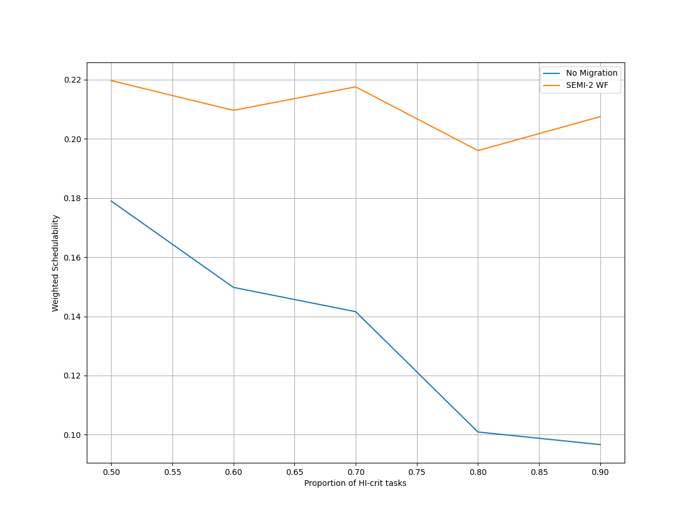
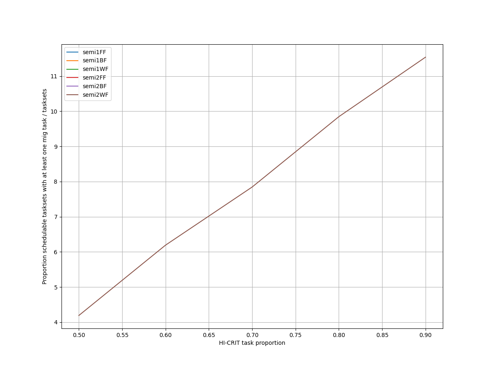
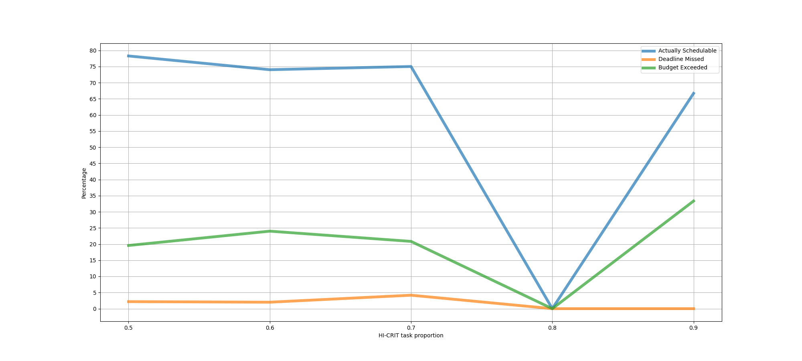
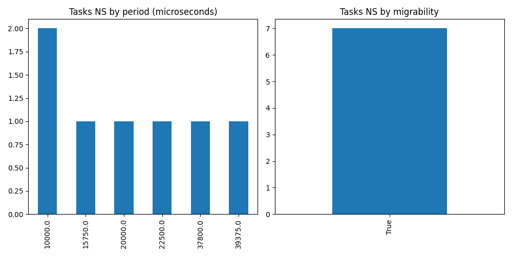

# Report on Experiment 3

   ## Overall data

   Utilization range = [1.8, 2.1] with step = 0.012

   Criticality factor range = [0.5, 0.9] with step = 0.1

  Number of executions: 221

Schedulable executions: 166/221 = 75.1131221719457 %

_Not_ schedulable executions: 6/221 = 2.7149321266968327 %

Budget Exceeded executions: 49/221 = 22.171945701357465 %

Safe Boundary Exceeded executions: 0/221 = 0.0 %

NS + BE executions: 55/221 = 24.8868778280543 %

### **Simulations**

#### **Weighted schedulability experiment 3 according to simulations.**

#### **Percentage of (schedulable tasksets with at least one migrating tasks / number of schedulable tasksets)3 according to simulations.** 

 

### **Real Executions**

#### **Schedulability for each level**

#### **Tasksets, grouped by (LO-crit budget, Period & Migrability), with a Budget_Exceeded task.**

#### **Tasksets, grouped by (Period & Migrability), with at least one task missing one (or more) of its deadlines.**

## Bad tasksets

Click here to expand this section.

### **Not schedulable tasksets**

Click here to expand this section.

Ovvero quando almeno un task non completa entra almeno una sua deadline.

  1. Taskset **e3_semi2wf_t2619**

    Taskset execution params:
	 
    "id": "e3_semi2wf_t2619",
    "size": "12",
    "utilization": "1.8960000000000001",
    "criticality_factor": "2",
    "hicrit_proportion": "0.6"

   
 
Click here to see the guilty tasks list.

   Time values are expressed as **micro-seconds**.

Task:  1

    
    "id": " 1",
    "basecpu": " 1",
    "priority": " 6",
    "period": 22500.0,
    "C(LO)": 3403.0,
    "C(HI)": 3403.0,
    "criticality": "LOW",
    "migrable": "True",
    "completedruns": " 2521",
    "preemptions": " 1",
    "minresponsejitter": " 0.000000000",
    "maxresponsejitter": " 0.002049441",
    "minreleasejitter": " 0.000000000",
    "maxreleasejitter": " 57.677505973",
    "avgresponsejitter": " 0.001705514",
    "deadlinesmissed": " 1",
    "budgetexceeded": " 0",
    "timesmigrated": " 3",
    "timesrestored": " 3",
    "timesonc1": " 2519",
    "timesonc2": " 1",
    "lockedtime": " 0.000011225"

   

   
 
Click here to see the CPUs log.

   Idle time is expressed as **seconds**.

   CPU: 1

    
    "id": 1,
    "hyperperiod": 56700000,
    "lowtohigh": " 29",
    "hightolow": " 29",
    "idletime": 32533935,
    "util": 42.620925925925924

   CPU: 2

    
    "id": 2,
    "hyperperiod": 22680000,
    "lowtohigh": " 0",
    "hightolow": " 0",
    "idletime": 36647186,
    "util": -61.58371252204586

   

   
 
Click here to see the whole tasksets.

   Time values are expressed as **micro-seconds**.

   Task:  12

    
    "id": " 12",
    "basecpu": " 1",
    "priority": " 0",
    "period": 756000.0,
    "C(LO)": 80115.0,
    "C(HI)": 160231.0,
    "criticality": "HIGH",
    "migrable": "False",
    "completedruns": " 76",
    "preemptions": " 411",
    "minresponsejitter": " 0.000000000",
    "maxresponsejitter": " 0.156618628",
    "minreleasejitter": " 0.000000000",
    "maxreleasejitter": " 56.944026144",
    "avgresponsejitter": " 0.059225808",
    "deadlinesmissed": " 0",
    "budgetexceeded": " 1",
    "timesmigrated": " 0",
    "timesrestored": " 0",
    "timesonc1": " 487",
    "timesonc2": " 0",
    "lockedtime": " 0.000000000"

   Task:  3

    
    "id": " 3",
    "basecpu": " 1",
    "priority": " 4",
    "period": 39375.0,
    "C(LO)": 2033.9999999999998,
    "C(HI)": 4067.9999999999995,
    "criticality": "HIGH",
    "migrable": "False",
    "completedruns": " 1441",
    "preemptions": " 56",
    "minresponsejitter": " 0.000000000",
    "maxresponsejitter": " 0.003218880",
    "minreleasejitter": " 0.000000000",
    "maxreleasejitter": " 57.660631198",
    "avgresponsejitter": " 0.001042703",
    "deadlinesmissed": " 0",
    "budgetexceeded": " 13",
    "timesmigrated": " 0",
    "timesrestored": " 0",
    "timesonc1": " 1509",
    "timesonc2": " 0",
    "lockedtime": " 0.000000000"

   Task:  7

    
    "id": " 7",
    "basecpu": " 1",
    "priority": " 1",
    "period": 75000.0,
    "C(LO)": 476.0,
    "C(HI)": 952.0,
    "criticality": "HIGH",
    "migrable": "False",
    "completedruns": " 757",
    "preemptions": " 10",
    "minresponsejitter": " 0.000000000",
    "maxresponsejitter": " 0.002849844",
    "minreleasejitter": " 0.000000000",
    "maxreleasejitter": " 57.625006309",
    "avgresponsejitter": " 0.000247090",
    "deadlinesmissed": " 0",
    "budgetexceeded": " 7",
    "timesmigrated": " 0",
    "timesrestored": " 0",
    "timesonc1": " 773",
    "timesonc2": " 0",
    "lockedtime": " 0.000000000"

   Task:  2

    
    "id": " 2",
    "basecpu": " 1",
    "priority": " 5",
    "period": 30240.0,
    "C(LO)": 15.0,
    "C(HI)": 30.0,
    "criticality": "HIGH",
    "migrable": "False",
    "completedruns": " 1876",
    "preemptions": " 0",
    "minresponsejitter": " 0.000000000",
    "maxresponsejitter": " 0.000035817",
    "minreleasejitter": " 0.000000000",
    "maxreleasejitter": " 57.669765973",
    "avgresponsejitter": " 0.000012075",
    "deadlinesmissed": " 0",
    "budgetexceeded": " 8",
    "timesmigrated": " 0",
    "timesrestored": " 0",
    "timesonc1": " 1883",
    "timesonc2": " 0",
    "lockedtime": " 0.000007874"

   Task:  6

    
    "id": " 6",
    "basecpu": " 1",
    "priority": " 3",
    "period": 70875.0,
    "C(LO)": 32326.0,
    "C(HI)": 32326.0,
    "criticality": "LOW",
    "migrable": "False",
    "completedruns": " 801",
    "preemptions": " 1207",
    "minresponsejitter": " 0.000000000",
    "maxresponsejitter": " 0.023613874",
    "minreleasejitter": " 0.000000000",
    "maxreleasejitter": " 57.629130973",
    "avgresponsejitter": " 0.017720538",
    "deadlinesmissed": " 0",
    "budgetexceeded": " 0",
    "timesmigrated": " 0",
    "timesrestored": " 0",
    "timesonc1": " 2007",
    "timesonc2": " 0",
    "lockedtime": " 0.000011372"

   Task:  1

    
    "id": " 1",
    "basecpu": " 1",
    "priority": " 6",
    "period": 22500.0,
    "C(LO)": 3403.0,
    "C(HI)": 3403.0,
    "criticality": "LOW",
    "migrable": "True",
    "completedruns": " 2521",
    "preemptions": " 1",
    "minresponsejitter": " 0.000000000",
    "maxresponsejitter": " 0.002049441",
    "minreleasejitter": " 0.000000000",
    "maxreleasejitter": " 57.677505973",
    "avgresponsejitter": " 0.001705514",
    "deadlinesmissed": " 1",
    "budgetexceeded": " 0",
    "timesmigrated": " 3",
    "timesrestored": " 3",
    "timesonc1": " 2519",
    "timesonc2": " 1",
    "lockedtime": " 0.000011225"

   Task:  8

    
    "id": " 8",
    "basecpu": " 1",
    "priority": " 2",
    "period": 105000.0,
    "C(LO)": 7907.000000000001,
    "C(HI)": 7907.000000000001,
    "criticality": "LOW",
    "migrable": "False",
    "completedruns": " 541",
    "preemptions": " 129",
    "minresponsejitter": " 0.000000000",
    "maxresponsejitter": " 0.025257895",
    "minreleasejitter": " 0.000000000",
    "maxreleasejitter": " 57.595006171",
    "avgresponsejitter": " 0.004745375",
    "deadlinesmissed": " 0",
    "budgetexceeded": " 0",
    "timesmigrated": " 0",
    "timesrestored": " 0",
    "timesonc1": " 669",
    "timesonc2": " 0",
    "lockedtime": " 0.000001033"

   Task:  10

    
    "id": " 10",
    "basecpu": " 2",
    "priority": " 1",
    "period": 168000.0,
    "C(LO)": 18186.0,
    "C(HI)": 36373.0,
    "criticality": "HIGH",
    "migrable": "False",
    "completedruns": " 339",
    "preemptions": " 75",
    "minresponsejitter": " 0.000000000",
    "maxresponsejitter": " 0.013938465",
    "minreleasejitter": " 0.000000000",
    "maxreleasejitter": " 57.616005922",
    "avgresponsejitter": " 0.009630324",
    "deadlinesmissed": " 0",
    "budgetexceeded": " 0",
    "timesmigrated": " 0",
    "timesrestored": " 0",
    "timesonc1": " 0",
    "timesonc2": " 413",
    "lockedtime": " 0.000004012"

   Task:  9

    
    "id": " 9",
    "basecpu": " 2",
    "priority": " 2",
    "period": 113400.0,
    "C(LO)": 5301.0,
    "C(HI)": 10602.0,
    "criticality": "HIGH",
    "migrable": "False",
    "completedruns": " 501",
    "preemptions": " 0",
    "minresponsejitter": " 0.000000000",
    "maxresponsejitter": " 0.003182105",
    "minreleasejitter": " 0.000000000",
    "maxreleasejitter": " 57.586605922",
    "avgresponsejitter": " 0.002657279",
    "deadlinesmissed": " 0",
    "budgetexceeded": " 0",
    "timesmigrated": " 0",
    "timesrestored": " 0",
    "timesonc1": " 0",
    "timesonc2": " 500",
    "lockedtime": " 0.000006568"

   Task:  11

    
    "id": " 11",
    "basecpu": " 2",
    "priority": " 0",
    "period": 472500.0,
    "C(LO)": 11235.0,
    "C(HI)": 22470.0,
    "criticality": "HIGH",
    "migrable": "False",
    "completedruns": " 121",
    "preemptions": " 21",
    "minresponsejitter": " 0.000000000",
    "maxresponsejitter": " 0.018470718",
    "minreleasejitter": " 0.000000000",
    "maxreleasejitter": " 57.227506030",
    "avgresponsejitter": " 0.006523168",
    "deadlinesmissed": " 0",
    "budgetexceeded": " 0",
    "timesmigrated": " 0",
    "timesrestored": " 0",
    "timesonc1": " 0",
    "timesonc2": " 141",
    "lockedtime": " 0.000000772"

   Task:  4

    
    "id": " 4",
    "basecpu": " 2",
    "priority": " 4",
    "period": 50400.0,
    "C(LO)": 22345.0,
    "C(HI)": 22345.0,
    "criticality": "LOW",
    "migrable": "False",
    "completedruns": " 1126",
    "preemptions": " 0",
    "minresponsejitter": " 0.000000000",
    "maxresponsejitter": " 0.013443667",
    "minreleasejitter": " 0.000000000",
    "maxreleasejitter": " 57.649606048",
    "avgresponsejitter": " 0.011164652",
    "deadlinesmissed": " 0",
    "budgetexceeded": " 0",
    "timesmigrated": " 0",
    "timesrestored": " 0",
    "timesonc1": " 0",
    "timesonc2": " 1125",
    "lockedtime": " 0.000033189"

   Task:  5

    
    "id": " 5",
    "basecpu": " 2",
    "priority": " 3",
    "period": 64800.0,
    "C(LO)": 5405.0,
    "C(HI)": 5405.0,
    "criticality": "LOW",
    "migrable": "False",
    "completedruns": " 876",
    "preemptions": " 0",
    "minresponsejitter": " 0.000000000",
    "maxresponsejitter": " 0.003242577",
    "minreleasejitter": " 0.000000000",
    "maxreleasejitter": " 57.635206057",
    "avgresponsejitter": " 0.002708381",
    "deadlinesmissed": " 0",
    "budgetexceeded": " 0",
    "timesmigrated": " 0",
    "timesrestored": " 0",
    "timesonc1": " 0",
    "timesonc2": " 875",
    "lockedtime": " 0.000003535"

   

  2. Taskset **e3_semi2wf_t3223**

    Taskset execution params:
	 
    "id": "e3_semi2wf_t3223",
    "size": "12",
    "utilization": "1.9680000000000002",
    "criticality_factor": "2",
    "hicrit_proportion": "0.6"

   
 
Click here to see the guilty tasks list.

   Time values are expressed as **micro-seconds**.

Task:  1

    
    "id": " 1",
    "basecpu": " 2",
    "priority": " 5",
    "period": 15750.0,
    "C(LO)": 3749.0,
    "C(HI)": 3749.0,
    "criticality": "LOW",
    "migrable": "True",
    "completedruns": " 490",
    "preemptions": " 0",
    "minresponsejitter": " 0.000000000",
    "maxresponsejitter": " 0.002252676",
    "minreleasejitter": " 0.000000000",
    "maxreleasejitter": " 8.686008069",
    "avgresponsejitter": " 0.001880583",
    "deadlinesmissed": " 1",
    "budgetexceeded": " 0",
    "timesmigrated": " 2",
    "timesrestored": " 1",
    "timesonc1": " 1",
    "timesonc2": " 487",
    "lockedtime": " 0.000003315"

   

   
 
Click here to see the CPUs log.

   Idle time is expressed as **seconds**.

   CPU: 1

    
    "id": 1,
    "hyperperiod": 56700000,
    "lowtohigh": " 0",
    "hightolow": " 0",
    "idletime": 77494955,
    "util": -36.67540564373897

   CPU: 2

    
    "id": 2,
    "hyperperiod": 113400000,
    "lowtohigh": " 32",
    "hightolow": " 32",
    "idletime": 80549523,
    "util": 28.968674603174605

   

   
 
Click here to see the whole tasksets.

   Time values are expressed as **micro-seconds**.

   Task:  12

    
    "id": " 12",
    "basecpu": " 1",
    "priority": " 0",
    "period": 787500.0,
    "C(LO)": 106368.0,
    "C(HI)": 212736.0,
    "criticality": "HIGH",
    "migrable": "False",
    "completedruns": " 145",
    "preemptions": " 598",
    "minresponsejitter": " 0.000000000",
    "maxresponsejitter": " 0.090098643",
    "minreleasejitter": " 0.000000000",
    "maxreleasejitter": " 113.613139051",
    "avgresponsejitter": " 0.068939799",
    "deadlinesmissed": " 0",
    "budgetexceeded": " 0",
    "timesmigrated": " 0",
    "timesrestored": " 0",
    "timesonc1": " 742",
    "timesonc2": " 0",
    "lockedtime": " 0.000016964"

   Task:  9

    
    "id": " 9",
    "basecpu": " 1",
    "priority": " 1",
    "period": 151200.0,
    "C(LO)": 14800.0,
    "C(HI)": 29601.0,
    "criticality": "HIGH",
    "migrable": "False",
    "completedruns": " 751",
    "preemptions": " 348",
    "minresponsejitter": " 0.000000000",
    "maxresponsejitter": " 0.015230180",
    "minreleasejitter": " 0.000000000",
    "maxreleasejitter": " 114.248806117",
    "avgresponsejitter": " 0.008886550",
    "deadlinesmissed": " 0",
    "budgetexceeded": " 0",
    "timesmigrated": " 0",
    "timesrestored": " 0",
    "timesonc1": " 1098",
    "timesonc2": " 0",
    "lockedtime": " 0.000018258"

   Task:  8

    
    "id": " 8",
    "basecpu": " 1",
    "priority": " 2",
    "period": 141750.0,
    "C(LO)": 3844.0,
    "C(HI)": 7688.0,
    "criticality": "HIGH",
    "migrable": "False",
    "completedruns": " 801",
    "preemptions": " 84",
    "minresponsejitter": " 0.000000000",
    "maxresponsejitter": " 0.006515556",
    "minreleasejitter": " 0.000000000",
    "maxreleasejitter": " 114.258256189",
    "avgresponsejitter": " 0.002307511",
    "deadlinesmissed": " 0",
    "budgetexceeded": " 0",
    "timesmigrated": " 0",
    "timesrestored": " 0",
    "timesonc1": " 884",
    "timesonc2": " 0",
    "lockedtime": " 0.000023408"

   Task:  6

    
    "id": " 6",
    "basecpu": " 1",
    "priority": " 3",
    "period": 118125.0,
    "C(LO)": 696.0,
    "C(HI)": 1393.0,
    "criticality": "HIGH",
    "migrable": "False",
    "completedruns": " 961",
    "preemptions": " 0",
    "minresponsejitter": " 0.000000000",
    "maxresponsejitter": " 0.000415655",
    "minreleasejitter": " 0.000000000",
    "maxreleasejitter": " 114.283106333",
    "avgresponsejitter": " 0.000349066",
    "deadlinesmissed": " 0",
    "budgetexceeded": " 0",
    "timesmigrated": " 0",
    "timesrestored": " 0",
    "timesonc1": " 960",
    "timesonc2": " 0",
    "lockedtime": " 0.000013826"

   Task:  2

    
    "id": " 2",
    "basecpu": " 1",
    "priority": " 5",
    "period": 20000.0,
    "C(LO)": 7112.0,
    "C(HI)": 7112.0,
    "criticality": "LOW",
    "migrable": "False",
    "completedruns": " 5671",
    "preemptions": " 2",
    "minresponsejitter": " 0.000000000",
    "maxresponsejitter": " 0.004927826",
    "minreleasejitter": " 0.000000000",
    "maxreleasejitter": " 114.380006090",
    "avgresponsejitter": " 0.003557021",
    "deadlinesmissed": " 0",
    "budgetexceeded": " 0",
    "timesmigrated": " 0",
    "timesrestored": " 0",
    "timesonc1": " 5672",
    "timesonc2": " 0",
    "lockedtime": " 0.000067832"

   Task:  7

    
    "id": " 7",
    "basecpu": " 1",
    "priority": " 4",
    "period": 131250.0,
    "C(LO)": 1195.0,
    "C(HI)": 1195.0,
    "criticality": "LOW",
    "migrable": "False",
    "completedruns": " 865",
    "preemptions": " 0",
    "minresponsejitter": " 0.000000000",
    "maxresponsejitter": " 0.000724580",
    "minreleasejitter": " 0.000000000",
    "maxreleasejitter": " 114.268755973",
    "avgresponsejitter": " 0.000602946",
    "deadlinesmissed": " 0",
    "budgetexceeded": " 0",
    "timesmigrated": " 0",
    "timesrestored": " 0",
    "timesonc1": " 864",
    "timesonc2": " 0",
    "lockedtime": " 0.000003727"

   Task:  5

    
    "id": " 5",
    "basecpu": " 2",
    "priority": " 2",
    "period": 84375.0,
    "C(LO)": 15309.0,
    "C(HI)": 30619.0,
    "criticality": "HIGH",
    "migrable": "False",
    "completedruns": " 1345",
    "preemptions": " 339",
    "minresponsejitter": " 0.000000000",
    "maxresponsejitter": " 0.032138688",
    "minreleasejitter": " 0.000000000",
    "maxreleasejitter": " 114.315630862",
    "avgresponsejitter": " 0.008947619",
    "deadlinesmissed": " 0",
    "budgetexceeded": " 10",
    "timesmigrated": " 0",
    "timesrestored": " 0",
    "timesonc1": " 0",
    "timesonc2": " 1693",
    "lockedtime": " 0.000029748"

   Task:  4

    
    "id": " 4",
    "basecpu": " 2",
    "priority": " 3",
    "period": 63000.0,
    "C(LO)": 2845.0,
    "C(HI)": 5691.0,
    "criticality": "HIGH",
    "migrable": "False",
    "completedruns": " 1801",
    "preemptions": " 0",
    "minresponsejitter": " 0.000000000",
    "maxresponsejitter": " 0.004474321",
    "minreleasejitter": " 0.000000000",
    "maxreleasejitter": " 114.337005910",
    "avgresponsejitter": " 0.001447339",
    "deadlinesmissed": " 0",
    "budgetexceeded": " 13",
    "timesmigrated": " 0",
    "timesrestored": " 0",
    "timesonc1": " 0",
    "timesonc2": " 1813",
    "lockedtime": " 0.000003676"

   Task:  11

    
    "id": " 11",
    "basecpu": " 2",
    "priority": " 0",
    "period": 648000.0,
    "C(LO)": 20456.0,
    "C(HI)": 40912.0,
    "criticality": "HIGH",
    "migrable": "False",
    "completedruns": " 176",
    "preemptions": " 77",
    "minresponsejitter": " 0.000000000",
    "maxresponsejitter": " 0.048013709",
    "minreleasejitter": " 0.000000000",
    "maxreleasejitter": " 113.752005922",
    "avgresponsejitter": " 0.013182616",
    "deadlinesmissed": " 0",
    "budgetexceeded": " 2",
    "timesmigrated": " 0",
    "timesrestored": " 0",
    "timesonc1": " 0",
    "timesonc2": " 254",
    "lockedtime": " 0.000002180"

   Task:  10

    
    "id": " 10",
    "basecpu": " 2",
    "priority": " 1",
    "period": 180000.0,
    "C(LO)": 3604.0,
    "C(HI)": 7209.0,
    "criticality": "HIGH",
    "migrable": "False",
    "completedruns": " 631",
    "preemptions": " 5",
    "minresponsejitter": " 0.000000000",
    "maxresponsejitter": " 0.009318862",
    "minreleasejitter": " 0.000000000",
    "maxreleasejitter": " 114.220006099",
    "avgresponsejitter": " 0.001885628",
    "deadlinesmissed": " 0",
    "budgetexceeded": " 7",
    "timesmigrated": " 0",
    "timesrestored": " 0",
    "timesonc1": " 0",
    "timesonc2": " 642",
    "lockedtime": " 0.000034799"

   Task:  3

    
    "id": " 3",
    "basecpu": " 2",
    "priority": " 4",
    "period": 47250.0,
    "C(LO)": 13080.0,
    "C(HI)": 13080.0,
    "criticality": "LOW",
    "migrable": "False",
    "completedruns": " 2401",
    "preemptions": " 0",
    "minresponsejitter": " 0.000000000",
    "maxresponsejitter": " 0.007882012",
    "minreleasejitter": " 0.000000000",
    "maxreleasejitter": " 114.352756015",
    "avgresponsejitter": " 0.006564165",
    "deadlinesmissed": " 0",
    "budgetexceeded": " 0",
    "timesmigrated": " 0",
    "timesrestored": " 0",
    "timesonc1": " 0",
    "timesonc2": " 2400",
    "lockedtime": " 0.000084000"

   Task:  1

    
    "id": " 1",
    "basecpu": " 2",
    "priority": " 5",
    "period": 15750.0,
    "C(LO)": 3749.0,
    "C(HI)": 3749.0,
    "criticality": "LOW",
    "migrable": "True",
    "completedruns": " 490",
    "preemptions": " 0",
    "minresponsejitter": " 0.000000000",
    "maxresponsejitter": " 0.002252676",
    "minreleasejitter": " 0.000000000",
    "maxreleasejitter": " 8.686008069",
    "avgresponsejitter": " 0.001880583",
    "deadlinesmissed": " 1",
    "budgetexceeded": " 0",
    "timesmigrated": " 2",
    "timesrestored": " 1",
    "timesonc1": " 1",
    "timesonc2": " 487",
    "lockedtime": " 0.000003315"

   

  3. Taskset **e3_semi2wf_t381**

    Taskset execution params:
	 
    "id": "e3_semi2wf_t381",
    "size": "12",
    "utilization": "1.8840000000000001",
    "criticality_factor": "2",
    "hicrit_proportion": "0.5"

   
 
Click here to see the guilty tasks list.

   Time values are expressed as **micro-seconds**.

Task:  1

    
    "id": " 1",
    "basecpu": " 2",
    "priority": " 4",
    "period": 10000.0,
    "C(LO)": 1670.0,
    "C(HI)": 1670.0,
    "criticality": "LOW",
    "migrable": "True",
    "completedruns": " 2269",
    "preemptions": " 0",
    "minresponsejitter": " 0.000000000",
    "maxresponsejitter": " 0.001014339",
    "minreleasejitter": " 0.000000000",
    "maxreleasejitter": " 23.670005811",
    "avgresponsejitter": " 0.000841090",
    "deadlinesmissed": " 1",
    "budgetexceeded": " 0",
    "timesmigrated": " 3",
    "timesrestored": " 3",
    "timesonc1": " 1",
    "timesonc2": " 2266",
    "lockedtime": " 0.000023258"

   

   
 
Click here to see the CPUs log.

   Idle time is expressed as **seconds**.

   CPU: 1

    
    "id": 1,
    "hyperperiod": 22680000,
    "lowtohigh": " 14",
    "hightolow": " 14",
    "idletime": 14270405,
    "util": 37.0793430335097

   CPU: 2

    
    "id": 2,
    "hyperperiod": 5670000,
    "lowtohigh": " 12",
    "hightolow": " 12",
    "idletime": 14195525,
    "util": -150.36199294532628

   

   
 
Click here to see the whole tasksets.

   Time values are expressed as **micro-seconds**.

   Task:  12

    
    "id": " 12",
    "basecpu": " 1",
    "priority": " 0",
    "period": 907200.0,
    "C(LO)": 104312.0,
    "C(HI)": 208625.0,
    "criticality": "HIGH",
    "migrable": "False",
    "completedruns": " 26",
    "preemptions": " 172",
    "minresponsejitter": " 0.000000000",
    "maxresponsejitter": " 0.082147757",
    "minreleasejitter": " 0.000000000",
    "maxreleasejitter": " 22.776934132",
    "avgresponsejitter": " 0.067988045",
    "deadlinesmissed": " 0",
    "budgetexceeded": " 0",
    "timesmigrated": " 0",
    "timesrestored": " 0",
    "timesonc1": " 197",
    "timesonc2": " 0",
    "lockedtime": " 0.000017679"

   Task:  10

    
    "id": " 10",
    "basecpu": " 1",
    "priority": " 2",
    "period": 129600.0,
    "C(LO)": 7840.0,
    "C(HI)": 15680.0,
    "criticality": "HIGH",
    "migrable": "False",
    "completedruns": " 176",
    "preemptions": " 74",
    "minresponsejitter": " 0.000000000",
    "maxresponsejitter": " 0.023835483",
    "minreleasejitter": " 0.000000000",
    "maxreleasejitter": " 23.550406099",
    "avgresponsejitter": " 0.004874607",
    "deadlinesmissed": " 0",
    "budgetexceeded": " 3",
    "timesmigrated": " 0",
    "timesrestored": " 0",
    "timesonc1": " 252",
    "timesonc2": " 0",
    "lockedtime": " 0.000003108"

   Task:  6

    
    "id": " 6",
    "basecpu": " 1",
    "priority": " 3",
    "period": 52500.0,
    "C(LO)": 845.0,
    "C(HI)": 1691.0,
    "criticality": "HIGH",
    "migrable": "False",
    "completedruns": " 433",
    "preemptions": " 7",
    "minresponsejitter": " 0.000000000",
    "maxresponsejitter": " 0.001301919",
    "minreleasejitter": " 0.000000000",
    "maxreleasejitter": " 23.627506288",
    "avgresponsejitter": " 0.000419078",
    "deadlinesmissed": " 0",
    "budgetexceeded": " 2",
    "timesmigrated": " 0",
    "timesrestored": " 0",
    "timesonc1": " 441",
    "timesonc2": " 0",
    "lockedtime": " 0.000002631"

   Task:  2

    
    "id": " 2",
    "basecpu": " 1",
    "priority": " 5",
    "period": 15750.0,
    "C(LO)": 113.0,
    "C(HI)": 227.0,
    "criticality": "HIGH",
    "migrable": "False",
    "completedruns": " 1441",
    "preemptions": " 0",
    "minresponsejitter": " 0.000000000",
    "maxresponsejitter": " 0.000195673",
    "minreleasejitter": " 0.000000000",
    "maxreleasejitter": " 23.664256198",
    "avgresponsejitter": " 0.000062111",
    "deadlinesmissed": " 0",
    "budgetexceeded": " 9",
    "timesmigrated": " 0",
    "timesrestored": " 0",
    "timesonc1": " 1449",
    "timesonc2": " 0",
    "lockedtime": " 0.000014868"

   Task:  8

    
    "id": " 8",
    "basecpu": " 1",
    "priority": " 4",
    "period": 78750.0,
    "C(LO)": 31058.0,
    "C(HI)": 31058.0,
    "criticality": "LOW",
    "migrable": "False",
    "completedruns": " 289",
    "preemptions": " 307",
    "minresponsejitter": " 0.000000000",
    "maxresponsejitter": " 0.019327838",
    "minreleasejitter": " 0.000000000",
    "maxreleasejitter": " 23.601322946",
    "avgresponsejitter": " 0.015779619",
    "deadlinesmissed": " 0",
    "budgetexceeded": " 0",
    "timesmigrated": " 0",
    "timesrestored": " 0",
    "timesonc1": " 595",
    "timesonc2": " 0",
    "lockedtime": " 0.000023616"

   Task:  11

    
    "id": " 11",
    "basecpu": " 1",
    "priority": " 1",
    "period": 756000.0,
    "C(LO)": 69731.0,
    "C(HI)": 69731.0,
    "criticality": "LOW",
    "migrable": "False",
    "completedruns": " 31",
    "preemptions": " 144",
    "minresponsejitter": " 0.000000000",
    "maxresponsejitter": " 0.059035763",
    "minreleasejitter": " 0.000000000",
    "maxreleasejitter": " 22.924071880",
    "avgresponsejitter": " 0.044256961",
    "deadlinesmissed": " 0",
    "budgetexceeded": " 0",
    "timesmigrated": " 0",
    "timesrestored": " 0",
    "timesonc1": " 174",
    "timesonc2": " 0",
    "lockedtime": " 0.000010060"

   Task:  4

    
    "id": " 4",
    "basecpu": " 1",
    "priority": " 6",
    "period": 22500.0,
    "C(LO)": 1129.0,
    "C(HI)": 1129.0,
    "criticality": "LOW",
    "migrable": "True",
    "completedruns": " 1009",
    "preemptions": " 1",
    "minresponsejitter": " 0.000000000",
    "maxresponsejitter": " 0.000687961",
    "minreleasejitter": " 0.000000000",
    "maxreleasejitter": " 23.657506309",
    "avgresponsejitter": " 0.000571586",
    "deadlinesmissed": " 0",
    "budgetexceeded": " 0",
    "timesmigrated": " 2",
    "timesrestored": " 2",
    "timesonc1": " 1007",
    "timesonc2": " 2",
    "lockedtime": " 0.000020426"

   Task:  5

    
    "id": " 5",
    "basecpu": " 2",
    "priority": " 1",
    "period": 39375.0,
    "C(LO)": 6161.0,
    "C(HI)": 12322.0,
    "criticality": "HIGH",
    "migrable": "False",
    "completedruns": " 577",
    "preemptions": " 244",
    "minresponsejitter": " 0.000000000",
    "maxresponsejitter": " 0.014235282",
    "minreleasejitter": " 0.000000000",
    "maxreleasejitter": " 23.640813535",
    "avgresponsejitter": " 0.003894135",
    "deadlinesmissed": " 0",
    "budgetexceeded": " 8",
    "timesmigrated": " 0",
    "timesrestored": " 0",
    "timesonc1": " 0",
    "timesonc2": " 828",
    "lockedtime": " 0.000007529"

   Task:  9

    
    "id": " 9",
    "basecpu": " 2",
    "priority": " 0",
    "period": 90000.0,
    "C(LO)": 5209.0,
    "C(HI)": 10419.0,
    "criticality": "HIGH",
    "migrable": "False",
    "completedruns": " 253",
    "preemptions": " 77",
    "minresponsejitter": " 0.000000000",
    "maxresponsejitter": " 0.011466652",
    "minreleasejitter": " 0.000000000",
    "maxreleasejitter": " 23.590714628",
    "avgresponsejitter": " 0.003438360",
    "deadlinesmissed": " 0",
    "budgetexceeded": " 4",
    "timesmigrated": " 0",
    "timesrestored": " 0",
    "timesonc1": " 0",
    "timesonc2": " 333",
    "lockedtime": " 0.000000000"

   Task:  3

    
    "id": " 3",
    "basecpu": " 2",
    "priority": " 3",
    "period": 18900.0,
    "C(LO)": 6187.0,
    "C(HI)": 6187.0,
    "criticality": "LOW",
    "migrable": "False",
    "completedruns": " 1201",
    "preemptions": " 374",
    "minresponsejitter": " 0.000000000",
    "maxresponsejitter": " 0.004708126",
    "minreleasejitter": " 0.000000000",
    "maxreleasejitter": " 23.661106024",
    "avgresponsejitter": " 0.003370177",
    "deadlinesmissed": " 0",
    "budgetexceeded": " 0",
    "timesmigrated": " 0",
    "timesrestored": " 0",
    "timesonc1": " 0",
    "timesonc2": " 1574",
    "lockedtime": " 0.000026255"

   Task:  1

    
    "id": " 1",
    "basecpu": " 2",
    "priority": " 4",
    "period": 10000.0,
    "C(LO)": 1670.0,
    "C(HI)": 1670.0,
    "criticality": "LOW",
    "migrable": "True",
    "completedruns": " 2269",
    "preemptions": " 0",
    "minresponsejitter": " 0.000000000",
    "maxresponsejitter": " 0.001014339",
    "minreleasejitter": " 0.000000000",
    "maxreleasejitter": " 23.670005811",
    "avgresponsejitter": " 0.000841090",
    "deadlinesmissed": " 1",
    "budgetexceeded": " 0",
    "timesmigrated": " 3",
    "timesrestored": " 3",
    "timesonc1": " 1",
    "timesonc2": " 2266",
    "lockedtime": " 0.000023258"

   Task:  7

    
    "id": " 7",
    "basecpu": " 2",
    "priority": " 2",
    "period": 70875.0,
    "C(LO)": 1872.0,
    "C(HI)": 1872.0,
    "criticality": "LOW",
    "migrable": "False",
    "completedruns": " 321",
    "preemptions": " 32",
    "minresponsejitter": " 0.000000000",
    "maxresponsejitter": " 0.002097733",
    "minreleasejitter": " 0.000000000",
    "maxreleasejitter": " 23.609130892",
    "avgresponsejitter": " 0.001032396",
    "deadlinesmissed": " 0",
    "budgetexceeded": " 0",
    "timesmigrated": " 0",
    "timesrestored": " 0",
    "timesonc1": " 0",
    "timesonc2": " 352",
    "lockedtime": " 0.000004895"

   

  4. Taskset **e3_semi2wf_t4484**

    Taskset execution params:
	 
    "id": "e3_semi2wf_t4484",
    "size": "12",
    "utilization": "1.848",
    "criticality_factor": "2",
    "hicrit_proportion": "0.7"

   
 
Click here to see the guilty tasks list.

   Time values are expressed as **micro-seconds**.

Task:  1

    
    "id": " 1",
    "basecpu": " 2",
    "priority": " 5",
    "period": 20000.0,
    "C(LO)": 2942.0,
    "C(HI)": 2942.0,
    "criticality": "LOW",
    "migrable": "True",
    "completedruns": " 5671",
    "preemptions": " 0",
    "minresponsejitter": " 0.000000000",
    "maxresponsejitter": " 0.001776688",
    "minreleasejitter": " 0.000000000",
    "maxreleasejitter": " 114.380006150",
    "avgresponsejitter": " 0.001469718",
    "deadlinesmissed": " 1",
    "budgetexceeded": " 0",
    "timesmigrated": " 7",
    "timesrestored": " 7",
    "timesonc1": " 3",
    "timesonc2": " 5666",
    "lockedtime": " 0.000074012"

   

   
 
Click here to see the CPUs log.

   Idle time is expressed as **seconds**.

   CPU: 1

    
    "id": 1,
    "hyperperiod": 113400000,
    "lowtohigh": " 0",
    "hightolow": " 0",
    "idletime": 84122439,
    "util": 25.817955026455024

   CPU: 2

    
    "id": 2,
    "hyperperiod": 12600000,
    "lowtohigh": " 47",
    "hightolow": " 47",
    "idletime": 76579018,
    "util": -507.7699841269841

   

   
 
Click here to see the whole tasksets.

   Time values are expressed as **micro-seconds**.

   Task:  5

    
    "id": " 5",
    "basecpu": " 1",
    "priority": " 2",
    "period": 60480.0,
    "C(LO)": 6792.0,
    "C(HI)": 13585.0,
    "criticality": "HIGH",
    "migrable": "False",
    "completedruns": " 1876",
    "preemptions": " 273",
    "minresponsejitter": " 0.000000000",
    "maxresponsejitter": " 0.014790550",
    "minreleasejitter": " 0.000000000",
    "maxreleasejitter": " 114.339526186",
    "avgresponsejitter": " 0.003658502",
    "deadlinesmissed": " 0",
    "budgetexceeded": " 0",
    "timesmigrated": " 0",
    "timesrestored": " 0",
    "timesonc1": " 2148",
    "timesonc2": " 0",
    "lockedtime": " 0.000013613"

   Task:  2

    
    "id": " 2",
    "basecpu": " 1",
    "priority": " 3",
    "period": 28350.0,
    "C(LO)": 2843.0,
    "C(HI)": 5686.0,
    "criticality": "HIGH",
    "migrable": "False",
    "completedruns": " 4001",
    "preemptions": " 55",
    "minresponsejitter": " 0.000000000",
    "maxresponsejitter": " 0.002372453",
    "minreleasejitter": " 0.000000000",
    "maxreleasejitter": " 114.371656309",
    "avgresponsejitter": " 0.001431868",
    "deadlinesmissed": " 0",
    "budgetexceeded": " 0",
    "timesmigrated": " 0",
    "timesrestored": " 0",
    "timesonc1": " 4055",
    "timesonc2": " 0",
    "lockedtime": " 0.000011327"

   Task:  10

    
    "id": " 10",
    "basecpu": " 1",
    "priority": " 1",
    "period": 196875.0,
    "C(LO)": 18430.0,
    "C(HI)": 36860.0,
    "criticality": "HIGH",
    "migrable": "False",
    "completedruns": " 577",
    "preemptions": " 367",
    "minresponsejitter": " 0.000000000",
    "maxresponsejitter": " 0.023955973",
    "minreleasejitter": " 0.000000000",
    "maxreleasejitter": " 114.203132072",
    "avgresponsejitter": " 0.011117171",
    "deadlinesmissed": " 0",
    "budgetexceeded": " 0",
    "timesmigrated": " 0",
    "timesrestored": " 0",
    "timesonc1": " 943",
    "timesonc2": " 0",
    "lockedtime": " 0.000011598"

   Task:  11

    
    "id": " 11",
    "basecpu": " 1",
    "priority": " 0",
    "period": 450000.0,
    "C(LO)": 14345.0,
    "C(HI)": 28690.0,
    "criticality": "HIGH",
    "migrable": "False",
    "completedruns": " 253",
    "preemptions": " 108",
    "minresponsejitter": " 0.000000000",
    "maxresponsejitter": " 0.020704381",
    "minreleasejitter": " 0.000000000",
    "maxreleasejitter": " 113.950006213",
    "avgresponsejitter": " 0.008512820",
    "deadlinesmissed": " 0",
    "budgetexceeded": " 0",
    "timesmigrated": " 0",
    "timesrestored": " 0",
    "timesonc1": " 360",
    "timesonc2": " 0",
    "lockedtime": " 0.000001042"

   Task:  7

    
    "id": " 7",
    "basecpu": " 1",
    "priority": " 5",
    "period": 94500.0,
    "C(LO)": 15401.0,
    "C(HI)": 15401.0,
    "criticality": "LOW",
    "migrable": "False",
    "completedruns": " 1201",
    "preemptions": " 1",
    "minresponsejitter": " 0.000000000",
    "maxresponsejitter": " 0.009273832",
    "minreleasejitter": " 0.000000000",
    "maxreleasejitter": " 114.305506309",
    "avgresponsejitter": " 0.007739102",
    "deadlinesmissed": " 0",
    "budgetexceeded": " 0",
    "timesmigrated": " 0",
    "timesrestored": " 0",
    "timesonc1": " 1201",
    "timesonc2": " 0",
    "lockedtime": " 0.000018958"

   Task:  8

    
    "id": " 8",
    "basecpu": " 1",
    "priority": " 4",
    "period": 100000.0,
    "C(LO)": 1116.0,
    "C(HI)": 1116.0,
    "criticality": "LOW",
    "migrable": "False",
    "completedruns": " 1135",
    "preemptions": " 5",
    "minresponsejitter": " 0.000000000",
    "maxresponsejitter": " 0.008650586",
    "minreleasejitter": " 0.000000000",
    "maxreleasejitter": " 114.300006174",
    "avgresponsejitter": " 0.000598432",
    "deadlinesmissed": " 0",
    "budgetexceeded": " 0",
    "timesmigrated": " 0",
    "timesrestored": " 0",
    "timesonc1": " 1139",
    "timesonc2": " 0",
    "lockedtime": " 0.000044520"

   Task:  3

    
    "id": " 3",
    "basecpu": " 2",
    "priority": " 3",
    "period": 50400.0,
    "C(LO)": 10833.0,
    "C(HI)": 21666.0,
    "criticality": "HIGH",
    "migrable": "False",
    "completedruns": " 2251",
    "preemptions": " 570",
    "minresponsejitter": " 0.000000000",
    "maxresponsejitter": " 0.021552399",
    "minreleasejitter": " 0.000000000",
    "maxreleasejitter": " 114.349605889",
    "avgresponsejitter": " 0.006176907",
    "deadlinesmissed": " 0",
    "budgetexceeded": " 18",
    "timesmigrated": " 0",
    "timesrestored": " 0",
    "timesonc1": " 0",
    "timesonc2": " 2838",
    "lockedtime": " 0.000049231"

   Task:  6

    
    "id": " 6",
    "basecpu": " 2",
    "priority": " 2",
    "period": 72000.0,
    "C(LO)": 5133.0,
    "C(HI)": 10267.0,
    "criticality": "HIGH",
    "migrable": "False",
    "completedruns": " 1576",
    "preemptions": " 74",
    "minresponsejitter": " 0.000000000",
    "maxresponsejitter": " 0.009628207",
    "minreleasejitter": " 0.000000000",
    "maxreleasejitter": " 114.328005859",
    "avgresponsejitter": " 0.002803246",
    "deadlinesmissed": " 0",
    "budgetexceeded": " 18",
    "timesmigrated": " 0",
    "timesrestored": " 0",
    "timesonc1": " 0",
    "timesonc2": " 1667",
    "lockedtime": " 0.000002378"

   Task:  9

    
    "id": " 9",
    "basecpu": " 2",
    "priority": " 1",
    "period": 175000.0,
    "C(LO)": 8677.0,
    "C(HI)": 17355.0,
    "criticality": "HIGH",
    "migrable": "False",
    "completedruns": " 649",
    "preemptions": " 145",
    "minresponsejitter": " 0.000000000",
    "maxresponsejitter": " 0.020708721",
    "minreleasejitter": " 0.000000000",
    "maxreleasejitter": " 114.225005886",
    "avgresponsejitter": " 0.005412790",
    "deadlinesmissed": " 0",
    "budgetexceeded": " 7",
    "timesmigrated": " 0",
    "timesrestored": " 0",
    "timesonc1": " 0",
    "timesonc2": " 800",
    "lockedtime": " 0.000003931"

   Task:  12

    
    "id": " 12",
    "basecpu": " 2",
    "priority": " 0",
    "period": 600000.0,
    "C(LO)": 13664.0,
    "C(HI)": 27329.0,
    "criticality": "HIGH",
    "migrable": "False",
    "completedruns": " 190",
    "preemptions": " 45",
    "minresponsejitter": " 0.000000000",
    "maxresponsejitter": " 0.029588784",
    "minreleasejitter": " 0.000000000",
    "maxreleasejitter": " 113.805164868",
    "avgresponsejitter": " 0.008061297",
    "deadlinesmissed": " 0",
    "budgetexceeded": " 4",
    "timesmigrated": " 0",
    "timesrestored": " 0",
    "timesonc1": " 0",
    "timesonc2": " 238",
    "lockedtime": " 0.000000970"

   Task:  1

    
    "id": " 1",
    "basecpu": " 2",
    "priority": " 5",
    "period": 20000.0,
    "C(LO)": 2942.0,
    "C(HI)": 2942.0,
    "criticality": "LOW",
    "migrable": "True",
    "completedruns": " 5671",
    "preemptions": " 0",
    "minresponsejitter": " 0.000000000",
    "maxresponsejitter": " 0.001776688",
    "minreleasejitter": " 0.000000000",
    "maxreleasejitter": " 114.380006150",
    "avgresponsejitter": " 0.001469718",
    "deadlinesmissed": " 1",
    "budgetexceeded": " 0",
    "timesmigrated": " 7",
    "timesrestored": " 7",
    "timesonc1": " 3",
    "timesonc2": " 5666",
    "lockedtime": " 0.000074012"

   Task:  4

    
    "id": " 4",
    "basecpu": " 2",
    "priority": " 4",
    "period": 60000.0,
    "C(LO)": 7996.0,
    "C(HI)": 7996.0,
    "criticality": "LOW",
    "migrable": "False",
    "completedruns": " 1891",
    "preemptions": " 0",
    "minresponsejitter": " 0.000000000",
    "maxresponsejitter": " 0.004799420",
    "minreleasejitter": " 0.000000000",
    "maxreleasejitter": " 114.341675033",
    "avgresponsejitter": " 0.003998721",
    "deadlinesmissed": " 0",
    "budgetexceeded": " 0",
    "timesmigrated": " 0",
    "timesrestored": " 0",
    "timesonc1": " 0",
    "timesonc2": " 1890",
    "lockedtime": " 0.000008646"

   

  5. Taskset **e3_semi2wf_t4748**

    Taskset execution params:
	 
    "id": "e3_semi2wf_t4748",
    "size": "12",
    "utilization": "1.8840000000000001",
    "criticality_factor": "2",
    "hicrit_proportion": "0.7"

   
 
Click here to see the guilty tasks list.

   Time values are expressed as **micro-seconds**.

Task:  1

    
    "id": " 1",
    "basecpu": " 2",
    "priority": " 4",
    "period": 10000.0,
    "C(LO)": 607.0,
    "C(HI)": 607.0,
    "criticality": "LOW",
    "migrable": "True",
    "completedruns": " 6963",
    "preemptions": " 0",
    "minresponsejitter": " 0.000000000",
    "maxresponsejitter": " 0.000362342",
    "minreleasejitter": " 0.000000000",
    "maxreleasejitter": " 70.610006652",
    "avgresponsejitter": " 0.000298922",
    "deadlinesmissed": " 2",
    "budgetexceeded": " 0",
    "timesmigrated": " 9",
    "timesrestored": " 8",
    "timesonc1": " 2",
    "timesonc2": " 6958",
    "lockedtime": " 0.000036763"

   

   
 
Click here to see the CPUs log.

   Idle time is expressed as **seconds**.

   CPU: 1

    
    "id": 1,
    "hyperperiod": 113400000,
    "lowtohigh": " 0",
    "hightolow": " 0",
    "idletime": 79227841,
    "util": 30.13417901234567

   CPU: 2

    
    "id": 2,
    "hyperperiod": 1890000,
    "lowtohigh": " 26",
    "hightolow": " 26",
    "idletime": 77134236,
    "util": -3981.176507936508

   

   
 
Click here to see the whole tasksets.

   Time values are expressed as **micro-seconds**.

   Task:  4

    
    "id": " 4",
    "basecpu": " 1",
    "priority": " 5",
    "period": 52500.0,
    "C(LO)": 6004.0,
    "C(HI)": 12008.0,
    "criticality": "HIGH",
    "migrable": "False",
    "completedruns": " 2161",
    "preemptions": " 91",
    "minresponsejitter": " 0.000000000",
    "maxresponsejitter": " 0.012700474",
    "minreleasejitter": " 0.000000000",
    "maxreleasejitter": " 114.353325306",
    "avgresponsejitter": " 0.003326601",
    "deadlinesmissed": " 0",
    "budgetexceeded": " 0",
    "timesmigrated": " 0",
    "timesrestored": " 0",
    "timesonc1": " 2251",
    "timesonc2": " 0",
    "lockedtime": " 0.000029727"

   Task:  12

    
    "id": " 12",
    "basecpu": " 1",
    "priority": " 0",
    "period": 450000.0,
    "C(LO)": 45647.0,
    "C(HI)": 91295.0,
    "criticality": "HIGH",
    "migrable": "False",
    "completedruns": " 253",
    "preemptions": " 341",
    "minresponsejitter": " 0.000000000",
    "maxresponsejitter": " 0.044991486",
    "minreleasejitter": " 0.000000000",
    "maxreleasejitter": " 113.950006910",
    "avgresponsejitter": " 0.028355210",
    "deadlinesmissed": " 0",
    "budgetexceeded": " 0",
    "timesmigrated": " 0",
    "timesrestored": " 0",
    "timesonc1": " 593",
    "timesonc2": " 0",
    "lockedtime": " 0.000029201"

   Task:  10

    
    "id": " 10",
    "basecpu": " 1",
    "priority": " 2",
    "period": 168000.0,
    "C(LO)": 14205.0,
    "C(HI)": 28410.0,
    "criticality": "HIGH",
    "migrable": "False",
    "completedruns": " 676",
    "preemptions": " 152",
    "minresponsejitter": " 0.000000000",
    "maxresponsejitter": " 0.019947048",
    "minreleasejitter": " 0.000000000",
    "maxreleasejitter": " 114.232005973",
    "avgresponsejitter": " 0.007992997",
    "deadlinesmissed": " 0",
    "budgetexceeded": " 0",
    "timesmigrated": " 0",
    "timesrestored": " 0",
    "timesonc1": " 827",
    "timesonc2": " 0",
    "lockedtime": " 0.000003390"

   Task:  7

    
    "id": " 7",
    "basecpu": " 1",
    "priority": " 4",
    "period": 87500.0,
    "C(LO)": 603.0,
    "C(HI)": 1206.0,
    "criticality": "HIGH",
    "migrable": "False",
    "completedruns": " 1297",
    "preemptions": " 4",
    "minresponsejitter": " 0.000000000",
    "maxresponsejitter": " 0.009050982",
    "minreleasejitter": " 0.000000000",
    "maxreleasejitter": " 114.312506270",
    "avgresponsejitter": " 0.000326553",
    "deadlinesmissed": " 0",
    "budgetexceeded": " 0",
    "timesmigrated": " 0",
    "timesrestored": " 0",
    "timesonc1": " 1300",
    "timesonc2": " 0",
    "lockedtime": " 0.000002207"

   Task:  9

    
    "id": " 9",
    "basecpu": " 1",
    "priority": " 3",
    "period": 141750.0,
    "C(LO)": 639.0,
    "C(HI)": 1279.0,
    "criticality": "HIGH",
    "migrable": "False",
    "completedruns": " 801",
    "preemptions": " 0",
    "minresponsejitter": " 0.000000000",
    "maxresponsejitter": " 0.000384234",
    "minreleasejitter": " 0.000000000",
    "maxreleasejitter": " 114.258256033",
    "avgresponsejitter": " 0.000322462",
    "deadlinesmissed": " 0",
    "budgetexceeded": " 0",
    "timesmigrated": " 0",
    "timesrestored": " 0",
    "timesonc1": " 800",
    "timesonc2": " 0",
    "lockedtime": " 0.000001553"

   Task:  11

    
    "id": " 11",
    "basecpu": " 1",
    "priority": " 1",
    "period": 181440.0,
    "C(LO)": 655.0,
    "C(HI)": 1311.0,
    "criticality": "HIGH",
    "migrable": "False",
    "completedruns": " 626",
    "preemptions": " 3",
    "minresponsejitter": " 0.000000000",
    "maxresponsejitter": " 0.007584384",
    "minreleasejitter": " 0.000000000",
    "maxreleasejitter": " 114.218566216",
    "avgresponsejitter": " 0.000342982",
    "deadlinesmissed": " 0",
    "budgetexceeded": " 0",
    "timesmigrated": " 0",
    "timesrestored": " 0",
    "timesonc1": " 628",
    "timesonc2": " 0",
    "lockedtime": " 0.000000000"

   Task:  5

    
    "id": " 5",
    "basecpu": " 1",
    "priority": " 6",
    "period": 54000.0,
    "C(LO)": 15381.0,
    "C(HI)": 15381.0,
    "criticality": "LOW",
    "migrable": "False",
    "completedruns": " 2101",
    "preemptions": " 1",
    "minresponsejitter": " 0.000000000",
    "maxresponsejitter": " 0.009249252",
    "minreleasejitter": " 0.000000000",
    "maxreleasejitter": " 114.346006216",
    "avgresponsejitter": " 0.007707147",
    "deadlinesmissed": " 0",
    "budgetexceeded": " 0",
    "timesmigrated": " 0",
    "timesrestored": " 0",
    "timesonc1": " 2101",
    "timesonc2": " 0",
    "lockedtime": " 0.000045048"

   Task:  6

    
    "id": " 6",
    "basecpu": " 2",
    "priority": " 1",
    "period": 67500.0,
    "C(LO)": 17435.0,
    "C(HI)": 34870.0,
    "criticality": "HIGH",
    "migrable": "False",
    "completedruns": " 1681",
    "preemptions": " 1246",
    "minresponsejitter": " 0.000000000",
    "maxresponsejitter": " 0.033456411",
    "minreleasejitter": " 0.000000000",
    "maxreleasejitter": " 114.332505898",
    "avgresponsejitter": " 0.009769925",
    "deadlinesmissed": " 0",
    "budgetexceeded": " 19",
    "timesmigrated": " 0",
    "timesrestored": " 0",
    "timesonc1": " 0",
    "timesonc2": " 2945",
    "lockedtime": " 0.000008114"

   Task:  8

    
    "id": " 8",
    "basecpu": " 2",
    "priority": " 0",
    "period": 105000.0,
    "C(LO)": 5930.0,
    "C(HI)": 11861.0,
    "criticality": "HIGH",
    "migrable": "False",
    "completedruns": " 1081",
    "preemptions": " 37",
    "minresponsejitter": " 0.000000000",
    "maxresponsejitter": " 0.009341571",
    "minreleasejitter": " 0.000000000",
    "maxreleasejitter": " 114.295006964",
    "avgresponsejitter": " 0.003022315",
    "deadlinesmissed": " 0",
    "budgetexceeded": " 7",
    "timesmigrated": " 0",
    "timesrestored": " 0",
    "timesonc1": " 0",
    "timesonc2": " 1124",
    "lockedtime": " 0.000029553"

   Task:  2

    
    "id": " 2",
    "basecpu": " 2",
    "priority": " 3",
    "period": 39375.0,
    "C(LO)": 7581.0,
    "C(HI)": 7581.0,
    "criticality": "LOW",
    "migrable": "True",
    "completedruns": " 2881",
    "preemptions": " 630",
    "minresponsejitter": " 0.000000000",
    "maxresponsejitter": " 0.004878967",
    "minreleasejitter": " 0.000000000",
    "maxreleasejitter": " 114.360630994",
    "avgresponsejitter": " 0.003871634",
    "deadlinesmissed": " 0",
    "budgetexceeded": " 0",
    "timesmigrated": " 2",
    "timesrestored": " 2",
    "timesonc1": " 2",
    "timesonc2": " 3508",
    "lockedtime": " 0.000039607"

   Task:  3

    
    "id": " 3",
    "basecpu": " 2",
    "priority": " 2",
    "period": 45000.0,
    "C(LO)": 3847.0,
    "C(HI)": 3847.0,
    "criticality": "LOW",
    "migrable": "False",
    "completedruns": " 2521",
    "preemptions": " 106",
    "minresponsejitter": " 0.000000000",
    "maxresponsejitter": " 0.002651988",
    "minreleasejitter": " 0.000000000",
    "maxreleasejitter": " 114.355005850",
    "avgresponsejitter": " 0.001933228",
    "deadlinesmissed": " 0",
    "budgetexceeded": " 0",
    "timesmigrated": " 0",
    "timesrestored": " 0",
    "timesonc1": " 0",
    "timesonc2": " 2626",
    "lockedtime": " 0.000013201"

   Task:  1

    
    "id": " 1",
    "basecpu": " 2",
    "priority": " 4",
    "period": 10000.0,
    "C(LO)": 607.0,
    "C(HI)": 607.0,
    "criticality": "LOW",
    "migrable": "True",
    "completedruns": " 6963",
    "preemptions": " 0",
    "minresponsejitter": " 0.000000000",
    "maxresponsejitter": " 0.000362342",
    "minreleasejitter": " 0.000000000",
    "maxreleasejitter": " 70.610006652",
    "avgresponsejitter": " 0.000298922",
    "deadlinesmissed": " 2",
    "budgetexceeded": " 0",
    "timesmigrated": " 9",
    "timesrestored": " 8",
    "timesonc1": " 2",
    "timesonc2": " 6958",
    "lockedtime": " 0.000036763"

   

  6. Taskset **e3_semi2wf_t5114**

    Taskset execution params:
	 
    "id": "e3_semi2wf_t5114",
    "size": "12",
    "utilization": "1.9320000000000002",
    "criticality_factor": "2",
    "hicrit_proportion": "0.7"

   
 
Click here to see the guilty tasks list.

   Time values are expressed as **micro-seconds**.

Task:  1

    
    "id": " 1",
    "basecpu": " 2",
    "priority": " 2",
    "period": 37800.0,
    "C(LO)": 4235.0,
    "C(HI)": 4235.0,
    "criticality": "LOW",
    "migrable": "True",
    "completedruns": " 1267",
    "preemptions": " 0",
    "minresponsejitter": " 0.000000000",
    "maxresponsejitter": " 0.002548258",
    "minreleasejitter": " 0.000000000",
    "maxreleasejitter": " 48.817007186",
    "avgresponsejitter": " 0.002123261",
    "deadlinesmissed": " 1",
    "budgetexceeded": " 0",
    "timesmigrated": " 2",
    "timesrestored": " 1",
    "timesonc1": " 1",
    "timesonc2": " 1264",
    "lockedtime": " 0.000028568"

   

   
 
Click here to see the CPUs log.

   Idle time is expressed as **seconds**.

   CPU: 1

    
    "id": 1,
    "hyperperiod": 113400000,
    "lowtohigh": " 0",
    "hightolow": " 0",
    "idletime": 75083094,
    "util": 33.78915873015873

   CPU: 2

    
    "id": 2,
    "hyperperiod": 1890000,
    "lowtohigh": " 8",
    "hightolow": " 8",
    "idletime": 80534565,
    "util": -4161.088095238095

   

   
 
Click here to see the whole tasksets.

   Time values are expressed as **micro-seconds**.

   Task:  6

    
    "id": " 6",
    "basecpu": " 1",
    "priority": " 5",
    "period": 100000.0,
    "C(LO)": 9409.0,
    "C(HI)": 18819.0,
    "criticality": "HIGH",
    "migrable": "False",
    "completedruns": " 1135",
    "preemptions": " 196",
    "minresponsejitter": " 0.000000000",
    "maxresponsejitter": " 0.008181243",
    "minreleasejitter": " 0.000000000",
    "maxreleasejitter": " 114.308132105",
    "avgresponsejitter": " 0.004927697",
    "deadlinesmissed": " 0",
    "budgetexceeded": " 0",
    "timesmigrated": " 0",
    "timesrestored": " 0",
    "timesonc1": " 1330",
    "timesonc2": " 0",
    "lockedtime": " 0.000006712"

   Task:  8

    
    "id": " 8",
    "basecpu": " 1",
    "priority": " 3",
    "period": 101250.0,
    "C(LO)": 7033.0,
    "C(HI)": 14066.0,
    "criticality": "HIGH",
    "migrable": "False",
    "completedruns": " 1121",
    "preemptions": " 175",
    "minresponsejitter": " 0.000000000",
    "maxresponsejitter": " 0.019795183",
    "minreleasejitter": " 0.000000000",
    "maxreleasejitter": " 114.298756084",
    "avgresponsejitter": " 0.004294495",
    "deadlinesmissed": " 0",
    "budgetexceeded": " 0",
    "timesmigrated": " 0",
    "timesrestored": " 0",
    "timesonc1": " 1295",
    "timesonc2": " 0",
    "lockedtime": " 0.000004495"

   Task:  7

    
    "id": " 7",
    "basecpu": " 1",
    "priority": " 4",
    "period": 100800.0,
    "C(LO)": 3976.9999999999995,
    "C(HI)": 7955.0,
    "criticality": "HIGH",
    "migrable": "False",
    "completedruns": " 1126",
    "preemptions": " 86",
    "minresponsejitter": " 0.000000000",
    "maxresponsejitter": " 0.018512189",
    "minreleasejitter": " 0.000000000",
    "maxreleasejitter": " 114.299206802",
    "avgresponsejitter": " 0.002415988",
    "deadlinesmissed": " 0",
    "budgetexceeded": " 0",
    "timesmigrated": " 0",
    "timesrestored": " 0",
    "timesonc1": " 1211",
    "timesonc2": " 0",
    "lockedtime": " 0.000006658"

   Task:  12

    
    "id": " 12",
    "basecpu": " 1",
    "priority": " 0",
    "period": 708750.0,
    "C(LO)": 27385.0,
    "C(HI)": 54771.0,
    "criticality": "HIGH",
    "migrable": "False",
    "completedruns": " 161",
    "preemptions": " 141",
    "minresponsejitter": " 0.000000000",
    "maxresponsejitter": " 0.031813465",
    "minreleasejitter": " 0.000000000",
    "maxreleasejitter": " 113.697955321",
    "avgresponsejitter": " 0.017793997",
    "deadlinesmissed": " 0",
    "budgetexceeded": " 0",
    "timesmigrated": " 0",
    "timesrestored": " 0",
    "timesonc1": " 301",
    "timesonc2": " 0",
    "lockedtime": " 0.000000979"

   Task:  9

    
    "id": " 9",
    "basecpu": " 1",
    "priority": " 2",
    "period": 108000.0,
    "C(LO)": 3073.0,
    "C(HI)": 6146.0,
    "criticality": "HIGH",
    "migrable": "False",
    "completedruns": " 1051",
    "preemptions": " 50",
    "minresponsejitter": " 0.000000000",
    "maxresponsejitter": " 0.014910033",
    "minreleasejitter": " 0.000000000",
    "maxreleasejitter": " 114.292006435",
    "avgresponsejitter": " 0.001652084",
    "deadlinesmissed": " 0",
    "budgetexceeded": " 0",
    "timesmigrated": " 0",
    "timesrestored": " 0",
    "timesonc1": " 1100",
    "timesonc2": " 0",
    "lockedtime": " 0.000001468"

   Task:  5

    
    "id": " 5",
    "basecpu": " 1",
    "priority": " 6",
    "period": 65625.0,
    "C(LO)": 1718.0,
    "C(HI)": 3436.0,
    "criticality": "HIGH",
    "migrable": "False",
    "completedruns": " 1729",
    "preemptions": " 0",
    "minresponsejitter": " 0.000000000",
    "maxresponsejitter": " 0.001035459",
    "minreleasejitter": " 0.000000000",
    "maxreleasejitter": " 114.334381126",
    "avgresponsejitter": " 0.000863925",
    "deadlinesmissed": " 0",
    "budgetexceeded": " 0",
    "timesmigrated": " 0",
    "timesrestored": " 0",
    "timesonc1": " 1728",
    "timesonc2": " 0",
    "lockedtime": " 0.000000000"

   Task:  11

    
    "id": " 11",
    "basecpu": " 1",
    "priority": " 1",
    "period": 181440.0,
    "C(LO)": 656.0,
    "C(HI)": 1313.0,
    "criticality": "HIGH",
    "migrable": "False",
    "completedruns": " 626",
    "preemptions": " 6",
    "minresponsejitter": " 0.000000000",
    "maxresponsejitter": " 0.015476105",
    "minreleasejitter": " 0.000000000",
    "maxreleasejitter": " 114.218566012",
    "avgresponsejitter": " 0.000403087",
    "deadlinesmissed": " 0",
    "budgetexceeded": " 0",
    "timesmigrated": " 0",
    "timesrestored": " 0",
    "timesonc1": " 631",
    "timesonc2": " 0",
    "lockedtime": " 0.000000000"

   Task:  4

    
    "id": " 4",
    "basecpu": " 1",
    "priority": " 7",
    "period": 50000.0,
    "C(LO)": 15082.0,
    "C(HI)": 15082.0,
    "criticality": "LOW",
    "migrable": "False",
    "completedruns": " 2269",
    "preemptions": " 366",
    "minresponsejitter": " 0.000000000",
    "maxresponsejitter": " 0.011053550",
    "minreleasejitter": " 0.000000000",
    "maxreleasejitter": " 114.350006198",
    "avgresponsejitter": " 0.007823655",
    "deadlinesmissed": " 0",
    "budgetexceeded": " 0",
    "timesmigrated": " 0",
    "timesrestored": " 0",
    "timesonc1": " 2634",
    "timesonc2": " 0",
    "lockedtime": " 0.000027099"

   Task:  3

    
    "id": " 3",
    "basecpu": " 1",
    "priority": " 8",
    "period": 47250.0,
    "C(LO)": 3397.0,
    "C(HI)": 3397.0,
    "criticality": "LOW",
    "migrable": "False",
    "completedruns": " 2401",
    "preemptions": " 1",
    "minresponsejitter": " 0.000000000",
    "maxresponsejitter": " 0.002050297",
    "minreleasejitter": " 0.000000000",
    "maxreleasejitter": " 114.352756952",
    "avgresponsejitter": " 0.001692078",
    "deadlinesmissed": " 0",
    "budgetexceeded": " 0",
    "timesmigrated": " 0",
    "timesrestored": " 0",
    "timesonc1": " 2401",
    "timesonc2": " 0",
    "lockedtime": " 0.000016120"

   Task:  10

    
    "id": " 10",
    "basecpu": " 2",
    "priority": " 0",
    "period": 135000.0,
    "C(LO)": 43540.0,
    "C(HI)": 87081.0,
    "criticality": "HIGH",
    "migrable": "False",
    "completedruns": " 841",
    "preemptions": " 614",
    "minresponsejitter": " 0.000000000",
    "maxresponsejitter": " 0.077352526",
    "minreleasejitter": " 0.000000000",
    "maxreleasejitter": " 114.265005931",
    "avgresponsejitter": " 0.024919970",
    "deadlinesmissed": " 0",
    "budgetexceeded": " 8",
    "timesmigrated": " 0",
    "timesrestored": " 0",
    "timesonc1": " 0",
    "timesonc2": " 1462",
    "lockedtime": " 0.000042417"

   Task:  2

    
    "id": " 2",
    "basecpu": " 2",
    "priority": " 1",
    "period": 42000.0,
    "C(LO)": 8462.0,
    "C(HI)": 8462.0,
    "criticality": "LOW",
    "migrable": "False",
    "completedruns": " 2701",
    "preemptions": " 63",
    "minresponsejitter": " 0.000000000",
    "maxresponsejitter": " 0.007528351",
    "minreleasejitter": " 0.000000000",
    "maxreleasejitter": " 114.358005994",
    "avgresponsejitter": " 0.004283216",
    "deadlinesmissed": " 0",
    "budgetexceeded": " 0",
    "timesmigrated": " 0",
    "timesrestored": " 0",
    "timesonc1": " 0",
    "timesonc2": " 2763",
    "lockedtime": " 0.000027234"

   Task:  1

    
    "id": " 1",
    "basecpu": " 2",
    "priority": " 2",
    "period": 37800.0,
    "C(LO)": 4235.0,
    "C(HI)": 4235.0,
    "criticality": "LOW",
    "migrable": "True",
    "completedruns": " 1267",
    "preemptions": " 0",
    "minresponsejitter": " 0.000000000",
    "maxresponsejitter": " 0.002548258",
    "minreleasejitter": " 0.000000000",
    "maxreleasejitter": " 48.817007186",
    "avgresponsejitter": " 0.002123261",
    "deadlinesmissed": " 1",
    "budgetexceeded": " 0",
    "timesmigrated": " 2",
    "timesrestored": " 1",
    "timesonc1": " 1",
    "timesonc2": " 1264",
    "lockedtime": " 0.000028568"

   

### **Criticality Level Budget Exceeded**

Click here to expand this section.

Ovvero quando un task di un taskset ha ecceduto il suo criticality-level budget, cioè un LO-crit task che eccede il suo LO-crit budget, oppure un HI-crit task che eccede il suo HI-crit budget.

  2. Taskset **e3_semi2wf_t10108**

    Taskset execution params:
	 
    "id": "e3_semi2wf_t10108",
    "size": "12",
    "utilization": "2.004",
    "criticality_factor": "2",
    "hicrit_proportion": "0.8999999999999999"

   
 
Click here to see the guilty tasks list.

   Time values are expressed as **micro-seconds**.

Task:  3

    
    "id": " 3",
    "basecpu": " 2",
    "priority": " 5",
    "period": 22500.0,
    "C(LO)": 2857.0,
    "C(HI)": 2857.0,
    "criticality": "LOW",
    "migrable": "True",
    "completedruns": " 1121",
    "preemptions": " 1",
    "minresponsejitter": " 0.000000000",
    "maxresponsejitter": " 0.001724174",
    "minreleasejitter": " 0.000000000",
    "maxreleasejitter": " 26.201531808",
    "avgresponsejitter": " 0.001432925",
    "deadlinesmissed": " 2",
    "budgetexceeded": " 1",
    "timesmigrated": " 2",
    "timesrestored": " 2",
    "timesonc1": " 4",
    "timesonc2": " 1115",
    "lockedtime": " 0.000032306"

   

   
 
Click here to see the CPUs log.

   Idle time is expressed as **seconds**.

   CPU: 1

    
    "id": 1,
    "hyperperiod": 18900000,
    "lowtohigh": " 0",
    "hightolow": " 0",
    "idletime": 18561305,
    "util": 1.7920370370370478

   CPU: 2

    
    "id": 2,
    "hyperperiod": 113400000,
    "lowtohigh": " 10",
    "hightolow": " 10",
    "idletime": 17726747,
    "util": 84.3679479717813

   

   
 
Click here to see the whole tasksets.

   Time values are expressed as **micro-seconds**.

   Task:  1

    
    "id": " 1",
    "basecpu": " 1",
    "priority": " 4",
    "period": 18900.0,
    "C(LO)": 3069.0,
    "C(HI)": 6138.0,
    "criticality": "HIGH",
    "migrable": "False",
    "completedruns": " 1335",
    "preemptions": " 0",
    "minresponsejitter": " 0.000000000",
    "maxresponsejitter": " 0.001852222",
    "minreleasejitter": " 0.000000000",
    "maxreleasejitter": " 26.193706093",
    "avgresponsejitter": " 0.001538288",
    "deadlinesmissed": " 0",
    "budgetexceeded": " 0",
    "timesmigrated": " 0",
    "timesrestored": " 0",
    "timesonc1": " 1334",
    "timesonc2": " 0",
    "lockedtime": " 0.000015913"

   Task:  9

    
    "id": " 9",
    "basecpu": " 1",
    "priority": " 1",
    "period": 150000.0,
    "C(LO)": 17033.0,
    "C(HI)": 34067.0,
    "criticality": "HIGH",
    "migrable": "False",
    "completedruns": " 169",
    "preemptions": " 132",
    "minresponsejitter": " 0.000000000",
    "maxresponsejitter": " 0.012970393",
    "minreleasejitter": " 0.000000000",
    "maxreleasejitter": " 26.050567411",
    "avgresponsejitter": " 0.009652592",
    "deadlinesmissed": " 0",
    "budgetexceeded": " 0",
    "timesmigrated": " 0",
    "timesrestored": " 0",
    "timesonc1": " 300",
    "timesonc2": " 0",
    "lockedtime": " 0.000003658"

   Task:  12

    
    "id": " 12",
    "basecpu": " 1",
    "priority": " 0",
    "period": 900000.0,
    "C(LO)": 80948.0,
    "C(HI)": 161896.0,
    "criticality": "HIGH",
    "migrable": "False",
    "completedruns": " 29",
    "preemptions": " 169",
    "minresponsejitter": " 0.000000000",
    "maxresponsejitter": " 0.057326312",
    "minreleasejitter": " 0.000000000",
    "maxreleasejitter": " 25.311023874",
    "avgresponsejitter": " 0.048312483",
    "deadlinesmissed": " 0",
    "budgetexceeded": " 0",
    "timesmigrated": " 0",
    "timesrestored": " 0",
    "timesonc1": " 197",
    "timesonc2": " 0",
    "lockedtime": " 0.000009243"

   Task:  2

    
    "id": " 2",
    "basecpu": " 1",
    "priority": " 3",
    "period": 20000.0,
    "C(LO)": 1037.0,
    "C(HI)": 2074.0,
    "criticality": "HIGH",
    "migrable": "False",
    "completedruns": " 1262",
    "preemptions": " 33",
    "minresponsejitter": " 0.000000000",
    "maxresponsejitter": " 0.002392718",
    "minreleasejitter": " 0.000000000",
    "maxreleasejitter": " 26.201444468",
    "avgresponsejitter": " 0.000559616",
    "deadlinesmissed": " 0",
    "budgetexceeded": " 0",
    "timesmigrated": " 0",
    "timesrestored": " 0",
    "timesonc1": " 1294",
    "timesonc2": " 0",
    "lockedtime": " 0.000002102"

   Task:  4

    
    "id": " 4",
    "basecpu": " 1",
    "priority": " 2",
    "period": 45000.0,
    "C(LO)": 1798.0,
    "C(HI)": 3597.0,
    "criticality": "HIGH",
    "migrable": "False",
    "completedruns": " 562",
    "preemptions": " 21",
    "minresponsejitter": " 0.000000000",
    "maxresponsejitter": " 0.002888474",
    "minreleasejitter": " 0.000000000",
    "maxreleasejitter": " 26.201929267",
    "avgresponsejitter": " 0.000962129",
    "deadlinesmissed": " 0",
    "budgetexceeded": " 0",
    "timesmigrated": " 0",
    "timesrestored": " 0",
    "timesonc1": " 582",
    "timesonc2": " 0",
    "lockedtime": " 0.000013408"

   Task:  5

    
    "id": " 5",
    "basecpu": " 1",
    "priority": " 5",
    "period": 50400.0,
    "C(LO)": 3191.0,
    "C(HI)": 3191.0,
    "criticality": "LOW",
    "migrable": "False",
    "completedruns": " 502",
    "preemptions": " 0",
    "minresponsejitter": " 0.000000000",
    "maxresponsejitter": " 0.001920348",
    "minreleasejitter": " 0.000000000",
    "maxreleasejitter": " 26.200010474",
    "avgresponsejitter": " 0.001597865",
    "deadlinesmissed": " 0",
    "budgetexceeded": " 0",
    "timesmigrated": " 0",
    "timesrestored": " 0",
    "timesonc1": " 501",
    "timesonc2": " 0",
    "lockedtime": " 0.000001498"

   Task:  11

    
    "id": " 11",
    "basecpu": " 2",
    "priority": " 0",
    "period": 472500.0,
    "C(LO)": 165254.0,
    "C(HI)": 330509.0,
    "criticality": "HIGH",
    "migrable": "False",
    "completedruns": " 55",
    "preemptions": " 342",
    "minresponsejitter": " 0.000000000",
    "maxresponsejitter": " 0.112951913",
    "minreleasejitter": " 0.000000000",
    "maxreleasejitter": " 26.045030309",
    "avgresponsejitter": " 0.094451793",
    "deadlinesmissed": " 0",
    "budgetexceeded": " 0",
    "timesmigrated": " 0",
    "timesrestored": " 0",
    "timesonc1": " 0",
    "timesonc2": " 396",
    "lockedtime": " 0.000030417"

   Task:  6

    
    "id": " 6",
    "basecpu": " 2",
    "priority": " 4",
    "period": 75000.0,
    "C(LO)": 5222.0,
    "C(HI)": 10445.0,
    "criticality": "HIGH",
    "migrable": "False",
    "completedruns": " 337",
    "preemptions": " 0",
    "minresponsejitter": " 0.000000000",
    "maxresponsejitter": " 0.007899120",
    "minreleasejitter": " 0.000000000",
    "maxreleasejitter": " 26.125006601",
    "avgresponsejitter": " 0.002666880",
    "deadlinesmissed": " 0",
    "budgetexceeded": " 5",
    "timesmigrated": " 0",
    "timesrestored": " 0",
    "timesonc1": " 0",
    "timesonc2": " 341",
    "lockedtime": " 0.000006817"

   Task:  8

    
    "id": " 8",
    "basecpu": " 2",
    "priority": " 2",
    "period": 129600.0,
    "C(LO)": 1845.0,
    "C(HI)": 3690.0,
    "criticality": "HIGH",
    "migrable": "False",
    "completedruns": " 196",
    "preemptions": " 8",
    "minresponsejitter": " 0.000000000",
    "maxresponsejitter": " 0.003827910",
    "minreleasejitter": " 0.000000000",
    "maxreleasejitter": " 26.142406625",
    "avgresponsejitter": " 0.001010931",
    "deadlinesmissed": " 0",
    "budgetexceeded": " 1",
    "timesmigrated": " 0",
    "timesrestored": " 0",
    "timesonc1": " 0",
    "timesonc2": " 204",
    "lockedtime": " 0.000000544"

   Task:  7

    
    "id": " 7",
    "basecpu": " 2",
    "priority": " 3",
    "period": 78750.0,
    "C(LO)": 922.0,
    "C(HI)": 1845.0,
    "criticality": "HIGH",
    "migrable": "False",
    "completedruns": " 321",
    "preemptions": " 0",
    "minresponsejitter": " 0.000000000",
    "maxresponsejitter": " 0.001417354",
    "minreleasejitter": " 0.000000000",
    "maxreleasejitter": " 26.121256592",
    "avgresponsejitter": " 0.000468336",
    "deadlinesmissed": " 0",
    "budgetexceeded": " 4",
    "timesmigrated": " 0",
    "timesrestored": " 0",
    "timesonc1": " 0",
    "timesonc2": " 324",
    "lockedtime": " 0.000000000"

   Task:  10

    
    "id": " 10",
    "basecpu": " 2",
    "priority": " 1",
    "period": 175000.0,
    "C(LO)": 660.0,
    "C(HI)": 1320.0,
    "criticality": "HIGH",
    "migrable": "False",
    "completedruns": " 145",
    "preemptions": " 0",
    "minresponsejitter": " 0.000000000",
    "maxresponsejitter": " 0.000391808",
    "minreleasejitter": " 0.000000000",
    "maxreleasejitter": " 26.025005850",
    "avgresponsejitter": " 0.000328195",
    "deadlinesmissed": " 0",
    "budgetexceeded": " 0",
    "timesmigrated": " 0",
    "timesrestored": " 0",
    "timesonc1": " 0",
    "timesonc2": " 144",
    "lockedtime": " 0.000002252"

   Task:  3

    
    "id": " 3",
    "basecpu": " 2",
    "priority": " 5",
    "period": 22500.0,
    "C(LO)": 2857.0,
    "C(HI)": 2857.0,
    "criticality": "LOW",
    "migrable": "True",
    "completedruns": " 1121",
    "preemptions": " 1",
    "minresponsejitter": " 0.000000000",
    "maxresponsejitter": " 0.001724174",
    "minreleasejitter": " 0.000000000",
    "maxreleasejitter": " 26.201531808",
    "avgresponsejitter": " 0.001432925",
    "deadlinesmissed": " 2",
    "budgetexceeded": " 1",
    "timesmigrated": " 2",
    "timesrestored": " 2",
    "timesonc1": " 4",
    "timesonc2": " 1115",
    "lockedtime": " 0.000032306"

   

  3. Taskset **e3_semi2wf_t114**

    Taskset execution params:
	 
    "id": "e3_semi2wf_t114",
    "size": "12",
    "utilization": "1.86",
    "criticality_factor": "2",
    "hicrit_proportion": "0.5"

   
 
Click here to see the guilty tasks list.

   Time values are expressed as **micro-seconds**.

Task:  1

    
    "id": " 1",
    "basecpu": " 1",
    "priority": " 6",
    "period": 25200.0,
    "C(LO)": 1353.0,
    "C(HI)": 1353.0,
    "criticality": "LOW",
    "migrable": "True",
    "completedruns": " 3",
    "preemptions": " 1",
    "minresponsejitter": " 0.000000000",
    "maxresponsejitter": " 0.000682571",
    "minreleasejitter": " 0.000000000",
    "maxreleasejitter": " 1.129606838",
    "avgresponsejitter": " 0.000661087",
    "deadlinesmissed": " 1",
    "budgetexceeded": " 1",
    "timesmigrated": " 0",
    "timesrestored": " 0",
    "timesonc1": " 2",
    "timesonc2": " 0",
    "lockedtime": " 0.000000000"

   

   
 
Click here to see the CPUs log.

   Idle time is expressed as **seconds**.

   CPU: 1

    
    "id": 1,
    "hyperperiod": 113400000,
    "lowtohigh": " 0",
    "hightolow": " 0",
    "idletime": 82365,
    "util": 99.92736772486772

   CPU: 2

    
    "id": 2,
    "hyperperiod": 113400000,
    "lowtohigh": " 1",
    "hightolow": " 1",
    "idletime": 516,
    "util": 99.99954497354497

   

   
 
Click here to see the whole tasksets.

   Time values are expressed as **micro-seconds**.

   Task:  9

    
    "id": " 9",
    "basecpu": " 1",
    "priority": " 1",
    "period": 162000.0,
    "C(LO)": 26789.0,
    "C(HI)": 53579.0,
    "criticality": "HIGH",
    "migrable": "False",
    "completedruns": " 2",
    "preemptions": " 0",
    "minresponsejitter": " 0.000000000",
    "maxresponsejitter": " 0.014151553",
    "minreleasejitter": " 0.000000000",
    "maxreleasejitter": " 1.023546222",
    "avgresponsejitter": " 0.014151553",
    "deadlinesmissed": " 0",
    "budgetexceeded": " 0",
    "timesmigrated": " 0",
    "timesrestored": " 0",
    "timesonc1": " 1",
    "timesonc2": " 0",
    "lockedtime": " 0.000000000"

   Task:  7

    
    "id": " 7",
    "basecpu": " 1",
    "priority": " 2",
    "period": 150000.0,
    "C(LO)": 11238.0,
    "C(HI)": 22476.0,
    "criticality": "HIGH",
    "migrable": "False",
    "completedruns": " 2",
    "preemptions": " 0",
    "minresponsejitter": " 0.000000000",
    "maxresponsejitter": " 0.006228030",
    "minreleasejitter": " 0.000000000",
    "maxreleasejitter": " 1.017313955",
    "avgresponsejitter": " 0.006228030",
    "deadlinesmissed": " 0",
    "budgetexceeded": " 0",
    "timesmigrated": " 0",
    "timesrestored": " 0",
    "timesonc1": " 1",
    "timesonc2": " 0",
    "lockedtime": " 0.000000000"

   Task:  11

    
    "id": " 11",
    "basecpu": " 1",
    "priority": " 0",
    "period": 405000.0,
    "C(LO)": 5273.0,
    "C(HI)": 10547.0,
    "criticality": "HIGH",
    "migrable": "False",
    "completedruns": " 2",
    "preemptions": " 0",
    "minresponsejitter": " 0.000000000",
    "maxresponsejitter": " 0.002581123",
    "minreleasejitter": " 0.000000000",
    "maxreleasejitter": " 1.037701874",
    "avgresponsejitter": " 0.002581123",
    "deadlinesmissed": " 0",
    "budgetexceeded": " 0",
    "timesmigrated": " 0",
    "timesrestored": " 0",
    "timesonc1": " 1",
    "timesonc2": " 0",
    "lockedtime": " 0.000000000"

   Task:  6

    
    "id": " 6",
    "basecpu": " 1",
    "priority": " 3",
    "period": 129600.0,
    "C(LO)": 25193.0,
    "C(HI)": 25193.0,
    "criticality": "LOW",
    "migrable": "False",
    "completedruns": " 2",
    "preemptions": " 0",
    "minresponsejitter": " 0.000000000",
    "maxresponsejitter": " 0.013510498",
    "minreleasejitter": " 0.000000000",
    "maxreleasejitter": " 1.003799517",
    "avgresponsejitter": " 0.013510498",
    "deadlinesmissed": " 0",
    "budgetexceeded": " 0",
    "timesmigrated": " 0",
    "timesrestored": " 0",
    "timesonc1": " 1",
    "timesonc2": " 0",
    "lockedtime": " 0.000000000"

   Task:  3

    
    "id": " 3",
    "basecpu": " 1",
    "priority": " 4",
    "period": 47250.0,
    "C(LO)": 5255.0,
    "C(HI)": 5255.0,
    "criticality": "LOW",
    "migrable": "False",
    "completedruns": " 2",
    "preemptions": " 0",
    "minresponsejitter": " 0.000000000",
    "maxresponsejitter": " 0.002430511",
    "minreleasejitter": " 0.000000000",
    "maxreleasejitter": " 1.001364610",
    "avgresponsejitter": " 0.002430511",
    "deadlinesmissed": " 0",
    "budgetexceeded": " 0",
    "timesmigrated": " 0",
    "timesrestored": " 0",
    "timesonc1": " 1",
    "timesonc2": " 0",
    "lockedtime": " 0.000000000"

   Task:  1

    
    "id": " 1",
    "basecpu": " 1",
    "priority": " 6",
    "period": 25200.0,
    "C(LO)": 1353.0,
    "C(HI)": 1353.0,
    "criticality": "LOW",
    "migrable": "True",
    "completedruns": " 3",
    "preemptions": " 1",
    "minresponsejitter": " 0.000000000",
    "maxresponsejitter": " 0.000682571",
    "minreleasejitter": " 0.000000000",
    "maxreleasejitter": " 1.129606838",
    "avgresponsejitter": " 0.000661087",
    "deadlinesmissed": " 1",
    "budgetexceeded": " 1",
    "timesmigrated": " 0",
    "timesrestored": " 0",
    "timesonc1": " 2",
    "timesonc2": " 0",
    "lockedtime": " 0.000000000"

   Task:  2

    
    "id": " 2",
    "basecpu": " 1",
    "priority": " 5",
    "period": 28350.0,
    "C(LO)": 1416.0,
    "C(HI)": 1416.0,
    "criticality": "LOW",
    "migrable": "False",
    "completedruns": " 2",
    "preemptions": " 0",
    "minresponsejitter": " 0.000000000",
    "maxresponsejitter": " 0.000653372",
    "minreleasejitter": " 0.000000000",
    "maxreleasejitter": " 1.000706781",
    "avgresponsejitter": " 0.000653372",
    "deadlinesmissed": " 0",
    "budgetexceeded": " 0",
    "timesmigrated": " 0",
    "timesrestored": " 0",
    "timesonc1": " 1",
    "timesonc2": " 0",
    "lockedtime": " 0.000000000"

   Task:  12

    
    "id": " 12",
    "basecpu": " 2",
    "priority": " 0",
    "period": 708750.0,
    "C(LO)": 154030.0,
    "C(HI)": 308060.0,
    "criticality": "HIGH",
    "migrable": "False",
    "completedruns": " 2",
    "preemptions": " 2",
    "minresponsejitter": " 0.000000000",
    "maxresponsejitter": " 0.102806961",
    "minreleasejitter": " 0.000000000",
    "maxreleasejitter": " 1.017652465",
    "avgresponsejitter": " 0.102806961",
    "deadlinesmissed": " 0",
    "budgetexceeded": " 0",
    "timesmigrated": " 0",
    "timesrestored": " 0",
    "timesonc1": " 0",
    "timesonc2": " 3",
    "lockedtime": " 0.000000000"

   Task:  10

    
    "id": " 10",
    "basecpu": " 2",
    "priority": " 1",
    "period": 168750.0,
    "C(LO)": 4110.0,
    "C(HI)": 8221.0,
    "criticality": "HIGH",
    "migrable": "False",
    "completedruns": " 2",
    "preemptions": " 0",
    "minresponsejitter": " 0.000000000",
    "maxresponsejitter": " 0.001886414",
    "minreleasejitter": " 0.000000000",
    "maxreleasejitter": " 1.015761787",
    "avgresponsejitter": " 0.001886414",
    "deadlinesmissed": " 0",
    "budgetexceeded": " 0",
    "timesmigrated": " 0",
    "timesrestored": " 0",
    "timesonc1": " 0",
    "timesonc2": " 1",
    "lockedtime": " 0.000000000"

   Task:  8

    
    "id": " 8",
    "basecpu": " 2",
    "priority": " 2",
    "period": 157500.0,
    "C(LO)": 16.0,
    "C(HI)": 33.0,
    "criticality": "HIGH",
    "migrable": "False",
    "completedruns": " 2",
    "preemptions": " 0",
    "minresponsejitter": " 0.000000000",
    "maxresponsejitter": " 0.000032390",
    "minreleasejitter": " 0.000000000",
    "maxreleasejitter": " 1.015725189",
    "avgresponsejitter": " 0.000032390",
    "deadlinesmissed": " 0",
    "budgetexceeded": " 1",
    "timesmigrated": " 0",
    "timesrestored": " 0",
    "timesonc1": " 0",
    "timesonc2": " 2",
    "lockedtime": " 0.000000000"

   Task:  5

    
    "id": " 5",
    "basecpu": " 2",
    "priority": " 3",
    "period": 84375.0,
    "C(LO)": 30847.0,
    "C(HI)": 30847.0,
    "criticality": "LOW",
    "migrable": "False",
    "completedruns": " 3",
    "preemptions": " 0",
    "minresponsejitter": " 0.000000000",
    "maxresponsejitter": " 0.013006697",
    "minreleasejitter": " 0.000000000",
    "maxreleasejitter": " 1.084381547",
    "avgresponsejitter": " 0.012967222",
    "deadlinesmissed": " 0",
    "budgetexceeded": " 0",
    "timesmigrated": " 0",
    "timesrestored": " 0",
    "timesonc1": " 0",
    "timesonc2": " 2",
    "lockedtime": " 0.000000000"

   Task:  4

    
    "id": " 4",
    "basecpu": " 2",
    "priority": " 4",
    "period": 60480.0,
    "C(LO)": 5738.0,
    "C(HI)": 5738.0,
    "criticality": "LOW",
    "migrable": "False",
    "completedruns": " 4",
    "preemptions": " 0",
    "minresponsejitter": " 0.000000000",
    "maxresponsejitter": " 0.002879685",
    "minreleasejitter": " 0.000000000",
    "maxreleasejitter": " 1.120966114",
    "avgresponsejitter": " 0.002766655",
    "deadlinesmissed": " 0",
    "budgetexceeded": " 0",
    "timesmigrated": " 0",
    "timesrestored": " 0",
    "timesonc1": " 0",
    "timesonc2": " 3",
    "lockedtime": " 0.000000000"

   

  4. Taskset **e3_semi2wf_t118**

    Taskset execution params:
	 
    "id": "e3_semi2wf_t118",
    "size": "12",
    "utilization": "1.86",
    "criticality_factor": "2",
    "hicrit_proportion": "0.5"

   
 
Click here to see the guilty tasks list.

   Time values are expressed as **micro-seconds**.

Task:  1

    
    "id": " 1",
    "basecpu": " 1",
    "priority": " 3",
    "period": 22500.0,
    "C(LO)": 6752.0,
    "C(HI)": 6752.0,
    "criticality": "LOW",
    "migrable": "True",
    "completedruns": " 2045",
    "preemptions": " 1",
    "minresponsejitter": " 0.000000000",
    "maxresponsejitter": " 0.004053117",
    "minreleasejitter": " 0.000000000",
    "maxreleasejitter": " 47.040406453",
    "avgresponsejitter": " 0.003378489",
    "deadlinesmissed": " 1",
    "budgetexceeded": " 1",
    "timesmigrated": " 1",
    "timesrestored": " 1",
    "timesonc1": " 2040",
    "timesonc2": " 4",
    "lockedtime": " 0.000044745"

   

   
 
Click here to see the CPUs log.

   Idle time is expressed as **seconds**.

   CPU: 1

    
    "id": 1,
    "hyperperiod": 9450000,
    "lowtohigh": " 9",
    "hightolow": " 9",
    "idletime": 30780023,
    "util": -225.7145291005291

   CPU: 2

    
    "id": 2,
    "hyperperiod": 113400000,
    "lowtohigh": " 0",
    "hightolow": " 0",
    "idletime": 33934009,
    "util": 70.07582980599648

   

   
 
Click here to see the whole tasksets.

   Time values are expressed as **micro-seconds**.

   Task:  12

    
    "id": " 12",
    "basecpu": " 1",
    "priority": " 0",
    "period": 787500.0,
    "C(LO)": 141775.0,
    "C(HI)": 283551.0,
    "criticality": "HIGH",
    "migrable": "False",
    "completedruns": " 60",
    "preemptions": " 298",
    "minresponsejitter": " 0.000000000",
    "maxresponsejitter": " 0.272004441",
    "minreleasejitter": " 0.000000000",
    "maxreleasejitter": " 46.678762943",
    "avgresponsejitter": " 0.094696285",
    "deadlinesmissed": " 0",
    "budgetexceeded": " 1",
    "timesmigrated": " 0",
    "timesrestored": " 0",
    "timesonc1": " 358",
    "timesonc2": " 0",
    "lockedtime": " 0.000028003"

   Task:  8

    
    "id": " 8",
    "basecpu": " 1",
    "priority": " 1",
    "period": 150000.0,
    "C(LO)": 21998.0,
    "C(HI)": 43997.0,
    "criticality": "HIGH",
    "migrable": "False",
    "completedruns": " 308",
    "preemptions": " 152",
    "minresponsejitter": " 0.000000000",
    "maxresponsejitter": " 0.037183201",
    "minreleasejitter": " 0.000000000",
    "maxreleasejitter": " 46.900006823",
    "avgresponsejitter": " 0.012623087",
    "deadlinesmissed": " 0",
    "budgetexceeded": " 4",
    "timesmigrated": " 0",
    "timesrestored": " 0",
    "timesonc1": " 463",
    "timesonc2": " 0",
    "lockedtime": " 0.000019808"

   Task:  5

    
    "id": " 5",
    "basecpu": " 1",
    "priority": " 2",
    "period": 75600.0,
    "C(LO)": 1288.0,
    "C(HI)": 2576.0,
    "criticality": "HIGH",
    "migrable": "False",
    "completedruns": " 610",
    "preemptions": " 0",
    "minresponsejitter": " 0.000000000",
    "maxresponsejitter": " 0.002047808",
    "minreleasejitter": " 0.000000000",
    "maxreleasejitter": " 46.964806306",
    "avgresponsejitter": " 0.000659123",
    "deadlinesmissed": " 0",
    "budgetexceeded": " 4",
    "timesmigrated": " 0",
    "timesrestored": " 0",
    "timesonc1": " 613",
    "timesonc2": " 0",
    "lockedtime": " 0.000012135"

   Task:  1

    
    "id": " 1",
    "basecpu": " 1",
    "priority": " 3",
    "period": 22500.0,
    "C(LO)": 6752.0,
    "C(HI)": 6752.0,
    "criticality": "LOW",
    "migrable": "True",
    "completedruns": " 2045",
    "preemptions": " 1",
    "minresponsejitter": " 0.000000000",
    "maxresponsejitter": " 0.004053117",
    "minreleasejitter": " 0.000000000",
    "maxreleasejitter": " 47.040406453",
    "avgresponsejitter": " 0.003378489",
    "deadlinesmissed": " 1",
    "budgetexceeded": " 1",
    "timesmigrated": " 1",
    "timesrestored": " 1",
    "timesonc1": " 2040",
    "timesonc2": " 4",
    "lockedtime": " 0.000044745"

   Task:  9

    
    "id": " 9",
    "basecpu": " 2",
    "priority": " 2",
    "period": 196875.0,
    "C(LO)": 50217.0,
    "C(HI)": 100435.0,
    "criticality": "HIGH",
    "migrable": "False",
    "completedruns": " 235",
    "preemptions": " 335",
    "minresponsejitter": " 0.000000000",
    "maxresponsejitter": " 0.037492967",
    "minreleasejitter": " 0.000000000",
    "maxreleasejitter": " 46.871880868",
    "avgresponsejitter": " 0.027298222",
    "deadlinesmissed": " 0",
    "budgetexceeded": " 0",
    "timesmigrated": " 0",
    "timesrestored": " 0",
    "timesonc1": " 0",
    "timesonc2": " 569",
    "lockedtime": " 0.000020483"

   Task:  11

    
    "id": " 11",
    "basecpu": " 2",
    "priority": " 0",
    "period": 630000.0,
    "C(LO)": 30335.0,
    "C(HI)": 60671.0,
    "criticality": "HIGH",
    "migrable": "False",
    "completedruns": " 75",
    "preemptions": " 36",
    "minresponsejitter": " 0.000000000",
    "maxresponsejitter": " 0.026726526",
    "minreleasejitter": " 0.000000000",
    "maxreleasejitter": " 46.990313547",
    "avgresponsejitter": " 0.015971994",
    "deadlinesmissed": " 0",
    "budgetexceeded": " 0",
    "timesmigrated": " 0",
    "timesrestored": " 0",
    "timesonc1": " 0",
    "timesonc2": " 110",
    "lockedtime": " 0.000000387"

   Task:  10

    
    "id": " 10",
    "basecpu": " 2",
    "priority": " 1",
    "period": 200000.0,
    "C(LO)": 9489.0,
    "C(HI)": 18979.0,
    "criticality": "HIGH",
    "migrable": "False",
    "completedruns": " 232",
    "preemptions": " 64",
    "minresponsejitter": " 0.000000000",
    "maxresponsejitter": " 0.034472351",
    "minreleasejitter": " 0.000000000",
    "maxreleasejitter": " 47.000006444",
    "avgresponsejitter": " 0.005465414",
    "deadlinesmissed": " 0",
    "budgetexceeded": " 0",
    "timesmigrated": " 0",
    "timesrestored": " 0",
    "timesonc1": " 0",
    "timesonc2": " 295",
    "lockedtime": " 0.000003093"

   Task:  4

    
    "id": " 4",
    "basecpu": " 2",
    "priority": " 5",
    "period": 67500.0,
    "C(LO)": 6239.0,
    "C(HI)": 6239.0,
    "criticality": "LOW",
    "migrable": "False",
    "completedruns": " 684",
    "preemptions": " 24",
    "minresponsejitter": " 0.000000000",
    "maxresponsejitter": " 0.004389342",
    "minreleasejitter": " 0.000000000",
    "maxreleasejitter": " 47.035005751",
    "avgresponsejitter": " 0.003164607",
    "deadlinesmissed": " 0",
    "budgetexceeded": " 0",
    "timesmigrated": " 0",
    "timesrestored": " 0",
    "timesonc1": " 0",
    "timesonc2": " 707",
    "lockedtime": " 0.000050553"

   Task:  6

    
    "id": " 6",
    "basecpu": " 2",
    "priority": " 4",
    "period": 113400.0,
    "C(LO)": 4858.0,
    "C(HI)": 4858.0,
    "criticality": "LOW",
    "migrable": "False",
    "completedruns": " 408",
    "preemptions": " 20",
    "minresponsejitter": " 0.000000000",
    "maxresponsejitter": " 0.006321060",
    "minreleasejitter": " 0.000000000",
    "maxreleasejitter": " 47.040406703",
    "avgresponsejitter": " 0.002483517",
    "deadlinesmissed": " 0",
    "budgetexceeded": " 0",
    "timesmigrated": " 0",
    "timesrestored": " 0",
    "timesonc1": " 0",
    "timesonc2": " 427",
    "lockedtime": " 0.000010982"

   Task:  3

    
    "id": " 3",
    "basecpu": " 2",
    "priority": " 6",
    "period": 64800.0,
    "C(LO)": 1139.0,
    "C(HI)": 1139.0,
    "criticality": "LOW",
    "migrable": "False",
    "completedruns": " 712",
    "preemptions": " 7",
    "minresponsejitter": " 0.000000000",
    "maxresponsejitter": " 0.001007462",
    "minreleasejitter": " 0.000000000",
    "maxreleasejitter": " 47.008006462",
    "avgresponsejitter": " 0.000579811",
    "deadlinesmissed": " 0",
    "budgetexceeded": " 0",
    "timesmigrated": " 0",
    "timesrestored": " 0",
    "timesonc1": " 0",
    "timesonc2": " 718",
    "lockedtime": " 0.000007592"

   Task:  2

    
    "id": " 2",
    "basecpu": " 2",
    "priority": " 7",
    "period": 52500.0,
    "C(LO)": 673.0,
    "C(HI)": 673.0,
    "criticality": "LOW",
    "migrable": "False",
    "completedruns": " 879",
    "preemptions": " 0",
    "minresponsejitter": " 0.000000000",
    "maxresponsejitter": " 0.000406874",
    "minreleasejitter": " 0.000000000",
    "maxreleasejitter": " 47.042505883",
    "avgresponsejitter": " 0.000337006",
    "deadlinesmissed": " 0",
    "budgetexceeded": " 0",
    "timesmigrated": " 0",
    "timesrestored": " 0",
    "timesonc1": " 0",
    "timesonc2": " 878",
    "lockedtime": " 0.000019733"

   Task:  7

    
    "id": " 7",
    "basecpu": " 2",
    "priority": " 3",
    "period": 120000.0,
    "C(LO)": 643.0,
    "C(HI)": 643.0,
    "criticality": "LOW",
    "migrable": "False",
    "completedruns": " 385",
    "preemptions": " 0",
    "minresponsejitter": " 0.000000000",
    "maxresponsejitter": " 0.000384420",
    "minreleasejitter": " 0.000000000",
    "maxreleasejitter": " 46.960005997",
    "avgresponsejitter": " 0.000319081",
    "deadlinesmissed": " 0",
    "budgetexceeded": " 0",
    "timesmigrated": " 0",
    "timesrestored": " 0",
    "timesonc1": " 0",
    "timesonc2": " 384",
    "lockedtime": " 0.000008823"

   

  5. Taskset **e3_semi2wf_t122**

    Taskset execution params:
	 
    "id": "e3_semi2wf_t122",
    "size": "12",
    "utilization": "1.86",
    "criticality_factor": "2",
    "hicrit_proportion": "0.5"

   
 
Click here to see the guilty tasks list.

   Time values are expressed as **micro-seconds**.

Task:  2

    
    "id": " 2",
    "basecpu": " 2",
    "priority": " 5",
    "period": 37800.0,
    "C(LO)": 5322.0,
    "C(HI)": 5322.0,
    "criticality": "LOW",
    "migrable": "True",
    "completedruns": " 1700",
    "preemptions": " 1",
    "minresponsejitter": " 0.000000000",
    "maxresponsejitter": " 0.003197345",
    "minreleasejitter": " 0.000000000",
    "maxreleasejitter": " 65.229766339",
    "avgresponsejitter": " 0.002670847",
    "deadlinesmissed": " 1",
    "budgetexceeded": " 1",
    "timesmigrated": " 2",
    "timesrestored": " 2",
    "timesonc1": " 1",
    "timesonc2": " 1698",
    "lockedtime": " 0.000077459"

   

   
 
Click here to see the CPUs log.

   Idle time is expressed as **seconds**.

   CPU: 1

    
    "id": 1,
    "hyperperiod": 56700000,
    "lowtohigh": " 0",
    "hightolow": " 0",
    "idletime": 41215015,
    "util": 27.310379188712517

   CPU: 2

    
    "id": 2,
    "hyperperiod": 113400000,
    "lowtohigh": " 22",
    "hightolow": " 22",
    "idletime": 40327104,
    "util": 64.43817989417988

   

   
 
Click here to see the whole tasksets.

   Time values are expressed as **micro-seconds**.

   Task:  5

    
    "id": " 5",
    "basecpu": " 1",
    "priority": " 2",
    "period": 75600.0,
    "C(LO)": 8450.0,
    "C(HI)": 16901.0,
    "criticality": "HIGH",
    "migrable": "False",
    "completedruns": " 851",
    "preemptions": " 95",
    "minresponsejitter": " 0.000000000",
    "maxresponsejitter": " 0.006269850",
    "minreleasejitter": " 0.000000000",
    "maxreleasejitter": " 65.197637102",
    "avgresponsejitter": " 0.004314258",
    "deadlinesmissed": " 0",
    "budgetexceeded": " 0",
    "timesmigrated": " 0",
    "timesrestored": " 0",
    "timesonc1": " 945",
    "timesonc2": " 0",
    "lockedtime": " 0.000018171"

   Task:  11

    
    "id": " 11",
    "basecpu": " 1",
    "priority": " 1",
    "period": 196875.0,
    "C(LO)": 10378.0,
    "C(HI)": 20757.0,
    "criticality": "HIGH",
    "migrable": "False",
    "completedruns": " 328",
    "preemptions": " 78",
    "minresponsejitter": " 0.000000000",
    "maxresponsejitter": " 0.029901559",
    "minreleasejitter": " 0.000000000",
    "maxreleasejitter": " 65.202039249",
    "avgresponsejitter": " 0.006488417",
    "deadlinesmissed": " 0",
    "budgetexceeded": " 0",
    "timesmigrated": " 0",
    "timesrestored": " 0",
    "timesonc1": " 405",
    "timesonc2": " 0",
    "lockedtime": " 0.000007505"

   Task:  12

    
    "id": " 12",
    "basecpu": " 1",
    "priority": " 0",
    "period": 567000.0,
    "C(LO)": 21743.0,
    "C(HI)": 43486.0,
    "criticality": "HIGH",
    "migrable": "False",
    "completedruns": " 115",
    "preemptions": " 42",
    "minresponsejitter": " 0.000000000",
    "maxresponsejitter": " 0.018633486",
    "minreleasejitter": " 0.000000000",
    "maxreleasejitter": " 65.071072688",
    "avgresponsejitter": " 0.011290949",
    "deadlinesmissed": " 0",
    "budgetexceeded": " 0",
    "timesmigrated": " 0",
    "timesrestored": " 0",
    "timesonc1": " 156",
    "timesonc2": " 0",
    "lockedtime": " 0.000001685"

   Task:  4

    
    "id": " 4",
    "basecpu": " 1",
    "priority": " 3",
    "period": 56700.0,
    "C(LO)": 96.0,
    "C(HI)": 193.0,
    "criticality": "HIGH",
    "migrable": "False",
    "completedruns": " 1134",
    "preemptions": " 1",
    "minresponsejitter": " 0.000000000",
    "maxresponsejitter": " 0.001170234",
    "minreleasejitter": " 0.000000000",
    "maxreleasejitter": " 65.197583856",
    "avgresponsejitter": " 0.000053946",
    "deadlinesmissed": " 0",
    "budgetexceeded": " 0",
    "timesmigrated": " 0",
    "timesrestored": " 0",
    "timesonc1": " 1134",
    "timesonc2": " 0",
    "lockedtime": " 0.000004898"

   Task:  6

    
    "id": " 6",
    "basecpu": " 1",
    "priority": " 4",
    "period": 84000.0,
    "C(LO)": 37522.0,
    "C(HI)": 37522.0,
    "criticality": "LOW",
    "migrable": "False",
    "completedruns": " 766",
    "preemptions": " 433",
    "minresponsejitter": " 0.000000000",
    "maxresponsejitter": " 0.023691892",
    "minreleasejitter": " 0.000000000",
    "maxreleasejitter": " 65.176006267",
    "avgresponsejitter": " 0.019486456",
    "deadlinesmissed": " 0",
    "budgetexceeded": " 0",
    "timesmigrated": " 0",
    "timesrestored": " 0",
    "timesonc1": " 1198",
    "timesonc2": " 0",
    "lockedtime": " 0.000097321"

   Task:  1

    
    "id": " 1",
    "basecpu": " 1",
    "priority": " 5",
    "period": 33750.0,
    "C(LO)": 2042.0,
    "C(HI)": 2042.0,
    "criticality": "LOW",
    "migrable": "False",
    "completedruns": " 1905",
    "preemptions": " 0",
    "minresponsejitter": " 0.000000000",
    "maxresponsejitter": " 0.001232853",
    "minreleasejitter": " 0.000000000",
    "maxreleasejitter": " 65.226256087",
    "avgresponsejitter": " 0.001026736",
    "deadlinesmissed": " 0",
    "budgetexceeded": " 0",
    "timesmigrated": " 0",
    "timesrestored": " 0",
    "timesonc1": " 1904",
    "timesonc2": " 0",
    "lockedtime": " 0.000032571"

   Task:  10

    
    "id": " 10",
    "basecpu": " 2",
    "priority": " 0",
    "period": 168750.0,
    "C(LO)": 30575.0,
    "C(HI)": 61150.0,
    "criticality": "HIGH",
    "migrable": "False",
    "completedruns": " 382",
    "preemptions": " 289",
    "minresponsejitter": " 0.000000000",
    "maxresponsejitter": " 0.071308517",
    "minreleasejitter": " 0.000000000",
    "maxreleasejitter": " 65.126946502",
    "avgresponsejitter": " 0.020430216",
    "deadlinesmissed": " 0",
    "budgetexceeded": " 5",
    "timesmigrated": " 0",
    "timesrestored": " 0",
    "timesonc1": " 0",
    "timesonc2": " 675",
    "lockedtime": " 0.000031568"

   Task:  3

    
    "id": " 3",
    "basecpu": " 2",
    "priority": " 1",
    "period": 56250.0,
    "C(LO)": 1520.0,
    "C(HI)": 3040.0,
    "criticality": "HIGH",
    "migrable": "False",
    "completedruns": " 1143",
    "preemptions": " 24",
    "minresponsejitter": " 0.000000000",
    "maxresponsejitter": " 0.016169150",
    "minreleasejitter": " 0.000000000",
    "maxreleasejitter": " 65.181257147",
    "avgresponsejitter": " 0.000907183",
    "deadlinesmissed": " 0",
    "budgetexceeded": " 17",
    "timesmigrated": " 0",
    "timesrestored": " 0",
    "timesonc1": " 0",
    "timesonc2": " 1183",
    "lockedtime": " 0.000030682"

   Task:  7

    
    "id": " 7",
    "basecpu": " 2",
    "priority": " 4",
    "period": 90720.0,
    "C(LO)": 22144.0,
    "C(HI)": 22144.0,
    "criticality": "LOW",
    "migrable": "False",
    "completedruns": " 709",
    "preemptions": " 141",
    "minresponsejitter": " 0.000000000",
    "maxresponsejitter": " 0.016344468",
    "minreleasejitter": " 0.000000000",
    "maxreleasejitter": " 65.139046655",
    "avgresponsejitter": " 0.011593928",
    "deadlinesmissed": " 0",
    "budgetexceeded": " 0",
    "timesmigrated": " 0",
    "timesrestored": " 0",
    "timesonc1": " 0",
    "timesonc2": " 849",
    "lockedtime": " 0.000026195"

   Task:  2

    
    "id": " 2",
    "basecpu": " 2",
    "priority": " 5",
    "period": 37800.0,
    "C(LO)": 5322.0,
    "C(HI)": 5322.0,
    "criticality": "LOW",
    "migrable": "True",
    "completedruns": " 1700",
    "preemptions": " 1",
    "minresponsejitter": " 0.000000000",
    "maxresponsejitter": " 0.003197345",
    "minreleasejitter": " 0.000000000",
    "maxreleasejitter": " 65.229766339",
    "avgresponsejitter": " 0.002670847",
    "deadlinesmissed": " 1",
    "budgetexceeded": " 1",
    "timesmigrated": " 2",
    "timesrestored": " 2",
    "timesonc1": " 1",
    "timesonc2": " 1698",
    "lockedtime": " 0.000077459"

   Task:  8

    
    "id": " 8",
    "basecpu": " 2",
    "priority": " 3",
    "period": 126000.0,
    "C(LO)": 11086.0,
    "C(HI)": 11086.0,
    "criticality": "LOW",
    "migrable": "False",
    "completedruns": " 511",
    "preemptions": " 22",
    "minresponsejitter": " 0.000000000",
    "maxresponsejitter": " 0.021928498",
    "minreleasejitter": " 0.000000000",
    "maxreleasejitter": " 65.134007297",
    "avgresponsejitter": " 0.006183769",
    "deadlinesmissed": " 0",
    "budgetexceeded": " 0",
    "timesmigrated": " 0",
    "timesrestored": " 0",
    "timesonc1": " 0",
    "timesonc2": " 532",
    "lockedtime": " 0.000017096"

   Task:  9

    
    "id": " 9",
    "basecpu": " 2",
    "priority": " 2",
    "period": 168000.0,
    "C(LO)": 9135.0,
    "C(HI)": 9135.0,
    "criticality": "LOW",
    "migrable": "False",
    "completedruns": " 384",
    "preemptions": " 54",
    "minresponsejitter": " 0.000000000",
    "maxresponsejitter": " 0.018393195",
    "minreleasejitter": " 0.000000000",
    "maxreleasejitter": " 65.176006838",
    "avgresponsejitter": " 0.005483240",
    "deadlinesmissed": " 0",
    "budgetexceeded": " 0",
    "timesmigrated": " 0",
    "timesrestored": " 0",
    "timesonc1": " 0",
    "timesonc2": " 437",
    "lockedtime": " 0.000026267"

   

  6. Taskset **e3_semi2wf_t152**

    Taskset execution params:
	 
    "id": "e3_semi2wf_t152",
    "size": "12",
    "utilization": "1.86",
    "criticality_factor": "2",
    "hicrit_proportion": "0.5"

   
 
Click here to see the guilty tasks list.

   Time values are expressed as **micro-seconds**.

Task:  4

    
    "id": " 4",
    "basecpu": " 2",
    "priority": " 3",
    "period": 63000.0,
    "C(LO)": 3298.0,
    "C(HI)": 3298.0,
    "criticality": "LOW",
    "migrable": "True",
    "completedruns": " 1423",
    "preemptions": " 1",
    "minresponsejitter": " 0.000000000",
    "maxresponsejitter": " 0.001980832",
    "minreleasejitter": " 0.000000000",
    "maxreleasejitter": " 90.586006276",
    "avgresponsejitter": " 0.001654853",
    "deadlinesmissed": " 1",
    "budgetexceeded": " 1",
    "timesmigrated": " 1",
    "timesrestored": " 1",
    "timesonc1": " 1",
    "timesonc2": " 1421",
    "lockedtime": " 0.000011958"

   

   
 
Click here to see the CPUs log.

   Idle time is expressed as **seconds**.

   CPU: 1

    
    "id": 1,
    "hyperperiod": 113400000,
    "lowtohigh": " 0",
    "hightolow": " 0",
    "idletime": 55205425,
    "util": 51.317967372134035

   CPU: 2

    
    "id": 2,
    "hyperperiod": 6300000,
    "lowtohigh": " 4",
    "hightolow": " 4",
    "idletime": 56158548,
    "util": -791.4055238095239

   

   
 
Click here to see the whole tasksets.

   Time values are expressed as **micro-seconds**.

   Task:  3

    
    "id": " 3",
    "basecpu": " 1",
    "priority": " 4",
    "period": 56250.0,
    "C(LO)": 2820.0,
    "C(HI)": 5640.0,
    "criticality": "HIGH",
    "migrable": "False",
    "completedruns": " 1594",
    "preemptions": " 30",
    "minresponsejitter": " 0.000000000",
    "maxresponsejitter": " 0.018675772",
    "minreleasejitter": " 0.000000000",
    "maxreleasejitter": " 90.560352045",
    "avgresponsejitter": " 0.001624874",
    "deadlinesmissed": " 0",
    "budgetexceeded": " 0",
    "timesmigrated": " 0",
    "timesrestored": " 0",
    "timesonc1": " 1623",
    "timesonc2": " 0",
    "lockedtime": " 0.000002751"

   Task:  11

    
    "id": " 11",
    "basecpu": " 1",
    "priority": " 1",
    "period": 648000.0,
    "C(LO)": 28145.0,
    "C(HI)": 56291.0,
    "criticality": "HIGH",
    "migrable": "False",
    "completedruns": " 140",
    "preemptions": " 88",
    "minresponsejitter": " 0.000000000",
    "maxresponsejitter": " 0.036694237",
    "minreleasejitter": " 0.000000000",
    "maxreleasejitter": " 90.424006438",
    "avgresponsejitter": " 0.016709342",
    "deadlinesmissed": " 0",
    "budgetexceeded": " 0",
    "timesmigrated": " 0",
    "timesrestored": " 0",
    "timesonc1": " 227",
    "timesonc2": " 0",
    "lockedtime": " 0.000000691"

   Task:  1

    
    "id": " 1",
    "basecpu": " 1",
    "priority": " 5",
    "period": 33750.0,
    "C(LO)": 1309.0,
    "C(HI)": 2619.0,
    "criticality": "HIGH",
    "migrable": "False",
    "completedruns": " 2656",
    "preemptions": " 3",
    "minresponsejitter": " 0.000000000",
    "maxresponsejitter": " 0.018468276",
    "minreleasejitter": " 0.000000000",
    "maxreleasejitter": " 90.572506796",
    "avgresponsejitter": " 0.000677291",
    "deadlinesmissed": " 0",
    "budgetexceeded": " 0",
    "timesmigrated": " 0",
    "timesrestored": " 0",
    "timesonc1": " 2658",
    "timesonc2": " 0",
    "lockedtime": " 0.000006589"

   Task:  9

    
    "id": " 9",
    "basecpu": " 1",
    "priority": " 2",
    "period": 168750.0,
    "C(LO)": 2790.0,
    "C(HI)": 5580.0,
    "criticality": "HIGH",
    "migrable": "False",
    "completedruns": " 532",
    "preemptions": " 10",
    "minresponsejitter": " 0.000000000",
    "maxresponsejitter": " 0.040188237",
    "minreleasejitter": " 0.000000000",
    "maxreleasejitter": " 90.439510967",
    "avgresponsejitter": " 0.001752943",
    "deadlinesmissed": " 0",
    "budgetexceeded": " 0",
    "timesmigrated": " 0",
    "timesrestored": " 0",
    "timesonc1": " 541",
    "timesonc2": " 0",
    "lockedtime": " 0.000000000"

   Task:  12

    
    "id": " 12",
    "basecpu": " 1",
    "priority": " 0",
    "period": 756000.0,
    "C(LO)": 7922.0,
    "C(HI)": 15845.000000000002,
    "criticality": "HIGH",
    "migrable": "False",
    "completedruns": " 120",
    "preemptions": " 20",
    "minresponsejitter": " 0.000000000",
    "maxresponsejitter": " 0.007378129",
    "minreleasejitter": " 0.000000000",
    "maxreleasejitter": " 90.247229378",
    "avgresponsejitter": " 0.004139123",
    "deadlinesmissed": " 0",
    "budgetexceeded": " 0",
    "timesmigrated": " 0",
    "timesrestored": " 0",
    "timesonc1": " 139",
    "timesonc2": " 0",
    "lockedtime": " 0.000000246"

   Task:  5

    
    "id": " 5",
    "basecpu": " 1",
    "priority": " 6",
    "period": 84000.0,
    "C(LO)": 30801.0,
    "C(HI)": 30801.0,
    "criticality": "LOW",
    "migrable": "False",
    "completedruns": " 1068",
    "preemptions": " 1",
    "minresponsejitter": " 0.000000000",
    "maxresponsejitter": " 0.018534414",
    "minreleasejitter": " 0.000000000",
    "maxreleasejitter": " 90.544006937",
    "avgresponsejitter": " 0.015507120",
    "deadlinesmissed": " 0",
    "budgetexceeded": " 0",
    "timesmigrated": " 0",
    "timesrestored": " 0",
    "timesonc1": " 1068",
    "timesonc2": " 0",
    "lockedtime": " 0.000030850"

   Task:  8

    
    "id": " 8",
    "basecpu": " 1",
    "priority": " 3",
    "period": 168000.0,
    "C(LO)": 39978.0,
    "C(HI)": 39978.0,
    "criticality": "LOW",
    "migrable": "False",
    "completedruns": " 535",
    "preemptions": " 437",
    "minresponsejitter": " 0.000000000",
    "maxresponsejitter": " 0.026167739",
    "minreleasejitter": " 0.000000000",
    "maxreleasejitter": " 90.561524868",
    "avgresponsejitter": " 0.020816168",
    "deadlinesmissed": " 0",
    "budgetexceeded": " 0",
    "timesmigrated": " 0",
    "timesrestored": " 0",
    "timesonc1": " 971",
    "timesonc2": " 0",
    "lockedtime": " 0.000007976"

   Task:  10

    
    "id": " 10",
    "basecpu": " 2",
    "priority": " 0",
    "period": 175000.0,
    "C(LO)": 26662.0,
    "C(HI)": 53324.0,
    "criticality": "HIGH",
    "migrable": "False",
    "completedruns": " 513",
    "preemptions": " 121",
    "minresponsejitter": " 0.000000000",
    "maxresponsejitter": " 0.056919333",
    "minreleasejitter": " 0.000000000",
    "maxreleasejitter": " 90.425005871",
    "avgresponsejitter": " 0.014913111",
    "deadlinesmissed": " 0",
    "budgetexceeded": " 4",
    "timesmigrated": " 0",
    "timesrestored": " 0",
    "timesonc1": " 0",
    "timesonc2": " 637",
    "lockedtime": " 0.000008718"

   Task:  6

    
    "id": " 6",
    "basecpu": " 2",
    "priority": " 2",
    "period": 100000.0,
    "C(LO)": 37892.0,
    "C(HI)": 37892.0,
    "criticality": "LOW",
    "migrable": "False",
    "completedruns": " 897",
    "preemptions": " 451",
    "minresponsejitter": " 0.000000000",
    "maxresponsejitter": " 0.026042354",
    "minreleasejitter": " 0.000000000",
    "maxreleasejitter": " 90.500006156",
    "avgresponsejitter": " 0.019764330",
    "deadlinesmissed": " 0",
    "budgetexceeded": " 0",
    "timesmigrated": " 0",
    "timesrestored": " 0",
    "timesonc1": " 0",
    "timesonc2": " 1347",
    "lockedtime": " 0.000023441"

   Task:  7

    
    "id": " 7",
    "basecpu": " 2",
    "priority": " 1",
    "period": 126000.0,
    "C(LO)": 14939.0,
    "C(HI)": 14939.0,
    "criticality": "LOW",
    "migrable": "False",
    "completedruns": " 712",
    "preemptions": " 131",
    "minresponsejitter": " 0.000000000",
    "maxresponsejitter": " 0.031902772",
    "minreleasejitter": " 0.000000000",
    "maxreleasejitter": " 90.460008090",
    "avgresponsejitter": " 0.009317171",
    "deadlinesmissed": " 0",
    "budgetexceeded": " 0",
    "timesmigrated": " 0",
    "timesrestored": " 0",
    "timesonc1": " 0",
    "timesonc2": " 842",
    "lockedtime": " 0.000000165"

   Task:  2

    
    "id": " 2",
    "basecpu": " 2",
    "priority": " 4",
    "period": 35000.0,
    "C(LO)": 2869.0,
    "C(HI)": 2869.0,
    "criticality": "LOW",
    "migrable": "True",
    "completedruns": " 1213",
    "preemptions": " 0",
    "minresponsejitter": " 0.000000000",
    "maxresponsejitter": " 0.001722829",
    "minreleasejitter": " 0.000000000",
    "maxreleasejitter": " 43.390006297",
    "avgresponsejitter": " 0.001435631",
    "deadlinesmissed": " 0",
    "budgetexceeded": " 0",
    "timesmigrated": " 1",
    "timesrestored": " 1",
    "timesonc1": " 1",
    "timesonc2": " 1211",
    "lockedtime": " 0.000006805"

   Task:  4

    
    "id": " 4",
    "basecpu": " 2",
    "priority": " 3",
    "period": 63000.0,
    "C(LO)": 3298.0,
    "C(HI)": 3298.0,
    "criticality": "LOW",
    "migrable": "True",
    "completedruns": " 1423",
    "preemptions": " 1",
    "minresponsejitter": " 0.000000000",
    "maxresponsejitter": " 0.001980832",
    "minreleasejitter": " 0.000000000",
    "maxreleasejitter": " 90.586006276",
    "avgresponsejitter": " 0.001654853",
    "deadlinesmissed": " 1",
    "budgetexceeded": " 1",
    "timesmigrated": " 1",
    "timesrestored": " 1",
    "timesonc1": " 1",
    "timesonc2": " 1421",
    "lockedtime": " 0.000011958"

   

  7. Taskset **e3_semi2wf_t2213**

    Taskset execution params:
	 
    "id": "e3_semi2wf_t2213",
    "size": "12",
    "utilization": "1.848",
    "criticality_factor": "2",
    "hicrit_proportion": "0.6"

   
 
Click here to see the guilty tasks list.

   Time values are expressed as **micro-seconds**.

Task:  1

    
    "id": " 1",
    "basecpu": " 1",
    "priority": " 8",
    "period": 15750.0,
    "C(LO)": 34.0,
    "C(HI)": 34.0,
    "criticality": "LOW",
    "migrable": "False",
    "completedruns": " 1",
    "preemptions": " 1",
    "minresponsejitter": " 0.000000000",
    "maxresponsejitter": " 0.000000000",
    "minreleasejitter": " 0.000000000",
    "maxreleasejitter": " 0.000000000",
    "avgresponsejitter": " 0.000000000",
    "deadlinesmissed": " 0",
    "budgetexceeded": " 1",
    "timesmigrated": " 0",
    "timesrestored": " 0",
    "timesonc1": " 1",
    "timesonc2": " 0",
    "lockedtime": " 0.000000000"

   

   
 
Click here to see the CPUs log.

   Idle time is expressed as **seconds**.

   CPU: 1

    
    "id": 1,
    "hyperperiod": 22680000,
    "lowtohigh": " 0",
    "hightolow": " 0",
    "idletime": 18,
    "util": 99.99992063492064

   CPU: 2

    
    "id": 2,
    "hyperperiod": 113400000,
    "lowtohigh": " 0",
    "hightolow": " 0",
    "idletime": 12,
    "util": 99.99998941798941

   

   
 
Click here to see the whole tasksets.

   Time values are expressed as **micro-seconds**.

   Task:  3

    
    "id": " 3",
    "basecpu": " 1",
    "priority": " 5",
    "period": 54000.0,
    "C(LO)": 7959.000000000001,
    "C(HI)": 15919.0,
    "criticality": "HIGH",
    "migrable": "False",
    "completedruns": " 1",
    "preemptions": " 0",
    "minresponsejitter": " 0.000000000",
    "maxresponsejitter": " 0.000000000",
    "minreleasejitter": " 0.000000000",
    "maxreleasejitter": " 0.000000000",
    "avgresponsejitter": " 0.000000000",
    "deadlinesmissed": " 0",
    "budgetexceeded": " 0",
    "timesmigrated": " 0",
    "timesrestored": " 0",
    "timesonc1": " 0",
    "timesonc2": " 0",
    "lockedtime": " 0.000000000"

   Task:  10

    
    "id": " 10",
    "basecpu": " 1",
    "priority": " 1",
    "period": 126000.0,
    "C(LO)": 11046.0,
    "C(HI)": 22092.0,
    "criticality": "HIGH",
    "migrable": "False",
    "completedruns": " 1",
    "preemptions": " 0",
    "minresponsejitter": " 0.000000000",
    "maxresponsejitter": " 0.000000000",
    "minreleasejitter": " 0.000000000",
    "maxreleasejitter": " 0.000000000",
    "avgresponsejitter": " 0.000000000",
    "deadlinesmissed": " 0",
    "budgetexceeded": " 0",
    "timesmigrated": " 0",
    "timesrestored": " 0",
    "timesonc1": " 0",
    "timesonc2": " 0",
    "lockedtime": " 0.000000000"

   Task:  11

    
    "id": " 11",
    "basecpu": " 1",
    "priority": " 0",
    "period": 180000.0,
    "C(LO)": 10435.0,
    "C(HI)": 20870.0,
    "criticality": "HIGH",
    "migrable": "False",
    "completedruns": " 1",
    "preemptions": " 0",
    "minresponsejitter": " 0.000000000",
    "maxresponsejitter": " 0.000000000",
    "minreleasejitter": " 0.000000000",
    "maxreleasejitter": " 0.000000000",
    "avgresponsejitter": " 0.000000000",
    "deadlinesmissed": " 0",
    "budgetexceeded": " 0",
    "timesmigrated": " 0",
    "timesrestored": " 0",
    "timesonc1": " 0",
    "timesonc2": " 0",
    "lockedtime": " 0.000000000"

   Task:  4

    
    "id": " 4",
    "basecpu": " 1",
    "priority": " 4",
    "period": 64800.0,
    "C(LO)": 1635.0,
    "C(HI)": 3271.0,
    "criticality": "HIGH",
    "migrable": "False",
    "completedruns": " 1",
    "preemptions": " 0",
    "minresponsejitter": " 0.000000000",
    "maxresponsejitter": " 0.000000000",
    "minreleasejitter": " 0.000000000",
    "maxreleasejitter": " 0.000000000",
    "avgresponsejitter": " 0.000000000",
    "deadlinesmissed": " 0",
    "budgetexceeded": " 0",
    "timesmigrated": " 0",
    "timesrestored": " 0",
    "timesonc1": " 0",
    "timesonc2": " 0",
    "lockedtime": " 0.000000000"

   Task:  7

    
    "id": " 7",
    "basecpu": " 1",
    "priority": " 3",
    "period": 105000.0,
    "C(LO)": 989.0000000000001,
    "C(HI)": 1978.9999999999998,
    "criticality": "HIGH",
    "migrable": "False",
    "completedruns": " 1",
    "preemptions": " 0",
    "minresponsejitter": " 0.000000000",
    "maxresponsejitter": " 0.000000000",
    "minreleasejitter": " 0.000000000",
    "maxreleasejitter": " 0.000000000",
    "avgresponsejitter": " 0.000000000",
    "deadlinesmissed": " 0",
    "budgetexceeded": " 0",
    "timesmigrated": " 0",
    "timesrestored": " 0",
    "timesonc1": " 0",
    "timesonc2": " 0",
    "lockedtime": " 0.000000000"

   Task:  9

    
    "id": " 9",
    "basecpu": " 1",
    "priority": " 2",
    "period": 120000.0,
    "C(LO)": 811.0,
    "C(HI)": 1622.0,
    "criticality": "HIGH",
    "migrable": "False",
    "completedruns": " 1",
    "preemptions": " 0",
    "minresponsejitter": " 0.000000000",
    "maxresponsejitter": " 0.000000000",
    "minreleasejitter": " 0.000000000",
    "maxreleasejitter": " 0.000000000",
    "avgresponsejitter": " 0.000000000",
    "deadlinesmissed": " 0",
    "budgetexceeded": " 0",
    "timesmigrated": " 0",
    "timesrestored": " 0",
    "timesonc1": " 0",
    "timesonc2": " 0",
    "lockedtime": " 0.000000000"

   Task:  5

    
    "id": " 5",
    "basecpu": " 1",
    "priority": " 7",
    "period": 84000.0,
    "C(LO)": 13131.0,
    "C(HI)": 13131.0,
    "criticality": "LOW",
    "migrable": "False",
    "completedruns": " 1",
    "preemptions": " 0",
    "minresponsejitter": " 0.000000000",
    "maxresponsejitter": " 0.000000000",
    "minreleasejitter": " 0.000000000",
    "maxreleasejitter": " 0.000000000",
    "avgresponsejitter": " 0.000000000",
    "deadlinesmissed": " 0",
    "budgetexceeded": " 0",
    "timesmigrated": " 0",
    "timesrestored": " 0",
    "timesonc1": " 0",
    "timesonc2": " 0",
    "lockedtime": " 0.000000000"

   Task:  8

    
    "id": " 8",
    "basecpu": " 1",
    "priority": " 6",
    "period": 113400.0,
    "C(LO)": 2136.0,
    "C(HI)": 2136.0,
    "criticality": "LOW",
    "migrable": "False",
    "completedruns": " 1",
    "preemptions": " 0",
    "minresponsejitter": " 0.000000000",
    "maxresponsejitter": " 0.000000000",
    "minreleasejitter": " 0.000000000",
    "maxreleasejitter": " 0.000000000",
    "avgresponsejitter": " 0.000000000",
    "deadlinesmissed": " 0",
    "budgetexceeded": " 0",
    "timesmigrated": " 0",
    "timesrestored": " 0",
    "timesonc1": " 0",
    "timesonc2": " 0",
    "lockedtime": " 0.000000000"

   Task:  1

    
    "id": " 1",
    "basecpu": " 1",
    "priority": " 8",
    "period": 15750.0,
    "C(LO)": 34.0,
    "C(HI)": 34.0,
    "criticality": "LOW",
    "migrable": "False",
    "completedruns": " 1",
    "preemptions": " 1",
    "minresponsejitter": " 0.000000000",
    "maxresponsejitter": " 0.000000000",
    "minreleasejitter": " 0.000000000",
    "maxreleasejitter": " 0.000000000",
    "avgresponsejitter": " 0.000000000",
    "deadlinesmissed": " 0",
    "budgetexceeded": " 1",
    "timesmigrated": " 0",
    "timesrestored": " 0",
    "timesonc1": " 1",
    "timesonc2": " 0",
    "lockedtime": " 0.000000000"

   Task:  12

    
    "id": " 12",
    "basecpu": " 2",
    "priority": " 0",
    "period": 648000.0,
    "C(LO)": 217299.0,
    "C(HI)": 434598.0,
    "criticality": "HIGH",
    "migrable": "False",
    "completedruns": " 1",
    "preemptions": " 0",
    "minresponsejitter": " 0.000000000",
    "maxresponsejitter": " 0.000000000",
    "minreleasejitter": " 0.000000000",
    "maxreleasejitter": " 0.000000000",
    "avgresponsejitter": " 0.000000000",
    "deadlinesmissed": " 0",
    "budgetexceeded": " 0",
    "timesmigrated": " 0",
    "timesrestored": " 0",
    "timesonc1": " 0",
    "timesonc2": " 0",
    "lockedtime": " 0.000000000"

   Task:  6

    
    "id": " 6",
    "basecpu": " 2",
    "priority": " 1",
    "period": 87500.0,
    "C(LO)": 18477.0,
    "C(HI)": 18477.0,
    "criticality": "LOW",
    "migrable": "False",
    "completedruns": " 1",
    "preemptions": " 0",
    "minresponsejitter": " 0.000000000",
    "maxresponsejitter": " 0.000000000",
    "minreleasejitter": " 0.000000000",
    "maxreleasejitter": " 0.000000000",
    "avgresponsejitter": " 0.000000000",
    "deadlinesmissed": " 0",
    "budgetexceeded": " 0",
    "timesmigrated": " 0",
    "timesrestored": " 0",
    "timesonc1": " 0",
    "timesonc2": " 0",
    "lockedtime": " 0.000000000"

   Task:  2

    
    "id": " 2",
    "basecpu": " 2",
    "priority": " 2",
    "period": 22500.0,
    "C(LO)": 2695.0,
    "C(HI)": 2695.0,
    "criticality": "LOW",
    "migrable": "True",
    "completedruns": " 1",
    "preemptions": " 1",
    "minresponsejitter": " 0.000000000",
    "maxresponsejitter": " 0.000000000",
    "minreleasejitter": " 0.000000000",
    "maxreleasejitter": " 0.000000000",
    "avgresponsejitter": " 0.000000000",
    "deadlinesmissed": " 0",
    "budgetexceeded": " 0",
    "timesmigrated": " 0",
    "timesrestored": " 0",
    "timesonc1": " 0",
    "timesonc2": " 1",
    "lockedtime": " 0.000000261"

   

  8. Taskset **e3_semi2wf_t2241**

    Taskset execution params:
	 
    "id": "e3_semi2wf_t2241",
    "size": "12",
    "utilization": "1.848",
    "criticality_factor": "2",
    "hicrit_proportion": "0.6"

   
 
Click here to see the guilty tasks list.

   Time values are expressed as **micro-seconds**.

Task:  1

    
    "id": " 1",
    "basecpu": " 2",
    "priority": " 4",
    "period": 10000.0,
    "C(LO)": 20.0,
    "C(HI)": 20.0,
    "criticality": "LOW",
    "migrable": "False",
    "completedruns": " 1",
    "preemptions": " 1",
    "minresponsejitter": " 0.000000000",
    "maxresponsejitter": " 0.000000000",
    "minreleasejitter": " 0.000000000",
    "maxreleasejitter": " 0.000000000",
    "avgresponsejitter": " 0.000000000",
    "deadlinesmissed": " 0",
    "budgetexceeded": " 1",
    "timesmigrated": " 0",
    "timesrestored": " 0",
    "timesonc1": " 0",
    "timesonc2": " 1",
    "lockedtime": " 0.000000000"

   

   
 
Click here to see the CPUs log.

   Idle time is expressed as **seconds**.

   CPU: 1

    
    "id": 1,
    "hyperperiod": 56700000,
    "lowtohigh": " 0",
    "hightolow": " 0",
    "idletime": 17,
    "util": 99.99997001763668

   CPU: 2

    
    "id": 2,
    "hyperperiod": 113400000,
    "lowtohigh": " 0",
    "hightolow": " 0",
    "idletime": 13,
    "util": 99.9999885361552

   

   
 
Click here to see the whole tasksets.

   Time values are expressed as **micro-seconds**.

   Task:  4

    
    "id": " 4",
    "basecpu": " 1",
    "priority": " 2",
    "period": 60000.0,
    "C(LO)": 4866.0,
    "C(HI)": 9733.0,
    "criticality": "HIGH",
    "migrable": "False",
    "completedruns": " 1",
    "preemptions": " 0",
    "minresponsejitter": " 0.000000000",
    "maxresponsejitter": " 0.000000000",
    "minreleasejitter": " 0.000000000",
    "maxreleasejitter": " 0.000000000",
    "avgresponsejitter": " 0.000000000",
    "deadlinesmissed": " 0",
    "budgetexceeded": " 0",
    "timesmigrated": " 0",
    "timesrestored": " 0",
    "timesonc1": " 0",
    "timesonc2": " 0",
    "lockedtime": " 0.000000000"

   Task:  9

    
    "id": " 9",
    "basecpu": " 1",
    "priority": " 0",
    "period": 151200.0,
    "C(LO)": 10450.0,
    "C(HI)": 20900.0,
    "criticality": "HIGH",
    "migrable": "False",
    "completedruns": " 1",
    "preemptions": " 0",
    "minresponsejitter": " 0.000000000",
    "maxresponsejitter": " 0.000000000",
    "minreleasejitter": " 0.000000000",
    "maxreleasejitter": " 0.000000000",
    "avgresponsejitter": " 0.000000000",
    "deadlinesmissed": " 0",
    "budgetexceeded": " 0",
    "timesmigrated": " 0",
    "timesrestored": " 0",
    "timesonc1": " 0",
    "timesonc2": " 0",
    "lockedtime": " 0.000000000"

   Task:  2

    
    "id": " 2",
    "basecpu": " 1",
    "priority": " 3",
    "period": 50000.0,
    "C(LO)": 2611.0,
    "C(HI)": 5223.0,
    "criticality": "HIGH",
    "migrable": "False",
    "completedruns": " 1",
    "preemptions": " 0",
    "minresponsejitter": " 0.000000000",
    "maxresponsejitter": " 0.000000000",
    "minreleasejitter": " 0.000000000",
    "maxreleasejitter": " 0.000000000",
    "avgresponsejitter": " 0.000000000",
    "deadlinesmissed": " 0",
    "budgetexceeded": " 0",
    "timesmigrated": " 0",
    "timesrestored": " 0",
    "timesonc1": " 0",
    "timesonc2": " 0",
    "lockedtime": " 0.000000000"

   Task:  8

    
    "id": " 8",
    "basecpu": " 1",
    "priority": " 1",
    "period": 141750.0,
    "C(LO)": 6150.0,
    "C(HI)": 12300.0,
    "criticality": "HIGH",
    "migrable": "False",
    "completedruns": " 1",
    "preemptions": " 0",
    "minresponsejitter": " 0.000000000",
    "maxresponsejitter": " 0.000000000",
    "minreleasejitter": " 0.000000000",
    "maxreleasejitter": " 0.000000000",
    "avgresponsejitter": " 0.000000000",
    "deadlinesmissed": " 0",
    "budgetexceeded": " 0",
    "timesmigrated": " 0",
    "timesrestored": " 0",
    "timesonc1": " 0",
    "timesonc2": " 0",
    "lockedtime": " 0.000000000"

   Task:  3

    
    "id": " 3",
    "basecpu": " 1",
    "priority": " 6",
    "period": 50400.0,
    "C(LO)": 12452.0,
    "C(HI)": 12452.0,
    "criticality": "LOW",
    "migrable": "True",
    "completedruns": " 1",
    "preemptions": " 1",
    "minresponsejitter": " 0.000000000",
    "maxresponsejitter": " 0.000000000",
    "minreleasejitter": " 0.000000000",
    "maxreleasejitter": " 0.000000000",
    "avgresponsejitter": " 0.000000000",
    "deadlinesmissed": " 0",
    "budgetexceeded": " 0",
    "timesmigrated": " 0",
    "timesrestored": " 0",
    "timesonc1": " 1",
    "timesonc2": " 0",
    "lockedtime": " 0.000000000"

   Task:  5

    
    "id": " 5",
    "basecpu": " 1",
    "priority": " 5",
    "period": 70000.0,
    "C(LO)": 8416.0,
    "C(HI)": 8416.0,
    "criticality": "LOW",
    "migrable": "False",
    "completedruns": " 1",
    "preemptions": " 0",
    "minresponsejitter": " 0.000000000",
    "maxresponsejitter": " 0.000000000",
    "minreleasejitter": " 0.000000000",
    "maxreleasejitter": " 0.000000000",
    "avgresponsejitter": " 0.000000000",
    "deadlinesmissed": " 0",
    "budgetexceeded": " 0",
    "timesmigrated": " 0",
    "timesrestored": " 0",
    "timesonc1": " 0",
    "timesonc2": " 0",
    "lockedtime": " 0.000000000"

   Task:  6

    
    "id": " 6",
    "basecpu": " 1",
    "priority": " 4",
    "period": 87500.0,
    "C(LO)": 8397.0,
    "C(HI)": 8397.0,
    "criticality": "LOW",
    "migrable": "False",
    "completedruns": " 1",
    "preemptions": " 0",
    "minresponsejitter": " 0.000000000",
    "maxresponsejitter": " 0.000000000",
    "minreleasejitter": " 0.000000000",
    "maxreleasejitter": " 0.000000000",
    "avgresponsejitter": " 0.000000000",
    "deadlinesmissed": " 0",
    "budgetexceeded": " 0",
    "timesmigrated": " 0",
    "timesrestored": " 0",
    "timesonc1": " 0",
    "timesonc2": " 0",
    "lockedtime": " 0.000000000"

   Task:  12

    
    "id": " 12",
    "basecpu": " 2",
    "priority": " 0",
    "period": 945000.0,
    "C(LO)": 120741.0,
    "C(HI)": 241483.0,
    "criticality": "HIGH",
    "migrable": "False",
    "completedruns": " 1",
    "preemptions": " 0",
    "minresponsejitter": " 0.000000000",
    "maxresponsejitter": " 0.000000000",
    "minreleasejitter": " 0.000000000",
    "maxreleasejitter": " 0.000000000",
    "avgresponsejitter": " 0.000000000",
    "deadlinesmissed": " 0",
    "budgetexceeded": " 0",
    "timesmigrated": " 0",
    "timesrestored": " 0",
    "timesonc1": " 0",
    "timesonc2": " 0",
    "lockedtime": " 0.000000000"

   Task:  11

    
    "id": " 11",
    "basecpu": " 2",
    "priority": " 1",
    "period": 181440.0,
    "C(LO)": 12387.0,
    "C(HI)": 24775.0,
    "criticality": "HIGH",
    "migrable": "False",
    "completedruns": " 1",
    "preemptions": " 0",
    "minresponsejitter": " 0.000000000",
    "maxresponsejitter": " 0.000000000",
    "minreleasejitter": " 0.000000000",
    "maxreleasejitter": " 0.000000000",
    "avgresponsejitter": " 0.000000000",
    "deadlinesmissed": " 0",
    "budgetexceeded": " 0",
    "timesmigrated": " 0",
    "timesrestored": " 0",
    "timesonc1": " 0",
    "timesonc2": " 0",
    "lockedtime": " 0.000000000"

   Task:  10

    
    "id": " 10",
    "basecpu": " 2",
    "priority": " 2",
    "period": 175000.0,
    "C(LO)": 8972.0,
    "C(HI)": 17944.0,
    "criticality": "HIGH",
    "migrable": "False",
    "completedruns": " 1",
    "preemptions": " 0",
    "minresponsejitter": " 0.000000000",
    "maxresponsejitter": " 0.000000000",
    "minreleasejitter": " 0.000000000",
    "maxreleasejitter": " 0.000000000",
    "avgresponsejitter": " 0.000000000",
    "deadlinesmissed": " 0",
    "budgetexceeded": " 0",
    "timesmigrated": " 0",
    "timesrestored": " 0",
    "timesonc1": " 0",
    "timesonc2": " 0",
    "lockedtime": " 0.000000000"

   Task:  7

    
    "id": " 7",
    "basecpu": " 2",
    "priority": " 3",
    "period": 90000.0,
    "C(LO)": 35675.0,
    "C(HI)": 35675.0,
    "criticality": "LOW",
    "migrable": "False",
    "completedruns": " 1",
    "preemptions": " 0",
    "minresponsejitter": " 0.000000000",
    "maxresponsejitter": " 0.000000000",
    "minreleasejitter": " 0.000000000",
    "maxreleasejitter": " 0.000000000",
    "avgresponsejitter": " 0.000000000",
    "deadlinesmissed": " 0",
    "budgetexceeded": " 0",
    "timesmigrated": " 0",
    "timesrestored": " 0",
    "timesonc1": " 0",
    "timesonc2": " 0",
    "lockedtime": " 0.000000000"

   Task:  1

    
    "id": " 1",
    "basecpu": " 2",
    "priority": " 4",
    "period": 10000.0,
    "C(LO)": 20.0,
    "C(HI)": 20.0,
    "criticality": "LOW",
    "migrable": "False",
    "completedruns": " 1",
    "preemptions": " 1",
    "minresponsejitter": " 0.000000000",
    "maxresponsejitter": " 0.000000000",
    "minreleasejitter": " 0.000000000",
    "maxreleasejitter": " 0.000000000",
    "avgresponsejitter": " 0.000000000",
    "deadlinesmissed": " 0",
    "budgetexceeded": " 1",
    "timesmigrated": " 0",
    "timesrestored": " 0",
    "timesonc1": " 0",
    "timesonc2": " 1",
    "lockedtime": " 0.000000000"

   

  9. Taskset **e3_semi2wf_t2245**

    Taskset execution params:
	 
    "id": "e3_semi2wf_t2245",
    "size": "12",
    "utilization": "1.848",
    "criticality_factor": "2",
    "hicrit_proportion": "0.6"

   
 
Click here to see the guilty tasks list.

   Time values are expressed as **micro-seconds**.

Task:  5

    
    "id": " 5",
    "basecpu": " 1",
    "priority": " 6",
    "period": 65625.0,
    "C(LO)": 17.0,
    "C(HI)": 17.0,
    "criticality": "LOW",
    "migrable": "False",
    "completedruns": " 5",
    "preemptions": " 1",
    "minresponsejitter": " 0.000000000",
    "maxresponsejitter": " 0.000013357",
    "minreleasejitter": " 0.000000000",
    "maxreleasejitter": " 1.196881006",
    "avgresponsejitter": " 0.000012087",
    "deadlinesmissed": " 0",
    "budgetexceeded": " 1",
    "timesmigrated": " 0",
    "timesrestored": " 0",
    "timesonc1": " 5",
    "timesonc2": " 0",
    "lockedtime": " 0.000000000"

   

   
 
Click here to see the CPUs log.

   Idle time is expressed as **seconds**.

   CPU: 1

    
    "id": 1,
    "hyperperiod": 113400000,
    "lowtohigh": " 0",
    "hightolow": " 0",
    "idletime": 186501,
    "util": 99.83553703703704

   CPU: 2

    
    "id": 2,
    "hyperperiod": 22680000,
    "lowtohigh": " 0",
    "hightolow": " 0",
    "idletime": 129603,
    "util": 99.4285582010582

   

   
 
Click here to see the whole tasksets.

   Time values are expressed as **micro-seconds**.

   Task:  7

    
    "id": " 7",
    "basecpu": " 1",
    "priority": " 3",
    "period": 90000.0,
    "C(LO)": 13970.0,
    "C(HI)": 27940.0,
    "criticality": "HIGH",
    "migrable": "False",
    "completedruns": " 4",
    "preemptions": " 0",
    "minresponsejitter": " 0.000000000",
    "maxresponsejitter": " 0.007923174",
    "minreleasejitter": " 0.000000000",
    "maxreleasejitter": " 1.180321820",
    "avgresponsejitter": " 0.006774240",
    "deadlinesmissed": " 0",
    "budgetexceeded": " 0",
    "timesmigrated": " 0",
    "timesrestored": " 0",
    "timesonc1": " 3",
    "timesonc2": " 0",
    "lockedtime": " 0.000000000"

   Task:  8

    
    "id": " 8",
    "basecpu": " 1",
    "priority": " 2",
    "period": 150000.0,
    "C(LO)": 20096.0,
    "C(HI)": 40193.0,
    "criticality": "HIGH",
    "migrable": "False",
    "completedruns": " 3",
    "preemptions": " 1",
    "minresponsejitter": " 0.000000000",
    "maxresponsejitter": " 0.011295243",
    "minreleasejitter": " 0.000000000",
    "maxreleasejitter": " 1.150006216",
    "avgresponsejitter": " 0.010623805",
    "deadlinesmissed": " 0",
    "budgetexceeded": " 0",
    "timesmigrated": " 0",
    "timesrestored": " 0",
    "timesonc1": " 3",
    "timesonc2": " 0",
    "lockedtime": " 0.000000000"

   Task:  10

    
    "id": " 10",
    "basecpu": " 1",
    "priority": " 1",
    "period": 200000.0,
    "C(LO)": 9916.0,
    "C(HI)": 19832.0,
    "criticality": "HIGH",
    "migrable": "False",
    "completedruns": " 3",
    "preemptions": " 0",
    "minresponsejitter": " 0.000000000",
    "maxresponsejitter": " 0.005555877",
    "minreleasejitter": " 0.000000000",
    "maxreleasejitter": " 1.200005976",
    "avgresponsejitter": " 0.004696471",
    "deadlinesmissed": " 0",
    "budgetexceeded": " 0",
    "timesmigrated": " 0",
    "timesrestored": " 0",
    "timesonc1": " 2",
    "timesonc2": " 0",
    "lockedtime": " 0.000000000"

   Task:  11

    
    "id": " 11",
    "basecpu": " 1",
    "priority": " 0",
    "period": 700000.0,
    "C(LO)": 30207.0,
    "C(HI)": 60414.0,
    "criticality": "HIGH",
    "migrable": "False",
    "completedruns": " 2",
    "preemptions": " 0",
    "minresponsejitter": " 0.000000000",
    "maxresponsejitter": " 0.014160309",
    "minreleasejitter": " 0.000000000",
    "maxreleasejitter": " 1.023653991",
    "avgresponsejitter": " 0.014160309",
    "deadlinesmissed": " 0",
    "budgetexceeded": " 0",
    "timesmigrated": " 0",
    "timesrestored": " 0",
    "timesonc1": " 1",
    "timesonc2": " 0",
    "lockedtime": " 0.000000000"

   Task:  4

    
    "id": " 4",
    "basecpu": " 1",
    "priority": " 4",
    "period": 60000.0,
    "C(LO)": 706.0,
    "C(HI)": 1412.0,
    "criticality": "HIGH",
    "migrable": "False",
    "completedruns": " 6",
    "preemptions": " 0",
    "minresponsejitter": " 0.000000000",
    "maxresponsejitter": " 0.000395694",
    "minreleasejitter": " 0.000000000",
    "maxreleasejitter": " 1.240006096",
    "avgresponsejitter": " 0.000352526",
    "deadlinesmissed": " 0",
    "budgetexceeded": " 0",
    "timesmigrated": " 0",
    "timesrestored": " 0",
    "timesonc1": " 5",
    "timesonc2": " 0",
    "lockedtime": " 0.000000000"

   Task:  6

    
    "id": " 6",
    "basecpu": " 1",
    "priority": " 5",
    "period": 75600.0,
    "C(LO)": 4995.0,
    "C(HI)": 4995.0,
    "criticality": "LOW",
    "migrable": "False",
    "completedruns": " 5",
    "preemptions": " 0",
    "minresponsejitter": " 0.000000000",
    "maxresponsejitter": " 0.002569622",
    "minreleasejitter": " 0.000000000",
    "maxreleasejitter": " 1.226887928",
    "avgresponsejitter": " 0.002434676",
    "deadlinesmissed": " 0",
    "budgetexceeded": " 0",
    "timesmigrated": " 0",
    "timesrestored": " 0",
    "timesonc1": " 4",
    "timesonc2": " 0",
    "lockedtime": " 0.000000000"

   Task:  3

    
    "id": " 3",
    "basecpu": " 1",
    "priority": " 7",
    "period": 56700.0,
    "C(LO)": 136.0,
    "C(HI)": 136.0,
    "criticality": "LOW",
    "migrable": "False",
    "completedruns": " 6",
    "preemptions": " 0",
    "minresponsejitter": " 0.000000000",
    "maxresponsejitter": " 0.000088607",
    "minreleasejitter": " 0.000000000",
    "maxreleasejitter": " 1.226807805",
    "avgresponsejitter": " 0.000076462",
    "deadlinesmissed": " 0",
    "budgetexceeded": " 0",
    "timesmigrated": " 0",
    "timesrestored": " 0",
    "timesonc1": " 5",
    "timesonc2": " 0",
    "lockedtime": " 0.000000000"

   Task:  5

    
    "id": " 5",
    "basecpu": " 1",
    "priority": " 6",
    "period": 65625.0,
    "C(LO)": 17.0,
    "C(HI)": 17.0,
    "criticality": "LOW",
    "migrable": "False",
    "completedruns": " 5",
    "preemptions": " 1",
    "minresponsejitter": " 0.000000000",
    "maxresponsejitter": " 0.000013357",
    "minreleasejitter": " 0.000000000",
    "maxreleasejitter": " 1.196881006",
    "avgresponsejitter": " 0.000012087",
    "deadlinesmissed": " 0",
    "budgetexceeded": " 1",
    "timesmigrated": " 0",
    "timesrestored": " 0",
    "timesonc1": " 5",
    "timesonc2": " 0",
    "lockedtime": " 0.000000000"

   Task:  2

    
    "id": " 2",
    "basecpu": " 2",
    "priority": " 2",
    "period": 50400.0,
    "C(LO)": 13025.0,
    "C(HI)": 26051.0,
    "criticality": "HIGH",
    "migrable": "False",
    "completedruns": " 7",
    "preemptions": " 0",
    "minresponsejitter": " 0.000000000",
    "maxresponsejitter": " 0.007005270",
    "minreleasejitter": " 0.000000000",
    "maxreleasejitter": " 1.252006039",
    "avgresponsejitter": " 0.006319661",
    "deadlinesmissed": " 0",
    "budgetexceeded": " 0",
    "timesmigrated": " 0",
    "timesrestored": " 0",
    "timesonc1": " 0",
    "timesonc2": " 6",
    "lockedtime": " 0.000000240"

   Task:  12

    
    "id": " 12",
    "basecpu": " 2",
    "priority": " 0",
    "period": 945000.0,
    "C(LO)": 120039.0,
    "C(HI)": 240078.0,
    "criticality": "HIGH",
    "migrable": "False",
    "completedruns": " 2",
    "preemptions": " 1",
    "minresponsejitter": " 0.000000000",
    "maxresponsejitter": " 0.072015997",
    "minreleasejitter": " 0.000000000",
    "maxreleasejitter": " 1.012701282",
    "avgresponsejitter": " 0.072015997",
    "deadlinesmissed": " 0",
    "budgetexceeded": " 0",
    "timesmigrated": " 0",
    "timesrestored": " 0",
    "timesonc1": " 0",
    "timesonc2": " 2",
    "lockedtime": " 0.000000000"

   Task:  9

    
    "id": " 9",
    "basecpu": " 2",
    "priority": " 1",
    "period": 181440.0,
    "C(LO)": 1462.0,
    "C(HI)": 2925.0,
    "criticality": "HIGH",
    "migrable": "False",
    "completedruns": " 3",
    "preemptions": " 0",
    "minresponsejitter": " 0.000000000",
    "maxresponsejitter": " 0.000705652",
    "minreleasejitter": " 0.000000000",
    "maxreleasejitter": " 1.186343213",
    "avgresponsejitter": " 0.000670198",
    "deadlinesmissed": " 0",
    "budgetexceeded": " 0",
    "timesmigrated": " 0",
    "timesrestored": " 0",
    "timesonc1": " 0",
    "timesonc2": " 2",
    "lockedtime": " 0.000000000"

   Task:  1

    
    "id": " 1",
    "basecpu": " 2",
    "priority": " 3",
    "period": 45360.0,
    "C(LO)": 9288.0,
    "C(HI)": 9288.0,
    "criticality": "LOW",
    "migrable": "True",
    "completedruns": " 7",
    "preemptions": " 0",
    "minresponsejitter": " 0.000000000",
    "maxresponsejitter": " 0.005450222",
    "minreleasejitter": " 0.000000000",
    "maxreleasejitter": " 1.226806024",
    "avgresponsejitter": " 0.004959832",
    "deadlinesmissed": " 0",
    "budgetexceeded": " 0",
    "timesmigrated": " 0",
    "timesrestored": " 0",
    "timesonc1": " 0",
    "timesonc2": " 6",
    "lockedtime": " 0.000000000"

   

  10. Taskset **e3_semi2wf_t2248**

    Taskset execution params:
	 
    "id": "e3_semi2wf_t2248",
    "size": "12",
    "utilization": "1.848",
    "criticality_factor": "2",
    "hicrit_proportion": "0.6"

   
 
Click here to see the guilty tasks list.

   Time values are expressed as **micro-seconds**.

Task:  1

    
    "id": " 1",
    "basecpu": " 2",
    "priority": " 4",
    "period": 20000.0,
    "C(LO)": 25.0,
    "C(HI)": 51.0,
    "criticality": "HIGH",
    "migrable": "False",
    "completedruns": " 224",
    "preemptions": " 1",
    "minresponsejitter": " 0.000000000",
    "maxresponsejitter": " 0.000053354",
    "minreleasejitter": " 0.000000000",
    "maxreleasejitter": " 5.440006048",
    "avgresponsejitter": " 0.000020405",
    "deadlinesmissed": " 0",
    "budgetexceeded": " 6",
    "timesmigrated": " 0",
    "timesrestored": " 0",
    "timesonc1": " 0",
    "timesonc2": " 229",
    "lockedtime": " 0.000000895"

   

   
 
Click here to see the CPUs log.

   Idle time is expressed as **seconds**.

   CPU: 1

    
    "id": 1,
    "hyperperiod": 28350000,
    "lowtohigh": " 0",
    "hightolow": " 0",
    "idletime": 3097982,
    "util": 89.07237389770724

   CPU: 2

    
    "id": 2,
    "hyperperiod": 113400000,
    "lowtohigh": " 6",
    "hightolow": " 5",
    "idletime": 2767794,
    "util": 97.55926455026454

   

   
 
Click here to see the whole tasksets.

   Time values are expressed as **micro-seconds**.

   Task:  9

    
    "id": " 9",
    "basecpu": " 1",
    "priority": " 1",
    "period": 105000.0,
    "C(LO)": 14021.0,
    "C(HI)": 28043.0,
    "criticality": "HIGH",
    "migrable": "False",
    "completedruns": " 44",
    "preemptions": " 18",
    "minresponsejitter": " 0.000000000",
    "maxresponsejitter": " 0.017221703",
    "minreleasejitter": " 0.000000000",
    "maxreleasejitter": " 5.410420772",
    "avgresponsejitter": " 0.008398865",
    "deadlinesmissed": " 0",
    "budgetexceeded": " 0",
    "timesmigrated": " 0",
    "timesrestored": " 0",
    "timesonc1": " 61",
    "timesonc2": " 0",
    "lockedtime": " 0.000000000"

   Task:  11

    
    "id": " 11",
    "basecpu": " 1",
    "priority": " 0",
    "period": 168750.0,
    "C(LO)": 15524.0,
    "C(HI)": 31049.0,
    "criticality": "HIGH",
    "migrable": "False",
    "completedruns": " 28",
    "preemptions": " 14",
    "minresponsejitter": " 0.000000000",
    "maxresponsejitter": " 0.020372904",
    "minreleasejitter": " 0.000000000",
    "maxreleasejitter": " 5.387943291",
    "avgresponsejitter": " 0.010542574",
    "deadlinesmissed": " 0",
    "budgetexceeded": " 0",
    "timesmigrated": " 0",
    "timesrestored": " 0",
    "timesonc1": " 41",
    "timesonc2": " 0",
    "lockedtime": " 0.000000517"

   Task:  2

    
    "id": " 2",
    "basecpu": " 1",
    "priority": " 2",
    "period": 22500.0,
    "C(LO)": 810.0,
    "C(HI)": 1621.0,
    "criticality": "HIGH",
    "migrable": "False",
    "completedruns": " 200",
    "preemptions": " 1",
    "minresponsejitter": " 0.000000000",
    "maxresponsejitter": " 0.004255700",
    "minreleasejitter": " 0.000000000",
    "maxreleasejitter": " 5.455006793",
    "avgresponsejitter": " 0.000424336",
    "deadlinesmissed": " 0",
    "budgetexceeded": " 0",
    "timesmigrated": " 0",
    "timesrestored": " 0",
    "timesonc1": " 200",
    "timesonc2": " 0",
    "lockedtime": " 0.000001763"

   Task:  5

    
    "id": " 5",
    "basecpu": " 1",
    "priority": " 3",
    "period": 56700.0,
    "C(LO)": 9720.0,
    "C(HI)": 9720.0,
    "criticality": "LOW",
    "migrable": "False",
    "completedruns": " 80",
    "preemptions": " 5",
    "minresponsejitter": " 0.000000000",
    "maxresponsejitter": " 0.010689835",
    "minreleasejitter": " 0.000000000",
    "maxreleasejitter": " 5.422606213",
    "avgresponsejitter": " 0.005254895",
    "deadlinesmissed": " 0",
    "budgetexceeded": " 0",
    "timesmigrated": " 0",
    "timesrestored": " 0",
    "timesonc1": " 84",
    "timesonc2": " 0",
    "lockedtime": " 0.000002733"

   Task:  4

    
    "id": " 4",
    "basecpu": " 1",
    "priority": " 4",
    "period": 54000.0,
    "C(LO)": 8972.0,
    "C(HI)": 8972.0,
    "criticality": "LOW",
    "migrable": "False",
    "completedruns": " 84",
    "preemptions": " 0",
    "minresponsejitter": " 0.000000000",
    "maxresponsejitter": " 0.005355105",
    "minreleasejitter": " 0.000000000",
    "maxreleasejitter": " 5.428006147",
    "avgresponsejitter": " 0.004446847",
    "deadlinesmissed": " 0",
    "budgetexceeded": " 0",
    "timesmigrated": " 0",
    "timesrestored": " 0",
    "timesonc1": " 83",
    "timesonc2": " 0",
    "lockedtime": " 0.000000408"

   Task:  10

    
    "id": " 10",
    "basecpu": " 2",
    "priority": " 1",
    "period": 118125.0,
    "C(LO)": 20882.0,
    "C(HI)": 41765.0,
    "criticality": "HIGH",
    "migrable": "False",
    "completedruns": " 39",
    "preemptions": " 42",
    "minresponsejitter": " 0.000000000",
    "maxresponsejitter": " 0.020293961",
    "minreleasejitter": " 0.000000000",
    "maxreleasejitter": " 5.370630898",
    "avgresponsejitter": " 0.012387868",
    "deadlinesmissed": " 0",
    "budgetexceeded": " 0",
    "timesmigrated": " 0",
    "timesrestored": " 0",
    "timesonc1": " 0",
    "timesonc2": " 80",
    "lockedtime": " 0.000002393"

   Task:  6

    
    "id": " 6",
    "basecpu": " 2",
    "priority": " 2",
    "period": 60480.0,
    "C(LO)": 3376.0,
    "C(HI)": 6752.0,
    "criticality": "HIGH",
    "migrable": "False",
    "completedruns": " 75",
    "preemptions": " 6",
    "minresponsejitter": " 0.000000000",
    "maxresponsejitter": " 0.009119535",
    "minreleasejitter": " 0.000000000",
    "maxreleasejitter": " 5.415045919",
    "avgresponsejitter": " 0.001834697",
    "deadlinesmissed": " 0",
    "budgetexceeded": " 1",
    "timesmigrated": " 0",
    "timesrestored": " 0",
    "timesonc1": " 0",
    "timesonc2": " 81",
    "lockedtime": " 0.000000144"

   Task:  12

    
    "id": " 12",
    "basecpu": " 2",
    "priority": " 0",
    "period": 453600.0,
    "C(LO)": 5448.0,
    "C(HI)": 10897.0,
    "criticality": "HIGH",
    "migrable": "False",
    "completedruns": " 11",
    "preemptions": " 1",
    "minresponsejitter": " 0.000000000",
    "maxresponsejitter": " 0.003208012",
    "minreleasejitter": " 0.000000000",
    "maxreleasejitter": " 5.082405973",
    "avgresponsejitter": " 0.002705387",
    "deadlinesmissed": " 0",
    "budgetexceeded": " 0",
    "timesmigrated": " 0",
    "timesrestored": " 0",
    "timesonc1": " 0",
    "timesonc2": " 11",
    "lockedtime": " 0.000000309"

   Task:  1

    
    "id": " 1",
    "basecpu": " 2",
    "priority": " 4",
    "period": 20000.0,
    "C(LO)": 25.0,
    "C(HI)": 51.0,
    "criticality": "HIGH",
    "migrable": "False",
    "completedruns": " 224",
    "preemptions": " 1",
    "minresponsejitter": " 0.000000000",
    "maxresponsejitter": " 0.000053354",
    "minreleasejitter": " 0.000000000",
    "maxreleasejitter": " 5.440006048",
    "avgresponsejitter": " 0.000020405",
    "deadlinesmissed": " 0",
    "budgetexceeded": " 6",
    "timesmigrated": " 0",
    "timesrestored": " 0",
    "timesonc1": " 0",
    "timesonc2": " 229",
    "lockedtime": " 0.000000895"

   Task:  8

    
    "id": " 8",
    "basecpu": " 2",
    "priority": " 3",
    "period": 70875.0,
    "C(LO)": 16648.0,
    "C(HI)": 16648.0,
    "criticality": "LOW",
    "migrable": "False",
    "completedruns": " 64",
    "preemptions": " 41",
    "minresponsejitter": " 0.000000000",
    "maxresponsejitter": " 0.017372742",
    "minreleasejitter": " 0.000000000",
    "maxreleasejitter": " 5.394256105",
    "avgresponsejitter": " 0.009585417",
    "deadlinesmissed": " 0",
    "budgetexceeded": " 0",
    "timesmigrated": " 0",
    "timesrestored": " 0",
    "timesonc1": " 0",
    "timesonc2": " 104",
    "lockedtime": " 0.000003679"

   Task:  7

    
    "id": " 7",
    "basecpu": " 2",
    "priority": " 5",
    "period": 65625.0,
    "C(LO)": 8595.0,
    "C(HI)": 8595.0,
    "criticality": "LOW",
    "migrable": "False",
    "completedruns": " 69",
    "preemptions": " 6",
    "minresponsejitter": " 0.000000000",
    "maxresponsejitter": " 0.008133432",
    "minreleasejitter": " 0.000000000",
    "maxreleasejitter": " 5.396881574",
    "avgresponsejitter": " 0.004658234",
    "deadlinesmissed": " 0",
    "budgetexceeded": " 0",
    "timesmigrated": " 0",
    "timesrestored": " 0",
    "timesonc1": " 0",
    "timesonc2": " 74",
    "lockedtime": " 0.000001429"

   Task:  3

    
    "id": " 3",
    "basecpu": " 2",
    "priority": " 6",
    "period": 45000.0,
    "C(LO)": 5829.0,
    "C(HI)": 5829.0,
    "criticality": "LOW",
    "migrable": "True",
    "completedruns": " 101",
    "preemptions": " 0",
    "minresponsejitter": " 0.000000000",
    "maxresponsejitter": " 0.003500249",
    "minreleasejitter": " 0.000000000",
    "maxreleasejitter": " 5.455006021",
    "avgresponsejitter": " 0.002887856",
    "deadlinesmissed": " 0",
    "budgetexceeded": " 0",
    "timesmigrated": " 1",
    "timesrestored": " 0",
    "timesonc1": " 0",
    "timesonc2": " 100",
    "lockedtime": " 0.000006556"

   

  11. Taskset **e3_semi2wf_t2252**

    Taskset execution params:
	 
    "id": "e3_semi2wf_t2252",
    "size": "12",
    "utilization": "1.848",
    "criticality_factor": "2",
    "hicrit_proportion": "0.6"

   
 
Click here to see the guilty tasks list.

   Time values are expressed as **micro-seconds**.

Task:  2

    
    "id": " 2",
    "basecpu": " 2",
    "priority": " 4",
    "period": 50000.0,
    "C(LO)": 12686.0,
    "C(HI)": 12686.0,
    "criticality": "LOW",
    "migrable": "True",
    "completedruns": " 379",
    "preemptions": " 1",
    "minresponsejitter": " 0.000000000",
    "maxresponsejitter": " 0.007630760",
    "minreleasejitter": " 0.000000000",
    "maxreleasejitter": " 19.900008793",
    "avgresponsejitter": " 0.006379769",
    "deadlinesmissed": " 1",
    "budgetexceeded": " 1",
    "timesmigrated": " 1",
    "timesrestored": " 1",
    "timesonc1": " 1",
    "timesonc2": " 377",
    "lockedtime": " 0.000004952"

   

   
 
Click here to see the CPUs log.

   Idle time is expressed as **seconds**.

   CPU: 1

    
    "id": 1,
    "hyperperiod": 37800000,
    "lowtohigh": " 0",
    "hightolow": " 0",
    "idletime": 13465099,
    "util": 64.37804497354497

   CPU: 2

    
    "id": 2,
    "hyperperiod": 37800000,
    "lowtohigh": " 3",
    "hightolow": " 3",
    "idletime": 11719165,
    "util": 68.996917989418

   

   
 
Click here to see the whole tasksets.

   Time values are expressed as **micro-seconds**.

   Task:  4

    
    "id": " 4",
    "basecpu": " 1",
    "priority": " 2",
    "period": 63000.0,
    "C(LO)": 8462.0,
    "C(HI)": 16924.0,
    "criticality": "HIGH",
    "migrable": "False",
    "completedruns": " 302",
    "preemptions": " 55",
    "minresponsejitter": " 0.000000000",
    "maxresponsejitter": " 0.015049583",
    "minreleasejitter": " 0.000000000",
    "maxreleasejitter": " 19.902442063",
    "avgresponsejitter": " 0.004747093",
    "deadlinesmissed": " 0",
    "budgetexceeded": " 0",
    "timesmigrated": " 0",
    "timesrestored": " 0",
    "timesonc1": " 356",
    "timesonc2": " 0",
    "lockedtime": " 0.000000453"

   Task:  1

    
    "id": " 1",
    "basecpu": " 1",
    "priority": " 4",
    "period": 22500.0,
    "C(LO)": 1693.0,
    "C(HI)": 3386.0,
    "criticality": "HIGH",
    "migrable": "False",
    "completedruns": " 842",
    "preemptions": " 14",
    "minresponsejitter": " 0.000000000",
    "maxresponsejitter": " 0.009592742",
    "minreleasejitter": " 0.000000000",
    "maxreleasejitter": " 19.901488880",
    "avgresponsejitter": " 0.000966042",
    "deadlinesmissed": " 0",
    "budgetexceeded": " 0",
    "timesmigrated": " 0",
    "timesrestored": " 0",
    "timesonc1": " 855",
    "timesonc2": " 0",
    "lockedtime": " 0.000005952"

   Task:  8

    
    "id": " 8",
    "basecpu": " 1",
    "priority": " 1",
    "period": 157500.0,
    "C(LO)": 7092.0,
    "C(HI)": 14185.0,
    "criticality": "HIGH",
    "migrable": "False",
    "completedruns": " 122",
    "preemptions": " 13",
    "minresponsejitter": " 0.000000000",
    "maxresponsejitter": " 0.014022802",
    "minreleasejitter": " 0.000000000",
    "maxreleasejitter": " 19.906080517",
    "avgresponsejitter": " 0.004236520",
    "deadlinesmissed": " 0",
    "budgetexceeded": " 0",
    "timesmigrated": " 0",
    "timesrestored": " 0",
    "timesonc1": " 134",
    "timesonc2": " 0",
    "lockedtime": " 0.000000000"

   Task:  9

    
    "id": " 9",
    "basecpu": " 1",
    "priority": " 0",
    "period": 168000.0,
    "C(LO)": 2001.0000000000002,
    "C(HI)": 4002.0000000000005,
    "criticality": "HIGH",
    "migrable": "False",
    "completedruns": " 114",
    "preemptions": " 7",
    "minresponsejitter": " 0.000000000",
    "maxresponsejitter": " 0.002721586",
    "minreleasejitter": " 0.000000000",
    "maxreleasejitter": " 19.826803718",
    "avgresponsejitter": " 0.001080432",
    "deadlinesmissed": " 0",
    "budgetexceeded": " 0",
    "timesmigrated": " 0",
    "timesrestored": " 0",
    "timesonc1": " 120",
    "timesonc2": " 0",
    "lockedtime": " 0.000000312"

   Task:  3

    
    "id": " 3",
    "basecpu": " 1",
    "priority": " 6",
    "period": 60480.0,
    "C(LO)": 14624.0,
    "C(HI)": 14624.0,
    "criticality": "LOW",
    "migrable": "False",
    "completedruns": " 314",
    "preemptions": " 0",
    "minresponsejitter": " 0.000000000",
    "maxresponsejitter": " 0.008793688",
    "minreleasejitter": " 0.000000000",
    "maxreleasejitter": " 19.869766084",
    "avgresponsejitter": " 0.007310468",
    "deadlinesmissed": " 0",
    "budgetexceeded": " 0",
    "timesmigrated": " 0",
    "timesrestored": " 0",
    "timesonc1": " 313",
    "timesonc2": " 0",
    "lockedtime": " 0.000003216"

   Task:  5

    
    "id": " 5",
    "basecpu": " 1",
    "priority": " 5",
    "period": 87500.0,
    "C(LO)": 3280.0,
    "C(HI)": 3280.0,
    "criticality": "LOW",
    "migrable": "False",
    "completedruns": " 218",
    "preemptions": " 6",
    "minresponsejitter": " 0.000000000",
    "maxresponsejitter": " 0.010114099",
    "minreleasejitter": " 0.000000000",
    "maxreleasejitter": " 19.900009429",
    "avgresponsejitter": " 0.001839093",
    "deadlinesmissed": " 0",
    "budgetexceeded": " 0",
    "timesmigrated": " 0",
    "timesrestored": " 0",
    "timesonc1": " 223",
    "timesonc2": " 0",
    "lockedtime": " 0.000004550"

   Task:  6

    
    "id": " 6",
    "basecpu": " 1",
    "priority": " 3",
    "period": 120000.0,
    "C(LO)": 2902.0,
    "C(HI)": 2902.0,
    "criticality": "LOW",
    "migrable": "False",
    "completedruns": " 159",
    "preemptions": " 5",
    "minresponsejitter": " 0.000000000",
    "maxresponsejitter": " 0.010055408",
    "minreleasejitter": " 0.000000000",
    "maxreleasejitter": " 19.840006964",
    "avgresponsejitter": " 0.001628664",
    "deadlinesmissed": " 0",
    "budgetexceeded": " 0",
    "timesmigrated": " 0",
    "timesrestored": " 0",
    "timesonc1": " 163",
    "timesonc2": " 0",
    "lockedtime": " 0.000000637"

   Task:  12

    
    "id": " 12",
    "basecpu": " 2",
    "priority": " 0",
    "period": 504000.0,
    "C(LO)": 101994.0,
    "C(HI)": 203989.0,
    "criticality": "HIGH",
    "migrable": "False",
    "completedruns": " 39",
    "preemptions": " 77",
    "minresponsejitter": " 0.000000000",
    "maxresponsejitter": " 0.160157039",
    "minreleasejitter": " 0.000000000",
    "maxreleasejitter": " 19.658082009",
    "avgresponsejitter": " 0.072196126",
    "deadlinesmissed": " 0",
    "budgetexceeded": " 1",
    "timesmigrated": " 0",
    "timesrestored": " 0",
    "timesonc1": " 0",
    "timesonc2": " 116",
    "lockedtime": " 0.000008315"

   Task:  10

    
    "id": " 10",
    "basecpu": " 2",
    "priority": " 2",
    "period": 168750.0,
    "C(LO)": 9829.0,
    "C(HI)": 19659.0,
    "criticality": "HIGH",
    "migrable": "False",
    "completedruns": " 113",
    "preemptions": " 1",
    "minresponsejitter": " 0.000000000",
    "maxresponsejitter": " 0.013524853",
    "minreleasejitter": " 0.000000000",
    "maxreleasejitter": " 19.731256526",
    "avgresponsejitter": " 0.004998201",
    "deadlinesmissed": " 0",
    "budgetexceeded": " 1",
    "timesmigrated": " 0",
    "timesrestored": " 0",
    "timesonc1": " 0",
    "timesonc2": " 114",
    "lockedtime": " 0.000001850"

   Task:  11

    
    "id": " 11",
    "basecpu": " 2",
    "priority": " 1",
    "period": 450000.0,
    "C(LO)": 901.0,
    "C(HI)": 1803.0,
    "criticality": "HIGH",
    "migrable": "False",
    "completedruns": " 43",
    "preemptions": " 0",
    "minresponsejitter": " 0.000000000",
    "maxresponsejitter": " 0.001300348",
    "minreleasejitter": " 0.000000000",
    "maxreleasejitter": " 19.455850087",
    "avgresponsejitter": " 0.000454105",
    "deadlinesmissed": " 0",
    "budgetexceeded": " 1",
    "timesmigrated": " 0",
    "timesrestored": " 0",
    "timesonc1": " 0",
    "timesonc2": " 43",
    "lockedtime": " 0.000000000"

   Task:  2

    
    "id": " 2",
    "basecpu": " 2",
    "priority": " 4",
    "period": 50000.0,
    "C(LO)": 12686.0,
    "C(HI)": 12686.0,
    "criticality": "LOW",
    "migrable": "True",
    "completedruns": " 379",
    "preemptions": " 1",
    "minresponsejitter": " 0.000000000",
    "maxresponsejitter": " 0.007630760",
    "minreleasejitter": " 0.000000000",
    "maxreleasejitter": " 19.900008793",
    "avgresponsejitter": " 0.006379769",
    "deadlinesmissed": " 1",
    "budgetexceeded": " 1",
    "timesmigrated": " 1",
    "timesrestored": " 1",
    "timesonc1": " 1",
    "timesonc2": " 377",
    "lockedtime": " 0.000004952"

   Task:  7

    
    "id": " 7",
    "basecpu": " 2",
    "priority": " 3",
    "period": 131250.0,
    "C(LO)": 30514.0,
    "C(HI)": 30514.0,
    "criticality": "LOW",
    "migrable": "False",
    "completedruns": " 145",
    "preemptions": " 36",
    "minresponsejitter": " 0.000000000",
    "maxresponsejitter": " 0.024824733",
    "minreleasejitter": " 0.000000000",
    "maxreleasejitter": " 19.768756727",
    "avgresponsejitter": " 0.016703505",
    "deadlinesmissed": " 0",
    "budgetexceeded": " 0",
    "timesmigrated": " 0",
    "timesrestored": " 0",
    "timesonc1": " 0",
    "timesonc2": " 180",
    "lockedtime": " 0.000004622"

   

  12. Taskset **e3_semi2wf_t2277**

    Taskset execution params:
	 
    "id": "e3_semi2wf_t2277",
    "size": "12",
    "utilization": "1.848",
    "criticality_factor": "2",
    "hicrit_proportion": "0.6"

   
 
Click here to see the guilty tasks list.

   Time values are expressed as **micro-seconds**.

Task:  8

    
    "id": " 8",
    "basecpu": " 2",
    "priority": " 1",
    "period": 84375.0,
    "C(LO)": 12829.0,
    "C(HI)": 12829.0,
    "criticality": "LOW",
    "migrable": "True",
    "completedruns": " 343",
    "preemptions": " 100",
    "minresponsejitter": " 0.000000000",
    "maxresponsejitter": " 0.012057429",
    "minreleasejitter": " 0.000000000",
    "maxreleasejitter": " 29.771880937",
    "avgresponsejitter": " 0.007465712",
    "deadlinesmissed": " 0",
    "budgetexceeded": " 1",
    "timesmigrated": " 4",
    "timesrestored": " 3",
    "timesonc1": " 2",
    "timesonc2": " 440",
    "lockedtime": " 0.000011039"

   

   
 
Click here to see the CPUs log.

   Idle time is expressed as **seconds**.

   CPU: 1

    
    "id": 1,
    "hyperperiod": 113400000,
    "lowtohigh": " 0",
    "hightolow": " 0",
    "idletime": 21472089,
    "util": 81.06517724867724

   CPU: 2

    
    "id": 2,
    "hyperperiod": 16200000,
    "lowtohigh": " 14",
    "hightolow": " 13",
    "idletime": 19197600,
    "util": -18.503703703703707

   

   
 
Click here to see the whole tasksets.

   Time values are expressed as **micro-seconds**.

   Task:  11

    
    "id": " 11",
    "basecpu": " 1",
    "priority": " 0",
    "period": 453600.0,
    "C(LO)": 55212.0,
    "C(HI)": 110425.0,
    "criticality": "HIGH",
    "migrable": "False",
    "completedruns": " 65",
    "preemptions": " 194",
    "minresponsejitter": " 0.000000000",
    "maxresponsejitter": " 0.043914904",
    "minreleasejitter": " 0.000000000",
    "maxreleasejitter": " 29.578151658",
    "avgresponsejitter": " 0.032797658",
    "deadlinesmissed": " 0",
    "budgetexceeded": " 0",
    "timesmigrated": " 0",
    "timesrestored": " 0",
    "timesonc1": " 258",
    "timesonc2": " 0",
    "lockedtime": " 0.000008444"

   Task:  4

    
    "id": " 4",
    "basecpu": " 1",
    "priority": " 5",
    "period": 37800.0,
    "C(LO)": 1976.0,
    "C(HI)": 3953.0,
    "criticality": "HIGH",
    "migrable": "False",
    "completedruns": " 765",
    "preemptions": " 3",
    "minresponsejitter": " 0.000000000",
    "maxresponsejitter": " 0.003622562",
    "minreleasejitter": " 0.000000000",
    "maxreleasejitter": " 29.841405973",
    "avgresponsejitter": " 0.000990000",
    "deadlinesmissed": " 0",
    "budgetexceeded": " 0",
    "timesmigrated": " 0",
    "timesrestored": " 0",
    "timesonc1": " 767",
    "timesonc2": " 0",
    "lockedtime": " 0.000000000"

   Task:  7

    
    "id": " 7",
    "basecpu": " 1",
    "priority": " 2",
    "period": 63000.0,
    "C(LO)": 3180.0,
    "C(HI)": 6361.0,
    "criticality": "HIGH",
    "migrable": "False",
    "completedruns": " 460",
    "preemptions": " 0",
    "minresponsejitter": " 0.000000000",
    "maxresponsejitter": " 0.001911643",
    "minreleasejitter": " 0.000000000",
    "maxreleasejitter": " 29.854006150",
    "avgresponsejitter": " 0.001583264",
    "deadlinesmissed": " 0",
    "budgetexceeded": " 0",
    "timesmigrated": " 0",
    "timesrestored": " 0",
    "timesonc1": " 459",
    "timesonc2": " 0",
    "lockedtime": " 0.000000000"

   Task:  9

    
    "id": " 9",
    "basecpu": " 1",
    "priority": " 1",
    "period": 131250.0,
    "C(LO)": 5194.0,
    "C(HI)": 10388.0,
    "criticality": "HIGH",
    "migrable": "False",
    "completedruns": " 221",
    "preemptions": " 29",
    "minresponsejitter": " 0.000000000",
    "maxresponsejitter": " 0.007549583",
    "minreleasejitter": " 0.000000000",
    "maxreleasejitter": " 29.743756183",
    "avgresponsejitter": " 0.002808943",
    "deadlinesmissed": " 0",
    "budgetexceeded": " 0",
    "timesmigrated": " 0",
    "timesrestored": " 0",
    "timesonc1": " 249",
    "timesonc2": " 0",
    "lockedtime": " 0.000000000"

   Task:  5

    
    "id": " 5",
    "basecpu": " 1",
    "priority": " 4",
    "period": 45000.0,
    "C(LO)": 818.0,
    "C(HI)": 1636.0,
    "criticality": "HIGH",
    "migrable": "False",
    "completedruns": " 643",
    "preemptions": " 2",
    "minresponsejitter": " 0.000000000",
    "maxresponsejitter": " 0.002382811",
    "minreleasejitter": " 0.000000000",
    "maxreleasejitter": " 29.845006057",
    "avgresponsejitter": " 0.000417153",
    "deadlinesmissed": " 0",
    "budgetexceeded": " 0",
    "timesmigrated": " 0",
    "timesrestored": " 0",
    "timesonc1": " 644",
    "timesonc2": " 0",
    "lockedtime": " 0.000001105"

   Task:  6

    
    "id": " 6",
    "basecpu": " 1",
    "priority": " 3",
    "period": 45360.0,
    "C(LO)": 801.0,
    "C(HI)": 1603.0,
    "criticality": "HIGH",
    "migrable": "False",
    "completedruns": " 638",
    "preemptions": " 20",
    "minresponsejitter": " 0.000000000",
    "maxresponsejitter": " 0.003850505",
    "minreleasejitter": " 0.000000000",
    "maxreleasejitter": " 29.850695853",
    "avgresponsejitter": " 0.000442249",
    "deadlinesmissed": " 0",
    "budgetexceeded": " 0",
    "timesmigrated": " 0",
    "timesrestored": " 0",
    "timesonc1": " 657",
    "timesonc2": " 0",
    "lockedtime": " 0.000000823"

   Task:  2

    
    "id": " 2",
    "basecpu": " 1",
    "priority": " 8",
    "period": 33750.0,
    "C(LO)": 6133.0,
    "C(HI)": 6133.0,
    "criticality": "LOW",
    "migrable": "False",
    "completedruns": " 857",
    "preemptions": " 0",
    "minresponsejitter": " 0.000000000",
    "maxresponsejitter": " 0.003683742",
    "minreleasejitter": " 0.000000000",
    "maxreleasejitter": " 29.856256102",
    "avgresponsejitter": " 0.003051312",
    "deadlinesmissed": " 0",
    "budgetexceeded": " 0",
    "timesmigrated": " 0",
    "timesrestored": " 0",
    "timesonc1": " 856",
    "timesonc2": " 0",
    "lockedtime": " 0.000005300"

   Task:  10

    
    "id": " 10",
    "basecpu": " 1",
    "priority": " 6",
    "period": 181440.0,
    "C(LO)": 3930.9999999999995,
    "C(HI)": 3930.9999999999995,
    "criticality": "LOW",
    "migrable": "False",
    "completedruns": " 161",
    "preemptions": " 15",
    "minresponsejitter": " 0.000000000",
    "maxresponsejitter": " 0.005471673",
    "minreleasejitter": " 0.000000000",
    "maxreleasejitter": " 29.848966946",
    "avgresponsejitter": " 0.002125907",
    "deadlinesmissed": " 0",
    "budgetexceeded": " 0",
    "timesmigrated": " 0",
    "timesrestored": " 0",
    "timesonc1": " 175",
    "timesonc2": " 0",
    "lockedtime": " 0.000000946"

   Task:  3

    
    "id": " 3",
    "basecpu": " 1",
    "priority": " 7",
    "period": 35000.0,
    "C(LO)": 151.0,
    "C(HI)": 151.0,
    "criticality": "LOW",
    "migrable": "False",
    "completedruns": " 827",
    "preemptions": " 0",
    "minresponsejitter": " 0.000000000",
    "maxresponsejitter": " 0.000097571",
    "minreleasejitter": " 0.000000000",
    "maxreleasejitter": " 29.875007267",
    "avgresponsejitter": " 0.000080186",
    "deadlinesmissed": " 0",
    "budgetexceeded": " 0",
    "timesmigrated": " 0",
    "timesrestored": " 0",
    "timesonc1": " 826",
    "timesonc2": " 0",
    "lockedtime": " 0.000004075"

   Task:  1

    
    "id": " 1",
    "basecpu": " 2",
    "priority": " 2",
    "period": 20000.0,
    "C(LO)": 7552.0,
    "C(HI)": 15105.0,
    "criticality": "HIGH",
    "migrable": "False",
    "completedruns": " 1445",
    "preemptions": " 0",
    "minresponsejitter": " 0.000000000",
    "maxresponsejitter": " 0.012060018",
    "minreleasejitter": " 0.000000000",
    "maxreleasejitter": " 29.860006649",
    "avgresponsejitter": " 0.003840234",
    "deadlinesmissed": " 0",
    "budgetexceeded": " 14",
    "timesmigrated": " 0",
    "timesrestored": " 0",
    "timesonc1": " 0",
    "timesonc2": " 1458",
    "lockedtime": " 0.000033324"

   Task:  8

    
    "id": " 8",
    "basecpu": " 2",
    "priority": " 1",
    "period": 84375.0,
    "C(LO)": 12829.0,
    "C(HI)": 12829.0,
    "criticality": "LOW",
    "migrable": "True",
    "completedruns": " 343",
    "preemptions": " 100",
    "minresponsejitter": " 0.000000000",
    "maxresponsejitter": " 0.012057429",
    "minreleasejitter": " 0.000000000",
    "maxreleasejitter": " 29.771880937",
    "avgresponsejitter": " 0.007465712",
    "deadlinesmissed": " 0",
    "budgetexceeded": " 1",
    "timesmigrated": " 4",
    "timesrestored": " 3",
    "timesonc1": " 2",
    "timesonc2": " 440",
    "lockedtime": " 0.000011039"

   Task:  12

    
    "id": " 12",
    "basecpu": " 2",
    "priority": " 0",
    "period": 648000.0,
    "C(LO)": 86234.0,
    "C(HI)": 86234.0,
    "criticality": "LOW",
    "migrable": "False",
    "completedruns": " 46",
    "preemptions": " 135",
    "minresponsejitter": " 0.000000000",
    "maxresponsejitter": " 0.074201958",
    "minreleasejitter": " 0.000000000",
    "maxreleasejitter": " 29.512005925",
    "avgresponsejitter": " 0.056743997",
    "deadlinesmissed": " 0",
    "budgetexceeded": " 0",
    "timesmigrated": " 0",
    "timesrestored": " 0",
    "timesonc1": " 0",
    "timesonc2": " 180",
    "lockedtime": " 0.000007646"

   

  13. Taskset **e3_semi2wf_t2300**

    Taskset execution params:
	 
    "id": "e3_semi2wf_t2300",
    "size": "12",
    "utilization": "1.848",
    "criticality_factor": "2",
    "hicrit_proportion": "0.6"

   
 
Click here to see the guilty tasks list.

   Time values are expressed as **micro-seconds**.

Task:  5

    
    "id": " 5",
    "basecpu": " 2",
    "priority": " 1",
    "period": 78750.0,
    "C(LO)": 3.0,
    "C(HI)": 6.0,
    "criticality": "HIGH",
    "migrable": "False",
    "completedruns": " 1",
    "preemptions": " 1",
    "minresponsejitter": " 0.000000000",
    "maxresponsejitter": " 0.000000000",
    "minreleasejitter": " 0.000000000",
    "maxreleasejitter": " 0.000000000",
    "avgresponsejitter": " 0.000000000",
    "deadlinesmissed": " 0",
    "budgetexceeded": " 2",
    "timesmigrated": " 0",
    "timesrestored": " 0",
    "timesonc1": " 0",
    "timesonc2": " 2",
    "lockedtime": " 0.000000243"

   

   
 
Click here to see the CPUs log.

   Idle time is expressed as **seconds**.

   CPU: 1

    
    "id": 1,
    "hyperperiod": 37800000,
    "lowtohigh": " 0",
    "hightolow": " 0",
    "idletime": 16,
    "util": 99.99995767195767

   CPU: 2

    
    "id": 2,
    "hyperperiod": 113400000,
    "lowtohigh": " 1",
    "hightolow": " 0",
    "idletime": 14,
    "util": 99.99998765432099

   

   
 
Click here to see the whole tasksets.

   Time values are expressed as **micro-seconds**.

   Task:  11

    
    "id": " 11",
    "basecpu": " 1",
    "priority": " 0",
    "period": 175000.0,
    "C(LO)": 21861.0,
    "C(HI)": 43723.0,
    "criticality": "HIGH",
    "migrable": "False",
    "completedruns": " 1",
    "preemptions": " 0",
    "minresponsejitter": " 0.000000000",
    "maxresponsejitter": " 0.000000000",
    "minreleasejitter": " 0.000000000",
    "maxreleasejitter": " 0.000000000",
    "avgresponsejitter": " 0.000000000",
    "deadlinesmissed": " 0",
    "budgetexceeded": " 0",
    "timesmigrated": " 0",
    "timesrestored": " 0",
    "timesonc1": " 0",
    "timesonc2": " 0",
    "lockedtime": " 0.000000000"

   Task:  10

    
    "id": " 10",
    "basecpu": " 1",
    "priority": " 1",
    "period": 168750.0,
    "C(LO)": 13983.0,
    "C(HI)": 27966.0,
    "criticality": "HIGH",
    "migrable": "False",
    "completedruns": " 1",
    "preemptions": " 0",
    "minresponsejitter": " 0.000000000",
    "maxresponsejitter": " 0.000000000",
    "minreleasejitter": " 0.000000000",
    "maxreleasejitter": " 0.000000000",
    "avgresponsejitter": " 0.000000000",
    "deadlinesmissed": " 0",
    "budgetexceeded": " 0",
    "timesmigrated": " 0",
    "timesrestored": " 0",
    "timesonc1": " 0",
    "timesonc2": " 0",
    "lockedtime": " 0.000000000"

   Task:  1

    
    "id": " 1",
    "basecpu": " 1",
    "priority": " 5",
    "period": 42000.0,
    "C(LO)": 563.0,
    "C(HI)": 1127.0,
    "criticality": "HIGH",
    "migrable": "False",
    "completedruns": " 2",
    "preemptions": " 0",
    "minresponsejitter": " 0.000000000",
    "maxresponsejitter": " 0.000306553",
    "minreleasejitter": " 0.000000000",
    "maxreleasejitter": " 1.001279835",
    "avgresponsejitter": " 0.000306553",
    "deadlinesmissed": " 0",
    "budgetexceeded": " 0",
    "timesmigrated": " 0",
    "timesrestored": " 0",
    "timesonc1": " 1",
    "timesonc2": " 0",
    "lockedtime": " 0.000000000"

   Task:  9

    
    "id": " 9",
    "basecpu": " 1",
    "priority": " 2",
    "period": 168000.0,
    "C(LO)": 1896.0,
    "C(HI)": 3792.0,
    "criticality": "HIGH",
    "migrable": "False",
    "completedruns": " 1",
    "preemptions": " 0",
    "minresponsejitter": " 0.000000000",
    "maxresponsejitter": " 0.000000000",
    "minreleasejitter": " 0.000000000",
    "maxreleasejitter": " 0.000000000",
    "avgresponsejitter": " 0.000000000",
    "deadlinesmissed": " 0",
    "budgetexceeded": " 0",
    "timesmigrated": " 0",
    "timesrestored": " 0",
    "timesonc1": " 0",
    "timesonc2": " 0",
    "lockedtime": " 0.000000000"

   Task:  3

    
    "id": " 3",
    "basecpu": " 1",
    "priority": " 4",
    "period": 50000.0,
    "C(LO)": 302.0,
    "C(HI)": 605.0,
    "criticality": "HIGH",
    "migrable": "False",
    "completedruns": " 2",
    "preemptions": " 0",
    "minresponsejitter": " 0.000000000",
    "maxresponsejitter": " 0.000177285",
    "minreleasejitter": " 0.000000000",
    "maxreleasejitter": " 1.001591081",
    "avgresponsejitter": " 0.000177285",
    "deadlinesmissed": " 0",
    "budgetexceeded": " 0",
    "timesmigrated": " 0",
    "timesrestored": " 0",
    "timesonc1": " 1",
    "timesonc2": " 0",
    "lockedtime": " 0.000000000"

   Task:  8

    
    "id": " 8",
    "basecpu": " 1",
    "priority": " 3",
    "period": 140000.0,
    "C(LO)": 47099.0,
    "C(HI)": 47099.0,
    "criticality": "LOW",
    "migrable": "False",
    "completedruns": " 1",
    "preemptions": " 1",
    "minresponsejitter": " 0.000000000",
    "maxresponsejitter": " 0.000000000",
    "minreleasejitter": " 0.000000000",
    "maxreleasejitter": " 0.000000000",
    "avgresponsejitter": " 0.000000000",
    "deadlinesmissed": " 0",
    "budgetexceeded": " 0",
    "timesmigrated": " 0",
    "timesrestored": " 0",
    "timesonc1": " 1",
    "timesonc2": " 0",
    "lockedtime": " 0.000000000"

   Task:  2

    
    "id": " 2",
    "basecpu": " 1",
    "priority": " 6",
    "period": 47250.0,
    "C(LO)": 2604.0,
    "C(HI)": 2604.0,
    "criticality": "LOW",
    "migrable": "False",
    "completedruns": " 2",
    "preemptions": " 0",
    "minresponsejitter": " 0.000000000",
    "maxresponsejitter": " 0.001256447",
    "minreleasejitter": " 0.000000000",
    "maxreleasejitter": " 1.000017802",
    "avgresponsejitter": " 0.001256447",
    "deadlinesmissed": " 0",
    "budgetexceeded": " 0",
    "timesmigrated": " 0",
    "timesrestored": " 0",
    "timesonc1": " 1",
    "timesonc2": " 0",
    "lockedtime": " 0.000000000"

   Task:  12

    
    "id": " 12",
    "basecpu": " 2",
    "priority": " 0",
    "period": 590625.0,
    "C(LO)": 140892.0,
    "C(HI)": 281784.0,
    "criticality": "HIGH",
    "migrable": "False",
    "completedruns": " 1",
    "preemptions": " 0",
    "minresponsejitter": " 0.000000000",
    "maxresponsejitter": " 0.000000000",
    "minreleasejitter": " 0.000000000",
    "maxreleasejitter": " 0.000000000",
    "avgresponsejitter": " 0.000000000",
    "deadlinesmissed": " 0",
    "budgetexceeded": " 0",
    "timesmigrated": " 0",
    "timesrestored": " 0",
    "timesonc1": " 0",
    "timesonc2": " 0",
    "lockedtime": " 0.000000000"

   Task:  5

    
    "id": " 5",
    "basecpu": " 2",
    "priority": " 1",
    "period": 78750.0,
    "C(LO)": 3.0,
    "C(HI)": 6.0,
    "criticality": "HIGH",
    "migrable": "False",
    "completedruns": " 1",
    "preemptions": " 1",
    "minresponsejitter": " 0.000000000",
    "maxresponsejitter": " 0.000000000",
    "minreleasejitter": " 0.000000000",
    "maxreleasejitter": " 0.000000000",
    "avgresponsejitter": " 0.000000000",
    "deadlinesmissed": " 0",
    "budgetexceeded": " 2",
    "timesmigrated": " 0",
    "timesrestored": " 0",
    "timesonc1": " 0",
    "timesonc2": " 2",
    "lockedtime": " 0.000000243"

   Task:  7

    
    "id": " 7",
    "basecpu": " 2",
    "priority": " 2",
    "period": 94500.0,
    "C(LO)": 19474.0,
    "C(HI)": 19474.0,
    "criticality": "LOW",
    "migrable": "False",
    "completedruns": " 2",
    "preemptions": " 0",
    "minresponsejitter": " 0.000000000",
    "maxresponsejitter": " 0.009419742",
    "minreleasejitter": " 0.000000000",
    "maxreleasejitter": " 1.011777186",
    "avgresponsejitter": " 0.009419742",
    "deadlinesmissed": " 0",
    "budgetexceeded": " 0",
    "timesmigrated": " 0",
    "timesrestored": " 0",
    "timesonc1": " 0",
    "timesonc2": " 1",
    "lockedtime": " 0.000000000"

   Task:  6

    
    "id": " 6",
    "basecpu": " 2",
    "priority": " 3",
    "period": 90720.0,
    "C(LO)": 15471.0,
    "C(HI)": 15471.0,
    "criticality": "LOW",
    "migrable": "False",
    "completedruns": " 2",
    "preemptions": " 0",
    "minresponsejitter": " 0.000000000",
    "maxresponsejitter": " 0.007325210",
    "minreleasejitter": " 0.000000000",
    "maxreleasejitter": " 1.004448006",
    "avgresponsejitter": " 0.007325210",
    "deadlinesmissed": " 0",
    "budgetexceeded": " 0",
    "timesmigrated": " 0",
    "timesrestored": " 0",
    "timesonc1": " 0",
    "timesonc2": " 1",
    "lockedtime": " 0.000000000"

   Task:  4

    
    "id": " 4",
    "basecpu": " 2",
    "priority": " 4",
    "period": 72000.0,
    "C(LO)": 9037.0,
    "C(HI)": 9037.0,
    "criticality": "LOW",
    "migrable": "True",
    "completedruns": " 2",
    "preemptions": " 0",
    "minresponsejitter": " 0.000000000",
    "maxresponsejitter": " 0.004427060",
    "minreleasejitter": " 0.000000000",
    "maxreleasejitter": " 1.000016081",
    "avgresponsejitter": " 0.004427060",
    "deadlinesmissed": " 0",
    "budgetexceeded": " 0",
    "timesmigrated": " 1",
    "timesrestored": " 0",
    "timesonc1": " 0",
    "timesonc2": " 1",
    "lockedtime": " 0.000000000"

   

  14. Taskset **e3_semi2wf_t2324**

    Taskset execution params:
	 
    "id": "e3_semi2wf_t2324",
    "size": "12",
    "utilization": "1.86",
    "criticality_factor": "2",
    "hicrit_proportion": "0.6"

   
 
Click here to see the guilty tasks list.

   Time values are expressed as **micro-seconds**.

Task:  1

    
    "id": " 1",
    "basecpu": " 2",
    "priority": " 2",
    "period": 30240.0,
    "C(LO)": 2266.0,
    "C(HI)": 2266.0,
    "criticality": "LOW",
    "migrable": "True",
    "completedruns": " 270",
    "preemptions": " 1",
    "minresponsejitter": " 0.000000000",
    "maxresponsejitter": " 0.001367369",
    "minreleasejitter": " 0.000000000",
    "maxreleasejitter": " 9.164808114",
    "avgresponsejitter": " 0.001148745",
    "deadlinesmissed": " 1",
    "budgetexceeded": " 1",
    "timesmigrated": " 2",
    "timesrestored": " 2",
    "timesonc1": " 2",
    "timesonc2": " 267",
    "lockedtime": " 0.000007498"

   

   
 
Click here to see the CPUs log.

   Idle time is expressed as **seconds**.

   CPU: 1

    
    "id": 1,
    "hyperperiod": 22680000,
    "lowtohigh": " 0",
    "hightolow": " 0",
    "idletime": 5596687,
    "util": 75.3232495590829

   CPU: 2

    
    "id": 2,
    "hyperperiod": 907200,
    "lowtohigh": " 2",
    "hightolow": " 2",
    "idletime": 5658640,
    "util": -523.7477954144621

   

   
 
Click here to see the whole tasksets.

   Time values are expressed as **micro-seconds**.

   Task:  2

    
    "id": " 2",
    "basecpu": " 1",
    "priority": " 5",
    "period": 45360.0,
    "C(LO)": 4573.0,
    "C(HI)": 9147.0,
    "criticality": "HIGH",
    "migrable": "False",
    "completedruns": " 181",
    "preemptions": " 10",
    "minresponsejitter": " 0.000000000",
    "maxresponsejitter": " 0.016903126",
    "minreleasejitter": " 0.000000000",
    "maxreleasejitter": " 9.119446087",
    "avgresponsejitter": " 0.002594664",
    "deadlinesmissed": " 0",
    "budgetexceeded": " 0",
    "timesmigrated": " 0",
    "timesrestored": " 0",
    "timesonc1": " 190",
    "timesonc2": " 0",
    "lockedtime": " 0.000008393"

   Task:  5

    
    "id": " 5",
    "basecpu": " 1",
    "priority": " 4",
    "period": 81000.0,
    "C(LO)": 7526.0,
    "C(HI)": 15053.0,
    "criticality": "HIGH",
    "migrable": "False",
    "completedruns": " 102",
    "preemptions": " 12",
    "minresponsejitter": " 0.000000000",
    "maxresponsejitter": " 0.017013847",
    "minreleasejitter": " 0.000000000",
    "maxreleasejitter": " 9.105513853",
    "avgresponsejitter": " 0.004263856",
    "deadlinesmissed": " 0",
    "budgetexceeded": " 0",
    "timesmigrated": " 0",
    "timesrestored": " 0",
    "timesonc1": " 113",
    "timesonc2": " 0",
    "lockedtime": " 0.000001366"

   Task:  10

    
    "id": " 10",
    "basecpu": " 1",
    "priority": " 1",
    "period": 151200.0,
    "C(LO)": 7042.0,
    "C(HI)": 14084.0,
    "criticality": "HIGH",
    "migrable": "False",
    "completedruns": " 55",
    "preemptions": " 4",
    "minresponsejitter": " 0.000000000",
    "maxresponsejitter": " 0.011136177",
    "minreleasejitter": " 0.000000000",
    "maxreleasejitter": " 9.013606039",
    "avgresponsejitter": " 0.003675018",
    "deadlinesmissed": " 0",
    "budgetexceeded": " 0",
    "timesmigrated": " 0",
    "timesrestored": " 0",
    "timesonc1": " 58",
    "timesonc2": " 0",
    "lockedtime": " 0.000000715"

   Task:  8

    
    "id": " 8",
    "basecpu": " 1",
    "priority": " 2",
    "period": 126000.0,
    "C(LO)": 2601.0,
    "C(HI)": 5203.0,
    "criticality": "HIGH",
    "migrable": "False",
    "completedruns": " 66",
    "preemptions": " 3",
    "minresponsejitter": " 0.000000000",
    "maxresponsejitter": " 0.005073937",
    "minreleasejitter": " 0.000000000",
    "maxreleasejitter": " 9.071907706",
    "avgresponsejitter": " 0.001438216",
    "deadlinesmissed": " 0",
    "budgetexceeded": " 0",
    "timesmigrated": " 0",
    "timesrestored": " 0",
    "timesonc1": " 68",
    "timesonc2": " 0",
    "lockedtime": " 0.000000315"

   Task:  6

    
    "id": " 6",
    "basecpu": " 1",
    "priority": " 3",
    "period": 94500.0,
    "C(LO)": 910.0,
    "C(HI)": 1820.0,
    "criticality": "HIGH",
    "migrable": "False",
    "completedruns": " 88",
    "preemptions": " 0",
    "minresponsejitter": " 0.000000000",
    "maxresponsejitter": " 0.000543006",
    "minreleasejitter": " 0.000000000",
    "maxreleasejitter": " 9.127006120",
    "avgresponsejitter": " 0.000450982",
    "deadlinesmissed": " 0",
    "budgetexceeded": " 0",
    "timesmigrated": " 0",
    "timesrestored": " 0",
    "timesonc1": " 87",
    "timesonc2": " 0",
    "lockedtime": " 0.000000258"

   Task:  12

    
    "id": " 12",
    "basecpu": " 1",
    "priority": " 0",
    "period": 756000.0,
    "C(LO)": 4264.0,
    "C(HI)": 8528.0,
    "criticality": "HIGH",
    "migrable": "False",
    "completedruns": " 12",
    "preemptions": " 2",
    "minresponsejitter": " 0.000000000",
    "maxresponsejitter": " 0.004113225",
    "minreleasejitter": " 0.000000000",
    "maxreleasejitter": " 8.581855237",
    "avgresponsejitter": " 0.002470243",
    "deadlinesmissed": " 0",
    "budgetexceeded": " 0",
    "timesmigrated": " 0",
    "timesrestored": " 0",
    "timesonc1": " 13",
    "timesonc2": " 0",
    "lockedtime": " 0.000000000"

   Task:  4

    
    "id": " 4",
    "basecpu": " 1",
    "priority": " 7",
    "period": 72000.0,
    "C(LO)": 17607.0,
    "C(HI)": 17607.0,
    "criticality": "LOW",
    "migrable": "False",
    "completedruns": " 115",
    "preemptions": " 12",
    "minresponsejitter": " 0.000000000",
    "maxresponsejitter": " 0.011660066",
    "minreleasejitter": " 0.000000000",
    "maxreleasejitter": " 9.136005976",
    "avgresponsejitter": " 0.008863285",
    "deadlinesmissed": " 0",
    "budgetexceeded": " 0",
    "timesmigrated": " 0",
    "timesrestored": " 0",
    "timesonc1": " 126",
    "timesonc2": " 0",
    "lockedtime": " 0.000003249"

   Task:  9

    
    "id": " 9",
    "basecpu": " 1",
    "priority": " 6",
    "period": 135000.0,
    "C(LO)": 12271.0,
    "C(HI)": 12271.0,
    "criticality": "LOW",
    "migrable": "False",
    "completedruns": " 62",
    "preemptions": " 0",
    "minresponsejitter": " 0.000000000",
    "maxresponsejitter": " 0.007322919",
    "minreleasejitter": " 0.000000000",
    "maxreleasejitter": " 9.100186844",
    "avgresponsejitter": " 0.006360087",
    "deadlinesmissed": " 0",
    "budgetexceeded": " 0",
    "timesmigrated": " 0",
    "timesrestored": " 0",
    "timesonc1": " 61",
    "timesonc2": " 0",
    "lockedtime": " 0.000002105"

   Task:  3

    
    "id": " 3",
    "basecpu": " 1",
    "priority": " 8",
    "period": 67500.0,
    "C(LO)": 347.0,
    "C(HI)": 347.0,
    "criticality": "LOW",
    "migrable": "False",
    "completedruns": " 122",
    "preemptions": " 0",
    "minresponsejitter": " 0.000000000",
    "maxresponsejitter": " 0.000210547",
    "minreleasejitter": " 0.000000000",
    "maxreleasejitter": " 9.100008216",
    "avgresponsejitter": " 0.000181045",
    "deadlinesmissed": " 0",
    "budgetexceeded": " 0",
    "timesmigrated": " 0",
    "timesrestored": " 0",
    "timesonc1": " 121",
    "timesonc2": " 0",
    "lockedtime": " 0.000000000"

   Task:  11

    
    "id": " 11",
    "basecpu": " 2",
    "priority": " 0",
    "period": 181440.0,
    "C(LO)": 68722.0,
    "C(HI)": 137445.0,
    "criticality": "HIGH",
    "migrable": "False",
    "completedruns": " 46",
    "preemptions": " 47",
    "minresponsejitter": " 0.000000000",
    "maxresponsejitter": " 0.099880477",
    "minreleasejitter": " 0.000000000",
    "maxreleasejitter": " 8.984386565",
    "avgresponsejitter": " 0.039128126",
    "deadlinesmissed": " 0",
    "budgetexceeded": " 2",
    "timesmigrated": " 0",
    "timesrestored": " 0",
    "timesonc1": " 0",
    "timesonc2": " 94",
    "lockedtime": " 0.000004144"

   Task:  7

    
    "id": " 7",
    "basecpu": " 2",
    "priority": " 1",
    "period": 113400.0,
    "C(LO)": 15244.0,
    "C(HI)": 15244.0,
    "criticality": "LOW",
    "migrable": "False",
    "completedruns": " 73",
    "preemptions": " 12",
    "minresponsejitter": " 0.000000000",
    "maxresponsejitter": " 0.010317865",
    "minreleasejitter": " 0.000000000",
    "maxreleasejitter": " 9.051406820",
    "avgresponsejitter": " 0.007923907",
    "deadlinesmissed": " 0",
    "budgetexceeded": " 0",
    "timesmigrated": " 0",
    "timesrestored": " 0",
    "timesonc1": " 0",
    "timesonc2": " 84",
    "lockedtime": " 0.000001375"

   Task:  1

    
    "id": " 1",
    "basecpu": " 2",
    "priority": " 2",
    "period": 30240.0,
    "C(LO)": 2266.0,
    "C(HI)": 2266.0,
    "criticality": "LOW",
    "migrable": "True",
    "completedruns": " 270",
    "preemptions": " 1",
    "minresponsejitter": " 0.000000000",
    "maxresponsejitter": " 0.001367369",
    "minreleasejitter": " 0.000000000",
    "maxreleasejitter": " 9.164808114",
    "avgresponsejitter": " 0.001148745",
    "deadlinesmissed": " 1",
    "budgetexceeded": " 1",
    "timesmigrated": " 2",
    "timesrestored": " 2",
    "timesonc1": " 2",
    "timesonc2": " 267",
    "lockedtime": " 0.000007498"

   

  15. Taskset **e3_semi2wf_t2373**

    Taskset execution params:
	 
    "id": "e3_semi2wf_t2373",
    "size": "12",
    "utilization": "1.86",
    "criticality_factor": "2",
    "hicrit_proportion": "0.6"

   
 
Click here to see the guilty tasks list.

   Time values are expressed as **micro-seconds**.

Task:  2

    
    "id": " 2",
    "basecpu": " 2",
    "priority": " 5",
    "period": 15750.0,
    "C(LO)": 1707.0,
    "C(HI)": 1707.0,
    "criticality": "LOW",
    "migrable": "True",
    "completedruns": " 2091",
    "preemptions": " 1",
    "minresponsejitter": " 0.000000000",
    "maxresponsejitter": " 0.001035369",
    "minreleasejitter": " 0.000000000",
    "maxreleasejitter": " 33.917507574",
    "avgresponsejitter": " 0.000853483",
    "deadlinesmissed": " 1",
    "budgetexceeded": " 1",
    "timesmigrated": " 6",
    "timesrestored": " 5",
    "timesonc1": " 6",
    "timesonc2": " 2084",
    "lockedtime": " 0.000045577"

   

   
 
Click here to see the CPUs log.

   Idle time is expressed as **seconds**.

   CPU: 1

    
    "id": 1,
    "hyperperiod": 22680000,
    "lowtohigh": " 0",
    "hightolow": " 0",
    "idletime": 22647221,
    "util": 0.1445282186948873

   CPU: 2

    
    "id": 2,
    "hyperperiod": 56700000,
    "lowtohigh": " 39",
    "hightolow": " 38",
    "idletime": 21196467,
    "util": 62.616460317460316

   

   
 
Click here to see the whole tasksets.

   Time values are expressed as **micro-seconds**.

   Task:  5

    
    "id": " 5",
    "basecpu": " 1",
    "priority": " 2",
    "period": 70875.0,
    "C(LO)": 8868.0,
    "C(HI)": 17736.0,
    "criticality": "HIGH",
    "migrable": "False",
    "completedruns": " 466",
    "preemptions": " 84",
    "minresponsejitter": " 0.000000000",
    "maxresponsejitter": " 0.009465027",
    "minreleasejitter": " 0.000000000",
    "maxreleasejitter": " 33.886278033",
    "avgresponsejitter": " 0.005103114",
    "deadlinesmissed": " 0",
    "budgetexceeded": " 0",
    "timesmigrated": " 0",
    "timesrestored": " 0",
    "timesonc1": " 549",
    "timesonc2": " 0",
    "lockedtime": " 0.000002141"

   Task:  8

    
    "id": " 8",
    "basecpu": " 1",
    "priority": " 1",
    "period": 94500.0,
    "C(LO)": 11676.0,
    "C(HI)": 23353.0,
    "criticality": "HIGH",
    "migrable": "False",
    "completedruns": " 350",
    "preemptions": " 78",
    "minresponsejitter": " 0.000000000",
    "maxresponsejitter": " 0.011191898",
    "minreleasejitter": " 0.000000000",
    "maxreleasejitter": " 33.890620805",
    "avgresponsejitter": " 0.006708075",
    "deadlinesmissed": " 0",
    "budgetexceeded": " 0",
    "timesmigrated": " 0",
    "timesrestored": " 0",
    "timesonc1": " 427",
    "timesonc2": " 0",
    "lockedtime": " 0.000003483"

   Task:  12

    
    "id": " 12",
    "basecpu": " 1",
    "priority": " 0",
    "period": 907200.0,
    "C(LO)": 11921.0,
    "C(HI)": 23842.0,
    "criticality": "HIGH",
    "migrable": "False",
    "completedruns": " 38",
    "preemptions": " 12",
    "minresponsejitter": " 0.000000000",
    "maxresponsejitter": " 0.011383598",
    "minreleasejitter": " 0.000000000",
    "maxreleasejitter": " 33.659206150",
    "avgresponsejitter": " 0.006929132",
    "deadlinesmissed": " 0",
    "budgetexceeded": " 0",
    "timesmigrated": " 0",
    "timesrestored": " 0",
    "timesonc1": " 49",
    "timesonc2": " 0",
    "lockedtime": " 0.000001643"

   Task:  4

    
    "id": " 4",
    "basecpu": " 1",
    "priority": " 3",
    "period": 47250.0,
    "C(LO)": 461.0,
    "C(HI)": 923.0,
    "criticality": "HIGH",
    "migrable": "False",
    "completedruns": " 698",
    "preemptions": " 0",
    "minresponsejitter": " 0.000000000",
    "maxresponsejitter": " 0.000278985",
    "minreleasejitter": " 0.000000000",
    "maxreleasejitter": " 33.886008775",
    "avgresponsejitter": " 0.000231210",
    "deadlinesmissed": " 0",
    "budgetexceeded": " 0",
    "timesmigrated": " 0",
    "timesrestored": " 0",
    "timesonc1": " 697",
    "timesonc2": " 0",
    "lockedtime": " 0.000019742"

   Task:  3

    
    "id": " 3",
    "basecpu": " 1",
    "priority": " 5",
    "period": 22500.0,
    "C(LO)": 7480.0,
    "C(HI)": 7480.0,
    "criticality": "LOW",
    "migrable": "False",
    "completedruns": " 1464",
    "preemptions": " 0",
    "minresponsejitter": " 0.000000000",
    "maxresponsejitter": " 0.004490913",
    "minreleasejitter": " 0.000000000",
    "maxreleasejitter": " 33.895006847",
    "avgresponsejitter": " 0.003735796",
    "deadlinesmissed": " 0",
    "budgetexceeded": " 0",
    "timesmigrated": " 0",
    "timesrestored": " 0",
    "timesonc1": " 1463",
    "timesonc2": " 0",
    "lockedtime": " 0.000030769"

   Task:  7

    
    "id": " 7",
    "basecpu": " 1",
    "priority": " 4",
    "period": 78750.0,
    "C(LO)": 1321.0,
    "C(HI)": 1321.0,
    "criticality": "LOW",
    "migrable": "False",
    "completedruns": " 419",
    "preemptions": " 0",
    "minresponsejitter": " 0.000000000",
    "maxresponsejitter": " 0.000800559",
    "minreleasejitter": " 0.000000000",
    "maxreleasejitter": " 33.838757195",
    "avgresponsejitter": " 0.000664589",
    "deadlinesmissed": " 0",
    "budgetexceeded": " 0",
    "timesmigrated": " 0",
    "timesrestored": " 0",
    "timesonc1": " 418",
    "timesonc2": " 0",
    "lockedtime": " 0.000004012"

   Task:  1

    
    "id": " 1",
    "basecpu": " 2",
    "priority": " 3",
    "period": 10000.0,
    "C(LO)": 1355.0,
    "C(HI)": 2710.0,
    "criticality": "HIGH",
    "migrable": "False",
    "completedruns": " 3293",
    "preemptions": " 124",
    "minresponsejitter": " 0.000000000",
    "maxresponsejitter": " 0.002867261",
    "minreleasejitter": " 0.000000000",
    "maxreleasejitter": " 33.910006447",
    "avgresponsejitter": " 0.000723174",
    "deadlinesmissed": " 0",
    "budgetexceeded": " 36",
    "timesmigrated": " 0",
    "timesrestored": " 0",
    "timesonc1": " 0",
    "timesonc2": " 3452",
    "lockedtime": " 0.000020030"

   Task:  10

    
    "id": " 10",
    "basecpu": " 2",
    "priority": " 1",
    "period": 162000.0,
    "C(LO)": 15963.999999999998,
    "C(HI)": 31929.0,
    "criticality": "HIGH",
    "migrable": "False",
    "completedruns": " 205",
    "preemptions": " 296",
    "minresponsejitter": " 0.000000000",
    "maxresponsejitter": " 0.036107862",
    "minreleasejitter": " 0.000000000",
    "maxreleasejitter": " 33.886888757",
    "avgresponsejitter": " 0.010924333",
    "deadlinesmissed": " 0",
    "budgetexceeded": " 2",
    "timesmigrated": " 0",
    "timesrestored": " 0",
    "timesonc1": " 0",
    "timesonc2": " 502",
    "lockedtime": " 0.000009171"

   Task:  11

    
    "id": " 11",
    "basecpu": " 2",
    "priority": " 0",
    "period": 630000.0,
    "C(LO)": 23835.0,
    "C(HI)": 47671.0,
    "criticality": "HIGH",
    "migrable": "False",
    "completedruns": " 54",
    "preemptions": " 97",
    "minresponsejitter": " 0.000000000",
    "maxresponsejitter": " 0.032091664",
    "minreleasejitter": " 0.000000000",
    "maxreleasejitter": " 33.783723925",
    "avgresponsejitter": " 0.014359366",
    "deadlinesmissed": " 0",
    "budgetexceeded": " 1",
    "timesmigrated": " 0",
    "timesrestored": " 0",
    "timesonc1": " 0",
    "timesonc2": " 151",
    "lockedtime": " 0.000001018"

   Task:  9

    
    "id": " 9",
    "basecpu": " 2",
    "priority": " 2",
    "period": 140000.0,
    "C(LO)": 36597.0,
    "C(HI)": 36597.0,
    "criticality": "LOW",
    "migrable": "False",
    "completedruns": " 236",
    "preemptions": " 700",
    "minresponsejitter": " 0.000000000",
    "maxresponsejitter": " 0.028112931",
    "minreleasejitter": " 0.000000000",
    "maxreleasejitter": " 33.761526619",
    "avgresponsejitter": " 0.021420417",
    "deadlinesmissed": " 0",
    "budgetexceeded": " 0",
    "timesmigrated": " 0",
    "timesrestored": " 0",
    "timesonc1": " 0",
    "timesonc2": " 935",
    "lockedtime": " 0.000025865"

   Task:  2

    
    "id": " 2",
    "basecpu": " 2",
    "priority": " 5",
    "period": 15750.0,
    "C(LO)": 1707.0,
    "C(HI)": 1707.0,
    "criticality": "LOW",
    "migrable": "True",
    "completedruns": " 2091",
    "preemptions": " 1",
    "minresponsejitter": " 0.000000000",
    "maxresponsejitter": " 0.001035369",
    "minreleasejitter": " 0.000000000",
    "maxreleasejitter": " 33.917507574",
    "avgresponsejitter": " 0.000853483",
    "deadlinesmissed": " 1",
    "budgetexceeded": " 1",
    "timesmigrated": " 6",
    "timesrestored": " 5",
    "timesonc1": " 6",
    "timesonc2": " 2084",
    "lockedtime": " 0.000045577"

   Task:  6

    
    "id": " 6",
    "basecpu": " 2",
    "priority": " 4",
    "period": 75000.0,
    "C(LO)": 4041.0000000000005,
    "C(HI)": 4041.0000000000005,
    "criticality": "LOW",
    "migrable": "False",
    "completedruns": " 440",
    "preemptions": " 48",
    "minresponsejitter": " 0.000000000",
    "maxresponsejitter": " 0.003413492",
    "minreleasejitter": " 0.000000000",
    "maxreleasejitter": " 33.850007369",
    "avgresponsejitter": " 0.002117901",
    "deadlinesmissed": " 0",
    "budgetexceeded": " 0",
    "timesmigrated": " 0",
    "timesrestored": " 0",
    "timesonc1": " 0",
    "timesonc2": " 487",
    "lockedtime": " 0.000007766"

   

  16. Taskset **e3_semi2wf_t2396**

    Taskset execution params:
	 
    "id": "e3_semi2wf_t2396",
    "size": "12",
    "utilization": "1.86",
    "criticality_factor": "2",
    "hicrit_proportion": "0.6"

   
 
Click here to see the guilty tasks list.

   Time values are expressed as **micro-seconds**.

Task:  1

    
    "id": " 1",
    "basecpu": " 2",
    "priority": " 6",
    "period": 15750.0,
    "C(LO)": 1555.0,
    "C(HI)": 1555.0,
    "criticality": "LOW",
    "migrable": "True",
    "completedruns": " 967",
    "preemptions": " 1",
    "minresponsejitter": " 0.000000000",
    "maxresponsejitter": " 0.000936772",
    "minreleasejitter": " 0.000000000",
    "maxreleasejitter": " 16.240006571",
    "avgresponsejitter": " 0.000783877",
    "deadlinesmissed": " 1",
    "budgetexceeded": " 1",
    "timesmigrated": " 2",
    "timesrestored": " 2",
    "timesonc1": " 2",
    "timesonc2": " 964",
    "lockedtime": " 0.000018264"

   

   
 
Click here to see the CPUs log.

   Idle time is expressed as **seconds**.

   CPU: 1

    
    "id": 1,
    "hyperperiod": 113400000,
    "lowtohigh": " 0",
    "hightolow": " 0",
    "idletime": 10303808,
    "util": 90.91374955908289

   CPU: 2

    
    "id": 2,
    "hyperperiod": 37800000,
    "lowtohigh": " 4",
    "hightolow": " 4",
    "idletime": 9897934,
    "util": 73.81498941798942

   

   
 
Click here to see the whole tasksets.

   Time values are expressed as **micro-seconds**.

   Task:  11

    
    "id": " 11",
    "basecpu": " 1",
    "priority": " 0",
    "period": 648000.0,
    "C(LO)": 87609.0,
    "C(HI)": 175219.0,
    "criticality": "HIGH",
    "migrable": "False",
    "completedruns": " 25",
    "preemptions": " 125",
    "minresponsejitter": " 0.000000000",
    "maxresponsejitter": " 0.073264288",
    "minreleasejitter": " 0.000000000",
    "maxreleasejitter": " 15.904006189",
    "avgresponsejitter": " 0.053283066",
    "deadlinesmissed": " 0",
    "budgetexceeded": " 0",
    "timesmigrated": " 0",
    "timesrestored": " 0",
    "timesonc1": " 149",
    "timesonc2": " 0",
    "lockedtime": " 0.000007306"

   Task:  3

    
    "id": " 3",
    "basecpu": " 1",
    "priority": " 3",
    "period": 22500.0,
    "C(LO)": 1647.0,
    "C(HI)": 3294.0,
    "criticality": "HIGH",
    "migrable": "False",
    "completedruns": " 679",
    "preemptions": " 9",
    "minresponsejitter": " 0.000000000",
    "maxresponsejitter": " 0.001169114",
    "minreleasejitter": " 0.000000000",
    "maxreleasejitter": " 16.232506814",
    "avgresponsejitter": " 0.000837417",
    "deadlinesmissed": " 0",
    "budgetexceeded": " 0",
    "timesmigrated": " 0",
    "timesrestored": " 0",
    "timesonc1": " 687",
    "timesonc2": " 0",
    "lockedtime": " 0.000015360"

   Task:  5

    
    "id": " 5",
    "basecpu": " 1",
    "priority": " 1",
    "period": 65625.0,
    "C(LO)": 2483.0,
    "C(HI)": 4967.0,
    "criticality": "HIGH",
    "migrable": "False",
    "completedruns": " 233",
    "preemptions": " 18",
    "minresponsejitter": " 0.000000000",
    "maxresponsejitter": " 0.001904375",
    "minreleasejitter": " 0.000000000",
    "maxreleasejitter": " 16.159381222",
    "avgresponsejitter": " 0.001275231",
    "deadlinesmissed": " 0",
    "budgetexceeded": " 0",
    "timesmigrated": " 0",
    "timesrestored": " 0",
    "timesonc1": " 250",
    "timesonc2": " 0",
    "lockedtime": " 0.000002748"

   Task:  2

    
    "id": " 2",
    "basecpu": " 1",
    "priority": " 4",
    "period": 18900.0,
    "C(LO)": 331.0,
    "C(HI)": 662.0,
    "criticality": "HIGH",
    "migrable": "False",
    "completedruns": " 808",
    "preemptions": " 0",
    "minresponsejitter": " 0.000000000",
    "maxresponsejitter": " 0.000203505",
    "minreleasejitter": " 0.000000000",
    "maxreleasejitter": " 16.233406772",
    "avgresponsejitter": " 0.000171640",
    "deadlinesmissed": " 0",
    "budgetexceeded": " 0",
    "timesmigrated": " 0",
    "timesrestored": " 0",
    "timesonc1": " 807",
    "timesonc2": " 0",
    "lockedtime": " 0.000008042"

   Task:  7

    
    "id": " 7",
    "basecpu": " 1",
    "priority": " 2",
    "period": 87500.0,
    "C(LO)": 32881.0,
    "C(HI)": 32881.0,
    "criticality": "LOW",
    "migrable": "False",
    "completedruns": " 176",
    "preemptions": " 277",
    "minresponsejitter": " 0.000000000",
    "maxresponsejitter": " 0.020905087",
    "minreleasejitter": " 0.000000000",
    "maxreleasejitter": " 16.225007060",
    "avgresponsejitter": " 0.017352279",
    "deadlinesmissed": " 0",
    "budgetexceeded": " 0",
    "timesmigrated": " 0",
    "timesrestored": " 0",
    "timesonc1": " 452",
    "timesonc2": " 0",
    "lockedtime": " 0.000017477"

   Task:  10

    
    "id": " 10",
    "basecpu": " 2",
    "priority": " 1",
    "period": 180000.0,
    "C(LO)": 40280.0,
    "C(HI)": 80560.0,
    "criticality": "HIGH",
    "migrable": "False",
    "completedruns": " 86",
    "preemptions": " 161",
    "minresponsejitter": " 0.000000000",
    "maxresponsejitter": " 0.062201012",
    "minreleasejitter": " 0.000000000",
    "maxreleasejitter": " 16.130996429",
    "avgresponsejitter": " 0.025313252",
    "deadlinesmissed": " 0",
    "budgetexceeded": " 1",
    "timesmigrated": " 0",
    "timesrestored": " 0",
    "timesonc1": " 0",
    "timesonc2": " 247",
    "lockedtime": " 0.000011991"

   Task:  12

    
    "id": " 12",
    "basecpu": " 2",
    "priority": " 0",
    "period": 900000.0,
    "C(LO)": 25490.0,
    "C(HI)": 50980.0,
    "criticality": "HIGH",
    "migrable": "False",
    "completedruns": " 18",
    "preemptions": " 17",
    "minresponsejitter": " 0.000000000",
    "maxresponsejitter": " 0.029436958",
    "minreleasejitter": " 0.000000000",
    "maxreleasejitter": " 15.423071336",
    "avgresponsejitter": " 0.014633075",
    "deadlinesmissed": " 0",
    "budgetexceeded": " 0",
    "timesmigrated": " 0",
    "timesrestored": " 0",
    "timesonc1": " 0",
    "timesonc2": " 34",
    "lockedtime": " 0.000000517"

   Task:  8

    
    "id": " 8",
    "basecpu": " 2",
    "priority": " 2",
    "period": 120000.0,
    "C(LO)": 1340.0,
    "C(HI)": 2681.0,
    "criticality": "HIGH",
    "migrable": "False",
    "completedruns": " 128",
    "preemptions": " 3",
    "minresponsejitter": " 0.000000000",
    "maxresponsejitter": " 0.005164511",
    "minreleasejitter": " 0.000000000",
    "maxreleasejitter": " 16.130323135",
    "avgresponsejitter": " 0.000726892",
    "deadlinesmissed": " 0",
    "budgetexceeded": " 1",
    "timesmigrated": " 0",
    "timesrestored": " 0",
    "timesonc1": " 0",
    "timesonc2": " 131",
    "lockedtime": " 0.000001312"

   Task:  6

    
    "id": " 6",
    "basecpu": " 2",
    "priority": " 3",
    "period": 67500.0,
    "C(LO)": 323.0,
    "C(HI)": 647.0,
    "criticality": "HIGH",
    "migrable": "False",
    "completedruns": " 227",
    "preemptions": " 0",
    "minresponsejitter": " 0.000000000",
    "maxresponsejitter": " 0.000445210",
    "minreleasejitter": " 0.000000000",
    "maxreleasejitter": " 16.192594913",
    "avgresponsejitter": " 0.000166625",
    "deadlinesmissed": " 0",
    "budgetexceeded": " 2",
    "timesmigrated": " 0",
    "timesrestored": " 0",
    "timesonc1": " 0",
    "timesonc2": " 228",
    "lockedtime": " 0.000011444"

   Task:  9

    
    "id": " 9",
    "basecpu": " 2",
    "priority": " 4",
    "period": 126000.0,
    "C(LO)": 21363.0,
    "C(HI)": 21363.0,
    "criticality": "LOW",
    "migrable": "False",
    "completedruns": " 122",
    "preemptions": " 42",
    "minresponsejitter": " 0.000000000",
    "maxresponsejitter": " 0.018060868",
    "minreleasejitter": " 0.000000000",
    "maxreleasejitter": " 16.120680126",
    "avgresponsejitter": " 0.011706324",
    "deadlinesmissed": " 0",
    "budgetexceeded": " 0",
    "timesmigrated": " 0",
    "timesrestored": " 0",
    "timesonc1": " 0",
    "timesonc2": " 163",
    "lockedtime": " 0.000006153"

   Task:  4

    
    "id": " 4",
    "basecpu": " 2",
    "priority": " 5",
    "period": 56250.0,
    "C(LO)": 8563.0,
    "C(HI)": 8563.0,
    "criticality": "LOW",
    "migrable": "False",
    "completedruns": " 272",
    "preemptions": " 54",
    "minresponsejitter": " 0.000000000",
    "maxresponsejitter": " 0.005999676",
    "minreleasejitter": " 0.000000000",
    "maxreleasejitter": " 16.187508069",
    "avgresponsejitter": " 0.004452198",
    "deadlinesmissed": " 0",
    "budgetexceeded": " 0",
    "timesmigrated": " 0",
    "timesrestored": " 0",
    "timesonc1": " 0",
    "timesonc2": " 325",
    "lockedtime": " 0.000007435"

   Task:  1

    
    "id": " 1",
    "basecpu": " 2",
    "priority": " 6",
    "period": 15750.0,
    "C(LO)": 1555.0,
    "C(HI)": 1555.0,
    "criticality": "LOW",
    "migrable": "True",
    "completedruns": " 967",
    "preemptions": " 1",
    "minresponsejitter": " 0.000000000",
    "maxresponsejitter": " 0.000936772",
    "minreleasejitter": " 0.000000000",
    "maxreleasejitter": " 16.240006571",
    "avgresponsejitter": " 0.000783877",
    "deadlinesmissed": " 1",
    "budgetexceeded": " 1",
    "timesmigrated": " 2",
    "timesrestored": " 2",
    "timesonc1": " 2",
    "timesonc2": " 964",
    "lockedtime": " 0.000018264"

   

  17. Taskset **e3_semi2wf_t2502**

    Taskset execution params:
	 
    "id": "e3_semi2wf_t2502",
    "size": "12",
    "utilization": "1.8840000000000001",
    "criticality_factor": "2",
    "hicrit_proportion": "0.6"

   
 
Click here to see the guilty tasks list.

   Time values are expressed as **micro-seconds**.

Task:  2

    
    "id": " 2",
    "basecpu": " 2",
    "priority": " 4",
    "period": 28350.0,
    "C(LO)": 2519.0,
    "C(HI)": 2519.0,
    "criticality": "LOW",
    "migrable": "True",
    "completedruns": " 3004",
    "preemptions": " 1",
    "minresponsejitter": " 0.000000000",
    "maxresponsejitter": " 0.001519066",
    "minreleasejitter": " 0.000000000",
    "maxreleasejitter": " 86.140006300",
    "avgresponsejitter": " 0.001261628",
    "deadlinesmissed": " 1",
    "budgetexceeded": " 1",
    "timesmigrated": " 1",
    "timesrestored": " 1",
    "timesonc1": " 1",
    "timesonc2": " 3002",
    "lockedtime": " 0.000017345"

   

   
 
Click here to see the CPUs log.

   Idle time is expressed as **seconds**.

   CPU: 1

    
    "id": 1,
    "hyperperiod": 113400000,
    "lowtohigh": " 0",
    "hightolow": " 0",
    "idletime": 54270835,
    "util": 52.14212081128748

   CPU: 2

    
    "id": 2,
    "hyperperiod": 5670000,
    "lowtohigh": " 8",
    "hightolow": " 8",
    "idletime": 54523552,
    "util": -861.6146737213404

   

   
 
Click here to see the whole tasksets.

   Time values are expressed as **micro-seconds**.

   Task:  12

    
    "id": " 12",
    "basecpu": " 1",
    "priority": " 0",
    "period": 787500.0,
    "C(LO)": 89076.0,
    "C(HI)": 178152.0,
    "criticality": "HIGH",
    "migrable": "False",
    "completedruns": " 110",
    "preemptions": " 580",
    "minresponsejitter": " 0.000000000",
    "maxresponsejitter": " 0.080470628",
    "minreleasejitter": " 0.000000000",
    "maxreleasejitter": " 86.053933102",
    "avgresponsejitter": " 0.061956030",
    "deadlinesmissed": " 0",
    "budgetexceeded": " 0",
    "timesmigrated": " 0",
    "timesrestored": " 0",
    "timesonc1": " 689",
    "timesonc2": " 0",
    "lockedtime": " 0.000022700"

   Task:  4

    
    "id": " 4",
    "basecpu": " 1",
    "priority": " 4",
    "period": 40000.0,
    "C(LO)": 2947.0,
    "C(HI)": 5894.0,
    "criticality": "HIGH",
    "migrable": "False",
    "completedruns": " 2130",
    "preemptions": " 99",
    "minresponsejitter": " 0.000000000",
    "maxresponsejitter": " 0.006805772",
    "minreleasejitter": " 0.000000000",
    "maxreleasejitter": " 86.122514619",
    "avgresponsejitter": " 0.001670186",
    "deadlinesmissed": " 0",
    "budgetexceeded": " 0",
    "timesmigrated": " 0",
    "timesrestored": " 0",
    "timesonc1": " 2228",
    "timesonc2": " 0",
    "lockedtime": " 0.000005240"

   Task:  11

    
    "id": " 11",
    "basecpu": " 1",
    "priority": " 1",
    "period": 405000.0,
    "C(LO)": 6327.0,
    "C(HI)": 12655.0,
    "criticality": "HIGH",
    "migrable": "False",
    "completedruns": " 212",
    "preemptions": " 33",
    "minresponsejitter": " 0.000000000",
    "maxresponsejitter": " 0.012694817",
    "minreleasejitter": " 0.000000000",
    "maxreleasejitter": " 86.050331754",
    "avgresponsejitter": " 0.003883354",
    "deadlinesmissed": " 0",
    "budgetexceeded": " 0",
    "timesmigrated": " 0",
    "timesrestored": " 0",
    "timesonc1": " 244",
    "timesonc2": " 0",
    "lockedtime": " 0.000005760"

   Task:  8

    
    "id": " 8",
    "basecpu": " 1",
    "priority": " 2",
    "period": 75600.0,
    "C(LO)": 609.0,
    "C(HI)": 1219.0,
    "criticality": "HIGH",
    "migrable": "False",
    "completedruns": " 1128",
    "preemptions": " 12",
    "minresponsejitter": " 0.000000000",
    "maxresponsejitter": " 0.004373453",
    "minreleasejitter": " 0.000000000",
    "maxreleasejitter": " 86.130461634",
    "avgresponsejitter": " 0.000336318",
    "deadlinesmissed": " 0",
    "budgetexceeded": " 0",
    "timesmigrated": " 0",
    "timesrestored": " 0",
    "timesonc1": " 1139",
    "timesonc2": " 0",
    "lockedtime": " 0.000006706"

   Task:  7

    
    "id": " 7",
    "basecpu": " 1",
    "priority": " 3",
    "period": 64800.0,
    "C(LO)": 386.0,
    "C(HI)": 772.0,
    "criticality": "HIGH",
    "migrable": "False",
    "completedruns": " 1315",
    "preemptions": " 4",
    "minresponsejitter": " 0.000000000",
    "maxresponsejitter": " 0.005203396",
    "minreleasejitter": " 0.000000000",
    "maxreleasejitter": " 86.084509619",
    "avgresponsejitter": " 0.000206324",
    "deadlinesmissed": " 0",
    "budgetexceeded": " 0",
    "timesmigrated": " 0",
    "timesrestored": " 0",
    "timesonc1": " 1318",
    "timesonc2": " 0",
    "lockedtime": " 0.000000724"

   Task:  3

    
    "id": " 3",
    "basecpu": " 1",
    "priority": " 5",
    "period": 30240.0,
    "C(LO)": 8656.0,
    "C(HI)": 8656.0,
    "criticality": "LOW",
    "migrable": "False",
    "completedruns": " 2817",
    "preemptions": " 591",
    "minresponsejitter": " 0.000000000",
    "maxresponsejitter": " 0.007831904",
    "minreleasejitter": " 0.000000000",
    "maxreleasejitter": " 86.125607162",
    "avgresponsejitter": " 0.004783616",
    "deadlinesmissed": " 0",
    "budgetexceeded": " 0",
    "timesmigrated": " 0",
    "timesrestored": " 0",
    "timesonc1": " 3407",
    "timesonc2": " 0",
    "lockedtime": " 0.000031213"

   Task:  1

    
    "id": " 1",
    "basecpu": " 1",
    "priority": " 6",
    "period": 20000.0,
    "C(LO)": 4405.0,
    "C(HI)": 4405.0,
    "criticality": "LOW",
    "migrable": "False",
    "completedruns": " 4259",
    "preemptions": " 0",
    "minresponsejitter": " 0.000000000",
    "maxresponsejitter": " 0.002655480",
    "minreleasejitter": " 0.000000000",
    "maxreleasejitter": " 86.140006919",
    "avgresponsejitter": " 0.002202988",
    "deadlinesmissed": " 0",
    "budgetexceeded": " 0",
    "timesmigrated": " 0",
    "timesrestored": " 0",
    "timesonc1": " 4258",
    "timesonc2": " 0",
    "lockedtime": " 0.000022835"

   Task:  10

    
    "id": " 10",
    "basecpu": " 2",
    "priority": " 0",
    "period": 162000.0,
    "C(LO)": 29616.0,
    "C(HI)": 59232.0,
    "criticality": "HIGH",
    "migrable": "False",
    "completedruns": " 527",
    "preemptions": " 565",
    "minresponsejitter": " 0.000000000",
    "maxresponsejitter": " 0.055181793",
    "minreleasejitter": " 0.000000000",
    "maxreleasejitter": " 86.070709120",
    "avgresponsejitter": " 0.018802685",
    "deadlinesmissed": " 0",
    "budgetexceeded": " 3",
    "timesmigrated": " 0",
    "timesrestored": " 0",
    "timesonc1": " 0",
    "timesonc2": " 1094",
    "lockedtime": " 0.000022565"

   Task:  9

    
    "id": " 9",
    "basecpu": " 2",
    "priority": " 1",
    "period": 157500.0,
    "C(LO)": 7754.0,
    "C(HI)": 15508.0,
    "criticality": "HIGH",
    "migrable": "False",
    "completedruns": " 542",
    "preemptions": " 71",
    "minresponsejitter": " 0.000000000",
    "maxresponsejitter": " 0.011821360",
    "minreleasejitter": " 0.000000000",
    "maxreleasejitter": " 86.060582216",
    "avgresponsejitter": " 0.004091517",
    "deadlinesmissed": " 0",
    "budgetexceeded": " 5",
    "timesmigrated": " 0",
    "timesrestored": " 0",
    "timesonc1": " 0",
    "timesonc2": " 617",
    "lockedtime": " 0.000003201"

   Task:  5

    
    "id": " 5",
    "basecpu": " 2",
    "priority": " 3",
    "period": 45000.0,
    "C(LO)": 11994.0,
    "C(HI)": 11994.0,
    "criticality": "LOW",
    "migrable": "False",
    "completedruns": " 1893",
    "preemptions": " 399",
    "minresponsejitter": " 0.000000000",
    "maxresponsejitter": " 0.008701465",
    "minreleasejitter": " 0.000000000",
    "maxreleasejitter": " 86.095005775",
    "avgresponsejitter": " 0.006281733",
    "deadlinesmissed": " 0",
    "budgetexceeded": " 0",
    "timesmigrated": " 0",
    "timesrestored": " 0",
    "timesonc1": " 0",
    "timesonc2": " 2291",
    "lockedtime": " 0.000041036"

   Task:  6

    
    "id": " 6",
    "basecpu": " 2",
    "priority": " 2",
    "period": 47250.0,
    "C(LO)": 5911.0,
    "C(HI)": 5911.0,
    "criticality": "LOW",
    "migrable": "False",
    "completedruns": " 1803",
    "preemptions": " 111",
    "minresponsejitter": " 0.000000000",
    "maxresponsejitter": " 0.011451643",
    "minreleasejitter": " 0.000000000",
    "maxreleasejitter": " 86.099944739",
    "avgresponsejitter": " 0.003305598",
    "deadlinesmissed": " 0",
    "budgetexceeded": " 0",
    "timesmigrated": " 0",
    "timesrestored": " 0",
    "timesonc1": " 0",
    "timesonc2": " 1913",
    "lockedtime": " 0.000010078"

   Task:  2

    
    "id": " 2",
    "basecpu": " 2",
    "priority": " 4",
    "period": 28350.0,
    "C(LO)": 2519.0,
    "C(HI)": 2519.0,
    "criticality": "LOW",
    "migrable": "True",
    "completedruns": " 3004",
    "preemptions": " 1",
    "minresponsejitter": " 0.000000000",
    "maxresponsejitter": " 0.001519066",
    "minreleasejitter": " 0.000000000",
    "maxreleasejitter": " 86.140006300",
    "avgresponsejitter": " 0.001261628",
    "deadlinesmissed": " 1",
    "budgetexceeded": " 1",
    "timesmigrated": " 1",
    "timesrestored": " 1",
    "timesonc1": " 1",
    "timesonc2": " 3002",
    "lockedtime": " 0.000017345"

   

  18. Taskset **e3_semi2wf_t2593**

    Taskset execution params:
	 
    "id": "e3_semi2wf_t2593",
    "size": "12",
    "utilization": "1.8840000000000001",
    "criticality_factor": "2",
    "hicrit_proportion": "0.6"

   
 
Click here to see the guilty tasks list.

   Time values are expressed as **micro-seconds**.

Task:  1

    
    "id": " 1",
    "basecpu": " 2",
    "priority": " 5",
    "period": 10000.0,
    "C(LO)": 1765.0,
    "C(HI)": 1765.0,
    "criticality": "LOW",
    "migrable": "True",
    "completedruns": " 32",
    "preemptions": " 1",
    "minresponsejitter": " 0.000000000",
    "maxresponsejitter": " 0.001068613",
    "minreleasejitter": " 0.000000000",
    "maxreleasejitter": " 1.324006435",
    "avgresponsejitter": " 0.000880706",
    "deadlinesmissed": " 1",
    "budgetexceeded": " 1",
    "timesmigrated": " 1",
    "timesrestored": " 1",
    "timesonc1": " 2",
    "timesonc2": " 29",
    "lockedtime": " 0.000000408"

   

   
 
Click here to see the CPUs log.

   Idle time is expressed as **seconds**.

   CPU: 1

    
    "id": 1,
    "hyperperiod": 113400000,
    "lowtohigh": " 0",
    "hightolow": " 0",
    "idletime": 181036,
    "util": 99.84035626102293

   CPU: 2

    
    "id": 2,
    "hyperperiod": 37800000,
    "lowtohigh": " 1",
    "hightolow": " 1",
    "idletime": 197568,
    "util": 99.47733333333333

   

   
 
Click here to see the whole tasksets.

   Time values are expressed as **micro-seconds**.

   Task:  12

    
    "id": " 12",
    "basecpu": " 1",
    "priority": " 0",
    "period": 504000.0,
    "C(LO)": 63123.0,
    "C(HI)": 126247.0,
    "criticality": "HIGH",
    "migrable": "False",
    "completedruns": " 2",
    "preemptions": " 2",
    "minresponsejitter": " 0.000000000",
    "maxresponsejitter": " 0.034088162",
    "minreleasejitter": " 0.000000000",
    "maxreleasejitter": " 1.024512273",
    "avgresponsejitter": " 0.034088162",
    "deadlinesmissed": " 0",
    "budgetexceeded": " 0",
    "timesmigrated": " 0",
    "timesrestored": " 0",
    "timesonc1": " 3",
    "timesonc2": " 0",
    "lockedtime": " 0.000000000"

   Task:  11

    
    "id": " 11",
    "basecpu": " 1",
    "priority": " 1",
    "period": 181440.0,
    "C(LO)": 21327.0,
    "C(HI)": 42654.0,
    "criticality": "HIGH",
    "migrable": "False",
    "completedruns": " 3",
    "preemptions": " 0",
    "minresponsejitter": " 0.000000000",
    "maxresponsejitter": " 0.011410814",
    "minreleasejitter": " 0.000000000",
    "maxreleasejitter": " 1.181446093",
    "avgresponsejitter": " 0.011242267",
    "deadlinesmissed": " 0",
    "budgetexceeded": " 0",
    "timesmigrated": " 0",
    "timesrestored": " 0",
    "timesonc1": " 2",
    "timesonc2": " 0",
    "lockedtime": " 0.000000000"

   Task:  9

    
    "id": " 9",
    "basecpu": " 1",
    "priority": " 2",
    "period": 135000.0,
    "C(LO)": 10790.0,
    "C(HI)": 21580.0,
    "criticality": "HIGH",
    "migrable": "False",
    "completedruns": " 4",
    "preemptions": " 0",
    "minresponsejitter": " 0.000000000",
    "maxresponsejitter": " 0.006467886",
    "minreleasejitter": " 0.000000000",
    "maxreleasejitter": " 1.270007201",
    "avgresponsejitter": " 0.005773709",
    "deadlinesmissed": " 0",
    "budgetexceeded": " 0",
    "timesmigrated": " 0",
    "timesrestored": " 0",
    "timesonc1": " 3",
    "timesonc2": " 0",
    "lockedtime": " 0.000000000"

   Task:  2

    
    "id": " 2",
    "basecpu": " 1",
    "priority": " 5",
    "period": 50400.0,
    "C(LO)": 11755.0,
    "C(HI)": 11755.0,
    "criticality": "LOW",
    "migrable": "False",
    "completedruns": " 8",
    "preemptions": " 0",
    "minresponsejitter": " 0.000000000",
    "maxresponsejitter": " 0.006538919",
    "minreleasejitter": " 0.000000000",
    "maxreleasejitter": " 1.302406006",
    "avgresponsejitter": " 0.005674483",
    "deadlinesmissed": " 0",
    "budgetexceeded": " 0",
    "timesmigrated": " 0",
    "timesrestored": " 0",
    "timesonc1": " 7",
    "timesonc2": " 0",
    "lockedtime": " 0.000000000"

   Task:  3

    
    "id": " 3",
    "basecpu": " 1",
    "priority": " 4",
    "period": 56250.0,
    "C(LO)": 2190.0,
    "C(HI)": 2190.0,
    "criticality": "LOW",
    "migrable": "False",
    "completedruns": " 7",
    "preemptions": " 0",
    "minresponsejitter": " 0.000000000",
    "maxresponsejitter": " 0.001208318",
    "minreleasejitter": " 0.000000000",
    "maxreleasejitter": " 1.282162447",
    "avgresponsejitter": " 0.001056033",
    "deadlinesmissed": " 0",
    "budgetexceeded": " 0",
    "timesmigrated": " 0",
    "timesrestored": " 0",
    "timesonc1": " 6",
    "timesonc2": " 0",
    "lockedtime": " 0.000000000"

   Task:  5

    
    "id": " 5",
    "basecpu": " 1",
    "priority": " 3",
    "period": 70875.0,
    "C(LO)": 1176.0,
    "C(HI)": 1176.0,
    "criticality": "LOW",
    "migrable": "False",
    "completedruns": " 6",
    "preemptions": " 0",
    "minresponsejitter": " 0.000000000",
    "maxresponsejitter": " 0.000611520",
    "minreleasejitter": " 0.000000000",
    "maxreleasejitter": " 1.283506204",
    "avgresponsejitter": " 0.000587231",
    "deadlinesmissed": " 0",
    "budgetexceeded": " 0",
    "timesmigrated": " 0",
    "timesrestored": " 0",
    "timesonc1": " 5",
    "timesonc2": " 0",
    "lockedtime": " 0.000000000"

   Task:  7

    
    "id": " 7",
    "basecpu": " 2",
    "priority": " 2",
    "period": 84000.0,
    "C(LO)": 22180.0,
    "C(HI)": 44360.0,
    "criticality": "HIGH",
    "migrable": "False",
    "completedruns": " 5",
    "preemptions": " 8",
    "minresponsejitter": " 0.000000000",
    "maxresponsejitter": " 0.040715661",
    "minreleasejitter": " 0.000000000",
    "maxreleasejitter": " 1.252006646",
    "avgresponsejitter": " 0.018312396",
    "deadlinesmissed": " 0",
    "budgetexceeded": " 1",
    "timesmigrated": " 0",
    "timesrestored": " 0",
    "timesonc1": " 0",
    "timesonc2": " 13",
    "lockedtime": " 0.000000168"

   Task:  8

    
    "id": " 8",
    "basecpu": " 2",
    "priority": " 1",
    "period": 108000.0,
    "C(LO)": 3822.0,
    "C(HI)": 7645.0,
    "criticality": "HIGH",
    "migrable": "False",
    "completedruns": " 4",
    "preemptions": " 2",
    "minresponsejitter": " 0.000000000",
    "maxresponsejitter": " 0.002890201",
    "minreleasejitter": " 0.000000000",
    "maxreleasejitter": " 1.219255129",
    "avgresponsejitter": " 0.002352601",
    "deadlinesmissed": " 0",
    "budgetexceeded": " 0",
    "timesmigrated": " 0",
    "timesrestored": " 0",
    "timesonc1": " 0",
    "timesonc2": " 5",
    "lockedtime": " 0.000000000"

   Task:  10

    
    "id": " 10",
    "basecpu": " 2",
    "priority": " 0",
    "period": 168000.0,
    "C(LO)": 3593.0,
    "C(HI)": 7187.0,
    "criticality": "HIGH",
    "migrable": "False",
    "completedruns": " 3",
    "preemptions": " 1",
    "minresponsejitter": " 0.000000000",
    "maxresponsejitter": " 0.002591919",
    "minreleasejitter": " 0.000000000",
    "maxreleasejitter": " 1.181715610",
    "avgresponsejitter": " 0.002429547",
    "deadlinesmissed": " 0",
    "budgetexceeded": " 0",
    "timesmigrated": " 0",
    "timesrestored": " 0",
    "timesonc1": " 0",
    "timesonc2": " 3",
    "lockedtime": " 0.000000000"

   Task:  4

    
    "id": " 4",
    "basecpu": " 2",
    "priority": " 3",
    "period": 65625.0,
    "C(LO)": 954.0,
    "C(HI)": 1908.0,
    "criticality": "HIGH",
    "migrable": "False",
    "completedruns": " 6",
    "preemptions": " 0",
    "minresponsejitter": " 0.000000000",
    "maxresponsejitter": " 0.000504772",
    "minreleasejitter": " 0.000000000",
    "maxreleasejitter": " 1.262506517",
    "avgresponsejitter": " 0.000456829",
    "deadlinesmissed": " 0",
    "budgetexceeded": " 0",
    "timesmigrated": " 0",
    "timesrestored": " 0",
    "timesonc1": " 0",
    "timesonc2": " 5",
    "lockedtime": " 0.000000000"

   Task:  1

    
    "id": " 1",
    "basecpu": " 2",
    "priority": " 5",
    "period": 10000.0,
    "C(LO)": 1765.0,
    "C(HI)": 1765.0,
    "criticality": "LOW",
    "migrable": "True",
    "completedruns": " 32",
    "preemptions": " 1",
    "minresponsejitter": " 0.000000000",
    "maxresponsejitter": " 0.001068613",
    "minreleasejitter": " 0.000000000",
    "maxreleasejitter": " 1.324006435",
    "avgresponsejitter": " 0.000880706",
    "deadlinesmissed": " 1",
    "budgetexceeded": " 1",
    "timesmigrated": " 1",
    "timesrestored": " 1",
    "timesonc1": " 2",
    "timesonc2": " 29",
    "lockedtime": " 0.000000408"

   Task:  6

    
    "id": " 6",
    "basecpu": " 2",
    "priority": " 4",
    "period": 72000.0,
    "C(LO)": 7375.0,
    "C(HI)": 7375.0,
    "criticality": "LOW",
    "migrable": "False",
    "completedruns": " 6",
    "preemptions": " 0",
    "minresponsejitter": " 0.000000000",
    "maxresponsejitter": " 0.004203477",
    "minreleasejitter": " 0.000000000",
    "maxreleasejitter": " 1.288007033",
    "avgresponsejitter": " 0.003920486",
    "deadlinesmissed": " 0",
    "budgetexceeded": " 0",
    "timesmigrated": " 0",
    "timesrestored": " 0",
    "timesonc1": " 0",
    "timesonc2": " 5",
    "lockedtime": " 0.000000000"

   

  19. Taskset **e3_semi2wf_t2598**

    Taskset execution params:
	 
    "id": "e3_semi2wf_t2598",
    "size": "12",
    "utilization": "1.8840000000000001",
    "criticality_factor": "2",
    "hicrit_proportion": "0.6"

   
 
Click here to see the guilty tasks list.

   Time values are expressed as **micro-seconds**.

Task:  12

    
    "id": " 12",
    "basecpu": " 2",
    "priority": " 0",
    "period": 506250.0,
    "C(LO)": 179875.0,
    "C(HI)": 179875.0,
    "criticality": "LOW",
    "migrable": "True",
    "completedruns": " 12",
    "preemptions": " 70",
    "minresponsejitter": " 0.000000000",
    "maxresponsejitter": " 0.115849330",
    "minreleasejitter": " 0.000000000",
    "maxreleasejitter": " 6.073933991",
    "avgresponsejitter": " 0.095854874",
    "deadlinesmissed": " 0",
    "budgetexceeded": " 1",
    "timesmigrated": " 1",
    "timesrestored": " 0",
    "timesonc1": " 13",
    "timesonc2": " 68",
    "lockedtime": " 0.000003724"

   

   
 
Click here to see the CPUs log.

   Idle time is expressed as **seconds**.

   CPU: 1

    
    "id": 1,
    "hyperperiod": 56700000,
    "lowtohigh": " 0",
    "hightolow": " 0",
    "idletime": 4411109,
    "util": 92.22026631393298

   CPU: 2

    
    "id": 2,
    "hyperperiod": 28350000,
    "lowtohigh": " 4",
    "hightolow": " 3",
    "idletime": 3610698,
    "util": 87.26385185185185

   

   
 
Click here to see the whole tasksets.

   Time values are expressed as **micro-seconds**.

   Task:  8

    
    "id": " 8",
    "basecpu": " 1",
    "priority": " 1",
    "period": 75600.0,
    "C(LO)": 11720.0,
    "C(HI)": 23441.0,
    "criticality": "HIGH",
    "migrable": "False",
    "completedruns": " 78",
    "preemptions": " 14",
    "minresponsejitter": " 0.000000000",
    "maxresponsejitter": " 0.011655405",
    "minreleasejitter": " 0.000000000",
    "maxreleasejitter": " 6.746149742",
    "avgresponsejitter": " 0.006365802",
    "deadlinesmissed": " 0",
    "budgetexceeded": " 0",
    "timesmigrated": " 0",
    "timesrestored": " 0",
    "timesonc1": " 91",
    "timesonc2": " 0",
    "lockedtime": " 0.000001081"

   Task:  3

    
    "id": " 3",
    "basecpu": " 1",
    "priority": " 2",
    "period": 60000.0,
    "C(LO)": 8319.0,
    "C(HI)": 16639.0,
    "criticality": "HIGH",
    "migrable": "False",
    "completedruns": " 98",
    "preemptions": " 28",
    "minresponsejitter": " 0.000000000",
    "maxresponsejitter": " 0.006965679",
    "minreleasejitter": " 0.000000000",
    "maxreleasejitter": " 6.760006610",
    "avgresponsejitter": " 0.004331562",
    "deadlinesmissed": " 0",
    "budgetexceeded": " 0",
    "timesmigrated": " 0",
    "timesrestored": " 0",
    "timesonc1": " 125",
    "timesonc2": " 0",
    "lockedtime": " 0.000001051"

   Task:  1

    
    "id": " 1",
    "basecpu": " 1",
    "priority": " 3",
    "period": 30240.0,
    "C(LO)": 958.0,
    "C(HI)": 1916.0,
    "criticality": "HIGH",
    "migrable": "False",
    "completedruns": " 194",
    "preemptions": " 4",
    "minresponsejitter": " 0.000000000",
    "maxresponsejitter": " 0.003096619",
    "minreleasejitter": " 0.000000000",
    "maxreleasejitter": " 6.806086610",
    "avgresponsejitter": " 0.000518324",
    "deadlinesmissed": " 0",
    "budgetexceeded": " 0",
    "timesmigrated": " 0",
    "timesrestored": " 0",
    "timesonc1": " 197",
    "timesonc2": " 0",
    "lockedtime": " 0.000000000"

   Task:  10

    
    "id": " 10",
    "basecpu": " 1",
    "priority": " 0",
    "period": 140000.0,
    "C(LO)": 3869.0,
    "C(HI)": 7739.0,
    "criticality": "HIGH",
    "migrable": "False",
    "completedruns": " 43",
    "preemptions": " 1",
    "minresponsejitter": " 0.000000000",
    "maxresponsejitter": " 0.002726745",
    "minreleasejitter": " 0.000000000",
    "maxreleasejitter": " 6.740006610",
    "avgresponsejitter": " 0.002006276",
    "deadlinesmissed": " 0",
    "budgetexceeded": " 0",
    "timesmigrated": " 0",
    "timesrestored": " 0",
    "timesonc1": " 43",
    "timesonc2": " 0",
    "lockedtime": " 0.000000658"

   Task:  7

    
    "id": " 7",
    "basecpu": " 1",
    "priority": " 5",
    "period": 75000.0,
    "C(LO)": 4375.0,
    "C(HI)": 4375.0,
    "criticality": "LOW",
    "migrable": "False",
    "completedruns": " 79",
    "preemptions": " 0",
    "minresponsejitter": " 0.000000000",
    "maxresponsejitter": " 0.002595285",
    "minreleasejitter": " 0.000000000",
    "maxreleasejitter": " 6.776117874",
    "avgresponsejitter": " 0.002208871",
    "deadlinesmissed": " 0",
    "budgetexceeded": " 0",
    "timesmigrated": " 0",
    "timesrestored": " 0",
    "timesonc1": " 78",
    "timesonc2": " 0",
    "lockedtime": " 0.000000240"

   Task:  9

    
    "id": " 9",
    "basecpu": " 1",
    "priority": " 4",
    "period": 94500.0,
    "C(LO)": 3439.0,
    "C(HI)": 3439.0,
    "criticality": "LOW",
    "migrable": "False",
    "completedruns": " 63",
    "preemptions": " 1",
    "minresponsejitter": " 0.000000000",
    "maxresponsejitter": " 0.004088375",
    "minreleasejitter": " 0.000000000",
    "maxreleasejitter": " 6.764506610",
    "avgresponsejitter": " 0.001743505",
    "deadlinesmissed": " 0",
    "budgetexceeded": " 0",
    "timesmigrated": " 0",
    "timesrestored": " 0",
    "timesonc1": " 63",
    "timesonc2": " 0",
    "lockedtime": " 0.000000811"

   Task:  4

    
    "id": " 4",
    "basecpu": " 1",
    "priority": " 6",
    "period": 65625.0,
    "C(LO)": 2019.0,
    "C(HI)": 2019.0,
    "criticality": "LOW",
    "migrable": "False",
    "completedruns": " 90",
    "preemptions": " 0",
    "minresponsejitter": " 0.000000000",
    "maxresponsejitter": " 0.001218426",
    "minreleasejitter": " 0.000000000",
    "maxreleasejitter": " 6.775007610",
    "avgresponsejitter": " 0.001022829",
    "deadlinesmissed": " 0",
    "budgetexceeded": " 0",
    "timesmigrated": " 0",
    "timesrestored": " 0",
    "timesonc1": " 89",
    "timesonc2": " 0",
    "lockedtime": " 0.000001204"

   Task:  6

    
    "id": " 6",
    "basecpu": " 2",
    "priority": " 2",
    "period": 70000.0,
    "C(LO)": 14298.0,
    "C(HI)": 28597.0,
    "criticality": "HIGH",
    "migrable": "False",
    "completedruns": " 83",
    "preemptions": " 16",
    "minresponsejitter": " 0.000000000",
    "maxresponsejitter": " 0.020997802",
    "minreleasejitter": " 0.000000000",
    "maxreleasejitter": " 6.670316676",
    "avgresponsejitter": " 0.007365348",
    "deadlinesmissed": " 0",
    "budgetexceeded": " 1",
    "timesmigrated": " 0",
    "timesrestored": " 0",
    "timesonc1": " 0",
    "timesonc2": " 99",
    "lockedtime": " 0.000002541"

   Task:  11

    
    "id": " 11",
    "basecpu": " 2",
    "priority": " 1",
    "period": 168750.0,
    "C(LO)": 23284.0,
    "C(HI)": 46568.0,
    "criticality": "HIGH",
    "migrable": "False",
    "completedruns": " 35",
    "preemptions": " 13",
    "minresponsejitter": " 0.000000000",
    "maxresponsejitter": " 0.020923012",
    "minreleasejitter": " 0.000000000",
    "maxreleasejitter": " 6.568756850",
    "avgresponsejitter": " 0.012968144",
    "deadlinesmissed": " 0",
    "budgetexceeded": " 0",
    "timesmigrated": " 0",
    "timesrestored": " 0",
    "timesonc1": " 0",
    "timesonc2": " 47",
    "lockedtime": " 0.000000568"

   Task:  2

    
    "id": " 2",
    "basecpu": " 2",
    "priority": " 4",
    "period": 39375.0,
    "C(LO)": 171.0,
    "C(HI)": 342.0,
    "criticality": "HIGH",
    "migrable": "False",
    "completedruns": " 146",
    "preemptions": " 0",
    "minresponsejitter": " 0.000000000",
    "maxresponsejitter": " 0.000268060",
    "minreleasejitter": " 0.000000000",
    "maxreleasejitter": " 6.670008748",
    "avgresponsejitter": " 0.000096754",
    "deadlinesmissed": " 0",
    "budgetexceeded": " 3",
    "timesmigrated": " 0",
    "timesrestored": " 0",
    "timesonc1": " 0",
    "timesonc2": " 148",
    "lockedtime": " 0.000004580"

   Task:  5

    
    "id": " 5",
    "basecpu": " 2",
    "priority": " 3",
    "period": 67500.0,
    "C(LO)": 132.0,
    "C(HI)": 264.0,
    "criticality": "HIGH",
    "migrable": "False",
    "completedruns": " 86",
    "preemptions": " 0",
    "minresponsejitter": " 0.000000000",
    "maxresponsejitter": " 0.000199180",
    "minreleasejitter": " 0.000000000",
    "maxreleasejitter": " 6.670111492",
    "avgresponsejitter": " 0.000074381",
    "deadlinesmissed": " 0",
    "budgetexceeded": " 0",
    "timesmigrated": " 0",
    "timesrestored": " 0",
    "timesonc1": " 0",
    "timesonc2": " 85",
    "lockedtime": " 0.000000862"

   Task:  12

    
    "id": " 12",
    "basecpu": " 2",
    "priority": " 0",
    "period": 506250.0,
    "C(LO)": 179875.0,
    "C(HI)": 179875.0,
    "criticality": "LOW",
    "migrable": "True",
    "completedruns": " 12",
    "preemptions": " 70",
    "minresponsejitter": " 0.000000000",
    "maxresponsejitter": " 0.115849330",
    "minreleasejitter": " 0.000000000",
    "maxreleasejitter": " 6.073933991",
    "avgresponsejitter": " 0.095854874",
    "deadlinesmissed": " 0",
    "budgetexceeded": " 1",
    "timesmigrated": " 1",
    "timesrestored": " 0",
    "timesonc1": " 13",
    "timesonc2": " 68",
    "lockedtime": " 0.000003724"

   

  20. Taskset **e3_semi2wf_t2739**

    Taskset execution params:
	 
    "id": "e3_semi2wf_t2739",
    "size": "12",
    "utilization": "1.9080000000000001",
    "criticality_factor": "2",
    "hicrit_proportion": "0.6"

   
 
Click here to see the guilty tasks list.

   Time values are expressed as **micro-seconds**.

Task:  1

    
    "id": " 1",
    "basecpu": " 2",
    "priority": " 5",
    "period": 15750.0,
    "C(LO)": 342.0,
    "C(HI)": 342.0,
    "criticality": "LOW",
    "migrable": "True",
    "completedruns": " 702",
    "preemptions": " 1",
    "minresponsejitter": " 0.000000000",
    "maxresponsejitter": " 0.000212943",
    "minreleasejitter": " 0.000000000",
    "maxreleasejitter": " 12.053131396",
    "avgresponsejitter": " 0.000176402",
    "deadlinesmissed": " 1",
    "budgetexceeded": " 1",
    "timesmigrated": " 1",
    "timesrestored": " 1",
    "timesonc1": " 5",
    "timesonc2": " 696",
    "lockedtime": " 0.000005913"

   

   
 
Click here to see the CPUs log.

   Idle time is expressed as **seconds**.

   CPU: 1

    
    "id": 1,
    "hyperperiod": 113400000,
    "lowtohigh": " 0",
    "hightolow": " 0",
    "idletime": 7356653,
    "util": 93.512651675485

   CPU: 2

    
    "id": 2,
    "hyperperiod": 113400000,
    "lowtohigh": " 3",
    "hightolow": " 3",
    "idletime": 6942576,
    "util": 93.87779894179894

   

   
 
Click here to see the whole tasksets.

   Time values are expressed as **micro-seconds**.

   Task:  10

    
    "id": " 10",
    "basecpu": " 1",
    "priority": " 1",
    "period": 108000.0,
    "C(LO)": 12771.0,
    "C(HI)": 25542.0,
    "criticality": "HIGH",
    "migrable": "False",
    "completedruns": " 104",
    "preemptions": " 46",
    "minresponsejitter": " 0.000000000",
    "maxresponsejitter": " 0.012905925",
    "minreleasejitter": " 0.000000000",
    "maxreleasejitter": " 12.016230826",
    "avgresponsejitter": " 0.007496393",
    "deadlinesmissed": " 0",
    "budgetexceeded": " 0",
    "timesmigrated": " 0",
    "timesrestored": " 0",
    "timesonc1": " 149",
    "timesonc2": " 0",
    "lockedtime": " 0.000001571"

   Task:  11

    
    "id": " 11",
    "basecpu": " 1",
    "priority": " 0",
    "period": 120000.0,
    "C(LO)": 13458.0,
    "C(HI)": 26916.0,
    "criticality": "HIGH",
    "migrable": "False",
    "completedruns": " 94",
    "preemptions": " 23",
    "minresponsejitter": " 0.000000000",
    "maxresponsejitter": " 0.019847658",
    "minreleasejitter": " 0.000000000",
    "maxreleasejitter": " 12.040005973",
    "avgresponsejitter": " 0.007003204",
    "deadlinesmissed": " 0",
    "budgetexceeded": " 0",
    "timesmigrated": " 0",
    "timesrestored": " 0",
    "timesonc1": " 116",
    "timesonc2": " 0",
    "lockedtime": " 0.000001913"

   Task:  3

    
    "id": " 3",
    "basecpu": " 1",
    "priority": " 4",
    "period": 45360.0,
    "C(LO)": 817.0,
    "C(HI)": 1635.0,
    "criticality": "HIGH",
    "migrable": "False",
    "completedruns": " 245",
    "preemptions": " 3",
    "minresponsejitter": " 0.000000000",
    "maxresponsejitter": " 0.005169745",
    "minreleasejitter": " 0.000000000",
    "maxreleasejitter": " 12.022485973",
    "avgresponsejitter": " 0.000466498",
    "deadlinesmissed": " 0",
    "budgetexceeded": " 0",
    "timesmigrated": " 0",
    "timesrestored": " 0",
    "timesonc1": " 247",
    "timesonc2": " 0",
    "lockedtime": " 0.000001655"

   Task:  4

    
    "id": " 4",
    "basecpu": " 1",
    "priority": " 3",
    "period": 50000.0,
    "C(LO)": 640.0,
    "C(HI)": 1280.0,
    "criticality": "HIGH",
    "migrable": "False",
    "completedruns": " 223",
    "preemptions": " 1",
    "minresponsejitter": " 0.000000000",
    "maxresponsejitter": " 0.000675988",
    "minreleasejitter": " 0.000000000",
    "maxreleasejitter": " 12.051134273",
    "avgresponsejitter": " 0.000326634",
    "deadlinesmissed": " 0",
    "budgetexceeded": " 0",
    "timesmigrated": " 0",
    "timesrestored": " 0",
    "timesonc1": " 223",
    "timesonc2": " 0",
    "lockedtime": " 0.000000832"

   Task:  7

    
    "id": " 7",
    "basecpu": " 1",
    "priority": " 2",
    "period": 72000.0,
    "C(LO)": 519.0,
    "C(HI)": 1039.0,
    "criticality": "HIGH",
    "migrable": "False",
    "completedruns": " 155",
    "preemptions": " 0",
    "minresponsejitter": " 0.000000000",
    "maxresponsejitter": " 0.000315616",
    "minreleasejitter": " 0.000000000",
    "maxreleasejitter": " 12.016006937",
    "avgresponsejitter": " 0.000260117",
    "deadlinesmissed": " 0",
    "budgetexceeded": " 0",
    "timesmigrated": " 0",
    "timesrestored": " 0",
    "timesonc1": " 154",
    "timesonc2": " 0",
    "lockedtime": " 0.000000243"

   Task:  2

    
    "id": " 2",
    "basecpu": " 1",
    "priority": " 5",
    "period": 22500.0,
    "C(LO)": 8796.0,
    "C(HI)": 8796.0,
    "criticality": "LOW",
    "migrable": "False",
    "completedruns": " 493",
    "preemptions": " 0",
    "minresponsejitter": " 0.000000000",
    "maxresponsejitter": " 0.005278868",
    "minreleasejitter": " 0.000000000",
    "maxreleasejitter": " 12.047505973",
    "avgresponsejitter": " 0.004447562",
    "deadlinesmissed": " 0",
    "budgetexceeded": " 0",
    "timesmigrated": " 0",
    "timesrestored": " 0",
    "timesonc1": " 492",
    "timesonc2": " 0",
    "lockedtime": " 0.000007078"

   Task:  12

    
    "id": " 12",
    "basecpu": " 2",
    "priority": " 0",
    "period": 567000.0,
    "C(LO)": 126084.0,
    "C(HI)": 252168.0,
    "criticality": "HIGH",
    "migrable": "False",
    "completedruns": " 21",
    "preemptions": " 142",
    "minresponsejitter": " 0.000000000",
    "maxresponsejitter": " 0.242551333",
    "minreleasejitter": " 0.000000000",
    "maxreleasejitter": " 11.773881658",
    "avgresponsejitter": " 0.089237760",
    "deadlinesmissed": " 0",
    "budgetexceeded": " 1",
    "timesmigrated": " 0",
    "timesrestored": " 0",
    "timesonc1": " 0",
    "timesonc2": " 163",
    "lockedtime": " 0.000006039"

   Task:  5

    
    "id": " 5",
    "basecpu": " 2",
    "priority": " 1",
    "period": 60480.0,
    "C(LO)": 3134.0,
    "C(HI)": 6269.0,
    "criticality": "HIGH",
    "migrable": "False",
    "completedruns": " 184",
    "preemptions": " 21",
    "minresponsejitter": " 0.000000000",
    "maxresponsejitter": " 0.020849616",
    "minreleasejitter": " 0.000000000",
    "maxreleasejitter": " 12.007366502",
    "avgresponsejitter": " 0.001899775",
    "deadlinesmissed": " 0",
    "budgetexceeded": " 2",
    "timesmigrated": " 0",
    "timesrestored": " 0",
    "timesonc1": " 0",
    "timesonc2": " 206",
    "lockedtime": " 0.000004889"

   Task:  8

    
    "id": " 8",
    "basecpu": " 2",
    "priority": " 3",
    "period": 84375.0,
    "C(LO)": 32562.0,
    "C(HI)": 32562.0,
    "criticality": "LOW",
    "migrable": "False",
    "completedruns": " 132",
    "preemptions": " 154",
    "minresponsejitter": " 0.000000000",
    "maxresponsejitter": " 0.020204366",
    "minreleasejitter": " 0.000000000",
    "maxreleasejitter": " 11.968756598",
    "avgresponsejitter": " 0.016676724",
    "deadlinesmissed": " 0",
    "budgetexceeded": " 0",
    "timesmigrated": " 0",
    "timesrestored": " 0",
    "timesonc1": " 0",
    "timesonc2": " 285",
    "lockedtime": " 0.000008937"

   Task:  1

    
    "id": " 1",
    "basecpu": " 2",
    "priority": " 5",
    "period": 15750.0,
    "C(LO)": 342.0,
    "C(HI)": 342.0,
    "criticality": "LOW",
    "migrable": "True",
    "completedruns": " 702",
    "preemptions": " 1",
    "minresponsejitter": " 0.000000000",
    "maxresponsejitter": " 0.000212943",
    "minreleasejitter": " 0.000000000",
    "maxreleasejitter": " 12.053131396",
    "avgresponsejitter": " 0.000176402",
    "deadlinesmissed": " 1",
    "budgetexceeded": " 1",
    "timesmigrated": " 1",
    "timesrestored": " 1",
    "timesonc1": " 5",
    "timesonc2": " 696",
    "lockedtime": " 0.000005913"

   Task:  9

    
    "id": " 9",
    "basecpu": " 2",
    "priority": " 2",
    "period": 94500.0,
    "C(LO)": 1637.0,
    "C(HI)": 1637.0,
    "criticality": "LOW",
    "migrable": "False",
    "completedruns": " 118",
    "preemptions": " 3",
    "minresponsejitter": " 0.000000000",
    "maxresponsejitter": " 0.001148225",
    "minreleasejitter": " 0.000000000",
    "maxreleasejitter": " 11.962006607",
    "avgresponsejitter": " 0.000835832",
    "deadlinesmissed": " 0",
    "budgetexceeded": " 0",
    "timesmigrated": " 0",
    "timesrestored": " 0",
    "timesonc1": " 0",
    "timesonc2": " 120",
    "lockedtime": " 0.000000000"

   Task:  6

    
    "id": " 6",
    "basecpu": " 2",
    "priority": " 4",
    "period": 70000.0,
    "C(LO)": 469.0,
    "C(HI)": 469.0,
    "criticality": "LOW",
    "migrable": "False",
    "completedruns": " 159",
    "preemptions": " 0",
    "minresponsejitter": " 0.000000000",
    "maxresponsejitter": " 0.000278306",
    "minreleasejitter": " 0.000000000",
    "maxreleasejitter": " 11.990006862",
    "avgresponsejitter": " 0.000233039",
    "deadlinesmissed": " 0",
    "budgetexceeded": " 0",
    "timesmigrated": " 0",
    "timesrestored": " 0",
    "timesonc1": " 0",
    "timesonc2": " 158",
    "lockedtime": " 0.000002231"

   

  21. Taskset **e3_semi2wf_t2775**

    Taskset execution params:
	 
    "id": "e3_semi2wf_t2775",
    "size": "12",
    "utilization": "1.9080000000000001",
    "criticality_factor": "2",
    "hicrit_proportion": "0.6"

   
 
Click here to see the guilty tasks list.

   Time values are expressed as **micro-seconds**.

Task:  2

    
    "id": " 2",
    "basecpu": " 2",
    "priority": " 2",
    "period": 45000.0,
    "C(LO)": 1.0,
    "C(HI)": 3.0,
    "criticality": "HIGH",
    "migrable": "False",
    "completedruns": " 1",
    "preemptions": " 1",
    "minresponsejitter": " 0.000000000",
    "maxresponsejitter": " 0.000000000",
    "minreleasejitter": " 0.000000000",
    "maxreleasejitter": " 0.000000000",
    "avgresponsejitter": " 0.000000000",
    "deadlinesmissed": " 0",
    "budgetexceeded": " 2",
    "timesmigrated": " 0",
    "timesrestored": " 0",
    "timesonc1": " 0",
    "timesonc2": " 2",
    "lockedtime": " 0.000000462"

   

   
 
Click here to see the CPUs log.

   Idle time is expressed as **seconds**.

   CPU: 1

    
    "id": 1,
    "hyperperiod": 113400000,
    "lowtohigh": " 0",
    "hightolow": " 0",
    "idletime": 17,
    "util": 99.99998500881834

   CPU: 2

    
    "id": 2,
    "hyperperiod": 22680000,
    "lowtohigh": " 1",
    "hightolow": " 0",
    "idletime": 13,
    "util": 99.99994268077602

   

   
 
Click here to see the whole tasksets.

   Time values are expressed as **micro-seconds**.

   Task:  7

    
    "id": " 7",
    "basecpu": " 1",
    "priority": " 2",
    "period": 105000.0,
    "C(LO)": 18417.0,
    "C(HI)": 36834.0,
    "criticality": "HIGH",
    "migrable": "False",
    "completedruns": " 1",
    "preemptions": " 0",
    "minresponsejitter": " 0.000000000",
    "maxresponsejitter": " 0.000000000",
    "minreleasejitter": " 0.000000000",
    "maxreleasejitter": " 0.000000000",
    "avgresponsejitter": " 0.000000000",
    "deadlinesmissed": " 0",
    "budgetexceeded": " 0",
    "timesmigrated": " 0",
    "timesrestored": " 0",
    "timesonc1": " 0",
    "timesonc2": " 0",
    "lockedtime": " 0.000000000"

   Task:  1

    
    "id": " 1",
    "basecpu": " 1",
    "priority": " 4",
    "period": 28350.0,
    "C(LO)": 2429.0,
    "C(HI)": 4858.0,
    "criticality": "HIGH",
    "migrable": "False",
    "completedruns": " 2",
    "preemptions": " 0",
    "minresponsejitter": " 0.000000000",
    "maxresponsejitter": " 0.001363856",
    "minreleasejitter": " 0.000000000",
    "maxreleasejitter": " 1.006453417",
    "avgresponsejitter": " 0.001363856",
    "deadlinesmissed": " 0",
    "budgetexceeded": " 0",
    "timesmigrated": " 0",
    "timesrestored": " 0",
    "timesonc1": " 1",
    "timesonc2": " 0",
    "lockedtime": " 0.000000000"

   Task:  12

    
    "id": " 12",
    "basecpu": " 1",
    "priority": " 0",
    "period": 420000.0,
    "C(LO)": 21258.0,
    "C(HI)": 42517.0,
    "criticality": "HIGH",
    "migrable": "False",
    "completedruns": " 1",
    "preemptions": " 0",
    "minresponsejitter": " 0.000000000",
    "maxresponsejitter": " 0.000000000",
    "minreleasejitter": " 0.000000000",
    "maxreleasejitter": " 0.000000000",
    "avgresponsejitter": " 0.000000000",
    "deadlinesmissed": " 0",
    "budgetexceeded": " 0",
    "timesmigrated": " 0",
    "timesrestored": " 0",
    "timesonc1": " 0",
    "timesonc2": " 0",
    "lockedtime": " 0.000000000"

   Task:  10

    
    "id": " 10",
    "basecpu": " 1",
    "priority": " 1",
    "period": 196875.0,
    "C(LO)": 5797.0,
    "C(HI)": 11594.0,
    "criticality": "HIGH",
    "migrable": "False",
    "completedruns": " 1",
    "preemptions": " 0",
    "minresponsejitter": " 0.000000000",
    "maxresponsejitter": " 0.000000000",
    "minreleasejitter": " 0.000000000",
    "maxreleasejitter": " 0.000000000",
    "avgresponsejitter": " 0.000000000",
    "deadlinesmissed": " 0",
    "budgetexceeded": " 0",
    "timesmigrated": " 0",
    "timesrestored": " 0",
    "timesonc1": " 0",
    "timesonc2": " 0",
    "lockedtime": " 0.000000000"

   Task:  9

    
    "id": " 9",
    "basecpu": " 1",
    "priority": " 3",
    "period": 157500.0,
    "C(LO)": 16803.0,
    "C(HI)": 16803.0,
    "criticality": "LOW",
    "migrable": "False",
    "completedruns": " 1",
    "preemptions": " 1",
    "minresponsejitter": " 0.000000000",
    "maxresponsejitter": " 0.000000000",
    "minreleasejitter": " 0.000000000",
    "maxreleasejitter": " 0.000000000",
    "avgresponsejitter": " 0.000000000",
    "deadlinesmissed": " 0",
    "budgetexceeded": " 0",
    "timesmigrated": " 0",
    "timesrestored": " 0",
    "timesonc1": " 1",
    "timesonc2": " 0",
    "lockedtime": " 0.000000000"

   Task:  5

    
    "id": " 5",
    "basecpu": " 1",
    "priority": " 6",
    "period": 72000.0,
    "C(LO)": 7506.0,
    "C(HI)": 7506.0,
    "criticality": "LOW",
    "migrable": "False",
    "completedruns": " 2",
    "preemptions": " 0",
    "minresponsejitter": " 0.000000000",
    "maxresponsejitter": " 0.003875547",
    "minreleasejitter": " 0.000000000",
    "maxreleasejitter": " 1.000386883",
    "avgresponsejitter": " 0.003875547",
    "deadlinesmissed": " 0",
    "budgetexceeded": " 0",
    "timesmigrated": " 0",
    "timesrestored": " 0",
    "timesonc1": " 1",
    "timesonc2": " 0",
    "lockedtime": " 0.000000000"

   Task:  6

    
    "id": " 6",
    "basecpu": " 1",
    "priority": " 5",
    "period": 84000.0,
    "C(LO)": 4131.0,
    "C(HI)": 4131.0,
    "criticality": "LOW",
    "migrable": "False",
    "completedruns": " 2",
    "preemptions": " 0",
    "minresponsejitter": " 0.000000000",
    "maxresponsejitter": " 0.002181508",
    "minreleasejitter": " 0.000000000",
    "maxreleasejitter": " 1.004267165",
    "avgresponsejitter": " 0.002181508",
    "deadlinesmissed": " 0",
    "budgetexceeded": " 0",
    "timesmigrated": " 0",
    "timesrestored": " 0",
    "timesonc1": " 1",
    "timesonc2": " 0",
    "lockedtime": " 0.000000000"

   Task:  3

    
    "id": " 3",
    "basecpu": " 1",
    "priority": " 7",
    "period": 47250.0,
    "C(LO)": 767.0,
    "C(HI)": 767.0,
    "criticality": "LOW",
    "migrable": "True",
    "completedruns": " 2",
    "preemptions": " 0",
    "minresponsejitter": " 0.000000000",
    "maxresponsejitter": " 0.000362787",
    "minreleasejitter": " 0.000000000",
    "maxreleasejitter": " 1.000017991",
    "avgresponsejitter": " 0.000362787",
    "deadlinesmissed": " 0",
    "budgetexceeded": " 0",
    "timesmigrated": " 0",
    "timesrestored": " 0",
    "timesonc1": " 1",
    "timesonc2": " 0",
    "lockedtime": " 0.000000000"

   Task:  11

    
    "id": " 11",
    "basecpu": " 2",
    "priority": " 0",
    "period": 405000.0,
    "C(LO)": 105149.0,
    "C(HI)": 210299.0,
    "criticality": "HIGH",
    "migrable": "False",
    "completedruns": " 1",
    "preemptions": " 0",
    "minresponsejitter": " 0.000000000",
    "maxresponsejitter": " 0.000000000",
    "minreleasejitter": " 0.000000000",
    "maxreleasejitter": " 0.000000000",
    "avgresponsejitter": " 0.000000000",
    "deadlinesmissed": " 0",
    "budgetexceeded": " 0",
    "timesmigrated": " 0",
    "timesrestored": " 0",
    "timesonc1": " 0",
    "timesonc2": " 0",
    "lockedtime": " 0.000000000"

   Task:  8

    
    "id": " 8",
    "basecpu": " 2",
    "priority": " 1",
    "period": 129600.0,
    "C(LO)": 9598.0,
    "C(HI)": 19197.0,
    "criticality": "HIGH",
    "migrable": "False",
    "completedruns": " 1",
    "preemptions": " 0",
    "minresponsejitter": " 0.000000000",
    "maxresponsejitter": " 0.000000000",
    "minreleasejitter": " 0.000000000",
    "maxreleasejitter": " 0.000000000",
    "avgresponsejitter": " 0.000000000",
    "deadlinesmissed": " 0",
    "budgetexceeded": " 0",
    "timesmigrated": " 0",
    "timesrestored": " 0",
    "timesonc1": " 0",
    "timesonc2": " 0",
    "lockedtime": " 0.000000000"

   Task:  2

    
    "id": " 2",
    "basecpu": " 2",
    "priority": " 2",
    "period": 45000.0,
    "C(LO)": 1.0,
    "C(HI)": 3.0,
    "criticality": "HIGH",
    "migrable": "False",
    "completedruns": " 1",
    "preemptions": " 1",
    "minresponsejitter": " 0.000000000",
    "maxresponsejitter": " 0.000000000",
    "minreleasejitter": " 0.000000000",
    "maxreleasejitter": " 0.000000000",
    "avgresponsejitter": " 0.000000000",
    "deadlinesmissed": " 0",
    "budgetexceeded": " 2",
    "timesmigrated": " 0",
    "timesrestored": " 0",
    "timesonc1": " 0",
    "timesonc2": " 2",
    "lockedtime": " 0.000000462"

   Task:  4

    
    "id": " 4",
    "basecpu": " 2",
    "priority": " 3",
    "period": 67500.0,
    "C(LO)": 19023.0,
    "C(HI)": 19023.0,
    "criticality": "LOW",
    "migrable": "False",
    "completedruns": " 2",
    "preemptions": " 0",
    "minresponsejitter": " 0.000000000",
    "maxresponsejitter": " 0.008872862",
    "minreleasejitter": " 0.000000000",
    "maxreleasejitter": " 1.000014348",
    "avgresponsejitter": " 0.008872862",
    "deadlinesmissed": " 0",
    "budgetexceeded": " 0",
    "timesmigrated": " 0",
    "timesrestored": " 0",
    "timesonc1": " 0",
    "timesonc2": " 1",
    "lockedtime": " 0.000000000"

   

  22. Taskset **e3_semi2wf_t2831**

    Taskset execution params:
	 
    "id": "e3_semi2wf_t2831",
    "size": "12",
    "utilization": "1.9200000000000002",
    "criticality_factor": "2",
    "hicrit_proportion": "0.6"

   
 
Click here to see the guilty tasks list.

   Time values are expressed as **micro-seconds**.

Task:  2

    
    "id": " 2",
    "basecpu": " 2",
    "priority": " 4",
    "period": 22500.0,
    "C(LO)": 4814.0,
    "C(HI)": 4814.0,
    "criticality": "LOW",
    "migrable": "True",
    "completedruns": " 2063",
    "preemptions": " 1",
    "minresponsejitter": " 0.000000000",
    "maxresponsejitter": " 0.002896502",
    "minreleasejitter": " 0.000000000",
    "maxreleasejitter": " 47.393206114",
    "avgresponsejitter": " 0.002403057",
    "deadlinesmissed": " 1",
    "budgetexceeded": " 1",
    "timesmigrated": " 2",
    "timesrestored": " 2",
    "timesonc1": " 3",
    "timesonc2": " 2059",
    "lockedtime": " 0.000028766"

   

   
 
Click here to see the CPUs log.

   Idle time is expressed as **seconds**.

   CPU: 1

    
    "id": 1,
    "hyperperiod": 11340000,
    "lowtohigh": " 0",
    "hightolow": " 0",
    "idletime": 30481369,
    "util": -168.79514109347446

   CPU: 2

    
    "id": 2,
    "hyperperiod": 113400000,
    "lowtohigh": " 10",
    "hightolow": " 10",
    "idletime": 28254489,
    "util": 75.08422486772487

   

   
 
Click here to see the whole tasksets.

   Time values are expressed as **micro-seconds**.

   Task:  12

    
    "id": " 12",
    "basecpu": " 1",
    "priority": " 0",
    "period": 630000.0,
    "C(LO)": 77593.0,
    "C(HI)": 155187.0,
    "criticality": "HIGH",
    "migrable": "False",
    "completedruns": " 75",
    "preemptions": " 230",
    "minresponsejitter": " 0.000000000",
    "maxresponsejitter": " 0.059566721",
    "minreleasejitter": " 0.000000000",
    "maxreleasejitter": " 46.999407084",
    "avgresponsejitter": " 0.048198420",
    "deadlinesmissed": " 0",
    "budgetexceeded": " 0",
    "timesmigrated": " 0",
    "timesrestored": " 0",
    "timesonc1": " 304",
    "timesonc2": " 0",
    "lockedtime": " 0.000003072"

   Task:  10

    
    "id": " 10",
    "basecpu": " 1",
    "priority": " 1",
    "period": 189000.0,
    "C(LO)": 14243.0,
    "C(HI)": 28486.0,
    "criticality": "HIGH",
    "migrable": "False",
    "completedruns": " 247",
    "preemptions": " 82",
    "minresponsejitter": " 0.000000000",
    "maxresponsejitter": " 0.010368420",
    "minreleasejitter": " 0.000000000",
    "maxreleasejitter": " 47.306176688",
    "avgresponsejitter": " 0.007210760",
    "deadlinesmissed": " 0",
    "budgetexceeded": " 0",
    "timesmigrated": " 0",
    "timesrestored": " 0",
    "timesonc1": " 328",
    "timesonc2": " 0",
    "lockedtime": " 0.000000937"

   Task:  8

    
    "id": " 8",
    "basecpu": " 1",
    "priority": " 2",
    "period": 157500.0,
    "C(LO)": 2521.0,
    "C(HI)": 5043.0,
    "criticality": "HIGH",
    "migrable": "False",
    "completedruns": " 296",
    "preemptions": " 5",
    "minresponsejitter": " 0.000000000",
    "maxresponsejitter": " 0.001541432",
    "minreleasejitter": " 0.000000000",
    "maxreleasejitter": " 47.305007219",
    "avgresponsejitter": " 0.001264264",
    "deadlinesmissed": " 0",
    "budgetexceeded": " 0",
    "timesmigrated": " 0",
    "timesrestored": " 0",
    "timesonc1": " 300",
    "timesonc2": " 0",
    "lockedtime": " 0.000004535"

   Task:  1

    
    "id": " 1",
    "basecpu": " 1",
    "priority": " 6",
    "period": 20000.0,
    "C(LO)": 254.0,
    "C(HI)": 508.0,
    "criticality": "HIGH",
    "migrable": "False",
    "completedruns": " 2321",
    "preemptions": " 0",
    "minresponsejitter": " 0.000000000",
    "maxresponsejitter": " 0.000167802",
    "minreleasejitter": " 0.000000000",
    "maxreleasejitter": " 47.380005973",
    "avgresponsejitter": " 0.000132556",
    "deadlinesmissed": " 0",
    "budgetexceeded": " 0",
    "timesmigrated": " 0",
    "timesrestored": " 0",
    "timesonc1": " 2320",
    "timesonc2": " 0",
    "lockedtime": " 0.000006330"

   Task:  4

    
    "id": " 4",
    "basecpu": " 1",
    "priority": " 5",
    "period": 56700.0,
    "C(LO)": 24041.0,
    "C(HI)": 24041.0,
    "criticality": "LOW",
    "migrable": "False",
    "completedruns": " 820",
    "preemptions": " 499",
    "minresponsejitter": " 0.000000000",
    "maxresponsejitter": " 0.014695796",
    "minreleasejitter": " 0.000000000",
    "maxreleasejitter": " 47.380606006",
    "avgresponsejitter": " 0.012145015",
    "deadlinesmissed": " 0",
    "budgetexceeded": " 0",
    "timesmigrated": " 0",
    "timesrestored": " 0",
    "timesonc1": " 1318",
    "timesonc2": " 0",
    "lockedtime": " 0.000027664"

   Task:  9

    
    "id": " 9",
    "basecpu": " 1",
    "priority": " 3",
    "period": 180000.0,
    "C(LO)": 4665.0,
    "C(HI)": 4665.0,
    "criticality": "LOW",
    "migrable": "False",
    "completedruns": " 259",
    "preemptions": " 10",
    "minresponsejitter": " 0.000000000",
    "maxresponsejitter": " 0.015575994",
    "minreleasejitter": " 0.000000000",
    "maxreleasejitter": " 47.260125129",
    "avgresponsejitter": " 0.002761018",
    "deadlinesmissed": " 0",
    "budgetexceeded": " 0",
    "timesmigrated": " 0",
    "timesrestored": " 0",
    "timesonc1": " 268",
    "timesonc2": " 0",
    "lockedtime": " 0.000000000"

   Task:  7

    
    "id": " 7",
    "basecpu": " 1",
    "priority": " 4",
    "period": 108000.0,
    "C(LO)": 555.0,
    "C(HI)": 555.0,
    "criticality": "LOW",
    "migrable": "False",
    "completedruns": " 431",
    "preemptions": " 0",
    "minresponsejitter": " 0.000000000",
    "maxresponsejitter": " 0.000338468",
    "minreleasejitter": " 0.000000000",
    "maxreleasejitter": " 47.338608144",
    "avgresponsejitter": " 0.000283369",
    "deadlinesmissed": " 0",
    "budgetexceeded": " 0",
    "timesmigrated": " 0",
    "timesrestored": " 0",
    "timesonc1": " 430",
    "timesonc2": " 0",
    "lockedtime": " 0.000000135"

   Task:  11

    
    "id": " 11",
    "basecpu": " 2",
    "priority": " 0",
    "period": 525000.0,
    "C(LO)": 84703.0,
    "C(HI)": 169407.0,
    "criticality": "HIGH",
    "migrable": "False",
    "completedruns": " 90",
    "preemptions": " 437",
    "minresponsejitter": " 0.000000000",
    "maxresponsejitter": " 0.157876538",
    "minreleasejitter": " 0.000000000",
    "maxreleasejitter": " 47.200006664",
    "avgresponsejitter": " 0.061123556",
    "deadlinesmissed": " 0",
    "budgetexceeded": " 2",
    "timesmigrated": " 0",
    "timesrestored": " 0",
    "timesonc1": " 0",
    "timesonc2": " 528",
    "lockedtime": " 0.000016898"

   Task:  5

    
    "id": " 5",
    "basecpu": " 2",
    "priority": " 2",
    "period": 90720.0,
    "C(LO)": 5969.0,
    "C(HI)": 11939.0,
    "criticality": "HIGH",
    "migrable": "False",
    "completedruns": " 513",
    "preemptions": " 78",
    "minresponsejitter": " 0.000000000",
    "maxresponsejitter": " 0.014954228",
    "minreleasejitter": " 0.000000000",
    "maxreleasejitter": " 47.357926006",
    "avgresponsejitter": " 0.003443036",
    "deadlinesmissed": " 0",
    "budgetexceeded": " 6",
    "timesmigrated": " 0",
    "timesrestored": " 0",
    "timesonc1": " 0",
    "timesonc2": " 596",
    "lockedtime": " 0.000002120"

   Task:  6

    
    "id": " 6",
    "basecpu": " 2",
    "priority": " 1",
    "period": 100800.0,
    "C(LO)": 1000.9999999999999,
    "C(HI)": 2001.9999999999998,
    "criticality": "HIGH",
    "migrable": "False",
    "completedruns": " 462",
    "preemptions": " 10",
    "minresponsejitter": " 0.000000000",
    "maxresponsejitter": " 0.003317859",
    "minreleasejitter": " 0.000000000",
    "maxreleasejitter": " 47.371769360",
    "avgresponsejitter": " 0.000561673",
    "deadlinesmissed": " 0",
    "budgetexceeded": " 2",
    "timesmigrated": " 0",
    "timesrestored": " 0",
    "timesonc1": " 0",
    "timesonc2": " 473",
    "lockedtime": " 0.000000000"

   Task:  3

    
    "id": " 3",
    "basecpu": " 2",
    "priority": " 3",
    "period": 25200.0,
    "C(LO)": 8122.000000000001,
    "C(HI)": 8122.000000000001,
    "criticality": "LOW",
    "migrable": "False",
    "completedruns": " 1842",
    "preemptions": " 299",
    "minresponsejitter": " 0.000000000",
    "maxresponsejitter": " 0.007700541",
    "minreleasejitter": " 0.000000000",
    "maxreleasejitter": " 47.368006673",
    "avgresponsejitter": " 0.004464063",
    "deadlinesmissed": " 0",
    "budgetexceeded": " 0",
    "timesmigrated": " 0",
    "timesrestored": " 0",
    "timesonc1": " 0",
    "timesonc2": " 2140",
    "lockedtime": " 0.000019372"

   Task:  2

    
    "id": " 2",
    "basecpu": " 2",
    "priority": " 4",
    "period": 22500.0,
    "C(LO)": 4814.0,
    "C(HI)": 4814.0,
    "criticality": "LOW",
    "migrable": "True",
    "completedruns": " 2063",
    "preemptions": " 1",
    "minresponsejitter": " 0.000000000",
    "maxresponsejitter": " 0.002896502",
    "minreleasejitter": " 0.000000000",
    "maxreleasejitter": " 47.393206114",
    "avgresponsejitter": " 0.002403057",
    "deadlinesmissed": " 1",
    "budgetexceeded": " 1",
    "timesmigrated": " 2",
    "timesrestored": " 2",
    "timesonc1": " 3",
    "timesonc2": " 2059",
    "lockedtime": " 0.000028766"

   

  23. Taskset **e3_semi2wf_t2833**

    Taskset execution params:
	 
    "id": "e3_semi2wf_t2833",
    "size": "12",
    "utilization": "1.9200000000000002",
    "criticality_factor": "2",
    "hicrit_proportion": "0.6"

   
 
Click here to see the guilty tasks list.

   Time values are expressed as **micro-seconds**.

Task:  3

    
    "id": " 3",
    "basecpu": " 2",
    "priority": " 5",
    "period": 63000.0,
    "C(LO)": 7966.000000000001,
    "C(HI)": 7966.000000000001,
    "criticality": "LOW",
    "migrable": "True",
    "completedruns": " 1257",
    "preemptions": " 1",
    "minresponsejitter": " 0.000000000",
    "maxresponsejitter": " 0.004786598",
    "minreleasejitter": " 0.000000000",
    "maxreleasejitter": " 80.128007147",
    "avgresponsejitter": " 0.004006174",
    "deadlinesmissed": " 1",
    "budgetexceeded": " 1",
    "timesmigrated": " 3",
    "timesrestored": " 3",
    "timesonc1": " 2",
    "timesonc2": " 1254",
    "lockedtime": " 0.000027862"

   

   
 
Click here to see the CPUs log.

   Idle time is expressed as **seconds**.

   CPU: 1

    
    "id": 1,
    "hyperperiod": 18900000,
    "lowtohigh": " 0",
    "hightolow": " 0",
    "idletime": 52992919,
    "util": -180.3858148148148

   CPU: 2

    
    "id": 2,
    "hyperperiod": 113400000,
    "lowtohigh": " 24",
    "hightolow": " 24",
    "idletime": 51195048,
    "util": 54.85445502645503

   

   
 
Click here to see the whole tasksets.

   Time values are expressed as **micro-seconds**.

   Task:  12

    
    "id": " 12",
    "basecpu": " 1",
    "priority": " 0",
    "period": 700000.0,
    "C(LO)": 89970.0,
    "C(HI)": 179941.0,
    "criticality": "HIGH",
    "migrable": "False",
    "completedruns": " 114",
    "preemptions": " 393",
    "minresponsejitter": " 0.000000000",
    "maxresponsejitter": " 0.083767610",
    "minreleasejitter": " 0.000000000",
    "maxreleasejitter": " 79.400700183",
    "avgresponsejitter": " 0.057460730",
    "deadlinesmissed": " 0",
    "budgetexceeded": " 0",
    "timesmigrated": " 0",
    "timesrestored": " 0",
    "timesonc1": " 506",
    "timesonc2": " 0",
    "lockedtime": " 0.000019021"

   Task:  9

    
    "id": " 9",
    "basecpu": " 1",
    "priority": " 1",
    "period": 196875.0,
    "C(LO)": 17699.0,
    "C(HI)": 35399.0,
    "criticality": "HIGH",
    "migrable": "False",
    "completedruns": " 403",
    "preemptions": " 213",
    "minresponsejitter": " 0.000000000",
    "maxresponsejitter": " 0.032019820",
    "minreleasejitter": " 0.000000000",
    "maxreleasejitter": " 79.946881174",
    "avgresponsejitter": " 0.010501709",
    "deadlinesmissed": " 0",
    "budgetexceeded": " 0",
    "timesmigrated": " 0",
    "timesrestored": " 0",
    "timesonc1": " 615",
    "timesonc2": " 0",
    "lockedtime": " 0.000009838"

   Task:  1

    
    "id": " 1",
    "basecpu": " 1",
    "priority": " 4",
    "period": 22500.0,
    "C(LO)": 1016.0,
    "C(HI)": 2033.0,
    "criticality": "HIGH",
    "migrable": "False",
    "completedruns": " 3519",
    "preemptions": " 0",
    "minresponsejitter": " 0.000000000",
    "maxresponsejitter": " 0.000619778",
    "minreleasejitter": " 0.000000000",
    "maxreleasejitter": " 80.132506727",
    "avgresponsejitter": " 0.000513435",
    "deadlinesmissed": " 0",
    "budgetexceeded": " 0",
    "timesmigrated": " 0",
    "timesrestored": " 0",
    "timesonc1": " 3518",
    "timesonc2": " 0",
    "lockedtime": " 0.000026784"

   Task:  8

    
    "id": " 8",
    "basecpu": " 1",
    "priority": " 2",
    "period": 175000.0,
    "C(LO)": 1394.0,
    "C(HI)": 2789.0,
    "criticality": "HIGH",
    "migrable": "False",
    "completedruns": " 454",
    "preemptions": " 3",
    "minresponsejitter": " 0.000000000",
    "maxresponsejitter": " 0.001215859",
    "minreleasejitter": " 0.000000000",
    "maxreleasejitter": " 80.114504775",
    "avgresponsejitter": " 0.000697387",
    "deadlinesmissed": " 0",
    "budgetexceeded": " 0",
    "timesmigrated": " 0",
    "timesrestored": " 0",
    "timesonc1": " 456",
    "timesonc2": " 0",
    "lockedtime": " 0.000000814"

   Task:  6

    
    "id": " 6",
    "basecpu": " 1",
    "priority": " 3",
    "period": 94500.0,
    "C(LO)": 35522.0,
    "C(HI)": 35522.0,
    "criticality": "LOW",
    "migrable": "False",
    "completedruns": " 839",
    "preemptions": " 746",
    "minresponsejitter": " 0.000000000",
    "maxresponsejitter": " 0.022045601",
    "minreleasejitter": " 0.000000000",
    "maxreleasejitter": " 80.096505973",
    "avgresponsejitter": " 0.018239676",
    "deadlinesmissed": " 0",
    "budgetexceeded": " 0",
    "timesmigrated": " 0",
    "timesrestored": " 0",
    "timesonc1": " 1584",
    "timesonc2": " 0",
    "lockedtime": " 0.000033000"

   Task:  2

    
    "id": " 2",
    "basecpu": " 1",
    "priority": " 5",
    "period": 54000.0,
    "C(LO)": 361.0,
    "C(HI)": 361.0,
    "criticality": "LOW",
    "migrable": "False",
    "completedruns": " 1467",
    "preemptions": " 0",
    "minresponsejitter": " 0.000000000",
    "maxresponsejitter": " 0.000219667",
    "minreleasejitter": " 0.000000000",
    "maxreleasejitter": " 80.110007862",
    "avgresponsejitter": " 0.000182006",
    "deadlinesmissed": " 0",
    "budgetexceeded": " 0",
    "timesmigrated": " 0",
    "timesrestored": " 0",
    "timesonc1": " 1466",
    "timesonc2": " 0",
    "lockedtime": " 0.000023438"

   Task:  10

    
    "id": " 10",
    "basecpu": " 2",
    "priority": " 1",
    "period": 200000.0,
    "C(LO)": 41692.0,
    "C(HI)": 83384.0,
    "criticality": "HIGH",
    "migrable": "False",
    "completedruns": " 397",
    "preemptions": " 386",
    "minresponsejitter": " 0.000000000",
    "maxresponsejitter": " 0.083680523",
    "minreleasejitter": " 0.000000000",
    "maxreleasejitter": " 80.000006697",
    "avgresponsejitter": " 0.026128423",
    "deadlinesmissed": " 0",
    "budgetexceeded": " 5",
    "timesmigrated": " 0",
    "timesrestored": " 0",
    "timesonc1": " 0",
    "timesonc2": " 787",
    "lockedtime": " 0.000032258"

   Task:  4

    
    "id": " 4",
    "basecpu": " 2",
    "priority": " 2",
    "period": 72000.0,
    "C(LO)": 3421.0,
    "C(HI)": 6843.0,
    "criticality": "HIGH",
    "migrable": "False",
    "completedruns": " 1100",
    "preemptions": " 16",
    "minresponsejitter": " 0.000000000",
    "maxresponsejitter": " 0.006863520",
    "minreleasejitter": " 0.000000000",
    "maxreleasejitter": " 80.056006688",
    "avgresponsejitter": " 0.001828784",
    "deadlinesmissed": " 0",
    "budgetexceeded": " 17",
    "timesmigrated": " 0",
    "timesrestored": " 0",
    "timesonc1": " 0",
    "timesonc2": " 1132",
    "lockedtime": " 0.000033739"

   Task:  11

    
    "id": " 11",
    "basecpu": " 2",
    "priority": " 0",
    "period": 405000.0,
    "C(LO)": 16882.0,
    "C(HI)": 33764.0,
    "criticality": "HIGH",
    "migrable": "False",
    "completedruns": " 197",
    "preemptions": " 59",
    "minresponsejitter": " 0.000000000",
    "maxresponsejitter": " 0.050733474",
    "minreleasejitter": " 0.000000000",
    "maxreleasejitter": " 79.980164976",
    "avgresponsejitter": " 0.010954712",
    "deadlinesmissed": " 0",
    "budgetexceeded": " 2",
    "timesmigrated": " 0",
    "timesrestored": " 0",
    "timesonc1": " 0",
    "timesonc2": " 257",
    "lockedtime": " 0.000006739"

   Task:  7

    
    "id": " 7",
    "basecpu": " 2",
    "priority": " 3",
    "period": 168000.0,
    "C(LO)": 28577.0,
    "C(HI)": 28577.0,
    "criticality": "LOW",
    "migrable": "False",
    "completedruns": " 472",
    "preemptions": " 99",
    "minresponsejitter": " 0.000000000",
    "maxresponsejitter": " 0.026562994",
    "minreleasejitter": " 0.000000000",
    "maxreleasejitter": " 79.960005952",
    "avgresponsejitter": " 0.015392943",
    "deadlinesmissed": " 0",
    "budgetexceeded": " 0",
    "timesmigrated": " 0",
    "timesrestored": " 0",
    "timesonc1": " 0",
    "timesonc2": " 570",
    "lockedtime": " 0.000012414"

   Task:  3

    
    "id": " 3",
    "basecpu": " 2",
    "priority": " 5",
    "period": 63000.0,
    "C(LO)": 7966.000000000001,
    "C(HI)": 7966.000000000001,
    "criticality": "LOW",
    "migrable": "True",
    "completedruns": " 1257",
    "preemptions": " 1",
    "minresponsejitter": " 0.000000000",
    "maxresponsejitter": " 0.004786598",
    "minreleasejitter": " 0.000000000",
    "maxreleasejitter": " 80.128007147",
    "avgresponsejitter": " 0.004006174",
    "deadlinesmissed": " 1",
    "budgetexceeded": " 1",
    "timesmigrated": " 3",
    "timesrestored": " 3",
    "timesonc1": " 2",
    "timesonc2": " 1254",
    "lockedtime": " 0.000027862"

   Task:  5

    
    "id": " 5",
    "basecpu": " 2",
    "priority": " 4",
    "period": 84375.0,
    "C(LO)": 8633.0,
    "C(HI)": 8633.0,
    "criticality": "LOW",
    "migrable": "False",
    "completedruns": " 939",
    "preemptions": " 53",
    "minresponsejitter": " 0.000000000",
    "maxresponsejitter": " 0.009645556",
    "minreleasejitter": " 0.000000000",
    "maxreleasejitter": " 80.059380751",
    "avgresponsejitter": " 0.004579093",
    "deadlinesmissed": " 0",
    "budgetexceeded": " 0",
    "timesmigrated": " 0",
    "timesrestored": " 0",
    "timesonc1": " 0",
    "timesonc2": " 991",
    "lockedtime": " 0.000027474"

   

  24. Taskset **e3_semi2wf_t2895**

    Taskset execution params:
	 
    "id": "e3_semi2wf_t2895",
    "size": "12",
    "utilization": "1.9200000000000002",
    "criticality_factor": "2",
    "hicrit_proportion": "0.6"

   
 
Click here to see the guilty tasks list.

   Time values are expressed as **micro-seconds**.

Task:  2

    
    "id": " 2",
    "basecpu": " 1",
    "priority": " 6",
    "period": 18900.0,
    "C(LO)": 4070.0,
    "C(HI)": 4070.0,
    "criticality": "LOW",
    "migrable": "True",
    "completedruns": " 4166",
    "preemptions": " 1",
    "minresponsejitter": " 0.000000000",
    "maxresponsejitter": " 0.002450213",
    "minreleasejitter": " 0.000000000",
    "maxreleasejitter": " 79.718506511",
    "avgresponsejitter": " 0.002033384",
    "deadlinesmissed": " 1",
    "budgetexceeded": " 1",
    "timesmigrated": " 2",
    "timesrestored": " 2",
    "timesonc1": " 4161",
    "timesonc2": " 4",
    "lockedtime": " 0.000016120"

   

   
 
Click here to see the CPUs log.

   Idle time is expressed as **seconds**.

   CPU: 1

    
    "id": 1,
    "hyperperiod": 113400000,
    "lowtohigh": " 12",
    "hightolow": " 12",
    "idletime": 53214672,
    "util": 53.07348148148148

   CPU: 2

    
    "id": 2,
    "hyperperiod": 22680000,
    "lowtohigh": " 0",
    "hightolow": " 0",
    "idletime": 55665392,
    "util": -145.43823633156964

   

   
 
Click here to see the whole tasksets.

   Time values are expressed as **micro-seconds**.

   Task:  12

    
    "id": " 12",
    "basecpu": " 1",
    "priority": " 0",
    "period": 945000.0,
    "C(LO)": 125205.00000000001,
    "C(HI)": 250411.0,
    "criticality": "HIGH",
    "migrable": "False",
    "completedruns": " 85",
    "preemptions": " 482",
    "minresponsejitter": " 0.000000000",
    "maxresponsejitter": " 0.252757174",
    "minreleasejitter": " 0.000000000",
    "maxreleasejitter": " 79.440997423",
    "avgresponsejitter": " 0.079687757",
    "deadlinesmissed": " 0",
    "budgetexceeded": " 1",
    "timesmigrated": " 0",
    "timesrestored": " 0",
    "timesonc1": " 567",
    "timesonc2": " 0",
    "lockedtime": " 0.000016895"

   Task:  7

    
    "id": " 7",
    "basecpu": " 1",
    "priority": " 3",
    "period": 94500.0,
    "C(LO)": 8750.0,
    "C(HI)": 17500.0,
    "criticality": "HIGH",
    "migrable": "False",
    "completedruns": " 834",
    "preemptions": " 52",
    "minresponsejitter": " 0.000000000",
    "maxresponsejitter": " 0.013676105",
    "minreleasejitter": " 0.000000000",
    "maxreleasejitter": " 79.627440982",
    "avgresponsejitter": " 0.004601541",
    "deadlinesmissed": " 0",
    "budgetexceeded": " 4",
    "timesmigrated": " 0",
    "timesrestored": " 0",
    "timesonc1": " 889",
    "timesonc2": " 0",
    "lockedtime": " 0.000005541"

   Task:  9

    
    "id": " 9",
    "basecpu": " 1",
    "priority": " 2",
    "period": 150000.0,
    "C(LO)": 12696.0,
    "C(HI)": 25393.0,
    "criticality": "HIGH",
    "migrable": "False",
    "completedruns": " 526",
    "preemptions": " 257",
    "minresponsejitter": " 0.000000000",
    "maxresponsejitter": " 0.029180829",
    "minreleasejitter": " 0.000000000",
    "maxreleasejitter": " 79.600007586",
    "avgresponsejitter": " 0.007813712",
    "deadlinesmissed": " 0",
    "budgetexceeded": " 2",
    "timesmigrated": " 0",
    "timesrestored": " 0",
    "timesonc1": " 784",
    "timesonc2": " 0",
    "lockedtime": " 0.000022730"

   Task:  5

    
    "id": " 5",
    "basecpu": " 1",
    "priority": " 4",
    "period": 81000.0,
    "C(LO)": 2818.0,
    "C(HI)": 5636.0,
    "criticality": "HIGH",
    "migrable": "False",
    "completedruns": " 973",
    "preemptions": " 8",
    "minresponsejitter": " 0.000000000",
    "maxresponsejitter": " 0.006536015",
    "minreleasejitter": " 0.000000000",
    "maxreleasejitter": " 79.651007333",
    "avgresponsejitter": " 0.001439213",
    "deadlinesmissed": " 0",
    "budgetexceeded": " 5",
    "timesmigrated": " 0",
    "timesrestored": " 0",
    "timesonc1": " 985",
    "timesonc2": " 0",
    "lockedtime": " 0.000001592"

   Task:  11

    
    "id": " 11",
    "basecpu": " 1",
    "priority": " 1",
    "period": 540000.0,
    "C(LO)": 283.0,
    "C(HI)": 566.0,
    "criticality": "HIGH",
    "migrable": "False",
    "completedruns": " 147",
    "preemptions": " 0",
    "minresponsejitter": " 0.000000000",
    "maxresponsejitter": " 0.000172225",
    "minreleasejitter": " 0.000000000",
    "maxreleasejitter": " 79.308917420",
    "avgresponsejitter": " 0.000142715",
    "deadlinesmissed": " 0",
    "budgetexceeded": " 0",
    "timesmigrated": " 0",
    "timesrestored": " 0",
    "timesonc1": " 146",
    "timesonc2": " 0",
    "lockedtime": " 0.000000646"

   Task:  2

    
    "id": " 2",
    "basecpu": " 1",
    "priority": " 6",
    "period": 18900.0,
    "C(LO)": 4070.0,
    "C(HI)": 4070.0,
    "criticality": "LOW",
    "migrable": "True",
    "completedruns": " 4166",
    "preemptions": " 1",
    "minresponsejitter": " 0.000000000",
    "maxresponsejitter": " 0.002450213",
    "minreleasejitter": " 0.000000000",
    "maxreleasejitter": " 79.718506511",
    "avgresponsejitter": " 0.002033384",
    "deadlinesmissed": " 1",
    "budgetexceeded": " 1",
    "timesmigrated": " 2",
    "timesrestored": " 2",
    "timesonc1": " 4161",
    "timesonc2": " 4",
    "lockedtime": " 0.000016120"

   Task:  4

    
    "id": " 4",
    "basecpu": " 1",
    "priority": " 5",
    "period": 72000.0,
    "C(LO)": 5861.0,
    "C(HI)": 5861.0,
    "criticality": "LOW",
    "migrable": "False",
    "completedruns": " 1095",
    "preemptions": " 141",
    "minresponsejitter": " 0.000000000",
    "maxresponsejitter": " 0.005894634",
    "minreleasejitter": " 0.000000000",
    "maxreleasejitter": " 79.696006150",
    "avgresponsejitter": " 0.003198342",
    "deadlinesmissed": " 0",
    "budgetexceeded": " 0",
    "timesmigrated": " 0",
    "timesrestored": " 0",
    "timesonc1": " 1235",
    "timesonc2": " 0",
    "lockedtime": " 0.000013991"

   Task:  6

    
    "id": " 6",
    "basecpu": " 2",
    "priority": " 1",
    "period": 84000.0,
    "C(LO)": 23903.0,
    "C(HI)": 47806.0,
    "criticality": "HIGH",
    "migrable": "False",
    "completedruns": " 938",
    "preemptions": " 1446",
    "minresponsejitter": " 0.000000000",
    "maxresponsejitter": " 0.019469288",
    "minreleasejitter": " 0.000000000",
    "maxreleasejitter": " 79.626233649",
    "avgresponsejitter": " 0.013392285",
    "deadlinesmissed": " 0",
    "budgetexceeded": " 0",
    "timesmigrated": " 0",
    "timesrestored": " 0",
    "timesonc1": " 0",
    "timesonc2": " 2383",
    "lockedtime": " 0.000030384"

   Task:  10

    
    "id": " 10",
    "basecpu": " 2",
    "priority": " 0",
    "period": 181440.0,
    "C(LO)": 12399.0,
    "C(HI)": 24799.0,
    "criticality": "HIGH",
    "migrable": "False",
    "completedruns": " 435",
    "preemptions": " 389",
    "minresponsejitter": " 0.000000000",
    "maxresponsejitter": " 0.024210489",
    "minreleasejitter": " 0.000000000",
    "maxreleasejitter": " 79.563525751",
    "avgresponsejitter": " 0.007839586",
    "deadlinesmissed": " 0",
    "budgetexceeded": " 0",
    "timesmigrated": " 0",
    "timesrestored": " 0",
    "timesonc1": " 0",
    "timesonc2": " 823",
    "lockedtime": " 0.000012583"

   Task:  3

    
    "id": " 3",
    "basecpu": " 2",
    "priority": " 3",
    "period": 39375.0,
    "C(LO)": 5587.0,
    "C(HI)": 5587.0,
    "criticality": "LOW",
    "migrable": "False",
    "completedruns": " 2001",
    "preemptions": " 504",
    "minresponsejitter": " 0.000000000",
    "maxresponsejitter": " 0.003835997",
    "minreleasejitter": " 0.000000000",
    "maxreleasejitter": " 79.710631435",
    "avgresponsejitter": " 0.002913015",
    "deadlinesmissed": " 0",
    "budgetexceeded": " 0",
    "timesmigrated": " 0",
    "timesrestored": " 0",
    "timesonc1": " 0",
    "timesonc2": " 2504",
    "lockedtime": " 0.000008276"

   Task:  1

    
    "id": " 1",
    "basecpu": " 2",
    "priority": " 4",
    "period": 10000.0,
    "C(LO)": 849.0,
    "C(HI)": 849.0,
    "criticality": "LOW",
    "migrable": "False",
    "completedruns": " 7874",
    "preemptions": " 0",
    "minresponsejitter": " 0.000000000",
    "maxresponsejitter": " 0.000506228",
    "minreleasejitter": " 0.000000000",
    "maxreleasejitter": " 79.720006682",
    "avgresponsejitter": " 0.000420159",
    "deadlinesmissed": " 0",
    "budgetexceeded": " 0",
    "timesmigrated": " 0",
    "timesrestored": " 0",
    "timesonc1": " 0",
    "timesonc2": " 7873",
    "lockedtime": " 0.000052393"

   Task:  8

    
    "id": " 8",
    "basecpu": " 2",
    "priority": " 2",
    "period": 105000.0,
    "C(LO)": 43.0,
    "C(HI)": 43.0,
    "criticality": "LOW",
    "migrable": "False",
    "completedruns": " 751",
    "preemptions": " 0",
    "minresponsejitter": " 0.000000000",
    "maxresponsejitter": " 0.000029126",
    "minreleasejitter": " 0.000000000",
    "maxreleasejitter": " 79.645217910",
    "avgresponsejitter": " 0.000025354",
    "deadlinesmissed": " 0",
    "budgetexceeded": " 0",
    "timesmigrated": " 0",
    "timesrestored": " 0",
    "timesonc1": " 0",
    "timesonc2": " 750",
    "lockedtime": " 0.000000000"

   

  25. Taskset **e3_semi2wf_t2973**

    Taskset execution params:
	 
    "id": "e3_semi2wf_t2973",
    "size": "12",
    "utilization": "1.9320000000000002",
    "criticality_factor": "2",
    "hicrit_proportion": "0.6"

   
 
Click here to see the guilty tasks list.

   Time values are expressed as **micro-seconds**.

Task:  1

    
    "id": " 1",
    "basecpu": " 2",
    "priority": " 5",
    "period": 20000.0,
    "C(LO)": 38.0,
    "C(HI)": 38.0,
    "criticality": "LOW",
    "migrable": "False",
    "completedruns": " 1",
    "preemptions": " 1",
    "minresponsejitter": " 0.000000000",
    "maxresponsejitter": " 0.000000000",
    "minreleasejitter": " 0.000000000",
    "maxreleasejitter": " 0.000000000",
    "avgresponsejitter": " 0.000000000",
    "deadlinesmissed": " 0",
    "budgetexceeded": " 1",
    "timesmigrated": " 0",
    "timesrestored": " 0",
    "timesonc1": " 0",
    "timesonc2": " 1",
    "lockedtime": " 0.000000165"

   

   
 
Click here to see the CPUs log.

   Idle time is expressed as **seconds**.

   CPU: 1

    
    "id": 1,
    "hyperperiod": 18900000,
    "lowtohigh": " 0",
    "hightolow": " 0",
    "idletime": 15,
    "util": 99.99992063492064

   CPU: 2

    
    "id": 2,
    "hyperperiod": 113400000,
    "lowtohigh": " 0",
    "hightolow": " 0",
    "idletime": 16,
    "util": 99.99998589065255

   

   
 
Click here to see the whole tasksets.

   Time values are expressed as **micro-seconds**.

   Task:  7

    
    "id": " 7",
    "basecpu": " 1",
    "priority": " 1",
    "period": 100000.0,
    "C(LO)": 12401.0,
    "C(HI)": 24802.0,
    "criticality": "HIGH",
    "migrable": "False",
    "completedruns": " 1",
    "preemptions": " 0",
    "minresponsejitter": " 0.000000000",
    "maxresponsejitter": " 0.000000000",
    "minreleasejitter": " 0.000000000",
    "maxreleasejitter": " 0.000000000",
    "avgresponsejitter": " 0.000000000",
    "deadlinesmissed": " 0",
    "budgetexceeded": " 0",
    "timesmigrated": " 0",
    "timesrestored": " 0",
    "timesonc1": " 0",
    "timesonc2": " 0",
    "lockedtime": " 0.000000000"

   Task:  12

    
    "id": " 12",
    "basecpu": " 1",
    "priority": " 0",
    "period": 787500.0,
    "C(LO)": 96677.0,
    "C(HI)": 193355.0,
    "criticality": "HIGH",
    "migrable": "False",
    "completedruns": " 1",
    "preemptions": " 0",
    "minresponsejitter": " 0.000000000",
    "maxresponsejitter": " 0.000000000",
    "minreleasejitter": " 0.000000000",
    "maxreleasejitter": " 0.000000000",
    "avgresponsejitter": " 0.000000000",
    "deadlinesmissed": " 0",
    "budgetexceeded": " 0",
    "timesmigrated": " 0",
    "timesrestored": " 0",
    "timesonc1": " 0",
    "timesonc2": " 0",
    "lockedtime": " 0.000000000"

   Task:  2

    
    "id": " 2",
    "basecpu": " 1",
    "priority": " 3",
    "period": 35000.0,
    "C(LO)": 425.0,
    "C(HI)": 850.0,
    "criticality": "HIGH",
    "migrable": "False",
    "completedruns": " 1",
    "preemptions": " 0",
    "minresponsejitter": " 0.000000000",
    "maxresponsejitter": " 0.000000000",
    "minreleasejitter": " 0.000000000",
    "maxreleasejitter": " 0.000000000",
    "avgresponsejitter": " 0.000000000",
    "deadlinesmissed": " 0",
    "budgetexceeded": " 0",
    "timesmigrated": " 0",
    "timesrestored": " 0",
    "timesonc1": " 0",
    "timesonc2": " 0",
    "lockedtime": " 0.000000000"

   Task:  8

    
    "id": " 8",
    "basecpu": " 1",
    "priority": " 2",
    "period": 108000.0,
    "C(LO)": 26797.0,
    "C(HI)": 26797.0,
    "criticality": "LOW",
    "migrable": "False",
    "completedruns": " 1",
    "preemptions": " 0",
    "minresponsejitter": " 0.000000000",
    "maxresponsejitter": " 0.000000000",
    "minreleasejitter": " 0.000000000",
    "maxreleasejitter": " 0.000000000",
    "avgresponsejitter": " 0.000000000",
    "deadlinesmissed": " 0",
    "budgetexceeded": " 0",
    "timesmigrated": " 0",
    "timesrestored": " 0",
    "timesonc1": " 0",
    "timesonc2": " 0",
    "lockedtime": " 0.000000000"

   Task:  5

    
    "id": " 5",
    "basecpu": " 1",
    "priority": " 5",
    "period": 70000.0,
    "C(LO)": 11171.0,
    "C(HI)": 11171.0,
    "criticality": "LOW",
    "migrable": "True",
    "completedruns": " 1",
    "preemptions": " 1",
    "minresponsejitter": " 0.000000000",
    "maxresponsejitter": " 0.000000000",
    "minreleasejitter": " 0.000000000",
    "maxreleasejitter": " 0.000000000",
    "avgresponsejitter": " 0.000000000",
    "deadlinesmissed": " 0",
    "budgetexceeded": " 0",
    "timesmigrated": " 0",
    "timesrestored": " 0",
    "timesonc1": " 1",
    "timesonc2": " 0",
    "lockedtime": " 0.000000000"

   Task:  6

    
    "id": " 6",
    "basecpu": " 1",
    "priority": " 4",
    "period": 75600.0,
    "C(LO)": 5705.0,
    "C(HI)": 5705.0,
    "criticality": "LOW",
    "migrable": "False",
    "completedruns": " 1",
    "preemptions": " 0",
    "minresponsejitter": " 0.000000000",
    "maxresponsejitter": " 0.000000000",
    "minreleasejitter": " 0.000000000",
    "maxreleasejitter": " 0.000000000",
    "avgresponsejitter": " 0.000000000",
    "deadlinesmissed": " 0",
    "budgetexceeded": " 0",
    "timesmigrated": " 0",
    "timesrestored": " 0",
    "timesonc1": " 0",
    "timesonc2": " 0",
    "lockedtime": " 0.000000000"

   Task:  10

    
    "id": " 10",
    "basecpu": " 2",
    "priority": " 1",
    "period": 157500.0,
    "C(LO)": 26522.0,
    "C(HI)": 53044.0,
    "criticality": "HIGH",
    "migrable": "False",
    "completedruns": " 1",
    "preemptions": " 0",
    "minresponsejitter": " 0.000000000",
    "maxresponsejitter": " 0.000000000",
    "minreleasejitter": " 0.000000000",
    "maxreleasejitter": " 0.000000000",
    "avgresponsejitter": " 0.000000000",
    "deadlinesmissed": " 0",
    "budgetexceeded": " 0",
    "timesmigrated": " 0",
    "timesrestored": " 0",
    "timesonc1": " 0",
    "timesonc2": " 0",
    "lockedtime": " 0.000000000"

   Task:  3

    
    "id": " 3",
    "basecpu": " 2",
    "priority": " 3",
    "period": 54000.0,
    "C(LO)": 3079.0,
    "C(HI)": 6159.0,
    "criticality": "HIGH",
    "migrable": "False",
    "completedruns": " 1",
    "preemptions": " 0",
    "minresponsejitter": " 0.000000000",
    "maxresponsejitter": " 0.000000000",
    "minreleasejitter": " 0.000000000",
    "maxreleasejitter": " 0.000000000",
    "avgresponsejitter": " 0.000000000",
    "deadlinesmissed": " 0",
    "budgetexceeded": " 0",
    "timesmigrated": " 0",
    "timesrestored": " 0",
    "timesonc1": " 0",
    "timesonc2": " 0",
    "lockedtime": " 0.000000000"

   Task:  11

    
    "id": " 11",
    "basecpu": " 2",
    "priority": " 0",
    "period": 200000.0,
    "C(LO)": 4359.0,
    "C(HI)": 8719.0,
    "criticality": "HIGH",
    "migrable": "False",
    "completedruns": " 1",
    "preemptions": " 0",
    "minresponsejitter": " 0.000000000",
    "maxresponsejitter": " 0.000000000",
    "minreleasejitter": " 0.000000000",
    "maxreleasejitter": " 0.000000000",
    "avgresponsejitter": " 0.000000000",
    "deadlinesmissed": " 0",
    "budgetexceeded": " 0",
    "timesmigrated": " 0",
    "timesrestored": " 0",
    "timesonc1": " 0",
    "timesonc2": " 0",
    "lockedtime": " 0.000000000"

   Task:  9

    
    "id": " 9",
    "basecpu": " 2",
    "priority": " 2",
    "period": 141750.0,
    "C(LO)": 410.0,
    "C(HI)": 820.0,
    "criticality": "HIGH",
    "migrable": "False",
    "completedruns": " 1",
    "preemptions": " 0",
    "minresponsejitter": " 0.000000000",
    "maxresponsejitter": " 0.000000000",
    "minreleasejitter": " 0.000000000",
    "maxreleasejitter": " 0.000000000",
    "avgresponsejitter": " 0.000000000",
    "deadlinesmissed": " 0",
    "budgetexceeded": " 0",
    "timesmigrated": " 0",
    "timesrestored": " 0",
    "timesonc1": " 0",
    "timesonc2": " 0",
    "lockedtime": " 0.000000000"

   Task:  4

    
    "id": " 4",
    "basecpu": " 2",
    "priority": " 4",
    "period": 56700.0,
    "C(LO)": 24314.0,
    "C(HI)": 24314.0,
    "criticality": "LOW",
    "migrable": "False",
    "completedruns": " 1",
    "preemptions": " 0",
    "minresponsejitter": " 0.000000000",
    "maxresponsejitter": " 0.000000000",
    "minreleasejitter": " 0.000000000",
    "maxreleasejitter": " 0.000000000",
    "avgresponsejitter": " 0.000000000",
    "deadlinesmissed": " 0",
    "budgetexceeded": " 0",
    "timesmigrated": " 0",
    "timesrestored": " 0",
    "timesonc1": " 0",
    "timesonc2": " 0",
    "lockedtime": " 0.000000000"

   Task:  1

    
    "id": " 1",
    "basecpu": " 2",
    "priority": " 5",
    "period": 20000.0,
    "C(LO)": 38.0,
    "C(HI)": 38.0,
    "criticality": "LOW",
    "migrable": "False",
    "completedruns": " 1",
    "preemptions": " 1",
    "minresponsejitter": " 0.000000000",
    "maxresponsejitter": " 0.000000000",
    "minreleasejitter": " 0.000000000",
    "maxreleasejitter": " 0.000000000",
    "avgresponsejitter": " 0.000000000",
    "deadlinesmissed": " 0",
    "budgetexceeded": " 1",
    "timesmigrated": " 0",
    "timesrestored": " 0",
    "timesonc1": " 0",
    "timesonc2": " 1",
    "lockedtime": " 0.000000165"

   

  26. Taskset **e3_semi2wf_t3034**

    Taskset execution params:
	 
    "id": "e3_semi2wf_t3034",
    "size": "12",
    "utilization": "1.9440000000000002",
    "criticality_factor": "2",
    "hicrit_proportion": "0.6"

   
 
Click here to see the guilty tasks list.

   Time values are expressed as **micro-seconds**.

Task:  1

    
    "id": " 1",
    "basecpu": " 2",
    "priority": " 5",
    "period": 30240.0,
    "C(LO)": 1379.0,
    "C(HI)": 1379.0,
    "criticality": "LOW",
    "migrable": "True",
    "completedruns": " 738",
    "preemptions": " 1",
    "minresponsejitter": " 0.000000000",
    "maxresponsejitter": " 0.000838117",
    "minreleasejitter": " 0.000000000",
    "maxreleasejitter": " 23.325631426",
    "avgresponsejitter": " 0.000695333",
    "deadlinesmissed": " 1",
    "budgetexceeded": " 1",
    "timesmigrated": " 3",
    "timesrestored": " 3",
    "timesonc1": " 3",
    "timesonc2": " 734",
    "lockedtime": " 0.000023441"

   

   
 
Click here to see the CPUs log.

   Idle time is expressed as **seconds**.

   CPU: 1

    
    "id": 1,
    "hyperperiod": 113400000,
    "lowtohigh": " 0",
    "hightolow": " 0",
    "idletime": 14198001,
    "util": 87.47971693121693

   CPU: 2

    
    "id": 2,
    "hyperperiod": 113400000,
    "lowtohigh": " 4",
    "hightolow": " 4",
    "idletime": 14156201,
    "util": 87.51657760141093

   

   
 
Click here to see the whole tasksets.

   Time values are expressed as **micro-seconds**.

   Task:  10

    
    "id": " 10",
    "basecpu": " 1",
    "priority": " 0",
    "period": 180000.0,
    "C(LO)": 27756.0,
    "C(HI)": 55512.0,
    "criticality": "HIGH",
    "migrable": "False",
    "completedruns": " 125",
    "preemptions": " 114",
    "minresponsejitter": " 0.000000000",
    "maxresponsejitter": " 0.030457553",
    "minreleasejitter": " 0.000000000",
    "maxreleasejitter": " 23.145691577",
    "avgresponsejitter": " 0.018523613",
    "deadlinesmissed": " 0",
    "budgetexceeded": " 0",
    "timesmigrated": " 0",
    "timesrestored": " 0",
    "timesonc1": " 238",
    "timesonc2": " 0",
    "lockedtime": " 0.000007562"

   Task:  3

    
    "id": " 3",
    "basecpu": " 1",
    "priority": " 3",
    "period": 47250.0,
    "C(LO)": 4137.0,
    "C(HI)": 8274.0,
    "criticality": "HIGH",
    "migrable": "False",
    "completedruns": " 474",
    "preemptions": " 20",
    "minresponsejitter": " 0.000000000",
    "maxresponsejitter": " 0.013180967",
    "minreleasejitter": " 0.000000000",
    "maxreleasejitter": " 23.302006087",
    "avgresponsejitter": " 0.002443096",
    "deadlinesmissed": " 0",
    "budgetexceeded": " 0",
    "timesmigrated": " 0",
    "timesrestored": " 0",
    "timesonc1": " 493",
    "timesonc2": " 0",
    "lockedtime": " 0.000003381"

   Task:  5

    
    "id": " 5",
    "basecpu": " 1",
    "priority": " 1",
    "period": 87500.0,
    "C(LO)": 299.0,
    "C(HI)": 598.0,
    "criticality": "HIGH",
    "migrable": "False",
    "completedruns": " 257",
    "preemptions": " 1",
    "minresponsejitter": " 0.000000000",
    "maxresponsejitter": " 0.000293643",
    "minreleasejitter": " 0.000000000",
    "maxreleasejitter": " 23.312505973",
    "avgresponsejitter": " 0.000151718",
    "deadlinesmissed": " 0",
    "budgetexceeded": " 0",
    "timesmigrated": " 0",
    "timesrestored": " 0",
    "timesonc1": " 257",
    "timesonc2": " 0",
    "lockedtime": " 0.000000330"

   Task:  4

    
    "id": " 4",
    "basecpu": " 1",
    "priority": " 2",
    "period": 67500.0,
    "C(LO)": 212.0,
    "C(HI)": 425.0,
    "criticality": "HIGH",
    "migrable": "False",
    "completedruns": " 332",
    "preemptions": " 0",
    "minresponsejitter": " 0.000000000",
    "maxresponsejitter": " 0.000134592",
    "minreleasejitter": " 0.000000000",
    "maxreleasejitter": " 23.282662679",
    "avgresponsejitter": " 0.000110625",
    "deadlinesmissed": " 0",
    "budgetexceeded": " 0",
    "timesmigrated": " 0",
    "timesrestored": " 0",
    "timesonc1": " 331",
    "timesonc2": " 0",
    "lockedtime": " 0.000000144"

   Task:  2

    
    "id": " 2",
    "basecpu": " 1",
    "priority": " 5",
    "period": 45360.0,
    "C(LO)": 18920.0,
    "C(HI)": 18920.0,
    "criticality": "LOW",
    "migrable": "False",
    "completedruns": " 493",
    "preemptions": " 1",
    "minresponsejitter": " 0.000000000",
    "maxresponsejitter": " 0.011365402",
    "minreleasejitter": " 0.000000000",
    "maxreleasejitter": " 23.271765973",
    "avgresponsejitter": " 0.009464096",
    "deadlinesmissed": " 0",
    "budgetexceeded": " 0",
    "timesmigrated": " 0",
    "timesrestored": " 0",
    "timesonc1": " 493",
    "timesonc2": " 0",
    "lockedtime": " 0.000016562"

   Task:  6

    
    "id": " 6",
    "basecpu": " 1",
    "priority": " 4",
    "period": 100800.0,
    "C(LO)": 5867.0,
    "C(HI)": 5867.0,
    "criticality": "LOW",
    "migrable": "False",
    "completedruns": " 223",
    "preemptions": " 0",
    "minresponsejitter": " 0.000000000",
    "maxresponsejitter": " 0.003507102",
    "minreleasejitter": " 0.000000000",
    "maxreleasejitter": " 23.279954880",
    "avgresponsejitter": " 0.002940820",
    "deadlinesmissed": " 0",
    "budgetexceeded": " 0",
    "timesmigrated": " 0",
    "timesrestored": " 0",
    "timesonc1": " 222",
    "timesonc2": " 0",
    "lockedtime": " 0.000001556"

   Task:  12

    
    "id": " 12",
    "basecpu": " 2",
    "priority": " 0",
    "period": 900000.0,
    "C(LO)": 147937.0,
    "C(HI)": 295875.0,
    "criticality": "HIGH",
    "migrable": "False",
    "completedruns": " 26",
    "preemptions": " 109",
    "minresponsejitter": " 0.000000000",
    "maxresponsejitter": " 0.268053420",
    "minreleasejitter": " 0.000000000",
    "maxreleasejitter": " 22.619452607",
    "avgresponsejitter": " 0.101733483",
    "deadlinesmissed": " 0",
    "budgetexceeded": " 1",
    "timesmigrated": " 0",
    "timesrestored": " 0",
    "timesonc1": " 0",
    "timesonc2": " 135",
    "lockedtime": " 0.000008186"

   Task:  11

    
    "id": " 11",
    "basecpu": " 2",
    "priority": " 1",
    "period": 600000.0,
    "C(LO)": 33578.0,
    "C(HI)": 67156.0,
    "criticality": "HIGH",
    "migrable": "False",
    "completedruns": " 39",
    "preemptions": " 32",
    "minresponsejitter": " 0.000000000",
    "maxresponsejitter": " 0.050175655",
    "minreleasejitter": " 0.000000000",
    "maxreleasejitter": " 23.200005757",
    "avgresponsejitter": " 0.021249883",
    "deadlinesmissed": " 0",
    "budgetexceeded": " 0",
    "timesmigrated": " 0",
    "timesrestored": " 0",
    "timesonc1": " 0",
    "timesonc2": " 70",
    "lockedtime": " 0.000002898"

   Task:  8

    
    "id": " 8",
    "basecpu": " 2",
    "priority": " 2",
    "period": 118125.0,
    "C(LO)": 3556.0,
    "C(HI)": 7112.0,
    "criticality": "HIGH",
    "migrable": "False",
    "completedruns": " 190",
    "preemptions": " 15",
    "minresponsejitter": " 0.000000000",
    "maxresponsejitter": " 0.005441078",
    "minreleasejitter": " 0.000000000",
    "maxreleasejitter": " 23.215935862",
    "avgresponsejitter": " 0.001897483",
    "deadlinesmissed": " 0",
    "budgetexceeded": " 3",
    "timesmigrated": " 0",
    "timesrestored": " 0",
    "timesonc1": " 0",
    "timesonc2": " 207",
    "lockedtime": " 0.000003387"

   Task:  7

    
    "id": " 7",
    "basecpu": " 2",
    "priority": " 4",
    "period": 113400.0,
    "C(LO)": 35554.0,
    "C(HI)": 35554.0,
    "criticality": "LOW",
    "migrable": "False",
    "completedruns": " 198",
    "preemptions": " 90",
    "minresponsejitter": " 0.000000000",
    "maxresponsejitter": " 0.022203619",
    "minreleasejitter": " 0.000000000",
    "maxreleasejitter": " 23.226408201",
    "avgresponsejitter": " 0.018195511",
    "deadlinesmissed": " 0",
    "budgetexceeded": " 0",
    "timesmigrated": " 0",
    "timesrestored": " 0",
    "timesonc1": " 0",
    "timesonc2": " 287",
    "lockedtime": " 0.000009676"

   Task:  9

    
    "id": " 9",
    "basecpu": " 2",
    "priority": " 3",
    "period": 157500.0,
    "C(LO)": 17630.0,
    "C(HI)": 17630.0,
    "criticality": "LOW",
    "migrable": "False",
    "completedruns": " 143",
    "preemptions": " 42",
    "minresponsejitter": " 0.000000000",
    "maxresponsejitter": " 0.032482375",
    "minreleasejitter": " 0.000000000",
    "maxreleasejitter": " 23.207507634",
    "avgresponsejitter": " 0.010093613",
    "deadlinesmissed": " 0",
    "budgetexceeded": " 0",
    "timesmigrated": " 0",
    "timesrestored": " 0",
    "timesonc1": " 0",
    "timesonc2": " 184",
    "lockedtime": " 0.000007928"

   Task:  1

    
    "id": " 1",
    "basecpu": " 2",
    "priority": " 5",
    "period": 30240.0,
    "C(LO)": 1379.0,
    "C(HI)": 1379.0,
    "criticality": "LOW",
    "migrable": "True",
    "completedruns": " 738",
    "preemptions": " 1",
    "minresponsejitter": " 0.000000000",
    "maxresponsejitter": " 0.000838117",
    "minreleasejitter": " 0.000000000",
    "maxreleasejitter": " 23.325631426",
    "avgresponsejitter": " 0.000695333",
    "deadlinesmissed": " 1",
    "budgetexceeded": " 1",
    "timesmigrated": " 3",
    "timesrestored": " 3",
    "timesonc1": " 3",
    "timesonc2": " 734",
    "lockedtime": " 0.000023441"

   

  27. Taskset **e3_semi2wf_t3201**

    Taskset execution params:
	 
    "id": "e3_semi2wf_t3201",
    "size": "12",
    "utilization": "1.9680000000000002",
    "criticality_factor": "2",
    "hicrit_proportion": "0.6"

   
 
Click here to see the guilty tasks list.

   Time values are expressed as **micro-seconds**.

Task:  5

    
    "id": " 5",
    "basecpu": " 1",
    "priority": " 5",
    "period": 56700.0,
    "C(LO)": 7.0,
    "C(HI)": 7.0,
    "criticality": "LOW",
    "migrable": "False",
    "completedruns": " 1",
    "preemptions": " 1",
    "minresponsejitter": " 0.000000000",
    "maxresponsejitter": " 0.000000000",
    "minreleasejitter": " 0.000000000",
    "maxreleasejitter": " 0.000000000",
    "avgresponsejitter": " 0.000000000",
    "deadlinesmissed": " 0",
    "budgetexceeded": " 1",
    "timesmigrated": " 0",
    "timesrestored": " 0",
    "timesonc1": " 1",
    "timesonc2": " 0",
    "lockedtime": " 0.000000000"

   

   
 
Click here to see the CPUs log.

   Idle time is expressed as **seconds**.

   CPU: 1

    
    "id": 1,
    "hyperperiod": 113400000,
    "lowtohigh": " 0",
    "hightolow": " 0",
    "idletime": 17,
    "util": 99.99998500881834

   CPU: 2

    
    "id": 2,
    "hyperperiod": 16200000,
    "lowtohigh": " 0",
    "hightolow": " 0",
    "idletime": 13,
    "util": 99.99991975308642

   

   
 
Click here to see the whole tasksets.

   Time values are expressed as **micro-seconds**.

   Task:  3

    
    "id": " 3",
    "basecpu": " 1",
    "priority": " 4",
    "period": 50000.0,
    "C(LO)": 9731.0,
    "C(HI)": 19462.0,
    "criticality": "HIGH",
    "migrable": "False",
    "completedruns": " 1",
    "preemptions": " 0",
    "minresponsejitter": " 0.000000000",
    "maxresponsejitter": " 0.000000000",
    "minreleasejitter": " 0.000000000",
    "maxreleasejitter": " 0.000000000",
    "avgresponsejitter": " 0.000000000",
    "deadlinesmissed": " 0",
    "budgetexceeded": " 0",
    "timesmigrated": " 0",
    "timesrestored": " 0",
    "timesonc1": " 0",
    "timesonc2": " 0",
    "lockedtime": " 0.000000000"

   Task:  8

    
    "id": " 8",
    "basecpu": " 1",
    "priority": " 2",
    "period": 70875.0,
    "C(LO)": 7761.0,
    "C(HI)": 15522.0,
    "criticality": "HIGH",
    "migrable": "False",
    "completedruns": " 1",
    "preemptions": " 0",
    "minresponsejitter": " 0.000000000",
    "maxresponsejitter": " 0.000000000",
    "minreleasejitter": " 0.000000000",
    "maxreleasejitter": " 0.000000000",
    "avgresponsejitter": " 0.000000000",
    "deadlinesmissed": " 0",
    "budgetexceeded": " 0",
    "timesmigrated": " 0",
    "timesrestored": " 0",
    "timesonc1": " 0",
    "timesonc2": " 0",
    "lockedtime": " 0.000000000"

   Task:  4

    
    "id": " 4",
    "basecpu": " 1",
    "priority": " 3",
    "period": 50400.0,
    "C(LO)": 1484.0,
    "C(HI)": 2968.0,
    "criticality": "HIGH",
    "migrable": "False",
    "completedruns": " 1",
    "preemptions": " 0",
    "minresponsejitter": " 0.000000000",
    "maxresponsejitter": " 0.000000000",
    "minreleasejitter": " 0.000000000",
    "maxreleasejitter": " 0.000000000",
    "avgresponsejitter": " 0.000000000",
    "deadlinesmissed": " 0",
    "budgetexceeded": " 0",
    "timesmigrated": " 0",
    "timesrestored": " 0",
    "timesonc1": " 0",
    "timesonc2": " 0",
    "lockedtime": " 0.000000000"

   Task:  10

    
    "id": " 10",
    "basecpu": " 1",
    "priority": " 1",
    "period": 120000.0,
    "C(LO)": 1347.0,
    "C(HI)": 2695.0,
    "criticality": "HIGH",
    "migrable": "False",
    "completedruns": " 1",
    "preemptions": " 0",
    "minresponsejitter": " 0.000000000",
    "maxresponsejitter": " 0.000000000",
    "minreleasejitter": " 0.000000000",
    "maxreleasejitter": " 0.000000000",
    "avgresponsejitter": " 0.000000000",
    "deadlinesmissed": " 0",
    "budgetexceeded": " 0",
    "timesmigrated": " 0",
    "timesrestored": " 0",
    "timesonc1": " 0",
    "timesonc2": " 0",
    "lockedtime": " 0.000000000"

   Task:  12

    
    "id": " 12",
    "basecpu": " 1",
    "priority": " 0",
    "period": 810000.0,
    "C(LO)": 191848.0,
    "C(HI)": 191848.0,
    "criticality": "LOW",
    "migrable": "False",
    "completedruns": " 1",
    "preemptions": " 0",
    "minresponsejitter": " 0.000000000",
    "maxresponsejitter": " 0.000000000",
    "minreleasejitter": " 0.000000000",
    "maxreleasejitter": " 0.000000000",
    "avgresponsejitter": " 0.000000000",
    "deadlinesmissed": " 0",
    "budgetexceeded": " 0",
    "timesmigrated": " 0",
    "timesrestored": " 0",
    "timesonc1": " 0",
    "timesonc2": " 0",
    "lockedtime": " 0.000000000"

   Task:  1

    
    "id": " 1",
    "basecpu": " 1",
    "priority": " 6",
    "period": 33750.0,
    "C(LO)": 1447.0,
    "C(HI)": 1447.0,
    "criticality": "LOW",
    "migrable": "False",
    "completedruns": " 2",
    "preemptions": " 0",
    "minresponsejitter": " 0.000000000",
    "maxresponsejitter": " 0.000728880",
    "minreleasejitter": " 0.000000000",
    "maxreleasejitter": " 1.000017862",
    "avgresponsejitter": " 0.000728880",
    "deadlinesmissed": " 0",
    "budgetexceeded": " 0",
    "timesmigrated": " 0",
    "timesrestored": " 0",
    "timesonc1": " 1",
    "timesonc2": " 0",
    "lockedtime": " 0.000000000"

   Task:  5

    
    "id": " 5",
    "basecpu": " 1",
    "priority": " 5",
    "period": 56700.0,
    "C(LO)": 7.0,
    "C(HI)": 7.0,
    "criticality": "LOW",
    "migrable": "False",
    "completedruns": " 1",
    "preemptions": " 1",
    "minresponsejitter": " 0.000000000",
    "maxresponsejitter": " 0.000000000",
    "minreleasejitter": " 0.000000000",
    "maxreleasejitter": " 0.000000000",
    "avgresponsejitter": " 0.000000000",
    "deadlinesmissed": " 0",
    "budgetexceeded": " 1",
    "timesmigrated": " 0",
    "timesrestored": " 0",
    "timesonc1": " 1",
    "timesonc2": " 0",
    "lockedtime": " 0.000000000"

   Task:  9

    
    "id": " 9",
    "basecpu": " 2",
    "priority": " 1",
    "period": 101250.0,
    "C(LO)": 23472.0,
    "C(HI)": 46945.0,
    "criticality": "HIGH",
    "migrable": "False",
    "completedruns": " 1",
    "preemptions": " 0",
    "minresponsejitter": " 0.000000000",
    "maxresponsejitter": " 0.000000000",
    "minreleasejitter": " 0.000000000",
    "maxreleasejitter": " 0.000000000",
    "avgresponsejitter": " 0.000000000",
    "deadlinesmissed": " 0",
    "budgetexceeded": " 0",
    "timesmigrated": " 0",
    "timesrestored": " 0",
    "timesonc1": " 0",
    "timesonc2": " 0",
    "lockedtime": " 0.000000000"

   Task:  6

    
    "id": " 6",
    "basecpu": " 2",
    "priority": " 3",
    "period": 64800.0,
    "C(LO)": 3225.0,
    "C(HI)": 6450.0,
    "criticality": "HIGH",
    "migrable": "False",
    "completedruns": " 1",
    "preemptions": " 1",
    "minresponsejitter": " 0.000000000",
    "maxresponsejitter": " 0.000000000",
    "minreleasejitter": " 0.000000000",
    "maxreleasejitter": " 0.000000000",
    "avgresponsejitter": " 0.000000000",
    "deadlinesmissed": " 0",
    "budgetexceeded": " 0",
    "timesmigrated": " 0",
    "timesrestored": " 0",
    "timesonc1": " 0",
    "timesonc2": " 1",
    "lockedtime": " 0.000000000"

   Task:  7

    
    "id": " 7",
    "basecpu": " 2",
    "priority": " 2",
    "period": 67500.0,
    "C(LO)": 2364.0,
    "C(HI)": 4729.0,
    "criticality": "HIGH",
    "migrable": "False",
    "completedruns": " 1",
    "preemptions": " 0",
    "minresponsejitter": " 0.000000000",
    "maxresponsejitter": " 0.000000000",
    "minreleasejitter": " 0.000000000",
    "maxreleasejitter": " 0.000000000",
    "avgresponsejitter": " 0.000000000",
    "deadlinesmissed": " 0",
    "budgetexceeded": " 0",
    "timesmigrated": " 0",
    "timesrestored": " 0",
    "timesonc1": " 0",
    "timesonc2": " 0",
    "lockedtime": " 0.000000000"

   Task:  2

    
    "id": " 2",
    "basecpu": " 2",
    "priority": " 4",
    "period": 40000.0,
    "C(LO)": 884.0,
    "C(HI)": 1768.0,
    "criticality": "HIGH",
    "migrable": "False",
    "completedruns": " 2",
    "preemptions": " 0",
    "minresponsejitter": " 0.000000000",
    "maxresponsejitter": " 0.000477670",
    "minreleasejitter": " 0.000000000",
    "maxreleasejitter": " 1.000013967",
    "avgresponsejitter": " 0.000477670",
    "deadlinesmissed": " 0",
    "budgetexceeded": " 0",
    "timesmigrated": " 0",
    "timesrestored": " 0",
    "timesonc1": " 0",
    "timesonc2": " 1",
    "lockedtime": " 0.000000000"

   Task:  11

    
    "id": " 11",
    "basecpu": " 2",
    "priority": " 0",
    "period": 450000.0,
    "C(LO)": 144464.0,
    "C(HI)": 144464.0,
    "criticality": "LOW",
    "migrable": "True",
    "completedruns": " 1",
    "preemptions": " 0",
    "minresponsejitter": " 0.000000000",
    "maxresponsejitter": " 0.000000000",
    "minreleasejitter": " 0.000000000",
    "maxreleasejitter": " 0.000000000",
    "avgresponsejitter": " 0.000000000",
    "deadlinesmissed": " 0",
    "budgetexceeded": " 0",
    "timesmigrated": " 0",
    "timesrestored": " 0",
    "timesonc1": " 0",
    "timesonc2": " 0",
    "lockedtime": " 0.000000000"

   

  28. Taskset **e3_semi2wf_t328**

    Taskset execution params:
	 
    "id": "e3_semi2wf_t328",
    "size": "12",
    "utilization": "1.8840000000000001",
    "criticality_factor": "2",
    "hicrit_proportion": "0.5"

   
 
Click here to see the guilty tasks list.

   Time values are expressed as **micro-seconds**.

Task:  1

    
    "id": " 1",
    "basecpu": " 2",
    "priority": " 6",
    "period": 10000.0,
    "C(LO)": 1751.0,
    "C(HI)": 1751.0,
    "criticality": "LOW",
    "migrable": "True",
    "completedruns": " 2523",
    "preemptions": " 1",
    "minresponsejitter": " 0.000000000",
    "maxresponsejitter": " 0.001059210",
    "minreleasejitter": " 0.000000000",
    "maxreleasejitter": " 26.220075411",
    "avgresponsejitter": " 0.000884060",
    "deadlinesmissed": " 1",
    "budgetexceeded": " 1",
    "timesmigrated": " 6",
    "timesrestored": " 6",
    "timesonc1": " 0",
    "timesonc2": " 2522",
    "lockedtime": " 0.000013994"

   

   
 
Click here to see the CPUs log.

   Idle time is expressed as **seconds**.

   CPU: 1

    
    "id": 1,
    "hyperperiod": 113400000,
    "lowtohigh": " 0",
    "hightolow": " 0",
    "idletime": 16246048,
    "util": 85.67367901234567

   CPU: 2

    
    "id": 2,
    "hyperperiod": 28350000,
    "lowtohigh": " 14",
    "hightolow": " 14",
    "idletime": 15725244,
    "util": 44.53176719576719

   

   
 
Click here to see the whole tasksets.

   Time values are expressed as **micro-seconds**.

   Task:  4

    
    "id": " 4",
    "basecpu": " 1",
    "priority": " 3",
    "period": 45000.0,
    "C(LO)": 4307.0,
    "C(HI)": 8614.0,
    "criticality": "HIGH",
    "migrable": "False",
    "completedruns": " 562",
    "preemptions": " 0",
    "minresponsejitter": " 0.000000000",
    "maxresponsejitter": " 0.002594976",
    "minreleasejitter": " 0.000000000",
    "maxreleasejitter": " 26.206270583",
    "avgresponsejitter": " 0.002165928",
    "deadlinesmissed": " 0",
    "budgetexceeded": " 0",
    "timesmigrated": " 0",
    "timesrestored": " 0",
    "timesonc1": " 561",
    "timesonc2": " 0",
    "lockedtime": " 0.000020105"

   Task:  5

    
    "id": " 5",
    "basecpu": " 1",
    "priority": " 2",
    "period": 45360.0,
    "C(LO)": 3504.0,
    "C(HI)": 7008.0,
    "criticality": "HIGH",
    "migrable": "False",
    "completedruns": " 558",
    "preemptions": " 51",
    "minresponsejitter": " 0.000000000",
    "maxresponsejitter": " 0.010660889",
    "minreleasejitter": " 0.000000000",
    "maxreleasejitter": " 26.220166745",
    "avgresponsejitter": " 0.002198706",
    "deadlinesmissed": " 0",
    "budgetexceeded": " 0",
    "timesmigrated": " 0",
    "timesrestored": " 0",
    "timesonc1": " 608",
    "timesonc2": " 0",
    "lockedtime": " 0.000005282"

   Task:  6

    
    "id": " 6",
    "basecpu": " 1",
    "priority": " 1",
    "period": 72000.0,
    "C(LO)": 3261.0,
    "C(HI)": 6523.0,
    "criticality": "HIGH",
    "migrable": "False",
    "completedruns": " 352",
    "preemptions": " 35",
    "minresponsejitter": " 0.000000000",
    "maxresponsejitter": " 0.011744535",
    "minreleasejitter": " 0.000000000",
    "maxreleasejitter": " 26.208510438",
    "avgresponsejitter": " 0.002083751",
    "deadlinesmissed": " 0",
    "budgetexceeded": " 0",
    "timesmigrated": " 0",
    "timesrestored": " 0",
    "timesonc1": " 386",
    "timesonc2": " 0",
    "lockedtime": " 0.000000000"

   Task:  3

    
    "id": " 3",
    "basecpu": " 1",
    "priority": " 4",
    "period": 26250.0,
    "C(LO)": 11079.0,
    "C(HI)": 11079.0,
    "criticality": "LOW",
    "migrable": "False",
    "completedruns": " 962",
    "preemptions": " 0",
    "minresponsejitter": " 0.000000000",
    "maxresponsejitter": " 0.006689610",
    "minreleasejitter": " 0.000000000",
    "maxreleasejitter": " 26.200009898",
    "avgresponsejitter": " 0.005592595",
    "deadlinesmissed": " 0",
    "budgetexceeded": " 0",
    "timesmigrated": " 0",
    "timesrestored": " 0",
    "timesonc1": " 961",
    "timesonc2": " 0",
    "lockedtime": " 0.000028922"

   Task:  12

    
    "id": " 12",
    "basecpu": " 1",
    "priority": " 0",
    "period": 525000.0,
    "C(LO)": 32597.0,
    "C(HI)": 32597.0,
    "criticality": "LOW",
    "migrable": "False",
    "completedruns": " 49",
    "preemptions": " 62",
    "minresponsejitter": " 0.000000000",
    "maxresponsejitter": " 0.030863315",
    "minreleasejitter": " 0.000000000",
    "maxreleasejitter": " 25.681708559",
    "avgresponsejitter": " 0.020600952",
    "deadlinesmissed": " 0",
    "budgetexceeded": " 0",
    "timesmigrated": " 0",
    "timesrestored": " 0",
    "timesonc1": " 110",
    "timesonc2": " 0",
    "lockedtime": " 0.000003465"

   Task:  2

    
    "id": " 2",
    "basecpu": " 2",
    "priority": " 5",
    "period": 22500.0,
    "C(LO)": 2473.0,
    "C(HI)": 4947.0,
    "criticality": "HIGH",
    "migrable": "False",
    "completedruns": " 1122",
    "preemptions": " 0",
    "minresponsejitter": " 0.000000000",
    "maxresponsejitter": " 0.003775907",
    "minreleasejitter": " 0.000000000",
    "maxreleasejitter": " 26.201029489",
    "avgresponsejitter": " 0.001264465",
    "deadlinesmissed": " 0",
    "budgetexceeded": " 10",
    "timesmigrated": " 0",
    "timesrestored": " 0",
    "timesonc1": " 0",
    "timesonc2": " 1131",
    "lockedtime": " 0.000022138"

   Task:  11

    
    "id": " 11",
    "basecpu": " 2",
    "priority": " 0",
    "period": 157500.0,
    "C(LO)": 9366.0,
    "C(HI)": 18733.0,
    "criticality": "HIGH",
    "migrable": "False",
    "completedruns": " 162",
    "preemptions": " 125",
    "minresponsejitter": " 0.000000000",
    "maxresponsejitter": " 0.014525030",
    "minreleasejitter": " 0.000000000",
    "maxreleasejitter": " 26.216244456",
    "avgresponsejitter": " 0.005649730",
    "deadlinesmissed": " 0",
    "budgetexceeded": " 0",
    "timesmigrated": " 0",
    "timesrestored": " 0",
    "timesonc1": " 0",
    "timesonc2": " 286",
    "lockedtime": " 0.000000207"

   Task:  7

    
    "id": " 7",
    "basecpu": " 2",
    "priority": " 1",
    "period": 87500.0,
    "C(LO)": 4691.0,
    "C(HI)": 9382.0,
    "criticality": "HIGH",
    "migrable": "False",
    "completedruns": " 290",
    "preemptions": " 73",
    "minresponsejitter": " 0.000000000",
    "maxresponsejitter": " 0.019159345",
    "minreleasejitter": " 0.000000000",
    "maxreleasejitter": " 26.213853447",
    "avgresponsejitter": " 0.002886550",
    "deadlinesmissed": " 0",
    "budgetexceeded": " 4",
    "timesmigrated": " 0",
    "timesrestored": " 0",
    "timesonc1": " 0",
    "timesonc2": " 366",
    "lockedtime": " 0.000005559"

   Task:  1

    
    "id": " 1",
    "basecpu": " 2",
    "priority": " 6",
    "period": 10000.0,
    "C(LO)": 1751.0,
    "C(HI)": 1751.0,
    "criticality": "LOW",
    "migrable": "True",
    "completedruns": " 2523",
    "preemptions": " 1",
    "minresponsejitter": " 0.000000000",
    "maxresponsejitter": " 0.001059210",
    "minreleasejitter": " 0.000000000",
    "maxreleasejitter": " 26.220075411",
    "avgresponsejitter": " 0.000884060",
    "deadlinesmissed": " 1",
    "budgetexceeded": " 1",
    "timesmigrated": " 6",
    "timesrestored": " 6",
    "timesonc1": " 0",
    "timesonc2": " 2522",
    "lockedtime": " 0.000013994"

   Task:  8

    
    "id": " 8",
    "basecpu": " 2",
    "priority": " 4",
    "period": 90000.0,
    "C(LO)": 15544.0,
    "C(HI)": 15544.0,
    "criticality": "LOW",
    "migrable": "False",
    "completedruns": " 282",
    "preemptions": " 137",
    "minresponsejitter": " 0.000000000",
    "maxresponsejitter": " 0.010407829",
    "minreleasejitter": " 0.000000000",
    "maxreleasejitter": " 26.204811715",
    "avgresponsejitter": " 0.008297009",
    "deadlinesmissed": " 0",
    "budgetexceeded": " 0",
    "timesmigrated": " 0",
    "timesrestored": " 0",
    "timesonc1": " 0",
    "timesonc2": " 418",
    "lockedtime": " 0.000004697"

   Task:  10

    
    "id": " 10",
    "basecpu": " 2",
    "priority": " 2",
    "period": 118125.0,
    "C(LO)": 10362.0,
    "C(HI)": 10362.0,
    "criticality": "LOW",
    "migrable": "False",
    "completedruns": " 215",
    "preemptions": " 141",
    "minresponsejitter": " 0.000000000",
    "maxresponsejitter": " 0.017717784",
    "minreleasejitter": " 0.000000000",
    "maxreleasejitter": " 26.160897420",
    "avgresponsejitter": " 0.006177739",
    "deadlinesmissed": " 0",
    "budgetexceeded": " 0",
    "timesmigrated": " 0",
    "timesrestored": " 0",
    "timesonc1": " 0",
    "timesonc2": " 355",
    "lockedtime": " 0.000008682"

   Task:  9

    
    "id": " 9",
    "basecpu": " 2",
    "priority": " 3",
    "period": 113400.0,
    "C(LO)": 9262.0,
    "C(HI)": 9262.0,
    "criticality": "LOW",
    "migrable": "False",
    "completedruns": " 224",
    "preemptions": " 144",
    "minresponsejitter": " 0.000000000",
    "maxresponsejitter": " 0.017258141",
    "minreleasejitter": " 0.000000000",
    "maxreleasejitter": " 26.174807036",
    "avgresponsejitter": " 0.005623447",
    "deadlinesmissed": " 0",
    "budgetexceeded": " 0",
    "timesmigrated": " 0",
    "timesrestored": " 0",
    "timesonc1": " 0",
    "timesonc2": " 367",
    "lockedtime": " 0.000008610"

   

  29. Taskset **e3_semi2wf_t3294**

    Taskset execution params:
	 
    "id": "e3_semi2wf_t3294",
    "size": "12",
    "utilization": "1.9680000000000002",
    "criticality_factor": "2",
    "hicrit_proportion": "0.6"

   
 
Click here to see the guilty tasks list.

   Time values are expressed as **micro-seconds**.

Task:  1

    
    "id": " 1",
    "basecpu": " 2",
    "priority": " 4",
    "period": 42000.0,
    "C(LO)": 3285.0,
    "C(HI)": 3285.0,
    "criticality": "LOW",
    "migrable": "True",
    "completedruns": " 271",
    "preemptions": " 1",
    "minresponsejitter": " 0.000000000",
    "maxresponsejitter": " 0.001973667",
    "minreleasejitter": " 0.000000000",
    "maxreleasejitter": " 12.376727489",
    "avgresponsejitter": " 0.001640508",
    "deadlinesmissed": " 2",
    "budgetexceeded": " 1",
    "timesmigrated": " 1",
    "timesrestored": " 1",
    "timesonc1": " 1",
    "timesonc2": " 268",
    "lockedtime": " 0.000007559"

   

   
 
Click here to see the CPUs log.

   Idle time is expressed as **seconds**.

   CPU: 1

    
    "id": 1,
    "hyperperiod": 56700000,
    "lowtohigh": " 0",
    "hightolow": " 0",
    "idletime": 8043864,
    "util": 85.813291005291

   CPU: 2

    
    "id": 2,
    "hyperperiod": 113400000,
    "lowtohigh": " 1",
    "hightolow": " 1",
    "idletime": 8012646,
    "util": 92.9341746031746

   

   
 
Click here to see the whole tasksets.

   Time values are expressed as **micro-seconds**.

   Task:  9

    
    "id": " 9",
    "basecpu": " 1",
    "priority": " 1",
    "period": 180000.0,
    "C(LO)": 39383.0,
    "C(HI)": 78766.0,
    "criticality": "HIGH",
    "migrable": "False",
    "completedruns": " 65",
    "preemptions": " 53",
    "minresponsejitter": " 0.000000000",
    "maxresponsejitter": " 0.033968147",
    "minreleasejitter": " 0.000000000",
    "maxreleasejitter": " 12.352285676",
    "avgresponsejitter": " 0.022565958",
    "deadlinesmissed": " 0",
    "budgetexceeded": " 0",
    "timesmigrated": " 0",
    "timesrestored": " 0",
    "timesonc1": " 117",
    "timesonc2": " 0",
    "lockedtime": " 0.000003616"

   Task:  5

    
    "id": " 5",
    "basecpu": " 1",
    "priority": " 2",
    "period": 63000.0,
    "C(LO)": 6858.0,
    "C(HI)": 13717.0,
    "criticality": "HIGH",
    "migrable": "False",
    "completedruns": " 182",
    "preemptions": " 15",
    "minresponsejitter": " 0.000000000",
    "maxresponsejitter": " 0.013388474",
    "minreleasejitter": " 0.000000000",
    "maxreleasejitter": " 12.349396027",
    "avgresponsejitter": " 0.003635559",
    "deadlinesmissed": " 0",
    "budgetexceeded": " 0",
    "timesmigrated": " 0",
    "timesrestored": " 0",
    "timesonc1": " 196",
    "timesonc2": " 0",
    "lockedtime": " 0.000003649"

   Task:  12

    
    "id": " 12",
    "basecpu": " 1",
    "priority": " 0",
    "period": 756000.0,
    "C(LO)": 45645.0,
    "C(HI)": 91290.0,
    "criticality": "HIGH",
    "migrable": "False",
    "completedruns": " 16",
    "preemptions": " 14",
    "minresponsejitter": " 0.000000000",
    "maxresponsejitter": " 0.027752363",
    "minreleasejitter": " 0.000000000",
    "maxreleasejitter": " 11.586803787",
    "avgresponsejitter": " 0.022671559",
    "deadlinesmissed": " 0",
    "budgetexceeded": " 0",
    "timesmigrated": " 0",
    "timesrestored": " 0",
    "timesonc1": " 29",
    "timesonc2": " 0",
    "lockedtime": " 0.000000000"

   Task:  4

    
    "id": " 4",
    "basecpu": " 1",
    "priority": " 3",
    "period": 60000.0,
    "C(LO)": 232.0,
    "C(HI)": 465.0,
    "criticality": "HIGH",
    "migrable": "False",
    "completedruns": " 191",
    "preemptions": " 0",
    "minresponsejitter": " 0.000000000",
    "maxresponsejitter": " 0.000143495",
    "minreleasejitter": " 0.000000000",
    "maxreleasejitter": " 12.349258784",
    "avgresponsejitter": " 0.000122333",
    "deadlinesmissed": " 0",
    "budgetexceeded": " 0",
    "timesmigrated": " 0",
    "timesrestored": " 0",
    "timesonc1": " 190",
    "timesonc2": " 0",
    "lockedtime": " 0.000000000"

   Task:  6

    
    "id": " 6",
    "basecpu": " 1",
    "priority": " 5",
    "period": 90720.0,
    "C(LO)": 16292.000000000002,
    "C(HI)": 16292.000000000002,
    "criticality": "LOW",
    "migrable": "False",
    "completedruns": " 127",
    "preemptions": " 18",
    "minresponsejitter": " 0.000000000",
    "maxresponsejitter": " 0.009792772",
    "minreleasejitter": " 0.000000000",
    "maxreleasejitter": " 12.340113901",
    "avgresponsejitter": " 0.008292721",
    "deadlinesmissed": " 0",
    "budgetexceeded": " 0",
    "timesmigrated": " 0",
    "timesrestored": " 0",
    "timesonc1": " 144",
    "timesonc2": " 0",
    "lockedtime": " 0.000002495"

   Task:  2

    
    "id": " 2",
    "basecpu": " 1",
    "priority": " 6",
    "period": 52500.0,
    "C(LO)": 181.0,
    "C(HI)": 181.0,
    "criticality": "LOW",
    "migrable": "False",
    "completedruns": " 218",
    "preemptions": " 0",
    "minresponsejitter": " 0.000000000",
    "maxresponsejitter": " 0.000123583",
    "minreleasejitter": " 0.000000000",
    "maxreleasejitter": " 12.340011423",
    "avgresponsejitter": " 0.000095931",
    "deadlinesmissed": " 0",
    "budgetexceeded": " 0",
    "timesmigrated": " 0",
    "timesrestored": " 0",
    "timesonc1": " 217",
    "timesonc2": " 0",
    "lockedtime": " 0.000002787"

   Task:  7

    
    "id": " 7",
    "basecpu": " 1",
    "priority": " 4",
    "period": 150000.0,
    "C(LO)": 406.0,
    "C(HI)": 406.0,
    "criticality": "LOW",
    "migrable": "False",
    "completedruns": " 77",
    "preemptions": " 0",
    "minresponsejitter": " 0.000000000",
    "maxresponsejitter": " 0.000241505",
    "minreleasejitter": " 0.000000000",
    "maxreleasejitter": " 12.258833045",
    "avgresponsejitter": " 0.000205420",
    "deadlinesmissed": " 0",
    "budgetexceeded": " 0",
    "timesmigrated": " 0",
    "timesrestored": " 0",
    "timesonc1": " 76",
    "timesonc2": " 0",
    "lockedtime": " 0.000000958"

   Task:  10

    
    "id": " 10",
    "basecpu": " 2",
    "priority": " 1",
    "period": 200000.0,
    "C(LO)": 59754.0,
    "C(HI)": 119509.0,
    "criticality": "HIGH",
    "migrable": "False",
    "completedruns": " 58",
    "preemptions": " 77",
    "minresponsejitter": " 0.000000000",
    "maxresponsejitter": " 0.046146907",
    "minreleasejitter": " 0.000000000",
    "maxreleasejitter": " 12.214870628",
    "avgresponsejitter": " 0.033183742",
    "deadlinesmissed": " 0",
    "budgetexceeded": " 0",
    "timesmigrated": " 0",
    "timesrestored": " 0",
    "timesonc1": " 0",
    "timesonc2": " 134",
    "lockedtime": " 0.000005216"

   Task:  8

    
    "id": " 8",
    "basecpu": " 2",
    "priority": " 2",
    "period": 175000.0,
    "C(LO)": 10815.0,
    "C(HI)": 21631.0,
    "criticality": "HIGH",
    "migrable": "False",
    "completedruns": " 66",
    "preemptions": " 8",
    "minresponsejitter": " 0.000000000",
    "maxresponsejitter": " 0.014856604",
    "minreleasejitter": " 0.000000000",
    "maxreleasejitter": " 12.200006970",
    "avgresponsejitter": " 0.006008892",
    "deadlinesmissed": " 0",
    "budgetexceeded": " 1",
    "timesmigrated": " 0",
    "timesrestored": " 0",
    "timesonc1": " 0",
    "timesonc2": " 74",
    "lockedtime": " 0.000000826"

   Task:  11

    
    "id": " 11",
    "basecpu": " 2",
    "priority": " 0",
    "period": 525000.0,
    "C(LO)": 23690.0,
    "C(HI)": 47380.0,
    "criticality": "HIGH",
    "migrable": "False",
    "completedruns": " 23",
    "preemptions": " 11",
    "minresponsejitter": " 0.000000000",
    "maxresponsejitter": " 0.016010288",
    "minreleasejitter": " 0.000000000",
    "maxreleasejitter": " 12.036683709",
    "avgresponsejitter": " 0.012759468",
    "deadlinesmissed": " 0",
    "budgetexceeded": " 0",
    "timesmigrated": " 0",
    "timesrestored": " 0",
    "timesonc1": " 0",
    "timesonc2": " 33",
    "lockedtime": " 0.000000823"

   Task:  3

    
    "id": " 3",
    "basecpu": " 2",
    "priority": " 3",
    "period": 56700.0,
    "C(LO)": 6166.0,
    "C(HI)": 6166.0,
    "criticality": "LOW",
    "migrable": "True",
    "completedruns": " 200",
    "preemptions": " 10",
    "minresponsejitter": " 0.000000000",
    "maxresponsejitter": " 0.005290168",
    "minreleasejitter": " 0.000000000",
    "maxreleasejitter": " 12.235110054",
    "avgresponsejitter": " 0.003159598",
    "deadlinesmissed": " 0",
    "budgetexceeded": " 0",
    "timesmigrated": " 1",
    "timesrestored": " 1",
    "timesonc1": " 1",
    "timesonc2": " 208",
    "lockedtime": " 0.000002679"

   Task:  1

    
    "id": " 1",
    "basecpu": " 2",
    "priority": " 4",
    "period": 42000.0,
    "C(LO)": 3285.0,
    "C(HI)": 3285.0,
    "criticality": "LOW",
    "migrable": "True",
    "completedruns": " 271",
    "preemptions": " 1",
    "minresponsejitter": " 0.000000000",
    "maxresponsejitter": " 0.001973667",
    "minreleasejitter": " 0.000000000",
    "maxreleasejitter": " 12.376727489",
    "avgresponsejitter": " 0.001640508",
    "deadlinesmissed": " 2",
    "budgetexceeded": " 1",
    "timesmigrated": " 1",
    "timesrestored": " 1",
    "timesonc1": " 1",
    "timesonc2": " 268",
    "lockedtime": " 0.000007559"

   

  30. Taskset **e3_semi2wf_t3436**

    Taskset execution params:
	 
    "id": "e3_semi2wf_t3436",
    "size": "12",
    "utilization": "1.9920000000000002",
    "criticality_factor": "2",
    "hicrit_proportion": "0.6"

   
 
Click here to see the guilty tasks list.

   Time values are expressed as **micro-seconds**.

Task:  3

    
    "id": " 3",
    "basecpu": " 2",
    "priority": " 4",
    "period": 35000.0,
    "C(LO)": 220.0,
    "C(HI)": 220.0,
    "criticality": "LOW",
    "migrable": "True",
    "completedruns": " 142",
    "preemptions": " 1",
    "minresponsejitter": " 0.000000000",
    "maxresponsejitter": " 0.000135207",
    "minreleasejitter": " 0.000000000",
    "maxreleasejitter": " 5.939207327",
    "avgresponsejitter": " 0.000115084",
    "deadlinesmissed": " 1",
    "budgetexceeded": " 1",
    "timesmigrated": " 1",
    "timesrestored": " 1",
    "timesonc1": " 2",
    "timesonc2": " 139",
    "lockedtime": " 0.000001486"

   

   
 
Click here to see the CPUs log.

   Idle time is expressed as **seconds**.

   CPU: 1

    
    "id": 1,
    "hyperperiod": 5670000,
    "lowtohigh": " 2",
    "hightolow": " 2",
    "idletime": 3186281,
    "util": 43.80456790123457

   CPU: 2

    
    "id": 2,
    "hyperperiod": 12600000,
    "lowtohigh": " 1",
    "hightolow": " 1",
    "idletime": 3109467,
    "util": 75.32169047619047

   

   
 
Click here to see the whole tasksets.

   Time values are expressed as **micro-seconds**.

   Task:  5

    
    "id": " 5",
    "basecpu": " 1",
    "priority": " 3",
    "period": 42000.0,
    "C(LO)": 4275.0,
    "C(HI)": 8550.0,
    "criticality": "HIGH",
    "migrable": "False",
    "completedruns": " 119",
    "preemptions": " 5",
    "minresponsejitter": " 0.000000000",
    "maxresponsejitter": " 0.006345940",
    "minreleasejitter": " 0.000000000",
    "maxreleasejitter": " 5.914943775",
    "avgresponsejitter": " 0.002220324",
    "deadlinesmissed": " 0",
    "budgetexceeded": " 1",
    "timesmigrated": " 0",
    "timesrestored": " 0",
    "timesonc1": " 124",
    "timesonc2": " 0",
    "lockedtime": " 0.000001712"

   Task:  9

    
    "id": " 9",
    "basecpu": " 1",
    "priority": " 1",
    "period": 157500.0,
    "C(LO)": 14184.0,
    "C(HI)": 28368.0,
    "criticality": "HIGH",
    "migrable": "False",
    "completedruns": " 33",
    "preemptions": " 35",
    "minresponsejitter": " 0.000000000",
    "maxresponsejitter": " 0.012917760",
    "minreleasejitter": " 0.000000000",
    "maxreleasejitter": " 5.889140538",
    "avgresponsejitter": " 0.008365661",
    "deadlinesmissed": " 0",
    "budgetexceeded": " 0",
    "timesmigrated": " 0",
    "timesrestored": " 0",
    "timesonc1": " 67",
    "timesonc2": " 0",
    "lockedtime": " 0.000001363"

   Task:  6

    
    "id": " 6",
    "basecpu": " 1",
    "priority": " 2",
    "period": 81000.0,
    "C(LO)": 4615.0,
    "C(HI)": 9230.0,
    "criticality": "HIGH",
    "migrable": "False",
    "completedruns": " 62",
    "preemptions": " 14",
    "minresponsejitter": " 0.000000000",
    "maxresponsejitter": " 0.011693207",
    "minreleasejitter": " 0.000000000",
    "maxreleasejitter": " 5.860006111",
    "avgresponsejitter": " 0.002609643",
    "deadlinesmissed": " 0",
    "budgetexceeded": " 0",
    "timesmigrated": " 0",
    "timesrestored": " 0",
    "timesonc1": " 75",
    "timesonc2": " 0",
    "lockedtime": " 0.000000000"

   Task:  10

    
    "id": " 10",
    "basecpu": " 1",
    "priority": " 0",
    "period": 189000.0,
    "C(LO)": 9942.0,
    "C(HI)": 19884.0,
    "criticality": "HIGH",
    "migrable": "False",
    "completedruns": " 28",
    "preemptions": " 7",
    "minresponsejitter": " 0.000000000",
    "maxresponsejitter": " 0.011857841",
    "minreleasejitter": " 0.000000000",
    "maxreleasejitter": " 5.916872940",
    "avgresponsejitter": " 0.005463553",
    "deadlinesmissed": " 0",
    "budgetexceeded": " 0",
    "timesmigrated": " 0",
    "timesrestored": " 0",
    "timesonc1": " 34",
    "timesonc2": " 0",
    "lockedtime": " 0.000000000"

   Task:  2

    
    "id": " 2",
    "basecpu": " 1",
    "priority": " 4",
    "period": 25200.0,
    "C(LO)": 195.0,
    "C(HI)": 390.0,
    "criticality": "HIGH",
    "migrable": "False",
    "completedruns": " 198",
    "preemptions": " 0",
    "minresponsejitter": " 0.000000000",
    "maxresponsejitter": " 0.000271474",
    "minreleasejitter": " 0.000000000",
    "maxreleasejitter": " 5.939206114",
    "avgresponsejitter": " 0.000103670",
    "deadlinesmissed": " 0",
    "budgetexceeded": " 1",
    "timesmigrated": " 0",
    "timesrestored": " 0",
    "timesonc1": " 198",
    "timesonc2": " 0",
    "lockedtime": " 0.000001183"

   Task:  4

    
    "id": " 4",
    "basecpu": " 1",
    "priority": " 5",
    "period": 39375.0,
    "C(LO)": 11388.0,
    "C(HI)": 11388.0,
    "criticality": "LOW",
    "migrable": "False",
    "completedruns": " 127",
    "preemptions": " 0",
    "minresponsejitter": " 0.000000000",
    "maxresponsejitter": " 0.006850228",
    "minreleasejitter": " 0.000000000",
    "maxreleasejitter": " 5.921881060",
    "avgresponsejitter": " 0.005779471",
    "deadlinesmissed": " 0",
    "budgetexceeded": " 0",
    "timesmigrated": " 0",
    "timesrestored": " 0",
    "timesonc1": " 126",
    "timesonc2": " 0",
    "lockedtime": " 0.000001498"

   Task:  1

    
    "id": " 1",
    "basecpu": " 1",
    "priority": " 6",
    "period": 15750.0,
    "C(LO)": 1466.0,
    "C(HI)": 1466.0,
    "criticality": "LOW",
    "migrable": "True",
    "completedruns": " 315",
    "preemptions": " 0",
    "minresponsejitter": " 0.000000000",
    "maxresponsejitter": " 0.000883769",
    "minreleasejitter": " 0.000000000",
    "maxreleasejitter": " 5.929756060",
    "avgresponsejitter": " 0.000744219",
    "deadlinesmissed": " 0",
    "budgetexceeded": " 0",
    "timesmigrated": " 0",
    "timesrestored": " 0",
    "timesonc1": " 314",
    "timesonc2": " 0",
    "lockedtime": " 0.000000447"

   Task:  12

    
    "id": " 12",
    "basecpu": " 2",
    "priority": " 0",
    "period": 787500.0,
    "C(LO)": 203414.0,
    "C(HI)": 406829.0,
    "criticality": "HIGH",
    "migrable": "False",
    "completedruns": " 8",
    "preemptions": " 46",
    "minresponsejitter": " 0.000000000",
    "maxresponsejitter": " 0.160213315",
    "minreleasejitter": " 0.000000000",
    "maxreleasejitter": " 5.725125369",
    "avgresponsejitter": " 0.141314673",
    "deadlinesmissed": " 0",
    "budgetexceeded": " 0",
    "timesmigrated": " 0",
    "timesrestored": " 0",
    "timesonc1": " 0",
    "timesonc2": " 53",
    "lockedtime": " 0.000004444"

   Task:  11

    
    "id": " 11",
    "basecpu": " 2",
    "priority": " 1",
    "period": 200000.0,
    "C(LO)": 9021.0,
    "C(HI)": 18042.0,
    "criticality": "HIGH",
    "migrable": "False",
    "completedruns": " 26",
    "preemptions": " 4",
    "minresponsejitter": " 0.000000000",
    "maxresponsejitter": " 0.026008904",
    "minreleasejitter": " 0.000000000",
    "maxreleasejitter": " 5.800006372",
    "avgresponsejitter": " 0.006850204",
    "deadlinesmissed": " 0",
    "budgetexceeded": " 1",
    "timesmigrated": " 0",
    "timesrestored": " 0",
    "timesonc1": " 0",
    "timesonc2": " 30",
    "lockedtime": " 0.000000306"

   Task:  8

    
    "id": " 8",
    "basecpu": " 2",
    "priority": " 2",
    "period": 100800.0,
    "C(LO)": 35947.0,
    "C(HI)": 35947.0,
    "criticality": "LOW",
    "migrable": "False",
    "completedruns": " 50",
    "preemptions": " 27",
    "minresponsejitter": " 0.000000000",
    "maxresponsejitter": " 0.022064766",
    "minreleasejitter": " 0.000000000",
    "maxreleasejitter": " 5.838406715",
    "avgresponsejitter": " 0.018030814",
    "deadlinesmissed": " 0",
    "budgetexceeded": " 0",
    "timesmigrated": " 0",
    "timesrestored": " 0",
    "timesonc1": " 0",
    "timesonc2": " 76",
    "lockedtime": " 0.000004426"

   Task:  7

    
    "id": " 7",
    "basecpu": " 2",
    "priority": " 3",
    "period": 84000.0,
    "C(LO)": 1809.0,
    "C(HI)": 1809.0,
    "criticality": "LOW",
    "migrable": "False",
    "completedruns": " 60",
    "preemptions": " 0",
    "minresponsejitter": " 0.000000000",
    "maxresponsejitter": " 0.001072868",
    "minreleasejitter": " 0.000000000",
    "maxreleasejitter": " 5.872007276",
    "avgresponsejitter": " 0.000924018",
    "deadlinesmissed": " 0",
    "budgetexceeded": " 0",
    "timesmigrated": " 0",
    "timesrestored": " 0",
    "timesonc1": " 0",
    "timesonc2": " 59",
    "lockedtime": " 0.000002592"

   Task:  3

    
    "id": " 3",
    "basecpu": " 2",
    "priority": " 4",
    "period": 35000.0,
    "C(LO)": 220.0,
    "C(HI)": 220.0,
    "criticality": "LOW",
    "migrable": "True",
    "completedruns": " 142",
    "preemptions": " 1",
    "minresponsejitter": " 0.000000000",
    "maxresponsejitter": " 0.000135207",
    "minreleasejitter": " 0.000000000",
    "maxreleasejitter": " 5.939207327",
    "avgresponsejitter": " 0.000115084",
    "deadlinesmissed": " 1",
    "budgetexceeded": " 1",
    "timesmigrated": " 1",
    "timesrestored": " 1",
    "timesonc1": " 2",
    "timesonc2": " 139",
    "lockedtime": " 0.000001486"

   

  31. Taskset **e3_semi2wf_t364**

    Taskset execution params:
	 
    "id": "e3_semi2wf_t364",
    "size": "12",
    "utilization": "1.8840000000000001",
    "criticality_factor": "2",
    "hicrit_proportion": "0.5"

   
 
Click here to see the guilty tasks list.

   Time values are expressed as **micro-seconds**.

Task:  3

    
    "id": " 3",
    "basecpu": " 2",
    "priority": " 3",
    "period": 39375.0,
    "C(LO)": 5873.0,
    "C(HI)": 5873.0,
    "criticality": "LOW",
    "migrable": "True",
    "completedruns": " 2078",
    "preemptions": " 1",
    "minresponsejitter": " 0.000000000",
    "maxresponsejitter": " 0.003783426",
    "minreleasejitter": " 0.000000000",
    "maxreleasejitter": " 82.746769949",
    "avgresponsejitter": " 0.002939192",
    "deadlinesmissed": " 2",
    "budgetexceeded": " 0",
    "timesmigrated": " 5",
    "timesrestored": " 5",
    "timesonc1": " 8",
    "timesonc2": " 2068",
    "lockedtime": " 0.000014078"

   

   
 
Click here to see the CPUs log.

   Idle time is expressed as **seconds**.

   CPU: 1

    
    "id": 1,
    "hyperperiod": 113400000,
    "lowtohigh": " 1",
    "hightolow": " 0",
    "idletime": 55147452,
    "util": 51.36908994708995

   CPU: 2

    
    "id": 2,
    "hyperperiod": 56700000,
    "lowtohigh": " 10",
    "hightolow": " 10",
    "idletime": 51505764,
    "util": 9.160910052910054

   

   
 
Click here to see the whole tasksets.

   Time values are expressed as **micro-seconds**.

   Task:  10

    
    "id": " 10",
    "basecpu": " 1",
    "priority": " 0",
    "period": 200000.0,
    "C(LO)": 22628.0,
    "C(HI)": 45256.0,
    "criticality": "HIGH",
    "migrable": "False",
    "completedruns": " 410",
    "preemptions": " 482",
    "minresponsejitter": " 0.000000000",
    "maxresponsejitter": " 0.022646150",
    "minreleasejitter": " 0.000000000",
    "maxreleasejitter": " 82.600337682",
    "avgresponsejitter": " 0.014417441",
    "deadlinesmissed": " 0",
    "budgetexceeded": " 0",
    "timesmigrated": " 0",
    "timesrestored": " 0",
    "timesonc1": " 891",
    "timesonc2": " 0",
    "lockedtime": " 0.000004465"

   Task:  5

    
    "id": " 5",
    "basecpu": " 1",
    "priority": " 4",
    "period": 75600.0,
    "C(LO)": 3263.0,
    "C(HI)": 6526.0,
    "criticality": "HIGH",
    "migrable": "False",
    "completedruns": " 1083",
    "preemptions": " 35",
    "minresponsejitter": " 0.000000000",
    "maxresponsejitter": " 0.002291940",
    "minreleasejitter": " 0.000000000",
    "maxreleasejitter": " 82.727469976",
    "avgresponsejitter": " 0.001641820",
    "deadlinesmissed": " 0",
    "budgetexceeded": " 0",
    "timesmigrated": " 0",
    "timesrestored": " 0",
    "timesonc1": " 1117",
    "timesonc2": " 0",
    "lockedtime": " 0.000000580"

   Task:  9

    
    "id": " 9",
    "basecpu": " 1",
    "priority": " 1",
    "period": 175000.0,
    "C(LO)": 5115.0,
    "C(HI)": 10230.0,
    "criticality": "HIGH",
    "migrable": "False",
    "completedruns": " 469",
    "preemptions": " 101",
    "minresponsejitter": " 0.000000000",
    "maxresponsejitter": " 0.009453988",
    "minreleasejitter": " 0.000000000",
    "maxreleasejitter": " 82.729104246",
    "avgresponsejitter": " 0.003093342",
    "deadlinesmissed": " 0",
    "budgetexceeded": " 0",
    "timesmigrated": " 0",
    "timesrestored": " 0",
    "timesonc1": " 569",
    "timesonc2": " 0",
    "lockedtime": " 0.000000868"

   Task:  6

    
    "id": " 6",
    "basecpu": " 1",
    "priority": " 3",
    "period": 90000.0,
    "C(LO)": 2420.0,
    "C(HI)": 4841.0,
    "criticality": "HIGH",
    "migrable": "False",
    "completedruns": " 910",
    "preemptions": " 94",
    "minresponsejitter": " 0.000000000",
    "maxresponsejitter": " 0.005734769",
    "minreleasejitter": " 0.000000000",
    "maxreleasejitter": " 82.720396964",
    "avgresponsejitter": " 0.001401754",
    "deadlinesmissed": " 0",
    "budgetexceeded": " 0",
    "timesmigrated": " 0",
    "timesrestored": " 0",
    "timesonc1": " 1003",
    "timesonc2": " 0",
    "lockedtime": " 0.000003916"

   Task:  7

    
    "id": " 7",
    "basecpu": " 1",
    "priority": " 2",
    "period": 101250.0,
    "C(LO)": 2402.0,
    "C(HI)": 4805.0,
    "criticality": "HIGH",
    "migrable": "False",
    "completedruns": " 809",
    "preemptions": " 60",
    "minresponsejitter": " 0.000000000",
    "maxresponsejitter": " 0.007272553",
    "minreleasejitter": " 0.000000000",
    "maxreleasejitter": " 82.712109087",
    "avgresponsejitter": " 0.001327216",
    "deadlinesmissed": " 0",
    "budgetexceeded": " 0",
    "timesmigrated": " 0",
    "timesrestored": " 0",
    "timesonc1": " 868",
    "timesonc2": " 0",
    "lockedtime": " 0.000005619"

   Task:  1

    
    "id": " 1",
    "basecpu": " 1",
    "priority": " 7",
    "period": 18900.0,
    "C(LO)": 7213.0,
    "C(HI)": 7213.0,
    "criticality": "LOW",
    "migrable": "False",
    "completedruns": " 4327",
    "preemptions": " 0",
    "minresponsejitter": " 0.000000000",
    "maxresponsejitter": " 0.004341039",
    "minreleasejitter": " 0.000000000",
    "maxreleasejitter": " 82.742507162",
    "avgresponsejitter": " 0.003619498",
    "deadlinesmissed": " 0",
    "budgetexceeded": " 0",
    "timesmigrated": " 0",
    "timesrestored": " 0",
    "timesonc1": " 4326",
    "timesonc2": " 0",
    "lockedtime": " 0.000028354"

   Task:  2

    
    "id": " 2",
    "basecpu": " 1",
    "priority": " 6",
    "period": 30240.0,
    "C(LO)": 495.0,
    "C(HI)": 495.0,
    "criticality": "LOW",
    "migrable": "False",
    "completedruns": " 2705",
    "preemptions": " 0",
    "minresponsejitter": " 0.000000000",
    "maxresponsejitter": " 0.000302886",
    "minreleasejitter": " 0.000000000",
    "maxreleasejitter": " 82.738725973",
    "avgresponsejitter": " 0.000248375",
    "deadlinesmissed": " 0",
    "budgetexceeded": " 0",
    "timesmigrated": " 0",
    "timesrestored": " 0",
    "timesonc1": " 2704",
    "timesonc2": " 0",
    "lockedtime": " 0.000000258"

   Task:  4

    
    "id": " 4",
    "basecpu": " 1",
    "priority": " 5",
    "period": 60000.0,
    "C(LO)": 665.0,
    "C(HI)": 665.0,
    "criticality": "LOW",
    "migrable": "False",
    "completedruns": " 1364",
    "preemptions": " 31",
    "minresponsejitter": " 0.000000000",
    "maxresponsejitter": " 0.004661237",
    "minreleasejitter": " 0.000000000",
    "maxreleasejitter": " 82.720006955",
    "avgresponsejitter": " 0.000383369",
    "deadlinesmissed": " 0",
    "budgetexceeded": " 0",
    "timesmigrated": " 0",
    "timesrestored": " 0",
    "timesonc1": " 1394",
    "timesonc2": " 0",
    "lockedtime": " 0.000006342"

   Task:  8

    
    "id": " 8",
    "basecpu": " 2",
    "priority": " 2",
    "period": 162000.0,
    "C(LO)": 44469.0,
    "C(HI)": 88939.0,
    "criticality": "HIGH",
    "migrable": "False",
    "completedruns": " 506",
    "preemptions": " 290",
    "minresponsejitter": " 0.000000000",
    "maxresponsejitter": " 0.072038976",
    "minreleasejitter": " 0.000000000",
    "maxreleasejitter": " 82.653343508",
    "avgresponsejitter": " 0.024753874",
    "deadlinesmissed": " 0",
    "budgetexceeded": " 10",
    "timesmigrated": " 0",
    "timesrestored": " 0",
    "timesonc1": " 0",
    "timesonc2": " 805",
    "lockedtime": " 0.000018324"

   Task:  11

    
    "id": " 11",
    "basecpu": " 2",
    "priority": " 1",
    "period": 453600.0,
    "C(LO)": 93797.0,
    "C(HI)": 93797.0,
    "criticality": "LOW",
    "migrable": "False",
    "completedruns": " 182",
    "preemptions": " 258",
    "minresponsejitter": " 0.000000000",
    "maxresponsejitter": " 0.088958517",
    "minreleasejitter": " 0.000000000",
    "maxreleasejitter": " 82.710143532",
    "avgresponsejitter": " 0.054962105",
    "deadlinesmissed": " 0",
    "budgetexceeded": " 0",
    "timesmigrated": " 0",
    "timesrestored": " 0",
    "timesonc1": " 0",
    "timesonc2": " 439",
    "lockedtime": " 0.000019300"

   Task:  3

    
    "id": " 3",
    "basecpu": " 2",
    "priority": " 3",
    "period": 39375.0,
    "C(LO)": 5873.0,
    "C(HI)": 5873.0,
    "criticality": "LOW",
    "migrable": "True",
    "completedruns": " 2078",
    "preemptions": " 1",
    "minresponsejitter": " 0.000000000",
    "maxresponsejitter": " 0.003783426",
    "minreleasejitter": " 0.000000000",
    "maxreleasejitter": " 82.746769949",
    "avgresponsejitter": " 0.002939192",
    "deadlinesmissed": " 2",
    "budgetexceeded": " 0",
    "timesmigrated": " 5",
    "timesrestored": " 5",
    "timesonc1": " 8",
    "timesonc2": " 2068",
    "lockedtime": " 0.000014078"

   Task:  12

    
    "id": " 12",
    "basecpu": " 2",
    "priority": " 0",
    "period": 506250.0,
    "C(LO)": 49402.0,
    "C(HI)": 49402.0,
    "criticality": "LOW",
    "migrable": "False",
    "completedruns": " 163",
    "preemptions": " 123",
    "minresponsejitter": " 0.000000000",
    "maxresponsejitter": " 0.100084450",
    "minreleasejitter": " 0.000000000",
    "maxreleasejitter": " 82.556157958",
    "avgresponsejitter": " 0.033470928",
    "deadlinesmissed": " 0",
    "budgetexceeded": " 0",
    "timesmigrated": " 0",
    "timesrestored": " 0",
    "timesonc1": " 0",
    "timesonc2": " 285",
    "lockedtime": " 0.000011544"

   

  32. Taskset **e3_semi2wf_t3695**

    Taskset execution params:
	 
    "id": "e3_semi2wf_t3695",
    "size": "12",
    "utilization": "2.016",
    "criticality_factor": "2",
    "hicrit_proportion": "0.6"

   
 
Click here to see the guilty tasks list.

   Time values are expressed as **micro-seconds**.

Task:  1

    
    "id": " 1",
    "basecpu": " 2",
    "priority": " 6",
    "period": 18900.0,
    "C(LO)": 20.0,
    "C(HI)": 20.0,
    "criticality": "LOW",
    "migrable": "False",
    "completedruns": " 1",
    "preemptions": " 1",
    "minresponsejitter": " 0.000000000",
    "maxresponsejitter": " 0.000000000",
    "minreleasejitter": " 0.000000000",
    "maxreleasejitter": " 0.000000000",
    "avgresponsejitter": " 0.000000000",
    "deadlinesmissed": " 0",
    "budgetexceeded": " 1",
    "timesmigrated": " 0",
    "timesrestored": " 0",
    "timesonc1": " 0",
    "timesonc2": " 1",
    "lockedtime": " 0.000000348"

   

   
 
Click here to see the CPUs log.

   Idle time is expressed as **seconds**.

   CPU: 1

    
    "id": 1,
    "hyperperiod": 113400000,
    "lowtohigh": " 0",
    "hightolow": " 0",
    "idletime": 15,
    "util": 99.99998677248678

   CPU: 2

    
    "id": 2,
    "hyperperiod": 56700000,
    "lowtohigh": " 0",
    "hightolow": " 0",
    "idletime": 16,
    "util": 99.99997178130512

   

   
 
Click here to see the whole tasksets.

   Time values are expressed as **micro-seconds**.

   Task:  11

    
    "id": " 11",
    "basecpu": " 1",
    "priority": " 0",
    "period": 525000.0,
    "C(LO)": 95719.0,
    "C(HI)": 191438.0,
    "criticality": "HIGH",
    "migrable": "False",
    "completedruns": " 1",
    "preemptions": " 0",
    "minresponsejitter": " 0.000000000",
    "maxresponsejitter": " 0.000000000",
    "minreleasejitter": " 0.000000000",
    "maxreleasejitter": " 0.000000000",
    "avgresponsejitter": " 0.000000000",
    "deadlinesmissed": " 0",
    "budgetexceeded": " 0",
    "timesmigrated": " 0",
    "timesrestored": " 0",
    "timesonc1": " 0",
    "timesonc2": " 0",
    "lockedtime": " 0.000000000"

   Task:  9

    
    "id": " 9",
    "basecpu": " 1",
    "priority": " 1",
    "period": 141750.0,
    "C(LO)": 19828.0,
    "C(HI)": 39657.0,
    "criticality": "HIGH",
    "migrable": "False",
    "completedruns": " 1",
    "preemptions": " 0",
    "minresponsejitter": " 0.000000000",
    "maxresponsejitter": " 0.000000000",
    "minreleasejitter": " 0.000000000",
    "maxreleasejitter": " 0.000000000",
    "avgresponsejitter": " 0.000000000",
    "deadlinesmissed": " 0",
    "budgetexceeded": " 0",
    "timesmigrated": " 0",
    "timesrestored": " 0",
    "timesonc1": " 0",
    "timesonc2": " 0",
    "lockedtime": " 0.000000000"

   Task:  8

    
    "id": " 8",
    "basecpu": " 1",
    "priority": " 2",
    "period": 129600.0,
    "C(LO)": 8135.0,
    "C(HI)": 16271.0,
    "criticality": "HIGH",
    "migrable": "False",
    "completedruns": " 1",
    "preemptions": " 0",
    "minresponsejitter": " 0.000000000",
    "maxresponsejitter": " 0.000000000",
    "minreleasejitter": " 0.000000000",
    "maxreleasejitter": " 0.000000000",
    "avgresponsejitter": " 0.000000000",
    "deadlinesmissed": " 0",
    "budgetexceeded": " 0",
    "timesmigrated": " 0",
    "timesrestored": " 0",
    "timesonc1": " 0",
    "timesonc2": " 0",
    "lockedtime": " 0.000000000"

   Task:  3

    
    "id": " 3",
    "basecpu": " 1",
    "priority": " 3",
    "period": 56700.0,
    "C(LO)": 2230.0,
    "C(HI)": 4461.0,
    "criticality": "HIGH",
    "migrable": "False",
    "completedruns": " 1",
    "preemptions": " 0",
    "minresponsejitter": " 0.000000000",
    "maxresponsejitter": " 0.000000000",
    "minreleasejitter": " 0.000000000",
    "maxreleasejitter": " 0.000000000",
    "avgresponsejitter": " 0.000000000",
    "deadlinesmissed": " 0",
    "budgetexceeded": " 0",
    "timesmigrated": " 0",
    "timesrestored": " 0",
    "timesonc1": " 0",
    "timesonc2": " 0",
    "lockedtime": " 0.000000000"

   Task:  2

    
    "id": " 2",
    "basecpu": " 1",
    "priority": " 4",
    "period": 45360.0,
    "C(LO)": 9200.0,
    "C(HI)": 9200.0,
    "criticality": "LOW",
    "migrable": "True",
    "completedruns": " 1",
    "preemptions": " 1",
    "minresponsejitter": " 0.000000000",
    "maxresponsejitter": " 0.000000000",
    "minreleasejitter": " 0.000000000",
    "maxreleasejitter": " 0.000000000",
    "avgresponsejitter": " 0.000000000",
    "deadlinesmissed": " 0",
    "budgetexceeded": " 0",
    "timesmigrated": " 0",
    "timesrestored": " 0",
    "timesonc1": " 1",
    "timesonc2": " 0",
    "lockedtime": " 0.000000000"

   Task:  5

    
    "id": " 5",
    "basecpu": " 2",
    "priority": " 2",
    "period": 87500.0,
    "C(LO)": 23956.0,
    "C(HI)": 47913.0,
    "criticality": "HIGH",
    "migrable": "False",
    "completedruns": " 1",
    "preemptions": " 0",
    "minresponsejitter": " 0.000000000",
    "maxresponsejitter": " 0.000000000",
    "minreleasejitter": " 0.000000000",
    "maxreleasejitter": " 0.000000000",
    "avgresponsejitter": " 0.000000000",
    "deadlinesmissed": " 0",
    "budgetexceeded": " 0",
    "timesmigrated": " 0",
    "timesrestored": " 0",
    "timesonc1": " 0",
    "timesonc2": " 0",
    "lockedtime": " 0.000000000"

   Task:  10

    
    "id": " 10",
    "basecpu": " 2",
    "priority": " 1",
    "period": 196875.0,
    "C(LO)": 24411.0,
    "C(HI)": 48823.0,
    "criticality": "HIGH",
    "migrable": "False",
    "completedruns": " 1",
    "preemptions": " 0",
    "minresponsejitter": " 0.000000000",
    "maxresponsejitter": " 0.000000000",
    "minreleasejitter": " 0.000000000",
    "maxreleasejitter": " 0.000000000",
    "avgresponsejitter": " 0.000000000",
    "deadlinesmissed": " 0",
    "budgetexceeded": " 0",
    "timesmigrated": " 0",
    "timesrestored": " 0",
    "timesonc1": " 0",
    "timesonc2": " 0",
    "lockedtime": " 0.000000000"

   Task:  12

    
    "id": " 12",
    "basecpu": " 2",
    "priority": " 0",
    "period": 787500.0,
    "C(LO)": 26481.0,
    "C(HI)": 52962.0,
    "criticality": "HIGH",
    "migrable": "False",
    "completedruns": " 1",
    "preemptions": " 0",
    "minresponsejitter": " 0.000000000",
    "maxresponsejitter": " 0.000000000",
    "minreleasejitter": " 0.000000000",
    "maxreleasejitter": " 0.000000000",
    "avgresponsejitter": " 0.000000000",
    "deadlinesmissed": " 0",
    "budgetexceeded": " 0",
    "timesmigrated": " 0",
    "timesrestored": " 0",
    "timesonc1": " 0",
    "timesonc2": " 0",
    "lockedtime": " 0.000000000"

   Task:  4

    
    "id": " 4",
    "basecpu": " 2",
    "priority": " 5",
    "period": 75600.0,
    "C(LO)": 4358.0,
    "C(HI)": 4358.0,
    "criticality": "LOW",
    "migrable": "False",
    "completedruns": " 1",
    "preemptions": " 0",
    "minresponsejitter": " 0.000000000",
    "maxresponsejitter": " 0.000000000",
    "minreleasejitter": " 0.000000000",
    "maxreleasejitter": " 0.000000000",
    "avgresponsejitter": " 0.000000000",
    "deadlinesmissed": " 0",
    "budgetexceeded": " 0",
    "timesmigrated": " 0",
    "timesrestored": " 0",
    "timesonc1": " 0",
    "timesonc2": " 0",
    "lockedtime": " 0.000000000"

   Task:  7

    
    "id": " 7",
    "basecpu": " 2",
    "priority": " 3",
    "period": 100000.0,
    "C(LO)": 3940.0,
    "C(HI)": 3940.0,
    "criticality": "LOW",
    "migrable": "False",
    "completedruns": " 1",
    "preemptions": " 0",
    "minresponsejitter": " 0.000000000",
    "maxresponsejitter": " 0.000000000",
    "minreleasejitter": " 0.000000000",
    "maxreleasejitter": " 0.000000000",
    "avgresponsejitter": " 0.000000000",
    "deadlinesmissed": " 0",
    "budgetexceeded": " 0",
    "timesmigrated": " 0",
    "timesrestored": " 0",
    "timesonc1": " 0",
    "timesonc2": " 0",
    "lockedtime": " 0.000000000"

   Task:  6

    
    "id": " 6",
    "basecpu": " 2",
    "priority": " 4",
    "period": 90000.0,
    "C(LO)": 320.0,
    "C(HI)": 320.0,
    "criticality": "LOW",
    "migrable": "False",
    "completedruns": " 1",
    "preemptions": " 0",
    "minresponsejitter": " 0.000000000",
    "maxresponsejitter": " 0.000000000",
    "minreleasejitter": " 0.000000000",
    "maxreleasejitter": " 0.000000000",
    "avgresponsejitter": " 0.000000000",
    "deadlinesmissed": " 0",
    "budgetexceeded": " 0",
    "timesmigrated": " 0",
    "timesrestored": " 0",
    "timesonc1": " 0",
    "timesonc2": " 0",
    "lockedtime": " 0.000000000"

   Task:  1

    
    "id": " 1",
    "basecpu": " 2",
    "priority": " 6",
    "period": 18900.0,
    "C(LO)": 20.0,
    "C(HI)": 20.0,
    "criticality": "LOW",
    "migrable": "False",
    "completedruns": " 1",
    "preemptions": " 1",
    "minresponsejitter": " 0.000000000",
    "maxresponsejitter": " 0.000000000",
    "minreleasejitter": " 0.000000000",
    "maxreleasejitter": " 0.000000000",
    "avgresponsejitter": " 0.000000000",
    "deadlinesmissed": " 0",
    "budgetexceeded": " 1",
    "timesmigrated": " 0",
    "timesrestored": " 0",
    "timesonc1": " 0",
    "timesonc2": " 1",
    "lockedtime": " 0.000000348"

   

  33. Taskset **e3_semi2wf_t410**

    Taskset execution params:
	 
    "id": "e3_semi2wf_t410",
    "size": "12",
    "utilization": "1.8960000000000001",
    "criticality_factor": "2",
    "hicrit_proportion": "0.5"

   
 
Click here to see the guilty tasks list.

   Time values are expressed as **micro-seconds**.

Task:  2

    
    "id": " 2",
    "basecpu": " 1",
    "priority": " 3",
    "period": 22500.0,
    "C(LO)": 838.0,
    "C(HI)": 838.0,
    "criticality": "LOW",
    "migrable": "True",
    "completedruns": " 1988",
    "preemptions": " 1",
    "minresponsejitter": " 0.000000000",
    "maxresponsejitter": " 0.000507264",
    "minreleasejitter": " 0.000000000",
    "maxreleasejitter": " 45.707956514",
    "avgresponsejitter": " 0.000415538",
    "deadlinesmissed": " 2",
    "budgetexceeded": " 1",
    "timesmigrated": " 8",
    "timesrestored": " 8",
    "timesonc1": " 1982",
    "timesonc2": " 4",
    "lockedtime": " 0.000020529"

   

   
 
Click here to see the CPUs log.

   Idle time is expressed as **seconds**.

   CPU: 1

    
    "id": 1,
    "hyperperiod": 113400000,
    "lowtohigh": " 24",
    "hightolow": " 24",
    "idletime": 31746631,
    "util": 72.00473456790124

   CPU: 2

    
    "id": 2,
    "hyperperiod": 18900000,
    "lowtohigh": " 0",
    "hightolow": " 0",
    "idletime": 29272697,
    "util": -54.88199470899471

   

   
 
Click here to see the whole tasksets.

   Time values are expressed as **micro-seconds**.

   Task:  8

    
    "id": " 8",
    "basecpu": " 1",
    "priority": " 0",
    "period": 131250.0,
    "C(LO)": 26331.0,
    "C(HI)": 52662.0,
    "criticality": "HIGH",
    "migrable": "False",
    "completedruns": " 342",
    "preemptions": " 381",
    "minresponsejitter": " 0.000000000",
    "maxresponsejitter": " 0.060533051",
    "minreleasejitter": " 0.000000000",
    "maxreleasejitter": " 45.629371844",
    "avgresponsejitter": " 0.016643360",
    "deadlinesmissed": " 0",
    "budgetexceeded": " 6",
    "timesmigrated": " 0",
    "timesrestored": " 0",
    "timesonc1": " 728",
    "timesonc2": " 0",
    "lockedtime": " 0.000027228"

   Task:  4

    
    "id": " 4",
    "basecpu": " 1",
    "priority": " 2",
    "period": 28350.0,
    "C(LO)": 4223.0,
    "C(HI)": 8447.0,
    "criticality": "HIGH",
    "migrable": "False",
    "completedruns": " 1578",
    "preemptions": " 138",
    "minresponsejitter": " 0.000000000",
    "maxresponsejitter": " 0.006743712",
    "minreleasejitter": " 0.000000000",
    "maxreleasejitter": " 45.679606321",
    "avgresponsejitter": " 0.002193952",
    "deadlinesmissed": " 0",
    "budgetexceeded": " 18",
    "timesmigrated": " 0",
    "timesrestored": " 0",
    "timesonc1": " 1733",
    "timesonc2": " 0",
    "lockedtime": " 0.000042123"

   Task:  10

    
    "id": " 10",
    "basecpu": " 1",
    "priority": " 1",
    "period": 181440.0,
    "C(LO)": 32405.000000000004,
    "C(HI)": 32405.000000000004,
    "criticality": "LOW",
    "migrable": "False",
    "completedruns": " 248",
    "preemptions": " 289",
    "minresponsejitter": " 0.000000000",
    "maxresponsejitter": " 0.025058799",
    "minreleasejitter": " 0.000000000",
    "maxreleasejitter": " 45.634246721",
    "avgresponsejitter": " 0.017570168",
    "deadlinesmissed": " 0",
    "budgetexceeded": " 0",
    "timesmigrated": " 0",
    "timesrestored": " 0",
    "timesonc1": " 536",
    "timesonc2": " 0",
    "lockedtime": " 0.000023351"

   Task:  2

    
    "id": " 2",
    "basecpu": " 1",
    "priority": " 3",
    "period": 22500.0,
    "C(LO)": 838.0,
    "C(HI)": 838.0,
    "criticality": "LOW",
    "migrable": "True",
    "completedruns": " 1988",
    "preemptions": " 1",
    "minresponsejitter": " 0.000000000",
    "maxresponsejitter": " 0.000507264",
    "minreleasejitter": " 0.000000000",
    "maxreleasejitter": " 45.707956514",
    "avgresponsejitter": " 0.000415538",
    "deadlinesmissed": " 2",
    "budgetexceeded": " 1",
    "timesmigrated": " 8",
    "timesrestored": " 8",
    "timesonc1": " 1982",
    "timesonc2": " 4",
    "lockedtime": " 0.000020529"

   Task:  11

    
    "id": " 11",
    "basecpu": " 2",
    "priority": " 0",
    "period": 590625.0,
    "C(LO)": 118976.0,
    "C(HI)": 237953.0,
    "criticality": "HIGH",
    "migrable": "False",
    "completedruns": " 77",
    "preemptions": " 611",
    "minresponsejitter": " 0.000000000",
    "maxresponsejitter": " 0.129768595",
    "minreleasejitter": " 0.000000000",
    "maxreleasejitter": " 45.297233772",
    "avgresponsejitter": " 0.075846186",
    "deadlinesmissed": " 0",
    "budgetexceeded": " 0",
    "timesmigrated": " 0",
    "timesrestored": " 0",
    "timesonc1": " 0",
    "timesonc2": " 687",
    "lockedtime": " 0.000025015"

   Task:  6

    
    "id": " 6",
    "basecpu": " 2",
    "priority": " 3",
    "period": 50000.0,
    "C(LO)": 1980.0,
    "C(HI)": 3961.0,
    "criticality": "HIGH",
    "migrable": "False",
    "completedruns": " 896",
    "preemptions": " 72",
    "minresponsejitter": " 0.000000000",
    "maxresponsejitter": " 0.005482198",
    "minreleasejitter": " 0.000000000",
    "maxreleasejitter": " 45.700005754",
    "avgresponsejitter": " 0.001022072",
    "deadlinesmissed": " 0",
    "budgetexceeded": " 0",
    "timesmigrated": " 0",
    "timesrestored": " 0",
    "timesonc1": " 0",
    "timesonc2": " 967",
    "lockedtime": " 0.000008441"

   Task:  7

    
    "id": " 7",
    "basecpu": " 2",
    "priority": " 2",
    "period": 84000.0,
    "C(LO)": 3183.0,
    "C(HI)": 6367.0,
    "criticality": "HIGH",
    "migrable": "False",
    "completedruns": " 534",
    "preemptions": " 13",
    "minresponsejitter": " 0.000000000",
    "maxresponsejitter": " 0.003061622",
    "minreleasejitter": " 0.000000000",
    "maxreleasejitter": " 45.688005787",
    "avgresponsejitter": " 0.001593910",
    "deadlinesmissed": " 0",
    "budgetexceeded": " 0",
    "timesmigrated": " 0",
    "timesrestored": " 0",
    "timesonc1": " 0",
    "timesonc2": " 546",
    "lockedtime": " 0.000001048"

   Task:  5

    
    "id": " 5",
    "basecpu": " 2",
    "priority": " 4",
    "period": 39375.0,
    "C(LO)": 579.0,
    "C(HI)": 1158.0,
    "criticality": "HIGH",
    "migrable": "False",
    "completedruns": " 1137",
    "preemptions": " 19",
    "minresponsejitter": " 0.000000000",
    "maxresponsejitter": " 0.000756589",
    "minreleasejitter": " 0.000000000",
    "maxreleasejitter": " 45.690630784",
    "avgresponsejitter": " 0.000294892",
    "deadlinesmissed": " 0",
    "budgetexceeded": " 0",
    "timesmigrated": " 0",
    "timesrestored": " 0",
    "timesonc1": " 0",
    "timesonc2": " 1155",
    "lockedtime": " 0.000000748"

   Task:  3

    
    "id": " 3",
    "basecpu": " 2",
    "priority": " 6",
    "period": 26250.0,
    "C(LO)": 7035.0,
    "C(HI)": 7035.0,
    "criticality": "LOW",
    "migrable": "False",
    "completedruns": " 1705",
    "preemptions": " 266",
    "minresponsejitter": " 0.000000000",
    "maxresponsejitter": " 0.004494859",
    "minreleasejitter": " 0.000000000",
    "maxreleasejitter": " 45.703756111",
    "avgresponsejitter": " 0.003565003",
    "deadlinesmissed": " 0",
    "budgetexceeded": " 0",
    "timesmigrated": " 0",
    "timesrestored": " 0",
    "timesonc1": " 0",
    "timesonc2": " 1970",
    "lockedtime": " 0.000040508"

   Task:  12

    
    "id": " 12",
    "basecpu": " 2",
    "priority": " 1",
    "period": 630000.0,
    "C(LO)": 61157.0,
    "C(HI)": 61157.0,
    "criticality": "LOW",
    "migrable": "False",
    "completedruns": " 72",
    "preemptions": " 309",
    "minresponsejitter": " 0.000000000",
    "maxresponsejitter": " 0.042949030",
    "minreleasejitter": " 0.000000000",
    "maxreleasejitter": " 45.106929231",
    "avgresponsejitter": " 0.035830333",
    "deadlinesmissed": " 0",
    "budgetexceeded": " 0",
    "timesmigrated": " 0",
    "timesrestored": " 0",
    "timesonc1": " 0",
    "timesonc2": " 380",
    "lockedtime": " 0.000011480"

   Task:  1

    
    "id": " 1",
    "basecpu": " 2",
    "priority": " 7",
    "period": 18900.0,
    "C(LO)": 506.00000000000006,
    "C(HI)": 506.00000000000006,
    "criticality": "LOW",
    "migrable": "False",
    "completedruns": " 2367",
    "preemptions": " 0",
    "minresponsejitter": " 0.000000000",
    "maxresponsejitter": " 0.000302793",
    "minreleasejitter": " 0.000000000",
    "maxreleasejitter": " 45.698505754",
    "avgresponsejitter": " 0.000253655",
    "deadlinesmissed": " 0",
    "budgetexceeded": " 0",
    "timesmigrated": " 0",
    "timesrestored": " 0",
    "timesonc1": " 0",
    "timesonc2": " 2366",
    "lockedtime": " 0.000052625"

   Task:  9

    
    "id": " 9",
    "basecpu": " 2",
    "priority": " 5",
    "period": 151200.0,
    "C(LO)": 250.99999999999997,
    "C(HI)": 250.99999999999997,
    "criticality": "LOW",
    "migrable": "False",
    "completedruns": " 297",
    "preemptions": " 0",
    "minresponsejitter": " 0.000000000",
    "maxresponsejitter": " 0.000154378",
    "minreleasejitter": " 0.000000000",
    "maxreleasejitter": " 45.604261498",
    "avgresponsejitter": " 0.000127514",
    "deadlinesmissed": " 0",
    "budgetexceeded": " 0",
    "timesmigrated": " 0",
    "timesrestored": " 0",
    "timesonc1": " 0",
    "timesonc2": " 296",
    "lockedtime": " 0.000000000"

   

  34. Taskset **e3_semi2wf_t423**

    Taskset execution params:
	 
    "id": "e3_semi2wf_t423",
    "size": "12",
    "utilization": "1.8960000000000001",
    "criticality_factor": "2",
    "hicrit_proportion": "0.5"

   
 
Click here to see the guilty tasks list.

   Time values are expressed as **micro-seconds**.

   

   
 
Click here to see the CPUs log.

   Idle time is expressed as **seconds**.

   CPU: 1

    
    "id": 1,
    "hyperperiod": 113400000,
    "lowtohigh": " 1",
    "hightolow": " 0",
    "idletime": 30806307,
    "util": 72.83394444444444

   CPU: 2

    
    "id": 2,
    "hyperperiod": 4536000,
    "lowtohigh": " 4",
    "hightolow": " 4",
    "idletime": 33524586,
    "util": -639.0781746031746

   

   
 
Click here to see the whole tasksets.

   Time values are expressed as **micro-seconds**.

   Task:  10

    
    "id": " 10",
    "basecpu": " 1",
    "priority": " 2",
    "period": 84375.0,
    "C(LO)": 8559.0,
    "C(HI)": 17119.0,
    "criticality": "HIGH",
    "migrable": "False",
    "completedruns": " 566",
    "preemptions": " 202",
    "minresponsejitter": " 0.000000000",
    "maxresponsejitter": " 0.019660901",
    "minreleasejitter": " 0.000000000",
    "maxreleasejitter": " 48.589732414",
    "avgresponsejitter": " 0.005264141",
    "deadlinesmissed": " 0",
    "budgetexceeded": " 0",
    "timesmigrated": " 0",
    "timesrestored": " 0",
    "timesonc1": " 767",
    "timesonc2": " 0",
    "lockedtime": " 0.000003661"

   Task:  7

    
    "id": " 7",
    "basecpu": " 1",
    "priority": " 3",
    "period": 70000.0,
    "C(LO)": 3382.0,
    "C(HI)": 6765.0,
    "criticality": "HIGH",
    "migrable": "False",
    "completedruns": " 682",
    "preemptions": " 27",
    "minresponsejitter": " 0.000000000",
    "maxresponsejitter": " 0.004721985",
    "minreleasejitter": " 0.000000000",
    "maxreleasejitter": " 48.600006105",
    "avgresponsejitter": " 0.001767018",
    "deadlinesmissed": " 0",
    "budgetexceeded": " 0",
    "timesmigrated": " 0",
    "timesrestored": " 0",
    "timesonc1": " 708",
    "timesonc2": " 0",
    "lockedtime": " 0.000001237"

   Task:  2

    
    "id": " 2",
    "basecpu": " 1",
    "priority": " 5",
    "period": 26250.0,
    "C(LO)": 808.0,
    "C(HI)": 1617.0,
    "criticality": "HIGH",
    "migrable": "False",
    "completedruns": " 1816",
    "preemptions": " 8",
    "minresponsejitter": " 0.000000000",
    "maxresponsejitter": " 0.002305486",
    "minreleasejitter": " 0.000000000",
    "maxreleasejitter": " 48.617506081",
    "avgresponsejitter": " 0.000410477",
    "deadlinesmissed": " 0",
    "budgetexceeded": " 0",
    "timesmigrated": " 0",
    "timesrestored": " 0",
    "timesonc1": " 1823",
    "timesonc2": " 0",
    "lockedtime": " 0.000003033"

   Task:  12

    
    "id": " 12",
    "basecpu": " 1",
    "priority": " 0",
    "period": 907200.0,
    "C(LO)": 26974.0,
    "C(HI)": 53948.0,
    "criticality": "HIGH",
    "migrable": "False",
    "completedruns": " 54",
    "preemptions": " 99",
    "minresponsejitter": " 0.000000000",
    "maxresponsejitter": " 0.033486877",
    "minreleasejitter": " 0.000000000",
    "maxreleasejitter": " 48.174406132",
    "avgresponsejitter": " 0.018515489",
    "deadlinesmissed": " 0",
    "budgetexceeded": " 0",
    "timesmigrated": " 0",
    "timesrestored": " 0",
    "timesonc1": " 152",
    "timesonc2": " 0",
    "lockedtime": " 0.000002159"

   Task:  11

    
    "id": " 11",
    "basecpu": " 1",
    "priority": " 1",
    "period": 708750.0,
    "C(LO)": 8818.0,
    "C(HI)": 17637.0,
    "criticality": "HIGH",
    "migrable": "False",
    "completedruns": " 69",
    "preemptions": " 24",
    "minresponsejitter": " 0.000000000",
    "maxresponsejitter": " 0.020639940",
    "minreleasejitter": " 0.000000000",
    "maxreleasejitter": " 48.489448183",
    "avgresponsejitter": " 0.006056697",
    "deadlinesmissed": " 0",
    "budgetexceeded": " 0",
    "timesmigrated": " 0",
    "timesrestored": " 0",
    "timesonc1": " 92",
    "timesonc2": " 0",
    "lockedtime": " 0.000000000"

   Task:  5

    
    "id": " 5",
    "basecpu": " 1",
    "priority": " 6",
    "period": 60000.0,
    "C(LO)": 16406.0,
    "C(HI)": 16406.0,
    "criticality": "LOW",
    "migrable": "False",
    "completedruns": " 795",
    "preemptions": " 200",
    "minresponsejitter": " 0.000000000",
    "maxresponsejitter": " 0.011747171",
    "minreleasejitter": " 0.000000000",
    "maxreleasejitter": " 48.580006315",
    "avgresponsejitter": " 0.008627441",
    "deadlinesmissed": " 0",
    "budgetexceeded": " 0",
    "timesmigrated": " 0",
    "timesrestored": " 0",
    "timesonc1": " 994",
    "timesonc2": " 0",
    "lockedtime": " 0.000008682"

   Task:  1

    
    "id": " 1",
    "basecpu": " 1",
    "priority": " 7",
    "period": 22500.0,
    "C(LO)": 3165.0,
    "C(HI)": 3165.0,
    "criticality": "LOW",
    "migrable": "False",
    "completedruns": " 2119",
    "preemptions": " 0",
    "minresponsejitter": " 0.000000000",
    "maxresponsejitter": " 0.001903856",
    "minreleasejitter": " 0.000000000",
    "maxreleasejitter": " 48.632506342",
    "avgresponsejitter": " 0.001580565",
    "deadlinesmissed": " 0",
    "budgetexceeded": " 0",
    "timesmigrated": " 0",
    "timesrestored": " 0",
    "timesonc1": " 2118",
    "timesonc2": " 0",
    "lockedtime": " 0.000005952"

   Task:  8

    
    "id": " 8",
    "basecpu": " 1",
    "priority": " 4",
    "period": 70875.0,
    "C(LO)": 4690.0,
    "C(HI)": 4690.0,
    "criticality": "LOW",
    "migrable": "False",
    "completedruns": " 674",
    "preemptions": " 108",
    "minresponsejitter": " 0.000000000",
    "maxresponsejitter": " 0.013960790",
    "minreleasejitter": " 0.000000000",
    "maxreleasejitter": " 48.629153742",
    "avgresponsejitter": " 0.002807733",
    "deadlinesmissed": " 0",
    "budgetexceeded": " 0",
    "timesmigrated": " 0",
    "timesrestored": " 0",
    "timesonc1": " 781",
    "timesonc2": " 0",
    "lockedtime": " 0.000007375"

   Task:  9

    
    "id": " 9",
    "basecpu": " 2",
    "priority": " 0",
    "period": 72000.0,
    "C(LO)": 27717.0,
    "C(HI)": 55434.0,
    "criticality": "HIGH",
    "migrable": "False",
    "completedruns": " 663",
    "preemptions": " 599",
    "minresponsejitter": " 0.000000000",
    "maxresponsejitter": " 0.047784378",
    "minreleasejitter": " 0.000000000",
    "maxreleasejitter": " 48.592005937",
    "avgresponsejitter": " 0.015269474",
    "deadlinesmissed": " 0",
    "budgetexceeded": " 4",
    "timesmigrated": " 0",
    "timesrestored": " 0",
    "timesonc1": " 0",
    "timesonc2": " 1265",
    "lockedtime": " 0.000016757"

   Task:  3

    
    "id": " 3",
    "basecpu": " 2",
    "priority": " 3",
    "period": 28350.0,
    "C(LO)": 2544.0,
    "C(HI)": 2544.0,
    "criticality": "LOW",
    "migrable": "True",
    "completedruns": " 1682",
    "preemptions": " 0",
    "minresponsejitter": " 0.000000000",
    "maxresponsejitter": " 0.001533655",
    "minreleasejitter": " 0.000000000",
    "maxreleasejitter": " 48.634083108",
    "avgresponsejitter": " 0.001274321",
    "deadlinesmissed": " 0",
    "budgetexceeded": " 0",
    "timesmigrated": " 3",
    "timesrestored": " 3",
    "timesonc1": " 2",
    "timesonc2": " 1679",
    "lockedtime": " 0.000023598"

   Task:  4

    
    "id": " 4",
    "basecpu": " 2",
    "priority": " 2",
    "period": 42000.0,
    "C(LO)": 2402.0,
    "C(HI)": 2402.0,
    "criticality": "LOW",
    "migrable": "True",
    "completedruns": " 1137",
    "preemptions": " 36",
    "minresponsejitter": " 0.000000000",
    "maxresponsejitter": " 0.008703574",
    "minreleasejitter": " 0.000000000",
    "maxreleasejitter": " 48.628006748",
    "avgresponsejitter": " 0.001255841",
    "deadlinesmissed": " 0",
    "budgetexceeded": " 0",
    "timesmigrated": " 1",
    "timesrestored": " 1",
    "timesonc1": " 2",
    "timesonc2": " 1170",
    "lockedtime": " 0.000005330"

   Task:  6

    
    "id": " 6",
    "basecpu": " 2",
    "priority": " 1",
    "period": 63000.0,
    "C(LO)": 3357.0,
    "C(HI)": 3357.0,
    "criticality": "LOW",
    "migrable": "False",
    "completedruns": " 758",
    "preemptions": " 4",
    "minresponsejitter": " 0.000000000",
    "maxresponsejitter": " 0.003461045",
    "minreleasejitter": " 0.000000000",
    "maxreleasejitter": " 48.628008631",
    "avgresponsejitter": " 0.001701471",
    "deadlinesmissed": " 0",
    "budgetexceeded": " 0",
    "timesmigrated": " 0",
    "timesrestored": " 0",
    "timesonc1": " 0",
    "timesonc2": " 761",
    "lockedtime": " 0.000001345"

   

  35. Taskset **e3_semi2wf_t4402**

    Taskset execution params:
	 
    "id": "e3_semi2wf_t4402",
    "size": "12",
    "utilization": "1.848",
    "criticality_factor": "2",
    "hicrit_proportion": "0.7"

   
 
Click here to see the guilty tasks list.

   Time values are expressed as **micro-seconds**.

Task:  1

    
    "id": " 1",
    "basecpu": " 1",
    "priority": " 5",
    "period": 18900.0,
    "C(LO)": 2689.0,
    "C(HI)": 2689.0,
    "criticality": "LOW",
    "migrable": "True",
    "completedruns": " 2540",
    "preemptions": " 1",
    "minresponsejitter": " 0.000000000",
    "maxresponsejitter": " 0.001617012",
    "minreleasejitter": " 0.000000000",
    "maxreleasejitter": " 48.992506544",
    "avgresponsejitter": " 0.001344805",
    "deadlinesmissed": " 1",
    "budgetexceeded": " 1",
    "timesmigrated": " 3",
    "timesrestored": " 3",
    "timesonc1": " 2538",
    "timesonc2": " 1",
    "lockedtime": " 0.000003039"

   

   
 
Click here to see the CPUs log.

   Idle time is expressed as **seconds**.

   CPU: 1

    
    "id": 1,
    "hyperperiod": 56700000,
    "lowtohigh": " 14",
    "hightolow": " 14",
    "idletime": 34435008,
    "util": 39.26806349206349

   CPU: 2

    
    "id": 2,
    "hyperperiod": 37800000,
    "lowtohigh": " 0",
    "hightolow": " 0",
    "idletime": 32605332,
    "util": 13.742507936507948

   

   
 
Click here to see the whole tasksets.

   Time values are expressed as **micro-seconds**.

   Task:  7

    
    "id": " 7",
    "basecpu": " 1",
    "priority": " 2",
    "period": 141750.0,
    "C(LO)": 18455.0,
    "C(HI)": 36910.0,
    "criticality": "HIGH",
    "migrable": "False",
    "completedruns": " 340",
    "preemptions": " 117",
    "minresponsejitter": " 0.000000000",
    "maxresponsejitter": " 0.032678700",
    "minreleasejitter": " 0.000000000",
    "maxreleasejitter": " 48.912834982",
    "avgresponsejitter": " 0.009950282",
    "deadlinesmissed": " 0",
    "budgetexceeded": " 5",
    "timesmigrated": " 0",
    "timesrestored": " 0",
    "timesonc1": " 461",
    "timesonc2": " 0",
    "lockedtime": " 0.000001204"

   Task:  8

    
    "id": " 8",
    "basecpu": " 1",
    "priority": " 1",
    "period": 151200.0,
    "C(LO)": 16202.000000000002,
    "C(HI)": 32405.000000000004,
    "criticality": "HIGH",
    "migrable": "False",
    "completedruns": " 319",
    "preemptions": " 62",
    "minresponsejitter": " 0.000000000",
    "maxresponsejitter": " 0.036017273",
    "minreleasejitter": " 0.000000000",
    "maxreleasejitter": " 48.942325138",
    "avgresponsejitter": " 0.009220553",
    "deadlinesmissed": " 0",
    "budgetexceeded": " 4",
    "timesmigrated": " 0",
    "timesrestored": " 0",
    "timesonc1": " 384",
    "timesonc2": " 0",
    "lockedtime": " 0.000001333"

   Task:  10

    
    "id": " 10",
    "basecpu": " 1",
    "priority": " 0",
    "period": 168750.0,
    "C(LO)": 8094.000000000001,
    "C(HI)": 16188.000000000002,
    "criticality": "HIGH",
    "migrable": "False",
    "completedruns": " 286",
    "preemptions": " 62",
    "minresponsejitter": " 0.000000000",
    "maxresponsejitter": " 0.041367739",
    "minreleasejitter": " 0.000000000",
    "maxreleasejitter": " 48.951138207",
    "avgresponsejitter": " 0.004755757",
    "deadlinesmissed": " 0",
    "budgetexceeded": " 3",
    "timesmigrated": " 0",
    "timesrestored": " 0",
    "timesonc1": " 350",
    "timesonc2": " 0",
    "lockedtime": " 0.000000480"

   Task:  6

    
    "id": " 6",
    "basecpu": " 1",
    "priority": " 3",
    "period": 135000.0,
    "C(LO)": 5766.0,
    "C(HI)": 11532.0,
    "criticality": "HIGH",
    "migrable": "False",
    "completedruns": " 357",
    "preemptions": " 36",
    "minresponsejitter": " 0.000000000",
    "maxresponsejitter": " 0.009701339",
    "minreleasejitter": " 0.000000000",
    "maxreleasejitter": " 48.925007967",
    "avgresponsejitter": " 0.003076480",
    "deadlinesmissed": " 0",
    "budgetexceeded": " 2",
    "timesmigrated": " 0",
    "timesrestored": " 0",
    "timesonc1": " 394",
    "timesonc2": " 0",
    "lockedtime": " 0.000003309"

   Task:  1

    
    "id": " 1",
    "basecpu": " 1",
    "priority": " 5",
    "period": 18900.0,
    "C(LO)": 2689.0,
    "C(HI)": 2689.0,
    "criticality": "LOW",
    "migrable": "True",
    "completedruns": " 2540",
    "preemptions": " 1",
    "minresponsejitter": " 0.000000000",
    "maxresponsejitter": " 0.001617012",
    "minreleasejitter": " 0.000000000",
    "maxreleasejitter": " 48.992506544",
    "avgresponsejitter": " 0.001344805",
    "deadlinesmissed": " 1",
    "budgetexceeded": " 1",
    "timesmigrated": " 3",
    "timesrestored": " 3",
    "timesonc1": " 2538",
    "timesonc2": " 1",
    "lockedtime": " 0.000003039"

   Task:  3

    
    "id": " 3",
    "basecpu": " 1",
    "priority": " 4",
    "period": 101250.0,
    "C(LO)": 8814.0,
    "C(HI)": 8814.0,
    "criticality": "LOW",
    "migrable": "False",
    "completedruns": " 475",
    "preemptions": " 95",
    "minresponsejitter": " 0.000000000",
    "maxresponsejitter": " 0.006840039",
    "minreleasejitter": " 0.000000000",
    "maxreleasejitter": " 48.891256189",
    "avgresponsejitter": " 0.004668345",
    "deadlinesmissed": " 0",
    "budgetexceeded": " 0",
    "timesmigrated": " 0",
    "timesrestored": " 0",
    "timesonc1": " 569",
    "timesonc2": " 0",
    "lockedtime": " 0.000001745"

   Task:  5

    
    "id": " 5",
    "basecpu": " 2",
    "priority": " 2",
    "period": 120000.0,
    "C(LO)": 19383.0,
    "C(HI)": 38767.0,
    "criticality": "HIGH",
    "migrable": "False",
    "completedruns": " 401",
    "preemptions": " 107",
    "minresponsejitter": " 0.000000000",
    "maxresponsejitter": " 0.014872718",
    "minreleasejitter": " 0.000000000",
    "maxreleasejitter": " 48.881366129",
    "avgresponsejitter": " 0.010106366",
    "deadlinesmissed": " 0",
    "budgetexceeded": " 0",
    "timesmigrated": " 0",
    "timesrestored": " 0",
    "timesonc1": " 0",
    "timesonc2": " 507",
    "lockedtime": " 0.000001862"

   Task:  2

    
    "id": " 2",
    "basecpu": " 2",
    "priority": " 4",
    "period": 39375.0,
    "C(LO)": 2920.0,
    "C(HI)": 5840.0,
    "criticality": "HIGH",
    "migrable": "False",
    "completedruns": " 1220",
    "preemptions": " 7",
    "minresponsejitter": " 0.000000000",
    "maxresponsejitter": " 0.007619634",
    "minreleasejitter": " 0.000000000",
    "maxreleasejitter": " 48.958755919",
    "avgresponsejitter": " 0.001492601",
    "deadlinesmissed": " 0",
    "budgetexceeded": " 0",
    "timesmigrated": " 0",
    "timesrestored": " 0",
    "timesonc1": " 0",
    "timesonc2": " 1226",
    "lockedtime": " 0.000006084"

   Task:  9

    
    "id": " 9",
    "basecpu": " 2",
    "priority": " 1",
    "period": 168000.0,
    "C(LO)": 9830.0,
    "C(HI)": 19661.0,
    "criticality": "HIGH",
    "migrable": "False",
    "completedruns": " 287",
    "preemptions": " 41",
    "minresponsejitter": " 0.000000000",
    "maxresponsejitter": " 0.008588616",
    "minreleasejitter": " 0.000000000",
    "maxreleasejitter": " 48.891940721",
    "avgresponsejitter": " 0.005129279",
    "deadlinesmissed": " 0",
    "budgetexceeded": " 0",
    "timesmigrated": " 0",
    "timesrestored": " 0",
    "timesonc1": " 0",
    "timesonc2": " 327",
    "lockedtime": " 0.000000000"

   Task:  4

    
    "id": " 4",
    "basecpu": " 2",
    "priority": " 3",
    "period": 108000.0,
    "C(LO)": 2848.0,
    "C(HI)": 5697.0,
    "criticality": "HIGH",
    "migrable": "False",
    "completedruns": " 446",
    "preemptions": " 15",
    "minresponsejitter": " 0.000000000",
    "maxresponsejitter": " 0.003346598",
    "minreleasejitter": " 0.000000000",
    "maxreleasejitter": " 48.953613661",
    "avgresponsejitter": " 0.001480228",
    "deadlinesmissed": " 0",
    "budgetexceeded": " 0",
    "timesmigrated": " 0",
    "timesrestored": " 0",
    "timesonc1": " 0",
    "timesonc2": " 460",
    "lockedtime": " 0.000004306"

   Task:  12

    
    "id": " 12",
    "basecpu": " 2",
    "priority": " 0",
    "period": 945000.0,
    "C(LO)": 252726.99999999997,
    "C(HI)": 252726.99999999997,
    "criticality": "LOW",
    "migrable": "False",
    "completedruns": " 52",
    "preemptions": " 324",
    "minresponsejitter": " 0.000000000",
    "maxresponsejitter": " 0.182494285",
    "minreleasejitter": " 0.000000000",
    "maxreleasejitter": " 48.251721114",
    "avgresponsejitter": " 0.151170444",
    "deadlinesmissed": " 0",
    "budgetexceeded": " 0",
    "timesmigrated": " 0",
    "timesrestored": " 0",
    "timesonc1": " 0",
    "timesonc2": " 375",
    "lockedtime": " 0.000003297"

   Task:  11

    
    "id": " 11",
    "basecpu": " 2",
    "priority": " 5",
    "period": 200000.0,
    "C(LO)": 10788.0,
    "C(HI)": 10788.0,
    "criticality": "LOW",
    "migrable": "False",
    "completedruns": " 241",
    "preemptions": " 0",
    "minresponsejitter": " 0.000000000",
    "maxresponsejitter": " 0.006481574",
    "minreleasejitter": " 0.000000000",
    "maxreleasejitter": " 48.800006033",
    "avgresponsejitter": " 0.005398279",
    "deadlinesmissed": " 0",
    "budgetexceeded": " 0",
    "timesmigrated": " 0",
    "timesrestored": " 0",
    "timesonc1": " 0",
    "timesonc2": " 240",
    "lockedtime": " 0.000001586"

   

  36. Taskset **e3_semi2wf_t4416**

    Taskset execution params:
	 
    "id": "e3_semi2wf_t4416",
    "size": "12",
    "utilization": "1.848",
    "criticality_factor": "2",
    "hicrit_proportion": "0.7"

   
 
Click here to see the guilty tasks list.

   Time values are expressed as **micro-seconds**.

Task:  1

    
    "id": " 1",
    "basecpu": " 2",
    "priority": " 5",
    "period": 10000.0,
    "C(LO)": 1690.0,
    "C(HI)": 1690.0,
    "criticality": "LOW",
    "migrable": "True",
    "completedruns": " 66",
    "preemptions": " 1",
    "minresponsejitter": " 0.000000000",
    "maxresponsejitter": " 0.001012171",
    "minreleasejitter": " 0.000000000",
    "maxreleasejitter": " 1.661507360",
    "avgresponsejitter": " 0.000858622",
    "deadlinesmissed": " 1",
    "budgetexceeded": " 1",
    "timesmigrated": " 1",
    "timesrestored": " 1",
    "timesonc1": " 1",
    "timesonc2": " 64",
    "lockedtime": " 0.000002670"

   

   
 
Click here to see the CPUs log.

   Idle time is expressed as **seconds**.

   CPU: 1

    
    "id": 1,
    "hyperperiod": 113400000,
    "lowtohigh": " 0",
    "hightolow": " 0",
    "idletime": 448562,
    "util": 99.60444268077602

   CPU: 2

    
    "id": 2,
    "hyperperiod": 9450000,
    "lowtohigh": " 1",
    "hightolow": " 1",
    "idletime": 407496,
    "util": 95.68787301587301

   

   
 
Click here to see the whole tasksets.

   Time values are expressed as **micro-seconds**.

   Task:  6

    
    "id": " 6",
    "basecpu": " 1",
    "priority": " 2",
    "period": 84000.0,
    "C(LO)": 10305.0,
    "C(HI)": 20611.0,
    "criticality": "HIGH",
    "migrable": "False",
    "completedruns": " 9",
    "preemptions": " 5",
    "minresponsejitter": " 0.000000000",
    "maxresponsejitter": " 0.006327532",
    "minreleasejitter": " 0.000000000",
    "maxreleasejitter": " 1.588006243",
    "avgresponsejitter": " 0.005252544",
    "deadlinesmissed": " 0",
    "budgetexceeded": " 0",
    "timesmigrated": " 0",
    "timesrestored": " 0",
    "timesonc1": " 13",
    "timesonc2": " 0",
    "lockedtime": " 0.000000850"

   Task:  10

    
    "id": " 10",
    "basecpu": " 1",
    "priority": " 1",
    "period": 200000.0,
    "C(LO)": 22758.0,
    "C(HI)": 45517.0,
    "criticality": "HIGH",
    "migrable": "False",
    "completedruns": " 5",
    "preemptions": " 0",
    "minresponsejitter": " 0.000000000",
    "maxresponsejitter": " 0.013259874",
    "minreleasejitter": " 0.000000000",
    "maxreleasejitter": " 1.600549270",
    "avgresponsejitter": " 0.011289357",
    "deadlinesmissed": " 0",
    "budgetexceeded": " 0",
    "timesmigrated": " 0",
    "timesrestored": " 0",
    "timesonc1": " 4",
    "timesonc2": " 0",
    "lockedtime": " 0.000000000"

   Task:  2

    
    "id": " 2",
    "basecpu": " 1",
    "priority": " 5",
    "period": 20000.0,
    "C(LO)": 1066.0,
    "C(HI)": 2133.0,
    "criticality": "HIGH",
    "migrable": "False",
    "completedruns": " 35",
    "preemptions": " 0",
    "minresponsejitter": " 0.000000000",
    "maxresponsejitter": " 0.000641745",
    "minreleasejitter": " 0.000000000",
    "maxreleasejitter": " 1.660005976",
    "avgresponsejitter": " 0.000534691",
    "deadlinesmissed": " 0",
    "budgetexceeded": " 0",
    "timesmigrated": " 0",
    "timesrestored": " 0",
    "timesonc1": " 34",
    "timesonc2": " 0",
    "lockedtime": " 0.000001231"

   Task:  4

    
    "id": " 4",
    "basecpu": " 1",
    "priority": " 3",
    "period": 65625.0,
    "C(LO)": 947.0,
    "C(HI)": 1894.0,
    "criticality": "HIGH",
    "migrable": "False",
    "completedruns": " 12",
    "preemptions": " 0",
    "minresponsejitter": " 0.000000000",
    "maxresponsejitter": " 0.000558348",
    "minreleasejitter": " 0.000000000",
    "maxreleasejitter": " 1.656256123",
    "avgresponsejitter": " 0.000470730",
    "deadlinesmissed": " 0",
    "budgetexceeded": " 0",
    "timesmigrated": " 0",
    "timesrestored": " 0",
    "timesonc1": " 11",
    "timesonc2": " 0",
    "lockedtime": " 0.000000000"

   Task:  12

    
    "id": " 12",
    "basecpu": " 1",
    "priority": " 0",
    "period": 907200.0,
    "C(LO)": 5412.0,
    "C(HI)": 10824.0,
    "criticality": "HIGH",
    "migrable": "False",
    "completedruns": " 2",
    "preemptions": " 0",
    "minresponsejitter": " 0.000000000",
    "maxresponsejitter": " 0.002498345",
    "minreleasejitter": " 0.000000000",
    "maxreleasejitter": " 1.034666916",
    "avgresponsejitter": " 0.002498345",
    "deadlinesmissed": " 0",
    "budgetexceeded": " 0",
    "timesmigrated": " 0",
    "timesrestored": " 0",
    "timesonc1": " 1",
    "timesonc2": " 0",
    "lockedtime": " 0.000000000"

   Task:  8

    
    "id": " 8",
    "basecpu": " 1",
    "priority": " 4",
    "period": 126000.0,
    "C(LO)": 31101.0,
    "C(HI)": 31101.0,
    "criticality": "LOW",
    "migrable": "False",
    "completedruns": " 7",
    "preemptions": " 4",
    "minresponsejitter": " 0.000000000",
    "maxresponsejitter": " 0.018858084",
    "minreleasejitter": " 0.000000000",
    "maxreleasejitter": " 1.630919766",
    "avgresponsejitter": " 0.017038820",
    "deadlinesmissed": " 0",
    "budgetexceeded": " 0",
    "timesmigrated": " 0",
    "timesrestored": " 0",
    "timesonc1": " 10",
    "timesonc2": " 0",
    "lockedtime": " 0.000000592"

   Task:  7

    
    "id": " 7",
    "basecpu": " 2",
    "priority": " 2",
    "period": 87500.0,
    "C(LO)": 12317.0,
    "C(HI)": 24635.0,
    "criticality": "HIGH",
    "migrable": "False",
    "completedruns": " 9",
    "preemptions": " 6",
    "minresponsejitter": " 0.000000000",
    "maxresponsejitter": " 0.019784027",
    "minreleasejitter": " 0.000000000",
    "maxreleasejitter": " 1.612506000",
    "avgresponsejitter": " 0.008055805",
    "deadlinesmissed": " 0",
    "budgetexceeded": " 1",
    "timesmigrated": " 0",
    "timesrestored": " 0",
    "timesonc1": " 0",
    "timesonc2": " 15",
    "lockedtime": " 0.000000892"

   Task:  9

    
    "id": " 9",
    "basecpu": " 2",
    "priority": " 1",
    "period": 157500.0,
    "C(LO)": 13784.0,
    "C(HI)": 27569.0,
    "criticality": "HIGH",
    "migrable": "False",
    "completedruns": " 6",
    "preemptions": " 4",
    "minresponsejitter": " 0.000000000",
    "maxresponsejitter": " 0.009140847",
    "minreleasejitter": " 0.000000000",
    "maxreleasejitter": " 1.632297084",
    "avgresponsejitter": " 0.007844967",
    "deadlinesmissed": " 0",
    "budgetexceeded": " 0",
    "timesmigrated": " 0",
    "timesrestored": " 0",
    "timesonc1": " 0",
    "timesonc2": " 9",
    "lockedtime": " 0.000000288"

   Task:  11

    
    "id": " 11",
    "basecpu": " 2",
    "priority": " 0",
    "period": 472500.0,
    "C(LO)": 41054.0,
    "C(HI)": 82108.0,
    "criticality": "HIGH",
    "migrable": "False",
    "completedruns": " 3",
    "preemptions": " 5",
    "minresponsejitter": " 0.000000000",
    "maxresponsejitter": " 0.030275195",
    "minreleasejitter": " 0.000000000",
    "maxreleasejitter": " 1.482503381",
    "avgresponsejitter": " 0.028874709",
    "deadlinesmissed": " 0",
    "budgetexceeded": " 0",
    "timesmigrated": " 0",
    "timesrestored": " 0",
    "timesonc1": " 0",
    "timesonc2": " 7",
    "lockedtime": " 0.000000703"

   Task:  1

    
    "id": " 1",
    "basecpu": " 2",
    "priority": " 5",
    "period": 10000.0,
    "C(LO)": 1690.0,
    "C(HI)": 1690.0,
    "criticality": "LOW",
    "migrable": "True",
    "completedruns": " 66",
    "preemptions": " 1",
    "minresponsejitter": " 0.000000000",
    "maxresponsejitter": " 0.001012171",
    "minreleasejitter": " 0.000000000",
    "maxreleasejitter": " 1.661507360",
    "avgresponsejitter": " 0.000858622",
    "deadlinesmissed": " 1",
    "budgetexceeded": " 1",
    "timesmigrated": " 1",
    "timesrestored": " 1",
    "timesonc1": " 1",
    "timesonc2": " 64",
    "lockedtime": " 0.000002670"

   Task:  3

    
    "id": " 3",
    "basecpu": " 2",
    "priority": " 4",
    "period": 47250.0,
    "C(LO)": 6756.0,
    "C(HI)": 6756.0,
    "criticality": "LOW",
    "migrable": "False",
    "completedruns": " 15",
    "preemptions": " 5",
    "minresponsejitter": " 0.000000000",
    "maxresponsejitter": " 0.004837069",
    "minreleasejitter": " 0.000000000",
    "maxreleasejitter": " 1.614256514",
    "avgresponsejitter": " 0.003705913",
    "deadlinesmissed": " 0",
    "budgetexceeded": " 0",
    "timesmigrated": " 0",
    "timesrestored": " 0",
    "timesonc1": " 0",
    "timesonc2": " 19",
    "lockedtime": " 0.000000523"

   Task:  5

    
    "id": " 5",
    "basecpu": " 2",
    "priority": " 3",
    "period": 75600.0,
    "C(LO)": 2898.0,
    "C(HI)": 2898.0,
    "criticality": "LOW",
    "migrable": "False",
    "completedruns": " 10",
    "preemptions": " 1",
    "minresponsejitter": " 0.000000000",
    "maxresponsejitter": " 0.002498760",
    "minreleasejitter": " 0.000000000",
    "maxreleasejitter": " 1.604805880",
    "avgresponsejitter": " 0.001538664",
    "deadlinesmissed": " 0",
    "budgetexceeded": " 0",
    "timesmigrated": " 0",
    "timesrestored": " 0",
    "timesonc1": " 0",
    "timesonc2": " 10",
    "lockedtime": " 0.000000000"

   

  37. Taskset **e3_semi2wf_t4495**

    Taskset execution params:
	 
    "id": "e3_semi2wf_t4495",
    "size": "12",
    "utilization": "1.848",
    "criticality_factor": "2",
    "hicrit_proportion": "0.7"

   
 
Click here to see the guilty tasks list.

   Time values are expressed as **micro-seconds**.

Task:  1

    
    "id": " 1",
    "basecpu": " 2",
    "priority": " 4",
    "period": 15750.0,
    "C(LO)": 3376.0,
    "C(HI)": 3376.0,
    "criticality": "LOW",
    "migrable": "True",
    "completedruns": " 616",
    "preemptions": " 1",
    "minresponsejitter": " 0.000000000",
    "maxresponsejitter": " 0.002025231",
    "minreleasejitter": " 0.000000000",
    "maxreleasejitter": " 10.744006327",
    "avgresponsejitter": " 0.001686541",
    "deadlinesmissed": " 1",
    "budgetexceeded": " 1",
    "timesmigrated": " 1",
    "timesrestored": " 1",
    "timesonc1": " 1",
    "timesonc2": " 614",
    "lockedtime": " 0.000005351"

   

   
 
Click here to see the CPUs log.

   Idle time is expressed as **seconds**.

   CPU: 1

    
    "id": 1,
    "hyperperiod": 37800000,
    "lowtohigh": " 0",
    "hightolow": " 0",
    "idletime": 7429158,
    "util": 80.34614285714287

   CPU: 2

    
    "id": 2,
    "hyperperiod": 56700000,
    "lowtohigh": " 3",
    "hightolow": " 3",
    "idletime": 6812421,
    "util": 87.98514814814814

   

   
 
Click here to see the whole tasksets.

   Time values are expressed as **micro-seconds**.

   Task:  7

    
    "id": " 7",
    "basecpu": " 1",
    "priority": " 1",
    "period": 90000.0,
    "C(LO)": 13038.0,
    "C(HI)": 26076.0,
    "criticality": "HIGH",
    "migrable": "False",
    "completedruns": " 110",
    "preemptions": " 36",
    "minresponsejitter": " 0.000000000",
    "maxresponsejitter": " 0.009195207",
    "minreleasejitter": " 0.000000000",
    "maxreleasejitter": " 10.723818111",
    "avgresponsejitter": " 0.006692381",
    "deadlinesmissed": " 0",
    "budgetexceeded": " 0",
    "timesmigrated": " 0",
    "timesrestored": " 0",
    "timesonc1": " 145",
    "timesonc2": " 0",
    "lockedtime": " 0.000000640"

   Task:  4

    
    "id": " 4",
    "basecpu": " 1",
    "priority": " 2",
    "period": 60000.0,
    "C(LO)": 5983.0,
    "C(HI)": 11966.0,
    "criticality": "HIGH",
    "migrable": "False",
    "completedruns": " 164",
    "preemptions": " 23",
    "minresponsejitter": " 0.000000000",
    "maxresponsejitter": " 0.004942793",
    "minreleasejitter": " 0.000000000",
    "maxreleasejitter": " 10.720420727",
    "avgresponsejitter": " 0.003137757",
    "deadlinesmissed": " 0",
    "budgetexceeded": " 0",
    "timesmigrated": " 0",
    "timesrestored": " 0",
    "timesonc1": " 186",
    "timesonc2": " 0",
    "lockedtime": " 0.000000000"

   Task:  3

    
    "id": " 3",
    "basecpu": " 1",
    "priority": " 3",
    "period": 26250.0,
    "C(LO)": 2286.0,
    "C(HI)": 4573.0,
    "criticality": "HIGH",
    "migrable": "False",
    "completedruns": " 373",
    "preemptions": " 10",
    "minresponsejitter": " 0.000000000",
    "maxresponsejitter": " 0.002021805",
    "minreleasejitter": " 0.000000000",
    "maxreleasejitter": " 10.738755973",
    "avgresponsejitter": " 0.001171417",
    "deadlinesmissed": " 0",
    "budgetexceeded": " 0",
    "timesmigrated": " 0",
    "timesrestored": " 0",
    "timesonc1": " 382",
    "timesonc2": " 0",
    "lockedtime": " 0.000002571"

   Task:  11

    
    "id": " 11",
    "basecpu": " 1",
    "priority": " 0",
    "period": 472500.0,
    "C(LO)": 33737.0,
    "C(HI)": 67475.0,
    "criticality": "HIGH",
    "migrable": "False",
    "completedruns": " 22",
    "preemptions": " 31",
    "minresponsejitter": " 0.000000000",
    "maxresponsejitter": " 0.024612754",
    "minreleasejitter": " 0.000000000",
    "maxreleasejitter": " 10.458085102",
    "avgresponsejitter": " 0.019585102",
    "deadlinesmissed": " 0",
    "budgetexceeded": " 0",
    "timesmigrated": " 0",
    "timesrestored": " 0",
    "timesonc1": " 52",
    "timesonc2": " 0",
    "lockedtime": " 0.000000000"

   Task:  2

    
    "id": " 2",
    "basecpu": " 1",
    "priority": " 6",
    "period": 22500.0,
    "C(LO)": 965.0,
    "C(HI)": 965.0,
    "criticality": "LOW",
    "migrable": "False",
    "completedruns": " 435",
    "preemptions": " 0",
    "minresponsejitter": " 0.000000000",
    "maxresponsejitter": " 0.000573300",
    "minreleasejitter": " 0.000000000",
    "maxreleasejitter": " 10.742505973",
    "avgresponsejitter": " 0.000481919",
    "deadlinesmissed": " 0",
    "budgetexceeded": " 0",
    "timesmigrated": " 0",
    "timesrestored": " 0",
    "timesonc1": " 434",
    "timesonc2": " 0",
    "lockedtime": " 0.000001276"

   Task:  8

    
    "id": " 8",
    "basecpu": " 1",
    "priority": " 4",
    "period": 100000.0,
    "C(LO)": 1295.0,
    "C(HI)": 1295.0,
    "criticality": "LOW",
    "migrable": "False",
    "completedruns": " 99",
    "preemptions": " 1",
    "minresponsejitter": " 0.000000000",
    "maxresponsejitter": " 0.000777186",
    "minreleasejitter": " 0.000000000",
    "maxreleasejitter": " 10.700006096",
    "avgresponsejitter": " 0.000652000",
    "deadlinesmissed": " 0",
    "budgetexceeded": " 0",
    "timesmigrated": " 0",
    "timesrestored": " 0",
    "timesonc1": " 99",
    "timesonc2": " 0",
    "lockedtime": " 0.000000135"

   Task:  5

    
    "id": " 5",
    "basecpu": " 1",
    "priority": " 5",
    "period": 60480.0,
    "C(LO)": 197.0,
    "C(HI)": 197.0,
    "criticality": "LOW",
    "migrable": "False",
    "completedruns": " 163",
    "preemptions": " 0",
    "minresponsejitter": " 0.000000000",
    "maxresponsejitter": " 0.000120192",
    "minreleasejitter": " 0.000000000",
    "maxreleasejitter": " 10.737286060",
    "avgresponsejitter": " 0.000102399",
    "deadlinesmissed": " 0",
    "budgetexceeded": " 0",
    "timesmigrated": " 0",
    "timesrestored": " 0",
    "timesonc1": " 162",
    "timesonc2": " 0",
    "lockedtime": " 0.000000571"

   Task:  10

    
    "id": " 10",
    "basecpu": " 2",
    "priority": " 1",
    "period": 141750.0,
    "C(LO)": 23504.0,
    "C(HI)": 47008.0,
    "criticality": "HIGH",
    "migrable": "False",
    "completedruns": " 70",
    "preemptions": " 36",
    "minresponsejitter": " 0.000000000",
    "maxresponsejitter": " 0.018988372",
    "minreleasejitter": " 0.000000000",
    "maxreleasejitter": " 10.651758949",
    "avgresponsejitter": " 0.013045655",
    "deadlinesmissed": " 0",
    "budgetexceeded": " 0",
    "timesmigrated": " 0",
    "timesrestored": " 0",
    "timesonc1": " 0",
    "timesonc2": " 105",
    "lockedtime": " 0.000001483"

   Task:  6

    
    "id": " 6",
    "basecpu": " 2",
    "priority": " 3",
    "period": 84000.0,
    "C(LO)": 7905.000000000001,
    "C(HI)": 15810.000000000002,
    "criticality": "HIGH",
    "migrable": "False",
    "completedruns": " 117",
    "preemptions": " 0",
    "minresponsejitter": " 0.000000000",
    "maxresponsejitter": " 0.009783955",
    "minreleasejitter": " 0.000000000",
    "maxreleasejitter": " 10.660007402",
    "avgresponsejitter": " 0.003945234",
    "deadlinesmissed": " 0",
    "budgetexceeded": " 1",
    "timesmigrated": " 0",
    "timesrestored": " 0",
    "timesonc1": " 0",
    "timesonc2": " 117",
    "lockedtime": " 0.000000165"

   Task:  9

    
    "id": " 9",
    "basecpu": " 2",
    "priority": " 2",
    "period": 113400.0,
    "C(LO)": 8896.0,
    "C(HI)": 17793.0,
    "criticality": "HIGH",
    "migrable": "False",
    "completedruns": " 87",
    "preemptions": " 19",
    "minresponsejitter": " 0.000000000",
    "maxresponsejitter": " 0.011661958",
    "minreleasejitter": " 0.000000000",
    "maxreleasejitter": " 10.640373745",
    "avgresponsejitter": " 0.004950679",
    "deadlinesmissed": " 0",
    "budgetexceeded": " 2",
    "timesmigrated": " 0",
    "timesrestored": " 0",
    "timesonc1": " 0",
    "timesonc2": " 107",
    "lockedtime": " 0.000001060"

   Task:  12

    
    "id": " 12",
    "basecpu": " 2",
    "priority": " 0",
    "period": 525000.0,
    "C(LO)": 24026.0,
    "C(HI)": 48053.0,
    "criticality": "HIGH",
    "migrable": "False",
    "completedruns": " 20",
    "preemptions": " 16",
    "minresponsejitter": " 0.000000000",
    "maxresponsejitter": " 0.030576387",
    "minreleasejitter": " 0.000000000",
    "maxreleasejitter": " 10.451478550",
    "avgresponsejitter": " 0.015474372",
    "deadlinesmissed": " 0",
    "budgetexceeded": " 0",
    "timesmigrated": " 0",
    "timesrestored": " 0",
    "timesonc1": " 0",
    "timesonc2": " 35",
    "lockedtime": " 0.000000802"

   Task:  1

    
    "id": " 1",
    "basecpu": " 2",
    "priority": " 4",
    "period": 15750.0,
    "C(LO)": 3376.0,
    "C(HI)": 3376.0,
    "criticality": "LOW",
    "migrable": "True",
    "completedruns": " 616",
    "preemptions": " 1",
    "minresponsejitter": " 0.000000000",
    "maxresponsejitter": " 0.002025231",
    "minreleasejitter": " 0.000000000",
    "maxreleasejitter": " 10.744006327",
    "avgresponsejitter": " 0.001686541",
    "deadlinesmissed": " 1",
    "budgetexceeded": " 1",
    "timesmigrated": " 1",
    "timesrestored": " 1",
    "timesonc1": " 1",
    "timesonc2": " 614",
    "lockedtime": " 0.000005351"

   

  38. Taskset **e3_semi2wf_t4605**

    Taskset execution params:
	 
    "id": "e3_semi2wf_t4605",
    "size": "12",
    "utilization": "1.872",
    "criticality_factor": "2",
    "hicrit_proportion": "0.7"

   
 
Click here to see the guilty tasks list.

   Time values are expressed as **micro-seconds**.

Task:  1

    
    "id": " 1",
    "basecpu": " 1",
    "priority": " 5",
    "period": 10000.0,
    "C(LO)": 16.0,
    "C(HI)": 33.0,
    "criticality": "HIGH",
    "migrable": "False",
    "completedruns": " 1",
    "preemptions": " 1",
    "minresponsejitter": " 0.000000000",
    "maxresponsejitter": " 0.000000000",
    "minreleasejitter": " 0.000000000",
    "maxreleasejitter": " 0.000000000",
    "avgresponsejitter": " 0.000000000",
    "deadlinesmissed": " 0",
    "budgetexceeded": " 2",
    "timesmigrated": " 0",
    "timesrestored": " 0",
    "timesonc1": " 2",
    "timesonc2": " 0",
    "lockedtime": " 0.000000000"

   

   
 
Click here to see the CPUs log.

   Idle time is expressed as **seconds**.

   CPU: 1

    
    "id": 1,
    "hyperperiod": 113400000,
    "lowtohigh": " 1",
    "hightolow": " 0",
    "idletime": 17,
    "util": 99.99998500881834

   CPU: 2

    
    "id": 2,
    "hyperperiod": 113400000,
    "lowtohigh": " 0",
    "hightolow": " 0",
    "idletime": 14,
    "util": 99.99998765432099

   

   
 
Click here to see the whole tasksets.

   Time values are expressed as **micro-seconds**.

   Task:  9

    
    "id": " 9",
    "basecpu": " 1",
    "priority": " 2",
    "period": 157500.0,
    "C(LO)": 14651.0,
    "C(HI)": 29303.0,
    "criticality": "HIGH",
    "migrable": "False",
    "completedruns": " 1",
    "preemptions": " 0",
    "minresponsejitter": " 0.000000000",
    "maxresponsejitter": " 0.000000000",
    "minreleasejitter": " 0.000000000",
    "maxreleasejitter": " 0.000000000",
    "avgresponsejitter": " 0.000000000",
    "deadlinesmissed": " 0",
    "budgetexceeded": " 0",
    "timesmigrated": " 0",
    "timesrestored": " 0",
    "timesonc1": " 0",
    "timesonc2": " 0",
    "lockedtime": " 0.000000000"

   Task:  10

    
    "id": " 10",
    "basecpu": " 1",
    "priority": " 1",
    "period": 200000.0,
    "C(LO)": 13429.0,
    "C(HI)": 26859.0,
    "criticality": "HIGH",
    "migrable": "False",
    "completedruns": " 1",
    "preemptions": " 0",
    "minresponsejitter": " 0.000000000",
    "maxresponsejitter": " 0.000000000",
    "minreleasejitter": " 0.000000000",
    "maxreleasejitter": " 0.000000000",
    "avgresponsejitter": " 0.000000000",
    "deadlinesmissed": " 0",
    "budgetexceeded": " 0",
    "timesmigrated": " 0",
    "timesrestored": " 0",
    "timesonc1": " 0",
    "timesonc2": " 0",
    "lockedtime": " 0.000000000"

   Task:  6

    
    "id": " 6",
    "basecpu": " 1",
    "priority": " 3",
    "period": 54000.0,
    "C(LO)": 2834.0,
    "C(HI)": 5669.0,
    "criticality": "HIGH",
    "migrable": "False",
    "completedruns": " 1",
    "preemptions": " 0",
    "minresponsejitter": " 0.000000000",
    "maxresponsejitter": " 0.000000000",
    "minreleasejitter": " 0.000000000",
    "maxreleasejitter": " 0.000000000",
    "avgresponsejitter": " 0.000000000",
    "deadlinesmissed": " 0",
    "budgetexceeded": " 0",
    "timesmigrated": " 0",
    "timesrestored": " 0",
    "timesonc1": " 0",
    "timesonc2": " 0",
    "lockedtime": " 0.000000000"

   Task:  12

    
    "id": " 12",
    "basecpu": " 1",
    "priority": " 0",
    "period": 900000.0,
    "C(LO)": 13848.0,
    "C(HI)": 27696.0,
    "criticality": "HIGH",
    "migrable": "False",
    "completedruns": " 1",
    "preemptions": " 0",
    "minresponsejitter": " 0.000000000",
    "maxresponsejitter": " 0.000000000",
    "minreleasejitter": " 0.000000000",
    "maxreleasejitter": " 0.000000000",
    "avgresponsejitter": " 0.000000000",
    "deadlinesmissed": " 0",
    "budgetexceeded": " 0",
    "timesmigrated": " 0",
    "timesrestored": " 0",
    "timesonc1": " 0",
    "timesonc2": " 0",
    "lockedtime": " 0.000000000"

   Task:  1

    
    "id": " 1",
    "basecpu": " 1",
    "priority": " 5",
    "period": 10000.0,
    "C(LO)": 16.0,
    "C(HI)": 33.0,
    "criticality": "HIGH",
    "migrable": "False",
    "completedruns": " 1",
    "preemptions": " 1",
    "minresponsejitter": " 0.000000000",
    "maxresponsejitter": " 0.000000000",
    "minreleasejitter": " 0.000000000",
    "maxreleasejitter": " 0.000000000",
    "avgresponsejitter": " 0.000000000",
    "deadlinesmissed": " 0",
    "budgetexceeded": " 2",
    "timesmigrated": " 0",
    "timesrestored": " 0",
    "timesonc1": " 2",
    "timesonc2": " 0",
    "lockedtime": " 0.000000000"

   Task:  3

    
    "id": " 3",
    "basecpu": " 1",
    "priority": " 4",
    "period": 28350.0,
    "C(LO)": 10438.0,
    "C(HI)": 10438.0,
    "criticality": "LOW",
    "migrable": "False",
    "completedruns": " 1",
    "preemptions": " 0",
    "minresponsejitter": " 0.000000000",
    "maxresponsejitter": " 0.000000000",
    "minreleasejitter": " 0.000000000",
    "maxreleasejitter": " 0.000000000",
    "avgresponsejitter": " 0.000000000",
    "deadlinesmissed": " 0",
    "budgetexceeded": " 0",
    "timesmigrated": " 0",
    "timesrestored": " 0",
    "timesonc1": " 0",
    "timesonc2": " 0",
    "lockedtime": " 0.000000000"

   Task:  11

    
    "id": " 11",
    "basecpu": " 2",
    "priority": " 0",
    "period": 600000.0,
    "C(LO)": 113645.0,
    "C(HI)": 227291.0,
    "criticality": "HIGH",
    "migrable": "False",
    "completedruns": " 1",
    "preemptions": " 0",
    "minresponsejitter": " 0.000000000",
    "maxresponsejitter": " 0.000000000",
    "minreleasejitter": " 0.000000000",
    "maxreleasejitter": " 0.000000000",
    "avgresponsejitter": " 0.000000000",
    "deadlinesmissed": " 0",
    "budgetexceeded": " 0",
    "timesmigrated": " 0",
    "timesrestored": " 0",
    "timesonc1": " 0",
    "timesonc2": " 0",
    "lockedtime": " 0.000000000"

   Task:  8

    
    "id": " 8",
    "basecpu": " 2",
    "priority": " 1",
    "period": 129600.0,
    "C(LO)": 4951.0,
    "C(HI)": 9903.0,
    "criticality": "HIGH",
    "migrable": "False",
    "completedruns": " 1",
    "preemptions": " 0",
    "minresponsejitter": " 0.000000000",
    "maxresponsejitter": " 0.000000000",
    "minreleasejitter": " 0.000000000",
    "maxreleasejitter": " 0.000000000",
    "avgresponsejitter": " 0.000000000",
    "deadlinesmissed": " 0",
    "budgetexceeded": " 0",
    "timesmigrated": " 0",
    "timesrestored": " 0",
    "timesonc1": " 0",
    "timesonc2": " 0",
    "lockedtime": " 0.000000000"

   Task:  4

    
    "id": " 4",
    "basecpu": " 2",
    "priority": " 2",
    "period": 45000.0,
    "C(LO)": 546.0,
    "C(HI)": 1092.0,
    "criticality": "HIGH",
    "migrable": "False",
    "completedruns": " 1",
    "preemptions": " 0",
    "minresponsejitter": " 0.000000000",
    "maxresponsejitter": " 0.000000000",
    "minreleasejitter": " 0.000000000",
    "maxreleasejitter": " 0.000000000",
    "avgresponsejitter": " 0.000000000",
    "deadlinesmissed": " 0",
    "budgetexceeded": " 0",
    "timesmigrated": " 0",
    "timesrestored": " 0",
    "timesonc1": " 0",
    "timesonc2": " 0",
    "lockedtime": " 0.000000000"

   Task:  7

    
    "id": " 7",
    "basecpu": " 2",
    "priority": " 3",
    "period": 84000.0,
    "C(LO)": 16126.000000000002,
    "C(HI)": 16126.000000000002,
    "criticality": "LOW",
    "migrable": "False",
    "completedruns": " 1",
    "preemptions": " 0",
    "minresponsejitter": " 0.000000000",
    "maxresponsejitter": " 0.000000000",
    "minreleasejitter": " 0.000000000",
    "maxreleasejitter": " 0.000000000",
    "avgresponsejitter": " 0.000000000",
    "deadlinesmissed": " 0",
    "budgetexceeded": " 0",
    "timesmigrated": " 0",
    "timesrestored": " 0",
    "timesonc1": " 0",
    "timesonc2": " 0",
    "lockedtime": " 0.000000000"

   Task:  2

    
    "id": " 2",
    "basecpu": " 2",
    "priority": " 5",
    "period": 26250.0,
    "C(LO)": 5029.0,
    "C(HI)": 5029.0,
    "criticality": "LOW",
    "migrable": "True",
    "completedruns": " 1",
    "preemptions": " 1",
    "minresponsejitter": " 0.000000000",
    "maxresponsejitter": " 0.000000000",
    "minreleasejitter": " 0.000000000",
    "maxreleasejitter": " 0.000000000",
    "avgresponsejitter": " 0.000000000",
    "deadlinesmissed": " 0",
    "budgetexceeded": " 0",
    "timesmigrated": " 0",
    "timesrestored": " 0",
    "timesonc1": " 0",
    "timesonc2": " 1",
    "lockedtime": " 0.000000000"

   Task:  5

    
    "id": " 5",
    "basecpu": " 2",
    "priority": " 4",
    "period": 52500.0,
    "C(LO)": 9517.0,
    "C(HI)": 9517.0,
    "criticality": "LOW",
    "migrable": "False",
    "completedruns": " 1",
    "preemptions": " 0",
    "minresponsejitter": " 0.000000000",
    "maxresponsejitter": " 0.000000000",
    "minreleasejitter": " 0.000000000",
    "maxreleasejitter": " 0.000000000",
    "avgresponsejitter": " 0.000000000",
    "deadlinesmissed": " 0",
    "budgetexceeded": " 0",
    "timesmigrated": " 0",
    "timesrestored": " 0",
    "timesonc1": " 0",
    "timesonc2": " 0",
    "lockedtime": " 0.000000000"

   

  39. Taskset **e3_semi2wf_t4664**

    Taskset execution params:
	 
    "id": "e3_semi2wf_t4664",
    "size": "12",
    "utilization": "1.872",
    "criticality_factor": "2",
    "hicrit_proportion": "0.7"

   
 
Click here to see the guilty tasks list.

   Time values are expressed as **micro-seconds**.

Task:  12

    
    "id": " 12",
    "basecpu": " 2",
    "priority": " 0",
    "period": 453600.0,
    "C(LO)": 151213.0,
    "C(HI)": 151213.0,
    "criticality": "LOW",
    "migrable": "True",
    "completedruns": " 6",
    "preemptions": " 50",
    "minresponsejitter": " 0.000000000",
    "maxresponsejitter": " 0.115964303",
    "minreleasejitter": " 0.000000000",
    "maxreleasejitter": " 2.821045375",
    "avgresponsejitter": " 0.082403817",
    "deadlinesmissed": " 0",
    "budgetexceeded": " 1",
    "timesmigrated": " 1",
    "timesrestored": " 0",
    "timesonc1": " 14",
    "timesonc2": " 41",
    "lockedtime": " 0.000000685"

   

   
 
Click here to see the CPUs log.

   Idle time is expressed as **seconds**.

   CPU: 1

    
    "id": 1,
    "hyperperiod": 56700000,
    "lowtohigh": " 0",
    "hightolow": " 0",
    "idletime": 1875500,
    "util": 96.69223985890653

   CPU: 2

    
    "id": 2,
    "hyperperiod": 113400000,
    "lowtohigh": " 2",
    "hightolow": " 1",
    "idletime": 1472917,
    "util": 98.70113139329806

   

   
 
Click here to see the whole tasksets.

   Time values are expressed as **micro-seconds**.

   Task:  4

    
    "id": " 4",
    "basecpu": " 1",
    "priority": " 3",
    "period": 64800.0,
    "C(LO)": 8210.0,
    "C(HI)": 16420.0,
    "criticality": "HIGH",
    "migrable": "False",
    "completedruns": " 39",
    "preemptions": " 3",
    "minresponsejitter": " 0.000000000",
    "maxresponsejitter": " 0.007536586",
    "minreleasejitter": " 0.000000000",
    "maxreleasejitter": " 3.397606610",
    "avgresponsejitter": " 0.004212066",
    "deadlinesmissed": " 0",
    "budgetexceeded": " 0",
    "timesmigrated": " 0",
    "timesrestored": " 0",
    "timesonc1": " 41",
    "timesonc2": " 0",
    "lockedtime": " 0.000001153"

   Task:  10

    
    "id": " 10",
    "basecpu": " 1",
    "priority": " 0",
    "period": 131250.0,
    "C(LO)": 13579.0,
    "C(HI)": 27159.0,
    "criticality": "HIGH",
    "migrable": "False",
    "completedruns": " 20",
    "preemptions": " 5",
    "minresponsejitter": " 0.000000000",
    "maxresponsejitter": " 0.010460820",
    "minreleasejitter": " 0.000000000",
    "maxreleasejitter": " 3.364094871",
    "avgresponsejitter": " 0.007604565",
    "deadlinesmissed": " 0",
    "budgetexceeded": " 0",
    "timesmigrated": " 0",
    "timesrestored": " 0",
    "timesonc1": " 24",
    "timesonc2": " 0",
    "lockedtime": " 0.000000000"

   Task:  3

    
    "id": " 3",
    "basecpu": " 1",
    "priority": " 4",
    "period": 54000.0,
    "C(LO)": 5359.0,
    "C(HI)": 10719.0,
    "criticality": "HIGH",
    "migrable": "False",
    "completedruns": " 47",
    "preemptions": " 0",
    "minresponsejitter": " 0.000000000",
    "maxresponsejitter": " 0.003201601",
    "minreleasejitter": " 0.000000000",
    "maxreleasejitter": " 3.433635664",
    "avgresponsejitter": " 0.002606195",
    "deadlinesmissed": " 0",
    "budgetexceeded": " 0",
    "timesmigrated": " 0",
    "timesrestored": " 0",
    "timesonc1": " 46",
    "timesonc2": " 0",
    "lockedtime": " 0.000000000"

   Task:  6

    
    "id": " 6",
    "basecpu": " 1",
    "priority": " 2",
    "period": 70875.0,
    "C(LO)": 1797.0,
    "C(HI)": 3594.0,
    "criticality": "HIGH",
    "migrable": "False",
    "completedruns": " 36",
    "preemptions": " 1",
    "minresponsejitter": " 0.000000000",
    "maxresponsejitter": " 0.004892958",
    "minreleasejitter": " 0.000000000",
    "maxreleasejitter": " 3.409756724",
    "avgresponsejitter": " 0.001032922",
    "deadlinesmissed": " 0",
    "budgetexceeded": " 0",
    "timesmigrated": " 0",
    "timesrestored": " 0",
    "timesonc1": " 36",
    "timesonc2": " 0",
    "lockedtime": " 0.000000000"

   Task:  7

    
    "id": " 7",
    "basecpu": " 1",
    "priority": " 1",
    "period": 78750.0,
    "C(LO)": 734.0,
    "C(HI)": 1469.0,
    "criticality": "HIGH",
    "migrable": "False",
    "completedruns": " 33",
    "preemptions": " 0",
    "minresponsejitter": " 0.000000000",
    "maxresponsejitter": " 0.000434237",
    "minreleasejitter": " 0.000000000",
    "maxreleasejitter": " 3.441256832",
    "avgresponsejitter": " 0.000372393",
    "deadlinesmissed": " 0",
    "budgetexceeded": " 0",
    "timesmigrated": " 0",
    "timesrestored": " 0",
    "timesonc1": " 32",
    "timesonc2": " 0",
    "lockedtime": " 0.000000144"

   Task:  9

    
    "id": " 9",
    "basecpu": " 1",
    "priority": " 5",
    "period": 101250.0,
    "C(LO)": 6527.0,
    "C(HI)": 6527.0,
    "criticality": "LOW",
    "migrable": "False",
    "completedruns": " 26",
    "preemptions": " 0",
    "minresponsejitter": " 0.000000000",
    "maxresponsejitter": " 0.003916174",
    "minreleasejitter": " 0.000000000",
    "maxreleasejitter": " 3.430007583",
    "avgresponsejitter": " 0.003245742",
    "deadlinesmissed": " 0",
    "budgetexceeded": " 0",
    "timesmigrated": " 0",
    "timesrestored": " 0",
    "timesonc1": " 25",
    "timesonc2": " 0",
    "lockedtime": " 0.000000144"

   Task:  8

    
    "id": " 8",
    "basecpu": " 1",
    "priority": " 6",
    "period": 84375.0,
    "C(LO)": 2592.0,
    "C(HI)": 2592.0,
    "criticality": "LOW",
    "migrable": "False",
    "completedruns": " 31",
    "preemptions": " 0",
    "minresponsejitter": " 0.000000000",
    "maxresponsejitter": " 0.001495529",
    "minreleasejitter": " 0.000000000",
    "maxreleasejitter": " 3.446881610",
    "avgresponsejitter": " 0.001271450",
    "deadlinesmissed": " 0",
    "budgetexceeded": " 0",
    "timesmigrated": " 0",
    "timesrestored": " 0",
    "timesonc1": " 30",
    "timesonc2": " 0",
    "lockedtime": " 0.000000000"

   Task:  11

    
    "id": " 11",
    "basecpu": " 2",
    "priority": " 1",
    "period": 200000.0,
    "C(LO)": 49008.0,
    "C(HI)": 98017.0,
    "criticality": "HIGH",
    "migrable": "False",
    "completedruns": " 13",
    "preemptions": " 23",
    "minresponsejitter": " 0.000000000",
    "maxresponsejitter": " 0.029236270",
    "minreleasejitter": " 0.000000000",
    "maxreleasejitter": " 3.200192652",
    "avgresponsejitter": " 0.024936114",
    "deadlinesmissed": " 0",
    "budgetexceeded": " 0",
    "timesmigrated": " 0",
    "timesrestored": " 0",
    "timesonc1": " 0",
    "timesonc2": " 35",
    "lockedtime": " 0.000000787"

   Task:  2

    
    "id": " 2",
    "basecpu": " 2",
    "priority": " 3",
    "period": 22500.0,
    "C(LO)": 2013.0,
    "C(HI)": 4026.0,
    "criticality": "HIGH",
    "migrable": "False",
    "completedruns": " 105",
    "preemptions": " 0",
    "minresponsejitter": " 0.000000000",
    "maxresponsejitter": " 0.002507514",
    "minreleasejitter": " 0.000000000",
    "maxreleasejitter": " 3.317505955",
    "avgresponsejitter": " 0.001014853",
    "deadlinesmissed": " 0",
    "budgetexceeded": " 1",
    "timesmigrated": " 0",
    "timesrestored": " 0",
    "timesonc1": " 0",
    "timesonc2": " 105",
    "lockedtime": " 0.000001303"

   Task:  1

    
    "id": " 1",
    "basecpu": " 2",
    "priority": " 4",
    "period": 20000.0,
    "C(LO)": 409.0,
    "C(HI)": 819.0,
    "criticality": "HIGH",
    "migrable": "False",
    "completedruns": " 118",
    "preemptions": " 0",
    "minresponsejitter": " 0.000000000",
    "maxresponsejitter": " 0.000648598",
    "minreleasejitter": " 0.000000000",
    "maxreleasejitter": " 3.320005931",
    "avgresponsejitter": " 0.000211598",
    "deadlinesmissed": " 0",
    "budgetexceeded": " 1",
    "timesmigrated": " 0",
    "timesrestored": " 0",
    "timesonc1": " 0",
    "timesonc2": " 118",
    "lockedtime": " 0.000000330"

   Task:  5

    
    "id": " 5",
    "basecpu": " 2",
    "priority": " 2",
    "period": 67500.0,
    "C(LO)": 175.0,
    "C(HI)": 351.0,
    "criticality": "HIGH",
    "migrable": "False",
    "completedruns": " 36",
    "preemptions": " 0",
    "minresponsejitter": " 0.000000000",
    "maxresponsejitter": " 0.000100934",
    "minreleasejitter": " 0.000000000",
    "maxreleasejitter": " 3.295889910",
    "avgresponsejitter": " 0.000088691",
    "deadlinesmissed": " 0",
    "budgetexceeded": " 0",
    "timesmigrated": " 0",
    "timesrestored": " 0",
    "timesonc1": " 0",
    "timesonc2": " 35",
    "lockedtime": " 0.000000000"

   Task:  12

    
    "id": " 12",
    "basecpu": " 2",
    "priority": " 0",
    "period": 453600.0,
    "C(LO)": 151213.0,
    "C(HI)": 151213.0,
    "criticality": "LOW",
    "migrable": "True",
    "completedruns": " 6",
    "preemptions": " 50",
    "minresponsejitter": " 0.000000000",
    "maxresponsejitter": " 0.115964303",
    "minreleasejitter": " 0.000000000",
    "maxreleasejitter": " 2.821045375",
    "avgresponsejitter": " 0.082403817",
    "deadlinesmissed": " 0",
    "budgetexceeded": " 1",
    "timesmigrated": " 1",
    "timesrestored": " 0",
    "timesonc1": " 14",
    "timesonc2": " 41",
    "lockedtime": " 0.000000685"

   

  40. Taskset **e3_semi2wf_t4751**

    Taskset execution params:
	 
    "id": "e3_semi2wf_t4751",
    "size": "12",
    "utilization": "1.8840000000000001",
    "criticality_factor": "2",
    "hicrit_proportion": "0.7"

   
 
Click here to see the guilty tasks list.

   Time values are expressed as **micro-seconds**.

Task:  4

    
    "id": " 4",
    "basecpu": " 1",
    "priority": " 6",
    "period": 45000.0,
    "C(LO)": 40.0,
    "C(HI)": 40.0,
    "criticality": "LOW",
    "migrable": "False",
    "completedruns": " 1",
    "preemptions": " 1",
    "minresponsejitter": " 0.000000000",
    "maxresponsejitter": " 0.000000000",
    "minreleasejitter": " 0.000000000",
    "maxreleasejitter": " 0.000000000",
    "avgresponsejitter": " 0.000000000",
    "deadlinesmissed": " 0",
    "budgetexceeded": " 1",
    "timesmigrated": " 0",
    "timesrestored": " 0",
    "timesonc1": " 1",
    "timesonc2": " 0",
    "lockedtime": " 0.000000000"

   

   
 
Click here to see the CPUs log.

   Idle time is expressed as **seconds**.

   CPU: 1

    
    "id": 1,
    "hyperperiod": 113400000,
    "lowtohigh": " 0",
    "hightolow": " 0",
    "idletime": 16,
    "util": 99.99998589065255

   CPU: 2

    
    "id": 2,
    "hyperperiod": 3780000,
    "lowtohigh": " 0",
    "hightolow": " 0",
    "idletime": 14,
    "util": 99.99962962962962

   

   
 
Click here to see the whole tasksets.

   Time values are expressed as **micro-seconds**.

   Task:  12

    
    "id": " 12",
    "basecpu": " 1",
    "priority": " 0",
    "period": 675000.0,
    "C(LO)": 109001.0,
    "C(HI)": 218003.0,
    "criticality": "HIGH",
    "migrable": "False",
    "completedruns": " 1",
    "preemptions": " 0",
    "minresponsejitter": " 0.000000000",
    "maxresponsejitter": " 0.000000000",
    "minreleasejitter": " 0.000000000",
    "maxreleasejitter": " 0.000000000",
    "avgresponsejitter": " 0.000000000",
    "deadlinesmissed": " 0",
    "budgetexceeded": " 0",
    "timesmigrated": " 0",
    "timesrestored": " 0",
    "timesonc1": " 0",
    "timesonc2": " 0",
    "lockedtime": " 0.000000000"

   Task:  3

    
    "id": " 3",
    "basecpu": " 1",
    "priority": " 3",
    "period": 35000.0,
    "C(LO)": 5216.0,
    "C(HI)": 10433.0,
    "criticality": "HIGH",
    "migrable": "False",
    "completedruns": " 1",
    "preemptions": " 0",
    "minresponsejitter": " 0.000000000",
    "maxresponsejitter": " 0.000000000",
    "minreleasejitter": " 0.000000000",
    "maxreleasejitter": " 0.000000000",
    "avgresponsejitter": " 0.000000000",
    "deadlinesmissed": " 0",
    "budgetexceeded": " 0",
    "timesmigrated": " 0",
    "timesrestored": " 0",
    "timesonc1": " 0",
    "timesonc2": " 0",
    "lockedtime": " 0.000000000"

   Task:  9

    
    "id": " 9",
    "basecpu": " 1",
    "priority": " 2",
    "period": 129600.0,
    "C(LO)": 10717.0,
    "C(HI)": 21434.0,
    "criticality": "HIGH",
    "migrable": "False",
    "completedruns": " 1",
    "preemptions": " 0",
    "minresponsejitter": " 0.000000000",
    "maxresponsejitter": " 0.000000000",
    "minreleasejitter": " 0.000000000",
    "maxreleasejitter": " 0.000000000",
    "avgresponsejitter": " 0.000000000",
    "deadlinesmissed": " 0",
    "budgetexceeded": " 0",
    "timesmigrated": " 0",
    "timesrestored": " 0",
    "timesonc1": " 0",
    "timesonc2": " 0",
    "lockedtime": " 0.000000000"

   Task:  10

    
    "id": " 10",
    "basecpu": " 1",
    "priority": " 1",
    "period": 131250.0,
    "C(LO)": 5972.0,
    "C(HI)": 11944.0,
    "criticality": "HIGH",
    "migrable": "False",
    "completedruns": " 1",
    "preemptions": " 0",
    "minresponsejitter": " 0.000000000",
    "maxresponsejitter": " 0.000000000",
    "minreleasejitter": " 0.000000000",
    "maxreleasejitter": " 0.000000000",
    "avgresponsejitter": " 0.000000000",
    "deadlinesmissed": " 0",
    "budgetexceeded": " 0",
    "timesmigrated": " 0",
    "timesrestored": " 0",
    "timesonc1": " 0",
    "timesonc2": " 0",
    "lockedtime": " 0.000000000"

   Task:  8

    
    "id": " 8",
    "basecpu": " 1",
    "priority": " 4",
    "period": 112500.0,
    "C(LO)": 3863.0,
    "C(HI)": 3863.0,
    "criticality": "LOW",
    "migrable": "False",
    "completedruns": " 1",
    "preemptions": " 0",
    "minresponsejitter": " 0.000000000",
    "maxresponsejitter": " 0.000000000",
    "minreleasejitter": " 0.000000000",
    "maxreleasejitter": " 0.000000000",
    "avgresponsejitter": " 0.000000000",
    "deadlinesmissed": " 0",
    "budgetexceeded": " 0",
    "timesmigrated": " 0",
    "timesrestored": " 0",
    "timesonc1": " 0",
    "timesonc2": " 0",
    "lockedtime": " 0.000000000"

   Task:  4

    
    "id": " 4",
    "basecpu": " 1",
    "priority": " 6",
    "period": 45000.0,
    "C(LO)": 40.0,
    "C(HI)": 40.0,
    "criticality": "LOW",
    "migrable": "False",
    "completedruns": " 1",
    "preemptions": " 1",
    "minresponsejitter": " 0.000000000",
    "maxresponsejitter": " 0.000000000",
    "minreleasejitter": " 0.000000000",
    "maxreleasejitter": " 0.000000000",
    "avgresponsejitter": " 0.000000000",
    "deadlinesmissed": " 0",
    "budgetexceeded": " 1",
    "timesmigrated": " 0",
    "timesrestored": " 0",
    "timesonc1": " 1",
    "timesonc2": " 0",
    "lockedtime": " 0.000000000"

   Task:  6

    
    "id": " 6",
    "basecpu": " 1",
    "priority": " 5",
    "period": 100000.0,
    "C(LO)": 21.0,
    "C(HI)": 21.0,
    "criticality": "LOW",
    "migrable": "False",
    "completedruns": " 1",
    "preemptions": " 0",
    "minresponsejitter": " 0.000000000",
    "maxresponsejitter": " 0.000000000",
    "minreleasejitter": " 0.000000000",
    "maxreleasejitter": " 0.000000000",
    "avgresponsejitter": " 0.000000000",
    "deadlinesmissed": " 0",
    "budgetexceeded": " 0",
    "timesmigrated": " 0",
    "timesrestored": " 0",
    "timesonc1": " 0",
    "timesonc2": " 0",
    "lockedtime": " 0.000000000"

   Task:  5

    
    "id": " 5",
    "basecpu": " 2",
    "priority": " 2",
    "period": 70000.0,
    "C(LO)": 16748.0,
    "C(HI)": 33496.0,
    "criticality": "HIGH",
    "migrable": "False",
    "completedruns": " 1",
    "preemptions": " 0",
    "minresponsejitter": " 0.000000000",
    "maxresponsejitter": " 0.000000000",
    "minreleasejitter": " 0.000000000",
    "maxreleasejitter": " 0.000000000",
    "avgresponsejitter": " 0.000000000",
    "deadlinesmissed": " 0",
    "budgetexceeded": " 0",
    "timesmigrated": " 0",
    "timesrestored": " 0",
    "timesonc1": " 0",
    "timesonc2": " 0",
    "lockedtime": " 0.000000000"

   Task:  2

    
    "id": " 2",
    "basecpu": " 2",
    "priority": " 3",
    "period": 25200.0,
    "C(LO)": 2176.0,
    "C(HI)": 4353.0,
    "criticality": "HIGH",
    "migrable": "False",
    "completedruns": " 1",
    "preemptions": " 0",
    "minresponsejitter": " 0.000000000",
    "maxresponsejitter": " 0.000000000",
    "minreleasejitter": " 0.000000000",
    "maxreleasejitter": " 0.000000000",
    "avgresponsejitter": " 0.000000000",
    "deadlinesmissed": " 0",
    "budgetexceeded": " 0",
    "timesmigrated": " 0",
    "timesrestored": " 0",
    "timesonc1": " 0",
    "timesonc2": " 0",
    "lockedtime": " 0.000000000"

   Task:  11

    
    "id": " 11",
    "basecpu": " 2",
    "priority": " 0",
    "period": 135000.0,
    "C(LO)": 9349.0,
    "C(HI)": 18699.0,
    "criticality": "HIGH",
    "migrable": "False",
    "completedruns": " 1",
    "preemptions": " 0",
    "minresponsejitter": " 0.000000000",
    "maxresponsejitter": " 0.000000000",
    "minreleasejitter": " 0.000000000",
    "maxreleasejitter": " 0.000000000",
    "avgresponsejitter": " 0.000000000",
    "deadlinesmissed": " 0",
    "budgetexceeded": " 0",
    "timesmigrated": " 0",
    "timesrestored": " 0",
    "timesonc1": " 0",
    "timesonc2": " 0",
    "lockedtime": " 0.000000000"

   Task:  7

    
    "id": " 7",
    "basecpu": " 2",
    "priority": " 1",
    "period": 108000.0,
    "C(LO)": 341.0,
    "C(HI)": 682.0,
    "criticality": "HIGH",
    "migrable": "False",
    "completedruns": " 1",
    "preemptions": " 0",
    "minresponsejitter": " 0.000000000",
    "maxresponsejitter": " 0.000000000",
    "minreleasejitter": " 0.000000000",
    "maxreleasejitter": " 0.000000000",
    "avgresponsejitter": " 0.000000000",
    "deadlinesmissed": " 0",
    "budgetexceeded": " 0",
    "timesmigrated": " 0",
    "timesrestored": " 0",
    "timesonc1": " 0",
    "timesonc2": " 0",
    "lockedtime": " 0.000000000"

   Task:  1

    
    "id": " 1",
    "basecpu": " 2",
    "priority": " 4",
    "period": 22500.0,
    "C(LO)": 3937.0000000000005,
    "C(HI)": 3937.0000000000005,
    "criticality": "LOW",
    "migrable": "True",
    "completedruns": " 1",
    "preemptions": " 1",
    "minresponsejitter": " 0.000000000",
    "maxresponsejitter": " 0.000000000",
    "minreleasejitter": " 0.000000000",
    "maxreleasejitter": " 0.000000000",
    "avgresponsejitter": " 0.000000000",
    "deadlinesmissed": " 0",
    "budgetexceeded": " 0",
    "timesmigrated": " 0",
    "timesrestored": " 0",
    "timesonc1": " 0",
    "timesonc2": " 1",
    "lockedtime": " 0.000000000"

   

  41. Taskset **e3_semi2wf_t4754**

    Taskset execution params:
	 
    "id": "e3_semi2wf_t4754",
    "size": "12",
    "utilization": "1.8840000000000001",
    "criticality_factor": "2",
    "hicrit_proportion": "0.7"

   
 
Click here to see the guilty tasks list.

   Time values are expressed as **micro-seconds**.

Task:  1

    
    "id": " 1",
    "basecpu": " 1",
    "priority": " 6",
    "period": 10000.0,
    "C(LO)": 13.0,
    "C(HI)": 13.0,
    "criticality": "LOW",
    "migrable": "False",
    "completedruns": " 1",
    "preemptions": " 1",
    "minresponsejitter": " 0.000000000",
    "maxresponsejitter": " 0.000000000",
    "minreleasejitter": " 0.000000000",
    "maxreleasejitter": " 0.000000000",
    "avgresponsejitter": " 0.000000000",
    "deadlinesmissed": " 0",
    "budgetexceeded": " 1",
    "timesmigrated": " 0",
    "timesrestored": " 0",
    "timesonc1": " 1",
    "timesonc2": " 0",
    "lockedtime": " 0.000000000"

   

   
 
Click here to see the CPUs log.

   Idle time is expressed as **seconds**.

   CPU: 1

    
    "id": 1,
    "hyperperiod": 113400000,
    "lowtohigh": " 0",
    "hightolow": " 0",
    "idletime": 16,
    "util": 99.99998589065255

   CPU: 2

    
    "id": 2,
    "hyperperiod": 11340000,
    "lowtohigh": " 0",
    "hightolow": " 0",
    "idletime": 14,
    "util": 99.99987654320988

   

   
 
Click here to see the whole tasksets.

   Time values are expressed as **micro-seconds**.

   Task:  8

    
    "id": " 8",
    "basecpu": " 1",
    "priority": " 2",
    "period": 72000.0,
    "C(LO)": 13739.0,
    "C(HI)": 27478.0,
    "criticality": "HIGH",
    "migrable": "False",
    "completedruns": " 1",
    "preemptions": " 0",
    "minresponsejitter": " 0.000000000",
    "maxresponsejitter": " 0.000000000",
    "minreleasejitter": " 0.000000000",
    "maxreleasejitter": " 0.000000000",
    "avgresponsejitter": " 0.000000000",
    "deadlinesmissed": " 0",
    "budgetexceeded": " 0",
    "timesmigrated": " 0",
    "timesrestored": " 0",
    "timesonc1": " 0",
    "timesonc2": " 0",
    "lockedtime": " 0.000000000"

   Task:  12

    
    "id": " 12",
    "basecpu": " 1",
    "priority": " 0",
    "period": 907200.0,
    "C(LO)": 73709.0,
    "C(HI)": 147419.0,
    "criticality": "HIGH",
    "migrable": "False",
    "completedruns": " 1",
    "preemptions": " 0",
    "minresponsejitter": " 0.000000000",
    "maxresponsejitter": " 0.000000000",
    "minreleasejitter": " 0.000000000",
    "maxreleasejitter": " 0.000000000",
    "avgresponsejitter": " 0.000000000",
    "deadlinesmissed": " 0",
    "budgetexceeded": " 0",
    "timesmigrated": " 0",
    "timesrestored": " 0",
    "timesonc1": " 0",
    "timesonc2": " 0",
    "lockedtime": " 0.000000000"

   Task:  4

    
    "id": " 4",
    "basecpu": " 1",
    "priority": " 3",
    "period": 33750.0,
    "C(LO)": 2060.0,
    "C(HI)": 4120.0,
    "criticality": "HIGH",
    "migrable": "False",
    "completedruns": " 1",
    "preemptions": " 0",
    "minresponsejitter": " 0.000000000",
    "maxresponsejitter": " 0.000000000",
    "minreleasejitter": " 0.000000000",
    "maxreleasejitter": " 0.000000000",
    "avgresponsejitter": " 0.000000000",
    "deadlinesmissed": " 0",
    "budgetexceeded": " 0",
    "timesmigrated": " 0",
    "timesrestored": " 0",
    "timesonc1": " 0",
    "timesonc2": " 0",
    "lockedtime": " 0.000000000"

   Task:  11

    
    "id": " 11",
    "basecpu": " 1",
    "priority": " 1",
    "period": 420000.0,
    "C(LO)": 15917.0,
    "C(HI)": 31835.000000000004,
    "criticality": "HIGH",
    "migrable": "False",
    "completedruns": " 1",
    "preemptions": " 0",
    "minresponsejitter": " 0.000000000",
    "maxresponsejitter": " 0.000000000",
    "minreleasejitter": " 0.000000000",
    "maxreleasejitter": " 0.000000000",
    "avgresponsejitter": " 0.000000000",
    "deadlinesmissed": " 0",
    "budgetexceeded": " 0",
    "timesmigrated": " 0",
    "timesrestored": " 0",
    "timesonc1": " 0",
    "timesonc2": " 0",
    "lockedtime": " 0.000000000"

   Task:  2

    
    "id": " 2",
    "basecpu": " 1",
    "priority": " 5",
    "period": 26250.0,
    "C(LO)": 4925.0,
    "C(HI)": 4925.0,
    "criticality": "LOW",
    "migrable": "False",
    "completedruns": " 1",
    "preemptions": " 0",
    "minresponsejitter": " 0.000000000",
    "maxresponsejitter": " 0.000000000",
    "minreleasejitter": " 0.000000000",
    "maxreleasejitter": " 0.000000000",
    "avgresponsejitter": " 0.000000000",
    "deadlinesmissed": " 0",
    "budgetexceeded": " 0",
    "timesmigrated": " 0",
    "timesrestored": " 0",
    "timesonc1": " 0",
    "timesonc2": " 0",
    "lockedtime": " 0.000000000"

   Task:  7

    
    "id": " 7",
    "basecpu": " 1",
    "priority": " 4",
    "period": 50000.0,
    "C(LO)": 1390.0,
    "C(HI)": 1390.0,
    "criticality": "LOW",
    "migrable": "False",
    "completedruns": " 1",
    "preemptions": " 0",
    "minresponsejitter": " 0.000000000",
    "maxresponsejitter": " 0.000000000",
    "minreleasejitter": " 0.000000000",
    "maxreleasejitter": " 0.000000000",
    "avgresponsejitter": " 0.000000000",
    "deadlinesmissed": " 0",
    "budgetexceeded": " 0",
    "timesmigrated": " 0",
    "timesrestored": " 0",
    "timesonc1": " 0",
    "timesonc2": " 0",
    "lockedtime": " 0.000000000"

   Task:  1

    
    "id": " 1",
    "basecpu": " 1",
    "priority": " 6",
    "period": 10000.0,
    "C(LO)": 13.0,
    "C(HI)": 13.0,
    "criticality": "LOW",
    "migrable": "False",
    "completedruns": " 1",
    "preemptions": " 1",
    "minresponsejitter": " 0.000000000",
    "maxresponsejitter": " 0.000000000",
    "minreleasejitter": " 0.000000000",
    "maxreleasejitter": " 0.000000000",
    "avgresponsejitter": " 0.000000000",
    "deadlinesmissed": " 0",
    "budgetexceeded": " 1",
    "timesmigrated": " 0",
    "timesrestored": " 0",
    "timesonc1": " 1",
    "timesonc2": " 0",
    "lockedtime": " 0.000000000"

   Task:  3

    
    "id": " 3",
    "basecpu": " 2",
    "priority": " 3",
    "period": 28350.0,
    "C(LO)": 7637.0,
    "C(HI)": 15274.0,
    "criticality": "HIGH",
    "migrable": "False",
    "completedruns": " 1",
    "preemptions": " 0",
    "minresponsejitter": " 0.000000000",
    "maxresponsejitter": " 0.000000000",
    "minreleasejitter": " 0.000000000",
    "maxreleasejitter": " 0.000000000",
    "avgresponsejitter": " 0.000000000",
    "deadlinesmissed": " 0",
    "budgetexceeded": " 0",
    "timesmigrated": " 0",
    "timesrestored": " 0",
    "timesonc1": " 0",
    "timesonc2": " 0",
    "lockedtime": " 0.000000000"

   Task:  6

    
    "id": " 6",
    "basecpu": " 2",
    "priority": " 2",
    "period": 45360.0,
    "C(LO)": 3235.0,
    "C(HI)": 6471.0,
    "criticality": "HIGH",
    "migrable": "False",
    "completedruns": " 1",
    "preemptions": " 0",
    "minresponsejitter": " 0.000000000",
    "maxresponsejitter": " 0.000000000",
    "minreleasejitter": " 0.000000000",
    "maxreleasejitter": " 0.000000000",
    "avgresponsejitter": " 0.000000000",
    "deadlinesmissed": " 0",
    "budgetexceeded": " 0",
    "timesmigrated": " 0",
    "timesrestored": " 0",
    "timesonc1": " 0",
    "timesonc2": " 0",
    "lockedtime": " 0.000000000"

   Task:  9

    
    "id": " 9",
    "basecpu": " 2",
    "priority": " 1",
    "period": 101250.0,
    "C(LO)": 1948.0,
    "C(HI)": 3896.0,
    "criticality": "HIGH",
    "migrable": "False",
    "completedruns": " 1",
    "preemptions": " 0",
    "minresponsejitter": " 0.000000000",
    "maxresponsejitter": " 0.000000000",
    "minreleasejitter": " 0.000000000",
    "maxreleasejitter": " 0.000000000",
    "avgresponsejitter": " 0.000000000",
    "deadlinesmissed": " 0",
    "budgetexceeded": " 0",
    "timesmigrated": " 0",
    "timesrestored": " 0",
    "timesonc1": " 0",
    "timesonc2": " 0",
    "lockedtime": " 0.000000000"

   Task:  10

    
    "id": " 10",
    "basecpu": " 2",
    "priority": " 0",
    "period": 180000.0,
    "C(LO)": 2869.0,
    "C(HI)": 5739.0,
    "criticality": "HIGH",
    "migrable": "False",
    "completedruns": " 1",
    "preemptions": " 0",
    "minresponsejitter": " 0.000000000",
    "maxresponsejitter": " 0.000000000",
    "minreleasejitter": " 0.000000000",
    "maxreleasejitter": " 0.000000000",
    "avgresponsejitter": " 0.000000000",
    "deadlinesmissed": " 0",
    "budgetexceeded": " 0",
    "timesmigrated": " 0",
    "timesrestored": " 0",
    "timesonc1": " 0",
    "timesonc2": " 0",
    "lockedtime": " 0.000000000"

   Task:  5

    
    "id": " 5",
    "basecpu": " 2",
    "priority": " 4",
    "period": 42000.0,
    "C(LO)": 7279.0,
    "C(HI)": 7279.0,
    "criticality": "LOW",
    "migrable": "True",
    "completedruns": " 1",
    "preemptions": " 1",
    "minresponsejitter": " 0.000000000",
    "maxresponsejitter": " 0.000000000",
    "minreleasejitter": " 0.000000000",
    "maxreleasejitter": " 0.000000000",
    "avgresponsejitter": " 0.000000000",
    "deadlinesmissed": " 0",
    "budgetexceeded": " 0",
    "timesmigrated": " 0",
    "timesrestored": " 0",
    "timesonc1": " 0",
    "timesonc2": " 1",
    "lockedtime": " 0.000000000"

   

  42. Taskset **e3_semi2wf_t4755**

    Taskset execution params:
	 
    "id": "e3_semi2wf_t4755",
    "size": "12",
    "utilization": "1.8840000000000001",
    "criticality_factor": "2",
    "hicrit_proportion": "0.7"

   
 
Click here to see the guilty tasks list.

   Time values are expressed as **micro-seconds**.

Task:  4

    
    "id": " 4",
    "basecpu": " 2",
    "priority": " 4",
    "period": 45360.0,
    "C(LO)": 2669.0,
    "C(HI)": 2669.0,
    "criticality": "LOW",
    "migrable": "True",
    "completedruns": " 303",
    "preemptions": " 49",
    "minresponsejitter": " 0.000000000",
    "maxresponsejitter": " 0.004957553",
    "minreleasejitter": " 0.000000000",
    "maxreleasejitter": " 14.653366363",
    "avgresponsejitter": " 0.001424811",
    "deadlinesmissed": " 0",
    "budgetexceeded": " 1",
    "timesmigrated": " 4",
    "timesrestored": " 3",
    "timesonc1": " 2",
    "timesonc2": " 349",
    "lockedtime": " 0.000004598"

   

   
 
Click here to see the CPUs log.

   Idle time is expressed as **seconds**.

   CPU: 1

    
    "id": 1,
    "hyperperiod": 113400000,
    "lowtohigh": " 0",
    "hightolow": " 0",
    "idletime": 9805569,
    "util": 91.35311375661375

   CPU: 2

    
    "id": 2,
    "hyperperiod": 28350000,
    "lowtohigh": " 20",
    "hightolow": " 19",
    "idletime": 9354163,
    "util": 67.00471604938272

   

   
 
Click here to see the whole tasksets.

   Time values are expressed as **micro-seconds**.

   Task:  10

    
    "id": " 10",
    "basecpu": " 1",
    "priority": " 1",
    "period": 175000.0,
    "C(LO)": 23664.0,
    "C(HI)": 47328.0,
    "criticality": "HIGH",
    "migrable": "False",
    "completedruns": " 80",
    "preemptions": " 63",
    "minresponsejitter": " 0.000000000",
    "maxresponsejitter": " 0.024777781",
    "minreleasejitter": " 0.000000000",
    "maxreleasejitter": " 14.650006210",
    "avgresponsejitter": " 0.014124772",
    "deadlinesmissed": " 0",
    "budgetexceeded": " 0",
    "timesmigrated": " 0",
    "timesrestored": " 0",
    "timesonc1": " 142",
    "timesonc2": " 0",
    "lockedtime": " 0.000007075"

   Task:  8

    
    "id": " 8",
    "basecpu": " 1",
    "priority": " 2",
    "period": 112500.0,
    "C(LO)": 13530.0,
    "C(HI)": 27061.0,
    "criticality": "HIGH",
    "migrable": "False",
    "completedruns": " 123",
    "preemptions": " 19",
    "minresponsejitter": " 0.000000000",
    "maxresponsejitter": " 0.010058655",
    "minreleasejitter": " 0.000000000",
    "maxreleasejitter": " 14.614553883",
    "avgresponsejitter": " 0.007030679",
    "deadlinesmissed": " 0",
    "budgetexceeded": " 0",
    "timesmigrated": " 0",
    "timesrestored": " 0",
    "timesonc1": " 141",
    "timesonc2": " 0",
    "lockedtime": " 0.000000658"

   Task:  5

    
    "id": " 5",
    "basecpu": " 1",
    "priority": " 3",
    "period": 50400.0,
    "C(LO)": 3455.0,
    "C(HI)": 6911.0,
    "criticality": "HIGH",
    "migrable": "False",
    "completedruns": " 273",
    "preemptions": " 13",
    "minresponsejitter": " 0.000000000",
    "maxresponsejitter": " 0.004783814",
    "minreleasejitter": " 0.000000000",
    "maxreleasejitter": " 14.660500369",
    "avgresponsejitter": " 0.001840526",
    "deadlinesmissed": " 0",
    "budgetexceeded": " 0",
    "timesmigrated": " 0",
    "timesrestored": " 0",
    "timesonc1": " 285",
    "timesonc2": " 0",
    "lockedtime": " 0.000000498"

   Task:  12

    
    "id": " 12",
    "basecpu": " 1",
    "priority": " 0",
    "period": 840000.0,
    "C(LO)": 13216.0,
    "C(HI)": 26432.0,
    "criticality": "HIGH",
    "migrable": "False",
    "completedruns": " 18",
    "preemptions": " 4",
    "minresponsejitter": " 0.000000000",
    "maxresponsejitter": " 0.010570378",
    "minreleasejitter": " 0.000000000",
    "maxreleasejitter": " 14.440006204",
    "avgresponsejitter": " 0.007440045",
    "deadlinesmissed": " 0",
    "budgetexceeded": " 0",
    "timesmigrated": " 0",
    "timesrestored": " 0",
    "timesonc1": " 21",
    "timesonc2": " 0",
    "lockedtime": " 0.000000766"

   Task:  2

    
    "id": " 2",
    "basecpu": " 1",
    "priority": " 4",
    "period": 22500.0,
    "C(LO)": 5063.0,
    "C(HI)": 5063.0,
    "criticality": "LOW",
    "migrable": "False",
    "completedruns": " 611",
    "preemptions": " 0",
    "minresponsejitter": " 0.000000000",
    "maxresponsejitter": " 0.003038895",
    "minreleasejitter": " 0.000000000",
    "maxreleasejitter": " 14.702506234",
    "avgresponsejitter": " 0.002544544",
    "deadlinesmissed": " 0",
    "budgetexceeded": " 0",
    "timesmigrated": " 0",
    "timesrestored": " 0",
    "timesonc1": " 610",
    "timesonc2": " 0",
    "lockedtime": " 0.000016583"

   Task:  11

    
    "id": " 11",
    "basecpu": " 2",
    "priority": " 0",
    "period": 196875.0,
    "C(LO)": 32533.0,
    "C(HI)": 65066.0,
    "criticality": "HIGH",
    "migrable": "False",
    "completedruns": " 71",
    "preemptions": " 186",
    "minresponsejitter": " 0.000000000",
    "maxresponsejitter": " 0.044565763",
    "minreleasejitter": " 0.000000000",
    "maxreleasejitter": " 14.584380895",
    "avgresponsejitter": " 0.019721778",
    "deadlinesmissed": " 0",
    "budgetexceeded": " 1",
    "timesmigrated": " 0",
    "timesrestored": " 0",
    "timesonc1": " 0",
    "timesonc2": " 257",
    "lockedtime": " 0.000007138"

   Task:  9

    
    "id": " 9",
    "basecpu": " 2",
    "priority": " 1",
    "period": 131250.0,
    "C(LO)": 13854.0,
    "C(HI)": 27709.0,
    "criticality": "HIGH",
    "migrable": "False",
    "completedruns": " 106",
    "preemptions": " 122",
    "minresponsejitter": " 0.000000000",
    "maxresponsejitter": " 0.022548210",
    "minreleasejitter": " 0.000000000",
    "maxreleasejitter": " 14.650200616",
    "avgresponsejitter": " 0.008680565",
    "deadlinesmissed": " 0",
    "budgetexceeded": " 3",
    "timesmigrated": " 0",
    "timesrestored": " 0",
    "timesonc1": " 0",
    "timesonc2": " 230",
    "lockedtime": " 0.000005438"

   Task:  7

    
    "id": " 7",
    "basecpu": " 2",
    "priority": " 2",
    "period": 70875.0,
    "C(LO)": 3549.0,
    "C(HI)": 7098.0,
    "criticality": "HIGH",
    "migrable": "False",
    "completedruns": " 195",
    "preemptions": " 44",
    "minresponsejitter": " 0.000000000",
    "maxresponsejitter": " 0.006743682",
    "minreleasejitter": " 0.000000000",
    "maxreleasejitter": " 14.678880784",
    "avgresponsejitter": " 0.001930456",
    "deadlinesmissed": " 0",
    "budgetexceeded": " 0",
    "timesmigrated": " 0",
    "timesrestored": " 0",
    "timesonc1": " 0",
    "timesonc2": " 238",
    "lockedtime": " 0.000000502"

   Task:  1

    
    "id": " 1",
    "basecpu": " 2",
    "priority": " 5",
    "period": 10000.0,
    "C(LO)": 425.0,
    "C(HI)": 851.0,
    "criticality": "HIGH",
    "migrable": "False",
    "completedruns": " 1372",
    "preemptions": " 0",
    "minresponsejitter": " 0.000000000",
    "maxresponsejitter": " 0.000685276",
    "minreleasejitter": " 0.000000000",
    "maxreleasejitter": " 14.700006333",
    "avgresponsejitter": " 0.000220204",
    "deadlinesmissed": " 0",
    "budgetexceeded": " 16",
    "timesmigrated": " 0",
    "timesrestored": " 0",
    "timesonc1": " 0",
    "timesonc2": " 1387",
    "lockedtime": " 0.000004156"

   Task:  3

    
    "id": " 3",
    "basecpu": " 2",
    "priority": " 6",
    "period": 45000.0,
    "C(LO)": 7477.0,
    "C(HI)": 7477.0,
    "criticality": "LOW",
    "migrable": "True",
    "completedruns": " 306",
    "preemptions": " 0",
    "minresponsejitter": " 0.000000000",
    "maxresponsejitter": " 0.004508814",
    "minreleasejitter": " 0.000000000",
    "maxreleasejitter": " 14.680007874",
    "avgresponsejitter": " 0.003725117",
    "deadlinesmissed": " 0",
    "budgetexceeded": " 0",
    "timesmigrated": " 3",
    "timesrestored": " 3",
    "timesonc1": " 1",
    "timesonc2": " 304",
    "lockedtime": " 0.000019619"

   Task:  4

    
    "id": " 4",
    "basecpu": " 2",
    "priority": " 4",
    "period": 45360.0,
    "C(LO)": 2669.0,
    "C(HI)": 2669.0,
    "criticality": "LOW",
    "migrable": "True",
    "completedruns": " 303",
    "preemptions": " 49",
    "minresponsejitter": " 0.000000000",
    "maxresponsejitter": " 0.004957553",
    "minreleasejitter": " 0.000000000",
    "maxreleasejitter": " 14.653366363",
    "avgresponsejitter": " 0.001424811",
    "deadlinesmissed": " 0",
    "budgetexceeded": " 1",
    "timesmigrated": " 4",
    "timesrestored": " 3",
    "timesonc1": " 2",
    "timesonc2": " 349",
    "lockedtime": " 0.000004598"

   Task:  6

    
    "id": " 6",
    "basecpu": " 2",
    "priority": " 3",
    "period": 67500.0,
    "C(LO)": 1846.0,
    "C(HI)": 1846.0,
    "criticality": "LOW",
    "migrable": "False",
    "completedruns": " 204",
    "preemptions": " 17",
    "minresponsejitter": " 0.000000000",
    "maxresponsejitter": " 0.002651411",
    "minreleasejitter": " 0.000000000",
    "maxreleasejitter": " 14.639051120",
    "avgresponsejitter": " 0.000954291",
    "deadlinesmissed": " 0",
    "budgetexceeded": " 0",
    "timesmigrated": " 0",
    "timesrestored": " 0",
    "timesonc1": " 0",
    "timesonc2": " 220",
    "lockedtime": " 0.000007502"

   

  43. Taskset **e3_semi2wf_t4776**

    Taskset execution params:
	 
    "id": "e3_semi2wf_t4776",
    "size": "12",
    "utilization": "1.8840000000000001",
    "criticality_factor": "2",
    "hicrit_proportion": "0.7"

   
 
Click here to see the guilty tasks list.

   Time values are expressed as **micro-seconds**.

Task:  1

    
    "id": " 1",
    "basecpu": " 1",
    "priority": " 6",
    "period": 10000.0,
    "C(LO)": 2317.0,
    "C(HI)": 2317.0,
    "criticality": "LOW",
    "migrable": "True",
    "completedruns": " 681",
    "preemptions": " 1",
    "minresponsejitter": " 0.000000000",
    "maxresponsejitter": " 0.001390742",
    "minreleasejitter": " 0.000000000",
    "maxreleasejitter": " 7.801000712",
    "avgresponsejitter": " 0.001168018",
    "deadlinesmissed": " 3",
    "budgetexceeded": " 1",
    "timesmigrated": " 2",
    "timesrestored": " 2",
    "timesonc1": " 676",
    "timesonc2": " 2",
    "lockedtime": " 0.000004964"

   

   
 
Click here to see the CPUs log.

   Idle time is expressed as **seconds**.

   CPU: 1

    
    "id": 1,
    "hyperperiod": 37800000,
    "lowtohigh": " 3",
    "hightolow": " 3",
    "idletime": 4530246,
    "util": 88.01522222222222

   CPU: 2

    
    "id": 2,
    "hyperperiod": 9450000,
    "lowtohigh": " 0",
    "hightolow": " 0",
    "idletime": 4401600,
    "util": 53.422222222222224

   

   
 
Click here to see the whole tasksets.

   Time values are expressed as **micro-seconds**.

   Task:  7

    
    "id": " 7",
    "basecpu": " 1",
    "priority": " 2",
    "period": 100800.0,
    "C(LO)": 11998.0,
    "C(HI)": 23996.0,
    "criticality": "HIGH",
    "migrable": "False",
    "completedruns": " 69",
    "preemptions": " 48",
    "minresponsejitter": " 0.000000000",
    "maxresponsejitter": " 0.022109021",
    "minreleasejitter": " 0.000000000",
    "maxreleasejitter": " 7.753606598",
    "avgresponsejitter": " 0.007385631",
    "deadlinesmissed": " 0",
    "budgetexceeded": " 2",
    "timesmigrated": " 0",
    "timesrestored": " 0",
    "timesonc1": " 118",
    "timesonc2": " 0",
    "lockedtime": " 0.000001760"

   Task:  5

    
    "id": " 5",
    "basecpu": " 1",
    "priority": " 3",
    "period": 94500.0,
    "C(LO)": 6314.0,
    "C(HI)": 12629.0,
    "criticality": "HIGH",
    "migrable": "False",
    "completedruns": " 73",
    "preemptions": " 27",
    "minresponsejitter": " 0.000000000",
    "maxresponsejitter": " 0.010403192",
    "minreleasejitter": " 0.000000000",
    "maxreleasejitter": " 7.709506084",
    "avgresponsejitter": " 0.003879715",
    "deadlinesmissed": " 0",
    "budgetexceeded": " 1",
    "timesmigrated": " 0",
    "timesrestored": " 0",
    "timesonc1": " 100",
    "timesonc2": " 0",
    "lockedtime": " 0.000000240"

   Task:  9

    
    "id": " 9",
    "basecpu": " 1",
    "priority": " 0",
    "period": 135000.0,
    "C(LO)": 7208.0,
    "C(HI)": 14416.0,
    "criticality": "HIGH",
    "migrable": "False",
    "completedruns": " 52",
    "preemptions": " 12",
    "minresponsejitter": " 0.000000000",
    "maxresponsejitter": " 0.022004865",
    "minreleasejitter": " 0.000000000",
    "maxreleasejitter": " 7.752494420",
    "avgresponsejitter": " 0.004138529",
    "deadlinesmissed": " 0",
    "budgetexceeded": " 0",
    "timesmigrated": " 0",
    "timesrestored": " 0",
    "timesonc1": " 63",
    "timesonc2": " 0",
    "lockedtime": " 0.000000231"

   Task:  8

    
    "id": " 8",
    "basecpu": " 1",
    "priority": " 1",
    "period": 118125.0,
    "C(LO)": 2868.0,
    "C(HI)": 5737.0,
    "criticality": "HIGH",
    "migrable": "False",
    "completedruns": " 59",
    "preemptions": " 7",
    "minresponsejitter": " 0.000000000",
    "maxresponsejitter": " 0.008926375",
    "minreleasejitter": " 0.000000000",
    "maxreleasejitter": " 7.733131072",
    "avgresponsejitter": " 0.001714456",
    "deadlinesmissed": " 0",
    "budgetexceeded": " 0",
    "timesmigrated": " 0",
    "timesrestored": " 0",
    "timesonc1": " 65",
    "timesonc2": " 0",
    "lockedtime": " 0.000001793"

   Task:  1

    
    "id": " 1",
    "basecpu": " 1",
    "priority": " 6",
    "period": 10000.0,
    "C(LO)": 2317.0,
    "C(HI)": 2317.0,
    "criticality": "LOW",
    "migrable": "True",
    "completedruns": " 681",
    "preemptions": " 1",
    "minresponsejitter": " 0.000000000",
    "maxresponsejitter": " 0.001390742",
    "minreleasejitter": " 0.000000000",
    "maxreleasejitter": " 7.801000712",
    "avgresponsejitter": " 0.001168018",
    "deadlinesmissed": " 3",
    "budgetexceeded": " 1",
    "timesmigrated": " 2",
    "timesrestored": " 2",
    "timesonc1": " 676",
    "timesonc2": " 2",
    "lockedtime": " 0.000004964"

   Task:  6

    
    "id": " 6",
    "basecpu": " 1",
    "priority": " 4",
    "period": 100000.0,
    "C(LO)": 11314.0,
    "C(HI)": 11314.0,
    "criticality": "LOW",
    "migrable": "False",
    "completedruns": " 69",
    "preemptions": " 0",
    "minresponsejitter": " 0.000000000",
    "maxresponsejitter": " 0.006784799",
    "minreleasejitter": " 0.000000000",
    "maxreleasejitter": " 7.701380039",
    "avgresponsejitter": " 0.005744628",
    "deadlinesmissed": " 0",
    "budgetexceeded": " 0",
    "timesmigrated": " 0",
    "timesrestored": " 0",
    "timesonc1": " 68",
    "timesonc2": " 0",
    "lockedtime": " 0.000001580"

   Task:  4

    
    "id": " 4",
    "basecpu": " 1",
    "priority": " 5",
    "period": 75000.0,
    "C(LO)": 3358.0,
    "C(HI)": 3358.0,
    "criticality": "LOW",
    "migrable": "False",
    "completedruns": " 92",
    "preemptions": " 0",
    "minresponsejitter": " 0.000000000",
    "maxresponsejitter": " 0.001994631",
    "minreleasejitter": " 0.000000000",
    "maxreleasejitter": " 7.751078808",
    "avgresponsejitter": " 0.001678646",
    "deadlinesmissed": " 0",
    "budgetexceeded": " 0",
    "timesmigrated": " 0",
    "timesrestored": " 0",
    "timesonc1": " 91",
    "timesonc2": " 0",
    "lockedtime": " 0.000000267"

   Task:  10

    
    "id": " 10",
    "basecpu": " 2",
    "priority": " 2",
    "period": 196875.0,
    "C(LO)": 25049.0,
    "C(HI)": 50099.0,
    "criticality": "HIGH",
    "migrable": "False",
    "completedruns": " 36",
    "preemptions": " 8",
    "minresponsejitter": " 0.000000000",
    "maxresponsejitter": " 0.016294523",
    "minreleasejitter": " 0.000000000",
    "maxreleasejitter": " 7.703109405",
    "avgresponsejitter": " 0.012905387",
    "deadlinesmissed": " 0",
    "budgetexceeded": " 0",
    "timesmigrated": " 0",
    "timesrestored": " 0",
    "timesonc1": " 0",
    "timesonc2": " 43",
    "lockedtime": " 0.000001171"

   Task:  3

    
    "id": " 3",
    "basecpu": " 2",
    "priority": " 3",
    "period": 70000.0,
    "C(LO)": 4328.0,
    "C(HI)": 8657.0,
    "criticality": "HIGH",
    "migrable": "False",
    "completedruns": " 99",
    "preemptions": " 0",
    "minresponsejitter": " 0.000000000",
    "maxresponsejitter": " 0.002596826",
    "minreleasejitter": " 0.000000000",
    "maxreleasejitter": " 7.790005781",
    "avgresponsejitter": " 0.002174267",
    "deadlinesmissed": " 0",
    "budgetexceeded": " 0",
    "timesmigrated": " 0",
    "timesrestored": " 0",
    "timesonc1": " 0",
    "timesonc2": " 98",
    "lockedtime": " 0.000006075"

   Task:  12

    
    "id": " 12",
    "basecpu": " 2",
    "priority": " 0",
    "period": 945000.0,
    "C(LO)": 47399.0,
    "C(HI)": 94798.0,
    "criticality": "HIGH",
    "migrable": "False",
    "completedruns": " 9",
    "preemptions": " 4",
    "minresponsejitter": " 0.000000000",
    "maxresponsejitter": " 0.030260144",
    "minreleasejitter": " 0.000000000",
    "maxreleasejitter": " 7.624231474",
    "avgresponsejitter": " 0.026380538",
    "deadlinesmissed": " 0",
    "budgetexceeded": " 0",
    "timesmigrated": " 0",
    "timesrestored": " 0",
    "timesonc1": " 0",
    "timesonc2": " 12",
    "lockedtime": " 0.000000556"

   Task:  11

    
    "id": " 11",
    "basecpu": " 2",
    "priority": " 1",
    "period": 450000.0,
    "C(LO)": 18910.0,
    "C(HI)": 37820.0,
    "criticality": "HIGH",
    "migrable": "False",
    "completedruns": " 17",
    "preemptions": " 2",
    "minresponsejitter": " 0.000000000",
    "maxresponsejitter": " 0.019124511",
    "minreleasejitter": " 0.000000000",
    "maxreleasejitter": " 7.750006532",
    "avgresponsejitter": " 0.010300207",
    "deadlinesmissed": " 0",
    "budgetexceeded": " 0",
    "timesmigrated": " 0",
    "timesrestored": " 0",
    "timesonc1": " 0",
    "timesonc2": " 18",
    "lockedtime": " 0.000000165"

   Task:  2

    
    "id": " 2",
    "basecpu": " 2",
    "priority": " 4",
    "period": 39375.0,
    "C(LO)": 15935.000000000002,
    "C(HI)": 15935.000000000002,
    "criticality": "LOW",
    "migrable": "False",
    "completedruns": " 174",
    "preemptions": " 0",
    "minresponsejitter": " 0.000000000",
    "maxresponsejitter": " 0.009580910",
    "minreleasejitter": " 0.000000000",
    "maxreleasejitter": " 7.773531790",
    "avgresponsejitter": " 0.008098282",
    "deadlinesmissed": " 0",
    "budgetexceeded": " 0",
    "timesmigrated": " 0",
    "timesrestored": " 0",
    "timesonc1": " 0",
    "timesonc2": " 173",
    "lockedtime": " 0.000007886"

   

  44. Taskset **e3_semi2wf_t4777**

    Taskset execution params:
	 
    "id": "e3_semi2wf_t4777",
    "size": "12",
    "utilization": "1.8840000000000001",
    "criticality_factor": "2",
    "hicrit_proportion": "0.7"

   
 
Click here to see the guilty tasks list.

   Time values are expressed as **micro-seconds**.

Task:  1

    
    "id": " 1",
    "basecpu": " 1",
    "priority": " 5",
    "period": 18900.0,
    "C(LO)": 4820.0,
    "C(HI)": 4820.0,
    "criticality": "LOW",
    "migrable": "True",
    "completedruns": " 2655",
    "preemptions": " 1",
    "minresponsejitter": " 0.000000000",
    "maxresponsejitter": " 0.002896781",
    "minreleasejitter": " 0.000000000",
    "maxreleasejitter": " 51.163756814",
    "avgresponsejitter": " 0.002411312",
    "deadlinesmissed": " 1",
    "budgetexceeded": " 1",
    "timesmigrated": " 2",
    "timesrestored": " 2",
    "timesonc1": " 2650",
    "timesonc2": " 4",
    "lockedtime": " 0.000005808"

   

   
 
Click here to see the CPUs log.

   Idle time is expressed as **seconds**.

   CPU: 1

    
    "id": 1,
    "hyperperiod": 5670000,
    "lowtohigh": " 11",
    "hightolow": " 11",
    "idletime": 30055254,
    "util": -430.07502645502643

   CPU: 2

    
    "id": 2,
    "hyperperiod": 113400000,
    "lowtohigh": " 0",
    "hightolow": " 0",
    "idletime": 35861277,
    "util": 68.37629894179894

   

   
 
Click here to see the whole tasksets.

   Time values are expressed as **micro-seconds**.

   Task:  11

    
    "id": " 11",
    "basecpu": " 1",
    "priority": " 1",
    "period": 810000.0,
    "C(LO)": 75340.0,
    "C(HI)": 150681.0,
    "criticality": "HIGH",
    "migrable": "False",
    "completedruns": " 63",
    "preemptions": " 261",
    "minresponsejitter": " 0.000000000",
    "maxresponsejitter": " 0.075981051",
    "minreleasejitter": " 0.000000000",
    "maxreleasejitter": " 50.410006559",
    "avgresponsejitter": " 0.055766432",
    "deadlinesmissed": " 0",
    "budgetexceeded": " 0",
    "timesmigrated": " 0",
    "timesrestored": " 0",
    "timesonc1": " 323",
    "timesonc2": " 0",
    "lockedtime": " 0.000009066"

   Task:  4

    
    "id": " 4",
    "basecpu": " 1",
    "priority": " 3",
    "period": 47250.0,
    "C(LO)": 4031.0,
    "C(HI)": 8063.000000000001,
    "criticality": "HIGH",
    "migrable": "False",
    "completedruns": " 1063",
    "preemptions": " 1",
    "minresponsejitter": " 0.000000000",
    "maxresponsejitter": " 0.010926652",
    "minreleasejitter": " 0.000000000",
    "maxreleasejitter": " 51.132257024",
    "avgresponsejitter": " 0.002059637",
    "deadlinesmissed": " 0",
    "budgetexceeded": " 8",
    "timesmigrated": " 0",
    "timesrestored": " 0",
    "timesonc1": " 1071",
    "timesonc2": " 0",
    "lockedtime": " 0.000000000"

   Task:  9

    
    "id": " 9",
    "basecpu": " 1",
    "priority": " 2",
    "period": 157500.0,
    "C(LO)": 9678.0,
    "C(HI)": 19357.0,
    "criticality": "HIGH",
    "migrable": "False",
    "completedruns": " 320",
    "preemptions": " 108",
    "minresponsejitter": " 0.000000000",
    "maxresponsejitter": " 0.018014946",
    "minreleasejitter": " 0.000000000",
    "maxreleasejitter": " 51.093094958",
    "avgresponsejitter": " 0.005757787",
    "deadlinesmissed": " 0",
    "budgetexceeded": " 3",
    "timesmigrated": " 0",
    "timesrestored": " 0",
    "timesonc1": " 430",
    "timesonc2": " 0",
    "lockedtime": " 0.000001622"

   Task:  12

    
    "id": " 12",
    "basecpu": " 1",
    "priority": " 0",
    "period": 945000.0,
    "C(LO)": 34712.0,
    "C(HI)": 69424.0,
    "criticality": "HIGH",
    "migrable": "False",
    "completedruns": " 55",
    "preemptions": " 71",
    "minresponsejitter": " 0.000000000",
    "maxresponsejitter": " 0.030935541",
    "minreleasejitter": " 0.000000000",
    "maxreleasejitter": " 51.108383793",
    "avgresponsejitter": " 0.021384532",
    "deadlinesmissed": " 0",
    "budgetexceeded": " 0",
    "timesmigrated": " 0",
    "timesrestored": " 0",
    "timesonc1": " 125",
    "timesonc2": " 0",
    "lockedtime": " 0.000000946"

   Task:  3

    
    "id": " 3",
    "basecpu": " 1",
    "priority": " 4",
    "period": 39375.0,
    "C(LO)": 10349.0,
    "C(HI)": 10349.0,
    "criticality": "LOW",
    "migrable": "False",
    "completedruns": " 1275",
    "preemptions": " 284",
    "minresponsejitter": " 0.000000000",
    "maxresponsejitter": " 0.009092057",
    "minreleasejitter": " 0.000000000",
    "maxreleasejitter": " 51.124381844",
    "avgresponsejitter": " 0.005742952",
    "deadlinesmissed": " 0",
    "budgetexceeded": " 0",
    "timesmigrated": " 0",
    "timesrestored": " 0",
    "timesonc1": " 1558",
    "timesonc2": " 0",
    "lockedtime": " 0.000018721"

   Task:  1

    
    "id": " 1",
    "basecpu": " 1",
    "priority": " 5",
    "period": 18900.0,
    "C(LO)": 4820.0,
    "C(HI)": 4820.0,
    "criticality": "LOW",
    "migrable": "True",
    "completedruns": " 2655",
    "preemptions": " 1",
    "minresponsejitter": " 0.000000000",
    "maxresponsejitter": " 0.002896781",
    "minreleasejitter": " 0.000000000",
    "maxreleasejitter": " 51.163756814",
    "avgresponsejitter": " 0.002411312",
    "deadlinesmissed": " 1",
    "budgetexceeded": " 1",
    "timesmigrated": " 2",
    "timesrestored": " 2",
    "timesonc1": " 2650",
    "timesonc2": " 4",
    "lockedtime": " 0.000005808"

   Task:  10

    
    "id": " 10",
    "basecpu": " 2",
    "priority": " 0",
    "period": 168750.0,
    "C(LO)": 18315.0,
    "C(HI)": 36630.0,
    "criticality": "HIGH",
    "migrable": "False",
    "completedruns": " 299",
    "preemptions": " 114",
    "minresponsejitter": " 0.000000000",
    "maxresponsejitter": " 0.017600535",
    "minreleasejitter": " 0.000000000",
    "maxreleasejitter": " 51.118851751",
    "avgresponsejitter": " 0.009946324",
    "deadlinesmissed": " 0",
    "budgetexceeded": " 0",
    "timesmigrated": " 0",
    "timesrestored": " 0",
    "timesonc1": " 0",
    "timesonc2": " 412",
    "lockedtime": " 0.000002547"

   Task:  6

    
    "id": " 6",
    "basecpu": " 2",
    "priority": " 3",
    "period": 60480.0,
    "C(LO)": 4562.0,
    "C(HI)": 9124.0,
    "criticality": "HIGH",
    "migrable": "False",
    "completedruns": " 831",
    "preemptions": " 99",
    "minresponsejitter": " 0.000000000",
    "maxresponsejitter": " 0.006992321",
    "minreleasejitter": " 0.000000000",
    "maxreleasejitter": " 51.137926562",
    "avgresponsejitter": " 0.002663523",
    "deadlinesmissed": " 0",
    "budgetexceeded": " 0",
    "timesmigrated": " 0",
    "timesrestored": " 0",
    "timesonc1": " 0",
    "timesonc2": " 929",
    "lockedtime": " 0.000011823"

   Task:  8

    
    "id": " 8",
    "basecpu": " 2",
    "priority": " 1",
    "period": 131250.0,
    "C(LO)": 7644.0,
    "C(HI)": 15289.0,
    "criticality": "HIGH",
    "migrable": "False",
    "completedruns": " 384",
    "preemptions": " 83",
    "minresponsejitter": " 0.000000000",
    "maxresponsejitter": " 0.010494393",
    "minreleasejitter": " 0.000000000",
    "maxreleasejitter": " 51.137506234",
    "avgresponsejitter": " 0.004370889",
    "deadlinesmissed": " 0",
    "budgetexceeded": " 0",
    "timesmigrated": " 0",
    "timesrestored": " 0",
    "timesonc1": " 0",
    "timesonc2": " 466",
    "lockedtime": " 0.000000904"

   Task:  5

    
    "id": " 5",
    "basecpu": " 2",
    "priority": " 4",
    "period": 56250.0,
    "C(LO)": 207.0,
    "C(HI)": 414.0,
    "criticality": "HIGH",
    "migrable": "False",
    "completedruns": " 893",
    "preemptions": " 0",
    "minresponsejitter": " 0.000000000",
    "maxresponsejitter": " 0.000128456",
    "minreleasejitter": " 0.000000000",
    "maxreleasejitter": " 51.118756754",
    "avgresponsejitter": " 0.000105354",
    "deadlinesmissed": " 0",
    "budgetexceeded": " 0",
    "timesmigrated": " 0",
    "timesrestored": " 0",
    "timesonc1": " 0",
    "timesonc2": " 892",
    "lockedtime": " 0.000003571"

   Task:  7

    
    "id": " 7",
    "basecpu": " 2",
    "priority": " 2",
    "period": 64800.0,
    "C(LO)": 37.0,
    "C(HI)": 74.0,
    "criticality": "HIGH",
    "migrable": "False",
    "completedruns": " 776",
    "preemptions": " 0",
    "minresponsejitter": " 0.000000000",
    "maxresponsejitter": " 0.000029231",
    "minreleasejitter": " 0.000000000",
    "maxreleasejitter": " 51.155536324",
    "avgresponsejitter": " 0.000022859",
    "deadlinesmissed": " 0",
    "budgetexceeded": " 0",
    "timesmigrated": " 0",
    "timesrestored": " 0",
    "timesonc1": " 0",
    "timesonc2": " 775",
    "lockedtime": " 0.000003904"

   Task:  2

    
    "id": " 2",
    "basecpu": " 2",
    "priority": " 5",
    "period": 22500.0,
    "C(LO)": 7202.0,
    "C(HI)": 7202.0,
    "criticality": "LOW",
    "migrable": "False",
    "completedruns": " 2231",
    "preemptions": " 0",
    "minresponsejitter": " 0.000000000",
    "maxresponsejitter": " 0.004317697",
    "minreleasejitter": " 0.000000000",
    "maxreleasejitter": " 51.152505754",
    "avgresponsejitter": " 0.003599571",
    "deadlinesmissed": " 0",
    "budgetexceeded": " 0",
    "timesmigrated": " 0",
    "timesrestored": " 0",
    "timesonc1": " 0",
    "timesonc2": " 2230",
    "lockedtime": " 0.000016997"

   

  45. Taskset **e3_semi2wf_t4912**

    Taskset execution params:
	 
    "id": "e3_semi2wf_t4912",
    "size": "12",
    "utilization": "1.9080000000000001",
    "criticality_factor": "2",
    "hicrit_proportion": "0.7"

   
 
Click here to see the guilty tasks list.

   Time values are expressed as **micro-seconds**.

Task:  4

    
    "id": " 4",
    "basecpu": " 1",
    "priority": " 4",
    "period": 50400.0,
    "C(LO)": 13.0,
    "C(HI)": 27.0,
    "criticality": "HIGH",
    "migrable": "False",
    "completedruns": " 80",
    "preemptions": " 1",
    "minresponsejitter": " 0.000000000",
    "maxresponsejitter": " 0.000027901",
    "minreleasejitter": " 0.000000000",
    "maxreleasejitter": " 4.931206099",
    "avgresponsejitter": " 0.000018336",
    "deadlinesmissed": " 0",
    "budgetexceeded": " 47",
    "timesmigrated": " 0",
    "timesrestored": " 0",
    "timesonc1": " 126",
    "timesonc2": " 0",
    "lockedtime": " 0.000001309"

   

   
 
Click here to see the CPUs log.

   Idle time is expressed as **seconds**.

   CPU: 1

    
    "id": 1,
    "hyperperiod": 12600000,
    "lowtohigh": " 47",
    "hightolow": " 46",
    "idletime": 2295249,
    "util": 81.78373809523809

   CPU: 2

    
    "id": 2,
    "hyperperiod": 18900000,
    "lowtohigh": " 0",
    "hightolow": " 0",
    "idletime": 2619672,
    "util": 86.13930158730159

   

   
 
Click here to see the whole tasksets.

   Time values are expressed as **micro-seconds**.

   Task:  7

    
    "id": " 7",
    "basecpu": " 1",
    "priority": " 3",
    "period": 60000.0,
    "C(LO)": 5399.0,
    "C(HI)": 10798.0,
    "criticality": "HIGH",
    "migrable": "False",
    "completedruns": " 68",
    "preemptions": " 8",
    "minresponsejitter": " 0.000000000",
    "maxresponsejitter": " 0.007448751",
    "minreleasejitter": " 0.000000000",
    "maxreleasejitter": " 4.967729000",
    "avgresponsejitter": " 0.002873243",
    "deadlinesmissed": " 0",
    "budgetexceeded": " 0",
    "timesmigrated": " 0",
    "timesrestored": " 0",
    "timesonc1": " 75",
    "timesonc2": " 0",
    "lockedtime": " 0.000001156"

   Task:  10

    
    "id": " 10",
    "basecpu": " 1",
    "priority": " 1",
    "period": 157500.0,
    "C(LO)": 9891.0,
    "C(HI)": 19782.0,
    "criticality": "HIGH",
    "migrable": "False",
    "completedruns": " 27",
    "preemptions": " 4",
    "minresponsejitter": " 0.000000000",
    "maxresponsejitter": " 0.017643928",
    "minreleasejitter": " 0.000000000",
    "maxreleasejitter": " 4.937702303",
    "avgresponsejitter": " 0.006298492",
    "deadlinesmissed": " 0",
    "budgetexceeded": " 1",
    "timesmigrated": " 0",
    "timesrestored": " 0",
    "timesonc1": " 31",
    "timesonc2": " 0",
    "lockedtime": " 0.000000000"

   Task:  12

    
    "id": " 12",
    "basecpu": " 1",
    "priority": " 0",
    "period": 504000.0,
    "C(LO)": 18929.0,
    "C(HI)": 37858.0,
    "criticality": "HIGH",
    "migrable": "False",
    "completedruns": " 9",
    "preemptions": " 2",
    "minresponsejitter": " 0.000000000",
    "maxresponsejitter": " 0.014157498",
    "minreleasejitter": " 0.000000000",
    "maxreleasejitter": " 4.528038429",
    "avgresponsejitter": " 0.010391291",
    "deadlinesmissed": " 0",
    "budgetexceeded": " 0",
    "timesmigrated": " 0",
    "timesrestored": " 0",
    "timesonc1": " 10",
    "timesonc2": " 0",
    "lockedtime": " 0.000000000"

   Task:  8

    
    "id": " 8",
    "basecpu": " 1",
    "priority": " 2",
    "period": 78750.0,
    "C(LO)": 326.0,
    "C(HI)": 652.0,
    "criticality": "HIGH",
    "migrable": "False",
    "completedruns": " 52",
    "preemptions": " 1",
    "minresponsejitter": " 0.000000000",
    "maxresponsejitter": " 0.000223547",
    "minreleasejitter": " 0.000000000",
    "maxreleasejitter": " 4.937507165",
    "avgresponsejitter": " 0.000172568",
    "deadlinesmissed": " 0",
    "budgetexceeded": " 0",
    "timesmigrated": " 0",
    "timesrestored": " 0",
    "timesonc1": " 52",
    "timesonc2": " 0",
    "lockedtime": " 0.000000000"

   Task:  4

    
    "id": " 4",
    "basecpu": " 1",
    "priority": " 4",
    "period": 50400.0,
    "C(LO)": 13.0,
    "C(HI)": 27.0,
    "criticality": "HIGH",
    "migrable": "False",
    "completedruns": " 80",
    "preemptions": " 1",
    "minresponsejitter": " 0.000000000",
    "maxresponsejitter": " 0.000027901",
    "minreleasejitter": " 0.000000000",
    "maxreleasejitter": " 4.931206099",
    "avgresponsejitter": " 0.000018336",
    "deadlinesmissed": " 0",
    "budgetexceeded": " 47",
    "timesmigrated": " 0",
    "timesrestored": " 0",
    "timesonc1": " 126",
    "timesonc2": " 0",
    "lockedtime": " 0.000001309"

   Task:  3

    
    "id": " 3",
    "basecpu": " 1",
    "priority": " 5",
    "period": 50000.0,
    "C(LO)": 22618.0,
    "C(HI)": 22618.0,
    "criticality": "LOW",
    "migrable": "False",
    "completedruns": " 81",
    "preemptions": " 17",
    "minresponsejitter": " 0.000000000",
    "maxresponsejitter": " 0.018074414",
    "minreleasejitter": " 0.000000000",
    "maxreleasejitter": " 4.950006105",
    "avgresponsejitter": " 0.012035270",
    "deadlinesmissed": " 0",
    "budgetexceeded": " 0",
    "timesmigrated": " 0",
    "timesrestored": " 0",
    "timesonc1": " 97",
    "timesonc2": " 0",
    "lockedtime": " 0.000005099"

   Task:  2

    
    "id": " 2",
    "basecpu": " 1",
    "priority": " 6",
    "period": 45000.0,
    "C(LO)": 8466.0,
    "C(HI)": 8466.0,
    "criticality": "LOW",
    "migrable": "True",
    "completedruns": " 90",
    "preemptions": " 0",
    "minresponsejitter": " 0.000000000",
    "maxresponsejitter": " 0.005043562",
    "minreleasejitter": " 0.000000000",
    "maxreleasejitter": " 4.960008009",
    "avgresponsejitter": " 0.004213015",
    "deadlinesmissed": " 0",
    "budgetexceeded": " 0",
    "timesmigrated": " 2",
    "timesrestored": " 1",
    "timesonc1": " 89",
    "timesonc2": " 0",
    "lockedtime": " 0.000000471"

   Task:  11

    
    "id": " 11",
    "basecpu": " 2",
    "priority": " 0",
    "period": 420000.0,
    "C(LO)": 60662.0,
    "C(HI)": 121324.0,
    "criticality": "HIGH",
    "migrable": "False",
    "completedruns": " 11",
    "preemptions": " 25",
    "minresponsejitter": " 0.000000000",
    "maxresponsejitter": " 0.049812210",
    "minreleasejitter": " 0.000000000",
    "maxreleasejitter": " 4.793189667",
    "avgresponsejitter": " 0.037197435",
    "deadlinesmissed": " 0",
    "budgetexceeded": " 0",
    "timesmigrated": " 0",
    "timesrestored": " 0",
    "timesonc1": " 0",
    "timesonc2": " 35",
    "lockedtime": " 0.000000511"

   Task:  5

    
    "id": " 5",
    "basecpu": " 2",
    "priority": " 1",
    "period": 52500.0,
    "C(LO)": 2123.0,
    "C(HI)": 4247.0,
    "criticality": "HIGH",
    "migrable": "False",
    "completedruns": " 77",
    "preemptions": " 1",
    "minresponsejitter": " 0.000000000",
    "maxresponsejitter": " 0.001495009",
    "minreleasejitter": " 0.000000000",
    "maxreleasejitter": " 4.938496423",
    "avgresponsejitter": " 0.001049228",
    "deadlinesmissed": " 0",
    "budgetexceeded": " 0",
    "timesmigrated": " 0",
    "timesrestored": " 0",
    "timesonc1": " 0",
    "timesonc2": " 77",
    "lockedtime": " 0.000000000"

   Task:  1

    
    "id": " 1",
    "basecpu": " 2",
    "priority": " 4",
    "period": 18900.0,
    "C(LO)": 467.0,
    "C(HI)": 935.0,
    "criticality": "HIGH",
    "migrable": "False",
    "completedruns": " 212",
    "preemptions": " 0",
    "minresponsejitter": " 0.000000000",
    "maxresponsejitter": " 0.000278772",
    "minreleasejitter": " 0.000000000",
    "maxreleasejitter": " 4.969005985",
    "avgresponsejitter": " 0.000232321",
    "deadlinesmissed": " 0",
    "budgetexceeded": " 0",
    "timesmigrated": " 0",
    "timesrestored": " 0",
    "timesonc1": " 0",
    "timesonc2": " 211",
    "lockedtime": " 0.000001306"

   Task:  6

    
    "id": " 6",
    "basecpu": " 2",
    "priority": " 3",
    "period": 54000.0,
    "C(LO)": 23583.0,
    "C(HI)": 23583.0,
    "criticality": "LOW",
    "migrable": "False",
    "completedruns": " 75",
    "preemptions": " 42",
    "minresponsejitter": " 0.000000000",
    "maxresponsejitter": " 0.014303267",
    "minreleasejitter": " 0.000000000",
    "maxreleasejitter": " 4.942005886",
    "avgresponsejitter": " 0.011830898",
    "deadlinesmissed": " 0",
    "budgetexceeded": " 0",
    "timesmigrated": " 0",
    "timesrestored": " 0",
    "timesonc1": " 0",
    "timesonc2": " 116",
    "lockedtime": " 0.000001066"

   Task:  9

    
    "id": " 9",
    "basecpu": " 2",
    "priority": " 2",
    "period": 87500.0,
    "C(LO)": 1922.0,
    "C(HI)": 1922.0,
    "criticality": "LOW",
    "migrable": "False",
    "completedruns": " 47",
    "preemptions": " 2",
    "minresponsejitter": " 0.000000000",
    "maxresponsejitter": " 0.013622820",
    "minreleasejitter": " 0.000000000",
    "maxreleasejitter": " 4.937508087",
    "avgresponsejitter": " 0.001279523",
    "deadlinesmissed": " 0",
    "budgetexceeded": " 0",
    "timesmigrated": " 0",
    "timesrestored": " 0",
    "timesonc1": " 0",
    "timesonc2": " 48",
    "lockedtime": " 0.000001330"

   

  46. Taskset **e3_semi2wf_t503**

    Taskset execution params:
	 
    "id": "e3_semi2wf_t503",
    "size": "12",
    "utilization": "1.9080000000000001",
    "criticality_factor": "2",
    "hicrit_proportion": "0.5"

   
 
Click here to see the guilty tasks list.

   Time values are expressed as **micro-seconds**.

Task:  1

    
    "id": " 1",
    "basecpu": " 2",
    "priority": " 5",
    "period": 10000.0,
    "C(LO)": 527.0,
    "C(HI)": 527.0,
    "criticality": "LOW",
    "migrable": "True",
    "completedruns": " 655",
    "preemptions": " 1",
    "minresponsejitter": " 0.000000000",
    "maxresponsejitter": " 0.000327057",
    "minreleasejitter": " 0.000000000",
    "maxreleasejitter": " 7.540006586",
    "avgresponsejitter": " 0.000267742",
    "deadlinesmissed": " 1",
    "budgetexceeded": " 1",
    "timesmigrated": " 1",
    "timesrestored": " 1",
    "timesonc1": " 1",
    "timesonc2": " 653",
    "lockedtime": " 0.000004486"

   

   
 
Click here to see the CPUs log.

   Idle time is expressed as **seconds**.

   CPU: 1

    
    "id": 1,
    "hyperperiod": 113400000,
    "lowtohigh": " 0",
    "hightolow": " 0",
    "idletime": 4169280,
    "util": 96.32338624338624

   CPU: 2

    
    "id": 2,
    "hyperperiod": 37800000,
    "lowtohigh": " 3",
    "hightolow": " 3",
    "idletime": 4232800,
    "util": 88.8021164021164

   

   
 
Click here to see the whole tasksets.

   Time values are expressed as **micro-seconds**.

   Task:  8

    
    "id": " 8",
    "basecpu": " 1",
    "priority": " 2",
    "period": 75600.0,
    "C(LO)": 13325.0,
    "C(HI)": 26651.0,
    "criticality": "HIGH",
    "migrable": "False",
    "completedruns": " 88",
    "preemptions": " 45",
    "minresponsejitter": " 0.000000000",
    "maxresponsejitter": " 0.013009832",
    "minreleasejitter": " 0.000000000",
    "maxreleasejitter": " 7.501606114",
    "avgresponsejitter": " 0.007966568",
    "deadlinesmissed": " 0",
    "budgetexceeded": " 0",
    "timesmigrated": " 0",
    "timesrestored": " 0",
    "timesonc1": " 132",
    "timesonc2": " 0",
    "lockedtime": " 0.000000820"

   Task:  6

    
    "id": " 6",
    "basecpu": " 1",
    "priority": " 3",
    "period": 65625.0,
    "C(LO)": 1961.0,
    "C(HI)": 3922.0,
    "criticality": "HIGH",
    "migrable": "False",
    "completedruns": " 101",
    "preemptions": " 0",
    "minresponsejitter": " 0.000000000",
    "maxresponsejitter": " 0.001174327",
    "minreleasejitter": " 0.000000000",
    "maxreleasejitter": " 7.496881225",
    "avgresponsejitter": " 0.000998360",
    "deadlinesmissed": " 0",
    "budgetexceeded": " 0",
    "timesmigrated": " 0",
    "timesrestored": " 0",
    "timesonc1": " 100",
    "timesonc2": " 0",
    "lockedtime": " 0.000000240"

   Task:  12

    
    "id": " 12",
    "basecpu": " 1",
    "priority": " 0",
    "period": 600000.0,
    "C(LO)": 16375.0,
    "C(HI)": 32750.0,
    "criticality": "HIGH",
    "migrable": "False",
    "completedruns": " 12",
    "preemptions": " 6",
    "minresponsejitter": " 0.000000000",
    "maxresponsejitter": " 0.016802946",
    "minreleasejitter": " 0.000000000",
    "maxreleasejitter": " 7.000006237",
    "avgresponsejitter": " 0.009616652",
    "deadlinesmissed": " 0",
    "budgetexceeded": " 0",
    "timesmigrated": " 0",
    "timesrestored": " 0",
    "timesonc1": " 17",
    "timesonc2": " 0",
    "lockedtime": " 0.000000267"

   Task:  11

    
    "id": " 11",
    "basecpu": " 1",
    "priority": " 1",
    "period": 405000.0,
    "C(LO)": 5204.0,
    "C(HI)": 10408.0,
    "criticality": "HIGH",
    "migrable": "False",
    "completedruns": " 18",
    "preemptions": " 4",
    "minresponsejitter": " 0.000000000",
    "maxresponsejitter": " 0.005241688",
    "minreleasejitter": " 0.000000000",
    "maxreleasejitter": " 7.482449249",
    "avgresponsejitter": " 0.003242643",
    "deadlinesmissed": " 0",
    "budgetexceeded": " 0",
    "timesmigrated": " 0",
    "timesrestored": " 0",
    "timesonc1": " 21",
    "timesonc2": " 0",
    "lockedtime": " 0.000000000"

   Task:  2

    
    "id": " 2",
    "basecpu": " 1",
    "priority": " 5",
    "period": 15750.0,
    "C(LO)": 5380.0,
    "C(HI)": 5380.0,
    "criticality": "LOW",
    "migrable": "False",
    "completedruns": " 417",
    "preemptions": " 0",
    "minresponsejitter": " 0.000000000",
    "maxresponsejitter": " 0.003229252",
    "minreleasejitter": " 0.000000000",
    "maxreleasejitter": " 7.536256084",
    "avgresponsejitter": " 0.002691357",
    "deadlinesmissed": " 0",
    "budgetexceeded": " 0",
    "timesmigrated": " 0",
    "timesrestored": " 0",
    "timesonc1": " 416",
    "timesonc2": " 0",
    "lockedtime": " 0.000002868"

   Task:  4

    
    "id": " 4",
    "basecpu": " 1",
    "priority": " 4",
    "period": 45000.0,
    "C(LO)": 5958.0,
    "C(HI)": 5958.0,
    "criticality": "LOW",
    "migrable": "False",
    "completedruns": " 147",
    "preemptions": " 21",
    "minresponsejitter": " 0.000000000",
    "maxresponsejitter": " 0.006343853",
    "minreleasejitter": " 0.000000000",
    "maxreleasejitter": " 7.525006450",
    "avgresponsejitter": " 0.003416808",
    "deadlinesmissed": " 0",
    "budgetexceeded": " 0",
    "timesmigrated": " 0",
    "timesrestored": " 0",
    "timesonc1": " 167",
    "timesonc2": " 0",
    "lockedtime": " 0.000003363"

   Task:  3

    
    "id": " 3",
    "basecpu": " 2",
    "priority": " 2",
    "period": 42000.0,
    "C(LO)": 9592.0,
    "C(HI)": 19184.0,
    "criticality": "HIGH",
    "migrable": "False",
    "completedruns": " 157",
    "preemptions": " 74",
    "minresponsejitter": " 0.000000000",
    "maxresponsejitter": " 0.012522709",
    "minreleasejitter": " 0.000000000",
    "maxreleasejitter": " 7.510276862",
    "avgresponsejitter": " 0.004970607",
    "deadlinesmissed": " 0",
    "budgetexceeded": " 2",
    "timesmigrated": " 0",
    "timesrestored": " 0",
    "timesonc1": " 0",
    "timesonc2": " 232",
    "lockedtime": " 0.000001967"

   Task:  10

    
    "id": " 10",
    "basecpu": " 2",
    "priority": " 0",
    "period": 175000.0,
    "C(LO)": 3791.0,
    "C(HI)": 7583.0,
    "criticality": "HIGH",
    "migrable": "False",
    "completedruns": " 39",
    "preemptions": " 4",
    "minresponsejitter": " 0.000000000",
    "maxresponsejitter": " 0.004598901",
    "minreleasejitter": " 0.000000000",
    "maxreleasejitter": " 7.475006102",
    "avgresponsejitter": " 0.002015237",
    "deadlinesmissed": " 0",
    "budgetexceeded": " 1",
    "timesmigrated": " 0",
    "timesrestored": " 0",
    "timesonc1": " 0",
    "timesonc2": " 43",
    "lockedtime": " 0.000000165"

   Task:  9

    
    "id": " 9",
    "basecpu": " 2",
    "priority": " 1",
    "period": 135000.0,
    "C(LO)": 25561.0,
    "C(HI)": 25561.0,
    "criticality": "LOW",
    "migrable": "False",
    "completedruns": " 50",
    "preemptions": " 83",
    "minresponsejitter": " 0.000000000",
    "maxresponsejitter": " 0.023818243",
    "minreleasejitter": " 0.000000000",
    "maxreleasejitter": " 7.487050592",
    "avgresponsejitter": " 0.015339619",
    "deadlinesmissed": " 0",
    "budgetexceeded": " 0",
    "timesmigrated": " 0",
    "timesrestored": " 0",
    "timesonc1": " 0",
    "timesonc2": " 132",
    "lockedtime": " 0.000001553"

   Task:  5

    
    "id": " 5",
    "basecpu": " 2",
    "priority": " 4",
    "period": 60000.0,
    "C(LO)": 10567.0,
    "C(HI)": 10567.0,
    "criticality": "LOW",
    "migrable": "False",
    "completedruns": " 110",
    "preemptions": " 0",
    "minresponsejitter": " 0.000000000",
    "maxresponsejitter": " 0.006365835",
    "minreleasejitter": " 0.000000000",
    "maxreleasejitter": " 7.480232601",
    "avgresponsejitter": " 0.005369405",
    "deadlinesmissed": " 0",
    "budgetexceeded": " 0",
    "timesmigrated": " 0",
    "timesrestored": " 0",
    "timesonc1": " 0",
    "timesonc2": " 109",
    "lockedtime": " 0.000001700"

   Task:  1

    
    "id": " 1",
    "basecpu": " 2",
    "priority": " 5",
    "period": 10000.0,
    "C(LO)": 527.0,
    "C(HI)": 527.0,
    "criticality": "LOW",
    "migrable": "True",
    "completedruns": " 655",
    "preemptions": " 1",
    "minresponsejitter": " 0.000000000",
    "maxresponsejitter": " 0.000327057",
    "minreleasejitter": " 0.000000000",
    "maxreleasejitter": " 7.540006586",
    "avgresponsejitter": " 0.000267742",
    "deadlinesmissed": " 1",
    "budgetexceeded": " 1",
    "timesmigrated": " 1",
    "timesrestored": " 1",
    "timesonc1": " 1",
    "timesonc2": " 653",
    "lockedtime": " 0.000004486"

   Task:  7

    
    "id": " 7",
    "basecpu": " 2",
    "priority": " 3",
    "period": 72000.0,
    "C(LO)": 1662.0,
    "C(HI)": 1662.0,
    "criticality": "LOW",
    "migrable": "False",
    "completedruns": " 92",
    "preemptions": " 0",
    "minresponsejitter": " 0.000000000",
    "maxresponsejitter": " 0.001003979",
    "minreleasejitter": " 0.000000000",
    "maxreleasejitter": " 7.486255724",
    "avgresponsejitter": " 0.000827706",
    "deadlinesmissed": " 0",
    "budgetexceeded": " 0",
    "timesmigrated": " 0",
    "timesrestored": " 0",
    "timesonc1": " 0",
    "timesonc2": " 91",
    "lockedtime": " 0.000000949"

   

  47. Taskset **e3_semi2wf_t5056**

    Taskset execution params:
	 
    "id": "e3_semi2wf_t5056",
    "size": "12",
    "utilization": "1.9200000000000002",
    "criticality_factor": "2",
    "hicrit_proportion": "0.7"

   
 
Click here to see the guilty tasks list.

   Time values are expressed as **micro-seconds**.

Task:  10

    
    "id": " 10",
    "basecpu": " 1",
    "priority": " 1",
    "period": 168000.0,
    "C(LO)": 7.0,
    "C(HI)": 14.0,
    "criticality": "HIGH",
    "migrable": "False",
    "completedruns": " 2",
    "preemptions": " 1",
    "minresponsejitter": " 0.000000000",
    "maxresponsejitter": " 0.000010171",
    "minreleasejitter": " 0.000000000",
    "maxreleasejitter": " 1.031486228",
    "avgresponsejitter": " 0.000010171",
    "deadlinesmissed": " 0",
    "budgetexceeded": " 2",
    "timesmigrated": " 0",
    "timesrestored": " 0",
    "timesonc1": " 3",
    "timesonc2": " 0",
    "lockedtime": " 0.000000000"

   

   
 
Click here to see the CPUs log.

   Idle time is expressed as **seconds**.

   CPU: 1

    
    "id": 1,
    "hyperperiod": 113400000,
    "lowtohigh": " 2",
    "hightolow": " 1",
    "idletime": 71731,
    "util": 99.93674514991181

   CPU: 2

    
    "id": 2,
    "hyperperiod": 11340000,
    "lowtohigh": " 0",
    "hightolow": " 0",
    "idletime": 100948,
    "util": 99.10980599647266

   

   
 
Click here to see the whole tasksets.

   Time values are expressed as **micro-seconds**.

   Task:  12

    
    "id": " 12",
    "basecpu": " 1",
    "priority": " 0",
    "period": 600000.0,
    "C(LO)": 53188.0,
    "C(HI)": 106376.0,
    "criticality": "HIGH",
    "migrable": "False",
    "completedruns": " 2",
    "preemptions": " 2",
    "minresponsejitter": " 0.000000000",
    "maxresponsejitter": " 0.033972474",
    "minreleasejitter": " 0.000000000",
    "maxreleasejitter": " 1.031500426",
    "avgresponsejitter": " 0.033972474",
    "deadlinesmissed": " 0",
    "budgetexceeded": " 0",
    "timesmigrated": " 0",
    "timesrestored": " 0",
    "timesonc1": " 3",
    "timesonc2": " 0",
    "lockedtime": " 0.000000000"

   Task:  8

    
    "id": " 8",
    "basecpu": " 1",
    "priority": " 2",
    "period": 140000.0,
    "C(LO)": 11110.0,
    "C(HI)": 22221.0,
    "criticality": "HIGH",
    "migrable": "False",
    "completedruns": " 3",
    "preemptions": " 1",
    "minresponsejitter": " 0.000000000",
    "maxresponsejitter": " 0.006439426",
    "minreleasejitter": " 0.000000000",
    "maxreleasejitter": " 1.140006006",
    "avgresponsejitter": " 0.006320808",
    "deadlinesmissed": " 0",
    "budgetexceeded": " 0",
    "timesmigrated": " 0",
    "timesrestored": " 0",
    "timesonc1": " 3",
    "timesonc2": " 0",
    "lockedtime": " 0.000000000"

   Task:  2

    
    "id": " 2",
    "basecpu": " 1",
    "priority": " 5",
    "period": 45360.0,
    "C(LO)": 3039.0,
    "C(HI)": 6079.0,
    "criticality": "HIGH",
    "migrable": "False",
    "completedruns": " 5",
    "preemptions": " 0",
    "minresponsejitter": " 0.000000000",
    "maxresponsejitter": " 0.001776078",
    "minreleasejitter": " 0.000000000",
    "maxreleasejitter": " 1.136086315",
    "avgresponsejitter": " 0.001514309",
    "deadlinesmissed": " 0",
    "budgetexceeded": " 0",
    "timesmigrated": " 0",
    "timesrestored": " 0",
    "timesonc1": " 4",
    "timesonc2": " 0",
    "lockedtime": " 0.000000000"

   Task:  3

    
    "id": " 3",
    "basecpu": " 1",
    "priority": " 4",
    "period": 47250.0,
    "C(LO)": 1206.0,
    "C(HI)": 2412.0,
    "criticality": "HIGH",
    "migrable": "False",
    "completedruns": " 5",
    "preemptions": " 0",
    "minresponsejitter": " 0.000000000",
    "maxresponsejitter": " 0.001502883",
    "minreleasejitter": " 0.000000000",
    "maxreleasejitter": " 1.141756715",
    "avgresponsejitter": " 0.000964595",
    "deadlinesmissed": " 0",
    "budgetexceeded": " 1",
    "timesmigrated": " 0",
    "timesrestored": " 0",
    "timesonc1": " 5",
    "timesonc2": " 0",
    "lockedtime": " 0.000000000"

   Task:  10

    
    "id": " 10",
    "basecpu": " 1",
    "priority": " 1",
    "period": 168000.0,
    "C(LO)": 7.0,
    "C(HI)": 14.0,
    "criticality": "HIGH",
    "migrable": "False",
    "completedruns": " 2",
    "preemptions": " 1",
    "minresponsejitter": " 0.000000000",
    "maxresponsejitter": " 0.000010171",
    "minreleasejitter": " 0.000000000",
    "maxreleasejitter": " 1.031486228",
    "avgresponsejitter": " 0.000010171",
    "deadlinesmissed": " 0",
    "budgetexceeded": " 2",
    "timesmigrated": " 0",
    "timesrestored": " 0",
    "timesonc1": " 3",
    "timesonc2": " 0",
    "lockedtime": " 0.000000000"

   Task:  6

    
    "id": " 6",
    "basecpu": " 1",
    "priority": " 3",
    "period": 94500.0,
    "C(LO)": 31012.0,
    "C(HI)": 31012.0,
    "criticality": "LOW",
    "migrable": "False",
    "completedruns": " 3",
    "preemptions": " 0",
    "minresponsejitter": " 0.000000000",
    "maxresponsejitter": " 0.016244916",
    "minreleasejitter": " 0.000000000",
    "maxreleasejitter": " 1.095093877",
    "avgresponsejitter": " 0.015826414",
    "deadlinesmissed": " 0",
    "budgetexceeded": " 0",
    "timesmigrated": " 0",
    "timesrestored": " 0",
    "timesonc1": " 2",
    "timesonc2": " 0",
    "lockedtime": " 0.000000000"

   Task:  5

    
    "id": " 5",
    "basecpu": " 1",
    "priority": " 6",
    "period": 84000.0,
    "C(LO)": 13848.0,
    "C(HI)": 13848.0,
    "criticality": "LOW",
    "migrable": "True",
    "completedruns": " 4",
    "preemptions": " 0",
    "minresponsejitter": " 0.000000000",
    "maxresponsejitter": " 0.008066354",
    "minreleasejitter": " 0.000000000",
    "maxreleasejitter": " 1.168007090",
    "avgresponsejitter": " 0.006407078",
    "deadlinesmissed": " 0",
    "budgetexceeded": " 0",
    "timesmigrated": " 1",
    "timesrestored": " 0",
    "timesonc1": " 3",
    "timesonc2": " 0",
    "lockedtime": " 0.000000000"

   Task:  9

    
    "id": " 9",
    "basecpu": " 2",
    "priority": " 1",
    "period": 157500.0,
    "C(LO)": 37508.0,
    "C(HI)": 75016.0,
    "criticality": "HIGH",
    "migrable": "False",
    "completedruns": " 2",
    "preemptions": " 2",
    "minresponsejitter": " 0.000000000",
    "maxresponsejitter": " 0.022255787",
    "minreleasejitter": " 0.000000000",
    "maxreleasejitter": " 1.011143754",
    "avgresponsejitter": " 0.022255787",
    "deadlinesmissed": " 0",
    "budgetexceeded": " 0",
    "timesmigrated": " 0",
    "timesrestored": " 0",
    "timesonc1": " 0",
    "timesonc2": " 3",
    "lockedtime": " 0.000000000"

   Task:  7

    
    "id": " 7",
    "basecpu": " 2",
    "priority": " 2",
    "period": 113400.0,
    "C(LO)": 2403.0,
    "C(HI)": 4806.0,
    "criticality": "HIGH",
    "migrable": "False",
    "completedruns": " 3",
    "preemptions": " 0",
    "minresponsejitter": " 0.000000000",
    "maxresponsejitter": " 0.001068450",
    "minreleasejitter": " 0.000000000",
    "maxreleasejitter": " 1.122126928",
    "avgresponsejitter": " 0.001023153",
    "deadlinesmissed": " 0",
    "budgetexceeded": " 0",
    "timesmigrated": " 0",
    "timesrestored": " 0",
    "timesonc1": " 0",
    "timesonc2": " 2",
    "lockedtime": " 0.000000000"

   Task:  11

    
    "id": " 11",
    "basecpu": " 2",
    "priority": " 0",
    "period": 405000.0,
    "C(LO)": 2531.0,
    "C(HI)": 5063.0,
    "criticality": "HIGH",
    "migrable": "False",
    "completedruns": " 2",
    "preemptions": " 0",
    "minresponsejitter": " 0.000000000",
    "maxresponsejitter": " 0.001060459",
    "minreleasejitter": " 0.000000000",
    "maxreleasejitter": " 1.033403901",
    "avgresponsejitter": " 0.001060459",
    "deadlinesmissed": " 0",
    "budgetexceeded": " 0",
    "timesmigrated": " 0",
    "timesrestored": " 0",
    "timesonc1": " 0",
    "timesonc2": " 1",
    "lockedtime": " 0.000000000"

   Task:  4

    
    "id": " 4",
    "basecpu": " 2",
    "priority": " 3",
    "period": 56700.0,
    "C(LO)": 11756.0,
    "C(HI)": 11756.0,
    "criticality": "LOW",
    "migrable": "False",
    "completedruns": " 5",
    "preemptions": " 1",
    "minresponsejitter": " 0.000000000",
    "maxresponsejitter": " 0.008713712",
    "minreleasejitter": " 0.000000000",
    "maxreleasejitter": " 1.170106577",
    "avgresponsejitter": " 0.006615904",
    "deadlinesmissed": " 0",
    "budgetexceeded": " 0",
    "timesmigrated": " 0",
    "timesrestored": " 0",
    "timesonc1": " 0",
    "timesonc2": " 5",
    "lockedtime": " 0.000000000"

   Task:  1

    
    "id": " 1",
    "basecpu": " 2",
    "priority": " 4",
    "period": 39375.0,
    "C(LO)": 6585.0,
    "C(HI)": 6585.0,
    "criticality": "LOW",
    "migrable": "False",
    "completedruns": " 6",
    "preemptions": " 0",
    "minresponsejitter": " 0.000000000",
    "maxresponsejitter": " 0.003779147",
    "minreleasejitter": " 0.000000000",
    "maxreleasejitter": " 1.157506922",
    "avgresponsejitter": " 0.003262498",
    "deadlinesmissed": " 0",
    "budgetexceeded": " 0",
    "timesmigrated": " 0",
    "timesrestored": " 0",
    "timesonc1": " 0",
    "timesonc2": " 5",
    "lockedtime": " 0.000000000"

   

  48. Taskset **e3_semi2wf_t5130**

    Taskset execution params:
	 
    "id": "e3_semi2wf_t5130",
    "size": "12",
    "utilization": "1.9320000000000002",
    "criticality_factor": "2",
    "hicrit_proportion": "0.7"

   
 
Click here to see the guilty tasks list.

   Time values are expressed as **micro-seconds**.

Task:  1

    
    "id": " 1",
    "basecpu": " 2",
    "priority": " 4",
    "period": 20000.0,
    "C(LO)": 2211.0,
    "C(HI)": 2211.0,
    "criticality": "LOW",
    "migrable": "True",
    "completedruns": " 1563",
    "preemptions": " 2",
    "minresponsejitter": " 0.000000000",
    "maxresponsejitter": " 0.004329375",
    "minreleasejitter": " 0.000000000",
    "maxreleasejitter": " 32.248006802",
    "avgresponsejitter": " 0.001114192",
    "deadlinesmissed": " 1",
    "budgetexceeded": " 1",
    "timesmigrated": " 4",
    "timesrestored": " 4",
    "timesonc1": " 16",
    "timesonc2": " 1547",
    "lockedtime": " 0.000015805"

   

   
 
Click here to see the CPUs log.

   Idle time is expressed as **seconds**.

   CPU: 1

    
    "id": 1,
    "hyperperiod": 56700000,
    "lowtohigh": " 0",
    "hightolow": " 0",
    "idletime": 22044750,
    "util": 61.12037037037037

   CPU: 2

    
    "id": 2,
    "hyperperiod": 22680000,
    "lowtohigh": " 7",
    "hightolow": " 7",
    "idletime": 20771054,
    "util": 8.416869488536165

   

   
 
Click here to see the whole tasksets.

   Time values are expressed as **micro-seconds**.

   Task:  7

    
    "id": " 7",
    "basecpu": " 1",
    "priority": " 3",
    "period": 90720.0,
    "C(LO)": 13132.0,
    "C(HI)": 26264.0,
    "criticality": "HIGH",
    "migrable": "False",
    "completedruns": " 346",
    "preemptions": " 114",
    "minresponsejitter": " 0.000000000",
    "maxresponsejitter": " 0.010764691",
    "minreleasejitter": " 0.000000000",
    "maxreleasejitter": " 32.207686150",
    "avgresponsejitter": " 0.007268757",
    "deadlinesmissed": " 0",
    "budgetexceeded": " 0",
    "timesmigrated": " 0",
    "timesrestored": " 0",
    "timesonc1": " 459",
    "timesonc2": " 0",
    "lockedtime": " 0.000004387"

   Task:  11

    
    "id": " 11",
    "basecpu": " 1",
    "priority": " 0",
    "period": 700000.0,
    "C(LO)": 71234.0,
    "C(HI)": 142468.0,
    "criticality": "HIGH",
    "migrable": "False",
    "completedruns": " 46",
    "preemptions": " 136",
    "minresponsejitter": " 0.000000000",
    "maxresponsejitter": " 0.061493471",
    "minreleasejitter": " 0.000000000",
    "maxreleasejitter": " 31.800006868",
    "avgresponsejitter": " 0.045222922",
    "deadlinesmissed": " 0",
    "budgetexceeded": " 0",
    "timesmigrated": " 0",
    "timesrestored": " 0",
    "timesonc1": " 181",
    "timesonc2": " 0",
    "lockedtime": " 0.000014099"

   Task:  6

    
    "id": " 6",
    "basecpu": " 1",
    "priority": " 4",
    "period": 70875.0,
    "C(LO)": 3947.0,
    "C(HI)": 7894.0,
    "criticality": "HIGH",
    "migrable": "False",
    "completedruns": " 442",
    "preemptions": " 27",
    "minresponsejitter": " 0.000000000",
    "maxresponsejitter": " 0.005357165",
    "minreleasejitter": " 0.000000000",
    "maxreleasejitter": " 32.185641721",
    "avgresponsejitter": " 0.002159553",
    "deadlinesmissed": " 0",
    "budgetexceeded": " 0",
    "timesmigrated": " 0",
    "timesrestored": " 0",
    "timesonc1": " 468",
    "timesonc2": " 0",
    "lockedtime": " 0.000002529"

   Task:  9

    
    "id": " 9",
    "basecpu": " 1",
    "priority": " 1",
    "period": 150000.0,
    "C(LO)": 4109.0,
    "C(HI)": 8218.0,
    "criticality": "HIGH",
    "migrable": "False",
    "completedruns": " 210",
    "preemptions": " 21",
    "minresponsejitter": " 0.000000000",
    "maxresponsejitter": " 0.011945646",
    "minreleasejitter": " 0.000000000",
    "maxreleasejitter": " 32.201289670",
    "avgresponsejitter": " 0.002384129",
    "deadlinesmissed": " 0",
    "budgetexceeded": " 0",
    "timesmigrated": " 0",
    "timesrestored": " 0",
    "timesonc1": " 230",
    "timesonc2": " 0",
    "lockedtime": " 0.000009054"

   Task:  8

    
    "id": " 8",
    "basecpu": " 1",
    "priority": " 2",
    "period": 113400.0,
    "C(LO)": 1895.0,
    "C(HI)": 3790.0,
    "criticality": "HIGH",
    "migrable": "False",
    "completedruns": " 277",
    "preemptions": " 0",
    "minresponsejitter": " 0.000000000",
    "maxresponsejitter": " 0.001136835",
    "minreleasejitter": " 0.000000000",
    "maxreleasejitter": " 32.187767495",
    "avgresponsejitter": " 0.000950132",
    "deadlinesmissed": " 0",
    "budgetexceeded": " 0",
    "timesmigrated": " 0",
    "timesrestored": " 0",
    "timesonc1": " 276",
    "timesonc2": " 0",
    "lockedtime": " 0.000000000"

   Task:  2

    
    "id": " 2",
    "basecpu": " 1",
    "priority": " 6",
    "period": 25200.0,
    "C(LO)": 5133.0,
    "C(HI)": 5133.0,
    "criticality": "LOW",
    "migrable": "False",
    "completedruns": " 1241",
    "preemptions": " 1",
    "minresponsejitter": " 0.000000000",
    "maxresponsejitter": " 0.003093204",
    "minreleasejitter": " 0.000000000",
    "maxreleasejitter": " 32.222806937",
    "avgresponsejitter": " 0.002571775",
    "deadlinesmissed": " 0",
    "budgetexceeded": " 0",
    "timesmigrated": " 0",
    "timesrestored": " 0",
    "timesonc1": " 1241",
    "timesonc2": " 0",
    "lockedtime": " 0.000018913"

   Task:  3

    
    "id": " 3",
    "basecpu": " 1",
    "priority": " 5",
    "period": 37800.0,
    "C(LO)": 1253.0,
    "C(HI)": 1253.0,
    "criticality": "LOW",
    "migrable": "False",
    "completedruns": " 828",
    "preemptions": " 0",
    "minresponsejitter": " 0.000000000",
    "maxresponsejitter": " 0.000763279",
    "minreleasejitter": " 0.000000000",
    "maxreleasejitter": " 32.225201465",
    "avgresponsejitter": " 0.000632438",
    "deadlinesmissed": " 0",
    "budgetexceeded": " 0",
    "timesmigrated": " 0",
    "timesrestored": " 0",
    "timesonc1": " 827",
    "timesonc2": " 0",
    "lockedtime": " 0.000002625"

   Task:  12

    
    "id": " 12",
    "basecpu": " 2",
    "priority": " 0",
    "period": 907200.0,
    "C(LO)": 271183.0,
    "C(HI)": 542366.0,
    "criticality": "HIGH",
    "migrable": "False",
    "completedruns": " 36",
    "preemptions": " 366",
    "minresponsejitter": " 0.000000000",
    "maxresponsejitter": " 0.403764489",
    "minreleasejitter": " 0.000000000",
    "maxreleasejitter": " 31.850203447",
    "avgresponsejitter": " 0.166575360",
    "deadlinesmissed": " 0",
    "budgetexceeded": " 1",
    "timesmigrated": " 0",
    "timesrestored": " 0",
    "timesonc1": " 0",
    "timesonc2": " 402",
    "lockedtime": " 0.000023823"

   Task:  10

    
    "id": " 10",
    "basecpu": " 2",
    "priority": " 1",
    "period": 189000.0,
    "C(LO)": 8311.0,
    "C(HI)": 16623.0,
    "criticality": "HIGH",
    "migrable": "False",
    "completedruns": " 167",
    "preemptions": " 32",
    "minresponsejitter": " 0.000000000",
    "maxresponsejitter": " 0.018265661",
    "minreleasejitter": " 0.000000000",
    "maxreleasejitter": " 32.185006057",
    "avgresponsejitter": " 0.004395351",
    "deadlinesmissed": " 0",
    "budgetexceeded": " 1",
    "timesmigrated": " 0",
    "timesrestored": " 0",
    "timesonc1": " 0",
    "timesonc2": " 199",
    "lockedtime": " 0.000007012"

   Task:  5

    
    "id": " 5",
    "basecpu": " 2",
    "priority": " 2",
    "period": 60000.0,
    "C(LO)": 378.0,
    "C(HI)": 756.0,
    "criticality": "HIGH",
    "migrable": "False",
    "completedruns": " 522",
    "preemptions": " 0",
    "minresponsejitter": " 0.000000000",
    "maxresponsejitter": " 0.000605177",
    "minreleasejitter": " 0.000000000",
    "maxreleasejitter": " 32.203069099",
    "avgresponsejitter": " 0.000192318",
    "deadlinesmissed": " 0",
    "budgetexceeded": " 5",
    "timesmigrated": " 0",
    "timesrestored": " 0",
    "timesonc1": " 0",
    "timesonc2": " 526",
    "lockedtime": " 0.000000000"

   Task:  4

    
    "id": " 4",
    "basecpu": " 2",
    "priority": " 3",
    "period": 50400.0,
    "C(LO)": 9749.0,
    "C(HI)": 9749.0,
    "criticality": "LOW",
    "migrable": "False",
    "completedruns": " 621",
    "preemptions": " 136",
    "minresponsejitter": " 0.000000000",
    "maxresponsejitter": " 0.007119357",
    "minreleasejitter": " 0.000000000",
    "maxreleasejitter": " 32.197607444",
    "avgresponsejitter": " 0.005120237",
    "deadlinesmissed": " 0",
    "budgetexceeded": " 0",
    "timesmigrated": " 0",
    "timesrestored": " 0",
    "timesonc1": " 0",
    "timesonc2": " 756",
    "lockedtime": " 0.000036000"

   Task:  1

    
    "id": " 1",
    "basecpu": " 2",
    "priority": " 4",
    "period": 20000.0,
    "C(LO)": 2211.0,
    "C(HI)": 2211.0,
    "criticality": "LOW",
    "migrable": "True",
    "completedruns": " 1563",
    "preemptions": " 2",
    "minresponsejitter": " 0.000000000",
    "maxresponsejitter": " 0.004329375",
    "minreleasejitter": " 0.000000000",
    "maxreleasejitter": " 32.248006802",
    "avgresponsejitter": " 0.001114192",
    "deadlinesmissed": " 1",
    "budgetexceeded": " 1",
    "timesmigrated": " 4",
    "timesrestored": " 4",
    "timesonc1": " 16",
    "timesonc2": " 1547",
    "lockedtime": " 0.000015805"

   

  49. Taskset **e3_semi2wf_t5135**

    Taskset execution params:
	 
    "id": "e3_semi2wf_t5135",
    "size": "12",
    "utilization": "1.9320000000000002",
    "criticality_factor": "2",
    "hicrit_proportion": "0.7"

   
 
Click here to see the guilty tasks list.

   Time values are expressed as **micro-seconds**.

Task:  4

    
    "id": " 4",
    "basecpu": " 2",
    "priority": " 6",
    "period": 25200.0,
    "C(LO)": 2079.0,
    "C(HI)": 2079.0,
    "criticality": "LOW",
    "migrable": "True",
    "completedruns": " 3",
    "preemptions": " 1",
    "minresponsejitter": " 0.000000000",
    "maxresponsejitter": " 0.001099039",
    "minreleasejitter": " 0.000000000",
    "maxreleasejitter": " 1.052506111",
    "avgresponsejitter": " 0.001049787",
    "deadlinesmissed": " 1",
    "budgetexceeded": " 1",
    "timesmigrated": " 0",
    "timesrestored": " 0",
    "timesonc1": " 0",
    "timesonc2": " 2",
    "lockedtime": " 0.000000165"

   

   
 
Click here to see the CPUs log.

   Idle time is expressed as **seconds**.

   CPU: 1

    
    "id": 1,
    "hyperperiod": 3780000,
    "lowtohigh": " 1",
    "hightolow": " 1",
    "idletime": 15,
    "util": 99.99960317460318

   CPU: 2

    
    "id": 2,
    "hyperperiod": 37800000,
    "lowtohigh": " 0",
    "hightolow": " 0",
    "idletime": 3550,
    "util": 99.99060846560846

   

   
 
Click here to see the whole tasksets.

   Time values are expressed as **micro-seconds**.

   Task:  7

    
    "id": " 7",
    "basecpu": " 1",
    "priority": " 1",
    "period": 140000.0,
    "C(LO)": 10983.0,
    "C(HI)": 21966.0,
    "criticality": "HIGH",
    "migrable": "False",
    "completedruns": " 2",
    "preemptions": " 0",
    "minresponsejitter": " 0.000000000",
    "maxresponsejitter": " 0.004519982",
    "minreleasejitter": " 0.000000000",
    "maxreleasejitter": " 1.005692862",
    "avgresponsejitter": " 0.004519982",
    "deadlinesmissed": " 0",
    "budgetexceeded": " 0",
    "timesmigrated": " 0",
    "timesrestored": " 0",
    "timesonc1": " 1",
    "timesonc2": " 0",
    "lockedtime": " 0.000000000"

   Task:  12

    
    "id": " 12",
    "basecpu": " 1",
    "priority": " 0",
    "period": 945000.0,
    "C(LO)": 48154.0,
    "C(HI)": 96308.0,
    "criticality": "HIGH",
    "migrable": "False",
    "completedruns": " 2",
    "preemptions": " 6",
    "minresponsejitter": " 0.000000000",
    "maxresponsejitter": " 0.041813402",
    "minreleasejitter": " 0.000000000",
    "maxreleasejitter": " 1.010217099",
    "avgresponsejitter": " 0.041813402",
    "deadlinesmissed": " 0",
    "budgetexceeded": " 0",
    "timesmigrated": " 0",
    "timesrestored": " 0",
    "timesonc1": " 7",
    "timesonc2": " 0",
    "lockedtime": " 0.000000000"

   Task:  2

    
    "id": " 2",
    "basecpu": " 1",
    "priority": " 3",
    "period": 18900.0,
    "C(LO)": 795.0,
    "C(HI)": 1591.0,
    "criticality": "HIGH",
    "migrable": "False",
    "completedruns": " 4",
    "preemptions": " 0",
    "minresponsejitter": " 0.000000000",
    "maxresponsejitter": " 0.000427204",
    "minreleasejitter": " 0.000000000",
    "maxreleasejitter": " 1.037806640",
    "avgresponsejitter": " 0.000395580",
    "deadlinesmissed": " 0",
    "budgetexceeded": " 0",
    "timesmigrated": " 0",
    "timesrestored": " 0",
    "timesonc1": " 3",
    "timesonc2": " 0",
    "lockedtime": " 0.000000000"

   Task:  3

    
    "id": " 3",
    "basecpu": " 1",
    "priority": " 2",
    "period": 22500.0,
    "C(LO)": 16.0,
    "C(HI)": 33.0,
    "criticality": "HIGH",
    "migrable": "False",
    "completedruns": " 4",
    "preemptions": " 0",
    "minresponsejitter": " 0.000000000",
    "maxresponsejitter": " 0.000036120",
    "minreleasejitter": " 0.000000000",
    "maxreleasejitter": " 1.045006670",
    "avgresponsejitter": " 0.000024652",
    "deadlinesmissed": " 0",
    "budgetexceeded": " 1",
    "timesmigrated": " 0",
    "timesrestored": " 0",
    "timesonc1": " 4",
    "timesonc2": " 0",
    "lockedtime": " 0.000000000"

   Task:  1

    
    "id": " 1",
    "basecpu": " 1",
    "priority": " 4",
    "period": 15750.0,
    "C(LO)": 9072.0,
    "C(HI)": 9072.0,
    "criticality": "LOW",
    "migrable": "False",
    "completedruns": " 5",
    "preemptions": " 0",
    "minresponsejitter": " 0.000000000",
    "maxresponsejitter": " 0.005199333",
    "minreleasejitter": " 0.000000000",
    "maxreleasejitter": " 1.047256474",
    "avgresponsejitter": " 0.004547694",
    "deadlinesmissed": " 0",
    "budgetexceeded": " 0",
    "timesmigrated": " 0",
    "timesrestored": " 0",
    "timesonc1": " 4",
    "timesonc2": " 0",
    "lockedtime": " 0.000000000"

   Task:  9

    
    "id": " 9",
    "basecpu": " 2",
    "priority": " 2",
    "period": 189000.0,
    "C(LO)": 15661.999999999998,
    "C(HI)": 31323.999999999996,
    "criticality": "HIGH",
    "migrable": "False",
    "completedruns": " 2",
    "preemptions": " 0",
    "minresponsejitter": " 0.000000000",
    "maxresponsejitter": " 0.006532459",
    "minreleasejitter": " 0.000000000",
    "maxreleasejitter": " 1.021487760",
    "avgresponsejitter": " 0.006532459",
    "deadlinesmissed": " 0",
    "budgetexceeded": " 0",
    "timesmigrated": " 0",
    "timesrestored": " 0",
    "timesonc1": " 0",
    "timesonc2": " 1",
    "lockedtime": " 0.000000000"

   Task:  11

    
    "id": " 11",
    "basecpu": " 2",
    "priority": " 0",
    "period": 700000.0,
    "C(LO)": 32672.0,
    "C(HI)": 65345.0,
    "criticality": "HIGH",
    "migrable": "False",
    "completedruns": " 2",
    "preemptions": " 0",
    "minresponsejitter": " 0.000000000",
    "maxresponsejitter": " 0.019560405",
    "minreleasejitter": " 0.000000000",
    "maxreleasejitter": " 1.029407396",
    "avgresponsejitter": " 0.019560405",
    "deadlinesmissed": " 0",
    "budgetexceeded": " 0",
    "timesmigrated": " 0",
    "timesrestored": " 0",
    "timesonc1": " 0",
    "timesonc2": " 1",
    "lockedtime": " 0.000000000"

   Task:  8

    
    "id": " 8",
    "basecpu": " 2",
    "priority": " 3",
    "period": 180000.0,
    "C(LO)": 6026.0,
    "C(HI)": 12053.0,
    "criticality": "HIGH",
    "migrable": "False",
    "completedruns": " 2",
    "preemptions": " 0",
    "minresponsejitter": " 0.000000000",
    "maxresponsejitter": " 0.003504913",
    "minreleasejitter": " 0.000000000",
    "maxreleasejitter": " 1.017978420",
    "avgresponsejitter": " 0.003504913",
    "deadlinesmissed": " 0",
    "budgetexceeded": " 0",
    "timesmigrated": " 0",
    "timesrestored": " 0",
    "timesonc1": " 0",
    "timesonc2": " 1",
    "lockedtime": " 0.000000000"

   Task:  10

    
    "id": " 10",
    "basecpu": " 2",
    "priority": " 1",
    "period": 200000.0,
    "C(LO)": 2755.0,
    "C(HI)": 5511.0,
    "criticality": "HIGH",
    "migrable": "False",
    "completedruns": " 2",
    "preemptions": " 0",
    "minresponsejitter": " 0.000000000",
    "maxresponsejitter": " 0.001379108",
    "minreleasejitter": " 0.000000000",
    "maxreleasejitter": " 1.028024351",
    "avgresponsejitter": " 0.001379108",
    "deadlinesmissed": " 0",
    "budgetexceeded": " 0",
    "timesmigrated": " 0",
    "timesrestored": " 0",
    "timesonc1": " 0",
    "timesonc2": " 1",
    "lockedtime": " 0.000000000"

   Task:  5

    
    "id": " 5",
    "basecpu": " 2",
    "priority": " 5",
    "period": 52500.0,
    "C(LO)": 25879.0,
    "C(HI)": 25879.0,
    "criticality": "LOW",
    "migrable": "False",
    "completedruns": " 2",
    "preemptions": " 0",
    "minresponsejitter": " 0.000000000",
    "maxresponsejitter": " 0.013616973",
    "minreleasejitter": " 0.000000000",
    "maxreleasejitter": " 1.001120408",
    "avgresponsejitter": " 0.013616973",
    "deadlinesmissed": " 0",
    "budgetexceeded": " 0",
    "timesmigrated": " 0",
    "timesrestored": " 0",
    "timesonc1": " 0",
    "timesonc2": " 1",
    "lockedtime": " 0.000000000"

   Task:  4

    
    "id": " 4",
    "basecpu": " 2",
    "priority": " 6",
    "period": 25200.0,
    "C(LO)": 2079.0,
    "C(HI)": 2079.0,
    "criticality": "LOW",
    "migrable": "True",
    "completedruns": " 3",
    "preemptions": " 1",
    "minresponsejitter": " 0.000000000",
    "maxresponsejitter": " 0.001099039",
    "minreleasejitter": " 0.000000000",
    "maxreleasejitter": " 1.052506111",
    "avgresponsejitter": " 0.001049787",
    "deadlinesmissed": " 1",
    "budgetexceeded": " 1",
    "timesmigrated": " 0",
    "timesrestored": " 0",
    "timesonc1": " 0",
    "timesonc2": " 2",
    "lockedtime": " 0.000000165"

   Task:  6

    
    "id": " 6",
    "basecpu": " 2",
    "priority": " 4",
    "period": 90000.0,
    "C(LO)": 7412.0,
    "C(HI)": 7412.0,
    "criticality": "LOW",
    "migrable": "False",
    "completedruns": " 2",
    "preemptions": " 0",
    "minresponsejitter": " 0.000000000",
    "maxresponsejitter": " 0.003232571",
    "minreleasejitter": " 0.000000000",
    "maxreleasejitter": " 1.014741589",
    "avgresponsejitter": " 0.003232571",
    "deadlinesmissed": " 0",
    "budgetexceeded": " 0",
    "timesmigrated": " 0",
    "timesrestored": " 0",
    "timesonc1": " 0",
    "timesonc2": " 1",
    "lockedtime": " 0.000000000"

   

  50. Taskset **e3_semi2wf_t5166**

    Taskset execution params:
	 
    "id": "e3_semi2wf_t5166",
    "size": "12",
    "utilization": "1.9320000000000002",
    "criticality_factor": "2",
    "hicrit_proportion": "0.7"

   
 
Click here to see the guilty tasks list.

   Time values are expressed as **micro-seconds**.

Task:  1

    
    "id": " 1",
    "basecpu": " 2",
    "priority": " 6",
    "period": 18900.0,
    "C(LO)": 820.0,
    "C(HI)": 820.0,
    "criticality": "LOW",
    "migrable": "True",
    "completedruns": " 2448",
    "preemptions": " 1",
    "minresponsejitter": " 0.000000000",
    "maxresponsejitter": " 0.000490586",
    "minreleasejitter": " 0.000000000",
    "maxreleasejitter": " 47.255600808",
    "avgresponsejitter": " 0.000407568",
    "deadlinesmissed": " 2",
    "budgetexceeded": " 1",
    "timesmigrated": " 5",
    "timesrestored": " 5",
    "timesonc1": " 4",
    "timesonc2": " 2442",
    "lockedtime": " 0.000041207"

   

   
 
Click here to see the CPUs log.

   Idle time is expressed as **seconds**.

   CPU: 1

    
    "id": 1,
    "hyperperiod": 18900000,
    "lowtohigh": " 19",
    "hightolow": " 19",
    "idletime": 33283190,
    "util": -76.10153439153439

   CPU: 2

    
    "id": 2,
    "hyperperiod": 113400000,
    "lowtohigh": " 7",
    "hightolow": " 7",
    "idletime": 33400865,
    "util": 70.54597442680776

   

   
 
Click here to see the whole tasksets.

   Time values are expressed as **micro-seconds**.

   Task:  8

    
    "id": " 8",
    "basecpu": " 1",
    "priority": " 1",
    "period": 150000.0,
    "C(LO)": 28064.0,
    "C(HI)": 56129.0,
    "criticality": "HIGH",
    "migrable": "False",
    "completedruns": " 310",
    "preemptions": " 144",
    "minresponsejitter": " 0.000000000",
    "maxresponsejitter": " 0.047815432",
    "minreleasejitter": " 0.000000000",
    "maxreleasejitter": " 47.201442607",
    "avgresponsejitter": " 0.015969508",
    "deadlinesmissed": " 0",
    "budgetexceeded": " 3",
    "timesmigrated": " 0",
    "timesrestored": " 0",
    "timesonc1": " 456",
    "timesonc2": " 0",
    "lockedtime": " 0.000020601"

   Task:  9

    
    "id": " 9",
    "basecpu": " 1",
    "priority": " 0",
    "period": 157500.0,
    "C(LO)": 19931.0,
    "C(HI)": 39863.0,
    "criticality": "HIGH",
    "migrable": "False",
    "completedruns": " 295",
    "preemptions": " 87",
    "minresponsejitter": " 0.000000000",
    "maxresponsejitter": " 0.032753952",
    "minreleasejitter": " 0.000000000",
    "maxreleasejitter": " 47.147506090",
    "avgresponsejitter": " 0.011605441",
    "deadlinesmissed": " 0",
    "budgetexceeded": " 1",
    "timesmigrated": " 0",
    "timesrestored": " 0",
    "timesonc1": " 382",
    "timesonc2": " 0",
    "lockedtime": " 0.000006631"

   Task:  6

    
    "id": " 6",
    "basecpu": " 1",
    "priority": " 2",
    "period": 94500.0,
    "C(LO)": 5868.0,
    "C(HI)": 11737.0,
    "criticality": "HIGH",
    "migrable": "False",
    "completedruns": " 491",
    "preemptions": " 15",
    "minresponsejitter": " 0.000000000",
    "maxresponsejitter": " 0.008114967",
    "minreleasejitter": " 0.000000000",
    "maxreleasejitter": " 47.210507480",
    "avgresponsejitter": " 0.003039036",
    "deadlinesmissed": " 0",
    "budgetexceeded": " 5",
    "timesmigrated": " 0",
    "timesrestored": " 0",
    "timesonc1": " 510",
    "timesonc2": " 0",
    "lockedtime": " 0.000014465"

   Task:  4

    
    "id": " 4",
    "basecpu": " 1",
    "priority": " 3",
    "period": 75000.0,
    "C(LO)": 3379.0,
    "C(HI)": 6759.0,
    "criticality": "HIGH",
    "migrable": "False",
    "completedruns": " 618",
    "preemptions": " 16",
    "minresponsejitter": " 0.000000000",
    "maxresponsejitter": " 0.005711300",
    "minreleasejitter": " 0.000000000",
    "maxreleasejitter": " 47.200007943",
    "avgresponsejitter": " 0.001828360",
    "deadlinesmissed": " 0",
    "budgetexceeded": " 10",
    "timesmigrated": " 0",
    "timesrestored": " 0",
    "timesonc1": " 643",
    "timesonc2": " 0",
    "lockedtime": " 0.000005844"

   Task:  3

    
    "id": " 3",
    "basecpu": " 1",
    "priority": " 4",
    "period": 50400.0,
    "C(LO)": 6409.0,
    "C(HI)": 6409.0,
    "criticality": "LOW",
    "migrable": "True",
    "completedruns": " 919",
    "preemptions": " 0",
    "minresponsejitter": " 0.000000000",
    "maxresponsejitter": " 0.003840646",
    "minreleasejitter": " 0.000000000",
    "maxreleasejitter": " 47.216806838",
    "avgresponsejitter": " 0.003213511",
    "deadlinesmissed": " 0",
    "budgetexceeded": " 0",
    "timesmigrated": " 2",
    "timesrestored": " 2",
    "timesonc1": " 917",
    "timesonc2": " 1",
    "lockedtime": " 0.000017372"

   Task:  7

    
    "id": " 7",
    "basecpu": " 2",
    "priority": " 3",
    "period": 129600.0,
    "C(LO)": 28388.0,
    "C(HI)": 56776.0,
    "criticality": "HIGH",
    "migrable": "False",
    "completedruns": " 358",
    "preemptions": " 302",
    "minresponsejitter": " 0.000000000",
    "maxresponsejitter": " 0.042399195",
    "minreleasejitter": " 0.000000000",
    "maxreleasejitter": " 47.137605784",
    "avgresponsejitter": " 0.015208862",
    "deadlinesmissed": " 0",
    "budgetexceeded": " 2",
    "timesmigrated": " 0",
    "timesrestored": " 0",
    "timesonc1": " 0",
    "timesonc2": " 661",
    "lockedtime": " 0.000012991"

   Task:  12

    
    "id": " 12",
    "basecpu": " 2",
    "priority": " 0",
    "period": 810000.0,
    "C(LO)": 90495.0,
    "C(HI)": 180990.0,
    "criticality": "HIGH",
    "migrable": "False",
    "completedruns": " 59",
    "preemptions": " 216",
    "minresponsejitter": " 0.000000000",
    "maxresponsejitter": " 0.152803453",
    "minreleasejitter": " 0.000000000",
    "maxreleasejitter": " 47.170006045",
    "avgresponsejitter": " 0.057897508",
    "deadlinesmissed": " 0",
    "budgetexceeded": " 1",
    "timesmigrated": " 0",
    "timesrestored": " 0",
    "timesonc1": " 0",
    "timesonc2": " 275",
    "lockedtime": " 0.000011090"

   Task:  10

    
    "id": " 10",
    "basecpu": " 2",
    "priority": " 2",
    "period": 168000.0,
    "C(LO)": 9095.0,
    "C(HI)": 18190.0,
    "criticality": "HIGH",
    "migrable": "False",
    "completedruns": " 277",
    "preemptions": " 82",
    "minresponsejitter": " 0.000000000",
    "maxresponsejitter": " 0.024006153",
    "minreleasejitter": " 0.000000000",
    "maxreleasejitter": " 47.203060745",
    "avgresponsejitter": " 0.005211234",
    "deadlinesmissed": " 0",
    "budgetexceeded": " 2",
    "timesmigrated": " 0",
    "timesrestored": " 0",
    "timesonc1": " 0",
    "timesonc2": " 360",
    "lockedtime": " 0.000003922"

   Task:  11

    
    "id": " 11",
    "basecpu": " 2",
    "priority": " 1",
    "period": 525000.0,
    "C(LO)": 18960.0,
    "C(HI)": 37920.0,
    "criticality": "HIGH",
    "migrable": "False",
    "completedruns": " 90",
    "preemptions": " 51",
    "minresponsejitter": " 0.000000000",
    "maxresponsejitter": " 0.029947829",
    "minreleasejitter": " 0.000000000",
    "maxreleasejitter": " 47.206737036",
    "avgresponsejitter": " 0.011172177",
    "deadlinesmissed": " 0",
    "budgetexceeded": " 2",
    "timesmigrated": " 0",
    "timesrestored": " 0",
    "timesonc1": " 0",
    "timesonc2": " 142",
    "lockedtime": " 0.000002429"

   Task:  5

    
    "id": " 5",
    "basecpu": " 2",
    "priority": " 4",
    "period": 87500.0,
    "C(LO)": 5367.0,
    "C(HI)": 5367.0,
    "criticality": "LOW",
    "migrable": "False",
    "completedruns": " 530",
    "preemptions": " 67",
    "minresponsejitter": " 0.000000000",
    "maxresponsejitter": " 0.003912712",
    "minreleasejitter": " 0.000000000",
    "maxreleasejitter": " 47.200009123",
    "avgresponsejitter": " 0.002775943",
    "deadlinesmissed": " 0",
    "budgetexceeded": " 0",
    "timesmigrated": " 0",
    "timesrestored": " 0",
    "timesonc1": " 0",
    "timesonc2": " 596",
    "lockedtime": " 0.000006871"

   Task:  1

    
    "id": " 1",
    "basecpu": " 2",
    "priority": " 6",
    "period": 18900.0,
    "C(LO)": 820.0,
    "C(HI)": 820.0,
    "criticality": "LOW",
    "migrable": "True",
    "completedruns": " 2448",
    "preemptions": " 1",
    "minresponsejitter": " 0.000000000",
    "maxresponsejitter": " 0.000490586",
    "minreleasejitter": " 0.000000000",
    "maxreleasejitter": " 47.255600808",
    "avgresponsejitter": " 0.000407568",
    "deadlinesmissed": " 2",
    "budgetexceeded": " 1",
    "timesmigrated": " 5",
    "timesrestored": " 5",
    "timesonc1": " 4",
    "timesonc2": " 2442",
    "lockedtime": " 0.000041207"

   Task:  2

    
    "id": " 2",
    "basecpu": " 2",
    "priority": " 5",
    "period": 37800.0,
    "C(LO)": 619.0,
    "C(HI)": 619.0,
    "criticality": "LOW",
    "migrable": "False",
    "completedruns": " 1225",
    "preemptions": " 0",
    "minresponsejitter": " 0.000000000",
    "maxresponsejitter": " 0.000375267",
    "minreleasejitter": " 0.000000000",
    "maxreleasejitter": " 47.229407315",
    "avgresponsejitter": " 0.000305574",
    "deadlinesmissed": " 0",
    "budgetexceeded": " 0",
    "timesmigrated": " 0",
    "timesrestored": " 0",
    "timesonc1": " 0",
    "timesonc2": " 1224",
    "lockedtime": " 0.000000453"

   

### **Safe Boundary Exceeded**

Click here to expand this section.

Ovvero quando un taskset ha troppi core (2 nel contesto dual-core) eseguenti in HI-crit mode.

## Focus for each HI-CRIT task proportion level.

Click here to expand this section.

### Level 0.5

   Tasksets executed: 46

   - Tasksets actually schedulable: 36/46 = 78.26086956521739 %

   - Tasksets **not** schedulable: 1/46 = 2.1739130434782608 %

   - Tasksets exceeding level-criticality budget: 9/46 = 19.565217391304348 %

   - Tasksets exceeding safe boundary: 0/46 = 0.0 %

### Level 0.6

   Tasksets executed: 100

   - Tasksets actually schedulable: 74/100 = 74.0 %

   - Tasksets **not** schedulable: 2/100 = 2.0 %

   - Tasksets exceeding level-criticality budget: 24/100 = 24.0 %

   - Tasksets exceeding safe boundary: 0/100 = 0.0 %

### Level 0.7

   Tasksets executed: 72

   - Tasksets actually schedulable: 54/72 = 75.0 %

   - Tasksets **not** schedulable: 3/72 = 4.166666666666666 %

   - Tasksets exceeding level-criticality budget: 15/72 = 20.833333333333336 %

   - Tasksets exceeding safe boundary: 0/72 = 0.0 %

### Level 0.7999999999999999

   Tasksets executed: 0

   - Tasksets actually schedulable: 0/0 = 0 %

   - Tasksets **not** schedulable: 0/0 = 0 %

   - Tasksets exceeding level-criticality budget: 0/0 = 0 %

   - Tasksets exceeding safe boundary: 0/0 = 0 %

### Level 0.8999999999999999

   Tasksets executed: 3

   - Tasksets actually schedulable: 2/3 = 66.66666666666666 %

   - Tasksets **not** schedulable: 0/3 = 0.0 %

   - Tasksets exceeding level-criticality budget: 1/3 = 33.33333333333333 %

   - Tasksets exceeding safe boundary: 0/3 = 0.0 %

