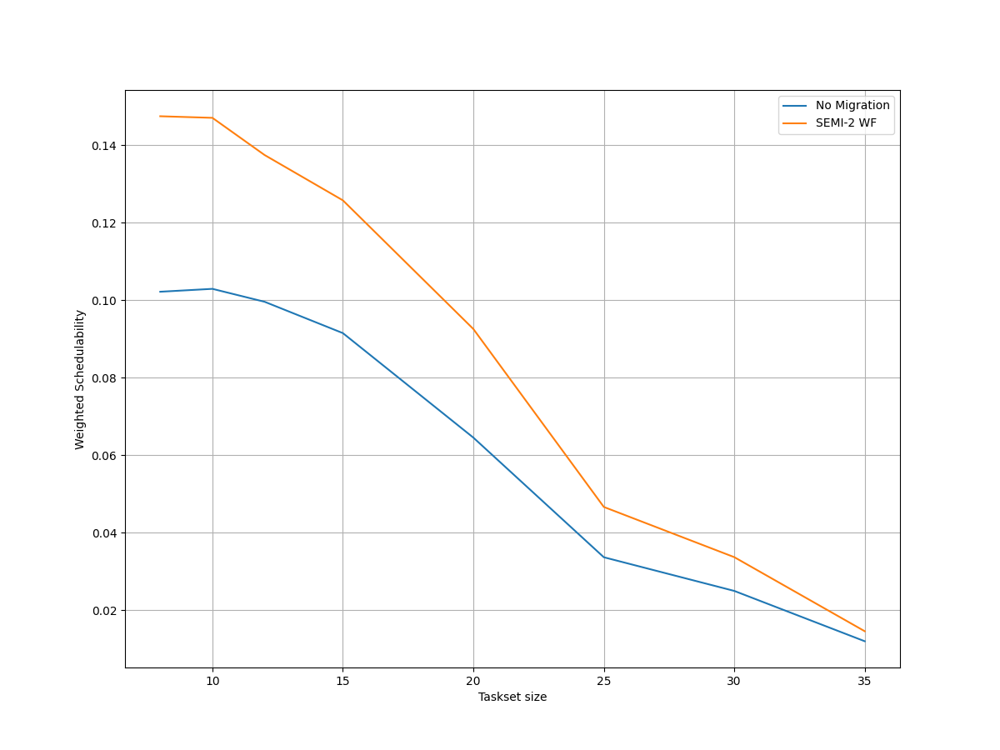
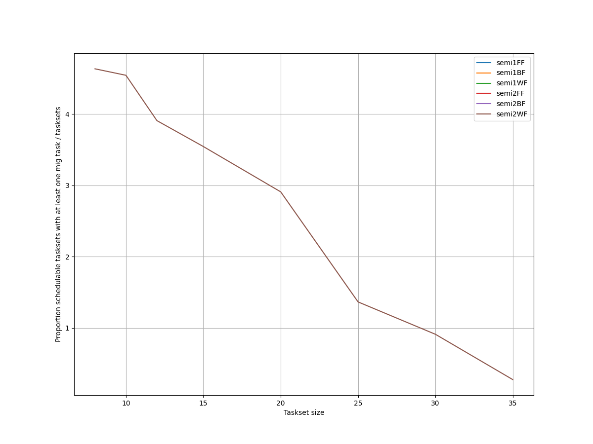
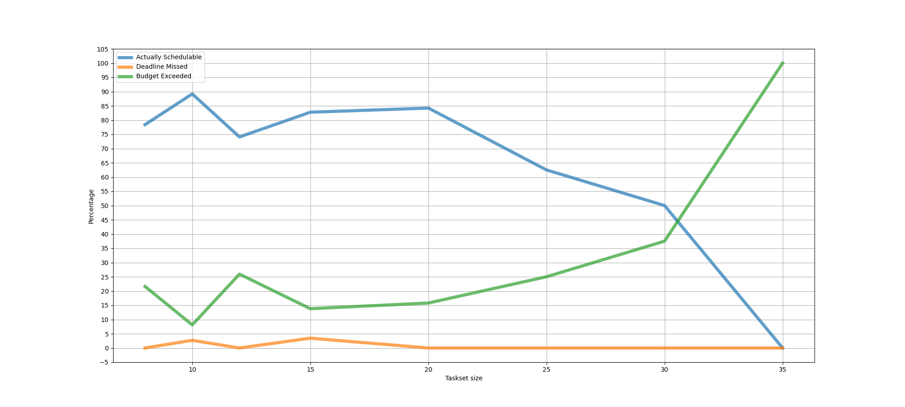
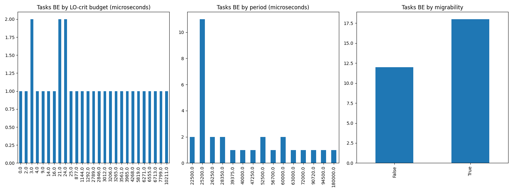
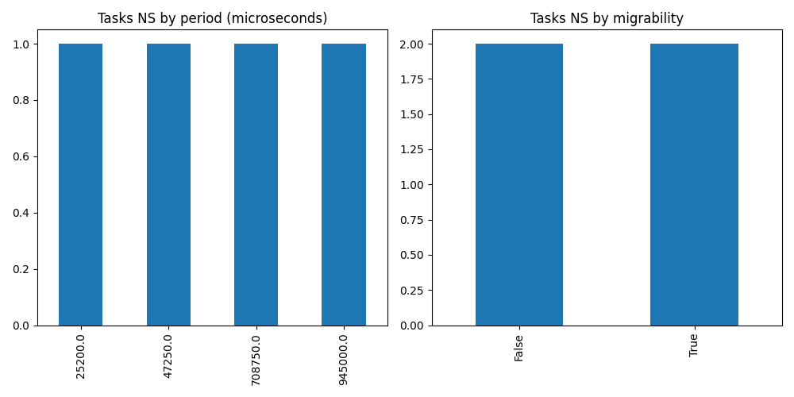

# Report on Experiment 4

   ## Overall data

   Utilization range = [1.8, 2.1] with step = 0.012

 Taskset sizes = [8, 10, 12, 15, 20, 25, 30, 35]

  Number of executions: 167

Schedulable executions: 131/167 = 78.44311377245509 %

_Not_ schedulable executions: 2/167 = 1.1976047904191618 %

Budget Exceeded executions: 32/167 = 19.16167664670659 %

Safe Boundary Exceeded executions: 2/167 = 1.1976047904191618 %

NS + BE executions: 34/167 = 20.35928143712575 %

### **Simulations**

#### **Weighted schedulability experiment 4 according to simulations.**

#### **Percentage of (schedulable tasksets with at least one migrating tasks / number of schedulable tasksets) of experiment 4 according to simulations.** 

 

### **Real Executions**

#### **Schedulability for each level**

#### **Tasksets, grouped by (LO-crit budget, Period & Migrability), with a Budget_Exceeded task.**

#### **Tasksets, grouped by (Period & Migrability), with at least one task missing one (or more) of its deadlines.**

## Bad tasksets

Click here to expand this section.

### **Not schedulable tasksets**

Click here to expand this section.

Ovvero quando almeno un task non completa entra almeno una sua deadline.

  1. Taskset **e4_semi2wf_t1224**

    Taskset execution params:
	 
    "id": "e4_semi2wf_t1224",
    "size": "10",
    "utilization": "1.872",
    "criticality_factor": "2",
    "hicrit_proportion": "0.5"

   
 
Click here to see the deadlines missed tasks list.

   Time values are expressed as **micro-seconds**.

Task:  2

    
    "id": " 2",
    "basecpu": " 1",
    "priority": " 6",
    "period": 47250.0,
    "C(LO)": 2566.0,
    "C(HI)": 2566.0,
    "criticality": "LOW",
    "migrable": "True",
    "completedruns": " 1882",
    "preemptions": " 0",
    "minresponsejitter": " 0.000000000",
    "maxresponsejitter": " 0.001543261",
    "minreleasejitter": " 0.000000000",
    "maxreleasejitter": " 89.830009877",
    "avgresponsejitter": " 0.001287246",
    "deadlinesmissed": " 1",
    "budgetexceeded": " 0",
    "timesmigrated": " 6",
    "timesrestored": " 5",
    "timesonc1": " 1876",
    "timesonc2": " 4",
    "lockedtime": " 0.000013817"

   

   
 
Click here to see the CPUs log.

   Idle time is expressed as **seconds**.

   CPU: 1

    
    "id": 1,
    "hyperperiod": 113400000,
    "lowtohigh": " 35",
    "hightolow": " 35",
    "idletime": 81149522,
    "util": 28.439574955908284

   CPU: 2

    
    "id": 2,
    "hyperperiod": 18900000,
    "lowtohigh": " 0",
    "hightolow": " 0",
    "idletime": 78396197,
    "util": -314.7946931216931

   

   
 
Click here to see the whole tasksets.

   Time values are expressed as **micro-seconds**.

   Task:  4

    
    "id": " 4",
    "basecpu": " 1",
    "priority": " 4",
    "period": 70000.0,
    "C(LO)": 8330.0,
    "C(HI)": 16661.0,
    "criticality": "HIGH",
    "migrable": "False",
    "completedruns": " 1621",
    "preemptions": " 94",
    "minresponsejitter": " 0.000000000",
    "maxresponsejitter": " 0.013010922",
    "minreleasejitter": " 0.000000000",
    "maxreleasejitter": " 114.330006252",
    "avgresponsejitter": " 0.004317502",
    "deadlinesmissed": " 0",
    "budgetexceeded": " 17",
    "timesmigrated": " 0",
    "timesrestored": " 0",
    "timesonc1": " 1731",
    "timesonc2": " 0",
    "lockedtime": " 0.000008655"

   Task:  8

    
    "id": " 8",
    "basecpu": " 1",
    "priority": " 2",
    "period": 150000.0,
    "C(LO)": 8983.0,
    "C(HI)": 17966.0,
    "criticality": "HIGH",
    "migrable": "False",
    "completedruns": " 757",
    "preemptions": " 86",
    "minresponsejitter": " 0.000000000",
    "maxresponsejitter": " 0.018244093",
    "minreleasejitter": " 0.000000000",
    "maxreleasejitter": " 114.250006078",
    "avgresponsejitter": " 0.004829793",
    "deadlinesmissed": " 0",
    "budgetexceeded": " 11",
    "timesmigrated": " 0",
    "timesrestored": " 0",
    "timesonc1": " 853",
    "timesonc2": " 0",
    "lockedtime": " 0.000000967"

   Task:  7

    
    "id": " 7",
    "basecpu": " 1",
    "priority": " 3",
    "period": 129600.0,
    "C(LO)": 5491.0,
    "C(HI)": 10982.0,
    "criticality": "HIGH",
    "migrable": "False",
    "completedruns": " 876",
    "preemptions": " 66",
    "minresponsejitter": " 0.000000000",
    "maxresponsejitter": " 0.013928462",
    "minreleasejitter": " 0.000000000",
    "maxreleasejitter": " 114.270406006",
    "avgresponsejitter": " 0.003022393",
    "deadlinesmissed": " 0",
    "budgetexceeded": " 7",
    "timesmigrated": " 0",
    "timesrestored": " 0",
    "timesonc1": " 948",
    "timesonc2": " 0",
    "lockedtime": " 0.000008177"

   Task:  10

    
    "id": " 10",
    "basecpu": " 1",
    "priority": " 0",
    "period": 945000.0,
    "C(LO)": 31905.999999999996,
    "C(HI)": 63812.99999999999,
    "criticality": "HIGH",
    "migrable": "False",
    "completedruns": " 121",
    "preemptions": " 57",
    "minresponsejitter": " 0.000000000",
    "maxresponsejitter": " 0.033735607",
    "minreleasejitter": " 0.000000000",
    "maxreleasejitter": " 113.455006790",
    "avgresponsejitter": " 0.018077673",
    "deadlinesmissed": " 0",
    "budgetexceeded": " 0",
    "timesmigrated": " 0",
    "timesrestored": " 0",
    "timesonc1": " 177",
    "timesonc2": " 0",
    "lockedtime": " 0.000000405"

   Task:  9

    
    "id": " 9",
    "basecpu": " 1",
    "priority": " 1",
    "period": 630000.0,
    "C(LO)": 163024.0,
    "C(HI)": 163024.0,
    "criticality": "LOW",
    "migrable": "False",
    "completedruns": " 181",
    "preemptions": " 629",
    "minresponsejitter": " 0.000000000",
    "maxresponsejitter": " 0.117532186",
    "minreleasejitter": " 0.000000000",
    "maxreleasejitter": " 113.773969051",
    "avgresponsejitter": " 0.092417880",
    "deadlinesmissed": " 0",
    "budgetexceeded": " 0",
    "timesmigrated": " 0",
    "timesrestored": " 0",
    "timesonc1": " 809",
    "timesonc2": " 0",
    "lockedtime": " 0.000008949"

   Task:  3

    
    "id": " 3",
    "basecpu": " 1",
    "priority": " 5",
    "period": 56250.0,
    "C(LO)": 8035.000000000001,
    "C(HI)": 8035.000000000001,
    "criticality": "LOW",
    "migrable": "True",
    "completedruns": " 58",
    "preemptions": " 4",
    "minresponsejitter": " 0.000000000",
    "maxresponsejitter": " 0.005924553",
    "minreleasejitter": " 0.000000000",
    "maxreleasejitter": " 4.150009835",
    "avgresponsejitter": " 0.004087426",
    "deadlinesmissed": " 0",
    "budgetexceeded": " 0",
    "timesmigrated": " 1",
    "timesrestored": " 0",
    "timesonc1": " 61",
    "timesonc2": " 0",
    "lockedtime": " 0.000000616"

   Task:  2

    
    "id": " 2",
    "basecpu": " 1",
    "priority": " 6",
    "period": 47250.0,
    "C(LO)": 2566.0,
    "C(HI)": 2566.0,
    "criticality": "LOW",
    "migrable": "True",
    "completedruns": " 1882",
    "preemptions": " 0",
    "minresponsejitter": " 0.000000000",
    "maxresponsejitter": " 0.001543261",
    "minreleasejitter": " 0.000000000",
    "maxreleasejitter": " 89.830009877",
    "avgresponsejitter": " 0.001287246",
    "deadlinesmissed": " 1",
    "budgetexceeded": " 0",
    "timesmigrated": " 6",
    "timesrestored": " 5",
    "timesonc1": " 1876",
    "timesonc2": " 4",
    "lockedtime": " 0.000013817"

   Task:  1

    
    "id": " 1",
    "basecpu": " 2",
    "priority": " 2",
    "period": 30240.0,
    "C(LO)": 8774.0,
    "C(HI)": 17548.0,
    "criticality": "HIGH",
    "migrable": "False",
    "completedruns": " 3751",
    "preemptions": " 0",
    "minresponsejitter": " 0.000000000",
    "maxresponsejitter": " 0.005271105",
    "minreleasejitter": " 0.000000000",
    "maxreleasejitter": " 114.369765751",
    "avgresponsejitter": " 0.004382336",
    "deadlinesmissed": " 0",
    "budgetexceeded": " 0",
    "timesmigrated": " 0",
    "timesrestored": " 0",
    "timesonc1": " 0",
    "timesonc2": " 3750",
    "lockedtime": " 0.000031739"

   Task:  5

    
    "id": " 5",
    "basecpu": " 2",
    "priority": " 1",
    "period": 105000.0,
    "C(LO)": 24433.0,
    "C(HI)": 24433.0,
    "criticality": "LOW",
    "migrable": "False",
    "completedruns": " 1081",
    "preemptions": " 422",
    "minresponsejitter": " 0.000000000",
    "maxresponsejitter": " 0.020247021",
    "minreleasejitter": " 0.000000000",
    "maxreleasejitter": " 114.295006222",
    "avgresponsejitter": " 0.013924958",
    "deadlinesmissed": " 0",
    "budgetexceeded": " 0",
    "timesmigrated": " 0",
    "timesrestored": " 0",
    "timesonc1": " 0",
    "timesonc2": " 1502",
    "lockedtime": " 0.000030117"

   Task:  6

    
    "id": " 6",
    "basecpu": " 2",
    "priority": " 0",
    "period": 108000.0,
    "C(LO)": 10042.0,
    "C(HI)": 10042.0,
    "criticality": "LOW",
    "migrable": "False",
    "completedruns": " 1051",
    "preemptions": " 204",
    "minresponsejitter": " 0.000000000",
    "maxresponsejitter": " 0.025214300",
    "minreleasejitter": " 0.000000000",
    "maxreleasejitter": " 114.292005781",
    "avgresponsejitter": " 0.006391405",
    "deadlinesmissed": " 0",
    "budgetexceeded": " 0",
    "timesmigrated": " 0",
    "timesrestored": " 0",
    "timesonc1": " 0",
    "timesonc2": " 1254",
    "lockedtime": " 0.000013757"

   

  2. Taskset **e4_semi2wf_t3763**

    Taskset execution params:
	 
    "id": "e4_semi2wf_t3763",
    "size": "15",
    "utilization": "1.9560000000000002",
    "criticality_factor": "2",
    "hicrit_proportion": "0.5"

   
 
Click here to see the deadlines missed tasks list.

   Time values are expressed as **micro-seconds**.

Task:  1

    
    "id": " 1",
    "basecpu": " 2",
    "priority": " 5",
    "period": 25200.0,
    "C(LO)": 4773.0,
    "C(HI)": 4773.0,
    "criticality": "LOW",
    "migrable": "True",
    "completedruns": " 752",
    "preemptions": " 0",
    "minresponsejitter": " 0.000000000",
    "maxresponsejitter": " 0.002866309",
    "minreleasejitter": " 0.000000000",
    "maxreleasejitter": " 19.900009135",
    "avgresponsejitter": " 0.002380279",
    "deadlinesmissed": " 1",
    "budgetexceeded": " 0",
    "timesmigrated": " 2",
    "timesrestored": " 1",
    "timesonc1": " 6",
    "timesonc2": " 744",
    "lockedtime": " 0.000009294"

   

   
 
Click here to see the CPUs log.

   Idle time is expressed as **seconds**.

   CPU: 1

    
    "id": 1,
    "hyperperiod": 56700000,
    "lowtohigh": " 0",
    "hightolow": " 0",
    "idletime": 71358535,
    "util": -25.85279541446208

   CPU: 2

    
    "id": 2,
    "hyperperiod": 113400000,
    "lowtohigh": " 58",
    "hightolow": " 58",
    "idletime": 77521393,
    "util": 31.638983245149916

   

   
 
Click here to see the whole tasksets.

   Time values are expressed as **micro-seconds**.

   Task:  11

    
    "id": " 11",
    "basecpu": " 1",
    "priority": " 2",
    "period": 157500.0,
    "C(LO)": 14065.0,
    "C(HI)": 28131.0,
    "criticality": "HIGH",
    "migrable": "False",
    "completedruns": " 721",
    "preemptions": " 142",
    "minresponsejitter": " 0.000000000",
    "maxresponsejitter": " 0.021336018",
    "minreleasejitter": " 0.000000000",
    "maxreleasejitter": " 114.242506258",
    "avgresponsejitter": " 0.007998048",
    "deadlinesmissed": " 0",
    "budgetexceeded": " 0",
    "timesmigrated": " 0",
    "timesrestored": " 0",
    "timesonc1": " 862",
    "timesonc2": " 0",
    "lockedtime": " 0.000005234"

   Task:  10

    
    "id": " 10",
    "basecpu": " 1",
    "priority": " 3",
    "period": 151200.0,
    "C(LO)": 8677.0,
    "C(HI)": 17355.0,
    "criticality": "HIGH",
    "migrable": "False",
    "completedruns": " 751",
    "preemptions": " 102",
    "minresponsejitter": " 0.000000000",
    "maxresponsejitter": " 0.017284961",
    "minreleasejitter": " 0.000000000",
    "maxreleasejitter": " 114.248806604",
    "avgresponsejitter": " 0.004885474",
    "deadlinesmissed": " 0",
    "budgetexceeded": " 0",
    "timesmigrated": " 0",
    "timesrestored": " 0",
    "timesonc1": " 852",
    "timesonc2": " 0",
    "lockedtime": " 0.000025508"

   Task:  12

    
    "id": " 12",
    "basecpu": " 1",
    "priority": " 1",
    "period": 175000.0,
    "C(LO)": 8385.0,
    "C(HI)": 16770.0,
    "criticality": "HIGH",
    "migrable": "False",
    "completedruns": " 649",
    "preemptions": " 86",
    "minresponsejitter": " 0.000000000",
    "maxresponsejitter": " 0.022216234",
    "minreleasejitter": " 0.000000000",
    "maxreleasejitter": " 114.232971916",
    "avgresponsejitter": " 0.004560429",
    "deadlinesmissed": " 0",
    "budgetexceeded": " 0",
    "timesmigrated": " 0",
    "timesrestored": " 0",
    "timesonc1": " 734",
    "timesonc2": " 0",
    "lockedtime": " 0.000006667"

   Task:  9

    
    "id": " 9",
    "basecpu": " 1",
    "priority": " 4",
    "period": 150000.0,
    "C(LO)": 1749.0,
    "C(HI)": 3498.0,
    "criticality": "HIGH",
    "migrable": "False",
    "completedruns": " 757",
    "preemptions": " 13",
    "minresponsejitter": " 0.000000000",
    "maxresponsejitter": " 0.002656384",
    "minreleasejitter": " 0.000000000",
    "maxreleasejitter": " 114.250006640",
    "avgresponsejitter": " 0.000887126",
    "deadlinesmissed": " 0",
    "budgetexceeded": " 0",
    "timesmigrated": " 0",
    "timesrestored": " 0",
    "timesonc1": " 769",
    "timesonc2": " 0",
    "lockedtime": " 0.000013943"

   Task:  5

    
    "id": " 5",
    "basecpu": " 1",
    "priority": " 5",
    "period": 84375.0,
    "C(LO)": 343.0,
    "C(HI)": 686.0,
    "criticality": "HIGH",
    "migrable": "False",
    "completedruns": " 1345",
    "preemptions": " 0",
    "minresponsejitter": " 0.000000000",
    "maxresponsejitter": " 0.000212048",
    "minreleasejitter": " 0.000000000",
    "maxreleasejitter": " 114.315631276",
    "avgresponsejitter": " 0.000172802",
    "deadlinesmissed": " 0",
    "budgetexceeded": " 0",
    "timesmigrated": " 0",
    "timesrestored": " 0",
    "timesonc1": " 1344",
    "timesonc2": " 0",
    "lockedtime": " 0.000000655"

   Task:  3

    
    "id": " 3",
    "basecpu": " 1",
    "priority": " 8",
    "period": 60000.0,
    "C(LO)": 21356.0,
    "C(HI)": 21356.0,
    "criticality": "LOW",
    "migrable": "False",
    "completedruns": " 1892",
    "preemptions": " 0",
    "minresponsejitter": " 0.000000000",
    "maxresponsejitter": " 0.012849486",
    "minreleasejitter": " 0.000000000",
    "maxreleasejitter": " 114.400015697",
    "avgresponsejitter": " 0.010692901",
    "deadlinesmissed": " 0",
    "budgetexceeded": " 0",
    "timesmigrated": " 0",
    "timesrestored": " 0",
    "timesonc1": " 1891",
    "timesonc2": " 0",
    "lockedtime": " 0.000049333"

   Task:  14

    
    "id": " 14",
    "basecpu": " 1",
    "priority": " 0",
    "period": 700000.0,
    "C(LO)": 86482.0,
    "C(HI)": 86482.0,
    "criticality": "LOW",
    "migrable": "False",
    "completedruns": " 163",
    "preemptions": " 429",
    "minresponsejitter": " 0.000000000",
    "maxresponsejitter": " 0.086121904",
    "minreleasejitter": " 0.000000000",
    "maxreleasejitter": " 113.704952616",
    "avgresponsejitter": " 0.059632072",
    "deadlinesmissed": " 0",
    "budgetexceeded": " 0",
    "timesmigrated": " 0",
    "timesrestored": " 0",
    "timesonc1": " 591",
    "timesonc2": " 0",
    "lockedtime": " 0.000027742"

   Task:  7

    
    "id": " 7",
    "basecpu": " 1",
    "priority": " 7",
    "period": 101250.0,
    "C(LO)": 3973.0,
    "C(HI)": 3973.0,
    "criticality": "LOW",
    "migrable": "False",
    "completedruns": " 1121",
    "preemptions": " 0",
    "minresponsejitter": " 0.000000000",
    "maxresponsejitter": " 0.002389829",
    "minreleasejitter": " 0.000000000",
    "maxreleasejitter": " 114.298756258",
    "avgresponsejitter": " 0.001989279",
    "deadlinesmissed": " 0",
    "budgetexceeded": " 0",
    "timesmigrated": " 0",
    "timesrestored": " 0",
    "timesonc1": " 1120",
    "timesonc2": " 0",
    "lockedtime": " 0.000005883"

   Task:  13

    
    "id": " 13",
    "basecpu": " 1",
    "priority": " 6",
    "period": 196875.0,
    "C(LO)": 1615.0,
    "C(HI)": 1615.0,
    "criticality": "LOW",
    "migrable": "False",
    "completedruns": " 577",
    "preemptions": " 0",
    "minresponsejitter": " 0.000000000",
    "maxresponsejitter": " 0.000975505",
    "minreleasejitter": " 0.000000000",
    "maxreleasejitter": " 114.203131078",
    "avgresponsejitter": " 0.000813568",
    "deadlinesmissed": " 0",
    "budgetexceeded": " 0",
    "timesmigrated": " 0",
    "timesrestored": " 0",
    "timesonc1": " 576",
    "timesonc2": " 0",
    "lockedtime": " 0.000001447"

   Task:  6

    
    "id": " 6",
    "basecpu": " 2",
    "priority": " 2",
    "period": 100800.0,
    "C(LO)": 14170.0,
    "C(HI)": 28340.0,
    "criticality": "HIGH",
    "migrable": "False",
    "completedruns": " 1126",
    "preemptions": " 267",
    "minresponsejitter": " 0.000000000",
    "maxresponsejitter": " 0.024621057",
    "minreleasejitter": " 0.000000000",
    "maxreleasejitter": " 114.299205880",
    "avgresponsejitter": " 0.007626577",
    "deadlinesmissed": " 0",
    "budgetexceeded": " 16",
    "timesmigrated": " 0",
    "timesrestored": " 0",
    "timesonc1": " 0",
    "timesonc2": " 1408",
    "lockedtime": " 0.000034745"

   Task:  2

    
    "id": " 2",
    "basecpu": " 2",
    "priority": " 3",
    "period": 50000.0,
    "C(LO)": 2656.0,
    "C(HI)": 5312.0,
    "criticality": "HIGH",
    "migrable": "False",
    "completedruns": " 2269",
    "preemptions": " 59",
    "minresponsejitter": " 0.000000000",
    "maxresponsejitter": " 0.005328093",
    "minreleasejitter": " 0.000000000",
    "maxreleasejitter": " 114.350005877",
    "avgresponsejitter": " 0.001401063",
    "deadlinesmissed": " 0",
    "budgetexceeded": " 30",
    "timesmigrated": " 0",
    "timesrestored": " 0",
    "timesonc1": " 0",
    "timesonc2": " 2357",
    "lockedtime": " 0.000042640"

   Task:  8

    
    "id": " 8",
    "basecpu": " 2",
    "priority": " 1",
    "period": 108000.0,
    "C(LO)": 3928.0,
    "C(HI)": 7856.999999999999,
    "criticality": "HIGH",
    "migrable": "False",
    "completedruns": " 1051",
    "preemptions": " 21",
    "minresponsejitter": " 0.000000000",
    "maxresponsejitter": " 0.008622399",
    "minreleasejitter": " 0.000000000",
    "maxreleasejitter": " 114.292005880",
    "avgresponsejitter": " 0.002036541",
    "deadlinesmissed": " 0",
    "budgetexceeded": " 12",
    "timesmigrated": " 0",
    "timesrestored": " 0",
    "timesonc1": " 0",
    "timesonc2": " 1083",
    "lockedtime": " 0.000008976"

   Task:  15

    
    "id": " 15",
    "basecpu": " 2",
    "priority": " 0",
    "period": 945000.0,
    "C(LO)": 305845.0,
    "C(HI)": 305845.0,
    "criticality": "LOW",
    "migrable": "False",
    "completedruns": " 121",
    "preemptions": " 1113",
    "minresponsejitter": " 0.000000000",
    "maxresponsejitter": " 0.238692979",
    "minreleasejitter": " 0.000000000",
    "maxreleasejitter": " 113.455006072",
    "avgresponsejitter": " 0.181487300",
    "deadlinesmissed": " 0",
    "budgetexceeded": " 0",
    "timesmigrated": " 0",
    "timesrestored": " 0",
    "timesonc1": " 0",
    "timesonc2": " 1233",
    "lockedtime": " 0.000070619"

   Task:  1

    
    "id": " 1",
    "basecpu": " 2",
    "priority": " 5",
    "period": 25200.0,
    "C(LO)": 4773.0,
    "C(HI)": 4773.0,
    "criticality": "LOW",
    "migrable": "True",
    "completedruns": " 752",
    "preemptions": " 0",
    "minresponsejitter": " 0.000000000",
    "maxresponsejitter": " 0.002866309",
    "minreleasejitter": " 0.000000000",
    "maxreleasejitter": " 19.900009135",
    "avgresponsejitter": " 0.002380279",
    "deadlinesmissed": " 1",
    "budgetexceeded": " 0",
    "timesmigrated": " 2",
    "timesrestored": " 1",
    "timesonc1": " 6",
    "timesonc2": " 744",
    "lockedtime": " 0.000009294"

   Task:  4

    
    "id": " 4",
    "basecpu": " 2",
    "priority": " 4",
    "period": 70875.0,
    "C(LO)": 2491.0,
    "C(HI)": 2491.0,
    "criticality": "LOW",
    "migrable": "False",
    "completedruns": " 1601",
    "preemptions": " 0",
    "minresponsejitter": " 0.000000000",
    "maxresponsejitter": " 0.001505619",
    "minreleasejitter": " 0.000000000",
    "maxreleasejitter": " 114.329131195",
    "avgresponsejitter": " 0.001244718",
    "deadlinesmissed": " 0",
    "budgetexceeded": " 0",
    "timesmigrated": " 0",
    "timesrestored": " 0",
    "timesonc1": " 0",
    "timesonc2": " 1600",
    "lockedtime": " 0.000013321"

   

### **Criticality Level Budget Exceeded**

Click here to expand this section.

Ovvero quando un task di un taskset ha ecceduto il suo criticality-level budget, cioè un LO-crit task che eccede il suo LO-crit budget, oppure un HI-crit task che eccede il suo HI-crit budget.

  2. Taskset **e4_semi2wf_t125**

    Taskset execution params:
	 
    "id": "e4_semi2wf_t125",
    "size": "8",
    "utilization": "1.872",
    "criticality_factor": "2",
    "hicrit_proportion": "0.5"

   
 
Click here to see the guilty task.

   Time values are expressed as **micro-seconds**.

Task:  1

    
    "id": " 1",
    "basecpu": " 1",
    "priority": " 3",
    "period": 25200.0,
    "C(LO)": 3012.0,
    "C(HI)": 3012.0,
    "criticality": "LOW",
    "migrable": "True",
    "completedruns": " 503",
    "preemptions": " 1",
    "minresponsejitter": " 0.000000000",
    "maxresponsejitter": " 0.001814228",
    "minreleasejitter": " 0.000000000",
    "maxreleasejitter": " 13.650006679",
    "avgresponsejitter": " 0.001514234",
    "deadlinesmissed": " 1",
    "budgetexceeded": " 1",
    "timesmigrated": " 1",
    "timesrestored": " 1",
    "timesonc1": " 501",
    "timesonc2": " 1",
    "lockedtime": " 0.000004631"

   

   
 
Click here to see the CPUs log.

   Idle time is expressed as **seconds**.

   CPU: 1

    
    "id": 1,
    "hyperperiod": 113400000,
    "lowtohigh": " 4",
    "hightolow": " 4",
    "idletime": 8904587,
    "util": 92.14763051146384

   CPU: 2

    
    "id": 2,
    "hyperperiod": 22680000,
    "lowtohigh": " 0",
    "hightolow": " 0",
    "idletime": 8131714,
    "util": 64.14588183421517

   

   
 
Click here to see the whole tasksets.

   Time values are expressed as **micro-seconds**.

   Task:  6

    
    "id": " 6",
    "basecpu": " 1",
    "priority": " 0",
    "period": 129600.0,
    "C(LO)": 25789.0,
    "C(HI)": 51579.0,
    "criticality": "HIGH",
    "migrable": "False",
    "completedruns": " 99",
    "preemptions": " 72",
    "minresponsejitter": " 0.000000000",
    "maxresponsejitter": " 0.051523973",
    "minreleasejitter": " 0.000000000",
    "maxreleasejitter": " 13.571206213",
    "avgresponsejitter": " 0.015633024",
    "deadlinesmissed": " 0",
    "budgetexceeded": " 1",
    "timesmigrated": " 0",
    "timesrestored": " 0",
    "timesonc1": " 171",
    "timesonc2": " 0",
    "lockedtime": " 0.000003072"

   Task:  3

    
    "id": " 3",
    "basecpu": " 1",
    "priority": " 1",
    "period": 50000.0,
    "C(LO)": 5867.0,
    "C(HI)": 11735.0,
    "criticality": "HIGH",
    "migrable": "False",
    "completedruns": " 254",
    "preemptions": " 29",
    "minresponsejitter": " 0.000000000",
    "maxresponsejitter": " 0.008911616",
    "minreleasejitter": " 0.000000000",
    "maxreleasejitter": " 13.614799895",
    "avgresponsejitter": " 0.003158153",
    "deadlinesmissed": " 0",
    "budgetexceeded": " 3",
    "timesmigrated": " 0",
    "timesrestored": " 0",
    "timesonc1": " 285",
    "timesonc2": " 0",
    "lockedtime": " 0.000000514"

   Task:  7

    
    "id": " 7",
    "basecpu": " 1",
    "priority": " 2",
    "period": 200000.0,
    "C(LO)": 30153.0,
    "C(HI)": 30153.0,
    "criticality": "LOW",
    "migrable": "False",
    "completedruns": " 65",
    "preemptions": " 37",
    "minresponsejitter": " 0.000000000",
    "maxresponsejitter": " 0.019052099",
    "minreleasejitter": " 0.000000000",
    "maxreleasejitter": " 13.600010342",
    "avgresponsejitter": " 0.015650366",
    "deadlinesmissed": " 0",
    "budgetexceeded": " 0",
    "timesmigrated": " 0",
    "timesrestored": " 0",
    "timesonc1": " 101",
    "timesonc2": " 0",
    "lockedtime": " 0.000001667"

   Task:  1

    
    "id": " 1",
    "basecpu": " 1",
    "priority": " 3",
    "period": 25200.0,
    "C(LO)": 3012.0,
    "C(HI)": 3012.0,
    "criticality": "LOW",
    "migrable": "True",
    "completedruns": " 503",
    "preemptions": " 1",
    "minresponsejitter": " 0.000000000",
    "maxresponsejitter": " 0.001814228",
    "minreleasejitter": " 0.000000000",
    "maxreleasejitter": " 13.650006679",
    "avgresponsejitter": " 0.001514234",
    "deadlinesmissed": " 1",
    "budgetexceeded": " 1",
    "timesmigrated": " 1",
    "timesrestored": " 1",
    "timesonc1": " 501",
    "timesonc2": " 1",
    "lockedtime": " 0.000004631"

   Task:  2

    
    "id": " 2",
    "basecpu": " 2",
    "priority": " 2",
    "period": 40000.0,
    "C(LO)": 8177.0,
    "C(HI)": 16354.0,
    "criticality": "HIGH",
    "migrable": "False",
    "completedruns": " 318",
    "preemptions": " 15",
    "minresponsejitter": " 0.000000000",
    "maxresponsejitter": " 0.006378192",
    "minreleasejitter": " 0.000000000",
    "maxreleasejitter": " 13.640005757",
    "avgresponsejitter": " 0.004151471",
    "deadlinesmissed": " 0",
    "budgetexceeded": " 0",
    "timesmigrated": " 0",
    "timesrestored": " 0",
    "timesonc1": " 0",
    "timesonc2": " 332",
    "lockedtime": " 0.000004270"

   Task:  5

    
    "id": " 5",
    "basecpu": " 2",
    "priority": " 1",
    "period": 63000.0,
    "C(LO)": 2719.0,
    "C(HI)": 5438.0,
    "criticality": "HIGH",
    "migrable": "False",
    "completedruns": " 202",
    "preemptions": " 5",
    "minresponsejitter": " 0.000000000",
    "maxresponsejitter": " 0.006188207",
    "minreleasejitter": " 0.000000000",
    "maxreleasejitter": " 13.607955186",
    "avgresponsejitter": " 0.001478715",
    "deadlinesmissed": " 0",
    "budgetexceeded": " 0",
    "timesmigrated": " 0",
    "timesrestored": " 0",
    "timesonc1": " 0",
    "timesonc2": " 206",
    "lockedtime": " 0.000005435"

   Task:  8

    
    "id": " 8",
    "basecpu": " 2",
    "priority": " 0",
    "period": 708750.0,
    "C(LO)": 297030.0,
    "C(HI)": 297030.0,
    "criticality": "LOW",
    "migrable": "False",
    "completedruns": " 19",
    "preemptions": " 152",
    "minresponsejitter": " 0.000000000",
    "maxresponsejitter": " 0.206715988",
    "minreleasejitter": " 0.000000000",
    "maxreleasejitter": " 13.048756051",
    "avgresponsejitter": " 0.169135610",
    "deadlinesmissed": " 0",
    "budgetexceeded": " 0",
    "timesmigrated": " 0",
    "timesrestored": " 0",
    "timesonc1": " 0",
    "timesonc2": " 170",
    "lockedtime": " 0.000010459"

   Task:  4

    
    "id": " 4",
    "basecpu": " 2",
    "priority": " 3",
    "period": 52500.0,
    "C(LO)": 2873.0,
    "C(HI)": 2873.0,
    "criticality": "LOW",
    "migrable": "False",
    "completedruns": " 242",
    "preemptions": " 1",
    "minresponsejitter": " 0.000000000",
    "maxresponsejitter": " 0.001723604",
    "minreleasejitter": " 0.000000000",
    "maxreleasejitter": " 13.601730489",
    "avgresponsejitter": " 0.001440336",
    "deadlinesmissed": " 0",
    "budgetexceeded": " 0",
    "timesmigrated": " 0",
    "timesrestored": " 0",
    "timesonc1": " 0",
    "timesonc2": " 242",
    "lockedtime": " 0.000002066"

   

  3. Taskset **e4_semi2wf_t1367**

    Taskset execution params:
	 
    "id": "e4_semi2wf_t1367",
    "size": "10",
    "utilization": "1.9080000000000001",
    "criticality_factor": "2",
    "hicrit_proportion": "0.5"

   
 
Click here to see the guilty task.

   Time values are expressed as **micro-seconds**.

Task:  1

    
    "id": " 1",
    "basecpu": " 2",
    "priority": " 2",
    "period": 22500.0,
    "C(LO)": 6271.0,
    "C(HI)": 6271.0,
    "criticality": "LOW",
    "migrable": "True",
    "completedruns": " 854",
    "preemptions": " 1",
    "minresponsejitter": " 0.000000000",
    "maxresponsejitter": " 0.003763532",
    "minreleasejitter": " 0.000000000",
    "maxreleasejitter": " 20.189807838",
    "avgresponsejitter": " 0.003124231",
    "deadlinesmissed": " 2",
    "budgetexceeded": " 1",
    "timesmigrated": " 3",
    "timesrestored": " 3",
    "timesonc1": " 7",
    "timesonc2": " 845",
    "lockedtime": " 0.000013562"

   

   
 
Click here to see the CPUs log.

   Idle time is expressed as **seconds**.

   CPU: 1

    
    "id": 1,
    "hyperperiod": 113400000,
    "lowtohigh": " 0",
    "hightolow": " 0",
    "idletime": 12928682,
    "util": 88.59904585537919

   CPU: 2

    
    "id": 2,
    "hyperperiod": 5670000,
    "lowtohigh": " 5",
    "hightolow": " 5",
    "idletime": 10941424,
    "util": -92.97044091710757

   

   
 
Click here to see the whole tasksets.

   Time values are expressed as **micro-seconds**.

   Task:  5

    
    "id": " 5",
    "basecpu": " 1",
    "priority": " 3",
    "period": 90000.0,
    "C(LO)": 8461.0,
    "C(HI)": 16923.0,
    "criticality": "HIGH",
    "migrable": "False",
    "completedruns": " 215",
    "preemptions": " 31",
    "minresponsejitter": " 0.000000000",
    "maxresponsejitter": " 0.005941303",
    "minreleasejitter": " 0.000000000",
    "maxreleasejitter": " 20.171614556",
    "avgresponsejitter": " 0.004386171",
    "deadlinesmissed": " 0",
    "budgetexceeded": " 0",
    "timesmigrated": " 0",
    "timesrestored": " 0",
    "timesonc1": " 245",
    "timesonc2": " 0",
    "lockedtime": " 0.000006877"

   Task:  4

    
    "id": " 4",
    "basecpu": " 1",
    "priority": " 4",
    "period": 54000.0,
    "C(LO)": 3116.0,
    "C(HI)": 6232.0,
    "criticality": "HIGH",
    "migrable": "False",
    "completedruns": " 357",
    "preemptions": " 0",
    "minresponsejitter": " 0.000000000",
    "maxresponsejitter": " 0.001874012",
    "minreleasejitter": " 0.000000000",
    "maxreleasejitter": " 20.170006970",
    "avgresponsejitter": " 0.001547673",
    "deadlinesmissed": " 0",
    "budgetexceeded": " 0",
    "timesmigrated": " 0",
    "timesrestored": " 0",
    "timesonc1": " 356",
    "timesonc2": " 0",
    "lockedtime": " 0.000004832"

   Task:  6

    
    "id": " 6",
    "basecpu": " 1",
    "priority": " 2",
    "period": 100000.0,
    "C(LO)": 4298.0,
    "C(HI)": 8597.0,
    "criticality": "HIGH",
    "migrable": "False",
    "completedruns": " 193",
    "preemptions": " 18",
    "minresponsejitter": " 0.000000000",
    "maxresponsejitter": " 0.003995508",
    "minreleasejitter": " 0.000000000",
    "maxreleasejitter": " 20.100006069",
    "avgresponsejitter": " 0.002253676",
    "deadlinesmissed": " 0",
    "budgetexceeded": " 0",
    "timesmigrated": " 0",
    "timesrestored": " 0",
    "timesonc1": " 210",
    "timesonc2": " 0",
    "lockedtime": " 0.000000432"

   Task:  8

    
    "id": " 8",
    "basecpu": " 1",
    "priority": " 1",
    "period": 151200.0,
    "C(LO)": 1627.0,
    "C(HI)": 3255.0,
    "criticality": "HIGH",
    "migrable": "False",
    "completedruns": " 128",
    "preemptions": " 1",
    "minresponsejitter": " 0.000000000",
    "maxresponsejitter": " 0.002849357",
    "minreleasejitter": " 0.000000000",
    "maxreleasejitter": " 20.052164517",
    "avgresponsejitter": " 0.000830952",
    "deadlinesmissed": " 0",
    "budgetexceeded": " 0",
    "timesmigrated": " 0",
    "timesrestored": " 0",
    "timesonc1": " 128",
    "timesonc2": " 0",
    "lockedtime": " 0.000000000"

   Task:  9

    
    "id": " 9",
    "basecpu": " 1",
    "priority": " 0",
    "period": 810000.0,
    "C(LO)": 316922.0,
    "C(HI)": 316922.0,
    "criticality": "LOW",
    "migrable": "False",
    "completedruns": " 25",
    "preemptions": " 277",
    "minresponsejitter": " 0.000000000",
    "maxresponsejitter": " 0.205523997",
    "minreleasejitter": " 0.000000000",
    "maxreleasejitter": " 19.636509390",
    "avgresponsejitter": " 0.171469087",
    "deadlinesmissed": " 0",
    "budgetexceeded": " 0",
    "timesmigrated": " 0",
    "timesrestored": " 0",
    "timesonc1": " 301",
    "timesonc2": " 0",
    "lockedtime": " 0.000017261"

   Task:  2

    
    "id": " 2",
    "basecpu": " 1",
    "priority": " 6",
    "period": 30240.0,
    "C(LO)": 1586.0,
    "C(HI)": 1586.0,
    "criticality": "LOW",
    "migrable": "False",
    "completedruns": " 636",
    "preemptions": " 0",
    "minresponsejitter": " 0.000000000",
    "maxresponsejitter": " 0.000959147",
    "minreleasejitter": " 0.000000000",
    "maxreleasejitter": " 20.172166580",
    "avgresponsejitter": " 0.000802114",
    "deadlinesmissed": " 0",
    "budgetexceeded": " 0",
    "timesmigrated": " 0",
    "timesrestored": " 0",
    "timesonc1": " 635",
    "timesonc2": " 0",
    "lockedtime": " 0.000009216"

   Task:  7

    
    "id": " 7",
    "basecpu": " 1",
    "priority": " 5",
    "period": 120000.0,
    "C(LO)": 823.0,
    "C(HI)": 823.0,
    "criticality": "LOW",
    "migrable": "False",
    "completedruns": " 161",
    "preemptions": " 0",
    "minresponsejitter": " 0.000000000",
    "maxresponsejitter": " 0.000489390",
    "minreleasejitter": " 0.000000000",
    "maxreleasejitter": " 20.080007919",
    "avgresponsejitter": " 0.000406706",
    "deadlinesmissed": " 0",
    "budgetexceeded": " 0",
    "timesmigrated": " 0",
    "timesrestored": " 0",
    "timesonc1": " 160",
    "timesonc2": " 0",
    "lockedtime": " 0.000004147"

   Task:  3

    
    "id": " 3",
    "basecpu": " 2",
    "priority": " 1",
    "period": 45360.0,
    "C(LO)": 9334.0,
    "C(HI)": 18669.0,
    "criticality": "HIGH",
    "migrable": "False",
    "completedruns": " 424",
    "preemptions": " 76",
    "minresponsejitter": " 0.000000000",
    "maxresponsejitter": " 0.016207589",
    "minreleasejitter": " 0.000000000",
    "maxreleasejitter": " 20.141926778",
    "avgresponsejitter": " 0.005375384",
    "deadlinesmissed": " 0",
    "budgetexceeded": " 5",
    "timesmigrated": " 0",
    "timesrestored": " 0",
    "timesonc1": " 0",
    "timesonc2": " 504",
    "lockedtime": " 0.000016444"

   Task:  10

    
    "id": " 10",
    "basecpu": " 2",
    "priority": " 0",
    "period": 945000.0,
    "C(LO)": 336562.0,
    "C(HI)": 336562.0,
    "criticality": "LOW",
    "migrable": "False",
    "completedruns": " 22",
    "preemptions": " 254",
    "minresponsejitter": " 0.000000000",
    "maxresponsejitter": " 0.263072309",
    "minreleasejitter": " 0.000000000",
    "maxreleasejitter": " 19.903648508",
    "avgresponsejitter": " 0.219024030",
    "deadlinesmissed": " 0",
    "budgetexceeded": " 0",
    "timesmigrated": " 0",
    "timesrestored": " 0",
    "timesonc1": " 0",
    "timesonc2": " 275",
    "lockedtime": " 0.000019192"

   Task:  1

    
    "id": " 1",
    "basecpu": " 2",
    "priority": " 2",
    "period": 22500.0,
    "C(LO)": 6271.0,
    "C(HI)": 6271.0,
    "criticality": "LOW",
    "migrable": "True",
    "completedruns": " 854",
    "preemptions": " 1",
    "minresponsejitter": " 0.000000000",
    "maxresponsejitter": " 0.003763532",
    "minreleasejitter": " 0.000000000",
    "maxreleasejitter": " 20.189807838",
    "avgresponsejitter": " 0.003124231",
    "deadlinesmissed": " 2",
    "budgetexceeded": " 1",
    "timesmigrated": " 3",
    "timesrestored": " 3",
    "timesonc1": " 7",
    "timesonc2": " 845",
    "lockedtime": " 0.000013562"

   

  4. Taskset **e4_semi2wf_t1446**

    Taskset execution params:
	 
    "id": "e4_semi2wf_t1446",
    "size": "10",
    "utilization": "1.9200000000000002",
    "criticality_factor": "2",
    "hicrit_proportion": "0.5"

   
 
Click here to see the guilty task.

   Time values are expressed as **micro-seconds**.

Task:  6

    
    "id": " 6",
    "basecpu": " 1",
    "priority": " 6",
    "period": 94500.0,
    "C(LO)": 24.0,
    "C(HI)": 24.0,
    "criticality": "LOW",
    "migrable": "False",
    "completedruns": " 1",
    "preemptions": " 1",
    "minresponsejitter": " 0.000000000",
    "maxresponsejitter": " 0.000000000",
    "minreleasejitter": " 0.000000000",
    "maxreleasejitter": " 0.000000000",
    "avgresponsejitter": " 0.000000000",
    "deadlinesmissed": " 0",
    "budgetexceeded": " 1",
    "timesmigrated": " 0",
    "timesrestored": " 0",
    "timesonc1": " 1",
    "timesonc2": " 0",
    "lockedtime": " 0.000000000"

   

   
 
Click here to see the CPUs log.

   Idle time is expressed as **seconds**.

   CPU: 1

    
    "id": 1,
    "hyperperiod": 113400000,
    "lowtohigh": " 0",
    "hightolow": " 0",
    "idletime": 17,
    "util": 99.99998500881834

   CPU: 2

    
    "id": 2,
    "hyperperiod": 11340000,
    "lowtohigh": " 0",
    "hightolow": " 0",
    "idletime": 11,
    "util": 99.99990299823634

   

   
 
Click here to see the whole tasksets.

   Time values are expressed as **micro-seconds**.

   Task:  3

    
    "id": " 3",
    "basecpu": " 1",
    "priority": " 3",
    "period": 56250.0,
    "C(LO)": 9561.0,
    "C(HI)": 19122.0,
    "criticality": "HIGH",
    "migrable": "False",
    "completedruns": " 1",
    "preemptions": " 0",
    "minresponsejitter": " 0.000000000",
    "maxresponsejitter": " 0.000000000",
    "minreleasejitter": " 0.000000000",
    "maxreleasejitter": " 0.000000000",
    "avgresponsejitter": " 0.000000000",
    "deadlinesmissed": " 0",
    "budgetexceeded": " 0",
    "timesmigrated": " 0",
    "timesrestored": " 0",
    "timesonc1": " 0",
    "timesonc2": " 0",
    "lockedtime": " 0.000000000"

   Task:  5

    
    "id": " 5",
    "basecpu": " 1",
    "priority": " 2",
    "period": 70000.0,
    "C(LO)": 11851.0,
    "C(HI)": 23702.0,
    "criticality": "HIGH",
    "migrable": "False",
    "completedruns": " 1",
    "preemptions": " 0",
    "minresponsejitter": " 0.000000000",
    "maxresponsejitter": " 0.000000000",
    "minreleasejitter": " 0.000000000",
    "maxreleasejitter": " 0.000000000",
    "avgresponsejitter": " 0.000000000",
    "deadlinesmissed": " 0",
    "budgetexceeded": " 0",
    "timesmigrated": " 0",
    "timesrestored": " 0",
    "timesonc1": " 0",
    "timesonc2": " 0",
    "lockedtime": " 0.000000000"

   Task:  1

    
    "id": " 1",
    "basecpu": " 1",
    "priority": " 4",
    "period": 25200.0,
    "C(LO)": 566.0,
    "C(HI)": 1132.0,
    "criticality": "HIGH",
    "migrable": "False",
    "completedruns": " 1",
    "preemptions": " 0",
    "minresponsejitter": " 0.000000000",
    "maxresponsejitter": " 0.000000000",
    "minreleasejitter": " 0.000000000",
    "maxreleasejitter": " 0.000000000",
    "avgresponsejitter": " 0.000000000",
    "deadlinesmissed": " 0",
    "budgetexceeded": " 0",
    "timesmigrated": " 0",
    "timesrestored": " 0",
    "timesonc1": " 0",
    "timesonc2": " 0",
    "lockedtime": " 0.000000000"

   Task:  7

    
    "id": " 7",
    "basecpu": " 1",
    "priority": " 5",
    "period": 100800.0,
    "C(LO)": 7616.0,
    "C(HI)": 7616.0,
    "criticality": "LOW",
    "migrable": "False",
    "completedruns": " 1",
    "preemptions": " 0",
    "minresponsejitter": " 0.000000000",
    "maxresponsejitter": " 0.000000000",
    "minreleasejitter": " 0.000000000",
    "maxreleasejitter": " 0.000000000",
    "avgresponsejitter": " 0.000000000",
    "deadlinesmissed": " 0",
    "budgetexceeded": " 0",
    "timesmigrated": " 0",
    "timesrestored": " 0",
    "timesonc1": " 0",
    "timesonc2": " 0",
    "lockedtime": " 0.000000000"

   Task:  10

    
    "id": " 10",
    "basecpu": " 1",
    "priority": " 0",
    "period": 630000.0,
    "C(LO)": 37213.0,
    "C(HI)": 37213.0,
    "criticality": "LOW",
    "migrable": "False",
    "completedruns": " 1",
    "preemptions": " 0",
    "minresponsejitter": " 0.000000000",
    "maxresponsejitter": " 0.000000000",
    "minreleasejitter": " 0.000000000",
    "maxreleasejitter": " 0.000000000",
    "avgresponsejitter": " 0.000000000",
    "deadlinesmissed": " 0",
    "budgetexceeded": " 0",
    "timesmigrated": " 0",
    "timesrestored": " 0",
    "timesonc1": " 0",
    "timesonc2": " 0",
    "lockedtime": " 0.000000000"

   Task:  9

    
    "id": " 9",
    "basecpu": " 1",
    "priority": " 1",
    "period": 525000.0,
    "C(LO)": 25677.0,
    "C(HI)": 25677.0,
    "criticality": "LOW",
    "migrable": "False",
    "completedruns": " 1",
    "preemptions": " 0",
    "minresponsejitter": " 0.000000000",
    "maxresponsejitter": " 0.000000000",
    "minreleasejitter": " 0.000000000",
    "maxreleasejitter": " 0.000000000",
    "avgresponsejitter": " 0.000000000",
    "deadlinesmissed": " 0",
    "budgetexceeded": " 0",
    "timesmigrated": " 0",
    "timesrestored": " 0",
    "timesonc1": " 0",
    "timesonc2": " 0",
    "lockedtime": " 0.000000000"

   Task:  6

    
    "id": " 6",
    "basecpu": " 1",
    "priority": " 6",
    "period": 94500.0,
    "C(LO)": 24.0,
    "C(HI)": 24.0,
    "criticality": "LOW",
    "migrable": "False",
    "completedruns": " 1",
    "preemptions": " 1",
    "minresponsejitter": " 0.000000000",
    "maxresponsejitter": " 0.000000000",
    "minreleasejitter": " 0.000000000",
    "maxreleasejitter": " 0.000000000",
    "avgresponsejitter": " 0.000000000",
    "deadlinesmissed": " 0",
    "budgetexceeded": " 1",
    "timesmigrated": " 0",
    "timesrestored": " 0",
    "timesonc1": " 1",
    "timesonc2": " 0",
    "lockedtime": " 0.000000000"

   Task:  4

    
    "id": " 4",
    "basecpu": " 2",
    "priority": " 1",
    "period": 60000.0,
    "C(LO)": 19581.0,
    "C(HI)": 39163.0,
    "criticality": "HIGH",
    "migrable": "False",
    "completedruns": " 1",
    "preemptions": " 0",
    "minresponsejitter": " 0.000000000",
    "maxresponsejitter": " 0.000000000",
    "minreleasejitter": " 0.000000000",
    "maxreleasejitter": " 0.000000000",
    "avgresponsejitter": " 0.000000000",
    "deadlinesmissed": " 0",
    "budgetexceeded": " 0",
    "timesmigrated": " 0",
    "timesrestored": " 0",
    "timesonc1": " 0",
    "timesonc2": " 0",
    "lockedtime": " 0.000000000"

   Task:  2

    
    "id": " 2",
    "basecpu": " 2",
    "priority": " 2",
    "period": 42000.0,
    "C(LO)": 955.0,
    "C(HI)": 1911.0,
    "criticality": "HIGH",
    "migrable": "False",
    "completedruns": " 1",
    "preemptions": " 1",
    "minresponsejitter": " 0.000000000",
    "maxresponsejitter": " 0.000000000",
    "minreleasejitter": " 0.000000000",
    "maxreleasejitter": " 0.000000000",
    "avgresponsejitter": " 0.000000000",
    "deadlinesmissed": " 0",
    "budgetexceeded": " 0",
    "timesmigrated": " 0",
    "timesrestored": " 0",
    "timesonc1": " 0",
    "timesonc2": " 1",
    "lockedtime": " 0.000000135"

   Task:  8

    
    "id": " 8",
    "basecpu": " 2",
    "priority": " 0",
    "period": 162000.0,
    "C(LO)": 50943.0,
    "C(HI)": 50943.0,
    "criticality": "LOW",
    "migrable": "True",
    "completedruns": " 1",
    "preemptions": " 0",
    "minresponsejitter": " 0.000000000",
    "maxresponsejitter": " 0.000000000",
    "minreleasejitter": " 0.000000000",
    "maxreleasejitter": " 0.000000000",
    "avgresponsejitter": " 0.000000000",
    "deadlinesmissed": " 0",
    "budgetexceeded": " 0",
    "timesmigrated": " 0",
    "timesrestored": " 0",
    "timesonc1": " 0",
    "timesonc2": " 0",
    "lockedtime": " 0.000000000"

   

  5. Taskset **e4_semi2wf_t1682**

    Taskset execution params:
	 
    "id": "e4_semi2wf_t1682",
    "size": "10",
    "utilization": "1.9800000000000002",
    "criticality_factor": "2",
    "hicrit_proportion": "0.5"

   
 
Click here to see the guilty task.

   Time values are expressed as **micro-seconds**.

Task:  4

    
    "id": " 4",
    "basecpu": " 2",
    "priority": " 3",
    "period": 90720.0,
    "C(LO)": 3.0,
    "C(HI)": 7.0,
    "criticality": "HIGH",
    "migrable": "False",
    "completedruns": " 1",
    "preemptions": " 1",
    "minresponsejitter": " 0.000000000",
    "maxresponsejitter": " 0.000000000",
    "minreleasejitter": " 0.000000000",
    "maxreleasejitter": " 0.000000000",
    "avgresponsejitter": " 0.000000000",
    "deadlinesmissed": " 0",
    "budgetexceeded": " 2",
    "timesmigrated": " 0",
    "timesrestored": " 0",
    "timesonc1": " 0",
    "timesonc2": " 2",
    "lockedtime": " 0.000000000"

   

   
 
Click here to see the CPUs log.

   Idle time is expressed as **seconds**.

   CPU: 1

    
    "id": 1,
    "hyperperiod": 4725000,
    "lowtohigh": " 0",
    "hightolow": " 0",
    "idletime": 14,
    "util": 99.9997037037037

   CPU: 2

    
    "id": 2,
    "hyperperiod": 113400000,
    "lowtohigh": " 1",
    "hightolow": " 0",
    "idletime": 14,
    "util": 99.99998765432099

   

   
 
Click here to see the whole tasksets.

   Time values are expressed as **micro-seconds**.

   Task:  2

    
    "id": " 2",
    "basecpu": " 1",
    "priority": " 2",
    "period": 45000.0,
    "C(LO)": 8311.0,
    "C(HI)": 16623.0,
    "criticality": "HIGH",
    "migrable": "False",
    "completedruns": " 1",
    "preemptions": " 0",
    "minresponsejitter": " 0.000000000",
    "maxresponsejitter": " 0.000000000",
    "minreleasejitter": " 0.000000000",
    "maxreleasejitter": " 0.000000000",
    "avgresponsejitter": " 0.000000000",
    "deadlinesmissed": " 0",
    "budgetexceeded": " 0",
    "timesmigrated": " 0",
    "timesrestored": " 0",
    "timesonc1": " 0",
    "timesonc2": " 0",
    "lockedtime": " 0.000000000"

   Task:  8

    
    "id": " 8",
    "basecpu": " 1",
    "priority": " 1",
    "period": 157500.0,
    "C(LO)": 23530.0,
    "C(HI)": 47061.0,
    "criticality": "HIGH",
    "migrable": "False",
    "completedruns": " 1",
    "preemptions": " 0",
    "minresponsejitter": " 0.000000000",
    "maxresponsejitter": " 0.000000000",
    "minreleasejitter": " 0.000000000",
    "maxreleasejitter": " 0.000000000",
    "avgresponsejitter": " 0.000000000",
    "deadlinesmissed": " 0",
    "budgetexceeded": " 0",
    "timesmigrated": " 0",
    "timesrestored": " 0",
    "timesonc1": " 0",
    "timesonc2": " 0",
    "lockedtime": " 0.000000000"

   Task:  1

    
    "id": " 1",
    "basecpu": " 1",
    "priority": " 3",
    "period": 39375.0,
    "C(LO)": 7001.0,
    "C(HI)": 7001.0,
    "criticality": "LOW",
    "migrable": "True",
    "completedruns": " 1",
    "preemptions": " 1",
    "minresponsejitter": " 0.000000000",
    "maxresponsejitter": " 0.000000000",
    "minreleasejitter": " 0.000000000",
    "maxreleasejitter": " 0.000000000",
    "avgresponsejitter": " 0.000000000",
    "deadlinesmissed": " 0",
    "budgetexceeded": " 0",
    "timesmigrated": " 0",
    "timesrestored": " 0",
    "timesonc1": " 1",
    "timesonc2": " 0",
    "lockedtime": " 0.000000000"

   Task:  10

    
    "id": " 10",
    "basecpu": " 1",
    "priority": " 0",
    "period": 945000.0,
    "C(LO)": 161102.0,
    "C(HI)": 161102.0,
    "criticality": "LOW",
    "migrable": "False",
    "completedruns": " 1",
    "preemptions": " 0",
    "minresponsejitter": " 0.000000000",
    "maxresponsejitter": " 0.000000000",
    "minreleasejitter": " 0.000000000",
    "maxreleasejitter": " 0.000000000",
    "avgresponsejitter": " 0.000000000",
    "deadlinesmissed": " 0",
    "budgetexceeded": " 0",
    "timesmigrated": " 0",
    "timesrestored": " 0",
    "timesonc1": " 0",
    "timesonc2": " 0",
    "lockedtime": " 0.000000000"

   Task:  7

    
    "id": " 7",
    "basecpu": " 2",
    "priority": " 1",
    "period": 126000.0,
    "C(LO)": 32342.999999999996,
    "C(HI)": 64686.99999999999,
    "criticality": "HIGH",
    "migrable": "False",
    "completedruns": " 1",
    "preemptions": " 0",
    "minresponsejitter": " 0.000000000",
    "maxresponsejitter": " 0.000000000",
    "minreleasejitter": " 0.000000000",
    "maxreleasejitter": " 0.000000000",
    "avgresponsejitter": " 0.000000000",
    "deadlinesmissed": " 0",
    "budgetexceeded": " 0",
    "timesmigrated": " 0",
    "timesrestored": " 0",
    "timesonc1": " 0",
    "timesonc2": " 0",
    "lockedtime": " 0.000000000"

   Task:  6

    
    "id": " 6",
    "basecpu": " 2",
    "priority": " 2",
    "period": 100800.0,
    "C(LO)": 6164.0,
    "C(HI)": 12329.0,
    "criticality": "HIGH",
    "migrable": "False",
    "completedruns": " 1",
    "preemptions": " 0",
    "minresponsejitter": " 0.000000000",
    "maxresponsejitter": " 0.000000000",
    "minreleasejitter": " 0.000000000",
    "maxreleasejitter": " 0.000000000",
    "avgresponsejitter": " 0.000000000",
    "deadlinesmissed": " 0",
    "budgetexceeded": " 0",
    "timesmigrated": " 0",
    "timesrestored": " 0",
    "timesonc1": " 0",
    "timesonc2": " 0",
    "lockedtime": " 0.000000000"

   Task:  4

    
    "id": " 4",
    "basecpu": " 2",
    "priority": " 3",
    "period": 90720.0,
    "C(LO)": 3.0,
    "C(HI)": 7.0,
    "criticality": "HIGH",
    "migrable": "False",
    "completedruns": " 1",
    "preemptions": " 1",
    "minresponsejitter": " 0.000000000",
    "maxresponsejitter": " 0.000000000",
    "minreleasejitter": " 0.000000000",
    "maxreleasejitter": " 0.000000000",
    "avgresponsejitter": " 0.000000000",
    "deadlinesmissed": " 0",
    "budgetexceeded": " 2",
    "timesmigrated": " 0",
    "timesrestored": " 0",
    "timesonc1": " 0",
    "timesonc2": " 2",
    "lockedtime": " 0.000000000"

   Task:  9

    
    "id": " 9",
    "basecpu": " 2",
    "priority": " 0",
    "period": 675000.0,
    "C(LO)": 197057.0,
    "C(HI)": 197057.0,
    "criticality": "LOW",
    "migrable": "False",
    "completedruns": " 1",
    "preemptions": " 0",
    "minresponsejitter": " 0.000000000",
    "maxresponsejitter": " 0.000000000",
    "minreleasejitter": " 0.000000000",
    "maxreleasejitter": " 0.000000000",
    "avgresponsejitter": " 0.000000000",
    "deadlinesmissed": " 0",
    "budgetexceeded": " 0",
    "timesmigrated": " 0",
    "timesrestored": " 0",
    "timesonc1": " 0",
    "timesonc2": " 0",
    "lockedtime": " 0.000000000"

   Task:  5

    
    "id": " 5",
    "basecpu": " 2",
    "priority": " 4",
    "period": 94500.0,
    "C(LO)": 2707.0,
    "C(HI)": 2707.0,
    "criticality": "LOW",
    "migrable": "False",
    "completedruns": " 2",
    "preemptions": " 0",
    "minresponsejitter": " 0.000000000",
    "maxresponsejitter": " 0.001365180",
    "minreleasejitter": " 0.000000000",
    "maxreleasejitter": " 1.000295378",
    "avgresponsejitter": " 0.001365180",
    "deadlinesmissed": " 0",
    "budgetexceeded": " 0",
    "timesmigrated": " 0",
    "timesrestored": " 0",
    "timesonc1": " 0",
    "timesonc2": " 1",
    "lockedtime": " 0.000000000"

   Task:  3

    
    "id": " 3",
    "basecpu": " 2",
    "priority": " 5",
    "period": 65625.0,
    "C(LO)": 467.0,
    "C(HI)": 467.0,
    "criticality": "LOW",
    "migrable": "True",
    "completedruns": " 2",
    "preemptions": " 0",
    "minresponsejitter": " 0.000000000",
    "maxresponsejitter": " 0.000274985",
    "minreleasejitter": " 0.000000000",
    "maxreleasejitter": " 1.000015763",
    "avgresponsejitter": " 0.000274985",
    "deadlinesmissed": " 0",
    "budgetexceeded": " 0",
    "timesmigrated": " 1",
    "timesrestored": " 0",
    "timesonc1": " 0",
    "timesonc2": " 1",
    "lockedtime": " 0.000000387"

   

  6. Taskset **e4_semi2wf_t2309**

    Taskset execution params:
	 
    "id": "e4_semi2wf_t2309",
    "size": "12",
    "utilization": "1.872",
    "criticality_factor": "2",
    "hicrit_proportion": "0.5"

   
 
Click here to see the guilty task.

   Time values are expressed as **micro-seconds**.

Task:  2

    
    "id": " 2",
    "basecpu": " 2",
    "priority": " 5",
    "period": 39375.0,
    "C(LO)": 6555.0,
    "C(HI)": 6555.0,
    "criticality": "LOW",
    "migrable": "True",
    "completedruns": " 1051",
    "preemptions": " 2",
    "minresponsejitter": " 0.000000000",
    "maxresponsejitter": " 0.007518796",
    "minreleasejitter": " 0.000000000",
    "maxreleasejitter": " 42.342406559",
    "avgresponsejitter": " 0.003301838",
    "deadlinesmissed": " 1",
    "budgetexceeded": " 1",
    "timesmigrated": " 3",
    "timesrestored": " 3",
    "timesonc1": " 4",
    "timesonc2": " 1047",
    "lockedtime": " 0.000016393"

   

   
 
Click here to see the CPUs log.

   Idle time is expressed as **seconds**.

   CPU: 1

    
    "id": 1,
    "hyperperiod": 22680000,
    "lowtohigh": " 0",
    "hightolow": " 0",
    "idletime": 26666995,
    "util": -17.5793430335097

   CPU: 2

    
    "id": 2,
    "hyperperiod": 56700000,
    "lowtohigh": " 18",
    "hightolow": " 18",
    "idletime": 25113709,
    "util": 55.707744268077604

   

   
 
Click here to see the whole tasksets.

   Time values are expressed as **micro-seconds**.

   Task:  10

    
    "id": " 10",
    "basecpu": " 1",
    "priority": " 1",
    "period": 157500.0,
    "C(LO)": 17728.0,
    "C(HI)": 35457.0,
    "criticality": "HIGH",
    "migrable": "False",
    "completedruns": " 264",
    "preemptions": " 77",
    "minresponsejitter": " 0.000000000",
    "maxresponsejitter": " 0.021378351",
    "minreleasejitter": " 0.000000000",
    "maxreleasejitter": " 42.268513556",
    "avgresponsejitter": " 0.010818982",
    "deadlinesmissed": " 0",
    "budgetexceeded": " 0",
    "timesmigrated": " 0",
    "timesrestored": " 0",
    "timesonc1": " 340",
    "timesonc2": " 0",
    "lockedtime": " 0.000006474"

   Task:  6

    
    "id": " 6",
    "basecpu": " 1",
    "priority": " 3",
    "period": 101250.0,
    "C(LO)": 7693.0,
    "C(HI)": 15387.0,
    "criticality": "HIGH",
    "migrable": "False",
    "completedruns": " 410",
    "preemptions": " 64",
    "minresponsejitter": " 0.000000000",
    "maxresponsejitter": " 0.014279432",
    "minreleasejitter": " 0.000000000",
    "maxreleasejitter": " 42.310006006",
    "avgresponsejitter": " 0.004789198",
    "deadlinesmissed": " 0",
    "budgetexceeded": " 0",
    "timesmigrated": " 0",
    "timesrestored": " 0",
    "timesonc1": " 473",
    "timesonc2": " 0",
    "lockedtime": " 0.000001054"

   Task:  9

    
    "id": " 9",
    "basecpu": " 1",
    "priority": " 2",
    "period": 151200.0,
    "C(LO)": 166.0,
    "C(HI)": 332.0,
    "criticality": "HIGH",
    "migrable": "False",
    "completedruns": " 275",
    "preemptions": " 0",
    "minresponsejitter": " 0.000000000",
    "maxresponsejitter": " 0.000101514",
    "minreleasejitter": " 0.000000000",
    "maxreleasejitter": " 42.286517462",
    "avgresponsejitter": " 0.000085844",
    "deadlinesmissed": " 0",
    "budgetexceeded": " 0",
    "timesmigrated": " 0",
    "timesrestored": " 0",
    "timesonc1": " 274",
    "timesonc2": " 0",
    "lockedtime": " 0.000000000"

   Task:  1

    
    "id": " 1",
    "basecpu": " 1",
    "priority": " 5",
    "period": 25200.0,
    "C(LO)": 11277.0,
    "C(HI)": 11277.0,
    "criticality": "LOW",
    "migrable": "False",
    "completedruns": " 1642",
    "preemptions": " 0",
    "minresponsejitter": " 0.000000000",
    "maxresponsejitter": " 0.006790147",
    "minreleasejitter": " 0.000000000",
    "maxreleasejitter": " 42.328006940",
    "avgresponsejitter": " 0.005642898",
    "deadlinesmissed": " 0",
    "budgetexceeded": " 0",
    "timesmigrated": " 0",
    "timesrestored": " 0",
    "timesonc1": " 1641",
    "timesonc2": " 0",
    "lockedtime": " 0.000020649"

   Task:  7

    
    "id": " 7",
    "basecpu": " 1",
    "priority": " 4",
    "period": 120000.0,
    "C(LO)": 8113.0,
    "C(HI)": 8113.0,
    "criticality": "LOW",
    "migrable": "False",
    "completedruns": " 346",
    "preemptions": " 44",
    "minresponsejitter": " 0.000000000",
    "maxresponsejitter": " 0.011259396",
    "minreleasejitter": " 0.000000000",
    "maxreleasejitter": " 42.282379796",
    "avgresponsejitter": " 0.004807913",
    "deadlinesmissed": " 0",
    "budgetexceeded": " 0",
    "timesmigrated": " 0",
    "timesrestored": " 0",
    "timesonc1": " 389",
    "timesonc2": " 0",
    "lockedtime": " 0.000004631"

   Task:  11

    
    "id": " 11",
    "basecpu": " 1",
    "priority": " 0",
    "period": 504000.0,
    "C(LO)": 757.0,
    "C(HI)": 757.0,
    "criticality": "LOW",
    "migrable": "False",
    "completedruns": " 84",
    "preemptions": " 0",
    "minresponsejitter": " 0.000000000",
    "maxresponsejitter": " 0.000448417",
    "minreleasejitter": " 0.000000000",
    "maxreleasejitter": " 42.334099078",
    "avgresponsejitter": " 0.000372559",
    "deadlinesmissed": " 0",
    "budgetexceeded": " 0",
    "timesmigrated": " 0",
    "timesrestored": " 0",
    "timesonc1": " 83",
    "timesonc2": " 0",
    "lockedtime": " 0.000000000"

   Task:  3

    
    "id": " 3",
    "basecpu": " 2",
    "priority": " 3",
    "period": 56250.0,
    "C(LO)": 8689.0,
    "C(HI)": 17378.0,
    "criticality": "HIGH",
    "migrable": "False",
    "completedruns": " 736",
    "preemptions": " 1",
    "minresponsejitter": " 0.000000000",
    "maxresponsejitter": " 0.017521868",
    "minreleasejitter": " 0.000000000",
    "maxreleasejitter": " 42.287505937",
    "avgresponsejitter": " 0.004414826",
    "deadlinesmissed": " 0",
    "budgetexceeded": " 9",
    "timesmigrated": " 0",
    "timesrestored": " 0",
    "timesonc1": " 0",
    "timesonc2": " 745",
    "lockedtime": " 0.000009664"

   Task:  4

    
    "id": " 4",
    "basecpu": " 2",
    "priority": " 2",
    "period": 64800.0,
    "C(LO)": 1727.0,
    "C(HI)": 3455.0,
    "criticality": "HIGH",
    "migrable": "False",
    "completedruns": " 639",
    "preemptions": " 26",
    "minresponsejitter": " 0.000000000",
    "maxresponsejitter": " 0.010363808",
    "minreleasejitter": " 0.000000000",
    "maxreleasejitter": " 42.277607096",
    "avgresponsejitter": " 0.001056757",
    "deadlinesmissed": " 0",
    "budgetexceeded": " 4",
    "timesmigrated": " 0",
    "timesrestored": " 0",
    "timesonc1": " 0",
    "timesonc2": " 668",
    "lockedtime": " 0.000002402"

   Task:  5

    
    "id": " 5",
    "basecpu": " 2",
    "priority": " 1",
    "period": 94500.0,
    "C(LO)": 1757.0,
    "C(HI)": 3514.0,
    "criticality": "HIGH",
    "migrable": "False",
    "completedruns": " 439",
    "preemptions": " 1",
    "minresponsejitter": " 0.000000000",
    "maxresponsejitter": " 0.002683760",
    "minreleasejitter": " 0.000000000",
    "maxreleasejitter": " 42.296505784",
    "avgresponsejitter": " 0.000905661",
    "deadlinesmissed": " 0",
    "budgetexceeded": " 5",
    "timesmigrated": " 0",
    "timesrestored": " 0",
    "timesonc1": " 0",
    "timesonc2": " 444",
    "lockedtime": " 0.000003120"

   Task:  12

    
    "id": " 12",
    "basecpu": " 2",
    "priority": " 0",
    "period": 675000.0,
    "C(LO)": 191693.0,
    "C(HI)": 191693.0,
    "criticality": "LOW",
    "migrable": "False",
    "completedruns": " 63",
    "preemptions": " 482",
    "minresponsejitter": " 0.000000000",
    "maxresponsejitter": " 0.155589565",
    "minreleasejitter": " 0.000000000",
    "maxreleasejitter": " 42.186604502",
    "avgresponsejitter": " 0.122175676",
    "deadlinesmissed": " 0",
    "budgetexceeded": " 0",
    "timesmigrated": " 0",
    "timesrestored": " 0",
    "timesonc1": " 0",
    "timesonc2": " 544",
    "lockedtime": " 0.000014796"

   Task:  2

    
    "id": " 2",
    "basecpu": " 2",
    "priority": " 5",
    "period": 39375.0,
    "C(LO)": 6555.0,
    "C(HI)": 6555.0,
    "criticality": "LOW",
    "migrable": "True",
    "completedruns": " 1051",
    "preemptions": " 2",
    "minresponsejitter": " 0.000000000",
    "maxresponsejitter": " 0.007518796",
    "minreleasejitter": " 0.000000000",
    "maxreleasejitter": " 42.342406559",
    "avgresponsejitter": " 0.003301838",
    "deadlinesmissed": " 1",
    "budgetexceeded": " 1",
    "timesmigrated": " 3",
    "timesrestored": " 3",
    "timesonc1": " 4",
    "timesonc2": " 1047",
    "lockedtime": " 0.000016393"

   Task:  8

    
    "id": " 8",
    "basecpu": " 2",
    "priority": " 4",
    "period": 131250.0,
    "C(LO)": 16552.0,
    "C(HI)": 16552.0,
    "criticality": "LOW",
    "migrable": "False",
    "completedruns": " 316",
    "preemptions": " 0",
    "minresponsejitter": " 0.000000000",
    "maxresponsejitter": " 0.009948069",
    "minreleasejitter": " 0.000000000",
    "maxreleasejitter": " 42.212506559",
    "avgresponsejitter": " 0.008349195",
    "deadlinesmissed": " 0",
    "budgetexceeded": " 0",
    "timesmigrated": " 0",
    "timesrestored": " 0",
    "timesonc1": " 0",
    "timesonc2": " 315",
    "lockedtime": " 0.000002438"

   

  7. Taskset **e4_semi2wf_t2344**

    Taskset execution params:
	 
    "id": "e4_semi2wf_t2344",
    "size": "12",
    "utilization": "1.872",
    "criticality_factor": "2",
    "hicrit_proportion": "0.5"

   
 
Click here to see the guilty task.

   Time values are expressed as **micro-seconds**.

Task:  1

    
    "id": " 1",
    "basecpu": " 1",
    "priority": " 6",
    "period": 25200.0,
    "C(LO)": 3561.0,
    "C(HI)": 3561.0,
    "criticality": "LOW",
    "migrable": "True",
    "completedruns": " 2147",
    "preemptions": " 1",
    "minresponsejitter": " 0.000000000",
    "maxresponsejitter": " 0.002148607",
    "minreleasejitter": " 0.000000000",
    "maxreleasejitter": " 55.090006511",
    "avgresponsejitter": " 0.001784363",
    "deadlinesmissed": " 1",
    "budgetexceeded": " 1",
    "timesmigrated": " 2",
    "timesrestored": " 2",
    "timesonc1": " 2145",
    "timesonc2": " 1",
    "lockedtime": " 0.000014441"

   

   
 
Click here to see the CPUs log.

   Idle time is expressed as **seconds**.

   CPU: 1

    
    "id": 1,
    "hyperperiod": 18900000,
    "lowtohigh": " 9",
    "hightolow": " 9",
    "idletime": 35820259,
    "util": -89.5251798941799

   CPU: 2

    
    "id": 2,
    "hyperperiod": 113400000,
    "lowtohigh": " 0",
    "hightolow": " 0",
    "idletime": 34436883,
    "util": 69.63237830687831

   

   
 
Click here to see the whole tasksets.

   Time values are expressed as **micro-seconds**.

   Task:  8

    
    "id": " 8",
    "basecpu": " 1",
    "priority": " 1",
    "period": 135000.0,
    "C(LO)": 12870.0,
    "C(HI)": 25741.0,
    "criticality": "HIGH",
    "migrable": "False",
    "completedruns": " 402",
    "preemptions": " 152",
    "minresponsejitter": " 0.000000000",
    "maxresponsejitter": " 0.019709123",
    "minreleasejitter": " 0.000000000",
    "maxreleasejitter": " 55.026622219",
    "avgresponsejitter": " 0.007893991",
    "deadlinesmissed": " 0",
    "budgetexceeded": " 2",
    "timesmigrated": " 0",
    "timesrestored": " 0",
    "timesonc1": " 555",
    "timesonc2": " 0",
    "lockedtime": " 0.000012775"

   Task:  6

    
    "id": " 6",
    "basecpu": " 1",
    "priority": " 3",
    "period": 90000.0,
    "C(LO)": 6731.0,
    "C(HI)": 13463.0,
    "criticality": "HIGH",
    "migrable": "False",
    "completedruns": " 602",
    "preemptions": " 59",
    "minresponsejitter": " 0.000000000",
    "maxresponsejitter": " 0.018684006",
    "minreleasejitter": " 0.000000000",
    "maxreleasejitter": " 55.006403159",
    "avgresponsejitter": " 0.003696495",
    "deadlinesmissed": " 0",
    "budgetexceeded": " 3",
    "timesmigrated": " 0",
    "timesrestored": " 0",
    "timesonc1": " 663",
    "timesonc2": " 0",
    "lockedtime": " 0.000008003"

   Task:  11

    
    "id": " 11",
    "basecpu": " 1",
    "priority": " 0",
    "period": 675000.0,
    "C(LO)": 28481.0,
    "C(HI)": 56963.0,
    "criticality": "HIGH",
    "migrable": "False",
    "completedruns": " 82",
    "preemptions": " 64",
    "minresponsejitter": " 0.000000000",
    "maxresponsejitter": " 0.030132535",
    "minreleasejitter": " 0.000000000",
    "maxreleasejitter": " 55.031986730",
    "avgresponsejitter": " 0.017381772",
    "deadlinesmissed": " 0",
    "budgetexceeded": " 0",
    "timesmigrated": " 0",
    "timesrestored": " 0",
    "timesonc1": " 145",
    "timesonc2": " 0",
    "lockedtime": " 0.000001796"

   Task:  7

    
    "id": " 7",
    "basecpu": " 1",
    "priority": " 2",
    "period": 108000.0,
    "C(LO)": 3702.0,
    "C(HI)": 7404.0,
    "criticality": "HIGH",
    "migrable": "False",
    "completedruns": " 502",
    "preemptions": " 10",
    "minresponsejitter": " 0.000000000",
    "maxresponsejitter": " 0.010600814",
    "minreleasejitter": " 0.000000000",
    "maxreleasejitter": " 55.025093532",
    "avgresponsejitter": " 0.001910213",
    "deadlinesmissed": " 0",
    "budgetexceeded": " 4",
    "timesmigrated": " 0",
    "timesrestored": " 0",
    "timesonc1": " 515",
    "timesonc2": " 0",
    "lockedtime": " 0.000000874"

   Task:  5

    
    "id": " 5",
    "basecpu": " 1",
    "priority": " 5",
    "period": 84000.0,
    "C(LO)": 18039.0,
    "C(HI)": 18039.0,
    "criticality": "LOW",
    "migrable": "False",
    "completedruns": " 645",
    "preemptions": " 152",
    "minresponsejitter": " 0.000000000",
    "maxresponsejitter": " 0.012986694",
    "minreleasejitter": " 0.000000000",
    "maxreleasejitter": " 55.012006784",
    "avgresponsejitter": " 0.009445565",
    "deadlinesmissed": " 0",
    "budgetexceeded": " 0",
    "timesmigrated": " 0",
    "timesrestored": " 0",
    "timesonc1": " 796",
    "timesonc2": " 0",
    "lockedtime": " 0.000021450"

   Task:  1

    
    "id": " 1",
    "basecpu": " 1",
    "priority": " 6",
    "period": 25200.0,
    "C(LO)": 3561.0,
    "C(HI)": 3561.0,
    "criticality": "LOW",
    "migrable": "True",
    "completedruns": " 2147",
    "preemptions": " 1",
    "minresponsejitter": " 0.000000000",
    "maxresponsejitter": " 0.002148607",
    "minreleasejitter": " 0.000000000",
    "maxreleasejitter": " 55.090006511",
    "avgresponsejitter": " 0.001784363",
    "deadlinesmissed": " 1",
    "budgetexceeded": " 1",
    "timesmigrated": " 2",
    "timesrestored": " 2",
    "timesonc1": " 2145",
    "timesonc2": " 1",
    "lockedtime": " 0.000014441"

   Task:  9

    
    "id": " 9",
    "basecpu": " 1",
    "priority": " 4",
    "period": 150000.0,
    "C(LO)": 10299.0,
    "C(HI)": 10299.0,
    "criticality": "LOW",
    "migrable": "False",
    "completedruns": " 362",
    "preemptions": " 62",
    "minresponsejitter": " 0.000000000",
    "maxresponsejitter": " 0.016696646",
    "minreleasejitter": " 0.000000000",
    "maxreleasejitter": " 55.000010970",
    "avgresponsejitter": " 0.005476883",
    "deadlinesmissed": " 0",
    "budgetexceeded": " 0",
    "timesmigrated": " 0",
    "timesrestored": " 0",
    "timesonc1": " 423",
    "timesonc2": " 0",
    "lockedtime": " 0.000003306"

   Task:  2

    
    "id": " 2",
    "basecpu": " 2",
    "priority": " 3",
    "period": 28350.0,
    "C(LO)": 4656.0,
    "C(HI)": 9312.0,
    "criticality": "HIGH",
    "migrable": "False",
    "completedruns": " 1909",
    "preemptions": " 40",
    "minresponsejitter": " 0.000000000",
    "maxresponsejitter": " 0.004206132",
    "minreleasejitter": " 0.000000000",
    "maxreleasejitter": " 55.063455751",
    "avgresponsejitter": " 0.002355024",
    "deadlinesmissed": " 0",
    "budgetexceeded": " 0",
    "timesmigrated": " 0",
    "timesrestored": " 0",
    "timesonc1": " 0",
    "timesonc2": " 1948",
    "lockedtime": " 0.000024643"

   Task:  12

    
    "id": " 12",
    "basecpu": " 2",
    "priority": " 0",
    "period": 700000.0,
    "C(LO)": 47925.0,
    "C(HI)": 95850.0,
    "criticality": "HIGH",
    "migrable": "False",
    "completedruns": " 79",
    "preemptions": " 124",
    "minresponsejitter": " 0.000000000",
    "maxresponsejitter": " 0.056618243",
    "minreleasejitter": " 0.000000000",
    "maxreleasejitter": " 54.900005751",
    "avgresponsejitter": " 0.032589303",
    "deadlinesmissed": " 0",
    "budgetexceeded": " 0",
    "timesmigrated": " 0",
    "timesrestored": " 0",
    "timesonc1": " 0",
    "timesonc2": " 202",
    "lockedtime": " 0.000007544"

   Task:  4

    
    "id": " 4",
    "basecpu": " 2",
    "priority": " 2",
    "period": 81000.0,
    "C(LO)": 28469.0,
    "C(HI)": 28469.0,
    "criticality": "LOW",
    "migrable": "False",
    "completedruns": " 669",
    "preemptions": " 399",
    "minresponsejitter": " 0.000000000",
    "maxresponsejitter": " 0.021046517",
    "minreleasejitter": " 0.000000000",
    "maxreleasejitter": " 55.027005865",
    "avgresponsejitter": " 0.015575631",
    "deadlinesmissed": " 0",
    "budgetexceeded": " 0",
    "timesmigrated": " 0",
    "timesrestored": " 0",
    "timesonc1": " 0",
    "timesonc2": " 1067",
    "lockedtime": " 0.000028051"

   Task:  10

    
    "id": " 10",
    "basecpu": " 2",
    "priority": " 1",
    "period": 168000.0,
    "C(LO)": 16658.0,
    "C(HI)": 16658.0,
    "criticality": "LOW",
    "migrable": "False",
    "completedruns": " 323",
    "preemptions": " 122",
    "minresponsejitter": " 0.000000000",
    "maxresponsejitter": " 0.029910045",
    "minreleasejitter": " 0.000000000",
    "maxreleasejitter": " 54.928006033",
    "avgresponsejitter": " 0.010277498",
    "deadlinesmissed": " 0",
    "budgetexceeded": " 0",
    "timesmigrated": " 0",
    "timesrestored": " 0",
    "timesonc1": " 0",
    "timesonc2": " 444",
    "lockedtime": " 0.000022901"

   Task:  3

    
    "id": " 3",
    "basecpu": " 2",
    "priority": " 4",
    "period": 67500.0,
    "C(LO)": 2563.0,
    "C(HI)": 2563.0,
    "criticality": "LOW",
    "migrable": "False",
    "completedruns": " 803",
    "preemptions": " 0",
    "minresponsejitter": " 0.000000000",
    "maxresponsejitter": " 0.001549219",
    "minreleasejitter": " 0.000000000",
    "maxreleasejitter": " 55.067505751",
    "avgresponsejitter": " 0.001275763",
    "deadlinesmissed": " 0",
    "budgetexceeded": " 0",
    "timesmigrated": " 0",
    "timesrestored": " 0",
    "timesonc1": " 0",
    "timesonc2": " 802",
    "lockedtime": " 0.000017276"

   

  8. Taskset **e4_semi2wf_t238**

    Taskset execution params:
	 
    "id": "e4_semi2wf_t238",
    "size": "8",
    "utilization": "1.8960000000000001",
    "criticality_factor": "2",
    "hicrit_proportion": "0.5"

   
 
Click here to see the guilty task.

   Time values are expressed as **micro-seconds**.

   

   
 
Click here to see the CPUs log.

   Idle time is expressed as **seconds**.

   CPU: 1

    
    "id": 1,
    "hyperperiod": 113400000,
    "lowtohigh": " 1",
    "hightolow": " 0",
    "idletime": 42853286,
    "util": 62.21050617283951

   CPU: 2

    
    "id": 2,
    "hyperperiod": 18900000,
    "lowtohigh": " 2",
    "hightolow": " 2",
    "idletime": 38063560,
    "util": -101.39449735449736

   

   
 
Click here to see the whole tasksets.

   Time values are expressed as **micro-seconds**.

   Task:  7

    
    "id": " 7",
    "basecpu": " 1",
    "priority": " 0",
    "period": 450000.0,
    "C(LO)": 28244.0,
    "C(HI)": 56489.0,
    "criticality": "HIGH",
    "migrable": "False",
    "completedruns": " 150",
    "preemptions": " 63",
    "minresponsejitter": " 0.000000000",
    "maxresponsejitter": " 0.038871556",
    "minreleasejitter": " 0.000000000",
    "maxreleasejitter": " 67.600006111",
    "avgresponsejitter": " 0.019036225",
    "deadlinesmissed": " 0",
    "budgetexceeded": " 0",
    "timesmigrated": " 0",
    "timesrestored": " 0",
    "timesonc1": " 212",
    "timesonc2": " 0",
    "lockedtime": " 0.000009904"

   Task:  3

    
    "id": " 3",
    "basecpu": " 1",
    "priority": " 2",
    "period": 100800.0,
    "C(LO)": 5709.0,
    "C(HI)": 11418.0,
    "criticality": "HIGH",
    "migrable": "False",
    "completedruns": " 666",
    "preemptions": " 0",
    "minresponsejitter": " 0.000000000",
    "maxresponsejitter": " 0.003425207",
    "minreleasejitter": " 0.000000000",
    "maxreleasejitter": " 67.931206129",
    "avgresponsejitter": " 0.002856270",
    "deadlinesmissed": " 0",
    "budgetexceeded": " 0",
    "timesmigrated": " 0",
    "timesrestored": " 0",
    "timesonc1": " 665",
    "timesonc2": " 0",
    "lockedtime": " 0.000007820"

   Task:  6

    
    "id": " 6",
    "basecpu": " 1",
    "priority": " 1",
    "period": 157500.0,
    "C(LO)": 4631.0,
    "C(HI)": 9262.0,
    "criticality": "HIGH",
    "migrable": "False",
    "completedruns": " 427",
    "preemptions": " 3",
    "minresponsejitter": " 0.000000000",
    "maxresponsejitter": " 0.006050444",
    "minreleasejitter": " 0.000000000",
    "maxreleasejitter": " 67.937505973",
    "avgresponsejitter": " 0.002341108",
    "deadlinesmissed": " 0",
    "budgetexceeded": " 0",
    "timesmigrated": " 0",
    "timesrestored": " 0",
    "timesonc1": " 429",
    "timesonc2": " 0",
    "lockedtime": " 0.000002580"

   Task:  1

    
    "id": " 1",
    "basecpu": " 1",
    "priority": " 3",
    "period": 56700.0,
    "C(LO)": 32190.999999999996,
    "C(HI)": 32190.999999999996,
    "criticality": "LOW",
    "migrable": "False",
    "completedruns": " 1182",
    "preemptions": " 0",
    "minresponsejitter": " 0.000000000",
    "maxresponsejitter": " 0.019360859",
    "minreleasejitter": " 0.000000000",
    "maxreleasejitter": " 67.906006165",
    "avgresponsejitter": " 0.016179144",
    "deadlinesmissed": " 0",
    "budgetexceeded": " 0",
    "timesmigrated": " 0",
    "timesrestored": " 0",
    "timesonc1": " 1181",
    "timesonc2": " 0",
    "lockedtime": " 0.000011790"

   Task:  8

    
    "id": " 8",
    "basecpu": " 2",
    "priority": " 0",
    "period": 900000.0,
    "C(LO)": 168096.0,
    "C(HI)": 336192.0,
    "criticality": "HIGH",
    "migrable": "False",
    "completedruns": " 76",
    "preemptions": " 134",
    "minresponsejitter": " 0.000000000",
    "maxresponsejitter": " 0.357390757",
    "minreleasejitter": " 0.000000000",
    "maxreleasejitter": " 67.623342814",
    "avgresponsejitter": " 0.112510655",
    "deadlinesmissed": " 0",
    "budgetexceeded": " 2",
    "timesmigrated": " 0",
    "timesrestored": " 0",
    "timesonc1": " 0",
    "timesonc2": " 211",
    "lockedtime": " 0.000009898"

   Task:  4

    
    "id": " 4",
    "basecpu": " 2",
    "priority": " 2",
    "period": 150000.0,
    "C(LO)": 37746.0,
    "C(HI)": 37746.0,
    "criticality": "LOW",
    "migrable": "False",
    "completedruns": " 448",
    "preemptions": " 83",
    "minresponsejitter": " 0.000000000",
    "maxresponsejitter": " 0.030331339",
    "minreleasejitter": " 0.000000000",
    "maxreleasejitter": " 67.900006616",
    "avgresponsejitter": " 0.020455988",
    "deadlinesmissed": " 0",
    "budgetexceeded": " 0",
    "timesmigrated": " 0",
    "timesrestored": " 0",
    "timesonc1": " 0",
    "timesonc2": " 530",
    "lockedtime": " 0.000014033"

   Task:  5

    
    "id": " 5",
    "basecpu": " 2",
    "priority": " 1",
    "period": 151200.0,
    "C(LO)": 37729.0,
    "C(HI)": 37729.0,
    "criticality": "LOW",
    "migrable": "False",
    "completedruns": " 444",
    "preemptions": " 121",
    "minresponsejitter": " 0.000000000",
    "maxresponsejitter": " 0.049704429",
    "minreleasejitter": " 0.000000000",
    "maxreleasejitter": " 67.830407150",
    "avgresponsejitter": " 0.022135276",
    "deadlinesmissed": " 0",
    "budgetexceeded": " 0",
    "timesmigrated": " 0",
    "timesrestored": " 0",
    "timesonc1": " 0",
    "timesonc2": " 564",
    "lockedtime": " 0.000018486"

   Task:  2

    
    "id": " 2",
    "basecpu": " 2",
    "priority": " 3",
    "period": 84000.0,
    "C(LO)": 13095.0,
    "C(HI)": 13095.0,
    "criticality": "LOW",
    "migrable": "True",
    "completedruns": " 799",
    "preemptions": " 0",
    "minresponsejitter": " 0.000000000",
    "maxresponsejitter": " 0.007880285",
    "minreleasejitter": " 0.000000000",
    "maxreleasejitter": " 67.948005973",
    "avgresponsejitter": " 0.006585778",
    "deadlinesmissed": " 0",
    "budgetexceeded": " 0",
    "timesmigrated": " 2",
    "timesrestored": " 2",
    "timesonc1": " 3",
    "timesonc2": " 795",
    "lockedtime": " 0.000007468"

   

  9. Taskset **e4_semi2wf_t2495**

    Taskset execution params:
	 
    "id": "e4_semi2wf_t2495",
    "size": "12",
    "utilization": "1.9080000000000001",
    "criticality_factor": "2",
    "hicrit_proportion": "0.5"

   
 
Click here to see the guilty task.

   Time values are expressed as **micro-seconds**.

Task:  1

    
    "id": " 1",
    "basecpu": " 1",
    "priority": " 6",
    "period": 25200.0,
    "C(LO)": 5819.0,
    "C(HI)": 5819.0,
    "criticality": "LOW",
    "migrable": "True",
    "completedruns": " 1151",
    "preemptions": " 1",
    "minresponsejitter": " 0.000000000",
    "maxresponsejitter": " 0.003492841",
    "minreleasejitter": " 0.000000000",
    "maxreleasejitter": " 29.989266664",
    "avgresponsejitter": " 0.002888327",
    "deadlinesmissed": " 1",
    "budgetexceeded": " 1",
    "timesmigrated": " 3",
    "timesrestored": " 3",
    "timesonc1": " 1149",
    "timesonc2": " 1",
    "lockedtime": " 0.000007679"

   

   
 
Click here to see the CPUs log.

   Idle time is expressed as **seconds**.

   CPU: 1

    
    "id": 1,
    "hyperperiod": 9450000,
    "lowtohigh": " 15",
    "hightolow": " 15",
    "idletime": 18180317,
    "util": -92.38430687830689

   CPU: 2

    
    "id": 2,
    "hyperperiod": 113400000,
    "lowtohigh": " 0",
    "hightolow": " 0",
    "idletime": 18139419,
    "util": 84.00403968253968

   

   
 
Click here to see the whole tasksets.

   Time values are expressed as **micro-seconds**.

   Task:  5

    
    "id": " 5",
    "basecpu": " 1",
    "priority": " 1",
    "period": 84375.0,
    "C(LO)": 9216.0,
    "C(HI)": 18432.0,
    "criticality": "HIGH",
    "migrable": "False",
    "completedruns": " 345",
    "preemptions": " 113",
    "minresponsejitter": " 0.000000000",
    "maxresponsejitter": " 0.019174054",
    "minreleasejitter": " 0.000000000",
    "maxreleasejitter": " 29.940632198",
    "avgresponsejitter": " 0.005492664",
    "deadlinesmissed": " 0",
    "budgetexceeded": " 3",
    "timesmigrated": " 0",
    "timesrestored": " 0",
    "timesonc1": " 460",
    "timesonc2": " 0",
    "lockedtime": " 0.000001643"

   Task:  3

    
    "id": " 3",
    "basecpu": " 1",
    "priority": " 3",
    "period": 70000.0,
    "C(LO)": 4880.0,
    "C(HI)": 9761.0,
    "criticality": "HIGH",
    "migrable": "False",
    "completedruns": " 416",
    "preemptions": " 26",
    "minresponsejitter": " 0.000000000",
    "maxresponsejitter": " 0.010045688",
    "minreleasejitter": " 0.000000000",
    "maxreleasejitter": " 29.980006892",
    "avgresponsejitter": " 0.002576303",
    "deadlinesmissed": " 0",
    "budgetexceeded": " 4",
    "timesmigrated": " 0",
    "timesrestored": " 0",
    "timesonc1": " 445",
    "timesonc2": " 0",
    "lockedtime": " 0.000002498"

   Task:  2

    
    "id": " 2",
    "basecpu": " 1",
    "priority": " 4",
    "period": 54000.0,
    "C(LO)": 1646.0,
    "C(HI)": 3292.0,
    "criticality": "HIGH",
    "migrable": "False",
    "completedruns": " 538",
    "preemptions": " 0",
    "minresponsejitter": " 0.000000000",
    "maxresponsejitter": " 0.002350661",
    "minreleasejitter": " 0.000000000",
    "maxreleasejitter": " 29.944006784",
    "avgresponsejitter": " 0.000837721",
    "deadlinesmissed": " 0",
    "budgetexceeded": " 4",
    "timesmigrated": " 0",
    "timesrestored": " 0",
    "timesonc1": " 541",
    "timesonc2": " 0",
    "lockedtime": " 0.000000000"

   Task:  4

    
    "id": " 4",
    "basecpu": " 1",
    "priority": " 2",
    "period": 75600.0,
    "C(LO)": 1281.0,
    "C(HI)": 2563.0,
    "criticality": "HIGH",
    "migrable": "False",
    "completedruns": " 385",
    "preemptions": " 10",
    "minresponsejitter": " 0.000000000",
    "maxresponsejitter": " 0.006843580",
    "minreleasejitter": " 0.000000000",
    "maxreleasejitter": " 29.954807526",
    "avgresponsejitter": " 0.000752835",
    "deadlinesmissed": " 0",
    "budgetexceeded": " 4",
    "timesmigrated": " 0",
    "timesrestored": " 0",
    "timesonc1": " 398",
    "timesonc2": " 0",
    "lockedtime": " 0.000000664"

   Task:  1

    
    "id": " 1",
    "basecpu": " 1",
    "priority": " 6",
    "period": 25200.0,
    "C(LO)": 5819.0,
    "C(HI)": 5819.0,
    "criticality": "LOW",
    "migrable": "True",
    "completedruns": " 1151",
    "preemptions": " 1",
    "minresponsejitter": " 0.000000000",
    "maxresponsejitter": " 0.003492841",
    "minreleasejitter": " 0.000000000",
    "maxreleasejitter": " 29.989266664",
    "avgresponsejitter": " 0.002888327",
    "deadlinesmissed": " 1",
    "budgetexceeded": " 1",
    "timesmigrated": " 3",
    "timesrestored": " 3",
    "timesonc1": " 1149",
    "timesonc2": " 1",
    "lockedtime": " 0.000007679"

   Task:  10

    
    "id": " 10",
    "basecpu": " 1",
    "priority": " 0",
    "period": 196875.0,
    "C(LO)": 44287.0,
    "C(HI)": 44287.0,
    "criticality": "LOW",
    "migrable": "False",
    "completedruns": " 149",
    "preemptions": " 304",
    "minresponsejitter": " 0.000000000",
    "maxresponsejitter": " 0.043522438",
    "minreleasejitter": " 0.000000000",
    "maxreleasejitter": " 29.959812562",
    "avgresponsejitter": " 0.028416556",
    "deadlinesmissed": " 0",
    "budgetexceeded": " 0",
    "timesmigrated": " 0",
    "timesrestored": " 0",
    "timesonc1": " 452",
    "timesonc2": " 0",
    "lockedtime": " 0.000002051"

   Task:  8

    
    "id": " 8",
    "basecpu": " 1",
    "priority": " 5",
    "period": 150000.0,
    "C(LO)": 8123.999999999999,
    "C(HI)": 8123.999999999999,
    "criticality": "LOW",
    "migrable": "False",
    "completedruns": " 195",
    "preemptions": " 31",
    "minresponsejitter": " 0.000000000",
    "maxresponsejitter": " 0.007913955",
    "minreleasejitter": " 0.000000000",
    "maxreleasejitter": " 29.950006823",
    "avgresponsejitter": " 0.004542964",
    "deadlinesmissed": " 0",
    "budgetexceeded": " 0",
    "timesmigrated": " 0",
    "timesrestored": " 0",
    "timesonc1": " 225",
    "timesonc2": " 0",
    "lockedtime": " 0.000002012"

   Task:  6

    
    "id": " 6",
    "basecpu": " 2",
    "priority": " 2",
    "period": 118125.0,
    "C(LO)": 17585.0,
    "C(HI)": 35171.0,
    "criticality": "HIGH",
    "migrable": "False",
    "completedruns": " 247",
    "preemptions": " 10",
    "minresponsejitter": " 0.000000000",
    "maxresponsejitter": " 0.013433228",
    "minreleasejitter": " 0.000000000",
    "maxreleasejitter": " 29.940631565",
    "avgresponsejitter": " 0.008977303",
    "deadlinesmissed": " 0",
    "budgetexceeded": " 0",
    "timesmigrated": " 0",
    "timesrestored": " 0",
    "timesonc1": " 0",
    "timesonc2": " 256",
    "lockedtime": " 0.000003315"

   Task:  9

    
    "id": " 9",
    "basecpu": " 2",
    "priority": " 1",
    "period": 175000.0,
    "C(LO)": 11689.0,
    "C(HI)": 23378.0,
    "criticality": "HIGH",
    "migrable": "False",
    "completedruns": " 167",
    "preemptions": " 14",
    "minresponsejitter": " 0.000000000",
    "maxresponsejitter": " 0.019862342",
    "minreleasejitter": " 0.000000000",
    "maxreleasejitter": " 29.875006538",
    "avgresponsejitter": " 0.006566790",
    "deadlinesmissed": " 0",
    "budgetexceeded": " 0",
    "timesmigrated": " 0",
    "timesrestored": " 0",
    "timesonc1": " 0",
    "timesonc2": " 180",
    "lockedtime": " 0.000005216"

   Task:  12

    
    "id": " 12",
    "basecpu": " 2",
    "priority": " 0",
    "period": 756000.0,
    "C(LO)": 244990.0,
    "C(HI)": 244990.0,
    "criticality": "LOW",
    "migrable": "False",
    "completedruns": " 40",
    "preemptions": " 128",
    "minresponsejitter": " 0.000000000",
    "maxresponsejitter": " 0.186516018",
    "minreleasejitter": " 0.000000000",
    "maxreleasejitter": " 29.728005988",
    "avgresponsejitter": " 0.153779117",
    "deadlinesmissed": " 0",
    "budgetexceeded": " 0",
    "timesmigrated": " 0",
    "timesrestored": " 0",
    "timesonc1": " 0",
    "timesonc2": " 167",
    "lockedtime": " 0.000008697"

   Task:  7

    
    "id": " 7",
    "basecpu": " 2",
    "priority": " 4",
    "period": 141750.0,
    "C(LO)": 22502.0,
    "C(HI)": 22502.0,
    "criticality": "LOW",
    "migrable": "False",
    "completedruns": " 206",
    "preemptions": " 0",
    "minresponsejitter": " 0.000000000",
    "maxresponsejitter": " 0.013490390",
    "minreleasejitter": " 0.000000000",
    "maxreleasejitter": " 29.917005964",
    "avgresponsejitter": " 0.011240360",
    "deadlinesmissed": " 0",
    "budgetexceeded": " 0",
    "timesmigrated": " 0",
    "timesrestored": " 0",
    "timesonc1": " 0",
    "timesonc2": " 205",
    "lockedtime": " 0.000003081"

   Task:  11

    
    "id": " 11",
    "basecpu": " 2",
    "priority": " 3",
    "period": 200000.0,
    "C(LO)": 6202.0,
    "C(HI)": 6202.0,
    "criticality": "LOW",
    "migrable": "False",
    "completedruns": " 146",
    "preemptions": " 3",
    "minresponsejitter": " 0.000000000",
    "maxresponsejitter": " 0.013244267",
    "minreleasejitter": " 0.000000000",
    "maxreleasejitter": " 29.800007177",
    "avgresponsejitter": " 0.003283468",
    "deadlinesmissed": " 0",
    "budgetexceeded": " 0",
    "timesmigrated": " 0",
    "timesrestored": " 0",
    "timesonc1": " 0",
    "timesonc2": " 148",
    "lockedtime": " 0.000004213"

   

  10. Taskset **e4_semi2wf_t2556**

    Taskset execution params:
	 
    "id": "e4_semi2wf_t2556",
    "size": "12",
    "utilization": "1.9320000000000002",
    "criticality_factor": "2",
    "hicrit_proportion": "0.5"

   
 
Click here to see the guilty task.

   Time values are expressed as **micro-seconds**.

Task:  1

    
    "id": " 1",
    "basecpu": " 2",
    "priority": " 7",
    "period": 25200.0,
    "C(LO)": 2789.0,
    "C(HI)": 2789.0,
    "criticality": "LOW",
    "migrable": "True",
    "completedruns": " 783",
    "preemptions": " 1",
    "minresponsejitter": " 0.000000000",
    "maxresponsejitter": " 0.001678129",
    "minreleasejitter": " 0.000000000",
    "maxreleasejitter": " 20.711740775",
    "avgresponsejitter": " 0.001407258",
    "deadlinesmissed": " 1",
    "budgetexceeded": " 1",
    "timesmigrated": " 2",
    "timesrestored": " 2",
    "timesonc1": " 1",
    "timesonc2": " 781",
    "lockedtime": " 0.000011021"

   

   
 
Click here to see the CPUs log.

   Idle time is expressed as **seconds**.

   CPU: 1

    
    "id": 1,
    "hyperperiod": 113400000,
    "lowtohigh": " 0",
    "hightolow": " 0",
    "idletime": 11588741,
    "util": 89.780651675485

   CPU: 2

    
    "id": 2,
    "hyperperiod": 37800000,
    "lowtohigh": " 10",
    "hightolow": " 10",
    "idletime": 11813510,
    "util": 68.74732804232804

   

   
 
Click here to see the whole tasksets.

   Time values are expressed as **micro-seconds**.

   Task:  11

    
    "id": " 11",
    "basecpu": " 1",
    "priority": " 0",
    "period": 525000.0,
    "C(LO)": 37652.0,
    "C(HI)": 75305.0,
    "criticality": "HIGH",
    "migrable": "False",
    "completedruns": " 39",
    "preemptions": " 14",
    "minresponsejitter": " 0.000000000",
    "maxresponsejitter": " 0.058146408",
    "minreleasejitter": " 0.000000000",
    "maxreleasejitter": " 20.426426018",
    "avgresponsejitter": " 0.025404733",
    "deadlinesmissed": " 0",
    "budgetexceeded": " 0",
    "timesmigrated": " 0",
    "timesrestored": " 0",
    "timesonc1": " 52",
    "timesonc2": " 0",
    "lockedtime": " 0.000000898"

   Task:  7

    
    "id": " 7",
    "basecpu": " 1",
    "priority": " 1",
    "period": 100800.0,
    "C(LO)": 6329.0,
    "C(HI)": 12658.0,
    "criticality": "HIGH",
    "migrable": "False",
    "completedruns": " 197",
    "preemptions": " 16",
    "minresponsejitter": " 0.000000000",
    "maxresponsejitter": " 0.042487186",
    "minreleasejitter": " 0.000000000",
    "maxreleasejitter": " 20.674690417",
    "avgresponsejitter": " 0.004365670",
    "deadlinesmissed": " 0",
    "budgetexceeded": " 0",
    "timesmigrated": " 0",
    "timesrestored": " 0",
    "timesonc1": " 212",
    "timesonc2": " 0",
    "lockedtime": " 0.000005991"

   Task:  5

    
    "id": " 5",
    "basecpu": " 1",
    "priority": " 2",
    "period": 75000.0,
    "C(LO)": 2400.0,
    "C(HI)": 4801.0,
    "criticality": "HIGH",
    "migrable": "False",
    "completedruns": " 264",
    "preemptions": " 0",
    "minresponsejitter": " 0.000000000",
    "maxresponsejitter": " 0.001443297",
    "minreleasejitter": " 0.000000000",
    "maxreleasejitter": " 20.673601000",
    "avgresponsejitter": " 0.001204664",
    "deadlinesmissed": " 0",
    "budgetexceeded": " 0",
    "timesmigrated": " 0",
    "timesrestored": " 0",
    "timesonc1": " 263",
    "timesonc2": " 0",
    "lockedtime": " 0.000001366"

   Task:  8

    
    "id": " 8",
    "basecpu": " 1",
    "priority": " 3",
    "period": 101250.0,
    "C(LO)": 65805.0,
    "C(HI)": 65805.0,
    "criticality": "LOW",
    "migrable": "False",
    "completedruns": " 196",
    "preemptions": " 2",
    "minresponsejitter": " 0.000000000",
    "maxresponsejitter": " 0.041181159",
    "minreleasejitter": " 0.000000000",
    "maxreleasejitter": " 20.642506183",
    "avgresponsejitter": " 0.033014787",
    "deadlinesmissed": " 0",
    "budgetexceeded": " 0",
    "timesmigrated": " 0",
    "timesrestored": " 0",
    "timesonc1": " 197",
    "timesonc2": " 0",
    "lockedtime": " 0.000021234"

   Task:  3

    
    "id": " 3",
    "basecpu": " 2",
    "priority": " 3",
    "period": 60480.0,
    "C(LO)": 5192.0,
    "C(HI)": 10385.0,
    "criticality": "HIGH",
    "migrable": "False",
    "completedruns": " 327",
    "preemptions": " 25",
    "minresponsejitter": " 0.000000000",
    "maxresponsejitter": " 0.009521691",
    "minreleasejitter": " 0.000000000",
    "maxreleasejitter": " 20.666568189",
    "avgresponsejitter": " 0.002817051",
    "deadlinesmissed": " 0",
    "budgetexceeded": " 4",
    "timesmigrated": " 0",
    "timesrestored": " 0",
    "timesonc1": " 0",
    "timesonc2": " 355",
    "lockedtime": " 0.000000255"

   Task:  4

    
    "id": " 4",
    "basecpu": " 2",
    "priority": " 2",
    "period": 63000.0,
    "C(LO)": 3629.0,
    "C(HI)": 7258.0,
    "criticality": "HIGH",
    "migrable": "False",
    "completedruns": " 314",
    "preemptions": " 12",
    "minresponsejitter": " 0.000000000",
    "maxresponsejitter": " 0.007595420",
    "minreleasejitter": " 0.000000000",
    "maxreleasejitter": " 20.668950432",
    "avgresponsejitter": " 0.002003354",
    "deadlinesmissed": " 0",
    "budgetexceeded": " 5",
    "timesmigrated": " 0",
    "timesrestored": " 0",
    "timesonc1": " 0",
    "timesonc2": " 330",
    "lockedtime": " 0.000000000"

   Task:  12

    
    "id": " 12",
    "basecpu": " 2",
    "priority": " 0",
    "period": 787500.0,
    "C(LO)": 18954.0,
    "C(HI)": 37908.0,
    "criticality": "HIGH",
    "migrable": "False",
    "completedruns": " 27",
    "preemptions": " 25",
    "minresponsejitter": " 0.000000000",
    "maxresponsejitter": " 0.034041547",
    "minreleasejitter": " 0.000000000",
    "maxreleasejitter": " 20.694274072",
    "avgresponsejitter": " 0.012152456",
    "deadlinesmissed": " 0",
    "budgetexceeded": " 1",
    "timesmigrated": " 0",
    "timesrestored": " 0",
    "timesonc1": " 0",
    "timesonc2": " 52",
    "lockedtime": " 0.000000613"

   Task:  10

    
    "id": " 10",
    "basecpu": " 2",
    "priority": " 1",
    "period": 189000.0,
    "C(LO)": 40298.0,
    "C(HI)": 40298.0,
    "criticality": "LOW",
    "migrable": "False",
    "completedruns": " 106",
    "preemptions": " 225",
    "minresponsejitter": " 0.000000000",
    "maxresponsejitter": " 0.033739886",
    "minreleasejitter": " 0.000000000",
    "maxreleasejitter": " 20.673807069",
    "avgresponsejitter": " 0.024801787",
    "deadlinesmissed": " 0",
    "budgetexceeded": " 0",
    "timesmigrated": " 0",
    "timesrestored": " 0",
    "timesonc1": " 0",
    "timesonc2": " 330",
    "lockedtime": " 0.000005243"

   Task:  9

    
    "id": " 9",
    "basecpu": " 2",
    "priority": " 4",
    "period": 126000.0,
    "C(LO)": 21543.0,
    "C(HI)": 21543.0,
    "criticality": "LOW",
    "migrable": "False",
    "completedruns": " 158",
    "preemptions": " 18",
    "minresponsejitter": " 0.000000000",
    "maxresponsejitter": " 0.018286652",
    "minreleasejitter": " 0.000000000",
    "maxreleasejitter": " 20.657612562",
    "avgresponsejitter": " 0.011415045",
    "deadlinesmissed": " 0",
    "budgetexceeded": " 0",
    "timesmigrated": " 0",
    "timesrestored": " 0",
    "timesonc1": " 0",
    "timesonc2": " 175",
    "lockedtime": " 0.000001327"

   Task:  1

    
    "id": " 1",
    "basecpu": " 2",
    "priority": " 7",
    "period": 25200.0,
    "C(LO)": 2789.0,
    "C(HI)": 2789.0,
    "criticality": "LOW",
    "migrable": "True",
    "completedruns": " 783",
    "preemptions": " 1",
    "minresponsejitter": " 0.000000000",
    "maxresponsejitter": " 0.001678129",
    "minreleasejitter": " 0.000000000",
    "maxreleasejitter": " 20.711740775",
    "avgresponsejitter": " 0.001407258",
    "deadlinesmissed": " 1",
    "budgetexceeded": " 1",
    "timesmigrated": " 2",
    "timesrestored": " 2",
    "timesonc1": " 1",
    "timesonc2": " 781",
    "lockedtime": " 0.000011021"

   Task:  6

    
    "id": " 6",
    "basecpu": " 2",
    "priority": " 5",
    "period": 100000.0,
    "C(LO)": 10116.0,
    "C(HI)": 10116.0,
    "criticality": "LOW",
    "migrable": "False",
    "completedruns": " 199",
    "preemptions": " 55",
    "minresponsejitter": " 0.000000000",
    "maxresponsejitter": " 0.007899832",
    "minreleasejitter": " 0.000000000",
    "maxreleasejitter": " 20.700006586",
    "avgresponsejitter": " 0.005407255",
    "deadlinesmissed": " 0",
    "budgetexceeded": " 0",
    "timesmigrated": " 0",
    "timesrestored": " 0",
    "timesonc1": " 0",
    "timesonc2": " 253",
    "lockedtime": " 0.000006423"

   Task:  2

    
    "id": " 2",
    "basecpu": " 2",
    "priority": " 6",
    "period": 42000.0,
    "C(LO)": 751.0,
    "C(HI)": 751.0,
    "criticality": "LOW",
    "migrable": "False",
    "completedruns": " 471",
    "preemptions": " 0",
    "minresponsejitter": " 0.000000000",
    "maxresponsejitter": " 0.000452141",
    "minreleasejitter": " 0.000000000",
    "maxreleasejitter": " 20.698006970",
    "avgresponsejitter": " 0.000374610",
    "deadlinesmissed": " 0",
    "budgetexceeded": " 0",
    "timesmigrated": " 0",
    "timesrestored": " 0",
    "timesonc1": " 0",
    "timesonc2": " 470",
    "lockedtime": " 0.000000877"

   

  11. Taskset **e4_semi2wf_t2610**

    Taskset execution params:
	 
    "id": "e4_semi2wf_t2610",
    "size": "12",
    "utilization": "1.9440000000000002",
    "criticality_factor": "2",
    "hicrit_proportion": "0.5"

   
 
Click here to see the guilty task.

   Time values are expressed as **micro-seconds**.

Task:  10

    
    "id": " 10",
    "basecpu": " 1",
    "priority": " 6",
    "period": 180000.0,
    "C(LO)": 21.0,
    "C(HI)": 21.0,
    "criticality": "LOW",
    "migrable": "False",
    "completedruns": " 6",
    "preemptions": " 1",
    "minresponsejitter": " 0.000000000",
    "maxresponsejitter": " 0.000019108",
    "minreleasejitter": " 0.000000000",
    "maxreleasejitter": " 1.722287973",
    "avgresponsejitter": " 0.000013850",
    "deadlinesmissed": " 0",
    "budgetexceeded": " 1",
    "timesmigrated": " 0",
    "timesrestored": " 0",
    "timesonc1": " 6",
    "timesonc2": " 0",
    "lockedtime": " 0.000000000"

   

   
 
Click here to see the CPUs log.

   Idle time is expressed as **seconds**.

   CPU: 1

    
    "id": 1,
    "hyperperiod": 113400000,
    "lowtohigh": " 0",
    "hightolow": " 0",
    "idletime": 548055,
    "util": 99.51670634920634

   CPU: 2

    
    "id": 2,
    "hyperperiod": 18900000,
    "lowtohigh": " 0",
    "hightolow": " 0",
    "idletime": 586939,
    "util": 96.89450264550264

   

   
 
Click here to see the whole tasksets.

   Time values are expressed as **micro-seconds**.

   Task:  1

    
    "id": " 1",
    "basecpu": " 1",
    "priority": " 5",
    "period": 25200.0,
    "C(LO)": 4015.9999999999995,
    "C(HI)": 8033.0,
    "criticality": "HIGH",
    "migrable": "False",
    "completedruns": " 37",
    "preemptions": " 1",
    "minresponsejitter": " 0.000000000",
    "maxresponsejitter": " 0.003875411",
    "minreleasejitter": " 0.000000000",
    "maxreleasejitter": " 1.882006138",
    "avgresponsejitter": " 0.002053399",
    "deadlinesmissed": " 0",
    "budgetexceeded": " 0",
    "timesmigrated": " 0",
    "timesrestored": " 0",
    "timesonc1": " 37",
    "timesonc2": " 0",
    "lockedtime": " 0.000000000"

   Task:  9

    
    "id": " 9",
    "basecpu": " 1",
    "priority": " 2",
    "period": 112500.0,
    "C(LO)": 2503.0,
    "C(HI)": 5007.0,
    "criticality": "HIGH",
    "migrable": "False",
    "completedruns": " 9",
    "preemptions": " 0",
    "minresponsejitter": " 0.000000000",
    "maxresponsejitter": " 0.001457508",
    "minreleasejitter": " 0.000000000",
    "maxreleasejitter": " 1.787975775",
    "avgresponsejitter": " 0.001323850",
    "deadlinesmissed": " 0",
    "budgetexceeded": " 0",
    "timesmigrated": " 0",
    "timesrestored": " 0",
    "timesonc1": " 8",
    "timesonc2": " 0",
    "lockedtime": " 0.000000000"

   Task:  7

    
    "id": " 7",
    "basecpu": " 1",
    "priority": " 3",
    "period": 81000.0,
    "C(LO)": 1489.0,
    "C(HI)": 2978.0,
    "criticality": "HIGH",
    "migrable": "False",
    "completedruns": " 13",
    "preemptions": " 0",
    "minresponsejitter": " 0.000000000",
    "maxresponsejitter": " 0.000894739",
    "minreleasejitter": " 0.000000000",
    "maxreleasejitter": " 1.891006096",
    "avgresponsejitter": " 0.000731628",
    "deadlinesmissed": " 0",
    "budgetexceeded": " 0",
    "timesmigrated": " 0",
    "timesrestored": " 0",
    "timesonc1": " 12",
    "timesonc2": " 0",
    "lockedtime": " 0.000000000"

   Task:  6

    
    "id": " 6",
    "basecpu": " 1",
    "priority": " 4",
    "period": 78750.0,
    "C(LO)": 891.0,
    "C(HI)": 1782.0,
    "criticality": "HIGH",
    "migrable": "False",
    "completedruns": " 13",
    "preemptions": " 0",
    "minresponsejitter": " 0.000000000",
    "maxresponsejitter": " 0.000527772",
    "minreleasejitter": " 0.000000000",
    "maxreleasejitter": " 1.866256228",
    "avgresponsejitter": " 0.000460862",
    "deadlinesmissed": " 0",
    "budgetexceeded": " 0",
    "timesmigrated": " 0",
    "timesrestored": " 0",
    "timesonc1": " 12",
    "timesonc2": " 0",
    "lockedtime": " 0.000000303"

   Task:  12

    
    "id": " 12",
    "basecpu": " 1",
    "priority": " 0",
    "period": 787500.0,
    "C(LO)": 2971.0,
    "C(HI)": 5943.0,
    "criticality": "HIGH",
    "migrable": "False",
    "completedruns": " 3",
    "preemptions": " 0",
    "minresponsejitter": " 0.000000000",
    "maxresponsejitter": " 0.001523288",
    "minreleasejitter": " 0.000000000",
    "maxreleasejitter": " 1.836347357",
    "avgresponsejitter": " 0.001505333",
    "deadlinesmissed": " 0",
    "budgetexceeded": " 0",
    "timesmigrated": " 0",
    "timesrestored": " 0",
    "timesonc1": " 2",
    "timesonc2": " 0",
    "lockedtime": " 0.000000000"

   Task:  11

    
    "id": " 11",
    "basecpu": " 1",
    "priority": " 1",
    "period": 196875.0,
    "C(LO)": 84036.0,
    "C(HI)": 84036.0,
    "criticality": "LOW",
    "migrable": "False",
    "completedruns": " 6",
    "preemptions": " 18",
    "minresponsejitter": " 0.000000000",
    "maxresponsejitter": " 0.051987613",
    "minreleasejitter": " 0.000000000",
    "maxreleasejitter": " 1.789193982",
    "avgresponsejitter": " 0.048212090",
    "deadlinesmissed": " 0",
    "budgetexceeded": " 0",
    "timesmigrated": " 0",
    "timesrestored": " 0",
    "timesonc1": " 23",
    "timesonc2": " 0",
    "lockedtime": " 0.000000559"

   Task:  3

    
    "id": " 3",
    "basecpu": " 1",
    "priority": " 7",
    "period": 40000.0,
    "C(LO)": 4316.0,
    "C(HI)": 4316.0,
    "criticality": "LOW",
    "migrable": "False",
    "completedruns": " 24",
    "preemptions": " 0",
    "minresponsejitter": " 0.000000000",
    "maxresponsejitter": " 0.002557757",
    "minreleasejitter": " 0.000000000",
    "maxreleasejitter": " 1.880006303",
    "avgresponsejitter": " 0.002206799",
    "deadlinesmissed": " 0",
    "budgetexceeded": " 0",
    "timesmigrated": " 0",
    "timesrestored": " 0",
    "timesonc1": " 23",
    "timesonc2": " 0",
    "lockedtime": " 0.000000000"

   Task:  10

    
    "id": " 10",
    "basecpu": " 1",
    "priority": " 6",
    "period": 180000.0,
    "C(LO)": 21.0,
    "C(HI)": 21.0,
    "criticality": "LOW",
    "migrable": "False",
    "completedruns": " 6",
    "preemptions": " 1",
    "minresponsejitter": " 0.000000000",
    "maxresponsejitter": " 0.000019108",
    "minreleasejitter": " 0.000000000",
    "maxreleasejitter": " 1.722287973",
    "avgresponsejitter": " 0.000013850",
    "deadlinesmissed": " 0",
    "budgetexceeded": " 1",
    "timesmigrated": " 0",
    "timesrestored": " 0",
    "timesonc1": " 6",
    "timesonc2": " 0",
    "lockedtime": " 0.000000000"

   Task:  8

    
    "id": " 8",
    "basecpu": " 2",
    "priority": " 0",
    "period": 84375.0,
    "C(LO)": 30286.0,
    "C(HI)": 60572.0,
    "criticality": "HIGH",
    "migrable": "False",
    "completedruns": " 12",
    "preemptions": " 9",
    "minresponsejitter": " 0.000000000",
    "maxresponsejitter": " 0.021542492",
    "minreleasejitter": " 0.000000000",
    "maxreleasejitter": " 1.843756183",
    "avgresponsejitter": " 0.016513538",
    "deadlinesmissed": " 0",
    "budgetexceeded": " 0",
    "timesmigrated": " 0",
    "timesrestored": " 0",
    "timesonc1": " 0",
    "timesonc2": " 20",
    "lockedtime": " 0.000000165"

   Task:  5

    
    "id": " 5",
    "basecpu": " 2",
    "priority": " 1",
    "period": 65625.0,
    "C(LO)": 7572.0,
    "C(HI)": 7572.0,
    "criticality": "LOW",
    "migrable": "False",
    "completedruns": " 15",
    "preemptions": " 2",
    "minresponsejitter": " 0.000000000",
    "maxresponsejitter": " 0.006996679",
    "minreleasejitter": " 0.000000000",
    "maxreleasejitter": " 1.853131489",
    "avgresponsejitter": " 0.004032432",
    "deadlinesmissed": " 0",
    "budgetexceeded": " 0",
    "timesmigrated": " 0",
    "timesrestored": " 0",
    "timesonc1": " 0",
    "timesonc2": " 16",
    "lockedtime": " 0.000000135"

   Task:  4

    
    "id": " 4",
    "basecpu": " 2",
    "priority": " 2",
    "period": 54000.0,
    "C(LO)": 5355.0,
    "C(HI)": 5355.0,
    "criticality": "LOW",
    "migrable": "True",
    "completedruns": " 18",
    "preemptions": " 1",
    "minresponsejitter": " 0.000000000",
    "maxresponsejitter": " 0.003284468",
    "minreleasejitter": " 0.000000000",
    "maxreleasejitter": " 1.864005835",
    "avgresponsejitter": " 0.002748904",
    "deadlinesmissed": " 0",
    "budgetexceeded": " 0",
    "timesmigrated": " 0",
    "timesrestored": " 0",
    "timesonc1": " 0",
    "timesonc2": " 18",
    "lockedtime": " 0.000000474"

   Task:  2

    
    "id": " 2",
    "basecpu": " 2",
    "priority": " 3",
    "period": 30240.0,
    "C(LO)": 1404.0,
    "C(HI)": 1404.0,
    "criticality": "LOW",
    "migrable": "True",
    "completedruns": " 31",
    "preemptions": " 0",
    "minresponsejitter": " 0.000000000",
    "maxresponsejitter": " 0.000846003",
    "minreleasejitter": " 0.000000000",
    "maxreleasejitter": " 1.876965889",
    "avgresponsejitter": " 0.000716123",
    "deadlinesmissed": " 0",
    "budgetexceeded": " 0",
    "timesmigrated": " 0",
    "timesrestored": " 0",
    "timesonc1": " 0",
    "timesonc2": " 30",
    "lockedtime": " 0.000000748"

   

  12. Taskset **e4_semi2wf_t2645**

    Taskset execution params:
	 
    "id": "e4_semi2wf_t2645",
    "size": "12",
    "utilization": "1.9440000000000002",
    "criticality_factor": "2",
    "hicrit_proportion": "0.5"

   
 
Click here to see the guilty task.

   Time values are expressed as **micro-seconds**.

Task:  1

    
    "id": " 1",
    "basecpu": " 1",
    "priority": " 5",
    "period": 25200.0,
    "C(LO)": 3206.0,
    "C(HI)": 3206.0,
    "criticality": "LOW",
    "migrable": "True",
    "completedruns": " 628",
    "preemptions": " 1",
    "minresponsejitter": " 0.000000000",
    "maxresponsejitter": " 0.001926994",
    "minreleasejitter": " 0.000000000",
    "maxreleasejitter": " 16.811207532",
    "avgresponsejitter": " 0.001615042",
    "deadlinesmissed": " 1",
    "budgetexceeded": " 1",
    "timesmigrated": " 1",
    "timesrestored": " 1",
    "timesonc1": " 625",
    "timesonc2": " 2",
    "lockedtime": " 0.000010712"

   

   
 
Click here to see the CPUs log.

   Idle time is expressed as **seconds**.

   CPU: 1

    
    "id": 1,
    "hyperperiod": 113400000,
    "lowtohigh": " 2",
    "hightolow": " 2",
    "idletime": 9997120,
    "util": 91.1841975308642

   CPU: 2

    
    "id": 2,
    "hyperperiod": 113400000,
    "lowtohigh": " 0",
    "hightolow": " 0",
    "idletime": 10558893,
    "util": 90.68880687830688

   

   
 
Click here to see the whole tasksets.

   Time values are expressed as **micro-seconds**.

   Task:  11

    
    "id": " 11",
    "basecpu": " 1",
    "priority": " 0",
    "period": 648000.0,
    "C(LO)": 101060.0,
    "C(HI)": 202120.0,
    "criticality": "HIGH",
    "migrable": "False",
    "completedruns": " 26",
    "preemptions": " 103",
    "minresponsejitter": " 0.000000000",
    "maxresponsejitter": " 0.211435835",
    "minreleasejitter": " 0.000000000",
    "maxreleasejitter": " 16.562569709",
    "avgresponsejitter": " 0.067016952",
    "deadlinesmissed": " 0",
    "budgetexceeded": " 1",
    "timesmigrated": " 0",
    "timesrestored": " 0",
    "timesonc1": " 129",
    "timesonc2": " 0",
    "lockedtime": " 0.000009171"

   Task:  8

    
    "id": " 8",
    "basecpu": " 1",
    "priority": " 1",
    "period": 129600.0,
    "C(LO)": 11819.0,
    "C(HI)": 23638.0,
    "criticality": "HIGH",
    "migrable": "False",
    "completedruns": " 123",
    "preemptions": " 48",
    "minresponsejitter": " 0.000000000",
    "maxresponsejitter": " 0.025630802",
    "minreleasejitter": " 0.000000000",
    "maxreleasejitter": " 16.687359333",
    "avgresponsejitter": " 0.007140498",
    "deadlinesmissed": " 0",
    "budgetexceeded": " 1",
    "timesmigrated": " 0",
    "timesrestored": " 0",
    "timesonc1": " 171",
    "timesonc2": " 0",
    "lockedtime": " 0.000004682"

   Task:  7

    
    "id": " 7",
    "basecpu": " 1",
    "priority": " 2",
    "period": 120000.0,
    "C(LO)": 6336.0,
    "C(HI)": 12673.0,
    "criticality": "HIGH",
    "migrable": "False",
    "completedruns": " 133",
    "preemptions": " 23",
    "minresponsejitter": " 0.000000000",
    "maxresponsejitter": " 0.010788087",
    "minreleasejitter": " 0.000000000",
    "maxreleasejitter": " 16.720007258",
    "avgresponsejitter": " 0.003750673",
    "deadlinesmissed": " 0",
    "budgetexceeded": " 0",
    "timesmigrated": " 0",
    "timesrestored": " 0",
    "timesonc1": " 155",
    "timesonc2": " 0",
    "lockedtime": " 0.000001261"

   Task:  4

    
    "id": " 4",
    "basecpu": " 1",
    "priority": " 4",
    "period": 64800.0,
    "C(LO)": 11068.0,
    "C(HI)": 11068.0,
    "criticality": "LOW",
    "migrable": "False",
    "completedruns": " 245",
    "preemptions": " 34",
    "minresponsejitter": " 0.000000000",
    "maxresponsejitter": " 0.008350432",
    "minreleasejitter": " 0.000000000",
    "maxreleasejitter": " 16.746407180",
    "avgresponsejitter": " 0.005825021",
    "deadlinesmissed": " 0",
    "budgetexceeded": " 0",
    "timesmigrated": " 0",
    "timesrestored": " 0",
    "timesonc1": " 278",
    "timesonc2": " 0",
    "lockedtime": " 0.000003204"

   Task:  1

    
    "id": " 1",
    "basecpu": " 1",
    "priority": " 5",
    "period": 25200.0,
    "C(LO)": 3206.0,
    "C(HI)": 3206.0,
    "criticality": "LOW",
    "migrable": "True",
    "completedruns": " 628",
    "preemptions": " 1",
    "minresponsejitter": " 0.000000000",
    "maxresponsejitter": " 0.001926994",
    "minreleasejitter": " 0.000000000",
    "maxreleasejitter": " 16.811207532",
    "avgresponsejitter": " 0.001615042",
    "deadlinesmissed": " 1",
    "budgetexceeded": " 1",
    "timesmigrated": " 1",
    "timesrestored": " 1",
    "timesonc1": " 625",
    "timesonc2": " 2",
    "lockedtime": " 0.000010712"

   Task:  5

    
    "id": " 5",
    "basecpu": " 1",
    "priority": " 3",
    "period": 87500.0,
    "C(LO)": 10478.0,
    "C(HI)": 10478.0,
    "criticality": "LOW",
    "migrable": "False",
    "completedruns": " 182",
    "preemptions": " 51",
    "minresponsejitter": " 0.000000000",
    "maxresponsejitter": " 0.013090069",
    "minreleasejitter": " 0.000000000",
    "maxreleasejitter": " 16.752319177",
    "avgresponsejitter": " 0.006001099",
    "deadlinesmissed": " 0",
    "budgetexceeded": " 0",
    "timesmigrated": " 0",
    "timesrestored": " 0",
    "timesonc1": " 232",
    "timesonc2": " 0",
    "lockedtime": " 0.000004718"

   Task:  12

    
    "id": " 12",
    "basecpu": " 2",
    "priority": " 0",
    "period": 708750.0,
    "C(LO)": 124344.0,
    "C(HI)": 248689.0,
    "criticality": "HIGH",
    "migrable": "False",
    "completedruns": " 24",
    "preemptions": " 103",
    "minresponsejitter": " 0.000000000",
    "maxresponsejitter": " 0.096219111",
    "minreleasejitter": " 0.000000000",
    "maxreleasejitter": " 16.592505853",
    "avgresponsejitter": " 0.081137685",
    "deadlinesmissed": " 0",
    "budgetexceeded": " 0",
    "timesmigrated": " 0",
    "timesrestored": " 0",
    "timesonc1": " 0",
    "timesonc2": " 126",
    "lockedtime": " 0.000007177"

   Task:  9

    
    "id": " 9",
    "basecpu": " 2",
    "priority": " 2",
    "period": 131250.0,
    "C(LO)": 10109.0,
    "C(HI)": 20219.0,
    "criticality": "HIGH",
    "migrable": "False",
    "completedruns": " 122",
    "preemptions": " 29",
    "minresponsejitter": " 0.000000000",
    "maxresponsejitter": " 0.015905664",
    "minreleasejitter": " 0.000000000",
    "maxreleasejitter": " 16.752342895",
    "avgresponsejitter": " 0.005866844",
    "deadlinesmissed": " 0",
    "budgetexceeded": " 0",
    "timesmigrated": " 0",
    "timesrestored": " 0",
    "timesonc1": " 0",
    "timesonc2": " 150",
    "lockedtime": " 0.000005387"

   Task:  10

    
    "id": " 10",
    "basecpu": " 2",
    "priority": " 1",
    "period": 168000.0,
    "C(LO)": 4588.0,
    "C(HI)": 9176.0,
    "criticality": "HIGH",
    "migrable": "False",
    "completedruns": " 96",
    "preemptions": " 4",
    "minresponsejitter": " 0.000000000",
    "maxresponsejitter": " 0.006653853",
    "minreleasejitter": " 0.000000000",
    "maxreleasejitter": " 16.792476078",
    "avgresponsejitter": " 0.002446399",
    "deadlinesmissed": " 0",
    "budgetexceeded": " 0",
    "timesmigrated": " 0",
    "timesrestored": " 0",
    "timesonc1": " 0",
    "timesonc2": " 99",
    "lockedtime": " 0.000001706"

   Task:  2

    
    "id": " 2",
    "basecpu": " 2",
    "priority": " 5",
    "period": 37800.0,
    "C(LO)": 7496.0,
    "C(HI)": 7496.0,
    "criticality": "LOW",
    "migrable": "False",
    "completedruns": " 420",
    "preemptions": " 0",
    "minresponsejitter": " 0.000000000",
    "maxresponsejitter": " 0.004497631",
    "minreleasejitter": " 0.000000000",
    "maxreleasejitter": " 16.800405751",
    "avgresponsejitter": " 0.003765237",
    "deadlinesmissed": " 0",
    "budgetexceeded": " 0",
    "timesmigrated": " 0",
    "timesrestored": " 0",
    "timesonc1": " 0",
    "timesonc2": " 419",
    "lockedtime": " 0.000018417"

   Task:  6

    
    "id": " 6",
    "basecpu": " 2",
    "priority": " 3",
    "period": 90720.0,
    "C(LO)": 12870.0,
    "C(HI)": 12870.0,
    "criticality": "LOW",
    "migrable": "False",
    "completedruns": " 176",
    "preemptions": " 21",
    "minresponsejitter": " 0.000000000",
    "maxresponsejitter": " 0.012074099",
    "minreleasejitter": " 0.000000000",
    "maxreleasejitter": " 16.785285781",
    "avgresponsejitter": " 0.006600685",
    "deadlinesmissed": " 0",
    "budgetexceeded": " 0",
    "timesmigrated": " 0",
    "timesrestored": " 0",
    "timesonc1": " 0",
    "timesonc2": " 196",
    "lockedtime": " 0.000003456"

   Task:  3

    
    "id": " 3",
    "basecpu": " 2",
    "priority": " 4",
    "period": 45000.0,
    "C(LO)": 1193.0,
    "C(HI)": 1193.0,
    "criticality": "LOW",
    "migrable": "False",
    "completedruns": " 353",
    "preemptions": " 0",
    "minresponsejitter": " 0.000000000",
    "maxresponsejitter": " 0.000724838",
    "minreleasejitter": " 0.000000000",
    "maxreleasejitter": " 16.795006429",
    "avgresponsejitter": " 0.000607856",
    "deadlinesmissed": " 0",
    "budgetexceeded": " 0",
    "timesmigrated": " 0",
    "timesrestored": " 0",
    "timesonc1": " 0",
    "timesonc2": " 352",
    "lockedtime": " 0.000004438"

   

  13. Taskset **e4_semi2wf_t2781**

    Taskset execution params:
	 
    "id": "e4_semi2wf_t2781",
    "size": "12",
    "utilization": "1.9800000000000002",
    "criticality_factor": "2",
    "hicrit_proportion": "0.5"

   
 
Click here to see the guilty task.

   Time values are expressed as **micro-seconds**.

Task:  1

    
    "id": " 1",
    "basecpu": " 1",
    "priority": " 7",
    "period": 25200.0,
    "C(LO)": 2846.0,
    "C(HI)": 2846.0,
    "criticality": "LOW",
    "migrable": "True",
    "completedruns": " 621",
    "preemptions": " 1",
    "minresponsejitter": " 0.000000000",
    "maxresponsejitter": " 0.001718829",
    "minreleasejitter": " 0.000000000",
    "maxreleasejitter": " 16.624006090",
    "avgresponsejitter": " 0.001426577",
    "deadlinesmissed": " 2",
    "budgetexceeded": " 1",
    "timesmigrated": " 2",
    "timesrestored": " 1",
    "timesonc1": " 616",
    "timesonc2": " 3",
    "lockedtime": " 0.000007453"

   

   
 
Click here to see the CPUs log.

   Idle time is expressed as **seconds**.

   CPU: 1

    
    "id": 1,
    "hyperperiod": 113400000,
    "lowtohigh": " 15",
    "hightolow": " 14",
    "idletime": 9834443,
    "util": 91.32765167548501

   CPU: 2

    
    "id": 2,
    "hyperperiod": 22680000,
    "lowtohigh": " 0",
    "hightolow": " 0",
    "idletime": 10179478,
    "util": 55.11694003527337

   

   
 
Click here to see the whole tasksets.

   Time values are expressed as **micro-seconds**.

   Task:  2

    
    "id": " 2",
    "basecpu": " 1",
    "priority": " 4",
    "period": 39375.0,
    "C(LO)": 5959.0,
    "C(HI)": 11918.0,
    "criticality": "HIGH",
    "migrable": "False",
    "completedruns": " 398",
    "preemptions": " 44",
    "minresponsejitter": " 0.000000000",
    "maxresponsejitter": " 0.011225297",
    "minreleasejitter": " 0.000000000",
    "maxreleasejitter": " 16.592508474",
    "avgresponsejitter": " 0.003278237",
    "deadlinesmissed": " 0",
    "budgetexceeded": " 4",
    "timesmigrated": " 0",
    "timesrestored": " 0",
    "timesonc1": " 445",
    "timesonc2": " 0",
    "lockedtime": " 0.000003913"

   Task:  9

    
    "id": " 9",
    "basecpu": " 1",
    "priority": " 1",
    "period": 175000.0,
    "C(LO)": 11400.0,
    "C(HI)": 22800.0,
    "criticality": "HIGH",
    "migrable": "False",
    "completedruns": " 91",
    "preemptions": " 50",
    "minresponsejitter": " 0.000000000",
    "maxresponsejitter": " 0.022152988",
    "minreleasejitter": " 0.000000000",
    "maxreleasejitter": " 16.575006580",
    "avgresponsejitter": " 0.007175177",
    "deadlinesmissed": " 0",
    "budgetexceeded": " 2",
    "timesmigrated": " 0",
    "timesrestored": " 0",
    "timesonc1": " 142",
    "timesonc2": " 0",
    "lockedtime": " 0.000002688"

   Task:  4

    
    "id": " 4",
    "basecpu": " 1",
    "priority": " 2",
    "period": 65625.0,
    "C(LO)": 3236.0,
    "C(HI)": 6473.0,
    "criticality": "HIGH",
    "migrable": "False",
    "completedruns": " 240",
    "preemptions": " 24",
    "minresponsejitter": " 0.000000000",
    "maxresponsejitter": " 0.012406634",
    "minreleasejitter": " 0.000000000",
    "maxreleasejitter": " 16.618756745",
    "avgresponsejitter": " 0.001913892",
    "deadlinesmissed": " 0",
    "budgetexceeded": " 4",
    "timesmigrated": " 0",
    "timesrestored": " 0",
    "timesonc1": " 267",
    "timesonc2": " 0",
    "lockedtime": " 0.000000778"

   Task:  3

    
    "id": " 3",
    "basecpu": " 1",
    "priority": " 3",
    "period": 56700.0,
    "C(LO)": 1438.0,
    "C(HI)": 2877.0,
    "criticality": "HIGH",
    "migrable": "False",
    "completedruns": " 277",
    "preemptions": " 3",
    "minresponsejitter": " 0.000000000",
    "maxresponsejitter": " 0.006972009",
    "minreleasejitter": " 0.000000000",
    "maxreleasejitter": " 16.600039405",
    "avgresponsejitter": " 0.000795393",
    "deadlinesmissed": " 0",
    "budgetexceeded": " 5",
    "timesmigrated": " 0",
    "timesrestored": " 0",
    "timesonc1": " 284",
    "timesonc2": " 0",
    "lockedtime": " 0.000001279"

   Task:  11

    
    "id": " 11",
    "basecpu": " 1",
    "priority": " 0",
    "period": 648000.0,
    "C(LO)": 129948.00000000001,
    "C(HI)": 129948.00000000001,
    "criticality": "LOW",
    "migrable": "False",
    "completedruns": " 25",
    "preemptions": " 184",
    "minresponsejitter": " 0.000000000",
    "maxresponsejitter": " 0.105374709",
    "minreleasejitter": " 0.000000000",
    "maxreleasejitter": " 15.904006069",
    "avgresponsejitter": " 0.086128673",
    "deadlinesmissed": " 0",
    "budgetexceeded": " 0",
    "timesmigrated": " 0",
    "timesrestored": " 0",
    "timesonc1": " 208",
    "timesonc2": " 0",
    "lockedtime": " 0.000006829"

   Task:  1

    
    "id": " 1",
    "basecpu": " 1",
    "priority": " 7",
    "period": 25200.0,
    "C(LO)": 2846.0,
    "C(HI)": 2846.0,
    "criticality": "LOW",
    "migrable": "True",
    "completedruns": " 621",
    "preemptions": " 1",
    "minresponsejitter": " 0.000000000",
    "maxresponsejitter": " 0.001718829",
    "minreleasejitter": " 0.000000000",
    "maxreleasejitter": " 16.624006090",
    "avgresponsejitter": " 0.001426577",
    "deadlinesmissed": " 2",
    "budgetexceeded": " 1",
    "timesmigrated": " 2",
    "timesrestored": " 1",
    "timesonc1": " 616",
    "timesonc2": " 3",
    "lockedtime": " 0.000007453"

   Task:  8

    
    "id": " 8",
    "basecpu": " 1",
    "priority": " 6",
    "period": 140000.0,
    "C(LO)": 11384.0,
    "C(HI)": 11384.0,
    "criticality": "LOW",
    "migrable": "True",
    "completedruns": " 113",
    "preemptions": " 17",
    "minresponsejitter": " 0.000000000",
    "maxresponsejitter": " 0.008339267",
    "minreleasejitter": " 0.000000000",
    "maxreleasejitter": " 16.540006012",
    "avgresponsejitter": " 0.006008180",
    "deadlinesmissed": " 0",
    "budgetexceeded": " 0",
    "timesmigrated": " 3",
    "timesrestored": " 2",
    "timesonc1": " 129",
    "timesonc2": " 0",
    "lockedtime": " 0.000001162"

   Task:  10

    
    "id": " 10",
    "basecpu": " 1",
    "priority": " 5",
    "period": 181440.0,
    "C(LO)": 5998.0,
    "C(HI)": 5998.0,
    "criticality": "LOW",
    "migrable": "False",
    "completedruns": " 88",
    "preemptions": " 4",
    "minresponsejitter": " 0.000000000",
    "maxresponsejitter": " 0.010818387",
    "minreleasejitter": " 0.000000000",
    "maxreleasejitter": " 16.603846838",
    "avgresponsejitter": " 0.003248664",
    "deadlinesmissed": " 0",
    "budgetexceeded": " 0",
    "timesmigrated": " 0",
    "timesrestored": " 0",
    "timesonc1": " 91",
    "timesonc2": " 0",
    "lockedtime": " 0.000000000"

   Task:  6

    
    "id": " 6",
    "basecpu": " 2",
    "priority": " 1",
    "period": 100800.0,
    "C(LO)": 28074.0,
    "C(HI)": 56148.0,
    "criticality": "HIGH",
    "migrable": "False",
    "completedruns": " 156",
    "preemptions": " 29",
    "minresponsejitter": " 0.000000000",
    "maxresponsejitter": " 0.017011568",
    "minreleasejitter": " 0.000000000",
    "maxreleasejitter": " 16.523206078",
    "avgresponsejitter": " 0.014151649",
    "deadlinesmissed": " 0",
    "budgetexceeded": " 0",
    "timesmigrated": " 0",
    "timesrestored": " 0",
    "timesonc1": " 0",
    "timesonc2": " 184",
    "lockedtime": " 0.000013303"

   Task:  5

    
    "id": " 5",
    "basecpu": " 2",
    "priority": " 2",
    "period": 94500.0,
    "C(LO)": 604.0,
    "C(HI)": 1208.0,
    "criticality": "HIGH",
    "migrable": "False",
    "completedruns": " 167",
    "preemptions": " 0",
    "minresponsejitter": " 0.000000000",
    "maxresponsejitter": " 0.000362108",
    "minreleasejitter": " 0.000000000",
    "maxreleasejitter": " 16.592505976",
    "avgresponsejitter": " 0.000302006",
    "deadlinesmissed": " 0",
    "budgetexceeded": " 0",
    "timesmigrated": " 0",
    "timesrestored": " 0",
    "timesonc1": " 0",
    "timesonc2": " 166",
    "lockedtime": " 0.000005748"

   Task:  12

    
    "id": " 12",
    "basecpu": " 2",
    "priority": " 0",
    "period": 756000.0,
    "C(LO)": 300545.0,
    "C(HI)": 300545.0,
    "criticality": "LOW",
    "migrable": "False",
    "completedruns": " 22",
    "preemptions": " 79",
    "minresponsejitter": " 0.000000000",
    "maxresponsejitter": " 0.209942946",
    "minreleasejitter": " 0.000000000",
    "maxreleasejitter": " 16.132552916",
    "avgresponsejitter": " 0.170054309",
    "deadlinesmissed": " 0",
    "budgetexceeded": " 0",
    "timesmigrated": " 0",
    "timesrestored": " 0",
    "timesonc1": " 0",
    "timesonc2": " 100",
    "lockedtime": " 0.000010066"

   Task:  7

    
    "id": " 7",
    "basecpu": " 2",
    "priority": " 3",
    "period": 129600.0,
    "C(LO)": 311.0,
    "C(HI)": 311.0,
    "criticality": "LOW",
    "migrable": "False",
    "completedruns": " 122",
    "preemptions": " 0",
    "minresponsejitter": " 0.000000000",
    "maxresponsejitter": " 0.000188652",
    "minreleasejitter": " 0.000000000",
    "maxreleasejitter": " 16.552006688",
    "avgresponsejitter": " 0.000163120",
    "deadlinesmissed": " 0",
    "budgetexceeded": " 0",
    "timesmigrated": " 0",
    "timesrestored": " 0",
    "timesonc1": " 0",
    "timesonc2": " 121",
    "lockedtime": " 0.000002102"

   

  14. Taskset **e4_semi2wf_t303**

    Taskset execution params:
	 
    "id": "e4_semi2wf_t303",
    "size": "8",
    "utilization": "1.9200000000000002",
    "criticality_factor": "2",
    "hicrit_proportion": "0.5"

   
 
Click here to see the guilty task.

   Time values are expressed as **micro-seconds**.

Task:  1

    
    "id": " 1",
    "basecpu": " 2",
    "priority": " 2",
    "period": 40000.0,
    "C(LO)": 10211.0,
    "C(HI)": 10211.0,
    "criticality": "LOW",
    "migrable": "True",
    "completedruns": " 1422",
    "preemptions": " 1",
    "minresponsejitter": " 0.000000000",
    "maxresponsejitter": " 0.006148748",
    "minreleasejitter": " 0.000000000",
    "maxreleasejitter": " 57.850007003",
    "avgresponsejitter": " 0.005088429",
    "deadlinesmissed": " 2",
    "budgetexceeded": " 1",
    "timesmigrated": " 3",
    "timesrestored": " 3",
    "timesonc1": " 4",
    "timesonc2": " 1416",
    "lockedtime": " 0.000020339"

   

   
 
Click here to see the CPUs log.

   Idle time is expressed as **seconds**.

   CPU: 1

    
    "id": 1,
    "hyperperiod": 37800000,
    "lowtohigh": " 0",
    "hightolow": " 0",
    "idletime": 40741255,
    "util": -7.78109788359788

   CPU: 2

    
    "id": 2,
    "hyperperiod": 113400000,
    "lowtohigh": " 7",
    "hightolow": " 7",
    "idletime": 35559359,
    "util": 68.6425405643739

   

   
 
Click here to see the whole tasksets.

   Time values are expressed as **micro-seconds**.

   Task:  4

    
    "id": " 4",
    "basecpu": " 1",
    "priority": " 2",
    "period": 75000.0,
    "C(LO)": 12770.0,
    "C(HI)": 25541.0,
    "criticality": "HIGH",
    "migrable": "False",
    "completedruns": " 760",
    "preemptions": " 82",
    "minresponsejitter": " 0.000000000",
    "maxresponsejitter": " 0.010752393",
    "minreleasejitter": " 0.000000000",
    "maxreleasejitter": " 57.850006057",
    "avgresponsejitter": " 0.006675868",
    "deadlinesmissed": " 0",
    "budgetexceeded": " 0",
    "timesmigrated": " 0",
    "timesrestored": " 0",
    "timesonc1": " 841",
    "timesonc2": " 0",
    "lockedtime": " 0.000005489"

   Task:  2

    
    "id": " 2",
    "basecpu": " 1",
    "priority": " 4",
    "period": 54000.0,
    "C(LO)": 4615.0,
    "C(HI)": 9231.0,
    "criticality": "HIGH",
    "migrable": "False",
    "completedruns": " 1054",
    "preemptions": " 0",
    "minresponsejitter": " 0.000000000",
    "maxresponsejitter": " 0.002774664",
    "minreleasejitter": " 0.000000000",
    "maxreleasejitter": " 57.808006529",
    "avgresponsejitter": " 0.002314405",
    "deadlinesmissed": " 0",
    "budgetexceeded": " 0",
    "timesmigrated": " 0",
    "timesrestored": " 0",
    "timesonc1": " 1053",
    "timesonc2": " 0",
    "lockedtime": " 0.000001838"

   Task:  3

    
    "id": " 3",
    "basecpu": " 1",
    "priority": " 3",
    "period": 67500.0,
    "C(LO)": 5618.0,
    "C(HI)": 11237.0,
    "criticality": "HIGH",
    "migrable": "False",
    "completedruns": " 844",
    "preemptions": " 0",
    "minresponsejitter": " 0.000000000",
    "maxresponsejitter": " 0.003372084",
    "minreleasejitter": " 0.000000000",
    "maxreleasejitter": " 57.835005973",
    "avgresponsejitter": " 0.002804883",
    "deadlinesmissed": " 0",
    "budgetexceeded": " 0",
    "timesmigrated": " 0",
    "timesrestored": " 0",
    "timesonc1": " 843",
    "timesonc2": " 0",
    "lockedtime": " 0.000000000"

   Task:  6

    
    "id": " 6",
    "basecpu": " 1",
    "priority": " 1",
    "period": 200000.0,
    "C(LO)": 44080.0,
    "C(HI)": 44080.0,
    "criticality": "LOW",
    "migrable": "False",
    "completedruns": " 286",
    "preemptions": " 230",
    "minresponsejitter": " 0.000000000",
    "maxresponsejitter": " 0.038916453",
    "minreleasejitter": " 0.000000000",
    "maxreleasejitter": " 57.800007060",
    "avgresponsejitter": " 0.025002486",
    "deadlinesmissed": " 0",
    "budgetexceeded": " 0",
    "timesmigrated": " 0",
    "timesrestored": " 0",
    "timesonc1": " 515",
    "timesonc2": " 0",
    "lockedtime": " 0.000003715"

   Task:  8

    
    "id": " 8",
    "basecpu": " 1",
    "priority": " 0",
    "period": 945000.0,
    "C(LO)": 1453.0,
    "C(HI)": 1453.0,
    "criticality": "LOW",
    "migrable": "False",
    "completedruns": " 62",
    "preemptions": " 1",
    "minresponsejitter": " 0.000000000",
    "maxresponsejitter": " 0.007707045",
    "minreleasejitter": " 0.000000000",
    "maxreleasejitter": " 57.710552369",
    "avgresponsejitter": " 0.000837024",
    "deadlinesmissed": " 0",
    "budgetexceeded": " 0",
    "timesmigrated": " 0",
    "timesrestored": " 0",
    "timesonc1": " 62",
    "timesonc2": " 0",
    "lockedtime": " 0.000000000"

   Task:  5

    
    "id": " 5",
    "basecpu": " 2",
    "priority": " 1",
    "period": 150000.0,
    "C(LO)": 42067.0,
    "C(HI)": 84134.0,
    "criticality": "HIGH",
    "migrable": "False",
    "completedruns": " 380",
    "preemptions": " 167",
    "minresponsejitter": " 0.000000000",
    "maxresponsejitter": " 0.070027610",
    "minreleasejitter": " 0.000000000",
    "maxreleasejitter": " 57.700006877",
    "avgresponsejitter": " 0.024057940",
    "deadlinesmissed": " 0",
    "budgetexceeded": " 7",
    "timesmigrated": " 0",
    "timesrestored": " 0",
    "timesonc1": " 0",
    "timesonc2": " 553",
    "lockedtime": " 0.000027399"

   Task:  1

    
    "id": " 1",
    "basecpu": " 2",
    "priority": " 2",
    "period": 40000.0,
    "C(LO)": 10211.0,
    "C(HI)": 10211.0,
    "criticality": "LOW",
    "migrable": "True",
    "completedruns": " 1422",
    "preemptions": " 1",
    "minresponsejitter": " 0.000000000",
    "maxresponsejitter": " 0.006148748",
    "minreleasejitter": " 0.000000000",
    "maxreleasejitter": " 57.850007003",
    "avgresponsejitter": " 0.005088429",
    "deadlinesmissed": " 2",
    "budgetexceeded": " 1",
    "timesmigrated": " 3",
    "timesrestored": " 3",
    "timesonc1": " 4",
    "timesonc2": " 1416",
    "lockedtime": " 0.000020339"

   Task:  7

    
    "id": " 7",
    "basecpu": " 2",
    "priority": " 0",
    "period": 453600.0,
    "C(LO)": 92485.0,
    "C(HI)": 92485.0,
    "criticality": "LOW",
    "migrable": "False",
    "completedruns": " 127",
    "preemptions": " 188",
    "minresponsejitter": " 0.000000000",
    "maxresponsejitter": " 0.095521670",
    "minreleasejitter": " 0.000000000",
    "maxreleasejitter": " 57.760577042",
    "avgresponsejitter": " 0.059315345",
    "deadlinesmissed": " 0",
    "budgetexceeded": " 0",
    "timesmigrated": " 0",
    "timesrestored": " 0",
    "timesonc1": " 0",
    "timesonc2": " 314",
    "lockedtime": " 0.000017093"

   

  15. Taskset **e4_semi2wf_t3313**

    Taskset execution params:
	 
    "id": "e4_semi2wf_t3313",
    "size": "15",
    "utilization": "1.848",
    "criticality_factor": "2",
    "hicrit_proportion": "0.5"

   
 
Click here to see the guilty task.

   Time values are expressed as **micro-seconds**.

Task:  2

    
    "id": " 2",
    "basecpu": " 2",
    "priority": " 10",
    "period": 28350.0,
    "C(LO)": 1292.0,
    "C(HI)": 1292.0,
    "criticality": "LOW",
    "migrable": "True",
    "completedruns": " 2431",
    "preemptions": " 1",
    "minresponsejitter": " 0.000000000",
    "maxresponsejitter": " 0.000777904",
    "minreleasejitter": " 0.000000000",
    "maxreleasejitter": " 69.890017868",
    "avgresponsejitter": " 0.000648991",
    "deadlinesmissed": " 1",
    "budgetexceeded": " 1",
    "timesmigrated": " 8",
    "timesrestored": " 8",
    "timesonc1": " 1",
    "timesonc2": " 2429",
    "lockedtime": " 0.000014955"

   

   
 
Click here to see the CPUs log.

   Idle time is expressed as **seconds**.

   CPU: 1

    
    "id": 1,
    "hyperperiod": 28350000,
    "lowtohigh": " 0",
    "hightolow": " 0",
    "idletime": 47149256,
    "util": -66.31130864197533

   CPU: 2

    
    "id": 2,
    "hyperperiod": 113400000,
    "lowtohigh": " 47",
    "hightolow": " 47",
    "idletime": 43040678,
    "util": 62.045257495590825

   

   
 
Click here to see the whole tasksets.

   Time values are expressed as **micro-seconds**.

   Task:  11

    
    "id": " 11",
    "basecpu": " 1",
    "priority": " 2",
    "period": 162000.0,
    "C(LO)": 17349.0,
    "C(HI)": 34699.0,
    "criticality": "HIGH",
    "migrable": "False",
    "completedruns": " 427",
    "preemptions": " 0",
    "minresponsejitter": " 0.000000000",
    "maxresponsejitter": " 0.010441943",
    "minreleasejitter": " 0.000000000",
    "maxreleasejitter": " 69.850006793",
    "avgresponsejitter": " 0.008643120",
    "deadlinesmissed": " 0",
    "budgetexceeded": " 0",
    "timesmigrated": " 0",
    "timesrestored": " 0",
    "timesonc1": " 426",
    "timesonc2": " 0",
    "lockedtime": " 0.000011309"

   Task:  12

    
    "id": " 12",
    "basecpu": " 1",
    "priority": " 1",
    "period": 189000.0,
    "C(LO)": 15965.0,
    "C(HI)": 31931.0,
    "criticality": "HIGH",
    "migrable": "False",
    "completedruns": " 366",
    "preemptions": " 0",
    "minresponsejitter": " 0.000000000",
    "maxresponsejitter": " 0.009603862",
    "minreleasejitter": " 0.000000000",
    "maxreleasejitter": " 69.796006733",
    "avgresponsejitter": " 0.008070580",
    "deadlinesmissed": " 0",
    "budgetexceeded": " 0",
    "timesmigrated": " 0",
    "timesrestored": " 0",
    "timesonc1": " 365",
    "timesonc2": " 0",
    "lockedtime": " 0.000010453"

   Task:  13

    
    "id": " 13",
    "basecpu": " 1",
    "priority": " 0",
    "period": 196875.0,
    "C(LO)": 8976.0,
    "C(HI)": 17953.0,
    "criticality": "HIGH",
    "migrable": "False",
    "completedruns": " 351",
    "preemptions": " 7",
    "minresponsejitter": " 0.000000000",
    "maxresponsejitter": " 0.014718261",
    "minreleasejitter": " 0.000000000",
    "maxreleasejitter": " 69.709381862",
    "avgresponsejitter": " 0.004647363",
    "deadlinesmissed": " 0",
    "budgetexceeded": " 0",
    "timesmigrated": " 0",
    "timesrestored": " 0",
    "timesonc1": " 357",
    "timesonc2": " 0",
    "lockedtime": " 0.000010649"

   Task:  10

    
    "id": " 10",
    "basecpu": " 1",
    "priority": " 3",
    "period": 141750.0,
    "C(LO)": 55544.0,
    "C(HI)": 55544.0,
    "criticality": "LOW",
    "migrable": "False",
    "completedruns": " 487",
    "preemptions": " 1",
    "minresponsejitter": " 0.000000000",
    "maxresponsejitter": " 0.033344595",
    "minreleasejitter": " 0.000000000",
    "maxreleasejitter": " 69.748756829",
    "avgresponsejitter": " 0.027835336",
    "deadlinesmissed": " 0",
    "budgetexceeded": " 0",
    "timesmigrated": " 0",
    "timesrestored": " 0",
    "timesonc1": " 487",
    "timesonc2": " 0",
    "lockedtime": " 0.000054333"

   Task:  9

    
    "id": " 9",
    "basecpu": " 2",
    "priority": " 2",
    "period": 135000.0,
    "C(LO)": 18326.0,
    "C(HI)": 36652.0,
    "criticality": "HIGH",
    "migrable": "False",
    "completedruns": " 512",
    "preemptions": " 564",
    "minresponsejitter": " 0.000000000",
    "maxresponsejitter": " 0.038683820",
    "minreleasejitter": " 0.000000000",
    "maxreleasejitter": " 69.850821360",
    "avgresponsejitter": " 0.010922778",
    "deadlinesmissed": " 0",
    "budgetexceeded": " 6",
    "timesmigrated": " 0",
    "timesrestored": " 0",
    "timesonc1": " 0",
    "timesonc2": " 1081",
    "lockedtime": " 0.000010727"

   Task:  8

    
    "id": " 8",
    "basecpu": " 2",
    "priority": " 3",
    "period": 108000.0,
    "C(LO)": 8290.0,
    "C(HI)": 16580.0,
    "criticality": "HIGH",
    "migrable": "False",
    "completedruns": " 639",
    "preemptions": " 269",
    "minresponsejitter": " 0.000000000",
    "maxresponsejitter": " 0.012325547",
    "minreleasejitter": " 0.000000000",
    "maxreleasejitter": " 69.798750270",
    "avgresponsejitter": " 0.004510390",
    "deadlinesmissed": " 0",
    "budgetexceeded": " 5",
    "timesmigrated": " 0",
    "timesrestored": " 0",
    "timesonc1": " 0",
    "timesonc2": " 912",
    "lockedtime": " 0.000011141"

   Task:  6

    
    "id": " 6",
    "basecpu": " 2",
    "priority": " 4",
    "period": 72000.0,
    "C(LO)": 1335.0,
    "C(HI)": 2671.0,
    "criticality": "HIGH",
    "migrable": "False",
    "completedruns": " 958",
    "preemptions": " 34",
    "minresponsejitter": " 0.000000000",
    "maxresponsejitter": " 0.003968511",
    "minreleasejitter": " 0.000000000",
    "maxreleasejitter": " 69.832005883",
    "avgresponsejitter": " 0.000712802",
    "deadlinesmissed": " 0",
    "budgetexceeded": " 8",
    "timesmigrated": " 0",
    "timesrestored": " 0",
    "timesonc1": " 0",
    "timesonc2": " 999",
    "lockedtime": " 0.000001649"

   Task:  1

    
    "id": " 1",
    "basecpu": " 2",
    "priority": " 5",
    "period": 26250.0,
    "C(LO)": 309.0,
    "C(HI)": 619.0,
    "criticality": "HIGH",
    "migrable": "False",
    "completedruns": " 2626",
    "preemptions": " 3",
    "minresponsejitter": " 0.000000000",
    "maxresponsejitter": " 0.002682081",
    "minreleasejitter": " 0.000000000",
    "maxreleasejitter": " 69.880006505",
    "avgresponsejitter": " 0.000162453",
    "deadlinesmissed": " 0",
    "budgetexceeded": " 28",
    "timesmigrated": " 0",
    "timesrestored": " 0",
    "timesonc1": " 0",
    "timesonc2": " 2656",
    "lockedtime": " 0.000000000"

   Task:  14

    
    "id": " 14",
    "basecpu": " 2",
    "priority": " 1",
    "period": 504000.0,
    "C(LO)": 56446.0,
    "C(HI)": 56446.0,
    "criticality": "LOW",
    "migrable": "False",
    "completedruns": " 138",
    "preemptions": " 414",
    "minresponsejitter": " 0.000000000",
    "maxresponsejitter": " 0.053897093",
    "minreleasejitter": " 0.000000000",
    "maxreleasejitter": " 69.552721709",
    "avgresponsejitter": " 0.034431108",
    "deadlinesmissed": " 0",
    "budgetexceeded": " 0",
    "timesmigrated": " 0",
    "timesrestored": " 0",
    "timesonc1": " 0",
    "timesonc2": " 551",
    "lockedtime": " 0.000007556"

   Task:  3

    
    "id": " 3",
    "basecpu": " 2",
    "priority": " 9",
    "period": 63000.0,
    "C(LO)": 6212.0,
    "C(HI)": 6212.0,
    "criticality": "LOW",
    "migrable": "True",
    "completedruns": " 1094",
    "preemptions": " 67",
    "minresponsejitter": " 0.000000000",
    "maxresponsejitter": " 0.004494799",
    "minreleasejitter": " 0.000000000",
    "maxreleasejitter": " 69.796007414",
    "avgresponsejitter": " 0.003160658",
    "deadlinesmissed": " 0",
    "budgetexceeded": " 0",
    "timesmigrated": " 2",
    "timesrestored": " 2",
    "timesonc1": " 0",
    "timesonc2": " 1160",
    "lockedtime": " 0.000018387"

   Task:  7

    
    "id": " 7",
    "basecpu": " 2",
    "priority": " 6",
    "period": 100800.0,
    "C(LO)": 8186.000000000001,
    "C(HI)": 8186.000000000001,
    "criticality": "LOW",
    "migrable": "False",
    "completedruns": " 685",
    "preemptions": " 138",
    "minresponsejitter": " 0.000000000",
    "maxresponsejitter": " 0.008860586",
    "minreleasejitter": " 0.000000000",
    "maxreleasejitter": " 69.846405751",
    "avgresponsejitter": " 0.004349057",
    "deadlinesmissed": " 0",
    "budgetexceeded": " 0",
    "timesmigrated": " 0",
    "timesrestored": " 0",
    "timesonc1": " 0",
    "timesonc2": " 822",
    "lockedtime": " 0.000006234"

   Task:  5

    
    "id": " 5",
    "basecpu": " 2",
    "priority": " 7",
    "period": 70875.0,
    "C(LO)": 5609.0,
    "C(HI)": 5609.0,
    "criticality": "LOW",
    "migrable": "False",
    "completedruns": " 973",
    "preemptions": " 34",
    "minresponsejitter": " 0.000000000",
    "maxresponsejitter": " 0.003892408",
    "minreleasejitter": " 0.000000000",
    "maxreleasejitter": " 69.819630751",
    "avgresponsejitter": " 0.002821853",
    "deadlinesmissed": " 0",
    "budgetexceeded": " 0",
    "timesmigrated": " 0",
    "timesrestored": " 0",
    "timesonc1": " 0",
    "timesonc2": " 1006",
    "lockedtime": " 0.000000171"

   Task:  15

    
    "id": " 15",
    "basecpu": " 2",
    "priority": " 0",
    "period": 810000.0,
    "C(LO)": 52931.0,
    "C(HI)": 52931.0,
    "criticality": "LOW",
    "migrable": "False",
    "completedruns": " 87",
    "preemptions": " 325",
    "minresponsejitter": " 0.000000000",
    "maxresponsejitter": " 0.082839949",
    "minreleasejitter": " 0.000000000",
    "maxreleasejitter": " 69.859188883",
    "avgresponsejitter": " 0.035240492",
    "deadlinesmissed": " 0",
    "budgetexceeded": " 0",
    "timesmigrated": " 0",
    "timesrestored": " 0",
    "timesonc1": " 0",
    "timesonc2": " 411",
    "lockedtime": " 0.000008511"

   Task:  2

    
    "id": " 2",
    "basecpu": " 2",
    "priority": " 10",
    "period": 28350.0,
    "C(LO)": 1292.0,
    "C(HI)": 1292.0,
    "criticality": "LOW",
    "migrable": "True",
    "completedruns": " 2431",
    "preemptions": " 1",
    "minresponsejitter": " 0.000000000",
    "maxresponsejitter": " 0.000777904",
    "minreleasejitter": " 0.000000000",
    "maxreleasejitter": " 69.890017868",
    "avgresponsejitter": " 0.000648991",
    "deadlinesmissed": " 1",
    "budgetexceeded": " 1",
    "timesmigrated": " 8",
    "timesrestored": " 8",
    "timesonc1": " 1",
    "timesonc2": " 2429",
    "lockedtime": " 0.000014955"

   Task:  4

    
    "id": " 4",
    "basecpu": " 2",
    "priority": " 8",
    "period": 65625.0,
    "C(LO)": 930.0,
    "C(HI)": 930.0,
    "criticality": "LOW",
    "migrable": "False",
    "completedruns": " 1051",
    "preemptions": " 4",
    "minresponsejitter": " 0.000000000",
    "maxresponsejitter": " 0.001204144",
    "minreleasejitter": " 0.000000000",
    "maxreleasejitter": " 69.840630751",
    "avgresponsejitter": " 0.000465201",
    "deadlinesmissed": " 0",
    "budgetexceeded": " 0",
    "timesmigrated": " 0",
    "timesrestored": " 0",
    "timesonc1": " 0",
    "timesonc2": " 1054",
    "lockedtime": " 0.000015739"

   

  16. Taskset **e4_semi2wf_t3463**

    Taskset execution params:
	 
    "id": "e4_semi2wf_t3463",
    "size": "15",
    "utilization": "1.8840000000000001",
    "criticality_factor": "2",
    "hicrit_proportion": "0.5"

   
 
Click here to see the guilty task.

   Time values are expressed as **micro-seconds**.

Task:  2

    
    "id": " 2",
    "basecpu": " 2",
    "priority": " 6",
    "period": 52500.0,
    "C(LO)": 3985.0,
    "C(HI)": 3985.0,
    "criticality": "LOW",
    "migrable": "True",
    "completedruns": " 1729",
    "preemptions": " 1",
    "minresponsejitter": " 0.000000000",
    "maxresponsejitter": " 0.002397177",
    "minreleasejitter": " 0.000000000",
    "maxreleasejitter": " 91.720010255",
    "avgresponsejitter": " 0.002001727",
    "deadlinesmissed": " 1",
    "budgetexceeded": " 1",
    "timesmigrated": " 2",
    "timesrestored": " 2",
    "timesonc1": " 2",
    "timesonc2": " 1726",
    "lockedtime": " 0.000033778"

   

   
 
Click here to see the CPUs log.

   Idle time is expressed as **seconds**.

   CPU: 1

    
    "id": 1,
    "hyperperiod": 113400000,
    "lowtohigh": " 48",
    "hightolow": " 48",
    "idletime": 62066304,
    "util": 45.26780952380952

   CPU: 2

    
    "id": 2,
    "hyperperiod": 56700000,
    "lowtohigh": " 4",
    "hightolow": " 4",
    "idletime": 57420401,
    "util": -1.2705485008818442

   

   
 
Click here to see the whole tasksets.

   Time values are expressed as **micro-seconds**.

   Task:  4

    
    "id": " 4",
    "basecpu": " 1",
    "priority": " 3",
    "period": 72000.0,
    "C(LO)": 9348.0,
    "C(HI)": 18697.0,
    "criticality": "HIGH",
    "migrable": "False",
    "completedruns": " 1261",
    "preemptions": " 241",
    "minresponsejitter": " 0.000000000",
    "maxresponsejitter": " 0.023870369",
    "minreleasejitter": " 0.000000000",
    "maxreleasejitter": " 91.648006309",
    "avgresponsejitter": " 0.005493096",
    "deadlinesmissed": " 0",
    "budgetexceeded": " 12",
    "timesmigrated": " 0",
    "timesrestored": " 0",
    "timesonc1": " 1513",
    "timesonc2": " 0",
    "lockedtime": " 0.000017664"

   Task:  11

    
    "id": " 11",
    "basecpu": " 1",
    "priority": " 2",
    "period": 168000.0,
    "C(LO)": 9121.0,
    "C(HI)": 18243.0,
    "criticality": "HIGH",
    "migrable": "False",
    "completedruns": " 541",
    "preemptions": " 104",
    "minresponsejitter": " 0.000000000",
    "maxresponsejitter": " 0.020886574",
    "minreleasejitter": " 0.000000000",
    "maxreleasejitter": " 91.552006021",
    "avgresponsejitter": " 0.005584252",
    "deadlinesmissed": " 0",
    "budgetexceeded": " 5",
    "timesmigrated": " 0",
    "timesrestored": " 0",
    "timesonc1": " 649",
    "timesonc2": " 0",
    "lockedtime": " 0.000009207"

   Task:  1

    
    "id": " 1",
    "basecpu": " 1",
    "priority": " 4",
    "period": 45360.0,
    "C(LO)": 1239.0,
    "C(HI)": 2479.0,
    "criticality": "HIGH",
    "migrable": "False",
    "completedruns": " 2002",
    "preemptions": " 28",
    "minresponsejitter": " 0.000000000",
    "maxresponsejitter": " 0.013158946",
    "minreleasejitter": " 0.000000000",
    "maxreleasejitter": " 91.720009273",
    "avgresponsejitter": " 0.000746850",
    "deadlinesmissed": " 0",
    "budgetexceeded": " 21",
    "timesmigrated": " 0",
    "timesrestored": " 0",
    "timesonc1": " 2050",
    "timesonc2": " 0",
    "lockedtime": " 0.000038033"

   Task:  13

    
    "id": " 13",
    "basecpu": " 1",
    "priority": " 0",
    "period": 181440.0,
    "C(LO)": 3475.0,
    "C(HI)": 6950.0,
    "criticality": "HIGH",
    "migrable": "False",
    "completedruns": " 501",
    "preemptions": " 32",
    "minresponsejitter": " 0.000000000",
    "maxresponsejitter": " 0.017386270",
    "minreleasejitter": " 0.000000000",
    "maxreleasejitter": " 91.544548498",
    "avgresponsejitter": " 0.002195583",
    "deadlinesmissed": " 0",
    "budgetexceeded": " 4",
    "timesmigrated": " 0",
    "timesrestored": " 0",
    "timesonc1": " 536",
    "timesonc2": " 0",
    "lockedtime": " 0.000000495"

   Task:  12

    
    "id": " 12",
    "basecpu": " 1",
    "priority": " 1",
    "period": 175000.0,
    "C(LO)": 2872.0,
    "C(HI)": 5744.0,
    "criticality": "HIGH",
    "migrable": "False",
    "completedruns": " 520",
    "preemptions": " 38",
    "minresponsejitter": " 0.000000000",
    "maxresponsejitter": " 0.013675021",
    "minreleasejitter": " 0.000000000",
    "maxreleasejitter": " 91.652649661",
    "avgresponsejitter": " 0.001658495",
    "deadlinesmissed": " 0",
    "budgetexceeded": " 6",
    "timesmigrated": " 0",
    "timesrestored": " 0",
    "timesonc1": " 563",
    "timesonc2": " 0",
    "lockedtime": " 0.000004934"

   Task:  6

    
    "id": " 6",
    "basecpu": " 1",
    "priority": " 6",
    "period": 84375.0,
    "C(LO)": 20263.0,
    "C(HI)": 20263.0,
    "criticality": "LOW",
    "migrable": "False",
    "completedruns": " 1077",
    "preemptions": " 17",
    "minresponsejitter": " 0.000000000",
    "maxresponsejitter": " 0.013611132",
    "minreleasejitter": " 0.000000000",
    "maxreleasejitter": " 91.703131814",
    "avgresponsejitter": " 0.010088003",
    "deadlinesmissed": " 0",
    "budgetexceeded": " 0",
    "timesmigrated": " 0",
    "timesrestored": " 0",
    "timesonc1": " 1093",
    "timesonc2": " 0",
    "lockedtime": " 0.000036592"

   Task:  8

    
    "id": " 8",
    "basecpu": " 1",
    "priority": " 5",
    "period": 100000.0,
    "C(LO)": 13126.0,
    "C(HI)": 13126.0,
    "criticality": "LOW",
    "migrable": "False",
    "completedruns": " 909",
    "preemptions": " 73",
    "minresponsejitter": " 0.000000000",
    "maxresponsejitter": " 0.020539940",
    "minreleasejitter": " 0.000000000",
    "maxreleasejitter": " 91.700006012",
    "avgresponsejitter": " 0.007250913",
    "deadlinesmissed": " 0",
    "budgetexceeded": " 0",
    "timesmigrated": " 0",
    "timesrestored": " 0",
    "timesonc1": " 981",
    "timesonc2": " 0",
    "lockedtime": " 0.000022889"

   Task:  5

    
    "id": " 5",
    "basecpu": " 1",
    "priority": " 7",
    "period": 78750.0,
    "C(LO)": 3315.0,
    "C(HI)": 3315.0,
    "criticality": "LOW",
    "migrable": "True",
    "completedruns": " 222",
    "preemptions": " 0",
    "minresponsejitter": " 0.000000000",
    "maxresponsejitter": " 0.001995003",
    "minreleasejitter": " 0.000000000",
    "maxreleasejitter": " 18.326699441",
    "avgresponsejitter": " 0.001669432",
    "deadlinesmissed": " 0",
    "budgetexceeded": " 0",
    "timesmigrated": " 2",
    "timesrestored": " 2",
    "timesonc1": " 220",
    "timesonc2": " 1",
    "lockedtime": " 0.000006093"

   Task:  14

    
    "id": " 14",
    "basecpu": " 2",
    "priority": " 1",
    "period": 450000.0,
    "C(LO)": 102600.0,
    "C(HI)": 205200.0,
    "criticality": "HIGH",
    "migrable": "False",
    "completedruns": " 203",
    "preemptions": " 590",
    "minresponsejitter": " 0.000000000",
    "maxresponsejitter": " 0.196439706",
    "minreleasejitter": " 0.000000000",
    "maxreleasejitter": " 91.450006565",
    "avgresponsejitter": " 0.066867700",
    "deadlinesmissed": " 0",
    "budgetexceeded": " 3",
    "timesmigrated": " 0",
    "timesrestored": " 0",
    "timesonc1": " 0",
    "timesonc2": " 795",
    "lockedtime": " 0.000052021"

   Task:  15

    
    "id": " 15",
    "basecpu": " 2",
    "priority": " 0",
    "period": 700000.0,
    "C(LO)": 13187.0,
    "C(HI)": 26374.0,
    "criticality": "HIGH",
    "migrable": "False",
    "completedruns": " 131",
    "preemptions": " 38",
    "minresponsejitter": " 0.000000000",
    "maxresponsejitter": " 0.030731703",
    "minreleasejitter": " 0.000000000",
    "maxreleasejitter": " 91.305807844",
    "avgresponsejitter": " 0.008405547",
    "deadlinesmissed": " 0",
    "budgetexceeded": " 1",
    "timesmigrated": " 0",
    "timesrestored": " 0",
    "timesonc1": " 0",
    "timesonc2": " 169",
    "lockedtime": " 0.000003583"

   Task:  9

    
    "id": " 9",
    "basecpu": " 2",
    "priority": " 3",
    "period": 113400.0,
    "C(LO)": 32516.999999999996,
    "C(HI)": 32516.999999999996,
    "criticality": "LOW",
    "migrable": "False",
    "completedruns": " 801",
    "preemptions": " 381",
    "minresponsejitter": " 0.000000000",
    "maxresponsejitter": " 0.022482408",
    "minreleasejitter": " 0.000000000",
    "maxreleasejitter": " 91.606606646",
    "avgresponsejitter": " 0.016928084",
    "deadlinesmissed": " 0",
    "budgetexceeded": " 0",
    "timesmigrated": " 0",
    "timesrestored": " 0",
    "timesonc1": " 0",
    "timesonc2": " 1181",
    "lockedtime": " 0.000029333"

   Task:  2

    
    "id": " 2",
    "basecpu": " 2",
    "priority": " 6",
    "period": 52500.0,
    "C(LO)": 3985.0,
    "C(HI)": 3985.0,
    "criticality": "LOW",
    "migrable": "True",
    "completedruns": " 1729",
    "preemptions": " 1",
    "minresponsejitter": " 0.000000000",
    "maxresponsejitter": " 0.002397177",
    "minreleasejitter": " 0.000000000",
    "maxreleasejitter": " 91.720010255",
    "avgresponsejitter": " 0.002001727",
    "deadlinesmissed": " 1",
    "budgetexceeded": " 1",
    "timesmigrated": " 2",
    "timesrestored": " 2",
    "timesonc1": " 2",
    "timesonc2": " 1726",
    "lockedtime": " 0.000033778"

   Task:  10

    
    "id": " 10",
    "basecpu": " 2",
    "priority": " 2",
    "period": 140000.0,
    "C(LO)": 8970.0,
    "C(HI)": 8970.0,
    "criticality": "LOW",
    "migrable": "False",
    "completedruns": " 649",
    "preemptions": " 126",
    "minresponsejitter": " 0.000000000",
    "maxresponsejitter": " 0.024292811",
    "minreleasejitter": " 0.000000000",
    "maxreleasejitter": " 91.580006715",
    "avgresponsejitter": " 0.005279072",
    "deadlinesmissed": " 0",
    "budgetexceeded": " 0",
    "timesmigrated": " 0",
    "timesrestored": " 0",
    "timesonc1": " 0",
    "timesonc2": " 774",
    "lockedtime": " 0.000011799"

   Task:  7

    
    "id": " 7",
    "basecpu": " 2",
    "priority": " 4",
    "period": 90720.0,
    "C(LO)": 3149.0,
    "C(HI)": 3149.0,
    "criticality": "LOW",
    "migrable": "False",
    "completedruns": " 1001",
    "preemptions": " 30",
    "minresponsejitter": " 0.000000000",
    "maxresponsejitter": " 0.004268679",
    "minreleasejitter": " 0.000000000",
    "maxreleasejitter": " 91.629287243",
    "avgresponsejitter": " 0.001636081",
    "deadlinesmissed": " 0",
    "budgetexceeded": " 0",
    "timesmigrated": " 0",
    "timesrestored": " 0",
    "timesonc1": " 0",
    "timesonc2": " 1030",
    "lockedtime": " 0.000055610"

   Task:  3

    
    "id": " 3",
    "basecpu": " 2",
    "priority": " 5",
    "period": 70875.0,
    "C(LO)": 1506.0,
    "C(HI)": 1506.0,
    "criticality": "LOW",
    "migrable": "False",
    "completedruns": " 1281",
    "preemptions": " 0",
    "minresponsejitter": " 0.000000000",
    "maxresponsejitter": " 0.000913985",
    "minreleasejitter": " 0.000000000",
    "maxreleasejitter": " 91.649130871",
    "avgresponsejitter": " 0.000758417",
    "deadlinesmissed": " 0",
    "budgetexceeded": " 0",
    "timesmigrated": " 0",
    "timesrestored": " 0",
    "timesonc1": " 0",
    "timesonc2": " 1280",
    "lockedtime": " 0.000007249"

   

  17. Taskset **e4_semi2wf_t3574**

    Taskset execution params:
	 
    "id": "e4_semi2wf_t3574",
    "size": "15",
    "utilization": "1.9080000000000001",
    "criticality_factor": "2",
    "hicrit_proportion": "0.5"

   
 
Click here to see the guilty task.

   Time values are expressed as **micro-seconds**.

Task:  5

    
    "id": " 5",
    "basecpu": " 2",
    "priority": " 6",
    "period": 63000.0,
    "C(LO)": 3265.0,
    "C(HI)": 3265.0,
    "criticality": "LOW",
    "migrable": "True",
    "completedruns": " 376",
    "preemptions": " 1",
    "minresponsejitter": " 0.000000000",
    "maxresponsejitter": " 0.001957195",
    "minreleasejitter": " 0.000000000",
    "maxreleasejitter": " 24.625010709",
    "avgresponsejitter": " 0.001621471",
    "deadlinesmissed": " 1",
    "budgetexceeded": " 1",
    "timesmigrated": " 1",
    "timesrestored": " 1",
    "timesonc1": " 2",
    "timesonc2": " 373",
    "lockedtime": " 0.000013616"

   

   
 
Click here to see the CPUs log.

   Idle time is expressed as **seconds**.

   CPU: 1

    
    "id": 1,
    "hyperperiod": 113400000,
    "lowtohigh": " 4",
    "hightolow": " 4",
    "idletime": 15292197,
    "util": 86.51481746031746

   CPU: 2

    
    "id": 2,
    "hyperperiod": 18900000,
    "lowtohigh": " 9",
    "hightolow": " 9",
    "idletime": 15265045,
    "util": 19.23256613756614

   

   
 
Click here to see the whole tasksets.

   Time values are expressed as **micro-seconds**.

   Task:  13

    
    "id": " 13",
    "basecpu": " 1",
    "priority": " 1",
    "period": 189000.0,
    "C(LO)": 23417.0,
    "C(HI)": 46835.0,
    "criticality": "HIGH",
    "migrable": "False",
    "completedruns": " 126",
    "preemptions": " 111",
    "minresponsejitter": " 0.000000000",
    "maxresponsejitter": " 0.050988492",
    "minreleasejitter": " 0.000000000",
    "maxreleasejitter": " 24.439509360",
    "avgresponsejitter": " 0.015024456",
    "deadlinesmissed": " 0",
    "budgetexceeded": " 1",
    "timesmigrated": " 0",
    "timesrestored": " 0",
    "timesonc1": " 237",
    "timesonc2": " 0",
    "lockedtime": " 0.000004916"

   Task:  4

    
    "id": " 4",
    "basecpu": " 1",
    "priority": " 3",
    "period": 50000.0,
    "C(LO)": 4967.0,
    "C(HI)": 9935.0,
    "criticality": "HIGH",
    "migrable": "False",
    "completedruns": " 474",
    "preemptions": " 62",
    "minresponsejitter": " 0.000000000",
    "maxresponsejitter": " 0.010726417",
    "minreleasejitter": " 0.000000000",
    "maxreleasejitter": " 24.600006069",
    "avgresponsejitter": " 0.002831459",
    "deadlinesmissed": " 0",
    "budgetexceeded": " 3",
    "timesmigrated": " 0",
    "timesrestored": " 0",
    "timesonc1": " 538",
    "timesonc2": " 0",
    "lockedtime": " 0.000003375"

   Task:  12

    
    "id": " 12",
    "basecpu": " 1",
    "priority": " 2",
    "period": 181440.0,
    "C(LO)": 3873.0,
    "C(HI)": 7747.0,
    "criticality": "HIGH",
    "migrable": "False",
    "completedruns": " 132",
    "preemptions": " 18",
    "minresponsejitter": " 0.000000000",
    "maxresponsejitter": " 0.010556129",
    "minreleasejitter": " 0.000000000",
    "maxreleasejitter": " 24.587206108",
    "avgresponsejitter": " 0.002429204",
    "deadlinesmissed": " 0",
    "budgetexceeded": " 0",
    "timesmigrated": " 0",
    "timesrestored": " 0",
    "timesonc1": " 149",
    "timesonc2": " 0",
    "lockedtime": " 0.000000766"

   Task:  14

    
    "id": " 14",
    "basecpu": " 1",
    "priority": " 0",
    "period": 450000.0,
    "C(LO)": 2775.0,
    "C(HI)": 5551.0,
    "criticality": "HIGH",
    "migrable": "False",
    "completedruns": " 54",
    "preemptions": " 3",
    "minresponsejitter": " 0.000000000",
    "maxresponsejitter": " 0.003485748",
    "minreleasejitter": " 0.000000000",
    "maxreleasejitter": " 24.409208649",
    "avgresponsejitter": " 0.001532610",
    "deadlinesmissed": " 0",
    "budgetexceeded": " 0",
    "timesmigrated": " 0",
    "timesrestored": " 0",
    "timesonc1": " 56",
    "timesonc2": " 0",
    "lockedtime": " 0.000000000"

   Task:  1

    
    "id": " 1",
    "basecpu": " 1",
    "priority": " 7",
    "period": 22500.0,
    "C(LO)": 4976.0,
    "C(HI)": 4976.0,
    "criticality": "LOW",
    "migrable": "True",
    "completedruns": " 1052",
    "preemptions": " 0",
    "minresponsejitter": " 0.000000000",
    "maxresponsejitter": " 0.002986240",
    "minreleasejitter": " 0.000000000",
    "maxreleasejitter": " 24.625008165",
    "avgresponsejitter": " 0.002480676",
    "deadlinesmissed": " 0",
    "budgetexceeded": " 0",
    "timesmigrated": " 0",
    "timesrestored": " 0",
    "timesonc1": " 1051",
    "timesonc2": " 0",
    "lockedtime": " 0.000022682"

   Task:  2

    
    "id": " 2",
    "basecpu": " 1",
    "priority": " 6",
    "period": 42000.0,
    "C(LO)": 3968.0,
    "C(HI)": 3968.0,
    "criticality": "LOW",
    "migrable": "False",
    "completedruns": " 564",
    "preemptions": " 37",
    "minresponsejitter": " 0.000000000",
    "maxresponsejitter": " 0.005034745",
    "minreleasejitter": " 0.000000000",
    "maxreleasejitter": " 24.604631351",
    "avgresponsejitter": " 0.002141979",
    "deadlinesmissed": " 0",
    "budgetexceeded": " 0",
    "timesmigrated": " 0",
    "timesrestored": " 0",
    "timesonc1": " 600",
    "timesonc2": " 0",
    "lockedtime": " 0.000009868"

   Task:  3

    
    "id": " 3",
    "basecpu": " 1",
    "priority": " 5",
    "period": 45000.0,
    "C(LO)": 4192.0,
    "C(HI)": 4192.0,
    "criticality": "LOW",
    "migrable": "False",
    "completedruns": " 526",
    "preemptions": " 38",
    "minresponsejitter": " 0.000000000",
    "maxresponsejitter": " 0.004757952",
    "minreleasejitter": " 0.000000000",
    "maxreleasejitter": " 24.582727799",
    "avgresponsejitter": " 0.002243138",
    "deadlinesmissed": " 0",
    "budgetexceeded": " 0",
    "timesmigrated": " 0",
    "timesrestored": " 0",
    "timesonc1": " 563",
    "timesonc2": " 0",
    "lockedtime": " 0.000000000"

   Task:  10

    
    "id": " 10",
    "basecpu": " 1",
    "priority": " 4",
    "period": 162000.0,
    "C(LO)": 6193.0,
    "C(HI)": 6193.0,
    "criticality": "LOW",
    "migrable": "False",
    "completedruns": " 147",
    "preemptions": " 8",
    "minresponsejitter": " 0.000000000",
    "maxresponsejitter": " 0.006496889",
    "minreleasejitter": " 0.000000000",
    "maxreleasejitter": " 24.494597321",
    "avgresponsejitter": " 0.003214781",
    "deadlinesmissed": " 0",
    "budgetexceeded": " 0",
    "timesmigrated": " 0",
    "timesrestored": " 0",
    "timesonc1": " 154",
    "timesonc2": " 0",
    "lockedtime": " 0.000000270"

   Task:  11

    
    "id": " 11",
    "basecpu": " 2",
    "priority": " 1",
    "period": 168750.0,
    "C(LO)": 24367.0,
    "C(HI)": 48734.0,
    "criticality": "HIGH",
    "migrable": "False",
    "completedruns": " 141",
    "preemptions": " 59",
    "minresponsejitter": " 0.000000000",
    "maxresponsejitter": " 0.053345832",
    "minreleasejitter": " 0.000000000",
    "maxreleasejitter": " 24.456256375",
    "avgresponsejitter": " 0.013736718",
    "deadlinesmissed": " 0",
    "budgetexceeded": " 2",
    "timesmigrated": " 0",
    "timesrestored": " 0",
    "timesonc1": " 0",
    "timesonc2": " 201",
    "lockedtime": " 0.000007709"

   Task:  7

    
    "id": " 7",
    "basecpu": " 2",
    "priority": " 2",
    "period": 87500.0,
    "C(LO)": 8367.0,
    "C(HI)": 16734.0,
    "criticality": "HIGH",
    "migrable": "False",
    "completedruns": " 271",
    "preemptions": " 42",
    "minresponsejitter": " 0.000000000",
    "maxresponsejitter": " 0.014357610",
    "minreleasejitter": " 0.000000000",
    "maxreleasejitter": " 24.537505985",
    "avgresponsejitter": " 0.004464255",
    "deadlinesmissed": " 0",
    "budgetexceeded": " 4",
    "timesmigrated": " 0",
    "timesrestored": " 0",
    "timesonc1": " 0",
    "timesonc2": " 316",
    "lockedtime": " 0.000010769"

   Task:  6

    
    "id": " 6",
    "basecpu": " 2",
    "priority": " 3",
    "period": 67500.0,
    "C(LO)": 1408.0,
    "C(HI)": 2817.0,
    "criticality": "HIGH",
    "migrable": "False",
    "completedruns": " 351",
    "preemptions": " 0",
    "minresponsejitter": " 0.000000000",
    "maxresponsejitter": " 0.002129994",
    "minreleasejitter": " 0.000000000",
    "maxreleasejitter": " 24.557506541",
    "avgresponsejitter": " 0.000713042",
    "deadlinesmissed": " 0",
    "budgetexceeded": " 3",
    "timesmigrated": " 0",
    "timesrestored": " 0",
    "timesonc1": " 0",
    "timesonc2": " 353",
    "lockedtime": " 0.000015120"

   Task:  8

    
    "id": " 8",
    "basecpu": " 2",
    "priority": " 5",
    "period": 131250.0,
    "C(LO)": 23151.0,
    "C(HI)": 23151.0,
    "criticality": "LOW",
    "migrable": "False",
    "completedruns": " 181",
    "preemptions": " 24",
    "minresponsejitter": " 0.000000000",
    "maxresponsejitter": " 0.015691276",
    "minreleasejitter": " 0.000000000",
    "maxreleasejitter": " 24.493756465",
    "avgresponsejitter": " 0.011768354",
    "deadlinesmissed": " 0",
    "budgetexceeded": " 0",
    "timesmigrated": " 0",
    "timesrestored": " 0",
    "timesonc1": " 0",
    "timesonc2": " 204",
    "lockedtime": " 0.000009994"

   Task:  15

    
    "id": " 15",
    "basecpu": " 2",
    "priority": " 0",
    "period": 900000.0,
    "C(LO)": 140062.0,
    "C(HI)": 140062.0,
    "criticality": "LOW",
    "migrable": "False",
    "completedruns": " 28",
    "preemptions": " 104",
    "minresponsejitter": " 0.000000000",
    "maxresponsejitter": " 0.112595483",
    "minreleasejitter": " 0.000000000",
    "maxreleasejitter": " 24.400006541",
    "avgresponsejitter": " 0.089167814",
    "deadlinesmissed": " 0",
    "budgetexceeded": " 0",
    "timesmigrated": " 0",
    "timesrestored": " 0",
    "timesonc1": " 0",
    "timesonc2": " 131",
    "lockedtime": " 0.000016267"

   Task:  9

    
    "id": " 9",
    "basecpu": " 2",
    "priority": " 4",
    "period": 157500.0,
    "C(LO)": 8464.0,
    "C(HI)": 8464.0,
    "criticality": "LOW",
    "migrable": "False",
    "completedruns": " 151",
    "preemptions": " 0",
    "minresponsejitter": " 0.000000000",
    "maxresponsejitter": " 0.005069009",
    "minreleasejitter": " 0.000000000",
    "maxreleasejitter": " 24.467506607",
    "avgresponsejitter": " 0.004257826",
    "deadlinesmissed": " 0",
    "budgetexceeded": " 0",
    "timesmigrated": " 0",
    "timesrestored": " 0",
    "timesonc1": " 0",
    "timesonc2": " 150",
    "lockedtime": " 0.000004820"

   Task:  5

    
    "id": " 5",
    "basecpu": " 2",
    "priority": " 6",
    "period": 63000.0,
    "C(LO)": 3265.0,
    "C(HI)": 3265.0,
    "criticality": "LOW",
    "migrable": "True",
    "completedruns": " 376",
    "preemptions": " 1",
    "minresponsejitter": " 0.000000000",
    "maxresponsejitter": " 0.001957195",
    "minreleasejitter": " 0.000000000",
    "maxreleasejitter": " 24.625010709",
    "avgresponsejitter": " 0.001621471",
    "deadlinesmissed": " 1",
    "budgetexceeded": " 1",
    "timesmigrated": " 1",
    "timesrestored": " 1",
    "timesonc1": " 2",
    "timesonc2": " 373",
    "lockedtime": " 0.000013616"

   

  18. Taskset **e4_semi2wf_t379**

    Taskset execution params:
	 
    "id": "e4_semi2wf_t379",
    "size": "8",
    "utilization": "1.9320000000000002",
    "criticality_factor": "2",
    "hicrit_proportion": "0.5"

   
 
Click here to see the guilty task.

   Time values are expressed as **micro-seconds**.

Task:  1

    
    "id": " 1",
    "basecpu": " 2",
    "priority": " 4",
    "period": 26250.0,
    "C(LO)": 6713.0,
    "C(HI)": 6713.0,
    "criticality": "LOW",
    "migrable": "True",
    "completedruns": " 528",
    "preemptions": " 1",
    "minresponsejitter": " 0.000000000",
    "maxresponsejitter": " 0.004038072",
    "minreleasejitter": " 0.000000000",
    "maxreleasejitter": " 14.844219468",
    "avgresponsejitter": " 0.003377979",
    "deadlinesmissed": " 1",
    "budgetexceeded": " 1",
    "timesmigrated": " 2",
    "timesrestored": " 2",
    "timesonc1": " 2",
    "timesonc2": " 525",
    "lockedtime": " 0.000004279"

   

   
 
Click here to see the CPUs log.

   Idle time is expressed as **seconds**.

   CPU: 1

    
    "id": 1,
    "hyperperiod": 22680000,
    "lowtohigh": " 0",
    "hightolow": " 0",
    "idletime": 8994902,
    "util": 60.339938271604936

   CPU: 2

    
    "id": 2,
    "hyperperiod": 113400000,
    "lowtohigh": " 2",
    "hightolow": " 2",
    "idletime": 7851050,
    "util": 93.07667548500882

   

   
 
Click here to see the whole tasksets.

   Time values are expressed as **micro-seconds**.

   Task:  4

    
    "id": " 4",
    "basecpu": " 1",
    "priority": " 2",
    "period": 60480.0,
    "C(LO)": 5494.0,
    "C(HI)": 10988.0,
    "criticality": "HIGH",
    "migrable": "False",
    "completedruns": " 230",
    "preemptions": " 1",
    "minresponsejitter": " 0.000000000",
    "maxresponsejitter": " 0.003297189",
    "minreleasejitter": " 0.000000000",
    "maxreleasejitter": " 14.789446844",
    "avgresponsejitter": " 0.002751613",
    "deadlinesmissed": " 0",
    "budgetexceeded": " 0",
    "timesmigrated": " 0",
    "timesrestored": " 0",
    "timesonc1": " 230",
    "timesonc2": " 0",
    "lockedtime": " 0.000001550"

   Task:  5

    
    "id": " 5",
    "basecpu": " 1",
    "priority": " 1",
    "period": 70000.0,
    "C(LO)": 5980.0,
    "C(HI)": 11960.0,
    "criticality": "HIGH",
    "migrable": "False",
    "completedruns": " 199",
    "preemptions": " 8",
    "minresponsejitter": " 0.000000000",
    "maxresponsejitter": " 0.006523808",
    "minreleasejitter": " 0.000000000",
    "maxreleasejitter": " 14.792472652",
    "avgresponsejitter": " 0.003115646",
    "deadlinesmissed": " 0",
    "budgetexceeded": " 0",
    "timesmigrated": " 0",
    "timesrestored": " 0",
    "timesonc1": " 206",
    "timesonc2": " 0",
    "lockedtime": " 0.000002598"

   Task:  8

    
    "id": " 8",
    "basecpu": " 1",
    "priority": " 0",
    "period": 405000.0,
    "C(LO)": 214203.0,
    "C(HI)": 214203.0,
    "criticality": "LOW",
    "migrable": "False",
    "completedruns": " 35",
    "preemptions": " 112",
    "minresponsejitter": " 0.000000000",
    "maxresponsejitter": " 0.136661913",
    "minreleasejitter": " 0.000000000",
    "maxreleasejitter": " 14.365007000",
    "avgresponsejitter": " 0.114774628",
    "deadlinesmissed": " 0",
    "budgetexceeded": " 0",
    "timesmigrated": " 0",
    "timesrestored": " 0",
    "timesonc1": " 146",
    "timesonc2": " 0",
    "lockedtime": " 0.000006994"

   Task:  3

    
    "id": " 3",
    "basecpu": " 2",
    "priority": " 2",
    "period": 56700.0,
    "C(LO)": 9976.0,
    "C(HI)": 19952.0,
    "criticality": "HIGH",
    "migrable": "False",
    "completedruns": " 246",
    "preemptions": " 67",
    "minresponsejitter": " 0.000000000",
    "maxresponsejitter": " 0.016628039",
    "minreleasejitter": " 0.000000000",
    "maxreleasejitter": " 14.834806318",
    "avgresponsejitter": " 0.005711583",
    "deadlinesmissed": " 0",
    "budgetexceeded": " 2",
    "timesmigrated": " 0",
    "timesrestored": " 0",
    "timesonc1": " 0",
    "timesonc2": " 314",
    "lockedtime": " 0.000000865"

   Task:  2

    
    "id": " 2",
    "basecpu": " 2",
    "priority": " 3",
    "period": 45000.0,
    "C(LO)": 678.0,
    "C(HI)": 1356.0,
    "criticality": "HIGH",
    "migrable": "False",
    "completedruns": " 309",
    "preemptions": " 0",
    "minresponsejitter": " 0.000000000",
    "maxresponsejitter": " 0.000407288",
    "minreleasejitter": " 0.000000000",
    "maxreleasejitter": " 14.815006643",
    "avgresponsejitter": " 0.000338468",
    "deadlinesmissed": " 0",
    "budgetexceeded": " 0",
    "timesmigrated": " 0",
    "timesrestored": " 0",
    "timesonc1": " 0",
    "timesonc2": " 308",
    "lockedtime": " 0.000001435"

   Task:  6

    
    "id": " 6",
    "basecpu": " 2",
    "priority": " 1",
    "period": 196875.0,
    "C(LO)": 52762.0,
    "C(HI)": 52762.0,
    "criticality": "LOW",
    "migrable": "False",
    "completedruns": " 72",
    "preemptions": " 134",
    "minresponsejitter": " 0.000000000",
    "maxresponsejitter": " 0.039462015",
    "minreleasejitter": " 0.000000000",
    "maxreleasejitter": " 14.794740477",
    "avgresponsejitter": " 0.032211811",
    "deadlinesmissed": " 0",
    "budgetexceeded": " 0",
    "timesmigrated": " 0",
    "timesrestored": " 0",
    "timesonc1": " 0",
    "timesonc2": " 205",
    "lockedtime": " 0.000002132"

   Task:  1

    
    "id": " 1",
    "basecpu": " 2",
    "priority": " 4",
    "period": 26250.0,
    "C(LO)": 6713.0,
    "C(HI)": 6713.0,
    "criticality": "LOW",
    "migrable": "True",
    "completedruns": " 528",
    "preemptions": " 1",
    "minresponsejitter": " 0.000000000",
    "maxresponsejitter": " 0.004038072",
    "minreleasejitter": " 0.000000000",
    "maxreleasejitter": " 14.844219468",
    "avgresponsejitter": " 0.003377979",
    "deadlinesmissed": " 1",
    "budgetexceeded": " 1",
    "timesmigrated": " 2",
    "timesrestored": " 2",
    "timesonc1": " 2",
    "timesonc2": " 525",
    "lockedtime": " 0.000004279"

   Task:  7

    
    "id": " 7",
    "basecpu": " 2",
    "priority": " 0",
    "period": 200000.0,
    "C(LO)": 28948.0,
    "C(HI)": 28948.0,
    "criticality": "LOW",
    "migrable": "False",
    "completedruns": " 71",
    "preemptions": " 84",
    "minresponsejitter": " 0.000000000",
    "maxresponsejitter": " 0.055393498",
    "minreleasejitter": " 0.000000000",
    "maxreleasejitter": " 14.825632384",
    "avgresponsejitter": " 0.020632165",
    "deadlinesmissed": " 0",
    "budgetexceeded": " 0",
    "timesmigrated": " 0",
    "timesrestored": " 0",
    "timesonc1": " 0",
    "timesonc2": " 154",
    "lockedtime": " 0.000001150"

   

  19. Taskset **e4_semi2wf_t3834**

    Taskset execution params:
	 
    "id": "e4_semi2wf_t3834",
    "size": "15",
    "utilization": "1.9680000000000002",
    "criticality_factor": "2",
    "hicrit_proportion": "0.5"

   
 
Click here to see the guilty task.

   Time values are expressed as **micro-seconds**.

Task:  2

    
    "id": " 2",
    "basecpu": " 1",
    "priority": " 8",
    "period": 25200.0,
    "C(LO)": 14.0,
    "C(HI)": 14.0,
    "criticality": "LOW",
    "migrable": "False",
    "completedruns": " 1",
    "preemptions": " 1",
    "minresponsejitter": " 0.000000000",
    "maxresponsejitter": " 0.000000000",
    "minreleasejitter": " 0.000000000",
    "maxreleasejitter": " 0.000000000",
    "avgresponsejitter": " 0.000000000",
    "deadlinesmissed": " 0",
    "budgetexceeded": " 1",
    "timesmigrated": " 0",
    "timesrestored": " 0",
    "timesonc1": " 1",
    "timesonc2": " 0",
    "lockedtime": " 0.000000000"

   

   
 
Click here to see the CPUs log.

   Idle time is expressed as **seconds**.

   CPU: 1

    
    "id": 1,
    "hyperperiod": 22680000,
    "lowtohigh": " 0",
    "hightolow": " 0",
    "idletime": 18,
    "util": 99.99992063492064

   CPU: 2

    
    "id": 2,
    "hyperperiod": 113400000,
    "lowtohigh": " 0",
    "hightolow": " 0",
    "idletime": 15,
    "util": 99.99998677248678

   

   
 
Click here to see the whole tasksets.

   Time values are expressed as **micro-seconds**.

   Task:  8

    
    "id": " 8",
    "basecpu": " 1",
    "priority": " 2",
    "period": 72000.0,
    "C(LO)": 8137.0,
    "C(HI)": 16274.0,
    "criticality": "HIGH",
    "migrable": "False",
    "completedruns": " 1",
    "preemptions": " 0",
    "minresponsejitter": " 0.000000000",
    "maxresponsejitter": " 0.000000000",
    "minreleasejitter": " 0.000000000",
    "maxreleasejitter": " 0.000000000",
    "avgresponsejitter": " 0.000000000",
    "deadlinesmissed": " 0",
    "budgetexceeded": " 0",
    "timesmigrated": " 0",
    "timesrestored": " 0",
    "timesonc1": " 0",
    "timesonc2": " 0",
    "lockedtime": " 0.000000000"

   Task:  10

    
    "id": " 10",
    "basecpu": " 1",
    "priority": " 1",
    "period": 105000.0,
    "C(LO)": 8052.0,
    "C(HI)": 16105.000000000002,
    "criticality": "HIGH",
    "migrable": "False",
    "completedruns": " 1",
    "preemptions": " 0",
    "minresponsejitter": " 0.000000000",
    "maxresponsejitter": " 0.000000000",
    "minreleasejitter": " 0.000000000",
    "maxreleasejitter": " 0.000000000",
    "avgresponsejitter": " 0.000000000",
    "deadlinesmissed": " 0",
    "budgetexceeded": " 0",
    "timesmigrated": " 0",
    "timesrestored": " 0",
    "timesonc1": " 0",
    "timesonc2": " 0",
    "lockedtime": " 0.000000000"

   Task:  3

    
    "id": " 3",
    "basecpu": " 1",
    "priority": " 4",
    "period": 28350.0,
    "C(LO)": 1709.0,
    "C(HI)": 3418.0,
    "criticality": "HIGH",
    "migrable": "False",
    "completedruns": " 1",
    "preemptions": " 0",
    "minresponsejitter": " 0.000000000",
    "maxresponsejitter": " 0.000000000",
    "minreleasejitter": " 0.000000000",
    "maxreleasejitter": " 0.000000000",
    "avgresponsejitter": " 0.000000000",
    "deadlinesmissed": " 0",
    "budgetexceeded": " 0",
    "timesmigrated": " 0",
    "timesrestored": " 0",
    "timesonc1": " 0",
    "timesonc2": " 0",
    "lockedtime": " 0.000000000"

   Task:  7

    
    "id": " 7",
    "basecpu": " 1",
    "priority": " 3",
    "period": 63000.0,
    "C(LO)": 2911.0,
    "C(HI)": 5823.0,
    "criticality": "HIGH",
    "migrable": "False",
    "completedruns": " 1",
    "preemptions": " 0",
    "minresponsejitter": " 0.000000000",
    "maxresponsejitter": " 0.000000000",
    "minreleasejitter": " 0.000000000",
    "maxreleasejitter": " 0.000000000",
    "avgresponsejitter": " 0.000000000",
    "deadlinesmissed": " 0",
    "budgetexceeded": " 0",
    "timesmigrated": " 0",
    "timesrestored": " 0",
    "timesonc1": " 0",
    "timesonc2": " 0",
    "lockedtime": " 0.000000000"

   Task:  15

    
    "id": " 15",
    "basecpu": " 1",
    "priority": " 0",
    "period": 945000.0,
    "C(LO)": 185132.0,
    "C(HI)": 185132.0,
    "criticality": "LOW",
    "migrable": "False",
    "completedruns": " 1",
    "preemptions": " 0",
    "minresponsejitter": " 0.000000000",
    "maxresponsejitter": " 0.000000000",
    "minreleasejitter": " 0.000000000",
    "maxreleasejitter": " 0.000000000",
    "avgresponsejitter": " 0.000000000",
    "deadlinesmissed": " 0",
    "budgetexceeded": " 0",
    "timesmigrated": " 0",
    "timesrestored": " 0",
    "timesonc1": " 0",
    "timesonc2": " 0",
    "lockedtime": " 0.000000000"

   Task:  4

    
    "id": " 4",
    "basecpu": " 1",
    "priority": " 7",
    "period": 35000.0,
    "C(LO)": 5718.0,
    "C(HI)": 5718.0,
    "criticality": "LOW",
    "migrable": "False",
    "completedruns": " 1",
    "preemptions": " 0",
    "minresponsejitter": " 0.000000000",
    "maxresponsejitter": " 0.000000000",
    "minreleasejitter": " 0.000000000",
    "maxreleasejitter": " 0.000000000",
    "avgresponsejitter": " 0.000000000",
    "deadlinesmissed": " 0",
    "budgetexceeded": " 0",
    "timesmigrated": " 0",
    "timesrestored": " 0",
    "timesonc1": " 0",
    "timesonc2": " 0",
    "lockedtime": " 0.000000000"

   Task:  6

    
    "id": " 6",
    "basecpu": " 1",
    "priority": " 5",
    "period": 60480.0,
    "C(LO)": 1185.0,
    "C(HI)": 1185.0,
    "criticality": "LOW",
    "migrable": "False",
    "completedruns": " 1",
    "preemptions": " 0",
    "minresponsejitter": " 0.000000000",
    "maxresponsejitter": " 0.000000000",
    "minreleasejitter": " 0.000000000",
    "maxreleasejitter": " 0.000000000",
    "avgresponsejitter": " 0.000000000",
    "deadlinesmissed": " 0",
    "budgetexceeded": " 0",
    "timesmigrated": " 0",
    "timesrestored": " 0",
    "timesonc1": " 0",
    "timesonc2": " 0",
    "lockedtime": " 0.000000000"

   Task:  5

    
    "id": " 5",
    "basecpu": " 1",
    "priority": " 6",
    "period": 45360.0,
    "C(LO)": 742.0,
    "C(HI)": 742.0,
    "criticality": "LOW",
    "migrable": "False",
    "completedruns": " 1",
    "preemptions": " 0",
    "minresponsejitter": " 0.000000000",
    "maxresponsejitter": " 0.000000000",
    "minreleasejitter": " 0.000000000",
    "maxreleasejitter": " 0.000000000",
    "avgresponsejitter": " 0.000000000",
    "deadlinesmissed": " 0",
    "budgetexceeded": " 0",
    "timesmigrated": " 0",
    "timesrestored": " 0",
    "timesonc1": " 0",
    "timesonc2": " 0",
    "lockedtime": " 0.000000000"

   Task:  2

    
    "id": " 2",
    "basecpu": " 1",
    "priority": " 8",
    "period": 25200.0,
    "C(LO)": 14.0,
    "C(HI)": 14.0,
    "criticality": "LOW",
    "migrable": "False",
    "completedruns": " 1",
    "preemptions": " 1",
    "minresponsejitter": " 0.000000000",
    "maxresponsejitter": " 0.000000000",
    "minreleasejitter": " 0.000000000",
    "maxreleasejitter": " 0.000000000",
    "avgresponsejitter": " 0.000000000",
    "deadlinesmissed": " 0",
    "budgetexceeded": " 1",
    "timesmigrated": " 0",
    "timesrestored": " 0",
    "timesonc1": " 1",
    "timesonc2": " 0",
    "lockedtime": " 0.000000000"

   Task:  14

    
    "id": " 14",
    "basecpu": " 2",
    "priority": " 0",
    "period": 675000.0,
    "C(LO)": 151139.0,
    "C(HI)": 302278.0,
    "criticality": "HIGH",
    "migrable": "False",
    "completedruns": " 1",
    "preemptions": " 0",
    "minresponsejitter": " 0.000000000",
    "maxresponsejitter": " 0.000000000",
    "minreleasejitter": " 0.000000000",
    "maxreleasejitter": " 0.000000000",
    "avgresponsejitter": " 0.000000000",
    "deadlinesmissed": " 0",
    "budgetexceeded": " 0",
    "timesmigrated": " 0",
    "timesrestored": " 0",
    "timesonc1": " 0",
    "timesonc2": " 0",
    "lockedtime": " 0.000000000"

   Task:  11

    
    "id": " 11",
    "basecpu": " 2",
    "priority": " 2",
    "period": 129600.0,
    "C(LO)": 7244.0,
    "C(HI)": 14488.0,
    "criticality": "HIGH",
    "migrable": "False",
    "completedruns": " 1",
    "preemptions": " 0",
    "minresponsejitter": " 0.000000000",
    "maxresponsejitter": " 0.000000000",
    "minreleasejitter": " 0.000000000",
    "maxreleasejitter": " 0.000000000",
    "avgresponsejitter": " 0.000000000",
    "deadlinesmissed": " 0",
    "budgetexceeded": " 0",
    "timesmigrated": " 0",
    "timesrestored": " 0",
    "timesonc1": " 0",
    "timesonc2": " 0",
    "lockedtime": " 0.000000000"

   Task:  12

    
    "id": " 12",
    "basecpu": " 2",
    "priority": " 1",
    "period": 141750.0,
    "C(LO)": 1053.0,
    "C(HI)": 2106.0,
    "criticality": "HIGH",
    "migrable": "False",
    "completedruns": " 1",
    "preemptions": " 0",
    "minresponsejitter": " 0.000000000",
    "maxresponsejitter": " 0.000000000",
    "minreleasejitter": " 0.000000000",
    "maxreleasejitter": " 0.000000000",
    "avgresponsejitter": " 0.000000000",
    "deadlinesmissed": " 0",
    "budgetexceeded": " 0",
    "timesmigrated": " 0",
    "timesrestored": " 0",
    "timesonc1": " 0",
    "timesonc2": " 0",
    "lockedtime": " 0.000000000"

   Task:  1

    
    "id": " 1",
    "basecpu": " 2",
    "priority": " 4",
    "period": 22500.0,
    "C(LO)": 137.0,
    "C(HI)": 275.0,
    "criticality": "HIGH",
    "migrable": "False",
    "completedruns": " 1",
    "preemptions": " 0",
    "minresponsejitter": " 0.000000000",
    "maxresponsejitter": " 0.000000000",
    "minreleasejitter": " 0.000000000",
    "maxreleasejitter": " 0.000000000",
    "avgresponsejitter": " 0.000000000",
    "deadlinesmissed": " 0",
    "budgetexceeded": " 0",
    "timesmigrated": " 0",
    "timesrestored": " 0",
    "timesonc1": " 0",
    "timesonc2": " 0",
    "lockedtime": " 0.000000000"

   Task:  13

    
    "id": " 13",
    "basecpu": " 2",
    "priority": " 3",
    "period": 168750.0,
    "C(LO)": 56651.0,
    "C(HI)": 56651.0,
    "criticality": "LOW",
    "migrable": "False",
    "completedruns": " 1",
    "preemptions": " 0",
    "minresponsejitter": " 0.000000000",
    "maxresponsejitter": " 0.000000000",
    "minreleasejitter": " 0.000000000",
    "maxreleasejitter": " 0.000000000",
    "avgresponsejitter": " 0.000000000",
    "deadlinesmissed": " 0",
    "budgetexceeded": " 0",
    "timesmigrated": " 0",
    "timesrestored": " 0",
    "timesonc1": " 0",
    "timesonc2": " 0",
    "lockedtime": " 0.000000000"

   Task:  9

    
    "id": " 9",
    "basecpu": " 2",
    "priority": " 5",
    "period": 81000.0,
    "C(LO)": 4640.0,
    "C(HI)": 4640.0,
    "criticality": "LOW",
    "migrable": "True",
    "completedruns": " 1",
    "preemptions": " 1",
    "minresponsejitter": " 0.000000000",
    "maxresponsejitter": " 0.000000000",
    "minreleasejitter": " 0.000000000",
    "maxreleasejitter": " 0.000000000",
    "avgresponsejitter": " 0.000000000",
    "deadlinesmissed": " 0",
    "budgetexceeded": " 0",
    "timesmigrated": " 0",
    "timesrestored": " 0",
    "timesonc1": " 0",
    "timesonc2": " 1",
    "lockedtime": " 0.000000000"

   

  20. Taskset **e4_semi2wf_t4530**

    Taskset execution params:
	 
    "id": "e4_semi2wf_t4530",
    "size": "20",
    "utilization": "1.872",
    "criticality_factor": "2",
    "hicrit_proportion": "0.5"

   
 
Click here to see the guilty task.

   Time values are expressed as **micro-seconds**.

Task:  6

    
    "id": " 6",
    "basecpu": " 1",
    "priority": " 8",
    "period": 56700.0,
    "C(LO)": 21.0,
    "C(HI)": 21.0,
    "criticality": "LOW",
    "migrable": "False",
    "completedruns": " 3",
    "preemptions": " 1",
    "minresponsejitter": " 0.000000000",
    "maxresponsejitter": " 0.000013411",
    "minreleasejitter": " 0.000000000",
    "maxreleasejitter": " 1.056706273",
    "avgresponsejitter": " 0.000011255",
    "deadlinesmissed": " 0",
    "budgetexceeded": " 1",
    "timesmigrated": " 0",
    "timesrestored": " 0",
    "timesonc1": " 3",
    "timesonc2": " 0",
    "lockedtime": " 0.000000000"

   

   
 
Click here to see the CPUs log.

   Idle time is expressed as **seconds**.

   CPU: 1

    
    "id": 1,
    "hyperperiod": 113400000,
    "lowtohigh": " 0",
    "hightolow": " 0",
    "idletime": 57278,
    "util": 99.94949029982364

   CPU: 2

    
    "id": 2,
    "hyperperiod": 56700000,
    "lowtohigh": " 0",
    "hightolow": " 0",
    "idletime": 48176,
    "util": 99.91503350970018

   

   
 
Click here to see the whole tasksets.

   Time values are expressed as **micro-seconds**.

   Task:  11

    
    "id": " 11",
    "basecpu": " 1",
    "priority": " 4",
    "period": 108000.0,
    "C(LO)": 6753.0,
    "C(HI)": 13506.0,
    "criticality": "HIGH",
    "migrable": "False",
    "completedruns": " 3",
    "preemptions": " 1",
    "minresponsejitter": " 0.000000000",
    "maxresponsejitter": " 0.004030234",
    "minreleasejitter": " 0.000000000",
    "maxreleasejitter": " 1.108631664",
    "avgresponsejitter": " 0.003917015",
    "deadlinesmissed": " 0",
    "budgetexceeded": " 0",
    "timesmigrated": " 0",
    "timesrestored": " 0",
    "timesonc1": " 3",
    "timesonc2": " 0",
    "lockedtime": " 0.000000000"

   Task:  17

    
    "id": " 17",
    "basecpu": " 1",
    "priority": " 1",
    "period": 189000.0,
    "C(LO)": 10852.0,
    "C(HI)": 21705.0,
    "criticality": "HIGH",
    "migrable": "False",
    "completedruns": " 2",
    "preemptions": " 1",
    "minresponsejitter": " 0.000000000",
    "maxresponsejitter": " 0.008327384",
    "minreleasejitter": " 0.000000000",
    "maxreleasejitter": " 1.023674940",
    "avgresponsejitter": " 0.008327384",
    "deadlinesmissed": " 0",
    "budgetexceeded": " 0",
    "timesmigrated": " 0",
    "timesrestored": " 0",
    "timesonc1": " 2",
    "timesonc2": " 0",
    "lockedtime": " 0.000000000"

   Task:  9

    
    "id": " 9",
    "basecpu": " 1",
    "priority": " 5",
    "period": 81000.0,
    "C(LO)": 3105.0,
    "C(HI)": 6210.0,
    "criticality": "HIGH",
    "migrable": "False",
    "completedruns": " 3",
    "preemptions": " 0",
    "minresponsejitter": " 0.000000000",
    "maxresponsejitter": " 0.001802829",
    "minreleasejitter": " 0.000000000",
    "maxreleasejitter": " 1.081006240",
    "avgresponsejitter": " 0.001771093",
    "deadlinesmissed": " 0",
    "budgetexceeded": " 0",
    "timesmigrated": " 0",
    "timesrestored": " 0",
    "timesonc1": " 2",
    "timesonc2": " 0",
    "lockedtime": " 0.000000000"

   Task:  20

    
    "id": " 20",
    "basecpu": " 1",
    "priority": " 0",
    "period": 600000.0,
    "C(LO)": 12371.0,
    "C(HI)": 24743.0,
    "criticality": "HIGH",
    "migrable": "False",
    "completedruns": " 2",
    "preemptions": " 0",
    "minresponsejitter": " 0.000000000",
    "maxresponsejitter": " 0.005432354",
    "minreleasejitter": " 0.000000000",
    "maxreleasejitter": " 1.032006994",
    "avgresponsejitter": " 0.005432354",
    "deadlinesmissed": " 0",
    "budgetexceeded": " 0",
    "timesmigrated": " 0",
    "timesrestored": " 0",
    "timesonc1": " 1",
    "timesonc2": " 0",
    "lockedtime": " 0.000000000"

   Task:  16

    
    "id": " 16",
    "basecpu": " 1",
    "priority": " 2",
    "period": 168750.0,
    "C(LO)": 2468.0,
    "C(HI)": 4937.0,
    "criticality": "HIGH",
    "migrable": "False",
    "completedruns": " 2",
    "preemptions": " 1",
    "minresponsejitter": " 0.000000000",
    "maxresponsejitter": " 0.001211408",
    "minreleasejitter": " 0.000000000",
    "maxreleasejitter": " 1.022458934",
    "avgresponsejitter": " 0.001211408",
    "deadlinesmissed": " 0",
    "budgetexceeded": " 0",
    "timesmigrated": " 0",
    "timesrestored": " 0",
    "timesonc1": " 2",
    "timesonc2": " 0",
    "lockedtime": " 0.000000000"

   Task:  15

    
    "id": " 15",
    "basecpu": " 1",
    "priority": " 3",
    "period": 168000.0,
    "C(LO)": 182.0,
    "C(HI)": 365.0,
    "criticality": "HIGH",
    "migrable": "False",
    "completedruns": " 2",
    "preemptions": " 0",
    "minresponsejitter": " 0.000000000",
    "maxresponsejitter": " 0.000085150",
    "minreleasejitter": " 0.000000000",
    "maxreleasejitter": " 1.022369664",
    "avgresponsejitter": " 0.000085150",
    "deadlinesmissed": " 0",
    "budgetexceeded": " 0",
    "timesmigrated": " 0",
    "timesrestored": " 0",
    "timesonc1": " 1",
    "timesonc2": " 0",
    "lockedtime": " 0.000000000"

   Task:  2

    
    "id": " 2",
    "basecpu": " 1",
    "priority": " 10",
    "period": 25200.0,
    "C(LO)": 7349.0,
    "C(HI)": 7349.0,
    "criticality": "LOW",
    "migrable": "False",
    "completedruns": " 6",
    "preemptions": " 0",
    "minresponsejitter": " 0.000000000",
    "maxresponsejitter": " 0.003984363",
    "minreleasejitter": " 0.000000000",
    "maxreleasejitter": " 1.100806087",
    "avgresponsejitter": " 0.003611210",
    "deadlinesmissed": " 0",
    "budgetexceeded": " 0",
    "timesmigrated": " 0",
    "timesrestored": " 0",
    "timesonc1": " 5",
    "timesonc2": " 0",
    "lockedtime": " 0.000000000"

   Task:  13

    
    "id": " 13",
    "basecpu": " 1",
    "priority": " 6",
    "period": 140000.0,
    "C(LO)": 22589.0,
    "C(HI)": 22589.0,
    "criticality": "LOW",
    "migrable": "False",
    "completedruns": " 2",
    "preemptions": " 0",
    "minresponsejitter": " 0.000000000",
    "maxresponsejitter": " 0.012340646",
    "minreleasejitter": " 0.000000000",
    "maxreleasejitter": " 1.004353279",
    "avgresponsejitter": " 0.012340646",
    "deadlinesmissed": " 0",
    "budgetexceeded": " 0",
    "timesmigrated": " 0",
    "timesrestored": " 0",
    "timesonc1": " 1",
    "timesonc2": " 0",
    "lockedtime": " 0.000000000"

   Task:  5

    
    "id": " 5",
    "basecpu": " 1",
    "priority": " 9",
    "period": 54000.0,
    "C(LO)": 1112.0,
    "C(HI)": 1112.0,
    "criticality": "LOW",
    "migrable": "False",
    "completedruns": " 4",
    "preemptions": " 0",
    "minresponsejitter": " 0.000000000",
    "maxresponsejitter": " 0.000618162",
    "minreleasejitter": " 0.000000000",
    "maxreleasejitter": " 1.108007054",
    "avgresponsejitter": " 0.000597868",
    "deadlinesmissed": " 0",
    "budgetexceeded": " 0",
    "timesmigrated": " 0",
    "timesrestored": " 0",
    "timesonc1": " 3",
    "timesonc2": " 0",
    "lockedtime": " 0.000000000"

   Task:  1

    
    "id": " 1",
    "basecpu": " 1",
    "priority": " 11",
    "period": 22500.0,
    "C(LO)": 212.0,
    "C(HI)": 212.0,
    "criticality": "LOW",
    "migrable": "False",
    "completedruns": " 7",
    "preemptions": " 0",
    "minresponsejitter": " 0.000000000",
    "maxresponsejitter": " 0.000122093",
    "minreleasejitter": " 0.000000000",
    "maxreleasejitter": " 1.112506820",
    "avgresponsejitter": " 0.000112420",
    "deadlinesmissed": " 0",
    "budgetexceeded": " 0",
    "timesmigrated": " 0",
    "timesrestored": " 0",
    "timesonc1": " 6",
    "timesonc2": " 0",
    "lockedtime": " 0.000000000"

   Task:  7

    
    "id": " 7",
    "basecpu": " 1",
    "priority": " 7",
    "period": 63000.0,
    "C(LO)": 497.99999999999994,
    "C(HI)": 497.99999999999994,
    "criticality": "LOW",
    "migrable": "False",
    "completedruns": " 3",
    "preemptions": " 0",
    "minresponsejitter": " 0.000000000",
    "maxresponsejitter": " 0.000259102",
    "minreleasejitter": " 0.000000000",
    "maxreleasejitter": " 1.063006117",
    "avgresponsejitter": " 0.000258000",
    "deadlinesmissed": " 0",
    "budgetexceeded": " 0",
    "timesmigrated": " 0",
    "timesrestored": " 0",
    "timesonc1": " 2",
    "timesonc2": " 0",
    "lockedtime": " 0.000000000"

   Task:  6

    
    "id": " 6",
    "basecpu": " 1",
    "priority": " 8",
    "period": 56700.0,
    "C(LO)": 21.0,
    "C(HI)": 21.0,
    "criticality": "LOW",
    "migrable": "False",
    "completedruns": " 3",
    "preemptions": " 1",
    "minresponsejitter": " 0.000000000",
    "maxresponsejitter": " 0.000013411",
    "minreleasejitter": " 0.000000000",
    "maxreleasejitter": " 1.056706273",
    "avgresponsejitter": " 0.000011255",
    "deadlinesmissed": " 0",
    "budgetexceeded": " 1",
    "timesmigrated": " 0",
    "timesrestored": " 0",
    "timesonc1": " 3",
    "timesonc2": " 0",
    "lockedtime": " 0.000000000"

   Task:  14

    
    "id": " 14",
    "basecpu": " 2",
    "priority": " 2",
    "period": 157500.0,
    "C(LO)": 21053.0,
    "C(HI)": 42107.0,
    "criticality": "HIGH",
    "migrable": "False",
    "completedruns": " 2",
    "preemptions": " 1",
    "minresponsejitter": " 0.000000000",
    "maxresponsejitter": " 0.014990568",
    "minreleasejitter": " 0.000000000",
    "maxreleasejitter": " 1.016897033",
    "avgresponsejitter": " 0.014990568",
    "deadlinesmissed": " 0",
    "budgetexceeded": " 0",
    "timesmigrated": " 0",
    "timesrestored": " 0",
    "timesonc1": " 0",
    "timesonc2": " 2",
    "lockedtime": " 0.000000000"

   Task:  19

    
    "id": " 19",
    "basecpu": " 2",
    "priority": " 0",
    "period": 405000.0,
    "C(LO)": 14141.0,
    "C(HI)": 28283.0,
    "criticality": "HIGH",
    "migrable": "False",
    "completedruns": " 2",
    "preemptions": " 1",
    "minresponsejitter": " 0.000000000",
    "maxresponsejitter": " 0.012442733",
    "minreleasejitter": " 0.000000000",
    "maxreleasejitter": " 1.033117153",
    "avgresponsejitter": " 0.012442733",
    "deadlinesmissed": " 0",
    "budgetexceeded": " 0",
    "timesmigrated": " 0",
    "timesrestored": " 0",
    "timesonc1": " 0",
    "timesonc2": " 2",
    "lockedtime": " 0.000000000"

   Task:  8

    
    "id": " 8",
    "basecpu": " 2",
    "priority": " 3",
    "period": 78750.0,
    "C(LO)": 1567.0,
    "C(HI)": 3134.0,
    "criticality": "HIGH",
    "migrable": "False",
    "completedruns": " 3",
    "preemptions": " 0",
    "minresponsejitter": " 0.000000000",
    "maxresponsejitter": " 0.000814811",
    "minreleasejitter": " 0.000000000",
    "maxreleasejitter": " 1.078756003",
    "avgresponsejitter": " 0.000777348",
    "deadlinesmissed": " 0",
    "budgetexceeded": " 0",
    "timesmigrated": " 0",
    "timesrestored": " 0",
    "timesonc1": " 0",
    "timesonc2": " 2",
    "lockedtime": " 0.000000000"

   Task:  18

    
    "id": " 18",
    "basecpu": " 2",
    "priority": " 1",
    "period": 196875.0,
    "C(LO)": 2793.0,
    "C(HI)": 5587.0,
    "criticality": "HIGH",
    "migrable": "False",
    "completedruns": " 2",
    "preemptions": " 0",
    "minresponsejitter": " 0.000000000",
    "maxresponsejitter": " 0.001221207",
    "minreleasejitter": " 0.000000000",
    "maxreleasejitter": " 1.031891718",
    "avgresponsejitter": " 0.001221207",
    "deadlinesmissed": " 0",
    "budgetexceeded": " 0",
    "timesmigrated": " 0",
    "timesrestored": " 0",
    "timesonc1": " 0",
    "timesonc2": " 1",
    "lockedtime": " 0.000000000"

   Task:  4

    
    "id": " 4",
    "basecpu": " 2",
    "priority": " 6",
    "period": 35000.0,
    "C(LO)": 8022.0,
    "C(HI)": 8022.0,
    "criticality": "LOW",
    "migrable": "False",
    "completedruns": " 5",
    "preemptions": " 0",
    "minresponsejitter": " 0.000000000",
    "maxresponsejitter": " 0.004256721",
    "minreleasejitter": " 0.000000000",
    "maxreleasejitter": " 1.105006931",
    "avgresponsejitter": " 0.003652523",
    "deadlinesmissed": " 0",
    "budgetexceeded": " 0",
    "timesmigrated": " 0",
    "timesrestored": " 0",
    "timesonc1": " 0",
    "timesonc2": " 4",
    "lockedtime": " 0.000000000"

   Task:  3

    
    "id": " 3",
    "basecpu": " 2",
    "priority": " 7",
    "period": 28350.0,
    "C(LO)": 4583.0,
    "C(HI)": 4583.0,
    "criticality": "LOW",
    "migrable": "True",
    "completedruns": " 5",
    "preemptions": " 1",
    "minresponsejitter": " 0.000000000",
    "maxresponsejitter": " 0.002433312",
    "minreleasejitter": " 0.000000000",
    "maxreleasejitter": " 1.085055934",
    "avgresponsejitter": " 0.002087610",
    "deadlinesmissed": " 0",
    "budgetexceeded": " 0",
    "timesmigrated": " 0",
    "timesrestored": " 0",
    "timesonc1": " 0",
    "timesonc2": " 5",
    "lockedtime": " 0.000000144"

   Task:  10

    
    "id": " 10",
    "basecpu": " 2",
    "priority": " 5",
    "period": 100000.0,
    "C(LO)": 13320.0,
    "C(HI)": 13320.0,
    "criticality": "LOW",
    "migrable": "False",
    "completedruns": " 3",
    "preemptions": " 1",
    "minresponsejitter": " 0.000000000",
    "maxresponsejitter": " 0.010908994",
    "minreleasejitter": " 0.000000000",
    "maxreleasejitter": " 1.100006159",
    "avgresponsejitter": " 0.008140553",
    "deadlinesmissed": " 0",
    "budgetexceeded": " 0",
    "timesmigrated": " 0",
    "timesrestored": " 0",
    "timesonc1": " 0",
    "timesonc2": " 3",
    "lockedtime": " 0.000000000"

   Task:  12

    
    "id": " 12",
    "basecpu": " 2",
    "priority": " 4",
    "period": 118125.0,
    "C(LO)": 7313.0,
    "C(HI)": 7313.0,
    "criticality": "LOW",
    "migrable": "False",
    "completedruns": " 2",
    "preemptions": " 0",
    "minresponsejitter": " 0.000000000",
    "maxresponsejitter": " 0.004230667",
    "minreleasejitter": " 0.000000000",
    "maxreleasejitter": " 1.011899571",
    "avgresponsejitter": " 0.004230667",
    "deadlinesmissed": " 0",
    "budgetexceeded": " 0",
    "timesmigrated": " 0",
    "timesrestored": " 0",
    "timesonc1": " 0",
    "timesonc2": " 1",
    "lockedtime": " 0.000000000"

   

  21. Taskset **e4_semi2wf_t4588**

    Taskset execution params:
	 
    "id": "e4_semi2wf_t4588",
    "size": "20",
    "utilization": "1.8840000000000001",
    "criticality_factor": "2",
    "hicrit_proportion": "0.5"

   
 
Click here to see the guilty task.

   Time values are expressed as **micro-seconds**.

Task:  1

    
    "id": " 1",
    "basecpu": " 2",
    "priority": " 4",
    "period": 25200.0,
    "C(LO)": 0.0,
    "C(HI)": 0.0,
    "criticality": "HIGH",
    "migrable": "False",
    "completedruns": " 1",
    "preemptions": " 1",
    "minresponsejitter": " 0.000000000",
    "maxresponsejitter": " 0.000000000",
    "minreleasejitter": " 0.000000000",
    "maxreleasejitter": " 0.000000000",
    "avgresponsejitter": " 0.000000000",
    "deadlinesmissed": " 0",
    "budgetexceeded": " 2",
    "timesmigrated": " 0",
    "timesrestored": " 0",
    "timesonc1": " 0",
    "timesonc2": " 2",
    "lockedtime": " 0.000000000"

   

   
 
Click here to see the CPUs log.

   Idle time is expressed as **seconds**.

   CPU: 1

    
    "id": 1,
    "hyperperiod": 113400000,
    "lowtohigh": " 0",
    "hightolow": " 0",
    "idletime": 20,
    "util": 99.9999823633157

   CPU: 2

    
    "id": 2,
    "hyperperiod": 37800000,
    "lowtohigh": " 1",
    "hightolow": " 0",
    "idletime": 18,
    "util": 99.99995238095238

   

   
 
Click here to see the whole tasksets.

   Time values are expressed as **micro-seconds**.

   Task:  12

    
    "id": " 12",
    "basecpu": " 1",
    "priority": " 3",
    "period": 101250.0,
    "C(LO)": 6597.0,
    "C(HI)": 13194.0,
    "criticality": "HIGH",
    "migrable": "False",
    "completedruns": " 1",
    "preemptions": " 0",
    "minresponsejitter": " 0.000000000",
    "maxresponsejitter": " 0.000000000",
    "minreleasejitter": " 0.000000000",
    "maxreleasejitter": " 0.000000000",
    "avgresponsejitter": " 0.000000000",
    "deadlinesmissed": " 0",
    "budgetexceeded": " 0",
    "timesmigrated": " 0",
    "timesrestored": " 0",
    "timesonc1": " 0",
    "timesonc2": " 0",
    "lockedtime": " 0.000000000"

   Task:  20

    
    "id": " 20",
    "basecpu": " 1",
    "priority": " 0",
    "period": 945000.0,
    "C(LO)": 37445.0,
    "C(HI)": 74891.0,
    "criticality": "HIGH",
    "migrable": "False",
    "completedruns": " 1",
    "preemptions": " 0",
    "minresponsejitter": " 0.000000000",
    "maxresponsejitter": " 0.000000000",
    "minreleasejitter": " 0.000000000",
    "maxreleasejitter": " 0.000000000",
    "avgresponsejitter": " 0.000000000",
    "deadlinesmissed": " 0",
    "budgetexceeded": " 0",
    "timesmigrated": " 0",
    "timesrestored": " 0",
    "timesonc1": " 0",
    "timesonc2": " 0",
    "lockedtime": " 0.000000000"

   Task:  16

    
    "id": " 16",
    "basecpu": " 1",
    "priority": " 2",
    "period": 150000.0,
    "C(LO)": 5669.0,
    "C(HI)": 11338.0,
    "criticality": "HIGH",
    "migrable": "False",
    "completedruns": " 1",
    "preemptions": " 0",
    "minresponsejitter": " 0.000000000",
    "maxresponsejitter": " 0.000000000",
    "minreleasejitter": " 0.000000000",
    "maxreleasejitter": " 0.000000000",
    "avgresponsejitter": " 0.000000000",
    "deadlinesmissed": " 0",
    "budgetexceeded": " 0",
    "timesmigrated": " 0",
    "timesrestored": " 0",
    "timesonc1": " 0",
    "timesonc2": " 0",
    "lockedtime": " 0.000000000"

   Task:  2

    
    "id": " 2",
    "basecpu": " 1",
    "priority": " 7",
    "period": 30240.0,
    "C(LO)": 871.0,
    "C(HI)": 1743.0,
    "criticality": "HIGH",
    "migrable": "False",
    "completedruns": " 1",
    "preemptions": " 0",
    "minresponsejitter": " 0.000000000",
    "maxresponsejitter": " 0.000000000",
    "minreleasejitter": " 0.000000000",
    "maxreleasejitter": " 0.000000000",
    "avgresponsejitter": " 0.000000000",
    "deadlinesmissed": " 0",
    "budgetexceeded": " 0",
    "timesmigrated": " 0",
    "timesrestored": " 0",
    "timesonc1": " 0",
    "timesonc2": " 0",
    "lockedtime": " 0.000000000"

   Task:  10

    
    "id": " 10",
    "basecpu": " 1",
    "priority": " 4",
    "period": 100000.0,
    "C(LO)": 2543.0,
    "C(HI)": 5087.0,
    "criticality": "HIGH",
    "migrable": "False",
    "completedruns": " 1",
    "preemptions": " 0",
    "minresponsejitter": " 0.000000000",
    "maxresponsejitter": " 0.000000000",
    "minreleasejitter": " 0.000000000",
    "maxreleasejitter": " 0.000000000",
    "avgresponsejitter": " 0.000000000",
    "deadlinesmissed": " 0",
    "budgetexceeded": " 0",
    "timesmigrated": " 0",
    "timesrestored": " 0",
    "timesonc1": " 0",
    "timesonc2": " 0",
    "lockedtime": " 0.000000000"

   Task:  19

    
    "id": " 19",
    "basecpu": " 1",
    "priority": " 1",
    "period": 196875.0,
    "C(LO)": 575.0,
    "C(HI)": 1151.0,
    "criticality": "HIGH",
    "migrable": "False",
    "completedruns": " 1",
    "preemptions": " 0",
    "minresponsejitter": " 0.000000000",
    "maxresponsejitter": " 0.000000000",
    "minreleasejitter": " 0.000000000",
    "maxreleasejitter": " 0.000000000",
    "avgresponsejitter": " 0.000000000",
    "deadlinesmissed": " 0",
    "budgetexceeded": " 0",
    "timesmigrated": " 0",
    "timesrestored": " 0",
    "timesonc1": " 0",
    "timesonc2": " 0",
    "lockedtime": " 0.000000000"

   Task:  14

    
    "id": " 14",
    "basecpu": " 1",
    "priority": " 6",
    "period": 135000.0,
    "C(LO)": 35674.0,
    "C(HI)": 35674.0,
    "criticality": "LOW",
    "migrable": "False",
    "completedruns": " 1",
    "preemptions": " 0",
    "minresponsejitter": " 0.000000000",
    "maxresponsejitter": " 0.000000000",
    "minreleasejitter": " 0.000000000",
    "maxreleasejitter": " 0.000000000",
    "avgresponsejitter": " 0.000000000",
    "deadlinesmissed": " 0",
    "budgetexceeded": " 0",
    "timesmigrated": " 0",
    "timesrestored": " 0",
    "timesonc1": " 0",
    "timesonc2": " 0",
    "lockedtime": " 0.000000000"

   Task:  13

    
    "id": " 13",
    "basecpu": " 1",
    "priority": " 8",
    "period": 129600.0,
    "C(LO)": 24004.0,
    "C(HI)": 24004.0,
    "criticality": "LOW",
    "migrable": "False",
    "completedruns": " 1",
    "preemptions": " 1",
    "minresponsejitter": " 0.000000000",
    "maxresponsejitter": " 0.000000000",
    "minreleasejitter": " 0.000000000",
    "maxreleasejitter": " 0.000000000",
    "avgresponsejitter": " 0.000000000",
    "deadlinesmissed": " 0",
    "budgetexceeded": " 0",
    "timesmigrated": " 0",
    "timesrestored": " 0",
    "timesonc1": " 1",
    "timesonc2": " 0",
    "lockedtime": " 0.000000000"

   Task:  6

    
    "id": " 6",
    "basecpu": " 1",
    "priority": " 10",
    "period": 52500.0,
    "C(LO)": 2185.0,
    "C(HI)": 2185.0,
    "criticality": "LOW",
    "migrable": "True",
    "completedruns": " 2",
    "preemptions": " 0",
    "minresponsejitter": " 0.000000000",
    "maxresponsejitter": " 0.000923577",
    "minreleasejitter": " 0.000000000",
    "maxreleasejitter": " 1.000021225",
    "avgresponsejitter": " 0.000923577",
    "deadlinesmissed": " 0",
    "budgetexceeded": " 0",
    "timesmigrated": " 0",
    "timesrestored": " 0",
    "timesonc1": " 1",
    "timesonc2": " 0",
    "lockedtime": " 0.000000000"

   Task:  7

    
    "id": " 7",
    "basecpu": " 1",
    "priority": " 9",
    "period": 64800.0,
    "C(LO)": 2141.0,
    "C(HI)": 2141.0,
    "criticality": "LOW",
    "migrable": "False",
    "completedruns": " 2",
    "preemptions": " 0",
    "minresponsejitter": " 0.000000000",
    "maxresponsejitter": " 0.000956652",
    "minreleasejitter": " 0.000000000",
    "maxreleasejitter": " 1.000950742",
    "avgresponsejitter": " 0.000956652",
    "deadlinesmissed": " 0",
    "budgetexceeded": " 0",
    "timesmigrated": " 0",
    "timesrestored": " 0",
    "timesonc1": " 1",
    "timesonc2": " 0",
    "lockedtime": " 0.000000000"

   Task:  15

    
    "id": " 15",
    "basecpu": " 1",
    "priority": " 5",
    "period": 141750.0,
    "C(LO)": 2583.0,
    "C(HI)": 2583.0,
    "criticality": "LOW",
    "migrable": "False",
    "completedruns": " 1",
    "preemptions": " 0",
    "minresponsejitter": " 0.000000000",
    "maxresponsejitter": " 0.000000000",
    "minreleasejitter": " 0.000000000",
    "maxreleasejitter": " 0.000000000",
    "avgresponsejitter": " 0.000000000",
    "deadlinesmissed": " 0",
    "budgetexceeded": " 0",
    "timesmigrated": " 0",
    "timesrestored": " 0",
    "timesonc1": " 0",
    "timesonc2": " 0",
    "lockedtime": " 0.000000000"

   Task:  18

    
    "id": " 18",
    "basecpu": " 2",
    "priority": " 0",
    "period": 168000.0,
    "C(LO)": 24835.0,
    "C(HI)": 49670.0,
    "criticality": "HIGH",
    "migrable": "False",
    "completedruns": " 1",
    "preemptions": " 0",
    "minresponsejitter": " 0.000000000",
    "maxresponsejitter": " 0.000000000",
    "minreleasejitter": " 0.000000000",
    "maxreleasejitter": " 0.000000000",
    "avgresponsejitter": " 0.000000000",
    "deadlinesmissed": " 0",
    "budgetexceeded": " 0",
    "timesmigrated": " 0",
    "timesrestored": " 0",
    "timesonc1": " 0",
    "timesonc2": " 0",
    "lockedtime": " 0.000000000"

   Task:  9

    
    "id": " 9",
    "basecpu": " 2",
    "priority": " 1",
    "period": 84375.0,
    "C(LO)": 2371.0,
    "C(HI)": 4743.0,
    "criticality": "HIGH",
    "migrable": "False",
    "completedruns": " 1",
    "preemptions": " 0",
    "minresponsejitter": " 0.000000000",
    "maxresponsejitter": " 0.000000000",
    "minreleasejitter": " 0.000000000",
    "maxreleasejitter": " 0.000000000",
    "avgresponsejitter": " 0.000000000",
    "deadlinesmissed": " 0",
    "budgetexceeded": " 0",
    "timesmigrated": " 0",
    "timesrestored": " 0",
    "timesonc1": " 0",
    "timesonc2": " 0",
    "lockedtime": " 0.000000000"

   Task:  5

    
    "id": " 5",
    "basecpu": " 2",
    "priority": " 3",
    "period": 50400.0,
    "C(LO)": 1053.0,
    "C(HI)": 2107.0,
    "criticality": "HIGH",
    "migrable": "False",
    "completedruns": " 1",
    "preemptions": " 0",
    "minresponsejitter": " 0.000000000",
    "maxresponsejitter": " 0.000000000",
    "minreleasejitter": " 0.000000000",
    "maxreleasejitter": " 0.000000000",
    "avgresponsejitter": " 0.000000000",
    "deadlinesmissed": " 0",
    "budgetexceeded": " 0",
    "timesmigrated": " 0",
    "timesrestored": " 0",
    "timesonc1": " 0",
    "timesonc2": " 0",
    "lockedtime": " 0.000000000"

   Task:  1

    
    "id": " 1",
    "basecpu": " 2",
    "priority": " 4",
    "period": 25200.0,
    "C(LO)": 0.0,
    "C(HI)": 0.0,
    "criticality": "HIGH",
    "migrable": "False",
    "completedruns": " 1",
    "preemptions": " 1",
    "minresponsejitter": " 0.000000000",
    "maxresponsejitter": " 0.000000000",
    "minreleasejitter": " 0.000000000",
    "maxreleasejitter": " 0.000000000",
    "avgresponsejitter": " 0.000000000",
    "deadlinesmissed": " 0",
    "budgetexceeded": " 2",
    "timesmigrated": " 0",
    "timesrestored": " 0",
    "timesonc1": " 0",
    "timesonc2": " 2",
    "lockedtime": " 0.000000000"

   Task:  17

    
    "id": " 17",
    "basecpu": " 2",
    "priority": " 2",
    "period": 157500.0,
    "C(LO)": 48095.0,
    "C(HI)": 48095.0,
    "criticality": "LOW",
    "migrable": "False",
    "completedruns": " 1",
    "preemptions": " 0",
    "minresponsejitter": " 0.000000000",
    "maxresponsejitter": " 0.000000000",
    "minreleasejitter": " 0.000000000",
    "maxreleasejitter": " 0.000000000",
    "avgresponsejitter": " 0.000000000",
    "deadlinesmissed": " 0",
    "budgetexceeded": " 0",
    "timesmigrated": " 0",
    "timesrestored": " 0",
    "timesonc1": " 0",
    "timesonc2": " 0",
    "lockedtime": " 0.000000000"

   Task:  4

    
    "id": " 4",
    "basecpu": " 2",
    "priority": " 7",
    "period": 40000.0,
    "C(LO)": 6604.0,
    "C(HI)": 6604.0,
    "criticality": "LOW",
    "migrable": "False",
    "completedruns": " 2",
    "preemptions": " 0",
    "minresponsejitter": " 0.000000000",
    "maxresponsejitter": " 0.002975147",
    "minreleasejitter": " 0.000000000",
    "maxreleasejitter": " 1.000835703",
    "avgresponsejitter": " 0.002975147",
    "deadlinesmissed": " 0",
    "budgetexceeded": " 0",
    "timesmigrated": " 0",
    "timesrestored": " 0",
    "timesonc1": " 0",
    "timesonc2": " 1",
    "lockedtime": " 0.000000000"

   Task:  3

    
    "id": " 3",
    "basecpu": " 2",
    "priority": " 8",
    "period": 35000.0,
    "C(LO)": 1434.0,
    "C(HI)": 1434.0,
    "criticality": "LOW",
    "migrable": "False",
    "completedruns": " 2",
    "preemptions": " 0",
    "minresponsejitter": " 0.000000000",
    "maxresponsejitter": " 0.000811547",
    "minreleasejitter": " 0.000000000",
    "maxreleasejitter": " 1.000019474",
    "avgresponsejitter": " 0.000811547",
    "deadlinesmissed": " 0",
    "budgetexceeded": " 0",
    "timesmigrated": " 0",
    "timesrestored": " 0",
    "timesonc1": " 0",
    "timesonc2": " 1",
    "lockedtime": " 0.000000000"

   Task:  11

    
    "id": " 11",
    "basecpu": " 2",
    "priority": " 5",
    "period": 100800.0,
    "C(LO)": 2833.0,
    "C(HI)": 2833.0,
    "criticality": "LOW",
    "migrable": "False",
    "completedruns": " 2",
    "preemptions": " 0",
    "minresponsejitter": " 0.000000000",
    "maxresponsejitter": " 0.001287994",
    "minreleasejitter": " 0.000000000",
    "maxreleasejitter": " 1.004086486",
    "avgresponsejitter": " 0.001287994",
    "deadlinesmissed": " 0",
    "budgetexceeded": " 0",
    "timesmigrated": " 0",
    "timesrestored": " 0",
    "timesonc1": " 0",
    "timesonc2": " 1",
    "lockedtime": " 0.000000000"

   Task:  8

    
    "id": " 8",
    "basecpu": " 2",
    "priority": " 6",
    "period": 75600.0,
    "C(LO)": 667.0,
    "C(HI)": 667.0,
    "criticality": "LOW",
    "migrable": "False",
    "completedruns": " 2",
    "preemptions": " 0",
    "minresponsejitter": " 0.000000000",
    "maxresponsejitter": " 0.000267144",
    "minreleasejitter": " 0.000000000",
    "maxreleasejitter": " 1.003815216",
    "avgresponsejitter": " 0.000267144",
    "deadlinesmissed": " 0",
    "budgetexceeded": " 0",
    "timesmigrated": " 0",
    "timesrestored": " 0",
    "timesonc1": " 0",
    "timesonc2": " 1",
    "lockedtime": " 0.000000000"

   

  22. Taskset **e4_semi2wf_t4630**

    Taskset execution params:
	 
    "id": "e4_semi2wf_t4630",
    "size": "20",
    "utilization": "1.8960000000000001",
    "criticality_factor": "2",
    "hicrit_proportion": "0.5"

   
 
Click here to see the guilty task.

   Time values are expressed as **micro-seconds**.

Task:  1

    
    "id": " 1",
    "basecpu": " 1",
    "priority": " 9",
    "period": 25200.0,
    "C(LO)": 877.0,
    "C(HI)": 877.0,
    "criticality": "LOW",
    "migrable": "True",
    "completedruns": " 3538",
    "preemptions": " 1",
    "minresponsejitter": " 0.000000000",
    "maxresponsejitter": " 0.000536276",
    "minreleasejitter": " 0.000000000",
    "maxreleasejitter": " 90.137258195",
    "avgresponsejitter": " 0.000437096",
    "deadlinesmissed": " 1",
    "budgetexceeded": " 1",
    "timesmigrated": " 7",
    "timesrestored": " 7",
    "timesonc1": " 3534",
    "timesonc2": " 3",
    "lockedtime": " 0.000027012"

   

   
 
Click here to see the CPUs log.

   Idle time is expressed as **seconds**.

   CPU: 1

    
    "id": 1,
    "hyperperiod": 113400000,
    "lowtohigh": " 16",
    "hightolow": " 16",
    "idletime": 53604330,
    "util": 52.729867724867724

   CPU: 2

    
    "id": 2,
    "hyperperiod": 113400000,
    "lowtohigh": " 32",
    "hightolow": " 32",
    "idletime": 27416893,
    "util": 75.82284567901235

   

   
 
Click here to see the whole tasksets.

   Time values are expressed as **micro-seconds**.

   Task:  16

    
    "id": " 16",
    "basecpu": " 1",
    "priority": " 4",
    "period": 162000.0,
    "C(LO)": 10733.0,
    "C(HI)": 21466.0,
    "criticality": "HIGH",
    "migrable": "False",
    "completedruns": " 552",
    "preemptions": " 169",
    "minresponsejitter": " 0.000000000",
    "maxresponsejitter": " 0.026355144",
    "minreleasejitter": " 0.000000000",
    "maxreleasejitter": " 90.105331447",
    "avgresponsejitter": " 0.006271877",
    "deadlinesmissed": " 0",
    "budgetexceeded": " 4",
    "timesmigrated": " 0",
    "timesrestored": " 0",
    "timesonc1": " 724",
    "timesonc2": " 0",
    "lockedtime": " 0.000011333"

   Task:  18

    
    "id": " 18",
    "basecpu": " 1",
    "priority": " 2",
    "period": 181440.0,
    "C(LO)": 10254.0,
    "C(HI)": 20508.0,
    "criticality": "HIGH",
    "migrable": "False",
    "completedruns": " 493",
    "preemptions": " 227",
    "minresponsejitter": " 0.000000000",
    "maxresponsejitter": " 0.025942952",
    "minreleasejitter": " 0.000000000",
    "maxreleasejitter": " 90.087046024",
    "avgresponsejitter": " 0.006888895",
    "deadlinesmissed": " 0",
    "budgetexceeded": " 6",
    "timesmigrated": " 0",
    "timesrestored": " 0",
    "timesonc1": " 725",
    "timesonc2": " 0",
    "lockedtime": " 0.000019772"

   Task:  19

    
    "id": " 19",
    "basecpu": " 1",
    "priority": " 1",
    "period": 810000.0,
    "C(LO)": 29265.0,
    "C(HI)": 58530.0,
    "criticality": "HIGH",
    "migrable": "False",
    "completedruns": " 112",
    "preemptions": " 208",
    "minresponsejitter": " 0.000000000",
    "maxresponsejitter": " 0.038726462",
    "minreleasejitter": " 0.000000000",
    "maxreleasejitter": " 90.111748856",
    "avgresponsejitter": " 0.020593240",
    "deadlinesmissed": " 0",
    "budgetexceeded": " 0",
    "timesmigrated": " 0",
    "timesrestored": " 0",
    "timesonc1": " 319",
    "timesonc2": " 0",
    "lockedtime": " 0.000005225"

   Task:  20

    
    "id": " 20",
    "basecpu": " 1",
    "priority": " 0",
    "period": 840000.0,
    "C(LO)": 23884.0,
    "C(HI)": 47768.0,
    "criticality": "HIGH",
    "migrable": "False",
    "completedruns": " 108",
    "preemptions": " 120",
    "minresponsejitter": " 0.000000000",
    "maxresponsejitter": " 0.032294354",
    "minreleasejitter": " 0.000000000",
    "maxreleasejitter": " 90.040488087",
    "avgresponsejitter": " 0.016973964",
    "deadlinesmissed": " 0",
    "budgetexceeded": " 0",
    "timesmigrated": " 0",
    "timesrestored": " 0",
    "timesonc1": " 227",
    "timesonc2": " 0",
    "lockedtime": " 0.000004637"

   Task:  17

    
    "id": " 17",
    "basecpu": " 1",
    "priority": " 3",
    "period": 168000.0,
    "C(LO)": 884.0,
    "C(HI)": 1769.0,
    "criticality": "HIGH",
    "migrable": "False",
    "completedruns": " 532",
    "preemptions": " 2",
    "minresponsejitter": " 0.000000000",
    "maxresponsejitter": " 0.001646943",
    "minreleasejitter": " 0.000000000",
    "maxreleasejitter": " 90.040007048",
    "avgresponsejitter": " 0.000452577",
    "deadlinesmissed": " 0",
    "budgetexceeded": " 6",
    "timesmigrated": " 0",
    "timesrestored": " 0",
    "timesonc1": " 539",
    "timesonc2": " 0",
    "lockedtime": " 0.000002408"

   Task:  7

    
    "id": " 7",
    "basecpu": " 1",
    "priority": " 7",
    "period": 47250.0,
    "C(LO)": 17884.0,
    "C(HI)": 17884.0,
    "criticality": "LOW",
    "migrable": "False",
    "completedruns": " 1888",
    "preemptions": " 948",
    "minresponsejitter": " 0.000000000",
    "maxresponsejitter": " 0.012674844",
    "minreleasejitter": " 0.000000000",
    "maxreleasejitter": " 90.113507811",
    "avgresponsejitter": " 0.009393450",
    "deadlinesmissed": " 0",
    "budgetexceeded": " 0",
    "timesmigrated": " 0",
    "timesrestored": " 0",
    "timesonc1": " 2835",
    "timesonc2": " 0",
    "lockedtime": " 0.000063096"

   Task:  12

    
    "id": " 12",
    "basecpu": " 1",
    "priority": " 6",
    "period": 75000.0,
    "C(LO)": 6908.0,
    "C(HI)": 6908.0,
    "criticality": "LOW",
    "migrable": "False",
    "completedruns": " 1190",
    "preemptions": " 287",
    "minresponsejitter": " 0.000000000",
    "maxresponsejitter": " 0.015744009",
    "minreleasejitter": " 0.000000000",
    "maxreleasejitter": " 90.101625027",
    "avgresponsejitter": " 0.004189841",
    "deadlinesmissed": " 0",
    "budgetexceeded": " 0",
    "timesmigrated": " 0",
    "timesrestored": " 0",
    "timesonc1": " 1476",
    "timesonc2": " 0",
    "lockedtime": " 0.000022459"

   Task:  3

    
    "id": " 3",
    "basecpu": " 1",
    "priority": " 8",
    "period": 33750.0,
    "C(LO)": 2684.0,
    "C(HI)": 2684.0,
    "criticality": "LOW",
    "migrable": "False",
    "completedruns": " 2643",
    "preemptions": " 116",
    "minresponsejitter": " 0.000000000",
    "maxresponsejitter": " 0.002150102",
    "minreleasejitter": " 0.000000000",
    "maxreleasejitter": " 90.133756823",
    "avgresponsejitter": " 0.001366015",
    "deadlinesmissed": " 0",
    "budgetexceeded": " 0",
    "timesmigrated": " 0",
    "timesrestored": " 0",
    "timesonc1": " 2758",
    "timesonc2": " 0",
    "lockedtime": " 0.000021051"

   Task:  1

    
    "id": " 1",
    "basecpu": " 1",
    "priority": " 9",
    "period": 25200.0,
    "C(LO)": 877.0,
    "C(HI)": 877.0,
    "criticality": "LOW",
    "migrable": "True",
    "completedruns": " 3538",
    "preemptions": " 1",
    "minresponsejitter": " 0.000000000",
    "maxresponsejitter": " 0.000536276",
    "minreleasejitter": " 0.000000000",
    "maxreleasejitter": " 90.137258195",
    "avgresponsejitter": " 0.000437096",
    "deadlinesmissed": " 1",
    "budgetexceeded": " 1",
    "timesmigrated": " 7",
    "timesrestored": " 7",
    "timesonc1": " 3534",
    "timesonc2": " 3",
    "lockedtime": " 0.000027012"

   Task:  13

    
    "id": " 13",
    "basecpu": " 1",
    "priority": " 5",
    "period": 94500.0,
    "C(LO)": 1057.0,
    "C(HI)": 1057.0,
    "criticality": "LOW",
    "migrable": "False",
    "completedruns": " 945",
    "preemptions": " 22",
    "minresponsejitter": " 0.000000000",
    "maxresponsejitter": " 0.005017733",
    "minreleasejitter": " 0.000000000",
    "maxreleasejitter": " 90.121287505",
    "avgresponsejitter": " 0.000574841",
    "deadlinesmissed": " 0",
    "budgetexceeded": " 0",
    "timesmigrated": " 0",
    "timesrestored": " 0",
    "timesonc1": " 966",
    "timesonc2": " 0",
    "lockedtime": " 0.000002114"

   Task:  6

    
    "id": " 6",
    "basecpu": " 2",
    "priority": " 3",
    "period": 45000.0,
    "C(LO)": 3245.0,
    "C(HI)": 6491.0,
    "criticality": "HIGH",
    "migrable": "False",
    "completedruns": " 957",
    "preemptions": " 96",
    "minresponsejitter": " 0.000000000",
    "maxresponsejitter": " 0.015852468",
    "minreleasejitter": " 0.000000000",
    "maxreleasejitter": " 43.975006345",
    "avgresponsejitter": " 0.001986880",
    "deadlinesmissed": " 0",
    "budgetexceeded": " 7",
    "timesmigrated": " 0",
    "timesrestored": " 0",
    "timesonc1": " 0",
    "timesonc2": " 1059",
    "lockedtime": " 0.000018207"

   Task:  15

    
    "id": " 15",
    "basecpu": " 2",
    "priority": " 0",
    "period": 157500.0,
    "C(LO)": 8541.0,
    "C(HI)": 17082.0,
    "criticality": "HIGH",
    "migrable": "False",
    "completedruns": " 275",
    "preemptions": " 150",
    "minresponsejitter": " 0.000000000",
    "maxresponsejitter": " 0.019984243",
    "minreleasejitter": " 0.000000000",
    "maxreleasejitter": " 43.997506655",
    "avgresponsejitter": " 0.005711498",
    "deadlinesmissed": " 0",
    "budgetexceeded": " 4",
    "timesmigrated": " 0",
    "timesrestored": " 0",
    "timesonc1": " 0",
    "timesonc2": " 428",
    "lockedtime": " 0.000004601"

   Task:  14

    
    "id": " 14",
    "basecpu": " 2",
    "priority": " 1",
    "period": 100000.0,
    "C(LO)": 3541.0,
    "C(HI)": 7082.0,
    "criticality": "HIGH",
    "migrable": "False",
    "completedruns": " 432",
    "preemptions": " 78",
    "minresponsejitter": " 0.000000000",
    "maxresponsejitter": " 0.015610027",
    "minreleasejitter": " 0.000000000",
    "maxreleasejitter": " 44.000465366",
    "avgresponsejitter": " 0.002329751",
    "deadlinesmissed": " 0",
    "budgetexceeded": " 3",
    "timesmigrated": " 0",
    "timesrestored": " 0",
    "timesonc1": " 0",
    "timesonc2": " 512",
    "lockedtime": " 0.000007550"

   Task:  8

    
    "id": " 8",
    "basecpu": " 2",
    "priority": " 2",
    "period": 54000.0,
    "C(LO)": 1059.0,
    "C(HI)": 2119.0,
    "criticality": "HIGH",
    "migrable": "False",
    "completedruns": " 798",
    "preemptions": " 12",
    "minresponsejitter": " 0.000000000",
    "maxresponsejitter": " 0.006058694",
    "minreleasejitter": " 0.000000000",
    "maxreleasejitter": " 43.984005778",
    "avgresponsejitter": " 0.000584877",
    "deadlinesmissed": " 0",
    "budgetexceeded": " 10",
    "timesmigrated": " 0",
    "timesrestored": " 0",
    "timesonc1": " 0",
    "timesonc2": " 819",
    "lockedtime": " 0.000005312"

   Task:  2

    
    "id": " 2",
    "basecpu": " 2",
    "priority": " 4",
    "period": 30240.0,
    "C(LO)": 545.0,
    "C(HI)": 1091.0,
    "criticality": "HIGH",
    "migrable": "False",
    "completedruns": " 1424",
    "preemptions": " 23",
    "minresponsejitter": " 0.000000000",
    "maxresponsejitter": " 0.008208958",
    "minreleasejitter": " 0.000000000",
    "maxreleasejitter": " 44.005406580",
    "avgresponsejitter": " 0.000317168",
    "deadlinesmissed": " 0",
    "budgetexceeded": " 8",
    "timesmigrated": " 0",
    "timesrestored": " 0",
    "timesonc1": " 0",
    "timesonc2": " 1454",
    "lockedtime": " 0.000008183"

   Task:  11

    
    "id": " 11",
    "basecpu": " 2",
    "priority": " 5",
    "period": 64800.0,
    "C(LO)": 11651.0,
    "C(HI)": 11651.0,
    "criticality": "LOW",
    "migrable": "False",
    "completedruns": " 665",
    "preemptions": " 247",
    "minresponsejitter": " 0.000000000",
    "maxresponsejitter": " 0.015412508",
    "minreleasejitter": " 0.000000000",
    "maxreleasejitter": " 43.962405901",
    "avgresponsejitter": " 0.006751417",
    "deadlinesmissed": " 0",
    "budgetexceeded": " 0",
    "timesmigrated": " 0",
    "timesrestored": " 0",
    "timesonc1": " 0",
    "timesonc2": " 911",
    "lockedtime": " 0.000022108"

   Task:  10

    
    "id": " 10",
    "basecpu": " 2",
    "priority": " 6",
    "period": 60480.0,
    "C(LO)": 7863.0,
    "C(HI)": 7863.0,
    "criticality": "LOW",
    "migrable": "False",
    "completedruns": " 713",
    "preemptions": " 143",
    "minresponsejitter": " 0.000000000",
    "maxresponsejitter": " 0.008760243",
    "minreleasejitter": " 0.000000000",
    "maxreleasejitter": " 44.001288033",
    "avgresponsejitter": " 0.004244892",
    "deadlinesmissed": " 0",
    "budgetexceeded": " 0",
    "timesmigrated": " 0",
    "timesrestored": " 0",
    "timesonc1": " 0",
    "timesonc2": " 855",
    "lockedtime": " 0.000025550"

   Task:  5

    
    "id": " 5",
    "basecpu": " 2",
    "priority": " 8",
    "period": 42000.0,
    "C(LO)": 4887.0,
    "C(HI)": 4887.0,
    "criticality": "LOW",
    "migrable": "True",
    "completedruns": " 1026",
    "preemptions": " 49",
    "minresponsejitter": " 0.000000000",
    "maxresponsejitter": " 0.003516985",
    "minreleasejitter": " 0.000000000",
    "maxreleasejitter": " 44.008007144",
    "avgresponsejitter": " 0.002479946",
    "deadlinesmissed": " 0",
    "budgetexceeded": " 0",
    "timesmigrated": " 2",
    "timesrestored": " 2",
    "timesonc1": " 2",
    "timesonc2": " 1072",
    "lockedtime": " 0.000025264"

   Task:  9

    
    "id": " 9",
    "basecpu": " 2",
    "priority": " 7",
    "period": 56700.0,
    "C(LO)": 3648.0,
    "C(HI)": 3648.0,
    "criticality": "LOW",
    "migrable": "False",
    "completedruns": " 760",
    "preemptions": " 44",
    "minresponsejitter": " 0.000000000",
    "maxresponsejitter": " 0.005336988",
    "minreleasejitter": " 0.000000000",
    "maxreleasejitter": " 43.978605898",
    "avgresponsejitter": " 0.001870150",
    "deadlinesmissed": " 0",
    "budgetexceeded": " 0",
    "timesmigrated": " 0",
    "timesrestored": " 0",
    "timesonc1": " 0",
    "timesonc2": " 803",
    "lockedtime": " 0.000014724"

   Task:  4

    
    "id": " 4",
    "basecpu": " 2",
    "priority": " 9",
    "period": 40000.0,
    "C(LO)": 1008.9999999999999,
    "C(HI)": 1008.9999999999999,
    "criticality": "LOW",
    "migrable": "True",
    "completedruns": " 1077",
    "preemptions": " 0",
    "minresponsejitter": " 0.000000000",
    "maxresponsejitter": " 0.000620574",
    "minreleasejitter": " 0.000000000",
    "maxreleasejitter": " 44.000007712",
    "avgresponsejitter": " 0.000512102",
    "deadlinesmissed": " 0",
    "budgetexceeded": " 0",
    "timesmigrated": " 1",
    "timesrestored": " 1",
    "timesonc1": " 0",
    "timesonc2": " 1076",
    "lockedtime": " 0.000007372"

   

  23. Taskset **e4_semi2wf_t523**

    Taskset execution params:
	 
    "id": "e4_semi2wf_t523",
    "size": "8",
    "utilization": "1.9680000000000002",
    "criticality_factor": "2",
    "hicrit_proportion": "0.5"

   
 
Click here to see the guilty task.

   Time values are expressed as **micro-seconds**.

Task:  3

    
    "id": " 3",
    "basecpu": " 2",
    "priority": " 1",
    "period": 47250.0,
    "C(LO)": 9.0,
    "C(HI)": 18.0,
    "criticality": "HIGH",
    "migrable": "False",
    "completedruns": " 2",
    "preemptions": " 1",
    "minresponsejitter": " 0.000000000",
    "maxresponsejitter": " 0.000024123",
    "minreleasejitter": " 0.000000000",
    "maxreleasejitter": " 1.006988186",
    "avgresponsejitter": " 0.000024123",
    "deadlinesmissed": " 0",
    "budgetexceeded": " 3",
    "timesmigrated": " 0",
    "timesrestored": " 0",
    "timesonc1": " 0",
    "timesonc2": " 4",
    "lockedtime": " 0.000000000"

   

   
 
Click here to see the CPUs log.

   Idle time is expressed as **seconds**.

   CPU: 1

    
    "id": 1,
    "hyperperiod": 5670000,
    "lowtohigh": " 0",
    "hightolow": " 0",
    "idletime": 12,
    "util": 99.99978835978835

   CPU: 2

    
    "id": 2,
    "hyperperiod": 5670000,
    "lowtohigh": " 2",
    "hightolow": " 1",
    "idletime": 23824,
    "util": 99.57982363315696

   

   
 
Click here to see the whole tasksets.

   Time values are expressed as **micro-seconds**.

   Task:  8

    
    "id": " 8",
    "basecpu": " 1",
    "priority": " 0",
    "period": 630000.0,
    "C(LO)": 123823.0,
    "C(HI)": 247647.0,
    "criticality": "HIGH",
    "migrable": "False",
    "completedruns": " 1",
    "preemptions": " 2",
    "minresponsejitter": " 0.000000000",
    "maxresponsejitter": " 0.000000000",
    "minreleasejitter": " 0.000000000",
    "maxreleasejitter": " 0.000000000",
    "avgresponsejitter": " 0.000000000",
    "deadlinesmissed": " 0",
    "budgetexceeded": " 0",
    "timesmigrated": " 0",
    "timesrestored": " 0",
    "timesonc1": " 2",
    "timesonc2": " 0",
    "lockedtime": " 0.000000000"

   Task:  5

    
    "id": " 5",
    "basecpu": " 1",
    "priority": " 1",
    "period": 70875.0,
    "C(LO)": 12611.0,
    "C(HI)": 25222.0,
    "criticality": "HIGH",
    "migrable": "False",
    "completedruns": " 2",
    "preemptions": " 0",
    "minresponsejitter": " 0.000000000",
    "maxresponsejitter": " 0.005462556",
    "minreleasejitter": " 0.000000000",
    "maxreleasejitter": " 1.005742724",
    "avgresponsejitter": " 0.005462556",
    "deadlinesmissed": " 0",
    "budgetexceeded": " 0",
    "timesmigrated": " 0",
    "timesrestored": " 0",
    "timesonc1": " 1",
    "timesonc2": " 0",
    "lockedtime": " 0.000000000"

   Task:  4

    
    "id": " 4",
    "basecpu": " 1",
    "priority": " 2",
    "period": 52500.0,
    "C(LO)": 9618.0,
    "C(HI)": 9618.0,
    "criticality": "LOW",
    "migrable": "False",
    "completedruns": " 2",
    "preemptions": " 0",
    "minresponsejitter": " 0.000000000",
    "maxresponsejitter": " 0.004609505",
    "minreleasejitter": " 0.000000000",
    "maxreleasejitter": " 1.001128946",
    "avgresponsejitter": " 0.004609505",
    "deadlinesmissed": " 0",
    "budgetexceeded": " 0",
    "timesmigrated": " 0",
    "timesrestored": " 0",
    "timesonc1": " 1",
    "timesonc2": " 0",
    "lockedtime": " 0.000000000"

   Task:  2

    
    "id": " 2",
    "basecpu": " 1",
    "priority": " 3",
    "period": 28350.0,
    "C(LO)": 2568.0,
    "C(HI)": 2568.0,
    "criticality": "LOW",
    "migrable": "True",
    "completedruns": " 3",
    "preemptions": " 0",
    "minresponsejitter": " 0.000000000",
    "maxresponsejitter": " 0.001108766",
    "minreleasejitter": " 0.000000000",
    "maxreleasejitter": " 1.028357565",
    "avgresponsejitter": " 0.001094198",
    "deadlinesmissed": " 0",
    "budgetexceeded": " 0",
    "timesmigrated": " 0",
    "timesrestored": " 0",
    "timesonc1": " 2",
    "timesonc2": " 0",
    "lockedtime": " 0.000000000"

   Task:  6

    
    "id": " 6",
    "basecpu": " 2",
    "priority": " 0",
    "period": 94500.0,
    "C(LO)": 21258.0,
    "C(HI)": 42516.0,
    "criticality": "HIGH",
    "migrable": "False",
    "completedruns": " 2",
    "preemptions": " 0",
    "minresponsejitter": " 0.000000000",
    "maxresponsejitter": " 0.009490523",
    "minreleasejitter": " 0.000000000",
    "maxreleasejitter": " 1.007016363",
    "avgresponsejitter": " 0.009490523",
    "deadlinesmissed": " 0",
    "budgetexceeded": " 0",
    "timesmigrated": " 0",
    "timesrestored": " 0",
    "timesonc1": " 0",
    "timesonc2": " 1",
    "lockedtime": " 0.000000000"

   Task:  3

    
    "id": " 3",
    "basecpu": " 2",
    "priority": " 1",
    "period": 47250.0,
    "C(LO)": 9.0,
    "C(HI)": 18.0,
    "criticality": "HIGH",
    "migrable": "False",
    "completedruns": " 2",
    "preemptions": " 1",
    "minresponsejitter": " 0.000000000",
    "maxresponsejitter": " 0.000024123",
    "minreleasejitter": " 0.000000000",
    "maxreleasejitter": " 1.006988186",
    "avgresponsejitter": " 0.000024123",
    "deadlinesmissed": " 0",
    "budgetexceeded": " 3",
    "timesmigrated": " 0",
    "timesrestored": " 0",
    "timesonc1": " 0",
    "timesonc2": " 4",
    "lockedtime": " 0.000000000"

   Task:  1

    
    "id": " 1",
    "basecpu": " 2",
    "priority": " 3",
    "period": 25200.0,
    "C(LO)": 11700.0,
    "C(HI)": 11700.0,
    "criticality": "LOW",
    "migrable": "False",
    "completedruns": " 3",
    "preemptions": " 0",
    "minresponsejitter": " 0.000000000",
    "maxresponsejitter": " 0.006927309",
    "minreleasejitter": " 0.000000000",
    "maxreleasejitter": " 1.025205952",
    "avgresponsejitter": " 0.005563676",
    "deadlinesmissed": " 0",
    "budgetexceeded": " 0",
    "timesmigrated": " 0",
    "timesrestored": " 0",
    "timesonc1": " 0",
    "timesonc2": " 2",
    "lockedtime": " 0.000000240"

   Task:  7

    
    "id": " 7",
    "basecpu": " 2",
    "priority": " 2",
    "period": 118125.0,
    "C(LO)": 3616.0,
    "C(HI)": 3616.0,
    "criticality": "LOW",
    "migrable": "False",
    "completedruns": " 2",
    "preemptions": " 0",
    "minresponsejitter": " 0.000000000",
    "maxresponsejitter": " 0.002082769",
    "minreleasejitter": " 0.000000000",
    "maxreleasejitter": " 1.004900976",
    "avgresponsejitter": " 0.002082769",
    "deadlinesmissed": " 0",
    "budgetexceeded": " 0",
    "timesmigrated": " 0",
    "timesrestored": " 0",
    "timesonc1": " 0",
    "timesonc2": " 1",
    "lockedtime": " 0.000000000"

   

  24. Taskset **e4_semi2wf_t546**

    Taskset execution params:
	 
    "id": "e4_semi2wf_t546",
    "size": "8",
    "utilization": "1.9680000000000002",
    "criticality_factor": "2",
    "hicrit_proportion": "0.5"

   
 
Click here to see the guilty task.

   Time values are expressed as **micro-seconds**.

Task:  1

    
    "id": " 1",
    "basecpu": " 2",
    "priority": " 3",
    "period": 25200.0,
    "C(LO)": 4268.0,
    "C(HI)": 4268.0,
    "criticality": "LOW",
    "migrable": "True",
    "completedruns": " 3531",
    "preemptions": " 1",
    "minresponsejitter": " 0.000000000",
    "maxresponsejitter": " 0.002561991",
    "minreleasejitter": " 0.000000000",
    "maxreleasejitter": " 90.019006556",
    "avgresponsejitter": " 0.002135360",
    "deadlinesmissed": " 1",
    "budgetexceeded": " 1",
    "timesmigrated": " 1",
    "timesrestored": " 1",
    "timesonc1": " 3",
    "timesonc2": " 3527",
    "lockedtime": " 0.000024709"

   

   
 
Click here to see the CPUs log.

   Idle time is expressed as **seconds**.

   CPU: 1

    
    "id": 1,
    "hyperperiod": 113400000,
    "lowtohigh": " 0",
    "hightolow": " 0",
    "idletime": 59710306,
    "util": 47.345409171075836

   CPU: 2

    
    "id": 2,
    "hyperperiod": 7560000,
    "lowtohigh": " 6",
    "hightolow": " 6",
    "idletime": 53974038,
    "util": -613.9423015873016

   

   
 
Click here to see the whole tasksets.

   Time values are expressed as **micro-seconds**.

   Task:  4

    
    "id": " 4",
    "basecpu": " 1",
    "priority": " 1",
    "period": 87500.0,
    "C(LO)": 16635.0,
    "C(HI)": 33270.0,
    "criticality": "HIGH",
    "migrable": "False",
    "completedruns": " 1019",
    "preemptions": " 285",
    "minresponsejitter": " 0.000000000",
    "maxresponsejitter": " 0.021659453",
    "minreleasejitter": " 0.000000000",
    "maxreleasejitter": " 89.988547117",
    "avgresponsejitter": " 0.009674841",
    "deadlinesmissed": " 0",
    "budgetexceeded": " 0",
    "timesmigrated": " 0",
    "timesrestored": " 0",
    "timesonc1": " 1303",
    "timesonc2": " 0",
    "lockedtime": " 0.000004063"

   Task:  7

    
    "id": " 7",
    "basecpu": " 1",
    "priority": " 0",
    "period": 504000.0,
    "C(LO)": 52814.0,
    "C(HI)": 105629.0,
    "criticality": "HIGH",
    "migrable": "False",
    "completedruns": " 178",
    "preemptions": " 283",
    "minresponsejitter": " 0.000000000",
    "maxresponsejitter": " 0.052980643",
    "minreleasejitter": " 0.000000000",
    "maxreleasejitter": " 89.704006018",
    "avgresponsejitter": " 0.034512601",
    "deadlinesmissed": " 0",
    "budgetexceeded": " 0",
    "timesmigrated": " 0",
    "timesrestored": " 0",
    "timesonc1": " 460",
    "timesonc2": " 0",
    "lockedtime": " 0.000021447"

   Task:  3

    
    "id": " 3",
    "basecpu": " 1",
    "priority": " 2",
    "period": 64800.0,
    "C(LO)": 17739.0,
    "C(HI)": 17739.0,
    "criticality": "LOW",
    "migrable": "False",
    "completedruns": " 1375",
    "preemptions": " 449",
    "minresponsejitter": " 0.000000000",
    "maxresponsejitter": " 0.011959979",
    "minreleasejitter": " 0.000000000",
    "maxreleasejitter": " 89.970405973",
    "avgresponsejitter": " 0.009242835",
    "deadlinesmissed": " 0",
    "budgetexceeded": " 0",
    "timesmigrated": " 0",
    "timesrestored": " 0",
    "timesonc1": " 1823",
    "timesonc2": " 0",
    "lockedtime": " 0.000014267"

   Task:  2

    
    "id": " 2",
    "basecpu": " 1",
    "priority": " 3",
    "period": 26250.0,
    "C(LO)": 2281.0,
    "C(HI)": 2281.0,
    "criticality": "LOW",
    "migrable": "False",
    "completedruns": " 3393",
    "preemptions": " 0",
    "minresponsejitter": " 0.000000000",
    "maxresponsejitter": " 0.001375775",
    "minreleasejitter": " 0.000000000",
    "maxreleasejitter": " 90.013755973",
    "avgresponsejitter": " 0.001145348",
    "deadlinesmissed": " 0",
    "budgetexceeded": " 0",
    "timesmigrated": " 0",
    "timesrestored": " 0",
    "timesonc1": " 3392",
    "timesonc2": " 0",
    "lockedtime": " 0.000008390"

   Task:  8

    
    "id": " 8",
    "basecpu": " 2",
    "priority": " 0",
    "period": 630000.0,
    "C(LO)": 130508.99999999999,
    "C(HI)": 261019.0,
    "criticality": "HIGH",
    "migrable": "False",
    "completedruns": " 143",
    "preemptions": " 417",
    "minresponsejitter": " 0.000000000",
    "maxresponsejitter": " 0.125205610",
    "minreleasejitter": " 0.000000000",
    "maxreleasejitter": " 89.839327195",
    "avgresponsejitter": " 0.080902742",
    "deadlinesmissed": " 0",
    "budgetexceeded": " 0",
    "timesmigrated": " 0",
    "timesrestored": " 0",
    "timesonc1": " 0",
    "timesonc2": " 559",
    "lockedtime": " 0.000006393"

   Task:  6

    
    "id": " 6",
    "basecpu": " 2",
    "priority": " 1",
    "period": 189000.0,
    "C(LO)": 4260.0,
    "C(HI)": 8521.0,
    "criticality": "HIGH",
    "migrable": "False",
    "completedruns": " 472",
    "preemptions": " 2",
    "minresponsejitter": " 0.000000000",
    "maxresponsejitter": " 0.006745565",
    "minreleasejitter": " 0.000000000",
    "maxreleasejitter": " 89.832575357",
    "avgresponsejitter": " 0.002205189",
    "deadlinesmissed": " 0",
    "budgetexceeded": " 6",
    "timesmigrated": " 0",
    "timesrestored": " 0",
    "timesonc1": " 0",
    "timesonc2": " 479",
    "lockedtime": " 0.000003237"

   Task:  5

    
    "id": " 5",
    "basecpu": " 2",
    "priority": " 2",
    "period": 168000.0,
    "C(LO)": 65305.0,
    "C(HI)": 65305.0,
    "criticality": "LOW",
    "migrable": "False",
    "completedruns": " 531",
    "preemptions": " 628",
    "minresponsejitter": " 0.000000000",
    "maxresponsejitter": " 0.043772447",
    "minreleasejitter": " 0.000000000",
    "maxreleasejitter": " 89.872006553",
    "avgresponsejitter": " 0.035058330",
    "deadlinesmissed": " 0",
    "budgetexceeded": " 0",
    "timesmigrated": " 0",
    "timesrestored": " 0",
    "timesonc1": " 0",
    "timesonc2": " 1158",
    "lockedtime": " 0.000016955"

   Task:  1

    
    "id": " 1",
    "basecpu": " 2",
    "priority": " 3",
    "period": 25200.0,
    "C(LO)": 4268.0,
    "C(HI)": 4268.0,
    "criticality": "LOW",
    "migrable": "True",
    "completedruns": " 3531",
    "preemptions": " 1",
    "minresponsejitter": " 0.000000000",
    "maxresponsejitter": " 0.002561991",
    "minreleasejitter": " 0.000000000",
    "maxreleasejitter": " 90.019006556",
    "avgresponsejitter": " 0.002135360",
    "deadlinesmissed": " 1",
    "budgetexceeded": " 1",
    "timesmigrated": " 1",
    "timesrestored": " 1",
    "timesonc1": " 3",
    "timesonc2": " 3527",
    "lockedtime": " 0.000024709"

   

  25. Taskset **e4_semi2wf_t5588**

    Taskset execution params:
	 
    "id": "e4_semi2wf_t5588",
    "size": "25",
    "utilization": "1.86",
    "criticality_factor": "2",
    "hicrit_proportion": "0.5"

   
 
Click here to see the guilty task.

   Time values are expressed as **micro-seconds**.

Task:  2

    
    "id": " 2",
    "basecpu": " 1",
    "priority": " 11",
    "period": 25200.0,
    "C(LO)": 16.0,
    "C(HI)": 16.0,
    "criticality": "LOW",
    "migrable": "False",
    "completedruns": " 1",
    "preemptions": " 1",
    "minresponsejitter": " 0.000000000",
    "maxresponsejitter": " 0.000000000",
    "minreleasejitter": " 0.000000000",
    "maxreleasejitter": " 0.000000000",
    "avgresponsejitter": " 0.000000000",
    "deadlinesmissed": " 0",
    "budgetexceeded": " 1",
    "timesmigrated": " 0",
    "timesrestored": " 0",
    "timesonc1": " 1",
    "timesonc2": " 0",
    "lockedtime": " 0.000000000"

   

   
 
Click here to see the CPUs log.

   Idle time is expressed as **seconds**.

   CPU: 1

    
    "id": 1,
    "hyperperiod": 22680000,
    "lowtohigh": " 0",
    "hightolow": " 0",
    "idletime": 23,
    "util": 99.99989858906525

   CPU: 2

    
    "id": 2,
    "hyperperiod": 113400000,
    "lowtohigh": " 0",
    "hightolow": " 0",
    "idletime": 22,
    "util": 99.99998059964727

   

   
 
Click here to see the whole tasksets.

   Time values are expressed as **micro-seconds**.

   Task:  21

    
    "id": " 21",
    "basecpu": " 1",
    "priority": " 2",
    "period": 162000.0,
    "C(LO)": 11955.0,
    "C(HI)": 23910.0,
    "criticality": "HIGH",
    "migrable": "False",
    "completedruns": " 1",
    "preemptions": " 0",
    "minresponsejitter": " 0.000000000",
    "maxresponsejitter": " 0.000000000",
    "minreleasejitter": " 0.000000000",
    "maxreleasejitter": " 0.000000000",
    "avgresponsejitter": " 0.000000000",
    "deadlinesmissed": " 0",
    "budgetexceeded": " 0",
    "timesmigrated": " 0",
    "timesrestored": " 0",
    "timesonc1": " 0",
    "timesonc2": " 0",
    "lockedtime": " 0.000000000"

   Task:  1

    
    "id": " 1",
    "basecpu": " 1",
    "priority": " 9",
    "period": 22500.0,
    "C(LO)": 1095.0,
    "C(HI)": 2190.0,
    "criticality": "HIGH",
    "migrable": "False",
    "completedruns": " 1",
    "preemptions": " 0",
    "minresponsejitter": " 0.000000000",
    "maxresponsejitter": " 0.000000000",
    "minreleasejitter": " 0.000000000",
    "maxreleasejitter": " 0.000000000",
    "avgresponsejitter": " 0.000000000",
    "deadlinesmissed": " 0",
    "budgetexceeded": " 0",
    "timesmigrated": " 0",
    "timesrestored": " 0",
    "timesonc1": " 0",
    "timesonc2": " 0",
    "lockedtime": " 0.000000000"

   Task:  15

    
    "id": " 15",
    "basecpu": " 1",
    "priority": " 3",
    "period": 100800.0,
    "C(LO)": 4168.0,
    "C(HI)": 8336.0,
    "criticality": "HIGH",
    "migrable": "False",
    "completedruns": " 1",
    "preemptions": " 0",
    "minresponsejitter": " 0.000000000",
    "maxresponsejitter": " 0.000000000",
    "minreleasejitter": " 0.000000000",
    "maxreleasejitter": " 0.000000000",
    "avgresponsejitter": " 0.000000000",
    "deadlinesmissed": " 0",
    "budgetexceeded": " 0",
    "timesmigrated": " 0",
    "timesrestored": " 0",
    "timesonc1": " 0",
    "timesonc2": " 0",
    "lockedtime": " 0.000000000"

   Task:  22

    
    "id": " 22",
    "basecpu": " 1",
    "priority": " 1",
    "period": 180000.0,
    "C(LO)": 6628.0,
    "C(HI)": 13256.0,
    "criticality": "HIGH",
    "migrable": "False",
    "completedruns": " 1",
    "preemptions": " 0",
    "minresponsejitter": " 0.000000000",
    "maxresponsejitter": " 0.000000000",
    "minreleasejitter": " 0.000000000",
    "maxreleasejitter": " 0.000000000",
    "avgresponsejitter": " 0.000000000",
    "deadlinesmissed": " 0",
    "budgetexceeded": " 0",
    "timesmigrated": " 0",
    "timesrestored": " 0",
    "timesonc1": " 0",
    "timesonc2": " 0",
    "lockedtime": " 0.000000000"

   Task:  25

    
    "id": " 25",
    "basecpu": " 1",
    "priority": " 0",
    "period": 648000.0,
    "C(LO)": 11423.0,
    "C(HI)": 22846.0,
    "criticality": "HIGH",
    "migrable": "False",
    "completedruns": " 1",
    "preemptions": " 0",
    "minresponsejitter": " 0.000000000",
    "maxresponsejitter": " 0.000000000",
    "minreleasejitter": " 0.000000000",
    "maxreleasejitter": " 0.000000000",
    "avgresponsejitter": " 0.000000000",
    "deadlinesmissed": " 0",
    "budgetexceeded": " 0",
    "timesmigrated": " 0",
    "timesrestored": " 0",
    "timesonc1": " 0",
    "timesonc2": " 0",
    "lockedtime": " 0.000000000"

   Task:  7

    
    "id": " 7",
    "basecpu": " 1",
    "priority": " 4",
    "period": 45000.0,
    "C(LO)": 552.0,
    "C(HI)": 1105.0,
    "criticality": "HIGH",
    "migrable": "False",
    "completedruns": " 1",
    "preemptions": " 0",
    "minresponsejitter": " 0.000000000",
    "maxresponsejitter": " 0.000000000",
    "minreleasejitter": " 0.000000000",
    "maxreleasejitter": " 0.000000000",
    "avgresponsejitter": " 0.000000000",
    "deadlinesmissed": " 0",
    "budgetexceeded": " 0",
    "timesmigrated": " 0",
    "timesrestored": " 0",
    "timesonc1": " 0",
    "timesonc2": " 0",
    "lockedtime": " 0.000000000"

   Task:  10

    
    "id": " 10",
    "basecpu": " 1",
    "priority": " 8",
    "period": 54000.0,
    "C(LO)": 23302.0,
    "C(HI)": 23302.0,
    "criticality": "LOW",
    "migrable": "False",
    "completedruns": " 1",
    "preemptions": " 0",
    "minresponsejitter": " 0.000000000",
    "maxresponsejitter": " 0.000000000",
    "minreleasejitter": " 0.000000000",
    "maxreleasejitter": " 0.000000000",
    "avgresponsejitter": " 0.000000000",
    "deadlinesmissed": " 0",
    "budgetexceeded": " 0",
    "timesmigrated": " 0",
    "timesrestored": " 0",
    "timesonc1": " 0",
    "timesonc2": " 0",
    "lockedtime": " 0.000000000"

   Task:  17

    
    "id": " 17",
    "basecpu": " 1",
    "priority": " 5",
    "period": 126000.0,
    "C(LO)": 4013.0,
    "C(HI)": 4013.0,
    "criticality": "LOW",
    "migrable": "False",
    "completedruns": " 1",
    "preemptions": " 0",
    "minresponsejitter": " 0.000000000",
    "maxresponsejitter": " 0.000000000",
    "minreleasejitter": " 0.000000000",
    "maxreleasejitter": " 0.000000000",
    "avgresponsejitter": " 0.000000000",
    "deadlinesmissed": " 0",
    "budgetexceeded": " 0",
    "timesmigrated": " 0",
    "timesrestored": " 0",
    "timesonc1": " 0",
    "timesonc2": " 0",
    "lockedtime": " 0.000000000"

   Task:  16

    
    "id": " 16",
    "basecpu": " 1",
    "priority": " 6",
    "period": 120000.0,
    "C(LO)": 3009.0,
    "C(HI)": 3009.0,
    "criticality": "LOW",
    "migrable": "False",
    "completedruns": " 1",
    "preemptions": " 0",
    "minresponsejitter": " 0.000000000",
    "maxresponsejitter": " 0.000000000",
    "minreleasejitter": " 0.000000000",
    "maxreleasejitter": " 0.000000000",
    "avgresponsejitter": " 0.000000000",
    "deadlinesmissed": " 0",
    "budgetexceeded": " 0",
    "timesmigrated": " 0",
    "timesrestored": " 0",
    "timesonc1": " 0",
    "timesonc2": " 0",
    "lockedtime": " 0.000000000"

   Task:  12

    
    "id": " 12",
    "basecpu": " 1",
    "priority": " 7",
    "period": 70875.0,
    "C(LO)": 354.0,
    "C(HI)": 354.0,
    "criticality": "LOW",
    "migrable": "False",
    "completedruns": " 1",
    "preemptions": " 0",
    "minresponsejitter": " 0.000000000",
    "maxresponsejitter": " 0.000000000",
    "minreleasejitter": " 0.000000000",
    "maxreleasejitter": " 0.000000000",
    "avgresponsejitter": " 0.000000000",
    "deadlinesmissed": " 0",
    "budgetexceeded": " 0",
    "timesmigrated": " 0",
    "timesrestored": " 0",
    "timesonc1": " 0",
    "timesonc2": " 0",
    "lockedtime": " 0.000000000"

   Task:  9

    
    "id": " 9",
    "basecpu": " 1",
    "priority": " 10",
    "period": 50400.0,
    "C(LO)": 229.0,
    "C(HI)": 229.0,
    "criticality": "LOW",
    "migrable": "False",
    "completedruns": " 1",
    "preemptions": " 0",
    "minresponsejitter": " 0.000000000",
    "maxresponsejitter": " 0.000000000",
    "minreleasejitter": " 0.000000000",
    "maxreleasejitter": " 0.000000000",
    "avgresponsejitter": " 0.000000000",
    "deadlinesmissed": " 0",
    "budgetexceeded": " 0",
    "timesmigrated": " 0",
    "timesrestored": " 0",
    "timesonc1": " 0",
    "timesonc2": " 0",
    "lockedtime": " 0.000000000"

   Task:  2

    
    "id": " 2",
    "basecpu": " 1",
    "priority": " 11",
    "period": 25200.0,
    "C(LO)": 16.0,
    "C(HI)": 16.0,
    "criticality": "LOW",
    "migrable": "False",
    "completedruns": " 1",
    "preemptions": " 1",
    "minresponsejitter": " 0.000000000",
    "maxresponsejitter": " 0.000000000",
    "minreleasejitter": " 0.000000000",
    "maxreleasejitter": " 0.000000000",
    "avgresponsejitter": " 0.000000000",
    "deadlinesmissed": " 0",
    "budgetexceeded": " 1",
    "timesmigrated": " 0",
    "timesrestored": " 0",
    "timesonc1": " 1",
    "timesonc2": " 0",
    "lockedtime": " 0.000000000"

   Task:  23

    
    "id": " 23",
    "basecpu": " 2",
    "priority": " 1",
    "period": 189000.0,
    "C(LO)": 19290.0,
    "C(HI)": 38580.0,
    "criticality": "HIGH",
    "migrable": "False",
    "completedruns": " 1",
    "preemptions": " 0",
    "minresponsejitter": " 0.000000000",
    "maxresponsejitter": " 0.000000000",
    "minreleasejitter": " 0.000000000",
    "maxreleasejitter": " 0.000000000",
    "avgresponsejitter": " 0.000000000",
    "deadlinesmissed": " 0",
    "budgetexceeded": " 0",
    "timesmigrated": " 0",
    "timesrestored": " 0",
    "timesonc1": " 0",
    "timesonc2": " 0",
    "lockedtime": " 0.000000000"

   Task:  20

    
    "id": " 20",
    "basecpu": " 2",
    "priority": " 2",
    "period": 150000.0,
    "C(LO)": 7176.0,
    "C(HI)": 14352.0,
    "criticality": "HIGH",
    "migrable": "False",
    "completedruns": " 1",
    "preemptions": " 0",
    "minresponsejitter": " 0.000000000",
    "maxresponsejitter": " 0.000000000",
    "minreleasejitter": " 0.000000000",
    "maxreleasejitter": " 0.000000000",
    "avgresponsejitter": " 0.000000000",
    "deadlinesmissed": " 0",
    "budgetexceeded": " 0",
    "timesmigrated": " 0",
    "timesrestored": " 0",
    "timesonc1": " 0",
    "timesonc2": " 0",
    "lockedtime": " 0.000000000"

   Task:  4

    
    "id": " 4",
    "basecpu": " 2",
    "priority": " 5",
    "period": 30240.0,
    "C(LO)": 1183.0,
    "C(HI)": 2366.0,
    "criticality": "HIGH",
    "migrable": "False",
    "completedruns": " 1",
    "preemptions": " 0",
    "minresponsejitter": " 0.000000000",
    "maxresponsejitter": " 0.000000000",
    "minreleasejitter": " 0.000000000",
    "maxreleasejitter": " 0.000000000",
    "avgresponsejitter": " 0.000000000",
    "deadlinesmissed": " 0",
    "budgetexceeded": " 0",
    "timesmigrated": " 0",
    "timesrestored": " 0",
    "timesonc1": " 0",
    "timesonc2": " 0",
    "lockedtime": " 0.000000000"

   Task:  5

    
    "id": " 5",
    "basecpu": " 2",
    "priority": " 4",
    "period": 39375.0,
    "C(LO)": 903.0,
    "C(HI)": 1806.0,
    "criticality": "HIGH",
    "migrable": "False",
    "completedruns": " 1",
    "preemptions": " 0",
    "minresponsejitter": " 0.000000000",
    "maxresponsejitter": " 0.000000000",
    "minreleasejitter": " 0.000000000",
    "maxreleasejitter": " 0.000000000",
    "avgresponsejitter": " 0.000000000",
    "deadlinesmissed": " 0",
    "budgetexceeded": " 0",
    "timesmigrated": " 0",
    "timesrestored": " 0",
    "timesonc1": " 0",
    "timesonc2": " 0",
    "lockedtime": " 0.000000000"

   Task:  24

    
    "id": " 24",
    "basecpu": " 2",
    "priority": " 0",
    "period": 540000.0,
    "C(LO)": 6987.0,
    "C(HI)": 13975.0,
    "criticality": "HIGH",
    "migrable": "False",
    "completedruns": " 1",
    "preemptions": " 0",
    "minresponsejitter": " 0.000000000",
    "maxresponsejitter": " 0.000000000",
    "minreleasejitter": " 0.000000000",
    "maxreleasejitter": " 0.000000000",
    "avgresponsejitter": " 0.000000000",
    "deadlinesmissed": " 0",
    "budgetexceeded": " 0",
    "timesmigrated": " 0",
    "timesrestored": " 0",
    "timesonc1": " 0",
    "timesonc2": " 0",
    "lockedtime": " 0.000000000"

   Task:  11

    
    "id": " 11",
    "basecpu": " 2",
    "priority": " 3",
    "period": 56700.0,
    "C(LO)": 564.0,
    "C(HI)": 1128.0,
    "criticality": "HIGH",
    "migrable": "False",
    "completedruns": " 1",
    "preemptions": " 0",
    "minresponsejitter": " 0.000000000",
    "maxresponsejitter": " 0.000000000",
    "minreleasejitter": " 0.000000000",
    "maxreleasejitter": " 0.000000000",
    "avgresponsejitter": " 0.000000000",
    "deadlinesmissed": " 0",
    "budgetexceeded": " 0",
    "timesmigrated": " 0",
    "timesrestored": " 0",
    "timesonc1": " 0",
    "timesonc2": " 0",
    "lockedtime": " 0.000000000"

   Task:  6

    
    "id": " 6",
    "basecpu": " 2",
    "priority": " 11",
    "period": 40000.0,
    "C(LO)": 4559.0,
    "C(HI)": 4559.0,
    "criticality": "LOW",
    "migrable": "False",
    "completedruns": " 1",
    "preemptions": " 0",
    "minresponsejitter": " 0.000000000",
    "maxresponsejitter": " 0.000000000",
    "minreleasejitter": " 0.000000000",
    "maxreleasejitter": " 0.000000000",
    "avgresponsejitter": " 0.000000000",
    "deadlinesmissed": " 0",
    "budgetexceeded": " 0",
    "timesmigrated": " 0",
    "timesrestored": " 0",
    "timesonc1": " 0",
    "timesonc2": " 0",
    "lockedtime": " 0.000000000"

   Task:  8

    
    "id": " 8",
    "basecpu": " 2",
    "priority": " 10",
    "period": 50000.0,
    "C(LO)": 4785.0,
    "C(HI)": 4785.0,
    "criticality": "LOW",
    "migrable": "False",
    "completedruns": " 1",
    "preemptions": " 0",
    "minresponsejitter": " 0.000000000",
    "maxresponsejitter": " 0.000000000",
    "minreleasejitter": " 0.000000000",
    "maxreleasejitter": " 0.000000000",
    "avgresponsejitter": " 0.000000000",
    "deadlinesmissed": " 0",
    "budgetexceeded": " 0",
    "timesmigrated": " 0",
    "timesrestored": " 0",
    "timesonc1": " 0",
    "timesonc2": " 0",
    "lockedtime": " 0.000000000"

   Task:  3

    
    "id": " 3",
    "basecpu": " 2",
    "priority": " 12",
    "period": 28350.0,
    "C(LO)": 2360.0,
    "C(HI)": 2360.0,
    "criticality": "LOW",
    "migrable": "True",
    "completedruns": " 1",
    "preemptions": " 1",
    "minresponsejitter": " 0.000000000",
    "maxresponsejitter": " 0.000000000",
    "minreleasejitter": " 0.000000000",
    "maxreleasejitter": " 0.000000000",
    "avgresponsejitter": " 0.000000000",
    "deadlinesmissed": " 0",
    "budgetexceeded": " 0",
    "timesmigrated": " 0",
    "timesrestored": " 0",
    "timesonc1": " 0",
    "timesonc2": " 1",
    "lockedtime": " 0.000000240"

   Task:  14

    
    "id": " 14",
    "basecpu": " 2",
    "priority": " 8",
    "period": 81000.0,
    "C(LO)": 4245.0,
    "C(HI)": 4245.0,
    "criticality": "LOW",
    "migrable": "False",
    "completedruns": " 1",
    "preemptions": " 0",
    "minresponsejitter": " 0.000000000",
    "maxresponsejitter": " 0.000000000",
    "minreleasejitter": " 0.000000000",
    "maxreleasejitter": " 0.000000000",
    "avgresponsejitter": " 0.000000000",
    "deadlinesmissed": " 0",
    "budgetexceeded": " 0",
    "timesmigrated": " 0",
    "timesrestored": " 0",
    "timesonc1": " 0",
    "timesonc2": " 0",
    "lockedtime": " 0.000000000"

   Task:  18

    
    "id": " 18",
    "basecpu": " 2",
    "priority": " 7",
    "period": 140000.0,
    "C(LO)": 5571.0,
    "C(HI)": 5571.0,
    "criticality": "LOW",
    "migrable": "False",
    "completedruns": " 1",
    "preemptions": " 0",
    "minresponsejitter": " 0.000000000",
    "maxresponsejitter": " 0.000000000",
    "minreleasejitter": " 0.000000000",
    "maxreleasejitter": " 0.000000000",
    "avgresponsejitter": " 0.000000000",
    "deadlinesmissed": " 0",
    "budgetexceeded": " 0",
    "timesmigrated": " 0",
    "timesrestored": " 0",
    "timesonc1": " 0",
    "timesonc2": " 0",
    "lockedtime": " 0.000000000"

   Task:  13

    
    "id": " 13",
    "basecpu": " 2",
    "priority": " 9",
    "period": 75000.0,
    "C(LO)": 2395.0,
    "C(HI)": 2395.0,
    "criticality": "LOW",
    "migrable": "False",
    "completedruns": " 1",
    "preemptions": " 0",
    "minresponsejitter": " 0.000000000",
    "maxresponsejitter": " 0.000000000",
    "minreleasejitter": " 0.000000000",
    "maxreleasejitter": " 0.000000000",
    "avgresponsejitter": " 0.000000000",
    "deadlinesmissed": " 0",
    "budgetexceeded": " 0",
    "timesmigrated": " 0",
    "timesrestored": " 0",
    "timesonc1": " 0",
    "timesonc2": " 0",
    "lockedtime": " 0.000000000"

   Task:  19

    
    "id": " 19",
    "basecpu": " 2",
    "priority": " 6",
    "period": 141750.0,
    "C(LO)": 1894.0,
    "C(HI)": 1894.0,
    "criticality": "LOW",
    "migrable": "False",
    "completedruns": " 1",
    "preemptions": " 0",
    "minresponsejitter": " 0.000000000",
    "maxresponsejitter": " 0.000000000",
    "minreleasejitter": " 0.000000000",
    "maxreleasejitter": " 0.000000000",
    "avgresponsejitter": " 0.000000000",
    "deadlinesmissed": " 0",
    "budgetexceeded": " 0",
    "timesmigrated": " 0",
    "timesrestored": " 0",
    "timesonc1": " 0",
    "timesonc2": " 0",
    "lockedtime": " 0.000000000"

   

  26. Taskset **e4_semi2wf_t566**

    Taskset execution params:
	 
    "id": "e4_semi2wf_t566",
    "size": "8",
    "utilization": "1.9800000000000002",
    "criticality_factor": "2",
    "hicrit_proportion": "0.5"

   
 
Click here to see the guilty task.

   Time values are expressed as **micro-seconds**.

Task:  2

    
    "id": " 2",
    "basecpu": " 2",
    "priority": " 1",
    "period": 52500.0,
    "C(LO)": 7799.0,
    "C(HI)": 7799.0,
    "criticality": "LOW",
    "migrable": "True",
    "completedruns": " 1991",
    "preemptions": " 1",
    "minresponsejitter": " 0.000000000",
    "maxresponsejitter": " 0.004679760",
    "minreleasejitter": " 0.000000000",
    "maxreleasejitter": " 105.493528390",
    "avgresponsejitter": " 0.003914523",
    "deadlinesmissed": " 2",
    "budgetexceeded": " 1",
    "timesmigrated": " 2",
    "timesrestored": " 2",
    "timesonc1": " 2",
    "timesonc2": " 1987",
    "lockedtime": " 0.000050694"

   

   
 
Click here to see the CPUs log.

   Idle time is expressed as **seconds**.

   CPU: 1

    
    "id": 1,
    "hyperperiod": 113400000,
    "lowtohigh": " 0",
    "hightolow": " 0",
    "idletime": 66739040,
    "util": 41.14723104056437

   CPU: 2

    
    "id": 2,
    "hyperperiod": 2835000,
    "lowtohigh": " 2",
    "hightolow": " 2",
    "idletime": 72452190,
    "util": -2455.6328042328046

   

   
 
Click here to see the whole tasksets.

   Time values are expressed as **micro-seconds**.

   Task:  8

    
    "id": " 8",
    "basecpu": " 1",
    "priority": " 0",
    "period": 540000.0,
    "C(LO)": 46049.0,
    "C(HI)": 92098.0,
    "criticality": "HIGH",
    "migrable": "False",
    "completedruns": " 195",
    "preemptions": " 177",
    "minresponsejitter": " 0.000000000",
    "maxresponsejitter": " 0.057834574",
    "minreleasejitter": " 0.000000000",
    "maxreleasejitter": " 105.237694658",
    "avgresponsejitter": " 0.030187577",
    "deadlinesmissed": " 0",
    "budgetexceeded": " 0",
    "timesmigrated": " 0",
    "timesrestored": " 0",
    "timesonc1": " 371",
    "timesonc2": " 0",
    "lockedtime": " 0.000002649"

   Task:  6

    
    "id": " 6",
    "basecpu": " 1",
    "priority": " 1",
    "period": 168750.0,
    "C(LO)": 11788.0,
    "C(HI)": 23577.0,
    "criticality": "HIGH",
    "migrable": "False",
    "completedruns": " 621",
    "preemptions": " 124",
    "minresponsejitter": " 0.000000000",
    "maxresponsejitter": " 0.031924610",
    "minreleasejitter": " 0.000000000",
    "maxreleasejitter": " 105.457726538",
    "avgresponsejitter": " 0.007452961",
    "deadlinesmissed": " 0",
    "budgetexceeded": " 0",
    "timesmigrated": " 0",
    "timesrestored": " 0",
    "timesonc1": " 744",
    "timesonc2": " 0",
    "lockedtime": " 0.000001294"

   Task:  5

    
    "id": " 5",
    "basecpu": " 1",
    "priority": " 2",
    "period": 135000.0,
    "C(LO)": 7339.0,
    "C(HI)": 14678.0,
    "criticality": "HIGH",
    "migrable": "False",
    "completedruns": " 776",
    "preemptions": " 28",
    "minresponsejitter": " 0.000000000",
    "maxresponsejitter": " 0.008006640",
    "minreleasejitter": " 0.000000000",
    "maxreleasejitter": " 105.490006240",
    "avgresponsejitter": " 0.003773327",
    "deadlinesmissed": " 0",
    "budgetexceeded": " 0",
    "timesmigrated": " 0",
    "timesrestored": " 0",
    "timesonc1": " 803",
    "timesonc2": " 0",
    "lockedtime": " 0.000004120"

   Task:  3

    
    "id": " 3",
    "basecpu": " 1",
    "priority": " 4",
    "period": 113400.0,
    "C(LO)": 38839.0,
    "C(HI)": 38839.0,
    "criticality": "LOW",
    "migrable": "False",
    "completedruns": " 923",
    "preemptions": " 443",
    "minresponsejitter": " 0.000000000",
    "maxresponsejitter": " 0.026928138",
    "minreleasejitter": " 0.000000000",
    "maxreleasejitter": " 105.441406378",
    "avgresponsejitter": " 0.020950607",
    "deadlinesmissed": " 0",
    "budgetexceeded": " 0",
    "timesmigrated": " 0",
    "timesrestored": " 0",
    "timesonc1": " 1365",
    "timesonc2": " 0",
    "lockedtime": " 0.000020438"

   Task:  1

    
    "id": " 1",
    "basecpu": " 1",
    "priority": " 5",
    "period": 39375.0,
    "C(LO)": 6153.0,
    "C(HI)": 6153.0,
    "criticality": "LOW",
    "migrable": "False",
    "completedruns": " 2655",
    "preemptions": " 0",
    "minresponsejitter": " 0.000000000",
    "maxresponsejitter": " 0.003696649",
    "minreleasejitter": " 0.000000000",
    "maxreleasejitter": " 105.461881574",
    "avgresponsejitter": " 0.003080111",
    "deadlinesmissed": " 0",
    "budgetexceeded": " 0",
    "timesmigrated": " 0",
    "timesrestored": " 0",
    "timesonc1": " 2654",
    "timesonc2": " 0",
    "lockedtime": " 0.000013943"

   Task:  4

    
    "id": " 4",
    "basecpu": " 1",
    "priority": " 3",
    "period": 120000.0,
    "C(LO)": 1338.0,
    "C(HI)": 1338.0,
    "criticality": "LOW",
    "migrable": "False",
    "completedruns": " 872",
    "preemptions": " 6",
    "minresponsejitter": " 0.000000000",
    "maxresponsejitter": " 0.024414733",
    "minreleasejitter": " 0.000000000",
    "maxreleasejitter": " 105.400005973",
    "avgresponsejitter": " 0.000780778",
    "deadlinesmissed": " 0",
    "budgetexceeded": " 0",
    "timesmigrated": " 0",
    "timesrestored": " 0",
    "timesonc1": " 877",
    "timesonc2": " 0",
    "lockedtime": " 0.000005267"

   Task:  7

    
    "id": " 7",
    "basecpu": " 2",
    "priority": " 0",
    "period": 405000.0,
    "C(LO)": 182754.0,
    "C(HI)": 365509.0,
    "criticality": "HIGH",
    "migrable": "False",
    "completedruns": " 259",
    "preemptions": " 466",
    "minresponsejitter": " 0.000000000",
    "maxresponsejitter": " 0.298467444",
    "minreleasejitter": " 0.000000000",
    "maxreleasejitter": " 105.085006709",
    "avgresponsejitter": " 0.100875523",
    "deadlinesmissed": " 0",
    "budgetexceeded": " 2",
    "timesmigrated": " 0",
    "timesrestored": " 0",
    "timesonc1": " 0",
    "timesonc2": " 726",
    "lockedtime": " 0.000054465"

   Task:  2

    
    "id": " 2",
    "basecpu": " 2",
    "priority": " 1",
    "period": 52500.0,
    "C(LO)": 7799.0,
    "C(HI)": 7799.0,
    "criticality": "LOW",
    "migrable": "True",
    "completedruns": " 1991",
    "preemptions": " 1",
    "minresponsejitter": " 0.000000000",
    "maxresponsejitter": " 0.004679760",
    "minreleasejitter": " 0.000000000",
    "maxreleasejitter": " 105.493528390",
    "avgresponsejitter": " 0.003914523",
    "deadlinesmissed": " 2",
    "budgetexceeded": " 1",
    "timesmigrated": " 2",
    "timesrestored": " 2",
    "timesonc1": " 2",
    "timesonc2": " 1987",
    "lockedtime": " 0.000050694"

   

  27. Taskset **e4_semi2wf_t5859**

    Taskset execution params:
	 
    "id": "e4_semi2wf_t5859",
    "size": "25",
    "utilization": "1.9320000000000002",
    "criticality_factor": "2",
    "hicrit_proportion": "0.5"

   
 
Click here to see the guilty task.

   Time values are expressed as **micro-seconds**.

Task:  1

    
    "id": " 1",
    "basecpu": " 1",
    "priority": " 13",
    "period": 22500.0,
    "C(LO)": 2.0,
    "C(HI)": 2.0,
    "criticality": "LOW",
    "migrable": "True",
    "completedruns": " 1",
    "preemptions": " 1",
    "minresponsejitter": " 0.000000000",
    "maxresponsejitter": " 0.000000000",
    "minreleasejitter": " 0.000000000",
    "maxreleasejitter": " 0.000000000",
    "avgresponsejitter": " 0.000000000",
    "deadlinesmissed": " 0",
    "budgetexceeded": " 1",
    "timesmigrated": " 0",
    "timesrestored": " 0",
    "timesonc1": " 1",
    "timesonc2": " 0",
    "lockedtime": " 0.000000000"

   

   
 
Click here to see the CPUs log.

   Idle time is expressed as **seconds**.

   CPU: 1

    
    "id": 1,
    "hyperperiod": 56700000,
    "lowtohigh": " 0",
    "hightolow": " 0",
    "idletime": 24,
    "util": 99.99995767195767

   CPU: 2

    
    "id": 2,
    "hyperperiod": 113400000,
    "lowtohigh": " 0",
    "hightolow": " 0",
    "idletime": 19,
    "util": 99.9999832451499

   

   
 
Click here to see the whole tasksets.

   Time values are expressed as **micro-seconds**.

   Task:  21

    
    "id": " 21",
    "basecpu": " 1",
    "priority": " 2",
    "period": 150000.0,
    "C(LO)": 18773.0,
    "C(HI)": 37547.0,
    "criticality": "HIGH",
    "migrable": "False",
    "completedruns": " 1",
    "preemptions": " 0",
    "minresponsejitter": " 0.000000000",
    "maxresponsejitter": " 0.000000000",
    "minreleasejitter": " 0.000000000",
    "maxreleasejitter": " 0.000000000",
    "avgresponsejitter": " 0.000000000",
    "deadlinesmissed": " 0",
    "budgetexceeded": " 0",
    "timesmigrated": " 0",
    "timesrestored": " 0",
    "timesonc1": " 0",
    "timesonc2": " 0",
    "lockedtime": " 0.000000000"

   Task:  18

    
    "id": " 18",
    "basecpu": " 1",
    "priority": " 4",
    "period": 101250.0,
    "C(LO)": 7609.0,
    "C(HI)": 15218.0,
    "criticality": "HIGH",
    "migrable": "False",
    "completedruns": " 1",
    "preemptions": " 0",
    "minresponsejitter": " 0.000000000",
    "maxresponsejitter": " 0.000000000",
    "minreleasejitter": " 0.000000000",
    "maxreleasejitter": " 0.000000000",
    "avgresponsejitter": " 0.000000000",
    "deadlinesmissed": " 0",
    "budgetexceeded": " 0",
    "timesmigrated": " 0",
    "timesrestored": " 0",
    "timesonc1": " 0",
    "timesonc2": " 0",
    "lockedtime": " 0.000000000"

   Task:  3

    
    "id": " 3",
    "basecpu": " 1",
    "priority": " 7",
    "period": 26250.0,
    "C(LO)": 1065.0,
    "C(HI)": 2130.0,
    "criticality": "HIGH",
    "migrable": "False",
    "completedruns": " 1",
    "preemptions": " 0",
    "minresponsejitter": " 0.000000000",
    "maxresponsejitter": " 0.000000000",
    "minreleasejitter": " 0.000000000",
    "maxreleasejitter": " 0.000000000",
    "avgresponsejitter": " 0.000000000",
    "deadlinesmissed": " 0",
    "budgetexceeded": " 0",
    "timesmigrated": " 0",
    "timesrestored": " 0",
    "timesonc1": " 0",
    "timesonc2": " 0",
    "lockedtime": " 0.000000000"

   Task:  12

    
    "id": " 12",
    "basecpu": " 1",
    "priority": " 6",
    "period": 78750.0,
    "C(LO)": 2240.0,
    "C(HI)": 4480.0,
    "criticality": "HIGH",
    "migrable": "False",
    "completedruns": " 1",
    "preemptions": " 0",
    "minresponsejitter": " 0.000000000",
    "maxresponsejitter": " 0.000000000",
    "minreleasejitter": " 0.000000000",
    "maxreleasejitter": " 0.000000000",
    "avgresponsejitter": " 0.000000000",
    "deadlinesmissed": " 0",
    "budgetexceeded": " 0",
    "timesmigrated": " 0",
    "timesrestored": " 0",
    "timesonc1": " 0",
    "timesonc2": " 0",
    "lockedtime": " 0.000000000"

   Task:  24

    
    "id": " 24",
    "basecpu": " 1",
    "priority": " 0",
    "period": 525000.0,
    "C(LO)": 13676.0,
    "C(HI)": 27352.0,
    "criticality": "HIGH",
    "migrable": "False",
    "completedruns": " 1",
    "preemptions": " 0",
    "minresponsejitter": " 0.000000000",
    "maxresponsejitter": " 0.000000000",
    "minreleasejitter": " 0.000000000",
    "maxreleasejitter": " 0.000000000",
    "avgresponsejitter": " 0.000000000",
    "deadlinesmissed": " 0",
    "budgetexceeded": " 0",
    "timesmigrated": " 0",
    "timesrestored": " 0",
    "timesonc1": " 0",
    "timesonc2": " 0",
    "lockedtime": " 0.000000000"

   Task:  22

    
    "id": " 22",
    "basecpu": " 1",
    "priority": " 1",
    "period": 151200.0,
    "C(LO)": 1524.0,
    "C(HI)": 3049.0,
    "criticality": "HIGH",
    "migrable": "False",
    "completedruns": " 1",
    "preemptions": " 0",
    "minresponsejitter": " 0.000000000",
    "maxresponsejitter": " 0.000000000",
    "minreleasejitter": " 0.000000000",
    "maxreleasejitter": " 0.000000000",
    "avgresponsejitter": " 0.000000000",
    "deadlinesmissed": " 0",
    "budgetexceeded": " 0",
    "timesmigrated": " 0",
    "timesrestored": " 0",
    "timesonc1": " 0",
    "timesonc2": " 0",
    "lockedtime": " 0.000000000"

   Task:  14

    
    "id": " 14",
    "basecpu": " 1",
    "priority": " 5",
    "period": 84375.0,
    "C(LO)": 138.0,
    "C(HI)": 277.0,
    "criticality": "HIGH",
    "migrable": "False",
    "completedruns": " 1",
    "preemptions": " 0",
    "minresponsejitter": " 0.000000000",
    "maxresponsejitter": " 0.000000000",
    "minreleasejitter": " 0.000000000",
    "maxreleasejitter": " 0.000000000",
    "avgresponsejitter": " 0.000000000",
    "deadlinesmissed": " 0",
    "budgetexceeded": " 0",
    "timesmigrated": " 0",
    "timesrestored": " 0",
    "timesonc1": " 0",
    "timesonc2": " 0",
    "lockedtime": " 0.000000000"

   Task:  19

    
    "id": " 19",
    "basecpu": " 1",
    "priority": " 3",
    "period": 108000.0,
    "C(LO)": 0.0,
    "C(HI)": 0.0,
    "criticality": "HIGH",
    "migrable": "False",
    "completedruns": " 1",
    "preemptions": " 0",
    "minresponsejitter": " 0.000000000",
    "maxresponsejitter": " 0.000000000",
    "minreleasejitter": " 0.000000000",
    "maxreleasejitter": " 0.000000000",
    "avgresponsejitter": " 0.000000000",
    "deadlinesmissed": " 0",
    "budgetexceeded": " 0",
    "timesmigrated": " 0",
    "timesrestored": " 0",
    "timesonc1": " 0",
    "timesonc2": " 0",
    "lockedtime": " 0.000000000"

   Task:  9

    
    "id": " 9",
    "basecpu": " 1",
    "priority": " 10",
    "period": 65625.0,
    "C(LO)": 10413.0,
    "C(HI)": 10413.0,
    "criticality": "LOW",
    "migrable": "False",
    "completedruns": " 1",
    "preemptions": " 0",
    "minresponsejitter": " 0.000000000",
    "maxresponsejitter": " 0.000000000",
    "minreleasejitter": " 0.000000000",
    "maxreleasejitter": " 0.000000000",
    "avgresponsejitter": " 0.000000000",
    "deadlinesmissed": " 0",
    "budgetexceeded": " 0",
    "timesmigrated": " 0",
    "timesrestored": " 0",
    "timesonc1": " 0",
    "timesonc2": " 0",
    "lockedtime": " 0.000000000"

   Task:  2

    
    "id": " 2",
    "basecpu": " 1",
    "priority": " 12",
    "period": 25200.0,
    "C(LO)": 1662.0,
    "C(HI)": 1662.0,
    "criticality": "LOW",
    "migrable": "True",
    "completedruns": " 1",
    "preemptions": " 0",
    "minresponsejitter": " 0.000000000",
    "maxresponsejitter": " 0.000000000",
    "minreleasejitter": " 0.000000000",
    "maxreleasejitter": " 0.000000000",
    "avgresponsejitter": " 0.000000000",
    "deadlinesmissed": " 0",
    "budgetexceeded": " 0",
    "timesmigrated": " 0",
    "timesrestored": " 0",
    "timesonc1": " 0",
    "timesonc2": " 0",
    "lockedtime": " 0.000000000"

   Task:  10

    
    "id": " 10",
    "basecpu": " 1",
    "priority": " 9",
    "period": 70875.0,
    "C(LO)": 3844.0,
    "C(HI)": 3844.0,
    "criticality": "LOW",
    "migrable": "False",
    "completedruns": " 1",
    "preemptions": " 0",
    "minresponsejitter": " 0.000000000",
    "maxresponsejitter": " 0.000000000",
    "minreleasejitter": " 0.000000000",
    "maxreleasejitter": " 0.000000000",
    "avgresponsejitter": " 0.000000000",
    "deadlinesmissed": " 0",
    "budgetexceeded": " 0",
    "timesmigrated": " 0",
    "timesrestored": " 0",
    "timesonc1": " 0",
    "timesonc2": " 0",
    "lockedtime": " 0.000000000"

   Task:  4

    
    "id": " 4",
    "basecpu": " 1",
    "priority": " 11",
    "period": 28350.0,
    "C(LO)": 741.0,
    "C(HI)": 741.0,
    "criticality": "LOW",
    "migrable": "True",
    "completedruns": " 1",
    "preemptions": " 0",
    "minresponsejitter": " 0.000000000",
    "maxresponsejitter": " 0.000000000",
    "minreleasejitter": " 0.000000000",
    "maxreleasejitter": " 0.000000000",
    "avgresponsejitter": " 0.000000000",
    "deadlinesmissed": " 0",
    "budgetexceeded": " 0",
    "timesmigrated": " 0",
    "timesrestored": " 0",
    "timesonc1": " 0",
    "timesonc2": " 0",
    "lockedtime": " 0.000000000"

   Task:  11

    
    "id": " 11",
    "basecpu": " 1",
    "priority": " 8",
    "period": 75000.0,
    "C(LO)": 1753.0,
    "C(HI)": 1753.0,
    "criticality": "LOW",
    "migrable": "False",
    "completedruns": " 1",
    "preemptions": " 0",
    "minresponsejitter": " 0.000000000",
    "maxresponsejitter": " 0.000000000",
    "minreleasejitter": " 0.000000000",
    "maxreleasejitter": " 0.000000000",
    "avgresponsejitter": " 0.000000000",
    "deadlinesmissed": " 0",
    "budgetexceeded": " 0",
    "timesmigrated": " 0",
    "timesrestored": " 0",
    "timesonc1": " 0",
    "timesonc2": " 0",
    "lockedtime": " 0.000000000"

   Task:  1

    
    "id": " 1",
    "basecpu": " 1",
    "priority": " 13",
    "period": 22500.0,
    "C(LO)": 2.0,
    "C(HI)": 2.0,
    "criticality": "LOW",
    "migrable": "True",
    "completedruns": " 1",
    "preemptions": " 1",
    "minresponsejitter": " 0.000000000",
    "maxresponsejitter": " 0.000000000",
    "minreleasejitter": " 0.000000000",
    "maxreleasejitter": " 0.000000000",
    "avgresponsejitter": " 0.000000000",
    "deadlinesmissed": " 0",
    "budgetexceeded": " 1",
    "timesmigrated": " 0",
    "timesrestored": " 0",
    "timesonc1": " 1",
    "timesonc2": " 0",
    "lockedtime": " 0.000000000"

   Task:  25

    
    "id": " 25",
    "basecpu": " 2",
    "priority": " 0",
    "period": 907200.0,
    "C(LO)": 167507.0,
    "C(HI)": 335014.0,
    "criticality": "HIGH",
    "migrable": "False",
    "completedruns": " 1",
    "preemptions": " 0",
    "minresponsejitter": " 0.000000000",
    "maxresponsejitter": " 0.000000000",
    "minreleasejitter": " 0.000000000",
    "maxreleasejitter": " 0.000000000",
    "avgresponsejitter": " 0.000000000",
    "deadlinesmissed": " 0",
    "budgetexceeded": " 0",
    "timesmigrated": " 0",
    "timesrestored": " 0",
    "timesonc1": " 0",
    "timesonc2": " 0",
    "lockedtime": " 0.000000000"

   Task:  7

    
    "id": " 7",
    "basecpu": " 2",
    "priority": " 3",
    "period": 50000.0,
    "C(LO)": 2440.0,
    "C(HI)": 4880.0,
    "criticality": "HIGH",
    "migrable": "False",
    "completedruns": " 1",
    "preemptions": " 0",
    "minresponsejitter": " 0.000000000",
    "maxresponsejitter": " 0.000000000",
    "minreleasejitter": " 0.000000000",
    "maxreleasejitter": " 0.000000000",
    "avgresponsejitter": " 0.000000000",
    "deadlinesmissed": " 0",
    "budgetexceeded": " 0",
    "timesmigrated": " 0",
    "timesrestored": " 0",
    "timesonc1": " 0",
    "timesonc2": " 0",
    "lockedtime": " 0.000000000"

   Task:  23

    
    "id": " 23",
    "basecpu": " 2",
    "priority": " 1",
    "period": 189000.0,
    "C(LO)": 6329.0,
    "C(HI)": 12658.0,
    "criticality": "HIGH",
    "migrable": "False",
    "completedruns": " 1",
    "preemptions": " 0",
    "minresponsejitter": " 0.000000000",
    "maxresponsejitter": " 0.000000000",
    "minreleasejitter": " 0.000000000",
    "maxreleasejitter": " 0.000000000",
    "avgresponsejitter": " 0.000000000",
    "deadlinesmissed": " 0",
    "budgetexceeded": " 0",
    "timesmigrated": " 0",
    "timesrestored": " 0",
    "timesonc1": " 0",
    "timesonc2": " 0",
    "lockedtime": " 0.000000000"

   Task:  6

    
    "id": " 6",
    "basecpu": " 2",
    "priority": " 4",
    "period": 42000.0,
    "C(LO)": 1170.0,
    "C(HI)": 2340.0,
    "criticality": "HIGH",
    "migrable": "False",
    "completedruns": " 1",
    "preemptions": " 0",
    "minresponsejitter": " 0.000000000",
    "maxresponsejitter": " 0.000000000",
    "minreleasejitter": " 0.000000000",
    "maxreleasejitter": " 0.000000000",
    "avgresponsejitter": " 0.000000000",
    "deadlinesmissed": " 0",
    "budgetexceeded": " 0",
    "timesmigrated": " 0",
    "timesrestored": " 0",
    "timesonc1": " 0",
    "timesonc2": " 0",
    "lockedtime": " 0.000000000"

   Task:  8

    
    "id": " 8",
    "basecpu": " 2",
    "priority": " 2",
    "period": 64800.0,
    "C(LO)": 1620.0,
    "C(HI)": 3240.0,
    "criticality": "HIGH",
    "migrable": "False",
    "completedruns": " 1",
    "preemptions": " 0",
    "minresponsejitter": " 0.000000000",
    "maxresponsejitter": " 0.000000000",
    "minreleasejitter": " 0.000000000",
    "maxreleasejitter": " 0.000000000",
    "avgresponsejitter": " 0.000000000",
    "deadlinesmissed": " 0",
    "budgetexceeded": " 0",
    "timesmigrated": " 0",
    "timesrestored": " 0",
    "timesonc1": " 0",
    "timesonc2": " 0",
    "lockedtime": " 0.000000000"

   Task:  17

    
    "id": " 17",
    "basecpu": " 2",
    "priority": " 6",
    "period": 100800.0,
    "C(LO)": 12231.0,
    "C(HI)": 12231.0,
    "criticality": "LOW",
    "migrable": "False",
    "completedruns": " 1",
    "preemptions": " 0",
    "minresponsejitter": " 0.000000000",
    "maxresponsejitter": " 0.000000000",
    "minreleasejitter": " 0.000000000",
    "maxreleasejitter": " 0.000000000",
    "avgresponsejitter": " 0.000000000",
    "deadlinesmissed": " 0",
    "budgetexceeded": " 0",
    "timesmigrated": " 0",
    "timesrestored": " 0",
    "timesonc1": " 0",
    "timesonc2": " 0",
    "lockedtime": " 0.000000000"

   Task:  13

    
    "id": " 13",
    "basecpu": " 2",
    "priority": " 9",
    "period": 81000.0,
    "C(LO)": 8068.000000000001,
    "C(HI)": 8068.000000000001,
    "criticality": "LOW",
    "migrable": "False",
    "completedruns": " 1",
    "preemptions": " 0",
    "minresponsejitter": " 0.000000000",
    "maxresponsejitter": " 0.000000000",
    "minreleasejitter": " 0.000000000",
    "maxreleasejitter": " 0.000000000",
    "avgresponsejitter": " 0.000000000",
    "deadlinesmissed": " 0",
    "budgetexceeded": " 0",
    "timesmigrated": " 0",
    "timesrestored": " 0",
    "timesonc1": " 0",
    "timesonc2": " 0",
    "lockedtime": " 0.000000000"

   Task:  5

    
    "id": " 5",
    "basecpu": " 2",
    "priority": " 10",
    "period": 39375.0,
    "C(LO)": 1971.9999999999998,
    "C(HI)": 1971.9999999999998,
    "criticality": "LOW",
    "migrable": "True",
    "completedruns": " 1",
    "preemptions": " 1",
    "minresponsejitter": " 0.000000000",
    "maxresponsejitter": " 0.000000000",
    "minreleasejitter": " 0.000000000",
    "maxreleasejitter": " 0.000000000",
    "avgresponsejitter": " 0.000000000",
    "deadlinesmissed": " 0",
    "budgetexceeded": " 0",
    "timesmigrated": " 0",
    "timesrestored": " 0",
    "timesonc1": " 0",
    "timesonc2": " 1",
    "lockedtime": " 0.000000000"

   Task:  15

    
    "id": " 15",
    "basecpu": " 2",
    "priority": " 8",
    "period": 90000.0,
    "C(LO)": 3043.0,
    "C(HI)": 3043.0,
    "criticality": "LOW",
    "migrable": "False",
    "completedruns": " 1",
    "preemptions": " 0",
    "minresponsejitter": " 0.000000000",
    "maxresponsejitter": " 0.000000000",
    "minreleasejitter": " 0.000000000",
    "maxreleasejitter": " 0.000000000",
    "avgresponsejitter": " 0.000000000",
    "deadlinesmissed": " 0",
    "budgetexceeded": " 0",
    "timesmigrated": " 0",
    "timesrestored": " 0",
    "timesonc1": " 0",
    "timesonc2": " 0",
    "lockedtime": " 0.000000000"

   Task:  16

    
    "id": " 16",
    "basecpu": " 2",
    "priority": " 7",
    "period": 100000.0,
    "C(LO)": 3049.0,
    "C(HI)": 3049.0,
    "criticality": "LOW",
    "migrable": "False",
    "completedruns": " 1",
    "preemptions": " 0",
    "minresponsejitter": " 0.000000000",
    "maxresponsejitter": " 0.000000000",
    "minreleasejitter": " 0.000000000",
    "maxreleasejitter": " 0.000000000",
    "avgresponsejitter": " 0.000000000",
    "deadlinesmissed": " 0",
    "budgetexceeded": " 0",
    "timesmigrated": " 0",
    "timesrestored": " 0",
    "timesonc1": " 0",
    "timesonc2": " 0",
    "lockedtime": " 0.000000000"

   Task:  20

    
    "id": " 20",
    "basecpu": " 2",
    "priority": " 5",
    "period": 113400.0,
    "C(LO)": 1612.0,
    "C(HI)": 1612.0,
    "criticality": "LOW",
    "migrable": "False",
    "completedruns": " 1",
    "preemptions": " 0",
    "minresponsejitter": " 0.000000000",
    "maxresponsejitter": " 0.000000000",
    "minreleasejitter": " 0.000000000",
    "maxreleasejitter": " 0.000000000",
    "avgresponsejitter": " 0.000000000",
    "deadlinesmissed": " 0",
    "budgetexceeded": " 0",
    "timesmigrated": " 0",
    "timesrestored": " 0",
    "timesonc1": " 0",
    "timesonc2": " 0",
    "lockedtime": " 0.000000000"

   

  28. Taskset **e4_semi2wf_t6756**

    Taskset execution params:
	 
    "id": "e4_semi2wf_t6756",
    "size": "30",
    "utilization": "1.8840000000000001",
    "criticality_factor": "2",
    "hicrit_proportion": "0.5"

   
 
Click here to see the guilty task.

   Time values are expressed as **micro-seconds**.

Task:  13

    
    "id": " 13",
    "basecpu": " 2",
    "priority": " 4",
    "period": 60000.0,
    "C(LO)": 4.0,
    "C(HI)": 9.0,
    "criticality": "HIGH",
    "migrable": "False",
    "completedruns": " 1",
    "preemptions": " 1",
    "minresponsejitter": " 0.000000000",
    "maxresponsejitter": " 0.000000000",
    "minreleasejitter": " 0.000000000",
    "maxreleasejitter": " 0.000000000",
    "avgresponsejitter": " 0.000000000",
    "deadlinesmissed": " 0",
    "budgetexceeded": " 2",
    "timesmigrated": " 0",
    "timesrestored": " 0",
    "timesonc1": " 0",
    "timesonc2": " 2",
    "lockedtime": " 0.000000228"

   

   
 
Click here to see the CPUs log.

   Idle time is expressed as **seconds**.

   CPU: 1

    
    "id": 1,
    "hyperperiod": 113400000,
    "lowtohigh": " 0",
    "hightolow": " 0",
    "idletime": 25,
    "util": 99.99997795414463

   CPU: 2

    
    "id": 2,
    "hyperperiod": 113400000,
    "lowtohigh": " 1",
    "hightolow": " 0",
    "idletime": 23,
    "util": 99.99997971781305

   

   
 
Click here to see the whole tasksets.

   Time values are expressed as **micro-seconds**.

   Task:  30

    
    "id": " 30",
    "basecpu": " 1",
    "priority": " 0",
    "period": 506250.0,
    "C(LO)": 43579.0,
    "C(HI)": 87158.0,
    "criticality": "HIGH",
    "migrable": "False",
    "completedruns": " 1",
    "preemptions": " 0",
    "minresponsejitter": " 0.000000000",
    "maxresponsejitter": " 0.000000000",
    "minreleasejitter": " 0.000000000",
    "maxreleasejitter": " 0.000000000",
    "avgresponsejitter": " 0.000000000",
    "deadlinesmissed": " 0",
    "budgetexceeded": " 0",
    "timesmigrated": " 0",
    "timesrestored": " 0",
    "timesonc1": " 0",
    "timesonc2": " 0",
    "lockedtime": " 0.000000000"

   Task:  26

    
    "id": " 26",
    "basecpu": " 1",
    "priority": " 1",
    "period": 168000.0,
    "C(LO)": 7934.999999999999,
    "C(HI)": 15871.0,
    "criticality": "HIGH",
    "migrable": "False",
    "completedruns": " 1",
    "preemptions": " 0",
    "minresponsejitter": " 0.000000000",
    "maxresponsejitter": " 0.000000000",
    "minreleasejitter": " 0.000000000",
    "maxreleasejitter": " 0.000000000",
    "avgresponsejitter": " 0.000000000",
    "deadlinesmissed": " 0",
    "budgetexceeded": " 0",
    "timesmigrated": " 0",
    "timesrestored": " 0",
    "timesonc1": " 0",
    "timesonc2": " 0",
    "lockedtime": " 0.000000000"

   Task:  22

    
    "id": " 22",
    "basecpu": " 1",
    "priority": " 3",
    "period": 112500.0,
    "C(LO)": 5104.0,
    "C(HI)": 10209.0,
    "criticality": "HIGH",
    "migrable": "False",
    "completedruns": " 2",
    "preemptions": " 0",
    "minresponsejitter": " 0.000000000",
    "maxresponsejitter": " 0.002301450",
    "minreleasejitter": " 0.000000000",
    "maxreleasejitter": " 1.015324781",
    "avgresponsejitter": " 0.002301450",
    "deadlinesmissed": " 0",
    "budgetexceeded": " 0",
    "timesmigrated": " 0",
    "timesrestored": " 0",
    "timesonc1": " 1",
    "timesonc2": " 0",
    "lockedtime": " 0.000000000"

   Task:  5

    
    "id": " 5",
    "basecpu": " 1",
    "priority": " 6",
    "period": 33750.0,
    "C(LO)": 1100.0,
    "C(HI)": 2200.0,
    "criticality": "HIGH",
    "migrable": "False",
    "completedruns": " 2",
    "preemptions": " 0",
    "minresponsejitter": " 0.000000000",
    "maxresponsejitter": " 0.000455883",
    "minreleasejitter": " 0.000000000",
    "maxreleasejitter": " 1.014307949",
    "avgresponsejitter": " 0.000455883",
    "deadlinesmissed": " 0",
    "budgetexceeded": " 0",
    "timesmigrated": " 0",
    "timesrestored": " 0",
    "timesonc1": " 1",
    "timesonc2": " 0",
    "lockedtime": " 0.000000000"

   Task:  23

    
    "id": " 23",
    "basecpu": " 1",
    "priority": " 2",
    "period": 120000.0,
    "C(LO)": 3737.0,
    "C(HI)": 7474.0,
    "criticality": "HIGH",
    "migrable": "False",
    "completedruns": " 1",
    "preemptions": " 1",
    "minresponsejitter": " 0.000000000",
    "maxresponsejitter": " 0.000000000",
    "minreleasejitter": " 0.000000000",
    "maxreleasejitter": " 0.000000000",
    "avgresponsejitter": " 0.000000000",
    "deadlinesmissed": " 0",
    "budgetexceeded": " 0",
    "timesmigrated": " 0",
    "timesrestored": " 0",
    "timesonc1": " 1",
    "timesonc2": " 0",
    "lockedtime": " 0.000000000"

   Task:  21

    
    "id": " 21",
    "basecpu": " 1",
    "priority": " 4",
    "period": 100000.0,
    "C(LO)": 1148.0,
    "C(HI)": 2297.0,
    "criticality": "HIGH",
    "migrable": "False",
    "completedruns": " 2",
    "preemptions": " 0",
    "minresponsejitter": " 0.000000000",
    "maxresponsejitter": " 0.000478369",
    "minreleasejitter": " 0.000000000",
    "maxreleasejitter": " 1.014842069",
    "avgresponsejitter": " 0.000478369",
    "deadlinesmissed": " 0",
    "budgetexceeded": " 0",
    "timesmigrated": " 0",
    "timesrestored": " 0",
    "timesonc1": " 1",
    "timesonc2": " 0",
    "lockedtime": " 0.000000000"

   Task:  3

    
    "id": " 3",
    "basecpu": " 1",
    "priority": " 8",
    "period": 28350.0,
    "C(LO)": 77.0,
    "C(HI)": 155.0,
    "criticality": "HIGH",
    "migrable": "False",
    "completedruns": " 2",
    "preemptions": " 0",
    "minresponsejitter": " 0.000000000",
    "maxresponsejitter": " 0.000039973",
    "minreleasejitter": " 0.000000000",
    "maxreleasejitter": " 1.007571315",
    "avgresponsejitter": " 0.000039973",
    "deadlinesmissed": " 0",
    "budgetexceeded": " 0",
    "timesmigrated": " 0",
    "timesrestored": " 0",
    "timesonc1": " 1",
    "timesonc2": " 0",
    "lockedtime": " 0.000000000"

   Task:  16

    
    "id": " 16",
    "basecpu": " 1",
    "priority": " 5",
    "period": 67500.0,
    "C(LO)": 118.0,
    "C(HI)": 237.0,
    "criticality": "HIGH",
    "migrable": "False",
    "completedruns": " 2",
    "preemptions": " 0",
    "minresponsejitter": " 0.000000000",
    "maxresponsejitter": " 0.000069901",
    "minreleasejitter": " 0.000000000",
    "maxreleasejitter": " 1.014767919",
    "avgresponsejitter": " 0.000069901",
    "deadlinesmissed": " 0",
    "budgetexceeded": " 0",
    "timesmigrated": " 0",
    "timesrestored": " 0",
    "timesonc1": " 1",
    "timesonc2": " 0",
    "lockedtime": " 0.000000000"

   Task:  2

    
    "id": " 2",
    "basecpu": " 1",
    "priority": " 15",
    "period": 26250.0,
    "C(LO)": 2596.0,
    "C(HI)": 2596.0,
    "criticality": "LOW",
    "migrable": "False",
    "completedruns": " 2",
    "preemptions": " 0",
    "minresponsejitter": " 0.000000000",
    "maxresponsejitter": " 0.001256222",
    "minreleasejitter": " 0.000000000",
    "maxreleasejitter": " 1.000026607",
    "avgresponsejitter": " 0.001256222",
    "deadlinesmissed": " 0",
    "budgetexceeded": " 0",
    "timesmigrated": " 0",
    "timesrestored": " 0",
    "timesonc1": " 1",
    "timesonc2": " 0",
    "lockedtime": " 0.000000252"

   Task:  9

    
    "id": " 9",
    "basecpu": " 1",
    "priority": " 12",
    "period": 42000.0,
    "C(LO)": 3893.0,
    "C(HI)": 3893.0,
    "criticality": "LOW",
    "migrable": "False",
    "completedruns": " 2",
    "preemptions": " 0",
    "minresponsejitter": " 0.000000000",
    "maxresponsejitter": " 0.002120297",
    "minreleasejitter": " 0.000000000",
    "maxreleasejitter": " 1.002439045",
    "avgresponsejitter": " 0.002120297",
    "deadlinesmissed": " 0",
    "budgetexceeded": " 0",
    "timesmigrated": " 0",
    "timesrestored": " 0",
    "timesonc1": " 1",
    "timesonc2": " 0",
    "lockedtime": " 0.000000000"

   Task:  25

    
    "id": " 25",
    "basecpu": " 1",
    "priority": " 7",
    "period": 150000.0,
    "C(LO)": 11414.0,
    "C(HI)": 11414.0,
    "criticality": "LOW",
    "migrable": "False",
    "completedruns": " 2",
    "preemptions": " 0",
    "minresponsejitter": " 0.000000000",
    "maxresponsejitter": " 0.006688003",
    "minreleasejitter": " 0.000000000",
    "maxreleasejitter": " 1.007615547",
    "avgresponsejitter": " 0.006688003",
    "deadlinesmissed": " 0",
    "budgetexceeded": " 0",
    "timesmigrated": " 0",
    "timesrestored": " 0",
    "timesonc1": " 1",
    "timesonc2": " 0",
    "lockedtime": " 0.000000000"

   Task:  17

    
    "id": " 17",
    "basecpu": " 1",
    "priority": " 10",
    "period": 75600.0,
    "C(LO)": 5508.0,
    "C(HI)": 5508.0,
    "criticality": "LOW",
    "migrable": "False",
    "completedruns": " 2",
    "preemptions": " 0",
    "minresponsejitter": " 0.000000000",
    "maxresponsejitter": " 0.002309063",
    "minreleasejitter": " 0.000000000",
    "maxreleasejitter": " 1.004630856",
    "avgresponsejitter": " 0.002309063",
    "deadlinesmissed": " 0",
    "budgetexceeded": " 0",
    "timesmigrated": " 0",
    "timesrestored": " 0",
    "timesonc1": " 1",
    "timesonc2": " 0",
    "lockedtime": " 0.000000000"

   Task:  4

    
    "id": " 4",
    "basecpu": " 1",
    "priority": " 14",
    "period": 30240.0,
    "C(LO)": 1321.0,
    "C(HI)": 1321.0,
    "criticality": "LOW",
    "migrable": "False",
    "completedruns": " 2",
    "preemptions": " 0",
    "minresponsejitter": " 0.000000000",
    "maxresponsejitter": " 0.000668991",
    "minreleasejitter": " 0.000000000",
    "maxreleasejitter": " 1.001288772",
    "avgresponsejitter": " 0.000668991",
    "deadlinesmissed": " 0",
    "budgetexceeded": " 0",
    "timesmigrated": " 0",
    "timesrestored": " 0",
    "timesonc1": " 1",
    "timesonc2": " 0",
    "lockedtime": " 0.000000000"

   Task:  7

    
    "id": " 7",
    "basecpu": " 1",
    "priority": " 13",
    "period": 37800.0,
    "C(LO)": 967.0,
    "C(HI)": 967.0,
    "criticality": "LOW",
    "migrable": "False",
    "completedruns": " 2",
    "preemptions": " 0",
    "minresponsejitter": " 0.000000000",
    "maxresponsejitter": " 0.000471838",
    "minreleasejitter": " 0.000000000",
    "maxreleasejitter": " 1.001962865",
    "avgresponsejitter": " 0.000471838",
    "deadlinesmissed": " 0",
    "budgetexceeded": " 0",
    "timesmigrated": " 0",
    "timesrestored": " 0",
    "timesonc1": " 1",
    "timesonc2": " 0",
    "lockedtime": " 0.000000000"

   Task:  24

    
    "id": " 24",
    "basecpu": " 1",
    "priority": " 9",
    "period": 131250.0,
    "C(LO)": 1150.0,
    "C(HI)": 1150.0,
    "criticality": "LOW",
    "migrable": "False",
    "completedruns": " 2",
    "preemptions": " 0",
    "minresponsejitter": " 0.000000000",
    "maxresponsejitter": " 0.000622709",
    "minreleasejitter": " 0.000000000",
    "maxreleasejitter": " 1.006944486",
    "avgresponsejitter": " 0.000622709",
    "deadlinesmissed": " 0",
    "budgetexceeded": " 0",
    "timesmigrated": " 0",
    "timesrestored": " 0",
    "timesonc1": " 1",
    "timesonc2": " 0",
    "lockedtime": " 0.000000000"

   Task:  14

    
    "id": " 14",
    "basecpu": " 1",
    "priority": " 11",
    "period": 60480.0,
    "C(LO)": 112.0,
    "C(HI)": 112.0,
    "criticality": "LOW",
    "migrable": "False",
    "completedruns": " 2",
    "preemptions": " 0",
    "minresponsejitter": " 0.000000000",
    "maxresponsejitter": " 0.000062754",
    "minreleasejitter": " 0.000000000",
    "maxreleasejitter": " 1.004563658",
    "avgresponsejitter": " 0.000062754",
    "deadlinesmissed": " 0",
    "budgetexceeded": " 0",
    "timesmigrated": " 0",
    "timesrestored": " 0",
    "timesonc1": " 1",
    "timesonc2": " 0",
    "lockedtime": " 0.000000000"

   Task:  29

    
    "id": " 29",
    "basecpu": " 2",
    "priority": " 0",
    "period": 453600.0,
    "C(LO)": 67498.0,
    "C(HI)": 134997.0,
    "criticality": "HIGH",
    "migrable": "False",
    "completedruns": " 1",
    "preemptions": " 0",
    "minresponsejitter": " 0.000000000",
    "maxresponsejitter": " 0.000000000",
    "minreleasejitter": " 0.000000000",
    "maxreleasejitter": " 0.000000000",
    "avgresponsejitter": " 0.000000000",
    "deadlinesmissed": " 0",
    "budgetexceeded": " 0",
    "timesmigrated": " 0",
    "timesrestored": " 0",
    "timesonc1": " 0",
    "timesonc2": " 0",
    "lockedtime": " 0.000000000"

   Task:  28

    
    "id": " 28",
    "basecpu": " 2",
    "priority": " 1",
    "period": 200000.0,
    "C(LO)": 6605.0,
    "C(HI)": 13210.0,
    "criticality": "HIGH",
    "migrable": "False",
    "completedruns": " 1",
    "preemptions": " 0",
    "minresponsejitter": " 0.000000000",
    "maxresponsejitter": " 0.000000000",
    "minreleasejitter": " 0.000000000",
    "maxreleasejitter": " 0.000000000",
    "avgresponsejitter": " 0.000000000",
    "deadlinesmissed": " 0",
    "budgetexceeded": " 0",
    "timesmigrated": " 0",
    "timesrestored": " 0",
    "timesonc1": " 0",
    "timesonc2": " 0",
    "lockedtime": " 0.000000000"

   Task:  20

    
    "id": " 20",
    "basecpu": " 2",
    "priority": " 2",
    "period": 94500.0,
    "C(LO)": 3034.0,
    "C(HI)": 6069.0,
    "criticality": "HIGH",
    "migrable": "False",
    "completedruns": " 1",
    "preemptions": " 0",
    "minresponsejitter": " 0.000000000",
    "maxresponsejitter": " 0.000000000",
    "minreleasejitter": " 0.000000000",
    "maxreleasejitter": " 0.000000000",
    "avgresponsejitter": " 0.000000000",
    "deadlinesmissed": " 0",
    "budgetexceeded": " 0",
    "timesmigrated": " 0",
    "timesrestored": " 0",
    "timesonc1": " 0",
    "timesonc2": " 0",
    "lockedtime": " 0.000000000"

   Task:  18

    
    "id": " 18",
    "basecpu": " 2",
    "priority": " 3",
    "period": 84000.0,
    "C(LO)": 1927.0,
    "C(HI)": 3854.0,
    "criticality": "HIGH",
    "migrable": "False",
    "completedruns": " 1",
    "preemptions": " 0",
    "minresponsejitter": " 0.000000000",
    "maxresponsejitter": " 0.000000000",
    "minreleasejitter": " 0.000000000",
    "maxreleasejitter": " 0.000000000",
    "avgresponsejitter": " 0.000000000",
    "deadlinesmissed": " 0",
    "budgetexceeded": " 0",
    "timesmigrated": " 0",
    "timesrestored": " 0",
    "timesonc1": " 0",
    "timesonc2": " 0",
    "lockedtime": " 0.000000000"

   Task:  6

    
    "id": " 6",
    "basecpu": " 2",
    "priority": " 6",
    "period": 35000.0,
    "C(LO)": 624.0,
    "C(HI)": 1249.0,
    "criticality": "HIGH",
    "migrable": "False",
    "completedruns": " 2",
    "preemptions": " 0",
    "minresponsejitter": " 0.000000000",
    "maxresponsejitter": " 0.000266486",
    "minreleasejitter": " 0.000000000",
    "maxreleasejitter": " 1.011480354",
    "avgresponsejitter": " 0.000266486",
    "deadlinesmissed": " 0",
    "budgetexceeded": " 0",
    "timesmigrated": " 0",
    "timesrestored": " 0",
    "timesonc1": " 0",
    "timesonc2": " 1",
    "lockedtime": " 0.000000000"

   Task:  1

    
    "id": " 1",
    "basecpu": " 2",
    "priority": " 8",
    "period": 22500.0,
    "C(LO)": 44.0,
    "C(HI)": 89.0,
    "criticality": "HIGH",
    "migrable": "False",
    "completedruns": " 2",
    "preemptions": " 0",
    "minresponsejitter": " 0.000000000",
    "maxresponsejitter": " 0.000024781",
    "minreleasejitter": " 0.000000000",
    "maxreleasejitter": " 1.007157628",
    "avgresponsejitter": " 0.000024781",
    "deadlinesmissed": " 0",
    "budgetexceeded": " 0",
    "timesmigrated": " 0",
    "timesrestored": " 0",
    "timesonc1": " 0",
    "timesonc2": " 1",
    "lockedtime": " 0.000000000"

   Task:  13

    
    "id": " 13",
    "basecpu": " 2",
    "priority": " 4",
    "period": 60000.0,
    "C(LO)": 4.0,
    "C(HI)": 9.0,
    "criticality": "HIGH",
    "migrable": "False",
    "completedruns": " 1",
    "preemptions": " 1",
    "minresponsejitter": " 0.000000000",
    "maxresponsejitter": " 0.000000000",
    "minreleasejitter": " 0.000000000",
    "maxreleasejitter": " 0.000000000",
    "avgresponsejitter": " 0.000000000",
    "deadlinesmissed": " 0",
    "budgetexceeded": " 2",
    "timesmigrated": " 0",
    "timesrestored": " 0",
    "timesonc1": " 0",
    "timesonc2": " 2",
    "lockedtime": " 0.000000228"

   Task:  15

    
    "id": " 15",
    "basecpu": " 2",
    "priority": " 9",
    "period": 65625.0,
    "C(LO)": 7481.0,
    "C(HI)": 7481.0,
    "criticality": "LOW",
    "migrable": "False",
    "completedruns": " 2",
    "preemptions": " 0",
    "minresponsejitter": " 0.000000000",
    "maxresponsejitter": " 0.003314640",
    "minreleasejitter": " 0.000000000",
    "maxreleasejitter": " 1.003838874",
    "avgresponsejitter": " 0.003314640",
    "deadlinesmissed": " 0",
    "budgetexceeded": " 0",
    "timesmigrated": " 0",
    "timesrestored": " 0",
    "timesonc1": " 0",
    "timesonc2": " 1",
    "lockedtime": " 0.000000000"

   Task:  19

    
    "id": " 19",
    "basecpu": " 2",
    "priority": " 7",
    "period": 87500.0,
    "C(LO)": 7430.0,
    "C(HI)": 7430.0,
    "criticality": "LOW",
    "migrable": "False",
    "completedruns": " 2",
    "preemptions": " 0",
    "minresponsejitter": " 0.000000000",
    "maxresponsejitter": " 0.004289742",
    "minreleasejitter": " 0.000000000",
    "maxreleasejitter": " 1.007186462",
    "avgresponsejitter": " 0.004289742",
    "deadlinesmissed": " 0",
    "budgetexceeded": " 0",
    "timesmigrated": " 0",
    "timesrestored": " 0",
    "timesonc1": " 0",
    "timesonc2": " 1",
    "lockedtime": " 0.000000000"

   Task:  27

    
    "id": " 27",
    "basecpu": " 2",
    "priority": " 5",
    "period": 180000.0,
    "C(LO)": 13424.0,
    "C(HI)": 13424.0,
    "criticality": "LOW",
    "migrable": "False",
    "completedruns": " 2",
    "preemptions": " 0",
    "minresponsejitter": " 0.000000000",
    "maxresponsejitter": " 0.005877586",
    "minreleasejitter": " 0.000000000",
    "maxreleasejitter": " 1.011750694",
    "avgresponsejitter": " 0.005877586",
    "deadlinesmissed": " 0",
    "budgetexceeded": " 0",
    "timesmigrated": " 0",
    "timesrestored": " 0",
    "timesonc1": " 0",
    "timesonc2": " 1",
    "lockedtime": " 0.000000000"

   Task:  12

    
    "id": " 12",
    "basecpu": " 2",
    "priority": " 10",
    "period": 56700.0,
    "C(LO)": 3072.0,
    "C(HI)": 3072.0,
    "criticality": "LOW",
    "migrable": "False",
    "completedruns": " 2",
    "preemptions": " 0",
    "minresponsejitter": " 0.000000000",
    "maxresponsejitter": " 0.001492219",
    "minreleasejitter": " 0.000000000",
    "maxreleasejitter": " 1.002342712",
    "avgresponsejitter": " 0.001492219",
    "deadlinesmissed": " 0",
    "budgetexceeded": " 0",
    "timesmigrated": " 0",
    "timesrestored": " 0",
    "timesonc1": " 0",
    "timesonc2": " 1",
    "lockedtime": " 0.000000000"

   Task:  8

    
    "id": " 8",
    "basecpu": " 2",
    "priority": " 13",
    "period": 39375.0,
    "C(LO)": 2057.0,
    "C(HI)": 2057.0,
    "criticality": "LOW",
    "migrable": "True",
    "completedruns": " 2",
    "preemptions": " 0",
    "minresponsejitter": " 0.000000000",
    "maxresponsejitter": " 0.001066973",
    "minreleasejitter": " 0.000000000",
    "maxreleasejitter": " 1.000024796",
    "avgresponsejitter": " 0.001066973",
    "deadlinesmissed": " 0",
    "budgetexceeded": " 0",
    "timesmigrated": " 1",
    "timesrestored": " 0",
    "timesonc1": " 0",
    "timesonc2": " 1",
    "lockedtime": " 0.000000000"

   Task:  11

    
    "id": " 11",
    "basecpu": " 2",
    "priority": " 11",
    "period": 47250.0,
    "C(LO)": 1366.0,
    "C(HI)": 1366.0,
    "criticality": "LOW",
    "migrable": "False",
    "completedruns": " 2",
    "preemptions": " 0",
    "minresponsejitter": " 0.000000000",
    "maxresponsejitter": " 0.000758838",
    "minreleasejitter": " 0.000000000",
    "maxreleasejitter": " 1.001579901",
    "avgresponsejitter": " 0.000758838",
    "deadlinesmissed": " 0",
    "budgetexceeded": " 0",
    "timesmigrated": " 0",
    "timesrestored": " 0",
    "timesonc1": " 0",
    "timesonc2": " 1",
    "lockedtime": " 0.000000000"

   Task:  10

    
    "id": " 10",
    "basecpu": " 2",
    "priority": " 12",
    "period": 45360.0,
    "C(LO)": 1095.0,
    "C(HI)": 1095.0,
    "criticality": "LOW",
    "migrable": "True",
    "completedruns": " 2",
    "preemptions": " 0",
    "minresponsejitter": " 0.000000000",
    "maxresponsejitter": " 0.000479201",
    "minreleasejitter": " 0.000000000",
    "maxreleasejitter": " 1.001096324",
    "avgresponsejitter": " 0.000479201",
    "deadlinesmissed": " 0",
    "budgetexceeded": " 0",
    "timesmigrated": " 1",
    "timesrestored": " 0",
    "timesonc1": " 0",
    "timesonc2": " 1",
    "lockedtime": " 0.000000000"

   

  29. Taskset **e4_semi2wf_t677**

    Taskset execution params:
	 
    "id": "e4_semi2wf_t677",
    "size": "8",
    "utilization": "2.004",
    "criticality_factor": "2",
    "hicrit_proportion": "0.5"

   
 
Click here to see the guilty task.

   Time values are expressed as **micro-seconds**.

Task:  2

    
    "id": " 2",
    "basecpu": " 2",
    "priority": " 3",
    "period": 26250.0,
    "C(LO)": 1144.0,
    "C(HI)": 1144.0,
    "criticality": "LOW",
    "migrable": "True",
    "completedruns": " 587",
    "preemptions": " 1",
    "minresponsejitter": " 0.000000000",
    "maxresponsejitter": " 0.000694730",
    "minreleasejitter": " 0.000000000",
    "maxreleasejitter": " 16.435006550",
    "avgresponsejitter": " 0.000575114",
    "deadlinesmissed": " 1",
    "budgetexceeded": " 1",
    "timesmigrated": " 2",
    "timesrestored": " 2",
    "timesonc1": " 1",
    "timesonc2": " 585",
    "lockedtime": " 0.000003015"

   

   
 
Click here to see the CPUs log.

   Idle time is expressed as **seconds**.

   CPU: 1

    
    "id": 1,
    "hyperperiod": 56700000,
    "lowtohigh": " 0",
    "hightolow": " 0",
    "idletime": 9687114,
    "util": 82.91514285714285

   CPU: 2

    
    "id": 2,
    "hyperperiod": 12600000,
    "lowtohigh": " 2",
    "hightolow": " 2",
    "idletime": 9713805,
    "util": 22.906309523809526

   

   
 
Click here to see the whole tasksets.

   Time values are expressed as **micro-seconds**.

   Task:  5

    
    "id": " 5",
    "basecpu": " 1",
    "priority": " 1",
    "period": 56250.0,
    "C(LO)": 10571.0,
    "C(HI)": 21143.0,
    "criticality": "HIGH",
    "migrable": "False",
    "completedruns": " 276",
    "preemptions": " 83",
    "minresponsejitter": " 0.000000000",
    "maxresponsejitter": " 0.007196898",
    "minreleasejitter": " 0.000000000",
    "maxreleasejitter": " 16.412506583",
    "avgresponsejitter": " 0.005540934",
    "deadlinesmissed": " 0",
    "budgetexceeded": " 0",
    "timesmigrated": " 0",
    "timesrestored": " 0",
    "timesonc1": " 358",
    "timesonc2": " 0",
    "lockedtime": " 0.000002486"

   Task:  1

    
    "id": " 1",
    "basecpu": " 1",
    "priority": " 3",
    "period": 25200.0,
    "C(LO)": 1551.0,
    "C(HI)": 3102.0,
    "criticality": "HIGH",
    "migrable": "False",
    "completedruns": " 614",
    "preemptions": " 0",
    "minresponsejitter": " 0.000000000",
    "maxresponsejitter": " 0.000936456",
    "minreleasejitter": " 0.000000000",
    "maxreleasejitter": " 16.422407817",
    "avgresponsejitter": " 0.000782114",
    "deadlinesmissed": " 0",
    "budgetexceeded": " 0",
    "timesmigrated": " 0",
    "timesrestored": " 0",
    "timesonc1": " 613",
    "timesonc2": " 0",
    "lockedtime": " 0.000001823"

   Task:  4

    
    "id": " 4",
    "basecpu": " 1",
    "priority": " 2",
    "period": 45360.0,
    "C(LO)": 708.0,
    "C(HI)": 1417.0,
    "criticality": "HIGH",
    "migrable": "False",
    "completedruns": " 342",
    "preemptions": " 0",
    "minresponsejitter": " 0.000000000",
    "maxresponsejitter": " 0.000429661",
    "minreleasejitter": " 0.000000000",
    "maxreleasejitter": " 16.423237033",
    "avgresponsejitter": " 0.000358177",
    "deadlinesmissed": " 0",
    "budgetexceeded": " 0",
    "timesmigrated": " 0",
    "timesrestored": " 0",
    "timesonc1": " 341",
    "timesonc2": " 0",
    "lockedtime": " 0.000000000"

   Task:  8

    
    "id": " 8",
    "basecpu": " 1",
    "priority": " 0",
    "period": 900000.0,
    "C(LO)": 418286.0,
    "C(HI)": 418286.0,
    "criticality": "LOW",
    "migrable": "False",
    "completedruns": " 18",
    "preemptions": " 278",
    "minresponsejitter": " 0.000000000",
    "maxresponsejitter": " 0.287474021",
    "minreleasejitter": " 0.000000000",
    "maxreleasejitter": " 15.406055012",
    "avgresponsejitter": " 0.238339492",
    "deadlinesmissed": " 0",
    "budgetexceeded": " 0",
    "timesmigrated": " 0",
    "timesrestored": " 0",
    "timesonc1": " 295",
    "timesonc2": " 0",
    "lockedtime": " 0.000002916"

   Task:  6

    
    "id": " 6",
    "basecpu": " 2",
    "priority": " 1",
    "period": 157500.0,
    "C(LO)": 42984.0,
    "C(HI)": 85969.0,
    "criticality": "HIGH",
    "migrable": "False",
    "completedruns": " 99",
    "preemptions": " 85",
    "minresponsejitter": " 0.000000000",
    "maxresponsejitter": " 0.064082865",
    "minreleasejitter": " 0.000000000",
    "maxreleasejitter": " 16.278177399",
    "avgresponsejitter": " 0.023994580",
    "deadlinesmissed": " 0",
    "budgetexceeded": " 2",
    "timesmigrated": " 0",
    "timesrestored": " 0",
    "timesonc1": " 0",
    "timesonc2": " 185",
    "lockedtime": " 0.000000000"

   Task:  7

    
    "id": " 7",
    "basecpu": " 2",
    "priority": " 0",
    "period": 600000.0,
    "C(LO)": 174441.0,
    "C(HI)": 174441.0,
    "criticality": "LOW",
    "migrable": "False",
    "completedruns": " 27",
    "preemptions": " 142",
    "minresponsejitter": " 0.000000000",
    "maxresponsejitter": " 0.141031604",
    "minreleasejitter": " 0.000000000",
    "maxreleasejitter": " 16.000005922",
    "avgresponsejitter": " 0.105462264",
    "deadlinesmissed": " 0",
    "budgetexceeded": " 0",
    "timesmigrated": " 0",
    "timesrestored": " 0",
    "timesonc1": " 0",
    "timesonc2": " 168",
    "lockedtime": " 0.000003315"

   Task:  3

    
    "id": " 3",
    "basecpu": " 2",
    "priority": " 2",
    "period": 35000.0,
    "C(LO)": 4508.0,
    "C(HI)": 4508.0,
    "criticality": "LOW",
    "migrable": "True",
    "completedruns": " 440",
    "preemptions": " 0",
    "minresponsejitter": " 0.000000000",
    "maxresponsejitter": " 0.002706748",
    "minreleasejitter": " 0.000000000",
    "maxreleasejitter": " 16.332312159",
    "avgresponsejitter": " 0.002259435",
    "deadlinesmissed": " 0",
    "budgetexceeded": " 0",
    "timesmigrated": " 1",
    "timesrestored": " 1",
    "timesonc1": " 1",
    "timesonc2": " 438",
    "lockedtime": " 0.000000000"

   Task:  2

    
    "id": " 2",
    "basecpu": " 2",
    "priority": " 3",
    "period": 26250.0,
    "C(LO)": 1144.0,
    "C(HI)": 1144.0,
    "criticality": "LOW",
    "migrable": "True",
    "completedruns": " 587",
    "preemptions": " 1",
    "minresponsejitter": " 0.000000000",
    "maxresponsejitter": " 0.000694730",
    "minreleasejitter": " 0.000000000",
    "maxreleasejitter": " 16.435006550",
    "avgresponsejitter": " 0.000575114",
    "deadlinesmissed": " 1",
    "budgetexceeded": " 1",
    "timesmigrated": " 2",
    "timesrestored": " 2",
    "timesonc1": " 1",
    "timesonc2": " 585",
    "lockedtime": " 0.000003015"

   

  30. Taskset **e4_semi2wf_t6826**

    Taskset execution params:
	 
    "id": "e4_semi2wf_t6826",
    "size": "30",
    "utilization": "1.8960000000000001",
    "criticality_factor": "2",
    "hicrit_proportion": "0.5"

   
 
Click here to see the guilty task.

   Time values are expressed as **micro-seconds**.

Task:  9

    
    "id": " 9",
    "basecpu": " 1",
    "priority": " 6",
    "period": 60000.0,
    "C(LO)": 25.0,
    "C(HI)": 51.0,
    "criticality": "HIGH",
    "migrable": "False",
    "completedruns": " 164",
    "preemptions": " 1",
    "minresponsejitter": " 0.000000000",
    "maxresponsejitter": " 0.000052492",
    "minreleasejitter": " 0.000000000",
    "maxreleasejitter": " 10.725181489",
    "avgresponsejitter": " 0.000017988",
    "deadlinesmissed": " 0",
    "budgetexceeded": " 5",
    "timesmigrated": " 0",
    "timesrestored": " 0",
    "timesonc1": " 168",
    "timesonc2": " 0",
    "lockedtime": " 0.000000000"

   

   
 
Click here to see the CPUs log.

   Idle time is expressed as **seconds**.

   CPU: 1

    
    "id": 1,
    "hyperperiod": 113400000,
    "lowtohigh": " 14",
    "hightolow": " 13",
    "idletime": 5918393,
    "util": 94.78095855379189

   CPU: 2

    
    "id": 2,
    "hyperperiod": 113400000,
    "lowtohigh": " 4",
    "hightolow": " 4",
    "idletime": 6014845,
    "util": 94.69590388007055

   

   
 
Click here to see the whole tasksets.

   Time values are expressed as **micro-seconds**.

   Task:  21

    
    "id": " 21",
    "basecpu": " 1",
    "priority": " 3",
    "period": 126000.0,
    "C(LO)": 6041.0,
    "C(HI)": 12082.0,
    "criticality": "HIGH",
    "migrable": "False",
    "completedruns": " 79",
    "preemptions": " 17",
    "minresponsejitter": " 0.000000000",
    "maxresponsejitter": " 0.015444853",
    "minreleasejitter": " 0.000000000",
    "maxreleasejitter": " 10.702216297",
    "avgresponsejitter": " 0.003601018",
    "deadlinesmissed": " 0",
    "budgetexceeded": " 1",
    "timesmigrated": " 0",
    "timesrestored": " 0",
    "timesonc1": " 96",
    "timesonc2": " 0",
    "lockedtime": " 0.000000303"

   Task:  14

    
    "id": " 14",
    "basecpu": " 1",
    "priority": " 5",
    "period": 72000.0,
    "C(LO)": 2145.0,
    "C(HI)": 4290.0,
    "criticality": "HIGH",
    "migrable": "False",
    "completedruns": " 137",
    "preemptions": " 11",
    "minresponsejitter": " 0.000000000",
    "maxresponsejitter": " 0.007314646",
    "minreleasejitter": " 0.000000000",
    "maxreleasejitter": " 10.725204195",
    "avgresponsejitter": " 0.001199583",
    "deadlinesmissed": " 0",
    "budgetexceeded": " 2",
    "timesmigrated": " 0",
    "timesrestored": " 0",
    "timesonc1": " 149",
    "timesonc2": " 0",
    "lockedtime": " 0.000000261"

   Task:  17

    
    "id": " 17",
    "basecpu": " 1",
    "priority": " 4",
    "period": 78750.0,
    "C(LO)": 2148.0,
    "C(HI)": 4296.0,
    "criticality": "HIGH",
    "migrable": "False",
    "completedruns": " 126",
    "preemptions": " 6",
    "minresponsejitter": " 0.000000000",
    "maxresponsejitter": " 0.006367000",
    "minreleasejitter": " 0.000000000",
    "maxreleasejitter": " 10.766658000",
    "avgresponsejitter": " 0.001137042",
    "deadlinesmissed": " 0",
    "budgetexceeded": " 1",
    "timesmigrated": " 0",
    "timesrestored": " 0",
    "timesonc1": " 132",
    "timesonc2": " 0",
    "lockedtime": " 0.000000973"

   Task:  27

    
    "id": " 27",
    "basecpu": " 1",
    "priority": " 1",
    "period": 175000.0,
    "C(LO)": 3962.0000000000005,
    "C(HI)": 7924.000000000001,
    "criticality": "HIGH",
    "migrable": "False",
    "completedruns": " 57",
    "preemptions": " 17",
    "minresponsejitter": " 0.000000000",
    "maxresponsejitter": " 0.013114517",
    "minreleasejitter": " 0.000000000",
    "maxreleasejitter": " 10.625155646",
    "avgresponsejitter": " 0.002642216",
    "deadlinesmissed": " 0",
    "budgetexceeded": " 1",
    "timesmigrated": " 0",
    "timesrestored": " 0",
    "timesonc1": " 74",
    "timesonc2": " 0",
    "lockedtime": " 0.000000964"

   Task:  6

    
    "id": " 6",
    "basecpu": " 1",
    "priority": " 7",
    "period": 50000.0,
    "C(LO)": 1108.0,
    "C(HI)": 2217.0,
    "criticality": "HIGH",
    "migrable": "False",
    "completedruns": " 197",
    "preemptions": " 12",
    "minresponsejitter": " 0.000000000",
    "maxresponsejitter": " 0.007587276",
    "minreleasejitter": " 0.000000000",
    "maxreleasejitter": " 10.753669586",
    "avgresponsejitter": " 0.000665541",
    "deadlinesmissed": " 0",
    "budgetexceeded": " 4",
    "timesmigrated": " 0",
    "timesrestored": " 0",
    "timesonc1": " 212",
    "timesonc2": " 0",
    "lockedtime": " 0.000001234"

   Task:  2

    
    "id": " 2",
    "basecpu": " 1",
    "priority": " 11",
    "period": 25200.0,
    "C(LO)": 443.0,
    "C(HI)": 886.0,
    "criticality": "HIGH",
    "migrable": "False",
    "completedruns": " 390",
    "preemptions": " 0",
    "minresponsejitter": " 0.000000000",
    "maxresponsejitter": " 0.000676676",
    "minreleasejitter": " 0.000000000",
    "maxreleasejitter": " 10.777606285",
    "avgresponsejitter": " 0.000223958",
    "deadlinesmissed": " 0",
    "budgetexceeded": " 1",
    "timesmigrated": " 0",
    "timesrestored": " 0",
    "timesonc1": " 390",
    "timesonc2": " 0",
    "lockedtime": " 0.000007057"

   Task:  22

    
    "id": " 22",
    "basecpu": " 1",
    "priority": " 2",
    "period": 140000.0,
    "C(LO)": 508.0,
    "C(HI)": 1016.0,
    "criticality": "HIGH",
    "migrable": "False",
    "completedruns": " 71",
    "preemptions": " 2",
    "minresponsejitter": " 0.000000000",
    "maxresponsejitter": " 0.003213871",
    "minreleasejitter": " 0.000000000",
    "maxreleasejitter": " 10.660209838",
    "avgresponsejitter": " 0.000300538",
    "deadlinesmissed": " 0",
    "budgetexceeded": " 0",
    "timesmigrated": " 0",
    "timesrestored": " 0",
    "timesonc1": " 72",
    "timesonc2": " 0",
    "lockedtime": " 0.000000000"

   Task:  9

    
    "id": " 9",
    "basecpu": " 1",
    "priority": " 6",
    "period": 60000.0,
    "C(LO)": 25.0,
    "C(HI)": 51.0,
    "criticality": "HIGH",
    "migrable": "False",
    "completedruns": " 164",
    "preemptions": " 1",
    "minresponsejitter": " 0.000000000",
    "maxresponsejitter": " 0.000052492",
    "minreleasejitter": " 0.000000000",
    "maxreleasejitter": " 10.725181489",
    "avgresponsejitter": " 0.000017988",
    "deadlinesmissed": " 0",
    "budgetexceeded": " 5",
    "timesmigrated": " 0",
    "timesrestored": " 0",
    "timesonc1": " 168",
    "timesonc2": " 0",
    "lockedtime": " 0.000000000"

   Task:  4

    
    "id": " 4",
    "basecpu": " 1",
    "priority": " 13",
    "period": 40000.0,
    "C(LO)": 10318.0,
    "C(HI)": 10318.0,
    "criticality": "LOW",
    "migrable": "False",
    "completedruns": " 246",
    "preemptions": " 64",
    "minresponsejitter": " 0.000000000",
    "maxresponsejitter": " 0.006726009",
    "minreleasejitter": " 0.000000000",
    "maxreleasejitter": " 10.760006159",
    "avgresponsejitter": " 0.005266177",
    "deadlinesmissed": " 0",
    "budgetexceeded": " 0",
    "timesmigrated": " 0",
    "timesrestored": " 0",
    "timesonc1": " 309",
    "timesonc2": " 0",
    "lockedtime": " 0.000005775"

   Task:  13

    
    "id": " 13",
    "basecpu": " 1",
    "priority": " 12",
    "period": 70875.0,
    "C(LO)": 8915.0,
    "C(HI)": 8915.0,
    "criticality": "LOW",
    "migrable": "False",
    "completedruns": " 139",
    "preemptions": " 54",
    "minresponsejitter": " 0.000000000",
    "maxresponsejitter": " 0.011684339",
    "minreleasejitter": " 0.000000000",
    "maxreleasejitter": " 10.709881099",
    "avgresponsejitter": " 0.005233444",
    "deadlinesmissed": " 0",
    "budgetexceeded": " 0",
    "timesmigrated": " 0",
    "timesrestored": " 0",
    "timesonc1": " 192",
    "timesonc2": " 0",
    "lockedtime": " 0.000002655"

   Task:  30

    
    "id": " 30",
    "basecpu": " 1",
    "priority": " 0",
    "period": 600000.0,
    "C(LO)": 42642.0,
    "C(HI)": 42642.0,
    "criticality": "LOW",
    "migrable": "False",
    "completedruns": " 18",
    "preemptions": " 57",
    "minresponsejitter": " 0.000000000",
    "maxresponsejitter": " 0.039276363",
    "minreleasejitter": " 0.000000000",
    "maxreleasejitter": " 10.612293757",
    "avgresponsejitter": " 0.026562495",
    "deadlinesmissed": " 0",
    "budgetexceeded": " 0",
    "timesmigrated": " 0",
    "timesrestored": " 0",
    "timesonc1": " 74",
    "timesonc2": " 0",
    "lockedtime": " 0.000005234"

   Task:  15

    
    "id": " 15",
    "basecpu": " 1",
    "priority": " 10",
    "period": 75000.0,
    "C(LO)": 4664.0,
    "C(HI)": 4664.0,
    "criticality": "LOW",
    "migrable": "False",
    "completedruns": " 132",
    "preemptions": " 20",
    "minresponsejitter": " 0.000000000",
    "maxresponsejitter": " 0.012740592",
    "minreleasejitter": " 0.000000000",
    "maxreleasejitter": " 10.750008126",
    "avgresponsejitter": " 0.002540655",
    "deadlinesmissed": " 0",
    "budgetexceeded": " 0",
    "timesmigrated": " 0",
    "timesrestored": " 0",
    "timesonc1": " 151",
    "timesonc2": " 0",
    "lockedtime": " 0.000001754"

   Task:  1

    
    "id": " 1",
    "basecpu": " 1",
    "priority": " 15",
    "period": 22500.0,
    "C(LO)": 992.0,
    "C(HI)": 992.0,
    "criticality": "LOW",
    "migrable": "True",
    "completedruns": " 436",
    "preemptions": " 0",
    "minresponsejitter": " 0.000000000",
    "maxresponsejitter": " 0.000587964",
    "minreleasejitter": " 0.000000000",
    "maxreleasejitter": " 10.765008739",
    "avgresponsejitter": " 0.000488177",
    "deadlinesmissed": " 0",
    "budgetexceeded": " 0",
    "timesmigrated": " 2",
    "timesrestored": " 1",
    "timesonc1": " 434",
    "timesonc2": " 1",
    "lockedtime": " 0.000006483"

   Task:  24

    
    "id": " 24",
    "basecpu": " 1",
    "priority": " 8",
    "period": 150000.0,
    "C(LO)": 3144.0,
    "C(HI)": 3144.0,
    "criticality": "LOW",
    "migrable": "False",
    "completedruns": " 67",
    "preemptions": " 14",
    "minresponsejitter": " 0.000000000",
    "maxresponsejitter": " 0.008712234",
    "minreleasejitter": " 0.000000000",
    "maxreleasejitter": " 10.752047087",
    "avgresponsejitter": " 0.001903925",
    "deadlinesmissed": " 0",
    "budgetexceeded": " 0",
    "timesmigrated": " 0",
    "timesrestored": " 0",
    "timesonc1": " 80",
    "timesonc2": " 0",
    "lockedtime": " 0.000000661"

   Task:  23

    
    "id": " 23",
    "basecpu": " 1",
    "priority": " 9",
    "period": 141750.0,
    "C(LO)": 2407.0,
    "C(HI)": 2407.0,
    "criticality": "LOW",
    "migrable": "False",
    "completedruns": " 70",
    "preemptions": " 12",
    "minresponsejitter": " 0.000000000",
    "maxresponsejitter": " 0.007504856",
    "minreleasejitter": " 0.000000000",
    "maxreleasejitter": " 10.649751108",
    "avgresponsejitter": " 0.001446844",
    "deadlinesmissed": " 0",
    "budgetexceeded": " 0",
    "timesmigrated": " 0",
    "timesrestored": " 0",
    "timesonc1": " 81",
    "timesonc2": " 0",
    "lockedtime": " 0.000001450"

   Task:  3

    
    "id": " 3",
    "basecpu": " 1",
    "priority": " 14",
    "period": 35000.0,
    "C(LO)": 287.0,
    "C(HI)": 287.0,
    "criticality": "LOW",
    "migrable": "False",
    "completedruns": " 281",
    "preemptions": " 0",
    "minresponsejitter": " 0.000000000",
    "maxresponsejitter": " 0.000179303",
    "minreleasejitter": " 0.000000000",
    "maxreleasejitter": " 10.765549862",
    "avgresponsejitter": " 0.000147829",
    "deadlinesmissed": " 0",
    "budgetexceeded": " 0",
    "timesmigrated": " 0",
    "timesrestored": " 0",
    "timesonc1": " 280",
    "timesonc2": " 0",
    "lockedtime": " 0.000001517"

   Task:  16

    
    "id": " 16",
    "basecpu": " 2",
    "priority": " 5",
    "period": 75600.0,
    "C(LO)": 4438.0,
    "C(HI)": 8876.0,
    "criticality": "HIGH",
    "migrable": "False",
    "completedruns": " 131",
    "preemptions": " 15",
    "minresponsejitter": " 0.000000000",
    "maxresponsejitter": " 0.013940054",
    "minreleasejitter": " 0.000000000",
    "maxreleasejitter": " 10.752407102",
    "avgresponsejitter": " 0.002698435",
    "deadlinesmissed": " 0",
    "budgetexceeded": " 1",
    "timesmigrated": " 0",
    "timesrestored": " 0",
    "timesonc1": " 0",
    "timesonc2": " 146",
    "lockedtime": " 0.000005838"

   Task:  20

    
    "id": " 20",
    "basecpu": " 2",
    "priority": " 3",
    "period": 100800.0,
    "C(LO)": 2796.0,
    "C(HI)": 5592.0,
    "criticality": "HIGH",
    "migrable": "False",
    "completedruns": " 99",
    "preemptions": " 7",
    "minresponsejitter": " 0.000000000",
    "maxresponsejitter": " 0.011459535",
    "minreleasejitter": " 0.000000000",
    "maxreleasejitter": " 10.777606955",
    "avgresponsejitter": " 0.001592991",
    "deadlinesmissed": " 0",
    "budgetexceeded": " 0",
    "timesmigrated": " 0",
    "timesrestored": " 0",
    "timesonc1": " 0",
    "timesonc2": " 105",
    "lockedtime": " 0.000003468"

   Task:  29

    
    "id": " 29",
    "basecpu": " 2",
    "priority": " 0",
    "period": 540000.0,
    "C(LO)": 12850.0,
    "C(HI)": 25701.0,
    "criticality": "HIGH",
    "migrable": "False",
    "completedruns": " 20",
    "preemptions": " 8",
    "minresponsejitter": " 0.000000000",
    "maxresponsejitter": " 0.009270147",
    "minreleasejitter": " 0.000000000",
    "maxreleasejitter": " 10.722717916",
    "avgresponsejitter": " 0.007085024",
    "deadlinesmissed": " 0",
    "budgetexceeded": " 0",
    "timesmigrated": " 0",
    "timesrestored": " 0",
    "timesonc1": " 0",
    "timesonc2": " 27",
    "lockedtime": " 0.000000282"

   Task:  7

    
    "id": " 7",
    "basecpu": " 2",
    "priority": " 7",
    "period": 52500.0,
    "C(LO)": 1166.0,
    "C(HI)": 2333.0,
    "criticality": "HIGH",
    "migrable": "False",
    "completedruns": " 188",
    "preemptions": " 0",
    "minresponsejitter": " 0.000000000",
    "maxresponsejitter": " 0.001837036",
    "minreleasejitter": " 0.000000000",
    "maxreleasejitter": " 10.765006532",
    "avgresponsejitter": " 0.000597432",
    "deadlinesmissed": " 0",
    "budgetexceeded": " 2",
    "timesmigrated": " 0",
    "timesrestored": " 0",
    "timesonc1": " 0",
    "timesonc2": " 189",
    "lockedtime": " 0.000003171"

   Task:  28

    
    "id": " 28",
    "basecpu": " 2",
    "priority": " 1",
    "period": 196875.0,
    "C(LO)": 3468.0,
    "C(HI)": 6936.0,
    "criticality": "HIGH",
    "migrable": "False",
    "completedruns": " 51",
    "preemptions": " 8",
    "minresponsejitter": " 0.000000000",
    "maxresponsejitter": " 0.009732622",
    "minreleasejitter": " 0.000000000",
    "maxreleasejitter": " 10.647203363",
    "avgresponsejitter": " 0.002025844",
    "deadlinesmissed": " 0",
    "budgetexceeded": " 1",
    "timesmigrated": " 0",
    "timesrestored": " 0",
    "timesonc1": " 0",
    "timesonc2": " 59",
    "lockedtime": " 0.000001432"

   Task:  18

    
    "id": " 18",
    "basecpu": " 2",
    "priority": " 4",
    "period": 81000.0,
    "C(LO)": 1383.0,
    "C(HI)": 2766.0,
    "criticality": "HIGH",
    "migrable": "False",
    "completedruns": " 122",
    "preemptions": " 3",
    "minresponsejitter": " 0.000000000",
    "maxresponsejitter": " 0.001336102",
    "minreleasejitter": " 0.000000000",
    "maxreleasejitter": " 10.722157877",
    "avgresponsejitter": " 0.000702126",
    "deadlinesmissed": " 0",
    "budgetexceeded": " 0",
    "timesmigrated": " 0",
    "timesrestored": " 0",
    "timesonc1": " 0",
    "timesonc2": " 124",
    "lockedtime": " 0.000000000"

   Task:  10

    
    "id": " 10",
    "basecpu": " 2",
    "priority": " 6",
    "period": 64800.0,
    "C(LO)": 967.0,
    "C(HI)": 1934.0,
    "criticality": "HIGH",
    "migrable": "False",
    "completedruns": " 152",
    "preemptions": " 1",
    "minresponsejitter": " 0.000000000",
    "maxresponsejitter": " 0.001173030",
    "minreleasejitter": " 0.000000000",
    "maxreleasejitter": " 10.721688670",
    "avgresponsejitter": " 0.000489327",
    "deadlinesmissed": " 0",
    "budgetexceeded": " 0",
    "timesmigrated": " 0",
    "timesrestored": " 0",
    "timesonc1": " 0",
    "timesonc2": " 152",
    "lockedtime": " 0.000001159"

   Task:  19

    
    "id": " 19",
    "basecpu": " 2",
    "priority": " 9",
    "period": 84375.0,
    "C(LO)": 18360.0,
    "C(HI)": 18360.0,
    "criticality": "LOW",
    "migrable": "False",
    "completedruns": " 117",
    "preemptions": " 54",
    "minresponsejitter": " 0.000000000",
    "maxresponsejitter": " 0.013702712",
    "minreleasejitter": " 0.000000000",
    "maxreleasejitter": " 10.703130880",
    "avgresponsejitter": " 0.009641483",
    "deadlinesmissed": " 0",
    "budgetexceeded": " 0",
    "timesmigrated": " 0",
    "timesrestored": " 0",
    "timesonc1": " 0",
    "timesonc2": " 170",
    "lockedtime": " 0.000008213"

   Task:  26

    
    "id": " 26",
    "basecpu": " 2",
    "priority": " 2",
    "period": 168750.0,
    "C(LO)": 33770.0,
    "C(HI)": 33770.0,
    "criticality": "LOW",
    "migrable": "False",
    "completedruns": " 59",
    "preemptions": " 100",
    "minresponsejitter": " 0.000000000",
    "maxresponsejitter": " 0.025741901",
    "minreleasejitter": " 0.000000000",
    "maxreleasejitter": " 10.627737595",
    "avgresponsejitter": " 0.019266697",
    "deadlinesmissed": " 0",
    "budgetexceeded": " 0",
    "timesmigrated": " 0",
    "timesrestored": " 0",
    "timesonc1": " 0",
    "timesonc2": " 158",
    "lockedtime": " 0.000012628"

   Task:  8

    
    "id": " 8",
    "basecpu": " 2",
    "priority": " 12",
    "period": 54000.0,
    "C(LO)": 3562.0,
    "C(HI)": 3562.0,
    "criticality": "LOW",
    "migrable": "True",
    "completedruns": " 183",
    "preemptions": " 0",
    "minresponsejitter": " 0.000000000",
    "maxresponsejitter": " 0.002138538",
    "minreleasejitter": " 0.000000000",
    "maxreleasejitter": " 10.774006009",
    "avgresponsejitter": " 0.001775922",
    "deadlinesmissed": " 0",
    "budgetexceeded": " 0",
    "timesmigrated": " 0",
    "timesrestored": " 0",
    "timesonc1": " 0",
    "timesonc2": " 182",
    "lockedtime": " 0.000002393"

   Task:  5

    
    "id": " 5",
    "basecpu": " 2",
    "priority": " 13",
    "period": 42000.0,
    "C(LO)": 2123.0,
    "C(HI)": 2123.0,
    "criticality": "LOW",
    "migrable": "True",
    "completedruns": " 234",
    "preemptions": " 0",
    "minresponsejitter": " 0.000000000",
    "maxresponsejitter": " 0.001277243",
    "minreleasejitter": " 0.000000000",
    "maxreleasejitter": " 10.744007066",
    "avgresponsejitter": " 0.001069931",
    "deadlinesmissed": " 0",
    "budgetexceeded": " 0",
    "timesmigrated": " 0",
    "timesrestored": " 0",
    "timesonc1": " 0",
    "timesonc2": " 233",
    "lockedtime": " 0.000003378"

   Task:  25

    
    "id": " 25",
    "basecpu": " 2",
    "priority": " 8",
    "period": 168000.0,
    "C(LO)": 5623.0,
    "C(HI)": 5623.0,
    "criticality": "LOW",
    "migrable": "False",
    "completedruns": " 60",
    "preemptions": " 8",
    "minresponsejitter": " 0.000000000",
    "maxresponsejitter": " 0.012549601",
    "minreleasejitter": " 0.000000000",
    "maxreleasejitter": " 10.745229294",
    "avgresponsejitter": " 0.003453970",
    "deadlinesmissed": " 0",
    "budgetexceeded": " 0",
    "timesmigrated": " 0",
    "timesrestored": " 0",
    "timesonc1": " 0",
    "timesonc2": " 67",
    "lockedtime": " 0.000000805"

   Task:  11

    
    "id": " 11",
    "basecpu": " 2",
    "priority": " 11",
    "period": 65625.0,
    "C(LO)": 735.0,
    "C(HI)": 735.0,
    "criticality": "LOW",
    "migrable": "False",
    "completedruns": " 151",
    "preemptions": " 0",
    "minresponsejitter": " 0.000000000",
    "maxresponsejitter": " 0.000436498",
    "minreleasejitter": " 0.000000000",
    "maxreleasejitter": " 10.778131574",
    "avgresponsejitter": " 0.000367141",
    "deadlinesmissed": " 0",
    "budgetexceeded": " 0",
    "timesmigrated": " 0",
    "timesrestored": " 0",
    "timesonc1": " 0",
    "timesonc2": " 150",
    "lockedtime": " 0.000000477"

   Task:  12

    
    "id": " 12",
    "basecpu": " 2",
    "priority": " 10",
    "period": 67500.0,
    "C(LO)": 175.0,
    "C(HI)": 175.0,
    "criticality": "LOW",
    "migrable": "False",
    "completedruns": " 146",
    "preemptions": " 0",
    "minresponsejitter": " 0.000000000",
    "maxresponsejitter": " 0.000111940",
    "minreleasejitter": " 0.000000000",
    "maxreleasejitter": " 10.721589156",
    "avgresponsejitter": " 0.000091075",
    "deadlinesmissed": " 0",
    "budgetexceeded": " 0",
    "timesmigrated": " 0",
    "timesrestored": " 0",
    "timesonc1": " 0",
    "timesonc2": " 145",
    "lockedtime": " 0.000006955"

   

  31. Taskset **e4_semi2wf_t6928**

    Taskset execution params:
	 
    "id": "e4_semi2wf_t6928",
    "size": "30",
    "utilization": "1.9200000000000002",
    "criticality_factor": "2",
    "hicrit_proportion": "0.5"

   
 
Click here to see the guilty task.

   Time values are expressed as **micro-seconds**.

Task:  2

    
    "id": " 2",
    "basecpu": " 1",
    "priority": " 8",
    "period": 28350.0,
    "C(LO)": 3.0,
    "C(HI)": 6.0,
    "criticality": "HIGH",
    "migrable": "False",
    "completedruns": " 1",
    "preemptions": " 1",
    "minresponsejitter": " 0.000000000",
    "maxresponsejitter": " 0.000000000",
    "minreleasejitter": " 0.000000000",
    "maxreleasejitter": " 0.000000000",
    "avgresponsejitter": " 0.000000000",
    "deadlinesmissed": " 0",
    "budgetexceeded": " 2",
    "timesmigrated": " 0",
    "timesrestored": " 0",
    "timesonc1": " 2",
    "timesonc2": " 0",
    "lockedtime": " 0.000000000"

   

   
 
Click here to see the CPUs log.

   Idle time is expressed as **seconds**.

   CPU: 1

    
    "id": 1,
    "hyperperiod": 113400000,
    "lowtohigh": " 1",
    "hightolow": " 0",
    "idletime": 25,
    "util": 99.99997795414463

   CPU: 2

    
    "id": 2,
    "hyperperiod": 113400000,
    "lowtohigh": " 0",
    "hightolow": " 0",
    "idletime": 23,
    "util": 99.99997971781305

   

   
 
Click here to see the whole tasksets.

   Time values are expressed as **micro-seconds**.

   Task:  4

    
    "id": " 4",
    "basecpu": " 1",
    "priority": " 7",
    "period": 45360.0,
    "C(LO)": 5517.0,
    "C(HI)": 11035.0,
    "criticality": "HIGH",
    "migrable": "False",
    "completedruns": " 1",
    "preemptions": " 0",
    "minresponsejitter": " 0.000000000",
    "maxresponsejitter": " 0.000000000",
    "minreleasejitter": " 0.000000000",
    "maxreleasejitter": " 0.000000000",
    "avgresponsejitter": " 0.000000000",
    "deadlinesmissed": " 0",
    "budgetexceeded": " 0",
    "timesmigrated": " 0",
    "timesrestored": " 0",
    "timesonc1": " 0",
    "timesonc2": " 0",
    "lockedtime": " 0.000000000"

   Task:  27

    
    "id": " 27",
    "basecpu": " 1",
    "priority": " 1",
    "period": 180000.0,
    "C(LO)": 13303.0,
    "C(HI)": 26607.0,
    "criticality": "HIGH",
    "migrable": "False",
    "completedruns": " 1",
    "preemptions": " 0",
    "minresponsejitter": " 0.000000000",
    "maxresponsejitter": " 0.000000000",
    "minreleasejitter": " 0.000000000",
    "maxreleasejitter": " 0.000000000",
    "avgresponsejitter": " 0.000000000",
    "deadlinesmissed": " 0",
    "budgetexceeded": " 0",
    "timesmigrated": " 0",
    "timesrestored": " 0",
    "timesonc1": " 0",
    "timesonc2": " 0",
    "lockedtime": " 0.000000000"

   Task:  24

    
    "id": " 24",
    "basecpu": " 1",
    "priority": " 3",
    "period": 162000.0,
    "C(LO)": 9621.0,
    "C(HI)": 19243.0,
    "criticality": "HIGH",
    "migrable": "False",
    "completedruns": " 1",
    "preemptions": " 0",
    "minresponsejitter": " 0.000000000",
    "maxresponsejitter": " 0.000000000",
    "minreleasejitter": " 0.000000000",
    "maxreleasejitter": " 0.000000000",
    "avgresponsejitter": " 0.000000000",
    "deadlinesmissed": " 0",
    "budgetexceeded": " 0",
    "timesmigrated": " 0",
    "timesrestored": " 0",
    "timesonc1": " 0",
    "timesonc2": " 0",
    "lockedtime": " 0.000000000"

   Task:  29

    
    "id": " 29",
    "basecpu": " 1",
    "priority": " 0",
    "period": 472500.0,
    "C(LO)": 6302.0,
    "C(HI)": 12604.0,
    "criticality": "HIGH",
    "migrable": "False",
    "completedruns": " 1",
    "preemptions": " 0",
    "minresponsejitter": " 0.000000000",
    "maxresponsejitter": " 0.000000000",
    "minreleasejitter": " 0.000000000",
    "maxreleasejitter": " 0.000000000",
    "avgresponsejitter": " 0.000000000",
    "deadlinesmissed": " 0",
    "budgetexceeded": " 0",
    "timesmigrated": " 0",
    "timesrestored": " 0",
    "timesonc1": " 0",
    "timesonc2": " 0",
    "lockedtime": " 0.000000000"

   Task:  16

    
    "id": " 16",
    "basecpu": " 1",
    "priority": " 4",
    "period": 84375.0,
    "C(LO)": 917.0,
    "C(HI)": 1835.0,
    "criticality": "HIGH",
    "migrable": "False",
    "completedruns": " 1",
    "preemptions": " 0",
    "minresponsejitter": " 0.000000000",
    "maxresponsejitter": " 0.000000000",
    "minreleasejitter": " 0.000000000",
    "maxreleasejitter": " 0.000000000",
    "avgresponsejitter": " 0.000000000",
    "deadlinesmissed": " 0",
    "budgetexceeded": " 0",
    "timesmigrated": " 0",
    "timesrestored": " 0",
    "timesonc1": " 0",
    "timesonc2": " 0",
    "lockedtime": " 0.000000000"

   Task:  13

    
    "id": " 13",
    "basecpu": " 1",
    "priority": " 6",
    "period": 78750.0,
    "C(LO)": 648.0,
    "C(HI)": 1296.0,
    "criticality": "HIGH",
    "migrable": "False",
    "completedruns": " 1",
    "preemptions": " 0",
    "minresponsejitter": " 0.000000000",
    "maxresponsejitter": " 0.000000000",
    "minreleasejitter": " 0.000000000",
    "maxreleasejitter": " 0.000000000",
    "avgresponsejitter": " 0.000000000",
    "deadlinesmissed": " 0",
    "budgetexceeded": " 0",
    "timesmigrated": " 0",
    "timesrestored": " 0",
    "timesonc1": " 0",
    "timesonc2": " 0",
    "lockedtime": " 0.000000000"

   Task:  25

    
    "id": " 25",
    "basecpu": " 1",
    "priority": " 2",
    "period": 168750.0,
    "C(LO)": 780.0,
    "C(HI)": 1561.0,
    "criticality": "HIGH",
    "migrable": "False",
    "completedruns": " 1",
    "preemptions": " 0",
    "minresponsejitter": " 0.000000000",
    "maxresponsejitter": " 0.000000000",
    "minreleasejitter": " 0.000000000",
    "maxreleasejitter": " 0.000000000",
    "avgresponsejitter": " 0.000000000",
    "deadlinesmissed": " 0",
    "budgetexceeded": " 0",
    "timesmigrated": " 0",
    "timesrestored": " 0",
    "timesonc1": " 0",
    "timesonc2": " 0",
    "lockedtime": " 0.000000000"

   Task:  15

    
    "id": " 15",
    "basecpu": " 1",
    "priority": " 5",
    "period": 84000.0,
    "C(LO)": 174.0,
    "C(HI)": 348.0,
    "criticality": "HIGH",
    "migrable": "False",
    "completedruns": " 1",
    "preemptions": " 0",
    "minresponsejitter": " 0.000000000",
    "maxresponsejitter": " 0.000000000",
    "minreleasejitter": " 0.000000000",
    "maxreleasejitter": " 0.000000000",
    "avgresponsejitter": " 0.000000000",
    "deadlinesmissed": " 0",
    "budgetexceeded": " 0",
    "timesmigrated": " 0",
    "timesrestored": " 0",
    "timesonc1": " 0",
    "timesonc2": " 0",
    "lockedtime": " 0.000000000"

   Task:  2

    
    "id": " 2",
    "basecpu": " 1",
    "priority": " 8",
    "period": 28350.0,
    "C(LO)": 3.0,
    "C(HI)": 6.0,
    "criticality": "HIGH",
    "migrable": "False",
    "completedruns": " 1",
    "preemptions": " 1",
    "minresponsejitter": " 0.000000000",
    "maxresponsejitter": " 0.000000000",
    "minreleasejitter": " 0.000000000",
    "maxreleasejitter": " 0.000000000",
    "avgresponsejitter": " 0.000000000",
    "deadlinesmissed": " 0",
    "budgetexceeded": " 2",
    "timesmigrated": " 0",
    "timesrestored": " 0",
    "timesonc1": " 2",
    "timesonc2": " 0",
    "lockedtime": " 0.000000000"

   Task:  3

    
    "id": " 3",
    "basecpu": " 1",
    "priority": " 14",
    "period": 35000.0,
    "C(LO)": 10376.0,
    "C(HI)": 10376.0,
    "criticality": "LOW",
    "migrable": "False",
    "completedruns": " 2",
    "preemptions": " 0",
    "minresponsejitter": " 0.000000000",
    "maxresponsejitter": " 0.004417688",
    "minreleasejitter": " 0.000000000",
    "maxreleasejitter": " 1.000026270",
    "avgresponsejitter": " 0.004417688",
    "deadlinesmissed": " 0",
    "budgetexceeded": " 0",
    "timesmigrated": " 0",
    "timesrestored": " 0",
    "timesonc1": " 1",
    "timesonc2": " 0",
    "lockedtime": " 0.000000000"

   Task:  7

    
    "id": " 7",
    "basecpu": " 1",
    "priority": " 12",
    "period": 50400.0,
    "C(LO)": 1317.0,
    "C(HI)": 1317.0,
    "criticality": "LOW",
    "migrable": "False",
    "completedruns": " 2",
    "preemptions": " 0",
    "minresponsejitter": " 0.000000000",
    "maxresponsejitter": " 0.000773595",
    "minreleasejitter": " 0.000000000",
    "maxreleasejitter": " 1.004813610",
    "avgresponsejitter": " 0.000773595",
    "deadlinesmissed": " 0",
    "budgetexceeded": " 0",
    "timesmigrated": " 0",
    "timesrestored": " 0",
    "timesonc1": " 1",
    "timesonc2": " 0",
    "lockedtime": " 0.000000000"

   Task:  5

    
    "id": " 5",
    "basecpu": " 1",
    "priority": " 13",
    "period": 47250.0,
    "C(LO)": 799.0,
    "C(HI)": 799.0,
    "criticality": "LOW",
    "migrable": "False",
    "completedruns": " 2",
    "preemptions": " 0",
    "minresponsejitter": " 0.000000000",
    "maxresponsejitter": " 0.000359213",
    "minreleasejitter": " 0.000000000",
    "maxreleasejitter": " 1.004449787",
    "avgresponsejitter": " 0.000359213",
    "deadlinesmissed": " 0",
    "budgetexceeded": " 0",
    "timesmigrated": " 0",
    "timesrestored": " 0",
    "timesonc1": " 1",
    "timesonc2": " 0",
    "lockedtime": " 0.000000000"

   Task:  26

    
    "id": " 26",
    "basecpu": " 1",
    "priority": " 9",
    "period": 175000.0,
    "C(LO)": 1304.0,
    "C(HI)": 1304.0,
    "criticality": "LOW",
    "migrable": "False",
    "completedruns": " 2",
    "preemptions": " 0",
    "minresponsejitter": " 0.000000000",
    "maxresponsejitter": " 0.000592042",
    "minreleasejitter": " 0.000000000",
    "maxreleasejitter": " 1.005687036",
    "avgresponsejitter": " 0.000592042",
    "deadlinesmissed": " 0",
    "budgetexceeded": " 0",
    "timesmigrated": " 0",
    "timesrestored": " 0",
    "timesonc1": " 1",
    "timesonc2": " 0",
    "lockedtime": " 0.000000000"

   Task:  14

    
    "id": " 14",
    "basecpu": " 1",
    "priority": " 11",
    "period": 81000.0,
    "C(LO)": 139.0,
    "C(HI)": 139.0,
    "criticality": "LOW",
    "migrable": "False",
    "completedruns": " 2",
    "preemptions": " 0",
    "minresponsejitter": " 0.000000000",
    "maxresponsejitter": " 0.000070165",
    "minreleasejitter": " 0.000000000",
    "maxreleasejitter": " 1.005591459",
    "avgresponsejitter": " 0.000070165",
    "deadlinesmissed": " 0",
    "budgetexceeded": " 0",
    "timesmigrated": " 0",
    "timesrestored": " 0",
    "timesonc1": " 1",
    "timesonc2": " 0",
    "lockedtime": " 0.000000000"

   Task:  17

    
    "id": " 17",
    "basecpu": " 1",
    "priority": " 10",
    "period": 90720.0,
    "C(LO)": 32.0,
    "C(HI)": 32.0,
    "criticality": "LOW",
    "migrable": "False",
    "completedruns": " 2",
    "preemptions": " 0",
    "minresponsejitter": " 0.000000000",
    "maxresponsejitter": " 0.000017273",
    "minreleasejitter": " 0.000000000",
    "maxreleasejitter": " 1.005665634",
    "avgresponsejitter": " 0.000017273",
    "deadlinesmissed": " 0",
    "budgetexceeded": " 0",
    "timesmigrated": " 0",
    "timesrestored": " 0",
    "timesonc1": " 1",
    "timesonc2": " 0",
    "lockedtime": " 0.000000000"

   Task:  21

    
    "id": " 21",
    "basecpu": " 2",
    "priority": " 1",
    "period": 131250.0,
    "C(LO)": 28884.0,
    "C(HI)": 57768.0,
    "criticality": "HIGH",
    "migrable": "False",
    "completedruns": " 1",
    "preemptions": " 0",
    "minresponsejitter": " 0.000000000",
    "maxresponsejitter": " 0.000000000",
    "minreleasejitter": " 0.000000000",
    "maxreleasejitter": " 0.000000000",
    "avgresponsejitter": " 0.000000000",
    "deadlinesmissed": " 0",
    "budgetexceeded": " 0",
    "timesmigrated": " 0",
    "timesrestored": " 0",
    "timesonc1": " 0",
    "timesonc2": " 0",
    "lockedtime": " 0.000000000"

   Task:  9

    
    "id": " 9",
    "basecpu": " 2",
    "priority": " 4",
    "period": 63000.0,
    "C(LO)": 2063.0,
    "C(HI)": 4127.0,
    "criticality": "HIGH",
    "migrable": "False",
    "completedruns": " 1",
    "preemptions": " 0",
    "minresponsejitter": " 0.000000000",
    "maxresponsejitter": " 0.000000000",
    "minreleasejitter": " 0.000000000",
    "maxreleasejitter": " 0.000000000",
    "avgresponsejitter": " 0.000000000",
    "deadlinesmissed": " 0",
    "budgetexceeded": " 0",
    "timesmigrated": " 0",
    "timesrestored": " 0",
    "timesonc1": " 0",
    "timesonc2": " 0",
    "lockedtime": " 0.000000000"

   Task:  30

    
    "id": " 30",
    "basecpu": " 2",
    "priority": " 0",
    "period": 567000.0,
    "C(LO)": 11043.0,
    "C(HI)": 22086.0,
    "criticality": "HIGH",
    "migrable": "False",
    "completedruns": " 1",
    "preemptions": " 0",
    "minresponsejitter": " 0.000000000",
    "maxresponsejitter": " 0.000000000",
    "minreleasejitter": " 0.000000000",
    "maxreleasejitter": " 0.000000000",
    "avgresponsejitter": " 0.000000000",
    "deadlinesmissed": " 0",
    "budgetexceeded": " 0",
    "timesmigrated": " 0",
    "timesrestored": " 0",
    "timesonc1": " 0",
    "timesonc2": " 0",
    "lockedtime": " 0.000000000"

   Task:  19

    
    "id": " 19",
    "basecpu": " 2",
    "priority": " 2",
    "period": 105000.0,
    "C(LO)": 1089.0,
    "C(HI)": 2179.0,
    "criticality": "HIGH",
    "migrable": "False",
    "completedruns": " 1",
    "preemptions": " 0",
    "minresponsejitter": " 0.000000000",
    "maxresponsejitter": " 0.000000000",
    "minreleasejitter": " 0.000000000",
    "maxreleasejitter": " 0.000000000",
    "avgresponsejitter": " 0.000000000",
    "deadlinesmissed": " 0",
    "budgetexceeded": " 0",
    "timesmigrated": " 0",
    "timesrestored": " 0",
    "timesonc1": " 0",
    "timesonc2": " 0",
    "lockedtime": " 0.000000000"

   Task:  12

    
    "id": " 12",
    "basecpu": " 2",
    "priority": " 3",
    "period": 75000.0,
    "C(LO)": 588.0,
    "C(HI)": 1176.0,
    "criticality": "HIGH",
    "migrable": "False",
    "completedruns": " 1",
    "preemptions": " 0",
    "minresponsejitter": " 0.000000000",
    "maxresponsejitter": " 0.000000000",
    "minreleasejitter": " 0.000000000",
    "maxreleasejitter": " 0.000000000",
    "avgresponsejitter": " 0.000000000",
    "deadlinesmissed": " 0",
    "budgetexceeded": " 0",
    "timesmigrated": " 0",
    "timesrestored": " 0",
    "timesonc1": " 0",
    "timesonc2": " 0",
    "lockedtime": " 0.000000000"

   Task:  6

    
    "id": " 6",
    "basecpu": " 2",
    "priority": " 5",
    "period": 50000.0,
    "C(LO)": 205.0,
    "C(HI)": 410.0,
    "criticality": "HIGH",
    "migrable": "False",
    "completedruns": " 1",
    "preemptions": " 0",
    "minresponsejitter": " 0.000000000",
    "maxresponsejitter": " 0.000000000",
    "minreleasejitter": " 0.000000000",
    "maxreleasejitter": " 0.000000000",
    "avgresponsejitter": " 0.000000000",
    "deadlinesmissed": " 0",
    "budgetexceeded": " 0",
    "timesmigrated": " 0",
    "timesrestored": " 0",
    "timesonc1": " 0",
    "timesonc2": " 0",
    "lockedtime": " 0.000000000"

   Task:  22

    
    "id": " 22",
    "basecpu": " 2",
    "priority": " 8",
    "period": 140000.0,
    "C(LO)": 32340.0,
    "C(HI)": 32340.0,
    "criticality": "LOW",
    "migrable": "False",
    "completedruns": " 1",
    "preemptions": " 1",
    "minresponsejitter": " 0.000000000",
    "maxresponsejitter": " 0.000000000",
    "minreleasejitter": " 0.000000000",
    "maxreleasejitter": " 0.000000000",
    "avgresponsejitter": " 0.000000000",
    "deadlinesmissed": " 0",
    "budgetexceeded": " 0",
    "timesmigrated": " 0",
    "timesrestored": " 0",
    "timesonc1": " 0",
    "timesonc2": " 1",
    "lockedtime": " 0.000000000"

   Task:  18

    
    "id": " 18",
    "basecpu": " 2",
    "priority": " 10",
    "period": 101250.0,
    "C(LO)": 5790.0,
    "C(HI)": 5790.0,
    "criticality": "LOW",
    "migrable": "True",
    "completedruns": " 2",
    "preemptions": " 0",
    "minresponsejitter": " 0.000000000",
    "maxresponsejitter": " 0.002808066",
    "minreleasejitter": " 0.000000000",
    "maxreleasejitter": " 1.001446360",
    "avgresponsejitter": " 0.002808066",
    "deadlinesmissed": " 0",
    "budgetexceeded": " 0",
    "timesmigrated": " 0",
    "timesrestored": " 0",
    "timesonc1": " 0",
    "timesonc2": " 1",
    "lockedtime": " 0.000000000"

   Task:  1

    
    "id": " 1",
    "basecpu": " 2",
    "priority": " 14",
    "period": 25200.0,
    "C(LO)": 678.0,
    "C(HI)": 678.0,
    "criticality": "LOW",
    "migrable": "True",
    "completedruns": " 2",
    "preemptions": " 0",
    "minresponsejitter": " 0.000000000",
    "maxresponsejitter": " 0.000378393",
    "minreleasejitter": " 0.000000000",
    "maxreleasejitter": " 1.000023829",
    "avgresponsejitter": " 0.000378393",
    "deadlinesmissed": " 0",
    "budgetexceeded": " 0",
    "timesmigrated": " 0",
    "timesrestored": " 0",
    "timesonc1": " 0",
    "timesonc2": " 1",
    "lockedtime": " 0.000000000"

   Task:  23

    
    "id": " 23",
    "basecpu": " 2",
    "priority": " 7",
    "period": 157500.0,
    "C(LO)": 3847.0,
    "C(HI)": 3847.0,
    "criticality": "LOW",
    "migrable": "False",
    "completedruns": " 1",
    "preemptions": " 0",
    "minresponsejitter": " 0.000000000",
    "maxresponsejitter": " 0.000000000",
    "minreleasejitter": " 0.000000000",
    "maxreleasejitter": " 0.000000000",
    "avgresponsejitter": " 0.000000000",
    "deadlinesmissed": " 0",
    "budgetexceeded": " 0",
    "timesmigrated": " 0",
    "timesrestored": " 0",
    "timesonc1": " 0",
    "timesonc2": " 0",
    "lockedtime": " 0.000000000"

   Task:  8

    
    "id": " 8",
    "basecpu": " 2",
    "priority": " 13",
    "period": 54000.0,
    "C(LO)": 720.0,
    "C(HI)": 720.0,
    "criticality": "LOW",
    "migrable": "True",
    "completedruns": " 2",
    "preemptions": " 0",
    "minresponsejitter": " 0.000000000",
    "maxresponsejitter": " 0.000305120",
    "minreleasejitter": " 0.000000000",
    "maxreleasejitter": " 1.000406228",
    "avgresponsejitter": " 0.000305120",
    "deadlinesmissed": " 0",
    "budgetexceeded": " 0",
    "timesmigrated": " 0",
    "timesrestored": " 0",
    "timesonc1": " 0",
    "timesonc2": " 1",
    "lockedtime": " 0.000000000"

   Task:  28

    
    "id": " 28",
    "basecpu": " 2",
    "priority": " 6",
    "period": 200000.0,
    "C(LO)": 2619.0,
    "C(HI)": 2619.0,
    "criticality": "LOW",
    "migrable": "False",
    "completedruns": " 1",
    "preemptions": " 0",
    "minresponsejitter": " 0.000000000",
    "maxresponsejitter": " 0.000000000",
    "minreleasejitter": " 0.000000000",
    "maxreleasejitter": " 0.000000000",
    "avgresponsejitter": " 0.000000000",
    "deadlinesmissed": " 0",
    "budgetexceeded": " 0",
    "timesmigrated": " 0",
    "timesrestored": " 0",
    "timesonc1": " 0",
    "timesonc2": " 0",
    "lockedtime": " 0.000000000"

   Task:  10

    
    "id": " 10",
    "basecpu": " 2",
    "priority": " 12",
    "period": 64800.0,
    "C(LO)": 845.0,
    "C(HI)": 845.0,
    "criticality": "LOW",
    "migrable": "True",
    "completedruns": " 2",
    "preemptions": " 0",
    "minresponsejitter": " 0.000000000",
    "maxresponsejitter": " 0.000410844",
    "minreleasejitter": " 0.000000000",
    "maxreleasejitter": " 1.000715327",
    "avgresponsejitter": " 0.000410844",
    "deadlinesmissed": " 0",
    "budgetexceeded": " 0",
    "timesmigrated": " 0",
    "timesrestored": " 0",
    "timesonc1": " 0",
    "timesonc2": " 1",
    "lockedtime": " 0.000000000"

   Task:  11

    
    "id": " 11",
    "basecpu": " 2",
    "priority": " 11",
    "period": 70000.0,
    "C(LO)": 659.0,
    "C(HI)": 659.0,
    "criticality": "LOW",
    "migrable": "True",
    "completedruns": " 2",
    "preemptions": " 0",
    "minresponsejitter": " 0.000000000",
    "maxresponsejitter": " 0.000312150",
    "minreleasejitter": " 0.000000000",
    "maxreleasejitter": " 1.001130174",
    "avgresponsejitter": " 0.000312150",
    "deadlinesmissed": " 0",
    "budgetexceeded": " 0",
    "timesmigrated": " 0",
    "timesrestored": " 0",
    "timesonc1": " 0",
    "timesonc2": " 1",
    "lockedtime": " 0.000000000"

   Task:  20

    
    "id": " 20",
    "basecpu": " 2",
    "priority": " 9",
    "period": 120000.0,
    "C(LO)": 576.0,
    "C(HI)": 576.0,
    "criticality": "LOW",
    "migrable": "True",
    "completedruns": " 2",
    "preemptions": " 0",
    "minresponsejitter": " 0.000000000",
    "maxresponsejitter": " 0.000312243",
    "minreleasejitter": " 0.000000000",
    "maxreleasejitter": " 1.004258712",
    "avgresponsejitter": " 0.000312243",
    "deadlinesmissed": " 0",
    "budgetexceeded": " 0",
    "timesmigrated": " 0",
    "timesrestored": " 0",
    "timesonc1": " 0",
    "timesonc2": " 1",
    "lockedtime": " 0.000000000"

   

  32. Taskset **e4_semi2wf_t7824**

    Taskset execution params:
	 
    "id": "e4_semi2wf_t7824",
    "size": "35",
    "utilization": "1.872",
    "criticality_factor": "2",
    "hicrit_proportion": "0.5"

   
 
Click here to see the guilty task.

   Time values are expressed as **micro-seconds**.

Task:  14

    
    "id": " 14",
    "basecpu": " 2",
    "priority": " 5",
    "period": 72000.0,
    "C(LO)": 24.0,
    "C(HI)": 48.0,
    "criticality": "HIGH",
    "migrable": "False",
    "completedruns": " 23",
    "preemptions": " 1",
    "minresponsejitter": " 0.000000000",
    "maxresponsejitter": " 0.000021375",
    "minreleasejitter": " 0.000000000",
    "maxreleasejitter": " 2.523955102",
    "avgresponsejitter": " 0.000018820",
    "deadlinesmissed": " 0",
    "budgetexceeded": " 2",
    "timesmigrated": " 0",
    "timesrestored": " 0",
    "timesonc1": " 0",
    "timesonc2": " 24",
    "lockedtime": " 0.000000264"

   

   
 
Click here to see the CPUs log.

   Idle time is expressed as **seconds**.

   CPU: 1

    
    "id": 1,
    "hyperperiod": 113400000,
    "lowtohigh": " 1",
    "hightolow": " 1",
    "idletime": 1016195,
    "util": 99.10388447971782

   CPU: 2

    
    "id": 2,
    "hyperperiod": 113400000,
    "lowtohigh": " 12",
    "hightolow": " 11",
    "idletime": 1075958,
    "util": 99.05118342151675

   

   
 
Click here to see the whole tasksets.

   Time values are expressed as **micro-seconds**.

   Task:  32

    
    "id": " 32",
    "basecpu": " 1",
    "priority": " 3",
    "period": 181440.0,
    "C(LO)": 13192.0,
    "C(HI)": 26384.0,
    "criticality": "HIGH",
    "migrable": "False",
    "completedruns": " 10",
    "preemptions": " 7",
    "minresponsejitter": " 0.000000000",
    "maxresponsejitter": " 0.010382396",
    "minreleasejitter": " 0.000000000",
    "maxreleasejitter": " 2.451818486",
    "avgresponsejitter": " 0.007479976",
    "deadlinesmissed": " 0",
    "budgetexceeded": " 0",
    "timesmigrated": " 0",
    "timesrestored": " 0",
    "timesonc1": " 16",
    "timesonc2": " 0",
    "lockedtime": " 0.000000000"

   Task:  18

    
    "id": " 18",
    "basecpu": " 1",
    "priority": " 4",
    "period": 84375.0,
    "C(LO)": 4897.0,
    "C(HI)": 9795.0,
    "criticality": "HIGH",
    "migrable": "False",
    "completedruns": " 20",
    "preemptions": " 6",
    "minresponsejitter": " 0.000000000",
    "maxresponsejitter": " 0.004849634",
    "minreleasejitter": " 0.000000000",
    "maxreleasejitter": " 2.518756955",
    "avgresponsejitter": " 0.002827153",
    "deadlinesmissed": " 0",
    "budgetexceeded": " 0",
    "timesmigrated": " 0",
    "timesrestored": " 0",
    "timesonc1": " 25",
    "timesonc2": " 0",
    "lockedtime": " 0.000000261"

   Task:  15

    
    "id": " 15",
    "basecpu": " 1",
    "priority": " 5",
    "period": 75000.0,
    "C(LO)": 3530.0,
    "C(HI)": 7060.0,
    "criticality": "HIGH",
    "migrable": "False",
    "completedruns": " 22",
    "preemptions": " 8",
    "minresponsejitter": " 0.000000000",
    "maxresponsejitter": " 0.003364958",
    "minreleasejitter": " 0.000000000",
    "maxreleasejitter": " 2.501306898",
    "avgresponsejitter": " 0.001971892",
    "deadlinesmissed": " 0",
    "budgetexceeded": " 0",
    "timesmigrated": " 0",
    "timesrestored": " 0",
    "timesonc1": " 29",
    "timesonc2": " 0",
    "lockedtime": " 0.000000312"

   Task:  13

    
    "id": " 13",
    "basecpu": " 1",
    "priority": " 6",
    "period": 70000.0,
    "C(LO)": 3135.0,
    "C(HI)": 6271.0,
    "criticality": "HIGH",
    "migrable": "False",
    "completedruns": " 24",
    "preemptions": " 4",
    "minresponsejitter": " 0.000000000",
    "maxresponsejitter": " 0.002750811",
    "minreleasejitter": " 0.000000000",
    "maxreleasejitter": " 2.541463399",
    "avgresponsejitter": " 0.001677036",
    "deadlinesmissed": " 0",
    "budgetexceeded": " 0",
    "timesmigrated": " 0",
    "timesrestored": " 0",
    "timesonc1": " 27",
    "timesonc2": " 0",
    "lockedtime": " 0.000000279"

   Task:  34

    
    "id": " 34",
    "basecpu": " 1",
    "priority": " 1",
    "period": 700000.0,
    "C(LO)": 19669.0,
    "C(HI)": 39338.0,
    "criticality": "HIGH",
    "migrable": "False",
    "completedruns": " 4",
    "preemptions": " 1",
    "minresponsejitter": " 0.000000000",
    "maxresponsejitter": " 0.009949679",
    "minreleasejitter": " 0.000000000",
    "maxreleasejitter": " 2.402576171",
    "avgresponsejitter": " 0.009150330",
    "deadlinesmissed": " 0",
    "budgetexceeded": " 0",
    "timesmigrated": " 0",
    "timesrestored": " 0",
    "timesonc1": " 4",
    "timesonc2": " 0",
    "lockedtime": " 0.000000658"

   Task:  35

    
    "id": " 35",
    "basecpu": " 1",
    "priority": " 0",
    "period": 708750.0,
    "C(LO)": 12652.0,
    "C(HI)": 25305.0,
    "criticality": "HIGH",
    "migrable": "False",
    "completedruns": " 4",
    "preemptions": " 2",
    "minresponsejitter": " 0.000000000",
    "maxresponsejitter": " 0.008747670",
    "minreleasejitter": " 0.000000000",
    "maxreleasejitter": " 2.418487474",
    "avgresponsejitter": " 0.007102273",
    "deadlinesmissed": " 2445376",
    "budgetexceeded": " 0",
    "timesmigrated": " 0",
    "timesrestored": " 0",
    "timesonc1": " 5",
    "timesonc2": " 0",
    "lockedtime": " 0.000000000"

   Task:  33

    
    "id": " 33",
    "basecpu": " 1",
    "priority": " 2",
    "period": 196875.0,
    "C(LO)": 1672.0,
    "C(HI)": 3345.0,
    "criticality": "HIGH",
    "migrable": "False",
    "completedruns": " 9",
    "preemptions": " 0",
    "minresponsejitter": " 0.000000000",
    "maxresponsejitter": " 0.000988177",
    "minreleasejitter": " 0.000000000",
    "maxreleasejitter": " 2.378130973",
    "avgresponsejitter": " 0.000874459",
    "deadlinesmissed": " 0",
    "budgetexceeded": " 0",
    "timesmigrated": " 0",
    "timesrestored": " 0",
    "timesonc1": " 8",
    "timesonc2": " 0",
    "lockedtime": " 0.000000000"

   Task:  10

    
    "id": " 10",
    "basecpu": " 1",
    "priority": " 7",
    "period": 60000.0,
    "C(LO)": 499.0,
    "C(HI)": 999.0000000000001,
    "criticality": "HIGH",
    "migrable": "False",
    "completedruns": " 28",
    "preemptions": " 1",
    "minresponsejitter": " 0.000000000",
    "maxresponsejitter": " 0.001189907",
    "minreleasejitter": " 0.000000000",
    "maxreleasejitter": " 2.560006258",
    "avgresponsejitter": " 0.000278538",
    "deadlinesmissed": " 0",
    "budgetexceeded": " 1",
    "timesmigrated": " 0",
    "timesrestored": " 0",
    "timesonc1": " 29",
    "timesonc2": " 0",
    "lockedtime": " 0.000000333"

   Task:  1

    
    "id": " 1",
    "basecpu": " 1",
    "priority": " 17",
    "period": 22500.0,
    "C(LO)": 1973.0,
    "C(HI)": 1973.0,
    "criticality": "LOW",
    "migrable": "True",
    "completedruns": " 72",
    "preemptions": " 0",
    "minresponsejitter": " 0.000000000",
    "maxresponsejitter": " 0.001185483",
    "minreleasejitter": " 0.000000000",
    "maxreleasejitter": " 2.575012979",
    "avgresponsejitter": " 0.001015841",
    "deadlinesmissed": " 0",
    "budgetexceeded": " 0",
    "timesmigrated": " 0",
    "timesrestored": " 0",
    "timesonc1": " 71",
    "timesonc2": " 0",
    "lockedtime": " 0.000000682"

   Task:  12

    
    "id": " 12",
    "basecpu": " 1",
    "priority": " 13",
    "period": 63000.0,
    "C(LO)": 5066.0,
    "C(HI)": 5066.0,
    "criticality": "LOW",
    "migrable": "False",
    "completedruns": " 27",
    "preemptions": " 0",
    "minresponsejitter": " 0.000000000",
    "maxresponsejitter": " 0.002991901",
    "minreleasejitter": " 0.000000000",
    "maxreleasejitter": " 2.578072925",
    "avgresponsejitter": " 0.002561934",
    "deadlinesmissed": " 0",
    "budgetexceeded": " 0",
    "timesmigrated": " 0",
    "timesrestored": " 0",
    "timesonc1": " 26",
    "timesonc2": " 0",
    "lockedtime": " 0.000000529"

   Task:  5

    
    "id": " 5",
    "basecpu": " 1",
    "priority": " 16",
    "period": 35000.0,
    "C(LO)": 2581.0,
    "C(HI)": 2581.0,
    "criticality": "LOW",
    "migrable": "False",
    "completedruns": " 47",
    "preemptions": " 0",
    "minresponsejitter": " 0.000000000",
    "maxresponsejitter": " 0.001540201",
    "minreleasejitter": " 0.000000000",
    "maxreleasejitter": " 2.576098613",
    "avgresponsejitter": " 0.001284408",
    "deadlinesmissed": " 0",
    "budgetexceeded": " 0",
    "timesmigrated": " 0",
    "timesrestored": " 0",
    "timesonc1": " 46",
    "timesonc2": " 0",
    "lockedtime": " 0.000000240"

   Task:  23

    
    "id": " 23",
    "basecpu": " 1",
    "priority": " 11",
    "period": 105000.0,
    "C(LO)": 4932.0,
    "C(HI)": 4932.0,
    "criticality": "LOW",
    "migrable": "False",
    "completedruns": " 17",
    "preemptions": " 0",
    "minresponsejitter": " 0.000000000",
    "maxresponsejitter": " 0.002928925",
    "minreleasejitter": " 0.000000000",
    "maxreleasejitter": " 2.581030054",
    "avgresponsejitter": " 0.002562015",
    "deadlinesmissed": " 0",
    "budgetexceeded": " 0",
    "timesmigrated": " 0",
    "timesrestored": " 0",
    "timesonc1": " 16",
    "timesonc2": " 0",
    "lockedtime": " 0.000000000"

   Task:  6

    
    "id": " 6",
    "basecpu": " 1",
    "priority": " 15",
    "period": 37800.0,
    "C(LO)": 1045.0,
    "C(HI)": 1045.0,
    "criticality": "LOW",
    "migrable": "False",
    "completedruns": " 43",
    "preemptions": " 0",
    "minresponsejitter": " 0.000000000",
    "maxresponsejitter": " 0.000625252",
    "minreleasejitter": " 0.000000000",
    "maxreleasejitter": " 2.549806234",
    "avgresponsejitter": " 0.000539042",
    "deadlinesmissed": " 0",
    "budgetexceeded": " 0",
    "timesmigrated": " 0",
    "timesrestored": " 0",
    "timesonc1": " 42",
    "timesonc2": " 0",
    "lockedtime": " 0.000001511"

   Task:  8

    
    "id": " 8",
    "basecpu": " 1",
    "priority": " 14",
    "period": 45000.0,
    "C(LO)": 1143.0,
    "C(HI)": 1143.0,
    "criticality": "LOW",
    "migrable": "False",
    "completedruns": " 37",
    "preemptions": " 0",
    "minresponsejitter": " 0.000000000",
    "maxresponsejitter": " 0.000691577",
    "minreleasejitter": " 0.000000000",
    "maxreleasejitter": " 2.577528162",
    "avgresponsejitter": " 0.000551081",
    "deadlinesmissed": " 0",
    "budgetexceeded": " 0",
    "timesmigrated": " 0",
    "timesrestored": " 0",
    "timesonc1": " 36",
    "timesonc2": " 0",
    "lockedtime": " 0.000000312"

   Task:  31

    
    "id": " 31",
    "basecpu": " 1",
    "priority": " 8",
    "period": 180000.0,
    "C(LO)": 3550.0,
    "C(HI)": 3550.0,
    "criticality": "LOW",
    "migrable": "False",
    "completedruns": " 10",
    "preemptions": " 0",
    "minresponsejitter": " 0.000000000",
    "maxresponsejitter": " 0.002120532",
    "minreleasejitter": " 0.000000000",
    "maxreleasejitter": " 2.441693054",
    "avgresponsejitter": " 0.001788694",
    "deadlinesmissed": " 0",
    "budgetexceeded": " 0",
    "timesmigrated": " 0",
    "timesrestored": " 0",
    "timesonc1": " 9",
    "timesonc2": " 0",
    "lockedtime": " 0.000000258"

   Task:  24

    
    "id": " 24",
    "basecpu": " 1",
    "priority": " 10",
    "period": 126000.0,
    "C(LO)": 2117.0,
    "C(HI)": 2117.0,
    "criticality": "LOW",
    "migrable": "False",
    "completedruns": " 14",
    "preemptions": " 0",
    "minresponsejitter": " 0.000000000",
    "maxresponsejitter": " 0.001242162",
    "minreleasejitter": " 0.000000000",
    "maxreleasejitter": " 2.515560438",
    "avgresponsejitter": " 0.001092297",
    "deadlinesmissed": " 0",
    "budgetexceeded": " 0",
    "timesmigrated": " 0",
    "timesrestored": " 0",
    "timesonc1": " 13",
    "timesonc2": " 0",
    "lockedtime": " 0.000000000"

   Task:  27

    
    "id": " 27",
    "basecpu": " 1",
    "priority": " 9",
    "period": 150000.0,
    "C(LO)": 2073.0,
    "C(HI)": 2073.0,
    "criticality": "LOW",
    "migrable": "False",
    "completedruns": " 12",
    "preemptions": " 0",
    "minresponsejitter": " 0.000000000",
    "maxresponsejitter": " 0.001241817",
    "minreleasejitter": " 0.000000000",
    "maxreleasejitter": " 2.500008574",
    "avgresponsejitter": " 0.001038399",
    "deadlinesmissed": " 0",
    "budgetexceeded": " 0",
    "timesmigrated": " 0",
    "timesrestored": " 0",
    "timesonc1": " 11",
    "timesonc2": " 0",
    "lockedtime": " 0.000000000"

   Task:  17

    
    "id": " 17",
    "basecpu": " 1",
    "priority": " 12",
    "period": 84000.0,
    "C(LO)": 716.0,
    "C(HI)": 716.0,
    "criticality": "LOW",
    "migrable": "False",
    "completedruns": " 20",
    "preemptions": " 0",
    "minresponsejitter": " 0.000000000",
    "maxresponsejitter": " 0.000428688",
    "minreleasejitter": " 0.000000000",
    "maxreleasejitter": " 2.515151796",
    "avgresponsejitter": " 0.000383535",
    "deadlinesmissed": " 0",
    "budgetexceeded": " 0",
    "timesmigrated": " 0",
    "timesrestored": " 0",
    "timesonc1": " 19",
    "timesonc2": " 0",
    "lockedtime": " 0.000000135"

   Task:  29

    
    "id": " 29",
    "basecpu": " 2",
    "priority": " 0",
    "period": 162000.0,
    "C(LO)": 20025.0,
    "C(HI)": 40050.0,
    "criticality": "HIGH",
    "migrable": "False",
    "completedruns": " 11",
    "preemptions": " 17",
    "minresponsejitter": " 0.000000000",
    "maxresponsejitter": " 0.017461838",
    "minreleasejitter": " 0.000000000",
    "maxreleasejitter": " 2.458005859",
    "avgresponsejitter": " 0.011874835",
    "deadlinesmissed": " 0",
    "budgetexceeded": " 0",
    "timesmigrated": " 0",
    "timesrestored": " 0",
    "timesonc1": " 0",
    "timesonc2": " 27",
    "lockedtime": " 0.000000492"

   Task:  9

    
    "id": " 9",
    "basecpu": " 2",
    "priority": " 6",
    "period": 45360.0,
    "C(LO)": 2145.0,
    "C(HI)": 4290.0,
    "criticality": "HIGH",
    "migrable": "False",
    "completedruns": " 36",
    "preemptions": " 1",
    "minresponsejitter": " 0.000000000",
    "maxresponsejitter": " 0.001573625",
    "minreleasejitter": " 0.000000000",
    "maxreleasejitter": " 2.542409129",
    "avgresponsejitter": " 0.001107574",
    "deadlinesmissed": " 0",
    "budgetexceeded": " 0",
    "timesmigrated": " 0",
    "timesrestored": " 0",
    "timesonc1": " 0",
    "timesonc2": " 36",
    "lockedtime": " 0.000000000"

   Task:  19

    
    "id": " 19",
    "basecpu": " 2",
    "priority": " 4",
    "period": 90000.0,
    "C(LO)": 4054.9999999999995,
    "C(HI)": 8109.999999999999,
    "criticality": "HIGH",
    "migrable": "False",
    "completedruns": " 19",
    "preemptions": " 6",
    "minresponsejitter": " 0.000000000",
    "maxresponsejitter": " 0.004532847",
    "minreleasejitter": " 0.000000000",
    "maxreleasejitter": " 2.530006553",
    "avgresponsejitter": " 0.002462120",
    "deadlinesmissed": " 0",
    "budgetexceeded": " 0",
    "timesmigrated": " 0",
    "timesrestored": " 0",
    "timesonc1": " 0",
    "timesonc2": " 24",
    "lockedtime": " 0.000000535"

   Task:  22

    
    "id": " 22",
    "basecpu": " 2",
    "priority": " 2",
    "period": 101250.0,
    "C(LO)": 3838.0,
    "C(HI)": 7676.0,
    "criticality": "HIGH",
    "migrable": "False",
    "completedruns": " 17",
    "preemptions": " 1",
    "minresponsejitter": " 0.000000000",
    "maxresponsejitter": " 0.002454168",
    "minreleasejitter": " 0.000000000",
    "maxreleasejitter": " 2.523993018",
    "avgresponsejitter": " 0.001968315",
    "deadlinesmissed": " 0",
    "budgetexceeded": " 0",
    "timesmigrated": " 0",
    "timesrestored": " 0",
    "timesonc1": " 0",
    "timesonc2": " 17",
    "lockedtime": " 0.000000000"

   Task:  3

    
    "id": " 3",
    "basecpu": " 2",
    "priority": " 9",
    "period": 28350.0,
    "C(LO)": 383.0,
    "C(HI)": 766.0,
    "criticality": "HIGH",
    "migrable": "False",
    "completedruns": " 57",
    "preemptions": " 0",
    "minresponsejitter": " 0.000000000",
    "maxresponsejitter": " 0.000546159",
    "minreleasejitter": " 0.000000000",
    "maxreleasejitter": " 2.559256048",
    "avgresponsejitter": " 0.000202751",
    "deadlinesmissed": " 0",
    "budgetexceeded": " 1",
    "timesmigrated": " 0",
    "timesrestored": " 0",
    "timesonc1": " 0",
    "timesonc2": " 57",
    "lockedtime": " 0.000000667"

   Task:  4

    
    "id": " 4",
    "basecpu": " 2",
    "priority": " 8",
    "period": 30240.0,
    "C(LO)": 301.0,
    "C(HI)": 602.0,
    "criticality": "HIGH",
    "migrable": "False",
    "completedruns": " 54",
    "preemptions": " 0",
    "minresponsejitter": " 0.000000000",
    "maxresponsejitter": " 0.000493676",
    "minreleasejitter": " 0.000000000",
    "maxreleasejitter": " 2.573277465",
    "avgresponsejitter": " 0.000173754",
    "deadlinesmissed": " 0",
    "budgetexceeded": " 3",
    "timesmigrated": " 0",
    "timesrestored": " 0",
    "timesonc1": " 0",
    "timesonc2": " 56",
    "lockedtime": " 0.000000000"

   Task:  28

    
    "id": " 28",
    "basecpu": " 2",
    "priority": " 1",
    "period": 151200.0,
    "C(LO)": 612.0,
    "C(HI)": 1225.0,
    "criticality": "HIGH",
    "migrable": "False",
    "completedruns": " 12",
    "preemptions": " 1",
    "minresponsejitter": " 0.000000000",
    "maxresponsejitter": " 0.002009321",
    "minreleasejitter": " 0.000000000",
    "maxreleasejitter": " 2.526050141",
    "avgresponsejitter": " 0.000435562",
    "deadlinesmissed": " 0",
    "budgetexceeded": " 0",
    "timesmigrated": " 0",
    "timesrestored": " 0",
    "timesonc1": " 0",
    "timesonc2": " 12",
    "lockedtime": " 0.000000282"

   Task:  14

    
    "id": " 14",
    "basecpu": " 2",
    "priority": " 5",
    "period": 72000.0,
    "C(LO)": 24.0,
    "C(HI)": 48.0,
    "criticality": "HIGH",
    "migrable": "False",
    "completedruns": " 23",
    "preemptions": " 1",
    "minresponsejitter": " 0.000000000",
    "maxresponsejitter": " 0.000021375",
    "minreleasejitter": " 0.000000000",
    "maxreleasejitter": " 2.523955102",
    "avgresponsejitter": " 0.000018820",
    "deadlinesmissed": " 0",
    "budgetexceeded": " 2",
    "timesmigrated": " 0",
    "timesrestored": " 0",
    "timesonc1": " 0",
    "timesonc2": " 24",
    "lockedtime": " 0.000000264"

   Task:  20

    
    "id": " 20",
    "basecpu": " 2",
    "priority": " 3",
    "period": 94500.0,
    "C(LO)": 17.0,
    "C(HI)": 35.0,
    "criticality": "HIGH",
    "migrable": "False",
    "completedruns": " 18",
    "preemptions": " 0",
    "minresponsejitter": " 0.000000000",
    "maxresponsejitter": " 0.000032147",
    "minreleasejitter": " 0.000000000",
    "maxreleasejitter": " 2.523977805",
    "avgresponsejitter": " 0.000018174",
    "deadlinesmissed": " 0",
    "budgetexceeded": " 7",
    "timesmigrated": " 0",
    "timesrestored": " 0",
    "timesonc1": " 0",
    "timesonc2": " 24",
    "lockedtime": " 0.000000405"

   Task:  16

    
    "id": " 16",
    "basecpu": " 2",
    "priority": " 13",
    "period": 75600.0,
    "C(LO)": 7502.0,
    "C(HI)": 7502.0,
    "criticality": "LOW",
    "migrable": "False",
    "completedruns": " 22",
    "preemptions": " 0",
    "minresponsejitter": " 0.000000000",
    "maxresponsejitter": " 0.004486459",
    "minreleasejitter": " 0.000000000",
    "maxreleasejitter": " 2.512781727",
    "avgresponsejitter": " 0.003764300",
    "deadlinesmissed": " 0",
    "budgetexceeded": " 0",
    "timesmigrated": " 0",
    "timesrestored": " 0",
    "timesonc1": " 0",
    "timesonc2": " 21",
    "lockedtime": " 0.000000535"

   Task:  30

    
    "id": " 30",
    "basecpu": " 2",
    "priority": " 7",
    "period": 168000.0,
    "C(LO)": 13196.0,
    "C(HI)": 13196.0,
    "criticality": "LOW",
    "migrable": "False",
    "completedruns": " 11",
    "preemptions": " 7",
    "minresponsejitter": " 0.000000000",
    "maxresponsejitter": " 0.007881186",
    "minreleasejitter": " 0.000000000",
    "maxreleasejitter": " 2.516593619",
    "avgresponsejitter": " 0.006692553",
    "deadlinesmissed": " 0",
    "budgetexceeded": " 0",
    "timesmigrated": " 0",
    "timesrestored": " 0",
    "timesonc1": " 0",
    "timesonc2": " 17",
    "lockedtime": " 0.000002051"

   Task:  7

    
    "id": " 7",
    "basecpu": " 2",
    "priority": " 15",
    "period": 40000.0,
    "C(LO)": 2900.0,
    "C(HI)": 2900.0,
    "criticality": "LOW",
    "migrable": "True",
    "completedruns": " 41",
    "preemptions": " 3",
    "minresponsejitter": " 0.000000000",
    "maxresponsejitter": " 0.001754084",
    "minreleasejitter": " 0.000000000",
    "maxreleasejitter": " 2.560006790",
    "avgresponsejitter": " 0.001458087",
    "deadlinesmissed": " 0",
    "budgetexceeded": " 0",
    "timesmigrated": " 1",
    "timesrestored": " 0",
    "timesonc1": " 0",
    "timesonc2": " 43",
    "lockedtime": " 0.000001489"

   Task:  11

    
    "id": " 11",
    "basecpu": " 2",
    "priority": " 14",
    "period": 60480.0,
    "C(LO)": 1739.0,
    "C(HI)": 1739.0,
    "criticality": "LOW",
    "migrable": "True",
    "completedruns": " 28",
    "preemptions": " 0",
    "minresponsejitter": " 0.000000000",
    "maxresponsejitter": " 0.001041075",
    "minreleasejitter": " 0.000000000",
    "maxreleasejitter": " 2.572486799",
    "avgresponsejitter": " 0.000886312",
    "deadlinesmissed": " 0",
    "budgetexceeded": " 0",
    "timesmigrated": " 1",
    "timesrestored": " 0",
    "timesonc1": " 0",
    "timesonc2": " 27",
    "lockedtime": " 0.000000000"

   Task:  26

    
    "id": " 26",
    "basecpu": " 2",
    "priority": " 10",
    "period": 140000.0,
    "C(LO)": 3913.0,
    "C(HI)": 3913.0,
    "criticality": "LOW",
    "migrable": "False",
    "completedruns": " 13",
    "preemptions": " 0",
    "minresponsejitter": " 0.000000000",
    "maxresponsejitter": " 0.002293174",
    "minreleasejitter": " 0.000000000",
    "maxreleasejitter": " 2.540006679",
    "avgresponsejitter": " 0.002002405",
    "deadlinesmissed": " 0",
    "budgetexceeded": " 0",
    "timesmigrated": " 0",
    "timesrestored": " 0",
    "timesonc1": " 0",
    "timesonc2": " 12",
    "lockedtime": " 0.000000000"

   Task:  25

    
    "id": " 25",
    "basecpu": " 2",
    "priority": " 11",
    "period": 131250.0,
    "C(LO)": 1960.0,
    "C(HI)": 1960.0,
    "criticality": "LOW",
    "migrable": "False",
    "completedruns": " 14",
    "preemptions": " 0",
    "minresponsejitter": " 0.000000000",
    "maxresponsejitter": " 0.001121390",
    "minreleasejitter": " 0.000000000",
    "maxreleasejitter": " 2.575006751",
    "avgresponsejitter": " 0.000980219",
    "deadlinesmissed": " 0",
    "budgetexceeded": " 0",
    "timesmigrated": " 0",
    "timesrestored": " 0",
    "timesonc1": " 0",
    "timesonc2": " 13",
    "lockedtime": " 0.000000288"

   Task:  21

    
    "id": " 21",
    "basecpu": " 2",
    "priority": " 12",
    "period": 100000.0,
    "C(LO)": 1107.0,
    "C(HI)": 1107.0,
    "criticality": "LOW",
    "migrable": "False",
    "completedruns": " 17",
    "preemptions": " 0",
    "minresponsejitter": " 0.000000000",
    "maxresponsejitter": " 0.000655742",
    "minreleasejitter": " 0.000000000",
    "maxreleasejitter": " 2.500006649",
    "avgresponsejitter": " 0.000550390",
    "deadlinesmissed": " 0",
    "budgetexceeded": " 0",
    "timesmigrated": " 0",
    "timesrestored": " 0",
    "timesonc1": " 0",
    "timesonc2": " 16",
    "lockedtime": " 0.000000135"

   Task:  2

    
    "id": " 2",
    "basecpu": " 2",
    "priority": " 16",
    "period": 25200.0,
    "C(LO)": 88.0,
    "C(HI)": 88.0,
    "criticality": "LOW",
    "migrable": "True",
    "completedruns": " 64",
    "preemptions": " 0",
    "minresponsejitter": " 0.000000000",
    "maxresponsejitter": " 0.000060658",
    "minreleasejitter": " 0.000000000",
    "maxreleasejitter": " 2.562405892",
    "avgresponsejitter": " 0.000050417",
    "deadlinesmissed": " 0",
    "budgetexceeded": " 0",
    "timesmigrated": " 1",
    "timesrestored": " 0",
    "timesonc1": " 0",
    "timesonc2": " 63",
    "lockedtime": " 0.000000586"

   

  33. Taskset **e4_semi2wf_t7899**

    Taskset execution params:
	 
    "id": "e4_semi2wf_t7899",
    "size": "35",
    "utilization": "1.8840000000000001",
    "criticality_factor": "2",
    "hicrit_proportion": "0.5"

   
 
Click here to see the guilty task.

   Time values are expressed as **micro-seconds**.

   

   
 
Click here to see the CPUs log.

   Idle time is expressed as **seconds**.

   CPU: 1

    
    "id": 1,
    "hyperperiod": 113400000,
    "lowtohigh": " 1",
    "hightolow": " 0",
    "idletime": 18096241,
    "util": 84.04211552028218

   CPU: 2

    
    "id": 2,
    "hyperperiod": 113400000,
    "lowtohigh": " 32",
    "hightolow": " 32",
    "idletime": 18089419,
    "util": 84.04813139329806

   

   
 
Click here to see the whole tasksets.

   Time values are expressed as **micro-seconds**.

   Task:  29

    
    "id": " 29",
    "basecpu": " 1",
    "priority": " 3",
    "period": 168000.0,
    "C(LO)": 15930.0,
    "C(HI)": 31861.0,
    "criticality": "HIGH",
    "migrable": "False",
    "completedruns": " 170",
    "preemptions": " 191",
    "minresponsejitter": " 0.000000000",
    "maxresponsejitter": " 0.026112306",
    "minreleasejitter": " 0.000000000",
    "maxreleasejitter": " 29.228840078",
    "avgresponsejitter": " 0.010216508",
    "deadlinesmissed": " 0",
    "budgetexceeded": " 0",
    "timesmigrated": " 0",
    "timesrestored": " 0",
    "timesonc1": " 360",
    "timesonc2": " 0",
    "lockedtime": " 0.000011715"

   Task:  34

    
    "id": " 34",
    "basecpu": " 1",
    "priority": " 0",
    "period": 648000.0,
    "C(LO)": 39183.0,
    "C(HI)": 78367.0,
    "criticality": "HIGH",
    "migrable": "False",
    "completedruns": " 45",
    "preemptions": " 151",
    "minresponsejitter": " 0.000000000",
    "maxresponsejitter": " 0.048611336",
    "minreleasejitter": " 0.000000000",
    "maxreleasejitter": " 28.864006754",
    "avgresponsejitter": " 0.026705156",
    "deadlinesmissed": " 0",
    "budgetexceeded": " 0",
    "timesmigrated": " 0",
    "timesrestored": " 0",
    "timesonc1": " 195",
    "timesonc2": " 0",
    "lockedtime": " 0.000008432"

   Task:  33

    
    "id": " 33",
    "basecpu": " 1",
    "priority": " 1",
    "period": 200000.0,
    "C(LO)": 5033.0,
    "C(HI)": 10067.0,
    "criticality": "HIGH",
    "migrable": "False",
    "completedruns": " 143",
    "preemptions": " 64",
    "minresponsejitter": " 0.000000000",
    "maxresponsejitter": " 0.020781294",
    "minreleasejitter": " 0.000000000",
    "maxreleasejitter": " 29.205872117",
    "avgresponsejitter": " 0.003467417",
    "deadlinesmissed": " 0",
    "budgetexceeded": " 0",
    "timesmigrated": " 0",
    "timesrestored": " 0",
    "timesonc1": " 206",
    "timesonc2": " 0",
    "lockedtime": " 0.000004598"

   Task:  15

    
    "id": " 15",
    "basecpu": " 1",
    "priority": " 5",
    "period": 75600.0,
    "C(LO)": 1270.0,
    "C(HI)": 2540.0,
    "criticality": "HIGH",
    "migrable": "False",
    "completedruns": " 377",
    "preemptions": " 31",
    "minresponsejitter": " 0.000000000",
    "maxresponsejitter": " 0.013227718",
    "minreleasejitter": " 0.000000000",
    "maxreleasejitter": " 29.362241649",
    "avgresponsejitter": " 0.000872649",
    "deadlinesmissed": " 0",
    "budgetexceeded": " 0",
    "timesmigrated": " 0",
    "timesrestored": " 0",
    "timesonc1": " 407",
    "timesonc2": " 0",
    "lockedtime": " 0.000000000"

   Task:  17

    
    "id": " 17",
    "basecpu": " 1",
    "priority": " 4",
    "period": 84000.0,
    "C(LO)": 964.0,
    "C(HI)": 1929.0,
    "criticality": "HIGH",
    "migrable": "False",
    "completedruns": " 339",
    "preemptions": " 3",
    "minresponsejitter": " 0.000000000",
    "maxresponsejitter": " 0.005201390",
    "minreleasejitter": " 0.000000000",
    "maxreleasejitter": " 29.308006117",
    "avgresponsejitter": " 0.000497724",
    "deadlinesmissed": " 0",
    "budgetexceeded": " 0",
    "timesmigrated": " 0",
    "timesrestored": " 0",
    "timesonc1": " 341",
    "timesonc2": " 0",
    "lockedtime": " 0.000000000"

   Task:  31

    
    "id": " 31",
    "basecpu": " 1",
    "priority": " 2",
    "period": 189000.0,
    "C(LO)": 1624.0,
    "C(HI)": 3249.0,
    "criticality": "HIGH",
    "migrable": "False",
    "completedruns": " 152",
    "preemptions": " 8",
    "minresponsejitter": " 0.000000000",
    "maxresponsejitter": " 0.008971393",
    "minreleasejitter": " 0.000000000",
    "maxreleasejitter": " 29.362937589",
    "avgresponsejitter": " 0.000948402",
    "deadlinesmissed": " 0",
    "budgetexceeded": " 0",
    "timesmigrated": " 0",
    "timesrestored": " 0",
    "timesonc1": " 159",
    "timesonc2": " 0",
    "lockedtime": " 0.000000000"

   Task:  2

    
    "id": " 2",
    "basecpu": " 1",
    "priority": " 10",
    "period": 26250.0,
    "C(LO)": 106.0,
    "C(HI)": 212.0,
    "criticality": "HIGH",
    "migrable": "False",
    "completedruns": " 1083",
    "preemptions": " 1",
    "minresponsejitter": " 0.000000000",
    "maxresponsejitter": " 0.001630727",
    "minreleasejitter": " 0.000000000",
    "maxreleasejitter": " 29.376256102",
    "avgresponsejitter": " 0.000058024",
    "deadlinesmissed": " 0",
    "budgetexceeded": " 0",
    "timesmigrated": " 0",
    "timesrestored": " 0",
    "timesonc1": " 1083",
    "timesonc2": " 0",
    "lockedtime": " 0.000038901"

   Task:  11

    
    "id": " 11",
    "basecpu": " 1",
    "priority": " 6",
    "period": 60480.0,
    "C(LO)": 240.0,
    "C(HI)": 480.0,
    "criticality": "HIGH",
    "migrable": "False",
    "completedruns": " 471",
    "preemptions": " 0",
    "minresponsejitter": " 0.000000000",
    "maxresponsejitter": " 0.000149021",
    "minreleasejitter": " 0.000000000",
    "maxreleasejitter": " 29.365126186",
    "avgresponsejitter": " 0.000124300",
    "deadlinesmissed": " 0",
    "budgetexceeded": " 0",
    "timesmigrated": " 0",
    "timesrestored": " 0",
    "timesonc1": " 470",
    "timesonc2": " 0",
    "lockedtime": " 0.000000000"

   Task:  19

    
    "id": " 19",
    "basecpu": " 1",
    "priority": " 12",
    "period": 100000.0,
    "C(LO)": 12831.0,
    "C(HI)": 12831.0,
    "criticality": "LOW",
    "migrable": "False",
    "completedruns": " 285",
    "preemptions": " 156",
    "minresponsejitter": " 0.000000000",
    "maxresponsejitter": " 0.010647354",
    "minreleasejitter": " 0.000000000",
    "maxreleasejitter": " 29.300548306",
    "avgresponsejitter": " 0.007028381",
    "deadlinesmissed": " 0",
    "budgetexceeded": " 0",
    "timesmigrated": " 0",
    "timesrestored": " 0",
    "timesonc1": " 440",
    "timesonc2": " 0",
    "lockedtime": " 0.000014760"

   Task:  4

    
    "id": " 4",
    "basecpu": " 1",
    "priority": " 15",
    "period": 33750.0,
    "C(LO)": 3101.0,
    "C(HI)": 3101.0,
    "criticality": "LOW",
    "migrable": "False",
    "completedruns": " 843",
    "preemptions": " 46",
    "minresponsejitter": " 0.000000000",
    "maxresponsejitter": " 0.002746159",
    "minreleasejitter": " 0.000000000",
    "maxreleasejitter": " 29.383756222",
    "avgresponsejitter": " 0.001603249",
    "deadlinesmissed": " 0",
    "budgetexceeded": " 0",
    "timesmigrated": " 0",
    "timesrestored": " 0",
    "timesonc1": " 888",
    "timesonc2": " 0",
    "lockedtime": " 0.000008754"

   Task:  1

    
    "id": " 1",
    "basecpu": " 1",
    "priority": " 16",
    "period": 25200.0,
    "C(LO)": 1652.0,
    "C(HI)": 1652.0,
    "criticality": "LOW",
    "migrable": "False",
    "completedruns": " 1128",
    "preemptions": " 0",
    "minresponsejitter": " 0.000000000",
    "maxresponsejitter": " 0.000996423",
    "minreleasejitter": " 0.000000000",
    "maxreleasejitter": " 29.375206183",
    "avgresponsejitter": " 0.000832985",
    "deadlinesmissed": " 0",
    "budgetexceeded": " 0",
    "timesmigrated": " 0",
    "timesrestored": " 0",
    "timesonc1": " 1127",
    "timesonc2": " 0",
    "lockedtime": " 0.000018889"

   Task:  21

    
    "id": " 21",
    "basecpu": " 1",
    "priority": " 9",
    "period": 112500.0,
    "C(LO)": 6355.0,
    "C(HI)": 6355.0,
    "criticality": "LOW",
    "migrable": "False",
    "completedruns": " 254",
    "preemptions": " 61",
    "minresponsejitter": " 0.000000000",
    "maxresponsejitter": " 0.007772520",
    "minreleasejitter": " 0.000000000",
    "maxreleasejitter": " 29.353944658",
    "avgresponsejitter": " 0.003431889",
    "deadlinesmissed": " 0",
    "budgetexceeded": " 0",
    "timesmigrated": " 0",
    "timesrestored": " 0",
    "timesonc1": " 314",
    "timesonc2": " 0",
    "lockedtime": " 0.000002204"

   Task:  20

    
    "id": " 20",
    "basecpu": " 1",
    "priority": " 11",
    "period": 100800.0,
    "C(LO)": 4027.0,
    "C(HI)": 4027.0,
    "criticality": "LOW",
    "migrable": "False",
    "completedruns": " 283",
    "preemptions": " 27",
    "minresponsejitter": " 0.000000000",
    "maxresponsejitter": " 0.010830333",
    "minreleasejitter": " 0.000000000",
    "maxreleasejitter": " 29.325499706",
    "avgresponsejitter": " 0.002209489",
    "deadlinesmissed": " 0",
    "budgetexceeded": " 0",
    "timesmigrated": " 0",
    "timesrestored": " 0",
    "timesonc1": " 309",
    "timesonc2": " 0",
    "lockedtime": " 0.000003369"

   Task:  22

    
    "id": " 22",
    "basecpu": " 1",
    "priority": " 8",
    "period": 113400.0,
    "C(LO)": 4231.0,
    "C(HI)": 4231.0,
    "criticality": "LOW",
    "migrable": "False",
    "completedruns": " 252",
    "preemptions": " 51",
    "minresponsejitter": " 0.000000000",
    "maxresponsejitter": " 0.009522805",
    "minreleasejitter": " 0.000000000",
    "maxreleasejitter": " 29.357529940",
    "avgresponsejitter": " 0.002423210",
    "deadlinesmissed": " 0",
    "budgetexceeded": " 0",
    "timesmigrated": " 0",
    "timesrestored": " 0",
    "timesonc1": " 302",
    "timesonc2": " 0",
    "lockedtime": " 0.000011619"

   Task:  26

    
    "id": " 26",
    "basecpu": " 1",
    "priority": " 7",
    "period": 135000.0,
    "C(LO)": 4296.0,
    "C(HI)": 4296.0,
    "criticality": "LOW",
    "migrable": "False",
    "completedruns": " 212",
    "preemptions": " 39",
    "minresponsejitter": " 0.000000000",
    "maxresponsejitter": " 0.005723583",
    "minreleasejitter": " 0.000000000",
    "maxreleasejitter": " 29.359692937",
    "avgresponsejitter": " 0.002283192",
    "deadlinesmissed": " 0",
    "budgetexceeded": " 0",
    "timesmigrated": " 0",
    "timesrestored": " 0",
    "timesonc1": " 250",
    "timesonc2": " 0",
    "lockedtime": " 0.000003676"

   Task:  12

    
    "id": " 12",
    "basecpu": " 1",
    "priority": " 13",
    "period": 63000.0,
    "C(LO)": 1878.0,
    "C(HI)": 1878.0,
    "criticality": "LOW",
    "migrable": "False",
    "completedruns": " 452",
    "preemptions": " 0",
    "minresponsejitter": " 0.000000000",
    "maxresponsejitter": " 0.001132024",
    "minreleasejitter": " 0.000000000",
    "maxreleasejitter": " 29.352938730",
    "avgresponsejitter": " 0.000950414",
    "deadlinesmissed": " 0",
    "budgetexceeded": " 0",
    "timesmigrated": " 0",
    "timesrestored": " 0",
    "timesonc1": " 451",
    "timesonc2": " 0",
    "lockedtime": " 0.000001616"

   Task:  6

    
    "id": " 6",
    "basecpu": " 1",
    "priority": " 14",
    "period": 45000.0,
    "C(LO)": 546.0,
    "C(HI)": 546.0,
    "criticality": "LOW",
    "migrable": "False",
    "completedruns": " 632",
    "preemptions": " 7",
    "minresponsejitter": " 0.000000000",
    "maxresponsejitter": " 0.001275102",
    "minreleasejitter": " 0.000000000",
    "maxreleasejitter": " 29.352628688",
    "avgresponsejitter": " 0.000280748",
    "deadlinesmissed": " 0",
    "budgetexceeded": " 0",
    "timesmigrated": " 0",
    "timesrestored": " 0",
    "timesonc1": " 638",
    "timesonc2": " 0",
    "lockedtime": " 0.000006712"

   Task:  27

    
    "id": " 27",
    "basecpu": " 2",
    "priority": " 4",
    "period": 157500.0,
    "C(LO)": 18028.0,
    "C(HI)": 36056.0,
    "criticality": "HIGH",
    "migrable": "False",
    "completedruns": " 182",
    "preemptions": " 212",
    "minresponsejitter": " 0.000000000",
    "maxresponsejitter": " 0.023550030",
    "minreleasejitter": " 0.000000000",
    "maxreleasejitter": " 29.365051742",
    "avgresponsejitter": " 0.011195249",
    "deadlinesmissed": " 0",
    "budgetexceeded": " 0",
    "timesmigrated": " 0",
    "timesrestored": " 0",
    "timesonc1": " 0",
    "timesonc2": " 393",
    "lockedtime": " 0.000011745"

   Task:  30

    
    "id": " 30",
    "basecpu": " 2",
    "priority": " 2",
    "period": 180000.0,
    "C(LO)": 7224.0,
    "C(HI)": 14448.0,
    "criticality": "HIGH",
    "migrable": "False",
    "completedruns": " 159",
    "preemptions": " 61",
    "minresponsejitter": " 0.000000000",
    "maxresponsejitter": " 0.022436931",
    "minreleasejitter": " 0.000000000",
    "maxreleasejitter": " 29.261153066",
    "avgresponsejitter": " 0.004159739",
    "deadlinesmissed": " 0",
    "budgetexceeded": " 1",
    "timesmigrated": " 0",
    "timesrestored": " 0",
    "timesonc1": " 0",
    "timesonc2": " 220",
    "lockedtime": " 0.000006411"

   Task:  8

    
    "id": " 8",
    "basecpu": " 2",
    "priority": " 8",
    "period": 52500.0,
    "C(LO)": 1443.0,
    "C(HI)": 2886.0,
    "criticality": "HIGH",
    "migrable": "False",
    "completedruns": " 542",
    "preemptions": " 10",
    "minresponsejitter": " 0.000000000",
    "maxresponsejitter": " 0.004001255",
    "minreleasejitter": " 0.000000000",
    "maxreleasejitter": " 29.363751024",
    "avgresponsejitter": " 0.000754210",
    "deadlinesmissed": " 0",
    "budgetexceeded": " 7",
    "timesmigrated": " 0",
    "timesrestored": " 0",
    "timesonc1": " 0",
    "timesonc2": " 558",
    "lockedtime": " 0.000011733"

   Task:  10

    
    "id": " 10",
    "basecpu": " 2",
    "priority": " 7",
    "period": 56700.0,
    "C(LO)": 779.0,
    "C(HI)": 1559.0,
    "criticality": "HIGH",
    "migrable": "False",
    "completedruns": " 502",
    "preemptions": " 7",
    "minresponsejitter": " 0.000000000",
    "maxresponsejitter": " 0.003663324",
    "minreleasejitter": " 0.000000000",
    "maxreleasejitter": " 29.364552670",
    "avgresponsejitter": " 0.000423054",
    "deadlinesmissed": " 0",
    "budgetexceeded": " 10",
    "timesmigrated": " 0",
    "timesrestored": " 0",
    "timesonc1": " 0",
    "timesonc2": " 518",
    "lockedtime": " 0.000000622"

   Task:  23

    
    "id": " 23",
    "basecpu": " 2",
    "priority": " 5",
    "period": 120000.0,
    "C(LO)": 1400.0,
    "C(HI)": 2801.0,
    "criticality": "HIGH",
    "migrable": "False",
    "completedruns": " 238",
    "preemptions": " 12",
    "minresponsejitter": " 0.000000000",
    "maxresponsejitter": " 0.003690339",
    "minreleasejitter": " 0.000000000",
    "maxreleasejitter": " 29.320005889",
    "avgresponsejitter": " 0.000765282",
    "deadlinesmissed": " 0",
    "budgetexceeded": " 4",
    "timesmigrated": " 0",
    "timesrestored": " 0",
    "timesonc1": " 0",
    "timesonc2": " 253",
    "lockedtime": " 0.000001120"

   Task:  28

    
    "id": " 28",
    "basecpu": " 2",
    "priority": " 3",
    "period": 162000.0,
    "C(LO)": 1447.0,
    "C(HI)": 2894.0,
    "criticality": "HIGH",
    "migrable": "False",
    "completedruns": " 177",
    "preemptions": " 26",
    "minresponsejitter": " 0.000000000",
    "maxresponsejitter": " 0.014339069",
    "minreleasejitter": " 0.000000000",
    "maxreleasejitter": " 29.374997595",
    "avgresponsejitter": " 0.001081477",
    "deadlinesmissed": " 0",
    "budgetexceeded": " 3",
    "timesmigrated": " 0",
    "timesrestored": " 0",
    "timesonc1": " 0",
    "timesonc2": " 205",
    "lockedtime": " 0.000002264"

   Task:  35

    
    "id": " 35",
    "basecpu": " 2",
    "priority": " 0",
    "period": 945000.0,
    "C(LO)": 4750.0,
    "C(HI)": 9501.0,
    "criticality": "HIGH",
    "migrable": "False",
    "completedruns": " 32",
    "preemptions": " 17",
    "minresponsejitter": " 0.000000000",
    "maxresponsejitter": " 0.008612994",
    "minreleasejitter": " 0.000000000",
    "maxreleasejitter": " 29.376983330",
    "avgresponsejitter": " 0.003047015",
    "deadlinesmissed": " 2430464",
    "budgetexceeded": " 1",
    "timesmigrated": " 0",
    "timesrestored": " 0",
    "timesonc1": " 0",
    "timesonc2": " 49",
    "lockedtime": " 0.000000802"

   Task:  13

    
    "id": " 13",
    "basecpu": " 2",
    "priority": " 6",
    "period": 65625.0,
    "C(LO)": 210.0,
    "C(HI)": 420.0,
    "criticality": "HIGH",
    "migrable": "False",
    "completedruns": " 434",
    "preemptions": " 8",
    "minresponsejitter": " 0.000000000",
    "maxresponsejitter": " 0.003086447",
    "minreleasejitter": " 0.000000000",
    "maxreleasejitter": " 29.364945865",
    "avgresponsejitter": " 0.000134685",
    "deadlinesmissed": " 0",
    "budgetexceeded": " 5",
    "timesmigrated": " 0",
    "timesrestored": " 0",
    "timesonc1": " 0",
    "timesonc2": " 446",
    "lockedtime": " 0.000000613"

   Task:  32

    
    "id": " 32",
    "basecpu": " 2",
    "priority": " 1",
    "period": 196875.0,
    "C(LO)": 103.0,
    "C(HI)": 206.0,
    "criticality": "HIGH",
    "migrable": "False",
    "completedruns": " 146",
    "preemptions": " 2",
    "minresponsejitter": " 0.000000000",
    "maxresponsejitter": " 0.001312450",
    "minreleasejitter": " 0.000000000",
    "maxreleasejitter": " 29.376930141",
    "avgresponsejitter": " 0.000068420",
    "deadlinesmissed": " 0",
    "budgetexceeded": " 1",
    "timesmigrated": " 0",
    "timesrestored": " 0",
    "timesonc1": " 0",
    "timesonc2": " 148",
    "lockedtime": " 0.000000000"

   Task:  16

    
    "id": " 16",
    "basecpu": " 2",
    "priority": " 12",
    "period": 81000.0,
    "C(LO)": 12363.0,
    "C(HI)": 12363.0,
    "criticality": "LOW",
    "migrable": "False",
    "completedruns": " 352",
    "preemptions": " 169",
    "minresponsejitter": " 0.000000000",
    "maxresponsejitter": " 0.009985384",
    "minreleasejitter": " 0.000000000",
    "maxreleasejitter": " 29.354403378",
    "avgresponsejitter": " 0.006669351",
    "deadlinesmissed": " 0",
    "budgetexceeded": " 0",
    "timesmigrated": " 0",
    "timesrestored": " 0",
    "timesonc1": " 0",
    "timesonc2": " 520",
    "lockedtime": " 0.000023390"

   Task:  5

    
    "id": " 5",
    "basecpu": " 2",
    "priority": " 16",
    "period": 35000.0,
    "C(LO)": 2732.0,
    "C(HI)": 2732.0,
    "criticality": "LOW",
    "migrable": "True",
    "completedruns": " 813",
    "preemptions": " 31",
    "minresponsejitter": " 0.000000000",
    "maxresponsejitter": " 0.001930051",
    "minreleasejitter": " 0.000000000",
    "maxreleasejitter": " 29.385151787",
    "avgresponsejitter": " 0.001379396",
    "deadlinesmissed": " 0",
    "budgetexceeded": " 0",
    "timesmigrated": " 2",
    "timesrestored": " 2",
    "timesonc1": " 1",
    "timesonc2": " 842",
    "lockedtime": " 0.000011390"

   Task:  9

    
    "id": " 9",
    "basecpu": " 2",
    "priority": " 14",
    "period": 54000.0,
    "C(LO)": 3461.0,
    "C(HI)": 3461.0,
    "criticality": "LOW",
    "migrable": "False",
    "completedruns": " 527",
    "preemptions": " 39",
    "minresponsejitter": " 0.000000000",
    "maxresponsejitter": " 0.003890273",
    "minreleasejitter": " 0.000000000",
    "maxreleasejitter": " 29.351666114",
    "avgresponsejitter": " 0.001792748",
    "deadlinesmissed": " 0",
    "budgetexceeded": " 0",
    "timesmigrated": " 0",
    "timesrestored": " 0",
    "timesonc1": " 0",
    "timesonc2": " 565",
    "lockedtime": " 0.000006742"

   Task:  25

    
    "id": " 25",
    "basecpu": " 2",
    "priority": " 9",
    "period": 131250.0,
    "C(LO)": 5981.0,
    "C(HI)": 5981.0,
    "criticality": "LOW",
    "migrable": "False",
    "completedruns": " 218",
    "preemptions": " 59",
    "minresponsejitter": " 0.000000000",
    "maxresponsejitter": " 0.012266589",
    "minreleasejitter": " 0.000000000",
    "maxreleasejitter": " 29.360824550",
    "avgresponsejitter": " 0.003487766",
    "deadlinesmissed": " 0",
    "budgetexceeded": " 0",
    "timesmigrated": " 0",
    "timesrestored": " 0",
    "timesonc1": " 0",
    "timesonc2": " 276",
    "lockedtime": " 0.000004171"

   Task:  7

    
    "id": " 7",
    "basecpu": " 2",
    "priority": " 15",
    "period": 50400.0,
    "C(LO)": 2212.0,
    "C(HI)": 2212.0,
    "criticality": "LOW",
    "migrable": "True",
    "completedruns": " 565",
    "preemptions": " 2",
    "minresponsejitter": " 0.000000000",
    "maxresponsejitter": " 0.002810126",
    "minreleasejitter": " 0.000000000",
    "maxreleasejitter": " 29.375207264",
    "avgresponsejitter": " 0.001106396",
    "deadlinesmissed": " 0",
    "budgetexceeded": " 0",
    "timesmigrated": " 0",
    "timesrestored": " 0",
    "timesonc1": " 0",
    "timesonc2": " 566",
    "lockedtime": " 0.000024408"

   Task:  24

    
    "id": " 24",
    "basecpu": " 2",
    "priority": " 10",
    "period": 129600.0,
    "C(LO)": 4824.0,
    "C(HI)": 4824.0,
    "criticality": "LOW",
    "migrable": "False",
    "completedruns": " 221",
    "preemptions": " 32",
    "minresponsejitter": " 0.000000000",
    "maxresponsejitter": " 0.004368339",
    "minreleasejitter": " 0.000000000",
    "maxreleasejitter": " 29.382406685",
    "avgresponsejitter": " 0.002545006",
    "deadlinesmissed": " 0",
    "budgetexceeded": " 0",
    "timesmigrated": " 0",
    "timesrestored": " 0",
    "timesonc1": " 0",
    "timesonc2": " 252",
    "lockedtime": " 0.000003204"

   Task:  18

    
    "id": " 18",
    "basecpu": " 2",
    "priority": " 11",
    "period": 90000.0,
    "C(LO)": 2579.0,
    "C(HI)": 2579.0,
    "criticality": "LOW",
    "migrable": "False",
    "completedruns": " 317",
    "preemptions": " 26",
    "minresponsejitter": " 0.000000000",
    "maxresponsejitter": " 0.002515129",
    "minreleasejitter": " 0.000000000",
    "maxreleasejitter": " 29.359622060",
    "avgresponsejitter": " 0.001331009",
    "deadlinesmissed": " 0",
    "budgetexceeded": " 0",
    "timesmigrated": " 0",
    "timesrestored": " 0",
    "timesonc1": " 0",
    "timesonc2": " 342",
    "lockedtime": " 0.000010471"

   Task:  14

    
    "id": " 14",
    "basecpu": " 2",
    "priority": " 13",
    "period": 70875.0,
    "C(LO)": 1456.0,
    "C(HI)": 1456.0,
    "criticality": "LOW",
    "migrable": "False",
    "completedruns": " 402",
    "preemptions": " 0",
    "minresponsejitter": " 0.000000000",
    "maxresponsejitter": " 0.000878793",
    "minreleasejitter": " 0.000000000",
    "maxreleasejitter": " 29.353715258",
    "avgresponsejitter": " 0.000726297",
    "deadlinesmissed": " 0",
    "budgetexceeded": " 0",
    "timesmigrated": " 0",
    "timesrestored": " 0",
    "timesonc1": " 0",
    "timesonc2": " 401",
    "lockedtime": " 0.000000000"

   Task:  3

    
    "id": " 3",
    "basecpu": " 2",
    "priority": " 17",
    "period": 28350.0,
    "C(LO)": 531.0,
    "C(HI)": 531.0,
    "criticality": "LOW",
    "migrable": "True",
    "completedruns": " 1003",
    "preemptions": " 0",
    "minresponsejitter": " 0.000000000",
    "maxresponsejitter": " 0.000323225",
    "minreleasejitter": " 0.000000000",
    "maxreleasejitter": " 29.378356607",
    "avgresponsejitter": " 0.000268111",
    "deadlinesmissed": " 0",
    "budgetexceeded": " 0",
    "timesmigrated": " 0",
    "timesrestored": " 0",
    "timesonc1": " 0",
    "timesonc2": " 1002",
    "lockedtime": " 0.000011021"

   

### **Safe Boundary Exceeded**

Click here to expand this section.

Ovvero quando un taskset ha troppi core (2 nel contesto dual-core) eseguenti in HI-crit mode.

  1. Taskset **e4_semi2wf_t5526**

    Taskset execution params:
	 
    "id": "e4_semi2wf_t5526",
    "size": "25",
    "utilization": "1.848",
    "criticality_factor": "2",
    "hicrit_proportion": "0.5"

   
 
Click here to see the CPUs log.

   Idle time is expressed as **seconds**.

   CPU: 1

    
    "id": 1,
    "hyperperiod": 56700000,
    "lowtohigh": " 17",
    "hightolow": " 16",
    "idletime": 15382042,
    "util": 72.87117813051147

   CPU: 2

    
    "id": 2,
    "hyperperiod": 113400000,
    "lowtohigh": " 9",
    "hightolow": " 8",
    "idletime": 15552935,
    "util": 86.2848897707231

   

   
 
Click here to see the whole tasksets.

   Time values are expressed as **micro-seconds**.

   Task:  12

    
    "id": " 12",
    "basecpu": " 1",
    "priority": " 6",
    "period": 90720.0,
    "C(LO)": 9477.0,
    "C(HI)": 18955.0,
    "criticality": "HIGH",
    "migrable": "False",
    "completedruns": " 252",
    "preemptions": " 115",
    "minresponsejitter": " 0.000000000",
    "maxresponsejitter": " 0.021161877",
    "minreleasejitter": " 0.000000000",
    "maxreleasejitter": " 23.685793357",
    "avgresponsejitter": " 0.005774249",
    "deadlinesmissed": " 0",
    "budgetexceeded": " 4",
    "timesmigrated": " 0",
    "timesrestored": " 0",
    "timesonc1": " 370",
    "timesonc2": " 0",
    "lockedtime": " 0.000005150"

   Task:  6

    
    "id": " 6",
    "basecpu": " 1",
    "priority": " 7",
    "period": 50000.0,
    "C(LO)": 3701.0,
    "C(HI)": 7403.0,
    "criticality": "HIGH",
    "migrable": "False",
    "completedruns": " 455",
    "preemptions": " 62",
    "minresponsejitter": " 0.000000000",
    "maxresponsejitter": " 0.008623517",
    "minreleasejitter": " 0.000000000",
    "maxreleasejitter": " 23.650006216",
    "avgresponsejitter": " 0.001953727",
    "deadlinesmissed": " 0",
    "budgetexceeded": " 2",
    "timesmigrated": " 0",
    "timesrestored": " 0",
    "timesonc1": " 518",
    "timesonc2": " 0",
    "lockedtime": " 0.000001252"

   Task:  18

    
    "id": " 18",
    "basecpu": " 1",
    "priority": " 2",
    "period": 131250.0,
    "C(LO)": 7136.0,
    "C(HI)": 14272.0,
    "criticality": "HIGH",
    "migrable": "False",
    "completedruns": " 174",
    "preemptions": " 61",
    "minresponsejitter": " 0.000000000",
    "maxresponsejitter": " 0.012040676",
    "minreleasejitter": " 0.000000000",
    "maxreleasejitter": " 23.575006045",
    "avgresponsejitter": " 0.003976934",
    "deadlinesmissed": " 0",
    "budgetexceeded": " 0",
    "timesmigrated": " 0",
    "timesrestored": " 0",
    "timesonc1": " 234",
    "timesonc2": " 0",
    "lockedtime": " 0.000001492"

   Task:  23

    
    "id": " 23",
    "basecpu": " 1",
    "priority": " 1",
    "period": 189000.0,
    "C(LO)": 5339.0,
    "C(HI)": 10678.0,
    "criticality": "HIGH",
    "migrable": "False",
    "completedruns": " 121",
    "preemptions": " 15",
    "minresponsejitter": " 0.000000000",
    "maxresponsejitter": " 0.008635072",
    "minreleasejitter": " 0.000000000",
    "maxreleasejitter": " 23.491178411",
    "avgresponsejitter": " 0.002912934",
    "deadlinesmissed": " 0",
    "budgetexceeded": " 2",
    "timesmigrated": " 0",
    "timesrestored": " 0",
    "timesonc1": " 137",
    "timesonc2": " 0",
    "lockedtime": " 0.000000000"

   Task:  17

    
    "id": " 17",
    "basecpu": " 1",
    "priority": " 3",
    "period": 126000.0,
    "C(LO)": 2671.0,
    "C(HI)": 5343.0,
    "criticality": "HIGH",
    "migrable": "False",
    "completedruns": " 181",
    "preemptions": " 3",
    "minresponsejitter": " 0.000000000",
    "maxresponsejitter": " 0.009749093",
    "minreleasejitter": " 0.000000000",
    "maxreleasejitter": " 23.554435976",
    "avgresponsejitter": " 0.001403150",
    "deadlinesmissed": " 0",
    "budgetexceeded": " 1",
    "timesmigrated": " 0",
    "timesrestored": " 0",
    "timesonc1": " 184",
    "timesonc2": " 0",
    "lockedtime": " 0.000000405"

   Task:  3

    
    "id": " 3",
    "basecpu": " 1",
    "priority": " 8",
    "period": 37800.0,
    "C(LO)": 300.0,
    "C(HI)": 601.0,
    "criticality": "HIGH",
    "migrable": "False",
    "completedruns": " 602",
    "preemptions": " 0",
    "minresponsejitter": " 0.000000000",
    "maxresponsejitter": " 0.000485039",
    "minreleasejitter": " 0.000000000",
    "maxreleasejitter": " 23.685301790",
    "avgresponsejitter": " 0.000155937",
    "deadlinesmissed": " 0",
    "budgetexceeded": " 4",
    "timesmigrated": " 0",
    "timesrestored": " 0",
    "timesonc1": " 605",
    "timesonc2": " 0",
    "lockedtime": " 0.000003204"

   Task:  13

    
    "id": " 13",
    "basecpu": " 1",
    "priority": " 5",
    "period": 100000.0,
    "C(LO)": 579.0,
    "C(HI)": 1159.0,
    "criticality": "HIGH",
    "migrable": "False",
    "completedruns": " 228",
    "preemptions": " 6",
    "minresponsejitter": " 0.000000000",
    "maxresponsejitter": " 0.004726204",
    "minreleasejitter": " 0.000000000",
    "maxreleasejitter": " 23.602128802",
    "avgresponsejitter": " 0.000332462",
    "deadlinesmissed": " 0",
    "budgetexceeded": " 2",
    "timesmigrated": " 0",
    "timesrestored": " 0",
    "timesonc1": " 235",
    "timesonc2": " 0",
    "lockedtime": " 0.000000000"

   Task:  14

    
    "id": " 14",
    "basecpu": " 1",
    "priority": " 4",
    "period": 101250.0,
    "C(LO)": 37.0,
    "C(HI)": 75.0,
    "criticality": "HIGH",
    "migrable": "False",
    "completedruns": " 225",
    "preemptions": " 0",
    "minresponsejitter": " 0.000000000",
    "maxresponsejitter": " 0.000064471",
    "minreleasejitter": " 0.000000000",
    "maxreleasejitter": " 23.578756847",
    "avgresponsejitter": " 0.000023057",
    "deadlinesmissed": " 0",
    "budgetexceeded": " 2",
    "timesmigrated": " 0",
    "timesrestored": " 0",
    "timesonc1": " 226",
    "timesonc2": " 0",
    "lockedtime": " 0.000001568"

   Task:  21

    
    "id": " 21",
    "basecpu": " 1",
    "priority": " 9",
    "period": 168750.0,
    "C(LO)": 19385.0,
    "C(HI)": 19385.0,
    "criticality": "LOW",
    "migrable": "False",
    "completedruns": " 136",
    "preemptions": " 95",
    "minresponsejitter": " 0.000000000",
    "maxresponsejitter": " 0.014614844",
    "minreleasejitter": " 0.000000000",
    "maxreleasejitter": " 23.612506502",
    "avgresponsejitter": " 0.010240691",
    "deadlinesmissed": " 0",
    "budgetexceeded": " 0",
    "timesmigrated": " 0",
    "timesrestored": " 0",
    "timesonc1": " 230",
    "timesonc2": " 0",
    "lockedtime": " 0.000014931"

   Task:  25

    
    "id": " 25",
    "basecpu": " 1",
    "priority": " 0",
    "period": 787500.0,
    "C(LO)": 66110.0,
    "C(HI)": 66110.0,
    "criticality": "LOW",
    "migrable": "False",
    "completedruns": " 30",
    "preemptions": " 133",
    "minresponsejitter": " 0.000000000",
    "maxresponsejitter": " 0.056949646",
    "minreleasejitter": " 0.000000000",
    "maxreleasejitter": " 23.060748285",
    "avgresponsejitter": " 0.039449114",
    "deadlinesmissed": " 0",
    "budgetexceeded": " 0",
    "timesmigrated": " 0",
    "timesrestored": " 0",
    "timesonc1": " 162",
    "timesonc2": " 0",
    "lockedtime": " 0.000008937"

   Task:  7

    
    "id": " 7",
    "basecpu": " 1",
    "priority": " 13",
    "period": 54000.0,
    "C(LO)": 3114.0,
    "C(HI)": 3114.0,
    "criticality": "LOW",
    "migrable": "True",
    "completedruns": " 422",
    "preemptions": " 0",
    "minresponsejitter": " 0.000000000",
    "maxresponsejitter": " 0.001874141",
    "minreleasejitter": " 0.000000000",
    "maxreleasejitter": " 23.680352634",
    "avgresponsejitter": " 0.001564495",
    "deadlinesmissed": " 0",
    "budgetexceeded": " 0",
    "timesmigrated": " 2",
    "timesrestored": " 1",
    "timesonc1": " 420",
    "timesonc2": " 1",
    "lockedtime": " 0.000002532"

   Task:  19

    
    "id": " 19",
    "basecpu": " 1",
    "priority": " 10",
    "period": 157500.0,
    "C(LO)": 4987.0,
    "C(HI)": 4987.0,
    "criticality": "LOW",
    "migrable": "False",
    "completedruns": " 146",
    "preemptions": " 0",
    "minresponsejitter": " 0.000000000",
    "maxresponsejitter": " 0.002980742",
    "minreleasejitter": " 0.000000000",
    "maxreleasejitter": " 23.682714063",
    "avgresponsejitter": " 0.002495643",
    "deadlinesmissed": " 0",
    "budgetexceeded": " 0",
    "timesmigrated": " 0",
    "timesrestored": " 0",
    "timesonc1": " 145",
    "timesonc2": " 0",
    "lockedtime": " 0.000002877"

   Task:  1

    
    "id": " 1",
    "basecpu": " 1",
    "priority": " 14",
    "period": 25200.0,
    "C(LO)": 781.0,
    "C(HI)": 781.0,
    "criticality": "LOW",
    "migrable": "True",
    "completedruns": " 902",
    "preemptions": " 0",
    "minresponsejitter": " 0.000000000",
    "maxresponsejitter": " 0.000469150",
    "minreleasejitter": " 0.000000000",
    "maxreleasejitter": " 23.680016168",
    "avgresponsejitter": " 0.000389441",
    "deadlinesmissed": " 0",
    "budgetexceeded": " 0",
    "timesmigrated": " 4",
    "timesrestored": " 3",
    "timesonc1": " 900",
    "timesonc2": " 1",
    "lockedtime": " 0.000004739"

   Task:  9

    
    "id": " 9",
    "basecpu": " 1",
    "priority": " 12",
    "period": 70000.0,
    "C(LO)": 579.0,
    "C(HI)": 579.0,
    "criticality": "LOW",
    "migrable": "True",
    "completedruns": " 326",
    "preemptions": " 0",
    "minresponsejitter": " 0.000000000",
    "maxresponsejitter": " 0.000346486",
    "minreleasejitter": " 0.000000000",
    "maxreleasejitter": " 23.682108165",
    "avgresponsejitter": " 0.000292589",
    "deadlinesmissed": " 0",
    "budgetexceeded": " 0",
    "timesmigrated": " 1",
    "timesrestored": " 0",
    "timesonc1": " 325",
    "timesonc2": " 0",
    "lockedtime": " 0.000002985"

   Task:  11

    
    "id": " 11",
    "basecpu": " 1",
    "priority": " 11",
    "period": 84000.0,
    "C(LO)": 654.0,
    "C(HI)": 654.0,
    "criticality": "LOW",
    "migrable": "False",
    "completedruns": " 272",
    "preemptions": " 0",
    "minresponsejitter": " 0.000000000",
    "maxresponsejitter": " 0.000391922",
    "minreleasejitter": " 0.000000000",
    "maxreleasejitter": " 23.682433769",
    "avgresponsejitter": " 0.000331763",
    "deadlinesmissed": " 0",
    "budgetexceeded": " 0",
    "timesmigrated": " 0",
    "timesrestored": " 0",
    "timesonc1": " 271",
    "timesonc2": " 0",
    "lockedtime": " 0.000008826"

   Task:  22

    
    "id": " 22",
    "basecpu": " 2",
    "priority": " 1",
    "period": 175000.0,
    "C(LO)": 23826.0,
    "C(HI)": 47652.0,
    "criticality": "HIGH",
    "migrable": "False",
    "completedruns": " 131",
    "preemptions": " 167",
    "minresponsejitter": " 0.000000000",
    "maxresponsejitter": " 0.047703883",
    "minreleasejitter": " 0.000000000",
    "maxreleasejitter": " 23.575006538",
    "avgresponsejitter": " 0.014846931",
    "deadlinesmissed": " 0",
    "budgetexceeded": " 2",
    "timesmigrated": " 0",
    "timesrestored": " 0",
    "timesonc1": " 0",
    "timesonc2": " 299",
    "lockedtime": " 0.000017685"

   Task:  20

    
    "id": " 20",
    "basecpu": " 2",
    "priority": " 2",
    "period": 168000.0,
    "C(LO)": 12424.0,
    "C(HI)": 24849.0,
    "criticality": "HIGH",
    "migrable": "False",
    "completedruns": " 136",
    "preemptions": " 67",
    "minresponsejitter": " 0.000000000",
    "maxresponsejitter": " 0.016659976",
    "minreleasejitter": " 0.000000000",
    "maxreleasejitter": " 23.512867150",
    "avgresponsejitter": " 0.007380874",
    "deadlinesmissed": " 0",
    "budgetexceeded": " 0",
    "timesmigrated": " 0",
    "timesrestored": " 0",
    "timesonc1": " 0",
    "timesonc2": " 202",
    "lockedtime": " 0.000003664"

   Task:  24

    
    "id": " 24",
    "basecpu": " 2",
    "priority": " 0",
    "period": 196875.0,
    "C(LO)": 7877.0,
    "C(HI)": 15754.0,
    "criticality": "HIGH",
    "migrable": "False",
    "completedruns": " 117",
    "preemptions": " 36",
    "minresponsejitter": " 0.000000000",
    "maxresponsejitter": " 0.014588751",
    "minreleasejitter": " 0.000000000",
    "maxreleasejitter": " 23.640630751",
    "avgresponsejitter": " 0.004544979",
    "deadlinesmissed": " 0",
    "budgetexceeded": " 1",
    "timesmigrated": " 0",
    "timesrestored": " 0",
    "timesonc1": " 0",
    "timesonc2": " 153",
    "lockedtime": " 0.000005378"

   Task:  16

    
    "id": " 16",
    "basecpu": " 2",
    "priority": " 3",
    "period": 113400.0,
    "C(LO)": 2953.0,
    "C(HI)": 5906.0,
    "criticality": "HIGH",
    "migrable": "False",
    "completedruns": " 201",
    "preemptions": " 5",
    "minresponsejitter": " 0.000000000",
    "maxresponsejitter": " 0.004509931",
    "minreleasejitter": " 0.000000000",
    "maxreleasejitter": " 23.566606517",
    "avgresponsejitter": " 0.001503168",
    "deadlinesmissed": " 0",
    "budgetexceeded": " 1",
    "timesmigrated": " 0",
    "timesrestored": " 0",
    "timesonc1": " 0",
    "timesonc2": " 206",
    "lockedtime": " 0.000009535"

   Task:  4

    
    "id": " 4",
    "basecpu": " 2",
    "priority": " 4",
    "period": 42000.0,
    "C(LO)": 875.0,
    "C(HI)": 1750.0,
    "criticality": "HIGH",
    "migrable": "False",
    "completedruns": " 541",
    "preemptions": " 2",
    "minresponsejitter": " 0.000000000",
    "maxresponsejitter": " 0.002455508",
    "minreleasejitter": " 0.000000000",
    "maxreleasejitter": " 23.638005751",
    "avgresponsejitter": " 0.000444982",
    "deadlinesmissed": " 0",
    "budgetexceeded": " 5",
    "timesmigrated": " 0",
    "timesrestored": " 0",
    "timesonc1": " 0",
    "timesonc2": " 547",
    "lockedtime": " 0.000018964"

   Task:  15

    
    "id": " 15",
    "basecpu": " 2",
    "priority": " 5",
    "period": 112500.0,
    "C(LO)": 11437.0,
    "C(HI)": 11437.0,
    "criticality": "LOW",
    "migrable": "False",
    "completedruns": " 203",
    "preemptions": " 54",
    "minresponsejitter": " 0.000000000",
    "maxresponsejitter": " 0.009956646",
    "minreleasejitter": " 0.000000000",
    "maxreleasejitter": " 23.613706279",
    "avgresponsejitter": " 0.006202459",
    "deadlinesmissed": " 0",
    "budgetexceeded": " 0",
    "timesmigrated": " 0",
    "timesrestored": " 0",
    "timesonc1": " 0",
    "timesonc2": " 256",
    "lockedtime": " 0.000006844"

   Task:  5

    
    "id": " 5",
    "basecpu": " 2",
    "priority": " 8",
    "period": 47250.0,
    "C(LO)": 3969.0000000000005,
    "C(HI)": 3969.0000000000005,
    "criticality": "LOW",
    "migrable": "False",
    "completedruns": " 482",
    "preemptions": " 0",
    "minresponsejitter": " 0.000000000",
    "maxresponsejitter": " 0.002381012",
    "minreleasejitter": " 0.000000000",
    "maxreleasejitter": " 23.681000228",
    "avgresponsejitter": " 0.001982411",
    "deadlinesmissed": " 0",
    "budgetexceeded": " 0",
    "timesmigrated": " 0",
    "timesrestored": " 0",
    "timesonc1": " 0",
    "timesonc2": " 481",
    "lockedtime": " 0.000004360"

   Task:  2

    
    "id": " 2",
    "basecpu": " 2",
    "priority": " 9",
    "period": 33750.0,
    "C(LO)": 2314.0,
    "C(HI)": 2314.0,
    "criticality": "LOW",
    "migrable": "True",
    "completedruns": " 674",
    "preemptions": " 0",
    "minresponsejitter": " 0.000000000",
    "maxresponsejitter": " 0.001399907",
    "minreleasejitter": " 0.000000000",
    "maxreleasejitter": " 23.680012997",
    "avgresponsejitter": " 0.001167991",
    "deadlinesmissed": " 0",
    "budgetexceeded": " 0",
    "timesmigrated": " 1",
    "timesrestored": " 1",
    "timesonc1": " 1",
    "timesonc2": " 672",
    "lockedtime": " 0.000030904"

   Task:  8

    
    "id": " 8",
    "basecpu": " 2",
    "priority": " 7",
    "period": 64800.0,
    "C(LO)": 3071.0,
    "C(HI)": 3071.0,
    "criticality": "LOW",
    "migrable": "False",
    "completedruns": " 352",
    "preemptions": " 18",
    "minresponsejitter": " 0.000000000",
    "maxresponsejitter": " 0.004472222",
    "minreleasejitter": " 0.000000000",
    "maxreleasejitter": " 23.682725709",
    "avgresponsejitter": " 0.001625976",
    "deadlinesmissed": " 0",
    "budgetexceeded": " 0",
    "timesmigrated": " 0",
    "timesrestored": " 0",
    "timesonc1": " 0",
    "timesonc2": " 369",
    "lockedtime": " 0.000006123"

   Task:  10

    
    "id": " 10",
    "basecpu": " 2",
    "priority": " 6",
    "period": 70875.0,
    "C(LO)": 1712.0,
    "C(HI)": 1712.0,
    "criticality": "LOW",
    "migrable": "False",
    "completedruns": " 322",
    "preemptions": " 1",
    "minresponsejitter": " 0.000000000",
    "maxresponsejitter": " 0.002508715",
    "minreleasejitter": " 0.000000000",
    "maxreleasejitter": " 23.684306994",
    "avgresponsejitter": " 0.000864904",
    "deadlinesmissed": " 0",
    "budgetexceeded": " 0",
    "timesmigrated": " 0",
    "timesrestored": " 0",
    "timesonc1": " 0",
    "timesonc2": " 322",
    "lockedtime": " 0.000000000"

   

  2. Taskset **e4_semi2wf_t6972**

    Taskset execution params:
	 
    "id": "e4_semi2wf_t6972",
    "size": "30",
    "utilization": "1.9320000000000002",
    "criticality_factor": "2",
    "hicrit_proportion": "0.5"

   
 
Click here to see the CPUs log.

   Idle time is expressed as **seconds**.

   CPU: 1

    
    "id": 1,
    "hyperperiod": 113400000,
    "lowtohigh": " 94",
    "hightolow": " 93",
    "idletime": 68401398,
    "util": 39.68130687830688

   CPU: 2

    
    "id": 2,
    "hyperperiod": 113400000,
    "lowtohigh": " 81",
    "hightolow": " 80",
    "idletime": 72193368,
    "util": 36.337417989417986

   

   
 
Click here to see the whole tasksets.

   Time values are expressed as **micro-seconds**.

   Task:  8

    
    "id": " 8",
    "basecpu": " 1",
    "priority": " 7",
    "period": 42000.0,
    "C(LO)": 3535.0,
    "C(HI)": 7070.0,
    "criticality": "HIGH",
    "migrable": "False",
    "completedruns": " 2493",
    "preemptions": " 153",
    "minresponsejitter": " 0.000000000",
    "maxresponsejitter": " 0.015144075",
    "minreleasejitter": " 0.000000000",
    "maxreleasejitter": " 105.622006369",
    "avgresponsejitter": " 0.001957474",
    "deadlinesmissed": " 0",
    "budgetexceeded": " 25",
    "timesmigrated": " 0",
    "timesrestored": " 0",
    "timesonc1": " 2670",
    "timesonc2": " 0",
    "lockedtime": " 0.000020559"

   Task:  28

    
    "id": " 28",
    "basecpu": " 1",
    "priority": " 1",
    "period": 196875.0,
    "C(LO)": 11232.0,
    "C(HI)": 22464.0,
    "criticality": "HIGH",
    "migrable": "False",
    "completedruns": " 533",
    "preemptions": " 412",
    "minresponsejitter": " 0.000000000",
    "maxresponsejitter": " 0.027101697",
    "minreleasejitter": " 0.000000000",
    "maxreleasejitter": " 105.552460814",
    "avgresponsejitter": " 0.007359655",
    "deadlinesmissed": " 0",
    "budgetexceeded": " 8",
    "timesmigrated": " 0",
    "timesrestored": " 0",
    "timesonc1": " 952",
    "timesonc2": " 0",
    "lockedtime": " 0.000040471"

   Task:  17

    
    "id": " 17",
    "basecpu": " 1",
    "priority": " 5",
    "period": 84375.0,
    "C(LO)": 3691.0,
    "C(HI)": 7382.0,
    "criticality": "HIGH",
    "migrable": "False",
    "completedruns": " 1241",
    "preemptions": " 260",
    "minresponsejitter": " 0.000000000",
    "maxresponsejitter": " 0.013823841",
    "minreleasejitter": " 0.000000000",
    "maxreleasejitter": " 105.549121288",
    "avgresponsejitter": " 0.002305069",
    "deadlinesmissed": " 0",
    "budgetexceeded": " 17",
    "timesmigrated": " 0",
    "timesrestored": " 0",
    "timesonc1": " 1517",
    "timesonc2": " 0",
    "lockedtime": " 0.000015757"

   Task:  29

    
    "id": " 29",
    "basecpu": " 1",
    "priority": " 0",
    "period": 540000.0,
    "C(LO)": 16477.0,
    "C(HI)": 32955.0,
    "criticality": "HIGH",
    "migrable": "False",
    "completedruns": " 195",
    "preemptions": " 184",
    "minresponsejitter": " 0.000000000",
    "maxresponsejitter": " 0.027072432",
    "minreleasejitter": " 0.000000000",
    "maxreleasejitter": " 105.220770252",
    "avgresponsejitter": " 0.010301390",
    "deadlinesmissed": " 0",
    "budgetexceeded": " 1",
    "timesmigrated": " 0",
    "timesrestored": " 0",
    "timesonc1": " 379",
    "timesonc2": " 0",
    "lockedtime": " 0.000015766"

   Task:  6

    
    "id": " 6",
    "basecpu": " 1",
    "priority": " 8",
    "period": 37800.0,
    "C(LO)": 1131.0,
    "C(HI)": 2262.0,
    "criticality": "HIGH",
    "migrable": "False",
    "completedruns": " 2769",
    "preemptions": " 58",
    "minresponsejitter": " 0.000000000",
    "maxresponsejitter": " 0.007078318",
    "minreleasejitter": " 0.000000000",
    "maxreleasejitter": " 105.592606483",
    "avgresponsejitter": " 0.000612396",
    "deadlinesmissed": " 0",
    "budgetexceeded": " 19",
    "timesmigrated": " 0",
    "timesrestored": " 0",
    "timesonc1": " 2845",
    "timesonc2": " 0",
    "lockedtime": " 0.000005934"

   Task:  20

    
    "id": " 20",
    "basecpu": " 1",
    "priority": " 4",
    "period": 108000.0,
    "C(LO)": 1330.0,
    "C(HI)": 2660.0,
    "criticality": "HIGH",
    "migrable": "False",
    "completedruns": " 970",
    "preemptions": " 17",
    "minresponsejitter": " 0.000000000",
    "maxresponsejitter": " 0.009190622",
    "minreleasejitter": " 0.000000000",
    "maxreleasejitter": " 105.551120748",
    "avgresponsejitter": " 0.000721895",
    "deadlinesmissed": " 0",
    "budgetexceeded": " 12",
    "timesmigrated": " 0",
    "timesrestored": " 0",
    "timesonc1": " 998",
    "timesonc2": " 0",
    "lockedtime": " 0.000003075"

   Task:  26

    
    "id": " 26",
    "basecpu": " 1",
    "priority": " 2",
    "period": 150000.0,
    "C(LO)": 1124.0,
    "C(HI)": 2248.0,
    "criticality": "HIGH",
    "migrable": "False",
    "completedruns": " 699",
    "preemptions": " 22",
    "minresponsejitter": " 0.000000000",
    "maxresponsejitter": " 0.007306712",
    "minreleasejitter": " 0.000000000",
    "maxreleasejitter": " 105.551817378",
    "avgresponsejitter": " 0.000648661",
    "deadlinesmissed": " 0",
    "budgetexceeded": " 4",
    "timesmigrated": " 0",
    "timesrestored": " 0",
    "timesonc1": " 724",
    "timesonc2": " 0",
    "lockedtime": " 0.000005060"

   Task:  23

    
    "id": " 23",
    "basecpu": " 1",
    "priority": " 3",
    "period": 131250.0,
    "C(LO)": 492.00000000000006,
    "C(HI)": 984.0000000000001,
    "criticality": "HIGH",
    "migrable": "False",
    "completedruns": " 799",
    "preemptions": " 8",
    "minresponsejitter": " 0.000000000",
    "maxresponsejitter": " 0.008236580",
    "minreleasejitter": " 0.000000000",
    "maxreleasejitter": " 105.608373847",
    "avgresponsejitter": " 0.000280072",
    "deadlinesmissed": " 0",
    "budgetexceeded": " 8",
    "timesmigrated": " 0",
    "timesrestored": " 0",
    "timesonc1": " 814",
    "timesonc2": " 0",
    "lockedtime": " 0.000012892"

   Task:  18

    
    "id": " 18",
    "basecpu": " 1",
    "priority": " 10",
    "period": 90720.0,
    "C(LO)": 11408.0,
    "C(HI)": 11408.0,
    "criticality": "LOW",
    "migrable": "False",
    "completedruns": " 1155",
    "preemptions": " 450",
    "minresponsejitter": " 0.000000000",
    "maxresponsejitter": " 0.010037895",
    "minreleasejitter": " 0.000000000",
    "maxreleasejitter": " 105.602001838",
    "avgresponsejitter": " 0.006122096",
    "deadlinesmissed": " 0",
    "budgetexceeded": " 0",
    "timesmigrated": " 0",
    "timesrestored": " 0",
    "timesonc1": " 1604",
    "timesonc2": " 0",
    "lockedtime": " 0.000091760"

   Task:  21

    
    "id": " 21",
    "basecpu": " 1",
    "priority": " 9",
    "period": 118125.0,
    "C(LO)": 12611.0,
    "C(HI)": 12611.0,
    "criticality": "LOW",
    "migrable": "False",
    "completedruns": " 887",
    "preemptions": " 384",
    "minresponsejitter": " 0.000000000",
    "maxresponsejitter": " 0.015712411",
    "minreleasejitter": " 0.000000000",
    "maxreleasejitter": " 105.540634459",
    "avgresponsejitter": " 0.007170604",
    "deadlinesmissed": " 0",
    "budgetexceeded": " 0",
    "timesmigrated": " 0",
    "timesrestored": " 0",
    "timesonc1": " 1270",
    "timesonc2": " 0",
    "lockedtime": " 0.000052051"

   Task:  7

    
    "id": " 7",
    "basecpu": " 1",
    "priority": " 13",
    "period": 40000.0,
    "C(LO)": 3490.0,
    "C(HI)": 3490.0,
    "criticality": "LOW",
    "migrable": "True",
    "completedruns": " 2617",
    "preemptions": " 84",
    "minresponsejitter": " 0.000000000",
    "maxresponsejitter": " 0.002301408",
    "minreleasejitter": " 0.000000000",
    "maxreleasejitter": " 105.600005973",
    "avgresponsejitter": " 0.001753108",
    "deadlinesmissed": " 0",
    "budgetexceeded": " 0",
    "timesmigrated": " 8",
    "timesrestored": " 7",
    "timesonc1": " 2698",
    "timesonc2": " 2",
    "lockedtime": " 0.000038547"

   Task:  22

    
    "id": " 22",
    "basecpu": " 1",
    "priority": " 6",
    "period": 120000.0,
    "C(LO)": 5701.0,
    "C(HI)": 5701.0,
    "criticality": "LOW",
    "migrable": "False",
    "completedruns": " 873",
    "preemptions": " 169",
    "minresponsejitter": " 0.000000000",
    "maxresponsejitter": " 0.011279586",
    "minreleasejitter": " 0.000000000",
    "maxreleasejitter": " 105.521894934",
    "avgresponsejitter": " 0.003246444",
    "deadlinesmissed": " 0",
    "budgetexceeded": " 0",
    "timesmigrated": " 0",
    "timesrestored": " 0",
    "timesonc1": " 1041",
    "timesonc2": " 0",
    "lockedtime": " 0.000017931"

   Task:  12

    
    "id": " 12",
    "basecpu": " 1",
    "priority": " 11",
    "period": 63000.0,
    "C(LO)": 1849.0,
    "C(HI)": 1849.0,
    "criticality": "LOW",
    "migrable": "False",
    "completedruns": " 1662",
    "preemptions": " 12",
    "minresponsejitter": " 0.000000000",
    "maxresponsejitter": " 0.003110862",
    "minreleasejitter": " 0.000000000",
    "maxreleasejitter": " 105.580133369",
    "avgresponsejitter": " 0.000941495",
    "deadlinesmissed": " 0",
    "budgetexceeded": " 0",
    "timesmigrated": " 0",
    "timesrestored": " 0",
    "timesonc1": " 1673",
    "timesonc2": " 0",
    "lockedtime": " 0.000006354"

   Task:  2

    
    "id": " 2",
    "basecpu": " 1",
    "priority": " 14",
    "period": 25200.0,
    "C(LO)": 367.0,
    "C(HI)": 367.0,
    "criticality": "LOW",
    "migrable": "True",
    "completedruns": " 2257",
    "preemptions": " 0",
    "minresponsejitter": " 0.000000000",
    "maxresponsejitter": " 0.000225165",
    "minreleasejitter": " 0.000000000",
    "maxreleasejitter": " 57.826008048",
    "avgresponsejitter": " 0.000185435",
    "deadlinesmissed": " 0",
    "budgetexceeded": " 0",
    "timesmigrated": " 9",
    "timesrestored": " 8",
    "timesonc1": " 2255",
    "timesonc2": " 1",
    "lockedtime": " 0.000017697"

   Task:  9

    
    "id": " 9",
    "basecpu": " 1",
    "priority": " 12",
    "period": 45000.0,
    "C(LO)": 245.0,
    "C(HI)": 245.0,
    "criticality": "LOW",
    "migrable": "True",
    "completedruns": " 2327",
    "preemptions": " 0",
    "minresponsejitter": " 0.000000000",
    "maxresponsejitter": " 0.000149937",
    "minreleasejitter": " 0.000000000",
    "maxreleasejitter": " 105.625007159",
    "avgresponsejitter": " 0.000123997",
    "deadlinesmissed": " 0",
    "budgetexceeded": " 0",
    "timesmigrated": " 2",
    "timesrestored": " 1",
    "timesonc1": " 2326",
    "timesonc2": " 0",
    "lockedtime": " 0.000027997"

   Task:  30

    
    "id": " 30",
    "basecpu": " 2",
    "priority": " 0",
    "period": 756000.0,
    "C(LO)": 63686.99999999999,
    "C(HI)": 127374.99999999999,
    "criticality": "HIGH",
    "migrable": "False",
    "completedruns": " 140",
    "preemptions": " 538",
    "minresponsejitter": " 0.000000000",
    "maxresponsejitter": " 0.130424180",
    "minreleasejitter": " 0.000000000",
    "maxreleasejitter": " 105.332273153",
    "avgresponsejitter": " 0.041502844",
    "deadlinesmissed": " 0",
    "budgetexceeded": " 1",
    "timesmigrated": " 0",
    "timesrestored": " 0",
    "timesonc1": " 0",
    "timesonc2": " 678",
    "lockedtime": " 0.000032249"

   Task:  27

    
    "id": " 27",
    "basecpu": " 2",
    "priority": " 1",
    "period": 175000.0,
    "C(LO)": 8141.000000000001,
    "C(HI)": 16282.999999999998,
    "criticality": "HIGH",
    "migrable": "False",
    "completedruns": " 599",
    "preemptions": " 182",
    "minresponsejitter": " 0.000000000",
    "maxresponsejitter": " 0.014286333",
    "minreleasejitter": " 0.000000000",
    "maxreleasejitter": " 105.484121270",
    "avgresponsejitter": " 0.004453015",
    "deadlinesmissed": " 0",
    "budgetexceeded": " 3",
    "timesmigrated": " 0",
    "timesrestored": " 0",
    "timesonc1": " 0",
    "timesonc2": " 783",
    "lockedtime": " 0.000008829"

   Task:  19

    
    "id": " 19",
    "basecpu": " 2",
    "priority": " 4",
    "period": 94500.0,
    "C(LO)": 4136.0,
    "C(HI)": 8272.0,
    "criticality": "HIGH",
    "migrable": "False",
    "completedruns": " 1109",
    "preemptions": " 68",
    "minresponsejitter": " 0.000000000",
    "maxresponsejitter": " 0.008388787",
    "minreleasejitter": " 0.000000000",
    "maxreleasejitter": " 105.611505916",
    "avgresponsejitter": " 0.002192186",
    "deadlinesmissed": " 0",
    "budgetexceeded": " 12",
    "timesmigrated": " 0",
    "timesrestored": " 0",
    "timesonc1": " 0",
    "timesonc2": " 1188",
    "lockedtime": " 0.000007087"

   Task:  10

    
    "id": " 10",
    "basecpu": " 2",
    "priority": " 6",
    "period": 45360.0,
    "C(LO)": 1428.0,
    "C(HI)": 2857.0,
    "criticality": "HIGH",
    "migrable": "False",
    "completedruns": " 2308",
    "preemptions": " 92",
    "minresponsejitter": " 0.000000000",
    "maxresponsejitter": " 0.011496168",
    "minreleasejitter": " 0.000000000",
    "maxreleasejitter": " 105.600165964",
    "avgresponsejitter": " 0.000869682",
    "deadlinesmissed": " 0",
    "budgetexceeded": " 37",
    "timesmigrated": " 0",
    "timesrestored": " 0",
    "timesonc1": " 0",
    "timesonc2": " 2436",
    "lockedtime": " 0.000074072"

   Task:  25

    
    "id": " 25",
    "basecpu": " 2",
    "priority": " 2",
    "period": 140000.0,
    "C(LO)": 4247.0,
    "C(HI)": 8495.0,
    "criticality": "HIGH",
    "migrable": "False",
    "completedruns": " 749",
    "preemptions": " 97",
    "minresponsejitter": " 0.000000000",
    "maxresponsejitter": " 0.007268147",
    "minreleasejitter": " 0.000000000",
    "maxreleasejitter": " 105.582434084",
    "avgresponsejitter": " 0.002258108",
    "deadlinesmissed": " 0",
    "budgetexceeded": " 6",
    "timesmigrated": " 0",
    "timesrestored": " 0",
    "timesonc1": " 0",
    "timesonc2": " 851",
    "lockedtime": " 0.000019778"

   Task:  24

    
    "id": " 24",
    "basecpu": " 2",
    "priority": " 3",
    "period": 135000.0,
    "C(LO)": 3451.0,
    "C(HI)": 6902.0,
    "criticality": "HIGH",
    "migrable": "False",
    "completedruns": " 776",
    "preemptions": " 77",
    "minresponsejitter": " 0.000000000",
    "maxresponsejitter": " 0.010616862",
    "minreleasejitter": " 0.000000000",
    "maxreleasejitter": " 105.490006165",
    "avgresponsejitter": " 0.001940712",
    "deadlinesmissed": " 0",
    "budgetexceeded": " 13",
    "timesmigrated": " 0",
    "timesrestored": " 0",
    "timesonc1": " 0",
    "timesonc2": " 865",
    "lockedtime": " 0.000032327"

   Task:  16

    
    "id": " 16",
    "basecpu": " 2",
    "priority": " 5",
    "period": 84000.0,
    "C(LO)": 412.0,
    "C(HI)": 824.0,
    "criticality": "HIGH",
    "migrable": "False",
    "completedruns": " 1247",
    "preemptions": " 3",
    "minresponsejitter": " 0.000000000",
    "maxresponsejitter": " 0.000988150",
    "minreleasejitter": " 0.000000000",
    "maxreleasejitter": " 105.582199030",
    "avgresponsejitter": " 0.000210952",
    "deadlinesmissed": " 0",
    "budgetexceeded": " 9",
    "timesmigrated": " 0",
    "timesrestored": " 0",
    "timesonc1": " 0",
    "timesonc2": " 1258",
    "lockedtime": " 0.000051892"

   Task:  14

    
    "id": " 14",
    "basecpu": " 2",
    "priority": " 8",
    "period": 65625.0,
    "C(LO)": 10189.0,
    "C(HI)": 10189.0,
    "criticality": "LOW",
    "migrable": "False",
    "completedruns": " 1596",
    "preemptions": " 313",
    "minresponsejitter": " 0.000000000",
    "maxresponsejitter": " 0.007977210",
    "minreleasejitter": " 0.000000000",
    "maxreleasejitter": " 105.606256036",
    "avgresponsejitter": " 0.005256631",
    "deadlinesmissed": " 0",
    "budgetexceeded": " 0",
    "timesmigrated": " 0",
    "timesrestored": " 0",
    "timesonc1": " 0",
    "timesonc2": " 1908",
    "lockedtime": " 0.000100006"

   Task:  11

    
    "id": " 11",
    "basecpu": " 2",
    "priority": " 10",
    "period": 52500.0,
    "C(LO)": 5356.0,
    "C(HI)": 5356.0,
    "criticality": "LOW",
    "migrable": "False",
    "completedruns": " 1994",
    "preemptions": " 61",
    "minresponsejitter": " 0.000000000",
    "maxresponsejitter": " 0.005184237",
    "minreleasejitter": " 0.000000000",
    "maxreleasejitter": " 105.580008865",
    "avgresponsejitter": " 0.002704072",
    "deadlinesmissed": " 0",
    "budgetexceeded": " 0",
    "timesmigrated": " 0",
    "timesrestored": " 0",
    "timesonc1": " 0",
    "timesonc2": " 2054",
    "lockedtime": " 0.000050330"

   Task:  4

    
    "id": " 4",
    "basecpu": " 2",
    "priority": " 12",
    "period": 30240.0,
    "C(LO)": 2131.0,
    "C(HI)": 2131.0,
    "criticality": "LOW",
    "migrable": "True",
    "completedruns": " 854",
    "preemptions": " 27",
    "minresponsejitter": " 0.000000000",
    "maxresponsejitter": " 0.001349411",
    "minreleasejitter": " 0.000000000",
    "maxreleasejitter": " 26.764487991",
    "avgresponsejitter": " 0.001080186",
    "deadlinesmissed": " 0",
    "budgetexceeded": " 0",
    "timesmigrated": " 3",
    "timesrestored": " 2",
    "timesonc1": " 2",
    "timesonc2": " 878",
    "lockedtime": " 0.000021336"

   Task:  5

    
    "id": " 5",
    "basecpu": " 2",
    "priority": " 11",
    "period": 33750.0,
    "C(LO)": 1571.0,
    "C(HI)": 1571.0,
    "criticality": "LOW",
    "migrable": "True",
    "completedruns": " 563",
    "preemptions": " 14",
    "minresponsejitter": " 0.000000000",
    "maxresponsejitter": " 0.002141979",
    "minreleasejitter": " 0.000000000",
    "maxreleasejitter": " 19.938718721",
    "avgresponsejitter": " 0.000818252",
    "deadlinesmissed": " 0",
    "budgetexceeded": " 0",
    "timesmigrated": " 1",
    "timesrestored": " 1",
    "timesonc1": " 1",
    "timesonc2": " 575",
    "lockedtime": " 0.000006763"

   Task:  15

    
    "id": " 15",
    "basecpu": " 2",
    "priority": " 7",
    "period": 75000.0,
    "C(LO)": 2731.0,
    "C(HI)": 2731.0,
    "criticality": "LOW",
    "migrable": "False",
    "completedruns": " 1397",
    "preemptions": " 49",
    "minresponsejitter": " 0.000000000",
    "maxresponsejitter": " 0.003592036",
    "minreleasejitter": " 0.000000000",
    "maxreleasejitter": " 105.625007925",
    "avgresponsejitter": " 0.001389447",
    "deadlinesmissed": " 0",
    "budgetexceeded": " 0",
    "timesmigrated": " 0",
    "timesrestored": " 0",
    "timesonc1": " 0",
    "timesonc2": " 1445",
    "lockedtime": " 0.000049883"

   Task:  13

    
    "id": " 13",
    "basecpu": " 2",
    "priority": " 9",
    "period": 64800.0,
    "C(LO)": 1462.0,
    "C(HI)": 1462.0,
    "criticality": "LOW",
    "migrable": "False",
    "completedruns": " 1616",
    "preemptions": " 21",
    "minresponsejitter": " 0.000000000",
    "maxresponsejitter": " 0.004024162",
    "minreleasejitter": " 0.000000000",
    "maxreleasejitter": " 105.587205889",
    "avgresponsejitter": " 0.000761402",
    "deadlinesmissed": " 0",
    "budgetexceeded": " 0",
    "timesmigrated": " 0",
    "timesrestored": " 0",
    "timesonc1": " 0",
    "timesonc2": " 1636",
    "lockedtime": " 0.000030829"

   Task:  3

    
    "id": " 3",
    "basecpu": " 2",
    "priority": " 13",
    "period": 28350.0,
    "C(LO)": 154.0,
    "C(HI)": 154.0,
    "criticality": "LOW",
    "migrable": "True",
    "completedruns": " 406",
    "preemptions": " 0",
    "minresponsejitter": " 0.000000000",
    "maxresponsejitter": " 0.000096802",
    "minreleasejitter": " 0.000000000",
    "maxreleasejitter": " 12.453406030",
    "avgresponsejitter": " 0.000084345",
    "deadlinesmissed": " 0",
    "budgetexceeded": " 0",
    "timesmigrated": " 2",
    "timesrestored": " 1",
    "timesonc1": " 0",
    "timesonc2": " 405",
    "lockedtime": " 0.000005180"

   Task:  1

    
    "id": " 1",
    "basecpu": " 2",
    "priority": " 14",
    "period": 22500.0,
    "C(LO)": 108.0,
    "C(HI)": 108.0,
    "criticality": "LOW",
    "migrable": "True",
    "completedruns": " 844",
    "preemptions": " 0",
    "minresponsejitter": " 0.000000000",
    "maxresponsejitter": " 0.000074486",
    "minreleasejitter": " 0.000000000",
    "maxreleasejitter": " 19.945007147",
    "avgresponsejitter": " 0.000061312",
    "deadlinesmissed": " 0",
    "budgetexceeded": " 0",
    "timesmigrated": " 2",
    "timesrestored": " 2",
    "timesonc1": " 3",
    "timesonc2": " 840",
    "lockedtime": " 0.000025634"

   

## Focus for each Taskset size level.

Click here to expand this section.

### Level 8

   Tasksets executed: 37

   - Tasksets actually schedulable: 29/37 = 78.37837837837837 %

   - Tasksets **not** schedulable: 0/37 = 0.0 %

   - Tasksets exceeding level-criticality budget: 8/37 = 21.62162162162162 %

   - Tasksets exceeding safe boundary: 0/37 = 0.0 %

### Level 10

   Tasksets executed: 37

   - Tasksets actually schedulable: 33/37 = 89.1891891891892 %

   - Tasksets **not** schedulable: 1/37 = 2.7027027027027026 %

   - Tasksets exceeding level-criticality budget: 3/37 = 8.108108108108109 %

   - Tasksets exceeding safe boundary: 0/37 = 0.0 %

### Level 12

   Tasksets executed: 27

   - Tasksets actually schedulable: 20/27 = 74.07407407407408 %

   - Tasksets **not** schedulable: 0/27 = 0.0 %

   - Tasksets exceeding level-criticality budget: 7/27 = 25.925925925925924 %

   - Tasksets exceeding safe boundary: 0/27 = 0.0 %

### Level 15

   Tasksets executed: 29

   - Tasksets actually schedulable: 24/29 = 82.75862068965517 %

   - Tasksets **not** schedulable: 1/29 = 3.4482758620689653 %

   - Tasksets exceeding level-criticality budget: 4/29 = 13.793103448275861 %

   - Tasksets exceeding safe boundary: 0/29 = 0.0 %

### Level 20

   Tasksets executed: 19

   - Tasksets actually schedulable: 16/19 = 84.21052631578947 %

   - Tasksets **not** schedulable: 0/19 = 0.0 %

   - Tasksets exceeding level-criticality budget: 3/19 = 15.789473684210526 %

   - Tasksets exceeding safe boundary: 0/19 = 0.0 %

### Level 25

   Tasksets executed: 8

   - Tasksets actually schedulable: 5/8 = 62.5 %

   - Tasksets **not** schedulable: 0/8 = 0.0 %

   - Tasksets exceeding level-criticality budget: 2/8 = 25.0 %

   - Tasksets exceeding safe boundary: 1/8 = 12.5 %

### Level 30

   Tasksets executed: 8

   - Tasksets actually schedulable: 4/8 = 50.0 %

   - Tasksets **not** schedulable: 0/8 = 0.0 %

   - Tasksets exceeding level-criticality budget: 3/8 = 37.5 %

   - Tasksets exceeding safe boundary: 1/8 = 12.5 %

### Level 35

   Tasksets executed: 2

   - Tasksets actually schedulable: 0/2 = 0.0 %

   - Tasksets **not** schedulable: 0/2 = 0.0 %

   - Tasksets exceeding level-criticality budget: 2/2 = 100.0 %

   - Tasksets exceeding safe boundary: 0/2 = 0.0 %

