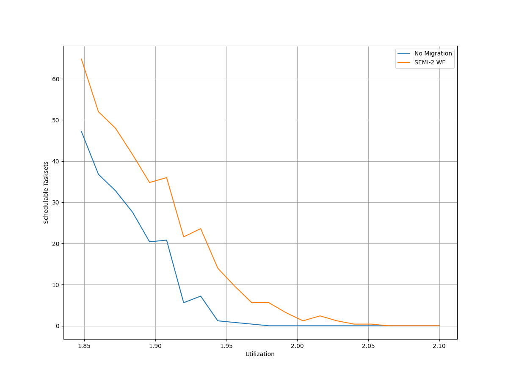
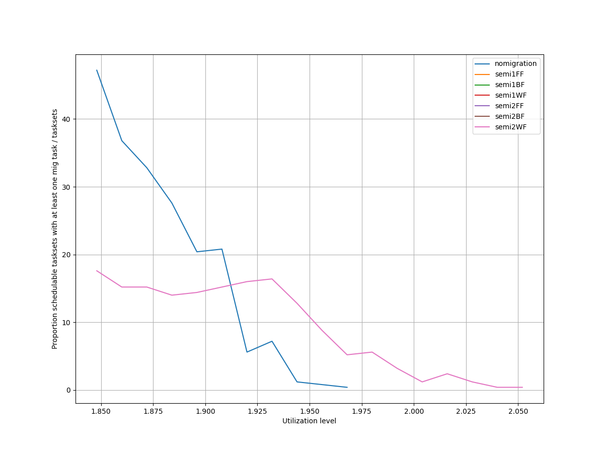
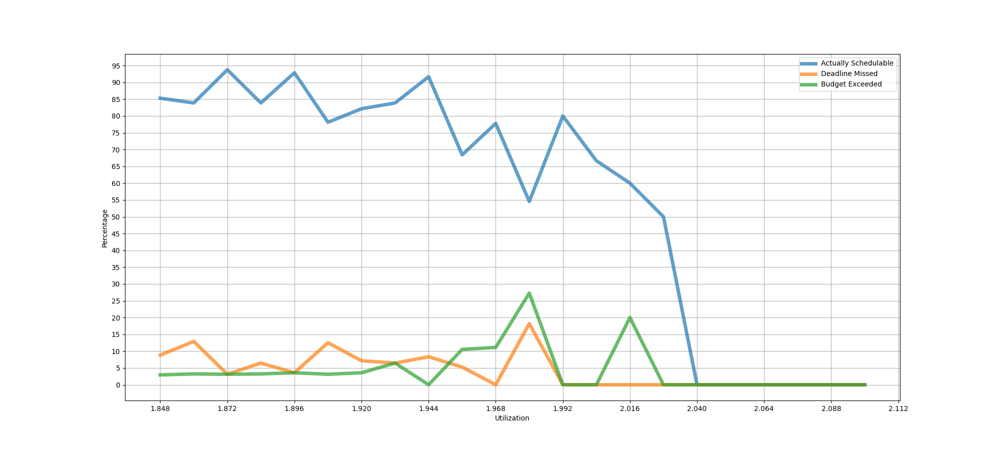
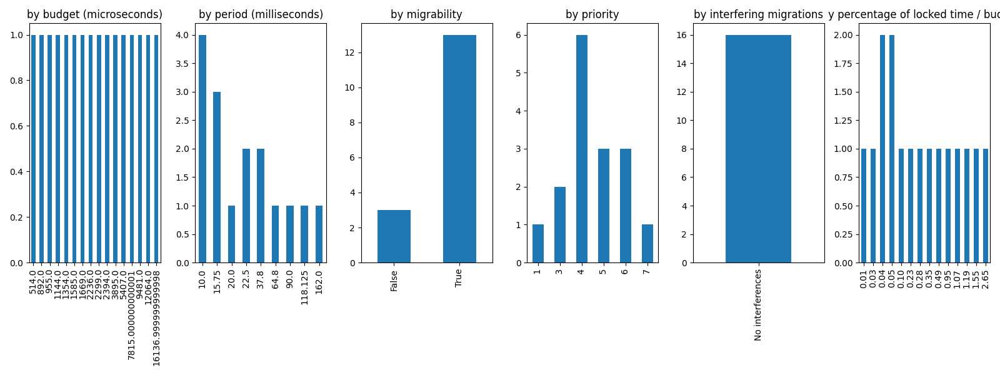
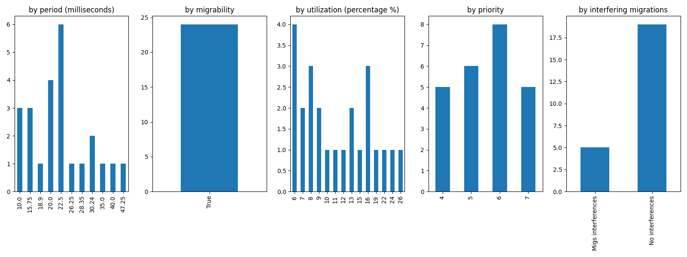
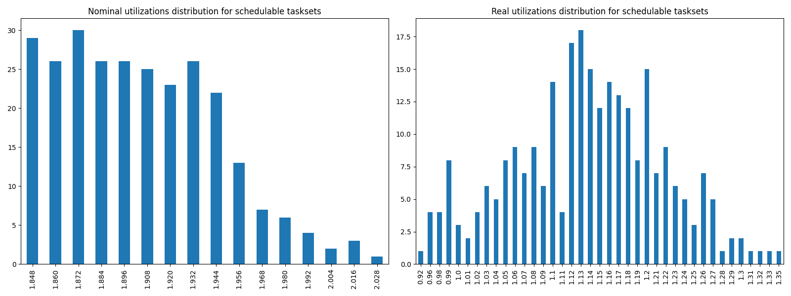
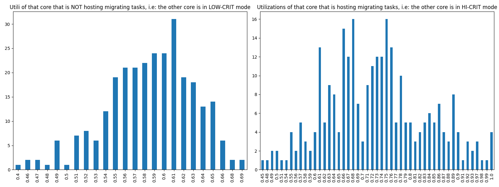

# Report on Experiment 1

## Overall data

   Utilization range = [1.848, 2.1] with step = 0.012

| Schedulable | Not schedulable | Budget Exceeded | Safe Boundary Exceeded |
| ------ | ------ | ------ | ------ |
| 82.52% | 7.36% | 4.91% | 5.21% |

Number of executions: 326

Schedulable executions: 269/326 = 82.51533742331289 %

_Not_ schedulable executions: 24/326 = 7.361963190184049 %

Budget Exceeded executions: 16/326 = 4.9079754601226995 %

Safe Boundary Exceeded executions: 17/326 = 5.214723926380368 %

NS + BE executions: 40/326 = 12.269938650306749 %

### **Simulations**

#### **Weighted schedulability experiment 1 according to simulations.**

#### **Percentage of (schedulable tasksets with at least one migrating tasks / number of schedulable tasksets) of experiment 1 according to simulations.** 

 

### **Real Executions**

#### **Schedulability for each level**

The tasksets with i) at least one migrating task and ii) marked as schedulable by the RTA are executed on a real target, in order to see how many of them are also schedulable in a real-world scenario. The following graph shows, for each "2.1" level (x-axis), the percentage of:

   - Actually schedulable tasksets, i.e. those that have all tasks that meet their deadlines;
   - Deadline Missed tasksets, i.e. those in which (at least) a tasks did not meet (at least) one of its deadlines; 
   - Budget Exceeded tasksets, i.e. those in which a criticality-level budget exceeding is detected (LO-crit budget for LO-crit tasks and HI-crit budget for HI-crit tasks). This type of event makes experiment invalid.

We want to see, thanks to this graphs, how many tasksets remain schedulable in the real-world. The RTA does not take into account overhead time, so we expect that there will be some tasksets that are not actually schedulable.

#### **Tasksets, grouped by differents parameters, with a Budget_Exceeded task.**

With the following graphs, we sum-up the features of the tasks that have occurred in a Criticality-level Budget Exceeded event. Each graph is like a "group-by" SQL operation.
 In the first one, "by budget", we can see, for each _criticality-level budget value_, how many tasks with that criticality-level budget has exceeded it. In the second one, we can see for each _period_ value, how many tasks has exceeded their criticality-level budget.

#### **Tasksets, grouped by differents parameters, with at least one task missing one (or more) of its deadlines.**

With the following graphs, we sum-up the features of the tasks that have missed (at least) one of them deadlines. As the Budget Exceeded graphs, each graph is like a "group-by" SQL operation.

### **Nominal utilizations VS Real utilizations about schedulable tasksets**

| Average real utilizations | Variance real utilizations | Min | Max |
| ------ | ------ | ------ | ------ |
| 1.137 | 0.007 | 0.920 | 1.350 |

### **Utils of the core that will have to accommodate migrating tasks VS Utils of the core when it is actually accomodating them**

These two graphs show the utilizations level of that core $`c_{i}`$ that, sooner or later, will have to accomodate migrating tasks of the other core $`c_{j}`$. The left one, shows the distribution utilizations levels when the core $`c_{i}`$ is **not** accomodating the other core's $`c_{j}`$ migrating tasks, i.e. $`c_{j}`$ is in **LOW-CRIT mode.**
The right one, shows the distribution utilizations levels when the core $`c_{i}`$ **is** accomodating the other core's $`c_{j}`$ migrating tasks, i.e. $`c_{j}`$ is in **HIGH-CRIT mode**.

| Average utilizations **not** hosting migs | Variance utilizations **not** hosting migs | Min | Max |
| ------ | ------ | ------ | ------ |
| 0.586 | 0.002 | 0.400 | 0.690 |

| Average utilizations hosting migs | Variance utilizations hosting migs | Min | Max |
| ------ | ------ | ------ | ------ |
| 0.729 | 0.012 | 0.450 | 1.000 |

## Bad tasksets

Click here to expand this section.

### **Not schedulable tasksets**

Click here to expand this section.

Ovvero quando almeno un task non completa entra almeno una sua deadline.

  1. Taskset **e1_semi2wf_t108**

    Taskset execution params:
	 
    "id": "e1_semi2wf_t108",
    "size": "12",
    "utilization": "1.848",
    "realutilization": 1.09,
    "criticality_factor": "2",
    "hicrit_proportion": "0.5"

   
 
Click here to see the deadlines missed tasks list.

   Time values are expressed as **micro-seconds**.

Task:  3

    
    "id": " 3",
    "basecpu": " 2",
    "priority": " 4",
    "period": 35000.0,
    "C(LO)": 1841.0,
    "C(HI)": 1841.0,
    "criticality": "LOW",
    "migrable": "True",
    "completedruns": " 767",
    "preemptions": " 0",
    "minresponsejitter": " 0.000000000",
    "maxresponsejitter": " 0.000952405",
    "minreleasejitter": " 0.000000000",
    "maxreleasejitter": " 27.775009372",
    "avgresponsejitter": " 0.000849985",
    "deadlinesmissed": " 1",
    "deadlinemissedtargetcore": " 0",
    "deadlinemissedaftermigration": " 0",
    "budgetexceeded": " 0",
    "budgetexceededtargetcore": " 0",
    "budgetexceededaftermigration": " 0",
    "timesmigrated": " 2",
    "timesrestored": " 1",
    "timesonc1": " 1",
    "timesonc2": " 764",
    "lockedtime": " 0.000014006"

   

   
 
Click here to see the CPUs log.

   Idle time is expressed as **seconds**.

   Util values are expressed as **percentage** %.

   CPU: 1

    
    "id": 1,
    "hyperperiod": 113400000,
    "lowtohigh": " 0",
    "hightolow": " 0",
    "idletime": 48296491,
    "util": 57.41050176366843,
    "idletimeduringhostingmig": 130304,
    "utilduringhostingmig": 62.20487057813461

   CPU: 2

    
    "id": 2,
    "hyperperiod": 18900000,
    "lowtohigh": " 18",
    "hightolow": " 18",
    "idletime": 54627687,
    "util": 51.82743650793651,
    "idletimeduringhostingmig": 0,
    "utilduringhostingmig": null

   Real Utilization: 1.0899999999999999
   

   
 
Click here to see the whole tasksets.

   Time values are expressed as **micro-seconds**.

   Task:  6

    
    "id": " 6",
    "basecpu": " 1",
    "priority": " 1",
    "period": 100000.0,
    "C(LO)": 9616.0,
    "C(HI)": 19233.0,
    "criticality": "HIGH",
    "migrable": "False",
    "completedruns": " 1135",
    "preemptions": " 727",
    "minresponsejitter": " 0.000000000",
    "maxresponsejitter": " 0.054189811",
    "minreleasejitter": " 0.000000000",
    "maxreleasejitter": " 114.309213505",
    "avgresponsejitter": " 0.012181003",
    "deadlinesmissed": " 0",
    "deadlinemissedtargetcore": " 0",
    "deadlinemissedaftermigration": " 0",
    "budgetexceeded": " 0",
    "budgetexceededtargetcore": " 0",
    "budgetexceededaftermigration": " 0",
    "timesmigrated": " 0",
    "timesrestored": " 0",
    "timesonc1": " 1861",
    "timesonc2": " 0",
    "lockedtime": " 0.000027459"

   Task:  12

    
    "id": " 12",
    "basecpu": " 1",
    "priority": " 0",
    "period": 540000.0,
    "C(LO)": 36923.0,
    "C(HI)": 73846.0,
    "criticality": "HIGH",
    "migrable": "False",
    "completedruns": " 211",
    "preemptions": " 770",
    "minresponsejitter": " 0.000000000",
    "maxresponsejitter": " 0.091673012",
    "minreleasejitter": " 0.000000000",
    "maxreleasejitter": " 113.860817201",
    "avgresponsejitter": " 0.054052823",
    "deadlinesmissed": " 0",
    "deadlinemissedtargetcore": " 0",
    "deadlinemissedaftermigration": " 0",
    "budgetexceeded": " 0",
    "budgetexceededtargetcore": " 0",
    "budgetexceededaftermigration": " 0",
    "timesmigrated": " 0",
    "timesrestored": " 0",
    "timesonc1": " 980",
    "timesonc2": " 0",
    "lockedtime": " 0.000024619"

   Task:  2

    
    "id": " 2",
    "basecpu": " 1",
    "priority": " 3",
    "period": 26250.0,
    "C(LO)": 1591.0,
    "C(HI)": 3183.0,
    "criticality": "HIGH",
    "migrable": "False",
    "completedruns": " 4321",
    "preemptions": " 289",
    "minresponsejitter": " 0.000000000",
    "maxresponsejitter": " 0.006164363",
    "minreleasejitter": " 0.000000000",
    "maxreleasejitter": " 114.373756471",
    "avgresponsejitter": " 0.001446775",
    "deadlinesmissed": " 0",
    "deadlinemissedtargetcore": " 0",
    "deadlinemissedaftermigration": " 0",
    "budgetexceeded": " 0",
    "budgetexceededtargetcore": " 0",
    "budgetexceededaftermigration": " 0",
    "timesmigrated": " 0",
    "timesrestored": " 0",
    "timesonc1": " 4609",
    "timesonc2": " 0",
    "lockedtime": " 0.000029628"

   Task:  1

    
    "id": " 1",
    "basecpu": " 1",
    "priority": " 4",
    "period": 20000.0,
    "C(LO)": 906.0,
    "C(HI)": 1812.0,
    "criticality": "HIGH",
    "migrable": "False",
    "completedruns": " 5671",
    "preemptions": " 36",
    "minresponsejitter": " 0.000000000",
    "maxresponsejitter": " 0.004893240",
    "minreleasejitter": " 0.000000000",
    "maxreleasejitter": " 114.380006372",
    "avgresponsejitter": " 0.000792264",
    "deadlinesmissed": " 0",
    "deadlinemissedtargetcore": " 0",
    "deadlinemissedaftermigration": " 0",
    "budgetexceeded": " 0",
    "budgetexceededtargetcore": " 0",
    "budgetexceededaftermigration": " 0",
    "timesmigrated": " 0",
    "timesrestored": " 0",
    "timesonc1": " 5706",
    "timesonc2": " 0",
    "lockedtime": " 0.000017910"

   Task:  8

    
    "id": " 8",
    "basecpu": " 1",
    "priority": " 2",
    "period": 129600.0,
    "C(LO)": 32458.0,
    "C(HI)": 32458.0,
    "criticality": "LOW",
    "migrable": "False",
    "completedruns": " 876",
    "preemptions": " 2625",
    "minresponsejitter": " 0.000000000",
    "maxresponsejitter": " 0.046920150",
    "minreleasejitter": " 0.000000000",
    "maxreleasejitter": " 114.270406429",
    "avgresponsejitter": " 0.035199210",
    "deadlinesmissed": " 0",
    "deadlinemissedtargetcore": " 0",
    "deadlinemissedaftermigration": " 0",
    "budgetexceeded": " 0",
    "budgetexceededtargetcore": " 0",
    "budgetexceededaftermigration": " 0",
    "timesmigrated": " 0",
    "timesrestored": " 0",
    "timesonc1": " 3500",
    "timesonc2": " 0",
    "lockedtime": " 0.000112955"

   Task:  7

    
    "id": " 7",
    "basecpu": " 1",
    "priority": " 5",
    "period": 105000.0,
    "C(LO)": 9434.0,
    "C(HI)": 9434.0,
    "criticality": "LOW",
    "migrable": "False",
    "completedruns": " 1081",
    "preemptions": " 96",
    "minresponsejitter": " 0.000000000",
    "maxresponsejitter": " 0.012660171",
    "minreleasejitter": " 0.000000000",
    "maxreleasejitter": " 114.295008270",
    "avgresponsejitter": " 0.008472051",
    "deadlinesmissed": " 0",
    "deadlinemissedtargetcore": " 0",
    "deadlinemissedaftermigration": " 0",
    "budgetexceeded": " 0",
    "budgetexceededtargetcore": " 0",
    "budgetexceededaftermigration": " 0",
    "timesmigrated": " 0",
    "timesrestored": " 0",
    "timesonc1": " 1176",
    "timesonc2": " 0",
    "lockedtime": " 0.000020168"

   Task:  5

    
    "id": " 5",
    "basecpu": " 1",
    "priority": " 6",
    "period": 84375.0,
    "C(LO)": 4506.0,
    "C(HI)": 4506.0,
    "criticality": "LOW",
    "migrable": "False",
    "completedruns": " 1345",
    "preemptions": " 1",
    "minresponsejitter": " 0.000000000",
    "maxresponsejitter": " 0.004114333",
    "minreleasejitter": " 0.000000000",
    "maxreleasejitter": " 114.315632258",
    "avgresponsejitter": " 0.003879027",
    "deadlinesmissed": " 0",
    "deadlinemissedtargetcore": " 0",
    "deadlinemissedaftermigration": " 0",
    "budgetexceeded": " 0",
    "budgetexceededtargetcore": " 0",
    "budgetexceededaftermigration": " 0",
    "timesmigrated": " 0",
    "timesrestored": " 0",
    "timesonc1": " 1345",
    "timesonc2": " 0",
    "lockedtime": " 0.000013342"

   Task:  11

    
    "id": " 11",
    "basecpu": " 2",
    "priority": " 0",
    "period": 151200.0,
    "C(LO)": 34869.0,
    "C(HI)": 69738.0,
    "criticality": "HIGH",
    "migrable": "False",
    "completedruns": " 751",
    "preemptions": " 745",
    "minresponsejitter": " 0.000000000",
    "maxresponsejitter": " 0.105572450",
    "minreleasejitter": " 0.000000000",
    "maxreleasejitter": " 114.248806258",
    "avgresponsejitter": " 0.040776132",
    "deadlinesmissed": " 0",
    "deadlinemissedtargetcore": " 0",
    "deadlinemissedaftermigration": " 0",
    "budgetexceeded": " 6",
    "budgetexceededtargetcore": " 0",
    "budgetexceededaftermigration": " 0",
    "timesmigrated": " 0",
    "timesrestored": " 0",
    "timesonc1": " 0",
    "timesonc2": " 1501",
    "lockedtime": " 0.000085583"

   Task:  4

    
    "id": " 4",
    "basecpu": " 2",
    "priority": " 1",
    "period": 75000.0,
    "C(LO)": 3056.0,
    "C(HI)": 6112.0,
    "criticality": "HIGH",
    "migrable": "False",
    "completedruns": " 1513",
    "preemptions": " 1",
    "minresponsejitter": " 0.000000000",
    "maxresponsejitter": " 0.016866195",
    "minreleasejitter": " 0.000000000",
    "maxreleasejitter": " 114.325006508",
    "avgresponsejitter": " 0.002662886",
    "deadlinesmissed": " 0",
    "deadlinemissedtargetcore": " 0",
    "deadlinemissedaftermigration": " 0",
    "budgetexceeded": " 12",
    "budgetexceededtargetcore": " 0",
    "budgetexceededaftermigration": " 0",
    "timesmigrated": " 0",
    "timesrestored": " 0",
    "timesonc1": " 0",
    "timesonc2": " 1525",
    "lockedtime": " 0.000006186"

   Task:  9

    
    "id": " 9",
    "basecpu": " 2",
    "priority": " 3",
    "period": 131250.0,
    "C(LO)": 28657.0,
    "C(HI)": 28657.0,
    "criticality": "LOW",
    "migrable": "False",
    "completedruns": " 865",
    "preemptions": " 102",
    "minresponsejitter": " 0.000000000",
    "maxresponsejitter": " 0.027134745",
    "minreleasejitter": " 0.000000000",
    "maxreleasejitter": " 114.268756703",
    "avgresponsejitter": " 0.024891802",
    "deadlinesmissed": " 0",
    "deadlinemissedtargetcore": " 0",
    "deadlinemissedaftermigration": " 0",
    "budgetexceeded": " 0",
    "budgetexceededtargetcore": " 0",
    "budgetexceededaftermigration": " 0",
    "timesmigrated": " 0",
    "timesrestored": " 0",
    "timesonc1": " 0",
    "timesonc2": " 966",
    "lockedtime": " 0.000099150"

   Task:  10

    
    "id": " 10",
    "basecpu": " 2",
    "priority": " 2",
    "period": 135000.0,
    "C(LO)": 13442.0,
    "C(HI)": 13442.0,
    "criticality": "LOW",
    "migrable": "False",
    "completedruns": " 841",
    "preemptions": " 135",
    "minresponsejitter": " 0.000000000",
    "maxresponsejitter": " 0.038774949",
    "minreleasejitter": " 0.000000000",
    "maxreleasejitter": " 114.265007030",
    "avgresponsejitter": " 0.013640015",
    "deadlinesmissed": " 0",
    "deadlinemissedtargetcore": " 0",
    "deadlinemissedaftermigration": " 0",
    "budgetexceeded": " 0",
    "budgetexceededtargetcore": " 0",
    "budgetexceededaftermigration": " 0",
    "timesmigrated": " 0",
    "timesrestored": " 0",
    "timesonc1": " 0",
    "timesonc2": " 975",
    "lockedtime": " 0.000021838"

   Task:  3

    
    "id": " 3",
    "basecpu": " 2",
    "priority": " 4",
    "period": 35000.0,
    "C(LO)": 1841.0,
    "C(HI)": 1841.0,
    "criticality": "LOW",
    "migrable": "True",
    "completedruns": " 767",
    "preemptions": " 0",
    "minresponsejitter": " 0.000000000",
    "maxresponsejitter": " 0.000952405",
    "minreleasejitter": " 0.000000000",
    "maxreleasejitter": " 27.775009372",
    "avgresponsejitter": " 0.000849985",
    "deadlinesmissed": " 1",
    "deadlinemissedtargetcore": " 0",
    "deadlinemissedaftermigration": " 0",
    "budgetexceeded": " 0",
    "budgetexceededtargetcore": " 0",
    "budgetexceededaftermigration": " 0",
    "timesmigrated": " 2",
    "timesrestored": " 1",
    "timesonc1": " 1",
    "timesonc2": " 764",
    "lockedtime": " 0.000014006"

   

  2. Taskset **e1_semi2wf_t1189**

    Taskset execution params:
	 
    "id": "e1_semi2wf_t1189",
    "size": "12",
    "utilization": "1.896",
    "realutilization": 1.1,
    "criticality_factor": "2",
    "hicrit_proportion": "0.5"

   
 
Click here to see the deadlines missed tasks list.

   Time values are expressed as **micro-seconds**.

Task:  3

    
    "id": " 3",
    "basecpu": " 2",
    "priority": " 4",
    "period": 47250.0,
    "C(LO)": 2722.0,
    "C(HI)": 2722.0,
    "criticality": "LOW",
    "migrable": "True",
    "completedruns": " 2401",
    "preemptions": " 0",
    "minresponsejitter": " 0.000000000",
    "maxresponsejitter": " 0.001394538",
    "minreleasejitter": " 0.000000000",
    "maxreleasejitter": " 114.352756249",
    "avgresponsejitter": " 0.001245153",
    "deadlinesmissed": " 2",
    "deadlinemissedtargetcore": " 0",
    "deadlinemissedaftermigration": " 0",
    "budgetexceeded": " 0",
    "budgetexceededtargetcore": " 0",
    "budgetexceededaftermigration": " 0",
    "timesmigrated": " 9",
    "timesrestored": " 9",
    "timesonc1": " 10",
    "timesonc2": " 2388",
    "lockedtime": " 0.000041505"

   

   
 
Click here to see the CPUs log.

   Idle time is expressed as **seconds**.

   Util values are expressed as **percentage** %.

   CPU: 1

    
    "id": 1,
    "hyperperiod": 113400000,
    "lowtohigh": " 0",
    "hightolow": " 0",
    "idletime": 50679562,
    "util": 55.309028218694884,
    "idletimeduringhostingmig": 148985,
    "utilduringhostingmig": 69.76955589238501

   CPU: 2

    
    "id": 2,
    "hyperperiod": 37800000,
    "lowtohigh": " 10",
    "hightolow": " 10",
    "idletime": 51529661,
    "util": 54.559381834215166,
    "idletimeduringhostingmig": 0,
    "utilduringhostingmig": null

   Real Utilization: 1.1
   

   
 
Click here to see the whole tasksets.

   Time values are expressed as **micro-seconds**.

   Task:  9

    
    "id": " 9",
    "basecpu": " 1",
    "priority": " 1",
    "period": 140000.0,
    "C(LO)": 18080.0,
    "C(HI)": 36161.0,
    "criticality": "HIGH",
    "migrable": "False",
    "completedruns": " 811",
    "preemptions": " 1305",
    "minresponsejitter": " 0.000000000",
    "maxresponsejitter": " 0.037739057",
    "minreleasejitter": " 0.000000000",
    "maxreleasejitter": " 114.260006775",
    "avgresponsejitter": " 0.023094498",
    "deadlinesmissed": " 0",
    "deadlinemissedtargetcore": " 0",
    "deadlinemissedaftermigration": " 0",
    "budgetexceeded": " 0",
    "budgetexceededtargetcore": " 0",
    "budgetexceededaftermigration": " 0",
    "timesmigrated": " 0",
    "timesrestored": " 0",
    "timesonc1": " 2115",
    "timesonc2": " 0",
    "lockedtime": " 0.000030201"

   Task:  12

    
    "id": " 12",
    "basecpu": " 1",
    "priority": " 0",
    "period": 840000.0,
    "C(LO)": 75572.0,
    "C(HI)": 151144.0,
    "criticality": "HIGH",
    "migrable": "False",
    "completedruns": " 136",
    "preemptions": " 1071",
    "minresponsejitter": " 0.000000000",
    "maxresponsejitter": " 0.133439057",
    "minreleasejitter": " 0.000000000",
    "maxreleasejitter": " 113.586371366",
    "avgresponsejitter": " 0.102122931",
    "deadlinesmissed": " 0",
    "deadlinemissedtargetcore": " 0",
    "deadlinemissedaftermigration": " 0",
    "budgetexceeded": " 0",
    "budgetexceededtargetcore": " 0",
    "budgetexceededaftermigration": " 0",
    "timesmigrated": " 0",
    "timesrestored": " 0",
    "timesonc1": " 1206",
    "timesonc2": " 0",
    "lockedtime": " 0.000028547"

   Task:  2

    
    "id": " 2",
    "basecpu": " 1",
    "priority": " 3",
    "period": 42000.0,
    "C(LO)": 2242.0,
    "C(HI)": 4484.0,
    "criticality": "HIGH",
    "migrable": "False",
    "completedruns": " 2701",
    "preemptions": " 225",
    "minresponsejitter": " 0.000000000",
    "maxresponsejitter": " 0.014696297",
    "minreleasejitter": " 0.000000000",
    "maxreleasejitter": " 114.358006411",
    "avgresponsejitter": " 0.002337438",
    "deadlinesmissed": " 0",
    "deadlinemissedtargetcore": " 0",
    "deadlinemissedaftermigration": " 0",
    "budgetexceeded": " 0",
    "budgetexceededtargetcore": " 0",
    "budgetexceededaftermigration": " 0",
    "timesmigrated": " 0",
    "timesrestored": " 0",
    "timesonc1": " 2925",
    "timesonc2": " 0",
    "lockedtime": " 0.000003174"

   Task:  7

    
    "id": " 7",
    "basecpu": " 1",
    "priority": " 2",
    "period": 78750.0,
    "C(LO)": 3684.0,
    "C(HI)": 7369.0,
    "criticality": "HIGH",
    "migrable": "False",
    "completedruns": " 1441",
    "preemptions": " 256",
    "minresponsejitter": " 0.000000000",
    "maxresponsejitter": " 0.016005703",
    "minreleasejitter": " 0.000000000",
    "maxreleasejitter": " 114.321256390",
    "avgresponsejitter": " 0.003939099",
    "deadlinesmissed": " 0",
    "deadlinemissedtargetcore": " 0",
    "deadlinemissedaftermigration": " 0",
    "budgetexceeded": " 0",
    "budgetexceededtargetcore": " 0",
    "budgetexceededaftermigration": " 0",
    "timesmigrated": " 0",
    "timesrestored": " 0",
    "timesonc1": " 1696",
    "timesonc2": " 0",
    "lockedtime": " 0.000019039"

   Task:  1

    
    "id": " 1",
    "basecpu": " 1",
    "priority": " 6",
    "period": 25200.0,
    "C(LO)": 3704.0,
    "C(HI)": 3704.0,
    "criticality": "LOW",
    "migrable": "False",
    "completedruns": " 4501",
    "preemptions": " 1",
    "minresponsejitter": " 0.000000000",
    "maxresponsejitter": " 0.003387721",
    "minreleasejitter": " 0.000000000",
    "maxreleasejitter": " 114.374806282",
    "avgresponsejitter": " 0.003187850",
    "deadlinesmissed": " 0",
    "deadlinemissedtargetcore": " 0",
    "deadlinemissedaftermigration": " 0",
    "budgetexceeded": " 0",
    "budgetexceededtargetcore": " 0",
    "budgetexceededaftermigration": " 0",
    "timesmigrated": " 0",
    "timesrestored": " 0",
    "timesonc1": " 4501",
    "timesonc2": " 0",
    "lockedtime": " 0.000036465"

   Task:  5

    
    "id": " 5",
    "basecpu": " 1",
    "priority": " 4",
    "period": 64800.0,
    "C(LO)": 7240.0,
    "C(HI)": 7240.0,
    "criticality": "LOW",
    "migrable": "False",
    "completedruns": " 1751",
    "preemptions": " 452",
    "minresponsejitter": " 0.000000000",
    "maxresponsejitter": " 0.013007390",
    "minreleasejitter": " 0.000000000",
    "maxreleasejitter": " 114.335206853",
    "avgresponsejitter": " 0.007103598",
    "deadlinesmissed": " 0",
    "deadlinemissedtargetcore": " 0",
    "deadlinemissedaftermigration": " 0",
    "budgetexceeded": " 0",
    "budgetexceededtargetcore": " 0",
    "budgetexceededaftermigration": " 0",
    "timesmigrated": " 0",
    "timesrestored": " 0",
    "timesonc1": " 2202",
    "timesonc2": " 0",
    "lockedtime": " 0.000021937"

   Task:  4

    
    "id": " 4",
    "basecpu": " 1",
    "priority": " 5",
    "period": 56250.0,
    "C(LO)": 3516.0,
    "C(HI)": 3516.0,
    "criticality": "LOW",
    "migrable": "False",
    "completedruns": " 2017",
    "preemptions": " 226",
    "minresponsejitter": " 0.000000000",
    "maxresponsejitter": " 0.007576012",
    "minreleasejitter": " 0.000000000",
    "maxreleasejitter": " 114.343756565",
    "avgresponsejitter": " 0.003386994",
    "deadlinesmissed": " 0",
    "deadlinemissedtargetcore": " 0",
    "deadlinemissedaftermigration": " 0",
    "budgetexceeded": " 0",
    "budgetexceededtargetcore": " 0",
    "budgetexceededaftermigration": " 0",
    "timesmigrated": " 0",
    "timesrestored": " 0",
    "timesonc1": " 2242",
    "timesonc2": " 0",
    "lockedtime": " 0.000014544"

   Task:  11

    
    "id": " 11",
    "basecpu": " 2",
    "priority": " 0",
    "period": 189000.0,
    "C(LO)": 36621.0,
    "C(HI)": 73242.0,
    "criticality": "HIGH",
    "migrable": "False",
    "completedruns": " 601",
    "preemptions": " 768",
    "minresponsejitter": " 0.000000000",
    "maxresponsejitter": " 0.108389048",
    "minreleasejitter": " 0.000000000",
    "maxreleasejitter": " 114.222760961",
    "avgresponsejitter": " 0.045713574",
    "deadlinesmissed": " 0",
    "deadlinemissedtargetcore": " 0",
    "deadlinemissedaftermigration": " 0",
    "budgetexceeded": " 4",
    "budgetexceededtargetcore": " 0",
    "budgetexceededaftermigration": " 0",
    "timesmigrated": " 0",
    "timesrestored": " 0",
    "timesonc1": " 0",
    "timesonc2": " 1372",
    "lockedtime": " 0.000032225"

   Task:  10

    
    "id": " 10",
    "basecpu": " 2",
    "priority": " 1",
    "period": 175000.0,
    "C(LO)": 15053.0,
    "C(HI)": 30106.0,
    "criticality": "HIGH",
    "migrable": "False",
    "completedruns": " 649",
    "preemptions": " 288",
    "minresponsejitter": " 0.000000000",
    "maxresponsejitter": " 0.053593556",
    "minreleasejitter": " 0.000000000",
    "maxreleasejitter": " 114.225006934",
    "avgresponsejitter": " 0.014321009",
    "deadlinesmissed": " 0",
    "deadlinemissedtargetcore": " 0",
    "deadlinemissedaftermigration": " 0",
    "budgetexceeded": " 6",
    "budgetexceededtargetcore": " 0",
    "budgetexceededaftermigration": " 0",
    "timesmigrated": " 0",
    "timesrestored": " 0",
    "timesonc1": " 0",
    "timesonc2": " 942",
    "lockedtime": " 0.000017676"

   Task:  8

    
    "id": " 8",
    "basecpu": " 2",
    "priority": " 2",
    "period": 100000.0,
    "C(LO)": 25437.0,
    "C(HI)": 25437.0,
    "criticality": "LOW",
    "migrable": "False",
    "completedruns": " 1135",
    "preemptions": " 845",
    "minresponsejitter": " 0.000000000",
    "maxresponsejitter": " 0.028734616",
    "minreleasejitter": " 0.000000000",
    "maxreleasejitter": " 114.300006637",
    "avgresponsejitter": " 0.023668489",
    "deadlinesmissed": " 0",
    "deadlinemissedtargetcore": " 0",
    "deadlinemissedaftermigration": " 0",
    "budgetexceeded": " 0",
    "budgetexceededtargetcore": " 0",
    "budgetexceededaftermigration": " 0",
    "timesmigrated": " 0",
    "timesrestored": " 0",
    "timesonc1": " 0",
    "timesonc2": " 1979",
    "lockedtime": " 0.000053823"

   Task:  6

    
    "id": " 6",
    "basecpu": " 2",
    "priority": " 3",
    "period": 72000.0,
    "C(LO)": 4650.0,
    "C(HI)": 4650.0,
    "criticality": "LOW",
    "migrable": "False",
    "completedruns": " 1576",
    "preemptions": " 74",
    "minresponsejitter": " 0.000000000",
    "maxresponsejitter": " 0.005595168",
    "minreleasejitter": " 0.000000000",
    "maxreleasejitter": " 114.328006249",
    "avgresponsejitter": " 0.004062814",
    "deadlinesmissed": " 0",
    "deadlinemissedtargetcore": " 0",
    "deadlinemissedaftermigration": " 0",
    "budgetexceeded": " 0",
    "budgetexceededtargetcore": " 0",
    "budgetexceededaftermigration": " 0",
    "timesmigrated": " 0",
    "timesrestored": " 0",
    "timesonc1": " 0",
    "timesonc2": " 1649",
    "lockedtime": " 0.000022474"

   Task:  3

    
    "id": " 3",
    "basecpu": " 2",
    "priority": " 4",
    "period": 47250.0,
    "C(LO)": 2722.0,
    "C(HI)": 2722.0,
    "criticality": "LOW",
    "migrable": "True",
    "completedruns": " 2401",
    "preemptions": " 0",
    "minresponsejitter": " 0.000000000",
    "maxresponsejitter": " 0.001394538",
    "minreleasejitter": " 0.000000000",
    "maxreleasejitter": " 114.352756249",
    "avgresponsejitter": " 0.001245153",
    "deadlinesmissed": " 2",
    "deadlinemissedtargetcore": " 0",
    "deadlinemissedaftermigration": " 0",
    "budgetexceeded": " 0",
    "budgetexceededtargetcore": " 0",
    "budgetexceededaftermigration": " 0",
    "timesmigrated": " 9",
    "timesrestored": " 9",
    "timesonc1": " 10",
    "timesonc2": " 2388",
    "lockedtime": " 0.000041505"

   

  3. Taskset **e1_semi2wf_t1256**

    Taskset execution params:
	 
    "id": "e1_semi2wf_t1256",
    "size": "12",
    "utilization": "1.908",
    "realutilization": 1.16,
    "criticality_factor": "2",
    "hicrit_proportion": "0.5"

   
 
Click here to see the deadlines missed tasks list.

   Time values are expressed as **micro-seconds**.

Task:  1

    
    "id": " 1",
    "basecpu": " 2",
    "priority": " 4",
    "period": 30240.0,
    "C(LO)": 4622.0,
    "C(HI)": 4622.0,
    "criticality": "LOW",
    "migrable": "True",
    "completedruns": " 1251",
    "preemptions": " 0",
    "minresponsejitter": " 0.000000000",
    "maxresponsejitter": " 0.002351916",
    "minreleasejitter": " 0.000000000",
    "maxreleasejitter": " 38.769766243",
    "avgresponsejitter": " 0.002106961",
    "deadlinesmissed": " 1",
    "deadlinemissedtargetcore": " 0",
    "deadlinemissedaftermigration": " 0",
    "budgetexceeded": " 0",
    "budgetexceededtargetcore": " 0",
    "budgetexceededaftermigration": " 0",
    "timesmigrated": " 2",
    "timesrestored": " 2",
    "timesonc1": " 2",
    "timesonc2": " 1247",
    "lockedtime": " 0.000003342"

   

   
 
Click here to see the CPUs log.

   Idle time is expressed as **seconds**.

   Util values are expressed as **percentage** %.

   CPU: 1

    
    "id": 1,
    "hyperperiod": 37800000,
    "lowtohigh": " 0",
    "hightolow": " 0",
    "idletime": 15273312,
    "util": 59.5944126984127,
    "idletimeduringhostingmig": 10821,
    "utilduringhostingmig": 86.31102227732165

   CPU: 2

    
    "id": 2,
    "hyperperiod": 4536000,
    "lowtohigh": " 3",
    "hightolow": " 3",
    "idletime": 16552079,
    "util": 56.21143121693122,
    "idletimeduringhostingmig": 0,
    "utilduringhostingmig": null

   Real Utilization: 1.1600000000000001
   

   
 
Click here to see the whole tasksets.

   Time values are expressed as **micro-seconds**.

   Task:  8

    
    "id": " 8",
    "basecpu": " 1",
    "priority": " 2",
    "period": 118125.0,
    "C(LO)": 13809.0,
    "C(HI)": 27618.0,
    "criticality": "HIGH",
    "migrable": "False",
    "completedruns": " 321",
    "preemptions": " 212",
    "minresponsejitter": " 0.000000000",
    "maxresponsejitter": " 0.021737006",
    "minreleasejitter": " 0.000000000",
    "maxreleasejitter": " 38.691431372",
    "avgresponsejitter": " 0.014434838",
    "deadlinesmissed": " 0",
    "deadlinemissedtargetcore": " 0",
    "deadlinemissedaftermigration": " 0",
    "budgetexceeded": " 0",
    "budgetexceededtargetcore": " 0",
    "budgetexceededaftermigration": " 0",
    "timesmigrated": " 0",
    "timesrestored": " 0",
    "timesonc1": " 532",
    "timesonc2": " 0",
    "lockedtime": " 0.000000207"

   Task:  12

    
    "id": " 12",
    "basecpu": " 1",
    "priority": " 0",
    "period": 504000.0,
    "C(LO)": 38922.0,
    "C(HI)": 77845.0,
    "criticality": "HIGH",
    "migrable": "False",
    "completedruns": " 76",
    "preemptions": " 295",
    "minresponsejitter": " 0.000000000",
    "maxresponsejitter": " 0.089163165",
    "minreleasejitter": " 0.000000000",
    "maxreleasejitter": " 38.296358099",
    "avgresponsejitter": " 0.065059895",
    "deadlinesmissed": " 0",
    "deadlinemissedtargetcore": " 0",
    "deadlinemissedaftermigration": " 0",
    "budgetexceeded": " 0",
    "budgetexceededtargetcore": " 0",
    "budgetexceededaftermigration": " 0",
    "timesmigrated": " 0",
    "timesrestored": " 0",
    "timesonc1": " 370",
    "timesonc2": " 0",
    "lockedtime": " 0.000001763"

   Task:  11

    
    "id": " 11",
    "basecpu": " 1",
    "priority": " 1",
    "period": 196875.0,
    "C(LO)": 8045.0,
    "C(HI)": 16091.000000000002,
    "criticality": "HIGH",
    "migrable": "False",
    "completedruns": " 193",
    "preemptions": " 81",
    "minresponsejitter": " 0.000000000",
    "maxresponsejitter": " 0.022376607",
    "minreleasejitter": " 0.000000000",
    "maxreleasejitter": " 38.610698508",
    "avgresponsejitter": " 0.008659751",
    "deadlinesmissed": " 0",
    "deadlinemissedtargetcore": " 0",
    "deadlinemissedaftermigration": " 0",
    "budgetexceeded": " 0",
    "budgetexceededtargetcore": " 0",
    "budgetexceededaftermigration": " 0",
    "timesmigrated": " 0",
    "timesrestored": " 0",
    "timesonc1": " 273",
    "timesonc2": " 0",
    "lockedtime": " 0.000000207"

   Task:  7

    
    "id": " 7",
    "basecpu": " 1",
    "priority": " 3",
    "period": 75000.0,
    "C(LO)": 2107.0,
    "C(HI)": 4214.0,
    "criticality": "HIGH",
    "migrable": "False",
    "completedruns": " 505",
    "preemptions": " 41",
    "minresponsejitter": " 0.000000000",
    "maxresponsejitter": " 0.013743186",
    "minreleasejitter": " 0.000000000",
    "maxreleasejitter": " 38.729475619",
    "avgresponsejitter": " 0.002216775",
    "deadlinesmissed": " 0",
    "deadlinemissedtargetcore": " 0",
    "deadlinemissedaftermigration": " 0",
    "budgetexceeded": " 0",
    "budgetexceededtargetcore": " 0",
    "budgetexceededaftermigration": " 0",
    "timesmigrated": " 0",
    "timesrestored": " 0",
    "timesonc1": " 545",
    "timesonc2": " 0",
    "lockedtime": " 0.000000267"

   Task:  3

    
    "id": " 3",
    "basecpu": " 1",
    "priority": " 5",
    "period": 39375.0,
    "C(LO)": 9164.0,
    "C(HI)": 9164.0,
    "criticality": "LOW",
    "migrable": "False",
    "completedruns": " 961",
    "preemptions": " 120",
    "minresponsejitter": " 0.000000000",
    "maxresponsejitter": " 0.012207670",
    "minreleasejitter": " 0.000000000",
    "maxreleasejitter": " 38.760631553",
    "avgresponsejitter": " 0.008337438",
    "deadlinesmissed": " 0",
    "deadlinemissedtargetcore": " 0",
    "deadlinemissedaftermigration": " 0",
    "budgetexceeded": " 0",
    "budgetexceededtargetcore": " 0",
    "budgetexceededaftermigration": " 0",
    "timesmigrated": " 0",
    "timesrestored": " 0",
    "timesonc1": " 1080",
    "timesonc2": " 0",
    "lockedtime": " 0.000005390"

   Task:  2

    
    "id": " 2",
    "basecpu": " 1",
    "priority": " 6",
    "period": 35000.0,
    "C(LO)": 4284.0,
    "C(HI)": 4284.0,
    "criticality": "LOW",
    "migrable": "False",
    "completedruns": " 1082",
    "preemptions": " 0",
    "minresponsejitter": " 0.000000000",
    "maxresponsejitter": " 0.003908814",
    "minreleasejitter": " 0.000000000",
    "maxreleasejitter": " 38.800013099",
    "avgresponsejitter": " 0.003683132",
    "deadlinesmissed": " 0",
    "deadlinemissedtargetcore": " 0",
    "deadlinemissedaftermigration": " 0",
    "budgetexceeded": " 0",
    "budgetexceededtargetcore": " 0",
    "budgetexceededaftermigration": " 0",
    "timesmigrated": " 0",
    "timesrestored": " 0",
    "timesonc1": " 1081",
    "timesonc2": " 0",
    "lockedtime": " 0.000000270"

   Task:  5

    
    "id": " 5",
    "basecpu": " 1",
    "priority": " 4",
    "period": 60000.0,
    "C(LO)": 4345.0,
    "C(HI)": 4345.0,
    "criticality": "LOW",
    "migrable": "False",
    "completedruns": " 631",
    "preemptions": " 76",
    "minresponsejitter": " 0.000000000",
    "maxresponsejitter": " 0.012184468",
    "minreleasejitter": " 0.000000000",
    "maxreleasejitter": " 38.740006502",
    "avgresponsejitter": " 0.004490018",
    "deadlinesmissed": " 0",
    "deadlinemissedtargetcore": " 0",
    "deadlinemissedaftermigration": " 0",
    "budgetexceeded": " 0",
    "budgetexceededtargetcore": " 0",
    "budgetexceededaftermigration": " 0",
    "timesmigrated": " 0",
    "timesrestored": " 0",
    "timesonc1": " 706",
    "timesonc2": " 0",
    "lockedtime": " 0.000000811"

   Task:  9

    
    "id": " 9",
    "basecpu": " 2",
    "priority": " 1",
    "period": 129600.0,
    "C(LO)": 20900.0,
    "C(HI)": 41800.0,
    "criticality": "HIGH",
    "migrable": "False",
    "completedruns": " 293",
    "preemptions": " 369",
    "minresponsejitter": " 0.000000000",
    "maxresponsejitter": " 0.055990219",
    "minreleasejitter": " 0.000000000",
    "maxreleasejitter": " 38.713606916",
    "avgresponsejitter": " 0.025876889",
    "deadlinesmissed": " 0",
    "deadlinemissedtargetcore": " 0",
    "deadlinemissedaftermigration": " 0",
    "budgetexceeded": " 3",
    "budgetexceededtargetcore": " 0",
    "budgetexceededaftermigration": " 0",
    "timesmigrated": " 0",
    "timesrestored": " 0",
    "timesonc1": " 0",
    "timesonc2": " 664",
    "lockedtime": " 0.000003652"

   Task:  10

    
    "id": " 10",
    "basecpu": " 2",
    "priority": " 0",
    "period": 141750.0,
    "C(LO)": 10479.0,
    "C(HI)": 20959.0,
    "criticality": "HIGH",
    "migrable": "False",
    "completedruns": " 268",
    "preemptions": " 162",
    "minresponsejitter": " 0.000000000",
    "maxresponsejitter": " 0.042148862",
    "minreleasejitter": " 0.000000000",
    "maxreleasejitter": " 38.712994339",
    "avgresponsejitter": " 0.015336919",
    "deadlinesmissed": " 0",
    "deadlinemissedtargetcore": " 0",
    "deadlinemissedaftermigration": " 0",
    "budgetexceeded": " 0",
    "budgetexceededtargetcore": " 0",
    "budgetexceededaftermigration": " 0",
    "timesmigrated": " 0",
    "timesrestored": " 0",
    "timesonc1": " 0",
    "timesonc2": " 429",
    "lockedtime": " 0.000000243"

   Task:  4

    
    "id": " 4",
    "basecpu": " 2",
    "priority": " 3",
    "period": 45360.0,
    "C(LO)": 10846.0,
    "C(HI)": 10846.0,
    "criticality": "LOW",
    "migrable": "False",
    "completedruns": " 835",
    "preemptions": " 0",
    "minresponsejitter": " 0.000000000",
    "maxresponsejitter": " 0.009928408",
    "minreleasejitter": " 0.000000000",
    "maxreleasejitter": " 38.784886096",
    "avgresponsejitter": " 0.009370306",
    "deadlinesmissed": " 0",
    "deadlinemissedtargetcore": " 0",
    "deadlinemissedaftermigration": " 0",
    "budgetexceeded": " 0",
    "budgetexceededtargetcore": " 0",
    "budgetexceededaftermigration": " 0",
    "timesmigrated": " 0",
    "timesrestored": " 0",
    "timesonc1": " 0",
    "timesonc2": " 834",
    "lockedtime": " 0.000004441"

   Task:  1

    
    "id": " 1",
    "basecpu": " 2",
    "priority": " 4",
    "period": 30240.0,
    "C(LO)": 4622.0,
    "C(HI)": 4622.0,
    "criticality": "LOW",
    "migrable": "True",
    "completedruns": " 1251",
    "preemptions": " 0",
    "minresponsejitter": " 0.000000000",
    "maxresponsejitter": " 0.002351916",
    "minreleasejitter": " 0.000000000",
    "maxreleasejitter": " 38.769766243",
    "avgresponsejitter": " 0.002106961",
    "deadlinesmissed": " 1",
    "deadlinemissedtargetcore": " 0",
    "deadlinemissedaftermigration": " 0",
    "budgetexceeded": " 0",
    "budgetexceededtargetcore": " 0",
    "budgetexceededaftermigration": " 0",
    "timesmigrated": " 2",
    "timesrestored": " 2",
    "timesonc1": " 2",
    "timesonc2": " 1247",
    "lockedtime": " 0.000003342"

   Task:  6

    
    "id": " 6",
    "basecpu": " 2",
    "priority": " 2",
    "period": 70875.0,
    "C(LO)": 6508.0,
    "C(HI)": 6508.0,
    "criticality": "LOW",
    "migrable": "False",
    "completedruns": " 535",
    "preemptions": " 140",
    "minresponsejitter": " 0.000000000",
    "maxresponsejitter": " 0.017939255",
    "minreleasejitter": " 0.000000000",
    "maxreleasejitter": " 38.776381240",
    "avgresponsejitter": " 0.006922808",
    "deadlinesmissed": " 0",
    "deadlinemissedtargetcore": " 0",
    "deadlinemissedaftermigration": " 0",
    "budgetexceeded": " 0",
    "budgetexceededtargetcore": " 0",
    "budgetexceededaftermigration": " 0",
    "timesmigrated": " 0",
    "timesrestored": " 0",
    "timesonc1": " 0",
    "timesonc2": " 674",
    "lockedtime": " 0.000002523"

   

  4. Taskset **e1_semi2wf_t1383**

    Taskset execution params:
	 
    "id": "e1_semi2wf_t1383",
    "size": "12",
    "utilization": "1.908",
    "realutilization": 1.18,
    "criticality_factor": "2",
    "hicrit_proportion": "0.5"

   
 
Click here to see the deadlines missed tasks list.

   Time values are expressed as **micro-seconds**.

Task:  2

    
    "id": " 2",
    "basecpu": " 1",
    "priority": " 7",
    "period": 20000.0,
    "C(LO)": 1737.0,
    "C(HI)": 1737.0,
    "criticality": "LOW",
    "migrable": "True",
    "completedruns": " 2632",
    "preemptions": " 0",
    "minresponsejitter": " 0.000000000",
    "maxresponsejitter": " 0.000897255",
    "minreleasejitter": " 0.000000000",
    "maxreleasejitter": " 53.600007715",
    "avgresponsejitter": " 0.000798709",
    "deadlinesmissed": " 1",
    "deadlinemissedtargetcore": " 0",
    "deadlinemissedaftermigration": " 0",
    "budgetexceeded": " 0",
    "budgetexceededtargetcore": " 0",
    "budgetexceededaftermigration": " 0",
    "timesmigrated": " 11",
    "timesrestored": " 11",
    "timesonc1": " 2616",
    "timesonc2": " 14",
    "lockedtime": " 0.000112763"

   

   
 
Click here to see the CPUs log.

   Idle time is expressed as **seconds**.

   Util values are expressed as **percentage** %.

   CPU: 1

    
    "id": 1,
    "hyperperiod": 37800000,
    "lowtohigh": " 27",
    "hightolow": " 27",
    "idletime": 23962702,
    "util": 57.73773897707231,
    "idletimeduringhostingmig": 0,
    "utilduringhostingmig": null

   CPU: 2

    
    "id": 2,
    "hyperperiod": 56700000,
    "lowtohigh": " 0",
    "hightolow": " 0",
    "idletime": 22752576,
    "util": 59.872,
    "idletimeduringhostingmig": 54891,
    "utilduringhostingmig": 83.53614094654218

   Real Utilization: 1.18
   

   
 
Click here to see the whole tasksets.

   Time values are expressed as **micro-seconds**.

   Task:  3

    
    "id": " 3",
    "basecpu": " 1",
    "priority": " 3",
    "period": 25200.0,
    "C(LO)": 4130.0,
    "C(HI)": 8261.0,
    "criticality": "HIGH",
    "migrable": "False",
    "completedruns": " 2251",
    "preemptions": " 484",
    "minresponsejitter": " 0.000000000",
    "maxresponsejitter": " 0.016469889",
    "minreleasejitter": " 0.000000000",
    "maxreleasejitter": " 57.674806652",
    "avgresponsejitter": " 0.004395381",
    "deadlinesmissed": " 0",
    "deadlinemissedtargetcore": " 0",
    "deadlinemissedaftermigration": " 0",
    "budgetexceeded": " 19",
    "budgetexceededtargetcore": " 0",
    "budgetexceededaftermigration": " 0",
    "timesmigrated": " 0",
    "timesrestored": " 0",
    "timesonc1": " 2753",
    "timesonc2": " 0",
    "lockedtime": " 0.000056640"

   Task:  11

    
    "id": " 11",
    "basecpu": " 1",
    "priority": " 0",
    "period": 189000.0,
    "C(LO)": 11724.0,
    "C(HI)": 23449.0,
    "criticality": "HIGH",
    "migrable": "False",
    "completedruns": " 301",
    "preemptions": " 465",
    "minresponsejitter": " 0.000000000",
    "maxresponsejitter": " 0.052099120",
    "minreleasejitter": " 0.000000000",
    "maxreleasejitter": " 57.519423712",
    "avgresponsejitter": " 0.018594607",
    "deadlinesmissed": " 0",
    "deadlinemissedtargetcore": " 0",
    "deadlinemissedaftermigration": " 0",
    "budgetexceeded": " 6",
    "budgetexceededtargetcore": " 0",
    "budgetexceededaftermigration": " 0",
    "timesmigrated": " 0",
    "timesrestored": " 0",
    "timesonc1": " 771",
    "timesonc2": " 0",
    "lockedtime": " 0.000044706"

   Task:  10

    
    "id": " 10",
    "basecpu": " 1",
    "priority": " 1",
    "period": 180000.0,
    "C(LO)": 5075.0,
    "C(HI)": 10150.0,
    "criticality": "HIGH",
    "migrable": "False",
    "completedruns": " 316",
    "preemptions": " 152",
    "minresponsejitter": " 0.000000000",
    "maxresponsejitter": " 0.026500063",
    "minreleasejitter": " 0.000000000",
    "maxreleasejitter": " 57.528650135",
    "avgresponsejitter": " 0.006652898",
    "deadlinesmissed": " 0",
    "deadlinemissedtargetcore": " 0",
    "deadlinemissedaftermigration": " 0",
    "budgetexceeded": " 2",
    "budgetexceededtargetcore": " 0",
    "budgetexceededaftermigration": " 0",
    "timesmigrated": " 0",
    "timesrestored": " 0",
    "timesonc1": " 469",
    "timesonc2": " 0",
    "lockedtime": " 0.000011396"

   Task:  5

    
    "id": " 5",
    "basecpu": " 1",
    "priority": " 6",
    "period": 40000.0,
    "C(LO)": 5871.0,
    "C(HI)": 5871.0,
    "criticality": "LOW",
    "migrable": "False",
    "completedruns": " 1419",
    "preemptions": " 0",
    "minresponsejitter": " 0.000000000",
    "maxresponsejitter": " 0.005350631",
    "minreleasejitter": " 0.000000000",
    "maxreleasejitter": " 57.680006459",
    "avgresponsejitter": " 0.005048670",
    "deadlinesmissed": " 0",
    "deadlinemissedtargetcore": " 0",
    "deadlinemissedaftermigration": " 0",
    "budgetexceeded": " 0",
    "budgetexceededtargetcore": " 0",
    "budgetexceededaftermigration": " 0",
    "timesmigrated": " 0",
    "timesrestored": " 0",
    "timesonc1": " 1418",
    "timesonc2": " 0",
    "lockedtime": " 0.000010393"

   Task:  8

    
    "id": " 8",
    "basecpu": " 1",
    "priority": " 2",
    "period": 94500.0,
    "C(LO)": 9644.0,
    "C(HI)": 9644.0,
    "criticality": "LOW",
    "migrable": "False",
    "completedruns": " 601",
    "preemptions": " 538",
    "minresponsejitter": " 0.000000000",
    "maxresponsejitter": " 0.025748291",
    "minreleasejitter": " 0.000000000",
    "maxreleasejitter": " 57.610703486",
    "avgresponsejitter": " 0.012169354",
    "deadlinesmissed": " 0",
    "deadlinemissedtargetcore": " 0",
    "deadlinemissedaftermigration": " 0",
    "budgetexceeded": " 0",
    "budgetexceededtargetcore": " 0",
    "budgetexceededaftermigration": " 0",
    "timesmigrated": " 0",
    "timesrestored": " 0",
    "timesonc1": " 1138",
    "timesonc2": " 0",
    "lockedtime": " 0.000058126"

   Task:  2

    
    "id": " 2",
    "basecpu": " 1",
    "priority": " 7",
    "period": 20000.0,
    "C(LO)": 1737.0,
    "C(HI)": 1737.0,
    "criticality": "LOW",
    "migrable": "True",
    "completedruns": " 2632",
    "preemptions": " 0",
    "minresponsejitter": " 0.000000000",
    "maxresponsejitter": " 0.000897255",
    "minreleasejitter": " 0.000000000",
    "maxreleasejitter": " 53.600007715",
    "avgresponsejitter": " 0.000798709",
    "deadlinesmissed": " 1",
    "deadlinemissedtargetcore": " 0",
    "deadlinemissedaftermigration": " 0",
    "budgetexceeded": " 0",
    "budgetexceededtargetcore": " 0",
    "budgetexceededaftermigration": " 0",
    "timesmigrated": " 11",
    "timesrestored": " 11",
    "timesonc1": " 2616",
    "timesonc2": " 14",
    "lockedtime": " 0.000112763"

   Task:  6

    
    "id": " 6",
    "basecpu": " 1",
    "priority": " 5",
    "period": 50000.0,
    "C(LO)": 3073.0,
    "C(HI)": 3073.0,
    "criticality": "LOW",
    "migrable": "False",
    "completedruns": " 1135",
    "preemptions": " 1",
    "minresponsejitter": " 0.000000000",
    "maxresponsejitter": " 0.002811886",
    "minreleasejitter": " 0.000000000",
    "maxreleasejitter": " 57.650007766",
    "avgresponsejitter": " 0.002644931",
    "deadlinesmissed": " 0",
    "deadlinemissedtargetcore": " 0",
    "deadlinemissedaftermigration": " 0",
    "budgetexceeded": " 0",
    "budgetexceededtargetcore": " 0",
    "budgetexceededaftermigration": " 0",
    "timesmigrated": " 0",
    "timesrestored": " 0",
    "timesonc1": " 1135",
    "timesonc2": " 0",
    "lockedtime": " 0.000025294"

   Task:  7

    
    "id": " 7",
    "basecpu": " 1",
    "priority": " 4",
    "period": 84000.0,
    "C(LO)": 4920.0,
    "C(HI)": 4920.0,
    "criticality": "LOW",
    "migrable": "False",
    "completedruns": " 676",
    "preemptions": " 172",
    "minresponsejitter": " 0.000000000",
    "maxresponsejitter": " 0.013064090",
    "minreleasejitter": " 0.000000000",
    "maxreleasejitter": " 57.616007147",
    "avgresponsejitter": " 0.005143538",
    "deadlinesmissed": " 0",
    "deadlinemissedtargetcore": " 0",
    "deadlinemissedaftermigration": " 0",
    "budgetexceeded": " 0",
    "budgetexceededtargetcore": " 0",
    "budgetexceededaftermigration": " 0",
    "timesmigrated": " 0",
    "timesrestored": " 0",
    "timesonc1": " 847",
    "timesonc2": " 0",
    "lockedtime": " 0.000021736"

   Task:  12

    
    "id": " 12",
    "basecpu": " 2",
    "priority": " 0",
    "period": 787500.0,
    "C(LO)": 149195.0,
    "C(HI)": 298390.0,
    "criticality": "HIGH",
    "migrable": "False",
    "completedruns": " 73",
    "preemptions": " 1311",
    "minresponsejitter": " 0.000000000",
    "maxresponsejitter": " 0.267679351",
    "minreleasejitter": " 0.000000000",
    "maxreleasejitter": " 56.930489706",
    "avgresponsejitter": " 0.225023553",
    "deadlinesmissed": " 0",
    "deadlinemissedtargetcore": " 0",
    "deadlinemissedaftermigration": " 0",
    "budgetexceeded": " 0",
    "budgetexceededtargetcore": " 0",
    "budgetexceededaftermigration": " 0",
    "timesmigrated": " 0",
    "timesrestored": " 0",
    "timesonc1": " 0",
    "timesonc2": " 1383",
    "lockedtime": " 0.000120357"

   Task:  1

    
    "id": " 1",
    "basecpu": " 2",
    "priority": " 3",
    "period": 10000.0,
    "C(LO)": 324.0,
    "C(HI)": 649.0,
    "criticality": "HIGH",
    "migrable": "False",
    "completedruns": " 5671",
    "preemptions": " 0",
    "minresponsejitter": " 0.000000000",
    "maxresponsejitter": " 0.000298799",
    "minreleasejitter": " 0.000000000",
    "maxreleasejitter": " 57.690006411",
    "avgresponsejitter": " 0.000279931",
    "deadlinesmissed": " 0",
    "deadlinemissedtargetcore": " 0",
    "deadlinemissedaftermigration": " 0",
    "budgetexceeded": " 0",
    "budgetexceededtargetcore": " 0",
    "budgetexceededaftermigration": " 0",
    "timesmigrated": " 0",
    "timesrestored": " 0",
    "timesonc1": " 0",
    "timesonc2": " 5670",
    "lockedtime": " 0.000189414"

   Task:  4

    
    "id": " 4",
    "basecpu": " 2",
    "priority": " 2",
    "period": 39375.0,
    "C(LO)": 1217.0,
    "C(HI)": 2435.0,
    "criticality": "HIGH",
    "migrable": "False",
    "completedruns": " 1441",
    "preemptions": " 90",
    "minresponsejitter": " 0.000000000",
    "maxresponsejitter": " 0.001414658",
    "minreleasejitter": " 0.000000000",
    "maxreleasejitter": " 57.660631730",
    "avgresponsejitter": " 0.001068607",
    "deadlinesmissed": " 0",
    "deadlinemissedtargetcore": " 0",
    "deadlinemissedaftermigration": " 0",
    "budgetexceeded": " 0",
    "budgetexceededtargetcore": " 0",
    "budgetexceededaftermigration": " 0",
    "timesmigrated": " 0",
    "timesrestored": " 0",
    "timesonc1": " 0",
    "timesonc2": " 1530",
    "lockedtime": " 0.000008435"

   Task:  9

    
    "id": " 9",
    "basecpu": " 2",
    "priority": " 1",
    "period": 101250.0,
    "C(LO)": 44373.0,
    "C(HI)": 44373.0,
    "criticality": "LOW",
    "migrable": "False",
    "completedruns": " 561",
    "preemptions": " 2715",
    "minresponsejitter": " 0.000000000",
    "maxresponsejitter": " 0.043446096",
    "minreleasejitter": " 0.000000000",
    "maxreleasejitter": " 57.598756048",
    "avgresponsejitter": " 0.040530577",
    "deadlinesmissed": " 0",
    "deadlinemissedtargetcore": " 0",
    "deadlinemissedaftermigration": " 0",
    "budgetexceeded": " 0",
    "budgetexceededtargetcore": " 0",
    "budgetexceededaftermigration": " 0",
    "timesmigrated": " 0",
    "timesrestored": " 0",
    "timesonc1": " 0",
    "timesonc2": " 3275",
    "lockedtime": " 0.000254940"

   

  5. Taskset **e1_semi2wf_t1436**

    Taskset execution params:
	 
    "id": "e1_semi2wf_t1436",
    "size": "12",
    "utilization": "1.908",
    "realutilization": 1.09,
    "criticality_factor": "2",
    "hicrit_proportion": "0.5"

   
 
Click here to see the deadlines missed tasks list.

   Time values are expressed as **micro-seconds**.

Task:  1

    
    "id": " 1",
    "basecpu": " 2",
    "priority": " 6",
    "period": 22500.0,
    "C(LO)": 2113.0,
    "C(HI)": 2113.0,
    "criticality": "LOW",
    "migrable": "True",
    "completedruns": " 1137",
    "preemptions": " 0",
    "minresponsejitter": " 0.000000000",
    "maxresponsejitter": " 0.001079568",
    "minreleasejitter": " 0.000000000",
    "maxreleasejitter": " 26.537506868",
    "avgresponsejitter": " 0.000968489",
    "deadlinesmissed": " 2",
    "deadlinemissedtargetcore": " 1",
    "deadlinemissedaftermigration": " 0",
    "budgetexceeded": " 0",
    "budgetexceededtargetcore": " 0",
    "budgetexceededaftermigration": " 0",
    "timesmigrated": " 4",
    "timesrestored": " 3",
    "timesonc1": " 19",
    "timesonc2": " 1115",
    "lockedtime": " 0.000021105"

   

   
 
Click here to see the CPUs log.

   Idle time is expressed as **seconds**.

   Util values are expressed as **percentage** %.

   CPU: 1

    
    "id": 1,
    "hyperperiod": 1890000,
    "lowtohigh": " 20",
    "hightolow": " 20",
    "idletime": 28064585,
    "util": 50.50337742504409,
    "idletimeduringhostingmig": 533622,
    "utilduringhostingmig": 51.59623344239455

   CPU: 2

    
    "id": 2,
    "hyperperiod": 56700000,
    "lowtohigh": " 16",
    "hightolow": " 16",
    "idletime": 23913073,
    "util": 57.82526807760141,
    "idletimeduringhostingmig": 42063,
    "utilduringhostingmig": 80.62809140899168

   Real Utilization: 1.0899999999999999
   

   
 
Click here to see the whole tasksets.

   Time values are expressed as **micro-seconds**.

   Task:  9

    
    "id": " 9",
    "basecpu": " 1",
    "priority": " 0",
    "period": 157500.0,
    "C(LO)": 23482.0,
    "C(HI)": 46964.0,
    "criticality": "HIGH",
    "migrable": "False",
    "completedruns": " 361",
    "preemptions": " 176",
    "minresponsejitter": " 0.000000000",
    "maxresponsejitter": " 0.073468745",
    "minreleasejitter": " 0.000000000",
    "maxreleasejitter": " 57.542506514",
    "avgresponsejitter": " 0.022052204",
    "deadlinesmissed": " 0",
    "deadlinemissedtargetcore": " 0",
    "deadlinemissedaftermigration": " 0",
    "budgetexceeded": " 4",
    "budgetexceededtargetcore": " 0",
    "budgetexceededaftermigration": " 0",
    "timesmigrated": " 0",
    "timesrestored": " 0",
    "timesonc1": " 540",
    "timesonc2": " 0",
    "lockedtime": " 0.000011784"

   Task:  5

    
    "id": " 5",
    "basecpu": " 1",
    "priority": " 1",
    "period": 70000.0,
    "C(LO)": 4667.0,
    "C(HI)": 9335.0,
    "criticality": "HIGH",
    "migrable": "False",
    "completedruns": " 811",
    "preemptions": " 52",
    "minresponsejitter": " 0.000000000",
    "maxresponsejitter": " 0.034407916",
    "minreleasejitter": " 0.000000000",
    "maxreleasejitter": " 57.630550913",
    "avgresponsejitter": " 0.005050228",
    "deadlinesmissed": " 0",
    "deadlinemissedtargetcore": " 0",
    "deadlinemissedaftermigration": " 0",
    "budgetexceeded": " 5",
    "budgetexceededtargetcore": " 0",
    "budgetexceededaftermigration": " 0",
    "timesmigrated": " 0",
    "timesrestored": " 0",
    "timesonc1": " 867",
    "timesonc2": " 0",
    "lockedtime": " 0.000007195"

   Task:  4

    
    "id": " 4",
    "basecpu": " 1",
    "priority": " 2",
    "period": 63000.0,
    "C(LO)": 2340.0,
    "C(HI)": 4681.0,
    "criticality": "HIGH",
    "migrable": "False",
    "completedruns": " 901",
    "preemptions": " 7",
    "minresponsejitter": " 0.000000000",
    "maxresponsejitter": " 0.004270901",
    "minreleasejitter": " 0.000000000",
    "maxreleasejitter": " 57.637006517",
    "avgresponsejitter": " 0.002052751",
    "deadlinesmissed": " 0",
    "deadlinemissedtargetcore": " 0",
    "deadlinemissedaftermigration": " 0",
    "budgetexceeded": " 11",
    "budgetexceededtargetcore": " 0",
    "budgetexceededaftermigration": " 0",
    "timesmigrated": " 0",
    "timesrestored": " 0",
    "timesonc1": " 918",
    "timesonc2": " 0",
    "lockedtime": " 0.000007267"

   Task:  7

    
    "id": " 7",
    "basecpu": " 1",
    "priority": " 3",
    "period": 94500.0,
    "C(LO)": 30280.0,
    "C(HI)": 30280.0,
    "criticality": "LOW",
    "migrable": "False",
    "completedruns": " 601",
    "preemptions": " 68",
    "minresponsejitter": " 0.000000000",
    "maxresponsejitter": " 0.029501444",
    "minreleasejitter": " 0.000000000",
    "maxreleasejitter": " 57.605506447",
    "avgresponsejitter": " 0.026258111",
    "deadlinesmissed": " 0",
    "deadlinemissedtargetcore": " 0",
    "deadlinemissedaftermigration": " 0",
    "budgetexceeded": " 0",
    "budgetexceededtargetcore": " 0",
    "budgetexceededaftermigration": " 0",
    "timesmigrated": " 0",
    "timesrestored": " 0",
    "timesonc1": " 668",
    "timesonc2": " 0",
    "lockedtime": " 0.000029156"

   Task:  2

    
    "id": " 2",
    "basecpu": " 1",
    "priority": " 4",
    "period": 45000.0,
    "C(LO)": 3817.0,
    "C(HI)": 3817.0,
    "criticality": "LOW",
    "migrable": "True",
    "completedruns": " 262",
    "preemptions": " 0",
    "minresponsejitter": " 0.000000000",
    "maxresponsejitter": " 0.001936123",
    "minreleasejitter": " 0.000000000",
    "maxreleasejitter": " 12.701053447",
    "avgresponsejitter": " 0.001734171",
    "deadlinesmissed": " 0",
    "deadlinemissedtargetcore": " 0",
    "deadlinemissedaftermigration": " 0",
    "budgetexceeded": " 0",
    "budgetexceededtargetcore": " 0",
    "budgetexceededaftermigration": " 0",
    "timesmigrated": " 2",
    "timesrestored": " 2",
    "timesonc1": " 259",
    "timesonc2": " 2",
    "lockedtime": " 0.000010907"

   Task:  12

    
    "id": " 12",
    "basecpu": " 2",
    "priority": " 0",
    "period": 945000.0,
    "C(LO)": 180470.0,
    "C(HI)": 360941.0,
    "criticality": "HIGH",
    "migrable": "False",
    "completedruns": " 61",
    "preemptions": " 695",
    "minresponsejitter": " 0.000000000",
    "maxresponsejitter": " 0.523928147",
    "minreleasejitter": " 0.000000000",
    "maxreleasejitter": " 56.755006913",
    "avgresponsejitter": " 0.256159210",
    "deadlinesmissed": " 0",
    "deadlinemissedtargetcore": " 0",
    "deadlinemissedaftermigration": " 0",
    "budgetexceeded": " 1",
    "budgetexceededtargetcore": " 0",
    "budgetexceededaftermigration": " 0",
    "timesmigrated": " 0",
    "timesrestored": " 0",
    "timesonc1": " 0",
    "timesonc2": " 756",
    "lockedtime": " 0.000031709"

   Task:  3

    
    "id": " 3",
    "basecpu": " 2",
    "priority": " 3",
    "period": 45360.0,
    "C(LO)": 1718.0,
    "C(HI)": 3437.0,
    "criticality": "HIGH",
    "migrable": "False",
    "completedruns": " 1251",
    "preemptions": " 43",
    "minresponsejitter": " 0.000000000",
    "maxresponsejitter": " 0.015412174",
    "minreleasejitter": " 0.000000000",
    "maxreleasejitter": " 57.654646195",
    "avgresponsejitter": " 0.001549063",
    "deadlinesmissed": " 0",
    "deadlinemissedtargetcore": " 0",
    "deadlinemissedaftermigration": " 0",
    "budgetexceeded": " 12",
    "budgetexceededtargetcore": " 0",
    "budgetexceededaftermigration": " 0",
    "timesmigrated": " 0",
    "timesrestored": " 0",
    "timesonc1": " 0",
    "timesonc2": " 1305",
    "lockedtime": " 0.000001964"

   Task:  11

    
    "id": " 11",
    "basecpu": " 2",
    "priority": " 1",
    "period": 405000.0,
    "C(LO)": 12748.0,
    "C(HI)": 25497.0,
    "criticality": "HIGH",
    "migrable": "False",
    "completedruns": " 141",
    "preemptions": " 67",
    "minresponsejitter": " 0.000000000",
    "maxresponsejitter": " 0.054023802",
    "minreleasejitter": " 0.000000000",
    "maxreleasejitter": " 57.295006069",
    "avgresponsejitter": " 0.013958952",
    "deadlinesmissed": " 0",
    "deadlinemissedtargetcore": " 0",
    "deadlinemissedaftermigration": " 0",
    "budgetexceeded": " 3",
    "budgetexceededtargetcore": " 0",
    "budgetexceededaftermigration": " 0",
    "timesmigrated": " 0",
    "timesrestored": " 0",
    "timesonc1": " 0",
    "timesonc2": " 210",
    "lockedtime": " 0.000001610"

   Task:  6

    
    "id": " 6",
    "basecpu": " 2",
    "priority": " 5",
    "period": 84000.0,
    "C(LO)": 14625.0,
    "C(HI)": 14625.0,
    "criticality": "LOW",
    "migrable": "False",
    "completedruns": " 676",
    "preemptions": " 160",
    "minresponsejitter": " 0.000000000",
    "maxresponsejitter": " 0.014435288",
    "minreleasejitter": " 0.000000000",
    "maxreleasejitter": " 57.616006036",
    "avgresponsejitter": " 0.012862508",
    "deadlinesmissed": " 0",
    "deadlinemissedtargetcore": " 0",
    "deadlinemissedaftermigration": " 0",
    "budgetexceeded": " 0",
    "budgetexceededtargetcore": " 0",
    "budgetexceededaftermigration": " 0",
    "timesmigrated": " 0",
    "timesrestored": " 0",
    "timesonc1": " 0",
    "timesonc2": " 835",
    "lockedtime": " 0.000028997"

   Task:  10

    
    "id": " 10",
    "basecpu": " 2",
    "priority": " 2",
    "period": 168750.0,
    "C(LO)": 19399.0,
    "C(HI)": 19399.0,
    "criticality": "LOW",
    "migrable": "False",
    "completedruns": " 337",
    "preemptions": " 294",
    "minresponsejitter": " 0.000000000",
    "maxresponsejitter": " 0.041849892",
    "minreleasejitter": " 0.000000000",
    "maxreleasejitter": " 57.531255994",
    "avgresponsejitter": " 0.022092658",
    "deadlinesmissed": " 0",
    "deadlinemissedtargetcore": " 0",
    "deadlinemissedaftermigration": " 0",
    "budgetexceeded": " 0",
    "budgetexceededtargetcore": " 0",
    "budgetexceededaftermigration": " 0",
    "timesmigrated": " 0",
    "timesrestored": " 0",
    "timesonc1": " 0",
    "timesonc2": " 630",
    "lockedtime": " 0.000012045"

   Task:  1

    
    "id": " 1",
    "basecpu": " 2",
    "priority": " 6",
    "period": 22500.0,
    "C(LO)": 2113.0,
    "C(HI)": 2113.0,
    "criticality": "LOW",
    "migrable": "True",
    "completedruns": " 1137",
    "preemptions": " 0",
    "minresponsejitter": " 0.000000000",
    "maxresponsejitter": " 0.001079568",
    "minreleasejitter": " 0.000000000",
    "maxreleasejitter": " 26.537506868",
    "avgresponsejitter": " 0.000968489",
    "deadlinesmissed": " 2",
    "deadlinemissedtargetcore": " 1",
    "deadlinemissedaftermigration": " 0",
    "budgetexceeded": " 0",
    "budgetexceededtargetcore": " 0",
    "budgetexceededaftermigration": " 0",
    "timesmigrated": " 4",
    "timesrestored": " 3",
    "timesonc1": " 19",
    "timesonc2": " 1115",
    "lockedtime": " 0.000021105"

   Task:  8

    
    "id": " 8",
    "basecpu": " 2",
    "priority": " 4",
    "period": 113400.0,
    "C(LO)": 10566.0,
    "C(HI)": 10566.0,
    "criticality": "LOW",
    "migrable": "False",
    "completedruns": " 501",
    "preemptions": " 139",
    "minresponsejitter": " 0.000000000",
    "maxresponsejitter": " 0.024005207",
    "minreleasejitter": " 0.000000000",
    "maxreleasejitter": " 57.586606489",
    "avgresponsejitter": " 0.010578865",
    "deadlinesmissed": " 0",
    "deadlinemissedtargetcore": " 0",
    "deadlinemissedaftermigration": " 0",
    "budgetexceeded": " 0",
    "budgetexceededtargetcore": " 0",
    "budgetexceededaftermigration": " 0",
    "timesmigrated": " 0",
    "timesrestored": " 0",
    "timesonc1": " 0",
    "timesonc2": " 639",
    "lockedtime": " 0.000008880"

   

  6. Taskset **e1_semi2wf_t1482**

    Taskset execution params:
	 
    "id": "e1_semi2wf_t1482",
    "size": "12",
    "utilization": "1.908",
    "realutilization": 1.24,
    "criticality_factor": "2",
    "hicrit_proportion": "0.5"

   
 
Click here to see the deadlines missed tasks list.

   Time values are expressed as **micro-seconds**.

Task:  2

    
    "id": " 2",
    "basecpu": " 2",
    "priority": " 6",
    "period": 28350.0,
    "C(LO)": 1872.0,
    "C(HI)": 1872.0,
    "criticality": "LOW",
    "migrable": "True",
    "completedruns": " 1001",
    "preemptions": " 0",
    "minresponsejitter": " 0.000000000",
    "maxresponsejitter": " 0.000964625",
    "minreleasejitter": " 0.000000000",
    "maxreleasejitter": " 29.321655991",
    "avgresponsejitter": " 0.000860604",
    "deadlinesmissed": " 1",
    "deadlinemissedtargetcore": " 1",
    "deadlinemissedaftermigration": " 0",
    "budgetexceeded": " 0",
    "budgetexceededtargetcore": " 0",
    "budgetexceededaftermigration": " 0",
    "timesmigrated": " 9",
    "timesrestored": " 9",
    "timesonc1": " 19",
    "timesonc2": " 980",
    "lockedtime": " 0.000004658"

   

   
 
Click here to see the CPUs log.

   Idle time is expressed as **seconds**.

   Util values are expressed as **percentage** %.

   CPU: 1

    
    "id": 1,
    "hyperperiod": 28350000,
    "lowtohigh": " 0",
    "hightolow": " 0",
    "idletime": 10975798,
    "util": 61.2846631393298,
    "idletimeduringhostingmig": 359933,
    "utilduringhostingmig": 49.678582014014324

   CPU: 2

    
    "id": 2,
    "hyperperiod": 28350000,
    "lowtohigh": " 25",
    "hightolow": " 25",
    "idletime": 10594182,
    "util": 62.63075132275132,
    "idletimeduringhostingmig": 0,
    "utilduringhostingmig": null

   Real Utilization: 1.24
   

   
 
Click here to see the whole tasksets.

   Time values are expressed as **micro-seconds**.

   Task:  8

    
    "id": " 8",
    "basecpu": " 1",
    "priority": " 2",
    "period": 112500.0,
    "C(LO)": 11165.0,
    "C(HI)": 22331.0,
    "criticality": "HIGH",
    "migrable": "False",
    "completedruns": " 253",
    "preemptions": " 26",
    "minresponsejitter": " 0.000000000",
    "maxresponsejitter": " 0.022515949",
    "minreleasejitter": " 0.000000000",
    "maxreleasejitter": " 29.237506571",
    "avgresponsejitter": " 0.010493033",
    "deadlinesmissed": " 0",
    "deadlinemissedtargetcore": " 0",
    "deadlinemissedaftermigration": " 0",
    "budgetexceeded": " 0",
    "budgetexceededtargetcore": " 0",
    "budgetexceededaftermigration": " 0",
    "timesmigrated": " 0",
    "timesrestored": " 0",
    "timesonc1": " 278",
    "timesonc2": " 0",
    "lockedtime": " 0.000008402"

   Task:  6

    
    "id": " 6",
    "basecpu": " 1",
    "priority": " 3",
    "period": 87500.0,
    "C(LO)": 6909.0,
    "C(HI)": 13818.0,
    "criticality": "HIGH",
    "migrable": "False",
    "completedruns": " 325",
    "preemptions": " 14",
    "minresponsejitter": " 0.000000000",
    "maxresponsejitter": " 0.012584820",
    "minreleasejitter": " 0.000000000",
    "maxreleasejitter": " 29.262506255",
    "avgresponsejitter": " 0.006181102",
    "deadlinesmissed": " 0",
    "deadlinemissedtargetcore": " 0",
    "deadlinemissedaftermigration": " 0",
    "budgetexceeded": " 0",
    "budgetexceededtargetcore": " 0",
    "budgetexceededaftermigration": " 0",
    "timesmigrated": " 0",
    "timesrestored": " 0",
    "timesonc1": " 338",
    "timesonc2": " 0",
    "lockedtime": " 0.000005799"

   Task:  10

    
    "id": " 10",
    "basecpu": " 1",
    "priority": " 1",
    "period": 196875.0,
    "C(LO)": 6717.0,
    "C(HI)": 13434.0,
    "criticality": "HIGH",
    "migrable": "False",
    "completedruns": " 145",
    "preemptions": " 0",
    "minresponsejitter": " 0.000000000",
    "maxresponsejitter": " 0.006115159",
    "minreleasejitter": " 0.000000000",
    "maxreleasejitter": " 29.153132375",
    "avgresponsejitter": " 0.005774471",
    "deadlinesmissed": " 0",
    "deadlinemissedtargetcore": " 0",
    "deadlinemissedaftermigration": " 0",
    "budgetexceeded": " 0",
    "budgetexceededtargetcore": " 0",
    "budgetexceededaftermigration": " 0",
    "timesmigrated": " 0",
    "timesrestored": " 0",
    "timesonc1": " 144",
    "timesonc2": " 0",
    "lockedtime": " 0.000004682"

   Task:  11

    
    "id": " 11",
    "basecpu": " 1",
    "priority": " 0",
    "period": 810000.0,
    "C(LO)": 340879.0,
    "C(HI)": 340879.0,
    "criticality": "LOW",
    "migrable": "False",
    "completedruns": " 36",
    "preemptions": " 410",
    "minresponsejitter": " 0.000000000",
    "maxresponsejitter": " 0.408301114",
    "minreleasejitter": " 0.000000000",
    "maxreleasejitter": " 28.540006429",
    "avgresponsejitter": " 0.385466021",
    "deadlinesmissed": " 0",
    "deadlinemissedtargetcore": " 0",
    "deadlinemissedaftermigration": " 0",
    "budgetexceeded": " 0",
    "budgetexceededtargetcore": " 0",
    "budgetexceededaftermigration": " 0",
    "timesmigrated": " 0",
    "timesrestored": " 0",
    "timesonc1": " 445",
    "timesonc2": " 0",
    "lockedtime": " 0.000062886"

   Task:  7

    
    "id": " 7",
    "basecpu": " 1",
    "priority": " 4",
    "period": 94500.0,
    "C(LO)": 7181.0,
    "C(HI)": 7181.0,
    "criticality": "LOW",
    "migrable": "False",
    "completedruns": " 301",
    "preemptions": " 1",
    "minresponsejitter": " 0.000000000",
    "maxresponsejitter": " 0.006549315",
    "minreleasejitter": " 0.000000000",
    "maxreleasejitter": " 29.255506318",
    "avgresponsejitter": " 0.006186279",
    "deadlinesmissed": " 0",
    "deadlinemissedtargetcore": " 0",
    "deadlinemissedaftermigration": " 0",
    "budgetexceeded": " 0",
    "budgetexceededtargetcore": " 0",
    "budgetexceededaftermigration": " 0",
    "timesmigrated": " 0",
    "timesrestored": " 0",
    "timesonc1": " 301",
    "timesonc2": " 0",
    "lockedtime": " 0.000013354"

   Task:  5

    
    "id": " 5",
    "basecpu": " 2",
    "priority": " 2",
    "period": 75000.0,
    "C(LO)": 10024.0,
    "C(HI)": 20048.0,
    "criticality": "HIGH",
    "migrable": "False",
    "completedruns": " 379",
    "preemptions": " 388",
    "minresponsejitter": " 0.000000000",
    "maxresponsejitter": " 0.026305790",
    "minreleasejitter": " 0.000000000",
    "maxreleasejitter": " 29.286457018",
    "avgresponsejitter": " 0.012392970",
    "deadlinesmissed": " 0",
    "deadlinemissedtargetcore": " 0",
    "deadlinemissedaftermigration": " 0",
    "budgetexceeded": " 2",
    "budgetexceededtargetcore": " 0",
    "budgetexceededaftermigration": " 0",
    "timesmigrated": " 0",
    "timesrestored": " 0",
    "timesonc1": " 0",
    "timesonc2": " 768",
    "lockedtime": " 0.000014730"

   Task:  9

    
    "id": " 9",
    "basecpu": " 2",
    "priority": " 1",
    "period": 141750.0,
    "C(LO)": 10524.0,
    "C(HI)": 21048.0,
    "criticality": "HIGH",
    "migrable": "False",
    "completedruns": " 201",
    "preemptions": " 170",
    "minresponsejitter": " 0.000000000",
    "maxresponsejitter": " 0.044392267",
    "minreleasejitter": " 0.000000000",
    "maxreleasejitter": " 29.217017607",
    "avgresponsejitter": " 0.014475147",
    "deadlinesmissed": " 0",
    "deadlinemissedtargetcore": " 0",
    "deadlinemissedaftermigration": " 0",
    "budgetexceeded": " 3",
    "budgetexceededtargetcore": " 0",
    "budgetexceededaftermigration": " 0",
    "timesmigrated": " 0",
    "timesrestored": " 0",
    "timesonc1": " 0",
    "timesonc2": " 373",
    "lockedtime": " 0.000004772"

   Task:  1

    
    "id": " 1",
    "basecpu": " 2",
    "priority": " 4",
    "period": 15750.0,
    "C(LO)": 426.0,
    "C(HI)": 852.0,
    "criticality": "HIGH",
    "migrable": "False",
    "completedruns": " 1801",
    "preemptions": " 14",
    "minresponsejitter": " 0.000000000",
    "maxresponsejitter": " 0.001673964",
    "minreleasejitter": " 0.000000000",
    "maxreleasejitter": " 29.334256111",
    "avgresponsejitter": " 0.000376003",
    "deadlinesmissed": " 0",
    "deadlinemissedtargetcore": " 0",
    "deadlinemissedaftermigration": " 0",
    "budgetexceeded": " 20",
    "budgetexceededtargetcore": " 0",
    "budgetexceededaftermigration": " 0",
    "timesmigrated": " 0",
    "timesrestored": " 0",
    "timesonc1": " 0",
    "timesonc2": " 1834",
    "lockedtime": " 0.000012760"

   Task:  3

    
    "id": " 3",
    "basecpu": " 2",
    "priority": " 5",
    "period": 39375.0,
    "C(LO)": 10591.0,
    "C(HI)": 10591.0,
    "criticality": "LOW",
    "migrable": "False",
    "completedruns": " 721",
    "preemptions": " 205",
    "minresponsejitter": " 0.000000000",
    "maxresponsejitter": " 0.010653357",
    "minreleasejitter": " 0.000000000",
    "maxreleasejitter": " 29.310630982",
    "avgresponsejitter": " 0.009400670",
    "deadlinesmissed": " 0",
    "deadlinemissedtargetcore": " 0",
    "deadlinemissedaftermigration": " 0",
    "budgetexceeded": " 0",
    "budgetexceededtargetcore": " 0",
    "budgetexceededaftermigration": " 0",
    "timesmigrated": " 0",
    "timesrestored": " 0",
    "timesonc1": " 0",
    "timesonc2": " 925",
    "lockedtime": " 0.000025856"

   Task:  4

    
    "id": " 4",
    "basecpu": " 2",
    "priority": " 3",
    "period": 70000.0,
    "C(LO)": 6855.0,
    "C(HI)": 6855.0,
    "criticality": "LOW",
    "migrable": "False",
    "completedruns": " 406",
    "preemptions": " 257",
    "minresponsejitter": " 0.000000000",
    "maxresponsejitter": " 0.017106381",
    "minreleasejitter": " 0.000000000",
    "maxreleasejitter": " 29.280297369",
    "avgresponsejitter": " 0.007295180",
    "deadlinesmissed": " 0",
    "deadlinemissedtargetcore": " 0",
    "deadlinemissedaftermigration": " 0",
    "budgetexceeded": " 0",
    "budgetexceededtargetcore": " 0",
    "budgetexceededaftermigration": " 0",
    "timesmigrated": " 0",
    "timesrestored": " 0",
    "timesonc1": " 0",
    "timesonc2": " 662",
    "lockedtime": " 0.000009270"

   Task:  12

    
    "id": " 12",
    "basecpu": " 2",
    "priority": " 0",
    "period": 945000.0,
    "C(LO)": 78998.0,
    "C(HI)": 78998.0,
    "criticality": "LOW",
    "migrable": "False",
    "completedruns": " 31",
    "preemptions": " 333",
    "minresponsejitter": " 0.000000000",
    "maxresponsejitter": " 0.165861952",
    "minreleasejitter": " 0.000000000",
    "maxreleasejitter": " 28.415651511",
    "avgresponsejitter": " 0.144816922",
    "deadlinesmissed": " 0",
    "deadlinemissedtargetcore": " 0",
    "deadlinemissedaftermigration": " 0",
    "budgetexceeded": " 0",
    "budgetexceededtargetcore": " 0",
    "budgetexceededaftermigration": " 0",
    "timesmigrated": " 0",
    "timesrestored": " 0",
    "timesonc1": " 0",
    "timesonc2": " 363",
    "lockedtime": " 0.000012198"

   Task:  2

    
    "id": " 2",
    "basecpu": " 2",
    "priority": " 6",
    "period": 28350.0,
    "C(LO)": 1872.0,
    "C(HI)": 1872.0,
    "criticality": "LOW",
    "migrable": "True",
    "completedruns": " 1001",
    "preemptions": " 0",
    "minresponsejitter": " 0.000000000",
    "maxresponsejitter": " 0.000964625",
    "minreleasejitter": " 0.000000000",
    "maxreleasejitter": " 29.321655991",
    "avgresponsejitter": " 0.000860604",
    "deadlinesmissed": " 1",
    "deadlinemissedtargetcore": " 1",
    "deadlinemissedaftermigration": " 0",
    "budgetexceeded": " 0",
    "budgetexceededtargetcore": " 0",
    "budgetexceededaftermigration": " 0",
    "timesmigrated": " 9",
    "timesrestored": " 9",
    "timesonc1": " 19",
    "timesonc2": " 980",
    "lockedtime": " 0.000004658"

   

  7. Taskset **e1_semi2wf_t1572**

    Taskset execution params:
	 
    "id": "e1_semi2wf_t1572",
    "size": "12",
    "utilization": "1.920",
    "realutilization": 1.03,
    "criticality_factor": "2",
    "hicrit_proportion": "0.5"

   
 
Click here to see the deadlines missed tasks list.

   Time values are expressed as **micro-seconds**.

Task:  1

    
    "id": " 1",
    "basecpu": " 2",
    "priority": " 5",
    "period": 40000.0,
    "C(LO)": 7515.0,
    "C(HI)": 7515.0,
    "criticality": "LOW",
    "migrable": "True",
    "completedruns": " 373",
    "preemptions": " 0",
    "minresponsejitter": " 0.000000000",
    "maxresponsejitter": " 0.003806901",
    "minreleasejitter": " 0.000000000",
    "maxreleasejitter": " 15.840007216",
    "avgresponsejitter": " 0.003435444",
    "deadlinesmissed": " 1",
    "deadlinemissedtargetcore": " 0",
    "deadlinemissedaftermigration": " 0",
    "budgetexceeded": " 0",
    "budgetexceededtargetcore": " 0",
    "budgetexceededaftermigration": " 0",
    "timesmigrated": " 4",
    "timesrestored": " 3",
    "timesonc1": " 1",
    "timesonc2": " 370",
    "lockedtime": " 0.000003628"

   

   
 
Click here to see the CPUs log.

   Idle time is expressed as **seconds**.

   Util values are expressed as **percentage** %.

   CPU: 1

    
    "id": 1,
    "hyperperiod": 113400000,
    "lowtohigh": " 0",
    "hightolow": " 0",
    "idletime": 49284602,
    "util": 56.53915167548501,
    "idletimeduringhostingmig": 282070,
    "utilduringhostingmig": 58.1324585881375

   CPU: 2

    
    "id": 2,
    "hyperperiod": 37800000,
    "lowtohigh": " 23",
    "hightolow": " 23",
    "idletime": 60950308,
    "util": 46.251932980599655,
    "idletimeduringhostingmig": 0,
    "utilduringhostingmig": null

   Real Utilization: 1.03
   

   
 
Click here to see the whole tasksets.

   Time values are expressed as **micro-seconds**.

   Task:  6

    
    "id": " 6",
    "basecpu": " 1",
    "priority": " 1",
    "period": 113400.0,
    "C(LO)": 16849.0,
    "C(HI)": 33699.0,
    "criticality": "HIGH",
    "migrable": "False",
    "completedruns": " 1001",
    "preemptions": " 809",
    "minresponsejitter": " 0.000000000",
    "maxresponsejitter": " 0.047552051",
    "minreleasejitter": " 0.000000000",
    "maxreleasejitter": " 114.286606808",
    "avgresponsejitter": " 0.020815694",
    "deadlinesmissed": " 0",
    "deadlinemissedtargetcore": " 0",
    "deadlinemissedaftermigration": " 0",
    "budgetexceeded": " 0",
    "budgetexceededtargetcore": " 0",
    "budgetexceededaftermigration": " 0",
    "timesmigrated": " 0",
    "timesrestored": " 0",
    "timesonc1": " 1809",
    "timesonc2": " 0",
    "lockedtime": " 0.000052646"

   Task:  3

    
    "id": " 3",
    "basecpu": " 1",
    "priority": " 2",
    "period": 54000.0,
    "C(LO)": 4559.0,
    "C(HI)": 9119.0,
    "criticality": "HIGH",
    "migrable": "False",
    "completedruns": " 2101",
    "preemptions": " 118",
    "minresponsejitter": " 0.000000000",
    "maxresponsejitter": " 0.031840492",
    "minreleasejitter": " 0.000000000",
    "maxreleasejitter": " 114.346006321",
    "avgresponsejitter": " 0.004549679",
    "deadlinesmissed": " 0",
    "deadlinemissedtargetcore": " 0",
    "deadlinemissedaftermigration": " 0",
    "budgetexceeded": " 0",
    "budgetexceededtargetcore": " 0",
    "budgetexceededaftermigration": " 0",
    "timesmigrated": " 0",
    "timesrestored": " 0",
    "timesonc1": " 2218",
    "timesonc2": " 0",
    "lockedtime": " 0.000010000"

   Task:  12

    
    "id": " 12",
    "basecpu": " 1",
    "priority": " 0",
    "period": 506250.0,
    "C(LO)": 24853.0,
    "C(HI)": 49706.0,
    "criticality": "HIGH",
    "migrable": "False",
    "completedruns": " 225",
    "preemptions": " 315",
    "minresponsejitter": " 0.000000000",
    "maxresponsejitter": " 0.070454270",
    "minreleasejitter": " 0.000000000",
    "maxreleasejitter": " 113.903952471",
    "avgresponsejitter": " 0.036177396",
    "deadlinesmissed": " 0",
    "deadlinemissedtargetcore": " 0",
    "deadlinemissedaftermigration": " 0",
    "budgetexceeded": " 0",
    "budgetexceededtargetcore": " 0",
    "budgetexceededaftermigration": " 0",
    "timesmigrated": " 0",
    "timesrestored": " 0",
    "timesonc1": " 539",
    "timesonc2": " 0",
    "lockedtime": " 0.000011988"

   Task:  2

    
    "id": " 2",
    "basecpu": " 1",
    "priority": " 5",
    "period": 45000.0,
    "C(LO)": 6288.0,
    "C(HI)": 6288.0,
    "criticality": "LOW",
    "migrable": "False",
    "completedruns": " 2521",
    "preemptions": " 1",
    "minresponsejitter": " 0.000000000",
    "maxresponsejitter": " 0.005746691",
    "minreleasejitter": " 0.000000000",
    "maxreleasejitter": " 114.355006360",
    "avgresponsejitter": " 0.005414892",
    "deadlinesmissed": " 0",
    "deadlinemissedtargetcore": " 0",
    "deadlinemissedaftermigration": " 0",
    "budgetexceeded": " 0",
    "budgetexceededtargetcore": " 0",
    "budgetexceededaftermigration": " 0",
    "timesmigrated": " 0",
    "timesrestored": " 0",
    "timesonc1": " 2521",
    "timesonc2": " 0",
    "lockedtime": " 0.000035589"

   Task:  7

    
    "id": " 7",
    "basecpu": " 1",
    "priority": " 3",
    "period": 129600.0,
    "C(LO)": 16788.0,
    "C(HI)": 16788.0,
    "criticality": "LOW",
    "migrable": "False",
    "completedruns": " 876",
    "preemptions": " 415",
    "minresponsejitter": " 0.000000000",
    "maxresponsejitter": " 0.028850889",
    "minreleasejitter": " 0.000000000",
    "maxreleasejitter": " 114.270628577",
    "avgresponsejitter": " 0.017666844",
    "deadlinesmissed": " 0",
    "deadlinemissedtargetcore": " 0",
    "deadlinemissedaftermigration": " 0",
    "budgetexceeded": " 0",
    "budgetexceededtargetcore": " 0",
    "budgetexceededaftermigration": " 0",
    "timesmigrated": " 0",
    "timesrestored": " 0",
    "timesonc1": " 1290",
    "timesonc2": " 0",
    "lockedtime": " 0.000032342"

   Task:  4

    
    "id": " 4",
    "basecpu": " 1",
    "priority": " 4",
    "period": 84375.0,
    "C(LO)": 8761.0,
    "C(HI)": 8761.0,
    "criticality": "LOW",
    "migrable": "False",
    "completedruns": " 1345",
    "preemptions": " 168",
    "minresponsejitter": " 0.000000000",
    "maxresponsejitter": " 0.013685441",
    "minreleasejitter": " 0.000000000",
    "maxreleasejitter": " 114.315631354",
    "avgresponsejitter": " 0.008213946",
    "deadlinesmissed": " 0",
    "deadlinemissedtargetcore": " 0",
    "deadlinemissedaftermigration": " 0",
    "budgetexceeded": " 0",
    "budgetexceededtargetcore": " 0",
    "budgetexceededaftermigration": " 0",
    "timesmigrated": " 0",
    "timesrestored": " 0",
    "timesonc1": " 1512",
    "timesonc2": " 0",
    "lockedtime": " 0.000022051"

   Task:  10

    
    "id": " 10",
    "basecpu": " 2",
    "priority": " 1",
    "period": 168750.0,
    "C(LO)": 30129.0,
    "C(HI)": 60258.0,
    "criticality": "HIGH",
    "migrable": "False",
    "completedruns": " 673",
    "preemptions": " 454",
    "minresponsejitter": " 0.000000000",
    "maxresponsejitter": " 0.073841027",
    "minreleasejitter": " 0.000000000",
    "maxreleasejitter": " 114.231257381",
    "avgresponsejitter": " 0.031778982",
    "deadlinesmissed": " 0",
    "deadlinemissedtargetcore": " 0",
    "deadlinemissedaftermigration": " 0",
    "budgetexceeded": " 4",
    "budgetexceededtargetcore": " 0",
    "budgetexceededaftermigration": " 0",
    "timesmigrated": " 0",
    "timesrestored": " 0",
    "timesonc1": " 0",
    "timesonc2": " 1130",
    "lockedtime": " 0.000074502"

   Task:  9

    
    "id": " 9",
    "basecpu": " 2",
    "priority": " 2",
    "period": 168000.0,
    "C(LO)": 11142.0,
    "C(HI)": 22285.0,
    "criticality": "HIGH",
    "migrable": "False",
    "completedruns": " 676",
    "preemptions": " 64",
    "minresponsejitter": " 0.000000000",
    "maxresponsejitter": " 0.022745210",
    "minreleasejitter": " 0.000000000",
    "maxreleasejitter": " 114.232006724",
    "avgresponsejitter": " 0.010003925",
    "deadlinesmissed": " 0",
    "deadlinemissedtargetcore": " 0",
    "deadlinemissedaftermigration": " 0",
    "budgetexceeded": " 9",
    "budgetexceededtargetcore": " 0",
    "budgetexceededaftermigration": " 0",
    "timesmigrated": " 0",
    "timesrestored": " 0",
    "timesonc1": " 0",
    "timesonc2": " 748",
    "lockedtime": " 0.000014156"

   Task:  5

    
    "id": " 5",
    "basecpu": " 2",
    "priority": " 3",
    "period": 90000.0,
    "C(LO)": 2805.0,
    "C(HI)": 5611.0,
    "criticality": "HIGH",
    "migrable": "False",
    "completedruns": " 1261",
    "preemptions": " 0",
    "minresponsejitter": " 0.000000000",
    "maxresponsejitter": " 0.005089862",
    "minreleasejitter": " 0.000000000",
    "maxreleasejitter": " 114.310006315",
    "avgresponsejitter": " 0.002431192",
    "deadlinesmissed": " 0",
    "deadlinemissedtargetcore": " 0",
    "deadlinemissedaftermigration": " 0",
    "budgetexceeded": " 10",
    "budgetexceededtargetcore": " 0",
    "budgetexceededaftermigration": " 0",
    "timesmigrated": " 0",
    "timesrestored": " 0",
    "timesonc1": " 0",
    "timesonc2": " 1270",
    "lockedtime": " 0.000078228"

   Task:  1

    
    "id": " 1",
    "basecpu": " 2",
    "priority": " 5",
    "period": 40000.0,
    "C(LO)": 7515.0,
    "C(HI)": 7515.0,
    "criticality": "LOW",
    "migrable": "True",
    "completedruns": " 373",
    "preemptions": " 0",
    "minresponsejitter": " 0.000000000",
    "maxresponsejitter": " 0.003806901",
    "minreleasejitter": " 0.000000000",
    "maxreleasejitter": " 15.840007216",
    "avgresponsejitter": " 0.003435444",
    "deadlinesmissed": " 1",
    "deadlinemissedtargetcore": " 0",
    "deadlinemissedaftermigration": " 0",
    "budgetexceeded": " 0",
    "budgetexceededtargetcore": " 0",
    "budgetexceededaftermigration": " 0",
    "timesmigrated": " 4",
    "timesrestored": " 3",
    "timesonc1": " 1",
    "timesonc2": " 370",
    "lockedtime": " 0.000003628"

   Task:  11

    
    "id": " 11",
    "basecpu": " 2",
    "priority": " 0",
    "period": 504000.0,
    "C(LO)": 64853.99999999999,
    "C(HI)": 64853.99999999999,
    "criticality": "LOW",
    "migrable": "False",
    "completedruns": " 226",
    "preemptions": " 367",
    "minresponsejitter": " 0.000000000",
    "maxresponsejitter": " 0.125309643",
    "minreleasejitter": " 0.000000000",
    "maxreleasejitter": " 113.928528135",
    "avgresponsejitter": " 0.075411856",
    "deadlinesmissed": " 0",
    "deadlinemissedtargetcore": " 0",
    "deadlinemissedaftermigration": " 0",
    "budgetexceeded": " 0",
    "budgetexceededtargetcore": " 0",
    "budgetexceededaftermigration": " 0",
    "timesmigrated": " 0",
    "timesrestored": " 0",
    "timesonc1": " 0",
    "timesonc2": " 592",
    "lockedtime": " 0.000051928"

   Task:  8

    
    "id": " 8",
    "basecpu": " 2",
    "priority": " 4",
    "period": 140000.0,
    "C(LO)": 15958.0,
    "C(HI)": 15958.0,
    "criticality": "LOW",
    "migrable": "False",
    "completedruns": " 811",
    "preemptions": " 0",
    "minresponsejitter": " 0.000000000",
    "maxresponsejitter": " 0.014593628",
    "minreleasejitter": " 0.000000000",
    "maxreleasejitter": " 114.260006829",
    "avgresponsejitter": " 0.013777751",
    "deadlinesmissed": " 0",
    "deadlinemissedtargetcore": " 0",
    "deadlinemissedaftermigration": " 0",
    "budgetexceeded": " 0",
    "budgetexceededtargetcore": " 0",
    "budgetexceededaftermigration": " 0",
    "timesmigrated": " 0",
    "timesrestored": " 0",
    "timesonc1": " 0",
    "timesonc2": " 810",
    "lockedtime": " 0.000030895"

   

  8. Taskset **e1_semi2wf_t164**

    Taskset execution params:
	 
    "id": "e1_semi2wf_t164",
    "size": "12",
    "utilization": "1.848",
    "realutilization": 0.99,
    "criticality_factor": "2",
    "hicrit_proportion": "0.5"

   
 
Click here to see the deadlines missed tasks list.

   Time values are expressed as **micro-seconds**.

Task:  1

    
    "id": " 1",
    "basecpu": " 2",
    "priority": " 5",
    "period": 15750.0,
    "C(LO)": 3750.0,
    "C(HI)": 3750.0,
    "criticality": "LOW",
    "migrable": "True",
    "completedruns": " 4275",
    "preemptions": " 0",
    "minresponsejitter": " 0.000000000",
    "maxresponsejitter": " 0.001915378",
    "minreleasejitter": " 0.000000000",
    "maxreleasejitter": " 68.299756258",
    "avgresponsejitter": " 0.001713520",
    "deadlinesmissed": " 2",
    "deadlinemissedtargetcore": " 0",
    "deadlinemissedaftermigration": " 2",
    "budgetexceeded": " 0",
    "budgetexceededtargetcore": " 0",
    "budgetexceededaftermigration": " 0",
    "timesmigrated": " 4",
    "timesrestored": " 3",
    "timesonc1": " 2",
    "timesonc2": " 4270",
    "lockedtime": " 0.000017589"

   

   
 
Click here to see the CPUs log.

   Idle time is expressed as **seconds**.

   Util values are expressed as **percentage** %.

   CPU: 1

    
    "id": 1,
    "hyperperiod": 113400000,
    "lowtohigh": " 0",
    "hightolow": " 0",
    "idletime": 55958026,
    "util": 50.654298059964724,
    "idletimeduringhostingmig": 51798,
    "utilduringhostingmig": 75.48325413203582

   CPU: 2

    
    "id": 2,
    "hyperperiod": 113400000,
    "lowtohigh": " 9",
    "hightolow": " 9",
    "idletime": 59191531,
    "util": 47.802882716049375,
    "idletimeduringhostingmig": 0,
    "utilduringhostingmig": null

   Real Utilization: 0.99
   

   
 
Click here to see the whole tasksets.

   Time values are expressed as **micro-seconds**.

   Task:  12

    
    "id": " 12",
    "basecpu": " 1",
    "priority": " 0",
    "period": 756000.0,
    "C(LO)": 87960.0,
    "C(HI)": 175920.0,
    "criticality": "HIGH",
    "migrable": "False",
    "completedruns": " 151",
    "preemptions": " 740",
    "minresponsejitter": " 0.000000000",
    "maxresponsejitter": " 0.196555607",
    "minreleasejitter": " 0.000000000",
    "maxreleasejitter": " 113.654145643",
    "avgresponsejitter": " 0.119995297",
    "deadlinesmissed": " 0",
    "deadlinemissedtargetcore": " 0",
    "deadlinemissedaftermigration": " 0",
    "budgetexceeded": " 0",
    "budgetexceededtargetcore": " 0",
    "budgetexceededaftermigration": " 0",
    "timesmigrated": " 0",
    "timesrestored": " 0",
    "timesonc1": " 890",
    "timesonc2": " 0",
    "lockedtime": " 0.000017201"

   Task:  7

    
    "id": " 7",
    "basecpu": " 1",
    "priority": " 2",
    "period": 108000.0,
    "C(LO)": 9501.0,
    "C(HI)": 19002.0,
    "criticality": "HIGH",
    "migrable": "False",
    "completedruns": " 1051",
    "preemptions": " 391",
    "minresponsejitter": " 0.000000000",
    "maxresponsejitter": " 0.029140447",
    "minreleasejitter": " 0.000000000",
    "maxreleasejitter": " 114.292006745",
    "avgresponsejitter": " 0.009849712",
    "deadlinesmissed": " 0",
    "deadlinemissedtargetcore": " 0",
    "deadlinemissedaftermigration": " 0",
    "budgetexceeded": " 0",
    "budgetexceededtargetcore": " 0",
    "budgetexceededaftermigration": " 0",
    "timesmigrated": " 0",
    "timesrestored": " 0",
    "timesonc1": " 1441",
    "timesonc2": " 0",
    "lockedtime": " 0.000016387"

   Task:  3

    
    "id": " 3",
    "basecpu": " 1",
    "priority": " 3",
    "period": 50000.0,
    "C(LO)": 2139.0,
    "C(HI)": 4279.0,
    "criticality": "HIGH",
    "migrable": "False",
    "completedruns": " 2269",
    "preemptions": " 124",
    "minresponsejitter": " 0.000000000",
    "maxresponsejitter": " 0.020797586",
    "minreleasejitter": " 0.000000000",
    "maxreleasejitter": " 114.350006423",
    "avgresponsejitter": " 0.002143180",
    "deadlinesmissed": " 0",
    "deadlinemissedtargetcore": " 0",
    "deadlinemissedaftermigration": " 0",
    "budgetexceeded": " 0",
    "budgetexceededtargetcore": " 0",
    "budgetexceededaftermigration": " 0",
    "timesmigrated": " 0",
    "timesrestored": " 0",
    "timesonc1": " 2392",
    "timesonc2": " 0",
    "lockedtime": " 0.000009553"

   Task:  2

    
    "id": " 2",
    "basecpu": " 1",
    "priority": " 4",
    "period": 45360.0,
    "C(LO)": 1471.0,
    "C(HI)": 2943.0,
    "criticality": "HIGH",
    "migrable": "False",
    "completedruns": " 2501",
    "preemptions": " 20",
    "minresponsejitter": " 0.000000000",
    "maxresponsejitter": " 0.018972462",
    "minreleasejitter": " 0.000000000",
    "maxreleasejitter": " 114.354646517",
    "avgresponsejitter": " 0.001405907",
    "deadlinesmissed": " 0",
    "deadlinemissedtargetcore": " 0",
    "deadlinemissedaftermigration": " 0",
    "budgetexceeded": " 0",
    "budgetexceededtargetcore": " 0",
    "budgetexceededaftermigration": " 0",
    "timesmigrated": " 0",
    "timesrestored": " 0",
    "timesonc1": " 2520",
    "timesonc2": " 0",
    "lockedtime": " 0.000005096"

   Task:  5

    
    "id": " 5",
    "basecpu": " 1",
    "priority": " 5",
    "period": 101250.0,
    "C(LO)": 19453.0,
    "C(HI)": 19453.0,
    "criticality": "LOW",
    "migrable": "False",
    "completedruns": " 1121",
    "preemptions": " 1",
    "minresponsejitter": " 0.000000000",
    "maxresponsejitter": " 0.017797438",
    "minreleasejitter": " 0.000000000",
    "maxreleasejitter": " 114.298757093",
    "avgresponsejitter": " 0.016815081",
    "deadlinesmissed": " 0",
    "deadlinemissedtargetcore": " 0",
    "deadlinemissedaftermigration": " 0",
    "budgetexceeded": " 0",
    "budgetexceededtargetcore": " 0",
    "budgetexceededaftermigration": " 0",
    "timesmigrated": " 0",
    "timesrestored": " 0",
    "timesonc1": " 1121",
    "timesonc2": " 0",
    "lockedtime": " 0.000024216"

   Task:  11

    
    "id": " 11",
    "basecpu": " 1",
    "priority": " 1",
    "period": 600000.0,
    "C(LO)": 68503.0,
    "C(HI)": 68503.0,
    "criticality": "LOW",
    "migrable": "False",
    "completedruns": " 190",
    "preemptions": " 602",
    "minresponsejitter": " 0.000000000",
    "maxresponsejitter": " 0.093030787",
    "minreleasejitter": " 0.000000000",
    "maxreleasejitter": " 113.812767559",
    "avgresponsejitter": " 0.080023598",
    "deadlinesmissed": " 0",
    "deadlinemissedtargetcore": " 0",
    "deadlinemissedaftermigration": " 0",
    "budgetexceeded": " 0",
    "budgetexceededtargetcore": " 0",
    "budgetexceededaftermigration": " 0",
    "timesmigrated": " 0",
    "timesrestored": " 0",
    "timesonc1": " 791",
    "timesonc2": " 0",
    "lockedtime": " 0.000021748"

   Task:  8

    
    "id": " 8",
    "basecpu": " 2",
    "priority": " 0",
    "period": 162000.0,
    "C(LO)": 32990.0,
    "C(HI)": 65980.0,
    "criticality": "HIGH",
    "migrable": "False",
    "completedruns": " 701",
    "preemptions": " 1468",
    "minresponsejitter": " 0.000000000",
    "maxresponsejitter": " 0.076450162",
    "minreleasejitter": " 0.000000000",
    "maxreleasejitter": " 114.248522976",
    "avgresponsejitter": " 0.039506051",
    "deadlinesmissed": " 0",
    "deadlinemissedtargetcore": " 0",
    "deadlinemissedaftermigration": " 0",
    "budgetexceeded": " 3",
    "budgetexceededtargetcore": " 0",
    "budgetexceededaftermigration": " 0",
    "timesmigrated": " 0",
    "timesrestored": " 0",
    "timesonc1": " 0",
    "timesonc2": " 2171",
    "lockedtime": " 0.000043940"

   Task:  6

    
    "id": " 6",
    "basecpu": " 2",
    "priority": " 1",
    "period": 105000.0,
    "C(LO)": 6643.0,
    "C(HI)": 13287.0,
    "criticality": "HIGH",
    "migrable": "False",
    "completedruns": " 1081",
    "preemptions": " 241",
    "minresponsejitter": " 0.000000000",
    "maxresponsejitter": " 0.015684177",
    "minreleasejitter": " 0.000000000",
    "maxreleasejitter": " 114.298527351",
    "avgresponsejitter": " 0.006277159",
    "deadlinesmissed": " 0",
    "deadlinemissedtargetcore": " 0",
    "deadlinemissedaftermigration": " 0",
    "budgetexceeded": " 6",
    "budgetexceededtargetcore": " 0",
    "budgetexceededaftermigration": " 0",
    "timesmigrated": " 0",
    "timesrestored": " 0",
    "timesonc1": " 0",
    "timesonc2": " 1327",
    "lockedtime": " 0.000007348"

   Task:  1

    
    "id": " 1",
    "basecpu": " 2",
    "priority": " 5",
    "period": 15750.0,
    "C(LO)": 3750.0,
    "C(HI)": 3750.0,
    "criticality": "LOW",
    "migrable": "True",
    "completedruns": " 4275",
    "preemptions": " 0",
    "minresponsejitter": " 0.000000000",
    "maxresponsejitter": " 0.001915378",
    "minreleasejitter": " 0.000000000",
    "maxreleasejitter": " 68.299756258",
    "avgresponsejitter": " 0.001713520",
    "deadlinesmissed": " 2",
    "deadlinemissedtargetcore": " 0",
    "deadlinemissedaftermigration": " 2",
    "budgetexceeded": " 0",
    "budgetexceededtargetcore": " 0",
    "budgetexceededaftermigration": " 0",
    "timesmigrated": " 4",
    "timesrestored": " 3",
    "timesonc1": " 2",
    "timesonc2": " 4270",
    "lockedtime": " 0.000017589"

   Task:  4

    
    "id": " 4",
    "basecpu": " 2",
    "priority": " 4",
    "period": 52500.0,
    "C(LO)": 4145.0,
    "C(HI)": 4145.0,
    "criticality": "LOW",
    "migrable": "False",
    "completedruns": " 2161",
    "preemptions": " 0",
    "minresponsejitter": " 0.000000000",
    "maxresponsejitter": " 0.003782541",
    "minreleasejitter": " 0.000000000",
    "maxreleasejitter": " 114.347506315",
    "avgresponsejitter": " 0.003566381",
    "deadlinesmissed": " 0",
    "deadlinemissedtargetcore": " 0",
    "deadlinemissedaftermigration": " 0",
    "budgetexceeded": " 0",
    "budgetexceededtargetcore": " 0",
    "budgetexceededaftermigration": " 0",
    "timesmigrated": " 0",
    "timesrestored": " 0",
    "timesonc1": " 0",
    "timesonc2": " 2160",
    "lockedtime": " 0.000011384"

   Task:  10

    
    "id": " 10",
    "basecpu": " 2",
    "priority": " 2",
    "period": 175000.0,
    "C(LO)": 13545.0,
    "C(HI)": 13545.0,
    "criticality": "LOW",
    "migrable": "False",
    "completedruns": " 649",
    "preemptions": " 358",
    "minresponsejitter": " 0.000000000",
    "maxresponsejitter": " 0.027426258",
    "minreleasejitter": " 0.000000000",
    "maxreleasejitter": " 114.225006279",
    "avgresponsejitter": " 0.013020589",
    "deadlinesmissed": " 0",
    "deadlinemissedtargetcore": " 0",
    "deadlinemissedaftermigration": " 0",
    "budgetexceeded": " 0",
    "budgetexceededtargetcore": " 0",
    "budgetexceededaftermigration": " 0",
    "timesmigrated": " 0",
    "timesrestored": " 0",
    "timesonc1": " 0",
    "timesonc2": " 1006",
    "lockedtime": " 0.000025177"

   Task:  9

    
    "id": " 9",
    "basecpu": " 2",
    "priority": " 3",
    "period": 168000.0,
    "C(LO)": 9113.0,
    "C(HI)": 9113.0,
    "criticality": "LOW",
    "migrable": "False",
    "completedruns": " 676",
    "preemptions": " 160",
    "minresponsejitter": " 0.000000000",
    "maxresponsejitter": " 0.010153237",
    "minreleasejitter": " 0.000000000",
    "maxreleasejitter": " 114.232006754",
    "avgresponsejitter": " 0.008250970",
    "deadlinesmissed": " 0",
    "deadlinemissedtargetcore": " 0",
    "deadlinemissedaftermigration": " 0",
    "budgetexceeded": " 0",
    "budgetexceededtargetcore": " 0",
    "budgetexceededaftermigration": " 0",
    "timesmigrated": " 0",
    "timesrestored": " 0",
    "timesonc1": " 0",
    "timesonc2": " 835",
    "lockedtime": " 0.000003565"

   

  9. Taskset **e1_semi2wf_t1720**

    Taskset execution params:
	 
    "id": "e1_semi2wf_t1720",
    "size": "12",
    "utilization": "1.920",
    "realutilization": 1.16,
    "criticality_factor": "2",
    "hicrit_proportion": "0.5"

   
 
Click here to see the deadlines missed tasks list.

   Time values are expressed as **micro-seconds**.

Task:  1

    
    "id": " 1",
    "basecpu": " 2",
    "priority": " 4",
    "period": 10000.0,
    "C(LO)": 1081.0,
    "C(HI)": 1081.0,
    "criticality": "LOW",
    "migrable": "True",
    "completedruns": " 3274",
    "preemptions": " 0",
    "minresponsejitter": " 0.000000000",
    "maxresponsejitter": " 0.000558246",
    "minreleasejitter": " 0.000000000",
    "maxreleasejitter": " 33.720006778",
    "avgresponsejitter": " 0.000497213",
    "deadlinesmissed": " 1",
    "deadlinemissedtargetcore": " 0",
    "deadlinemissedaftermigration": " 0",
    "budgetexceeded": " 0",
    "budgetexceededtargetcore": " 0",
    "budgetexceededaftermigration": " 0",
    "timesmigrated": " 2",
    "timesrestored": " 1",
    "timesonc1": " 2",
    "timesonc2": " 3270",
    "lockedtime": " 0.000028535"

   

   
 
Click here to see the CPUs log.

   Idle time is expressed as **seconds**.

   Util values are expressed as **percentage** %.

   CPU: 1

    
    "id": 1,
    "hyperperiod": 56700000,
    "lowtohigh": " 0",
    "hightolow": " 0",
    "idletime": 22808819,
    "util": 59.77280599647266,
    "idletimeduringhostingmig": 56952,
    "utilduringhostingmig": 77.47828975466237

   CPU: 2

    
    "id": 2,
    "hyperperiod": 37800000,
    "lowtohigh": " 6",
    "hightolow": " 6",
    "idletime": 25199348,
    "util": 55.55670546737213,
    "idletimeduringhostingmig": 0,
    "utilduringhostingmig": null

   Real Utilization: 1.1600000000000001
   

   
 
Click here to see the whole tasksets.

   Time values are expressed as **micro-seconds**.

   Task:  3

    
    "id": " 3",
    "basecpu": " 1",
    "priority": " 4",
    "period": 50400.0,
    "C(LO)": 5033.0,
    "C(HI)": 10067.0,
    "criticality": "HIGH",
    "migrable": "False",
    "completedruns": " 1126",
    "preemptions": " 107",
    "minresponsejitter": " 0.000000000",
    "maxresponsejitter": " 0.030768459",
    "minreleasejitter": " 0.000000000",
    "maxreleasejitter": " 57.649606616",
    "avgresponsejitter": " 0.005704619",
    "deadlinesmissed": " 0",
    "deadlinemissedtargetcore": " 0",
    "deadlinemissedaftermigration": " 0",
    "budgetexceeded": " 0",
    "budgetexceededtargetcore": " 0",
    "budgetexceededaftermigration": " 0",
    "timesmigrated": " 0",
    "timesrestored": " 0",
    "timesonc1": " 1232",
    "timesonc2": " 0",
    "lockedtime": " 0.000011219"

   Task:  9

    
    "id": " 9",
    "basecpu": " 1",
    "priority": " 2",
    "period": 112500.0,
    "C(LO)": 7120.0,
    "C(HI)": 14241.0,
    "criticality": "HIGH",
    "migrable": "False",
    "completedruns": " 505",
    "preemptions": " 161",
    "minresponsejitter": " 0.000000000",
    "maxresponsejitter": " 0.013755859",
    "minreleasejitter": " 0.000000000",
    "maxreleasejitter": " 57.587506285",
    "avgresponsejitter": " 0.006952171",
    "deadlinesmissed": " 0",
    "deadlinemissedtargetcore": " 0",
    "deadlinemissedaftermigration": " 0",
    "budgetexceeded": " 0",
    "budgetexceededtargetcore": " 0",
    "budgetexceededaftermigration": " 0",
    "timesmigrated": " 0",
    "timesrestored": " 0",
    "timesonc1": " 665",
    "timesonc2": " 0",
    "lockedtime": " 0.000009763"

   Task:  10

    
    "id": " 10",
    "basecpu": " 1",
    "priority": " 1",
    "period": 180000.0,
    "C(LO)": 6382.0,
    "C(HI)": 12764.0,
    "criticality": "HIGH",
    "migrable": "False",
    "completedruns": " 316",
    "preemptions": " 53",
    "minresponsejitter": " 0.000000000",
    "maxresponsejitter": " 0.013384976",
    "minreleasejitter": " 0.000000000",
    "maxreleasejitter": " 57.520006562",
    "avgresponsejitter": " 0.005934000",
    "deadlinesmissed": " 0",
    "deadlinemissedtargetcore": " 0",
    "deadlinemissedaftermigration": " 0",
    "budgetexceeded": " 0",
    "budgetexceededtargetcore": " 0",
    "budgetexceededaftermigration": " 0",
    "timesmigrated": " 0",
    "timesrestored": " 0",
    "timesonc1": " 368",
    "timesonc2": " 0",
    "lockedtime": " 0.000004087"

   Task:  2

    
    "id": " 2",
    "basecpu": " 1",
    "priority": " 5",
    "period": 42000.0,
    "C(LO)": 1261.0,
    "C(HI)": 2522.0,
    "criticality": "HIGH",
    "migrable": "False",
    "completedruns": " 1351",
    "preemptions": " 0",
    "minresponsejitter": " 0.000000000",
    "maxresponsejitter": " 0.001159937",
    "minreleasejitter": " 0.000000000",
    "maxreleasejitter": " 57.658006498",
    "avgresponsejitter": " 0.001090574",
    "deadlinesmissed": " 0",
    "deadlinemissedtargetcore": " 0",
    "deadlinemissedaftermigration": " 0",
    "budgetexceeded": " 0",
    "budgetexceededtargetcore": " 0",
    "budgetexceededaftermigration": " 0",
    "timesmigrated": " 0",
    "timesrestored": " 0",
    "timesonc1": " 1350",
    "timesonc2": " 0",
    "lockedtime": " 0.000010946"

   Task:  5

    
    "id": " 5",
    "basecpu": " 1",
    "priority": " 3",
    "period": 81000.0,
    "C(LO)": 2097.0,
    "C(HI)": 4195.0,
    "criticality": "HIGH",
    "migrable": "False",
    "completedruns": " 701",
    "preemptions": " 35",
    "minresponsejitter": " 0.000000000",
    "maxresponsejitter": " 0.030897910",
    "minreleasejitter": " 0.000000000",
    "maxreleasejitter": " 57.619006793",
    "avgresponsejitter": " 0.002091489",
    "deadlinesmissed": " 0",
    "deadlinemissedtargetcore": " 0",
    "deadlinemissedaftermigration": " 0",
    "budgetexceeded": " 0",
    "budgetexceededtargetcore": " 0",
    "budgetexceededaftermigration": " 0",
    "timesmigrated": " 0",
    "timesrestored": " 0",
    "timesonc1": " 735",
    "timesonc2": " 0",
    "lockedtime": " 0.000007625"

   Task:  4

    
    "id": " 4",
    "basecpu": " 1",
    "priority": " 6",
    "period": 75000.0,
    "C(LO)": 27546.0,
    "C(HI)": 27546.0,
    "criticality": "LOW",
    "migrable": "False",
    "completedruns": " 757",
    "preemptions": " 1",
    "minresponsejitter": " 0.000000000",
    "maxresponsejitter": " 0.025185700",
    "minreleasejitter": " 0.000000000",
    "maxreleasejitter": " 57.625006393",
    "avgresponsejitter": " 0.023767964",
    "deadlinesmissed": " 0",
    "deadlinemissedtargetcore": " 0",
    "deadlinemissedaftermigration": " 0",
    "budgetexceeded": " 0",
    "budgetexceededtargetcore": " 0",
    "budgetexceededaftermigration": " 0",
    "timesmigrated": " 0",
    "timesrestored": " 0",
    "timesonc1": " 757",
    "timesonc2": " 0",
    "lockedtime": " 0.000059123"

   Task:  11

    
    "id": " 11",
    "basecpu": " 1",
    "priority": " 0",
    "period": 590625.0,
    "C(LO)": 41643.0,
    "C(HI)": 41643.0,
    "criticality": "LOW",
    "migrable": "False",
    "completedruns": " 97",
    "preemptions": " 325",
    "minresponsejitter": " 0.000000000",
    "maxresponsejitter": " 0.086530393",
    "minreleasejitter": " 0.000000000",
    "maxreleasejitter": " 57.125046369",
    "avgresponsejitter": " 0.070793294",
    "deadlinesmissed": " 0",
    "deadlinemissedtargetcore": " 0",
    "deadlinemissedaftermigration": " 0",
    "budgetexceeded": " 0",
    "budgetexceededtargetcore": " 0",
    "budgetexceededaftermigration": " 0",
    "timesmigrated": " 0",
    "timesrestored": " 0",
    "timesonc1": " 421",
    "timesonc2": " 0",
    "lockedtime": " 0.000019471"

   Task:  7

    
    "id": " 7",
    "basecpu": " 2",
    "priority": " 1",
    "period": 94500.0,
    "C(LO)": 24485.0,
    "C(HI)": 48970.0,
    "criticality": "HIGH",
    "migrable": "False",
    "completedruns": " 601",
    "preemptions": " 1019",
    "minresponsejitter": " 0.000000000",
    "maxresponsejitter": " 0.067203177",
    "minreleasejitter": " 0.000000000",
    "maxreleasejitter": " 57.609244420",
    "avgresponsejitter": " 0.026518021",
    "deadlinesmissed": " 0",
    "deadlinemissedtargetcore": " 0",
    "deadlinemissedaftermigration": " 0",
    "budgetexceeded": " 6",
    "budgetexceededtargetcore": " 0",
    "budgetexceededaftermigration": " 0",
    "timesmigrated": " 0",
    "timesrestored": " 0",
    "timesonc1": " 0",
    "timesonc2": " 1625",
    "lockedtime": " 0.000045312"

   Task:  8

    
    "id": " 8",
    "basecpu": " 2",
    "priority": " 2",
    "period": 105000.0,
    "C(LO)": 16392.0,
    "C(HI)": 16392.0,
    "criticality": "LOW",
    "migrable": "False",
    "completedruns": " 541",
    "preemptions": " 476",
    "minresponsejitter": " 0.000000000",
    "maxresponsejitter": " 0.022082141",
    "minreleasejitter": " 0.000000000",
    "maxreleasejitter": " 57.595006889",
    "avgresponsejitter": " 0.015441976",
    "deadlinesmissed": " 0",
    "deadlinemissedtargetcore": " 0",
    "deadlinemissedaftermigration": " 0",
    "budgetexceeded": " 0",
    "budgetexceededtargetcore": " 0",
    "budgetexceededaftermigration": " 0",
    "timesmigrated": " 0",
    "timesrestored": " 0",
    "timesonc1": " 0",
    "timesonc2": " 1016",
    "lockedtime": " 0.000022153"

   Task:  12

    
    "id": " 12",
    "basecpu": " 2",
    "priority": " 0",
    "period": 600000.0,
    "C(LO)": 66475.0,
    "C(HI)": 66475.0,
    "criticality": "LOW",
    "migrable": "False",
    "completedruns": " 96",
    "preemptions": " 497",
    "minresponsejitter": " 0.000000000",
    "maxresponsejitter": " 0.185955009",
    "minreleasejitter": " 0.000000000",
    "maxreleasejitter": " 57.400006342",
    "avgresponsejitter": " 0.100288081",
    "deadlinesmissed": " 0",
    "deadlinemissedtargetcore": " 0",
    "deadlinemissedaftermigration": " 0",
    "budgetexceeded": " 0",
    "budgetexceededtargetcore": " 0",
    "budgetexceededaftermigration": " 0",
    "timesmigrated": " 0",
    "timesrestored": " 0",
    "timesonc1": " 0",
    "timesonc2": " 592",
    "lockedtime": " 0.000020306"

   Task:  1

    
    "id": " 1",
    "basecpu": " 2",
    "priority": " 4",
    "period": 10000.0,
    "C(LO)": 1081.0,
    "C(HI)": 1081.0,
    "criticality": "LOW",
    "migrable": "True",
    "completedruns": " 3274",
    "preemptions": " 0",
    "minresponsejitter": " 0.000000000",
    "maxresponsejitter": " 0.000558246",
    "minreleasejitter": " 0.000000000",
    "maxreleasejitter": " 33.720006778",
    "avgresponsejitter": " 0.000497213",
    "deadlinesmissed": " 1",
    "deadlinemissedtargetcore": " 0",
    "deadlinemissedaftermigration": " 0",
    "budgetexceeded": " 0",
    "budgetexceededtargetcore": " 0",
    "budgetexceededaftermigration": " 0",
    "timesmigrated": " 2",
    "timesrestored": " 1",
    "timesonc1": " 2",
    "timesonc2": " 3270",
    "lockedtime": " 0.000028535"

   Task:  6

    
    "id": " 6",
    "basecpu": " 2",
    "priority": " 3",
    "period": 84375.0,
    "C(LO)": 6739.0,
    "C(HI)": 6739.0,
    "criticality": "LOW",
    "migrable": "False",
    "completedruns": " 673",
    "preemptions": " 213",
    "minresponsejitter": " 0.000000000",
    "maxresponsejitter": " 0.006688823",
    "minreleasejitter": " 0.000000000",
    "maxreleasejitter": " 57.615631862",
    "avgresponsejitter": " 0.005955471",
    "deadlinesmissed": " 0",
    "deadlinemissedtargetcore": " 0",
    "deadlinemissedaftermigration": " 0",
    "budgetexceeded": " 0",
    "budgetexceededtargetcore": " 0",
    "budgetexceededaftermigration": " 0",
    "timesmigrated": " 0",
    "timesrestored": " 0",
    "timesonc1": " 0",
    "timesonc2": " 885",
    "lockedtime": " 0.000015072"

   

  10. Taskset **e1_semi2wf_t1844**

    Taskset execution params:
	 
    "id": "e1_semi2wf_t1844",
    "size": "12",
    "utilization": "1.932",
    "realutilization": 1.13,
    "criticality_factor": "2",
    "hicrit_proportion": "0.5"

   
 
Click here to see the deadlines missed tasks list.

   Time values are expressed as **micro-seconds**.

Task:  1

    
    "id": " 1",
    "basecpu": " 1",
    "priority": " 7",
    "period": 30240.0,
    "C(LO)": 4701.0,
    "C(HI)": 4701.0,
    "criticality": "LOW",
    "migrable": "True",
    "completedruns": " 203",
    "preemptions": " 0",
    "minresponsejitter": " 0.000000000",
    "maxresponsejitter": " 0.002380976",
    "minreleasejitter": " 0.000000000",
    "maxreleasejitter": " 7.078246901",
    "avgresponsejitter": " 0.002147339",
    "deadlinesmissed": " 1",
    "deadlinemissedtargetcore": " 0",
    "deadlinemissedaftermigration": " 0",
    "budgetexceeded": " 0",
    "budgetexceededtargetcore": " 0",
    "budgetexceededaftermigration": " 0",
    "timesmigrated": " 2",
    "timesrestored": " 1",
    "timesonc1": " 198",
    "timesonc2": " 3",
    "lockedtime": " 0.000001922"

   

   
 
Click here to see the CPUs log.

   Idle time is expressed as **seconds**.

   Util values are expressed as **percentage** %.

   CPU: 1

    
    "id": 1,
    "hyperperiod": 56700000,
    "lowtohigh": " 46",
    "hightolow": " 46",
    "idletime": 54765950,
    "util": 51.7055114638448,
    "idletimeduringhostingmig": 0,
    "utilduringhostingmig": null

   CPU: 2

    
    "id": 2,
    "hyperperiod": 113400000,
    "lowtohigh": " 0",
    "hightolow": " 0",
    "idletime": 44058263,
    "util": 61.14791622574956,
    "idletimeduringhostingmig": 564279,
    "utilduringhostingmig": 68.1520563091245

   Real Utilization: 1.13
   

   
 
Click here to see the whole tasksets.

   Time values are expressed as **micro-seconds**.

   Task:  5

    
    "id": " 5",
    "basecpu": " 1",
    "priority": " 2",
    "period": 84375.0,
    "C(LO)": 9404.0,
    "C(HI)": 18808.0,
    "criticality": "HIGH",
    "migrable": "False",
    "completedruns": " 1345",
    "preemptions": " 366",
    "minresponsejitter": " 0.000000000",
    "maxresponsejitter": " 0.039381105",
    "minreleasejitter": " 0.000000000",
    "maxreleasejitter": " 114.315631213",
    "avgresponsejitter": " 0.009583751",
    "deadlinesmissed": " 0",
    "deadlinemissedtargetcore": " 0",
    "deadlinemissedaftermigration": " 0",
    "budgetexceeded": " 13",
    "budgetexceededtargetcore": " 0",
    "budgetexceededaftermigration": " 0",
    "timesmigrated": " 0",
    "timesrestored": " 0",
    "timesonc1": " 1723",
    "timesonc2": " 0",
    "lockedtime": " 0.000008535"

   Task:  4

    
    "id": " 4",
    "basecpu": " 1",
    "priority": " 3",
    "period": 81000.0,
    "C(LO)": 5284.0,
    "C(HI)": 10568.0,
    "criticality": "HIGH",
    "migrable": "False",
    "completedruns": " 1401",
    "preemptions": " 86",
    "minresponsejitter": " 0.000000000",
    "maxresponsejitter": " 0.012259468",
    "minreleasejitter": " 0.000000000",
    "maxreleasejitter": " 114.319007189",
    "avgresponsejitter": " 0.004769453",
    "deadlinesmissed": " 0",
    "deadlinemissedtargetcore": " 0",
    "deadlinemissedaftermigration": " 0",
    "budgetexceeded": " 17",
    "budgetexceededtargetcore": " 0",
    "budgetexceededaftermigration": " 0",
    "timesmigrated": " 0",
    "timesrestored": " 0",
    "timesonc1": " 1503",
    "timesonc2": " 0",
    "lockedtime": " 0.000006324"

   Task:  3

    
    "id": " 3",
    "basecpu": " 1",
    "priority": " 4",
    "period": 70000.0,
    "C(LO)": 2945.0,
    "C(HI)": 5890.0,
    "criticality": "HIGH",
    "migrable": "False",
    "completedruns": " 1621",
    "preemptions": " 10",
    "minresponsejitter": " 0.000000000",
    "maxresponsejitter": " 0.005291748",
    "minreleasejitter": " 0.000000000",
    "maxreleasejitter": " 114.330006465",
    "avgresponsejitter": " 0.002570556",
    "deadlinesmissed": " 0",
    "deadlinemissedtargetcore": " 0",
    "deadlinemissedaftermigration": " 0",
    "budgetexceeded": " 13",
    "budgetexceededtargetcore": " 0",
    "budgetexceededaftermigration": " 0",
    "timesmigrated": " 0",
    "timesrestored": " 0",
    "timesonc1": " 1643",
    "timesonc2": " 0",
    "lockedtime": " 0.000005015"

   Task:  9

    
    "id": " 9",
    "basecpu": " 1",
    "priority": " 1",
    "period": 162000.0,
    "C(LO)": 6151.0,
    "C(HI)": 12303.0,
    "criticality": "HIGH",
    "migrable": "False",
    "completedruns": " 701",
    "preemptions": " 119",
    "minresponsejitter": " 0.000000000",
    "maxresponsejitter": " 0.039187769",
    "minreleasejitter": " 0.000000000",
    "maxreleasejitter": " 114.247416823",
    "avgresponsejitter": " 0.006312562",
    "deadlinesmissed": " 0",
    "deadlinemissedtargetcore": " 0",
    "deadlinemissedaftermigration": " 0",
    "budgetexceeded": " 3",
    "budgetexceededtargetcore": " 0",
    "budgetexceededaftermigration": " 0",
    "timesmigrated": " 0",
    "timesrestored": " 0",
    "timesonc1": " 822",
    "timesonc2": " 0",
    "lockedtime": " 0.000002000"

   Task:  11

    
    "id": " 11",
    "basecpu": " 1",
    "priority": " 0",
    "period": 506250.0,
    "C(LO)": 106032.0,
    "C(HI)": 106032.0,
    "criticality": "LOW",
    "migrable": "False",
    "completedruns": " 225",
    "preemptions": " 1029",
    "minresponsejitter": " 0.000000000",
    "maxresponsejitter": " 0.155842937",
    "minreleasejitter": " 0.000000000",
    "maxreleasejitter": " 113.902143898",
    "avgresponsejitter": " 0.129770090",
    "deadlinesmissed": " 0",
    "deadlinemissedtargetcore": " 0",
    "deadlinemissedaftermigration": " 0",
    "budgetexceeded": " 0",
    "budgetexceededtargetcore": " 0",
    "budgetexceededaftermigration": " 0",
    "timesmigrated": " 0",
    "timesrestored": " 0",
    "timesonc1": " 1253",
    "timesonc2": " 0",
    "lockedtime": " 0.000026886"

   Task:  1

    
    "id": " 1",
    "basecpu": " 1",
    "priority": " 7",
    "period": 30240.0,
    "C(LO)": 4701.0,
    "C(HI)": 4701.0,
    "criticality": "LOW",
    "migrable": "True",
    "completedruns": " 203",
    "preemptions": " 0",
    "minresponsejitter": " 0.000000000",
    "maxresponsejitter": " 0.002380976",
    "minreleasejitter": " 0.000000000",
    "maxreleasejitter": " 7.078246901",
    "avgresponsejitter": " 0.002147339",
    "deadlinesmissed": " 1",
    "deadlinemissedtargetcore": " 0",
    "deadlinemissedaftermigration": " 0",
    "budgetexceeded": " 0",
    "budgetexceededtargetcore": " 0",
    "budgetexceededaftermigration": " 0",
    "timesmigrated": " 2",
    "timesrestored": " 1",
    "timesonc1": " 198",
    "timesonc2": " 3",
    "lockedtime": " 0.000001922"

   Task:  10

    
    "id": " 10",
    "basecpu": " 1",
    "priority": " 5",
    "period": 180000.0,
    "C(LO)": 11654.0,
    "C(HI)": 11654.0,
    "criticality": "LOW",
    "migrable": "False",
    "completedruns": " 631",
    "preemptions": " 13",
    "minresponsejitter": " 0.000000000",
    "maxresponsejitter": " 0.012724240",
    "minreleasejitter": " 0.000000000",
    "maxreleasejitter": " 114.224830580",
    "avgresponsejitter": " 0.010091976",
    "deadlinesmissed": " 0",
    "deadlinemissedtargetcore": " 0",
    "deadlinemissedaftermigration": " 0",
    "budgetexceeded": " 0",
    "budgetexceededtargetcore": " 0",
    "budgetexceededaftermigration": " 0",
    "timesmigrated": " 0",
    "timesrestored": " 0",
    "timesonc1": " 643",
    "timesonc2": " 0",
    "lockedtime": " 0.000005811"

   Task:  6

    
    "id": " 6",
    "basecpu": " 1",
    "priority": " 6",
    "period": 90000.0,
    "C(LO)": 5469.0,
    "C(HI)": 5469.0,
    "criticality": "LOW",
    "migrable": "False",
    "completedruns": " 1261",
    "preemptions": " 13",
    "minresponsejitter": " 0.000000000",
    "maxresponsejitter": " 0.007183222",
    "minreleasejitter": " 0.000000000",
    "maxreleasejitter": " 114.310006351",
    "avgresponsejitter": " 0.004723111",
    "deadlinesmissed": " 0",
    "deadlinemissedtargetcore": " 0",
    "deadlinemissedaftermigration": " 0",
    "budgetexceeded": " 0",
    "budgetexceededtargetcore": " 0",
    "budgetexceededaftermigration": " 0",
    "timesmigrated": " 0",
    "timesrestored": " 0",
    "timesonc1": " 1273",
    "timesonc2": " 0",
    "lockedtime": " 0.000004243"

   Task:  8

    
    "id": " 8",
    "basecpu": " 2",
    "priority": " 1",
    "period": 100800.0,
    "C(LO)": 15785.0,
    "C(HI)": 31570.0,
    "criticality": "HIGH",
    "migrable": "False",
    "completedruns": " 1126",
    "preemptions": " 449",
    "minresponsejitter": " 0.000000000",
    "maxresponsejitter": " 0.038230664",
    "minreleasejitter": " 0.000000000",
    "maxreleasejitter": " 114.299206135",
    "avgresponsejitter": " 0.019471267",
    "deadlinesmissed": " 0",
    "deadlinemissedtargetcore": " 0",
    "deadlinemissedaftermigration": " 0",
    "budgetexceeded": " 0",
    "budgetexceededtargetcore": " 0",
    "budgetexceededaftermigration": " 0",
    "timesmigrated": " 0",
    "timesrestored": " 0",
    "timesonc1": " 0",
    "timesonc2": " 1574",
    "lockedtime": " 0.000012414"

   Task:  7

    
    "id": " 7",
    "basecpu": " 2",
    "priority": " 2",
    "period": 100000.0,
    "C(LO)": 6337.0,
    "C(HI)": 12675.0,
    "criticality": "HIGH",
    "migrable": "False",
    "completedruns": " 1135",
    "preemptions": " 127",
    "minresponsejitter": " 0.000000000",
    "maxresponsejitter": " 0.024158820",
    "minreleasejitter": " 0.000000000",
    "maxreleasejitter": " 114.300006634",
    "avgresponsejitter": " 0.007396441",
    "deadlinesmissed": " 0",
    "deadlinemissedtargetcore": " 0",
    "deadlinemissedaftermigration": " 0",
    "budgetexceeded": " 0",
    "budgetexceededtargetcore": " 0",
    "budgetexceededaftermigration": " 0",
    "timesmigrated": " 0",
    "timesrestored": " 0",
    "timesonc1": " 0",
    "timesonc2": " 1261",
    "lockedtime": " 0.000013691"

   Task:  2

    
    "id": " 2",
    "basecpu": " 2",
    "priority": " 3",
    "period": 47250.0,
    "C(LO)": 20147.0,
    "C(HI)": 20147.0,
    "criticality": "LOW",
    "migrable": "False",
    "completedruns": " 2401",
    "preemptions": " 1",
    "minresponsejitter": " 0.000000000",
    "maxresponsejitter": " 0.019018562",
    "minreleasejitter": " 0.000000000",
    "maxreleasejitter": " 114.352756231",
    "avgresponsejitter": " 0.017400363",
    "deadlinesmissed": " 0",
    "deadlinemissedtargetcore": " 0",
    "deadlinemissedaftermigration": " 0",
    "budgetexceeded": " 0",
    "budgetexceededtargetcore": " 0",
    "budgetexceededaftermigration": " 0",
    "timesmigrated": " 0",
    "timesrestored": " 0",
    "timesonc1": " 0",
    "timesonc2": " 2401",
    "lockedtime": " 0.000031844"

   Task:  12

    
    "id": " 12",
    "basecpu": " 2",
    "priority": " 0",
    "period": 708750.0,
    "C(LO)": 43741.0,
    "C(HI)": 43741.0,
    "criticality": "LOW",
    "migrable": "False",
    "completedruns": " 161",
    "preemptions": " 250",
    "minresponsejitter": " 0.000000000",
    "maxresponsejitter": " 0.095993336",
    "minreleasejitter": " 0.000000000",
    "maxreleasejitter": " 113.727241138",
    "avgresponsejitter": " 0.066221048",
    "deadlinesmissed": " 0",
    "deadlinemissedtargetcore": " 0",
    "deadlinemissedaftermigration": " 0",
    "budgetexceeded": " 0",
    "budgetexceededtargetcore": " 0",
    "budgetexceededaftermigration": " 0",
    "timesmigrated": " 0",
    "timesrestored": " 0",
    "timesonc1": " 0",
    "timesonc2": " 410",
    "lockedtime": " 0.000003168"

   

  11. Taskset **e1_semi2wf_t1873**

    Taskset execution params:
	 
    "id": "e1_semi2wf_t1873",
    "size": "12",
    "utilization": "1.932",
    "realutilization": 1.11,
    "criticality_factor": "2",
    "hicrit_proportion": "0.5"

   
 
Click here to see the deadlines missed tasks list.

   Time values are expressed as **micro-seconds**.

Task:  1

    
    "id": " 1",
    "basecpu": " 2",
    "priority": " 6",
    "period": 20000.0,
    "C(LO)": 4207.0,
    "C(HI)": 4207.0,
    "criticality": "LOW",
    "migrable": "True",
    "completedruns": " 1922",
    "preemptions": " 0",
    "minresponsejitter": " 0.000000000",
    "maxresponsejitter": " 0.002144727",
    "minreleasejitter": " 0.000000000",
    "maxreleasejitter": " 39.400007144",
    "avgresponsejitter": " 0.001922117",
    "deadlinesmissed": " 1",
    "deadlinemissedtargetcore": " 0",
    "deadlinemissedaftermigration": " 0",
    "budgetexceeded": " 0",
    "budgetexceededtargetcore": " 0",
    "budgetexceededaftermigration": " 0",
    "timesmigrated": " 5",
    "timesrestored": " 4",
    "timesonc1": " 9",
    "timesonc2": " 1911",
    "lockedtime": " 0.000026814"

   

   
 
Click here to see the CPUs log.

   Idle time is expressed as **seconds**.

   Util values are expressed as **percentage** %.

   CPU: 1

    
    "id": 1,
    "hyperperiod": 56700000,
    "lowtohigh": " 0",
    "hightolow": " 0",
    "idletime": 44485870,
    "util": 60.770837742504405,
    "idletimeduringhostingmig": 128631,
    "utilduringhostingmig": 76.0624162572577

   CPU: 2

    
    "id": 2,
    "hyperperiod": 113400000,
    "lowtohigh": " 37",
    "hightolow": " 37",
    "idletime": 56929940,
    "util": 49.79723104056437,
    "idletimeduringhostingmig": 0,
    "utilduringhostingmig": null

   Real Utilization: 1.1099999999999999
   

   
 
Click here to see the whole tasksets.

   Time values are expressed as **micro-seconds**.

   Task:  9

    
    "id": " 9",
    "basecpu": " 1",
    "priority": " 1",
    "period": 118125.0,
    "C(LO)": 15560.0,
    "C(HI)": 31120.0,
    "criticality": "HIGH",
    "migrable": "False",
    "completedruns": " 961",
    "preemptions": " 536",
    "minresponsejitter": " 0.000000000",
    "maxresponsejitter": " 0.039389204",
    "minreleasejitter": " 0.000000000",
    "maxreleasejitter": " 114.281881474",
    "avgresponsejitter": " 0.016094616",
    "deadlinesmissed": " 0",
    "deadlinemissedtargetcore": " 0",
    "deadlinemissedaftermigration": " 0",
    "budgetexceeded": " 0",
    "budgetexceededtargetcore": " 0",
    "budgetexceededaftermigration": " 0",
    "timesmigrated": " 0",
    "timesrestored": " 0",
    "timesonc1": " 1496",
    "timesonc2": " 0",
    "lockedtime": " 0.000082081"

   Task:  3

    
    "id": " 3",
    "basecpu": " 1",
    "priority": " 3",
    "period": 30240.0,
    "C(LO)": 2090.0,
    "C(HI)": 4180.0,
    "criticality": "HIGH",
    "migrable": "False",
    "completedruns": " 3751",
    "preemptions": " 42",
    "minresponsejitter": " 0.000000000",
    "maxresponsejitter": " 0.020275279",
    "minreleasejitter": " 0.000000000",
    "maxreleasejitter": " 114.369766583",
    "avgresponsejitter": " 0.001992718",
    "deadlinesmissed": " 0",
    "deadlinemissedtargetcore": " 0",
    "deadlinemissedaftermigration": " 0",
    "budgetexceeded": " 0",
    "budgetexceededtargetcore": " 0",
    "budgetexceededaftermigration": " 0",
    "timesmigrated": " 0",
    "timesrestored": " 0",
    "timesonc1": " 3792",
    "timesonc2": " 0",
    "lockedtime": " 0.000085426"

   Task:  7

    
    "id": " 7",
    "basecpu": " 1",
    "priority": " 2",
    "period": 101250.0,
    "C(LO)": 3937.0000000000005,
    "C(HI)": 7874.000000000001,
    "criticality": "HIGH",
    "migrable": "False",
    "completedruns": " 1121",
    "preemptions": " 124",
    "minresponsejitter": " 0.000000000",
    "maxresponsejitter": " 0.023820922",
    "minreleasejitter": " 0.000000000",
    "maxreleasejitter": " 114.298756438",
    "avgresponsejitter": " 0.003660399",
    "deadlinesmissed": " 0",
    "deadlinemissedtargetcore": " 0",
    "deadlinemissedaftermigration": " 0",
    "budgetexceeded": " 0",
    "budgetexceededtargetcore": " 0",
    "budgetexceededaftermigration": " 0",
    "timesmigrated": " 0",
    "timesrestored": " 0",
    "timesonc1": " 1244",
    "timesonc2": " 0",
    "lockedtime": " 0.000023802"

   Task:  11

    
    "id": " 11",
    "basecpu": " 1",
    "priority": " 0",
    "period": 540000.0,
    "C(LO)": 176457.0,
    "C(HI)": 176457.0,
    "criticality": "LOW",
    "migrable": "False",
    "completedruns": " 211",
    "preemptions": " 1981",
    "minresponsejitter": " 0.000000000",
    "maxresponsejitter": " 0.247655610",
    "minreleasejitter": " 0.000000000",
    "maxreleasejitter": " 113.860006411",
    "avgresponsejitter": " 0.219631787",
    "deadlinesmissed": " 0",
    "deadlinemissedtargetcore": " 0",
    "deadlinemissedaftermigration": " 0",
    "budgetexceeded": " 0",
    "budgetexceededtargetcore": " 0",
    "budgetexceededaftermigration": " 0",
    "timesmigrated": " 0",
    "timesrestored": " 0",
    "timesonc1": " 2191",
    "timesonc2": " 0",
    "lockedtime": " 0.000234856"

   Task:  10

    
    "id": " 10",
    "basecpu": " 1",
    "priority": " 4",
    "period": 150000.0,
    "C(LO)": 20310.0,
    "C(HI)": 20310.0,
    "criticality": "LOW",
    "migrable": "False",
    "completedruns": " 757",
    "preemptions": " 4",
    "minresponsejitter": " 0.000000000",
    "maxresponsejitter": " 0.021317192",
    "minreleasejitter": " 0.000000000",
    "maxreleasejitter": " 114.250008072",
    "avgresponsejitter": " 0.017563517",
    "deadlinesmissed": " 0",
    "deadlinemissedtargetcore": " 0",
    "deadlinemissedaftermigration": " 0",
    "budgetexceeded": " 0",
    "budgetexceededtargetcore": " 0",
    "budgetexceededaftermigration": " 0",
    "timesmigrated": " 0",
    "timesrestored": " 0",
    "timesonc1": " 760",
    "timesonc2": " 0",
    "lockedtime": " 0.000089141"

   Task:  8

    
    "id": " 8",
    "basecpu": " 2",
    "priority": " 1",
    "period": 113400.0,
    "C(LO)": 16347.0,
    "C(HI)": 32695.000000000004,
    "criticality": "HIGH",
    "migrable": "False",
    "completedruns": " 1001",
    "preemptions": " 1066",
    "minresponsejitter": " 0.000000000",
    "maxresponsejitter": " 0.047219649",
    "minreleasejitter": " 0.000000000",
    "maxreleasejitter": " 114.288266276",
    "avgresponsejitter": " 0.018628324",
    "deadlinesmissed": " 0",
    "deadlinemissedtargetcore": " 0",
    "deadlinemissedaftermigration": " 0",
    "budgetexceeded": " 11",
    "budgetexceededtargetcore": " 0",
    "budgetexceededaftermigration": " 0",
    "timesmigrated": " 0",
    "timesrestored": " 0",
    "timesonc1": " 0",
    "timesonc2": " 2077",
    "lockedtime": " 0.000079432"

   Task:  12

    
    "id": " 12",
    "basecpu": " 2",
    "priority": " 0",
    "period": 945000.0,
    "C(LO)": 62452.0,
    "C(HI)": 124905.0,
    "criticality": "HIGH",
    "migrable": "False",
    "completedruns": " 121",
    "preemptions": " 702",
    "minresponsejitter": " 0.000000000",
    "maxresponsejitter": " 0.202680898",
    "minreleasejitter": " 0.000000000",
    "maxreleasejitter": " 113.458153718",
    "avgresponsejitter": " 0.090815489",
    "deadlinesmissed": " 0",
    "deadlinemissedtargetcore": " 0",
    "deadlinemissedaftermigration": " 0",
    "budgetexceeded": " 1",
    "budgetexceededtargetcore": " 0",
    "budgetexceededaftermigration": " 0",
    "timesmigrated": " 0",
    "timesrestored": " 0",
    "timesonc1": " 0",
    "timesonc2": " 823",
    "lockedtime": " 0.000038829"

   Task:  5

    
    "id": " 5",
    "basecpu": " 2",
    "priority": " 2",
    "period": 60480.0,
    "C(LO)": 2060.0,
    "C(HI)": 4120.0,
    "criticality": "HIGH",
    "migrable": "False",
    "completedruns": " 1876",
    "preemptions": " 136",
    "minresponsejitter": " 0.000000000",
    "maxresponsejitter": " 0.018341147",
    "minreleasejitter": " 0.000000000",
    "maxreleasejitter": " 114.339526402",
    "avgresponsejitter": " 0.002181489",
    "deadlinesmissed": " 0",
    "deadlinemissedtargetcore": " 0",
    "deadlinemissedaftermigration": " 0",
    "budgetexceeded": " 25",
    "budgetexceededtargetcore": " 0",
    "budgetexceededaftermigration": " 0",
    "timesmigrated": " 0",
    "timesrestored": " 0",
    "timesonc1": " 0",
    "timesonc2": " 2036",
    "lockedtime": " 0.000135898"

   Task:  1

    
    "id": " 1",
    "basecpu": " 2",
    "priority": " 6",
    "period": 20000.0,
    "C(LO)": 4207.0,
    "C(HI)": 4207.0,
    "criticality": "LOW",
    "migrable": "True",
    "completedruns": " 1922",
    "preemptions": " 0",
    "minresponsejitter": " 0.000000000",
    "maxresponsejitter": " 0.002144727",
    "minreleasejitter": " 0.000000000",
    "maxreleasejitter": " 39.400007144",
    "avgresponsejitter": " 0.001922117",
    "deadlinesmissed": " 1",
    "deadlinemissedtargetcore": " 0",
    "deadlinemissedaftermigration": " 0",
    "budgetexceeded": " 0",
    "budgetexceededtargetcore": " 0",
    "budgetexceededaftermigration": " 0",
    "timesmigrated": " 5",
    "timesrestored": " 4",
    "timesonc1": " 9",
    "timesonc2": " 1911",
    "lockedtime": " 0.000026814"

   Task:  6

    
    "id": " 6",
    "basecpu": " 2",
    "priority": " 3",
    "period": 75000.0,
    "C(LO)": 11057.0,
    "C(HI)": 11057.0,
    "criticality": "LOW",
    "migrable": "False",
    "completedruns": " 1513",
    "preemptions": " 926",
    "minresponsejitter": " 0.000000000",
    "maxresponsejitter": " 0.016901904",
    "minreleasejitter": " 0.000000000",
    "maxreleasejitter": " 114.325006126",
    "avgresponsejitter": " 0.011076003",
    "deadlinesmissed": " 0",
    "deadlinemissedtargetcore": " 0",
    "deadlinemissedaftermigration": " 0",
    "budgetexceeded": " 0",
    "budgetexceededtargetcore": " 0",
    "budgetexceededaftermigration": " 0",
    "timesmigrated": " 0",
    "timesrestored": " 0",
    "timesonc1": " 0",
    "timesonc2": " 2438",
    "lockedtime": " 0.000127961"

   Task:  4

    
    "id": " 4",
    "basecpu": " 2",
    "priority": " 4",
    "period": 47250.0,
    "C(LO)": 3514.0,
    "C(HI)": 3514.0,
    "criticality": "LOW",
    "migrable": "False",
    "completedruns": " 2401",
    "preemptions": " 117",
    "minresponsejitter": " 0.000000000",
    "maxresponsejitter": " 0.005331054",
    "minreleasejitter": " 0.000000000",
    "maxreleasejitter": " 114.352756354",
    "avgresponsejitter": " 0.003114901",
    "deadlinesmissed": " 0",
    "deadlinemissedtargetcore": " 0",
    "deadlinemissedaftermigration": " 0",
    "budgetexceeded": " 0",
    "budgetexceededtargetcore": " 0",
    "budgetexceededaftermigration": " 0",
    "timesmigrated": " 0",
    "timesrestored": " 0",
    "timesonc1": " 0",
    "timesonc2": " 2517",
    "lockedtime": " 0.000053216"

   Task:  2

    
    "id": " 2",
    "basecpu": " 2",
    "priority": " 5",
    "period": 28350.0,
    "C(LO)": 1971.0,
    "C(HI)": 1971.0,
    "criticality": "LOW",
    "migrable": "False",
    "completedruns": " 4001",
    "preemptions": " 112",
    "minresponsejitter": " 0.000000000",
    "maxresponsejitter": " 0.003940057",
    "minreleasejitter": " 0.000000000",
    "maxreleasejitter": " 114.371656285",
    "avgresponsejitter": " 0.001754829",
    "deadlinesmissed": " 0",
    "deadlinemissedtargetcore": " 0",
    "deadlinemissedaftermigration": " 0",
    "budgetexceeded": " 0",
    "budgetexceededtargetcore": " 0",
    "budgetexceededaftermigration": " 0",
    "timesmigrated": " 0",
    "timesrestored": " 0",
    "timesonc1": " 0",
    "timesonc2": " 4112",
    "lockedtime": " 0.000030093"

   

  12. Taskset **e1_semi2wf_t2125**

    Taskset execution params:
	 
    "id": "e1_semi2wf_t2125",
    "size": "12",
    "utilization": "1.944",
    "realutilization": 1.15,
    "criticality_factor": "2",
    "hicrit_proportion": "0.5"

   
 
Click here to see the deadlines missed tasks list.

   Time values are expressed as **micro-seconds**.

Task:  2

    
    "id": " 2",
    "basecpu": " 2",
    "priority": " 5",
    "period": 26250.0,
    "C(LO)": 2004.9999999999998,
    "C(HI)": 2004.9999999999998,
    "criticality": "LOW",
    "migrable": "True",
    "completedruns": " 4321",
    "preemptions": " 0",
    "minresponsejitter": " 0.000000000",
    "maxresponsejitter": " 0.001018201",
    "minreleasejitter": " 0.000000000",
    "maxreleasejitter": " 114.373756547",
    "avgresponsejitter": " 0.000915802",
    "deadlinesmissed": " 2",
    "deadlinemissedtargetcore": " 0",
    "deadlinemissedaftermigration": " 0",
    "budgetexceeded": " 0",
    "budgetexceededtargetcore": " 0",
    "budgetexceededaftermigration": " 0",
    "timesmigrated": " 6",
    "timesrestored": " 6",
    "timesonc1": " 33",
    "timesonc2": " 4285",
    "lockedtime": " 0.000062859"

   

   
 
Click here to see the CPUs log.

   Idle time is expressed as **seconds**.

   Util values are expressed as **percentage** %.

   CPU: 1

    
    "id": 1,
    "hyperperiod": 113400000,
    "lowtohigh": " 0",
    "hightolow": " 0",
    "idletime": 46797544,
    "util": 58.73232451499118,
    "idletimeduringhostingmig": 193800,
    "utilduringhostingmig": 77.71412209395257

   CPU: 2

    
    "id": 2,
    "hyperperiod": 56700000,
    "lowtohigh": " 9",
    "hightolow": " 9",
    "idletime": 50068566,
    "util": 55.84782539682539,
    "idletimeduringhostingmig": 0,
    "utilduringhostingmig": null

   Real Utilization: 1.15
   

   
 
Click here to see the whole tasksets.

   Time values are expressed as **micro-seconds**.

   Task:  12

    
    "id": " 12",
    "basecpu": " 1",
    "priority": " 0",
    "period": 840000.0,
    "C(LO)": 93896.0,
    "C(HI)": 187792.0,
    "criticality": "HIGH",
    "migrable": "False",
    "completedruns": " 136",
    "preemptions": " 1375",
    "minresponsejitter": " 0.000000000",
    "maxresponsejitter": " 0.182855697",
    "minreleasejitter": " 0.000000000",
    "maxreleasejitter": " 113.560006730",
    "avgresponsejitter": " 0.152898955",
    "deadlinesmissed": " 0",
    "deadlinemissedtargetcore": " 0",
    "deadlinemissedaftermigration": " 0",
    "budgetexceeded": " 0",
    "budgetexceededtargetcore": " 0",
    "budgetexceededaftermigration": " 0",
    "timesmigrated": " 0",
    "timesrestored": " 0",
    "timesonc1": " 1510",
    "timesonc2": " 0",
    "lockedtime": " 0.000076607"

   Task:  8

    
    "id": " 8",
    "basecpu": " 1",
    "priority": " 2",
    "period": 131250.0,
    "C(LO)": 13796.0,
    "C(HI)": 27593.0,
    "criticality": "HIGH",
    "migrable": "False",
    "completedruns": " 865",
    "preemptions": " 1015",
    "minresponsejitter": " 0.000000000",
    "maxresponsejitter": " 0.029286853",
    "minreleasejitter": " 0.000000000",
    "maxreleasejitter": " 114.277863664",
    "avgresponsejitter": " 0.017019991",
    "deadlinesmissed": " 0",
    "deadlinemissedtargetcore": " 0",
    "deadlinemissedaftermigration": " 0",
    "budgetexceeded": " 0",
    "budgetexceededtargetcore": " 0",
    "budgetexceededaftermigration": " 0",
    "timesmigrated": " 0",
    "timesrestored": " 0",
    "timesonc1": " 1879",
    "timesonc2": " 0",
    "lockedtime": " 0.000056625"

   Task:  1

    
    "id": " 1",
    "basecpu": " 1",
    "priority": " 3",
    "period": 18900.0,
    "C(LO)": 770.0,
    "C(HI)": 1540.0,
    "criticality": "HIGH",
    "migrable": "False",
    "completedruns": " 6001",
    "preemptions": " 0",
    "minresponsejitter": " 0.000000000",
    "maxresponsejitter": " 0.000704808",
    "minreleasejitter": " 0.000000000",
    "maxreleasejitter": " 114.381106613",
    "avgresponsejitter": " 0.000655177",
    "deadlinesmissed": " 0",
    "deadlinemissedtargetcore": " 0",
    "deadlinemissedaftermigration": " 0",
    "budgetexceeded": " 0",
    "budgetexceededtargetcore": " 0",
    "budgetexceededaftermigration": " 0",
    "timesmigrated": " 0",
    "timesrestored": " 0",
    "timesonc1": " 6000",
    "timesonc2": " 0",
    "lockedtime": " 0.000042697"

   Task:  10

    
    "id": " 10",
    "basecpu": " 1",
    "priority": " 1",
    "period": 200000.0,
    "C(LO)": 6020.0,
    "C(HI)": 12040.0,
    "criticality": "HIGH",
    "migrable": "False",
    "completedruns": " 568",
    "preemptions": " 315",
    "minresponsejitter": " 0.000000000",
    "maxresponsejitter": " 0.035601763",
    "minreleasejitter": " 0.000000000",
    "maxreleasejitter": " 114.200006517",
    "avgresponsejitter": " 0.007914685",
    "deadlinesmissed": " 0",
    "deadlinemissedtargetcore": " 0",
    "deadlinemissedaftermigration": " 0",
    "budgetexceeded": " 0",
    "budgetexceededtargetcore": " 0",
    "budgetexceededaftermigration": " 0",
    "timesmigrated": " 0",
    "timesrestored": " 0",
    "timesonc1": " 882",
    "timesonc2": " 0",
    "lockedtime": " 0.000016450"

   Task:  4

    
    "id": " 4",
    "basecpu": " 1",
    "priority": " 4",
    "period": 45360.0,
    "C(LO)": 15341.0,
    "C(HI)": 15341.0,
    "criticality": "LOW",
    "migrable": "False",
    "completedruns": " 2501",
    "preemptions": " 1016",
    "minresponsejitter": " 0.000000000",
    "maxresponsejitter": " 0.016837715",
    "minreleasejitter": " 0.000000000",
    "maxreleasejitter": " 114.354646535",
    "avgresponsejitter": " 0.013790051",
    "deadlinesmissed": " 0",
    "deadlinemissedtargetcore": " 0",
    "deadlinemissedaftermigration": " 0",
    "budgetexceeded": " 0",
    "budgetexceededtargetcore": " 0",
    "budgetexceededaftermigration": " 0",
    "timesmigrated": " 0",
    "timesrestored": " 0",
    "timesonc1": " 3516",
    "timesonc2": " 0",
    "lockedtime": " 0.000094234"

   Task:  3

    
    "id": " 3",
    "basecpu": " 1",
    "priority": " 5",
    "period": 28350.0,
    "C(LO)": 1495.0,
    "C(HI)": 1495.0,
    "criticality": "LOW",
    "migrable": "False",
    "completedruns": " 4001",
    "preemptions": " 1",
    "minresponsejitter": " 0.000000000",
    "maxresponsejitter": " 0.001379417",
    "minreleasejitter": " 0.000000000",
    "maxreleasejitter": " 114.371656532",
    "avgresponsejitter": " 0.001290967",
    "deadlinesmissed": " 0",
    "deadlinemissedtargetcore": " 0",
    "deadlinemissedaftermigration": " 0",
    "budgetexceeded": " 0",
    "budgetexceededtargetcore": " 0",
    "budgetexceededaftermigration": " 0",
    "timesmigrated": " 0",
    "timesrestored": " 0",
    "timesonc1": " 4001",
    "timesonc2": " 0",
    "lockedtime": " 0.000024805"

   Task:  11

    
    "id": " 11",
    "basecpu": " 2",
    "priority": " 0",
    "period": 810000.0,
    "C(LO)": 167617.0,
    "C(HI)": 335234.0,
    "criticality": "HIGH",
    "migrable": "False",
    "completedruns": " 141",
    "preemptions": " 1680",
    "minresponsejitter": " 0.000000000",
    "maxresponsejitter": " 0.236014775",
    "minreleasejitter": " 0.000000000",
    "maxreleasejitter": " 113.590006288",
    "avgresponsejitter": " 0.222243952",
    "deadlinesmissed": " 0",
    "deadlinemissedtargetcore": " 0",
    "deadlinemissedaftermigration": " 0",
    "budgetexceeded": " 0",
    "budgetexceededtargetcore": " 0",
    "budgetexceededaftermigration": " 0",
    "timesmigrated": " 0",
    "timesrestored": " 0",
    "timesonc1": " 0",
    "timesonc2": " 1820",
    "lockedtime": " 0.000127273"

   Task:  7

    
    "id": " 7",
    "basecpu": " 2",
    "priority": " 1",
    "period": 112500.0,
    "C(LO)": 10109.0,
    "C(HI)": 20219.0,
    "criticality": "HIGH",
    "migrable": "False",
    "completedruns": " 1009",
    "preemptions": " 573",
    "minresponsejitter": " 0.000000000",
    "maxresponsejitter": " 0.053825796",
    "minreleasejitter": " 0.000000000",
    "maxreleasejitter": " 114.287506105",
    "avgresponsejitter": " 0.010256147",
    "deadlinesmissed": " 0",
    "deadlinemissedtargetcore": " 0",
    "deadlinemissedaftermigration": " 0",
    "budgetexceeded": " 9",
    "budgetexceededtargetcore": " 0",
    "budgetexceededaftermigration": " 0",
    "timesmigrated": " 0",
    "timesrestored": " 0",
    "timesonc1": " 0",
    "timesonc2": " 1590",
    "lockedtime": " 0.000030462"

   Task:  9

    
    "id": " 9",
    "basecpu": " 2",
    "priority": " 2",
    "period": 180000.0,
    "C(LO)": 32256.0,
    "C(HI)": 32256.0,
    "criticality": "LOW",
    "migrable": "False",
    "completedruns": " 631",
    "preemptions": " 1033",
    "minresponsejitter": " 0.000000000",
    "maxresponsejitter": " 0.039475790",
    "minreleasejitter": " 0.000000000",
    "maxreleasejitter": " 114.220006231",
    "avgresponsejitter": " 0.031681646",
    "deadlinesmissed": " 0",
    "deadlinemissedtargetcore": " 0",
    "deadlinemissedaftermigration": " 0",
    "budgetexceeded": " 0",
    "budgetexceededtargetcore": " 0",
    "budgetexceededaftermigration": " 0",
    "timesmigrated": " 0",
    "timesrestored": " 0",
    "timesonc1": " 0",
    "timesonc2": " 1663",
    "lockedtime": " 0.000087327"

   Task:  2

    
    "id": " 2",
    "basecpu": " 2",
    "priority": " 5",
    "period": 26250.0,
    "C(LO)": 2004.9999999999998,
    "C(HI)": 2004.9999999999998,
    "criticality": "LOW",
    "migrable": "True",
    "completedruns": " 4321",
    "preemptions": " 0",
    "minresponsejitter": " 0.000000000",
    "maxresponsejitter": " 0.001018201",
    "minreleasejitter": " 0.000000000",
    "maxreleasejitter": " 114.373756547",
    "avgresponsejitter": " 0.000915802",
    "deadlinesmissed": " 2",
    "deadlinemissedtargetcore": " 0",
    "deadlinemissedaftermigration": " 0",
    "budgetexceeded": " 0",
    "budgetexceededtargetcore": " 0",
    "budgetexceededaftermigration": " 0",
    "timesmigrated": " 6",
    "timesrestored": " 6",
    "timesonc1": " 33",
    "timesonc2": " 4285",
    "lockedtime": " 0.000062859"

   Task:  5

    
    "id": " 5",
    "basecpu": " 2",
    "priority": " 4",
    "period": 70000.0,
    "C(LO)": 5099.0,
    "C(HI)": 5099.0,
    "criticality": "LOW",
    "migrable": "False",
    "completedruns": " 1621",
    "preemptions": " 0",
    "minresponsejitter": " 0.000000000",
    "maxresponsejitter": " 0.004658658",
    "minreleasejitter": " 0.000000000",
    "maxreleasejitter": " 114.330006550",
    "avgresponsejitter": " 0.004392760",
    "deadlinesmissed": " 0",
    "deadlinemissedtargetcore": " 0",
    "deadlinemissedaftermigration": " 0",
    "budgetexceeded": " 0",
    "budgetexceededtargetcore": " 0",
    "budgetexceededaftermigration": " 0",
    "timesmigrated": " 0",
    "timesrestored": " 0",
    "timesonc1": " 0",
    "timesonc2": " 1620",
    "lockedtime": " 0.000011793"

   Task:  6

    
    "id": " 6",
    "basecpu": " 2",
    "priority": " 3",
    "period": 75600.0,
    "C(LO)": 4194.0,
    "C(HI)": 4194.0,
    "criticality": "LOW",
    "migrable": "False",
    "completedruns": " 1501",
    "preemptions": " 238",
    "minresponsejitter": " 0.000000000",
    "maxresponsejitter": " 0.008438420",
    "minreleasejitter": " 0.000000000",
    "maxreleasejitter": " 114.324406261",
    "avgresponsejitter": " 0.003897237",
    "deadlinesmissed": " 0",
    "deadlinemissedtargetcore": " 0",
    "deadlinemissedaftermigration": " 0",
    "budgetexceeded": " 0",
    "budgetexceededtargetcore": " 0",
    "budgetexceededaftermigration": " 0",
    "timesmigrated": " 0",
    "timesrestored": " 0",
    "timesonc1": " 0",
    "timesonc2": " 1738",
    "lockedtime": " 0.000088279"

   

  13. Taskset **e1_semi2wf_t215**

    Taskset execution params:
	 
    "id": "e1_semi2wf_t215",
    "size": "12",
    "utilization": "1.848",
    "realutilization": 1.14,
    "criticality_factor": "2",
    "hicrit_proportion": "0.5"

   
 
Click here to see the deadlines missed tasks list.

   Time values are expressed as **micro-seconds**.

Task:  1

    
    "id": " 1",
    "basecpu": " 1",
    "priority": " 6",
    "period": 22500.0,
    "C(LO)": 2749.0,
    "C(HI)": 2749.0,
    "criticality": "LOW",
    "migrable": "True",
    "completedruns": " 3230",
    "preemptions": " 0",
    "minresponsejitter": " 0.000000000",
    "maxresponsejitter": " 0.001393901",
    "minreleasejitter": " 0.000000000",
    "maxreleasejitter": " 73.630008081",
    "avgresponsejitter": " 0.001257535",
    "deadlinesmissed": " 1",
    "deadlinemissedtargetcore": " 0",
    "deadlinemissedaftermigration": " 0",
    "budgetexceeded": " 0",
    "budgetexceededtargetcore": " 0",
    "budgetexceededaftermigration": " 0",
    "timesmigrated": " 6",
    "timesrestored": " 5",
    "timesonc1": " 3220",
    "timesonc2": " 8",
    "lockedtime": " 0.000037012"

   

   
 
Click here to see the CPUs log.

   Idle time is expressed as **seconds**.

   Util values are expressed as **percentage** %.

   CPU: 1

    
    "id": 1,
    "hyperperiod": 113400000,
    "lowtohigh": " 32",
    "hightolow": " 32",
    "idletime": 47097392,
    "util": 58.46790828924162,
    "idletimeduringhostingmig": 0,
    "utilduringhostingmig": null

   CPU: 2

    
    "id": 2,
    "hyperperiod": 56700000,
    "lowtohigh": " 0",
    "hightolow": " 0",
    "idletime": 50369752,
    "util": 55.582229276895944,
    "idletimeduringhostingmig": 231025,
    "utilduringhostingmig": 62.416564855319436

   Real Utilization: 1.1400000000000001
   

   
 
Click here to see the whole tasksets.

   Time values are expressed as **micro-seconds**.

   Task:  9

    
    "id": " 9",
    "basecpu": " 1",
    "priority": " 1",
    "period": 181440.0,
    "C(LO)": 20023.0,
    "C(HI)": 40047.0,
    "criticality": "HIGH",
    "migrable": "False",
    "completedruns": " 626",
    "preemptions": " 801",
    "minresponsejitter": " 0.000000000",
    "maxresponsejitter": " 0.070221336",
    "minreleasejitter": " 0.000000000",
    "maxreleasejitter": " 114.218566928",
    "avgresponsejitter": " 0.026741523",
    "deadlinesmissed": " 0",
    "deadlinemissedtargetcore": " 0",
    "deadlinemissedaftermigration": " 0",
    "budgetexceeded": " 4",
    "budgetexceededtargetcore": " 0",
    "budgetexceededaftermigration": " 0",
    "timesmigrated": " 0",
    "timesrestored": " 0",
    "timesonc1": " 1430",
    "timesonc2": " 0",
    "lockedtime": " 0.000044030"

   Task:  2

    
    "id": " 2",
    "basecpu": " 1",
    "priority": " 3",
    "period": 54000.0,
    "C(LO)": 4016.9999999999995,
    "C(HI)": 8033.999999999999,
    "criticality": "HIGH",
    "migrable": "False",
    "completedruns": " 2101",
    "preemptions": " 96",
    "minresponsejitter": " 0.000000000",
    "maxresponsejitter": " 0.034461276",
    "minreleasejitter": " 0.000000000",
    "maxreleasejitter": " 114.346006787",
    "avgresponsejitter": " 0.004186820",
    "deadlinesmissed": " 0",
    "deadlinemissedtargetcore": " 0",
    "deadlinemissedaftermigration": " 0",
    "budgetexceeded": " 19",
    "budgetexceededtargetcore": " 0",
    "budgetexceededaftermigration": " 0",
    "timesmigrated": " 0",
    "timesrestored": " 0",
    "timesonc1": " 2215",
    "timesonc2": " 0",
    "lockedtime": " 0.000011919"

   Task:  8

    
    "id": " 8",
    "basecpu": " 1",
    "priority": " 2",
    "period": 175000.0,
    "C(LO)": 6912.0,
    "C(HI)": 13825.0,
    "criticality": "HIGH",
    "migrable": "False",
    "completedruns": " 649",
    "preemptions": " 134",
    "minresponsejitter": " 0.000000000",
    "maxresponsejitter": " 0.031355117",
    "minreleasejitter": " 0.000000000",
    "maxreleasejitter": " 114.225007201",
    "avgresponsejitter": " 0.006893090",
    "deadlinesmissed": " 0",
    "deadlinemissedtargetcore": " 0",
    "deadlinemissedaftermigration": " 0",
    "budgetexceeded": " 9",
    "budgetexceededtargetcore": " 0",
    "budgetexceededaftermigration": " 0",
    "timesmigrated": " 0",
    "timesrestored": " 0",
    "timesonc1": " 791",
    "timesonc2": " 0",
    "lockedtime": " 0.000012162"

   Task:  5

    
    "id": " 5",
    "basecpu": " 1",
    "priority": " 5",
    "period": 78750.0,
    "C(LO)": 18492.0,
    "C(HI)": 18492.0,
    "criticality": "LOW",
    "migrable": "False",
    "completedruns": " 1441",
    "preemptions": " 460",
    "minresponsejitter": " 0.000000000",
    "maxresponsejitter": " 0.018268976",
    "minreleasejitter": " 0.000000000",
    "maxreleasejitter": " 114.321256643",
    "avgresponsejitter": " 0.016358288",
    "deadlinesmissed": " 0",
    "deadlinemissedtargetcore": " 0",
    "deadlinemissedaftermigration": " 0",
    "budgetexceeded": " 0",
    "budgetexceededtargetcore": " 0",
    "budgetexceededaftermigration": " 0",
    "timesmigrated": " 0",
    "timesrestored": " 0",
    "timesonc1": " 1900",
    "timesonc2": " 0",
    "lockedtime": " 0.000034559"

   Task:  1

    
    "id": " 1",
    "basecpu": " 1",
    "priority": " 6",
    "period": 22500.0,
    "C(LO)": 2749.0,
    "C(HI)": 2749.0,
    "criticality": "LOW",
    "migrable": "True",
    "completedruns": " 3230",
    "preemptions": " 0",
    "minresponsejitter": " 0.000000000",
    "maxresponsejitter": " 0.001393901",
    "minreleasejitter": " 0.000000000",
    "maxreleasejitter": " 73.630008081",
    "avgresponsejitter": " 0.001257535",
    "deadlinesmissed": " 1",
    "deadlinemissedtargetcore": " 0",
    "deadlinemissedaftermigration": " 0",
    "budgetexceeded": " 0",
    "budgetexceededtargetcore": " 0",
    "budgetexceededaftermigration": " 0",
    "timesmigrated": " 6",
    "timesrestored": " 5",
    "timesonc1": " 3220",
    "timesonc2": " 8",
    "lockedtime": " 0.000037012"

   Task:  12

    
    "id": " 12",
    "basecpu": " 1",
    "priority": " 0",
    "period": 907200.0,
    "C(LO)": 91030.0,
    "C(HI)": 91030.0,
    "criticality": "LOW",
    "migrable": "False",
    "completedruns": " 126",
    "preemptions": " 798",
    "minresponsejitter": " 0.000000000",
    "maxresponsejitter": " 0.169466784",
    "minreleasejitter": " 0.000000000",
    "maxreleasejitter": " 113.510156664",
    "avgresponsejitter": " 0.132939544",
    "deadlinesmissed": " 0",
    "deadlinemissedtargetcore": " 0",
    "deadlinemissedaftermigration": " 0",
    "budgetexceeded": " 0",
    "budgetexceededtargetcore": " 0",
    "budgetexceededaftermigration": " 0",
    "timesmigrated": " 0",
    "timesrestored": " 0",
    "timesonc1": " 923",
    "timesonc2": " 0",
    "lockedtime": " 0.000056411"

   Task:  10

    
    "id": " 10",
    "basecpu": " 1",
    "priority": " 4",
    "period": 196875.0,
    "C(LO)": 14498.0,
    "C(HI)": 14498.0,
    "criticality": "LOW",
    "migrable": "False",
    "completedruns": " 577",
    "preemptions": " 184",
    "minresponsejitter": " 0.000000000",
    "maxresponsejitter": " 0.014589321",
    "minreleasejitter": " 0.000000000",
    "maxreleasejitter": " 114.203132703",
    "avgresponsejitter": " 0.012889411",
    "deadlinesmissed": " 0",
    "deadlinemissedtargetcore": " 0",
    "deadlinemissedaftermigration": " 0",
    "budgetexceeded": " 0",
    "budgetexceededtargetcore": " 0",
    "budgetexceededaftermigration": " 0",
    "timesmigrated": " 0",
    "timesrestored": " 0",
    "timesonc1": " 760",
    "timesonc2": " 0",
    "lockedtime": " 0.000019814"

   Task:  4

    
    "id": " 4",
    "basecpu": " 2",
    "priority": " 2",
    "period": 65625.0,
    "C(LO)": 8224.0,
    "C(HI)": 16448.0,
    "criticality": "HIGH",
    "migrable": "False",
    "completedruns": " 1729",
    "preemptions": " 271",
    "minresponsejitter": " 0.000000000",
    "maxresponsejitter": " 0.030018408",
    "minreleasejitter": " 0.000000000",
    "maxreleasejitter": " 114.334381192",
    "avgresponsejitter": " 0.008563369",
    "deadlinesmissed": " 0",
    "deadlinemissedtargetcore": " 0",
    "deadlinemissedaftermigration": " 0",
    "budgetexceeded": " 0",
    "budgetexceededtargetcore": " 0",
    "budgetexceededaftermigration": " 0",
    "timesmigrated": " 0",
    "timesrestored": " 0",
    "timesonc1": " 0",
    "timesonc2": " 1999",
    "lockedtime": " 0.000045781"

   Task:  3

    
    "id": " 3",
    "basecpu": " 2",
    "priority": " 3",
    "period": 60000.0,
    "C(LO)": 3783.0,
    "C(HI)": 7566.0,
    "criticality": "HIGH",
    "migrable": "False",
    "completedruns": " 1891",
    "preemptions": " 0",
    "minresponsejitter": " 0.000000000",
    "maxresponsejitter": " 0.003454997",
    "minreleasejitter": " 0.000000000",
    "maxreleasejitter": " 114.340007174",
    "avgresponsejitter": " 0.003260033",
    "deadlinesmissed": " 0",
    "deadlinemissedtargetcore": " 0",
    "deadlinemissedaftermigration": " 0",
    "budgetexceeded": " 0",
    "budgetexceededtargetcore": " 0",
    "budgetexceededaftermigration": " 0",
    "timesmigrated": " 0",
    "timesrestored": " 0",
    "timesonc1": " 0",
    "timesonc2": " 1890",
    "lockedtime": " 0.000029880"

   Task:  11

    
    "id": " 11",
    "basecpu": " 2",
    "priority": " 0",
    "period": 405000.0,
    "C(LO)": 14828.0,
    "C(HI)": 29657.0,
    "criticality": "HIGH",
    "migrable": "False",
    "completedruns": " 281",
    "preemptions": " 162",
    "minresponsejitter": " 0.000000000",
    "maxresponsejitter": " 0.051270946",
    "minreleasejitter": " 0.000000000",
    "maxreleasejitter": " 114.020282375",
    "avgresponsejitter": " 0.018635240",
    "deadlinesmissed": " 0",
    "deadlinemissedtargetcore": " 0",
    "deadlinemissedaftermigration": " 0",
    "budgetexceeded": " 0",
    "budgetexceededtargetcore": " 0",
    "budgetexceededaftermigration": " 0",
    "timesmigrated": " 0",
    "timesrestored": " 0",
    "timesonc1": " 0",
    "timesonc2": " 442",
    "lockedtime": " 0.000009027"

   Task:  6

    
    "id": " 6",
    "basecpu": " 2",
    "priority": " 4",
    "period": 101250.0,
    "C(LO)": 21489.0,
    "C(HI)": 21489.0,
    "criticality": "LOW",
    "migrable": "False",
    "completedruns": " 1121",
    "preemptions": " 0",
    "minresponsejitter": " 0.000000000",
    "maxresponsejitter": " 0.019654444",
    "minreleasejitter": " 0.000000000",
    "maxreleasejitter": " 114.298756258",
    "avgresponsejitter": " 0.018547844",
    "deadlinesmissed": " 0",
    "deadlinemissedtargetcore": " 0",
    "deadlinemissedaftermigration": " 0",
    "budgetexceeded": " 0",
    "budgetexceededtargetcore": " 0",
    "budgetexceededaftermigration": " 0",
    "timesmigrated": " 0",
    "timesrestored": " 0",
    "timesonc1": " 0",
    "timesonc2": " 1120",
    "lockedtime": " 0.000079667"

   Task:  7

    
    "id": " 7",
    "basecpu": " 2",
    "priority": " 1",
    "period": 150000.0,
    "C(LO)": 30936.0,
    "C(HI)": 30936.0,
    "criticality": "LOW",
    "migrable": "False",
    "completedruns": " 757",
    "preemptions": " 668",
    "minresponsejitter": " 0.000000000",
    "maxresponsejitter": " 0.057679372",
    "minreleasejitter": " 0.000000000",
    "maxreleasejitter": " 114.250006315",
    "avgresponsejitter": " 0.036600237",
    "deadlinesmissed": " 0",
    "deadlinemissedtargetcore": " 0",
    "deadlinemissedaftermigration": " 0",
    "budgetexceeded": " 0",
    "budgetexceededtargetcore": " 0",
    "budgetexceededaftermigration": " 0",
    "timesmigrated": " 0",
    "timesrestored": " 0",
    "timesonc1": " 0",
    "timesonc2": " 1424",
    "lockedtime": " 0.000055300"

   

  14. Taskset **e1_semi2wf_t2156**

    Taskset execution params:
	 
    "id": "e1_semi2wf_t2156",
    "size": "12",
    "utilization": "1.944",
    "realutilization": 1.09,
    "criticality_factor": "2",
    "hicrit_proportion": "0.5"

   
 
Click here to see the deadlines missed tasks list.

   Time values are expressed as **micro-seconds**.

Task:  1

    
    "id": " 1",
    "basecpu": " 1",
    "priority": " 6",
    "period": 22500.0,
    "C(LO)": 1341.0,
    "C(HI)": 1341.0,
    "criticality": "LOW",
    "migrable": "True",
    "completedruns": " 1681",
    "preemptions": " 1",
    "minresponsejitter": " 0.000000000",
    "maxresponsejitter": " 0.000688814",
    "minreleasejitter": " 0.000000000",
    "maxreleasejitter": " 38.777506384",
    "avgresponsejitter": " 0.000618207",
    "deadlinesmissed": " 3",
    "deadlinemissedtargetcore": " 0",
    "deadlinemissedaftermigration": " 2",
    "budgetexceeded": " 0",
    "budgetexceededtargetcore": " 0",
    "budgetexceededaftermigration": " 0",
    "timesmigrated": " 6",
    "timesrestored": " 6",
    "timesonc1": " 1672",
    "timesonc2": " 6",
    "lockedtime": " 0.000018817"

   

   
 
Click here to see the CPUs log.

   Idle time is expressed as **seconds**.

   Util values are expressed as **percentage** %.

   CPU: 1

    
    "id": 1,
    "hyperperiod": 37800000,
    "lowtohigh": " 11",
    "hightolow": " 11",
    "idletime": 17304074,
    "util": 54.22202645502646,
    "idletimeduringhostingmig": 210880,
    "utilduringhostingmig": 59.23968718470097

   CPU: 2

    
    "id": 2,
    "hyperperiod": 18900000,
    "lowtohigh": " 4",
    "hightolow": " 4",
    "idletime": 17085592,
    "util": 54.80002116402116,
    "idletimeduringhostingmig": 11073,
    "utilduringhostingmig": 95.51986988080499

   Real Utilization: 1.09
   

   
 
Click here to see the whole tasksets.

   Time values are expressed as **micro-seconds**.

   Task:  5

    
    "id": " 5",
    "basecpu": " 1",
    "priority": " 2",
    "period": 100000.0,
    "C(LO)": 13261.0,
    "C(HI)": 26522.0,
    "criticality": "HIGH",
    "migrable": "False",
    "completedruns": " 379",
    "preemptions": " 319",
    "minresponsejitter": " 0.000000000",
    "maxresponsejitter": " 0.044402748",
    "minreleasejitter": " 0.000000000",
    "maxreleasejitter": " 38.705743730",
    "avgresponsejitter": " 0.013501823",
    "deadlinesmissed": " 0",
    "deadlinemissedtargetcore": " 0",
    "deadlinemissedaftermigration": " 0",
    "budgetexceeded": " 2",
    "budgetexceededtargetcore": " 0",
    "budgetexceededaftermigration": " 0",
    "timesmigrated": " 0",
    "timesrestored": " 0",
    "timesonc1": " 699",
    "timesonc2": " 0",
    "lockedtime": " 0.000014871"

   Task:  12

    
    "id": " 12",
    "basecpu": " 1",
    "priority": " 0",
    "period": 700000.0,
    "C(LO)": 60641.0,
    "C(HI)": 121282.0,
    "criticality": "HIGH",
    "migrable": "False",
    "completedruns": " 55",
    "preemptions": " 232",
    "minresponsejitter": " 0.000000000",
    "maxresponsejitter": " 0.208471706",
    "minreleasejitter": " 0.000000000",
    "maxreleasejitter": " 38.111922285",
    "avgresponsejitter": " 0.078691210",
    "deadlinesmissed": " 0",
    "deadlinemissedtargetcore": " 0",
    "deadlinemissedaftermigration": " 0",
    "budgetexceeded": " 1",
    "budgetexceededtargetcore": " 0",
    "budgetexceededaftermigration": " 0",
    "timesmigrated": " 0",
    "timesrestored": " 0",
    "timesonc1": " 287",
    "timesonc2": " 0",
    "lockedtime": " 0.000010294"

   Task:  8

    
    "id": " 8",
    "basecpu": " 1",
    "priority": " 1",
    "period": 168000.0,
    "C(LO)": 11517.0,
    "C(HI)": 23034.0,
    "criticality": "HIGH",
    "migrable": "False",
    "completedruns": " 226",
    "preemptions": " 170",
    "minresponsejitter": " 0.000000000",
    "maxresponsejitter": " 0.059140036",
    "minreleasejitter": " 0.000000000",
    "maxreleasejitter": " 38.632006270",
    "avgresponsejitter": " 0.014614802",
    "deadlinesmissed": " 0",
    "deadlinemissedtargetcore": " 0",
    "deadlinemissedaftermigration": " 0",
    "budgetexceeded": " 2",
    "budgetexceededtargetcore": " 0",
    "budgetexceededaftermigration": " 0",
    "timesmigrated": " 0",
    "timesrestored": " 0",
    "timesonc1": " 397",
    "timesonc2": " 0",
    "lockedtime": " 0.000007898"

   Task:  3

    
    "id": " 3",
    "basecpu": " 1",
    "priority": " 3",
    "period": 54000.0,
    "C(LO)": 1472.0,
    "C(HI)": 2944.0,
    "criticality": "HIGH",
    "migrable": "False",
    "completedruns": " 701",
    "preemptions": " 11",
    "minresponsejitter": " 0.000000000",
    "maxresponsejitter": " 0.002621210",
    "minreleasejitter": " 0.000000000",
    "maxreleasejitter": " 38.746006568",
    "avgresponsejitter": " 0.001292637",
    "deadlinesmissed": " 0",
    "deadlinemissedtargetcore": " 0",
    "deadlinemissedaftermigration": " 0",
    "budgetexceeded": " 6",
    "budgetexceededtargetcore": " 0",
    "budgetexceededaftermigration": " 0",
    "timesmigrated": " 0",
    "timesrestored": " 0",
    "timesonc1": " 717",
    "timesonc2": " 0",
    "lockedtime": " 0.000000402"

   Task:  6

    
    "id": " 6",
    "basecpu": " 1",
    "priority": " 5",
    "period": 112500.0,
    "C(LO)": 19916.0,
    "C(HI)": 19916.0,
    "criticality": "LOW",
    "migrable": "False",
    "completedruns": " 337",
    "preemptions": " 0",
    "minresponsejitter": " 0.000000000",
    "maxresponsejitter": " 0.018198351",
    "minreleasejitter": " 0.000000000",
    "maxreleasejitter": " 38.688133321",
    "avgresponsejitter": " 0.017231895",
    "deadlinesmissed": " 0",
    "deadlinemissedtargetcore": " 0",
    "deadlinemissedaftermigration": " 0",
    "budgetexceeded": " 0",
    "budgetexceededtargetcore": " 0",
    "budgetexceededaftermigration": " 0",
    "timesmigrated": " 0",
    "timesrestored": " 0",
    "timesonc1": " 336",
    "timesonc2": " 0",
    "lockedtime": " 0.000003024"

   Task:  10

    
    "id": " 10",
    "basecpu": " 1",
    "priority": " 4",
    "period": 200000.0,
    "C(LO)": 19929.0,
    "C(HI)": 19929.0,
    "criticality": "LOW",
    "migrable": "False",
    "completedruns": " 190",
    "preemptions": " 168",
    "minresponsejitter": " 0.000000000",
    "maxresponsejitter": " 0.037332102",
    "minreleasejitter": " 0.000000000",
    "maxreleasejitter": " 38.600007375",
    "avgresponsejitter": " 0.019647327",
    "deadlinesmissed": " 0",
    "deadlinemissedtargetcore": " 0",
    "deadlinemissedaftermigration": " 0",
    "budgetexceeded": " 0",
    "budgetexceededtargetcore": " 0",
    "budgetexceededaftermigration": " 0",
    "timesmigrated": " 0",
    "timesrestored": " 0",
    "timesonc1": " 357",
    "timesonc2": " 0",
    "lockedtime": " 0.000008183"

   Task:  1

    
    "id": " 1",
    "basecpu": " 1",
    "priority": " 6",
    "period": 22500.0,
    "C(LO)": 1341.0,
    "C(HI)": 1341.0,
    "criticality": "LOW",
    "migrable": "True",
    "completedruns": " 1681",
    "preemptions": " 1",
    "minresponsejitter": " 0.000000000",
    "maxresponsejitter": " 0.000688814",
    "minreleasejitter": " 0.000000000",
    "maxreleasejitter": " 38.777506384",
    "avgresponsejitter": " 0.000618207",
    "deadlinesmissed": " 3",
    "deadlinemissedtargetcore": " 0",
    "deadlinemissedaftermigration": " 2",
    "budgetexceeded": " 0",
    "budgetexceededtargetcore": " 0",
    "budgetexceededaftermigration": " 0",
    "timesmigrated": " 6",
    "timesrestored": " 6",
    "timesonc1": " 1672",
    "timesonc2": " 6",
    "lockedtime": " 0.000018817"

   Task:  11

    
    "id": " 11",
    "basecpu": " 2",
    "priority": " 0",
    "period": 675000.0,
    "C(LO)": 165341.0,
    "C(HI)": 330683.0,
    "criticality": "HIGH",
    "migrable": "False",
    "completedruns": " 57",
    "preemptions": " 336",
    "minresponsejitter": " 0.000000000",
    "maxresponsejitter": " 0.216957399",
    "minreleasejitter": " 0.000000000",
    "maxreleasejitter": " 38.132366706",
    "avgresponsejitter": " 0.205806841",
    "deadlinesmissed": " 0",
    "deadlinemissedtargetcore": " 0",
    "deadlinemissedaftermigration": " 0",
    "budgetexceeded": " 0",
    "budgetexceededtargetcore": " 0",
    "budgetexceededaftermigration": " 0",
    "timesmigrated": " 0",
    "timesrestored": " 0",
    "timesonc1": " 0",
    "timesonc2": " 392",
    "lockedtime": " 0.000029066"

   Task:  7

    
    "id": " 7",
    "basecpu": " 2",
    "priority": " 1",
    "period": 135000.0,
    "C(LO)": 8546.0,
    "C(HI)": 17092.0,
    "criticality": "HIGH",
    "migrable": "False",
    "completedruns": " 281",
    "preemptions": " 45",
    "minresponsejitter": " 0.000000000",
    "maxresponsejitter": " 0.055779402",
    "minreleasejitter": " 0.000000000",
    "maxreleasejitter": " 38.665007027",
    "avgresponsejitter": " 0.009067402",
    "deadlinesmissed": " 0",
    "deadlinemissedtargetcore": " 0",
    "deadlinemissedaftermigration": " 0",
    "budgetexceeded": " 4",
    "budgetexceededtargetcore": " 0",
    "budgetexceededaftermigration": " 0",
    "timesmigrated": " 0",
    "timesrestored": " 0",
    "timesonc1": " 0",
    "timesonc2": " 329",
    "lockedtime": " 0.000009832"

   Task:  9

    
    "id": " 9",
    "basecpu": " 2",
    "priority": " 2",
    "period": 196875.0,
    "C(LO)": 46700.0,
    "C(HI)": 46700.0,
    "criticality": "LOW",
    "migrable": "False",
    "completedruns": " 193",
    "preemptions": " 233",
    "minresponsejitter": " 0.000000000",
    "maxresponsejitter": " 0.047975916",
    "minreleasejitter": " 0.000000000",
    "maxreleasejitter": " 38.603131438",
    "avgresponsejitter": " 0.043362360",
    "deadlinesmissed": " 0",
    "deadlinemissedtargetcore": " 0",
    "deadlinemissedaftermigration": " 0",
    "budgetexceeded": " 0",
    "budgetexceededtargetcore": " 0",
    "budgetexceededaftermigration": " 0",
    "timesmigrated": " 0",
    "timesrestored": " 0",
    "timesonc1": " 0",
    "timesonc2": " 425",
    "lockedtime": " 0.000025814"

   Task:  4

    
    "id": " 4",
    "basecpu": " 2",
    "priority": " 3",
    "period": 60000.0,
    "C(LO)": 4359.0,
    "C(HI)": 4359.0,
    "criticality": "LOW",
    "migrable": "False",
    "completedruns": " 631",
    "preemptions": " 0",
    "minresponsejitter": " 0.000000000",
    "maxresponsejitter": " 0.003974688",
    "minreleasejitter": " 0.000000000",
    "maxreleasejitter": " 38.740006324",
    "avgresponsejitter": " 0.003752399",
    "deadlinesmissed": " 0",
    "deadlinemissedtargetcore": " 0",
    "deadlinemissedaftermigration": " 0",
    "budgetexceeded": " 0",
    "budgetexceededtargetcore": " 0",
    "budgetexceededaftermigration": " 0",
    "timesmigrated": " 0",
    "timesrestored": " 0",
    "timesonc1": " 0",
    "timesonc2": " 630",
    "lockedtime": " 0.000015480"

   Task:  2

    
    "id": " 2",
    "basecpu": " 2",
    "priority": " 4",
    "period": 35000.0,
    "C(LO)": 1791.0,
    "C(HI)": 1791.0,
    "criticality": "LOW",
    "migrable": "True",
    "completedruns": " 522",
    "preemptions": " 0",
    "minresponsejitter": " 0.000000000",
    "maxresponsejitter": " 0.000914535",
    "minreleasejitter": " 0.000000000",
    "maxreleasejitter": " 19.200006736",
    "avgresponsejitter": " 0.000824171",
    "deadlinesmissed": " 0",
    "deadlinemissedtargetcore": " 0",
    "deadlinemissedaftermigration": " 0",
    "budgetexceeded": " 0",
    "budgetexceededtargetcore": " 0",
    "budgetexceededaftermigration": " 0",
    "timesmigrated": " 2",
    "timesrestored": " 1",
    "timesonc1": " 2",
    "timesonc2": " 519",
    "lockedtime": " 0.000006153"

   

  15. Taskset **e1_semi2wf_t2438**

    Taskset execution params:
	 
    "id": "e1_semi2wf_t2438",
    "size": "12",
    "utilization": "1.956",
    "realutilization": 1.19,
    "criticality_factor": "2",
    "hicrit_proportion": "0.5"

   
 
Click here to see the deadlines missed tasks list.

   Time values are expressed as **micro-seconds**.

Task:  1

    
    "id": " 1",
    "basecpu": " 1",
    "priority": " 7",
    "period": 10000.0,
    "C(LO)": 542.0,
    "C(HI)": 542.0,
    "criticality": "LOW",
    "migrable": "True",
    "completedruns": " 2860",
    "preemptions": " 0",
    "minresponsejitter": " 0.000000000",
    "maxresponsejitter": " 0.000283598",
    "minreleasejitter": " 0.000000000",
    "maxreleasejitter": " 29.580006246",
    "avgresponsejitter": " 0.000249378",
    "deadlinesmissed": " 2",
    "deadlinemissedtargetcore": " 0",
    "deadlinemissedaftermigration": " 1",
    "budgetexceeded": " 0",
    "budgetexceededtargetcore": " 0",
    "budgetexceededaftermigration": " 0",
    "timesmigrated": " 9",
    "timesrestored": " 8",
    "timesonc1": " 2840",
    "timesonc2": " 17",
    "lockedtime": " 0.000004868"

   

   
 
Click here to see the CPUs log.

   Idle time is expressed as **seconds**.

   Util values are expressed as **percentage** %.

   CPU: 1

    
    "id": 1,
    "hyperperiod": 56700000,
    "lowtohigh": " 39",
    "hightolow": " 39",
    "idletime": 24410223,
    "util": 56.94846031746032,
    "idletimeduringhostingmig": 0,
    "utilduringhostingmig": null

   CPU: 2

    
    "id": 2,
    "hyperperiod": 56700000,
    "lowtohigh": " 0",
    "hightolow": " 0",
    "idletime": 21592368,
    "util": 61.91822222222223,
    "idletimeduringhostingmig": 208498,
    "utilduringhostingmig": 68.15453370764206

   Real Utilization: 1.19
   

   
 
Click here to see the whole tasksets.

   Time values are expressed as **micro-seconds**.

   Task:  4

    
    "id": " 4",
    "basecpu": " 1",
    "priority": " 3",
    "period": 47250.0,
    "C(LO)": 3484.0,
    "C(HI)": 6969.0,
    "criticality": "HIGH",
    "migrable": "False",
    "completedruns": " 1201",
    "preemptions": " 354",
    "minresponsejitter": " 0.000000000",
    "maxresponsejitter": " 0.024401492",
    "minreleasejitter": " 0.000000000",
    "maxreleasejitter": " 57.652756336",
    "avgresponsejitter": " 0.003697093",
    "deadlinesmissed": " 0",
    "deadlinemissedtargetcore": " 0",
    "deadlinemissedaftermigration": " 0",
    "budgetexceeded": " 13",
    "budgetexceededtargetcore": " 0",
    "budgetexceededaftermigration": " 0",
    "timesmigrated": " 0",
    "timesrestored": " 0",
    "timesonc1": " 1567",
    "timesonc2": " 0",
    "lockedtime": " 0.000009571"

   Task:  2

    
    "id": " 2",
    "basecpu": " 1",
    "priority": " 4",
    "period": 35000.0,
    "C(LO)": 2392.0,
    "C(HI)": 4784.0,
    "criticality": "HIGH",
    "migrable": "False",
    "completedruns": " 1621",
    "preemptions": " 15",
    "minresponsejitter": " 0.000000000",
    "maxresponsejitter": " 0.004352760",
    "minreleasejitter": " 0.000000000",
    "maxreleasejitter": " 57.665006444",
    "avgresponsejitter": " 0.002078601",
    "deadlinesmissed": " 0",
    "deadlinemissedtargetcore": " 0",
    "deadlinemissedaftermigration": " 0",
    "budgetexceeded": " 13",
    "budgetexceededtargetcore": " 0",
    "budgetexceededaftermigration": " 0",
    "timesmigrated": " 0",
    "timesrestored": " 0",
    "timesonc1": " 1648",
    "timesonc2": " 0",
    "lockedtime": " 0.000009360"

   Task:  10

    
    "id": " 10",
    "basecpu": " 1",
    "priority": " 1",
    "period": 135000.0,
    "C(LO)": 9003.0,
    "C(HI)": 18007.0,
    "criticality": "HIGH",
    "migrable": "False",
    "completedruns": " 421",
    "preemptions": " 292",
    "minresponsejitter": " 0.000000000",
    "maxresponsejitter": " 0.036501090",
    "minreleasejitter": " 0.000000000",
    "maxreleasejitter": " 57.565006814",
    "avgresponsejitter": " 0.010825700",
    "deadlinesmissed": " 0",
    "deadlinemissedtargetcore": " 0",
    "deadlinemissedaftermigration": " 0",
    "budgetexceeded": " 5",
    "budgetexceededtargetcore": " 0",
    "budgetexceededaftermigration": " 0",
    "timesmigrated": " 0",
    "timesrestored": " 0",
    "timesonc1": " 717",
    "timesonc2": " 0",
    "lockedtime": " 0.000011219"

   Task:  7

    
    "id": " 7",
    "basecpu": " 1",
    "priority": " 2",
    "period": 90720.0,
    "C(LO)": 3390.0,
    "C(HI)": 6780.0,
    "criticality": "HIGH",
    "migrable": "False",
    "completedruns": " 626",
    "preemptions": " 193",
    "minresponsejitter": " 0.000000000",
    "maxresponsejitter": " 0.026420775",
    "minreleasejitter": " 0.000000000",
    "maxreleasejitter": " 57.609286453",
    "avgresponsejitter": " 0.004153805",
    "deadlinesmissed": " 0",
    "deadlinemissedtargetcore": " 0",
    "deadlinemissedaftermigration": " 0",
    "budgetexceeded": " 8",
    "budgetexceededtargetcore": " 0",
    "budgetexceededaftermigration": " 0",
    "timesmigrated": " 0",
    "timesrestored": " 0",
    "timesonc1": " 826",
    "timesonc2": " 0",
    "lockedtime": " 0.000019153"

   Task:  6

    
    "id": " 6",
    "basecpu": " 1",
    "priority": " 5",
    "period": 87500.0,
    "C(LO)": 17928.0,
    "C(HI)": 17928.0,
    "criticality": "LOW",
    "migrable": "False",
    "completedruns": " 649",
    "preemptions": " 498",
    "minresponsejitter": " 0.000000000",
    "maxresponsejitter": " 0.019424508",
    "minreleasejitter": " 0.000000000",
    "maxreleasejitter": " 57.612506643",
    "avgresponsejitter": " 0.015706976",
    "deadlinesmissed": " 0",
    "deadlinemissedtargetcore": " 0",
    "deadlinemissedaftermigration": " 0",
    "budgetexceeded": " 0",
    "budgetexceededtargetcore": " 0",
    "budgetexceededaftermigration": " 0",
    "timesmigrated": " 0",
    "timesrestored": " 0",
    "timesonc1": " 1146",
    "timesonc2": " 0",
    "lockedtime": " 0.000036844"

   Task:  11

    
    "id": " 11",
    "basecpu": " 1",
    "priority": " 0",
    "period": 405000.0,
    "C(LO)": 75175.0,
    "C(HI)": 75175.0,
    "criticality": "LOW",
    "migrable": "False",
    "completedruns": " 141",
    "preemptions": " 1176",
    "minresponsejitter": " 0.000000000",
    "maxresponsejitter": " 0.124870009",
    "minreleasejitter": " 0.000000000",
    "maxreleasejitter": " 57.302411829",
    "avgresponsejitter": " 0.099867144",
    "deadlinesmissed": " 0",
    "deadlinemissedtargetcore": " 0",
    "deadlinemissedaftermigration": " 0",
    "budgetexceeded": " 0",
    "budgetexceededtargetcore": " 0",
    "budgetexceededaftermigration": " 0",
    "timesmigrated": " 0",
    "timesrestored": " 0",
    "timesonc1": " 1316",
    "timesonc2": " 0",
    "lockedtime": " 0.000036168"

   Task:  5

    
    "id": " 5",
    "basecpu": " 1",
    "priority": " 6",
    "period": 84000.0,
    "C(LO)": 5182.0,
    "C(HI)": 5182.0,
    "criticality": "LOW",
    "migrable": "True",
    "completedruns": " 103",
    "preemptions": " 20",
    "minresponsejitter": " 0.000000000",
    "maxresponsejitter": " 0.002906538",
    "minreleasejitter": " 0.000000000",
    "maxreleasejitter": " 9.484006468",
    "avgresponsejitter": " 0.002438565",
    "deadlinesmissed": " 0",
    "deadlinemissedtargetcore": " 0",
    "deadlinemissedaftermigration": " 0",
    "budgetexceeded": " 0",
    "budgetexceededtargetcore": " 0",
    "budgetexceededaftermigration": " 0",
    "timesmigrated": " 1",
    "timesrestored": " 0",
    "timesonc1": " 122",
    "timesonc2": " 0",
    "lockedtime": " 0.000000165"

   Task:  1

    
    "id": " 1",
    "basecpu": " 1",
    "priority": " 7",
    "period": 10000.0,
    "C(LO)": 542.0,
    "C(HI)": 542.0,
    "criticality": "LOW",
    "migrable": "True",
    "completedruns": " 2860",
    "preemptions": " 0",
    "minresponsejitter": " 0.000000000",
    "maxresponsejitter": " 0.000283598",
    "minreleasejitter": " 0.000000000",
    "maxreleasejitter": " 29.580006246",
    "avgresponsejitter": " 0.000249378",
    "deadlinesmissed": " 2",
    "deadlinemissedtargetcore": " 0",
    "deadlinemissedaftermigration": " 1",
    "budgetexceeded": " 0",
    "budgetexceededtargetcore": " 0",
    "budgetexceededaftermigration": " 0",
    "timesmigrated": " 9",
    "timesrestored": " 8",
    "timesonc1": " 2840",
    "timesonc2": " 17",
    "lockedtime": " 0.000004868"

   Task:  9

    
    "id": " 9",
    "basecpu": " 2",
    "priority": " 1",
    "period": 131250.0,
    "C(LO)": 25877.0,
    "C(HI)": 51755.0,
    "criticality": "HIGH",
    "migrable": "False",
    "completedruns": " 433",
    "preemptions": " 268",
    "minresponsejitter": " 0.000000000",
    "maxresponsejitter": " 0.042089348",
    "minreleasejitter": " 0.000000000",
    "maxreleasejitter": " 57.577956066",
    "avgresponsejitter": " 0.030156447",
    "deadlinesmissed": " 0",
    "deadlinemissedtargetcore": " 0",
    "deadlinemissedaftermigration": " 0",
    "budgetexceeded": " 0",
    "budgetexceededtargetcore": " 0",
    "budgetexceededaftermigration": " 0",
    "timesmigrated": " 0",
    "timesrestored": " 0",
    "timesonc1": " 0",
    "timesonc2": " 700",
    "lockedtime": " 0.000031021"

   Task:  8

    
    "id": " 8",
    "basecpu": " 2",
    "priority": " 2",
    "period": 112500.0,
    "C(LO)": 4933.0,
    "C(HI)": 9867.0,
    "criticality": "HIGH",
    "migrable": "False",
    "completedruns": " 505",
    "preemptions": " 48",
    "minresponsejitter": " 0.000000000",
    "maxresponsejitter": " 0.019021441",
    "minreleasejitter": " 0.000000000",
    "maxreleasejitter": " 57.587506742",
    "avgresponsejitter": " 0.005539123",
    "deadlinesmissed": " 0",
    "deadlinemissedtargetcore": " 0",
    "deadlinemissedaftermigration": " 0",
    "budgetexceeded": " 0",
    "budgetexceededtargetcore": " 0",
    "budgetexceededaftermigration": " 0",
    "timesmigrated": " 0",
    "timesrestored": " 0",
    "timesonc1": " 0",
    "timesonc2": " 552",
    "lockedtime": " 0.000009264"

   Task:  3

    
    "id": " 3",
    "basecpu": " 2",
    "priority": " 3",
    "period": 45360.0,
    "C(LO)": 16070.000000000002,
    "C(HI)": 16070.000000000002,
    "criticality": "LOW",
    "migrable": "False",
    "completedruns": " 1251",
    "preemptions": " 6",
    "minresponsejitter": " 0.000000000",
    "maxresponsejitter": " 0.014690871",
    "minreleasejitter": " 0.000000000",
    "maxreleasejitter": " 57.654646192",
    "avgresponsejitter": " 0.013873811",
    "deadlinesmissed": " 0",
    "deadlinemissedtargetcore": " 0",
    "deadlinemissedaftermigration": " 0",
    "budgetexceeded": " 0",
    "budgetexceededtargetcore": " 0",
    "budgetexceededaftermigration": " 0",
    "timesmigrated": " 0",
    "timesrestored": " 0",
    "timesonc1": " 0",
    "timesonc2": " 1256",
    "lockedtime": " 0.000067727"

   Task:  12

    
    "id": " 12",
    "basecpu": " 2",
    "priority": " 0",
    "period": 590625.0,
    "C(LO)": 71401.0,
    "C(HI)": 71401.0,
    "criticality": "LOW",
    "migrable": "False",
    "completedruns": " 97",
    "preemptions": " 297",
    "minresponsejitter": " 0.000000000",
    "maxresponsejitter": " 0.137929829",
    "minreleasejitter": " 0.000000000",
    "maxreleasejitter": " 57.109381375",
    "avgresponsejitter": " 0.116406808",
    "deadlinesmissed": " 0",
    "deadlinemissedtargetcore": " 0",
    "deadlinemissedaftermigration": " 0",
    "budgetexceeded": " 0",
    "budgetexceededtargetcore": " 0",
    "budgetexceededaftermigration": " 0",
    "timesmigrated": " 0",
    "timesrestored": " 0",
    "timesonc1": " 0",
    "timesonc2": " 393",
    "lockedtime": " 0.000026979"

   

  16. Taskset **e1_semi2wf_t2768**

    Taskset execution params:
	 
    "id": "e1_semi2wf_t2768",
    "size": "12",
    "utilization": "1.980",
    "realutilization": 1.12,
    "criticality_factor": "2",
    "hicrit_proportion": "0.5"

   
 
Click here to see the deadlines missed tasks list.

   Time values are expressed as **micro-seconds**.

Task:  2

    
    "id": " 2",
    "basecpu": " 2",
    "priority": " 6",
    "period": 22500.0,
    "C(LO)": 1885.0,
    "C(HI)": 1885.0,
    "criticality": "LOW",
    "migrable": "True",
    "completedruns": " 2522",
    "preemptions": " 0",
    "minresponsejitter": " 0.000000000",
    "maxresponsejitter": " 0.000964562",
    "minreleasejitter": " 0.000000000",
    "maxreleasejitter": " 57.700011586",
    "avgresponsejitter": " 0.000864384",
    "deadlinesmissed": " 2",
    "deadlinemissedtargetcore": " 2",
    "deadlinemissedaftermigration": " 0",
    "budgetexceeded": " 0",
    "budgetexceededtargetcore": " 0",
    "budgetexceededaftermigration": " 0",
    "timesmigrated": " 13",
    "timesrestored": " 12",
    "timesonc1": " 32",
    "timesonc2": " 2487",
    "lockedtime": " 0.000048060"

   

   
 
Click here to see the CPUs log.

   Idle time is expressed as **seconds**.

   Util values are expressed as **percentage** %.

   CPU: 1

    
    "id": 1,
    "hyperperiod": 56700000,
    "lowtohigh": " 11",
    "hightolow": " 11",
    "idletime": 52381238,
    "util": 53.80843209876543,
    "idletimeduringhostingmig": 698376,
    "utilduringhostingmig": 73.21311037774494

   CPU: 2

    
    "id": 2,
    "hyperperiod": 113400000,
    "lowtohigh": " 100",
    "hightolow": " 100",
    "idletime": 48103092,
    "util": 57.581047619047624,
    "idletimeduringhostingmig": 119621,
    "utilduringhostingmig": 66.08738053995515

   Real Utilization: 1.12
   

   
 
Click here to see the whole tasksets.

   Time values are expressed as **micro-seconds**.

   Task:  12

    
    "id": " 12",
    "basecpu": " 1",
    "priority": " 0",
    "period": 810000.0,
    "C(LO)": 105777.0,
    "C(HI)": 211554.0,
    "criticality": "HIGH",
    "migrable": "False",
    "completedruns": " 141",
    "preemptions": " 379",
    "minresponsejitter": " 0.000000000",
    "maxresponsejitter": " 0.332409405",
    "minreleasejitter": " 0.000000000",
    "maxreleasejitter": " 113.590007225",
    "avgresponsejitter": " 0.148884369",
    "deadlinesmissed": " 0",
    "deadlinemissedtargetcore": " 0",
    "deadlinemissedaftermigration": " 0",
    "budgetexceeded": " 1",
    "budgetexceededtargetcore": " 0",
    "budgetexceededaftermigration": " 0",
    "timesmigrated": " 0",
    "timesrestored": " 0",
    "timesonc1": " 520",
    "timesonc2": " 0",
    "lockedtime": " 0.000049517"

   Task:  8

    
    "id": " 8",
    "basecpu": " 1",
    "priority": " 1",
    "period": 112500.0,
    "C(LO)": 13370.0,
    "C(HI)": 26740.0,
    "criticality": "HIGH",
    "migrable": "False",
    "completedruns": " 1009",
    "preemptions": " 67",
    "minresponsejitter": " 0.000000000",
    "maxresponsejitter": " 0.034094514",
    "minreleasejitter": " 0.000000000",
    "maxreleasejitter": " 114.287506634",
    "avgresponsejitter": " 0.011838033",
    "deadlinesmissed": " 0",
    "deadlinemissedtargetcore": " 0",
    "deadlinemissedaftermigration": " 0",
    "budgetexceeded": " 10",
    "budgetexceededtargetcore": " 0",
    "budgetexceededaftermigration": " 0",
    "timesmigrated": " 0",
    "timesrestored": " 0",
    "timesonc1": " 1085",
    "timesonc2": " 0",
    "lockedtime": " 0.000018261"

   Task:  9

    
    "id": " 9",
    "basecpu": " 1",
    "priority": " 3",
    "period": 150000.0,
    "C(LO)": 43239.0,
    "C(HI)": 43239.0,
    "criticality": "LOW",
    "migrable": "False",
    "completedruns": " 757",
    "preemptions": " 170",
    "minresponsejitter": " 0.000000000",
    "maxresponsejitter": " 0.044025949",
    "minreleasejitter": " 0.000000000",
    "maxreleasejitter": " 114.250006607",
    "avgresponsejitter": " 0.037779826",
    "deadlinesmissed": " 0",
    "deadlinemissedtargetcore": " 0",
    "deadlinemissedaftermigration": " 0",
    "budgetexceeded": " 0",
    "budgetexceededtargetcore": " 0",
    "budgetexceededaftermigration": " 0",
    "timesmigrated": " 0",
    "timesrestored": " 0",
    "timesonc1": " 926",
    "timesonc2": " 0",
    "lockedtime": " 0.000092363"

   Task:  3

    
    "id": " 3",
    "basecpu": " 1",
    "priority": " 4",
    "period": 37800.0,
    "C(LO)": 4861.0,
    "C(HI)": 4861.0,
    "criticality": "LOW",
    "migrable": "True",
    "completedruns": " 628",
    "preemptions": " 0",
    "minresponsejitter": " 0.000000000",
    "maxresponsejitter": " 0.002466426",
    "minreleasejitter": " 0.000000000",
    "maxreleasejitter": " 24.662807429",
    "avgresponsejitter": " 0.002218048",
    "deadlinesmissed": " 0",
    "deadlinemissedtargetcore": " 0",
    "deadlinemissedaftermigration": " 0",
    "budgetexceeded": " 0",
    "budgetexceededtargetcore": " 0",
    "budgetexceededaftermigration": " 0",
    "timesmigrated": " 2",
    "timesrestored": " 1",
    "timesonc1": " 626",
    "timesonc2": " 1",
    "lockedtime": " 0.000010102"

   Task:  10

    
    "id": " 10",
    "basecpu": " 1",
    "priority": " 2",
    "period": 180000.0,
    "C(LO)": 12352.0,
    "C(HI)": 12352.0,
    "criticality": "LOW",
    "migrable": "False",
    "completedruns": " 631",
    "preemptions": " 38",
    "minresponsejitter": " 0.000000000",
    "maxresponsejitter": " 0.013562790",
    "minreleasejitter": " 0.000000000",
    "maxreleasejitter": " 114.220006423",
    "avgresponsejitter": " 0.010776781",
    "deadlinesmissed": " 0",
    "deadlinemissedtargetcore": " 0",
    "deadlinemissedaftermigration": " 0",
    "budgetexceeded": " 0",
    "budgetexceededtargetcore": " 0",
    "budgetexceededaftermigration": " 0",
    "timesmigrated": " 0",
    "timesrestored": " 0",
    "timesonc1": " 668",
    "timesonc2": " 0",
    "lockedtime": " 0.000011607"

   Task:  7

    
    "id": " 7",
    "basecpu": " 2",
    "priority": " 1",
    "period": 100800.0,
    "C(LO)": 14189.0,
    "C(HI)": 28379.0,
    "criticality": "HIGH",
    "migrable": "False",
    "completedruns": " 1126",
    "preemptions": " 1534",
    "minresponsejitter": " 0.000000000",
    "maxresponsejitter": " 0.042500345",
    "minreleasejitter": " 0.000000000",
    "maxreleasejitter": " 114.299206168",
    "avgresponsejitter": " 0.015889796",
    "deadlinesmissed": " 0",
    "deadlinemissedtargetcore": " 0",
    "deadlinemissedaftermigration": " 0",
    "budgetexceeded": " 6",
    "budgetexceededtargetcore": " 0",
    "budgetexceededaftermigration": " 0",
    "timesmigrated": " 0",
    "timesrestored": " 0",
    "timesonc1": " 0",
    "timesonc2": " 2665",
    "lockedtime": " 0.000033658"

   Task:  1

    
    "id": " 1",
    "basecpu": " 2",
    "priority": " 4",
    "period": 15750.0,
    "C(LO)": 967.0,
    "C(HI)": 1935.0,
    "criticality": "HIGH",
    "migrable": "False",
    "completedruns": " 7201",
    "preemptions": " 0",
    "minresponsejitter": " 0.000000000",
    "maxresponsejitter": " 0.001742715",
    "minreleasejitter": " 0.000000000",
    "maxreleasejitter": " 114.384256126",
    "avgresponsejitter": " 0.000826502",
    "deadlinesmissed": " 0",
    "deadlinemissedtargetcore": " 0",
    "deadlinemissedaftermigration": " 0",
    "budgetexceeded": " 70",
    "budgetexceededtargetcore": " 0",
    "budgetexceededaftermigration": " 0",
    "timesmigrated": " 0",
    "timesrestored": " 0",
    "timesonc1": " 0",
    "timesonc2": " 7270",
    "lockedtime": " 0.000020619"

   Task:  5

    
    "id": " 5",
    "basecpu": " 2",
    "priority": " 3",
    "period": 87500.0,
    "C(LO)": 3465.0,
    "C(HI)": 6931.0,
    "criticality": "HIGH",
    "migrable": "False",
    "completedruns": " 1297",
    "preemptions": " 242",
    "minresponsejitter": " 0.000000000",
    "maxresponsejitter": " 0.014041721",
    "minreleasejitter": " 0.000000000",
    "maxreleasejitter": " 114.312506703",
    "avgresponsejitter": " 0.003520781",
    "deadlinesmissed": " 0",
    "deadlinemissedtargetcore": " 0",
    "deadlinemissedaftermigration": " 0",
    "budgetexceeded": " 14",
    "budgetexceededtargetcore": " 0",
    "budgetexceededaftermigration": " 0",
    "timesmigrated": " 0",
    "timesrestored": " 0",
    "timesonc1": " 0",
    "timesonc2": " 1552",
    "lockedtime": " 0.000006180"

   Task:  6

    
    "id": " 6",
    "basecpu": " 2",
    "priority": " 2",
    "period": 100000.0,
    "C(LO)": 2849.0,
    "C(HI)": 5698.0,
    "criticality": "HIGH",
    "migrable": "False",
    "completedruns": " 1135",
    "preemptions": " 246",
    "minresponsejitter": " 0.000000000",
    "maxresponsejitter": " 0.016865739",
    "minreleasejitter": " 0.000000000",
    "maxreleasejitter": " 114.300006748",
    "avgresponsejitter": " 0.002869084",
    "deadlinesmissed": " 0",
    "deadlinemissedtargetcore": " 0",
    "deadlinemissedaftermigration": " 0",
    "budgetexceeded": " 10",
    "budgetexceededtargetcore": " 0",
    "budgetexceededaftermigration": " 0",
    "timesmigrated": " 0",
    "timesrestored": " 0",
    "timesonc1": " 0",
    "timesonc2": " 1390",
    "lockedtime": " 0.000015655"

   Task:  11

    
    "id": " 11",
    "basecpu": " 2",
    "priority": " 0",
    "period": 506250.0,
    "C(LO)": 111727.0,
    "C(HI)": 111727.0,
    "criticality": "LOW",
    "migrable": "False",
    "completedruns": " 225",
    "preemptions": " 2912",
    "minresponsejitter": " 0.000000000",
    "maxresponsejitter": " 0.180884264",
    "minreleasejitter": " 0.000000000",
    "maxreleasejitter": " 113.893756273",
    "avgresponsejitter": " 0.152177492",
    "deadlinesmissed": " 0",
    "deadlinemissedtargetcore": " 0",
    "deadlinemissedaftermigration": " 0",
    "budgetexceeded": " 0",
    "budgetexceededtargetcore": " 0",
    "budgetexceededaftermigration": " 0",
    "timesmigrated": " 0",
    "timesrestored": " 0",
    "timesonc1": " 0",
    "timesonc2": " 3136",
    "lockedtime": " 0.000053640"

   Task:  4

    
    "id": " 4",
    "basecpu": " 2",
    "priority": " 5",
    "period": 67500.0,
    "C(LO)": 10156.0,
    "C(HI)": 10156.0,
    "criticality": "LOW",
    "migrable": "False",
    "completedruns": " 1681",
    "preemptions": " 4",
    "minresponsejitter": " 0.000000000",
    "maxresponsejitter": " 0.010012468",
    "minreleasejitter": " 0.000000000",
    "maxreleasejitter": " 114.332506468",
    "avgresponsejitter": " 0.008769844",
    "deadlinesmissed": " 0",
    "deadlinemissedtargetcore": " 0",
    "deadlinemissedaftermigration": " 0",
    "budgetexceeded": " 0",
    "budgetexceededtargetcore": " 0",
    "budgetexceededaftermigration": " 0",
    "timesmigrated": " 0",
    "timesrestored": " 0",
    "timesonc1": " 0",
    "timesonc2": " 1684",
    "lockedtime": " 0.000029811"

   Task:  2

    
    "id": " 2",
    "basecpu": " 2",
    "priority": " 6",
    "period": 22500.0,
    "C(LO)": 1885.0,
    "C(HI)": 1885.0,
    "criticality": "LOW",
    "migrable": "True",
    "completedruns": " 2522",
    "preemptions": " 0",
    "minresponsejitter": " 0.000000000",
    "maxresponsejitter": " 0.000964562",
    "minreleasejitter": " 0.000000000",
    "maxreleasejitter": " 57.700011586",
    "avgresponsejitter": " 0.000864384",
    "deadlinesmissed": " 2",
    "deadlinemissedtargetcore": " 2",
    "deadlinemissedaftermigration": " 0",
    "budgetexceeded": " 0",
    "budgetexceededtargetcore": " 0",
    "budgetexceededaftermigration": " 0",
    "timesmigrated": " 13",
    "timesrestored": " 12",
    "timesonc1": " 32",
    "timesonc2": " 2487",
    "lockedtime": " 0.000048060"

   

  17. Taskset **e1_semi2wf_t2907**

    Taskset execution params:
	 
    "id": "e1_semi2wf_t2907",
    "size": "12",
    "utilization": "1.980",
    "realutilization": 1.19,
    "criticality_factor": "2",
    "hicrit_proportion": "0.5"

   
 
Click here to see the deadlines missed tasks list.

   Time values are expressed as **micro-seconds**.

Task:  1

    
    "id": " 1",
    "basecpu": " 1",
    "priority": " 7",
    "period": 15750.0,
    "C(LO)": 1817.0,
    "C(HI)": 1817.0,
    "criticality": "LOW",
    "migrable": "True",
    "completedruns": " 1211",
    "preemptions": " 0",
    "minresponsejitter": " 0.000000000",
    "maxresponsejitter": " 0.000926886",
    "minreleasejitter": " 0.000000000",
    "maxreleasejitter": " 20.041758054",
    "avgresponsejitter": " 0.000833646",
    "deadlinesmissed": " 1",
    "deadlinemissedtargetcore": " 0",
    "deadlinemissedaftermigration": " 0",
    "budgetexceeded": " 0",
    "budgetexceededtargetcore": " 0",
    "budgetexceededaftermigration": " 0",
    "timesmigrated": " 7",
    "timesrestored": " 6",
    "timesonc1": " 1207",
    "timesonc2": " 2",
    "lockedtime": " 0.000018408"

   

   
 
Click here to see the CPUs log.

   Idle time is expressed as **seconds**.

   Util values are expressed as **percentage** %.

   CPU: 1

    
    "id": 1,
    "hyperperiod": 113400000,
    "lowtohigh": " 50",
    "hightolow": " 50",
    "idletime": 50566654,
    "util": 55.40859435626102,
    "idletimeduringhostingmig": 0,
    "utilduringhostingmig": null

   CPU: 2

    
    "id": 2,
    "hyperperiod": 4536000,
    "lowtohigh": " 0",
    "hightolow": " 0",
    "idletime": 41339789,
    "util": 63.54515961199294,
    "idletimeduringhostingmig": 187566,
    "utilduringhostingmig": 80.9204597008974

   Real Utilization: 1.19
   

   
 
Click here to see the whole tasksets.

   Time values are expressed as **micro-seconds**.

   Task:  10

    
    "id": " 10",
    "basecpu": " 1",
    "priority": " 1",
    "period": 200000.0,
    "C(LO)": 14764.0,
    "C(HI)": 29529.0,
    "criticality": "HIGH",
    "migrable": "False",
    "completedruns": " 568",
    "preemptions": " 850",
    "minresponsejitter": " 0.000000000",
    "maxresponsejitter": " 0.062655916",
    "minreleasejitter": " 0.000000000",
    "maxreleasejitter": " 114.200883336",
    "avgresponsejitter": " 0.020809772",
    "deadlinesmissed": " 0",
    "deadlinemissedtargetcore": " 0",
    "deadlinemissedaftermigration": " 0",
    "budgetexceeded": " 9",
    "budgetexceededtargetcore": " 0",
    "budgetexceededaftermigration": " 0",
    "timesmigrated": " 0",
    "timesrestored": " 0",
    "timesonc1": " 1426",
    "timesonc2": " 0",
    "lockedtime": " 0.000053934"

   Task:  4

    
    "id": " 4",
    "basecpu": " 1",
    "priority": " 3",
    "period": 47250.0,
    "C(LO)": 3139.0,
    "C(HI)": 6278.0,
    "criticality": "HIGH",
    "migrable": "False",
    "completedruns": " 2401",
    "preemptions": " 235",
    "minresponsejitter": " 0.000000000",
    "maxresponsejitter": " 0.029043811",
    "minreleasejitter": " 0.000000000",
    "maxreleasejitter": " 114.352756318",
    "avgresponsejitter": " 0.003670886",
    "deadlinesmissed": " 0",
    "deadlinemissedtargetcore": " 0",
    "deadlinemissedaftermigration": " 0",
    "budgetexceeded": " 22",
    "budgetexceededtargetcore": " 0",
    "budgetexceededaftermigration": " 0",
    "timesmigrated": " 0",
    "timesrestored": " 0",
    "timesonc1": " 2657",
    "timesonc2": " 0",
    "lockedtime": " 0.000016249"

   Task:  11

    
    "id": " 11",
    "basecpu": " 1",
    "priority": " 0",
    "period": 900000.0,
    "C(LO)": 54560.0,
    "C(HI)": 109121.0,
    "criticality": "HIGH",
    "migrable": "False",
    "completedruns": " 127",
    "preemptions": " 736",
    "minresponsejitter": " 0.000000000",
    "maxresponsejitter": " 0.189429529",
    "minreleasejitter": " 0.000000000",
    "maxreleasejitter": " 113.521527198",
    "avgresponsejitter": " 0.079068219",
    "deadlinesmissed": " 0",
    "deadlinemissedtargetcore": " 0",
    "deadlinemissedaftermigration": " 0",
    "budgetexceeded": " 1",
    "budgetexceededtargetcore": " 0",
    "budgetexceededaftermigration": " 0",
    "timesmigrated": " 0",
    "timesrestored": " 0",
    "timesonc1": " 863",
    "timesonc2": " 0",
    "lockedtime": " 0.000047898"

   Task:  6

    
    "id": " 6",
    "basecpu": " 1",
    "priority": " 2",
    "period": 67500.0,
    "C(LO)": 3881.0,
    "C(HI)": 7762.0,
    "criticality": "HIGH",
    "migrable": "False",
    "completedruns": " 1681",
    "preemptions": " 440",
    "minresponsejitter": " 0.000000000",
    "maxresponsejitter": " 0.017279772",
    "minreleasejitter": " 0.000000000",
    "maxreleasejitter": " 114.332506538",
    "avgresponsejitter": " 0.004237964",
    "deadlinesmissed": " 0",
    "deadlinemissedtargetcore": " 0",
    "deadlinemissedaftermigration": " 0",
    "budgetexceeded": " 18",
    "budgetexceededtargetcore": " 0",
    "budgetexceededaftermigration": " 0",
    "timesmigrated": " 0",
    "timesrestored": " 0",
    "timesonc1": " 2138",
    "timesonc2": " 0",
    "lockedtime": " 0.000025024"

   Task:  7

    
    "id": " 7",
    "basecpu": " 1",
    "priority": " 5",
    "period": 90000.0,
    "C(LO)": 14225.0,
    "C(HI)": 14225.0,
    "criticality": "LOW",
    "migrable": "False",
    "completedruns": " 1261",
    "preemptions": " 956",
    "minresponsejitter": " 0.000000000",
    "maxresponsejitter": " 0.016086147",
    "minreleasejitter": " 0.000000000",
    "maxreleasejitter": " 114.310007090",
    "avgresponsejitter": " 0.013799300",
    "deadlinesmissed": " 0",
    "deadlinemissedtargetcore": " 0",
    "deadlinemissedaftermigration": " 0",
    "budgetexceeded": " 0",
    "budgetexceededtargetcore": " 0",
    "budgetexceededaftermigration": " 0",
    "timesmigrated": " 0",
    "timesrestored": " 0",
    "timesonc1": " 2216",
    "timesonc2": " 0",
    "lockedtime": " 0.000076468"

   Task:  2

    
    "id": " 2",
    "basecpu": " 1",
    "priority": " 6",
    "period": 18900.0,
    "C(LO)": 2533.0,
    "C(HI)": 2533.0,
    "criticality": "LOW",
    "migrable": "False",
    "completedruns": " 6001",
    "preemptions": " 1",
    "minresponsejitter": " 0.000000000",
    "maxresponsejitter": " 0.002320694",
    "minreleasejitter": " 0.000000000",
    "maxreleasejitter": " 114.381106616",
    "avgresponsejitter": " 0.002179664",
    "deadlinesmissed": " 0",
    "deadlinemissedtargetcore": " 0",
    "deadlinemissedaftermigration": " 0",
    "budgetexceeded": " 0",
    "budgetexceededtargetcore": " 0",
    "budgetexceededaftermigration": " 0",
    "timesmigrated": " 0",
    "timesrestored": " 0",
    "timesonc1": " 6001",
    "timesonc2": " 0",
    "lockedtime": " 0.000112580"

   Task:  1

    
    "id": " 1",
    "basecpu": " 1",
    "priority": " 7",
    "period": 15750.0,
    "C(LO)": 1817.0,
    "C(HI)": 1817.0,
    "criticality": "LOW",
    "migrable": "True",
    "completedruns": " 1211",
    "preemptions": " 0",
    "minresponsejitter": " 0.000000000",
    "maxresponsejitter": " 0.000926886",
    "minreleasejitter": " 0.000000000",
    "maxreleasejitter": " 20.041758054",
    "avgresponsejitter": " 0.000833646",
    "deadlinesmissed": " 1",
    "deadlinemissedtargetcore": " 0",
    "deadlinemissedaftermigration": " 0",
    "budgetexceeded": " 0",
    "budgetexceededtargetcore": " 0",
    "budgetexceededaftermigration": " 0",
    "timesmigrated": " 7",
    "timesrestored": " 6",
    "timesonc1": " 1207",
    "timesonc2": " 2",
    "lockedtime": " 0.000018408"

   Task:  9

    
    "id": " 9",
    "basecpu": " 1",
    "priority": " 4",
    "period": 129600.0,
    "C(LO)": 9985.0,
    "C(HI)": 9985.0,
    "criticality": "LOW",
    "migrable": "False",
    "completedruns": " 876",
    "preemptions": " 546",
    "minresponsejitter": " 0.000000000",
    "maxresponsejitter": " 0.027660228",
    "minreleasejitter": " 0.000000000",
    "maxreleasejitter": " 114.270407159",
    "avgresponsejitter": " 0.010998973",
    "deadlinesmissed": " 0",
    "deadlinemissedtargetcore": " 0",
    "deadlinemissedaftermigration": " 0",
    "budgetexceeded": " 0",
    "budgetexceededtargetcore": " 0",
    "budgetexceededaftermigration": " 0",
    "timesmigrated": " 0",
    "timesrestored": " 0",
    "timesonc1": " 1421",
    "timesonc2": " 0",
    "lockedtime": " 0.000028078"

   Task:  8

    
    "id": " 8",
    "basecpu": " 2",
    "priority": " 1",
    "period": 113400.0,
    "C(LO)": 23085.0,
    "C(HI)": 46170.0,
    "criticality": "HIGH",
    "migrable": "False",
    "completedruns": " 1001",
    "preemptions": " 200",
    "minresponsejitter": " 0.000000000",
    "maxresponsejitter": " 0.026714012",
    "minreleasejitter": " 0.000000000",
    "maxreleasejitter": " 114.287517721",
    "avgresponsejitter": " 0.021003105",
    "deadlinesmissed": " 0",
    "deadlinemissedtargetcore": " 0",
    "deadlinemissedaftermigration": " 0",
    "budgetexceeded": " 0",
    "budgetexceededtargetcore": " 0",
    "budgetexceededaftermigration": " 0",
    "timesmigrated": " 0",
    "timesrestored": " 0",
    "timesonc1": " 0",
    "timesonc2": " 1200",
    "lockedtime": " 0.000011189"

   Task:  3

    
    "id": " 3",
    "basecpu": " 2",
    "priority": " 2",
    "period": 28350.0,
    "C(LO)": 1090.0,
    "C(HI)": 2181.0,
    "criticality": "HIGH",
    "migrable": "False",
    "completedruns": " 4001",
    "preemptions": " 0",
    "minresponsejitter": " 0.000000000",
    "maxresponsejitter": " 0.000995640",
    "minreleasejitter": " 0.000000000",
    "maxreleasejitter": " 114.371656498",
    "avgresponsejitter": " 0.000937360",
    "deadlinesmissed": " 0",
    "deadlinemissedtargetcore": " 0",
    "deadlinemissedaftermigration": " 0",
    "budgetexceeded": " 0",
    "budgetexceededtargetcore": " 0",
    "budgetexceededaftermigration": " 0",
    "timesmigrated": " 0",
    "timesrestored": " 0",
    "timesonc1": " 0",
    "timesonc2": " 4000",
    "lockedtime": " 0.000150087"

   Task:  12

    
    "id": " 12",
    "basecpu": " 2",
    "priority": " 0",
    "period": 907200.0,
    "C(LO)": 358026.0,
    "C(HI)": 358026.0,
    "criticality": "LOW",
    "migrable": "False",
    "completedruns": " 126",
    "preemptions": " 2478",
    "minresponsejitter": " 0.000000000",
    "maxresponsejitter": " 0.465925841",
    "minreleasejitter": " 0.000000000",
    "maxreleasejitter": " 113.513579396",
    "avgresponsejitter": " 0.422720315",
    "deadlinesmissed": " 0",
    "deadlinemissedtargetcore": " 0",
    "deadlinemissedaftermigration": " 0",
    "budgetexceeded": " 0",
    "budgetexceededtargetcore": " 0",
    "budgetexceededaftermigration": " 0",
    "timesmigrated": " 0",
    "timesrestored": " 0",
    "timesonc1": " 0",
    "timesonc2": " 2603",
    "lockedtime": " 0.000318039"

   Task:  5

    
    "id": " 5",
    "basecpu": " 2",
    "priority": " 3",
    "period": 63000.0,
    "C(LO)": 6296.0,
    "C(HI)": 6296.0,
    "criticality": "LOW",
    "migrable": "False",
    "completedruns": " 1801",
    "preemptions": " 0",
    "minresponsejitter": " 0.000000000",
    "maxresponsejitter": " 0.005743303",
    "minreleasejitter": " 0.000000000",
    "maxreleasejitter": " 114.337006390",
    "avgresponsejitter": " 0.005424033",
    "deadlinesmissed": " 0",
    "deadlinemissedtargetcore": " 0",
    "deadlinemissedaftermigration": " 0",
    "budgetexceeded": " 0",
    "budgetexceededtargetcore": " 0",
    "budgetexceededaftermigration": " 0",
    "timesmigrated": " 0",
    "timesrestored": " 0",
    "timesonc1": " 0",
    "timesonc2": " 1800",
    "lockedtime": " 0.000047279"

   

  18. Taskset **e1_semi2wf_t334**

    Taskset execution params:
	 
    "id": "e1_semi2wf_t334",
    "size": "12",
    "utilization": "1.860",
    "realutilization": 1.09,
    "criticality_factor": "2",
    "hicrit_proportion": "0.5"

   
 
Click here to see the deadlines missed tasks list.

   Time values are expressed as **micro-seconds**.

Task:  1

    
    "id": " 1",
    "basecpu": " 2",
    "priority": " 6",
    "period": 10000.0,
    "C(LO)": 1225.0,
    "C(HI)": 1225.0,
    "criticality": "LOW",
    "migrable": "True",
    "completedruns": " 2270",
    "preemptions": " 0",
    "minresponsejitter": " 0.000000000",
    "maxresponsejitter": " 0.000634733",
    "minreleasejitter": " 0.000000000",
    "maxreleasejitter": " 23.680011655",
    "avgresponsejitter": " 0.000563495",
    "deadlinesmissed": " 2",
    "deadlinemissedtargetcore": " 0",
    "deadlinemissedaftermigration": " 2",
    "budgetexceeded": " 0",
    "budgetexceededtargetcore": " 0",
    "budgetexceededaftermigration": " 0",
    "timesmigrated": " 6",
    "timesrestored": " 5",
    "timesonc1": " 4",
    "timesonc2": " 2263",
    "lockedtime": " 0.000017649"

   

   
 
Click here to see the CPUs log.

   Idle time is expressed as **seconds**.

   Util values are expressed as **percentage** %.

   CPU: 1

    
    "id": 1,
    "hyperperiod": 9450000,
    "lowtohigh": " 0",
    "hightolow": " 0",
    "idletime": 44956270,
    "util": 60.356022927689594,
    "idletimeduringhostingmig": 52216,
    "utilduringhostingmig": 91.9364751883229

   CPU: 2

    
    "id": 2,
    "hyperperiod": 113400000,
    "lowtohigh": " 56",
    "hightolow": " 56",
    "idletime": 57915880,
    "util": 48.92779541446208,
    "idletimeduringhostingmig": 0,
    "utilduringhostingmig": null

   Real Utilization: 1.0899999999999999
   

   
 
Click here to see the whole tasksets.

   Time values are expressed as **micro-seconds**.

   Task:  10

    
    "id": " 10",
    "basecpu": " 1",
    "priority": " 1",
    "period": 189000.0,
    "C(LO)": 24743.0,
    "C(HI)": 49486.0,
    "criticality": "HIGH",
    "migrable": "False",
    "completedruns": " 601",
    "preemptions": " 211",
    "minresponsejitter": " 0.000000000",
    "maxresponsejitter": " 0.103391420",
    "minreleasejitter": " 0.000000000",
    "maxreleasejitter": " 114.282251751",
    "avgresponsejitter": " 0.031293108",
    "deadlinesmissed": " 0",
    "deadlinemissedtargetcore": " 0",
    "deadlinemissedaftermigration": " 0",
    "budgetexceeded": " 0",
    "budgetexceededtargetcore": " 0",
    "budgetexceededaftermigration": " 0",
    "timesmigrated": " 0",
    "timesrestored": " 0",
    "timesonc1": " 811",
    "timesonc2": " 0",
    "lockedtime": " 0.000026895"

   Task:  12

    
    "id": " 12",
    "basecpu": " 1",
    "priority": " 0",
    "period": 630000.0,
    "C(LO)": 38563.0,
    "C(HI)": 77126.0,
    "criticality": "HIGH",
    "migrable": "False",
    "completedruns": " 181",
    "preemptions": " 148",
    "minresponsejitter": " 0.000000000",
    "maxresponsejitter": " 0.139324126",
    "minreleasejitter": " 0.000000000",
    "maxreleasejitter": " 113.773046114",
    "avgresponsejitter": " 0.053017261",
    "deadlinesmissed": " 0",
    "deadlinemissedtargetcore": " 0",
    "deadlinemissedaftermigration": " 0",
    "budgetexceeded": " 0",
    "budgetexceededtargetcore": " 0",
    "budgetexceededaftermigration": " 0",
    "timesmigrated": " 0",
    "timesrestored": " 0",
    "timesonc1": " 328",
    "timesonc2": " 0",
    "lockedtime": " 0.000008616"

   Task:  3

    
    "id": " 3",
    "basecpu": " 1",
    "priority": " 3",
    "period": 63000.0,
    "C(LO)": 3580.0,
    "C(HI)": 7161.0,
    "criticality": "HIGH",
    "migrable": "False",
    "completedruns": " 1801",
    "preemptions": " 25",
    "minresponsejitter": " 0.000000000",
    "maxresponsejitter": " 0.010155405",
    "minreleasejitter": " 0.000000000",
    "maxreleasejitter": " 114.337006643",
    "avgresponsejitter": " 0.003178117",
    "deadlinesmissed": " 0",
    "deadlinemissedtargetcore": " 0",
    "deadlinemissedaftermigration": " 0",
    "budgetexceeded": " 0",
    "budgetexceededtargetcore": " 0",
    "budgetexceededaftermigration": " 0",
    "timesmigrated": " 0",
    "timesrestored": " 0",
    "timesonc1": " 1825",
    "timesonc2": " 0",
    "lockedtime": " 0.000035868"

   Task:  11

    
    "id": " 11",
    "basecpu": " 1",
    "priority": " 2",
    "period": 196875.0,
    "C(LO)": 78709.0,
    "C(HI)": 78709.0,
    "criticality": "LOW",
    "migrable": "False",
    "completedruns": " 577",
    "preemptions": " 885",
    "minresponsejitter": " 0.000000000",
    "maxresponsejitter": " 0.085088742",
    "minreleasejitter": " 0.000000000",
    "maxreleasejitter": " 114.203131631",
    "avgresponsejitter": " 0.074311138",
    "deadlinesmissed": " 0",
    "deadlinemissedtargetcore": " 0",
    "deadlinemissedaftermigration": " 0",
    "budgetexceeded": " 0",
    "budgetexceededtargetcore": " 0",
    "budgetexceededaftermigration": " 0",
    "timesmigrated": " 0",
    "timesrestored": " 0",
    "timesonc1": " 1461",
    "timesonc2": " 0",
    "lockedtime": " 0.000104874"

   Task:  7

    
    "id": " 7",
    "basecpu": " 1",
    "priority": " 4",
    "period": 150000.0,
    "C(LO)": 7772.0,
    "C(HI)": 7772.0,
    "criticality": "LOW",
    "migrable": "False",
    "completedruns": " 757",
    "preemptions": " 1",
    "minresponsejitter": " 0.000000000",
    "maxresponsejitter": " 0.007078015",
    "minreleasejitter": " 0.000000000",
    "maxreleasejitter": " 114.250007240",
    "avgresponsejitter": " 0.006689396",
    "deadlinesmissed": " 0",
    "deadlinemissedtargetcore": " 0",
    "deadlinemissedaftermigration": " 0",
    "budgetexceeded": " 0",
    "budgetexceededtargetcore": " 0",
    "budgetexceededaftermigration": " 0",
    "timesmigrated": " 0",
    "timesrestored": " 0",
    "timesonc1": " 757",
    "timesonc2": " 0",
    "lockedtime": " 0.000037649"

   Task:  8

    
    "id": " 8",
    "basecpu": " 2",
    "priority": " 0",
    "period": 151200.0,
    "C(LO)": 20969.0,
    "C(HI)": 41939.0,
    "criticality": "HIGH",
    "migrable": "False",
    "completedruns": " 751",
    "preemptions": " 1100",
    "minresponsejitter": " 0.000000000",
    "maxresponsejitter": " 0.074082769",
    "minreleasejitter": " 0.000000000",
    "maxreleasejitter": " 114.256994703",
    "avgresponsejitter": " 0.024903168",
    "deadlinesmissed": " 0",
    "deadlinemissedtargetcore": " 0",
    "deadlinemissedaftermigration": " 0",
    "budgetexceeded": " 11",
    "budgetexceededtargetcore": " 0",
    "budgetexceededaftermigration": " 0",
    "timesmigrated": " 0",
    "timesrestored": " 0",
    "timesonc1": " 0",
    "timesonc2": " 1861",
    "lockedtime": " 0.000023997"

   Task:  2

    
    "id": " 2",
    "basecpu": " 2",
    "priority": " 3",
    "period": 26250.0,
    "C(LO)": 1596.0,
    "C(HI)": 3192.0,
    "criticality": "HIGH",
    "migrable": "False",
    "completedruns": " 4321",
    "preemptions": " 214",
    "minresponsejitter": " 0.000000000",
    "maxresponsejitter": " 0.015636357",
    "minreleasejitter": " 0.000000000",
    "maxreleasejitter": " 114.373756030",
    "avgresponsejitter": " 0.001588637",
    "deadlinesmissed": " 0",
    "deadlinemissedtargetcore": " 0",
    "deadlinemissedaftermigration": " 0",
    "budgetexceeded": " 35",
    "budgetexceededtargetcore": " 0",
    "budgetexceededaftermigration": " 0",
    "timesmigrated": " 0",
    "timesrestored": " 0",
    "timesonc1": " 0",
    "timesonc2": " 4569",
    "lockedtime": " 0.000025790"

   Task:  6

    
    "id": " 6",
    "basecpu": " 2",
    "priority": " 1",
    "period": 113400.0,
    "C(LO)": 4390.0,
    "C(HI)": 8780.0,
    "criticality": "HIGH",
    "migrable": "False",
    "completedruns": " 1001",
    "preemptions": " 279",
    "minresponsejitter": " 0.000000000",
    "maxresponsejitter": " 0.043079994",
    "minreleasejitter": " 0.000000000",
    "maxreleasejitter": " 114.286606508",
    "avgresponsejitter": " 0.004749526",
    "deadlinesmissed": " 0",
    "deadlinemissedtargetcore": " 0",
    "deadlinemissedaftermigration": " 0",
    "budgetexceeded": " 10",
    "budgetexceededtargetcore": " 0",
    "budgetexceededaftermigration": " 0",
    "timesmigrated": " 0",
    "timesrestored": " 0",
    "timesonc1": " 0",
    "timesonc2": " 1289",
    "lockedtime": " 0.000005970"

   Task:  9

    
    "id": " 9",
    "basecpu": " 2",
    "priority": " 2",
    "period": 168000.0,
    "C(LO)": 26148.0,
    "C(HI)": 26148.0,
    "criticality": "LOW",
    "migrable": "False",
    "completedruns": " 676",
    "preemptions": " 1124",
    "minresponsejitter": " 0.000000000",
    "maxresponsejitter": " 0.041935628",
    "minreleasejitter": " 0.000000000",
    "maxreleasejitter": " 114.232006129",
    "avgresponsejitter": " 0.027548661",
    "deadlinesmissed": " 0",
    "deadlinemissedtargetcore": " 0",
    "deadlinemissedaftermigration": " 0",
    "budgetexceeded": " 0",
    "budgetexceededtargetcore": " 0",
    "budgetexceededaftermigration": " 0",
    "timesmigrated": " 0",
    "timesrestored": " 0",
    "timesonc1": " 0",
    "timesonc2": " 1799",
    "lockedtime": " 0.000038273"

   Task:  1

    
    "id": " 1",
    "basecpu": " 2",
    "priority": " 6",
    "period": 10000.0,
    "C(LO)": 1225.0,
    "C(HI)": 1225.0,
    "criticality": "LOW",
    "migrable": "True",
    "completedruns": " 2270",
    "preemptions": " 0",
    "minresponsejitter": " 0.000000000",
    "maxresponsejitter": " 0.000634733",
    "minreleasejitter": " 0.000000000",
    "maxreleasejitter": " 23.680011655",
    "avgresponsejitter": " 0.000563495",
    "deadlinesmissed": " 2",
    "deadlinemissedtargetcore": " 0",
    "deadlinemissedaftermigration": " 2",
    "budgetexceeded": " 0",
    "budgetexceededtargetcore": " 0",
    "budgetexceededaftermigration": " 0",
    "timesmigrated": " 6",
    "timesrestored": " 5",
    "timesonc1": " 4",
    "timesonc2": " 2263",
    "lockedtime": " 0.000017649"

   Task:  5

    
    "id": " 5",
    "basecpu": " 2",
    "priority": " 4",
    "period": 100000.0,
    "C(LO)": 8646.0,
    "C(HI)": 8646.0,
    "criticality": "LOW",
    "migrable": "False",
    "completedruns": " 1135",
    "preemptions": " 113",
    "minresponsejitter": " 0.000000000",
    "maxresponsejitter": " 0.013965589",
    "minreleasejitter": " 0.000000000",
    "maxreleasejitter": " 114.300006321",
    "avgresponsejitter": " 0.007895165",
    "deadlinesmissed": " 0",
    "deadlinemissedtargetcore": " 0",
    "deadlinemissedaftermigration": " 0",
    "budgetexceeded": " 0",
    "budgetexceededtargetcore": " 0",
    "budgetexceededaftermigration": " 0",
    "timesmigrated": " 0",
    "timesrestored": " 0",
    "timesonc1": " 0",
    "timesonc2": " 1247",
    "lockedtime": " 0.000032120"

   Task:  4

    
    "id": " 4",
    "basecpu": " 2",
    "priority": " 5",
    "period": 90720.0,
    "C(LO)": 6296.0,
    "C(HI)": 6296.0,
    "criticality": "LOW",
    "migrable": "False",
    "completedruns": " 1251",
    "preemptions": " 135",
    "minresponsejitter": " 0.000000000",
    "maxresponsejitter": " 0.006376655",
    "minreleasejitter": " 0.000000000",
    "maxreleasejitter": " 114.309286177",
    "avgresponsejitter": " 0.005476063",
    "deadlinesmissed": " 0",
    "deadlinemissedtargetcore": " 0",
    "deadlinemissedaftermigration": " 0",
    "budgetexceeded": " 0",
    "budgetexceededtargetcore": " 0",
    "budgetexceededaftermigration": " 0",
    "timesmigrated": " 0",
    "timesrestored": " 0",
    "timesonc1": " 0",
    "timesonc2": " 1385",
    "lockedtime": " 0.000011865"

   

  19. Taskset **e1_semi2wf_t351**

    Taskset execution params:
	 
    "id": "e1_semi2wf_t351",
    "size": "12",
    "utilization": "1.860",
    "realutilization": 1.15,
    "criticality_factor": "2",
    "hicrit_proportion": "0.5"

   
 
Click here to see the deadlines missed tasks list.

   Time values are expressed as **micro-seconds**.

Task:  2

    
    "id": " 2",
    "basecpu": " 1",
    "priority": " 6",
    "period": 22500.0,
    "C(LO)": 3181.0,
    "C(HI)": 3181.0,
    "criticality": "LOW",
    "migrable": "True",
    "completedruns": " 364",
    "preemptions": " 0",
    "minresponsejitter": " 0.000000000",
    "maxresponsejitter": " 0.001616387",
    "minreleasejitter": " 0.000000000",
    "maxreleasejitter": " 9.145007021",
    "avgresponsejitter": " 0.001460739",
    "deadlinesmissed": " 1",
    "deadlinemissedtargetcore": " 0",
    "deadlinemissedaftermigration": " 1",
    "budgetexceeded": " 0",
    "budgetexceededtargetcore": " 0",
    "budgetexceededaftermigration": " 0",
    "timesmigrated": " 4",
    "timesrestored": " 3",
    "timesonc1": " 361",
    "timesonc2": " 1",
    "lockedtime": " 0.000001333"

   

   
 
Click here to see the CPUs log.

   Idle time is expressed as **seconds**.

   Util values are expressed as **percentage** %.

   CPU: 1

    
    "id": 1,
    "hyperperiod": 56700000,
    "lowtohigh": " 150",
    "hightolow": " 150",
    "idletime": 55682093,
    "util": 50.89762522045855,
    "idletimeduringhostingmig": 0,
    "utilduringhostingmig": null

   CPU: 2

    
    "id": 2,
    "hyperperiod": 113400000,
    "lowtohigh": " 0",
    "hightolow": " 0",
    "idletime": 40999147,
    "util": 63.84554938271605,
    "idletimeduringhostingmig": 114024,
    "utilduringhostingmig": 89.41691100103303

   Real Utilization: 1.15
   

   
 
Click here to see the whole tasksets.

   Time values are expressed as **micro-seconds**.

   Task:  8

    
    "id": " 8",
    "basecpu": " 1",
    "priority": " 1",
    "period": 101250.0,
    "C(LO)": 7830.999999999999,
    "C(HI)": 15663.0,
    "criticality": "HIGH",
    "migrable": "False",
    "completedruns": " 1121",
    "preemptions": " 929",
    "minresponsejitter": " 0.000000000",
    "maxresponsejitter": " 0.040306063",
    "minreleasejitter": " 0.000000000",
    "maxreleasejitter": " 114.298756477",
    "avgresponsejitter": " 0.009628637",
    "deadlinesmissed": " 0",
    "deadlinemissedtargetcore": " 0",
    "deadlinemissedaftermigration": " 0",
    "budgetexceeded": " 13",
    "budgetexceededtargetcore": " 0",
    "budgetexceededaftermigration": " 0",
    "timesmigrated": " 0",
    "timesrestored": " 0",
    "timesonc1": " 2062",
    "timesonc2": " 0",
    "lockedtime": " 0.000021541"

   Task:  5

    
    "id": " 5",
    "basecpu": " 1",
    "priority": " 2",
    "period": 87500.0,
    "C(LO)": 5707.0,
    "C(HI)": 11414.0,
    "criticality": "HIGH",
    "migrable": "False",
    "completedruns": " 1297",
    "preemptions": " 482",
    "minresponsejitter": " 0.000000000",
    "maxresponsejitter": " 0.029865288",
    "minreleasejitter": " 0.000000000",
    "maxreleasejitter": " 114.312506703",
    "avgresponsejitter": " 0.006208781",
    "deadlinesmissed": " 0",
    "deadlinemissedtargetcore": " 0",
    "deadlinemissedaftermigration": " 0",
    "budgetexceeded": " 14",
    "budgetexceededtargetcore": " 0",
    "budgetexceededaftermigration": " 0",
    "timesmigrated": " 0",
    "timesrestored": " 0",
    "timesonc1": " 1792",
    "timesonc2": " 0",
    "lockedtime": " 0.000012018"

   Task:  11

    
    "id": " 11",
    "basecpu": " 1",
    "priority": " 0",
    "period": 405000.0,
    "C(LO)": 15494.0,
    "C(HI)": 30989.0,
    "criticality": "HIGH",
    "migrable": "False",
    "completedruns": " 281",
    "preemptions": " 516",
    "minresponsejitter": " 0.000000000",
    "maxresponsejitter": " 0.056809544",
    "minreleasejitter": " 0.000000000",
    "maxreleasejitter": " 114.002012291",
    "avgresponsejitter": " 0.021111012",
    "deadlinesmissed": " 0",
    "deadlinemissedtargetcore": " 0",
    "deadlinemissedaftermigration": " 0",
    "budgetexceeded": " 5",
    "budgetexceededtargetcore": " 0",
    "budgetexceededaftermigration": " 0",
    "timesmigrated": " 0",
    "timesrestored": " 0",
    "timesonc1": " 801",
    "timesonc2": " 0",
    "lockedtime": " 0.000014703"

   Task:  1

    
    "id": " 1",
    "basecpu": " 1",
    "priority": " 5",
    "period": 10000.0,
    "C(LO)": 254.0,
    "C(HI)": 509.0,
    "criticality": "HIGH",
    "migrable": "False",
    "completedruns": " 11341",
    "preemptions": " 1",
    "minresponsejitter": " 0.000000000",
    "maxresponsejitter": " 0.000481264",
    "minreleasejitter": " 0.000000000",
    "maxreleasejitter": " 114.390006147",
    "avgresponsejitter": " 0.000219673",
    "deadlinesmissed": " 0",
    "deadlinemissedtargetcore": " 0",
    "deadlinemissedaftermigration": " 0",
    "budgetexceeded": " 118",
    "budgetexceededtargetcore": " 0",
    "budgetexceededaftermigration": " 0",
    "timesmigrated": " 0",
    "timesrestored": " 0",
    "timesonc1": " 11459",
    "timesonc2": " 0",
    "lockedtime": " 0.000045886"

   Task:  3

    
    "id": " 3",
    "basecpu": " 1",
    "priority": " 4",
    "period": 60000.0,
    "C(LO)": 14767.0,
    "C(HI)": 14767.0,
    "criticality": "LOW",
    "migrable": "False",
    "completedruns": " 1891",
    "preemptions": " 1935",
    "minresponsejitter": " 0.000000000",
    "maxresponsejitter": " 0.015242601",
    "minreleasejitter": " 0.000000000",
    "maxreleasejitter": " 114.340250529",
    "avgresponsejitter": " 0.012998550",
    "deadlinesmissed": " 0",
    "deadlinemissedtargetcore": " 0",
    "deadlinemissedaftermigration": " 0",
    "budgetexceeded": " 0",
    "budgetexceededtargetcore": " 0",
    "budgetexceededaftermigration": " 0",
    "timesmigrated": " 0",
    "timesrestored": " 0",
    "timesonc1": " 3825",
    "timesonc2": " 0",
    "lockedtime": " 0.000004844"

   Task:  2

    
    "id": " 2",
    "basecpu": " 1",
    "priority": " 6",
    "period": 22500.0,
    "C(LO)": 3181.0,
    "C(HI)": 3181.0,
    "criticality": "LOW",
    "migrable": "True",
    "completedruns": " 364",
    "preemptions": " 0",
    "minresponsejitter": " 0.000000000",
    "maxresponsejitter": " 0.001616387",
    "minreleasejitter": " 0.000000000",
    "maxreleasejitter": " 9.145007021",
    "avgresponsejitter": " 0.001460739",
    "deadlinesmissed": " 1",
    "deadlinemissedtargetcore": " 0",
    "deadlinemissedaftermigration": " 1",
    "budgetexceeded": " 0",
    "budgetexceededtargetcore": " 0",
    "budgetexceededaftermigration": " 0",
    "timesmigrated": " 4",
    "timesrestored": " 3",
    "timesonc1": " 361",
    "timesonc2": " 1",
    "lockedtime": " 0.000001333"

   Task:  4

    
    "id": " 4",
    "basecpu": " 1",
    "priority": " 3",
    "period": 65625.0,
    "C(LO)": 8420.0,
    "C(HI)": 8420.0,
    "criticality": "LOW",
    "migrable": "False",
    "completedruns": " 1729",
    "preemptions": " 1345",
    "minresponsejitter": " 0.000000000",
    "maxresponsejitter": " 0.022960883",
    "minreleasejitter": " 0.000000000",
    "maxreleasejitter": " 114.334381261",
    "avgresponsejitter": " 0.008770772",
    "deadlinesmissed": " 0",
    "deadlinemissedtargetcore": " 0",
    "deadlinemissedaftermigration": " 0",
    "budgetexceeded": " 0",
    "budgetexceededtargetcore": " 0",
    "budgetexceededaftermigration": " 0",
    "timesmigrated": " 0",
    "timesrestored": " 0",
    "timesonc1": " 3073",
    "timesonc2": " 0",
    "lockedtime": " 0.000038294"

   Task:  10

    
    "id": " 10",
    "basecpu": " 2",
    "priority": " 1",
    "period": 181440.0,
    "C(LO)": 29855.0,
    "C(HI)": 59711.0,
    "criticality": "HIGH",
    "migrable": "False",
    "completedruns": " 626",
    "preemptions": " 444",
    "minresponsejitter": " 0.000000000",
    "maxresponsejitter": " 0.074260063",
    "minreleasejitter": " 0.000000000",
    "maxreleasejitter": " 114.240290255",
    "avgresponsejitter": " 0.038597072",
    "deadlinesmissed": " 0",
    "deadlinemissedtargetcore": " 0",
    "deadlinemissedaftermigration": " 0",
    "budgetexceeded": " 0",
    "budgetexceededtargetcore": " 0",
    "budgetexceededaftermigration": " 0",
    "timesmigrated": " 0",
    "timesrestored": " 0",
    "timesonc1": " 0",
    "timesonc2": " 1069",
    "lockedtime": " 0.000068772"

   Task:  7

    
    "id": " 7",
    "basecpu": " 2",
    "priority": " 2",
    "period": 100800.0,
    "C(LO)": 2781.0,
    "C(HI)": 5563.0,
    "criticality": "HIGH",
    "migrable": "False",
    "completedruns": " 1126",
    "preemptions": " 66",
    "minresponsejitter": " 0.000000000",
    "maxresponsejitter": " 0.042229502",
    "minreleasejitter": " 0.000000000",
    "maxreleasejitter": " 114.299206511",
    "avgresponsejitter": " 0.003386258",
    "deadlinesmissed": " 0",
    "deadlinemissedtargetcore": " 0",
    "deadlinemissedaftermigration": " 0",
    "budgetexceeded": " 0",
    "budgetexceededtargetcore": " 0",
    "budgetexceededaftermigration": " 0",
    "timesmigrated": " 0",
    "timesrestored": " 0",
    "timesonc1": " 0",
    "timesonc2": " 1191",
    "lockedtime": " 0.000011970"

   Task:  6

    
    "id": " 6",
    "basecpu": " 2",
    "priority": " 4",
    "period": 100000.0,
    "C(LO)": 43819.0,
    "C(HI)": 43819.0,
    "criticality": "LOW",
    "migrable": "False",
    "completedruns": " 1135",
    "preemptions": " 0",
    "minresponsejitter": " 0.000000000",
    "maxresponsejitter": " 0.040050877",
    "minreleasejitter": " 0.000000000",
    "maxreleasejitter": " 114.300007150",
    "avgresponsejitter": " 0.037828796",
    "deadlinesmissed": " 0",
    "deadlinemissedtargetcore": " 0",
    "deadlinemissedaftermigration": " 0",
    "budgetexceeded": " 0",
    "budgetexceededtargetcore": " 0",
    "budgetexceededaftermigration": " 0",
    "timesmigrated": " 0",
    "timesrestored": " 0",
    "timesonc1": " 0",
    "timesonc2": " 1134",
    "lockedtime": " 0.000136811"

   Task:  12

    
    "id": " 12",
    "basecpu": " 2",
    "priority": " 0",
    "period": 708750.0,
    "C(LO)": 40179.0,
    "C(HI)": 40179.0,
    "criticality": "LOW",
    "migrable": "False",
    "completedruns": " 161",
    "preemptions": " 226",
    "minresponsejitter": " 0.000000000",
    "maxresponsejitter": " 0.149178712",
    "minreleasejitter": " 0.000000000",
    "maxreleasejitter": " 113.746703018",
    "avgresponsejitter": " 0.071865075",
    "deadlinesmissed": " 0",
    "deadlinemissedtargetcore": " 0",
    "deadlinemissedaftermigration": " 0",
    "budgetexceeded": " 0",
    "budgetexceededtargetcore": " 0",
    "budgetexceededaftermigration": " 0",
    "timesmigrated": " 0",
    "timesrestored": " 0",
    "timesonc1": " 0",
    "timesonc2": " 386",
    "lockedtime": " 0.000036715"

   Task:  9

    
    "id": " 9",
    "basecpu": " 2",
    "priority": " 3",
    "period": 120000.0,
    "C(LO)": 6282.0,
    "C(HI)": 6282.0,
    "criticality": "LOW",
    "migrable": "False",
    "completedruns": " 946",
    "preemptions": " 0",
    "minresponsejitter": " 0.000000000",
    "maxresponsejitter": " 0.005728477",
    "minreleasejitter": " 0.000000000",
    "maxreleasejitter": " 114.280006916",
    "avgresponsejitter": " 0.005406691",
    "deadlinesmissed": " 0",
    "deadlinemissedtargetcore": " 0",
    "deadlinemissedaftermigration": " 0",
    "budgetexceeded": " 0",
    "budgetexceededtargetcore": " 0",
    "budgetexceededaftermigration": " 0",
    "timesmigrated": " 0",
    "timesrestored": " 0",
    "timesonc1": " 0",
    "timesonc2": " 945",
    "lockedtime": " 0.000018661"

   

  20. Taskset **e1_semi2wf_t372**

    Taskset execution params:
	 
    "id": "e1_semi2wf_t372",
    "size": "12",
    "utilization": "1.860",
    "realutilization": 1.05,
    "criticality_factor": "2",
    "hicrit_proportion": "0.5"

   
 
Click here to see the deadlines missed tasks list.

   Time values are expressed as **micro-seconds**.

Task:  2

    
    "id": " 2",
    "basecpu": " 1",
    "priority": " 7",
    "period": 20000.0,
    "C(LO)": 1320.0,
    "C(HI)": 1320.0,
    "criticality": "LOW",
    "migrable": "True",
    "completedruns": " 584",
    "preemptions": " 0",
    "minresponsejitter": " 0.000000000",
    "maxresponsejitter": " 0.000673195",
    "minreleasejitter": " 0.000000000",
    "maxreleasejitter": " 12.647398435",
    "avgresponsejitter": " 0.000609760",
    "deadlinesmissed": " 1",
    "deadlinemissedtargetcore": " 0",
    "deadlinemissedaftermigration": " 0",
    "budgetexceeded": " 0",
    "budgetexceededtargetcore": " 0",
    "budgetexceededaftermigration": " 0",
    "timesmigrated": " 2",
    "timesrestored": " 2",
    "timesonc1": " 580",
    "timesonc2": " 2",
    "lockedtime": " 0.000001601"

   

   
 
Click here to see the CPUs log.

   Idle time is expressed as **seconds**.

   Util values are expressed as **percentage** %.

   CPU: 1

    
    "id": 1,
    "hyperperiod": 18900000,
    "lowtohigh": " 36",
    "hightolow": " 36",
    "idletime": 62871011,
    "util": 44.55819135802469,
    "idletimeduringhostingmig": 0,
    "utilduringhostingmig": null

   CPU: 2

    
    "id": 2,
    "hyperperiod": 113400000,
    "lowtohigh": " 0",
    "hightolow": " 0",
    "idletime": 45357057,
    "util": 60.00259523809524,
    "idletimeduringhostingmig": 58918,
    "utilduringhostingmig": 82.36178136488283

   Real Utilization: 1.05
   

   
 
Click here to see the whole tasksets.

   Time values are expressed as **micro-seconds**.

   Task:  7

    
    "id": " 7",
    "basecpu": " 1",
    "priority": " 3",
    "period": 94500.0,
    "C(LO)": 8257.0,
    "C(HI)": 16514.0,
    "criticality": "HIGH",
    "migrable": "False",
    "completedruns": " 1201",
    "preemptions": " 382",
    "minresponsejitter": " 0.000000000",
    "maxresponsejitter": " 0.022940643",
    "minreleasejitter": " 0.000000000",
    "maxreleasejitter": " 114.306873802",
    "avgresponsejitter": " 0.008848748",
    "deadlinesmissed": " 0",
    "deadlinemissedtargetcore": " 0",
    "deadlinemissedaftermigration": " 0",
    "budgetexceeded": " 14",
    "budgetexceededtargetcore": " 0",
    "budgetexceededaftermigration": " 0",
    "timesmigrated": " 0",
    "timesrestored": " 0",
    "timesonc1": " 1596",
    "timesonc2": " 0",
    "lockedtime": " 0.000031502"

   Task:  11

    
    "id": " 11",
    "basecpu": " 1",
    "priority": " 0",
    "period": 140000.0,
    "C(LO)": 9112.0,
    "C(HI)": 18225.0,
    "criticality": "HIGH",
    "migrable": "False",
    "completedruns": " 811",
    "preemptions": " 352",
    "minresponsejitter": " 0.000000000",
    "maxresponsejitter": " 0.036519724",
    "minreleasejitter": " 0.000000000",
    "maxreleasejitter": " 114.260006312",
    "avgresponsejitter": " 0.011037931",
    "deadlinesmissed": " 0",
    "deadlinemissedtargetcore": " 0",
    "deadlinemissedaftermigration": " 0",
    "budgetexceeded": " 7",
    "budgetexceededtargetcore": " 0",
    "budgetexceededaftermigration": " 0",
    "timesmigrated": " 0",
    "timesrestored": " 0",
    "timesonc1": " 1169",
    "timesonc2": " 0",
    "lockedtime": " 0.000024949"

   Task:  9

    
    "id": " 9",
    "basecpu": " 1",
    "priority": " 1",
    "period": 118125.0,
    "C(LO)": 7000.0,
    "C(HI)": 14000.0,
    "criticality": "HIGH",
    "migrable": "False",
    "completedruns": " 961",
    "preemptions": " 317",
    "minresponsejitter": " 0.000000000",
    "maxresponsejitter": " 0.031225865",
    "minreleasejitter": " 0.000000000",
    "maxreleasejitter": " 114.281881538",
    "avgresponsejitter": " 0.007800462",
    "deadlinesmissed": " 0",
    "deadlinemissedtargetcore": " 0",
    "deadlinemissedaftermigration": " 0",
    "budgetexceeded": " 6",
    "budgetexceededtargetcore": " 0",
    "budgetexceededaftermigration": " 0",
    "timesmigrated": " 0",
    "timesrestored": " 0",
    "timesonc1": " 1283",
    "timesonc2": " 0",
    "lockedtime": " 0.000010991"

   Task:  8

    
    "id": " 8",
    "basecpu": " 1",
    "priority": " 2",
    "period": 105000.0,
    "C(LO)": 2833.0,
    "C(HI)": 5666.0,
    "criticality": "HIGH",
    "migrable": "False",
    "completedruns": " 1081",
    "preemptions": " 62",
    "minresponsejitter": " 0.000000000",
    "maxresponsejitter": " 0.021645559",
    "minreleasejitter": " 0.000000000",
    "maxreleasejitter": " 114.295006514",
    "avgresponsejitter": " 0.002861652",
    "deadlinesmissed": " 0",
    "deadlinemissedtargetcore": " 0",
    "deadlinemissedaftermigration": " 0",
    "budgetexceeded": " 9",
    "budgetexceededtargetcore": " 0",
    "budgetexceededaftermigration": " 0",
    "timesmigrated": " 0",
    "timesrestored": " 0",
    "timesonc1": " 1151",
    "timesonc2": " 0",
    "lockedtime": " 0.000003183"

   Task:  4

    
    "id": " 4",
    "basecpu": " 1",
    "priority": " 5",
    "period": 50400.0,
    "C(LO)": 9063.0,
    "C(HI)": 9063.0,
    "criticality": "LOW",
    "migrable": "False",
    "completedruns": " 2251",
    "preemptions": " 196",
    "minresponsejitter": " 0.000000000",
    "maxresponsejitter": " 0.011276694",
    "minreleasejitter": " 0.000000000",
    "maxreleasejitter": " 114.349606327",
    "avgresponsejitter": " 0.007934616",
    "deadlinesmissed": " 0",
    "deadlinemissedtargetcore": " 0",
    "deadlinemissedaftermigration": " 0",
    "budgetexceeded": " 0",
    "budgetexceededtargetcore": " 0",
    "budgetexceededaftermigration": " 0",
    "timesmigrated": " 0",
    "timesrestored": " 0",
    "timesonc1": " 2446",
    "timesonc2": " 0",
    "lockedtime": " 0.000084309"

   Task:  3

    
    "id": " 3",
    "basecpu": " 1",
    "priority": " 6",
    "period": 35000.0,
    "C(LO)": 4832.0,
    "C(HI)": 4832.0,
    "criticality": "LOW",
    "migrable": "True",
    "completedruns": " 866",
    "preemptions": " 0",
    "minresponsejitter": " 0.000000000",
    "maxresponsejitter": " 0.002451667",
    "minreleasejitter": " 0.000000000",
    "maxreleasejitter": " 31.240011733",
    "avgresponsejitter": " 0.002210706",
    "deadlinesmissed": " 0",
    "deadlinemissedtargetcore": " 0",
    "deadlinemissedaftermigration": " 0",
    "budgetexceeded": " 0",
    "budgetexceededtargetcore": " 0",
    "budgetexceededaftermigration": " 0",
    "timesmigrated": " 5",
    "timesrestored": " 4",
    "timesonc1": " 863",
    "timesonc2": " 2",
    "lockedtime": " 0.000002207"

   Task:  5

    
    "id": " 5",
    "basecpu": " 1",
    "priority": " 4",
    "period": 56250.0,
    "C(LO)": 4087.9999999999995,
    "C(HI)": 4087.9999999999995,
    "criticality": "LOW",
    "migrable": "False",
    "completedruns": " 2017",
    "preemptions": " 210",
    "minresponsejitter": " 0.000000000",
    "maxresponsejitter": " 0.014581294",
    "minreleasejitter": " 0.000000000",
    "maxreleasejitter": " 114.343756619",
    "avgresponsejitter": " 0.004111577",
    "deadlinesmissed": " 0",
    "deadlinemissedtargetcore": " 0",
    "deadlinemissedaftermigration": " 0",
    "budgetexceeded": " 0",
    "budgetexceededtargetcore": " 0",
    "budgetexceededaftermigration": " 0",
    "timesmigrated": " 0",
    "timesrestored": " 0",
    "timesonc1": " 2226",
    "timesonc2": " 0",
    "lockedtime": " 0.000028625"

   Task:  2

    
    "id": " 2",
    "basecpu": " 1",
    "priority": " 7",
    "period": 20000.0,
    "C(LO)": 1320.0,
    "C(HI)": 1320.0,
    "criticality": "LOW",
    "migrable": "True",
    "completedruns": " 584",
    "preemptions": " 0",
    "minresponsejitter": " 0.000000000",
    "maxresponsejitter": " 0.000673195",
    "minreleasejitter": " 0.000000000",
    "maxreleasejitter": " 12.647398435",
    "avgresponsejitter": " 0.000609760",
    "deadlinesmissed": " 1",
    "deadlinemissedtargetcore": " 0",
    "deadlinemissedaftermigration": " 0",
    "budgetexceeded": " 0",
    "budgetexceededtargetcore": " 0",
    "budgetexceededaftermigration": " 0",
    "timesmigrated": " 2",
    "timesrestored": " 2",
    "timesonc1": " 580",
    "timesonc2": " 2",
    "lockedtime": " 0.000001601"

   Task:  12

    
    "id": " 12",
    "basecpu": " 2",
    "priority": " 0",
    "period": 450000.0,
    "C(LO)": 86049.0,
    "C(HI)": 172098.0,
    "criticality": "HIGH",
    "migrable": "False",
    "completedruns": " 253",
    "preemptions": " 1765",
    "minresponsejitter": " 0.000000000",
    "maxresponsejitter": " 0.129213090",
    "minreleasejitter": " 0.000000000",
    "maxreleasejitter": " 113.961558880",
    "avgresponsejitter": " 0.121237670",
    "deadlinesmissed": " 0",
    "deadlinemissedtargetcore": " 0",
    "deadlinemissedaftermigration": " 0",
    "budgetexceeded": " 0",
    "budgetexceededtargetcore": " 0",
    "budgetexceededaftermigration": " 0",
    "timesmigrated": " 0",
    "timesrestored": " 0",
    "timesonc1": " 0",
    "timesonc2": " 2017",
    "lockedtime": " 0.000082724"

   Task:  10

    
    "id": " 10",
    "basecpu": " 2",
    "priority": " 1",
    "period": 129600.0,
    "C(LO)": 5226.0,
    "C(HI)": 10452.0,
    "criticality": "HIGH",
    "migrable": "False",
    "completedruns": " 876",
    "preemptions": " 248",
    "minresponsejitter": " 0.000000000",
    "maxresponsejitter": " 0.020509508",
    "minreleasejitter": " 0.000000000",
    "maxreleasejitter": " 114.272851958",
    "avgresponsejitter": " 0.006472069",
    "deadlinesmissed": " 0",
    "deadlinemissedtargetcore": " 0",
    "deadlinemissedaftermigration": " 0",
    "budgetexceeded": " 0",
    "budgetexceededtargetcore": " 0",
    "budgetexceededaftermigration": " 0",
    "timesmigrated": " 0",
    "timesrestored": " 0",
    "timesonc1": " 0",
    "timesonc2": " 1123",
    "lockedtime": " 0.000010577"

   Task:  1

    
    "id": " 1",
    "basecpu": " 2",
    "priority": " 3",
    "period": 18900.0,
    "C(LO)": 5859.0,
    "C(HI)": 5859.0,
    "criticality": "LOW",
    "migrable": "False",
    "completedruns": " 6001",
    "preemptions": " 0",
    "minresponsejitter": " 0.000000000",
    "maxresponsejitter": " 0.005347670",
    "minreleasejitter": " 0.000000000",
    "maxreleasejitter": " 114.381106180",
    "avgresponsejitter": " 0.005038928",
    "deadlinesmissed": " 0",
    "deadlinemissedtargetcore": " 0",
    "deadlinemissedaftermigration": " 0",
    "budgetexceeded": " 0",
    "budgetexceededtargetcore": " 0",
    "budgetexceededaftermigration": " 0",
    "timesmigrated": " 0",
    "timesrestored": " 0",
    "timesonc1": " 0",
    "timesonc2": " 6000",
    "lockedtime": " 0.000159823"

   Task:  6

    
    "id": " 6",
    "basecpu": " 2",
    "priority": " 2",
    "period": 75000.0,
    "C(LO)": 11461.0,
    "C(HI)": 11461.0,
    "criticality": "LOW",
    "migrable": "False",
    "completedruns": " 1513",
    "preemptions": " 783",
    "minresponsejitter": " 0.000000000",
    "maxresponsejitter": " 0.015819462",
    "minreleasejitter": " 0.000000000",
    "maxreleasejitter": " 114.329643165",
    "avgresponsejitter": " 0.012498369",
    "deadlinesmissed": " 0",
    "deadlinemissedtargetcore": " 0",
    "deadlinemissedaftermigration": " 0",
    "budgetexceeded": " 0",
    "budgetexceededtargetcore": " 0",
    "budgetexceededaftermigration": " 0",
    "timesmigrated": " 0",
    "timesrestored": " 0",
    "timesonc1": " 0",
    "timesonc2": " 2295",
    "lockedtime": " 0.000069294"

   

  21. Taskset **e1_semi2wf_t405**

    Taskset execution params:
	 
    "id": "e1_semi2wf_t405",
    "size": "12",
    "utilization": "1.860",
    "realutilization": 0.83,
    "criticality_factor": "2",
    "hicrit_proportion": "0.5"

   
 
Click here to see the deadlines missed tasks list.

   Time values are expressed as **micro-seconds**.

Task:  1

    
    "id": " 1",
    "basecpu": " 2",
    "priority": " 5",
    "period": 18900.0,
    "C(LO)": 4751.0,
    "C(HI)": 4751.0,
    "criticality": "LOW",
    "migrable": "True",
    "completedruns": " 1062",
    "preemptions": " 0",
    "minresponsejitter": " 0.000000000",
    "maxresponsejitter": " 0.002419604",
    "minreleasejitter": " 0.000000000",
    "maxreleasejitter": " 21.034008126",
    "avgresponsejitter": " 0.002171438",
    "deadlinesmissed": " 1",
    "deadlinemissedtargetcore": " 0",
    "deadlinemissedaftermigration": " 0",
    "budgetexceeded": " 0",
    "budgetexceededtargetcore": " 0",
    "budgetexceededaftermigration": " 0",
    "timesmigrated": " 3",
    "timesrestored": " 3",
    "timesonc1": " 2",
    "timesonc2": " 1058",
    "lockedtime": " 0.000011583"

   

   
 
Click here to see the CPUs log.

   Idle time is expressed as **seconds**.

   Util values are expressed as **percentage** %.

   CPU: 1

    
    "id": 1,
    "hyperperiod": 56700000,
    "lowtohigh": " 1",
    "hightolow": " 1",
    "idletime": 35328268,
    "util": 37.69264902998236,
    "idletimeduringhostingmig": 52912,
    "utilduringhostingmig": 69.49015718519715

   CPU: 2

    
    "id": 2,
    "hyperperiod": 11340000,
    "lowtohigh": " 30",
    "hightolow": " 30",
    "idletime": 31341801,
    "util": 44.72345502645503,
    "idletimeduringhostingmig": 0,
    "utilduringhostingmig": 100.0

   Real Utilization: 0.8300000000000001
   

   
 
Click here to see the whole tasksets.

   Time values are expressed as **micro-seconds**.

   Task:  4

    
    "id": " 4",
    "basecpu": " 1",
    "priority": " 2",
    "period": 42000.0,
    "C(LO)": 5277.0,
    "C(HI)": 10555.0,
    "criticality": "HIGH",
    "migrable": "False",
    "completedruns": " 99",
    "preemptions": " 33",
    "minresponsejitter": " 0.000000000",
    "maxresponsejitter": " 0.024315165",
    "minreleasejitter": " 0.000000000",
    "maxreleasejitter": " 5.074160012",
    "avgresponsejitter": " 0.005968922",
    "deadlinesmissed": " 0",
    "deadlinemissedtargetcore": " 0",
    "deadlinemissedaftermigration": " 0",
    "budgetexceeded": " 1",
    "budgetexceededtargetcore": " 0",
    "budgetexceededaftermigration": " 0",
    "timesmigrated": " 0",
    "timesrestored": " 0",
    "timesonc1": " 132",
    "timesonc2": " 0",
    "lockedtime": " 0.000001649"

   Task:  8

    
    "id": " 8",
    "basecpu": " 1",
    "priority": " 1",
    "period": 112500.0,
    "C(LO)": 12603.0,
    "C(HI)": 25207.0,
    "criticality": "HIGH",
    "migrable": "False",
    "completedruns": " 505",
    "preemptions": " 217",
    "minresponsejitter": " 0.000000000",
    "maxresponsejitter": " 0.034593117",
    "minreleasejitter": " 0.000000000",
    "maxreleasejitter": " 57.589159934",
    "avgresponsejitter": " 0.012807745",
    "deadlinesmissed": " 0",
    "deadlinemissedtargetcore": " 0",
    "deadlinemissedaftermigration": " 0",
    "budgetexceeded": " 0",
    "budgetexceededtargetcore": " 0",
    "budgetexceededaftermigration": " 0",
    "timesmigrated": " 0",
    "timesrestored": " 0",
    "timesonc1": " 721",
    "timesonc2": " 0",
    "lockedtime": " 0.000011471"

   Task:  12

    
    "id": " 12",
    "basecpu": " 1",
    "priority": " 0",
    "period": 708750.0,
    "C(LO)": 29924.0,
    "C(HI)": 59848.0,
    "criticality": "HIGH",
    "migrable": "False",
    "completedruns": " 81",
    "preemptions": " 171",
    "minresponsejitter": " 0.000000000",
    "maxresponsejitter": " 0.054310541",
    "minreleasejitter": " 0.000000000",
    "maxreleasejitter": " 56.993707619",
    "avgresponsejitter": " 0.035574664",
    "deadlinesmissed": " 0",
    "deadlinemissedtargetcore": " 0",
    "deadlinemissedaftermigration": " 0",
    "budgetexceeded": " 0",
    "budgetexceededtargetcore": " 0",
    "budgetexceededaftermigration": " 0",
    "timesmigrated": " 0",
    "timesrestored": " 0",
    "timesonc1": " 251",
    "timesonc2": " 0",
    "lockedtime": " 0.000004733"

   Task:  6

    
    "id": " 6",
    "basecpu": " 1",
    "priority": " 3",
    "period": 87500.0,
    "C(LO)": 16868.0,
    "C(HI)": 16868.0,
    "criticality": "LOW",
    "migrable": "False",
    "completedruns": " 1300",
    "preemptions": " 330",
    "minresponsejitter": " 0.000000000",
    "maxresponsejitter": " 0.019841261",
    "minreleasejitter": " 0.000000000",
    "maxreleasejitter": " 57.658006282",
    "avgresponsejitter": " 0.005463790",
    "deadlinesmissed": " 0",
    "deadlinemissedtargetcore": " 0",
    "deadlinemissedaftermigration": " 0",
    "budgetexceeded": " 0",
    "budgetexceededtargetcore": " 0",
    "budgetexceededaftermigration": " 0",
    "timesmigrated": " 0",
    "timesrestored": " 0",
    "timesonc1": " 1629",
    "timesonc2": " 0",
    "lockedtime": " 0.000019480"

   Task:  2

    
    "id": " 2",
    "basecpu": " 1",
    "priority": " 5",
    "period": 22500.0,
    "C(LO)": 1997.0,
    "C(HI)": 1997.0,
    "criticality": "LOW",
    "migrable": "False",
    "completedruns": " 2521",
    "preemptions": " 1",
    "minresponsejitter": " 0.000000000",
    "maxresponsejitter": " 0.001830790",
    "minreleasejitter": " 0.000000000",
    "maxreleasejitter": " 57.677506505",
    "avgresponsejitter": " 0.001722099",
    "deadlinesmissed": " 0",
    "deadlinemissedtargetcore": " 0",
    "deadlinemissedaftermigration": " 0",
    "budgetexceeded": " 0",
    "budgetexceededtargetcore": " 0",
    "budgetexceededaftermigration": " 0",
    "timesmigrated": " 0",
    "timesrestored": " 0",
    "timesonc1": " 2521",
    "timesonc2": " 0",
    "lockedtime": " 0.000024024"

   Task:  5

    
    "id": " 5",
    "basecpu": " 1",
    "priority": " 4",
    "period": 64800.0,
    "C(LO)": 3461.0,
    "C(HI)": 3461.0,
    "criticality": "LOW",
    "migrable": "False",
    "completedruns": " 876",
    "preemptions": " 105",
    "minresponsejitter": " 0.000000000",
    "maxresponsejitter": " 0.004953117",
    "minreleasejitter": " 0.000000000",
    "maxreleasejitter": " 57.635206550",
    "avgresponsejitter": " 0.003189637",
    "deadlinesmissed": " 0",
    "deadlinemissedtargetcore": " 0",
    "deadlinemissedaftermigration": " 0",
    "budgetexceeded": " 0",
    "budgetexceededtargetcore": " 0",
    "budgetexceededaftermigration": " 0",
    "timesmigrated": " 0",
    "timesrestored": " 0",
    "timesonc1": " 980",
    "timesonc2": " 0",
    "lockedtime": " 0.000007727"

   Task:  11

    
    "id": " 11",
    "basecpu": " 2",
    "priority": " 0",
    "period": 180000.0,
    "C(LO)": 25805.0,
    "C(HI)": 51610.0,
    "criticality": "HIGH",
    "migrable": "False",
    "completedruns": " 316",
    "preemptions": " 526",
    "minresponsejitter": " 0.000000000",
    "maxresponsejitter": " 0.061314766",
    "minreleasejitter": " 0.000000000",
    "maxreleasejitter": " 57.523000670",
    "avgresponsejitter": " 0.031580673",
    "deadlinesmissed": " 0",
    "deadlinemissedtargetcore": " 0",
    "deadlinemissedaftermigration": " 0",
    "budgetexceeded": " 4",
    "budgetexceededtargetcore": " 0",
    "budgetexceededaftermigration": " 0",
    "timesmigrated": " 0",
    "timesrestored": " 0",
    "timesonc1": " 0",
    "timesonc2": " 845",
    "lockedtime": " 0.000022835"

   Task:  7

    
    "id": " 7",
    "basecpu": " 2",
    "priority": " 1",
    "period": 90720.0,
    "C(LO)": 5177.0,
    "C(HI)": 10354.0,
    "criticality": "HIGH",
    "migrable": "False",
    "completedruns": " 626",
    "preemptions": " 117",
    "minresponsejitter": " 0.000000000",
    "maxresponsejitter": " 0.010840505",
    "minreleasejitter": " 0.000000000",
    "maxreleasejitter": " 57.609286267",
    "avgresponsejitter": " 0.004867465",
    "deadlinesmissed": " 0",
    "deadlinemissedtargetcore": " 0",
    "deadlinemissedaftermigration": " 0",
    "budgetexceeded": " 10",
    "budgetexceededtargetcore": " 0",
    "budgetexceededaftermigration": " 0",
    "timesmigrated": " 0",
    "timesrestored": " 0",
    "timesonc1": " 0",
    "timesonc2": " 752",
    "lockedtime": " 0.000004144"

   Task:  3

    
    "id": " 3",
    "basecpu": " 2",
    "priority": " 3",
    "period": 35000.0,
    "C(LO)": 1677.0,
    "C(HI)": 3355.0,
    "criticality": "HIGH",
    "migrable": "False",
    "completedruns": " 1621",
    "preemptions": " 49",
    "minresponsejitter": " 0.000000000",
    "maxresponsejitter": " 0.017066910",
    "minreleasejitter": " 0.000000000",
    "maxreleasejitter": " 57.665006396",
    "avgresponsejitter": " 0.001644787",
    "deadlinesmissed": " 0",
    "deadlinemissedtargetcore": " 0",
    "deadlinemissedaftermigration": " 0",
    "budgetexceeded": " 16",
    "budgetexceededtargetcore": " 0",
    "budgetexceededaftermigration": " 0",
    "timesmigrated": " 0",
    "timesrestored": " 0",
    "timesonc1": " 0",
    "timesonc2": " 1685",
    "lockedtime": " 0.000019054"

   Task:  1

    
    "id": " 1",
    "basecpu": " 2",
    "priority": " 5",
    "period": 18900.0,
    "C(LO)": 4751.0,
    "C(HI)": 4751.0,
    "criticality": "LOW",
    "migrable": "True",
    "completedruns": " 1062",
    "preemptions": " 0",
    "minresponsejitter": " 0.000000000",
    "maxresponsejitter": " 0.002419604",
    "minreleasejitter": " 0.000000000",
    "maxreleasejitter": " 21.034008126",
    "avgresponsejitter": " 0.002171438",
    "deadlinesmissed": " 1",
    "deadlinemissedtargetcore": " 0",
    "deadlinemissedaftermigration": " 0",
    "budgetexceeded": " 0",
    "budgetexceededtargetcore": " 0",
    "budgetexceededaftermigration": " 0",
    "timesmigrated": " 3",
    "timesrestored": " 3",
    "timesonc1": " 2",
    "timesonc2": " 1058",
    "lockedtime": " 0.000011583"

   Task:  9

    
    "id": " 9",
    "basecpu": " 2",
    "priority": " 4",
    "period": 113400.0,
    "C(LO)": 14695.0,
    "C(HI)": 14695.0,
    "criticality": "LOW",
    "migrable": "False",
    "completedruns": " 501",
    "preemptions": " 0",
    "minresponsejitter": " 0.000000000",
    "maxresponsejitter": " 0.013437216",
    "minreleasejitter": " 0.000000000",
    "maxreleasejitter": " 57.586606300",
    "avgresponsejitter": " 0.012695955",
    "deadlinesmissed": " 0",
    "deadlinemissedtargetcore": " 0",
    "deadlinemissedaftermigration": " 0",
    "budgetexceeded": " 0",
    "budgetexceededtargetcore": " 0",
    "budgetexceededaftermigration": " 0",
    "timesmigrated": " 0",
    "timesrestored": " 0",
    "timesonc1": " 0",
    "timesonc2": " 500",
    "lockedtime": " 0.000016225"

   Task:  10

    
    "id": " 10",
    "basecpu": " 2",
    "priority": " 2",
    "period": 151200.0,
    "C(LO)": 13221.0,
    "C(HI)": 13221.0,
    "criticality": "LOW",
    "migrable": "False",
    "completedruns": " 376",
    "preemptions": " 162",
    "minresponsejitter": " 0.000000000",
    "maxresponsejitter": " 0.015970423",
    "minreleasejitter": " 0.000000000",
    "maxreleasejitter": " 57.548806225",
    "avgresponsejitter": " 0.012169691",
    "deadlinesmissed": " 0",
    "deadlinemissedtargetcore": " 0",
    "deadlinemissedaftermigration": " 0",
    "budgetexceeded": " 0",
    "budgetexceededtargetcore": " 0",
    "budgetexceededaftermigration": " 0",
    "timesmigrated": " 0",
    "timesrestored": " 0",
    "timesonc1": " 0",
    "timesonc2": " 537",
    "lockedtime": " 0.000012709"

   

  22. Taskset **e1_semi2wf_t546**

    Taskset execution params:
	 
    "id": "e1_semi2wf_t546",
    "size": "12",
    "utilization": "1.872",
    "realutilization": 1.14,
    "criticality_factor": "2",
    "hicrit_proportion": "0.5"

   
 
Click here to see the deadlines missed tasks list.

   Time values are expressed as **micro-seconds**.

Task:  1

    
    "id": " 1",
    "basecpu": " 2",
    "priority": " 4",
    "period": 15750.0,
    "C(LO)": 2426.0,
    "C(HI)": 2426.0,
    "criticality": "LOW",
    "migrable": "True",
    "completedruns": " 1086",
    "preemptions": " 0",
    "minresponsejitter": " 0.000000000",
    "maxresponsejitter": " 0.001233063",
    "minreleasejitter": " 0.000000000",
    "maxreleasejitter": " 18.073006778",
    "avgresponsejitter": " 0.001111414",
    "deadlinesmissed": " 1",
    "deadlinemissedtargetcore": " 0",
    "deadlinemissedaftermigration": " 0",
    "budgetexceeded": " 0",
    "budgetexceededtargetcore": " 0",
    "budgetexceededaftermigration": " 0",
    "timesmigrated": " 5",
    "timesrestored": " 4",
    "timesonc1": " 4",
    "timesonc2": " 1080",
    "lockedtime": " 0.000008721"

   

   
 
Click here to see the CPUs log.

   Idle time is expressed as **seconds**.

   Util values are expressed as **percentage** %.

   CPU: 1

    
    "id": 1,
    "hyperperiod": 22680000,
    "lowtohigh": " 0",
    "hightolow": " 0",
    "idletime": 7973183,
    "util": 64.84487213403881,
    "idletimeduringhostingmig": 37397,
    "utilduringhostingmig": 64.16607577470728

   CPU: 2

    
    "id": 2,
    "hyperperiod": 7087500,
    "lowtohigh": " 5",
    "hightolow": " 5",
    "idletime": 11482302,
    "util": 49.372566137566146,
    "idletimeduringhostingmig": 0,
    "utilduringhostingmig": null

   Real Utilization: 1.1400000000000001
   

   
 
Click here to see the whole tasksets.

   Time values are expressed as **micro-seconds**.

   Task:  7

    
    "id": " 7",
    "basecpu": " 1",
    "priority": " 2",
    "period": 100800.0,
    "C(LO)": 6799.0,
    "C(HI)": 13598.0,
    "criticality": "HIGH",
    "migrable": "False",
    "completedruns": " 226",
    "preemptions": " 115",
    "minresponsejitter": " 0.000000000",
    "maxresponsejitter": " 0.032963087",
    "minreleasejitter": " 0.000000000",
    "maxreleasejitter": " 23.593830159",
    "avgresponsejitter": " 0.009911258",
    "deadlinesmissed": " 0",
    "deadlinemissedtargetcore": " 0",
    "deadlinemissedaftermigration": " 0",
    "budgetexceeded": " 0",
    "budgetexceededtargetcore": " 0",
    "budgetexceededaftermigration": " 0",
    "timesmigrated": " 0",
    "timesrestored": " 0",
    "timesonc1": " 340",
    "timesonc2": " 0",
    "lockedtime": " 0.000008243"

   Task:  5

    
    "id": " 5",
    "basecpu": " 1",
    "priority": " 3",
    "period": 75600.0,
    "C(LO)": 3241.0,
    "C(HI)": 6483.0,
    "criticality": "HIGH",
    "migrable": "False",
    "completedruns": " 301",
    "preemptions": " 54",
    "minresponsejitter": " 0.000000000",
    "maxresponsejitter": " 0.018239156",
    "minreleasejitter": " 0.000000000",
    "maxreleasejitter": " 23.608523883",
    "avgresponsejitter": " 0.004420646",
    "deadlinesmissed": " 0",
    "deadlinemissedtargetcore": " 0",
    "deadlinemissedaftermigration": " 0",
    "budgetexceeded": " 0",
    "budgetexceededtargetcore": " 0",
    "budgetexceededaftermigration": " 0",
    "timesmigrated": " 0",
    "timesrestored": " 0",
    "timesonc1": " 354",
    "timesonc2": " 0",
    "lockedtime": " 0.000002054"

   Task:  12

    
    "id": " 12",
    "basecpu": " 1",
    "priority": " 0",
    "period": 840000.0,
    "C(LO)": 25546.0,
    "C(HI)": 51092.0,
    "criticality": "HIGH",
    "migrable": "False",
    "completedruns": " 28",
    "preemptions": " 90",
    "minresponsejitter": " 0.000000000",
    "maxresponsejitter": " 0.069324601",
    "minreleasejitter": " 0.000000000",
    "maxreleasejitter": " 22.851598192",
    "avgresponsejitter": " 0.051178210",
    "deadlinesmissed": " 0",
    "deadlinemissedtargetcore": " 0",
    "deadlinemissedaftermigration": " 0",
    "budgetexceeded": " 0",
    "budgetexceededtargetcore": " 0",
    "budgetexceededaftermigration": " 0",
    "timesmigrated": " 0",
    "timesrestored": " 0",
    "timesonc1": " 117",
    "timesonc2": " 0",
    "lockedtime": " 0.000003351"

   Task:  4

    
    "id": " 4",
    "basecpu": " 1",
    "priority": " 4",
    "period": 56700.0,
    "C(LO)": 1465.0,
    "C(HI)": 2931.0,
    "criticality": "HIGH",
    "migrable": "False",
    "completedruns": " 401",
    "preemptions": " 29",
    "minresponsejitter": " 0.000000000",
    "maxresponsejitter": " 0.016799222",
    "minreleasejitter": " 0.000000000",
    "maxreleasejitter": " 23.628348324",
    "avgresponsejitter": " 0.001923033",
    "deadlinesmissed": " 0",
    "deadlinemissedtargetcore": " 0",
    "deadlinemissedaftermigration": " 0",
    "budgetexceeded": " 0",
    "budgetexceededtargetcore": " 0",
    "budgetexceededaftermigration": " 0",
    "timesmigrated": " 0",
    "timesrestored": " 0",
    "timesonc1": " 429",
    "timesonc2": " 0",
    "lockedtime": " 0.000003057"

   Task:  11

    
    "id": " 11",
    "basecpu": " 1",
    "priority": " 1",
    "period": 157500.0,
    "C(LO)": 4026.0,
    "C(HI)": 8052.0,
    "criticality": "HIGH",
    "migrable": "False",
    "completedruns": " 145",
    "preemptions": " 42",
    "minresponsejitter": " 0.000000000",
    "maxresponsejitter": " 0.028816321",
    "minreleasejitter": " 0.000000000",
    "maxreleasejitter": " 23.528639979",
    "avgresponsejitter": " 0.005551066",
    "deadlinesmissed": " 0",
    "deadlinemissedtargetcore": " 0",
    "deadlinemissedaftermigration": " 0",
    "budgetexceeded": " 0",
    "budgetexceededtargetcore": " 0",
    "budgetexceededaftermigration": " 0",
    "timesmigrated": " 0",
    "timesrestored": " 0",
    "timesonc1": " 186",
    "timesonc2": " 0",
    "lockedtime": " 0.000003285"

   Task:  2

    
    "id": " 2",
    "basecpu": " 1",
    "priority": " 6",
    "period": 20000.0,
    "C(LO)": 9673.0,
    "C(HI)": 9673.0,
    "criticality": "LOW",
    "migrable": "False",
    "completedruns": " 1136",
    "preemptions": " 2",
    "minresponsejitter": " 0.000000000",
    "maxresponsejitter": " 0.009703802",
    "minreleasejitter": " 0.000000000",
    "maxreleasejitter": " 23.680013961",
    "avgresponsejitter": " 0.008327174",
    "deadlinesmissed": " 0",
    "deadlinemissedtargetcore": " 0",
    "deadlinemissedaftermigration": " 0",
    "budgetexceeded": " 0",
    "budgetexceededtargetcore": " 0",
    "budgetexceededaftermigration": " 0",
    "timesmigrated": " 0",
    "timesrestored": " 0",
    "timesonc1": " 1137",
    "timesonc2": " 0",
    "lockedtime": " 0.000044913"

   Task:  8

    
    "id": " 8",
    "basecpu": " 1",
    "priority": " 5",
    "period": 101250.0,
    "C(LO)": 7688.0,
    "C(HI)": 7688.0,
    "criticality": "LOW",
    "migrable": "False",
    "completedruns": " 225",
    "preemptions": " 69",
    "minresponsejitter": " 0.000000000",
    "maxresponsejitter": " 0.015718766",
    "minreleasejitter": " 0.000000000",
    "maxreleasejitter": " 23.578756568",
    "avgresponsejitter": " 0.009170363",
    "deadlinesmissed": " 0",
    "deadlinemissedtargetcore": " 0",
    "deadlinemissedaftermigration": " 0",
    "budgetexceeded": " 0",
    "budgetexceededtargetcore": " 0",
    "budgetexceededaftermigration": " 0",
    "timesmigrated": " 0",
    "timesrestored": " 0",
    "timesonc1": " 293",
    "timesonc2": " 0",
    "lockedtime": " 0.000005345"

   Task:  6

    
    "id": " 6",
    "basecpu": " 2",
    "priority": " 0",
    "period": 84375.0,
    "C(LO)": 22858.0,
    "C(HI)": 45717.0,
    "criticality": "HIGH",
    "migrable": "False",
    "completedruns": " 270",
    "preemptions": " 573",
    "minresponsejitter": " 0.000000000",
    "maxresponsejitter": " 0.058889393",
    "minreleasejitter": " 0.000000000",
    "maxreleasejitter": " 23.614265937",
    "avgresponsejitter": " 0.025986471",
    "deadlinesmissed": " 0",
    "deadlinemissedtargetcore": " 0",
    "deadlinemissedaftermigration": " 0",
    "budgetexceeded": " 5",
    "budgetexceededtargetcore": " 0",
    "budgetexceededaftermigration": " 0",
    "timesmigrated": " 0",
    "timesrestored": " 0",
    "timesonc1": " 0",
    "timesonc2": " 847",
    "lockedtime": " 0.000025772"

   Task:  1

    
    "id": " 1",
    "basecpu": " 2",
    "priority": " 4",
    "period": 15750.0,
    "C(LO)": 2426.0,
    "C(HI)": 2426.0,
    "criticality": "LOW",
    "migrable": "True",
    "completedruns": " 1086",
    "preemptions": " 0",
    "minresponsejitter": " 0.000000000",
    "maxresponsejitter": " 0.001233063",
    "minreleasejitter": " 0.000000000",
    "maxreleasejitter": " 18.073006778",
    "avgresponsejitter": " 0.001111414",
    "deadlinesmissed": " 1",
    "deadlinemissedtargetcore": " 0",
    "deadlinemissedaftermigration": " 0",
    "budgetexceeded": " 0",
    "budgetexceededtargetcore": " 0",
    "budgetexceededaftermigration": " 0",
    "timesmigrated": " 5",
    "timesrestored": " 4",
    "timesonc1": " 4",
    "timesonc2": " 1080",
    "lockedtime": " 0.000008721"

   Task:  10

    
    "id": " 10",
    "basecpu": " 2",
    "priority": " 1",
    "period": 141750.0,
    "C(LO)": 12428.0,
    "C(HI)": 12428.0,
    "criticality": "LOW",
    "migrable": "False",
    "completedruns": " 161",
    "preemptions": " 95",
    "minresponsejitter": " 0.000000000",
    "maxresponsejitter": " 0.020960691",
    "minreleasejitter": " 0.000000000",
    "maxreleasejitter": " 23.538257012",
    "avgresponsejitter": " 0.012094640",
    "deadlinesmissed": " 0",
    "deadlinemissedtargetcore": " 0",
    "deadlinemissedaftermigration": " 0",
    "budgetexceeded": " 0",
    "budgetexceededtargetcore": " 0",
    "budgetexceededaftermigration": " 0",
    "timesmigrated": " 0",
    "timesrestored": " 0",
    "timesonc1": " 0",
    "timesonc2": " 255",
    "lockedtime": " 0.000002994"

   Task:  3

    
    "id": " 3",
    "basecpu": " 2",
    "priority": " 3",
    "period": 22500.0,
    "C(LO)": 1933.0,
    "C(HI)": 1933.0,
    "criticality": "LOW",
    "migrable": "False",
    "completedruns": " 1009",
    "preemptions": " 0",
    "minresponsejitter": " 0.000000000",
    "maxresponsejitter": " 0.001768976",
    "minreleasejitter": " 0.000000000",
    "maxreleasejitter": " 23.657506303",
    "avgresponsejitter": " 0.001670601",
    "deadlinesmissed": " 0",
    "deadlinemissedtargetcore": " 0",
    "deadlinemissedaftermigration": " 0",
    "budgetexceeded": " 0",
    "budgetexceededtargetcore": " 0",
    "budgetexceededaftermigration": " 0",
    "timesmigrated": " 0",
    "timesrestored": " 0",
    "timesonc1": " 0",
    "timesonc2": " 1008",
    "lockedtime": " 0.000013730"

   Task:  9

    
    "id": " 9",
    "basecpu": " 2",
    "priority": " 2",
    "period": 131250.0,
    "C(LO)": 7688.0,
    "C(HI)": 7688.0,
    "criticality": "LOW",
    "migrable": "False",
    "completedruns": " 174",
    "preemptions": " 88",
    "minresponsejitter": " 0.000000000",
    "maxresponsejitter": " 0.009789402",
    "minreleasejitter": " 0.000000000",
    "maxreleasejitter": " 23.575006126",
    "avgresponsejitter": " 0.007343327",
    "deadlinesmissed": " 0",
    "deadlinemissedtargetcore": " 0",
    "deadlinemissedaftermigration": " 0",
    "budgetexceeded": " 0",
    "budgetexceededtargetcore": " 0",
    "budgetexceededaftermigration": " 0",
    "timesmigrated": " 0",
    "timesrestored": " 0",
    "timesonc1": " 0",
    "timesonc2": " 261",
    "lockedtime": " 0.000002625"

   

  23. Taskset **e1_semi2wf_t863**

    Taskset execution params:
	 
    "id": "e1_semi2wf_t863",
    "size": "12",
    "utilization": "1.884",
    "realutilization": 1.15,
    "criticality_factor": "2",
    "hicrit_proportion": "0.5"

   
 
Click here to see the deadlines missed tasks list.

   Time values are expressed as **micro-seconds**.

Task:  2

    
    "id": " 2",
    "basecpu": " 2",
    "priority": " 5",
    "period": 22500.0,
    "C(LO)": 1684.0,
    "C(HI)": 1684.0,
    "criticality": "LOW",
    "migrable": "True",
    "completedruns": " 1402",
    "preemptions": " 0",
    "minresponsejitter": " 0.000000000",
    "maxresponsejitter": " 0.000857144",
    "minreleasejitter": " 0.000000000",
    "maxreleasejitter": " 32.500011589",
    "avgresponsejitter": " 0.000773712",
    "deadlinesmissed": " 1",
    "deadlinemissedtargetcore": " 0",
    "deadlinemissedaftermigration": " 0",
    "budgetexceeded": " 0",
    "budgetexceededtargetcore": " 0",
    "budgetexceededaftermigration": " 0",
    "timesmigrated": " 4",
    "timesrestored": " 3",
    "timesonc1": " 10",
    "timesonc2": " 1390",
    "lockedtime": " 0.000007477"

   

   
 
Click here to see the CPUs log.

   Idle time is expressed as **seconds**.

   Util values are expressed as **percentage** %.

   CPU: 1

    
    "id": 1,
    "hyperperiod": 18900000,
    "lowtohigh": " 0",
    "hightolow": " 0",
    "idletime": 25546192,
    "util": 54.94498765432099,
    "idletimeduringhostingmig": 238134,
    "utilduringhostingmig": 62.584961333362656

   CPU: 2

    
    "id": 2,
    "hyperperiod": 56700000,
    "lowtohigh": " 15",
    "hightolow": " 15",
    "idletime": 22592129,
    "util": 60.15497530864198,
    "idletimeduringhostingmig": 0,
    "utilduringhostingmig": null

   Real Utilization: 1.15
   

   
 
Click here to see the whole tasksets.

   Time values are expressed as **micro-seconds**.

   Task:  9

    
    "id": " 9",
    "basecpu": " 1",
    "priority": " 1",
    "period": 108000.0,
    "C(LO)": 14748.0,
    "C(HI)": 29496.0,
    "criticality": "HIGH",
    "migrable": "False",
    "completedruns": " 526",
    "preemptions": " 605",
    "minresponsejitter": " 0.000000000",
    "maxresponsejitter": " 0.041913697",
    "minreleasejitter": " 0.000000000",
    "maxreleasejitter": " 57.592006523",
    "avgresponsejitter": " 0.019017003",
    "deadlinesmissed": " 0",
    "deadlinemissedtargetcore": " 0",
    "deadlinemissedaftermigration": " 0",
    "budgetexceeded": " 0",
    "budgetexceededtargetcore": " 0",
    "budgetexceededaftermigration": " 0",
    "timesmigrated": " 0",
    "timesrestored": " 0",
    "timesonc1": " 1130",
    "timesonc2": " 0",
    "lockedtime": " 0.000024730"

   Task:  1

    
    "id": " 1",
    "basecpu": " 1",
    "priority": " 4",
    "period": 20000.0,
    "C(LO)": 1708.0,
    "C(HI)": 3416.0,
    "criticality": "HIGH",
    "migrable": "False",
    "completedruns": " 2836",
    "preemptions": " 0",
    "minresponsejitter": " 0.000000000",
    "maxresponsejitter": " 0.001566363",
    "minreleasejitter": " 0.000000000",
    "maxreleasejitter": " 57.680006225",
    "avgresponsejitter": " 0.001473811",
    "deadlinesmissed": " 0",
    "deadlinemissedtargetcore": " 0",
    "deadlinemissedaftermigration": " 0",
    "budgetexceeded": " 0",
    "budgetexceededtargetcore": " 0",
    "budgetexceededaftermigration": " 0",
    "timesmigrated": " 0",
    "timesrestored": " 0",
    "timesonc1": " 2835",
    "timesonc2": " 0",
    "lockedtime": " 0.000009742"

   Task:  11

    
    "id": " 11",
    "basecpu": " 1",
    "priority": " 0",
    "period": 196875.0,
    "C(LO)": 7172.0,
    "C(HI)": 14345.0,
    "criticality": "HIGH",
    "migrable": "False",
    "completedruns": " 289",
    "preemptions": " 158",
    "minresponsejitter": " 0.000000000",
    "maxresponsejitter": " 0.038142781",
    "minreleasejitter": " 0.000000000",
    "maxreleasejitter": " 57.515253159",
    "avgresponsejitter": " 0.010002505",
    "deadlinesmissed": " 0",
    "deadlinemissedtargetcore": " 0",
    "deadlinemissedaftermigration": " 0",
    "budgetexceeded": " 0",
    "budgetexceededtargetcore": " 0",
    "budgetexceededaftermigration": " 0",
    "timesmigrated": " 0",
    "timesrestored": " 0",
    "timesonc1": " 446",
    "timesonc2": " 0",
    "lockedtime": " 0.000005393"

   Task:  7

    
    "id": " 7",
    "basecpu": " 1",
    "priority": " 3",
    "period": 87500.0,
    "C(LO)": 12778.0,
    "C(HI)": 12778.0,
    "criticality": "LOW",
    "migrable": "False",
    "completedruns": " 649",
    "preemptions": " 372",
    "minresponsejitter": " 0.000000000",
    "maxresponsejitter": " 0.019538883",
    "minreleasejitter": " 0.000000000",
    "maxreleasejitter": " 57.612506904",
    "avgresponsejitter": " 0.012202492",
    "deadlinesmissed": " 0",
    "deadlinemissedtargetcore": " 0",
    "deadlinemissedaftermigration": " 0",
    "budgetexceeded": " 0",
    "budgetexceededtargetcore": " 0",
    "budgetexceededaftermigration": " 0",
    "timesmigrated": " 0",
    "timesrestored": " 0",
    "timesonc1": " 1020",
    "timesonc2": " 0",
    "lockedtime": " 0.000018697"

   Task:  3

    
    "id": " 3",
    "basecpu": " 1",
    "priority": " 5",
    "period": 50000.0,
    "C(LO)": 6993.0,
    "C(HI)": 6993.0,
    "criticality": "LOW",
    "migrable": "False",
    "completedruns": " 1135",
    "preemptions": " 1",
    "minresponsejitter": " 0.000000000",
    "maxresponsejitter": " 0.006382613",
    "minreleasejitter": " 0.000000000",
    "maxreleasejitter": " 57.650006378",
    "avgresponsejitter": " 0.006013907",
    "deadlinesmissed": " 0",
    "deadlinemissedtargetcore": " 0",
    "deadlinemissedaftermigration": " 0",
    "budgetexceeded": " 0",
    "budgetexceededtargetcore": " 0",
    "budgetexceededaftermigration": " 0",
    "timesmigrated": " 0",
    "timesrestored": " 0",
    "timesonc1": " 1135",
    "timesonc2": " 0",
    "lockedtime": " 0.000026982"

   Task:  8

    
    "id": " 8",
    "basecpu": " 1",
    "priority": " 2",
    "period": 100000.0,
    "C(LO)": 9239.0,
    "C(HI)": 9239.0,
    "criticality": "LOW",
    "migrable": "False",
    "completedruns": " 568",
    "preemptions": " 163",
    "minresponsejitter": " 0.000000000",
    "maxresponsejitter": " 0.021462880",
    "minreleasejitter": " 0.000000000",
    "maxreleasejitter": " 57.607292625",
    "avgresponsejitter": " 0.009952435",
    "deadlinesmissed": " 0",
    "deadlinemissedtargetcore": " 0",
    "deadlinemissedaftermigration": " 0",
    "budgetexceeded": " 0",
    "budgetexceededtargetcore": " 0",
    "budgetexceededaftermigration": " 0",
    "timesmigrated": " 0",
    "timesrestored": " 0",
    "timesonc1": " 730",
    "timesonc2": " 0",
    "lockedtime": " 0.000018327"

   Task:  12

    
    "id": " 12",
    "basecpu": " 2",
    "priority": " 0",
    "period": 525000.0,
    "C(LO)": 72798.0,
    "C(HI)": 145597.0,
    "criticality": "HIGH",
    "migrable": "False",
    "completedruns": " 109",
    "preemptions": " 443",
    "minresponsejitter": " 0.000000000",
    "maxresponsejitter": " 0.223697120",
    "minreleasejitter": " 0.000000000",
    "maxreleasejitter": " 57.201961486",
    "avgresponsejitter": " 0.109274835",
    "deadlinesmissed": " 0",
    "deadlinemissedtargetcore": " 0",
    "deadlinemissedaftermigration": " 0",
    "budgetexceeded": " 2",
    "budgetexceededtargetcore": " 0",
    "budgetexceededaftermigration": " 0",
    "timesmigrated": " 0",
    "timesrestored": " 0",
    "timesonc1": " 0",
    "timesonc2": " 553",
    "lockedtime": " 0.000019465"

   Task:  10

    
    "id": " 10",
    "basecpu": " 2",
    "priority": " 1",
    "period": 112500.0,
    "C(LO)": 6872.0,
    "C(HI)": 13745.0,
    "criticality": "HIGH",
    "migrable": "False",
    "completedruns": " 505",
    "preemptions": " 98",
    "minresponsejitter": " 0.000000000",
    "maxresponsejitter": " 0.037415180",
    "minreleasejitter": " 0.000000000",
    "maxreleasejitter": " 57.593257817",
    "avgresponsejitter": " 0.007710904",
    "deadlinesmissed": " 0",
    "deadlinemissedtargetcore": " 0",
    "deadlinemissedaftermigration": " 0",
    "budgetexceeded": " 5",
    "budgetexceededtargetcore": " 0",
    "budgetexceededaftermigration": " 0",
    "timesmigrated": " 0",
    "timesrestored": " 0",
    "timesonc1": " 0",
    "timesonc2": " 607",
    "lockedtime": " 0.000002090"

   Task:  6

    
    "id": " 6",
    "basecpu": " 2",
    "priority": " 2",
    "period": 75000.0,
    "C(LO)": 3335.0,
    "C(HI)": 6670.0,
    "criticality": "HIGH",
    "migrable": "False",
    "completedruns": " 757",
    "preemptions": " 57",
    "minresponsejitter": " 0.000000000",
    "maxresponsejitter": " 0.028354889",
    "minreleasejitter": " 0.000000000",
    "maxreleasejitter": " 57.625006411",
    "avgresponsejitter": " 0.003376664",
    "deadlinesmissed": " 0",
    "deadlinemissedtargetcore": " 0",
    "deadlinemissedaftermigration": " 0",
    "budgetexceeded": " 8",
    "budgetexceededtargetcore": " 0",
    "budgetexceededaftermigration": " 0",
    "timesmigrated": " 0",
    "timesrestored": " 0",
    "timesonc1": " 0",
    "timesonc2": " 821",
    "lockedtime": " 0.000011523"

   Task:  5

    
    "id": " 5",
    "basecpu": " 2",
    "priority": " 3",
    "period": 65625.0,
    "C(LO)": 19158.0,
    "C(HI)": 19158.0,
    "criticality": "LOW",
    "migrable": "False",
    "completedruns": " 865",
    "preemptions": " 558",
    "minresponsejitter": " 0.000000000",
    "maxresponsejitter": " 0.026757252",
    "minreleasejitter": " 0.000000000",
    "maxreleasejitter": " 57.634381336",
    "avgresponsejitter": " 0.018802649",
    "deadlinesmissed": " 0",
    "deadlinemissedtargetcore": " 0",
    "deadlinemissedaftermigration": " 0",
    "budgetexceeded": " 0",
    "budgetexceededtargetcore": " 0",
    "budgetexceededaftermigration": " 0",
    "timesmigrated": " 0",
    "timesrestored": " 0",
    "timesonc1": " 0",
    "timesonc2": " 1422",
    "lockedtime": " 0.000047676"

   Task:  4

    
    "id": " 4",
    "basecpu": " 2",
    "priority": " 4",
    "period": 64800.0,
    "C(LO)": 8658.0,
    "C(HI)": 8658.0,
    "criticality": "LOW",
    "migrable": "False",
    "completedruns": " 876",
    "preemptions": " 153",
    "minresponsejitter": " 0.000000000",
    "maxresponsejitter": " 0.008727895",
    "minreleasejitter": " 0.000000000",
    "maxreleasejitter": " 57.635206535",
    "avgresponsejitter": " 0.007586601",
    "deadlinesmissed": " 0",
    "deadlinemissedtargetcore": " 0",
    "deadlinemissedaftermigration": " 0",
    "budgetexceeded": " 0",
    "budgetexceededtargetcore": " 0",
    "budgetexceededaftermigration": " 0",
    "timesmigrated": " 0",
    "timesrestored": " 0",
    "timesonc1": " 0",
    "timesonc2": " 1028",
    "lockedtime": " 0.000029300"

   Task:  2

    
    "id": " 2",
    "basecpu": " 2",
    "priority": " 5",
    "period": 22500.0,
    "C(LO)": 1684.0,
    "C(HI)": 1684.0,
    "criticality": "LOW",
    "migrable": "True",
    "completedruns": " 1402",
    "preemptions": " 0",
    "minresponsejitter": " 0.000000000",
    "maxresponsejitter": " 0.000857144",
    "minreleasejitter": " 0.000000000",
    "maxreleasejitter": " 32.500011589",
    "avgresponsejitter": " 0.000773712",
    "deadlinesmissed": " 1",
    "deadlinemissedtargetcore": " 0",
    "deadlinemissedaftermigration": " 0",
    "budgetexceeded": " 0",
    "budgetexceededtargetcore": " 0",
    "budgetexceededaftermigration": " 0",
    "timesmigrated": " 4",
    "timesrestored": " 3",
    "timesonc1": " 10",
    "timesonc2": " 1390",
    "lockedtime": " 0.000007477"

   

  24. Taskset **e1_semi2wf_t981**

    Taskset execution params:
	 
    "id": "e1_semi2wf_t981",
    "size": "12",
    "utilization": "1.884",
    "realutilization": 1.06,
    "criticality_factor": "2",
    "hicrit_proportion": "0.5"

   
 
Click here to see the deadlines missed tasks list.

   Time values are expressed as **micro-seconds**.

Task:  1

    
    "id": " 1",
    "basecpu": " 2",
    "priority": " 5",
    "period": 20000.0,
    "C(LO)": 1411.0,
    "C(HI)": 1411.0,
    "criticality": "LOW",
    "migrable": "True",
    "completedruns": " 1706",
    "preemptions": " 0",
    "minresponsejitter": " 0.000000000",
    "maxresponsejitter": " 0.000723174",
    "minreleasejitter": " 0.000000000",
    "maxreleasejitter": " 35.080007721",
    "avgresponsejitter": " 0.000648075",
    "deadlinesmissed": " 1",
    "deadlinemissedtargetcore": " 0",
    "deadlinemissedaftermigration": " 0",
    "budgetexceeded": " 0",
    "budgetexceededtargetcore": " 0",
    "budgetexceededaftermigration": " 0",
    "timesmigrated": " 5",
    "timesrestored": " 4",
    "timesonc1": " 34",
    "timesonc2": " 1670",
    "lockedtime": " 0.000002495"

   

   
 
Click here to see the CPUs log.

   Idle time is expressed as **seconds**.

   Util values are expressed as **percentage** %.

   CPU: 1

    
    "id": 1,
    "hyperperiod": 113400000,
    "lowtohigh": " 0",
    "hightolow": " 0",
    "idletime": 53758127,
    "util": 52.5942442680776,
    "idletimeduringhostingmig": 749833,
    "utilduringhostingmig": 58.724751123624884

   CPU: 2

    
    "id": 2,
    "hyperperiod": 37800000,
    "lowtohigh": " 39",
    "hightolow": " 39",
    "idletime": 53141257,
    "util": 53.13822134038801,
    "idletimeduringhostingmig": 0,
    "utilduringhostingmig": null

   Real Utilization: 1.06
   

   
 
Click here to see the whole tasksets.

   Time values are expressed as **micro-seconds**.

   Task:  10

    
    "id": " 10",
    "basecpu": " 1",
    "priority": " 1",
    "period": 189000.0,
    "C(LO)": 21440.0,
    "C(HI)": 42881.0,
    "criticality": "HIGH",
    "migrable": "False",
    "completedruns": " 601",
    "preemptions": " 492",
    "minresponsejitter": " 0.000000000",
    "maxresponsejitter": " 0.043513652",
    "minreleasejitter": " 0.000000000",
    "maxreleasejitter": " 114.211006562",
    "avgresponsejitter": " 0.021992003",
    "deadlinesmissed": " 0",
    "deadlinemissedtargetcore": " 0",
    "deadlinemissedaftermigration": " 0",
    "budgetexceeded": " 0",
    "budgetexceededtargetcore": " 0",
    "budgetexceededaftermigration": " 0",
    "timesmigrated": " 0",
    "timesrestored": " 0",
    "timesonc1": " 1092",
    "timesonc2": " 0",
    "lockedtime": " 0.000004784"

   Task:  11

    
    "id": " 11",
    "basecpu": " 1",
    "priority": " 0",
    "period": 472500.0,
    "C(LO)": 46779.0,
    "C(HI)": 93559.0,
    "criticality": "HIGH",
    "migrable": "False",
    "completedruns": " 241",
    "preemptions": " 590",
    "minresponsejitter": " 0.000000000",
    "maxresponsejitter": " 0.069711177",
    "minreleasejitter": " 0.000000000",
    "maxreleasejitter": " 113.927506204",
    "avgresponsejitter": " 0.057997276",
    "deadlinesmissed": " 0",
    "deadlinemissedtargetcore": " 0",
    "deadlinemissedaftermigration": " 0",
    "budgetexceeded": " 0",
    "budgetexceededtargetcore": " 0",
    "budgetexceededaftermigration": " 0",
    "timesmigrated": " 0",
    "timesrestored": " 0",
    "timesonc1": " 830",
    "timesonc2": " 0",
    "lockedtime": " 0.000005520"

   Task:  4

    
    "id": " 4",
    "basecpu": " 1",
    "priority": " 3",
    "period": 64800.0,
    "C(LO)": 3450.0,
    "C(HI)": 6900.0,
    "criticality": "HIGH",
    "migrable": "False",
    "completedruns": " 1751",
    "preemptions": " 76",
    "minresponsejitter": " 0.000000000",
    "maxresponsejitter": " 0.022196862",
    "minreleasejitter": " 0.000000000",
    "maxreleasejitter": " 114.347961396",
    "avgresponsejitter": " 0.003492021",
    "deadlinesmissed": " 0",
    "deadlinemissedtargetcore": " 0",
    "deadlinemissedaftermigration": " 0",
    "budgetexceeded": " 0",
    "budgetexceededtargetcore": " 0",
    "budgetexceededaftermigration": " 0",
    "timesmigrated": " 0",
    "timesrestored": " 0",
    "timesonc1": " 1826",
    "timesonc2": " 0",
    "lockedtime": " 0.000005432"

   Task:  6

    
    "id": " 6",
    "basecpu": " 1",
    "priority": " 2",
    "period": 84375.0,
    "C(LO)": 3058.0,
    "C(HI)": 6117.0,
    "criticality": "HIGH",
    "migrable": "False",
    "completedruns": " 1345",
    "preemptions": " 114",
    "minresponsejitter": " 0.000000000",
    "maxresponsejitter": " 0.024138075",
    "minreleasejitter": " 0.000000000",
    "maxreleasejitter": " 114.315631444",
    "avgresponsejitter": " 0.002990153",
    "deadlinesmissed": " 0",
    "deadlinemissedtargetcore": " 0",
    "deadlinemissedaftermigration": " 0",
    "budgetexceeded": " 0",
    "budgetexceededtargetcore": " 0",
    "budgetexceededaftermigration": " 0",
    "timesmigrated": " 0",
    "timesrestored": " 0",
    "timesonc1": " 1458",
    "timesonc2": " 0",
    "lockedtime": " 0.000008459"

   Task:  5

    
    "id": " 5",
    "basecpu": " 1",
    "priority": " 4",
    "period": 70875.0,
    "C(LO)": 17953.0,
    "C(HI)": 17953.0,
    "criticality": "LOW",
    "migrable": "False",
    "completedruns": " 1601",
    "preemptions": " 406",
    "minresponsejitter": " 0.000000000",
    "maxresponsejitter": " 0.019258312",
    "minreleasejitter": " 0.000000000",
    "maxreleasejitter": " 114.329131559",
    "avgresponsejitter": " 0.016202913",
    "deadlinesmissed": " 0",
    "deadlinemissedtargetcore": " 0",
    "deadlinemissedaftermigration": " 0",
    "budgetexceeded": " 0",
    "budgetexceededtargetcore": " 0",
    "budgetexceededaftermigration": " 0",
    "timesmigrated": " 0",
    "timesrestored": " 0",
    "timesonc1": " 2006",
    "timesonc2": " 0",
    "lockedtime": " 0.000017967"

   Task:  3

    
    "id": " 3",
    "basecpu": " 1",
    "priority": " 5",
    "period": 60480.0,
    "C(LO)": 3192.0,
    "C(HI)": 3192.0,
    "criticality": "LOW",
    "migrable": "False",
    "completedruns": " 1876",
    "preemptions": " 1",
    "minresponsejitter": " 0.000000000",
    "maxresponsejitter": " 0.002918607",
    "minreleasejitter": " 0.000000000",
    "maxreleasejitter": " 114.339527054",
    "avgresponsejitter": " 0.002749736",
    "deadlinesmissed": " 0",
    "deadlinemissedtargetcore": " 0",
    "deadlinemissedaftermigration": " 0",
    "budgetexceeded": " 0",
    "budgetexceededtargetcore": " 0",
    "budgetexceededaftermigration": " 0",
    "timesmigrated": " 0",
    "timesrestored": " 0",
    "timesonc1": " 1876",
    "timesonc2": " 0",
    "lockedtime": " 0.000003619"

   Task:  12

    
    "id": " 12",
    "basecpu": " 2",
    "priority": " 0",
    "period": 756000.0,
    "C(LO)": 206920.0,
    "C(HI)": 413841.0,
    "criticality": "HIGH",
    "migrable": "False",
    "completedruns": " 151",
    "preemptions": " 1517",
    "minresponsejitter": " 0.000000000",
    "maxresponsejitter": " 0.531390411",
    "minreleasejitter": " 0.000000000",
    "maxreleasejitter": " 113.644006402",
    "avgresponsejitter": " 0.253107889",
    "deadlinesmissed": " 0",
    "deadlinemissedtargetcore": " 0",
    "deadlinemissedaftermigration": " 0",
    "budgetexceeded": " 2",
    "budgetexceededtargetcore": " 0",
    "budgetexceededaftermigration": " 0",
    "timesmigrated": " 0",
    "timesrestored": " 0",
    "timesonc1": " 0",
    "timesonc2": " 1669",
    "lockedtime": " 0.000028730"

   Task:  2

    
    "id": " 2",
    "basecpu": " 2",
    "priority": " 2",
    "period": 40000.0,
    "C(LO)": 1240.0,
    "C(HI)": 2480.0,
    "criticality": "HIGH",
    "migrable": "False",
    "completedruns": " 2836",
    "preemptions": " 3",
    "minresponsejitter": " 0.000000000",
    "maxresponsejitter": " 0.013677586",
    "minreleasejitter": " 0.000000000",
    "maxreleasejitter": " 114.360006216",
    "avgresponsejitter": " 0.001094384",
    "deadlinesmissed": " 0",
    "deadlinemissedtargetcore": " 0",
    "deadlinemissedaftermigration": " 0",
    "budgetexceeded": " 37",
    "budgetexceededtargetcore": " 0",
    "budgetexceededaftermigration": " 0",
    "timesmigrated": " 0",
    "timesrestored": " 0",
    "timesonc1": " 0",
    "timesonc2": " 2875",
    "lockedtime": " 0.000001862"

   Task:  7

    
    "id": " 7",
    "basecpu": " 2",
    "priority": " 4",
    "period": 112500.0,
    "C(LO)": 13235.0,
    "C(HI)": 13235.0,
    "criticality": "LOW",
    "migrable": "False",
    "completedruns": " 1009",
    "preemptions": " 149",
    "minresponsejitter": " 0.000000000",
    "maxresponsejitter": " 0.012770517",
    "minreleasejitter": " 0.000000000",
    "maxreleasejitter": " 114.287506240",
    "avgresponsejitter": " 0.011506066",
    "deadlinesmissed": " 0",
    "deadlinemissedtargetcore": " 0",
    "deadlinemissedaftermigration": " 0",
    "budgetexceeded": " 0",
    "budgetexceededtargetcore": " 0",
    "budgetexceededaftermigration": " 0",
    "timesmigrated": " 0",
    "timesrestored": " 0",
    "timesonc1": " 0",
    "timesonc2": " 1157",
    "lockedtime": " 0.000022012"

   Task:  8

    
    "id": " 8",
    "basecpu": " 2",
    "priority": " 3",
    "period": 140000.0,
    "C(LO)": 15455.0,
    "C(HI)": 15455.0,
    "criticality": "LOW",
    "migrable": "False",
    "completedruns": " 811",
    "preemptions": " 122",
    "minresponsejitter": " 0.000000000",
    "maxresponsejitter": " 0.026405294",
    "minreleasejitter": " 0.000000000",
    "maxreleasejitter": " 114.260006450",
    "avgresponsejitter": " 0.014644243",
    "deadlinesmissed": " 0",
    "deadlinemissedtargetcore": " 0",
    "deadlinemissedaftermigration": " 0",
    "budgetexceeded": " 0",
    "budgetexceededtargetcore": " 0",
    "budgetexceededaftermigration": " 0",
    "timesmigrated": " 0",
    "timesrestored": " 0",
    "timesonc1": " 0",
    "timesonc2": " 932",
    "lockedtime": " 0.000007213"

   Task:  1

    
    "id": " 1",
    "basecpu": " 2",
    "priority": " 5",
    "period": 20000.0,
    "C(LO)": 1411.0,
    "C(HI)": 1411.0,
    "criticality": "LOW",
    "migrable": "True",
    "completedruns": " 1706",
    "preemptions": " 0",
    "minresponsejitter": " 0.000000000",
    "maxresponsejitter": " 0.000723174",
    "minreleasejitter": " 0.000000000",
    "maxreleasejitter": " 35.080007721",
    "avgresponsejitter": " 0.000648075",
    "deadlinesmissed": " 1",
    "deadlinemissedtargetcore": " 0",
    "deadlinemissedaftermigration": " 0",
    "budgetexceeded": " 0",
    "budgetexceededtargetcore": " 0",
    "budgetexceededaftermigration": " 0",
    "timesmigrated": " 5",
    "timesrestored": " 4",
    "timesonc1": " 34",
    "timesonc2": " 1670",
    "lockedtime": " 0.000002495"

   Task:  9

    
    "id": " 9",
    "basecpu": " 2",
    "priority": " 1",
    "period": 175000.0,
    "C(LO)": 11548.0,
    "C(HI)": 11548.0,
    "criticality": "LOW",
    "migrable": "False",
    "completedruns": " 649",
    "preemptions": " 235",
    "minresponsejitter": " 0.000000000",
    "maxresponsejitter": " 0.024923111",
    "minreleasejitter": " 0.000000000",
    "maxreleasejitter": " 114.225006520",
    "avgresponsejitter": " 0.010464183",
    "deadlinesmissed": " 0",
    "deadlinemissedtargetcore": " 0",
    "deadlinemissedaftermigration": " 0",
    "budgetexceeded": " 0",
    "budgetexceededtargetcore": " 0",
    "budgetexceededaftermigration": " 0",
    "timesmigrated": " 0",
    "timesrestored": " 0",
    "timesonc1": " 0",
    "timesonc2": " 883",
    "lockedtime": " 0.000002646"

   

### **Criticality Level Budget Exceeded**

Click here to expand this section.

Ovvero quando un task di un taskset ha ecceduto il suo criticality-level budget, cioè un LO-crit task che eccede il suo LO-crit budget, oppure un HI-crit task che eccede il suo HI-crit budget.

  2. Taskset **e1_semi2wf_t1161**

    Taskset execution params:
	 
    "id": "e1_semi2wf_t1161",
    "size": "12",
    "utilization": "1.896",
    "realutilization": 1.96,
    "criticality_factor": "2",
    "hicrit_proportion": "0.5"

   
 
Click here to see the guilty task.

   Time values are expressed as **micro-seconds**.

Task:  1

    
    "id": " 1",
    "basecpu": " 2",
    "priority": " 3",
    "period": 10000.0,
    "C(LO)": 886.0,
    "C(HI)": 886.0,
    "criticality": "LOW",
    "migrable": "True",
    "completedruns": " 526",
    "preemptions": " 1",
    "minresponsejitter": " 0.000000000",
    "maxresponsejitter": " 0.000450778",
    "minreleasejitter": " 0.000000000",
    "maxreleasejitter": " 6.250447444",
    "avgresponsejitter": " 0.000408084",
    "deadlinesmissed": " 2",
    "deadlinemissedtargetcore": " 0",
    "deadlinemissedaftermigration": " 0",
    "budgetexceeded": " 1",
    "budgetexceededtargetcore": " 0",
    "budgetexceededaftermigration": " 0",
    "timesmigrated": " 1",
    "timesrestored": " 1",
    "timesonc1": " 1",
    "timesonc2": " 523",
    "lockedtime": " 0.000008432"

   

   
 
Click here to see the CPUs log.

   Idle time is expressed as **seconds**.

   Util values are expressed as **percentage** %.

   CPU: 1

    
    "id": 1,
    "hyperperiod": 113400000,
    "lowtohigh": " 2",
    "hightolow": " 2",
    "idletime": 2184410,
    "util": 98.07371252204585,
    "idletimeduringhostingmig": 1832,
    "utilduringhostingmig": 73.21637426900585

   CPU: 2

    
    "id": 2,
    "hyperperiod": 22680000,
    "lowtohigh": " 1",
    "hightolow": " 1",
    "idletime": 2645935,
    "util": 97.66672398589066,
    "idletimeduringhostingmig": 5388,
    "utilduringhostingmig": 73.64507924085306

   Real Utilization: 1.96
   

   
 
Click here to see the whole tasksets.

   Time values are expressed as **micro-seconds**.

   Task:  9

    
    "id": " 9",
    "basecpu": " 1",
    "priority": " 2",
    "period": 118125.0,
    "C(LO)": 12231.0,
    "C(HI)": 24463.0,
    "criticality": "HIGH",
    "migrable": "False",
    "completedruns": " 46",
    "preemptions": " 35",
    "minresponsejitter": " 0.000000000",
    "maxresponsejitter": " 0.030691483",
    "minreleasejitter": " 0.000000000",
    "maxreleasejitter": " 6.197506787",
    "avgresponsejitter": " 0.016646114",
    "deadlinesmissed": " 0",
    "deadlinemissedtargetcore": " 0",
    "deadlinemissedaftermigration": " 0",
    "budgetexceeded": " 1",
    "budgetexceededtargetcore": " 0",
    "budgetexceededaftermigration": " 0",
    "timesmigrated": " 0",
    "timesrestored": " 0",
    "timesonc1": " 81",
    "timesonc2": " 0",
    "lockedtime": " 0.000003661"

   Task:  12

    
    "id": " 12",
    "basecpu": " 1",
    "priority": " 0",
    "period": 675000.0,
    "C(LO)": 56206.0,
    "C(HI)": 112412.0,
    "criticality": "HIGH",
    "migrable": "False",
    "completedruns": " 9",
    "preemptions": " 43",
    "minresponsejitter": " 0.000000000",
    "maxresponsejitter": " 0.113254327",
    "minreleasejitter": " 0.000000000",
    "maxreleasejitter": " 5.754421802",
    "avgresponsejitter": " 0.093960429",
    "deadlinesmissed": " 0",
    "deadlinemissedtargetcore": " 0",
    "deadlinemissedaftermigration": " 0",
    "budgetexceeded": " 0",
    "budgetexceededtargetcore": " 0",
    "budgetexceededaftermigration": " 0",
    "timesmigrated": " 0",
    "timesrestored": " 0",
    "timesonc1": " 51",
    "timesonc2": " 0",
    "lockedtime": " 0.000002120"

   Task:  7

    
    "id": " 7",
    "basecpu": " 1",
    "priority": " 3",
    "period": 100800.0,
    "C(LO)": 6792.0,
    "C(HI)": 13585.0,
    "criticality": "HIGH",
    "migrable": "False",
    "completedruns": " 54",
    "preemptions": " 17",
    "minresponsejitter": " 0.000000000",
    "maxresponsejitter": " 0.020147291",
    "minreleasejitter": " 0.000000000",
    "maxreleasejitter": " 6.241606150",
    "avgresponsejitter": " 0.007066129",
    "deadlinesmissed": " 0",
    "deadlinemissedtargetcore": " 0",
    "deadlinemissedaftermigration": " 0",
    "budgetexceeded": " 1",
    "budgetexceededtargetcore": " 0",
    "budgetexceededaftermigration": " 0",
    "timesmigrated": " 0",
    "timesrestored": " 0",
    "timesonc1": " 71",
    "timesonc2": " 0",
    "lockedtime": " 0.000001246"

   Task:  10

    
    "id": " 10",
    "basecpu": " 1",
    "priority": " 1",
    "period": 126000.0,
    "C(LO)": 3730.0,
    "C(HI)": 7460.0,
    "criticality": "HIGH",
    "migrable": "False",
    "completedruns": " 43",
    "preemptions": " 9",
    "minresponsejitter": " 0.000000000",
    "maxresponsejitter": " 0.010025057",
    "minreleasejitter": " 0.000000000",
    "maxreleasejitter": " 6.167990339",
    "avgresponsejitter": " 0.003899922",
    "deadlinesmissed": " 0",
    "deadlinemissedtargetcore": " 0",
    "deadlinemissedaftermigration": " 0",
    "budgetexceeded": " 0",
    "budgetexceededtargetcore": " 0",
    "budgetexceededaftermigration": " 0",
    "timesmigrated": " 0",
    "timesrestored": " 0",
    "timesonc1": " 51",
    "timesonc2": " 0",
    "lockedtime": " 0.000000000"

   Task:  2

    
    "id": " 2",
    "basecpu": " 1",
    "priority": " 7",
    "period": 28350.0,
    "C(LO)": 4205.0,
    "C(HI)": 4205.0,
    "criticality": "LOW",
    "migrable": "True",
    "completedruns": " 187",
    "preemptions": " 0",
    "minresponsejitter": " 0.000000000",
    "maxresponsejitter": " 0.002135619",
    "minreleasejitter": " 0.000000000",
    "maxreleasejitter": " 6.244756910",
    "avgresponsejitter": " 0.001929063",
    "deadlinesmissed": " 0",
    "deadlinemissedtargetcore": " 0",
    "deadlinemissedaftermigration": " 0",
    "budgetexceeded": " 0",
    "budgetexceededtargetcore": " 0",
    "budgetexceededaftermigration": " 0",
    "timesmigrated": " 1",
    "timesrestored": " 1",
    "timesonc1": " 186",
    "timesonc2": " 0",
    "lockedtime": " 0.000001730"

   Task:  3

    
    "id": " 3",
    "basecpu": " 1",
    "priority": " 6",
    "period": 60000.0,
    "C(LO)": 7183.0,
    "C(HI)": 7183.0,
    "criticality": "LOW",
    "migrable": "False",
    "completedruns": " 89",
    "preemptions": " 18",
    "minresponsejitter": " 0.000000000",
    "maxresponsejitter": " 0.008461342",
    "minreleasejitter": " 0.000000000",
    "maxreleasejitter": " 6.220449141",
    "avgresponsejitter": " 0.006554778",
    "deadlinesmissed": " 0",
    "deadlinemissedtargetcore": " 0",
    "deadlinemissedaftermigration": " 0",
    "budgetexceeded": " 0",
    "budgetexceededtargetcore": " 0",
    "budgetexceededaftermigration": " 0",
    "timesmigrated": " 0",
    "timesrestored": " 0",
    "timesonc1": " 106",
    "timesonc2": " 0",
    "lockedtime": " 0.000002994"

   Task:  4

    
    "id": " 4",
    "basecpu": " 1",
    "priority": " 5",
    "period": 60480.0,
    "C(LO)": 5742.0,
    "C(HI)": 5742.0,
    "criticality": "LOW",
    "migrable": "False",
    "completedruns": " 88",
    "preemptions": " 10",
    "minresponsejitter": " 0.000000000",
    "maxresponsejitter": " 0.007195126",
    "minreleasejitter": " 0.000000000",
    "maxreleasejitter": " 6.201287453",
    "avgresponsejitter": " 0.005164294",
    "deadlinesmissed": " 0",
    "deadlinemissedtargetcore": " 0",
    "deadlinemissedaftermigration": " 0",
    "budgetexceeded": " 0",
    "budgetexceededtargetcore": " 0",
    "budgetexceededaftermigration": " 0",
    "timesmigrated": " 0",
    "timesrestored": " 0",
    "timesonc1": " 97",
    "timesonc2": " 0",
    "lockedtime": " 0.000000240"

   Task:  6

    
    "id": " 6",
    "basecpu": " 1",
    "priority": " 4",
    "period": 90720.0,
    "C(LO)": 7611.0,
    "C(HI)": 7611.0,
    "criticality": "LOW",
    "migrable": "False",
    "completedruns": " 59",
    "preemptions": " 19",
    "minresponsejitter": " 0.000000000",
    "maxresponsejitter": " 0.014700799",
    "minreleasejitter": " 0.000000000",
    "maxreleasejitter": " 6.171047279",
    "avgresponsejitter": " 0.007586057",
    "deadlinesmissed": " 0",
    "deadlinemissedtargetcore": " 0",
    "deadlinemissedaftermigration": " 0",
    "budgetexceeded": " 0",
    "budgetexceededtargetcore": " 0",
    "budgetexceededaftermigration": " 0",
    "timesmigrated": " 0",
    "timesrestored": " 0",
    "timesonc1": " 77",
    "timesonc2": " 0",
    "lockedtime": " 0.000000727"

   Task:  8

    
    "id": " 8",
    "basecpu": " 2",
    "priority": " 1",
    "period": 101250.0,
    "C(LO)": 22185.0,
    "C(HI)": 44370.0,
    "criticality": "HIGH",
    "migrable": "False",
    "completedruns": " 53",
    "preemptions": " 111",
    "minresponsejitter": " 0.000000000",
    "maxresponsejitter": " 0.038049577",
    "minreleasejitter": " 0.000000000",
    "maxreleasejitter": " 6.163756213",
    "avgresponsejitter": " 0.024846919",
    "deadlinesmissed": " 0",
    "deadlinemissedtargetcore": " 0",
    "deadlinemissedaftermigration": " 0",
    "budgetexceeded": " 0",
    "budgetexceededtargetcore": " 0",
    "budgetexceededaftermigration": " 0",
    "timesmigrated": " 0",
    "timesrestored": " 0",
    "timesonc1": " 0",
    "timesonc2": " 163",
    "lockedtime": " 0.000002799"

   Task:  11

    
    "id": " 11",
    "basecpu": " 2",
    "priority": " 0",
    "period": 168000.0,
    "C(LO)": 8517.0,
    "C(HI)": 17035.0,
    "criticality": "HIGH",
    "migrable": "False",
    "completedruns": " 33",
    "preemptions": " 29",
    "minresponsejitter": " 0.000000000",
    "maxresponsejitter": " 0.029227456",
    "minreleasejitter": " 0.000000000",
    "maxreleasejitter": " 6.208006309",
    "avgresponsejitter": " 0.010301312",
    "deadlinesmissed": " 0",
    "deadlinemissedtargetcore": " 0",
    "deadlinemissedaftermigration": " 0",
    "budgetexceeded": " 1",
    "budgetexceededtargetcore": " 0",
    "budgetexceededaftermigration": " 0",
    "timesmigrated": " 0",
    "timesrestored": " 0",
    "timesonc1": " 0",
    "timesonc2": " 62",
    "lockedtime": " 0.000000144"

   Task:  5

    
    "id": " 5",
    "basecpu": " 2",
    "priority": " 2",
    "period": 70000.0,
    "C(LO)": 17720.0,
    "C(HI)": 17720.0,
    "criticality": "LOW",
    "migrable": "False",
    "completedruns": " 76",
    "preemptions": " 75",
    "minresponsejitter": " 0.000000000",
    "maxresponsejitter": " 0.016606255",
    "minreleasejitter": " 0.000000000",
    "maxreleasejitter": " 6.180403895",
    "avgresponsejitter": " 0.015696832",
    "deadlinesmissed": " 0",
    "deadlinemissedtargetcore": " 0",
    "deadlinemissedaftermigration": " 0",
    "budgetexceeded": " 0",
    "budgetexceededtargetcore": " 0",
    "budgetexceededaftermigration": " 0",
    "timesmigrated": " 0",
    "timesrestored": " 0",
    "timesonc1": " 0",
    "timesonc2": " 150",
    "lockedtime": " 0.000002802"

   Task:  1

    
    "id": " 1",
    "basecpu": " 2",
    "priority": " 3",
    "period": 10000.0,
    "C(LO)": 886.0,
    "C(HI)": 886.0,
    "criticality": "LOW",
    "migrable": "True",
    "completedruns": " 526",
    "preemptions": " 1",
    "minresponsejitter": " 0.000000000",
    "maxresponsejitter": " 0.000450778",
    "minreleasejitter": " 0.000000000",
    "maxreleasejitter": " 6.250447444",
    "avgresponsejitter": " 0.000408084",
    "deadlinesmissed": " 2",
    "deadlinemissedtargetcore": " 0",
    "deadlinemissedaftermigration": " 0",
    "budgetexceeded": " 1",
    "budgetexceededtargetcore": " 0",
    "budgetexceededaftermigration": " 0",
    "timesmigrated": " 1",
    "timesrestored": " 1",
    "timesonc1": " 1",
    "timesonc2": " 523",
    "lockedtime": " 0.000008432"

   

  3. Taskset **e1_semi2wf_t1257**

    Taskset execution params:
	 
    "id": "e1_semi2wf_t1257",
    "size": "12",
    "utilization": "1.908",
    "realutilization": 1.96,
    "criticality_factor": "2",
    "hicrit_proportion": "0.5"

   
 
Click here to see the guilty task.

   Time values are expressed as **micro-seconds**.

Task:  4

    
    "id": " 4",
    "basecpu": " 2",
    "priority": " 4",
    "period": 64800.0,
    "C(LO)": 9487.0,
    "C(HI)": 9487.0,
    "criticality": "LOW",
    "migrable": "True",
    "completedruns": " 83",
    "preemptions": " 36",
    "minresponsejitter": " 0.000000000",
    "maxresponsejitter": " 0.008086033",
    "minreleasejitter": " 0.000000000",
    "maxreleasejitter": " 6.248805943",
    "avgresponsejitter": " 0.004973078",
    "deadlinesmissed": " 0",
    "deadlinemissedtargetcore": " 0",
    "deadlinemissedaftermigration": " 0",
    "budgetexceeded": " 1",
    "budgetexceededtargetcore": " 0",
    "budgetexceededaftermigration": " 0",
    "timesmigrated": " 1",
    "timesrestored": " 1",
    "timesonc1": " 1",
    "timesonc2": " 116",
    "lockedtime": " 0.000004631"

   

   
 
Click here to see the CPUs log.

   Idle time is expressed as **seconds**.

   Util values are expressed as **percentage** %.

   CPU: 1

    
    "id": 1,
    "hyperperiod": 113400000,
    "lowtohigh": " 0",
    "hightolow": " 0",
    "idletime": 2313297,
    "util": 97.96005555555556,
    "idletimeduringhostingmig": 5676,
    "utilduringhostingmig": 77.86875657971693

   CPU: 2

    
    "id": 2,
    "hyperperiod": 11340000,
    "lowtohigh": " 7",
    "hightolow": " 7",
    "idletime": 2701188,
    "util": 97.618,
    "idletimeduringhostingmig": 0,
    "utilduringhostingmig": null

   Real Utilization: 1.96
   

   
 
Click here to see the whole tasksets.

   Time values are expressed as **micro-seconds**.

   Task:  10

    
    "id": " 10",
    "basecpu": " 1",
    "priority": " 1",
    "period": 140000.0,
    "C(LO)": 24090.0,
    "C(HI)": 48180.0,
    "criticality": "HIGH",
    "migrable": "False",
    "completedruns": " 39",
    "preemptions": " 23",
    "minresponsejitter": " 0.000000000",
    "maxresponsejitter": " 0.055231447",
    "minreleasejitter": " 0.000000000",
    "maxreleasejitter": " 6.182213438",
    "avgresponsejitter": " 0.028955730",
    "deadlinesmissed": " 0",
    "deadlinemissedtargetcore": " 0",
    "deadlinemissedaftermigration": " 0",
    "budgetexceeded": " 0",
    "budgetexceededtargetcore": " 0",
    "budgetexceededaftermigration": " 0",
    "timesmigrated": " 0",
    "timesrestored": " 0",
    "timesonc1": " 61",
    "timesonc2": " 0",
    "lockedtime": " 0.000003715"

   Task:  5

    
    "id": " 5",
    "basecpu": " 1",
    "priority": " 2",
    "period": 75000.0,
    "C(LO)": 8129.000000000001,
    "C(HI)": 16259.0,
    "criticality": "HIGH",
    "migrable": "False",
    "completedruns": " 72",
    "preemptions": " 5",
    "minresponsejitter": " 0.000000000",
    "maxresponsejitter": " 0.024145589",
    "minreleasejitter": " 0.000000000",
    "maxreleasejitter": " 6.250006682",
    "avgresponsejitter": " 0.008033538",
    "deadlinesmissed": " 0",
    "deadlinemissedtargetcore": " 0",
    "deadlinemissedaftermigration": " 0",
    "budgetexceeded": " 0",
    "budgetexceededtargetcore": " 0",
    "budgetexceededaftermigration": " 0",
    "timesmigrated": " 0",
    "timesrestored": " 0",
    "timesonc1": " 76",
    "timesonc2": " 0",
    "lockedtime": " 0.000003616"

   Task:  8

    
    "id": " 8",
    "basecpu": " 1",
    "priority": " 4",
    "period": 118125.0,
    "C(LO)": 18621.0,
    "C(HI)": 18621.0,
    "criticality": "LOW",
    "migrable": "False",
    "completedruns": " 46",
    "preemptions": " 1",
    "minresponsejitter": " 0.000000000",
    "maxresponsejitter": " 0.017011351",
    "minreleasejitter": " 0.000000000",
    "maxreleasejitter": " 6.197507171",
    "avgresponsejitter": " 0.016070964",
    "deadlinesmissed": " 0",
    "deadlinemissedtargetcore": " 0",
    "deadlinemissedaftermigration": " 0",
    "budgetexceeded": " 0",
    "budgetexceededtargetcore": " 0",
    "budgetexceededaftermigration": " 0",
    "timesmigrated": " 0",
    "timesrestored": " 0",
    "timesonc1": " 46",
    "timesonc2": " 0",
    "lockedtime": " 0.000002880"

   Task:  9

    
    "id": " 9",
    "basecpu": " 1",
    "priority": " 3",
    "period": 129600.0,
    "C(LO)": 13896.0,
    "C(HI)": 13896.0,
    "criticality": "LOW",
    "migrable": "False",
    "completedruns": " 42",
    "preemptions": " 3",
    "minresponsejitter": " 0.000000000",
    "maxresponsejitter": " 0.027791853",
    "minreleasejitter": " 0.000000000",
    "maxreleasejitter": " 6.184008306",
    "avgresponsejitter": " 0.013245399",
    "deadlinesmissed": " 0",
    "deadlinemissedtargetcore": " 0",
    "deadlinemissedaftermigration": " 0",
    "budgetexceeded": " 0",
    "budgetexceededtargetcore": " 0",
    "budgetexceededaftermigration": " 0",
    "timesmigrated": " 0",
    "timesrestored": " 0",
    "timesonc1": " 44",
    "timesonc2": " 0",
    "lockedtime": " 0.000001679"

   Task:  12

    
    "id": " 12",
    "basecpu": " 1",
    "priority": " 0",
    "period": 708750.0,
    "C(LO)": 70158.0,
    "C(HI)": 70158.0,
    "criticality": "LOW",
    "migrable": "False",
    "completedruns": " 9",
    "preemptions": " 15",
    "minresponsejitter": " 0.000000000",
    "maxresponsejitter": " 0.127812502",
    "minreleasejitter": " 0.000000000",
    "maxreleasejitter": " 5.976619568",
    "avgresponsejitter": " 0.099373087",
    "deadlinesmissed": " 0",
    "deadlinemissedtargetcore": " 0",
    "deadlinemissedaftermigration": " 0",
    "budgetexceeded": " 0",
    "budgetexceededtargetcore": " 0",
    "budgetexceededaftermigration": " 0",
    "timesmigrated": " 0",
    "timesrestored": " 0",
    "timesonc1": " 23",
    "timesonc2": " 0",
    "lockedtime": " 0.000001940"

   Task:  1

    
    "id": " 1",
    "basecpu": " 2",
    "priority": " 5",
    "period": 10000.0,
    "C(LO)": 1804.0,
    "C(HI)": 3609.0,
    "criticality": "HIGH",
    "migrable": "False",
    "completedruns": " 534",
    "preemptions": " 0",
    "minresponsejitter": " 0.000000000",
    "maxresponsejitter": " 0.003252631",
    "minreleasejitter": " 0.000000000",
    "maxreleasejitter": " 6.320009634",
    "avgresponsejitter": " 0.001574577",
    "deadlinesmissed": " 0",
    "deadlinemissedtargetcore": " 0",
    "deadlinemissedaftermigration": " 0",
    "budgetexceeded": " 5",
    "budgetexceededtargetcore": " 0",
    "budgetexceededaftermigration": " 0",
    "timesmigrated": " 0",
    "timesrestored": " 0",
    "timesonc1": " 0",
    "timesonc2": " 538",
    "lockedtime": " 0.000002607"

   Task:  6

    
    "id": " 6",
    "basecpu": " 2",
    "priority": " 1",
    "period": 75600.0,
    "C(LO)": 4087.0000000000005,
    "C(HI)": 8175.0,
    "criticality": "HIGH",
    "migrable": "False",
    "completedruns": " 72",
    "preemptions": " 28",
    "minresponsejitter": " 0.000000000",
    "maxresponsejitter": " 0.006990571",
    "minreleasejitter": " 0.000000000",
    "maxreleasejitter": " 6.311751976",
    "avgresponsejitter": " 0.004279378",
    "deadlinesmissed": " 0",
    "deadlinemissedtargetcore": " 0",
    "deadlinemissedaftermigration": " 0",
    "budgetexceeded": " 0",
    "budgetexceededtargetcore": " 0",
    "budgetexceededaftermigration": " 0",
    "timesmigrated": " 0",
    "timesrestored": " 0",
    "timesonc1": " 0",
    "timesonc2": " 99",
    "lockedtime": " 0.000000673"

   Task:  3

    
    "id": " 3",
    "basecpu": " 2",
    "priority": " 2",
    "period": 63000.0,
    "C(LO)": 2817.0,
    "C(HI)": 5634.0,
    "criticality": "HIGH",
    "migrable": "False",
    "completedruns": " 86",
    "preemptions": " 23",
    "minresponsejitter": " 0.000000000",
    "maxresponsejitter": " 0.007909631",
    "minreleasejitter": " 0.000000000",
    "maxreleasejitter": " 6.305107925",
    "avgresponsejitter": " 0.003019649",
    "deadlinesmissed": " 0",
    "deadlinemissedtargetcore": " 0",
    "deadlinemissedaftermigration": " 0",
    "budgetexceeded": " 2",
    "budgetexceededtargetcore": " 0",
    "budgetexceededaftermigration": " 0",
    "timesmigrated": " 0",
    "timesrestored": " 0",
    "timesonc1": " 0",
    "timesonc2": " 110",
    "lockedtime": " 0.000000517"

   Task:  11

    
    "id": " 11",
    "basecpu": " 2",
    "priority": " 0",
    "period": 453600.0,
    "C(LO)": 19713.0,
    "C(HI)": 39426.0,
    "criticality": "HIGH",
    "migrable": "False",
    "completedruns": " 13",
    "preemptions": " 34",
    "minresponsejitter": " 0.000000000",
    "maxresponsejitter": " 0.039792474",
    "minreleasejitter": " 0.000000000",
    "maxreleasejitter": " 5.998504625",
    "avgresponsejitter": " 0.024005922",
    "deadlinesmissed": " 0",
    "deadlinemissedtargetcore": " 0",
    "deadlinemissedaftermigration": " 0",
    "budgetexceeded": " 0",
    "budgetexceededtargetcore": " 0",
    "budgetexceededaftermigration": " 0",
    "timesmigrated": " 0",
    "timesrestored": " 0",
    "timesonc1": " 0",
    "timesonc2": " 46",
    "lockedtime": " 0.000000255"

   Task:  4

    
    "id": " 4",
    "basecpu": " 2",
    "priority": " 4",
    "period": 64800.0,
    "C(LO)": 9487.0,
    "C(HI)": 9487.0,
    "criticality": "LOW",
    "migrable": "True",
    "completedruns": " 83",
    "preemptions": " 36",
    "minresponsejitter": " 0.000000000",
    "maxresponsejitter": " 0.008086033",
    "minreleasejitter": " 0.000000000",
    "maxreleasejitter": " 6.248805943",
    "avgresponsejitter": " 0.004973078",
    "deadlinesmissed": " 0",
    "deadlinemissedtargetcore": " 0",
    "deadlinemissedaftermigration": " 0",
    "budgetexceeded": " 1",
    "budgetexceededtargetcore": " 0",
    "budgetexceededaftermigration": " 0",
    "timesmigrated": " 1",
    "timesrestored": " 1",
    "timesonc1": " 1",
    "timesonc2": " 116",
    "lockedtime": " 0.000004631"

   Task:  7

    
    "id": " 7",
    "basecpu": " 2",
    "priority": " 3",
    "period": 108000.0,
    "C(LO)": 13807.0,
    "C(HI)": 13807.0,
    "criticality": "LOW",
    "migrable": "False",
    "completedruns": " 51",
    "preemptions": " 66",
    "minresponsejitter": " 0.000000000",
    "maxresponsejitter": " 0.017680072",
    "minreleasejitter": " 0.000000000",
    "maxreleasejitter": " 6.292007919",
    "avgresponsejitter": " 0.014448156",
    "deadlinesmissed": " 0",
    "deadlinemissedtargetcore": " 0",
    "deadlinemissedaftermigration": " 0",
    "budgetexceeded": " 0",
    "budgetexceededtargetcore": " 0",
    "budgetexceededaftermigration": " 0",
    "timesmigrated": " 0",
    "timesrestored": " 0",
    "timesonc1": " 0",
    "timesonc2": " 116",
    "lockedtime": " 0.000001604"

   Task:  2

    
    "id": " 2",
    "basecpu": " 2",
    "priority": " 6",
    "period": 60000.0,
    "C(LO)": 3810.0,
    "C(HI)": 3810.0,
    "criticality": "LOW",
    "migrable": "True",
    "completedruns": " 90",
    "preemptions": " 0",
    "minresponsejitter": " 0.000000000",
    "maxresponsejitter": " 0.001928583",
    "minreleasejitter": " 0.000000000",
    "maxreleasejitter": " 6.280007081",
    "avgresponsejitter": " 0.001747982",
    "deadlinesmissed": " 0",
    "deadlinemissedtargetcore": " 0",
    "deadlinemissedaftermigration": " 0",
    "budgetexceeded": " 0",
    "budgetexceededtargetcore": " 0",
    "budgetexceededaftermigration": " 0",
    "timesmigrated": " 0",
    "timesrestored": " 0",
    "timesonc1": " 0",
    "timesonc2": " 89",
    "lockedtime": " 0.000001700"

   

  4. Taskset **e1_semi2wf_t1561**

    Taskset execution params:
	 
    "id": "e1_semi2wf_t1561",
    "size": "12",
    "utilization": "1.920",
    "realutilization": 1.64,
    "criticality_factor": "2",
    "hicrit_proportion": "0.5"

   
 
Click here to see the guilty task.

   Time values are expressed as **micro-seconds**.

Task:  2

    
    "id": " 2",
    "basecpu": " 1",
    "priority": " 6",
    "period": 22500.0,
    "C(LO)": 1594.0,
    "C(HI)": 1594.0,
    "criticality": "LOW",
    "migrable": "True",
    "completedruns": " 2292",
    "preemptions": " 1",
    "minresponsejitter": " 0.000000000",
    "maxresponsejitter": " 0.000811459",
    "minreleasejitter": " 0.000000000",
    "maxreleasejitter": " 52.576715691",
    "avgresponsejitter": " 0.000730051",
    "deadlinesmissed": " 5",
    "deadlinemissedtargetcore": " 0",
    "deadlinemissedaftermigration": " 0",
    "budgetexceeded": " 1",
    "budgetexceededtargetcore": " 0",
    "budgetexceededaftermigration": " 0",
    "timesmigrated": " 8",
    "timesrestored": " 8",
    "timesonc1": " 2267",
    "timesonc2": " 20",
    "lockedtime": " 0.000042318"

   

   
 
Click here to see the CPUs log.

   Idle time is expressed as **seconds**.

   Util values are expressed as **percentage** %.

   CPU: 1

    
    "id": 1,
    "hyperperiod": 113400000,
    "lowtohigh": " 11",
    "hightolow": " 11",
    "idletime": 19645565,
    "util": 82.67586860670194,
    "idletimeduringhostingmig": 0,
    "utilduringhostingmig": null

   CPU: 2

    
    "id": 2,
    "hyperperiod": 113400000,
    "lowtohigh": " 0",
    "hightolow": " 0",
    "idletime": 21017303,
    "util": 81.46622310405644,
    "idletimeduringhostingmig": 157314,
    "utilduringhostingmig": 64.71973410959458

   Real Utilization: 1.6400000000000001
   

   
 
Click here to see the whole tasksets.

   Time values are expressed as **micro-seconds**.

   Task:  9

    
    "id": " 9",
    "basecpu": " 1",
    "priority": " 1",
    "period": 189000.0,
    "C(LO)": 15847.0,
    "C(HI)": 31695.0,
    "criticality": "HIGH",
    "migrable": "False",
    "completedruns": " 274",
    "preemptions": " 282",
    "minresponsejitter": " 0.000000000",
    "maxresponsejitter": " 0.104586658",
    "minreleasejitter": " 0.000000000",
    "maxreleasejitter": " 52.463254892",
    "avgresponsejitter": " 0.020421676",
    "deadlinesmissed": " 0",
    "deadlinemissedtargetcore": " 0",
    "deadlinemissedaftermigration": " 0",
    "budgetexceeded": " 5",
    "budgetexceededtargetcore": " 0",
    "budgetexceededaftermigration": " 0",
    "timesmigrated": " 0",
    "timesrestored": " 0",
    "timesonc1": " 560",
    "timesonc2": " 0",
    "lockedtime": " 0.000014643"

   Task:  11

    
    "id": " 11",
    "basecpu": " 1",
    "priority": " 0",
    "period": 600000.0,
    "C(LO)": 49197.0,
    "C(HI)": 98394.0,
    "criticality": "HIGH",
    "migrable": "False",
    "completedruns": " 87",
    "preemptions": " 315",
    "minresponsejitter": " 0.000000000",
    "maxresponsejitter": " 0.151431126",
    "minreleasejitter": " 0.000000000",
    "maxreleasejitter": " 52.084965895",
    "avgresponsejitter": " 0.072929063",
    "deadlinesmissed": " 0",
    "deadlinemissedtargetcore": " 0",
    "deadlinemissedaftermigration": " 0",
    "budgetexceeded": " 0",
    "budgetexceededtargetcore": " 0",
    "budgetexceededaftermigration": " 0",
    "timesmigrated": " 0",
    "timesrestored": " 0",
    "timesonc1": " 401",
    "timesonc2": " 0",
    "lockedtime": " 0.000020387"

   Task:  6

    
    "id": " 6",
    "basecpu": " 1",
    "priority": " 3",
    "period": 113400.0,
    "C(LO)": 3020.0,
    "C(HI)": 6040.0,
    "criticality": "HIGH",
    "migrable": "False",
    "completedruns": " 456",
    "preemptions": " 65",
    "minresponsejitter": " 0.000000000",
    "maxresponsejitter": " 0.083447138",
    "minreleasejitter": " 0.000000000",
    "maxreleasejitter": " 52.483607006",
    "avgresponsejitter": " 0.003254625",
    "deadlinesmissed": " 0",
    "deadlinemissedtargetcore": " 0",
    "deadlinemissedaftermigration": " 0",
    "budgetexceeded": " 5",
    "budgetexceededtargetcore": " 0",
    "budgetexceededaftermigration": " 0",
    "timesmigrated": " 0",
    "timesrestored": " 0",
    "timesonc1": " 525",
    "timesonc2": " 0",
    "lockedtime": " 0.000017342"

   Task:  8

    
    "id": " 8",
    "basecpu": " 1",
    "priority": " 2",
    "period": 168000.0,
    "C(LO)": 4345.0,
    "C(HI)": 8691.0,
    "criticality": "HIGH",
    "migrable": "False",
    "completedruns": " 308",
    "preemptions": " 59",
    "minresponsejitter": " 0.000000000",
    "maxresponsejitter": " 0.089225877",
    "minreleasejitter": " 0.000000000",
    "maxreleasejitter": " 52.459707306",
    "avgresponsejitter": " 0.004978183",
    "deadlinesmissed": " 0",
    "deadlinemissedtargetcore": " 0",
    "deadlinemissedaftermigration": " 0",
    "budgetexceeded": " 1",
    "budgetexceededtargetcore": " 0",
    "budgetexceededaftermigration": " 0",
    "timesmigrated": " 0",
    "timesrestored": " 0",
    "timesonc1": " 367",
    "timesonc2": " 0",
    "lockedtime": " 0.000002267"

   Task:  10

    
    "id": " 10",
    "basecpu": " 1",
    "priority": " 4",
    "period": 196875.0,
    "C(LO)": 84653.0,
    "C(HI)": 84653.0,
    "criticality": "LOW",
    "migrable": "False",
    "completedruns": " 263",
    "preemptions": " 1213",
    "minresponsejitter": " 0.000000000",
    "maxresponsejitter": " 0.083394426",
    "minreleasejitter": " 0.000000000",
    "maxreleasejitter": " 52.384381462",
    "avgresponsejitter": " 0.077319441",
    "deadlinesmissed": " 0",
    "deadlinemissedtargetcore": " 0",
    "deadlinemissedaftermigration": " 0",
    "budgetexceeded": " 0",
    "budgetexceededtargetcore": " 0",
    "budgetexceededaftermigration": " 0",
    "timesmigrated": " 0",
    "timesrestored": " 0",
    "timesonc1": " 1475",
    "timesonc2": " 0",
    "lockedtime": " 0.000115646"

   Task:  3

    
    "id": " 3",
    "basecpu": " 1",
    "priority": " 5",
    "period": 35000.0,
    "C(LO)": 2684.0,
    "C(HI)": 2684.0,
    "criticality": "LOW",
    "migrable": "True",
    "completedruns": " 1022",
    "preemptions": " 1",
    "minresponsejitter": " 0.000000000",
    "maxresponsejitter": " 0.004110769",
    "minreleasejitter": " 0.000000000",
    "maxreleasejitter": " 36.700007895",
    "avgresponsejitter": " 0.001232126",
    "deadlinesmissed": " 0",
    "deadlinemissedtargetcore": " 0",
    "deadlinemissedaftermigration": " 0",
    "budgetexceeded": " 0",
    "budgetexceededtargetcore": " 0",
    "budgetexceededaftermigration": " 0",
    "timesmigrated": " 5",
    "timesrestored": " 4",
    "timesonc1": " 1016",
    "timesonc2": " 6",
    "lockedtime": " 0.000004583"

   Task:  2

    
    "id": " 2",
    "basecpu": " 1",
    "priority": " 6",
    "period": 22500.0,
    "C(LO)": 1594.0,
    "C(HI)": 1594.0,
    "criticality": "LOW",
    "migrable": "True",
    "completedruns": " 2292",
    "preemptions": " 1",
    "minresponsejitter": " 0.000000000",
    "maxresponsejitter": " 0.000811459",
    "minreleasejitter": " 0.000000000",
    "maxreleasejitter": " 52.576715691",
    "avgresponsejitter": " 0.000730051",
    "deadlinesmissed": " 5",
    "deadlinemissedtargetcore": " 0",
    "deadlinemissedaftermigration": " 0",
    "budgetexceeded": " 1",
    "budgetexceededtargetcore": " 0",
    "budgetexceededaftermigration": " 0",
    "timesmigrated": " 8",
    "timesrestored": " 8",
    "timesonc1": " 2267",
    "timesonc2": " 20",
    "lockedtime": " 0.000042318"

   Task:  7

    
    "id": " 7",
    "basecpu": " 2",
    "priority": " 1",
    "period": 131250.0,
    "C(LO)": 19691.0,
    "C(HI)": 39383.0,
    "criticality": "HIGH",
    "migrable": "False",
    "completedruns": " 394",
    "preemptions": " 564",
    "minresponsejitter": " 0.000000000",
    "maxresponsejitter": " 0.035330270",
    "minreleasejitter": " 0.000000000",
    "maxreleasejitter": " 52.450006700",
    "avgresponsejitter": " 0.022615183",
    "deadlinesmissed": " 0",
    "deadlinemissedtargetcore": " 0",
    "deadlinemissedaftermigration": " 0",
    "budgetexceeded": " 0",
    "budgetexceededtargetcore": " 0",
    "budgetexceededaftermigration": " 0",
    "timesmigrated": " 0",
    "timesrestored": " 0",
    "timesonc1": " 0",
    "timesonc2": " 957",
    "lockedtime": " 0.000034802"

   Task:  4

    
    "id": " 4",
    "basecpu": " 2",
    "priority": " 2",
    "period": 64800.0,
    "C(LO)": 4658.0,
    "C(HI)": 9316.0,
    "criticality": "HIGH",
    "migrable": "False",
    "completedruns": " 797",
    "preemptions": " 150",
    "minresponsejitter": " 0.000000000",
    "maxresponsejitter": " 0.015419183",
    "minreleasejitter": " 0.000000000",
    "maxreleasejitter": " 52.516006258",
    "avgresponsejitter": " 0.004718369",
    "deadlinesmissed": " 0",
    "deadlinemissedtargetcore": " 0",
    "deadlinemissedaftermigration": " 0",
    "budgetexceeded": " 0",
    "budgetexceededtargetcore": " 0",
    "budgetexceededaftermigration": " 0",
    "timesmigrated": " 0",
    "timesrestored": " 0",
    "timesonc1": " 0",
    "timesonc2": " 946",
    "lockedtime": " 0.000007120"

   Task:  12

    
    "id": " 12",
    "basecpu": " 2",
    "priority": " 0",
    "period": 840000.0,
    "C(LO)": 184893.0,
    "C(HI)": 184893.0,
    "criticality": "LOW",
    "migrable": "False",
    "completedruns": " 63",
    "preemptions": " 978",
    "minresponsejitter": " 0.000000000",
    "maxresponsejitter": " 0.295805348",
    "minreleasejitter": " 0.000000000",
    "maxreleasejitter": " 52.240056958",
    "avgresponsejitter": " 0.259754036",
    "deadlinesmissed": " 0",
    "deadlinemissedtargetcore": " 0",
    "deadlinemissedaftermigration": " 0",
    "budgetexceeded": " 0",
    "budgetexceededtargetcore": " 0",
    "budgetexceededaftermigration": " 0",
    "timesmigrated": " 0",
    "timesrestored": " 0",
    "timesonc1": " 0",
    "timesonc2": " 1040",
    "lockedtime": " 0.000059844"

   Task:  1

    
    "id": " 1",
    "basecpu": " 2",
    "priority": " 4",
    "period": 18900.0,
    "C(LO)": 2453.0,
    "C(HI)": 2453.0,
    "criticality": "LOW",
    "migrable": "False",
    "completedruns": " 2730",
    "preemptions": " 0",
    "minresponsejitter": " 0.000000000",
    "maxresponsejitter": " 0.002244306",
    "minreleasejitter": " 0.000000000",
    "maxreleasejitter": " 52.559206177",
    "avgresponsejitter": " 0.002110342",
    "deadlinesmissed": " 0",
    "deadlinemissedtargetcore": " 0",
    "deadlinemissedaftermigration": " 0",
    "budgetexceeded": " 0",
    "budgetexceededtargetcore": " 0",
    "budgetexceededaftermigration": " 0",
    "timesmigrated": " 0",
    "timesrestored": " 0",
    "timesonc1": " 0",
    "timesonc2": " 2729",
    "lockedtime": " 0.000056520"

   Task:  5

    
    "id": " 5",
    "basecpu": " 2",
    "priority": " 3",
    "period": 90000.0,
    "C(LO)": 10080.0,
    "C(HI)": 10080.0,
    "criticality": "LOW",
    "migrable": "False",
    "completedruns": " 574",
    "preemptions": " 249",
    "minresponsejitter": " 0.000000000",
    "maxresponsejitter": " 0.011454249",
    "minreleasejitter": " 0.000000000",
    "maxreleasejitter": " 52.480671559",
    "avgresponsejitter": " 0.009618210",
    "deadlinesmissed": " 0",
    "deadlinemissedtargetcore": " 0",
    "deadlinemissedaftermigration": " 0",
    "budgetexceeded": " 0",
    "budgetexceededtargetcore": " 0",
    "budgetexceededaftermigration": " 0",
    "timesmigrated": " 0",
    "timesrestored": " 0",
    "timesonc1": " 0",
    "timesonc2": " 822",
    "lockedtime": " 0.000046432"

   

  5. Taskset **e1_semi2wf_t169**

    Taskset execution params:
	 
    "id": "e1_semi2wf_t169",
    "size": "12",
    "utilization": "1.848",
    "realutilization": 1.66,
    "criticality_factor": "2",
    "hicrit_proportion": "0.5"

   
 
Click here to see the guilty task.

   Time values are expressed as **micro-seconds**.

Task:  1

    
    "id": " 1",
    "basecpu": " 2",
    "priority": " 5",
    "period": 10000.0,
    "C(LO)": 2308.0,
    "C(HI)": 2308.0,
    "criticality": "LOW",
    "migrable": "True",
    "completedruns": " 2079",
    "preemptions": " 1",
    "minresponsejitter": " 0.000000000",
    "maxresponsejitter": " 0.001179303",
    "minreleasejitter": " 0.000000000",
    "maxreleasejitter": " 21.791091907",
    "avgresponsejitter": " 0.001054967",
    "deadlinesmissed": " 4",
    "deadlinemissedtargetcore": " 1",
    "deadlinemissedaftermigration": " 0",
    "budgetexceeded": " 1",
    "budgetexceededtargetcore": " 0",
    "budgetexceededaftermigration": " 0",
    "timesmigrated": " 2",
    "timesrestored": " 2",
    "timesonc1": " 7",
    "timesonc2": " 2068",
    "lockedtime": " 0.000024628"

   

   
 
Click here to see the CPUs log.

   Idle time is expressed as **seconds**.

   Util values are expressed as **percentage** %.

   CPU: 1

    
    "id": 1,
    "hyperperiod": 22680000,
    "lowtohigh": " 0",
    "hightolow": " 0",
    "idletime": 10066243,
    "util": 82.24648500881834,
    "idletimeduringhostingmig": 32023,
    "utilduringhostingmig": 63.815819209039546

   CPU: 2

    
    "id": 2,
    "hyperperiod": 56700000,
    "lowtohigh": " 2",
    "hightolow": " 2",
    "idletime": 8954331,
    "util": 84.2075291005291,
    "idletimeduringhostingmig": 0,
    "utilduringhostingmig": null

   Real Utilization: 1.66
   

   
 
Click here to see the whole tasksets.

   Time values are expressed as **micro-seconds**.

   Task:  10

    
    "id": " 10",
    "basecpu": " 1",
    "priority": " 0",
    "period": 129600.0,
    "C(LO)": 9451.0,
    "C(HI)": 18902.0,
    "criticality": "HIGH",
    "migrable": "False",
    "completedruns": " 162",
    "preemptions": " 87",
    "minresponsejitter": " 0.000000000",
    "maxresponsejitter": " 0.045199375",
    "minreleasejitter": " 0.000000000",
    "maxreleasejitter": " 21.736006486",
    "avgresponsejitter": " 0.012468390",
    "deadlinesmissed": " 0",
    "deadlinemissedtargetcore": " 0",
    "deadlinemissedaftermigration": " 0",
    "budgetexceeded": " 0",
    "budgetexceededtargetcore": " 0",
    "budgetexceededaftermigration": " 0",
    "timesmigrated": " 0",
    "timesrestored": " 0",
    "timesonc1": " 248",
    "timesonc2": " 0",
    "lockedtime": " 0.000009240"

   Task:  8

    
    "id": " 8",
    "basecpu": " 1",
    "priority": " 1",
    "period": 100800.0,
    "C(LO)": 6542.0,
    "C(HI)": 13085.0,
    "criticality": "HIGH",
    "migrable": "False",
    "completedruns": " 208",
    "preemptions": " 52",
    "minresponsejitter": " 0.000000000",
    "maxresponsejitter": " 0.018559348",
    "minreleasejitter": " 0.000000000",
    "maxreleasejitter": " 21.764806225",
    "avgresponsejitter": " 0.007495090",
    "deadlinesmissed": " 0",
    "deadlinemissedtargetcore": " 0",
    "deadlinemissedaftermigration": " 0",
    "budgetexceeded": " 0",
    "budgetexceededtargetcore": " 0",
    "budgetexceededaftermigration": " 0",
    "timesmigrated": " 0",
    "timesrestored": " 0",
    "timesonc1": " 259",
    "timesonc2": " 0",
    "lockedtime": " 0.000003769"

   Task:  6

    
    "id": " 6",
    "basecpu": " 1",
    "priority": " 2",
    "period": 70875.0,
    "C(LO)": 4283.0,
    "C(HI)": 8567.0,
    "criticality": "HIGH",
    "migrable": "False",
    "completedruns": " 295",
    "preemptions": " 48",
    "minresponsejitter": " 0.000000000",
    "maxresponsejitter": " 0.014510162",
    "minreleasejitter": " 0.000000000",
    "maxreleasejitter": " 21.766382033",
    "avgresponsejitter": " 0.004827844",
    "deadlinesmissed": " 0",
    "deadlinemissedtargetcore": " 0",
    "deadlinemissedaftermigration": " 0",
    "budgetexceeded": " 0",
    "budgetexceededtargetcore": " 0",
    "budgetexceededaftermigration": " 0",
    "timesmigrated": " 0",
    "timesrestored": " 0",
    "timesonc1": " 342",
    "timesonc2": " 0",
    "lockedtime": " 0.000004054"

   Task:  3

    
    "id": " 3",
    "basecpu": " 1",
    "priority": " 3",
    "period": 60480.0,
    "C(LO)": 2315.0,
    "C(HI)": 4630.0,
    "criticality": "HIGH",
    "migrable": "False",
    "completedruns": " 345",
    "preemptions": " 26",
    "minresponsejitter": " 0.000000000",
    "maxresponsejitter": " 0.018281498",
    "minreleasejitter": " 0.000000000",
    "maxreleasejitter": " 21.744647000",
    "avgresponsejitter": " 0.002697931",
    "deadlinesmissed": " 0",
    "deadlinemissedtargetcore": " 0",
    "deadlinemissedaftermigration": " 0",
    "budgetexceeded": " 0",
    "budgetexceededtargetcore": " 0",
    "budgetexceededaftermigration": " 0",
    "timesmigrated": " 0",
    "timesrestored": " 0",
    "timesonc1": " 370",
    "timesonc2": " 0",
    "lockedtime": " 0.000004060"

   Task:  2

    
    "id": " 2",
    "basecpu": " 1",
    "priority": " 5",
    "period": 35000.0,
    "C(LO)": 10015.0,
    "C(HI)": 10015.0,
    "criticality": "LOW",
    "migrable": "False",
    "completedruns": " 595",
    "preemptions": " 1",
    "minresponsejitter": " 0.000000000",
    "maxresponsejitter": " 0.009169838",
    "minreleasejitter": " 0.000000000",
    "maxreleasejitter": " 21.755006462",
    "avgresponsejitter": " 0.008646727",
    "deadlinesmissed": " 0",
    "deadlinemissedtargetcore": " 0",
    "deadlinemissedaftermigration": " 0",
    "budgetexceeded": " 0",
    "budgetexceededtargetcore": " 0",
    "budgetexceededaftermigration": " 0",
    "timesmigrated": " 0",
    "timesrestored": " 0",
    "timesonc1": " 595",
    "timesonc2": " 0",
    "lockedtime": " 0.000029844"

   Task:  9

    
    "id": " 9",
    "basecpu": " 1",
    "priority": " 4",
    "period": 118125.0,
    "C(LO)": 8686.0,
    "C(HI)": 8686.0,
    "criticality": "LOW",
    "migrable": "False",
    "completedruns": " 177",
    "preemptions": " 23",
    "minresponsejitter": " 0.000000000",
    "maxresponsejitter": " 0.016915156",
    "minreleasejitter": " 0.000000000",
    "maxreleasejitter": " 21.671881559",
    "avgresponsejitter": " 0.008568769",
    "deadlinesmissed": " 0",
    "deadlinemissedtargetcore": " 0",
    "deadlinemissedaftermigration": " 0",
    "budgetexceeded": " 0",
    "budgetexceededtargetcore": " 0",
    "budgetexceededaftermigration": " 0",
    "timesmigrated": " 0",
    "timesrestored": " 0",
    "timesonc1": " 199",
    "timesonc2": " 0",
    "lockedtime": " 0.000007156"

   Task:  11

    
    "id": " 11",
    "basecpu": " 2",
    "priority": " 1",
    "period": 151200.0,
    "C(LO)": 32994.0,
    "C(HI)": 65988.0,
    "criticality": "HIGH",
    "migrable": "False",
    "completedruns": " 139",
    "preemptions": " 576",
    "minresponsejitter": " 0.000000000",
    "maxresponsejitter": " 0.081896255",
    "minreleasejitter": " 0.000000000",
    "maxreleasejitter": " 21.714406754",
    "avgresponsejitter": " 0.040670162",
    "deadlinesmissed": " 0",
    "deadlinemissedtargetcore": " 0",
    "deadlinemissedaftermigration": " 0",
    "budgetexceeded": " 1",
    "budgetexceededtargetcore": " 0",
    "budgetexceededaftermigration": " 0",
    "timesmigrated": " 0",
    "timesrestored": " 0",
    "timesonc1": " 0",
    "timesonc2": " 715",
    "lockedtime": " 0.000022643"

   Task:  12

    
    "id": " 12",
    "basecpu": " 2",
    "priority": " 0",
    "period": 590625.0,
    "C(LO)": 19603.0,
    "C(HI)": 39207.0,
    "criticality": "HIGH",
    "migrable": "False",
    "completedruns": " 37",
    "preemptions": " 95",
    "minresponsejitter": " 0.000000000",
    "maxresponsejitter": " 0.085350757",
    "minreleasejitter": " 0.000000000",
    "maxreleasejitter": " 21.674591075",
    "avgresponsejitter": " 0.032734772",
    "deadlinesmissed": " 0",
    "deadlinemissedtargetcore": " 0",
    "deadlinemissedaftermigration": " 0",
    "budgetexceeded": " 1",
    "budgetexceededtargetcore": " 0",
    "budgetexceededaftermigration": " 0",
    "timesmigrated": " 0",
    "timesrestored": " 0",
    "timesonc1": " 0",
    "timesonc2": " 132",
    "lockedtime": " 0.000004679"

   Task:  1

    
    "id": " 1",
    "basecpu": " 2",
    "priority": " 5",
    "period": 10000.0,
    "C(LO)": 2308.0,
    "C(HI)": 2308.0,
    "criticality": "LOW",
    "migrable": "True",
    "completedruns": " 2079",
    "preemptions": " 1",
    "minresponsejitter": " 0.000000000",
    "maxresponsejitter": " 0.001179303",
    "minreleasejitter": " 0.000000000",
    "maxreleasejitter": " 21.791091907",
    "avgresponsejitter": " 0.001054967",
    "deadlinesmissed": " 4",
    "deadlinemissedtargetcore": " 1",
    "deadlinemissedaftermigration": " 0",
    "budgetexceeded": " 1",
    "budgetexceededtargetcore": " 0",
    "budgetexceededaftermigration": " 0",
    "timesmigrated": " 2",
    "timesrestored": " 2",
    "timesonc1": " 7",
    "timesonc2": " 2068",
    "lockedtime": " 0.000024628"

   Task:  5

    
    "id": " 5",
    "basecpu": " 2",
    "priority": " 3",
    "period": 67500.0,
    "C(LO)": 10584.0,
    "C(HI)": 10584.0,
    "criticality": "LOW",
    "migrable": "False",
    "completedruns": " 309",
    "preemptions": " 323",
    "minresponsejitter": " 0.000000000",
    "maxresponsejitter": " 0.015352610",
    "minreleasejitter": " 0.000000000",
    "maxreleasejitter": " 21.722506694",
    "avgresponsejitter": " 0.010656880",
    "deadlinesmissed": " 0",
    "deadlinemissedtargetcore": " 0",
    "deadlinemissedaftermigration": " 0",
    "budgetexceeded": " 0",
    "budgetexceededtargetcore": " 0",
    "budgetexceededaftermigration": " 0",
    "timesmigrated": " 0",
    "timesrestored": " 0",
    "timesonc1": " 0",
    "timesonc2": " 631",
    "lockedtime": " 0.000013444"

   Task:  7

    
    "id": " 7",
    "basecpu": " 2",
    "priority": " 2",
    "period": 94500.0,
    "C(LO)": 6186.0,
    "C(HI)": 6186.0,
    "criticality": "LOW",
    "migrable": "False",
    "completedruns": " 221",
    "preemptions": " 130",
    "minresponsejitter": " 0.000000000",
    "maxresponsejitter": " 0.009932925",
    "minreleasejitter": " 0.000000000",
    "maxreleasejitter": " 21.695507565",
    "avgresponsejitter": " 0.006149219",
    "deadlinesmissed": " 0",
    "deadlinemissedtargetcore": " 0",
    "deadlinemissedaftermigration": " 0",
    "budgetexceeded": " 0",
    "budgetexceededtargetcore": " 0",
    "budgetexceededaftermigration": " 0",
    "timesmigrated": " 0",
    "timesrestored": " 0",
    "timesonc1": " 0",
    "timesonc2": " 350",
    "lockedtime": " 0.000004351"

   Task:  4

    
    "id": " 4",
    "basecpu": " 2",
    "priority": " 4",
    "period": 64800.0,
    "C(LO)": 3839.0,
    "C(HI)": 3839.0,
    "criticality": "LOW",
    "migrable": "False",
    "completedruns": " 322",
    "preemptions": " 101",
    "minresponsejitter": " 0.000000000",
    "maxresponsejitter": " 0.004652111",
    "minreleasejitter": " 0.000000000",
    "maxreleasejitter": " 21.736007598",
    "avgresponsejitter": " 0.003640240",
    "deadlinesmissed": " 0",
    "deadlinemissedtargetcore": " 0",
    "deadlinemissedaftermigration": " 0",
    "budgetexceeded": " 0",
    "budgetexceededtargetcore": " 0",
    "budgetexceededaftermigration": " 0",
    "timesmigrated": " 0",
    "timesrestored": " 0",
    "timesonc1": " 0",
    "timesonc2": " 422",
    "lockedtime": " 0.000010141"

   

  6. Taskset **e1_semi2wf_t1815**

    Taskset execution params:
	 
    "id": "e1_semi2wf_t1815",
    "size": "12",
    "utilization": "1.932",
    "realutilization": 1.18,
    "criticality_factor": "2",
    "hicrit_proportion": "0.5"

   
 
Click here to see the guilty task.

   Time values are expressed as **micro-seconds**.

Task:  9

    
    "id": " 9",
    "basecpu": " 1",
    "priority": " 1",
    "period": 118125.0,
    "C(LO)": 3907.0,
    "C(HI)": 7815.000000000001,
    "criticality": "HIGH",
    "migrable": "False",
    "completedruns": " 417",
    "preemptions": " 47",
    "minresponsejitter": " 0.000000000",
    "maxresponsejitter": " 0.035402910",
    "minreleasejitter": " 0.000000000",
    "maxreleasejitter": " 50.024661090",
    "avgresponsejitter": " 0.005040556",
    "deadlinesmissed": " 0",
    "deadlinemissedtargetcore": " 0",
    "deadlinemissedaftermigration": " 0",
    "budgetexceeded": " 2",
    "budgetexceededtargetcore": " 0",
    "budgetexceededaftermigration": " 0",
    "timesmigrated": " 0",
    "timesrestored": " 0",
    "timesonc1": " 464",
    "timesonc2": " 0",
    "lockedtime": " 0.000002102"

   

   
 
Click here to see the CPUs log.

   Idle time is expressed as **seconds**.

   Util values are expressed as **percentage** %.

   CPU: 1

    
    "id": 1,
    "hyperperiod": 56700000,
    "lowtohigh": " 1",
    "hightolow": " 0",
    "idletime": 21745328,
    "util": 61.64845149911817,
    "idletimeduringhostingmig": 166769,
    "utilduringhostingmig": 71.23328313746595

   CPU: 2

    
    "id": 2,
    "hyperperiod": 56700000,
    "lowtohigh": " 34",
    "hightolow": " 34",
    "idletime": 24951079,
    "util": 55.994569664903,
    "idletimeduringhostingmig": 0,
    "utilduringhostingmig": null

   Real Utilization: 1.1800000000000002
   

   
 
Click here to see the whole tasksets.

   Time values are expressed as **micro-seconds**.

   Task:  7

    
    "id": " 7",
    "basecpu": " 1",
    "priority": " 2",
    "period": 112500.0,
    "C(LO)": 15140.0,
    "C(HI)": 30281.0,
    "criticality": "HIGH",
    "migrable": "False",
    "completedruns": " 439",
    "preemptions": " 240",
    "minresponsejitter": " 0.000000000",
    "maxresponsejitter": " 0.063724087",
    "minreleasejitter": " 0.000000000",
    "maxreleasejitter": " 50.162507258",
    "avgresponsejitter": " 0.019743661",
    "deadlinesmissed": " 0",
    "deadlinemissedtargetcore": " 0",
    "deadlinemissedaftermigration": " 0",
    "budgetexceeded": " 0",
    "budgetexceededtargetcore": " 0",
    "budgetexceededaftermigration": " 0",
    "timesmigrated": " 0",
    "timesrestored": " 0",
    "timesonc1": " 678",
    "timesonc2": " 0",
    "lockedtime": " 0.000018348"

   Task:  3

    
    "id": " 3",
    "basecpu": " 1",
    "priority": " 4",
    "period": 39375.0,
    "C(LO)": 3153.0,
    "C(HI)": 6306.0,
    "criticality": "HIGH",
    "migrable": "False",
    "completedruns": " 1251",
    "preemptions": " 18",
    "minresponsejitter": " 0.000000000",
    "maxresponsejitter": " 0.021461754",
    "minreleasejitter": " 0.000000000",
    "maxreleasejitter": " 50.179382372",
    "avgresponsejitter": " 0.002977183",
    "deadlinesmissed": " 0",
    "deadlinemissedtargetcore": " 0",
    "deadlinemissedaftermigration": " 0",
    "budgetexceeded": " 0",
    "budgetexceededtargetcore": " 0",
    "budgetexceededaftermigration": " 0",
    "timesmigrated": " 0",
    "timesrestored": " 0",
    "timesonc1": " 1268",
    "timesonc2": " 0",
    "lockedtime": " 0.000008414"

   Task:  9

    
    "id": " 9",
    "basecpu": " 1",
    "priority": " 1",
    "period": 118125.0,
    "C(LO)": 3907.0,
    "C(HI)": 7815.000000000001,
    "criticality": "HIGH",
    "migrable": "False",
    "completedruns": " 417",
    "preemptions": " 47",
    "minresponsejitter": " 0.000000000",
    "maxresponsejitter": " 0.035402910",
    "minreleasejitter": " 0.000000000",
    "maxreleasejitter": " 50.024661090",
    "avgresponsejitter": " 0.005040556",
    "deadlinesmissed": " 0",
    "deadlinemissedtargetcore": " 0",
    "deadlinemissedaftermigration": " 0",
    "budgetexceeded": " 2",
    "budgetexceededtargetcore": " 0",
    "budgetexceededaftermigration": " 0",
    "timesmigrated": " 0",
    "timesrestored": " 0",
    "timesonc1": " 464",
    "timesonc2": " 0",
    "lockedtime": " 0.000002102"

   Task:  8

    
    "id": " 8",
    "basecpu": " 1",
    "priority": " 5",
    "period": 113400.0,
    "C(LO)": 20538.0,
    "C(HI)": 20538.0,
    "criticality": "LOW",
    "migrable": "False",
    "completedruns": " 435",
    "preemptions": " 0",
    "minresponsejitter": " 0.000000000",
    "maxresponsejitter": " 0.018776444",
    "minreleasejitter": " 0.000000000",
    "maxreleasejitter": " 50.102207012",
    "avgresponsejitter": " 0.017716204",
    "deadlinesmissed": " 0",
    "deadlinemissedtargetcore": " 0",
    "deadlinemissedaftermigration": " 0",
    "budgetexceeded": " 0",
    "budgetexceededtargetcore": " 0",
    "budgetexceededaftermigration": " 0",
    "timesmigrated": " 0",
    "timesrestored": " 0",
    "timesonc1": " 434",
    "timesonc2": " 0",
    "lockedtime": " 0.000023036"

   Task:  10

    
    "id": " 10",
    "basecpu": " 1",
    "priority": " 3",
    "period": 189000.0,
    "C(LO)": 28601.0,
    "C(HI)": 28601.0,
    "criticality": "LOW",
    "migrable": "False",
    "completedruns": " 262",
    "preemptions": " 153",
    "minresponsejitter": " 0.000000000",
    "maxresponsejitter": " 0.039561408",
    "minreleasejitter": " 0.000000000",
    "maxreleasejitter": " 50.142733075",
    "avgresponsejitter": " 0.026373015",
    "deadlinesmissed": " 0",
    "deadlinemissedtargetcore": " 0",
    "deadlinemissedaftermigration": " 0",
    "budgetexceeded": " 0",
    "budgetexceededtargetcore": " 0",
    "budgetexceededaftermigration": " 0",
    "timesmigrated": " 0",
    "timesrestored": " 0",
    "timesonc1": " 414",
    "timesonc2": " 0",
    "lockedtime": " 0.000015910"

   Task:  12

    
    "id": " 12",
    "basecpu": " 1",
    "priority": " 0",
    "period": 787500.0,
    "C(LO)": 50762.0,
    "C(HI)": 50762.0,
    "criticality": "LOW",
    "migrable": "False",
    "completedruns": " 64",
    "preemptions": " 117",
    "minresponsejitter": " 0.000000000",
    "maxresponsejitter": " 0.114017279",
    "minreleasejitter": " 0.000000000",
    "maxreleasejitter": " 49.840198925",
    "avgresponsejitter": " 0.068437348",
    "deadlinesmissed": " 0",
    "deadlinemissedtargetcore": " 0",
    "deadlinemissedaftermigration": " 0",
    "budgetexceeded": " 0",
    "budgetexceededtargetcore": " 0",
    "budgetexceededaftermigration": " 0",
    "timesmigrated": " 0",
    "timesrestored": " 0",
    "timesonc1": " 180",
    "timesonc2": " 0",
    "lockedtime": " 0.000006420"

   Task:  4

    
    "id": " 4",
    "basecpu": " 2",
    "priority": " 2",
    "period": 54000.0,
    "C(LO)": 8859.0,
    "C(HI)": 17718.0,
    "criticality": "HIGH",
    "migrable": "False",
    "completedruns": " 912",
    "preemptions": " 375",
    "minresponsejitter": " 0.000000000",
    "maxresponsejitter": " 0.018762057",
    "minreleasejitter": " 0.000000000",
    "maxreleasejitter": " 50.150664102",
    "avgresponsejitter": " 0.008700835",
    "deadlinesmissed": " 0",
    "deadlinemissedtargetcore": " 0",
    "deadlinemissedaftermigration": " 0",
    "budgetexceeded": " 10",
    "budgetexceededtargetcore": " 0",
    "budgetexceededaftermigration": " 0",
    "timesmigrated": " 0",
    "timesrestored": " 0",
    "timesonc1": " 0",
    "timesonc2": " 1296",
    "lockedtime": " 0.000013207"

   Task:  2

    
    "id": " 2",
    "basecpu": " 2",
    "priority": " 3",
    "period": 33750.0,
    "C(LO)": 1480.0,
    "C(HI)": 2961.0,
    "criticality": "HIGH",
    "migrable": "False",
    "completedruns": " 1459",
    "preemptions": " 72",
    "minresponsejitter": " 0.000000000",
    "maxresponsejitter": " 0.005429444",
    "minreleasejitter": " 0.000000000",
    "maxreleasejitter": " 50.173756544",
    "avgresponsejitter": " 0.001438075",
    "deadlinesmissed": " 0",
    "deadlinemissedtargetcore": " 0",
    "deadlinemissedaftermigration": " 0",
    "budgetexceeded": " 18",
    "budgetexceededtargetcore": " 0",
    "budgetexceededaftermigration": " 0",
    "timesmigrated": " 0",
    "timesrestored": " 0",
    "timesonc1": " 0",
    "timesonc2": " 1548",
    "lockedtime": " 0.000008538"

   Task:  5

    
    "id": " 5",
    "basecpu": " 2",
    "priority": " 1",
    "period": 84375.0,
    "C(LO)": 2959.0,
    "C(HI)": 5918.0,
    "criticality": "HIGH",
    "migrable": "False",
    "completedruns": " 584",
    "preemptions": " 43",
    "minresponsejitter": " 0.000000000",
    "maxresponsejitter": " 0.011331195",
    "minreleasejitter": " 0.000000000",
    "maxreleasejitter": " 50.107549249",
    "avgresponsejitter": " 0.002873120",
    "deadlinesmissed": " 0",
    "deadlinemissedtargetcore": " 0",
    "deadlinemissedaftermigration": " 0",
    "budgetexceeded": " 6",
    "budgetexceededtargetcore": " 0",
    "budgetexceededaftermigration": " 0",
    "timesmigrated": " 0",
    "timesrestored": " 0",
    "timesonc1": " 0",
    "timesonc2": " 632",
    "lockedtime": " 0.000000303"

   Task:  1

    
    "id": " 1",
    "basecpu": " 2",
    "priority": " 5",
    "period": 20000.0,
    "C(LO)": 6211.0,
    "C(HI)": 6211.0,
    "criticality": "LOW",
    "migrable": "True",
    "completedruns": " 1206",
    "preemptions": " 0",
    "minresponsejitter": " 0.000000000",
    "maxresponsejitter": " 0.003158087",
    "minreleasejitter": " 0.000000000",
    "maxreleasejitter": " 25.080006327",
    "avgresponsejitter": " 0.002839435",
    "deadlinesmissed": " 3",
    "deadlinemissedtargetcore": " 2",
    "deadlinemissedaftermigration": " 0",
    "budgetexceeded": " 0",
    "budgetexceededtargetcore": " 0",
    "budgetexceededaftermigration": " 0",
    "timesmigrated": " 6",
    "timesrestored": " 5",
    "timesonc1": " 8",
    "timesonc2": " 1194",
    "lockedtime": " 0.000006222"

   Task:  11

    
    "id": " 11",
    "basecpu": " 2",
    "priority": " 0",
    "period": 567000.0,
    "C(LO)": 71933.0,
    "C(HI)": 71933.0,
    "criticality": "LOW",
    "migrable": "False",
    "completedruns": " 88",
    "preemptions": " 546",
    "minresponsejitter": " 0.000000000",
    "maxresponsejitter": " 0.126676532",
    "minreleasejitter": " 0.000000000",
    "maxreleasejitter": " 49.773450267",
    "avgresponsejitter": " 0.098262943",
    "deadlinesmissed": " 0",
    "deadlinemissedtargetcore": " 0",
    "deadlinemissedaftermigration": " 0",
    "budgetexceeded": " 0",
    "budgetexceededtargetcore": " 0",
    "budgetexceededaftermigration": " 0",
    "timesmigrated": " 0",
    "timesrestored": " 0",
    "timesonc1": " 0",
    "timesonc2": " 633",
    "lockedtime": " 0.000012474"

   Task:  6

    
    "id": " 6",
    "basecpu": " 2",
    "priority": " 4",
    "period": 90000.0,
    "C(LO)": 10451.0,
    "C(HI)": 10451.0,
    "criticality": "LOW",
    "migrable": "False",
    "completedruns": " 548",
    "preemptions": " 1",
    "minresponsejitter": " 0.000000000",
    "maxresponsejitter": " 0.012044057",
    "minreleasejitter": " 0.000000000",
    "maxreleasejitter": " 50.140009505",
    "avgresponsejitter": " 0.009042243",
    "deadlinesmissed": " 0",
    "deadlinemissedtargetcore": " 0",
    "deadlinemissedaftermigration": " 0",
    "budgetexceeded": " 0",
    "budgetexceededtargetcore": " 0",
    "budgetexceededaftermigration": " 0",
    "timesmigrated": " 0",
    "timesrestored": " 0",
    "timesonc1": " 0",
    "timesonc2": " 548",
    "lockedtime": " 0.000010850"

   

  7. Taskset **e1_semi2wf_t1866**

    Taskset execution params:
	 
    "id": "e1_semi2wf_t1866",
    "size": "12",
    "utilization": "1.932",
    "realutilization": 1.65,
    "criticality_factor": "2",
    "hicrit_proportion": "0.5"

   
 
Click here to see the guilty task.

   Time values are expressed as **micro-seconds**.

Task:  1

    
    "id": " 1",
    "basecpu": " 2",
    "priority": " 4",
    "period": 10000.0,
    "C(LO)": 520.0,
    "C(HI)": 520.0,
    "criticality": "LOW",
    "migrable": "True",
    "completedruns": " 1105",
    "preemptions": " 1",
    "minresponsejitter": " 0.000000000",
    "maxresponsejitter": " 0.000267492",
    "minreleasejitter": " 0.000000000",
    "maxreleasejitter": " 12.050231670",
    "avgresponsejitter": " 0.000239937",
    "deadlinesmissed": " 2",
    "deadlinemissedtargetcore": " 0",
    "deadlinemissedaftermigration": " 0",
    "budgetexceeded": " 1",
    "budgetexceededtargetcore": " 0",
    "budgetexceededaftermigration": " 0",
    "timesmigrated": " 2",
    "timesrestored": " 2",
    "timesonc1": " 4",
    "timesonc2": " 1099",
    "lockedtime": " 0.000001817"

   

   
 
Click here to see the CPUs log.

   Idle time is expressed as **seconds**.

   Util values are expressed as **percentage** %.

   CPU: 1

    
    "id": 1,
    "hyperperiod": 28350000,
    "lowtohigh": " 7",
    "hightolow": " 7",
    "idletime": 4931512,
    "util": 82.60489594356261,
    "idletimeduringhostingmig": 34655,
    "utilduringhostingmig": 25.680892129530335

   CPU: 2

    
    "id": 2,
    "hyperperiod": 9450000,
    "lowtohigh": " 2",
    "hightolow": " 2",
    "idletime": 5101851,
    "util": 82.0040529100529,
    "idletimeduringhostingmig": 17410,
    "utilduringhostingmig": 78.65008706742208

   Real Utilization: 1.65
   

   
 
Click here to see the whole tasksets.

   Time values are expressed as **micro-seconds**.

   Task:  4

    
    "id": " 4",
    "basecpu": " 1",
    "priority": " 2",
    "period": 39375.0,
    "C(LO)": 4015.0000000000005,
    "C(HI)": 8030.000000000001,
    "criticality": "HIGH",
    "migrable": "False",
    "completedruns": " 282",
    "preemptions": " 45",
    "minresponsejitter": " 0.000000000",
    "maxresponsejitter": " 0.017756754",
    "minreleasejitter": " 0.000000000",
    "maxreleasejitter": " 12.037436273",
    "avgresponsejitter": " 0.004093529",
    "deadlinesmissed": " 0",
    "deadlinemissedtargetcore": " 0",
    "deadlinemissedaftermigration": " 0",
    "budgetexceeded": " 2",
    "budgetexceededtargetcore": " 0",
    "budgetexceededaftermigration": " 0",
    "timesmigrated": " 0",
    "timesrestored": " 0",
    "timesonc1": " 328",
    "timesonc2": " 0",
    "lockedtime": " 0.000002832"

   Task:  10

    
    "id": " 10",
    "basecpu": " 1",
    "priority": " 1",
    "period": 162000.0,
    "C(LO)": 13170.0,
    "C(HI)": 26340.0,
    "criticality": "HIGH",
    "migrable": "False",
    "completedruns": " 69",
    "preemptions": " 62",
    "minresponsejitter": " 0.000000000",
    "maxresponsejitter": " 0.032248099",
    "minreleasejitter": " 0.000000000",
    "maxreleasejitter": " 11.862039784",
    "avgresponsejitter": " 0.016644063",
    "deadlinesmissed": " 0",
    "deadlinemissedtargetcore": " 0",
    "deadlinemissedaftermigration": " 0",
    "budgetexceeded": " 0",
    "budgetexceededtargetcore": " 0",
    "budgetexceededaftermigration": " 0",
    "timesmigrated": " 0",
    "timesrestored": " 0",
    "timesonc1": " 130",
    "timesonc2": " 0",
    "lockedtime": " 0.000004937"

   Task:  12

    
    "id": " 12",
    "basecpu": " 1",
    "priority": " 0",
    "period": 590625.0,
    "C(LO)": 39118.0,
    "C(HI)": 78237.0,
    "criticality": "HIGH",
    "migrable": "False",
    "completedruns": " 20",
    "preemptions": " 54",
    "minresponsejitter": " 0.000000000",
    "maxresponsejitter": " 0.076138730",
    "minreleasejitter": " 0.000000000",
    "maxreleasejitter": " 11.634894108",
    "avgresponsejitter": " 0.060225057",
    "deadlinesmissed": " 0",
    "deadlinemissedtargetcore": " 0",
    "deadlinemissedaftermigration": " 0",
    "budgetexceeded": " 0",
    "budgetexceededtargetcore": " 0",
    "budgetexceededaftermigration": " 0",
    "timesmigrated": " 0",
    "timesrestored": " 0",
    "timesonc1": " 73",
    "timesonc2": " 0",
    "lockedtime": " 0.000003685"

   Task:  3

    
    "id": " 3",
    "basecpu": " 1",
    "priority": " 3",
    "period": 37800.0,
    "C(LO)": 1476.0,
    "C(HI)": 2953.0,
    "criticality": "HIGH",
    "migrable": "False",
    "completedruns": " 294",
    "preemptions": " 0",
    "minresponsejitter": " 0.000000000",
    "maxresponsejitter": " 0.002668649",
    "minreleasejitter": " 0.000000000",
    "maxreleasejitter": " 12.037607042",
    "avgresponsejitter": " 0.001292505",
    "deadlinesmissed": " 0",
    "deadlinemissedtargetcore": " 0",
    "deadlinemissedaftermigration": " 0",
    "budgetexceeded": " 5",
    "budgetexceededtargetcore": " 0",
    "budgetexceededaftermigration": " 0",
    "timesmigrated": " 0",
    "timesrestored": " 0",
    "timesonc1": " 298",
    "timesonc2": " 0",
    "lockedtime": " 0.000003628"

   Task:  7

    
    "id": " 7",
    "basecpu": " 1",
    "priority": " 5",
    "period": 63000.0,
    "C(LO)": 14899.0,
    "C(HI)": 14899.0,
    "criticality": "LOW",
    "migrable": "False",
    "completedruns": " 177",
    "preemptions": " 0",
    "minresponsejitter": " 0.000000000",
    "maxresponsejitter": " 0.013609390",
    "minreleasejitter": " 0.000000000",
    "maxreleasejitter": " 12.025007925",
    "avgresponsejitter": " 0.012885234",
    "deadlinesmissed": " 0",
    "deadlinemissedtargetcore": " 0",
    "deadlinemissedaftermigration": " 0",
    "budgetexceeded": " 0",
    "budgetexceededtargetcore": " 0",
    "budgetexceededaftermigration": " 0",
    "timesmigrated": " 0",
    "timesrestored": " 0",
    "timesonc1": " 176",
    "timesonc2": " 0",
    "lockedtime": " 0.000009153"

   Task:  8

    
    "id": " 8",
    "basecpu": " 1",
    "priority": " 4",
    "period": 81000.0,
    "C(LO)": 8970.0,
    "C(HI)": 8970.0,
    "criticality": "LOW",
    "migrable": "False",
    "completedruns": " 138",
    "preemptions": " 0",
    "minresponsejitter": " 0.000000000",
    "maxresponsejitter": " 0.008163372",
    "minreleasejitter": " 0.000000000",
    "maxreleasejitter": " 12.016007523",
    "avgresponsejitter": " 0.007702934",
    "deadlinesmissed": " 0",
    "deadlinemissedtargetcore": " 0",
    "deadlinemissedaftermigration": " 0",
    "budgetexceeded": " 0",
    "budgetexceededtargetcore": " 0",
    "budgetexceededaftermigration": " 0",
    "timesmigrated": " 0",
    "timesrestored": " 0",
    "timesonc1": " 137",
    "timesonc2": " 0",
    "lockedtime": " 0.000002378"

   Task:  5

    
    "id": " 5",
    "basecpu": " 1",
    "priority": " 6",
    "period": 45000.0,
    "C(LO)": 2918.0,
    "C(HI)": 2918.0,
    "criticality": "LOW",
    "migrable": "True",
    "completedruns": " 4",
    "preemptions": " 1",
    "minresponsejitter": " 0.000000000",
    "maxresponsejitter": " 0.002381480",
    "minreleasejitter": " 0.000000000",
    "maxreleasejitter": " 1.090007144",
    "avgresponsejitter": " 0.001661763",
    "deadlinesmissed": " 0",
    "deadlinemissedtargetcore": " 0",
    "deadlinemissedaftermigration": " 0",
    "budgetexceeded": " 0",
    "budgetexceededtargetcore": " 0",
    "budgetexceededaftermigration": " 0",
    "timesmigrated": " 1",
    "timesrestored": " 1",
    "timesonc1": " 1",
    "timesonc2": " 3",
    "lockedtime": " 0.000000000"

   Task:  11

    
    "id": " 11",
    "basecpu": " 2",
    "priority": " 0",
    "period": 189000.0,
    "C(LO)": 34488.0,
    "C(HI)": 68976.0,
    "criticality": "HIGH",
    "migrable": "False",
    "completedruns": " 60",
    "preemptions": " 276",
    "minresponsejitter": " 0.000000000",
    "maxresponsejitter": " 0.066384195",
    "minreleasejitter": " 0.000000000",
    "maxreleasejitter": " 11.963138375",
    "avgresponsejitter": " 0.045420045",
    "deadlinesmissed": " 0",
    "deadlinemissedtargetcore": " 0",
    "deadlinemissedaftermigration": " 0",
    "budgetexceeded": " 0",
    "budgetexceededtargetcore": " 0",
    "budgetexceededaftermigration": " 0",
    "timesmigrated": " 0",
    "timesrestored": " 0",
    "timesonc1": " 0",
    "timesonc2": " 335",
    "lockedtime": " 0.000002919"

   Task:  9

    
    "id": " 9",
    "basecpu": " 2",
    "priority": " 1",
    "period": 84375.0,
    "C(LO)": 6667.0,
    "C(HI)": 13335.0,
    "criticality": "HIGH",
    "migrable": "False",
    "completedruns": " 132",
    "preemptions": " 89",
    "minresponsejitter": " 0.000000000",
    "maxresponsejitter": " 0.020151634",
    "minreleasejitter": " 0.000000000",
    "maxreleasejitter": " 11.968756970",
    "avgresponsejitter": " 0.007188946",
    "deadlinesmissed": " 0",
    "deadlinemissedtargetcore": " 0",
    "deadlinemissedaftermigration": " 0",
    "budgetexceeded": " 2",
    "budgetexceededtargetcore": " 0",
    "budgetexceededaftermigration": " 0",
    "timesmigrated": " 0",
    "timesrestored": " 0",
    "timesonc1": " 0",
    "timesonc2": " 222",
    "lockedtime": " 0.000002733"

   Task:  6

    
    "id": " 6",
    "basecpu": " 2",
    "priority": " 2",
    "period": 50000.0,
    "C(LO)": 14155.0,
    "C(HI)": 14155.0,
    "criticality": "LOW",
    "migrable": "False",
    "completedruns": " 222",
    "preemptions": " 331",
    "minresponsejitter": " 0.000000000",
    "maxresponsejitter": " 0.014243532",
    "minreleasejitter": " 0.000000000",
    "maxreleasejitter": " 12.000007201",
    "avgresponsejitter": " 0.013008670",
    "deadlinesmissed": " 0",
    "deadlinemissedtargetcore": " 0",
    "deadlinemissedaftermigration": " 0",
    "budgetexceeded": " 0",
    "budgetexceededtargetcore": " 0",
    "budgetexceededaftermigration": " 0",
    "timesmigrated": " 0",
    "timesrestored": " 0",
    "timesonc1": " 0",
    "timesonc2": " 552",
    "lockedtime": " 0.000009751"

   Task:  2

    
    "id": " 2",
    "basecpu": " 2",
    "priority": " 3",
    "period": 25200.0,
    "C(LO)": 2132.0,
    "C(HI)": 2132.0,
    "criticality": "LOW",
    "migrable": "True",
    "completedruns": " 437",
    "preemptions": " 34",
    "minresponsejitter": " 0.000000000",
    "maxresponsejitter": " 0.001344321",
    "minreleasejitter": " 0.000000000",
    "maxreleasejitter": " 11.962008297",
    "avgresponsejitter": " 0.000996949",
    "deadlinesmissed": " 0",
    "deadlinemissedtargetcore": " 0",
    "deadlinemissedaftermigration": " 0",
    "budgetexceeded": " 0",
    "budgetexceededtargetcore": " 0",
    "budgetexceededaftermigration": " 0",
    "timesmigrated": " 1",
    "timesrestored": " 0",
    "timesonc1": " 0",
    "timesonc2": " 470",
    "lockedtime": " 0.000012063"

   Task:  1

    
    "id": " 1",
    "basecpu": " 2",
    "priority": " 4",
    "period": 10000.0,
    "C(LO)": 520.0,
    "C(HI)": 520.0,
    "criticality": "LOW",
    "migrable": "True",
    "completedruns": " 1105",
    "preemptions": " 1",
    "minresponsejitter": " 0.000000000",
    "maxresponsejitter": " 0.000267492",
    "minreleasejitter": " 0.000000000",
    "maxreleasejitter": " 12.050231670",
    "avgresponsejitter": " 0.000239937",
    "deadlinesmissed": " 2",
    "deadlinemissedtargetcore": " 0",
    "deadlinemissedaftermigration": " 0",
    "budgetexceeded": " 1",
    "budgetexceededtargetcore": " 0",
    "budgetexceededaftermigration": " 0",
    "timesmigrated": " 2",
    "timesrestored": " 2",
    "timesonc1": " 4",
    "timesonc2": " 1099",
    "lockedtime": " 0.000001817"

   

  8. Taskset **e1_semi2wf_t2351**

    Taskset execution params:
	 
    "id": "e1_semi2wf_t2351",
    "size": "12",
    "utilization": "1.956",
    "realutilization": 1.89,
    "criticality_factor": "2",
    "hicrit_proportion": "0.5"

   
 
Click here to see the guilty task.

   Time values are expressed as **micro-seconds**.

Task:  1

    
    "id": " 1",
    "basecpu": " 1",
    "priority": " 5",
    "period": 15750.0,
    "C(LO)": 1136.0,
    "C(HI)": 1136.0,
    "criticality": "LOW",
    "migrable": "True",
    "completedruns": " 1915",
    "preemptions": " 1",
    "minresponsejitter": " 0.000000000",
    "maxresponsejitter": " 0.000590099",
    "minreleasejitter": " 0.000000000",
    "maxreleasejitter": " 31.155297709",
    "avgresponsejitter": " 0.000522384",
    "deadlinesmissed": " 2",
    "deadlinemissedtargetcore": " 0",
    "deadlinemissedaftermigration": " 2",
    "budgetexceeded": " 1",
    "budgetexceededtargetcore": " 0",
    "budgetexceededaftermigration": " 0",
    "timesmigrated": " 7",
    "timesrestored": " 7",
    "timesonc1": " 1912",
    "timesonc2": " 1",
    "lockedtime": " 0.000000309"

   

   
 
Click here to see the CPUs log.

   Idle time is expressed as **seconds**.

   Util values are expressed as **percentage** %.

   CPU: 1

    
    "id": 1,
    "hyperperiod": 56700000,
    "lowtohigh": " 10",
    "hightolow": " 10",
    "idletime": 12679241,
    "util": 88.8190114638448,
    "idletimeduringhostingmig": 17566,
    "utilduringhostingmig": 19.969019089707956

   CPU: 2

    
    "id": 2,
    "hyperperiod": 113400000,
    "lowtohigh": " 1",
    "hightolow": " 1",
    "idletime": 344430,
    "util": 99.69626984126984,
    "idletimeduringhostingmig": 12533,
    "utilduringhostingmig": 91.06158399600614

   Real Utilization: 1.8900000000000001
   

   
 
Click here to see the whole tasksets.

   Time values are expressed as **micro-seconds**.

   Task:  12

    
    "id": " 12",
    "basecpu": " 1",
    "priority": " 0",
    "period": 810000.0,
    "C(LO)": 101839.0,
    "C(HI)": 203679.0,
    "criticality": "HIGH",
    "migrable": "False",
    "completedruns": " 39",
    "preemptions": " 437",
    "minresponsejitter": " 0.000000000",
    "maxresponsejitter": " 0.171238372",
    "minreleasejitter": " 0.000000000",
    "maxreleasejitter": " 31.011371553",
    "avgresponsejitter": " 0.147950763",
    "deadlinesmissed": " 0",
    "deadlinemissedtargetcore": " 0",
    "deadlinemissedaftermigration": " 0",
    "budgetexceeded": " 0",
    "budgetexceededtargetcore": " 0",
    "budgetexceededaftermigration": " 0",
    "timesmigrated": " 0",
    "timesrestored": " 0",
    "timesonc1": " 475",
    "timesonc2": " 0",
    "lockedtime": " 0.000001778"

   Task:  10

    
    "id": " 10",
    "basecpu": " 1",
    "priority": " 1",
    "period": 126000.0,
    "C(LO)": 13419.0,
    "C(HI)": 26838.0,
    "criticality": "HIGH",
    "migrable": "False",
    "completedruns": " 241",
    "preemptions": " 234",
    "minresponsejitter": " 0.000000000",
    "maxresponsejitter": " 0.045822823",
    "minreleasejitter": " 0.000000000",
    "maxreleasejitter": " 31.114007916",
    "avgresponsejitter": " 0.016879069",
    "deadlinesmissed": " 0",
    "deadlinemissedtargetcore": " 0",
    "deadlinemissedaftermigration": " 0",
    "budgetexceeded": " 3",
    "budgetexceededtargetcore": " 0",
    "budgetexceededaftermigration": " 0",
    "timesmigrated": " 0",
    "timesrestored": " 0",
    "timesonc1": " 477",
    "timesonc2": " 0",
    "lockedtime": " 0.000000165"

   Task:  7

    
    "id": " 7",
    "basecpu": " 1",
    "priority": " 2",
    "period": 100000.0,
    "C(LO)": 5474.0,
    "C(HI)": 10948.0,
    "criticality": "HIGH",
    "migrable": "False",
    "completedruns": " 303",
    "preemptions": " 153",
    "minresponsejitter": " 0.000000000",
    "maxresponsejitter": " 0.032406601",
    "minreleasejitter": " 0.000000000",
    "maxreleasejitter": " 31.100007042",
    "avgresponsejitter": " 0.006732859",
    "deadlinesmissed": " 0",
    "deadlinemissedtargetcore": " 0",
    "deadlinemissedaftermigration": " 0",
    "budgetexceeded": " 7",
    "budgetexceededtargetcore": " 0",
    "budgetexceededaftermigration": " 0",
    "timesmigrated": " 0",
    "timesrestored": " 0",
    "timesonc1": " 462",
    "timesonc2": " 0",
    "lockedtime": " 0.000000354"

   Task:  9

    
    "id": " 9",
    "basecpu": " 1",
    "priority": " 3",
    "period": 101250.0,
    "C(LO)": 20092.0,
    "C(HI)": 20092.0,
    "criticality": "LOW",
    "migrable": "False",
    "completedruns": " 299",
    "preemptions": " 513",
    "minresponsejitter": " 0.000000000",
    "maxresponsejitter": " 0.022708616",
    "minreleasejitter": " 0.000000000",
    "maxreleasejitter": " 31.071256967",
    "avgresponsejitter": " 0.019905832",
    "deadlinesmissed": " 0",
    "deadlinemissedtargetcore": " 0",
    "deadlinemissedaftermigration": " 0",
    "budgetexceeded": " 0",
    "budgetexceededtargetcore": " 0",
    "budgetexceededaftermigration": " 0",
    "timesmigrated": " 0",
    "timesrestored": " 0",
    "timesonc1": " 811",
    "timesonc2": " 0",
    "lockedtime": " 0.000002045"

   Task:  2

    
    "id": " 2",
    "basecpu": " 1",
    "priority": " 4",
    "period": 26250.0,
    "C(LO)": 3636.0,
    "C(HI)": 3636.0,
    "criticality": "LOW",
    "migrable": "False",
    "completedruns": " 1150",
    "preemptions": " 0",
    "minresponsejitter": " 0.000000000",
    "maxresponsejitter": " 0.003316426",
    "minreleasejitter": " 0.000000000",
    "maxreleasejitter": " 31.135007273",
    "avgresponsejitter": " 0.003127958",
    "deadlinesmissed": " 0",
    "deadlinemissedtargetcore": " 0",
    "deadlinemissedaftermigration": " 0",
    "budgetexceeded": " 0",
    "budgetexceededtargetcore": " 0",
    "budgetexceededaftermigration": " 0",
    "timesmigrated": " 0",
    "timesrestored": " 0",
    "timesonc1": " 1149",
    "timesonc2": " 0",
    "lockedtime": " 0.000000907"

   Task:  1

    
    "id": " 1",
    "basecpu": " 1",
    "priority": " 5",
    "period": 15750.0,
    "C(LO)": 1136.0,
    "C(HI)": 1136.0,
    "criticality": "LOW",
    "migrable": "True",
    "completedruns": " 1915",
    "preemptions": " 1",
    "minresponsejitter": " 0.000000000",
    "maxresponsejitter": " 0.000590099",
    "minreleasejitter": " 0.000000000",
    "maxreleasejitter": " 31.155297709",
    "avgresponsejitter": " 0.000522384",
    "deadlinesmissed": " 2",
    "deadlinemissedtargetcore": " 0",
    "deadlinemissedaftermigration": " 2",
    "budgetexceeded": " 1",
    "budgetexceededtargetcore": " 0",
    "budgetexceededaftermigration": " 0",
    "timesmigrated": " 7",
    "timesrestored": " 7",
    "timesonc1": " 1912",
    "timesonc2": " 1",
    "lockedtime": " 0.000000309"

   Task:  8

    
    "id": " 8",
    "basecpu": " 2",
    "priority": " 1",
    "period": 100800.0,
    "C(LO)": 12972.0,
    "C(HI)": 25944.0,
    "criticality": "HIGH",
    "migrable": "False",
    "completedruns": " 9",
    "preemptions": " 3",
    "minresponsejitter": " 0.000000000",
    "maxresponsejitter": " 0.039065667",
    "minreleasejitter": " 0.000000000",
    "maxreleasejitter": " 1.707451886",
    "avgresponsejitter": " 0.015609796",
    "deadlinesmissed": " 0",
    "deadlinemissedtargetcore": " 0",
    "deadlinemissedaftermigration": " 0",
    "budgetexceeded": " 1",
    "budgetexceededtargetcore": " 0",
    "budgetexceededaftermigration": " 0",
    "timesmigrated": " 0",
    "timesrestored": " 0",
    "timesonc1": " 0",
    "timesonc2": " 12",
    "lockedtime": " 0.000000207"

   Task:  6

    
    "id": " 6",
    "basecpu": " 2",
    "priority": " 2",
    "period": 87500.0,
    "C(LO)": 8244.0,
    "C(HI)": 16489.0,
    "criticality": "HIGH",
    "migrable": "False",
    "completedruns": " 10",
    "preemptions": " 2",
    "minresponsejitter": " 0.000000000",
    "maxresponsejitter": " 0.009588769",
    "minreleasejitter": " 0.000000000",
    "maxreleasejitter": " 1.700006222",
    "avgresponsejitter": " 0.007575012",
    "deadlinesmissed": " 0",
    "deadlinemissedtargetcore": " 0",
    "deadlinemissedaftermigration": " 0",
    "budgetexceeded": " 0",
    "budgetexceededtargetcore": " 0",
    "budgetexceededaftermigration": " 0",
    "timesmigrated": " 0",
    "timesrestored": " 0",
    "timesonc1": " 0",
    "timesonc2": " 11",
    "lockedtime": " 0.000000372"

   Task:  11

    
    "id": " 11",
    "basecpu": " 2",
    "priority": " 0",
    "period": 181440.0,
    "C(LO)": 14709.0,
    "C(HI)": 29418.0,
    "criticality": "HIGH",
    "migrable": "False",
    "completedruns": " 6",
    "preemptions": " 6",
    "minresponsejitter": " 0.000000000",
    "maxresponsejitter": " 0.028450817",
    "minreleasejitter": " 0.000000000",
    "maxreleasejitter": " 1.746524700",
    "avgresponsejitter": " 0.017086297",
    "deadlinesmissed": " 0",
    "deadlinemissedtargetcore": " 0",
    "deadlinemissedaftermigration": " 0",
    "budgetexceeded": " 0",
    "budgetexceededtargetcore": " 0",
    "budgetexceededaftermigration": " 0",
    "timesmigrated": " 0",
    "timesrestored": " 0",
    "timesonc1": " 0",
    "timesonc2": " 11",
    "lockedtime": " 0.000000766"

   Task:  5

    
    "id": " 5",
    "basecpu": " 2",
    "priority": " 3",
    "period": 78750.0,
    "C(LO)": 13212.0,
    "C(HI)": 13212.0,
    "criticality": "LOW",
    "migrable": "False",
    "completedruns": " 11",
    "preemptions": " 3",
    "minresponsejitter": " 0.000000000",
    "maxresponsejitter": " 0.014100378",
    "minreleasejitter": " 0.000000000",
    "maxreleasejitter": " 1.710948045",
    "avgresponsejitter": " 0.012131012",
    "deadlinesmissed": " 0",
    "deadlinemissedtargetcore": " 0",
    "deadlinemissedaftermigration": " 0",
    "budgetexceeded": " 0",
    "budgetexceededtargetcore": " 0",
    "budgetexceededaftermigration": " 0",
    "timesmigrated": " 0",
    "timesrestored": " 0",
    "timesonc1": " 0",
    "timesonc2": " 13",
    "lockedtime": " 0.000000165"

   Task:  4

    
    "id": " 4",
    "basecpu": " 2",
    "priority": " 4",
    "period": 47250.0,
    "C(LO)": 4763.0,
    "C(HI)": 4763.0,
    "criticality": "LOW",
    "migrable": "True",
    "completedruns": " 18",
    "preemptions": " 0",
    "minresponsejitter": " 0.000000000",
    "maxresponsejitter": " 0.002412802",
    "minreleasejitter": " 0.000000000",
    "maxreleasejitter": " 1.758260607",
    "avgresponsejitter": " 0.002170159",
    "deadlinesmissed": " 0",
    "deadlinemissedtargetcore": " 0",
    "deadlinemissedaftermigration": " 0",
    "budgetexceeded": " 0",
    "budgetexceededtargetcore": " 0",
    "budgetexceededaftermigration": " 0",
    "timesmigrated": " 1",
    "timesrestored": " 1",
    "timesonc1": " 1",
    "timesonc2": " 16",
    "lockedtime": " 0.000000913"

   Task:  3

    
    "id": " 3",
    "basecpu": " 2",
    "priority": " 5",
    "period": 42000.0,
    "C(LO)": 4047.0000000000005,
    "C(HI)": 4047.0000000000005,
    "criticality": "LOW",
    "migrable": "True",
    "completedruns": " 20",
    "preemptions": " 0",
    "minresponsejitter": " 0.000000000",
    "maxresponsejitter": " 0.002021529",
    "minreleasejitter": " 0.000000000",
    "maxreleasejitter": " 1.756504462",
    "avgresponsejitter": " 0.001841688",
    "deadlinesmissed": " 0",
    "deadlinemissedtargetcore": " 0",
    "deadlinemissedaftermigration": " 0",
    "budgetexceeded": " 0",
    "budgetexceededtargetcore": " 0",
    "budgetexceededaftermigration": " 0",
    "timesmigrated": " 1",
    "timesrestored": " 1",
    "timesonc1": " 1",
    "timesonc2": " 18",
    "lockedtime": " 0.000000384"

   

  9. Taskset **e1_semi2wf_t2420**

    Taskset execution params:
	 
    "id": "e1_semi2wf_t2420",
    "size": "12",
    "utilization": "1.956",
    "realutilization": 1.78,
    "criticality_factor": "2",
    "hicrit_proportion": "0.5"

   
 
Click here to see the guilty task.

   Time values are expressed as **micro-seconds**.

Task:  1

    
    "id": " 1",
    "basecpu": " 1",
    "priority": " 4",
    "period": 22500.0,
    "C(LO)": 1668.0,
    "C(HI)": 1668.0,
    "criticality": "LOW",
    "migrable": "True",
    "completedruns": " 1196",
    "preemptions": " 1",
    "minresponsejitter": " 0.000000000",
    "maxresponsejitter": " 0.000850387",
    "minreleasejitter": " 0.000000000",
    "maxreleasejitter": " 27.888245871",
    "avgresponsejitter": " 0.000766312",
    "deadlinesmissed": " 2",
    "deadlinemissedtargetcore": " 0",
    "deadlinemissedaftermigration": " 0",
    "budgetexceeded": " 1",
    "budgetexceededtargetcore": " 0",
    "budgetexceededaftermigration": " 0",
    "timesmigrated": " 2",
    "timesrestored": " 2",
    "timesonc1": " 1193",
    "timesonc2": " 1",
    "lockedtime": " 0.000019859"

   

   
 
Click here to see the CPUs log.

   Idle time is expressed as **seconds**.

   Util values are expressed as **percentage** %.

   CPU: 1

    
    "id": 1,
    "hyperperiod": 18900000,
    "lowtohigh": " 2",
    "hightolow": " 2",
    "idletime": 13131344,
    "util": 88.42033156966491,
    "idletimeduringhostingmig": 0,
    "utilduringhostingmig": null

   CPU: 2

    
    "id": 2,
    "hyperperiod": 113400000,
    "lowtohigh": " 0",
    "hightolow": " 0",
    "idletime": 11264520,
    "util": 90.06656084656085,
    "idletimeduringhostingmig": 9859,
    "utilduringhostingmig": 66.25363683039535

   Real Utilization: 1.78
   

   
 
Click here to see the whole tasksets.

   Time values are expressed as **micro-seconds**.

   Task:  12

    
    "id": " 12",
    "basecpu": " 1",
    "priority": " 0",
    "period": 590625.0,
    "C(LO)": 107863.0,
    "C(HI)": 215727.0,
    "criticality": "HIGH",
    "migrable": "False",
    "completedruns": " 47",
    "preemptions": " 326",
    "minresponsejitter": " 0.000000000",
    "maxresponsejitter": " 0.168801126",
    "minreleasejitter": " 0.000000000",
    "maxreleasejitter": " 27.581438207",
    "avgresponsejitter": " 0.138183832",
    "deadlinesmissed": " 0",
    "deadlinemissedtargetcore": " 0",
    "deadlinemissedaftermigration": " 0",
    "budgetexceeded": " 0",
    "budgetexceededtargetcore": " 0",
    "budgetexceededaftermigration": " 0",
    "timesmigrated": " 0",
    "timesrestored": " 0",
    "timesonc1": " 372",
    "timesonc2": " 0",
    "lockedtime": " 0.000032526"

   Task:  9

    
    "id": " 9",
    "basecpu": " 1",
    "priority": " 1",
    "period": 112500.0,
    "C(LO)": 18559.0,
    "C(HI)": 37119.0,
    "criticality": "HIGH",
    "migrable": "False",
    "completedruns": " 240",
    "preemptions": " 118",
    "minresponsejitter": " 0.000000000",
    "maxresponsejitter": " 0.047878180",
    "minreleasejitter": " 0.000000000",
    "maxreleasejitter": " 27.775702252",
    "avgresponsejitter": " 0.018994640",
    "deadlinesmissed": " 0",
    "deadlinemissedtargetcore": " 0",
    "deadlinemissedaftermigration": " 0",
    "budgetexceeded": " 2",
    "budgetexceededtargetcore": " 0",
    "budgetexceededaftermigration": " 0",
    "timesmigrated": " 0",
    "timesrestored": " 0",
    "timesonc1": " 359",
    "timesonc2": " 0",
    "lockedtime": " 0.000008303"

   Task:  8

    
    "id": " 8",
    "basecpu": " 1",
    "priority": " 2",
    "period": 108000.0,
    "C(LO)": 15582.0,
    "C(HI)": 15582.0,
    "criticality": "LOW",
    "migrable": "False",
    "completedruns": " 250",
    "preemptions": " 159",
    "minresponsejitter": " 0.000000000",
    "maxresponsejitter": " 0.018733393",
    "minreleasejitter": " 0.000000000",
    "maxreleasejitter": " 27.784007339",
    "avgresponsejitter": " 0.014373348",
    "deadlinesmissed": " 0",
    "deadlinemissedtargetcore": " 0",
    "deadlinemissedaftermigration": " 0",
    "budgetexceeded": " 0",
    "budgetexceededtargetcore": " 0",
    "budgetexceededaftermigration": " 0",
    "timesmigrated": " 0",
    "timesrestored": " 0",
    "timesonc1": " 408",
    "timesonc2": " 0",
    "lockedtime": " 0.000011429"

   Task:  1

    
    "id": " 1",
    "basecpu": " 1",
    "priority": " 4",
    "period": 22500.0,
    "C(LO)": 1668.0,
    "C(HI)": 1668.0,
    "criticality": "LOW",
    "migrable": "True",
    "completedruns": " 1196",
    "preemptions": " 1",
    "minresponsejitter": " 0.000000000",
    "maxresponsejitter": " 0.000850387",
    "minreleasejitter": " 0.000000000",
    "maxreleasejitter": " 27.888245871",
    "avgresponsejitter": " 0.000766312",
    "deadlinesmissed": " 2",
    "deadlinemissedtargetcore": " 0",
    "deadlinemissedaftermigration": " 0",
    "budgetexceeded": " 1",
    "budgetexceededtargetcore": " 0",
    "budgetexceededaftermigration": " 0",
    "timesmigrated": " 2",
    "timesrestored": " 2",
    "timesonc1": " 1193",
    "timesonc2": " 1",
    "lockedtime": " 0.000019859"

   Task:  7

    
    "id": " 7",
    "basecpu": " 1",
    "priority": " 3",
    "period": 75600.0,
    "C(LO)": 4370.0,
    "C(HI)": 4370.0,
    "criticality": "LOW",
    "migrable": "False",
    "completedruns": " 357",
    "preemptions": " 53",
    "minresponsejitter": " 0.000000000",
    "maxresponsejitter": " 0.004829841",
    "minreleasejitter": " 0.000000000",
    "maxreleasejitter": " 27.838007015",
    "avgresponsejitter": " 0.003870613",
    "deadlinesmissed": " 0",
    "deadlinemissedtargetcore": " 0",
    "deadlinemissedaftermigration": " 0",
    "budgetexceeded": " 0",
    "budgetexceededtargetcore": " 0",
    "budgetexceededaftermigration": " 0",
    "timesmigrated": " 0",
    "timesrestored": " 0",
    "timesonc1": " 409",
    "timesonc2": " 0",
    "lockedtime": " 0.000012279"

   Task:  11

    
    "id": " 11",
    "basecpu": " 2",
    "priority": " 0",
    "period": 540000.0,
    "C(LO)": 113268.0,
    "C(HI)": 226537.0,
    "criticality": "HIGH",
    "migrable": "False",
    "completedruns": " 51",
    "preemptions": " 615",
    "minresponsejitter": " 0.000000000",
    "maxresponsejitter": " 0.165399907",
    "minreleasejitter": " 0.000000000",
    "maxreleasejitter": " 27.471551613",
    "avgresponsejitter": " 0.155062817",
    "deadlinesmissed": " 0",
    "deadlinemissedtargetcore": " 0",
    "deadlinemissedaftermigration": " 0",
    "budgetexceeded": " 0",
    "budgetexceededtargetcore": " 0",
    "budgetexceededaftermigration": " 0",
    "timesmigrated": " 0",
    "timesrestored": " 0",
    "timesonc1": " 0",
    "timesonc2": " 665",
    "lockedtime": " 0.000025538"

   Task:  6

    
    "id": " 6",
    "basecpu": " 2",
    "priority": " 2",
    "period": 60480.0,
    "C(LO)": 3032.0,
    "C(HI)": 6064.0,
    "criticality": "HIGH",
    "migrable": "False",
    "completedruns": " 446",
    "preemptions": " 81",
    "minresponsejitter": " 0.000000000",
    "maxresponsejitter": " 0.017745922",
    "minreleasejitter": " 0.000000000",
    "maxreleasejitter": " 27.858498886",
    "avgresponsejitter": " 0.003363300",
    "deadlinesmissed": " 0",
    "deadlinemissedtargetcore": " 0",
    "deadlinemissedaftermigration": " 0",
    "budgetexceeded": " 0",
    "budgetexceededtargetcore": " 0",
    "budgetexceededaftermigration": " 0",
    "timesmigrated": " 0",
    "timesrestored": " 0",
    "timesonc1": " 0",
    "timesonc2": " 526",
    "lockedtime": " 0.000008459"

   Task:  4

    
    "id": " 4",
    "basecpu": " 2",
    "priority": " 3",
    "period": 56250.0,
    "C(LO)": 1567.0,
    "C(HI)": 3134.0,
    "criticality": "HIGH",
    "migrable": "False",
    "completedruns": " 479",
    "preemptions": " 20",
    "minresponsejitter": " 0.000000000",
    "maxresponsejitter": " 0.011773742",
    "minreleasejitter": " 0.000000000",
    "maxreleasejitter": " 27.831946372",
    "avgresponsejitter": " 0.001509255",
    "deadlinesmissed": " 0",
    "deadlinemissedtargetcore": " 0",
    "deadlinemissedaftermigration": " 0",
    "budgetexceeded": " 0",
    "budgetexceededtargetcore": " 0",
    "budgetexceededaftermigration": " 0",
    "timesmigrated": " 0",
    "timesrestored": " 0",
    "timesonc1": " 0",
    "timesonc2": " 498",
    "lockedtime": " 0.000004063"

   Task:  10

    
    "id": " 10",
    "basecpu": " 2",
    "priority": " 1",
    "period": 200000.0,
    "C(LO)": 5312.0,
    "C(HI)": 10624.0,
    "criticality": "HIGH",
    "migrable": "False",
    "completedruns": " 136",
    "preemptions": " 46",
    "minresponsejitter": " 0.000000000",
    "maxresponsejitter": " 0.012726814",
    "minreleasejitter": " 0.000000000",
    "maxreleasejitter": " 27.800006249",
    "avgresponsejitter": " 0.005664432",
    "deadlinesmissed": " 0",
    "deadlinemissedtargetcore": " 0",
    "deadlinemissedaftermigration": " 0",
    "budgetexceeded": " 0",
    "budgetexceededtargetcore": " 0",
    "budgetexceededaftermigration": " 0",
    "timesmigrated": " 0",
    "timesrestored": " 0",
    "timesonc1": " 0",
    "timesonc2": " 181",
    "lockedtime": " 0.000001033"

   Task:  5

    
    "id": " 5",
    "basecpu": " 2",
    "priority": " 4",
    "period": 60000.0,
    "C(LO)": 9332.0,
    "C(HI)": 9332.0,
    "criticality": "LOW",
    "migrable": "False",
    "completedruns": " 449",
    "preemptions": " 204",
    "minresponsejitter": " 0.000000000",
    "maxresponsejitter": " 0.014216420",
    "minreleasejitter": " 0.000000000",
    "maxreleasejitter": " 27.820816625",
    "avgresponsejitter": " 0.009418796",
    "deadlinesmissed": " 0",
    "deadlinemissedtargetcore": " 0",
    "deadlinemissedaftermigration": " 0",
    "budgetexceeded": " 0",
    "budgetexceededtargetcore": " 0",
    "budgetexceededaftermigration": " 0",
    "timesmigrated": " 0",
    "timesrestored": " 0",
    "timesonc1": " 0",
    "timesonc2": " 652",
    "lockedtime": " 0.000022018"

   Task:  2

    
    "id": " 2",
    "basecpu": " 2",
    "priority": " 6",
    "period": 26250.0,
    "C(LO)": 3590.0,
    "C(HI)": 3590.0,
    "criticality": "LOW",
    "migrable": "False",
    "completedruns": " 1026",
    "preemptions": " 0",
    "minresponsejitter": " 0.000000000",
    "maxresponsejitter": " 0.003278733",
    "minreleasejitter": " 0.000000000",
    "maxreleasejitter": " 27.880007477",
    "avgresponsejitter": " 0.003092492",
    "deadlinesmissed": " 0",
    "deadlinemissedtargetcore": " 0",
    "deadlinemissedaftermigration": " 0",
    "budgetexceeded": " 0",
    "budgetexceededtargetcore": " 0",
    "budgetexceededaftermigration": " 0",
    "timesmigrated": " 0",
    "timesrestored": " 0",
    "timesonc1": " 0",
    "timesonc2": " 1025",
    "lockedtime": " 0.000013426"

   Task:  3

    
    "id": " 3",
    "basecpu": " 2",
    "priority": " 5",
    "period": 45360.0,
    "C(LO)": 2884.0,
    "C(HI)": 2884.0,
    "criticality": "LOW",
    "migrable": "False",
    "completedruns": " 594",
    "preemptions": " 56",
    "minresponsejitter": " 0.000000000",
    "maxresponsejitter": " 0.005864159",
    "minreleasejitter": " 0.000000000",
    "maxreleasejitter": " 27.853126982",
    "avgresponsejitter": " 0.002776889",
    "deadlinesmissed": " 0",
    "deadlinemissedtargetcore": " 0",
    "deadlinemissedaftermigration": " 0",
    "budgetexceeded": " 0",
    "budgetexceededtargetcore": " 0",
    "budgetexceededaftermigration": " 0",
    "timesmigrated": " 0",
    "timesrestored": " 0",
    "timesonc1": " 0",
    "timesonc2": " 649",
    "lockedtime": " 0.000013622"

   

  10. Taskset **e1_semi2wf_t2527**

    Taskset execution params:
	 
    "id": "e1_semi2wf_t2527",
    "size": "12",
    "utilization": "1.968",
    "realutilization": 1.64,
    "criticality_factor": "2",
    "hicrit_proportion": "0.5"

   
 
Click here to see the guilty task.

   Time values are expressed as **micro-seconds**.

Task:  3

    
    "id": " 3",
    "basecpu": " 1",
    "priority": " 4",
    "period": 37800.0,
    "C(LO)": 3904.0,
    "C(HI)": 3904.0,
    "criticality": "LOW",
    "migrable": "True",
    "completedruns": " 1201",
    "preemptions": " 3",
    "minresponsejitter": " 0.000000000",
    "maxresponsejitter": " 0.002371381",
    "minreleasejitter": " 0.000000000",
    "maxreleasejitter": " 46.361789895",
    "avgresponsejitter": " 0.001786468",
    "deadlinesmissed": " 2",
    "deadlinemissedtargetcore": " 0",
    "deadlinemissedaftermigration": " 0",
    "budgetexceeded": " 1",
    "budgetexceededtargetcore": " 0",
    "budgetexceededaftermigration": " 0",
    "timesmigrated": " 4",
    "timesrestored": " 4",
    "timesonc1": " 1198",
    "timesonc2": " 3",
    "lockedtime": " 0.000019189"

   

   
 
Click here to see the CPUs log.

   Idle time is expressed as **seconds**.

   Util values are expressed as **percentage** %.

   CPU: 1

    
    "id": 1,
    "hyperperiod": 113400000,
    "lowtohigh": " 8",
    "hightolow": " 8",
    "idletime": 21005451,
    "util": 81.4766746031746,
    "idletimeduringhostingmig": 0,
    "utilduringhostingmig": null

   CPU: 2

    
    "id": 2,
    "hyperperiod": 7560000,
    "lowtohigh": " 0",
    "hightolow": " 0",
    "idletime": 18737166,
    "util": 83.47692592592593,
    "idletimeduringhostingmig": 49806,
    "utilduringhostingmig": 72.96648899792659

   Real Utilization: 1.6400000000000001
   

   
 
Click here to see the whole tasksets.

   Time values are expressed as **micro-seconds**.

   Task:  10

    
    "id": " 10",
    "basecpu": " 1",
    "priority": " 1",
    "period": 200000.0,
    "C(LO)": 34809.0,
    "C(HI)": 69618.0,
    "criticality": "HIGH",
    "migrable": "False",
    "completedruns": " 228",
    "preemptions": " 300",
    "minresponsejitter": " 0.000000000",
    "maxresponsejitter": " 0.100763411",
    "minreleasejitter": " 0.000000000",
    "maxreleasejitter": " 46.200007318",
    "avgresponsejitter": " 0.041815613",
    "deadlinesmissed": " 0",
    "deadlinemissedtargetcore": " 0",
    "deadlinemissedaftermigration": " 0",
    "budgetexceeded": " 3",
    "budgetexceededtargetcore": " 0",
    "budgetexceededaftermigration": " 0",
    "timesmigrated": " 0",
    "timesrestored": " 0",
    "timesonc1": " 530",
    "timesonc2": " 0",
    "lockedtime": " 0.000044556"

   Task:  12

    
    "id": " 12",
    "basecpu": " 1",
    "priority": " 0",
    "period": 708750.0,
    "C(LO)": 39008.0,
    "C(HI)": 78016.0,
    "criticality": "HIGH",
    "migrable": "False",
    "completedruns": " 65",
    "preemptions": " 105",
    "minresponsejitter": " 0.000000000",
    "maxresponsejitter": " 0.136698646",
    "minreleasejitter": " 0.000000000",
    "maxreleasejitter": " 45.666722751",
    "avgresponsejitter": " 0.056741228",
    "deadlinesmissed": " 0",
    "deadlinemissedtargetcore": " 0",
    "deadlinemissedaftermigration": " 0",
    "budgetexceeded": " 0",
    "budgetexceededtargetcore": " 0",
    "budgetexceededaftermigration": " 0",
    "timesmigrated": " 0",
    "timesrestored": " 0",
    "timesonc1": " 169",
    "timesonc2": " 0",
    "lockedtime": " 0.000014754"

   Task:  8

    
    "id": " 8",
    "basecpu": " 1",
    "priority": " 2",
    "period": 135000.0,
    "C(LO)": 3976.9999999999995,
    "C(HI)": 7955.0,
    "criticality": "HIGH",
    "migrable": "False",
    "completedruns": " 337",
    "preemptions": " 31",
    "minresponsejitter": " 0.000000000",
    "maxresponsejitter": " 0.007478279",
    "minreleasejitter": " 0.000000000",
    "maxreleasejitter": " 46.225008508",
    "avgresponsejitter": " 0.003636315",
    "deadlinesmissed": " 0",
    "deadlinemissedtargetcore": " 0",
    "deadlinemissedaftermigration": " 0",
    "budgetexceeded": " 5",
    "budgetexceededtargetcore": " 0",
    "budgetexceededaftermigration": " 0",
    "timesmigrated": " 0",
    "timesrestored": " 0",
    "timesonc1": " 372",
    "timesonc2": " 0",
    "lockedtime": " 0.000015213"

   Task:  7

    
    "id": " 7",
    "basecpu": " 1",
    "priority": " 3",
    "period": 126000.0,
    "C(LO)": 38511.0,
    "C(HI)": 38511.0,
    "criticality": "LOW",
    "migrable": "False",
    "completedruns": " 361",
    "preemptions": " 263",
    "minresponsejitter": " 0.000000000",
    "maxresponsejitter": " 0.037165030",
    "minreleasejitter": " 0.000000000",
    "maxreleasejitter": " 46.234007291",
    "avgresponsejitter": " 0.034375024",
    "deadlinesmissed": " 0",
    "deadlinemissedtargetcore": " 0",
    "deadlinemissedaftermigration": " 0",
    "budgetexceeded": " 0",
    "budgetexceededtargetcore": " 0",
    "budgetexceededaftermigration": " 0",
    "timesmigrated": " 0",
    "timesrestored": " 0",
    "timesonc1": " 623",
    "timesonc2": " 0",
    "lockedtime": " 0.000072447"

   Task:  3

    
    "id": " 3",
    "basecpu": " 1",
    "priority": " 4",
    "period": 37800.0,
    "C(LO)": 3904.0,
    "C(HI)": 3904.0,
    "criticality": "LOW",
    "migrable": "True",
    "completedruns": " 1201",
    "preemptions": " 3",
    "minresponsejitter": " 0.000000000",
    "maxresponsejitter": " 0.002371381",
    "minreleasejitter": " 0.000000000",
    "maxreleasejitter": " 46.361789895",
    "avgresponsejitter": " 0.001786468",
    "deadlinesmissed": " 2",
    "deadlinemissedtargetcore": " 0",
    "deadlinemissedaftermigration": " 0",
    "budgetexceeded": " 1",
    "budgetexceededtargetcore": " 0",
    "budgetexceededaftermigration": " 0",
    "timesmigrated": " 4",
    "timesrestored": " 4",
    "timesonc1": " 1198",
    "timesonc2": " 3",
    "lockedtime": " 0.000019189"

   Task:  1

    
    "id": " 1",
    "basecpu": " 1",
    "priority": " 5",
    "period": 10000.0,
    "C(LO)": 1002.0000000000001,
    "C(HI)": 1002.0000000000001,
    "criticality": "LOW",
    "migrable": "True",
    "completedruns": " 88",
    "preemptions": " 0",
    "minresponsejitter": " 0.000000000",
    "maxresponsejitter": " 0.000512309",
    "minreleasejitter": " 0.000000000",
    "maxreleasejitter": " 1.860006610",
    "avgresponsejitter": " 0.000461129",
    "deadlinesmissed": " 0",
    "deadlinemissedtargetcore": " 0",
    "deadlinemissedaftermigration": " 0",
    "budgetexceeded": " 0",
    "budgetexceededtargetcore": " 0",
    "budgetexceededaftermigration": " 0",
    "timesmigrated": " 1",
    "timesrestored": " 1",
    "timesonc1": " 85",
    "timesonc2": " 2",
    "lockedtime": " 0.000001366"

   Task:  2

    
    "id": " 2",
    "basecpu": " 2",
    "priority": " 3",
    "period": 22500.0,
    "C(LO)": 4034.0000000000005,
    "C(HI)": 8069.0,
    "criticality": "HIGH",
    "migrable": "False",
    "completedruns": " 2017",
    "preemptions": " 200",
    "minresponsejitter": " 0.000000000",
    "maxresponsejitter": " 0.008385156",
    "minreleasejitter": " 0.000000000",
    "maxreleasejitter": " 46.337506108",
    "avgresponsejitter": " 0.003913529",
    "deadlinesmissed": " 0",
    "deadlinemissedtargetcore": " 0",
    "deadlinemissedaftermigration": " 0",
    "budgetexceeded": " 0",
    "budgetexceededtargetcore": " 0",
    "budgetexceededaftermigration": " 0",
    "timesmigrated": " 0",
    "timesrestored": " 0",
    "timesonc1": " 0",
    "timesonc2": " 2216",
    "lockedtime": " 0.000020144"

   Task:  11

    
    "id": " 11",
    "basecpu": " 2",
    "priority": " 0",
    "period": 420000.0,
    "C(LO)": 17782.0,
    "C(HI)": 35564.0,
    "criticality": "HIGH",
    "migrable": "False",
    "completedruns": " 109",
    "preemptions": " 110",
    "minresponsejitter": " 0.000000000",
    "maxresponsejitter": " 0.044693997",
    "minreleasejitter": " 0.000000000",
    "maxreleasejitter": " 45.940006495",
    "avgresponsejitter": " 0.024959339",
    "deadlinesmissed": " 0",
    "deadlinemissedtargetcore": " 0",
    "deadlinemissedaftermigration": " 0",
    "budgetexceeded": " 0",
    "budgetexceededtargetcore": " 0",
    "budgetexceededaftermigration": " 0",
    "timesmigrated": " 0",
    "timesrestored": " 0",
    "timesonc1": " 0",
    "timesonc2": " 218",
    "lockedtime": " 0.000003739"

   Task:  9

    
    "id": " 9",
    "basecpu": " 2",
    "priority": " 1",
    "period": 151200.0,
    "C(LO)": 5986.0,
    "C(HI)": 11972.0,
    "criticality": "HIGH",
    "migrable": "False",
    "completedruns": " 301",
    "preemptions": " 145",
    "minresponsejitter": " 0.000000000",
    "maxresponsejitter": " 0.020030165",
    "minreleasejitter": " 0.000000000",
    "maxreleasejitter": " 46.213746378",
    "avgresponsejitter": " 0.008161441",
    "deadlinesmissed": " 0",
    "deadlinemissedtargetcore": " 0",
    "deadlinemissedaftermigration": " 0",
    "budgetexceeded": " 0",
    "budgetexceededtargetcore": " 0",
    "budgetexceededaftermigration": " 0",
    "timesmigrated": " 0",
    "timesrestored": " 0",
    "timesonc1": " 0",
    "timesonc2": " 445",
    "lockedtime": " 0.000006432"

   Task:  5

    
    "id": " 5",
    "basecpu": " 2",
    "priority": " 4",
    "period": 45000.0,
    "C(LO)": 7670.0,
    "C(HI)": 7670.0,
    "criticality": "LOW",
    "migrable": "False",
    "completedruns": " 1009",
    "preemptions": " 128",
    "minresponsejitter": " 0.000000000",
    "maxresponsejitter": " 0.014191189",
    "minreleasejitter": " 0.000000000",
    "maxreleasejitter": " 46.315006880",
    "avgresponsejitter": " 0.007170465",
    "deadlinesmissed": " 0",
    "deadlinemissedtargetcore": " 0",
    "deadlinemissedaftermigration": " 0",
    "budgetexceeded": " 0",
    "budgetexceededtargetcore": " 0",
    "budgetexceededaftermigration": " 0",
    "timesmigrated": " 0",
    "timesrestored": " 0",
    "timesonc1": " 0",
    "timesonc2": " 1136",
    "lockedtime": " 0.000033697"

   Task:  4

    
    "id": " 4",
    "basecpu": " 2",
    "priority": " 5",
    "period": 40000.0,
    "C(LO)": 5187.0,
    "C(HI)": 5187.0,
    "criticality": "LOW",
    "migrable": "False",
    "completedruns": " 1135",
    "preemptions": " 1",
    "minresponsejitter": " 0.000000000",
    "maxresponsejitter": " 0.004734766",
    "minreleasejitter": " 0.000000000",
    "maxreleasejitter": " 46.320006718",
    "avgresponsejitter": " 0.004461547",
    "deadlinesmissed": " 0",
    "deadlinemissedtargetcore": " 0",
    "deadlinemissedaftermigration": " 0",
    "budgetexceeded": " 0",
    "budgetexceededtargetcore": " 0",
    "budgetexceededaftermigration": " 0",
    "timesmigrated": " 0",
    "timesrestored": " 0",
    "timesonc1": " 0",
    "timesonc2": " 1135",
    "lockedtime": " 0.000025474"

   Task:  6

    
    "id": " 6",
    "basecpu": " 2",
    "priority": " 2",
    "period": 50400.0,
    "C(LO)": 5999.0,
    "C(HI)": 5999.0,
    "criticality": "LOW",
    "migrable": "False",
    "completedruns": " 901",
    "preemptions": " 286",
    "minresponsejitter": " 0.000000000",
    "maxresponsejitter": " 0.020447997",
    "minreleasejitter": " 0.000000000",
    "maxreleasejitter": " 46.309606141",
    "avgresponsejitter": " 0.007145610",
    "deadlinesmissed": " 0",
    "deadlinemissedtargetcore": " 0",
    "deadlinemissedaftermigration": " 0",
    "budgetexceeded": " 0",
    "budgetexceededtargetcore": " 0",
    "budgetexceededaftermigration": " 0",
    "timesmigrated": " 0",
    "timesrestored": " 0",
    "timesonc1": " 0",
    "timesonc2": " 1186",
    "lockedtime": " 0.000037664"

   

  11. Taskset **e1_semi2wf_t254**

    Taskset execution params:
	 
    "id": "e1_semi2wf_t254",
    "size": "12",
    "utilization": "1.860",
    "realutilization": 1.98,
    "criticality_factor": "2",
    "hicrit_proportion": "0.5"

   
 
Click here to see the guilty task.

   Time values are expressed as **micro-seconds**.

Task:  1

    
    "id": " 1",
    "basecpu": " 2",
    "priority": " 5",
    "period": 15750.0,
    "C(LO)": 2239.0,
    "C(HI)": 2239.0,
    "criticality": "LOW",
    "migrable": "True",
    "completedruns": " 170",
    "preemptions": " 1",
    "minresponsejitter": " 0.000000000",
    "maxresponsejitter": " 0.001140417",
    "minreleasejitter": " 0.000000000",
    "maxreleasejitter": " 3.661135601",
    "avgresponsejitter": " 0.001025390",
    "deadlinesmissed": " 2",
    "deadlinemissedtargetcore": " 0",
    "deadlinemissedaftermigration": " 0",
    "budgetexceeded": " 1",
    "budgetexceededtargetcore": " 0",
    "budgetexceededaftermigration": " 0",
    "timesmigrated": " 1",
    "timesrestored": " 1",
    "timesonc1": " 1",
    "timesonc2": " 167",
    "lockedtime": " 0.000000949"

   

   
 
Click here to see the CPUs log.

   Idle time is expressed as **seconds**.

   Util values are expressed as **percentage** %.

   CPU: 1

    
    "id": 1,
    "hyperperiod": 56700000,
    "lowtohigh": " 0",
    "hightolow": " 0",
    "idletime": 917091,
    "util": 99.19127777777777,
    "idletimeduringhostingmig": 4558,
    "utilduringhostingmig": 59.79181369089626

   CPU: 2

    
    "id": 2,
    "hyperperiod": 113400000,
    "lowtohigh": " 1",
    "hightolow": " 1",
    "idletime": 1175140,
    "util": 98.963721340388,
    "idletimeduringhostingmig": 0,
    "utilduringhostingmig": null

   Real Utilization: 1.98
   

   
 
Click here to see the whole tasksets.

   Time values are expressed as **micro-seconds**.

   Task:  2

    
    "id": " 2",
    "basecpu": " 1",
    "priority": " 4",
    "period": 22500.0,
    "C(LO)": 2139.0,
    "C(HI)": 4278.0,
    "criticality": "HIGH",
    "migrable": "False",
    "completedruns": " 120",
    "preemptions": " 1",
    "minresponsejitter": " 0.000000000",
    "maxresponsejitter": " 0.002957321",
    "minreleasejitter": " 0.000000000",
    "maxreleasejitter": " 3.658514057",
    "avgresponsejitter": " 0.001859246",
    "deadlinesmissed": " 0",
    "deadlinemissedtargetcore": " 0",
    "deadlinemissedaftermigration": " 0",
    "budgetexceeded": " 0",
    "budgetexceededtargetcore": " 0",
    "budgetexceededaftermigration": " 0",
    "timesmigrated": " 0",
    "timesrestored": " 0",
    "timesonc1": " 120",
    "timesonc2": " 0",
    "lockedtime": " 0.000000778"

   Task:  12

    
    "id": " 12",
    "basecpu": " 1",
    "priority": " 0",
    "period": 506250.0,
    "C(LO)": 36093.0,
    "C(HI)": 72187.0,
    "criticality": "HIGH",
    "migrable": "False",
    "completedruns": " 7",
    "preemptions": " 14",
    "minresponsejitter": " 0.000000000",
    "maxresponsejitter": " 0.054032688",
    "minreleasejitter": " 0.000000000",
    "maxreleasejitter": " 3.564989273",
    "avgresponsejitter": " 0.042251105",
    "deadlinesmissed": " 0",
    "deadlinemissedtargetcore": " 0",
    "deadlinemissedaftermigration": " 0",
    "budgetexceeded": " 0",
    "budgetexceededtargetcore": " 0",
    "budgetexceededaftermigration": " 0",
    "timesmigrated": " 0",
    "timesrestored": " 0",
    "timesonc1": " 20",
    "timesonc2": " 0",
    "lockedtime": " 0.000000700"

   Task:  5

    
    "id": " 5",
    "basecpu": " 1",
    "priority": " 1",
    "period": 64800.0,
    "C(LO)": 2127.0,
    "C(HI)": 4254.0,
    "criticality": "HIGH",
    "migrable": "False",
    "completedruns": " 42",
    "preemptions": " 6",
    "minresponsejitter": " 0.000000000",
    "maxresponsejitter": " 0.028782078",
    "minreleasejitter": " 0.000000000",
    "maxreleasejitter": " 3.592007222",
    "avgresponsejitter": " 0.003311664",
    "deadlinesmissed": " 0",
    "deadlinemissedtargetcore": " 0",
    "deadlinemissedaftermigration": " 0",
    "budgetexceeded": " 0",
    "budgetexceededtargetcore": " 0",
    "budgetexceededaftermigration": " 0",
    "timesmigrated": " 0",
    "timesrestored": " 0",
    "timesonc1": " 47",
    "timesonc2": " 0",
    "lockedtime": " 0.000000547"

   Task:  6

    
    "id": " 6",
    "basecpu": " 1",
    "priority": " 3",
    "period": 84375.0,
    "C(LO)": 26266.0,
    "C(HI)": 26266.0,
    "criticality": "LOW",
    "migrable": "False",
    "completedruns": " 33",
    "preemptions": " 34",
    "minresponsejitter": " 0.000000000",
    "maxresponsejitter": " 0.031196261",
    "minreleasejitter": " 0.000000000",
    "maxreleasejitter": " 3.616715126",
    "avgresponsejitter": " 0.026363556",
    "deadlinesmissed": " 0",
    "deadlinemissedtargetcore": " 0",
    "deadlinemissedaftermigration": " 0",
    "budgetexceeded": " 0",
    "budgetexceededtargetcore": " 0",
    "budgetexceededaftermigration": " 0",
    "timesmigrated": " 0",
    "timesrestored": " 0",
    "timesonc1": " 66",
    "timesonc2": " 0",
    "lockedtime": " 0.000001937"

   Task:  7

    
    "id": " 7",
    "basecpu": " 1",
    "priority": " 2",
    "period": 87500.0,
    "C(LO)": 11562.0,
    "C(HI)": 11562.0,
    "criticality": "LOW",
    "migrable": "False",
    "completedruns": " 32",
    "preemptions": " 14",
    "minresponsejitter": " 0.000000000",
    "maxresponsejitter": " 0.040814246",
    "minreleasejitter": " 0.000000000",
    "maxreleasejitter": " 3.641460408",
    "avgresponsejitter": " 0.014193270",
    "deadlinesmissed": " 0",
    "deadlinemissedtargetcore": " 0",
    "deadlinemissedaftermigration": " 0",
    "budgetexceeded": " 0",
    "budgetexceededtargetcore": " 0",
    "budgetexceededaftermigration": " 0",
    "timesmigrated": " 0",
    "timesrestored": " 0",
    "timesonc1": " 45",
    "timesonc2": " 0",
    "lockedtime": " 0.000000844"

   Task:  4

    
    "id": " 4",
    "basecpu": " 1",
    "priority": " 5",
    "period": 45000.0,
    "C(LO)": 4296.0,
    "C(HI)": 4296.0,
    "criticality": "LOW",
    "migrable": "False",
    "completedruns": " 61",
    "preemptions": " 0",
    "minresponsejitter": " 0.000000000",
    "maxresponsejitter": " 0.003920051",
    "minreleasejitter": " 0.000000000",
    "maxreleasejitter": " 3.655007363",
    "avgresponsejitter": " 0.003719435",
    "deadlinesmissed": " 0",
    "deadlinemissedtargetcore": " 0",
    "deadlinemissedaftermigration": " 0",
    "budgetexceeded": " 0",
    "budgetexceededtargetcore": " 0",
    "budgetexceededaftermigration": " 0",
    "timesmigrated": " 0",
    "timesrestored": " 0",
    "timesonc1": " 60",
    "timesonc2": " 0",
    "lockedtime": " 0.000000420"

   Task:  11

    
    "id": " 11",
    "basecpu": " 2",
    "priority": " 0",
    "period": 181440.0,
    "C(LO)": 21016.0,
    "C(HI)": 42033.0,
    "criticality": "HIGH",
    "migrable": "False",
    "completedruns": " 16",
    "preemptions": " 26",
    "minresponsejitter": " 0.000000000",
    "maxresponsejitter": " 0.076610027",
    "minreleasejitter": " 0.000000000",
    "maxreleasejitter": " 3.540166144",
    "avgresponsejitter": " 0.028162162",
    "deadlinesmissed": " 0",
    "deadlinemissedtargetcore": " 0",
    "deadlinemissedaftermigration": " 0",
    "budgetexceeded": " 0",
    "budgetexceededtargetcore": " 0",
    "budgetexceededaftermigration": " 0",
    "timesmigrated": " 0",
    "timesrestored": " 0",
    "timesonc1": " 0",
    "timesonc2": " 41",
    "lockedtime": " 0.000000000"

   Task:  3

    
    "id": " 3",
    "basecpu": " 2",
    "priority": " 4",
    "period": 35000.0,
    "C(LO)": 2459.0,
    "C(HI)": 4919.0,
    "criticality": "HIGH",
    "migrable": "False",
    "completedruns": " 77",
    "preemptions": " 8",
    "minresponsejitter": " 0.000000000",
    "maxresponsejitter": " 0.003342721",
    "minreleasejitter": " 0.000000000",
    "maxreleasejitter": " 3.625007120",
    "avgresponsejitter": " 0.002226042",
    "deadlinesmissed": " 0",
    "deadlinemissedtargetcore": " 0",
    "deadlinemissedaftermigration": " 0",
    "budgetexceeded": " 0",
    "budgetexceededtargetcore": " 0",
    "budgetexceededaftermigration": " 0",
    "timesmigrated": " 0",
    "timesrestored": " 0",
    "timesonc1": " 0",
    "timesonc2": " 84",
    "lockedtime": " 0.000000808"

   Task:  10

    
    "id": " 10",
    "basecpu": " 2",
    "priority": " 1",
    "period": 151200.0,
    "C(LO)": 4884.0,
    "C(HI)": 9769.0,
    "criticality": "HIGH",
    "migrable": "False",
    "completedruns": " 19",
    "preemptions": " 6",
    "minresponsejitter": " 0.000000000",
    "maxresponsejitter": " 0.008625901",
    "minreleasejitter": " 0.000000000",
    "maxreleasejitter": " 3.600558093",
    "avgresponsejitter": " 0.004903811",
    "deadlinesmissed": " 0",
    "deadlinemissedtargetcore": " 0",
    "deadlinemissedaftermigration": " 0",
    "budgetexceeded": " 1",
    "budgetexceededtargetcore": " 0",
    "budgetexceededaftermigration": " 0",
    "timesmigrated": " 0",
    "timesrestored": " 0",
    "timesonc1": " 0",
    "timesonc2": " 25",
    "lockedtime": " 0.000000447"

   Task:  8

    
    "id": " 8",
    "basecpu": " 2",
    "priority": " 3",
    "period": 141750.0,
    "C(LO)": 36202.0,
    "C(HI)": 36202.0,
    "criticality": "LOW",
    "migrable": "False",
    "completedruns": " 20",
    "preemptions": " 53",
    "minresponsejitter": " 0.000000000",
    "maxresponsejitter": " 0.037154375",
    "minreleasejitter": " 0.000000000",
    "maxreleasejitter": " 3.552645808",
    "avgresponsejitter": " 0.035606808",
    "deadlinesmissed": " 0",
    "deadlinemissedtargetcore": " 0",
    "deadlinemissedaftermigration": " 0",
    "budgetexceeded": " 0",
    "budgetexceededtargetcore": " 0",
    "budgetexceededaftermigration": " 0",
    "timesmigrated": " 0",
    "timesrestored": " 0",
    "timesonc1": " 0",
    "timesonc2": " 72",
    "lockedtime": " 0.000001697"

   Task:  1

    
    "id": " 1",
    "basecpu": " 2",
    "priority": " 5",
    "period": 15750.0,
    "C(LO)": 2239.0,
    "C(HI)": 2239.0,
    "criticality": "LOW",
    "migrable": "True",
    "completedruns": " 170",
    "preemptions": " 1",
    "minresponsejitter": " 0.000000000",
    "maxresponsejitter": " 0.001140417",
    "minreleasejitter": " 0.000000000",
    "maxreleasejitter": " 3.661135601",
    "avgresponsejitter": " 0.001025390",
    "deadlinesmissed": " 2",
    "deadlinemissedtargetcore": " 0",
    "deadlinemissedaftermigration": " 0",
    "budgetexceeded": " 1",
    "budgetexceededtargetcore": " 0",
    "budgetexceededaftermigration": " 0",
    "timesmigrated": " 1",
    "timesrestored": " 1",
    "timesonc1": " 1",
    "timesonc2": " 167",
    "lockedtime": " 0.000000949"

   Task:  9

    
    "id": " 9",
    "basecpu": " 2",
    "priority": " 2",
    "period": 150000.0,
    "C(LO)": 13238.0,
    "C(HI)": 13238.0,
    "criticality": "LOW",
    "migrable": "False",
    "completedruns": " 19",
    "preemptions": " 20",
    "minresponsejitter": " 0.000000000",
    "maxresponsejitter": " 0.050544601",
    "minreleasejitter": " 0.000000000",
    "maxreleasejitter": " 3.550006943",
    "avgresponsejitter": " 0.016559168",
    "deadlinesmissed": " 0",
    "deadlinemissedtargetcore": " 0",
    "deadlinemissedaftermigration": " 0",
    "budgetexceeded": " 0",
    "budgetexceededtargetcore": " 0",
    "budgetexceededaftermigration": " 0",
    "timesmigrated": " 0",
    "timesrestored": " 0",
    "timesonc1": " 0",
    "timesonc2": " 38",
    "lockedtime": " 0.000000514"

   

  12. Taskset **e1_semi2wf_t2872**

    Taskset execution params:
	 
    "id": "e1_semi2wf_t2872",
    "size": "12",
    "utilization": "1.980",
    "realutilization": 1.98,
    "criticality_factor": "2",
    "hicrit_proportion": "0.5"

   
 
Click here to see the guilty task.

   Time values are expressed as **micro-seconds**.

Task:  3

    
    "id": " 3",
    "basecpu": " 1",
    "priority": " 6",
    "period": 20000.0,
    "C(LO)": 2394.0,
    "C(HI)": 2394.0,
    "criticality": "LOW",
    "migrable": "True",
    "completedruns": " 102",
    "preemptions": " 6",
    "minresponsejitter": " 0.000000000",
    "maxresponsejitter": " 0.002270384",
    "minreleasejitter": " 0.000000000",
    "maxreleasejitter": " 3.026013604",
    "avgresponsejitter": " 0.001149315",
    "deadlinesmissed": " 3",
    "deadlinemissedtargetcore": " 3",
    "deadlinemissedaftermigration": " 0",
    "budgetexceeded": " 1",
    "budgetexceededtargetcore": " 1",
    "budgetexceededaftermigration": " 0",
    "timesmigrated": " 2",
    "timesrestored": " 1",
    "timesonc1": " 92",
    "timesonc2": " 12",
    "lockedtime": " 0.000000940"

   

   
 
Click here to see the CPUs log.

   Idle time is expressed as **seconds**.

   Util values are expressed as **percentage** %.

   CPU: 1

    
    "id": 1,
    "hyperperiod": 18900000,
    "lowtohigh": " 6",
    "hightolow": " 5",
    "idletime": 687984,
    "util": 98.78662433862434,
    "idletimeduringhostingmig": 0,
    "utilduringhostingmig": null

   CPU: 2

    
    "id": 2,
    "hyperperiod": 56700000,
    "lowtohigh": " 0",
    "hightolow": " 0",
    "idletime": 683328,
    "util": 98.79483597883598,
    "idletimeduringhostingmig": 55244,
    "utilduringhostingmig": 77.82674485343993

   Real Utilization: 1.98
   

   
 
Click here to see the whole tasksets.

   Time values are expressed as **micro-seconds**.

   Task:  8

    
    "id": " 8",
    "basecpu": " 1",
    "priority": " 1",
    "period": 100000.0,
    "C(LO)": 7988.0,
    "C(HI)": 15976.0,
    "criticality": "HIGH",
    "migrable": "False",
    "completedruns": " 22",
    "preemptions": " 22",
    "minresponsejitter": " 0.000000000",
    "maxresponsejitter": " 0.037817150",
    "minreleasejitter": " 0.000000000",
    "maxreleasejitter": " 3.000665285",
    "avgresponsejitter": " 0.009389787",
    "deadlinesmissed": " 0",
    "deadlinemissedtargetcore": " 0",
    "deadlinemissedaftermigration": " 0",
    "budgetexceeded": " 0",
    "budgetexceededtargetcore": " 0",
    "budgetexceededaftermigration": " 0",
    "timesmigrated": " 0",
    "timesrestored": " 0",
    "timesonc1": " 43",
    "timesonc2": " 0",
    "lockedtime": " 0.000000411"

   Task:  1

    
    "id": " 1",
    "basecpu": " 1",
    "priority": " 5",
    "period": 10000.0,
    "C(LO)": 753.0,
    "C(HI)": 1507.0,
    "criticality": "HIGH",
    "migrable": "False",
    "completedruns": " 204",
    "preemptions": " 4",
    "minresponsejitter": " 0.000000000",
    "maxresponsejitter": " 0.001709508",
    "minreleasejitter": " 0.000000000",
    "maxreleasejitter": " 3.020006901",
    "avgresponsejitter": " 0.000676222",
    "deadlinesmissed": " 0",
    "deadlinemissedtargetcore": " 0",
    "deadlinemissedaftermigration": " 0",
    "budgetexceeded": " 5",
    "budgetexceededtargetcore": " 0",
    "budgetexceededaftermigration": " 0",
    "timesmigrated": " 0",
    "timesrestored": " 0",
    "timesonc1": " 212",
    "timesonc2": " 0",
    "lockedtime": " 0.000001039"

   Task:  4

    
    "id": " 4",
    "basecpu": " 1",
    "priority": " 4",
    "period": 35000.0,
    "C(LO)": 1114.0,
    "C(HI)": 2228.0,
    "criticality": "HIGH",
    "migrable": "False",
    "completedruns": " 59",
    "preemptions": " 3",
    "minresponsejitter": " 0.000000000",
    "maxresponsejitter": " 0.002083568",
    "minreleasejitter": " 0.000000000",
    "maxreleasejitter": " 2.995006841",
    "avgresponsejitter": " 0.001036012",
    "deadlinesmissed": " 0",
    "deadlinemissedtargetcore": " 0",
    "deadlinemissedaftermigration": " 0",
    "budgetexceeded": " 1",
    "budgetexceededtargetcore": " 0",
    "budgetexceededaftermigration": " 0",
    "timesmigrated": " 0",
    "timesrestored": " 0",
    "timesonc1": " 62",
    "timesonc2": " 0",
    "lockedtime": " 0.000000000"

   Task:  5

    
    "id": " 5",
    "basecpu": " 1",
    "priority": " 2",
    "period": 60000.0,
    "C(LO)": 1673.0,
    "C(HI)": 3346.0,
    "criticality": "HIGH",
    "migrable": "False",
    "completedruns": " 35",
    "preemptions": " 5",
    "minresponsejitter": " 0.000000000",
    "maxresponsejitter": " 0.002458667",
    "minreleasejitter": " 0.000000000",
    "maxreleasejitter": " 2.980680279",
    "avgresponsejitter": " 0.001564078",
    "deadlinesmissed": " 0",
    "deadlinemissedtargetcore": " 0",
    "deadlinemissedaftermigration": " 0",
    "budgetexceeded": " 0",
    "budgetexceededtargetcore": " 0",
    "budgetexceededaftermigration": " 0",
    "timesmigrated": " 0",
    "timesrestored": " 0",
    "timesonc1": " 39",
    "timesonc2": " 0",
    "lockedtime": " 0.000000000"

   Task:  9

    
    "id": " 9",
    "basecpu": " 1",
    "priority": " 3",
    "period": 135000.0,
    "C(LO)": 27886.0,
    "C(HI)": 27886.0,
    "criticality": "LOW",
    "migrable": "False",
    "completedruns": " 16",
    "preemptions": " 62",
    "minresponsejitter": " 0.000000000",
    "maxresponsejitter": " 0.032473192",
    "minreleasejitter": " 0.000000000",
    "maxreleasejitter": " 2.892699459",
    "avgresponsejitter": " 0.029342724",
    "deadlinesmissed": " 0",
    "deadlinemissedtargetcore": " 0",
    "deadlinemissedaftermigration": " 0",
    "budgetexceeded": " 0",
    "budgetexceededtargetcore": " 0",
    "budgetexceededaftermigration": " 0",
    "timesmigrated": " 0",
    "timesrestored": " 0",
    "timesonc1": " 77",
    "timesonc2": " 0",
    "lockedtime": " 0.000001183"

   Task:  12

    
    "id": " 12",
    "basecpu": " 1",
    "priority": " 0",
    "period": 945000.0,
    "C(LO)": 185580.0,
    "C(HI)": 185580.0,
    "criticality": "LOW",
    "migrable": "False",
    "completedruns": " 3",
    "preemptions": " 69",
    "minresponsejitter": " 0.000000000",
    "maxresponsejitter": " 0.306508231",
    "minreleasejitter": " 0.000000000",
    "maxreleasejitter": " 1.975321862",
    "avgresponsejitter": " 0.251880670",
    "deadlinesmissed": " 0",
    "deadlinemissedtargetcore": " 0",
    "deadlinemissedaftermigration": " 0",
    "budgetexceeded": " 0",
    "budgetexceededtargetcore": " 0",
    "budgetexceededaftermigration": " 0",
    "timesmigrated": " 0",
    "timesrestored": " 0",
    "timesonc1": " 71",
    "timesonc2": " 0",
    "lockedtime": " 0.000004123"

   Task:  3

    
    "id": " 3",
    "basecpu": " 1",
    "priority": " 6",
    "period": 20000.0,
    "C(LO)": 2394.0,
    "C(HI)": 2394.0,
    "criticality": "LOW",
    "migrable": "True",
    "completedruns": " 102",
    "preemptions": " 6",
    "minresponsejitter": " 0.000000000",
    "maxresponsejitter": " 0.002270384",
    "minreleasejitter": " 0.000000000",
    "maxreleasejitter": " 3.026013604",
    "avgresponsejitter": " 0.001149315",
    "deadlinesmissed": " 3",
    "deadlinemissedtargetcore": " 3",
    "deadlinemissedaftermigration": " 0",
    "budgetexceeded": " 1",
    "budgetexceededtargetcore": " 1",
    "budgetexceededaftermigration": " 0",
    "timesmigrated": " 2",
    "timesrestored": " 1",
    "timesonc1": " 92",
    "timesonc2": " 12",
    "lockedtime": " 0.000000940"

   Task:  2

    
    "id": " 2",
    "basecpu": " 1",
    "priority": " 7",
    "period": 18900.0,
    "C(LO)": 2217.0,
    "C(HI)": 2217.0,
    "criticality": "LOW",
    "migrable": "True",
    "completedruns": " 105",
    "preemptions": " 0",
    "minresponsejitter": " 0.000000000",
    "maxresponsejitter": " 0.001124763",
    "minreleasejitter": " 0.000000000",
    "maxreleasejitter": " 2.946707150",
    "avgresponsejitter": " 0.001015078",
    "deadlinesmissed": " 1",
    "deadlinemissedtargetcore": " 1",
    "deadlinemissedaftermigration": " 0",
    "budgetexceeded": " 0",
    "budgetexceededtargetcore": " 0",
    "budgetexceededaftermigration": " 0",
    "timesmigrated": " 2",
    "timesrestored": " 1",
    "timesonc1": " 91",
    "timesonc2": " 12",
    "lockedtime": " 0.000000240"

   Task:  7

    
    "id": " 7",
    "basecpu": " 2",
    "priority": " 2",
    "period": 84375.0,
    "C(LO)": 12549.0,
    "C(HI)": 25098.0,
    "criticality": "HIGH",
    "migrable": "False",
    "completedruns": " 25",
    "preemptions": " 8",
    "minresponsejitter": " 0.000000000",
    "maxresponsejitter": " 0.020468408",
    "minreleasejitter": " 0.000000000",
    "maxreleasejitter": " 2.940631219",
    "avgresponsejitter": " 0.012221459",
    "deadlinesmissed": " 0",
    "deadlinemissedtargetcore": " 0",
    "deadlinemissedaftermigration": " 0",
    "budgetexceeded": " 0",
    "budgetexceededtargetcore": " 0",
    "budgetexceededaftermigration": " 0",
    "timesmigrated": " 0",
    "timesrestored": " 0",
    "timesonc1": " 0",
    "timesonc2": " 32",
    "lockedtime": " 0.000001165"

   Task:  10

    
    "id": " 10",
    "basecpu": " 2",
    "priority": " 1",
    "period": 157500.0,
    "C(LO)": 8323.0,
    "C(HI)": 16647.0,
    "criticality": "HIGH",
    "migrable": "False",
    "completedruns": " 14",
    "preemptions": " 1",
    "minresponsejitter": " 0.000000000",
    "maxresponsejitter": " 0.007976886",
    "minreleasejitter": " 0.000000000",
    "maxreleasejitter": " 2.898875898",
    "avgresponsejitter": " 0.007215255",
    "deadlinesmissed": " 0",
    "deadlinemissedtargetcore": " 0",
    "deadlinemissedaftermigration": " 0",
    "budgetexceeded": " 0",
    "budgetexceededtargetcore": " 0",
    "budgetexceededaftermigration": " 0",
    "timesmigrated": " 0",
    "timesrestored": " 0",
    "timesonc1": " 0",
    "timesonc2": " 14",
    "lockedtime": " 0.000000577"

   Task:  11

    
    "id": " 11",
    "basecpu": " 2",
    "priority": " 0",
    "period": 567000.0,
    "C(LO)": 200199.0,
    "C(HI)": 200199.0,
    "criticality": "LOW",
    "migrable": "False",
    "completedruns": " 5",
    "preemptions": " 35",
    "minresponsejitter": " 0.000000000",
    "maxresponsejitter": " 0.278504255",
    "minreleasejitter": " 0.000000000",
    "maxreleasejitter": " 2.701007408",
    "avgresponsejitter": " 0.255527679",
    "deadlinesmissed": " 0",
    "deadlinemissedtargetcore": " 0",
    "deadlinemissedaftermigration": " 0",
    "budgetexceeded": " 0",
    "budgetexceededtargetcore": " 0",
    "budgetexceededaftermigration": " 0",
    "timesmigrated": " 0",
    "timesrestored": " 0",
    "timesonc1": " 0",
    "timesonc2": " 39",
    "lockedtime": " 0.000003033"

   Task:  6

    
    "id": " 6",
    "basecpu": " 2",
    "priority": " 3",
    "period": 70000.0,
    "C(LO)": 10760.0,
    "C(HI)": 10760.0,
    "criticality": "LOW",
    "migrable": "False",
    "completedruns": " 30",
    "preemptions": " 2",
    "minresponsejitter": " 0.000000000",
    "maxresponsejitter": " 0.011261123",
    "minreleasejitter": " 0.000000000",
    "maxreleasejitter": " 2.960006357",
    "avgresponsejitter": " 0.009432769",
    "deadlinesmissed": " 0",
    "deadlinemissedtargetcore": " 0",
    "deadlinemissedaftermigration": " 0",
    "budgetexceeded": " 0",
    "budgetexceededtargetcore": " 0",
    "budgetexceededaftermigration": " 0",
    "timesmigrated": " 0",
    "timesrestored": " 0",
    "timesonc1": " 0",
    "timesonc2": " 31",
    "lockedtime": " 0.000001279"

   

  13. Taskset **e1_semi2wf_t2885**

    Taskset execution params:
	 
    "id": "e1_semi2wf_t2885",
    "size": "12",
    "utilization": "1.980",
    "realutilization": 1.59,
    "criticality_factor": "2",
    "hicrit_proportion": "0.5"

   
 
Click here to see the guilty task.

   Time values are expressed as **micro-seconds**.

Task:  1

    
    "id": " 1",
    "basecpu": " 2",
    "priority": " 7",
    "period": 15750.0,
    "C(LO)": 1361.0,
    "C(HI)": 1361.0,
    "criticality": "LOW",
    "migrable": "True",
    "completedruns": " 1248",
    "preemptions": " 1",
    "minresponsejitter": " 0.000000000",
    "maxresponsejitter": " 0.000696381",
    "minreleasejitter": " 0.000000000",
    "maxreleasejitter": " 20.643101084",
    "avgresponsejitter": " 0.000625261",
    "deadlinesmissed": " 2",
    "deadlinemissedtargetcore": " 2",
    "deadlinemissedaftermigration": " 0",
    "budgetexceeded": " 1",
    "budgetexceededtargetcore": " 1",
    "budgetexceededaftermigration": " 0",
    "timesmigrated": " 4",
    "timesrestored": " 4",
    "timesonc1": " 1",
    "timesonc2": " 1245",
    "lockedtime": " 0.000003120"

   

   
 
Click here to see the CPUs log.

   Idle time is expressed as **seconds**.

   Util values are expressed as **percentage** %.

   CPU: 1

    
    "id": 1,
    "hyperperiod": 5670000,
    "lowtohigh": " 0",
    "hightolow": " 0",
    "idletime": 7947022,
    "util": 78.97613227513227,
    "idletimeduringhostingmig": 1141,
    "utilduringhostingmig": 98.94959723820483

   CPU: 2

    
    "id": 2,
    "hyperperiod": 37800000,
    "lowtohigh": " 5",
    "hightolow": " 5",
    "idletime": 7449908,
    "util": 80.29124867724867,
    "idletimeduringhostingmig": 0,
    "utilduringhostingmig": null

   Real Utilization: 1.59
   

   
 
Click here to see the whole tasksets.

   Time values are expressed as **micro-seconds**.

   Task:  5

    
    "id": " 5",
    "basecpu": " 1",
    "priority": " 1",
    "period": 70000.0,
    "C(LO)": 9979.0,
    "C(HI)": 19959.0,
    "criticality": "HIGH",
    "migrable": "False",
    "completedruns": " 282",
    "preemptions": " 40",
    "minresponsejitter": " 0.000000000",
    "maxresponsejitter": " 0.036095955",
    "minreleasejitter": " 0.000000000",
    "maxreleasejitter": " 20.600008159",
    "avgresponsejitter": " 0.011160574",
    "deadlinesmissed": " 0",
    "deadlinemissedtargetcore": " 0",
    "deadlinemissedaftermigration": " 0",
    "budgetexceeded": " 0",
    "budgetexceededtargetcore": " 0",
    "budgetexceededaftermigration": " 0",
    "timesmigrated": " 0",
    "timesrestored": " 0",
    "timesonc1": " 321",
    "timesonc2": " 0",
    "lockedtime": " 0.000005595"

   Task:  11

    
    "id": " 11",
    "basecpu": " 1",
    "priority": " 0",
    "period": 630000.0,
    "C(LO)": 80618.0,
    "C(HI)": 161237.0,
    "criticality": "HIGH",
    "migrable": "False",
    "completedruns": " 32",
    "preemptions": " 104",
    "minresponsejitter": " 0.000000000",
    "maxresponsejitter": " 0.142436874",
    "minreleasejitter": " 0.000000000",
    "maxreleasejitter": " 19.927923240",
    "avgresponsejitter": " 0.125536895",
    "deadlinesmissed": " 0",
    "deadlinemissedtargetcore": " 0",
    "deadlinemissedaftermigration": " 0",
    "budgetexceeded": " 0",
    "budgetexceededtargetcore": " 0",
    "budgetexceededaftermigration": " 0",
    "timesmigrated": " 0",
    "timesrestored": " 0",
    "timesonc1": " 135",
    "timesonc2": " 0",
    "lockedtime": " 0.000005459"

   Task:  4

    
    "id": " 4",
    "basecpu": " 1",
    "priority": " 3",
    "period": 67500.0,
    "C(LO)": 23715.0,
    "C(HI)": 23715.0,
    "criticality": "LOW",
    "migrable": "False",
    "completedruns": " 292",
    "preemptions": " 0",
    "minresponsejitter": " 0.000000000",
    "maxresponsejitter": " 0.021657892",
    "minreleasejitter": " 0.000000000",
    "maxreleasejitter": " 20.575007715",
    "avgresponsejitter": " 0.020511910",
    "deadlinesmissed": " 0",
    "deadlinemissedtargetcore": " 0",
    "deadlinemissedaftermigration": " 0",
    "budgetexceeded": " 0",
    "budgetexceededtargetcore": " 0",
    "budgetexceededaftermigration": " 0",
    "timesmigrated": " 0",
    "timesrestored": " 0",
    "timesonc1": " 291",
    "timesonc2": " 0",
    "lockedtime": " 0.000014724"

   Task:  8

    
    "id": " 8",
    "basecpu": " 1",
    "priority": " 2",
    "period": 101250.0,
    "C(LO)": 6400.0,
    "C(HI)": 6400.0,
    "criticality": "LOW",
    "migrable": "False",
    "completedruns": " 195",
    "preemptions": " 0",
    "minresponsejitter": " 0.000000000",
    "maxresponsejitter": " 0.005819309",
    "minreleasejitter": " 0.000000000",
    "maxreleasejitter": " 20.541256850",
    "avgresponsejitter": " 0.005486060",
    "deadlinesmissed": " 0",
    "deadlinemissedtargetcore": " 0",
    "deadlinemissedaftermigration": " 0",
    "budgetexceeded": " 0",
    "budgetexceededtargetcore": " 0",
    "budgetexceededaftermigration": " 0",
    "timesmigrated": " 0",
    "timesrestored": " 0",
    "timesonc1": " 194",
    "timesonc2": " 0",
    "lockedtime": " 0.000001811"

   Task:  2

    
    "id": " 2",
    "basecpu": " 2",
    "priority": " 3",
    "period": 52500.0,
    "C(LO)": 7926.000000000001,
    "C(HI)": 15852.999999999998,
    "criticality": "HIGH",
    "migrable": "False",
    "completedruns": " 376",
    "preemptions": " 227",
    "minresponsejitter": " 0.000000000",
    "maxresponsejitter": " 0.040075153",
    "minreleasejitter": " 0.000000000",
    "maxreleasejitter": " 20.641505997",
    "avgresponsejitter": " 0.009368835",
    "deadlinesmissed": " 0",
    "deadlinemissedtargetcore": " 0",
    "deadlinemissedaftermigration": " 0",
    "budgetexceeded": " 4",
    "budgetexceededtargetcore": " 0",
    "budgetexceededaftermigration": " 0",
    "timesmigrated": " 0",
    "timesrestored": " 0",
    "timesonc1": " 0",
    "timesonc2": " 606",
    "lockedtime": " 0.000002667"

   Task:  12

    
    "id": " 12",
    "basecpu": " 2",
    "priority": " 0",
    "period": 675000.0,
    "C(LO)": 33967.0,
    "C(HI)": 67934.0,
    "criticality": "HIGH",
    "migrable": "False",
    "completedruns": " 31",
    "preemptions": " 111",
    "minresponsejitter": " 0.000000000",
    "maxresponsejitter": " 0.085248297",
    "minreleasejitter": " 0.000000000",
    "maxreleasejitter": " 20.613662114",
    "avgresponsejitter": " 0.061970228",
    "deadlinesmissed": " 0",
    "deadlinemissedtargetcore": " 0",
    "deadlinemissedaftermigration": " 0",
    "budgetexceeded": " 0",
    "budgetexceededtargetcore": " 0",
    "budgetexceededaftermigration": " 0",
    "timesmigrated": " 0",
    "timesrestored": " 0",
    "timesonc1": " 0",
    "timesonc2": " 141",
    "lockedtime": " 0.000000985"

   Task:  10

    
    "id": " 10",
    "basecpu": " 2",
    "priority": " 1",
    "period": 175000.0,
    "C(LO)": 7671.0,
    "C(HI)": 15343.0,
    "criticality": "HIGH",
    "migrable": "False",
    "completedruns": " 114",
    "preemptions": " 86",
    "minresponsejitter": " 0.000000000",
    "maxresponsejitter": " 0.044428312",
    "minreleasejitter": " 0.000000000",
    "maxreleasejitter": " 20.600178916",
    "avgresponsejitter": " 0.011183637",
    "deadlinesmissed": " 0",
    "deadlinemissedtargetcore": " 0",
    "deadlinemissedaftermigration": " 0",
    "budgetexceeded": " 1",
    "budgetexceededtargetcore": " 0",
    "budgetexceededaftermigration": " 0",
    "timesmigrated": " 0",
    "timesrestored": " 0",
    "timesonc1": " 0",
    "timesonc2": " 200",
    "lockedtime": " 0.000002574"

   Task:  9

    
    "id": " 9",
    "basecpu": " 2",
    "priority": " 2",
    "period": 168750.0,
    "C(LO)": 4317.0,
    "C(HI)": 8635.0,
    "criticality": "HIGH",
    "migrable": "False",
    "completedruns": " 118",
    "preemptions": " 44",
    "minresponsejitter": " 0.000000000",
    "maxresponsejitter": " 0.019957721",
    "minreleasejitter": " 0.000000000",
    "maxreleasejitter": " 20.596536228",
    "avgresponsejitter": " 0.005209087",
    "deadlinesmissed": " 0",
    "deadlinemissedtargetcore": " 0",
    "deadlinemissedaftermigration": " 0",
    "budgetexceeded": " 0",
    "budgetexceededtargetcore": " 0",
    "budgetexceededaftermigration": " 0",
    "timesmigrated": " 0",
    "timesrestored": " 0",
    "timesonc1": " 0",
    "timesonc2": " 161",
    "lockedtime": " 0.000000480"

   Task:  3

    
    "id": " 3",
    "basecpu": " 2",
    "priority": " 6",
    "period": 56250.0,
    "C(LO)": 12175.0,
    "C(HI)": 12175.0,
    "criticality": "LOW",
    "migrable": "False",
    "completedruns": " 351",
    "preemptions": " 199",
    "minresponsejitter": " 0.000000000",
    "maxresponsejitter": " 0.011823550",
    "minreleasejitter": " 0.000000000",
    "maxreleasejitter": " 20.631257042",
    "avgresponsejitter": " 0.010906111",
    "deadlinesmissed": " 0",
    "deadlinemissedtargetcore": " 0",
    "deadlinemissedaftermigration": " 0",
    "budgetexceeded": " 0",
    "budgetexceededtargetcore": " 0",
    "budgetexceededaftermigration": " 0",
    "timesmigrated": " 0",
    "timesrestored": " 0",
    "timesonc1": " 0",
    "timesonc2": " 549",
    "lockedtime": " 0.000008724"

   Task:  7

    
    "id": " 7",
    "basecpu": " 2",
    "priority": " 4",
    "period": 100800.0,
    "C(LO)": 10038.0,
    "C(HI)": 10038.0,
    "criticality": "LOW",
    "migrable": "False",
    "completedruns": " 197",
    "preemptions": " 123",
    "minresponsejitter": " 0.000000000",
    "maxresponsejitter": " 0.027009261",
    "minreleasejitter": " 0.000000000",
    "maxreleasejitter": " 20.661497093",
    "avgresponsejitter": " 0.011117718",
    "deadlinesmissed": " 0",
    "deadlinemissedtargetcore": " 0",
    "deadlinemissedaftermigration": " 0",
    "budgetexceeded": " 0",
    "budgetexceededtargetcore": " 0",
    "budgetexceededaftermigration": " 0",
    "timesmigrated": " 0",
    "timesrestored": " 0",
    "timesonc1": " 0",
    "timesonc2": " 319",
    "lockedtime": " 0.000004874"

   Task:  1

    
    "id": " 1",
    "basecpu": " 2",
    "priority": " 7",
    "period": 15750.0,
    "C(LO)": 1361.0,
    "C(HI)": 1361.0,
    "criticality": "LOW",
    "migrable": "True",
    "completedruns": " 1248",
    "preemptions": " 1",
    "minresponsejitter": " 0.000000000",
    "maxresponsejitter": " 0.000696381",
    "minreleasejitter": " 0.000000000",
    "maxreleasejitter": " 20.643101084",
    "avgresponsejitter": " 0.000625261",
    "deadlinesmissed": " 2",
    "deadlinemissedtargetcore": " 2",
    "deadlinemissedaftermigration": " 0",
    "budgetexceeded": " 1",
    "budgetexceededtargetcore": " 1",
    "budgetexceededaftermigration": " 0",
    "timesmigrated": " 4",
    "timesrestored": " 4",
    "timesonc1": " 1",
    "timesonc2": " 1245",
    "lockedtime": " 0.000003120"

   Task:  6

    
    "id": " 6",
    "basecpu": " 2",
    "priority": " 5",
    "period": 84000.0,
    "C(LO)": 6754.0,
    "C(HI)": 6754.0,
    "criticality": "LOW",
    "migrable": "False",
    "completedruns": " 236",
    "preemptions": " 106",
    "minresponsejitter": " 0.000000000",
    "maxresponsejitter": " 0.017891102",
    "minreleasejitter": " 0.000000000",
    "maxreleasejitter": " 20.656007985",
    "avgresponsejitter": " 0.007227832",
    "deadlinesmissed": " 0",
    "deadlinemissedtargetcore": " 0",
    "deadlinemissedaftermigration": " 0",
    "budgetexceeded": " 0",
    "budgetexceededtargetcore": " 0",
    "budgetexceededaftermigration": " 0",
    "timesmigrated": " 0",
    "timesrestored": " 0",
    "timesonc1": " 0",
    "timesonc2": " 341",
    "lockedtime": " 0.000001775"

   

  14. Taskset **e1_semi2wf_t2946**

    Taskset execution params:
	 
    "id": "e1_semi2wf_t2946",
    "size": "12",
    "utilization": "1.980",
    "realutilization": 1.84,
    "criticality_factor": "2",
    "hicrit_proportion": "0.5"

   
 
Click here to see the guilty task.

   Time values are expressed as **micro-seconds**.

Task:  3

    
    "id": " 3",
    "basecpu": " 1",
    "priority": " 4",
    "period": 37800.0,
    "C(LO)": 16136.999999999998,
    "C(HI)": 16136.999999999998,
    "criticality": "LOW",
    "migrable": "False",
    "completedruns": " 366",
    "preemptions": " 93",
    "minresponsejitter": " 0.000000000",
    "maxresponsejitter": " 0.016755859",
    "minreleasejitter": " 0.000000000",
    "maxreleasejitter": " 14.761113544",
    "avgresponsejitter": " 0.014426988",
    "deadlinesmissed": " 0",
    "deadlinemissedtargetcore": " 0",
    "deadlinemissedaftermigration": " 0",
    "budgetexceeded": " 1",
    "budgetexceededtargetcore": " 0",
    "budgetexceededaftermigration": " 0",
    "timesmigrated": " 0",
    "timesrestored": " 0",
    "timesonc1": " 458",
    "timesonc2": " 0",
    "lockedtime": " 0.000016183"

   

   
 
Click here to see the CPUs log.

   Idle time is expressed as **seconds**.

   Util values are expressed as **percentage** %.

   CPU: 1

    
    "id": 1,
    "hyperperiod": 56700000,
    "lowtohigh": " 0",
    "hightolow": " 0",
    "idletime": 4406920,
    "util": 92.22765432098765,
    "idletimeduringhostingmig": 30182,
    "utilduringhostingmig": 64.30615672083067

   CPU: 2

    
    "id": 2,
    "hyperperiod": 56700000,
    "lowtohigh": " 4",
    "hightolow": " 4",
    "idletime": 4811294,
    "util": 91.51447266313933,
    "idletimeduringhostingmig": 0,
    "utilduringhostingmig": null

   Real Utilization: 1.84
   

   
 
Click here to see the whole tasksets.

   Time values are expressed as **micro-seconds**.

   Task:  10

    
    "id": " 10",
    "basecpu": " 1",
    "priority": " 1",
    "period": 168750.0,
    "C(LO)": 14657.0,
    "C(HI)": 29314.0,
    "criticality": "HIGH",
    "migrable": "False",
    "completedruns": " 83",
    "preemptions": " 101",
    "minresponsejitter": " 0.000000000",
    "maxresponsejitter": " 0.040374093",
    "minreleasejitter": " 0.000000000",
    "maxreleasejitter": " 14.670347189",
    "avgresponsejitter": " 0.024843375",
    "deadlinesmissed": " 0",
    "deadlinemissedtargetcore": " 0",
    "deadlinemissedaftermigration": " 0",
    "budgetexceeded": " 0",
    "budgetexceededtargetcore": " 0",
    "budgetexceededaftermigration": " 0",
    "timesmigrated": " 0",
    "timesrestored": " 0",
    "timesonc1": " 183",
    "timesonc2": " 0",
    "lockedtime": " 0.000004664"

   Task:  7

    
    "id": " 7",
    "basecpu": " 1",
    "priority": " 2",
    "period": 90720.0,
    "C(LO)": 6453.0,
    "C(HI)": 12906.0,
    "criticality": "HIGH",
    "migrable": "False",
    "completedruns": " 153",
    "preemptions": " 32",
    "minresponsejitter": " 0.000000000",
    "maxresponsejitter": " 0.024904399",
    "minreleasejitter": " 0.000000000",
    "maxreleasejitter": " 14.700663024",
    "avgresponsejitter": " 0.007540495",
    "deadlinesmissed": " 0",
    "deadlinemissedtargetcore": " 0",
    "deadlinemissedaftermigration": " 0",
    "budgetexceeded": " 0",
    "budgetexceededtargetcore": " 0",
    "budgetexceededaftermigration": " 0",
    "timesmigrated": " 0",
    "timesrestored": " 0",
    "timesonc1": " 184",
    "timesonc2": " 0",
    "lockedtime": " 0.000001556"

   Task:  12

    
    "id": " 12",
    "basecpu": " 1",
    "priority": " 0",
    "period": 630000.0,
    "C(LO)": 16974.0,
    "C(HI)": 33948.0,
    "criticality": "HIGH",
    "migrable": "False",
    "completedruns": " 23",
    "preemptions": " 39",
    "minresponsejitter": " 0.000000000",
    "maxresponsejitter": " 0.070406955",
    "minreleasejitter": " 0.000000000",
    "maxreleasejitter": " 14.255652538",
    "avgresponsejitter": " 0.036875459",
    "deadlinesmissed": " 0",
    "deadlinemissedtargetcore": " 0",
    "deadlinemissedaftermigration": " 0",
    "budgetexceeded": " 0",
    "budgetexceededtargetcore": " 0",
    "budgetexceededaftermigration": " 0",
    "timesmigrated": " 0",
    "timesrestored": " 0",
    "timesonc1": " 61",
    "timesonc2": " 0",
    "lockedtime": " 0.000002015"

   Task:  3

    
    "id": " 3",
    "basecpu": " 1",
    "priority": " 4",
    "period": 37800.0,
    "C(LO)": 16136.999999999998,
    "C(HI)": 16136.999999999998,
    "criticality": "LOW",
    "migrable": "False",
    "completedruns": " 366",
    "preemptions": " 93",
    "minresponsejitter": " 0.000000000",
    "maxresponsejitter": " 0.016755859",
    "minreleasejitter": " 0.000000000",
    "maxreleasejitter": " 14.761113544",
    "avgresponsejitter": " 0.014426988",
    "deadlinesmissed": " 0",
    "deadlinemissedtargetcore": " 0",
    "deadlinemissedaftermigration": " 0",
    "budgetexceeded": " 1",
    "budgetexceededtargetcore": " 0",
    "budgetexceededaftermigration": " 0",
    "timesmigrated": " 0",
    "timesrestored": " 0",
    "timesonc1": " 458",
    "timesonc2": " 0",
    "lockedtime": " 0.000016183"

   Task:  5

    
    "id": " 5",
    "basecpu": " 1",
    "priority": " 3",
    "period": 52500.0,
    "C(LO)": 5340.0,
    "C(HI)": 5340.0,
    "criticality": "LOW",
    "migrable": "False",
    "completedruns": " 264",
    "preemptions": " 79",
    "minresponsejitter": " 0.000000000",
    "maxresponsejitter": " 0.021334535",
    "minreleasejitter": " 0.000000000",
    "maxreleasejitter": " 14.755006595",
    "avgresponsejitter": " 0.006655270",
    "deadlinesmissed": " 0",
    "deadlinemissedtargetcore": " 0",
    "deadlinemissedaftermigration": " 0",
    "budgetexceeded": " 0",
    "budgetexceededtargetcore": " 0",
    "budgetexceededaftermigration": " 0",
    "timesmigrated": " 0",
    "timesrestored": " 0",
    "timesonc1": " 342",
    "timesonc2": " 0",
    "lockedtime": " 0.000002883"

   Task:  2

    
    "id": " 2",
    "basecpu": " 1",
    "priority": " 5",
    "period": 30240.0,
    "C(LO)": 2226.0,
    "C(HI)": 2226.0,
    "criticality": "LOW",
    "migrable": "False",
    "completedruns": " 458",
    "preemptions": " 0",
    "minresponsejitter": " 0.000000000",
    "maxresponsejitter": " 0.002037538",
    "minreleasejitter": " 0.000000000",
    "maxreleasejitter": " 14.791583177",
    "avgresponsejitter": " 0.001912766",
    "deadlinesmissed": " 0",
    "deadlinemissedtargetcore": " 0",
    "deadlinemissedaftermigration": " 0",
    "budgetexceeded": " 0",
    "budgetexceededtargetcore": " 0",
    "budgetexceededaftermigration": " 0",
    "timesmigrated": " 0",
    "timesrestored": " 0",
    "timesonc1": " 457",
    "timesonc2": " 0",
    "lockedtime": " 0.000004225"

   Task:  6

    
    "id": " 6",
    "basecpu": " 2",
    "priority": " 3",
    "period": 54000.0,
    "C(LO)": 5465.0,
    "C(HI)": 10931.0,
    "criticality": "HIGH",
    "migrable": "False",
    "completedruns": " 257",
    "preemptions": " 65",
    "minresponsejitter": " 0.000000000",
    "maxresponsejitter": " 0.024270652",
    "minreleasejitter": " 0.000000000",
    "maxreleasejitter": " 14.770007027",
    "avgresponsejitter": " 0.006620922",
    "deadlinesmissed": " 0",
    "deadlinemissedtargetcore": " 0",
    "deadlinemissedaftermigration": " 0",
    "budgetexceeded": " 2",
    "budgetexceededtargetcore": " 0",
    "budgetexceededaftermigration": " 0",
    "timesmigrated": " 0",
    "timesrestored": " 0",
    "timesonc1": " 0",
    "timesonc2": " 323",
    "lockedtime": " 0.000002144"

   Task:  9

    
    "id": " 9",
    "basecpu": " 2",
    "priority": " 1",
    "period": 151200.0,
    "C(LO)": 7231.0,
    "C(HI)": 14462.0,
    "criticality": "HIGH",
    "migrable": "False",
    "completedruns": " 93",
    "preemptions": " 46",
    "minresponsejitter": " 0.000000000",
    "maxresponsejitter": " 0.041496511",
    "minreleasejitter": " 0.000000000",
    "maxreleasejitter": " 14.759206135",
    "avgresponsejitter": " 0.012755060",
    "deadlinesmissed": " 0",
    "deadlinemissedtargetcore": " 0",
    "deadlinemissedaftermigration": " 0",
    "budgetexceeded": " 2",
    "budgetexceededtargetcore": " 0",
    "budgetexceededaftermigration": " 0",
    "timesmigrated": " 0",
    "timesrestored": " 0",
    "timesonc1": " 0",
    "timesonc2": " 140",
    "lockedtime": " 0.000002526"

   Task:  11

    
    "id": " 11",
    "basecpu": " 2",
    "priority": " 0",
    "period": 590625.0,
    "C(LO)": 21438.0,
    "C(HI)": 42877.0,
    "criticality": "HIGH",
    "migrable": "False",
    "completedruns": " 25",
    "preemptions": " 44",
    "minresponsejitter": " 0.000000000",
    "maxresponsejitter": " 0.061574363",
    "minreleasejitter": " 0.000000000",
    "maxreleasejitter": " 14.596698297",
    "avgresponsejitter": " 0.038158550",
    "deadlinesmissed": " 0",
    "deadlinemissedtargetcore": " 0",
    "deadlinemissedaftermigration": " 0",
    "budgetexceeded": " 0",
    "budgetexceededtargetcore": " 0",
    "budgetexceededaftermigration": " 0",
    "timesmigrated": " 0",
    "timesrestored": " 0",
    "timesonc1": " 0",
    "timesonc2": " 68",
    "lockedtime": " 0.000002402"

   Task:  4

    
    "id": " 4",
    "basecpu": " 2",
    "priority": " 4",
    "period": 39375.0,
    "C(LO)": 14070.0,
    "C(HI)": 14070.0,
    "criticality": "LOW",
    "migrable": "False",
    "completedruns": " 352",
    "preemptions": " 142",
    "minresponsejitter": " 0.000000000",
    "maxresponsejitter": " 0.014965195",
    "minreleasejitter": " 0.000000000",
    "maxreleasejitter": " 14.781256898",
    "avgresponsejitter": " 0.012947420",
    "deadlinesmissed": " 0",
    "deadlinemissedtargetcore": " 0",
    "deadlinemissedaftermigration": " 0",
    "budgetexceeded": " 0",
    "budgetexceededtargetcore": " 0",
    "budgetexceededaftermigration": " 0",
    "timesmigrated": " 0",
    "timesrestored": " 0",
    "timesonc1": " 0",
    "timesonc2": " 493",
    "lockedtime": " 0.000013811"

   Task:  1

    
    "id": " 1",
    "basecpu": " 2",
    "priority": " 5",
    "period": 28350.0,
    "C(LO)": 4364.0,
    "C(HI)": 4364.0,
    "criticality": "LOW",
    "migrable": "True",
    "completedruns": " 488",
    "preemptions": " 1",
    "minresponsejitter": " 0.000000000",
    "maxresponsejitter": " 0.002213898",
    "minreleasejitter": " 0.000000000",
    "maxreleasejitter": " 14.789448105",
    "avgresponsejitter": " 0.001998093",
    "deadlinesmissed": " 0",
    "deadlinemissedtargetcore": " 0",
    "deadlinemissedaftermigration": " 0",
    "budgetexceeded": " 0",
    "budgetexceededtargetcore": " 0",
    "budgetexceededaftermigration": " 0",
    "timesmigrated": " 3",
    "timesrestored": " 3",
    "timesonc1": " 3",
    "timesonc2": " 485",
    "lockedtime": " 0.000009730"

   Task:  8

    
    "id": " 8",
    "basecpu": " 2",
    "priority": " 2",
    "period": 135000.0,
    "C(LO)": 16994.0,
    "C(HI)": 16994.0,
    "criticality": "LOW",
    "migrable": "False",
    "completedruns": " 104",
    "preemptions": " 113",
    "minresponsejitter": " 0.000000000",
    "maxresponsejitter": " 0.035644979",
    "minreleasejitter": " 0.000000000",
    "maxreleasejitter": " 14.779877381",
    "avgresponsejitter": " 0.021202324",
    "deadlinesmissed": " 0",
    "deadlinemissedtargetcore": " 0",
    "deadlinemissedaftermigration": " 0",
    "budgetexceeded": " 0",
    "budgetexceededtargetcore": " 0",
    "budgetexceededaftermigration": " 0",
    "timesmigrated": " 0",
    "timesrestored": " 0",
    "timesonc1": " 0",
    "timesonc2": " 216",
    "lockedtime": " 0.000004697"

   

  15. Taskset **e1_semi2wf_t3747**

    Taskset execution params:
	 
    "id": "e1_semi2wf_t3747",
    "size": "12",
    "utilization": "2.016",
    "realutilization": 1.43,
    "criticality_factor": "2",
    "hicrit_proportion": "0.5"

   
 
Click here to see the guilty task.

   Time values are expressed as **micro-seconds**.

Task:  10

    
    "id": " 10",
    "basecpu": " 2",
    "priority": " 3",
    "period": 162000.0,
    "C(LO)": 12073.0,
    "C(HI)": 12073.0,
    "criticality": "LOW",
    "migrable": "False",
    "completedruns": " 356",
    "preemptions": " 37",
    "minresponsejitter": " 0.000000000",
    "maxresponsejitter": " 0.012258940",
    "minreleasejitter": " 0.000000000",
    "maxreleasejitter": " 58.348007922",
    "avgresponsejitter": " 0.010571003",
    "deadlinesmissed": " 0",
    "deadlinemissedtargetcore": " 0",
    "deadlinemissedaftermigration": " 0",
    "budgetexceeded": " 1",
    "budgetexceededtargetcore": " 0",
    "budgetexceededaftermigration": " 0",
    "timesmigrated": " 0",
    "timesrestored": " 0",
    "timesonc1": " 0",
    "timesonc2": " 392",
    "lockedtime": " 0.000033679"

   

   
 
Click here to see the CPUs log.

   Idle time is expressed as **seconds**.

   Util values are expressed as **percentage** %.

   CPU: 1

    
    "id": 1,
    "hyperperiod": 113400000,
    "lowtohigh": " 34",
    "hightolow": " 34",
    "idletime": 32826573,
    "util": 71.05240476190477,
    "idletimeduringhostingmig": 111419,
    "utilduringhostingmig": 64.93412894738498

   CPU: 2

    
    "id": 2,
    "hyperperiod": 56700000,
    "lowtohigh": " 27",
    "hightolow": " 27",
    "idletime": 31411103,
    "util": 72.30061463844797,
    "idletimeduringhostingmig": 137283,
    "utilduringhostingmig": 75.21886992718174

   Real Utilization: 1.43
   

   
 
Click here to see the whole tasksets.

   Time values are expressed as **micro-seconds**.

   Task:  12

    
    "id": " 12",
    "basecpu": " 1",
    "priority": " 0",
    "period": 907200.0,
    "C(LO)": 128019.0,
    "C(HI)": 256039.00000000003,
    "criticality": "HIGH",
    "migrable": "False",
    "completedruns": " 65",
    "preemptions": " 677",
    "minresponsejitter": " 0.000000000",
    "maxresponsejitter": " 0.326766303",
    "minreleasejitter": " 0.000000000",
    "maxreleasejitter": " 58.155508159",
    "avgresponsejitter": " 0.156802255",
    "deadlinesmissed": " 0",
    "deadlinemissedtargetcore": " 0",
    "deadlinemissedaftermigration": " 0",
    "budgetexceeded": " 1",
    "budgetexceededtargetcore": " 0",
    "budgetexceededaftermigration": " 0",
    "timesmigrated": " 0",
    "timesrestored": " 0",
    "timesonc1": " 742",
    "timesonc2": " 0",
    "lockedtime": " 0.000041760"

   Task:  9

    
    "id": " 9",
    "basecpu": " 1",
    "priority": " 1",
    "period": 126000.0,
    "C(LO)": 9611.0,
    "C(HI)": 19223.0,
    "criticality": "HIGH",
    "migrable": "False",
    "completedruns": " 458",
    "preemptions": " 234",
    "minresponsejitter": " 0.000000000",
    "maxresponsejitter": " 0.021577144",
    "minreleasejitter": " 0.000000000",
    "maxreleasejitter": " 58.461630805",
    "avgresponsejitter": " 0.009859102",
    "deadlinesmissed": " 0",
    "deadlinemissedtargetcore": " 0",
    "deadlinemissedaftermigration": " 0",
    "budgetexceeded": " 3",
    "budgetexceededtargetcore": " 0",
    "budgetexceededaftermigration": " 0",
    "timesmigrated": " 0",
    "timesrestored": " 0",
    "timesonc1": " 694",
    "timesonc2": " 0",
    "lockedtime": " 0.000017865"

   Task:  4

    
    "id": " 4",
    "basecpu": " 1",
    "priority": " 3",
    "period": 30240.0,
    "C(LO)": 2235.0,
    "C(HI)": 4470.0,
    "criticality": "HIGH",
    "migrable": "False",
    "completedruns": " 1904",
    "preemptions": " 91",
    "minresponsejitter": " 0.000000000",
    "maxresponsejitter": " 0.009459339",
    "minreleasejitter": " 0.000000000",
    "maxreleasejitter": " 58.516487240",
    "avgresponsejitter": " 0.002103384",
    "deadlinesmissed": " 0",
    "deadlinemissedtargetcore": " 0",
    "deadlinemissedaftermigration": " 0",
    "budgetexceeded": " 21",
    "budgetexceededtargetcore": " 0",
    "budgetexceededaftermigration": " 0",
    "timesmigrated": " 0",
    "timesrestored": " 0",
    "timesonc1": " 2015",
    "timesonc2": " 0",
    "lockedtime": " 0.000029556"

   Task:  6

    
    "id": " 6",
    "basecpu": " 1",
    "priority": " 2",
    "period": 81000.0,
    "C(LO)": 4218.0,
    "C(HI)": 8436.0,
    "criticality": "HIGH",
    "migrable": "False",
    "completedruns": " 712",
    "preemptions": " 146",
    "minresponsejitter": " 0.000000000",
    "maxresponsejitter": " 0.013197616",
    "minreleasejitter": " 0.000000000",
    "maxreleasejitter": " 58.510007261",
    "avgresponsejitter": " 0.004331069",
    "deadlinesmissed": " 0",
    "deadlinemissedtargetcore": " 0",
    "deadlinemissedaftermigration": " 0",
    "budgetexceeded": " 9",
    "budgetexceededtargetcore": " 0",
    "budgetexceededaftermigration": " 0",
    "timesmigrated": " 0",
    "timesrestored": " 0",
    "timesonc1": " 866",
    "timesonc2": " 0",
    "lockedtime": " 0.000020967"

   Task:  3

    
    "id": " 3",
    "basecpu": " 1",
    "priority": " 6",
    "period": 28350.0,
    "C(LO)": 5214.0,
    "C(HI)": 5214.0,
    "criticality": "LOW",
    "migrable": "True",
    "completedruns": " 887",
    "preemptions": " 0",
    "minresponsejitter": " 0.000000000",
    "maxresponsejitter": " 0.002650243",
    "minreleasejitter": " 0.000000000",
    "maxreleasejitter": " 26.089756399",
    "avgresponsejitter": " 0.002385853",
    "deadlinesmissed": " 0",
    "deadlinemissedtargetcore": " 0",
    "deadlinemissedaftermigration": " 0",
    "budgetexceeded": " 0",
    "budgetexceededtargetcore": " 0",
    "budgetexceededaftermigration": " 0",
    "timesmigrated": " 2",
    "timesrestored": " 1",
    "timesonc1": " 882",
    "timesonc2": " 4",
    "lockedtime": " 0.000010637"

   Task:  5

    
    "id": " 5",
    "basecpu": " 1",
    "priority": " 5",
    "period": 75000.0,
    "C(LO)": 7527.0,
    "C(HI)": 7527.0,
    "criticality": "LOW",
    "migrable": "True",
    "completedruns": " 768",
    "preemptions": " 42",
    "minresponsejitter": " 0.000000000",
    "maxresponsejitter": " 0.006391159",
    "minreleasejitter": " 0.000000000",
    "maxreleasejitter": " 58.450007051",
    "avgresponsejitter": " 0.003563820",
    "deadlinesmissed": " 0",
    "deadlinemissedtargetcore": " 0",
    "deadlinemissedaftermigration": " 0",
    "budgetexceeded": " 0",
    "budgetexceededtargetcore": " 0",
    "budgetexceededaftermigration": " 0",
    "timesmigrated": " 4",
    "timesrestored": " 4",
    "timesonc1": " 804",
    "timesonc2": " 5",
    "lockedtime": " 0.000023450"

   Task:  7

    
    "id": " 7",
    "basecpu": " 1",
    "priority": " 4",
    "period": 84000.0,
    "C(LO)": 4493.0,
    "C(HI)": 4493.0,
    "criticality": "LOW",
    "migrable": "False",
    "completedruns": " 686",
    "preemptions": " 64",
    "minresponsejitter": " 0.000000000",
    "maxresponsejitter": " 0.009959544",
    "minreleasejitter": " 0.000000000",
    "maxreleasejitter": " 58.456008517",
    "avgresponsejitter": " 0.004162643",
    "deadlinesmissed": " 0",
    "deadlinemissedtargetcore": " 0",
    "deadlinemissedaftermigration": " 0",
    "budgetexceeded": " 0",
    "budgetexceededtargetcore": " 0",
    "budgetexceededaftermigration": " 0",
    "timesmigrated": " 0",
    "timesrestored": " 0",
    "timesonc1": " 749",
    "timesonc2": " 0",
    "lockedtime": " 0.000012703"

   Task:  8

    
    "id": " 8",
    "basecpu": " 2",
    "priority": " 1",
    "period": 90720.0,
    "C(LO)": 25421.0,
    "C(HI)": 50842.0,
    "criticality": "HIGH",
    "migrable": "False",
    "completedruns": " 635",
    "preemptions": " 962",
    "minresponsejitter": " 0.000000000",
    "maxresponsejitter": " 0.059184339",
    "minreleasejitter": " 0.000000000",
    "maxreleasejitter": " 58.425766393",
    "avgresponsejitter": " 0.025124060",
    "deadlinesmissed": " 0",
    "deadlinemissedtargetcore": " 0",
    "deadlinemissedaftermigration": " 0",
    "budgetexceeded": " 4",
    "budgetexceededtargetcore": " 0",
    "budgetexceededaftermigration": " 0",
    "timesmigrated": " 0",
    "timesrestored": " 0",
    "timesonc1": " 0",
    "timesonc2": " 1600",
    "lockedtime": " 0.000086556"

   Task:  2

    
    "id": " 2",
    "basecpu": " 2",
    "priority": " 2",
    "period": 20000.0,
    "C(LO)": 1374.0,
    "C(HI)": 2748.0,
    "criticality": "HIGH",
    "migrable": "False",
    "completedruns": " 2877",
    "preemptions": " 37",
    "minresponsejitter": " 0.000000000",
    "maxresponsejitter": " 0.003839423",
    "minreleasejitter": " 0.000000000",
    "maxreleasejitter": " 58.500006330",
    "avgresponsejitter": " 0.001213153",
    "deadlinesmissed": " 0",
    "deadlinemissedtargetcore": " 0",
    "deadlinemissedaftermigration": " 0",
    "budgetexceeded": " 23",
    "budgetexceededtargetcore": " 0",
    "budgetexceededaftermigration": " 0",
    "timesmigrated": " 0",
    "timesrestored": " 0",
    "timesonc1": " 0",
    "timesonc2": " 2936",
    "lockedtime": " 0.000028399"

   Task:  1

    
    "id": " 1",
    "basecpu": " 2",
    "priority": " 4",
    "period": 18900.0,
    "C(LO)": 2575.0,
    "C(HI)": 2575.0,
    "criticality": "LOW",
    "migrable": "True",
    "completedruns": " 602",
    "preemptions": " 0",
    "minresponsejitter": " 0.000000000",
    "maxresponsejitter": " 0.001317336",
    "minreleasejitter": " 0.000000000",
    "maxreleasejitter": " 12.340011628",
    "avgresponsejitter": " 0.001172943",
    "deadlinesmissed": " 0",
    "deadlinemissedtargetcore": " 0",
    "deadlinemissedaftermigration": " 0",
    "budgetexceeded": " 0",
    "budgetexceededtargetcore": " 0",
    "budgetexceededaftermigration": " 0",
    "timesmigrated": " 4",
    "timesrestored": " 3",
    "timesonc1": " 2",
    "timesonc2": " 599",
    "lockedtime": " 0.000017261"

   Task:  11

    
    "id": " 11",
    "basecpu": " 2",
    "priority": " 0",
    "period": 472500.0,
    "C(LO)": 39115.0,
    "C(HI)": 39115.0,
    "criticality": "LOW",
    "migrable": "False",
    "completedruns": " 123",
    "preemptions": " 349",
    "minresponsejitter": " 0.000000000",
    "maxresponsejitter": " 0.081797162",
    "minreleasejitter": " 0.000000000",
    "maxreleasejitter": " 58.176465784",
    "avgresponsejitter": " 0.049956514",
    "deadlinesmissed": " 0",
    "deadlinemissedtargetcore": " 0",
    "deadlinemissedaftermigration": " 0",
    "budgetexceeded": " 0",
    "budgetexceededtargetcore": " 0",
    "budgetexceededaftermigration": " 0",
    "timesmigrated": " 0",
    "timesrestored": " 0",
    "timesonc1": " 0",
    "timesonc2": " 471",
    "lockedtime": " 0.000025027"

   Task:  10

    
    "id": " 10",
    "basecpu": " 2",
    "priority": " 3",
    "period": 162000.0,
    "C(LO)": 12073.0,
    "C(HI)": 12073.0,
    "criticality": "LOW",
    "migrable": "False",
    "completedruns": " 356",
    "preemptions": " 37",
    "minresponsejitter": " 0.000000000",
    "maxresponsejitter": " 0.012258940",
    "minreleasejitter": " 0.000000000",
    "maxreleasejitter": " 58.348007922",
    "avgresponsejitter": " 0.010571003",
    "deadlinesmissed": " 0",
    "deadlinemissedtargetcore": " 0",
    "deadlinemissedaftermigration": " 0",
    "budgetexceeded": " 1",
    "budgetexceededtargetcore": " 0",
    "budgetexceededaftermigration": " 0",
    "timesmigrated": " 0",
    "timesrestored": " 0",
    "timesonc1": " 0",
    "timesonc2": " 392",
    "lockedtime": " 0.000033679"

   

  16. Taskset **e1_semi2wf_t636**

    Taskset execution params:
	 
    "id": "e1_semi2wf_t636",
    "size": "12",
    "utilization": "1.872",
    "realutilization": 1.96,
    "criticality_factor": "2",
    "hicrit_proportion": "0.5"

   
 
Click here to see the guilty task.

   Time values are expressed as **micro-seconds**.

Task:  7

    
    "id": " 7",
    "basecpu": " 2",
    "priority": " 4",
    "period": 90000.0,
    "C(LO)": 5414.0,
    "C(HI)": 5414.0,
    "criticality": "LOW",
    "migrable": "True",
    "completedruns": " 32",
    "preemptions": " 1",
    "minresponsejitter": " 0.000000000",
    "maxresponsejitter": " 0.002750676",
    "minreleasejitter": " 0.000000000",
    "maxreleasejitter": " 3.700006955",
    "avgresponsejitter": " 0.002447033",
    "deadlinesmissed": " 0",
    "deadlinemissedtargetcore": " 0",
    "deadlinemissedaftermigration": " 0",
    "budgetexceeded": " 1",
    "budgetexceededtargetcore": " 0",
    "budgetexceededaftermigration": " 0",
    "timesmigrated": " 1",
    "timesrestored": " 1",
    "timesonc1": " 1",
    "timesonc2": " 31",
    "lockedtime": " 0.000000661"

   

   
 
Click here to see the CPUs log.

   Idle time is expressed as **seconds**.

   Util values are expressed as **percentage** %.

   CPU: 1

    
    "id": 1,
    "hyperperiod": 22680000,
    "lowtohigh": " 0",
    "hightolow": " 0",
    "idletime": 1055141,
    "util": 98.13908112874779,
    "idletimeduringhostingmig": 6255,
    "utilduringhostingmig": 68.90844020280346

   CPU: 2

    
    "id": 2,
    "hyperperiod": 56700000,
    "lowtohigh": " 3",
    "hightolow": " 3",
    "idletime": 1243059,
    "util": 97.80765608465609,
    "idletimeduringhostingmig": 0,
    "utilduringhostingmig": null

   Real Utilization: 1.96
   

   
 
Click here to see the whole tasksets.

   Time values are expressed as **micro-seconds**.

   Task:  5

    
    "id": " 5",
    "basecpu": " 1",
    "priority": " 2",
    "period": 70000.0,
    "C(LO)": 9251.0,
    "C(HI)": 18503.0,
    "criticality": "HIGH",
    "migrable": "False",
    "completedruns": " 41",
    "preemptions": " 16",
    "minresponsejitter": " 0.000000000",
    "maxresponsejitter": " 0.029196991",
    "minreleasejitter": " 0.000000000",
    "maxreleasejitter": " 3.742686547",
    "avgresponsejitter": " 0.009814865",
    "deadlinesmissed": " 0",
    "deadlinemissedtargetcore": " 0",
    "deadlinemissedaftermigration": " 0",
    "budgetexceeded": " 0",
    "budgetexceededtargetcore": " 0",
    "budgetexceededaftermigration": " 0",
    "timesmigrated": " 0",
    "timesrestored": " 0",
    "timesonc1": " 56",
    "timesonc2": " 0",
    "lockedtime": " 0.000000862"

   Task:  9

    
    "id": " 9",
    "basecpu": " 1",
    "priority": " 1",
    "period": 105000.0,
    "C(LO)": 9194.0,
    "C(HI)": 18388.0,
    "criticality": "HIGH",
    "migrable": "False",
    "completedruns": " 28",
    "preemptions": " 12",
    "minresponsejitter": " 0.000000000",
    "maxresponsejitter": " 0.031649417",
    "minreleasejitter": " 0.000000000",
    "maxreleasejitter": " 3.750769730",
    "avgresponsejitter": " 0.010012105",
    "deadlinesmissed": " 0",
    "deadlinemissedtargetcore": " 0",
    "deadlinemissedaftermigration": " 0",
    "budgetexceeded": " 0",
    "budgetexceededtargetcore": " 0",
    "budgetexceededaftermigration": " 0",
    "timesmigrated": " 0",
    "timesrestored": " 0",
    "timesonc1": " 39",
    "timesonc2": " 0",
    "lockedtime": " 0.000000000"

   Task:  3

    
    "id": " 3",
    "basecpu": " 1",
    "priority": " 3",
    "period": 40000.0,
    "C(LO)": 1708.0,
    "C(HI)": 3416.0,
    "criticality": "HIGH",
    "migrable": "False",
    "completedruns": " 71",
    "preemptions": " 5",
    "minresponsejitter": " 0.000000000",
    "maxresponsejitter": " 0.007448562",
    "minreleasejitter": " 0.000000000",
    "maxreleasejitter": " 3.760007117",
    "avgresponsejitter": " 0.001663718",
    "deadlinesmissed": " 0",
    "deadlinemissedtargetcore": " 0",
    "deadlinemissedaftermigration": " 0",
    "budgetexceeded": " 0",
    "budgetexceededtargetcore": " 0",
    "budgetexceededaftermigration": " 0",
    "timesmigrated": " 0",
    "timesrestored": " 0",
    "timesonc1": " 75",
    "timesonc2": " 0",
    "lockedtime": " 0.000000556"

   Task:  12

    
    "id": " 12",
    "basecpu": " 1",
    "priority": " 0",
    "period": 540000.0,
    "C(LO)": 78156.0,
    "C(HI)": 78156.0,
    "criticality": "LOW",
    "migrable": "False",
    "completedruns": " 6",
    "preemptions": " 44",
    "minresponsejitter": " 0.000000000",
    "maxresponsejitter": " 0.145262063",
    "minreleasejitter": " 0.000000000",
    "maxreleasejitter": " 3.161415348",
    "avgresponsejitter": " 0.127896559",
    "deadlinesmissed": " 0",
    "deadlinemissedtargetcore": " 0",
    "deadlinemissedaftermigration": " 0",
    "budgetexceeded": " 0",
    "budgetexceededtargetcore": " 0",
    "budgetexceededaftermigration": " 0",
    "timesmigrated": " 0",
    "timesrestored": " 0",
    "timesonc1": " 49",
    "timesonc2": " 0",
    "lockedtime": " 0.000002222"

   Task:  4

    
    "id": " 4",
    "basecpu": " 1",
    "priority": " 5",
    "period": 60480.0,
    "C(LO)": 6796.0,
    "C(HI)": 6796.0,
    "criticality": "LOW",
    "migrable": "False",
    "completedruns": " 48",
    "preemptions": " 11",
    "minresponsejitter": " 0.000000000",
    "maxresponsejitter": " 0.008360805",
    "minreleasejitter": " 0.000000000",
    "maxreleasejitter": " 3.782087108",
    "avgresponsejitter": " 0.006334285",
    "deadlinesmissed": " 0",
    "deadlinemissedtargetcore": " 0",
    "deadlinemissedaftermigration": " 0",
    "budgetexceeded": " 0",
    "budgetexceededtargetcore": " 0",
    "budgetexceededaftermigration": " 0",
    "timesmigrated": " 0",
    "timesrestored": " 0",
    "timesonc1": " 58",
    "timesonc2": " 0",
    "lockedtime": " 0.000000432"

   Task:  2

    
    "id": " 2",
    "basecpu": " 1",
    "priority": " 6",
    "period": 26250.0,
    "C(LO)": 2413.0,
    "C(HI)": 2413.0,
    "criticality": "LOW",
    "migrable": "False",
    "completedruns": " 108",
    "preemptions": " 0",
    "minresponsejitter": " 0.000000000",
    "maxresponsejitter": " 0.002199535",
    "minreleasejitter": " 0.000000000",
    "maxreleasejitter": " 3.782506901",
    "avgresponsejitter": " 0.002077102",
    "deadlinesmissed": " 0",
    "deadlinemissedtargetcore": " 0",
    "deadlinemissedaftermigration": " 0",
    "budgetexceeded": " 0",
    "budgetexceededtargetcore": " 0",
    "budgetexceededaftermigration": " 0",
    "timesmigrated": " 0",
    "timesrestored": " 0",
    "timesonc1": " 107",
    "timesonc2": " 0",
    "lockedtime": " 0.000001318"

   Task:  10

    
    "id": " 10",
    "basecpu": " 1",
    "priority": " 4",
    "period": 181440.0,
    "C(LO)": 15972.0,
    "C(HI)": 15972.0,
    "criticality": "LOW",
    "migrable": "False",
    "completedruns": " 17",
    "preemptions": " 8",
    "minresponsejitter": " 0.000000000",
    "maxresponsejitter": " 0.016647249",
    "minreleasejitter": " 0.000000000",
    "maxreleasejitter": " 3.727318949",
    "avgresponsejitter": " 0.014567751",
    "deadlinesmissed": " 0",
    "deadlinemissedtargetcore": " 0",
    "deadlinemissedaftermigration": " 0",
    "budgetexceeded": " 0",
    "budgetexceededtargetcore": " 0",
    "budgetexceededaftermigration": " 0",
    "timesmigrated": " 0",
    "timesrestored": " 0",
    "timesonc1": " 24",
    "timesonc2": " 0",
    "lockedtime": " 0.000000243"

   Task:  6

    
    "id": " 6",
    "basecpu": " 2",
    "priority": " 1",
    "period": 84000.0,
    "C(LO)": 13691.0,
    "C(HI)": 27382.0,
    "criticality": "HIGH",
    "migrable": "False",
    "completedruns": " 35",
    "preemptions": " 31",
    "minresponsejitter": " 0.000000000",
    "maxresponsejitter": " 0.045450390",
    "minreleasejitter": " 0.000000000",
    "maxreleasejitter": " 3.772426420",
    "avgresponsejitter": " 0.016764589",
    "deadlinesmissed": " 0",
    "deadlinemissedtargetcore": " 0",
    "deadlinemissedaftermigration": " 0",
    "budgetexceeded": " 0",
    "budgetexceededtargetcore": " 0",
    "budgetexceededaftermigration": " 0",
    "timesmigrated": " 0",
    "timesrestored": " 0",
    "timesonc1": " 0",
    "timesonc2": " 65",
    "lockedtime": " 0.000001012"

   Task:  11

    
    "id": " 11",
    "basecpu": " 2",
    "priority": " 0",
    "period": 196875.0,
    "C(LO)": 12099.0,
    "C(HI)": 24198.0,
    "criticality": "HIGH",
    "migrable": "False",
    "completedruns": " 16",
    "preemptions": " 11",
    "minresponsejitter": " 0.000000000",
    "maxresponsejitter": " 0.042315105",
    "minreleasejitter": " 0.000000000",
    "maxreleasejitter": " 3.762602718",
    "avgresponsejitter": " 0.015361682",
    "deadlinesmissed": " 0",
    "deadlinemissedtargetcore": " 0",
    "deadlinemissedaftermigration": " 0",
    "budgetexceeded": " 0",
    "budgetexceededtargetcore": " 0",
    "budgetexceededaftermigration": " 0",
    "timesmigrated": " 0",
    "timesrestored": " 0",
    "timesonc1": " 0",
    "timesonc2": " 26",
    "lockedtime": " 0.000000000"

   Task:  1

    
    "id": " 1",
    "basecpu": " 2",
    "priority": " 3",
    "period": 15750.0,
    "C(LO)": 488.99999999999994,
    "C(HI)": 979.0,
    "criticality": "HIGH",
    "migrable": "False",
    "completedruns": " 179",
    "preemptions": " 0",
    "minresponsejitter": " 0.000000000",
    "maxresponsejitter": " 0.000877339",
    "minreleasejitter": " 0.000000000",
    "maxreleasejitter": " 3.787756291",
    "avgresponsejitter": " 0.000428820",
    "deadlinesmissed": " 0",
    "deadlinemissedtargetcore": " 0",
    "deadlinemissedaftermigration": " 0",
    "budgetexceeded": " 3",
    "budgetexceededtargetcore": " 0",
    "budgetexceededaftermigration": " 0",
    "timesmigrated": " 0",
    "timesrestored": " 0",
    "timesonc1": " 0",
    "timesonc2": " 181",
    "lockedtime": " 0.000003538"

   Task:  8

    
    "id": " 8",
    "basecpu": " 2",
    "priority": " 2",
    "period": 101250.0,
    "C(LO)": 34304.0,
    "C(HI)": 34304.0,
    "criticality": "LOW",
    "migrable": "False",
    "completedruns": " 29",
    "preemptions": " 56",
    "minresponsejitter": " 0.000000000",
    "maxresponsejitter": " 0.035046955",
    "minreleasejitter": " 0.000000000",
    "maxreleasejitter": " 3.733756943",
    "avgresponsejitter": " 0.030707619",
    "deadlinesmissed": " 0",
    "deadlinemissedtargetcore": " 0",
    "deadlinemissedaftermigration": " 0",
    "budgetexceeded": " 0",
    "budgetexceededtargetcore": " 0",
    "budgetexceededaftermigration": " 0",
    "timesmigrated": " 0",
    "timesrestored": " 0",
    "timesonc1": " 0",
    "timesonc2": " 84",
    "lockedtime": " 0.000002871"

   Task:  7

    
    "id": " 7",
    "basecpu": " 2",
    "priority": " 4",
    "period": 90000.0,
    "C(LO)": 5414.0,
    "C(HI)": 5414.0,
    "criticality": "LOW",
    "migrable": "True",
    "completedruns": " 32",
    "preemptions": " 1",
    "minresponsejitter": " 0.000000000",
    "maxresponsejitter": " 0.002750676",
    "minreleasejitter": " 0.000000000",
    "maxreleasejitter": " 3.700006955",
    "avgresponsejitter": " 0.002447033",
    "deadlinesmissed": " 0",
    "deadlinemissedtargetcore": " 0",
    "deadlinemissedaftermigration": " 0",
    "budgetexceeded": " 1",
    "budgetexceededtargetcore": " 0",
    "budgetexceededaftermigration": " 0",
    "timesmigrated": " 1",
    "timesrestored": " 1",
    "timesonc1": " 1",
    "timesonc2": " 31",
    "lockedtime": " 0.000000661"

   

  17. Taskset **e1_semi2wf_t995**

    Taskset execution params:
	 
    "id": "e1_semi2wf_t995",
    "size": "12",
    "utilization": "1.884",
    "realutilization": 1.93,
    "criticality_factor": "2",
    "hicrit_proportion": "0.5"

   
 
Click here to see the guilty task.

   Time values are expressed as **micro-seconds**.

Task:  1

    
    "id": " 1",
    "basecpu": " 1",
    "priority": " 6",
    "period": 10000.0,
    "C(LO)": 950.0,
    "C(HI)": 950.0,
    "criticality": "LOW",
    "migrable": "True",
    "completedruns": " 747",
    "preemptions": " 1",
    "minresponsejitter": " 0.000000000",
    "maxresponsejitter": " 0.000482315",
    "minreleasejitter": " 0.000000000",
    "maxreleasejitter": " 8.459653895",
    "avgresponsejitter": " 0.000433243",
    "deadlinesmissed": " 3",
    "deadlinemissedtargetcore": " 1",
    "deadlinemissedaftermigration": " 0",
    "budgetexceeded": " 1",
    "budgetexceededtargetcore": " 0",
    "budgetexceededaftermigration": " 0",
    "timesmigrated": " 3",
    "timesrestored": " 3",
    "timesonc1": " 737",
    "timesonc2": " 7",
    "lockedtime": " 0.000014697"

   

   
 
Click here to see the CPUs log.

   Idle time is expressed as **seconds**.

   Util values are expressed as **percentage** %.

   CPU: 1

    
    "id": 1,
    "hyperperiod": 113400000,
    "lowtohigh": " 7",
    "hightolow": " 7",
    "idletime": 3988009,
    "util": 96.48323721340388,
    "idletimeduringhostingmig": 0,
    "utilduringhostingmig": null

   CPU: 2

    
    "id": 2,
    "hyperperiod": 56700000,
    "lowtohigh": " 0",
    "hightolow": " 0",
    "idletime": 3391858,
    "util": 97.00894356261023,
    "idletimeduringhostingmig": 8291,
    "utilduringhostingmig": 88.02709103512015

   Real Utilization: 1.93
   

   
 
Click here to see the whole tasksets.

   Time values are expressed as **micro-seconds**.

   Task:  10

    
    "id": " 10",
    "basecpu": " 1",
    "priority": " 1",
    "period": 180000.0,
    "C(LO)": 28312.0,
    "C(HI)": 56624.0,
    "criticality": "HIGH",
    "migrable": "False",
    "completedruns": " 43",
    "preemptions": " 162",
    "minresponsejitter": " 0.000000000",
    "maxresponsejitter": " 0.039160676",
    "minreleasejitter": " 0.000000000",
    "maxreleasejitter": " 8.386297270",
    "avgresponsejitter": " 0.029458811",
    "deadlinesmissed": " 0",
    "deadlinemissedtargetcore": " 0",
    "deadlinemissedaftermigration": " 0",
    "budgetexceeded": " 0",
    "budgetexceededtargetcore": " 0",
    "budgetexceededaftermigration": " 0",
    "timesmigrated": " 0",
    "timesrestored": " 0",
    "timesonc1": " 204",
    "timesonc2": " 0",
    "lockedtime": " 0.000007447"

   Task:  11

    
    "id": " 11",
    "basecpu": " 1",
    "priority": " 0",
    "period": 200000.0,
    "C(LO)": 21470.0,
    "C(HI)": 42941.0,
    "criticality": "HIGH",
    "migrable": "False",
    "completedruns": " 39",
    "preemptions": " 120",
    "minresponsejitter": " 0.000000000",
    "maxresponsejitter": " 0.062421192",
    "minreleasejitter": " 0.000000000",
    "maxreleasejitter": " 8.410508279",
    "avgresponsejitter": " 0.026418462",
    "deadlinesmissed": " 0",
    "deadlinemissedtargetcore": " 0",
    "deadlinemissedaftermigration": " 0",
    "budgetexceeded": " 0",
    "budgetexceededtargetcore": " 0",
    "budgetexceededaftermigration": " 0",
    "timesmigrated": " 0",
    "timesrestored": " 0",
    "timesonc1": " 158",
    "timesonc2": " 0",
    "lockedtime": " 0.000007066"

   Task:  5

    
    "id": " 5",
    "basecpu": " 1",
    "priority": " 2",
    "period": 45000.0,
    "C(LO)": 2037.0000000000002,
    "C(HI)": 4074.9999999999995,
    "criticality": "HIGH",
    "migrable": "False",
    "completedruns": " 167",
    "preemptions": " 14",
    "minresponsejitter": " 0.000000000",
    "maxresponsejitter": " 0.011844198",
    "minreleasejitter": " 0.000000000",
    "maxreleasejitter": " 8.425008420",
    "avgresponsejitter": " 0.001950009",
    "deadlinesmissed": " 0",
    "deadlinemissedtargetcore": " 0",
    "deadlinemissedaftermigration": " 0",
    "budgetexceeded": " 3",
    "budgetexceededtargetcore": " 0",
    "budgetexceededaftermigration": " 0",
    "timesmigrated": " 0",
    "timesrestored": " 0",
    "timesonc1": " 183",
    "timesonc2": " 0",
    "lockedtime": " 0.000001586"

   Task:  4

    
    "id": " 4",
    "basecpu": " 1",
    "priority": " 3",
    "period": 25200.0,
    "C(LO)": 1133.0,
    "C(HI)": 2266.0,
    "criticality": "HIGH",
    "migrable": "False",
    "completedruns": " 297",
    "preemptions": " 23",
    "minresponsejitter": " 0.000000000",
    "maxresponsejitter": " 0.002470006",
    "minreleasejitter": " 0.000000000",
    "maxreleasejitter": " 8.434006853",
    "avgresponsejitter": " 0.001029471",
    "deadlinesmissed": " 0",
    "deadlinemissedtargetcore": " 0",
    "deadlinemissedaftermigration": " 0",
    "budgetexceeded": " 4",
    "budgetexceededtargetcore": " 0",
    "budgetexceededaftermigration": " 0",
    "timesmigrated": " 0",
    "timesrestored": " 0",
    "timesonc1": " 323",
    "timesonc2": " 0",
    "lockedtime": " 0.000002174"

   Task:  1

    
    "id": " 1",
    "basecpu": " 1",
    "priority": " 6",
    "period": 10000.0,
    "C(LO)": 950.0,
    "C(HI)": 950.0,
    "criticality": "LOW",
    "migrable": "True",
    "completedruns": " 747",
    "preemptions": " 1",
    "minresponsejitter": " 0.000000000",
    "maxresponsejitter": " 0.000482315",
    "minreleasejitter": " 0.000000000",
    "maxreleasejitter": " 8.459653895",
    "avgresponsejitter": " 0.000433243",
    "deadlinesmissed": " 3",
    "deadlinemissedtargetcore": " 1",
    "deadlinemissedaftermigration": " 0",
    "budgetexceeded": " 1",
    "budgetexceededtargetcore": " 0",
    "budgetexceededaftermigration": " 0",
    "timesmigrated": " 3",
    "timesrestored": " 3",
    "timesonc1": " 737",
    "timesonc2": " 7",
    "lockedtime": " 0.000014697"

   Task:  8

    
    "id": " 8",
    "basecpu": " 1",
    "priority": " 4",
    "period": 113400.0,
    "C(LO)": 8305.0,
    "C(HI)": 8305.0,
    "criticality": "LOW",
    "migrable": "False",
    "completedruns": " 67",
    "preemptions": " 50",
    "minresponsejitter": " 0.000000000",
    "maxresponsejitter": " 0.008005997",
    "minreleasejitter": " 0.000000000",
    "maxreleasejitter": " 8.373771871",
    "avgresponsejitter": " 0.007470871",
    "deadlinesmissed": " 0",
    "deadlinemissedtargetcore": " 0",
    "deadlinemissedaftermigration": " 0",
    "budgetexceeded": " 0",
    "budgetexceededtargetcore": " 0",
    "budgetexceededaftermigration": " 0",
    "timesmigrated": " 0",
    "timesrestored": " 0",
    "timesonc1": " 116",
    "timesonc2": " 0",
    "lockedtime": " 0.000004252"

   Task:  6

    
    "id": " 6",
    "basecpu": " 1",
    "priority": " 5",
    "period": 56700.0,
    "C(LO)": 3093.0,
    "C(HI)": 3093.0,
    "criticality": "LOW",
    "migrable": "False",
    "completedruns": " 133",
    "preemptions": " 29",
    "minresponsejitter": " 0.000000000",
    "maxresponsejitter": " 0.003236871",
    "minreleasejitter": " 0.000000000",
    "maxreleasejitter": " 8.427707036",
    "avgresponsejitter": " 0.002760838",
    "deadlinesmissed": " 0",
    "deadlinemissedtargetcore": " 0",
    "deadlinemissedaftermigration": " 0",
    "budgetexceeded": " 0",
    "budgetexceededtargetcore": " 0",
    "budgetexceededaftermigration": " 0",
    "timesmigrated": " 0",
    "timesrestored": " 0",
    "timesonc1": " 161",
    "timesonc2": " 0",
    "lockedtime": " 0.000002129"

   Task:  12

    
    "id": " 12",
    "basecpu": " 2",
    "priority": " 0",
    "period": 810000.0,
    "C(LO)": 208781.0,
    "C(HI)": 417562.0,
    "criticality": "HIGH",
    "migrable": "False",
    "completedruns": " 10",
    "preemptions": " 258",
    "minresponsejitter": " 0.000000000",
    "maxresponsejitter": " 0.281056520",
    "minreleasejitter": " 0.000000000",
    "maxreleasejitter": " 7.481468336",
    "avgresponsejitter": " 0.263063607",
    "deadlinesmissed": " 0",
    "deadlinemissedtargetcore": " 0",
    "deadlinemissedaftermigration": " 0",
    "budgetexceeded": " 0",
    "budgetexceededtargetcore": " 0",
    "budgetexceededaftermigration": " 0",
    "timesmigrated": " 0",
    "timesrestored": " 0",
    "timesonc1": " 0",
    "timesonc2": " 267",
    "lockedtime": " 0.000021426"

   Task:  2

    
    "id": " 2",
    "basecpu": " 2",
    "priority": " 2",
    "period": 15750.0,
    "C(LO)": 1260.0,
    "C(HI)": 2521.0,
    "criticality": "HIGH",
    "migrable": "False",
    "completedruns": " 475",
    "preemptions": " 27",
    "minresponsejitter": " 0.000000000",
    "maxresponsejitter": " 0.007542547",
    "minreleasejitter": " 0.000000000",
    "maxreleasejitter": " 8.449756805",
    "avgresponsejitter": " 0.001194970",
    "deadlinesmissed": " 0",
    "deadlinemissedtargetcore": " 0",
    "deadlinemissedaftermigration": " 0",
    "budgetexceeded": " 0",
    "budgetexceededtargetcore": " 0",
    "budgetexceededaftermigration": " 0",
    "timesmigrated": " 0",
    "timesrestored": " 0",
    "timesonc1": " 0",
    "timesonc2": " 501",
    "lockedtime": " 0.000006784"

   Task:  9

    
    "id": " 9",
    "basecpu": " 2",
    "priority": " 1",
    "period": 118125.0,
    "C(LO)": 14373.0,
    "C(HI)": 14373.0,
    "criticality": "LOW",
    "migrable": "False",
    "completedruns": " 65",
    "preemptions": " 81",
    "minresponsejitter": " 0.000000000",
    "maxresponsejitter": " 0.015703757",
    "minreleasejitter": " 0.000000000",
    "maxreleasejitter": " 8.441881679",
    "avgresponsejitter": " 0.014209961",
    "deadlinesmissed": " 0",
    "deadlinemissedtargetcore": " 0",
    "deadlinemissedaftermigration": " 0",
    "budgetexceeded": " 0",
    "budgetexceededtargetcore": " 0",
    "budgetexceededaftermigration": " 0",
    "timesmigrated": " 0",
    "timesrestored": " 0",
    "timesonc1": " 0",
    "timesonc2": " 145",
    "lockedtime": " 0.000007414"

   Task:  3

    
    "id": " 3",
    "basecpu": " 2",
    "priority": " 4",
    "period": 20000.0,
    "C(LO)": 1744.0,
    "C(HI)": 1744.0,
    "criticality": "LOW",
    "migrable": "False",
    "completedruns": " 374",
    "preemptions": " 1",
    "minresponsejitter": " 0.000000000",
    "maxresponsejitter": " 0.001601414",
    "minreleasejitter": " 0.000000000",
    "maxreleasejitter": " 8.440007547",
    "avgresponsejitter": " 0.001503880",
    "deadlinesmissed": " 0",
    "deadlinemissedtargetcore": " 0",
    "deadlinemissedaftermigration": " 0",
    "budgetexceeded": " 0",
    "budgetexceededtargetcore": " 0",
    "budgetexceededaftermigration": " 0",
    "timesmigrated": " 0",
    "timesrestored": " 0",
    "timesonc1": " 0",
    "timesonc2": " 374",
    "lockedtime": " 0.000023520"

   Task:  7

    
    "id": " 7",
    "basecpu": " 2",
    "priority": " 3",
    "period": 84375.0,
    "C(LO)": 5640.0,
    "C(HI)": 5640.0,
    "criticality": "LOW",
    "migrable": "False",
    "completedruns": " 90",
    "preemptions": " 19",
    "minresponsejitter": " 0.000000000",
    "maxresponsejitter": " 0.006693201",
    "minreleasejitter": " 0.000000000",
    "maxreleasejitter": " 8.425007033",
    "avgresponsejitter": " 0.005211559",
    "deadlinesmissed": " 0",
    "deadlinemissedtargetcore": " 0",
    "deadlinemissedaftermigration": " 0",
    "budgetexceeded": " 0",
    "budgetexceededtargetcore": " 0",
    "budgetexceededaftermigration": " 0",
    "timesmigrated": " 0",
    "timesrestored": " 0",
    "timesonc1": " 0",
    "timesonc2": " 108",
    "lockedtime": " 0.000003994"

   

### **Safe Boundary Exceeded**

Click here to expand this section.

Ovvero quando un taskset ha troppi core (2 nel contesto dual-core) eseguenti in HI-crit mode.

  1. Taskset **e1_semi2wf_t1275**

    Taskset execution params:
	 
    "id": "e1_semi2wf_t1275",
    "size": "12",
    "utilization": "1.908",
    "realutilization": 1.88,
    "criticality_factor": "2",
    "hicrit_proportion": "0.5"

   
 
Click here to see the CPUs log.

   Idle time is expressed as **seconds**.

   Util values are expressed as **percentage** %.

   CPU: 1

    
    "id": 1,
    "hyperperiod": 113400000,
    "lowtohigh": " 9",
    "hightolow": " 8",
    "idletime": 6346742,
    "util": 94.40322574955908,
    "idletimeduringhostingmig": 23625,
    "utilduringhostingmig": 76.89509149054777

   CPU: 2

    
    "id": 2,
    "hyperperiod": 56700000,
    "lowtohigh": " 19",
    "hightolow": " 18",
    "idletime": 7046185,
    "util": 93.78643298059964,
    "idletimeduringhostingmig": 95154,
    "utilduringhostingmig": 60.483070521153024

   Real Utilization: 1.88
   

   
 
Click here to see the whole tasksets.

   Time values are expressed as **micro-seconds**.

   Task:  4

    
    "id": " 4",
    "basecpu": " 1",
    "priority": " 3",
    "period": 56250.0,
    "C(LO)": 5768.0,
    "C(HI)": 11537.0,
    "criticality": "HIGH",
    "migrable": "False",
    "completedruns": " 267",
    "preemptions": " 41",
    "minresponsejitter": " 0.000000000",
    "maxresponsejitter": " 0.025677784",
    "minreleasejitter": " 0.000000000",
    "maxreleasejitter": " 15.906257111",
    "avgresponsejitter": " 0.005741976",
    "deadlinesmissed": " 0",
    "deadlinemissedtargetcore": " 0",
    "deadlinemissedaftermigration": " 0",
    "budgetexceeded": " 8",
    "budgetexceededtargetcore": " 0",
    "budgetexceededaftermigration": " 0",
    "timesmigrated": " 0",
    "timesrestored": " 0",
    "timesonc1": " 315",
    "timesonc2": " 0",
    "lockedtime": " 0.000009748"

   Task:  5

    
    "id": " 5",
    "basecpu": " 1",
    "priority": " 2",
    "period": 75000.0,
    "C(LO)": 6265.0,
    "C(HI)": 12531.0,
    "criticality": "HIGH",
    "migrable": "False",
    "completedruns": " 200",
    "preemptions": " 42",
    "minresponsejitter": " 0.000000000",
    "maxresponsejitter": " 0.011311027",
    "minreleasejitter": " 0.000000000",
    "maxreleasejitter": " 15.855205865",
    "avgresponsejitter": " 0.005739366",
    "deadlinesmissed": " 0",
    "deadlinemissedtargetcore": " 0",
    "deadlinemissedaftermigration": " 0",
    "budgetexceeded": " 0",
    "budgetexceededtargetcore": " 0",
    "budgetexceededaftermigration": " 0",
    "timesmigrated": " 0",
    "timesrestored": " 0",
    "timesonc1": " 241",
    "timesonc2": " 0",
    "lockedtime": " 0.000004871"

   Task:  11

    
    "id": " 11",
    "basecpu": " 1",
    "priority": " 0",
    "period": 472500.0,
    "C(LO)": 33256.0,
    "C(HI)": 66513.0,
    "criticality": "HIGH",
    "migrable": "False",
    "completedruns": " 33",
    "preemptions": " 67",
    "minresponsejitter": " 0.000000000",
    "maxresponsejitter": " 0.131528637",
    "minreleasejitter": " 0.000000000",
    "maxreleasejitter": " 15.655137321",
    "avgresponsejitter": " 0.050258856",
    "deadlinesmissed": " 0",
    "deadlinemissedtargetcore": " 0",
    "deadlinemissedaftermigration": " 0",
    "budgetexceeded": " 1",
    "budgetexceededtargetcore": " 0",
    "budgetexceededaftermigration": " 0",
    "timesmigrated": " 0",
    "timesrestored": " 0",
    "timesonc1": " 100",
    "timesonc2": " 0",
    "lockedtime": " 0.000006706"

   Task:  10

    
    "id": " 10",
    "basecpu": " 1",
    "priority": " 1",
    "period": 181440.0,
    "C(LO)": 41216.0,
    "C(HI)": 41216.0,
    "criticality": "LOW",
    "migrable": "False",
    "completedruns": " 83",
    "preemptions": " 189",
    "minresponsejitter": " 0.000000000",
    "maxresponsejitter": " 0.069249601",
    "minreleasejitter": " 0.000000000",
    "maxreleasejitter": " 15.696646417",
    "avgresponsejitter": " 0.049427511",
    "deadlinesmissed": " 0",
    "deadlinemissedtargetcore": " 0",
    "deadlinemissedaftermigration": " 0",
    "budgetexceeded": " 0",
    "budgetexceededtargetcore": " 0",
    "budgetexceededaftermigration": " 0",
    "timesmigrated": " 0",
    "timesrestored": " 0",
    "timesonc1": " 271",
    "timesonc2": " 0",
    "lockedtime": " 0.000026694"

   Task:  8

    
    "id": " 8",
    "basecpu": " 1",
    "priority": " 4",
    "period": 120000.0,
    "C(LO)": 17050.0,
    "C(HI)": 17050.0,
    "criticality": "LOW",
    "migrable": "False",
    "completedruns": " 126",
    "preemptions": " 41",
    "minresponsejitter": " 0.000000000",
    "maxresponsejitter": " 0.016496009",
    "minreleasejitter": " 0.000000000",
    "maxreleasejitter": " 15.880007153",
    "avgresponsejitter": " 0.015070189",
    "deadlinesmissed": " 0",
    "deadlinemissedtargetcore": " 0",
    "deadlinemissedaftermigration": " 0",
    "budgetexceeded": " 0",
    "budgetexceededtargetcore": " 0",
    "budgetexceededaftermigration": " 0",
    "timesmigrated": " 0",
    "timesrestored": " 0",
    "timesonc1": " 166",
    "timesonc2": " 0",
    "lockedtime": " 0.000015276"

   Task:  3

    
    "id": " 3",
    "basecpu": " 1",
    "priority": " 5",
    "period": 35000.0,
    "C(LO)": 2014.9999999999998,
    "C(HI)": 2014.9999999999998,
    "criticality": "LOW",
    "migrable": "True",
    "completedruns": " 428",
    "preemptions": " 0",
    "minresponsejitter": " 0.000000000",
    "maxresponsejitter": " 0.001025688",
    "minreleasejitter": " 0.000000000",
    "maxreleasejitter": " 15.910007057",
    "avgresponsejitter": " 0.000920679",
    "deadlinesmissed": " 0",
    "deadlinemissedtargetcore": " 0",
    "deadlinemissedaftermigration": " 0",
    "budgetexceeded": " 0",
    "budgetexceededtargetcore": " 0",
    "budgetexceededaftermigration": " 0",
    "timesmigrated": " 5",
    "timesrestored": " 4",
    "timesonc1": " 422",
    "timesonc2": " 5",
    "lockedtime": " 0.000010462"

   Task:  9

    
    "id": " 9",
    "basecpu": " 2",
    "priority": " 1",
    "period": 162000.0,
    "C(LO)": 24144.0,
    "C(HI)": 48288.0,
    "criticality": "HIGH",
    "migrable": "False",
    "completedruns": " 93",
    "preemptions": " 306",
    "minresponsejitter": " 0.000000000",
    "maxresponsejitter": " 0.052275345",
    "minreleasejitter": " 0.000000000",
    "maxreleasejitter": " 15.747920574",
    "avgresponsejitter": " 0.030169165",
    "deadlinesmissed": " 0",
    "deadlinemissedtargetcore": " 0",
    "deadlinemissedaftermigration": " 0",
    "budgetexceeded": " 0",
    "budgetexceededtargetcore": " 0",
    "budgetexceededaftermigration": " 0",
    "timesmigrated": " 0",
    "timesrestored": " 0",
    "timesonc1": " 0",
    "timesonc2": " 398",
    "lockedtime": " 0.000015273"

   Task:  1

    
    "id": " 1",
    "basecpu": " 2",
    "priority": " 4",
    "period": 10000.0,
    "C(LO)": 786.0,
    "C(HI)": 1572.0,
    "criticality": "HIGH",
    "migrable": "False",
    "completedruns": " 1493",
    "preemptions": " 27",
    "minresponsejitter": " 0.000000000",
    "maxresponsejitter": " 0.001473529",
    "minreleasejitter": " 0.000000000",
    "maxreleasejitter": " 15.910007625",
    "avgresponsejitter": " 0.000693384",
    "deadlinesmissed": " 0",
    "deadlinemissedtargetcore": " 0",
    "deadlinemissedaftermigration": " 0",
    "budgetexceeded": " 19",
    "budgetexceededtargetcore": " 0",
    "budgetexceededaftermigration": " 0",
    "timesmigrated": " 0",
    "timesrestored": " 0",
    "timesonc1": " 0",
    "timesonc2": " 1538",
    "lockedtime": " 0.000032538"

   Task:  12

    
    "id": " 12",
    "basecpu": " 2",
    "priority": " 0",
    "period": 540000.0,
    "C(LO)": 35826.0,
    "C(HI)": 71652.0,
    "criticality": "HIGH",
    "migrable": "False",
    "completedruns": " 29",
    "preemptions": " 136",
    "minresponsejitter": " 0.000000000",
    "maxresponsejitter": " 0.085719613",
    "minreleasejitter": " 0.000000000",
    "maxreleasejitter": " 15.602630396",
    "avgresponsejitter": " 0.046864820",
    "deadlinesmissed": " 0",
    "deadlinemissedtargetcore": " 0",
    "deadlinemissedaftermigration": " 0",
    "budgetexceeded": " 0",
    "budgetexceededtargetcore": " 0",
    "budgetexceededaftermigration": " 0",
    "timesmigrated": " 0",
    "timesrestored": " 0",
    "timesonc1": " 0",
    "timesonc2": " 164",
    "lockedtime": " 0.000005450"

   Task:  6

    
    "id": " 6",
    "basecpu": " 2",
    "priority": " 3",
    "period": 87500.0,
    "C(LO)": 16487.0,
    "C(HI)": 16487.0,
    "criticality": "LOW",
    "migrable": "False",
    "completedruns": " 172",
    "preemptions": " 321",
    "minresponsejitter": " 0.000000000",
    "maxresponsejitter": " 0.017166934",
    "minreleasejitter": " 0.000000000",
    "maxreleasejitter": " 15.875006243",
    "avgresponsejitter": " 0.015553736",
    "deadlinesmissed": " 0",
    "deadlinemissedtargetcore": " 0",
    "deadlinemissedaftermigration": " 0",
    "budgetexceeded": " 0",
    "budgetexceededtargetcore": " 0",
    "budgetexceededaftermigration": " 0",
    "timesmigrated": " 0",
    "timesrestored": " 0",
    "timesonc1": " 0",
    "timesonc2": " 492",
    "lockedtime": " 0.000012435"

   Task:  7

    
    "id": " 7",
    "basecpu": " 2",
    "priority": " 2",
    "period": 112500.0,
    "C(LO)": 10959.0,
    "C(HI)": 10959.0,
    "criticality": "LOW",
    "migrable": "False",
    "completedruns": " 134",
    "preemptions": " 165",
    "minresponsejitter": " 0.000000000",
    "maxresponsejitter": " 0.012656471",
    "minreleasejitter": " 0.000000000",
    "maxreleasejitter": " 15.850664267",
    "avgresponsejitter": " 0.010347604",
    "deadlinesmissed": " 0",
    "deadlinemissedtargetcore": " 0",
    "deadlinemissedaftermigration": " 0",
    "budgetexceeded": " 0",
    "budgetexceededtargetcore": " 0",
    "budgetexceededaftermigration": " 0",
    "timesmigrated": " 0",
    "timesrestored": " 0",
    "timesonc1": " 0",
    "timesonc2": " 298",
    "lockedtime": " 0.000008985"

   Task:  2

    
    "id": " 2",
    "basecpu": " 2",
    "priority": " 5",
    "period": 15750.0,
    "C(LO)": 1485.0,
    "C(HI)": 1485.0,
    "criticality": "LOW",
    "migrable": "True",
    "completedruns": " 497",
    "preemptions": " 0",
    "minresponsejitter": " 0.000000000",
    "maxresponsejitter": " 0.000765850",
    "minreleasejitter": " 0.000000000",
    "maxreleasejitter": " 8.796256742",
    "avgresponsejitter": " 0.000687973",
    "deadlinesmissed": " 0",
    "deadlinemissedtargetcore": " 0",
    "deadlinemissedaftermigration": " 0",
    "budgetexceeded": " 0",
    "budgetexceededtargetcore": " 0",
    "budgetexceededaftermigration": " 0",
    "timesmigrated": " 2",
    "timesrestored": " 1",
    "timesonc1": " 2",
    "timesonc2": " 494",
    "lockedtime": " 0.000004679"

   

  2. Taskset **e1_semi2wf_t1297**

    Taskset execution params:
	 
    "id": "e1_semi2wf_t1297",
    "size": "12",
    "utilization": "1.908",
    "realutilization": 1.2,
    "criticality_factor": "2",
    "hicrit_proportion": "0.5"

   
 
Click here to see the CPUs log.

   Idle time is expressed as **seconds**.

   Util values are expressed as **percentage** %.

   CPU: 1

    
    "id": 1,
    "hyperperiod": 22680000,
    "lowtohigh": " 6",
    "hightolow": " 5",
    "idletime": 13409589,
    "util": 64.52489682539684,
    "idletimeduringhostingmig": 11555,
    "utilduringhostingmig": 84.4588505870802

   CPU: 2

    
    "id": 2,
    "hyperperiod": 37800000,
    "lowtohigh": " 8",
    "hightolow": " 7",
    "idletime": 17070472,
    "util": 54.84002116402117,
    "idletimeduringhostingmig": 43005,
    "utilduringhostingmig": 51.46765074313573

   Real Utilization: 1.2000000000000002
   

   
 
Click here to see the whole tasksets.

   Time values are expressed as **micro-seconds**.

   Task:  4

    
    "id": " 4",
    "basecpu": " 1",
    "priority": " 1",
    "period": 47250.0,
    "C(LO)": 5594.0,
    "C(HI)": 11188.0,
    "criticality": "HIGH",
    "migrable": "False",
    "completedruns": " 718",
    "preemptions": " 190",
    "minresponsejitter": " 0.000000000",
    "maxresponsejitter": " 0.018182655",
    "minreleasejitter": " 0.000000000",
    "maxreleasejitter": " 34.831910117",
    "avgresponsejitter": " 0.005626138",
    "deadlinesmissed": " 0",
    "deadlinemissedtargetcore": " 0",
    "deadlinemissedaftermigration": " 0",
    "budgetexceeded": " 6",
    "budgetexceededtargetcore": " 0",
    "budgetexceededaftermigration": " 0",
    "timesmigrated": " 0",
    "timesrestored": " 0",
    "timesonc1": " 913",
    "timesonc2": " 0",
    "lockedtime": " 0.000006811"

   Task:  11

    
    "id": " 11",
    "basecpu": " 1",
    "priority": " 0",
    "period": 504000.0,
    "C(LO)": 55925.0,
    "C(HI)": 111851.0,
    "criticality": "HIGH",
    "migrable": "False",
    "completedruns": " 69",
    "preemptions": " 350",
    "minresponsejitter": " 0.000000000",
    "maxresponsejitter": " 0.116915970",
    "minreleasejitter": " 0.000000000",
    "maxreleasejitter": " 34.768006375",
    "avgresponsejitter": " 0.091057252",
    "deadlinesmissed": " 0",
    "deadlinemissedtargetcore": " 0",
    "deadlinemissedaftermigration": " 0",
    "budgetexceeded": " 0",
    "budgetexceededtargetcore": " 0",
    "budgetexceededaftermigration": " 0",
    "timesmigrated": " 0",
    "timesrestored": " 0",
    "timesonc1": " 418",
    "timesonc2": " 0",
    "lockedtime": " 0.000012183"

   Task:  7

    
    "id": " 7",
    "basecpu": " 1",
    "priority": " 2",
    "period": 70875.0,
    "C(LO)": 19165.0,
    "C(HI)": 19165.0,
    "criticality": "LOW",
    "migrable": "False",
    "completedruns": " 479",
    "preemptions": " 517",
    "minresponsejitter": " 0.000000000",
    "maxresponsejitter": " 0.026979384",
    "minreleasejitter": " 0.000000000",
    "maxreleasejitter": " 34.807381967",
    "avgresponsejitter": " 0.019490637",
    "deadlinesmissed": " 0",
    "deadlinemissedtargetcore": " 0",
    "deadlinemissedaftermigration": " 0",
    "budgetexceeded": " 0",
    "budgetexceededtargetcore": " 0",
    "budgetexceededaftermigration": " 0",
    "timesmigrated": " 0",
    "timesrestored": " 0",
    "timesonc1": " 995",
    "timesonc2": " 0",
    "lockedtime": " 0.000017282"

   Task:  5

    
    "id": " 5",
    "basecpu": " 1",
    "priority": " 3",
    "period": 60000.0,
    "C(LO)": 8491.0,
    "C(HI)": 8491.0,
    "criticality": "LOW",
    "migrable": "False",
    "completedruns": " 566",
    "preemptions": " 213",
    "minresponsejitter": " 0.000000000",
    "maxresponsejitter": " 0.008712928",
    "minreleasejitter": " 0.000000000",
    "maxreleasejitter": " 34.840007832",
    "avgresponsejitter": " 0.007661399",
    "deadlinesmissed": " 0",
    "deadlinemissedtargetcore": " 0",
    "deadlinemissedaftermigration": " 0",
    "budgetexceeded": " 0",
    "budgetexceededtargetcore": " 0",
    "budgetexceededaftermigration": " 0",
    "timesmigrated": " 0",
    "timesrestored": " 0",
    "timesonc1": " 778",
    "timesonc2": " 0",
    "lockedtime": " 0.000014724"

   Task:  1

    
    "id": " 1",
    "basecpu": " 1",
    "priority": " 4",
    "period": 18900.0,
    "C(LO)": 1996.0,
    "C(HI)": 1996.0,
    "criticality": "LOW",
    "migrable": "True",
    "completedruns": " 1795",
    "preemptions": " 0",
    "minresponsejitter": " 0.000000000",
    "maxresponsejitter": " 0.001027814",
    "minreleasejitter": " 0.000000000",
    "maxreleasejitter": " 34.887706907",
    "avgresponsejitter": " 0.000918324",
    "deadlinesmissed": " 0",
    "deadlinemissedtargetcore": " 0",
    "deadlinemissedaftermigration": " 0",
    "budgetexceeded": " 0",
    "budgetexceededtargetcore": " 0",
    "budgetexceededaftermigration": " 0",
    "timesmigrated": " 1",
    "timesrestored": " 1",
    "timesonc1": " 1790",
    "timesonc2": " 4",
    "lockedtime": " 0.000006526"

   Task:  10

    
    "id": " 10",
    "basecpu": " 2",
    "priority": " 1",
    "period": 135000.0,
    "C(LO)": 16595.0,
    "C(HI)": 33191.0,
    "criticality": "HIGH",
    "migrable": "False",
    "completedruns": " 252",
    "preemptions": " 232",
    "minresponsejitter": " 0.000000000",
    "maxresponsejitter": " 0.039935550",
    "minreleasejitter": " 0.000000000",
    "maxreleasejitter": " 34.755904685",
    "avgresponsejitter": " 0.019828426",
    "deadlinesmissed": " 0",
    "deadlinemissedtargetcore": " 0",
    "deadlinemissedaftermigration": " 0",
    "budgetexceeded": " 0",
    "budgetexceededtargetcore": " 0",
    "budgetexceededaftermigration": " 0",
    "timesmigrated": " 0",
    "timesrestored": " 0",
    "timesonc1": " 0",
    "timesonc2": " 483",
    "lockedtime": " 0.000009090"

   Task:  8

    
    "id": " 8",
    "basecpu": " 2",
    "priority": " 2",
    "period": 90000.0,
    "C(LO)": 4553.0,
    "C(HI)": 9106.0,
    "criticality": "HIGH",
    "migrable": "False",
    "completedruns": " 378",
    "preemptions": " 36",
    "minresponsejitter": " 0.000000000",
    "maxresponsejitter": " 0.008281718",
    "minreleasejitter": " 0.000000000",
    "maxreleasejitter": " 34.840006667",
    "avgresponsejitter": " 0.004131447",
    "deadlinesmissed": " 0",
    "deadlinemissedtargetcore": " 0",
    "deadlinemissedaftermigration": " 0",
    "budgetexceeded": " 4",
    "budgetexceededtargetcore": " 0",
    "budgetexceededaftermigration": " 0",
    "timesmigrated": " 0",
    "timesrestored": " 0",
    "timesonc1": " 0",
    "timesonc2": " 417",
    "lockedtime": " 0.000003763"

   Task:  6

    
    "id": " 6",
    "basecpu": " 2",
    "priority": " 3",
    "period": 67500.0,
    "C(LO)": 2504.0,
    "C(HI)": 5008.0,
    "criticality": "HIGH",
    "migrable": "False",
    "completedruns": " 504",
    "preemptions": " 10",
    "minresponsejitter": " 0.000000000",
    "maxresponsejitter": " 0.004568967",
    "minreleasejitter": " 0.000000000",
    "maxreleasejitter": " 34.885006979",
    "avgresponsejitter": " 0.002212057",
    "deadlinesmissed": " 0",
    "deadlinemissedtargetcore": " 0",
    "deadlinemissedaftermigration": " 0",
    "budgetexceeded": " 4",
    "budgetexceededtargetcore": " 0",
    "budgetexceededaftermigration": " 0",
    "timesmigrated": " 0",
    "timesrestored": " 0",
    "timesonc1": " 0",
    "timesonc2": " 517",
    "lockedtime": " 0.000001285"

   Task:  12

    
    "id": " 12",
    "basecpu": " 2",
    "priority": " 0",
    "period": 600000.0,
    "C(LO)": 22055.0,
    "C(HI)": 44111.0,
    "criticality": "HIGH",
    "migrable": "False",
    "completedruns": " 58",
    "preemptions": " 89",
    "minresponsejitter": " 0.000000000",
    "maxresponsejitter": " 0.045199090",
    "minreleasejitter": " 0.000000000",
    "maxreleasejitter": " 34.639213168",
    "avgresponsejitter": " 0.025834664",
    "deadlinesmissed": " 0",
    "deadlinemissedtargetcore": " 0",
    "deadlinemissedaftermigration": " 0",
    "budgetexceeded": " 0",
    "budgetexceededtargetcore": " 0",
    "budgetexceededaftermigration": " 0",
    "timesmigrated": " 0",
    "timesrestored": " 0",
    "timesonc1": " 0",
    "timesonc2": " 146",
    "lockedtime": " 0.000001997"

   Task:  9

    
    "id": " 9",
    "basecpu": " 2",
    "priority": " 4",
    "period": 100000.0,
    "C(LO)": 22899.0,
    "C(HI)": 22899.0,
    "criticality": "LOW",
    "migrable": "False",
    "completedruns": " 340",
    "preemptions": " 314",
    "minresponsejitter": " 0.000000000",
    "maxresponsejitter": " 0.024104982",
    "minreleasejitter": " 0.000000000",
    "maxreleasejitter": " 34.800006168",
    "avgresponsejitter": " 0.021317538",
    "deadlinesmissed": " 0",
    "deadlinemissedtargetcore": " 0",
    "deadlinemissedaftermigration": " 0",
    "budgetexceeded": " 0",
    "budgetexceededtargetcore": " 0",
    "budgetexceededaftermigration": " 0",
    "timesmigrated": " 0",
    "timesrestored": " 0",
    "timesonc1": " 0",
    "timesonc2": " 653",
    "lockedtime": " 0.000023198"

   Task:  2

    
    "id": " 2",
    "basecpu": " 2",
    "priority": " 6",
    "period": 20000.0,
    "C(LO)": 3000.0,
    "C(HI)": 3000.0,
    "criticality": "LOW",
    "migrable": "True",
    "completedruns": " 813",
    "preemptions": " 0",
    "minresponsejitter": " 0.000000000",
    "maxresponsejitter": " 0.001524033",
    "minreleasejitter": " 0.000000000",
    "maxreleasejitter": " 17.220006712",
    "avgresponsejitter": " 0.001381252",
    "deadlinesmissed": " 0",
    "deadlinemissedtargetcore": " 0",
    "deadlinemissedaftermigration": " 0",
    "budgetexceeded": " 0",
    "budgetexceededtargetcore": " 0",
    "budgetexceededaftermigration": " 0",
    "timesmigrated": " 2",
    "timesrestored": " 1",
    "timesonc1": " 1",
    "timesonc2": " 811",
    "lockedtime": " 0.000018727"

   Task:  3

    
    "id": " 3",
    "basecpu": " 2",
    "priority": " 5",
    "period": 35000.0,
    "C(LO)": 2026.0,
    "C(HI)": 2026.0,
    "criticality": "LOW",
    "migrable": "False",
    "completedruns": " 970",
    "preemptions": " 0",
    "minresponsejitter": " 0.000000000",
    "maxresponsejitter": " 0.001852204",
    "minreleasejitter": " 0.000000000",
    "maxreleasejitter": " 34.880006231",
    "avgresponsejitter": " 0.001747225",
    "deadlinesmissed": " 0",
    "deadlinemissedtargetcore": " 0",
    "deadlinemissedaftermigration": " 0",
    "budgetexceeded": " 0",
    "budgetexceededtargetcore": " 0",
    "budgetexceededaftermigration": " 0",
    "timesmigrated": " 0",
    "timesrestored": " 0",
    "timesonc1": " 0",
    "timesonc2": " 969",
    "lockedtime": " 0.000004598"

   

  3. Taskset **e1_semi2wf_t1714**

    Taskset execution params:
	 
    "id": "e1_semi2wf_t1714",
    "size": "12",
    "utilization": "1.920",
    "realutilization": 1.1,
    "criticality_factor": "2",
    "hicrit_proportion": "0.5"

   
 
Click here to see the CPUs log.

   Idle time is expressed as **seconds**.

   Util values are expressed as **percentage** %.

   CPU: 1

    
    "id": 1,
    "hyperperiod": 56700000,
    "lowtohigh": " 15",
    "hightolow": " 14",
    "idletime": 54970418,
    "util": 51.52520458553792,
    "idletimeduringhostingmig": 68229,
    "utilduringhostingmig": 89.7726199594976

   CPU: 2

    
    "id": 2,
    "hyperperiod": 113400000,
    "lowtohigh": " 31",
    "hightolow": " 31",
    "idletime": 47062035,
    "util": 58.4990873015873,
    "idletimeduringhostingmig": 71919,
    "utilduringhostingmig": 70.95050368778628

   Real Utilization: 1.1
   

   
 
Click here to see the whole tasksets.

   Time values are expressed as **micro-seconds**.

   Task:  10

    
    "id": " 10",
    "basecpu": " 1",
    "priority": " 0",
    "period": 162000.0,
    "C(LO)": 28105.0,
    "C(HI)": 56210.0,
    "criticality": "HIGH",
    "migrable": "False",
    "completedruns": " 606",
    "preemptions": " 229",
    "minresponsejitter": " 0.000000000",
    "maxresponsejitter": " 0.078133024",
    "minreleasejitter": " 0.000000000",
    "maxreleasejitter": " 98.875933655",
    "avgresponsejitter": " 0.027110976",
    "deadlinesmissed": " 0",
    "deadlinemissedtargetcore": " 0",
    "deadlinemissedaftermigration": " 0",
    "budgetexceeded": " 3",
    "budgetexceededtargetcore": " 0",
    "budgetexceededaftermigration": " 0",
    "timesmigrated": " 0",
    "timesrestored": " 0",
    "timesonc1": " 837",
    "timesonc2": " 0",
    "lockedtime": " 0.000028580"

   Task:  6

    
    "id": " 6",
    "basecpu": " 1",
    "priority": " 1",
    "period": 84000.0,
    "C(LO)": 9704.0,
    "C(HI)": 19408.0,
    "criticality": "HIGH",
    "migrable": "False",
    "completedruns": " 1167",
    "preemptions": " 41",
    "minresponsejitter": " 0.000000000",
    "maxresponsejitter": " 0.035705330",
    "minreleasejitter": " 0.000000000",
    "maxreleasejitter": " 98.867178063",
    "avgresponsejitter": " 0.008524874",
    "deadlinesmissed": " 0",
    "deadlinemissedtargetcore": " 0",
    "deadlinemissedaftermigration": " 0",
    "budgetexceeded": " 12",
    "budgetexceededtargetcore": " 0",
    "budgetexceededaftermigration": " 0",
    "timesmigrated": " 0",
    "timesrestored": " 0",
    "timesonc1": " 1219",
    "timesonc2": " 0",
    "lockedtime": " 0.000010844"

   Task:  8

    
    "id": " 8",
    "basecpu": " 1",
    "priority": " 2",
    "period": 108000.0,
    "C(LO)": 22269.0,
    "C(HI)": 22269.0,
    "criticality": "LOW",
    "migrable": "False",
    "completedruns": " 908",
    "preemptions": " 66",
    "minresponsejitter": " 0.000000000",
    "maxresponsejitter": " 0.024374553",
    "minreleasejitter": " 0.000000000",
    "maxreleasejitter": " 98.848008480",
    "avgresponsejitter": " 0.019383471",
    "deadlinesmissed": " 0",
    "deadlinemissedtargetcore": " 0",
    "deadlinemissedaftermigration": " 0",
    "budgetexceeded": " 0",
    "budgetexceededtargetcore": " 0",
    "budgetexceededaftermigration": " 0",
    "timesmigrated": " 0",
    "timesrestored": " 0",
    "timesonc1": " 973",
    "timesonc2": " 0",
    "lockedtime": " 0.000022030"

   Task:  3

    
    "id": " 3",
    "basecpu": " 1",
    "priority": " 3",
    "period": 65625.0,
    "C(LO)": 6702.0,
    "C(HI)": 6702.0,
    "criticality": "LOW",
    "migrable": "True",
    "completedruns": " 224",
    "preemptions": " 5",
    "minresponsejitter": " 0.000000000",
    "maxresponsejitter": " 0.004953123",
    "minreleasejitter": " 0.000000000",
    "maxreleasejitter": " 15.568757027",
    "avgresponsejitter": " 0.003081327",
    "deadlinesmissed": " 0",
    "deadlinemissedtargetcore": " 0",
    "deadlinemissedaftermigration": " 0",
    "budgetexceeded": " 0",
    "budgetexceededtargetcore": " 0",
    "budgetexceededaftermigration": " 0",
    "timesmigrated": " 2",
    "timesrestored": " 1",
    "timesonc1": " 228",
    "timesonc2": " 0",
    "lockedtime": " 0.000004171"

   Task:  2

    
    "id": " 2",
    "basecpu": " 1",
    "priority": " 4",
    "period": 45000.0,
    "C(LO)": 3303.0,
    "C(HI)": 3303.0,
    "criticality": "LOW",
    "migrable": "True",
    "completedruns": " 174",
    "preemptions": " 0",
    "minresponsejitter": " 0.000000000",
    "maxresponsejitter": " 0.001676327",
    "minreleasejitter": " 0.000000000",
    "maxreleasejitter": " 8.740587039",
    "avgresponsejitter": " 0.001513198",
    "deadlinesmissed": " 0",
    "deadlinemissedtargetcore": " 0",
    "deadlinemissedaftermigration": " 0",
    "budgetexceeded": " 0",
    "budgetexceededtargetcore": " 0",
    "budgetexceededaftermigration": " 0",
    "timesmigrated": " 1",
    "timesrestored": " 1",
    "timesonc1": " 172",
    "timesonc2": " 1",
    "lockedtime": " 0.000008955"

   Task:  7

    
    "id": " 7",
    "basecpu": " 2",
    "priority": " 2",
    "period": 100800.0,
    "C(LO)": 17650.0,
    "C(HI)": 35300.0,
    "criticality": "HIGH",
    "migrable": "False",
    "completedruns": " 973",
    "preemptions": " 706",
    "minresponsejitter": " 0.000000000",
    "maxresponsejitter": " 0.055255357",
    "minreleasejitter": " 0.000000000",
    "maxreleasejitter": " 98.876807063",
    "avgresponsejitter": " 0.019772535",
    "deadlinesmissed": " 0",
    "deadlinemissedtargetcore": " 0",
    "deadlinemissedaftermigration": " 0",
    "budgetexceeded": " 10",
    "budgetexceededtargetcore": " 0",
    "budgetexceededaftermigration": " 0",
    "timesmigrated": " 0",
    "timesrestored": " 0",
    "timesonc1": " 0",
    "timesonc2": " 1688",
    "lockedtime": " 0.000019273"

   Task:  12

    
    "id": " 12",
    "basecpu": " 2",
    "priority": " 0",
    "period": 450000.0,
    "C(LO)": 27296.0,
    "C(HI)": 54592.0,
    "criticality": "HIGH",
    "migrable": "False",
    "completedruns": " 219",
    "preemptions": " 263",
    "minresponsejitter": " 0.000000000",
    "maxresponsejitter": " 0.094798550",
    "minreleasejitter": " 0.000000000",
    "maxreleasejitter": " 98.662578303",
    "avgresponsejitter": " 0.038786952",
    "deadlinesmissed": " 0",
    "deadlinemissedtargetcore": " 0",
    "deadlinemissedaftermigration": " 0",
    "budgetexceeded": " 2",
    "budgetexceededtargetcore": " 0",
    "budgetexceededaftermigration": " 0",
    "timesmigrated": " 0",
    "timesrestored": " 0",
    "timesonc1": " 0",
    "timesonc2": " 483",
    "lockedtime": " 0.000008153"

   Task:  11

    
    "id": " 11",
    "basecpu": " 2",
    "priority": " 1",
    "period": 196875.0,
    "C(LO)": 10003.0,
    "C(HI)": 20007.0,
    "criticality": "HIGH",
    "migrable": "False",
    "completedruns": " 499",
    "preemptions": " 227",
    "minresponsejitter": " 0.000000000",
    "maxresponsejitter": " 0.048892087",
    "minreleasejitter": " 0.000000000",
    "maxreleasejitter": " 98.846881066",
    "avgresponsejitter": " 0.013427072",
    "deadlinesmissed": " 0",
    "deadlinemissedtargetcore": " 0",
    "deadlinemissedaftermigration": " 0",
    "budgetexceeded": " 3",
    "budgetexceededtargetcore": " 0",
    "budgetexceededaftermigration": " 0",
    "timesmigrated": " 0",
    "timesrestored": " 0",
    "timesonc1": " 0",
    "timesonc2": " 728",
    "lockedtime": " 0.000012889"

   Task:  5

    
    "id": " 5",
    "basecpu": " 2",
    "priority": " 3",
    "period": 75000.0,
    "C(LO)": 2037.9999999999998,
    "C(HI)": 4077.0,
    "criticality": "HIGH",
    "migrable": "False",
    "completedruns": " 1308",
    "preemptions": " 25",
    "minresponsejitter": " 0.000000000",
    "maxresponsejitter": " 0.023742237",
    "minreleasejitter": " 0.000000000",
    "maxreleasejitter": " 98.950006291",
    "avgresponsejitter": " 0.001955682",
    "deadlinesmissed": " 0",
    "deadlinemissedtargetcore": " 0",
    "deadlinemissedaftermigration": " 0",
    "budgetexceeded": " 16",
    "budgetexceededtargetcore": " 0",
    "budgetexceededaftermigration": " 0",
    "timesmigrated": " 0",
    "timesrestored": " 0",
    "timesonc1": " 0",
    "timesonc2": " 1348",
    "lockedtime": " 0.000005483"

   Task:  4

    
    "id": " 4",
    "basecpu": " 2",
    "priority": " 5",
    "period": 72000.0,
    "C(LO)": 12012.0,
    "C(HI)": 12012.0,
    "criticality": "LOW",
    "migrable": "False",
    "completedruns": " 1362",
    "preemptions": " 188",
    "minresponsejitter": " 0.000000000",
    "maxresponsejitter": " 0.011628438",
    "minreleasejitter": " 0.000000000",
    "maxreleasejitter": " 98.920006225",
    "avgresponsejitter": " 0.010448829",
    "deadlinesmissed": " 0",
    "deadlinemissedtargetcore": " 0",
    "deadlinemissedaftermigration": " 0",
    "budgetexceeded": " 0",
    "budgetexceededtargetcore": " 0",
    "budgetexceededaftermigration": " 0",
    "timesmigrated": " 0",
    "timesrestored": " 0",
    "timesonc1": " 0",
    "timesonc2": " 1549",
    "lockedtime": " 0.000042009"

   Task:  9

    
    "id": " 9",
    "basecpu": " 2",
    "priority": " 4",
    "period": 113400.0,
    "C(LO)": 11972.0,
    "C(HI)": 11972.0,
    "criticality": "LOW",
    "migrable": "False",
    "completedruns": " 865",
    "preemptions": " 239",
    "minresponsejitter": " 0.000000000",
    "maxresponsejitter": " 0.022202766",
    "minreleasejitter": " 0.000000000",
    "maxreleasejitter": " 98.864207057",
    "avgresponsejitter": " 0.011806634",
    "deadlinesmissed": " 0",
    "deadlinemissedtargetcore": " 0",
    "deadlinemissedaftermigration": " 0",
    "budgetexceeded": " 0",
    "budgetexceededtargetcore": " 0",
    "budgetexceededaftermigration": " 0",
    "timesmigrated": " 0",
    "timesrestored": " 0",
    "timesonc1": " 0",
    "timesonc2": " 1103",
    "lockedtime": " 0.000011652"

   Task:  1

    
    "id": " 1",
    "basecpu": " 2",
    "priority": " 6",
    "period": 22500.0,
    "C(LO)": 1356.0,
    "C(HI)": 1356.0,
    "criticality": "LOW",
    "migrable": "True",
    "completedruns": " 1504",
    "preemptions": " 0",
    "minresponsejitter": " 0.000000000",
    "maxresponsejitter": " 0.000689240",
    "minreleasejitter": " 0.000000000",
    "maxreleasejitter": " 34.795006676",
    "avgresponsejitter": " 0.000622508",
    "deadlinesmissed": " 0",
    "deadlinemissedtargetcore": " 0",
    "deadlinemissedaftermigration": " 0",
    "budgetexceeded": " 0",
    "budgetexceededtargetcore": " 0",
    "budgetexceededaftermigration": " 0",
    "timesmigrated": " 2",
    "timesrestored": " 1",
    "timesonc1": " 0",
    "timesonc2": " 1503",
    "lockedtime": " 0.000017805"

   

  4. Taskset **e1_semi2wf_t1729**

    Taskset execution params:
	 
    "id": "e1_semi2wf_t1729",
    "size": "12",
    "utilization": "1.920",
    "realutilization": 1.78,
    "criticality_factor": "2",
    "hicrit_proportion": "0.5"

   
 
Click here to see the CPUs log.

   Idle time is expressed as **seconds**.

   Util values are expressed as **percentage** %.

   CPU: 1

    
    "id": 1,
    "hyperperiod": 113400000,
    "lowtohigh": " 13",
    "hightolow": " 12",
    "idletime": 14099387,
    "util": 87.56667813051146,
    "idletimeduringhostingmig": 0,
    "utilduringhostingmig": null

   CPU: 2

    
    "id": 2,
    "hyperperiod": 22680000,
    "lowtohigh": " 1",
    "hightolow": " 0",
    "idletime": 11303850,
    "util": 90.03187830687831,
    "idletimeduringhostingmig": 57172,
    "utilduringhostingmig": 77.03133223254711

   Real Utilization: 1.78
   

   
 
Click here to see the whole tasksets.

   Time values are expressed as **micro-seconds**.

   Task:  8

    
    "id": " 8",
    "basecpu": " 1",
    "priority": " 1",
    "period": 126000.0,
    "C(LO)": 16017.0,
    "C(HI)": 32034.0,
    "criticality": "HIGH",
    "migrable": "False",
    "completedruns": " 230",
    "preemptions": " 89",
    "minresponsejitter": " 0.000000000",
    "maxresponsejitter": " 0.053068111",
    "minreleasejitter": " 0.000000000",
    "maxreleasejitter": " 29.730710339",
    "avgresponsejitter": " 0.016982598",
    "deadlinesmissed": " 0",
    "deadlinemissedtargetcore": " 0",
    "deadlinemissedaftermigration": " 0",
    "budgetexceeded": " 1",
    "budgetexceededtargetcore": " 0",
    "budgetexceededaftermigration": " 0",
    "timesmigrated": " 0",
    "timesrestored": " 0",
    "timesonc1": " 319",
    "timesonc2": " 0",
    "lockedtime": " 0.000003742"

   Task:  4

    
    "id": " 4",
    "basecpu": " 1",
    "priority": " 2",
    "period": 70875.0,
    "C(LO)": 6053.0,
    "C(HI)": 12107.0,
    "criticality": "HIGH",
    "migrable": "False",
    "completedruns": " 409",
    "preemptions": " 53",
    "minresponsejitter": " 0.000000000",
    "maxresponsejitter": " 0.016596105",
    "minreleasejitter": " 0.000000000",
    "maxreleasejitter": " 29.846131805",
    "avgresponsejitter": " 0.005883961",
    "deadlinesmissed": " 0",
    "deadlinemissedtargetcore": " 0",
    "deadlinemissedaftermigration": " 0",
    "budgetexceeded": " 5",
    "budgetexceededtargetcore": " 0",
    "budgetexceededaftermigration": " 0",
    "timesmigrated": " 0",
    "timesrestored": " 0",
    "timesonc1": " 466",
    "timesonc2": " 0",
    "lockedtime": " 0.000003285"

   Task:  3

    
    "id": " 3",
    "basecpu": " 1",
    "priority": " 3",
    "period": 60480.0,
    "C(LO)": 3283.0,
    "C(HI)": 6566.0,
    "criticality": "HIGH",
    "migrable": "False",
    "completedruns": " 479",
    "preemptions": " 17",
    "minresponsejitter": " 0.000000000",
    "maxresponsejitter": " 0.019926643",
    "minreleasejitter": " 0.000000000",
    "maxreleasejitter": " 29.854351279",
    "avgresponsejitter": " 0.003277991",
    "deadlinesmissed": " 0",
    "deadlinemissedtargetcore": " 0",
    "deadlinemissedaftermigration": " 0",
    "budgetexceeded": " 7",
    "budgetexceededtargetcore": " 0",
    "budgetexceededaftermigration": " 0",
    "timesmigrated": " 0",
    "timesrestored": " 0",
    "timesonc1": " 502",
    "timesonc2": " 0",
    "lockedtime": " 0.000002547"

   Task:  5

    
    "id": " 5",
    "basecpu": " 1",
    "priority": " 5",
    "period": 90720.0,
    "C(LO)": 11813.0,
    "C(HI)": 11813.0,
    "criticality": "LOW",
    "migrable": "True",
    "completedruns": " 320",
    "preemptions": " 4",
    "minresponsejitter": " 0.000000000",
    "maxresponsejitter": " 0.006883877",
    "minreleasejitter": " 0.000000000",
    "maxreleasejitter": " 29.848967934",
    "avgresponsejitter": " 0.005402715",
    "deadlinesmissed": " 0",
    "deadlinemissedtargetcore": " 0",
    "deadlinemissedaftermigration": " 0",
    "budgetexceeded": " 0",
    "budgetexceededtargetcore": " 0",
    "budgetexceededaftermigration": " 0",
    "timesmigrated": " 4",
    "timesrestored": " 3",
    "timesonc1": " 321",
    "timesonc2": " 2",
    "lockedtime": " 0.000003243"

   Task:  10

    
    "id": " 10",
    "basecpu": " 1",
    "priority": " 4",
    "period": 141750.0,
    "C(LO)": 17886.0,
    "C(HI)": 17886.0,
    "criticality": "LOW",
    "migrable": "False",
    "completedruns": " 205",
    "preemptions": " 35",
    "minresponsejitter": " 0.000000000",
    "maxresponsejitter": " 0.022733649",
    "minreleasejitter": " 0.000000000",
    "maxreleasejitter": " 29.775257471",
    "avgresponsejitter": " 0.016204682",
    "deadlinesmissed": " 0",
    "deadlinemissedtargetcore": " 0",
    "deadlinemissedaftermigration": " 0",
    "budgetexceeded": " 0",
    "budgetexceededtargetcore": " 0",
    "budgetexceededaftermigration": " 0",
    "timesmigrated": " 0",
    "timesrestored": " 0",
    "timesonc1": " 239",
    "timesonc2": " 0",
    "lockedtime": " 0.000004640"

   Task:  12

    
    "id": " 12",
    "basecpu": " 1",
    "priority": " 0",
    "period": 525000.0,
    "C(LO)": 64471.0,
    "C(HI)": 64471.0,
    "criticality": "LOW",
    "migrable": "False",
    "completedruns": " 56",
    "preemptions": " 161",
    "minresponsejitter": " 0.000000000",
    "maxresponsejitter": " 0.109569940",
    "minreleasejitter": " 0.000000000",
    "maxreleasejitter": " 29.387610303",
    "avgresponsejitter": " 0.085230550",
    "deadlinesmissed": " 0",
    "deadlinemissedtargetcore": " 0",
    "deadlinemissedaftermigration": " 0",
    "budgetexceeded": " 0",
    "budgetexceededtargetcore": " 0",
    "budgetexceededaftermigration": " 0",
    "timesmigrated": " 0",
    "timesrestored": " 0",
    "timesonc1": " 216",
    "timesonc2": " 0",
    "lockedtime": " 0.000011937"

   Task:  1

    
    "id": " 1",
    "basecpu": " 1",
    "priority": " 6",
    "period": 33750.0,
    "C(LO)": 1950.0,
    "C(HI)": 1950.0,
    "criticality": "LOW",
    "migrable": "True",
    "completedruns": " 82",
    "preemptions": " 0",
    "minresponsejitter": " 0.000000000",
    "maxresponsejitter": " 0.000994910",
    "minreleasejitter": " 0.000000000",
    "maxreleasejitter": " 3.700007222",
    "avgresponsejitter": " 0.000897216",
    "deadlinesmissed": " 0",
    "deadlinemissedtargetcore": " 0",
    "deadlinemissedaftermigration": " 0",
    "budgetexceeded": " 0",
    "budgetexceededtargetcore": " 0",
    "budgetexceededaftermigration": " 0",
    "timesmigrated": " 1",
    "timesrestored": " 0",
    "timesonc1": " 81",
    "timesonc2": " 0",
    "lockedtime": " 0.000000733"

   Task:  7

    
    "id": " 7",
    "basecpu": " 2",
    "priority": " 1",
    "period": 113400.0,
    "C(LO)": 16308.0,
    "C(HI)": 32616.0,
    "criticality": "HIGH",
    "migrable": "False",
    "completedruns": " 256",
    "preemptions": " 132",
    "minresponsejitter": " 0.000000000",
    "maxresponsejitter": " 0.067293979",
    "minreleasejitter": " 0.000000000",
    "maxreleasejitter": " 29.803606366",
    "avgresponsejitter": " 0.019999129",
    "deadlinesmissed": " 0",
    "deadlinemissedtargetcore": " 0",
    "deadlinemissedaftermigration": " 0",
    "budgetexceeded": " 0",
    "budgetexceededtargetcore": " 0",
    "budgetexceededaftermigration": " 0",
    "timesmigrated": " 0",
    "timesrestored": " 0",
    "timesonc1": " 0",
    "timesonc2": " 387",
    "lockedtime": " 0.000007159"

   Task:  6

    
    "id": " 6",
    "basecpu": " 2",
    "priority": " 2",
    "period": 108000.0,
    "C(LO)": 7516.0,
    "C(HI)": 15032.0,
    "criticality": "HIGH",
    "migrable": "False",
    "completedruns": " 268",
    "preemptions": " 35",
    "minresponsejitter": " 0.000000000",
    "maxresponsejitter": " 0.051412120",
    "minreleasejitter": " 0.000000000",
    "maxreleasejitter": " 29.746617619",
    "avgresponsejitter": " 0.007702363",
    "deadlinesmissed": " 0",
    "deadlinemissedtargetcore": " 0",
    "deadlinemissedaftermigration": " 0",
    "budgetexceeded": " 1",
    "budgetexceededtargetcore": " 0",
    "budgetexceededaftermigration": " 0",
    "timesmigrated": " 0",
    "timesrestored": " 0",
    "timesonc1": " 0",
    "timesonc2": " 303",
    "lockedtime": " 0.000002414"

   Task:  2

    
    "id": " 2",
    "basecpu": " 2",
    "priority": " 4",
    "period": 39375.0,
    "C(LO)": 1312.0,
    "C(HI)": 2624.0,
    "criticality": "HIGH",
    "migrable": "False",
    "completedruns": " 735",
    "preemptions": " 0",
    "minresponsejitter": " 0.000000000",
    "maxresponsejitter": " 0.001202057",
    "minreleasejitter": " 0.000000000",
    "maxreleasejitter": " 29.861881730",
    "avgresponsejitter": " 0.001136502",
    "deadlinesmissed": " 0",
    "deadlinemissedtargetcore": " 0",
    "deadlinemissedaftermigration": " 0",
    "budgetexceeded": " 0",
    "budgetexceededtargetcore": " 0",
    "budgetexceededaftermigration": " 0",
    "timesmigrated": " 0",
    "timesrestored": " 0",
    "timesonc1": " 0",
    "timesonc2": " 734",
    "lockedtime": " 0.000007204"

   Task:  9

    
    "id": " 9",
    "basecpu": " 2",
    "priority": " 3",
    "period": 140000.0,
    "C(LO)": 49030.0,
    "C(HI)": 49030.0,
    "criticality": "LOW",
    "migrable": "False",
    "completedruns": " 207",
    "preemptions": " 217",
    "minresponsejitter": " 0.000000000",
    "maxresponsejitter": " 0.050609622",
    "minreleasejitter": " 0.000000000",
    "maxreleasejitter": " 29.700006862",
    "avgresponsejitter": " 0.043454700",
    "deadlinesmissed": " 0",
    "deadlinemissedtargetcore": " 0",
    "deadlinemissedaftermigration": " 0",
    "budgetexceeded": " 0",
    "budgetexceededtargetcore": " 0",
    "budgetexceededaftermigration": " 0",
    "timesmigrated": " 0",
    "timesrestored": " 0",
    "timesonc1": " 0",
    "timesonc2": " 423",
    "lockedtime": " 0.000016153"

   Task:  11

    
    "id": " 11",
    "basecpu": " 2",
    "priority": " 0",
    "period": 504000.0,
    "C(LO)": 53268.0,
    "C(HI)": 53268.0,
    "criticality": "LOW",
    "migrable": "False",
    "completedruns": " 59",
    "preemptions": " 143",
    "minresponsejitter": " 0.000000000",
    "maxresponsejitter": " 0.117877700",
    "minreleasejitter": " 0.000000000",
    "maxreleasejitter": " 29.757081781",
    "avgresponsejitter": " 0.073714405",
    "deadlinesmissed": " 0",
    "deadlinemissedtargetcore": " 0",
    "deadlinemissedaftermigration": " 0",
    "budgetexceeded": " 0",
    "budgetexceededtargetcore": " 0",
    "budgetexceededaftermigration": " 0",
    "timesmigrated": " 0",
    "timesrestored": " 0",
    "timesonc1": " 0",
    "timesonc2": " 201",
    "lockedtime": " 0.000004264"

   

  5. Taskset **e1_semi2wf_t1910**

    Taskset execution params:
	 
    "id": "e1_semi2wf_t1910",
    "size": "12",
    "utilization": "1.932",
    "realutilization": 1.06,
    "criticality_factor": "2",
    "hicrit_proportion": "0.5"

   
 
Click here to see the CPUs log.

   Idle time is expressed as **seconds**.

   Util values are expressed as **percentage** %.

   CPU: 1

    
    "id": 1,
    "hyperperiod": 28350000,
    "lowtohigh": " 26",
    "hightolow": " 25",
    "idletime": 50222374,
    "util": 55.71219223985891,
    "idletimeduringhostingmig": 138911,
    "utilduringhostingmig": 65.71901691209314

   CPU: 2

    
    "id": 2,
    "hyperperiod": 113400000,
    "lowtohigh": " 16",
    "hightolow": " 15",
    "idletime": 56951907,
    "util": 49.77785978835979,
    "idletimeduringhostingmig": 225868,
    "utilduringhostingmig": 58.89145916864898

   Real Utilization: 1.06
   

   
 
Click here to see the whole tasksets.

   Time values are expressed as **micro-seconds**.

   Task:  12

    
    "id": " 12",
    "basecpu": " 1",
    "priority": " 0",
    "period": 525000.0,
    "C(LO)": 100148.0,
    "C(HI)": 200297.0,
    "criticality": "HIGH",
    "migrable": "False",
    "completedruns": " 205",
    "preemptions": " 811",
    "minresponsejitter": " 0.000000000",
    "maxresponsejitter": " 0.280161477",
    "minreleasejitter": " 0.000000000",
    "maxreleasejitter": " 107.575006508",
    "avgresponsejitter": " 0.130986087",
    "deadlinesmissed": " 0",
    "deadlinemissedtargetcore": " 0",
    "deadlinemissedaftermigration": " 0",
    "budgetexceeded": " 2",
    "budgetexceededtargetcore": " 0",
    "budgetexceededaftermigration": " 0",
    "timesmigrated": " 0",
    "timesrestored": " 0",
    "timesonc1": " 1017",
    "timesonc2": " 0",
    "lockedtime": " 0.000020685"

   Task:  3

    
    "id": " 3",
    "basecpu": " 1",
    "priority": " 1",
    "period": 78750.0,
    "C(LO)": 5971.0,
    "C(HI)": 11942.0,
    "criticality": "HIGH",
    "migrable": "False",
    "completedruns": " 1356",
    "preemptions": " 122",
    "minresponsejitter": " 0.000000000",
    "maxresponsejitter": " 0.023921327",
    "minreleasejitter": " 0.000000000",
    "maxreleasejitter": " 107.627507315",
    "avgresponsejitter": " 0.005515162",
    "deadlinesmissed": " 0",
    "deadlinemissedtargetcore": " 0",
    "deadlinemissedaftermigration": " 0",
    "budgetexceeded": " 11",
    "budgetexceededtargetcore": " 0",
    "budgetexceededaftermigration": " 0",
    "timesmigrated": " 0",
    "timesrestored": " 0",
    "timesonc1": " 1488",
    "timesonc2": " 0",
    "lockedtime": " 0.000011411"

   Task:  2

    
    "id": " 2",
    "basecpu": " 1",
    "priority": " 2",
    "period": 56700.0,
    "C(LO)": 1914.0,
    "C(HI)": 3829.0,
    "criticality": "HIGH",
    "migrable": "False",
    "completedruns": " 1883",
    "preemptions": " 17",
    "minresponsejitter": " 0.000000000",
    "maxresponsejitter": " 0.039228264",
    "minreleasejitter": " 0.000000000",
    "maxreleasejitter": " 107.666312742",
    "avgresponsejitter": " 0.001858640",
    "deadlinesmissed": " 0",
    "deadlinemissedtargetcore": " 0",
    "deadlinemissedaftermigration": " 0",
    "budgetexceeded": " 13",
    "budgetexceededtargetcore": " 0",
    "budgetexceededaftermigration": " 0",
    "timesmigrated": " 0",
    "timesrestored": " 0",
    "timesonc1": " 1912",
    "timesonc2": " 0",
    "lockedtime": " 0.000006595"

   Task:  6

    
    "id": " 6",
    "basecpu": " 1",
    "priority": " 4",
    "period": 126000.0,
    "C(LO)": 24673.0,
    "C(HI)": 24673.0,
    "criticality": "LOW",
    "migrable": "False",
    "completedruns": " 848",
    "preemptions": " 0",
    "minresponsejitter": " 0.000000000",
    "maxresponsejitter": " 0.022552856",
    "minreleasejitter": " 0.000000000",
    "maxreleasejitter": " 107.596008568",
    "avgresponsejitter": " 0.021281853",
    "deadlinesmissed": " 0",
    "deadlinemissedtargetcore": " 0",
    "deadlinemissedaftermigration": " 0",
    "budgetexceeded": " 0",
    "budgetexceededtargetcore": " 0",
    "budgetexceededaftermigration": " 0",
    "timesmigrated": " 0",
    "timesrestored": " 0",
    "timesonc1": " 847",
    "timesonc2": " 0",
    "lockedtime": " 0.000026138"

   Task:  9

    
    "id": " 9",
    "basecpu": " 1",
    "priority": " 3",
    "period": 168750.0,
    "C(LO)": 19300.0,
    "C(HI)": 19300.0,
    "criticality": "LOW",
    "migrable": "False",
    "completedruns": " 634",
    "preemptions": " 77",
    "minresponsejitter": " 0.000000000",
    "maxresponsejitter": " 0.039759030",
    "minreleasejitter": " 0.000000000",
    "maxreleasejitter": " 107.650007162",
    "avgresponsejitter": " 0.019191306",
    "deadlinesmissed": " 0",
    "deadlinemissedtargetcore": " 0",
    "deadlinemissedaftermigration": " 0",
    "budgetexceeded": " 0",
    "budgetexceededtargetcore": " 0",
    "budgetexceededaftermigration": " 0",
    "timesmigrated": " 0",
    "timesrestored": " 0",
    "timesonc1": " 710",
    "timesonc2": " 0",
    "lockedtime": " 0.000010003"

   Task:  4

    
    "id": " 4",
    "basecpu": " 1",
    "priority": " 5",
    "period": 87500.0,
    "C(LO)": 4969.0,
    "C(HI)": 4969.0,
    "criticality": "LOW",
    "migrable": "True",
    "completedruns": " 4",
    "preemptions": " 0",
    "minresponsejitter": " 0.000000000",
    "maxresponsejitter": " 0.002492201",
    "minreleasejitter": " 0.000000000",
    "maxreleasejitter": " 1.175006237",
    "avgresponsejitter": " 0.002343607",
    "deadlinesmissed": " 0",
    "deadlinemissedtargetcore": " 0",
    "deadlinemissedaftermigration": " 0",
    "budgetexceeded": " 0",
    "budgetexceededtargetcore": " 0",
    "budgetexceededaftermigration": " 0",
    "timesmigrated": " 1",
    "timesrestored": " 1",
    "timesonc1": " 1",
    "timesonc2": " 2",
    "lockedtime": " 0.000000255"

   Task:  7

    
    "id": " 7",
    "basecpu": " 2",
    "priority": " 2",
    "period": 131250.0,
    "C(LO)": 28287.0,
    "C(HI)": 56575.0,
    "criticality": "HIGH",
    "migrable": "False",
    "completedruns": " 814",
    "preemptions": " 310",
    "minresponsejitter": " 0.000000000",
    "maxresponsejitter": " 0.079271231",
    "minreleasejitter": " 0.000000000",
    "maxreleasejitter": " 107.575007237",
    "avgresponsejitter": " 0.030033586",
    "deadlinesmissed": " 0",
    "deadlinemissedtargetcore": " 0",
    "deadlinemissedaftermigration": " 0",
    "budgetexceeded": " 10",
    "budgetexceededtargetcore": " 0",
    "budgetexceededaftermigration": " 0",
    "timesmigrated": " 0",
    "timesrestored": " 0",
    "timesonc1": " 0",
    "timesonc2": " 1133",
    "lockedtime": " 0.000034673"

   Task:  8

    
    "id": " 8",
    "basecpu": " 2",
    "priority": " 1",
    "period": 162000.0,
    "C(LO)": 8042.000000000001,
    "C(HI)": 16084.999999999998,
    "criticality": "HIGH",
    "migrable": "False",
    "completedruns": " 660",
    "preemptions": " 91",
    "minresponsejitter": " 0.000000000",
    "maxresponsejitter": " 0.083493898",
    "minreleasejitter": " 0.000000000",
    "maxreleasejitter": " 107.598970904",
    "avgresponsejitter": " 0.009964273",
    "deadlinesmissed": " 0",
    "deadlinemissedtargetcore": " 0",
    "deadlinemissedaftermigration": " 0",
    "budgetexceeded": " 2",
    "budgetexceededtargetcore": " 0",
    "budgetexceededaftermigration": " 0",
    "timesmigrated": " 0",
    "timesrestored": " 0",
    "timesonc1": " 0",
    "timesonc2": " 752",
    "lockedtime": " 0.000005069"

   Task:  11

    
    "id": " 11",
    "basecpu": " 2",
    "priority": " 0",
    "period": 420000.0,
    "C(LO)": 15784.0,
    "C(HI)": 31568.0,
    "criticality": "HIGH",
    "migrable": "False",
    "completedruns": " 255",
    "preemptions": " 48",
    "minresponsejitter": " 0.000000000",
    "maxresponsejitter": " 0.072185541",
    "minreleasejitter": " 0.000000000",
    "maxreleasejitter": " 107.260006159",
    "avgresponsejitter": " 0.016175240",
    "deadlinesmissed": " 0",
    "deadlinemissedtargetcore": " 0",
    "deadlinemissedaftermigration": " 0",
    "budgetexceeded": " 4",
    "budgetexceededtargetcore": " 0",
    "budgetexceededaftermigration": " 0",
    "timesmigrated": " 0",
    "timesrestored": " 0",
    "timesonc1": " 0",
    "timesonc2": " 306",
    "lockedtime": " 0.000001318"

   Task:  5

    
    "id": " 5",
    "basecpu": " 2",
    "priority": " 4",
    "period": 100800.0,
    "C(LO)": 15402.0,
    "C(HI)": 15402.0,
    "criticality": "LOW",
    "migrable": "False",
    "completedruns": " 1060",
    "preemptions": " 10",
    "minresponsejitter": " 0.000000000",
    "maxresponsejitter": " 0.014584378",
    "minreleasejitter": " 0.000000000",
    "maxreleasejitter": " 107.646406462",
    "avgresponsejitter": " 0.013283189",
    "deadlinesmissed": " 0",
    "deadlinemissedtargetcore": " 0",
    "deadlinemissedaftermigration": " 0",
    "budgetexceeded": " 0",
    "budgetexceededtargetcore": " 0",
    "budgetexceededaftermigration": " 0",
    "timesmigrated": " 0",
    "timesrestored": " 0",
    "timesonc1": " 0",
    "timesonc2": " 1069",
    "lockedtime": " 0.000034604"

   Task:  1

    
    "id": " 1",
    "basecpu": " 2",
    "priority": " 5",
    "period": 10000.0,
    "C(LO)": 1256.0,
    "C(HI)": 1256.0,
    "criticality": "LOW",
    "migrable": "True",
    "completedruns": " 88",
    "preemptions": " 0",
    "minresponsejitter": " 0.000000000",
    "maxresponsejitter": " 0.000653237",
    "minreleasejitter": " 0.000000000",
    "maxreleasejitter": " 1.860006886",
    "avgresponsejitter": " 0.000577994",
    "deadlinesmissed": " 0",
    "deadlinemissedtargetcore": " 0",
    "deadlinemissedaftermigration": " 0",
    "budgetexceeded": " 0",
    "budgetexceededtargetcore": " 0",
    "budgetexceededaftermigration": " 0",
    "timesmigrated": " 1",
    "timesrestored": " 0",
    "timesonc1": " 0",
    "timesonc2": " 87",
    "lockedtime": " 0.000000000"

   Task:  10

    
    "id": " 10",
    "basecpu": " 2",
    "priority": " 3",
    "period": 200000.0,
    "C(LO)": 16056.999999999998,
    "C(HI)": 16056.999999999998,
    "criticality": "LOW",
    "migrable": "False",
    "completedruns": " 535",
    "preemptions": " 78",
    "minresponsejitter": " 0.000000000",
    "maxresponsejitter": " 0.028597745",
    "minreleasejitter": " 0.000000000",
    "maxreleasejitter": " 107.600006865",
    "avgresponsejitter": " 0.015682682",
    "deadlinesmissed": " 0",
    "deadlinemissedtargetcore": " 0",
    "deadlinemissedaftermigration": " 0",
    "budgetexceeded": " 0",
    "budgetexceededtargetcore": " 0",
    "budgetexceededaftermigration": " 0",
    "timesmigrated": " 0",
    "timesrestored": " 0",
    "timesonc1": " 0",
    "timesonc2": " 612",
    "lockedtime": " 0.000007408"

   

  6. Taskset **e1_semi2wf_t200**

    Taskset execution params:
	 
    "id": "e1_semi2wf_t200",
    "size": "12",
    "utilization": "1.848",
    "realutilization": 1.66,
    "criticality_factor": "2",
    "hicrit_proportion": "0.5"

   
 
Click here to see the CPUs log.

   Idle time is expressed as **seconds**.

   Util values are expressed as **percentage** %.

   CPU: 1

    
    "id": 1,
    "hyperperiod": 56700000,
    "lowtohigh": " 10",
    "hightolow": " 9",
    "idletime": 10611320,
    "util": 81.28514991181657,
    "idletimeduringhostingmig": 344495,
    "utilduringhostingmig": 56.37868159140983

   CPU: 2

    
    "id": 2,
    "hyperperiod": 37800000,
    "lowtohigh": " 29",
    "hightolow": " 28",
    "idletime": 8481032,
    "util": 85.04227160493826,
    "idletimeduringhostingmig": 30986,
    "utilduringhostingmig": 58.55879953457892

   Real Utilization: 1.6600000000000001
   

   
 
Click here to see the whole tasksets.

   Time values are expressed as **micro-seconds**.

   Task:  6

    
    "id": " 6",
    "basecpu": " 1",
    "priority": " 2",
    "period": 81000.0,
    "C(LO)": 5889.0,
    "C(HI)": 11779.0,
    "criticality": "HIGH",
    "migrable": "False",
    "completedruns": " 302",
    "preemptions": " 74",
    "minresponsejitter": " 0.000000000",
    "maxresponsejitter": " 0.038508889",
    "minreleasejitter": " 0.000000000",
    "maxreleasejitter": " 25.300007694",
    "avgresponsejitter": " 0.007521751",
    "deadlinesmissed": " 0",
    "deadlinemissedtargetcore": " 0",
    "deadlinemissedaftermigration": " 0",
    "budgetexceeded": " 6",
    "budgetexceededtargetcore": " 0",
    "budgetexceededaftermigration": " 0",
    "timesmigrated": " 0",
    "timesrestored": " 0",
    "timesonc1": " 381",
    "timesonc2": " 0",
    "lockedtime": " 0.000003517"

   Task:  9

    
    "id": " 9",
    "basecpu": " 1",
    "priority": " 1",
    "period": 101250.0,
    "C(LO)": 5735.0,
    "C(HI)": 11470.0,
    "criticality": "HIGH",
    "migrable": "False",
    "completedruns": " 242",
    "preemptions": " 63",
    "minresponsejitter": " 0.000000000",
    "maxresponsejitter": " 0.038604526",
    "minreleasejitter": " 0.000000000",
    "maxreleasejitter": " 25.304999757",
    "avgresponsejitter": " 0.007401387",
    "deadlinesmissed": " 0",
    "deadlinemissedtargetcore": " 0",
    "deadlinemissedaftermigration": " 0",
    "budgetexceeded": " 2",
    "budgetexceededtargetcore": " 0",
    "budgetexceededaftermigration": " 0",
    "timesmigrated": " 0",
    "timesrestored": " 0",
    "timesonc1": " 306",
    "timesonc2": " 0",
    "lockedtime": " 0.000002694"

   Task:  10

    
    "id": " 10",
    "basecpu": " 1",
    "priority": " 0",
    "period": 157500.0,
    "C(LO)": 7887.0,
    "C(HI)": 15774.0,
    "criticality": "HIGH",
    "migrable": "False",
    "completedruns": " 156",
    "preemptions": " 51",
    "minresponsejitter": " 0.000000000",
    "maxresponsejitter": " 0.043897712",
    "minreleasejitter": " 0.000000000",
    "maxreleasejitter": " 25.256176748",
    "avgresponsejitter": " 0.009117859",
    "deadlinesmissed": " 0",
    "deadlinemissedtargetcore": " 0",
    "deadlinemissedaftermigration": " 0",
    "budgetexceeded": " 2",
    "budgetexceededtargetcore": " 0",
    "budgetexceededaftermigration": " 0",
    "timesmigrated": " 0",
    "timesrestored": " 0",
    "timesonc1": " 208",
    "timesonc2": " 0",
    "lockedtime": " 0.000001135"

   Task:  4

    
    "id": " 4",
    "basecpu": " 1",
    "priority": " 4",
    "period": 65625.0,
    "C(LO)": 20770.0,
    "C(HI)": 20770.0,
    "criticality": "LOW",
    "migrable": "False",
    "completedruns": " 373",
    "preemptions": " 186",
    "minresponsejitter": " 0.000000000",
    "maxresponsejitter": " 0.020184474",
    "minreleasejitter": " 0.000000000",
    "maxreleasejitter": " 25.346881529",
    "avgresponsejitter": " 0.018500589",
    "deadlinesmissed": " 0",
    "deadlinemissedtargetcore": " 0",
    "deadlinemissedaftermigration": " 0",
    "budgetexceeded": " 0",
    "budgetexceededtargetcore": " 0",
    "budgetexceededaftermigration": " 0",
    "timesmigrated": " 0",
    "timesrestored": " 0",
    "timesonc1": " 558",
    "timesonc2": " 0",
    "lockedtime": " 0.000018327"

   Task:  7

    
    "id": " 7",
    "basecpu": " 1",
    "priority": " 3",
    "period": 90720.0,
    "C(LO)": 9354.0,
    "C(HI)": 9354.0,
    "criticality": "LOW",
    "migrable": "False",
    "completedruns": " 270",
    "preemptions": " 117",
    "minresponsejitter": " 0.000000000",
    "maxresponsejitter": " 0.029086228",
    "minreleasejitter": " 0.000000000",
    "maxreleasejitter": " 25.312966781",
    "avgresponsejitter": " 0.010675673",
    "deadlinesmissed": " 0",
    "deadlinemissedtargetcore": " 0",
    "deadlinemissedaftermigration": " 0",
    "budgetexceeded": " 0",
    "budgetexceededtargetcore": " 0",
    "budgetexceededaftermigration": " 0",
    "timesmigrated": " 0",
    "timesrestored": " 0",
    "timesonc1": " 386",
    "timesonc2": " 0",
    "lockedtime": " 0.000005306"

   Task:  3

    
    "id": " 3",
    "basecpu": " 1",
    "priority": " 5",
    "period": 26250.0,
    "C(LO)": 2447.0,
    "C(HI)": 2447.0,
    "criticality": "LOW",
    "migrable": "True",
    "completedruns": " 931",
    "preemptions": " 0",
    "minresponsejitter": " 0.000000000",
    "maxresponsejitter": " 0.001250210",
    "minreleasejitter": " 0.000000000",
    "maxreleasejitter": " 25.386256973",
    "avgresponsejitter": " 0.001122219",
    "deadlinesmissed": " 0",
    "deadlinemissedtargetcore": " 0",
    "deadlinemissedaftermigration": " 0",
    "budgetexceeded": " 0",
    "budgetexceededtargetcore": " 0",
    "budgetexceededaftermigration": " 0",
    "timesmigrated": " 5",
    "timesrestored": " 5",
    "timesonc1": " 927",
    "timesonc2": " 3",
    "lockedtime": " 0.000004511"

   Task:  1

    
    "id": " 1",
    "basecpu": " 2",
    "priority": " 4",
    "period": 18900.0,
    "C(LO)": 1879.0,
    "C(HI)": 3758.0,
    "criticality": "HIGH",
    "migrable": "False",
    "completedruns": " 1292",
    "preemptions": " 0",
    "minresponsejitter": " 0.000000000",
    "maxresponsejitter": " 0.003430652",
    "minreleasejitter": " 0.000000000",
    "maxreleasejitter": " 25.381008577",
    "avgresponsejitter": " 0.001643760",
    "deadlinesmissed": " 0",
    "deadlinemissedtargetcore": " 0",
    "deadlinemissedaftermigration": " 0",
    "budgetexceeded": " 16",
    "budgetexceededtargetcore": " 0",
    "budgetexceededaftermigration": " 0",
    "timesmigrated": " 0",
    "timesrestored": " 0",
    "timesonc1": " 0",
    "timesonc2": " 1307",
    "lockedtime": " 0.000005354"

   Task:  12

    
    "id": " 12",
    "basecpu": " 2",
    "priority": " 0",
    "period": 504000.0,
    "C(LO)": 25927.0,
    "C(HI)": 51854.0,
    "criticality": "HIGH",
    "migrable": "False",
    "completedruns": " 50",
    "preemptions": " 143",
    "minresponsejitter": " 0.000000000",
    "maxresponsejitter": " 0.205395375",
    "minreleasejitter": " 0.000000000",
    "maxreleasejitter": " 25.216055453",
    "avgresponsejitter": " 0.035811676",
    "deadlinesmissed": " 0",
    "deadlinemissedtargetcore": " 0",
    "deadlinemissedaftermigration": " 0",
    "budgetexceeded": " 0",
    "budgetexceededtargetcore": " 0",
    "budgetexceededaftermigration": " 0",
    "timesmigrated": " 0",
    "timesrestored": " 0",
    "timesonc1": " 0",
    "timesonc2": " 192",
    "lockedtime": " 0.000001862"

   Task:  2

    
    "id": " 2",
    "basecpu": " 2",
    "priority": " 3",
    "period": 20000.0,
    "C(LO)": 775.0,
    "C(HI)": 1551.0,
    "criticality": "HIGH",
    "migrable": "False",
    "completedruns": " 1221",
    "preemptions": " 39",
    "minresponsejitter": " 0.000000000",
    "maxresponsejitter": " 0.002417279",
    "minreleasejitter": " 0.000000000",
    "maxreleasejitter": " 25.380006826",
    "avgresponsejitter": " 0.000719937",
    "deadlinesmissed": " 0",
    "deadlinemissedtargetcore": " 0",
    "deadlinemissedaftermigration": " 0",
    "budgetexceeded": " 13",
    "budgetexceededtargetcore": " 0",
    "budgetexceededaftermigration": " 0",
    "timesmigrated": " 0",
    "timesrestored": " 0",
    "timesonc1": " 0",
    "timesonc2": " 1272",
    "lockedtime": " 0.000002844"

   Task:  11

    
    "id": " 11",
    "basecpu": " 2",
    "priority": " 1",
    "period": 450000.0,
    "C(LO)": 120837.0,
    "C(HI)": 120837.0,
    "criticality": "LOW",
    "migrable": "False",
    "completedruns": " 55",
    "preemptions": " 721",
    "minresponsejitter": " 0.000000000",
    "maxresponsejitter": " 0.179314471",
    "minreleasejitter": " 0.000000000",
    "maxreleasejitter": " 24.850006354",
    "avgresponsejitter": " 0.159217604",
    "deadlinesmissed": " 0",
    "deadlinemissedtargetcore": " 0",
    "deadlinemissedaftermigration": " 0",
    "budgetexceeded": " 0",
    "budgetexceededtargetcore": " 0",
    "budgetexceededaftermigration": " 0",
    "timesmigrated": " 0",
    "timesrestored": " 0",
    "timesonc1": " 0",
    "timesonc2": " 775",
    "lockedtime": " 0.000019051"

   Task:  8

    
    "id": " 8",
    "basecpu": " 2",
    "priority": " 2",
    "period": 94500.0,
    "C(LO)": 23478.0,
    "C(HI)": 23478.0,
    "criticality": "LOW",
    "migrable": "False",
    "completedruns": " 259",
    "preemptions": " 562",
    "minresponsejitter": " 0.000000000",
    "maxresponsejitter": " 0.026512706",
    "minreleasejitter": " 0.000000000",
    "maxreleasejitter": " 25.288189580",
    "avgresponsejitter": " 0.023151598",
    "deadlinesmissed": " 0",
    "deadlinemissedtargetcore": " 0",
    "deadlinemissedaftermigration": " 0",
    "budgetexceeded": " 0",
    "budgetexceededtargetcore": " 0",
    "budgetexceededaftermigration": " 0",
    "timesmigrated": " 0",
    "timesrestored": " 0",
    "timesonc1": " 0",
    "timesonc2": " 820",
    "lockedtime": " 0.000007153"

   Task:  5

    
    "id": " 5",
    "basecpu": " 2",
    "priority": " 5",
    "period": 67500.0,
    "C(LO)": 5394.0,
    "C(HI)": 5394.0,
    "criticality": "LOW",
    "migrable": "True",
    "completedruns": " 363",
    "preemptions": " 0",
    "minresponsejitter": " 0.000000000",
    "maxresponsejitter": " 0.002735015",
    "minreleasejitter": " 0.000000000",
    "maxreleasejitter": " 25.381007108",
    "avgresponsejitter": " 0.002468315",
    "deadlinesmissed": " 0",
    "deadlinemissedtargetcore": " 0",
    "deadlinemissedaftermigration": " 0",
    "budgetexceeded": " 0",
    "budgetexceededtargetcore": " 0",
    "budgetexceededaftermigration": " 0",
    "timesmigrated": " 13",
    "timesrestored": " 12",
    "timesonc1": " 11",
    "timesonc2": " 351",
    "lockedtime": " 0.000008526"

   

  7. Taskset **e1_semi2wf_t2329**

    Taskset execution params:
	 
    "id": "e1_semi2wf_t2329",
    "size": "12",
    "utilization": "1.956",
    "realutilization": 1.84,
    "criticality_factor": "2",
    "hicrit_proportion": "0.5"

   
 
Click here to see the CPUs log.

   Idle time is expressed as **seconds**.

   Util values are expressed as **percentage** %.

   CPU: 1

    
    "id": 1,
    "hyperperiod": 11340000,
    "lowtohigh": " 6",
    "hightolow": " 5",
    "idletime": 1474812,
    "util": 92.1967619047619,
    "idletimeduringhostingmig": 0,
    "utilduringhostingmig": 100.0

   CPU: 2

    
    "id": 2,
    "hyperperiod": 18900000,
    "lowtohigh": " 3",
    "hightolow": " 2",
    "idletime": 1490586,
    "util": 92.11330158730159,
    "idletimeduringhostingmig": 117364,
    "utilduringhostingmig": 60.559991397155684

   Real Utilization: 1.84
   

   
 
Click here to see the whole tasksets.

   Time values are expressed as **micro-seconds**.

   Task:  3

    
    "id": " 3",
    "basecpu": " 1",
    "priority": " 3",
    "period": 45000.0,
    "C(LO)": 3064.0,
    "C(HI)": 6128.0,
    "criticality": "HIGH",
    "migrable": "False",
    "completedruns": " 96",
    "preemptions": " 0",
    "minresponsejitter": " 0.000000000",
    "maxresponsejitter": " 0.005466195",
    "minreleasejitter": " 0.000000000",
    "maxreleasejitter": " 5.230007117",
    "avgresponsejitter": " 0.002665643",
    "deadlinesmissed": " 0",
    "deadlinemissedtargetcore": " 0",
    "deadlinemissedaftermigration": " 0",
    "budgetexceeded": " 1",
    "budgetexceededtargetcore": " 0",
    "budgetexceededaftermigration": " 0",
    "timesmigrated": " 0",
    "timesrestored": " 0",
    "timesonc1": " 96",
    "timesonc2": " 0",
    "lockedtime": " 0.000002324"

   Task:  5

    
    "id": " 5",
    "basecpu": " 1",
    "priority": " 2",
    "period": 56700.0,
    "C(LO)": 3439.0,
    "C(HI)": 6878.0,
    "criticality": "HIGH",
    "migrable": "False",
    "completedruns": " 77",
    "preemptions": " 10",
    "minresponsejitter": " 0.000000000",
    "maxresponsejitter": " 0.007264898",
    "minreleasejitter": " 0.000000000",
    "maxreleasejitter": " 5.253542192",
    "avgresponsejitter": " 0.003324724",
    "deadlinesmissed": " 0",
    "deadlinemissedtargetcore": " 0",
    "deadlinemissedaftermigration": " 0",
    "budgetexceeded": " 3",
    "budgetexceededtargetcore": " 0",
    "budgetexceededaftermigration": " 0",
    "timesmigrated": " 0",
    "timesrestored": " 0",
    "timesonc1": " 89",
    "timesonc2": " 0",
    "lockedtime": " 0.000001709"

   Task:  8

    
    "id": " 8",
    "basecpu": " 1",
    "priority": " 1",
    "period": 70875.0,
    "C(LO)": 2617.0,
    "C(HI)": 5235.0,
    "criticality": "HIGH",
    "migrable": "False",
    "completedruns": " 61",
    "preemptions": " 4",
    "minresponsejitter": " 0.000000000",
    "maxresponsejitter": " 0.004914568",
    "minreleasejitter": " 0.000000000",
    "maxreleasejitter": " 5.181631489",
    "avgresponsejitter": " 0.002458589",
    "deadlinesmissed": " 0",
    "deadlinemissedtargetcore": " 0",
    "deadlinemissedaftermigration": " 0",
    "budgetexceeded": " 1",
    "budgetexceededtargetcore": " 0",
    "budgetexceededaftermigration": " 0",
    "timesmigrated": " 0",
    "timesrestored": " 0",
    "timesonc1": " 65",
    "timesonc2": " 0",
    "lockedtime": " 0.000000000"

   Task:  2

    
    "id": " 2",
    "basecpu": " 1",
    "priority": " 4",
    "period": 39375.0,
    "C(LO)": 1159.0,
    "C(HI)": 2318.0,
    "criticality": "HIGH",
    "migrable": "False",
    "completedruns": " 110",
    "preemptions": " 0",
    "minresponsejitter": " 0.000000000",
    "maxresponsejitter": " 0.002073802",
    "minreleasejitter": " 0.000000000",
    "maxreleasejitter": " 5.252509973",
    "avgresponsejitter": " 0.001010264",
    "deadlinesmissed": " 0",
    "deadlinemissedtargetcore": " 0",
    "deadlinemissedaftermigration": " 0",
    "budgetexceeded": " 1",
    "budgetexceededtargetcore": " 0",
    "budgetexceededaftermigration": " 0",
    "timesmigrated": " 0",
    "timesrestored": " 0",
    "timesonc1": " 110",
    "timesonc2": " 0",
    "lockedtime": " 0.000001090"

   Task:  12

    
    "id": " 12",
    "basecpu": " 1",
    "priority": " 0",
    "period": 420000.0,
    "C(LO)": 226631.0,
    "C(HI)": 226631.0,
    "criticality": "LOW",
    "migrable": "False",
    "completedruns": " 11",
    "preemptions": " 154",
    "minresponsejitter": " 0.000000000",
    "maxresponsejitter": " 0.248493859",
    "minreleasejitter": " 0.000000000",
    "maxreleasejitter": " 4.783808171",
    "avgresponsejitter": " 0.239640069",
    "deadlinesmissed": " 0",
    "deadlinemissedtargetcore": " 0",
    "deadlinemissedaftermigration": " 0",
    "budgetexceeded": " 0",
    "budgetexceededtargetcore": " 0",
    "budgetexceededaftermigration": " 0",
    "timesmigrated": " 0",
    "timesrestored": " 0",
    "timesonc1": " 164",
    "timesonc2": " 0",
    "lockedtime": " 0.000010745"

   Task:  10

    
    "id": " 10",
    "basecpu": " 1",
    "priority": " 5",
    "period": 157500.0,
    "C(LO)": 8896.0,
    "C(HI)": 8896.0,
    "criticality": "LOW",
    "migrable": "True",
    "completedruns": " 6",
    "preemptions": " 0",
    "minresponsejitter": " 0.000000000",
    "maxresponsejitter": " 0.004474471",
    "minreleasejitter": " 0.000000000",
    "maxreleasejitter": " 1.630833676",
    "avgresponsejitter": " 0.004019285",
    "deadlinesmissed": " 0",
    "deadlinemissedtargetcore": " 0",
    "deadlinemissedaftermigration": " 0",
    "budgetexceeded": " 0",
    "budgetexceededtargetcore": " 0",
    "budgetexceededaftermigration": " 0",
    "timesmigrated": " 1",
    "timesrestored": " 1",
    "timesonc1": " 4",
    "timesonc2": " 1",
    "lockedtime": " 0.000000144"

   Task:  7

    
    "id": " 7",
    "basecpu": " 2",
    "priority": " 1",
    "period": 70000.0,
    "C(LO)": 11558.0,
    "C(HI)": 23117.0,
    "criticality": "HIGH",
    "migrable": "False",
    "completedruns": " 62",
    "preemptions": " 42",
    "minresponsejitter": " 0.000000000",
    "maxresponsejitter": " 0.033267553",
    "minreleasejitter": " 0.000000000",
    "maxreleasejitter": " 5.200007865",
    "avgresponsejitter": " 0.014515294",
    "deadlinesmissed": " 0",
    "deadlinemissedtargetcore": " 0",
    "deadlinemissedaftermigration": " 0",
    "budgetexceeded": " 2",
    "budgetexceededtargetcore": " 0",
    "budgetexceededaftermigration": " 0",
    "timesmigrated": " 0",
    "timesrestored": " 0",
    "timesonc1": " 0",
    "timesonc2": " 105",
    "lockedtime": " 0.000001760"

   Task:  6

    
    "id": " 6",
    "basecpu": " 2",
    "priority": " 2",
    "period": 67500.0,
    "C(LO)": 2358.0,
    "C(HI)": 4717.0,
    "criticality": "HIGH",
    "migrable": "False",
    "completedruns": " 64",
    "preemptions": " 5",
    "minresponsejitter": " 0.000000000",
    "maxresponsejitter": " 0.014163438",
    "minreleasejitter": " 0.000000000",
    "maxreleasejitter": " 5.194645435",
    "avgresponsejitter": " 0.002430180",
    "deadlinesmissed": " 0",
    "deadlinemissedtargetcore": " 0",
    "deadlinemissedaftermigration": " 0",
    "budgetexceeded": " 1",
    "budgetexceededtargetcore": " 0",
    "budgetexceededaftermigration": " 0",
    "timesmigrated": " 0",
    "timesrestored": " 0",
    "timesonc1": " 0",
    "timesonc2": " 69",
    "lockedtime": " 0.000002426"

   Task:  4

    
    "id": " 4",
    "basecpu": " 2",
    "priority": " 4",
    "period": 50400.0,
    "C(LO)": 12992.0,
    "C(HI)": 12992.0,
    "criticality": "LOW",
    "migrable": "False",
    "completedruns": " 86",
    "preemptions": " 0",
    "minresponsejitter": " 0.000000000",
    "maxresponsejitter": " 0.011870114",
    "minreleasejitter": " 0.000000000",
    "maxreleasejitter": " 5.234423925",
    "avgresponsejitter": " 0.011216694",
    "deadlinesmissed": " 0",
    "deadlinemissedtargetcore": " 0",
    "deadlinemissedaftermigration": " 0",
    "budgetexceeded": " 0",
    "budgetexceededtargetcore": " 0",
    "budgetexceededaftermigration": " 0",
    "timesmigrated": " 0",
    "timesrestored": " 0",
    "timesonc1": " 0",
    "timesonc2": " 85",
    "lockedtime": " 0.000001216"

   Task:  11

    
    "id": " 11",
    "basecpu": " 2",
    "priority": " 0",
    "period": 196875.0,
    "C(LO)": 30804.0,
    "C(HI)": 30804.0,
    "criticality": "LOW",
    "migrable": "False",
    "completedruns": " 23",
    "preemptions": " 46",
    "minresponsejitter": " 0.000000000",
    "maxresponsejitter": " 0.075341423",
    "minreleasejitter": " 0.000000000",
    "maxreleasejitter": " 5.152611306",
    "avgresponsejitter": " 0.046752613",
    "deadlinesmissed": " 0",
    "deadlinemissedtargetcore": " 0",
    "deadlinemissedaftermigration": " 0",
    "budgetexceeded": " 0",
    "budgetexceededtargetcore": " 0",
    "budgetexceededaftermigration": " 0",
    "timesmigrated": " 0",
    "timesrestored": " 0",
    "timesonc1": " 0",
    "timesonc2": " 68",
    "lockedtime": " 0.000002225"

   Task:  9

    
    "id": " 9",
    "basecpu": " 2",
    "priority": " 3",
    "period": 108000.0,
    "C(LO)": 9066.0,
    "C(HI)": 9066.0,
    "criticality": "LOW",
    "migrable": "False",
    "completedruns": " 41",
    "preemptions": " 11",
    "minresponsejitter": " 0.000000000",
    "maxresponsejitter": " 0.020420874",
    "minreleasejitter": " 0.000000000",
    "maxreleasejitter": " 5.212006471",
    "avgresponsejitter": " 0.009463652",
    "deadlinesmissed": " 0",
    "deadlinemissedtargetcore": " 0",
    "deadlinemissedaftermigration": " 0",
    "budgetexceeded": " 0",
    "budgetexceededtargetcore": " 0",
    "budgetexceededaftermigration": " 0",
    "timesmigrated": " 0",
    "timesrestored": " 0",
    "timesonc1": " 0",
    "timesonc2": " 51",
    "lockedtime": " 0.000000664"

   Task:  1

    
    "id": " 1",
    "basecpu": " 2",
    "priority": " 5",
    "period": 25200.0,
    "C(LO)": 1797.0,
    "C(HI)": 1797.0,
    "criticality": "LOW",
    "migrable": "True",
    "completedruns": " 170",
    "preemptions": " 0",
    "minresponsejitter": " 0.000000000",
    "maxresponsejitter": " 0.000918108",
    "minreleasejitter": " 0.000000000",
    "maxreleasejitter": " 5.233607318",
    "avgresponsejitter": " 0.000826991",
    "deadlinesmissed": " 0",
    "deadlinemissedtargetcore": " 0",
    "deadlinemissedaftermigration": " 0",
    "budgetexceeded": " 0",
    "budgetexceededtargetcore": " 0",
    "budgetexceededaftermigration": " 0",
    "timesmigrated": " 1",
    "timesrestored": " 1",
    "timesonc1": " 1",
    "timesonc2": " 168",
    "lockedtime": " 0.000001769"

   

  8. Taskset **e1_semi2wf_t2419**

    Taskset execution params:
	 
    "id": "e1_semi2wf_t2419",
    "size": "12",
    "utilization": "1.956",
    "realutilization": 1.28,
    "criticality_factor": "2",
    "hicrit_proportion": "0.5"

   
 
Click here to see the CPUs log.

   Idle time is expressed as **seconds**.

   Util values are expressed as **percentage** %.

   CPU: 1

    
    "id": 1,
    "hyperperiod": 18900000,
    "lowtohigh": " 25",
    "hightolow": " 24",
    "idletime": 41371246,
    "util": 63.517419753086415,
    "idletimeduringhostingmig": 247892,
    "utilduringhostingmig": 72.14890648067214

   CPU: 2

    
    "id": 2,
    "hyperperiod": 113400000,
    "lowtohigh": " 40",
    "hightolow": " 39",
    "idletime": 40887427,
    "util": 63.94406790123457,
    "idletimeduringhostingmig": 135939,
    "utilduringhostingmig": 76.83064635711473

   Real Utilization: 1.28
   

   
 
Click here to see the whole tasksets.

   Time values are expressed as **micro-seconds**.

   Task:  6

    
    "id": " 6",
    "basecpu": " 1",
    "priority": " 2",
    "period": 87500.0,
    "C(LO)": 11442.0,
    "C(HI)": 22885.0,
    "criticality": "HIGH",
    "migrable": "False",
    "completedruns": " 1055",
    "preemptions": " 156",
    "minresponsejitter": " 0.000000000",
    "maxresponsejitter": " 0.028947039",
    "minreleasejitter": " 0.000000000",
    "maxreleasejitter": " 93.137506619",
    "avgresponsejitter": " 0.010855192",
    "deadlinesmissed": " 0",
    "deadlinemissedtargetcore": " 0",
    "deadlinemissedaftermigration": " 0",
    "budgetexceeded": " 14",
    "budgetexceededtargetcore": " 0",
    "budgetexceededaftermigration": " 0",
    "timesmigrated": " 0",
    "timesrestored": " 0",
    "timesonc1": " 1224",
    "timesonc2": " 0",
    "lockedtime": " 0.000019333"

   Task:  5

    
    "id": " 5",
    "basecpu": " 1",
    "priority": " 3",
    "period": 75600.0,
    "C(LO)": 6935.0,
    "C(HI)": 13871.0,
    "criticality": "HIGH",
    "migrable": "False",
    "completedruns": " 1220",
    "preemptions": " 1",
    "minresponsejitter": " 0.000000000",
    "maxresponsejitter": " 0.012619601",
    "minreleasejitter": " 0.000000000",
    "maxreleasejitter": " 93.080807135",
    "avgresponsejitter": " 0.006016592",
    "deadlinesmissed": " 0",
    "deadlinemissedtargetcore": " 0",
    "deadlinemissedaftermigration": " 0",
    "budgetexceeded": " 11",
    "budgetexceededtargetcore": " 0",
    "budgetexceededaftermigration": " 0",
    "timesmigrated": " 0",
    "timesrestored": " 0",
    "timesonc1": " 1231",
    "timesonc2": " 0",
    "lockedtime": " 0.000022252"

   Task:  12

    
    "id": " 12",
    "basecpu": " 1",
    "priority": " 0",
    "period": 756000.0,
    "C(LO)": 33134.0,
    "C(HI)": 66268.0,
    "criticality": "HIGH",
    "migrable": "False",
    "completedruns": " 123",
    "preemptions": " 126",
    "minresponsejitter": " 0.000000000",
    "maxresponsejitter": " 0.049439105",
    "minreleasejitter": " 0.000000000",
    "maxreleasejitter": " 92.550092330",
    "avgresponsejitter": " 0.037811075",
    "deadlinesmissed": " 0",
    "deadlinemissedtargetcore": " 0",
    "deadlinemissedaftermigration": " 0",
    "budgetexceeded": " 0",
    "budgetexceededtargetcore": " 0",
    "budgetexceededaftermigration": " 0",
    "timesmigrated": " 0",
    "timesrestored": " 0",
    "timesonc1": " 248",
    "timesonc2": " 0",
    "lockedtime": " 0.000002423"

   Task:  10

    
    "id": " 10",
    "basecpu": " 1",
    "priority": " 1",
    "period": 189000.0,
    "C(LO)": 68139.0,
    "C(HI)": 68139.0,
    "criticality": "LOW",
    "migrable": "False",
    "completedruns": " 489",
    "preemptions": " 694",
    "minresponsejitter": " 0.000000000",
    "maxresponsejitter": " 0.087940495",
    "minreleasejitter": " 0.000000000",
    "maxreleasejitter": " 93.043007523",
    "avgresponsejitter": " 0.070386393",
    "deadlinesmissed": " 0",
    "deadlinemissedtargetcore": " 0",
    "deadlinemissedaftermigration": " 0",
    "budgetexceeded": " 0",
    "budgetexceededtargetcore": " 0",
    "budgetexceededaftermigration": " 0",
    "timesmigrated": " 0",
    "timesrestored": " 0",
    "timesonc1": " 1182",
    "timesonc2": " 0",
    "lockedtime": " 0.000039724"

   Task:  4

    
    "id": " 4",
    "basecpu": " 1",
    "priority": " 4",
    "period": 63000.0,
    "C(LO)": 6144.0,
    "C(HI)": 6144.0,
    "criticality": "LOW",
    "migrable": "True",
    "completedruns": " 239",
    "preemptions": " 0",
    "minresponsejitter": " 0.000000000",
    "maxresponsejitter": " 0.003109165",
    "minreleasejitter": " 0.000000000",
    "maxreleasejitter": " 15.931008423",
    "avgresponsejitter": " 0.002805123",
    "deadlinesmissed": " 0",
    "deadlinemissedtargetcore": " 0",
    "deadlinemissedaftermigration": " 0",
    "budgetexceeded": " 0",
    "budgetexceededtargetcore": " 0",
    "budgetexceededaftermigration": " 0",
    "timesmigrated": " 2",
    "timesrestored": " 1",
    "timesonc1": " 237",
    "timesonc2": " 1",
    "lockedtime": " 0.000006453"

   Task:  9

    
    "id": " 9",
    "basecpu": " 2",
    "priority": " 1",
    "period": 129600.0,
    "C(LO)": 22585.0,
    "C(HI)": 45170.0,
    "criticality": "HIGH",
    "migrable": "False",
    "completedruns": " 712",
    "preemptions": " 932",
    "minresponsejitter": " 0.000000000",
    "maxresponsejitter": " 0.063526396",
    "minreleasejitter": " 0.000000000",
    "maxreleasejitter": " 93.016006465",
    "avgresponsejitter": " 0.025546435",
    "deadlinesmissed": " 0",
    "deadlinemissedtargetcore": " 0",
    "deadlinemissedaftermigration": " 0",
    "budgetexceeded": " 7",
    "budgetexceededtargetcore": " 0",
    "budgetexceededaftermigration": " 0",
    "timesmigrated": " 0",
    "timesrestored": " 0",
    "timesonc1": " 0",
    "timesonc2": " 1650",
    "lockedtime": " 0.000014910"

   Task:  7

    
    "id": " 7",
    "basecpu": " 2",
    "priority": " 2",
    "period": 100800.0,
    "C(LO)": 6053.0,
    "C(HI)": 12106.0,
    "criticality": "HIGH",
    "migrable": "False",
    "completedruns": " 916",
    "preemptions": " 197",
    "minresponsejitter": " 0.000000000",
    "maxresponsejitter": " 0.026202393",
    "minreleasejitter": " 0.000000000",
    "maxreleasejitter": " 93.131206324",
    "avgresponsejitter": " 0.006305288",
    "deadlinesmissed": " 0",
    "deadlinemissedtargetcore": " 0",
    "deadlinemissedaftermigration": " 0",
    "budgetexceeded": " 8",
    "budgetexceededtargetcore": " 0",
    "budgetexceededaftermigration": " 0",
    "timesmigrated": " 0",
    "timesrestored": " 0",
    "timesonc1": " 0",
    "timesonc2": " 1120",
    "lockedtime": " 0.000004306"

   Task:  3

    
    "id": " 3",
    "basecpu": " 2",
    "priority": " 3",
    "period": 60480.0,
    "C(LO)": 2198.0,
    "C(HI)": 4397.0,
    "criticality": "HIGH",
    "migrable": "False",
    "completedruns": " 1525",
    "preemptions": " 113",
    "minresponsejitter": " 0.000000000",
    "maxresponsejitter": " 0.015454937",
    "minreleasejitter": " 0.000000000",
    "maxreleasejitter": " 93.111046321",
    "avgresponsejitter": " 0.002243652",
    "deadlinesmissed": " 0",
    "deadlinemissedtargetcore": " 0",
    "deadlinemissedaftermigration": " 0",
    "budgetexceeded": " 25",
    "budgetexceededtargetcore": " 0",
    "budgetexceededaftermigration": " 0",
    "timesmigrated": " 0",
    "timesrestored": " 0",
    "timesonc1": " 0",
    "timesonc2": " 1662",
    "lockedtime": " 0.000015847"

   Task:  11

    
    "id": " 11",
    "basecpu": " 2",
    "priority": " 0",
    "period": 590625.0,
    "C(LO)": 87429.0,
    "C(HI)": 87429.0,
    "criticality": "LOW",
    "migrable": "False",
    "completedruns": " 157",
    "preemptions": " 992",
    "minresponsejitter": " 0.000000000",
    "maxresponsejitter": " 0.174031045",
    "minreleasejitter": " 0.000000000",
    "maxreleasejitter": " 92.546881285",
    "avgresponsejitter": " 0.127666772",
    "deadlinesmissed": " 0",
    "deadlinemissedtargetcore": " 0",
    "deadlinemissedaftermigration": " 0",
    "budgetexceeded": " 0",
    "budgetexceededtargetcore": " 0",
    "budgetexceededaftermigration": " 0",
    "timesmigrated": " 0",
    "timesrestored": " 0",
    "timesonc1": " 0",
    "timesonc2": " 1148",
    "lockedtime": " 0.000023979"

   Task:  2

    
    "id": " 2",
    "basecpu": " 2",
    "priority": " 5",
    "period": 47250.0,
    "C(LO)": 5109.0,
    "C(HI)": 5109.0,
    "criticality": "LOW",
    "migrable": "False",
    "completedruns": " 1952",
    "preemptions": " 0",
    "minresponsejitter": " 0.000000000",
    "maxresponsejitter": " 0.004657009",
    "minreleasejitter": " 0.000000000",
    "maxreleasejitter": " 93.137509787",
    "avgresponsejitter": " 0.004396556",
    "deadlinesmissed": " 0",
    "deadlinemissedtargetcore": " 0",
    "deadlinemissedaftermigration": " 0",
    "budgetexceeded": " 0",
    "budgetexceededtargetcore": " 0",
    "budgetexceededaftermigration": " 0",
    "timesmigrated": " 0",
    "timesrestored": " 0",
    "timesonc1": " 0",
    "timesonc2": " 1951",
    "lockedtime": " 0.000020303"

   Task:  8

    
    "id": " 8",
    "basecpu": " 2",
    "priority": " 4",
    "period": 101250.0,
    "C(LO)": 9965.0,
    "C(HI)": 9965.0,
    "criticality": "LOW",
    "migrable": "False",
    "completedruns": " 912",
    "preemptions": " 237",
    "minresponsejitter": " 0.000000000",
    "maxresponsejitter": " 0.013705147",
    "minreleasejitter": " 0.000000000",
    "maxreleasejitter": " 93.142125871",
    "avgresponsejitter": " 0.009300237",
    "deadlinesmissed": " 0",
    "deadlinemissedtargetcore": " 0",
    "deadlinemissedaftermigration": " 0",
    "budgetexceeded": " 0",
    "budgetexceededtargetcore": " 0",
    "budgetexceededaftermigration": " 0",
    "timesmigrated": " 0",
    "timesrestored": " 0",
    "timesonc1": " 0",
    "timesonc2": " 1148",
    "lockedtime": " 0.000010210"

   Task:  1

    
    "id": " 1",
    "basecpu": " 2",
    "priority": " 6",
    "period": 26250.0,
    "C(LO)": 1819.0,
    "C(HI)": 1819.0,
    "criticality": "LOW",
    "migrable": "True",
    "completedruns": " 1442",
    "preemptions": " 0",
    "minresponsejitter": " 0.000000000",
    "maxresponsejitter": " 0.000927138",
    "minreleasejitter": " 0.000000000",
    "maxreleasejitter": " 38.800011195",
    "avgresponsejitter": " 0.000835444",
    "deadlinesmissed": " 1",
    "deadlinemissedtargetcore": " 0",
    "deadlinemissedaftermigration": " 0",
    "budgetexceeded": " 0",
    "budgetexceededtargetcore": " 0",
    "budgetexceededaftermigration": " 0",
    "timesmigrated": " 10",
    "timesrestored": " 9",
    "timesonc1": " 7",
    "timesonc2": " 1433",
    "lockedtime": " 0.000014802"

   

  9. Taskset **e1_semi2wf_t2458**

    Taskset execution params:
	 
    "id": "e1_semi2wf_t2458",
    "size": "12",
    "utilization": "1.956",
    "realutilization": 1.96,
    "criticality_factor": "2",
    "hicrit_proportion": "0.5"

   
 
Click here to see the CPUs log.

   Idle time is expressed as **seconds**.

   Util values are expressed as **percentage** %.

   CPU: 1

    
    "id": 1,
    "hyperperiod": 113400000,
    "lowtohigh": " 4",
    "hightolow": " 3",
    "idletime": 2609076,
    "util": 97.69922751322751,
    "idletimeduringhostingmig": 0,
    "utilduringhostingmig": null

   CPU: 2

    
    "id": 2,
    "hyperperiod": 14175000,
    "lowtohigh": " 1",
    "hightolow": " 0",
    "idletime": 2314329,
    "util": 97.9591455026455,
    "idletimeduringhostingmig": 3247,
    "utilduringhostingmig": 90.28861970988486

   Real Utilization: 1.96
   

   
 
Click here to see the whole tasksets.

   Time values are expressed as **micro-seconds**.

   Task:  6

    
    "id": " 6",
    "basecpu": " 1",
    "priority": " 2",
    "period": 90000.0,
    "C(LO)": 11341.0,
    "C(HI)": 22683.0,
    "criticality": "HIGH",
    "migrable": "False",
    "completedruns": " 74",
    "preemptions": " 23",
    "minresponsejitter": " 0.000000000",
    "maxresponsejitter": " 0.037703763",
    "minreleasejitter": " 0.000000000",
    "maxreleasejitter": " 7.490471601",
    "avgresponsejitter": " 0.011991162",
    "deadlinesmissed": " 0",
    "deadlinemissedtargetcore": " 0",
    "deadlinemissedaftermigration": " 0",
    "budgetexceeded": " 2",
    "budgetexceededtargetcore": " 0",
    "budgetexceededaftermigration": " 0",
    "timesmigrated": " 0",
    "timesrestored": " 0",
    "timesonc1": " 98",
    "timesonc2": " 0",
    "lockedtime": " 0.000000174"

   Task:  9

    
    "id": " 9",
    "basecpu": " 1",
    "priority": " 1",
    "period": 180000.0,
    "C(LO)": 16096.0,
    "C(HI)": 32192.0,
    "criticality": "HIGH",
    "migrable": "False",
    "completedruns": " 38",
    "preemptions": " 32",
    "minresponsejitter": " 0.000000000",
    "maxresponsejitter": " 0.043493928",
    "minreleasejitter": " 0.000000000",
    "maxreleasejitter": " 7.499694390",
    "avgresponsejitter": " 0.018527706",
    "deadlinesmissed": " 0",
    "deadlinemissedtargetcore": " 0",
    "deadlinemissedaftermigration": " 0",
    "budgetexceeded": " 0",
    "budgetexceededtargetcore": " 0",
    "budgetexceededaftermigration": " 0",
    "timesmigrated": " 0",
    "timesrestored": " 0",
    "timesonc1": " 69",
    "timesonc2": " 0",
    "lockedtime": " 0.000000240"

   Task:  1

    
    "id": " 1",
    "basecpu": " 1",
    "priority": " 3",
    "period": 40000.0,
    "C(LO)": 1210.0,
    "C(HI)": 2421.0,
    "criticality": "HIGH",
    "migrable": "False",
    "completedruns": " 165",
    "preemptions": " 5",
    "minresponsejitter": " 0.000000000",
    "maxresponsejitter": " 0.010607174",
    "minreleasejitter": " 0.000000000",
    "maxreleasejitter": " 7.520006483",
    "avgresponsejitter": " 0.001183886",
    "deadlinesmissed": " 0",
    "deadlinemissedtargetcore": " 0",
    "deadlinemissedaftermigration": " 0",
    "budgetexceeded": " 2",
    "budgetexceededtargetcore": " 0",
    "budgetexceededaftermigration": " 0",
    "timesmigrated": " 0",
    "timesrestored": " 0",
    "timesonc1": " 171",
    "timesonc2": " 0",
    "lockedtime": " 0.000000802"

   Task:  11

    
    "id": " 11",
    "basecpu": " 1",
    "priority": " 0",
    "period": 630000.0,
    "C(LO)": 105297.0,
    "C(HI)": 105297.0,
    "criticality": "LOW",
    "migrable": "False",
    "completedruns": " 12",
    "preemptions": " 66",
    "minresponsejitter": " 0.000000000",
    "maxresponsejitter": " 0.172295583",
    "minreleasejitter": " 0.000000000",
    "maxreleasejitter": " 7.337170069",
    "avgresponsejitter": " 0.147925174",
    "deadlinesmissed": " 0",
    "deadlinemissedtargetcore": " 0",
    "deadlinemissedaftermigration": " 0",
    "budgetexceeded": " 0",
    "budgetexceededtargetcore": " 0",
    "budgetexceededaftermigration": " 0",
    "timesmigrated": " 0",
    "timesrestored": " 0",
    "timesonc1": " 77",
    "timesonc2": " 0",
    "lockedtime": " 0.000000598"

   Task:  5

    
    "id": " 5",
    "basecpu": " 1",
    "priority": " 5",
    "period": 81000.0,
    "C(LO)": 10608.0,
    "C(HI)": 10608.0,
    "criticality": "LOW",
    "migrable": "False",
    "completedruns": " 83",
    "preemptions": " 8",
    "minresponsejitter": " 0.000000000",
    "maxresponsejitter": " 0.012584970",
    "minreleasejitter": " 0.000000000",
    "maxreleasejitter": " 7.561006823",
    "avgresponsejitter": " 0.009424874",
    "deadlinesmissed": " 0",
    "deadlinemissedtargetcore": " 0",
    "deadlinemissedaftermigration": " 0",
    "budgetexceeded": " 0",
    "budgetexceededtargetcore": " 0",
    "budgetexceededaftermigration": " 0",
    "timesmigrated": " 0",
    "timesrestored": " 0",
    "timesonc1": " 90",
    "timesonc2": " 0",
    "lockedtime": " 0.000001105"

   Task:  10

    
    "id": " 10",
    "basecpu": " 1",
    "priority": " 4",
    "period": 200000.0,
    "C(LO)": 19027.0,
    "C(HI)": 19027.0,
    "criticality": "LOW",
    "migrable": "False",
    "completedruns": " 34",
    "preemptions": " 7",
    "minresponsejitter": " 0.000000000",
    "maxresponsejitter": " 0.029182276",
    "minreleasejitter": " 0.000000000",
    "maxreleasejitter": " 7.408336940",
    "avgresponsejitter": " 0.018094081",
    "deadlinesmissed": " 0",
    "deadlinemissedtargetcore": " 0",
    "deadlinemissedaftermigration": " 0",
    "budgetexceeded": " 0",
    "budgetexceededtargetcore": " 0",
    "budgetexceededaftermigration": " 0",
    "timesmigrated": " 0",
    "timesrestored": " 0",
    "timesonc1": " 40",
    "timesonc2": " 0",
    "lockedtime": " 0.000000264"

   Task:  4

    
    "id": " 4",
    "basecpu": " 1",
    "priority": " 6",
    "period": 75000.0,
    "C(LO)": 6155.0,
    "C(HI)": 6155.0,
    "criticality": "LOW",
    "migrable": "True",
    "completedruns": " 89",
    "preemptions": " 0",
    "minresponsejitter": " 0.000000000",
    "maxresponsejitter": " 0.003116808",
    "minreleasejitter": " 0.000000000",
    "maxreleasejitter": " 7.525006595",
    "avgresponsejitter": " 0.002823135",
    "deadlinesmissed": " 0",
    "deadlinemissedtargetcore": " 0",
    "deadlinemissedaftermigration": " 0",
    "budgetexceeded": " 0",
    "budgetexceededtargetcore": " 0",
    "budgetexceededaftermigration": " 0",
    "timesmigrated": " 1",
    "timesrestored": " 1",
    "timesonc1": " 87",
    "timesonc2": " 1",
    "lockedtime": " 0.000000823"

   Task:  2

    
    "id": " 2",
    "basecpu": " 2",
    "priority": " 3",
    "period": 52500.0,
    "C(LO)": 6986.0,
    "C(HI)": 13972.0,
    "criticality": "HIGH",
    "migrable": "False",
    "completedruns": " 126",
    "preemptions": " 6",
    "minresponsejitter": " 0.000000000",
    "maxresponsejitter": " 0.010193405",
    "minreleasejitter": " 0.000000000",
    "maxreleasejitter": " 7.510006318",
    "avgresponsejitter": " 0.006164895",
    "deadlinesmissed": " 0",
    "deadlinemissedtargetcore": " 0",
    "deadlinemissedaftermigration": " 0",
    "budgetexceeded": " 1",
    "budgetexceededtargetcore": " 0",
    "budgetexceededaftermigration": " 0",
    "timesmigrated": " 0",
    "timesrestored": " 0",
    "timesonc1": " 0",
    "timesonc2": " 132",
    "lockedtime": " 0.000002126"

   Task:  3

    
    "id": " 3",
    "basecpu": " 2",
    "priority": " 2",
    "period": 70875.0,
    "C(LO)": 4028.9999999999995,
    "C(HI)": 8057.999999999999,
    "criticality": "HIGH",
    "migrable": "False",
    "completedruns": " 94",
    "preemptions": " 8",
    "minresponsejitter": " 0.000000000",
    "maxresponsejitter": " 0.012365829",
    "minreleasejitter": " 0.000000000",
    "maxreleasejitter": " 7.524349814",
    "avgresponsejitter": " 0.004029913",
    "deadlinesmissed": " 0",
    "deadlinemissedtargetcore": " 0",
    "deadlinemissedaftermigration": " 0",
    "budgetexceeded": " 0",
    "budgetexceededtargetcore": " 0",
    "budgetexceededaftermigration": " 0",
    "timesmigrated": " 0",
    "timesrestored": " 0",
    "timesonc1": " 0",
    "timesonc2": " 101",
    "lockedtime": " 0.000000000"

   Task:  8

    
    "id": " 8",
    "basecpu": " 2",
    "priority": " 1",
    "period": 168750.0,
    "C(LO)": 6528.0,
    "C(HI)": 13057.0,
    "criticality": "HIGH",
    "migrable": "False",
    "completedruns": " 40",
    "preemptions": " 6",
    "minresponsejitter": " 0.000000000",
    "maxresponsejitter": " 0.012357529",
    "minreleasejitter": " 0.000000000",
    "maxreleasejitter": " 7.412506225",
    "avgresponsejitter": " 0.006390841",
    "deadlinesmissed": " 0",
    "deadlinemissedtargetcore": " 0",
    "deadlinemissedaftermigration": " 0",
    "budgetexceeded": " 0",
    "budgetexceededtargetcore": " 0",
    "budgetexceededaftermigration": " 0",
    "timesmigrated": " 0",
    "timesrestored": " 0",
    "timesonc1": " 0",
    "timesonc2": " 45",
    "lockedtime": " 0.000000240"

   Task:  12

    
    "id": " 12",
    "basecpu": " 2",
    "priority": " 0",
    "period": 945000.0,
    "C(LO)": 447777.0,
    "C(HI)": 447777.0,
    "criticality": "LOW",
    "migrable": "False",
    "completedruns": " 8",
    "preemptions": " 115",
    "minresponsejitter": " 0.000000000",
    "maxresponsejitter": " 0.514890444",
    "minreleasejitter": " 0.000000000",
    "maxreleasejitter": " 6.683683108",
    "avgresponsejitter": " 0.502339637",
    "deadlinesmissed": " 0",
    "deadlinemissedtargetcore": " 0",
    "deadlinemissedaftermigration": " 0",
    "budgetexceeded": " 0",
    "budgetexceededtargetcore": " 0",
    "budgetexceededaftermigration": " 0",
    "timesmigrated": " 0",
    "timesrestored": " 0",
    "timesonc1": " 0",
    "timesonc2": " 122",
    "lockedtime": " 0.000003613"

   Task:  7

    
    "id": " 7",
    "basecpu": " 2",
    "priority": " 4",
    "period": 141750.0,
    "C(LO)": 8250.0,
    "C(HI)": 8250.0,
    "criticality": "LOW",
    "migrable": "True",
    "completedruns": " 48",
    "preemptions": " 0",
    "minresponsejitter": " 0.000000000",
    "maxresponsejitter": " 0.004173312",
    "minreleasejitter": " 0.000000000",
    "maxreleasejitter": " 7.520507153",
    "avgresponsejitter": " 0.003774009",
    "deadlinesmissed": " 0",
    "deadlinemissedtargetcore": " 0",
    "deadlinemissedaftermigration": " 0",
    "budgetexceeded": " 0",
    "budgetexceededtargetcore": " 0",
    "budgetexceededaftermigration": " 0",
    "timesmigrated": " 0",
    "timesrestored": " 0",
    "timesonc1": " 0",
    "timesonc2": " 47",
    "lockedtime": " 0.000000670"

   

  10. Taskset **e1_semi2wf_t2750**

    Taskset execution params:
	 
    "id": "e1_semi2wf_t2750",
    "size": "12",
    "utilization": "1.968",
    "realutilization": 1.96,
    "criticality_factor": "2",
    "hicrit_proportion": "0.5"

   
 
Click here to see the CPUs log.

   Idle time is expressed as **seconds**.

   Util values are expressed as **percentage** %.

   CPU: 1

    
    "id": 1,
    "hyperperiod": 28350000,
    "lowtohigh": " 1",
    "hightolow": " 0",
    "idletime": 2043860,
    "util": 98.19765432098765,
    "idletimeduringhostingmig": 122938,
    "utilduringhostingmig": 32.24167199453251

   CPU: 2

    
    "id": 2,
    "hyperperiod": 113400000,
    "lowtohigh": " 2",
    "hightolow": " 1",
    "idletime": 1878843,
    "util": 98.34317195767196,
    "idletimeduringhostingmig": 0,
    "utilduringhostingmig": null

   Real Utilization: 1.96
   

   
 
Click here to see the whole tasksets.

   Time values are expressed as **micro-seconds**.

   Task:  4

    
    "id": " 4",
    "basecpu": " 1",
    "priority": " 2",
    "period": 78750.0,
    "C(LO)": 8701.0,
    "C(HI)": 17402.0,
    "criticality": "HIGH",
    "migrable": "False",
    "completedruns": " 60",
    "preemptions": " 20",
    "minresponsejitter": " 0.000000000",
    "maxresponsejitter": " 0.017718462",
    "minreleasejitter": " 0.000000000",
    "maxreleasejitter": " 5.567507520",
    "avgresponsejitter": " 0.008752330",
    "deadlinesmissed": " 0",
    "deadlinemissedtargetcore": " 0",
    "deadlinemissedaftermigration": " 0",
    "budgetexceeded": " 1",
    "budgetexceededtargetcore": " 0",
    "budgetexceededaftermigration": " 0",
    "timesmigrated": " 0",
    "timesrestored": " 0",
    "timesonc1": " 80",
    "timesonc2": " 0",
    "lockedtime": " 0.000001724"

   Task:  3

    
    "id": " 3",
    "basecpu": " 1",
    "priority": " 3",
    "period": 45360.0,
    "C(LO)": 3596.0,
    "C(HI)": 7192.0,
    "criticality": "HIGH",
    "migrable": "False",
    "completedruns": " 104",
    "preemptions": " 1",
    "minresponsejitter": " 0.000000000",
    "maxresponsejitter": " 0.004175580",
    "minreleasejitter": " 0.000000000",
    "maxreleasejitter": " 5.626726667",
    "avgresponsejitter": " 0.003103829",
    "deadlinesmissed": " 0",
    "deadlinemissedtargetcore": " 0",
    "deadlinemissedaftermigration": " 0",
    "budgetexceeded": " 0",
    "budgetexceededtargetcore": " 0",
    "budgetexceededaftermigration": " 0",
    "timesmigrated": " 0",
    "timesrestored": " 0",
    "timesonc1": " 104",
    "timesonc2": " 0",
    "lockedtime": " 0.000000652"

   Task:  12

    
    "id": " 12",
    "basecpu": " 1",
    "priority": " 0",
    "period": 945000.0,
    "C(LO)": 50466.0,
    "C(HI)": 100932.0,
    "criticality": "HIGH",
    "migrable": "False",
    "completedruns": " 6",
    "preemptions": " 9",
    "minresponsejitter": " 0.000000000",
    "maxresponsejitter": " 0.114241826",
    "minreleasejitter": " 0.000000000",
    "maxreleasejitter": " 4.799640913",
    "avgresponsejitter": " 0.067652667",
    "deadlinesmissed": " 0",
    "deadlinemissedtargetcore": " 0",
    "deadlinemissedaftermigration": " 0",
    "budgetexceeded": " 0",
    "budgetexceededtargetcore": " 0",
    "budgetexceededaftermigration": " 0",
    "timesmigrated": " 0",
    "timesrestored": " 0",
    "timesonc1": " 14",
    "timesonc2": " 0",
    "lockedtime": " 0.000000351"

   Task:  5

    
    "id": " 5",
    "basecpu": " 1",
    "priority": " 5",
    "period": 90000.0,
    "C(LO)": 21180.0,
    "C(HI)": 21180.0,
    "criticality": "LOW",
    "migrable": "True",
    "completedruns": " 53",
    "preemptions": " 0",
    "minresponsejitter": " 0.000000000",
    "maxresponsejitter": " 0.010725114",
    "minreleasejitter": " 0.000000000",
    "maxreleasejitter": " 5.590006892",
    "avgresponsejitter": " 0.009716000",
    "deadlinesmissed": " 0",
    "deadlinemissedtargetcore": " 0",
    "deadlinemissedaftermigration": " 0",
    "budgetexceeded": " 0",
    "budgetexceededtargetcore": " 0",
    "budgetexceededaftermigration": " 0",
    "timesmigrated": " 0",
    "timesrestored": " 0",
    "timesonc1": " 52",
    "timesonc2": " 0",
    "lockedtime": " 0.000001126"

   Task:  10

    
    "id": " 10",
    "basecpu": " 1",
    "priority": " 1",
    "period": 196875.0,
    "C(LO)": 42454.0,
    "C(HI)": 42454.0,
    "criticality": "LOW",
    "migrable": "False",
    "completedruns": " 25",
    "preemptions": " 48",
    "minresponsejitter": " 0.000000000",
    "maxresponsejitter": " 0.064523366",
    "minreleasejitter": " 0.000000000",
    "maxreleasejitter": " 5.528131715",
    "avgresponsejitter": " 0.050320640",
    "deadlinesmissed": " 0",
    "deadlinemissedtargetcore": " 0",
    "deadlinemissedaftermigration": " 0",
    "budgetexceeded": " 0",
    "budgetexceededtargetcore": " 0",
    "budgetexceededaftermigration": " 0",
    "timesmigrated": " 0",
    "timesrestored": " 0",
    "timesonc1": " 72",
    "timesonc2": " 0",
    "lockedtime": " 0.000001658"

   Task:  8

    
    "id": " 8",
    "basecpu": " 1",
    "priority": " 4",
    "period": 162000.0,
    "C(LO)": 8135.0,
    "C(HI)": 8135.0,
    "criticality": "LOW",
    "migrable": "False",
    "completedruns": " 30",
    "preemptions": " 0",
    "minresponsejitter": " 0.000000000",
    "maxresponsejitter": " 0.007320459",
    "minreleasejitter": " 0.000000000",
    "maxreleasejitter": " 5.536008201",
    "avgresponsejitter": " 0.006916697",
    "deadlinesmissed": " 0",
    "deadlinemissedtargetcore": " 0",
    "deadlinemissedaftermigration": " 0",
    "budgetexceeded": " 0",
    "budgetexceededtargetcore": " 0",
    "budgetexceededaftermigration": " 0",
    "timesmigrated": " 0",
    "timesrestored": " 0",
    "timesonc1": " 29",
    "timesonc2": " 0",
    "lockedtime": " 0.000000628"

   Task:  9

    
    "id": " 9",
    "basecpu": " 2",
    "priority": " 1",
    "period": 175000.0,
    "C(LO)": 34536.0,
    "C(HI)": 69072.0,
    "criticality": "HIGH",
    "migrable": "False",
    "completedruns": " 28",
    "preemptions": " 66",
    "minresponsejitter": " 0.000000000",
    "maxresponsejitter": " 0.074940072",
    "minreleasejitter": " 0.000000000",
    "maxreleasejitter": " 5.551039736",
    "avgresponsejitter": " 0.039068027",
    "deadlinesmissed": " 0",
    "deadlinemissedtargetcore": " 0",
    "deadlinemissedaftermigration": " 0",
    "budgetexceeded": " 2",
    "budgetexceededtargetcore": " 0",
    "budgetexceededaftermigration": " 0",
    "timesmigrated": " 0",
    "timesrestored": " 0",
    "timesonc1": " 0",
    "timesonc2": " 95",
    "lockedtime": " 0.000001505"

   Task:  2

    
    "id": " 2",
    "basecpu": " 2",
    "priority": " 3",
    "period": 35000.0,
    "C(LO)": 1143.0,
    "C(HI)": 2287.0,
    "criticality": "HIGH",
    "migrable": "False",
    "completedruns": " 134",
    "preemptions": " 5",
    "minresponsejitter": " 0.000000000",
    "maxresponsejitter": " 0.002078075",
    "minreleasejitter": " 0.000000000",
    "maxreleasejitter": " 5.620006694",
    "avgresponsejitter": " 0.001020279",
    "deadlinesmissed": " 0",
    "deadlinemissedtargetcore": " 0",
    "deadlinemissedaftermigration": " 0",
    "budgetexceeded": " 0",
    "budgetexceededtargetcore": " 0",
    "budgetexceededaftermigration": " 0",
    "timesmigrated": " 0",
    "timesrestored": " 0",
    "timesonc1": " 0",
    "timesonc2": " 138",
    "lockedtime": " 0.000000787"

   Task:  7

    
    "id": " 7",
    "basecpu": " 2",
    "priority": " 2",
    "period": 113400.0,
    "C(LO)": 3007.0,
    "C(HI)": 6014.0,
    "criticality": "HIGH",
    "migrable": "False",
    "completedruns": " 43",
    "preemptions": " 3",
    "minresponsejitter": " 0.000000000",
    "maxresponsejitter": " 0.003730808",
    "minreleasejitter": " 0.000000000",
    "maxreleasejitter": " 5.649406934",
    "avgresponsejitter": " 0.002640216",
    "deadlinesmissed": " 0",
    "deadlinemissedtargetcore": " 0",
    "deadlinemissedaftermigration": " 0",
    "budgetexceeded": " 0",
    "budgetexceededtargetcore": " 0",
    "budgetexceededaftermigration": " 0",
    "timesmigrated": " 0",
    "timesrestored": " 0",
    "timesonc1": " 0",
    "timesonc2": " 45",
    "lockedtime": " 0.000000000"

   Task:  11

    
    "id": " 11",
    "basecpu": " 2",
    "priority": " 0",
    "period": 648000.0,
    "C(LO)": 149125.0,
    "C(HI)": 149125.0,
    "criticality": "LOW",
    "migrable": "False",
    "completedruns": " 8",
    "preemptions": " 90",
    "minresponsejitter": " 0.000000000",
    "maxresponsejitter": " 0.272147057",
    "minreleasejitter": " 0.000000000",
    "maxreleasejitter": " 4.897087399",
    "avgresponsejitter": " 0.209301838",
    "deadlinesmissed": " 0",
    "deadlinemissedtargetcore": " 0",
    "deadlinemissedaftermigration": " 0",
    "budgetexceeded": " 0",
    "budgetexceededtargetcore": " 0",
    "budgetexceededaftermigration": " 0",
    "timesmigrated": " 0",
    "timesrestored": " 0",
    "timesonc1": " 0",
    "timesonc2": " 97",
    "lockedtime": " 0.000002781"

   Task:  6

    
    "id": " 6",
    "basecpu": " 2",
    "priority": " 4",
    "period": 94500.0,
    "C(LO)": 11521.0,
    "C(HI)": 11521.0,
    "criticality": "LOW",
    "migrable": "False",
    "completedruns": " 51",
    "preemptions": " 0",
    "minresponsejitter": " 0.000000000",
    "maxresponsejitter": " 0.010518291",
    "minreleasejitter": " 0.000000000",
    "maxreleasejitter": " 5.630507036",
    "avgresponsejitter": " 0.009920721",
    "deadlinesmissed": " 0",
    "deadlinemissedtargetcore": " 0",
    "deadlinemissedaftermigration": " 0",
    "budgetexceeded": " 0",
    "budgetexceededtargetcore": " 0",
    "budgetexceededaftermigration": " 0",
    "timesmigrated": " 0",
    "timesrestored": " 0",
    "timesonc1": " 0",
    "timesonc2": " 50",
    "lockedtime": " 0.000000000"

   Task:  1

    
    "id": " 1",
    "basecpu": " 2",
    "priority": " 5",
    "period": 18900.0,
    "C(LO)": 2178.0,
    "C(HI)": 2178.0,
    "criticality": "LOW",
    "migrable": "True",
    "completedruns": " 244",
    "preemptions": " 0",
    "minresponsejitter": " 0.000000000",
    "maxresponsejitter": " 0.001109426",
    "minreleasejitter": " 0.000000000",
    "maxreleasejitter": " 5.573806943",
    "avgresponsejitter": " 0.001006763",
    "deadlinesmissed": " 1",
    "deadlinemissedtargetcore": " 0",
    "deadlinemissedaftermigration": " 0",
    "budgetexceeded": " 0",
    "budgetexceededtargetcore": " 0",
    "budgetexceededaftermigration": " 0",
    "timesmigrated": " 2",
    "timesrestored": " 1",
    "timesonc1": " 9",
    "timesonc2": " 233",
    "lockedtime": " 0.000001973"

   

  11. Taskset **e1_semi2wf_t3155**

    Taskset execution params:
	 
    "id": "e1_semi2wf_t3155",
    "size": "12",
    "utilization": "1.992",
    "realutilization": 1.94,
    "criticality_factor": "2",
    "hicrit_proportion": "0.5"

   
 
Click here to see the CPUs log.

   Idle time is expressed as **seconds**.

   Util values are expressed as **percentage** %.

   CPU: 1

    
    "id": 1,
    "hyperperiod": 37800000,
    "lowtohigh": " 6",
    "hightolow": " 5",
    "idletime": 3304410,
    "util": 97.08605820105821,
    "idletimeduringhostingmig": 153538,
    "utilduringhostingmig": -5.55414240438887

   CPU: 2

    
    "id": 2,
    "hyperperiod": 113400000,
    "lowtohigh": " 2",
    "hightolow": " 1",
    "idletime": 3386370,
    "util": 97.01378306878307,
    "idletimeduringhostingmig": 0,
    "utilduringhostingmig": 100.0

   Real Utilization: 1.94
   

   
 
Click here to see the whole tasksets.

   Time values are expressed as **micro-seconds**.

   Task:  2

    
    "id": " 2",
    "basecpu": " 1",
    "priority": " 2",
    "period": 40000.0,
    "C(LO)": 7926.000000000001,
    "C(HI)": 15852.999999999998,
    "criticality": "HIGH",
    "migrable": "False",
    "completedruns": " 170",
    "preemptions": " 47",
    "minresponsejitter": " 0.000000000",
    "maxresponsejitter": " 0.016618381",
    "minreleasejitter": " 0.000000000",
    "maxreleasejitter": " 7.720006946",
    "avgresponsejitter": " 0.007365973",
    "deadlinesmissed": " 0",
    "deadlinemissedtargetcore": " 0",
    "deadlinemissedaftermigration": " 0",
    "budgetexceeded": " 0",
    "budgetexceededtargetcore": " 0",
    "budgetexceededaftermigration": " 0",
    "timesmigrated": " 0",
    "timesrestored": " 0",
    "timesonc1": " 216",
    "timesonc2": " 0",
    "lockedtime": " 0.000004027"

   Task:  11

    
    "id": " 11",
    "basecpu": " 1",
    "priority": " 0",
    "period": 525000.0,
    "C(LO)": 55904.0,
    "C(HI)": 111808.0,
    "criticality": "HIGH",
    "migrable": "False",
    "completedruns": " 14",
    "preemptions": " 55",
    "minresponsejitter": " 0.000000000",
    "maxresponsejitter": " 0.109840970",
    "minreleasejitter": " 0.000000000",
    "maxreleasejitter": " 7.344182784",
    "avgresponsejitter": " 0.069343970",
    "deadlinesmissed": " 0",
    "deadlinemissedtargetcore": " 0",
    "deadlinemissedaftermigration": " 0",
    "budgetexceeded": " 0",
    "budgetexceededtargetcore": " 0",
    "budgetexceededaftermigration": " 0",
    "timesmigrated": " 0",
    "timesrestored": " 0",
    "timesonc1": " 68",
    "timesonc2": " 0",
    "lockedtime": " 0.000001793"

   Task:  1

    
    "id": " 1",
    "basecpu": " 1",
    "priority": " 3",
    "period": 22500.0,
    "C(LO)": 744.0,
    "C(HI)": 1489.0,
    "criticality": "HIGH",
    "migrable": "False",
    "completedruns": " 300",
    "preemptions": " 1",
    "minresponsejitter": " 0.000000000",
    "maxresponsejitter": " 0.001340859",
    "minreleasejitter": " 0.000000000",
    "maxreleasejitter": " 7.705007096",
    "avgresponsejitter": " 0.000647159",
    "deadlinesmissed": " 0",
    "deadlinemissedtargetcore": " 0",
    "deadlinemissedaftermigration": " 0",
    "budgetexceeded": " 6",
    "budgetexceededtargetcore": " 0",
    "budgetexceededaftermigration": " 0",
    "timesmigrated": " 0",
    "timesrestored": " 0",
    "timesonc1": " 306",
    "timesonc2": " 0",
    "lockedtime": " 0.000001048"

   Task:  9

    
    "id": " 9",
    "basecpu": " 1",
    "priority": " 1",
    "period": 196875.0,
    "C(LO)": 32722.0,
    "C(HI)": 32722.0,
    "criticality": "LOW",
    "migrable": "False",
    "completedruns": " 35",
    "preemptions": " 78",
    "minresponsejitter": " 0.000000000",
    "maxresponsejitter": " 0.053180589",
    "minreleasejitter": " 0.000000000",
    "maxreleasejitter": " 7.496881408",
    "avgresponsejitter": " 0.037139538",
    "deadlinesmissed": " 0",
    "deadlinemissedtargetcore": " 0",
    "deadlinemissedaftermigration": " 0",
    "budgetexceeded": " 0",
    "budgetexceededtargetcore": " 0",
    "budgetexceededaftermigration": " 0",
    "timesmigrated": " 0",
    "timesrestored": " 0",
    "timesonc1": " 112",
    "timesonc2": " 0",
    "lockedtime": " 0.000004312"

   Task:  4

    
    "id": " 4",
    "basecpu": " 1",
    "priority": " 5",
    "period": 54000.0,
    "C(LO)": 4583.0,
    "C(HI)": 4583.0,
    "criticality": "LOW",
    "migrable": "True",
    "completedruns": " 4",
    "preemptions": " 0",
    "minresponsejitter": " 0.000000000",
    "maxresponsejitter": " 0.002254571",
    "minreleasejitter": " 0.000000000",
    "maxreleasejitter": " 1.108006742",
    "avgresponsejitter": " 0.002103039",
    "deadlinesmissed": " 0",
    "deadlinemissedtargetcore": " 0",
    "deadlinemissedaftermigration": " 0",
    "budgetexceeded": " 0",
    "budgetexceededtargetcore": " 0",
    "budgetexceededaftermigration": " 0",
    "timesmigrated": " 1",
    "timesrestored": " 1",
    "timesonc1": " 1",
    "timesonc2": " 2",
    "lockedtime": " 0.000000000"

   Task:  7

    
    "id": " 7",
    "basecpu": " 1",
    "priority": " 4",
    "period": 126000.0,
    "C(LO)": 9793.0,
    "C(HI)": 9793.0,
    "criticality": "LOW",
    "migrable": "False",
    "completedruns": " 55",
    "preemptions": " 0",
    "minresponsejitter": " 0.000000000",
    "maxresponsejitter": " 0.008893754",
    "minreleasejitter": " 0.000000000",
    "maxreleasejitter": " 7.678006538",
    "avgresponsejitter": " 0.008470459",
    "deadlinesmissed": " 0",
    "deadlinemissedtargetcore": " 0",
    "deadlinemissedaftermigration": " 0",
    "budgetexceeded": " 0",
    "budgetexceededtargetcore": " 0",
    "budgetexceededaftermigration": " 0",
    "timesmigrated": " 0",
    "timesrestored": " 0",
    "timesonc1": " 54",
    "timesonc2": " 0",
    "lockedtime": " 0.000001802"

   Task:  12

    
    "id": " 12",
    "basecpu": " 2",
    "priority": " 0",
    "period": 708750.0,
    "C(LO)": 160534.0,
    "C(HI)": 321069.0,
    "criticality": "HIGH",
    "migrable": "False",
    "completedruns": " 10",
    "preemptions": " 60",
    "minresponsejitter": " 0.000000000",
    "maxresponsejitter": " 0.216562324",
    "minreleasejitter": " 0.000000000",
    "maxreleasejitter": " 6.670006477",
    "avgresponsejitter": " 0.189442976",
    "deadlinesmissed": " 0",
    "deadlinemissedtargetcore": " 0",
    "deadlinemissedaftermigration": " 0",
    "budgetexceeded": " 1",
    "budgetexceededtargetcore": " 0",
    "budgetexceededaftermigration": " 0",
    "timesmigrated": " 0",
    "timesrestored": " 0",
    "timesonc1": " 0",
    "timesonc2": " 70",
    "lockedtime": " 0.000004565"

   Task:  5

    
    "id": " 5",
    "basecpu": " 2",
    "priority": " 2",
    "period": 72000.0,
    "C(LO)": 4722.0,
    "C(HI)": 9444.0,
    "criticality": "HIGH",
    "migrable": "False",
    "completedruns": " 95",
    "preemptions": " 0",
    "minresponsejitter": " 0.000000000",
    "maxresponsejitter": " 0.008285733",
    "minreleasejitter": " 0.000000000",
    "maxreleasejitter": " 7.696007240",
    "avgresponsejitter": " 0.004094444",
    "deadlinesmissed": " 0",
    "deadlinemissedtargetcore": " 0",
    "deadlinemissedaftermigration": " 0",
    "budgetexceeded": " 0",
    "budgetexceededtargetcore": " 0",
    "budgetexceededaftermigration": " 0",
    "timesmigrated": " 0",
    "timesrestored": " 0",
    "timesonc1": " 0",
    "timesonc2": " 94",
    "lockedtime": " 0.000002009"

   Task:  6

    
    "id": " 6",
    "basecpu": " 2",
    "priority": " 1",
    "period": 84375.0,
    "C(LO)": 4275.0,
    "C(HI)": 8551.0,
    "criticality": "HIGH",
    "migrable": "False",
    "completedruns": " 81",
    "preemptions": " 5",
    "minresponsejitter": " 0.000000000",
    "maxresponsejitter": " 0.021908649",
    "minreleasejitter": " 0.000000000",
    "maxreleasejitter": " 7.671080814",
    "avgresponsejitter": " 0.004229931",
    "deadlinesmissed": " 0",
    "deadlinemissedtargetcore": " 0",
    "deadlinemissedaftermigration": " 0",
    "budgetexceeded": " 1",
    "budgetexceededtargetcore": " 0",
    "budgetexceededaftermigration": " 0",
    "timesmigrated": " 0",
    "timesrestored": " 0",
    "timesonc1": " 0",
    "timesonc2": " 86",
    "lockedtime": " 0.000002291"

   Task:  8

    
    "id": " 8",
    "basecpu": " 2",
    "priority": " 4",
    "period": 151200.0,
    "C(LO)": 20019.0,
    "C(HI)": 20019.0,
    "criticality": "LOW",
    "migrable": "False",
    "completedruns": " 46",
    "preemptions": " 0",
    "minresponsejitter": " 0.000000000",
    "maxresponsejitter": " 0.018267523",
    "minreleasejitter": " 0.000000000",
    "maxreleasejitter": " 7.652806841",
    "avgresponsejitter": " 0.017253958",
    "deadlinesmissed": " 0",
    "deadlinemissedtargetcore": " 0",
    "deadlinemissedaftermigration": " 0",
    "budgetexceeded": " 0",
    "budgetexceededtargetcore": " 0",
    "budgetexceededaftermigration": " 0",
    "timesmigrated": " 0",
    "timesrestored": " 0",
    "timesonc1": " 0",
    "timesonc2": " 45",
    "lockedtime": " 0.000002961"

   Task:  3

    
    "id": " 3",
    "basecpu": " 2",
    "priority": " 5",
    "period": 50400.0,
    "C(LO)": 5736.0,
    "C(HI)": 5736.0,
    "criticality": "LOW",
    "migrable": "True",
    "completedruns": " 17",
    "preemptions": " 0",
    "minresponsejitter": " 0.000000000",
    "maxresponsejitter": " 0.002901048",
    "minreleasejitter": " 0.000000000",
    "maxreleasejitter": " 1.756008258",
    "avgresponsejitter": " 0.002638934",
    "deadlinesmissed": " 0",
    "deadlinemissedtargetcore": " 0",
    "deadlinemissedaftermigration": " 0",
    "budgetexceeded": " 0",
    "budgetexceededtargetcore": " 0",
    "budgetexceededaftermigration": " 0",
    "timesmigrated": " 1",
    "timesrestored": " 0",
    "timesonc1": " 0",
    "timesonc2": " 16",
    "lockedtime": " 0.000000270"

   Task:  10

    
    "id": " 10",
    "basecpu": " 2",
    "priority": " 3",
    "period": 200000.0,
    "C(LO)": 11189.0,
    "C(HI)": 11189.0,
    "criticality": "LOW",
    "migrable": "False",
    "completedruns": " 35",
    "preemptions": " 3",
    "minresponsejitter": " 0.000000000",
    "maxresponsejitter": " 0.029960859",
    "minreleasejitter": " 0.000000000",
    "maxreleasejitter": " 7.600007387",
    "avgresponsejitter": " 0.010407222",
    "deadlinesmissed": " 0",
    "deadlinemissedtargetcore": " 0",
    "deadlinemissedaftermigration": " 0",
    "budgetexceeded": " 0",
    "budgetexceededtargetcore": " 0",
    "budgetexceededaftermigration": " 0",
    "timesmigrated": " 0",
    "timesrestored": " 0",
    "timesonc1": " 0",
    "timesonc2": " 37",
    "lockedtime": " 0.000003087"

   

  12. Taskset **e1_semi2wf_t3416**

    Taskset execution params:
	 
    "id": "e1_semi2wf_t3416",
    "size": "12",
    "utilization": "2.004",
    "realutilization": 1.75,
    "criticality_factor": "2",
    "hicrit_proportion": "0.5"

   
 
Click here to see the CPUs log.

   Idle time is expressed as **seconds**.

   Util values are expressed as **percentage** %.

   CPU: 1

    
    "id": 1,
    "hyperperiod": 113400000,
    "lowtohigh": " 10",
    "hightolow": " 9",
    "idletime": 13554149,
    "util": 88.04748765432099,
    "idletimeduringhostingmig": 34492,
    "utilduringhostingmig": 73.4566666153633

   CPU: 2

    
    "id": 2,
    "hyperperiod": 37800000,
    "lowtohigh": " 9",
    "hightolow": " 8",
    "idletime": 15220254,
    "util": 86.57825925925926,
    "idletimeduringhostingmig": 429452,
    "utilduringhostingmig": 55.039066466911024

   Real Utilization: 1.75
   

   
 
Click here to see the whole tasksets.

   Time values are expressed as **micro-seconds**.

   Task:  7

    
    "id": " 7",
    "basecpu": " 1",
    "priority": " 2",
    "period": 101250.0,
    "C(LO)": 14623.0,
    "C(HI)": 29247.0,
    "criticality": "HIGH",
    "migrable": "False",
    "completedruns": " 285",
    "preemptions": " 68",
    "minresponsejitter": " 0.000000000",
    "maxresponsejitter": " 0.029059730",
    "minreleasejitter": " 0.000000000",
    "maxreleasejitter": " 29.653757033",
    "avgresponsejitter": " 0.013577559",
    "deadlinesmissed": " 0",
    "deadlinemissedtargetcore": " 0",
    "deadlinemissedaftermigration": " 0",
    "budgetexceeded": " 4",
    "budgetexceededtargetcore": " 0",
    "budgetexceededaftermigration": " 0",
    "timesmigrated": " 0",
    "timesrestored": " 0",
    "timesonc1": " 356",
    "timesonc2": " 0",
    "lockedtime": " 0.000004967"

   Task:  10

    
    "id": " 10",
    "basecpu": " 1",
    "priority": " 1",
    "period": 150000.0,
    "C(LO)": 12163.0,
    "C(HI)": 24326.0,
    "criticality": "HIGH",
    "migrable": "False",
    "completedruns": " 193",
    "preemptions": " 59",
    "minresponsejitter": " 0.000000000",
    "maxresponsejitter": " 0.039771514",
    "minreleasejitter": " 0.000000000",
    "maxreleasejitter": " 29.650006435",
    "avgresponsejitter": " 0.012825312",
    "deadlinesmissed": " 0",
    "deadlinemissedtargetcore": " 0",
    "deadlinemissedaftermigration": " 0",
    "budgetexceeded": " 2",
    "budgetexceededtargetcore": " 0",
    "budgetexceededaftermigration": " 0",
    "timesmigrated": " 0",
    "timesrestored": " 0",
    "timesonc1": " 253",
    "timesonc2": " 0",
    "lockedtime": " 0.000002135"

   Task:  4

    
    "id": " 4",
    "basecpu": " 1",
    "priority": " 3",
    "period": 67500.0,
    "C(LO)": 4764.0,
    "C(HI)": 9528.0,
    "criticality": "HIGH",
    "migrable": "False",
    "completedruns": " 427",
    "preemptions": " 4",
    "minresponsejitter": " 0.000000000",
    "maxresponsejitter": " 0.008491706",
    "minreleasejitter": " 0.000000000",
    "maxreleasejitter": " 29.687506508",
    "avgresponsejitter": " 0.004148955",
    "deadlinesmissed": " 0",
    "deadlinemissedtargetcore": " 0",
    "deadlinemissedaftermigration": " 0",
    "budgetexceeded": " 4",
    "budgetexceededtargetcore": " 0",
    "budgetexceededaftermigration": " 0",
    "timesmigrated": " 0",
    "timesrestored": " 0",
    "timesonc1": " 434",
    "timesonc2": " 0",
    "lockedtime": " 0.000002384"

   Task:  12

    
    "id": " 12",
    "basecpu": " 1",
    "priority": " 0",
    "period": 708750.0,
    "C(LO)": 173028.0,
    "C(HI)": 173028.0,
    "criticality": "LOW",
    "migrable": "False",
    "completedruns": " 42",
    "preemptions": " 312",
    "minresponsejitter": " 0.000000000",
    "maxresponsejitter": " 0.233720658",
    "minreleasejitter": " 0.000000000",
    "maxreleasejitter": " 29.380950021",
    "avgresponsejitter": " 0.212259360",
    "deadlinesmissed": " 0",
    "deadlinemissedtargetcore": " 0",
    "deadlinemissedaftermigration": " 0",
    "budgetexceeded": " 0",
    "budgetexceededtargetcore": " 0",
    "budgetexceededaftermigration": " 0",
    "timesmigrated": " 0",
    "timesrestored": " 0",
    "timesonc1": " 353",
    "timesonc2": " 0",
    "lockedtime": " 0.000013396"

   Task:  2

    
    "id": " 2",
    "basecpu": " 1",
    "priority": " 5",
    "period": 40000.0,
    "C(LO)": 3961.0,
    "C(HI)": 3961.0,
    "criticality": "LOW",
    "migrable": "True",
    "completedruns": " 126",
    "preemptions": " 0",
    "minresponsejitter": " 0.000000000",
    "maxresponsejitter": " 0.002006207",
    "minreleasejitter": " 0.000000000",
    "maxreleasejitter": " 5.960007300",
    "avgresponsejitter": " 0.001797865",
    "deadlinesmissed": " 0",
    "deadlinemissedtargetcore": " 0",
    "deadlinemissedaftermigration": " 0",
    "budgetexceeded": " 0",
    "budgetexceededtargetcore": " 0",
    "budgetexceededaftermigration": " 0",
    "timesmigrated": " 2",
    "timesrestored": " 1",
    "timesonc1": " 119",
    "timesonc2": " 6",
    "lockedtime": " 0.000000646"

   Task:  5

    
    "id": " 5",
    "basecpu": " 1",
    "priority": " 4",
    "period": 72000.0,
    "C(LO)": 4155.0,
    "C(HI)": 4155.0,
    "criticality": "LOW",
    "migrable": "False",
    "completedruns": " 401",
    "preemptions": " 0",
    "minresponsejitter": " 0.000000000",
    "maxresponsejitter": " 0.003790330",
    "minreleasejitter": " 0.000000000",
    "maxreleasejitter": " 29.728008078",
    "avgresponsejitter": " 0.003584273",
    "deadlinesmissed": " 0",
    "deadlinemissedtargetcore": " 0",
    "deadlinemissedaftermigration": " 0",
    "budgetexceeded": " 0",
    "budgetexceededtargetcore": " 0",
    "budgetexceededaftermigration": " 0",
    "timesmigrated": " 0",
    "timesrestored": " 0",
    "timesonc1": " 400",
    "timesonc2": " 0",
    "lockedtime": " 0.000004583"

   Task:  3

    
    "id": " 3",
    "basecpu": " 2",
    "priority": " 2",
    "period": 65625.0,
    "C(LO)": 12406.0,
    "C(HI)": 24812.0,
    "criticality": "HIGH",
    "migrable": "False",
    "completedruns": " 440",
    "preemptions": " 95",
    "minresponsejitter": " 0.000000000",
    "maxresponsejitter": " 0.029108670",
    "minreleasejitter": " 0.000000000",
    "maxreleasejitter": " 29.743756967",
    "avgresponsejitter": " 0.012024186",
    "deadlinesmissed": " 0",
    "deadlinemissedtargetcore": " 0",
    "deadlinemissedaftermigration": " 0",
    "budgetexceeded": " 6",
    "budgetexceededtargetcore": " 0",
    "budgetexceededaftermigration": " 0",
    "timesmigrated": " 0",
    "timesrestored": " 0",
    "timesonc1": " 0",
    "timesonc2": " 540",
    "lockedtime": " 0.000005087"

   Task:  11

    
    "id": " 11",
    "basecpu": " 2",
    "priority": " 0",
    "period": 630000.0,
    "C(LO)": 47256.0,
    "C(HI)": 94513.0,
    "criticality": "HIGH",
    "migrable": "False",
    "completedruns": " 47",
    "preemptions": " 110",
    "minresponsejitter": " 0.000000000",
    "maxresponsejitter": " 0.085403676",
    "minreleasejitter": " 0.000000000",
    "maxreleasejitter": " 29.375230483",
    "avgresponsejitter": " 0.062431538",
    "deadlinesmissed": " 0",
    "deadlinemissedtargetcore": " 0",
    "deadlinemissedaftermigration": " 0",
    "budgetexceeded": " 0",
    "budgetexceededtargetcore": " 0",
    "budgetexceededaftermigration": " 0",
    "timesmigrated": " 0",
    "timesrestored": " 0",
    "timesonc1": " 0",
    "timesonc2": " 156",
    "lockedtime": " 0.000001916"

   Task:  8

    
    "id": " 8",
    "basecpu": " 2",
    "priority": " 1",
    "period": 108000.0,
    "C(LO)": 7543.0,
    "C(HI)": 15086.0,
    "criticality": "HIGH",
    "migrable": "False",
    "completedruns": " 267",
    "preemptions": " 61",
    "minresponsejitter": " 0.000000000",
    "maxresponsejitter": " 0.035020625",
    "minreleasejitter": " 0.000000000",
    "maxreleasejitter": " 29.630260922",
    "avgresponsejitter": " 0.008560709",
    "deadlinesmissed": " 0",
    "deadlinemissedtargetcore": " 0",
    "deadlinemissedaftermigration": " 0",
    "budgetexceeded": " 3",
    "budgetexceededtargetcore": " 0",
    "budgetexceededaftermigration": " 0",
    "timesmigrated": " 0",
    "timesrestored": " 0",
    "timesonc1": " 0",
    "timesonc2": " 330",
    "lockedtime": " 0.000009994"

   Task:  1

    
    "id": " 1",
    "basecpu": " 2",
    "priority": " 5",
    "period": 37800.0,
    "C(LO)": 6799.0,
    "C(HI)": 6799.0,
    "criticality": "LOW",
    "migrable": "True",
    "completedruns": " 342",
    "preemptions": " 0",
    "minresponsejitter": " 0.000000000",
    "maxresponsejitter": " 0.003438312",
    "minreleasejitter": " 0.000000000",
    "maxreleasejitter": " 13.852008252",
    "avgresponsejitter": " 0.003118147",
    "deadlinesmissed": " 0",
    "deadlinemissedtargetcore": " 0",
    "deadlinemissedaftermigration": " 0",
    "budgetexceeded": " 0",
    "budgetexceededtargetcore": " 0",
    "budgetexceededaftermigration": " 0",
    "timesmigrated": " 1",
    "timesrestored": " 0",
    "timesonc1": " 0",
    "timesonc2": " 341",
    "lockedtime": " 0.000001378"

   Task:  6

    
    "id": " 6",
    "basecpu": " 2",
    "priority": " 4",
    "period": 87500.0,
    "C(LO)": 7588.0,
    "C(HI)": 7588.0,
    "criticality": "LOW",
    "migrable": "False",
    "completedruns": " 330",
    "preemptions": " 24",
    "minresponsejitter": " 0.000000000",
    "maxresponsejitter": " 0.010312306",
    "minreleasejitter": " 0.000000000",
    "maxreleasejitter": " 29.700006489",
    "avgresponsejitter": " 0.006743817",
    "deadlinesmissed": " 0",
    "deadlinemissedtargetcore": " 0",
    "deadlinemissedaftermigration": " 0",
    "budgetexceeded": " 0",
    "budgetexceededtargetcore": " 0",
    "budgetexceededaftermigration": " 0",
    "timesmigrated": " 0",
    "timesrestored": " 0",
    "timesonc1": " 0",
    "timesonc2": " 353",
    "lockedtime": " 0.000006228"

   Task:  9

    
    "id": " 9",
    "basecpu": " 2",
    "priority": " 3",
    "period": 126000.0,
    "C(LO)": 9637.0,
    "C(HI)": 9637.0,
    "criticality": "LOW",
    "migrable": "False",
    "completedruns": " 230",
    "preemptions": " 22",
    "minresponsejitter": " 0.000000000",
    "maxresponsejitter": " 0.017830312",
    "minreleasejitter": " 0.000000000",
    "maxreleasejitter": " 29.728007306",
    "avgresponsejitter": " 0.008908601",
    "deadlinesmissed": " 0",
    "deadlinemissedtargetcore": " 0",
    "deadlinemissedaftermigration": " 0",
    "budgetexceeded": " 0",
    "budgetexceededtargetcore": " 0",
    "budgetexceededaftermigration": " 0",
    "timesmigrated": " 0",
    "timesrestored": " 0",
    "timesonc1": " 0",
    "timesonc2": " 251",
    "lockedtime": " 0.000004291"

   

  13. Taskset **e1_semi2wf_t3532**

    Taskset execution params:
	 
    "id": "e1_semi2wf_t3532",
    "size": "12",
    "utilization": "2.016",
    "realutilization": 1.98,
    "criticality_factor": "2",
    "hicrit_proportion": "0.5"

   
 
Click here to see the CPUs log.

   Idle time is expressed as **seconds**.

   Util values are expressed as **percentage** %.

   CPU: 1

    
    "id": 1,
    "hyperperiod": 113400000,
    "lowtohigh": " 3",
    "hightolow": " 2",
    "idletime": 1156525,
    "util": 98.98013668430335,
    "idletimeduringhostingmig": 7063,
    "utilduringhostingmig": 57.18355965082444

   CPU: 2

    
    "id": 2,
    "hyperperiod": 113400000,
    "lowtohigh": " 3",
    "hightolow": " 2",
    "idletime": 1083190,
    "util": 99.04480599647266,
    "idletimeduringhostingmig": 0,
    "utilduringhostingmig": 100.0

   Real Utilization: 1.98
   

   
 
Click here to see the whole tasksets.

   Time values are expressed as **micro-seconds**.

   Task:  2

    
    "id": " 2",
    "basecpu": " 1",
    "priority": " 3",
    "period": 28350.0,
    "C(LO)": 3414.0,
    "C(HI)": 6829.0,
    "criticality": "HIGH",
    "migrable": "False",
    "completedruns": " 105",
    "preemptions": " 7",
    "minresponsejitter": " 0.000000000",
    "maxresponsejitter": " 0.012547063",
    "minreleasejitter": " 0.000000000",
    "maxreleasejitter": " 3.920057075",
    "avgresponsejitter": " 0.003451979",
    "deadlinesmissed": " 0",
    "deadlinemissedtargetcore": " 0",
    "deadlinemissedaftermigration": " 0",
    "budgetexceeded": " 2",
    "budgetexceededtargetcore": " 0",
    "budgetexceededaftermigration": " 0",
    "timesmigrated": " 0",
    "timesrestored": " 0",
    "timesonc1": " 113",
    "timesonc2": " 0",
    "lockedtime": " 0.000000856"

   Task:  5

    
    "id": " 5",
    "basecpu": " 1",
    "priority": " 2",
    "period": 47250.0,
    "C(LO)": 4749.0,
    "C(HI)": 9499.0,
    "criticality": "HIGH",
    "migrable": "False",
    "completedruns": " 63",
    "preemptions": " 8",
    "minresponsejitter": " 0.000000000",
    "maxresponsejitter": " 0.017868375",
    "minreleasejitter": " 0.000000000",
    "maxreleasejitter": " 3.889623691",
    "avgresponsejitter": " 0.005112526",
    "deadlinesmissed": " 0",
    "deadlinemissedtargetcore": " 0",
    "deadlinemissedaftermigration": " 0",
    "budgetexceeded": " 1",
    "budgetexceededtargetcore": " 0",
    "budgetexceededaftermigration": " 0",
    "timesmigrated": " 0",
    "timesrestored": " 0",
    "timesonc1": " 71",
    "timesonc2": " 0",
    "lockedtime": " 0.000001063"

   Task:  11

    
    "id": " 11",
    "basecpu": " 1",
    "priority": " 0",
    "period": 504000.0,
    "C(LO)": 19597.0,
    "C(HI)": 39195.0,
    "criticality": "HIGH",
    "migrable": "False",
    "completedruns": " 7",
    "preemptions": " 11",
    "minresponsejitter": " 0.000000000",
    "maxresponsejitter": " 0.062734715",
    "minreleasejitter": " 0.000000000",
    "maxreleasejitter": " 3.539114135",
    "avgresponsejitter": " 0.032578808",
    "deadlinesmissed": " 0",
    "deadlinemissedtargetcore": " 0",
    "deadlinemissedaftermigration": " 0",
    "budgetexceeded": " 0",
    "budgetexceededtargetcore": " 0",
    "budgetexceededaftermigration": " 0",
    "timesmigrated": " 0",
    "timesrestored": " 0",
    "timesonc1": " 17",
    "timesonc2": " 0",
    "lockedtime": " 0.000000000"

   Task:  9

    
    "id": " 9",
    "basecpu": " 1",
    "priority": " 1",
    "period": 131250.0,
    "C(LO)": 26583.0,
    "C(HI)": 26583.0,
    "criticality": "LOW",
    "migrable": "False",
    "completedruns": " 23",
    "preemptions": " 48",
    "minresponsejitter": " 0.000000000",
    "maxresponsejitter": " 0.045350261",
    "minreleasejitter": " 0.000000000",
    "maxreleasejitter": " 3.756256532",
    "avgresponsejitter": " 0.034161625",
    "deadlinesmissed": " 0",
    "deadlinemissedtargetcore": " 0",
    "deadlinemissedaftermigration": " 0",
    "budgetexceeded": " 0",
    "budgetexceededtargetcore": " 0",
    "budgetexceededaftermigration": " 0",
    "timesmigrated": " 0",
    "timesrestored": " 0",
    "timesonc1": " 70",
    "timesonc2": " 0",
    "lockedtime": " 0.000002267"

   Task:  6

    
    "id": " 6",
    "basecpu": " 1",
    "priority": " 4",
    "period": 60000.0,
    "C(LO)": 10708.0,
    "C(HI)": 10708.0,
    "criticality": "LOW",
    "migrable": "False",
    "completedruns": " 50",
    "preemptions": " 11",
    "minresponsejitter": " 0.000000000",
    "maxresponsejitter": " 0.011373255",
    "minreleasejitter": " 0.000000000",
    "maxreleasejitter": " 3.880007369",
    "avgresponsejitter": " 0.009582922",
    "deadlinesmissed": " 0",
    "deadlinemissedtargetcore": " 0",
    "deadlinemissedaftermigration": " 0",
    "budgetexceeded": " 0",
    "budgetexceededtargetcore": " 0",
    "budgetexceededaftermigration": " 0",
    "timesmigrated": " 0",
    "timesrestored": " 0",
    "timesonc1": " 60",
    "timesonc2": " 0",
    "lockedtime": " 0.000001973"

   Task:  3

    
    "id": " 3",
    "basecpu": " 1",
    "priority": " 5",
    "period": 37800.0,
    "C(LO)": 3258.0,
    "C(HI)": 3258.0,
    "criticality": "LOW",
    "migrable": "True",
    "completedruns": " 79",
    "preemptions": " 0",
    "minresponsejitter": " 0.000000000",
    "maxresponsejitter": " 0.001653847",
    "minreleasejitter": " 0.000000000",
    "maxreleasejitter": " 3.913758255",
    "avgresponsejitter": " 0.001477087",
    "deadlinesmissed": " 0",
    "deadlinemissedtargetcore": " 0",
    "deadlinemissedaftermigration": " 0",
    "budgetexceeded": " 0",
    "budgetexceededtargetcore": " 0",
    "budgetexceededaftermigration": " 0",
    "timesmigrated": " 1",
    "timesrestored": " 0",
    "timesonc1": " 77",
    "timesonc2": " 1",
    "lockedtime": " 0.000000405"

   Task:  1

    
    "id": " 1",
    "basecpu": " 2",
    "priority": " 3",
    "period": 26250.0,
    "C(LO)": 3218.0,
    "C(HI)": 6437.0,
    "criticality": "HIGH",
    "migrable": "False",
    "completedruns": " 112",
    "preemptions": " 4",
    "minresponsejitter": " 0.000000000",
    "maxresponsejitter": " 0.011698456",
    "minreleasejitter": " 0.000000000",
    "maxreleasejitter": " 3.888976204",
    "avgresponsejitter": " 0.003022051",
    "deadlinesmissed": " 0",
    "deadlinemissedtargetcore": " 0",
    "deadlinemissedaftermigration": " 0",
    "budgetexceeded": " 2",
    "budgetexceededtargetcore": " 0",
    "budgetexceededaftermigration": " 0",
    "timesmigrated": " 0",
    "timesrestored": " 0",
    "timesonc1": " 0",
    "timesonc2": " 117",
    "lockedtime": " 0.000001141"

   Task:  8

    
    "id": " 8",
    "basecpu": " 2",
    "priority": " 2",
    "period": 75000.0,
    "C(LO)": 5978.0,
    "C(HI)": 11957.0,
    "criticality": "HIGH",
    "migrable": "False",
    "completedruns": " 40",
    "preemptions": " 11",
    "minresponsejitter": " 0.000000000",
    "maxresponsejitter": " 0.019921057",
    "minreleasejitter": " 0.000000000",
    "maxreleasejitter": " 3.850008045",
    "avgresponsejitter": " 0.006925640",
    "deadlinesmissed": " 0",
    "deadlinemissedtargetcore": " 0",
    "deadlinemissedaftermigration": " 0",
    "budgetexceeded": " 1",
    "budgetexceededtargetcore": " 0",
    "budgetexceededaftermigration": " 0",
    "timesmigrated": " 0",
    "timesrestored": " 0",
    "timesonc1": " 0",
    "timesonc2": " 51",
    "lockedtime": " 0.000000429"

   Task:  10

    
    "id": " 10",
    "basecpu": " 2",
    "priority": " 1",
    "period": 150000.0,
    "C(LO)": 7478.0,
    "C(HI)": 14957.0,
    "criticality": "HIGH",
    "migrable": "False",
    "completedruns": " 21",
    "preemptions": " 8",
    "minresponsejitter": " 0.000000000",
    "maxresponsejitter": " 0.015030321",
    "minreleasejitter": " 0.000000000",
    "maxreleasejitter": " 3.855122195",
    "avgresponsejitter": " 0.007731748",
    "deadlinesmissed": " 0",
    "deadlinemissedtargetcore": " 0",
    "deadlinemissedaftermigration": " 0",
    "budgetexceeded": " 0",
    "budgetexceededtargetcore": " 0",
    "budgetexceededaftermigration": " 0",
    "timesmigrated": " 0",
    "timesrestored": " 0",
    "timesonc1": " 0",
    "timesonc2": " 28",
    "lockedtime": " 0.000000583"

   Task:  12

    
    "id": " 12",
    "basecpu": " 2",
    "priority": " 0",
    "period": 708750.0,
    "C(LO)": 169618.0,
    "C(HI)": 169618.0,
    "criticality": "LOW",
    "migrable": "False",
    "completedruns": " 5",
    "preemptions": " 57",
    "minresponsejitter": " 0.000000000",
    "maxresponsejitter": " 0.263521871",
    "minreleasejitter": " 0.000000000",
    "maxreleasejitter": " 3.131780793",
    "avgresponsejitter": " 0.241228724",
    "deadlinesmissed": " 0",
    "deadlinemissedtargetcore": " 0",
    "deadlinemissedaftermigration": " 0",
    "budgetexceeded": " 0",
    "budgetexceededtargetcore": " 0",
    "budgetexceededaftermigration": " 0",
    "timesmigrated": " 0",
    "timesrestored": " 0",
    "timesonc1": " 0",
    "timesonc2": " 61",
    "lockedtime": " 0.000002673"

   Task:  4

    
    "id": " 4",
    "basecpu": " 2",
    "priority": " 5",
    "period": 39375.0,
    "C(LO)": 5685.0,
    "C(HI)": 5685.0,
    "criticality": "LOW",
    "migrable": "True",
    "completedruns": " 76",
    "preemptions": " 0",
    "minresponsejitter": " 0.000000000",
    "maxresponsejitter": " 0.002871087",
    "minreleasejitter": " 0.000000000",
    "maxreleasejitter": " 3.915158048",
    "avgresponsejitter": " 0.002617333",
    "deadlinesmissed": " 0",
    "deadlinemissedtargetcore": " 0",
    "deadlinemissedaftermigration": " 0",
    "budgetexceeded": " 0",
    "budgetexceededtargetcore": " 0",
    "budgetexceededaftermigration": " 0",
    "timesmigrated": " 1",
    "timesrestored": " 1",
    "timesonc1": " 1",
    "timesonc2": " 74",
    "lockedtime": " 0.000001309"

   Task:  7

    
    "id": " 7",
    "basecpu": " 2",
    "priority": " 4",
    "period": 72000.0,
    "C(LO)": 10150.0,
    "C(HI)": 10150.0,
    "criticality": "LOW",
    "migrable": "False",
    "completedruns": " 42",
    "preemptions": " 8",
    "minresponsejitter": " 0.000000000",
    "maxresponsejitter": " 0.012039817",
    "minreleasejitter": " 0.000000000",
    "maxreleasejitter": " 3.880006892",
    "avgresponsejitter": " 0.009318595",
    "deadlinesmissed": " 0",
    "deadlinemissedtargetcore": " 0",
    "deadlinemissedaftermigration": " 0",
    "budgetexceeded": " 0",
    "budgetexceededtargetcore": " 0",
    "budgetexceededaftermigration": " 0",
    "timesmigrated": " 0",
    "timesrestored": " 0",
    "timesonc1": " 0",
    "timesonc2": " 49",
    "lockedtime": " 0.000001291"

   

  14. Taskset **e1_semi2wf_t3949**

    Taskset execution params:
	 
    "id": "e1_semi2wf_t3949",
    "size": "12",
    "utilization": "2.028",
    "realutilization": 1.88,
    "criticality_factor": "2",
    "hicrit_proportion": "0.5"

   
 
Click here to see the CPUs log.

   Idle time is expressed as **seconds**.

   Util values are expressed as **percentage** %.

   CPU: 1

    
    "id": 1,
    "hyperperiod": 22680000,
    "lowtohigh": " 2",
    "hightolow": " 1",
    "idletime": 1327693,
    "util": 94.14597442680775,
    "idletimeduringhostingmig": 41572,
    "utilduringhostingmig": -308.04868472712997

   CPU: 2

    
    "id": 2,
    "hyperperiod": 22680000,
    "lowtohigh": " 3",
    "hightolow": " 2",
    "idletime": 1321562,
    "util": 94.17300705467372,
    "idletimeduringhostingmig": 0,
    "utilduringhostingmig": 100.0

   Real Utilization: 1.88
   

   
 
Click here to see the whole tasksets.

   Time values are expressed as **micro-seconds**.

   Task:  9

    
    "id": " 9",
    "basecpu": " 1",
    "priority": " 1",
    "period": 105000.0,
    "C(LO)": 14086.0,
    "C(HI)": 28173.0,
    "criticality": "HIGH",
    "migrable": "False",
    "completedruns": " 35",
    "preemptions": " 64",
    "minresponsejitter": " 0.000000000",
    "maxresponsejitter": " 0.033733928",
    "minreleasejitter": " 0.000000000",
    "maxreleasejitter": " 4.466914009",
    "avgresponsejitter": " 0.017926045",
    "deadlinesmissed": " 0",
    "deadlinemissedtargetcore": " 0",
    "deadlinemissedaftermigration": " 0",
    "budgetexceeded": " 1",
    "budgetexceededtargetcore": " 0",
    "budgetexceededaftermigration": " 0",
    "timesmigrated": " 0",
    "timesrestored": " 0",
    "timesonc1": " 99",
    "timesonc2": " 0",
    "lockedtime": " 0.000000592"

   Task:  12

    
    "id": " 12",
    "basecpu": " 1",
    "priority": " 0",
    "period": 756000.0,
    "C(LO)": 82302.0,
    "C(HI)": 164605.0,
    "criticality": "HIGH",
    "migrable": "False",
    "completedruns": " 6",
    "preemptions": " 67",
    "minresponsejitter": " 0.000000000",
    "maxresponsejitter": " 0.148679988",
    "minreleasejitter": " 0.000000000",
    "maxreleasejitter": " 4.044098333",
    "avgresponsejitter": " 0.134587796",
    "deadlinesmissed": " 0",
    "deadlinemissedtargetcore": " 0",
    "deadlinemissedaftermigration": " 0",
    "budgetexceeded": " 0",
    "budgetexceededtargetcore": " 0",
    "budgetexceededaftermigration": " 0",
    "timesmigrated": " 0",
    "timesrestored": " 0",
    "timesonc1": " 72",
    "timesonc2": " 0",
    "lockedtime": " 0.000002913"

   Task:  1

    
    "id": " 1",
    "basecpu": " 1",
    "priority": " 3",
    "period": 15750.0,
    "C(LO)": 718.0,
    "C(HI)": 1437.0,
    "criticality": "HIGH",
    "migrable": "False",
    "completedruns": " 224",
    "preemptions": " 1",
    "minresponsejitter": " 0.000000000",
    "maxresponsejitter": " 0.000650078",
    "minreleasejitter": " 0.000000000",
    "maxreleasejitter": " 4.501437489",
    "avgresponsejitter": " 0.000611387",
    "deadlinesmissed": " 0",
    "deadlinemissedtargetcore": " 0",
    "deadlinemissedaftermigration": " 0",
    "budgetexceeded": " 1",
    "budgetexceededtargetcore": " 0",
    "budgetexceededaftermigration": " 0",
    "timesmigrated": " 0",
    "timesrestored": " 0",
    "timesonc1": " 225",
    "timesonc2": " 0",
    "lockedtime": " 0.000000658"

   Task:  5

    
    "id": " 5",
    "basecpu": " 1",
    "priority": " 4",
    "period": 47250.0,
    "C(LO)": 5746.0,
    "C(HI)": 5746.0,
    "criticality": "LOW",
    "migrable": "False",
    "completedruns": " 76",
    "preemptions": " 13",
    "minresponsejitter": " 0.000000000",
    "maxresponsejitter": " 0.006464183",
    "minreleasejitter": " 0.000000000",
    "maxreleasejitter": " 4.496507402",
    "avgresponsejitter": " 0.005154378",
    "deadlinesmissed": " 0",
    "deadlinemissedtargetcore": " 0",
    "deadlinemissedaftermigration": " 0",
    "budgetexceeded": " 0",
    "budgetexceededtargetcore": " 0",
    "budgetexceededaftermigration": " 0",
    "timesmigrated": " 0",
    "timesrestored": " 0",
    "timesonc1": " 88",
    "timesonc2": " 0",
    "lockedtime": " 0.000000000"

   Task:  3

    
    "id": " 3",
    "basecpu": " 1",
    "priority": " 5",
    "period": 28350.0,
    "C(LO)": 3365.0,
    "C(HI)": 3365.0,
    "criticality": "LOW",
    "migrable": "False",
    "completedruns": " 125",
    "preemptions": " 15",
    "minresponsejitter": " 0.000000000",
    "maxresponsejitter": " 0.004316012",
    "minreleasejitter": " 0.000000000",
    "maxreleasejitter": " 4.487056465",
    "avgresponsejitter": " 0.003056231",
    "deadlinesmissed": " 0",
    "deadlinemissedtargetcore": " 0",
    "deadlinemissedaftermigration": " 0",
    "budgetexceeded": " 0",
    "budgetexceededtargetcore": " 0",
    "budgetexceededaftermigration": " 0",
    "timesmigrated": " 0",
    "timesrestored": " 0",
    "timesonc1": " 139",
    "timesonc2": " 0",
    "lockedtime": " 0.000001333"

   Task:  2

    
    "id": " 2",
    "basecpu": " 1",
    "priority": " 6",
    "period": 22500.0,
    "C(LO)": 2568.0,
    "C(HI)": 2568.0,
    "criticality": "LOW",
    "migrable": "True",
    "completedruns": " 158",
    "preemptions": " 0",
    "minresponsejitter": " 0.000000000",
    "maxresponsejitter": " 0.001302405",
    "minreleasejitter": " 0.000000000",
    "maxreleasejitter": " 4.510006796",
    "avgresponsejitter": " 0.001172162",
    "deadlinesmissed": " 0",
    "deadlinemissedtargetcore": " 0",
    "deadlinemissedaftermigration": " 0",
    "budgetexceeded": " 0",
    "budgetexceededtargetcore": " 0",
    "budgetexceededaftermigration": " 0",
    "timesmigrated": " 0",
    "timesrestored": " 0",
    "timesonc1": " 157",
    "timesonc2": " 0",
    "lockedtime": " 0.000000520"

   Task:  8

    
    "id": " 8",
    "basecpu": " 1",
    "priority": " 2",
    "period": 100800.0,
    "C(LO)": 11169.0,
    "C(HI)": 11169.0,
    "criticality": "LOW",
    "migrable": "False",
    "completedruns": " 36",
    "preemptions": " 50",
    "minresponsejitter": " 0.000000000",
    "maxresponsejitter": " 0.020843027",
    "minreleasejitter": " 0.000000000",
    "maxreleasejitter": " 4.427206535",
    "avgresponsejitter": " 0.012427066",
    "deadlinesmissed": " 0",
    "deadlinemissedtargetcore": " 0",
    "deadlinemissedaftermigration": " 0",
    "budgetexceeded": " 0",
    "budgetexceededtargetcore": " 0",
    "budgetexceededaftermigration": " 0",
    "timesmigrated": " 0",
    "timesrestored": " 0",
    "timesonc1": " 85",
    "timesonc2": " 0",
    "lockedtime": " 0.000001180"

   Task:  4

    
    "id": " 4",
    "basecpu": " 2",
    "priority": " 3",
    "period": 30240.0,
    "C(LO)": 4722.0,
    "C(HI)": 9444.0,
    "criticality": "HIGH",
    "migrable": "False",
    "completedruns": " 118",
    "preemptions": " 4",
    "minresponsejitter": " 0.000000000",
    "maxresponsejitter": " 0.008575291",
    "minreleasejitter": " 0.000000000",
    "maxreleasejitter": " 4.507846928",
    "avgresponsejitter": " 0.004264303",
    "deadlinesmissed": " 0",
    "deadlinemissedtargetcore": " 0",
    "deadlinemissedaftermigration": " 0",
    "budgetexceeded": " 2",
    "budgetexceededtargetcore": " 0",
    "budgetexceededaftermigration": " 0",
    "timesmigrated": " 0",
    "timesrestored": " 0",
    "timesonc1": " 0",
    "timesonc2": " 123",
    "lockedtime": " 0.000002027"

   Task:  7

    
    "id": " 7",
    "basecpu": " 2",
    "priority": " 1",
    "period": 78750.0,
    "C(LO)": 7752.0,
    "C(HI)": 15505.0,
    "criticality": "HIGH",
    "migrable": "False",
    "completedruns": " 46",
    "preemptions": " 13",
    "minresponsejitter": " 0.000000000",
    "maxresponsejitter": " 0.014083769",
    "minreleasejitter": " 0.000000000",
    "maxreleasejitter": " 4.465007505",
    "avgresponsejitter": " 0.007911180",
    "deadlinesmissed": " 0",
    "deadlinemissedtargetcore": " 0",
    "deadlinemissedaftermigration": " 0",
    "budgetexceeded": " 1",
    "budgetexceededtargetcore": " 0",
    "budgetexceededaftermigration": " 0",
    "timesmigrated": " 0",
    "timesrestored": " 0",
    "timesonc1": " 0",
    "timesonc2": " 59",
    "lockedtime": " 0.000002727"

   Task:  6

    
    "id": " 6",
    "basecpu": " 2",
    "priority": " 2",
    "period": 64800.0,
    "C(LO)": 2050.0,
    "C(HI)": 4100.0,
    "criticality": "HIGH",
    "migrable": "False",
    "completedruns": " 56",
    "preemptions": " 0",
    "minresponsejitter": " 0.000000000",
    "maxresponsejitter": " 0.001867886",
    "minreleasejitter": " 0.000000000",
    "maxreleasejitter": " 4.499206934",
    "avgresponsejitter": " 0.001759240",
    "deadlinesmissed": " 0",
    "deadlinemissedtargetcore": " 0",
    "deadlinemissedaftermigration": " 0",
    "budgetexceeded": " 0",
    "budgetexceededtargetcore": " 0",
    "budgetexceededaftermigration": " 0",
    "timesmigrated": " 0",
    "timesrestored": " 0",
    "timesonc1": " 0",
    "timesonc2": " 55",
    "lockedtime": " 0.000000135"

   Task:  11

    
    "id": " 11",
    "basecpu": " 2",
    "priority": " 0",
    "period": 648000.0,
    "C(LO)": 233280.0,
    "C(HI)": 233280.0,
    "criticality": "LOW",
    "migrable": "False",
    "completedruns": " 6",
    "preemptions": " 93",
    "minresponsejitter": " 0.000000000",
    "maxresponsejitter": " 0.290097997",
    "minreleasejitter": " 0.000000000",
    "maxreleasejitter": " 3.593750637",
    "avgresponsejitter": " 0.276497565",
    "deadlinesmissed": " 0",
    "deadlinemissedtargetcore": " 0",
    "deadlinemissedaftermigration": " 0",
    "budgetexceeded": " 0",
    "budgetexceededtargetcore": " 0",
    "budgetexceededaftermigration": " 0",
    "timesmigrated": " 0",
    "timesrestored": " 0",
    "timesonc1": " 0",
    "timesonc2": " 98",
    "lockedtime": " 0.000005015"

   Task:  10

    
    "id": " 10",
    "basecpu": " 2",
    "priority": " 4",
    "period": 141750.0,
    "C(LO)": 7499.0,
    "C(HI)": 7499.0,
    "criticality": "LOW",
    "migrable": "True",
    "completedruns": " 26",
    "preemptions": " 0",
    "minresponsejitter": " 0.000000000",
    "maxresponsejitter": " 0.003800177",
    "minreleasejitter": " 0.000000000",
    "maxreleasejitter": " 4.402007508",
    "avgresponsejitter": " 0.003499471",
    "deadlinesmissed": " 0",
    "deadlinemissedtargetcore": " 0",
    "deadlinemissedaftermigration": " 0",
    "budgetexceeded": " 0",
    "budgetexceededtargetcore": " 0",
    "budgetexceededaftermigration": " 0",
    "timesmigrated": " 0",
    "timesrestored": " 0",
    "timesonc1": " 0",
    "timesonc2": " 25",
    "lockedtime": " 0.000000465"

   

  15. Taskset **e1_semi2wf_t4309**

    Taskset execution params:
	 
    "id": "e1_semi2wf_t4309",
    "size": "12",
    "utilization": "2.052",
    "realutilization": 1.88,
    "criticality_factor": "2",
    "hicrit_proportion": "0.5"

   
 
Click here to see the CPUs log.

   Idle time is expressed as **seconds**.

   Util values are expressed as **percentage** %.

   CPU: 1

    
    "id": 1,
    "hyperperiod": 113400000,
    "lowtohigh": " 7",
    "hightolow": " 6",
    "idletime": 7319992,
    "util": 93.54498059964726,
    "idletimeduringhostingmig": 112878,
    "utilduringhostingmig": 14.875871014449032

   CPU: 2

    
    "id": 2,
    "hyperperiod": 7087500,
    "lowtohigh": " 6",
    "hightolow": " 5",
    "idletime": 6818876,
    "util": 93.98688183421517,
    "idletimeduringhostingmig": 103352,
    "utilduringhostingmig": 72.25643310802468

   Real Utilization: 1.88
   

   
 
Click here to see the whole tasksets.

   Time values are expressed as **micro-seconds**.

   Task:  8

    
    "id": " 8",
    "basecpu": " 1",
    "priority": " 3",
    "period": 118125.0,
    "C(LO)": 10835.0,
    "C(HI)": 21671.0,
    "criticality": "HIGH",
    "migrable": "False",
    "completedruns": " 136",
    "preemptions": " 49",
    "minresponsejitter": " 0.000000000",
    "maxresponsejitter": " 0.018717706",
    "minreleasejitter": " 0.000000000",
    "maxreleasejitter": " 16.828756712",
    "avgresponsejitter": " 0.009961492",
    "deadlinesmissed": " 0",
    "deadlinemissedtargetcore": " 0",
    "deadlinemissedaftermigration": " 0",
    "budgetexceeded": " 1",
    "budgetexceededtargetcore": " 0",
    "budgetexceededaftermigration": " 0",
    "timesmigrated": " 0",
    "timesrestored": " 0",
    "timesonc1": " 185",
    "timesonc2": " 0",
    "lockedtime": " 0.000001817"

   Task:  9

    
    "id": " 9",
    "basecpu": " 1",
    "priority": " 2",
    "period": 129600.0,
    "C(LO)": 8217.0,
    "C(HI)": 16434.0,
    "criticality": "HIGH",
    "migrable": "False",
    "completedruns": " 124",
    "preemptions": " 35",
    "minresponsejitter": " 0.000000000",
    "maxresponsejitter": " 0.022942198",
    "minreleasejitter": " 0.000000000",
    "maxreleasejitter": " 16.811206556",
    "avgresponsejitter": " 0.008266919",
    "deadlinesmissed": " 0",
    "deadlinemissedtargetcore": " 0",
    "deadlinemissedaftermigration": " 0",
    "budgetexceeded": " 0",
    "budgetexceededtargetcore": " 0",
    "budgetexceededaftermigration": " 0",
    "timesmigrated": " 0",
    "timesrestored": " 0",
    "timesonc1": " 158",
    "timesonc2": " 0",
    "lockedtime": " 0.000003616"

   Task:  2

    
    "id": " 2",
    "basecpu": " 1",
    "priority": " 4",
    "period": 25200.0,
    "C(LO)": 1523.0,
    "C(HI)": 3047.0,
    "criticality": "HIGH",
    "migrable": "False",
    "completedruns": " 633",
    "preemptions": " 11",
    "minresponsejitter": " 0.000000000",
    "maxresponsejitter": " 0.007013348",
    "minreleasejitter": " 0.000000000",
    "maxreleasejitter": " 16.901207099",
    "avgresponsejitter": " 0.001412607",
    "deadlinesmissed": " 0",
    "deadlinemissedtargetcore": " 0",
    "deadlinemissedaftermigration": " 0",
    "budgetexceeded": " 6",
    "budgetexceededtargetcore": " 0",
    "budgetexceededaftermigration": " 0",
    "timesmigrated": " 0",
    "timesrestored": " 0",
    "timesonc1": " 649",
    "timesonc2": " 0",
    "lockedtime": " 0.000002616"

   Task:  10

    
    "id": " 10",
    "basecpu": " 1",
    "priority": " 1",
    "period": 131250.0,
    "C(LO)": 6665.0,
    "C(HI)": 13330.0,
    "criticality": "HIGH",
    "migrable": "False",
    "completedruns": " 123",
    "preemptions": " 38",
    "minresponsejitter": " 0.000000000",
    "maxresponsejitter": " 0.014737414",
    "minreleasejitter": " 0.000000000",
    "maxreleasejitter": " 16.881257078",
    "avgresponsejitter": " 0.006430847",
    "deadlinesmissed": " 0",
    "deadlinemissedtargetcore": " 0",
    "deadlinemissedaftermigration": " 0",
    "budgetexceeded": " 0",
    "budgetexceededtargetcore": " 0",
    "budgetexceededaftermigration": " 0",
    "timesmigrated": " 0",
    "timesrestored": " 0",
    "timesonc1": " 160",
    "timesonc2": " 0",
    "lockedtime": " 0.000004414"

   Task:  11

    
    "id": " 11",
    "basecpu": " 1",
    "priority": " 0",
    "period": 756000.0,
    "C(LO)": 220193.0,
    "C(HI)": 220193.0,
    "criticality": "LOW",
    "migrable": "False",
    "completedruns": " 22",
    "preemptions": " 313",
    "minresponsejitter": " 0.000000000",
    "maxresponsejitter": " 0.290919165",
    "minreleasejitter": " 0.000000000",
    "maxreleasejitter": " 16.130178802",
    "avgresponsejitter": " 0.264005432",
    "deadlinesmissed": " 0",
    "deadlinemissedtargetcore": " 0",
    "deadlinemissedaftermigration": " 0",
    "budgetexceeded": " 0",
    "budgetexceededtargetcore": " 0",
    "budgetexceededaftermigration": " 0",
    "timesmigrated": " 0",
    "timesrestored": " 0",
    "timesonc1": " 334",
    "timesonc2": " 0",
    "lockedtime": " 0.000023396"

   Task:  6

    
    "id": " 6",
    "basecpu": " 1",
    "priority": " 5",
    "period": 84375.0,
    "C(LO)": 11405.0,
    "C(HI)": 11405.0,
    "criticality": "LOW",
    "migrable": "True",
    "completedruns": " 162",
    "preemptions": " 2",
    "minresponsejitter": " 0.000000000",
    "maxresponsejitter": " 0.008308811",
    "minreleasejitter": " 0.000000000",
    "maxreleasejitter": " 14.500006784",
    "avgresponsejitter": " 0.005247303",
    "deadlinesmissed": " 0",
    "deadlinemissedtargetcore": " 0",
    "deadlinemissedaftermigration": " 0",
    "budgetexceeded": " 0",
    "budgetexceededtargetcore": " 0",
    "budgetexceededaftermigration": " 0",
    "timesmigrated": " 3",
    "timesrestored": " 2",
    "timesonc1": " 158",
    "timesonc2": " 5",
    "lockedtime": " 0.000003156"

   Task:  5

    
    "id": " 5",
    "basecpu": " 1",
    "priority": " 6",
    "period": 70875.0,
    "C(LO)": 6152.0,
    "C(HI)": 6152.0,
    "criticality": "LOW",
    "migrable": "True",
    "completedruns": " 27",
    "preemptions": " 0",
    "minresponsejitter": " 0.000000000",
    "maxresponsejitter": " 0.003112529",
    "minreleasejitter": " 0.000000000",
    "maxreleasejitter": " 2.771883730",
    "avgresponsejitter": " 0.002827634",
    "deadlinesmissed": " 0",
    "deadlinemissedtargetcore": " 0",
    "deadlinemissedaftermigration": " 0",
    "budgetexceeded": " 0",
    "budgetexceededtargetcore": " 0",
    "budgetexceededaftermigration": " 0",
    "timesmigrated": " 2",
    "timesrestored": " 2",
    "timesonc1": " 22",
    "timesonc2": " 4",
    "lockedtime": " 0.000000643"

   Task:  7

    
    "id": " 7",
    "basecpu": " 2",
    "priority": " 1",
    "period": 94500.0,
    "C(LO)": 23894.0,
    "C(HI)": 47789.0,
    "criticality": "HIGH",
    "migrable": "False",
    "completedruns": " 170",
    "preemptions": " 407",
    "minresponsejitter": " 0.000000000",
    "maxresponsejitter": " 0.051952535",
    "minreleasejitter": " 0.000000000",
    "maxreleasejitter": " 16.876007462",
    "avgresponsejitter": " 0.025945910",
    "deadlinesmissed": " 0",
    "deadlinemissedtargetcore": " 0",
    "deadlinemissedaftermigration": " 0",
    "budgetexceeded": " 2",
    "budgetexceededtargetcore": " 0",
    "budgetexceededaftermigration": " 0",
    "timesmigrated": " 0",
    "timesrestored": " 0",
    "timesonc1": " 0",
    "timesonc2": " 578",
    "lockedtime": " 0.000011195"

   Task:  4

    
    "id": " 4",
    "basecpu": " 2",
    "priority": " 2",
    "period": 33750.0,
    "C(LO)": 1029.0,
    "C(HI)": 2058.0,
    "criticality": "HIGH",
    "migrable": "False",
    "completedruns": " 473",
    "preemptions": " 0",
    "minresponsejitter": " 0.000000000",
    "maxresponsejitter": " 0.001833781",
    "minreleasejitter": " 0.000000000",
    "maxreleasejitter": " 16.896256718",
    "avgresponsejitter": " 0.000896655",
    "deadlinesmissed": " 0",
    "deadlinemissedtargetcore": " 0",
    "deadlinemissedaftermigration": " 0",
    "budgetexceeded": " 4",
    "budgetexceededtargetcore": " 0",
    "budgetexceededaftermigration": " 0",
    "timesmigrated": " 0",
    "timesrestored": " 0",
    "timesonc1": " 0",
    "timesonc2": " 476",
    "lockedtime": " 0.000002297"

   Task:  12

    
    "id": " 12",
    "basecpu": " 2",
    "priority": " 0",
    "period": 787500.0,
    "C(LO)": 125217.0,
    "C(HI)": 125217.0,
    "criticality": "LOW",
    "migrable": "False",
    "completedruns": " 21",
    "preemptions": " 275",
    "minresponsejitter": " 0.000000000",
    "maxresponsejitter": " 0.247182375",
    "minreleasejitter": " 0.000000000",
    "maxreleasejitter": " 15.966988580",
    "avgresponsejitter": " 0.179223799",
    "deadlinesmissed": " 0",
    "deadlinemissedtargetcore": " 0",
    "deadlinemissedaftermigration": " 0",
    "budgetexceeded": " 0",
    "budgetexceededtargetcore": " 0",
    "budgetexceededaftermigration": " 0",
    "timesmigrated": " 0",
    "timesrestored": " 0",
    "timesonc1": " 0",
    "timesonc2": " 295",
    "lockedtime": " 0.000012706"

   Task:  1

    
    "id": " 1",
    "basecpu": " 2",
    "priority": " 4",
    "period": 22500.0,
    "C(LO)": 3370.0,
    "C(HI)": 3370.0,
    "criticality": "LOW",
    "migrable": "True",
    "completedruns": " 704",
    "preemptions": " 0",
    "minresponsejitter": " 0.000000000",
    "maxresponsejitter": " 0.001707144",
    "minreleasejitter": " 0.000000000",
    "maxreleasejitter": " 16.795007622",
    "avgresponsejitter": " 0.001548075",
    "deadlinesmissed": " 0",
    "deadlinemissedtargetcore": " 0",
    "deadlinemissedaftermigration": " 0",
    "budgetexceeded": " 0",
    "budgetexceededtargetcore": " 0",
    "budgetexceededaftermigration": " 0",
    "timesmigrated": " 3",
    "timesrestored": " 2",
    "timesonc1": " 4",
    "timesonc2": " 699",
    "lockedtime": " 0.000007219"

   Task:  3

    
    "id": " 3",
    "basecpu": " 2",
    "priority": " 3",
    "period": 26250.0,
    "C(LO)": 3424.0,
    "C(HI)": 3424.0,
    "criticality": "LOW",
    "migrable": "False",
    "completedruns": " 608",
    "preemptions": " 0",
    "minresponsejitter": " 0.000000000",
    "maxresponsejitter": " 0.003117550",
    "minreleasejitter": " 0.000000000",
    "maxreleasejitter": " 16.907507321",
    "avgresponsejitter": " 0.002945018",
    "deadlinesmissed": " 0",
    "deadlinemissedtargetcore": " 0",
    "deadlinemissedaftermigration": " 0",
    "budgetexceeded": " 0",
    "budgetexceededtargetcore": " 0",
    "budgetexceededaftermigration": " 0",
    "timesmigrated": " 0",
    "timesrestored": " 0",
    "timesonc1": " 0",
    "timesonc2": " 607",
    "lockedtime": " 0.000009108"

   

  16. Taskset **e1_semi2wf_t896**

    Taskset execution params:
	 
    "id": "e1_semi2wf_t896",
    "size": "12",
    "utilization": "1.884",
    "realutilization": 1.81,
    "criticality_factor": "2",
    "hicrit_proportion": "0.5"

   
 
Click here to see the CPUs log.

   Idle time is expressed as **seconds**.

   Util values are expressed as **percentage** %.

   CPU: 1

    
    "id": 1,
    "hyperperiod": 37800000,
    "lowtohigh": " 6",
    "hightolow": " 5",
    "idletime": 11362011,
    "util": 89.98058994708995,
    "idletimeduringhostingmig": 167005,
    "utilduringhostingmig": 15.12636644999975

   CPU: 2

    
    "id": 2,
    "hyperperiod": 113400000,
    "lowtohigh": " 3",
    "hightolow": " 2",
    "idletime": 10481580,
    "util": 90.75698412698412,
    "idletimeduringhostingmig": 0,
    "utilduringhostingmig": 100.0

   Real Utilization: 1.81
   

   
 
Click here to see the whole tasksets.

   Time values are expressed as **micro-seconds**.

   Task:  10

    
    "id": " 10",
    "basecpu": " 1",
    "priority": " 1",
    "period": 126000.0,
    "C(LO)": 16021.0,
    "C(HI)": 32043.000000000004,
    "criticality": "HIGH",
    "migrable": "False",
    "completedruns": " 177",
    "preemptions": " 130",
    "minresponsejitter": " 0.000000000",
    "maxresponsejitter": " 0.030803838",
    "minreleasejitter": " 0.000000000",
    "maxreleasejitter": " 23.050007550",
    "avgresponsejitter": " 0.018261009",
    "deadlinesmissed": " 0",
    "deadlinemissedtargetcore": " 0",
    "deadlinemissedaftermigration": " 0",
    "budgetexceeded": " 0",
    "budgetexceededtargetcore": " 0",
    "budgetexceededaftermigration": " 0",
    "timesmigrated": " 0",
    "timesrestored": " 0",
    "timesonc1": " 306",
    "timesonc2": " 0",
    "lockedtime": " 0.000006120"

   Task:  11

    
    "id": " 11",
    "basecpu": " 1",
    "priority": " 0",
    "period": 157500.0,
    "C(LO)": 10380.0,
    "C(HI)": 20761.0,
    "criticality": "HIGH",
    "migrable": "False",
    "completedruns": " 142",
    "preemptions": " 83",
    "minresponsejitter": " 0.000000000",
    "maxresponsejitter": " 0.030129709",
    "minreleasejitter": " 0.000000000",
    "maxreleasejitter": " 23.063990628",
    "avgresponsejitter": " 0.012358880",
    "deadlinesmissed": " 0",
    "deadlinemissedtargetcore": " 0",
    "deadlinemissedaftermigration": " 0",
    "budgetexceeded": " 1",
    "budgetexceededtargetcore": " 0",
    "budgetexceededaftermigration": " 0",
    "timesmigrated": " 0",
    "timesrestored": " 0",
    "timesonc1": " 225",
    "timesonc2": " 0",
    "lockedtime": " 0.000005643"

   Task:  8

    
    "id": " 8",
    "basecpu": " 1",
    "priority": " 3",
    "period": 100000.0,
    "C(LO)": 3363.0,
    "C(HI)": 6727.0,
    "criticality": "HIGH",
    "migrable": "False",
    "completedruns": " 222",
    "preemptions": " 20",
    "minresponsejitter": " 0.000000000",
    "maxresponsejitter": " 0.005966078",
    "minreleasejitter": " 0.000000000",
    "maxreleasejitter": " 23.009313237",
    "avgresponsejitter": " 0.003104168",
    "deadlinesmissed": " 0",
    "deadlinemissedtargetcore": " 0",
    "deadlinemissedaftermigration": " 0",
    "budgetexceeded": " 4",
    "budgetexceededtargetcore": " 0",
    "budgetexceededaftermigration": " 0",
    "timesmigrated": " 0",
    "timesrestored": " 0",
    "timesonc1": " 245",
    "timesonc2": " 0",
    "lockedtime": " 0.000003261"

   Task:  9

    
    "id": " 9",
    "basecpu": " 1",
    "priority": " 2",
    "period": 108000.0,
    "C(LO)": 3282.0,
    "C(HI)": 6565.0,
    "criticality": "HIGH",
    "migrable": "False",
    "completedruns": " 206",
    "preemptions": " 9",
    "minresponsejitter": " 0.000000000",
    "maxresponsejitter": " 0.011304820",
    "minreleasejitter": " 0.000000000",
    "maxreleasejitter": " 23.032007060",
    "avgresponsejitter": " 0.003018793",
    "deadlinesmissed": " 0",
    "deadlinemissedtargetcore": " 0",
    "deadlinemissedaftermigration": " 0",
    "budgetexceeded": " 1",
    "budgetexceededtargetcore": " 0",
    "budgetexceededaftermigration": " 0",
    "timesmigrated": " 0",
    "timesrestored": " 0",
    "timesonc1": " 215",
    "timesonc2": " 0",
    "lockedtime": " 0.000002465"

   Task:  2

    
    "id": " 2",
    "basecpu": " 1",
    "priority": " 4",
    "period": 40000.0,
    "C(LO)": 9792.0,
    "C(HI)": 9792.0,
    "criticality": "LOW",
    "migrable": "False",
    "completedruns": " 554",
    "preemptions": " 123",
    "minresponsejitter": " 0.000000000",
    "maxresponsejitter": " 0.010925841",
    "minreleasejitter": " 0.000000000",
    "maxreleasejitter": " 23.080006565",
    "avgresponsejitter": " 0.008856063",
    "deadlinesmissed": " 0",
    "deadlinemissedtargetcore": " 0",
    "deadlinemissedaftermigration": " 0",
    "budgetexceeded": " 0",
    "budgetexceededtargetcore": " 0",
    "budgetexceededaftermigration": " 0",
    "timesmigrated": " 0",
    "timesrestored": " 0",
    "timesonc1": " 676",
    "timesonc2": " 0",
    "lockedtime": " 0.000019450"

   Task:  1

    
    "id": " 1",
    "basecpu": " 1",
    "priority": " 5",
    "period": 37800.0,
    "C(LO)": 4073.0000000000005,
    "C(HI)": 4073.0000000000005,
    "criticality": "LOW",
    "migrable": "True",
    "completedruns": " 586",
    "preemptions": " 0",
    "minresponsejitter": " 0.000000000",
    "maxresponsejitter": " 0.002068216",
    "minreleasejitter": " 0.000000000",
    "maxreleasejitter": " 23.075206808",
    "avgresponsejitter": " 0.001860697",
    "deadlinesmissed": " 0",
    "deadlinemissedtargetcore": " 0",
    "deadlinemissedaftermigration": " 0",
    "budgetexceeded": " 0",
    "budgetexceededtargetcore": " 0",
    "budgetexceededaftermigration": " 0",
    "timesmigrated": " 3",
    "timesrestored": " 3",
    "timesonc1": " 584",
    "timesonc2": " 1",
    "lockedtime": " 0.000015817"

   Task:  12

    
    "id": " 12",
    "basecpu": " 2",
    "priority": " 0",
    "period": 900000.0,
    "C(LO)": 225158.0,
    "C(HI)": 450316.0,
    "criticality": "HIGH",
    "migrable": "False",
    "completedruns": " 25",
    "preemptions": " 322",
    "minresponsejitter": " 0.000000000",
    "maxresponsejitter": " 0.312362673",
    "minreleasejitter": " 0.000000000",
    "maxreleasejitter": " 21.707074592",
    "avgresponsejitter": " 0.273317634",
    "deadlinesmissed": " 0",
    "deadlinemissedtargetcore": " 0",
    "deadlinemissedaftermigration": " 0",
    "budgetexceeded": " 1",
    "budgetexceededtargetcore": " 0",
    "budgetexceededaftermigration": " 0",
    "timesmigrated": " 0",
    "timesrestored": " 0",
    "timesonc1": " 0",
    "timesonc2": " 347",
    "lockedtime": " 0.000024538"

   Task:  5

    
    "id": " 5",
    "basecpu": " 2",
    "priority": " 1",
    "period": 60480.0,
    "C(LO)": 1773.0,
    "C(HI)": 3547.0,
    "criticality": "HIGH",
    "migrable": "False",
    "completedruns": " 367",
    "preemptions": " 9",
    "minresponsejitter": " 0.000000000",
    "maxresponsejitter": " 0.012236571",
    "minreleasejitter": " 0.000000000",
    "maxreleasejitter": " 23.090307940",
    "avgresponsejitter": " 0.001711456",
    "deadlinesmissed": " 0",
    "deadlinemissedtargetcore": " 0",
    "deadlinemissedaftermigration": " 0",
    "budgetexceeded": " 2",
    "budgetexceededtargetcore": " 0",
    "budgetexceededaftermigration": " 0",
    "timesmigrated": " 0",
    "timesrestored": " 0",
    "timesonc1": " 0",
    "timesonc2": " 377",
    "lockedtime": " 0.000000775"

   Task:  4

    
    "id": " 4",
    "basecpu": " 2",
    "priority": " 4",
    "period": 60000.0,
    "C(LO)": 8646.0,
    "C(HI)": 8646.0,
    "criticality": "LOW",
    "migrable": "False",
    "completedruns": " 370",
    "preemptions": " 0",
    "minresponsejitter": " 0.000000000",
    "maxresponsejitter": " 0.007880823",
    "minreleasejitter": " 0.000000000",
    "maxreleasejitter": " 23.080007706",
    "avgresponsejitter": " 0.007450826",
    "deadlinesmissed": " 0",
    "deadlinemissedtargetcore": " 0",
    "deadlinemissedaftermigration": " 0",
    "budgetexceeded": " 0",
    "budgetexceededtargetcore": " 0",
    "budgetexceededaftermigration": " 0",
    "timesmigrated": " 0",
    "timesrestored": " 0",
    "timesonc1": " 0",
    "timesonc2": " 369",
    "lockedtime": " 0.000019571"

   Task:  3

    
    "id": " 3",
    "basecpu": " 2",
    "priority": " 5",
    "period": 47250.0,
    "C(LO)": 6726.0,
    "C(HI)": 6726.0,
    "criticality": "LOW",
    "migrable": "True",
    "completedruns": " 8",
    "preemptions": " 0",
    "minresponsejitter": " 0.000000000",
    "maxresponsejitter": " 0.003253772",
    "minreleasejitter": " 0.000000000",
    "maxreleasejitter": " 1.283507018",
    "avgresponsejitter": " 0.003058997",
    "deadlinesmissed": " 0",
    "deadlinemissedtargetcore": " 0",
    "deadlinemissedaftermigration": " 0",
    "budgetexceeded": " 0",
    "budgetexceededtargetcore": " 0",
    "budgetexceededaftermigration": " 0",
    "timesmigrated": " 1",
    "timesrestored": " 0",
    "timesonc1": " 0",
    "timesonc2": " 7",
    "lockedtime": " 0.000000000"

   Task:  7

    
    "id": " 7",
    "basecpu": " 2",
    "priority": " 2",
    "period": 75600.0,
    "C(LO)": 8943.0,
    "C(HI)": 8943.0,
    "criticality": "LOW",
    "migrable": "False",
    "completedruns": " 294",
    "preemptions": " 41",
    "minresponsejitter": " 0.000000000",
    "maxresponsejitter": " 0.018515240",
    "minreleasejitter": " 0.000000000",
    "maxreleasejitter": " 23.075208517",
    "avgresponsejitter": " 0.008665544",
    "deadlinesmissed": " 0",
    "deadlinemissedtargetcore": " 0",
    "deadlinemissedaftermigration": " 0",
    "budgetexceeded": " 0",
    "budgetexceededtargetcore": " 0",
    "budgetexceededaftermigration": " 0",
    "timesmigrated": " 0",
    "timesrestored": " 0",
    "timesonc1": " 0",
    "timesonc2": " 334",
    "lockedtime": " 0.000022156"

   Task:  6

    
    "id": " 6",
    "basecpu": " 2",
    "priority": " 3",
    "period": 64800.0,
    "C(LO)": 3465.0,
    "C(HI)": 3465.0,
    "criticality": "LOW",
    "migrable": "False",
    "completedruns": " 343",
    "preemptions": " 14",
    "minresponsejitter": " 0.000000000",
    "maxresponsejitter": " 0.010817589",
    "minreleasejitter": " 0.000000000",
    "maxreleasejitter": " 23.096806802",
    "avgresponsejitter": " 0.003277790",
    "deadlinesmissed": " 0",
    "deadlinemissedtargetcore": " 0",
    "deadlinemissedaftermigration": " 0",
    "budgetexceeded": " 0",
    "budgetexceededtargetcore": " 0",
    "budgetexceededaftermigration": " 0",
    "timesmigrated": " 0",
    "timesrestored": " 0",
    "timesonc1": " 0",
    "timesonc2": " 356",
    "lockedtime": " 0.000006423"

   

  17. Taskset **e1_semi2wf_t919**

    Taskset execution params:
	 
    "id": "e1_semi2wf_t919",
    "size": "12",
    "utilization": "1.884",
    "realutilization": 1.99,
    "criticality_factor": "2",
    "hicrit_proportion": "0.5"

   
 
Click here to see the CPUs log.

   Idle time is expressed as **seconds**.

   Util values are expressed as **percentage** %.

   CPU: 1

    
    "id": 1,
    "hyperperiod": 113400000,
    "lowtohigh": " 1",
    "hightolow": " 0",
    "idletime": 387326,
    "util": 99.65844268077602,
    "idletimeduringhostingmig": 0,
    "utilduringhostingmig": null

   CPU: 2

    
    "id": 2,
    "hyperperiod": 113400000,
    "lowtohigh": " 1",
    "hightolow": " 0",
    "idletime": 621510,
    "util": 99.45193121693121,
    "idletimeduringhostingmig": 87194,
    "utilduringhostingmig": null

   Real Utilization: 1.99
   

   
 
Click here to see the whole tasksets.

   Time values are expressed as **micro-seconds**.

   Task:  11

    
    "id": " 11",
    "basecpu": " 1",
    "priority": " 1",
    "period": 200000.0,
    "C(LO)": 17092.0,
    "C(HI)": 34184.0,
    "criticality": "HIGH",
    "migrable": "False",
    "completedruns": " 7",
    "preemptions": " 0",
    "minresponsejitter": " 0.000000000",
    "maxresponsejitter": " 0.030548739",
    "minreleasejitter": " 0.000000000",
    "maxreleasejitter": " 2.006248589",
    "avgresponsejitter": " 0.016542018",
    "deadlinesmissed": " 0",
    "deadlinemissedtargetcore": " 0",
    "deadlinemissedaftermigration": " 0",
    "budgetexceeded": " 1",
    "budgetexceededtargetcore": " 0",
    "budgetexceededaftermigration": " 0",
    "timesmigrated": " 0",
    "timesrestored": " 0",
    "timesonc1": " 7",
    "timesonc2": " 0",
    "lockedtime": " 0.000000000"

   Task:  5

    
    "id": " 5",
    "basecpu": " 1",
    "priority": " 3",
    "period": 100000.0,
    "C(LO)": 7674.0,
    "C(HI)": 15348.0,
    "criticality": "HIGH",
    "migrable": "False",
    "completedruns": " 14",
    "preemptions": " 0",
    "minresponsejitter": " 0.000000000",
    "maxresponsejitter": " 0.006876853",
    "minreleasejitter": " 0.000000000",
    "maxreleasejitter": " 2.200008805",
    "avgresponsejitter": " 0.006558450",
    "deadlinesmissed": " 0",
    "deadlinemissedtargetcore": " 0",
    "deadlinemissedaftermigration": " 0",
    "budgetexceeded": " 0",
    "budgetexceededtargetcore": " 0",
    "budgetexceededaftermigration": " 0",
    "timesmigrated": " 0",
    "timesrestored": " 0",
    "timesonc1": " 13",
    "timesonc2": " 0",
    "lockedtime": " 0.000000000"

   Task:  9

    
    "id": " 9",
    "basecpu": " 1",
    "priority": " 2",
    "period": 175000.0,
    "C(LO)": 13027.0,
    "C(HI)": 26055.0,
    "criticality": "HIGH",
    "migrable": "False",
    "completedruns": " 8",
    "preemptions": " 1",
    "minresponsejitter": " 0.000000000",
    "maxresponsejitter": " 0.018683955",
    "minreleasejitter": " 0.000000000",
    "maxreleasejitter": " 2.050008468",
    "avgresponsejitter": " 0.012159604",
    "deadlinesmissed": " 0",
    "deadlinemissedtargetcore": " 0",
    "deadlinemissedaftermigration": " 0",
    "budgetexceeded": " 0",
    "budgetexceededtargetcore": " 0",
    "budgetexceededaftermigration": " 0",
    "timesmigrated": " 0",
    "timesrestored": " 0",
    "timesonc1": " 8",
    "timesonc2": " 0",
    "lockedtime": " 0.000000231"

   Task:  12

    
    "id": " 12",
    "basecpu": " 1",
    "priority": " 0",
    "period": 945000.0,
    "C(LO)": 345923.0,
    "C(HI)": 345923.0,
    "criticality": "LOW",
    "migrable": "False",
    "completedruns": " 2",
    "preemptions": " 13",
    "minresponsejitter": " 0.000000000",
    "maxresponsejitter": " 0.384134393",
    "minreleasejitter": " 0.000000000",
    "maxreleasejitter": " 1.044476303",
    "avgresponsejitter": " 0.384134393",
    "deadlinesmissed": " 0",
    "deadlinemissedtargetcore": " 0",
    "deadlinemissedaftermigration": " 0",
    "budgetexceeded": " 0",
    "budgetexceededtargetcore": " 0",
    "budgetexceededaftermigration": " 0",
    "timesmigrated": " 0",
    "timesrestored": " 0",
    "timesonc1": " 14",
    "timesonc2": " 0",
    "lockedtime": " 0.000001550"

   Task:  10

    
    "id": " 10",
    "basecpu": " 1",
    "priority": " 4",
    "period": 181440.0,
    "C(LO)": 16350.0,
    "C(HI)": 16350.0,
    "criticality": "LOW",
    "migrable": "True",
    "completedruns": " 8",
    "preemptions": " 1",
    "minresponsejitter": " 0.000000000",
    "maxresponsejitter": " 0.012352450",
    "minreleasejitter": " 0.000000000",
    "maxreleasejitter": " 2.089677670",
    "avgresponsejitter": " 0.007784321",
    "deadlinesmissed": " 0",
    "deadlinemissedtargetcore": " 0",
    "deadlinemissedaftermigration": " 0",
    "budgetexceeded": " 0",
    "budgetexceededtargetcore": " 0",
    "budgetexceededaftermigration": " 0",
    "timesmigrated": " 1",
    "timesrestored": " 0",
    "timesonc1": " 6",
    "timesonc2": " 2",
    "lockedtime": " 0.000000553"

   Task:  8

    
    "id": " 8",
    "basecpu": " 1",
    "priority": " 5",
    "period": 157500.0,
    "C(LO)": 10087.0,
    "C(HI)": 10087.0,
    "criticality": "LOW",
    "migrable": "True",
    "completedruns": " 9",
    "preemptions": " 0",
    "minresponsejitter": " 0.000000000",
    "maxresponsejitter": " 0.005058018",
    "minreleasejitter": " 0.000000000",
    "maxreleasejitter": " 2.108806532",
    "avgresponsejitter": " 0.004646435",
    "deadlinesmissed": " 0",
    "deadlinemissedtargetcore": " 0",
    "deadlinemissedaftermigration": " 0",
    "budgetexceeded": " 0",
    "budgetexceededtargetcore": " 0",
    "budgetexceededaftermigration": " 0",
    "timesmigrated": " 1",
    "timesrestored": " 0",
    "timesonc1": " 7",
    "timesonc2": " 1",
    "lockedtime": " 0.000000165"

   Task:  6

    
    "id": " 6",
    "basecpu": " 2",
    "priority": " 1",
    "period": 100800.0,
    "C(LO)": 16651.0,
    "C(HI)": 33303.0,
    "criticality": "HIGH",
    "migrable": "False",
    "completedruns": " 13",
    "preemptions": " 13",
    "minresponsejitter": " 0.000000000",
    "maxresponsejitter": " 0.031515108",
    "minreleasejitter": " 0.000000000",
    "maxreleasejitter": " 2.113752324",
    "avgresponsejitter": " 0.017843862",
    "deadlinesmissed": " 0",
    "deadlinemissedtargetcore": " 0",
    "deadlinemissedaftermigration": " 0",
    "budgetexceeded": " 0",
    "budgetexceededtargetcore": " 0",
    "budgetexceededaftermigration": " 0",
    "timesmigrated": " 0",
    "timesrestored": " 0",
    "timesonc1": " 0",
    "timesonc2": " 25",
    "lockedtime": " 0.000000607"

   Task:  2

    
    "id": " 2",
    "basecpu": " 2",
    "priority": " 2",
    "period": 63000.0,
    "C(LO)": 3799.0,
    "C(HI)": 7599.0,
    "criticality": "HIGH",
    "migrable": "False",
    "completedruns": " 20",
    "preemptions": " 2",
    "minresponsejitter": " 0.000000000",
    "maxresponsejitter": " 0.004475973",
    "minreleasejitter": " 0.000000000",
    "maxreleasejitter": " 2.134006213",
    "avgresponsejitter": " 0.003292279",
    "deadlinesmissed": " 0",
    "deadlinemissedtargetcore": " 0",
    "deadlinemissedaftermigration": " 0",
    "budgetexceeded": " 1",
    "budgetexceededtargetcore": " 0",
    "budgetexceededaftermigration": " 0",
    "timesmigrated": " 0",
    "timesrestored": " 0",
    "timesonc1": " 0",
    "timesonc2": " 22",
    "lockedtime": " 0.000000165"

   Task:  7

    
    "id": " 7",
    "basecpu": " 2",
    "priority": " 0",
    "period": 120000.0,
    "C(LO)": 3895.0,
    "C(HI)": 7791.0,
    "criticality": "HIGH",
    "migrable": "False",
    "completedruns": " 11",
    "preemptions": " 5",
    "minresponsejitter": " 0.000000000",
    "maxresponsejitter": " 0.018433003",
    "minreleasejitter": " 0.000000000",
    "maxreleasejitter": " 2.080006012",
    "avgresponsejitter": " 0.005059153",
    "deadlinesmissed": " 0",
    "deadlinemissedtargetcore": " 0",
    "deadlinemissedaftermigration": " 0",
    "budgetexceeded": " 0",
    "budgetexceededtargetcore": " 0",
    "budgetexceededaftermigration": " 0",
    "timesmigrated": " 0",
    "timesrestored": " 0",
    "timesonc1": " 0",
    "timesonc2": " 15",
    "lockedtime": " 0.000000000"

   Task:  4

    
    "id": " 4",
    "basecpu": " 2",
    "priority": " 3",
    "period": 87500.0,
    "C(LO)": 15391.0,
    "C(HI)": 15391.0,
    "criticality": "LOW",
    "migrable": "False",
    "completedruns": " 15",
    "preemptions": " 7",
    "minresponsejitter": " 0.000000000",
    "maxresponsejitter": " 0.014912718",
    "minreleasejitter": " 0.000000000",
    "maxreleasejitter": " 2.137506387",
    "avgresponsejitter": " 0.013559514",
    "deadlinesmissed": " 0",
    "deadlinemissedtargetcore": " 0",
    "deadlinemissedaftermigration": " 0",
    "budgetexceeded": " 0",
    "budgetexceededtargetcore": " 0",
    "budgetexceededaftermigration": " 0",
    "timesmigrated": " 0",
    "timesrestored": " 0",
    "timesonc1": " 0",
    "timesonc2": " 21",
    "lockedtime": " 0.000000691"

   Task:  3

    
    "id": " 3",
    "basecpu": " 2",
    "priority": " 4",
    "period": 84000.0,
    "C(LO)": 10258.0,
    "C(HI)": 10258.0,
    "criticality": "LOW",
    "migrable": "True",
    "completedruns": " 16",
    "preemptions": " 2",
    "minresponsejitter": " 0.000000000",
    "maxresponsejitter": " 0.006122964",
    "minreleasejitter": " 0.000000000",
    "maxreleasejitter": " 2.176006562",
    "avgresponsejitter": " 0.004788649",
    "deadlinesmissed": " 0",
    "deadlinemissedtargetcore": " 0",
    "deadlinemissedaftermigration": " 0",
    "budgetexceeded": " 0",
    "budgetexceededtargetcore": " 0",
    "budgetexceededaftermigration": " 0",
    "timesmigrated": " 0",
    "timesrestored": " 0",
    "timesonc1": " 0",
    "timesonc2": " 17",
    "lockedtime": " 0.000000000"

   Task:  1

    
    "id": " 1",
    "basecpu": " 2",
    "priority": " 5",
    "period": 30240.0,
    "C(LO)": 2313.0,
    "C(HI)": 2313.0,
    "criticality": "LOW",
    "migrable": "True",
    "completedruns": " 41",
    "preemptions": " 0",
    "minresponsejitter": " 0.000000000",
    "maxresponsejitter": " 0.001178703",
    "minreleasejitter": " 0.000000000",
    "maxreleasejitter": " 2.179366850",
    "avgresponsejitter": " 0.001055502",
    "deadlinesmissed": " 0",
    "deadlinemissedtargetcore": " 0",
    "deadlinemissedaftermigration": " 0",
    "budgetexceeded": " 0",
    "budgetexceededtargetcore": " 0",
    "budgetexceededaftermigration": " 0",
    "timesmigrated": " 0",
    "timesrestored": " 0",
    "timesonc1": " 0",
    "timesonc2": " 40",
    "lockedtime": " 0.000000658"

   

## Focus for each Utilization level.

Click here to expand this section.

### Level 1.848

   Tasksets executed: 34

   - Tasksets actually schedulable: 29/34 = 85.29411764705883 %

   - Tasksets **not** schedulable: 3/34 = 8.823529411764707 %

   - Tasksets exceeding level-criticality budget: 1/34 = 2.941176470588235 %

   - Tasksets exceeding safe boundary: 1/34 = 2.941176470588235 %

### Level 1.86

   Tasksets executed: 31

   - Tasksets actually schedulable: 26/31 = 83.87096774193549 %

   - Tasksets **not** schedulable: 4/31 = 12.903225806451612 %

   - Tasksets exceeding level-criticality budget: 1/31 = 3.225806451612903 %

   - Tasksets exceeding safe boundary: 0/31 = 0.0 %

### Level 1.872

   Tasksets executed: 32

   - Tasksets actually schedulable: 30/32 = 93.75 %

   - Tasksets **not** schedulable: 1/32 = 3.125 %

   - Tasksets exceeding level-criticality budget: 1/32 = 3.125 %

   - Tasksets exceeding safe boundary: 0/32 = 0.0 %

### Level 1.8840000000000001

   Tasksets executed: 31

   - Tasksets actually schedulable: 26/31 = 83.87096774193549 %

   - Tasksets **not** schedulable: 2/31 = 6.451612903225806 %

   - Tasksets exceeding level-criticality budget: 1/31 = 3.225806451612903 %

   - Tasksets exceeding safe boundary: 2/31 = 6.451612903225806 %

### Level 1.8960000000000001

   Tasksets executed: 28

   - Tasksets actually schedulable: 26/28 = 92.85714285714286 %

   - Tasksets **not** schedulable: 1/28 = 3.571428571428571 %

   - Tasksets exceeding level-criticality budget: 1/28 = 3.571428571428571 %

   - Tasksets exceeding safe boundary: 0/28 = 0.0 %

### Level 1.9080000000000001

   Tasksets executed: 32

   - Tasksets actually schedulable: 25/32 = 78.125 %

   - Tasksets **not** schedulable: 4/32 = 12.5 %

   - Tasksets exceeding level-criticality budget: 1/32 = 3.125 %

   - Tasksets exceeding safe boundary: 2/32 = 6.25 %

### Level 1.9200000000000002

   Tasksets executed: 28

   - Tasksets actually schedulable: 23/28 = 82.14285714285714 %

   - Tasksets **not** schedulable: 2/28 = 7.142857142857142 %

   - Tasksets exceeding level-criticality budget: 1/28 = 3.571428571428571 %

   - Tasksets exceeding safe boundary: 2/28 = 7.142857142857142 %

### Level 1.9320000000000002

   Tasksets executed: 31

   - Tasksets actually schedulable: 26/31 = 83.87096774193549 %

   - Tasksets **not** schedulable: 2/31 = 6.451612903225806 %

   - Tasksets exceeding level-criticality budget: 2/31 = 6.451612903225806 %

   - Tasksets exceeding safe boundary: 1/31 = 3.225806451612903 %

### Level 1.9440000000000002

   Tasksets executed: 24

   - Tasksets actually schedulable: 22/24 = 91.66666666666666 %

   - Tasksets **not** schedulable: 2/24 = 8.333333333333332 %

   - Tasksets exceeding level-criticality budget: 0/24 = 0.0 %

   - Tasksets exceeding safe boundary: 0/24 = 0.0 %

### Level 1.9560000000000002

   Tasksets executed: 19

   - Tasksets actually schedulable: 13/19 = 68.42105263157895 %

   - Tasksets **not** schedulable: 1/19 = 5.263157894736842 %

   - Tasksets exceeding level-criticality budget: 2/19 = 10.526315789473683 %

   - Tasksets exceeding safe boundary: 3/19 = 15.789473684210526 %

### Level 1.9680000000000002

   Tasksets executed: 9

   - Tasksets actually schedulable: 7/9 = 77.77777777777779 %

   - Tasksets **not** schedulable: 0/9 = 0.0 %

   - Tasksets exceeding level-criticality budget: 1/9 = 11.11111111111111 %

   - Tasksets exceeding safe boundary: 1/9 = 11.11111111111111 %

### Level 1.9800000000000002

   Tasksets executed: 11

   - Tasksets actually schedulable: 6/11 = 54.54545454545454 %

   - Tasksets **not** schedulable: 2/11 = 18.181818181818183 %

   - Tasksets exceeding level-criticality budget: 3/11 = 27.27272727272727 %

   - Tasksets exceeding safe boundary: 0/11 = 0.0 %

### Level 1.9920000000000002

   Tasksets executed: 5

   - Tasksets actually schedulable: 4/5 = 80.0 %

   - Tasksets **not** schedulable: 0/5 = 0.0 %

   - Tasksets exceeding level-criticality budget: 0/5 = 0.0 %

   - Tasksets exceeding safe boundary: 1/5 = 20.0 %

### Level 2.004

   Tasksets executed: 3

   - Tasksets actually schedulable: 2/3 = 66.66666666666666 %

   - Tasksets **not** schedulable: 0/3 = 0.0 %

   - Tasksets exceeding level-criticality budget: 0/3 = 0.0 %

   - Tasksets exceeding safe boundary: 1/3 = 33.33333333333333 %

### Level 2.016

   Tasksets executed: 5

   - Tasksets actually schedulable: 3/5 = 60.0 %

   - Tasksets **not** schedulable: 0/5 = 0.0 %

   - Tasksets exceeding level-criticality budget: 1/5 = 20.0 %

   - Tasksets exceeding safe boundary: 1/5 = 20.0 %

### Level 2.028

   Tasksets executed: 2

   - Tasksets actually schedulable: 1/2 = 50.0 %

   - Tasksets **not** schedulable: 0/2 = 0.0 %

   - Tasksets exceeding level-criticality budget: 0/2 = 0.0 %

   - Tasksets exceeding safe boundary: 1/2 = 50.0 %

### Level 2.04

   Tasksets executed: 0

   - Tasksets actually schedulable: 0/0 = 0 %

   - Tasksets **not** schedulable: 0/0 = 0 %

   - Tasksets exceeding level-criticality budget: 0/0 = 0 %

   - Tasksets exceeding safe boundary: 0/0 = 0 %

### Level 2.052

   Tasksets executed: 1

   - Tasksets actually schedulable: 0/1 = 0.0 %

   - Tasksets **not** schedulable: 0/1 = 0.0 %

   - Tasksets exceeding level-criticality budget: 0/1 = 0.0 %

   - Tasksets exceeding safe boundary: 1/1 = 100.0 %

### Level 2.064

   Tasksets executed: 0

   - Tasksets actually schedulable: 0/0 = 0 %

   - Tasksets **not** schedulable: 0/0 = 0 %

   - Tasksets exceeding level-criticality budget: 0/0 = 0 %

   - Tasksets exceeding safe boundary: 0/0 = 0 %

### Level 2.076

   Tasksets executed: 0

   - Tasksets actually schedulable: 0/0 = 0 %

   - Tasksets **not** schedulable: 0/0 = 0 %

   - Tasksets exceeding level-criticality budget: 0/0 = 0 %

   - Tasksets exceeding safe boundary: 0/0 = 0 %

### Level 2.088

   Tasksets executed: 0

   - Tasksets actually schedulable: 0/0 = 0 %

   - Tasksets **not** schedulable: 0/0 = 0 %

   - Tasksets exceeding level-criticality budget: 0/0 = 0 %

   - Tasksets exceeding safe boundary: 0/0 = 0 %

### Level 2.1

   Tasksets executed: 0

   - Tasksets actually schedulable: 0/0 = 0 %

   - Tasksets **not** schedulable: 0/0 = 0 %

   - Tasksets exceeding level-criticality budget: 0/0 = 0 %

   - Tasksets exceeding safe boundary: 0/0 = 0 %

