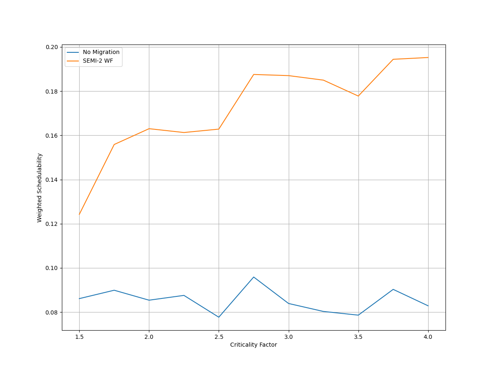
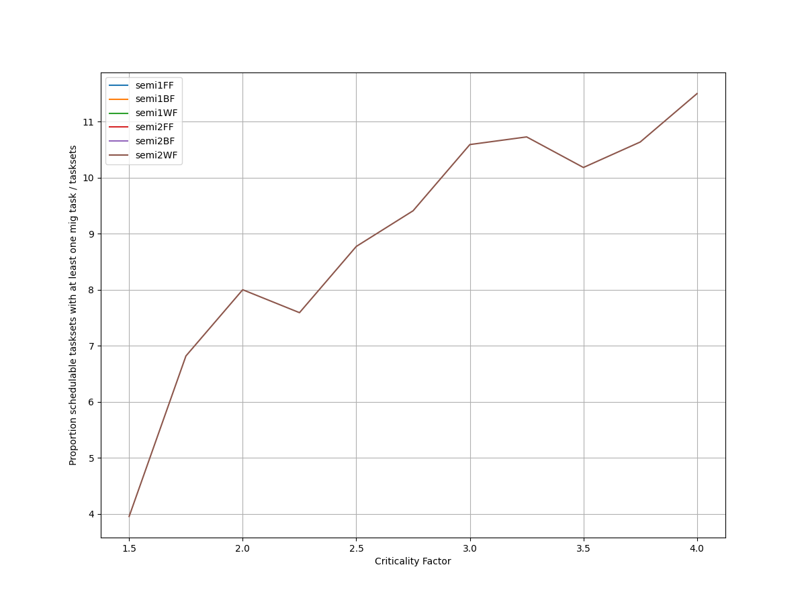
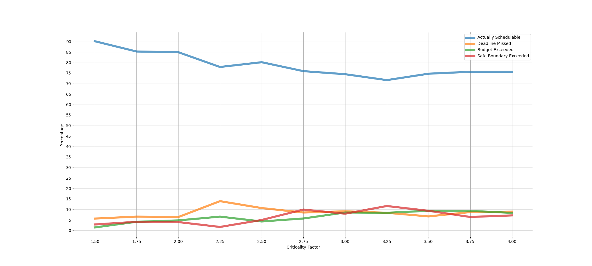
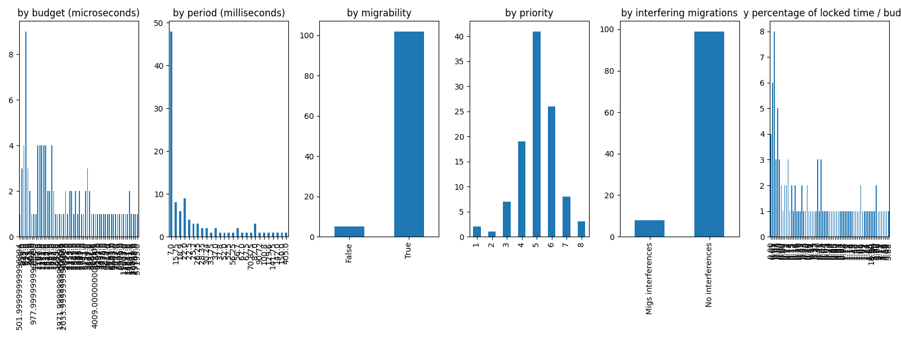
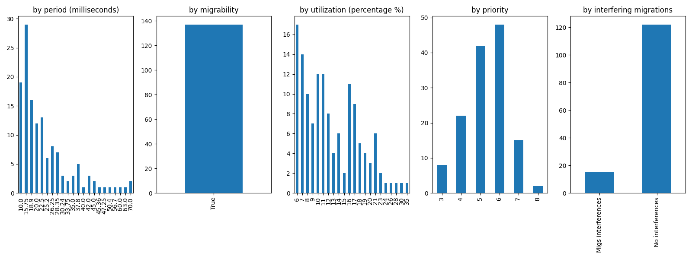
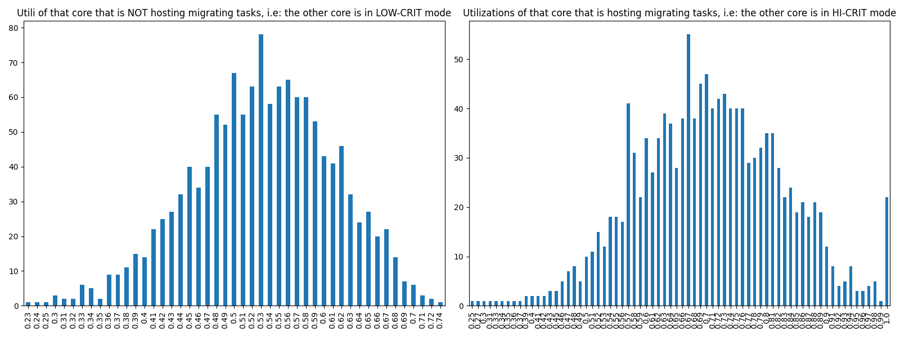

# Report on Experiment 2

## Overall data

### Experiments input parameters

**_Variable_ parameters**: those on which, in this experiment, we iterate.

| Utilization lower bound | Utilization higher bound | Utilization step |
| ------ | ------ | ------ |
| 1.848 | 2.1 | 0.012 |

| Criticality factor range | Step |
| ------ | ------ |
| [1.5, 4.0] | 0.25 |

**_Static_ parameters**: those that have a constant value.

| HI-CRIT proportion | Taskset size |
| ------ | ------ |
| 0.5 | 12 |

   Algorithm to generate tasks utilization: DRS algorithm <https://sigbed.org/2020/12/21/the-dirichlet-rescale-drs-algorithm-a-general-purpose-method-underpinning-synthetic-task-set-generation/>
   Utilizations range generation: `[5%, 60%]`

   **Normal** periods range from which to extract at random = `[10, 200] milliseconds`.

   **Big** periods range from which to extract at random = `[400, 1000] milliseconds`.

   From the latter, 1 or 2 periods are selected. The remaings, are selected from the former.

   Max periods armonicity: 2

### Output

| Schedulable | Not schedulable | Budget Exceeded | Safe Boundary Exceeded |
| ------ | ------ | ------ | ------ |
| 77.78% | 8.61% | 6.87% | 6.74% |

Number of executions: 1544

Schedulable executions: 1201/1544 = 77.78%

_Not_ schedulable executions: 133/1544 = 8.61%

Budget Exceeded executions: 106/1544 = 6.87 %

Safe Boundary Exceeded executions: 104/1544 = 6.74 %

NS + BE executions: 239/1544 = 15.48 %

### **Simulations**

#### **Weighted schedulability experiment 2 according to simulations.**

#### **Percentage of (schedulable tasksets with at least one migrating tasks / number of schedulable tasksets) of experiment 2 according to simulations.** 

 

### **Real Executions**

#### **Schedulability for each level**

The tasksets with i) at least one migrating task and ii) marked as schedulable by the RTA are executed on a real target, in order to see how many of them are also schedulable in a real-world scenario. The following graph shows, for each "Criticality Factor" level (x-axis), the percentage of:

   - Actually schedulable tasksets, i.e. those that have all tasks that meet their deadlines;
   - Deadline Missed tasksets, i.e. those in which (at least) a tasks did not meet (at least) one of its deadlines; 
   - Budget Exceeded tasksets, i.e. those in which a criticality-level budget exceeding is detected (LO-crit budget for LO-crit tasks and HI-crit budget for HI-crit tasks). This type of event makes experiment invalid.

We want to see, thanks to this graphs, how many tasksets remain schedulable in the real-world. The RTA does not take into account overhead time, so we expect that there will be some tasksets that are not actually schedulable.

#### **Tasksets, grouped by differents parameters, with a Budget_Exceeded task.**

With the following graphs, we sum-up the features of the tasks that have occurred in a Criticality-level Budget Exceeded event. Each graph is like a "group-by" SQL operation.
 In the first one, "by budget", we can see, for each _criticality-level budget value_, how many tasks with that criticality-level budget has exceeded it. In the second one, we can see for each _period_ value, how many tasks has exceeded their criticality-level budget.

#### **Tasksets, grouped by differents parameters, with at least one task missing one (or more) of its deadlines.**

With the following graphs, we sum-up the features of the tasks that have missed (at least) one of them deadlines. As the Budget Exceeded graphs, each graph is like a "group-by" SQL operation.

### **Nominal utilizations VS Real utilizations about schedulable tasksets**

| Average real utilizations | Variance real utilizations | Min | Max |
| ------ | ------ | ------ | ------ |
| 1.025 | 0.022 | 0.550 | 1.440 |

### **Utils of the core that will have to accommodate migrating tasks VS Utils of the core when it is actually accomodating them**

These two graphs show the utilizations level of that core $`c_{i}`$ that, sooner or later, will have to accomodate migrating tasks of the other core $`c_{j}`$. The left one, shows the distribution utilizations levels when the core $`c_{i}`$ is **not** accomodating the other core's $`c_{j}`$ migrating tasks, i.e. $`c_{j}`$ is in **LOW-CRIT mode.**
The right one, shows the distribution utilizations levels when the core $`c_{i}`$ **is** accomodating the other core's $`c_{j}`$ migrating tasks, i.e. $`c_{j}`$ is in **HIGH-CRIT mode**.

| Average utilizations **not** hosting migs | Variance utilizations **not** hosting migs | Min | Max |
| ------ | ------ | ------ | ------ |
| 0.531 | 0.006 | 0.230 | 0.740 |

| Average utilizations hosting migs | Variance utilizations hosting migs | Min | Max |
| ------ | ------ | ------ | ------ |
| 0.706 | 0.015 | 0.250 | 1.000 |

## Bad tasksets

Click here to expand this section.

### **Not schedulable tasksets**

Click here to expand this section.

Ovvero quando almeno un task non completa entra almeno una sua deadline.

  1. Taskset **e2_semi2wf_t10276**

    Taskset execution params:
	 
    "id": "e2_semi2wf_t10276",
    "size": "12",
    "utilization": "2.016",
    "realutilization": 1.18,
    "criticality_factor": "2.5",
    "hicrit_proportion": "0.5"

   
 
Click here to see the deadlines missed tasks list.

   Time values are expressed as **micro-seconds**.

Task:  1

    
    "id": " 1",
    "basecpu": " 1",
    "priority": " 6",
    "period": 37800.0,
    "C(LO)": 2567.0,
    "C(HI)": 2567.0,
    "criticality": "LOW",
    "migrable": "True",
    "completedruns": " 833",
    "preemptions": " 0",
    "minresponsejitter": " 0.000000000",
    "maxresponsejitter": " 0.001310018",
    "minreleasejitter": " 0.000000000",
    "maxreleasejitter": " 32.411806898",
    "avgresponsejitter": " 0.001176168",
    "deadlinesmissed": " 1",
    "deadlinemissedtargetcore": " 0",
    "deadlinemissedaftermigration": " 0",
    "budgetexceeded": " 0",
    "budgetexceededtargetcore": " 0",
    "budgetexceededaftermigration": " 0",
    "timesmigrated": " 6",
    "timesrestored": " 5",
    "timesonc1": " 818",
    "timesonc2": " 13",
    "lockedtime": " 0.000009670"

   

   
 
Click here to see the CPUs log.

   Idle time is expressed as **seconds**.

   Util values are expressed as **percentage** %.

   CPU: 1

    
    "id": 1,
    "hyperperiod": 113400000,
    "lowtohigh": " 51",
    "hightolow": " 51",
    "idletime": 50224328,
    "util": 55.71046913580247,
    "idletimeduringhostingmig": 0,
    "utilduringhostingmig": null

   CPU: 2

    
    "id": 2,
    "hyperperiod": 22680000,
    "lowtohigh": " 0",
    "hightolow": " 0",
    "idletime": 43468857,
    "util": 61.6676746031746,
    "idletimeduringhostingmig": 607284,
    "utilduringhostingmig": 68.9382779700965

   Real Utilization: 1.1800000000000002
   

   
 
Click here to see the whole tasksets.

   Time values are expressed as **micro-seconds**.

   Task:  12

    
    "id": " 12",
    "basecpu": " 1",
    "priority": " 0",
    "period": 600000.0,
    "C(LO)": 64352.00000000001,
    "C(HI)": 160882.0,
    "criticality": "HIGH",
    "migrable": "False",
    "completedruns": " 190",
    "preemptions": " 486",
    "minresponsejitter": " 0.000000000",
    "maxresponsejitter": " 0.233378330",
    "minreleasejitter": " 0.000000000",
    "maxreleasejitter": " 113.821361832",
    "avgresponsejitter": " 0.079687934",
    "deadlinesmissed": " 0",
    "deadlinemissedtargetcore": " 0",
    "deadlinemissedaftermigration": " 0",
    "budgetexceeded": " 1",
    "budgetexceededtargetcore": " 0",
    "budgetexceededaftermigration": " 0",
    "timesmigrated": " 0",
    "timesrestored": " 0",
    "timesonc1": " 676",
    "timesonc2": " 0",
    "lockedtime": " 0.000022970"

   Task:  6

    
    "id": " 6",
    "basecpu": " 1",
    "priority": " 3",
    "period": 65625.0,
    "C(LO)": 2839.0,
    "C(HI)": 7098.0,
    "criticality": "HIGH",
    "migrable": "False",
    "completedruns": " 1729",
    "preemptions": " 28",
    "minresponsejitter": " 0.000000000",
    "maxresponsejitter": " 0.007340354",
    "minreleasejitter": " 0.000000000",
    "maxreleasejitter": " 114.334381417",
    "avgresponsejitter": " 0.002504081",
    "deadlinesmissed": " 0",
    "deadlinemissedtargetcore": " 0",
    "deadlinemissedaftermigration": " 0",
    "budgetexceeded": " 18",
    "budgetexceededtargetcore": " 0",
    "budgetexceededaftermigration": " 0",
    "timesmigrated": " 0",
    "timesrestored": " 0",
    "timesonc1": " 1774",
    "timesonc2": " 0",
    "lockedtime": " 0.000034198"

   Task:  4

    
    "id": " 4",
    "basecpu": " 1",
    "priority": " 4",
    "period": 47250.0,
    "C(LO)": 1050.0,
    "C(HI)": 2625.0,
    "criticality": "HIGH",
    "migrable": "False",
    "completedruns": " 2401",
    "preemptions": " 1",
    "minresponsejitter": " 0.000000000",
    "maxresponsejitter": " 0.002402958",
    "minreleasejitter": " 0.000000000",
    "maxreleasejitter": " 114.352756550",
    "avgresponsejitter": " 0.000926646",
    "deadlinesmissed": " 0",
    "deadlinemissedtargetcore": " 0",
    "deadlinemissedaftermigration": " 0",
    "budgetexceeded": " 32",
    "budgetexceededtargetcore": " 0",
    "budgetexceededaftermigration": " 0",
    "timesmigrated": " 0",
    "timesrestored": " 0",
    "timesonc1": " 2433",
    "timesonc2": " 0",
    "lockedtime": " 0.000029670"

   Task:  9

    
    "id": " 9",
    "basecpu": " 1",
    "priority": " 2",
    "period": 189000.0,
    "C(LO)": 66950.0,
    "C(HI)": 66950.0,
    "criticality": "LOW",
    "migrable": "False",
    "completedruns": " 601",
    "preemptions": " 1283",
    "minresponsejitter": " 0.000000000",
    "maxresponsejitter": " 0.069580057",
    "minreleasejitter": " 0.000000000",
    "maxreleasejitter": " 114.211970096",
    "avgresponsejitter": " 0.061198952",
    "deadlinesmissed": " 0",
    "deadlinemissedtargetcore": " 0",
    "deadlinemissedaftermigration": " 0",
    "budgetexceeded": " 0",
    "budgetexceededtargetcore": " 0",
    "budgetexceededaftermigration": " 0",
    "timesmigrated": " 0",
    "timesrestored": " 0",
    "timesonc1": " 1883",
    "timesonc2": " 0",
    "lockedtime": " 0.000069186"

   Task:  10

    
    "id": " 10",
    "basecpu": " 1",
    "priority": " 1",
    "period": 200000.0,
    "C(LO)": 21200.0,
    "C(HI)": 21200.0,
    "criticality": "LOW",
    "migrable": "False",
    "completedruns": " 568",
    "preemptions": " 425",
    "minresponsejitter": " 0.000000000",
    "maxresponsejitter": " 0.088725270",
    "minreleasejitter": " 0.000000000",
    "maxreleasejitter": " 114.200006595",
    "avgresponsejitter": " 0.025332216",
    "deadlinesmissed": " 0",
    "deadlinemissedtargetcore": " 0",
    "deadlinemissedaftermigration": " 0",
    "budgetexceeded": " 0",
    "budgetexceededtargetcore": " 0",
    "budgetexceededaftermigration": " 0",
    "timesmigrated": " 0",
    "timesrestored": " 0",
    "timesonc1": " 992",
    "timesonc2": " 0",
    "lockedtime": " 0.000024778"

   Task:  7

    
    "id": " 7",
    "basecpu": " 1",
    "priority": " 5",
    "period": 129600.0,
    "C(LO)": 9548.0,
    "C(HI)": 9548.0,
    "criticality": "LOW",
    "migrable": "True",
    "completedruns": " 35",
    "preemptions": " 0",
    "minresponsejitter": " 0.000000000",
    "maxresponsejitter": " 0.004802411",
    "minreleasejitter": " 0.000000000",
    "maxreleasejitter": " 5.278020462",
    "avgresponsejitter": " 0.004383306",
    "deadlinesmissed": " 0",
    "deadlinemissedtargetcore": " 0",
    "deadlinemissedaftermigration": " 0",
    "budgetexceeded": " 0",
    "budgetexceededtargetcore": " 0",
    "budgetexceededaftermigration": " 0",
    "timesmigrated": " 1",
    "timesrestored": " 1",
    "timesonc1": " 33",
    "timesonc2": " 1",
    "lockedtime": " 0.000000000"

   Task:  1

    
    "id": " 1",
    "basecpu": " 1",
    "priority": " 6",
    "period": 37800.0,
    "C(LO)": 2567.0,
    "C(HI)": 2567.0,
    "criticality": "LOW",
    "migrable": "True",
    "completedruns": " 833",
    "preemptions": " 0",
    "minresponsejitter": " 0.000000000",
    "maxresponsejitter": " 0.001310018",
    "minreleasejitter": " 0.000000000",
    "maxreleasejitter": " 32.411806898",
    "avgresponsejitter": " 0.001176168",
    "deadlinesmissed": " 1",
    "deadlinemissedtargetcore": " 0",
    "deadlinemissedaftermigration": " 0",
    "budgetexceeded": " 0",
    "budgetexceededtargetcore": " 0",
    "budgetexceededaftermigration": " 0",
    "timesmigrated": " 6",
    "timesrestored": " 5",
    "timesonc1": " 818",
    "timesonc2": " 13",
    "lockedtime": " 0.000009670"

   Task:  8

    
    "id": " 8",
    "basecpu": " 2",
    "priority": " 1",
    "period": 135000.0,
    "C(LO)": 16101.0,
    "C(HI)": 40253.0,
    "criticality": "HIGH",
    "migrable": "False",
    "completedruns": " 841",
    "preemptions": " 576",
    "minresponsejitter": " 0.000000000",
    "maxresponsejitter": " 0.033746919",
    "minreleasejitter": " 0.000000000",
    "maxreleasejitter": " 114.265028195",
    "avgresponsejitter": " 0.016033054",
    "deadlinesmissed": " 0",
    "deadlinemissedtargetcore": " 0",
    "deadlinemissedaftermigration": " 0",
    "budgetexceeded": " 0",
    "budgetexceededtargetcore": " 0",
    "budgetexceededaftermigration": " 0",
    "timesmigrated": " 0",
    "timesrestored": " 0",
    "timesonc1": " 0",
    "timesonc2": " 1416",
    "lockedtime": " 0.000008643"

   Task:  2

    
    "id": " 2",
    "basecpu": " 2",
    "priority": " 3",
    "period": 39375.0,
    "C(LO)": 1220.0,
    "C(HI)": 3050.0,
    "criticality": "HIGH",
    "migrable": "False",
    "completedruns": " 2881",
    "preemptions": " 0",
    "minresponsejitter": " 0.000000000",
    "maxresponsejitter": " 0.001121898",
    "minreleasejitter": " 0.000000000",
    "maxreleasejitter": " 114.360631102",
    "avgresponsejitter": " 0.001054640",
    "deadlinesmissed": " 0",
    "deadlinemissedtargetcore": " 0",
    "deadlinemissedaftermigration": " 0",
    "budgetexceeded": " 0",
    "budgetexceededtargetcore": " 0",
    "budgetexceededaftermigration": " 0",
    "timesmigrated": " 0",
    "timesrestored": " 0",
    "timesonc1": " 0",
    "timesonc2": " 2880",
    "lockedtime": " 0.000049498"

   Task:  3

    
    "id": " 3",
    "basecpu": " 2",
    "priority": " 2",
    "period": 45360.0,
    "C(LO)": 1307.0,
    "C(HI)": 3269.0,
    "criticality": "HIGH",
    "migrable": "False",
    "completedruns": " 2501",
    "preemptions": " 103",
    "minresponsejitter": " 0.000000000",
    "maxresponsejitter": " 0.019025829",
    "minreleasejitter": " 0.000000000",
    "maxreleasejitter": " 114.355647174",
    "avgresponsejitter": " 0.001416583",
    "deadlinesmissed": " 0",
    "deadlinemissedtargetcore": " 0",
    "deadlinemissedaftermigration": " 0",
    "budgetexceeded": " 0",
    "budgetexceededtargetcore": " 0",
    "budgetexceededaftermigration": " 0",
    "timesmigrated": " 0",
    "timesrestored": " 0",
    "timesonc1": " 0",
    "timesonc2": " 2603",
    "lockedtime": " 0.000009357"

   Task:  5

    
    "id": " 5",
    "basecpu": " 2",
    "priority": " 4",
    "period": 60000.0,
    "C(LO)": 18399.0,
    "C(HI)": 18399.0,
    "criticality": "LOW",
    "migrable": "False",
    "completedruns": " 1891",
    "preemptions": " 2",
    "minresponsejitter": " 0.000000000",
    "maxresponsejitter": " 0.018039456",
    "minreleasejitter": " 0.000000000",
    "maxreleasejitter": " 114.340006393",
    "avgresponsejitter": " 0.015888012",
    "deadlinesmissed": " 0",
    "deadlinemissedtargetcore": " 0",
    "deadlinemissedaftermigration": " 0",
    "budgetexceeded": " 0",
    "budgetexceededtargetcore": " 0",
    "budgetexceededaftermigration": " 0",
    "timesmigrated": " 0",
    "timesrestored": " 0",
    "timesonc1": " 0",
    "timesonc2": " 1892",
    "lockedtime": " 0.000048670"

   Task:  11

    
    "id": " 11",
    "basecpu": " 2",
    "priority": " 0",
    "period": 540000.0,
    "C(LO)": 123060.0,
    "C(HI)": 123060.0,
    "criticality": "LOW",
    "migrable": "False",
    "completedruns": " 211",
    "preemptions": " 1751",
    "minresponsejitter": " 0.000000000",
    "maxresponsejitter": " 0.184814721",
    "minreleasejitter": " 0.000000000",
    "maxreleasejitter": " 113.891106411",
    "avgresponsejitter": " 0.176802339",
    "deadlinesmissed": " 0",
    "deadlinemissedtargetcore": " 0",
    "deadlinemissedaftermigration": " 0",
    "budgetexceeded": " 0",
    "budgetexceededtargetcore": " 0",
    "budgetexceededaftermigration": " 0",
    "timesmigrated": " 0",
    "timesrestored": " 0",
    "timesonc1": " 0",
    "timesonc2": " 1961",
    "lockedtime": " 0.000056565"

   

  2. Taskset **e2_semi2wf_t1049**

    Taskset execution params:
	 
    "id": "e2_semi2wf_t1049",
    "size": "12",
    "utilization": "1.968",
    "realutilization": 1.28,
    "criticality_factor": "1.5",
    "hicrit_proportion": "0.5"

   
 
Click here to see the deadlines missed tasks list.

   Time values are expressed as **micro-seconds**.

Task:  2

    
    "id": " 2",
    "basecpu": " 1",
    "priority": " 6",
    "period": 20000.0,
    "C(LO)": 3005.0,
    "C(HI)": 3005.0,
    "criticality": "LOW",
    "migrable": "True",
    "completedruns": " 909",
    "preemptions": " 0",
    "minresponsejitter": " 0.000000000",
    "maxresponsejitter": " 0.001532934",
    "minreleasejitter": " 0.000000000",
    "maxreleasejitter": " 19.140006420",
    "avgresponsejitter": " 0.001375523",
    "deadlinesmissed": " 1",
    "deadlinemissedtargetcore": " 1",
    "deadlinemissedaftermigration": " 0",
    "budgetexceeded": " 0",
    "budgetexceededtargetcore": " 0",
    "budgetexceededaftermigration": " 0",
    "timesmigrated": " 6",
    "timesrestored": " 6",
    "timesonc1": " 885",
    "timesonc2": " 22",
    "lockedtime": " 0.000027033"

   

   
 
Click here to see the CPUs log.

   Idle time is expressed as **seconds**.

   Util values are expressed as **percentage** %.

   CPU: 1

    
    "id": 1,
    "hyperperiod": 18900000,
    "lowtohigh": " 106",
    "hightolow": " 106",
    "idletime": 44543449,
    "util": 60.72006261022928,
    "idletimeduringhostingmig": 0,
    "utilduringhostingmig": null

   CPU: 2

    
    "id": 2,
    "hyperperiod": 113400000,
    "lowtohigh": " 0",
    "hightolow": " 0",
    "idletime": 37840935,
    "util": 66.63056878306878,
    "idletimeduringhostingmig": 967949,
    "utilduringhostingmig": 69.27702946545246

   Real Utilization: 1.28
   

   
 
Click here to see the whole tasksets.

   Time values are expressed as **micro-seconds**.

   Task:  1

    
    "id": " 1",
    "basecpu": " 1",
    "priority": " 4",
    "period": 15750.0,
    "C(LO)": 2064.0,
    "C(HI)": 3096.0,
    "criticality": "HIGH",
    "migrable": "False",
    "completedruns": " 7201",
    "preemptions": " 101",
    "minresponsejitter": " 0.000000000",
    "maxresponsejitter": " 0.007342060",
    "minreleasejitter": " 0.000000000",
    "maxreleasejitter": " 114.384256231",
    "avgresponsejitter": " 0.001807574",
    "deadlinesmissed": " 0",
    "deadlinemissedtargetcore": " 0",
    "deadlinemissedaftermigration": " 0",
    "budgetexceeded": " 66",
    "budgetexceededtargetcore": " 0",
    "budgetexceededaftermigration": " 0",
    "timesmigrated": " 0",
    "timesrestored": " 0",
    "timesonc1": " 7367",
    "timesonc2": " 0",
    "lockedtime": " 0.000031498"

   Task:  7

    
    "id": " 7",
    "basecpu": " 1",
    "priority": " 2",
    "period": 65625.0,
    "C(LO)": 7629.0,
    "C(HI)": 11443.0,
    "criticality": "HIGH",
    "migrable": "False",
    "completedruns": " 1729",
    "preemptions": " 1212",
    "minresponsejitter": " 0.000000000",
    "maxresponsejitter": " 0.017953796",
    "minreleasejitter": " 0.000000000",
    "maxreleasejitter": " 114.336471829",
    "avgresponsejitter": " 0.008912042",
    "deadlinesmissed": " 0",
    "deadlinemissedtargetcore": " 0",
    "deadlinemissedaftermigration": " 0",
    "budgetexceeded": " 15",
    "budgetexceededtargetcore": " 0",
    "budgetexceededaftermigration": " 0",
    "timesmigrated": " 0",
    "timesrestored": " 0",
    "timesonc1": " 2955",
    "timesonc2": " 0",
    "lockedtime": " 0.000040796"

   Task:  10

    
    "id": " 10",
    "basecpu": " 1",
    "priority": " 1",
    "period": 150000.0,
    "C(LO)": 8151.999999999999,
    "C(HI)": 12228.0,
    "criticality": "HIGH",
    "migrable": "False",
    "completedruns": " 757",
    "preemptions": " 533",
    "minresponsejitter": " 0.000000000",
    "maxresponsejitter": " 0.027866844",
    "minreleasejitter": " 0.000000000",
    "maxreleasejitter": " 114.250006285",
    "avgresponsejitter": " 0.009517486",
    "deadlinesmissed": " 0",
    "deadlinemissedtargetcore": " 0",
    "deadlinemissedaftermigration": " 0",
    "budgetexceeded": " 4",
    "budgetexceededtargetcore": " 0",
    "budgetexceededaftermigration": " 0",
    "timesmigrated": " 0",
    "timesrestored": " 0",
    "timesonc1": " 1293",
    "timesonc2": " 0",
    "lockedtime": " 0.000008931"

   Task:  5

    
    "id": " 5",
    "basecpu": " 1",
    "priority": " 3",
    "period": 47250.0,
    "C(LO)": 2190.0,
    "C(HI)": 3285.0,
    "criticality": "HIGH",
    "migrable": "False",
    "completedruns": " 2401",
    "preemptions": " 40",
    "minresponsejitter": " 0.000000000",
    "maxresponsejitter": " 0.004226892",
    "minreleasejitter": " 0.000000000",
    "maxreleasejitter": " 114.354592712",
    "avgresponsejitter": " 0.001919189",
    "deadlinesmissed": " 0",
    "deadlinemissedtargetcore": " 0",
    "deadlinemissedaftermigration": " 0",
    "budgetexceeded": " 21",
    "budgetexceededtargetcore": " 0",
    "budgetexceededaftermigration": " 0",
    "timesmigrated": " 0",
    "timesrestored": " 0",
    "timesonc1": " 2461",
    "timesonc2": " 0",
    "lockedtime": " 0.000004177"

   Task:  11

    
    "id": " 11",
    "basecpu": " 1",
    "priority": " 0",
    "period": 450000.0,
    "C(LO)": 90714.0,
    "C(HI)": 90714.0,
    "criticality": "LOW",
    "migrable": "False",
    "completedruns": " 253",
    "preemptions": " 2949",
    "minresponsejitter": " 0.000000000",
    "maxresponsejitter": " 0.166169309",
    "minreleasejitter": " 0.000000000",
    "maxreleasejitter": " 113.957386535",
    "avgresponsejitter": " 0.130523949",
    "deadlinesmissed": " 0",
    "deadlinemissedtargetcore": " 0",
    "deadlinemissedaftermigration": " 0",
    "budgetexceeded": " 0",
    "budgetexceededtargetcore": " 0",
    "budgetexceededaftermigration": " 0",
    "timesmigrated": " 0",
    "timesrestored": " 0",
    "timesonc1": " 3201",
    "timesonc2": " 0",
    "lockedtime": " 0.000068772"

   Task:  2

    
    "id": " 2",
    "basecpu": " 1",
    "priority": " 6",
    "period": 20000.0,
    "C(LO)": 3005.0,
    "C(HI)": 3005.0,
    "criticality": "LOW",
    "migrable": "True",
    "completedruns": " 909",
    "preemptions": " 0",
    "minresponsejitter": " 0.000000000",
    "maxresponsejitter": " 0.001532934",
    "minreleasejitter": " 0.000000000",
    "maxreleasejitter": " 19.140006420",
    "avgresponsejitter": " 0.001375523",
    "deadlinesmissed": " 1",
    "deadlinemissedtargetcore": " 1",
    "deadlinemissedaftermigration": " 0",
    "budgetexceeded": " 0",
    "budgetexceededtargetcore": " 0",
    "budgetexceededaftermigration": " 0",
    "timesmigrated": " 6",
    "timesrestored": " 6",
    "timesonc1": " 885",
    "timesonc2": " 22",
    "lockedtime": " 0.000027033"

   Task:  3

    
    "id": " 3",
    "basecpu": " 1",
    "priority": " 5",
    "period": 33750.0,
    "C(LO)": 4729.0,
    "C(HI)": 4729.0,
    "criticality": "LOW",
    "migrable": "False",
    "completedruns": " 3361",
    "preemptions": " 98",
    "minresponsejitter": " 0.000000000",
    "maxresponsejitter": " 0.005831616",
    "minreleasejitter": " 0.000000000",
    "maxreleasejitter": " 114.366256411",
    "avgresponsejitter": " 0.004110757",
    "deadlinesmissed": " 0",
    "deadlinemissedtargetcore": " 0",
    "deadlinemissedaftermigration": " 0",
    "budgetexceeded": " 0",
    "budgetexceededtargetcore": " 0",
    "budgetexceededaftermigration": " 0",
    "timesmigrated": " 0",
    "timesrestored": " 0",
    "timesonc1": " 3459",
    "timesonc2": " 0",
    "lockedtime": " 0.000041838"

   Task:  8

    
    "id": " 8",
    "basecpu": " 2",
    "priority": " 1",
    "period": 81000.0,
    "C(LO)": 26874.0,
    "C(HI)": 40312.0,
    "criticality": "HIGH",
    "migrable": "False",
    "completedruns": " 1401",
    "preemptions": " 1552",
    "minresponsejitter": " 0.000000000",
    "maxresponsejitter": " 0.038240048",
    "minreleasejitter": " 0.000000000",
    "maxreleasejitter": " 114.319006309",
    "avgresponsejitter": " 0.028672408",
    "deadlinesmissed": " 0",
    "deadlinemissedtargetcore": " 0",
    "deadlinemissedaftermigration": " 0",
    "budgetexceeded": " 0",
    "budgetexceededtargetcore": " 0",
    "budgetexceededaftermigration": " 0",
    "timesmigrated": " 0",
    "timesrestored": " 0",
    "timesonc1": " 0",
    "timesonc2": " 2952",
    "lockedtime": " 0.000090832"

   Task:  6

    
    "id": " 6",
    "basecpu": " 2",
    "priority": " 2",
    "period": 54000.0,
    "C(LO)": 1838.0,
    "C(HI)": 2758.0,
    "criticality": "HIGH",
    "migrable": "False",
    "completedruns": " 2101",
    "preemptions": " 13",
    "minresponsejitter": " 0.000000000",
    "maxresponsejitter": " 0.006915718",
    "minreleasejitter": " 0.000000000",
    "maxreleasejitter": " 114.346006895",
    "avgresponsejitter": " 0.001614715",
    "deadlinesmissed": " 0",
    "deadlinemissedtargetcore": " 0",
    "deadlinemissedaftermigration": " 0",
    "budgetexceeded": " 0",
    "budgetexceededtargetcore": " 0",
    "budgetexceededaftermigration": " 0",
    "timesmigrated": " 0",
    "timesrestored": " 0",
    "timesonc1": " 0",
    "timesonc2": " 2113",
    "lockedtime": " 0.000027847"

   Task:  12

    
    "id": " 12",
    "basecpu": " 2",
    "priority": " 0",
    "period": 525000.0,
    "C(LO)": 94983.0,
    "C(HI)": 94983.0,
    "criticality": "LOW",
    "migrable": "False",
    "completedruns": " 217",
    "preemptions": " 1319",
    "minresponsejitter": " 0.000000000",
    "maxresponsejitter": " 0.207772712",
    "minreleasejitter": " 0.000000000",
    "maxreleasejitter": " 113.875006844",
    "avgresponsejitter": " 0.162513414",
    "deadlinesmissed": " 0",
    "deadlinemissedtargetcore": " 0",
    "deadlinemissedaftermigration": " 0",
    "budgetexceeded": " 0",
    "budgetexceededtargetcore": " 0",
    "budgetexceededaftermigration": " 0",
    "timesmigrated": " 0",
    "timesrestored": " 0",
    "timesonc1": " 0",
    "timesonc2": " 1535",
    "lockedtime": " 0.000072357"

   Task:  4

    
    "id": " 4",
    "basecpu": " 2",
    "priority": " 4",
    "period": 40000.0,
    "C(LO)": 5861.0,
    "C(HI)": 5861.0,
    "criticality": "LOW",
    "migrable": "False",
    "completedruns": " 2836",
    "preemptions": " 0",
    "minresponsejitter": " 0.000000000",
    "maxresponsejitter": " 0.005347273",
    "minreleasejitter": " 0.000000000",
    "maxreleasejitter": " 114.360006399",
    "avgresponsejitter": " 0.005041526",
    "deadlinesmissed": " 0",
    "deadlinemissedtargetcore": " 0",
    "deadlinemissedaftermigration": " 0",
    "budgetexceeded": " 0",
    "budgetexceededtargetcore": " 0",
    "budgetexceededaftermigration": " 0",
    "timesmigrated": " 0",
    "timesrestored": " 0",
    "timesonc1": " 0",
    "timesonc2": " 2835",
    "lockedtime": " 0.000055829"

   Task:  9

    
    "id": " 9",
    "basecpu": " 2",
    "priority": " 3",
    "period": 100800.0,
    "C(LO)": 7839.000000000001,
    "C(HI)": 7839.000000000001,
    "criticality": "LOW",
    "migrable": "False",
    "completedruns": " 1126",
    "preemptions": " 176",
    "minresponsejitter": " 0.000000000",
    "maxresponsejitter": " 0.012372967",
    "minreleasejitter": " 0.000000000",
    "maxreleasejitter": " 114.299206222",
    "avgresponsejitter": " 0.007521009",
    "deadlinesmissed": " 0",
    "deadlinemissedtargetcore": " 0",
    "deadlinemissedaftermigration": " 0",
    "budgetexceeded": " 0",
    "budgetexceededtargetcore": " 0",
    "budgetexceededaftermigration": " 0",
    "timesmigrated": " 0",
    "timesrestored": " 0",
    "timesonc1": " 0",
    "timesonc2": " 1301",
    "lockedtime": " 0.000024228"

   

  3. Taskset **e2_semi2wf_t11050**

    Taskset execution params:
	 
    "id": "e2_semi2wf_t11050",
    "size": "12",
    "utilization": "1.848",
    "realutilization": 1.09,
    "criticality_factor": "2.75",
    "hicrit_proportion": "0.5"

   
 
Click here to see the deadlines missed tasks list.

   Time values are expressed as **micro-seconds**.

Task:  1

    
    "id": " 1",
    "basecpu": " 2",
    "priority": " 6",
    "period": 15750.0,
    "C(LO)": 1717.0,
    "C(HI)": 1717.0,
    "criticality": "LOW",
    "migrable": "True",
    "completedruns": " 1728",
    "preemptions": " 0",
    "minresponsejitter": " 0.000000000",
    "maxresponsejitter": " 0.000872586",
    "minreleasejitter": " 0.000000000",
    "maxreleasejitter": " 28.184506859",
    "avgresponsejitter": " 0.000785057",
    "deadlinesmissed": " 1",
    "deadlinemissedtargetcore": " 0",
    "deadlinemissedaftermigration": " 1",
    "budgetexceeded": " 0",
    "budgetexceededtargetcore": " 0",
    "budgetexceededaftermigration": " 0",
    "timesmigrated": " 4",
    "timesrestored": " 3",
    "timesonc1": " 5",
    "timesonc2": " 1721",
    "lockedtime": " 0.000016850"

   

   
 
Click here to see the CPUs log.

   Idle time is expressed as **seconds**.

   Util values are expressed as **percentage** %.

   CPU: 1

    
    "id": 1,
    "hyperperiod": 113400000,
    "lowtohigh": " 0",
    "hightolow": " 0",
    "idletime": 51438902,
    "util": 54.63941622574956,
    "idletimeduringhostingmig": 112145,
    "utilduringhostingmig": 72.63020451993947

   CPU: 2

    
    "id": 2,
    "hyperperiod": 113400000,
    "lowtohigh": " 19",
    "hightolow": " 19",
    "idletime": 51955212,
    "util": 54.1841164021164,
    "idletimeduringhostingmig": 0,
    "utilduringhostingmig": null

   Real Utilization: 1.09
   

   
 
Click here to see the whole tasksets.

   Time values are expressed as **micro-seconds**.

   Task:  8

    
    "id": " 8",
    "basecpu": " 1",
    "priority": " 0",
    "period": 150000.0,
    "C(LO)": 7702.0,
    "C(HI)": 21180.0,
    "criticality": "HIGH",
    "migrable": "False",
    "completedruns": " 757",
    "preemptions": " 224",
    "minresponsejitter": " 0.000000000",
    "maxresponsejitter": " 0.043670850",
    "minreleasejitter": " 0.000000000",
    "maxreleasejitter": " 114.267359580",
    "avgresponsejitter": " 0.009532387",
    "deadlinesmissed": " 0",
    "deadlinemissedtargetcore": " 0",
    "deadlinemissedaftermigration": " 0",
    "budgetexceeded": " 0",
    "budgetexceededtargetcore": " 0",
    "budgetexceededaftermigration": " 0",
    "timesmigrated": " 0",
    "timesrestored": " 0",
    "timesonc1": " 980",
    "timesonc2": " 0",
    "lockedtime": " 0.000011351"

   Task:  3

    
    "id": " 3",
    "basecpu": " 1",
    "priority": " 3",
    "period": 45000.0,
    "C(LO)": 2261.0,
    "C(HI)": 6219.0,
    "criticality": "HIGH",
    "migrable": "False",
    "completedruns": " 2521",
    "preemptions": " 0",
    "minresponsejitter": " 0.000000000",
    "maxresponsejitter": " 0.002067252",
    "minreleasejitter": " 0.000000000",
    "maxreleasejitter": " 114.355006234",
    "avgresponsejitter": " 0.001947459",
    "deadlinesmissed": " 0",
    "deadlinemissedtargetcore": " 0",
    "deadlinemissedaftermigration": " 0",
    "budgetexceeded": " 0",
    "budgetexceededtargetcore": " 0",
    "budgetexceededaftermigration": " 0",
    "timesmigrated": " 0",
    "timesrestored": " 0",
    "timesonc1": " 2520",
    "timesonc2": " 0",
    "lockedtime": " 0.000030781"

   Task:  7

    
    "id": " 7",
    "basecpu": " 1",
    "priority": " 1",
    "period": 141750.0,
    "C(LO)": 2794.0,
    "C(HI)": 7683.0,
    "criticality": "HIGH",
    "migrable": "False",
    "completedruns": " 801",
    "preemptions": " 99",
    "minresponsejitter": " 0.000000000",
    "maxresponsejitter": " 0.037577138",
    "minreleasejitter": " 0.000000000",
    "maxreleasejitter": " 114.263041652",
    "avgresponsejitter": " 0.003493658",
    "deadlinesmissed": " 0",
    "deadlinemissedtargetcore": " 0",
    "deadlinemissedaftermigration": " 0",
    "budgetexceeded": " 0",
    "budgetexceededtargetcore": " 0",
    "budgetexceededaftermigration": " 0",
    "timesmigrated": " 0",
    "timesrestored": " 0",
    "timesonc1": " 899",
    "timesonc2": " 0",
    "lockedtime": " 0.000019102"

   Task:  2

    
    "id": " 2",
    "basecpu": " 1",
    "priority": " 4",
    "period": 40000.0,
    "C(LO)": 14885.0,
    "C(HI)": 14885.0,
    "criticality": "LOW",
    "migrable": "False",
    "completedruns": " 2836",
    "preemptions": " 2",
    "minresponsejitter": " 0.000000000",
    "maxresponsejitter": " 0.013612027",
    "minreleasejitter": " 0.000000000",
    "maxreleasejitter": " 114.360006093",
    "avgresponsejitter": " 0.012858447",
    "deadlinesmissed": " 0",
    "deadlinemissedtargetcore": " 0",
    "deadlinemissedaftermigration": " 0",
    "budgetexceeded": " 0",
    "budgetexceededtargetcore": " 0",
    "budgetexceededaftermigration": " 0",
    "timesmigrated": " 0",
    "timesrestored": " 0",
    "timesonc1": " 2837",
    "timesonc2": " 0",
    "lockedtime": " 0.000133480"

   Task:  9

    
    "id": " 9",
    "basecpu": " 1",
    "priority": " 2",
    "period": 168750.0,
    "C(LO)": 23455.0,
    "C(HI)": 23455.0,
    "criticality": "LOW",
    "migrable": "False",
    "completedruns": " 673",
    "preemptions": " 572",
    "minresponsejitter": " 0.000000000",
    "maxresponsejitter": " 0.036878952",
    "minreleasejitter": " 0.000000000",
    "maxreleasejitter": " 114.231256520",
    "avgresponsejitter": " 0.027941571",
    "deadlinesmissed": " 0",
    "deadlinemissedtargetcore": " 0",
    "deadlinemissedaftermigration": " 0",
    "budgetexceeded": " 0",
    "budgetexceededtargetcore": " 0",
    "budgetexceededaftermigration": " 0",
    "timesmigrated": " 0",
    "timesrestored": " 0",
    "timesonc1": " 1244",
    "timesonc2": " 0",
    "lockedtime": " 0.000059850"

   Task:  10

    
    "id": " 10",
    "basecpu": " 2",
    "priority": " 1",
    "period": 180000.0,
    "C(LO)": 14519.0,
    "C(HI)": 39928.0,
    "criticality": "HIGH",
    "migrable": "False",
    "completedruns": " 631",
    "preemptions": " 374",
    "minresponsejitter": " 0.000000000",
    "maxresponsejitter": " 0.080159880",
    "minreleasejitter": " 0.000000000",
    "maxreleasejitter": " 114.228475060",
    "avgresponsejitter": " 0.018220982",
    "deadlinesmissed": " 0",
    "deadlinemissedtargetcore": " 0",
    "deadlinemissedaftermigration": " 0",
    "budgetexceeded": " 7",
    "budgetexceededtargetcore": " 0",
    "budgetexceededaftermigration": " 0",
    "timesmigrated": " 0",
    "timesrestored": " 0",
    "timesonc1": " 0",
    "timesonc2": " 1011",
    "lockedtime": " 0.000028643"

   Task:  4

    
    "id": " 4",
    "basecpu": " 2",
    "priority": " 3",
    "period": 52500.0,
    "C(LO)": 1889.0,
    "C(HI)": 5195.0,
    "criticality": "HIGH",
    "migrable": "False",
    "completedruns": " 2161",
    "preemptions": " 21",
    "minresponsejitter": " 0.000000000",
    "maxresponsejitter": " 0.028228757",
    "minreleasejitter": " 0.000000000",
    "maxreleasejitter": " 114.353102643",
    "avgresponsejitter": " 0.001660282",
    "deadlinesmissed": " 0",
    "deadlinemissedtargetcore": " 0",
    "deadlinemissedaftermigration": " 0",
    "budgetexceeded": " 10",
    "budgetexceededtargetcore": " 0",
    "budgetexceededaftermigration": " 0",
    "timesmigrated": " 0",
    "timesrestored": " 0",
    "timesonc1": " 0",
    "timesonc2": " 2191",
    "lockedtime": " 0.000020661"

   Task:  12

    
    "id": " 12",
    "basecpu": " 2",
    "priority": " 0",
    "period": 675000.0,
    "C(LO)": 13100.0,
    "C(HI)": 36025.0,
    "criticality": "HIGH",
    "migrable": "False",
    "completedruns": " 169",
    "preemptions": " 101",
    "minresponsejitter": " 0.000000000",
    "maxresponsejitter": " 0.074239303",
    "minreleasejitter": " 0.000000000",
    "maxreleasejitter": " 113.725006492",
    "avgresponsejitter": " 0.017877306",
    "deadlinesmissed": " 0",
    "deadlinemissedtargetcore": " 0",
    "deadlinemissedaftermigration": " 0",
    "budgetexceeded": " 2",
    "budgetexceededtargetcore": " 0",
    "budgetexceededaftermigration": " 0",
    "timesmigrated": " 0",
    "timesrestored": " 0",
    "timesonc1": " 0",
    "timesonc2": " 271",
    "lockedtime": " 0.000006964"

   Task:  6

    
    "id": " 6",
    "basecpu": " 2",
    "priority": " 4",
    "period": 70875.0,
    "C(LO)": 26316.0,
    "C(HI)": 26316.0,
    "criticality": "LOW",
    "migrable": "False",
    "completedruns": " 1601",
    "preemptions": " 623",
    "minresponsejitter": " 0.000000000",
    "maxresponsejitter": " 0.027217129",
    "minreleasejitter": " 0.000000000",
    "maxreleasejitter": " 114.329131381",
    "avgresponsejitter": " 0.023115667",
    "deadlinesmissed": " 0",
    "deadlinemissedtargetcore": " 0",
    "deadlinemissedaftermigration": " 0",
    "budgetexceeded": " 0",
    "budgetexceededtargetcore": " 0",
    "budgetexceededaftermigration": " 0",
    "timesmigrated": " 0",
    "timesrestored": " 0",
    "timesonc1": " 0",
    "timesonc2": " 2223",
    "lockedtime": " 0.000149715"

   Task:  1

    
    "id": " 1",
    "basecpu": " 2",
    "priority": " 6",
    "period": 15750.0,
    "C(LO)": 1717.0,
    "C(HI)": 1717.0,
    "criticality": "LOW",
    "migrable": "True",
    "completedruns": " 1728",
    "preemptions": " 0",
    "minresponsejitter": " 0.000000000",
    "maxresponsejitter": " 0.000872586",
    "minreleasejitter": " 0.000000000",
    "maxreleasejitter": " 28.184506859",
    "avgresponsejitter": " 0.000785057",
    "deadlinesmissed": " 1",
    "deadlinemissedtargetcore": " 0",
    "deadlinemissedaftermigration": " 1",
    "budgetexceeded": " 0",
    "budgetexceededtargetcore": " 0",
    "budgetexceededaftermigration": " 0",
    "timesmigrated": " 4",
    "timesrestored": " 3",
    "timesonc1": " 5",
    "timesonc2": " 1721",
    "lockedtime": " 0.000016850"

   Task:  11

    
    "id": " 11",
    "basecpu": " 2",
    "priority": " 2",
    "period": 200000.0,
    "C(LO)": 19191.0,
    "C(HI)": 19191.0,
    "criticality": "LOW",
    "migrable": "False",
    "completedruns": " 568",
    "preemptions": " 470",
    "minresponsejitter": " 0.000000000",
    "maxresponsejitter": " 0.046923523",
    "minreleasejitter": " 0.000000000",
    "maxreleasejitter": " 114.211463339",
    "avgresponsejitter": " 0.023257619",
    "deadlinesmissed": " 0",
    "deadlinemissedtargetcore": " 0",
    "deadlinemissedaftermigration": " 0",
    "budgetexceeded": " 0",
    "budgetexceededtargetcore": " 0",
    "budgetexceededaftermigration": " 0",
    "timesmigrated": " 0",
    "timesrestored": " 0",
    "timesonc1": " 0",
    "timesonc2": " 1037",
    "lockedtime": " 0.000052129"

   Task:  5

    
    "id": " 5",
    "basecpu": " 2",
    "priority": " 5",
    "period": 67500.0,
    "C(LO)": 3561.0,
    "C(HI)": 3561.0,
    "criticality": "LOW",
    "migrable": "True",
    "completedruns": " 413",
    "preemptions": " 0",
    "minresponsejitter": " 0.000000000",
    "maxresponsejitter": " 0.001806480",
    "minreleasejitter": " 0.000000000",
    "maxreleasejitter": " 28.750006922",
    "avgresponsejitter": " 0.001631751",
    "deadlinesmissed": " 0",
    "deadlinemissedtargetcore": " 0",
    "deadlinemissedaftermigration": " 0",
    "budgetexceeded": " 0",
    "budgetexceededtargetcore": " 0",
    "budgetexceededaftermigration": " 0",
    "timesmigrated": " 2",
    "timesrestored": " 2",
    "timesonc1": " 2",
    "timesonc2": " 410",
    "lockedtime": " 0.000011916"

   

  4. Taskset **e2_semi2wf_t11073**

    Taskset execution params:
	 
    "id": "e2_semi2wf_t11073",
    "size": "12",
    "utilization": "1.848",
    "realutilization": 0.93,
    "criticality_factor": "2.75",
    "hicrit_proportion": "0.5"

   
 
Click here to see the deadlines missed tasks list.

   Time values are expressed as **micro-seconds**.

Task:  2

    
    "id": " 2",
    "basecpu": " 2",
    "priority": " 4",
    "period": 18900.0,
    "C(LO)": 3133.0,
    "C(HI)": 3133.0,
    "criticality": "LOW",
    "migrable": "True",
    "completedruns": " 1201",
    "preemptions": " 0",
    "minresponsejitter": " 0.000000000",
    "maxresponsejitter": " 0.001594210",
    "minreleasejitter": " 0.000000000",
    "maxreleasejitter": " 23.661106009",
    "avgresponsejitter": " 0.001432030",
    "deadlinesmissed": " 1",
    "deadlinemissedtargetcore": " 0",
    "deadlinemissedaftermigration": " 0",
    "budgetexceeded": " 0",
    "budgetexceededtargetcore": " 0",
    "budgetexceededaftermigration": " 0",
    "timesmigrated": " 6",
    "timesrestored": " 6",
    "timesonc1": " 6",
    "timesonc2": " 1193",
    "lockedtime": " 0.000018730"

   

   
 
Click here to see the CPUs log.

   Idle time is expressed as **seconds**.

   Util values are expressed as **percentage** %.

   CPU: 1

    
    "id": 1,
    "hyperperiod": 22680000,
    "lowtohigh": " 0",
    "hightolow": " 0",
    "idletime": 10731469,
    "util": 52.683117283950615,
    "idletimeduringhostingmig": 51757,
    "utilduringhostingmig": 64.12763981397413

   CPU: 2

    
    "id": 2,
    "hyperperiod": 11340000,
    "lowtohigh": " 6",
    "hightolow": " 6",
    "idletime": 13616854,
    "util": 39.96096119929453,
    "idletimeduringhostingmig": 0,
    "utilduringhostingmig": null

   Real Utilization: 0.93
   

   
 
Click here to see the whole tasksets.

   Time values are expressed as **micro-seconds**.

   Task:  10

    
    "id": " 10",
    "basecpu": " 1",
    "priority": " 2",
    "period": 105000.0,
    "C(LO)": 5989.0,
    "C(HI)": 16470.0,
    "criticality": "HIGH",
    "migrable": "False",
    "completedruns": " 217",
    "preemptions": " 115",
    "minresponsejitter": " 0.000000000",
    "maxresponsejitter": " 0.013548547",
    "minreleasejitter": " 0.000000000",
    "maxreleasejitter": " 23.575006348",
    "avgresponsejitter": " 0.006867429",
    "deadlinesmissed": " 0",
    "deadlinemissedtargetcore": " 0",
    "deadlinemissedaftermigration": " 0",
    "budgetexceeded": " 0",
    "budgetexceededtargetcore": " 0",
    "budgetexceededaftermigration": " 0",
    "timesmigrated": " 0",
    "timesrestored": " 0",
    "timesonc1": " 331",
    "timesonc2": " 0",
    "lockedtime": " 0.000003234"

   Task:  4

    
    "id": " 4",
    "basecpu": " 1",
    "priority": " 3",
    "period": 40000.0,
    "C(LO)": 2088.0,
    "C(HI)": 5743.0,
    "criticality": "HIGH",
    "migrable": "False",
    "completedruns": " 568",
    "preemptions": " 89",
    "minresponsejitter": " 0.000000000",
    "maxresponsejitter": " 0.008516258",
    "minreleasejitter": " 0.000000000",
    "maxreleasejitter": " 23.640006219",
    "avgresponsejitter": " 0.002322330",
    "deadlinesmissed": " 0",
    "deadlinemissedtargetcore": " 0",
    "deadlinemissedaftermigration": " 0",
    "budgetexceeded": " 0",
    "budgetexceededtargetcore": " 0",
    "budgetexceededaftermigration": " 0",
    "timesmigrated": " 0",
    "timesrestored": " 0",
    "timesonc1": " 656",
    "timesonc2": " 0",
    "lockedtime": " 0.000005865"

   Task:  12

    
    "id": " 12",
    "basecpu": " 1",
    "priority": " 0",
    "period": 840000.0,
    "C(LO)": 39533.0,
    "C(HI)": 108717.0,
    "criticality": "HIGH",
    "migrable": "False",
    "completedruns": " 28",
    "preemptions": " 124",
    "minresponsejitter": " 0.000000000",
    "maxresponsejitter": " 0.075640994",
    "minreleasejitter": " 0.000000000",
    "maxreleasejitter": " 22.850882144",
    "avgresponsejitter": " 0.056274057",
    "deadlinesmissed": " 0",
    "deadlinemissedtargetcore": " 0",
    "deadlinemissedaftermigration": " 0",
    "budgetexceeded": " 0",
    "budgetexceededtargetcore": " 0",
    "budgetexceededaftermigration": " 0",
    "timesmigrated": " 0",
    "timesrestored": " 0",
    "timesonc1": " 151",
    "timesonc2": " 0",
    "lockedtime": " 0.000007066"

   Task:  11

    
    "id": " 11",
    "basecpu": " 1",
    "priority": " 1",
    "period": 189000.0,
    "C(LO)": 8618.0,
    "C(HI)": 23700.0,
    "criticality": "HIGH",
    "migrable": "False",
    "completedruns": " 121",
    "preemptions": " 54",
    "minresponsejitter": " 0.000000000",
    "maxresponsejitter": " 0.025984571",
    "minreleasejitter": " 0.000000000",
    "maxreleasejitter": " 23.493947550",
    "avgresponsejitter": " 0.009927429",
    "deadlinesmissed": " 0",
    "deadlinemissedtargetcore": " 0",
    "deadlinemissedaftermigration": " 0",
    "budgetexceeded": " 0",
    "budgetexceededtargetcore": " 0",
    "budgetexceededaftermigration": " 0",
    "timesmigrated": " 0",
    "timesrestored": " 0",
    "timesonc1": " 174",
    "timesonc2": " 0",
    "lockedtime": " 0.000000667"

   Task:  1

    
    "id": " 1",
    "basecpu": " 1",
    "priority": " 6",
    "period": 15750.0,
    "C(LO)": 3338.0,
    "C(HI)": 3338.0,
    "criticality": "LOW",
    "migrable": "False",
    "completedruns": " 1441",
    "preemptions": " 1",
    "minresponsejitter": " 0.000000000",
    "maxresponsejitter": " 0.003041465",
    "minreleasejitter": " 0.000000000",
    "maxreleasejitter": " 23.664256495",
    "avgresponsejitter": " 0.002875622",
    "deadlinesmissed": " 0",
    "deadlinemissedtargetcore": " 0",
    "deadlinemissedaftermigration": " 0",
    "budgetexceeded": " 0",
    "budgetexceededtargetcore": " 0",
    "budgetexceededaftermigration": " 0",
    "timesmigrated": " 0",
    "timesrestored": " 0",
    "timesonc1": " 1441",
    "timesonc2": " 0",
    "lockedtime": " 0.000015883"

   Task:  8

    
    "id": " 8",
    "basecpu": " 1",
    "priority": " 4",
    "period": 90000.0,
    "C(LO)": 11968.0,
    "C(HI)": 11968.0,
    "criticality": "LOW",
    "migrable": "False",
    "completedruns": " 253",
    "preemptions": " 188",
    "minresponsejitter": " 0.000000000",
    "maxresponsejitter": " 0.017429438",
    "minreleasejitter": " 0.000000000",
    "maxreleasejitter": " 23.590006553",
    "avgresponsejitter": " 0.012738973",
    "deadlinesmissed": " 0",
    "deadlinemissedtargetcore": " 0",
    "deadlinemissedaftermigration": " 0",
    "budgetexceeded": " 0",
    "budgetexceededtargetcore": " 0",
    "budgetexceededaftermigration": " 0",
    "timesmigrated": " 0",
    "timesrestored": " 0",
    "timesonc1": " 440",
    "timesonc2": " 0",
    "lockedtime": " 0.000010477"

   Task:  5

    
    "id": " 5",
    "basecpu": " 1",
    "priority": " 5",
    "period": 64800.0,
    "C(LO)": 4085.0,
    "C(HI)": 4085.0,
    "criticality": "LOW",
    "migrable": "False",
    "completedruns": " 351",
    "preemptions": " 74",
    "minresponsejitter": " 0.000000000",
    "maxresponsejitter": " 0.006716622",
    "minreleasejitter": " 0.000000000",
    "maxreleasejitter": " 23.615206829",
    "avgresponsejitter": " 0.004127279",
    "deadlinesmissed": " 0",
    "deadlinemissedtargetcore": " 0",
    "deadlinemissedaftermigration": " 0",
    "budgetexceeded": " 0",
    "budgetexceededtargetcore": " 0",
    "budgetexceededaftermigration": " 0",
    "timesmigrated": " 0",
    "timesrestored": " 0",
    "timesonc1": " 424",
    "timesonc2": " 0",
    "lockedtime": " 0.000008979"

   Task:  9

    
    "id": " 9",
    "basecpu": " 2",
    "priority": " 0",
    "period": 101250.0,
    "C(LO)": 15730.999999999998,
    "C(HI)": 43261.0,
    "criticality": "HIGH",
    "migrable": "False",
    "completedruns": " 225",
    "preemptions": " 312",
    "minresponsejitter": " 0.000000000",
    "maxresponsejitter": " 0.050509577",
    "minreleasejitter": " 0.000000000",
    "maxreleasejitter": " 23.578756069",
    "avgresponsejitter": " 0.017775075",
    "deadlinesmissed": " 0",
    "deadlinemissedtargetcore": " 0",
    "deadlinemissedaftermigration": " 0",
    "budgetexceeded": " 5",
    "budgetexceededtargetcore": " 0",
    "budgetexceededaftermigration": " 0",
    "timesmigrated": " 0",
    "timesrestored": " 0",
    "timesonc1": " 0",
    "timesonc2": " 541",
    "lockedtime": " 0.000013895"

   Task:  7

    
    "id": " 7",
    "basecpu": " 2",
    "priority": " 1",
    "period": 81000.0,
    "C(LO)": 3812.0,
    "C(HI)": 10483.0,
    "criticality": "HIGH",
    "migrable": "False",
    "completedruns": " 281",
    "preemptions": " 77",
    "minresponsejitter": " 0.000000000",
    "maxresponsejitter": " 0.011206505",
    "minreleasejitter": " 0.000000000",
    "maxreleasejitter": " 23.599006075",
    "avgresponsejitter": " 0.003993556",
    "deadlinesmissed": " 0",
    "deadlinemissedtargetcore": " 0",
    "deadlinemissedaftermigration": " 0",
    "budgetexceeded": " 1",
    "budgetexceededtargetcore": " 0",
    "budgetexceededaftermigration": " 0",
    "timesmigrated": " 0",
    "timesrestored": " 0",
    "timesonc1": " 0",
    "timesonc2": " 358",
    "lockedtime": " 0.000005769"

   Task:  2

    
    "id": " 2",
    "basecpu": " 2",
    "priority": " 4",
    "period": 18900.0,
    "C(LO)": 3133.0,
    "C(HI)": 3133.0,
    "criticality": "LOW",
    "migrable": "True",
    "completedruns": " 1201",
    "preemptions": " 0",
    "minresponsejitter": " 0.000000000",
    "maxresponsejitter": " 0.001594210",
    "minreleasejitter": " 0.000000000",
    "maxreleasejitter": " 23.661106009",
    "avgresponsejitter": " 0.001432030",
    "deadlinesmissed": " 1",
    "deadlinemissedtargetcore": " 0",
    "deadlinemissedaftermigration": " 0",
    "budgetexceeded": " 0",
    "budgetexceededtargetcore": " 0",
    "budgetexceededaftermigration": " 0",
    "timesmigrated": " 6",
    "timesrestored": " 6",
    "timesonc1": " 6",
    "timesonc2": " 1193",
    "lockedtime": " 0.000018730"

   Task:  3

    
    "id": " 3",
    "basecpu": " 2",
    "priority": " 3",
    "period": 30240.0,
    "C(LO)": 3171.0,
    "C(HI)": 3171.0,
    "criticality": "LOW",
    "migrable": "False",
    "completedruns": " 751",
    "preemptions": " 0",
    "minresponsejitter": " 0.000000000",
    "maxresponsejitter": " 0.002893925",
    "minreleasejitter": " 0.000000000",
    "maxreleasejitter": " 23.649766312",
    "avgresponsejitter": " 0.002733276",
    "deadlinesmissed": " 0",
    "deadlinemissedtargetcore": " 0",
    "deadlinemissedaftermigration": " 0",
    "budgetexceeded": " 0",
    "budgetexceededtargetcore": " 0",
    "budgetexceededaftermigration": " 0",
    "timesmigrated": " 0",
    "timesrestored": " 0",
    "timesonc1": " 0",
    "timesonc2": " 750",
    "lockedtime": " 0.000003054"

   Task:  6

    
    "id": " 6",
    "basecpu": " 2",
    "priority": " 2",
    "period": 70000.0,
    "C(LO)": 4014.0,
    "C(HI)": 4014.0,
    "criticality": "LOW",
    "migrable": "False",
    "completedruns": " 325",
    "preemptions": " 95",
    "minresponsejitter": " 0.000000000",
    "maxresponsejitter": " 0.007937120",
    "minreleasejitter": " 0.000000000",
    "maxreleasejitter": " 23.610006174",
    "avgresponsejitter": " 0.004069820",
    "deadlinesmissed": " 0",
    "deadlinemissedtargetcore": " 0",
    "deadlinemissedaftermigration": " 0",
    "budgetexceeded": " 0",
    "budgetexceededtargetcore": " 0",
    "budgetexceededaftermigration": " 0",
    "timesmigrated": " 0",
    "timesrestored": " 0",
    "timesonc1": " 0",
    "timesonc2": " 419",
    "lockedtime": " 0.000008943"

   

  5. Taskset **e2_semi2wf_t11326**

    Taskset execution params:
	 
    "id": "e2_semi2wf_t11326",
    "size": "12",
    "utilization": "1.884",
    "realutilization": 1.08,
    "criticality_factor": "2.75",
    "hicrit_proportion": "0.5"

   
 
Click here to see the deadlines missed tasks list.

   Time values are expressed as **micro-seconds**.

Task:  1

    
    "id": " 1",
    "basecpu": " 1",
    "priority": " 6",
    "period": 20000.0,
    "C(LO)": 1838.0,
    "C(HI)": 1838.0,
    "criticality": "LOW",
    "migrable": "True",
    "completedruns": " 550",
    "preemptions": " 0",
    "minresponsejitter": " 0.000000000",
    "maxresponsejitter": " 0.000934069",
    "minreleasejitter": " 0.000000000",
    "maxreleasejitter": " 11.962831498",
    "avgresponsejitter": " 0.000842276",
    "deadlinesmissed": " 1",
    "deadlinemissedtargetcore": " 1",
    "deadlinemissedaftermigration": " 0",
    "budgetexceeded": " 0",
    "budgetexceededtargetcore": " 0",
    "budgetexceededaftermigration": " 0",
    "timesmigrated": " 2",
    "timesrestored": " 2",
    "timesonc1": " 547",
    "timesonc2": " 1",
    "lockedtime": " 0.000001054"

   

   
 
Click here to see the CPUs log.

   Idle time is expressed as **seconds**.

   Util values are expressed as **percentage** %.

   CPU: 1

    
    "id": 1,
    "hyperperiod": 37800000,
    "lowtohigh": " 15",
    "hightolow": " 15",
    "idletime": 16282566,
    "util": 56.92442857142857,
    "idletimeduringhostingmig": 0,
    "utilduringhostingmig": null

   CPU: 2

    
    "id": 2,
    "hyperperiod": 11340000,
    "lowtohigh": " 0",
    "hightolow": " 0",
    "idletime": 18604293,
    "util": 50.782293650793655,
    "idletimeduringhostingmig": 50625,
    "utilduringhostingmig": 78.24143518419028

   Real Utilization: 1.08
   

   
 
Click here to see the whole tasksets.

   Time values are expressed as **micro-seconds**.

   Task:  3

    
    "id": " 3",
    "basecpu": " 1",
    "priority": " 3",
    "period": 37800.0,
    "C(LO)": 3102.0,
    "C(HI)": 8531.0,
    "criticality": "HIGH",
    "migrable": "False",
    "completedruns": " 1001",
    "preemptions": " 81",
    "minresponsejitter": " 0.000000000",
    "maxresponsejitter": " 0.017990811",
    "minreleasejitter": " 0.000000000",
    "maxreleasejitter": " 38.762206634",
    "avgresponsejitter": " 0.003138850",
    "deadlinesmissed": " 0",
    "deadlinemissedtargetcore": " 0",
    "deadlinemissedaftermigration": " 0",
    "budgetexceeded": " 13",
    "budgetexceededtargetcore": " 0",
    "budgetexceededaftermigration": " 0",
    "timesmigrated": " 0",
    "timesrestored": " 0",
    "timesonc1": " 1094",
    "timesonc2": " 0",
    "lockedtime": " 0.000003787"

   Task:  10

    
    "id": " 10",
    "basecpu": " 1",
    "priority": " 1",
    "period": 168000.0,
    "C(LO)": 9821.0,
    "C(HI)": 27007.0,
    "criticality": "HIGH",
    "migrable": "False",
    "completedruns": " 226",
    "preemptions": " 184",
    "minresponsejitter": " 0.000000000",
    "maxresponsejitter": " 0.040597565",
    "minreleasejitter": " 0.000000000",
    "maxreleasejitter": " 38.632007147",
    "avgresponsejitter": " 0.014656411",
    "deadlinesmissed": " 0",
    "deadlinemissedtargetcore": " 0",
    "deadlinemissedaftermigration": " 0",
    "budgetexceeded": " 2",
    "budgetexceededtargetcore": " 0",
    "budgetexceededaftermigration": " 0",
    "timesmigrated": " 0",
    "timesrestored": " 0",
    "timesonc1": " 411",
    "timesonc2": " 0",
    "lockedtime": " 0.000003279"

   Task:  12

    
    "id": " 12",
    "basecpu": " 1",
    "priority": " 0",
    "period": 504000.0,
    "C(LO)": 9800.0,
    "C(HI)": 26952.0,
    "criticality": "HIGH",
    "migrable": "False",
    "completedruns": " 76",
    "preemptions": " 81",
    "minresponsejitter": " 0.000000000",
    "maxresponsejitter": " 0.042281787",
    "minreleasejitter": " 0.000000000",
    "maxreleasejitter": " 38.304115874",
    "avgresponsejitter": " 0.017218691",
    "deadlinesmissed": " 0",
    "deadlinemissedtargetcore": " 0",
    "deadlinemissedaftermigration": " 0",
    "budgetexceeded": " 0",
    "budgetexceededtargetcore": " 0",
    "budgetexceededaftermigration": " 0",
    "timesmigrated": " 0",
    "timesrestored": " 0",
    "timesonc1": " 156",
    "timesonc2": " 0",
    "lockedtime": " 0.000000502"

   Task:  2

    
    "id": " 2",
    "basecpu": " 1",
    "priority": " 5",
    "period": 30240.0,
    "C(LO)": 8601.0,
    "C(HI)": 8601.0,
    "criticality": "LOW",
    "migrable": "False",
    "completedruns": " 1251",
    "preemptions": " 134",
    "minresponsejitter": " 0.000000000",
    "maxresponsejitter": " 0.008776270",
    "minreleasejitter": " 0.000000000",
    "maxreleasejitter": " 38.769766330",
    "avgresponsejitter": " 0.007492015",
    "deadlinesmissed": " 0",
    "deadlinemissedtargetcore": " 0",
    "deadlinemissedaftermigration": " 0",
    "budgetexceeded": " 0",
    "budgetexceededtargetcore": " 0",
    "budgetexceededaftermigration": " 0",
    "timesmigrated": " 0",
    "timesrestored": " 0",
    "timesonc1": " 1384",
    "timesonc2": " 0",
    "lockedtime": " 0.000023018"

   Task:  5

    
    "id": " 5",
    "basecpu": " 1",
    "priority": " 4",
    "period": 75000.0,
    "C(LO)": 8328.0,
    "C(HI)": 8328.0,
    "criticality": "LOW",
    "migrable": "False",
    "completedruns": " 505",
    "preemptions": " 160",
    "minresponsejitter": " 0.000000000",
    "maxresponsejitter": " 0.016074450",
    "minreleasejitter": " 0.000000000",
    "maxreleasejitter": " 38.725006958",
    "avgresponsejitter": " 0.009012895",
    "deadlinesmissed": " 0",
    "deadlinemissedtargetcore": " 0",
    "deadlinemissedaftermigration": " 0",
    "budgetexceeded": " 0",
    "budgetexceededtargetcore": " 0",
    "budgetexceededaftermigration": " 0",
    "timesmigrated": " 0",
    "timesrestored": " 0",
    "timesonc1": " 664",
    "timesonc2": " 0",
    "lockedtime": " 0.000008667"

   Task:  1

    
    "id": " 1",
    "basecpu": " 1",
    "priority": " 6",
    "period": 20000.0,
    "C(LO)": 1838.0,
    "C(HI)": 1838.0,
    "criticality": "LOW",
    "migrable": "True",
    "completedruns": " 550",
    "preemptions": " 0",
    "minresponsejitter": " 0.000000000",
    "maxresponsejitter": " 0.000934069",
    "minreleasejitter": " 0.000000000",
    "maxreleasejitter": " 11.962831498",
    "avgresponsejitter": " 0.000842276",
    "deadlinesmissed": " 1",
    "deadlinemissedtargetcore": " 1",
    "deadlinemissedaftermigration": " 0",
    "budgetexceeded": " 0",
    "budgetexceededtargetcore": " 0",
    "budgetexceededaftermigration": " 0",
    "timesmigrated": " 2",
    "timesrestored": " 2",
    "timesonc1": " 547",
    "timesonc2": " 1",
    "lockedtime": " 0.000001054"

   Task:  7

    
    "id": " 7",
    "basecpu": " 1",
    "priority": " 2",
    "period": 118125.0,
    "C(LO)": 10359.0,
    "C(HI)": 10359.0,
    "criticality": "LOW",
    "migrable": "False",
    "completedruns": " 321",
    "preemptions": " 237",
    "minresponsejitter": " 0.000000000",
    "maxresponsejitter": " 0.028250186",
    "minreleasejitter": " 0.000000000",
    "maxreleasejitter": " 38.686246808",
    "avgresponsejitter": " 0.013298255",
    "deadlinesmissed": " 0",
    "deadlinemissedtargetcore": " 0",
    "deadlinemissedaftermigration": " 0",
    "budgetexceeded": " 0",
    "budgetexceededtargetcore": " 0",
    "budgetexceededaftermigration": " 0",
    "timesmigrated": " 0",
    "timesrestored": " 0",
    "timesonc1": " 557",
    "timesonc2": " 0",
    "lockedtime": " 0.000002937"

   Task:  11

    
    "id": " 11",
    "basecpu": " 2",
    "priority": " 0",
    "period": 189000.0,
    "C(LO)": 15588.0,
    "C(HI)": 42867.0,
    "criticality": "HIGH",
    "migrable": "False",
    "completedruns": " 201",
    "preemptions": " 0",
    "minresponsejitter": " 0.000000000",
    "maxresponsejitter": " 0.014244811",
    "minreleasejitter": " 0.000000000",
    "maxreleasejitter": " 38.611006667",
    "avgresponsejitter": " 0.013387514",
    "deadlinesmissed": " 0",
    "deadlinemissedtargetcore": " 0",
    "deadlinemissedaftermigration": " 0",
    "budgetexceeded": " 0",
    "budgetexceededtargetcore": " 0",
    "budgetexceededaftermigration": " 0",
    "timesmigrated": " 0",
    "timesrestored": " 0",
    "timesonc1": " 0",
    "timesonc2": " 200",
    "lockedtime": " 0.000006342"

   Task:  9

    
    "id": " 9",
    "basecpu": " 2",
    "priority": " 1",
    "period": 162000.0,
    "C(LO)": 7196.0,
    "C(HI)": 19789.0,
    "criticality": "HIGH",
    "migrable": "False",
    "completedruns": " 235",
    "preemptions": " 19",
    "minresponsejitter": " 0.000000000",
    "maxresponsejitter": " 0.020861610",
    "minreleasejitter": " 0.000000000",
    "maxreleasejitter": " 38.756857844",
    "avgresponsejitter": " 0.007214135",
    "deadlinesmissed": " 0",
    "deadlinemissedtargetcore": " 0",
    "deadlinemissedaftermigration": " 0",
    "budgetexceeded": " 0",
    "budgetexceededtargetcore": " 0",
    "budgetexceededaftermigration": " 0",
    "timesmigrated": " 0",
    "timesrestored": " 0",
    "timesonc1": " 0",
    "timesonc2": " 253",
    "lockedtime": " 0.000007895"

   Task:  8

    
    "id": " 8",
    "basecpu": " 2",
    "priority": " 2",
    "period": 126000.0,
    "C(LO)": 4290.0,
    "C(HI)": 11798.0,
    "criticality": "HIGH",
    "migrable": "False",
    "completedruns": " 301",
    "preemptions": " 4",
    "minresponsejitter": " 0.000000000",
    "maxresponsejitter": " 0.014881991",
    "minreleasejitter": " 0.000000000",
    "maxreleasejitter": " 38.674006432",
    "avgresponsejitter": " 0.003839733",
    "deadlinesmissed": " 0",
    "deadlinemissedtargetcore": " 0",
    "deadlinemissedaftermigration": " 0",
    "budgetexceeded": " 0",
    "budgetexceededtargetcore": " 0",
    "budgetexceededaftermigration": " 0",
    "timesmigrated": " 0",
    "timesrestored": " 0",
    "timesonc1": " 0",
    "timesonc2": " 304",
    "lockedtime": " 0.000000144"

   Task:  4

    
    "id": " 4",
    "basecpu": " 2",
    "priority": " 4",
    "period": 54000.0,
    "C(LO)": 12820.0,
    "C(HI)": 12820.0,
    "criticality": "LOW",
    "migrable": "False",
    "completedruns": " 701",
    "preemptions": " 0",
    "minresponsejitter": " 0.000000000",
    "maxresponsejitter": " 0.011710267",
    "minreleasejitter": " 0.000000000",
    "maxreleasejitter": " 38.746007225",
    "avgresponsejitter": " 0.011070637",
    "deadlinesmissed": " 0",
    "deadlinemissedtargetcore": " 0",
    "deadlinemissedaftermigration": " 0",
    "budgetexceeded": " 0",
    "budgetexceededtargetcore": " 0",
    "budgetexceededaftermigration": " 0",
    "timesmigrated": " 0",
    "timesrestored": " 0",
    "timesonc1": " 0",
    "timesonc2": " 700",
    "lockedtime": " 0.000009565"

   Task:  6

    
    "id": " 6",
    "basecpu": " 2",
    "priority": " 3",
    "period": 84000.0,
    "C(LO)": 15864.0,
    "C(HI)": 15864.0,
    "criticality": "LOW",
    "migrable": "False",
    "completedruns": " 451",
    "preemptions": " 100",
    "minresponsejitter": " 0.000000000",
    "maxresponsejitter": " 0.026124249",
    "minreleasejitter": " 0.000000000",
    "maxreleasejitter": " 38.716006336",
    "avgresponsejitter": " 0.016158336",
    "deadlinesmissed": " 0",
    "deadlinemissedtargetcore": " 0",
    "deadlinemissedaftermigration": " 0",
    "budgetexceeded": " 0",
    "budgetexceededtargetcore": " 0",
    "budgetexceededaftermigration": " 0",
    "timesmigrated": " 0",
    "timesrestored": " 0",
    "timesonc1": " 0",
    "timesonc2": " 550",
    "lockedtime": " 0.000011213"

   

  6. Taskset **e2_semi2wf_t11423**

    Taskset execution params:
	 
    "id": "e2_semi2wf_t11423",
    "size": "12",
    "utilization": "1.896",
    "realutilization": 0.9,
    "criticality_factor": "2.75",
    "hicrit_proportion": "0.5"

   
 
Click here to see the deadlines missed tasks list.

   Time values are expressed as **micro-seconds**.

Task:  3

    
    "id": " 3",
    "basecpu": " 2",
    "priority": " 4",
    "period": 35000.0,
    "C(LO)": 5714.0,
    "C(HI)": 5714.0,
    "criticality": "LOW",
    "migrable": "True",
    "completedruns": " 1236",
    "preemptions": " 29",
    "minresponsejitter": " 0.000000000",
    "maxresponsejitter": " 0.004132574",
    "minreleasejitter": " 0.000000000",
    "maxreleasejitter": " 44.190007775",
    "avgresponsejitter": " 0.002635495",
    "deadlinesmissed": " 1",
    "deadlinemissedtargetcore": " 0",
    "deadlinemissedaftermigration": " 0",
    "budgetexceeded": " 0",
    "budgetexceededtargetcore": " 0",
    "budgetexceededaftermigration": " 0",
    "timesmigrated": " 5",
    "timesrestored": " 4",
    "timesonc1": " 2",
    "timesonc2": " 1261",
    "lockedtime": " 0.000037514"

   

   
 
Click here to see the CPUs log.

   Idle time is expressed as **seconds**.

   Util values are expressed as **percentage** %.

   CPU: 1

    
    "id": 1,
    "hyperperiod": 22680000,
    "lowtohigh": " 0",
    "hightolow": " 0",
    "idletime": 26226987,
    "util": 53.744291005291004,
    "idletimeduringhostingmig": 79775,
    "utilduringhostingmig": 62.426643054286494

   CPU: 2

    
    "id": 2,
    "hyperperiod": 56700000,
    "lowtohigh": " 16",
    "hightolow": " 16",
    "idletime": 36305900,
    "util": 35.968430335097,
    "idletimeduringhostingmig": 0,
    "utilduringhostingmig": null

   Real Utilization: 0.9
   

   
 
Click here to see the whole tasksets.

   Time values are expressed as **micro-seconds**.

   Task:  5

    
    "id": " 5",
    "basecpu": " 1",
    "priority": " 2",
    "period": 70000.0,
    "C(LO)": 5247.0,
    "C(HI)": 14431.0,
    "criticality": "HIGH",
    "migrable": "False",
    "completedruns": " 811",
    "preemptions": " 183",
    "minresponsejitter": " 0.000000000",
    "maxresponsejitter": " 0.019509796",
    "minreleasejitter": " 0.000000000",
    "maxreleasejitter": " 57.631754036",
    "avgresponsejitter": " 0.005392408",
    "deadlinesmissed": " 0",
    "deadlinemissedtargetcore": " 0",
    "deadlinemissedaftermigration": " 0",
    "budgetexceeded": " 0",
    "budgetexceededtargetcore": " 0",
    "budgetexceededaftermigration": " 0",
    "timesmigrated": " 0",
    "timesrestored": " 0",
    "timesonc1": " 993",
    "timesonc2": " 0",
    "lockedtime": " 0.000007565"

   Task:  12

    
    "id": " 12",
    "basecpu": " 1",
    "priority": " 0",
    "period": 907200.0,
    "C(LO)": 62362.0,
    "C(HI)": 171496.0,
    "criticality": "HIGH",
    "migrable": "False",
    "completedruns": " 64",
    "preemptions": " 400",
    "minresponsejitter": " 0.000000000",
    "maxresponsejitter": " 0.114810303",
    "minreleasejitter": " 0.000000000",
    "maxreleasejitter": " 57.255360015",
    "avgresponsejitter": " 0.096546003",
    "deadlinesmissed": " 0",
    "deadlinemissedtargetcore": " 0",
    "deadlinemissedaftermigration": " 0",
    "budgetexceeded": " 0",
    "budgetexceededtargetcore": " 0",
    "budgetexceededaftermigration": " 0",
    "timesmigrated": " 0",
    "timesrestored": " 0",
    "timesonc1": " 463",
    "timesonc2": " 0",
    "lockedtime": " 0.000022138"

   Task:  11

    
    "id": " 11",
    "basecpu": " 1",
    "priority": " 1",
    "period": 181440.0,
    "C(LO)": 9093.0,
    "C(HI)": 25008.0,
    "criticality": "HIGH",
    "migrable": "False",
    "completedruns": " 314",
    "preemptions": " 235",
    "minresponsejitter": " 0.000000000",
    "maxresponsejitter": " 0.031295877",
    "minreleasejitter": " 0.000000000",
    "maxreleasejitter": " 57.609286489",
    "avgresponsejitter": " 0.012641670",
    "deadlinesmissed": " 0",
    "deadlinemissedtargetcore": " 0",
    "deadlinemissedaftermigration": " 0",
    "budgetexceeded": " 0",
    "budgetexceededtargetcore": " 0",
    "budgetexceededaftermigration": " 0",
    "timesmigrated": " 0",
    "timesrestored": " 0",
    "timesonc1": " 548",
    "timesonc2": " 0",
    "lockedtime": " 0.000012817"

   Task:  4

    
    "id": " 4",
    "basecpu": " 1",
    "priority": " 4",
    "period": 42000.0,
    "C(LO)": 7607.0,
    "C(HI)": 7607.0,
    "criticality": "LOW",
    "migrable": "False",
    "completedruns": " 1351",
    "preemptions": " 405",
    "minresponsejitter": " 0.000000000",
    "maxresponsejitter": " 0.009799646",
    "minreleasejitter": " 0.000000000",
    "maxreleasejitter": " 57.658006426",
    "avgresponsejitter": " 0.007370360",
    "deadlinesmissed": " 0",
    "deadlinemissedtargetcore": " 0",
    "deadlinemissedaftermigration": " 0",
    "budgetexceeded": " 0",
    "budgetexceededtargetcore": " 0",
    "budgetexceededaftermigration": " 0",
    "timesmigrated": " 0",
    "timesrestored": " 0",
    "timesonc1": " 1755",
    "timesonc2": " 0",
    "lockedtime": " 0.000021844"

   Task:  1

    
    "id": " 1",
    "basecpu": " 1",
    "priority": " 5",
    "period": 20000.0,
    "C(LO)": 3160.0,
    "C(HI)": 3160.0,
    "criticality": "LOW",
    "migrable": "False",
    "completedruns": " 2836",
    "preemptions": " 1",
    "minresponsejitter": " 0.000000000",
    "maxresponsejitter": " 0.002887769",
    "minreleasejitter": " 0.000000000",
    "maxreleasejitter": " 57.680006300",
    "avgresponsejitter": " 0.002723526",
    "deadlinesmissed": " 0",
    "deadlinemissedtargetcore": " 0",
    "deadlinemissedaftermigration": " 0",
    "budgetexceeded": " 0",
    "budgetexceededtargetcore": " 0",
    "budgetexceededaftermigration": " 0",
    "timesmigrated": " 0",
    "timesrestored": " 0",
    "timesonc1": " 2836",
    "timesonc2": " 0",
    "lockedtime": " 0.000030658"

   Task:  6

    
    "id": " 6",
    "basecpu": " 1",
    "priority": " 3",
    "period": 81000.0,
    "C(LO)": 7190.0,
    "C(HI)": 7190.0,
    "criticality": "LOW",
    "migrable": "False",
    "completedruns": " 701",
    "preemptions": " 286",
    "minresponsejitter": " 0.000000000",
    "maxresponsejitter": " 0.016010417",
    "minreleasejitter": " 0.000000000",
    "maxreleasejitter": " 57.625393703",
    "avgresponsejitter": " 0.007992015",
    "deadlinesmissed": " 0",
    "deadlinemissedtargetcore": " 0",
    "deadlinemissedaftermigration": " 0",
    "budgetexceeded": " 0",
    "budgetexceededtargetcore": " 0",
    "budgetexceededaftermigration": " 0",
    "timesmigrated": " 0",
    "timesrestored": " 0",
    "timesonc1": " 986",
    "timesonc2": " 0",
    "lockedtime": " 0.000014631"

   Task:  9

    
    "id": " 9",
    "basecpu": " 2",
    "priority": " 1",
    "period": 126000.0,
    "C(LO)": 11541.0,
    "C(HI)": 31739.999999999996,
    "criticality": "HIGH",
    "migrable": "False",
    "completedruns": " 451",
    "preemptions": " 214",
    "minresponsejitter": " 0.000000000",
    "maxresponsejitter": " 0.045107979",
    "minreleasejitter": " 0.000000000",
    "maxreleasejitter": " 57.574006904",
    "avgresponsejitter": " 0.012792841",
    "deadlinesmissed": " 0",
    "deadlinemissedtargetcore": " 0",
    "deadlinemissedaftermigration": " 0",
    "budgetexceeded": " 4",
    "budgetexceededtargetcore": " 0",
    "budgetexceededaftermigration": " 0",
    "timesmigrated": " 0",
    "timesrestored": " 0",
    "timesonc1": " 0",
    "timesonc2": " 668",
    "lockedtime": " 0.000031919"

   Task:  7

    
    "id": " 7",
    "basecpu": " 2",
    "priority": " 2",
    "period": 84375.0,
    "C(LO)": 5068.0,
    "C(HI)": 13939.0,
    "criticality": "HIGH",
    "migrable": "False",
    "completedruns": " 673",
    "preemptions": " 80",
    "minresponsejitter": " 0.000000000",
    "maxresponsejitter": " 0.015410583",
    "minreleasejitter": " 0.000000000",
    "maxreleasejitter": " 57.615631246",
    "avgresponsejitter": " 0.004736174",
    "deadlinesmissed": " 0",
    "deadlinemissedtargetcore": " 0",
    "deadlinemissedaftermigration": " 0",
    "budgetexceeded": " 9",
    "budgetexceededtargetcore": " 0",
    "budgetexceededaftermigration": " 0",
    "timesmigrated": " 0",
    "timesrestored": " 0",
    "timesonc1": " 0",
    "timesonc2": " 761",
    "lockedtime": " 0.000008562"

   Task:  10

    
    "id": " 10",
    "basecpu": " 2",
    "priority": " 0",
    "period": 180000.0,
    "C(LO)": 8857.0,
    "C(HI)": 24359.0,
    "criticality": "HIGH",
    "migrable": "False",
    "completedruns": " 316",
    "preemptions": " 98",
    "minresponsejitter": " 0.000000000",
    "maxresponsejitter": " 0.026139180",
    "minreleasejitter": " 0.000000000",
    "maxreleasejitter": " 57.520006438",
    "avgresponsejitter": " 0.008931610",
    "deadlinesmissed": " 0",
    "deadlinemissedtargetcore": " 0",
    "deadlinemissedaftermigration": " 0",
    "budgetexceeded": " 3",
    "budgetexceededtargetcore": " 0",
    "budgetexceededaftermigration": " 0",
    "timesmigrated": " 0",
    "timesrestored": " 0",
    "timesonc1": " 0",
    "timesonc2": " 416",
    "lockedtime": " 0.000022174"

   Task:  3

    
    "id": " 3",
    "basecpu": " 2",
    "priority": " 4",
    "period": 35000.0,
    "C(LO)": 5714.0,
    "C(HI)": 5714.0,
    "criticality": "LOW",
    "migrable": "True",
    "completedruns": " 1236",
    "preemptions": " 29",
    "minresponsejitter": " 0.000000000",
    "maxresponsejitter": " 0.004132574",
    "minreleasejitter": " 0.000000000",
    "maxreleasejitter": " 44.190007775",
    "avgresponsejitter": " 0.002635495",
    "deadlinesmissed": " 1",
    "deadlinemissedtargetcore": " 0",
    "deadlinemissedaftermigration": " 0",
    "budgetexceeded": " 0",
    "budgetexceededtargetcore": " 0",
    "budgetexceededaftermigration": " 0",
    "timesmigrated": " 5",
    "timesrestored": " 4",
    "timesonc1": " 2",
    "timesonc2": " 1261",
    "lockedtime": " 0.000037514"

   Task:  8

    
    "id": " 8",
    "basecpu": " 2",
    "priority": " 3",
    "period": 101250.0,
    "C(LO)": 13631.0,
    "C(HI)": 13631.0,
    "criticality": "LOW",
    "migrable": "False",
    "completedruns": " 561",
    "preemptions": " 176",
    "minresponsejitter": " 0.000000000",
    "maxresponsejitter": " 0.016252189",
    "minreleasejitter": " 0.000000000",
    "maxreleasejitter": " 57.598756258",
    "avgresponsejitter": " 0.012453853",
    "deadlinesmissed": " 0",
    "deadlinemissedtargetcore": " 0",
    "deadlinemissedaftermigration": " 0",
    "budgetexceeded": " 0",
    "budgetexceededtargetcore": " 0",
    "budgetexceededaftermigration": " 0",
    "timesmigrated": " 0",
    "timesrestored": " 0",
    "timesonc1": " 0",
    "timesonc2": " 736",
    "lockedtime": " 0.000037730"

   Task:  2

    
    "id": " 2",
    "basecpu": " 2",
    "priority": " 5",
    "period": 28350.0,
    "C(LO)": 2400.0,
    "C(HI)": 2400.0,
    "criticality": "LOW",
    "migrable": "True",
    "completedruns": " 424",
    "preemptions": " 0",
    "minresponsejitter": " 0.000000000",
    "maxresponsejitter": " 0.001225384",
    "minreleasejitter": " 0.000000000",
    "maxreleasejitter": " 12.963706246",
    "avgresponsejitter": " 0.001099529",
    "deadlinesmissed": " 0",
    "deadlinemissedtargetcore": " 0",
    "deadlinemissedaftermigration": " 0",
    "budgetexceeded": " 0",
    "budgetexceededtargetcore": " 0",
    "budgetexceededaftermigration": " 0",
    "timesmigrated": " 1",
    "timesrestored": " 0",
    "timesonc1": " 0",
    "timesonc2": " 423",
    "lockedtime": " 0.000002898"

   

  7. Taskset **e2_semi2wf_t11439**

    Taskset execution params:
	 
    "id": "e2_semi2wf_t11439",
    "size": "12",
    "utilization": "1.896",
    "realutilization": 1.11,
    "criticality_factor": "2.75",
    "hicrit_proportion": "0.5"

   
 
Click here to see the deadlines missed tasks list.

   Time values are expressed as **micro-seconds**.

Task:  1

    
    "id": " 1",
    "basecpu": " 1",
    "priority": " 8",
    "period": 10000.0,
    "C(LO)": 1307.0,
    "C(HI)": 1307.0,
    "criticality": "LOW",
    "migrable": "True",
    "completedruns": " 1952",
    "preemptions": " 0",
    "minresponsejitter": " 0.000000000",
    "maxresponsejitter": " 0.000675474",
    "minreleasejitter": " 0.000000000",
    "maxreleasejitter": " 20.500006511",
    "avgresponsejitter": " 0.000602598",
    "deadlinesmissed": " 2",
    "deadlinemissedtargetcore": " 1",
    "deadlinemissedaftermigration": " 0",
    "budgetexceeded": " 0",
    "budgetexceededtargetcore": " 0",
    "budgetexceededaftermigration": " 0",
    "timesmigrated": " 4",
    "timesrestored": " 3",
    "timesonc1": " 1937",
    "timesonc2": " 12",
    "lockedtime": " 0.000001910"

   

   
 
Click here to see the CPUs log.

   Idle time is expressed as **seconds**.

   Util values are expressed as **percentage** %.

   CPU: 1

    
    "id": 1,
    "hyperperiod": 56700000,
    "lowtohigh": " 77",
    "hightolow": " 77",
    "idletime": 56722519,
    "util": 49.98014197530865,
    "idletimeduringhostingmig": 0,
    "utilduringhostingmig": null

   CPU: 2

    
    "id": 2,
    "hyperperiod": 113400000,
    "lowtohigh": " 0",
    "hightolow": " 0",
    "idletime": 44263179,
    "util": 60.96721428571429,
    "idletimeduringhostingmig": 232681,
    "utilduringhostingmig": 83.33373922012434

   Real Utilization: 1.1099999999999999
   

   
 
Click here to see the whole tasksets.

   Time values are expressed as **micro-seconds**.

   Task:  6

    
    "id": " 6",
    "basecpu": " 1",
    "priority": " 3",
    "period": 90720.0,
    "C(LO)": 4372.0,
    "C(HI)": 12023.0,
    "criticality": "HIGH",
    "migrable": "False",
    "completedruns": " 1251",
    "preemptions": " 362",
    "minresponsejitter": " 0.000000000",
    "maxresponsejitter": " 0.046644742",
    "minreleasejitter": " 0.000000000",
    "maxreleasejitter": " 114.309286589",
    "avgresponsejitter": " 0.004798949",
    "deadlinesmissed": " 0",
    "deadlinemissedtargetcore": " 0",
    "deadlinemissedaftermigration": " 0",
    "budgetexceeded": " 17",
    "budgetexceededtargetcore": " 0",
    "budgetexceededaftermigration": " 0",
    "timesmigrated": " 0",
    "timesrestored": " 0",
    "timesonc1": " 1629",
    "timesonc2": " 0",
    "lockedtime": " 0.000005381"

   Task:  8

    
    "id": " 8",
    "basecpu": " 1",
    "priority": " 1",
    "period": 157500.0,
    "C(LO)": 5071.0,
    "C(HI)": 13945.0,
    "criticality": "HIGH",
    "migrable": "False",
    "completedruns": " 721",
    "preemptions": " 239",
    "minresponsejitter": " 0.000000000",
    "maxresponsejitter": " 0.016480336",
    "minreleasejitter": " 0.000000000",
    "maxreleasejitter": " 114.269452060",
    "avgresponsejitter": " 0.005290883",
    "deadlinesmissed": " 0",
    "deadlinemissedtargetcore": " 0",
    "deadlinemissedaftermigration": " 0",
    "budgetexceeded": " 7",
    "budgetexceededtargetcore": " 0",
    "budgetexceededaftermigration": " 0",
    "timesmigrated": " 0",
    "timesrestored": " 0",
    "timesonc1": " 966",
    "timesonc2": " 0",
    "lockedtime": " 0.000000438"

   Task:  4

    
    "id": " 4",
    "basecpu": " 1",
    "priority": " 4",
    "period": 56700.0,
    "C(LO)": 1559.0,
    "C(HI)": 4288.0,
    "criticality": "HIGH",
    "migrable": "False",
    "completedruns": " 2001",
    "preemptions": " 83",
    "minresponsejitter": " 0.000000000",
    "maxresponsejitter": " 0.039107886",
    "minreleasejitter": " 0.000000000",
    "maxreleasejitter": " 114.345005303",
    "avgresponsejitter": " 0.001715402",
    "deadlinesmissed": " 0",
    "deadlinemissedtargetcore": " 0",
    "deadlinemissedaftermigration": " 0",
    "budgetexceeded": " 22",
    "budgetexceededtargetcore": " 0",
    "budgetexceededaftermigration": " 0",
    "timesmigrated": " 0",
    "timesrestored": " 0",
    "timesonc1": " 2105",
    "timesonc2": " 0",
    "lockedtime": " 0.000002859"

   Task:  7

    
    "id": " 7",
    "basecpu": " 1",
    "priority": " 2",
    "period": 140000.0,
    "C(LO)": 3233.0,
    "C(HI)": 8890.0,
    "criticality": "HIGH",
    "migrable": "False",
    "completedruns": " 811",
    "preemptions": " 190",
    "minresponsejitter": " 0.000000000",
    "maxresponsejitter": " 0.010873874",
    "minreleasejitter": " 0.000000000",
    "maxreleasejitter": " 114.265217577",
    "avgresponsejitter": " 0.003358177",
    "deadlinesmissed": " 0",
    "deadlinemissedtargetcore": " 0",
    "deadlinemissedaftermigration": " 0",
    "budgetexceeded": " 11",
    "budgetexceededtargetcore": " 0",
    "budgetexceededaftermigration": " 0",
    "timesmigrated": " 0",
    "timesrestored": " 0",
    "timesonc1": " 1011",
    "timesonc2": " 0",
    "lockedtime": " 0.000003402"

   Task:  3

    
    "id": " 3",
    "basecpu": " 1",
    "priority": " 6",
    "period": 47250.0,
    "C(LO)": 1055.0,
    "C(HI)": 2903.0,
    "criticality": "HIGH",
    "migrable": "False",
    "completedruns": " 2401",
    "preemptions": " 37",
    "minresponsejitter": " 0.000000000",
    "maxresponsejitter": " 0.003248207",
    "minreleasejitter": " 0.000000000",
    "maxreleasejitter": " 114.352756291",
    "avgresponsejitter": " 0.000934177",
    "deadlinesmissed": " 0",
    "deadlinemissedtargetcore": " 0",
    "deadlinemissedaftermigration": " 0",
    "budgetexceeded": " 20",
    "budgetexceededtargetcore": " 0",
    "budgetexceededaftermigration": " 0",
    "timesmigrated": " 0",
    "timesrestored": " 0",
    "timesonc1": " 2457",
    "timesonc2": " 0",
    "lockedtime": " 0.000002120"

   Task:  10

    
    "id": " 10",
    "basecpu": " 1",
    "priority": " 5",
    "period": 180000.0,
    "C(LO)": 34137.0,
    "C(HI)": 34137.0,
    "criticality": "LOW",
    "migrable": "False",
    "completedruns": " 631",
    "preemptions": " 1555",
    "minresponsejitter": " 0.000000000",
    "maxresponsejitter": " 0.039002688",
    "minreleasejitter": " 0.000000000",
    "maxreleasejitter": " 114.220006790",
    "avgresponsejitter": " 0.033087351",
    "deadlinesmissed": " 0",
    "deadlinemissedtargetcore": " 0",
    "deadlinemissedaftermigration": " 0",
    "budgetexceeded": " 0",
    "budgetexceededtargetcore": " 0",
    "budgetexceededaftermigration": " 0",
    "timesmigrated": " 0",
    "timesrestored": " 0",
    "timesonc1": " 2185",
    "timesonc2": " 0",
    "lockedtime": " 0.000014375"

   Task:  1

    
    "id": " 1",
    "basecpu": " 1",
    "priority": " 8",
    "period": 10000.0,
    "C(LO)": 1307.0,
    "C(HI)": 1307.0,
    "criticality": "LOW",
    "migrable": "True",
    "completedruns": " 1952",
    "preemptions": " 0",
    "minresponsejitter": " 0.000000000",
    "maxresponsejitter": " 0.000675474",
    "minreleasejitter": " 0.000000000",
    "maxreleasejitter": " 20.500006511",
    "avgresponsejitter": " 0.000602598",
    "deadlinesmissed": " 2",
    "deadlinemissedtargetcore": " 1",
    "deadlinemissedaftermigration": " 0",
    "budgetexceeded": " 0",
    "budgetexceededtargetcore": " 0",
    "budgetexceededaftermigration": " 0",
    "timesmigrated": " 4",
    "timesrestored": " 3",
    "timesonc1": " 1937",
    "timesonc2": " 12",
    "lockedtime": " 0.000001910"

   Task:  11

    
    "id": " 11",
    "basecpu": " 1",
    "priority": " 0",
    "period": 506250.0,
    "C(LO)": 61563.0,
    "C(HI)": 61563.0,
    "criticality": "LOW",
    "migrable": "False",
    "completedruns": " 225",
    "preemptions": " 1421",
    "minresponsejitter": " 0.000000000",
    "maxresponsejitter": " 0.120315958",
    "minreleasejitter": " 0.000000000",
    "maxreleasejitter": " 113.893756709",
    "avgresponsejitter": " 0.081817447",
    "deadlinesmissed": " 0",
    "deadlinemissedtargetcore": " 0",
    "deadlinemissedaftermigration": " 0",
    "budgetexceeded": " 0",
    "budgetexceededtargetcore": " 0",
    "budgetexceededaftermigration": " 0",
    "timesmigrated": " 0",
    "timesrestored": " 0",
    "timesonc1": " 1645",
    "timesonc2": " 0",
    "lockedtime": " 0.000015859"

   Task:  2

    
    "id": " 2",
    "basecpu": " 1",
    "priority": " 7",
    "period": 18900.0,
    "C(LO)": 1857.0,
    "C(HI)": 1857.0,
    "criticality": "LOW",
    "migrable": "False",
    "completedruns": " 6002",
    "preemptions": " 159",
    "minresponsejitter": " 0.000000000",
    "maxresponsejitter": " 0.002379156",
    "minreleasejitter": " 0.000000000",
    "maxreleasejitter": " 114.400014474",
    "avgresponsejitter": " 0.001617408",
    "deadlinesmissed": " 0",
    "deadlinemissedtargetcore": " 0",
    "deadlinemissedaftermigration": " 0",
    "budgetexceeded": " 0",
    "budgetexceededtargetcore": " 0",
    "budgetexceededaftermigration": " 0",
    "timesmigrated": " 0",
    "timesrestored": " 0",
    "timesonc1": " 6160",
    "timesonc2": " 0",
    "lockedtime": " 0.000011748"

   Task:  5

    
    "id": " 5",
    "basecpu": " 2",
    "priority": " 1",
    "period": 84375.0,
    "C(LO)": 11072.0,
    "C(HI)": 30448.0,
    "criticality": "HIGH",
    "migrable": "False",
    "completedruns": " 1345",
    "preemptions": " 76",
    "minresponsejitter": " 0.000000000",
    "maxresponsejitter": " 0.026609820",
    "minreleasejitter": " 0.000000000",
    "maxreleasejitter": " 114.315631619",
    "avgresponsejitter": " 0.010429108",
    "deadlinesmissed": " 0",
    "deadlinemissedtargetcore": " 0",
    "deadlinemissedaftermigration": " 0",
    "budgetexceeded": " 0",
    "budgetexceededtargetcore": " 0",
    "budgetexceededaftermigration": " 0",
    "timesmigrated": " 0",
    "timesrestored": " 0",
    "timesonc1": " 0",
    "timesonc2": " 1420",
    "lockedtime": " 0.000018589"

   Task:  12

    
    "id": " 12",
    "basecpu": " 2",
    "priority": " 0",
    "period": 567000.0,
    "C(LO)": 262652.0,
    "C(HI)": 262652.0,
    "criticality": "LOW",
    "migrable": "False",
    "completedruns": " 201",
    "preemptions": " 892",
    "minresponsejitter": " 0.000000000",
    "maxresponsejitter": " 0.309857670",
    "minreleasejitter": " 0.000000000",
    "maxreleasejitter": " 113.833006538",
    "avgresponsejitter": " 0.284238252",
    "deadlinesmissed": " 0",
    "deadlinemissedtargetcore": " 0",
    "deadlinemissedaftermigration": " 0",
    "budgetexceeded": " 0",
    "budgetexceededtargetcore": " 0",
    "budgetexceededaftermigration": " 0",
    "timesmigrated": " 0",
    "timesrestored": " 0",
    "timesonc1": " 0",
    "timesonc2": " 1092",
    "lockedtime": " 0.000051159"

   Task:  9

    
    "id": " 9",
    "basecpu": " 2",
    "priority": " 2",
    "period": 168000.0,
    "C(LO)": 18474.0,
    "C(HI)": 18474.0,
    "criticality": "LOW",
    "migrable": "False",
    "completedruns": " 676",
    "preemptions": " 1",
    "minresponsejitter": " 0.000000000",
    "maxresponsejitter": " 0.016877207",
    "minreleasejitter": " 0.000000000",
    "maxreleasejitter": " 114.232007087",
    "avgresponsejitter": " 0.015933450",
    "deadlinesmissed": " 0",
    "deadlinemissedtargetcore": " 0",
    "deadlinemissedaftermigration": " 0",
    "budgetexceeded": " 0",
    "budgetexceededtargetcore": " 0",
    "budgetexceededaftermigration": " 0",
    "timesmigrated": " 0",
    "timesrestored": " 0",
    "timesonc1": " 0",
    "timesonc2": " 676",
    "lockedtime": " 0.000017763"

   

  8. Taskset **e2_semi2wf_t11456**

    Taskset execution params:
	 
    "id": "e2_semi2wf_t11456",
    "size": "12",
    "utilization": "1.896",
    "realutilization": 1.18,
    "criticality_factor": "2.75",
    "hicrit_proportion": "0.5"

   
 
Click here to see the deadlines missed tasks list.

   Time values are expressed as **micro-seconds**.

Task:  1

    
    "id": " 1",
    "basecpu": " 2",
    "priority": " 6",
    "period": 18900.0,
    "C(LO)": 2020.9999999999998,
    "C(HI)": 2020.9999999999998,
    "criticality": "LOW",
    "migrable": "True",
    "completedruns": " 2518",
    "preemptions": " 0",
    "minresponsejitter": " 0.000000000",
    "maxresponsejitter": " 0.001026114",
    "minreleasejitter": " 0.000000000",
    "maxreleasejitter": " 48.552406601",
    "avgresponsejitter": " 0.000926309",
    "deadlinesmissed": " 1",
    "deadlinemissedtargetcore": " 1",
    "deadlinemissedaftermigration": " 0",
    "budgetexceeded": " 0",
    "budgetexceededtargetcore": " 0",
    "budgetexceededaftermigration": " 0",
    "timesmigrated": " 8",
    "timesrestored": " 8",
    "timesonc1": " 30",
    "timesonc2": " 2486",
    "lockedtime": " 0.000058955"

   

   
 
Click here to see the CPUs log.

   Idle time is expressed as **seconds**.

   Util values are expressed as **percentage** %.

   CPU: 1

    
    "id": 1,
    "hyperperiod": 113400000,
    "lowtohigh": " 0",
    "hightolow": " 0",
    "idletime": 48101132,
    "util": 57.58277601410935,
    "idletimeduringhostingmig": 291888,
    "utilduringhostingmig": 68.12645983867111

   CPU: 2

    
    "id": 2,
    "hyperperiod": 113400000,
    "lowtohigh": " 31",
    "hightolow": " 31",
    "idletime": 44967430,
    "util": 60.34618165784833,
    "idletimeduringhostingmig": 0,
    "utilduringhostingmig": null

   Real Utilization: 1.18
   

   
 
Click here to see the whole tasksets.

   Time values are expressed as **micro-seconds**.

   Task:  9

    
    "id": " 9",
    "basecpu": " 1",
    "priority": " 1",
    "period": 168000.0,
    "C(LO)": 8201.0,
    "C(HI)": 22553.0,
    "criticality": "HIGH",
    "migrable": "False",
    "completedruns": " 676",
    "preemptions": " 195",
    "minresponsejitter": " 0.000000000",
    "maxresponsejitter": " 0.042829387",
    "minreleasejitter": " 0.000000000",
    "maxreleasejitter": " 114.235742931",
    "avgresponsejitter": " 0.010526180",
    "deadlinesmissed": " 0",
    "deadlinemissedtargetcore": " 0",
    "deadlinemissedaftermigration": " 0",
    "budgetexceeded": " 0",
    "budgetexceededtargetcore": " 0",
    "budgetexceededaftermigration": " 0",
    "timesmigrated": " 0",
    "timesrestored": " 0",
    "timesonc1": " 870",
    "timesonc2": " 0",
    "lockedtime": " 0.000018477"

   Task:  11

    
    "id": " 11",
    "basecpu": " 1",
    "priority": " 0",
    "period": 196875.0,
    "C(LO)": 8274.0,
    "C(HI)": 22755.0,
    "criticality": "HIGH",
    "migrable": "False",
    "completedruns": " 577",
    "preemptions": " 146",
    "minresponsejitter": " 0.000000000",
    "maxresponsejitter": " 0.049105928",
    "minreleasejitter": " 0.000000000",
    "maxreleasejitter": " 114.214537982",
    "avgresponsejitter": " 0.010163874",
    "deadlinesmissed": " 0",
    "deadlinemissedtargetcore": " 0",
    "deadlinemissedaftermigration": " 0",
    "budgetexceeded": " 0",
    "budgetexceededtargetcore": " 0",
    "budgetexceededaftermigration": " 0",
    "timesmigrated": " 0",
    "timesrestored": " 0",
    "timesonc1": " 722",
    "timesonc2": " 0",
    "lockedtime": " 0.000009550"

   Task:  7

    
    "id": " 7",
    "basecpu": " 1",
    "priority": " 2",
    "period": 78750.0,
    "C(LO)": 2302.0,
    "C(HI)": 6333.0,
    "criticality": "HIGH",
    "migrable": "False",
    "completedruns": " 1441",
    "preemptions": " 89",
    "minresponsejitter": " 0.000000000",
    "maxresponsejitter": " 0.008674330",
    "minreleasejitter": " 0.000000000",
    "maxreleasejitter": " 114.321256405",
    "avgresponsejitter": " 0.002323096",
    "deadlinesmissed": " 0",
    "deadlinemissedtargetcore": " 0",
    "deadlinemissedaftermigration": " 0",
    "budgetexceeded": " 0",
    "budgetexceededtargetcore": " 0",
    "budgetexceededaftermigration": " 0",
    "timesmigrated": " 0",
    "timesrestored": " 0",
    "timesonc1": " 1529",
    "timesonc2": " 0",
    "lockedtime": " 0.000023844"

   Task:  6

    
    "id": " 6",
    "basecpu": " 1",
    "priority": " 3",
    "period": 70875.0,
    "C(LO)": 30594.0,
    "C(HI)": 30594.0,
    "criticality": "LOW",
    "migrable": "False",
    "completedruns": " 1601",
    "preemptions": " 409",
    "minresponsejitter": " 0.000000000",
    "maxresponsejitter": " 0.033757279",
    "minreleasejitter": " 0.000000000",
    "maxreleasejitter": " 114.329131297",
    "avgresponsejitter": " 0.027814823",
    "deadlinesmissed": " 0",
    "deadlinemissedtargetcore": " 0",
    "deadlinemissedaftermigration": " 0",
    "budgetexceeded": " 0",
    "budgetexceededtargetcore": " 0",
    "budgetexceededaftermigration": " 0",
    "timesmigrated": " 0",
    "timesrestored": " 0",
    "timesonc1": " 2009",
    "timesonc2": " 0",
    "lockedtime": " 0.000133219"

   Task:  5

    
    "id": " 5",
    "basecpu": " 1",
    "priority": " 4",
    "period": 56700.0,
    "C(LO)": 6516.0,
    "C(HI)": 6516.0,
    "criticality": "LOW",
    "migrable": "False",
    "completedruns": " 2001",
    "preemptions": " 1",
    "minresponsejitter": " 0.000000000",
    "maxresponsejitter": " 0.005945189",
    "minreleasejitter": " 0.000000000",
    "maxreleasejitter": " 114.343307198",
    "avgresponsejitter": " 0.005606532",
    "deadlinesmissed": " 0",
    "deadlinemissedtargetcore": " 0",
    "deadlinemissedaftermigration": " 0",
    "budgetexceeded": " 0",
    "budgetexceededtargetcore": " 0",
    "budgetexceededaftermigration": " 0",
    "timesmigrated": " 0",
    "timesrestored": " 0",
    "timesonc1": " 2001",
    "timesonc2": " 0",
    "lockedtime": " 0.000051015"

   Task:  12

    
    "id": " 12",
    "basecpu": " 2",
    "priority": " 0",
    "period": 907200.0,
    "C(LO)": 79226.0,
    "C(HI)": 217871.0,
    "criticality": "HIGH",
    "migrable": "False",
    "completedruns": " 126",
    "preemptions": " 1070",
    "minresponsejitter": " 0.000000000",
    "maxresponsejitter": " 0.402346111",
    "minreleasejitter": " 0.000000000",
    "maxreleasejitter": " 113.495839306",
    "avgresponsejitter": " 0.140832312",
    "deadlinesmissed": " 0",
    "deadlinemissedtargetcore": " 0",
    "deadlinemissedaftermigration": " 0",
    "budgetexceeded": " 2",
    "budgetexceededtargetcore": " 0",
    "budgetexceededaftermigration": " 0",
    "timesmigrated": " 0",
    "timesrestored": " 0",
    "timesonc1": " 0",
    "timesonc2": " 1197",
    "lockedtime": " 0.000042390"

   Task:  10

    
    "id": " 10",
    "basecpu": " 2",
    "priority": " 1",
    "period": 189000.0,
    "C(LO)": 5869.0,
    "C(HI)": 16141.0,
    "criticality": "HIGH",
    "migrable": "False",
    "completedruns": " 601",
    "preemptions": " 198",
    "minresponsejitter": " 0.000000000",
    "maxresponsejitter": " 0.032997577",
    "minreleasejitter": " 0.000000000",
    "maxreleasejitter": " 114.215144931",
    "avgresponsejitter": " 0.007606565",
    "deadlinesmissed": " 0",
    "deadlinemissedtargetcore": " 0",
    "deadlinemissedaftermigration": " 0",
    "budgetexceeded": " 7",
    "budgetexceededtargetcore": " 0",
    "budgetexceededaftermigration": " 0",
    "timesmigrated": " 0",
    "timesrestored": " 0",
    "timesonc1": " 0",
    "timesonc2": " 805",
    "lockedtime": " 0.000005375"

   Task:  3

    
    "id": " 3",
    "basecpu": " 2",
    "priority": " 2",
    "period": 47250.0,
    "C(LO)": 907.0,
    "C(HI)": 2494.0,
    "criticality": "HIGH",
    "migrable": "False",
    "completedruns": " 2401",
    "preemptions": " 82",
    "minresponsejitter": " 0.000000000",
    "maxresponsejitter": " 0.029347321",
    "minreleasejitter": " 0.000000000",
    "maxreleasejitter": " 114.364276108",
    "avgresponsejitter": " 0.001212399",
    "deadlinesmissed": " 0",
    "deadlinemissedtargetcore": " 0",
    "deadlinemissedaftermigration": " 0",
    "budgetexceeded": " 22",
    "budgetexceededtargetcore": " 0",
    "budgetexceededaftermigration": " 0",
    "timesmigrated": " 0",
    "timesrestored": " 0",
    "timesonc1": " 0",
    "timesonc2": " 2504",
    "lockedtime": " 0.000022186"

   Task:  4

    
    "id": " 4",
    "basecpu": " 2",
    "priority": " 4",
    "period": 50000.0,
    "C(LO)": 15702.0,
    "C(HI)": 15702.0,
    "criticality": "LOW",
    "migrable": "False",
    "completedruns": " 2269",
    "preemptions": " 1685",
    "minresponsejitter": " 0.000000000",
    "maxresponsejitter": " 0.018559054",
    "minreleasejitter": " 0.000000000",
    "maxreleasejitter": " 114.350006312",
    "avgresponsejitter": " 0.015249045",
    "deadlinesmissed": " 0",
    "deadlinemissedtargetcore": " 0",
    "deadlinemissedaftermigration": " 0",
    "budgetexceeded": " 0",
    "budgetexceededtargetcore": " 0",
    "budgetexceededaftermigration": " 0",
    "timesmigrated": " 0",
    "timesrestored": " 0",
    "timesonc1": " 0",
    "timesonc2": " 3953",
    "lockedtime": " 0.000134345"

   Task:  2

    
    "id": " 2",
    "basecpu": " 2",
    "priority": " 5",
    "period": 30240.0,
    "C(LO)": 3532.0,
    "C(HI)": 3532.0,
    "criticality": "LOW",
    "migrable": "False",
    "completedruns": " 3751",
    "preemptions": " 0",
    "minresponsejitter": " 0.000000000",
    "maxresponsejitter": " 0.003233165",
    "minreleasejitter": " 0.000000000",
    "maxreleasejitter": " 114.369766213",
    "avgresponsejitter": " 0.003042345",
    "deadlinesmissed": " 0",
    "deadlinemissedtargetcore": " 0",
    "deadlinemissedaftermigration": " 0",
    "budgetexceeded": " 0",
    "budgetexceededtargetcore": " 0",
    "budgetexceededaftermigration": " 0",
    "timesmigrated": " 0",
    "timesrestored": " 0",
    "timesonc1": " 0",
    "timesonc2": " 3750",
    "lockedtime": " 0.000026631"

   Task:  1

    
    "id": " 1",
    "basecpu": " 2",
    "priority": " 6",
    "period": 18900.0,
    "C(LO)": 2020.9999999999998,
    "C(HI)": 2020.9999999999998,
    "criticality": "LOW",
    "migrable": "True",
    "completedruns": " 2518",
    "preemptions": " 0",
    "minresponsejitter": " 0.000000000",
    "maxresponsejitter": " 0.001026114",
    "minreleasejitter": " 0.000000000",
    "maxreleasejitter": " 48.552406601",
    "avgresponsejitter": " 0.000926309",
    "deadlinesmissed": " 1",
    "deadlinemissedtargetcore": " 1",
    "deadlinemissedaftermigration": " 0",
    "budgetexceeded": " 0",
    "budgetexceededtargetcore": " 0",
    "budgetexceededaftermigration": " 0",
    "timesmigrated": " 8",
    "timesrestored": " 8",
    "timesonc1": " 30",
    "timesonc2": " 2486",
    "lockedtime": " 0.000058955"

   Task:  8

    
    "id": " 8",
    "basecpu": " 2",
    "priority": " 3",
    "period": 105000.0,
    "C(LO)": 10812.0,
    "C(HI)": 10812.0,
    "criticality": "LOW",
    "migrable": "False",
    "completedruns": " 1081",
    "preemptions": " 683",
    "minresponsejitter": " 0.000000000",
    "maxresponsejitter": " 0.029370961",
    "minreleasejitter": " 0.000000000",
    "maxreleasejitter": " 114.295006381",
    "avgresponsejitter": " 0.012710661",
    "deadlinesmissed": " 0",
    "deadlinemissedtargetcore": " 0",
    "deadlinemissedaftermigration": " 0",
    "budgetexceeded": " 0",
    "budgetexceededtargetcore": " 0",
    "budgetexceededaftermigration": " 0",
    "timesmigrated": " 0",
    "timesrestored": " 0",
    "timesonc1": " 0",
    "timesonc2": " 1763",
    "lockedtime": " 0.000040480"

   

  9. Taskset **e2_semi2wf_t11603**

    Taskset execution params:
	 
    "id": "e2_semi2wf_t11603",
    "size": "12",
    "utilization": "1.920",
    "realutilization": 1.08,
    "criticality_factor": "2.75",
    "hicrit_proportion": "0.5"

   
 
Click here to see the deadlines missed tasks list.

   Time values are expressed as **micro-seconds**.

Task:  1

    
    "id": " 1",
    "basecpu": " 2",
    "priority": " 4",
    "period": 25200.0,
    "C(LO)": 1601.0,
    "C(HI)": 1601.0,
    "criticality": "LOW",
    "migrable": "True",
    "completedruns": " 483",
    "preemptions": " 0",
    "minresponsejitter": " 0.000000000",
    "maxresponsejitter": " 0.000819105",
    "minreleasejitter": " 0.000000000",
    "maxreleasejitter": " 13.121206619",
    "avgresponsejitter": " 0.000738565",
    "deadlinesmissed": " 1",
    "deadlinemissedtargetcore": " 1",
    "deadlinemissedaftermigration": " 0",
    "budgetexceeded": " 0",
    "budgetexceededtargetcore": " 0",
    "budgetexceededaftermigration": " 0",
    "timesmigrated": " 3",
    "timesrestored": " 2",
    "timesonc1": " 23",
    "timesonc2": " 458",
    "lockedtime": " 0.000013147"

   

   
 
Click here to see the CPUs log.

   Idle time is expressed as **seconds**.

   Util values are expressed as **percentage** %.

   CPU: 1

    
    "id": 1,
    "hyperperiod": 113400000,
    "lowtohigh": " 0",
    "hightolow": " 0",
    "idletime": 54521149,
    "util": 51.92138536155203,
    "idletimeduringhostingmig": 2086332,
    "utilduringhostingmig": 57.01870151209939

   CPU: 2

    
    "id": 2,
    "hyperperiod": 12600000,
    "lowtohigh": " 41",
    "hightolow": " 41",
    "idletime": 49448707,
    "util": 56.39443827160494,
    "idletimeduringhostingmig": 0,
    "utilduringhostingmig": null

   Real Utilization: 1.08
   

   
 
Click here to see the whole tasksets.

   Time values are expressed as **micro-seconds**.

   Task:  2

    
    "id": " 2",
    "basecpu": " 1",
    "priority": " 4",
    "period": 28350.0,
    "C(LO)": 1709.0,
    "C(HI)": 4700.0,
    "criticality": "HIGH",
    "migrable": "False",
    "completedruns": " 4001",
    "preemptions": " 158",
    "minresponsejitter": " 0.000000000",
    "maxresponsejitter": " 0.020311003",
    "minreleasejitter": " 0.000000000",
    "maxreleasejitter": " 114.371656508",
    "avgresponsejitter": " 0.001653345",
    "deadlinesmissed": " 0",
    "deadlinemissedtargetcore": " 0",
    "deadlinemissedaftermigration": " 0",
    "budgetexceeded": " 0",
    "budgetexceededtargetcore": " 0",
    "budgetexceededaftermigration": " 0",
    "timesmigrated": " 0",
    "timesrestored": " 0",
    "timesonc1": " 4158",
    "timesonc2": " 0",
    "lockedtime": " 0.000011601"

   Task:  7

    
    "id": " 7",
    "basecpu": " 1",
    "priority": " 3",
    "period": 78750.0,
    "C(LO)": 4694.0,
    "C(HI)": 12909.0,
    "criticality": "HIGH",
    "migrable": "False",
    "completedruns": " 1441",
    "preemptions": " 260",
    "minresponsejitter": " 0.000000000",
    "maxresponsejitter": " 0.025288511",
    "minreleasejitter": " 0.000000000",
    "maxreleasejitter": " 114.321256613",
    "avgresponsejitter": " 0.004955486",
    "deadlinesmissed": " 0",
    "deadlinemissedtargetcore": " 0",
    "deadlinemissedaftermigration": " 0",
    "budgetexceeded": " 0",
    "budgetexceededtargetcore": " 0",
    "budgetexceededaftermigration": " 0",
    "timesmigrated": " 0",
    "timesrestored": " 0",
    "timesonc1": " 1700",
    "timesonc2": " 0",
    "lockedtime": " 0.000005252"

   Task:  10

    
    "id": " 10",
    "basecpu": " 1",
    "priority": " 1",
    "period": 108000.0,
    "C(LO)": 3249.0,
    "C(HI)": 8935.0,
    "criticality": "HIGH",
    "migrable": "False",
    "completedruns": " 1051",
    "preemptions": " 181",
    "minresponsejitter": " 0.000000000",
    "maxresponsejitter": " 0.020667955",
    "minreleasejitter": " 0.000000000",
    "maxreleasejitter": " 114.292006634",
    "avgresponsejitter": " 0.003272568",
    "deadlinesmissed": " 0",
    "deadlinemissedtargetcore": " 0",
    "deadlinemissedaftermigration": " 0",
    "budgetexceeded": " 0",
    "budgetexceededtargetcore": " 0",
    "budgetexceededaftermigration": " 0",
    "timesmigrated": " 0",
    "timesrestored": " 0",
    "timesonc1": " 1231",
    "timesonc2": " 0",
    "lockedtime": " 0.000004426"

   Task:  8

    
    "id": " 8",
    "basecpu": " 1",
    "priority": " 2",
    "period": 84375.0,
    "C(LO)": 2238.0,
    "C(HI)": 6157.0,
    "criticality": "HIGH",
    "migrable": "False",
    "completedruns": " 1345",
    "preemptions": " 174",
    "minresponsejitter": " 0.000000000",
    "maxresponsejitter": " 0.027337622",
    "minreleasejitter": " 0.000000000",
    "maxreleasejitter": " 114.316395177",
    "avgresponsejitter": " 0.002702517",
    "deadlinesmissed": " 0",
    "deadlinemissedtargetcore": " 0",
    "deadlinemissedaftermigration": " 0",
    "budgetexceeded": " 0",
    "budgetexceededtargetcore": " 0",
    "budgetexceededaftermigration": " 0",
    "timesmigrated": " 0",
    "timesrestored": " 0",
    "timesonc1": " 1518",
    "timesonc2": " 0",
    "lockedtime": " 0.000007901"

   Task:  9

    
    "id": " 9",
    "basecpu": " 1",
    "priority": " 5",
    "period": 100800.0,
    "C(LO)": 17264.0,
    "C(HI)": 17264.0,
    "criticality": "LOW",
    "migrable": "False",
    "completedruns": " 1126",
    "preemptions": " 465",
    "minresponsejitter": " 0.000000000",
    "maxresponsejitter": " 0.019767384",
    "minreleasejitter": " 0.000000000",
    "maxreleasejitter": " 114.299206411",
    "avgresponsejitter": " 0.016487096",
    "deadlinesmissed": " 0",
    "deadlinemissedtargetcore": " 0",
    "deadlinemissedaftermigration": " 0",
    "budgetexceeded": " 0",
    "budgetexceededtargetcore": " 0",
    "budgetexceededaftermigration": " 0",
    "timesmigrated": " 0",
    "timesrestored": " 0",
    "timesonc1": " 1590",
    "timesonc2": " 0",
    "lockedtime": " 0.000035099"

   Task:  11

    
    "id": " 11",
    "basecpu": " 1",
    "priority": " 0",
    "period": 787500.0,
    "C(LO)": 100500.0,
    "C(HI)": 100500.0,
    "criticality": "LOW",
    "migrable": "False",
    "completedruns": " 145",
    "preemptions": " 1457",
    "minresponsejitter": " 0.000000000",
    "maxresponsejitter": " 0.167495856",
    "minreleasejitter": " 0.000000000",
    "maxreleasejitter": " 113.618257694",
    "avgresponsejitter": " 0.140711628",
    "deadlinesmissed": " 0",
    "deadlinemissedtargetcore": " 0",
    "deadlinemissedaftermigration": " 0",
    "budgetexceeded": " 0",
    "budgetexceededtargetcore": " 0",
    "budgetexceededaftermigration": " 0",
    "timesmigrated": " 0",
    "timesrestored": " 0",
    "timesonc1": " 1601",
    "timesonc2": " 0",
    "lockedtime": " 0.000033150"

   Task:  3

    
    "id": " 3",
    "basecpu": " 1",
    "priority": " 6",
    "period": 35000.0,
    "C(LO)": 4385.0,
    "C(HI)": 4385.0,
    "criticality": "LOW",
    "migrable": "False",
    "completedruns": " 3241",
    "preemptions": " 1",
    "minresponsejitter": " 0.000000000",
    "maxresponsejitter": " 0.004008787",
    "minreleasejitter": " 0.000000000",
    "maxreleasejitter": " 114.365006535",
    "avgresponsejitter": " 0.003773099",
    "deadlinesmissed": " 0",
    "deadlinemissedtargetcore": " 0",
    "deadlinemissedaftermigration": " 0",
    "budgetexceeded": " 0",
    "budgetexceededtargetcore": " 0",
    "budgetexceededaftermigration": " 0",
    "timesmigrated": " 0",
    "timesrestored": " 0",
    "timesonc1": " 3241",
    "timesonc2": " 0",
    "lockedtime": " 0.000025009"

   Task:  4

    
    "id": " 4",
    "basecpu": " 2",
    "priority": " 2",
    "period": 42000.0,
    "C(LO)": 4825.0,
    "C(HI)": 13268.0,
    "criticality": "HIGH",
    "migrable": "False",
    "completedruns": " 2701",
    "preemptions": " 4",
    "minresponsejitter": " 0.000000000",
    "maxresponsejitter": " 0.014959126",
    "minreleasejitter": " 0.000000000",
    "maxreleasejitter": " 114.358006270",
    "avgresponsejitter": " 0.004222523",
    "deadlinesmissed": " 0",
    "deadlinemissedtargetcore": " 0",
    "deadlinemissedaftermigration": " 0",
    "budgetexceeded": " 24",
    "budgetexceededtargetcore": " 0",
    "budgetexceededaftermigration": " 0",
    "timesmigrated": " 0",
    "timesrestored": " 0",
    "timesonc1": " 0",
    "timesonc2": " 2728",
    "lockedtime": " 0.000032958"

   Task:  6

    
    "id": " 6",
    "basecpu": " 2",
    "priority": " 1",
    "period": 65625.0,
    "C(LO)": 3797.0,
    "C(HI)": 10443.0,
    "criticality": "HIGH",
    "migrable": "False",
    "completedruns": " 1729",
    "preemptions": " 186",
    "minresponsejitter": " 0.000000000",
    "maxresponsejitter": " 0.016479372",
    "minreleasejitter": " 0.000000000",
    "maxreleasejitter": " 114.334381438",
    "avgresponsejitter": " 0.003712075",
    "deadlinesmissed": " 0",
    "deadlinemissedtargetcore": " 0",
    "deadlinemissedaftermigration": " 0",
    "budgetexceeded": " 17",
    "budgetexceededtargetcore": " 0",
    "budgetexceededaftermigration": " 0",
    "timesmigrated": " 0",
    "timesrestored": " 0",
    "timesonc1": " 0",
    "timesonc2": " 1931",
    "lockedtime": " 0.000029210"

   Task:  12

    
    "id": " 12",
    "basecpu": " 2",
    "priority": " 0",
    "period": 840000.0,
    "C(LO)": 348768.0,
    "C(HI)": 348768.0,
    "criticality": "LOW",
    "migrable": "False",
    "completedruns": " 136",
    "preemptions": " 2710",
    "minresponsejitter": " 0.000000000",
    "maxresponsejitter": " 0.404023336",
    "minreleasejitter": " 0.000000000",
    "maxreleasejitter": " 113.567076508",
    "avgresponsejitter": " 0.377380841",
    "deadlinesmissed": " 0",
    "deadlinemissedtargetcore": " 0",
    "deadlinemissedaftermigration": " 0",
    "budgetexceeded": " 0",
    "budgetexceededtargetcore": " 0",
    "budgetexceededaftermigration": " 0",
    "timesmigrated": " 0",
    "timesrestored": " 0",
    "timesonc1": " 0",
    "timesonc2": " 2845",
    "lockedtime": " 0.000131201"

   Task:  1

    
    "id": " 1",
    "basecpu": " 2",
    "priority": " 4",
    "period": 25200.0,
    "C(LO)": 1601.0,
    "C(HI)": 1601.0,
    "criticality": "LOW",
    "migrable": "True",
    "completedruns": " 483",
    "preemptions": " 0",
    "minresponsejitter": " 0.000000000",
    "maxresponsejitter": " 0.000819105",
    "minreleasejitter": " 0.000000000",
    "maxreleasejitter": " 13.121206619",
    "avgresponsejitter": " 0.000738565",
    "deadlinesmissed": " 1",
    "deadlinemissedtargetcore": " 1",
    "deadlinemissedaftermigration": " 0",
    "budgetexceeded": " 0",
    "budgetexceededtargetcore": " 0",
    "budgetexceededaftermigration": " 0",
    "timesmigrated": " 3",
    "timesrestored": " 2",
    "timesonc1": " 23",
    "timesonc2": " 458",
    "lockedtime": " 0.000013147"

   Task:  5

    
    "id": " 5",
    "basecpu": " 2",
    "priority": " 3",
    "period": 60000.0,
    "C(LO)": 3394.0,
    "C(HI)": 3394.0,
    "criticality": "LOW",
    "migrable": "False",
    "completedruns": " 1891",
    "preemptions": " 19",
    "minresponsejitter": " 0.000000000",
    "maxresponsejitter": " 0.003901610",
    "minreleasejitter": " 0.000000000",
    "maxreleasejitter": " 114.340006150",
    "avgresponsejitter": " 0.002935486",
    "deadlinesmissed": " 0",
    "deadlinemissedtargetcore": " 0",
    "deadlinemissedaftermigration": " 0",
    "budgetexceeded": " 0",
    "budgetexceededtargetcore": " 0",
    "budgetexceededaftermigration": " 0",
    "timesmigrated": " 0",
    "timesrestored": " 0",
    "timesonc1": " 0",
    "timesonc2": " 1909",
    "lockedtime": " 0.000022288"

   

  10. Taskset **e2_semi2wf_t11698**

    Taskset execution params:
	 
    "id": "e2_semi2wf_t11698",
    "size": "12",
    "utilization": "1.920",
    "realutilization": 0.96,
    "criticality_factor": "2.75",
    "hicrit_proportion": "0.5"

   
 
Click here to see the deadlines missed tasks list.

   Time values are expressed as **micro-seconds**.

Task:  1

    
    "id": " 1",
    "basecpu": " 1",
    "priority": " 5",
    "period": 18900.0,
    "C(LO)": 2033.0,
    "C(HI)": 2033.0,
    "criticality": "LOW",
    "migrable": "True",
    "completedruns": " 867",
    "preemptions": " 0",
    "minresponsejitter": " 0.000000000",
    "maxresponsejitter": " 0.001034964",
    "minreleasejitter": " 0.000000000",
    "maxreleasejitter": " 17.348506670",
    "avgresponsejitter": " 0.000932390",
    "deadlinesmissed": " 1",
    "deadlinemissedtargetcore": " 0",
    "deadlinemissedaftermigration": " 0",
    "budgetexceeded": " 0",
    "budgetexceededtargetcore": " 0",
    "budgetexceededaftermigration": " 0",
    "timesmigrated": " 3",
    "timesrestored": " 3",
    "timesonc1": " 860",
    "timesonc2": " 5",
    "lockedtime": " 0.000007808"

   

   
 
Click here to see the CPUs log.

   Idle time is expressed as **seconds**.

   Util values are expressed as **percentage** %.

   CPU: 1

    
    "id": 1,
    "hyperperiod": 113400000,
    "lowtohigh": " 20",
    "hightolow": " 20",
    "idletime": 61010977,
    "util": 46.19843298059965,
    "idletimeduringhostingmig": 0,
    "utilduringhostingmig": null

   CPU: 2

    
    "id": 2,
    "hyperperiod": 113400000,
    "lowtohigh": " 0",
    "hightolow": " 0",
    "idletime": 57121975,
    "util": 49.62788800705468,
    "idletimeduringhostingmig": 235122,
    "utilduringhostingmig": 55.93822558791947

   Real Utilization: 0.96
   

   
 
Click here to see the whole tasksets.

   Time values are expressed as **micro-seconds**.

   Task:  9

    
    "id": " 9",
    "basecpu": " 1",
    "priority": " 1",
    "period": 180000.0,
    "C(LO)": 22310.0,
    "C(HI)": 61354.0,
    "criticality": "HIGH",
    "migrable": "False",
    "completedruns": " 631",
    "preemptions": " 408",
    "minresponsejitter": " 0.000000000",
    "maxresponsejitter": " 0.085177144",
    "minreleasejitter": " 0.000000000",
    "maxreleasejitter": " 114.220006562",
    "avgresponsejitter": " 0.025713213",
    "deadlinesmissed": " 0",
    "deadlinemissedtargetcore": " 0",
    "deadlinemissedaftermigration": " 0",
    "budgetexceeded": " 5",
    "budgetexceededtargetcore": " 0",
    "budgetexceededaftermigration": " 0",
    "timesmigrated": " 0",
    "timesrestored": " 0",
    "timesonc1": " 1043",
    "timesonc2": " 0",
    "lockedtime": " 0.000015703"

   Task:  11

    
    "id": " 11",
    "basecpu": " 1",
    "priority": " 0",
    "period": 525000.0,
    "C(LO)": 20325.0,
    "C(HI)": 55895.0,
    "criticality": "HIGH",
    "migrable": "False",
    "completedruns": " 217",
    "preemptions": " 161",
    "minresponsejitter": " 0.000000000",
    "maxresponsejitter": " 0.080737796",
    "minreleasejitter": " 0.000000000",
    "maxreleasejitter": " 113.878832186",
    "avgresponsejitter": " 0.028564459",
    "deadlinesmissed": " 0",
    "deadlinemissedtargetcore": " 0",
    "deadlinemissedaftermigration": " 0",
    "budgetexceeded": " 4",
    "budgetexceededtargetcore": " 0",
    "budgetexceededaftermigration": " 0",
    "timesmigrated": " 0",
    "timesrestored": " 0",
    "timesonc1": " 381",
    "timesonc2": " 0",
    "lockedtime": " 0.000009411"

   Task:  7

    
    "id": " 7",
    "basecpu": " 1",
    "priority": " 2",
    "period": 113400.0,
    "C(LO)": 3957.9999999999995,
    "C(HI)": 10886.0,
    "criticality": "HIGH",
    "migrable": "False",
    "completedruns": " 1001",
    "preemptions": " 5",
    "minresponsejitter": " 0.000000000",
    "maxresponsejitter": " 0.023650354",
    "minreleasejitter": " 0.000000000",
    "maxreleasejitter": " 114.286606688",
    "avgresponsejitter": " 0.003504607",
    "deadlinesmissed": " 0",
    "deadlinemissedtargetcore": " 0",
    "deadlinemissedaftermigration": " 0",
    "budgetexceeded": " 11",
    "budgetexceededtargetcore": " 0",
    "budgetexceededaftermigration": " 0",
    "timesmigrated": " 0",
    "timesrestored": " 0",
    "timesonc1": " 1016",
    "timesonc2": " 0",
    "lockedtime": " 0.000005538"

   Task:  6

    
    "id": " 6",
    "basecpu": " 1",
    "priority": " 3",
    "period": 100800.0,
    "C(LO)": 21659.0,
    "C(HI)": 21659.0,
    "criticality": "LOW",
    "migrable": "False",
    "completedruns": " 1126",
    "preemptions": " 405",
    "minresponsejitter": " 0.000000000",
    "maxresponsejitter": " 0.029231216",
    "minreleasejitter": " 0.000000000",
    "maxreleasejitter": " 114.299206399",
    "avgresponsejitter": " 0.020544985",
    "deadlinesmissed": " 0",
    "deadlinemissedtargetcore": " 0",
    "deadlinemissedaftermigration": " 0",
    "budgetexceeded": " 0",
    "budgetexceededtargetcore": " 0",
    "budgetexceededaftermigration": " 0",
    "timesmigrated": " 0",
    "timesrestored": " 0",
    "timesonc1": " 1530",
    "timesonc2": " 0",
    "lockedtime": " 0.000039724"

   Task:  4

    
    "id": " 4",
    "basecpu": " 1",
    "priority": " 4",
    "period": 81000.0,
    "C(LO)": 8951.0,
    "C(HI)": 8951.0,
    "criticality": "LOW",
    "migrable": "False",
    "completedruns": " 1401",
    "preemptions": " 59",
    "minresponsejitter": " 0.000000000",
    "maxresponsejitter": " 0.009166084",
    "minreleasejitter": " 0.000000000",
    "maxreleasejitter": " 114.319006375",
    "avgresponsejitter": " 0.007742976",
    "deadlinesmissed": " 0",
    "deadlinemissedtargetcore": " 0",
    "deadlinemissedaftermigration": " 0",
    "budgetexceeded": " 0",
    "budgetexceededtargetcore": " 0",
    "budgetexceededaftermigration": " 0",
    "timesmigrated": " 0",
    "timesrestored": " 0",
    "timesonc1": " 1459",
    "timesonc2": " 0",
    "lockedtime": " 0.000008108"

   Task:  1

    
    "id": " 1",
    "basecpu": " 1",
    "priority": " 5",
    "period": 18900.0,
    "C(LO)": 2033.0,
    "C(HI)": 2033.0,
    "criticality": "LOW",
    "migrable": "True",
    "completedruns": " 867",
    "preemptions": " 0",
    "minresponsejitter": " 0.000000000",
    "maxresponsejitter": " 0.001034964",
    "minreleasejitter": " 0.000000000",
    "maxreleasejitter": " 17.348506670",
    "avgresponsejitter": " 0.000932390",
    "deadlinesmissed": " 1",
    "deadlinemissedtargetcore": " 0",
    "deadlinemissedaftermigration": " 0",
    "budgetexceeded": " 0",
    "budgetexceededtargetcore": " 0",
    "budgetexceededaftermigration": " 0",
    "timesmigrated": " 3",
    "timesrestored": " 3",
    "timesonc1": " 860",
    "timesonc2": " 5",
    "lockedtime": " 0.000007808"

   Task:  8

    
    "id": " 8",
    "basecpu": " 2",
    "priority": " 2",
    "period": 168750.0,
    "C(LO)": 26259.0,
    "C(HI)": 72214.0,
    "criticality": "HIGH",
    "migrable": "False",
    "completedruns": " 673",
    "preemptions": " 662",
    "minresponsejitter": " 0.000000000",
    "maxresponsejitter": " 0.046017535",
    "minreleasejitter": " 0.000000000",
    "maxreleasejitter": " 114.231256862",
    "avgresponsejitter": " 0.030590474",
    "deadlinesmissed": " 0",
    "deadlinemissedtargetcore": " 0",
    "deadlinemissedaftermigration": " 0",
    "budgetexceeded": " 0",
    "budgetexceededtargetcore": " 0",
    "budgetexceededaftermigration": " 0",
    "timesmigrated": " 0",
    "timesrestored": " 0",
    "timesonc1": " 0",
    "timesonc2": " 1334",
    "lockedtime": " 0.000023156"

   Task:  12

    
    "id": " 12",
    "basecpu": " 2",
    "priority": " 0",
    "period": 756000.0,
    "C(LO)": 26752.0,
    "C(HI)": 73570.0,
    "criticality": "HIGH",
    "migrable": "False",
    "completedruns": " 151",
    "preemptions": " 142",
    "minresponsejitter": " 0.000000000",
    "maxresponsejitter": " 0.077441150",
    "minreleasejitter": " 0.000000000",
    "maxreleasejitter": " 113.647107375",
    "avgresponsejitter": " 0.034728814",
    "deadlinesmissed": " 0",
    "deadlinemissedtargetcore": " 0",
    "deadlinemissedaftermigration": " 0",
    "budgetexceeded": " 0",
    "budgetexceededtargetcore": " 0",
    "budgetexceededaftermigration": " 0",
    "timesmigrated": " 0",
    "timesrestored": " 0",
    "timesonc1": " 0",
    "timesonc2": " 292",
    "lockedtime": " 0.000002198"

   Task:  10

    
    "id": " 10",
    "basecpu": " 2",
    "priority": " 1",
    "period": 181440.0,
    "C(LO)": 3622.0,
    "C(HI)": 9961.0,
    "criticality": "HIGH",
    "migrable": "False",
    "completedruns": " 626",
    "preemptions": " 83",
    "minresponsejitter": " 0.000000000",
    "maxresponsejitter": " 0.034940156",
    "minreleasejitter": " 0.000000000",
    "maxreleasejitter": " 114.229696243",
    "avgresponsejitter": " 0.004308294",
    "deadlinesmissed": " 0",
    "deadlinemissedtargetcore": " 0",
    "deadlinemissedaftermigration": " 0",
    "budgetexceeded": " 0",
    "budgetexceededtargetcore": " 0",
    "budgetexceededaftermigration": " 0",
    "timesmigrated": " 0",
    "timesrestored": " 0",
    "timesonc1": " 0",
    "timesonc2": " 708",
    "lockedtime": " 0.000003853"

   Task:  2

    
    "id": " 2",
    "basecpu": " 2",
    "priority": " 5",
    "period": 50000.0,
    "C(LO)": 8122.000000000001,
    "C(HI)": 8122.000000000001,
    "criticality": "LOW",
    "migrable": "False",
    "completedruns": " 2269",
    "preemptions": " 0",
    "minresponsejitter": " 0.000000000",
    "maxresponsejitter": " 0.007401126",
    "minreleasejitter": " 0.000000000",
    "maxreleasejitter": " 114.350006162",
    "avgresponsejitter": " 0.006992556",
    "deadlinesmissed": " 0",
    "deadlinemissedtargetcore": " 0",
    "deadlinemissedaftermigration": " 0",
    "budgetexceeded": " 0",
    "budgetexceededtargetcore": " 0",
    "budgetexceededaftermigration": " 0",
    "timesmigrated": " 0",
    "timesrestored": " 0",
    "timesonc1": " 0",
    "timesonc2": " 2268",
    "lockedtime": " 0.000032318"

   Task:  5

    
    "id": " 5",
    "basecpu": " 2",
    "priority": " 3",
    "period": 90720.0,
    "C(LO)": 13188.0,
    "C(HI)": 13188.0,
    "criticality": "LOW",
    "migrable": "False",
    "completedruns": " 1251",
    "preemptions": " 487",
    "minresponsejitter": " 0.000000000",
    "maxresponsejitter": " 0.022333018",
    "minreleasejitter": " 0.000000000",
    "maxreleasejitter": " 114.309286411",
    "avgresponsejitter": " 0.013604850",
    "deadlinesmissed": " 0",
    "deadlinemissedtargetcore": " 0",
    "deadlinemissedaftermigration": " 0",
    "budgetexceeded": " 0",
    "budgetexceededtargetcore": " 0",
    "budgetexceededaftermigration": " 0",
    "timesmigrated": " 0",
    "timesrestored": " 0",
    "timesonc1": " 0",
    "timesonc2": " 1737",
    "lockedtime": " 0.000024748"

   Task:  3

    
    "id": " 3",
    "basecpu": " 2",
    "priority": " 4",
    "period": 63000.0,
    "C(LO)": 3511.0,
    "C(HI)": 3511.0,
    "criticality": "LOW",
    "migrable": "False",
    "completedruns": " 1801",
    "preemptions": " 91",
    "minresponsejitter": " 0.000000000",
    "maxresponsejitter": " 0.010523003",
    "minreleasejitter": " 0.000000000",
    "maxreleasejitter": " 114.337006240",
    "avgresponsejitter": " 0.003379940",
    "deadlinesmissed": " 0",
    "deadlinemissedtargetcore": " 0",
    "deadlinemissedaftermigration": " 0",
    "budgetexceeded": " 0",
    "budgetexceededtargetcore": " 0",
    "budgetexceededaftermigration": " 0",
    "timesmigrated": " 0",
    "timesrestored": " 0",
    "timesonc1": " 0",
    "timesonc2": " 1891",
    "lockedtime": " 0.000029805"

   

  11. Taskset **e2_semi2wf_t11735**

    Taskset execution params:
	 
    "id": "e2_semi2wf_t11735",
    "size": "12",
    "utilization": "1.932",
    "realutilization": 0.96,
    "criticality_factor": "2.75",
    "hicrit_proportion": "0.5"

   
 
Click here to see the deadlines missed tasks list.

   Time values are expressed as **micro-seconds**.

Task:  1

    
    "id": " 1",
    "basecpu": " 1",
    "priority": " 7",
    "period": 20000.0,
    "C(LO)": 3592.0,
    "C(HI)": 3592.0,
    "criticality": "LOW",
    "migrable": "True",
    "completedruns": " 5558",
    "preemptions": " 0",
    "minresponsejitter": " 0.000000000",
    "maxresponsejitter": " 0.001830748",
    "minreleasejitter": " 0.000000000",
    "maxreleasejitter": " 112.120007544",
    "avgresponsejitter": " 0.001638838",
    "deadlinesmissed": " 3",
    "deadlinemissedtargetcore": " 0",
    "deadlinemissedaftermigration": " 3",
    "budgetexceeded": " 0",
    "budgetexceededtargetcore": " 0",
    "budgetexceededaftermigration": " 0",
    "timesmigrated": " 17",
    "timesrestored": " 16",
    "timesonc1": " 5552",
    "timesonc2": " 2",
    "lockedtime": " 0.000020553"

   

   
 
Click here to see the CPUs log.

   Idle time is expressed as **seconds**.

   Util values are expressed as **percentage** %.

   CPU: 1

    
    "id": 1,
    "hyperperiod": 113400000,
    "lowtohigh": " 54",
    "hightolow": " 54",
    "idletime": 61493969,
    "util": 45.77251410934744,
    "idletimeduringhostingmig": 0,
    "utilduringhostingmig": null

   CPU: 2

    
    "id": 2,
    "hyperperiod": 113400000,
    "lowtohigh": " 0",
    "hightolow": " 0",
    "idletime": 57201675,
    "util": 49.55760582010582,
    "idletimeduringhostingmig": 10536,
    "utilduringhostingmig": 97.74534077753216

   Real Utilization: 0.96
   

   
 
Click here to see the whole tasksets.

   Time values are expressed as **micro-seconds**.

   Task:  2

    
    "id": " 2",
    "basecpu": " 1",
    "priority": " 4",
    "period": 28350.0,
    "C(LO)": 1782.0,
    "C(HI)": 4902.0,
    "criticality": "HIGH",
    "migrable": "False",
    "completedruns": " 4001",
    "preemptions": " 334",
    "minresponsejitter": " 0.000000000",
    "maxresponsejitter": " 0.017586556",
    "minreleasejitter": " 0.000000000",
    "maxreleasejitter": " 114.371656390",
    "avgresponsejitter": " 0.001882706",
    "deadlinesmissed": " 0",
    "deadlinemissedtargetcore": " 0",
    "deadlinemissedaftermigration": " 0",
    "budgetexceeded": " 32",
    "budgetexceededtargetcore": " 0",
    "budgetexceededaftermigration": " 0",
    "timesmigrated": " 0",
    "timesrestored": " 0",
    "timesonc1": " 4366",
    "timesonc2": " 0",
    "lockedtime": " 0.000033477"

   Task:  5

    
    "id": " 5",
    "basecpu": " 1",
    "priority": " 2",
    "period": 100800.0,
    "C(LO)": 6275.0,
    "C(HI)": 17258.0,
    "criticality": "HIGH",
    "migrable": "False",
    "completedruns": " 1126",
    "preemptions": " 643",
    "minresponsejitter": " 0.000000000",
    "maxresponsejitter": " 0.023759799",
    "minreleasejitter": " 0.000000000",
    "maxreleasejitter": " 114.299206589",
    "avgresponsejitter": " 0.007399835",
    "deadlinesmissed": " 0",
    "deadlinemissedtargetcore": " 0",
    "deadlinemissedaftermigration": " 0",
    "budgetexceeded": " 10",
    "budgetexceededtargetcore": " 0",
    "budgetexceededaftermigration": " 0",
    "timesmigrated": " 0",
    "timesrestored": " 0",
    "timesonc1": " 1778",
    "timesonc2": " 0",
    "lockedtime": " 0.000015829"

   Task:  3

    
    "id": " 3",
    "basecpu": " 1",
    "priority": " 3",
    "period": 87500.0,
    "C(LO)": 4510.0,
    "C(HI)": 12405.0,
    "criticality": "HIGH",
    "migrable": "False",
    "completedruns": " 1297",
    "preemptions": " 405",
    "minresponsejitter": " 0.000000000",
    "maxresponsejitter": " 0.013052231",
    "minreleasejitter": " 0.000000000",
    "maxreleasejitter": " 114.312506793",
    "avgresponsejitter": " 0.004504847",
    "deadlinesmissed": " 0",
    "deadlinemissedtargetcore": " 0",
    "deadlinemissedaftermigration": " 0",
    "budgetexceeded": " 4",
    "budgetexceededtargetcore": " 0",
    "budgetexceededaftermigration": " 0",
    "timesmigrated": " 0",
    "timesrestored": " 0",
    "timesonc1": " 1705",
    "timesonc2": " 0",
    "lockedtime": " 0.000009363"

   Task:  7

    
    "id": " 7",
    "basecpu": " 1",
    "priority": " 1",
    "period": 120000.0,
    "C(LO)": 3669.0,
    "C(HI)": 10092.0,
    "criticality": "HIGH",
    "migrable": "False",
    "completedruns": " 946",
    "preemptions": " 187",
    "minresponsejitter": " 0.000000000",
    "maxresponsejitter": " 0.028229204",
    "minreleasejitter": " 0.000000000",
    "maxreleasejitter": " 114.280006646",
    "avgresponsejitter": " 0.003812556",
    "deadlinesmissed": " 0",
    "deadlinemissedtargetcore": " 0",
    "deadlinemissedaftermigration": " 0",
    "budgetexceeded": " 8",
    "budgetexceededtargetcore": " 0",
    "budgetexceededaftermigration": " 0",
    "timesmigrated": " 0",
    "timesrestored": " 0",
    "timesonc1": " 1140",
    "timesonc2": " 0",
    "lockedtime": " 0.000003414"

   Task:  1

    
    "id": " 1",
    "basecpu": " 1",
    "priority": " 7",
    "period": 20000.0,
    "C(LO)": 3592.0,
    "C(HI)": 3592.0,
    "criticality": "LOW",
    "migrable": "True",
    "completedruns": " 5558",
    "preemptions": " 0",
    "minresponsejitter": " 0.000000000",
    "maxresponsejitter": " 0.001830748",
    "minreleasejitter": " 0.000000000",
    "maxreleasejitter": " 112.120007544",
    "avgresponsejitter": " 0.001638838",
    "deadlinesmissed": " 3",
    "deadlinemissedtargetcore": " 0",
    "deadlinemissedaftermigration": " 3",
    "budgetexceeded": " 0",
    "budgetexceededtargetcore": " 0",
    "budgetexceededaftermigration": " 0",
    "timesmigrated": " 17",
    "timesrestored": " 16",
    "timesonc1": " 5552",
    "timesonc2": " 2",
    "lockedtime": " 0.000020553"

   Task:  4

    
    "id": " 4",
    "basecpu": " 1",
    "priority": " 6",
    "period": 100000.0,
    "C(LO)": 9377.0,
    "C(HI)": 9377.0,
    "criticality": "LOW",
    "migrable": "False",
    "completedruns": " 1135",
    "preemptions": " 1",
    "minresponsejitter": " 0.000000000",
    "maxresponsejitter": " 0.008545483",
    "minreleasejitter": " 0.000000000",
    "maxreleasejitter": " 114.300007270",
    "avgresponsejitter": " 0.008074294",
    "deadlinesmissed": " 0",
    "deadlinemissedtargetcore": " 0",
    "deadlinemissedaftermigration": " 0",
    "budgetexceeded": " 0",
    "budgetexceededtargetcore": " 0",
    "budgetexceededaftermigration": " 0",
    "timesmigrated": " 0",
    "timesrestored": " 0",
    "timesonc1": " 1135",
    "timesonc2": " 0",
    "lockedtime": " 0.000017991"

   Task:  12

    
    "id": " 12",
    "basecpu": " 1",
    "priority": " 0",
    "period": 567000.0,
    "C(LO)": 42029.0,
    "C(HI)": 42029.0,
    "criticality": "LOW",
    "migrable": "False",
    "completedruns": " 201",
    "preemptions": " 894",
    "minresponsejitter": " 0.000000000",
    "maxresponsejitter": " 0.074085447",
    "minreleasejitter": " 0.000000000",
    "maxreleasejitter": " 113.834506153",
    "avgresponsejitter": " 0.056464336",
    "deadlinesmissed": " 0",
    "deadlinemissedtargetcore": " 0",
    "deadlinemissedaftermigration": " 0",
    "budgetexceeded": " 0",
    "budgetexceededtargetcore": " 0",
    "budgetexceededaftermigration": " 0",
    "timesmigrated": " 0",
    "timesrestored": " 0",
    "timesonc1": " 1094",
    "timesonc2": " 0",
    "lockedtime": " 0.000005117"

   Task:  6

    
    "id": " 6",
    "basecpu": " 1",
    "priority": " 5",
    "period": 112500.0,
    "C(LO)": 6452.0,
    "C(HI)": 6452.0,
    "criticality": "LOW",
    "migrable": "False",
    "completedruns": " 1009",
    "preemptions": " 247",
    "minresponsejitter": " 0.000000000",
    "maxresponsejitter": " 0.007664426",
    "minreleasejitter": " 0.000000000",
    "maxreleasejitter": " 114.287507069",
    "avgresponsejitter": " 0.005960087",
    "deadlinesmissed": " 0",
    "deadlinemissedtargetcore": " 0",
    "deadlinemissedaftermigration": " 0",
    "budgetexceeded": " 0",
    "budgetexceededtargetcore": " 0",
    "budgetexceededaftermigration": " 0",
    "timesmigrated": " 0",
    "timesrestored": " 0",
    "timesonc1": " 1255",
    "timesonc2": " 0",
    "lockedtime": " 0.000028712"

   Task:  11

    
    "id": " 11",
    "basecpu": " 2",
    "priority": " 0",
    "period": 504000.0,
    "C(LO)": 100019.0,
    "C(HI)": 275054.0,
    "criticality": "HIGH",
    "migrable": "False",
    "completedruns": " 226",
    "preemptions": " 404",
    "minresponsejitter": " 0.000000000",
    "maxresponsejitter": " 0.138460640",
    "minreleasejitter": " 0.000000000",
    "maxreleasejitter": " 113.896957925",
    "avgresponsejitter": " 0.116455306",
    "deadlinesmissed": " 0",
    "deadlinemissedtargetcore": " 0",
    "deadlinemissedaftermigration": " 0",
    "budgetexceeded": " 0",
    "budgetexceededtargetcore": " 0",
    "budgetexceededaftermigration": " 0",
    "timesmigrated": " 0",
    "timesrestored": " 0",
    "timesonc1": " 0",
    "timesonc2": " 629",
    "lockedtime": " 0.000055724"

   Task:  10

    
    "id": " 10",
    "basecpu": " 2",
    "priority": " 1",
    "period": 168750.0,
    "C(LO)": 3621.0,
    "C(HI)": 9960.0,
    "criticality": "HIGH",
    "migrable": "False",
    "completedruns": " 673",
    "preemptions": " 14",
    "minresponsejitter": " 0.000000000",
    "maxresponsejitter": " 0.045519568",
    "minreleasejitter": " 0.000000000",
    "maxreleasejitter": " 114.231256297",
    "avgresponsejitter": " 0.003338913",
    "deadlinesmissed": " 0",
    "deadlinemissedtargetcore": " 0",
    "deadlinemissedaftermigration": " 0",
    "budgetexceeded": " 0",
    "budgetexceededtargetcore": " 0",
    "budgetexceededaftermigration": " 0",
    "timesmigrated": " 0",
    "timesrestored": " 0",
    "timesonc1": " 0",
    "timesonc2": " 686",
    "lockedtime": " 0.000018733"

   Task:  9

    
    "id": " 9",
    "basecpu": " 2",
    "priority": " 2",
    "period": 141750.0,
    "C(LO)": 42287.0,
    "C(HI)": 42287.0,
    "criticality": "LOW",
    "migrable": "False",
    "completedruns": " 801",
    "preemptions": " 217",
    "minresponsejitter": " 0.000000000",
    "maxresponsejitter": " 0.044962676",
    "minreleasejitter": " 0.000000000",
    "maxreleasejitter": " 114.258256324",
    "avgresponsejitter": " 0.038148628",
    "deadlinesmissed": " 0",
    "deadlinemissedtargetcore": " 0",
    "deadlinemissedaftermigration": " 0",
    "budgetexceeded": " 0",
    "budgetexceededtargetcore": " 0",
    "budgetexceededaftermigration": " 0",
    "timesmigrated": " 0",
    "timesrestored": " 0",
    "timesonc1": " 0",
    "timesonc2": " 1017",
    "lockedtime": " 0.000087979"

   Task:  8

    
    "id": " 8",
    "basecpu": " 2",
    "priority": " 3",
    "period": 129600.0,
    "C(LO)": 6998.0,
    "C(HI)": 6998.0,
    "criticality": "LOW",
    "migrable": "False",
    "completedruns": " 876",
    "preemptions": " 0",
    "minresponsejitter": " 0.000000000",
    "maxresponsejitter": " 0.006374309",
    "minreleasejitter": " 0.000000000",
    "maxreleasejitter": " 114.270406988",
    "avgresponsejitter": " 0.006023156",
    "deadlinesmissed": " 0",
    "deadlinemissedtargetcore": " 0",
    "deadlinemissedaftermigration": " 0",
    "budgetexceeded": " 0",
    "budgetexceededtargetcore": " 0",
    "budgetexceededaftermigration": " 0",
    "timesmigrated": " 0",
    "timesrestored": " 0",
    "timesonc1": " 0",
    "timesonc2": " 875",
    "lockedtime": " 0.000016054"

   

  12. Taskset **e2_semi2wf_t11788**

    Taskset execution params:
	 
    "id": "e2_semi2wf_t11788",
    "size": "12",
    "utilization": "1.932",
    "realutilization": 0.77,
    "criticality_factor": "2.75",
    "hicrit_proportion": "0.5"

   
 
Click here to see the deadlines missed tasks list.

   Time values are expressed as **micro-seconds**.

Task:  3

    
    "id": " 3",
    "basecpu": " 2",
    "priority": " 5",
    "period": 37800.0,
    "C(LO)": 3174.0,
    "C(HI)": 3174.0,
    "criticality": "LOW",
    "migrable": "True",
    "completedruns": " 784",
    "preemptions": " 0",
    "minresponsejitter": " 0.000000000",
    "maxresponsejitter": " 0.001611249",
    "minreleasejitter": " 0.000000000",
    "maxreleasejitter": " 30.559606468",
    "avgresponsejitter": " 0.001450514",
    "deadlinesmissed": " 1",
    "deadlinemissedtargetcore": " 0",
    "deadlinemissedaftermigration": " 1",
    "budgetexceeded": " 0",
    "budgetexceededtargetcore": " 0",
    "budgetexceededaftermigration": " 0",
    "timesmigrated": " 9",
    "timesrestored": " 9",
    "timesonc1": " 7",
    "timesonc2": " 775",
    "lockedtime": " 0.000002327"

   

   
 
Click here to see the CPUs log.

   Idle time is expressed as **seconds**.

   Util values are expressed as **percentage** %.

   CPU: 1

    
    "id": 1,
    "hyperperiod": 113400000,
    "lowtohigh": " 32",
    "hightolow": " 32",
    "idletime": 77809243,
    "util": 31.385147266313922,
    "idletimeduringhostingmig": 338571,
    "utilduringhostingmig": 68.57456846662132

   CPU: 2

    
    "id": 2,
    "hyperperiod": 113400000,
    "lowtohigh": " 86",
    "hightolow": " 86",
    "idletime": 60918017,
    "util": 46.28040828924163,
    "idletimeduringhostingmig": 386700,
    "utilduringhostingmig": 57.74019893907901

   Real Utilization: 0.77
   

   
 
Click here to see the whole tasksets.

   Time values are expressed as **micro-seconds**.

   Task:  9

    
    "id": " 9",
    "basecpu": " 1",
    "priority": " 2",
    "period": 112500.0,
    "C(LO)": 14231.0,
    "C(HI)": 39136.0,
    "criticality": "HIGH",
    "migrable": "False",
    "completedruns": " 1009",
    "preemptions": " 122",
    "minresponsejitter": " 0.000000000",
    "maxresponsejitter": " 0.038604961",
    "minreleasejitter": " 0.000000000",
    "maxreleasejitter": " 114.287506547",
    "avgresponsejitter": " 0.012903030",
    "deadlinesmissed": " 0",
    "deadlinemissedtargetcore": " 0",
    "deadlinemissedaftermigration": " 0",
    "budgetexceeded": " 8",
    "budgetexceededtargetcore": " 0",
    "budgetexceededaftermigration": " 0",
    "timesmigrated": " 0",
    "timesrestored": " 0",
    "timesonc1": " 1138",
    "timesonc2": " 0",
    "lockedtime": " 0.000031553"

   Task:  10

    
    "id": " 10",
    "basecpu": " 1",
    "priority": " 1",
    "period": 129600.0,
    "C(LO)": 7100.0,
    "C(HI)": 19527.0,
    "criticality": "HIGH",
    "migrable": "False",
    "completedruns": " 876",
    "preemptions": " 72",
    "minresponsejitter": " 0.000000000",
    "maxresponsejitter": " 0.022661228",
    "minreleasejitter": " 0.000000000",
    "maxreleasejitter": " 114.270406426",
    "avgresponsejitter": " 0.006947613",
    "deadlinesmissed": " 0",
    "deadlinemissedtargetcore": " 0",
    "deadlinemissedaftermigration": " 0",
    "budgetexceeded": " 7",
    "budgetexceededtargetcore": " 0",
    "budgetexceededaftermigration": " 0",
    "timesmigrated": " 0",
    "timesrestored": " 0",
    "timesonc1": " 954",
    "timesonc2": " 0",
    "lockedtime": " 0.000012601"

   Task:  8

    
    "id": " 8",
    "basecpu": " 1",
    "priority": " 3",
    "period": 101250.0,
    "C(LO)": 4197.0,
    "C(HI)": 11542.0,
    "criticality": "HIGH",
    "migrable": "False",
    "completedruns": " 1121",
    "preemptions": " 2",
    "minresponsejitter": " 0.000000000",
    "maxresponsejitter": " 0.012125823",
    "minreleasejitter": " 0.000000000",
    "maxreleasejitter": " 114.298757132",
    "avgresponsejitter": " 0.003713378",
    "deadlinesmissed": " 0",
    "deadlinemissedtargetcore": " 0",
    "deadlinemissedaftermigration": " 0",
    "budgetexceeded": " 17",
    "budgetexceededtargetcore": " 0",
    "budgetexceededaftermigration": " 0",
    "timesmigrated": " 0",
    "timesrestored": " 0",
    "timesonc1": " 1139",
    "timesonc2": " 0",
    "lockedtime": " 0.000011294"

   Task:  2

    
    "id": " 2",
    "basecpu": " 1",
    "priority": " 5",
    "period": 30240.0,
    "C(LO)": 4544.0,
    "C(HI)": 4544.0,
    "criticality": "LOW",
    "migrable": "True",
    "completedruns": " 49",
    "preemptions": " 0",
    "minresponsejitter": " 0.000000000",
    "maxresponsejitter": " 0.002304907",
    "minreleasejitter": " 0.000000000",
    "maxreleasejitter": " 2.421287420",
    "avgresponsejitter": " 0.002075030",
    "deadlinesmissed": " 0",
    "deadlinemissedtargetcore": " 0",
    "deadlinemissedaftermigration": " 0",
    "budgetexceeded": " 0",
    "budgetexceededtargetcore": " 0",
    "budgetexceededaftermigration": " 0",
    "timesmigrated": " 1",
    "timesrestored": " 0",
    "timesonc1": " 48",
    "timesonc2": " 0",
    "lockedtime": " 0.000001471"

   Task:  12

    
    "id": " 12",
    "basecpu": " 1",
    "priority": " 0",
    "period": 708750.0,
    "C(LO)": 96073.0,
    "C(HI)": 96073.0,
    "criticality": "LOW",
    "migrable": "False",
    "completedruns": " 161",
    "preemptions": " 325",
    "minresponsejitter": " 0.000000000",
    "maxresponsejitter": " 0.142433039",
    "minreleasejitter": " 0.000000000",
    "maxreleasejitter": " 113.694695111",
    "avgresponsejitter": " 0.099894006",
    "deadlinesmissed": " 0",
    "deadlinemissedtargetcore": " 0",
    "deadlinemissedaftermigration": " 0",
    "budgetexceeded": " 0",
    "budgetexceededtargetcore": " 0",
    "budgetexceededaftermigration": " 0",
    "timesmigrated": " 0",
    "timesrestored": " 0",
    "timesonc1": " 485",
    "timesonc2": " 0",
    "lockedtime": " 0.000024294"

   Task:  4

    
    "id": " 4",
    "basecpu": " 1",
    "priority": " 4",
    "period": 60480.0,
    "C(LO)": 3704.0,
    "C(HI)": 3704.0,
    "criticality": "LOW",
    "migrable": "True",
    "completedruns": " 25",
    "preemptions": " 0",
    "minresponsejitter": " 0.000000000",
    "maxresponsejitter": " 0.001863925",
    "minreleasejitter": " 0.000000000",
    "maxreleasejitter": " 2.393151799",
    "avgresponsejitter": " 0.001691423",
    "deadlinesmissed": " 0",
    "deadlinemissedtargetcore": " 0",
    "deadlinemissedaftermigration": " 0",
    "budgetexceeded": " 0",
    "budgetexceededtargetcore": " 0",
    "budgetexceededaftermigration": " 0",
    "timesmigrated": " 1",
    "timesrestored": " 0",
    "timesonc1": " 24",
    "timesonc2": " 0",
    "lockedtime": " 0.000000000"

   Task:  11

    
    "id": " 11",
    "basecpu": " 2",
    "priority": " 0",
    "period": 453600.0,
    "C(LO)": 64200.99999999999,
    "C(HI)": 176555.0,
    "criticality": "HIGH",
    "migrable": "False",
    "completedruns": " 251",
    "preemptions": " 1618",
    "minresponsejitter": " 0.000000000",
    "maxresponsejitter": " 0.105657114",
    "minreleasejitter": " 0.000000000",
    "maxreleasejitter": " 113.946406462",
    "avgresponsejitter": " 0.082552324",
    "deadlinesmissed": " 0",
    "deadlinemissedtargetcore": " 0",
    "deadlinemissedaftermigration": " 0",
    "budgetexceeded": " 0",
    "budgetexceededtargetcore": " 0",
    "budgetexceededaftermigration": " 0",
    "timesmigrated": " 0",
    "timesrestored": " 0",
    "timesonc1": " 0",
    "timesonc2": " 1868",
    "lockedtime": " 0.000022282"

   Task:  1

    
    "id": " 1",
    "basecpu": " 2",
    "priority": " 3",
    "period": 15750.0,
    "C(LO)": 687.0,
    "C(HI)": 1891.0,
    "criticality": "HIGH",
    "migrable": "False",
    "completedruns": " 7201",
    "preemptions": " 0",
    "minresponsejitter": " 0.000000000",
    "maxresponsejitter": " 0.001711742",
    "minreleasejitter": " 0.000000000",
    "maxreleasejitter": " 114.384256081",
    "avgresponsejitter": " 0.000594438",
    "deadlinesmissed": " 0",
    "deadlinemissedtargetcore": " 0",
    "deadlinemissedaftermigration": " 0",
    "budgetexceeded": " 71",
    "budgetexceededtargetcore": " 0",
    "budgetexceededaftermigration": " 0",
    "timesmigrated": " 0",
    "timesrestored": " 0",
    "timesonc1": " 0",
    "timesonc2": " 7271",
    "lockedtime": " 0.000013225"

   Task:  7

    
    "id": " 7",
    "basecpu": " 2",
    "priority": " 1",
    "period": 75000.0,
    "C(LO)": 1804.0,
    "C(HI)": 4962.0,
    "criticality": "HIGH",
    "migrable": "False",
    "completedruns": " 1513",
    "preemptions": " 176",
    "minresponsejitter": " 0.000000000",
    "maxresponsejitter": " 0.019560643",
    "minreleasejitter": " 0.000000000",
    "maxreleasejitter": " 114.325006108",
    "avgresponsejitter": " 0.001788820",
    "deadlinesmissed": " 0",
    "deadlinemissedtargetcore": " 0",
    "deadlinemissedaftermigration": " 0",
    "budgetexceeded": " 15",
    "budgetexceededtargetcore": " 0",
    "budgetexceededaftermigration": " 0",
    "timesmigrated": " 0",
    "timesrestored": " 0",
    "timesonc1": " 0",
    "timesonc2": " 1703",
    "lockedtime": " 0.000022201"

   Task:  6

    
    "id": " 6",
    "basecpu": " 2",
    "priority": " 2",
    "period": 72000.0,
    "C(LO)": 15897.999999999998,
    "C(HI)": 15897.999999999998,
    "criticality": "LOW",
    "migrable": "False",
    "completedruns": " 1576",
    "preemptions": " 1746",
    "minresponsejitter": " 0.000000000",
    "maxresponsejitter": " 0.022707423",
    "minreleasejitter": " 0.000000000",
    "maxreleasejitter": " 114.328006336",
    "avgresponsejitter": " 0.015502480",
    "deadlinesmissed": " 0",
    "deadlinemissedtargetcore": " 0",
    "deadlinemissedaftermigration": " 0",
    "budgetexceeded": " 0",
    "budgetexceededtargetcore": " 0",
    "budgetexceededaftermigration": " 0",
    "timesmigrated": " 0",
    "timesrestored": " 0",
    "timesonc1": " 0",
    "timesonc2": " 3321",
    "lockedtime": " 0.000034562"

   Task:  5

    
    "id": " 5",
    "basecpu": " 2",
    "priority": " 4",
    "period": 70000.0,
    "C(LO)": 6445.0,
    "C(HI)": 6445.0,
    "criticality": "LOW",
    "migrable": "False",
    "completedruns": " 1621",
    "preemptions": " 58",
    "minresponsejitter": " 0.000000000",
    "maxresponsejitter": " 0.007433973",
    "minreleasejitter": " 0.000000000",
    "maxreleasejitter": " 114.330006817",
    "avgresponsejitter": " 0.005605502",
    "deadlinesmissed": " 0",
    "deadlinemissedtargetcore": " 0",
    "deadlinemissedaftermigration": " 0",
    "budgetexceeded": " 0",
    "budgetexceededtargetcore": " 0",
    "budgetexceededaftermigration": " 0",
    "timesmigrated": " 0",
    "timesrestored": " 0",
    "timesonc1": " 0",
    "timesonc2": " 1678",
    "lockedtime": " 0.000013144"

   Task:  3

    
    "id": " 3",
    "basecpu": " 2",
    "priority": " 5",
    "period": 37800.0,
    "C(LO)": 3174.0,
    "C(HI)": 3174.0,
    "criticality": "LOW",
    "migrable": "True",
    "completedruns": " 784",
    "preemptions": " 0",
    "minresponsejitter": " 0.000000000",
    "maxresponsejitter": " 0.001611249",
    "minreleasejitter": " 0.000000000",
    "maxreleasejitter": " 30.559606468",
    "avgresponsejitter": " 0.001450514",
    "deadlinesmissed": " 1",
    "deadlinemissedtargetcore": " 0",
    "deadlinemissedaftermigration": " 1",
    "budgetexceeded": " 0",
    "budgetexceededtargetcore": " 0",
    "budgetexceededaftermigration": " 0",
    "timesmigrated": " 9",
    "timesrestored": " 9",
    "timesonc1": " 7",
    "timesonc2": " 775",
    "lockedtime": " 0.000002327"

   

  13. Taskset **e2_semi2wf_t118**

    Taskset execution params:
	 
    "id": "e2_semi2wf_t118",
    "size": "12",
    "utilization": "1.860",
    "realutilization": 1.28,
    "criticality_factor": "1.5",
    "hicrit_proportion": "0.5"

   
 
Click here to see the deadlines missed tasks list.

   Time values are expressed as **micro-seconds**.

Task:  1

    
    "id": " 1",
    "basecpu": " 1",
    "priority": " 5",
    "period": 25200.0,
    "C(LO)": 3104.0,
    "C(HI)": 3104.0,
    "criticality": "LOW",
    "migrable": "True",
    "completedruns": " 628",
    "preemptions": " 0",
    "minresponsejitter": " 0.000000000",
    "maxresponsejitter": " 0.001576739",
    "minreleasejitter": " 0.000000000",
    "maxreleasejitter": " 16.775207063",
    "avgresponsejitter": " 0.001415345",
    "deadlinesmissed": " 1",
    "deadlinemissedtargetcore": " 0",
    "deadlinemissedaftermigration": " 0",
    "budgetexceeded": " 0",
    "budgetexceededtargetcore": " 0",
    "budgetexceededaftermigration": " 0",
    "timesmigrated": " 3",
    "timesrestored": " 2",
    "timesonc1": " 623",
    "timesonc2": " 3",
    "lockedtime": " 0.000002979"

   

   
 
Click here to see the CPUs log.

   Idle time is expressed as **seconds**.

   Util values are expressed as **percentage** %.

   CPU: 1

    
    "id": 1,
    "hyperperiod": 5670000,
    "lowtohigh": " 6",
    "hightolow": " 6",
    "idletime": 8055098,
    "util": 64.48369488536156,
    "idletimeduringhostingmig": 0,
    "utilduringhostingmig": null

   CPU: 2

    
    "id": 2,
    "hyperperiod": 22680000,
    "lowtohigh": " 0",
    "hightolow": " 0",
    "idletime": 8094672,
    "util": 64.30920634920635,
    "idletimeduringhostingmig": 45195,
    "utilduringhostingmig": 80.35093973766472

   Real Utilization: 1.28
   

   
 
Click here to see the whole tasksets.

   Time values are expressed as **micro-seconds**.

   Task:  12

    
    "id": " 12",
    "basecpu": " 1",
    "priority": " 0",
    "period": 472500.0,
    "C(LO)": 63020.99999999999,
    "C(HI)": 94532.0,
    "criticality": "HIGH",
    "migrable": "False",
    "completedruns": " 49",
    "preemptions": " 203",
    "minresponsejitter": " 0.000000000",
    "maxresponsejitter": " 0.160625517",
    "minreleasejitter": " 0.000000000",
    "maxreleasejitter": " 23.211795030",
    "avgresponsejitter": " 0.087989135",
    "deadlinesmissed": " 0",
    "deadlinemissedtargetcore": " 0",
    "deadlinemissedaftermigration": " 0",
    "budgetexceeded": " 1",
    "budgetexceededtargetcore": " 0",
    "budgetexceededaftermigration": " 0",
    "timesmigrated": " 0",
    "timesrestored": " 0",
    "timesonc1": " 252",
    "timesonc2": " 0",
    "lockedtime": " 0.000004871"

   Task:  3

    
    "id": " 3",
    "basecpu": " 1",
    "priority": " 3",
    "period": 56700.0,
    "C(LO)": 5774.0,
    "C(HI)": 8662.0,
    "criticality": "HIGH",
    "migrable": "False",
    "completedruns": " 401",
    "preemptions": " 23",
    "minresponsejitter": " 0.000000000",
    "maxresponsejitter": " 0.012464057",
    "minreleasejitter": " 0.000000000",
    "maxreleasejitter": " 23.623306231",
    "avgresponsejitter": " 0.005240252",
    "deadlinesmissed": " 0",
    "deadlinemissedtargetcore": " 0",
    "deadlinemissedaftermigration": " 0",
    "budgetexceeded": " 3",
    "budgetexceededtargetcore": " 0",
    "budgetexceededaftermigration": " 0",
    "timesmigrated": " 0",
    "timesrestored": " 0",
    "timesonc1": " 426",
    "timesonc2": " 0",
    "lockedtime": " 0.000000907"

   Task:  4

    
    "id": " 4",
    "basecpu": " 1",
    "priority": " 2",
    "period": 63000.0,
    "C(LO)": 2748.0,
    "C(HI)": 4123.0,
    "criticality": "HIGH",
    "migrable": "False",
    "completedruns": " 361",
    "preemptions": " 8",
    "minresponsejitter": " 0.000000000",
    "maxresponsejitter": " 0.007559820",
    "minreleasejitter": " 0.000000000",
    "maxreleasejitter": " 23.617006477",
    "avgresponsejitter": " 0.002483802",
    "deadlinesmissed": " 0",
    "deadlinemissedtargetcore": " 0",
    "deadlinemissedaftermigration": " 0",
    "budgetexceeded": " 2",
    "budgetexceededtargetcore": " 0",
    "budgetexceededaftermigration": " 0",
    "timesmigrated": " 0",
    "timesrestored": " 0",
    "timesonc1": " 370",
    "timesonc2": " 0",
    "lockedtime": " 0.000000231"

   Task:  10

    
    "id": " 10",
    "basecpu": " 1",
    "priority": " 1",
    "period": 141750.0,
    "C(LO)": 50162.0,
    "C(HI)": 50162.0,
    "criticality": "LOW",
    "migrable": "False",
    "completedruns": " 161",
    "preemptions": " 475",
    "minresponsejitter": " 0.000000000",
    "maxresponsejitter": " 0.061634634",
    "minreleasejitter": " 0.000000000",
    "maxreleasejitter": " 23.538256535",
    "avgresponsejitter": " 0.053920213",
    "deadlinesmissed": " 0",
    "deadlinemissedtargetcore": " 0",
    "deadlinemissedaftermigration": " 0",
    "budgetexceeded": " 0",
    "budgetexceededtargetcore": " 0",
    "budgetexceededaftermigration": " 0",
    "timesmigrated": " 0",
    "timesrestored": " 0",
    "timesonc1": " 635",
    "timesonc2": " 0",
    "lockedtime": " 0.000013243"

   Task:  1

    
    "id": " 1",
    "basecpu": " 1",
    "priority": " 5",
    "period": 25200.0,
    "C(LO)": 3104.0,
    "C(HI)": 3104.0,
    "criticality": "LOW",
    "migrable": "True",
    "completedruns": " 628",
    "preemptions": " 0",
    "minresponsejitter": " 0.000000000",
    "maxresponsejitter": " 0.001576739",
    "minreleasejitter": " 0.000000000",
    "maxreleasejitter": " 16.775207063",
    "avgresponsejitter": " 0.001415345",
    "deadlinesmissed": " 1",
    "deadlinemissedtargetcore": " 0",
    "deadlinemissedaftermigration": " 0",
    "budgetexceeded": " 0",
    "budgetexceededtargetcore": " 0",
    "budgetexceededaftermigration": " 0",
    "timesmigrated": " 3",
    "timesrestored": " 2",
    "timesonc1": " 623",
    "timesonc2": " 3",
    "lockedtime": " 0.000002979"

   Task:  6

    
    "id": " 6",
    "basecpu": " 1",
    "priority": " 4",
    "period": 78750.0,
    "C(LO)": 5171.0,
    "C(HI)": 5171.0,
    "criticality": "LOW",
    "migrable": "False",
    "completedruns": " 289",
    "preemptions": " 26",
    "minresponsejitter": " 0.000000000",
    "maxresponsejitter": " 0.006207357",
    "minreleasejitter": " 0.000000000",
    "maxreleasejitter": " 23.601256553",
    "avgresponsejitter": " 0.004574162",
    "deadlinesmissed": " 0",
    "deadlinemissedtargetcore": " 0",
    "deadlinemissedaftermigration": " 0",
    "budgetexceeded": " 0",
    "budgetexceededtargetcore": " 0",
    "budgetexceededaftermigration": " 0",
    "timesmigrated": " 0",
    "timesrestored": " 0",
    "timesonc1": " 314",
    "timesonc2": " 0",
    "lockedtime": " 0.000003084"

   Task:  11

    
    "id": " 11",
    "basecpu": " 2",
    "priority": " 0",
    "period": 420000.0,
    "C(LO)": 91166.0,
    "C(HI)": 136749.0,
    "criticality": "HIGH",
    "migrable": "False",
    "completedruns": " 55",
    "preemptions": " 349",
    "minresponsejitter": " 0.000000000",
    "maxresponsejitter": " 0.170450168",
    "minreleasejitter": " 0.000000000",
    "maxreleasejitter": " 23.261876018",
    "avgresponsejitter": " 0.140281168",
    "deadlinesmissed": " 0",
    "deadlinemissedtargetcore": " 0",
    "deadlinemissedaftermigration": " 0",
    "budgetexceeded": " 0",
    "budgetexceededtargetcore": " 0",
    "budgetexceededaftermigration": " 0",
    "timesmigrated": " 0",
    "timesrestored": " 0",
    "timesonc1": " 0",
    "timesonc2": " 403",
    "lockedtime": " 0.000008649"

   Task:  9

    
    "id": " 9",
    "basecpu": " 2",
    "priority": " 1",
    "period": 129600.0,
    "C(LO)": 6820.0,
    "C(HI)": 10230.0,
    "criticality": "HIGH",
    "migrable": "False",
    "completedruns": " 176",
    "preemptions": " 49",
    "minresponsejitter": " 0.000000000",
    "maxresponsejitter": " 0.023353625",
    "minreleasejitter": " 0.000000000",
    "maxreleasejitter": " 23.550406237",
    "avgresponsejitter": " 0.007502138",
    "deadlinesmissed": " 0",
    "deadlinemissedtargetcore": " 0",
    "deadlinemissedaftermigration": " 0",
    "budgetexceeded": " 0",
    "budgetexceededtargetcore": " 0",
    "budgetexceededaftermigration": " 0",
    "timesmigrated": " 0",
    "timesrestored": " 0",
    "timesonc1": " 0",
    "timesonc2": " 224",
    "lockedtime": " 0.000000240"

   Task:  5

    
    "id": " 5",
    "basecpu": " 2",
    "priority": " 2",
    "period": 67500.0,
    "C(LO)": 2882.0,
    "C(HI)": 4323.0,
    "criticality": "HIGH",
    "migrable": "False",
    "completedruns": " 337",
    "preemptions": " 26",
    "minresponsejitter": " 0.000000000",
    "maxresponsejitter": " 0.020111739",
    "minreleasejitter": " 0.000000000",
    "maxreleasejitter": " 23.612506336",
    "avgresponsejitter": " 0.003250054",
    "deadlinesmissed": " 0",
    "deadlinemissedtargetcore": " 0",
    "deadlinemissedaftermigration": " 0",
    "budgetexceeded": " 0",
    "budgetexceededtargetcore": " 0",
    "budgetexceededaftermigration": " 0",
    "timesmigrated": " 0",
    "timesrestored": " 0",
    "timesonc1": " 0",
    "timesonc2": " 362",
    "lockedtime": " 0.000001285"

   Task:  2

    
    "id": " 2",
    "basecpu": " 2",
    "priority": " 5",
    "period": 30240.0,
    "C(LO)": 6401.0,
    "C(HI)": 6401.0,
    "criticality": "LOW",
    "migrable": "False",
    "completedruns": " 751",
    "preemptions": " 0",
    "minresponsejitter": " 0.000000000",
    "maxresponsejitter": " 0.005835574",
    "minreleasejitter": " 0.000000000",
    "maxreleasejitter": " 23.649766261",
    "avgresponsejitter": " 0.005509375",
    "deadlinesmissed": " 0",
    "deadlinemissedtargetcore": " 0",
    "deadlinemissedaftermigration": " 0",
    "budgetexceeded": " 0",
    "budgetexceededtargetcore": " 0",
    "budgetexceededaftermigration": " 0",
    "timesmigrated": " 0",
    "timesrestored": " 0",
    "timesonc1": " 0",
    "timesonc2": " 750",
    "lockedtime": " 0.000011384"

   Task:  7

    
    "id": " 7",
    "basecpu": " 2",
    "priority": " 4",
    "period": 90720.0,
    "C(LO)": 13193.0,
    "C(HI)": 13193.0,
    "criticality": "LOW",
    "migrable": "False",
    "completedruns": " 251",
    "preemptions": " 1",
    "minresponsejitter": " 0.000000000",
    "maxresponsejitter": " 0.012486258",
    "minreleasejitter": " 0.000000000",
    "maxreleasejitter": " 23.595044093",
    "avgresponsejitter": " 0.011433679",
    "deadlinesmissed": " 0",
    "deadlinemissedtargetcore": " 0",
    "deadlinemissedaftermigration": " 0",
    "budgetexceeded": " 0",
    "budgetexceededtargetcore": " 0",
    "budgetexceededaftermigration": " 0",
    "timesmigrated": " 0",
    "timesrestored": " 0",
    "timesonc1": " 0",
    "timesonc2": " 251",
    "lockedtime": " 0.000002252"

   Task:  8

    
    "id": " 8",
    "basecpu": " 2",
    "priority": " 3",
    "period": 101250.0,
    "C(LO)": 7419.0,
    "C(HI)": 7419.0,
    "criticality": "LOW",
    "migrable": "False",
    "completedruns": " 225",
    "preemptions": " 45",
    "minresponsejitter": " 0.000000000",
    "maxresponsejitter": " 0.024277718",
    "minreleasejitter": " 0.000000000",
    "maxreleasejitter": " 23.578756153",
    "avgresponsejitter": " 0.008199706",
    "deadlinesmissed": " 0",
    "deadlinemissedtargetcore": " 0",
    "deadlinemissedaftermigration": " 0",
    "budgetexceeded": " 0",
    "budgetexceededtargetcore": " 0",
    "budgetexceededaftermigration": " 0",
    "timesmigrated": " 0",
    "timesrestored": " 0",
    "timesonc1": " 0",
    "timesonc2": " 269",
    "lockedtime": " 0.000000904"

   

  14. Taskset **e2_semi2wf_t12102**

    Taskset execution params:
	 
    "id": "e2_semi2wf_t12102",
    "size": "12",
    "utilization": "1.980",
    "realutilization": 0.98,
    "criticality_factor": "2.75",
    "hicrit_proportion": "0.5"

   
 
Click here to see the deadlines missed tasks list.

   Time values are expressed as **micro-seconds**.

Task:  1

    
    "id": " 1",
    "basecpu": " 2",
    "priority": " 6",
    "period": 18900.0,
    "C(LO)": 2976.0,
    "C(HI)": 2976.0,
    "criticality": "LOW",
    "migrable": "True",
    "completedruns": " 1501",
    "preemptions": " 0",
    "minresponsejitter": " 0.000000000",
    "maxresponsejitter": " 0.001516973",
    "minreleasejitter": " 0.000000000",
    "maxreleasejitter": " 29.331106306",
    "avgresponsejitter": " 0.001362778",
    "deadlinesmissed": " 3",
    "deadlinemissedtargetcore": " 1",
    "deadlinemissedaftermigration": " 0",
    "budgetexceeded": " 0",
    "budgetexceededtargetcore": " 0",
    "budgetexceededaftermigration": " 0",
    "timesmigrated": " 8",
    "timesrestored": " 8",
    "timesonc1": " 10",
    "timesonc2": " 1487",
    "lockedtime": " 0.000006453"

   

   
 
Click here to see the CPUs log.

   Idle time is expressed as **seconds**.

   Util values are expressed as **percentage** %.

   CPU: 1

    
    "id": 1,
    "hyperperiod": 22680000,
    "lowtohigh": " 0",
    "hightolow": " 0",
    "idletime": 13878928,
    "util": 51.04434567901235,
    "idletimeduringhostingmig": 85363,
    "utilduringhostingmig": 62.585031031943615

   CPU: 2

    
    "id": 2,
    "hyperperiod": 28350000,
    "lowtohigh": " 9",
    "hightolow": " 9",
    "idletime": 14904115,
    "util": 47.42816578483245,
    "idletimeduringhostingmig": 0,
    "utilduringhostingmig": null

   Real Utilization: 0.98
   

   
 
Click here to see the whole tasksets.

   Time values are expressed as **micro-seconds**.

   Task:  6

    
    "id": " 6",
    "basecpu": " 1",
    "priority": " 2",
    "period": 90720.0,
    "C(LO)": 8118.0,
    "C(HI)": 22326.0,
    "criticality": "HIGH",
    "migrable": "False",
    "completedruns": " 314",
    "preemptions": " 70",
    "minresponsejitter": " 0.000000000",
    "maxresponsejitter": " 0.037985180",
    "minreleasejitter": " 0.000000000",
    "maxreleasejitter": " 29.304646679",
    "avgresponsejitter": " 0.009331715",
    "deadlinesmissed": " 0",
    "deadlinemissedtargetcore": " 0",
    "deadlinemissedaftermigration": " 0",
    "budgetexceeded": " 0",
    "budgetexceededtargetcore": " 0",
    "budgetexceededaftermigration": " 0",
    "timesmigrated": " 0",
    "timesrestored": " 0",
    "timesonc1": " 383",
    "timesonc2": " 0",
    "lockedtime": " 0.000005285"

   Task:  10

    
    "id": " 10",
    "basecpu": " 1",
    "priority": " 1",
    "period": 157500.0,
    "C(LO)": 12579.0,
    "C(HI)": 34594.0,
    "criticality": "HIGH",
    "migrable": "False",
    "completedruns": " 181",
    "preemptions": " 75",
    "minresponsejitter": " 0.000000000",
    "maxresponsejitter": " 0.021327607",
    "minreleasejitter": " 0.000000000",
    "maxreleasejitter": " 29.192507270",
    "avgresponsejitter": " 0.012581252",
    "deadlinesmissed": " 0",
    "deadlinemissedtargetcore": " 0",
    "deadlinemissedaftermigration": " 0",
    "budgetexceeded": " 0",
    "budgetexceededtargetcore": " 0",
    "budgetexceededaftermigration": " 0",
    "timesmigrated": " 0",
    "timesrestored": " 0",
    "timesonc1": " 255",
    "timesonc2": " 0",
    "lockedtime": " 0.000003991"

   Task:  11

    
    "id": " 11",
    "basecpu": " 1",
    "priority": " 0",
    "period": 756000.0,
    "C(LO)": 34122.0,
    "C(HI)": 93838.0,
    "criticality": "HIGH",
    "migrable": "False",
    "completedruns": " 39",
    "preemptions": " 54",
    "minresponsejitter": " 0.000000000",
    "maxresponsejitter": " 0.069361943",
    "minreleasejitter": " 0.000000000",
    "maxreleasejitter": " 28.972007237",
    "avgresponsejitter": " 0.041133447",
    "deadlinesmissed": " 0",
    "deadlinemissedtargetcore": " 0",
    "deadlinemissedaftermigration": " 0",
    "budgetexceeded": " 0",
    "budgetexceededtargetcore": " 0",
    "budgetexceededaftermigration": " 0",
    "timesmigrated": " 0",
    "timesrestored": " 0",
    "timesonc1": " 92",
    "timesonc2": " 0",
    "lockedtime": " 0.000001862"

   Task:  8

    
    "id": " 8",
    "basecpu": " 1",
    "priority": " 3",
    "period": 105000.0,
    "C(LO)": 31028.0,
    "C(HI)": 31028.0,
    "criticality": "LOW",
    "migrable": "False",
    "completedruns": " 271",
    "preemptions": " 172",
    "minresponsejitter": " 0.000000000",
    "maxresponsejitter": " 0.031889291",
    "minreleasejitter": " 0.000000000",
    "maxreleasejitter": " 29.245006601",
    "avgresponsejitter": " 0.028470480",
    "deadlinesmissed": " 0",
    "deadlinemissedtargetcore": " 0",
    "deadlinemissedaftermigration": " 0",
    "budgetexceeded": " 0",
    "budgetexceededtargetcore": " 0",
    "budgetexceededaftermigration": " 0",
    "timesmigrated": " 0",
    "timesrestored": " 0",
    "timesonc1": " 442",
    "timesonc2": " 0",
    "lockedtime": " 0.000015508"

   Task:  3

    
    "id": " 3",
    "basecpu": " 1",
    "priority": " 4",
    "period": 40000.0,
    "C(LO)": 3189.0,
    "C(HI)": 3189.0,
    "criticality": "LOW",
    "migrable": "False",
    "completedruns": " 710",
    "preemptions": " 0",
    "minresponsejitter": " 0.000000000",
    "maxresponsejitter": " 0.002902637",
    "minreleasejitter": " 0.000000000",
    "maxreleasejitter": " 29.320006670",
    "avgresponsejitter": " 0.002750655",
    "deadlinesmissed": " 0",
    "deadlinemissedtargetcore": " 0",
    "deadlinemissedaftermigration": " 0",
    "budgetexceeded": " 0",
    "budgetexceededtargetcore": " 0",
    "budgetexceededaftermigration": " 0",
    "timesmigrated": " 0",
    "timesrestored": " 0",
    "timesonc1": " 709",
    "timesonc2": " 0",
    "lockedtime": " 0.000005456"

   Task:  7

    
    "id": " 7",
    "basecpu": " 2",
    "priority": " 1",
    "period": 94500.0,
    "C(LO)": 12579.0,
    "C(HI)": 34594.0,
    "criticality": "HIGH",
    "migrable": "False",
    "completedruns": " 301",
    "preemptions": " 283",
    "minresponsejitter": " 0.000000000",
    "maxresponsejitter": " 0.051887715",
    "minreleasejitter": " 0.000000000",
    "maxreleasejitter": " 29.256737655",
    "avgresponsejitter": " 0.014754610",
    "deadlinesmissed": " 0",
    "deadlinemissedtargetcore": " 0",
    "deadlinemissedaftermigration": " 0",
    "budgetexceeded": " 4",
    "budgetexceededtargetcore": " 0",
    "budgetexceededaftermigration": " 0",
    "timesmigrated": " 0",
    "timesrestored": " 0",
    "timesonc1": " 0",
    "timesonc2": " 587",
    "lockedtime": " 0.000004159"

   Task:  4

    
    "id": " 4",
    "basecpu": " 2",
    "priority": " 2",
    "period": 56250.0,
    "C(LO)": 3257.0,
    "C(HI)": 8957.0,
    "criticality": "HIGH",
    "migrable": "False",
    "completedruns": " 505",
    "preemptions": " 76",
    "minresponsejitter": " 0.000000000",
    "maxresponsejitter": " 0.008912342",
    "minreleasejitter": " 0.000000000",
    "maxreleasejitter": " 29.294576039",
    "avgresponsejitter": " 0.003067688",
    "deadlinesmissed": " 0",
    "deadlinemissedtargetcore": " 0",
    "deadlinemissedaftermigration": " 0",
    "budgetexceeded": " 5",
    "budgetexceededtargetcore": " 0",
    "budgetexceededaftermigration": " 0",
    "timesmigrated": " 0",
    "timesrestored": " 0",
    "timesonc1": " 0",
    "timesonc2": " 585",
    "lockedtime": " 0.000001072"

   Task:  12

    
    "id": " 12",
    "basecpu": " 2",
    "priority": " 0",
    "period": 810000.0,
    "C(LO)": 29152.0,
    "C(HI)": 80168.0,
    "criticality": "HIGH",
    "migrable": "False",
    "completedruns": " 36",
    "preemptions": " 107",
    "minresponsejitter": " 0.000000000",
    "maxresponsejitter": " 0.051704898",
    "minreleasejitter": " 0.000000000",
    "maxreleasejitter": " 28.550317583",
    "avgresponsejitter": " 0.036212685",
    "deadlinesmissed": " 0",
    "deadlinemissedtargetcore": " 0",
    "deadlinemissedaftermigration": " 0",
    "budgetexceeded": " 0",
    "budgetexceededtargetcore": " 0",
    "budgetexceededaftermigration": " 0",
    "timesmigrated": " 0",
    "timesrestored": " 0",
    "timesonc1": " 0",
    "timesonc2": " 142",
    "lockedtime": " 0.000002369"

   Task:  1

    
    "id": " 1",
    "basecpu": " 2",
    "priority": " 6",
    "period": 18900.0,
    "C(LO)": 2976.0,
    "C(HI)": 2976.0,
    "criticality": "LOW",
    "migrable": "True",
    "completedruns": " 1501",
    "preemptions": " 0",
    "minresponsejitter": " 0.000000000",
    "maxresponsejitter": " 0.001516973",
    "minreleasejitter": " 0.000000000",
    "maxreleasejitter": " 29.331106306",
    "avgresponsejitter": " 0.001362778",
    "deadlinesmissed": " 3",
    "deadlinemissedtargetcore": " 1",
    "deadlinemissedaftermigration": " 0",
    "budgetexceeded": " 0",
    "budgetexceededtargetcore": " 0",
    "budgetexceededaftermigration": " 0",
    "timesmigrated": " 8",
    "timesrestored": " 8",
    "timesonc1": " 10",
    "timesonc2": " 1487",
    "lockedtime": " 0.000006453"

   Task:  5

    
    "id": " 5",
    "basecpu": " 2",
    "priority": " 4",
    "period": 90000.0,
    "C(LO)": 10757.0,
    "C(HI)": 10757.0,
    "criticality": "LOW",
    "migrable": "False",
    "completedruns": " 316",
    "preemptions": " 145",
    "minresponsejitter": " 0.000000000",
    "maxresponsejitter": " 0.011230718",
    "minreleasejitter": " 0.000000000",
    "maxreleasejitter": " 29.261047294",
    "avgresponsejitter": " 0.009893309",
    "deadlinesmissed": " 0",
    "deadlinemissedtargetcore": " 0",
    "deadlinemissedaftermigration": " 0",
    "budgetexceeded": " 0",
    "budgetexceededtargetcore": " 0",
    "budgetexceededaftermigration": " 0",
    "timesmigrated": " 0",
    "timesrestored": " 0",
    "timesonc1": " 0",
    "timesonc2": " 460",
    "lockedtime": " 0.000001258"

   Task:  9

    
    "id": " 9",
    "basecpu": " 2",
    "priority": " 3",
    "period": 112500.0,
    "C(LO)": 7120.0,
    "C(HI)": 7120.0,
    "criticality": "LOW",
    "migrable": "False",
    "completedruns": " 253",
    "preemptions": " 80",
    "minresponsejitter": " 0.000000000",
    "maxresponsejitter": " 0.007973649",
    "minreleasejitter": " 0.000000000",
    "maxreleasejitter": " 29.238883048",
    "avgresponsejitter": " 0.006570658",
    "deadlinesmissed": " 0",
    "deadlinemissedtargetcore": " 0",
    "deadlinemissedaftermigration": " 0",
    "budgetexceeded": " 0",
    "budgetexceededtargetcore": " 0",
    "budgetexceededaftermigration": " 0",
    "timesmigrated": " 0",
    "timesrestored": " 0",
    "timesonc1": " 0",
    "timesonc2": " 332",
    "lockedtime": " 0.000000474"

   Task:  2

    
    "id": " 2",
    "basecpu": " 2",
    "priority": " 5",
    "period": 22500.0,
    "C(LO)": 1131.0,
    "C(HI)": 1131.0,
    "criticality": "LOW",
    "migrable": "False",
    "completedruns": " 1261",
    "preemptions": " 58",
    "minresponsejitter": " 0.000000000",
    "maxresponsejitter": " 0.002538715",
    "minreleasejitter": " 0.000000000",
    "maxreleasejitter": " 29.327506399",
    "avgresponsejitter": " 0.001041246",
    "deadlinesmissed": " 0",
    "deadlinemissedtargetcore": " 0",
    "deadlinemissedaftermigration": " 0",
    "budgetexceeded": " 0",
    "budgetexceededtargetcore": " 0",
    "budgetexceededaftermigration": " 0",
    "timesmigrated": " 0",
    "timesrestored": " 0",
    "timesonc1": " 0",
    "timesonc2": " 1318",
    "lockedtime": " 0.000009135"

   

  15. Taskset **e2_semi2wf_t12327**

    Taskset execution params:
	 
    "id": "e2_semi2wf_t12327",
    "size": "12",
    "utilization": "2.004",
    "realutilization": 0.82,
    "criticality_factor": "2.75",
    "hicrit_proportion": "0.5"

   
 
Click here to see the deadlines missed tasks list.

   Time values are expressed as **micro-seconds**.

Task:  1

    
    "id": " 1",
    "basecpu": " 1",
    "priority": " 5",
    "period": 18900.0,
    "C(LO)": 3831.0,
    "C(HI)": 3831.0,
    "criticality": "LOW",
    "migrable": "True",
    "completedruns": " 1335",
    "preemptions": " 0",
    "minresponsejitter": " 0.000000000",
    "maxresponsejitter": " 0.001946679",
    "minreleasejitter": " 0.000000000",
    "maxreleasejitter": " 26.193706508",
    "avgresponsejitter": " 0.001750631",
    "deadlinesmissed": " 1",
    "deadlinemissedtargetcore": " 0",
    "deadlinemissedaftermigration": " 0",
    "budgetexceeded": " 0",
    "budgetexceededtargetcore": " 0",
    "budgetexceededaftermigration": " 0",
    "timesmigrated": " 3",
    "timesrestored": " 2",
    "timesonc1": " 1321",
    "timesonc2": " 12",
    "lockedtime": " 0.000014267"

   

   
 
Click here to see the CPUs log.

   Idle time is expressed as **seconds**.

   Util values are expressed as **percentage** %.

   CPU: 1

    
    "id": 1,
    "hyperperiod": 56700000,
    "lowtohigh": " 19",
    "hightolow": " 19",
    "idletime": 62944577,
    "util": 44.493318342151674,
    "idletimeduringhostingmig": 208723,
    "utilduringhostingmig": 65.36660560444957

   CPU: 2

    
    "id": 2,
    "hyperperiod": 113400000,
    "lowtohigh": " 30",
    "hightolow": " 30",
    "idletime": 69963904,
    "util": 38.30343562610229,
    "idletimeduringhostingmig": 374130,
    "utilduringhostingmig": 43.17907407998032

   Real Utilization: 0.8200000000000001
   

   
 
Click here to see the whole tasksets.

   Time values are expressed as **micro-seconds**.

   Task:  12

    
    "id": " 12",
    "basecpu": " 1",
    "priority": " 0",
    "period": 900000.0,
    "C(LO)": 90964.0,
    "C(HI)": 250152.0,
    "criticality": "HIGH",
    "migrable": "False",
    "completedruns": " 127",
    "preemptions": " 438",
    "minresponsejitter": " 0.000000000",
    "maxresponsejitter": " 0.357544748",
    "minreleasejitter": " 0.000000000",
    "maxreleasejitter": " 113.517127219",
    "avgresponsejitter": " 0.119922072",
    "deadlinesmissed": " 0",
    "deadlinemissedtargetcore": " 0",
    "deadlinemissedaftermigration": " 0",
    "budgetexceeded": " 2",
    "budgetexceededtargetcore": " 0",
    "budgetexceededaftermigration": " 0",
    "timesmigrated": " 0",
    "timesrestored": " 0",
    "timesonc1": " 566",
    "timesonc2": " 0",
    "lockedtime": " 0.000020165"

   Task:  5

    
    "id": " 5",
    "basecpu": " 1",
    "priority": " 2",
    "period": 100000.0,
    "C(LO)": 7502.0,
    "C(HI)": 20631.0,
    "criticality": "HIGH",
    "migrable": "False",
    "completedruns": " 1135",
    "preemptions": " 214",
    "minresponsejitter": " 0.000000000",
    "maxresponsejitter": " 0.038915715",
    "minreleasejitter": " 0.000000000",
    "maxreleasejitter": " 114.318658150",
    "avgresponsejitter": " 0.008401754",
    "deadlinesmissed": " 0",
    "deadlinemissedtargetcore": " 0",
    "deadlinemissedaftermigration": " 0",
    "budgetexceeded": " 9",
    "budgetexceededtargetcore": " 0",
    "budgetexceededaftermigration": " 0",
    "timesmigrated": " 0",
    "timesrestored": " 0",
    "timesonc1": " 1357",
    "timesonc2": " 0",
    "lockedtime": " 0.000010339"

   Task:  9

    
    "id": " 9",
    "basecpu": " 1",
    "priority": " 1",
    "period": 150000.0,
    "C(LO)": 2909.0,
    "C(HI)": 8000.0,
    "criticality": "HIGH",
    "migrable": "False",
    "completedruns": " 757",
    "preemptions": " 56",
    "minresponsejitter": " 0.000000000",
    "maxresponsejitter": " 0.034594679",
    "minreleasejitter": " 0.000000000",
    "maxreleasejitter": " 114.250006574",
    "avgresponsejitter": " 0.003162742",
    "deadlinesmissed": " 0",
    "deadlinemissedtargetcore": " 0",
    "deadlinemissedaftermigration": " 0",
    "budgetexceeded": " 8",
    "budgetexceededtargetcore": " 0",
    "budgetexceededaftermigration": " 0",
    "timesmigrated": " 0",
    "timesrestored": " 0",
    "timesonc1": " 820",
    "timesonc2": " 0",
    "lockedtime": " 0.000005997"

   Task:  6

    
    "id": " 6",
    "basecpu": " 1",
    "priority": " 4",
    "period": 101250.0,
    "C(LO)": 22585.0,
    "C(HI)": 22585.0,
    "criticality": "LOW",
    "migrable": "False",
    "completedruns": " 1121",
    "preemptions": " 270",
    "minresponsejitter": " 0.000000000",
    "maxresponsejitter": " 0.024060132",
    "minreleasejitter": " 0.000000000",
    "maxreleasejitter": " 114.298756498",
    "avgresponsejitter": " 0.019943471",
    "deadlinesmissed": " 0",
    "deadlinemissedtargetcore": " 0",
    "deadlinemissedaftermigration": " 0",
    "budgetexceeded": " 0",
    "budgetexceededtargetcore": " 0",
    "budgetexceededaftermigration": " 0",
    "timesmigrated": " 0",
    "timesrestored": " 0",
    "timesonc1": " 1390",
    "timesonc2": " 0",
    "lockedtime": " 0.000030568"

   Task:  1

    
    "id": " 1",
    "basecpu": " 1",
    "priority": " 5",
    "period": 18900.0,
    "C(LO)": 3831.0,
    "C(HI)": 3831.0,
    "criticality": "LOW",
    "migrable": "True",
    "completedruns": " 1335",
    "preemptions": " 0",
    "minresponsejitter": " 0.000000000",
    "maxresponsejitter": " 0.001946679",
    "minreleasejitter": " 0.000000000",
    "maxreleasejitter": " 26.193706508",
    "avgresponsejitter": " 0.001750631",
    "deadlinesmissed": " 1",
    "deadlinemissedtargetcore": " 0",
    "deadlinemissedaftermigration": " 0",
    "budgetexceeded": " 0",
    "budgetexceededtargetcore": " 0",
    "budgetexceededaftermigration": " 0",
    "timesmigrated": " 3",
    "timesrestored": " 2",
    "timesonc1": " 1321",
    "timesonc2": " 12",
    "lockedtime": " 0.000014267"

   Task:  8

    
    "id": " 8",
    "basecpu": " 1",
    "priority": " 3",
    "period": 141750.0,
    "C(LO)": 9750.0,
    "C(HI)": 9750.0,
    "criticality": "LOW",
    "migrable": "False",
    "completedruns": " 801",
    "preemptions": " 25",
    "minresponsejitter": " 0.000000000",
    "maxresponsejitter": " 0.010630664",
    "minreleasejitter": " 0.000000000",
    "maxreleasejitter": " 114.258256342",
    "avgresponsejitter": " 0.008454081",
    "deadlinesmissed": " 0",
    "deadlinemissedtargetcore": " 0",
    "deadlinemissedaftermigration": " 0",
    "budgetexceeded": " 0",
    "budgetexceededtargetcore": " 0",
    "budgetexceededaftermigration": " 0",
    "timesmigrated": " 0",
    "timesrestored": " 0",
    "timesonc1": " 825",
    "timesonc2": " 0",
    "lockedtime": " 0.000011438"

   Task:  11

    
    "id": " 11",
    "basecpu": " 2",
    "priority": " 0",
    "period": 590625.0,
    "C(LO)": 75465.0,
    "C(HI)": 207530.0,
    "criticality": "HIGH",
    "migrable": "False",
    "completedruns": " 193",
    "preemptions": " 693",
    "minresponsejitter": " 0.000000000",
    "maxresponsejitter": " 0.253227306",
    "minreleasejitter": " 0.000000000",
    "maxreleasejitter": " 113.809381108",
    "avgresponsejitter": " 0.087574429",
    "deadlinesmissed": " 0",
    "deadlinemissedtargetcore": " 0",
    "deadlinemissedaftermigration": " 0",
    "budgetexceeded": " 1",
    "budgetexceededtargetcore": " 0",
    "budgetexceededaftermigration": " 0",
    "timesmigrated": " 0",
    "timesrestored": " 0",
    "timesonc1": " 0",
    "timesonc2": " 886",
    "lockedtime": " 0.000021520"

   Task:  3

    
    "id": " 3",
    "basecpu": " 2",
    "priority": " 2",
    "period": 70000.0,
    "C(LO)": 3010.0,
    "C(HI)": 8278.0,
    "criticality": "HIGH",
    "migrable": "False",
    "completedruns": " 1621",
    "preemptions": " 58",
    "minresponsejitter": " 0.000000000",
    "maxresponsejitter": " 0.009959991",
    "minreleasejitter": " 0.000000000",
    "maxreleasejitter": " 114.330006078",
    "avgresponsejitter": " 0.002764778",
    "deadlinesmissed": " 0",
    "deadlinemissedtargetcore": " 0",
    "deadlinemissedaftermigration": " 0",
    "budgetexceeded": " 21",
    "budgetexceededtargetcore": " 0",
    "budgetexceededaftermigration": " 0",
    "timesmigrated": " 0",
    "timesrestored": " 0",
    "timesonc1": " 0",
    "timesonc2": " 1699",
    "lockedtime": " 0.000012805"

   Task:  7

    
    "id": " 7",
    "basecpu": " 2",
    "priority": " 1",
    "period": 113400.0,
    "C(LO)": 3422.0,
    "C(HI)": 9410.0,
    "criticality": "HIGH",
    "migrable": "False",
    "completedruns": " 1001",
    "preemptions": " 68",
    "minresponsejitter": " 0.000000000",
    "maxresponsejitter": " 0.017326348",
    "minreleasejitter": " 0.000000000",
    "maxreleasejitter": " 114.286606502",
    "avgresponsejitter": " 0.003255093",
    "deadlinesmissed": " 0",
    "deadlinemissedtargetcore": " 0",
    "deadlinemissedaftermigration": " 0",
    "budgetexceeded": " 8",
    "budgetexceededtargetcore": " 0",
    "budgetexceededaftermigration": " 0",
    "timesmigrated": " 0",
    "timesrestored": " 0",
    "timesonc1": " 0",
    "timesonc2": " 1076",
    "lockedtime": " 0.000015538"

   Task:  2

    
    "id": " 2",
    "basecpu": " 2",
    "priority": " 5",
    "period": 30240.0,
    "C(LO)": 6656.0,
    "C(HI)": 6656.0,
    "criticality": "LOW",
    "migrable": "True",
    "completedruns": " 1291",
    "preemptions": " 0",
    "minresponsejitter": " 0.000000000",
    "maxresponsejitter": " 0.003370498",
    "minreleasejitter": " 0.000000000",
    "maxreleasejitter": " 39.979367177",
    "avgresponsejitter": " 0.003028955",
    "deadlinesmissed": " 0",
    "deadlinemissedtargetcore": " 0",
    "deadlinemissedaftermigration": " 0",
    "budgetexceeded": " 0",
    "budgetexceededtargetcore": " 0",
    "budgetexceededaftermigration": " 0",
    "timesmigrated": " 2",
    "timesrestored": " 1",
    "timesonc1": " 0",
    "timesonc2": " 1290",
    "lockedtime": " 0.000014715"

   Task:  4

    
    "id": " 4",
    "basecpu": " 2",
    "priority": " 4",
    "period": 78750.0,
    "C(LO)": 9573.0,
    "C(HI)": 9573.0,
    "criticality": "LOW",
    "migrable": "False",
    "completedruns": " 1441",
    "preemptions": " 132",
    "minresponsejitter": " 0.000000000",
    "maxresponsejitter": " 0.013106706",
    "minreleasejitter": " 0.000000000",
    "maxreleasejitter": " 114.321256207",
    "avgresponsejitter": " 0.008512264",
    "deadlinesmissed": " 0",
    "deadlinemissedtargetcore": " 0",
    "deadlinemissedaftermigration": " 0",
    "budgetexceeded": " 0",
    "budgetexceededtargetcore": " 0",
    "budgetexceededaftermigration": " 0",
    "timesmigrated": " 0",
    "timesrestored": " 0",
    "timesonc1": " 0",
    "timesonc2": " 1572",
    "lockedtime": " 0.000016330"

   Task:  10

    
    "id": " 10",
    "basecpu": " 2",
    "priority": " 3",
    "period": 168000.0,
    "C(LO)": 13019.0,
    "C(HI)": 13019.0,
    "criticality": "LOW",
    "migrable": "False",
    "completedruns": " 676",
    "preemptions": " 165",
    "minresponsejitter": " 0.000000000",
    "maxresponsejitter": " 0.023413874",
    "minreleasejitter": " 0.000000000",
    "maxreleasejitter": " 114.232006225",
    "avgresponsejitter": " 0.012768973",
    "deadlinesmissed": " 0",
    "deadlinemissedtargetcore": " 0",
    "deadlinemissedaftermigration": " 0",
    "budgetexceeded": " 0",
    "budgetexceededtargetcore": " 0",
    "budgetexceededaftermigration": " 0",
    "timesmigrated": " 0",
    "timesrestored": " 0",
    "timesonc1": " 0",
    "timesonc2": " 840",
    "lockedtime": " 0.000006306"

   

  16. Taskset **e2_semi2wf_t13461**

    Taskset execution params:
	 
    "id": "e2_semi2wf_t13461",
    "size": "12",
    "utilization": "1.872",
    "realutilization": 0.71,
    "criticality_factor": "3.0",
    "hicrit_proportion": "0.5"

   
 
Click here to see the deadlines missed tasks list.

   Time values are expressed as **micro-seconds**.

Task:  7

    
    "id": " 7",
    "basecpu": " 1",
    "priority": " 3",
    "period": 47250.0,
    "C(LO)": 3398.0,
    "C(HI)": 3398.0,
    "criticality": "LOW",
    "migrable": "True",
    "completedruns": " 1385",
    "preemptions": " 0",
    "minresponsejitter": " 0.000000000",
    "maxresponsejitter": " 0.001723502",
    "minreleasejitter": " 0.000000000",
    "maxreleasejitter": " 66.348925087",
    "avgresponsejitter": " 0.001550468",
    "deadlinesmissed": " 1",
    "deadlinemissedtargetcore": " 0",
    "deadlinemissedaftermigration": " 0",
    "budgetexceeded": " 0",
    "budgetexceededtargetcore": " 0",
    "budgetexceededaftermigration": " 0",
    "timesmigrated": " 5",
    "timesrestored": " 5",
    "timesonc1": " 1378",
    "timesonc2": " 5",
    "lockedtime": " 0.000050511"

   

   
 
Click here to see the CPUs log.

   Idle time is expressed as **seconds**.

   Util values are expressed as **percentage** %.

   CPU: 1

    
    "id": 1,
    "hyperperiod": 22680000,
    "lowtohigh": " 28",
    "hightolow": " 28",
    "idletime": 81439927,
    "util": 28.183485890652562,
    "idletimeduringhostingmig": 0,
    "utilduringhostingmig": null

   CPU: 2

    
    "id": 2,
    "hyperperiod": 113400000,
    "lowtohigh": " 0",
    "hightolow": " 0",
    "idletime": 64282882,
    "util": 43.313155202821875,
    "idletimeduringhostingmig": 348103,
    "utilduringhostingmig": 49.768831835983164

   Real Utilization: 0.71
   

   
 
Click here to see the whole tasksets.

   Time values are expressed as **micro-seconds**.

   Task:  8

    
    "id": " 8",
    "basecpu": " 1",
    "priority": " 1",
    "period": 94500.0,
    "C(LO)": 12404.0,
    "C(HI)": 37213.0,
    "criticality": "HIGH",
    "migrable": "False",
    "completedruns": " 1201",
    "preemptions": " 141",
    "minresponsejitter": " 0.000000000",
    "maxresponsejitter": " 0.041191517",
    "minreleasejitter": " 0.000000000",
    "maxreleasejitter": " 114.305507090",
    "avgresponsejitter": " 0.011631192",
    "deadlinesmissed": " 0",
    "deadlinemissedtargetcore": " 0",
    "deadlinemissedaftermigration": " 0",
    "budgetexceeded": " 20",
    "budgetexceededtargetcore": " 0",
    "budgetexceededaftermigration": " 0",
    "timesmigrated": " 0",
    "timesrestored": " 0",
    "timesonc1": " 1361",
    "timesonc2": " 0",
    "lockedtime": " 0.000016733"

   Task:  9

    
    "id": " 9",
    "basecpu": " 1",
    "priority": " 0",
    "period": 118125.0,
    "C(LO)": 12399.0,
    "C(HI)": 37198.0,
    "criticality": "HIGH",
    "migrable": "False",
    "completedruns": " 961",
    "preemptions": " 120",
    "minresponsejitter": " 0.000000000",
    "maxresponsejitter": " 0.050842601",
    "minreleasejitter": " 0.000000000",
    "maxreleasejitter": " 114.281881622",
    "avgresponsejitter": " 0.011508640",
    "deadlinesmissed": " 0",
    "deadlinemissedtargetcore": " 0",
    "deadlinemissedaftermigration": " 0",
    "budgetexceeded": " 8",
    "budgetexceededtargetcore": " 0",
    "budgetexceededaftermigration": " 0",
    "timesmigrated": " 0",
    "timesrestored": " 0",
    "timesonc1": " 1088",
    "timesonc2": " 0",
    "lockedtime": " 0.000011240"

   Task:  6

    
    "id": " 6",
    "basecpu": " 1",
    "priority": " 4",
    "period": 45360.0,
    "C(LO)": 5156.0,
    "C(HI)": 5156.0,
    "criticality": "LOW",
    "migrable": "True",
    "completedruns": " 405",
    "preemptions": " 0",
    "minresponsejitter": " 0.000000000",
    "maxresponsejitter": " 0.002613024",
    "minreleasejitter": " 0.000000000",
    "maxreleasejitter": " 19.280086468",
    "avgresponsejitter": " 0.002355685",
    "deadlinesmissed": " 0",
    "deadlinemissedtargetcore": " 0",
    "deadlinemissedaftermigration": " 0",
    "budgetexceeded": " 0",
    "budgetexceededtargetcore": " 0",
    "budgetexceededaftermigration": " 0",
    "timesmigrated": " 1",
    "timesrestored": " 0",
    "timesonc1": " 404",
    "timesonc2": " 0",
    "lockedtime": " 0.000006646"

   Task:  7

    
    "id": " 7",
    "basecpu": " 1",
    "priority": " 3",
    "period": 47250.0,
    "C(LO)": 3398.0,
    "C(HI)": 3398.0,
    "criticality": "LOW",
    "migrable": "True",
    "completedruns": " 1385",
    "preemptions": " 0",
    "minresponsejitter": " 0.000000000",
    "maxresponsejitter": " 0.001723502",
    "minreleasejitter": " 0.000000000",
    "maxreleasejitter": " 66.348925087",
    "avgresponsejitter": " 0.001550468",
    "deadlinesmissed": " 1",
    "deadlinemissedtargetcore": " 0",
    "deadlinemissedaftermigration": " 0",
    "budgetexceeded": " 0",
    "budgetexceededtargetcore": " 0",
    "budgetexceededaftermigration": " 0",
    "timesmigrated": " 5",
    "timesrestored": " 5",
    "timesonc1": " 1378",
    "timesonc2": " 5",
    "lockedtime": " 0.000050511"

   Task:  10

    
    "id": " 10",
    "basecpu": " 1",
    "priority": " 2",
    "period": 129600.0,
    "C(LO)": 6752.0,
    "C(HI)": 6752.0,
    "criticality": "LOW",
    "migrable": "False",
    "completedruns": " 876",
    "preemptions": " 64",
    "minresponsejitter": " 0.000000000",
    "maxresponsejitter": " 0.009938538",
    "minreleasejitter": " 0.000000000",
    "maxreleasejitter": " 114.270406613",
    "avgresponsejitter": " 0.005931748",
    "deadlinesmissed": " 0",
    "deadlinemissedtargetcore": " 0",
    "deadlinemissedaftermigration": " 0",
    "budgetexceeded": " 0",
    "budgetexceededtargetcore": " 0",
    "budgetexceededaftermigration": " 0",
    "timesmigrated": " 0",
    "timesrestored": " 0",
    "timesonc1": " 939",
    "timesonc2": " 0",
    "lockedtime": " 0.000027033"

   Task:  4

    
    "id": " 4",
    "basecpu": " 2",
    "priority": " 2",
    "period": 40000.0,
    "C(LO)": 5656.0,
    "C(HI)": 16970.0,
    "criticality": "HIGH",
    "migrable": "False",
    "completedruns": " 2836",
    "preemptions": " 1947",
    "minresponsejitter": " 0.000000000",
    "maxresponsejitter": " 0.013866619",
    "minreleasejitter": " 0.000000000",
    "maxreleasejitter": " 114.360006195",
    "avgresponsejitter": " 0.006059715",
    "deadlinesmissed": " 0",
    "deadlinemissedtargetcore": " 0",
    "deadlinemissedaftermigration": " 0",
    "budgetexceeded": " 0",
    "budgetexceededtargetcore": " 0",
    "budgetexceededaftermigration": " 0",
    "timesmigrated": " 0",
    "timesrestored": " 0",
    "timesonc1": " 0",
    "timesonc2": " 4782",
    "lockedtime": " 0.000051571"

   Task:  11

    
    "id": " 11",
    "basecpu": " 2",
    "priority": " 1",
    "period": 189000.0,
    "C(LO)": 5784.0,
    "C(HI)": 17354.0,
    "criticality": "HIGH",
    "migrable": "False",
    "completedruns": " 601",
    "preemptions": " 288",
    "minresponsejitter": " 0.000000000",
    "maxresponsejitter": " 0.018872511",
    "minreleasejitter": " 0.000000000",
    "maxreleasejitter": " 114.211235033",
    "avgresponsejitter": " 0.006574198",
    "deadlinesmissed": " 0",
    "deadlinemissedtargetcore": " 0",
    "deadlinemissedaftermigration": " 0",
    "budgetexceeded": " 0",
    "budgetexceededtargetcore": " 0",
    "budgetexceededaftermigration": " 0",
    "timesmigrated": " 0",
    "timesrestored": " 0",
    "timesonc1": " 0",
    "timesonc2": " 888",
    "lockedtime": " 0.000000000"

   Task:  12

    
    "id": " 12",
    "basecpu": " 2",
    "priority": " 0",
    "period": 450000.0,
    "C(LO)": 10489.0,
    "C(HI)": 31467.000000000004,
    "criticality": "HIGH",
    "migrable": "False",
    "completedruns": " 253",
    "preemptions": " 380",
    "minresponsejitter": " 0.000000000",
    "maxresponsejitter": " 0.024119811",
    "minreleasejitter": " 0.000000000",
    "maxreleasejitter": " 113.953735820",
    "avgresponsejitter": " 0.012830147",
    "deadlinesmissed": " 0",
    "deadlinemissedtargetcore": " 0",
    "deadlinemissedaftermigration": " 0",
    "budgetexceeded": " 0",
    "budgetexceededtargetcore": " 0",
    "budgetexceededaftermigration": " 0",
    "timesmigrated": " 0",
    "timesrestored": " 0",
    "timesonc1": " 0",
    "timesonc2": " 632",
    "lockedtime": " 0.000012006"

   Task:  1

    
    "id": " 1",
    "basecpu": " 2",
    "priority": " 3",
    "period": 15750.0,
    "C(LO)": 268.0,
    "C(HI)": 804.0,
    "criticality": "HIGH",
    "migrable": "False",
    "completedruns": " 7201",
    "preemptions": " 7",
    "minresponsejitter": " 0.000000000",
    "maxresponsejitter": " 0.002174204",
    "minreleasejitter": " 0.000000000",
    "maxreleasejitter": " 114.384256399",
    "avgresponsejitter": " 0.000226739",
    "deadlinesmissed": " 0",
    "deadlinemissedtargetcore": " 0",
    "deadlinemissedaftermigration": " 0",
    "budgetexceeded": " 0",
    "budgetexceededtargetcore": " 0",
    "budgetexceededaftermigration": " 0",
    "timesmigrated": " 0",
    "timesrestored": " 0",
    "timesonc1": " 0",
    "timesonc2": " 7207",
    "lockedtime": " 0.000063607"

   Task:  2

    
    "id": " 2",
    "basecpu": " 2",
    "priority": " 6",
    "period": 26250.0,
    "C(LO)": 3026.0,
    "C(HI)": 3026.0,
    "criticality": "LOW",
    "migrable": "False",
    "completedruns": " 4321",
    "preemptions": " 0",
    "minresponsejitter": " 0.000000000",
    "maxresponsejitter": " 0.002773910",
    "minreleasejitter": " 0.000000000",
    "maxreleasejitter": " 114.373756132",
    "avgresponsejitter": " 0.002605075",
    "deadlinesmissed": " 0",
    "deadlinemissedtargetcore": " 0",
    "deadlinemissedaftermigration": " 0",
    "budgetexceeded": " 0",
    "budgetexceededtargetcore": " 0",
    "budgetexceededaftermigration": " 0",
    "timesmigrated": " 0",
    "timesrestored": " 0",
    "timesonc1": " 0",
    "timesonc2": " 4320",
    "lockedtime": " 0.000036396"

   Task:  5

    
    "id": " 5",
    "basecpu": " 2",
    "priority": " 4",
    "period": 45000.0,
    "C(LO)": 4388.0,
    "C(HI)": 4388.0,
    "criticality": "LOW",
    "migrable": "False",
    "completedruns": " 2521",
    "preemptions": " 542",
    "minresponsejitter": " 0.000000000",
    "maxresponsejitter": " 0.008669994",
    "minreleasejitter": " 0.000000000",
    "maxreleasejitter": " 114.355005958",
    "avgresponsejitter": " 0.004291808",
    "deadlinesmissed": " 0",
    "deadlinemissedtargetcore": " 0",
    "deadlinemissedaftermigration": " 0",
    "budgetexceeded": " 0",
    "budgetexceededtargetcore": " 0",
    "budgetexceededaftermigration": " 0",
    "timesmigrated": " 0",
    "timesrestored": " 0",
    "timesonc1": " 0",
    "timesonc2": " 3062",
    "lockedtime": " 0.000017547"

   Task:  3

    
    "id": " 3",
    "basecpu": " 2",
    "priority": " 5",
    "period": 28350.0,
    "C(LO)": 2146.0,
    "C(HI)": 2146.0,
    "criticality": "LOW",
    "migrable": "False",
    "completedruns": " 4001",
    "preemptions": " 160",
    "minresponsejitter": " 0.000000000",
    "maxresponsejitter": " 0.004691153",
    "minreleasejitter": " 0.000000000",
    "maxreleasejitter": " 114.371656072",
    "avgresponsejitter": " 0.001954321",
    "deadlinesmissed": " 0",
    "deadlinemissedtargetcore": " 0",
    "deadlinemissedaftermigration": " 0",
    "budgetexceeded": " 0",
    "budgetexceededtargetcore": " 0",
    "budgetexceededaftermigration": " 0",
    "timesmigrated": " 0",
    "timesrestored": " 0",
    "timesonc1": " 0",
    "timesonc2": " 4160",
    "lockedtime": " 0.000047910"

   

  17. Taskset **e2_semi2wf_t13605**

    Taskset execution params:
	 
    "id": "e2_semi2wf_t13605",
    "size": "12",
    "utilization": "1.896",
    "realutilization": 1.05,
    "criticality_factor": "3.0",
    "hicrit_proportion": "0.5"

   
 
Click here to see the deadlines missed tasks list.

   Time values are expressed as **micro-seconds**.

Task:  1

    
    "id": " 1",
    "basecpu": " 2",
    "priority": " 4",
    "period": 26250.0,
    "C(LO)": 1322.0,
    "C(HI)": 1322.0,
    "criticality": "LOW",
    "migrable": "True",
    "completedruns": " 2983",
    "preemptions": " 0",
    "minresponsejitter": " 0.000000000",
    "maxresponsejitter": " 0.000674345",
    "minreleasejitter": " 0.000000000",
    "maxreleasejitter": " 79.251256892",
    "avgresponsejitter": " 0.000608216",
    "deadlinesmissed": " 2",
    "deadlinemissedtargetcore": " 0",
    "deadlinemissedaftermigration": " 0",
    "budgetexceeded": " 0",
    "budgetexceededtargetcore": " 0",
    "budgetexceededaftermigration": " 0",
    "timesmigrated": " 5",
    "timesrestored": " 4",
    "timesonc1": " 5",
    "timesonc2": " 2975",
    "lockedtime": " 0.000047018"

   

   
 
Click here to see the CPUs log.

   Idle time is expressed as **seconds**.

   Util values are expressed as **percentage** %.

   CPU: 1

    
    "id": 1,
    "hyperperiod": 113400000,
    "lowtohigh": " 43",
    "hightolow": " 43",
    "idletime": 49351601,
    "util": 56.480069664903,
    "idletimeduringhostingmig": 77369,
    "utilduringhostingmig": 68.46445122870804

   CPU: 2

    
    "id": 2,
    "hyperperiod": 37800000,
    "lowtohigh": " 12",
    "hightolow": " 12",
    "idletime": 57638863,
    "util": 49.17207848324515,
    "idletimeduringhostingmig": 341121,
    "utilduringhostingmig": 62.930937992743125

   Real Utilization: 1.05
   

   
 
Click here to see the whole tasksets.

   Time values are expressed as **micro-seconds**.

   Task:  12

    
    "id": " 12",
    "basecpu": " 1",
    "priority": " 0",
    "period": 525000.0,
    "C(LO)": 35164.0,
    "C(HI)": 105493.0,
    "criticality": "HIGH",
    "migrable": "False",
    "completedruns": " 217",
    "preemptions": " 445",
    "minresponsejitter": " 0.000000000",
    "maxresponsejitter": " 0.193551589",
    "minreleasejitter": " 0.000000000",
    "maxreleasejitter": " 113.892762243",
    "avgresponsejitter": " 0.051270156",
    "deadlinesmissed": " 0",
    "deadlinemissedtargetcore": " 0",
    "deadlinemissedaftermigration": " 0",
    "budgetexceeded": " 3",
    "budgetexceededtargetcore": " 0",
    "budgetexceededaftermigration": " 0",
    "timesmigrated": " 0",
    "timesrestored": " 0",
    "timesonc1": " 664",
    "timesonc2": " 0",
    "lockedtime": " 0.000017655"

   Task:  9

    
    "id": " 9",
    "basecpu": " 1",
    "priority": " 2",
    "period": 140000.0,
    "C(LO)": 4487.0,
    "C(HI)": 13463.0,
    "criticality": "HIGH",
    "migrable": "False",
    "completedruns": " 811",
    "preemptions": " 115",
    "minresponsejitter": " 0.000000000",
    "maxresponsejitter": " 0.039171673",
    "minreleasejitter": " 0.000000000",
    "maxreleasejitter": " 114.271214258",
    "avgresponsejitter": " 0.005265069",
    "deadlinesmissed": " 0",
    "deadlinemissedtargetcore": " 0",
    "deadlinemissedaftermigration": " 0",
    "budgetexceeded": " 4",
    "budgetexceededtargetcore": " 0",
    "budgetexceededaftermigration": " 0",
    "timesmigrated": " 0",
    "timesrestored": " 0",
    "timesonc1": " 929",
    "timesonc2": " 0",
    "lockedtime": " 0.000000390"

   Task:  10

    
    "id": " 10",
    "basecpu": " 1",
    "priority": " 1",
    "period": 162000.0,
    "C(LO)": 4704.0,
    "C(HI)": 14113.0,
    "criticality": "HIGH",
    "migrable": "False",
    "completedruns": " 701",
    "preemptions": " 157",
    "minresponsejitter": " 0.000000000",
    "maxresponsejitter": " 0.034609324",
    "minreleasejitter": " 0.000000000",
    "maxreleasejitter": " 114.242990435",
    "avgresponsejitter": " 0.004953955",
    "deadlinesmissed": " 0",
    "deadlinemissedtargetcore": " 0",
    "deadlinemissedaftermigration": " 0",
    "budgetexceeded": " 12",
    "budgetexceededtargetcore": " 0",
    "budgetexceededaftermigration": " 0",
    "timesmigrated": " 0",
    "timesrestored": " 0",
    "timesonc1": " 869",
    "timesonc2": " 0",
    "lockedtime": " 0.000006559"

   Task:  2

    
    "id": " 2",
    "basecpu": " 1",
    "priority": " 4",
    "period": 35000.0,
    "C(LO)": 619.0,
    "C(HI)": 1859.0,
    "criticality": "HIGH",
    "migrable": "False",
    "completedruns": " 3241",
    "preemptions": " 3",
    "minresponsejitter": " 0.000000000",
    "maxresponsejitter": " 0.002313471",
    "minreleasejitter": " 0.000000000",
    "maxreleasejitter": " 114.365006480",
    "avgresponsejitter": " 0.000537574",
    "deadlinesmissed": " 0",
    "deadlinemissedtargetcore": " 0",
    "deadlinemissedaftermigration": " 0",
    "budgetexceeded": " 24",
    "budgetexceededtargetcore": " 0",
    "budgetexceededaftermigration": " 0",
    "timesmigrated": " 0",
    "timesrestored": " 0",
    "timesonc1": " 3267",
    "timesonc2": " 0",
    "lockedtime": " 0.000028637"

   Task:  5

    
    "id": " 5",
    "basecpu": " 1",
    "priority": " 5",
    "period": 75600.0,
    "C(LO)": 24541.0,
    "C(HI)": 24541.0,
    "criticality": "LOW",
    "migrable": "False",
    "completedruns": " 1501",
    "preemptions": " 497",
    "minresponsejitter": " 0.000000000",
    "maxresponsejitter": " 0.024221709",
    "minreleasejitter": " 0.000000000",
    "maxreleasejitter": " 114.324407099",
    "avgresponsejitter": " 0.021701973",
    "deadlinesmissed": " 0",
    "deadlinemissedtargetcore": " 0",
    "deadlinemissedaftermigration": " 0",
    "budgetexceeded": " 0",
    "budgetexceededtargetcore": " 0",
    "budgetexceededaftermigration": " 0",
    "timesmigrated": " 0",
    "timesrestored": " 0",
    "timesonc1": " 1997",
    "timesonc2": " 0",
    "lockedtime": " 0.000074423"

   Task:  6

    
    "id": " 6",
    "basecpu": " 1",
    "priority": " 3",
    "period": 84000.0,
    "C(LO)": 12626.0,
    "C(HI)": 12626.0,
    "criticality": "LOW",
    "migrable": "False",
    "completedruns": " 1351",
    "preemptions": " 666",
    "minresponsejitter": " 0.000000000",
    "maxresponsejitter": " 0.035826748",
    "minreleasejitter": " 0.000000000",
    "maxreleasejitter": " 114.316006538",
    "avgresponsejitter": " 0.013709420",
    "deadlinesmissed": " 0",
    "deadlinemissedtargetcore": " 0",
    "deadlinemissedaftermigration": " 0",
    "budgetexceeded": " 0",
    "budgetexceededtargetcore": " 0",
    "budgetexceededaftermigration": " 0",
    "timesmigrated": " 0",
    "timesrestored": " 0",
    "timesonc1": " 2016",
    "timesonc2": " 0",
    "lockedtime": " 0.000024583"

   Task:  3

    
    "id": " 3",
    "basecpu": " 1",
    "priority": " 6",
    "period": 40000.0,
    "C(LO)": 3604.0,
    "C(HI)": 3604.0,
    "criticality": "LOW",
    "migrable": "True",
    "completedruns": " 1788",
    "preemptions": " 0",
    "minresponsejitter": " 0.000000000",
    "maxresponsejitter": " 0.001838240",
    "minreleasejitter": " 0.000000000",
    "maxreleasejitter": " 72.440006922",
    "avgresponsejitter": " 0.001642871",
    "deadlinesmissed": " 0",
    "deadlinemissedtargetcore": " 0",
    "deadlinemissedaftermigration": " 0",
    "budgetexceeded": " 0",
    "budgetexceededtargetcore": " 0",
    "budgetexceededaftermigration": " 0",
    "timesmigrated": " 8",
    "timesrestored": " 7",
    "timesonc1": " 1780",
    "timesonc2": " 7",
    "lockedtime": " 0.000001757"

   Task:  8

    
    "id": " 8",
    "basecpu": " 2",
    "priority": " 1",
    "period": 126000.0,
    "C(LO)": 15371.0,
    "C(HI)": 46115.0,
    "criticality": "HIGH",
    "migrable": "False",
    "completedruns": " 901",
    "preemptions": " 540",
    "minresponsejitter": " 0.000000000",
    "maxresponsejitter": " 0.069699859",
    "minreleasejitter": " 0.000000000",
    "maxreleasejitter": " 114.286759387",
    "avgresponsejitter": " 0.017097414",
    "deadlinesmissed": " 0",
    "deadlinemissedtargetcore": " 0",
    "deadlinemissedaftermigration": " 0",
    "budgetexceeded": " 5",
    "budgetexceededtargetcore": " 0",
    "budgetexceededaftermigration": " 0",
    "timesmigrated": " 0",
    "timesrestored": " 0",
    "timesonc1": " 0",
    "timesonc2": " 1445",
    "lockedtime": " 0.000029222"

   Task:  11

    
    "id": " 11",
    "basecpu": " 2",
    "priority": " 0",
    "period": 168750.0,
    "C(LO)": 4362.0,
    "C(HI)": 13087.0,
    "criticality": "HIGH",
    "migrable": "False",
    "completedruns": " 673",
    "preemptions": " 74",
    "minresponsejitter": " 0.000000000",
    "maxresponsejitter": " 0.045712057",
    "minreleasejitter": " 0.000000000",
    "maxreleasejitter": " 114.231256309",
    "avgresponsejitter": " 0.005043450",
    "deadlinesmissed": " 0",
    "deadlinemissedtargetcore": " 0",
    "deadlinemissedaftermigration": " 0",
    "budgetexceeded": " 7",
    "budgetexceededtargetcore": " 0",
    "budgetexceededaftermigration": " 0",
    "timesmigrated": " 0",
    "timesrestored": " 0",
    "timesonc1": " 0",
    "timesonc2": " 753",
    "lockedtime": " 0.000005673"

   Task:  4

    
    "id": " 4",
    "basecpu": " 2",
    "priority": " 3",
    "period": 63000.0,
    "C(LO)": 15511.0,
    "C(HI)": 15511.0,
    "criticality": "LOW",
    "migrable": "False",
    "completedruns": " 1801",
    "preemptions": " 496",
    "minresponsejitter": " 0.000000000",
    "maxresponsejitter": " 0.016255856",
    "minreleasejitter": " 0.000000000",
    "maxreleasejitter": " 114.337006402",
    "avgresponsejitter": " 0.013557952",
    "deadlinesmissed": " 0",
    "deadlinemissedtargetcore": " 0",
    "deadlinemissedaftermigration": " 0",
    "budgetexceeded": " 0",
    "budgetexceededtargetcore": " 0",
    "budgetexceededaftermigration": " 0",
    "timesmigrated": " 0",
    "timesrestored": " 0",
    "timesonc1": " 0",
    "timesonc2": " 2296",
    "lockedtime": " 0.000047405"

   Task:  7

    
    "id": " 7",
    "basecpu": " 2",
    "priority": " 2",
    "period": 100800.0,
    "C(LO)": 15465.0,
    "C(HI)": 15465.0,
    "criticality": "LOW",
    "migrable": "False",
    "completedruns": " 1126",
    "preemptions": " 627",
    "minresponsejitter": " 0.000000000",
    "maxresponsejitter": " 0.029368538",
    "minreleasejitter": " 0.000000000",
    "maxreleasejitter": " 114.299207048",
    "avgresponsejitter": " 0.016253351",
    "deadlinesmissed": " 0",
    "deadlinemissedtargetcore": " 0",
    "deadlinemissedaftermigration": " 0",
    "budgetexceeded": " 0",
    "budgetexceededtargetcore": " 0",
    "budgetexceededaftermigration": " 0",
    "timesmigrated": " 0",
    "timesrestored": " 0",
    "timesonc1": " 0",
    "timesonc2": " 1752",
    "lockedtime": " 0.000038745"

   Task:  1

    
    "id": " 1",
    "basecpu": " 2",
    "priority": " 4",
    "period": 26250.0,
    "C(LO)": 1322.0,
    "C(HI)": 1322.0,
    "criticality": "LOW",
    "migrable": "True",
    "completedruns": " 2983",
    "preemptions": " 0",
    "minresponsejitter": " 0.000000000",
    "maxresponsejitter": " 0.000674345",
    "minreleasejitter": " 0.000000000",
    "maxreleasejitter": " 79.251256892",
    "avgresponsejitter": " 0.000608216",
    "deadlinesmissed": " 2",
    "deadlinemissedtargetcore": " 0",
    "deadlinemissedaftermigration": " 0",
    "budgetexceeded": " 0",
    "budgetexceededtargetcore": " 0",
    "budgetexceededaftermigration": " 0",
    "timesmigrated": " 5",
    "timesrestored": " 4",
    "timesonc1": " 5",
    "timesonc2": " 2975",
    "lockedtime": " 0.000047018"

   

  18. Taskset **e2_semi2wf_t13622**

    Taskset execution params:
	 
    "id": "e2_semi2wf_t13622",
    "size": "12",
    "utilization": "1.896",
    "realutilization": 0.93,
    "criticality_factor": "3.0",
    "hicrit_proportion": "0.5"

   
 
Click here to see the deadlines missed tasks list.

   Time values are expressed as **micro-seconds**.

Task:  1

    
    "id": " 1",
    "basecpu": " 2",
    "priority": " 4",
    "period": 20000.0,
    "C(LO)": 1490.0,
    "C(HI)": 1490.0,
    "criticality": "LOW",
    "migrable": "True",
    "completedruns": " 623",
    "preemptions": " 0",
    "minresponsejitter": " 0.000000000",
    "maxresponsejitter": " 0.000757745",
    "minreleasejitter": " 0.000000000",
    "maxreleasejitter": " 13.420006820",
    "avgresponsejitter": " 0.000685520",
    "deadlinesmissed": " 1",
    "deadlinemissedtargetcore": " 0",
    "deadlinemissedaftermigration": " 0",
    "budgetexceeded": " 0",
    "budgetexceededtargetcore": " 0",
    "budgetexceededaftermigration": " 0",
    "timesmigrated": " 2",
    "timesrestored": " 1",
    "timesonc1": " 3",
    "timesonc2": " 618",
    "lockedtime": " 0.000005724"

   

   
 
Click here to see the CPUs log.

   Idle time is expressed as **seconds**.

   Util values are expressed as **percentage** %.

   CPU: 1

    
    "id": 1,
    "hyperperiod": 56700000,
    "lowtohigh": " 18",
    "hightolow": " 18",
    "idletime": 60443801,
    "util": 46.69858818342152,
    "idletimeduringhostingmig": 110849,
    "utilduringhostingmig": 77.62344059106141

   CPU: 2

    
    "id": 2,
    "hyperperiod": 113400000,
    "lowtohigh": " 19",
    "hightolow": " 19",
    "idletime": 61567012,
    "util": 45.708102292768956,
    "idletimeduringhostingmig": 277434,
    "utilduringhostingmig": 63.55216433410713

   Real Utilization: 0.9299999999999999
   

   
 
Click here to see the whole tasksets.

   Time values are expressed as **micro-seconds**.

   Task:  9

    
    "id": " 9",
    "basecpu": " 1",
    "priority": " 1",
    "period": 175000.0,
    "C(LO)": 15965.0,
    "C(HI)": 47895.0,
    "criticality": "HIGH",
    "migrable": "False",
    "completedruns": " 649",
    "preemptions": " 182",
    "minresponsejitter": " 0.000000000",
    "maxresponsejitter": " 0.078212435",
    "minreleasejitter": " 0.000000000",
    "maxreleasejitter": " 114.231210042",
    "avgresponsejitter": " 0.018087544",
    "deadlinesmissed": " 0",
    "deadlinemissedtargetcore": " 0",
    "deadlinemissedaftermigration": " 0",
    "budgetexceeded": " 10",
    "budgetexceededtargetcore": " 0",
    "budgetexceededaftermigration": " 0",
    "timesmigrated": " 0",
    "timesrestored": " 0",
    "timesonc1": " 840",
    "timesonc2": " 0",
    "lockedtime": " 0.000002742"

   Task:  12

    
    "id": " 12",
    "basecpu": " 1",
    "priority": " 0",
    "period": 567000.0,
    "C(LO)": 34459.0,
    "C(HI)": 103377.0,
    "criticality": "HIGH",
    "migrable": "False",
    "completedruns": " 201",
    "preemptions": " 155",
    "minresponsejitter": " 0.000000000",
    "maxresponsejitter": " 0.154321772",
    "minreleasejitter": " 0.000000000",
    "maxreleasejitter": " 113.838933799",
    "avgresponsejitter": " 0.041314724",
    "deadlinesmissed": " 0",
    "deadlinemissedtargetcore": " 0",
    "deadlinemissedaftermigration": " 0",
    "budgetexceeded": " 3",
    "budgetexceededtargetcore": " 0",
    "budgetexceededaftermigration": " 0",
    "timesmigrated": " 0",
    "timesrestored": " 0",
    "timesonc1": " 358",
    "timesonc2": " 0",
    "lockedtime": " 0.000006408"

   Task:  6

    
    "id": " 6",
    "basecpu": " 1",
    "priority": " 2",
    "period": 140000.0,
    "C(LO)": 2405.0,
    "C(HI)": 7215.0,
    "criticality": "HIGH",
    "migrable": "False",
    "completedruns": " 811",
    "preemptions": " 23",
    "minresponsejitter": " 0.000000000",
    "maxresponsejitter": " 0.008740562",
    "minreleasejitter": " 0.000000000",
    "maxreleasejitter": " 114.278819871",
    "avgresponsejitter": " 0.002269375",
    "deadlinesmissed": " 0",
    "deadlinemissedtargetcore": " 0",
    "deadlinemissedaftermigration": " 0",
    "budgetexceeded": " 5",
    "budgetexceededtargetcore": " 0",
    "budgetexceededaftermigration": " 0",
    "timesmigrated": " 0",
    "timesrestored": " 0",
    "timesonc1": " 838",
    "timesonc2": " 0",
    "lockedtime": " 0.000004138"

   Task:  7

    
    "id": " 7",
    "basecpu": " 1",
    "priority": " 3",
    "period": 151200.0,
    "C(LO)": 32896.0,
    "C(HI)": 32896.0,
    "criticality": "LOW",
    "migrable": "False",
    "completedruns": " 751",
    "preemptions": " 263",
    "minresponsejitter": " 0.000000000",
    "maxresponsejitter": " 0.043587796",
    "minreleasejitter": " 0.000000000",
    "maxreleasejitter": " 114.248806556",
    "avgresponsejitter": " 0.030571213",
    "deadlinesmissed": " 0",
    "deadlinemissedtargetcore": " 0",
    "deadlinemissedaftermigration": " 0",
    "budgetexceeded": " 0",
    "budgetexceededtargetcore": " 0",
    "budgetexceededaftermigration": " 0",
    "timesmigrated": " 0",
    "timesrestored": " 0",
    "timesonc1": " 1013",
    "timesonc2": " 0",
    "lockedtime": " 0.000017826"

   Task:  2

    
    "id": " 2",
    "basecpu": " 1",
    "priority": " 6",
    "period": 70000.0,
    "C(LO)": 6549.0,
    "C(HI)": 6549.0,
    "criticality": "LOW",
    "migrable": "True",
    "completedruns": " 164",
    "preemptions": " 0",
    "minresponsejitter": " 0.000000000",
    "maxresponsejitter": " 0.003316363",
    "minreleasejitter": " 0.000000000",
    "maxreleasejitter": " 12.340011207",
    "avgresponsejitter": " 0.002971691",
    "deadlinesmissed": " 0",
    "deadlinemissedtargetcore": " 0",
    "deadlinemissedaftermigration": " 0",
    "budgetexceeded": " 0",
    "budgetexceededtargetcore": " 0",
    "budgetexceededaftermigration": " 0",
    "timesmigrated": " 1",
    "timesrestored": " 0",
    "timesonc1": " 163",
    "timesonc2": " 0",
    "lockedtime": " 0.000003634"

   Task:  3

    
    "id": " 3",
    "basecpu": " 1",
    "priority": " 5",
    "period": 87500.0,
    "C(LO)": 7346.0,
    "C(HI)": 7346.0,
    "criticality": "LOW",
    "migrable": "False",
    "completedruns": " 1297",
    "preemptions": " 1",
    "minresponsejitter": " 0.000000000",
    "maxresponsejitter": " 0.006687757",
    "minreleasejitter": " 0.000000000",
    "maxreleasejitter": " 114.312506856",
    "avgresponsejitter": " 0.006310832",
    "deadlinesmissed": " 0",
    "deadlinemissedtargetcore": " 0",
    "deadlinemissedaftermigration": " 0",
    "budgetexceeded": " 0",
    "budgetexceededtargetcore": " 0",
    "budgetexceededaftermigration": " 0",
    "timesmigrated": " 0",
    "timesrestored": " 0",
    "timesonc1": " 1297",
    "timesonc2": " 0",
    "lockedtime": " 0.000009847"

   Task:  5

    
    "id": " 5",
    "basecpu": " 1",
    "priority": " 4",
    "period": 113400.0,
    "C(LO)": 6823.0,
    "C(HI)": 6823.0,
    "criticality": "LOW",
    "migrable": "False",
    "completedruns": " 1001",
    "preemptions": " 71",
    "minresponsejitter": " 0.000000000",
    "maxresponsejitter": " 0.014977976",
    "minreleasejitter": " 0.000000000",
    "maxreleasejitter": " 114.286606483",
    "avgresponsejitter": " 0.006300847",
    "deadlinesmissed": " 0",
    "deadlinemissedtargetcore": " 0",
    "deadlinemissedaftermigration": " 0",
    "budgetexceeded": " 0",
    "budgetexceededtargetcore": " 0",
    "budgetexceededaftermigration": " 0",
    "timesmigrated": " 0",
    "timesrestored": " 0",
    "timesonc1": " 1071",
    "timesonc2": " 0",
    "lockedtime": " 0.000010273"

   Task:  10

    
    "id": " 10",
    "basecpu": " 2",
    "priority": " 1",
    "period": 200000.0,
    "C(LO)": 21527.0,
    "C(HI)": 64582.0,
    "criticality": "HIGH",
    "migrable": "False",
    "completedruns": " 568",
    "preemptions": " 191",
    "minresponsejitter": " 0.000000000",
    "maxresponsejitter": " 0.110259661",
    "minreleasejitter": " 0.000000000",
    "maxreleasejitter": " 114.200006231",
    "avgresponsejitter": " 0.025490186",
    "deadlinesmissed": " 0",
    "deadlinemissedtargetcore": " 0",
    "deadlinemissedaftermigration": " 0",
    "budgetexceeded": " 7",
    "budgetexceededtargetcore": " 0",
    "budgetexceededaftermigration": " 0",
    "timesmigrated": " 0",
    "timesrestored": " 0",
    "timesonc1": " 0",
    "timesonc2": " 765",
    "lockedtime": " 0.000007198"

   Task:  4

    
    "id": " 4",
    "basecpu": " 2",
    "priority": " 2",
    "period": 105000.0,
    "C(LO)": 3832.0,
    "C(HI)": 11498.0,
    "criticality": "HIGH",
    "migrable": "False",
    "completedruns": " 1081",
    "preemptions": " 29",
    "minresponsejitter": " 0.000000000",
    "maxresponsejitter": " 0.059332964",
    "minreleasejitter": " 0.000000000",
    "maxreleasejitter": " 114.295007330",
    "avgresponsejitter": " 0.004325871",
    "deadlinesmissed": " 0",
    "deadlinemissedtargetcore": " 0",
    "deadlinemissedaftermigration": " 0",
    "budgetexceeded": " 9",
    "budgetexceededtargetcore": " 0",
    "budgetexceededaftermigration": " 0",
    "timesmigrated": " 0",
    "timesrestored": " 0",
    "timesonc1": " 0",
    "timesonc2": " 1118",
    "lockedtime": " 0.000016096"

   Task:  11

    
    "id": " 11",
    "basecpu": " 2",
    "priority": " 0",
    "period": 472500.0,
    "C(LO)": 11706.0,
    "C(HI)": 35120.0,
    "criticality": "HIGH",
    "migrable": "False",
    "completedruns": " 241",
    "preemptions": " 29",
    "minresponsejitter": " 0.000000000",
    "maxresponsejitter": " 0.082409177",
    "minreleasejitter": " 0.000000000",
    "maxreleasejitter": " 113.964771982",
    "avgresponsejitter": " 0.012244943",
    "deadlinesmissed": " 0",
    "deadlinemissedtargetcore": " 0",
    "deadlinemissedaftermigration": " 0",
    "budgetexceeded": " 3",
    "budgetexceededtargetcore": " 0",
    "budgetexceededaftermigration": " 0",
    "timesmigrated": " 0",
    "timesrestored": " 0",
    "timesonc1": " 0",
    "timesonc2": " 272",
    "lockedtime": " 0.000002541"

   Task:  8

    
    "id": " 8",
    "basecpu": " 2",
    "priority": " 3",
    "period": 162000.0,
    "C(LO)": 57006.0,
    "C(HI)": 57006.0,
    "criticality": "LOW",
    "migrable": "False",
    "completedruns": " 701",
    "preemptions": " 188",
    "minresponsejitter": " 0.000000000",
    "maxresponsejitter": " 0.053808222",
    "minreleasejitter": " 0.000000000",
    "maxreleasejitter": " 114.238006691",
    "avgresponsejitter": " 0.049308459",
    "deadlinesmissed": " 0",
    "deadlinemissedtargetcore": " 0",
    "deadlinemissedaftermigration": " 0",
    "budgetexceeded": " 0",
    "budgetexceededtargetcore": " 0",
    "budgetexceededaftermigration": " 0",
    "timesmigrated": " 0",
    "timesrestored": " 0",
    "timesonc1": " 0",
    "timesonc2": " 888",
    "lockedtime": " 0.000043369"

   Task:  1

    
    "id": " 1",
    "basecpu": " 2",
    "priority": " 4",
    "period": 20000.0,
    "C(LO)": 1490.0,
    "C(HI)": 1490.0,
    "criticality": "LOW",
    "migrable": "True",
    "completedruns": " 623",
    "preemptions": " 0",
    "minresponsejitter": " 0.000000000",
    "maxresponsejitter": " 0.000757745",
    "minreleasejitter": " 0.000000000",
    "maxreleasejitter": " 13.420006820",
    "avgresponsejitter": " 0.000685520",
    "deadlinesmissed": " 1",
    "deadlinemissedtargetcore": " 0",
    "deadlinemissedaftermigration": " 0",
    "budgetexceeded": " 0",
    "budgetexceededtargetcore": " 0",
    "budgetexceededaftermigration": " 0",
    "timesmigrated": " 2",
    "timesrestored": " 1",
    "timesonc1": " 3",
    "timesonc2": " 618",
    "lockedtime": " 0.000005724"

   

  19. Taskset **e2_semi2wf_t13631**

    Taskset execution params:
	 
    "id": "e2_semi2wf_t13631",
    "size": "12",
    "utilization": "1.896",
    "realutilization": 0.83,
    "criticality_factor": "3.0",
    "hicrit_proportion": "0.5"

   
 
Click here to see the deadlines missed tasks list.

   Time values are expressed as **micro-seconds**.

Task:  2

    
    "id": " 2",
    "basecpu": " 2",
    "priority": " 5",
    "period": 42000.0,
    "C(LO)": 4574.0,
    "C(HI)": 4574.0,
    "criticality": "LOW",
    "migrable": "True",
    "completedruns": " 2701",
    "preemptions": " 0",
    "minresponsejitter": " 0.000000000",
    "maxresponsejitter": " 0.002320393",
    "minreleasejitter": " 0.000000000",
    "maxreleasejitter": " 114.358006586",
    "avgresponsejitter": " 0.002082514",
    "deadlinesmissed": " 1",
    "deadlinemissedtargetcore": " 0",
    "deadlinemissedaftermigration": " 0",
    "budgetexceeded": " 0",
    "budgetexceededtargetcore": " 0",
    "budgetexceededaftermigration": " 0",
    "timesmigrated": " 14",
    "timesrestored": " 14",
    "timesonc1": " 10",
    "timesonc2": " 2689",
    "lockedtime": " 0.000056441"

   

   
 
Click here to see the CPUs log.

   Idle time is expressed as **seconds**.

   Util values are expressed as **percentage** %.

   CPU: 1

    
    "id": 1,
    "hyperperiod": 113400000,
    "lowtohigh": " 0",
    "hightolow": " 0",
    "idletime": 61792514,
    "util": 45.50924691358025,
    "idletimeduringhostingmig": 185786,
    "utilduringhostingmig": 67.68169111597024

   CPU: 2

    
    "id": 2,
    "hyperperiod": 18900000,
    "lowtohigh": " 31",
    "hightolow": " 31",
    "idletime": 71502717,
    "util": 36.94645767195767,
    "idletimeduringhostingmig": 0,
    "utilduringhostingmig": null

   Real Utilization: 0.8300000000000001
   

   
 
Click here to see the whole tasksets.

   Time values are expressed as **micro-seconds**.

   Task:  8

    
    "id": " 8",
    "basecpu": " 1",
    "priority": " 2",
    "period": 126000.0,
    "C(LO)": 15680.0,
    "C(HI)": 47041.0,
    "criticality": "HIGH",
    "migrable": "False",
    "completedruns": " 901",
    "preemptions": " 520",
    "minresponsejitter": " 0.000000000",
    "maxresponsejitter": " 0.034431646",
    "minreleasejitter": " 0.000000000",
    "maxreleasejitter": " 114.274007042",
    "avgresponsejitter": " 0.016553985",
    "deadlinesmissed": " 0",
    "deadlinemissedtargetcore": " 0",
    "deadlinemissedaftermigration": " 0",
    "budgetexceeded": " 0",
    "budgetexceededtargetcore": " 0",
    "budgetexceededaftermigration": " 0",
    "timesmigrated": " 0",
    "timesrestored": " 0",
    "timesonc1": " 1420",
    "timesonc2": " 0",
    "lockedtime": " 0.000014556"

   Task:  12

    
    "id": " 12",
    "basecpu": " 1",
    "priority": " 0",
    "period": 756000.0,
    "C(LO)": 36554.0,
    "C(HI)": 109662.0,
    "criticality": "HIGH",
    "migrable": "False",
    "completedruns": " 151",
    "preemptions": " 294",
    "minresponsejitter": " 0.000000000",
    "maxresponsejitter": " 0.058746261",
    "minreleasejitter": " 0.000000000",
    "maxreleasejitter": " 113.660047000",
    "avgresponsejitter": " 0.045008607",
    "deadlinesmissed": " 0",
    "deadlinemissedtargetcore": " 0",
    "deadlinemissedaftermigration": " 0",
    "budgetexceeded": " 0",
    "budgetexceededtargetcore": " 0",
    "budgetexceededaftermigration": " 0",
    "timesmigrated": " 0",
    "timesrestored": " 0",
    "timesonc1": " 444",
    "timesonc2": " 0",
    "lockedtime": " 0.000000000"

   Task:  10

    
    "id": " 10",
    "basecpu": " 1",
    "priority": " 1",
    "period": 168750.0,
    "C(LO)": 6279.0,
    "C(HI)": 18839.0,
    "criticality": "HIGH",
    "migrable": "False",
    "completedruns": " 673",
    "preemptions": " 120",
    "minresponsejitter": " 0.000000000",
    "maxresponsejitter": " 0.040054610",
    "minreleasejitter": " 0.000000000",
    "maxreleasejitter": " 114.233752429",
    "avgresponsejitter": " 0.007598372",
    "deadlinesmissed": " 0",
    "deadlinemissedtargetcore": " 0",
    "deadlinemissedaftermigration": " 0",
    "budgetexceeded": " 0",
    "budgetexceededtargetcore": " 0",
    "budgetexceededaftermigration": " 0",
    "timesmigrated": " 0",
    "timesrestored": " 0",
    "timesonc1": " 792",
    "timesonc2": " 0",
    "lockedtime": " 0.000010652"

   Task:  4

    
    "id": " 4",
    "basecpu": " 1",
    "priority": " 4",
    "period": 81000.0,
    "C(LO)": 13917.0,
    "C(HI)": 13917.0,
    "criticality": "LOW",
    "migrable": "False",
    "completedruns": " 1401",
    "preemptions": " 280",
    "minresponsejitter": " 0.000000000",
    "maxresponsejitter": " 0.015222901",
    "minreleasejitter": " 0.000000000",
    "maxreleasejitter": " 114.319006691",
    "avgresponsejitter": " 0.012492471",
    "deadlinesmissed": " 0",
    "deadlinemissedtargetcore": " 0",
    "deadlinemissedaftermigration": " 0",
    "budgetexceeded": " 0",
    "budgetexceededtargetcore": " 0",
    "budgetexceededaftermigration": " 0",
    "timesmigrated": " 0",
    "timesrestored": " 0",
    "timesonc1": " 1680",
    "timesonc2": " 0",
    "lockedtime": " 0.000034619"

   Task:  1

    
    "id": " 1",
    "basecpu": " 1",
    "priority": " 5",
    "period": 33750.0,
    "C(LO)": 2739.0,
    "C(HI)": 2739.0,
    "criticality": "LOW",
    "migrable": "False",
    "completedruns": " 3361",
    "preemptions": " 1",
    "minresponsejitter": " 0.000000000",
    "maxresponsejitter": " 0.002506336",
    "minreleasejitter": " 0.000000000",
    "maxreleasejitter": " 114.366256619",
    "avgresponsejitter": " 0.002357240",
    "deadlinesmissed": " 0",
    "deadlinemissedtargetcore": " 0",
    "deadlinemissedaftermigration": " 0",
    "budgetexceeded": " 0",
    "budgetexceededtargetcore": " 0",
    "budgetexceededaftermigration": " 0",
    "timesmigrated": " 0",
    "timesrestored": " 0",
    "timesonc1": " 3361",
    "timesonc2": " 0",
    "lockedtime": " 0.000030237"

   Task:  6

    
    "id": " 6",
    "basecpu": " 1",
    "priority": " 3",
    "period": 100800.0,
    "C(LO)": 6364.0,
    "C(HI)": 6364.0,
    "criticality": "LOW",
    "migrable": "False",
    "completedruns": " 1126",
    "preemptions": " 254",
    "minresponsejitter": " 0.000000000",
    "maxresponsejitter": " 0.020746826",
    "minreleasejitter": " 0.000000000",
    "maxreleasejitter": " 114.301083589",
    "avgresponsejitter": " 0.006700024",
    "deadlinesmissed": " 0",
    "deadlinemissedtargetcore": " 0",
    "deadlinemissedaftermigration": " 0",
    "budgetexceeded": " 0",
    "budgetexceededtargetcore": " 0",
    "budgetexceededaftermigration": " 0",
    "timesmigrated": " 0",
    "timesrestored": " 0",
    "timesonc1": " 1379",
    "timesonc2": " 0",
    "lockedtime": " 0.000010778"

   Task:  11

    
    "id": " 11",
    "basecpu": " 2",
    "priority": " 0",
    "period": 189000.0,
    "C(LO)": 32484.0,
    "C(HI)": 97452.0,
    "criticality": "HIGH",
    "migrable": "False",
    "completedruns": " 601",
    "preemptions": " 932",
    "minresponsejitter": " 0.000000000",
    "maxresponsejitter": " 0.107904060",
    "minreleasejitter": " 0.000000000",
    "maxreleasejitter": " 114.211006432",
    "avgresponsejitter": " 0.034830390",
    "deadlinesmissed": " 0",
    "deadlinemissedtargetcore": " 0",
    "deadlinemissedaftermigration": " 0",
    "budgetexceeded": " 3",
    "budgetexceededtargetcore": " 0",
    "budgetexceededaftermigration": " 0",
    "timesmigrated": " 0",
    "timesrestored": " 0",
    "timesonc1": " 0",
    "timesonc2": " 1535",
    "lockedtime": " 0.000021514"

   Task:  5

    
    "id": " 5",
    "basecpu": " 2",
    "priority": " 2",
    "period": 100000.0,
    "C(LO)": 3776.0,
    "C(HI)": 11330.0,
    "criticality": "HIGH",
    "migrable": "False",
    "completedruns": " 1135",
    "preemptions": " 63",
    "minresponsejitter": " 0.000000000",
    "maxresponsejitter": " 0.015719718",
    "minreleasejitter": " 0.000000000",
    "maxreleasejitter": " 114.300006420",
    "avgresponsejitter": " 0.003476270",
    "deadlinesmissed": " 0",
    "deadlinemissedtargetcore": " 0",
    "deadlinemissedaftermigration": " 0",
    "budgetexceeded": " 16",
    "budgetexceededtargetcore": " 0",
    "budgetexceededaftermigration": " 0",
    "timesmigrated": " 0",
    "timesrestored": " 0",
    "timesonc1": " 0",
    "timesonc2": " 1213",
    "lockedtime": " 0.000007012"

   Task:  9

    
    "id": " 9",
    "basecpu": " 2",
    "priority": " 1",
    "period": 157500.0,
    "C(LO)": 4359.0,
    "C(HI)": 13079.0,
    "criticality": "HIGH",
    "migrable": "False",
    "completedruns": " 721",
    "preemptions": " 32",
    "minresponsejitter": " 0.000000000",
    "maxresponsejitter": " 0.021926033",
    "minreleasejitter": " 0.000000000",
    "maxreleasejitter": " 114.242506324",
    "avgresponsejitter": " 0.004048378",
    "deadlinesmissed": " 0",
    "deadlinemissedtargetcore": " 0",
    "deadlinemissedaftermigration": " 0",
    "budgetexceeded": " 12",
    "budgetexceededtargetcore": " 0",
    "budgetexceededaftermigration": " 0",
    "timesmigrated": " 0",
    "timesrestored": " 0",
    "timesonc1": " 0",
    "timesonc2": " 764",
    "lockedtime": " 0.000013450"

   Task:  2

    
    "id": " 2",
    "basecpu": " 2",
    "priority": " 5",
    "period": 42000.0,
    "C(LO)": 4574.0,
    "C(HI)": 4574.0,
    "criticality": "LOW",
    "migrable": "True",
    "completedruns": " 2701",
    "preemptions": " 0",
    "minresponsejitter": " 0.000000000",
    "maxresponsejitter": " 0.002320393",
    "minreleasejitter": " 0.000000000",
    "maxreleasejitter": " 114.358006586",
    "avgresponsejitter": " 0.002082514",
    "deadlinesmissed": " 1",
    "deadlinemissedtargetcore": " 0",
    "deadlinemissedaftermigration": " 0",
    "budgetexceeded": " 0",
    "budgetexceededtargetcore": " 0",
    "budgetexceededaftermigration": " 0",
    "timesmigrated": " 14",
    "timesrestored": " 14",
    "timesonc1": " 10",
    "timesonc2": " 2689",
    "lockedtime": " 0.000056441"

   Task:  3

    
    "id": " 3",
    "basecpu": " 2",
    "priority": " 4",
    "period": 70000.0,
    "C(LO)": 4971.0,
    "C(HI)": 4971.0,
    "criticality": "LOW",
    "migrable": "False",
    "completedruns": " 1621",
    "preemptions": " 0",
    "minresponsejitter": " 0.000000000",
    "maxresponsejitter": " 0.004534640",
    "minreleasejitter": " 0.000000000",
    "maxreleasejitter": " 114.330006246",
    "avgresponsejitter": " 0.004273904",
    "deadlinesmissed": " 0",
    "deadlinemissedtargetcore": " 0",
    "deadlinemissedaftermigration": " 0",
    "budgetexceeded": " 0",
    "budgetexceededtargetcore": " 0",
    "budgetexceededaftermigration": " 0",
    "timesmigrated": " 0",
    "timesrestored": " 0",
    "timesonc1": " 0",
    "timesonc2": " 1620",
    "lockedtime": " 0.000007051"

   Task:  7

    
    "id": " 7",
    "basecpu": " 2",
    "priority": " 3",
    "period": 108000.0,
    "C(LO)": 6255.0,
    "C(HI)": 6255.0,
    "criticality": "LOW",
    "migrable": "False",
    "completedruns": " 1051",
    "preemptions": " 60",
    "minresponsejitter": " 0.000000000",
    "maxresponsejitter": " 0.010197586",
    "minreleasejitter": " 0.000000000",
    "maxreleasejitter": " 114.292006619",
    "avgresponsejitter": " 0.005624177",
    "deadlinesmissed": " 0",
    "deadlinemissedtargetcore": " 0",
    "deadlinemissedaftermigration": " 0",
    "budgetexceeded": " 0",
    "budgetexceededtargetcore": " 0",
    "budgetexceededaftermigration": " 0",
    "timesmigrated": " 0",
    "timesrestored": " 0",
    "timesonc1": " 0",
    "timesonc2": " 1110",
    "lockedtime": " 0.000030447"

   

  20. Taskset **e2_semi2wf_t13634**

    Taskset execution params:
	 
    "id": "e2_semi2wf_t13634",
    "size": "12",
    "utilization": "1.896",
    "realutilization": 1.03,
    "criticality_factor": "3.0",
    "hicrit_proportion": "0.5"

   
 
Click here to see the deadlines missed tasks list.

   Time values are expressed as **micro-seconds**.

Task:  1

    
    "id": " 1",
    "basecpu": " 1",
    "priority": " 5",
    "period": 25200.0,
    "C(LO)": 4042.9999999999995,
    "C(HI)": 4042.9999999999995,
    "criticality": "LOW",
    "migrable": "True",
    "completedruns": " 484",
    "preemptions": " 0",
    "minresponsejitter": " 0.000000000",
    "maxresponsejitter": " 0.002052033",
    "minreleasejitter": " 0.000000000",
    "maxreleasejitter": " 13.146406556",
    "avgresponsejitter": " 0.001840838",
    "deadlinesmissed": " 2",
    "deadlinemissedtargetcore": " 0",
    "deadlinemissedaftermigration": " 0",
    "budgetexceeded": " 0",
    "budgetexceededtargetcore": " 0",
    "budgetexceededaftermigration": " 0",
    "timesmigrated": " 5",
    "timesrestored": " 4",
    "timesonc1": " 478",
    "timesonc2": " 3",
    "lockedtime": " 0.000002631"

   

   
 
Click here to see the CPUs log.

   Idle time is expressed as **seconds**.

   Util values are expressed as **percentage** %.

   CPU: 1

    
    "id": 1,
    "hyperperiod": 113400000,
    "lowtohigh": " 30",
    "hightolow": " 30",
    "idletime": 60516447,
    "util": 46.63452645502646,
    "idletimeduringhostingmig": 0,
    "utilduringhostingmig": null

   CPU: 2

    
    "id": 2,
    "hyperperiod": 113400000,
    "lowtohigh": " 0",
    "hightolow": " 0",
    "idletime": 49955797,
    "util": 55.947268959435625,
    "idletimeduringhostingmig": 100238,
    "utilduringhostingmig": 78.3217161307903

   Real Utilization: 1.03
   

   
 
Click here to see the whole tasksets.

   Time values are expressed as **micro-seconds**.

   Task:  9

    
    "id": " 9",
    "basecpu": " 1",
    "priority": " 1",
    "period": 175000.0,
    "C(LO)": 11158.0,
    "C(HI)": 33474.0,
    "criticality": "HIGH",
    "migrable": "False",
    "completedruns": " 649",
    "preemptions": " 120",
    "minresponsejitter": " 0.000000000",
    "maxresponsejitter": " 0.049246015",
    "minreleasejitter": " 0.000000000",
    "maxreleasejitter": " 114.235505348",
    "avgresponsejitter": " 0.010321970",
    "deadlinesmissed": " 0",
    "deadlinemissedtargetcore": " 0",
    "deadlinemissedaftermigration": " 0",
    "budgetexceeded": " 4",
    "budgetexceededtargetcore": " 0",
    "budgetexceededaftermigration": " 0",
    "timesmigrated": " 0",
    "timesrestored": " 0",
    "timesonc1": " 772",
    "timesonc2": " 0",
    "lockedtime": " 0.000005387"

   Task:  4

    
    "id": " 4",
    "basecpu": " 1",
    "priority": " 2",
    "period": 67500.0,
    "C(LO)": 3280.0,
    "C(HI)": 9840.0,
    "criticality": "HIGH",
    "migrable": "False",
    "completedruns": " 1681",
    "preemptions": " 141",
    "minresponsejitter": " 0.000000000",
    "maxresponsejitter": " 0.035317342",
    "minreleasejitter": " 0.000000000",
    "maxreleasejitter": " 114.343958610",
    "avgresponsejitter": " 0.003993156",
    "deadlinesmissed": " 0",
    "deadlinemissedtargetcore": " 0",
    "deadlinemissedaftermigration": " 0",
    "budgetexceeded": " 19",
    "budgetexceededtargetcore": " 0",
    "budgetexceededaftermigration": " 0",
    "timesmigrated": " 0",
    "timesrestored": " 0",
    "timesonc1": " 1840",
    "timesonc2": " 0",
    "lockedtime": " 0.000017976"

   Task:  10

    
    "id": " 10",
    "basecpu": " 1",
    "priority": " 0",
    "period": 181440.0,
    "C(LO)": 5170.0,
    "C(HI)": 15511.0,
    "criticality": "HIGH",
    "migrable": "False",
    "completedruns": " 626",
    "preemptions": " 146",
    "minresponsejitter": " 0.000000000",
    "maxresponsejitter": " 0.045561132",
    "minreleasejitter": " 0.000000000",
    "maxreleasejitter": " 114.218566465",
    "avgresponsejitter": " 0.007215742",
    "deadlinesmissed": " 0",
    "deadlinemissedtargetcore": " 0",
    "deadlinemissedaftermigration": " 0",
    "budgetexceeded": " 7",
    "budgetexceededtargetcore": " 0",
    "budgetexceededaftermigration": " 0",
    "timesmigrated": " 0",
    "timesrestored": " 0",
    "timesonc1": " 778",
    "timesonc2": " 0",
    "lockedtime": " 0.000008264"

   Task:  5

    
    "id": " 5",
    "basecpu": " 1",
    "priority": " 4",
    "period": 70000.0,
    "C(LO)": 16823.0,
    "C(HI)": 16823.0,
    "criticality": "LOW",
    "migrable": "False",
    "completedruns": " 1621",
    "preemptions": " 94",
    "minresponsejitter": " 0.000000000",
    "maxresponsejitter": " 0.017257874",
    "minreleasejitter": " 0.000000000",
    "maxreleasejitter": " 114.330006480",
    "avgresponsejitter": " 0.014588901",
    "deadlinesmissed": " 0",
    "deadlinemissedtargetcore": " 0",
    "deadlinemissedaftermigration": " 0",
    "budgetexceeded": " 0",
    "budgetexceededtargetcore": " 0",
    "budgetexceededaftermigration": " 0",
    "timesmigrated": " 0",
    "timesrestored": " 0",
    "timesonc1": " 1714",
    "timesonc2": " 0",
    "lockedtime": " 0.000036111"

   Task:  1

    
    "id": " 1",
    "basecpu": " 1",
    "priority": " 5",
    "period": 25200.0,
    "C(LO)": 4042.9999999999995,
    "C(HI)": 4042.9999999999995,
    "criticality": "LOW",
    "migrable": "True",
    "completedruns": " 484",
    "preemptions": " 0",
    "minresponsejitter": " 0.000000000",
    "maxresponsejitter": " 0.002052033",
    "minreleasejitter": " 0.000000000",
    "maxreleasejitter": " 13.146406556",
    "avgresponsejitter": " 0.001840838",
    "deadlinesmissed": " 2",
    "deadlinemissedtargetcore": " 0",
    "deadlinemissedaftermigration": " 0",
    "budgetexceeded": " 0",
    "budgetexceededtargetcore": " 0",
    "budgetexceededaftermigration": " 0",
    "timesmigrated": " 5",
    "timesrestored": " 4",
    "timesonc1": " 478",
    "timesonc2": " 3",
    "lockedtime": " 0.000002631"

   Task:  6

    
    "id": " 6",
    "basecpu": " 1",
    "priority": " 3",
    "period": 87500.0,
    "C(LO)": 12908.0,
    "C(HI)": 12908.0,
    "criticality": "LOW",
    "migrable": "False",
    "completedruns": " 1297",
    "preemptions": " 61",
    "minresponsejitter": " 0.000000000",
    "maxresponsejitter": " 0.013776096",
    "minreleasejitter": " 0.000000000",
    "maxreleasejitter": " 114.312506769",
    "avgresponsejitter": " 0.011230871",
    "deadlinesmissed": " 0",
    "deadlinemissedtargetcore": " 0",
    "deadlinemissedaftermigration": " 0",
    "budgetexceeded": " 0",
    "budgetexceededtargetcore": " 0",
    "budgetexceededaftermigration": " 0",
    "timesmigrated": " 0",
    "timesrestored": " 0",
    "timesonc1": " 1357",
    "timesonc2": " 0",
    "lockedtime": " 0.000020895"

   Task:  12

    
    "id": " 12",
    "basecpu": " 2",
    "priority": " 0",
    "period": 756000.0,
    "C(LO)": 59428.0,
    "C(HI)": 178285.0,
    "criticality": "HIGH",
    "migrable": "False",
    "completedruns": " 151",
    "preemptions": " 483",
    "minresponsejitter": " 0.000000000",
    "maxresponsejitter": " 0.114728222",
    "minreleasejitter": " 0.000000000",
    "maxreleasejitter": " 113.654153640",
    "avgresponsejitter": " 0.090101429",
    "deadlinesmissed": " 0",
    "deadlinemissedtargetcore": " 0",
    "deadlinemissedaftermigration": " 0",
    "budgetexceeded": " 0",
    "budgetexceededtargetcore": " 0",
    "budgetexceededaftermigration": " 0",
    "timesmigrated": " 0",
    "timesrestored": " 0",
    "timesonc1": " 0",
    "timesonc2": " 633",
    "lockedtime": " 0.000016898"

   Task:  11

    
    "id": " 11",
    "basecpu": " 2",
    "priority": " 1",
    "period": 189000.0,
    "C(LO)": 6651.0,
    "C(HI)": 19954.0,
    "criticality": "HIGH",
    "migrable": "False",
    "completedruns": " 601",
    "preemptions": " 150",
    "minresponsejitter": " 0.000000000",
    "maxresponsejitter": " 0.037077817",
    "minreleasejitter": " 0.000000000",
    "maxreleasejitter": " 114.220235318",
    "avgresponsejitter": " 0.008638183",
    "deadlinesmissed": " 0",
    "deadlinemissedtargetcore": " 0",
    "deadlinemissedaftermigration": " 0",
    "budgetexceeded": " 0",
    "budgetexceededtargetcore": " 0",
    "budgetexceededaftermigration": " 0",
    "timesmigrated": " 0",
    "timesrestored": " 0",
    "timesonc1": " 0",
    "timesonc2": " 750",
    "lockedtime": " 0.000008195"

   Task:  8

    
    "id": " 8",
    "basecpu": " 2",
    "priority": " 2",
    "period": 168000.0,
    "C(LO)": 4144.0,
    "C(HI)": 12432.0,
    "criticality": "HIGH",
    "migrable": "False",
    "completedruns": " 676",
    "preemptions": " 38",
    "minresponsejitter": " 0.000000000",
    "maxresponsejitter": " 0.024626231",
    "minreleasejitter": " 0.000000000",
    "maxreleasejitter": " 114.232006336",
    "avgresponsejitter": " 0.004242030",
    "deadlinesmissed": " 0",
    "deadlinemissedtargetcore": " 0",
    "deadlinemissedaftermigration": " 0",
    "budgetexceeded": " 0",
    "budgetexceededtargetcore": " 0",
    "budgetexceededaftermigration": " 0",
    "timesmigrated": " 0",
    "timesrestored": " 0",
    "timesonc1": " 0",
    "timesonc2": " 713",
    "lockedtime": " 0.000002664"

   Task:  2

    
    "id": " 2",
    "basecpu": " 2",
    "priority": " 5",
    "period": 40000.0,
    "C(LO)": 9803.0,
    "C(HI)": 9803.0,
    "criticality": "LOW",
    "migrable": "False",
    "completedruns": " 2836",
    "preemptions": " 0",
    "minresponsejitter": " 0.000000000",
    "maxresponsejitter": " 0.008931411",
    "minreleasejitter": " 0.000000000",
    "maxreleasejitter": " 114.360006613",
    "avgresponsejitter": " 0.008427084",
    "deadlinesmissed": " 0",
    "deadlinemissedtargetcore": " 0",
    "deadlinemissedaftermigration": " 0",
    "budgetexceeded": " 0",
    "budgetexceededtargetcore": " 0",
    "budgetexceededaftermigration": " 0",
    "timesmigrated": " 0",
    "timesrestored": " 0",
    "timesonc1": " 0",
    "timesonc2": " 2835",
    "lockedtime": " 0.000058240"

   Task:  3

    
    "id": " 3",
    "basecpu": " 2",
    "priority": " 4",
    "period": 65625.0,
    "C(LO)": 13859.0,
    "C(HI)": 13859.0,
    "criticality": "LOW",
    "migrable": "False",
    "completedruns": " 1729",
    "preemptions": " 506",
    "minresponsejitter": " 0.000000000",
    "maxresponsejitter": " 0.021566426",
    "minreleasejitter": " 0.000000000",
    "maxreleasejitter": " 114.334381222",
    "avgresponsejitter": " 0.014453802",
    "deadlinesmissed": " 0",
    "deadlinemissedtargetcore": " 0",
    "deadlinemissedaftermigration": " 0",
    "budgetexceeded": " 0",
    "budgetexceededtargetcore": " 0",
    "budgetexceededaftermigration": " 0",
    "timesmigrated": " 0",
    "timesrestored": " 0",
    "timesonc1": " 0",
    "timesonc2": " 2234",
    "lockedtime": " 0.000033820"

   Task:  7

    
    "id": " 7",
    "basecpu": " 2",
    "priority": " 3",
    "period": 162000.0,
    "C(LO)": 8656.0,
    "C(HI)": 8656.0,
    "criticality": "LOW",
    "migrable": "False",
    "completedruns": " 701",
    "preemptions": " 187",
    "minresponsejitter": " 0.000000000",
    "maxresponsejitter": " 0.029277871",
    "minreleasejitter": " 0.000000000",
    "maxreleasejitter": " 114.238006330",
    "avgresponsejitter": " 0.010580676",
    "deadlinesmissed": " 0",
    "deadlinemissedtargetcore": " 0",
    "deadlinemissedaftermigration": " 0",
    "budgetexceeded": " 0",
    "budgetexceededtargetcore": " 0",
    "budgetexceededaftermigration": " 0",
    "timesmigrated": " 0",
    "timesrestored": " 0",
    "timesonc1": " 0",
    "timesonc2": " 887",
    "lockedtime": " 0.000012502"

   

  21. Taskset **e2_semi2wf_t13664**

    Taskset execution params:
	 
    "id": "e2_semi2wf_t13664",
    "size": "12",
    "utilization": "1.896",
    "realutilization": 0.86,
    "criticality_factor": "3.0",
    "hicrit_proportion": "0.5"

   
 
Click here to see the deadlines missed tasks list.

   Time values are expressed as **micro-seconds**.

Task:  1

    
    "id": " 1",
    "basecpu": " 1",
    "priority": " 5",
    "period": 10000.0,
    "C(LO)": 1951.0,
    "C(HI)": 1951.0,
    "criticality": "LOW",
    "migrable": "True",
    "completedruns": " 801",
    "preemptions": " 0",
    "minresponsejitter": " 0.000000000",
    "maxresponsejitter": " 0.000995279",
    "minreleasejitter": " 0.000000000",
    "maxreleasejitter": " 8.990007336",
    "avgresponsejitter": " 0.000893258",
    "deadlinesmissed": " 1",
    "deadlinemissedtargetcore": " 0",
    "deadlinemissedaftermigration": " 1",
    "budgetexceeded": " 0",
    "budgetexceededtargetcore": " 0",
    "budgetexceededaftermigration": " 0",
    "timesmigrated": " 3",
    "timesrestored": " 3",
    "timesonc1": " 796",
    "timesonc2": " 3",
    "lockedtime": " 0.000010613"

   

   
 
Click here to see the CPUs log.

   Idle time is expressed as **seconds**.

   Util values are expressed as **percentage** %.

   CPU: 1

    
    "id": 1,
    "hyperperiod": 22680000,
    "lowtohigh": " 37",
    "hightolow": " 37",
    "idletime": 71817695,
    "util": 36.66869929453262,
    "idletimeduringhostingmig": 205505,
    "utilduringhostingmig": 61.31787089706474

   CPU: 2

    
    "id": 2,
    "hyperperiod": 113400000,
    "lowtohigh": " 29",
    "hightolow": " 29",
    "idletime": 57290076,
    "util": 49.4796507936508,
    "idletimeduringhostingmig": 65171,
    "utilduringhostingmig": 85.77481021002406

   Real Utilization: 0.86
   

   
 
Click here to see the whole tasksets.

   Time values are expressed as **micro-seconds**.

   Task:  10

    
    "id": " 10",
    "basecpu": " 1",
    "priority": " 0",
    "period": 135000.0,
    "C(LO)": 9405.0,
    "C(HI)": 28215.0,
    "criticality": "HIGH",
    "migrable": "False",
    "completedruns": " 841",
    "preemptions": " 416",
    "minresponsejitter": " 0.000000000",
    "maxresponsejitter": " 0.041568508",
    "minreleasejitter": " 0.000000000",
    "maxreleasejitter": " 114.266720934",
    "avgresponsejitter": " 0.010792180",
    "deadlinesmissed": " 0",
    "deadlinemissedtargetcore": " 0",
    "deadlinemissedaftermigration": " 0",
    "budgetexceeded": " 10",
    "budgetexceededtargetcore": " 0",
    "budgetexceededaftermigration": " 0",
    "timesmigrated": " 0",
    "timesrestored": " 0",
    "timesonc1": " 1266",
    "timesonc2": " 0",
    "lockedtime": " 0.000022958"

   Task:  7

    
    "id": " 7",
    "basecpu": " 1",
    "priority": " 2",
    "period": 100800.0,
    "C(LO)": 6633.0,
    "C(HI)": 19901.0,
    "criticality": "HIGH",
    "migrable": "False",
    "completedruns": " 1126",
    "preemptions": " 313",
    "minresponsejitter": " 0.000000000",
    "maxresponsejitter": " 0.024208616",
    "minreleasejitter": " 0.000000000",
    "maxreleasejitter": " 114.299206312",
    "avgresponsejitter": " 0.007058339",
    "deadlinesmissed": " 0",
    "deadlinemissedtargetcore": " 0",
    "deadlinemissedaftermigration": " 0",
    "budgetexceeded": " 10",
    "budgetexceededtargetcore": " 0",
    "budgetexceededaftermigration": " 0",
    "timesmigrated": " 0",
    "timesrestored": " 0",
    "timesonc1": " 1448",
    "timesonc2": " 0",
    "lockedtime": " 0.000019919"

   Task:  8

    
    "id": " 8",
    "basecpu": " 1",
    "priority": " 1",
    "period": 105000.0,
    "C(LO)": 2889.0,
    "C(HI)": 8668.0,
    "criticality": "HIGH",
    "migrable": "False",
    "completedruns": " 1081",
    "preemptions": " 58",
    "minresponsejitter": " 0.000000000",
    "maxresponsejitter": " 0.016852601",
    "minreleasejitter": " 0.000000000",
    "maxreleasejitter": " 114.295006505",
    "avgresponsejitter": " 0.002778634",
    "deadlinesmissed": " 0",
    "deadlinemissedtargetcore": " 0",
    "deadlinemissedaftermigration": " 0",
    "budgetexceeded": " 17",
    "budgetexceededtargetcore": " 0",
    "budgetexceededaftermigration": " 0",
    "timesmigrated": " 0",
    "timesrestored": " 0",
    "timesonc1": " 1155",
    "timesonc2": " 0",
    "lockedtime": " 0.000022844"

   Task:  1

    
    "id": " 1",
    "basecpu": " 1",
    "priority": " 5",
    "period": 10000.0,
    "C(LO)": 1951.0,
    "C(HI)": 1951.0,
    "criticality": "LOW",
    "migrable": "True",
    "completedruns": " 801",
    "preemptions": " 0",
    "minresponsejitter": " 0.000000000",
    "maxresponsejitter": " 0.000995279",
    "minreleasejitter": " 0.000000000",
    "maxreleasejitter": " 8.990007336",
    "avgresponsejitter": " 0.000893258",
    "deadlinesmissed": " 1",
    "deadlinemissedtargetcore": " 0",
    "deadlinemissedaftermigration": " 1",
    "budgetexceeded": " 0",
    "budgetexceededtargetcore": " 0",
    "budgetexceededaftermigration": " 0",
    "timesmigrated": " 3",
    "timesrestored": " 3",
    "timesonc1": " 796",
    "timesonc2": " 3",
    "lockedtime": " 0.000010613"

   Task:  2

    
    "id": " 2",
    "basecpu": " 1",
    "priority": " 4",
    "period": 40000.0,
    "C(LO)": 7044.0,
    "C(HI)": 7044.0,
    "criticality": "LOW",
    "migrable": "False",
    "completedruns": " 2836",
    "preemptions": " 1",
    "minresponsejitter": " 0.000000000",
    "maxresponsejitter": " 0.006426706",
    "minreleasejitter": " 0.000000000",
    "maxreleasejitter": " 114.360006372",
    "avgresponsejitter": " 0.006057084",
    "deadlinesmissed": " 0",
    "deadlinemissedtargetcore": " 0",
    "deadlinemissedaftermigration": " 0",
    "budgetexceeded": " 0",
    "budgetexceededtargetcore": " 0",
    "budgetexceededaftermigration": " 0",
    "timesmigrated": " 0",
    "timesrestored": " 0",
    "timesonc1": " 2836",
    "timesonc2": " 0",
    "lockedtime": " 0.000061628"

   Task:  3

    
    "id": " 3",
    "basecpu": " 1",
    "priority": " 3",
    "period": 45360.0,
    "C(LO)": 3400.0,
    "C(HI)": 3400.0,
    "criticality": "LOW",
    "migrable": "False",
    "completedruns": " 2501",
    "preemptions": " 229",
    "minresponsejitter": " 0.000000000",
    "maxresponsejitter": " 0.010445348",
    "minreleasejitter": " 0.000000000",
    "maxreleasejitter": " 114.354646348",
    "avgresponsejitter": " 0.003386315",
    "deadlinesmissed": " 0",
    "deadlinemissedtargetcore": " 0",
    "deadlinemissedaftermigration": " 0",
    "budgetexceeded": " 0",
    "budgetexceededtargetcore": " 0",
    "budgetexceededaftermigration": " 0",
    "timesmigrated": " 0",
    "timesrestored": " 0",
    "timesonc1": " 2729",
    "timesonc2": " 0",
    "lockedtime": " 0.000013303"

   Task:  11

    
    "id": " 11",
    "basecpu": " 2",
    "priority": " 1",
    "period": 200000.0,
    "C(LO)": 17874.0,
    "C(HI)": 53622.0,
    "criticality": "HIGH",
    "migrable": "False",
    "completedruns": " 568",
    "preemptions": " 253",
    "minresponsejitter": " 0.000000000",
    "maxresponsejitter": " 0.088246255",
    "minreleasejitter": " 0.000000000",
    "maxreleasejitter": " 114.213661357",
    "avgresponsejitter": " 0.020819462",
    "deadlinesmissed": " 0",
    "deadlinemissedtargetcore": " 0",
    "deadlinemissedaftermigration": " 0",
    "budgetexceeded": " 6",
    "budgetexceededtargetcore": " 0",
    "budgetexceededaftermigration": " 0",
    "timesmigrated": " 0",
    "timesrestored": " 0",
    "timesonc1": " 0",
    "timesonc2": " 826",
    "lockedtime": " 0.000034877"

   Task:  12

    
    "id": " 12",
    "basecpu": " 2",
    "priority": " 0",
    "period": 405000.0,
    "C(LO)": 15890.999999999998,
    "C(HI)": 47675.0,
    "criticality": "HIGH",
    "migrable": "False",
    "completedruns": " 281",
    "preemptions": " 113",
    "minresponsejitter": " 0.000000000",
    "maxresponsejitter": " 0.069796372",
    "minreleasejitter": " 0.000000000",
    "maxreleasejitter": " 113.995006784",
    "avgresponsejitter": " 0.017461679",
    "deadlinesmissed": " 0",
    "deadlinemissedtargetcore": " 0",
    "deadlinemissedaftermigration": " 0",
    "budgetexceeded": " 2",
    "budgetexceededtargetcore": " 0",
    "budgetexceededaftermigration": " 0",
    "timesmigrated": " 0",
    "timesrestored": " 0",
    "timesonc1": " 0",
    "timesonc2": " 395",
    "lockedtime": " 0.000019757"

   Task:  6

    
    "id": " 6",
    "basecpu": " 2",
    "priority": " 2",
    "period": 75000.0,
    "C(LO)": 2113.0,
    "C(HI)": 6339.0,
    "criticality": "HIGH",
    "migrable": "False",
    "completedruns": " 1513",
    "preemptions": " 12",
    "minresponsejitter": " 0.000000000",
    "maxresponsejitter": " 0.008861709",
    "minreleasejitter": " 0.000000000",
    "maxreleasejitter": " 114.325006318",
    "avgresponsejitter": " 0.001892141",
    "deadlinesmissed": " 0",
    "deadlinemissedtargetcore": " 0",
    "deadlinemissedaftermigration": " 0",
    "budgetexceeded": " 21",
    "budgetexceededtargetcore": " 0",
    "budgetexceededaftermigration": " 0",
    "timesmigrated": " 0",
    "timesrestored": " 0",
    "timesonc1": " 0",
    "timesonc2": " 1545",
    "lockedtime": " 0.000010640"

   Task:  9

    
    "id": " 9",
    "basecpu": " 2",
    "priority": " 3",
    "period": 112500.0,
    "C(LO)": 39649.0,
    "C(HI)": 39649.0,
    "criticality": "LOW",
    "migrable": "False",
    "completedruns": " 1009",
    "preemptions": " 536",
    "minresponsejitter": " 0.000000000",
    "maxresponsejitter": " 0.041821081",
    "minreleasejitter": " 0.000000000",
    "maxreleasejitter": " 114.287506387",
    "avgresponsejitter": " 0.035933243",
    "deadlinesmissed": " 0",
    "deadlinemissedtargetcore": " 0",
    "deadlinemissedaftermigration": " 0",
    "budgetexceeded": " 0",
    "budgetexceededtargetcore": " 0",
    "budgetexceededaftermigration": " 0",
    "timesmigrated": " 0",
    "timesrestored": " 0",
    "timesonc1": " 0",
    "timesonc2": " 1544",
    "lockedtime": " 0.000125165"

   Task:  4

    
    "id": " 4",
    "basecpu": " 2",
    "priority": " 5",
    "period": 52500.0,
    "C(LO)": 4390.0,
    "C(HI)": 4390.0,
    "criticality": "LOW",
    "migrable": "True",
    "completedruns": " 250",
    "preemptions": " 0",
    "minresponsejitter": " 0.000000000",
    "maxresponsejitter": " 0.002227640",
    "minreleasejitter": " 0.000000000",
    "maxreleasejitter": " 14.021159375",
    "avgresponsejitter": " 0.002003817",
    "deadlinesmissed": " 0",
    "deadlinemissedtargetcore": " 0",
    "deadlinemissedaftermigration": " 0",
    "budgetexceeded": " 0",
    "budgetexceededtargetcore": " 0",
    "budgetexceededaftermigration": " 0",
    "timesmigrated": " 1",
    "timesrestored": " 1",
    "timesonc1": " 1",
    "timesonc2": " 248",
    "lockedtime": " 0.000004967"

   Task:  5

    
    "id": " 5",
    "basecpu": " 2",
    "priority": " 4",
    "period": 70000.0,
    "C(LO)": 3803.0,
    "C(HI)": 3803.0,
    "criticality": "LOW",
    "migrable": "False",
    "completedruns": " 1621",
    "preemptions": " 0",
    "minresponsejitter": " 0.000000000",
    "maxresponsejitter": " 0.003469012",
    "minreleasejitter": " 0.000000000",
    "maxreleasejitter": " 114.330006150",
    "avgresponsejitter": " 0.003268429",
    "deadlinesmissed": " 0",
    "deadlinemissedtargetcore": " 0",
    "deadlinemissedaftermigration": " 0",
    "budgetexceeded": " 0",
    "budgetexceededtargetcore": " 0",
    "budgetexceededaftermigration": " 0",
    "timesmigrated": " 0",
    "timesrestored": " 0",
    "timesonc1": " 0",
    "timesonc2": " 1620",
    "lockedtime": " 0.000045060"

   

  22. Taskset **e2_semi2wf_t13726**

    Taskset execution params:
	 
    "id": "e2_semi2wf_t13726",
    "size": "12",
    "utilization": "1.908",
    "realutilization": 0.9,
    "criticality_factor": "3.0",
    "hicrit_proportion": "0.5"

   
 
Click here to see the deadlines missed tasks list.

   Time values are expressed as **micro-seconds**.

Task:  1

    
    "id": " 1",
    "basecpu": " 2",
    "priority": " 7",
    "period": 10000.0,
    "C(LO)": 1036.0,
    "C(HI)": 1036.0,
    "criticality": "LOW",
    "migrable": "True",
    "completedruns": " 2285",
    "preemptions": " 0",
    "minresponsejitter": " 0.000000000",
    "maxresponsejitter": " 0.000535396",
    "minreleasejitter": " 0.000000000",
    "maxreleasejitter": " 23.830006787",
    "avgresponsejitter": " 0.000477973",
    "deadlinesmissed": " 3",
    "deadlinemissedtargetcore": " 1",
    "deadlinemissedaftermigration": " 0",
    "budgetexceeded": " 0",
    "budgetexceededtargetcore": " 0",
    "budgetexceededaftermigration": " 0",
    "timesmigrated": " 6",
    "timesrestored": " 5",
    "timesonc1": " 14",
    "timesonc2": " 2267",
    "lockedtime": " 0.000002498"

   

   
 
Click here to see the CPUs log.

   Idle time is expressed as **seconds**.

   Util values are expressed as **percentage** %.

   CPU: 1

    
    "id": 1,
    "hyperperiod": 28350000,
    "lowtohigh": " 0",
    "hightolow": " 0",
    "idletime": 61920861,
    "util": 45.39606613756614,
    "idletimeduringhostingmig": 233599,
    "utilduringhostingmig": 72.62847447617753

   CPU: 2

    
    "id": 2,
    "hyperperiod": 113400000,
    "lowtohigh": " 33",
    "hightolow": " 33",
    "idletime": 62408654,
    "util": 44.96591358024692,
    "idletimeduringhostingmig": 0,
    "utilduringhostingmig": null

   Real Utilization: 0.9
   

   
 
Click here to see the whole tasksets.

   Time values are expressed as **micro-seconds**.

   Task:  11

    
    "id": " 11",
    "basecpu": " 1",
    "priority": " 0",
    "period": 157500.0,
    "C(LO)": 16538.0,
    "C(HI)": 49616.0,
    "criticality": "HIGH",
    "migrable": "False",
    "completedruns": " 721",
    "preemptions": " 200",
    "minresponsejitter": " 0.000000000",
    "maxresponsejitter": " 0.064989237",
    "minreleasejitter": " 0.000000000",
    "maxreleasejitter": " 114.242506592",
    "avgresponsejitter": " 0.016127450",
    "deadlinesmissed": " 0",
    "deadlinemissedtargetcore": " 0",
    "deadlinemissedaftermigration": " 0",
    "budgetexceeded": " 0",
    "budgetexceededtargetcore": " 0",
    "budgetexceededaftermigration": " 0",
    "timesmigrated": " 0",
    "timesrestored": " 0",
    "timesonc1": " 920",
    "timesonc2": " 0",
    "lockedtime": " 0.000030429"

   Task:  6

    
    "id": " 6",
    "basecpu": " 1",
    "priority": " 1",
    "period": 101250.0,
    "C(LO)": 4117.0,
    "C(HI)": 12352.0,
    "criticality": "HIGH",
    "migrable": "False",
    "completedruns": " 1121",
    "preemptions": " 0",
    "minresponsejitter": " 0.000000000",
    "maxresponsejitter": " 0.003751847",
    "minreleasejitter": " 0.000000000",
    "maxreleasejitter": " 114.300250688",
    "avgresponsejitter": " 0.003544309",
    "deadlinesmissed": " 0",
    "deadlinemissedtargetcore": " 0",
    "deadlinemissedaftermigration": " 0",
    "budgetexceeded": " 0",
    "budgetexceededtargetcore": " 0",
    "budgetexceededaftermigration": " 0",
    "timesmigrated": " 0",
    "timesrestored": " 0",
    "timesonc1": " 1120",
    "timesonc2": " 0",
    "lockedtime": " 0.000001450"

   Task:  5

    
    "id": " 5",
    "basecpu": " 1",
    "priority": " 2",
    "period": 84375.0,
    "C(LO)": 3060.0,
    "C(HI)": 9181.0,
    "criticality": "HIGH",
    "migrable": "False",
    "completedruns": " 1345",
    "preemptions": " 1",
    "minresponsejitter": " 0.000000000",
    "maxresponsejitter": " 0.003040952",
    "minreleasejitter": " 0.000000000",
    "maxreleasejitter": " 114.315631514",
    "avgresponsejitter": " 0.002635051",
    "deadlinesmissed": " 0",
    "deadlinemissedtargetcore": " 0",
    "deadlinemissedaftermigration": " 0",
    "budgetexceeded": " 0",
    "budgetexceededtargetcore": " 0",
    "budgetexceededaftermigration": " 0",
    "timesmigrated": " 0",
    "timesrestored": " 0",
    "timesonc1": " 1345",
    "timesonc2": " 0",
    "lockedtime": " 0.000023393"

   Task:  10

    
    "id": " 10",
    "basecpu": " 1",
    "priority": " 3",
    "period": 141750.0,
    "C(LO)": 48692.0,
    "C(HI)": 48692.0,
    "criticality": "LOW",
    "migrable": "False",
    "completedruns": " 801",
    "preemptions": " 7",
    "minresponsejitter": " 0.000000000",
    "maxresponsejitter": " 0.045220465",
    "minreleasejitter": " 0.000000000",
    "maxreleasejitter": " 114.258256378",
    "avgresponsejitter": " 0.042031273",
    "deadlinesmissed": " 0",
    "deadlinemissedtargetcore": " 0",
    "deadlinemissedaftermigration": " 0",
    "budgetexceeded": " 0",
    "budgetexceededtargetcore": " 0",
    "budgetexceededaftermigration": " 0",
    "timesmigrated": " 0",
    "timesrestored": " 0",
    "timesonc1": " 807",
    "timesonc2": " 0",
    "lockedtime": " 0.000125492"

   Task:  7

    
    "id": " 7",
    "basecpu": " 2",
    "priority": " 1",
    "period": 118125.0,
    "C(LO)": 16058.0,
    "C(HI)": 48175.0,
    "criticality": "HIGH",
    "migrable": "False",
    "completedruns": " 961",
    "preemptions": " 1047",
    "minresponsejitter": " 0.000000000",
    "maxresponsejitter": " 0.070511709",
    "minreleasejitter": " 0.000000000",
    "maxreleasejitter": " 114.284858952",
    "avgresponsejitter": " 0.017956979",
    "deadlinesmissed": " 0",
    "deadlinemissedtargetcore": " 0",
    "deadlinemissedaftermigration": " 0",
    "budgetexceeded": " 12",
    "budgetexceededtargetcore": " 0",
    "budgetexceededaftermigration": " 0",
    "timesmigrated": " 0",
    "timesrestored": " 0",
    "timesonc1": " 0",
    "timesonc2": " 2019",
    "lockedtime": " 0.000021652"

   Task:  4

    
    "id": " 4",
    "basecpu": " 2",
    "priority": " 2",
    "period": 56250.0,
    "C(LO)": 2179.0,
    "C(HI)": 6537.0,
    "criticality": "HIGH",
    "migrable": "False",
    "completedruns": " 2017",
    "preemptions": " 178",
    "minresponsejitter": " 0.000000000",
    "maxresponsejitter": " 0.019307817",
    "minreleasejitter": " 0.000000000",
    "maxreleasejitter": " 114.343756204",
    "avgresponsejitter": " 0.002225547",
    "deadlinesmissed": " 0",
    "deadlinemissedtargetcore": " 0",
    "deadlinemissedaftermigration": " 0",
    "budgetexceeded": " 19",
    "budgetexceededtargetcore": " 0",
    "budgetexceededaftermigration": " 0",
    "timesmigrated": " 0",
    "timesrestored": " 0",
    "timesonc1": " 0",
    "timesonc2": " 2213",
    "lockedtime": " 0.000018297"

   Task:  12

    
    "id": " 12",
    "basecpu": " 2",
    "priority": " 0",
    "period": 675000.0,
    "C(LO)": 20729.0,
    "C(HI)": 62189.0,
    "criticality": "HIGH",
    "migrable": "False",
    "completedruns": " 169",
    "preemptions": " 274",
    "minresponsejitter": " 0.000000000",
    "maxresponsejitter": " 0.078164405",
    "minreleasejitter": " 0.000000000",
    "maxreleasejitter": " 113.736633733",
    "avgresponsejitter": " 0.026714318",
    "deadlinesmissed": " 0",
    "deadlinemissedtargetcore": " 0",
    "deadlinemissedaftermigration": " 0",
    "budgetexceeded": " 2",
    "budgetexceededtargetcore": " 0",
    "budgetexceededaftermigration": " 0",
    "timesmigrated": " 0",
    "timesrestored": " 0",
    "timesonc1": " 0",
    "timesonc2": " 444",
    "lockedtime": " 0.000005384"

   Task:  1

    
    "id": " 1",
    "basecpu": " 2",
    "priority": " 7",
    "period": 10000.0,
    "C(LO)": 1036.0,
    "C(HI)": 1036.0,
    "criticality": "LOW",
    "migrable": "True",
    "completedruns": " 2285",
    "preemptions": " 0",
    "minresponsejitter": " 0.000000000",
    "maxresponsejitter": " 0.000535396",
    "minreleasejitter": " 0.000000000",
    "maxreleasejitter": " 23.830006787",
    "avgresponsejitter": " 0.000477973",
    "deadlinesmissed": " 3",
    "deadlinemissedtargetcore": " 1",
    "deadlinemissedaftermigration": " 0",
    "budgetexceeded": " 0",
    "budgetexceededtargetcore": " 0",
    "budgetexceededaftermigration": " 0",
    "timesmigrated": " 6",
    "timesrestored": " 5",
    "timesonc1": " 14",
    "timesonc2": " 2267",
    "lockedtime": " 0.000002498"

   Task:  2

    
    "id": " 2",
    "basecpu": " 2",
    "priority": " 6",
    "period": 39375.0,
    "C(LO)": 3539.0,
    "C(HI)": 3539.0,
    "criticality": "LOW",
    "migrable": "False",
    "completedruns": " 2881",
    "preemptions": " 159",
    "minresponsejitter": " 0.000000000",
    "maxresponsejitter": " 0.003764796",
    "minreleasejitter": " 0.000000000",
    "maxreleasejitter": " 114.360630970",
    "avgresponsejitter": " 0.003077757",
    "deadlinesmissed": " 0",
    "deadlinemissedtargetcore": " 0",
    "deadlinemissedaftermigration": " 0",
    "budgetexceeded": " 0",
    "budgetexceededtargetcore": " 0",
    "budgetexceededaftermigration": " 0",
    "timesmigrated": " 0",
    "timesrestored": " 0",
    "timesonc1": " 0",
    "timesonc2": " 3039",
    "lockedtime": " 0.000039826"

   Task:  3

    
    "id": " 3",
    "basecpu": " 2",
    "priority": " 5",
    "period": 45360.0,
    "C(LO)": 3933.0,
    "C(HI)": 3933.0,
    "criticality": "LOW",
    "migrable": "False",
    "completedruns": " 2501",
    "preemptions": " 382",
    "minresponsejitter": " 0.000000000",
    "maxresponsejitter": " 0.007193547",
    "minreleasejitter": " 0.000000000",
    "maxreleasejitter": " 114.354646009",
    "avgresponsejitter": " 0.003683159",
    "deadlinesmissed": " 0",
    "deadlinemissedtargetcore": " 0",
    "deadlinemissedaftermigration": " 0",
    "budgetexceeded": " 0",
    "budgetexceededtargetcore": " 0",
    "budgetexceededaftermigration": " 0",
    "timesmigrated": " 0",
    "timesrestored": " 0",
    "timesonc1": " 0",
    "timesonc2": " 2882",
    "lockedtime": " 0.000028027"

   Task:  8

    
    "id": " 8",
    "basecpu": " 2",
    "priority": " 4",
    "period": 129600.0,
    "C(LO)": 8411.0,
    "C(HI)": 8411.0,
    "criticality": "LOW",
    "migrable": "False",
    "completedruns": " 876",
    "preemptions": " 407",
    "minresponsejitter": " 0.000000000",
    "maxresponsejitter": " 0.015023700",
    "minreleasejitter": " 0.000000000",
    "maxreleasejitter": " 114.270406916",
    "avgresponsejitter": " 0.008404787",
    "deadlinesmissed": " 0",
    "deadlinemissedtargetcore": " 0",
    "deadlinemissedaftermigration": " 0",
    "budgetexceeded": " 0",
    "budgetexceededtargetcore": " 0",
    "budgetexceededaftermigration": " 0",
    "timesmigrated": " 0",
    "timesrestored": " 0",
    "timesonc1": " 0",
    "timesonc2": " 1282",
    "lockedtime": " 0.000014282"

   Task:  9

    
    "id": " 9",
    "basecpu": " 2",
    "priority": " 3",
    "period": 135000.0,
    "C(LO)": 7737.0,
    "C(HI)": 7737.0,
    "criticality": "LOW",
    "migrable": "False",
    "completedruns": " 841",
    "preemptions": " 382",
    "minresponsejitter": " 0.000000000",
    "maxresponsejitter": " 0.021895486",
    "minreleasejitter": " 0.000000000",
    "maxreleasejitter": " 114.267310156",
    "avgresponsejitter": " 0.008089372",
    "deadlinesmissed": " 0",
    "deadlinemissedtargetcore": " 0",
    "deadlinemissedaftermigration": " 0",
    "budgetexceeded": " 0",
    "budgetexceededtargetcore": " 0",
    "budgetexceededaftermigration": " 0",
    "timesmigrated": " 0",
    "timesrestored": " 0",
    "timesonc1": " 0",
    "timesonc2": " 1222",
    "lockedtime": " 0.000013063"

   

  23. Taskset **e2_semi2wf_t13814**

    Taskset execution params:
	 
    "id": "e2_semi2wf_t13814",
    "size": "12",
    "utilization": "1.920",
    "realutilization": 0.75,
    "criticality_factor": "3.0",
    "hicrit_proportion": "0.5"

   
 
Click here to see the deadlines missed tasks list.

   Time values are expressed as **micro-seconds**.

Task:  2

    
    "id": " 2",
    "basecpu": " 2",
    "priority": " 5",
    "period": 26250.0,
    "C(LO)": 4160.0,
    "C(HI)": 4160.0,
    "criticality": "LOW",
    "migrable": "True",
    "completedruns": " 1137",
    "preemptions": " 0",
    "minresponsejitter": " 0.000000000",
    "maxresponsejitter": " 0.002121195",
    "minreleasejitter": " 0.000000000",
    "maxreleasejitter": " 30.793756165",
    "avgresponsejitter": " 0.001901441",
    "deadlinesmissed": " 1",
    "deadlinemissedtargetcore": " 0",
    "deadlinemissedaftermigration": " 0",
    "budgetexceeded": " 0",
    "budgetexceededtargetcore": " 0",
    "budgetexceededaftermigration": " 0",
    "timesmigrated": " 3",
    "timesrestored": " 2",
    "timesonc1": " 4",
    "timesonc2": " 1131",
    "lockedtime": " 0.000014859"

   

   
 
Click here to see the CPUs log.

   Idle time is expressed as **seconds**.

   Util values are expressed as **percentage** %.

   CPU: 1

    
    "id": 1,
    "hyperperiod": 18900000,
    "lowtohigh": " 27",
    "hightolow": " 27",
    "idletime": 66490171,
    "util": 41.36669223985891,
    "idletimeduringhostingmig": 262316,
    "utilduringhostingmig": 61.435006586375614

   CPU: 2

    
    "id": 2,
    "hyperperiod": 113400000,
    "lowtohigh": " 31",
    "hightolow": " 31",
    "idletime": 74910473,
    "util": 33.941381834215164,
    "idletimeduringhostingmig": 172779,
    "utilduringhostingmig": 57.153803806037885

   Real Utilization: 0.75
   

   
 
Click here to see the whole tasksets.

   Time values are expressed as **micro-seconds**.

   Task:  9

    
    "id": " 9",
    "basecpu": " 1",
    "priority": " 1",
    "period": 108000.0,
    "C(LO)": 8289.0,
    "C(HI)": 24867.0,
    "criticality": "HIGH",
    "migrable": "False",
    "completedruns": " 1051",
    "preemptions": " 379",
    "minresponsejitter": " 0.000000000",
    "maxresponsejitter": " 0.027265102",
    "minreleasejitter": " 0.000000000",
    "maxreleasejitter": " 114.292006742",
    "avgresponsejitter": " 0.008742895",
    "deadlinesmissed": " 0",
    "deadlinemissedtargetcore": " 0",
    "deadlinemissedaftermigration": " 0",
    "budgetexceeded": " 3",
    "budgetexceededtargetcore": " 0",
    "budgetexceededaftermigration": " 0",
    "timesmigrated": " 0",
    "timesrestored": " 0",
    "timesonc1": " 1432",
    "timesonc2": " 0",
    "lockedtime": " 0.000006697"

   Task:  12

    
    "id": " 12",
    "basecpu": " 1",
    "priority": " 0",
    "period": 472500.0,
    "C(LO)": 32774.0,
    "C(HI)": 98324.0,
    "criticality": "HIGH",
    "migrable": "False",
    "completedruns": " 241",
    "preemptions": " 560",
    "minresponsejitter": " 0.000000000",
    "maxresponsejitter": " 0.057917811",
    "minreleasejitter": " 0.000000000",
    "maxreleasejitter": " 113.935372601",
    "avgresponsejitter": " 0.039608883",
    "deadlinesmissed": " 0",
    "deadlinemissedtargetcore": " 0",
    "deadlinemissedaftermigration": " 0",
    "budgetexceeded": " 0",
    "budgetexceededtargetcore": " 0",
    "budgetexceededaftermigration": " 0",
    "timesmigrated": " 0",
    "timesrestored": " 0",
    "timesonc1": " 800",
    "timesonc2": " 0",
    "lockedtime": " 0.000002556"

   Task:  7

    
    "id": " 7",
    "basecpu": " 1",
    "priority": " 2",
    "period": 67500.0,
    "C(LO)": 3427.0,
    "C(HI)": 10282.0,
    "criticality": "HIGH",
    "migrable": "False",
    "completedruns": " 1681",
    "preemptions": " 1",
    "minresponsejitter": " 0.000000000",
    "maxresponsejitter": " 0.009353030",
    "minreleasejitter": " 0.000000000",
    "maxreleasejitter": " 114.337697844",
    "avgresponsejitter": " 0.003037000",
    "deadlinesmissed": " 0",
    "deadlinemissedtargetcore": " 0",
    "deadlinemissedaftermigration": " 0",
    "budgetexceeded": " 24",
    "budgetexceededtargetcore": " 0",
    "budgetexceededaftermigration": " 0",
    "timesmigrated": " 0",
    "timesrestored": " 0",
    "timesonc1": " 1705",
    "timesonc2": " 0",
    "lockedtime": " 0.000000823"

   Task:  3

    
    "id": " 3",
    "basecpu": " 1",
    "priority": " 4",
    "period": 33750.0,
    "C(LO)": 5886.0,
    "C(HI)": 5886.0,
    "criticality": "LOW",
    "migrable": "False",
    "completedruns": " 3361",
    "preemptions": " 1",
    "minresponsejitter": " 0.000000000",
    "maxresponsejitter": " 0.005360649",
    "minreleasejitter": " 0.000000000",
    "maxreleasejitter": " 114.366256730",
    "avgresponsejitter": " 0.005059796",
    "deadlinesmissed": " 0",
    "deadlinemissedtargetcore": " 0",
    "deadlinemissedaftermigration": " 0",
    "budgetexceeded": " 0",
    "budgetexceededtargetcore": " 0",
    "budgetexceededaftermigration": " 0",
    "timesmigrated": " 0",
    "timesrestored": " 0",
    "timesonc1": " 3361",
    "timesonc2": " 0",
    "lockedtime": " 0.000004865"

   Task:  1

    
    "id": " 1",
    "basecpu": " 1",
    "priority": " 5",
    "period": 22500.0,
    "C(LO)": 3089.0,
    "C(HI)": 3089.0,
    "criticality": "LOW",
    "migrable": "True",
    "completedruns": " 2642",
    "preemptions": " 0",
    "minresponsejitter": " 0.000000000",
    "maxresponsejitter": " 0.001569021",
    "minreleasejitter": " 0.000000000",
    "maxreleasejitter": " 60.400011327",
    "avgresponsejitter": " 0.001413904",
    "deadlinesmissed": " 0",
    "deadlinemissedtargetcore": " 0",
    "deadlinemissedaftermigration": " 0",
    "budgetexceeded": " 0",
    "budgetexceededtargetcore": " 0",
    "budgetexceededaftermigration": " 0",
    "timesmigrated": " 7",
    "timesrestored": " 6",
    "timesonc1": " 2636",
    "timesonc2": " 5",
    "lockedtime": " 0.000012958"

   Task:  8

    
    "id": " 8",
    "basecpu": " 1",
    "priority": " 3",
    "period": 84375.0,
    "C(LO)": 5742.0,
    "C(HI)": 5742.0,
    "criticality": "LOW",
    "migrable": "False",
    "completedruns": " 1345",
    "preemptions": " 0",
    "minresponsejitter": " 0.000000000",
    "maxresponsejitter": " 0.005238360",
    "minreleasejitter": " 0.000000000",
    "maxreleasejitter": " 114.315631655",
    "avgresponsejitter": " 0.004933303",
    "deadlinesmissed": " 0",
    "deadlinemissedtargetcore": " 0",
    "deadlinemissedaftermigration": " 0",
    "budgetexceeded": " 0",
    "budgetexceededtargetcore": " 0",
    "budgetexceededaftermigration": " 0",
    "timesmigrated": " 0",
    "timesrestored": " 0",
    "timesonc1": " 1344",
    "timesonc2": " 0",
    "lockedtime": " 0.000002066"

   Task:  11

    
    "id": " 11",
    "basecpu": " 2",
    "priority": " 0",
    "period": 200000.0,
    "C(LO)": 24443.0,
    "C(HI)": 73329.0,
    "criticality": "HIGH",
    "migrable": "False",
    "completedruns": " 568",
    "preemptions": " 684",
    "minresponsejitter": " 0.000000000",
    "maxresponsejitter": " 0.083905502",
    "minreleasejitter": " 0.000000000",
    "maxreleasejitter": " 114.203328976",
    "avgresponsejitter": " 0.025757535",
    "deadlinesmissed": " 0",
    "deadlinemissedtargetcore": " 0",
    "deadlinemissedaftermigration": " 0",
    "budgetexceeded": " 9",
    "budgetexceededtargetcore": " 0",
    "budgetexceededaftermigration": " 0",
    "timesmigrated": " 0",
    "timesrestored": " 0",
    "timesonc1": " 0",
    "timesonc2": " 1260",
    "lockedtime": " 0.000014102"

   Task:  10

    
    "id": " 10",
    "basecpu": " 2",
    "priority": " 1",
    "period": 113400.0,
    "C(LO)": 5812.0,
    "C(HI)": 17437.0,
    "criticality": "HIGH",
    "migrable": "False",
    "completedruns": " 1001",
    "preemptions": " 160",
    "minresponsejitter": " 0.000000000",
    "maxresponsejitter": " 0.019064658",
    "minreleasejitter": " 0.000000000",
    "maxreleasejitter": " 114.286605997",
    "avgresponsejitter": " 0.005581357",
    "deadlinesmissed": " 0",
    "deadlinemissedtargetcore": " 0",
    "deadlinemissedaftermigration": " 0",
    "budgetexceeded": " 10",
    "budgetexceededtargetcore": " 0",
    "budgetexceededaftermigration": " 0",
    "timesmigrated": " 0",
    "timesrestored": " 0",
    "timesonc1": " 0",
    "timesonc2": " 1170",
    "lockedtime": " 0.000001402"

   Task:  6

    
    "id": " 6",
    "basecpu": " 2",
    "priority": " 2",
    "period": 63000.0,
    "C(LO)": 2489.0,
    "C(HI)": 7467.0,
    "criticality": "HIGH",
    "migrable": "False",
    "completedruns": " 1801",
    "preemptions": " 90",
    "minresponsejitter": " 0.000000000",
    "maxresponsejitter": " 0.013034177",
    "minreleasejitter": " 0.000000000",
    "maxreleasejitter": " 114.337006078",
    "avgresponsejitter": " 0.002357793",
    "deadlinesmissed": " 0",
    "deadlinemissedtargetcore": " 0",
    "deadlinemissedaftermigration": " 0",
    "budgetexceeded": " 12",
    "budgetexceededtargetcore": " 0",
    "budgetexceededaftermigration": " 0",
    "timesmigrated": " 0",
    "timesrestored": " 0",
    "timesonc1": " 0",
    "timesonc2": " 1902",
    "lockedtime": " 0.000010811"

   Task:  2

    
    "id": " 2",
    "basecpu": " 2",
    "priority": " 5",
    "period": 26250.0,
    "C(LO)": 4160.0,
    "C(HI)": 4160.0,
    "criticality": "LOW",
    "migrable": "True",
    "completedruns": " 1137",
    "preemptions": " 0",
    "minresponsejitter": " 0.000000000",
    "maxresponsejitter": " 0.002121195",
    "minreleasejitter": " 0.000000000",
    "maxreleasejitter": " 30.793756165",
    "avgresponsejitter": " 0.001901441",
    "deadlinesmissed": " 1",
    "deadlinemissedtargetcore": " 0",
    "deadlinemissedaftermigration": " 0",
    "budgetexceeded": " 0",
    "budgetexceededtargetcore": " 0",
    "budgetexceededaftermigration": " 0",
    "timesmigrated": " 3",
    "timesrestored": " 2",
    "timesonc1": " 4",
    "timesonc2": " 1131",
    "lockedtime": " 0.000014859"

   Task:  5

    
    "id": " 5",
    "basecpu": " 2",
    "priority": " 3",
    "period": 50000.0,
    "C(LO)": 4067.9999999999995,
    "C(HI)": 4067.9999999999995,
    "criticality": "LOW",
    "migrable": "False",
    "completedruns": " 2269",
    "preemptions": " 232",
    "minresponsejitter": " 0.000000000",
    "maxresponsejitter": " 0.008440763",
    "minreleasejitter": " 0.000000000",
    "maxreleasejitter": " 114.350006276",
    "avgresponsejitter": " 0.003766129",
    "deadlinesmissed": " 0",
    "deadlinemissedtargetcore": " 0",
    "deadlinemissedaftermigration": " 0",
    "budgetexceeded": " 0",
    "budgetexceededtargetcore": " 0",
    "budgetexceededaftermigration": " 0",
    "timesmigrated": " 0",
    "timesrestored": " 0",
    "timesonc1": " 0",
    "timesonc2": " 2500",
    "lockedtime": " 0.000012751"

   Task:  4

    
    "id": " 4",
    "basecpu": " 2",
    "priority": " 4",
    "period": 45360.0,
    "C(LO)": 3207.0,
    "C(HI)": 3207.0,
    "criticality": "LOW",
    "migrable": "False",
    "completedruns": " 2501",
    "preemptions": " 66",
    "minresponsejitter": " 0.000000000",
    "maxresponsejitter": " 0.004974327",
    "minreleasejitter": " 0.000000000",
    "maxreleasejitter": " 114.354646165",
    "avgresponsejitter": " 0.002810991",
    "deadlinesmissed": " 0",
    "deadlinemissedtargetcore": " 0",
    "deadlinemissedaftermigration": " 0",
    "budgetexceeded": " 0",
    "budgetexceededtargetcore": " 0",
    "budgetexceededaftermigration": " 0",
    "timesmigrated": " 0",
    "timesrestored": " 0",
    "timesonc1": " 0",
    "timesonc2": " 2566",
    "lockedtime": " 0.000007823"

   

  24. Taskset **e2_semi2wf_t13849**

    Taskset execution params:
	 
    "id": "e2_semi2wf_t13849",
    "size": "12",
    "utilization": "1.920",
    "realutilization": 1.04,
    "criticality_factor": "3.0",
    "hicrit_proportion": "0.5"

   
 
Click here to see the deadlines missed tasks list.

   Time values are expressed as **micro-seconds**.

Task:  5

    
    "id": " 5",
    "basecpu": " 1",
    "priority": " 5",
    "period": 70000.0,
    "C(LO)": 5466.0,
    "C(HI)": 5466.0,
    "criticality": "LOW",
    "migrable": "True",
    "completedruns": " 811",
    "preemptions": " 1",
    "minresponsejitter": " 0.000000000",
    "maxresponsejitter": " 0.002772357",
    "minreleasejitter": " 0.000000000",
    "maxreleasejitter": " 57.630006441",
    "avgresponsejitter": " 0.002503186",
    "deadlinesmissed": " 1",
    "deadlinemissedtargetcore": " 0",
    "deadlinemissedaftermigration": " 0",
    "budgetexceeded": " 0",
    "budgetexceededtargetcore": " 0",
    "budgetexceededaftermigration": " 0",
    "timesmigrated": " 3",
    "timesrestored": " 3",
    "timesonc1": " 806",
    "timesonc2": " 4",
    "lockedtime": " 0.000027769"

   

   
 
Click here to see the CPUs log.

   Idle time is expressed as **seconds**.

   Util values are expressed as **percentage** %.

   CPU: 1

    
    "id": 1,
    "hyperperiod": 56700000,
    "lowtohigh": " 8",
    "hightolow": " 8",
    "idletime": 28034071,
    "util": 50.55719400352734,
    "idletimeduringhostingmig": 0,
    "utilduringhostingmig": null

   CPU: 2

    
    "id": 2,
    "hyperperiod": 18900000,
    "lowtohigh": " 0",
    "hightolow": " 0",
    "idletime": 26435892,
    "util": 53.37585185185185,
    "idletimeduringhostingmig": 129609,
    "utilduringhostingmig": 63.40269208722882

   Real Utilization: 1.04
   

   
 
Click here to see the whole tasksets.

   Time values are expressed as **micro-seconds**.

   Task:  10

    
    "id": " 10",
    "basecpu": " 1",
    "priority": " 1",
    "period": 189000.0,
    "C(LO)": 14082.0,
    "C(HI)": 42248.0,
    "criticality": "HIGH",
    "migrable": "False",
    "completedruns": " 301",
    "preemptions": " 78",
    "minresponsejitter": " 0.000000000",
    "maxresponsejitter": " 0.057638757",
    "minreleasejitter": " 0.000000000",
    "maxreleasejitter": " 57.511006853",
    "avgresponsejitter": " 0.016385027",
    "deadlinesmissed": " 0",
    "deadlinemissedtargetcore": " 0",
    "deadlinemissedaftermigration": " 0",
    "budgetexceeded": " 2",
    "budgetexceededtargetcore": " 0",
    "budgetexceededaftermigration": " 0",
    "timesmigrated": " 0",
    "timesrestored": " 0",
    "timesonc1": " 380",
    "timesonc2": " 0",
    "lockedtime": " 0.000015925"

   Task:  11

    
    "id": " 11",
    "basecpu": " 1",
    "priority": " 0",
    "period": 567000.0,
    "C(LO)": 37795.0,
    "C(HI)": 113386.0,
    "criticality": "HIGH",
    "migrable": "False",
    "completedruns": " 101",
    "preemptions": " 115",
    "minresponsejitter": " 0.000000000",
    "maxresponsejitter": " 0.163906598",
    "minreleasejitter": " 0.000000000",
    "maxreleasejitter": " 57.176200123",
    "avgresponsejitter": " 0.051692652",
    "deadlinesmissed": " 0",
    "deadlinemissedtargetcore": " 0",
    "deadlinemissedaftermigration": " 0",
    "budgetexceeded": " 1",
    "budgetexceededtargetcore": " 0",
    "budgetexceededaftermigration": " 0",
    "timesmigrated": " 0",
    "timesrestored": " 0",
    "timesonc1": " 216",
    "timesonc2": " 0",
    "lockedtime": " 0.000016369"

   Task:  8

    
    "id": " 8",
    "basecpu": " 1",
    "priority": " 2",
    "period": 140000.0,
    "C(LO)": 4950.0,
    "C(HI)": 14850.0,
    "criticality": "HIGH",
    "migrable": "False",
    "completedruns": " 406",
    "preemptions": " 23",
    "minresponsejitter": " 0.000000000",
    "maxresponsejitter": " 0.041935042",
    "minreleasejitter": " 0.000000000",
    "maxreleasejitter": " 57.572701063",
    "avgresponsejitter": " 0.005430565",
    "deadlinesmissed": " 0",
    "deadlinemissedtargetcore": " 0",
    "deadlinemissedaftermigration": " 0",
    "budgetexceeded": " 5",
    "budgetexceededtargetcore": " 0",
    "budgetexceededaftermigration": " 0",
    "timesmigrated": " 0",
    "timesrestored": " 0",
    "timesonc1": " 433",
    "timesonc2": " 0",
    "lockedtime": " 0.000002865"

   Task:  6

    
    "id": " 6",
    "basecpu": " 1",
    "priority": " 4",
    "period": 90720.0,
    "C(LO)": 19049.0,
    "C(HI)": 19049.0,
    "criticality": "LOW",
    "migrable": "False",
    "completedruns": " 626",
    "preemptions": " 144",
    "minresponsejitter": " 0.000000000",
    "maxresponsejitter": " 0.020103694",
    "minreleasejitter": " 0.000000000",
    "maxreleasejitter": " 57.609286688",
    "avgresponsejitter": " 0.017019471",
    "deadlinesmissed": " 0",
    "deadlinemissedtargetcore": " 0",
    "deadlinemissedaftermigration": " 0",
    "budgetexceeded": " 0",
    "budgetexceededtargetcore": " 0",
    "budgetexceededaftermigration": " 0",
    "timesmigrated": " 0",
    "timesrestored": " 0",
    "timesonc1": " 769",
    "timesonc2": " 0",
    "lockedtime": " 0.000055589"

   Task:  9

    
    "id": " 9",
    "basecpu": " 1",
    "priority": " 3",
    "period": 150000.0,
    "C(LO)": 23139.0,
    "C(HI)": 23139.0,
    "criticality": "LOW",
    "migrable": "False",
    "completedruns": " 379",
    "preemptions": " 166",
    "minresponsejitter": " 0.000000000",
    "maxresponsejitter": " 0.040750321",
    "minreleasejitter": " 0.000000000",
    "maxreleasejitter": " 57.550006616",
    "avgresponsejitter": " 0.024467916",
    "deadlinesmissed": " 0",
    "deadlinemissedtargetcore": " 0",
    "deadlinemissedaftermigration": " 0",
    "budgetexceeded": " 0",
    "budgetexceededtargetcore": " 0",
    "budgetexceededaftermigration": " 0",
    "timesmigrated": " 0",
    "timesrestored": " 0",
    "timesonc1": " 544",
    "timesonc2": " 0",
    "lockedtime": " 0.000035844"

   Task:  5

    
    "id": " 5",
    "basecpu": " 1",
    "priority": " 5",
    "period": 70000.0,
    "C(LO)": 5466.0,
    "C(HI)": 5466.0,
    "criticality": "LOW",
    "migrable": "True",
    "completedruns": " 811",
    "preemptions": " 1",
    "minresponsejitter": " 0.000000000",
    "maxresponsejitter": " 0.002772357",
    "minreleasejitter": " 0.000000000",
    "maxreleasejitter": " 57.630006441",
    "avgresponsejitter": " 0.002503186",
    "deadlinesmissed": " 1",
    "deadlinemissedtargetcore": " 0",
    "deadlinemissedaftermigration": " 0",
    "budgetexceeded": " 0",
    "budgetexceededtargetcore": " 0",
    "budgetexceededaftermigration": " 0",
    "timesmigrated": " 3",
    "timesrestored": " 3",
    "timesonc1": " 806",
    "timesonc2": " 4",
    "lockedtime": " 0.000027769"

   Task:  12

    
    "id": " 12",
    "basecpu": " 2",
    "priority": " 0",
    "period": 787500.0,
    "C(LO)": 66851.0,
    "C(HI)": 200554.0,
    "criticality": "HIGH",
    "migrable": "False",
    "completedruns": " 73",
    "preemptions": " 466",
    "minresponsejitter": " 0.000000000",
    "maxresponsejitter": " 0.120456883",
    "minreleasejitter": " 0.000000000",
    "maxreleasejitter": " 56.912506243",
    "avgresponsejitter": " 0.103987351",
    "deadlinesmissed": " 0",
    "deadlinemissedtargetcore": " 0",
    "deadlinemissedaftermigration": " 0",
    "budgetexceeded": " 0",
    "budgetexceededtargetcore": " 0",
    "budgetexceededaftermigration": " 0",
    "timesmigrated": " 0",
    "timesrestored": " 0",
    "timesonc1": " 0",
    "timesonc2": " 538",
    "lockedtime": " 0.000020156"

   Task:  7

    
    "id": " 7",
    "basecpu": " 2",
    "priority": " 1",
    "period": 100000.0,
    "C(LO)": 6180.0,
    "C(HI)": 18540.0,
    "criticality": "HIGH",
    "migrable": "False",
    "completedruns": " 568",
    "preemptions": " 211",
    "minresponsejitter": " 0.000000000",
    "maxresponsejitter": " 0.019112688",
    "minreleasejitter": " 0.000000000",
    "maxreleasejitter": " 57.606175342",
    "avgresponsejitter": " 0.007186285",
    "deadlinesmissed": " 0",
    "deadlinemissedtargetcore": " 0",
    "deadlinemissedaftermigration": " 0",
    "budgetexceeded": " 0",
    "budgetexceededtargetcore": " 0",
    "budgetexceededaftermigration": " 0",
    "timesmigrated": " 0",
    "timesrestored": " 0",
    "timesonc1": " 0",
    "timesonc2": " 778",
    "lockedtime": " 0.000007685"

   Task:  2

    
    "id": " 2",
    "basecpu": " 2",
    "priority": " 2",
    "period": 35000.0,
    "C(LO)": 634.0,
    "C(HI)": 1904.0,
    "criticality": "HIGH",
    "migrable": "False",
    "completedruns": " 1621",
    "preemptions": " 1",
    "minresponsejitter": " 0.000000000",
    "maxresponsejitter": " 0.005284889",
    "minreleasejitter": " 0.000000000",
    "maxreleasejitter": " 57.665006192",
    "avgresponsejitter": " 0.000544802",
    "deadlinesmissed": " 0",
    "deadlinemissedtargetcore": " 0",
    "deadlinemissedaftermigration": " 0",
    "budgetexceeded": " 0",
    "budgetexceededtargetcore": " 0",
    "budgetexceededaftermigration": " 0",
    "timesmigrated": " 0",
    "timesrestored": " 0",
    "timesonc1": " 0",
    "timesonc2": " 1621",
    "lockedtime": " 0.000030859"

   Task:  1

    
    "id": " 1",
    "basecpu": " 2",
    "priority": " 5",
    "period": 33750.0,
    "C(LO)": 9080.0,
    "C(HI)": 9080.0,
    "criticality": "LOW",
    "migrable": "False",
    "completedruns": " 1681",
    "preemptions": " 0",
    "minresponsejitter": " 0.000000000",
    "maxresponsejitter": " 0.008279553",
    "minreleasejitter": " 0.000000000",
    "maxreleasejitter": " 57.666256282",
    "avgresponsejitter": " 0.007808673",
    "deadlinesmissed": " 0",
    "deadlinemissedtargetcore": " 0",
    "deadlinemissedaftermigration": " 0",
    "budgetexceeded": " 0",
    "budgetexceededtargetcore": " 0",
    "budgetexceededaftermigration": " 0",
    "timesmigrated": " 0",
    "timesrestored": " 0",
    "timesonc1": " 0",
    "timesonc2": " 1680",
    "lockedtime": " 0.000052538"

   Task:  3

    
    "id": " 3",
    "basecpu": " 2",
    "priority": " 4",
    "period": 60000.0,
    "C(LO)": 5837.0,
    "C(HI)": 5837.0,
    "criticality": "LOW",
    "migrable": "False",
    "completedruns": " 946",
    "preemptions": " 105",
    "minresponsejitter": " 0.000000000",
    "maxresponsejitter": " 0.013489547",
    "minreleasejitter": " 0.000000000",
    "maxreleasejitter": " 57.640354601",
    "avgresponsejitter": " 0.005878468",
    "deadlinesmissed": " 0",
    "deadlinemissedtargetcore": " 0",
    "deadlinemissedaftermigration": " 0",
    "budgetexceeded": " 0",
    "budgetexceededtargetcore": " 0",
    "budgetexceededaftermigration": " 0",
    "timesmigrated": " 0",
    "timesrestored": " 0",
    "timesonc1": " 0",
    "timesonc2": " 1050",
    "lockedtime": " 0.000018796"

   Task:  4

    
    "id": " 4",
    "basecpu": " 2",
    "priority": " 3",
    "period": 63000.0,
    "C(LO)": 5497.0,
    "C(HI)": 5497.0,
    "criticality": "LOW",
    "migrable": "False",
    "completedruns": " 901",
    "preemptions": " 167",
    "minresponsejitter": " 0.000000000",
    "maxresponsejitter": " 0.018227066",
    "minreleasejitter": " 0.000000000",
    "maxreleasejitter": " 57.645364997",
    "avgresponsejitter": " 0.006317102",
    "deadlinesmissed": " 0",
    "deadlinemissedtargetcore": " 0",
    "deadlinemissedaftermigration": " 0",
    "budgetexceeded": " 0",
    "budgetexceededtargetcore": " 0",
    "budgetexceededaftermigration": " 0",
    "timesmigrated": " 0",
    "timesrestored": " 0",
    "timesonc1": " 0",
    "timesonc2": " 1067",
    "lockedtime": " 0.000020778"

   

  25. Taskset **e2_semi2wf_t13863**

    Taskset execution params:
	 
    "id": "e2_semi2wf_t13863",
    "size": "12",
    "utilization": "1.920",
    "realutilization": 1.01,
    "criticality_factor": "3.0",
    "hicrit_proportion": "0.5"

   
 
Click here to see the deadlines missed tasks list.

   Time values are expressed as **micro-seconds**.

Task:  1

    
    "id": " 1",
    "basecpu": " 2",
    "priority": " 5",
    "period": 40000.0,
    "C(LO)": 4719.0,
    "C(HI)": 4719.0,
    "criticality": "LOW",
    "migrable": "True",
    "completedruns": " 1699",
    "preemptions": " 0",
    "minresponsejitter": " 0.000000000",
    "maxresponsejitter": " 0.002397670",
    "minreleasejitter": " 0.000000000",
    "maxreleasejitter": " 68.882507177",
    "avgresponsejitter": " 0.002146646",
    "deadlinesmissed": " 1",
    "deadlinemissedtargetcore": " 0",
    "deadlinemissedaftermigration": " 0",
    "budgetexceeded": " 0",
    "budgetexceededtargetcore": " 0",
    "budgetexceededaftermigration": " 0",
    "timesmigrated": " 4",
    "timesrestored": " 4",
    "timesonc1": " 3",
    "timesonc2": " 1694",
    "lockedtime": " 0.000017511"

   

   
 
Click here to see the CPUs log.

   Idle time is expressed as **seconds**.

   Util values are expressed as **percentage** %.

   CPU: 1

    
    "id": 1,
    "hyperperiod": 113400000,
    "lowtohigh": " 0",
    "hightolow": " 0",
    "idletime": 53362441,
    "util": 52.943173721340386,
    "idletimeduringhostingmig": 106362,
    "utilduringhostingmig": 70.53276077018978

   CPU: 2

    
    "id": 2,
    "hyperperiod": 113400000,
    "lowtohigh": " 12",
    "hightolow": " 12",
    "idletime": 58797100,
    "util": 48.150705467372134,
    "idletimeduringhostingmig": 0,
    "utilduringhostingmig": null

   Real Utilization: 1.01
   

   
 
Click here to see the whole tasksets.

   Time values are expressed as **micro-seconds**.

   Task:  12

    
    "id": " 12",
    "basecpu": " 1",
    "priority": " 0",
    "period": 648000.0,
    "C(LO)": 48357.0,
    "C(HI)": 145073.0,
    "criticality": "HIGH",
    "migrable": "False",
    "completedruns": " 176",
    "preemptions": " 434",
    "minresponsejitter": " 0.000000000",
    "maxresponsejitter": " 0.088338090",
    "minreleasejitter": " 0.000000000",
    "maxreleasejitter": " 113.760509414",
    "avgresponsejitter": " 0.067882156",
    "deadlinesmissed": " 0",
    "deadlinemissedtargetcore": " 0",
    "deadlinemissedaftermigration": " 0",
    "budgetexceeded": " 0",
    "budgetexceededtargetcore": " 0",
    "budgetexceededaftermigration": " 0",
    "timesmigrated": " 0",
    "timesrestored": " 0",
    "timesonc1": " 609",
    "timesonc2": " 0",
    "lockedtime": " 0.000013694"

   Task:  9

    
    "id": " 9",
    "basecpu": " 1",
    "priority": " 1",
    "period": 162000.0,
    "C(LO)": 9824.0,
    "C(HI)": 29472.0,
    "criticality": "HIGH",
    "migrable": "False",
    "completedruns": " 701",
    "preemptions": " 277",
    "minresponsejitter": " 0.000000000",
    "maxresponsejitter": " 0.041089754",
    "minreleasejitter": " 0.000000000",
    "maxreleasejitter": " 114.240071261",
    "avgresponsejitter": " 0.012692132",
    "deadlinesmissed": " 0",
    "deadlinemissedtargetcore": " 0",
    "deadlinemissedaftermigration": " 0",
    "budgetexceeded": " 0",
    "budgetexceededtargetcore": " 0",
    "budgetexceededaftermigration": " 0",
    "timesmigrated": " 0",
    "timesrestored": " 0",
    "timesonc1": " 977",
    "timesonc2": " 0",
    "lockedtime": " 0.000013033"

   Task:  4

    
    "id": " 4",
    "basecpu": " 1",
    "priority": " 2",
    "period": 78750.0,
    "C(LO)": 2714.0,
    "C(HI)": 8142.0,
    "criticality": "HIGH",
    "migrable": "False",
    "completedruns": " 1441",
    "preemptions": " 29",
    "minresponsejitter": " 0.000000000",
    "maxresponsejitter": " 0.018136979",
    "minreleasejitter": " 0.000000000",
    "maxreleasejitter": " 114.342322523",
    "avgresponsejitter": " 0.002594024",
    "deadlinesmissed": " 0",
    "deadlinemissedtargetcore": " 0",
    "deadlinemissedaftermigration": " 0",
    "budgetexceeded": " 0",
    "budgetexceededtargetcore": " 0",
    "budgetexceededaftermigration": " 0",
    "timesmigrated": " 0",
    "timesrestored": " 0",
    "timesonc1": " 1469",
    "timesonc2": " 0",
    "lockedtime": " 0.000000745"

   Task:  5

    
    "id": " 5",
    "basecpu": " 1",
    "priority": " 3",
    "period": 87500.0,
    "C(LO)": 17194.0,
    "C(HI)": 17194.0,
    "criticality": "LOW",
    "migrable": "False",
    "completedruns": " 1297",
    "preemptions": " 313",
    "minresponsejitter": " 0.000000000",
    "maxresponsejitter": " 0.031590213",
    "minreleasejitter": " 0.000000000",
    "maxreleasejitter": " 114.312506547",
    "avgresponsejitter": " 0.016164622",
    "deadlinesmissed": " 0",
    "deadlinemissedtargetcore": " 0",
    "deadlinemissedaftermigration": " 0",
    "budgetexceeded": " 0",
    "budgetexceededtargetcore": " 0",
    "budgetexceededaftermigration": " 0",
    "timesmigrated": " 0",
    "timesrestored": " 0",
    "timesonc1": " 1609",
    "timesonc2": " 0",
    "lockedtime": " 0.000028042"

   Task:  2

    
    "id": " 2",
    "basecpu": " 1",
    "priority": " 5",
    "period": 70000.0,
    "C(LO)": 13195.0,
    "C(HI)": 13195.0,
    "criticality": "LOW",
    "migrable": "False",
    "completedruns": " 1621",
    "preemptions": " 1",
    "minresponsejitter": " 0.000000000",
    "maxresponsejitter": " 0.012067535",
    "minreleasejitter": " 0.000000000",
    "maxreleasejitter": " 114.330007111",
    "avgresponsejitter": " 0.011383742",
    "deadlinesmissed": " 0",
    "deadlinemissedtargetcore": " 0",
    "deadlinemissedaftermigration": " 0",
    "budgetexceeded": " 0",
    "budgetexceededtargetcore": " 0",
    "budgetexceededaftermigration": " 0",
    "timesmigrated": " 0",
    "timesrestored": " 0",
    "timesonc1": " 1621",
    "timesonc2": " 0",
    "lockedtime": " 0.000040694"

   Task:  3

    
    "id": " 3",
    "basecpu": " 1",
    "priority": " 4",
    "period": 75600.0,
    "C(LO)": 4425.0,
    "C(HI)": 4425.0,
    "criticality": "LOW",
    "migrable": "False",
    "completedruns": " 1501",
    "preemptions": " 60",
    "minresponsejitter": " 0.000000000",
    "maxresponsejitter": " 0.016007877",
    "minreleasejitter": " 0.000000000",
    "maxreleasejitter": " 114.324407252",
    "avgresponsejitter": " 0.004271718",
    "deadlinesmissed": " 0",
    "deadlinemissedtargetcore": " 0",
    "deadlinemissedaftermigration": " 0",
    "budgetexceeded": " 0",
    "budgetexceededtargetcore": " 0",
    "budgetexceededaftermigration": " 0",
    "timesmigrated": " 0",
    "timesrestored": " 0",
    "timesonc1": " 1560",
    "timesonc2": " 0",
    "lockedtime": " 0.000018276"

   Task:  7

    
    "id": " 7",
    "basecpu": " 2",
    "priority": " 2",
    "period": 112500.0,
    "C(LO)": 11017.0,
    "C(HI)": 33053.0,
    "criticality": "HIGH",
    "migrable": "False",
    "completedruns": " 1009",
    "preemptions": " 303",
    "minresponsejitter": " 0.000000000",
    "maxresponsejitter": " 0.052881697",
    "minreleasejitter": " 0.000000000",
    "maxreleasejitter": " 114.287506396",
    "avgresponsejitter": " 0.013400730",
    "deadlinesmissed": " 0",
    "deadlinemissedtargetcore": " 0",
    "deadlinemissedaftermigration": " 0",
    "budgetexceeded": " 3",
    "budgetexceededtargetcore": " 0",
    "budgetexceededaftermigration": " 0",
    "timesmigrated": " 0",
    "timesrestored": " 0",
    "timesonc1": " 0",
    "timesonc2": " 1314",
    "lockedtime": " 0.000014796"

   Task:  11

    
    "id": " 11",
    "basecpu": " 2",
    "priority": " 0",
    "period": 540000.0,
    "C(LO)": 20801.0,
    "C(HI)": 62405.0,
    "criticality": "HIGH",
    "migrable": "False",
    "completedruns": " 211",
    "preemptions": " 159",
    "minresponsejitter": " 0.000000000",
    "maxresponsejitter": " 0.099182910",
    "minreleasejitter": " 0.000000000",
    "maxreleasejitter": " 113.864638937",
    "avgresponsejitter": " 0.028594598",
    "deadlinesmissed": " 0",
    "deadlinemissedtargetcore": " 0",
    "deadlinemissedaftermigration": " 0",
    "budgetexceeded": " 1",
    "budgetexceededtargetcore": " 0",
    "budgetexceededaftermigration": " 0",
    "timesmigrated": " 0",
    "timesrestored": " 0",
    "timesonc1": " 0",
    "timesonc2": " 370",
    "lockedtime": " 0.000005090"

   Task:  10

    
    "id": " 10",
    "basecpu": " 2",
    "priority": " 1",
    "period": 180000.0,
    "C(LO)": 5319.0,
    "C(HI)": 15959.000000000002,
    "criticality": "HIGH",
    "migrable": "False",
    "completedruns": " 631",
    "preemptions": " 45",
    "minresponsejitter": " 0.000000000",
    "maxresponsejitter": " 0.040189120",
    "minreleasejitter": " 0.000000000",
    "maxreleasejitter": " 114.221532435",
    "avgresponsejitter": " 0.005745751",
    "deadlinesmissed": " 0",
    "deadlinemissedtargetcore": " 0",
    "deadlinemissedaftermigration": " 0",
    "budgetexceeded": " 8",
    "budgetexceededtargetcore": " 0",
    "budgetexceededaftermigration": " 0",
    "timesmigrated": " 0",
    "timesrestored": " 0",
    "timesonc1": " 0",
    "timesonc2": " 683",
    "lockedtime": " 0.000002508"

   Task:  6

    
    "id": " 6",
    "basecpu": " 2",
    "priority": " 4",
    "period": 100800.0,
    "C(LO)": 25950.0,
    "C(HI)": 25950.0,
    "criticality": "LOW",
    "migrable": "False",
    "completedruns": " 1126",
    "preemptions": " 361",
    "minresponsejitter": " 0.000000000",
    "maxresponsejitter": " 0.026072634",
    "minreleasejitter": " 0.000000000",
    "maxreleasejitter": " 114.299206090",
    "avgresponsejitter": " 0.023097009",
    "deadlinesmissed": " 0",
    "deadlinemissedtargetcore": " 0",
    "deadlinemissedaftermigration": " 0",
    "budgetexceeded": " 0",
    "budgetexceededtargetcore": " 0",
    "budgetexceededaftermigration": " 0",
    "timesmigrated": " 0",
    "timesrestored": " 0",
    "timesonc1": " 0",
    "timesonc2": " 1486",
    "lockedtime": " 0.000049991"

   Task:  1

    
    "id": " 1",
    "basecpu": " 2",
    "priority": " 5",
    "period": 40000.0,
    "C(LO)": 4719.0,
    "C(HI)": 4719.0,
    "criticality": "LOW",
    "migrable": "True",
    "completedruns": " 1699",
    "preemptions": " 0",
    "minresponsejitter": " 0.000000000",
    "maxresponsejitter": " 0.002397670",
    "minreleasejitter": " 0.000000000",
    "maxreleasejitter": " 68.882507177",
    "avgresponsejitter": " 0.002146646",
    "deadlinesmissed": " 1",
    "deadlinemissedtargetcore": " 0",
    "deadlinemissedaftermigration": " 0",
    "budgetexceeded": " 0",
    "budgetexceededtargetcore": " 0",
    "budgetexceededaftermigration": " 0",
    "timesmigrated": " 4",
    "timesrestored": " 4",
    "timesonc1": " 3",
    "timesonc2": " 1694",
    "lockedtime": " 0.000017511"

   Task:  8

    
    "id": " 8",
    "basecpu": " 2",
    "priority": " 3",
    "period": 129600.0,
    "C(LO)": 12151.0,
    "C(HI)": 12151.0,
    "criticality": "LOW",
    "migrable": "False",
    "completedruns": " 876",
    "preemptions": " 128",
    "minresponsejitter": " 0.000000000",
    "maxresponsejitter": " 0.035014613",
    "minreleasejitter": " 0.000000000",
    "maxreleasejitter": " 114.270406111",
    "avgresponsejitter": " 0.010820817",
    "deadlinesmissed": " 0",
    "deadlinemissedtargetcore": " 0",
    "deadlinemissedaftermigration": " 0",
    "budgetexceeded": " 0",
    "budgetexceededtargetcore": " 0",
    "budgetexceededaftermigration": " 0",
    "timesmigrated": " 0",
    "timesrestored": " 0",
    "timesonc1": " 0",
    "timesonc2": " 1003",
    "lockedtime": " 0.000009553"

   

  26. Taskset **e2_semi2wf_t14143**

    Taskset execution params:
	 
    "id": "e2_semi2wf_t14143",
    "size": "12",
    "utilization": "1.956",
    "realutilization": 1.19,
    "criticality_factor": "3.0",
    "hicrit_proportion": "0.5"

   
 
Click here to see the deadlines missed tasks list.

   Time values are expressed as **micro-seconds**.

Task:  3

    
    "id": " 3",
    "basecpu": " 2",
    "priority": " 4",
    "period": 45000.0,
    "C(LO)": 2399.0,
    "C(HI)": 2399.0,
    "criticality": "LOW",
    "migrable": "True",
    "completedruns": " 1261",
    "preemptions": " 0",
    "minresponsejitter": " 0.000000000",
    "maxresponsejitter": " 0.001217571",
    "minreleasejitter": " 0.000000000",
    "maxreleasejitter": " 57.655006372",
    "avgresponsejitter": " 0.001099204",
    "deadlinesmissed": " 1",
    "deadlinemissedtargetcore": " 0",
    "deadlinemissedaftermigration": " 0",
    "budgetexceeded": " 0",
    "budgetexceededtargetcore": " 0",
    "budgetexceededaftermigration": " 0",
    "timesmigrated": " 9",
    "timesrestored": " 9",
    "timesonc1": " 24",
    "timesonc2": " 1235",
    "lockedtime": " 0.000034228"

   

   
 
Click here to see the CPUs log.

   Idle time is expressed as **seconds**.

   Util values are expressed as **percentage** %.

   CPU: 1

    
    "id": 1,
    "hyperperiod": 18900000,
    "lowtohigh": " 0",
    "hightolow": " 0",
    "idletime": 24202257,
    "util": 57.31524338624339,
    "idletimeduringhostingmig": 451272,
    "utilduringhostingmig": 61.53802883164833

   CPU: 2

    
    "id": 2,
    "hyperperiod": 56700000,
    "lowtohigh": " 20",
    "hightolow": " 20",
    "idletime": 21650697,
    "util": 61.815349206349204,
    "idletimeduringhostingmig": 0,
    "utilduringhostingmig": null

   Real Utilization: 1.19
   

   
 
Click here to see the whole tasksets.

   Time values are expressed as **micro-seconds**.

   Task:  1

    
    "id": " 1",
    "basecpu": " 1",
    "priority": " 4",
    "period": 30240.0,
    "C(LO)": 1497.0,
    "C(HI)": 4491.0,
    "criticality": "HIGH",
    "migrable": "False",
    "completedruns": " 1876",
    "preemptions": " 35",
    "minresponsejitter": " 0.000000000",
    "maxresponsejitter": " 0.017114339",
    "minreleasejitter": " 0.000000000",
    "maxreleasejitter": " 57.670507465",
    "avgresponsejitter": " 0.001420138",
    "deadlinesmissed": " 0",
    "deadlinemissedtargetcore": " 0",
    "deadlinemissedaftermigration": " 0",
    "budgetexceeded": " 0",
    "budgetexceededtargetcore": " 0",
    "budgetexceededaftermigration": " 0",
    "timesmigrated": " 0",
    "timesrestored": " 0",
    "timesonc1": " 1910",
    "timesonc2": " 0",
    "lockedtime": " 0.000008529"

   Task:  12

    
    "id": " 12",
    "basecpu": " 1",
    "priority": " 0",
    "period": 590625.0,
    "C(LO)": 23116.0,
    "C(HI)": 69348.0,
    "criticality": "HIGH",
    "migrable": "False",
    "completedruns": " 97",
    "preemptions": " 210",
    "minresponsejitter": " 0.000000000",
    "maxresponsejitter": " 0.063188766",
    "minreleasejitter": " 0.000000000",
    "maxreleasejitter": " 57.113528390",
    "avgresponsejitter": " 0.039241315",
    "deadlinesmissed": " 0",
    "deadlinemissedtargetcore": " 0",
    "deadlinemissedaftermigration": " 0",
    "budgetexceeded": " 0",
    "budgetexceededtargetcore": " 0",
    "budgetexceededaftermigration": " 0",
    "timesmigrated": " 0",
    "timesrestored": " 0",
    "timesonc1": " 306",
    "timesonc2": " 0",
    "lockedtime": " 0.000007390"

   Task:  10

    
    "id": " 10",
    "basecpu": " 1",
    "priority": " 1",
    "period": 112500.0,
    "C(LO)": 4194.0,
    "C(HI)": 12583.0,
    "criticality": "HIGH",
    "migrable": "False",
    "completedruns": " 505",
    "preemptions": " 112",
    "minresponsejitter": " 0.000000000",
    "maxresponsejitter": " 0.015867315",
    "minreleasejitter": " 0.000000000",
    "maxreleasejitter": " 57.595628057",
    "avgresponsejitter": " 0.004746607",
    "deadlinesmissed": " 0",
    "deadlinemissedtargetcore": " 0",
    "deadlinemissedaftermigration": " 0",
    "budgetexceeded": " 0",
    "budgetexceededtargetcore": " 0",
    "budgetexceededaftermigration": " 0",
    "timesmigrated": " 0",
    "timesrestored": " 0",
    "timesonc1": " 616",
    "timesonc2": " 0",
    "lockedtime": " 0.000005354"

   Task:  7

    
    "id": " 7",
    "basecpu": " 1",
    "priority": " 2",
    "period": 84000.0,
    "C(LO)": 1816.0,
    "C(HI)": 5448.0,
    "criticality": "HIGH",
    "migrable": "False",
    "completedruns": " 676",
    "preemptions": " 33",
    "minresponsejitter": " 0.000000000",
    "maxresponsejitter": " 0.018179916",
    "minreleasejitter": " 0.000000000",
    "maxreleasejitter": " 57.622025291",
    "avgresponsejitter": " 0.001926411",
    "deadlinesmissed": " 0",
    "deadlinemissedtargetcore": " 0",
    "deadlinemissedaftermigration": " 0",
    "budgetexceeded": " 0",
    "budgetexceededtargetcore": " 0",
    "budgetexceededaftermigration": " 0",
    "timesmigrated": " 0",
    "timesrestored": " 0",
    "timesonc1": " 708",
    "timesonc2": " 0",
    "lockedtime": " 0.000002802"

   Task:  2

    
    "id": " 2",
    "basecpu": " 1",
    "priority": " 6",
    "period": 37800.0,
    "C(LO)": 10163.0,
    "C(HI)": 10163.0,
    "criticality": "LOW",
    "migrable": "False",
    "completedruns": " 1501",
    "preemptions": " 1",
    "minresponsejitter": " 0.000000000",
    "maxresponsejitter": " 0.009307030",
    "minreleasejitter": " 0.000000000",
    "maxreleasejitter": " 57.662206366",
    "avgresponsejitter": " 0.008771715",
    "deadlinesmissed": " 0",
    "deadlinemissedtargetcore": " 0",
    "deadlinemissedaftermigration": " 0",
    "budgetexceeded": " 0",
    "budgetexceededtargetcore": " 0",
    "budgetexceededaftermigration": " 0",
    "timesmigrated": " 0",
    "timesrestored": " 0",
    "timesonc1": " 1501",
    "timesonc2": " 0",
    "lockedtime": " 0.000047934"

   Task:  8

    
    "id": " 8",
    "basecpu": " 1",
    "priority": " 3",
    "period": 90000.0,
    "C(LO)": 13102.0,
    "C(HI)": 13102.0,
    "criticality": "LOW",
    "migrable": "False",
    "completedruns": " 631",
    "preemptions": " 407",
    "minresponsejitter": " 0.000000000",
    "maxresponsejitter": " 0.028890766",
    "minreleasejitter": " 0.000000000",
    "maxreleasejitter": " 57.610557526",
    "avgresponsejitter": " 0.015166583",
    "deadlinesmissed": " 0",
    "deadlinemissedtargetcore": " 0",
    "deadlinemissedaftermigration": " 0",
    "budgetexceeded": " 0",
    "budgetexceededtargetcore": " 0",
    "budgetexceededaftermigration": " 0",
    "timesmigrated": " 0",
    "timesrestored": " 0",
    "timesonc1": " 1037",
    "timesonc2": " 0",
    "lockedtime": " 0.000024889"

   Task:  6

    
    "id": " 6",
    "basecpu": " 1",
    "priority": " 5",
    "period": 75000.0,
    "C(LO)": 7565.0,
    "C(HI)": 7565.0,
    "criticality": "LOW",
    "migrable": "False",
    "completedruns": " 757",
    "preemptions": " 125",
    "minresponsejitter": " 0.000000000",
    "maxresponsejitter": " 0.016098321",
    "minreleasejitter": " 0.000000000",
    "maxreleasejitter": " 57.633587976",
    "avgresponsejitter": " 0.007953847",
    "deadlinesmissed": " 0",
    "deadlinemissedtargetcore": " 0",
    "deadlinemissedaftermigration": " 0",
    "budgetexceeded": " 0",
    "budgetexceededtargetcore": " 0",
    "budgetexceededaftermigration": " 0",
    "timesmigrated": " 0",
    "timesrestored": " 0",
    "timesonc1": " 881",
    "timesonc2": " 0",
    "lockedtime": " 0.000016655"

   Task:  5

    
    "id": " 5",
    "basecpu": " 2",
    "priority": " 1",
    "period": 67500.0,
    "C(LO)": 6401.0,
    "C(HI)": 19204.0,
    "criticality": "HIGH",
    "migrable": "False",
    "completedruns": " 841",
    "preemptions": " 118",
    "minresponsejitter": " 0.000000000",
    "maxresponsejitter": " 0.045282739",
    "minreleasejitter": " 0.000000000",
    "maxreleasejitter": " 57.632506246",
    "avgresponsejitter": " 0.006010766",
    "deadlinesmissed": " 0",
    "deadlinemissedtargetcore": " 0",
    "deadlinemissedaftermigration": " 0",
    "budgetexceeded": " 10",
    "budgetexceededtargetcore": " 0",
    "budgetexceededaftermigration": " 0",
    "timesmigrated": " 0",
    "timesrestored": " 0",
    "timesonc1": " 0",
    "timesonc2": " 968",
    "lockedtime": " 0.000009751"

   Task:  4

    
    "id": " 4",
    "basecpu": " 2",
    "priority": " 2",
    "period": 64800.0,
    "C(LO)": 2324.0,
    "C(HI)": 6974.0,
    "criticality": "HIGH",
    "migrable": "False",
    "completedruns": " 876",
    "preemptions": " 41",
    "minresponsejitter": " 0.000000000",
    "maxresponsejitter": " 0.028931811",
    "minreleasejitter": " 0.000000000",
    "maxreleasejitter": " 57.635206940",
    "avgresponsejitter": " 0.002534189",
    "deadlinesmissed": " 0",
    "deadlinemissedtargetcore": " 0",
    "deadlinemissedaftermigration": " 0",
    "budgetexceeded": " 10",
    "budgetexceededtargetcore": " 0",
    "budgetexceededaftermigration": " 0",
    "timesmigrated": " 0",
    "timesrestored": " 0",
    "timesonc1": " 0",
    "timesonc2": " 926",
    "lockedtime": " 0.000003541"

   Task:  11

    
    "id": " 11",
    "basecpu": " 2",
    "priority": " 0",
    "period": 525000.0,
    "C(LO)": 150237.0,
    "C(HI)": 150237.0,
    "criticality": "LOW",
    "migrable": "False",
    "completedruns": " 109",
    "preemptions": " 809",
    "minresponsejitter": " 0.000000000",
    "maxresponsejitter": " 0.227592285",
    "minreleasejitter": " 0.000000000",
    "maxreleasejitter": " 57.199983649",
    "avgresponsejitter": " 0.189291198",
    "deadlinesmissed": " 0",
    "deadlinemissedtargetcore": " 0",
    "deadlinemissedaftermigration": " 0",
    "budgetexceeded": " 0",
    "budgetexceededtargetcore": " 0",
    "budgetexceededaftermigration": " 0",
    "timesmigrated": " 0",
    "timesrestored": " 0",
    "timesonc1": " 0",
    "timesonc2": " 917",
    "lockedtime": " 0.000069757"

   Task:  9

    
    "id": " 9",
    "basecpu": " 2",
    "priority": " 3",
    "period": 105000.0,
    "C(LO)": 27968.0,
    "C(HI)": 27968.0,
    "criticality": "LOW",
    "migrable": "False",
    "completedruns": " 541",
    "preemptions": " 176",
    "minresponsejitter": " 0.000000000",
    "maxresponsejitter": " 0.026650757",
    "minreleasejitter": " 0.000000000",
    "maxreleasejitter": " 57.595006339",
    "avgresponsejitter": " 0.024508841",
    "deadlinesmissed": " 0",
    "deadlinemissedtargetcore": " 0",
    "deadlinemissedaftermigration": " 0",
    "budgetexceeded": " 0",
    "budgetexceededtargetcore": " 0",
    "budgetexceededaftermigration": " 0",
    "timesmigrated": " 0",
    "timesrestored": " 0",
    "timesonc1": " 0",
    "timesonc2": " 716",
    "lockedtime": " 0.000036799"

   Task:  3

    
    "id": " 3",
    "basecpu": " 2",
    "priority": " 4",
    "period": 45000.0,
    "C(LO)": 2399.0,
    "C(HI)": 2399.0,
    "criticality": "LOW",
    "migrable": "True",
    "completedruns": " 1261",
    "preemptions": " 0",
    "minresponsejitter": " 0.000000000",
    "maxresponsejitter": " 0.001217571",
    "minreleasejitter": " 0.000000000",
    "maxreleasejitter": " 57.655006372",
    "avgresponsejitter": " 0.001099204",
    "deadlinesmissed": " 1",
    "deadlinemissedtargetcore": " 0",
    "deadlinemissedaftermigration": " 0",
    "budgetexceeded": " 0",
    "budgetexceededtargetcore": " 0",
    "budgetexceededaftermigration": " 0",
    "timesmigrated": " 9",
    "timesrestored": " 9",
    "timesonc1": " 24",
    "timesonc2": " 1235",
    "lockedtime": " 0.000034228"

   

  27. Taskset **e2_semi2wf_t14150**

    Taskset execution params:
	 
    "id": "e2_semi2wf_t14150",
    "size": "12",
    "utilization": "1.956",
    "realutilization": 1.03,
    "criticality_factor": "3.0",
    "hicrit_proportion": "0.5"

   
 
Click here to see the deadlines missed tasks list.

   Time values are expressed as **micro-seconds**.

Task:  1

    
    "id": " 1",
    "basecpu": " 2",
    "priority": " 6",
    "period": 18900.0,
    "C(LO)": 2978.0,
    "C(HI)": 2978.0,
    "criticality": "LOW",
    "migrable": "True",
    "completedruns": " 1001",
    "preemptions": " 0",
    "minresponsejitter": " 0.000000000",
    "maxresponsejitter": " 0.001518523",
    "minreleasejitter": " 0.000000000",
    "maxreleasejitter": " 19.881107865",
    "avgresponsejitter": " 0.001364267",
    "deadlinesmissed": " 1",
    "deadlinemissedtargetcore": " 0",
    "deadlinemissedaftermigration": " 0",
    "budgetexceeded": " 0",
    "budgetexceededtargetcore": " 0",
    "budgetexceededaftermigration": " 0",
    "timesmigrated": " 1",
    "timesrestored": " 1",
    "timesonc1": " 1",
    "timesonc2": " 998",
    "lockedtime": " 0.000023883"

   

   
 
Click here to see the CPUs log.

   Idle time is expressed as **seconds**.

   Util values are expressed as **percentage** %.

   CPU: 1

    
    "id": 1,
    "hyperperiod": 11340000,
    "lowtohigh": " 0",
    "hightolow": " 0",
    "idletime": 8463530,
    "util": 55.21941798941799,
    "idletimeduringhostingmig": 0,
    "utilduringhostingmig": 100.0

   CPU: 2

    
    "id": 2,
    "hyperperiod": 18900000,
    "lowtohigh": " 3",
    "hightolow": " 3",
    "idletime": 9903272,
    "util": 47.60173544973545,
    "idletimeduringhostingmig": 0,
    "utilduringhostingmig": null

   Real Utilization: 1.03
   

   
 
Click here to see the whole tasksets.

   Time values are expressed as **micro-seconds**.

   Task:  12

    
    "id": " 12",
    "basecpu": " 1",
    "priority": " 0",
    "period": 810000.0,
    "C(LO)": 68641.0,
    "C(HI)": 205924.0,
    "criticality": "HIGH",
    "migrable": "False",
    "completedruns": " 25",
    "preemptions": " 201",
    "minresponsejitter": " 0.000000000",
    "maxresponsejitter": " 0.120368339",
    "minreleasejitter": " 0.000000000",
    "maxreleasejitter": " 19.637674498",
    "avgresponsejitter": " 0.109366330",
    "deadlinesmissed": " 0",
    "deadlinemissedtargetcore": " 0",
    "deadlinemissedaftermigration": " 0",
    "budgetexceeded": " 0",
    "budgetexceededtargetcore": " 0",
    "budgetexceededaftermigration": " 0",
    "timesmigrated": " 0",
    "timesrestored": " 0",
    "timesonc1": " 225",
    "timesonc2": " 0",
    "lockedtime": " 0.000012192"

   Task:  6

    
    "id": " 6",
    "basecpu": " 1",
    "priority": " 1",
    "period": 56700.0,
    "C(LO)": 3901.0,
    "C(HI)": 11705.0,
    "criticality": "HIGH",
    "migrable": "False",
    "completedruns": " 335",
    "preemptions": " 98",
    "minresponsejitter": " 0.000000000",
    "maxresponsejitter": " 0.015803592",
    "minreleasejitter": " 0.000000000",
    "maxreleasejitter": " 19.881675994",
    "avgresponsejitter": " 0.004203324",
    "deadlinesmissed": " 0",
    "deadlinemissedtargetcore": " 0",
    "deadlinemissedaftermigration": " 0",
    "budgetexceeded": " 0",
    "budgetexceededtargetcore": " 0",
    "budgetexceededaftermigration": " 0",
    "timesmigrated": " 0",
    "timesrestored": " 0",
    "timesonc1": " 432",
    "timesonc2": " 0",
    "lockedtime": " 0.000007526"

   Task:  4

    
    "id": " 4",
    "basecpu": " 1",
    "priority": " 2",
    "period": 35000.0,
    "C(LO)": 701.0,
    "C(HI)": 2103.0,
    "criticality": "HIGH",
    "migrable": "False",
    "completedruns": " 541",
    "preemptions": " 21",
    "minresponsejitter": " 0.000000000",
    "maxresponsejitter": " 0.012253420",
    "minreleasejitter": " 0.000000000",
    "maxreleasejitter": " 19.865006568",
    "avgresponsejitter": " 0.000897264",
    "deadlinesmissed": " 0",
    "deadlinemissedtargetcore": " 0",
    "deadlinemissedaftermigration": " 0",
    "budgetexceeded": " 0",
    "budgetexceededtargetcore": " 0",
    "budgetexceededaftermigration": " 0",
    "timesmigrated": " 0",
    "timesrestored": " 0",
    "timesonc1": " 561",
    "timesonc2": " 0",
    "lockedtime": " 0.000006505"

   Task:  3

    
    "id": " 3",
    "basecpu": " 1",
    "priority": " 3",
    "period": 30240.0,
    "C(LO)": 11005.0,
    "C(HI)": 11005.0,
    "criticality": "LOW",
    "migrable": "False",
    "completedruns": " 626",
    "preemptions": " 292",
    "minresponsejitter": " 0.000000000",
    "maxresponsejitter": " 0.011890030",
    "minreleasejitter": " 0.000000000",
    "maxreleasejitter": " 19.869766258",
    "avgresponsejitter": " 0.010297282",
    "deadlinesmissed": " 0",
    "deadlinemissedtargetcore": " 0",
    "deadlinemissedaftermigration": " 0",
    "budgetexceeded": " 0",
    "budgetexceededtargetcore": " 0",
    "budgetexceededaftermigration": " 0",
    "timesmigrated": " 0",
    "timesrestored": " 0",
    "timesonc1": " 917",
    "timesonc2": " 0",
    "lockedtime": " 0.000040853"

   Task:  2

    
    "id": " 2",
    "basecpu": " 1",
    "priority": " 4",
    "period": 20000.0,
    "C(LO)": 2004.0000000000002,
    "C(HI)": 2004.0000000000002,
    "criticality": "LOW",
    "migrable": "False",
    "completedruns": " 946",
    "preemptions": " 1",
    "minresponsejitter": " 0.000000000",
    "maxresponsejitter": " 0.001838174",
    "minreleasejitter": " 0.000000000",
    "maxreleasejitter": " 19.880006616",
    "avgresponsejitter": " 0.001727766",
    "deadlinesmissed": " 0",
    "deadlinemissedtargetcore": " 0",
    "deadlinemissedaftermigration": " 0",
    "budgetexceeded": " 0",
    "budgetexceededtargetcore": " 0",
    "budgetexceededaftermigration": " 0",
    "timesmigrated": " 0",
    "timesrestored": " 0",
    "timesonc1": " 946",
    "timesonc2": " 0",
    "lockedtime": " 0.000011135"

   Task:  10

    
    "id": " 10",
    "basecpu": " 2",
    "priority": " 1",
    "period": 112500.0,
    "C(LO)": 11158.0,
    "C(HI)": 33476.0,
    "criticality": "HIGH",
    "migrable": "False",
    "completedruns": " 169",
    "preemptions": " 154",
    "minresponsejitter": " 0.000000000",
    "maxresponsejitter": " 0.029207162",
    "minreleasejitter": " 0.000000000",
    "maxreleasejitter": " 19.788729297",
    "avgresponsejitter": " 0.013568420",
    "deadlinesmissed": " 0",
    "deadlinemissedtargetcore": " 0",
    "deadlinemissedaftermigration": " 0",
    "budgetexceeded": " 0",
    "budgetexceededtargetcore": " 0",
    "budgetexceededaftermigration": " 0",
    "timesmigrated": " 0",
    "timesrestored": " 0",
    "timesonc1": " 0",
    "timesonc2": " 322",
    "lockedtime": " 0.000013628"

   Task:  11

    
    "id": " 11",
    "basecpu": " 2",
    "priority": " 0",
    "period": 131250.0,
    "C(LO)": 6670.0,
    "C(HI)": 20010.0,
    "criticality": "HIGH",
    "migrable": "False",
    "completedruns": " 145",
    "preemptions": " 72",
    "minresponsejitter": " 0.000000000",
    "maxresponsejitter": " 0.042501520",
    "minreleasejitter": " 0.000000000",
    "maxreleasejitter": " 19.768946919",
    "avgresponsejitter": " 0.007653039",
    "deadlinesmissed": " 0",
    "deadlinemissedtargetcore": " 0",
    "deadlinemissedaftermigration": " 0",
    "budgetexceeded": " 1",
    "budgetexceededtargetcore": " 0",
    "budgetexceededaftermigration": " 0",
    "timesmigrated": " 0",
    "timesrestored": " 0",
    "timesonc1": " 0",
    "timesonc2": " 217",
    "lockedtime": " 0.000004300"

   Task:  5

    
    "id": " 5",
    "basecpu": " 2",
    "priority": " 2",
    "period": 37800.0,
    "C(LO)": 901.0,
    "C(HI)": 2703.0,
    "criticality": "HIGH",
    "migrable": "False",
    "completedruns": " 501",
    "preemptions": " 2",
    "minresponsejitter": " 0.000000000",
    "maxresponsejitter": " 0.008357171",
    "minreleasejitter": " 0.000000000",
    "maxreleasejitter": " 19.863491477",
    "avgresponsejitter": " 0.000804523",
    "deadlinesmissed": " 0",
    "deadlinemissedtargetcore": " 0",
    "deadlinemissedaftermigration": " 0",
    "budgetexceeded": " 2",
    "budgetexceededtargetcore": " 0",
    "budgetexceededaftermigration": " 0",
    "timesmigrated": " 0",
    "timesrestored": " 0",
    "timesonc1": " 0",
    "timesonc2": " 504",
    "lockedtime": " 0.000000468"

   Task:  1

    
    "id": " 1",
    "basecpu": " 2",
    "priority": " 6",
    "period": 18900.0,
    "C(LO)": 2978.0,
    "C(HI)": 2978.0,
    "criticality": "LOW",
    "migrable": "True",
    "completedruns": " 1001",
    "preemptions": " 0",
    "minresponsejitter": " 0.000000000",
    "maxresponsejitter": " 0.001518523",
    "minreleasejitter": " 0.000000000",
    "maxreleasejitter": " 19.881107865",
    "avgresponsejitter": " 0.001364267",
    "deadlinesmissed": " 1",
    "deadlinemissedtargetcore": " 0",
    "deadlinemissedaftermigration": " 0",
    "budgetexceeded": " 0",
    "budgetexceededtargetcore": " 0",
    "budgetexceededaftermigration": " 0",
    "timesmigrated": " 1",
    "timesrestored": " 1",
    "timesonc1": " 1",
    "timesonc2": " 998",
    "lockedtime": " 0.000023883"

   Task:  8

    
    "id": " 8",
    "basecpu": " 2",
    "priority": " 4",
    "period": 105000.0,
    "C(LO)": 11387.0,
    "C(HI)": 11387.0,
    "criticality": "LOW",
    "migrable": "False",
    "completedruns": " 181",
    "preemptions": " 100",
    "minresponsejitter": " 0.000000000",
    "maxresponsejitter": " 0.011832039",
    "minreleasejitter": " 0.000000000",
    "maxreleasejitter": " 19.795008021",
    "avgresponsejitter": " 0.010584048",
    "deadlinesmissed": " 0",
    "deadlinemissedtargetcore": " 0",
    "deadlinemissedaftermigration": " 0",
    "budgetexceeded": " 0",
    "budgetexceededtargetcore": " 0",
    "budgetexceededaftermigration": " 0",
    "timesmigrated": " 0",
    "timesrestored": " 0",
    "timesonc1": " 0",
    "timesonc2": " 280",
    "lockedtime": " 0.000018024"

   Task:  7

    
    "id": " 7",
    "basecpu": " 2",
    "priority": " 5",
    "period": 63000.0,
    "C(LO)": 6701.0,
    "C(HI)": 6701.0,
    "criticality": "LOW",
    "migrable": "False",
    "completedruns": " 301",
    "preemptions": " 0",
    "minresponsejitter": " 0.000000000",
    "maxresponsejitter": " 0.006111916",
    "minreleasejitter": " 0.000000000",
    "maxreleasejitter": " 19.837006468",
    "avgresponsejitter": " 0.005808655",
    "deadlinesmissed": " 0",
    "deadlinemissedtargetcore": " 0",
    "deadlinemissedaftermigration": " 0",
    "budgetexceeded": " 0",
    "budgetexceededtargetcore": " 0",
    "budgetexceededaftermigration": " 0",
    "timesmigrated": " 0",
    "timesrestored": " 0",
    "timesonc1": " 0",
    "timesonc2": " 300",
    "lockedtime": " 0.000001970"

   Task:  9

    
    "id": " 9",
    "basecpu": " 2",
    "priority": " 3",
    "period": 108000.0,
    "C(LO)": 8326.0,
    "C(HI)": 8326.0,
    "criticality": "LOW",
    "migrable": "False",
    "completedruns": " 176",
    "preemptions": " 67",
    "minresponsejitter": " 0.000000000",
    "maxresponsejitter": " 0.019132381",
    "minreleasejitter": " 0.000000000",
    "maxreleasejitter": " 19.792007258",
    "avgresponsejitter": " 0.008181180",
    "deadlinesmissed": " 0",
    "deadlinemissedtargetcore": " 0",
    "deadlinemissedaftermigration": " 0",
    "budgetexceeded": " 0",
    "budgetexceededtargetcore": " 0",
    "budgetexceededaftermigration": " 0",
    "timesmigrated": " 0",
    "timesrestored": " 0",
    "timesonc1": " 0",
    "timesonc2": " 242",
    "lockedtime": " 0.000006330"

   

  28. Taskset **e2_semi2wf_t14170**

    Taskset execution params:
	 
    "id": "e2_semi2wf_t14170",
    "size": "12",
    "utilization": "1.956",
    "realutilization": 0.78,
    "criticality_factor": "3.0",
    "hicrit_proportion": "0.5"

   
 
Click here to see the deadlines missed tasks list.

   Time values are expressed as **micro-seconds**.

Task:  2

    
    "id": " 2",
    "basecpu": " 2",
    "priority": " 5",
    "period": 25200.0,
    "C(LO)": 2378.0,
    "C(HI)": 2378.0,
    "criticality": "LOW",
    "migrable": "True",
    "completedruns": " 4501",
    "preemptions": " 0",
    "minresponsejitter": " 0.000000000",
    "maxresponsejitter": " 0.001209766",
    "minreleasejitter": " 0.000000000",
    "maxreleasejitter": " 114.374806138",
    "avgresponsejitter": " 0.001085787",
    "deadlinesmissed": " 4",
    "deadlinemissedtargetcore": " 2",
    "deadlinemissedaftermigration": " 0",
    "budgetexceeded": " 0",
    "budgetexceededtargetcore": " 0",
    "budgetexceededaftermigration": " 0",
    "timesmigrated": " 6",
    "timesrestored": " 6",
    "timesonc1": " 9",
    "timesonc2": " 4487",
    "lockedtime": " 0.000016535"

   

   
 
Click here to see the CPUs log.

   Idle time is expressed as **seconds**.

   Util values are expressed as **percentage** %.

   CPU: 1

    
    "id": 1,
    "hyperperiod": 113400000,
    "lowtohigh": " 33",
    "hightolow": " 33",
    "idletime": 75125224,
    "util": 33.75200705467371,
    "idletimeduringhostingmig": 185896,
    "utilduringhostingmig": 33.739199863126984

   CPU: 2

    
    "id": 2,
    "hyperperiod": 22680000,
    "lowtohigh": " 6",
    "hightolow": " 6",
    "idletime": 63516842,
    "util": 43.98867548500882,
    "idletimeduringhostingmig": 165623,
    "utilduringhostingmig": 69.19278065366966

   Real Utilization: 0.78
   

   
 
Click here to see the whole tasksets.

   Time values are expressed as **micro-seconds**.

   Task:  6

    
    "id": " 6",
    "basecpu": " 1",
    "priority": " 1",
    "period": 84000.0,
    "C(LO)": 9358.0,
    "C(HI)": 28076.0,
    "criticality": "HIGH",
    "migrable": "False",
    "completedruns": " 1351",
    "preemptions": " 393",
    "minresponsejitter": " 0.000000000",
    "maxresponsejitter": " 0.038102294",
    "minreleasejitter": " 0.000000000",
    "maxreleasejitter": " 114.320494568",
    "avgresponsejitter": " 0.009732141",
    "deadlinesmissed": " 0",
    "deadlinemissedtargetcore": " 0",
    "deadlinemissedaftermigration": " 0",
    "budgetexceeded": " 10",
    "budgetexceededtargetcore": " 0",
    "budgetexceededaftermigration": " 0",
    "timesmigrated": " 0",
    "timesrestored": " 0",
    "timesonc1": " 1753",
    "timesonc2": " 0",
    "lockedtime": " 0.000028595"

   Task:  10

    
    "id": " 10",
    "basecpu": " 1",
    "priority": " 0",
    "period": 181440.0,
    "C(LO)": 11776.0,
    "C(HI)": 35329.0,
    "criticality": "HIGH",
    "migrable": "False",
    "completedruns": " 626",
    "preemptions": " 304",
    "minresponsejitter": " 0.000000000",
    "maxresponsejitter": " 0.055491814",
    "minreleasejitter": " 0.000000000",
    "maxreleasejitter": " 114.218566459",
    "avgresponsejitter": " 0.013839069",
    "deadlinesmissed": " 0",
    "deadlinemissedtargetcore": " 0",
    "deadlinemissedaftermigration": " 0",
    "budgetexceeded": " 7",
    "budgetexceededtargetcore": " 0",
    "budgetexceededaftermigration": " 0",
    "timesmigrated": " 0",
    "timesrestored": " 0",
    "timesonc1": " 936",
    "timesonc2": " 0",
    "lockedtime": " 0.000014042"

   Task:  5

    
    "id": " 5",
    "basecpu": " 1",
    "priority": " 2",
    "period": 70875.0,
    "C(LO)": 3333.0,
    "C(HI)": 10000.0,
    "criticality": "HIGH",
    "migrable": "False",
    "completedruns": " 1601",
    "preemptions": " 14",
    "minresponsejitter": " 0.000000000",
    "maxresponsejitter": " 0.013462790",
    "minreleasejitter": " 0.000000000",
    "maxreleasejitter": " 114.329131354",
    "avgresponsejitter": " 0.002949096",
    "deadlinesmissed": " 0",
    "deadlinemissedtargetcore": " 0",
    "deadlinemissedaftermigration": " 0",
    "budgetexceeded": " 16",
    "budgetexceededtargetcore": " 0",
    "budgetexceededaftermigration": " 0",
    "timesmigrated": " 0",
    "timesrestored": " 0",
    "timesonc1": " 1630",
    "timesonc2": " 0",
    "lockedtime": " 0.000015444"

   Task:  1

    
    "id": " 1",
    "basecpu": " 1",
    "priority": " 5",
    "period": 22500.0,
    "C(LO)": 3346.0,
    "C(HI)": 3346.0,
    "criticality": "LOW",
    "migrable": "True",
    "completedruns": " 233",
    "preemptions": " 0",
    "minresponsejitter": " 0.000000000",
    "maxresponsejitter": " 0.001699486",
    "minreleasejitter": " 0.000000000",
    "maxreleasejitter": " 6.197506598",
    "avgresponsejitter": " 0.001518724",
    "deadlinesmissed": " 0",
    "deadlinemissedtargetcore": " 0",
    "deadlinemissedaftermigration": " 0",
    "budgetexceeded": " 0",
    "budgetexceededtargetcore": " 0",
    "budgetexceededaftermigration": " 0",
    "timesmigrated": " 1",
    "timesrestored": " 0",
    "timesonc1": " 232",
    "timesonc2": " 0",
    "lockedtime": " 0.000000871"

   Task:  8

    
    "id": " 8",
    "basecpu": " 1",
    "priority": " 3",
    "period": 101250.0,
    "C(LO)": 9686.0,
    "C(HI)": 9686.0,
    "criticality": "LOW",
    "migrable": "False",
    "completedruns": " 1121",
    "preemptions": " 5",
    "minresponsejitter": " 0.000000000",
    "maxresponsejitter": " 0.010243339",
    "minreleasejitter": " 0.000000000",
    "maxreleasejitter": " 114.298756502",
    "avgresponsejitter": " 0.008334832",
    "deadlinesmissed": " 0",
    "deadlinemissedtargetcore": " 0",
    "deadlinemissedaftermigration": " 0",
    "budgetexceeded": " 0",
    "budgetexceededtargetcore": " 0",
    "budgetexceededaftermigration": " 0",
    "timesmigrated": " 0",
    "timesrestored": " 0",
    "timesonc1": " 1125",
    "timesonc2": " 0",
    "lockedtime": " 0.000023703"

   Task:  7

    
    "id": " 7",
    "basecpu": " 1",
    "priority": " 4",
    "period": 84375.0,
    "C(LO)": 5406.0,
    "C(HI)": 5406.0,
    "criticality": "LOW",
    "migrable": "False",
    "completedruns": " 1345",
    "preemptions": " 1",
    "minresponsejitter": " 0.000000000",
    "maxresponsejitter": " 0.004932294",
    "minreleasejitter": " 0.000000000",
    "maxreleasejitter": " 114.315631483",
    "avgresponsejitter": " 0.004655294",
    "deadlinesmissed": " 0",
    "deadlinemissedtargetcore": " 0",
    "deadlinemissedaftermigration": " 0",
    "budgetexceeded": " 0",
    "budgetexceededtargetcore": " 0",
    "budgetexceededaftermigration": " 0",
    "timesmigrated": " 0",
    "timesrestored": " 0",
    "timesonc1": " 1345",
    "timesonc2": " 0",
    "lockedtime": " 0.000015796"

   Task:  9

    
    "id": " 9",
    "basecpu": " 2",
    "priority": " 2",
    "period": 168000.0,
    "C(LO)": 24346.0,
    "C(HI)": 73038.0,
    "criticality": "HIGH",
    "migrable": "False",
    "completedruns": " 676",
    "preemptions": " 970",
    "minresponsejitter": " 0.000000000",
    "maxresponsejitter": " 0.081272033",
    "minreleasejitter": " 0.000000000",
    "maxreleasejitter": " 114.232007318",
    "avgresponsejitter": " 0.026354279",
    "deadlinesmissed": " 0",
    "deadlinemissedtargetcore": " 0",
    "deadlinemissedaftermigration": " 0",
    "budgetexceeded": " 2",
    "budgetexceededtargetcore": " 0",
    "budgetexceededaftermigration": " 0",
    "timesmigrated": " 0",
    "timesrestored": " 0",
    "timesonc1": " 0",
    "timesonc2": " 1647",
    "lockedtime": " 0.000027336"

   Task:  11

    
    "id": " 11",
    "basecpu": " 2",
    "priority": " 1",
    "period": 472500.0,
    "C(LO)": 22933.0,
    "C(HI)": 68799.0,
    "criticality": "HIGH",
    "migrable": "False",
    "completedruns": " 241",
    "preemptions": " 319",
    "minresponsejitter": " 0.000000000",
    "maxresponsejitter": " 0.104091459",
    "minreleasejitter": " 0.000000000",
    "maxreleasejitter": " 113.928707664",
    "avgresponsejitter": " 0.029240733",
    "deadlinesmissed": " 0",
    "deadlinemissedtargetcore": " 0",
    "deadlinemissedaftermigration": " 0",
    "budgetexceeded": " 2",
    "budgetexceededtargetcore": " 0",
    "budgetexceededaftermigration": " 0",
    "timesmigrated": " 0",
    "timesrestored": " 0",
    "timesonc1": " 0",
    "timesonc2": " 561",
    "lockedtime": " 0.000006715"

   Task:  12

    
    "id": " 12",
    "basecpu": " 2",
    "priority": " 0",
    "period": 567000.0,
    "C(LO)": 11040.0,
    "C(HI)": 33122.0,
    "criticality": "HIGH",
    "migrable": "False",
    "completedruns": " 201",
    "preemptions": " 76",
    "minresponsejitter": " 0.000000000",
    "maxresponsejitter": " 0.044250994",
    "minreleasejitter": " 0.000000000",
    "maxreleasejitter": " 113.834790324",
    "avgresponsejitter": " 0.011686775",
    "deadlinesmissed": " 0",
    "deadlinemissedtargetcore": " 0",
    "deadlinemissedaftermigration": " 0",
    "budgetexceeded": " 2",
    "budgetexceededtargetcore": " 0",
    "budgetexceededaftermigration": " 0",
    "timesmigrated": " 0",
    "timesrestored": " 0",
    "timesonc1": " 0",
    "timesonc2": " 278",
    "lockedtime": " 0.000000261"

   Task:  4

    
    "id": " 4",
    "basecpu": " 2",
    "priority": " 3",
    "period": 50400.0,
    "C(LO)": 9650.0,
    "C(HI)": 9650.0,
    "criticality": "LOW",
    "migrable": "False",
    "completedruns": " 2251",
    "preemptions": " 0",
    "minresponsejitter": " 0.000000000",
    "maxresponsejitter": " 0.008782511",
    "minreleasejitter": " 0.000000000",
    "maxreleasejitter": " 114.350707213",
    "avgresponsejitter": " 0.008300279",
    "deadlinesmissed": " 0",
    "deadlinemissedtargetcore": " 0",
    "deadlinemissedaftermigration": " 0",
    "budgetexceeded": " 0",
    "budgetexceededtargetcore": " 0",
    "budgetexceededaftermigration": " 0",
    "timesmigrated": " 0",
    "timesrestored": " 0",
    "timesonc1": " 0",
    "timesonc2": " 2250",
    "lockedtime": " 0.000005177"

   Task:  2

    
    "id": " 2",
    "basecpu": " 2",
    "priority": " 5",
    "period": 25200.0,
    "C(LO)": 2378.0,
    "C(HI)": 2378.0,
    "criticality": "LOW",
    "migrable": "True",
    "completedruns": " 4501",
    "preemptions": " 0",
    "minresponsejitter": " 0.000000000",
    "maxresponsejitter": " 0.001209766",
    "minreleasejitter": " 0.000000000",
    "maxreleasejitter": " 114.374806138",
    "avgresponsejitter": " 0.001085787",
    "deadlinesmissed": " 4",
    "deadlinemissedtargetcore": " 2",
    "deadlinemissedaftermigration": " 0",
    "budgetexceeded": " 0",
    "budgetexceededtargetcore": " 0",
    "budgetexceededaftermigration": " 0",
    "timesmigrated": " 6",
    "timesrestored": " 6",
    "timesonc1": " 9",
    "timesonc2": " 4487",
    "lockedtime": " 0.000016535"

   Task:  3

    
    "id": " 3",
    "basecpu": " 2",
    "priority": " 4",
    "period": 37800.0,
    "C(LO)": 1996.0,
    "C(HI)": 1996.0,
    "criticality": "LOW",
    "migrable": "False",
    "completedruns": " 3001",
    "preemptions": " 0",
    "minresponsejitter": " 0.000000000",
    "maxresponsejitter": " 0.001822574",
    "minreleasejitter": " 0.000000000",
    "maxreleasejitter": " 114.362206378",
    "avgresponsejitter": " 0.001718820",
    "deadlinesmissed": " 0",
    "deadlinemissedtargetcore": " 0",
    "deadlinemissedaftermigration": " 0",
    "budgetexceeded": " 0",
    "budgetexceededtargetcore": " 0",
    "budgetexceededaftermigration": " 0",
    "timesmigrated": " 0",
    "timesrestored": " 0",
    "timesonc1": " 0",
    "timesonc2": " 3000",
    "lockedtime": " 0.000007898"

   

  29. Taskset **e2_semi2wf_t14347**

    Taskset execution params:
	 
    "id": "e2_semi2wf_t14347",
    "size": "12",
    "utilization": "1.980",
    "realutilization": 0.74,
    "criticality_factor": "3.0",
    "hicrit_proportion": "0.5"

   
 
Click here to see the deadlines missed tasks list.

   Time values are expressed as **micro-seconds**.

Task:  1

    
    "id": " 1",
    "basecpu": " 2",
    "priority": " 5",
    "period": 18900.0,
    "C(LO)": 3516.0,
    "C(HI)": 3516.0,
    "criticality": "LOW",
    "migrable": "True",
    "completedruns": " 1855",
    "preemptions": " 0",
    "minresponsejitter": " 0.000000000",
    "maxresponsejitter": " 0.001792039",
    "minreleasejitter": " 0.000000000",
    "maxreleasejitter": " 36.021706492",
    "avgresponsejitter": " 0.001603195",
    "deadlinesmissed": " 3",
    "deadlinemissedtargetcore": " 1",
    "deadlinemissedaftermigration": " 0",
    "budgetexceeded": " 0",
    "budgetexceededtargetcore": " 0",
    "budgetexceededaftermigration": " 0",
    "timesmigrated": " 7",
    "timesrestored": " 7",
    "timesonc1": " 14",
    "timesonc2": " 1837",
    "lockedtime": " 0.000028222"

   

   
 
Click here to see the CPUs log.

   Idle time is expressed as **seconds**.

   Util values are expressed as **percentage** %.

   CPU: 1

    
    "id": 1,
    "hyperperiod": 113400000,
    "lowtohigh": " 11",
    "hightolow": " 11",
    "idletime": 72946000,
    "util": 35.67372134038801,
    "idletimeduringhostingmig": 341493,
    "utilduringhostingmig": 49.660366344427445

   CPU: 2

    
    "id": 2,
    "hyperperiod": 37800000,
    "lowtohigh": " 24",
    "hightolow": " 24",
    "idletime": 70195464,
    "util": 38.0992380952381,
    "idletimeduringhostingmig": 458953,
    "utilduringhostingmig": 47.33697460670805

   Real Utilization: 0.74
   

   
 
Click here to see the whole tasksets.

   Time values are expressed as **micro-seconds**.

   Task:  12

    
    "id": " 12",
    "basecpu": " 1",
    "priority": " 0",
    "period": 907200.0,
    "C(LO)": 131076.0,
    "C(HI)": 393228.0,
    "criticality": "HIGH",
    "migrable": "False",
    "completedruns": " 126",
    "preemptions": " 968",
    "minresponsejitter": " 0.000000000",
    "maxresponsejitter": " 0.460282282",
    "minreleasejitter": " 0.000000000",
    "maxreleasejitter": " 113.495815553",
    "avgresponsejitter": " 0.148465502",
    "deadlinesmissed": " 0",
    "deadlinemissedtargetcore": " 0",
    "deadlinemissedaftermigration": " 0",
    "budgetexceeded": " 2",
    "budgetexceededtargetcore": " 0",
    "budgetexceededaftermigration": " 0",
    "timesmigrated": " 0",
    "timesrestored": " 0",
    "timesonc1": " 1095",
    "timesonc2": " 0",
    "lockedtime": " 0.000069093"

   Task:  10

    
    "id": " 10",
    "basecpu": " 1",
    "priority": " 1",
    "period": 168750.0,
    "C(LO)": 7101.0,
    "C(HI)": 21305.0,
    "criticality": "HIGH",
    "migrable": "False",
    "completedruns": " 673",
    "preemptions": " 207",
    "minresponsejitter": " 0.000000000",
    "maxresponsejitter": " 0.023854556",
    "minreleasejitter": " 0.000000000",
    "maxreleasejitter": " 114.231256492",
    "avgresponsejitter": " 0.007259547",
    "deadlinesmissed": " 0",
    "deadlinemissedtargetcore": " 0",
    "deadlinemissedaftermigration": " 0",
    "budgetexceeded": " 4",
    "budgetexceededtargetcore": " 0",
    "budgetexceededaftermigration": " 0",
    "timesmigrated": " 0",
    "timesrestored": " 0",
    "timesonc1": " 883",
    "timesonc2": " 0",
    "lockedtime": " 0.000010955"

   Task:  7

    
    "id": " 7",
    "basecpu": " 1",
    "priority": " 2",
    "period": 100000.0,
    "C(LO)": 1682.0,
    "C(HI)": 5048.0,
    "criticality": "HIGH",
    "migrable": "False",
    "completedruns": " 1135",
    "preemptions": " 76",
    "minresponsejitter": " 0.000000000",
    "maxresponsejitter": " 0.009505925",
    "minreleasejitter": " 0.000000000",
    "maxreleasejitter": " 114.300006405",
    "avgresponsejitter": " 0.001736997",
    "deadlinesmissed": " 0",
    "deadlinemissedtargetcore": " 0",
    "deadlinemissedaftermigration": " 0",
    "budgetexceeded": " 5",
    "budgetexceededtargetcore": " 0",
    "budgetexceededaftermigration": " 0",
    "timesmigrated": " 0",
    "timesrestored": " 0",
    "timesonc1": " 1215",
    "timesonc2": " 0",
    "lockedtime": " 0.000029105"

   Task:  2

    
    "id": " 2",
    "basecpu": " 1",
    "priority": " 5",
    "period": 25200.0,
    "C(LO)": 4497.0,
    "C(HI)": 4497.0,
    "criticality": "LOW",
    "migrable": "True",
    "completedruns": " 22",
    "preemptions": " 0",
    "minresponsejitter": " 0.000000000",
    "maxresponsejitter": " 0.002289883",
    "minreleasejitter": " 0.000000000",
    "maxreleasejitter": " 1.504007916",
    "avgresponsejitter": " 0.002053354",
    "deadlinesmissed": " 0",
    "deadlinemissedtargetcore": " 0",
    "deadlinemissedaftermigration": " 0",
    "budgetexceeded": " 0",
    "budgetexceededtargetcore": " 0",
    "budgetexceededaftermigration": " 0",
    "timesmigrated": " 1",
    "timesrestored": " 0",
    "timesonc1": " 21",
    "timesonc2": " 0",
    "lockedtime": " 0.000000000"

   Task:  3

    
    "id": " 3",
    "basecpu": " 1",
    "priority": " 4",
    "period": 30240.0,
    "C(LO)": 3433.0,
    "C(HI)": 3433.0,
    "criticality": "LOW",
    "migrable": "False",
    "completedruns": " 3751",
    "preemptions": " 2",
    "minresponsejitter": " 0.000000000",
    "maxresponsejitter": " 0.004373628",
    "minreleasejitter": " 0.000000000",
    "maxreleasejitter": " 114.369766652",
    "avgresponsejitter": " 0.002957219",
    "deadlinesmissed": " 0",
    "deadlinemissedtargetcore": " 0",
    "deadlinemissedaftermigration": " 0",
    "budgetexceeded": " 0",
    "budgetexceededtargetcore": " 0",
    "budgetexceededaftermigration": " 0",
    "timesmigrated": " 0",
    "timesrestored": " 0",
    "timesonc1": " 3752",
    "timesonc2": " 0",
    "lockedtime": " 0.000043874"

   Task:  6

    
    "id": " 6",
    "basecpu": " 1",
    "priority": " 3",
    "period": 63000.0,
    "C(LO)": 5702.0,
    "C(HI)": 5702.0,
    "criticality": "LOW",
    "migrable": "False",
    "completedruns": " 1801",
    "preemptions": " 186",
    "minresponsejitter": " 0.000000000",
    "maxresponsejitter": " 0.008305832",
    "minreleasejitter": " 0.000000000",
    "maxreleasejitter": " 114.337006553",
    "avgresponsejitter": " 0.005212054",
    "deadlinesmissed": " 0",
    "deadlinemissedtargetcore": " 0",
    "deadlinemissedaftermigration": " 0",
    "budgetexceeded": " 0",
    "budgetexceededtargetcore": " 0",
    "budgetexceededaftermigration": " 0",
    "timesmigrated": " 0",
    "timesrestored": " 0",
    "timesonc1": " 1986",
    "timesonc2": " 0",
    "lockedtime": " 0.000056066"

   Task:  8

    
    "id": " 8",
    "basecpu": " 2",
    "priority": " 2",
    "period": 150000.0,
    "C(LO)": 23450.0,
    "C(HI)": 70350.0,
    "criticality": "HIGH",
    "migrable": "False",
    "completedruns": " 757",
    "preemptions": " 940",
    "minresponsejitter": " 0.000000000",
    "maxresponsejitter": " 0.081087255",
    "minreleasejitter": " 0.000000000",
    "maxreleasejitter": " 114.250006252",
    "avgresponsejitter": " 0.025181616",
    "deadlinesmissed": " 0",
    "deadlinemissedtargetcore": " 0",
    "deadlinemissedaftermigration": " 0",
    "budgetexceeded": " 11",
    "budgetexceededtargetcore": " 0",
    "budgetexceededaftermigration": " 0",
    "timesmigrated": " 0",
    "timesrestored": " 0",
    "timesonc1": " 0",
    "timesonc2": " 1707",
    "lockedtime": " 0.000052363"

   Task:  9

    
    "id": " 9",
    "basecpu": " 2",
    "priority": " 1",
    "period": 157500.0,
    "C(LO)": 3832.0,
    "C(HI)": 11498.0,
    "criticality": "HIGH",
    "migrable": "False",
    "completedruns": " 721",
    "preemptions": " 59",
    "minresponsejitter": " 0.000000000",
    "maxresponsejitter": " 0.017514730",
    "minreleasejitter": " 0.000000000",
    "maxreleasejitter": " 114.244499198",
    "avgresponsejitter": " 0.003695198",
    "deadlinesmissed": " 0",
    "deadlinemissedtargetcore": " 0",
    "deadlinemissedaftermigration": " 0",
    "budgetexceeded": " 9",
    "budgetexceededtargetcore": " 0",
    "budgetexceededaftermigration": " 0",
    "timesmigrated": " 0",
    "timesrestored": " 0",
    "timesonc1": " 0",
    "timesonc2": " 788",
    "lockedtime": " 0.000012444"

   Task:  11

    
    "id": " 11",
    "basecpu": " 2",
    "priority": " 0",
    "period": 175000.0,
    "C(LO)": 3053.0,
    "C(HI)": 9159.0,
    "criticality": "HIGH",
    "migrable": "False",
    "completedruns": " 649",
    "preemptions": " 46",
    "minresponsejitter": " 0.000000000",
    "maxresponsejitter": " 0.012753219",
    "minreleasejitter": " 0.000000000",
    "maxreleasejitter": " 114.225006526",
    "avgresponsejitter": " 0.002873048",
    "deadlinesmissed": " 0",
    "deadlinemissedtargetcore": " 0",
    "deadlinemissedaftermigration": " 0",
    "budgetexceeded": " 4",
    "budgetexceededtargetcore": " 0",
    "budgetexceededaftermigration": " 0",
    "timesmigrated": " 0",
    "timesrestored": " 0",
    "timesonc1": " 0",
    "timesonc2": " 698",
    "lockedtime": " 0.000003051"

   Task:  1

    
    "id": " 1",
    "basecpu": " 2",
    "priority": " 5",
    "period": 18900.0,
    "C(LO)": 3516.0,
    "C(HI)": 3516.0,
    "criticality": "LOW",
    "migrable": "True",
    "completedruns": " 1855",
    "preemptions": " 0",
    "minresponsejitter": " 0.000000000",
    "maxresponsejitter": " 0.001792039",
    "minreleasejitter": " 0.000000000",
    "maxreleasejitter": " 36.021706492",
    "avgresponsejitter": " 0.001603195",
    "deadlinesmissed": " 3",
    "deadlinemissedtargetcore": " 1",
    "deadlinemissedaftermigration": " 0",
    "budgetexceeded": " 0",
    "budgetexceededtargetcore": " 0",
    "budgetexceededaftermigration": " 0",
    "timesmigrated": " 7",
    "timesrestored": " 7",
    "timesonc1": " 14",
    "timesonc2": " 1837",
    "lockedtime": " 0.000028222"

   Task:  4

    
    "id": " 4",
    "basecpu": " 2",
    "priority": " 4",
    "period": 40000.0,
    "C(LO)": 5024.0,
    "C(HI)": 5024.0,
    "criticality": "LOW",
    "migrable": "False",
    "completedruns": " 2836",
    "preemptions": " 195",
    "minresponsejitter": " 0.000000000",
    "maxresponsejitter": " 0.006329862",
    "minreleasejitter": " 0.000000000",
    "maxreleasejitter": " 114.360006811",
    "avgresponsejitter": " 0.004436072",
    "deadlinesmissed": " 0",
    "deadlinemissedtargetcore": " 0",
    "deadlinemissedaftermigration": " 0",
    "budgetexceeded": " 0",
    "budgetexceededtargetcore": " 0",
    "budgetexceededaftermigration": " 0",
    "timesmigrated": " 0",
    "timesrestored": " 0",
    "timesonc1": " 0",
    "timesonc2": " 3030",
    "lockedtime": " 0.000061417"

   Task:  5

    
    "id": " 5",
    "basecpu": " 2",
    "priority": " 3",
    "period": 42000.0,
    "C(LO)": 3411.0,
    "C(HI)": 3411.0,
    "criticality": "LOW",
    "migrable": "False",
    "completedruns": " 2701",
    "preemptions": " 238",
    "minresponsejitter": " 0.000000000",
    "maxresponsejitter": " 0.009375150",
    "minreleasejitter": " 0.000000000",
    "maxreleasejitter": " 114.358006285",
    "avgresponsejitter": " 0.003231474",
    "deadlinesmissed": " 0",
    "deadlinemissedtargetcore": " 0",
    "deadlinemissedaftermigration": " 0",
    "budgetexceeded": " 0",
    "budgetexceededtargetcore": " 0",
    "budgetexceededaftermigration": " 0",
    "timesmigrated": " 0",
    "timesrestored": " 0",
    "timesonc1": " 0",
    "timesonc2": " 2938",
    "lockedtime": " 0.000055018"

   

  30. Taskset **e2_semi2wf_t14384**

    Taskset execution params:
	 
    "id": "e2_semi2wf_t14384",
    "size": "12",
    "utilization": "1.980",
    "realutilization": 0.93,
    "criticality_factor": "3.0",
    "hicrit_proportion": "0.5"

   
 
Click here to see the deadlines missed tasks list.

   Time values are expressed as **micro-seconds**.

Task:  2

    
    "id": " 2",
    "basecpu": " 1",
    "priority": " 5",
    "period": 22500.0,
    "C(LO)": 2222.0,
    "C(HI)": 2222.0,
    "criticality": "LOW",
    "migrable": "True",
    "completedruns": " 1976",
    "preemptions": " 0",
    "minresponsejitter": " 0.000000000",
    "maxresponsejitter": " 0.001141150",
    "minreleasejitter": " 0.000000000",
    "maxreleasejitter": " 45.415007739",
    "avgresponsejitter": " 0.001018922",
    "deadlinesmissed": " 2",
    "deadlinemissedtargetcore": " 0",
    "deadlinemissedaftermigration": " 0",
    "budgetexceeded": " 0",
    "budgetexceededtargetcore": " 0",
    "budgetexceededaftermigration": " 0",
    "timesmigrated": " 6",
    "timesrestored": " 5",
    "timesonc1": " 1968",
    "timesonc2": " 5",
    "lockedtime": " 0.000011571"

   

   
 
Click here to see the CPUs log.

   Idle time is expressed as **seconds**.

   Util values are expressed as **percentage** %.

   CPU: 1

    
    "id": 1,
    "hyperperiod": 56700000,
    "lowtohigh": " 12",
    "hightolow": " 12",
    "idletime": 30010529,
    "util": 47.07137742504409,
    "idletimeduringhostingmig": 0,
    "utilduringhostingmig": null

   CPU: 2

    
    "id": 2,
    "hyperperiod": 7560000,
    "lowtohigh": " 0",
    "hightolow": " 0",
    "idletime": 30384383,
    "util": 46.41202292768959,
    "idletimeduringhostingmig": 56735,
    "utilduringhostingmig": 70.593723274678

   Real Utilization: 0.9299999999999999
   

   
 
Click here to see the whole tasksets.

   Time values are expressed as **micro-seconds**.

   Task:  7

    
    "id": " 7",
    "basecpu": " 1",
    "priority": " 1",
    "period": 94500.0,
    "C(LO)": 10860.0,
    "C(HI)": 32582.0,
    "criticality": "HIGH",
    "migrable": "False",
    "completedruns": " 601",
    "preemptions": " 263",
    "minresponsejitter": " 0.000000000",
    "maxresponsejitter": " 0.033205721",
    "minreleasejitter": " 0.000000000",
    "maxreleasejitter": " 57.605507192",
    "avgresponsejitter": " 0.010214952",
    "deadlinesmissed": " 0",
    "deadlinemissedtargetcore": " 0",
    "deadlinemissedaftermigration": " 0",
    "budgetexceeded": " 8",
    "budgetexceededtargetcore": " 0",
    "budgetexceededaftermigration": " 0",
    "timesmigrated": " 0",
    "timesrestored": " 0",
    "timesonc1": " 871",
    "timesonc2": " 0",
    "lockedtime": " 0.000022757"

   Task:  12

    
    "id": " 12",
    "basecpu": " 1",
    "priority": " 0",
    "period": 900000.0,
    "C(LO)": 65718.0,
    "C(HI)": 197154.0,
    "criticality": "HIGH",
    "migrable": "False",
    "completedruns": " 64",
    "preemptions": " 268",
    "minresponsejitter": " 0.000000000",
    "maxresponsejitter": " 0.138762520",
    "minreleasejitter": " 0.000000000",
    "maxreleasejitter": " 56.800006342",
    "avgresponsejitter": " 0.087996721",
    "deadlinesmissed": " 0",
    "deadlinemissedtargetcore": " 0",
    "deadlinemissedaftermigration": " 0",
    "budgetexceeded": " 0",
    "budgetexceededtargetcore": " 0",
    "budgetexceededaftermigration": " 0",
    "timesmigrated": " 0",
    "timesrestored": " 0",
    "timesonc1": " 331",
    "timesonc2": " 0",
    "lockedtime": " 0.000022021"

   Task:  6

    
    "id": " 6",
    "basecpu": " 1",
    "priority": " 2",
    "period": 90720.0,
    "C(LO)": 1947.0,
    "C(HI)": 5843.0,
    "criticality": "HIGH",
    "migrable": "False",
    "completedruns": " 626",
    "preemptions": " 30",
    "minresponsejitter": " 0.000000000",
    "maxresponsejitter": " 0.009666676",
    "minreleasejitter": " 0.000000000",
    "maxreleasejitter": " 57.609287183",
    "avgresponsejitter": " 0.001758925",
    "deadlinesmissed": " 0",
    "deadlinemissedtargetcore": " 0",
    "deadlinemissedaftermigration": " 0",
    "budgetexceeded": " 4",
    "budgetexceededtargetcore": " 0",
    "budgetexceededaftermigration": " 0",
    "timesmigrated": " 0",
    "timesrestored": " 0",
    "timesonc1": " 659",
    "timesonc2": " 0",
    "lockedtime": " 0.000000919"

   Task:  10

    
    "id": " 10",
    "basecpu": " 1",
    "priority": " 3",
    "period": 141750.0,
    "C(LO)": 31427.999999999996,
    "C(HI)": 31427.999999999996,
    "criticality": "LOW",
    "migrable": "False",
    "completedruns": " 401",
    "preemptions": " 402",
    "minresponsejitter": " 0.000000000",
    "maxresponsejitter": " 0.030755480",
    "minreleasejitter": " 0.000000000",
    "maxreleasejitter": " 57.562384808",
    "avgresponsejitter": " 0.028268183",
    "deadlinesmissed": " 0",
    "deadlinemissedtargetcore": " 0",
    "deadlinemissedaftermigration": " 0",
    "budgetexceeded": " 0",
    "budgetexceededtargetcore": " 0",
    "budgetexceededaftermigration": " 0",
    "timesmigrated": " 0",
    "timesrestored": " 0",
    "timesonc1": " 802",
    "timesonc2": " 0",
    "lockedtime": " 0.000014120"

   Task:  2

    
    "id": " 2",
    "basecpu": " 1",
    "priority": " 5",
    "period": 22500.0,
    "C(LO)": 2222.0,
    "C(HI)": 2222.0,
    "criticality": "LOW",
    "migrable": "True",
    "completedruns": " 1976",
    "preemptions": " 0",
    "minresponsejitter": " 0.000000000",
    "maxresponsejitter": " 0.001141150",
    "minreleasejitter": " 0.000000000",
    "maxreleasejitter": " 45.415007739",
    "avgresponsejitter": " 0.001018922",
    "deadlinesmissed": " 2",
    "deadlinemissedtargetcore": " 0",
    "deadlinemissedaftermigration": " 0",
    "budgetexceeded": " 0",
    "budgetexceededtargetcore": " 0",
    "budgetexceededaftermigration": " 0",
    "timesmigrated": " 6",
    "timesrestored": " 5",
    "timesonc1": " 1968",
    "timesonc2": " 5",
    "lockedtime": " 0.000011571"

   Task:  4

    
    "id": " 4",
    "basecpu": " 1",
    "priority": " 4",
    "period": 70875.0,
    "C(LO)": 4787.0,
    "C(HI)": 4787.0,
    "criticality": "LOW",
    "migrable": "False",
    "completedruns": " 801",
    "preemptions": " 95",
    "minresponsejitter": " 0.000000000",
    "maxresponsejitter": " 0.005473601",
    "minreleasejitter": " 0.000000000",
    "maxreleasejitter": " 57.629131673",
    "avgresponsejitter": " 0.004240450",
    "deadlinesmissed": " 0",
    "deadlinemissedtargetcore": " 0",
    "deadlinemissedaftermigration": " 0",
    "budgetexceeded": " 0",
    "budgetexceededtargetcore": " 0",
    "budgetexceededaftermigration": " 0",
    "timesmigrated": " 0",
    "timesrestored": " 0",
    "timesonc1": " 895",
    "timesonc2": " 0",
    "lockedtime": " 0.000015934"

   Task:  11

    
    "id": " 11",
    "basecpu": " 2",
    "priority": " 0",
    "period": 504000.0,
    "C(LO)": 63088.00000000001,
    "C(HI)": 189264.0,
    "criticality": "HIGH",
    "migrable": "False",
    "completedruns": " 114",
    "preemptions": " 616",
    "minresponsejitter": " 0.000000000",
    "maxresponsejitter": " 0.081088354",
    "minreleasejitter": " 0.000000000",
    "maxreleasejitter": " 57.474957324",
    "avgresponsejitter": " 0.073593234",
    "deadlinesmissed": " 0",
    "deadlinemissedtargetcore": " 0",
    "deadlinemissedaftermigration": " 0",
    "budgetexceeded": " 0",
    "budgetexceededtargetcore": " 0",
    "budgetexceededaftermigration": " 0",
    "timesmigrated": " 0",
    "timesrestored": " 0",
    "timesonc1": " 0",
    "timesonc2": " 729",
    "lockedtime": " 0.000037757"

   Task:  5

    
    "id": " 5",
    "basecpu": " 2",
    "priority": " 2",
    "period": 84000.0,
    "C(LO)": 4336.0,
    "C(HI)": 13010.0,
    "criticality": "HIGH",
    "migrable": "False",
    "completedruns": " 676",
    "preemptions": " 150",
    "minresponsejitter": " 0.000000000",
    "maxresponsejitter": " 0.010290192",
    "minreleasejitter": " 0.000000000",
    "maxreleasejitter": " 57.616006282",
    "avgresponsejitter": " 0.004550520",
    "deadlinesmissed": " 0",
    "deadlinemissedtargetcore": " 0",
    "deadlinemissedaftermigration": " 0",
    "budgetexceeded": " 0",
    "budgetexceededtargetcore": " 0",
    "budgetexceededaftermigration": " 0",
    "timesmigrated": " 0",
    "timesrestored": " 0",
    "timesonc1": " 0",
    "timesonc2": " 825",
    "lockedtime": " 0.000005595"

   Task:  8

    
    "id": " 8",
    "basecpu": " 2",
    "priority": " 1",
    "period": 118125.0,
    "C(LO)": 4375.0,
    "C(HI)": 13127.0,
    "criticality": "HIGH",
    "migrable": "False",
    "completedruns": " 481",
    "preemptions": " 30",
    "minresponsejitter": " 0.000000000",
    "maxresponsejitter": " 0.007823634",
    "minreleasejitter": " 0.000000000",
    "maxreleasejitter": " 57.586661958",
    "avgresponsejitter": " 0.003911228",
    "deadlinesmissed": " 0",
    "deadlinemissedtargetcore": " 0",
    "deadlinemissedaftermigration": " 0",
    "budgetexceeded": " 0",
    "budgetexceededtargetcore": " 0",
    "budgetexceededaftermigration": " 0",
    "timesmigrated": " 0",
    "timesrestored": " 0",
    "timesonc1": " 0",
    "timesonc2": " 510",
    "lockedtime": " 0.000004498"

   Task:  3

    
    "id": " 3",
    "basecpu": " 2",
    "priority": " 4",
    "period": 47250.0,
    "C(LO)": 5563.0,
    "C(HI)": 5563.0,
    "criticality": "LOW",
    "migrable": "False",
    "completedruns": " 1201",
    "preemptions": " 0",
    "minresponsejitter": " 0.000000000",
    "maxresponsejitter": " 0.005073907",
    "minreleasejitter": " 0.000000000",
    "maxreleasejitter": " 57.653987832",
    "avgresponsejitter": " 0.004778706",
    "deadlinesmissed": " 0",
    "deadlinemissedtargetcore": " 0",
    "deadlinemissedaftermigration": " 0",
    "budgetexceeded": " 0",
    "budgetexceededtargetcore": " 0",
    "budgetexceededaftermigration": " 0",
    "timesmigrated": " 0",
    "timesrestored": " 0",
    "timesonc1": " 0",
    "timesonc2": " 1200",
    "lockedtime": " 0.000000000"

   Task:  9

    
    "id": " 9",
    "basecpu": " 2",
    "priority": " 3",
    "period": 126000.0,
    "C(LO)": 13881.0,
    "C(HI)": 13881.0,
    "criticality": "LOW",
    "migrable": "False",
    "completedruns": " 451",
    "preemptions": " 150",
    "minresponsejitter": " 0.000000000",
    "maxresponsejitter": " 0.013980565",
    "minreleasejitter": " 0.000000000",
    "maxreleasejitter": " 57.575336967",
    "avgresponsejitter": " 0.012410601",
    "deadlinesmissed": " 0",
    "deadlinemissedtargetcore": " 0",
    "deadlinemissedaftermigration": " 0",
    "budgetexceeded": " 0",
    "budgetexceededtargetcore": " 0",
    "budgetexceededaftermigration": " 0",
    "timesmigrated": " 0",
    "timesrestored": " 0",
    "timesonc1": " 0",
    "timesonc2": " 600",
    "lockedtime": " 0.000002802"

   Task:  1

    
    "id": " 1",
    "basecpu": " 2",
    "priority": " 5",
    "period": 15750.0,
    "C(LO)": 1483.0,
    "C(HI)": 1483.0,
    "criticality": "LOW",
    "migrable": "False",
    "completedruns": " 3601",
    "preemptions": " 0",
    "minresponsejitter": " 0.000000000",
    "maxresponsejitter": " 0.001355544",
    "minreleasejitter": " 0.000000000",
    "maxreleasejitter": " 57.684256012",
    "avgresponsejitter": " 0.001276535",
    "deadlinesmissed": " 0",
    "deadlinemissedtargetcore": " 0",
    "deadlinemissedaftermigration": " 0",
    "budgetexceeded": " 0",
    "budgetexceededtargetcore": " 0",
    "budgetexceededaftermigration": " 0",
    "timesmigrated": " 0",
    "timesrestored": " 0",
    "timesonc1": " 0",
    "timesonc2": " 3600",
    "lockedtime": " 0.000064222"

   

  31. Taskset **e2_semi2wf_t14516**

    Taskset execution params:
	 
    "id": "e2_semi2wf_t14516",
    "size": "12",
    "utilization": "2.004",
    "realutilization": 0.94,
    "criticality_factor": "3.0",
    "hicrit_proportion": "0.5"

   
 
Click here to see the deadlines missed tasks list.

   Time values are expressed as **micro-seconds**.

Task:  1

    
    "id": " 1",
    "basecpu": " 1",
    "priority": " 8",
    "period": 22500.0,
    "C(LO)": 2419.0,
    "C(HI)": 2419.0,
    "criticality": "LOW",
    "migrable": "True",
    "completedruns": " 1078",
    "preemptions": " 0",
    "minresponsejitter": " 0.000000000",
    "maxresponsejitter": " 0.001234730",
    "minreleasejitter": " 0.000000000",
    "maxreleasejitter": " 25.210008090",
    "avgresponsejitter": " 0.001110078",
    "deadlinesmissed": " 1",
    "deadlinemissedtargetcore": " 0",
    "deadlinemissedaftermigration": " 1",
    "budgetexceeded": " 0",
    "budgetexceededtargetcore": " 0",
    "budgetexceededaftermigration": " 0",
    "timesmigrated": " 5",
    "timesrestored": " 4",
    "timesonc1": " 1076",
    "timesonc2": " 0",
    "lockedtime": " 0.000006616"

   

   
 
Click here to see the CPUs log.

   Idle time is expressed as **seconds**.

   Util values are expressed as **percentage** %.

   CPU: 1

    
    "id": 1,
    "hyperperiod": 113400000,
    "lowtohigh": " 44",
    "hightolow": " 44",
    "idletime": 62039780,
    "util": 45.291199294532625,
    "idletimeduringhostingmig": 0,
    "utilduringhostingmig": null

   CPU: 2

    
    "id": 2,
    "hyperperiod": 4725000,
    "lowtohigh": " 0",
    "hightolow": " 0",
    "idletime": 58048499,
    "util": 48.810847442680775,
    "idletimeduringhostingmig": 13997,
    "utilduringhostingmig": 97.93200756456474

   Real Utilization: 0.94
   

   
 
Click here to see the whole tasksets.

   Time values are expressed as **micro-seconds**.

   Task:  4

    
    "id": " 4",
    "basecpu": " 1",
    "priority": " 3",
    "period": 70875.0,
    "C(LO)": 4629.0,
    "C(HI)": 13888.0,
    "criticality": "HIGH",
    "migrable": "False",
    "completedruns": " 1601",
    "preemptions": " 215",
    "minresponsejitter": " 0.000000000",
    "maxresponsejitter": " 0.038318198",
    "minreleasejitter": " 0.000000000",
    "maxreleasejitter": " 114.329131610",
    "avgresponsejitter": " 0.005057336",
    "deadlinesmissed": " 0",
    "deadlinemissedtargetcore": " 0",
    "deadlinemissedaftermigration": " 0",
    "budgetexceeded": " 14",
    "budgetexceededtargetcore": " 0",
    "budgetexceededaftermigration": " 0",
    "timesmigrated": " 0",
    "timesrestored": " 0",
    "timesonc1": " 1829",
    "timesonc2": " 0",
    "lockedtime": " 0.000015871"

   Task:  10

    
    "id": " 10",
    "basecpu": " 1",
    "priority": " 1",
    "period": 196875.0,
    "C(LO)": 12372.0,
    "C(HI)": 37118.0,
    "criticality": "HIGH",
    "migrable": "False",
    "completedruns": " 577",
    "preemptions": " 354",
    "minresponsejitter": " 0.000000000",
    "maxresponsejitter": " 0.066238168",
    "minreleasejitter": " 0.000000000",
    "maxreleasejitter": " 114.215477796",
    "avgresponsejitter": " 0.015751526",
    "deadlinesmissed": " 0",
    "deadlinemissedtargetcore": " 0",
    "deadlinemissedaftermigration": " 0",
    "budgetexceeded": " 8",
    "budgetexceededtargetcore": " 0",
    "budgetexceededaftermigration": " 0",
    "timesmigrated": " 0",
    "timesrestored": " 0",
    "timesonc1": " 938",
    "timesonc2": " 0",
    "lockedtime": " 0.000009378"

   Task:  11

    
    "id": " 11",
    "basecpu": " 1",
    "priority": " 0",
    "period": 450000.0,
    "C(LO)": 11628.0,
    "C(HI)": 34886.0,
    "criticality": "HIGH",
    "migrable": "False",
    "completedruns": " 253",
    "preemptions": " 127",
    "minresponsejitter": " 0.000000000",
    "maxresponsejitter": " 0.055848847",
    "minreleasejitter": " 0.000000000",
    "maxreleasejitter": " 113.950007015",
    "avgresponsejitter": " 0.014172694",
    "deadlinesmissed": " 0",
    "deadlinemissedtargetcore": " 0",
    "deadlinemissedaftermigration": " 0",
    "budgetexceeded": " 1",
    "budgetexceededtargetcore": " 0",
    "budgetexceededaftermigration": " 0",
    "timesmigrated": " 0",
    "timesrestored": " 0",
    "timesonc1": " 380",
    "timesonc2": " 0",
    "lockedtime": " 0.000006676"

   Task:  3

    
    "id": " 3",
    "basecpu": " 1",
    "priority": " 4",
    "period": 63000.0,
    "C(LO)": 1507.0,
    "C(HI)": 4521.0,
    "criticality": "HIGH",
    "migrable": "False",
    "completedruns": " 1801",
    "preemptions": " 9",
    "minresponsejitter": " 0.000000000",
    "maxresponsejitter": " 0.004544772",
    "minreleasejitter": " 0.000000000",
    "maxreleasejitter": " 114.337006210",
    "avgresponsejitter": " 0.001329514",
    "deadlinesmissed": " 0",
    "deadlinemissedtargetcore": " 0",
    "deadlinemissedaftermigration": " 0",
    "budgetexceeded": " 14",
    "budgetexceededtargetcore": " 0",
    "budgetexceededaftermigration": " 0",
    "timesmigrated": " 0",
    "timesrestored": " 0",
    "timesonc1": " 1823",
    "timesonc2": " 0",
    "lockedtime": " 0.000016327"

   Task:  9

    
    "id": " 9",
    "basecpu": " 1",
    "priority": " 2",
    "period": 157500.0,
    "C(LO)": 3273.0,
    "C(HI)": 9819.0,
    "criticality": "HIGH",
    "migrable": "False",
    "completedruns": " 721",
    "preemptions": " 25",
    "minresponsejitter": " 0.000000000",
    "maxresponsejitter": " 0.033706309",
    "minreleasejitter": " 0.000000000",
    "maxreleasejitter": " 114.242506417",
    "avgresponsejitter": " 0.003250643",
    "deadlinesmissed": " 0",
    "deadlinemissedtargetcore": " 0",
    "deadlinemissedaftermigration": " 0",
    "budgetexceeded": " 7",
    "budgetexceededtargetcore": " 0",
    "budgetexceededaftermigration": " 0",
    "timesmigrated": " 0",
    "timesrestored": " 0",
    "timesonc1": " 752",
    "timesonc2": " 0",
    "lockedtime": " 0.000002820"

   Task:  7

    
    "id": " 7",
    "basecpu": " 1",
    "priority": " 6",
    "period": 100800.0,
    "C(LO)": 17853.0,
    "C(HI)": 17853.0,
    "criticality": "LOW",
    "migrable": "False",
    "completedruns": " 1127",
    "preemptions": " 314",
    "minresponsejitter": " 0.000000000",
    "maxresponsejitter": " 0.019550396",
    "minreleasejitter": " 0.000000000",
    "maxreleasejitter": " 114.400013694",
    "avgresponsejitter": " 0.015997658",
    "deadlinesmissed": " 0",
    "deadlinemissedtargetcore": " 0",
    "deadlinemissedaftermigration": " 0",
    "budgetexceeded": " 0",
    "budgetexceededtargetcore": " 0",
    "budgetexceededaftermigration": " 0",
    "timesmigrated": " 0",
    "timesrestored": " 0",
    "timesonc1": " 1440",
    "timesonc2": " 0",
    "lockedtime": " 0.000041315"

   Task:  1

    
    "id": " 1",
    "basecpu": " 1",
    "priority": " 8",
    "period": 22500.0,
    "C(LO)": 2419.0,
    "C(HI)": 2419.0,
    "criticality": "LOW",
    "migrable": "True",
    "completedruns": " 1078",
    "preemptions": " 0",
    "minresponsejitter": " 0.000000000",
    "maxresponsejitter": " 0.001234730",
    "minreleasejitter": " 0.000000000",
    "maxreleasejitter": " 25.210008090",
    "avgresponsejitter": " 0.001110078",
    "deadlinesmissed": " 1",
    "deadlinemissedtargetcore": " 0",
    "deadlinemissedaftermigration": " 1",
    "budgetexceeded": " 0",
    "budgetexceededtargetcore": " 0",
    "budgetexceededaftermigration": " 0",
    "timesmigrated": " 5",
    "timesrestored": " 4",
    "timesonc1": " 1076",
    "timesonc2": " 0",
    "lockedtime": " 0.000006616"

   Task:  2

    
    "id": " 2",
    "basecpu": " 1",
    "priority": " 7",
    "period": 45000.0,
    "C(LO)": 4486.0,
    "C(HI)": 4486.0,
    "criticality": "LOW",
    "migrable": "True",
    "completedruns": " 1583",
    "preemptions": " 0",
    "minresponsejitter": " 0.000000000",
    "maxresponsejitter": " 0.002282405",
    "minreleasejitter": " 0.000000000",
    "maxreleasejitter": " 72.145006219",
    "avgresponsejitter": " 0.002045414",
    "deadlinesmissed": " 0",
    "deadlinemissedtargetcore": " 0",
    "deadlinemissedaftermigration": " 0",
    "budgetexceeded": " 0",
    "budgetexceededtargetcore": " 0",
    "budgetexceededaftermigration": " 0",
    "timesmigrated": " 9",
    "timesrestored": " 8",
    "timesonc1": " 1581",
    "timesonc2": " 1",
    "lockedtime": " 0.000009162"

   Task:  8

    
    "id": " 8",
    "basecpu": " 1",
    "priority": " 5",
    "period": 108000.0,
    "C(LO)": 10559.0,
    "C(HI)": 10559.0,
    "criticality": "LOW",
    "migrable": "False",
    "completedruns": " 1051",
    "preemptions": " 205",
    "minresponsejitter": " 0.000000000",
    "maxresponsejitter": " 0.028164709",
    "minreleasejitter": " 0.000000000",
    "maxreleasejitter": " 114.292006294",
    "avgresponsejitter": " 0.010526006",
    "deadlinesmissed": " 0",
    "deadlinemissedtargetcore": " 0",
    "deadlinemissedaftermigration": " 0",
    "budgetexceeded": " 0",
    "budgetexceededtargetcore": " 0",
    "budgetexceededaftermigration": " 0",
    "timesmigrated": " 0",
    "timesrestored": " 0",
    "timesonc1": " 1255",
    "timesonc2": " 0",
    "lockedtime": " 0.000006090"

   Task:  12

    
    "id": " 12",
    "basecpu": " 2",
    "priority": " 0",
    "period": 675000.0,
    "C(LO)": 121968.0,
    "C(HI)": 365904.0,
    "criticality": "HIGH",
    "migrable": "False",
    "completedruns": " 169",
    "preemptions": " 454",
    "minresponsejitter": " 0.000000000",
    "maxresponsejitter": " 0.167942712",
    "minreleasejitter": " 0.000000000",
    "maxreleasejitter": " 113.751094186",
    "avgresponsejitter": " 0.148397664",
    "deadlinesmissed": " 0",
    "deadlinemissedtargetcore": " 0",
    "deadlinemissedaftermigration": " 0",
    "budgetexceeded": " 0",
    "budgetexceededtargetcore": " 0",
    "budgetexceededaftermigration": " 0",
    "timesmigrated": " 0",
    "timesrestored": " 0",
    "timesonc1": " 0",
    "timesonc2": " 622",
    "lockedtime": " 0.000036297"

   Task:  5

    
    "id": " 5",
    "basecpu": " 2",
    "priority": " 2",
    "period": 75000.0,
    "C(LO)": 17019.0,
    "C(HI)": 17019.0,
    "criticality": "LOW",
    "migrable": "False",
    "completedruns": " 1513",
    "preemptions": " 0",
    "minresponsejitter": " 0.000000000",
    "maxresponsejitter": " 0.015557267",
    "minreleasejitter": " 0.000000000",
    "maxreleasejitter": " 114.325006201",
    "avgresponsejitter": " 0.014686712",
    "deadlinesmissed": " 0",
    "deadlinemissedtargetcore": " 0",
    "deadlinemissedaftermigration": " 0",
    "budgetexceeded": " 0",
    "budgetexceededtargetcore": " 0",
    "budgetexceededaftermigration": " 0",
    "timesmigrated": " 0",
    "timesrestored": " 0",
    "timesonc1": " 0",
    "timesonc2": " 1512",
    "lockedtime": " 0.000054541"

   Task:  6

    
    "id": " 6",
    "basecpu": " 2",
    "priority": " 1",
    "period": 94500.0,
    "C(LO)": 14808.0,
    "C(HI)": 14808.0,
    "criticality": "LOW",
    "migrable": "False",
    "completedruns": " 1201",
    "preemptions": " 193",
    "minresponsejitter": " 0.000000000",
    "maxresponsejitter": " 0.029055931",
    "minreleasejitter": " 0.000000000",
    "maxreleasejitter": " 114.305506327",
    "avgresponsejitter": " 0.015173015",
    "deadlinesmissed": " 0",
    "deadlinemissedtargetcore": " 0",
    "deadlinemissedaftermigration": " 0",
    "budgetexceeded": " 0",
    "budgetexceededtargetcore": " 0",
    "budgetexceededaftermigration": " 0",
    "timesmigrated": " 0",
    "timesrestored": " 0",
    "timesonc1": " 0",
    "timesonc2": " 1393",
    "lockedtime": " 0.000043643"

   

  32. Taskset **e2_semi2wf_t15423**

    Taskset execution params:
	 
    "id": "e2_semi2wf_t15423",
    "size": "12",
    "utilization": "1.848",
    "realutilization": 0.88,
    "criticality_factor": "3.25",
    "hicrit_proportion": "0.5"

   
 
Click here to see the deadlines missed tasks list.

   Time values are expressed as **micro-seconds**.

Task:  1

    
    "id": " 1",
    "basecpu": " 1",
    "priority": " 5",
    "period": 20000.0,
    "C(LO)": 2042.0,
    "C(HI)": 2042.0,
    "criticality": "LOW",
    "migrable": "True",
    "completedruns": " 1017",
    "preemptions": " 0",
    "minresponsejitter": " 0.000000000",
    "maxresponsejitter": " 0.001042465",
    "minreleasejitter": " 0.000000000",
    "maxreleasejitter": " 21.300007072",
    "avgresponsejitter": " 0.000934619",
    "deadlinesmissed": " 2",
    "deadlinemissedtargetcore": " 0",
    "deadlinemissedaftermigration": " 1",
    "budgetexceeded": " 0",
    "budgetexceededtargetcore": " 0",
    "budgetexceededaftermigration": " 0",
    "timesmigrated": " 6",
    "timesrestored": " 5",
    "timesonc1": " 1011",
    "timesonc2": " 3",
    "lockedtime": " 0.000016120"

   

   
 
Click here to see the CPUs log.

   Idle time is expressed as **seconds**.

   Util values are expressed as **percentage** %.

   CPU: 1

    
    "id": 1,
    "hyperperiod": 18900000,
    "lowtohigh": " 16",
    "hightolow": " 16",
    "idletime": 22630367,
    "util": 40.13130423280423,
    "idletimeduringhostingmig": 0,
    "utilduringhostingmig": null

   CPU: 2

    
    "id": 2,
    "hyperperiod": 37800000,
    "lowtohigh": " 0",
    "hightolow": " 0",
    "idletime": 19636217,
    "util": 48.052335978835984,
    "idletimeduringhostingmig": 87081,
    "utilduringhostingmig": 72.18419295796693

   Real Utilization: 0.88
   

   
 
Click here to see the whole tasksets.

   Time values are expressed as **micro-seconds**.

   Task:  10

    
    "id": " 10",
    "basecpu": " 1",
    "priority": " 0",
    "period": 196875.0,
    "C(LO)": 14007.0,
    "C(HI)": 45525.0,
    "criticality": "HIGH",
    "migrable": "False",
    "completedruns": " 193",
    "preemptions": " 137",
    "minresponsejitter": " 0.000000000",
    "maxresponsejitter": " 0.079494156",
    "minreleasejitter": " 0.000000000",
    "maxreleasejitter": " 38.603132417",
    "avgresponsejitter": " 0.017896658",
    "deadlinesmissed": " 0",
    "deadlinemissedtargetcore": " 0",
    "deadlinemissedaftermigration": " 0",
    "budgetexceeded": " 6",
    "budgetexceededtargetcore": " 0",
    "budgetexceededaftermigration": " 0",
    "timesmigrated": " 0",
    "timesrestored": " 0",
    "timesonc1": " 335",
    "timesonc2": " 0",
    "lockedtime": " 0.000011138"

   Task:  6

    
    "id": " 6",
    "basecpu": " 1",
    "priority": " 1",
    "period": 108000.0,
    "C(LO)": 7036.0,
    "C(HI)": 22869.0,
    "criticality": "HIGH",
    "migrable": "False",
    "completedruns": " 351",
    "preemptions": " 148",
    "minresponsejitter": " 0.000000000",
    "maxresponsejitter": " 0.022580910",
    "minreleasejitter": " 0.000000000",
    "maxreleasejitter": " 38.694676967",
    "avgresponsejitter": " 0.006717183",
    "deadlinesmissed": " 0",
    "deadlinemissedtargetcore": " 0",
    "deadlinemissedaftermigration": " 0",
    "budgetexceeded": " 4",
    "budgetexceededtargetcore": " 0",
    "budgetexceededaftermigration": " 0",
    "timesmigrated": " 0",
    "timesrestored": " 0",
    "timesonc1": " 502",
    "timesonc2": " 0",
    "lockedtime": " 0.000008132"

   Task:  5

    
    "id": " 5",
    "basecpu": " 1",
    "priority": " 2",
    "period": 84375.0,
    "C(LO)": 1616.0,
    "C(HI)": 5252.0,
    "criticality": "HIGH",
    "migrable": "False",
    "completedruns": " 449",
    "preemptions": " 15",
    "minresponsejitter": " 0.000000000",
    "maxresponsejitter": " 0.004721411",
    "minreleasejitter": " 0.000000000",
    "maxreleasejitter": " 38.715631616",
    "avgresponsejitter": " 0.001470090",
    "deadlinesmissed": " 0",
    "deadlinemissedtargetcore": " 0",
    "deadlinemissedaftermigration": " 0",
    "budgetexceeded": " 6",
    "budgetexceededtargetcore": " 0",
    "budgetexceededaftermigration": " 0",
    "timesmigrated": " 0",
    "timesrestored": " 0",
    "timesonc1": " 469",
    "timesonc2": " 0",
    "lockedtime": " 0.000005790"

   Task:  4

    
    "id": " 4",
    "basecpu": " 1",
    "priority": " 3",
    "period": 60000.0,
    "C(LO)": 16173.0,
    "C(HI)": 16173.0,
    "criticality": "LOW",
    "migrable": "False",
    "completedruns": " 631",
    "preemptions": " 14",
    "minresponsejitter": " 0.000000000",
    "maxresponsejitter": " 0.015291502",
    "minreleasejitter": " 0.000000000",
    "maxreleasejitter": " 38.740006643",
    "avgresponsejitter": " 0.013963979",
    "deadlinesmissed": " 0",
    "deadlinemissedtargetcore": " 0",
    "deadlinemissedaftermigration": " 0",
    "budgetexceeded": " 0",
    "budgetexceededtargetcore": " 0",
    "budgetexceededaftermigration": " 0",
    "timesmigrated": " 0",
    "timesrestored": " 0",
    "timesonc1": " 644",
    "timesonc2": " 0",
    "lockedtime": " 0.000019673"

   Task:  1

    
    "id": " 1",
    "basecpu": " 1",
    "priority": " 5",
    "period": 20000.0,
    "C(LO)": 2042.0,
    "C(HI)": 2042.0,
    "criticality": "LOW",
    "migrable": "True",
    "completedruns": " 1017",
    "preemptions": " 0",
    "minresponsejitter": " 0.000000000",
    "maxresponsejitter": " 0.001042465",
    "minreleasejitter": " 0.000000000",
    "maxreleasejitter": " 21.300007072",
    "avgresponsejitter": " 0.000934619",
    "deadlinesmissed": " 2",
    "deadlinemissedtargetcore": " 0",
    "deadlinemissedaftermigration": " 1",
    "budgetexceeded": " 0",
    "budgetexceededtargetcore": " 0",
    "budgetexceededaftermigration": " 0",
    "timesmigrated": " 6",
    "timesrestored": " 5",
    "timesonc1": " 1011",
    "timesonc2": " 3",
    "lockedtime": " 0.000016120"

   Task:  2

    
    "id": " 2",
    "basecpu": " 1",
    "priority": " 4",
    "period": 22500.0,
    "C(LO)": 1199.0,
    "C(HI)": 1199.0,
    "criticality": "LOW",
    "migrable": "True",
    "completedruns": " 84",
    "preemptions": " 0",
    "minresponsejitter": " 0.000000000",
    "maxresponsejitter": " 0.000611568",
    "minreleasejitter": " 0.000000000",
    "maxreleasejitter": " 2.850631520",
    "avgresponsejitter": " 0.000557751",
    "deadlinesmissed": " 0",
    "deadlinemissedtargetcore": " 0",
    "deadlinemissedaftermigration": " 0",
    "budgetexceeded": " 0",
    "budgetexceededtargetcore": " 0",
    "budgetexceededaftermigration": " 0",
    "timesmigrated": " 1",
    "timesrestored": " 1",
    "timesonc1": " 82",
    "timesonc2": " 1",
    "lockedtime": " 0.000001342"

   Task:  12

    
    "id": " 12",
    "basecpu": " 2",
    "priority": " 0",
    "period": 675000.0,
    "C(LO)": 64687.99999999999,
    "C(HI)": 210237.0,
    "criticality": "HIGH",
    "migrable": "False",
    "completedruns": " 57",
    "preemptions": " 129",
    "minresponsejitter": " 0.000000000",
    "maxresponsejitter": " 0.096045994",
    "minreleasejitter": " 0.000000000",
    "maxreleasejitter": " 38.145479333",
    "avgresponsejitter": " 0.075086486",
    "deadlinesmissed": " 0",
    "deadlinemissedtargetcore": " 0",
    "deadlinemissedaftermigration": " 0",
    "budgetexceeded": " 0",
    "budgetexceededtargetcore": " 0",
    "budgetexceededaftermigration": " 0",
    "timesmigrated": " 0",
    "timesrestored": " 0",
    "timesonc1": " 0",
    "timesonc2": " 185",
    "lockedtime": " 0.000011928"

   Task:  11

    
    "id": " 11",
    "basecpu": " 2",
    "priority": " 1",
    "period": 200000.0,
    "C(LO)": 6645.0,
    "C(HI)": 21598.0,
    "criticality": "HIGH",
    "migrable": "False",
    "completedruns": " 190",
    "preemptions": " 31",
    "minresponsejitter": " 0.000000000",
    "maxresponsejitter": " 0.026935234",
    "minreleasejitter": " 0.000000000",
    "maxreleasejitter": " 38.600006351",
    "avgresponsejitter": " 0.006476598",
    "deadlinesmissed": " 0",
    "deadlinemissedtargetcore": " 0",
    "deadlinemissedaftermigration": " 0",
    "budgetexceeded": " 0",
    "budgetexceededtargetcore": " 0",
    "budgetexceededaftermigration": " 0",
    "timesmigrated": " 0",
    "timesrestored": " 0",
    "timesonc1": " 0",
    "timesonc2": " 220",
    "lockedtime": " 0.000004844"

   Task:  3

    
    "id": " 3",
    "basecpu": " 2",
    "priority": " 3",
    "period": 39375.0,
    "C(LO)": 1270.0,
    "C(HI)": 4129.0,
    "criticality": "HIGH",
    "migrable": "False",
    "completedruns": " 961",
    "preemptions": " 6",
    "minresponsejitter": " 0.000000000",
    "maxresponsejitter": " 0.022916189",
    "minreleasejitter": " 0.000000000",
    "maxreleasejitter": " 38.760631294",
    "avgresponsejitter": " 0.001227904",
    "deadlinesmissed": " 0",
    "deadlinemissedtargetcore": " 0",
    "deadlinemissedaftermigration": " 0",
    "budgetexceeded": " 0",
    "budgetexceededtargetcore": " 0",
    "budgetexceededaftermigration": " 0",
    "timesmigrated": " 0",
    "timesrestored": " 0",
    "timesonc1": " 0",
    "timesonc2": " 966",
    "lockedtime": " 0.000008931"

   Task:  7

    
    "id": " 7",
    "basecpu": " 2",
    "priority": " 5",
    "period": 120000.0,
    "C(LO)": 24796.0,
    "C(HI)": 24796.0,
    "criticality": "LOW",
    "migrable": "False",
    "completedruns": " 316",
    "preemptions": " 0",
    "minresponsejitter": " 0.000000000",
    "maxresponsejitter": " 0.022660495",
    "minreleasejitter": " 0.000000000",
    "maxreleasejitter": " 38.680006396",
    "avgresponsejitter": " 0.021393538",
    "deadlinesmissed": " 0",
    "deadlinemissedtargetcore": " 0",
    "deadlinemissedaftermigration": " 0",
    "budgetexceeded": " 0",
    "budgetexceededtargetcore": " 0",
    "budgetexceededaftermigration": " 0",
    "timesmigrated": " 0",
    "timesrestored": " 0",
    "timesonc1": " 0",
    "timesonc2": " 315",
    "lockedtime": " 0.000029495"

   Task:  9

    
    "id": " 9",
    "basecpu": " 2",
    "priority": " 2",
    "period": 168750.0,
    "C(LO)": 21956.0,
    "C(HI)": 21956.0,
    "criticality": "LOW",
    "migrable": "False",
    "completedruns": " 225",
    "preemptions": " 136",
    "minresponsejitter": " 0.000000000",
    "maxresponsejitter": " 0.052123459",
    "minreleasejitter": " 0.000000000",
    "maxreleasejitter": " 38.631256610",
    "avgresponsejitter": " 0.023765691",
    "deadlinesmissed": " 0",
    "deadlinemissedtargetcore": " 0",
    "deadlinemissedaftermigration": " 0",
    "budgetexceeded": " 0",
    "budgetexceededtargetcore": " 0",
    "budgetexceededaftermigration": " 0",
    "timesmigrated": " 0",
    "timesrestored": " 0",
    "timesonc1": " 0",
    "timesonc2": " 360",
    "lockedtime": " 0.000027607"

   Task:  8

    
    "id": " 8",
    "basecpu": " 2",
    "priority": " 4",
    "period": 157500.0,
    "C(LO)": 8918.0,
    "C(HI)": 8918.0,
    "criticality": "LOW",
    "migrable": "False",
    "completedruns": " 241",
    "preemptions": " 9",
    "minresponsejitter": " 0.000000000",
    "maxresponsejitter": " 0.029856718",
    "minreleasejitter": " 0.000000000",
    "maxreleasejitter": " 38.642507757",
    "avgresponsejitter": " 0.008454595",
    "deadlinesmissed": " 0",
    "deadlinemissedtargetcore": " 0",
    "deadlinemissedaftermigration": " 0",
    "budgetexceeded": " 0",
    "budgetexceededtargetcore": " 0",
    "budgetexceededaftermigration": " 0",
    "timesmigrated": " 0",
    "timesrestored": " 0",
    "timesonc1": " 0",
    "timesonc2": " 249",
    "lockedtime": " 0.000005865"

   

  33. Taskset **e2_semi2wf_t15448**

    Taskset execution params:
	 
    "id": "e2_semi2wf_t15448",
    "size": "12",
    "utilization": "1.848",
    "realutilization": 0.86,
    "criticality_factor": "3.25",
    "hicrit_proportion": "0.5"

   
 
Click here to see the deadlines missed tasks list.

   Time values are expressed as **micro-seconds**.

Task:  1

    
    "id": " 1",
    "basecpu": " 2",
    "priority": " 6",
    "period": 18900.0,
    "C(LO)": 1630.0,
    "C(HI)": 1630.0,
    "criticality": "LOW",
    "migrable": "True",
    "completedruns": " 2001",
    "preemptions": " 0",
    "minresponsejitter": " 0.000000000",
    "maxresponsejitter": " 0.000834174",
    "minreleasejitter": " 0.000000000",
    "maxreleasejitter": " 38.781106018",
    "avgresponsejitter": " 0.000748568",
    "deadlinesmissed": " 2",
    "deadlinemissedtargetcore": " 0",
    "deadlinemissedaftermigration": " 0",
    "budgetexceeded": " 0",
    "budgetexceededtargetcore": " 0",
    "budgetexceededaftermigration": " 0",
    "timesmigrated": " 2",
    "timesrestored": " 2",
    "timesonc1": " 7",
    "timesonc2": " 1991",
    "lockedtime": " 0.000027246"

   

   
 
Click here to see the CPUs log.

   Idle time is expressed as **seconds**.

   Util values are expressed as **percentage** %.

   CPU: 1

    
    "id": 1,
    "hyperperiod": 37800000,
    "lowtohigh": " 8",
    "hightolow": " 8",
    "idletime": 22680277,
    "util": 39.999267195767196,
    "idletimeduringhostingmig": 36235,
    "utilduringhostingmig": 71.74702928609301

   CPU: 2

    
    "id": 2,
    "hyperperiod": 37800000,
    "lowtohigh": " 7",
    "hightolow": " 7",
    "idletime": 20521477,
    "util": 45.710378306878304,
    "idletimeduringhostingmig": 109029,
    "utilduringhostingmig": 45.77721856412501

   Real Utilization: 0.8600000000000001
   

   
 
Click here to see the whole tasksets.

   Time values are expressed as **micro-seconds**.

   Task:  7

    
    "id": " 7",
    "basecpu": " 1",
    "priority": " 2",
    "period": 120000.0,
    "C(LO)": 8185.0,
    "C(HI)": 26601.0,
    "criticality": "HIGH",
    "migrable": "False",
    "completedruns": " 316",
    "preemptions": " 44",
    "minresponsejitter": " 0.000000000",
    "maxresponsejitter": " 0.034630793",
    "minreleasejitter": " 0.000000000",
    "maxreleasejitter": " 38.680006577",
    "avgresponsejitter": " 0.007679661",
    "deadlinesmissed": " 0",
    "deadlinemissedtargetcore": " 0",
    "deadlinemissedaftermigration": " 0",
    "budgetexceeded": " 2",
    "budgetexceededtargetcore": " 0",
    "budgetexceededaftermigration": " 0",
    "timesmigrated": " 0",
    "timesrestored": " 0",
    "timesonc1": " 361",
    "timesonc2": " 0",
    "lockedtime": " 0.000002934"

   Task:  9

    
    "id": " 9",
    "basecpu": " 1",
    "priority": " 1",
    "period": 157500.0,
    "C(LO)": 10484.0,
    "C(HI)": 34073.0,
    "criticality": "HIGH",
    "migrable": "False",
    "completedruns": " 241",
    "preemptions": " 47",
    "minresponsejitter": " 0.000000000",
    "maxresponsejitter": " 0.056450477",
    "minreleasejitter": " 0.000000000",
    "maxreleasejitter": " 38.642506541",
    "avgresponsejitter": " 0.010319294",
    "deadlinesmissed": " 0",
    "deadlinemissedtargetcore": " 0",
    "deadlinemissedaftermigration": " 0",
    "budgetexceeded": " 4",
    "budgetexceededtargetcore": " 0",
    "budgetexceededaftermigration": " 0",
    "timesmigrated": " 0",
    "timesrestored": " 0",
    "timesonc1": " 291",
    "timesonc2": " 0",
    "lockedtime": " 0.000005159"

   Task:  11

    
    "id": " 11",
    "basecpu": " 1",
    "priority": " 0",
    "period": 168750.0,
    "C(LO)": 3434.0,
    "C(HI)": 11162.0,
    "criticality": "HIGH",
    "migrable": "False",
    "completedruns": " 225",
    "preemptions": " 18",
    "minresponsejitter": " 0.000000000",
    "maxresponsejitter": " 0.029295477",
    "minreleasejitter": " 0.000000000",
    "maxreleasejitter": " 38.631256616",
    "avgresponsejitter": " 0.003350655",
    "deadlinesmissed": " 0",
    "deadlinemissedtargetcore": " 0",
    "deadlinemissedaftermigration": " 0",
    "budgetexceeded": " 2",
    "budgetexceededtargetcore": " 0",
    "budgetexceededaftermigration": " 0",
    "timesmigrated": " 0",
    "timesrestored": " 0",
    "timesonc1": " 244",
    "timesonc2": " 0",
    "lockedtime": " 0.000001084"

   Task:  6

    
    "id": " 6",
    "basecpu": " 1",
    "priority": " 3",
    "period": 112500.0,
    "C(LO)": 28634.0,
    "C(HI)": 28634.0,
    "criticality": "LOW",
    "migrable": "False",
    "completedruns": " 337",
    "preemptions": " 164",
    "minresponsejitter": " 0.000000000",
    "maxresponsejitter": " 0.028467069",
    "minreleasejitter": " 0.000000000",
    "maxreleasejitter": " 38.687506492",
    "avgresponsejitter": " 0.025739889",
    "deadlinesmissed": " 0",
    "deadlinemissedtargetcore": " 0",
    "deadlinemissedaftermigration": " 0",
    "budgetexceeded": " 0",
    "budgetexceededtargetcore": " 0",
    "budgetexceededaftermigration": " 0",
    "timesmigrated": " 0",
    "timesrestored": " 0",
    "timesonc1": " 500",
    "timesonc2": " 0",
    "lockedtime": " 0.000025162"

   Task:  4

    
    "id": " 4",
    "basecpu": " 1",
    "priority": " 4",
    "period": 50400.0,
    "C(LO)": 4672.0,
    "C(HI)": 4672.0,
    "criticality": "LOW",
    "migrable": "True",
    "completedruns": " 751",
    "preemptions": " 1",
    "minresponsejitter": " 0.000000000",
    "maxresponsejitter": " 0.002373832",
    "minreleasejitter": " 0.000000000",
    "maxreleasejitter": " 38.749606670",
    "avgresponsejitter": " 0.002128351",
    "deadlinesmissed": " 0",
    "deadlinemissedtargetcore": " 0",
    "deadlinemissedaftermigration": " 0",
    "budgetexceeded": " 0",
    "budgetexceededtargetcore": " 0",
    "budgetexceededaftermigration": " 0",
    "timesmigrated": " 4",
    "timesrestored": " 4",
    "timesonc1": " 747",
    "timesonc2": " 4",
    "lockedtime": " 0.000013483"

   Task:  10

    
    "id": " 10",
    "basecpu": " 2",
    "priority": " 1",
    "period": 168000.0,
    "C(LO)": 16008.999999999998,
    "C(HI)": 52030.0,
    "criticality": "HIGH",
    "migrable": "False",
    "completedruns": " 226",
    "preemptions": " 273",
    "minresponsejitter": " 0.000000000",
    "maxresponsejitter": " 0.038256919",
    "minreleasejitter": " 0.000000000",
    "maxreleasejitter": " 38.641626354",
    "avgresponsejitter": " 0.017769556",
    "deadlinesmissed": " 0",
    "deadlinemissedtargetcore": " 0",
    "deadlinemissedaftermigration": " 0",
    "budgetexceeded": " 0",
    "budgetexceededtargetcore": " 0",
    "budgetexceededaftermigration": " 0",
    "timesmigrated": " 0",
    "timesrestored": " 0",
    "timesonc1": " 0",
    "timesonc2": " 498",
    "lockedtime": " 0.000008712"

   Task:  3

    
    "id": " 3",
    "basecpu": " 2",
    "priority": " 2",
    "period": 47250.0,
    "C(LO)": 1662.0,
    "C(HI)": 5402.0,
    "criticality": "HIGH",
    "migrable": "False",
    "completedruns": " 801",
    "preemptions": " 19",
    "minresponsejitter": " 0.000000000",
    "maxresponsejitter": " 0.020346718",
    "minreleasejitter": " 0.000000000",
    "maxreleasejitter": " 38.752756207",
    "avgresponsejitter": " 0.001563526",
    "deadlinesmissed": " 0",
    "deadlinemissedtargetcore": " 0",
    "deadlinemissedaftermigration": " 0",
    "budgetexceeded": " 5",
    "budgetexceededtargetcore": " 0",
    "budgetexceededaftermigration": " 0",
    "timesmigrated": " 0",
    "timesrestored": " 0",
    "timesonc1": " 0",
    "timesonc2": " 824",
    "lockedtime": " 0.000000000"

   Task:  12

    
    "id": " 12",
    "basecpu": " 2",
    "priority": " 0",
    "period": 590625.0,
    "C(LO)": 20349.0,
    "C(HI)": 66136.0,
    "criticality": "HIGH",
    "migrable": "False",
    "completedruns": " 65",
    "preemptions": " 112",
    "minresponsejitter": " 0.000000000",
    "maxresponsejitter": " 0.084836174",
    "minreleasejitter": " 0.000000000",
    "maxreleasejitter": " 38.209381486",
    "avgresponsejitter": " 0.025370015",
    "deadlinesmissed": " 0",
    "deadlinemissedtargetcore": " 0",
    "deadlinemissedaftermigration": " 0",
    "budgetexceeded": " 2",
    "budgetexceededtargetcore": " 0",
    "budgetexceededaftermigration": " 0",
    "timesmigrated": " 0",
    "timesrestored": " 0",
    "timesonc1": " 0",
    "timesonc2": " 178",
    "lockedtime": " 0.000002021"

   Task:  8

    
    "id": " 8",
    "basecpu": " 2",
    "priority": " 3",
    "period": 131250.0,
    "C(LO)": 20142.0,
    "C(HI)": 20142.0,
    "criticality": "LOW",
    "migrable": "False",
    "completedruns": " 289",
    "preemptions": " 362",
    "minresponsejitter": " 0.000000000",
    "maxresponsejitter": " 0.029532949",
    "minreleasejitter": " 0.000000000",
    "maxreleasejitter": " 38.668756006",
    "avgresponsejitter": " 0.020343255",
    "deadlinesmissed": " 0",
    "deadlinemissedtargetcore": " 0",
    "deadlinemissedaftermigration": " 0",
    "budgetexceeded": " 0",
    "budgetexceededtargetcore": " 0",
    "budgetexceededaftermigration": " 0",
    "timesmigrated": " 0",
    "timesrestored": " 0",
    "timesonc1": " 0",
    "timesonc2": " 650",
    "lockedtime": " 0.000009748"

   Task:  2

    
    "id": " 2",
    "basecpu": " 2",
    "priority": " 5",
    "period": 42000.0,
    "C(LO)": 5340.0,
    "C(HI)": 5340.0,
    "criticality": "LOW",
    "migrable": "True",
    "completedruns": " 901",
    "preemptions": " 100",
    "minresponsejitter": " 0.000000000",
    "maxresponsejitter": " 0.003533901",
    "minreleasejitter": " 0.000000000",
    "maxreleasejitter": " 38.758006036",
    "avgresponsejitter": " 0.002510159",
    "deadlinesmissed": " 0",
    "deadlinemissedtargetcore": " 0",
    "deadlinemissedaftermigration": " 0",
    "budgetexceeded": " 0",
    "budgetexceededtargetcore": " 0",
    "budgetexceededaftermigration": " 0",
    "timesmigrated": " 2",
    "timesrestored": " 2",
    "timesonc1": " 3",
    "timesonc2": " 997",
    "lockedtime": " 0.000010117"

   Task:  5

    
    "id": " 5",
    "basecpu": " 2",
    "priority": " 4",
    "period": 84000.0,
    "C(LO)": 7870.999999999999,
    "C(HI)": 7870.999999999999,
    "criticality": "LOW",
    "migrable": "False",
    "completedruns": " 451",
    "preemptions": " 149",
    "minresponsejitter": " 0.000000000",
    "maxresponsejitter": " 0.007990162",
    "minreleasejitter": " 0.000000000",
    "maxreleasejitter": " 38.718377997",
    "avgresponsejitter": " 0.007009643",
    "deadlinesmissed": " 0",
    "deadlinemissedtargetcore": " 0",
    "deadlinemissedaftermigration": " 0",
    "budgetexceeded": " 0",
    "budgetexceededtargetcore": " 0",
    "budgetexceededaftermigration": " 0",
    "timesmigrated": " 0",
    "timesrestored": " 0",
    "timesonc1": " 0",
    "timesonc2": " 599",
    "lockedtime": " 0.000000967"

   Task:  1

    
    "id": " 1",
    "basecpu": " 2",
    "priority": " 6",
    "period": 18900.0,
    "C(LO)": 1630.0,
    "C(HI)": 1630.0,
    "criticality": "LOW",
    "migrable": "True",
    "completedruns": " 2001",
    "preemptions": " 0",
    "minresponsejitter": " 0.000000000",
    "maxresponsejitter": " 0.000834174",
    "minreleasejitter": " 0.000000000",
    "maxreleasejitter": " 38.781106018",
    "avgresponsejitter": " 0.000748568",
    "deadlinesmissed": " 2",
    "deadlinemissedtargetcore": " 0",
    "deadlinemissedaftermigration": " 0",
    "budgetexceeded": " 0",
    "budgetexceededtargetcore": " 0",
    "budgetexceededaftermigration": " 0",
    "timesmigrated": " 2",
    "timesrestored": " 2",
    "timesonc1": " 7",
    "timesonc2": " 1991",
    "lockedtime": " 0.000027246"

   

  34. Taskset **e2_semi2wf_t15560**

    Taskset execution params:
	 
    "id": "e2_semi2wf_t15560",
    "size": "12",
    "utilization": "1.860",
    "realutilization": 0.94,
    "criticality_factor": "3.25",
    "hicrit_proportion": "0.5"

   
 
Click here to see the deadlines missed tasks list.

   Time values are expressed as **micro-seconds**.

Task:  1

    
    "id": " 1",
    "basecpu": " 2",
    "priority": " 4",
    "period": 10000.0,
    "C(LO)": 1693.0,
    "C(HI)": 1693.0,
    "criticality": "LOW",
    "migrable": "True",
    "completedruns": " 4437",
    "preemptions": " 0",
    "minresponsejitter": " 0.000000000",
    "maxresponsejitter": " 0.000865087",
    "minreleasejitter": " 0.000000000",
    "maxreleasejitter": " 45.350007111",
    "avgresponsejitter": " 0.000776829",
    "deadlinesmissed": " 3",
    "deadlinemissedtargetcore": " 1",
    "deadlinemissedaftermigration": " 2",
    "budgetexceeded": " 0",
    "budgetexceededtargetcore": " 0",
    "budgetexceededaftermigration": " 0",
    "timesmigrated": " 4",
    "timesrestored": " 3",
    "timesonc1": " 4",
    "timesonc2": " 4429",
    "lockedtime": " 0.000041667"

   

   
 
Click here to see the CPUs log.

   Idle time is expressed as **seconds**.

   Util values are expressed as **percentage** %.

   CPU: 1

    
    "id": 1,
    "hyperperiod": 113400000,
    "lowtohigh": " 0",
    "hightolow": " 0",
    "idletime": 49560804,
    "util": 56.295587301587304,
    "idletimeduringhostingmig": 105940,
    "utilduringhostingmig": 63.45018647511998

   CPU: 2

    
    "id": 2,
    "hyperperiod": 9450000,
    "lowtohigh": " 12",
    "hightolow": " 12",
    "idletime": 70867355,
    "util": 37.50674162257496,
    "idletimeduringhostingmig": 0,
    "utilduringhostingmig": null

   Real Utilization: 0.9400000000000001
   

   
 
Click here to see the whole tasksets.

   Time values are expressed as **micro-seconds**.

   Task:  10

    
    "id": " 10",
    "basecpu": " 1",
    "priority": " 1",
    "period": 113400.0,
    "C(LO)": 5126.0,
    "C(HI)": 16660.0,
    "criticality": "HIGH",
    "migrable": "False",
    "completedruns": " 1001",
    "preemptions": " 293",
    "minresponsejitter": " 0.000000000",
    "maxresponsejitter": " 0.033004628",
    "minreleasejitter": " 0.000000000",
    "maxreleasejitter": " 114.286606544",
    "avgresponsejitter": " 0.005485811",
    "deadlinesmissed": " 0",
    "deadlinemissedtargetcore": " 0",
    "deadlinemissedaftermigration": " 0",
    "budgetexceeded": " 0",
    "budgetexceededtargetcore": " 0",
    "budgetexceededaftermigration": " 0",
    "timesmigrated": " 0",
    "timesrestored": " 0",
    "timesonc1": " 1293",
    "timesonc2": " 0",
    "lockedtime": " 0.000018183"

   Task:  12

    
    "id": " 12",
    "basecpu": " 1",
    "priority": " 0",
    "period": 945000.0,
    "C(LO)": 30197.0,
    "C(HI)": 98142.0,
    "criticality": "HIGH",
    "migrable": "False",
    "completedruns": " 121",
    "preemptions": " 343",
    "minresponsejitter": " 0.000000000",
    "maxresponsejitter": " 0.066144508",
    "minreleasejitter": " 0.000000000",
    "maxreleasejitter": " 113.463297021",
    "avgresponsejitter": " 0.051389477",
    "deadlinesmissed": " 0",
    "deadlinemissedtargetcore": " 0",
    "deadlinemissedaftermigration": " 0",
    "budgetexceeded": " 0",
    "budgetexceededtargetcore": " 0",
    "budgetexceededaftermigration": " 0",
    "timesmigrated": " 0",
    "timesrestored": " 0",
    "timesonc1": " 463",
    "timesonc2": " 0",
    "lockedtime": " 0.000013514"

   Task:  8

    
    "id": " 8",
    "basecpu": " 1",
    "priority": " 2",
    "period": 100000.0,
    "C(LO)": 3077.0,
    "C(HI)": 10002.0,
    "criticality": "HIGH",
    "migrable": "False",
    "completedruns": " 1135",
    "preemptions": " 175",
    "minresponsejitter": " 0.000000000",
    "maxresponsejitter": " 0.028508565",
    "minreleasejitter": " 0.000000000",
    "maxreleasejitter": " 114.315114171",
    "avgresponsejitter": " 0.003781252",
    "deadlinesmissed": " 0",
    "deadlinemissedtargetcore": " 0",
    "deadlinemissedaftermigration": " 0",
    "budgetexceeded": " 0",
    "budgetexceededtargetcore": " 0",
    "budgetexceededaftermigration": " 0",
    "timesmigrated": " 0",
    "timesrestored": " 0",
    "timesonc1": " 1309",
    "timesonc2": " 0",
    "lockedtime": " 0.000018652"

   Task:  2

    
    "id": " 2",
    "basecpu": " 1",
    "priority": " 3",
    "period": 33750.0,
    "C(LO)": 943.0,
    "C(HI)": 3066.0,
    "criticality": "HIGH",
    "migrable": "False",
    "completedruns": " 3361",
    "preemptions": " 61",
    "minresponsejitter": " 0.000000000",
    "maxresponsejitter": " 0.021235138",
    "minreleasejitter": " 0.000000000",
    "maxreleasejitter": " 114.366256276",
    "avgresponsejitter": " 0.000995426",
    "deadlinesmissed": " 0",
    "deadlinemissedtargetcore": " 0",
    "deadlinemissedaftermigration": " 0",
    "budgetexceeded": " 0",
    "budgetexceededtargetcore": " 0",
    "budgetexceededaftermigration": " 0",
    "timesmigrated": " 0",
    "timesrestored": " 0",
    "timesonc1": " 3421",
    "timesonc2": " 0",
    "lockedtime": " 0.000028486"

   Task:  3

    
    "id": " 3",
    "basecpu": " 1",
    "priority": " 6",
    "period": 50400.0,
    "C(LO)": 16993.0,
    "C(HI)": 16993.0,
    "criticality": "LOW",
    "migrable": "False",
    "completedruns": " 2251",
    "preemptions": " 1",
    "minresponsejitter": " 0.000000000",
    "maxresponsejitter": " 0.015543486",
    "minreleasejitter": " 0.000000000",
    "maxreleasejitter": " 114.349606706",
    "avgresponsejitter": " 0.014668955",
    "deadlinesmissed": " 0",
    "deadlinemissedtargetcore": " 0",
    "deadlinemissedaftermigration": " 0",
    "budgetexceeded": " 0",
    "budgetexceededtargetcore": " 0",
    "budgetexceededaftermigration": " 0",
    "timesmigrated": " 0",
    "timesrestored": " 0",
    "timesonc1": " 2251",
    "timesonc2": " 0",
    "lockedtime": " 0.000189679"

   Task:  4

    
    "id": " 4",
    "basecpu": " 1",
    "priority": " 5",
    "period": 56250.0,
    "C(LO)": 5302.0,
    "C(HI)": 5302.0,
    "criticality": "LOW",
    "migrable": "False",
    "completedruns": " 2017",
    "preemptions": " 172",
    "minresponsejitter": " 0.000000000",
    "maxresponsejitter": " 0.020322859",
    "minreleasejitter": " 0.000000000",
    "maxreleasejitter": " 114.343756688",
    "avgresponsejitter": " 0.005813526",
    "deadlinesmissed": " 0",
    "deadlinemissedtargetcore": " 0",
    "deadlinemissedaftermigration": " 0",
    "budgetexceeded": " 0",
    "budgetexceededtargetcore": " 0",
    "budgetexceededaftermigration": " 0",
    "timesmigrated": " 0",
    "timesrestored": " 0",
    "timesonc1": " 2188",
    "timesonc2": " 0",
    "lockedtime": " 0.000040808"

   Task:  6

    
    "id": " 6",
    "basecpu": " 1",
    "priority": " 4",
    "period": 72000.0,
    "C(LO)": 6122.0,
    "C(HI)": 6122.0,
    "criticality": "LOW",
    "migrable": "False",
    "completedruns": " 1576",
    "preemptions": " 160",
    "minresponsejitter": " 0.000000000",
    "maxresponsejitter": " 0.027308808",
    "minreleasejitter": " 0.000000000",
    "maxreleasejitter": " 114.328006471",
    "avgresponsejitter": " 0.005990799",
    "deadlinesmissed": " 0",
    "deadlinemissedtargetcore": " 0",
    "deadlinemissedaftermigration": " 0",
    "budgetexceeded": " 0",
    "budgetexceededtargetcore": " 0",
    "budgetexceededaftermigration": " 0",
    "timesmigrated": " 0",
    "timesrestored": " 0",
    "timesonc1": " 1735",
    "timesonc2": " 0",
    "lockedtime": " 0.000047210"

   Task:  9

    
    "id": " 9",
    "basecpu": " 2",
    "priority": " 1",
    "period": 112500.0,
    "C(LO)": 14522.0,
    "C(HI)": 47198.0,
    "criticality": "HIGH",
    "migrable": "False",
    "completedruns": " 1009",
    "preemptions": " 736",
    "minresponsejitter": " 0.000000000",
    "maxresponsejitter": " 0.059512354",
    "minreleasejitter": " 0.000000000",
    "maxreleasejitter": " 114.287506664",
    "avgresponsejitter": " 0.015319111",
    "deadlinesmissed": " 0",
    "deadlinemissedtargetcore": " 0",
    "deadlinemissedaftermigration": " 0",
    "budgetexceeded": " 6",
    "budgetexceededtargetcore": " 0",
    "budgetexceededaftermigration": " 0",
    "timesmigrated": " 0",
    "timesrestored": " 0",
    "timesonc1": " 0",
    "timesonc2": " 1750",
    "lockedtime": " 0.000071042"

   Task:  11

    
    "id": " 11",
    "basecpu": " 2",
    "priority": " 0",
    "period": 175000.0,
    "C(LO)": 3600.0,
    "C(HI)": 11700.0,
    "criticality": "HIGH",
    "migrable": "False",
    "completedruns": " 649",
    "preemptions": " 32",
    "minresponsejitter": " 0.000000000",
    "maxresponsejitter": " 0.022088261",
    "minreleasejitter": " 0.000000000",
    "maxreleasejitter": " 114.225006267",
    "avgresponsejitter": " 0.003260808",
    "deadlinesmissed": " 0",
    "deadlinemissedtargetcore": " 0",
    "deadlinemissedaftermigration": " 0",
    "budgetexceeded": " 6",
    "budgetexceededtargetcore": " 0",
    "budgetexceededaftermigration": " 0",
    "timesmigrated": " 0",
    "timesrestored": " 0",
    "timesonc1": " 0",
    "timesonc2": " 686",
    "lockedtime": " 0.000006228"

   Task:  1

    
    "id": " 1",
    "basecpu": " 2",
    "priority": " 4",
    "period": 10000.0,
    "C(LO)": 1693.0,
    "C(HI)": 1693.0,
    "criticality": "LOW",
    "migrable": "True",
    "completedruns": " 4437",
    "preemptions": " 0",
    "minresponsejitter": " 0.000000000",
    "maxresponsejitter": " 0.000865087",
    "minreleasejitter": " 0.000000000",
    "maxreleasejitter": " 45.350007111",
    "avgresponsejitter": " 0.000776829",
    "deadlinesmissed": " 3",
    "deadlinemissedtargetcore": " 1",
    "deadlinemissedaftermigration": " 2",
    "budgetexceeded": " 0",
    "budgetexceededtargetcore": " 0",
    "budgetexceededaftermigration": " 0",
    "timesmigrated": " 4",
    "timesrestored": " 3",
    "timesonc1": " 4",
    "timesonc2": " 4429",
    "lockedtime": " 0.000041667"

   Task:  7

    
    "id": " 7",
    "basecpu": " 2",
    "priority": " 2",
    "period": 78750.0,
    "C(LO)": 13163.0,
    "C(HI)": 13163.0,
    "criticality": "LOW",
    "migrable": "False",
    "completedruns": " 1441",
    "preemptions": " 855",
    "minresponsejitter": " 0.000000000",
    "maxresponsejitter": " 0.018304997",
    "minreleasejitter": " 0.000000000",
    "maxreleasejitter": " 114.321256246",
    "avgresponsejitter": " 0.012335670",
    "deadlinesmissed": " 0",
    "deadlinemissedtargetcore": " 0",
    "deadlinemissedaftermigration": " 0",
    "budgetexceeded": " 0",
    "budgetexceededtargetcore": " 0",
    "budgetexceededaftermigration": " 0",
    "timesmigrated": " 0",
    "timesrestored": " 0",
    "timesonc1": " 0",
    "timesonc2": " 2295",
    "lockedtime": " 0.000096790"

   Task:  5

    
    "id": " 5",
    "basecpu": " 2",
    "priority": " 3",
    "period": 67500.0,
    "C(LO)": 5332.0,
    "C(HI)": 5332.0,
    "criticality": "LOW",
    "migrable": "False",
    "completedruns": " 1681",
    "preemptions": " 164",
    "minresponsejitter": " 0.000000000",
    "maxresponsejitter": " 0.005686105",
    "minreleasejitter": " 0.000000000",
    "maxreleasejitter": " 114.332507763",
    "avgresponsejitter": " 0.004661018",
    "deadlinesmissed": " 0",
    "deadlinemissedtargetcore": " 0",
    "deadlinemissedaftermigration": " 0",
    "budgetexceeded": " 0",
    "budgetexceededtargetcore": " 0",
    "budgetexceededaftermigration": " 0",
    "timesmigrated": " 0",
    "timesrestored": " 0",
    "timesonc1": " 0",
    "timesonc2": " 1844",
    "lockedtime": " 0.000095847"

   

  35. Taskset **e2_semi2wf_t15621**

    Taskset execution params:
	 
    "id": "e2_semi2wf_t15621",
    "size": "12",
    "utilization": "1.872",
    "realutilization": 0.99,
    "criticality_factor": "3.25",
    "hicrit_proportion": "0.5"

   
 
Click here to see the deadlines missed tasks list.

   Time values are expressed as **micro-seconds**.

Task:  1

    
    "id": " 1",
    "basecpu": " 1",
    "priority": " 6",
    "period": 20000.0,
    "C(LO)": 1976.0,
    "C(HI)": 1976.0,
    "criticality": "LOW",
    "migrable": "True",
    "completedruns": " 1294",
    "preemptions": " 0",
    "minresponsejitter": " 0.000000000",
    "maxresponsejitter": " 0.001010366",
    "minreleasejitter": " 0.000000000",
    "maxreleasejitter": " 26.840006432",
    "avgresponsejitter": " 0.000904159",
    "deadlinesmissed": " 1",
    "deadlinemissedtargetcore": " 0",
    "deadlinemissedaftermigration": " 0",
    "budgetexceeded": " 0",
    "budgetexceededtargetcore": " 0",
    "budgetexceededaftermigration": " 0",
    "timesmigrated": " 4",
    "timesrestored": " 4",
    "timesonc1": " 1289",
    "timesonc2": " 3",
    "lockedtime": " 0.000009550"

   

   
 
Click here to see the CPUs log.

   Idle time is expressed as **seconds**.

   Util values are expressed as **percentage** %.

   CPU: 1

    
    "id": 1,
    "hyperperiod": 113400000,
    "lowtohigh": " 20",
    "hightolow": " 20",
    "idletime": 65942464,
    "util": 41.849679012345675,
    "idletimeduringhostingmig": 0,
    "utilduringhostingmig": null

   CPU: 2

    
    "id": 2,
    "hyperperiod": 113400000,
    "lowtohigh": " 0",
    "hightolow": " 0",
    "idletime": 48717069,
    "util": 57.039621693121696,
    "idletimeduringhostingmig": 141442,
    "utilduringhostingmig": 65.0060615057275

   Real Utilization: 0.99
   

   
 
Click here to see the whole tasksets.

   Time values are expressed as **micro-seconds**.

   Task:  11

    
    "id": " 11",
    "basecpu": " 1",
    "priority": " 0",
    "period": 200000.0,
    "C(LO)": 10581.0,
    "C(HI)": 34390.0,
    "criticality": "HIGH",
    "migrable": "False",
    "completedruns": " 568",
    "preemptions": " 338",
    "minresponsejitter": " 0.000000000",
    "maxresponsejitter": " 0.061611252",
    "minreleasejitter": " 0.000000000",
    "maxreleasejitter": " 114.200546273",
    "avgresponsejitter": " 0.013185559",
    "deadlinesmissed": " 0",
    "deadlinemissedtargetcore": " 0",
    "deadlinemissedaftermigration": " 0",
    "budgetexceeded": " 6",
    "budgetexceededtargetcore": " 0",
    "budgetexceededaftermigration": " 0",
    "timesmigrated": " 0",
    "timesrestored": " 0",
    "timesonc1": " 911",
    "timesonc2": " 0",
    "lockedtime": " 0.000018625"

   Task:  8

    
    "id": " 8",
    "basecpu": " 1",
    "priority": " 2",
    "period": 113400.0,
    "C(LO)": 5485.0,
    "C(HI)": 17826.0,
    "criticality": "HIGH",
    "migrable": "False",
    "completedruns": " 1001",
    "preemptions": " 288",
    "minresponsejitter": " 0.000000000",
    "maxresponsejitter": " 0.034161198",
    "minreleasejitter": " 0.000000000",
    "maxreleasejitter": " 114.286606369",
    "avgresponsejitter": " 0.006215595",
    "deadlinesmissed": " 0",
    "deadlinemissedtargetcore": " 0",
    "deadlinemissedaftermigration": " 0",
    "budgetexceeded": " 8",
    "budgetexceededtargetcore": " 0",
    "budgetexceededaftermigration": " 0",
    "timesmigrated": " 0",
    "timesrestored": " 0",
    "timesonc1": " 1296",
    "timesonc2": " 0",
    "lockedtime": " 0.000013670"

   Task:  9

    
    "id": " 9",
    "basecpu": " 1",
    "priority": " 1",
    "period": 126000.0,
    "C(LO)": 5869.0,
    "C(HI)": 19076.0,
    "criticality": "HIGH",
    "migrable": "False",
    "completedruns": " 901",
    "preemptions": " 273",
    "minresponsejitter": " 0.000000000",
    "maxresponsejitter": " 0.024509844",
    "minreleasejitter": " 0.000000000",
    "maxreleasejitter": " 114.274006571",
    "avgresponsejitter": " 0.006083369",
    "deadlinesmissed": " 0",
    "deadlinemissedtargetcore": " 0",
    "deadlinemissedaftermigration": " 0",
    "budgetexceeded": " 6",
    "budgetexceededtargetcore": " 0",
    "budgetexceededaftermigration": " 0",
    "timesmigrated": " 0",
    "timesrestored": " 0",
    "timesonc1": " 1179",
    "timesonc2": " 0",
    "lockedtime": " 0.000013802"

   Task:  7

    
    "id": " 7",
    "basecpu": " 1",
    "priority": " 3",
    "period": 84000.0,
    "C(LO)": 13974.0,
    "C(HI)": 13974.0,
    "criticality": "LOW",
    "migrable": "False",
    "completedruns": " 1351",
    "preemptions": " 743",
    "minresponsejitter": " 0.000000000",
    "maxresponsejitter": " 0.020239703",
    "minreleasejitter": " 0.000000000",
    "maxreleasejitter": " 114.316006489",
    "avgresponsejitter": " 0.013713048",
    "deadlinesmissed": " 0",
    "deadlinemissedtargetcore": " 0",
    "deadlinemissedaftermigration": " 0",
    "budgetexceeded": " 0",
    "budgetexceededtargetcore": " 0",
    "budgetexceededaftermigration": " 0",
    "timesmigrated": " 0",
    "timesrestored": " 0",
    "timesonc1": " 2093",
    "timesonc2": " 0",
    "lockedtime": " 0.000057453"

   Task:  3

    
    "id": " 3",
    "basecpu": " 1",
    "priority": " 5",
    "period": 33750.0,
    "C(LO)": 3528.0,
    "C(HI)": 3528.0,
    "criticality": "LOW",
    "migrable": "False",
    "completedruns": " 3361",
    "preemptions": " 96",
    "minresponsejitter": " 0.000000000",
    "maxresponsejitter": " 0.004222643",
    "minreleasejitter": " 0.000000000",
    "maxreleasejitter": " 114.366256486",
    "avgresponsejitter": " 0.003061111",
    "deadlinesmissed": " 0",
    "deadlinemissedtargetcore": " 0",
    "deadlinemissedaftermigration": " 0",
    "budgetexceeded": " 0",
    "budgetexceededtargetcore": " 0",
    "budgetexceededaftermigration": " 0",
    "timesmigrated": " 0",
    "timesrestored": " 0",
    "timesonc1": " 3456",
    "timesonc2": " 0",
    "lockedtime": " 0.000058321"

   Task:  1

    
    "id": " 1",
    "basecpu": " 1",
    "priority": " 6",
    "period": 20000.0,
    "C(LO)": 1976.0,
    "C(HI)": 1976.0,
    "criticality": "LOW",
    "migrable": "True",
    "completedruns": " 1294",
    "preemptions": " 0",
    "minresponsejitter": " 0.000000000",
    "maxresponsejitter": " 0.001010366",
    "minreleasejitter": " 0.000000000",
    "maxreleasejitter": " 26.840006432",
    "avgresponsejitter": " 0.000904159",
    "deadlinesmissed": " 1",
    "deadlinemissedtargetcore": " 0",
    "deadlinemissedaftermigration": " 0",
    "budgetexceeded": " 0",
    "budgetexceededtargetcore": " 0",
    "budgetexceededaftermigration": " 0",
    "timesmigrated": " 4",
    "timesrestored": " 4",
    "timesonc1": " 1289",
    "timesonc2": " 3",
    "lockedtime": " 0.000009550"

   Task:  6

    
    "id": " 6",
    "basecpu": " 1",
    "priority": " 4",
    "period": 78750.0,
    "C(LO)": 3994.0,
    "C(HI)": 3994.0,
    "criticality": "LOW",
    "migrable": "False",
    "completedruns": " 1441",
    "preemptions": " 49",
    "minresponsejitter": " 0.000000000",
    "maxresponsejitter": " 0.004615180",
    "minreleasejitter": " 0.000000000",
    "maxreleasejitter": " 114.321257285",
    "avgresponsejitter": " 0.003468108",
    "deadlinesmissed": " 0",
    "deadlinemissedtargetcore": " 0",
    "deadlinemissedaftermigration": " 0",
    "budgetexceeded": " 0",
    "budgetexceededtargetcore": " 0",
    "budgetexceededaftermigration": " 0",
    "timesmigrated": " 0",
    "timesrestored": " 0",
    "timesonc1": " 1489",
    "timesonc2": " 0",
    "lockedtime": " 0.000043141"

   Task:  12

    
    "id": " 12",
    "basecpu": " 2",
    "priority": " 0",
    "period": 590625.0,
    "C(LO)": 35500.0,
    "C(HI)": 115376.0,
    "criticality": "HIGH",
    "migrable": "False",
    "completedruns": " 193",
    "preemptions": " 478",
    "minresponsejitter": " 0.000000000",
    "maxresponsejitter": " 0.073294267",
    "minreleasejitter": " 0.000000000",
    "maxreleasejitter": " 113.809381321",
    "avgresponsejitter": " 0.051091159",
    "deadlinesmissed": " 0",
    "deadlinemissedtargetcore": " 0",
    "deadlinemissedaftermigration": " 0",
    "budgetexceeded": " 0",
    "budgetexceededtargetcore": " 0",
    "budgetexceededaftermigration": " 0",
    "timesmigrated": " 0",
    "timesrestored": " 0",
    "timesonc1": " 0",
    "timesonc2": " 670",
    "lockedtime": " 0.000024916"

   Task:  2

    
    "id": " 2",
    "basecpu": " 2",
    "priority": " 3",
    "period": 26250.0,
    "C(LO)": 1258.0,
    "C(HI)": 4091.0,
    "criticality": "HIGH",
    "migrable": "False",
    "completedruns": " 4321",
    "preemptions": " 0",
    "minresponsejitter": " 0.000000000",
    "maxresponsejitter": " 0.001163982",
    "minreleasejitter": " 0.000000000",
    "maxreleasejitter": " 114.373756429",
    "avgresponsejitter": " 0.001086817",
    "deadlinesmissed": " 0",
    "deadlinemissedtargetcore": " 0",
    "deadlinemissedaftermigration": " 0",
    "budgetexceeded": " 0",
    "budgetexceededtargetcore": " 0",
    "budgetexceededaftermigration": " 0",
    "timesmigrated": " 0",
    "timesrestored": " 0",
    "timesonc1": " 0",
    "timesonc2": " 4320",
    "lockedtime": " 0.000072018"

   Task:  10

    
    "id": " 10",
    "basecpu": " 2",
    "priority": " 1",
    "period": 129600.0,
    "C(LO)": 3875.0,
    "C(HI)": 12595.0,
    "criticality": "HIGH",
    "migrable": "False",
    "completedruns": " 876",
    "preemptions": " 148",
    "minresponsejitter": " 0.000000000",
    "maxresponsejitter": " 0.007826195",
    "minreleasejitter": " 0.000000000",
    "maxreleasejitter": " 114.286455186",
    "avgresponsejitter": " 0.003619868",
    "deadlinesmissed": " 0",
    "deadlinemissedtargetcore": " 0",
    "deadlinemissedaftermigration": " 0",
    "budgetexceeded": " 0",
    "budgetexceededtargetcore": " 0",
    "budgetexceededaftermigration": " 0",
    "timesmigrated": " 0",
    "timesrestored": " 0",
    "timesonc1": " 0",
    "timesonc2": " 1023",
    "lockedtime": " 0.000010435"

   Task:  5

    
    "id": " 5",
    "basecpu": " 2",
    "priority": " 2",
    "period": 72000.0,
    "C(LO)": 31718.000000000004,
    "C(HI)": 31718.000000000004,
    "criticality": "LOW",
    "migrable": "False",
    "completedruns": " 1576",
    "preemptions": " 2632",
    "minresponsejitter": " 0.000000000",
    "maxresponsejitter": " 0.035038177",
    "minreleasejitter": " 0.000000000",
    "maxreleasejitter": " 114.328006078",
    "avgresponsejitter": " 0.030503318",
    "deadlinesmissed": " 0",
    "deadlinemissedtargetcore": " 0",
    "deadlinemissedaftermigration": " 0",
    "budgetexceeded": " 0",
    "budgetexceededtargetcore": " 0",
    "budgetexceededaftermigration": " 0",
    "timesmigrated": " 0",
    "timesrestored": " 0",
    "timesonc1": " 0",
    "timesonc2": " 4207",
    "lockedtime": " 0.000193667"

   Task:  4

    
    "id": " 4",
    "basecpu": " 2",
    "priority": " 4",
    "period": 45000.0,
    "C(LO)": 3692.0,
    "C(HI)": 3692.0,
    "criticality": "LOW",
    "migrable": "False",
    "completedruns": " 2521",
    "preemptions": " 0",
    "minresponsejitter": " 0.000000000",
    "maxresponsejitter": " 0.003369360",
    "minreleasejitter": " 0.000000000",
    "maxreleasejitter": " 114.355006805",
    "avgresponsejitter": " 0.003177333",
    "deadlinesmissed": " 0",
    "deadlinemissedtargetcore": " 0",
    "deadlinemissedaftermigration": " 0",
    "budgetexceeded": " 0",
    "budgetexceededtargetcore": " 0",
    "budgetexceededaftermigration": " 0",
    "timesmigrated": " 0",
    "timesrestored": " 0",
    "timesonc1": " 0",
    "timesonc2": " 2520",
    "lockedtime": " 0.000068264"

   

  36. Taskset **e2_semi2wf_t15932**

    Taskset execution params:
	 
    "id": "e2_semi2wf_t15932",
    "size": "12",
    "utilization": "1.908",
    "realutilization": 0.95,
    "criticality_factor": "3.25",
    "hicrit_proportion": "0.5"

   
 
Click here to see the deadlines missed tasks list.

   Time values are expressed as **micro-seconds**.

Task:  1

    
    "id": " 1",
    "basecpu": " 1",
    "priority": " 7",
    "period": 22500.0,
    "C(LO)": 1247.0,
    "C(HI)": 1247.0,
    "criticality": "LOW",
    "migrable": "True",
    "completedruns": " 651",
    "preemptions": " 0",
    "minresponsejitter": " 0.000000000",
    "maxresponsejitter": " 0.000634967",
    "minreleasejitter": " 0.000000000",
    "maxreleasejitter": " 15.602507006",
    "avgresponsejitter": " 0.000575450",
    "deadlinesmissed": " 1",
    "deadlinemissedtargetcore": " 0",
    "deadlinemissedaftermigration": " 0",
    "budgetexceeded": " 0",
    "budgetexceededtargetcore": " 0",
    "budgetexceededaftermigration": " 0",
    "timesmigrated": " 2",
    "timesrestored": " 1",
    "timesonc1": " 647",
    "timesonc2": " 2",
    "lockedtime": " 0.000000360"

   

   
 
Click here to see the CPUs log.

   Idle time is expressed as **seconds**.

   Util values are expressed as **percentage** %.

   CPU: 1

    
    "id": 1,
    "hyperperiod": 37800000,
    "lowtohigh": " 14",
    "hightolow": " 14",
    "idletime": 19644734,
    "util": 48.02980423280423,
    "idletimeduringhostingmig": 0,
    "utilduringhostingmig": null

   CPU: 2

    
    "id": 2,
    "hyperperiod": 11340000,
    "lowtohigh": " 0",
    "hightolow": " 0",
    "idletime": 20061796,
    "util": 46.926465608465605,
    "idletimeduringhostingmig": 98496,
    "utilduringhostingmig": 54.74444505706567

   Real Utilization: 0.95
   

   
 
Click here to see the whole tasksets.

   Time values are expressed as **micro-seconds**.

   Task:  11

    
    "id": " 11",
    "basecpu": " 1",
    "priority": " 1",
    "period": 180000.0,
    "C(LO)": 11810.0,
    "C(HI)": 38383.0,
    "criticality": "HIGH",
    "migrable": "False",
    "completedruns": " 211",
    "preemptions": " 64",
    "minresponsejitter": " 0.000000000",
    "maxresponsejitter": " 0.060805222",
    "minreleasejitter": " 0.000000000",
    "maxreleasejitter": " 38.620006297",
    "avgresponsejitter": " 0.012424219",
    "deadlinesmissed": " 0",
    "deadlinemissedtargetcore": " 0",
    "deadlinemissedaftermigration": " 0",
    "budgetexceeded": " 3",
    "budgetexceededtargetcore": " 0",
    "budgetexceededaftermigration": " 0",
    "timesmigrated": " 0",
    "timesrestored": " 0",
    "timesonc1": " 277",
    "timesonc2": " 0",
    "lockedtime": " 0.000000000"

   Task:  12

    
    "id": " 12",
    "basecpu": " 1",
    "priority": " 0",
    "period": 600000.0,
    "C(LO)": 36048.0,
    "C(HI)": 117158.0,
    "criticality": "HIGH",
    "migrable": "False",
    "completedruns": " 64",
    "preemptions": " 105",
    "minresponsejitter": " 0.000000000",
    "maxresponsejitter": " 0.090318991",
    "minreleasejitter": " 0.000000000",
    "maxreleasejitter": " 38.200006408",
    "avgresponsejitter": " 0.044216601",
    "deadlinesmissed": " 0",
    "deadlinemissedtargetcore": " 0",
    "deadlinemissedaftermigration": " 0",
    "budgetexceeded": " 0",
    "budgetexceededtargetcore": " 0",
    "budgetexceededaftermigration": " 0",
    "timesmigrated": " 0",
    "timesrestored": " 0",
    "timesonc1": " 168",
    "timesonc2": " 0",
    "lockedtime": " 0.000002006"

   Task:  4

    
    "id": " 4",
    "basecpu": " 1",
    "priority": " 3",
    "period": 67500.0,
    "C(LO)": 1699.0,
    "C(HI)": 5523.0,
    "criticality": "HIGH",
    "migrable": "False",
    "completedruns": " 561",
    "preemptions": " 36",
    "minresponsejitter": " 0.000000000",
    "maxresponsejitter": " 0.030882423",
    "minreleasejitter": " 0.000000000",
    "maxreleasejitter": " 38.732506456",
    "avgresponsejitter": " 0.002022033",
    "deadlinesmissed": " 0",
    "deadlinemissedtargetcore": " 0",
    "deadlinemissedaftermigration": " 0",
    "budgetexceeded": " 9",
    "budgetexceededtargetcore": " 0",
    "budgetexceededaftermigration": " 0",
    "timesmigrated": " 0",
    "timesrestored": " 0",
    "timesonc1": " 605",
    "timesonc2": " 0",
    "lockedtime": " 0.000003105"

   Task:  6

    
    "id": " 6",
    "basecpu": " 1",
    "priority": " 2",
    "period": 94500.0,
    "C(LO)": 2086.0,
    "C(HI)": 6780.0,
    "criticality": "HIGH",
    "migrable": "False",
    "completedruns": " 401",
    "preemptions": " 9",
    "minresponsejitter": " 0.000000000",
    "maxresponsejitter": " 0.046199511",
    "minreleasejitter": " 0.000000000",
    "maxreleasejitter": " 38.705506327",
    "avgresponsejitter": " 0.001940658",
    "deadlinesmissed": " 0",
    "deadlinemissedtargetcore": " 0",
    "deadlinemissedaftermigration": " 0",
    "budgetexceeded": " 2",
    "budgetexceededtargetcore": " 0",
    "budgetexceededaftermigration": " 0",
    "timesmigrated": " 0",
    "timesrestored": " 0",
    "timesonc1": " 411",
    "timesonc2": " 0",
    "lockedtime": " 0.000002339"

   Task:  10

    
    "id": " 10",
    "basecpu": " 1",
    "priority": " 4",
    "period": 140000.0,
    "C(LO)": 28351.0,
    "C(HI)": 28351.0,
    "criticality": "LOW",
    "migrable": "False",
    "completedruns": " 271",
    "preemptions": " 172",
    "minresponsejitter": " 0.000000000",
    "maxresponsejitter": " 0.045244471",
    "minreleasejitter": " 0.000000000",
    "maxreleasejitter": " 38.660006486",
    "avgresponsejitter": " 0.027366967",
    "deadlinesmissed": " 0",
    "deadlinemissedtargetcore": " 0",
    "deadlinemissedaftermigration": " 0",
    "budgetexceeded": " 0",
    "budgetexceededtargetcore": " 0",
    "budgetexceededaftermigration": " 0",
    "timesmigrated": " 0",
    "timesrestored": " 0",
    "timesonc1": " 442",
    "timesonc2": " 0",
    "lockedtime": " 0.000007336"

   Task:  9

    
    "id": " 9",
    "basecpu": " 1",
    "priority": " 5",
    "period": 135000.0,
    "C(LO)": 16378.0,
    "C(HI)": 16378.0,
    "criticality": "LOW",
    "migrable": "False",
    "completedruns": " 281",
    "preemptions": " 4",
    "minresponsejitter": " 0.000000000",
    "maxresponsejitter": " 0.018972916",
    "minreleasejitter": " 0.000000000",
    "maxreleasejitter": " 38.665008030",
    "avgresponsejitter": " 0.014200354",
    "deadlinesmissed": " 0",
    "deadlinemissedtargetcore": " 0",
    "deadlinemissedaftermigration": " 0",
    "budgetexceeded": " 0",
    "budgetexceededtargetcore": " 0",
    "budgetexceededaftermigration": " 0",
    "timesmigrated": " 0",
    "timesrestored": " 0",
    "timesonc1": " 284",
    "timesonc2": " 0",
    "lockedtime": " 0.000000459"

   Task:  7

    
    "id": " 7",
    "basecpu": " 1",
    "priority": " 6",
    "period": 105000.0,
    "C(LO)": 8787.0,
    "C(HI)": 8787.0,
    "criticality": "LOW",
    "migrable": "True",
    "completedruns": " 362",
    "preemptions": " 0",
    "minresponsejitter": " 0.000000000",
    "maxresponsejitter": " 0.004444195",
    "minreleasejitter": " 0.000000000",
    "maxreleasejitter": " 38.800013703",
    "avgresponsejitter": " 0.004009357",
    "deadlinesmissed": " 0",
    "deadlinemissedtargetcore": " 0",
    "deadlinemissedaftermigration": " 0",
    "budgetexceeded": " 0",
    "budgetexceededtargetcore": " 0",
    "budgetexceededaftermigration": " 0",
    "timesmigrated": " 0",
    "timesrestored": " 0",
    "timesonc1": " 361",
    "timesonc2": " 0",
    "lockedtime": " 0.000006661"

   Task:  1

    
    "id": " 1",
    "basecpu": " 1",
    "priority": " 7",
    "period": 22500.0,
    "C(LO)": 1247.0,
    "C(HI)": 1247.0,
    "criticality": "LOW",
    "migrable": "True",
    "completedruns": " 651",
    "preemptions": " 0",
    "minresponsejitter": " 0.000000000",
    "maxresponsejitter": " 0.000634967",
    "minreleasejitter": " 0.000000000",
    "maxreleasejitter": " 15.602507006",
    "avgresponsejitter": " 0.000575450",
    "deadlinesmissed": " 1",
    "deadlinemissedtargetcore": " 0",
    "deadlinemissedaftermigration": " 0",
    "budgetexceeded": " 0",
    "budgetexceededtargetcore": " 0",
    "budgetexceededaftermigration": " 0",
    "timesmigrated": " 2",
    "timesrestored": " 1",
    "timesonc1": " 647",
    "timesonc2": " 2",
    "lockedtime": " 0.000000360"

   Task:  5

    
    "id": " 5",
    "basecpu": " 2",
    "priority": " 1",
    "period": 90720.0,
    "C(LO)": 10026.0,
    "C(HI)": 32585.000000000004,
    "criticality": "HIGH",
    "migrable": "False",
    "completedruns": " 418",
    "preemptions": " 82",
    "minresponsejitter": " 0.000000000",
    "maxresponsejitter": " 0.015968366",
    "minreleasejitter": " 0.000000000",
    "maxreleasejitter": " 38.744854898",
    "avgresponsejitter": " 0.009951748",
    "deadlinesmissed": " 0",
    "deadlinemissedtargetcore": " 0",
    "deadlinemissedaftermigration": " 0",
    "budgetexceeded": " 0",
    "budgetexceededtargetcore": " 0",
    "budgetexceededaftermigration": " 0",
    "timesmigrated": " 0",
    "timesrestored": " 0",
    "timesonc1": " 0",
    "timesonc2": " 499",
    "lockedtime": " 0.000004396"

   Task:  8

    
    "id": " 8",
    "basecpu": " 2",
    "priority": " 0",
    "period": 126000.0,
    "C(LO)": 5103.0,
    "C(HI)": 16585.0,
    "criticality": "HIGH",
    "migrable": "False",
    "completedruns": " 301",
    "preemptions": " 50",
    "minresponsejitter": " 0.000000000",
    "maxresponsejitter": " 0.019102892",
    "minreleasejitter": " 0.000000000",
    "maxreleasejitter": " 38.686239141",
    "avgresponsejitter": " 0.005787649",
    "deadlinesmissed": " 0",
    "deadlinemissedtargetcore": " 0",
    "deadlinemissedaftermigration": " 0",
    "budgetexceeded": " 0",
    "budgetexceededtargetcore": " 0",
    "budgetexceededaftermigration": " 0",
    "timesmigrated": " 0",
    "timesrestored": " 0",
    "timesonc1": " 0",
    "timesonc2": " 350",
    "lockedtime": " 0.000000000"

   Task:  2

    
    "id": " 2",
    "basecpu": " 2",
    "priority": " 3",
    "period": 30240.0,
    "C(LO)": 6397.0,
    "C(HI)": 6397.0,
    "criticality": "LOW",
    "migrable": "False",
    "completedruns": " 1251",
    "preemptions": " 0",
    "minresponsejitter": " 0.000000000",
    "maxresponsejitter": " 0.005835958",
    "minreleasejitter": " 0.000000000",
    "maxreleasejitter": " 38.769766117",
    "avgresponsejitter": " 0.005503595",
    "deadlinesmissed": " 0",
    "deadlinemissedtargetcore": " 0",
    "deadlinemissedaftermigration": " 0",
    "budgetexceeded": " 0",
    "budgetexceededtargetcore": " 0",
    "budgetexceededaftermigration": " 0",
    "timesmigrated": " 0",
    "timesrestored": " 0",
    "timesonc1": " 0",
    "timesonc2": " 1250",
    "lockedtime": " 0.000008123"

   Task:  3

    
    "id": " 3",
    "basecpu": " 2",
    "priority": " 2",
    "period": 42000.0,
    "C(LO)": 7583.0,
    "C(HI)": 7583.0,
    "criticality": "LOW",
    "migrable": "False",
    "completedruns": " 901",
    "preemptions": " 163",
    "minresponsejitter": " 0.000000000",
    "maxresponsejitter": " 0.012679222",
    "minreleasejitter": " 0.000000000",
    "maxreleasejitter": " 38.758006102",
    "avgresponsejitter": " 0.007524826",
    "deadlinesmissed": " 0",
    "deadlinemissedtargetcore": " 0",
    "deadlinemissedaftermigration": " 0",
    "budgetexceeded": " 0",
    "budgetexceededtargetcore": " 0",
    "budgetexceededaftermigration": " 0",
    "timesmigrated": " 0",
    "timesrestored": " 0",
    "timesonc1": " 0",
    "timesonc2": " 1063",
    "lockedtime": " 0.000010081"

   

  37. Taskset **e2_semi2wf_t16000**

    Taskset execution params:
	 
    "id": "e2_semi2wf_t16000",
    "size": "12",
    "utilization": "1.908",
    "realutilization": 0.9,
    "criticality_factor": "3.25",
    "hicrit_proportion": "0.5"

   
 
Click here to see the deadlines missed tasks list.

   Time values are expressed as **micro-seconds**.

Task:  1

    
    "id": " 1",
    "basecpu": " 1",
    "priority": " 6",
    "period": 18900.0,
    "C(LO)": 3458.0,
    "C(HI)": 3458.0,
    "criticality": "LOW",
    "migrable": "True",
    "completedruns": " 1579",
    "preemptions": " 0",
    "minresponsejitter": " 0.000000000",
    "maxresponsejitter": " 0.001755958",
    "minreleasejitter": " 0.000000000",
    "maxreleasejitter": " 30.805306748",
    "avgresponsejitter": " 0.001584189",
    "deadlinesmissed": " 2",
    "deadlinemissedtargetcore": " 0",
    "deadlinemissedaftermigration": " 0",
    "budgetexceeded": " 0",
    "budgetexceededtargetcore": " 0",
    "budgetexceededaftermigration": " 0",
    "timesmigrated": " 9",
    "timesrestored": " 8",
    "timesonc1": " 1571",
    "timesonc2": " 5",
    "lockedtime": " 0.000012754"

   

   
 
Click here to see the CPUs log.

   Idle time is expressed as **seconds**.

   Util values are expressed as **percentage** %.

   CPU: 1

    
    "id": 1,
    "hyperperiod": 56700000,
    "lowtohigh": " 26",
    "hightolow": " 26",
    "idletime": 34147172,
    "util": 39.77571075837743,
    "idletimeduringhostingmig": 0,
    "utilduringhostingmig": null

   CPU: 2

    
    "id": 2,
    "hyperperiod": 56700000,
    "lowtohigh": " 0",
    "hightolow": " 0",
    "idletime": 28362045,
    "util": 49.978756613756616,
    "idletimeduringhostingmig": 85434,
    "utilduringhostingmig": 77.78164984916259

   Real Utilization: 0.9
   

   
 
Click here to see the whole tasksets.

   Time values are expressed as **micro-seconds**.

   Task:  10

    
    "id": " 10",
    "basecpu": " 1",
    "priority": " 1",
    "period": 175000.0,
    "C(LO)": 10876.0,
    "C(HI)": 35347.0,
    "criticality": "HIGH",
    "migrable": "False",
    "completedruns": " 325",
    "preemptions": " 239",
    "minresponsejitter": " 0.000000000",
    "maxresponsejitter": " 0.053254357",
    "minreleasejitter": " 0.000000000",
    "maxreleasejitter": " 57.525007099",
    "avgresponsejitter": " 0.013240069",
    "deadlinesmissed": " 0",
    "deadlinemissedtargetcore": " 0",
    "deadlinemissedaftermigration": " 0",
    "budgetexceeded": " 6",
    "budgetexceededtargetcore": " 0",
    "budgetexceededaftermigration": " 0",
    "timesmigrated": " 0",
    "timesrestored": " 0",
    "timesonc1": " 569",
    "timesonc2": " 0",
    "lockedtime": " 0.000012066"

   Task:  5

    
    "id": " 5",
    "basecpu": " 1",
    "priority": " 2",
    "period": 52500.0,
    "C(LO)": 3084.0,
    "C(HI)": 10025.0,
    "criticality": "HIGH",
    "migrable": "False",
    "completedruns": " 1081",
    "preemptions": " 156",
    "minresponsejitter": " 0.000000000",
    "maxresponsejitter": " 0.022691901",
    "minreleasejitter": " 0.000000000",
    "maxreleasejitter": " 57.647506511",
    "avgresponsejitter": " 0.003277075",
    "deadlinesmissed": " 0",
    "deadlinemissedtargetcore": " 0",
    "deadlinemissedaftermigration": " 0",
    "budgetexceeded": " 12",
    "budgetexceededtargetcore": " 0",
    "budgetexceededaftermigration": " 0",
    "timesmigrated": " 0",
    "timesrestored": " 0",
    "timesonc1": " 1248",
    "timesonc2": " 0",
    "lockedtime": " 0.000016456"

   Task:  4

    
    "id": " 4",
    "basecpu": " 1",
    "priority": " 3",
    "period": 50400.0,
    "C(LO)": 1450.0,
    "C(HI)": 4714.0,
    "criticality": "HIGH",
    "migrable": "False",
    "completedruns": " 1126",
    "preemptions": " 33",
    "minresponsejitter": " 0.000000000",
    "maxresponsejitter": " 0.019937832",
    "minreleasejitter": " 0.000000000",
    "maxreleasejitter": " 57.649606892",
    "avgresponsejitter": " 0.001410345",
    "deadlinesmissed": " 0",
    "deadlinemissedtargetcore": " 0",
    "deadlinemissedaftermigration": " 0",
    "budgetexceeded": " 6",
    "budgetexceededtargetcore": " 0",
    "budgetexceededaftermigration": " 0",
    "timesmigrated": " 0",
    "timesrestored": " 0",
    "timesonc1": " 1164",
    "timesonc2": " 0",
    "lockedtime": " 0.000008934"

   Task:  11

    
    "id": " 11",
    "basecpu": " 1",
    "priority": " 0",
    "period": 450000.0,
    "C(LO)": 8133.0,
    "C(HI)": 26434.0,
    "criticality": "HIGH",
    "migrable": "False",
    "completedruns": " 127",
    "preemptions": " 60",
    "minresponsejitter": " 0.000000000",
    "maxresponsejitter": " 0.043122321",
    "minreleasejitter": " 0.000000000",
    "maxreleasejitter": " 57.250007123",
    "avgresponsejitter": " 0.009176183",
    "deadlinesmissed": " 0",
    "deadlinemissedtargetcore": " 0",
    "deadlinemissedaftermigration": " 0",
    "budgetexceeded": " 2",
    "budgetexceededtargetcore": " 0",
    "budgetexceededaftermigration": " 0",
    "timesmigrated": " 0",
    "timesrestored": " 0",
    "timesonc1": " 188",
    "timesonc2": " 0",
    "lockedtime": " 0.000004604"

   Task:  1

    
    "id": " 1",
    "basecpu": " 1",
    "priority": " 6",
    "period": 18900.0,
    "C(LO)": 3458.0,
    "C(HI)": 3458.0,
    "criticality": "LOW",
    "migrable": "True",
    "completedruns": " 1579",
    "preemptions": " 0",
    "minresponsejitter": " 0.000000000",
    "maxresponsejitter": " 0.001755958",
    "minreleasejitter": " 0.000000000",
    "maxreleasejitter": " 30.805306748",
    "avgresponsejitter": " 0.001584189",
    "deadlinesmissed": " 2",
    "deadlinemissedtargetcore": " 0",
    "deadlinemissedaftermigration": " 0",
    "budgetexceeded": " 0",
    "budgetexceededtargetcore": " 0",
    "budgetexceededaftermigration": " 0",
    "timesmigrated": " 9",
    "timesrestored": " 8",
    "timesonc1": " 1571",
    "timesonc2": " 5",
    "lockedtime": " 0.000012754"

   Task:  7

    
    "id": " 7",
    "basecpu": " 1",
    "priority": " 5",
    "period": 81000.0,
    "C(LO)": 14191.0,
    "C(HI)": 14191.0,
    "criticality": "LOW",
    "migrable": "False",
    "completedruns": " 701",
    "preemptions": " 209",
    "minresponsejitter": " 0.000000000",
    "maxresponsejitter": " 0.014712465",
    "minreleasejitter": " 0.000000000",
    "maxreleasejitter": " 57.619006952",
    "avgresponsejitter": " 0.012747706",
    "deadlinesmissed": " 0",
    "deadlinemissedtargetcore": " 0",
    "deadlinemissedaftermigration": " 0",
    "budgetexceeded": " 0",
    "budgetexceededtargetcore": " 0",
    "budgetexceededaftermigration": " 0",
    "timesmigrated": " 0",
    "timesrestored": " 0",
    "timesonc1": " 909",
    "timesonc2": " 0",
    "lockedtime": " 0.000051940"

   Task:  8

    
    "id": " 8",
    "basecpu": " 1",
    "priority": " 4",
    "period": 84375.0,
    "C(LO)": 5054.0,
    "C(HI)": 5054.0,
    "criticality": "LOW",
    "migrable": "False",
    "completedruns": " 673",
    "preemptions": " 106",
    "minresponsejitter": " 0.000000000",
    "maxresponsejitter": " 0.018778072",
    "minreleasejitter": " 0.000000000",
    "maxreleasejitter": " 57.615631411",
    "avgresponsejitter": " 0.005070453",
    "deadlinesmissed": " 0",
    "deadlinemissedtargetcore": " 0",
    "deadlinemissedaftermigration": " 0",
    "budgetexceeded": " 0",
    "budgetexceededtargetcore": " 0",
    "budgetexceededaftermigration": " 0",
    "timesmigrated": " 0",
    "timesrestored": " 0",
    "timesonc1": " 778",
    "timesonc2": " 0",
    "lockedtime": " 0.000026805"

   Task:  12

    
    "id": " 12",
    "basecpu": " 2",
    "priority": " 0",
    "period": 567000.0,
    "C(LO)": 59383.0,
    "C(HI)": 192997.0,
    "criticality": "HIGH",
    "migrable": "False",
    "completedruns": " 101",
    "preemptions": " 446",
    "minresponsejitter": " 0.000000000",
    "maxresponsejitter": " 0.102803276",
    "minreleasejitter": " 0.000000000",
    "maxreleasejitter": " 57.133006402",
    "avgresponsejitter": " 0.082611934",
    "deadlinesmissed": " 0",
    "deadlinemissedtargetcore": " 0",
    "deadlinemissedaftermigration": " 0",
    "budgetexceeded": " 0",
    "budgetexceededtargetcore": " 0",
    "budgetexceededaftermigration": " 0",
    "timesmigrated": " 0",
    "timesrestored": " 0",
    "timesonc1": " 0",
    "timesonc2": " 546",
    "lockedtime": " 0.000038471"

   Task:  2

    
    "id": " 2",
    "basecpu": " 2",
    "priority": " 1",
    "period": 33750.0,
    "C(LO)": 1943.0,
    "C(HI)": 6315.0,
    "criticality": "HIGH",
    "migrable": "False",
    "completedruns": " 1681",
    "preemptions": " 96",
    "minresponsejitter": " 0.000000000",
    "maxresponsejitter": " 0.025595751",
    "minreleasejitter": " 0.000000000",
    "maxreleasejitter": " 57.672420297",
    "avgresponsejitter": " 0.002128189",
    "deadlinesmissed": " 0",
    "deadlinemissedtargetcore": " 0",
    "deadlinemissedaftermigration": " 0",
    "budgetexceeded": " 0",
    "budgetexceededtargetcore": " 0",
    "budgetexceededaftermigration": " 0",
    "timesmigrated": " 0",
    "timesrestored": " 0",
    "timesonc1": " 0",
    "timesonc2": " 1776",
    "lockedtime": " 0.000025841"

   Task:  3

    
    "id": " 3",
    "basecpu": " 2",
    "priority": " 4",
    "period": 35000.0,
    "C(LO)": 8233.0,
    "C(HI)": 8233.0,
    "criticality": "LOW",
    "migrable": "False",
    "completedruns": " 1621",
    "preemptions": " 0",
    "minresponsejitter": " 0.000000000",
    "maxresponsejitter": " 0.007502216",
    "minreleasejitter": " 0.000000000",
    "maxreleasejitter": " 57.665006423",
    "avgresponsejitter": " 0.007069769",
    "deadlinesmissed": " 0",
    "deadlinemissedtargetcore": " 0",
    "deadlinemissedaftermigration": " 0",
    "budgetexceeded": " 0",
    "budgetexceededtargetcore": " 0",
    "budgetexceededaftermigration": " 0",
    "timesmigrated": " 0",
    "timesrestored": " 0",
    "timesonc1": " 0",
    "timesonc2": " 1620",
    "lockedtime": " 0.000074805"

   Task:  6

    
    "id": " 6",
    "basecpu": " 2",
    "priority": " 3",
    "period": 64800.0,
    "C(LO)": 6225.0,
    "C(HI)": 6225.0,
    "criticality": "LOW",
    "migrable": "False",
    "completedruns": " 876",
    "preemptions": " 131",
    "minresponsejitter": " 0.000000000",
    "maxresponsejitter": " 0.013179895",
    "minreleasejitter": " 0.000000000",
    "maxreleasejitter": " 57.637006784",
    "avgresponsejitter": " 0.006409183",
    "deadlinesmissed": " 0",
    "deadlinemissedtargetcore": " 0",
    "deadlinemissedaftermigration": " 0",
    "budgetexceeded": " 0",
    "budgetexceededtargetcore": " 0",
    "budgetexceededaftermigration": " 0",
    "timesmigrated": " 0",
    "timesrestored": " 0",
    "timesonc1": " 0",
    "timesonc2": " 1006",
    "lockedtime": " 0.000029769"

   Task:  9

    
    "id": " 9",
    "basecpu": " 2",
    "priority": " 2",
    "period": 150000.0,
    "C(LO)": 12876.0,
    "C(HI)": 12876.0,
    "criticality": "LOW",
    "migrable": "False",
    "completedruns": " 379",
    "preemptions": " 171",
    "minresponsejitter": " 0.000000000",
    "maxresponsejitter": " 0.024462517",
    "minreleasejitter": " 0.000000000",
    "maxreleasejitter": " 57.550006399",
    "avgresponsejitter": " 0.014367483",
    "deadlinesmissed": " 0",
    "deadlinemissedtargetcore": " 0",
    "deadlinemissedaftermigration": " 0",
    "budgetexceeded": " 0",
    "budgetexceededtargetcore": " 0",
    "budgetexceededaftermigration": " 0",
    "timesmigrated": " 0",
    "timesrestored": " 0",
    "timesonc1": " 0",
    "timesonc2": " 549",
    "lockedtime": " 0.000015210"

   

  38. Taskset **e2_semi2wf_t16121**

    Taskset execution params:
	 
    "id": "e2_semi2wf_t16121",
    "size": "12",
    "utilization": "1.932",
    "realutilization": 0.77,
    "criticality_factor": "3.25",
    "hicrit_proportion": "0.5"

   
 
Click here to see the deadlines missed tasks list.

   Time values are expressed as **micro-seconds**.

Task:  3

    
    "id": " 3",
    "basecpu": " 1",
    "priority": " 4",
    "period": 60000.0,
    "C(LO)": 10674.0,
    "C(HI)": 10674.0,
    "criticality": "LOW",
    "migrable": "True",
    "completedruns": " 939",
    "preemptions": " 12",
    "minresponsejitter": " 0.000000000",
    "maxresponsejitter": " 0.005940213",
    "minreleasejitter": " 0.000000000",
    "maxreleasejitter": " 57.220006559",
    "avgresponsejitter": " 0.004885225",
    "deadlinesmissed": " 1",
    "deadlinemissedtargetcore": " 0",
    "deadlinemissedaftermigration": " 0",
    "budgetexceeded": " 0",
    "budgetexceededtargetcore": " 0",
    "budgetexceededaftermigration": " 0",
    "timesmigrated": " 4",
    "timesrestored": " 3",
    "timesonc1": " 946",
    "timesonc2": " 3",
    "lockedtime": " 0.000011321"

Task:  4

    
    "id": " 4",
    "basecpu": " 1",
    "priority": " 3",
    "period": 63000.0,
    "C(LO)": 3224.0,
    "C(HI)": 3224.0,
    "criticality": "LOW",
    "migrable": "True",
    "completedruns": " 901",
    "preemptions": " 1",
    "minresponsejitter": " 0.000000000",
    "maxresponsejitter": " 0.001638312",
    "minreleasejitter": " 0.000000000",
    "maxreleasejitter": " 57.637006387",
    "avgresponsejitter": " 0.001471222",
    "deadlinesmissed": " 1",
    "deadlinemissedtargetcore": " 0",
    "deadlinemissedaftermigration": " 0",
    "budgetexceeded": " 0",
    "budgetexceededtargetcore": " 0",
    "budgetexceededaftermigration": " 0",
    "timesmigrated": " 3",
    "timesrestored": " 3",
    "timesonc1": " 897",
    "timesonc2": " 3",
    "lockedtime": " 0.000032709"

   

   
 
Click here to see the CPUs log.

   Idle time is expressed as **seconds**.

   Util values are expressed as **percentage** %.

   CPU: 1

    
    "id": 1,
    "hyperperiod": 3780000,
    "lowtohigh": " 16",
    "hightolow": " 16",
    "idletime": 40157659,
    "util": 29.175204585537912,
    "idletimeduringhostingmig": 0,
    "utilduringhostingmig": null

   CPU: 2

    
    "id": 2,
    "hyperperiod": 56700000,
    "lowtohigh": " 0",
    "hightolow": " 0",
    "idletime": 29525661,
    "util": 47.926523809523815,
    "idletimeduringhostingmig": 83901,
    "utilduringhostingmig": 73.59619336545391

   Real Utilization: 0.77
   

   
 
Click here to see the whole tasksets.

   Time values are expressed as **micro-seconds**.

   Task:  7

    
    "id": " 7",
    "basecpu": " 1",
    "priority": " 1",
    "period": 108000.0,
    "C(LO)": 9338.0,
    "C(HI)": 30350.0,
    "criticality": "HIGH",
    "migrable": "False",
    "completedruns": " 526",
    "preemptions": " 28",
    "minresponsejitter": " 0.000000000",
    "maxresponsejitter": " 0.031624646",
    "minreleasejitter": " 0.000000000",
    "maxreleasejitter": " 57.592006396",
    "avgresponsejitter": " 0.008396120",
    "deadlinesmissed": " 0",
    "deadlinemissedtargetcore": " 0",
    "deadlinemissedaftermigration": " 0",
    "budgetexceeded": " 8",
    "budgetexceededtargetcore": " 0",
    "budgetexceededaftermigration": " 0",
    "timesmigrated": " 0",
    "timesrestored": " 0",
    "timesonc1": " 561",
    "timesonc2": " 0",
    "lockedtime": " 0.000008171"

   Task:  5

    
    "id": " 5",
    "basecpu": " 1",
    "priority": " 2",
    "period": 67500.0,
    "C(LO)": 4647.0,
    "C(HI)": 15104.0,
    "criticality": "HIGH",
    "migrable": "False",
    "completedruns": " 841",
    "preemptions": " 15",
    "minresponsejitter": " 0.000000000",
    "maxresponsejitter": " 0.013711399",
    "minreleasejitter": " 0.000000000",
    "maxreleasejitter": " 57.632506691",
    "avgresponsejitter": " 0.004086123",
    "deadlinesmissed": " 0",
    "deadlinemissedtargetcore": " 0",
    "deadlinemissedaftermigration": " 0",
    "budgetexceeded": " 6",
    "budgetexceededtargetcore": " 0",
    "budgetexceededaftermigration": " 0",
    "timesmigrated": " 0",
    "timesrestored": " 0",
    "timesonc1": " 861",
    "timesonc2": " 0",
    "lockedtime": " 0.000007988"

   Task:  10

    
    "id": " 10",
    "basecpu": " 1",
    "priority": " 0",
    "period": 151200.0,
    "C(LO)": 8242.0,
    "C(HI)": 26786.0,
    "criticality": "HIGH",
    "migrable": "False",
    "completedruns": " 376",
    "preemptions": " 101",
    "minresponsejitter": " 0.000000000",
    "maxresponsejitter": " 0.049321432",
    "minreleasejitter": " 0.000000000",
    "maxreleasejitter": " 57.548806511",
    "avgresponsejitter": " 0.008366937",
    "deadlinesmissed": " 0",
    "deadlinemissedtargetcore": " 0",
    "deadlinemissedaftermigration": " 0",
    "budgetexceeded": " 2",
    "budgetexceededtargetcore": " 0",
    "budgetexceededaftermigration": " 0",
    "timesmigrated": " 0",
    "timesrestored": " 0",
    "timesonc1": " 478",
    "timesonc2": " 0",
    "lockedtime": " 0.000002811"

   Task:  3

    
    "id": " 3",
    "basecpu": " 1",
    "priority": " 4",
    "period": 60000.0,
    "C(LO)": 10674.0,
    "C(HI)": 10674.0,
    "criticality": "LOW",
    "migrable": "True",
    "completedruns": " 939",
    "preemptions": " 12",
    "minresponsejitter": " 0.000000000",
    "maxresponsejitter": " 0.005940213",
    "minreleasejitter": " 0.000000000",
    "maxreleasejitter": " 57.220006559",
    "avgresponsejitter": " 0.004885225",
    "deadlinesmissed": " 1",
    "deadlinemissedtargetcore": " 0",
    "deadlinemissedaftermigration": " 0",
    "budgetexceeded": " 0",
    "budgetexceededtargetcore": " 0",
    "budgetexceededaftermigration": " 0",
    "timesmigrated": " 4",
    "timesrestored": " 3",
    "timesonc1": " 946",
    "timesonc2": " 3",
    "lockedtime": " 0.000011321"

   Task:  2

    
    "id": " 2",
    "basecpu": " 1",
    "priority": " 5",
    "period": 26250.0,
    "C(LO)": 1633.0,
    "C(HI)": 1633.0,
    "criticality": "LOW",
    "migrable": "True",
    "completedruns": " 200",
    "preemptions": " 0",
    "minresponsejitter": " 0.000000000",
    "maxresponsejitter": " 0.000834192",
    "minreleasejitter": " 0.000000000",
    "maxreleasejitter": " 6.198700832",
    "avgresponsejitter": " 0.000754414",
    "deadlinesmissed": " 0",
    "deadlinemissedtargetcore": " 0",
    "deadlinemissedaftermigration": " 0",
    "budgetexceeded": " 0",
    "budgetexceededtargetcore": " 0",
    "budgetexceededaftermigration": " 0",
    "timesmigrated": " 1",
    "timesrestored": " 1",
    "timesonc1": " 198",
    "timesonc2": " 1",
    "lockedtime": " 0.000004243"

   Task:  4

    
    "id": " 4",
    "basecpu": " 1",
    "priority": " 3",
    "period": 63000.0,
    "C(LO)": 3224.0,
    "C(HI)": 3224.0,
    "criticality": "LOW",
    "migrable": "True",
    "completedruns": " 901",
    "preemptions": " 1",
    "minresponsejitter": " 0.000000000",
    "maxresponsejitter": " 0.001638312",
    "minreleasejitter": " 0.000000000",
    "maxreleasejitter": " 57.637006387",
    "avgresponsejitter": " 0.001471222",
    "deadlinesmissed": " 1",
    "deadlinemissedtargetcore": " 0",
    "deadlinemissedaftermigration": " 0",
    "budgetexceeded": " 0",
    "budgetexceededtargetcore": " 0",
    "budgetexceededaftermigration": " 0",
    "timesmigrated": " 3",
    "timesrestored": " 3",
    "timesonc1": " 897",
    "timesonc2": " 3",
    "lockedtime": " 0.000032709"

   Task:  12

    
    "id": " 12",
    "basecpu": " 2",
    "priority": " 0",
    "period": 675000.0,
    "C(LO)": 65745.0,
    "C(HI)": 213672.0,
    "criticality": "HIGH",
    "migrable": "False",
    "completedruns": " 85",
    "preemptions": " 440",
    "minresponsejitter": " 0.000000000",
    "maxresponsejitter": " 0.106592177",
    "minreleasejitter": " 0.000000000",
    "maxreleasejitter": " 57.025006477",
    "avgresponsejitter": " 0.084508760",
    "deadlinesmissed": " 0",
    "deadlinemissedtargetcore": " 0",
    "deadlinemissedaftermigration": " 0",
    "budgetexceeded": " 0",
    "budgetexceededtargetcore": " 0",
    "budgetexceededaftermigration": " 0",
    "timesmigrated": " 0",
    "timesrestored": " 0",
    "timesonc1": " 0",
    "timesonc2": " 524",
    "lockedtime": " 0.000030048"

   Task:  9

    
    "id": " 9",
    "basecpu": " 2",
    "priority": " 2",
    "period": 141750.0,
    "C(LO)": 8680.0,
    "C(HI)": 28210.0,
    "criticality": "HIGH",
    "migrable": "False",
    "completedruns": " 401",
    "preemptions": " 67",
    "minresponsejitter": " 0.000000000",
    "maxresponsejitter": " 0.009105706",
    "minreleasejitter": " 0.000000000",
    "maxreleasejitter": " 57.559387997",
    "avgresponsejitter": " 0.007663694",
    "deadlinesmissed": " 0",
    "deadlinemissedtargetcore": " 0",
    "deadlinemissedaftermigration": " 0",
    "budgetexceeded": " 0",
    "budgetexceededtargetcore": " 0",
    "budgetexceededaftermigration": " 0",
    "timesmigrated": " 0",
    "timesrestored": " 0",
    "timesonc1": " 0",
    "timesonc2": " 467",
    "lockedtime": " 0.000004477"

   Task:  11

    
    "id": " 11",
    "basecpu": " 2",
    "priority": " 1",
    "period": 196875.0,
    "C(LO)": 4264.0,
    "C(HI)": 13859.0,
    "criticality": "HIGH",
    "migrable": "False",
    "completedruns": " 289",
    "preemptions": " 58",
    "minresponsejitter": " 0.000000000",
    "maxresponsejitter": " 0.012230763",
    "minreleasejitter": " 0.000000000",
    "maxreleasejitter": " 57.503131598",
    "avgresponsejitter": " 0.004197880",
    "deadlinesmissed": " 0",
    "deadlinemissedtargetcore": " 0",
    "deadlinemissedaftermigration": " 0",
    "budgetexceeded": " 0",
    "budgetexceededtargetcore": " 0",
    "budgetexceededaftermigration": " 0",
    "timesmigrated": " 0",
    "timesrestored": " 0",
    "timesonc1": " 0",
    "timesonc2": " 346",
    "lockedtime": " 0.000002517"

   Task:  8

    
    "id": " 8",
    "basecpu": " 2",
    "priority": " 3",
    "period": 118125.0,
    "C(LO)": 25932.0,
    "C(HI)": 25932.0,
    "criticality": "LOW",
    "migrable": "False",
    "completedruns": " 481",
    "preemptions": " 722",
    "minresponsejitter": " 0.000000000",
    "maxresponsejitter": " 0.031593652",
    "minreleasejitter": " 0.000000000",
    "maxreleasejitter": " 57.581881330",
    "avgresponsejitter": " 0.025295198",
    "deadlinesmissed": " 0",
    "deadlinemissedtargetcore": " 0",
    "deadlinemissedaftermigration": " 0",
    "budgetexceeded": " 0",
    "budgetexceededtargetcore": " 0",
    "budgetexceededaftermigration": " 0",
    "timesmigrated": " 0",
    "timesrestored": " 0",
    "timesonc1": " 0",
    "timesonc2": " 1202",
    "lockedtime": " 0.000041156"

   Task:  1

    
    "id": " 1",
    "basecpu": " 2",
    "priority": " 5",
    "period": 15750.0,
    "C(LO)": 1313.0,
    "C(HI)": 1313.0,
    "criticality": "LOW",
    "migrable": "False",
    "completedruns": " 3601",
    "preemptions": " 0",
    "minresponsejitter": " 0.000000000",
    "maxresponsejitter": " 0.001201928",
    "minreleasejitter": " 0.000000000",
    "maxreleasejitter": " 57.684256075",
    "avgresponsejitter": " 0.001133195",
    "deadlinesmissed": " 0",
    "deadlinemissedtargetcore": " 0",
    "deadlinemissedaftermigration": " 0",
    "budgetexceeded": " 0",
    "budgetexceededtargetcore": " 0",
    "budgetexceededaftermigration": " 0",
    "timesmigrated": " 0",
    "timesrestored": " 0",
    "timesonc1": " 0",
    "timesonc2": " 3600",
    "lockedtime": " 0.000054072"

   Task:  6

    
    "id": " 6",
    "basecpu": " 2",
    "priority": " 4",
    "period": 81000.0,
    "C(LO)": 5657.0,
    "C(HI)": 5657.0,
    "criticality": "LOW",
    "migrable": "False",
    "completedruns": " 701",
    "preemptions": " 200",
    "minresponsejitter": " 0.000000000",
    "maxresponsejitter": " 0.006342910",
    "minreleasejitter": " 0.000000000",
    "maxreleasejitter": " 57.619006108",
    "avgresponsejitter": " 0.005199595",
    "deadlinesmissed": " 0",
    "deadlinemissedtargetcore": " 0",
    "deadlinemissedaftermigration": " 0",
    "budgetexceeded": " 0",
    "budgetexceededtargetcore": " 0",
    "budgetexceededaftermigration": " 0",
    "timesmigrated": " 0",
    "timesrestored": " 0",
    "timesonc1": " 0",
    "timesonc2": " 900",
    "lockedtime": " 0.000014679"

   

  39. Taskset **e2_semi2wf_t16129**

    Taskset execution params:
	 
    "id": "e2_semi2wf_t16129",
    "size": "12",
    "utilization": "1.932",
    "realutilization": 0.71,
    "criticality_factor": "3.25",
    "hicrit_proportion": "0.5"

   
 
Click here to see the deadlines missed tasks list.

   Time values are expressed as **micro-seconds**.

Task:  3

    
    "id": " 3",
    "basecpu": " 2",
    "priority": " 4",
    "period": 37800.0,
    "C(LO)": 5176.0,
    "C(HI)": 5176.0,
    "criticality": "LOW",
    "migrable": "True",
    "completedruns": " 301",
    "preemptions": " 12",
    "minresponsejitter": " 0.000000000",
    "maxresponsejitter": " 0.003879976",
    "minreleasejitter": " 0.000000000",
    "maxreleasejitter": " 12.302206354",
    "avgresponsejitter": " 0.002421444",
    "deadlinesmissed": " 1",
    "deadlinemissedtargetcore": " 0",
    "deadlinemissedaftermigration": " 0",
    "budgetexceeded": " 0",
    "budgetexceededtargetcore": " 0",
    "budgetexceededaftermigration": " 0",
    "timesmigrated": " 1",
    "timesrestored": " 1",
    "timesonc1": " 2",
    "timesonc2": " 309",
    "lockedtime": " 0.000017426"

   

   
 
Click here to see the CPUs log.

   Idle time is expressed as **seconds**.

   Util values are expressed as **percentage** %.

   CPU: 1

    
    "id": 1,
    "hyperperiod": 11340000,
    "lowtohigh": " 10",
    "hightolow": " 10",
    "idletime": 7180506,
    "util": 36.679841269841276,
    "idletimeduringhostingmig": 58623,
    "utilduringhostingmig": 37.641740240399955

   CPU: 2

    
    "id": 2,
    "hyperperiod": 11340000,
    "lowtohigh": " 1",
    "hightolow": " 1",
    "idletime": 7449947,
    "util": 34.30381834215167,
    "idletimeduringhostingmig": 20560,
    "utilduringhostingmig": 67.71762341414396

   Real Utilization: 0.71
   

   
 
Click here to see the whole tasksets.

   Time values are expressed as **micro-seconds**.

   Task:  4

    
    "id": " 4",
    "basecpu": " 1",
    "priority": " 1",
    "period": 39375.0,
    "C(LO)": 3976.9999999999995,
    "C(HI)": 12925.0,
    "criticality": "HIGH",
    "migrable": "False",
    "completedruns": " 289",
    "preemptions": " 74",
    "minresponsejitter": " 0.000000000",
    "maxresponsejitter": " 0.019913285",
    "minreleasejitter": " 0.000000000",
    "maxreleasejitter": " 12.300631270",
    "avgresponsejitter": " 0.004223661",
    "deadlinesmissed": " 0",
    "deadlinemissedtargetcore": " 0",
    "deadlinemissedaftermigration": " 0",
    "budgetexceeded": " 4",
    "budgetexceededtargetcore": " 0",
    "budgetexceededaftermigration": " 0",
    "timesmigrated": " 0",
    "timesrestored": " 0",
    "timesonc1": " 366",
    "timesonc2": " 0",
    "lockedtime": " 0.000005291"

   Task:  10

    
    "id": " 10",
    "basecpu": " 1",
    "priority": " 0",
    "period": 162000.0,
    "C(LO)": 13799.0,
    "C(HI)": 44847.0,
    "criticality": "HIGH",
    "migrable": "False",
    "completedruns": " 71",
    "preemptions": " 91",
    "minresponsejitter": " 0.000000000",
    "maxresponsejitter": " 0.031636129",
    "minreleasejitter": " 0.000000000",
    "maxreleasejitter": " 12.178006709",
    "avgresponsejitter": " 0.015968667",
    "deadlinesmissed": " 0",
    "deadlinemissedtargetcore": " 0",
    "deadlinemissedaftermigration": " 0",
    "budgetexceeded": " 0",
    "budgetexceededtargetcore": " 0",
    "budgetexceededaftermigration": " 0",
    "timesmigrated": " 0",
    "timesrestored": " 0",
    "timesonc1": " 161",
    "timesonc2": " 0",
    "lockedtime": " 0.000005895"

   Task:  1

    
    "id": " 1",
    "basecpu": " 1",
    "priority": " 2",
    "period": 18900.0,
    "C(LO)": 635.0,
    "C(HI)": 2064.0,
    "criticality": "HIGH",
    "migrable": "False",
    "completedruns": " 601",
    "preemptions": " 0",
    "minresponsejitter": " 0.000000000",
    "maxresponsejitter": " 0.001846676",
    "minreleasejitter": " 0.000000000",
    "maxreleasejitter": " 12.321106544",
    "avgresponsejitter": " 0.000553138",
    "deadlinesmissed": " 0",
    "deadlinemissedtargetcore": " 0",
    "deadlinemissedaftermigration": " 0",
    "budgetexceeded": " 6",
    "budgetexceededtargetcore": " 0",
    "budgetexceededaftermigration": " 0",
    "timesmigrated": " 0",
    "timesrestored": " 0",
    "timesonc1": " 606",
    "timesonc2": " 0",
    "lockedtime": " 0.000003637"

   Task:  6

    
    "id": " 6",
    "basecpu": " 1",
    "priority": " 4",
    "period": 50400.0,
    "C(LO)": 4294.0,
    "C(HI)": 4294.0,
    "criticality": "LOW",
    "migrable": "False",
    "completedruns": " 226",
    "preemptions": " 15",
    "minresponsejitter": " 0.000000000",
    "maxresponsejitter": " 0.005304300",
    "minreleasejitter": " 0.000000000",
    "maxreleasejitter": " 12.289606676",
    "avgresponsejitter": " 0.003783823",
    "deadlinesmissed": " 0",
    "deadlinemissedtargetcore": " 0",
    "deadlinemissedaftermigration": " 0",
    "budgetexceeded": " 0",
    "budgetexceededtargetcore": " 0",
    "budgetexceededaftermigration": " 0",
    "timesmigrated": " 0",
    "timesrestored": " 0",
    "timesonc1": " 240",
    "timesonc2": " 0",
    "lockedtime": " 0.000004354"

   Task:  7

    
    "id": " 7",
    "basecpu": " 1",
    "priority": " 3",
    "period": 56700.0,
    "C(LO)": 4743.0,
    "C(HI)": 4743.0,
    "criticality": "LOW",
    "migrable": "False",
    "completedruns": " 201",
    "preemptions": " 0",
    "minresponsejitter": " 0.000000000",
    "maxresponsejitter": " 0.004326357",
    "minreleasejitter": " 0.000000000",
    "maxreleasejitter": " 12.283307306",
    "avgresponsejitter": " 0.004082399",
    "deadlinesmissed": " 0",
    "deadlinemissedtargetcore": " 0",
    "deadlinemissedaftermigration": " 0",
    "budgetexceeded": " 0",
    "budgetexceededtargetcore": " 0",
    "budgetexceededaftermigration": " 0",
    "timesmigrated": " 0",
    "timesrestored": " 0",
    "timesonc1": " 200",
    "timesonc2": " 0",
    "lockedtime": " 0.000002294"

   Task:  5

    
    "id": " 5",
    "basecpu": " 1",
    "priority": " 5",
    "period": 47250.0,
    "C(LO)": 2781.0,
    "C(HI)": 2781.0,
    "criticality": "LOW",
    "migrable": "True",
    "completedruns": " 241",
    "preemptions": " 1",
    "minresponsejitter": " 0.000000000",
    "maxresponsejitter": " 0.001415495",
    "minreleasejitter": " 0.000000000",
    "maxreleasejitter": " 12.292757060",
    "avgresponsejitter": " 0.001272889",
    "deadlinesmissed": " 0",
    "deadlinemissedtargetcore": " 0",
    "deadlinemissedaftermigration": " 0",
    "budgetexceeded": " 0",
    "budgetexceededtargetcore": " 0",
    "budgetexceededaftermigration": " 0",
    "timesmigrated": " 1",
    "timesrestored": " 1",
    "timesonc1": " 240",
    "timesonc2": " 1",
    "lockedtime": " 0.000002604"

   Task:  12

    
    "id": " 12",
    "basecpu": " 2",
    "priority": " 0",
    "period": 945000.0,
    "C(LO)": 117747.0,
    "C(HI)": 382679.0,
    "criticality": "HIGH",
    "migrable": "False",
    "completedruns": " 13",
    "preemptions": " 73",
    "minresponsejitter": " 0.000000000",
    "maxresponsejitter": " 0.139245012",
    "minreleasejitter": " 0.000000000",
    "maxreleasejitter": " 11.398576465",
    "avgresponsejitter": " 0.125770177",
    "deadlinesmissed": " 0",
    "deadlinemissedtargetcore": " 0",
    "deadlinemissedaftermigration": " 0",
    "budgetexceeded": " 0",
    "budgetexceededtargetcore": " 0",
    "budgetexceededaftermigration": " 0",
    "timesmigrated": " 0",
    "timesrestored": " 0",
    "timesonc1": " 0",
    "timesonc2": " 85",
    "lockedtime": " 0.000005631"

   Task:  11

    
    "id": " 11",
    "basecpu": " 2",
    "priority": " 1",
    "period": 630000.0,
    "C(LO)": 33393.0,
    "C(HI)": 108529.0,
    "criticality": "HIGH",
    "migrable": "False",
    "completedruns": " 19",
    "preemptions": " 25",
    "minresponsejitter": " 0.000000000",
    "maxresponsejitter": " 0.042777453",
    "minreleasejitter": " 0.000000000",
    "maxreleasejitter": " 11.710006628",
    "avgresponsejitter": " 0.033875880",
    "deadlinesmissed": " 0",
    "deadlinemissedtargetcore": " 0",
    "deadlinemissedaftermigration": " 0",
    "budgetexceeded": " 0",
    "budgetexceededtargetcore": " 0",
    "budgetexceededaftermigration": " 0",
    "timesmigrated": " 0",
    "timesrestored": " 0",
    "timesonc1": " 0",
    "timesonc2": " 43",
    "lockedtime": " 0.000002634"

   Task:  9

    
    "id": " 9",
    "basecpu": " 2",
    "priority": " 2",
    "period": 151200.0,
    "C(LO)": 6273.0,
    "C(HI)": 20390.0,
    "criticality": "HIGH",
    "migrable": "False",
    "completedruns": " 76",
    "preemptions": " 12",
    "minresponsejitter": " 0.000000000",
    "maxresponsejitter": " 0.018484084",
    "minreleasejitter": " 0.000000000",
    "maxreleasejitter": " 12.190964489",
    "avgresponsejitter": " 0.006071336",
    "deadlinesmissed": " 0",
    "deadlinemissedtargetcore": " 0",
    "deadlinemissedaftermigration": " 0",
    "budgetexceeded": " 1",
    "budgetexceededtargetcore": " 0",
    "budgetexceededaftermigration": " 0",
    "timesmigrated": " 0",
    "timesrestored": " 0",
    "timesonc1": " 0",
    "timesonc2": " 88",
    "lockedtime": " 0.000000000"

   Task:  3

    
    "id": " 3",
    "basecpu": " 2",
    "priority": " 4",
    "period": 37800.0,
    "C(LO)": 5176.0,
    "C(HI)": 5176.0,
    "criticality": "LOW",
    "migrable": "True",
    "completedruns": " 301",
    "preemptions": " 12",
    "minresponsejitter": " 0.000000000",
    "maxresponsejitter": " 0.003879976",
    "minreleasejitter": " 0.000000000",
    "maxreleasejitter": " 12.302206354",
    "avgresponsejitter": " 0.002421444",
    "deadlinesmissed": " 1",
    "deadlinemissedtargetcore": " 0",
    "deadlinemissedaftermigration": " 0",
    "budgetexceeded": " 0",
    "budgetexceededtargetcore": " 0",
    "budgetexceededaftermigration": " 0",
    "timesmigrated": " 1",
    "timesrestored": " 1",
    "timesonc1": " 2",
    "timesonc2": " 309",
    "lockedtime": " 0.000017426"

   Task:  2

    
    "id": " 2",
    "basecpu": " 2",
    "priority": " 5",
    "period": 33750.0,
    "C(LO)": 2784.0,
    "C(HI)": 2784.0,
    "criticality": "LOW",
    "migrable": "True",
    "completedruns": " 337",
    "preemptions": " 0",
    "minresponsejitter": " 0.000000000",
    "maxresponsejitter": " 0.001415868",
    "minreleasejitter": " 0.000000000",
    "maxreleasejitter": " 12.306256243",
    "avgresponsejitter": " 0.001268384",
    "deadlinesmissed": " 0",
    "deadlinemissedtargetcore": " 0",
    "deadlinemissedaftermigration": " 0",
    "budgetexceeded": " 0",
    "budgetexceededtargetcore": " 0",
    "budgetexceededaftermigration": " 0",
    "timesmigrated": " 1",
    "timesrestored": " 1",
    "timesonc1": " 3",
    "timesonc2": " 333",
    "lockedtime": " 0.000003477"

   Task:  8

    
    "id": " 8",
    "basecpu": " 2",
    "priority": " 3",
    "period": 101250.0,
    "C(LO)": 5918.0,
    "C(HI)": 5918.0,
    "criticality": "LOW",
    "migrable": "False",
    "completedruns": " 113",
    "preemptions": " 15",
    "minresponsejitter": " 0.000000000",
    "maxresponsejitter": " 0.007827141",
    "minreleasejitter": " 0.000000000",
    "maxreleasejitter": " 12.240171318",
    "avgresponsejitter": " 0.005393667",
    "deadlinesmissed": " 0",
    "deadlinemissedtargetcore": " 0",
    "deadlinemissedaftermigration": " 0",
    "budgetexceeded": " 0",
    "budgetexceededtargetcore": " 0",
    "budgetexceededaftermigration": " 0",
    "timesmigrated": " 0",
    "timesrestored": " 0",
    "timesonc1": " 0",
    "timesonc2": " 127",
    "lockedtime": " 0.000002808"

   

  40. Taskset **e2_semi2wf_t16182**

    Taskset execution params:
	 
    "id": "e2_semi2wf_t16182",
    "size": "12",
    "utilization": "1.932",
    "realutilization": 1.03,
    "criticality_factor": "3.25",
    "hicrit_proportion": "0.5"

   
 
Click here to see the deadlines missed tasks list.

   Time values are expressed as **micro-seconds**.

Task:  1

    
    "id": " 1",
    "basecpu": " 1",
    "priority": " 5",
    "period": 15750.0,
    "C(LO)": 1633.0,
    "C(HI)": 1633.0,
    "criticality": "LOW",
    "migrable": "True",
    "completedruns": " 943",
    "preemptions": " 0",
    "minresponsejitter": " 0.000000000",
    "maxresponsejitter": " 0.000834276",
    "minreleasejitter": " 0.000000000",
    "maxreleasejitter": " 15.820757219",
    "avgresponsejitter": " 0.000748471",
    "deadlinesmissed": " 1",
    "deadlinemissedtargetcore": " 0",
    "deadlinemissedaftermigration": " 0",
    "budgetexceeded": " 0",
    "budgetexceededtargetcore": " 0",
    "budgetexceededaftermigration": " 0",
    "timesmigrated": " 2",
    "timesrestored": " 1",
    "timesonc1": " 938",
    "timesonc2": " 3",
    "lockedtime": " 0.000003964"

   

   
 
Click here to see the CPUs log.

   Idle time is expressed as **seconds**.

   Util values are expressed as **percentage** %.

   CPU: 1

    
    "id": 1,
    "hyperperiod": 113400000,
    "lowtohigh": " 27",
    "hightolow": " 27",
    "idletime": 53954717,
    "util": 52.42088447971781,
    "idletimeduringhostingmig": 0,
    "utilduringhostingmig": null

   CPU: 2

    
    "id": 2,
    "hyperperiod": 56700000,
    "lowtohigh": " 0",
    "hightolow": " 0",
    "idletime": 55966152,
    "util": 50.64713227513227,
    "idletimeduringhostingmig": 212783,
    "utilduringhostingmig": 63.37352010658331

   Real Utilization: 1.03
   

   
 
Click here to see the whole tasksets.

   Time values are expressed as **micro-seconds**.

   Task:  10

    
    "id": " 10",
    "basecpu": " 1",
    "priority": " 1",
    "period": 200000.0,
    "C(LO)": 14031.0,
    "C(HI)": 45602.0,
    "criticality": "HIGH",
    "migrable": "False",
    "completedruns": " 568",
    "preemptions": " 358",
    "minresponsejitter": " 0.000000000",
    "maxresponsejitter": " 0.088699886",
    "minreleasejitter": " 0.000000000",
    "maxreleasejitter": " 114.212630772",
    "avgresponsejitter": " 0.018303363",
    "deadlinesmissed": " 0",
    "deadlinemissedtargetcore": " 0",
    "deadlinemissedaftermigration": " 0",
    "budgetexceeded": " 7",
    "budgetexceededtargetcore": " 0",
    "budgetexceededaftermigration": " 0",
    "timesmigrated": " 0",
    "timesrestored": " 0",
    "timesonc1": " 932",
    "timesonc2": " 0",
    "lockedtime": " 0.000031123"

   Task:  11

    
    "id": " 11",
    "basecpu": " 1",
    "priority": " 0",
    "period": 506250.0,
    "C(LO)": 19274.0,
    "C(HI)": 62642.0,
    "criticality": "HIGH",
    "migrable": "False",
    "completedruns": " 225",
    "preemptions": " 215",
    "minresponsejitter": " 0.000000000",
    "maxresponsejitter": " 0.055683625",
    "minreleasejitter": " 0.000000000",
    "maxreleasejitter": " 113.893756616",
    "avgresponsejitter": " 0.026756393",
    "deadlinesmissed": " 0",
    "deadlinemissedtargetcore": " 0",
    "deadlinemissedaftermigration": " 0",
    "budgetexceeded": " 0",
    "budgetexceededtargetcore": " 0",
    "budgetexceededaftermigration": " 0",
    "timesmigrated": " 0",
    "timesrestored": " 0",
    "timesonc1": " 439",
    "timesonc2": " 0",
    "lockedtime": " 0.000004943"

   Task:  3

    
    "id": " 3",
    "basecpu": " 1",
    "priority": " 2",
    "period": 45000.0,
    "C(LO)": 1298.0,
    "C(HI)": 4220.0,
    "criticality": "HIGH",
    "migrable": "False",
    "completedruns": " 2521",
    "preemptions": " 13",
    "minresponsejitter": " 0.000000000",
    "maxresponsejitter": " 0.019932246",
    "minreleasejitter": " 0.000000000",
    "maxreleasejitter": " 114.363439919",
    "avgresponsejitter": " 0.001201129",
    "deadlinesmissed": " 0",
    "deadlinemissedtargetcore": " 0",
    "deadlinemissedaftermigration": " 0",
    "budgetexceeded": " 20",
    "budgetexceededtargetcore": " 0",
    "budgetexceededaftermigration": " 0",
    "timesmigrated": " 0",
    "timesrestored": " 0",
    "timesonc1": " 2553",
    "timesonc2": " 0",
    "lockedtime": " 0.000005799"

   Task:  6

    
    "id": " 6",
    "basecpu": " 1",
    "priority": " 4",
    "period": 52500.0,
    "C(LO)": 19107.0,
    "C(HI)": 19107.0,
    "criticality": "LOW",
    "migrable": "False",
    "completedruns": " 2161",
    "preemptions": " 283",
    "minresponsejitter": " 0.000000000",
    "maxresponsejitter": " 0.018232258",
    "minreleasejitter": " 0.000000000",
    "maxreleasejitter": " 114.347506276",
    "avgresponsejitter": " 0.016590342",
    "deadlinesmissed": " 0",
    "deadlinemissedtargetcore": " 0",
    "deadlinemissedaftermigration": " 0",
    "budgetexceeded": " 0",
    "budgetexceededtargetcore": " 0",
    "budgetexceededaftermigration": " 0",
    "timesmigrated": " 0",
    "timesrestored": " 0",
    "timesonc1": " 2443",
    "timesonc2": " 0",
    "lockedtime": " 0.000113898"

   Task:  1

    
    "id": " 1",
    "basecpu": " 1",
    "priority": " 5",
    "period": 15750.0,
    "C(LO)": 1633.0,
    "C(HI)": 1633.0,
    "criticality": "LOW",
    "migrable": "True",
    "completedruns": " 943",
    "preemptions": " 0",
    "minresponsejitter": " 0.000000000",
    "maxresponsejitter": " 0.000834276",
    "minreleasejitter": " 0.000000000",
    "maxreleasejitter": " 15.820757219",
    "avgresponsejitter": " 0.000748471",
    "deadlinesmissed": " 1",
    "deadlinemissedtargetcore": " 0",
    "deadlinemissedaftermigration": " 0",
    "budgetexceeded": " 0",
    "budgetexceededtargetcore": " 0",
    "budgetexceededaftermigration": " 0",
    "timesmigrated": " 2",
    "timesrestored": " 1",
    "timesonc1": " 938",
    "timesonc2": " 3",
    "lockedtime": " 0.000003964"

   Task:  7

    
    "id": " 7",
    "basecpu": " 1",
    "priority": " 3",
    "period": 67500.0,
    "C(LO)": 6488.0,
    "C(HI)": 6488.0,
    "criticality": "LOW",
    "migrable": "False",
    "completedruns": " 1681",
    "preemptions": " 92",
    "minresponsejitter": " 0.000000000",
    "maxresponsejitter": " 0.006704775",
    "minreleasejitter": " 0.000000000",
    "maxreleasejitter": " 114.332506553",
    "avgresponsejitter": " 0.005624550",
    "deadlinesmissed": " 0",
    "deadlinemissedtargetcore": " 0",
    "deadlinemissedaftermigration": " 0",
    "budgetexceeded": " 0",
    "budgetexceededtargetcore": " 0",
    "budgetexceededaftermigration": " 0",
    "timesmigrated": " 0",
    "timesrestored": " 0",
    "timesonc1": " 1772",
    "timesonc2": " 0",
    "lockedtime": " 0.000029021"

   Task:  9

    
    "id": " 9",
    "basecpu": " 2",
    "priority": " 1",
    "period": 168750.0,
    "C(LO)": 15977.000000000002,
    "C(HI)": 51927.0,
    "criticality": "HIGH",
    "migrable": "False",
    "completedruns": " 673",
    "preemptions": " 645",
    "minresponsejitter": " 0.000000000",
    "maxresponsejitter": " 0.037518087",
    "minreleasejitter": " 0.000000000",
    "maxreleasejitter": " 114.231256267",
    "avgresponsejitter": " 0.020662408",
    "deadlinesmissed": " 0",
    "deadlinemissedtargetcore": " 0",
    "deadlinemissedaftermigration": " 0",
    "budgetexceeded": " 0",
    "budgetexceededtargetcore": " 0",
    "budgetexceededaftermigration": " 0",
    "timesmigrated": " 0",
    "timesrestored": " 0",
    "timesonc1": " 0",
    "timesonc2": " 1317",
    "lockedtime": " 0.000025532"

   Task:  12

    
    "id": " 12",
    "basecpu": " 2",
    "priority": " 0",
    "period": 756000.0,
    "C(LO)": 24153.0,
    "C(HI)": 78498.0,
    "criticality": "HIGH",
    "migrable": "False",
    "completedruns": " 151",
    "preemptions": " 228",
    "minresponsejitter": " 0.000000000",
    "maxresponsejitter": " 0.064001288",
    "minreleasejitter": " 0.000000000",
    "maxreleasejitter": " 113.649741369",
    "avgresponsejitter": " 0.033583000",
    "deadlinesmissed": " 0",
    "deadlinemissedtargetcore": " 0",
    "deadlinemissedaftermigration": " 0",
    "budgetexceeded": " 0",
    "budgetexceededtargetcore": " 0",
    "budgetexceededaftermigration": " 0",
    "timesmigrated": " 0",
    "timesrestored": " 0",
    "timesonc1": " 0",
    "timesonc2": " 378",
    "lockedtime": " 0.000008877"

   Task:  5

    
    "id": " 5",
    "basecpu": " 2",
    "priority": " 2",
    "period": 50000.0,
    "C(LO)": 1134.0,
    "C(HI)": 3688.0,
    "criticality": "HIGH",
    "migrable": "False",
    "completedruns": " 2269",
    "preemptions": " 97",
    "minresponsejitter": " 0.000000000",
    "maxresponsejitter": " 0.012763775",
    "minreleasejitter": " 0.000000000",
    "maxreleasejitter": " 114.350006396",
    "avgresponsejitter": " 0.001241183",
    "deadlinesmissed": " 0",
    "deadlinemissedtargetcore": " 0",
    "deadlinemissedaftermigration": " 0",
    "budgetexceeded": " 0",
    "budgetexceededtargetcore": " 0",
    "budgetexceededaftermigration": " 0",
    "timesmigrated": " 0",
    "timesrestored": " 0",
    "timesonc1": " 0",
    "timesonc2": " 2365",
    "lockedtime": " 0.000008976"

   Task:  2

    
    "id": " 2",
    "basecpu": " 2",
    "priority": " 5",
    "period": 37800.0,
    "C(LO)": 6793.0,
    "C(HI)": 6793.0,
    "criticality": "LOW",
    "migrable": "False",
    "completedruns": " 3001",
    "preemptions": " 0",
    "minresponsejitter": " 0.000000000",
    "maxresponsejitter": " 0.006196658",
    "minreleasejitter": " 0.000000000",
    "maxreleasejitter": " 114.362206162",
    "avgresponsejitter": " 0.005835997",
    "deadlinesmissed": " 0",
    "deadlinemissedtargetcore": " 0",
    "deadlinemissedaftermigration": " 0",
    "budgetexceeded": " 0",
    "budgetexceededtargetcore": " 0",
    "budgetexceededaftermigration": " 0",
    "timesmigrated": " 0",
    "timesrestored": " 0",
    "timesonc1": " 0",
    "timesonc2": " 3000",
    "lockedtime": " 0.000057033"

   Task:  4

    
    "id": " 4",
    "basecpu": " 2",
    "priority": " 4",
    "period": 45360.0,
    "C(LO)": 6452.0,
    "C(HI)": 6452.0,
    "criticality": "LOW",
    "migrable": "False",
    "completedruns": " 2501",
    "preemptions": " 0",
    "minresponsejitter": " 0.000000000",
    "maxresponsejitter": " 0.005885363",
    "minreleasejitter": " 0.000000000",
    "maxreleasejitter": " 114.354646201",
    "avgresponsejitter": " 0.005552586",
    "deadlinesmissed": " 0",
    "deadlinemissedtargetcore": " 0",
    "deadlinemissedaftermigration": " 0",
    "budgetexceeded": " 0",
    "budgetexceededtargetcore": " 0",
    "budgetexceededaftermigration": " 0",
    "timesmigrated": " 0",
    "timesrestored": " 0",
    "timesonc1": " 0",
    "timesonc2": " 2500",
    "lockedtime": " 0.000038144"

   Task:  8

    
    "id": " 8",
    "basecpu": " 2",
    "priority": " 3",
    "period": 100000.0,
    "C(LO)": 11541.0,
    "C(HI)": 11541.0,
    "criticality": "LOW",
    "migrable": "False",
    "completedruns": " 1135",
    "preemptions": " 607",
    "minresponsejitter": " 0.000000000",
    "maxresponsejitter": " 0.022530066",
    "minreleasejitter": " 0.000000000",
    "maxreleasejitter": " 114.300007264",
    "avgresponsejitter": " 0.013286183",
    "deadlinesmissed": " 0",
    "deadlinemissedtargetcore": " 0",
    "deadlinemissedaftermigration": " 0",
    "budgetexceeded": " 0",
    "budgetexceededtargetcore": " 0",
    "budgetexceededaftermigration": " 0",
    "timesmigrated": " 0",
    "timesrestored": " 0",
    "timesonc1": " 0",
    "timesonc2": " 1741",
    "lockedtime": " 0.000037021"

   

  41. Taskset **e2_semi2wf_t16322**

    Taskset execution params:
	 
    "id": "e2_semi2wf_t16322",
    "size": "12",
    "utilization": "1.956",
    "realutilization": 1.12,
    "criticality_factor": "3.25",
    "hicrit_proportion": "0.5"

   
 
Click here to see the deadlines missed tasks list.

   Time values are expressed as **micro-seconds**.

Task:  1

    
    "id": " 1",
    "basecpu": " 1",
    "priority": " 5",
    "period": 22500.0,
    "C(LO)": 3147.0,
    "C(HI)": 3147.0,
    "criticality": "LOW",
    "migrable": "True",
    "completedruns": " 508",
    "preemptions": " 0",
    "minresponsejitter": " 0.000000000",
    "maxresponsejitter": " 0.001607904",
    "minreleasejitter": " 0.000000000",
    "maxreleasejitter": " 12.385007111",
    "avgresponsejitter": " 0.001443571",
    "deadlinesmissed": " 1",
    "deadlinemissedtargetcore": " 0",
    "deadlinemissedaftermigration": " 0",
    "budgetexceeded": " 0",
    "budgetexceededtargetcore": " 0",
    "budgetexceededaftermigration": " 0",
    "timesmigrated": " 4",
    "timesrestored": " 4",
    "timesonc1": " 494",
    "timesonc2": " 12",
    "lockedtime": " 0.000006670"

   

   
 
Click here to see the CPUs log.

   Idle time is expressed as **seconds**.

   Util values are expressed as **percentage** %.

   CPU: 1

    
    "id": 1,
    "hyperperiod": 37800000,
    "lowtohigh": " 12",
    "hightolow": " 12",
    "idletime": 18871347,
    "util": 50.07580158730159,
    "idletimeduringhostingmig": 0,
    "utilduringhostingmig": null

   CPU: 2

    
    "id": 2,
    "hyperperiod": 37800000,
    "lowtohigh": " 0",
    "hightolow": " 0",
    "idletime": 14224857,
    "util": 62.36810317460317,
    "idletimeduringhostingmig": 223832,
    "utilduringhostingmig": 65.87963238197153

   Real Utilization: 1.12
   

   
 
Click here to see the whole tasksets.

   Time values are expressed as **micro-seconds**.

   Task:  9

    
    "id": " 9",
    "basecpu": " 1",
    "priority": " 2",
    "period": 140000.0,
    "C(LO)": 8279.0,
    "C(HI)": 26906.0,
    "criticality": "HIGH",
    "migrable": "False",
    "completedruns": " 271",
    "preemptions": " 75",
    "minresponsejitter": " 0.000000000",
    "maxresponsejitter": " 0.038405790",
    "minreleasejitter": " 0.000000000",
    "maxreleasejitter": " 38.660006405",
    "avgresponsejitter": " 0.009133105",
    "deadlinesmissed": " 0",
    "deadlinemissedtargetcore": " 0",
    "deadlinemissedaftermigration": " 0",
    "budgetexceeded": " 4",
    "budgetexceededtargetcore": " 0",
    "budgetexceededaftermigration": " 0",
    "timesmigrated": " 0",
    "timesrestored": " 0",
    "timesonc1": " 349",
    "timesonc2": " 0",
    "lockedtime": " 0.000002679"

   Task:  10

    
    "id": " 10",
    "basecpu": " 1",
    "priority": " 1",
    "period": 200000.0,
    "C(LO)": 10006.0,
    "C(HI)": 32520.0,
    "criticality": "HIGH",
    "migrable": "False",
    "completedruns": " 190",
    "preemptions": " 53",
    "minresponsejitter": " 0.000000000",
    "maxresponsejitter": " 0.031594432",
    "minreleasejitter": " 0.000000000",
    "maxreleasejitter": " 38.600006667",
    "avgresponsejitter": " 0.011094553",
    "deadlinesmissed": " 0",
    "deadlinemissedtargetcore": " 0",
    "deadlinemissedaftermigration": " 0",
    "budgetexceeded": " 1",
    "budgetexceededtargetcore": " 0",
    "budgetexceededaftermigration": " 0",
    "timesmigrated": " 0",
    "timesrestored": " 0",
    "timesonc1": " 243",
    "timesonc2": " 0",
    "lockedtime": " 0.000003523"

   Task:  6

    
    "id": " 6",
    "basecpu": " 1",
    "priority": " 3",
    "period": 75000.0,
    "C(LO)": 1357.0,
    "C(HI)": 4411.0,
    "criticality": "HIGH",
    "migrable": "False",
    "completedruns": " 505",
    "preemptions": " 12",
    "minresponsejitter": " 0.000000000",
    "maxresponsejitter": " 0.014721357",
    "minreleasejitter": " 0.000000000",
    "maxreleasejitter": " 38.725006523",
    "avgresponsejitter": " 0.001500480",
    "deadlinesmissed": " 0",
    "deadlinemissedtargetcore": " 0",
    "deadlinemissedaftermigration": " 0",
    "budgetexceeded": " 7",
    "budgetexceededtargetcore": " 0",
    "budgetexceededaftermigration": " 0",
    "timesmigrated": " 0",
    "timesrestored": " 0",
    "timesonc1": " 523",
    "timesonc2": " 0",
    "lockedtime": " 0.000005171"

   Task:  3

    
    "id": " 3",
    "basecpu": " 1",
    "priority": " 4",
    "period": 60480.0,
    "C(LO)": 14988.0,
    "C(HI)": 14988.0,
    "criticality": "LOW",
    "migrable": "False",
    "completedruns": " 626",
    "preemptions": " 105",
    "minresponsejitter": " 0.000000000",
    "maxresponsejitter": " 0.015200474",
    "minreleasejitter": " 0.000000000",
    "maxreleasejitter": " 38.739526607",
    "avgresponsejitter": " 0.013171324",
    "deadlinesmissed": " 0",
    "deadlinemissedtargetcore": " 0",
    "deadlinemissedaftermigration": " 0",
    "budgetexceeded": " 0",
    "budgetexceededtargetcore": " 0",
    "budgetexceededaftermigration": " 0",
    "timesmigrated": " 0",
    "timesrestored": " 0",
    "timesonc1": " 730",
    "timesonc2": " 0",
    "lockedtime": " 0.000011634"

   Task:  11

    
    "id": " 11",
    "basecpu": " 1",
    "priority": " 0",
    "period": 590625.0,
    "C(LO)": 105596.0,
    "C(HI)": 105596.0,
    "criticality": "LOW",
    "migrable": "False",
    "completedruns": " 65",
    "preemptions": " 348",
    "minresponsejitter": " 0.000000000",
    "maxresponsejitter": " 0.165046321",
    "minreleasejitter": " 0.000000000",
    "maxreleasejitter": " 38.217436081",
    "avgresponsejitter": " 0.138273330",
    "deadlinesmissed": " 0",
    "deadlinemissedtargetcore": " 0",
    "deadlinemissedaftermigration": " 0",
    "budgetexceeded": " 0",
    "budgetexceededtargetcore": " 0",
    "budgetexceededaftermigration": " 0",
    "timesmigrated": " 0",
    "timesrestored": " 0",
    "timesonc1": " 412",
    "timesonc2": " 0",
    "lockedtime": " 0.000014120"

   Task:  1

    
    "id": " 1",
    "basecpu": " 1",
    "priority": " 5",
    "period": 22500.0,
    "C(LO)": 3147.0,
    "C(HI)": 3147.0,
    "criticality": "LOW",
    "migrable": "True",
    "completedruns": " 508",
    "preemptions": " 0",
    "minresponsejitter": " 0.000000000",
    "maxresponsejitter": " 0.001607904",
    "minreleasejitter": " 0.000000000",
    "maxreleasejitter": " 12.385007111",
    "avgresponsejitter": " 0.001443571",
    "deadlinesmissed": " 1",
    "deadlinemissedtargetcore": " 0",
    "deadlinemissedaftermigration": " 0",
    "budgetexceeded": " 0",
    "budgetexceededtargetcore": " 0",
    "budgetexceededaftermigration": " 0",
    "timesmigrated": " 4",
    "timesrestored": " 4",
    "timesonc1": " 494",
    "timesonc2": " 12",
    "lockedtime": " 0.000006670"

   Task:  12

    
    "id": " 12",
    "basecpu": " 2",
    "priority": " 0",
    "period": 945000.0,
    "C(LO)": 63239.0,
    "C(HI)": 205527.0,
    "criticality": "HIGH",
    "migrable": "False",
    "completedruns": " 41",
    "preemptions": " 184",
    "minresponsejitter": " 0.000000000",
    "maxresponsejitter": " 0.133993195",
    "minreleasejitter": " 0.000000000",
    "maxreleasejitter": " 37.872355556",
    "avgresponsejitter": " 0.113927790",
    "deadlinesmissed": " 0",
    "deadlinemissedtargetcore": " 0",
    "deadlinemissedaftermigration": " 0",
    "budgetexceeded": " 0",
    "budgetexceededtargetcore": " 0",
    "budgetexceededaftermigration": " 0",
    "timesmigrated": " 0",
    "timesrestored": " 0",
    "timesonc1": " 0",
    "timesonc2": " 224",
    "lockedtime": " 0.000006673"

   Task:  5

    
    "id": " 5",
    "basecpu": " 2",
    "priority": " 1",
    "period": 72000.0,
    "C(LO)": 1856.0,
    "C(HI)": 6034.0,
    "criticality": "HIGH",
    "migrable": "False",
    "completedruns": " 526",
    "preemptions": " 15",
    "minresponsejitter": " 0.000000000",
    "maxresponsejitter": " 0.018856462",
    "minreleasejitter": " 0.000000000",
    "maxreleasejitter": " 38.731914354",
    "avgresponsejitter": " 0.001854126",
    "deadlinesmissed": " 0",
    "deadlinemissedtargetcore": " 0",
    "deadlinemissedaftermigration": " 0",
    "budgetexceeded": " 0",
    "budgetexceededtargetcore": " 0",
    "budgetexceededaftermigration": " 0",
    "timesmigrated": " 0",
    "timesrestored": " 0",
    "timesonc1": " 0",
    "timesonc2": " 540",
    "lockedtime": " 0.000001865"

   Task:  4

    
    "id": " 4",
    "basecpu": " 2",
    "priority": " 2",
    "period": 63000.0,
    "C(LO)": 1324.0,
    "C(HI)": 4304.0,
    "criticality": "HIGH",
    "migrable": "False",
    "completedruns": " 601",
    "preemptions": " 8",
    "minresponsejitter": " 0.000000000",
    "maxresponsejitter": " 0.008067261",
    "minreleasejitter": " 0.000000000",
    "maxreleasejitter": " 38.737006096",
    "avgresponsejitter": " 0.001227505",
    "deadlinesmissed": " 0",
    "deadlinemissedtargetcore": " 0",
    "deadlinemissedaftermigration": " 0",
    "budgetexceeded": " 0",
    "budgetexceededtargetcore": " 0",
    "budgetexceededaftermigration": " 0",
    "timesmigrated": " 0",
    "timesrestored": " 0",
    "timesonc1": " 0",
    "timesonc2": " 608",
    "lockedtime": " 0.000001177"

   Task:  2

    
    "id": " 2",
    "basecpu": " 2",
    "priority": " 5",
    "period": 50400.0,
    "C(LO)": 19555.0,
    "C(HI)": 19555.0,
    "criticality": "LOW",
    "migrable": "False",
    "completedruns": " 751",
    "preemptions": " 1",
    "minresponsejitter": " 0.000000000",
    "maxresponsejitter": " 0.018048210",
    "minreleasejitter": " 0.000000000",
    "maxreleasejitter": " 38.749606156",
    "avgresponsejitter": " 0.016899492",
    "deadlinesmissed": " 0",
    "deadlinemissedtargetcore": " 0",
    "deadlinemissedaftermigration": " 0",
    "budgetexceeded": " 0",
    "budgetexceededtargetcore": " 0",
    "budgetexceededaftermigration": " 0",
    "timesmigrated": " 0",
    "timesrestored": " 0",
    "timesonc1": " 0",
    "timesonc2": " 751",
    "lockedtime": " 0.000032559"

   Task:  7

    
    "id": " 7",
    "basecpu": " 2",
    "priority": " 4",
    "period": 78750.0,
    "C(LO)": 11812.0,
    "C(HI)": 11812.0,
    "criticality": "LOW",
    "migrable": "False",
    "completedruns": " 481",
    "preemptions": " 91",
    "minresponsejitter": " 0.000000000",
    "maxresponsejitter": " 0.028509775",
    "minreleasejitter": " 0.000000000",
    "maxreleasejitter": " 38.721256279",
    "avgresponsejitter": " 0.013407162",
    "deadlinesmissed": " 0",
    "deadlinemissedtargetcore": " 0",
    "deadlinemissedaftermigration": " 0",
    "budgetexceeded": " 0",
    "budgetexceededtargetcore": " 0",
    "budgetexceededaftermigration": " 0",
    "timesmigrated": " 0",
    "timesrestored": " 0",
    "timesonc1": " 0",
    "timesonc2": " 571",
    "lockedtime": " 0.000008141"

   Task:  8

    
    "id": " 8",
    "basecpu": " 2",
    "priority": " 3",
    "period": 112500.0,
    "C(LO)": 7679.0,
    "C(HI)": 7679.0,
    "criticality": "LOW",
    "migrable": "False",
    "completedruns": " 337",
    "preemptions": " 55",
    "minresponsejitter": " 0.000000000",
    "maxresponsejitter": " 0.034997526",
    "minreleasejitter": " 0.000000000",
    "maxreleasejitter": " 38.687506315",
    "avgresponsejitter": " 0.009236462",
    "deadlinesmissed": " 0",
    "deadlinemissedtargetcore": " 0",
    "deadlinemissedaftermigration": " 0",
    "budgetexceeded": " 0",
    "budgetexceededtargetcore": " 0",
    "budgetexceededaftermigration": " 0",
    "timesmigrated": " 0",
    "timesrestored": " 0",
    "timesonc1": " 0",
    "timesonc2": " 391",
    "lockedtime": " 0.000009862"

   

  42. Taskset **e2_semi2wf_t16332**

    Taskset execution params:
	 
    "id": "e2_semi2wf_t16332",
    "size": "12",
    "utilization": "1.956",
    "realutilization": 0.95,
    "criticality_factor": "3.25",
    "hicrit_proportion": "0.5"

   
 
Click here to see the deadlines missed tasks list.

   Time values are expressed as **micro-seconds**.

Task:  1

    
    "id": " 1",
    "basecpu": " 2",
    "priority": " 5",
    "period": 30240.0,
    "C(LO)": 2682.0,
    "C(HI)": 2682.0,
    "criticality": "LOW",
    "migrable": "True",
    "completedruns": " 520",
    "preemptions": " 0",
    "minresponsejitter": " 0.000000000",
    "maxresponsejitter": " 0.001362706",
    "minreleasejitter": " 0.000000000",
    "maxreleasejitter": " 16.664327901",
    "avgresponsejitter": " 0.001227637",
    "deadlinesmissed": " 1",
    "deadlinemissedtargetcore": " 0",
    "deadlinemissedaftermigration": " 0",
    "budgetexceeded": " 0",
    "budgetexceededtargetcore": " 0",
    "budgetexceededaftermigration": " 0",
    "timesmigrated": " 2",
    "timesrestored": " 1",
    "timesonc1": " 1",
    "timesonc2": " 517",
    "lockedtime": " 0.000004586"

   

   
 
Click here to see the CPUs log.

   Idle time is expressed as **seconds**.

   Util values are expressed as **percentage** %.

   CPU: 1

    
    "id": 1,
    "hyperperiod": 56700000,
    "lowtohigh": " 0",
    "hightolow": " 0",
    "idletime": 29939899,
    "util": 47.195945326278654,
    "idletimeduringhostingmig": 64803,
    "utilduringhostingmig": 64.8745189441162

   CPU: 2

    
    "id": 2,
    "hyperperiod": 37800000,
    "lowtohigh": " 11",
    "hightolow": " 11",
    "idletime": 29308692,
    "util": 48.309185185185186,
    "idletimeduringhostingmig": 0,
    "utilduringhostingmig": null

   Real Utilization: 0.95
   

   
 
Click here to see the whole tasksets.

   Time values are expressed as **micro-seconds**.

   Task:  2

    
    "id": " 2",
    "basecpu": " 1",
    "priority": " 2",
    "period": 37800.0,
    "C(LO)": 2903.0,
    "C(HI)": 9437.0,
    "criticality": "HIGH",
    "migrable": "False",
    "completedruns": " 1501",
    "preemptions": " 4",
    "minresponsejitter": " 0.000000000",
    "maxresponsejitter": " 0.007444724",
    "minreleasejitter": " 0.000000000",
    "maxreleasejitter": " 57.662585183",
    "avgresponsejitter": " 0.002515387",
    "deadlinesmissed": " 0",
    "deadlinemissedtargetcore": " 0",
    "deadlinemissedaftermigration": " 0",
    "budgetexceeded": " 0",
    "budgetexceededtargetcore": " 0",
    "budgetexceededaftermigration": " 0",
    "timesmigrated": " 0",
    "timesrestored": " 0",
    "timesonc1": " 1504",
    "timesonc2": " 0",
    "lockedtime": " 0.000010288"

   Task:  11

    
    "id": " 11",
    "basecpu": " 1",
    "priority": " 0",
    "period": 196875.0,
    "C(LO)": 13575.0,
    "C(HI)": 44121.0,
    "criticality": "HIGH",
    "migrable": "False",
    "completedruns": " 289",
    "preemptions": " 319",
    "minresponsejitter": " 0.000000000",
    "maxresponsejitter": " 0.031712946",
    "minreleasejitter": " 0.000000000",
    "maxreleasejitter": " 57.503131372",
    "avgresponsejitter": " 0.017526465",
    "deadlinesmissed": " 0",
    "deadlinemissedtargetcore": " 0",
    "deadlinemissedaftermigration": " 0",
    "budgetexceeded": " 0",
    "budgetexceededtargetcore": " 0",
    "budgetexceededaftermigration": " 0",
    "timesmigrated": " 0",
    "timesrestored": " 0",
    "timesonc1": " 607",
    "timesonc2": " 0",
    "lockedtime": " 0.000011402"

   Task:  5

    
    "id": " 5",
    "basecpu": " 1",
    "priority": " 1",
    "period": 50400.0,
    "C(LO)": 1414.0,
    "C(HI)": 4596.0,
    "criticality": "HIGH",
    "migrable": "False",
    "completedruns": " 1126",
    "preemptions": " 35",
    "minresponsejitter": " 0.000000000",
    "maxresponsejitter": " 0.006685072",
    "minreleasejitter": " 0.000000000",
    "maxreleasejitter": " 57.649606724",
    "avgresponsejitter": " 0.001367117",
    "deadlinesmissed": " 0",
    "deadlinemissedtargetcore": " 0",
    "deadlinemissedaftermigration": " 0",
    "budgetexceeded": " 0",
    "budgetexceededtargetcore": " 0",
    "budgetexceededaftermigration": " 0",
    "timesmigrated": " 0",
    "timesrestored": " 0",
    "timesonc1": " 1160",
    "timesonc2": " 0",
    "lockedtime": " 0.000009958"

   Task:  3

    
    "id": " 3",
    "basecpu": " 1",
    "priority": " 5",
    "period": 42000.0,
    "C(LO)": 5437.0,
    "C(HI)": 5437.0,
    "criticality": "LOW",
    "migrable": "False",
    "completedruns": " 1351",
    "preemptions": " 1",
    "minresponsejitter": " 0.000000000",
    "maxresponsejitter": " 0.004964820",
    "minreleasejitter": " 0.000000000",
    "maxreleasejitter": " 57.658006393",
    "avgresponsejitter": " 0.004683378",
    "deadlinesmissed": " 0",
    "deadlinemissedtargetcore": " 0",
    "deadlinemissedaftermigration": " 0",
    "budgetexceeded": " 0",
    "budgetexceededtargetcore": " 0",
    "budgetexceededaftermigration": " 0",
    "timesmigrated": " 0",
    "timesrestored": " 0",
    "timesonc1": " 1351",
    "timesonc2": " 0",
    "lockedtime": " 0.000012180"

   Task:  4

    
    "id": " 4",
    "basecpu": " 1",
    "priority": " 4",
    "period": 47250.0,
    "C(LO)": 6071.0,
    "C(HI)": 6071.0,
    "criticality": "LOW",
    "migrable": "False",
    "completedruns": " 1201",
    "preemptions": " 71",
    "minresponsejitter": " 0.000000000",
    "maxresponsejitter": " 0.010428820",
    "minreleasejitter": " 0.000000000",
    "maxreleasejitter": " 57.652756243",
    "avgresponsejitter": " 0.005493508",
    "deadlinesmissed": " 0",
    "deadlinemissedtargetcore": " 0",
    "deadlinemissedaftermigration": " 0",
    "budgetexceeded": " 0",
    "budgetexceededtargetcore": " 0",
    "budgetexceededaftermigration": " 0",
    "timesmigrated": " 0",
    "timesrestored": " 0",
    "timesonc1": " 1271",
    "timesonc2": " 0",
    "lockedtime": " 0.000005703"

   Task:  6

    
    "id": " 6",
    "basecpu": " 1",
    "priority": " 3",
    "period": 56700.0,
    "C(LO)": 6535.0,
    "C(HI)": 6535.0,
    "criticality": "LOW",
    "migrable": "False",
    "completedruns": " 1001",
    "preemptions": " 199",
    "minresponsejitter": " 0.000000000",
    "maxresponsejitter": " 0.016316252",
    "minreleasejitter": " 0.000000000",
    "maxreleasejitter": " 57.643306273",
    "avgresponsejitter": " 0.006585411",
    "deadlinesmissed": " 0",
    "deadlinemissedtargetcore": " 0",
    "deadlinemissedaftermigration": " 0",
    "budgetexceeded": " 0",
    "budgetexceededtargetcore": " 0",
    "budgetexceededaftermigration": " 0",
    "timesmigrated": " 0",
    "timesrestored": " 0",
    "timesonc1": " 1199",
    "timesonc2": " 0",
    "lockedtime": " 0.000006970"

   Task:  8

    
    "id": " 8",
    "basecpu": " 2",
    "priority": " 1",
    "period": 100800.0,
    "C(LO)": 8375.0,
    "C(HI)": 27219.0,
    "criticality": "HIGH",
    "migrable": "False",
    "completedruns": " 564",
    "preemptions": " 31",
    "minresponsejitter": " 0.000000000",
    "maxresponsejitter": " 0.051464405",
    "minreleasejitter": " 0.000000000",
    "maxreleasejitter": " 57.649607090",
    "avgresponsejitter": " 0.009039922",
    "deadlinesmissed": " 0",
    "deadlinemissedtargetcore": " 0",
    "deadlinemissedaftermigration": " 0",
    "budgetexceeded": " 3",
    "budgetexceededtargetcore": " 0",
    "budgetexceededaftermigration": " 0",
    "timesmigrated": " 0",
    "timesrestored": " 0",
    "timesonc1": " 0",
    "timesonc2": " 597",
    "lockedtime": " 0.000013306"

   Task:  7

    
    "id": " 7",
    "basecpu": " 2",
    "priority": " 2",
    "period": 60480.0,
    "C(LO)": 3992.0,
    "C(HI)": 12976.0,
    "criticality": "HIGH",
    "migrable": "False",
    "completedruns": " 939",
    "preemptions": " 14",
    "minresponsejitter": " 0.000000000",
    "maxresponsejitter": " 0.038130210",
    "minreleasejitter": " 0.000000000",
    "maxreleasejitter": " 57.669766132",
    "avgresponsejitter": " 0.003831120",
    "deadlinesmissed": " 0",
    "deadlinemissedtargetcore": " 0",
    "deadlinemissedaftermigration": " 0",
    "budgetexceeded": " 8",
    "budgetexceededtargetcore": " 0",
    "budgetexceededaftermigration": " 0",
    "timesmigrated": " 0",
    "timesrestored": " 0",
    "timesonc1": " 0",
    "timesonc2": " 960",
    "lockedtime": " 0.000011928"

   Task:  12

    
    "id": " 12",
    "basecpu": " 2",
    "priority": " 0",
    "period": 700000.0,
    "C(LO)": 15473.0,
    "C(HI)": 50290.0,
    "criticality": "HIGH",
    "migrable": "False",
    "completedruns": " 82",
    "preemptions": " 51",
    "minresponsejitter": " 0.000000000",
    "maxresponsejitter": " 0.051508898",
    "minreleasejitter": " 0.000000000",
    "maxreleasejitter": " 57.000006279",
    "avgresponsejitter": " 0.020646868",
    "deadlinesmissed": " 0",
    "deadlinemissedtargetcore": " 0",
    "deadlinemissedaftermigration": " 0",
    "budgetexceeded": " 0",
    "budgetexceededtargetcore": " 0",
    "budgetexceededaftermigration": " 0",
    "timesmigrated": " 0",
    "timesrestored": " 0",
    "timesonc1": " 0",
    "timesonc2": " 132",
    "lockedtime": " 0.000004871"

   Task:  9

    
    "id": " 9",
    "basecpu": " 2",
    "priority": " 4",
    "period": 108000.0,
    "C(LO)": 29752.0,
    "C(HI)": 29752.0,
    "criticality": "LOW",
    "migrable": "False",
    "completedruns": " 526",
    "preemptions": " 116",
    "minresponsejitter": " 0.000000000",
    "maxresponsejitter": " 0.028459252",
    "minreleasejitter": " 0.000000000",
    "maxreleasejitter": " 57.592006120",
    "avgresponsejitter": " 0.025968544",
    "deadlinesmissed": " 0",
    "deadlinemissedtargetcore": " 0",
    "deadlinemissedaftermigration": " 0",
    "budgetexceeded": " 0",
    "budgetexceededtargetcore": " 0",
    "budgetexceededaftermigration": " 0",
    "timesmigrated": " 0",
    "timesrestored": " 0",
    "timesonc1": " 0",
    "timesonc2": " 641",
    "lockedtime": " 0.000056420"

   Task:  10

    
    "id": " 10",
    "basecpu": " 2",
    "priority": " 3",
    "period": 126000.0,
    "C(LO)": 12243.0,
    "C(HI)": 12243.0,
    "criticality": "LOW",
    "migrable": "False",
    "completedruns": " 451",
    "preemptions": " 60",
    "minresponsejitter": " 0.000000000",
    "maxresponsejitter": " 0.012517526",
    "minreleasejitter": " 0.000000000",
    "maxreleasejitter": " 57.574006940",
    "avgresponsejitter": " 0.010738850",
    "deadlinesmissed": " 0",
    "deadlinemissedtargetcore": " 0",
    "deadlinemissedaftermigration": " 0",
    "budgetexceeded": " 0",
    "budgetexceededtargetcore": " 0",
    "budgetexceededaftermigration": " 0",
    "timesmigrated": " 0",
    "timesrestored": " 0",
    "timesonc1": " 0",
    "timesonc2": " 510",
    "lockedtime": " 0.000017225"

   Task:  1

    
    "id": " 1",
    "basecpu": " 2",
    "priority": " 5",
    "period": 30240.0,
    "C(LO)": 2682.0,
    "C(HI)": 2682.0,
    "criticality": "LOW",
    "migrable": "True",
    "completedruns": " 520",
    "preemptions": " 0",
    "minresponsejitter": " 0.000000000",
    "maxresponsejitter": " 0.001362706",
    "minreleasejitter": " 0.000000000",
    "maxreleasejitter": " 16.664327901",
    "avgresponsejitter": " 0.001227637",
    "deadlinesmissed": " 1",
    "deadlinemissedtargetcore": " 0",
    "deadlinemissedaftermigration": " 0",
    "budgetexceeded": " 0",
    "budgetexceededtargetcore": " 0",
    "budgetexceededaftermigration": " 0",
    "timesmigrated": " 2",
    "timesrestored": " 1",
    "timesonc1": " 1",
    "timesonc2": " 517",
    "lockedtime": " 0.000004586"

   

  43. Taskset **e2_semi2wf_t16467**

    Taskset execution params:
	 
    "id": "e2_semi2wf_t16467",
    "size": "12",
    "utilization": "1.968",
    "realutilization": 0.86,
    "criticality_factor": "3.25",
    "hicrit_proportion": "0.5"

   
 
Click here to see the deadlines missed tasks list.

   Time values are expressed as **micro-seconds**.

Task:  2

    
    "id": " 2",
    "basecpu": " 1",
    "priority": " 5",
    "period": 28350.0,
    "C(LO)": 6626.0,
    "C(HI)": 6626.0,
    "criticality": "LOW",
    "migrable": "True",
    "completedruns": " 487",
    "preemptions": " 0",
    "minresponsejitter": " 0.000000000",
    "maxresponsejitter": " 0.003353538",
    "minreleasejitter": " 0.000000000",
    "maxreleasejitter": " 14.749756225",
    "avgresponsejitter": " 0.003020925",
    "deadlinesmissed": " 1",
    "deadlinemissedtargetcore": " 1",
    "deadlinemissedaftermigration": " 0",
    "budgetexceeded": " 0",
    "budgetexceededtargetcore": " 0",
    "budgetexceededaftermigration": " 0",
    "timesmigrated": " 1",
    "timesrestored": " 1",
    "timesonc1": " 482",
    "timesonc2": " 3",
    "lockedtime": " 0.000003511"

   

   
 
Click here to see the CPUs log.

   Idle time is expressed as **seconds**.

   Util values are expressed as **percentage** %.

   CPU: 1

    
    "id": 1,
    "hyperperiod": 28350000,
    "lowtohigh": " 22",
    "hightolow": " 22",
    "idletime": 66087858,
    "util": 41.721465608465614,
    "idletimeduringhostingmig": 213193,
    "utilduringhostingmig": 70.14902176028542

   CPU: 2

    
    "id": 2,
    "hyperperiod": 113400000,
    "lowtohigh": " 38",
    "hightolow": " 38",
    "idletime": 63256760,
    "util": 44.218024691358025,
    "idletimeduringhostingmig": 275679,
    "utilduringhostingmig": 61.29376019678926

   Real Utilization: 0.86
   

   
 
Click here to see the whole tasksets.

   Time values are expressed as **micro-seconds**.

   Task:  12

    
    "id": " 12",
    "basecpu": " 1",
    "priority": " 0",
    "period": 590625.0,
    "C(LO)": 39039.0,
    "C(HI)": 126877.99999999999,
    "criticality": "HIGH",
    "migrable": "False",
    "completedruns": " 193",
    "preemptions": " 315",
    "minresponsejitter": " 0.000000000",
    "maxresponsejitter": " 0.184879766",
    "minreleasejitter": " 0.000000000",
    "maxreleasejitter": " 113.809381550",
    "avgresponsejitter": " 0.050236781",
    "deadlinesmissed": " 0",
    "deadlinemissedtargetcore": " 0",
    "deadlinemissedaftermigration": " 0",
    "budgetexceeded": " 3",
    "budgetexceededtargetcore": " 0",
    "budgetexceededaftermigration": " 0",
    "timesmigrated": " 0",
    "timesrestored": " 0",
    "timesonc1": " 510",
    "timesonc2": " 0",
    "lockedtime": " 0.000012321"

   Task:  7

    
    "id": " 7",
    "basecpu": " 1",
    "priority": " 2",
    "period": 101250.0,
    "C(LO)": 5058.0,
    "C(HI)": 16438.0,
    "criticality": "HIGH",
    "migrable": "False",
    "completedruns": " 1121",
    "preemptions": " 120",
    "minresponsejitter": " 0.000000000",
    "maxresponsejitter": " 0.035179775",
    "minreleasejitter": " 0.000000000",
    "maxreleasejitter": " 114.298756553",
    "avgresponsejitter": " 0.005632688",
    "deadlinesmissed": " 0",
    "deadlinemissedtargetcore": " 0",
    "deadlinemissedaftermigration": " 0",
    "budgetexceeded": " 13",
    "budgetexceededtargetcore": " 0",
    "budgetexceededaftermigration": " 0",
    "timesmigrated": " 0",
    "timesrestored": " 0",
    "timesonc1": " 1253",
    "timesonc2": " 0",
    "lockedtime": " 0.000007222"

   Task:  11

    
    "id": " 11",
    "basecpu": " 1",
    "priority": " 1",
    "period": 162000.0,
    "C(LO)": 5010.0,
    "C(HI)": 16282.999999999998,
    "criticality": "HIGH",
    "migrable": "False",
    "completedruns": " 701",
    "preemptions": " 87",
    "minresponsejitter": " 0.000000000",
    "maxresponsejitter": " 0.030022450",
    "minreleasejitter": " 0.000000000",
    "maxreleasejitter": " 114.238006330",
    "avgresponsejitter": " 0.005733724",
    "deadlinesmissed": " 0",
    "deadlinemissedtargetcore": " 0",
    "deadlinemissedaftermigration": " 0",
    "budgetexceeded": " 6",
    "budgetexceededtargetcore": " 0",
    "budgetexceededaftermigration": " 0",
    "timesmigrated": " 0",
    "timesrestored": " 0",
    "timesonc1": " 793",
    "timesonc2": " 0",
    "lockedtime": " 0.000008895"

   Task:  2

    
    "id": " 2",
    "basecpu": " 1",
    "priority": " 5",
    "period": 28350.0,
    "C(LO)": 6626.0,
    "C(HI)": 6626.0,
    "criticality": "LOW",
    "migrable": "True",
    "completedruns": " 487",
    "preemptions": " 0",
    "minresponsejitter": " 0.000000000",
    "maxresponsejitter": " 0.003353538",
    "minreleasejitter": " 0.000000000",
    "maxreleasejitter": " 14.749756225",
    "avgresponsejitter": " 0.003020925",
    "deadlinesmissed": " 1",
    "deadlinemissedtargetcore": " 1",
    "deadlinemissedaftermigration": " 0",
    "budgetexceeded": " 0",
    "budgetexceededtargetcore": " 0",
    "budgetexceededaftermigration": " 0",
    "timesmigrated": " 1",
    "timesrestored": " 1",
    "timesonc1": " 482",
    "timesonc2": " 3",
    "lockedtime": " 0.000003511"

   Task:  4

    
    "id": " 4",
    "basecpu": " 1",
    "priority": " 4",
    "period": 70000.0,
    "C(LO)": 14195.0,
    "C(HI)": 14195.0,
    "criticality": "LOW",
    "migrable": "False",
    "completedruns": " 1621",
    "preemptions": " 84",
    "minresponsejitter": " 0.000000000",
    "maxresponsejitter": " 0.016260351",
    "minreleasejitter": " 0.000000000",
    "maxreleasejitter": " 114.330006339",
    "avgresponsejitter": " 0.012402246",
    "deadlinesmissed": " 0",
    "deadlinemissedtargetcore": " 0",
    "deadlinemissedaftermigration": " 0",
    "budgetexceeded": " 0",
    "budgetexceededtargetcore": " 0",
    "budgetexceededaftermigration": " 0",
    "timesmigrated": " 0",
    "timesrestored": " 0",
    "timesonc1": " 1704",
    "timesonc2": " 0",
    "lockedtime": " 0.000033255"

   Task:  6

    
    "id": " 6",
    "basecpu": " 1",
    "priority": " 3",
    "period": 87500.0,
    "C(LO)": 10015.0,
    "C(HI)": 10015.0,
    "criticality": "LOW",
    "migrable": "False",
    "completedruns": " 1297",
    "preemptions": " 46",
    "minresponsejitter": " 0.000000000",
    "maxresponsejitter": " 0.012223252",
    "minreleasejitter": " 0.000000000",
    "maxreleasejitter": " 114.312506622",
    "avgresponsejitter": " 0.008737913",
    "deadlinesmissed": " 0",
    "deadlinemissedtargetcore": " 0",
    "deadlinemissedaftermigration": " 0",
    "budgetexceeded": " 0",
    "budgetexceededtargetcore": " 0",
    "budgetexceededaftermigration": " 0",
    "timesmigrated": " 0",
    "timesrestored": " 0",
    "timesonc1": " 1342",
    "timesonc2": " 0",
    "lockedtime": " 0.000011607"

   Task:  9

    
    "id": " 9",
    "basecpu": " 2",
    "priority": " 1",
    "period": 129600.0,
    "C(LO)": 11378.0,
    "C(HI)": 36981.0,
    "criticality": "HIGH",
    "migrable": "False",
    "completedruns": " 876",
    "preemptions": " 306",
    "minresponsejitter": " 0.000000000",
    "maxresponsejitter": " 0.060655027",
    "minreleasejitter": " 0.000000000",
    "maxreleasejitter": " 114.270406231",
    "avgresponsejitter": " 0.014030859",
    "deadlinesmissed": " 0",
    "deadlinemissedtargetcore": " 0",
    "deadlinemissedaftermigration": " 0",
    "budgetexceeded": " 14",
    "budgetexceededtargetcore": " 0",
    "budgetexceededaftermigration": " 0",
    "timesmigrated": " 0",
    "timesrestored": " 0",
    "timesonc1": " 0",
    "timesonc2": " 1195",
    "lockedtime": " 0.000017033"

   Task:  8

    
    "id": " 8",
    "basecpu": " 2",
    "priority": " 2",
    "period": 126000.0,
    "C(LO)": 5525.0,
    "C(HI)": 17956.0,
    "criticality": "HIGH",
    "migrable": "False",
    "completedruns": " 901",
    "preemptions": " 90",
    "minresponsejitter": " 0.000000000",
    "maxresponsejitter": " 0.022544595",
    "minreleasejitter": " 0.000000000",
    "maxreleasejitter": " 114.274007021",
    "avgresponsejitter": " 0.005483556",
    "deadlinesmissed": " 0",
    "deadlinemissedtargetcore": " 0",
    "deadlinemissedaftermigration": " 0",
    "budgetexceeded": " 8",
    "budgetexceededtargetcore": " 0",
    "budgetexceededaftermigration": " 0",
    "timesmigrated": " 0",
    "timesrestored": " 0",
    "timesonc1": " 0",
    "timesonc2": " 998",
    "lockedtime": " 0.000010372"

   Task:  10

    
    "id": " 10",
    "basecpu": " 2",
    "priority": " 0",
    "period": 157500.0,
    "C(LO)": 2619.0,
    "C(HI)": 8513.0,
    "criticality": "HIGH",
    "migrable": "False",
    "completedruns": " 721",
    "preemptions": " 39",
    "minresponsejitter": " 0.000000000",
    "maxresponsejitter": " 0.034691652",
    "minreleasejitter": " 0.000000000",
    "maxreleasejitter": " 114.247455955",
    "avgresponsejitter": " 0.002976258",
    "deadlinesmissed": " 0",
    "deadlinemissedtargetcore": " 0",
    "deadlinemissedaftermigration": " 0",
    "budgetexceeded": " 16",
    "budgetexceededtargetcore": " 0",
    "budgetexceededaftermigration": " 0",
    "timesmigrated": " 0",
    "timesrestored": " 0",
    "timesonc1": " 0",
    "timesonc2": " 775",
    "lockedtime": " 0.000012411"

   Task:  5

    
    "id": " 5",
    "basecpu": " 2",
    "priority": " 3",
    "period": 84000.0,
    "C(LO)": 17792.0,
    "C(HI)": 17792.0,
    "criticality": "LOW",
    "migrable": "False",
    "completedruns": " 1351",
    "preemptions": " 403",
    "minresponsejitter": " 0.000000000",
    "maxresponsejitter": " 0.023550895",
    "minreleasejitter": " 0.000000000",
    "maxreleasejitter": " 114.316006150",
    "avgresponsejitter": " 0.017149943",
    "deadlinesmissed": " 0",
    "deadlinemissedtargetcore": " 0",
    "deadlinemissedaftermigration": " 0",
    "budgetexceeded": " 0",
    "budgetexceededtargetcore": " 0",
    "budgetexceededaftermigration": " 0",
    "timesmigrated": " 0",
    "timesrestored": " 0",
    "timesonc1": " 0",
    "timesonc2": " 1753",
    "lockedtime": " 0.000036366"

   Task:  3

    
    "id": " 3",
    "basecpu": " 2",
    "priority": " 4",
    "period": 50000.0,
    "C(LO)": 7252.0,
    "C(HI)": 7252.0,
    "criticality": "LOW",
    "migrable": "False",
    "completedruns": " 2269",
    "preemptions": " 14",
    "minresponsejitter": " 0.000000000",
    "maxresponsejitter": " 0.007794610",
    "minreleasejitter": " 0.000000000",
    "maxreleasejitter": " 114.350006237",
    "avgresponsejitter": " 0.006252183",
    "deadlinesmissed": " 0",
    "deadlinemissedtargetcore": " 0",
    "deadlinemissedaftermigration": " 0",
    "budgetexceeded": " 0",
    "budgetexceededtargetcore": " 0",
    "budgetexceededaftermigration": " 0",
    "timesmigrated": " 0",
    "timesrestored": " 0",
    "timesonc1": " 0",
    "timesonc2": " 2282",
    "lockedtime": " 0.000017664"

   Task:  1

    
    "id": " 1",
    "basecpu": " 2",
    "priority": " 5",
    "period": 25200.0,
    "C(LO)": 2533.0,
    "C(HI)": 2533.0,
    "criticality": "LOW",
    "migrable": "True",
    "completedruns": " 120",
    "preemptions": " 0",
    "minresponsejitter": " 0.000000000",
    "maxresponsejitter": " 0.001285826",
    "minreleasejitter": " 0.000000000",
    "maxreleasejitter": " 3.973606210",
    "avgresponsejitter": " 0.001163276",
    "deadlinesmissed": " 0",
    "deadlinemissedtargetcore": " 0",
    "deadlinemissedaftermigration": " 0",
    "budgetexceeded": " 0",
    "budgetexceededtargetcore": " 0",
    "budgetexceededaftermigration": " 0",
    "timesmigrated": " 1",
    "timesrestored": " 0",
    "timesonc1": " 0",
    "timesonc2": " 119",
    "lockedtime": " 0.000001940"

   

  44. Taskset **e2_semi2wf_t16880**

    Taskset execution params:
	 
    "id": "e2_semi2wf_t16880",
    "size": "12",
    "utilization": "2.016",
    "realutilization": 0.84,
    "criticality_factor": "3.25",
    "hicrit_proportion": "0.5"

   
 
Click here to see the deadlines missed tasks list.

   Time values are expressed as **micro-seconds**.

Task:  2

    
    "id": " 2",
    "basecpu": " 1",
    "priority": " 6",
    "period": 28350.0,
    "C(LO)": 8406.0,
    "C(HI)": 8406.0,
    "criticality": "LOW",
    "migrable": "True",
    "completedruns": " 596",
    "preemptions": " 0",
    "minresponsejitter": " 0.000000000",
    "maxresponsejitter": " 0.004258156",
    "minreleasejitter": " 0.000000000",
    "maxreleasejitter": " 17.843540565",
    "avgresponsejitter": " 0.003839312",
    "deadlinesmissed": " 1",
    "deadlinemissedtargetcore": " 1",
    "deadlinemissedaftermigration": " 0",
    "budgetexceeded": " 0",
    "budgetexceededtargetcore": " 0",
    "budgetexceededaftermigration": " 0",
    "timesmigrated": " 3",
    "timesrestored": " 3",
    "timesonc1": " 593",
    "timesonc2": " 1",
    "lockedtime": " 0.000011498"

   

   
 
Click here to see the CPUs log.

   Idle time is expressed as **seconds**.

   Util values are expressed as **percentage** %.

   CPU: 1

    
    "id": 1,
    "hyperperiod": 113400000,
    "lowtohigh": " 82",
    "hightolow": " 82",
    "idletime": 73741495,
    "util": 34.9722266313933,
    "idletimeduringhostingmig": 0,
    "utilduringhostingmig": null

   CPU: 2

    
    "id": 2,
    "hyperperiod": 113400000,
    "lowtohigh": " 0",
    "hightolow": " 0",
    "idletime": 58298777,
    "util": 48.590143738977076,
    "idletimeduringhostingmig": 81675,
    "utilduringhostingmig": 88.72767271813868

   Real Utilization: 0.84
   

   
 
Click here to see the whole tasksets.

   Time values are expressed as **micro-seconds**.

   Task:  5

    
    "id": " 5",
    "basecpu": " 1",
    "priority": " 2",
    "period": 63000.0,
    "C(LO)": 4019.0,
    "C(HI)": 13064.0,
    "criticality": "HIGH",
    "migrable": "False",
    "completedruns": " 1801",
    "preemptions": " 155",
    "minresponsejitter": " 0.000000000",
    "maxresponsejitter": " 0.015147550",
    "minreleasejitter": " 0.000000000",
    "maxreleasejitter": " 114.337006417",
    "avgresponsejitter": " 0.003811541",
    "deadlinesmissed": " 0",
    "deadlinemissedtargetcore": " 0",
    "deadlinemissedaftermigration": " 0",
    "budgetexceeded": " 17",
    "budgetexceededtargetcore": " 0",
    "budgetexceededaftermigration": " 0",
    "timesmigrated": " 0",
    "timesrestored": " 0",
    "timesonc1": " 1972",
    "timesonc2": " 0",
    "lockedtime": " 0.000023315"

   Task:  4

    
    "id": " 4",
    "basecpu": " 1",
    "priority": " 3",
    "period": 60000.0,
    "C(LO)": 3780.0,
    "C(HI)": 12287.0,
    "criticality": "HIGH",
    "migrable": "False",
    "completedruns": " 1891",
    "preemptions": " 53",
    "minresponsejitter": " 0.000000000",
    "maxresponsejitter": " 0.011183811",
    "minreleasejitter": " 0.000000000",
    "maxreleasejitter": " 114.340006991",
    "avgresponsejitter": " 0.003412943",
    "deadlinesmissed": " 0",
    "deadlinemissedtargetcore": " 0",
    "deadlinemissedaftermigration": " 0",
    "budgetexceeded": " 17",
    "budgetexceededtargetcore": " 0",
    "budgetexceededaftermigration": " 0",
    "timesmigrated": " 0",
    "timesrestored": " 0",
    "timesonc1": " 1960",
    "timesonc2": " 0",
    "lockedtime": " 0.000030826"

   Task:  1

    
    "id": " 1",
    "basecpu": " 1",
    "priority": " 4",
    "period": 22500.0,
    "C(LO)": 384.0,
    "C(HI)": 1251.0,
    "criticality": "HIGH",
    "migrable": "False",
    "completedruns": " 5041",
    "preemptions": " 3",
    "minresponsejitter": " 0.000000000",
    "maxresponsejitter": " 0.002910766",
    "minreleasejitter": " 0.000000000",
    "maxreleasejitter": " 114.377506483",
    "avgresponsejitter": " 0.000333682",
    "deadlinesmissed": " 0",
    "deadlinemissedtargetcore": " 0",
    "deadlinemissedaftermigration": " 0",
    "budgetexceeded": " 48",
    "budgetexceededtargetcore": " 0",
    "budgetexceededaftermigration": " 0",
    "timesmigrated": " 0",
    "timesrestored": " 0",
    "timesonc1": " 5091",
    "timesonc2": " 0",
    "lockedtime": " 0.000022090"

   Task:  2

    
    "id": " 2",
    "basecpu": " 1",
    "priority": " 6",
    "period": 28350.0,
    "C(LO)": 8406.0,
    "C(HI)": 8406.0,
    "criticality": "LOW",
    "migrable": "True",
    "completedruns": " 596",
    "preemptions": " 0",
    "minresponsejitter": " 0.000000000",
    "maxresponsejitter": " 0.004258156",
    "minreleasejitter": " 0.000000000",
    "maxreleasejitter": " 17.843540565",
    "avgresponsejitter": " 0.003839312",
    "deadlinesmissed": " 1",
    "deadlinemissedtargetcore": " 1",
    "deadlinemissedaftermigration": " 0",
    "budgetexceeded": " 0",
    "budgetexceededtargetcore": " 0",
    "budgetexceededaftermigration": " 0",
    "timesmigrated": " 3",
    "timesrestored": " 3",
    "timesonc1": " 593",
    "timesonc2": " 1",
    "lockedtime": " 0.000011498"

   Task:  10

    
    "id": " 10",
    "basecpu": " 1",
    "priority": " 1",
    "period": 181440.0,
    "C(LO)": 27983.0,
    "C(HI)": 27983.0,
    "criticality": "LOW",
    "migrable": "False",
    "completedruns": " 626",
    "preemptions": " 1211",
    "minresponsejitter": " 0.000000000",
    "maxresponsejitter": " 0.042872784",
    "minreleasejitter": " 0.000000000",
    "maxreleasejitter": " 114.218566342",
    "avgresponsejitter": " 0.028087961",
    "deadlinesmissed": " 0",
    "deadlinemissedtargetcore": " 0",
    "deadlinemissedaftermigration": " 0",
    "budgetexceeded": " 0",
    "budgetexceededtargetcore": " 0",
    "budgetexceededaftermigration": " 0",
    "timesmigrated": " 0",
    "timesrestored": " 0",
    "timesonc1": " 1836",
    "timesonc2": " 0",
    "lockedtime": " 0.000043204"

   Task:  6

    
    "id": " 6",
    "basecpu": " 1",
    "priority": " 5",
    "period": 65625.0,
    "C(LO)": 5286.0,
    "C(HI)": 5286.0,
    "criticality": "LOW",
    "migrable": "True",
    "completedruns": " 333",
    "preemptions": " 23",
    "minresponsejitter": " 0.000000000",
    "maxresponsejitter": " 0.006766532",
    "minreleasejitter": " 0.000000000",
    "maxreleasejitter": " 22.721881850",
    "avgresponsejitter": " 0.002680676",
    "deadlinesmissed": " 0",
    "deadlinemissedtargetcore": " 0",
    "deadlinemissedaftermigration": " 0",
    "budgetexceeded": " 0",
    "budgetexceededtargetcore": " 0",
    "budgetexceededaftermigration": " 0",
    "timesmigrated": " 3",
    "timesrestored": " 2",
    "timesonc1": " 355",
    "timesonc2": " 0",
    "lockedtime": " 0.000001769"

   Task:  12

    
    "id": " 12",
    "basecpu": " 1",
    "priority": " 0",
    "period": 700000.0,
    "C(LO)": 50415.0,
    "C(HI)": 50415.0,
    "criticality": "LOW",
    "migrable": "False",
    "completedruns": " 163",
    "preemptions": " 608",
    "minresponsejitter": " 0.000000000",
    "maxresponsejitter": " 0.099158574",
    "minreleasejitter": " 0.000000000",
    "maxreleasejitter": " 113.700793850",
    "avgresponsejitter": " 0.059127982",
    "deadlinesmissed": " 0",
    "deadlinemissedtargetcore": " 0",
    "deadlinemissedaftermigration": " 0",
    "budgetexceeded": " 0",
    "budgetexceededtargetcore": " 0",
    "budgetexceededaftermigration": " 0",
    "timesmigrated": " 0",
    "timesrestored": " 0",
    "timesonc1": " 770",
    "timesonc2": " 0",
    "lockedtime": " 0.000015553"

   Task:  3

    
    "id": " 3",
    "basecpu": " 2",
    "priority": " 3",
    "period": 40000.0,
    "C(LO)": 2845.0,
    "C(HI)": 9249.0,
    "criticality": "HIGH",
    "migrable": "False",
    "completedruns": " 2836",
    "preemptions": " 34",
    "minresponsejitter": " 0.000000000",
    "maxresponsejitter": " 0.017985306",
    "minreleasejitter": " 0.000000000",
    "maxreleasejitter": " 114.360006315",
    "avgresponsejitter": " 0.002626538",
    "deadlinesmissed": " 0",
    "deadlinemissedtargetcore": " 0",
    "deadlinemissedaftermigration": " 0",
    "budgetexceeded": " 0",
    "budgetexceededtargetcore": " 0",
    "budgetexceededaftermigration": " 0",
    "timesmigrated": " 0",
    "timesrestored": " 0",
    "timesonc1": " 0",
    "timesonc2": " 2869",
    "lockedtime": " 0.000076327"

   Task:  9

    
    "id": " 9",
    "basecpu": " 2",
    "priority": " 1",
    "period": 141750.0,
    "C(LO)": 7241.0,
    "C(HI)": 23535.0,
    "criticality": "HIGH",
    "migrable": "False",
    "completedruns": " 801",
    "preemptions": " 176",
    "minresponsejitter": " 0.000000000",
    "maxresponsejitter": " 0.024205228",
    "minreleasejitter": " 0.000000000",
    "maxreleasejitter": " 114.259083387",
    "avgresponsejitter": " 0.007225201",
    "deadlinesmissed": " 0",
    "deadlinemissedtargetcore": " 0",
    "deadlinemissedaftermigration": " 0",
    "budgetexceeded": " 0",
    "budgetexceededtargetcore": " 0",
    "budgetexceededaftermigration": " 0",
    "timesmigrated": " 0",
    "timesrestored": " 0",
    "timesonc1": " 0",
    "timesonc2": " 976",
    "lockedtime": " 0.000022640"

   Task:  7

    
    "id": " 7",
    "basecpu": " 2",
    "priority": " 2",
    "period": 72000.0,
    "C(LO)": 3458.0,
    "C(HI)": 11239.0,
    "criticality": "HIGH",
    "migrable": "False",
    "completedruns": " 1576",
    "preemptions": " 35",
    "minresponsejitter": " 0.000000000",
    "maxresponsejitter": " 0.005645195",
    "minreleasejitter": " 0.000000000",
    "maxreleasejitter": " 114.328006171",
    "avgresponsejitter": " 0.003034727",
    "deadlinesmissed": " 0",
    "deadlinemissedtargetcore": " 0",
    "deadlinemissedaftermigration": " 0",
    "budgetexceeded": " 0",
    "budgetexceededtargetcore": " 0",
    "budgetexceededaftermigration": " 0",
    "timesmigrated": " 0",
    "timesrestored": " 0",
    "timesonc1": " 0",
    "timesonc2": " 1610",
    "lockedtime": " 0.000010811"

   Task:  11

    
    "id": " 11",
    "basecpu": " 2",
    "priority": " 0",
    "period": 600000.0,
    "C(LO)": 155800.0,
    "C(HI)": 155800.0,
    "criticality": "LOW",
    "migrable": "False",
    "completedruns": " 190",
    "preemptions": " 1353",
    "minresponsejitter": " 0.000000000",
    "maxresponsejitter": " 0.204713514",
    "minreleasejitter": " 0.000000000",
    "maxreleasejitter": " 113.802448676",
    "avgresponsejitter": " 0.179754835",
    "deadlinesmissed": " 0",
    "deadlinemissedtargetcore": " 0",
    "deadlinemissedaftermigration": " 0",
    "budgetexceeded": " 0",
    "budgetexceededtargetcore": " 0",
    "budgetexceededaftermigration": " 0",
    "timesmigrated": " 0",
    "timesrestored": " 0",
    "timesonc1": " 0",
    "timesonc2": " 1542",
    "lockedtime": " 0.000077360"

   Task:  8

    
    "id": " 8",
    "basecpu": " 2",
    "priority": " 4",
    "period": 129600.0,
    "C(LO)": 17091.0,
    "C(HI)": 17091.0,
    "criticality": "LOW",
    "migrable": "False",
    "completedruns": " 876",
    "preemptions": " 0",
    "minresponsejitter": " 0.000000000",
    "maxresponsejitter": " 0.015615532",
    "minreleasejitter": " 0.000000000",
    "maxreleasejitter": " 114.270405901",
    "avgresponsejitter": " 0.014752931",
    "deadlinesmissed": " 0",
    "deadlinemissedtargetcore": " 0",
    "deadlinemissedaftermigration": " 0",
    "budgetexceeded": " 0",
    "budgetexceededtargetcore": " 0",
    "budgetexceededaftermigration": " 0",
    "timesmigrated": " 0",
    "timesrestored": " 0",
    "timesonc1": " 0",
    "timesonc2": " 875",
    "lockedtime": " 0.000038378"

   

  45. Taskset **e2_semi2wf_t170**

    Taskset execution params:
	 
    "id": "e2_semi2wf_t170",
    "size": "12",
    "utilization": "1.860",
    "realutilization": 1.4,
    "criticality_factor": "1.5",
    "hicrit_proportion": "0.5"

   
 
Click here to see the deadlines missed tasks list.

   Time values are expressed as **micro-seconds**.

Task:  1

    
    "id": " 1",
    "basecpu": " 2",
    "priority": " 6",
    "period": 10000.0,
    "C(LO)": 657.0,
    "C(HI)": 657.0,
    "criticality": "LOW",
    "migrable": "True",
    "completedruns": " 3781",
    "preemptions": " 0",
    "minresponsejitter": " 0.000000000",
    "maxresponsejitter": " 0.000336616",
    "minreleasejitter": " 0.000000000",
    "maxreleasejitter": " 38.790006201",
    "avgresponsejitter": " 0.000300562",
    "deadlinesmissed": " 1",
    "deadlinemissedtargetcore": " 0",
    "deadlinemissedaftermigration": " 0",
    "budgetexceeded": " 0",
    "budgetexceededtargetcore": " 0",
    "budgetexceededaftermigration": " 0",
    "timesmigrated": " 3",
    "timesrestored": " 3",
    "timesonc1": " 4",
    "timesonc2": " 3775",
    "lockedtime": " 0.000016877"

   

   
 
Click here to see the CPUs log.

   Idle time is expressed as **seconds**.

   Util values are expressed as **percentage** %.

   CPU: 1

    
    "id": 1,
    "hyperperiod": 37800000,
    "lowtohigh": " 0",
    "hightolow": " 0",
    "idletime": 10458000,
    "util": 72.33333333333333,
    "idletimeduringhostingmig": 9478,
    "utilduringhostingmig": 86.90992459188465

   CPU: 2

    
    "id": 2,
    "hyperperiod": 5670000,
    "lowtohigh": " 9",
    "hightolow": " 9",
    "idletime": 12252407,
    "util": 67.58622486772487,
    "idletimeduringhostingmig": 0,
    "utilduringhostingmig": null

   Real Utilization: 1.4
   

   
 
Click here to see the whole tasksets.

   Time values are expressed as **micro-seconds**.

   Task:  11

    
    "id": " 11",
    "basecpu": " 1",
    "priority": " 0",
    "period": 504000.0,
    "C(LO)": 47888.0,
    "C(HI)": 71832.0,
    "criticality": "HIGH",
    "migrable": "False",
    "completedruns": " 76",
    "preemptions": " 148",
    "minresponsejitter": " 0.000000000",
    "maxresponsejitter": " 0.125705126",
    "minreleasejitter": " 0.000000000",
    "maxreleasejitter": " 38.300281673",
    "avgresponsejitter": " 0.091416757",
    "deadlinesmissed": " 0",
    "deadlinemissedtargetcore": " 0",
    "deadlinemissedaftermigration": " 0",
    "budgetexceeded": " 0",
    "budgetexceededtargetcore": " 0",
    "budgetexceededaftermigration": " 0",
    "timesmigrated": " 0",
    "timesrestored": " 0",
    "timesonc1": " 223",
    "timesonc2": " 0",
    "lockedtime": " 0.000013162"

   Task:  4

    
    "id": " 4",
    "basecpu": " 1",
    "priority": " 3",
    "period": 75600.0,
    "C(LO)": 4170.0,
    "C(HI)": 6255.0,
    "criticality": "HIGH",
    "migrable": "False",
    "completedruns": " 501",
    "preemptions": " 0",
    "minresponsejitter": " 0.000000000",
    "maxresponsejitter": " 0.003798378",
    "minreleasejitter": " 0.000000000",
    "maxreleasejitter": " 38.724407279",
    "avgresponsejitter": " 0.003594174",
    "deadlinesmissed": " 0",
    "deadlinemissedtargetcore": " 0",
    "deadlinemissedaftermigration": " 0",
    "budgetexceeded": " 0",
    "budgetexceededtargetcore": " 0",
    "budgetexceededaftermigration": " 0",
    "timesmigrated": " 0",
    "timesrestored": " 0",
    "timesonc1": " 500",
    "timesonc2": " 0",
    "lockedtime": " 0.000006598"

   Task:  10

    
    "id": " 10",
    "basecpu": " 1",
    "priority": " 1",
    "period": 168750.0,
    "C(LO)": 7825.0,
    "C(HI)": 11738.0,
    "criticality": "HIGH",
    "migrable": "False",
    "completedruns": " 225",
    "preemptions": " 55",
    "minresponsejitter": " 0.000000000",
    "maxresponsejitter": " 0.082923402",
    "minreleasejitter": " 0.000000000",
    "maxreleasejitter": " 38.631256408",
    "avgresponsejitter": " 0.011001069",
    "deadlinesmissed": " 0",
    "deadlinemissedtargetcore": " 0",
    "deadlinemissedaftermigration": " 0",
    "budgetexceeded": " 0",
    "budgetexceededtargetcore": " 0",
    "budgetexceededaftermigration": " 0",
    "timesmigrated": " 0",
    "timesrestored": " 0",
    "timesonc1": " 279",
    "timesonc2": " 0",
    "lockedtime": " 0.000005757"

   Task:  7

    
    "id": " 7",
    "basecpu": " 1",
    "priority": " 2",
    "period": 120000.0,
    "C(LO)": 56376.0,
    "C(HI)": 56376.0,
    "criticality": "LOW",
    "migrable": "False",
    "completedruns": " 316",
    "preemptions": " 471",
    "minresponsejitter": " 0.000000000",
    "maxresponsejitter": " 0.071346105",
    "minreleasejitter": " 0.000000000",
    "maxreleasejitter": " 38.687670631",
    "avgresponsejitter": " 0.059460634",
    "deadlinesmissed": " 0",
    "deadlinemissedtargetcore": " 0",
    "deadlinemissedaftermigration": " 0",
    "budgetexceeded": " 0",
    "budgetexceededtargetcore": " 0",
    "budgetexceededaftermigration": " 0",
    "timesmigrated": " 0",
    "timesrestored": " 0",
    "timesonc1": " 786",
    "timesonc2": " 0",
    "lockedtime": " 0.000040330"

   Task:  3

    
    "id": " 3",
    "basecpu": " 1",
    "priority": " 4",
    "period": 60480.0,
    "C(LO)": 10367.0,
    "C(HI)": 10367.0,
    "criticality": "LOW",
    "migrable": "False",
    "completedruns": " 626",
    "preemptions": " 2",
    "minresponsejitter": " 0.000000000",
    "maxresponsejitter": " 0.009802895",
    "minreleasejitter": " 0.000000000",
    "maxreleasejitter": " 38.739526408",
    "avgresponsejitter": " 0.008957363",
    "deadlinesmissed": " 0",
    "deadlinemissedtargetcore": " 0",
    "deadlinemissedaftermigration": " 0",
    "budgetexceeded": " 0",
    "budgetexceededtargetcore": " 0",
    "budgetexceededaftermigration": " 0",
    "timesmigrated": " 0",
    "timesrestored": " 0",
    "timesonc1": " 627",
    "timesonc2": " 0",
    "lockedtime": " 0.000011964"

   Task:  6

    
    "id": " 6",
    "basecpu": " 2",
    "priority": " 1",
    "period": 105000.0,
    "C(LO)": 14445.0,
    "C(HI)": 21667.0,
    "criticality": "HIGH",
    "migrable": "False",
    "completedruns": " 361",
    "preemptions": " 638",
    "minresponsejitter": " 0.000000000",
    "maxresponsejitter": " 0.053031048",
    "minreleasejitter": " 0.000000000",
    "maxreleasejitter": " 38.721119877",
    "avgresponsejitter": " 0.018802171",
    "deadlinesmissed": " 0",
    "deadlinemissedtargetcore": " 0",
    "deadlinemissedaftermigration": " 0",
    "budgetexceeded": " 3",
    "budgetexceededtargetcore": " 0",
    "budgetexceededaftermigration": " 0",
    "timesmigrated": " 0",
    "timesrestored": " 0",
    "timesonc1": " 0",
    "timesonc2": " 1001",
    "lockedtime": " 0.000011703"

   Task:  12

    
    "id": " 12",
    "basecpu": " 2",
    "priority": " 0",
    "period": 567000.0,
    "C(LO)": 26987.0,
    "C(HI)": 40481.0,
    "criticality": "HIGH",
    "migrable": "False",
    "completedruns": " 68",
    "preemptions": " 229",
    "minresponsejitter": " 0.000000000",
    "maxresponsejitter": " 0.100461526",
    "minreleasejitter": " 0.000000000",
    "maxreleasejitter": " 38.453038901",
    "avgresponsejitter": " 0.037351096",
    "deadlinesmissed": " 0",
    "deadlinemissedtargetcore": " 0",
    "deadlinemissedaftermigration": " 0",
    "budgetexceeded": " 2",
    "budgetexceededtargetcore": " 0",
    "budgetexceededaftermigration": " 0",
    "timesmigrated": " 0",
    "timesrestored": " 0",
    "timesonc1": " 0",
    "timesonc2": " 298",
    "lockedtime": " 0.000004039"

   Task:  5

    
    "id": " 5",
    "basecpu": " 2",
    "priority": " 2",
    "period": 101250.0,
    "C(LO)": 4390.0,
    "C(HI)": 6585.0,
    "criticality": "HIGH",
    "migrable": "False",
    "completedruns": " 375",
    "preemptions": " 175",
    "minresponsejitter": " 0.000000000",
    "maxresponsejitter": " 0.037181712",
    "minreleasejitter": " 0.000000000",
    "maxreleasejitter": " 38.766256174",
    "avgresponsejitter": " 0.005143489",
    "deadlinesmissed": " 0",
    "deadlinemissedtargetcore": " 0",
    "deadlinemissedaftermigration": " 0",
    "budgetexceeded": " 4",
    "budgetexceededtargetcore": " 0",
    "budgetexceededaftermigration": " 0",
    "timesmigrated": " 0",
    "timesrestored": " 0",
    "timesonc1": " 0",
    "timesonc2": " 553",
    "lockedtime": " 0.000004586"

   Task:  8

    
    "id": " 8",
    "basecpu": " 2",
    "priority": " 4",
    "period": 126000.0,
    "C(LO)": 32688.0,
    "C(HI)": 32688.0,
    "criticality": "LOW",
    "migrable": "False",
    "completedruns": " 301",
    "preemptions": " 1103",
    "minresponsejitter": " 0.000000000",
    "maxresponsejitter": " 0.033615739",
    "minreleasejitter": " 0.000000000",
    "maxreleasejitter": " 38.674006781",
    "avgresponsejitter": " 0.030675177",
    "deadlinesmissed": " 0",
    "deadlinemissedtargetcore": " 0",
    "deadlinemissedaftermigration": " 0",
    "budgetexceeded": " 0",
    "budgetexceededtargetcore": " 0",
    "budgetexceededaftermigration": " 0",
    "timesmigrated": " 0",
    "timesrestored": " 0",
    "timesonc1": " 0",
    "timesonc2": " 1403",
    "lockedtime": " 0.000033453"

   Task:  9

    
    "id": " 9",
    "basecpu": " 2",
    "priority": " 3",
    "period": 135000.0,
    "C(LO)": 24361.0,
    "C(HI)": 24361.0,
    "criticality": "LOW",
    "migrable": "False",
    "completedruns": " 281",
    "preemptions": " 712",
    "minresponsejitter": " 0.000000000",
    "maxresponsejitter": " 0.058974429",
    "minreleasejitter": " 0.000000000",
    "maxreleasejitter": " 38.665006910",
    "avgresponsejitter": " 0.027371174",
    "deadlinesmissed": " 0",
    "deadlinemissedtargetcore": " 0",
    "deadlinemissedaftermigration": " 0",
    "budgetexceeded": " 0",
    "budgetexceededtargetcore": " 0",
    "budgetexceededaftermigration": " 0",
    "timesmigrated": " 0",
    "timesrestored": " 0",
    "timesonc1": " 0",
    "timesonc2": " 992",
    "lockedtime": " 0.000009616"

   Task:  2

    
    "id": " 2",
    "basecpu": " 2",
    "priority": " 5",
    "period": 39375.0,
    "C(LO)": 2972.0,
    "C(HI)": 2972.0,
    "criticality": "LOW",
    "migrable": "False",
    "completedruns": " 961",
    "preemptions": " 224",
    "minresponsejitter": " 0.000000000",
    "maxresponsejitter": " 0.003051249",
    "minreleasejitter": " 0.000000000",
    "maxreleasejitter": " 38.760631045",
    "avgresponsejitter": " 0.002636763",
    "deadlinesmissed": " 0",
    "deadlinemissedtargetcore": " 0",
    "deadlinemissedaftermigration": " 0",
    "budgetexceeded": " 0",
    "budgetexceededtargetcore": " 0",
    "budgetexceededaftermigration": " 0",
    "timesmigrated": " 0",
    "timesrestored": " 0",
    "timesonc1": " 0",
    "timesonc2": " 1184",
    "lockedtime": " 0.000002189"

   Task:  1

    
    "id": " 1",
    "basecpu": " 2",
    "priority": " 6",
    "period": 10000.0,
    "C(LO)": 657.0,
    "C(HI)": 657.0,
    "criticality": "LOW",
    "migrable": "True",
    "completedruns": " 3781",
    "preemptions": " 0",
    "minresponsejitter": " 0.000000000",
    "maxresponsejitter": " 0.000336616",
    "minreleasejitter": " 0.000000000",
    "maxreleasejitter": " 38.790006201",
    "avgresponsejitter": " 0.000300562",
    "deadlinesmissed": " 1",
    "deadlinemissedtargetcore": " 0",
    "deadlinemissedaftermigration": " 0",
    "budgetexceeded": " 0",
    "budgetexceededtargetcore": " 0",
    "budgetexceededaftermigration": " 0",
    "timesmigrated": " 3",
    "timesrestored": " 3",
    "timesonc1": " 4",
    "timesonc2": " 3775",
    "lockedtime": " 0.000016877"

   

  46. Taskset **e2_semi2wf_t17621**

    Taskset execution params:
	 
    "id": "e2_semi2wf_t17621",
    "size": "12",
    "utilization": "1.848",
    "realutilization": 0.97,
    "criticality_factor": "3.5",
    "hicrit_proportion": "0.5"

   
 
Click here to see the deadlines missed tasks list.

   Time values are expressed as **micro-seconds**.

Task:  1

    
    "id": " 1",
    "basecpu": " 1",
    "priority": " 6",
    "period": 15750.0,
    "C(LO)": 968.0,
    "C(HI)": 968.0,
    "criticality": "LOW",
    "migrable": "True",
    "completedruns": " 282",
    "preemptions": " 0",
    "minresponsejitter": " 0.000000000",
    "maxresponsejitter": " 0.000497529",
    "minreleasejitter": " 0.000000000",
    "maxreleasejitter": " 5.410009192",
    "avgresponsejitter": " 0.000441607",
    "deadlinesmissed": " 1",
    "deadlinemissedtargetcore": " 0",
    "deadlinemissedaftermigration": " 0",
    "budgetexceeded": " 0",
    "budgetexceededtargetcore": " 0",
    "budgetexceededaftermigration": " 0",
    "timesmigrated": " 2",
    "timesrestored": " 1",
    "timesonc1": " 279",
    "timesonc2": " 1",
    "lockedtime": " 0.000008423"

   

   
 
Click here to see the CPUs log.

   Idle time is expressed as **seconds**.

   Util values are expressed as **percentage** %.

   CPU: 1

    
    "id": 1,
    "hyperperiod": 18900000,
    "lowtohigh": " 16",
    "hightolow": " 16",
    "idletime": 9574249,
    "util": 49.34259788359788,
    "idletimeduringhostingmig": 0,
    "utilduringhostingmig": null

   CPU: 2

    
    "id": 2,
    "hyperperiod": 2835000,
    "lowtohigh": " 0",
    "hightolow": " 0",
    "idletime": 9791523,
    "util": 48.193,
    "idletimeduringhostingmig": 245434,
    "utilduringhostingmig": 53.438774019627374

   Real Utilization: 0.97
   

   
 
Click here to see the whole tasksets.

   Time values are expressed as **micro-seconds**.

   Task:  3

    
    "id": " 3",
    "basecpu": " 1",
    "priority": " 5",
    "period": 20000.0,
    "C(LO)": 952.0,
    "C(HI)": 3334.0,
    "criticality": "HIGH",
    "migrable": "False",
    "completedruns": " 946",
    "preemptions": " 11",
    "minresponsejitter": " 0.000000000",
    "maxresponsejitter": " 0.002976306",
    "minreleasejitter": " 0.000000000",
    "maxreleasejitter": " 19.880006417",
    "avgresponsejitter": " 0.000830838",
    "deadlinesmissed": " 0",
    "deadlinemissedtargetcore": " 0",
    "deadlinemissedaftermigration": " 0",
    "budgetexceeded": " 7",
    "budgetexceededtargetcore": " 0",
    "budgetexceededaftermigration": " 0",
    "timesmigrated": " 0",
    "timesrestored": " 0",
    "timesonc1": " 963",
    "timesonc2": " 0",
    "lockedtime": " 0.000006258"

   Task:  12

    
    "id": " 12",
    "basecpu": " 1",
    "priority": " 0",
    "period": 756000.0,
    "C(LO)": 35479.0,
    "C(HI)": 124179.0,
    "criticality": "HIGH",
    "migrable": "False",
    "completedruns": " 26",
    "preemptions": " 90",
    "minresponsejitter": " 0.000000000",
    "maxresponsejitter": " 0.055501589",
    "minreleasejitter": " 0.000000000",
    "maxreleasejitter": " 19.170153724",
    "avgresponsejitter": " 0.038931757",
    "deadlinesmissed": " 0",
    "deadlinemissedtargetcore": " 0",
    "deadlinemissedaftermigration": " 0",
    "budgetexceeded": " 0",
    "budgetexceededtargetcore": " 0",
    "budgetexceededaftermigration": " 0",
    "timesmigrated": " 0",
    "timesrestored": " 0",
    "timesonc1": " 115",
    "timesonc2": " 0",
    "lockedtime": " 0.000005721"

   Task:  4

    
    "id": " 4",
    "basecpu": " 1",
    "priority": " 4",
    "period": 25200.0,
    "C(LO)": 976.0,
    "C(HI)": 3417.0,
    "criticality": "HIGH",
    "migrable": "False",
    "completedruns": " 751",
    "preemptions": " 30",
    "minresponsejitter": " 0.000000000",
    "maxresponsejitter": " 0.003817688",
    "minreleasejitter": " 0.000000000",
    "maxreleasejitter": " 19.874806483",
    "avgresponsejitter": " 0.000889634",
    "deadlinesmissed": " 0",
    "deadlinemissedtargetcore": " 0",
    "deadlinemissedaftermigration": " 0",
    "budgetexceeded": " 9",
    "budgetexceededtargetcore": " 0",
    "budgetexceededaftermigration": " 0",
    "timesmigrated": " 0",
    "timesrestored": " 0",
    "timesonc1": " 789",
    "timesonc2": " 0",
    "lockedtime": " 0.000018931"

   Task:  9

    
    "id": " 9",
    "basecpu": " 1",
    "priority": " 3",
    "period": 126000.0,
    "C(LO)": 27833.0,
    "C(HI)": 27833.0,
    "criticality": "LOW",
    "migrable": "False",
    "completedruns": " 151",
    "preemptions": " 336",
    "minresponsejitter": " 0.000000000",
    "maxresponsejitter": " 0.028989372",
    "minreleasejitter": " 0.000000000",
    "maxreleasejitter": " 19.774878802",
    "avgresponsejitter": " 0.025720511",
    "deadlinesmissed": " 0",
    "deadlinemissedtargetcore": " 0",
    "deadlinemissedaftermigration": " 0",
    "budgetexceeded": " 0",
    "budgetexceededtargetcore": " 0",
    "budgetexceededaftermigration": " 0",
    "timesmigrated": " 0",
    "timesrestored": " 0",
    "timesonc1": " 486",
    "timesonc2": " 0",
    "lockedtime": " 0.000020952"

   Task:  10

    
    "id": " 10",
    "basecpu": " 1",
    "priority": " 2",
    "period": 168750.0,
    "C(LO)": 21508.0,
    "C(HI)": 21508.0,
    "criticality": "LOW",
    "migrable": "False",
    "completedruns": " 113",
    "preemptions": " 217",
    "minresponsejitter": " 0.000000000",
    "maxresponsejitter": " 0.047941480",
    "minreleasejitter": " 0.000000000",
    "maxreleasejitter": " 19.731257228",
    "avgresponsejitter": " 0.023683090",
    "deadlinesmissed": " 0",
    "deadlinemissedtargetcore": " 0",
    "deadlinemissedaftermigration": " 0",
    "budgetexceeded": " 0",
    "budgetexceededtargetcore": " 0",
    "budgetexceededaftermigration": " 0",
    "timesmigrated": " 0",
    "timesrestored": " 0",
    "timesonc1": " 329",
    "timesonc2": " 0",
    "lockedtime": " 0.000016601"

   Task:  11

    
    "id": " 11",
    "basecpu": " 1",
    "priority": " 1",
    "period": 540000.0,
    "C(LO)": 44044.0,
    "C(HI)": 44044.0,
    "criticality": "LOW",
    "migrable": "False",
    "completedruns": " 36",
    "preemptions": " 141",
    "minresponsejitter": " 0.000000000",
    "maxresponsejitter": " 0.090148030",
    "minreleasejitter": " 0.000000000",
    "maxreleasejitter": " 19.360848372",
    "avgresponsejitter": " 0.053753952",
    "deadlinesmissed": " 0",
    "deadlinemissedtargetcore": " 0",
    "deadlinemissedaftermigration": " 0",
    "budgetexceeded": " 0",
    "budgetexceededtargetcore": " 0",
    "budgetexceededaftermigration": " 0",
    "timesmigrated": " 0",
    "timesrestored": " 0",
    "timesonc1": " 176",
    "timesonc2": " 0",
    "lockedtime": " 0.000008859"

   Task:  1

    
    "id": " 1",
    "basecpu": " 1",
    "priority": " 6",
    "period": 15750.0,
    "C(LO)": 968.0,
    "C(HI)": 968.0,
    "criticality": "LOW",
    "migrable": "True",
    "completedruns": " 282",
    "preemptions": " 0",
    "minresponsejitter": " 0.000000000",
    "maxresponsejitter": " 0.000497529",
    "minreleasejitter": " 0.000000000",
    "maxreleasejitter": " 5.410009192",
    "avgresponsejitter": " 0.000441607",
    "deadlinesmissed": " 1",
    "deadlinemissedtargetcore": " 0",
    "deadlinemissedaftermigration": " 0",
    "budgetexceeded": " 0",
    "budgetexceededtargetcore": " 0",
    "budgetexceededaftermigration": " 0",
    "timesmigrated": " 2",
    "timesrestored": " 1",
    "timesonc1": " 279",
    "timesonc2": " 1",
    "lockedtime": " 0.000008423"

   Task:  7

    
    "id": " 7",
    "basecpu": " 2",
    "priority": " 1",
    "period": 70875.0,
    "C(LO)": 4950.0,
    "C(HI)": 17325.0,
    "criticality": "HIGH",
    "migrable": "False",
    "completedruns": " 268",
    "preemptions": " 102",
    "minresponsejitter": " 0.000000000",
    "maxresponsejitter": " 0.013147099",
    "minreleasejitter": " 0.000000000",
    "maxreleasejitter": " 19.852756432",
    "avgresponsejitter": " 0.005165486",
    "deadlinesmissed": " 0",
    "deadlinemissedtargetcore": " 0",
    "deadlinemissedaftermigration": " 0",
    "budgetexceeded": " 0",
    "budgetexceededtargetcore": " 0",
    "budgetexceededaftermigration": " 0",
    "timesmigrated": " 0",
    "timesrestored": " 0",
    "timesonc1": " 0",
    "timesonc2": " 369",
    "lockedtime": " 0.000003799"

   Task:  8

    
    "id": " 8",
    "basecpu": " 2",
    "priority": " 0",
    "period": 81000.0,
    "C(LO)": 3788.0,
    "C(HI)": 13260.0,
    "criticality": "HIGH",
    "migrable": "False",
    "completedruns": " 235",
    "preemptions": " 53",
    "minresponsejitter": " 0.000000000",
    "maxresponsejitter": " 0.013478778",
    "minreleasejitter": " 0.000000000",
    "maxreleasejitter": " 19.873006336",
    "avgresponsejitter": " 0.004238420",
    "deadlinesmissed": " 0",
    "deadlinemissedtargetcore": " 0",
    "deadlinemissedaftermigration": " 0",
    "budgetexceeded": " 0",
    "budgetexceededtargetcore": " 0",
    "budgetexceededaftermigration": " 0",
    "timesmigrated": " 0",
    "timesrestored": " 0",
    "timesonc1": " 0",
    "timesonc2": " 287",
    "lockedtime": " 0.000000399"

   Task:  5

    
    "id": " 5",
    "basecpu": " 2",
    "priority": " 2",
    "period": 26250.0,
    "C(LO)": 424.0,
    "C(HI)": 1484.0,
    "criticality": "HIGH",
    "migrable": "False",
    "completedruns": " 721",
    "preemptions": " 0",
    "minresponsejitter": " 0.000000000",
    "maxresponsejitter": " 0.000390375",
    "minreleasejitter": " 0.000000000",
    "maxreleasejitter": " 19.873756823",
    "avgresponsejitter": " 0.000366468",
    "deadlinesmissed": " 0",
    "deadlinemissedtargetcore": " 0",
    "deadlinemissedaftermigration": " 0",
    "budgetexceeded": " 0",
    "budgetexceededtargetcore": " 0",
    "budgetexceededaftermigration": " 0",
    "timesmigrated": " 0",
    "timesrestored": " 0",
    "timesonc1": " 0",
    "timesonc2": " 720",
    "lockedtime": " 0.000004532"

   Task:  2

    
    "id": " 2",
    "basecpu": " 2",
    "priority": " 4",
    "period": 18900.0,
    "C(LO)": 5878.0,
    "C(HI)": 5878.0,
    "criticality": "LOW",
    "migrable": "False",
    "completedruns": " 1001",
    "preemptions": " 0",
    "minresponsejitter": " 0.000000000",
    "maxresponsejitter": " 0.005362673",
    "minreleasejitter": " 0.000000000",
    "maxreleasejitter": " 19.881106456",
    "avgresponsejitter": " 0.005052114",
    "deadlinesmissed": " 0",
    "deadlinemissedtargetcore": " 0",
    "deadlinemissedaftermigration": " 0",
    "budgetexceeded": " 0",
    "budgetexceededtargetcore": " 0",
    "budgetexceededaftermigration": " 0",
    "timesmigrated": " 0",
    "timesrestored": " 0",
    "timesonc1": " 0",
    "timesonc2": " 1000",
    "lockedtime": " 0.000027721"

   Task:  6

    
    "id": " 6",
    "basecpu": " 2",
    "priority": " 3",
    "period": 33750.0,
    "C(LO)": 3856.0,
    "C(HI)": 3856.0,
    "criticality": "LOW",
    "migrable": "False",
    "completedruns": " 561",
    "preemptions": " 80",
    "minresponsejitter": " 0.000000000",
    "maxresponsejitter": " 0.008813453",
    "minreleasejitter": " 0.000000000",
    "maxreleasejitter": " 19.867390859",
    "avgresponsejitter": " 0.004037844",
    "deadlinesmissed": " 0",
    "deadlinemissedtargetcore": " 0",
    "deadlinemissedaftermigration": " 0",
    "budgetexceeded": " 0",
    "budgetexceededtargetcore": " 0",
    "budgetexceededaftermigration": " 0",
    "timesmigrated": " 0",
    "timesrestored": " 0",
    "timesonc1": " 0",
    "timesonc2": " 640",
    "lockedtime": " 0.000007814"

   

  47. Taskset **e2_semi2wf_t17829**

    Taskset execution params:
	 
    "id": "e2_semi2wf_t17829",
    "size": "12",
    "utilization": "1.872",
    "realutilization": 0.97,
    "criticality_factor": "3.5",
    "hicrit_proportion": "0.5"

   
 
Click here to see the deadlines missed tasks list.

   Time values are expressed as **micro-seconds**.

Task:  2

    
    "id": " 2",
    "basecpu": " 1",
    "priority": " 6",
    "period": 50400.0,
    "C(LO)": 8979.0,
    "C(HI)": 8979.0,
    "criticality": "LOW",
    "migrable": "True",
    "completedruns": " 1466",
    "preemptions": " 1",
    "minresponsejitter": " 0.000000000",
    "maxresponsejitter": " 0.005074465",
    "minreleasejitter": " 0.000000000",
    "maxreleasejitter": " 74.785605937",
    "avgresponsejitter": " 0.004104724",
    "deadlinesmissed": " 3",
    "deadlinemissedtargetcore": " 0",
    "deadlinemissedaftermigration": " 0",
    "budgetexceeded": " 0",
    "budgetexceededtargetcore": " 0",
    "budgetexceededaftermigration": " 0",
    "timesmigrated": " 8",
    "timesrestored": " 8",
    "timesonc1": " 1450",
    "timesonc2": " 13",
    "lockedtime": " 0.000021631"

   

   
 
Click here to see the CPUs log.

   Idle time is expressed as **seconds**.

   Util values are expressed as **percentage** %.

   CPU: 1

    
    "id": 1,
    "hyperperiod": 113400000,
    "lowtohigh": " 33",
    "hightolow": " 33",
    "idletime": 60518874,
    "util": 46.63238624338625,
    "idletimeduringhostingmig": 0,
    "utilduringhostingmig": null

   CPU: 2

    
    "id": 2,
    "hyperperiod": 56700000,
    "lowtohigh": " 0",
    "hightolow": " 0",
    "idletime": 56345086,
    "util": 50.312975308641974,
    "idletimeduringhostingmig": 293519,
    "utilduringhostingmig": 65.10013887699873

   Real Utilization: 0.97
   

   
 
Click here to see the whole tasksets.

   Time values are expressed as **micro-seconds**.

   Task:  12

    
    "id": " 12",
    "basecpu": " 1",
    "priority": " 0",
    "period": 907200.0,
    "C(LO)": 56335.0,
    "C(HI)": 197172.0,
    "criticality": "HIGH",
    "migrable": "False",
    "completedruns": " 126",
    "preemptions": " 308",
    "minresponsejitter": " 0.000000000",
    "maxresponsejitter": " 0.307976222",
    "minreleasejitter": " 0.000000000",
    "maxreleasejitter": " 113.495103919",
    "avgresponsejitter": " 0.067033132",
    "deadlinesmissed": " 0",
    "deadlinemissedtargetcore": " 0",
    "deadlinemissedaftermigration": " 0",
    "budgetexceeded": " 1",
    "budgetexceededtargetcore": " 0",
    "budgetexceededaftermigration": " 0",
    "timesmigrated": " 0",
    "timesrestored": " 0",
    "timesonc1": " 434",
    "timesonc2": " 0",
    "lockedtime": " 0.000031303"

   Task:  3

    
    "id": " 3",
    "basecpu": " 1",
    "priority": " 3",
    "period": 64800.0,
    "C(LO)": 2654.0,
    "C(HI)": 9290.0,
    "criticality": "HIGH",
    "migrable": "False",
    "completedruns": " 1751",
    "preemptions": " 61",
    "minresponsejitter": " 0.000000000",
    "maxresponsejitter": " 0.029876838",
    "minreleasejitter": " 0.000000000",
    "maxreleasejitter": " 114.335206559",
    "avgresponsejitter": " 0.002694739",
    "deadlinesmissed": " 0",
    "deadlinemissedtargetcore": " 0",
    "deadlinemissedaftermigration": " 0",
    "budgetexceeded": " 17",
    "budgetexceededtargetcore": " 0",
    "budgetexceededaftermigration": " 0",
    "timesmigrated": " 0",
    "timesrestored": " 0",
    "timesonc1": " 1828",
    "timesonc2": " 0",
    "lockedtime": " 0.000025483"

   Task:  7

    
    "id": " 7",
    "basecpu": " 1",
    "priority": " 2",
    "period": 141750.0,
    "C(LO)": 4100.0,
    "C(HI)": 14352.0,
    "criticality": "HIGH",
    "migrable": "False",
    "completedruns": " 801",
    "preemptions": " 76",
    "minresponsejitter": " 0.000000000",
    "maxresponsejitter": " 0.024618772",
    "minreleasejitter": " 0.000000000",
    "maxreleasejitter": " 114.258257354",
    "avgresponsejitter": " 0.004058276",
    "deadlinesmissed": " 0",
    "deadlinemissedtargetcore": " 0",
    "deadlinemissedaftermigration": " 0",
    "budgetexceeded": " 15",
    "budgetexceededtargetcore": " 0",
    "budgetexceededaftermigration": " 0",
    "timesmigrated": " 0",
    "timesrestored": " 0",
    "timesonc1": " 891",
    "timesonc2": " 0",
    "lockedtime": " 0.000028565"

   Task:  2

    
    "id": " 2",
    "basecpu": " 1",
    "priority": " 6",
    "period": 50400.0,
    "C(LO)": 8979.0,
    "C(HI)": 8979.0,
    "criticality": "LOW",
    "migrable": "True",
    "completedruns": " 1466",
    "preemptions": " 1",
    "minresponsejitter": " 0.000000000",
    "maxresponsejitter": " 0.005074465",
    "minreleasejitter": " 0.000000000",
    "maxreleasejitter": " 74.785605937",
    "avgresponsejitter": " 0.004104724",
    "deadlinesmissed": " 3",
    "deadlinemissedtargetcore": " 0",
    "deadlinemissedaftermigration": " 0",
    "budgetexceeded": " 0",
    "budgetexceededtargetcore": " 0",
    "budgetexceededaftermigration": " 0",
    "timesmigrated": " 8",
    "timesrestored": " 8",
    "timesonc1": " 1450",
    "timesonc2": " 13",
    "lockedtime": " 0.000021631"

   Task:  11

    
    "id": " 11",
    "basecpu": " 1",
    "priority": " 1",
    "period": 504000.0,
    "C(LO)": 85166.0,
    "C(HI)": 85166.0,
    "criticality": "LOW",
    "migrable": "False",
    "completedruns": " 226",
    "preemptions": " 816",
    "minresponsejitter": " 0.000000000",
    "maxresponsejitter": " 0.117005616",
    "minreleasejitter": " 0.000000000",
    "maxreleasejitter": " 113.906373541",
    "avgresponsejitter": " 0.096934246",
    "deadlinesmissed": " 0",
    "deadlinemissedtargetcore": " 0",
    "deadlinemissedaftermigration": " 0",
    "budgetexceeded": " 0",
    "budgetexceededtargetcore": " 0",
    "budgetexceededaftermigration": " 0",
    "timesmigrated": " 0",
    "timesrestored": " 0",
    "timesonc1": " 1041",
    "timesonc2": " 0",
    "lockedtime": " 0.000068003"

   Task:  6

    
    "id": " 6",
    "basecpu": " 1",
    "priority": " 5",
    "period": 118125.0,
    "C(LO)": 10742.0,
    "C(HI)": 10742.0,
    "criticality": "LOW",
    "migrable": "False",
    "completedruns": " 961",
    "preemptions": " 102",
    "minresponsejitter": " 0.000000000",
    "maxresponsejitter": " 0.014156141",
    "minreleasejitter": " 0.000000000",
    "maxreleasejitter": " 114.281881724",
    "avgresponsejitter": " 0.009700961",
    "deadlinesmissed": " 0",
    "deadlinemissedtargetcore": " 0",
    "deadlinemissedaftermigration": " 0",
    "budgetexceeded": " 0",
    "budgetexceededtargetcore": " 0",
    "budgetexceededaftermigration": " 0",
    "timesmigrated": " 0",
    "timesrestored": " 0",
    "timesonc1": " 1062",
    "timesonc2": " 0",
    "lockedtime": " 0.000035447"

   Task:  9

    
    "id": " 9",
    "basecpu": " 1",
    "priority": " 4",
    "period": 168750.0,
    "C(LO)": 13913.0,
    "C(HI)": 13913.0,
    "criticality": "LOW",
    "migrable": "False",
    "completedruns": " 673",
    "preemptions": " 106",
    "minresponsejitter": " 0.000000000",
    "maxresponsejitter": " 0.026793180",
    "minreleasejitter": " 0.000000000",
    "maxreleasejitter": " 114.231257069",
    "avgresponsejitter": " 0.012717462",
    "deadlinesmissed": " 0",
    "deadlinemissedtargetcore": " 0",
    "deadlinemissedaftermigration": " 0",
    "budgetexceeded": " 0",
    "budgetexceededtargetcore": " 0",
    "budgetexceededaftermigration": " 0",
    "timesmigrated": " 0",
    "timesrestored": " 0",
    "timesonc1": " 778",
    "timesonc2": " 0",
    "lockedtime": " 0.000017330"

   Task:  10

    
    "id": " 10",
    "basecpu": " 2",
    "priority": " 0",
    "period": 189000.0,
    "C(LO)": 12308.0,
    "C(HI)": 43079.0,
    "criticality": "HIGH",
    "migrable": "False",
    "completedruns": " 601",
    "preemptions": " 315",
    "minresponsejitter": " 0.000000000",
    "maxresponsejitter": " 0.051614132",
    "minreleasejitter": " 0.000000000",
    "maxreleasejitter": " 114.211886048",
    "avgresponsejitter": " 0.014800492",
    "deadlinesmissed": " 0",
    "deadlinemissedtargetcore": " 0",
    "deadlinemissedaftermigration": " 0",
    "budgetexceeded": " 0",
    "budgetexceededtargetcore": " 0",
    "budgetexceededaftermigration": " 0",
    "timesmigrated": " 0",
    "timesrestored": " 0",
    "timesonc1": " 0",
    "timesonc2": " 915",
    "lockedtime": " 0.000005438"

   Task:  5

    
    "id": " 5",
    "basecpu": " 2",
    "priority": " 2",
    "period": 100000.0,
    "C(LO)": 3989.9999999999995,
    "C(HI)": 13965.0,
    "criticality": "HIGH",
    "migrable": "False",
    "completedruns": " 1135",
    "preemptions": " 245",
    "minresponsejitter": " 0.000000000",
    "maxresponsejitter": " 0.004539039",
    "minreleasejitter": " 0.000000000",
    "maxreleasejitter": " 114.300006414",
    "avgresponsejitter": " 0.003615889",
    "deadlinesmissed": " 0",
    "deadlinemissedtargetcore": " 0",
    "deadlinemissedaftermigration": " 0",
    "budgetexceeded": " 0",
    "budgetexceededtargetcore": " 0",
    "budgetexceededaftermigration": " 0",
    "timesmigrated": " 0",
    "timesrestored": " 0",
    "timesonc1": " 0",
    "timesonc2": " 1379",
    "lockedtime": " 0.000014417"

   Task:  8

    
    "id": " 8",
    "basecpu": " 2",
    "priority": " 1",
    "period": 162000.0,
    "C(LO)": 2905.0,
    "C(HI)": 10170.0,
    "criticality": "HIGH",
    "migrable": "False",
    "completedruns": " 701",
    "preemptions": " 105",
    "minresponsejitter": " 0.000000000",
    "maxresponsejitter": " 0.006035520",
    "minreleasejitter": " 0.000000000",
    "maxreleasejitter": " 114.251263303",
    "avgresponsejitter": " 0.002633105",
    "deadlinesmissed": " 0",
    "deadlinemissedtargetcore": " 0",
    "deadlinemissedaftermigration": " 0",
    "budgetexceeded": " 0",
    "budgetexceededtargetcore": " 0",
    "budgetexceededaftermigration": " 0",
    "timesmigrated": " 0",
    "timesrestored": " 0",
    "timesonc1": " 0",
    "timesonc2": " 805",
    "lockedtime": " 0.000018970"

   Task:  4

    
    "id": " 4",
    "basecpu": " 2",
    "priority": " 3",
    "period": 90000.0,
    "C(LO)": 35658.0,
    "C(HI)": 35658.0,
    "criticality": "LOW",
    "migrable": "False",
    "completedruns": " 1261",
    "preemptions": " 2518",
    "minresponsejitter": " 0.000000000",
    "maxresponsejitter": " 0.038427772",
    "minreleasejitter": " 0.000000000",
    "maxreleasejitter": " 114.310006342",
    "avgresponsejitter": " 0.032543718",
    "deadlinesmissed": " 0",
    "deadlinemissedtargetcore": " 0",
    "deadlinemissedaftermigration": " 0",
    "budgetexceeded": " 0",
    "budgetexceededtargetcore": " 0",
    "budgetexceededaftermigration": " 0",
    "timesmigrated": " 0",
    "timesrestored": " 0",
    "timesonc1": " 0",
    "timesonc2": " 3778",
    "lockedtime": " 0.000098967"

   Task:  1

    
    "id": " 1",
    "basecpu": " 2",
    "priority": " 4",
    "period": 15750.0,
    "C(LO)": 990.0,
    "C(HI)": 990.0,
    "criticality": "LOW",
    "migrable": "False",
    "completedruns": " 7201",
    "preemptions": " 0",
    "minresponsejitter": " 0.000000000",
    "maxresponsejitter": " 0.000896535",
    "minreleasejitter": " 0.000000000",
    "maxreleasejitter": " 114.384256108",
    "avgresponsejitter": " 0.000837970",
    "deadlinesmissed": " 0",
    "deadlinemissedtargetcore": " 0",
    "deadlinemissedaftermigration": " 0",
    "budgetexceeded": " 0",
    "budgetexceededtargetcore": " 0",
    "budgetexceededaftermigration": " 0",
    "timesmigrated": " 0",
    "timesrestored": " 0",
    "timesonc1": " 0",
    "timesonc2": " 7200",
    "lockedtime": " 0.000094721"

   

  48. Taskset **e2_semi2wf_t18085**

    Taskset execution params:
	 
    "id": "e2_semi2wf_t18085",
    "size": "12",
    "utilization": "1.896",
    "realutilization": 0.88,
    "criticality_factor": "3.5",
    "hicrit_proportion": "0.5"

   
 
Click here to see the deadlines missed tasks list.

   Time values are expressed as **micro-seconds**.

Task:  1

    
    "id": " 1",
    "basecpu": " 1",
    "priority": " 7",
    "period": 35000.0,
    "C(LO)": 6532.0,
    "C(HI)": 6532.0,
    "criticality": "LOW",
    "migrable": "True",
    "completedruns": " 573",
    "preemptions": " 0",
    "minresponsejitter": " 0.000000000",
    "maxresponsejitter": " 0.003307384",
    "minreleasejitter": " 0.000000000",
    "maxreleasejitter": " 20.985007147",
    "avgresponsejitter": " 0.002971910",
    "deadlinesmissed": " 1",
    "deadlinemissedtargetcore": " 0",
    "deadlinemissedaftermigration": " 0",
    "budgetexceeded": " 0",
    "budgetexceededtargetcore": " 0",
    "budgetexceededaftermigration": " 0",
    "timesmigrated": " 3",
    "timesrestored": " 2",
    "timesonc1": " 569",
    "timesonc2": " 2",
    "lockedtime": " 0.000003138"

   

   
 
Click here to see the CPUs log.

   Idle time is expressed as **seconds**.

   Util values are expressed as **percentage** %.

   CPU: 1

    
    "id": 1,
    "hyperperiod": 37800000,
    "lowtohigh": " 10",
    "hightolow": " 10",
    "idletime": 21675413,
    "util": 42.657637566137566,
    "idletimeduringhostingmig": 85170,
    "utilduringhostingmig": 57.945932600913466

   CPU: 2

    
    "id": 2,
    "hyperperiod": 22680000,
    "lowtohigh": " 6",
    "hightolow": " 6",
    "idletime": 20602434,
    "util": 45.496206349206346,
    "idletimeduringhostingmig": 111134,
    "utilduringhostingmig": 53.192546793133076

   Real Utilization: 0.88
   

   
 
Click here to see the whole tasksets.

   Time values are expressed as **micro-seconds**.

   Task:  7

    
    "id": " 7",
    "basecpu": " 1",
    "priority": " 3",
    "period": 118125.0,
    "C(LO)": 7034.0,
    "C(HI)": 24621.0,
    "criticality": "HIGH",
    "migrable": "False",
    "completedruns": " 321",
    "preemptions": " 79",
    "minresponsejitter": " 0.000000000",
    "maxresponsejitter": " 0.039608901",
    "minreleasejitter": " 0.000000000",
    "maxreleasejitter": " 38.682701661",
    "avgresponsejitter": " 0.007450658",
    "deadlinesmissed": " 0",
    "deadlinemissedtargetcore": " 0",
    "deadlinemissedaftermigration": " 0",
    "budgetexceeded": " 3",
    "budgetexceededtargetcore": " 0",
    "budgetexceededaftermigration": " 0",
    "timesmigrated": " 0",
    "timesrestored": " 0",
    "timesonc1": " 402",
    "timesonc2": " 0",
    "lockedtime": " 0.000005799"

   Task:  12

    
    "id": " 12",
    "basecpu": " 1",
    "priority": " 0",
    "period": 540000.0,
    "C(LO)": 24129.0,
    "C(HI)": 84454.0,
    "criticality": "HIGH",
    "migrable": "False",
    "completedruns": " 71",
    "preemptions": " 76",
    "minresponsejitter": " 0.000000000",
    "maxresponsejitter": " 0.064085514",
    "minreleasejitter": " 0.000000000",
    "maxreleasejitter": " 38.260006465",
    "avgresponsejitter": " 0.030409730",
    "deadlinesmissed": " 0",
    "deadlinemissedtargetcore": " 0",
    "deadlinemissedaftermigration": " 0",
    "budgetexceeded": " 0",
    "budgetexceededtargetcore": " 0",
    "budgetexceededaftermigration": " 0",
    "timesmigrated": " 0",
    "timesrestored": " 0",
    "timesonc1": " 146",
    "timesonc2": " 0",
    "lockedtime": " 0.000000787"

   Task:  11

    
    "id": " 11",
    "basecpu": " 1",
    "priority": " 1",
    "period": 200000.0,
    "C(LO)": 5251.0,
    "C(HI)": 18379.0,
    "criticality": "HIGH",
    "migrable": "False",
    "completedruns": " 190",
    "preemptions": " 26",
    "minresponsejitter": " 0.000000000",
    "maxresponsejitter": " 0.027218090",
    "minreleasejitter": " 0.000000000",
    "maxreleasejitter": " 38.606997384",
    "avgresponsejitter": " 0.005830285",
    "deadlinesmissed": " 0",
    "deadlinemissedtargetcore": " 0",
    "deadlinemissedaftermigration": " 0",
    "budgetexceeded": " 5",
    "budgetexceededtargetcore": " 0",
    "budgetexceededaftermigration": " 0",
    "timesmigrated": " 0",
    "timesrestored": " 0",
    "timesonc1": " 220",
    "timesonc2": " 0",
    "lockedtime": " 0.000000934"

   Task:  9

    
    "id": " 9",
    "basecpu": " 1",
    "priority": " 2",
    "period": 140000.0,
    "C(LO)": 2588.0,
    "C(HI)": 9059.0,
    "criticality": "HIGH",
    "migrable": "False",
    "completedruns": " 271",
    "preemptions": " 16",
    "minresponsejitter": " 0.000000000",
    "maxresponsejitter": " 0.008718595",
    "minreleasejitter": " 0.000000000",
    "maxreleasejitter": " 38.668178529",
    "avgresponsejitter": " 0.002454138",
    "deadlinesmissed": " 0",
    "deadlinemissedtargetcore": " 0",
    "deadlinemissedaftermigration": " 0",
    "budgetexceeded": " 2",
    "budgetexceededtargetcore": " 0",
    "budgetexceededaftermigration": " 0",
    "timesmigrated": " 0",
    "timesrestored": " 0",
    "timesonc1": " 288",
    "timesonc2": " 0",
    "lockedtime": " 0.000000381"

   Task:  1

    
    "id": " 1",
    "basecpu": " 1",
    "priority": " 7",
    "period": 35000.0,
    "C(LO)": 6532.0,
    "C(HI)": 6532.0,
    "criticality": "LOW",
    "migrable": "True",
    "completedruns": " 573",
    "preemptions": " 0",
    "minresponsejitter": " 0.000000000",
    "maxresponsejitter": " 0.003307384",
    "minreleasejitter": " 0.000000000",
    "maxreleasejitter": " 20.985007147",
    "avgresponsejitter": " 0.002971910",
    "deadlinesmissed": " 1",
    "deadlinemissedtargetcore": " 0",
    "deadlinemissedaftermigration": " 0",
    "budgetexceeded": " 0",
    "budgetexceededtargetcore": " 0",
    "budgetexceededaftermigration": " 0",
    "timesmigrated": " 3",
    "timesrestored": " 2",
    "timesonc1": " 569",
    "timesonc2": " 2",
    "lockedtime": " 0.000003138"

   Task:  4

    
    "id": " 4",
    "basecpu": " 1",
    "priority": " 5",
    "period": 70000.0,
    "C(LO)": 9563.0,
    "C(HI)": 9563.0,
    "criticality": "LOW",
    "migrable": "False",
    "completedruns": " 541",
    "preemptions": " 71",
    "minresponsejitter": " 0.000000000",
    "maxresponsejitter": " 0.011452444",
    "minreleasejitter": " 0.000000000",
    "maxreleasejitter": " 38.730006291",
    "avgresponsejitter": " 0.008588982",
    "deadlinesmissed": " 0",
    "deadlinemissedtargetcore": " 0",
    "deadlinemissedaftermigration": " 0",
    "budgetexceeded": " 0",
    "budgetexceededtargetcore": " 0",
    "budgetexceededaftermigration": " 0",
    "timesmigrated": " 0",
    "timesrestored": " 0",
    "timesonc1": " 611",
    "timesonc2": " 0",
    "lockedtime": " 0.000010649"

   Task:  2

    
    "id": " 2",
    "basecpu": " 1",
    "priority": " 6",
    "period": 40000.0,
    "C(LO)": 3065.0,
    "C(HI)": 3065.0,
    "criticality": "LOW",
    "migrable": "False",
    "completedruns": " 947",
    "preemptions": " 0",
    "minresponsejitter": " 0.000000000",
    "maxresponsejitter": " 0.002795868",
    "minreleasejitter": " 0.000000000",
    "maxreleasejitter": " 38.800013183",
    "avgresponsejitter": " 0.002644159",
    "deadlinesmissed": " 0",
    "deadlinemissedtargetcore": " 0",
    "deadlinemissedaftermigration": " 0",
    "budgetexceeded": " 0",
    "budgetexceededtargetcore": " 0",
    "budgetexceededaftermigration": " 0",
    "timesmigrated": " 0",
    "timesrestored": " 0",
    "timesonc1": " 946",
    "timesonc2": " 0",
    "lockedtime": " 0.000014423"

   Task:  6

    
    "id": " 6",
    "basecpu": " 1",
    "priority": " 4",
    "period": 105000.0,
    "C(LO)": 8044.000000000001,
    "C(HI)": 8044.000000000001,
    "criticality": "LOW",
    "migrable": "False",
    "completedruns": " 361",
    "preemptions": " 67",
    "minresponsejitter": " 0.000000000",
    "maxresponsejitter": " 0.009915174",
    "minreleasejitter": " 0.000000000",
    "maxreleasejitter": " 38.695006514",
    "avgresponsejitter": " 0.007419213",
    "deadlinesmissed": " 0",
    "deadlinemissedtargetcore": " 0",
    "deadlinemissedaftermigration": " 0",
    "budgetexceeded": " 0",
    "budgetexceededtargetcore": " 0",
    "budgetexceededaftermigration": " 0",
    "timesmigrated": " 0",
    "timesrestored": " 0",
    "timesonc1": " 427",
    "timesonc2": " 0",
    "lockedtime": " 0.000000784"

   Task:  8

    
    "id": " 8",
    "basecpu": " 2",
    "priority": " 1",
    "period": 120000.0,
    "C(LO)": 11516.0,
    "C(HI)": 40308.0,
    "criticality": "HIGH",
    "migrable": "False",
    "completedruns": " 316",
    "preemptions": " 64",
    "minresponsejitter": " 0.000000000",
    "maxresponsejitter": " 0.061717895",
    "minreleasejitter": " 0.000000000",
    "maxreleasejitter": " 38.680006982",
    "avgresponsejitter": " 0.013115577",
    "deadlinesmissed": " 0",
    "deadlinemissedtargetcore": " 0",
    "deadlinemissedaftermigration": " 0",
    "budgetexceeded": " 4",
    "budgetexceededtargetcore": " 0",
    "budgetexceededaftermigration": " 0",
    "timesmigrated": " 0",
    "timesrestored": " 0",
    "timesonc1": " 0",
    "timesonc2": " 383",
    "lockedtime": " 0.000015132"

   Task:  10

    
    "id": " 10",
    "basecpu": " 2",
    "priority": " 0",
    "period": 141750.0,
    "C(LO)": 5358.0,
    "C(HI)": 18753.0,
    "criticality": "HIGH",
    "migrable": "False",
    "completedruns": " 268",
    "preemptions": " 25",
    "minresponsejitter": " 0.000000000",
    "maxresponsejitter": " 0.050473778",
    "minreleasejitter": " 0.000000000",
    "maxreleasejitter": " 38.705506282",
    "avgresponsejitter": " 0.005629132",
    "deadlinesmissed": " 0",
    "deadlinemissedtargetcore": " 0",
    "deadlinemissedaftermigration": " 0",
    "budgetexceeded": " 2",
    "budgetexceededtargetcore": " 0",
    "budgetexceededaftermigration": " 0",
    "timesmigrated": " 0",
    "timesrestored": " 0",
    "timesonc1": " 0",
    "timesonc2": " 294",
    "lockedtime": " 0.000003673"

   Task:  5

    
    "id": " 5",
    "basecpu": " 2",
    "priority": " 2",
    "period": 78750.0,
    "C(LO)": 28603.0,
    "C(HI)": 28603.0,
    "criticality": "LOW",
    "migrable": "False",
    "completedruns": " 481",
    "preemptions": " 147",
    "minresponsejitter": " 0.000000000",
    "maxresponsejitter": " 0.027890438",
    "minreleasejitter": " 0.000000000",
    "maxreleasejitter": " 38.721256192",
    "avgresponsejitter": " 0.025174700",
    "deadlinesmissed": " 0",
    "deadlinemissedtargetcore": " 0",
    "deadlinemissedaftermigration": " 0",
    "budgetexceeded": " 0",
    "budgetexceededtargetcore": " 0",
    "budgetexceededaftermigration": " 0",
    "timesmigrated": " 0",
    "timesrestored": " 0",
    "timesonc1": " 0",
    "timesonc2": " 627",
    "lockedtime": " 0.000034862"

   Task:  3

    
    "id": " 3",
    "basecpu": " 2",
    "priority": " 3",
    "period": 54000.0,
    "C(LO)": 3597.0,
    "C(HI)": 3597.0,
    "criticality": "LOW",
    "migrable": "True",
    "completedruns": " 490",
    "preemptions": " 0",
    "minresponsejitter": " 0.000000000",
    "maxresponsejitter": " 0.001822802",
    "minreleasejitter": " 0.000000000",
    "maxreleasejitter": " 27.352006342",
    "avgresponsejitter": " 0.001644874",
    "deadlinesmissed": " 0",
    "deadlinemissedtargetcore": " 0",
    "deadlinemissedaftermigration": " 0",
    "budgetexceeded": " 0",
    "budgetexceededtargetcore": " 0",
    "budgetexceededaftermigration": " 0",
    "timesmigrated": " 1",
    "timesrestored": " 0",
    "timesonc1": " 0",
    "timesonc2": " 489",
    "lockedtime": " 0.000002459"

   

  49. Taskset **e2_semi2wf_t18204**

    Taskset execution params:
	 
    "id": "e2_semi2wf_t18204",
    "size": "12",
    "utilization": "1.920",
    "realutilization": 0.92,
    "criticality_factor": "3.5",
    "hicrit_proportion": "0.5"

   
 
Click here to see the deadlines missed tasks list.

   Time values are expressed as **micro-seconds**.

Task:  1

    
    "id": " 1",
    "basecpu": " 1",
    "priority": " 5",
    "period": 18900.0,
    "C(LO)": 1393.0,
    "C(HI)": 1393.0,
    "criticality": "LOW",
    "migrable": "True",
    "completedruns": " 1610",
    "preemptions": " 0",
    "minresponsejitter": " 0.000000000",
    "maxresponsejitter": " 0.000711901",
    "minreleasejitter": " 0.000000000",
    "maxreleasejitter": " 31.391208288",
    "avgresponsejitter": " 0.000639393",
    "deadlinesmissed": " 2",
    "deadlinemissedtargetcore": " 1",
    "deadlinemissedaftermigration": " 0",
    "budgetexceeded": " 0",
    "budgetexceededtargetcore": " 0",
    "budgetexceededaftermigration": " 0",
    "timesmigrated": " 8",
    "timesrestored": " 7",
    "timesonc1": " 1602",
    "timesonc2": " 5",
    "lockedtime": " 0.000016000"

   

   
 
Click here to see the CPUs log.

   Idle time is expressed as **seconds**.

   Util values are expressed as **percentage** %.

   CPU: 1

    
    "id": 1,
    "hyperperiod": 113400000,
    "lowtohigh": " 50",
    "hightolow": " 50",
    "idletime": 58661005,
    "util": 48.27071869488536,
    "idletimeduringhostingmig": 193578,
    "utilduringhostingmig": 63.06524609431644

   CPU: 2

    
    "id": 2,
    "hyperperiod": 113400000,
    "lowtohigh": " 15",
    "hightolow": " 15",
    "idletime": 63881484,
    "util": 43.66712169312169,
    "idletimeduringhostingmig": 155792,
    "utilduringhostingmig": 73.50440142042748

   Real Utilization: 0.9199999999999999
   

   
 
Click here to see the whole tasksets.

   Time values are expressed as **micro-seconds**.

   Task:  5

    
    "id": " 5",
    "basecpu": " 1",
    "priority": " 2",
    "period": 84000.0,
    "C(LO)": 4620.0,
    "C(HI)": 16171.000000000002,
    "criticality": "HIGH",
    "migrable": "False",
    "completedruns": " 1351",
    "preemptions": " 337",
    "minresponsejitter": " 0.000000000",
    "maxresponsejitter": " 0.043809078",
    "minreleasejitter": " 0.000000000",
    "maxreleasejitter": " 114.333949523",
    "avgresponsejitter": " 0.004331682",
    "deadlinesmissed": " 0",
    "deadlinemissedtargetcore": " 0",
    "deadlinemissedaftermigration": " 0",
    "budgetexceeded": " 12",
    "budgetexceededtargetcore": " 0",
    "budgetexceededaftermigration": " 0",
    "timesmigrated": " 0",
    "timesrestored": " 0",
    "timesonc1": " 1699",
    "timesonc2": " 0",
    "lockedtime": " 0.000015498"

   Task:  8

    
    "id": " 8",
    "basecpu": " 1",
    "priority": " 1",
    "period": 131250.0,
    "C(LO)": 5721.0,
    "C(HI)": 20025.0,
    "criticality": "HIGH",
    "migrable": "False",
    "completedruns": " 865",
    "preemptions": " 251",
    "minresponsejitter": " 0.000000000",
    "maxresponsejitter": " 0.051504832",
    "minreleasejitter": " 0.000000000",
    "maxreleasejitter": " 114.268756511",
    "avgresponsejitter": " 0.005716856",
    "deadlinesmissed": " 0",
    "deadlinemissedtargetcore": " 0",
    "deadlinemissedaftermigration": " 0",
    "budgetexceeded": " 7",
    "budgetexceededtargetcore": " 0",
    "budgetexceededaftermigration": " 0",
    "timesmigrated": " 0",
    "timesrestored": " 0",
    "timesonc1": " 1122",
    "timesonc2": " 0",
    "lockedtime": " 0.000010201"

   Task:  2

    
    "id": " 2",
    "basecpu": " 1",
    "priority": " 4",
    "period": 30240.0,
    "C(LO)": 1189.0,
    "C(HI)": 4162.0,
    "criticality": "HIGH",
    "migrable": "False",
    "completedruns": " 3751",
    "preemptions": " 1",
    "minresponsejitter": " 0.000000000",
    "maxresponsejitter": " 0.003787952",
    "minreleasejitter": " 0.000000000",
    "maxreleasejitter": " 114.369766288",
    "avgresponsejitter": " 0.001044613",
    "deadlinesmissed": " 0",
    "deadlinemissedtargetcore": " 0",
    "deadlinemissedaftermigration": " 0",
    "budgetexceeded": " 31",
    "budgetexceededtargetcore": " 0",
    "budgetexceededaftermigration": " 0",
    "timesmigrated": " 0",
    "timesrestored": " 0",
    "timesonc1": " 3782",
    "timesonc2": " 0",
    "lockedtime": " 0.000050760"

   Task:  7

    
    "id": " 7",
    "basecpu": " 1",
    "priority": " 3",
    "period": 94500.0,
    "C(LO)": 30615.0,
    "C(HI)": 30615.0,
    "criticality": "LOW",
    "migrable": "False",
    "completedruns": " 1201",
    "preemptions": " 1271",
    "minresponsejitter": " 0.000000000",
    "maxresponsejitter": " 0.031505799",
    "minreleasejitter": " 0.000000000",
    "maxreleasejitter": " 114.305506565",
    "avgresponsejitter": " 0.027478778",
    "deadlinesmissed": " 0",
    "deadlinemissedtargetcore": " 0",
    "deadlinemissedaftermigration": " 0",
    "budgetexceeded": " 0",
    "budgetexceededtargetcore": " 0",
    "budgetexceededaftermigration": " 0",
    "timesmigrated": " 0",
    "timesrestored": " 0",
    "timesonc1": " 2471",
    "timesonc2": " 0",
    "lockedtime": " 0.000081039"

   Task:  12

    
    "id": " 12",
    "basecpu": " 1",
    "priority": " 0",
    "period": 506250.0,
    "C(LO)": 42036.0,
    "C(HI)": 42036.0,
    "criticality": "LOW",
    "migrable": "False",
    "completedruns": " 225",
    "preemptions": " 599",
    "minresponsejitter": " 0.000000000",
    "maxresponsejitter": " 0.078684357",
    "minreleasejitter": " 0.000000000",
    "maxreleasejitter": " 113.893756574",
    "avgresponsejitter": " 0.053984024",
    "deadlinesmissed": " 0",
    "deadlinemissedtargetcore": " 0",
    "deadlinemissedaftermigration": " 0",
    "budgetexceeded": " 0",
    "budgetexceededtargetcore": " 0",
    "budgetexceededaftermigration": " 0",
    "timesmigrated": " 0",
    "timesrestored": " 0",
    "timesonc1": " 823",
    "timesonc2": " 0",
    "lockedtime": " 0.000035000"

   Task:  1

    
    "id": " 1",
    "basecpu": " 1",
    "priority": " 5",
    "period": 18900.0,
    "C(LO)": 1393.0,
    "C(HI)": 1393.0,
    "criticality": "LOW",
    "migrable": "True",
    "completedruns": " 1610",
    "preemptions": " 0",
    "minresponsejitter": " 0.000000000",
    "maxresponsejitter": " 0.000711901",
    "minreleasejitter": " 0.000000000",
    "maxreleasejitter": " 31.391208288",
    "avgresponsejitter": " 0.000639393",
    "deadlinesmissed": " 2",
    "deadlinemissedtargetcore": " 1",
    "deadlinemissedaftermigration": " 0",
    "budgetexceeded": " 0",
    "budgetexceededtargetcore": " 0",
    "budgetexceededaftermigration": " 0",
    "timesmigrated": " 8",
    "timesrestored": " 7",
    "timesonc1": " 1602",
    "timesonc2": " 5",
    "lockedtime": " 0.000016000"

   Task:  9

    
    "id": " 9",
    "basecpu": " 2",
    "priority": " 1",
    "period": 162000.0,
    "C(LO)": 14959.0,
    "C(HI)": 52359.0,
    "criticality": "HIGH",
    "migrable": "False",
    "completedruns": " 701",
    "preemptions": " 222",
    "minresponsejitter": " 0.000000000",
    "maxresponsejitter": " 0.093049862",
    "minreleasejitter": " 0.000000000",
    "maxreleasejitter": " 114.273255832",
    "avgresponsejitter": " 0.016618456",
    "deadlinesmissed": " 0",
    "deadlinemissedtargetcore": " 0",
    "deadlinemissedaftermigration": " 0",
    "budgetexceeded": " 5",
    "budgetexceededtargetcore": " 0",
    "budgetexceededaftermigration": " 0",
    "timesmigrated": " 0",
    "timesrestored": " 0",
    "timesonc1": " 0",
    "timesonc2": " 927",
    "lockedtime": " 0.000021252"

   Task:  11

    
    "id": " 11",
    "basecpu": " 2",
    "priority": " 0",
    "period": 420000.0,
    "C(LO)": 17528.0,
    "C(HI)": 61348.0,
    "criticality": "HIGH",
    "migrable": "False",
    "completedruns": " 271",
    "preemptions": " 128",
    "minresponsejitter": " 0.000000000",
    "maxresponsejitter": " 0.077877315",
    "minreleasejitter": " 0.000000000",
    "maxreleasejitter": " 113.985262577",
    "avgresponsejitter": " 0.022428396",
    "deadlinesmissed": " 0",
    "deadlinemissedtargetcore": " 0",
    "deadlinemissedaftermigration": " 0",
    "budgetexceeded": " 1",
    "budgetexceededtargetcore": " 0",
    "budgetexceededaftermigration": " 0",
    "timesmigrated": " 0",
    "timesrestored": " 0",
    "timesonc1": " 0",
    "timesonc2": " 399",
    "lockedtime": " 0.000020640"

   Task:  4

    
    "id": " 4",
    "basecpu": " 2",
    "priority": " 2",
    "period": 75600.0,
    "C(LO)": 2039.0,
    "C(HI)": 7136.0,
    "criticality": "HIGH",
    "migrable": "False",
    "completedruns": " 1501",
    "preemptions": " 26",
    "minresponsejitter": " 0.000000000",
    "maxresponsejitter": " 0.048650505",
    "minreleasejitter": " 0.000000000",
    "maxreleasejitter": " 114.324406114",
    "avgresponsejitter": " 0.002207769",
    "deadlinesmissed": " 0",
    "deadlinemissedtargetcore": " 0",
    "deadlinemissedaftermigration": " 0",
    "budgetexceeded": " 9",
    "budgetexceededtargetcore": " 0",
    "budgetexceededaftermigration": " 0",
    "timesmigrated": " 0",
    "timesrestored": " 0",
    "timesonc1": " 0",
    "timesonc2": " 1535",
    "lockedtime": " 0.000058096"

   Task:  10

    
    "id": " 10",
    "basecpu": " 2",
    "priority": " 3",
    "period": 168750.0,
    "C(LO)": 40558.0,
    "C(HI)": 40558.0,
    "criticality": "LOW",
    "migrable": "False",
    "completedruns": " 673",
    "preemptions": " 71",
    "minresponsejitter": " 0.000000000",
    "maxresponsejitter": " 0.039180688",
    "minreleasejitter": " 0.000000000",
    "maxreleasejitter": " 114.237812063",
    "avgresponsejitter": " 0.035186426",
    "deadlinesmissed": " 0",
    "deadlinemissedtargetcore": " 0",
    "deadlinemissedaftermigration": " 0",
    "budgetexceeded": " 0",
    "budgetexceededtargetcore": " 0",
    "budgetexceededaftermigration": " 0",
    "timesmigrated": " 0",
    "timesrestored": " 0",
    "timesonc1": " 0",
    "timesonc2": " 743",
    "lockedtime": " 0.000059919"

   Task:  6

    
    "id": " 6",
    "basecpu": " 2",
    "priority": " 4",
    "period": 84375.0,
    "C(LO)": 8036.0,
    "C(HI)": 8036.0,
    "criticality": "LOW",
    "migrable": "False",
    "completedruns": " 1345",
    "preemptions": " 29",
    "minresponsejitter": " 0.000000000",
    "maxresponsejitter": " 0.009073450",
    "minreleasejitter": " 0.000000000",
    "maxreleasejitter": " 114.315631219",
    "avgresponsejitter": " 0.006955682",
    "deadlinesmissed": " 0",
    "deadlinemissedtargetcore": " 0",
    "deadlinemissedaftermigration": " 0",
    "budgetexceeded": " 0",
    "budgetexceededtargetcore": " 0",
    "budgetexceededaftermigration": " 0",
    "timesmigrated": " 0",
    "timesrestored": " 0",
    "timesonc1": " 0",
    "timesonc2": " 1373",
    "lockedtime": " 0.000034111"

   Task:  3

    
    "id": " 3",
    "basecpu": " 2",
    "priority": " 5",
    "period": 60480.0,
    "C(LO)": 3461.0,
    "C(HI)": 3461.0,
    "criticality": "LOW",
    "migrable": "True",
    "completedruns": " 350",
    "preemptions": " 0",
    "minresponsejitter": " 0.000000000",
    "maxresponsejitter": " 0.001754117",
    "minreleasejitter": " 0.000000000",
    "maxreleasejitter": " 22.047047012",
    "avgresponsejitter": " 0.001576589",
    "deadlinesmissed": " 0",
    "deadlinemissedtargetcore": " 0",
    "deadlinemissedaftermigration": " 0",
    "budgetexceeded": " 0",
    "budgetexceededtargetcore": " 0",
    "budgetexceededaftermigration": " 0",
    "timesmigrated": " 1",
    "timesrestored": " 1",
    "timesonc1": " 1",
    "timesonc2": " 348",
    "lockedtime": " 0.000024628"

   

  50. Taskset **e2_semi2wf_t18282**

    Taskset execution params:
	 
    "id": "e2_semi2wf_t18282",
    "size": "12",
    "utilization": "1.920",
    "realutilization": 0.82,
    "criticality_factor": "3.5",
    "hicrit_proportion": "0.5"

   
 
Click here to see the deadlines missed tasks list.

   Time values are expressed as **micro-seconds**.

Task:  1

    
    "id": " 1",
    "basecpu": " 2",
    "priority": " 4",
    "period": 15750.0,
    "C(LO)": 3216.0,
    "C(HI)": 3216.0,
    "criticality": "LOW",
    "migrable": "True",
    "completedruns": " 938",
    "preemptions": " 0",
    "minresponsejitter": " 0.000000000",
    "maxresponsejitter": " 0.001638544",
    "minreleasejitter": " 0.000000000",
    "maxreleasejitter": " 15.742008255",
    "avgresponsejitter": " 0.001475913",
    "deadlinesmissed": " 1",
    "deadlinemissedtargetcore": " 0",
    "deadlinemissedaftermigration": " 0",
    "budgetexceeded": " 0",
    "budgetexceededtargetcore": " 0",
    "budgetexceededaftermigration": " 0",
    "timesmigrated": " 4",
    "timesrestored": " 3",
    "timesonc1": " 2",
    "timesonc2": " 934",
    "lockedtime": " 0.000012408"

   

   
 
Click here to see the CPUs log.

   Idle time is expressed as **seconds**.

   Util values are expressed as **percentage** %.

   CPU: 1

    
    "id": 1,
    "hyperperiod": 11340000,
    "lowtohigh": " 3",
    "hightolow": " 3",
    "idletime": 11988264,
    "util": 47.141693121693116,
    "idletimeduringhostingmig": 38623,
    "utilduringhostingmig": 68.91709185726472

   CPU: 2

    
    "id": 2,
    "hyperperiod": 22680000,
    "lowtohigh": " 6",
    "hightolow": " 6",
    "idletime": 14635587,
    "util": 35.469193121693124,
    "idletimeduringhostingmig": 0,
    "utilduringhostingmig": 100.0

   Real Utilization: 0.82
   

   
 
Click here to see the whole tasksets.

   Time values are expressed as **micro-seconds**.

   Task:  6

    
    "id": " 6",
    "basecpu": " 1",
    "priority": " 2",
    "period": 56700.0,
    "C(LO)": 3528.0,
    "C(HI)": 12348.0,
    "criticality": "HIGH",
    "migrable": "False",
    "completedruns": " 401",
    "preemptions": " 58",
    "minresponsejitter": " 0.000000000",
    "maxresponsejitter": " 0.025909823",
    "minreleasejitter": " 0.000000000",
    "maxreleasejitter": " 23.623306234",
    "avgresponsejitter": " 0.003897928",
    "deadlinesmissed": " 0",
    "deadlinemissedtargetcore": " 0",
    "deadlinemissedaftermigration": " 0",
    "budgetexceeded": " 2",
    "budgetexceededtargetcore": " 0",
    "budgetexceededaftermigration": " 0",
    "timesmigrated": " 0",
    "timesrestored": " 0",
    "timesonc1": " 460",
    "timesonc2": " 0",
    "lockedtime": " 0.000002126"

   Task:  8

    
    "id": " 8",
    "basecpu": " 1",
    "priority": " 1",
    "period": 78750.0,
    "C(LO)": 4337.0,
    "C(HI)": 15182.0,
    "criticality": "HIGH",
    "migrable": "False",
    "completedruns": " 289",
    "preemptions": " 69",
    "minresponsejitter": " 0.000000000",
    "maxresponsejitter": " 0.024364601",
    "minreleasejitter": " 0.000000000",
    "maxreleasejitter": " 23.602672165",
    "avgresponsejitter": " 0.005469805",
    "deadlinesmissed": " 0",
    "deadlinemissedtargetcore": " 0",
    "deadlinemissedaftermigration": " 0",
    "budgetexceeded": " 1",
    "budgetexceededtargetcore": " 0",
    "budgetexceededaftermigration": " 0",
    "timesmigrated": " 0",
    "timesrestored": " 0",
    "timesonc1": " 358",
    "timesonc2": " 0",
    "lockedtime": " 0.000004102"

   Task:  12

    
    "id": " 12",
    "basecpu": " 1",
    "priority": " 0",
    "period": 453600.0,
    "C(LO)": 16353.0,
    "C(HI)": 57235.0,
    "criticality": "HIGH",
    "migrable": "False",
    "completedruns": " 51",
    "preemptions": " 28",
    "minresponsejitter": " 0.000000000",
    "maxresponsejitter": " 0.035577877",
    "minreleasejitter": " 0.000000000",
    "maxreleasejitter": " 23.230650730",
    "avgresponsejitter": " 0.019142511",
    "deadlinesmissed": " 0",
    "deadlinemissedtargetcore": " 0",
    "deadlinemissedaftermigration": " 0",
    "budgetexceeded": " 0",
    "budgetexceededtargetcore": " 0",
    "budgetexceededaftermigration": " 0",
    "timesmigrated": " 0",
    "timesrestored": " 0",
    "timesonc1": " 78",
    "timesonc2": " 0",
    "lockedtime": " 0.000000592"

   Task:  5

    
    "id": " 5",
    "basecpu": " 1",
    "priority": " 4",
    "period": 54000.0,
    "C(LO)": 13784.0,
    "C(HI)": 13784.0,
    "criticality": "LOW",
    "migrable": "False",
    "completedruns": " 421",
    "preemptions": " 220",
    "minresponsejitter": " 0.000000000",
    "maxresponsejitter": " 0.015571769",
    "minreleasejitter": " 0.000000000",
    "maxreleasejitter": " 23.626007033",
    "avgresponsejitter": " 0.012630706",
    "deadlinesmissed": " 0",
    "deadlinemissedtargetcore": " 0",
    "deadlinemissedaftermigration": " 0",
    "budgetexceeded": " 0",
    "budgetexceededtargetcore": " 0",
    "budgetexceededaftermigration": " 0",
    "timesmigrated": " 0",
    "timesrestored": " 0",
    "timesonc1": " 640",
    "timesonc2": " 0",
    "lockedtime": " 0.000024240"

   Task:  2

    
    "id": " 2",
    "basecpu": " 1",
    "priority": " 6",
    "period": 39375.0,
    "C(LO)": 3150.0,
    "C(HI)": 3150.0,
    "criticality": "LOW",
    "migrable": "True",
    "completedruns": " 577",
    "preemptions": " 1",
    "minresponsejitter": " 0.000000000",
    "maxresponsejitter": " 0.001608706",
    "minreleasejitter": " 0.000000000",
    "maxreleasejitter": " 23.640631547",
    "avgresponsejitter": " 0.001450003",
    "deadlinesmissed": " 0",
    "deadlinemissedtargetcore": " 0",
    "deadlinemissedaftermigration": " 0",
    "budgetexceeded": " 0",
    "budgetexceededtargetcore": " 0",
    "budgetexceededaftermigration": " 0",
    "timesmigrated": " 0",
    "timesrestored": " 0",
    "timesonc1": " 577",
    "timesonc2": " 0",
    "lockedtime": " 0.000008679"

   Task:  7

    
    "id": " 7",
    "basecpu": " 1",
    "priority": " 3",
    "period": 70875.0,
    "C(LO)": 4478.0,
    "C(HI)": 4478.0,
    "criticality": "LOW",
    "migrable": "False",
    "completedruns": " 321",
    "preemptions": " 59",
    "minresponsejitter": " 0.000000000",
    "maxresponsejitter": " 0.019030075",
    "minreleasejitter": " 0.000000000",
    "maxreleasejitter": " 23.609131517",
    "avgresponsejitter": " 0.004827255",
    "deadlinesmissed": " 0",
    "deadlinemissedtargetcore": " 0",
    "deadlinemissedaftermigration": " 0",
    "budgetexceeded": " 0",
    "budgetexceededtargetcore": " 0",
    "budgetexceededaftermigration": " 0",
    "timesmigrated": " 0",
    "timesrestored": " 0",
    "timesonc1": " 379",
    "timesonc2": " 0",
    "lockedtime": " 0.000003538"

   Task:  4

    
    "id": " 4",
    "basecpu": " 1",
    "priority": " 5",
    "period": 50400.0,
    "C(LO)": 2883.0,
    "C(HI)": 2883.0,
    "criticality": "LOW",
    "migrable": "True",
    "completedruns": " 451",
    "preemptions": " 0",
    "minresponsejitter": " 0.000000000",
    "maxresponsejitter": " 0.001462198",
    "minreleasejitter": " 0.000000000",
    "maxreleasejitter": " 23.629607021",
    "avgresponsejitter": " 0.001318865",
    "deadlinesmissed": " 0",
    "deadlinemissedtargetcore": " 0",
    "deadlinemissedaftermigration": " 0",
    "budgetexceeded": " 0",
    "budgetexceededtargetcore": " 0",
    "budgetexceededaftermigration": " 0",
    "timesmigrated": " 0",
    "timesrestored": " 0",
    "timesonc1": " 450",
    "timesonc2": " 0",
    "lockedtime": " 0.000007706"

   Task:  9

    
    "id": " 9",
    "basecpu": " 2",
    "priority": " 2",
    "period": 113400.0,
    "C(LO)": 7927.999999999999,
    "C(HI)": 27748.0,
    "criticality": "HIGH",
    "migrable": "False",
    "completedruns": " 201",
    "preemptions": " 90",
    "minresponsejitter": " 0.000000000",
    "maxresponsejitter": " 0.030837535",
    "minreleasejitter": " 0.000000000",
    "maxreleasejitter": " 23.566606309",
    "avgresponsejitter": " 0.008610505",
    "deadlinesmissed": " 0",
    "deadlinemissedtargetcore": " 0",
    "deadlinemissedaftermigration": " 0",
    "budgetexceeded": " 2",
    "budgetexceededtargetcore": " 0",
    "budgetexceededaftermigration": " 0",
    "timesmigrated": " 0",
    "timesrestored": " 0",
    "timesonc1": " 0",
    "timesonc2": " 292",
    "lockedtime": " 0.000013051"

   Task:  10

    
    "id": " 10",
    "basecpu": " 2",
    "priority": " 1",
    "period": 126000.0,
    "C(LO)": 5864.0,
    "C(HI)": 20524.0,
    "criticality": "HIGH",
    "migrable": "False",
    "completedruns": " 181",
    "preemptions": " 30",
    "minresponsejitter": " 0.000000000",
    "maxresponsejitter": " 0.024509610",
    "minreleasejitter": " 0.000000000",
    "maxreleasejitter": " 23.554006384",
    "avgresponsejitter": " 0.006269462",
    "deadlinesmissed": " 0",
    "deadlinemissedtargetcore": " 0",
    "deadlinemissedaftermigration": " 0",
    "budgetexceeded": " 3",
    "budgetexceededtargetcore": " 0",
    "budgetexceededaftermigration": " 0",
    "timesmigrated": " 0",
    "timesrestored": " 0",
    "timesonc1": " 0",
    "timesonc2": " 213",
    "lockedtime": " 0.000001535"

   Task:  11

    
    "id": " 11",
    "basecpu": " 2",
    "priority": " 0",
    "period": 151200.0,
    "C(LO)": 5953.0,
    "C(HI)": 20837.0,
    "criticality": "HIGH",
    "migrable": "False",
    "completedruns": " 151",
    "preemptions": " 46",
    "minresponsejitter": " 0.000000000",
    "maxresponsejitter": " 0.018433565",
    "minreleasejitter": " 0.000000000",
    "maxreleasejitter": " 23.528806486",
    "avgresponsejitter": " 0.006362961",
    "deadlinesmissed": " 0",
    "deadlinemissedtargetcore": " 0",
    "deadlinemissedaftermigration": " 0",
    "budgetexceeded": " 1",
    "budgetexceededtargetcore": " 0",
    "budgetexceededaftermigration": " 0",
    "timesmigrated": " 0",
    "timesrestored": " 0",
    "timesonc1": " 0",
    "timesonc2": " 197",
    "lockedtime": " 0.000009535"

   Task:  1

    
    "id": " 1",
    "basecpu": " 2",
    "priority": " 4",
    "period": 15750.0,
    "C(LO)": 3216.0,
    "C(HI)": 3216.0,
    "criticality": "LOW",
    "migrable": "True",
    "completedruns": " 938",
    "preemptions": " 0",
    "minresponsejitter": " 0.000000000",
    "maxresponsejitter": " 0.001638544",
    "minreleasejitter": " 0.000000000",
    "maxreleasejitter": " 15.742008255",
    "avgresponsejitter": " 0.001475913",
    "deadlinesmissed": " 1",
    "deadlinemissedtargetcore": " 0",
    "deadlinemissedaftermigration": " 0",
    "budgetexceeded": " 0",
    "budgetexceededtargetcore": " 0",
    "budgetexceededaftermigration": " 0",
    "timesmigrated": " 4",
    "timesrestored": " 3",
    "timesonc1": " 2",
    "timesonc2": " 934",
    "lockedtime": " 0.000012408"

   Task:  3

    
    "id": " 3",
    "basecpu": " 2",
    "priority": " 3",
    "period": 40000.0,
    "C(LO)": 7116.0,
    "C(HI)": 7116.0,
    "criticality": "LOW",
    "migrable": "False",
    "completedruns": " 568",
    "preemptions": " 140",
    "minresponsejitter": " 0.000000000",
    "maxresponsejitter": " 0.008100916",
    "minreleasejitter": " 0.000000000",
    "maxreleasejitter": " 23.640006405",
    "avgresponsejitter": " 0.006490483",
    "deadlinesmissed": " 0",
    "deadlinemissedtargetcore": " 0",
    "deadlinemissedaftermigration": " 0",
    "budgetexceeded": " 0",
    "budgetexceededtargetcore": " 0",
    "budgetexceededaftermigration": " 0",
    "timesmigrated": " 0",
    "timesrestored": " 0",
    "timesonc1": " 0",
    "timesonc2": " 707",
    "lockedtime": " 0.000017435"

   

  51. Taskset **e2_semi2wf_t18323**

    Taskset execution params:
	 
    "id": "e2_semi2wf_t18323",
    "size": "12",
    "utilization": "1.932",
    "realutilization": 0.95,
    "criticality_factor": "3.5",
    "hicrit_proportion": "0.5"

   
 
Click here to see the deadlines missed tasks list.

   Time values are expressed as **micro-seconds**.

Task:  1

    
    "id": " 1",
    "basecpu": " 1",
    "priority": " 6",
    "period": 10000.0,
    "C(LO)": 913.0,
    "C(HI)": 913.0,
    "criticality": "LOW",
    "migrable": "True",
    "completedruns": " 576",
    "preemptions": " 0",
    "minresponsejitter": " 0.000000000",
    "maxresponsejitter": " 0.000458829",
    "minreleasejitter": " 0.000000000",
    "maxreleasejitter": " 6.740006733",
    "avgresponsejitter": " 0.000417523",
    "deadlinesmissed": " 2",
    "deadlinemissedtargetcore": " 1",
    "deadlinemissedaftermigration": " 0",
    "budgetexceeded": " 0",
    "budgetexceededtargetcore": " 0",
    "budgetexceededaftermigration": " 0",
    "timesmigrated": " 3",
    "timesrestored": " 2",
    "timesonc1": " 570",
    "timesonc2": " 3",
    "lockedtime": " 0.000000895"

   

   
 
Click here to see the CPUs log.

   Idle time is expressed as **seconds**.

   Util values are expressed as **percentage** %.

   CPU: 1

    
    "id": 1,
    "hyperperiod": 28350000,
    "lowtohigh": " 13",
    "hightolow": " 13",
    "idletime": 14930494,
    "util": 47.33511816578483,
    "idletimeduringhostingmig": 0,
    "utilduringhostingmig": null

   CPU: 2

    
    "id": 2,
    "hyperperiod": 22680000,
    "lowtohigh": " 0",
    "hightolow": " 0",
    "idletime": 14738025,
    "util": 48.01402116402116,
    "idletimeduringhostingmig": 225097,
    "utilduringhostingmig": 56.62946114614583

   Real Utilization: 0.95
   

   
 
Click here to see the whole tasksets.

   Time values are expressed as **micro-seconds**.

   Task:  10

    
    "id": " 10",
    "basecpu": " 1",
    "priority": " 1",
    "period": 196875.0,
    "C(LO)": 13421.0,
    "C(HI)": 46976.0,
    "criticality": "HIGH",
    "migrable": "False",
    "completedruns": " 145",
    "preemptions": " 78",
    "minresponsejitter": " 0.000000000",
    "maxresponsejitter": " 0.067651291",
    "minreleasejitter": " 0.000000000",
    "maxreleasejitter": " 29.153405414",
    "avgresponsejitter": " 0.015742637",
    "deadlinesmissed": " 0",
    "deadlinemissedtargetcore": " 0",
    "deadlinemissedaftermigration": " 0",
    "budgetexceeded": " 3",
    "budgetexceededtargetcore": " 0",
    "budgetexceededaftermigration": " 0",
    "timesmigrated": " 0",
    "timesrestored": " 0",
    "timesonc1": " 225",
    "timesonc2": " 0",
    "lockedtime": " 0.000006471"

   Task:  4

    
    "id": " 4",
    "basecpu": " 1",
    "priority": " 3",
    "period": 56250.0,
    "C(LO)": 3768.0,
    "C(HI)": 13190.0,
    "criticality": "HIGH",
    "migrable": "False",
    "completedruns": " 505",
    "preemptions": " 44",
    "minresponsejitter": " 0.000000000",
    "maxresponsejitter": " 0.025334553",
    "minreleasejitter": " 0.000000000",
    "maxreleasejitter": " 29.293756562",
    "avgresponsejitter": " 0.003855877",
    "deadlinesmissed": " 0",
    "deadlinemissedtargetcore": " 0",
    "deadlinemissedaftermigration": " 0",
    "budgetexceeded": " 6",
    "budgetexceededtargetcore": " 0",
    "budgetexceededaftermigration": " 0",
    "timesmigrated": " 0",
    "timesrestored": " 0",
    "timesonc1": " 554",
    "timesonc2": " 0",
    "lockedtime": " 0.000013087"

   Task:  6

    
    "id": " 6",
    "basecpu": " 1",
    "priority": " 2",
    "period": 78750.0,
    "C(LO)": 1374.0,
    "C(HI)": 4810.0,
    "criticality": "HIGH",
    "migrable": "False",
    "completedruns": " 361",
    "preemptions": " 4",
    "minresponsejitter": " 0.000000000",
    "maxresponsejitter": " 0.004404718",
    "minreleasejitter": " 0.000000000",
    "maxreleasejitter": " 29.271256535",
    "avgresponsejitter": " 0.001228441",
    "deadlinesmissed": " 0",
    "deadlinemissedtargetcore": " 0",
    "deadlinemissedaftermigration": " 0",
    "budgetexceeded": " 4",
    "budgetexceededtargetcore": " 0",
    "budgetexceededaftermigration": " 0",
    "timesmigrated": " 0",
    "timesrestored": " 0",
    "timesonc1": " 368",
    "timesonc2": " 0",
    "lockedtime": " 0.000006168"

   Task:  7

    
    "id": " 7",
    "basecpu": " 1",
    "priority": " 5",
    "period": 94500.0,
    "C(LO)": 16699.0,
    "C(HI)": 16699.0,
    "criticality": "LOW",
    "migrable": "False",
    "completedruns": " 301",
    "preemptions": " 90",
    "minresponsejitter": " 0.000000000",
    "maxresponsejitter": " 0.016074703",
    "minreleasejitter": " 0.000000000",
    "maxreleasejitter": " 29.255506943",
    "avgresponsejitter": " 0.014559589",
    "deadlinesmissed": " 0",
    "deadlinemissedtargetcore": " 0",
    "deadlinemissedaftermigration": " 0",
    "budgetexceeded": " 0",
    "budgetexceededtargetcore": " 0",
    "budgetexceededaftermigration": " 0",
    "timesmigrated": " 0",
    "timesrestored": " 0",
    "timesonc1": " 390",
    "timesonc2": " 0",
    "lockedtime": " 0.000020030"

   Task:  12

    
    "id": " 12",
    "basecpu": " 1",
    "priority": " 0",
    "period": 708750.0,
    "C(LO)": 94540.0,
    "C(HI)": 94540.0,
    "criticality": "LOW",
    "migrable": "False",
    "completedruns": " 41",
    "preemptions": " 239",
    "minresponsejitter": " 0.000000000",
    "maxresponsejitter": " 0.174220198",
    "minreleasejitter": " 0.000000000",
    "maxreleasejitter": " 28.648298874",
    "avgresponsejitter": " 0.120031604",
    "deadlinesmissed": " 0",
    "deadlinemissedtargetcore": " 0",
    "deadlinemissedaftermigration": " 0",
    "budgetexceeded": " 0",
    "budgetexceededtargetcore": " 0",
    "budgetexceededaftermigration": " 0",
    "timesmigrated": " 0",
    "timesrestored": " 0",
    "timesonc1": " 279",
    "timesonc2": " 0",
    "lockedtime": " 0.000023757"

   Task:  1

    
    "id": " 1",
    "basecpu": " 1",
    "priority": " 6",
    "period": 10000.0,
    "C(LO)": 913.0,
    "C(HI)": 913.0,
    "criticality": "LOW",
    "migrable": "True",
    "completedruns": " 576",
    "preemptions": " 0",
    "minresponsejitter": " 0.000000000",
    "maxresponsejitter": " 0.000458829",
    "minreleasejitter": " 0.000000000",
    "maxreleasejitter": " 6.740006733",
    "avgresponsejitter": " 0.000417523",
    "deadlinesmissed": " 2",
    "deadlinemissedtargetcore": " 1",
    "deadlinemissedaftermigration": " 0",
    "budgetexceeded": " 0",
    "budgetexceededtargetcore": " 0",
    "budgetexceededaftermigration": " 0",
    "timesmigrated": " 3",
    "timesrestored": " 2",
    "timesonc1": " 570",
    "timesonc2": " 3",
    "lockedtime": " 0.000000895"

   Task:  8

    
    "id": " 8",
    "basecpu": " 1",
    "priority": " 4",
    "period": 101250.0,
    "C(LO)": 6849.0,
    "C(HI)": 6849.0,
    "criticality": "LOW",
    "migrable": "False",
    "completedruns": " 281",
    "preemptions": " 31",
    "minresponsejitter": " 0.000000000",
    "maxresponsejitter": " 0.006665114",
    "minreleasejitter": " 0.000000000",
    "maxreleasejitter": " 29.248756568",
    "avgresponsejitter": " 0.005942766",
    "deadlinesmissed": " 0",
    "deadlinemissedtargetcore": " 0",
    "deadlinemissedaftermigration": " 0",
    "budgetexceeded": " 0",
    "budgetexceededtargetcore": " 0",
    "budgetexceededaftermigration": " 0",
    "timesmigrated": " 0",
    "timesrestored": " 0",
    "timesonc1": " 311",
    "timesonc2": " 0",
    "lockedtime": " 0.000004234"

   Task:  3

    
    "id": " 3",
    "basecpu": " 2",
    "priority": " 2",
    "period": 50400.0,
    "C(LO)": 4287.0,
    "C(HI)": 15005.0,
    "criticality": "HIGH",
    "migrable": "False",
    "completedruns": " 564",
    "preemptions": " 149",
    "minresponsejitter": " 0.000000000",
    "maxresponsejitter": " 0.015620961",
    "minreleasejitter": " 0.000000000",
    "maxreleasejitter": " 29.324806099",
    "avgresponsejitter": " 0.005222309",
    "deadlinesmissed": " 0",
    "deadlinemissedtargetcore": " 0",
    "deadlinemissedaftermigration": " 0",
    "budgetexceeded": " 0",
    "budgetexceededtargetcore": " 0",
    "budgetexceededaftermigration": " 0",
    "timesmigrated": " 0",
    "timesrestored": " 0",
    "timesonc1": " 0",
    "timesonc2": " 712",
    "lockedtime": " 0.000006048"

   Task:  11

    
    "id": " 11",
    "basecpu": " 2",
    "priority": " 0",
    "period": 567000.0,
    "C(LO)": 25215.0,
    "C(HI)": 88255.0,
    "criticality": "HIGH",
    "migrable": "False",
    "completedruns": " 51",
    "preemptions": " 112",
    "minresponsejitter": " 0.000000000",
    "maxresponsejitter": " 0.048112679",
    "minreleasejitter": " 0.000000000",
    "maxreleasejitter": " 28.786551186",
    "avgresponsejitter": " 0.034954643",
    "deadlinesmissed": " 0",
    "deadlinemissedtargetcore": " 0",
    "deadlinemissedaftermigration": " 0",
    "budgetexceeded": " 0",
    "budgetexceededtargetcore": " 0",
    "budgetexceededaftermigration": " 0",
    "timesmigrated": " 0",
    "timesrestored": " 0",
    "timesonc1": " 0",
    "timesonc2": " 162",
    "lockedtime": " 0.000004652"

   Task:  9

    
    "id": " 9",
    "basecpu": " 2",
    "priority": " 1",
    "period": 129600.0,
    "C(LO)": 2553.0,
    "C(HI)": 8938.0,
    "criticality": "HIGH",
    "migrable": "False",
    "completedruns": " 220",
    "preemptions": " 39",
    "minresponsejitter": " 0.000000000",
    "maxresponsejitter": " 0.021180330",
    "minreleasejitter": " 0.000000000",
    "maxreleasejitter": " 29.252806360",
    "avgresponsejitter": " 0.003068393",
    "deadlinesmissed": " 0",
    "deadlinemissedtargetcore": " 0",
    "deadlinemissedaftermigration": " 0",
    "budgetexceeded": " 0",
    "budgetexceededtargetcore": " 0",
    "budgetexceededaftermigration": " 0",
    "timesmigrated": " 0",
    "timesrestored": " 0",
    "timesonc1": " 0",
    "timesonc2": " 258",
    "lockedtime": " 0.000000781"

   Task:  2

    
    "id": " 2",
    "basecpu": " 2",
    "priority": " 4",
    "period": 15750.0,
    "C(LO)": 4330.0,
    "C(HI)": 4330.0,
    "criticality": "LOW",
    "migrable": "False",
    "completedruns": " 1801",
    "preemptions": " 0",
    "minresponsejitter": " 0.000000000",
    "maxresponsejitter": " 0.003953258",
    "minreleasejitter": " 0.000000000",
    "maxreleasejitter": " 29.334255976",
    "avgresponsejitter": " 0.003728243",
    "deadlinesmissed": " 0",
    "deadlinemissedtargetcore": " 0",
    "deadlinemissedaftermigration": " 0",
    "budgetexceeded": " 0",
    "budgetexceededtargetcore": " 0",
    "budgetexceededaftermigration": " 0",
    "timesmigrated": " 0",
    "timesrestored": " 0",
    "timesonc1": " 0",
    "timesonc2": " 1800",
    "lockedtime": " 0.000048931"

   Task:  5

    
    "id": " 5",
    "basecpu": " 2",
    "priority": " 3",
    "period": 67500.0,
    "C(LO)": 8867.0,
    "C(HI)": 8867.0,
    "criticality": "LOW",
    "migrable": "False",
    "completedruns": " 421",
    "preemptions": " 181",
    "minresponsejitter": " 0.000000000",
    "maxresponsejitter": " 0.011992544",
    "minreleasejitter": " 0.000000000",
    "maxreleasejitter": " 29.282506264",
    "avgresponsejitter": " 0.009219219",
    "deadlinesmissed": " 0",
    "deadlinemissedtargetcore": " 0",
    "deadlinemissedaftermigration": " 0",
    "budgetexceeded": " 0",
    "budgetexceededtargetcore": " 0",
    "budgetexceededaftermigration": " 0",
    "timesmigrated": " 0",
    "timesrestored": " 0",
    "timesonc1": " 0",
    "timesonc2": " 601",
    "lockedtime": " 0.000011375"

   

  52. Taskset **e2_semi2wf_t18387**

    Taskset execution params:
	 
    "id": "e2_semi2wf_t18387",
    "size": "12",
    "utilization": "1.932",
    "realutilization": 0.91,
    "criticality_factor": "3.5",
    "hicrit_proportion": "0.5"

   
 
Click here to see the deadlines missed tasks list.

   Time values are expressed as **micro-seconds**.

Task:  1

    
    "id": " 1",
    "basecpu": " 2",
    "priority": " 6",
    "period": 20000.0,
    "C(LO)": 2948.0,
    "C(HI)": 2948.0,
    "criticality": "LOW",
    "migrable": "True",
    "completedruns": " 451",
    "preemptions": " 0",
    "minresponsejitter": " 0.000000000",
    "maxresponsejitter": " 0.001499928",
    "minreleasejitter": " 0.000000000",
    "maxreleasejitter": " 9.980006868",
    "avgresponsejitter": " 0.001348138",
    "deadlinesmissed": " 1",
    "deadlinemissedtargetcore": " 0",
    "deadlinemissedaftermigration": " 0",
    "budgetexceeded": " 0",
    "budgetexceededtargetcore": " 0",
    "budgetexceededaftermigration": " 0",
    "timesmigrated": " 2",
    "timesrestored": " 1",
    "timesonc1": " 2",
    "timesonc2": " 447",
    "lockedtime": " 0.000000144"

   

   
 
Click here to see the CPUs log.

   Idle time is expressed as **seconds**.

   Util values are expressed as **percentage** %.

   CPU: 1

    
    "id": 1,
    "hyperperiod": 22680000,
    "lowtohigh": " 0",
    "hightolow": " 0",
    "idletime": 17804574,
    "util": 52.897952380952376,
    "idletimeduringhostingmig": 130307,
    "utilduringhostingmig": 38.9036060408569

   CPU: 2

    
    "id": 2,
    "hyperperiod": 37800000,
    "lowtohigh": " 10",
    "hightolow": " 10",
    "idletime": 23248206,
    "util": 38.496809523809524,
    "idletimeduringhostingmig": 0,
    "utilduringhostingmig": null

   Real Utilization: 0.91
   

   
 
Click here to see the whole tasksets.

   Time values are expressed as **micro-seconds**.

   Task:  12

    
    "id": " 12",
    "basecpu": " 1",
    "priority": " 0",
    "period": 907200.0,
    "C(LO)": 57961.0,
    "C(HI)": 202864.0,
    "criticality": "HIGH",
    "migrable": "False",
    "completedruns": " 43",
    "preemptions": " 76",
    "minresponsejitter": " 0.000000000",
    "maxresponsejitter": " 0.108203796",
    "minreleasejitter": " 0.000000000",
    "maxreleasejitter": " 38.224976736",
    "avgresponsejitter": " 0.072348471",
    "deadlinesmissed": " 0",
    "deadlinemissedtargetcore": " 0",
    "deadlinemissedaftermigration": " 0",
    "budgetexceeded": " 0",
    "budgetexceededtargetcore": " 0",
    "budgetexceededaftermigration": " 0",
    "timesmigrated": " 0",
    "timesrestored": " 0",
    "timesonc1": " 118",
    "timesonc2": " 0",
    "lockedtime": " 0.000000450"

   Task:  2

    
    "id": " 2",
    "basecpu": " 1",
    "priority": " 3",
    "period": 30240.0,
    "C(LO)": 1604.0,
    "C(HI)": 5614.0,
    "criticality": "HIGH",
    "migrable": "False",
    "completedruns": " 1251",
    "preemptions": " 1",
    "minresponsejitter": " 0.000000000",
    "maxresponsejitter": " 0.001466589",
    "minreleasejitter": " 0.000000000",
    "maxreleasejitter": " 38.769766679",
    "avgresponsejitter": " 0.001381189",
    "deadlinesmissed": " 0",
    "deadlinemissedtargetcore": " 0",
    "deadlinemissedaftermigration": " 0",
    "budgetexceeded": " 0",
    "budgetexceededtargetcore": " 0",
    "budgetexceededaftermigration": " 0",
    "timesmigrated": " 0",
    "timesrestored": " 0",
    "timesonc1": " 1251",
    "timesonc2": " 0",
    "lockedtime": " 0.000001414"

   Task:  11

    
    "id": " 11",
    "basecpu": " 1",
    "priority": " 1",
    "period": 181440.0,
    "C(LO)": 4787.0,
    "C(HI)": 16756.0,
    "criticality": "HIGH",
    "migrable": "False",
    "completedruns": " 210",
    "preemptions": " 7",
    "minresponsejitter": " 0.000000000",
    "maxresponsejitter": " 0.005744979",
    "minreleasejitter": " 0.000000000",
    "maxreleasejitter": " 38.744987517",
    "avgresponsejitter": " 0.004168444",
    "deadlinesmissed": " 0",
    "deadlinemissedtargetcore": " 0",
    "deadlinemissedaftermigration": " 0",
    "budgetexceeded": " 0",
    "budgetexceededtargetcore": " 0",
    "budgetexceededaftermigration": " 0",
    "timesmigrated": " 0",
    "timesrestored": " 0",
    "timesonc1": " 216",
    "timesonc2": " 0",
    "lockedtime": " 0.000000000"

   Task:  8

    
    "id": " 8",
    "basecpu": " 1",
    "priority": " 2",
    "period": 126000.0,
    "C(LO)": 52713.0,
    "C(HI)": 52713.0,
    "criticality": "LOW",
    "migrable": "False",
    "completedruns": " 301",
    "preemptions": " 456",
    "minresponsejitter": " 0.000000000",
    "maxresponsejitter": " 0.054920252",
    "minreleasejitter": " 0.000000000",
    "maxreleasejitter": " 38.674006441",
    "avgresponsejitter": " 0.049455009",
    "deadlinesmissed": " 0",
    "deadlinemissedtargetcore": " 0",
    "deadlinemissedaftermigration": " 0",
    "budgetexceeded": " 0",
    "budgetexceededtargetcore": " 0",
    "budgetexceededaftermigration": " 0",
    "timesmigrated": " 0",
    "timesrestored": " 0",
    "timesonc1": " 756",
    "timesonc2": " 0",
    "lockedtime": " 0.000002036"

   Task:  6

    
    "id": " 6",
    "basecpu": " 1",
    "priority": " 4",
    "period": 90720.0,
    "C(LO)": 4601.0,
    "C(HI)": 4601.0,
    "criticality": "LOW",
    "migrable": "False",
    "completedruns": " 418",
    "preemptions": " 0",
    "minresponsejitter": " 0.000000000",
    "maxresponsejitter": " 0.004195994",
    "minreleasejitter": " 0.000000000",
    "maxreleasejitter": " 38.739528574",
    "avgresponsejitter": " 0.003952685",
    "deadlinesmissed": " 0",
    "deadlinemissedtargetcore": " 0",
    "deadlinemissedaftermigration": " 0",
    "budgetexceeded": " 0",
    "budgetexceededtargetcore": " 0",
    "budgetexceededaftermigration": " 0",
    "timesmigrated": " 0",
    "timesrestored": " 0",
    "timesonc1": " 417",
    "timesonc2": " 0",
    "lockedtime": " 0.000000135"

   Task:  10

    
    "id": " 10",
    "basecpu": " 2",
    "priority": " 0",
    "period": 157500.0,
    "C(LO)": 15293.0,
    "C(HI)": 53528.0,
    "criticality": "HIGH",
    "migrable": "False",
    "completedruns": " 241",
    "preemptions": " 143",
    "minresponsejitter": " 0.000000000",
    "maxresponsejitter": " 0.066055910",
    "minreleasejitter": " 0.000000000",
    "maxreleasejitter": " 38.647506153",
    "avgresponsejitter": " 0.016112429",
    "deadlinesmissed": " 0",
    "deadlinemissedtargetcore": " 0",
    "deadlinemissedaftermigration": " 0",
    "budgetexceeded": " 4",
    "budgetexceededtargetcore": " 0",
    "budgetexceededaftermigration": " 0",
    "timesmigrated": " 0",
    "timesrestored": " 0",
    "timesonc1": " 0",
    "timesonc2": " 387",
    "lockedtime": " 0.000000000"

   Task:  7

    
    "id": " 7",
    "basecpu": " 2",
    "priority": " 2",
    "period": 100000.0,
    "C(LO)": 4136.0,
    "C(HI)": 14477.0,
    "criticality": "HIGH",
    "migrable": "False",
    "completedruns": " 379",
    "preemptions": " 31",
    "minresponsejitter": " 0.000000000",
    "maxresponsejitter": " 0.022529721",
    "minreleasejitter": " 0.000000000",
    "maxreleasejitter": " 38.700006324",
    "avgresponsejitter": " 0.004096847",
    "deadlinesmissed": " 0",
    "deadlinemissedtargetcore": " 0",
    "deadlinemissedaftermigration": " 0",
    "budgetexceeded": " 4",
    "budgetexceededtargetcore": " 0",
    "budgetexceededaftermigration": " 0",
    "timesmigrated": " 0",
    "timesrestored": " 0",
    "timesonc1": " 0",
    "timesonc2": " 413",
    "lockedtime": " 0.000000351"

   Task:  9

    
    "id": " 9",
    "basecpu": " 2",
    "priority": " 1",
    "period": 135000.0,
    "C(LO)": 2534.0,
    "C(HI)": 8871.0,
    "criticality": "HIGH",
    "migrable": "False",
    "completedruns": " 281",
    "preemptions": " 35",
    "minresponsejitter": " 0.000000000",
    "maxresponsejitter": " 0.015723330",
    "minreleasejitter": " 0.000000000",
    "maxreleasejitter": " 38.669386132",
    "avgresponsejitter": " 0.002666225",
    "deadlinesmissed": " 0",
    "deadlinemissedtargetcore": " 0",
    "deadlinemissedaftermigration": " 0",
    "budgetexceeded": " 2",
    "budgetexceededtargetcore": " 0",
    "budgetexceededaftermigration": " 0",
    "timesmigrated": " 0",
    "timesrestored": " 0",
    "timesonc1": " 0",
    "timesonc2": " 317",
    "lockedtime": " 0.000000135"

   Task:  1

    
    "id": " 1",
    "basecpu": " 2",
    "priority": " 6",
    "period": 20000.0,
    "C(LO)": 2948.0,
    "C(HI)": 2948.0,
    "criticality": "LOW",
    "migrable": "True",
    "completedruns": " 451",
    "preemptions": " 0",
    "minresponsejitter": " 0.000000000",
    "maxresponsejitter": " 0.001499928",
    "minreleasejitter": " 0.000000000",
    "maxreleasejitter": " 9.980006868",
    "avgresponsejitter": " 0.001348138",
    "deadlinesmissed": " 1",
    "deadlinemissedtargetcore": " 0",
    "deadlinemissedaftermigration": " 0",
    "budgetexceeded": " 0",
    "budgetexceededtargetcore": " 0",
    "budgetexceededaftermigration": " 0",
    "timesmigrated": " 2",
    "timesrestored": " 1",
    "timesonc1": " 2",
    "timesonc2": " 447",
    "lockedtime": " 0.000000144"

   Task:  3

    
    "id": " 3",
    "basecpu": " 2",
    "priority": " 5",
    "period": 45000.0,
    "C(LO)": 5046.0,
    "C(HI)": 5046.0,
    "criticality": "LOW",
    "migrable": "False",
    "completedruns": " 841",
    "preemptions": " 0",
    "minresponsejitter": " 0.000000000",
    "maxresponsejitter": " 0.004601718",
    "minreleasejitter": " 0.000000000",
    "maxreleasejitter": " 38.755006405",
    "avgresponsejitter": " 0.004333138",
    "deadlinesmissed": " 0",
    "deadlinemissedtargetcore": " 0",
    "deadlinemissedaftermigration": " 0",
    "budgetexceeded": " 0",
    "budgetexceededtargetcore": " 0",
    "budgetexceededaftermigration": " 0",
    "timesmigrated": " 0",
    "timesrestored": " 0",
    "timesonc1": " 0",
    "timesonc2": " 840",
    "lockedtime": " 0.000001027"

   Task:  5

    
    "id": " 5",
    "basecpu": " 2",
    "priority": " 3",
    "period": 78750.0,
    "C(LO)": 6073.0,
    "C(HI)": 6073.0,
    "criticality": "LOW",
    "migrable": "False",
    "completedruns": " 481",
    "preemptions": " 77",
    "minresponsejitter": " 0.000000000",
    "maxresponsejitter": " 0.015822700",
    "minreleasejitter": " 0.000000000",
    "maxreleasejitter": " 38.721256541",
    "avgresponsejitter": " 0.005766378",
    "deadlinesmissed": " 0",
    "deadlinemissedtargetcore": " 0",
    "deadlinemissedaftermigration": " 0",
    "budgetexceeded": " 0",
    "budgetexceededtargetcore": " 0",
    "budgetexceededaftermigration": " 0",
    "timesmigrated": " 0",
    "timesrestored": " 0",
    "timesonc1": " 0",
    "timesonc2": " 557",
    "lockedtime": " 0.000000000"

   Task:  4

    
    "id": " 4",
    "basecpu": " 2",
    "priority": " 4",
    "period": 72000.0,
    "C(LO)": 5345.0,
    "C(HI)": 5345.0,
    "criticality": "LOW",
    "migrable": "False",
    "completedruns": " 526",
    "preemptions": " 25",
    "minresponsejitter": " 0.000000000",
    "maxresponsejitter": " 0.006329060",
    "minreleasejitter": " 0.000000000",
    "maxreleasejitter": " 38.728006309",
    "avgresponsejitter": " 0.004670865",
    "deadlinesmissed": " 0",
    "deadlinemissedtargetcore": " 0",
    "deadlinemissedaftermigration": " 0",
    "budgetexceeded": " 0",
    "budgetexceededtargetcore": " 0",
    "budgetexceededaftermigration": " 0",
    "timesmigrated": " 0",
    "timesrestored": " 0",
    "timesonc1": " 0",
    "timesonc2": " 550",
    "lockedtime": " 0.000004144"

   

  53. Taskset **e2_semi2wf_t18457**

    Taskset execution params:
	 
    "id": "e2_semi2wf_t18457",
    "size": "12",
    "utilization": "1.944",
    "realutilization": 0.91,
    "criticality_factor": "3.5",
    "hicrit_proportion": "0.5"

   
 
Click here to see the deadlines missed tasks list.

   Time values are expressed as **micro-seconds**.

Task:  1

    
    "id": " 1",
    "basecpu": " 2",
    "priority": " 3",
    "period": 33750.0,
    "C(LO)": 2990.0,
    "C(HI)": 2990.0,
    "criticality": "LOW",
    "migrable": "True",
    "completedruns": " 3361",
    "preemptions": " 0",
    "minresponsejitter": " 0.000000000",
    "maxresponsejitter": " 0.001524129",
    "minreleasejitter": " 0.000000000",
    "maxreleasejitter": " 114.366256408",
    "avgresponsejitter": " 0.001366838",
    "deadlinesmissed": " 1",
    "deadlinemissedtargetcore": " 0",
    "deadlinemissedaftermigration": " 0",
    "budgetexceeded": " 0",
    "budgetexceededtargetcore": " 0",
    "budgetexceededaftermigration": " 0",
    "timesmigrated": " 1",
    "timesrestored": " 1",
    "timesonc1": " 9",
    "timesonc2": " 3350",
    "lockedtime": " 0.000055402"

   

   
 
Click here to see the CPUs log.

   Idle time is expressed as **seconds**.

   Util values are expressed as **percentage** %.

   CPU: 1

    
    "id": 1,
    "hyperperiod": 56700000,
    "lowtohigh": " 51",
    "hightolow": " 51",
    "idletime": 63110085,
    "util": 44.34736772486772,
    "idletimeduringhostingmig": 87641,
    "utilduringhostingmig": 68.41583658877629

   CPU: 2

    
    "id": 2,
    "hyperperiod": 113400000,
    "lowtohigh": " 1",
    "hightolow": " 1",
    "idletime": 60239863,
    "util": 46.87842768959436,
    "idletimeduringhostingmig": 271877,
    "utilduringhostingmig": 70.17728411529062

   Real Utilization: 0.9099999999999999
   

   
 
Click here to see the whole tasksets.

   Time values are expressed as **micro-seconds**.

   Task:  2

    
    "id": " 2",
    "basecpu": " 1",
    "priority": " 5",
    "period": 45360.0,
    "C(LO)": 2314.0,
    "C(HI)": 8099.0,
    "criticality": "HIGH",
    "migrable": "False",
    "completedruns": " 2501",
    "preemptions": " 53",
    "minresponsejitter": " 0.000000000",
    "maxresponsejitter": " 0.031589168",
    "minreleasejitter": " 0.000000000",
    "maxreleasejitter": " 114.354646520",
    "avgresponsejitter": " 0.002428114",
    "deadlinesmissed": " 0",
    "deadlinemissedtargetcore": " 0",
    "deadlinemissedaftermigration": " 0",
    "budgetexceeded": " 22",
    "budgetexceededtargetcore": " 0",
    "budgetexceededaftermigration": " 0",
    "timesmigrated": " 0",
    "timesrestored": " 0",
    "timesonc1": " 2575",
    "timesonc2": " 0",
    "lockedtime": " 0.000015580"

   Task:  5

    
    "id": " 5",
    "basecpu": " 1",
    "priority": " 4",
    "period": 100000.0,
    "C(LO)": 2552.0,
    "C(HI)": 8934.0,
    "criticality": "HIGH",
    "migrable": "False",
    "completedruns": " 1135",
    "preemptions": " 70",
    "minresponsejitter": " 0.000000000",
    "maxresponsejitter": " 0.009864979",
    "minreleasejitter": " 0.000000000",
    "maxreleasejitter": " 114.307140652",
    "avgresponsejitter": " 0.002403426",
    "deadlinesmissed": " 0",
    "deadlinemissedtargetcore": " 0",
    "deadlinemissedaftermigration": " 0",
    "budgetexceeded": " 11",
    "budgetexceededtargetcore": " 0",
    "budgetexceededaftermigration": " 0",
    "timesmigrated": " 0",
    "timesrestored": " 0",
    "timesonc1": " 1215",
    "timesonc2": " 0",
    "lockedtime": " 0.000007261"

   Task:  8

    
    "id": " 8",
    "basecpu": " 1",
    "priority": " 2",
    "period": 135000.0,
    "C(LO)": 3188.0,
    "C(HI)": 11161.0,
    "criticality": "HIGH",
    "migrable": "False",
    "completedruns": " 841",
    "preemptions": " 90",
    "minresponsejitter": " 0.000000000",
    "maxresponsejitter": " 0.012003817",
    "minreleasejitter": " 0.000000000",
    "maxreleasejitter": " 114.265987559",
    "avgresponsejitter": " 0.003047742",
    "deadlinesmissed": " 0",
    "deadlinemissedtargetcore": " 0",
    "deadlinemissedaftermigration": " 0",
    "budgetexceeded": " 6",
    "budgetexceededtargetcore": " 0",
    "budgetexceededaftermigration": " 0",
    "timesmigrated": " 0",
    "timesrestored": " 0",
    "timesonc1": " 936",
    "timesonc2": " 0",
    "lockedtime": " 0.000014204"

   Task:  6

    
    "id": " 6",
    "basecpu": " 1",
    "priority": " 3",
    "period": 108000.0,
    "C(LO)": 2527.0,
    "C(HI)": 8844.0,
    "criticality": "HIGH",
    "migrable": "False",
    "completedruns": " 1051",
    "preemptions": " 69",
    "minresponsejitter": " 0.000000000",
    "maxresponsejitter": " 0.029637408",
    "minreleasejitter": " 0.000000000",
    "maxreleasejitter": " 114.309263387",
    "avgresponsejitter": " 0.002513826",
    "deadlinesmissed": " 0",
    "deadlinemissedtargetcore": " 0",
    "deadlinemissedaftermigration": " 0",
    "budgetexceeded": " 9",
    "budgetexceededtargetcore": " 0",
    "budgetexceededaftermigration": " 0",
    "timesmigrated": " 0",
    "timesrestored": " 0",
    "timesonc1": " 1128",
    "timesonc2": " 0",
    "lockedtime": " 0.000008601"

   Task:  9

    
    "id": " 9",
    "basecpu": " 1",
    "priority": " 1",
    "period": 157500.0,
    "C(LO)": 3537.0,
    "C(HI)": 12382.0,
    "criticality": "HIGH",
    "migrable": "False",
    "completedruns": " 721",
    "preemptions": " 86",
    "minresponsejitter": " 0.000000000",
    "maxresponsejitter": " 0.013675354",
    "minreleasejitter": " 0.000000000",
    "maxreleasejitter": " 114.242506432",
    "avgresponsejitter": " 0.003424165",
    "deadlinesmissed": " 0",
    "deadlinemissedtargetcore": " 0",
    "deadlinemissedaftermigration": " 0",
    "budgetexceeded": " 3",
    "budgetexceededtargetcore": " 0",
    "budgetexceededaftermigration": " 0",
    "timesmigrated": " 0",
    "timesrestored": " 0",
    "timesonc1": " 809",
    "timesonc2": " 0",
    "lockedtime": " 0.000008093"

   Task:  7

    
    "id": " 7",
    "basecpu": " 1",
    "priority": " 6",
    "period": 112500.0,
    "C(LO)": 23719.0,
    "C(HI)": 23719.0,
    "criticality": "LOW",
    "migrable": "False",
    "completedruns": " 1009",
    "preemptions": " 136",
    "minresponsejitter": " 0.000000000",
    "maxresponsejitter": " 0.025845414",
    "minreleasejitter": " 0.000000000",
    "maxreleasejitter": " 114.287506688",
    "avgresponsejitter": " 0.020987018",
    "deadlinesmissed": " 0",
    "deadlinemissedtargetcore": " 0",
    "deadlinemissedaftermigration": " 0",
    "budgetexceeded": " 0",
    "budgetexceededtargetcore": " 0",
    "budgetexceededaftermigration": " 0",
    "timesmigrated": " 0",
    "timesrestored": " 0",
    "timesonc1": " 1144",
    "timesonc2": " 0",
    "lockedtime": " 0.000022586"

   Task:  12

    
    "id": " 12",
    "basecpu": " 1",
    "priority": " 0",
    "period": 630000.0,
    "C(LO)": 75730.0,
    "C(HI)": 75730.0,
    "criticality": "LOW",
    "migrable": "False",
    "completedruns": " 181",
    "preemptions": " 767",
    "minresponsejitter": " 0.000000000",
    "maxresponsejitter": " 0.111180063",
    "minreleasejitter": " 0.000000000",
    "maxreleasejitter": " 113.773199670",
    "avgresponsejitter": " 0.090714072",
    "deadlinesmissed": " 0",
    "deadlinemissedtargetcore": " 0",
    "deadlinemissedaftermigration": " 0",
    "budgetexceeded": " 0",
    "budgetexceededtargetcore": " 0",
    "budgetexceededaftermigration": " 0",
    "timesmigrated": " 0",
    "timesrestored": " 0",
    "timesonc1": " 947",
    "timesonc2": " 0",
    "lockedtime": " 0.000024916"

   Task:  3

    
    "id": " 3",
    "basecpu": " 1",
    "priority": " 7",
    "period": 81000.0,
    "C(LO)": 8492.0,
    "C(HI)": 8492.0,
    "criticality": "LOW",
    "migrable": "True",
    "completedruns": " 843",
    "preemptions": " 0",
    "minresponsejitter": " 0.000000000",
    "maxresponsejitter": " 0.004298084",
    "minreleasejitter": " 0.000000000",
    "maxreleasejitter": " 69.142532402",
    "avgresponsejitter": " 0.003874036",
    "deadlinesmissed": " 0",
    "deadlinemissedtargetcore": " 0",
    "deadlinemissedaftermigration": " 0",
    "budgetexceeded": " 0",
    "budgetexceededtargetcore": " 0",
    "budgetexceededaftermigration": " 0",
    "timesmigrated": " 5",
    "timesrestored": " 5",
    "timesonc1": " 838",
    "timesonc2": " 4",
    "lockedtime": " 0.000010748"

   Task:  11

    
    "id": " 11",
    "basecpu": " 2",
    "priority": " 0",
    "period": 590625.0,
    "C(LO)": 88341.0,
    "C(HI)": 309194.0,
    "criticality": "HIGH",
    "migrable": "False",
    "completedruns": " 193",
    "preemptions": " 562",
    "minresponsejitter": " 0.000000000",
    "maxresponsejitter": " 0.371060354",
    "minreleasejitter": " 0.000000000",
    "maxreleasejitter": " 113.809381303",
    "avgresponsejitter": " 0.104825285",
    "deadlinesmissed": " 0",
    "deadlinemissedtargetcore": " 0",
    "deadlinemissedaftermigration": " 0",
    "budgetexceeded": " 1",
    "budgetexceededtargetcore": " 0",
    "budgetexceededaftermigration": " 0",
    "timesmigrated": " 0",
    "timesrestored": " 0",
    "timesonc1": " 0",
    "timesonc2": " 755",
    "lockedtime": " 0.000028844"

   Task:  10

    
    "id": " 10",
    "basecpu": " 2",
    "priority": " 1",
    "period": 168000.0,
    "C(LO)": 55811.0,
    "C(HI)": 55811.0,
    "criticality": "LOW",
    "migrable": "False",
    "completedruns": " 676",
    "preemptions": " 1101",
    "minresponsejitter": " 0.000000000",
    "maxresponsejitter": " 0.056134688",
    "minreleasejitter": " 0.000000000",
    "maxreleasejitter": " 114.232527066",
    "avgresponsejitter": " 0.050643778",
    "deadlinesmissed": " 0",
    "deadlinemissedtargetcore": " 0",
    "deadlinemissedaftermigration": " 0",
    "budgetexceeded": " 0",
    "budgetexceededtargetcore": " 0",
    "budgetexceededaftermigration": " 0",
    "timesmigrated": " 0",
    "timesrestored": " 0",
    "timesonc1": " 0",
    "timesonc2": " 1776",
    "lockedtime": " 0.000069865"

   Task:  1

    
    "id": " 1",
    "basecpu": " 2",
    "priority": " 3",
    "period": 33750.0,
    "C(LO)": 2990.0,
    "C(HI)": 2990.0,
    "criticality": "LOW",
    "migrable": "True",
    "completedruns": " 3361",
    "preemptions": " 0",
    "minresponsejitter": " 0.000000000",
    "maxresponsejitter": " 0.001524129",
    "minreleasejitter": " 0.000000000",
    "maxreleasejitter": " 114.366256408",
    "avgresponsejitter": " 0.001366838",
    "deadlinesmissed": " 1",
    "deadlinemissedtargetcore": " 0",
    "deadlinemissedaftermigration": " 0",
    "budgetexceeded": " 0",
    "budgetexceededtargetcore": " 0",
    "budgetexceededaftermigration": " 0",
    "timesmigrated": " 1",
    "timesrestored": " 1",
    "timesonc1": " 9",
    "timesonc2": " 3350",
    "lockedtime": " 0.000055402"

   Task:  4

    
    "id": " 4",
    "basecpu": " 2",
    "priority": " 2",
    "period": 94500.0,
    "C(LO)": 4978.0,
    "C(HI)": 4978.0,
    "criticality": "LOW",
    "migrable": "True",
    "completedruns": " 528",
    "preemptions": " 0",
    "minresponsejitter": " 0.000000000",
    "maxresponsejitter": " 0.002526679",
    "minreleasejitter": " 0.000000000",
    "maxreleasejitter": " 50.707006997",
    "avgresponsejitter": " 0.002276928",
    "deadlinesmissed": " 0",
    "deadlinemissedtargetcore": " 0",
    "deadlinemissedaftermigration": " 0",
    "budgetexceeded": " 0",
    "budgetexceededtargetcore": " 0",
    "budgetexceededaftermigration": " 0",
    "timesmigrated": " 1",
    "timesrestored": " 0",
    "timesonc1": " 0",
    "timesonc2": " 527",
    "lockedtime": " 0.000006940"

   

  54. Taskset **e2_semi2wf_t18640**

    Taskset execution params:
	 
    "id": "e2_semi2wf_t18640",
    "size": "12",
    "utilization": "1.968",
    "realutilization": 0.72,
    "criticality_factor": "3.5",
    "hicrit_proportion": "0.5"

   
 
Click here to see the deadlines missed tasks list.

   Time values are expressed as **micro-seconds**.

Task:  3

    
    "id": " 3",
    "basecpu": " 1",
    "priority": " 5",
    "period": 37800.0,
    "C(LO)": 2414.0,
    "C(HI)": 2414.0,
    "criticality": "LOW",
    "migrable": "True",
    "completedruns": " 1501",
    "preemptions": " 18",
    "minresponsejitter": " 0.000000000",
    "maxresponsejitter": " 0.003580405",
    "minreleasejitter": " 0.000000000",
    "maxreleasejitter": " 57.662206505",
    "avgresponsejitter": " 0.001130423",
    "deadlinesmissed": " 1",
    "deadlinemissedtargetcore": " 0",
    "deadlinemissedaftermigration": " 0",
    "budgetexceeded": " 0",
    "budgetexceededtargetcore": " 0",
    "budgetexceededaftermigration": " 0",
    "timesmigrated": " 3",
    "timesrestored": " 3",
    "timesonc1": " 1516",
    "timesonc2": " 1",
    "lockedtime": " 0.000009544"

   

   
 
Click here to see the CPUs log.

   Idle time is expressed as **seconds**.

   Util values are expressed as **percentage** %.

   CPU: 1

    
    "id": 1,
    "hyperperiod": 56700000,
    "lowtohigh": " 8",
    "hightolow": " 8",
    "idletime": 40202557,
    "util": 29.09601940035273,
    "idletimeduringhostingmig": 0,
    "utilduringhostingmig": null

   CPU: 2

    
    "id": 2,
    "hyperperiod": 9450000,
    "lowtohigh": " 0",
    "hightolow": " 0",
    "idletime": 32361129,
    "util": 42.92569841269841,
    "idletimeduringhostingmig": 22489,
    "utilduringhostingmig": 84.02395447796714

   Real Utilization: 0.72
   

   
 
Click here to see the whole tasksets.

   Time values are expressed as **micro-seconds**.

   Task:  10

    
    "id": " 10",
    "basecpu": " 1",
    "priority": " 1",
    "period": 113400.0,
    "C(LO)": 12333.0,
    "C(HI)": 43165.0,
    "criticality": "HIGH",
    "migrable": "False",
    "completedruns": " 501",
    "preemptions": " 196",
    "minresponsejitter": " 0.000000000",
    "maxresponsejitter": " 0.039095958",
    "minreleasejitter": " 0.000000000",
    "maxreleasejitter": " 57.591340916",
    "avgresponsejitter": " 0.011741414",
    "deadlinesmissed": " 0",
    "deadlinemissedtargetcore": " 0",
    "deadlinemissedaftermigration": " 0",
    "budgetexceeded": " 3",
    "budgetexceededtargetcore": " 0",
    "budgetexceededaftermigration": " 0",
    "timesmigrated": " 0",
    "timesrestored": " 0",
    "timesonc1": " 699",
    "timesonc2": " 0",
    "lockedtime": " 0.000017417"

   Task:  11

    
    "id": " 11",
    "basecpu": " 1",
    "priority": " 0",
    "period": 189000.0,
    "C(LO)": 7439.0,
    "C(HI)": 26037.0,
    "criticality": "HIGH",
    "migrable": "False",
    "completedruns": " 301",
    "preemptions": " 82",
    "minresponsejitter": " 0.000000000",
    "maxresponsejitter": " 0.024153312",
    "minreleasejitter": " 0.000000000",
    "maxreleasejitter": " 57.512207733",
    "avgresponsejitter": " 0.007292847",
    "deadlinesmissed": " 0",
    "deadlinemissedtargetcore": " 0",
    "deadlinemissedaftermigration": " 0",
    "budgetexceeded": " 1",
    "budgetexceededtargetcore": " 0",
    "budgetexceededaftermigration": " 0",
    "timesmigrated": " 0",
    "timesrestored": " 0",
    "timesonc1": " 383",
    "timesonc2": " 0",
    "lockedtime": " 0.000005063"

   Task:  9

    
    "id": " 9",
    "basecpu": " 1",
    "priority": " 2",
    "period": 112500.0,
    "C(LO)": 4103.0,
    "C(HI)": 14360.0,
    "criticality": "HIGH",
    "migrable": "False",
    "completedruns": " 505",
    "preemptions": " 86",
    "minresponsejitter": " 0.000000000",
    "maxresponsejitter": " 0.016815691",
    "minreleasejitter": " 0.000000000",
    "maxreleasejitter": " 57.587785778",
    "avgresponsejitter": " 0.003981838",
    "deadlinesmissed": " 0",
    "deadlinemissedtargetcore": " 0",
    "deadlinemissedaftermigration": " 0",
    "budgetexceeded": " 4",
    "budgetexceededtargetcore": " 0",
    "budgetexceededaftermigration": " 0",
    "timesmigrated": " 0",
    "timesrestored": " 0",
    "timesonc1": " 594",
    "timesonc2": " 0",
    "lockedtime": " 0.000013568"

   Task:  1

    
    "id": " 1",
    "basecpu": " 1",
    "priority": " 6",
    "period": 26250.0,
    "C(LO)": 4774.0,
    "C(HI)": 4774.0,
    "criticality": "LOW",
    "migrable": "True",
    "completedruns": " 789",
    "preemptions": " 0",
    "minresponsejitter": " 0.000000000",
    "maxresponsejitter": " 0.002421495",
    "minreleasejitter": " 0.000000000",
    "maxreleasejitter": " 21.664006465",
    "avgresponsejitter": " 0.002181850",
    "deadlinesmissed": " 0",
    "deadlinemissedtargetcore": " 0",
    "deadlinemissedaftermigration": " 0",
    "budgetexceeded": " 0",
    "budgetexceededtargetcore": " 0",
    "budgetexceededaftermigration": " 0",
    "timesmigrated": " 1",
    "timesrestored": " 1",
    "timesonc1": " 787",
    "timesonc2": " 1",
    "lockedtime": " 0.000009126"

   Task:  3

    
    "id": " 3",
    "basecpu": " 1",
    "priority": " 5",
    "period": 37800.0,
    "C(LO)": 2414.0,
    "C(HI)": 2414.0,
    "criticality": "LOW",
    "migrable": "True",
    "completedruns": " 1501",
    "preemptions": " 18",
    "minresponsejitter": " 0.000000000",
    "maxresponsejitter": " 0.003580405",
    "minreleasejitter": " 0.000000000",
    "maxreleasejitter": " 57.662206505",
    "avgresponsejitter": " 0.001130423",
    "deadlinesmissed": " 1",
    "deadlinemissedtargetcore": " 0",
    "deadlinemissedaftermigration": " 0",
    "budgetexceeded": " 0",
    "budgetexceededtargetcore": " 0",
    "budgetexceededaftermigration": " 0",
    "timesmigrated": " 3",
    "timesrestored": " 3",
    "timesonc1": " 1516",
    "timesonc2": " 1",
    "lockedtime": " 0.000009544"

   Task:  8

    
    "id": " 8",
    "basecpu": " 1",
    "priority": " 3",
    "period": 90720.0,
    "C(LO)": 4759.0,
    "C(HI)": 4759.0,
    "criticality": "LOW",
    "migrable": "False",
    "completedruns": " 626",
    "preemptions": " 68",
    "minresponsejitter": " 0.000000000",
    "maxresponsejitter": " 0.009128429",
    "minreleasejitter": " 0.000000000",
    "maxreleasejitter": " 57.609286598",
    "avgresponsejitter": " 0.004319541",
    "deadlinesmissed": " 0",
    "deadlinemissedtargetcore": " 0",
    "deadlinemissedaftermigration": " 0",
    "budgetexceeded": " 0",
    "budgetexceededtargetcore": " 0",
    "budgetexceededaftermigration": " 0",
    "timesmigrated": " 0",
    "timesrestored": " 0",
    "timesonc1": " 693",
    "timesonc2": " 0",
    "lockedtime": " 0.000008174"

   Task:  5

    
    "id": " 5",
    "basecpu": " 1",
    "priority": " 4",
    "period": 70000.0,
    "C(LO)": 3642.0,
    "C(HI)": 3642.0,
    "criticality": "LOW",
    "migrable": "True",
    "completedruns": " 811",
    "preemptions": " 30",
    "minresponsejitter": " 0.000000000",
    "maxresponsejitter": " 0.002991790",
    "minreleasejitter": " 0.000000000",
    "maxreleasejitter": " 57.630007114",
    "avgresponsejitter": " 0.001706453",
    "deadlinesmissed": " 0",
    "deadlinemissedtargetcore": " 0",
    "deadlinemissedaftermigration": " 0",
    "budgetexceeded": " 0",
    "budgetexceededtargetcore": " 0",
    "budgetexceededaftermigration": " 0",
    "timesmigrated": " 1",
    "timesrestored": " 1",
    "timesonc1": " 840",
    "timesonc2": " 0",
    "lockedtime": " 0.000025393"

   Task:  12

    
    "id": " 12",
    "basecpu": " 2",
    "priority": " 0",
    "period": 525000.0,
    "C(LO)": 70111.0,
    "C(HI)": 245391.0,
    "criticality": "HIGH",
    "migrable": "False",
    "completedruns": " 109",
    "preemptions": " 439",
    "minresponsejitter": " 0.000000000",
    "maxresponsejitter": " 0.092380222",
    "minreleasejitter": " 0.000000000",
    "maxreleasejitter": " 57.181266360",
    "avgresponsejitter": " 0.085457405",
    "deadlinesmissed": " 0",
    "deadlinemissedtargetcore": " 0",
    "deadlinemissedaftermigration": " 0",
    "budgetexceeded": " 0",
    "budgetexceededtargetcore": " 0",
    "budgetexceededaftermigration": " 0",
    "timesmigrated": " 0",
    "timesrestored": " 0",
    "timesonc1": " 0",
    "timesonc2": " 547",
    "lockedtime": " 0.000027574"

   Task:  4

    
    "id": " 4",
    "basecpu": " 2",
    "priority": " 2",
    "period": 63000.0,
    "C(LO)": 2436.0,
    "C(HI)": 8529.0,
    "criticality": "HIGH",
    "migrable": "False",
    "completedruns": " 901",
    "preemptions": " 0",
    "minresponsejitter": " 0.000000000",
    "maxresponsejitter": " 0.002220502",
    "minreleasejitter": " 0.000000000",
    "maxreleasejitter": " 57.637006438",
    "avgresponsejitter": " 0.002096294",
    "deadlinesmissed": " 0",
    "deadlinemissedtargetcore": " 0",
    "deadlinemissedaftermigration": " 0",
    "budgetexceeded": " 0",
    "budgetexceededtargetcore": " 0",
    "budgetexceededaftermigration": " 0",
    "timesmigrated": " 0",
    "timesrestored": " 0",
    "timesonc1": " 0",
    "timesonc2": " 900",
    "lockedtime": " 0.000003285"

   Task:  6

    
    "id": " 6",
    "basecpu": " 2",
    "priority": " 1",
    "period": 75000.0,
    "C(LO)": 1329.0,
    "C(HI)": 4652.0,
    "criticality": "HIGH",
    "migrable": "False",
    "completedruns": " 757",
    "preemptions": " 0",
    "minresponsejitter": " 0.000000000",
    "maxresponsejitter": " 0.001217450",
    "minreleasejitter": " 0.000000000",
    "maxreleasejitter": " 57.625006210",
    "avgresponsejitter": " 0.001148892",
    "deadlinesmissed": " 0",
    "deadlinemissedtargetcore": " 0",
    "deadlinemissedaftermigration": " 0",
    "budgetexceeded": " 0",
    "budgetexceededtargetcore": " 0",
    "budgetexceededaftermigration": " 0",
    "timesmigrated": " 0",
    "timesrestored": " 0",
    "timesonc1": " 0",
    "timesonc2": " 756",
    "lockedtime": " 0.000009498"

   Task:  2

    
    "id": " 2",
    "basecpu": " 2",
    "priority": " 4",
    "period": 35000.0,
    "C(LO)": 5823.0,
    "C(HI)": 5823.0,
    "criticality": "LOW",
    "migrable": "False",
    "completedruns": " 1621",
    "preemptions": " 0",
    "minresponsejitter": " 0.000000000",
    "maxresponsejitter": " 0.005308676",
    "minreleasejitter": " 0.000000000",
    "maxreleasejitter": " 57.665006234",
    "avgresponsejitter": " 0.005009210",
    "deadlinesmissed": " 0",
    "deadlinemissedtargetcore": " 0",
    "deadlinemissedaftermigration": " 0",
    "budgetexceeded": " 0",
    "budgetexceededtargetcore": " 0",
    "budgetexceededaftermigration": " 0",
    "timesmigrated": " 0",
    "timesrestored": " 0",
    "timesonc1": " 0",
    "timesonc2": " 1620",
    "lockedtime": " 0.000078622"

   Task:  7

    
    "id": " 7",
    "basecpu": " 2",
    "priority": " 3",
    "period": 90000.0,
    "C(LO)": 12640.0,
    "C(HI)": 12640.0,
    "criticality": "LOW",
    "migrable": "False",
    "completedruns": " 631",
    "preemptions": " 180",
    "minresponsejitter": " 0.000000000",
    "maxresponsejitter": " 0.016818901",
    "minreleasejitter": " 0.000000000",
    "maxreleasejitter": " 57.610006201",
    "avgresponsejitter": " 0.012341393",
    "deadlinesmissed": " 0",
    "deadlinemissedtargetcore": " 0",
    "deadlinemissedaftermigration": " 0",
    "budgetexceeded": " 0",
    "budgetexceededtargetcore": " 0",
    "budgetexceededaftermigration": " 0",
    "timesmigrated": " 0",
    "timesrestored": " 0",
    "timesonc1": " 0",
    "timesonc2": " 810",
    "lockedtime": " 0.000028688"

   

  55. Taskset **e2_semi2wf_t18806**

    Taskset execution params:
	 
    "id": "e2_semi2wf_t18806",
    "size": "12",
    "utilization": "1.992",
    "realutilization": 1.03,
    "criticality_factor": "3.5",
    "hicrit_proportion": "0.5"

   
 
Click here to see the deadlines missed tasks list.

   Time values are expressed as **micro-seconds**.

Task:  1

    
    "id": " 1",
    "basecpu": " 1",
    "priority": " 4",
    "period": 15750.0,
    "C(LO)": 841.0,
    "C(HI)": 841.0,
    "criticality": "LOW",
    "migrable": "True",
    "completedruns": " 1201",
    "preemptions": " 1",
    "minresponsejitter": " 0.000000000",
    "maxresponsejitter": " 0.000428619",
    "minreleasejitter": " 0.000000000",
    "maxreleasejitter": " 19.884256655",
    "avgresponsejitter": " 0.000384474",
    "deadlinesmissed": " 1",
    "deadlinemissedtargetcore": " 0",
    "deadlinemissedaftermigration": " 0",
    "budgetexceeded": " 0",
    "budgetexceededtargetcore": " 0",
    "budgetexceededaftermigration": " 0",
    "timesmigrated": " 6",
    "timesrestored": " 6",
    "timesonc1": " 1189",
    "timesonc2": " 11",
    "lockedtime": " 0.000004991"

   

   
 
Click here to see the CPUs log.

   Idle time is expressed as **seconds**.

   Util values are expressed as **percentage** %.

   CPU: 1

    
    "id": 1,
    "hyperperiod": 11340000,
    "lowtohigh": " 8",
    "hightolow": " 8",
    "idletime": 8696682,
    "util": 53.98580952380952,
    "idletimeduringhostingmig": 113161,
    "utilduringhostingmig": 69.09874877799685

   CPU: 2

    
    "id": 2,
    "hyperperiod": 18900000,
    "lowtohigh": " 11",
    "hightolow": " 11",
    "idletime": 9643932,
    "util": 48.97390476190476,
    "idletimeduringhostingmig": 61287,
    "utilduringhostingmig": 65.00785063804275

   Real Utilization: 1.03
   

   
 
Click here to see the whole tasksets.

   Time values are expressed as **micro-seconds**.

   Task:  4

    
    "id": " 4",
    "basecpu": " 1",
    "priority": " 3",
    "period": 52500.0,
    "C(LO)": 4417.0,
    "C(HI)": 15462.0,
    "criticality": "HIGH",
    "migrable": "False",
    "completedruns": " 361",
    "preemptions": " 0",
    "minresponsejitter": " 0.000000000",
    "maxresponsejitter": " 0.014011360",
    "minreleasejitter": " 0.000000000",
    "maxreleasejitter": " 19.847507279",
    "avgresponsejitter": " 0.003909571",
    "deadlinesmissed": " 0",
    "deadlinemissedtargetcore": " 0",
    "deadlinemissedaftermigration": " 0",
    "budgetexceeded": " 4",
    "budgetexceededtargetcore": " 0",
    "budgetexceededaftermigration": " 0",
    "timesmigrated": " 0",
    "timesrestored": " 0",
    "timesonc1": " 364",
    "timesonc2": " 0",
    "lockedtime": " 0.000006925"

   Task:  12

    
    "id": " 12",
    "basecpu": " 1",
    "priority": " 0",
    "period": 540000.0,
    "C(LO)": 22897.0,
    "C(HI)": 80141.0,
    "criticality": "HIGH",
    "migrable": "False",
    "completedruns": " 36",
    "preemptions": " 65",
    "minresponsejitter": " 0.000000000",
    "maxresponsejitter": " 0.034336429",
    "minreleasejitter": " 0.000000000",
    "maxreleasejitter": " 19.367367571",
    "avgresponsejitter": " 0.022407853",
    "deadlinesmissed": " 0",
    "deadlinemissedtargetcore": " 0",
    "deadlinemissedaftermigration": " 0",
    "budgetexceeded": " 0",
    "budgetexceededtargetcore": " 0",
    "budgetexceededaftermigration": " 0",
    "timesmigrated": " 0",
    "timesrestored": " 0",
    "timesonc1": " 100",
    "timesonc2": " 0",
    "lockedtime": " 0.000003057"

   Task:  5

    
    "id": " 5",
    "basecpu": " 1",
    "priority": " 2",
    "period": 56700.0,
    "C(LO)": 828.0,
    "C(HI)": 2899.0,
    "criticality": "HIGH",
    "migrable": "False",
    "completedruns": " 335",
    "preemptions": " 0",
    "minresponsejitter": " 0.000000000",
    "maxresponsejitter": " 0.002601303",
    "minreleasejitter": " 0.000000000",
    "maxreleasejitter": " 19.881106390",
    "avgresponsejitter": " 0.000727850",
    "deadlinesmissed": " 0",
    "deadlinemissedtargetcore": " 0",
    "deadlinemissedaftermigration": " 0",
    "budgetexceeded": " 4",
    "budgetexceededtargetcore": " 0",
    "budgetexceededaftermigration": " 0",
    "timesmigrated": " 0",
    "timesrestored": " 0",
    "timesonc1": " 338",
    "timesonc2": " 0",
    "lockedtime": " 0.000005553"

   Task:  9

    
    "id": " 9",
    "basecpu": " 1",
    "priority": " 1",
    "period": 101250.0,
    "C(LO)": 45645.0,
    "C(HI)": 45645.0,
    "criticality": "LOW",
    "migrable": "False",
    "completedruns": " 188",
    "preemptions": " 702",
    "minresponsejitter": " 0.000000000",
    "maxresponsejitter": " 0.056072033",
    "minreleasejitter": " 0.000000000",
    "maxreleasejitter": " 19.832506679",
    "avgresponsejitter": " 0.043988934",
    "deadlinesmissed": " 0",
    "deadlinemissedtargetcore": " 0",
    "deadlinemissedaftermigration": " 0",
    "budgetexceeded": " 0",
    "budgetexceededtargetcore": " 0",
    "budgetexceededaftermigration": " 0",
    "timesmigrated": " 0",
    "timesrestored": " 0",
    "timesonc1": " 889",
    "timesonc2": " 0",
    "lockedtime": " 0.000029012"

   Task:  1

    
    "id": " 1",
    "basecpu": " 1",
    "priority": " 4",
    "period": 15750.0,
    "C(LO)": 841.0,
    "C(HI)": 841.0,
    "criticality": "LOW",
    "migrable": "True",
    "completedruns": " 1201",
    "preemptions": " 1",
    "minresponsejitter": " 0.000000000",
    "maxresponsejitter": " 0.000428619",
    "minreleasejitter": " 0.000000000",
    "maxreleasejitter": " 19.884256655",
    "avgresponsejitter": " 0.000384474",
    "deadlinesmissed": " 1",
    "deadlinemissedtargetcore": " 0",
    "deadlinemissedaftermigration": " 0",
    "budgetexceeded": " 0",
    "budgetexceededtargetcore": " 0",
    "budgetexceededaftermigration": " 0",
    "timesmigrated": " 6",
    "timesrestored": " 6",
    "timesonc1": " 1189",
    "timesonc2": " 11",
    "lockedtime": " 0.000004991"

   Task:  11

    
    "id": " 11",
    "basecpu": " 2",
    "priority": " 0",
    "period": 420000.0,
    "C(LO)": 35509.0,
    "C(HI)": 124284.0,
    "criticality": "HIGH",
    "migrable": "False",
    "completedruns": " 46",
    "preemptions": " 132",
    "minresponsejitter": " 0.000000000",
    "maxresponsejitter": " 0.184000928",
    "minreleasejitter": " 0.000000000",
    "maxreleasejitter": " 19.484501414",
    "avgresponsejitter": " 0.050757586",
    "deadlinesmissed": " 0",
    "deadlinemissedtargetcore": " 0",
    "deadlinemissedaftermigration": " 0",
    "budgetexceeded": " 2",
    "budgetexceededtargetcore": " 0",
    "budgetexceededaftermigration": " 0",
    "timesmigrated": " 0",
    "timesrestored": " 0",
    "timesonc1": " 0",
    "timesonc2": " 179",
    "lockedtime": " 0.000005420"

   Task:  10

    
    "id": " 10",
    "basecpu": " 2",
    "priority": " 1",
    "period": 150000.0,
    "C(LO)": 6175.0,
    "C(HI)": 21615.0,
    "criticality": "HIGH",
    "migrable": "False",
    "completedruns": " 127",
    "preemptions": " 37",
    "minresponsejitter": " 0.000000000",
    "maxresponsejitter": " 0.028152820",
    "minreleasejitter": " 0.000000000",
    "maxreleasejitter": " 19.752414210",
    "avgresponsejitter": " 0.006934150",
    "deadlinesmissed": " 0",
    "deadlinemissedtargetcore": " 0",
    "deadlinemissedaftermigration": " 0",
    "budgetexceeded": " 5",
    "budgetexceededtargetcore": " 0",
    "budgetexceededaftermigration": " 0",
    "timesmigrated": " 0",
    "timesrestored": " 0",
    "timesonc1": " 0",
    "timesonc2": " 168",
    "lockedtime": " 0.000001090"

   Task:  7

    
    "id": " 7",
    "basecpu": " 2",
    "priority": " 2",
    "period": 75600.0,
    "C(LO)": 2512.0,
    "C(HI)": 8794.0,
    "criticality": "HIGH",
    "migrable": "False",
    "completedruns": " 251",
    "preemptions": " 20",
    "minresponsejitter": " 0.000000000",
    "maxresponsejitter": " 0.022767144",
    "minreleasejitter": " 0.000000000",
    "maxreleasejitter": " 19.824406838",
    "avgresponsejitter": " 0.002946282",
    "deadlinesmissed": " 0",
    "deadlinemissedtargetcore": " 0",
    "deadlinemissedaftermigration": " 0",
    "budgetexceeded": " 4",
    "budgetexceededtargetcore": " 0",
    "budgetexceededaftermigration": " 0",
    "timesmigrated": " 0",
    "timesrestored": " 0",
    "timesonc1": " 0",
    "timesonc2": " 274",
    "lockedtime": " 0.000003820"

   Task:  6

    
    "id": " 6",
    "basecpu": " 2",
    "priority": " 4",
    "period": 65625.0,
    "C(LO)": 15593.0,
    "C(HI)": 15593.0,
    "criticality": "LOW",
    "migrable": "False",
    "completedruns": " 289",
    "preemptions": " 168",
    "minresponsejitter": " 0.000000000",
    "maxresponsejitter": " 0.016161835",
    "minreleasejitter": " 0.000000000",
    "maxreleasejitter": " 19.834381330",
    "avgresponsejitter": " 0.014147165",
    "deadlinesmissed": " 0",
    "deadlinemissedtargetcore": " 0",
    "deadlinemissedaftermigration": " 0",
    "budgetexceeded": " 0",
    "budgetexceededtargetcore": " 0",
    "budgetexceededaftermigration": " 0",
    "timesmigrated": " 0",
    "timesrestored": " 0",
    "timesonc1": " 0",
    "timesonc2": " 456",
    "lockedtime": " 0.000021159"

   Task:  8

    
    "id": " 8",
    "basecpu": " 2",
    "priority": " 3",
    "period": 84375.0,
    "C(LO)": 7702.0,
    "C(HI)": 7702.0,
    "criticality": "LOW",
    "migrable": "False",
    "completedruns": " 225",
    "preemptions": " 67",
    "minresponsejitter": " 0.000000000",
    "maxresponsejitter": " 0.008868213",
    "minreleasejitter": " 0.000000000",
    "maxreleasejitter": " 19.815631081",
    "avgresponsejitter": " 0.007037592",
    "deadlinesmissed": " 0",
    "deadlinemissedtargetcore": " 0",
    "deadlinemissedaftermigration": " 0",
    "budgetexceeded": " 0",
    "budgetexceededtargetcore": " 0",
    "budgetexceededaftermigration": " 0",
    "timesmigrated": " 0",
    "timesrestored": " 0",
    "timesonc1": " 0",
    "timesonc2": " 291",
    "lockedtime": " 0.000005465"

   Task:  3

    
    "id": " 3",
    "basecpu": " 2",
    "priority": " 5",
    "period": 30240.0,
    "C(LO)": 1685.0,
    "C(HI)": 1685.0,
    "criticality": "LOW",
    "migrable": "False",
    "completedruns": " 626",
    "preemptions": " 0",
    "minresponsejitter": " 0.000000000",
    "maxresponsejitter": " 0.001545958",
    "minreleasejitter": " 0.000000000",
    "maxreleasejitter": " 19.869766399",
    "avgresponsejitter": " 0.001453393",
    "deadlinesmissed": " 0",
    "deadlinemissedtargetcore": " 0",
    "deadlinemissedaftermigration": " 0",
    "budgetexceeded": " 0",
    "budgetexceededtargetcore": " 0",
    "budgetexceededaftermigration": " 0",
    "timesmigrated": " 0",
    "timesrestored": " 0",
    "timesonc1": " 0",
    "timesonc2": " 625",
    "lockedtime": " 0.000005823"

   Task:  2

    
    "id": " 2",
    "basecpu": " 2",
    "priority": " 6",
    "period": 18900.0,
    "C(LO)": 995.0,
    "C(HI)": 995.0,
    "criticality": "LOW",
    "migrable": "True",
    "completedruns": " 228",
    "preemptions": " 0",
    "minresponsejitter": " 0.000000000",
    "maxresponsejitter": " 0.000504892",
    "minreleasejitter": " 0.000000000",
    "maxreleasejitter": " 5.271406949",
    "avgresponsejitter": " 0.000455835",
    "deadlinesmissed": " 0",
    "deadlinemissedtargetcore": " 0",
    "deadlinemissedaftermigration": " 0",
    "budgetexceeded": " 0",
    "budgetexceededtargetcore": " 0",
    "budgetexceededaftermigration": " 0",
    "timesmigrated": " 3",
    "timesrestored": " 2",
    "timesonc1": " 7",
    "timesonc2": " 220",
    "lockedtime": " 0.000007219"

   

  56. Taskset **e2_semi2wf_t19939**

    Taskset execution params:
	 
    "id": "e2_semi2wf_t19939",
    "size": "12",
    "utilization": "1.860",
    "realutilization": 0.72,
    "criticality_factor": "3.75",
    "hicrit_proportion": "0.5"

   
 
Click here to see the deadlines missed tasks list.

   Time values are expressed as **micro-seconds**.

Task:  3

    
    "id": " 3",
    "basecpu": " 2",
    "priority": " 4",
    "period": 18900.0,
    "C(LO)": 1069.0,
    "C(HI)": 1069.0,
    "criticality": "LOW",
    "migrable": "True",
    "completedruns": " 3954",
    "preemptions": " 0",
    "minresponsejitter": " 0.000000000",
    "maxresponsejitter": " 0.000551207",
    "minreleasejitter": " 0.000000000",
    "maxreleasejitter": " 75.692806474",
    "avgresponsejitter": " 0.000493138",
    "deadlinesmissed": " 3",
    "deadlinemissedtargetcore": " 0",
    "deadlinemissedaftermigration": " 0",
    "budgetexceeded": " 0",
    "budgetexceededtargetcore": " 0",
    "budgetexceededaftermigration": " 0",
    "timesmigrated": " 8",
    "timesrestored": " 7",
    "timesonc1": " 11",
    "timesonc2": " 3939",
    "lockedtime": " 0.000142336"

   

   
 
Click here to see the CPUs log.

   Idle time is expressed as **seconds**.

   Util values are expressed as **percentage** %.

   CPU: 1

    
    "id": 1,
    "hyperperiod": 18900000,
    "lowtohigh": " 0",
    "hightolow": " 0",
    "idletime": 63092918,
    "util": 44.36250617283951,
    "idletimeduringhostingmig": 185671,
    "utilduringhostingmig": 50.17670309854317

   CPU: 2

    
    "id": 2,
    "hyperperiod": 113400000,
    "lowtohigh": " 18",
    "hightolow": " 18",
    "idletime": 81948040,
    "util": 27.73541446208114,
    "idletimeduringhostingmig": 0,
    "utilduringhostingmig": null

   Real Utilization: 0.72
   

   
 
Click here to see the whole tasksets.

   Time values are expressed as **micro-seconds**.

   Task:  1

    
    "id": " 1",
    "basecpu": " 1",
    "priority": " 4",
    "period": 10000.0,
    "C(LO)": 564.0,
    "C(HI)": 2116.0,
    "criticality": "HIGH",
    "migrable": "False",
    "completedruns": " 11341",
    "preemptions": " 120",
    "minresponsejitter": " 0.000000000",
    "maxresponsejitter": " 0.006246514",
    "minreleasejitter": " 0.000000000",
    "maxreleasejitter": " 114.390006060",
    "avgresponsejitter": " 0.000534264",
    "deadlinesmissed": " 0",
    "deadlinemissedtargetcore": " 0",
    "deadlinemissedaftermigration": " 0",
    "budgetexceeded": " 0",
    "budgetexceededtargetcore": " 0",
    "budgetexceededaftermigration": " 0",
    "timesmigrated": " 0",
    "timesrestored": " 0",
    "timesonc1": " 11460",
    "timesonc2": " 0",
    "lockedtime": " 0.000017907"

   Task:  7

    
    "id": " 7",
    "basecpu": " 1",
    "priority": " 1",
    "period": 63000.0,
    "C(LO)": 3342.0,
    "C(HI)": 12533.0,
    "criticality": "HIGH",
    "migrable": "False",
    "completedruns": " 1801",
    "preemptions": " 393",
    "minresponsejitter": " 0.000000000",
    "maxresponsejitter": " 0.010046105",
    "minreleasejitter": " 0.000000000",
    "maxreleasejitter": " 114.337006468",
    "avgresponsejitter": " 0.003051778",
    "deadlinesmissed": " 0",
    "deadlinemissedtargetcore": " 0",
    "deadlinemissedaftermigration": " 0",
    "budgetexceeded": " 0",
    "budgetexceededtargetcore": " 0",
    "budgetexceededaftermigration": " 0",
    "timesmigrated": " 0",
    "timesrestored": " 0",
    "timesonc1": " 2193",
    "timesonc2": " 0",
    "lockedtime": " 0.000007231"

   Task:  10

    
    "id": " 10",
    "basecpu": " 1",
    "priority": " 0",
    "period": 180000.0,
    "C(LO)": 7354.0,
    "C(HI)": 27580.0,
    "criticality": "HIGH",
    "migrable": "False",
    "completedruns": " 631",
    "preemptions": " 446",
    "minresponsejitter": " 0.000000000",
    "maxresponsejitter": " 0.019598108",
    "minreleasejitter": " 0.000000000",
    "maxreleasejitter": " 114.220503318",
    "avgresponsejitter": " 0.008010345",
    "deadlinesmissed": " 0",
    "deadlinemissedtargetcore": " 0",
    "deadlinemissedaftermigration": " 0",
    "budgetexceeded": " 0",
    "budgetexceededtargetcore": " 0",
    "budgetexceededaftermigration": " 0",
    "timesmigrated": " 0",
    "timesrestored": " 0",
    "timesonc1": " 1076",
    "timesonc2": " 0",
    "lockedtime": " 0.000017712"

   Task:  4

    
    "id": " 4",
    "basecpu": " 1",
    "priority": " 5",
    "period": 37800.0,
    "C(LO)": 6305.0,
    "C(HI)": 6305.0,
    "criticality": "LOW",
    "migrable": "False",
    "completedruns": " 3001",
    "preemptions": " 7",
    "minresponsejitter": " 0.000000000",
    "maxresponsejitter": " 0.006207556",
    "minreleasejitter": " 0.000000000",
    "maxreleasejitter": " 114.362206321",
    "avgresponsejitter": " 0.005433994",
    "deadlinesmissed": " 0",
    "deadlinemissedtargetcore": " 0",
    "deadlinemissedaftermigration": " 0",
    "budgetexceeded": " 0",
    "budgetexceededtargetcore": " 0",
    "budgetexceededaftermigration": " 0",
    "timesmigrated": " 0",
    "timesrestored": " 0",
    "timesonc1": " 3007",
    "timesonc2": " 0",
    "lockedtime": " 0.000081958"

   Task:  6

    
    "id": " 6",
    "basecpu": " 1",
    "priority": " 3",
    "period": 54000.0,
    "C(LO)": 7414.0,
    "C(HI)": 7414.0,
    "criticality": "LOW",
    "migrable": "False",
    "completedruns": " 2101",
    "preemptions": " 1603",
    "minresponsejitter": " 0.000000000",
    "maxresponsejitter": " 0.013448378",
    "minreleasejitter": " 0.000000000",
    "maxreleasejitter": " 114.346006523",
    "avgresponsejitter": " 0.007500640",
    "deadlinesmissed": " 0",
    "deadlinemissedtargetcore": " 0",
    "deadlinemissedaftermigration": " 0",
    "budgetexceeded": " 0",
    "budgetexceededtargetcore": " 0",
    "budgetexceededaftermigration": " 0",
    "timesmigrated": " 0",
    "timesrestored": " 0",
    "timesonc1": " 3703",
    "timesonc2": " 0",
    "lockedtime": " 0.000045517"

   Task:  8

    
    "id": " 8",
    "basecpu": " 1",
    "priority": " 2",
    "period": 112500.0,
    "C(LO)": 6679.0,
    "C(HI)": 6679.0,
    "criticality": "LOW",
    "migrable": "False",
    "completedruns": " 1009",
    "preemptions": " 836",
    "minresponsejitter": " 0.000000000",
    "maxresponsejitter": " 0.019155712",
    "minreleasejitter": " 0.000000000",
    "maxreleasejitter": " 114.299254300",
    "avgresponsejitter": " 0.007592111",
    "deadlinesmissed": " 0",
    "deadlinemissedtargetcore": " 0",
    "deadlinemissedaftermigration": " 0",
    "budgetexceeded": " 0",
    "budgetexceededtargetcore": " 0",
    "budgetexceededaftermigration": " 0",
    "timesmigrated": " 0",
    "timesrestored": " 0",
    "timesonc1": " 1844",
    "timesonc2": " 0",
    "lockedtime": " 0.000038961"

   Task:  5

    
    "id": " 5",
    "basecpu": " 2",
    "priority": " 2",
    "period": 47250.0,
    "C(LO)": 4061.9999999999995,
    "C(HI)": 15234.0,
    "criticality": "HIGH",
    "migrable": "False",
    "completedruns": " 2401",
    "preemptions": " 54",
    "minresponsejitter": " 0.000000000",
    "maxresponsejitter": " 0.029716670",
    "minreleasejitter": " 0.000000000",
    "maxreleasejitter": " 114.352756303",
    "avgresponsejitter": " 0.003582706",
    "deadlinesmissed": " 0",
    "deadlinemissedtargetcore": " 0",
    "deadlinemissedaftermigration": " 0",
    "budgetexceeded": " 15",
    "budgetexceededtargetcore": " 0",
    "budgetexceededaftermigration": " 0",
    "timesmigrated": " 0",
    "timesrestored": " 0",
    "timesonc1": " 0",
    "timesonc2": " 2469",
    "lockedtime": " 0.000008402"

   Task:  11

    
    "id": " 11",
    "basecpu": " 2",
    "priority": " 1",
    "period": 567000.0,
    "C(LO)": 23924.0,
    "C(HI)": 89717.0,
    "criticality": "HIGH",
    "migrable": "False",
    "completedruns": " 201",
    "preemptions": " 231",
    "minresponsejitter": " 0.000000000",
    "maxresponsejitter": " 0.102837288",
    "minreleasejitter": " 0.000000000",
    "maxreleasejitter": " 113.836597682",
    "avgresponsejitter": " 0.024002054",
    "deadlinesmissed": " 0",
    "deadlinemissedtargetcore": " 0",
    "deadlinemissedaftermigration": " 0",
    "budgetexceeded": " 2",
    "budgetexceededtargetcore": " 0",
    "budgetexceededaftermigration": " 0",
    "timesmigrated": " 0",
    "timesrestored": " 0",
    "timesonc1": " 0",
    "timesonc2": " 433",
    "lockedtime": " 0.000009282"

   Task:  12

    
    "id": " 12",
    "basecpu": " 2",
    "priority": " 0",
    "period": 787500.0,
    "C(LO)": 31444.0,
    "C(HI)": 117915.0,
    "criticality": "HIGH",
    "migrable": "False",
    "completedruns": " 145",
    "preemptions": " 271",
    "minresponsejitter": " 0.000000000",
    "maxresponsejitter": " 0.110881859",
    "minreleasejitter": " 0.000000000",
    "maxreleasejitter": " 113.612507018",
    "avgresponsejitter": " 0.033490285",
    "deadlinesmissed": " 0",
    "deadlinemissedtargetcore": " 0",
    "deadlinemissedaftermigration": " 0",
    "budgetexceeded": " 1",
    "budgetexceededtargetcore": " 0",
    "budgetexceededaftermigration": " 0",
    "timesmigrated": " 0",
    "timesrestored": " 0",
    "timesonc1": " 0",
    "timesonc2": " 416",
    "lockedtime": " 0.000025523"

   Task:  2

    
    "id": " 2",
    "basecpu": " 2",
    "priority": " 5",
    "period": 15750.0,
    "C(LO)": 2175.0,
    "C(HI)": 2175.0,
    "criticality": "LOW",
    "migrable": "True",
    "completedruns": " 2055",
    "preemptions": " 0",
    "minresponsejitter": " 0.000000000",
    "maxresponsejitter": " 0.001109862",
    "minreleasejitter": " 0.000000000",
    "maxreleasejitter": " 33.334757189",
    "avgresponsejitter": " 0.000997381",
    "deadlinesmissed": " 0",
    "deadlinemissedtargetcore": " 0",
    "deadlinemissedaftermigration": " 0",
    "budgetexceeded": " 0",
    "budgetexceededtargetcore": " 0",
    "budgetexceededaftermigration": " 0",
    "timesmigrated": " 1",
    "timesrestored": " 0",
    "timesonc1": " 0",
    "timesonc2": " 2054",
    "lockedtime": " 0.000027231"

   Task:  9

    
    "id": " 9",
    "basecpu": " 2",
    "priority": " 3",
    "period": 168000.0,
    "C(LO)": 18084.0,
    "C(HI)": 18084.0,
    "criticality": "LOW",
    "migrable": "False",
    "completedruns": " 676",
    "preemptions": " 528",
    "minresponsejitter": " 0.000000000",
    "maxresponsejitter": " 0.018112601",
    "minreleasejitter": " 0.000000000",
    "maxreleasejitter": " 114.232006366",
    "avgresponsejitter": " 0.016148523",
    "deadlinesmissed": " 0",
    "deadlinemissedtargetcore": " 0",
    "deadlinemissedaftermigration": " 0",
    "budgetexceeded": " 0",
    "budgetexceededtargetcore": " 0",
    "budgetexceededaftermigration": " 0",
    "timesmigrated": " 0",
    "timesrestored": " 0",
    "timesonc1": " 0",
    "timesonc2": " 1203",
    "lockedtime": " 0.000054652"

   Task:  3

    
    "id": " 3",
    "basecpu": " 2",
    "priority": " 4",
    "period": 18900.0,
    "C(LO)": 1069.0,
    "C(HI)": 1069.0,
    "criticality": "LOW",
    "migrable": "True",
    "completedruns": " 3954",
    "preemptions": " 0",
    "minresponsejitter": " 0.000000000",
    "maxresponsejitter": " 0.000551207",
    "minreleasejitter": " 0.000000000",
    "maxreleasejitter": " 75.692806474",
    "avgresponsejitter": " 0.000493138",
    "deadlinesmissed": " 3",
    "deadlinemissedtargetcore": " 0",
    "deadlinemissedaftermigration": " 0",
    "budgetexceeded": " 0",
    "budgetexceededtargetcore": " 0",
    "budgetexceededaftermigration": " 0",
    "timesmigrated": " 8",
    "timesrestored": " 7",
    "timesonc1": " 11",
    "timesonc2": " 3939",
    "lockedtime": " 0.000142336"

   

  57. Taskset **e2_semi2wf_t20164**

    Taskset execution params:
	 
    "id": "e2_semi2wf_t20164",
    "size": "12",
    "utilization": "1.884",
    "realutilization": 0.95,
    "criticality_factor": "3.75",
    "hicrit_proportion": "0.5"

   
 
Click here to see the deadlines missed tasks list.

   Time values are expressed as **micro-seconds**.

Task:  1

    
    "id": " 1",
    "basecpu": " 1",
    "priority": " 6",
    "period": 15750.0,
    "C(LO)": 2981.0,
    "C(HI)": 2981.0,
    "criticality": "LOW",
    "migrable": "True",
    "completedruns": " 1374",
    "preemptions": " 0",
    "minresponsejitter": " 0.000000000",
    "maxresponsejitter": " 0.001517168",
    "minreleasejitter": " 0.000000000",
    "maxreleasejitter": " 22.609007354",
    "avgresponsejitter": " 0.001366018",
    "deadlinesmissed": " 1",
    "deadlinemissedtargetcore": " 0",
    "deadlinemissedaftermigration": " 1",
    "budgetexceeded": " 0",
    "budgetexceededtargetcore": " 0",
    "budgetexceededaftermigration": " 0",
    "timesmigrated": " 14",
    "timesrestored": " 13",
    "timesonc1": " 1359",
    "timesonc2": " 13",
    "lockedtime": " 0.000021195"

   

   
 
Click here to see the CPUs log.

   Idle time is expressed as **seconds**.

   Util values are expressed as **percentage** %.

   CPU: 1

    
    "id": 1,
    "hyperperiod": 113400000,
    "lowtohigh": " 149",
    "hightolow": " 149",
    "idletime": 64826750,
    "util": 42.83355379188713,
    "idletimeduringhostingmig": 0,
    "utilduringhostingmig": null

   CPU: 2

    
    "id": 2,
    "hyperperiod": 4536000,
    "lowtohigh": " 0",
    "hightolow": " 0",
    "idletime": 53985849,
    "util": 52.39343121693122,
    "idletimeduringhostingmig": 382452,
    "utilduringhostingmig": 75.3166958815982

   Real Utilization: 0.95
   

   
 
Click here to see the whole tasksets.

   Time values are expressed as **micro-seconds**.

   Task:  3

    
    "id": " 3",
    "basecpu": " 1",
    "priority": " 3",
    "period": 22500.0,
    "C(LO)": 767.0,
    "C(HI)": 2879.0,
    "criticality": "HIGH",
    "migrable": "False",
    "completedruns": " 5041",
    "preemptions": " 17",
    "minresponsejitter": " 0.000000000",
    "maxresponsejitter": " 0.003027309",
    "minreleasejitter": " 0.000000000",
    "maxreleasejitter": " 114.377506306",
    "avgresponsejitter": " 0.000675553",
    "deadlinesmissed": " 0",
    "deadlinemissedtargetcore": " 0",
    "deadlinemissedaftermigration": " 0",
    "budgetexceeded": " 59",
    "budgetexceededtargetcore": " 0",
    "budgetexceededaftermigration": " 0",
    "timesmigrated": " 0",
    "timesrestored": " 0",
    "timesonc1": " 5116",
    "timesonc2": " 0",
    "lockedtime": " 0.000007399"

   Task:  10

    
    "id": " 10",
    "basecpu": " 1",
    "priority": " 0",
    "period": 162000.0,
    "C(LO)": 4422.0,
    "C(HI)": 16584.0,
    "criticality": "HIGH",
    "migrable": "False",
    "completedruns": " 701",
    "preemptions": " 316",
    "minresponsejitter": " 0.000000000",
    "maxresponsejitter": " 0.045075387",
    "minreleasejitter": " 0.000000000",
    "maxreleasejitter": " 114.238006180",
    "avgresponsejitter": " 0.004725099",
    "deadlinesmissed": " 0",
    "deadlinemissedtargetcore": " 0",
    "deadlinemissedaftermigration": " 0",
    "budgetexceeded": " 6",
    "budgetexceededtargetcore": " 0",
    "budgetexceededaftermigration": " 0",
    "timesmigrated": " 0",
    "timesrestored": " 0",
    "timesonc1": " 1022",
    "timesonc2": " 0",
    "lockedtime": " 0.000005264"

   Task:  2

    
    "id": " 2",
    "basecpu": " 1",
    "priority": " 4",
    "period": 20000.0,
    "C(LO)": 518.0,
    "C(HI)": 1945.0,
    "criticality": "HIGH",
    "migrable": "False",
    "completedruns": " 5671",
    "preemptions": " 19",
    "minresponsejitter": " 0.000000000",
    "maxresponsejitter": " 0.005570907",
    "minreleasejitter": " 0.000000000",
    "maxreleasejitter": " 114.380006297",
    "avgresponsejitter": " 0.000460790",
    "deadlinesmissed": " 0",
    "deadlinemissedtargetcore": " 0",
    "deadlinemissedaftermigration": " 0",
    "budgetexceeded": " 57",
    "budgetexceededtargetcore": " 0",
    "budgetexceededaftermigration": " 0",
    "timesmigrated": " 0",
    "timesrestored": " 0",
    "timesonc1": " 5746",
    "timesonc2": " 0",
    "lockedtime": " 0.000001363"

   Task:  4

    
    "id": " 4",
    "basecpu": " 1",
    "priority": " 2",
    "period": 37800.0,
    "C(LO)": 903.0,
    "C(HI)": 3389.0,
    "criticality": "HIGH",
    "migrable": "False",
    "completedruns": " 3001",
    "preemptions": " 154",
    "minresponsejitter": " 0.000000000",
    "maxresponsejitter": " 0.007428676",
    "minreleasejitter": " 0.000000000",
    "maxreleasejitter": " 114.362206342",
    "avgresponsejitter": " 0.000847342",
    "deadlinesmissed": " 0",
    "deadlinemissedtargetcore": " 0",
    "deadlinemissedaftermigration": " 0",
    "budgetexceeded": " 27",
    "budgetexceededtargetcore": " 0",
    "budgetexceededaftermigration": " 0",
    "timesmigrated": " 0",
    "timesrestored": " 0",
    "timesonc1": " 3181",
    "timesonc2": " 0",
    "lockedtime": " 0.000032901"

   Task:  9

    
    "id": " 9",
    "basecpu": " 1",
    "priority": " 1",
    "period": 120000.0,
    "C(LO)": 34194.0,
    "C(HI)": 34194.0,
    "criticality": "LOW",
    "migrable": "False",
    "completedruns": " 946",
    "preemptions": " 3512",
    "minresponsejitter": " 0.000000000",
    "maxresponsejitter": " 0.042532517",
    "minreleasejitter": " 0.000000000",
    "maxreleasejitter": " 114.280463910",
    "avgresponsejitter": " 0.034337216",
    "deadlinesmissed": " 0",
    "deadlinemissedtargetcore": " 0",
    "deadlinemissedaftermigration": " 0",
    "budgetexceeded": " 0",
    "budgetexceededtargetcore": " 0",
    "budgetexceededaftermigration": " 0",
    "timesmigrated": " 0",
    "timesrestored": " 0",
    "timesonc1": " 4457",
    "timesonc2": " 0",
    "lockedtime": " 0.000083084"

   Task:  1

    
    "id": " 1",
    "basecpu": " 1",
    "priority": " 6",
    "period": 15750.0,
    "C(LO)": 2981.0,
    "C(HI)": 2981.0,
    "criticality": "LOW",
    "migrable": "True",
    "completedruns": " 1374",
    "preemptions": " 0",
    "minresponsejitter": " 0.000000000",
    "maxresponsejitter": " 0.001517168",
    "minreleasejitter": " 0.000000000",
    "maxreleasejitter": " 22.609007354",
    "avgresponsejitter": " 0.001366018",
    "deadlinesmissed": " 1",
    "deadlinemissedtargetcore": " 0",
    "deadlinemissedaftermigration": " 1",
    "budgetexceeded": " 0",
    "budgetexceededtargetcore": " 0",
    "budgetexceededaftermigration": " 0",
    "timesmigrated": " 14",
    "timesrestored": " 13",
    "timesonc1": " 1359",
    "timesonc2": " 13",
    "lockedtime": " 0.000021195"

   Task:  6

    
    "id": " 6",
    "basecpu": " 1",
    "priority": " 5",
    "period": 56250.0,
    "C(LO)": 4330.0,
    "C(HI)": 4330.0,
    "criticality": "LOW",
    "migrable": "False",
    "completedruns": " 2017",
    "preemptions": " 55",
    "minresponsejitter": " 0.000000000",
    "maxresponsejitter": " 0.005403483",
    "minreleasejitter": " 0.000000000",
    "maxreleasejitter": " 114.343756387",
    "avgresponsejitter": " 0.003768880",
    "deadlinesmissed": " 0",
    "deadlinemissedtargetcore": " 0",
    "deadlinemissedaftermigration": " 0",
    "budgetexceeded": " 0",
    "budgetexceededtargetcore": " 0",
    "budgetexceededaftermigration": " 0",
    "timesmigrated": " 0",
    "timesrestored": " 0",
    "timesonc1": " 2071",
    "timesonc2": " 0",
    "lockedtime": " 0.000014048"

   Task:  11

    
    "id": " 11",
    "basecpu": " 2",
    "priority": " 1",
    "period": 181440.0,
    "C(LO)": 16110.0,
    "C(HI)": 60413.0,
    "criticality": "HIGH",
    "migrable": "False",
    "completedruns": " 626",
    "preemptions": " 301",
    "minresponsejitter": " 0.000000000",
    "maxresponsejitter": " 0.028998670",
    "minreleasejitter": " 0.000000000",
    "maxreleasejitter": " 114.230452541",
    "avgresponsejitter": " 0.018138129",
    "deadlinesmissed": " 0",
    "deadlinemissedtargetcore": " 0",
    "deadlinemissedaftermigration": " 0",
    "budgetexceeded": " 0",
    "budgetexceededtargetcore": " 0",
    "budgetexceededaftermigration": " 0",
    "timesmigrated": " 0",
    "timesrestored": " 0",
    "timesonc1": " 0",
    "timesonc2": " 926",
    "lockedtime": " 0.000021117"

   Task:  12

    
    "id": " 12",
    "basecpu": " 2",
    "priority": " 0",
    "period": 756000.0,
    "C(LO)": 18007.0,
    "C(HI)": 67527.0,
    "criticality": "HIGH",
    "migrable": "False",
    "completedruns": " 151",
    "preemptions": " 119",
    "minresponsejitter": " 0.000000000",
    "maxresponsejitter": " 0.040671628",
    "minreleasejitter": " 0.000000000",
    "maxreleasejitter": " 113.653371075",
    "avgresponsejitter": " 0.021521844",
    "deadlinesmissed": " 0",
    "deadlinemissedtargetcore": " 0",
    "deadlinemissedaftermigration": " 0",
    "budgetexceeded": " 0",
    "budgetexceededtargetcore": " 0",
    "budgetexceededaftermigration": " 0",
    "timesmigrated": " 0",
    "timesrestored": " 0",
    "timesonc1": " 0",
    "timesonc2": " 269",
    "lockedtime": " 0.000001303"

   Task:  5

    
    "id": " 5",
    "basecpu": " 2",
    "priority": " 4",
    "period": 47250.0,
    "C(LO)": 10493.0,
    "C(HI)": 10493.0,
    "criticality": "LOW",
    "migrable": "False",
    "completedruns": " 2401",
    "preemptions": " 0",
    "minresponsejitter": " 0.000000000",
    "maxresponsejitter": " 0.009595474",
    "minreleasejitter": " 0.000000000",
    "maxreleasejitter": " 114.352756114",
    "avgresponsejitter": " 0.009058565",
    "deadlinesmissed": " 0",
    "deadlinemissedtargetcore": " 0",
    "deadlinemissedaftermigration": " 0",
    "budgetexceeded": " 0",
    "budgetexceededtargetcore": " 0",
    "budgetexceededaftermigration": " 0",
    "timesmigrated": " 0",
    "timesrestored": " 0",
    "timesonc1": " 0",
    "timesonc2": " 2400",
    "lockedtime": " 0.000080538"

   Task:  7

    
    "id": " 7",
    "basecpu": " 2",
    "priority": " 3",
    "period": 60480.0,
    "C(LO)": 11611.0,
    "C(HI)": 11611.0,
    "criticality": "LOW",
    "migrable": "False",
    "completedruns": " 1876",
    "preemptions": " 376",
    "minresponsejitter": " 0.000000000",
    "maxresponsejitter": " 0.020037850",
    "minreleasejitter": " 0.000000000",
    "maxreleasejitter": " 114.339526120",
    "avgresponsejitter": " 0.011845520",
    "deadlinesmissed": " 0",
    "deadlinemissedtargetcore": " 0",
    "deadlinemissedaftermigration": " 0",
    "budgetexceeded": " 0",
    "budgetexceededtargetcore": " 0",
    "budgetexceededaftermigration": " 0",
    "timesmigrated": " 0",
    "timesrestored": " 0",
    "timesonc1": " 0",
    "timesonc2": " 2251",
    "lockedtime": " 0.000056006"

   Task:  8

    
    "id": " 8",
    "basecpu": " 2",
    "priority": " 2",
    "period": 70875.0,
    "C(LO)": 5602.0,
    "C(HI)": 5602.0,
    "criticality": "LOW",
    "migrable": "False",
    "completedruns": " 1601",
    "preemptions": " 136",
    "minresponsejitter": " 0.000000000",
    "maxresponsejitter": " 0.015621844",
    "minreleasejitter": " 0.000000000",
    "maxreleasejitter": " 114.329131231",
    "avgresponsejitter": " 0.005672165",
    "deadlinesmissed": " 0",
    "deadlinemissedtargetcore": " 0",
    "deadlinemissedaftermigration": " 0",
    "budgetexceeded": " 0",
    "budgetexceededtargetcore": " 0",
    "budgetexceededaftermigration": " 0",
    "timesmigrated": " 0",
    "timesrestored": " 0",
    "timesonc1": " 0",
    "timesonc2": " 1736",
    "lockedtime": " 0.000005718"

   

  58. Taskset **e2_semi2wf_t20268**

    Taskset execution params:
	 
    "id": "e2_semi2wf_t20268",
    "size": "12",
    "utilization": "1.896",
    "realutilization": 0.86,
    "criticality_factor": "3.75",
    "hicrit_proportion": "0.5"

   
 
Click here to see the deadlines missed tasks list.

   Time values are expressed as **micro-seconds**.

Task:  1

    
    "id": " 1",
    "basecpu": " 1",
    "priority": " 5",
    "period": 15750.0,
    "C(LO)": 3517.0,
    "C(HI)": 3517.0,
    "criticality": "LOW",
    "migrable": "True",
    "completedruns": " 1252",
    "preemptions": " 0",
    "minresponsejitter": " 0.000000000",
    "maxresponsejitter": " 0.001792535",
    "minreleasejitter": " 0.000000000",
    "maxreleasejitter": " 20.687508342",
    "avgresponsejitter": " 0.001607225",
    "deadlinesmissed": " 1",
    "deadlinemissedtargetcore": " 0",
    "deadlinemissedaftermigration": " 0",
    "budgetexceeded": " 0",
    "budgetexceededtargetcore": " 0",
    "budgetexceededaftermigration": " 0",
    "timesmigrated": " 5",
    "timesrestored": " 4",
    "timesonc1": " 1249",
    "timesonc2": " 1",
    "lockedtime": " 0.000008300"

   

   
 
Click here to see the CPUs log.

   Idle time is expressed as **seconds**.

   Util values are expressed as **percentage** %.

   CPU: 1

    
    "id": 1,
    "hyperperiod": 113400000,
    "lowtohigh": " 56",
    "hightolow": " 56",
    "idletime": 72746547,
    "util": 35.84960582010582,
    "idletimeduringhostingmig": 0,
    "utilduringhostingmig": null

   CPU: 2

    
    "id": 2,
    "hyperperiod": 37800000,
    "lowtohigh": " 0",
    "hightolow": " 0",
    "idletime": 56715575,
    "util": 49.98626543209876,
    "idletimeduringhostingmig": 40623,
    "utilduringhostingmig": 92.11167122351333

   Real Utilization: 0.86
   

   
 
Click here to see the whole tasksets.

   Time values are expressed as **micro-seconds**.

   Task:  4

    
    "id": " 4",
    "basecpu": " 1",
    "priority": " 2",
    "period": 64800.0,
    "C(LO)": 3446.0,
    "C(HI)": 12924.0,
    "criticality": "HIGH",
    "migrable": "False",
    "completedruns": " 1751",
    "preemptions": " 151",
    "minresponsejitter": " 0.000000000",
    "maxresponsejitter": " 0.023292303",
    "minreleasejitter": " 0.000000000",
    "maxreleasejitter": " 114.335207135",
    "avgresponsejitter": " 0.003478093",
    "deadlinesmissed": " 0",
    "deadlinemissedtargetcore": " 0",
    "deadlinemissedaftermigration": " 0",
    "budgetexceeded": " 26",
    "budgetexceededtargetcore": " 0",
    "budgetexceededaftermigration": " 0",
    "timesmigrated": " 0",
    "timesrestored": " 0",
    "timesonc1": " 1927",
    "timesonc2": " 0",
    "lockedtime": " 0.000015967"

   Task:  5

    
    "id": " 5",
    "basecpu": " 1",
    "priority": " 1",
    "period": 65625.0,
    "C(LO)": 2416.0,
    "C(HI)": 9063.0,
    "criticality": "HIGH",
    "migrable": "False",
    "completedruns": " 1729",
    "preemptions": " 155",
    "minresponsejitter": " 0.000000000",
    "maxresponsejitter": " 0.026729318",
    "minreleasejitter": " 0.000000000",
    "maxreleasejitter": " 114.334784775",
    "avgresponsejitter": " 0.002710345",
    "deadlinesmissed": " 0",
    "deadlinemissedtargetcore": " 0",
    "deadlinemissedaftermigration": " 0",
    "budgetexceeded": " 19",
    "budgetexceededtargetcore": " 0",
    "budgetexceededaftermigration": " 0",
    "timesmigrated": " 0",
    "timesrestored": " 0",
    "timesonc1": " 1902",
    "timesonc2": " 0",
    "lockedtime": " 0.000030390"

   Task:  8

    
    "id": " 8",
    "basecpu": " 1",
    "priority": " 0",
    "period": 120000.0,
    "C(LO)": 3096.0,
    "C(HI)": 11610.0,
    "criticality": "HIGH",
    "migrable": "False",
    "completedruns": " 946",
    "preemptions": " 162",
    "minresponsejitter": " 0.000000000",
    "maxresponsejitter": " 0.034115432",
    "minreleasejitter": " 0.000000000",
    "maxreleasejitter": " 114.280006432",
    "avgresponsejitter": " 0.003605925",
    "deadlinesmissed": " 0",
    "deadlinemissedtargetcore": " 0",
    "deadlinemissedaftermigration": " 0",
    "budgetexceeded": " 11",
    "budgetexceededtargetcore": " 0",
    "budgetexceededaftermigration": " 0",
    "timesmigrated": " 0",
    "timesrestored": " 0",
    "timesonc1": " 1118",
    "timesonc2": " 0",
    "lockedtime": " 0.000000565"

   Task:  1

    
    "id": " 1",
    "basecpu": " 1",
    "priority": " 5",
    "period": 15750.0,
    "C(LO)": 3517.0,
    "C(HI)": 3517.0,
    "criticality": "LOW",
    "migrable": "True",
    "completedruns": " 1252",
    "preemptions": " 0",
    "minresponsejitter": " 0.000000000",
    "maxresponsejitter": " 0.001792535",
    "minreleasejitter": " 0.000000000",
    "maxreleasejitter": " 20.687508342",
    "avgresponsejitter": " 0.001607225",
    "deadlinesmissed": " 1",
    "deadlinemissedtargetcore": " 0",
    "deadlinemissedaftermigration": " 0",
    "budgetexceeded": " 0",
    "budgetexceededtargetcore": " 0",
    "budgetexceededaftermigration": " 0",
    "timesmigrated": " 5",
    "timesrestored": " 4",
    "timesonc1": " 1249",
    "timesonc2": " 1",
    "lockedtime": " 0.000008300"

   Task:  2

    
    "id": " 2",
    "basecpu": " 1",
    "priority": " 4",
    "period": 45360.0,
    "C(LO)": 8677.0,
    "C(HI)": 8677.0,
    "criticality": "LOW",
    "migrable": "False",
    "completedruns": " 2501",
    "preemptions": " 198",
    "minresponsejitter": " 0.000000000",
    "maxresponsejitter": " 0.009663673",
    "minreleasejitter": " 0.000000000",
    "maxreleasejitter": " 114.354646619",
    "avgresponsejitter": " 0.007583604",
    "deadlinesmissed": " 0",
    "deadlinemissedtargetcore": " 0",
    "deadlinemissedaftermigration": " 0",
    "budgetexceeded": " 0",
    "budgetexceededtargetcore": " 0",
    "budgetexceededaftermigration": " 0",
    "timesmigrated": " 0",
    "timesrestored": " 0",
    "timesonc1": " 2698",
    "timesonc2": " 0",
    "lockedtime": " 0.000041417"

   Task:  6

    
    "id": " 6",
    "basecpu": " 1",
    "priority": " 3",
    "period": 70000.0,
    "C(LO)": 5866.0,
    "C(HI)": 5866.0,
    "criticality": "LOW",
    "migrable": "False",
    "completedruns": " 1621",
    "preemptions": " 244",
    "minresponsejitter": " 0.000000000",
    "maxresponsejitter": " 0.014731360",
    "minreleasejitter": " 0.000000000",
    "maxreleasejitter": " 114.330006432",
    "avgresponsejitter": " 0.005949847",
    "deadlinesmissed": " 0",
    "deadlinemissedtargetcore": " 0",
    "deadlinemissedaftermigration": " 0",
    "budgetexceeded": " 0",
    "budgetexceededtargetcore": " 0",
    "budgetexceededaftermigration": " 0",
    "timesmigrated": " 0",
    "timesrestored": " 0",
    "timesonc1": " 1864",
    "timesonc2": " 0",
    "lockedtime": " 0.000032429"

   Task:  10

    
    "id": " 10",
    "basecpu": " 2",
    "priority": " 2",
    "period": 168000.0,
    "C(LO)": 13611.0,
    "C(HI)": 51044.0,
    "criticality": "HIGH",
    "migrable": "False",
    "completedruns": " 676",
    "preemptions": " 189",
    "minresponsejitter": " 0.000000000",
    "maxresponsejitter": " 0.034081625",
    "minreleasejitter": " 0.000000000",
    "maxreleasejitter": " 114.232006784",
    "avgresponsejitter": " 0.013941598",
    "deadlinesmissed": " 0",
    "deadlinemissedtargetcore": " 0",
    "deadlinemissedaftermigration": " 0",
    "budgetexceeded": " 0",
    "budgetexceededtargetcore": " 0",
    "budgetexceededaftermigration": " 0",
    "timesmigrated": " 0",
    "timesrestored": " 0",
    "timesonc1": " 0",
    "timesonc2": " 864",
    "lockedtime": " 0.000013823"

   Task:  11

    
    "id": " 11",
    "basecpu": " 2",
    "priority": " 1",
    "period": 168750.0,
    "C(LO)": 5726.0,
    "C(HI)": 21474.0,
    "criticality": "HIGH",
    "migrable": "False",
    "completedruns": " 673",
    "preemptions": " 63",
    "minresponsejitter": " 0.000000000",
    "maxresponsejitter": " 0.022079646",
    "minreleasejitter": " 0.000000000",
    "maxreleasejitter": " 114.231256471",
    "avgresponsejitter": " 0.005496153",
    "deadlinesmissed": " 0",
    "deadlinemissedtargetcore": " 0",
    "deadlinemissedaftermigration": " 0",
    "budgetexceeded": " 0",
    "budgetexceededtargetcore": " 0",
    "budgetexceededaftermigration": " 0",
    "timesmigrated": " 0",
    "timesrestored": " 0",
    "timesonc1": " 0",
    "timesonc2": " 735",
    "lockedtime": " 0.000004042"

   Task:  7

    
    "id": " 7",
    "basecpu": " 2",
    "priority": " 3",
    "period": 105000.0,
    "C(LO)": 2610.0,
    "C(HI)": 9789.0,
    "criticality": "HIGH",
    "migrable": "False",
    "completedruns": " 1081",
    "preemptions": " 0",
    "minresponsejitter": " 0.000000000",
    "maxresponsejitter": " 0.002377928",
    "minreleasejitter": " 0.000000000",
    "maxreleasejitter": " 114.297738072",
    "avgresponsejitter": " 0.002243664",
    "deadlinesmissed": " 0",
    "deadlinemissedtargetcore": " 0",
    "deadlinemissedaftermigration": " 0",
    "budgetexceeded": " 0",
    "budgetexceededtargetcore": " 0",
    "budgetexceededaftermigration": " 0",
    "timesmigrated": " 0",
    "timesrestored": " 0",
    "timesonc1": " 0",
    "timesonc2": " 1080",
    "lockedtime": " 0.000000138"

   Task:  12

    
    "id": " 12",
    "basecpu": " 2",
    "priority": " 0",
    "period": 787500.0,
    "C(LO)": 171379.0,
    "C(HI)": 171379.0,
    "criticality": "LOW",
    "migrable": "False",
    "completedruns": " 145",
    "preemptions": " 891",
    "minresponsejitter": " 0.000000000",
    "maxresponsejitter": " 0.219333994",
    "minreleasejitter": " 0.000000000",
    "maxreleasejitter": " 113.633775907",
    "avgresponsejitter": " 0.200353303",
    "deadlinesmissed": " 0",
    "deadlinemissedtargetcore": " 0",
    "deadlinemissedaftermigration": " 0",
    "budgetexceeded": " 0",
    "budgetexceededtargetcore": " 0",
    "budgetexceededaftermigration": " 0",
    "timesmigrated": " 0",
    "timesrestored": " 0",
    "timesonc1": " 0",
    "timesonc2": " 1035",
    "lockedtime": " 0.000061108"

   Task:  9

    
    "id": " 9",
    "basecpu": " 2",
    "priority": " 4",
    "period": 131250.0,
    "C(LO)": 21009.0,
    "C(HI)": 21009.0,
    "criticality": "LOW",
    "migrable": "False",
    "completedruns": " 865",
    "preemptions": " 0",
    "minresponsejitter": " 0.000000000",
    "maxresponsejitter": " 0.019196739",
    "minreleasejitter": " 0.000000000",
    "maxreleasejitter": " 114.268757598",
    "avgresponsejitter": " 0.018112018",
    "deadlinesmissed": " 0",
    "deadlinemissedtargetcore": " 0",
    "deadlinemissedaftermigration": " 0",
    "budgetexceeded": " 0",
    "budgetexceededtargetcore": " 0",
    "budgetexceededaftermigration": " 0",
    "timesmigrated": " 0",
    "timesrestored": " 0",
    "timesonc1": " 0",
    "timesonc2": " 864",
    "lockedtime": " 0.000028243"

   Task:  3

    
    "id": " 3",
    "basecpu": " 2",
    "priority": " 5",
    "period": 52500.0,
    "C(LO)": 3214.0,
    "C(HI)": 3214.0,
    "criticality": "LOW",
    "migrable": "False",
    "completedruns": " 2161",
    "preemptions": " 0",
    "minresponsejitter": " 0.000000000",
    "maxresponsejitter": " 0.002932261",
    "minreleasejitter": " 0.000000000",
    "maxreleasejitter": " 114.347506393",
    "avgresponsejitter": " 0.002770820",
    "deadlinesmissed": " 0",
    "deadlinemissedtargetcore": " 0",
    "deadlinemissedaftermigration": " 0",
    "budgetexceeded": " 0",
    "budgetexceededtargetcore": " 0",
    "budgetexceededaftermigration": " 0",
    "timesmigrated": " 0",
    "timesrestored": " 0",
    "timesonc1": " 0",
    "timesonc2": " 2160",
    "lockedtime": " 0.000062060"

   

  59. Taskset **e2_semi2wf_t20310**

    Taskset execution params:
	 
    "id": "e2_semi2wf_t20310",
    "size": "12",
    "utilization": "1.908",
    "realutilization": 0.73,
    "criticality_factor": "3.75",
    "hicrit_proportion": "0.5"

   
 
Click here to see the deadlines missed tasks list.

   Time values are expressed as **micro-seconds**.

Task:  2

    
    "id": " 2",
    "basecpu": " 2",
    "priority": " 5",
    "period": 42000.0,
    "C(LO)": 6594.0,
    "C(HI)": 6594.0,
    "criticality": "LOW",
    "migrable": "True",
    "completedruns": " 364",
    "preemptions": " 0",
    "minresponsejitter": " 0.000000000",
    "maxresponsejitter": " 0.003338321",
    "minreleasejitter": " 0.000000000",
    "maxreleasejitter": " 16.204006538",
    "avgresponsejitter": " 0.003010288",
    "deadlinesmissed": " 1",
    "deadlinemissedtargetcore": " 0",
    "deadlinemissedaftermigration": " 0",
    "budgetexceeded": " 0",
    "budgetexceededtargetcore": " 0",
    "budgetexceededaftermigration": " 0",
    "timesmigrated": " 2",
    "timesrestored": " 2",
    "timesonc1": " 3",
    "timesonc2": " 359",
    "lockedtime": " 0.000005276"

   

   
 
Click here to see the CPUs log.

   Idle time is expressed as **seconds**.

   Util values are expressed as **percentage** %.

   CPU: 1

    
    "id": 1,
    "hyperperiod": 37800000,
    "lowtohigh": " 0",
    "hightolow": " 0",
    "idletime": 65782320,
    "util": 41.990899470899464,
    "idletimeduringhostingmig": 304561,
    "utilduringhostingmig": 54.948663596787725

   CPU: 2

    
    "id": 2,
    "hyperperiod": 113400000,
    "lowtohigh": " 16",
    "hightolow": " 16",
    "idletime": 77783916,
    "util": 31.407481481481483,
    "idletimeduringhostingmig": 0,
    "utilduringhostingmig": null

   Real Utilization: 0.73
   

   
 
Click here to see the whole tasksets.

   Time values are expressed as **micro-seconds**.

   Task:  7

    
    "id": " 7",
    "basecpu": " 1",
    "priority": " 1",
    "period": 90000.0,
    "C(LO)": 8884.0,
    "C(HI)": 33316.0,
    "criticality": "HIGH",
    "migrable": "False",
    "completedruns": " 1261",
    "preemptions": " 707",
    "minresponsejitter": " 0.000000000",
    "maxresponsejitter": " 0.014159444",
    "minreleasejitter": " 0.000000000",
    "maxreleasejitter": " 114.310318012",
    "avgresponsejitter": " 0.009096832",
    "deadlinesmissed": " 0",
    "deadlinemissedtargetcore": " 0",
    "deadlinemissedaftermigration": " 0",
    "budgetexceeded": " 0",
    "budgetexceededtargetcore": " 0",
    "budgetexceededaftermigration": " 0",
    "timesmigrated": " 0",
    "timesrestored": " 0",
    "timesonc1": " 1967",
    "timesonc2": " 0",
    "lockedtime": " 0.000031219"

   Task:  12

    
    "id": " 12",
    "basecpu": " 1",
    "priority": " 0",
    "period": 840000.0,
    "C(LO)": 50420.0,
    "C(HI)": 189077.0,
    "criticality": "HIGH",
    "migrable": "False",
    "completedruns": " 136",
    "preemptions": " 665",
    "minresponsejitter": " 0.000000000",
    "maxresponsejitter": " 0.076537111",
    "minreleasejitter": " 0.000000000",
    "maxreleasejitter": " 113.560007240",
    "avgresponsejitter": " 0.064876306",
    "deadlinesmissed": " 0",
    "deadlinemissedtargetcore": " 0",
    "deadlinemissedaftermigration": " 0",
    "budgetexceeded": " 0",
    "budgetexceededtargetcore": " 0",
    "budgetexceededaftermigration": " 0",
    "timesmigrated": " 0",
    "timesrestored": " 0",
    "timesonc1": " 800",
    "timesonc2": " 0",
    "lockedtime": " 0.000013868"

   Task:  6

    
    "id": " 6",
    "basecpu": " 1",
    "priority": " 2",
    "period": 84375.0,
    "C(LO)": 1232.0,
    "C(HI)": 4622.0,
    "criticality": "HIGH",
    "migrable": "False",
    "completedruns": " 1345",
    "preemptions": " 62",
    "minresponsejitter": " 0.000000000",
    "maxresponsejitter": " 0.003711336",
    "minreleasejitter": " 0.000000000",
    "maxreleasejitter": " 114.315632042",
    "avgresponsejitter": " 0.001174505",
    "deadlinesmissed": " 0",
    "deadlinemissedtargetcore": " 0",
    "deadlinemissedaftermigration": " 0",
    "budgetexceeded": " 0",
    "budgetexceededtargetcore": " 0",
    "budgetexceededaftermigration": " 0",
    "timesmigrated": " 0",
    "timesrestored": " 0",
    "timesonc1": " 1406",
    "timesonc2": " 0",
    "lockedtime": " 0.000011240"

   Task:  1

    
    "id": " 1",
    "basecpu": " 1",
    "priority": " 5",
    "period": 18900.0,
    "C(LO)": 2850.0,
    "C(HI)": 2850.0,
    "criticality": "LOW",
    "migrable": "False",
    "completedruns": " 6001",
    "preemptions": " 1",
    "minresponsejitter": " 0.000000000",
    "maxresponsejitter": " 0.002612351",
    "minreleasejitter": " 0.000000000",
    "maxreleasejitter": " 114.381106180",
    "avgresponsejitter": " 0.002454607",
    "deadlinesmissed": " 0",
    "deadlinemissedtargetcore": " 0",
    "deadlinemissedaftermigration": " 0",
    "budgetexceeded": " 0",
    "budgetexceededtargetcore": " 0",
    "budgetexceededaftermigration": " 0",
    "timesmigrated": " 0",
    "timesrestored": " 0",
    "timesonc1": " 6001",
    "timesonc2": " 0",
    "lockedtime": " 0.000041526"

   Task:  5

    
    "id": " 5",
    "basecpu": " 1",
    "priority": " 3",
    "period": 75000.0,
    "C(LO)": 7733.0,
    "C(HI)": 7733.0,
    "criticality": "LOW",
    "migrable": "False",
    "completedruns": " 1513",
    "preemptions": " 634",
    "minresponsejitter": " 0.000000000",
    "maxresponsejitter": " 0.012063285",
    "minreleasejitter": " 0.000000000",
    "maxreleasejitter": " 114.326787904",
    "avgresponsejitter": " 0.007835784",
    "deadlinesmissed": " 0",
    "deadlinemissedtargetcore": " 0",
    "deadlinemissedaftermigration": " 0",
    "budgetexceeded": " 0",
    "budgetexceededtargetcore": " 0",
    "budgetexceededaftermigration": " 0",
    "timesmigrated": " 0",
    "timesrestored": " 0",
    "timesonc1": " 2146",
    "timesonc2": " 0",
    "lockedtime": " 0.000018790"

   Task:  3

    
    "id": " 3",
    "basecpu": " 1",
    "priority": " 4",
    "period": 47250.0,
    "C(LO)": 2794.0,
    "C(HI)": 2794.0,
    "criticality": "LOW",
    "migrable": "False",
    "completedruns": " 2401",
    "preemptions": " 0",
    "minresponsejitter": " 0.000000000",
    "maxresponsejitter": " 0.002554661",
    "minreleasejitter": " 0.000000000",
    "maxreleasejitter": " 114.352756240",
    "avgresponsejitter": " 0.002405108",
    "deadlinesmissed": " 0",
    "deadlinemissedtargetcore": " 0",
    "deadlinemissedaftermigration": " 0",
    "budgetexceeded": " 0",
    "budgetexceededtargetcore": " 0",
    "budgetexceededaftermigration": " 0",
    "timesmigrated": " 0",
    "timesrestored": " 0",
    "timesonc1": " 2400",
    "timesonc2": " 0",
    "lockedtime": " 0.000014766"

   Task:  9

    
    "id": " 9",
    "basecpu": " 2",
    "priority": " 2",
    "period": 151200.0,
    "C(LO)": 16318.0,
    "C(HI)": 61193.0,
    "criticality": "HIGH",
    "migrable": "False",
    "completedruns": " 751",
    "preemptions": " 203",
    "minresponsejitter": " 0.000000000",
    "maxresponsejitter": " 0.070669069",
    "minreleasejitter": " 0.000000000",
    "maxreleasejitter": " 114.248806393",
    "avgresponsejitter": " 0.016681898",
    "deadlinesmissed": " 0",
    "deadlinemissedtargetcore": " 0",
    "deadlinemissedaftermigration": " 0",
    "budgetexceeded": " 10",
    "budgetexceededtargetcore": " 0",
    "budgetexceededaftermigration": " 0",
    "timesmigrated": " 0",
    "timesrestored": " 0",
    "timesonc1": " 0",
    "timesonc2": " 963",
    "lockedtime": " 0.000078769"

   Task:  10

    
    "id": " 10",
    "basecpu": " 2",
    "priority": " 1",
    "period": 196875.0,
    "C(LO)": 6045.0,
    "C(HI)": 22671.0,
    "criticality": "HIGH",
    "migrable": "False",
    "completedruns": " 577",
    "preemptions": " 86",
    "minresponsejitter": " 0.000000000",
    "maxresponsejitter": " 0.040215195",
    "minreleasejitter": " 0.000000000",
    "maxreleasejitter": " 114.203131261",
    "avgresponsejitter": " 0.006546258",
    "deadlinesmissed": " 0",
    "deadlinemissedtargetcore": " 0",
    "deadlinemissedaftermigration": " 0",
    "budgetexceeded": " 4",
    "budgetexceededtargetcore": " 0",
    "budgetexceededaftermigration": " 0",
    "timesmigrated": " 0",
    "timesrestored": " 0",
    "timesonc1": " 0",
    "timesonc2": " 666",
    "lockedtime": " 0.000014333"

   Task:  11

    
    "id": " 11",
    "basecpu": " 2",
    "priority": " 0",
    "period": 506250.0,
    "C(LO)": 10888.0,
    "C(HI)": 40831.0,
    "criticality": "HIGH",
    "migrable": "False",
    "completedruns": " 225",
    "preemptions": " 68",
    "minresponsejitter": " 0.000000000",
    "maxresponsejitter": " 0.083141808",
    "minreleasejitter": " 0.000000000",
    "maxreleasejitter": " 113.893756456",
    "avgresponsejitter": " 0.012876847",
    "deadlinesmissed": " 0",
    "deadlinemissedtargetcore": " 0",
    "deadlinemissedaftermigration": " 0",
    "budgetexceeded": " 2",
    "budgetexceededtargetcore": " 0",
    "budgetexceededaftermigration": " 0",
    "timesmigrated": " 0",
    "timesrestored": " 0",
    "timesonc1": " 0",
    "timesonc2": " 294",
    "lockedtime": " 0.000014396"

   Task:  2

    
    "id": " 2",
    "basecpu": " 2",
    "priority": " 5",
    "period": 42000.0,
    "C(LO)": 6594.0,
    "C(HI)": 6594.0,
    "criticality": "LOW",
    "migrable": "True",
    "completedruns": " 364",
    "preemptions": " 0",
    "minresponsejitter": " 0.000000000",
    "maxresponsejitter": " 0.003338321",
    "minreleasejitter": " 0.000000000",
    "maxreleasejitter": " 16.204006538",
    "avgresponsejitter": " 0.003010288",
    "deadlinesmissed": " 1",
    "deadlinemissedtargetcore": " 0",
    "deadlinemissedaftermigration": " 0",
    "budgetexceeded": " 0",
    "budgetexceededtargetcore": " 0",
    "budgetexceededaftermigration": " 0",
    "timesmigrated": " 2",
    "timesrestored": " 2",
    "timesonc1": " 3",
    "timesonc2": " 359",
    "lockedtime": " 0.000005276"

   Task:  4

    
    "id": " 4",
    "basecpu": " 2",
    "priority": " 4",
    "period": 72000.0,
    "C(LO)": 7585.0,
    "C(HI)": 7585.0,
    "criticality": "LOW",
    "migrable": "False",
    "completedruns": " 1576",
    "preemptions": " 30",
    "minresponsejitter": " 0.000000000",
    "maxresponsejitter": " 0.010223156",
    "minreleasejitter": " 0.000000000",
    "maxreleasejitter": " 114.328006345",
    "avgresponsejitter": " 0.006582907",
    "deadlinesmissed": " 0",
    "deadlinemissedtargetcore": " 0",
    "deadlinemissedaftermigration": " 0",
    "budgetexceeded": " 0",
    "budgetexceededtargetcore": " 0",
    "budgetexceededaftermigration": " 0",
    "timesmigrated": " 0",
    "timesrestored": " 0",
    "timesonc1": " 0",
    "timesonc2": " 1605",
    "lockedtime": " 0.000031769"

   Task:  8

    
    "id": " 8",
    "basecpu": " 2",
    "priority": " 3",
    "period": 120000.0,
    "C(LO)": 9835.0,
    "C(HI)": 9835.0,
    "criticality": "LOW",
    "migrable": "False",
    "completedruns": " 946",
    "preemptions": " 18",
    "minresponsejitter": " 0.000000000",
    "maxresponsejitter": " 0.011865348",
    "minreleasejitter": " 0.000000000",
    "maxreleasejitter": " 114.280006243",
    "avgresponsejitter": " 0.008521631",
    "deadlinesmissed": " 0",
    "deadlinemissedtargetcore": " 0",
    "deadlinemissedaftermigration": " 0",
    "budgetexceeded": " 0",
    "budgetexceededtargetcore": " 0",
    "budgetexceededaftermigration": " 0",
    "timesmigrated": " 0",
    "timesrestored": " 0",
    "timesonc1": " 0",
    "timesonc2": " 963",
    "lockedtime": " 0.000033784"

   

  60. Taskset **e2_semi2wf_t20389**

    Taskset execution params:
	 
    "id": "e2_semi2wf_t20389",
    "size": "12",
    "utilization": "1.908",
    "realutilization": 1.1,
    "criticality_factor": "3.75",
    "hicrit_proportion": "0.5"

   
 
Click here to see the deadlines missed tasks list.

   Time values are expressed as **micro-seconds**.

Task:  2

    
    "id": " 2",
    "basecpu": " 1",
    "priority": " 6",
    "period": 26250.0,
    "C(LO)": 1536.0,
    "C(HI)": 1536.0,
    "criticality": "LOW",
    "migrable": "True",
    "completedruns": " 612",
    "preemptions": " 0",
    "minresponsejitter": " 0.000000000",
    "maxresponsejitter": " 0.000780447",
    "minreleasejitter": " 0.000000000",
    "maxreleasejitter": " 17.012506417",
    "avgresponsejitter": " 0.000703393",
    "deadlinesmissed": " 1",
    "deadlinemissedtargetcore": " 0",
    "deadlinemissedaftermigration": " 0",
    "budgetexceeded": " 0",
    "budgetexceededtargetcore": " 0",
    "budgetexceededaftermigration": " 0",
    "timesmigrated": " 3",
    "timesrestored": " 2",
    "timesonc1": " 609",
    "timesonc2": " 1",
    "lockedtime": " 0.000001438"

   

   
 
Click here to see the CPUs log.

   Idle time is expressed as **seconds**.

   Util values are expressed as **percentage** %.

   CPU: 1

    
    "id": 1,
    "hyperperiod": 3780000,
    "lowtohigh": " 6",
    "hightolow": " 6",
    "idletime": 10180797,
    "util": 55.11112433862434,
    "idletimeduringhostingmig": 0,
    "utilduringhostingmig": null

   CPU: 2

    
    "id": 2,
    "hyperperiod": 22680000,
    "lowtohigh": " 0",
    "hightolow": " 0",
    "idletime": 10221017,
    "util": 54.93378747795414,
    "idletimeduringhostingmig": 19351,
    "utilduringhostingmig": 75.24022775254302

   Real Utilization: 1.1
   

   
 
Click here to see the whole tasksets.

   Time values are expressed as **micro-seconds**.

   Task:  10

    
    "id": " 10",
    "basecpu": " 1",
    "priority": " 0",
    "period": 157500.0,
    "C(LO)": 6270.0,
    "C(HI)": 23515.0,
    "criticality": "HIGH",
    "migrable": "False",
    "completedruns": " 145",
    "preemptions": " 84",
    "minresponsejitter": " 0.000000000",
    "maxresponsejitter": " 0.042153153",
    "minreleasejitter": " 0.000000000",
    "maxreleasejitter": " 23.522506685",
    "avgresponsejitter": " 0.008236721",
    "deadlinesmissed": " 0",
    "deadlinemissedtargetcore": " 0",
    "deadlinemissedaftermigration": " 0",
    "budgetexceeded": " 0",
    "budgetexceededtargetcore": " 0",
    "budgetexceededaftermigration": " 0",
    "timesmigrated": " 0",
    "timesrestored": " 0",
    "timesonc1": " 228",
    "timesonc2": " 0",
    "lockedtime": " 0.000014429"

   Task:  7

    
    "id": " 7",
    "basecpu": " 1",
    "priority": " 1",
    "period": 70000.0,
    "C(LO)": 2637.0,
    "C(HI)": 9889.0,
    "criticality": "HIGH",
    "migrable": "False",
    "completedruns": " 325",
    "preemptions": " 34",
    "minresponsejitter": " 0.000000000",
    "maxresponsejitter": " 0.017905339",
    "minreleasejitter": " 0.000000000",
    "maxreleasejitter": " 23.636973808",
    "avgresponsejitter": " 0.002609348",
    "deadlinesmissed": " 0",
    "deadlinemissedtargetcore": " 0",
    "deadlinemissedaftermigration": " 0",
    "budgetexceeded": " 2",
    "budgetexceededtargetcore": " 0",
    "budgetexceededaftermigration": " 0",
    "timesmigrated": " 0",
    "timesrestored": " 0",
    "timesonc1": " 360",
    "timesonc2": " 0",
    "lockedtime": " 0.000003165"

   Task:  3

    
    "id": " 3",
    "basecpu": " 1",
    "priority": " 3",
    "period": 37800.0,
    "C(LO)": 726.0,
    "C(HI)": 2725.0,
    "criticality": "HIGH",
    "migrable": "False",
    "completedruns": " 601",
    "preemptions": " 2",
    "minresponsejitter": " 0.000000000",
    "maxresponsejitter": " 0.002410610",
    "minreleasejitter": " 0.000000000",
    "maxreleasejitter": " 23.642206901",
    "avgresponsejitter": " 0.000634592",
    "deadlinesmissed": " 0",
    "deadlinemissedtargetcore": " 0",
    "deadlinemissedaftermigration": " 0",
    "budgetexceeded": " 4",
    "budgetexceededtargetcore": " 0",
    "budgetexceededaftermigration": " 0",
    "timesmigrated": " 0",
    "timesrestored": " 0",
    "timesonc1": " 606",
    "timesonc2": " 0",
    "lockedtime": " 0.000017910"

   Task:  8

    
    "id": " 8",
    "basecpu": " 1",
    "priority": " 2",
    "period": 75600.0,
    "C(LO)": 24955.0,
    "C(HI)": 24955.0,
    "criticality": "LOW",
    "migrable": "False",
    "completedruns": " 301",
    "preemptions": " 298",
    "minresponsejitter": " 0.000000000",
    "maxresponsejitter": " 0.034011354",
    "minreleasejitter": " 0.000000000",
    "maxreleasejitter": " 23.605049228",
    "avgresponsejitter": " 0.024064691",
    "deadlinesmissed": " 0",
    "deadlinemissedtargetcore": " 0",
    "deadlinemissedaftermigration": " 0",
    "budgetexceeded": " 0",
    "budgetexceededtargetcore": " 0",
    "budgetexceededaftermigration": " 0",
    "timesmigrated": " 0",
    "timesrestored": " 0",
    "timesonc1": " 598",
    "timesonc2": " 0",
    "lockedtime": " 0.000002958"

   Task:  6

    
    "id": " 6",
    "basecpu": " 1",
    "priority": " 4",
    "period": 63000.0,
    "C(LO)": 9932.0,
    "C(HI)": 9932.0,
    "criticality": "LOW",
    "migrable": "False",
    "completedruns": " 361",
    "preemptions": " 51",
    "minresponsejitter": " 0.000000000",
    "maxresponsejitter": " 0.009830336",
    "minreleasejitter": " 0.000000000",
    "maxreleasejitter": " 23.617007156",
    "avgresponsejitter": " 0.008656066",
    "deadlinesmissed": " 0",
    "deadlinemissedtargetcore": " 0",
    "deadlinemissedaftermigration": " 0",
    "budgetexceeded": " 0",
    "budgetexceededtargetcore": " 0",
    "budgetexceededaftermigration": " 0",
    "timesmigrated": " 0",
    "timesrestored": " 0",
    "timesonc1": " 411",
    "timesonc2": " 0",
    "lockedtime": " 0.000004048"

   Task:  2

    
    "id": " 2",
    "basecpu": " 1",
    "priority": " 6",
    "period": 26250.0,
    "C(LO)": 1536.0,
    "C(HI)": 1536.0,
    "criticality": "LOW",
    "migrable": "True",
    "completedruns": " 612",
    "preemptions": " 0",
    "minresponsejitter": " 0.000000000",
    "maxresponsejitter": " 0.000780447",
    "minreleasejitter": " 0.000000000",
    "maxreleasejitter": " 17.012506417",
    "avgresponsejitter": " 0.000703393",
    "deadlinesmissed": " 1",
    "deadlinemissedtargetcore": " 0",
    "deadlinemissedaftermigration": " 0",
    "budgetexceeded": " 0",
    "budgetexceededtargetcore": " 0",
    "budgetexceededaftermigration": " 0",
    "timesmigrated": " 3",
    "timesrestored": " 2",
    "timesonc1": " 609",
    "timesonc2": " 1",
    "lockedtime": " 0.000001438"

   Task:  4

    
    "id": " 4",
    "basecpu": " 1",
    "priority": " 5",
    "period": 50400.0,
    "C(LO)": 2872.0,
    "C(HI)": 2872.0,
    "criticality": "LOW",
    "migrable": "True",
    "completedruns": " 451",
    "preemptions": " 14",
    "minresponsejitter": " 0.000000000",
    "maxresponsejitter": " 0.002194958",
    "minreleasejitter": " 0.000000000",
    "maxreleasejitter": " 23.629607234",
    "avgresponsejitter": " 0.001333012",
    "deadlinesmissed": " 0",
    "deadlinemissedtargetcore": " 0",
    "deadlinemissedaftermigration": " 0",
    "budgetexceeded": " 0",
    "budgetexceededtargetcore": " 0",
    "budgetexceededaftermigration": " 0",
    "timesmigrated": " 0",
    "timesrestored": " 0",
    "timesonc1": " 464",
    "timesonc2": " 0",
    "lockedtime": " 0.000009240"

   Task:  12

    
    "id": " 12",
    "basecpu": " 2",
    "priority": " 0",
    "period": 567000.0,
    "C(LO)": 40259.0,
    "C(HI)": 150972.0,
    "criticality": "HIGH",
    "migrable": "False",
    "completedruns": " 41",
    "preemptions": " 133",
    "minresponsejitter": " 0.000000000",
    "maxresponsejitter": " 0.083837192",
    "minreleasejitter": " 0.000000000",
    "maxreleasejitter": " 23.117469991",
    "avgresponsejitter": " 0.063181078",
    "deadlinesmissed": " 0",
    "deadlinemissedtargetcore": " 0",
    "deadlinemissedaftermigration": " 0",
    "budgetexceeded": " 0",
    "budgetexceededtargetcore": " 0",
    "budgetexceededaftermigration": " 0",
    "timesmigrated": " 0",
    "timesrestored": " 0",
    "timesonc1": " 0",
    "timesonc2": " 173",
    "lockedtime": " 0.000009003"

   Task:  9

    
    "id": " 9",
    "basecpu": " 2",
    "priority": " 2",
    "period": 129600.0,
    "C(LO)": 3141.0,
    "C(HI)": 11781.0,
    "criticality": "HIGH",
    "migrable": "False",
    "completedruns": " 176",
    "preemptions": " 25",
    "minresponsejitter": " 0.000000000",
    "maxresponsejitter": " 0.007635033",
    "minreleasejitter": " 0.000000000",
    "maxreleasejitter": " 23.552597150",
    "avgresponsejitter": " 0.003376604",
    "deadlinesmissed": " 0",
    "deadlinemissedtargetcore": " 0",
    "deadlinemissedaftermigration": " 0",
    "budgetexceeded": " 0",
    "budgetexceededtargetcore": " 0",
    "budgetexceededaftermigration": " 0",
    "timesmigrated": " 0",
    "timesrestored": " 0",
    "timesonc1": " 0",
    "timesonc2": " 200",
    "lockedtime": " 0.000000000"

   Task:  11

    
    "id": " 11",
    "basecpu": " 2",
    "priority": " 1",
    "period": 162000.0,
    "C(LO)": 2644.0,
    "C(HI)": 9915.0,
    "criticality": "HIGH",
    "migrable": "False",
    "completedruns": " 141",
    "preemptions": " 14",
    "minresponsejitter": " 0.000000000",
    "maxresponsejitter": " 0.020106363",
    "minreleasejitter": " 0.000000000",
    "maxreleasejitter": " 23.518006384",
    "avgresponsejitter": " 0.003178153",
    "deadlinesmissed": " 0",
    "deadlinemissedtargetcore": " 0",
    "deadlinemissedaftermigration": " 0",
    "budgetexceeded": " 0",
    "budgetexceededtargetcore": " 0",
    "budgetexceededaftermigration": " 0",
    "timesmigrated": " 0",
    "timesrestored": " 0",
    "timesonc1": " 0",
    "timesonc2": " 154",
    "lockedtime": " 0.000001000"

   Task:  1

    
    "id": " 1",
    "basecpu": " 2",
    "priority": " 4",
    "period": 18900.0,
    "C(LO)": 5387.0,
    "C(HI)": 5387.0,
    "criticality": "LOW",
    "migrable": "False",
    "completedruns": " 1201",
    "preemptions": " 0",
    "minresponsejitter": " 0.000000000",
    "maxresponsejitter": " 0.004908547",
    "minreleasejitter": " 0.000000000",
    "maxreleasejitter": " 23.661106087",
    "avgresponsejitter": " 0.004641180",
    "deadlinesmissed": " 0",
    "deadlinemissedtargetcore": " 0",
    "deadlinemissedaftermigration": " 0",
    "budgetexceeded": " 0",
    "budgetexceededtargetcore": " 0",
    "budgetexceededaftermigration": " 0",
    "timesmigrated": " 0",
    "timesrestored": " 0",
    "timesonc1": " 0",
    "timesonc2": " 1200",
    "lockedtime": " 0.000029438"

   Task:  5

    
    "id": " 5",
    "basecpu": " 2",
    "priority": " 3",
    "period": 60480.0,
    "C(LO)": 14430.0,
    "C(HI)": 14430.0,
    "criticality": "LOW",
    "migrable": "False",
    "completedruns": " 376",
    "preemptions": " 225",
    "minresponsejitter": " 0.000000000",
    "maxresponsejitter": " 0.018018276",
    "minreleasejitter": " 0.000000000",
    "maxreleasejitter": " 23.619526411",
    "avgresponsejitter": " 0.015259772",
    "deadlinesmissed": " 0",
    "deadlinemissedtargetcore": " 0",
    "deadlinemissedaftermigration": " 0",
    "budgetexceeded": " 0",
    "budgetexceededtargetcore": " 0",
    "budgetexceededaftermigration": " 0",
    "timesmigrated": " 0",
    "timesrestored": " 0",
    "timesonc1": " 0",
    "timesonc2": " 600",
    "lockedtime": " 0.000013393"

   

  61. Taskset **e2_semi2wf_t20450**

    Taskset execution params:
	 
    "id": "e2_semi2wf_t20450",
    "size": "12",
    "utilization": "1.920",
    "realutilization": 0.96,
    "criticality_factor": "3.75",
    "hicrit_proportion": "0.5"

   
 
Click here to see the deadlines missed tasks list.

   Time values are expressed as **micro-seconds**.

Task:  1

    
    "id": " 1",
    "basecpu": " 1",
    "priority": " 6",
    "period": 22500.0,
    "C(LO)": 2042.0,
    "C(HI)": 2042.0,
    "criticality": "LOW",
    "migrable": "True",
    "completedruns": " 1009",
    "preemptions": " 1",
    "minresponsejitter": " 0.000000000",
    "maxresponsejitter": " 0.001048796",
    "minreleasejitter": " 0.000000000",
    "maxreleasejitter": " 23.657506372",
    "avgresponsejitter": " 0.000937709",
    "deadlinesmissed": " 1",
    "deadlinemissedtargetcore": " 1",
    "deadlinemissedaftermigration": " 0",
    "budgetexceeded": " 0",
    "budgetexceededtargetcore": " 0",
    "budgetexceededaftermigration": " 0",
    "timesmigrated": " 1",
    "timesrestored": " 1",
    "timesonc1": " 1000",
    "timesonc2": " 8",
    "lockedtime": " 0.000017991"

   

   
 
Click here to see the CPUs log.

   Idle time is expressed as **seconds**.

   Util values are expressed as **percentage** %.

   CPU: 1

    
    "id": 1,
    "hyperperiod": 22680000,
    "lowtohigh": " 9",
    "hightolow": " 9",
    "idletime": 11492721,
    "util": 49.32662698412699,
    "idletimeduringhostingmig": 0,
    "utilduringhostingmig": null

   CPU: 2

    
    "id": 2,
    "hyperperiod": 14175000,
    "lowtohigh": " 0",
    "hightolow": " 0",
    "idletime": 12061725,
    "util": 46.81779100529101,
    "idletimeduringhostingmig": 114356,
    "utilduringhostingmig": 52.95927601809955

   Real Utilization: 0.96
   

   
 
Click here to see the whole tasksets.

   Time values are expressed as **micro-seconds**.

   Task:  12

    
    "id": " 12",
    "basecpu": " 1",
    "priority": " 0",
    "period": 630000.0,
    "C(LO)": 46290.0,
    "C(HI)": 173590.0,
    "criticality": "HIGH",
    "migrable": "False",
    "completedruns": " 37",
    "preemptions": " 111",
    "minresponsejitter": " 0.000000000",
    "maxresponsejitter": " 0.241568883",
    "minreleasejitter": " 0.000000000",
    "maxreleasejitter": " 23.051001180",
    "avgresponsejitter": " 0.062676829",
    "deadlinesmissed": " 0",
    "deadlinemissedtargetcore": " 0",
    "deadlinemissedaftermigration": " 0",
    "budgetexceeded": " 1",
    "budgetexceededtargetcore": " 0",
    "budgetexceededaftermigration": " 0",
    "timesmigrated": " 0",
    "timesrestored": " 0",
    "timesonc1": " 148",
    "timesonc2": " 0",
    "lockedtime": " 0.000005297"

   Task:  4

    
    "id": " 4",
    "basecpu": " 1",
    "priority": " 2",
    "period": 67500.0,
    "C(LO)": 3664.0,
    "C(HI)": 13743.0,
    "criticality": "HIGH",
    "migrable": "False",
    "completedruns": " 337",
    "preemptions": " 36",
    "minresponsejitter": " 0.000000000",
    "maxresponsejitter": " 0.038661982",
    "minreleasejitter": " 0.000000000",
    "maxreleasejitter": " 23.613523607",
    "avgresponsejitter": " 0.004370135",
    "deadlinesmissed": " 0",
    "deadlinemissedtargetcore": " 0",
    "deadlinemissedaftermigration": " 0",
    "budgetexceeded": " 5",
    "budgetexceededtargetcore": " 0",
    "budgetexceededaftermigration": " 0",
    "timesmigrated": " 0",
    "timesrestored": " 0",
    "timesonc1": " 377",
    "timesonc2": " 0",
    "lockedtime": " 0.000000000"

   Task:  5

    
    "id": " 5",
    "basecpu": " 1",
    "priority": " 1",
    "period": 75600.0,
    "C(LO)": 1026.0,
    "C(HI)": 3848.0,
    "criticality": "HIGH",
    "migrable": "False",
    "completedruns": " 301",
    "preemptions": " 9",
    "minresponsejitter": " 0.000000000",
    "maxresponsejitter": " 0.003393673",
    "minreleasejitter": " 0.000000000",
    "maxreleasejitter": " 23.604406195",
    "avgresponsejitter": " 0.000937718",
    "deadlinesmissed": " 0",
    "deadlinemissedtargetcore": " 0",
    "deadlinemissedaftermigration": " 0",
    "budgetexceeded": " 3",
    "budgetexceededtargetcore": " 0",
    "budgetexceededaftermigration": " 0",
    "timesmigrated": " 0",
    "timesrestored": " 0",
    "timesonc1": " 312",
    "timesonc2": " 0",
    "lockedtime": " 0.000000000"

   Task:  7

    
    "id": " 7",
    "basecpu": " 1",
    "priority": " 4",
    "period": 100800.0,
    "C(LO)": 23624.0,
    "C(HI)": 23624.0,
    "criticality": "LOW",
    "migrable": "False",
    "completedruns": " 226",
    "preemptions": " 276",
    "minresponsejitter": " 0.000000000",
    "maxresponsejitter": " 0.027307027",
    "minreleasejitter": " 0.000000000",
    "maxreleasejitter": " 23.579206526",
    "avgresponsejitter": " 0.022764192",
    "deadlinesmissed": " 0",
    "deadlinemissedtargetcore": " 0",
    "deadlinemissedaftermigration": " 0",
    "budgetexceeded": " 0",
    "budgetexceededtargetcore": " 0",
    "budgetexceededaftermigration": " 0",
    "timesmigrated": " 0",
    "timesrestored": " 0",
    "timesonc1": " 501",
    "timesonc2": " 0",
    "lockedtime": " 0.000018498"

   Task:  1

    
    "id": " 1",
    "basecpu": " 1",
    "priority": " 6",
    "period": 22500.0,
    "C(LO)": 2042.0,
    "C(HI)": 2042.0,
    "criticality": "LOW",
    "migrable": "True",
    "completedruns": " 1009",
    "preemptions": " 1",
    "minresponsejitter": " 0.000000000",
    "maxresponsejitter": " 0.001048796",
    "minreleasejitter": " 0.000000000",
    "maxreleasejitter": " 23.657506372",
    "avgresponsejitter": " 0.000937709",
    "deadlinesmissed": " 1",
    "deadlinemissedtargetcore": " 1",
    "deadlinemissedaftermigration": " 0",
    "budgetexceeded": " 0",
    "budgetexceededtargetcore": " 0",
    "budgetexceededaftermigration": " 0",
    "timesmigrated": " 1",
    "timesrestored": " 1",
    "timesonc1": " 1000",
    "timesonc2": " 8",
    "lockedtime": " 0.000017991"

   Task:  3

    
    "id": " 3",
    "basecpu": " 1",
    "priority": " 5",
    "period": 56700.0,
    "C(LO)": 4914.0,
    "C(HI)": 4914.0,
    "criticality": "LOW",
    "migrable": "False",
    "completedruns": " 401",
    "preemptions": " 64",
    "minresponsejitter": " 0.000000000",
    "maxresponsejitter": " 0.005419892",
    "minreleasejitter": " 0.000000000",
    "maxreleasejitter": " 23.623306459",
    "avgresponsejitter": " 0.004372853",
    "deadlinesmissed": " 0",
    "deadlinemissedtargetcore": " 0",
    "deadlinemissedaftermigration": " 0",
    "budgetexceeded": " 0",
    "budgetexceededtargetcore": " 0",
    "budgetexceededaftermigration": " 0",
    "timesmigrated": " 0",
    "timesrestored": " 0",
    "timesonc1": " 464",
    "timesonc2": " 0",
    "lockedtime": " 0.000003072"

   Task:  8

    
    "id": " 8",
    "basecpu": " 1",
    "priority": " 3",
    "period": 120000.0,
    "C(LO)": 6247.0,
    "C(HI)": 6247.0,
    "criticality": "LOW",
    "migrable": "False",
    "completedruns": " 190",
    "preemptions": " 43",
    "minresponsejitter": " 0.000000000",
    "maxresponsejitter": " 0.032512318",
    "minreleasejitter": " 0.000000000",
    "maxreleasejitter": " 23.560006508",
    "avgresponsejitter": " 0.007067366",
    "deadlinesmissed": " 0",
    "deadlinemissedtargetcore": " 0",
    "deadlinemissedaftermigration": " 0",
    "budgetexceeded": " 0",
    "budgetexceededtargetcore": " 0",
    "budgetexceededaftermigration": " 0",
    "timesmigrated": " 0",
    "timesrestored": " 0",
    "timesonc1": " 232",
    "timesonc2": " 0",
    "lockedtime": " 0.000002676"

   Task:  9

    
    "id": " 9",
    "basecpu": " 2",
    "priority": " 2",
    "period": 131250.0,
    "C(LO)": 10053.0,
    "C(HI)": 37698.0,
    "criticality": "HIGH",
    "migrable": "False",
    "completedruns": " 174",
    "preemptions": " 59",
    "minresponsejitter": " 0.000000000",
    "maxresponsejitter": " 0.028376760",
    "minreleasejitter": " 0.000000000",
    "maxreleasejitter": " 23.575006309",
    "avgresponsejitter": " 0.011984405",
    "deadlinesmissed": " 0",
    "deadlinemissedtargetcore": " 0",
    "deadlinemissedaftermigration": " 0",
    "budgetexceeded": " 0",
    "budgetexceededtargetcore": " 0",
    "budgetexceededaftermigration": " 0",
    "timesmigrated": " 0",
    "timesrestored": " 0",
    "timesonc1": " 0",
    "timesonc2": " 232",
    "lockedtime": " 0.000006760"

   Task:  11

    
    "id": " 11",
    "basecpu": " 2",
    "priority": " 0",
    "period": 472500.0,
    "C(LO)": 23310.0,
    "C(HI)": 87415.0,
    "criticality": "HIGH",
    "migrable": "False",
    "completedruns": " 49",
    "preemptions": " 42",
    "minresponsejitter": " 0.000000000",
    "maxresponsejitter": " 0.047469520",
    "minreleasejitter": " 0.000000000",
    "maxreleasejitter": " 23.216317027",
    "avgresponsejitter": " 0.031025601",
    "deadlinesmissed": " 0",
    "deadlinemissedtargetcore": " 0",
    "deadlinemissedaftermigration": " 0",
    "budgetexceeded": " 0",
    "budgetexceededtargetcore": " 0",
    "budgetexceededaftermigration": " 0",
    "timesmigrated": " 0",
    "timesrestored": " 0",
    "timesonc1": " 0",
    "timesonc2": " 90",
    "lockedtime": " 0.000000000"

   Task:  10

    
    "id": " 10",
    "basecpu": " 2",
    "priority": " 1",
    "period": 157500.0,
    "C(LO)": 2234.0,
    "C(HI)": 8379.0,
    "criticality": "HIGH",
    "migrable": "False",
    "completedruns": " 145",
    "preemptions": " 2",
    "minresponsejitter": " 0.000000000",
    "maxresponsejitter": " 0.012793198",
    "minreleasejitter": " 0.000000000",
    "maxreleasejitter": " 23.529403550",
    "avgresponsejitter": " 0.002045856",
    "deadlinesmissed": " 0",
    "deadlinemissedtargetcore": " 0",
    "deadlinemissedaftermigration": " 0",
    "budgetexceeded": " 0",
    "budgetexceededtargetcore": " 0",
    "budgetexceededaftermigration": " 0",
    "timesmigrated": " 0",
    "timesrestored": " 0",
    "timesonc1": " 0",
    "timesonc2": " 146",
    "lockedtime": " 0.000004694"

   Task:  2

    
    "id": " 2",
    "basecpu": " 2",
    "priority": " 4",
    "period": 33750.0,
    "C(LO)": 8049.000000000001,
    "C(HI)": 8049.000000000001,
    "criticality": "LOW",
    "migrable": "False",
    "completedruns": " 673",
    "preemptions": " 0",
    "minresponsejitter": " 0.000000000",
    "maxresponsejitter": " 0.007329997",
    "minreleasejitter": " 0.000000000",
    "maxreleasejitter": " 23.646256616",
    "avgresponsejitter": " 0.006926997",
    "deadlinesmissed": " 0",
    "deadlinemissedtargetcore": " 0",
    "deadlinemissedaftermigration": " 0",
    "budgetexceeded": " 0",
    "budgetexceededtargetcore": " 0",
    "budgetexceededaftermigration": " 0",
    "timesmigrated": " 0",
    "timesrestored": " 0",
    "timesonc1": " 0",
    "timesonc2": " 672",
    "lockedtime": " 0.000012721"

   Task:  6

    
    "id": " 6",
    "basecpu": " 2",
    "priority": " 3",
    "period": 81000.0,
    "C(LO)": 13133.0,
    "C(HI)": 13133.0,
    "criticality": "LOW",
    "migrable": "False",
    "completedruns": " 281",
    "preemptions": " 57",
    "minresponsejitter": " 0.000000000",
    "maxresponsejitter": " 0.019162604",
    "minreleasejitter": " 0.000000000",
    "maxreleasejitter": " 23.599006360",
    "avgresponsejitter": " 0.012720495",
    "deadlinesmissed": " 0",
    "deadlinemissedtargetcore": " 0",
    "deadlinemissedaftermigration": " 0",
    "budgetexceeded": " 0",
    "budgetexceededtargetcore": " 0",
    "budgetexceededaftermigration": " 0",
    "timesmigrated": " 0",
    "timesrestored": " 0",
    "timesonc1": " 0",
    "timesonc2": " 337",
    "lockedtime": " 0.000008303"

   

  62. Taskset **e2_semi2wf_t20477**

    Taskset execution params:
	 
    "id": "e2_semi2wf_t20477",
    "size": "12",
    "utilization": "1.920",
    "realutilization": 1.04,
    "criticality_factor": "3.75",
    "hicrit_proportion": "0.5"

   
 
Click here to see the deadlines missed tasks list.

   Time values are expressed as **micro-seconds**.

Task:  1

    
    "id": " 1",
    "basecpu": " 2",
    "priority": " 7",
    "period": 15750.0,
    "C(LO)": 3275.0,
    "C(HI)": 3275.0,
    "criticality": "LOW",
    "migrable": "True",
    "completedruns": " 2050",
    "preemptions": " 0",
    "minresponsejitter": " 0.000000000",
    "maxresponsejitter": " 0.001668889",
    "minreleasejitter": " 0.000000000",
    "maxreleasejitter": " 33.262306838",
    "avgresponsejitter": " 0.001496132",
    "deadlinesmissed": " 1",
    "deadlinemissedtargetcore": " 1",
    "deadlinemissedaftermigration": " 0",
    "budgetexceeded": " 0",
    "budgetexceededtargetcore": " 0",
    "budgetexceededaftermigration": " 0",
    "timesmigrated": " 10",
    "timesrestored": " 10",
    "timesonc1": " 18",
    "timesonc2": " 2030",
    "lockedtime": " 0.000021021"

   

   
 
Click here to see the CPUs log.

   Idle time is expressed as **seconds**.

   Util values are expressed as **percentage** %.

   CPU: 1

    
    "id": 1,
    "hyperperiod": 56700000,
    "lowtohigh": " 0",
    "hightolow": " 0",
    "idletime": 49948976,
    "util": 55.95328395061728,
    "idletimeduringhostingmig": 538682,
    "utilduringhostingmig": 66.00631179191912

   CPU: 2

    
    "id": 2,
    "hyperperiod": 113400000,
    "lowtohigh": " 51",
    "hightolow": " 51",
    "idletime": 58536304,
    "util": 48.380684303350975,
    "idletimeduringhostingmig": 0,
    "utilduringhostingmig": null

   Real Utilization: 1.04
   

   
 
Click here to see the whole tasksets.

   Time values are expressed as **micro-seconds**.

   Task:  7

    
    "id": " 7",
    "basecpu": " 1",
    "priority": " 2",
    "period": 90720.0,
    "C(LO)": 2923.0,
    "C(HI)": 10962.0,
    "criticality": "HIGH",
    "migrable": "False",
    "completedruns": " 1251",
    "preemptions": " 0",
    "minresponsejitter": " 0.000000000",
    "maxresponsejitter": " 0.002664703",
    "minreleasejitter": " 0.000000000",
    "maxreleasejitter": " 114.309287393",
    "avgresponsejitter": " 0.002516568",
    "deadlinesmissed": " 0",
    "deadlinemissedtargetcore": " 0",
    "deadlinemissedaftermigration": " 0",
    "budgetexceeded": " 0",
    "budgetexceededtargetcore": " 0",
    "budgetexceededaftermigration": " 0",
    "timesmigrated": " 0",
    "timesrestored": " 0",
    "timesonc1": " 1250",
    "timesonc2": " 0",
    "lockedtime": " 0.000048012"

   Task:  8

    
    "id": " 8",
    "basecpu": " 1",
    "priority": " 1",
    "period": 105000.0,
    "C(LO)": 3376.0,
    "C(HI)": 12661.0,
    "criticality": "HIGH",
    "migrable": "False",
    "completedruns": " 1081",
    "preemptions": " 70",
    "minresponsejitter": " 0.000000000",
    "maxresponsejitter": " 0.005733123",
    "minreleasejitter": " 0.000000000",
    "maxreleasejitter": " 114.295007129",
    "avgresponsejitter": " 0.003039225",
    "deadlinesmissed": " 0",
    "deadlinemissedtargetcore": " 0",
    "deadlinemissedaftermigration": " 0",
    "budgetexceeded": " 0",
    "budgetexceededtargetcore": " 0",
    "budgetexceededaftermigration": " 0",
    "timesmigrated": " 0",
    "timesrestored": " 0",
    "timesonc1": " 1150",
    "timesonc2": " 0",
    "lockedtime": " 0.000057550"

   Task:  4

    
    "id": " 4",
    "basecpu": " 1",
    "priority": " 3",
    "period": 56700.0,
    "C(LO)": 1775.0,
    "C(HI)": 6657.0,
    "criticality": "HIGH",
    "migrable": "False",
    "completedruns": " 2001",
    "preemptions": " 1",
    "minresponsejitter": " 0.000000000",
    "maxresponsejitter": " 0.001631733",
    "minreleasejitter": " 0.000000000",
    "maxreleasejitter": " 114.343306592",
    "avgresponsejitter": " 0.001533066",
    "deadlinesmissed": " 0",
    "deadlinemissedtargetcore": " 0",
    "deadlinemissedaftermigration": " 0",
    "budgetexceeded": " 0",
    "budgetexceededtargetcore": " 0",
    "budgetexceededaftermigration": " 0",
    "timesmigrated": " 0",
    "timesrestored": " 0",
    "timesonc1": " 2001",
    "timesonc2": " 0",
    "lockedtime": " 0.000024276"

   Task:  10

    
    "id": " 10",
    "basecpu": " 1",
    "priority": " 0",
    "period": 196875.0,
    "C(LO)": 108610.0,
    "C(HI)": 108610.0,
    "criticality": "LOW",
    "migrable": "False",
    "completedruns": " 577",
    "preemptions": " 2003",
    "minresponsejitter": " 0.000000000",
    "maxresponsejitter": " 0.110579994",
    "minreleasejitter": " 0.000000000",
    "maxreleasejitter": " 114.203131514",
    "avgresponsejitter": " 0.101961402",
    "deadlinesmissed": " 0",
    "deadlinemissedtargetcore": " 0",
    "deadlinemissedaftermigration": " 0",
    "budgetexceeded": " 0",
    "budgetexceededtargetcore": " 0",
    "budgetexceededaftermigration": " 0",
    "timesmigrated": " 0",
    "timesrestored": " 0",
    "timesonc1": " 2579",
    "timesonc2": " 0",
    "lockedtime": " 0.000266300"

   Task:  6

    
    "id": " 6",
    "basecpu": " 2",
    "priority": " 3",
    "period": 75000.0,
    "C(LO)": 3225.0,
    "C(HI)": 12096.0,
    "criticality": "HIGH",
    "migrable": "False",
    "completedruns": " 1513",
    "preemptions": " 187",
    "minresponsejitter": " 0.000000000",
    "maxresponsejitter": " 0.022090547",
    "minreleasejitter": " 0.000000000",
    "maxreleasejitter": " 114.325006414",
    "avgresponsejitter": " 0.003107517",
    "deadlinesmissed": " 0",
    "deadlinemissedtargetcore": " 0",
    "deadlinemissedaftermigration": " 0",
    "budgetexceeded": " 22",
    "budgetexceededtargetcore": " 0",
    "budgetexceededaftermigration": " 0",
    "timesmigrated": " 0",
    "timesrestored": " 0",
    "timesonc1": " 0",
    "timesonc2": " 1721",
    "lockedtime": " 0.000006336"

   Task:  3

    
    "id": " 3",
    "basecpu": " 2",
    "priority": " 4",
    "period": 45360.0,
    "C(LO)": 1436.0,
    "C(HI)": 5387.0,
    "criticality": "HIGH",
    "migrable": "False",
    "completedruns": " 2501",
    "preemptions": " 138",
    "minresponsejitter": " 0.000000000",
    "maxresponsejitter": " 0.012010886",
    "minreleasejitter": " 0.000000000",
    "maxreleasejitter": " 114.354646126",
    "avgresponsejitter": " 0.001390958",
    "deadlinesmissed": " 0",
    "deadlinemissedtargetcore": " 0",
    "deadlinemissedaftermigration": " 0",
    "budgetexceeded": " 25",
    "budgetexceededtargetcore": " 0",
    "budgetexceededaftermigration": " 0",
    "timesmigrated": " 0",
    "timesrestored": " 0",
    "timesonc1": " 0",
    "timesonc2": " 2663",
    "lockedtime": " 0.000112009"

   Task:  9

    
    "id": " 9",
    "basecpu": " 2",
    "priority": " 2",
    "period": 180000.0,
    "C(LO)": 4626.0,
    "C(HI)": 17351.0,
    "criticality": "HIGH",
    "migrable": "False",
    "completedruns": " 631",
    "preemptions": " 128",
    "minresponsejitter": " 0.000000000",
    "maxresponsejitter": " 0.023813030",
    "minreleasejitter": " 0.000000000",
    "maxreleasejitter": " 114.220006000",
    "avgresponsejitter": " 0.004430483",
    "deadlinesmissed": " 0",
    "deadlinemissedtargetcore": " 0",
    "deadlinemissedaftermigration": " 0",
    "budgetexceeded": " 4",
    "budgetexceededtargetcore": " 0",
    "budgetexceededaftermigration": " 0",
    "timesmigrated": " 0",
    "timesrestored": " 0",
    "timesonc1": " 0",
    "timesonc2": " 762",
    "lockedtime": " 0.000005450"

   Task:  1

    
    "id": " 1",
    "basecpu": " 2",
    "priority": " 7",
    "period": 15750.0,
    "C(LO)": 3275.0,
    "C(HI)": 3275.0,
    "criticality": "LOW",
    "migrable": "True",
    "completedruns": " 2050",
    "preemptions": " 0",
    "minresponsejitter": " 0.000000000",
    "maxresponsejitter": " 0.001668889",
    "minreleasejitter": " 0.000000000",
    "maxreleasejitter": " 33.262306838",
    "avgresponsejitter": " 0.001496132",
    "deadlinesmissed": " 1",
    "deadlinemissedtargetcore": " 1",
    "deadlinemissedaftermigration": " 0",
    "budgetexceeded": " 0",
    "budgetexceededtargetcore": " 0",
    "budgetexceededaftermigration": " 0",
    "timesmigrated": " 10",
    "timesrestored": " 10",
    "timesonc1": " 18",
    "timesonc2": " 2030",
    "lockedtime": " 0.000021021"

   Task:  11

    
    "id": " 11",
    "basecpu": " 2",
    "priority": " 1",
    "period": 630000.0,
    "C(LO)": 89010.0,
    "C(HI)": 89010.0,
    "criticality": "LOW",
    "migrable": "False",
    "completedruns": " 181",
    "preemptions": " 1401",
    "minresponsejitter": " 0.000000000",
    "maxresponsejitter": " 0.131576162",
    "minreleasejitter": " 0.000000000",
    "maxreleasejitter": " 113.779296844",
    "avgresponsejitter": " 0.103615381",
    "deadlinesmissed": " 0",
    "deadlinemissedtargetcore": " 0",
    "deadlinemissedaftermigration": " 0",
    "budgetexceeded": " 0",
    "budgetexceededtargetcore": " 0",
    "budgetexceededaftermigration": " 0",
    "timesmigrated": " 0",
    "timesrestored": " 0",
    "timesonc1": " 0",
    "timesonc2": " 1581",
    "lockedtime": " 0.000064745"

   Task:  5

    
    "id": " 5",
    "basecpu": " 2",
    "priority": " 5",
    "period": 63000.0,
    "C(LO)": 8212.0,
    "C(HI)": 8212.0,
    "criticality": "LOW",
    "migrable": "False",
    "completedruns": " 1801",
    "preemptions": " 261",
    "minresponsejitter": " 0.000000000",
    "maxresponsejitter": " 0.009921592",
    "minreleasejitter": " 0.000000000",
    "maxreleasejitter": " 114.337006231",
    "avgresponsejitter": " 0.007390559",
    "deadlinesmissed": " 0",
    "deadlinemissedtargetcore": " 0",
    "deadlinemissedaftermigration": " 0",
    "budgetexceeded": " 0",
    "budgetexceededtargetcore": " 0",
    "budgetexceededaftermigration": " 0",
    "timesmigrated": " 0",
    "timesrestored": " 0",
    "timesonc1": " 0",
    "timesonc2": " 2061",
    "lockedtime": " 0.000026679"

   Task:  12

    
    "id": " 12",
    "basecpu": " 2",
    "priority": " 0",
    "period": 648000.0,
    "C(LO)": 49917.0,
    "C(HI)": 49917.0,
    "criticality": "LOW",
    "migrable": "False",
    "completedruns": " 176",
    "preemptions": " 844",
    "minresponsejitter": " 0.000000000",
    "maxresponsejitter": " 0.191214982",
    "minreleasejitter": " 0.000000000",
    "maxreleasejitter": " 113.752006556",
    "avgresponsejitter": " 0.066626060",
    "deadlinesmissed": " 0",
    "deadlinemissedtargetcore": " 0",
    "deadlinemissedaftermigration": " 0",
    "budgetexceeded": " 0",
    "budgetexceededtargetcore": " 0",
    "budgetexceededaftermigration": " 0",
    "timesmigrated": " 0",
    "timesrestored": " 0",
    "timesonc1": " 0",
    "timesonc2": " 1019",
    "lockedtime": " 0.000030114"

   Task:  2

    
    "id": " 2",
    "basecpu": " 2",
    "priority": " 6",
    "period": 35000.0,
    "C(LO)": 2674.0,
    "C(HI)": 2674.0,
    "criticality": "LOW",
    "migrable": "False",
    "completedruns": " 3241",
    "preemptions": " 101",
    "minresponsejitter": " 0.000000000",
    "maxresponsejitter": " 0.004086132",
    "minreleasejitter": " 0.000000000",
    "maxreleasejitter": " 114.365006096",
    "avgresponsejitter": " 0.002350120",
    "deadlinesmissed": " 0",
    "deadlinemissedtargetcore": " 0",
    "deadlinemissedaftermigration": " 0",
    "budgetexceeded": " 0",
    "budgetexceededtargetcore": " 0",
    "budgetexceededaftermigration": " 0",
    "timesmigrated": " 0",
    "timesrestored": " 0",
    "timesonc1": " 0",
    "timesonc2": " 3341",
    "lockedtime": " 0.000094417"

   

  63. Taskset **e2_semi2wf_t20567**

    Taskset execution params:
	 
    "id": "e2_semi2wf_t20567",
    "size": "12",
    "utilization": "1.932",
    "realutilization": 0.92,
    "criticality_factor": "3.75",
    "hicrit_proportion": "0.5"

   
 
Click here to see the deadlines missed tasks list.

   Time values are expressed as **micro-seconds**.

Task:  1

    
    "id": " 1",
    "basecpu": " 1",
    "priority": " 6",
    "period": 22500.0,
    "C(LO)": 1144.0,
    "C(HI)": 1144.0,
    "criticality": "LOW",
    "migrable": "True",
    "completedruns": " 1696",
    "preemptions": " 0",
    "minresponsejitter": " 0.000000000",
    "maxresponsejitter": " 0.000589955",
    "minreleasejitter": " 0.000000000",
    "maxreleasejitter": " 39.115006706",
    "avgresponsejitter": " 0.000529219",
    "deadlinesmissed": " 1",
    "deadlinemissedtargetcore": " 1",
    "deadlinemissedaftermigration": " 0",
    "budgetexceeded": " 0",
    "budgetexceededtargetcore": " 0",
    "budgetexceededaftermigration": " 0",
    "timesmigrated": " 8",
    "timesrestored": " 8",
    "timesonc1": " 1688",
    "timesonc2": " 6",
    "lockedtime": " 0.000034832"

   

   
 
Click here to see the CPUs log.

   Idle time is expressed as **seconds**.

   Util values are expressed as **percentage** %.

   CPU: 1

    
    "id": 1,
    "hyperperiod": 113400000,
    "lowtohigh": " 31",
    "hightolow": " 31",
    "idletime": 64563029,
    "util": 43.06611199294532,
    "idletimeduringhostingmig": 0,
    "utilduringhostingmig": null

   CPU: 2

    
    "id": 2,
    "hyperperiod": 37800000,
    "lowtohigh": " 0",
    "hightolow": " 0",
    "idletime": 58052035,
    "util": 48.80772927689594,
    "idletimeduringhostingmig": 273659,
    "utilduringhostingmig": 66.74791581357087

   Real Utilization: 0.9199999999999999
   

   
 
Click here to see the whole tasksets.

   Time values are expressed as **micro-seconds**.

   Task:  4

    
    "id": " 4",
    "basecpu": " 1",
    "priority": " 3",
    "period": 75000.0,
    "C(LO)": 5227.0,
    "C(HI)": 19603.0,
    "criticality": "HIGH",
    "migrable": "False",
    "completedruns": " 1513",
    "preemptions": " 48",
    "minresponsejitter": " 0.000000000",
    "maxresponsejitter": " 0.049934913",
    "minreleasejitter": " 0.000000000",
    "maxreleasejitter": " 114.325006763",
    "avgresponsejitter": " 0.004671781",
    "deadlinesmissed": " 0",
    "deadlinemissedtargetcore": " 0",
    "deadlinemissedaftermigration": " 0",
    "budgetexceeded": " 16",
    "budgetexceededtargetcore": " 0",
    "budgetexceededaftermigration": " 0",
    "timesmigrated": " 0",
    "timesrestored": " 0",
    "timesonc1": " 1576",
    "timesonc2": " 0",
    "lockedtime": " 0.000033724"

   Task:  8

    
    "id": " 8",
    "basecpu": " 1",
    "priority": " 2",
    "period": 151200.0,
    "C(LO)": 7575.0,
    "C(HI)": 28406.0,
    "criticality": "HIGH",
    "migrable": "False",
    "completedruns": " 751",
    "preemptions": " 192",
    "minresponsejitter": " 0.000000000",
    "maxresponsejitter": " 0.050102192",
    "minreleasejitter": " 0.000000000",
    "maxreleasejitter": " 114.248806459",
    "avgresponsejitter": " 0.008363300",
    "deadlinesmissed": " 0",
    "deadlinemissedtargetcore": " 0",
    "deadlinemissedaftermigration": " 0",
    "budgetexceeded": " 5",
    "budgetexceededtargetcore": " 0",
    "budgetexceededaftermigration": " 0",
    "timesmigrated": " 0",
    "timesrestored": " 0",
    "timesonc1": " 947",
    "timesonc2": " 0",
    "lockedtime": " 0.000022733"

   Task:  9

    
    "id": " 9",
    "basecpu": " 1",
    "priority": " 1",
    "period": 168000.0,
    "C(LO)": 2777.0,
    "C(HI)": 10415.0,
    "criticality": "HIGH",
    "migrable": "False",
    "completedruns": " 676",
    "preemptions": " 34",
    "minresponsejitter": " 0.000000000",
    "maxresponsejitter": " 0.045897988",
    "minreleasejitter": " 0.000000000",
    "maxreleasejitter": " 114.234340024",
    "avgresponsejitter": " 0.002770685",
    "deadlinesmissed": " 0",
    "deadlinemissedtargetcore": " 0",
    "deadlinemissedaftermigration": " 0",
    "budgetexceeded": " 10",
    "budgetexceededtargetcore": " 0",
    "budgetexceededaftermigration": " 0",
    "timesmigrated": " 0",
    "timesrestored": " 0",
    "timesonc1": " 719",
    "timesonc2": " 0",
    "lockedtime": " 0.000004730"

   Task:  10

    
    "id": " 10",
    "basecpu": " 1",
    "priority": " 4",
    "period": 196875.0,
    "C(LO)": 37812.0,
    "C(HI)": 37812.0,
    "criticality": "LOW",
    "migrable": "False",
    "completedruns": " 577",
    "preemptions": " 292",
    "minresponsejitter": " 0.000000000",
    "maxresponsejitter": " 0.035700532",
    "minreleasejitter": " 0.000000000",
    "maxreleasejitter": " 114.203131589",
    "avgresponsejitter": " 0.032900219",
    "deadlinesmissed": " 0",
    "deadlinemissedtargetcore": " 0",
    "deadlinemissedaftermigration": " 0",
    "budgetexceeded": " 0",
    "budgetexceededtargetcore": " 0",
    "budgetexceededaftermigration": " 0",
    "timesmigrated": " 0",
    "timesrestored": " 0",
    "timesonc1": " 868",
    "timesonc2": " 0",
    "lockedtime": " 0.000056973"

   Task:  12

    
    "id": " 12",
    "basecpu": " 1",
    "priority": " 0",
    "period": 648000.0,
    "C(LO)": 81211.0,
    "C(HI)": 81211.0,
    "criticality": "LOW",
    "migrable": "False",
    "completedruns": " 176",
    "preemptions": " 637",
    "minresponsejitter": " 0.000000000",
    "maxresponsejitter": " 0.137774480",
    "minreleasejitter": " 0.000000000",
    "maxreleasejitter": " 113.752006369",
    "avgresponsejitter": " 0.098007766",
    "deadlinesmissed": " 0",
    "deadlinemissedtargetcore": " 0",
    "deadlinemissedaftermigration": " 0",
    "budgetexceeded": " 0",
    "budgetexceededtargetcore": " 0",
    "budgetexceededaftermigration": " 0",
    "timesmigrated": " 0",
    "timesrestored": " 0",
    "timesonc1": " 812",
    "timesonc2": " 0",
    "lockedtime": " 0.000050387"

   Task:  2

    
    "id": " 2",
    "basecpu": " 1",
    "priority": " 5",
    "period": 65625.0,
    "C(LO)": 7774.0,
    "C(HI)": 7774.0,
    "criticality": "LOW",
    "migrable": "True",
    "completedruns": " 863",
    "preemptions": " 60",
    "minresponsejitter": " 0.000000000",
    "maxresponsejitter": " 0.004516066",
    "minreleasejitter": " 0.000000000",
    "maxreleasejitter": " 57.503132691",
    "avgresponsejitter": " 0.003573787",
    "deadlinesmissed": " 0",
    "deadlinemissedtargetcore": " 0",
    "deadlinemissedaftermigration": " 0",
    "budgetexceeded": " 0",
    "budgetexceededtargetcore": " 0",
    "budgetexceededaftermigration": " 0",
    "timesmigrated": " 4",
    "timesrestored": " 3",
    "timesonc1": " 921",
    "timesonc2": " 1",
    "lockedtime": " 0.000010847"

   Task:  1

    
    "id": " 1",
    "basecpu": " 1",
    "priority": " 6",
    "period": 22500.0,
    "C(LO)": 1144.0,
    "C(HI)": 1144.0,
    "criticality": "LOW",
    "migrable": "True",
    "completedruns": " 1696",
    "preemptions": " 0",
    "minresponsejitter": " 0.000000000",
    "maxresponsejitter": " 0.000589955",
    "minreleasejitter": " 0.000000000",
    "maxreleasejitter": " 39.115006706",
    "avgresponsejitter": " 0.000529219",
    "deadlinesmissed": " 1",
    "deadlinemissedtargetcore": " 1",
    "deadlinemissedaftermigration": " 0",
    "budgetexceeded": " 0",
    "budgetexceededtargetcore": " 0",
    "budgetexceededaftermigration": " 0",
    "timesmigrated": " 8",
    "timesrestored": " 8",
    "timesonc1": " 1688",
    "timesonc2": " 6",
    "lockedtime": " 0.000034832"

   Task:  3

    
    "id": " 3",
    "basecpu": " 2",
    "priority": " 3",
    "period": 67500.0,
    "C(LO)": 5147.0,
    "C(HI)": 19302.0,
    "criticality": "HIGH",
    "migrable": "False",
    "completedruns": " 1681",
    "preemptions": " 0",
    "minresponsejitter": " 0.000000000",
    "maxresponsejitter": " 0.004693733",
    "minreleasejitter": " 0.000000000",
    "maxreleasejitter": " 114.332506051",
    "avgresponsejitter": " 0.004431850",
    "deadlinesmissed": " 0",
    "deadlinemissedtargetcore": " 0",
    "deadlinemissedaftermigration": " 0",
    "budgetexceeded": " 0",
    "budgetexceededtargetcore": " 0",
    "budgetexceededaftermigration": " 0",
    "timesmigrated": " 0",
    "timesrestored": " 0",
    "timesonc1": " 0",
    "timesonc2": " 1680",
    "lockedtime": " 0.000041526"

   Task:  7

    
    "id": " 7",
    "basecpu": " 2",
    "priority": " 1",
    "period": 150000.0,
    "C(LO)": 6583.0,
    "C(HI)": 24687.0,
    "criticality": "HIGH",
    "migrable": "False",
    "completedruns": " 757",
    "preemptions": " 63",
    "minresponsejitter": " 0.000000000",
    "maxresponsejitter": " 0.011340081",
    "minreleasejitter": " 0.000000000",
    "maxreleasejitter": " 114.250006291",
    "avgresponsejitter": " 0.005847769",
    "deadlinesmissed": " 0",
    "deadlinemissedtargetcore": " 0",
    "deadlinemissedaftermigration": " 0",
    "budgetexceeded": " 0",
    "budgetexceededtargetcore": " 0",
    "budgetexceededaftermigration": " 0",
    "timesmigrated": " 0",
    "timesrestored": " 0",
    "timesonc1": " 0",
    "timesonc2": " 819",
    "lockedtime": " 0.000033396"

   Task:  5

    
    "id": " 5",
    "basecpu": " 2",
    "priority": " 2",
    "period": 78750.0,
    "C(LO)": 1160.0,
    "C(HI)": 4351.0,
    "criticality": "HIGH",
    "migrable": "False",
    "completedruns": " 1441",
    "preemptions": " 0",
    "minresponsejitter": " 0.000000000",
    "maxresponsejitter": " 0.001064613",
    "minreleasejitter": " 0.000000000",
    "maxreleasejitter": " 114.321256180",
    "avgresponsejitter": " 0.001004225",
    "deadlinesmissed": " 0",
    "deadlinemissedtargetcore": " 0",
    "deadlinemissedaftermigration": " 0",
    "budgetexceeded": " 0",
    "budgetexceededtargetcore": " 0",
    "budgetexceededaftermigration": " 0",
    "timesmigrated": " 0",
    "timesrestored": " 0",
    "timesonc1": " 0",
    "timesonc2": " 1440",
    "lockedtime": " 0.000017312"

   Task:  11

    
    "id": " 11",
    "basecpu": " 2",
    "priority": " 0",
    "period": 525000.0,
    "C(LO)": 174742.0,
    "C(HI)": 174742.0,
    "criticality": "LOW",
    "migrable": "False",
    "completedruns": " 217",
    "preemptions": " 1313",
    "minresponsejitter": " 0.000000000",
    "maxresponsejitter": " 0.201427646",
    "minreleasejitter": " 0.000000000",
    "maxreleasejitter": " 113.875007066",
    "avgresponsejitter": " 0.186069489",
    "deadlinesmissed": " 0",
    "deadlinemissedtargetcore": " 0",
    "deadlinemissedaftermigration": " 0",
    "budgetexceeded": " 0",
    "budgetexceededtargetcore": " 0",
    "budgetexceededaftermigration": " 0",
    "timesmigrated": " 0",
    "timesrestored": " 0",
    "timesonc1": " 0",
    "timesonc2": " 1529",
    "lockedtime": " 0.000129261"

   Task:  6

    
    "id": " 6",
    "basecpu": " 2",
    "priority": " 4",
    "period": 120000.0,
    "C(LO)": 11447.0,
    "C(HI)": 11447.0,
    "criticality": "LOW",
    "migrable": "False",
    "completedruns": " 946",
    "preemptions": " 0",
    "minresponsejitter": " 0.000000000",
    "maxresponsejitter": " 0.010464928",
    "minreleasejitter": " 0.000000000",
    "maxreleasejitter": " 114.280006225",
    "avgresponsejitter": " 0.009882066",
    "deadlinesmissed": " 0",
    "deadlinemissedtargetcore": " 0",
    "deadlinemissedaftermigration": " 0",
    "budgetexceeded": " 0",
    "budgetexceededtargetcore": " 0",
    "budgetexceededaftermigration": " 0",
    "timesmigrated": " 0",
    "timesrestored": " 0",
    "timesonc1": " 0",
    "timesonc2": " 945",
    "lockedtime": " 0.000041342"

   

  64. Taskset **e2_semi2wf_t20626**

    Taskset execution params:
	 
    "id": "e2_semi2wf_t20626",
    "size": "12",
    "utilization": "1.944",
    "realutilization": 1.12,
    "criticality_factor": "3.75",
    "hicrit_proportion": "0.5"

   
 
Click here to see the deadlines missed tasks list.

   Time values are expressed as **micro-seconds**.

Task:  1

    
    "id": " 1",
    "basecpu": " 1",
    "priority": " 6",
    "period": 22500.0,
    "C(LO)": 2402.0,
    "C(HI)": 2402.0,
    "criticality": "LOW",
    "migrable": "True",
    "completedruns": " 5041",
    "preemptions": " 1",
    "minresponsejitter": " 0.000000000",
    "maxresponsejitter": " 0.001227345",
    "minreleasejitter": " 0.000000000",
    "maxreleasejitter": " 114.377506634",
    "avgresponsejitter": " 0.001098958",
    "deadlinesmissed": " 1",
    "deadlinemissedtargetcore": " 0",
    "deadlinemissedaftermigration": " 0",
    "budgetexceeded": " 0",
    "budgetexceededtargetcore": " 0",
    "budgetexceededaftermigration": " 0",
    "timesmigrated": " 14",
    "timesrestored": " 14",
    "timesonc1": " 5021",
    "timesonc2": " 19",
    "lockedtime": " 0.000033952"

   

   
 
Click here to see the CPUs log.

   Idle time is expressed as **seconds**.

   Util values are expressed as **percentage** %.

   CPU: 1

    
    "id": 1,
    "hyperperiod": 113400000,
    "lowtohigh": " 23",
    "hightolow": " 23",
    "idletime": 48895105,
    "util": 56.88262345679012,
    "idletimeduringhostingmig": 0,
    "utilduringhostingmig": null

   CPU: 2

    
    "id": 2,
    "hyperperiod": 37800000,
    "lowtohigh": " 0",
    "hightolow": " 0",
    "idletime": 51526149,
    "util": 54.56247883597884,
    "idletimeduringhostingmig": 169577,
    "utilduringhostingmig": 68.91894368727043

   Real Utilization: 1.12
   

   
 
Click here to see the whole tasksets.

   Time values are expressed as **micro-seconds**.

   Task:  12

    
    "id": " 12",
    "basecpu": " 1",
    "priority": " 0",
    "period": 907200.0,
    "C(LO)": 42089.0,
    "C(HI)": 157835.0,
    "criticality": "HIGH",
    "migrable": "False",
    "completedruns": " 126",
    "preemptions": " 403",
    "minresponsejitter": " 0.000000000",
    "maxresponsejitter": " 0.088993652",
    "minreleasejitter": " 0.000000000",
    "maxreleasejitter": " 113.512362661",
    "avgresponsejitter": " 0.059155655",
    "deadlinesmissed": " 0",
    "deadlinemissedtargetcore": " 0",
    "deadlinemissedaftermigration": " 0",
    "budgetexceeded": " 0",
    "budgetexceededtargetcore": " 0",
    "budgetexceededaftermigration": " 0",
    "timesmigrated": " 0",
    "timesrestored": " 0",
    "timesonc1": " 528",
    "timesonc2": " 0",
    "lockedtime": " 0.000017592"

   Task:  5

    
    "id": " 5",
    "basecpu": " 1",
    "priority": " 2",
    "period": 78750.0,
    "C(LO)": 3057.0,
    "C(HI)": 11465.0,
    "criticality": "HIGH",
    "migrable": "False",
    "completedruns": " 1085",
    "preemptions": " 134",
    "minresponsejitter": " 0.000000000",
    "maxresponsejitter": " 0.046261763",
    "minreleasejitter": " 0.000000000",
    "maxreleasejitter": " 86.289508772",
    "avgresponsejitter": " 0.003215390",
    "deadlinesmissed": " 0",
    "deadlinemissedtargetcore": " 0",
    "deadlinemissedaftermigration": " 0",
    "budgetexceeded": " 13",
    "budgetexceededtargetcore": " 0",
    "budgetexceededaftermigration": " 0",
    "timesmigrated": " 0",
    "timesrestored": " 0",
    "timesonc1": " 1231",
    "timesonc2": " 0",
    "lockedtime": " 0.000010886"

   Task:  9

    
    "id": " 9",
    "basecpu": " 1",
    "priority": " 1",
    "period": 135000.0,
    "C(LO)": 2977.0,
    "C(HI)": 11166.0,
    "criticality": "HIGH",
    "migrable": "False",
    "completedruns": " 841",
    "preemptions": " 94",
    "minresponsejitter": " 0.000000000",
    "maxresponsejitter": " 0.042638640",
    "minreleasejitter": " 0.000000000",
    "maxreleasejitter": " 114.266176682",
    "avgresponsejitter": " 0.003178171",
    "deadlinesmissed": " 0",
    "deadlinemissedtargetcore": " 0",
    "deadlinemissedaftermigration": " 0",
    "budgetexceeded": " 10",
    "budgetexceededtargetcore": " 0",
    "budgetexceededaftermigration": " 0",
    "timesmigrated": " 0",
    "timesrestored": " 0",
    "timesonc1": " 944",
    "timesonc2": " 0",
    "lockedtime": " 0.000004324"

   Task:  6

    
    "id": " 6",
    "basecpu": " 1",
    "priority": " 4",
    "period": 84375.0,
    "C(LO)": 24387.0,
    "C(HI)": 24387.0,
    "criticality": "LOW",
    "migrable": "False",
    "completedruns": " 1345",
    "preemptions": " 1643",
    "minresponsejitter": " 0.000000000",
    "maxresponsejitter": " 0.026363354",
    "minreleasejitter": " 0.000000000",
    "maxreleasejitter": " 114.315631330",
    "avgresponsejitter": " 0.023113715",
    "deadlinesmissed": " 0",
    "deadlinemissedtargetcore": " 0",
    "deadlinemissedaftermigration": " 0",
    "budgetexceeded": " 0",
    "budgetexceededtargetcore": " 0",
    "budgetexceededaftermigration": " 0",
    "timesmigrated": " 0",
    "timesrestored": " 0",
    "timesonc1": " 2987",
    "timesonc2": " 0",
    "lockedtime": " 0.000099234"

   Task:  8

    
    "id": " 8",
    "basecpu": " 1",
    "priority": " 3",
    "period": 100800.0,
    "C(LO)": 15329.0,
    "C(HI)": 15329.0,
    "criticality": "LOW",
    "migrable": "False",
    "completedruns": " 1126",
    "preemptions": " 1047",
    "minresponsejitter": " 0.000000000",
    "maxresponsejitter": " 0.041318375",
    "minreleasejitter": " 0.000000000",
    "maxreleasejitter": " 114.299206270",
    "avgresponsejitter": " 0.018560739",
    "deadlinesmissed": " 0",
    "deadlinemissedtargetcore": " 0",
    "deadlinemissedaftermigration": " 0",
    "budgetexceeded": " 0",
    "budgetexceededtargetcore": " 0",
    "budgetexceededaftermigration": " 0",
    "timesmigrated": " 0",
    "timesrestored": " 0",
    "timesonc1": " 2172",
    "timesonc2": " 0",
    "lockedtime": " 0.000053072"

   Task:  1

    
    "id": " 1",
    "basecpu": " 1",
    "priority": " 6",
    "period": 22500.0,
    "C(LO)": 2402.0,
    "C(HI)": 2402.0,
    "criticality": "LOW",
    "migrable": "True",
    "completedruns": " 5041",
    "preemptions": " 1",
    "minresponsejitter": " 0.000000000",
    "maxresponsejitter": " 0.001227345",
    "minreleasejitter": " 0.000000000",
    "maxreleasejitter": " 114.377506634",
    "avgresponsejitter": " 0.001098958",
    "deadlinesmissed": " 1",
    "deadlinemissedtargetcore": " 0",
    "deadlinemissedaftermigration": " 0",
    "budgetexceeded": " 0",
    "budgetexceededtargetcore": " 0",
    "budgetexceededaftermigration": " 0",
    "timesmigrated": " 14",
    "timesrestored": " 14",
    "timesonc1": " 5021",
    "timesonc2": " 19",
    "lockedtime": " 0.000033952"

   Task:  3

    
    "id": " 3",
    "basecpu": " 1",
    "priority": " 5",
    "period": 54000.0,
    "C(LO)": 3274.0,
    "C(HI)": 3274.0,
    "criticality": "LOW",
    "migrable": "False",
    "completedruns": " 2101",
    "preemptions": " 0",
    "minresponsejitter": " 0.000000000",
    "maxresponsejitter": " 0.002995904",
    "minreleasejitter": " 0.000000000",
    "maxreleasejitter": " 114.346006547",
    "avgresponsejitter": " 0.002821186",
    "deadlinesmissed": " 0",
    "deadlinemissedtargetcore": " 0",
    "deadlinemissedaftermigration": " 0",
    "budgetexceeded": " 0",
    "budgetexceededtargetcore": " 0",
    "budgetexceededaftermigration": " 0",
    "timesmigrated": " 0",
    "timesrestored": " 0",
    "timesonc1": " 2100",
    "timesonc2": " 0",
    "lockedtime": " 0.000021459"

   Task:  7

    
    "id": " 7",
    "basecpu": " 2",
    "priority": " 2",
    "period": 94500.0,
    "C(LO)": 5998.0,
    "C(HI)": 22493.0,
    "criticality": "HIGH",
    "migrable": "False",
    "completedruns": " 1201",
    "preemptions": " 117",
    "minresponsejitter": " 0.000000000",
    "maxresponsejitter": " 0.028728526",
    "minreleasejitter": " 0.000000000",
    "maxreleasejitter": " 114.305506303",
    "avgresponsejitter": " 0.006534381",
    "deadlinesmissed": " 0",
    "deadlinemissedtargetcore": " 0",
    "deadlinemissedaftermigration": " 0",
    "budgetexceeded": " 0",
    "budgetexceededtargetcore": " 0",
    "budgetexceededaftermigration": " 0",
    "timesmigrated": " 0",
    "timesrestored": " 0",
    "timesonc1": " 0",
    "timesonc2": " 1317",
    "lockedtime": " 0.000017844"

   Task:  10

    
    "id": " 10",
    "basecpu": " 2",
    "priority": " 1",
    "period": 168000.0,
    "C(LO)": 5044.0,
    "C(HI)": 18915.0,
    "criticality": "HIGH",
    "migrable": "False",
    "completedruns": " 676",
    "preemptions": " 72",
    "minresponsejitter": " 0.000000000",
    "maxresponsejitter": " 0.033259532",
    "minreleasejitter": " 0.000000000",
    "maxreleasejitter": " 114.232006165",
    "avgresponsejitter": " 0.005925937",
    "deadlinesmissed": " 0",
    "deadlinemissedtargetcore": " 0",
    "deadlinemissedaftermigration": " 0",
    "budgetexceeded": " 0",
    "budgetexceededtargetcore": " 0",
    "budgetexceededaftermigration": " 0",
    "timesmigrated": " 0",
    "timesrestored": " 0",
    "timesonc1": " 0",
    "timesonc2": " 747",
    "lockedtime": " 0.000006952"

   Task:  11

    
    "id": " 11",
    "basecpu": " 2",
    "priority": " 0",
    "period": 900000.0,
    "C(LO)": 14469.0,
    "C(HI)": 54259.0,
    "criticality": "HIGH",
    "migrable": "False",
    "completedruns": " 127",
    "preemptions": " 104",
    "minresponsejitter": " 0.000000000",
    "maxresponsejitter": " 0.054327874",
    "minreleasejitter": " 0.000000000",
    "maxreleasejitter": " 113.516220198",
    "avgresponsejitter": " 0.022985808",
    "deadlinesmissed": " 0",
    "deadlinemissedtargetcore": " 0",
    "deadlinemissedaftermigration": " 0",
    "budgetexceeded": " 0",
    "budgetexceededtargetcore": " 0",
    "budgetexceededaftermigration": " 0",
    "timesmigrated": " 0",
    "timesrestored": " 0",
    "timesonc1": " 0",
    "timesonc2": " 230",
    "lockedtime": " 0.000009306"

   Task:  4

    
    "id": " 4",
    "basecpu": " 2",
    "priority": " 3",
    "period": 60480.0,
    "C(LO)": 16257.0,
    "C(HI)": 16257.0,
    "criticality": "LOW",
    "migrable": "False",
    "completedruns": " 1876",
    "preemptions": " 664",
    "minresponsejitter": " 0.000000000",
    "maxresponsejitter": " 0.024574655",
    "minreleasejitter": " 0.000000000",
    "maxreleasejitter": " 114.339526201",
    "avgresponsejitter": " 0.017066610",
    "deadlinesmissed": " 0",
    "deadlinemissedtargetcore": " 0",
    "deadlinemissedaftermigration": " 0",
    "budgetexceeded": " 0",
    "budgetexceededtargetcore": " 0",
    "budgetexceededaftermigration": " 0",
    "timesmigrated": " 0",
    "timesrestored": " 0",
    "timesonc1": " 0",
    "timesonc2": " 2539",
    "lockedtime": " 0.000073486"

   Task:  2

    
    "id": " 2",
    "basecpu": " 2",
    "priority": " 4",
    "period": 39375.0,
    "C(LO)": 9978.0,
    "C(HI)": 9978.0,
    "criticality": "LOW",
    "migrable": "False",
    "completedruns": " 2881",
    "preemptions": " 3",
    "minresponsejitter": " 0.000000000",
    "maxresponsejitter": " 0.009844811",
    "minreleasejitter": " 0.000000000",
    "maxreleasejitter": " 114.360631429",
    "avgresponsejitter": " 0.008592069",
    "deadlinesmissed": " 0",
    "deadlinemissedtargetcore": " 0",
    "deadlinemissedaftermigration": " 0",
    "budgetexceeded": " 0",
    "budgetexceededtargetcore": " 0",
    "budgetexceededaftermigration": " 0",
    "timesmigrated": " 0",
    "timesrestored": " 0",
    "timesonc1": " 0",
    "timesonc2": " 2883",
    "lockedtime": " 0.000108895"

   

  65. Taskset **e2_semi2wf_t20748**

    Taskset execution params:
	 
    "id": "e2_semi2wf_t20748",
    "size": "12",
    "utilization": "1.956",
    "realutilization": 0.83,
    "criticality_factor": "3.75",
    "hicrit_proportion": "0.5"

   
 
Click here to see the deadlines missed tasks list.

   Time values are expressed as **micro-seconds**.

Task:  4

    
    "id": " 4",
    "basecpu": " 2",
    "priority": " 4",
    "period": 56700.0,
    "C(LO)": 10794.0,
    "C(HI)": 10794.0,
    "criticality": "LOW",
    "migrable": "True",
    "completedruns": " 780",
    "preemptions": " 109",
    "minresponsejitter": " 0.000000000",
    "maxresponsejitter": " 0.005771532",
    "minreleasejitter": " 0.000000000",
    "maxreleasejitter": " 45.112607168",
    "avgresponsejitter": " 0.004974730",
    "deadlinesmissed": " 1",
    "deadlinemissedtargetcore": " 0",
    "deadlinemissedaftermigration": " 0",
    "budgetexceeded": " 0",
    "budgetexceededtargetcore": " 0",
    "budgetexceededaftermigration": " 0",
    "timesmigrated": " 2",
    "timesrestored": " 1",
    "timesonc1": " 1",
    "timesonc2": " 886",
    "lockedtime": " 0.000007907"

Task:  1

    
    "id": " 1",
    "basecpu": " 2",
    "priority": " 6",
    "period": 10000.0,
    "C(LO)": 540.0,
    "C(HI)": 540.0,
    "criticality": "LOW",
    "migrable": "True",
    "completedruns": " 1283",
    "preemptions": " 0",
    "minresponsejitter": " 0.000000000",
    "maxresponsejitter": " 0.000282910",
    "minreleasejitter": " 0.000000000",
    "maxreleasejitter": " 13.810006796",
    "avgresponsejitter": " 0.000249556",
    "deadlinesmissed": " 1",
    "deadlinemissedtargetcore": " 0",
    "deadlinemissedaftermigration": " 0",
    "budgetexceeded": " 0",
    "budgetexceededtargetcore": " 0",
    "budgetexceededaftermigration": " 0",
    "timesmigrated": " 4",
    "timesrestored": " 3",
    "timesonc1": " 1",
    "timesonc2": " 1280",
    "lockedtime": " 0.000013264"

   

   
 
Click here to see the CPUs log.

   Idle time is expressed as **seconds**.

   Util values are expressed as **percentage** %.

   CPU: 1

    
    "id": 1,
    "hyperperiod": 113400000,
    "lowtohigh": " 0",
    "hightolow": " 0",
    "idletime": 56135198,
    "util": 50.49806172839506,
    "idletimeduringhostingmig": 73979,
    "utilduringhostingmig": 77.171132417245

   CPU: 2

    
    "id": 2,
    "hyperperiod": 113400000,
    "lowtohigh": " 11",
    "hightolow": " 11",
    "idletime": 76309305,
    "util": 32.707843915343915,
    "idletimeduringhostingmig": 0,
    "utilduringhostingmig": null

   Real Utilization: 0.8300000000000001
   

   
 
Click here to see the whole tasksets.

   Time values are expressed as **micro-seconds**.

   Task:  12

    
    "id": " 12",
    "basecpu": " 1",
    "priority": " 0",
    "period": 630000.0,
    "C(LO)": 32811.0,
    "C(HI)": 123041.0,
    "criticality": "HIGH",
    "migrable": "False",
    "completedruns": " 181",
    "preemptions": " 185",
    "minresponsejitter": " 0.000000000",
    "maxresponsejitter": " 0.073962096",
    "minreleasejitter": " 0.000000000",
    "maxreleasejitter": " 113.772165102",
    "avgresponsejitter": " 0.042494384",
    "deadlinesmissed": " 0",
    "deadlinemissedtargetcore": " 0",
    "deadlinemissedaftermigration": " 0",
    "budgetexceeded": " 0",
    "budgetexceededtargetcore": " 0",
    "budgetexceededaftermigration": " 0",
    "timesmigrated": " 0",
    "timesrestored": " 0",
    "timesonc1": " 365",
    "timesonc2": " 0",
    "lockedtime": " 0.000004171"

   Task:  3

    
    "id": " 3",
    "basecpu": " 1",
    "priority": " 2",
    "period": 52500.0,
    "C(LO)": 2375.0,
    "C(HI)": 8907.0,
    "criticality": "HIGH",
    "migrable": "False",
    "completedruns": " 2161",
    "preemptions": " 15",
    "minresponsejitter": " 0.000000000",
    "maxresponsejitter": " 0.007048964",
    "minreleasejitter": " 0.000000000",
    "maxreleasejitter": " 114.347506405",
    "avgresponsejitter": " 0.002078730",
    "deadlinesmissed": " 0",
    "deadlinemissedtargetcore": " 0",
    "deadlinemissedaftermigration": " 0",
    "budgetexceeded": " 0",
    "budgetexceededtargetcore": " 0",
    "budgetexceededaftermigration": " 0",
    "timesmigrated": " 0",
    "timesrestored": " 0",
    "timesonc1": " 2175",
    "timesonc2": " 0",
    "lockedtime": " 0.000006688"

   Task:  8

    
    "id": " 8",
    "basecpu": " 1",
    "priority": " 1",
    "period": 168000.0,
    "C(LO)": 5538.0,
    "C(HI)": 20768.0,
    "criticality": "HIGH",
    "migrable": "False",
    "completedruns": " 676",
    "preemptions": " 89",
    "minresponsejitter": " 0.000000000",
    "maxresponsejitter": " 0.040538538",
    "minreleasejitter": " 0.000000000",
    "maxreleasejitter": " 114.237221030",
    "avgresponsejitter": " 0.006523613",
    "deadlinesmissed": " 0",
    "deadlinemissedtargetcore": " 0",
    "deadlinemissedaftermigration": " 0",
    "budgetexceeded": " 0",
    "budgetexceededtargetcore": " 0",
    "budgetexceededaftermigration": " 0",
    "timesmigrated": " 0",
    "timesrestored": " 0",
    "timesonc1": " 764",
    "timesonc2": " 0",
    "lockedtime": " 0.000010030"

   Task:  7

    
    "id": " 7",
    "basecpu": " 1",
    "priority": " 3",
    "period": 100000.0,
    "C(LO)": 36935.0,
    "C(HI)": 36935.0,
    "criticality": "LOW",
    "migrable": "False",
    "completedruns": " 1135",
    "preemptions": " 526",
    "minresponsejitter": " 0.000000000",
    "maxresponsejitter": " 0.042445538",
    "minreleasejitter": " 0.000000000",
    "maxreleasejitter": " 114.300006336",
    "avgresponsejitter": " 0.034117363",
    "deadlinesmissed": " 0",
    "deadlinemissedtargetcore": " 0",
    "deadlinemissedaftermigration": " 0",
    "budgetexceeded": " 0",
    "budgetexceededtargetcore": " 0",
    "budgetexceededaftermigration": " 0",
    "timesmigrated": " 0",
    "timesrestored": " 0",
    "timesonc1": " 1660",
    "timesonc2": " 0",
    "lockedtime": " 0.000081907"

   Task:  5

    
    "id": " 5",
    "basecpu": " 1",
    "priority": " 4",
    "period": 65625.0,
    "C(LO)": 5597.0,
    "C(HI)": 5597.0,
    "criticality": "LOW",
    "migrable": "False",
    "completedruns": " 1729",
    "preemptions": " 1",
    "minresponsejitter": " 0.000000000",
    "maxresponsejitter": " 0.005110706",
    "minreleasejitter": " 0.000000000",
    "maxreleasejitter": " 114.334381399",
    "avgresponsejitter": " 0.004809562",
    "deadlinesmissed": " 0",
    "deadlinemissedtargetcore": " 0",
    "deadlinemissedaftermigration": " 0",
    "budgetexceeded": " 0",
    "budgetexceededtargetcore": " 0",
    "budgetexceededaftermigration": " 0",
    "timesmigrated": " 0",
    "timesrestored": " 0",
    "timesonc1": " 1729",
    "timesonc2": " 0",
    "lockedtime": " 0.000036964"

   Task:  10

    
    "id": " 10",
    "basecpu": " 2",
    "priority": " 1",
    "period": 196875.0,
    "C(LO)": 15823.0,
    "C(HI)": 59336.0,
    "criticality": "HIGH",
    "migrable": "False",
    "completedruns": " 577",
    "preemptions": " 281",
    "minresponsejitter": " 0.000000000",
    "maxresponsejitter": " 0.072532321",
    "minreleasejitter": " 0.000000000",
    "maxreleasejitter": " 114.203131297",
    "avgresponsejitter": " 0.016487141",
    "deadlinesmissed": " 0",
    "deadlinemissedtargetcore": " 0",
    "deadlinemissedaftermigration": " 0",
    "budgetexceeded": " 5",
    "budgetexceededtargetcore": " 0",
    "budgetexceededaftermigration": " 0",
    "timesmigrated": " 0",
    "timesrestored": " 0",
    "timesonc1": " 0",
    "timesonc2": " 862",
    "lockedtime": " 0.000043517"

   Task:  11

    
    "id": " 11",
    "basecpu": " 2",
    "priority": " 0",
    "period": 504000.0,
    "C(LO)": 20780.0,
    "C(HI)": 77925.0,
    "criticality": "HIGH",
    "migrable": "False",
    "completedruns": " 226",
    "preemptions": " 115",
    "minresponsejitter": " 0.000000000",
    "maxresponsejitter": " 0.078123925",
    "minreleasejitter": " 0.000000000",
    "maxreleasejitter": " 113.896006505",
    "avgresponsejitter": " 0.021231631",
    "deadlinesmissed": " 0",
    "deadlinemissedtargetcore": " 0",
    "deadlinemissedaftermigration": " 0",
    "budgetexceeded": " 1",
    "budgetexceededtargetcore": " 0",
    "budgetexceededaftermigration": " 0",
    "timesmigrated": " 0",
    "timesrestored": " 0",
    "timesonc1": " 0",
    "timesonc2": " 341",
    "lockedtime": " 0.000013874"

   Task:  9

    
    "id": " 9",
    "basecpu": " 2",
    "priority": " 2",
    "period": 180000.0,
    "C(LO)": 3613.0,
    "C(HI)": 13551.0,
    "criticality": "HIGH",
    "migrable": "False",
    "completedruns": " 631",
    "preemptions": " 22",
    "minresponsejitter": " 0.000000000",
    "maxresponsejitter": " 0.017780667",
    "minreleasejitter": " 0.000000000",
    "maxreleasejitter": " 114.226678526",
    "avgresponsejitter": " 0.003315835",
    "deadlinesmissed": " 0",
    "deadlinemissedtargetcore": " 0",
    "deadlinemissedaftermigration": " 0",
    "budgetexceeded": " 5",
    "budgetexceededtargetcore": " 0",
    "budgetexceededaftermigration": " 0",
    "timesmigrated": " 0",
    "timesrestored": " 0",
    "timesonc1": " 0",
    "timesonc2": " 657",
    "lockedtime": " 0.000013435"

   Task:  4

    
    "id": " 4",
    "basecpu": " 2",
    "priority": " 4",
    "period": 56700.0,
    "C(LO)": 10794.0,
    "C(HI)": 10794.0,
    "criticality": "LOW",
    "migrable": "True",
    "completedruns": " 780",
    "preemptions": " 109",
    "minresponsejitter": " 0.000000000",
    "maxresponsejitter": " 0.005771532",
    "minreleasejitter": " 0.000000000",
    "maxreleasejitter": " 45.112607168",
    "avgresponsejitter": " 0.004974730",
    "deadlinesmissed": " 1",
    "deadlinemissedtargetcore": " 0",
    "deadlinemissedaftermigration": " 0",
    "budgetexceeded": " 0",
    "budgetexceededtargetcore": " 0",
    "budgetexceededaftermigration": " 0",
    "timesmigrated": " 2",
    "timesrestored": " 1",
    "timesonc1": " 1",
    "timesonc2": " 886",
    "lockedtime": " 0.000007907"

   Task:  6

    
    "id": " 6",
    "basecpu": " 2",
    "priority": " 3",
    "period": 94500.0,
    "C(LO)": 17352.0,
    "C(HI)": 17352.0,
    "criticality": "LOW",
    "migrable": "False",
    "completedruns": " 1201",
    "preemptions": " 298",
    "minresponsejitter": " 0.000000000",
    "maxresponsejitter": " 0.017756529",
    "minreleasejitter": " 0.000000000",
    "maxreleasejitter": " 114.305506189",
    "avgresponsejitter": " 0.015098033",
    "deadlinesmissed": " 0",
    "deadlinemissedtargetcore": " 0",
    "deadlinemissedaftermigration": " 0",
    "budgetexceeded": " 0",
    "budgetexceededtargetcore": " 0",
    "budgetexceededaftermigration": " 0",
    "timesmigrated": " 0",
    "timesrestored": " 0",
    "timesonc1": " 0",
    "timesonc2": " 1498",
    "lockedtime": " 0.000036958"

   Task:  1

    
    "id": " 1",
    "basecpu": " 2",
    "priority": " 6",
    "period": 10000.0,
    "C(LO)": 540.0,
    "C(HI)": 540.0,
    "criticality": "LOW",
    "migrable": "True",
    "completedruns": " 1283",
    "preemptions": " 0",
    "minresponsejitter": " 0.000000000",
    "maxresponsejitter": " 0.000282910",
    "minreleasejitter": " 0.000000000",
    "maxreleasejitter": " 13.810006796",
    "avgresponsejitter": " 0.000249556",
    "deadlinesmissed": " 1",
    "deadlinemissedtargetcore": " 0",
    "deadlinemissedaftermigration": " 0",
    "budgetexceeded": " 0",
    "budgetexceededtargetcore": " 0",
    "budgetexceededaftermigration": " 0",
    "timesmigrated": " 4",
    "timesrestored": " 3",
    "timesonc1": " 1",
    "timesonc2": " 1280",
    "lockedtime": " 0.000013264"

   Task:  2

    
    "id": " 2",
    "basecpu": " 2",
    "priority": " 5",
    "period": 50400.0,
    "C(LO)": 2692.0,
    "C(HI)": 2692.0,
    "criticality": "LOW",
    "migrable": "True",
    "completedruns": " 573",
    "preemptions": " 26",
    "minresponsejitter": " 0.000000000",
    "maxresponsejitter": " 0.001635312",
    "minreleasejitter": " 0.000000000",
    "maxreleasejitter": " 29.800007417",
    "avgresponsejitter": " 0.001245634",
    "deadlinesmissed": " 0",
    "deadlinemissedtargetcore": " 0",
    "deadlinemissedaftermigration": " 0",
    "budgetexceeded": " 0",
    "budgetexceededtargetcore": " 0",
    "budgetexceededaftermigration": " 0",
    "timesmigrated": " 2",
    "timesrestored": " 2",
    "timesonc1": " 2",
    "timesonc2": " 596",
    "lockedtime": " 0.000002976"

   

  66. Taskset **e2_semi2wf_t20979**

    Taskset execution params:
	 
    "id": "e2_semi2wf_t20979",
    "size": "12",
    "utilization": "1.980",
    "realutilization": 0.67,
    "criticality_factor": "3.75",
    "hicrit_proportion": "0.5"

   
 
Click here to see the deadlines missed tasks list.

   Time values are expressed as **micro-seconds**.

Task:  2

    
    "id": " 2",
    "basecpu": " 1",
    "priority": " 6",
    "period": 20000.0,
    "C(LO)": 1784.0,
    "C(HI)": 1784.0,
    "criticality": "LOW",
    "migrable": "True",
    "completedruns": " 1278",
    "preemptions": " 0",
    "minresponsejitter": " 0.000000000",
    "maxresponsejitter": " 0.000910937",
    "minreleasejitter": " 0.000000000",
    "maxreleasejitter": " 26.520006979",
    "avgresponsejitter": " 0.000818324",
    "deadlinesmissed": " 2",
    "deadlinemissedtargetcore": " 2",
    "deadlinemissedaftermigration": " 0",
    "budgetexceeded": " 0",
    "budgetexceededtargetcore": " 0",
    "budgetexceededaftermigration": " 0",
    "timesmigrated": " 4",
    "timesrestored": " 3",
    "timesonc1": " 1272",
    "timesonc2": " 3",
    "lockedtime": " 0.000004249"

   

   
 
Click here to see the CPUs log.

   Idle time is expressed as **seconds**.

   Util values are expressed as **percentage** %.

   CPU: 1

    
    "id": 1,
    "hyperperiod": 22680000,
    "lowtohigh": " 16",
    "hightolow": " 16",
    "idletime": 24147701,
    "util": 36.11719312169313,
    "idletimeduringhostingmig": 164828,
    "utilduringhostingmig": 46.014849944812184

   CPU: 2

    
    "id": 2,
    "hyperperiod": 37800000,
    "lowtohigh": " 10",
    "hightolow": " 10",
    "idletime": 26225561,
    "util": 30.620208994709003,
    "idletimeduringhostingmig": 162971,
    "utilduringhostingmig": 45.948213817829654

   Real Utilization: 0.6699999999999999
   

   
 
Click here to see the whole tasksets.

   Time values are expressed as **micro-seconds**.

   Task:  9

    
    "id": " 9",
    "basecpu": " 1",
    "priority": " 2",
    "period": 141750.0,
    "C(LO)": 10822.0,
    "C(HI)": 40585.0,
    "criticality": "HIGH",
    "migrable": "False",
    "completedruns": " 268",
    "preemptions": " 204",
    "minresponsejitter": " 0.000000000",
    "maxresponsejitter": " 0.051169342",
    "minreleasejitter": " 0.000000000",
    "maxreleasejitter": " 38.705506556",
    "avgresponsejitter": " 0.011990628",
    "deadlinesmissed": " 0",
    "deadlinemissedtargetcore": " 0",
    "deadlinemissedaftermigration": " 0",
    "budgetexceeded": " 5",
    "budgetexceededtargetcore": " 0",
    "budgetexceededaftermigration": " 0",
    "timesmigrated": " 0",
    "timesrestored": " 0",
    "timesonc1": " 476",
    "timesonc2": " 0",
    "lockedtime": " 0.000004465"

   Task:  11

    
    "id": " 11",
    "basecpu": " 1",
    "priority": " 1",
    "period": 162000.0,
    "C(LO)": 12089.0,
    "C(HI)": 45335.0,
    "criticality": "HIGH",
    "migrable": "False",
    "completedruns": " 235",
    "preemptions": " 165",
    "minresponsejitter": " 0.000000000",
    "maxresponsejitter": " 0.055540270",
    "minreleasejitter": " 0.000000000",
    "maxreleasejitter": " 38.746006282",
    "avgresponsejitter": " 0.012050706",
    "deadlinesmissed": " 0",
    "deadlinemissedtargetcore": " 0",
    "deadlinemissedaftermigration": " 0",
    "budgetexceeded": " 2",
    "budgetexceededtargetcore": " 0",
    "budgetexceededaftermigration": " 0",
    "timesmigrated": " 0",
    "timesrestored": " 0",
    "timesonc1": " 401",
    "timesonc2": " 0",
    "lockedtime": " 0.000001429"

   Task:  12

    
    "id": " 12",
    "basecpu": " 1",
    "priority": " 0",
    "period": 504000.0,
    "C(LO)": 12036.0,
    "C(HI)": 45135.0,
    "criticality": "HIGH",
    "migrable": "False",
    "completedruns": " 76",
    "preemptions": " 46",
    "minresponsejitter": " 0.000000000",
    "maxresponsejitter": " 0.030184165",
    "minreleasejitter": " 0.000000000",
    "maxreleasejitter": " 38.300994243",
    "avgresponsejitter": " 0.012136030",
    "deadlinesmissed": " 0",
    "deadlinemissedtargetcore": " 0",
    "deadlinemissedaftermigration": " 0",
    "budgetexceeded": " 0",
    "budgetexceededtargetcore": " 0",
    "budgetexceededaftermigration": " 0",
    "timesmigrated": " 0",
    "timesrestored": " 0",
    "timesonc1": " 121",
    "timesonc2": " 0",
    "lockedtime": " 0.000000838"

   Task:  3

    
    "id": " 3",
    "basecpu": " 1",
    "priority": " 3",
    "period": 42000.0,
    "C(LO)": 664.0,
    "C(HI)": 2490.0,
    "criticality": "HIGH",
    "migrable": "False",
    "completedruns": " 901",
    "preemptions": " 2",
    "minresponsejitter": " 0.000000000",
    "maxresponsejitter": " 0.002241544",
    "minreleasejitter": " 0.000000000",
    "maxreleasejitter": " 38.758006414",
    "avgresponsejitter": " 0.000586562",
    "deadlinesmissed": " 0",
    "deadlinemissedtargetcore": " 0",
    "deadlinemissedaftermigration": " 0",
    "budgetexceeded": " 9",
    "budgetexceededtargetcore": " 0",
    "budgetexceededaftermigration": " 0",
    "timesmigrated": " 0",
    "timesrestored": " 0",
    "timesonc1": " 911",
    "timesonc2": " 0",
    "lockedtime": " 0.000000279"

   Task:  6

    
    "id": " 6",
    "basecpu": " 1",
    "priority": " 4",
    "period": 90000.0,
    "C(LO)": 10351.0,
    "C(HI)": 10351.0,
    "criticality": "LOW",
    "migrable": "False",
    "completedruns": " 421",
    "preemptions": " 0",
    "minresponsejitter": " 0.000000000",
    "maxresponsejitter": " 0.009464480",
    "minreleasejitter": " 0.000000000",
    "maxreleasejitter": " 38.710007030",
    "avgresponsejitter": " 0.008913886",
    "deadlinesmissed": " 0",
    "deadlinemissedtargetcore": " 0",
    "deadlinemissedaftermigration": " 0",
    "budgetexceeded": " 0",
    "budgetexceededtargetcore": " 0",
    "budgetexceededaftermigration": " 0",
    "timesmigrated": " 0",
    "timesrestored": " 0",
    "timesonc1": " 420",
    "timesonc2": " 0",
    "lockedtime": " 0.000001910"

   Task:  2

    
    "id": " 2",
    "basecpu": " 1",
    "priority": " 6",
    "period": 20000.0,
    "C(LO)": 1784.0,
    "C(HI)": 1784.0,
    "criticality": "LOW",
    "migrable": "True",
    "completedruns": " 1278",
    "preemptions": " 0",
    "minresponsejitter": " 0.000000000",
    "maxresponsejitter": " 0.000910937",
    "minreleasejitter": " 0.000000000",
    "maxreleasejitter": " 26.520006979",
    "avgresponsejitter": " 0.000818324",
    "deadlinesmissed": " 2",
    "deadlinemissedtargetcore": " 2",
    "deadlinemissedaftermigration": " 0",
    "budgetexceeded": " 0",
    "budgetexceededtargetcore": " 0",
    "budgetexceededaftermigration": " 0",
    "timesmigrated": " 4",
    "timesrestored": " 3",
    "timesonc1": " 1272",
    "timesonc2": " 3",
    "lockedtime": " 0.000004249"

   Task:  4

    
    "id": " 4",
    "basecpu": " 1",
    "priority": " 5",
    "period": 72000.0,
    "C(LO)": 5294.0,
    "C(HI)": 5294.0,
    "criticality": "LOW",
    "migrable": "False",
    "completedruns": " 526",
    "preemptions": " 71",
    "minresponsejitter": " 0.000000000",
    "maxresponsejitter": " 0.005680880",
    "minreleasejitter": " 0.000000000",
    "maxreleasejitter": " 38.728006583",
    "avgresponsejitter": " 0.004668766",
    "deadlinesmissed": " 0",
    "deadlinemissedtargetcore": " 0",
    "deadlinemissedaftermigration": " 0",
    "budgetexceeded": " 0",
    "budgetexceededtargetcore": " 0",
    "budgetexceededaftermigration": " 0",
    "timesmigrated": " 0",
    "timesrestored": " 0",
    "timesonc1": " 596",
    "timesonc2": " 0",
    "lockedtime": " 0.000003754"

   Task:  10

    
    "id": " 10",
    "basecpu": " 2",
    "priority": " 0",
    "period": 157500.0,
    "C(LO)": 20406.0,
    "C(HI)": 76524.0,
    "criticality": "HIGH",
    "migrable": "False",
    "completedruns": " 241",
    "preemptions": " 98",
    "minresponsejitter": " 0.000000000",
    "maxresponsejitter": " 0.088124219",
    "minreleasejitter": " 0.000000000",
    "maxreleasejitter": " 38.642506336",
    "avgresponsejitter": " 0.020412159",
    "deadlinesmissed": " 0",
    "deadlinemissedtargetcore": " 0",
    "deadlinemissedaftermigration": " 0",
    "budgetexceeded": " 4",
    "budgetexceededtargetcore": " 0",
    "budgetexceededaftermigration": " 0",
    "timesmigrated": " 0",
    "timesrestored": " 0",
    "timesonc1": " 0",
    "timesonc2": " 342",
    "lockedtime": " 0.000002036"

   Task:  5

    
    "id": " 5",
    "basecpu": " 2",
    "priority": " 1",
    "period": 75000.0,
    "C(LO)": 4261.0,
    "C(HI)": 15980.000000000002,
    "criticality": "HIGH",
    "migrable": "False",
    "completedruns": " 505",
    "preemptions": " 37",
    "minresponsejitter": " 0.000000000",
    "maxresponsejitter": " 0.019304024",
    "minreleasejitter": " 0.000000000",
    "maxreleasejitter": " 38.725006147",
    "avgresponsejitter": " 0.004302117",
    "deadlinesmissed": " 0",
    "deadlinemissedtargetcore": " 0",
    "deadlinemissedaftermigration": " 0",
    "budgetexceeded": " 6",
    "budgetexceededtargetcore": " 0",
    "budgetexceededaftermigration": " 0",
    "timesmigrated": " 0",
    "timesrestored": " 0",
    "timesonc1": " 0",
    "timesonc2": " 547",
    "lockedtime": " 0.000011577"

   Task:  7

    
    "id": " 7",
    "basecpu": " 2",
    "priority": " 3",
    "period": 100800.0,
    "C(LO)": 12035.0,
    "C(HI)": 12035.0,
    "criticality": "LOW",
    "migrable": "True",
    "completedruns": " 376",
    "preemptions": " 3",
    "minresponsejitter": " 0.000000000",
    "maxresponsejitter": " 0.006607553",
    "minreleasejitter": " 0.000000000",
    "maxreleasejitter": " 38.699205991",
    "avgresponsejitter": " 0.005525751",
    "deadlinesmissed": " 0",
    "deadlinemissedtargetcore": " 0",
    "deadlinemissedaftermigration": " 0",
    "budgetexceeded": " 0",
    "budgetexceededtargetcore": " 0",
    "budgetexceededaftermigration": " 0",
    "timesmigrated": " 1",
    "timesrestored": " 1",
    "timesonc1": " 1",
    "timesonc2": " 377",
    "lockedtime": " 0.000004919"

   Task:  8

    
    "id": " 8",
    "basecpu": " 2",
    "priority": " 2",
    "period": 118125.0,
    "C(LO)": 10853.0,
    "C(HI)": 10853.0,
    "criticality": "LOW",
    "migrable": "False",
    "completedruns": " 321",
    "preemptions": " 32",
    "minresponsejitter": " 0.000000000",
    "maxresponsejitter": " 0.015754976",
    "minreleasejitter": " 0.000000000",
    "maxreleasejitter": " 38.681881435",
    "avgresponsejitter": " 0.009860688",
    "deadlinesmissed": " 0",
    "deadlinemissedtargetcore": " 0",
    "deadlinemissedaftermigration": " 0",
    "budgetexceeded": " 0",
    "budgetexceededtargetcore": " 0",
    "budgetexceededaftermigration": " 0",
    "timesmigrated": " 0",
    "timesrestored": " 0",
    "timesonc1": " 0",
    "timesonc2": " 352",
    "lockedtime": " 0.000008508"

   Task:  1

    
    "id": " 1",
    "basecpu": " 2",
    "priority": " 4",
    "period": 15750.0,
    "C(LO)": 1212.0,
    "C(HI)": 1212.0,
    "criticality": "LOW",
    "migrable": "True",
    "completedruns": " 94",
    "preemptions": " 0",
    "minresponsejitter": " 0.000000000",
    "maxresponsejitter": " 0.000612123",
    "minreleasejitter": " 0.000000000",
    "maxreleasejitter": " 2.449006988",
    "avgresponsejitter": " 0.000559198",
    "deadlinesmissed": " 0",
    "deadlinemissedtargetcore": " 0",
    "deadlinemissedaftermigration": " 0",
    "budgetexceeded": " 0",
    "budgetexceededtargetcore": " 0",
    "budgetexceededaftermigration": " 0",
    "timesmigrated": " 1",
    "timesrestored": " 0",
    "timesonc1": " 0",
    "timesonc2": " 93",
    "lockedtime": " 0.000000919"

   

  67. Taskset **e2_semi2wf_t21073**

    Taskset execution params:
	 
    "id": "e2_semi2wf_t21073",
    "size": "12",
    "utilization": "1.992",
    "realutilization": 1.22,
    "criticality_factor": "3.75",
    "hicrit_proportion": "0.5"

   
 
Click here to see the deadlines missed tasks list.

   Time values are expressed as **micro-seconds**.

Task:  1

    
    "id": " 1",
    "basecpu": " 1",
    "priority": " 7",
    "period": 10000.0,
    "C(LO)": 673.0,
    "C(HI)": 673.0,
    "criticality": "LOW",
    "migrable": "True",
    "completedruns": " 1759",
    "preemptions": " 0",
    "minresponsejitter": " 0.000000000",
    "maxresponsejitter": " 0.000344444",
    "minreleasejitter": " 0.000000000",
    "maxreleasejitter": " 18.570008045",
    "avgresponsejitter": " 0.000308420",
    "deadlinesmissed": " 2",
    "deadlinemissedtargetcore": " 0",
    "deadlinemissedaftermigration": " 0",
    "budgetexceeded": " 0",
    "budgetexceededtargetcore": " 0",
    "budgetexceededaftermigration": " 0",
    "timesmigrated": " 5",
    "timesrestored": " 4",
    "timesonc1": " 1752",
    "timesonc2": " 4",
    "lockedtime": " 0.000017670"

   

   
 
Click here to see the CPUs log.

   Idle time is expressed as **seconds**.

   Util values are expressed as **percentage** %.

   CPU: 1

    
    "id": 1,
    "hyperperiod": 56700000,
    "lowtohigh": " 20",
    "hightolow": " 20",
    "idletime": 23487142,
    "util": 58.57646913580247,
    "idletimeduringhostingmig": 0,
    "utilduringhostingmig": null

   CPU: 2

    
    "id": 2,
    "hyperperiod": 7560000,
    "lowtohigh": " 0",
    "hightolow": " 0",
    "idletime": 20838275,
    "util": 63.24819223985891,
    "idletimeduringhostingmig": 73079,
    "utilduringhostingmig": 68.6416786457551

   Real Utilization: 1.22
   

   
 
Click here to see the whole tasksets.

   Time values are expressed as **micro-seconds**.

   Task:  9

    
    "id": " 9",
    "basecpu": " 1",
    "priority": " 2",
    "period": 135000.0,
    "C(LO)": 5084.0,
    "C(HI)": 19066.0,
    "criticality": "HIGH",
    "migrable": "False",
    "completedruns": " 421",
    "preemptions": " 193",
    "minresponsejitter": " 0.000000000",
    "maxresponsejitter": " 0.040171847",
    "minreleasejitter": " 0.000000000",
    "maxreleasejitter": " 57.582064718",
    "avgresponsejitter": " 0.006051384",
    "deadlinesmissed": " 0",
    "deadlinemissedtargetcore": " 0",
    "deadlinemissedaftermigration": " 0",
    "budgetexceeded": " 5",
    "budgetexceededtargetcore": " 0",
    "budgetexceededaftermigration": " 0",
    "timesmigrated": " 0",
    "timesrestored": " 0",
    "timesonc1": " 618",
    "timesonc2": " 0",
    "lockedtime": " 0.000010658"

   Task:  11

    
    "id": " 11",
    "basecpu": " 1",
    "priority": " 0",
    "period": 420000.0,
    "C(LO)": 12106.0,
    "C(HI)": 45400.0,
    "criticality": "HIGH",
    "migrable": "False",
    "completedruns": " 136",
    "preemptions": " 170",
    "minresponsejitter": " 0.000000000",
    "maxresponsejitter": " 0.077513084",
    "minreleasejitter": " 0.000000000",
    "maxreleasejitter": " 57.284402117",
    "avgresponsejitter": " 0.019086291",
    "deadlinesmissed": " 0",
    "deadlinemissedtargetcore": " 0",
    "deadlinemissedaftermigration": " 0",
    "budgetexceeded": " 1",
    "budgetexceededtargetcore": " 0",
    "budgetexceededaftermigration": " 0",
    "timesmigrated": " 0",
    "timesrestored": " 0",
    "timesonc1": " 306",
    "timesonc2": " 0",
    "lockedtime": " 0.000003994"

   Task:  7

    
    "id": " 7",
    "basecpu": " 1",
    "priority": " 3",
    "period": 50400.0,
    "C(LO)": 979.0,
    "C(HI)": 3674.0,
    "criticality": "HIGH",
    "migrable": "False",
    "completedruns": " 1126",
    "preemptions": " 77",
    "minresponsejitter": " 0.000000000",
    "maxresponsejitter": " 0.023572787",
    "minreleasejitter": " 0.000000000",
    "maxreleasejitter": " 57.651605577",
    "avgresponsejitter": " 0.001227357",
    "deadlinesmissed": " 0",
    "deadlinemissedtargetcore": " 0",
    "deadlinemissedaftermigration": " 0",
    "budgetexceeded": " 11",
    "budgetexceededtargetcore": " 0",
    "budgetexceededaftermigration": " 0",
    "timesmigrated": " 0",
    "timesrestored": " 0",
    "timesonc1": " 1213",
    "timesonc2": " 0",
    "lockedtime": " 0.000006372"

   Task:  10

    
    "id": " 10",
    "basecpu": " 1",
    "priority": " 1",
    "period": 150000.0,
    "C(LO)": 2173.0,
    "C(HI)": 8151.0,
    "criticality": "HIGH",
    "migrable": "False",
    "completedruns": " 379",
    "preemptions": " 31",
    "minresponsejitter": " 0.000000000",
    "maxresponsejitter": " 0.019896511",
    "minreleasejitter": " 0.000000000",
    "maxreleasejitter": " 57.550006432",
    "avgresponsejitter": " 0.002487907",
    "deadlinesmissed": " 0",
    "deadlinemissedtargetcore": " 0",
    "deadlinemissedaftermigration": " 0",
    "budgetexceeded": " 3",
    "budgetexceededtargetcore": " 0",
    "budgetexceededaftermigration": " 0",
    "timesmigrated": " 0",
    "timesrestored": " 0",
    "timesonc1": " 412",
    "timesonc2": " 0",
    "lockedtime": " 0.000002246"

   Task:  3

    
    "id": " 3",
    "basecpu": " 1",
    "priority": " 6",
    "period": 33750.0,
    "C(LO)": 7393.0,
    "C(HI)": 7393.0,
    "criticality": "LOW",
    "migrable": "False",
    "completedruns": " 1682",
    "preemptions": " 293",
    "minresponsejitter": " 0.000000000",
    "maxresponsejitter": " 0.007073928",
    "minreleasejitter": " 0.000000000",
    "maxreleasejitter": " 57.700014216",
    "avgresponsejitter": " 0.006421012",
    "deadlinesmissed": " 0",
    "deadlinemissedtargetcore": " 0",
    "deadlinemissedaftermigration": " 0",
    "budgetexceeded": " 0",
    "budgetexceededtargetcore": " 0",
    "budgetexceededaftermigration": " 0",
    "timesmigrated": " 0",
    "timesrestored": " 0",
    "timesonc1": " 1974",
    "timesonc2": " 0",
    "lockedtime": " 0.000036423"

   Task:  8

    
    "id": " 8",
    "basecpu": " 1",
    "priority": " 4",
    "period": 64800.0,
    "C(LO)": 12743.0,
    "C(HI)": 12743.0,
    "criticality": "LOW",
    "migrable": "False",
    "completedruns": " 876",
    "preemptions": " 850",
    "minresponsejitter": " 0.000000000",
    "maxresponsejitter": " 0.023517414",
    "minreleasejitter": " 0.000000000",
    "maxreleasejitter": " 57.640473342",
    "avgresponsejitter": " 0.015108078",
    "deadlinesmissed": " 0",
    "deadlinemissedtargetcore": " 0",
    "deadlinemissedaftermigration": " 0",
    "budgetexceeded": " 0",
    "budgetexceededtargetcore": " 0",
    "budgetexceededaftermigration": " 0",
    "timesmigrated": " 0",
    "timesrestored": " 0",
    "timesonc1": " 1725",
    "timesonc2": " 0",
    "lockedtime": " 0.000038420"

   Task:  4

    
    "id": " 4",
    "basecpu": " 1",
    "priority": " 5",
    "period": 35000.0,
    "C(LO)": 5192.0,
    "C(HI)": 5192.0,
    "criticality": "LOW",
    "migrable": "False",
    "completedruns": " 1621",
    "preemptions": " 251",
    "minresponsejitter": " 0.000000000",
    "maxresponsejitter": " 0.011647207",
    "minreleasejitter": " 0.000000000",
    "maxreleasejitter": " 57.665006751",
    "avgresponsejitter": " 0.005193426",
    "deadlinesmissed": " 0",
    "deadlinemissedtargetcore": " 0",
    "deadlinemissedaftermigration": " 0",
    "budgetexceeded": " 0",
    "budgetexceededtargetcore": " 0",
    "budgetexceededaftermigration": " 0",
    "timesmigrated": " 0",
    "timesrestored": " 0",
    "timesonc1": " 1871",
    "timesonc2": " 0",
    "lockedtime": " 0.000025634"

   Task:  1

    
    "id": " 1",
    "basecpu": " 1",
    "priority": " 7",
    "period": 10000.0,
    "C(LO)": 673.0,
    "C(HI)": 673.0,
    "criticality": "LOW",
    "migrable": "True",
    "completedruns": " 1759",
    "preemptions": " 0",
    "minresponsejitter": " 0.000000000",
    "maxresponsejitter": " 0.000344444",
    "minreleasejitter": " 0.000000000",
    "maxreleasejitter": " 18.570008045",
    "avgresponsejitter": " 0.000308420",
    "deadlinesmissed": " 2",
    "deadlinemissedtargetcore": " 0",
    "deadlinemissedaftermigration": " 0",
    "budgetexceeded": " 0",
    "budgetexceededtargetcore": " 0",
    "budgetexceededaftermigration": " 0",
    "timesmigrated": " 5",
    "timesrestored": " 4",
    "timesonc1": " 1752",
    "timesonc2": " 4",
    "lockedtime": " 0.000017670"

   Task:  12

    
    "id": " 12",
    "basecpu": " 2",
    "priority": " 0",
    "period": 756000.0,
    "C(LO)": 48588.0,
    "C(HI)": 182208.0,
    "criticality": "HIGH",
    "migrable": "False",
    "completedruns": " 76",
    "preemptions": " 373",
    "minresponsejitter": " 0.000000000",
    "maxresponsejitter": " 0.097707003",
    "minreleasejitter": " 0.000000000",
    "maxreleasejitter": " 56.962407234",
    "avgresponsejitter": " 0.093896180",
    "deadlinesmissed": " 0",
    "deadlinemissedtargetcore": " 0",
    "deadlinemissedaftermigration": " 0",
    "budgetexceeded": " 0",
    "budgetexceededtargetcore": " 0",
    "budgetexceededaftermigration": " 0",
    "timesmigrated": " 0",
    "timesrestored": " 0",
    "timesonc1": " 0",
    "timesonc2": " 448",
    "lockedtime": " 0.000010505"

   Task:  5

    
    "id": " 5",
    "basecpu": " 2",
    "priority": " 1",
    "period": 40000.0,
    "C(LO)": 1104.0,
    "C(HI)": 4142.0,
    "criticality": "HIGH",
    "migrable": "False",
    "completedruns": " 1419",
    "preemptions": " 64",
    "minresponsejitter": " 0.000000000",
    "maxresponsejitter": " 0.019314979",
    "minreleasejitter": " 0.000000000",
    "maxreleasejitter": " 57.683858835",
    "avgresponsejitter": " 0.001493691",
    "deadlinesmissed": " 0",
    "deadlinemissedtargetcore": " 0",
    "deadlinemissedaftermigration": " 0",
    "budgetexceeded": " 0",
    "budgetexceededtargetcore": " 0",
    "budgetexceededaftermigration": " 0",
    "timesmigrated": " 0",
    "timesrestored": " 0",
    "timesonc1": " 0",
    "timesonc2": " 1482",
    "lockedtime": " 0.000025757"

   Task:  2

    
    "id": " 2",
    "basecpu": " 2",
    "priority": " 3",
    "period": 30240.0,
    "C(LO)": 16680.0,
    "C(HI)": 16680.0,
    "criticality": "LOW",
    "migrable": "False",
    "completedruns": " 1876",
    "preemptions": " 2",
    "minresponsejitter": " 0.000000000",
    "maxresponsejitter": " 0.015436805",
    "minreleasejitter": " 0.000000000",
    "maxreleasejitter": " 57.669766087",
    "avgresponsejitter": " 0.014400850",
    "deadlinesmissed": " 0",
    "deadlinemissedtargetcore": " 0",
    "deadlinemissedaftermigration": " 0",
    "budgetexceeded": " 0",
    "budgetexceededtargetcore": " 0",
    "budgetexceededaftermigration": " 0",
    "timesmigrated": " 0",
    "timesrestored": " 0",
    "timesonc1": " 0",
    "timesonc2": " 1877",
    "lockedtime": " 0.000120444"

   Task:  6

    
    "id": " 6",
    "basecpu": " 2",
    "priority": " 2",
    "period": 42000.0,
    "C(LO)": 3687.0,
    "C(HI)": 3687.0,
    "criticality": "LOW",
    "migrable": "False",
    "completedruns": " 1351",
    "preemptions": " 75",
    "minresponsejitter": " 0.000000000",
    "maxresponsejitter": " 0.018594288",
    "minreleasejitter": " 0.000000000",
    "maxreleasejitter": " 57.658006333",
    "avgresponsejitter": " 0.003968724",
    "deadlinesmissed": " 0",
    "deadlinemissedtargetcore": " 0",
    "deadlinemissedaftermigration": " 0",
    "budgetexceeded": " 0",
    "budgetexceededtargetcore": " 0",
    "budgetexceededaftermigration": " 0",
    "timesmigrated": " 0",
    "timesrestored": " 0",
    "timesonc1": " 0",
    "timesonc2": " 1425",
    "lockedtime": " 0.000015402"

   

  68. Taskset **e2_semi2wf_t21146**

    Taskset execution params:
	 
    "id": "e2_semi2wf_t21146",
    "size": "12",
    "utilization": "2.004",
    "realutilization": 1.0,
    "criticality_factor": "3.75",
    "hicrit_proportion": "0.5"

   
 
Click here to see the deadlines missed tasks list.

   Time values are expressed as **micro-seconds**.

Task:  3

    
    "id": " 3",
    "basecpu": " 1",
    "priority": " 5",
    "period": 18900.0,
    "C(LO)": 2513.0,
    "C(HI)": 2513.0,
    "criticality": "LOW",
    "migrable": "True",
    "completedruns": " 3869",
    "preemptions": " 0",
    "minresponsejitter": " 0.000000000",
    "maxresponsejitter": " 0.001279237",
    "minreleasejitter": " 0.000000000",
    "maxreleasejitter": " 74.086306790",
    "avgresponsejitter": " 0.001147703",
    "deadlinesmissed": " 1",
    "deadlinemissedtargetcore": " 0",
    "deadlinemissedaftermigration": " 0",
    "budgetexceeded": " 0",
    "budgetexceededtargetcore": " 0",
    "budgetexceededaftermigration": " 0",
    "timesmigrated": " 10",
    "timesrestored": " 10",
    "timesonc1": " 3852",
    "timesonc2": " 15",
    "lockedtime": " 0.000047300"

   

   
 
Click here to see the CPUs log.

   Idle time is expressed as **seconds**.

   Util values are expressed as **percentage** %.

   CPU: 1

    
    "id": 1,
    "hyperperiod": 113400000,
    "lowtohigh": " 21",
    "hightolow": " 21",
    "idletime": 53328781,
    "util": 52.972856261022926,
    "idletimeduringhostingmig": 167187,
    "utilduringhostingmig": 68.85488077496274

   CPU: 2

    
    "id": 2,
    "hyperperiod": 28350000,
    "lowtohigh": " 33",
    "hightolow": " 33",
    "idletime": 60159654,
    "util": 46.949158730158736,
    "idletimeduringhostingmig": 234155,
    "utilduringhostingmig": 60.86229806864621

   Real Utilization: 1.0
   

   
 
Click here to see the whole tasksets.

   Time values are expressed as **micro-seconds**.

   Task:  8

    
    "id": " 8",
    "basecpu": " 1",
    "priority": " 2",
    "period": 101250.0,
    "C(LO)": 5664.0,
    "C(HI)": 21243.0,
    "criticality": "HIGH",
    "migrable": "False",
    "completedruns": " 1121",
    "preemptions": " 298",
    "minresponsejitter": " 0.000000000",
    "maxresponsejitter": " 0.044170060",
    "minreleasejitter": " 0.000000000",
    "maxreleasejitter": " 114.300215886",
    "avgresponsejitter": " 0.007199925",
    "deadlinesmissed": " 0",
    "deadlinemissedtargetcore": " 0",
    "deadlinemissedaftermigration": " 0",
    "budgetexceeded": " 11",
    "budgetexceededtargetcore": " 0",
    "budgetexceededaftermigration": " 0",
    "timesmigrated": " 0",
    "timesrestored": " 0",
    "timesonc1": " 1429",
    "timesonc2": " 0",
    "lockedtime": " 0.000012760"

   Task:  10

    
    "id": " 10",
    "basecpu": " 1",
    "priority": " 1",
    "period": 150000.0,
    "C(LO)": 4498.0,
    "C(HI)": 16871.0,
    "criticality": "HIGH",
    "migrable": "False",
    "completedruns": " 757",
    "preemptions": " 218",
    "minresponsejitter": " 0.000000000",
    "maxresponsejitter": " 0.043581288",
    "minreleasejitter": " 0.000000000",
    "maxreleasejitter": " 114.250006423",
    "avgresponsejitter": " 0.006239087",
    "deadlinesmissed": " 0",
    "deadlinemissedtargetcore": " 0",
    "deadlinemissedaftermigration": " 0",
    "budgetexceeded": " 8",
    "budgetexceededtargetcore": " 0",
    "budgetexceededaftermigration": " 0",
    "timesmigrated": " 0",
    "timesrestored": " 0",
    "timesonc1": " 982",
    "timesonc2": " 0",
    "lockedtime": " 0.000008688"

   Task:  12

    
    "id": " 12",
    "basecpu": " 1",
    "priority": " 0",
    "period": 787500.0,
    "C(LO)": 20346.0,
    "C(HI)": 76300.0,
    "criticality": "HIGH",
    "migrable": "False",
    "completedruns": " 145",
    "preemptions": " 223",
    "minresponsejitter": " 0.000000000",
    "maxresponsejitter": " 0.151021775",
    "minreleasejitter": " 0.000000000",
    "maxreleasejitter": " 113.612506249",
    "avgresponsejitter": " 0.030990769",
    "deadlinesmissed": " 0",
    "deadlinemissedtargetcore": " 0",
    "deadlinemissedaftermigration": " 0",
    "budgetexceeded": " 2",
    "budgetexceededtargetcore": " 0",
    "budgetexceededaftermigration": " 0",
    "timesmigrated": " 0",
    "timesrestored": " 0",
    "timesonc1": " 369",
    "timesonc2": " 0",
    "lockedtime": " 0.000005144"

   Task:  6

    
    "id": " 6",
    "basecpu": " 1",
    "priority": " 3",
    "period": 60480.0,
    "C(LO)": 23764.0,
    "C(HI)": 23764.0,
    "criticality": "LOW",
    "migrable": "False",
    "completedruns": " 1876",
    "preemptions": " 1918",
    "minresponsejitter": " 0.000000000",
    "maxresponsejitter": " 0.026396348",
    "minreleasejitter": " 0.000000000",
    "maxreleasejitter": " 114.339526495",
    "avgresponsejitter": " 0.022147054",
    "deadlinesmissed": " 0",
    "deadlinemissedtargetcore": " 0",
    "deadlinemissedaftermigration": " 0",
    "budgetexceeded": " 0",
    "budgetexceededtargetcore": " 0",
    "budgetexceededaftermigration": " 0",
    "timesmigrated": " 0",
    "timesrestored": " 0",
    "timesonc1": " 3793",
    "timesonc2": " 0",
    "lockedtime": " 0.000124390"

   Task:  3

    
    "id": " 3",
    "basecpu": " 1",
    "priority": " 5",
    "period": 18900.0,
    "C(LO)": 2513.0,
    "C(HI)": 2513.0,
    "criticality": "LOW",
    "migrable": "True",
    "completedruns": " 3869",
    "preemptions": " 0",
    "minresponsejitter": " 0.000000000",
    "maxresponsejitter": " 0.001279237",
    "minreleasejitter": " 0.000000000",
    "maxreleasejitter": " 74.086306790",
    "avgresponsejitter": " 0.001147703",
    "deadlinesmissed": " 1",
    "deadlinemissedtargetcore": " 0",
    "deadlinemissedaftermigration": " 0",
    "budgetexceeded": " 0",
    "budgetexceededtargetcore": " 0",
    "budgetexceededaftermigration": " 0",
    "timesmigrated": " 10",
    "timesrestored": " 10",
    "timesonc1": " 3852",
    "timesonc2": " 15",
    "lockedtime": " 0.000047300"

   Task:  5

    
    "id": " 5",
    "basecpu": " 1",
    "priority": " 4",
    "period": 45360.0,
    "C(LO)": 2699.0,
    "C(HI)": 2699.0,
    "criticality": "LOW",
    "migrable": "False",
    "completedruns": " 2501",
    "preemptions": " 1",
    "minresponsejitter": " 0.000000000",
    "maxresponsejitter": " 0.002475622",
    "minreleasejitter": " 0.000000000",
    "maxreleasejitter": " 114.354647120",
    "avgresponsejitter": " 0.002328255",
    "deadlinesmissed": " 0",
    "deadlinemissedtargetcore": " 0",
    "deadlinemissedaftermigration": " 0",
    "budgetexceeded": " 0",
    "budgetexceededtargetcore": " 0",
    "budgetexceededaftermigration": " 0",
    "timesmigrated": " 0",
    "timesrestored": " 0",
    "timesonc1": " 2501",
    "timesonc2": " 0",
    "lockedtime": " 0.000004048"

   Task:  7

    
    "id": " 7",
    "basecpu": " 2",
    "priority": " 2",
    "period": 70875.0,
    "C(LO)": 4394.0,
    "C(HI)": 16478.0,
    "criticality": "HIGH",
    "migrable": "False",
    "completedruns": " 1601",
    "preemptions": " 358",
    "minresponsejitter": " 0.000000000",
    "maxresponsejitter": " 0.025301625",
    "minreleasejitter": " 0.000000000",
    "maxreleasejitter": " 114.330403508",
    "avgresponsejitter": " 0.005057036",
    "deadlinesmissed": " 0",
    "deadlinemissedtargetcore": " 0",
    "deadlinemissedaftermigration": " 0",
    "budgetexceeded": " 22",
    "budgetexceededtargetcore": " 0",
    "budgetexceededaftermigration": " 0",
    "timesmigrated": " 0",
    "timesrestored": " 0",
    "timesonc1": " 0",
    "timesonc2": " 1980",
    "lockedtime": " 0.000001177"

   Task:  9

    
    "id": " 9",
    "basecpu": " 2",
    "priority": " 1",
    "period": 131250.0,
    "C(LO)": 3875.0,
    "C(HI)": 14531.0,
    "criticality": "HIGH",
    "migrable": "False",
    "completedruns": " 865",
    "preemptions": " 262",
    "minresponsejitter": " 0.000000000",
    "maxresponsejitter": " 0.017875631",
    "minreleasejitter": " 0.000000000",
    "maxreleasejitter": " 114.277776141",
    "avgresponsejitter": " 0.003903835",
    "deadlinesmissed": " 0",
    "deadlinemissedtargetcore": " 0",
    "deadlinemissedaftermigration": " 0",
    "budgetexceeded": " 4",
    "budgetexceededtargetcore": " 0",
    "budgetexceededaftermigration": " 0",
    "timesmigrated": " 0",
    "timesrestored": " 0",
    "timesonc1": " 0",
    "timesonc2": " 1130",
    "lockedtime": " 0.000007532"

   Task:  11

    
    "id": " 11",
    "basecpu": " 2",
    "priority": " 0",
    "period": 162000.0,
    "C(LO)": 3970.9999999999995,
    "C(HI)": 14894.0,
    "criticality": "HIGH",
    "migrable": "False",
    "completedruns": " 701",
    "preemptions": " 251",
    "minresponsejitter": " 0.000000000",
    "maxresponsejitter": " 0.027469411",
    "minreleasejitter": " 0.000000000",
    "maxreleasejitter": " 114.238006069",
    "avgresponsejitter": " 0.005246925",
    "deadlinesmissed": " 0",
    "deadlinemissedtargetcore": " 0",
    "deadlinemissedaftermigration": " 0",
    "budgetexceeded": " 7",
    "budgetexceededtargetcore": " 0",
    "budgetexceededaftermigration": " 0",
    "timesmigrated": " 0",
    "timesrestored": " 0",
    "timesonc1": " 0",
    "timesonc2": " 958",
    "lockedtime": " 0.000004351"

   Task:  4

    
    "id": " 4",
    "basecpu": " 2",
    "priority": " 3",
    "period": 26250.0,
    "C(LO)": 8697.0,
    "C(HI)": 8697.0,
    "criticality": "LOW",
    "migrable": "False",
    "completedruns": " 4321",
    "preemptions": " 1450",
    "minresponsejitter": " 0.000000000",
    "maxresponsejitter": " 0.010450631",
    "minreleasejitter": " 0.000000000",
    "maxreleasejitter": " 114.373756183",
    "avgresponsejitter": " 0.007903393",
    "deadlinesmissed": " 0",
    "deadlinemissedtargetcore": " 0",
    "deadlinemissedaftermigration": " 0",
    "budgetexceeded": " 0",
    "budgetexceededtargetcore": " 0",
    "budgetexceededaftermigration": " 0",
    "timesmigrated": " 0",
    "timesrestored": " 0",
    "timesonc1": " 0",
    "timesonc2": " 5770",
    "lockedtime": " 0.000043129"

   Task:  1

    
    "id": " 1",
    "basecpu": " 2",
    "priority": " 5",
    "period": 10000.0,
    "C(LO)": 1405.0,
    "C(HI)": 1405.0,
    "criticality": "LOW",
    "migrable": "True",
    "completedruns": " 34",
    "preemptions": " 0",
    "minresponsejitter": " 0.000000000",
    "maxresponsejitter": " 0.000719039",
    "minreleasejitter": " 0.000000000",
    "maxreleasejitter": " 1.320006994",
    "avgresponsejitter": " 0.000648565",
    "deadlinesmissed": " 0",
    "deadlinemissedtargetcore": " 0",
    "deadlinemissedaftermigration": " 0",
    "budgetexceeded": " 0",
    "budgetexceededtargetcore": " 0",
    "budgetexceededaftermigration": " 0",
    "timesmigrated": " 1",
    "timesrestored": " 0",
    "timesonc1": " 0",
    "timesonc2": " 33",
    "lockedtime": " 0.000000330"

   Task:  2

    
    "id": " 2",
    "basecpu": " 2",
    "priority": " 4",
    "period": 15750.0,
    "C(LO)": 1454.0,
    "C(HI)": 1454.0,
    "criticality": "LOW",
    "migrable": "False",
    "completedruns": " 7201",
    "preemptions": " 3",
    "minresponsejitter": " 0.000000000",
    "maxresponsejitter": " 0.001995559",
    "minreleasejitter": " 0.000000000",
    "maxreleasejitter": " 114.384256102",
    "avgresponsejitter": " 0.001248054",
    "deadlinesmissed": " 0",
    "deadlinemissedtargetcore": " 0",
    "deadlinemissedaftermigration": " 0",
    "budgetexceeded": " 0",
    "budgetexceededtargetcore": " 0",
    "budgetexceededaftermigration": " 0",
    "timesmigrated": " 0",
    "timesrestored": " 0",
    "timesonc1": " 0",
    "timesonc2": " 7203",
    "lockedtime": " 0.000074934"

   

  69. Taskset **e2_semi2wf_t21155**

    Taskset execution params:
	 
    "id": "e2_semi2wf_t21155",
    "size": "12",
    "utilization": "2.004",
    "realutilization": 0.87,
    "criticality_factor": "3.75",
    "hicrit_proportion": "0.5"

   
 
Click here to see the deadlines missed tasks list.

   Time values are expressed as **micro-seconds**.

Task:  1

    
    "id": " 1",
    "basecpu": " 1",
    "priority": " 5",
    "period": 15750.0,
    "C(LO)": 2363.0,
    "C(HI)": 2363.0,
    "criticality": "LOW",
    "migrable": "True",
    "completedruns": " 573",
    "preemptions": " 0",
    "minresponsejitter": " 0.000000000",
    "maxresponsejitter": " 0.001202559",
    "minreleasejitter": " 0.000000000",
    "maxreleasejitter": " 9.993256502",
    "avgresponsejitter": " 0.001075508",
    "deadlinesmissed": " 2",
    "deadlinemissedtargetcore": " 0",
    "deadlinemissedaftermigration": " 0",
    "budgetexceeded": " 0",
    "budgetexceededtargetcore": " 0",
    "budgetexceededaftermigration": " 0",
    "timesmigrated": " 5",
    "timesrestored": " 4",
    "timesonc1": " 566",
    "timesonc2": " 4",
    "lockedtime": " 0.000002682"

   

   
 
Click here to see the CPUs log.

   Idle time is expressed as **seconds**.

   Util values are expressed as **percentage** %.

   CPU: 1

    
    "id": 1,
    "hyperperiod": 113400000,
    "lowtohigh": " 34",
    "hightolow": " 34",
    "idletime": 67153928,
    "util": 40.78136860670194,
    "idletimeduringhostingmig": 196099,
    "utilduringhostingmig": 61.43730826712814

   CPU: 2

    
    "id": 2,
    "hyperperiod": 113400000,
    "lowtohigh": " 32",
    "hightolow": " 32",
    "idletime": 61304782,
    "util": 45.93934567901235,
    "idletimeduringhostingmig": 257209,
    "utilduringhostingmig": 55.30585399843958

   Real Utilization: 0.87
   

   
 
Click here to see the whole tasksets.

   Time values are expressed as **micro-seconds**.

   Task:  12

    
    "id": " 12",
    "basecpu": " 1",
    "priority": " 0",
    "period": 900000.0,
    "C(LO)": 56322.0,
    "C(HI)": 211209.0,
    "criticality": "HIGH",
    "migrable": "False",
    "completedruns": " 127",
    "preemptions": " 349",
    "minresponsejitter": " 0.000000000",
    "maxresponsejitter": " 0.259689994",
    "minreleasejitter": " 0.000000000",
    "maxreleasejitter": " 113.500006390",
    "avgresponsejitter": " 0.070450111",
    "deadlinesmissed": " 0",
    "deadlinemissedtargetcore": " 0",
    "deadlinemissedaftermigration": " 0",
    "budgetexceeded": " 1",
    "budgetexceededtargetcore": " 0",
    "budgetexceededaftermigration": " 0",
    "timesmigrated": " 0",
    "timesrestored": " 0",
    "timesonc1": " 476",
    "timesonc2": " 0",
    "lockedtime": " 0.000026042"

   Task:  2

    
    "id": " 2",
    "basecpu": " 1",
    "priority": " 3",
    "period": 40000.0,
    "C(LO)": 1999.0,
    "C(HI)": 7497.0,
    "criticality": "HIGH",
    "migrable": "False",
    "completedruns": " 2836",
    "preemptions": " 25",
    "minresponsejitter": " 0.000000000",
    "maxresponsejitter": " 0.013033351",
    "minreleasejitter": " 0.000000000",
    "maxreleasejitter": " 114.360006405",
    "avgresponsejitter": " 0.001781045",
    "deadlinesmissed": " 0",
    "deadlinemissedtargetcore": " 0",
    "deadlinemissedaftermigration": " 0",
    "budgetexceeded": " 26",
    "budgetexceededtargetcore": " 0",
    "budgetexceededaftermigration": " 0",
    "timesmigrated": " 0",
    "timesrestored": " 0",
    "timesonc1": " 2886",
    "timesonc2": " 0",
    "lockedtime": " 0.000066775"

   Task:  9

    
    "id": " 9",
    "basecpu": " 1",
    "priority": " 1",
    "period": 162000.0,
    "C(LO)": 4742.0,
    "C(HI)": 17784.0,
    "criticality": "HIGH",
    "migrable": "False",
    "completedruns": " 701",
    "preemptions": " 114",
    "minresponsejitter": " 0.000000000",
    "maxresponsejitter": " 0.023965796",
    "minreleasejitter": " 0.000000000",
    "maxreleasejitter": " 114.262249159",
    "avgresponsejitter": " 0.004557228",
    "deadlinesmissed": " 0",
    "deadlinemissedtargetcore": " 0",
    "deadlinemissedaftermigration": " 0",
    "budgetexceeded": " 7",
    "budgetexceededtargetcore": " 0",
    "budgetexceededaftermigration": " 0",
    "timesmigrated": " 0",
    "timesrestored": " 0",
    "timesonc1": " 821",
    "timesonc2": " 0",
    "lockedtime": " 0.000006024"

   Task:  10

    
    "id": " 10",
    "basecpu": " 1",
    "priority": " 2",
    "period": 168000.0,
    "C(LO)": 34650.0,
    "C(HI)": 34650.0,
    "criticality": "LOW",
    "migrable": "False",
    "completedruns": " 676",
    "preemptions": " 832",
    "minresponsejitter": " 0.000000000",
    "maxresponsejitter": " 0.045873243",
    "minreleasejitter": " 0.000000000",
    "maxreleasejitter": " 114.232006856",
    "avgresponsejitter": " 0.034354258",
    "deadlinesmissed": " 0",
    "deadlinemissedtargetcore": " 0",
    "deadlinemissedaftermigration": " 0",
    "budgetexceeded": " 0",
    "budgetexceededtargetcore": " 0",
    "budgetexceededaftermigration": " 0",
    "timesmigrated": " 0",
    "timesrestored": " 0",
    "timesonc1": " 1507",
    "timesonc2": " 0",
    "lockedtime": " 0.000075138"

   Task:  1

    
    "id": " 1",
    "basecpu": " 1",
    "priority": " 5",
    "period": 15750.0,
    "C(LO)": 2363.0,
    "C(HI)": 2363.0,
    "criticality": "LOW",
    "migrable": "True",
    "completedruns": " 573",
    "preemptions": " 0",
    "minresponsejitter": " 0.000000000",
    "maxresponsejitter": " 0.001202559",
    "minreleasejitter": " 0.000000000",
    "maxreleasejitter": " 9.993256502",
    "avgresponsejitter": " 0.001075508",
    "deadlinesmissed": " 2",
    "deadlinemissedtargetcore": " 0",
    "deadlinemissedaftermigration": " 0",
    "budgetexceeded": " 0",
    "budgetexceededtargetcore": " 0",
    "budgetexceededaftermigration": " 0",
    "timesmigrated": " 5",
    "timesrestored": " 4",
    "timesonc1": " 566",
    "timesonc2": " 4",
    "lockedtime": " 0.000002682"

   Task:  4

    
    "id": " 4",
    "basecpu": " 1",
    "priority": " 4",
    "period": 67500.0,
    "C(LO)": 7771.0,
    "C(HI)": 7771.0,
    "criticality": "LOW",
    "migrable": "False",
    "completedruns": " 1681",
    "preemptions": " 47",
    "minresponsejitter": " 0.000000000",
    "maxresponsejitter": " 0.008277763",
    "minreleasejitter": " 0.000000000",
    "maxreleasejitter": " 114.332507051",
    "avgresponsejitter": " 0.006706502",
    "deadlinesmissed": " 0",
    "deadlinemissedtargetcore": " 0",
    "deadlinemissedaftermigration": " 0",
    "budgetexceeded": " 0",
    "budgetexceededtargetcore": " 0",
    "budgetexceededaftermigration": " 0",
    "timesmigrated": " 0",
    "timesrestored": " 0",
    "timesonc1": " 1727",
    "timesonc2": " 0",
    "lockedtime": " 0.000033282"

   Task:  11

    
    "id": " 11",
    "basecpu": " 2",
    "priority": " 0",
    "period": 787500.0,
    "C(LO)": 65976.0,
    "C(HI)": 247410.0,
    "criticality": "HIGH",
    "migrable": "False",
    "completedruns": " 145",
    "preemptions": " 452",
    "minresponsejitter": " 0.000000000",
    "maxresponsejitter": " 0.324090048",
    "minreleasejitter": " 0.000000000",
    "maxreleasejitter": " 113.612506604",
    "avgresponsejitter": " 0.088096934",
    "deadlinesmissed": " 0",
    "deadlinemissedtargetcore": " 0",
    "deadlinemissedaftermigration": " 0",
    "budgetexceeded": " 1",
    "budgetexceededtargetcore": " 0",
    "budgetexceededaftermigration": " 0",
    "timesmigrated": " 0",
    "timesrestored": " 0",
    "timesonc1": " 0",
    "timesonc2": " 597",
    "lockedtime": " 0.000040631"

   Task:  7

    
    "id": " 7",
    "basecpu": " 2",
    "priority": " 1",
    "period": 113400.0,
    "C(LO)": 4745.0,
    "C(HI)": 17796.0,
    "criticality": "HIGH",
    "migrable": "False",
    "completedruns": " 1001",
    "preemptions": " 131",
    "minresponsejitter": " 0.000000000",
    "maxresponsejitter": " 0.033982502",
    "minreleasejitter": " 0.000000000",
    "maxreleasejitter": " 114.296722919",
    "avgresponsejitter": " 0.005556222",
    "deadlinesmissed": " 0",
    "deadlinemissedtargetcore": " 0",
    "deadlinemissedaftermigration": " 0",
    "budgetexceeded": " 11",
    "budgetexceededtargetcore": " 0",
    "budgetexceededaftermigration": " 0",
    "timesmigrated": " 0",
    "timesrestored": " 0",
    "timesonc1": " 0",
    "timesonc2": " 1142",
    "lockedtime": " 0.000013817"

   Task:  3

    
    "id": " 3",
    "basecpu": " 2",
    "priority": " 2",
    "period": 60000.0,
    "C(LO)": 1245.0,
    "C(HI)": 4671.0,
    "criticality": "HIGH",
    "migrable": "False",
    "completedruns": " 1891",
    "preemptions": " 0",
    "minresponsejitter": " 0.000000000",
    "maxresponsejitter": " 0.004244390",
    "minreleasejitter": " 0.000000000",
    "maxreleasejitter": " 114.340006201",
    "avgresponsejitter": " 0.001105556",
    "deadlinesmissed": " 0",
    "deadlinemissedtargetcore": " 0",
    "deadlinemissedaftermigration": " 0",
    "budgetexceeded": " 20",
    "budgetexceededtargetcore": " 0",
    "budgetexceededaftermigration": " 0",
    "timesmigrated": " 0",
    "timesrestored": " 0",
    "timesonc1": " 0",
    "timesonc2": " 1910",
    "lockedtime": " 0.000000000"

   Task:  8

    
    "id": " 8",
    "basecpu": " 2",
    "priority": " 3",
    "period": 120000.0,
    "C(LO)": 18925.0,
    "C(HI)": 18925.0,
    "criticality": "LOW",
    "migrable": "False",
    "completedruns": " 946",
    "preemptions": " 135",
    "minresponsejitter": " 0.000000000",
    "maxresponsejitter": " 0.022644147",
    "minreleasejitter": " 0.000000000",
    "maxreleasejitter": " 114.280007739",
    "avgresponsejitter": " 0.017037318",
    "deadlinesmissed": " 0",
    "deadlinemissedtargetcore": " 0",
    "deadlinemissedaftermigration": " 0",
    "budgetexceeded": " 0",
    "budgetexceededtargetcore": " 0",
    "budgetexceededaftermigration": " 0",
    "timesmigrated": " 0",
    "timesrestored": " 0",
    "timesonc1": " 0",
    "timesonc2": " 1080",
    "lockedtime": " 0.000062739"

   Task:  5

    
    "id": " 5",
    "basecpu": " 2",
    "priority": " 5",
    "period": 70000.0,
    "C(LO)": 10707.0,
    "C(HI)": 10707.0,
    "criticality": "LOW",
    "migrable": "True",
    "completedruns": " 1621",
    "preemptions": " 2",
    "minresponsejitter": " 0.000000000",
    "maxresponsejitter": " 0.005998420",
    "minreleasejitter": " 0.000000000",
    "maxreleasejitter": " 114.330006279",
    "avgresponsejitter": " 0.004902033",
    "deadlinesmissed": " 0",
    "deadlinemissedtargetcore": " 0",
    "deadlinemissedaftermigration": " 0",
    "budgetexceeded": " 0",
    "budgetexceededtargetcore": " 0",
    "budgetexceededaftermigration": " 0",
    "timesmigrated": " 5",
    "timesrestored": " 5",
    "timesonc1": " 6",
    "timesonc2": " 1616",
    "lockedtime": " 0.000030871"

   Task:  6

    
    "id": " 6",
    "basecpu": " 2",
    "priority": " 4",
    "period": 90000.0,
    "C(LO)": 12691.0,
    "C(HI)": 12691.0,
    "criticality": "LOW",
    "migrable": "False",
    "completedruns": " 1261",
    "preemptions": " 180",
    "minresponsejitter": " 0.000000000",
    "maxresponsejitter": " 0.016858405",
    "minreleasejitter": " 0.000000000",
    "maxreleasejitter": " 114.310006261",
    "avgresponsejitter": " 0.011666351",
    "deadlinesmissed": " 0",
    "deadlinemissedtargetcore": " 0",
    "deadlinemissedaftermigration": " 0",
    "budgetexceeded": " 0",
    "budgetexceededtargetcore": " 0",
    "budgetexceededaftermigration": " 0",
    "timesmigrated": " 0",
    "timesrestored": " 0",
    "timesonc1": " 0",
    "timesonc2": " 1440",
    "lockedtime": " 0.000049676"

   

  70. Taskset **e2_semi2wf_t21454**

    Taskset execution params:
	 
    "id": "e2_semi2wf_t21454",
    "size": "12",
    "utilization": "2.040",
    "realutilization": 0.85,
    "criticality_factor": "3.75",
    "hicrit_proportion": "0.5"

   
 
Click here to see the deadlines missed tasks list.

   Time values are expressed as **micro-seconds**.

Task:  4

    
    "id": " 4",
    "basecpu": " 1",
    "priority": " 4",
    "period": 70000.0,
    "C(LO)": 9160.0,
    "C(HI)": 9160.0,
    "criticality": "LOW",
    "migrable": "True",
    "completedruns": " 1038",
    "preemptions": " 66",
    "minresponsejitter": " 0.000000000",
    "maxresponsejitter": " 0.007602559",
    "minreleasejitter": " 0.000000000",
    "maxreleasejitter": " 73.520006898",
    "avgresponsejitter": " 0.004248246",
    "deadlinesmissed": " 1",
    "deadlinemissedtargetcore": " 0",
    "deadlinemissedaftermigration": " 0",
    "budgetexceeded": " 0",
    "budgetexceededtargetcore": " 0",
    "budgetexceededaftermigration": " 0",
    "timesmigrated": " 9",
    "timesrestored": " 8",
    "timesonc1": " 1097",
    "timesonc2": " 5",
    "lockedtime": " 0.000008375"

Task:  1

    
    "id": " 1",
    "basecpu": " 1",
    "priority": " 5",
    "period": 45360.0,
    "C(LO)": 2504.0,
    "C(HI)": 2504.0,
    "criticality": "LOW",
    "migrable": "True",
    "completedruns": " 1192",
    "preemptions": " 0",
    "minresponsejitter": " 0.000000000",
    "maxresponsejitter": " 0.001271138",
    "minreleasejitter": " 0.000000000",
    "maxreleasejitter": " 54.978407577",
    "avgresponsejitter": " 0.001148643",
    "deadlinesmissed": " 1",
    "deadlinemissedtargetcore": " 0",
    "deadlinemissedaftermigration": " 0",
    "budgetexceeded": " 0",
    "budgetexceededtargetcore": " 0",
    "budgetexceededaftermigration": " 0",
    "timesmigrated": " 6",
    "timesrestored": " 5",
    "timesonc1": " 1186",
    "timesonc2": " 4",
    "lockedtime": " 0.000012658"

   

   
 
Click here to see the CPUs log.

   Idle time is expressed as **seconds**.

   Util values are expressed as **percentage** %.

   CPU: 1

    
    "id": 1,
    "hyperperiod": 56700000,
    "lowtohigh": " 34",
    "hightolow": " 34",
    "idletime": 64477053,
    "util": 43.141928571428565,
    "idletimeduringhostingmig": 103927,
    "utilduringhostingmig": 75.00036082499025

   CPU: 2

    
    "id": 2,
    "hyperperiod": 113400000,
    "lowtohigh": " 13",
    "hightolow": " 13",
    "idletime": 65519639,
    "util": 42.2225405643739,
    "idletimeduringhostingmig": 490607,
    "utilduringhostingmig": 58.05422606619916

   Real Utilization: 0.85
   

   
 
Click here to see the whole tasksets.

   Time values are expressed as **micro-seconds**.

   Task:  10

    
    "id": " 10",
    "basecpu": " 1",
    "priority": " 1",
    "period": 162000.0,
    "C(LO)": 9017.0,
    "C(HI)": 33813.0,
    "criticality": "HIGH",
    "migrable": "False",
    "completedruns": " 701",
    "preemptions": " 103",
    "minresponsejitter": " 0.000000000",
    "maxresponsejitter": " 0.038689399",
    "minreleasejitter": " 0.000000000",
    "maxreleasejitter": " 114.238006598",
    "avgresponsejitter": " 0.008453763",
    "deadlinesmissed": " 0",
    "deadlinemissedtargetcore": " 0",
    "deadlinemissedaftermigration": " 0",
    "budgetexceeded": " 9",
    "budgetexceededtargetcore": " 0",
    "budgetexceededaftermigration": " 0",
    "timesmigrated": " 0",
    "timesrestored": " 0",
    "timesonc1": " 812",
    "timesonc2": " 0",
    "lockedtime": " 0.000000000"

   Task:  6

    
    "id": " 6",
    "basecpu": " 1",
    "priority": " 3",
    "period": 108000.0,
    "C(LO)": 4401.0,
    "C(HI)": 16507.0,
    "criticality": "HIGH",
    "migrable": "False",
    "completedruns": " 1051",
    "preemptions": " 48",
    "minresponsejitter": " 0.000000000",
    "maxresponsejitter": " 0.015804601",
    "minreleasejitter": " 0.000000000",
    "maxreleasejitter": " 114.292006297",
    "avgresponsejitter": " 0.004017417",
    "deadlinesmissed": " 0",
    "deadlinemissedtargetcore": " 0",
    "deadlinemissedaftermigration": " 0",
    "budgetexceeded": " 12",
    "budgetexceededtargetcore": " 0",
    "budgetexceededaftermigration": " 0",
    "timesmigrated": " 0",
    "timesrestored": " 0",
    "timesonc1": " 1110",
    "timesonc2": " 0",
    "lockedtime": " 0.000009595"

   Task:  7

    
    "id": " 7",
    "basecpu": " 1",
    "priority": " 2",
    "period": 126000.0,
    "C(LO)": 4338.0,
    "C(HI)": 16270.0,
    "criticality": "HIGH",
    "migrable": "False",
    "completedruns": " 901",
    "preemptions": " 11",
    "minresponsejitter": " 0.000000000",
    "maxresponsejitter": " 0.018186502",
    "minreleasejitter": " 0.000000000",
    "maxreleasejitter": " 114.274006288",
    "avgresponsejitter": " 0.003904997",
    "deadlinesmissed": " 0",
    "deadlinemissedtargetcore": " 0",
    "deadlinemissedaftermigration": " 0",
    "budgetexceeded": " 13",
    "budgetexceededtargetcore": " 0",
    "budgetexceededaftermigration": " 0",
    "timesmigrated": " 0",
    "timesrestored": " 0",
    "timesonc1": " 924",
    "timesonc2": " 0",
    "lockedtime": " 0.000008556"

   Task:  11

    
    "id": " 11",
    "basecpu": " 1",
    "priority": " 0",
    "period": 453600.0,
    "C(LO)": 138091.0,
    "C(HI)": 138091.0,
    "criticality": "LOW",
    "migrable": "False",
    "completedruns": " 251",
    "preemptions": " 1193",
    "minresponsejitter": " 0.000000000",
    "maxresponsejitter": " 0.175665180",
    "minreleasejitter": " 0.000000000",
    "maxreleasejitter": " 113.946406514",
    "avgresponsejitter": " 0.141344613",
    "deadlinesmissed": " 0",
    "deadlinemissedtargetcore": " 0",
    "deadlinemissedaftermigration": " 0",
    "budgetexceeded": " 0",
    "budgetexceededtargetcore": " 0",
    "budgetexceededaftermigration": " 0",
    "timesmigrated": " 0",
    "timesrestored": " 0",
    "timesonc1": " 1443",
    "timesonc2": " 0",
    "lockedtime": " 0.000032775"

   Task:  4

    
    "id": " 4",
    "basecpu": " 1",
    "priority": " 4",
    "period": 70000.0,
    "C(LO)": 9160.0,
    "C(HI)": 9160.0,
    "criticality": "LOW",
    "migrable": "True",
    "completedruns": " 1038",
    "preemptions": " 66",
    "minresponsejitter": " 0.000000000",
    "maxresponsejitter": " 0.007602559",
    "minreleasejitter": " 0.000000000",
    "maxreleasejitter": " 73.520006898",
    "avgresponsejitter": " 0.004248246",
    "deadlinesmissed": " 1",
    "deadlinemissedtargetcore": " 0",
    "deadlinemissedaftermigration": " 0",
    "budgetexceeded": " 0",
    "budgetexceededtargetcore": " 0",
    "budgetexceededaftermigration": " 0",
    "timesmigrated": " 9",
    "timesrestored": " 8",
    "timesonc1": " 1097",
    "timesonc2": " 5",
    "lockedtime": " 0.000008375"

   Task:  1

    
    "id": " 1",
    "basecpu": " 1",
    "priority": " 5",
    "period": 45360.0,
    "C(LO)": 2504.0,
    "C(HI)": 2504.0,
    "criticality": "LOW",
    "migrable": "True",
    "completedruns": " 1192",
    "preemptions": " 0",
    "minresponsejitter": " 0.000000000",
    "maxresponsejitter": " 0.001271138",
    "minreleasejitter": " 0.000000000",
    "maxreleasejitter": " 54.978407577",
    "avgresponsejitter": " 0.001148643",
    "deadlinesmissed": " 1",
    "deadlinemissedtargetcore": " 0",
    "deadlinemissedaftermigration": " 0",
    "budgetexceeded": " 0",
    "budgetexceededtargetcore": " 0",
    "budgetexceededaftermigration": " 0",
    "timesmigrated": " 6",
    "timesrestored": " 5",
    "timesonc1": " 1186",
    "timesonc2": " 4",
    "lockedtime": " 0.000012658"

   Task:  12

    
    "id": " 12",
    "basecpu": " 2",
    "priority": " 0",
    "period": 708750.0,
    "C(LO)": 64750.0,
    "C(HI)": 242812.0,
    "criticality": "HIGH",
    "migrable": "False",
    "completedruns": " 161",
    "preemptions": " 434",
    "minresponsejitter": " 0.000000000",
    "maxresponsejitter": " 0.339128423",
    "minreleasejitter": " 0.000000000",
    "maxreleasejitter": " 113.691255994",
    "avgresponsejitter": " 0.080434745",
    "deadlinesmissed": " 0",
    "deadlinemissedtargetcore": " 0",
    "deadlinemissedaftermigration": " 0",
    "budgetexceeded": " 1",
    "budgetexceededtargetcore": " 0",
    "budgetexceededaftermigration": " 0",
    "timesmigrated": " 0",
    "timesrestored": " 0",
    "timesonc1": " 0",
    "timesonc2": " 595",
    "lockedtime": " 0.000016339"

   Task:  5

    
    "id": " 5",
    "basecpu": " 2",
    "priority": " 2",
    "period": 100800.0,
    "C(LO)": 3941.0,
    "C(HI)": 14780.0,
    "criticality": "HIGH",
    "migrable": "False",
    "completedruns": " 1126",
    "preemptions": " 25",
    "minresponsejitter": " 0.000000000",
    "maxresponsejitter": " 0.039821306",
    "minreleasejitter": " 0.000000000",
    "maxreleasejitter": " 114.299206213",
    "avgresponsejitter": " 0.003569736",
    "deadlinesmissed": " 0",
    "deadlinemissedtargetcore": " 0",
    "deadlinemissedaftermigration": " 0",
    "budgetexceeded": " 7",
    "budgetexceededtargetcore": " 0",
    "budgetexceededaftermigration": " 0",
    "timesmigrated": " 0",
    "timesrestored": " 0",
    "timesonc1": " 0",
    "timesonc2": " 1157",
    "lockedtime": " 0.000011616"

   Task:  9

    
    "id": " 9",
    "basecpu": " 2",
    "priority": " 1",
    "period": 157500.0,
    "C(LO)": 4627.0,
    "C(HI)": 17354.0,
    "criticality": "HIGH",
    "migrable": "False",
    "completedruns": " 721",
    "preemptions": " 53",
    "minresponsejitter": " 0.000000000",
    "maxresponsejitter": " 0.036670883",
    "minreleasejitter": " 0.000000000",
    "maxreleasejitter": " 114.242506294",
    "avgresponsejitter": " 0.004954237",
    "deadlinesmissed": " 0",
    "deadlinemissedtargetcore": " 0",
    "deadlinemissedaftermigration": " 0",
    "budgetexceeded": " 5",
    "budgetexceededtargetcore": " 0",
    "budgetexceededaftermigration": " 0",
    "timesmigrated": " 0",
    "timesrestored": " 0",
    "timesonc1": " 0",
    "timesonc2": " 778",
    "lockedtime": " 0.000003021"

   Task:  8

    
    "id": " 8",
    "basecpu": " 2",
    "priority": " 3",
    "period": 129600.0,
    "C(LO)": 22920.0,
    "C(HI)": 22920.0,
    "criticality": "LOW",
    "migrable": "False",
    "completedruns": " 876",
    "preemptions": " 343",
    "minresponsejitter": " 0.000000000",
    "maxresponsejitter": " 0.031263712",
    "minreleasejitter": " 0.000000000",
    "maxreleasejitter": " 114.270406126",
    "avgresponsejitter": " 0.021983529",
    "deadlinesmissed": " 0",
    "deadlinemissedtargetcore": " 0",
    "deadlinemissedaftermigration": " 0",
    "budgetexceeded": " 0",
    "budgetexceededtargetcore": " 0",
    "budgetexceededaftermigration": " 0",
    "timesmigrated": " 0",
    "timesrestored": " 0",
    "timesonc1": " 0",
    "timesonc2": " 1218",
    "lockedtime": " 0.000018285"

   Task:  2

    
    "id": " 2",
    "basecpu": " 2",
    "priority": " 5",
    "period": 56250.0,
    "C(LO)": 9008.0,
    "C(HI)": 9008.0,
    "criticality": "LOW",
    "migrable": "True",
    "completedruns": " 625",
    "preemptions": " 0",
    "minresponsejitter": " 0.000000000",
    "maxresponsejitter": " 0.004564946",
    "minreleasejitter": " 0.000000000",
    "maxreleasejitter": " 36.043757075",
    "avgresponsejitter": " 0.004117105",
    "deadlinesmissed": " 0",
    "deadlinemissedtargetcore": " 0",
    "deadlinemissedaftermigration": " 0",
    "budgetexceeded": " 0",
    "budgetexceededtargetcore": " 0",
    "budgetexceededaftermigration": " 0",
    "timesmigrated": " 3",
    "timesrestored": " 3",
    "timesonc1": " 5",
    "timesonc2": " 619",
    "lockedtime": " 0.000005162"

   Task:  3

    
    "id": " 3",
    "basecpu": " 2",
    "priority": " 4",
    "period": 56700.0,
    "C(LO)": 6938.0,
    "C(HI)": 6938.0,
    "criticality": "LOW",
    "migrable": "False",
    "completedruns": " 2001",
    "preemptions": " 54",
    "minresponsejitter": " 0.000000000",
    "maxresponsejitter": " 0.010719213",
    "minreleasejitter": " 0.000000000",
    "maxreleasejitter": " 114.343306084",
    "avgresponsejitter": " 0.006064622",
    "deadlinesmissed": " 0",
    "deadlinemissedtargetcore": " 0",
    "deadlinemissedaftermigration": " 0",
    "budgetexceeded": " 0",
    "budgetexceededtargetcore": " 0",
    "budgetexceededaftermigration": " 0",
    "timesmigrated": " 0",
    "timesrestored": " 0",
    "timesonc1": " 0",
    "timesonc2": " 2054",
    "lockedtime": " 0.000015802"

   

  71. Taskset **e2_semi2wf_t22156**

    Taskset execution params:
	 
    "id": "e2_semi2wf_t22156",
    "size": "12",
    "utilization": "1.860",
    "realutilization": 0.82,
    "criticality_factor": "4.0",
    "hicrit_proportion": "0.5"

   
 
Click here to see the deadlines missed tasks list.

   Time values are expressed as **micro-seconds**.

Task:  1

    
    "id": " 1",
    "basecpu": " 2",
    "priority": " 6",
    "period": 15750.0,
    "C(LO)": 1875.0,
    "C(HI)": 1875.0,
    "criticality": "LOW",
    "migrable": "True",
    "completedruns": " 2244",
    "preemptions": " 0",
    "minresponsejitter": " 0.000000000",
    "maxresponsejitter": " 0.000957574",
    "minreleasejitter": " 0.000000000",
    "maxreleasejitter": " 36.311506069",
    "avgresponsejitter": " 0.000861700",
    "deadlinesmissed": " 1",
    "deadlinemissedtargetcore": " 0",
    "deadlinemissedaftermigration": " 0",
    "budgetexceeded": " 0",
    "budgetexceededtargetcore": " 0",
    "budgetexceededaftermigration": " 0",
    "timesmigrated": " 9",
    "timesrestored": " 8",
    "timesonc1": " 6",
    "timesonc2": " 2236",
    "lockedtime": " 0.000018195"

   

   
 
Click here to see the CPUs log.

   Idle time is expressed as **seconds**.

   Util values are expressed as **percentage** %.

   CPU: 1

    
    "id": 1,
    "hyperperiod": 113400000,
    "lowtohigh": " 0",
    "hightolow": " 0",
    "idletime": 57139422,
    "util": 49.612502645502644,
    "idletimeduringhostingmig": 231302,
    "utilduringhostingmig": 68.8112930998448

   CPU: 2

    
    "id": 2,
    "hyperperiod": 113400000,
    "lowtohigh": " 77",
    "hightolow": " 77",
    "idletime": 76875674,
    "util": 32.20840035273369,
    "idletimeduringhostingmig": 0,
    "utilduringhostingmig": null

   Real Utilization: 0.8200000000000001
   

   
 
Click here to see the whole tasksets.

   Time values are expressed as **micro-seconds**.

   Task:  5

    
    "id": " 5",
    "basecpu": " 1",
    "priority": " 2",
    "period": 72000.0,
    "C(LO)": 4046.0,
    "C(HI)": 16185.000000000002,
    "criticality": "HIGH",
    "migrable": "False",
    "completedruns": " 1576",
    "preemptions": " 45",
    "minresponsejitter": " 0.000000000",
    "maxresponsejitter": " 0.004360300",
    "minreleasejitter": " 0.000000000",
    "maxreleasejitter": " 114.328006210",
    "avgresponsejitter": " 0.003508772",
    "deadlinesmissed": " 0",
    "deadlinemissedtargetcore": " 0",
    "deadlinemissedaftermigration": " 0",
    "budgetexceeded": " 0",
    "budgetexceededtargetcore": " 0",
    "budgetexceededaftermigration": " 0",
    "timesmigrated": " 0",
    "timesrestored": " 0",
    "timesonc1": " 1620",
    "timesonc2": " 0",
    "lockedtime": " 0.000011468"

   Task:  6

    
    "id": " 6",
    "basecpu": " 1",
    "priority": " 1",
    "period": 75000.0,
    "C(LO)": 2617.0,
    "C(HI)": 10470.0,
    "criticality": "HIGH",
    "migrable": "False",
    "completedruns": " 1513",
    "preemptions": " 59",
    "minresponsejitter": " 0.000000000",
    "maxresponsejitter": " 0.003132871",
    "minreleasejitter": " 0.000000000",
    "maxreleasejitter": " 114.325006450",
    "avgresponsejitter": " 0.002279598",
    "deadlinesmissed": " 0",
    "deadlinemissedtargetcore": " 0",
    "deadlinemissedaftermigration": " 0",
    "budgetexceeded": " 0",
    "budgetexceededtargetcore": " 0",
    "budgetexceededaftermigration": " 0",
    "timesmigrated": " 0",
    "timesrestored": " 0",
    "timesonc1": " 1571",
    "timesonc2": " 0",
    "lockedtime": " 0.000005102"

   Task:  4

    
    "id": " 4",
    "basecpu": " 1",
    "priority": " 3",
    "period": 50400.0,
    "C(LO)": 744.0,
    "C(HI)": 2979.0,
    "criticality": "HIGH",
    "migrable": "False",
    "completedruns": " 2251",
    "preemptions": " 0",
    "minresponsejitter": " 0.000000000",
    "maxresponsejitter": " 0.000682012",
    "minreleasejitter": " 0.000000000",
    "maxreleasejitter": " 114.349606766",
    "avgresponsejitter": " 0.000633589",
    "deadlinesmissed": " 0",
    "deadlinemissedtargetcore": " 0",
    "deadlinemissedaftermigration": " 0",
    "budgetexceeded": " 0",
    "budgetexceededtargetcore": " 0",
    "budgetexceededaftermigration": " 0",
    "timesmigrated": " 0",
    "timesrestored": " 0",
    "timesonc1": " 2250",
    "timesonc2": " 0",
    "lockedtime": " 0.000039294"

   Task:  11

    
    "id": " 11",
    "basecpu": " 1",
    "priority": " 0",
    "period": 506250.0,
    "C(LO)": 169301.0,
    "C(HI)": 169301.0,
    "criticality": "LOW",
    "migrable": "False",
    "completedruns": " 225",
    "preemptions": " 2276",
    "minresponsejitter": " 0.000000000",
    "maxresponsejitter": " 0.198881895",
    "minreleasejitter": " 0.000000000",
    "maxreleasejitter": " 113.893756586",
    "avgresponsejitter": " 0.182823036",
    "deadlinesmissed": " 0",
    "deadlinemissedtargetcore": " 0",
    "deadlinemissedaftermigration": " 0",
    "budgetexceeded": " 0",
    "budgetexceededtargetcore": " 0",
    "budgetexceededaftermigration": " 0",
    "timesmigrated": " 0",
    "timesrestored": " 0",
    "timesonc1": " 2500",
    "timesonc2": " 0",
    "lockedtime": " 0.000154297"

   Task:  3

    
    "id": " 3",
    "basecpu": " 1",
    "priority": " 4",
    "period": 45000.0,
    "C(LO)": 6086.0,
    "C(HI)": 6086.0,
    "criticality": "LOW",
    "migrable": "False",
    "completedruns": " 2521",
    "preemptions": " 2",
    "minresponsejitter": " 0.000000000",
    "maxresponsejitter": " 0.005936913",
    "minreleasejitter": " 0.000000000",
    "maxreleasejitter": " 114.355006538",
    "avgresponsejitter": " 0.005237748",
    "deadlinesmissed": " 0",
    "deadlinemissedtargetcore": " 0",
    "deadlinemissedaftermigration": " 0",
    "budgetexceeded": " 0",
    "budgetexceededtargetcore": " 0",
    "budgetexceededaftermigration": " 0",
    "timesmigrated": " 0",
    "timesrestored": " 0",
    "timesonc1": " 2522",
    "timesonc2": " 0",
    "lockedtime": " 0.000044826"

   Task:  7

    
    "id": " 7",
    "basecpu": " 2",
    "priority": " 2",
    "period": 81000.0,
    "C(LO)": 4831.0,
    "C(HI)": 19326.0,
    "criticality": "HIGH",
    "migrable": "False",
    "completedruns": " 1401",
    "preemptions": " 315",
    "minresponsejitter": " 0.000000000",
    "maxresponsejitter": " 0.032097060",
    "minreleasejitter": " 0.000000000",
    "maxreleasejitter": " 114.319006057",
    "avgresponsejitter": " 0.004522646",
    "deadlinesmissed": " 0",
    "deadlinemissedtargetcore": " 0",
    "deadlinemissedaftermigration": " 0",
    "budgetexceeded": " 13",
    "budgetexceededtargetcore": " 0",
    "budgetexceededaftermigration": " 0",
    "timesmigrated": " 0",
    "timesrestored": " 0",
    "timesonc1": " 0",
    "timesonc2": " 1728",
    "lockedtime": " 0.000029577"

   Task:  8

    
    "id": " 8",
    "basecpu": " 2",
    "priority": " 1",
    "period": 84000.0,
    "C(LO)": 2151.0,
    "C(HI)": 8604.0,
    "criticality": "HIGH",
    "migrable": "False",
    "completedruns": " 1351",
    "preemptions": " 62",
    "minresponsejitter": " 0.000000000",
    "maxresponsejitter": " 0.026485237",
    "minreleasejitter": " 0.000000000",
    "maxreleasejitter": " 114.316006405",
    "avgresponsejitter": " 0.002178718",
    "deadlinesmissed": " 0",
    "deadlinemissedtargetcore": " 0",
    "deadlinemissedaftermigration": " 0",
    "budgetexceeded": " 16",
    "budgetexceededtargetcore": " 0",
    "budgetexceededaftermigration": " 0",
    "timesmigrated": " 0",
    "timesrestored": " 0",
    "timesonc1": " 0",
    "timesonc2": " 1428",
    "lockedtime": " 0.000011547"

   Task:  2

    
    "id": " 2",
    "basecpu": " 2",
    "priority": " 5",
    "period": 18900.0,
    "C(LO)": 391.0,
    "C(HI)": 1567.0,
    "criticality": "HIGH",
    "migrable": "False",
    "completedruns": " 6001",
    "preemptions": " 0",
    "minresponsejitter": " 0.000000000",
    "maxresponsejitter": " 0.001406985",
    "minreleasejitter": " 0.000000000",
    "maxreleasejitter": " 114.381106198",
    "avgresponsejitter": " 0.000339408",
    "deadlinesmissed": " 0",
    "deadlinemissedtargetcore": " 0",
    "deadlinemissedaftermigration": " 0",
    "budgetexceeded": " 48",
    "budgetexceededtargetcore": " 0",
    "budgetexceededaftermigration": " 0",
    "timesmigrated": " 0",
    "timesrestored": " 0",
    "timesonc1": " 0",
    "timesonc2": " 6048",
    "lockedtime": " 0.000064616"

   Task:  9

    
    "id": " 9",
    "basecpu": " 2",
    "priority": " 4",
    "period": 100800.0,
    "C(LO)": 18684.0,
    "C(HI)": 18684.0,
    "criticality": "LOW",
    "migrable": "True",
    "completedruns": " 55",
    "preemptions": " 38",
    "minresponsejitter": " 0.000000000",
    "maxresponsejitter": " 0.010542757",
    "minreleasejitter": " 0.000000000",
    "maxreleasejitter": " 6.342406363",
    "avgresponsejitter": " 0.009161345",
    "deadlinesmissed": " 0",
    "deadlinemissedtargetcore": " 0",
    "deadlinemissedaftermigration": " 0",
    "budgetexceeded": " 0",
    "budgetexceededtargetcore": " 0",
    "budgetexceededaftermigration": " 0",
    "timesmigrated": " 1",
    "timesrestored": " 0",
    "timesonc1": " 0",
    "timesonc2": " 92",
    "lockedtime": " 0.000003321"

   Task:  10

    
    "id": " 10",
    "basecpu": " 2",
    "priority": " 3",
    "period": 112500.0,
    "C(LO)": 16216.999999999998,
    "C(HI)": 16216.999999999998,
    "criticality": "LOW",
    "migrable": "False",
    "completedruns": " 1009",
    "preemptions": " 964",
    "minresponsejitter": " 0.000000000",
    "maxresponsejitter": " 0.025207093",
    "minreleasejitter": " 0.000000000",
    "maxreleasejitter": " 114.287506108",
    "avgresponsejitter": " 0.014588363",
    "deadlinesmissed": " 0",
    "deadlinemissedtargetcore": " 0",
    "deadlinemissedaftermigration": " 0",
    "budgetexceeded": " 0",
    "budgetexceededtargetcore": " 0",
    "budgetexceededaftermigration": " 0",
    "timesmigrated": " 0",
    "timesrestored": " 0",
    "timesonc1": " 0",
    "timesonc2": " 1972",
    "lockedtime": " 0.000036634"

   Task:  1

    
    "id": " 1",
    "basecpu": " 2",
    "priority": " 6",
    "period": 15750.0,
    "C(LO)": 1875.0,
    "C(HI)": 1875.0,
    "criticality": "LOW",
    "migrable": "True",
    "completedruns": " 2244",
    "preemptions": " 0",
    "minresponsejitter": " 0.000000000",
    "maxresponsejitter": " 0.000957574",
    "minreleasejitter": " 0.000000000",
    "maxreleasejitter": " 36.311506069",
    "avgresponsejitter": " 0.000861700",
    "deadlinesmissed": " 1",
    "deadlinemissedtargetcore": " 0",
    "deadlinemissedaftermigration": " 0",
    "budgetexceeded": " 0",
    "budgetexceededtargetcore": " 0",
    "budgetexceededaftermigration": " 0",
    "timesmigrated": " 9",
    "timesrestored": " 8",
    "timesonc1": " 6",
    "timesonc2": " 2236",
    "lockedtime": " 0.000018195"

   Task:  12

    
    "id": " 12",
    "basecpu": " 2",
    "priority": " 0",
    "period": 648000.0,
    "C(LO)": 61059.0,
    "C(HI)": 61059.0,
    "criticality": "LOW",
    "migrable": "False",
    "completedruns": " 176",
    "preemptions": " 888",
    "minresponsejitter": " 0.000000000",
    "maxresponsejitter": " 0.090409565",
    "minreleasejitter": " 0.000000000",
    "maxreleasejitter": " 113.756004051",
    "avgresponsejitter": " 0.063853396",
    "deadlinesmissed": " 0",
    "deadlinemissedtargetcore": " 0",
    "deadlinemissedaftermigration": " 0",
    "budgetexceeded": " 0",
    "budgetexceededtargetcore": " 0",
    "budgetexceededaftermigration": " 0",
    "timesmigrated": " 0",
    "timesrestored": " 0",
    "timesonc1": " 0",
    "timesonc2": " 1063",
    "lockedtime": " 0.000034658"

   

  72. Taskset **e2_semi2wf_t22182**

    Taskset execution params:
	 
    "id": "e2_semi2wf_t22182",
    "size": "12",
    "utilization": "1.860",
    "realutilization": 0.69,
    "criticality_factor": "4.0",
    "hicrit_proportion": "0.5"

   
 
Click here to see the deadlines missed tasks list.

   Time values are expressed as **micro-seconds**.

Task:  2

    
    "id": " 2",
    "basecpu": " 2",
    "priority": " 4",
    "period": 15750.0,
    "C(LO)": 825.0,
    "C(HI)": 825.0,
    "criticality": "LOW",
    "migrable": "True",
    "completedruns": " 1441",
    "preemptions": " 2",
    "minresponsejitter": " 0.000000000",
    "maxresponsejitter": " 0.001259709",
    "minreleasejitter": " 0.000000000",
    "maxreleasejitter": " 23.664257048",
    "avgresponsejitter": " 0.000380360",
    "deadlinesmissed": " 1",
    "deadlinemissedtargetcore": " 0",
    "deadlinemissedaftermigration": " 0",
    "budgetexceeded": " 0",
    "budgetexceededtargetcore": " 0",
    "budgetexceededaftermigration": " 0",
    "timesmigrated": " 5",
    "timesrestored": " 5",
    "timesonc1": " 4",
    "timesonc2": " 1437",
    "lockedtime": " 0.000024051"

   

   
 
Click here to see the CPUs log.

   Idle time is expressed as **seconds**.

   Util values are expressed as **percentage** %.

   CPU: 1

    
    "id": 1,
    "hyperperiod": 22680000,
    "lowtohigh": " 0",
    "hightolow": " 0",
    "idletime": 12896427,
    "util": 43.13744708994709,
    "idletimeduringhostingmig": 16786,
    "utilduringhostingmig": 83.86628605480426

   CPU: 2

    
    "id": 2,
    "hyperperiod": 6300000,
    "lowtohigh": " 8",
    "hightolow": " 8",
    "idletime": 16792670,
    "util": 25.958245149911818,
    "idletimeduringhostingmig": 0,
    "utilduringhostingmig": null

   Real Utilization: 0.69
   

   
 
Click here to see the whole tasksets.

   Time values are expressed as **micro-seconds**.

   Task:  5

    
    "id": " 5",
    "basecpu": " 1",
    "priority": " 2",
    "period": 67500.0,
    "C(LO)": 3900.0,
    "C(HI)": 15603.0,
    "criticality": "HIGH",
    "migrable": "False",
    "completedruns": " 337",
    "preemptions": " 12",
    "minresponsejitter": " 0.000000000",
    "maxresponsejitter": " 0.019105529",
    "minreleasejitter": " 0.000000000",
    "maxreleasejitter": " 23.612506438",
    "avgresponsejitter": " 0.003841511",
    "deadlinesmissed": " 0",
    "deadlinemissedtargetcore": " 0",
    "deadlinemissedaftermigration": " 0",
    "budgetexceeded": " 0",
    "budgetexceededtargetcore": " 0",
    "budgetexceededaftermigration": " 0",
    "timesmigrated": " 0",
    "timesrestored": " 0",
    "timesonc1": " 348",
    "timesonc2": " 0",
    "lockedtime": " 0.000000432"

   Task:  11

    
    "id": " 11",
    "basecpu": " 1",
    "priority": " 1",
    "period": 708750.0,
    "C(LO)": 40023.0,
    "C(HI)": 160094.0,
    "criticality": "HIGH",
    "migrable": "False",
    "completedruns": " 33",
    "preemptions": " 52",
    "minresponsejitter": " 0.000000000",
    "maxresponsejitter": " 0.061688447",
    "minreleasejitter": " 0.000000000",
    "maxreleasejitter": " 22.975269508",
    "avgresponsejitter": " 0.047919402",
    "deadlinesmissed": " 0",
    "deadlinemissedtargetcore": " 0",
    "deadlinemissedaftermigration": " 0",
    "budgetexceeded": " 0",
    "budgetexceededtargetcore": " 0",
    "budgetexceededaftermigration": " 0",
    "timesmigrated": " 0",
    "timesrestored": " 0",
    "timesonc1": " 84",
    "timesonc2": " 0",
    "lockedtime": " 0.000004099"

   Task:  12

    
    "id": " 12",
    "basecpu": " 1",
    "priority": " 0",
    "period": 840000.0,
    "C(LO)": 29979.0,
    "C(HI)": 119917.0,
    "criticality": "HIGH",
    "migrable": "False",
    "completedruns": " 28",
    "preemptions": " 45",
    "minresponsejitter": " 0.000000000",
    "maxresponsejitter": " 0.087522282",
    "minreleasejitter": " 0.000000000",
    "maxreleasejitter": " 22.851741544",
    "avgresponsejitter": " 0.037041285",
    "deadlinesmissed": " 0",
    "deadlinemissedtargetcore": " 0",
    "deadlinemissedaftermigration": " 0",
    "budgetexceeded": " 0",
    "budgetexceededtargetcore": " 0",
    "budgetexceededaftermigration": " 0",
    "timesmigrated": " 0",
    "timesrestored": " 0",
    "timesonc1": " 72",
    "timesonc2": " 0",
    "lockedtime": " 0.000003592"

   Task:  7

    
    "id": " 7",
    "basecpu": " 1",
    "priority": " 3",
    "period": 84000.0,
    "C(LO)": 13208.0,
    "C(HI)": 13208.0,
    "criticality": "LOW",
    "migrable": "False",
    "completedruns": " 271",
    "preemptions": " 93",
    "minresponsejitter": " 0.000000000",
    "maxresponsejitter": " 0.017453441",
    "minreleasejitter": " 0.000000000",
    "maxreleasejitter": " 23.596006291",
    "avgresponsejitter": " 0.013033354",
    "deadlinesmissed": " 0",
    "deadlinemissedtargetcore": " 0",
    "deadlinemissedaftermigration": " 0",
    "budgetexceeded": " 0",
    "budgetexceededtargetcore": " 0",
    "budgetexceededaftermigration": " 0",
    "timesmigrated": " 0",
    "timesrestored": " 0",
    "timesonc1": " 363",
    "timesonc2": " 0",
    "lockedtime": " 0.000013502"

   Task:  3

    
    "id": " 3",
    "basecpu": " 1",
    "priority": " 5",
    "period": 45000.0,
    "C(LO)": 5906.0,
    "C(HI)": 5906.0,
    "criticality": "LOW",
    "migrable": "False",
    "completedruns": " 506",
    "preemptions": " 0",
    "minresponsejitter": " 0.000000000",
    "maxresponsejitter": " 0.005383967",
    "minreleasejitter": " 0.000000000",
    "maxreleasejitter": " 23.680012730",
    "avgresponsejitter": " 0.005079724",
    "deadlinesmissed": " 0",
    "deadlinemissedtargetcore": " 0",
    "deadlinemissedaftermigration": " 0",
    "budgetexceeded": " 0",
    "budgetexceededtargetcore": " 0",
    "budgetexceededaftermigration": " 0",
    "timesmigrated": " 0",
    "timesrestored": " 0",
    "timesonc1": " 505",
    "timesonc2": " 0",
    "lockedtime": " 0.000005928"

   Task:  6

    
    "id": " 6",
    "basecpu": " 1",
    "priority": " 4",
    "period": 78750.0,
    "C(LO)": 4845.0,
    "C(HI)": 4845.0,
    "criticality": "LOW",
    "migrable": "False",
    "completedruns": " 289",
    "preemptions": " 0",
    "minresponsejitter": " 0.000000000",
    "maxresponsejitter": " 0.004412378",
    "minreleasejitter": " 0.000000000",
    "maxreleasejitter": " 23.601257937",
    "avgresponsejitter": " 0.004169862",
    "deadlinesmissed": " 0",
    "deadlinemissedtargetcore": " 0",
    "deadlinemissedaftermigration": " 0",
    "budgetexceeded": " 0",
    "budgetexceededtargetcore": " 0",
    "budgetexceededaftermigration": " 0",
    "timesmigrated": " 0",
    "timesrestored": " 0",
    "timesonc1": " 288",
    "timesonc2": " 0",
    "lockedtime": " 0.000005727"

   Task:  9

    
    "id": " 9",
    "basecpu": " 2",
    "priority": " 1",
    "period": 112500.0,
    "C(LO)": 8395.0,
    "C(HI)": 33582.0,
    "criticality": "HIGH",
    "migrable": "False",
    "completedruns": " 203",
    "preemptions": " 127",
    "minresponsejitter": " 0.000000000",
    "maxresponsejitter": " 0.031558087",
    "minreleasejitter": " 0.000000000",
    "maxreleasejitter": " 23.612506979",
    "avgresponsejitter": " 0.008298186",
    "deadlinesmissed": " 0",
    "deadlinemissedtargetcore": " 0",
    "deadlinemissedaftermigration": " 0",
    "budgetexceeded": " 1",
    "budgetexceededtargetcore": " 0",
    "budgetexceededaftermigration": " 0",
    "timesmigrated": " 0",
    "timesrestored": " 0",
    "timesonc1": " 0",
    "timesonc2": " 330",
    "lockedtime": " 0.000011889"

   Task:  10

    
    "id": " 10",
    "basecpu": " 2",
    "priority": " 0",
    "period": 150000.0,
    "C(LO)": 6182.0,
    "C(HI)": 24729.0,
    "criticality": "HIGH",
    "migrable": "False",
    "completedruns": " 153",
    "preemptions": " 89",
    "minresponsejitter": " 0.000000000",
    "maxresponsejitter": " 0.022123174",
    "minreleasejitter": " 0.000000000",
    "maxreleasejitter": " 23.650006060",
    "avgresponsejitter": " 0.006413225",
    "deadlinesmissed": " 0",
    "deadlinemissedtargetcore": " 0",
    "deadlinemissedaftermigration": " 0",
    "budgetexceeded": " 1",
    "budgetexceededtargetcore": " 0",
    "budgetexceededaftermigration": " 0",
    "timesmigrated": " 0",
    "timesrestored": " 0",
    "timesonc1": " 0",
    "timesonc2": " 242",
    "lockedtime": " 0.000002793"

   Task:  8

    
    "id": " 8",
    "basecpu": " 2",
    "priority": " 2",
    "period": 87500.0,
    "C(LO)": 2184.0,
    "C(HI)": 8739.0,
    "criticality": "HIGH",
    "migrable": "False",
    "completedruns": " 261",
    "preemptions": " 42",
    "minresponsejitter": " 0.000000000",
    "maxresponsejitter": " 0.012882048",
    "minreleasejitter": " 0.000000000",
    "maxreleasejitter": " 23.662506159",
    "avgresponsejitter": " 0.002260309",
    "deadlinesmissed": " 0",
    "deadlinemissedtargetcore": " 0",
    "deadlinemissedaftermigration": " 0",
    "budgetexceeded": " 6",
    "budgetexceededtargetcore": " 0",
    "budgetexceededaftermigration": " 0",
    "timesmigrated": " 0",
    "timesrestored": " 0",
    "timesonc1": " 0",
    "timesonc2": " 308",
    "lockedtime": " 0.000000553"

   Task:  1

    
    "id": " 1",
    "basecpu": " 2",
    "priority": " 5",
    "period": 10000.0,
    "C(LO)": 1765.0,
    "C(HI)": 1765.0,
    "criticality": "LOW",
    "migrable": "True",
    "completedruns": " 159",
    "preemptions": " 0",
    "minresponsejitter": " 0.000000000",
    "maxresponsejitter": " 0.000905970",
    "minreleasejitter": " 0.000000000",
    "maxreleasejitter": " 2.570005961",
    "avgresponsejitter": " 0.000813126",
    "deadlinesmissed": " 0",
    "deadlinemissedtargetcore": " 0",
    "deadlinemissedaftermigration": " 0",
    "budgetexceeded": " 0",
    "budgetexceededtargetcore": " 0",
    "budgetexceededaftermigration": " 0",
    "timesmigrated": " 1",
    "timesrestored": " 0",
    "timesonc1": " 0",
    "timesonc2": " 158",
    "lockedtime": " 0.000001120"

   Task:  4

    
    "id": " 4",
    "basecpu": " 2",
    "priority": " 3",
    "period": 50400.0,
    "C(LO)": 5944.0,
    "C(HI)": 5944.0,
    "criticality": "LOW",
    "migrable": "False",
    "completedruns": " 451",
    "preemptions": " 102",
    "minresponsejitter": " 0.000000000",
    "maxresponsejitter": " 0.006703438",
    "minreleasejitter": " 0.000000000",
    "maxreleasejitter": " 23.629606069",
    "avgresponsejitter": " 0.005218553",
    "deadlinesmissed": " 0",
    "deadlinemissedtargetcore": " 0",
    "deadlinemissedaftermigration": " 0",
    "budgetexceeded": " 0",
    "budgetexceededtargetcore": " 0",
    "budgetexceededaftermigration": " 0",
    "timesmigrated": " 0",
    "timesrestored": " 0",
    "timesonc1": " 0",
    "timesonc2": " 552",
    "lockedtime": " 0.000003252"

   Task:  2

    
    "id": " 2",
    "basecpu": " 2",
    "priority": " 4",
    "period": 15750.0,
    "C(LO)": 825.0,
    "C(HI)": 825.0,
    "criticality": "LOW",
    "migrable": "True",
    "completedruns": " 1441",
    "preemptions": " 2",
    "minresponsejitter": " 0.000000000",
    "maxresponsejitter": " 0.001259709",
    "minreleasejitter": " 0.000000000",
    "maxreleasejitter": " 23.664257048",
    "avgresponsejitter": " 0.000380360",
    "deadlinesmissed": " 1",
    "deadlinemissedtargetcore": " 0",
    "deadlinemissedaftermigration": " 0",
    "budgetexceeded": " 0",
    "budgetexceededtargetcore": " 0",
    "budgetexceededaftermigration": " 0",
    "timesmigrated": " 5",
    "timesrestored": " 5",
    "timesonc1": " 4",
    "timesonc2": " 1437",
    "lockedtime": " 0.000024051"

   

  73. Taskset **e2_semi2wf_t22209**

    Taskset execution params:
	 
    "id": "e2_semi2wf_t22209",
    "size": "12",
    "utilization": "1.872",
    "realutilization": 0.8,
    "criticality_factor": "4.0",
    "hicrit_proportion": "0.5"

   
 
Click here to see the deadlines missed tasks list.

   Time values are expressed as **micro-seconds**.

Task:  1

    
    "id": " 1",
    "basecpu": " 1",
    "priority": " 5",
    "period": 15750.0,
    "C(LO)": 1511.0,
    "C(HI)": 1511.0,
    "criticality": "LOW",
    "migrable": "True",
    "completedruns": " 3601",
    "preemptions": " 1",
    "minresponsejitter": " 0.000000000",
    "maxresponsejitter": " 0.000773120",
    "minreleasejitter": " 0.000000000",
    "maxreleasejitter": " 57.684256447",
    "avgresponsejitter": " 0.000694649",
    "deadlinesmissed": " 1",
    "deadlinemissedtargetcore": " 0",
    "deadlinemissedaftermigration": " 0",
    "budgetexceeded": " 0",
    "budgetexceededtargetcore": " 0",
    "budgetexceededaftermigration": " 0",
    "timesmigrated": " 24",
    "timesrestored": " 24",
    "timesonc1": " 3588",
    "timesonc2": " 12",
    "lockedtime": " 0.000019366"

   

   
 
Click here to see the CPUs log.

   Idle time is expressed as **seconds**.

   Util values are expressed as **percentage** %.

   CPU: 1

    
    "id": 1,
    "hyperperiod": 56700000,
    "lowtohigh": " 49",
    "hightolow": " 49",
    "idletime": 35006219,
    "util": 38.26063668430335,
    "idletimeduringhostingmig": 0,
    "utilduringhostingmig": null

   CPU: 2

    
    "id": 2,
    "hyperperiod": 18900000,
    "lowtohigh": " 0",
    "hightolow": " 0",
    "idletime": 32608011,
    "util": 42.490280423280424,
    "idletimeduringhostingmig": 103752,
    "utilduringhostingmig": 75.56390357643346

   Real Utilization: 0.8
   

   
 
Click here to see the whole tasksets.

   Time values are expressed as **micro-seconds**.

   Task:  2

    
    "id": " 2",
    "basecpu": " 1",
    "priority": " 2",
    "period": 22500.0,
    "C(LO)": 1461.0,
    "C(HI)": 5847.0,
    "criticality": "HIGH",
    "migrable": "False",
    "completedruns": " 2521",
    "preemptions": " 144",
    "minresponsejitter": " 0.000000000",
    "maxresponsejitter": " 0.013861177",
    "minreleasejitter": " 0.000000000",
    "maxreleasejitter": " 57.677506426",
    "avgresponsejitter": " 0.001388471",
    "deadlinesmissed": " 0",
    "deadlinemissedtargetcore": " 0",
    "deadlinemissedaftermigration": " 0",
    "budgetexceeded": " 31",
    "budgetexceededtargetcore": " 0",
    "budgetexceededaftermigration": " 0",
    "timesmigrated": " 0",
    "timesrestored": " 0",
    "timesonc1": " 2695",
    "timesonc2": " 0",
    "lockedtime": " 0.000015273"

   Task:  6

    
    "id": " 6",
    "basecpu": " 1",
    "priority": " 1",
    "period": 65625.0,
    "C(LO)": 3201.0,
    "C(HI)": 12807.0,
    "criticality": "HIGH",
    "migrable": "False",
    "completedruns": " 865",
    "preemptions": " 350",
    "minresponsejitter": " 0.000000000",
    "maxresponsejitter": " 0.023382610",
    "minreleasejitter": " 0.000000000",
    "maxreleasejitter": " 57.634381378",
    "avgresponsejitter": " 0.003913640",
    "deadlinesmissed": " 0",
    "deadlinemissedtargetcore": " 0",
    "deadlinemissedaftermigration": " 0",
    "budgetexceeded": " 12",
    "budgetexceededtargetcore": " 0",
    "budgetexceededaftermigration": " 0",
    "timesmigrated": " 0",
    "timesrestored": " 0",
    "timesonc1": " 1226",
    "timesonc2": " 0",
    "lockedtime": " 0.000017997"

   Task:  8

    
    "id": " 8",
    "basecpu": " 1",
    "priority": " 0",
    "period": 141750.0,
    "C(LO)": 4933.0,
    "C(HI)": 19735.0,
    "criticality": "HIGH",
    "migrable": "False",
    "completedruns": " 401",
    "preemptions": " 184",
    "minresponsejitter": " 0.000000000",
    "maxresponsejitter": " 0.033903736",
    "minreleasejitter": " 0.000000000",
    "maxreleasejitter": " 57.558982387",
    "avgresponsejitter": " 0.005844159",
    "deadlinesmissed": " 0",
    "deadlinemissedtargetcore": " 0",
    "deadlinemissedaftermigration": " 0",
    "budgetexceeded": " 6",
    "budgetexceededtargetcore": " 0",
    "budgetexceededaftermigration": " 0",
    "timesmigrated": " 0",
    "timesrestored": " 0",
    "timesonc1": " 590",
    "timesonc2": " 0",
    "lockedtime": " 0.000007607"

   Task:  5

    
    "id": " 5",
    "basecpu": " 1",
    "priority": " 3",
    "period": 54000.0,
    "C(LO)": 9944.0,
    "C(HI)": 9944.0,
    "criticality": "LOW",
    "migrable": "False",
    "completedruns": " 1051",
    "preemptions": " 607",
    "minresponsejitter": " 0.000000000",
    "maxresponsejitter": " 0.012115084",
    "minreleasejitter": " 0.000000000",
    "maxreleasejitter": " 57.646006483",
    "avgresponsejitter": " 0.009161907",
    "deadlinesmissed": " 0",
    "deadlinemissedtargetcore": " 0",
    "deadlinemissedaftermigration": " 0",
    "budgetexceeded": " 0",
    "budgetexceededtargetcore": " 0",
    "budgetexceededaftermigration": " 0",
    "timesmigrated": " 0",
    "timesrestored": " 0",
    "timesonc1": " 1657",
    "timesonc2": " 0",
    "lockedtime": " 0.000026414"

   Task:  1

    
    "id": " 1",
    "basecpu": " 1",
    "priority": " 5",
    "period": 15750.0,
    "C(LO)": 1511.0,
    "C(HI)": 1511.0,
    "criticality": "LOW",
    "migrable": "True",
    "completedruns": " 3601",
    "preemptions": " 1",
    "minresponsejitter": " 0.000000000",
    "maxresponsejitter": " 0.000773120",
    "minreleasejitter": " 0.000000000",
    "maxreleasejitter": " 57.684256447",
    "avgresponsejitter": " 0.000694649",
    "deadlinesmissed": " 1",
    "deadlinemissedtargetcore": " 0",
    "deadlinemissedaftermigration": " 0",
    "budgetexceeded": " 0",
    "budgetexceededtargetcore": " 0",
    "budgetexceededaftermigration": " 0",
    "timesmigrated": " 24",
    "timesrestored": " 24",
    "timesonc1": " 3588",
    "timesonc2": " 12",
    "lockedtime": " 0.000019366"

   Task:  4

    
    "id": " 4",
    "basecpu": " 1",
    "priority": " 4",
    "period": 50400.0,
    "C(LO)": 2583.0,
    "C(HI)": 2583.0,
    "criticality": "LOW",
    "migrable": "False",
    "completedruns": " 1126",
    "preemptions": " 0",
    "minresponsejitter": " 0.000000000",
    "maxresponsejitter": " 0.002359964",
    "minreleasejitter": " 0.000000000",
    "maxreleasejitter": " 57.649608015",
    "avgresponsejitter": " 0.002222486",
    "deadlinesmissed": " 0",
    "deadlinemissedtargetcore": " 0",
    "deadlinemissedaftermigration": " 0",
    "budgetexceeded": " 0",
    "budgetexceededtargetcore": " 0",
    "budgetexceededaftermigration": " 0",
    "timesmigrated": " 0",
    "timesrestored": " 0",
    "timesonc1": " 1125",
    "timesonc2": " 0",
    "lockedtime": " 0.000027468"

   Task:  11

    
    "id": " 11",
    "basecpu": " 2",
    "priority": " 0",
    "period": 675000.0,
    "C(LO)": 77752.0,
    "C(HI)": 311011.0,
    "criticality": "HIGH",
    "migrable": "False",
    "completedruns": " 85",
    "preemptions": " 369",
    "minresponsejitter": " 0.000000000",
    "maxresponsejitter": " 0.093581730",
    "minreleasejitter": " 0.000000000",
    "maxreleasejitter": " 57.025006474",
    "avgresponsejitter": " 0.084486742",
    "deadlinesmissed": " 0",
    "deadlinemissedtargetcore": " 0",
    "deadlinemissedaftermigration": " 0",
    "budgetexceeded": " 0",
    "budgetexceededtargetcore": " 0",
    "budgetexceededaftermigration": " 0",
    "timesmigrated": " 0",
    "timesrestored": " 0",
    "timesonc1": " 0",
    "timesonc2": " 453",
    "lockedtime": " 0.000055844"

   Task:  10

    
    "id": " 10",
    "basecpu": " 2",
    "priority": " 1",
    "period": 180000.0,
    "C(LO)": 3937.0000000000005,
    "C(HI)": 15748.000000000002,
    "criticality": "HIGH",
    "migrable": "False",
    "completedruns": " 316",
    "preemptions": " 6",
    "minresponsejitter": " 0.000000000",
    "maxresponsejitter": " 0.014726640",
    "minreleasejitter": " 0.000000000",
    "maxreleasejitter": " 57.520006444",
    "avgresponsejitter": " 0.003492727",
    "deadlinesmissed": " 0",
    "deadlinemissedtargetcore": " 0",
    "deadlinemissedaftermigration": " 0",
    "budgetexceeded": " 0",
    "budgetexceededtargetcore": " 0",
    "budgetexceededaftermigration": " 0",
    "timesmigrated": " 0",
    "timesrestored": " 0",
    "timesonc1": " 0",
    "timesonc2": " 321",
    "lockedtime": " 0.000017685"

   Task:  9

    
    "id": " 9",
    "basecpu": " 2",
    "priority": " 2",
    "period": 157500.0,
    "C(LO)": 2419.0,
    "C(HI)": 9679.0,
    "criticality": "HIGH",
    "migrable": "False",
    "completedruns": " 361",
    "preemptions": " 8",
    "minresponsejitter": " 0.000000000",
    "maxresponsejitter": " 0.013873538",
    "minreleasejitter": " 0.000000000",
    "maxreleasejitter": " 57.542506216",
    "avgresponsejitter": " 0.002151553",
    "deadlinesmissed": " 0",
    "deadlinemissedtargetcore": " 0",
    "deadlinemissedaftermigration": " 0",
    "budgetexceeded": " 0",
    "budgetexceededtargetcore": " 0",
    "budgetexceededaftermigration": " 0",
    "timesmigrated": " 0",
    "timesrestored": " 0",
    "timesonc1": " 0",
    "timesonc2": " 368",
    "lockedtime": " 0.000005727"

   Task:  7

    
    "id": " 7",
    "basecpu": " 2",
    "priority": " 4",
    "period": 84000.0,
    "C(LO)": 11284.0,
    "C(HI)": 11284.0,
    "criticality": "LOW",
    "migrable": "False",
    "completedruns": " 676",
    "preemptions": " 226",
    "minresponsejitter": " 0.000000000",
    "maxresponsejitter": " 0.012220132",
    "minreleasejitter": " 0.000000000",
    "maxreleasejitter": " 57.616006336",
    "avgresponsejitter": " 0.010355634",
    "deadlinesmissed": " 0",
    "deadlinemissedtargetcore": " 0",
    "deadlinemissedaftermigration": " 0",
    "budgetexceeded": " 0",
    "budgetexceededtargetcore": " 0",
    "budgetexceededaftermigration": " 0",
    "timesmigrated": " 0",
    "timesrestored": " 0",
    "timesonc1": " 0",
    "timesonc2": " 901",
    "lockedtime": " 0.000005462"

   Task:  12

    
    "id": " 12",
    "basecpu": " 2",
    "priority": " 3",
    "period": 787500.0,
    "C(LO)": 93698.0,
    "C(HI)": 93698.0,
    "criticality": "LOW",
    "migrable": "False",
    "completedruns": " 73",
    "preemptions": " 305",
    "minresponsejitter": " 0.000000000",
    "maxresponsejitter": " 0.112563682",
    "minreleasejitter": " 0.000000000",
    "maxreleasejitter": " 56.912508165",
    "avgresponsejitter": " 0.099448652",
    "deadlinesmissed": " 0",
    "deadlinemissedtargetcore": " 0",
    "deadlinemissedaftermigration": " 0",
    "budgetexceeded": " 0",
    "budgetexceededtargetcore": " 0",
    "budgetexceededaftermigration": " 0",
    "timesmigrated": " 0",
    "timesrestored": " 0",
    "timesonc1": " 0",
    "timesonc2": " 377",
    "lockedtime": " 0.000050517"

   Task:  3

    
    "id": " 3",
    "basecpu": " 2",
    "priority": " 5",
    "period": 25200.0,
    "C(LO)": 2099.0,
    "C(HI)": 2099.0,
    "criticality": "LOW",
    "migrable": "False",
    "completedruns": " 2251",
    "preemptions": " 0",
    "minresponsejitter": " 0.000000000",
    "maxresponsejitter": " 0.001931508",
    "minreleasejitter": " 0.000000000",
    "maxreleasejitter": " 57.674806216",
    "avgresponsejitter": " 0.001814327",
    "deadlinesmissed": " 0",
    "deadlinemissedtargetcore": " 0",
    "deadlinemissedaftermigration": " 0",
    "budgetexceeded": " 0",
    "budgetexceededtargetcore": " 0",
    "budgetexceededaftermigration": " 0",
    "timesmigrated": " 0",
    "timesrestored": " 0",
    "timesonc1": " 0",
    "timesonc2": " 2250",
    "lockedtime": " 0.000109285"

   

  74. Taskset **e2_semi2wf_t22240**

    Taskset execution params:
	 
    "id": "e2_semi2wf_t22240",
    "size": "12",
    "utilization": "1.872",
    "realutilization": 0.89,
    "criticality_factor": "4.0",
    "hicrit_proportion": "0.5"

   
 
Click here to see the deadlines missed tasks list.

   Time values are expressed as **micro-seconds**.

Task:  1

    
    "id": " 1",
    "basecpu": " 2",
    "priority": " 4",
    "period": 26250.0,
    "C(LO)": 4267.0,
    "C(HI)": 4267.0,
    "criticality": "LOW",
    "migrable": "True",
    "completedruns": " 1835",
    "preemptions": " 0",
    "minresponsejitter": " 0.000000000",
    "maxresponsejitter": " 0.002176649",
    "minreleasejitter": " 0.000000000",
    "maxreleasejitter": " 49.116257033",
    "avgresponsejitter": " 0.001948120",
    "deadlinesmissed": " 2",
    "deadlinemissedtargetcore": " 0",
    "deadlinemissedaftermigration": " 0",
    "budgetexceeded": " 0",
    "budgetexceededtargetcore": " 0",
    "budgetexceededaftermigration": " 0",
    "timesmigrated": " 5",
    "timesrestored": " 4",
    "timesonc1": " 6",
    "timesonc2": " 1826",
    "lockedtime": " 0.000036243"

   

   
 
Click here to see the CPUs log.

   Idle time is expressed as **seconds**.

   Util values are expressed as **percentage** %.

   CPU: 1

    
    "id": 1,
    "hyperperiod": 56700000,
    "lowtohigh": " 0",
    "hightolow": " 0",
    "idletime": 59147801,
    "util": 47.84144532627867,
    "idletimeduringhostingmig": 155065,
    "utilduringhostingmig": 61.47156675420964

   CPU: 2

    
    "id": 2,
    "hyperperiod": 113400000,
    "lowtohigh": " 18",
    "hightolow": " 18",
    "idletime": 66708456,
    "util": 41.17420105820106,
    "idletimeduringhostingmig": 0,
    "utilduringhostingmig": null

   Real Utilization: 0.8899999999999999
   

   
 
Click here to see the whole tasksets.

   Time values are expressed as **micro-seconds**.

   Task:  9

    
    "id": " 9",
    "basecpu": " 1",
    "priority": " 2",
    "period": 126000.0,
    "C(LO)": 5698.0,
    "C(HI)": 22795.0,
    "criticality": "HIGH",
    "migrable": "False",
    "completedruns": " 901",
    "preemptions": " 253",
    "minresponsejitter": " 0.000000000",
    "maxresponsejitter": " 0.019843162",
    "minreleasejitter": " 0.000000000",
    "maxreleasejitter": " 114.297709955",
    "avgresponsejitter": " 0.006079544",
    "deadlinesmissed": " 0",
    "deadlinemissedtargetcore": " 0",
    "deadlinemissedaftermigration": " 0",
    "budgetexceeded": " 0",
    "budgetexceededtargetcore": " 0",
    "budgetexceededaftermigration": " 0",
    "timesmigrated": " 0",
    "timesrestored": " 0",
    "timesonc1": " 1153",
    "timesonc2": " 0",
    "lockedtime": " 0.000018883"

   Task:  3

    
    "id": " 3",
    "basecpu": " 1",
    "priority": " 3",
    "period": 56250.0,
    "C(LO)": 1822.0,
    "C(HI)": 7290.0,
    "criticality": "HIGH",
    "migrable": "False",
    "completedruns": " 2017",
    "preemptions": " 127",
    "minresponsejitter": " 0.000000000",
    "maxresponsejitter": " 0.024852327",
    "minreleasejitter": " 0.000000000",
    "maxreleasejitter": " 114.351182453",
    "avgresponsejitter": " 0.001920222",
    "deadlinesmissed": " 0",
    "deadlinemissedtargetcore": " 0",
    "deadlinemissedaftermigration": " 0",
    "budgetexceeded": " 0",
    "budgetexceededtargetcore": " 0",
    "budgetexceededaftermigration": " 0",
    "timesmigrated": " 0",
    "timesrestored": " 0",
    "timesonc1": " 2143",
    "timesonc2": " 0",
    "lockedtime": " 0.000026808"

   Task:  10

    
    "id": " 10",
    "basecpu": " 1",
    "priority": " 1",
    "period": 131250.0,
    "C(LO)": 4074.9999999999995,
    "C(HI)": 16299.999999999998,
    "criticality": "HIGH",
    "migrable": "False",
    "completedruns": " 865",
    "preemptions": " 146",
    "minresponsejitter": " 0.000000000",
    "maxresponsejitter": " 0.028641486",
    "minreleasejitter": " 0.000000000",
    "maxreleasejitter": " 114.268756538",
    "avgresponsejitter": " 0.004644616",
    "deadlinesmissed": " 0",
    "deadlinemissedtargetcore": " 0",
    "deadlinemissedaftermigration": " 0",
    "budgetexceeded": " 0",
    "budgetexceededtargetcore": " 0",
    "budgetexceededaftermigration": " 0",
    "timesmigrated": " 0",
    "timesrestored": " 0",
    "timesonc1": " 1010",
    "timesonc2": " 0",
    "lockedtime": " 0.000010655"

   Task:  12

    
    "id": " 12",
    "basecpu": " 1",
    "priority": " 0",
    "period": 567000.0,
    "C(LO)": 7717.0,
    "C(HI)": 30871.0,
    "criticality": "HIGH",
    "migrable": "False",
    "completedruns": " 201",
    "preemptions": " 93",
    "minresponsejitter": " 0.000000000",
    "maxresponsejitter": " 0.022809336",
    "minreleasejitter": " 0.000000000",
    "maxreleasejitter": " 113.844016327",
    "avgresponsejitter": " 0.009226027",
    "deadlinesmissed": " 0",
    "deadlinemissedtargetcore": " 0",
    "deadlinemissedaftermigration": " 0",
    "budgetexceeded": " 0",
    "budgetexceededtargetcore": " 0",
    "budgetexceededaftermigration": " 0",
    "timesmigrated": " 0",
    "timesrestored": " 0",
    "timesonc1": " 293",
    "timesonc2": " 0",
    "lockedtime": " 0.000006030"

   Task:  4

    
    "id": " 4",
    "basecpu": " 1",
    "priority": " 5",
    "period": 63000.0,
    "C(LO)": 11449.0,
    "C(HI)": 11449.0,
    "criticality": "LOW",
    "migrable": "False",
    "completedruns": " 1801",
    "preemptions": " 500",
    "minresponsejitter": " 0.000000000",
    "maxresponsejitter": " 0.015081532",
    "minreleasejitter": " 0.000000000",
    "maxreleasejitter": " 114.337006598",
    "avgresponsejitter": " 0.011091048",
    "deadlinesmissed": " 0",
    "deadlinemissedtargetcore": " 0",
    "deadlinemissedaftermigration": " 0",
    "budgetexceeded": " 0",
    "budgetexceededtargetcore": " 0",
    "budgetexceededaftermigration": " 0",
    "timesmigrated": " 0",
    "timesrestored": " 0",
    "timesonc1": " 2300",
    "timesonc2": " 0",
    "lockedtime": " 0.000067270"

   Task:  2

    
    "id": " 2",
    "basecpu": " 1",
    "priority": " 6",
    "period": 30240.0,
    "C(LO)": 5047.0,
    "C(HI)": 5047.0,
    "criticality": "LOW",
    "migrable": "False",
    "completedruns": " 3751",
    "preemptions": " 1",
    "minresponsejitter": " 0.000000000",
    "maxresponsejitter": " 0.004613586",
    "minreleasejitter": " 0.000000000",
    "maxreleasejitter": " 114.369766607",
    "avgresponsejitter": " 0.004342619",
    "deadlinesmissed": " 0",
    "deadlinemissedtargetcore": " 0",
    "deadlinemissedaftermigration": " 0",
    "budgetexceeded": " 0",
    "budgetexceededtargetcore": " 0",
    "budgetexceededaftermigration": " 0",
    "timesmigrated": " 0",
    "timesrestored": " 0",
    "timesonc1": " 3751",
    "timesonc2": " 0",
    "lockedtime": " 0.000077991"

   Task:  8

    
    "id": " 8",
    "basecpu": " 1",
    "priority": " 4",
    "period": 118125.0,
    "C(LO)": 9857.0,
    "C(HI)": 9857.0,
    "criticality": "LOW",
    "migrable": "False",
    "completedruns": " 961",
    "preemptions": " 391",
    "minresponsejitter": " 0.000000000",
    "maxresponsejitter": " 0.023746571",
    "minreleasejitter": " 0.000000000",
    "maxreleasejitter": " 114.287671450",
    "avgresponsejitter": " 0.011109787",
    "deadlinesmissed": " 0",
    "deadlinemissedtargetcore": " 0",
    "deadlinemissedaftermigration": " 0",
    "budgetexceeded": " 0",
    "budgetexceededtargetcore": " 0",
    "budgetexceededaftermigration": " 0",
    "timesmigrated": " 0",
    "timesrestored": " 0",
    "timesonc1": " 1351",
    "timesonc2": " 0",
    "lockedtime": " 0.000027793"

   Task:  11

    
    "id": " 11",
    "basecpu": " 2",
    "priority": " 0",
    "period": 181440.0,
    "C(LO)": 17723.0,
    "C(HI)": 70892.0,
    "criticality": "HIGH",
    "migrable": "False",
    "completedruns": " 626",
    "preemptions": " 549",
    "minresponsejitter": " 0.000000000",
    "maxresponsejitter": " 0.094489709",
    "minreleasejitter": " 0.000000000",
    "maxreleasejitter": " 114.218567517",
    "avgresponsejitter": " 0.021747180",
    "deadlinesmissed": " 0",
    "deadlinemissedtargetcore": " 0",
    "deadlinemissedaftermigration": " 0",
    "budgetexceeded": " 5",
    "budgetexceededtargetcore": " 0",
    "budgetexceededaftermigration": " 0",
    "timesmigrated": " 0",
    "timesrestored": " 0",
    "timesonc1": " 0",
    "timesonc2": " 1179",
    "lockedtime": " 0.000086883"

   Task:  6

    
    "id": " 6",
    "basecpu": " 2",
    "priority": " 1",
    "period": 75000.0,
    "C(LO)": 1456.0,
    "C(HI)": 5824.0,
    "criticality": "HIGH",
    "migrable": "False",
    "completedruns": " 1513",
    "preemptions": " 20",
    "minresponsejitter": " 0.000000000",
    "maxresponsejitter": " 0.008216886",
    "minreleasejitter": " 0.000000000",
    "maxreleasejitter": " 114.337365823",
    "avgresponsejitter": " 0.001344129",
    "deadlinesmissed": " 0",
    "deadlinemissedtargetcore": " 0",
    "deadlinemissedaftermigration": " 0",
    "budgetexceeded": " 13",
    "budgetexceededtargetcore": " 0",
    "budgetexceededaftermigration": " 0",
    "timesmigrated": " 0",
    "timesrestored": " 0",
    "timesonc1": " 0",
    "timesonc2": " 1545",
    "lockedtime": " 0.000024087"

   Task:  7

    
    "id": " 7",
    "basecpu": " 2",
    "priority": " 2",
    "period": 84375.0,
    "C(LO)": 20264.0,
    "C(HI)": 20264.0,
    "criticality": "LOW",
    "migrable": "False",
    "completedruns": " 1345",
    "preemptions": " 677",
    "minresponsejitter": " 0.000000000",
    "maxresponsejitter": " 0.025592483",
    "minreleasejitter": " 0.000000000",
    "maxreleasejitter": " 114.315631384",
    "avgresponsejitter": " 0.019213961",
    "deadlinesmissed": " 0",
    "deadlinemissedtargetcore": " 0",
    "deadlinemissedaftermigration": " 0",
    "budgetexceeded": " 0",
    "budgetexceededtargetcore": " 0",
    "budgetexceededaftermigration": " 0",
    "timesmigrated": " 0",
    "timesrestored": " 0",
    "timesonc1": " 0",
    "timesonc2": " 2021",
    "lockedtime": " 0.000100297"

   Task:  1

    
    "id": " 1",
    "basecpu": " 2",
    "priority": " 4",
    "period": 26250.0,
    "C(LO)": 4267.0,
    "C(HI)": 4267.0,
    "criticality": "LOW",
    "migrable": "True",
    "completedruns": " 1835",
    "preemptions": " 0",
    "minresponsejitter": " 0.000000000",
    "maxresponsejitter": " 0.002176649",
    "minreleasejitter": " 0.000000000",
    "maxreleasejitter": " 49.116257033",
    "avgresponsejitter": " 0.001948120",
    "deadlinesmissed": " 2",
    "deadlinemissedtargetcore": " 0",
    "deadlinemissedaftermigration": " 0",
    "budgetexceeded": " 0",
    "budgetexceededtargetcore": " 0",
    "budgetexceededaftermigration": " 0",
    "timesmigrated": " 5",
    "timesrestored": " 4",
    "timesonc1": " 6",
    "timesonc2": " 1826",
    "lockedtime": " 0.000036243"

   Task:  5

    
    "id": " 5",
    "basecpu": " 2",
    "priority": " 3",
    "period": 72000.0,
    "C(LO)": 5732.0,
    "C(HI)": 5732.0,
    "criticality": "LOW",
    "migrable": "False",
    "completedruns": " 1576",
    "preemptions": " 113",
    "minresponsejitter": " 0.000000000",
    "maxresponsejitter": " 0.007343532",
    "minreleasejitter": " 0.000000000",
    "maxreleasejitter": " 114.328006583",
    "avgresponsejitter": " 0.005076811",
    "deadlinesmissed": " 0",
    "deadlinemissedtargetcore": " 0",
    "deadlinemissedaftermigration": " 0",
    "budgetexceeded": " 0",
    "budgetexceededtargetcore": " 0",
    "budgetexceededaftermigration": " 0",
    "timesmigrated": " 0",
    "timesrestored": " 0",
    "timesonc1": " 0",
    "timesonc2": " 1688",
    "lockedtime": " 0.000025853"

   

  75. Taskset **e2_semi2wf_t22449**

    Taskset execution params:
	 
    "id": "e2_semi2wf_t22449",
    "size": "12",
    "utilization": "1.896",
    "realutilization": 1.2,
    "criticality_factor": "4.0",
    "hicrit_proportion": "0.5"

   
 
Click here to see the deadlines missed tasks list.

   Time values are expressed as **micro-seconds**.

Task:  1

    
    "id": " 1",
    "basecpu": " 1",
    "priority": " 7",
    "period": 10000.0,
    "C(LO)": 1235.0,
    "C(HI)": 1235.0,
    "criticality": "LOW",
    "migrable": "True",
    "completedruns": " 2269",
    "preemptions": " 1",
    "minresponsejitter": " 0.000000000",
    "maxresponsejitter": " 0.000643721",
    "minreleasejitter": " 0.000000000",
    "maxreleasejitter": " 23.670006291",
    "avgresponsejitter": " 0.000569982",
    "deadlinesmissed": " 1",
    "deadlinemissedtargetcore": " 0",
    "deadlinemissedaftermigration": " 0",
    "budgetexceeded": " 0",
    "budgetexceededtargetcore": " 0",
    "budgetexceededaftermigration": " 0",
    "timesmigrated": " 2",
    "timesrestored": " 2",
    "timesonc1": " 2263",
    "timesonc2": " 5",
    "lockedtime": " 0.000010562"

   

   
 
Click here to see the CPUs log.

   Idle time is expressed as **seconds**.

   Util values are expressed as **percentage** %.

   CPU: 1

    
    "id": 1,
    "hyperperiod": 22680000,
    "lowtohigh": " 4",
    "hightolow": " 4",
    "idletime": 10049439,
    "util": 55.69030423280423,
    "idletimeduringhostingmig": 0,
    "utilduringhostingmig": null

   CPU: 2

    
    "id": 2,
    "hyperperiod": 3780000,
    "lowtohigh": " 0",
    "hightolow": " 0",
    "idletime": 8256979,
    "util": 63.59356701940035,
    "idletimeduringhostingmig": 12162,
    "utilduringhostingmig": 78.5513993968573

   Real Utilization: 1.2000000000000002
   

   
 
Click here to see the whole tasksets.

   Time values are expressed as **micro-seconds**.

   Task:  10

    
    "id": " 10",
    "basecpu": " 1",
    "priority": " 1",
    "period": 168000.0,
    "C(LO)": 4665.0,
    "C(HI)": 18662.0,
    "criticality": "HIGH",
    "migrable": "False",
    "completedruns": " 136",
    "preemptions": " 90",
    "minresponsejitter": " 0.000000000",
    "maxresponsejitter": " 0.014409378",
    "minreleasejitter": " 0.000000000",
    "maxreleasejitter": " 23.513039757",
    "avgresponsejitter": " 0.005078670",
    "deadlinesmissed": " 0",
    "deadlinemissedtargetcore": " 0",
    "deadlinemissedaftermigration": " 0",
    "budgetexceeded": " 0",
    "budgetexceededtargetcore": " 0",
    "budgetexceededaftermigration": " 0",
    "timesmigrated": " 0",
    "timesrestored": " 0",
    "timesonc1": " 225",
    "timesonc2": " 0",
    "lockedtime": " 0.000002048"

   Task:  8

    
    "id": " 8",
    "basecpu": " 1",
    "priority": " 2",
    "period": 120000.0,
    "C(LO)": 2641.0,
    "C(HI)": 10564.0,
    "criticality": "HIGH",
    "migrable": "False",
    "completedruns": " 190",
    "preemptions": " 55",
    "minresponsejitter": " 0.000000000",
    "maxresponsejitter": " 0.009661225",
    "minreleasejitter": " 0.000000000",
    "maxreleasejitter": " 23.560563571",
    "avgresponsejitter": " 0.002770955",
    "deadlinesmissed": " 0",
    "deadlinemissedtargetcore": " 0",
    "deadlinemissedaftermigration": " 0",
    "budgetexceeded": " 0",
    "budgetexceededtargetcore": " 0",
    "budgetexceededaftermigration": " 0",
    "timesmigrated": " 0",
    "timesrestored": " 0",
    "timesonc1": " 244",
    "timesonc2": " 0",
    "lockedtime": " 0.000002862"

   Task:  12

    
    "id": " 12",
    "basecpu": " 1",
    "priority": " 0",
    "period": 567000.0,
    "C(LO)": 9652.0,
    "C(HI)": 38611.0,
    "criticality": "HIGH",
    "migrable": "False",
    "completedruns": " 41",
    "preemptions": " 61",
    "minresponsejitter": " 0.000000000",
    "maxresponsejitter": " 0.046747841",
    "minreleasejitter": " 0.000000000",
    "maxreleasejitter": " 23.114008847",
    "avgresponsejitter": " 0.011867667",
    "deadlinesmissed": " 0",
    "deadlinemissedtargetcore": " 0",
    "deadlinemissedaftermigration": " 0",
    "budgetexceeded": " 1",
    "budgetexceededtargetcore": " 0",
    "budgetexceededaftermigration": " 0",
    "timesmigrated": " 0",
    "timesrestored": " 0",
    "timesonc1": " 102",
    "timesonc2": " 0",
    "lockedtime": " 0.000003147"

   Task:  6

    
    "id": " 6",
    "basecpu": " 1",
    "priority": " 3",
    "period": 84000.0,
    "C(LO)": 1226.0,
    "C(HI)": 4907.0,
    "criticality": "HIGH",
    "migrable": "False",
    "completedruns": " 271",
    "preemptions": " 44",
    "minresponsejitter": " 0.000000000",
    "maxresponsejitter": " 0.010085003",
    "minreleasejitter": " 0.000000000",
    "maxreleasejitter": " 23.606188907",
    "avgresponsejitter": " 0.001271387",
    "deadlinesmissed": " 0",
    "deadlinemissedtargetcore": " 0",
    "deadlinemissedaftermigration": " 0",
    "budgetexceeded": " 3",
    "budgetexceededtargetcore": " 0",
    "budgetexceededaftermigration": " 0",
    "timesmigrated": " 0",
    "timesrestored": " 0",
    "timesonc1": " 317",
    "timesonc2": " 0",
    "lockedtime": " 0.000005099"

   Task:  7

    
    "id": " 7",
    "basecpu": " 1",
    "priority": " 4",
    "period": 105000.0,
    "C(LO)": 32823.0,
    "C(HI)": 32823.0,
    "criticality": "LOW",
    "migrable": "False",
    "completedruns": " 217",
    "preemptions": " 1103",
    "minresponsejitter": " 0.000000000",
    "maxresponsejitter": " 0.041598994",
    "minreleasejitter": " 0.000000000",
    "maxreleasejitter": " 23.575006312",
    "avgresponsejitter": " 0.035307901",
    "deadlinesmissed": " 0",
    "deadlinemissedtargetcore": " 0",
    "deadlinemissedaftermigration": " 0",
    "budgetexceeded": " 0",
    "budgetexceededtargetcore": " 0",
    "budgetexceededaftermigration": " 0",
    "timesmigrated": " 0",
    "timesrestored": " 0",
    "timesonc1": " 1319",
    "timesonc2": " 0",
    "lockedtime": " 0.000032877"

   Task:  1

    
    "id": " 1",
    "basecpu": " 1",
    "priority": " 7",
    "period": 10000.0,
    "C(LO)": 1235.0,
    "C(HI)": 1235.0,
    "criticality": "LOW",
    "migrable": "True",
    "completedruns": " 2269",
    "preemptions": " 1",
    "minresponsejitter": " 0.000000000",
    "maxresponsejitter": " 0.000643721",
    "minreleasejitter": " 0.000000000",
    "maxreleasejitter": " 23.670006291",
    "avgresponsejitter": " 0.000569982",
    "deadlinesmissed": " 1",
    "deadlinemissedtargetcore": " 0",
    "deadlinemissedaftermigration": " 0",
    "budgetexceeded": " 0",
    "budgetexceededtargetcore": " 0",
    "budgetexceededaftermigration": " 0",
    "timesmigrated": " 2",
    "timesrestored": " 2",
    "timesonc1": " 2263",
    "timesonc2": " 5",
    "lockedtime": " 0.000010562"

   Task:  5

    
    "id": " 5",
    "basecpu": " 1",
    "priority": " 5",
    "period": 64800.0,
    "C(LO)": 6816.0,
    "C(HI)": 6816.0,
    "criticality": "LOW",
    "migrable": "False",
    "completedruns": " 351",
    "preemptions": " 324",
    "minresponsejitter": " 0.000000000",
    "maxresponsejitter": " 0.007904688",
    "minreleasejitter": " 0.000000000",
    "maxreleasejitter": " 23.615206333",
    "avgresponsejitter": " 0.006627126",
    "deadlinesmissed": " 0",
    "deadlinemissedtargetcore": " 0",
    "deadlinemissedaftermigration": " 0",
    "budgetexceeded": " 0",
    "budgetexceededtargetcore": " 0",
    "budgetexceededaftermigration": " 0",
    "timesmigrated": " 0",
    "timesrestored": " 0",
    "timesonc1": " 674",
    "timesonc2": " 0",
    "lockedtime": " 0.000009688"

   Task:  2

    
    "id": " 2",
    "basecpu": " 1",
    "priority": " 6",
    "period": 15750.0,
    "C(LO)": 1201.0,
    "C(HI)": 1201.0,
    "criticality": "LOW",
    "migrable": "False",
    "completedruns": " 1441",
    "preemptions": " 139",
    "minresponsejitter": " 0.000000000",
    "maxresponsejitter": " 0.001733919",
    "minreleasejitter": " 0.000000000",
    "maxreleasejitter": " 23.664256396",
    "avgresponsejitter": " 0.001093976",
    "deadlinesmissed": " 0",
    "deadlinemissedtargetcore": " 0",
    "deadlinemissedaftermigration": " 0",
    "budgetexceeded": " 0",
    "budgetexceededtargetcore": " 0",
    "budgetexceededaftermigration": " 0",
    "timesmigrated": " 0",
    "timesrestored": " 0",
    "timesonc1": " 1579",
    "timesonc2": " 0",
    "lockedtime": " 0.000040084"

   Task:  11

    
    "id": " 11",
    "basecpu": " 2",
    "priority": " 0",
    "period": 420000.0,
    "C(LO)": 23727.0,
    "C(HI)": 94911.0,
    "criticality": "HIGH",
    "migrable": "False",
    "completedruns": " 55",
    "preemptions": " 68",
    "minresponsejitter": " 0.000000000",
    "maxresponsejitter": " 0.051123243",
    "minreleasejitter": " 0.000000000",
    "maxreleasejitter": " 23.280699264",
    "avgresponsejitter": " 0.042532877",
    "deadlinesmissed": " 0",
    "deadlinemissedtargetcore": " 0",
    "deadlinemissedaftermigration": " 0",
    "budgetexceeded": " 0",
    "budgetexceededtargetcore": " 0",
    "budgetexceededaftermigration": " 0",
    "timesmigrated": " 0",
    "timesrestored": " 0",
    "timesonc1": " 0",
    "timesonc2": " 122",
    "lockedtime": " 0.000009826"

   Task:  9

    
    "id": " 9",
    "basecpu": " 2",
    "priority": " 1",
    "period": 157500.0,
    "C(LO)": 2540.0,
    "C(HI)": 10162.0,
    "criticality": "HIGH",
    "migrable": "False",
    "completedruns": " 145",
    "preemptions": " 4",
    "minresponsejitter": " 0.000000000",
    "maxresponsejitter": " 0.005193763",
    "minreleasejitter": " 0.000000000",
    "maxreleasejitter": " 23.522506835",
    "avgresponsejitter": " 0.002266330",
    "deadlinesmissed": " 0",
    "deadlinemissedtargetcore": " 0",
    "deadlinemissedaftermigration": " 0",
    "budgetexceeded": " 0",
    "budgetexceededtargetcore": " 0",
    "budgetexceededaftermigration": " 0",
    "timesmigrated": " 0",
    "timesrestored": " 0",
    "timesonc1": " 0",
    "timesonc2": " 148",
    "lockedtime": " 0.000003838"

   Task:  4

    
    "id": " 4",
    "basecpu": " 2",
    "priority": " 2",
    "period": 47250.0,
    "C(LO)": 27505.0,
    "C(HI)": 27505.0,
    "criticality": "LOW",
    "migrable": "False",
    "completedruns": " 481",
    "preemptions": " 242",
    "minresponsejitter": " 0.000000000",
    "maxresponsejitter": " 0.028190021",
    "minreleasejitter": " 0.000000000",
    "maxreleasejitter": " 23.632756862",
    "avgresponsejitter": " 0.025185267",
    "deadlinesmissed": " 0",
    "deadlinemissedtargetcore": " 0",
    "deadlinemissedaftermigration": " 0",
    "budgetexceeded": " 0",
    "budgetexceededtargetcore": " 0",
    "budgetexceededaftermigration": " 0",
    "timesmigrated": " 0",
    "timesrestored": " 0",
    "timesonc1": " 0",
    "timesonc2": " 722",
    "lockedtime": " 0.000079315"

   Task:  3

    
    "id": " 3",
    "basecpu": " 2",
    "priority": " 3",
    "period": 42000.0,
    "C(LO)": 3363.0,
    "C(HI)": 3363.0,
    "criticality": "LOW",
    "migrable": "False",
    "completedruns": " 541",
    "preemptions": " 1",
    "minresponsejitter": " 0.000000000",
    "maxresponsejitter": " 0.003335027",
    "minreleasejitter": " 0.000000000",
    "maxreleasejitter": " 23.638006844",
    "avgresponsejitter": " 0.002892646",
    "deadlinesmissed": " 0",
    "deadlinemissedtargetcore": " 0",
    "deadlinemissedaftermigration": " 0",
    "budgetexceeded": " 0",
    "budgetexceededtargetcore": " 0",
    "budgetexceededaftermigration": " 0",
    "timesmigrated": " 0",
    "timesrestored": " 0",
    "timesonc1": " 0",
    "timesonc2": " 541",
    "lockedtime": " 0.000020505"

   

  76. Taskset **e2_semi2wf_t22495**

    Taskset execution params:
	 
    "id": "e2_semi2wf_t22495",
    "size": "12",
    "utilization": "1.896",
    "realutilization": 0.93,
    "criticality_factor": "4.0",
    "hicrit_proportion": "0.5"

   
 
Click here to see the deadlines missed tasks list.

   Time values are expressed as **micro-seconds**.

Task:  1

    
    "id": " 1",
    "basecpu": " 2",
    "priority": " 3",
    "period": 15750.0,
    "C(LO)": 3003.0,
    "C(HI)": 3003.0,
    "criticality": "LOW",
    "migrable": "True",
    "completedruns": " 1441",
    "preemptions": " 0",
    "minresponsejitter": " 0.000000000",
    "maxresponsejitter": " 0.001532489",
    "minreleasejitter": " 0.000000000",
    "maxreleasejitter": " 23.664256306",
    "avgresponsejitter": " 0.001376898",
    "deadlinesmissed": " 1",
    "deadlinemissedtargetcore": " 1",
    "deadlinemissedaftermigration": " 0",
    "budgetexceeded": " 0",
    "budgetexceededtargetcore": " 0",
    "budgetexceededaftermigration": " 0",
    "timesmigrated": " 2",
    "timesrestored": " 2",
    "timesonc1": " 3",
    "timesonc2": " 1436",
    "lockedtime": " 0.000021486"

   

   
 
Click here to see the CPUs log.

   Idle time is expressed as **seconds**.

   Util values are expressed as **percentage** %.

   CPU: 1

    
    "id": 1,
    "hyperperiod": 22680000,
    "lowtohigh": " 0",
    "hightolow": " 0",
    "idletime": 11756229,
    "util": 48.164775132275125,
    "idletimeduringhostingmig": 20073,
    "utilduringhostingmig": 69.07135483274526

   CPU: 2

    
    "id": 2,
    "hyperperiod": 22680000,
    "lowtohigh": " 2",
    "hightolow": " 2",
    "idletime": 12543553,
    "util": 44.69332892416226,
    "idletimeduringhostingmig": 0,
    "utilduringhostingmig": null

   Real Utilization: 0.9299999999999999
   

   
 
Click here to see the whole tasksets.

   Time values are expressed as **micro-seconds**.

   Task:  12

    
    "id": " 12",
    "basecpu": " 1",
    "priority": " 0",
    "period": 708750.0,
    "C(LO)": 28474.0,
    "C(HI)": 113898.0,
    "criticality": "HIGH",
    "migrable": "False",
    "completedruns": " 33",
    "preemptions": " 93",
    "minresponsejitter": " 0.000000000",
    "maxresponsejitter": " 0.055262871",
    "minreleasejitter": " 0.000000000",
    "maxreleasejitter": " 22.971607339",
    "avgresponsejitter": " 0.043138147",
    "deadlinesmissed": " 0",
    "deadlinemissedtargetcore": " 0",
    "deadlinemissedaftermigration": " 0",
    "budgetexceeded": " 0",
    "budgetexceededtargetcore": " 0",
    "budgetexceededaftermigration": " 0",
    "timesmigrated": " 0",
    "timesrestored": " 0",
    "timesonc1": " 125",
    "timesonc2": " 0",
    "lockedtime": " 0.000003826"

   Task:  8

    
    "id": " 8",
    "basecpu": " 1",
    "priority": " 4",
    "period": 120000.0,
    "C(LO)": 2979.0,
    "C(HI)": 11916.0,
    "criticality": "HIGH",
    "migrable": "False",
    "completedruns": " 190",
    "preemptions": " 39",
    "minresponsejitter": " 0.000000000",
    "maxresponsejitter": " 0.012489273",
    "minreleasejitter": " 0.000000000",
    "maxreleasejitter": " 23.565059057",
    "avgresponsejitter": " 0.003598736",
    "deadlinesmissed": " 0",
    "deadlinemissedtargetcore": " 0",
    "deadlinemissedaftermigration": " 0",
    "budgetexceeded": " 0",
    "budgetexceededtargetcore": " 0",
    "budgetexceededaftermigration": " 0",
    "timesmigrated": " 0",
    "timesrestored": " 0",
    "timesonc1": " 228",
    "timesonc2": " 0",
    "lockedtime": " 0.000001201"

   Task:  9

    
    "id": " 9",
    "basecpu": " 1",
    "priority": " 3",
    "period": 126000.0,
    "C(LO)": 3112.0,
    "C(HI)": 12451.0,
    "criticality": "HIGH",
    "migrable": "False",
    "completedruns": " 181",
    "preemptions": " 8",
    "minresponsejitter": " 0.000000000",
    "maxresponsejitter": " 0.008870120",
    "minreleasejitter": " 0.000000000",
    "maxreleasejitter": " 23.554006462",
    "avgresponsejitter": " 0.002898955",
    "deadlinesmissed": " 0",
    "deadlinemissedtargetcore": " 0",
    "deadlinemissedaftermigration": " 0",
    "budgetexceeded": " 0",
    "budgetexceededtargetcore": " 0",
    "budgetexceededaftermigration": " 0",
    "timesmigrated": " 0",
    "timesrestored": " 0",
    "timesonc1": " 188",
    "timesonc2": " 0",
    "lockedtime": " 0.000007730"

   Task:  11

    
    "id": " 11",
    "basecpu": " 1",
    "priority": " 1",
    "period": 181440.0,
    "C(LO)": 4090.0,
    "C(HI)": 16362.999999999998,
    "criticality": "HIGH",
    "migrable": "False",
    "completedruns": " 126",
    "preemptions": " 36",
    "minresponsejitter": " 0.000000000",
    "maxresponsejitter": " 0.012918225",
    "minreleasejitter": " 0.000000000",
    "maxreleasejitter": " 23.509420423",
    "avgresponsejitter": " 0.004574508",
    "deadlinesmissed": " 0",
    "deadlinemissedtargetcore": " 0",
    "deadlinemissedaftermigration": " 0",
    "budgetexceeded": " 0",
    "budgetexceededtargetcore": " 0",
    "budgetexceededaftermigration": " 0",
    "timesmigrated": " 0",
    "timesrestored": " 0",
    "timesonc1": " 161",
    "timesonc2": " 0",
    "lockedtime": " 0.000003015"

   Task:  10

    
    "id": " 10",
    "basecpu": " 1",
    "priority": " 2",
    "period": 180000.0,
    "C(LO)": 2326.0,
    "C(HI)": 9307.0,
    "criticality": "HIGH",
    "migrable": "False",
    "completedruns": " 127",
    "preemptions": " 27",
    "minresponsejitter": " 0.000000000",
    "maxresponsejitter": " 0.008683120",
    "minreleasejitter": " 0.000000000",
    "maxreleasejitter": " 23.504526811",
    "avgresponsejitter": " 0.003091348",
    "deadlinesmissed": " 0",
    "deadlinemissedtargetcore": " 0",
    "deadlinemissedaftermigration": " 0",
    "budgetexceeded": " 0",
    "budgetexceededtargetcore": " 0",
    "budgetexceededaftermigration": " 0",
    "timesmigrated": " 0",
    "timesrestored": " 0",
    "timesonc1": " 153",
    "timesonc2": " 0",
    "lockedtime": " 0.000002069"

   Task:  2

    
    "id": " 2",
    "basecpu": " 1",
    "priority": " 7",
    "period": 30240.0,
    "C(LO)": 6696.0,
    "C(HI)": 6696.0,
    "criticality": "LOW",
    "migrable": "False",
    "completedruns": " 752",
    "preemptions": " 0",
    "minresponsejitter": " 0.000000000",
    "maxresponsejitter": " 0.006106153",
    "minreleasejitter": " 0.000000000",
    "maxreleasejitter": " 23.680014583",
    "avgresponsejitter": " 0.005763093",
    "deadlinesmissed": " 0",
    "deadlinemissedtargetcore": " 0",
    "deadlinemissedaftermigration": " 0",
    "budgetexceeded": " 0",
    "budgetexceededtargetcore": " 0",
    "budgetexceededaftermigration": " 0",
    "timesmigrated": " 0",
    "timesrestored": " 0",
    "timesonc1": " 751",
    "timesonc2": " 0",
    "lockedtime": " 0.000027255"

   Task:  4

    
    "id": " 4",
    "basecpu": " 1",
    "priority": " 5",
    "period": 37800.0,
    "C(LO)": 4150.0,
    "C(HI)": 4150.0,
    "criticality": "LOW",
    "migrable": "False",
    "completedruns": " 601",
    "preemptions": " 50",
    "minresponsejitter": " 0.000000000",
    "maxresponsejitter": " 0.007019081",
    "minreleasejitter": " 0.000000000",
    "maxreleasejitter": " 23.642206450",
    "avgresponsejitter": " 0.003823372",
    "deadlinesmissed": " 0",
    "deadlinemissedtargetcore": " 0",
    "deadlinemissedaftermigration": " 0",
    "budgetexceeded": " 0",
    "budgetexceededtargetcore": " 0",
    "budgetexceededaftermigration": " 0",
    "timesmigrated": " 0",
    "timesrestored": " 0",
    "timesonc1": " 650",
    "timesonc2": " 0",
    "lockedtime": " 0.000004453"

   Task:  3

    
    "id": " 3",
    "basecpu": " 1",
    "priority": " 6",
    "period": 35000.0,
    "C(LO)": 3550.0,
    "C(HI)": 3550.0,
    "criticality": "LOW",
    "migrable": "False",
    "completedruns": " 649",
    "preemptions": " 59",
    "minresponsejitter": " 0.000000000",
    "maxresponsejitter": " 0.009303829",
    "minreleasejitter": " 0.000000000",
    "maxreleasejitter": " 23.645006973",
    "avgresponsejitter": " 0.003583985",
    "deadlinesmissed": " 0",
    "deadlinemissedtargetcore": " 0",
    "deadlinemissedaftermigration": " 0",
    "budgetexceeded": " 0",
    "budgetexceededtargetcore": " 0",
    "budgetexceededaftermigration": " 0",
    "timesmigrated": " 0",
    "timesrestored": " 0",
    "timesonc1": " 707",
    "timesonc2": " 0",
    "lockedtime": " 0.000007381"

   Task:  7

    
    "id": " 7",
    "basecpu": " 2",
    "priority": " 0",
    "period": 101250.0,
    "C(LO)": 12151.0,
    "C(HI)": 48604.0,
    "criticality": "HIGH",
    "migrable": "False",
    "completedruns": " 225",
    "preemptions": " 199",
    "minresponsejitter": " 0.000000000",
    "maxresponsejitter": " 0.063437411",
    "minreleasejitter": " 0.000000000",
    "maxreleasejitter": " 23.578756393",
    "avgresponsejitter": " 0.014375363",
    "deadlinesmissed": " 0",
    "deadlinemissedtargetcore": " 0",
    "deadlinemissedaftermigration": " 0",
    "budgetexceeded": " 2",
    "budgetexceededtargetcore": " 0",
    "budgetexceededaftermigration": " 0",
    "timesmigrated": " 0",
    "timesrestored": " 0",
    "timesonc1": " 0",
    "timesonc2": " 425",
    "lockedtime": " 0.000011559"

   Task:  6

    
    "id": " 6",
    "basecpu": " 2",
    "priority": " 1",
    "period": 63000.0,
    "C(LO)": 15228.0,
    "C(HI)": 15228.0,
    "criticality": "LOW",
    "migrable": "False",
    "completedruns": " 361",
    "preemptions": " 165",
    "minresponsejitter": " 0.000000000",
    "maxresponsejitter": " 0.018002736",
    "minreleasejitter": " 0.000000000",
    "maxreleasejitter": " 23.618505679",
    "avgresponsejitter": " 0.014052907",
    "deadlinesmissed": " 0",
    "deadlinemissedtargetcore": " 0",
    "deadlinemissedaftermigration": " 0",
    "budgetexceeded": " 0",
    "budgetexceededtargetcore": " 0",
    "budgetexceededaftermigration": " 0",
    "timesmigrated": " 0",
    "timesrestored": " 0",
    "timesonc1": " 0",
    "timesonc2": " 525",
    "lockedtime": " 0.000017135"

   Task:  1

    
    "id": " 1",
    "basecpu": " 2",
    "priority": " 3",
    "period": 15750.0,
    "C(LO)": 3003.0,
    "C(HI)": 3003.0,
    "criticality": "LOW",
    "migrable": "True",
    "completedruns": " 1441",
    "preemptions": " 0",
    "minresponsejitter": " 0.000000000",
    "maxresponsejitter": " 0.001532489",
    "minreleasejitter": " 0.000000000",
    "maxreleasejitter": " 23.664256306",
    "avgresponsejitter": " 0.001376898",
    "deadlinesmissed": " 1",
    "deadlinemissedtargetcore": " 1",
    "deadlinemissedaftermigration": " 0",
    "budgetexceeded": " 0",
    "budgetexceededtargetcore": " 0",
    "budgetexceededaftermigration": " 0",
    "timesmigrated": " 2",
    "timesrestored": " 2",
    "timesonc1": " 3",
    "timesonc2": " 1436",
    "lockedtime": " 0.000021486"

   Task:  5

    
    "id": " 5",
    "basecpu": " 2",
    "priority": " 2",
    "period": 60480.0,
    "C(LO)": 3031.0,
    "C(HI)": 3031.0,
    "criticality": "LOW",
    "migrable": "False",
    "completedruns": " 376",
    "preemptions": " 55",
    "minresponsejitter": " 0.000000000",
    "maxresponsejitter": " 0.004269859",
    "minreleasejitter": " 0.000000000",
    "maxreleasejitter": " 23.619527030",
    "avgresponsejitter": " 0.002809495",
    "deadlinesmissed": " 0",
    "deadlinemissedtargetcore": " 0",
    "deadlinemissedaftermigration": " 0",
    "budgetexceeded": " 0",
    "budgetexceededtargetcore": " 0",
    "budgetexceededaftermigration": " 0",
    "timesmigrated": " 0",
    "timesrestored": " 0",
    "timesonc1": " 0",
    "timesonc2": " 430",
    "lockedtime": " 0.000021838"

   

  77. Taskset **e2_semi2wf_t22526**

    Taskset execution params:
	 
    "id": "e2_semi2wf_t22526",
    "size": "12",
    "utilization": "1.908",
    "realutilization": 0.75,
    "criticality_factor": "4.0",
    "hicrit_proportion": "0.5"

   
 
Click here to see the deadlines missed tasks list.

   Time values are expressed as **micro-seconds**.

Task:  1

    
    "id": " 1",
    "basecpu": " 2",
    "priority": " 5",
    "period": 15750.0,
    "C(LO)": 1539.0,
    "C(HI)": 1539.0,
    "criticality": "LOW",
    "migrable": "True",
    "completedruns": " 1567",
    "preemptions": " 0",
    "minresponsejitter": " 0.000000000",
    "maxresponsejitter": " 0.000797459",
    "minreleasejitter": " 0.000000000",
    "maxreleasejitter": " 25.648756324",
    "avgresponsejitter": " 0.000708865",
    "deadlinesmissed": " 1",
    "deadlinemissedtargetcore": " 0",
    "deadlinemissedaftermigration": " 0",
    "budgetexceeded": " 0",
    "budgetexceededtargetcore": " 0",
    "budgetexceededaftermigration": " 0",
    "timesmigrated": " 5",
    "timesrestored": " 4",
    "timesonc1": " 5",
    "timesonc2": " 1560",
    "lockedtime": " 0.000025267"

   

   
 
Click here to see the CPUs log.

   Idle time is expressed as **seconds**.

   Util values are expressed as **percentage** %.

   CPU: 1

    
    "id": 1,
    "hyperperiod": 56700000,
    "lowtohigh": " 0",
    "hightolow": " 0",
    "idletime": 68063358,
    "util": 39.97940211640212,
    "idletimeduringhostingmig": 175504,
    "utilduringhostingmig": 66.05883388160122

   CPU: 2

    
    "id": 2,
    "hyperperiod": 113400000,
    "lowtohigh": " 26",
    "hightolow": " 26",
    "idletime": 73244209,
    "util": 35.4107504409171,
    "idletimeduringhostingmig": 0,
    "utilduringhostingmig": null

   Real Utilization: 0.75
   

   
 
Click here to see the whole tasksets.

   Time values are expressed as **micro-seconds**.

   Task:  7

    
    "id": " 7",
    "basecpu": " 1",
    "priority": " 2",
    "period": 67500.0,
    "C(LO)": 3680.0,
    "C(HI)": 14723.0,
    "criticality": "HIGH",
    "migrable": "False",
    "completedruns": " 1681",
    "preemptions": " 191",
    "minresponsejitter": " 0.000000000",
    "maxresponsejitter": " 0.037823910",
    "minreleasejitter": " 0.000000000",
    "maxreleasejitter": " 114.332506910",
    "avgresponsejitter": " 0.004030435",
    "deadlinesmissed": " 0",
    "deadlinemissedtargetcore": " 0",
    "deadlinemissedaftermigration": " 0",
    "budgetexceeded": " 0",
    "budgetexceededtargetcore": " 0",
    "budgetexceededaftermigration": " 0",
    "timesmigrated": " 0",
    "timesrestored": " 0",
    "timesonc1": " 1871",
    "timesonc2": " 0",
    "lockedtime": " 0.000015550"

   Task:  12

    
    "id": " 12",
    "basecpu": " 1",
    "priority": " 0",
    "period": 675000.0,
    "C(LO)": 36794.0,
    "C(HI)": 147178.0,
    "criticality": "HIGH",
    "migrable": "False",
    "completedruns": " 169",
    "preemptions": " 425",
    "minresponsejitter": " 0.000000000",
    "maxresponsejitter": " 0.077392997",
    "minreleasejitter": " 0.000000000",
    "maxreleasejitter": " 113.728292117",
    "avgresponsejitter": " 0.044902138",
    "deadlinesmissed": " 0",
    "deadlinemissedtargetcore": " 0",
    "deadlinemissedaftermigration": " 0",
    "budgetexceeded": " 0",
    "budgetexceededtargetcore": " 0",
    "budgetexceededaftermigration": " 0",
    "timesmigrated": " 0",
    "timesrestored": " 0",
    "timesonc1": " 593",
    "timesonc2": " 0",
    "lockedtime": " 0.000018793"

   Task:  10

    
    "id": " 10",
    "basecpu": " 1",
    "priority": " 1",
    "period": 118125.0,
    "C(LO)": 4188.0,
    "C(HI)": 16754.0,
    "criticality": "HIGH",
    "migrable": "False",
    "completedruns": " 961",
    "preemptions": " 113",
    "minresponsejitter": " 0.000000000",
    "maxresponsejitter": " 0.007199228",
    "minreleasejitter": " 0.000000000",
    "maxreleasejitter": " 114.283269273",
    "avgresponsejitter": " 0.003886240",
    "deadlinesmissed": " 0",
    "deadlinemissedtargetcore": " 0",
    "deadlinemissedaftermigration": " 0",
    "budgetexceeded": " 0",
    "budgetexceededtargetcore": " 0",
    "budgetexceededaftermigration": " 0",
    "timesmigrated": " 0",
    "timesrestored": " 0",
    "timesonc1": " 1073",
    "timesonc2": " 0",
    "lockedtime": " 0.000000000"

   Task:  3

    
    "id": " 3",
    "basecpu": " 1",
    "priority": " 4",
    "period": 26250.0,
    "C(LO)": 356.0,
    "C(HI)": 1425.0,
    "criticality": "HIGH",
    "migrable": "False",
    "completedruns": " 4321",
    "preemptions": " 20",
    "minresponsejitter": " 0.000000000",
    "maxresponsejitter": " 0.003574087",
    "minreleasejitter": " 0.000000000",
    "maxreleasejitter": " 114.373756661",
    "avgresponsejitter": " 0.000320456",
    "deadlinesmissed": " 0",
    "deadlinemissedtargetcore": " 0",
    "deadlinemissedaftermigration": " 0",
    "budgetexceeded": " 0",
    "budgetexceededtargetcore": " 0",
    "budgetexceededaftermigration": " 0",
    "timesmigrated": " 0",
    "timesrestored": " 0",
    "timesonc1": " 4340",
    "timesonc2": " 0",
    "lockedtime": " 0.000022279"

   Task:  11

    
    "id": " 11",
    "basecpu": " 1",
    "priority": " 3",
    "period": 151200.0,
    "C(LO)": 34097.0,
    "C(HI)": 34097.0,
    "criticality": "LOW",
    "migrable": "False",
    "completedruns": " 751",
    "preemptions": " 1179",
    "minresponsejitter": " 0.000000000",
    "maxresponsejitter": " 0.034988300",
    "minreleasejitter": " 0.000000000",
    "maxreleasejitter": " 114.248806652",
    "avgresponsejitter": " 0.031181297",
    "deadlinesmissed": " 0",
    "deadlinemissedtargetcore": " 0",
    "deadlinemissedaftermigration": " 0",
    "budgetexceeded": " 0",
    "budgetexceededtargetcore": " 0",
    "budgetexceededaftermigration": " 0",
    "timesmigrated": " 0",
    "timesrestored": " 0",
    "timesonc1": " 1929",
    "timesonc2": " 0",
    "lockedtime": " 0.000077414"

   Task:  4

    
    "id": " 4",
    "basecpu": " 1",
    "priority": " 5",
    "period": 45360.0,
    "C(LO)": 3585.0,
    "C(HI)": 3585.0,
    "criticality": "LOW",
    "migrable": "False",
    "completedruns": " 2501",
    "preemptions": " 1",
    "minresponsejitter": " 0.000000000",
    "maxresponsejitter": " 0.003280159",
    "minreleasejitter": " 0.000000000",
    "maxreleasejitter": " 114.354646856",
    "avgresponsejitter": " 0.003087592",
    "deadlinesmissed": " 0",
    "deadlinemissedtargetcore": " 0",
    "deadlinemissedaftermigration": " 0",
    "budgetexceeded": " 0",
    "budgetexceededtargetcore": " 0",
    "budgetexceededaftermigration": " 0",
    "timesmigrated": " 0",
    "timesrestored": " 0",
    "timesonc1": " 2501",
    "timesonc2": " 0",
    "lockedtime": " 0.000050069"

   Task:  5

    
    "id": " 5",
    "basecpu": " 2",
    "priority": " 1",
    "period": 50000.0,
    "C(LO)": 6225.0,
    "C(HI)": 24900.0,
    "criticality": "HIGH",
    "migrable": "False",
    "completedruns": " 2269",
    "preemptions": " 824",
    "minresponsejitter": " 0.000000000",
    "maxresponsejitter": " 0.035439643",
    "minreleasejitter": " 0.000000000",
    "maxreleasejitter": " 114.350006417",
    "avgresponsejitter": " 0.006434309",
    "deadlinesmissed": " 0",
    "deadlinemissedtargetcore": " 0",
    "deadlinemissedaftermigration": " 0",
    "budgetexceeded": " 20",
    "budgetexceededtargetcore": " 0",
    "budgetexceededaftermigration": " 0",
    "timesmigrated": " 0",
    "timesrestored": " 0",
    "timesonc1": " 0",
    "timesonc2": " 3112",
    "lockedtime": " 0.000040201"

   Task:  8

    
    "id": " 8",
    "basecpu": " 2",
    "priority": " 0",
    "period": 100800.0,
    "C(LO)": 3538.0,
    "C(HI)": 14154.0,
    "criticality": "HIGH",
    "migrable": "False",
    "completedruns": " 1126",
    "preemptions": " 165",
    "minresponsejitter": " 0.000000000",
    "maxresponsejitter": " 0.038329796",
    "minreleasejitter": " 0.000000000",
    "maxreleasejitter": " 114.299206315",
    "avgresponsejitter": " 0.003816712",
    "deadlinesmissed": " 0",
    "deadlinemissedtargetcore": " 0",
    "deadlinemissedaftermigration": " 0",
    "budgetexceeded": " 6",
    "budgetexceededtargetcore": " 0",
    "budgetexceededaftermigration": " 0",
    "timesmigrated": " 0",
    "timesrestored": " 0",
    "timesonc1": " 0",
    "timesonc2": " 1296",
    "lockedtime": " 0.000004393"

   Task:  2

    
    "id": " 2",
    "basecpu": " 2",
    "priority": " 4",
    "period": 18900.0,
    "C(LO)": 1865.0,
    "C(HI)": 1865.0,
    "criticality": "LOW",
    "migrable": "False",
    "completedruns": " 6001",
    "preemptions": " 0",
    "minresponsejitter": " 0.000000000",
    "maxresponsejitter": " 0.001715883",
    "minreleasejitter": " 0.000000000",
    "maxreleasejitter": " 114.381106315",
    "avgresponsejitter": " 0.001607414",
    "deadlinesmissed": " 0",
    "deadlinemissedtargetcore": " 0",
    "deadlinemissedaftermigration": " 0",
    "budgetexceeded": " 0",
    "budgetexceededtargetcore": " 0",
    "budgetexceededaftermigration": " 0",
    "timesmigrated": " 0",
    "timesrestored": " 0",
    "timesonc1": " 0",
    "timesonc2": " 6000",
    "lockedtime": " 0.000071018"

   Task:  1

    
    "id": " 1",
    "basecpu": " 2",
    "priority": " 5",
    "period": 15750.0,
    "C(LO)": 1539.0,
    "C(HI)": 1539.0,
    "criticality": "LOW",
    "migrable": "True",
    "completedruns": " 1567",
    "preemptions": " 0",
    "minresponsejitter": " 0.000000000",
    "maxresponsejitter": " 0.000797459",
    "minreleasejitter": " 0.000000000",
    "maxreleasejitter": " 25.648756324",
    "avgresponsejitter": " 0.000708865",
    "deadlinesmissed": " 1",
    "deadlinemissedtargetcore": " 0",
    "deadlinemissedaftermigration": " 0",
    "budgetexceeded": " 0",
    "budgetexceededtargetcore": " 0",
    "budgetexceededaftermigration": " 0",
    "timesmigrated": " 5",
    "timesrestored": " 4",
    "timesonc1": " 5",
    "timesonc2": " 1560",
    "lockedtime": " 0.000025267"

   Task:  6

    
    "id": " 6",
    "basecpu": " 2",
    "priority": " 3",
    "period": 56700.0,
    "C(LO)": 4673.0,
    "C(HI)": 4673.0,
    "criticality": "LOW",
    "migrable": "False",
    "completedruns": " 2001",
    "preemptions": " 87",
    "minresponsejitter": " 0.000000000",
    "maxresponsejitter": " 0.005025078",
    "minreleasejitter": " 0.000000000",
    "maxreleasejitter": " 114.344859730",
    "avgresponsejitter": " 0.004048817",
    "deadlinesmissed": " 0",
    "deadlinemissedtargetcore": " 0",
    "deadlinemissedaftermigration": " 0",
    "budgetexceeded": " 0",
    "budgetexceededtargetcore": " 0",
    "budgetexceededaftermigration": " 0",
    "timesmigrated": " 0",
    "timesrestored": " 0",
    "timesonc1": " 0",
    "timesonc2": " 2087",
    "lockedtime": " 0.000016766"

   Task:  9

    
    "id": " 9",
    "basecpu": " 2",
    "priority": " 2",
    "period": 112500.0,
    "C(LO)": 6054.0,
    "C(HI)": 6054.0,
    "criticality": "LOW",
    "migrable": "False",
    "completedruns": " 1009",
    "preemptions": " 316",
    "minresponsejitter": " 0.000000000",
    "maxresponsejitter": " 0.012049646",
    "minreleasejitter": " 0.000000000",
    "maxreleasejitter": " 114.292175949",
    "avgresponsejitter": " 0.006020408",
    "deadlinesmissed": " 0",
    "deadlinemissedtargetcore": " 0",
    "deadlinemissedaftermigration": " 0",
    "budgetexceeded": " 0",
    "budgetexceededtargetcore": " 0",
    "budgetexceededaftermigration": " 0",
    "timesmigrated": " 0",
    "timesrestored": " 0",
    "timesonc1": " 0",
    "timesonc2": " 1324",
    "lockedtime": " 0.000035739"

   

  78. Taskset **e2_semi2wf_t22559**

    Taskset execution params:
	 
    "id": "e2_semi2wf_t22559",
    "size": "12",
    "utilization": "1.908",
    "realutilization": 0.8,
    "criticality_factor": "4.0",
    "hicrit_proportion": "0.5"

   
 
Click here to see the deadlines missed tasks list.

   Time values are expressed as **micro-seconds**.

Task:  1

    
    "id": " 1",
    "basecpu": " 2",
    "priority": " 5",
    "period": 15750.0,
    "C(LO)": 819.0,
    "C(HI)": 819.0,
    "criticality": "LOW",
    "migrable": "True",
    "completedruns": " 408",
    "preemptions": " 0",
    "minresponsejitter": " 0.000000000",
    "maxresponsejitter": " 0.000413447",
    "minreleasejitter": " 0.000000000",
    "maxreleasejitter": " 7.394506973",
    "avgresponsejitter": " 0.000373390",
    "deadlinesmissed": " 1",
    "deadlinemissedtargetcore": " 0",
    "deadlinemissedaftermigration": " 0",
    "budgetexceeded": " 0",
    "budgetexceededtargetcore": " 0",
    "budgetexceededaftermigration": " 0",
    "timesmigrated": " 2",
    "timesrestored": " 1",
    "timesonc1": " 1",
    "timesonc2": " 405",
    "lockedtime": " 0.000004009"

   

   
 
Click here to see the CPUs log.

   Idle time is expressed as **seconds**.

   Util values are expressed as **percentage** %.

   CPU: 1

    
    "id": 1,
    "hyperperiod": 37800000,
    "lowtohigh": " 0",
    "hightolow": " 0",
    "idletime": 67397303,
    "util": 40.56675220458554,
    "idletimeduringhostingmig": 316150,
    "utilduringhostingmig": 56.853079378597

   CPU: 2

    
    "id": 2,
    "hyperperiod": 113400000,
    "lowtohigh": " 38",
    "hightolow": " 38",
    "idletime": 68933145,
    "util": 39.21239417989418,
    "idletimeduringhostingmig": 0,
    "utilduringhostingmig": null

   Real Utilization: 0.8
   

   
 
Click here to see the whole tasksets.

   Time values are expressed as **micro-seconds**.

   Task:  8

    
    "id": " 8",
    "basecpu": " 1",
    "priority": " 2",
    "period": 108000.0,
    "C(LO)": 8750.0,
    "C(HI)": 35002.0,
    "criticality": "HIGH",
    "migrable": "False",
    "completedruns": " 1051",
    "preemptions": " 210",
    "minresponsejitter": " 0.000000000",
    "maxresponsejitter": " 0.020807219",
    "minreleasejitter": " 0.000000000",
    "maxreleasejitter": " 114.292006267",
    "avgresponsejitter": " 0.008872601",
    "deadlinesmissed": " 0",
    "deadlinemissedtargetcore": " 0",
    "deadlinemissedaftermigration": " 0",
    "budgetexceeded": " 0",
    "budgetexceededtargetcore": " 0",
    "budgetexceededaftermigration": " 0",
    "timesmigrated": " 0",
    "timesrestored": " 0",
    "timesonc1": " 1260",
    "timesonc2": " 0",
    "lockedtime": " 0.000022285"

   Task:  11

    
    "id": " 11",
    "basecpu": " 1",
    "priority": " 1",
    "period": 200000.0,
    "C(LO)": 9614.0,
    "C(HI)": 38457.0,
    "criticality": "HIGH",
    "migrable": "False",
    "completedruns": " 568",
    "preemptions": " 199",
    "minresponsejitter": " 0.000000000",
    "maxresponsejitter": " 0.036506526",
    "minreleasejitter": " 0.000000000",
    "maxreleasejitter": " 114.203398021",
    "avgresponsejitter": " 0.011405634",
    "deadlinesmissed": " 0",
    "deadlinemissedtargetcore": " 0",
    "deadlinemissedaftermigration": " 0",
    "budgetexceeded": " 0",
    "budgetexceededtargetcore": " 0",
    "budgetexceededaftermigration": " 0",
    "timesmigrated": " 0",
    "timesrestored": " 0",
    "timesonc1": " 766",
    "timesonc2": " 0",
    "lockedtime": " 0.000021664"

   Task:  12

    
    "id": " 12",
    "basecpu": " 1",
    "priority": " 0",
    "period": 600000.0,
    "C(LO)": 18159.0,
    "C(HI)": 72638.0,
    "criticality": "HIGH",
    "migrable": "False",
    "completedruns": " 190",
    "preemptions": " 158",
    "minresponsejitter": " 0.000000000",
    "maxresponsejitter": " 0.047478150",
    "minreleasejitter": " 0.000000000",
    "maxreleasejitter": " 113.810846604",
    "avgresponsejitter": " 0.022792532",
    "deadlinesmissed": " 0",
    "deadlinemissedtargetcore": " 0",
    "deadlinemissedaftermigration": " 0",
    "budgetexceeded": " 0",
    "budgetexceededtargetcore": " 0",
    "budgetexceededaftermigration": " 0",
    "timesmigrated": " 0",
    "timesrestored": " 0",
    "timesonc1": " 347",
    "timesonc2": " 0",
    "lockedtime": " 0.000009369"

   Task:  7

    
    "id": " 7",
    "basecpu": " 1",
    "priority": " 3",
    "period": 105000.0,
    "C(LO)": 14135.0,
    "C(HI)": 14135.0,
    "criticality": "LOW",
    "migrable": "False",
    "completedruns": " 1081",
    "preemptions": " 272",
    "minresponsejitter": " 0.000000000",
    "maxresponsejitter": " 0.020797336",
    "minreleasejitter": " 0.000000000",
    "maxreleasejitter": " 114.295006847",
    "avgresponsejitter": " 0.013650480",
    "deadlinesmissed": " 0",
    "deadlinemissedtargetcore": " 0",
    "deadlinemissedaftermigration": " 0",
    "budgetexceeded": " 0",
    "budgetexceededtargetcore": " 0",
    "budgetexceededaftermigration": " 0",
    "timesmigrated": " 0",
    "timesrestored": " 0",
    "timesonc1": " 1352",
    "timesonc2": " 0",
    "lockedtime": " 0.000045634"

   Task:  2

    
    "id": " 2",
    "basecpu": " 1",
    "priority": " 5",
    "period": 37800.0,
    "C(LO)": 4565.0,
    "C(HI)": 4565.0,
    "criticality": "LOW",
    "migrable": "False",
    "completedruns": " 3001",
    "preemptions": " 1",
    "minresponsejitter": " 0.000000000",
    "maxresponsejitter": " 0.004161090",
    "minreleasejitter": " 0.000000000",
    "maxreleasejitter": " 114.362206571",
    "avgresponsejitter": " 0.003928480",
    "deadlinesmissed": " 0",
    "deadlinemissedtargetcore": " 0",
    "deadlinemissedaftermigration": " 0",
    "budgetexceeded": " 0",
    "budgetexceededtargetcore": " 0",
    "budgetexceededaftermigration": " 0",
    "timesmigrated": " 0",
    "timesrestored": " 0",
    "timesonc1": " 3001",
    "timesonc2": " 0",
    "lockedtime": " 0.000053288"

   Task:  6

    
    "id": " 6",
    "basecpu": " 1",
    "priority": " 4",
    "period": 75600.0,
    "C(LO)": 4190.0,
    "C(HI)": 4190.0,
    "criticality": "LOW",
    "migrable": "False",
    "completedruns": " 1501",
    "preemptions": " 0",
    "minresponsejitter": " 0.000000000",
    "maxresponsejitter": " 0.003827553",
    "minreleasejitter": " 0.000000000",
    "maxreleasejitter": " 114.328472502",
    "avgresponsejitter": " 0.003610450",
    "deadlinesmissed": " 0",
    "deadlinemissedtargetcore": " 0",
    "deadlinemissedaftermigration": " 0",
    "budgetexceeded": " 0",
    "budgetexceededtargetcore": " 0",
    "budgetexceededaftermigration": " 0",
    "timesmigrated": " 0",
    "timesrestored": " 0",
    "timesonc1": " 1500",
    "timesonc2": " 0",
    "lockedtime": " 0.000005177"

   Task:  10

    
    "id": " 10",
    "basecpu": " 2",
    "priority": " 0",
    "period": 168000.0,
    "C(LO)": 18064.0,
    "C(HI)": 72258.0,
    "criticality": "HIGH",
    "migrable": "False",
    "completedruns": " 676",
    "preemptions": " 665",
    "minresponsejitter": " 0.000000000",
    "maxresponsejitter": " 0.095324613",
    "minreleasejitter": " 0.000000000",
    "maxreleasejitter": " 114.246274529",
    "avgresponsejitter": " 0.021625291",
    "deadlinesmissed": " 0",
    "deadlinemissedtargetcore": " 0",
    "deadlinemissedaftermigration": " 0",
    "budgetexceeded": " 8",
    "budgetexceededtargetcore": " 0",
    "budgetexceededaftermigration": " 0",
    "timesmigrated": " 0",
    "timesrestored": " 0",
    "timesonc1": " 0",
    "timesonc2": " 1348",
    "lockedtime": " 0.000026982"

   Task:  3

    
    "id": " 3",
    "basecpu": " 2",
    "priority": " 2",
    "period": 50000.0,
    "C(LO)": 1588.0,
    "C(HI)": 6355.0,
    "criticality": "HIGH",
    "migrable": "False",
    "completedruns": " 2269",
    "preemptions": " 68",
    "minresponsejitter": " 0.000000000",
    "maxresponsejitter": " 0.019686345",
    "minreleasejitter": " 0.000000000",
    "maxreleasejitter": " 114.357727114",
    "avgresponsejitter": " 0.001548916",
    "deadlinesmissed": " 0",
    "deadlinemissedtargetcore": " 0",
    "deadlinemissedaftermigration": " 0",
    "budgetexceeded": " 23",
    "budgetexceededtargetcore": " 0",
    "budgetexceededaftermigration": " 0",
    "timesmigrated": " 0",
    "timesrestored": " 0",
    "timesonc1": " 0",
    "timesonc2": " 2359",
    "lockedtime": " 0.000035607"

   Task:  9

    
    "id": " 9",
    "basecpu": " 2",
    "priority": " 1",
    "period": 162000.0,
    "C(LO)": 2337.0,
    "C(HI)": 9351.0,
    "criticality": "HIGH",
    "migrable": "False",
    "completedruns": " 701",
    "preemptions": " 32",
    "minresponsejitter": " 0.000000000",
    "maxresponsejitter": " 0.013951093",
    "minreleasejitter": " 0.000000000",
    "maxreleasejitter": " 114.244243363",
    "avgresponsejitter": " 0.002214760",
    "deadlinesmissed": " 0",
    "deadlinemissedtargetcore": " 0",
    "deadlinemissedaftermigration": " 0",
    "budgetexceeded": " 7",
    "budgetexceededtargetcore": " 0",
    "budgetexceededaftermigration": " 0",
    "timesmigrated": " 0",
    "timesrestored": " 0",
    "timesonc1": " 0",
    "timesonc2": " 739",
    "lockedtime": " 0.000022366"

   Task:  4

    
    "id": " 4",
    "basecpu": " 2",
    "priority": " 4",
    "period": 56250.0,
    "C(LO)": 10850.0,
    "C(HI)": 10850.0,
    "criticality": "LOW",
    "migrable": "False",
    "completedruns": " 2017",
    "preemptions": " 61",
    "minresponsejitter": " 0.000000000",
    "maxresponsejitter": " 0.010275150",
    "minreleasejitter": " 0.000000000",
    "maxreleasejitter": " 114.343756826",
    "avgresponsejitter": " 0.009382216",
    "deadlinesmissed": " 0",
    "deadlinemissedtargetcore": " 0",
    "deadlinemissedaftermigration": " 0",
    "budgetexceeded": " 0",
    "budgetexceededtargetcore": " 0",
    "budgetexceededaftermigration": " 0",
    "timesmigrated": " 0",
    "timesrestored": " 0",
    "timesonc1": " 0",
    "timesonc2": " 2077",
    "lockedtime": " 0.000046679"

   Task:  5

    
    "id": " 5",
    "basecpu": " 2",
    "priority": " 3",
    "period": 56700.0,
    "C(LO)": 5659.0,
    "C(HI)": 5659.0,
    "criticality": "LOW",
    "migrable": "False",
    "completedruns": " 2001",
    "preemptions": " 190",
    "minresponsejitter": " 0.000000000",
    "maxresponsejitter": " 0.015026363",
    "minreleasejitter": " 0.000000000",
    "maxreleasejitter": " 114.343306321",
    "avgresponsejitter": " 0.005651486",
    "deadlinesmissed": " 0",
    "deadlinemissedtargetcore": " 0",
    "deadlinemissedaftermigration": " 0",
    "budgetexceeded": " 0",
    "budgetexceededtargetcore": " 0",
    "budgetexceededaftermigration": " 0",
    "timesmigrated": " 0",
    "timesrestored": " 0",
    "timesonc1": " 0",
    "timesonc2": " 2190",
    "lockedtime": " 0.000065396"

   Task:  1

    
    "id": " 1",
    "basecpu": " 2",
    "priority": " 5",
    "period": 15750.0,
    "C(LO)": 819.0,
    "C(HI)": 819.0,
    "criticality": "LOW",
    "migrable": "True",
    "completedruns": " 408",
    "preemptions": " 0",
    "minresponsejitter": " 0.000000000",
    "maxresponsejitter": " 0.000413447",
    "minreleasejitter": " 0.000000000",
    "maxreleasejitter": " 7.394506973",
    "avgresponsejitter": " 0.000373390",
    "deadlinesmissed": " 1",
    "deadlinemissedtargetcore": " 0",
    "deadlinemissedaftermigration": " 0",
    "budgetexceeded": " 0",
    "budgetexceededtargetcore": " 0",
    "budgetexceededaftermigration": " 0",
    "timesmigrated": " 2",
    "timesrestored": " 1",
    "timesonc1": " 1",
    "timesonc2": " 405",
    "lockedtime": " 0.000004009"

   

  79. Taskset **e2_semi2wf_t2264**

    Taskset execution params:
	 
    "id": "e2_semi2wf_t2264",
    "size": "12",
    "utilization": "1.848",
    "realutilization": 1.25,
    "criticality_factor": "1.75",
    "hicrit_proportion": "0.5"

   
 
Click here to see the deadlines missed tasks list.

   Time values are expressed as **micro-seconds**.

Task:  3

    
    "id": " 3",
    "basecpu": " 1",
    "priority": " 6",
    "period": 33750.0,
    "C(LO)": 2280.0,
    "C(HI)": 2280.0,
    "criticality": "LOW",
    "migrable": "True",
    "completedruns": " 1681",
    "preemptions": " 1",
    "minresponsejitter": " 0.000000000",
    "maxresponsejitter": " 0.001156532",
    "minreleasejitter": " 0.000000000",
    "maxreleasejitter": " 57.666256429",
    "avgresponsejitter": " 0.001042111",
    "deadlinesmissed": " 2",
    "deadlinemissedtargetcore": " 0",
    "deadlinemissedaftermigration": " 0",
    "budgetexceeded": " 0",
    "budgetexceededtargetcore": " 0",
    "budgetexceededaftermigration": " 0",
    "timesmigrated": " 7",
    "timesrestored": " 7",
    "timesonc1": " 1655",
    "timesonc2": " 24",
    "lockedtime": " 0.000009438"

   

   
 
Click here to see the CPUs log.

   Idle time is expressed as **seconds**.

   Util values are expressed as **percentage** %.

   CPU: 1

    
    "id": 1,
    "hyperperiod": 56700000,
    "lowtohigh": " 13",
    "hightolow": " 13",
    "idletime": 20835431,
    "util": 63.25320811287478,
    "idletimeduringhostingmig": 0,
    "utilduringhostingmig": null

   CPU: 2

    
    "id": 2,
    "hyperperiod": 37800000,
    "lowtohigh": " 0",
    "hightolow": " 0",
    "idletime": 21817707,
    "util": 61.520798941798944,
    "idletimeduringhostingmig": 290698,
    "utilduringhostingmig": 64.69956781870486

   Real Utilization: 1.25
   

   
 
Click here to see the whole tasksets.

   Time values are expressed as **micro-seconds**.

   Task:  12

    
    "id": " 12",
    "basecpu": " 1",
    "priority": " 0",
    "period": 945000.0,
    "C(LO)": 100940.0,
    "C(HI)": 176645.0,
    "criticality": "HIGH",
    "migrable": "False",
    "completedruns": " 61",
    "preemptions": " 375",
    "minresponsejitter": " 0.000000000",
    "maxresponsejitter": " 0.296214399",
    "minreleasejitter": " 0.000000000",
    "maxreleasejitter": " 56.768773958",
    "avgresponsejitter": " 0.176809345",
    "deadlinesmissed": " 0",
    "deadlinemissedtargetcore": " 0",
    "deadlinemissedaftermigration": " 0",
    "budgetexceeded": " 0",
    "budgetexceededtargetcore": " 0",
    "budgetexceededaftermigration": " 0",
    "timesmigrated": " 0",
    "timesrestored": " 0",
    "timesonc1": " 435",
    "timesonc2": " 0",
    "lockedtime": " 0.000020354"

   Task:  11

    
    "id": " 11",
    "basecpu": " 1",
    "priority": " 1",
    "period": 787500.0,
    "C(LO)": 80280.0,
    "C(HI)": 140490.0,
    "criticality": "HIGH",
    "migrable": "False",
    "completedruns": " 73",
    "preemptions": " 361",
    "minresponsejitter": " 0.000000000",
    "maxresponsejitter": " 0.237238072",
    "minreleasejitter": " 0.000000000",
    "maxreleasejitter": " 56.912507766",
    "avgresponsejitter": " 0.121614589",
    "deadlinesmissed": " 0",
    "deadlinemissedtargetcore": " 0",
    "deadlinemissedaftermigration": " 0",
    "budgetexceeded": " 3",
    "budgetexceededtargetcore": " 0",
    "budgetexceededaftermigration": " 0",
    "timesmigrated": " 0",
    "timesrestored": " 0",
    "timesonc1": " 436",
    "timesonc2": " 0",
    "lockedtime": " 0.000018213"

   Task:  4

    
    "id": " 4",
    "basecpu": " 1",
    "priority": " 3",
    "period": 56700.0,
    "C(LO)": 2545.0,
    "C(HI)": 4455.0,
    "criticality": "HIGH",
    "migrable": "False",
    "completedruns": " 1001",
    "preemptions": " 36",
    "minresponsejitter": " 0.000000000",
    "maxresponsejitter": " 0.018204441",
    "minreleasejitter": " 0.000000000",
    "maxreleasejitter": " 57.643306610",
    "avgresponsejitter": " 0.002252538",
    "deadlinesmissed": " 0",
    "deadlinemissedtargetcore": " 0",
    "deadlinemissedaftermigration": " 0",
    "budgetexceeded": " 10",
    "budgetexceededtargetcore": " 0",
    "budgetexceededaftermigration": " 0",
    "timesmigrated": " 0",
    "timesrestored": " 0",
    "timesonc1": " 1046",
    "timesonc2": " 0",
    "lockedtime": " 0.000010297"

   Task:  8

    
    "id": " 8",
    "basecpu": " 1",
    "priority": " 2",
    "period": 141750.0,
    "C(LO)": 25212.0,
    "C(HI)": 25212.0,
    "criticality": "LOW",
    "migrable": "False",
    "completedruns": " 401",
    "preemptions": " 415",
    "minresponsejitter": " 0.000000000",
    "maxresponsejitter": " 0.054861685",
    "minreleasejitter": " 0.000000000",
    "maxreleasejitter": " 57.558257249",
    "avgresponsejitter": " 0.028540601",
    "deadlinesmissed": " 0",
    "deadlinemissedtargetcore": " 0",
    "deadlinemissedaftermigration": " 0",
    "budgetexceeded": " 0",
    "budgetexceededtargetcore": " 0",
    "budgetexceededaftermigration": " 0",
    "timesmigrated": " 0",
    "timesrestored": " 0",
    "timesonc1": " 815",
    "timesonc2": " 0",
    "lockedtime": " 0.000015529"

   Task:  6

    
    "id": " 6",
    "basecpu": " 1",
    "priority": " 5",
    "period": 108000.0,
    "C(LO)": 17197.0,
    "C(HI)": 17197.0,
    "criticality": "LOW",
    "migrable": "False",
    "completedruns": " 526",
    "preemptions": " 207",
    "minresponsejitter": " 0.000000000",
    "maxresponsejitter": " 0.016826781",
    "minreleasejitter": " 0.000000000",
    "maxreleasejitter": " 57.592007009",
    "avgresponsejitter": " 0.015248991",
    "deadlinesmissed": " 0",
    "deadlinemissedtargetcore": " 0",
    "deadlinemissedaftermigration": " 0",
    "budgetexceeded": " 0",
    "budgetexceededtargetcore": " 0",
    "budgetexceededaftermigration": " 0",
    "timesmigrated": " 0",
    "timesrestored": " 0",
    "timesonc1": " 732",
    "timesonc2": " 0",
    "lockedtime": " 0.000017483"

   Task:  7

    
    "id": " 7",
    "basecpu": " 1",
    "priority": " 4",
    "period": 135000.0,
    "C(LO)": 14036.0,
    "C(HI)": 14036.0,
    "criticality": "LOW",
    "migrable": "False",
    "completedruns": " 421",
    "preemptions": " 0",
    "minresponsejitter": " 0.000000000",
    "maxresponsejitter": " 0.012829282",
    "minreleasejitter": " 0.000000000",
    "maxreleasejitter": " 57.566070652",
    "avgresponsejitter": " 0.012072147",
    "deadlinesmissed": " 0",
    "deadlinemissedtargetcore": " 0",
    "deadlinemissedaftermigration": " 0",
    "budgetexceeded": " 0",
    "budgetexceededtargetcore": " 0",
    "budgetexceededaftermigration": " 0",
    "timesmigrated": " 0",
    "timesrestored": " 0",
    "timesonc1": " 420",
    "timesonc2": " 0",
    "lockedtime": " 0.000012562"

   Task:  3

    
    "id": " 3",
    "basecpu": " 1",
    "priority": " 6",
    "period": 33750.0,
    "C(LO)": 2280.0,
    "C(HI)": 2280.0,
    "criticality": "LOW",
    "migrable": "True",
    "completedruns": " 1681",
    "preemptions": " 1",
    "minresponsejitter": " 0.000000000",
    "maxresponsejitter": " 0.001156532",
    "minreleasejitter": " 0.000000000",
    "maxreleasejitter": " 57.666256429",
    "avgresponsejitter": " 0.001042111",
    "deadlinesmissed": " 2",
    "deadlinemissedtargetcore": " 0",
    "deadlinemissedaftermigration": " 0",
    "budgetexceeded": " 0",
    "budgetexceededtargetcore": " 0",
    "budgetexceededaftermigration": " 0",
    "timesmigrated": " 7",
    "timesrestored": " 7",
    "timesonc1": " 1655",
    "timesonc2": " 24",
    "lockedtime": " 0.000009438"

   Task:  10

    
    "id": " 10",
    "basecpu": " 2",
    "priority": " 0",
    "period": 151200.0,
    "C(LO)": 21486.0,
    "C(HI)": 37601.0,
    "criticality": "HIGH",
    "migrable": "False",
    "completedruns": " 376",
    "preemptions": " 860",
    "minresponsejitter": " 0.000000000",
    "maxresponsejitter": " 0.056031748",
    "minreleasejitter": " 0.000000000",
    "maxreleasejitter": " 57.569920517",
    "avgresponsejitter": " 0.033158643",
    "deadlinesmissed": " 0",
    "deadlinemissedtargetcore": " 0",
    "deadlinemissedaftermigration": " 0",
    "budgetexceeded": " 0",
    "budgetexceededtargetcore": " 0",
    "budgetexceededaftermigration": " 0",
    "timesmigrated": " 0",
    "timesrestored": " 0",
    "timesonc1": " 0",
    "timesonc2": " 1235",
    "lockedtime": " 0.000018213"

   Task:  2

    
    "id": " 2",
    "basecpu": " 2",
    "priority": " 2",
    "period": 30240.0,
    "C(LO)": 2176.0,
    "C(HI)": 3808.0,
    "criticality": "HIGH",
    "migrable": "False",
    "completedruns": " 1876",
    "preemptions": " 225",
    "minresponsejitter": " 0.000000000",
    "maxresponsejitter": " 0.025320465",
    "minreleasejitter": " 0.000000000",
    "maxreleasejitter": " 57.673514943",
    "avgresponsejitter": " 0.002687078",
    "deadlinesmissed": " 0",
    "deadlinemissedtargetcore": " 0",
    "deadlinemissedaftermigration": " 0",
    "budgetexceeded": " 0",
    "budgetexceededtargetcore": " 0",
    "budgetexceededaftermigration": " 0",
    "timesmigrated": " 0",
    "timesrestored": " 0",
    "timesonc1": " 0",
    "timesonc2": " 2100",
    "lockedtime": " 0.000010375"

   Task:  5

    
    "id": " 5",
    "basecpu": " 2",
    "priority": " 1",
    "period": 60480.0,
    "C(LO)": 1860.0,
    "C(HI)": 3256.0,
    "criticality": "HIGH",
    "migrable": "False",
    "completedruns": " 939",
    "preemptions": " 98",
    "minresponsejitter": " 0.000000000",
    "maxresponsejitter": " 0.024392096",
    "minreleasejitter": " 0.000000000",
    "maxreleasejitter": " 57.675393039",
    "avgresponsejitter": " 0.002286378",
    "deadlinesmissed": " 0",
    "deadlinemissedtargetcore": " 0",
    "deadlinemissedaftermigration": " 0",
    "budgetexceeded": " 0",
    "budgetexceededtargetcore": " 0",
    "budgetexceededaftermigration": " 0",
    "timesmigrated": " 0",
    "timesrestored": " 0",
    "timesonc1": " 0",
    "timesonc2": " 1036",
    "lockedtime": " 0.000002066"

   Task:  1

    
    "id": " 1",
    "basecpu": " 2",
    "priority": " 4",
    "period": 15750.0,
    "C(LO)": 5859.0,
    "C(HI)": 5859.0,
    "criticality": "LOW",
    "migrable": "False",
    "completedruns": " 3601",
    "preemptions": " 5",
    "minresponsejitter": " 0.000000000",
    "maxresponsejitter": " 0.006231090",
    "minreleasejitter": " 0.000000000",
    "maxreleasejitter": " 57.684256366",
    "avgresponsejitter": " 0.005043465",
    "deadlinesmissed": " 0",
    "deadlinemissedtargetcore": " 0",
    "deadlinemissedaftermigration": " 0",
    "budgetexceeded": " 0",
    "budgetexceededtargetcore": " 0",
    "budgetexceededaftermigration": " 0",
    "timesmigrated": " 0",
    "timesrestored": " 0",
    "timesonc1": " 0",
    "timesonc2": " 3605",
    "lockedtime": " 0.000045255"

   Task:  9

    
    "id": " 9",
    "basecpu": " 2",
    "priority": " 3",
    "period": 150000.0,
    "C(LO)": 14242.0,
    "C(HI)": 14242.0,
    "criticality": "LOW",
    "migrable": "False",
    "completedruns": " 379",
    "preemptions": " 407",
    "minresponsejitter": " 0.000000000",
    "maxresponsejitter": " 0.024631192",
    "minreleasejitter": " 0.000000000",
    "maxreleasejitter": " 57.550006802",
    "avgresponsejitter": " 0.017738628",
    "deadlinesmissed": " 0",
    "deadlinemissedtargetcore": " 0",
    "deadlinemissedaftermigration": " 0",
    "budgetexceeded": " 0",
    "budgetexceededtargetcore": " 0",
    "budgetexceededaftermigration": " 0",
    "timesmigrated": " 0",
    "timesrestored": " 0",
    "timesonc1": " 0",
    "timesonc2": " 785",
    "lockedtime": " 0.000009877"

   

  80. Taskset **e2_semi2wf_t22790**

    Taskset execution params:
	 
    "id": "e2_semi2wf_t22790",
    "size": "12",
    "utilization": "1.932",
    "realutilization": 0.9,
    "criticality_factor": "4.0",
    "hicrit_proportion": "0.5"

   
 
Click here to see the deadlines missed tasks list.

   Time values are expressed as **micro-seconds**.

Task:  2

    
    "id": " 2",
    "basecpu": " 2",
    "priority": " 6",
    "period": 20000.0,
    "C(LO)": 1153.0,
    "C(HI)": 1153.0,
    "criticality": "LOW",
    "migrable": "True",
    "completedruns": " 2352",
    "preemptions": " 0",
    "minresponsejitter": " 0.000000000",
    "maxresponsejitter": " 0.000597811",
    "minreleasejitter": " 0.000000000",
    "maxreleasejitter": " 48.000007673",
    "avgresponsejitter": " 0.000532309",
    "deadlinesmissed": " 2",
    "deadlinemissedtargetcore": " 2",
    "deadlinemissedaftermigration": " 0",
    "budgetexceeded": " 0",
    "budgetexceededtargetcore": " 0",
    "budgetexceededaftermigration": " 0",
    "timesmigrated": " 15",
    "timesrestored": " 14",
    "timesonc1": " 35",
    "timesonc2": " 2314",
    "lockedtime": " 0.000030399"

   

   
 
Click here to see the CPUs log.

   Idle time is expressed as **seconds**.

   Util values are expressed as **percentage** %.

   CPU: 1

    
    "id": 1,
    "hyperperiod": 56700000,
    "lowtohigh": " 0",
    "hightolow": " 0",
    "idletime": 31010114,
    "util": 45.30844091710758,
    "idletimeduringhostingmig": 456659,
    "utilduringhostingmig": 57.326693629173334

   CPU: 2

    
    "id": 2,
    "hyperperiod": 7560000,
    "lowtohigh": " 61",
    "hightolow": " 61",
    "idletime": 30977801,
    "util": 45.365430335097,
    "idletimeduringhostingmig": 0,
    "utilduringhostingmig": null

   Real Utilization: 0.9
   

   
 
Click here to see the whole tasksets.

   Time values are expressed as **micro-seconds**.

   Task:  10

    
    "id": " 10",
    "basecpu": " 1",
    "priority": " 1",
    "period": 175000.0,
    "C(LO)": 13981.0,
    "C(HI)": 55925.0,
    "criticality": "HIGH",
    "migrable": "False",
    "completedruns": " 325",
    "preemptions": " 108",
    "minresponsejitter": " 0.000000000",
    "maxresponsejitter": " 0.021574592",
    "minreleasejitter": " 0.000000000",
    "maxreleasejitter": " 57.525006544",
    "avgresponsejitter": " 0.013272748",
    "deadlinesmissed": " 0",
    "deadlinemissedtargetcore": " 0",
    "deadlinemissedaftermigration": " 0",
    "budgetexceeded": " 0",
    "budgetexceededtargetcore": " 0",
    "budgetexceededaftermigration": " 0",
    "timesmigrated": " 0",
    "timesrestored": " 0",
    "timesonc1": " 432",
    "timesonc2": " 0",
    "lockedtime": " 0.000014655"

   Task:  6

    
    "id": " 6",
    "basecpu": " 1",
    "priority": " 3",
    "period": 56700.0,
    "C(LO)": 2295.0,
    "C(HI)": 9181.0,
    "criticality": "HIGH",
    "migrable": "False",
    "completedruns": " 1001",
    "preemptions": " 2",
    "minresponsejitter": " 0.000000000",
    "maxresponsejitter": " 0.002573985",
    "minreleasejitter": " 0.000000000",
    "maxreleasejitter": " 57.643306883",
    "avgresponsejitter": " 0.001980462",
    "deadlinesmissed": " 0",
    "deadlinemissedtargetcore": " 0",
    "deadlinemissedaftermigration": " 0",
    "budgetexceeded": " 0",
    "budgetexceededtargetcore": " 0",
    "budgetexceededaftermigration": " 0",
    "timesmigrated": " 0",
    "timesrestored": " 0",
    "timesonc1": " 1002",
    "timesonc2": " 0",
    "lockedtime": " 0.000016381"

   Task:  9

    
    "id": " 9",
    "basecpu": " 1",
    "priority": " 2",
    "period": 100000.0,
    "C(LO)": 1873.0,
    "C(HI)": 7494.0,
    "criticality": "HIGH",
    "migrable": "False",
    "completedruns": " 568",
    "preemptions": " 26",
    "minresponsejitter": " 0.000000000",
    "maxresponsejitter": " 0.010318886",
    "minreleasejitter": " 0.000000000",
    "maxreleasejitter": " 57.600006682",
    "avgresponsejitter": " 0.001796405",
    "deadlinesmissed": " 0",
    "deadlinemissedtargetcore": " 0",
    "deadlinemissedaftermigration": " 0",
    "budgetexceeded": " 0",
    "budgetexceededtargetcore": " 0",
    "budgetexceededaftermigration": " 0",
    "timesmigrated": " 0",
    "timesrestored": " 0",
    "timesonc1": " 593",
    "timesonc2": " 0",
    "lockedtime": " 0.000026973"

   Task:  11

    
    "id": " 11",
    "basecpu": " 1",
    "priority": " 0",
    "period": 506250.0,
    "C(LO)": 145954.0,
    "C(HI)": 145954.0,
    "criticality": "LOW",
    "migrable": "False",
    "completedruns": " 113",
    "preemptions": " 675",
    "minresponsejitter": " 0.000000000",
    "maxresponsejitter": " 0.168298339",
    "minreleasejitter": " 0.000000000",
    "maxreleasejitter": " 57.193756276",
    "avgresponsejitter": " 0.155530685",
    "deadlinesmissed": " 0",
    "deadlinemissedtargetcore": " 0",
    "deadlinemissedaftermigration": " 0",
    "budgetexceeded": " 0",
    "budgetexceededtargetcore": " 0",
    "budgetexceededaftermigration": " 0",
    "timesmigrated": " 0",
    "timesrestored": " 0",
    "timesonc1": " 787",
    "timesonc2": " 0",
    "lockedtime": " 0.000101520"

   Task:  8

    
    "id": " 8",
    "basecpu": " 1",
    "priority": " 4",
    "period": 78750.0,
    "C(LO)": 7613.0,
    "C(HI)": 7613.0,
    "criticality": "LOW",
    "migrable": "False",
    "completedruns": " 721",
    "preemptions": " 4",
    "minresponsejitter": " 0.000000000",
    "maxresponsejitter": " 0.007343414",
    "minreleasejitter": " 0.000000000",
    "maxreleasejitter": " 57.621256474",
    "avgresponsejitter": " 0.006542961",
    "deadlinesmissed": " 0",
    "deadlinemissedtargetcore": " 0",
    "deadlinemissedaftermigration": " 0",
    "budgetexceeded": " 0",
    "budgetexceededtargetcore": " 0",
    "budgetexceededaftermigration": " 0",
    "timesmigrated": " 0",
    "timesrestored": " 0",
    "timesonc1": " 724",
    "timesonc2": " 0",
    "lockedtime": " 0.000045408"

   Task:  3

    
    "id": " 3",
    "basecpu": " 2",
    "priority": " 2",
    "period": 33750.0,
    "C(LO)": 3214.0,
    "C(HI)": 12859.0,
    "criticality": "HIGH",
    "migrable": "False",
    "completedruns": " 1681",
    "preemptions": " 480",
    "minresponsejitter": " 0.000000000",
    "maxresponsejitter": " 0.011903135",
    "minreleasejitter": " 0.000000000",
    "maxreleasejitter": " 57.666256294",
    "avgresponsejitter": " 0.003239234",
    "deadlinesmissed": " 0",
    "deadlinemissedtargetcore": " 0",
    "deadlinemissedaftermigration": " 0",
    "budgetexceeded": " 12",
    "budgetexceededtargetcore": " 0",
    "budgetexceededaftermigration": " 0",
    "timesmigrated": " 0",
    "timesrestored": " 0",
    "timesonc1": " 0",
    "timesonc2": " 2172",
    "lockedtime": " 0.000010444"

   Task:  5

    
    "id": " 5",
    "basecpu": " 2",
    "priority": " 1",
    "period": 50400.0,
    "C(LO)": 1930.0,
    "C(HI)": 7720.0,
    "criticality": "HIGH",
    "migrable": "False",
    "completedruns": " 1126",
    "preemptions": " 160",
    "minresponsejitter": " 0.000000000",
    "maxresponsejitter": " 0.013050369",
    "minreleasejitter": " 0.000000000",
    "maxreleasejitter": " 57.649606345",
    "avgresponsejitter": " 0.001917105",
    "deadlinesmissed": " 0",
    "deadlinemissedtargetcore": " 0",
    "deadlinemissedaftermigration": " 0",
    "budgetexceeded": " 11",
    "budgetexceededtargetcore": " 0",
    "budgetexceededaftermigration": " 0",
    "timesmigrated": " 0",
    "timesrestored": " 0",
    "timesonc1": " 0",
    "timesonc2": " 1296",
    "lockedtime": " 0.000011237"

   Task:  1

    
    "id": " 1",
    "basecpu": " 2",
    "priority": " 3",
    "period": 15750.0,
    "C(LO)": 210.0,
    "C(HI)": 841.0,
    "criticality": "HIGH",
    "migrable": "False",
    "completedruns": " 3601",
    "preemptions": " 5",
    "minresponsejitter": " 0.000000000",
    "maxresponsejitter": " 0.000770613",
    "minreleasejitter": " 0.000000000",
    "maxreleasejitter": " 57.684256069",
    "avgresponsejitter": " 0.000189159",
    "deadlinesmissed": " 0",
    "deadlinemissedtargetcore": " 0",
    "deadlinemissedaftermigration": " 0",
    "budgetexceeded": " 38",
    "budgetexceededtargetcore": " 0",
    "budgetexceededaftermigration": " 0",
    "timesmigrated": " 0",
    "timesrestored": " 0",
    "timesonc1": " 0",
    "timesonc2": " 3643",
    "lockedtime": " 0.000055538"

   Task:  12

    
    "id": " 12",
    "basecpu": " 2",
    "priority": " 0",
    "period": 840000.0,
    "C(LO)": 150405.0,
    "C(HI)": 150405.0,
    "criticality": "LOW",
    "migrable": "False",
    "completedruns": " 69",
    "preemptions": " 1758",
    "minresponsejitter": " 0.000000000",
    "maxresponsejitter": " 0.201991946",
    "minreleasejitter": " 0.000000000",
    "maxreleasejitter": " 57.282188171",
    "avgresponsejitter": " 0.182966670",
    "deadlinesmissed": " 0",
    "deadlinemissedtargetcore": " 0",
    "deadlinemissedaftermigration": " 0",
    "budgetexceeded": " 0",
    "budgetexceededtargetcore": " 0",
    "budgetexceededaftermigration": " 0",
    "timesmigrated": " 0",
    "timesrestored": " 0",
    "timesonc1": " 0",
    "timesonc2": " 1826",
    "lockedtime": " 0.000059712"

   Task:  7

    
    "id": " 7",
    "basecpu": " 2",
    "priority": " 4",
    "period": 63000.0,
    "C(LO)": 6498.0,
    "C(HI)": 6498.0,
    "criticality": "LOW",
    "migrable": "False",
    "completedruns": " 901",
    "preemptions": " 202",
    "minresponsejitter": " 0.000000000",
    "maxresponsejitter": " 0.006510297",
    "minreleasejitter": " 0.000000000",
    "maxreleasejitter": " 57.637007114",
    "avgresponsejitter": " 0.005716474",
    "deadlinesmissed": " 0",
    "deadlinemissedtargetcore": " 0",
    "deadlinemissedaftermigration": " 0",
    "budgetexceeded": " 0",
    "budgetexceededtargetcore": " 0",
    "budgetexceededaftermigration": " 0",
    "timesmigrated": " 0",
    "timesrestored": " 0",
    "timesonc1": " 0",
    "timesonc2": " 1102",
    "lockedtime": " 0.000020171"

   Task:  4

    
    "id": " 4",
    "basecpu": " 2",
    "priority": " 5",
    "period": 42000.0,
    "C(LO)": 2648.0,
    "C(HI)": 2648.0,
    "criticality": "LOW",
    "migrable": "False",
    "completedruns": " 1351",
    "preemptions": " 112",
    "minresponsejitter": " 0.000000000",
    "maxresponsejitter": " 0.002999396",
    "minreleasejitter": " 0.000000000",
    "maxreleasejitter": " 57.658006000",
    "avgresponsejitter": " 0.002326150",
    "deadlinesmissed": " 0",
    "deadlinemissedtargetcore": " 0",
    "deadlinemissedaftermigration": " 0",
    "budgetexceeded": " 0",
    "budgetexceededtargetcore": " 0",
    "budgetexceededaftermigration": " 0",
    "timesmigrated": " 0",
    "timesrestored": " 0",
    "timesonc1": " 0",
    "timesonc2": " 1462",
    "lockedtime": " 0.000010288"

   Task:  2

    
    "id": " 2",
    "basecpu": " 2",
    "priority": " 6",
    "period": 20000.0,
    "C(LO)": 1153.0,
    "C(HI)": 1153.0,
    "criticality": "LOW",
    "migrable": "True",
    "completedruns": " 2352",
    "preemptions": " 0",
    "minresponsejitter": " 0.000000000",
    "maxresponsejitter": " 0.000597811",
    "minreleasejitter": " 0.000000000",
    "maxreleasejitter": " 48.000007673",
    "avgresponsejitter": " 0.000532309",
    "deadlinesmissed": " 2",
    "deadlinemissedtargetcore": " 2",
    "deadlinemissedaftermigration": " 0",
    "budgetexceeded": " 0",
    "budgetexceededtargetcore": " 0",
    "budgetexceededaftermigration": " 0",
    "timesmigrated": " 15",
    "timesrestored": " 14",
    "timesonc1": " 35",
    "timesonc2": " 2314",
    "lockedtime": " 0.000030399"

   

  81. Taskset **e2_semi2wf_t2280**

    Taskset execution params:
	 
    "id": "e2_semi2wf_t2280",
    "size": "12",
    "utilization": "1.848",
    "realutilization": 1.1,
    "criticality_factor": "1.75",
    "hicrit_proportion": "0.5"

   
 
Click here to see the deadlines missed tasks list.

   Time values are expressed as **micro-seconds**.

Task:  1

    
    "id": " 1",
    "basecpu": " 2",
    "priority": " 6",
    "period": 10000.0,
    "C(LO)": 701.0,
    "C(HI)": 701.0,
    "criticality": "LOW",
    "migrable": "True",
    "completedruns": " 4410",
    "preemptions": " 0",
    "minresponsejitter": " 0.000000000",
    "maxresponsejitter": " 0.000362757",
    "minreleasejitter": " 0.000000000",
    "maxreleasejitter": " 45.080006922",
    "avgresponsejitter": " 0.000320057",
    "deadlinesmissed": " 5",
    "deadlinemissedtargetcore": " 1",
    "deadlinemissedaftermigration": " 0",
    "budgetexceeded": " 0",
    "budgetexceededtargetcore": " 0",
    "budgetexceededaftermigration": " 0",
    "timesmigrated": " 12",
    "timesrestored": " 11",
    "timesonc1": " 15",
    "timesonc2": " 4389",
    "lockedtime": " 0.000190198"

   

   
 
Click here to see the CPUs log.

   Idle time is expressed as **seconds**.

   Util values are expressed as **percentage** %.

   CPU: 1

    
    "id": 1,
    "hyperperiod": 113400000,
    "lowtohigh": " 0",
    "hightolow": " 0",
    "idletime": 42726729,
    "util": 62.322108465608466,
    "idletimeduringhostingmig": 139928,
    "utilduringhostingmig": 70.06426658223299

   CPU: 2

    
    "id": 2,
    "hyperperiod": 113400000,
    "lowtohigh": " 43",
    "hightolow": " 43",
    "idletime": 58656359,
    "util": 48.27481569664903,
    "idletimeduringhostingmig": 0,
    "utilduringhostingmig": null

   Real Utilization: 1.1
   

   
 
Click here to see the whole tasksets.

   Time values are expressed as **micro-seconds**.

   Task:  12

    
    "id": " 12",
    "basecpu": " 1",
    "priority": " 0",
    "period": 600000.0,
    "C(LO)": 88463.0,
    "C(HI)": 154811.0,
    "criticality": "HIGH",
    "migrable": "False",
    "completedruns": " 190",
    "preemptions": " 1676",
    "minresponsejitter": " 0.000000000",
    "maxresponsejitter": " 0.170284213",
    "minreleasejitter": " 0.000000000",
    "maxreleasejitter": " 113.805342925",
    "avgresponsejitter": " 0.146835757",
    "deadlinesmissed": " 0",
    "deadlinemissedtargetcore": " 0",
    "deadlinemissedaftermigration": " 0",
    "budgetexceeded": " 0",
    "budgetexceededtargetcore": " 0",
    "budgetexceededaftermigration": " 0",
    "timesmigrated": " 0",
    "timesrestored": " 0",
    "timesonc1": " 1865",
    "timesonc2": " 0",
    "lockedtime": " 0.000143910"

   Task:  6

    
    "id": " 6",
    "basecpu": " 1",
    "priority": " 2",
    "period": 70875.0,
    "C(LO)": 9261.0,
    "C(HI)": 16207.0,
    "criticality": "HIGH",
    "migrable": "False",
    "completedruns": " 1601",
    "preemptions": " 873",
    "minresponsejitter": " 0.000000000",
    "maxresponsejitter": " 0.018024210",
    "minreleasejitter": " 0.000000000",
    "maxreleasejitter": " 114.329131435",
    "avgresponsejitter": " 0.011024015",
    "deadlinesmissed": " 0",
    "deadlinemissedtargetcore": " 0",
    "deadlinemissedaftermigration": " 0",
    "budgetexceeded": " 0",
    "budgetexceededtargetcore": " 0",
    "budgetexceededaftermigration": " 0",
    "timesmigrated": " 0",
    "timesrestored": " 0",
    "timesonc1": " 2473",
    "timesonc2": " 0",
    "lockedtime": " 0.000062883"

   Task:  11

    
    "id": " 11",
    "basecpu": " 1",
    "priority": " 1",
    "period": 196875.0,
    "C(LO)": 7342.0,
    "C(HI)": 12848.0,
    "criticality": "HIGH",
    "migrable": "False",
    "completedruns": " 577",
    "preemptions": " 319",
    "minresponsejitter": " 0.000000000",
    "maxresponsejitter": " 0.029624207",
    "minreleasejitter": " 0.000000000",
    "maxreleasejitter": " 114.207746952",
    "avgresponsejitter": " 0.009783892",
    "deadlinesmissed": " 0",
    "deadlinemissedtargetcore": " 0",
    "deadlinemissedaftermigration": " 0",
    "budgetexceeded": " 0",
    "budgetexceededtargetcore": " 0",
    "budgetexceededaftermigration": " 0",
    "timesmigrated": " 0",
    "timesrestored": " 0",
    "timesonc1": " 895",
    "timesonc2": " 0",
    "lockedtime": " 0.000029408"

   Task:  2

    
    "id": " 2",
    "basecpu": " 1",
    "priority": " 4",
    "period": 20000.0,
    "C(LO)": 6493.0,
    "C(HI)": 6493.0,
    "criticality": "LOW",
    "migrable": "False",
    "completedruns": " 5671",
    "preemptions": " 1",
    "minresponsejitter": " 0.000000000",
    "maxresponsejitter": " 0.005936568",
    "minreleasejitter": " 0.000000000",
    "maxreleasejitter": " 114.380006321",
    "avgresponsejitter": " 0.005585736",
    "deadlinesmissed": " 0",
    "deadlinemissedtargetcore": " 0",
    "deadlinemissedaftermigration": " 0",
    "budgetexceeded": " 0",
    "budgetexceededtargetcore": " 0",
    "budgetexceededaftermigration": " 0",
    "timesmigrated": " 0",
    "timesrestored": " 0",
    "timesonc1": " 5671",
    "timesonc2": " 0",
    "lockedtime": " 0.000200907"

   Task:  3

    
    "id": " 3",
    "basecpu": " 1",
    "priority": " 3",
    "period": 50400.0,
    "C(LO)": 4170.0,
    "C(HI)": 4170.0,
    "criticality": "LOW",
    "migrable": "False",
    "completedruns": " 2251",
    "preemptions": " 360",
    "minresponsejitter": " 0.000000000",
    "maxresponsejitter": " 0.009684009",
    "minreleasejitter": " 0.000000000",
    "maxreleasejitter": " 114.349606420",
    "avgresponsejitter": " 0.004488462",
    "deadlinesmissed": " 0",
    "deadlinemissedtargetcore": " 0",
    "deadlinemissedaftermigration": " 0",
    "budgetexceeded": " 0",
    "budgetexceededtargetcore": " 0",
    "budgetexceededaftermigration": " 0",
    "timesmigrated": " 0",
    "timesrestored": " 0",
    "timesonc1": " 2610",
    "timesonc2": " 0",
    "lockedtime": " 0.000044129"

   Task:  9

    
    "id": " 9",
    "basecpu": " 2",
    "priority": " 0",
    "period": 129600.0,
    "C(LO)": 21943.0,
    "C(HI)": 38400.0,
    "criticality": "HIGH",
    "migrable": "False",
    "completedruns": " 876",
    "preemptions": " 1639",
    "minresponsejitter": " 0.000000000",
    "maxresponsejitter": " 0.064697922",
    "minreleasejitter": " 0.000000000",
    "maxreleasejitter": " 114.270406243",
    "avgresponsejitter": " 0.027218868",
    "deadlinesmissed": " 0",
    "deadlinemissedtargetcore": " 0",
    "deadlinemissedaftermigration": " 0",
    "budgetexceeded": " 11",
    "budgetexceededtargetcore": " 0",
    "budgetexceededaftermigration": " 0",
    "timesmigrated": " 0",
    "timesrestored": " 0",
    "timesonc1": " 0",
    "timesonc2": " 2525",
    "lockedtime": " 0.000103691"

   Task:  4

    
    "id": " 4",
    "basecpu": " 2",
    "priority": " 2",
    "period": 56250.0,
    "C(LO)": 4958.0,
    "C(HI)": 8677.0,
    "criticality": "HIGH",
    "migrable": "False",
    "completedruns": " 2017",
    "preemptions": " 487",
    "minresponsejitter": " 0.000000000",
    "maxresponsejitter": " 0.027955465",
    "minreleasejitter": " 0.000000000",
    "maxreleasejitter": " 114.343756087",
    "avgresponsejitter": " 0.004934243",
    "deadlinesmissed": " 0",
    "deadlinemissedtargetcore": " 0",
    "deadlinemissedaftermigration": " 0",
    "budgetexceeded": " 15",
    "budgetexceededtargetcore": " 0",
    "budgetexceededaftermigration": " 0",
    "timesmigrated": " 0",
    "timesrestored": " 0",
    "timesonc1": " 0",
    "timesonc2": " 2518",
    "lockedtime": " 0.000036126"

   Task:  5

    
    "id": " 5",
    "basecpu": " 2",
    "priority": " 1",
    "period": 63000.0,
    "C(LO)": 4982.0,
    "C(HI)": 8719.0,
    "criticality": "HIGH",
    "migrable": "False",
    "completedruns": " 1801",
    "preemptions": " 487",
    "minresponsejitter": " 0.000000000",
    "maxresponsejitter": " 0.019153336",
    "minreleasejitter": " 0.000000000",
    "maxreleasejitter": " 114.337006132",
    "avgresponsejitter": " 0.004946577",
    "deadlinesmissed": " 0",
    "deadlinemissedtargetcore": " 0",
    "deadlinemissedaftermigration": " 0",
    "budgetexceeded": " 17",
    "budgetexceededtargetcore": " 0",
    "budgetexceededaftermigration": " 0",
    "timesmigrated": " 0",
    "timesrestored": " 0",
    "timesonc1": " 0",
    "timesonc2": " 2304",
    "lockedtime": " 0.000033039"

   Task:  8

    
    "id": " 8",
    "basecpu": " 2",
    "priority": " 4",
    "period": 100000.0,
    "C(LO)": 8959.0,
    "C(HI)": 8959.0,
    "criticality": "LOW",
    "migrable": "False",
    "completedruns": " 1135",
    "preemptions": " 123",
    "minresponsejitter": " 0.000000000",
    "maxresponsejitter": " 0.010580450",
    "minreleasejitter": " 0.000000000",
    "maxreleasejitter": " 114.300007099",
    "avgresponsejitter": " 0.007891294",
    "deadlinesmissed": " 0",
    "deadlinemissedtargetcore": " 0",
    "deadlinemissedaftermigration": " 0",
    "budgetexceeded": " 0",
    "budgetexceededtargetcore": " 0",
    "budgetexceededaftermigration": " 0",
    "timesmigrated": " 0",
    "timesrestored": " 0",
    "timesonc1": " 0",
    "timesonc2": " 1257",
    "lockedtime": " 0.000066706"

   Task:  10

    
    "id": " 10",
    "basecpu": " 2",
    "priority": " 3",
    "period": 168000.0,
    "C(LO)": 14313.0,
    "C(HI)": 14313.0,
    "criticality": "LOW",
    "migrable": "False",
    "completedruns": " 676",
    "preemptions": " 494",
    "minresponsejitter": " 0.000000000",
    "maxresponsejitter": " 0.023378249",
    "minreleasejitter": " 0.000000000",
    "maxreleasejitter": " 114.232006700",
    "avgresponsejitter": " 0.013725835",
    "deadlinesmissed": " 0",
    "deadlinemissedtargetcore": " 0",
    "deadlinemissedaftermigration": " 0",
    "budgetexceeded": " 0",
    "budgetexceededtargetcore": " 0",
    "budgetexceededaftermigration": " 0",
    "timesmigrated": " 0",
    "timesrestored": " 0",
    "timesonc1": " 0",
    "timesonc2": " 1169",
    "lockedtime": " 0.000047532"

   Task:  1

    
    "id": " 1",
    "basecpu": " 2",
    "priority": " 6",
    "period": 10000.0,
    "C(LO)": 701.0,
    "C(HI)": 701.0,
    "criticality": "LOW",
    "migrable": "True",
    "completedruns": " 4410",
    "preemptions": " 0",
    "minresponsejitter": " 0.000000000",
    "maxresponsejitter": " 0.000362757",
    "minreleasejitter": " 0.000000000",
    "maxreleasejitter": " 45.080006922",
    "avgresponsejitter": " 0.000320057",
    "deadlinesmissed": " 5",
    "deadlinemissedtargetcore": " 1",
    "deadlinemissedaftermigration": " 0",
    "budgetexceeded": " 0",
    "budgetexceededtargetcore": " 0",
    "budgetexceededaftermigration": " 0",
    "timesmigrated": " 12",
    "timesrestored": " 11",
    "timesonc1": " 15",
    "timesonc2": " 4389",
    "lockedtime": " 0.000190198"

   Task:  7

    
    "id": " 7",
    "basecpu": " 2",
    "priority": " 5",
    "period": 81000.0,
    "C(LO)": 4426.0,
    "C(HI)": 4426.0,
    "criticality": "LOW",
    "migrable": "True",
    "completedruns": " 1401",
    "preemptions": " 86",
    "minresponsejitter": " 0.000000000",
    "maxresponsejitter": " 0.002602441",
    "minreleasejitter": " 0.000000000",
    "maxreleasejitter": " 114.319006318",
    "avgresponsejitter": " 0.002042649",
    "deadlinesmissed": " 0",
    "deadlinemissedtargetcore": " 0",
    "deadlinemissedaftermigration": " 0",
    "budgetexceeded": " 0",
    "budgetexceededtargetcore": " 0",
    "budgetexceededaftermigration": " 0",
    "timesmigrated": " 5",
    "timesrestored": " 5",
    "timesonc1": " 2",
    "timesonc2": " 1484",
    "lockedtime": " 0.000026955"

   

  82. Taskset **e2_semi2wf_t22812**

    Taskset execution params:
	 
    "id": "e2_semi2wf_t22812",
    "size": "12",
    "utilization": "1.944",
    "realutilization": 1.0,
    "criticality_factor": "4.0",
    "hicrit_proportion": "0.5"

   
 
Click here to see the deadlines missed tasks list.

   Time values are expressed as **micro-seconds**.

Task:  2

    
    "id": " 2",
    "basecpu": " 1",
    "priority": " 6",
    "period": 37800.0,
    "C(LO)": 4081.0000000000005,
    "C(HI)": 4081.0000000000005,
    "criticality": "LOW",
    "migrable": "True",
    "completedruns": " 2782",
    "preemptions": " 0",
    "minresponsejitter": " 0.000000000",
    "maxresponsejitter": " 0.002076532",
    "minreleasejitter": " 0.000000000",
    "maxreleasejitter": " 106.084007844",
    "avgresponsejitter": " 0.001861964",
    "deadlinesmissed": " 1",
    "deadlinemissedtargetcore": " 0",
    "deadlinemissedaftermigration": " 0",
    "budgetexceeded": " 0",
    "budgetexceededtargetcore": " 0",
    "budgetexceededaftermigration": " 0",
    "timesmigrated": " 11",
    "timesrestored": " 10",
    "timesonc1": " 2765",
    "timesonc2": " 15",
    "lockedtime": " 0.000077703"

Task:  1

    
    "id": " 1",
    "basecpu": " 1",
    "priority": " 7",
    "period": 28350.0,
    "C(LO)": 1950.0,
    "C(HI)": 1950.0,
    "criticality": "LOW",
    "migrable": "True",
    "completedruns": " 2463",
    "preemptions": " 0",
    "minresponsejitter": " 0.000000000",
    "maxresponsejitter": " 0.001003372",
    "minreleasejitter": " 0.000000000",
    "maxreleasejitter": " 70.778807282",
    "avgresponsejitter": " 0.000894183",
    "deadlinesmissed": " 1",
    "deadlinemissedtargetcore": " 0",
    "deadlinemissedaftermigration": " 0",
    "budgetexceeded": " 0",
    "budgetexceededtargetcore": " 0",
    "budgetexceededaftermigration": " 0",
    "timesmigrated": " 8",
    "timesrestored": " 8",
    "timesonc1": " 2447",
    "timesonc2": " 14",
    "lockedtime": " 0.000012321"

   

   
 
Click here to see the CPUs log.

   Idle time is expressed as **seconds**.

   Util values are expressed as **percentage** %.

   CPU: 1

    
    "id": 1,
    "hyperperiod": 113400000,
    "lowtohigh": " 26",
    "hightolow": " 26",
    "idletime": 57501896,
    "util": 49.292860670194,
    "idletimeduringhostingmig": 0,
    "utilduringhostingmig": null

   CPU: 2

    
    "id": 2,
    "hyperperiod": 56700000,
    "lowtohigh": " 0",
    "hightolow": " 0",
    "idletime": 55730523,
    "util": 50.85491798941799,
    "idletimeduringhostingmig": 314911,
    "utilduringhostingmig": 66.21771807530322

   Real Utilization: 1.0
   

   
 
Click here to see the whole tasksets.

   Time values are expressed as **micro-seconds**.

   Task:  8

    
    "id": " 8",
    "basecpu": " 1",
    "priority": " 1",
    "period": 140000.0,
    "C(LO)": 6850.0,
    "C(HI)": 27402.0,
    "criticality": "HIGH",
    "migrable": "False",
    "completedruns": " 811",
    "preemptions": " 385",
    "minresponsejitter": " 0.000000000",
    "maxresponsejitter": " 0.039721664",
    "minreleasejitter": " 0.000000000",
    "maxreleasejitter": " 114.260006294",
    "avgresponsejitter": " 0.007969063",
    "deadlinesmissed": " 0",
    "deadlinemissedtargetcore": " 0",
    "deadlinemissedaftermigration": " 0",
    "budgetexceeded": " 8",
    "budgetexceededtargetcore": " 0",
    "budgetexceededaftermigration": " 0",
    "timesmigrated": " 0",
    "timesrestored": " 0",
    "timesonc1": " 1203",
    "timesonc2": " 0",
    "lockedtime": " 0.000015486"

   Task:  12

    
    "id": " 12",
    "basecpu": " 1",
    "priority": " 0",
    "period": 840000.0,
    "C(LO)": 35483.0,
    "C(HI)": 141933.0,
    "criticality": "HIGH",
    "migrable": "False",
    "completedruns": " 136",
    "preemptions": " 434",
    "minresponsejitter": " 0.000000000",
    "maxresponsejitter": " 0.196763363",
    "minreleasejitter": " 0.000000000",
    "maxreleasejitter": " 113.566147604",
    "avgresponsejitter": " 0.051608583",
    "deadlinesmissed": " 0",
    "deadlinemissedtargetcore": " 0",
    "deadlinemissedaftermigration": " 0",
    "budgetexceeded": " 4",
    "budgetexceededtargetcore": " 0",
    "budgetexceededaftermigration": " 0",
    "timesmigrated": " 0",
    "timesrestored": " 0",
    "timesonc1": " 573",
    "timesonc2": " 0",
    "lockedtime": " 0.000018453"

   Task:  4

    
    "id": " 4",
    "basecpu": " 1",
    "priority": " 2",
    "period": 65625.0,
    "C(LO)": 2010.0,
    "C(HI)": 8043.0,
    "criticality": "HIGH",
    "migrable": "False",
    "completedruns": " 1729",
    "preemptions": " 186",
    "minresponsejitter": " 0.000000000",
    "maxresponsejitter": " 0.016450453",
    "minreleasejitter": " 0.000000000",
    "maxreleasejitter": " 114.334381562",
    "avgresponsejitter": " 0.002137207",
    "deadlinesmissed": " 0",
    "deadlinemissedtargetcore": " 0",
    "deadlinemissedaftermigration": " 0",
    "budgetexceeded": " 14",
    "budgetexceededtargetcore": " 0",
    "budgetexceededaftermigration": " 0",
    "timesmigrated": " 0",
    "timesrestored": " 0",
    "timesonc1": " 1928",
    "timesonc2": " 0",
    "lockedtime": " 0.000011511"

   Task:  7

    
    "id": " 7",
    "basecpu": " 1",
    "priority": " 4",
    "period": 131250.0,
    "C(LO)": 26470.0,
    "C(HI)": 26470.0,
    "criticality": "LOW",
    "migrable": "False",
    "completedruns": " 865",
    "preemptions": " 1261",
    "minresponsejitter": " 0.000000000",
    "maxresponsejitter": " 0.032326141",
    "minreleasejitter": " 0.000000000",
    "maxreleasejitter": " 114.269235544",
    "avgresponsejitter": " 0.026771748",
    "deadlinesmissed": " 0",
    "deadlinemissedtargetcore": " 0",
    "deadlinemissedaftermigration": " 0",
    "budgetexceeded": " 0",
    "budgetexceededtargetcore": " 0",
    "budgetexceededaftermigration": " 0",
    "timesmigrated": " 0",
    "timesrestored": " 0",
    "timesonc1": " 2125",
    "timesonc2": " 0",
    "lockedtime": " 0.000076474"

   Task:  3

    
    "id": " 3",
    "basecpu": " 1",
    "priority": " 5",
    "period": 45000.0,
    "C(LO)": 5095.0,
    "C(HI)": 5095.0,
    "criticality": "LOW",
    "migrable": "False",
    "completedruns": " 2521",
    "preemptions": " 399",
    "minresponsejitter": " 0.000000000",
    "maxresponsejitter": " 0.007528438",
    "minreleasejitter": " 0.000000000",
    "maxreleasejitter": " 114.355006601",
    "avgresponsejitter": " 0.004637568",
    "deadlinesmissed": " 0",
    "deadlinemissedtargetcore": " 0",
    "deadlinemissedaftermigration": " 0",
    "budgetexceeded": " 0",
    "budgetexceededtargetcore": " 0",
    "budgetexceededaftermigration": " 0",
    "timesmigrated": " 0",
    "timesrestored": " 0",
    "timesonc1": " 2919",
    "timesonc2": " 0",
    "lockedtime": " 0.000059982"

   Task:  2

    
    "id": " 2",
    "basecpu": " 1",
    "priority": " 6",
    "period": 37800.0,
    "C(LO)": 4081.0000000000005,
    "C(HI)": 4081.0000000000005,
    "criticality": "LOW",
    "migrable": "True",
    "completedruns": " 2782",
    "preemptions": " 0",
    "minresponsejitter": " 0.000000000",
    "maxresponsejitter": " 0.002076532",
    "minreleasejitter": " 0.000000000",
    "maxreleasejitter": " 106.084007844",
    "avgresponsejitter": " 0.001861964",
    "deadlinesmissed": " 1",
    "deadlinemissedtargetcore": " 0",
    "deadlinemissedaftermigration": " 0",
    "budgetexceeded": " 0",
    "budgetexceededtargetcore": " 0",
    "budgetexceededaftermigration": " 0",
    "timesmigrated": " 11",
    "timesrestored": " 10",
    "timesonc1": " 2765",
    "timesonc2": " 15",
    "lockedtime": " 0.000077703"

   Task:  1

    
    "id": " 1",
    "basecpu": " 1",
    "priority": " 7",
    "period": 28350.0,
    "C(LO)": 1950.0,
    "C(HI)": 1950.0,
    "criticality": "LOW",
    "migrable": "True",
    "completedruns": " 2463",
    "preemptions": " 0",
    "minresponsejitter": " 0.000000000",
    "maxresponsejitter": " 0.001003372",
    "minreleasejitter": " 0.000000000",
    "maxreleasejitter": " 70.778807282",
    "avgresponsejitter": " 0.000894183",
    "deadlinesmissed": " 1",
    "deadlinemissedtargetcore": " 0",
    "deadlinemissedaftermigration": " 0",
    "budgetexceeded": " 0",
    "budgetexceededtargetcore": " 0",
    "budgetexceededaftermigration": " 0",
    "timesmigrated": " 8",
    "timesrestored": " 8",
    "timesonc1": " 2447",
    "timesonc2": " 14",
    "lockedtime": " 0.000012321"

   Task:  9

    
    "id": " 9",
    "basecpu": " 1",
    "priority": " 3",
    "period": 157500.0,
    "C(LO)": 8222.0,
    "C(HI)": 8222.0,
    "criticality": "LOW",
    "migrable": "False",
    "completedruns": " 721",
    "preemptions": " 198",
    "minresponsejitter": " 0.000000000",
    "maxresponsejitter": " 0.014133532",
    "minreleasejitter": " 0.000000000",
    "maxreleasejitter": " 114.242506396",
    "avgresponsejitter": " 0.007540688",
    "deadlinesmissed": " 0",
    "deadlinemissedtargetcore": " 0",
    "deadlinemissedaftermigration": " 0",
    "budgetexceeded": " 0",
    "budgetexceededtargetcore": " 0",
    "budgetexceededaftermigration": " 0",
    "timesmigrated": " 0",
    "timesrestored": " 0",
    "timesonc1": " 918",
    "timesonc2": " 0",
    "lockedtime": " 0.000012589"

   Task:  10

    
    "id": " 10",
    "basecpu": " 2",
    "priority": " 1",
    "period": 180000.0,
    "C(LO)": 9830.0,
    "C(HI)": 39321.0,
    "criticality": "HIGH",
    "migrable": "False",
    "completedruns": " 631",
    "preemptions": " 112",
    "minresponsejitter": " 0.000000000",
    "maxresponsejitter": " 0.042684357",
    "minreleasejitter": " 0.000000000",
    "maxreleasejitter": " 114.220006330",
    "avgresponsejitter": " 0.011528868",
    "deadlinesmissed": " 0",
    "deadlinemissedtargetcore": " 0",
    "deadlinemissedaftermigration": " 0",
    "budgetexceeded": " 0",
    "budgetexceededtargetcore": " 0",
    "budgetexceededaftermigration": " 0",
    "timesmigrated": " 0",
    "timesrestored": " 0",
    "timesonc1": " 0",
    "timesonc2": " 742",
    "lockedtime": " 0.000042027"

   Task:  11

    
    "id": " 11",
    "basecpu": " 2",
    "priority": " 0",
    "period": 506250.0,
    "C(LO)": 19742.0,
    "C(HI)": 78970.0,
    "criticality": "HIGH",
    "migrable": "False",
    "completedruns": " 225",
    "preemptions": " 112",
    "minresponsejitter": " 0.000000000",
    "maxresponsejitter": " 0.060517042",
    "minreleasejitter": " 0.000000000",
    "maxreleasejitter": " 113.904727835",
    "avgresponsejitter": " 0.025579592",
    "deadlinesmissed": " 0",
    "deadlinemissedtargetcore": " 0",
    "deadlinemissedaftermigration": " 0",
    "budgetexceeded": " 0",
    "budgetexceededtargetcore": " 0",
    "budgetexceededaftermigration": " 0",
    "timesmigrated": " 0",
    "timesrestored": " 0",
    "timesonc1": " 0",
    "timesonc2": " 336",
    "lockedtime": " 0.000016423"

   Task:  6

    
    "id": " 6",
    "basecpu": " 2",
    "priority": " 2",
    "period": 87500.0,
    "C(LO)": 1293.0,
    "C(HI)": 5174.0,
    "criticality": "HIGH",
    "migrable": "False",
    "completedruns": " 1297",
    "preemptions": " 12",
    "minresponsejitter": " 0.000000000",
    "maxresponsejitter": " 0.033428006",
    "minreleasejitter": " 0.000000000",
    "maxreleasejitter": " 114.312506291",
    "avgresponsejitter": " 0.001406300",
    "deadlinesmissed": " 0",
    "deadlinemissedtargetcore": " 0",
    "deadlinemissedaftermigration": " 0",
    "budgetexceeded": " 0",
    "budgetexceededtargetcore": " 0",
    "budgetexceededaftermigration": " 0",
    "timesmigrated": " 0",
    "timesrestored": " 0",
    "timesonc1": " 0",
    "timesonc2": " 1308",
    "lockedtime": " 0.000011646"

   Task:  5

    
    "id": " 5",
    "basecpu": " 2",
    "priority": " 3",
    "period": 75600.0,
    "C(LO)": 36231.0,
    "C(HI)": 36231.0,
    "criticality": "LOW",
    "migrable": "False",
    "completedruns": " 1501",
    "preemptions": " 5",
    "minresponsejitter": " 0.000000000",
    "maxresponsejitter": " 0.033118084",
    "minreleasejitter": " 0.000000000",
    "maxreleasejitter": " 114.324406171",
    "avgresponsejitter": " 0.031295372",
    "deadlinesmissed": " 0",
    "deadlinemissedtargetcore": " 0",
    "deadlinemissedaftermigration": " 0",
    "budgetexceeded": " 0",
    "budgetexceededtargetcore": " 0",
    "budgetexceededaftermigration": " 0",
    "timesmigrated": " 0",
    "timesrestored": " 0",
    "timesonc1": " 0",
    "timesonc2": " 1505",
    "lockedtime": " 0.000218712"

   

  83. Taskset **e2_semi2wf_t22843**

    Taskset execution params:
	 
    "id": "e2_semi2wf_t22843",
    "size": "12",
    "utilization": "1.944",
    "realutilization": 1.04,
    "criticality_factor": "4.0",
    "hicrit_proportion": "0.5"

   
 
Click here to see the deadlines missed tasks list.

   Time values are expressed as **micro-seconds**.

Task:  1

    
    "id": " 1",
    "basecpu": " 1",
    "priority": " 7",
    "period": 15750.0,
    "C(LO)": 1116.0,
    "C(HI)": 1116.0,
    "criticality": "LOW",
    "migrable": "True",
    "completedruns": " 544",
    "preemptions": " 0",
    "minresponsejitter": " 0.000000000",
    "maxresponsejitter": " 0.000573802",
    "minreleasejitter": " 0.000000000",
    "maxreleasejitter": " 9.536507144",
    "avgresponsejitter": " 0.000517550",
    "deadlinesmissed": " 1",
    "deadlinemissedtargetcore": " 1",
    "deadlinemissedaftermigration": " 0",
    "budgetexceeded": " 0",
    "budgetexceededtargetcore": " 0",
    "budgetexceededaftermigration": " 0",
    "timesmigrated": " 2",
    "timesrestored": " 1",
    "timesonc1": " 541",
    "timesonc2": " 1",
    "lockedtime": " 0.000001087"

   

   
 
Click here to see the CPUs log.

   Idle time is expressed as **seconds**.

   Util values are expressed as **percentage** %.

   CPU: 1

    
    "id": 1,
    "hyperperiod": 22680000,
    "lowtohigh": " 33",
    "hightolow": " 33",
    "idletime": 27159807,
    "util": 52.09910582010582,
    "idletimeduringhostingmig": 0,
    "utilduringhostingmig": null

   CPU: 2

    
    "id": 2,
    "hyperperiod": 56700000,
    "lowtohigh": " 0",
    "hightolow": " 0",
    "idletime": 27445606,
    "util": 51.59505114638448,
    "idletimeduringhostingmig": 176328,
    "utilduringhostingmig": 78.23683401772126

   Real Utilization: 1.04
   

   
 
Click here to see the whole tasksets.

   Time values are expressed as **micro-seconds**.

   Task:  10

    
    "id": " 10",
    "basecpu": " 1",
    "priority": " 1",
    "period": 141750.0,
    "C(LO)": 6242.0,
    "C(HI)": 24969.0,
    "criticality": "HIGH",
    "migrable": "False",
    "completedruns": " 401",
    "preemptions": " 135",
    "minresponsejitter": " 0.000000000",
    "maxresponsejitter": " 0.051776814",
    "minreleasejitter": " 0.000000000",
    "maxreleasejitter": " 57.579835511",
    "avgresponsejitter": " 0.007789288",
    "deadlinesmissed": " 0",
    "deadlinemissedtargetcore": " 0",
    "deadlinemissedaftermigration": " 0",
    "budgetexceeded": " 3",
    "budgetexceededtargetcore": " 0",
    "budgetexceededaftermigration": " 0",
    "timesmigrated": " 0",
    "timesrestored": " 0",
    "timesonc1": " 538",
    "timesonc2": " 0",
    "lockedtime": " 0.000000805"

   Task:  5

    
    "id": " 5",
    "basecpu": " 1",
    "priority": " 2",
    "period": 70875.0,
    "C(LO)": 1986.0,
    "C(HI)": 7946.999999999999,
    "criticality": "HIGH",
    "migrable": "False",
    "completedruns": " 801",
    "preemptions": " 43",
    "minresponsejitter": " 0.000000000",
    "maxresponsejitter": " 0.036136871",
    "minreleasejitter": " 0.000000000",
    "maxreleasejitter": " 57.629131511",
    "avgresponsejitter": " 0.002319381",
    "deadlinesmissed": " 0",
    "deadlinemissedtargetcore": " 0",
    "deadlinemissedaftermigration": " 0",
    "budgetexceeded": " 8",
    "budgetexceededtargetcore": " 0",
    "budgetexceededaftermigration": " 0",
    "timesmigrated": " 0",
    "timesrestored": " 0",
    "timesonc1": " 851",
    "timesonc2": " 0",
    "lockedtime": " 0.000000138"

   Task:  2

    
    "id": " 2",
    "basecpu": " 1",
    "priority": " 5",
    "period": 33750.0,
    "C(LO)": 884.0,
    "C(HI)": 3537.0,
    "criticality": "HIGH",
    "migrable": "False",
    "completedruns": " 1681",
    "preemptions": " 15",
    "minresponsejitter": " 0.000000000",
    "maxresponsejitter": " 0.007090910",
    "minreleasejitter": " 0.000000000",
    "maxreleasejitter": " 57.666257033",
    "avgresponsejitter": " 0.000806949",
    "deadlinesmissed": " 0",
    "deadlinemissedtargetcore": " 0",
    "deadlinemissedaftermigration": " 0",
    "budgetexceeded": " 15",
    "budgetexceededtargetcore": " 0",
    "budgetexceededaftermigration": " 0",
    "timesmigrated": " 0",
    "timesrestored": " 0",
    "timesonc1": " 1710",
    "timesonc2": " 0",
    "lockedtime": " 0.000006045"

   Task:  4

    
    "id": " 4",
    "basecpu": " 1",
    "priority": " 3",
    "period": 63000.0,
    "C(LO)": 829.0,
    "C(HI)": 3318.0,
    "criticality": "HIGH",
    "migrable": "False",
    "completedruns": " 901",
    "preemptions": " 15",
    "minresponsejitter": " 0.000000000",
    "maxresponsejitter": " 0.003546781",
    "minreleasejitter": " 0.000000000",
    "maxreleasejitter": " 57.637006357",
    "avgresponsejitter": " 0.000734081",
    "deadlinesmissed": " 0",
    "deadlinemissedtargetcore": " 0",
    "deadlinemissedaftermigration": " 0",
    "budgetexceeded": " 7",
    "budgetexceededtargetcore": " 0",
    "budgetexceededaftermigration": " 0",
    "timesmigrated": " 0",
    "timesrestored": " 0",
    "timesonc1": " 922",
    "timesonc2": " 0",
    "lockedtime": " 0.000000420"

   Task:  8

    
    "id": " 8",
    "basecpu": " 1",
    "priority": " 4",
    "period": 100800.0,
    "C(LO)": 28566.0,
    "C(HI)": 28566.0,
    "criticality": "LOW",
    "migrable": "False",
    "completedruns": " 564",
    "preemptions": " 540",
    "minresponsejitter": " 0.000000000",
    "maxresponsejitter": " 0.028237231",
    "minreleasejitter": " 0.000000000",
    "maxreleasejitter": " 57.653610562",
    "avgresponsejitter": " 0.025406408",
    "deadlinesmissed": " 0",
    "deadlinemissedtargetcore": " 0",
    "deadlinemissedaftermigration": " 0",
    "budgetexceeded": " 0",
    "budgetexceededtargetcore": " 0",
    "budgetexceededaftermigration": " 0",
    "timesmigrated": " 0",
    "timesrestored": " 0",
    "timesonc1": " 1103",
    "timesonc2": " 0",
    "lockedtime": " 0.000012604"

   Task:  11

    
    "id": " 11",
    "basecpu": " 1",
    "priority": " 0",
    "period": 567000.0,
    "C(LO)": 62261.0,
    "C(HI)": 62261.0,
    "criticality": "LOW",
    "migrable": "False",
    "completedruns": " 101",
    "preemptions": " 487",
    "minresponsejitter": " 0.000000000",
    "maxresponsejitter": " 0.097932667",
    "minreleasejitter": " 0.000000000",
    "maxreleasejitter": " 57.140861003",
    "avgresponsejitter": " 0.083183189",
    "deadlinesmissed": " 0",
    "deadlinemissedtargetcore": " 0",
    "deadlinemissedaftermigration": " 0",
    "budgetexceeded": " 0",
    "budgetexceededtargetcore": " 0",
    "budgetexceededaftermigration": " 0",
    "timesmigrated": " 0",
    "timesrestored": " 0",
    "timesonc1": " 587",
    "timesonc2": " 0",
    "lockedtime": " 0.000005700"

   Task:  3

    
    "id": " 3",
    "basecpu": " 1",
    "priority": " 6",
    "period": 50400.0,
    "C(LO)": 4504.0,
    "C(HI)": 4504.0,
    "criticality": "LOW",
    "migrable": "False",
    "completedruns": " 1126",
    "preemptions": " 35",
    "minresponsejitter": " 0.000000000",
    "maxresponsejitter": " 0.004688027",
    "minreleasejitter": " 0.000000000",
    "maxreleasejitter": " 57.649607264",
    "avgresponsejitter": " 0.003893676",
    "deadlinesmissed": " 0",
    "deadlinemissedtargetcore": " 0",
    "deadlinemissedaftermigration": " 0",
    "budgetexceeded": " 0",
    "budgetexceededtargetcore": " 0",
    "budgetexceededaftermigration": " 0",
    "timesmigrated": " 0",
    "timesrestored": " 0",
    "timesonc1": " 1160",
    "timesonc2": " 0",
    "lockedtime": " 0.000004162"

   Task:  1

    
    "id": " 1",
    "basecpu": " 1",
    "priority": " 7",
    "period": 15750.0,
    "C(LO)": 1116.0,
    "C(HI)": 1116.0,
    "criticality": "LOW",
    "migrable": "True",
    "completedruns": " 544",
    "preemptions": " 0",
    "minresponsejitter": " 0.000000000",
    "maxresponsejitter": " 0.000573802",
    "minreleasejitter": " 0.000000000",
    "maxreleasejitter": " 9.536507144",
    "avgresponsejitter": " 0.000517550",
    "deadlinesmissed": " 1",
    "deadlinemissedtargetcore": " 1",
    "deadlinemissedaftermigration": " 0",
    "budgetexceeded": " 0",
    "budgetexceededtargetcore": " 0",
    "budgetexceededaftermigration": " 0",
    "timesmigrated": " 2",
    "timesrestored": " 1",
    "timesonc1": " 541",
    "timesonc2": " 1",
    "lockedtime": " 0.000001087"

   Task:  7

    
    "id": " 7",
    "basecpu": " 2",
    "priority": " 2",
    "period": 100000.0,
    "C(LO)": 9806.0,
    "C(HI)": 39227.0,
    "criticality": "HIGH",
    "migrable": "False",
    "completedruns": " 568",
    "preemptions": " 0",
    "minresponsejitter": " 0.000000000",
    "maxresponsejitter": " 0.008926859",
    "minreleasejitter": " 0.000000000",
    "maxreleasejitter": " 57.600006213",
    "avgresponsejitter": " 0.008441832",
    "deadlinesmissed": " 0",
    "deadlinemissedtargetcore": " 0",
    "deadlinemissedaftermigration": " 0",
    "budgetexceeded": " 0",
    "budgetexceededtargetcore": " 0",
    "budgetexceededaftermigration": " 0",
    "timesmigrated": " 0",
    "timesrestored": " 0",
    "timesonc1": " 0",
    "timesonc2": " 567",
    "lockedtime": " 0.000000000"

   Task:  9

    
    "id": " 9",
    "basecpu": " 2",
    "priority": " 1",
    "period": 140000.0,
    "C(LO)": 2502.0,
    "C(HI)": 10009.0,
    "criticality": "HIGH",
    "migrable": "False",
    "completedruns": " 406",
    "preemptions": " 16",
    "minresponsejitter": " 0.000000000",
    "maxresponsejitter": " 0.021464102",
    "minreleasejitter": " 0.000000000",
    "maxreleasejitter": " 57.560006366",
    "avgresponsejitter": " 0.002711889",
    "deadlinesmissed": " 0",
    "deadlinemissedtargetcore": " 0",
    "deadlinemissedaftermigration": " 0",
    "budgetexceeded": " 0",
    "budgetexceededtargetcore": " 0",
    "budgetexceededaftermigration": " 0",
    "timesmigrated": " 0",
    "timesrestored": " 0",
    "timesonc1": " 0",
    "timesonc2": " 421",
    "lockedtime": " 0.000000207"

   Task:  12

    
    "id": " 12",
    "basecpu": " 2",
    "priority": " 0",
    "period": 810000.0,
    "C(LO)": 195767.0,
    "C(HI)": 195767.0,
    "criticality": "LOW",
    "migrable": "False",
    "completedruns": " 71",
    "preemptions": " 341",
    "minresponsejitter": " 0.000000000",
    "maxresponsejitter": " 0.245216381",
    "minreleasejitter": " 0.000000000",
    "maxreleasejitter": " 56.918053459",
    "avgresponsejitter": " 0.228580514",
    "deadlinesmissed": " 0",
    "deadlinemissedtargetcore": " 0",
    "deadlinemissedaftermigration": " 0",
    "budgetexceeded": " 0",
    "budgetexceededtargetcore": " 0",
    "budgetexceededaftermigration": " 0",
    "timesmigrated": " 0",
    "timesrestored": " 0",
    "timesonc1": " 0",
    "timesonc2": " 411",
    "lockedtime": " 0.000003925"

   Task:  6

    
    "id": " 6",
    "basecpu": " 2",
    "priority": " 3",
    "period": 90000.0,
    "C(LO)": 21535.0,
    "C(HI)": 21535.0,
    "criticality": "LOW",
    "migrable": "False",
    "completedruns": " 631",
    "preemptions": " 0",
    "minresponsejitter": " 0.000000000",
    "maxresponsejitter": " 0.019672240",
    "minreleasejitter": " 0.000000000",
    "maxreleasejitter": " 57.610006222",
    "avgresponsejitter": " 0.018553108",
    "deadlinesmissed": " 0",
    "deadlinemissedtargetcore": " 0",
    "deadlinemissedaftermigration": " 0",
    "budgetexceeded": " 0",
    "budgetexceededtargetcore": " 0",
    "budgetexceededaftermigration": " 0",
    "timesmigrated": " 0",
    "timesrestored": " 0",
    "timesonc1": " 0",
    "timesonc2": " 630",
    "lockedtime": " 0.000017129"

   

  84. Taskset **e2_semi2wf_t23009**

    Taskset execution params:
	 
    "id": "e2_semi2wf_t23009",
    "size": "12",
    "utilization": "1.968",
    "realutilization": 1.04,
    "criticality_factor": "4.0",
    "hicrit_proportion": "0.5"

   
 
Click here to see the deadlines missed tasks list.

   Time values are expressed as **micro-seconds**.

Task:  1

    
    "id": " 1",
    "basecpu": " 2",
    "priority": " 6",
    "period": 28350.0,
    "C(LO)": 1840.0,
    "C(HI)": 1840.0,
    "criticality": "LOW",
    "migrable": "True",
    "completedruns": " 490",
    "preemptions": " 0",
    "minresponsejitter": " 0.000000000",
    "maxresponsejitter": " 0.000933742",
    "minreleasejitter": " 0.000000000",
    "maxreleasejitter": " 14.834806961",
    "avgresponsejitter": " 0.000844700",
    "deadlinesmissed": " 1",
    "deadlinemissedtargetcore": " 1",
    "deadlinemissedaftermigration": " 0",
    "budgetexceeded": " 0",
    "budgetexceededtargetcore": " 0",
    "budgetexceededaftermigration": " 0",
    "timesmigrated": " 4",
    "timesrestored": " 3",
    "timesonc1": " 9",
    "timesonc2": " 479",
    "lockedtime": " 0.000007664"

   

   
 
Click here to see the CPUs log.

   Idle time is expressed as **seconds**.

   Util values are expressed as **percentage** %.

   CPU: 1

    
    "id": 1,
    "hyperperiod": 113400000,
    "lowtohigh": " 0",
    "hightolow": " 0",
    "idletime": 53958248,
    "util": 52.417770723104056,
    "idletimeduringhostingmig": 507603,
    "utilduringhostingmig": 53.563750665527415

   CPU: 2

    
    "id": 2,
    "hyperperiod": 113400000,
    "lowtohigh": " 21",
    "hightolow": " 21",
    "idletime": 54737417,
    "util": 51.73067283950618,
    "idletimeduringhostingmig": 0,
    "utilduringhostingmig": null

   Real Utilization: 1.04
   

   
 
Click here to see the whole tasksets.

   Time values are expressed as **micro-seconds**.

   Task:  7

    
    "id": " 7",
    "basecpu": " 1",
    "priority": " 2",
    "period": 100800.0,
    "C(LO)": 6258.0,
    "C(HI)": 25035.0,
    "criticality": "HIGH",
    "migrable": "False",
    "completedruns": " 1126",
    "preemptions": " 135",
    "minresponsejitter": " 0.000000000",
    "maxresponsejitter": " 0.013613048",
    "minreleasejitter": " 0.000000000",
    "maxreleasejitter": " 114.299206760",
    "avgresponsejitter": " 0.005836874",
    "deadlinesmissed": " 0",
    "deadlinemissedtargetcore": " 0",
    "deadlinemissedaftermigration": " 0",
    "budgetexceeded": " 0",
    "budgetexceededtargetcore": " 0",
    "budgetexceededaftermigration": " 0",
    "timesmigrated": " 0",
    "timesrestored": " 0",
    "timesonc1": " 1260",
    "timesonc2": " 0",
    "lockedtime": " 0.000019339"

   Task:  3

    
    "id": " 3",
    "basecpu": " 1",
    "priority": " 3",
    "period": 70000.0,
    "C(LO)": 2083.0,
    "C(HI)": 8334.0,
    "criticality": "HIGH",
    "migrable": "False",
    "completedruns": " 1621",
    "preemptions": " 0",
    "minresponsejitter": " 0.000000000",
    "maxresponsejitter": " 0.001899919",
    "minreleasejitter": " 0.000000000",
    "maxreleasejitter": " 114.330006438",
    "avgresponsejitter": " 0.001790228",
    "deadlinesmissed": " 0",
    "deadlinemissedtargetcore": " 0",
    "deadlinemissedaftermigration": " 0",
    "budgetexceeded": " 0",
    "budgetexceededtargetcore": " 0",
    "budgetexceededaftermigration": " 0",
    "timesmigrated": " 0",
    "timesrestored": " 0",
    "timesonc1": " 1620",
    "timesonc2": " 0",
    "lockedtime": " 0.000019751"

   Task:  9

    
    "id": " 9",
    "basecpu": " 1",
    "priority": " 1",
    "period": 141750.0,
    "C(LO)": 3483.0,
    "C(HI)": 13934.0,
    "criticality": "HIGH",
    "migrable": "False",
    "completedruns": " 801",
    "preemptions": " 46",
    "minresponsejitter": " 0.000000000",
    "maxresponsejitter": " 0.008742012",
    "minreleasejitter": " 0.000000000",
    "maxreleasejitter": " 114.258256480",
    "avgresponsejitter": " 0.003135871",
    "deadlinesmissed": " 0",
    "deadlinemissedtargetcore": " 0",
    "deadlinemissedaftermigration": " 0",
    "budgetexceeded": " 0",
    "budgetexceededtargetcore": " 0",
    "budgetexceededaftermigration": " 0",
    "timesmigrated": " 0",
    "timesrestored": " 0",
    "timesonc1": " 846",
    "timesonc2": " 0",
    "lockedtime": " 0.000046048"

   Task:  11

    
    "id": " 11",
    "basecpu": " 1",
    "priority": " 0",
    "period": 506250.0,
    "C(LO)": 190480.0,
    "C(HI)": 190480.0,
    "criticality": "LOW",
    "migrable": "False",
    "completedruns": " 225",
    "preemptions": " 1697",
    "minresponsejitter": " 0.000000000",
    "maxresponsejitter": " 0.224489207",
    "minreleasejitter": " 0.000000000",
    "maxreleasejitter": " 113.893756724",
    "avgresponsejitter": " 0.203910607",
    "deadlinesmissed": " 0",
    "deadlinemissedtargetcore": " 0",
    "deadlinemissedaftermigration": " 0",
    "budgetexceeded": " 0",
    "budgetexceededtargetcore": " 0",
    "budgetexceededaftermigration": " 0",
    "timesmigrated": " 0",
    "timesrestored": " 0",
    "timesonc1": " 1921",
    "timesonc2": " 0",
    "lockedtime": " 0.000129363"

   Task:  4

    
    "id": " 4",
    "basecpu": " 1",
    "priority": " 4",
    "period": 78750.0,
    "C(LO)": 8967.0,
    "C(HI)": 8967.0,
    "criticality": "LOW",
    "migrable": "False",
    "completedruns": " 1441",
    "preemptions": " 2",
    "minresponsejitter": " 0.000000000",
    "maxresponsejitter": " 0.008489252",
    "minreleasejitter": " 0.000000000",
    "maxreleasejitter": " 114.321256336",
    "avgresponsejitter": " 0.007720922",
    "deadlinesmissed": " 0",
    "deadlinemissedtargetcore": " 0",
    "deadlinemissedaftermigration": " 0",
    "budgetexceeded": " 0",
    "budgetexceededtargetcore": " 0",
    "budgetexceededaftermigration": " 0",
    "timesmigrated": " 0",
    "timesrestored": " 0",
    "timesonc1": " 1442",
    "timesonc2": " 0",
    "lockedtime": " 0.000028568"

   Task:  12

    
    "id": " 12",
    "basecpu": " 2",
    "priority": " 0",
    "period": 840000.0,
    "C(LO)": 67682.0,
    "C(HI)": 270728.0,
    "criticality": "HIGH",
    "migrable": "False",
    "completedruns": " 136",
    "preemptions": " 502",
    "minresponsejitter": " 0.000000000",
    "maxresponsejitter": " 0.427343748",
    "minreleasejitter": " 0.000000000",
    "maxreleasejitter": " 113.566505838",
    "avgresponsejitter": " 0.104001544",
    "deadlinesmissed": " 0",
    "deadlinemissedtargetcore": " 0",
    "deadlinemissedaftermigration": " 0",
    "budgetexceeded": " 2",
    "budgetexceededtargetcore": " 0",
    "budgetexceededaftermigration": " 0",
    "timesmigrated": " 0",
    "timesrestored": " 0",
    "timesonc1": " 0",
    "timesonc2": " 639",
    "lockedtime": " 0.000028249"

   Task:  10

    
    "id": " 10",
    "basecpu": " 2",
    "priority": " 1",
    "period": 168750.0,
    "C(LO)": 4156.0,
    "C(HI)": 16624.0,
    "criticality": "HIGH",
    "migrable": "False",
    "completedruns": " 673",
    "preemptions": " 49",
    "minresponsejitter": " 0.000000000",
    "maxresponsejitter": " 0.044538817",
    "minreleasejitter": " 0.000000000",
    "maxreleasejitter": " 114.236845135",
    "avgresponsejitter": " 0.003901622",
    "deadlinesmissed": " 0",
    "deadlinemissedtargetcore": " 0",
    "deadlinemissedaftermigration": " 0",
    "budgetexceeded": " 9",
    "budgetexceededtargetcore": " 0",
    "budgetexceededaftermigration": " 0",
    "timesmigrated": " 0",
    "timesrestored": " 0",
    "timesonc1": " 0",
    "timesonc2": " 730",
    "lockedtime": " 0.000001402"

   Task:  6

    
    "id": " 6",
    "basecpu": " 2",
    "priority": " 2",
    "period": 100000.0,
    "C(LO)": 1376.0,
    "C(HI)": 5506.0,
    "criticality": "HIGH",
    "migrable": "False",
    "completedruns": " 1135",
    "preemptions": " 56",
    "minresponsejitter": " 0.000000000",
    "maxresponsejitter": " 0.031158835",
    "minreleasejitter": " 0.000000000",
    "maxreleasejitter": " 114.302847036",
    "avgresponsejitter": " 0.001637396",
    "deadlinesmissed": " 0",
    "deadlinemissedtargetcore": " 0",
    "deadlinemissedaftermigration": " 0",
    "budgetexceeded": " 10",
    "budgetexceededtargetcore": " 0",
    "budgetexceededaftermigration": " 0",
    "timesmigrated": " 0",
    "timesrestored": " 0",
    "timesonc1": " 0",
    "timesonc2": " 1200",
    "lockedtime": " 0.000007913"

   Task:  8

    
    "id": " 8",
    "basecpu": " 2",
    "priority": " 3",
    "period": 118125.0,
    "C(LO)": 25593.0,
    "C(HI)": 25593.0,
    "criticality": "LOW",
    "migrable": "False",
    "completedruns": " 961",
    "preemptions": " 483",
    "minresponsejitter": " 0.000000000",
    "maxresponsejitter": " 0.038044414",
    "minreleasejitter": " 0.000000000",
    "maxreleasejitter": " 114.281881234",
    "avgresponsejitter": " 0.024822796",
    "deadlinesmissed": " 0",
    "deadlinemissedtargetcore": " 0",
    "deadlinemissedaftermigration": " 0",
    "budgetexceeded": " 0",
    "budgetexceededtargetcore": " 0",
    "budgetexceededaftermigration": " 0",
    "timesmigrated": " 0",
    "timesrestored": " 0",
    "timesonc1": " 0",
    "timesonc2": " 1443",
    "lockedtime": " 0.000029078"

   Task:  2

    
    "id": " 2",
    "basecpu": " 2",
    "priority": " 5",
    "period": 47250.0,
    "C(LO)": 8200.0,
    "C(HI)": 8200.0,
    "criticality": "LOW",
    "migrable": "False",
    "completedruns": " 2401",
    "preemptions": " 0",
    "minresponsejitter": " 0.000000000",
    "maxresponsejitter": " 0.007477685",
    "minreleasejitter": " 0.000000000",
    "maxreleasejitter": " 114.352756517",
    "avgresponsejitter": " 0.007061324",
    "deadlinesmissed": " 0",
    "deadlinemissedtargetcore": " 0",
    "deadlinemissedaftermigration": " 0",
    "budgetexceeded": " 0",
    "budgetexceededtargetcore": " 0",
    "budgetexceededaftermigration": " 0",
    "timesmigrated": " 0",
    "timesrestored": " 0",
    "timesonc1": " 0",
    "timesonc2": " 2400",
    "lockedtime": " 0.000097414"

   Task:  5

    
    "id": " 5",
    "basecpu": " 2",
    "priority": " 4",
    "period": 84375.0,
    "C(LO)": 6843.0,
    "C(HI)": 6843.0,
    "criticality": "LOW",
    "migrable": "False",
    "completedruns": " 1345",
    "preemptions": " 131",
    "minresponsejitter": " 0.000000000",
    "maxresponsejitter": " 0.014278135",
    "minreleasejitter": " 0.000000000",
    "maxreleasejitter": " 114.315631105",
    "avgresponsejitter": " 0.006416489",
    "deadlinesmissed": " 0",
    "deadlinemissedtargetcore": " 0",
    "deadlinemissedaftermigration": " 0",
    "budgetexceeded": " 0",
    "budgetexceededtargetcore": " 0",
    "budgetexceededaftermigration": " 0",
    "timesmigrated": " 0",
    "timesrestored": " 0",
    "timesonc1": " 0",
    "timesonc2": " 1475",
    "lockedtime": " 0.000018204"

   Task:  1

    
    "id": " 1",
    "basecpu": " 2",
    "priority": " 6",
    "period": 28350.0,
    "C(LO)": 1840.0,
    "C(HI)": 1840.0,
    "criticality": "LOW",
    "migrable": "True",
    "completedruns": " 490",
    "preemptions": " 0",
    "minresponsejitter": " 0.000000000",
    "maxresponsejitter": " 0.000933742",
    "minreleasejitter": " 0.000000000",
    "maxreleasejitter": " 14.834806961",
    "avgresponsejitter": " 0.000844700",
    "deadlinesmissed": " 1",
    "deadlinemissedtargetcore": " 1",
    "deadlinemissedaftermigration": " 0",
    "budgetexceeded": " 0",
    "budgetexceededtargetcore": " 0",
    "budgetexceededaftermigration": " 0",
    "timesmigrated": " 4",
    "timesrestored": " 3",
    "timesonc1": " 9",
    "timesonc2": " 479",
    "lockedtime": " 0.000007664"

   

  85. Taskset **e2_semi2wf_t23055**

    Taskset execution params:
	 
    "id": "e2_semi2wf_t23055",
    "size": "12",
    "utilization": "1.968",
    "realutilization": 0.79,
    "criticality_factor": "4.0",
    "hicrit_proportion": "0.5"

   
 
Click here to see the deadlines missed tasks list.

   Time values are expressed as **micro-seconds**.

Task:  1

    
    "id": " 1",
    "basecpu": " 2",
    "priority": " 5",
    "period": 15750.0,
    "C(LO)": 5499.0,
    "C(HI)": 5499.0,
    "criticality": "LOW",
    "migrable": "True",
    "completedruns": " 1203",
    "preemptions": " 0",
    "minresponsejitter": " 0.000000000",
    "maxresponsejitter": " 0.002795222",
    "minreleasejitter": " 0.000000000",
    "maxreleasejitter": " 19.915757015",
    "avgresponsejitter": " 0.002508676",
    "deadlinesmissed": " 1",
    "deadlinemissedtargetcore": " 0",
    "deadlinemissedaftermigration": " 0",
    "budgetexceeded": " 0",
    "budgetexceededtargetcore": " 0",
    "budgetexceededaftermigration": " 0",
    "timesmigrated": " 4",
    "timesrestored": " 3",
    "timesonc1": " 1",
    "timesonc2": " 1200",
    "lockedtime": " 0.000029432"

   

   
 
Click here to see the CPUs log.

   Idle time is expressed as **seconds**.

   Util values are expressed as **percentage** %.

   CPU: 1

    
    "id": 1,
    "hyperperiod": 56700000,
    "lowtohigh": " 0",
    "hightolow": " 0",
    "idletime": 29646732,
    "util": 47.71299470899471,
    "idletimeduringhostingmig": 44129,
    "utilduringhostingmig": 76.56738688317412

   CPU: 2

    
    "id": 2,
    "hyperperiod": 9450000,
    "lowtohigh": " 32",
    "hightolow": " 32",
    "idletime": 39236531,
    "util": 30.799768959435625,
    "idletimeduringhostingmig": 0,
    "utilduringhostingmig": null

   Real Utilization: 0.79
   

   
 
Click here to see the whole tasksets.

   Time values are expressed as **micro-seconds**.

   Task:  12

    
    "id": " 12",
    "basecpu": " 1",
    "priority": " 0",
    "period": 945000.0,
    "C(LO)": 80668.0,
    "C(HI)": 322675.0,
    "criticality": "HIGH",
    "migrable": "False",
    "completedruns": " 61",
    "preemptions": " 417",
    "minresponsejitter": " 0.000000000",
    "maxresponsejitter": " 0.126788994",
    "minreleasejitter": " 0.000000000",
    "maxreleasejitter": " 56.758844664",
    "avgresponsejitter": " 0.110729123",
    "deadlinesmissed": " 0",
    "deadlinemissedtargetcore": " 0",
    "deadlinemissedaftermigration": " 0",
    "budgetexceeded": " 0",
    "budgetexceededtargetcore": " 0",
    "budgetexceededaftermigration": " 0",
    "timesmigrated": " 0",
    "timesrestored": " 0",
    "timesonc1": " 477",
    "timesonc2": " 0",
    "lockedtime": " 0.000018835"

   Task:  5

    
    "id": " 5",
    "basecpu": " 1",
    "priority": " 1",
    "period": 56250.0,
    "C(LO)": 1697.0,
    "C(HI)": 6788.0,
    "criticality": "HIGH",
    "migrable": "False",
    "completedruns": " 1009",
    "preemptions": " 84",
    "minresponsejitter": " 0.000000000",
    "maxresponsejitter": " 0.026744216",
    "minreleasejitter": " 0.000000000",
    "maxreleasejitter": " 57.643756396",
    "avgresponsejitter": " 0.001967456",
    "deadlinesmissed": " 0",
    "deadlinemissedtargetcore": " 0",
    "deadlinemissedaftermigration": " 0",
    "budgetexceeded": " 0",
    "budgetexceededtargetcore": " 0",
    "budgetexceededaftermigration": " 0",
    "timesmigrated": " 0",
    "timesrestored": " 0",
    "timesonc1": " 1092",
    "timesonc2": " 0",
    "lockedtime": " 0.000005378"

   Task:  3

    
    "id": " 3",
    "basecpu": " 1",
    "priority": " 2",
    "period": 37800.0,
    "C(LO)": 574.0,
    "C(HI)": 2297.0,
    "criticality": "HIGH",
    "migrable": "False",
    "completedruns": " 1501",
    "preemptions": " 14",
    "minresponsejitter": " 0.000000000",
    "maxresponsejitter": " 0.011734264",
    "minreleasejitter": " 0.000000000",
    "maxreleasejitter": " 57.662206399",
    "avgresponsejitter": " 0.000535234",
    "deadlinesmissed": " 0",
    "deadlinemissedtargetcore": " 0",
    "deadlinemissedaftermigration": " 0",
    "budgetexceeded": " 0",
    "budgetexceededtargetcore": " 0",
    "budgetexceededaftermigration": " 0",
    "timesmigrated": " 0",
    "timesrestored": " 0",
    "timesonc1": " 1514",
    "timesonc2": " 0",
    "lockedtime": " 0.000010159"

   Task:  2

    
    "id": " 2",
    "basecpu": " 1",
    "priority": " 5",
    "period": 22500.0,
    "C(LO)": 3799.0,
    "C(HI)": 3799.0,
    "criticality": "LOW",
    "migrable": "False",
    "completedruns": " 2521",
    "preemptions": " 1",
    "minresponsejitter": " 0.000000000",
    "maxresponsejitter": " 0.003470778",
    "minreleasejitter": " 0.000000000",
    "maxreleasejitter": " 57.677506351",
    "avgresponsejitter": " 0.003273832",
    "deadlinesmissed": " 0",
    "deadlinemissedtargetcore": " 0",
    "deadlinemissedaftermigration": " 0",
    "budgetexceeded": " 0",
    "budgetexceededtargetcore": " 0",
    "budgetexceededaftermigration": " 0",
    "timesmigrated": " 0",
    "timesrestored": " 0",
    "timesonc1": " 2521",
    "timesonc2": " 0",
    "lockedtime": " 0.000041378"

   Task:  7

    
    "id": " 7",
    "basecpu": " 1",
    "priority": " 4",
    "period": 70875.0,
    "C(LO)": 11192.0,
    "C(HI)": 11192.0,
    "criticality": "LOW",
    "migrable": "False",
    "completedruns": " 801",
    "preemptions": " 325",
    "minresponsejitter": " 0.000000000",
    "maxresponsejitter": " 0.013675742",
    "minreleasejitter": " 0.000000000",
    "maxreleasejitter": " 57.629131288",
    "avgresponsejitter": " 0.010993805",
    "deadlinesmissed": " 0",
    "deadlinemissedtargetcore": " 0",
    "deadlinemissedaftermigration": " 0",
    "budgetexceeded": " 0",
    "budgetexceededtargetcore": " 0",
    "budgetexceededaftermigration": " 0",
    "timesmigrated": " 0",
    "timesrestored": " 0",
    "timesonc1": " 1125",
    "timesonc2": " 0",
    "lockedtime": " 0.000031706"

   Task:  10

    
    "id": " 10",
    "basecpu": " 1",
    "priority": " 3",
    "period": 140000.0,
    "C(LO)": 13171.0,
    "C(HI)": 13171.0,
    "criticality": "LOW",
    "migrable": "False",
    "completedruns": " 406",
    "preemptions": " 271",
    "minresponsejitter": " 0.000000000",
    "maxresponsejitter": " 0.028494177",
    "minreleasejitter": " 0.000000000",
    "maxreleasejitter": " 57.571081742",
    "avgresponsejitter": " 0.015046835",
    "deadlinesmissed": " 0",
    "deadlinemissedtargetcore": " 0",
    "deadlinemissedaftermigration": " 0",
    "budgetexceeded": " 0",
    "budgetexceededtargetcore": " 0",
    "budgetexceededaftermigration": " 0",
    "timesmigrated": " 0",
    "timesrestored": " 0",
    "timesonc1": " 676",
    "timesonc2": " 0",
    "lockedtime": " 0.000025177"

   Task:  8

    
    "id": " 8",
    "basecpu": " 2",
    "priority": " 0",
    "period": 126000.0,
    "C(LO)": 11045.0,
    "C(HI)": 44183.0,
    "criticality": "HIGH",
    "migrable": "False",
    "completedruns": " 451",
    "preemptions": " 188",
    "minresponsejitter": " 0.000000000",
    "maxresponsejitter": " 0.051866033",
    "minreleasejitter": " 0.000000000",
    "maxreleasejitter": " 57.580138679",
    "avgresponsejitter": " 0.011013556",
    "deadlinesmissed": " 0",
    "deadlinemissedtargetcore": " 0",
    "deadlinemissedaftermigration": " 0",
    "budgetexceeded": " 2",
    "budgetexceededtargetcore": " 0",
    "budgetexceededaftermigration": " 0",
    "timesmigrated": " 0",
    "timesrestored": " 0",
    "timesonc1": " 0",
    "timesonc2": " 640",
    "lockedtime": " 0.000013601"

   Task:  6

    
    "id": " 6",
    "basecpu": " 2",
    "priority": " 1",
    "period": 65625.0,
    "C(LO)": 1583.0,
    "C(HI)": 6333.0,
    "criticality": "HIGH",
    "migrable": "False",
    "completedruns": " 865",
    "preemptions": " 72",
    "minresponsejitter": " 0.000000000",
    "maxresponsejitter": " 0.018880637",
    "minreleasejitter": " 0.000000000",
    "maxreleasejitter": " 57.634381258",
    "avgresponsejitter": " 0.001763405",
    "deadlinesmissed": " 0",
    "deadlinemissedtargetcore": " 0",
    "deadlinemissedaftermigration": " 0",
    "budgetexceeded": " 17",
    "budgetexceededtargetcore": " 0",
    "budgetexceededaftermigration": " 0",
    "timesmigrated": " 0",
    "timesrestored": " 0",
    "timesonc1": " 0",
    "timesonc2": " 953",
    "lockedtime": " 0.000006814"

   Task:  4

    
    "id": " 4",
    "basecpu": " 2",
    "priority": " 2",
    "period": 45000.0,
    "C(LO)": 748.0,
    "C(HI)": 2995.0,
    "criticality": "HIGH",
    "migrable": "False",
    "completedruns": " 1261",
    "preemptions": " 8",
    "minresponsejitter": " 0.000000000",
    "maxresponsejitter": " 0.003430375",
    "minreleasejitter": " 0.000000000",
    "maxreleasejitter": " 57.655006375",
    "avgresponsejitter": " 0.000676123",
    "deadlinesmissed": " 0",
    "deadlinemissedtargetcore": " 0",
    "deadlinemissedaftermigration": " 0",
    "budgetexceeded": " 13",
    "budgetexceededtargetcore": " 0",
    "budgetexceededaftermigration": " 0",
    "timesmigrated": " 0",
    "timesrestored": " 0",
    "timesonc1": " 0",
    "timesonc2": " 1281",
    "lockedtime": " 0.000091465"

   Task:  1

    
    "id": " 1",
    "basecpu": " 2",
    "priority": " 5",
    "period": 15750.0,
    "C(LO)": 5499.0,
    "C(HI)": 5499.0,
    "criticality": "LOW",
    "migrable": "True",
    "completedruns": " 1203",
    "preemptions": " 0",
    "minresponsejitter": " 0.000000000",
    "maxresponsejitter": " 0.002795222",
    "minreleasejitter": " 0.000000000",
    "maxreleasejitter": " 19.915757015",
    "avgresponsejitter": " 0.002508676",
    "deadlinesmissed": " 1",
    "deadlinemissedtargetcore": " 0",
    "deadlinemissedaftermigration": " 0",
    "budgetexceeded": " 0",
    "budgetexceededtargetcore": " 0",
    "budgetexceededaftermigration": " 0",
    "timesmigrated": " 4",
    "timesrestored": " 3",
    "timesonc1": " 1",
    "timesonc2": " 1200",
    "lockedtime": " 0.000029432"

   Task:  9

    
    "id": " 9",
    "basecpu": " 2",
    "priority": " 4",
    "period": 131250.0,
    "C(LO)": 11584.0,
    "C(HI)": 11584.0,
    "criticality": "LOW",
    "migrable": "False",
    "completedruns": " 433",
    "preemptions": " 52",
    "minresponsejitter": " 0.000000000",
    "maxresponsejitter": " 0.013330231",
    "minreleasejitter": " 0.000000000",
    "maxreleasejitter": " 57.568757192",
    "avgresponsejitter": " 0.010322859",
    "deadlinesmissed": " 0",
    "deadlinemissedtargetcore": " 0",
    "deadlinemissedaftermigration": " 0",
    "budgetexceeded": " 0",
    "budgetexceededtargetcore": " 0",
    "budgetexceededaftermigration": " 0",
    "timesmigrated": " 0",
    "timesrestored": " 0",
    "timesonc1": " 0",
    "timesonc2": " 484",
    "lockedtime": " 0.000024724"

   Task:  11

    
    "id": " 11",
    "basecpu": " 2",
    "priority": " 3",
    "period": 189000.0,
    "C(LO)": 13805.0,
    "C(HI)": 13805.0,
    "criticality": "LOW",
    "migrable": "False",
    "completedruns": " 301",
    "preemptions": " 37",
    "minresponsejitter": " 0.000000000",
    "maxresponsejitter": " 0.025717979",
    "minreleasejitter": " 0.000000000",
    "maxreleasejitter": " 57.511006039",
    "avgresponsejitter": " 0.012900258",
    "deadlinesmissed": " 0",
    "deadlinemissedtargetcore": " 0",
    "deadlinemissedaftermigration": " 0",
    "budgetexceeded": " 0",
    "budgetexceededtargetcore": " 0",
    "budgetexceededaftermigration": " 0",
    "timesmigrated": " 0",
    "timesrestored": " 0",
    "timesonc1": " 0",
    "timesonc2": " 337",
    "lockedtime": " 0.000021706"

   

  86. Taskset **e2_semi2wf_t23396**

    Taskset execution params:
	 
    "id": "e2_semi2wf_t23396",
    "size": "12",
    "utilization": "2.004",
    "realutilization": 0.9,
    "criticality_factor": "4.0",
    "hicrit_proportion": "0.5"

   
 
Click here to see the deadlines missed tasks list.

   Time values are expressed as **micro-seconds**.

Task:  1

    
    "id": " 1",
    "basecpu": " 2",
    "priority": " 4",
    "period": 18900.0,
    "C(LO)": 5267.0,
    "C(HI)": 5267.0,
    "criticality": "LOW",
    "migrable": "True",
    "completedruns": " 1201",
    "preemptions": " 0",
    "minresponsejitter": " 0.000000000",
    "maxresponsejitter": " 0.002672369",
    "minreleasejitter": " 0.000000000",
    "maxreleasejitter": " 23.661106204",
    "avgresponsejitter": " 0.002403838",
    "deadlinesmissed": " 1",
    "deadlinemissedtargetcore": " 0",
    "deadlinemissedaftermigration": " 0",
    "budgetexceeded": " 0",
    "budgetexceededtargetcore": " 0",
    "budgetexceededaftermigration": " 0",
    "timesmigrated": " 1",
    "timesrestored": " 1",
    "timesonc1": " 3",
    "timesonc2": " 1196",
    "lockedtime": " 0.000046664"

   

   
 
Click here to see the CPUs log.

   Idle time is expressed as **seconds**.

   Util values are expressed as **percentage** %.

   CPU: 1

    
    "id": 1,
    "hyperperiod": 22680000,
    "lowtohigh": " 12",
    "hightolow": " 12",
    "idletime": 12129733,
    "util": 46.517932098765435,
    "idletimeduringhostingmig": 39530,
    "utilduringhostingmig": 36.96078587717479

   CPU: 2

    
    "id": 2,
    "hyperperiod": 11340000,
    "lowtohigh": " 1",
    "hightolow": " 1",
    "idletime": 12981114,
    "util": 42.764047619047616,
    "idletimeduringhostingmig": 45500,
    "utilduringhostingmig": 71.37518637584695

   Real Utilization: 0.8999999999999999
   

   
 
Click here to see the whole tasksets.

   Time values are expressed as **micro-seconds**.

   Task:  2

    
    "id": " 2",
    "basecpu": " 1",
    "priority": " 4",
    "period": 35000.0,
    "C(LO)": 1884.0,
    "C(HI)": 7538.0,
    "criticality": "HIGH",
    "migrable": "False",
    "completedruns": " 649",
    "preemptions": " 24",
    "minresponsejitter": " 0.000000000",
    "maxresponsejitter": " 0.009146811",
    "minreleasejitter": " 0.000000000",
    "maxreleasejitter": " 23.645006625",
    "avgresponsejitter": " 0.001783637",
    "deadlinesmissed": " 0",
    "deadlinemissedtargetcore": " 0",
    "deadlinemissedaftermigration": " 0",
    "budgetexceeded": " 9",
    "budgetexceededtargetcore": " 0",
    "budgetexceededaftermigration": " 0",
    "timesmigrated": " 0",
    "timesrestored": " 0",
    "timesonc1": " 681",
    "timesonc2": " 0",
    "lockedtime": " 0.000007982"

   Task:  8

    
    "id": " 8",
    "basecpu": " 1",
    "priority": " 2",
    "period": 129600.0,
    "C(LO)": 5964.0,
    "C(HI)": 23858.0,
    "criticality": "HIGH",
    "migrable": "False",
    "completedruns": " 176",
    "preemptions": " 48",
    "minresponsejitter": " 0.000000000",
    "maxresponsejitter": " 0.016102883",
    "minreleasejitter": " 0.000000000",
    "maxreleasejitter": " 23.550406535",
    "avgresponsejitter": " 0.005867078",
    "deadlinesmissed": " 0",
    "deadlinemissedtargetcore": " 0",
    "deadlinemissedaftermigration": " 0",
    "budgetexceeded": " 0",
    "budgetexceededtargetcore": " 0",
    "budgetexceededaftermigration": " 0",
    "timesmigrated": " 0",
    "timesrestored": " 0",
    "timesonc1": " 223",
    "timesonc2": " 0",
    "lockedtime": " 0.000003763"

   Task:  10

    
    "id": " 10",
    "basecpu": " 1",
    "priority": " 1",
    "period": 189000.0,
    "C(LO)": 3727.0,
    "C(HI)": 14909.0,
    "criticality": "HIGH",
    "migrable": "False",
    "completedruns": " 121",
    "preemptions": " 13",
    "minresponsejitter": " 0.000000000",
    "maxresponsejitter": " 0.009954390",
    "minreleasejitter": " 0.000000000",
    "maxreleasejitter": " 23.493226697",
    "avgresponsejitter": " 0.003578826",
    "deadlinesmissed": " 0",
    "deadlinemissedtargetcore": " 0",
    "deadlinemissedaftermigration": " 0",
    "budgetexceeded": " 0",
    "budgetexceededtargetcore": " 0",
    "budgetexceededaftermigration": " 0",
    "timesmigrated": " 0",
    "timesrestored": " 0",
    "timesonc1": " 133",
    "timesonc2": " 0",
    "lockedtime": " 0.000000000"

   Task:  4

    
    "id": " 4",
    "basecpu": " 1",
    "priority": " 3",
    "period": 52500.0,
    "C(LO)": 1021.9999999999999,
    "C(HI)": 4091.0,
    "criticality": "HIGH",
    "migrable": "False",
    "completedruns": " 433",
    "preemptions": " 1",
    "minresponsejitter": " 0.000000000",
    "maxresponsejitter": " 0.003675763",
    "minreleasejitter": " 0.000000000",
    "maxreleasejitter": " 23.627506318",
    "avgresponsejitter": " 0.000906294",
    "deadlinesmissed": " 0",
    "deadlinemissedtargetcore": " 0",
    "deadlinemissedaftermigration": " 0",
    "budgetexceeded": " 3",
    "budgetexceededtargetcore": " 0",
    "budgetexceededaftermigration": " 0",
    "timesmigrated": " 0",
    "timesrestored": " 0",
    "timesonc1": " 436",
    "timesonc2": " 0",
    "lockedtime": " 0.000002132"

   Task:  12

    
    "id": " 12",
    "basecpu": " 1",
    "priority": " 0",
    "period": 472500.0,
    "C(LO)": 115631.0,
    "C(HI)": 115631.0,
    "criticality": "LOW",
    "migrable": "False",
    "completedruns": " 49",
    "preemptions": " 394",
    "minresponsejitter": " 0.000000000",
    "maxresponsejitter": " 0.144835667",
    "minreleasejitter": " 0.000000000",
    "maxreleasejitter": " 23.208424880",
    "avgresponsejitter": " 0.130566291",
    "deadlinesmissed": " 0",
    "deadlinemissedtargetcore": " 0",
    "deadlinemissedaftermigration": " 0",
    "budgetexceeded": " 0",
    "budgetexceededtargetcore": " 0",
    "budgetexceededaftermigration": " 0",
    "timesmigrated": " 0",
    "timesrestored": " 0",
    "timesonc1": " 442",
    "timesonc2": " 0",
    "lockedtime": " 0.000041859"

   Task:  3

    
    "id": " 3",
    "basecpu": " 1",
    "priority": " 6",
    "period": 37800.0,
    "C(LO)": 5362.0,
    "C(HI)": 5362.0,
    "criticality": "LOW",
    "migrable": "True",
    "completedruns": " 601",
    "preemptions": " 1",
    "minresponsejitter": " 0.000000000",
    "maxresponsejitter": " 0.002718883",
    "minreleasejitter": " 0.000000000",
    "maxreleasejitter": " 23.642206483",
    "avgresponsejitter": " 0.002447426",
    "deadlinesmissed": " 0",
    "deadlinemissedtargetcore": " 0",
    "deadlinemissedaftermigration": " 0",
    "budgetexceeded": " 0",
    "budgetexceededtargetcore": " 0",
    "budgetexceededaftermigration": " 0",
    "timesmigrated": " 2",
    "timesrestored": " 2",
    "timesonc1": " 599",
    "timesonc2": " 2",
    "lockedtime": " 0.000029420"

   Task:  7

    
    "id": " 7",
    "basecpu": " 1",
    "priority": " 5",
    "period": 126000.0,
    "C(LO)": 9668.0,
    "C(HI)": 9668.0,
    "criticality": "LOW",
    "migrable": "False",
    "completedruns": " 181",
    "preemptions": " 0",
    "minresponsejitter": " 0.000000000",
    "maxresponsejitter": " 0.008808574",
    "minreleasejitter": " 0.000000000",
    "maxreleasejitter": " 23.554008210",
    "avgresponsejitter": " 0.008298916",
    "deadlinesmissed": " 0",
    "deadlinemissedtargetcore": " 0",
    "deadlinemissedaftermigration": " 0",
    "budgetexceeded": " 0",
    "budgetexceededtargetcore": " 0",
    "budgetexceededaftermigration": " 0",
    "timesmigrated": " 0",
    "timesrestored": " 0",
    "timesonc1": " 180",
    "timesonc2": " 0",
    "lockedtime": " 0.000006249"

   Task:  9

    
    "id": " 9",
    "basecpu": " 2",
    "priority": " 1",
    "period": 180000.0,
    "C(LO)": 15928.000000000002,
    "C(HI)": 63712.00000000001,
    "criticality": "HIGH",
    "migrable": "False",
    "completedruns": " 127",
    "preemptions": " 139",
    "minresponsejitter": " 0.000000000",
    "maxresponsejitter": " 0.079281607",
    "minreleasejitter": " 0.000000000",
    "maxreleasejitter": " 23.500006219",
    "avgresponsejitter": " 0.019305604",
    "deadlinesmissed": " 0",
    "deadlinemissedtargetcore": " 0",
    "deadlinemissedaftermigration": " 0",
    "budgetexceeded": " 1",
    "budgetexceededtargetcore": " 0",
    "budgetexceededaftermigration": " 0",
    "timesmigrated": " 0",
    "timesrestored": " 0",
    "timesonc1": " 0",
    "timesonc2": " 266",
    "lockedtime": " 0.000014625"

   Task:  11

    
    "id": " 11",
    "basecpu": " 2",
    "priority": " 0",
    "period": 420000.0,
    "C(LO)": 13370.0,
    "C(HI)": 53483.0,
    "criticality": "HIGH",
    "migrable": "False",
    "completedruns": " 55",
    "preemptions": " 44",
    "minresponsejitter": " 0.000000000",
    "maxresponsejitter": " 0.028129042",
    "minreleasejitter": " 0.000000000",
    "maxreleasejitter": " 23.260006252",
    "avgresponsejitter": " 0.015150958",
    "deadlinesmissed": " 0",
    "deadlinemissedtargetcore": " 0",
    "deadlinemissedaftermigration": " 0",
    "budgetexceeded": " 0",
    "budgetexceededtargetcore": " 0",
    "budgetexceededaftermigration": " 0",
    "timesmigrated": " 0",
    "timesrestored": " 0",
    "timesonc1": " 0",
    "timesonc2": " 98",
    "lockedtime": " 0.000006030"

   Task:  1

    
    "id": " 1",
    "basecpu": " 2",
    "priority": " 4",
    "period": 18900.0,
    "C(LO)": 5267.0,
    "C(HI)": 5267.0,
    "criticality": "LOW",
    "migrable": "True",
    "completedruns": " 1201",
    "preemptions": " 0",
    "minresponsejitter": " 0.000000000",
    "maxresponsejitter": " 0.002672369",
    "minreleasejitter": " 0.000000000",
    "maxreleasejitter": " 23.661106204",
    "avgresponsejitter": " 0.002403838",
    "deadlinesmissed": " 1",
    "deadlinemissedtargetcore": " 0",
    "deadlinemissedaftermigration": " 0",
    "budgetexceeded": " 0",
    "budgetexceededtargetcore": " 0",
    "budgetexceededaftermigration": " 0",
    "timesmigrated": " 1",
    "timesrestored": " 1",
    "timesonc1": " 3",
    "timesonc2": " 1196",
    "lockedtime": " 0.000046664"

   Task:  5

    
    "id": " 5",
    "basecpu": " 2",
    "priority": " 3",
    "period": 56700.0,
    "C(LO)": 9442.0,
    "C(HI)": 9442.0,
    "criticality": "LOW",
    "migrable": "False",
    "completedruns": " 401",
    "preemptions": " 0",
    "minresponsejitter": " 0.000000000",
    "maxresponsejitter": " 0.008595787",
    "minreleasejitter": " 0.000000000",
    "maxreleasejitter": " 23.625793066",
    "avgresponsejitter": " 0.008125835",
    "deadlinesmissed": " 0",
    "deadlinemissedtargetcore": " 0",
    "deadlinemissedaftermigration": " 0",
    "budgetexceeded": " 0",
    "budgetexceededtargetcore": " 0",
    "budgetexceededaftermigration": " 0",
    "timesmigrated": " 0",
    "timesrestored": " 0",
    "timesonc1": " 0",
    "timesonc2": " 400",
    "lockedtime": " 0.000007526"

   Task:  6

    
    "id": " 6",
    "basecpu": " 2",
    "priority": " 2",
    "period": 63000.0,
    "C(LO)": 3644.0,
    "C(HI)": 3644.0,
    "criticality": "LOW",
    "migrable": "False",
    "completedruns": " 361",
    "preemptions": " 0",
    "minresponsejitter": " 0.000000000",
    "maxresponsejitter": " 0.003322357",
    "minreleasejitter": " 0.000000000",
    "maxreleasejitter": " 23.617006327",
    "avgresponsejitter": " 0.003150276",
    "deadlinesmissed": " 0",
    "deadlinemissedtargetcore": " 0",
    "deadlinemissedaftermigration": " 0",
    "budgetexceeded": " 0",
    "budgetexceededtargetcore": " 0",
    "budgetexceededaftermigration": " 0",
    "timesmigrated": " 0",
    "timesrestored": " 0",
    "timesonc1": " 0",
    "timesonc2": " 360",
    "lockedtime": " 0.000012943"

   

  87. Taskset **e2_semi2wf_t23484**

    Taskset execution params:
	 
    "id": "e2_semi2wf_t23484",
    "size": "12",
    "utilization": "2.016",
    "realutilization": 0.85,
    "criticality_factor": "4.0",
    "hicrit_proportion": "0.5"

   
 
Click here to see the deadlines missed tasks list.

   Time values are expressed as **micro-seconds**.

Task:  1

    
    "id": " 1",
    "basecpu": " 1",
    "priority": " 4",
    "period": 22500.0,
    "C(LO)": 2202.0,
    "C(HI)": 2202.0,
    "criticality": "LOW",
    "migrable": "True",
    "completedruns": " 1681",
    "preemptions": " 1",
    "minresponsejitter": " 0.000000000",
    "maxresponsejitter": " 0.001118081",
    "minreleasejitter": " 0.000000000",
    "maxreleasejitter": " 38.777506315",
    "avgresponsejitter": " 0.001006477",
    "deadlinesmissed": " 1",
    "deadlinemissedtargetcore": " 0",
    "deadlinemissedaftermigration": " 0",
    "budgetexceeded": " 0",
    "budgetexceededtargetcore": " 0",
    "budgetexceededaftermigration": " 0",
    "timesmigrated": " 5",
    "timesrestored": " 5",
    "timesonc1": " 1678",
    "timesonc2": " 2",
    "lockedtime": " 0.000025225"

   

   
 
Click here to see the CPUs log.

   Idle time is expressed as **seconds**.

   Util values are expressed as **percentage** %.

   CPU: 1

    
    "id": 1,
    "hyperperiod": 37800000,
    "lowtohigh": " 5",
    "hightolow": " 5",
    "idletime": 20880366,
    "util": 44.76093650793651,
    "idletimeduringhostingmig": 53526,
    "utilduringhostingmig": 76.8966812125293

   CPU: 2

    
    "id": 2,
    "hyperperiod": 18900000,
    "lowtohigh": " 10",
    "hightolow": " 10",
    "idletime": 22727187,
    "util": 39.87516666666666,
    "idletimeduringhostingmig": 29073,
    "utilduringhostingmig": 72.34487809982213

   Real Utilization: 0.8500000000000001
   

   
 
Click here to see the whole tasksets.

   Time values are expressed as **micro-seconds**.

   Task:  7

    
    "id": " 7",
    "basecpu": " 1",
    "priority": " 2",
    "period": 84000.0,
    "C(LO)": 6210.0,
    "C(HI)": 24842.0,
    "criticality": "HIGH",
    "migrable": "False",
    "completedruns": " 451",
    "preemptions": " 97",
    "minresponsejitter": " 0.000000000",
    "maxresponsejitter": " 0.045302327",
    "minreleasejitter": " 0.000000000",
    "maxreleasejitter": " 38.716006390",
    "avgresponsejitter": " 0.006524021",
    "deadlinesmissed": " 0",
    "deadlinemissedtargetcore": " 0",
    "deadlinemissedaftermigration": " 0",
    "budgetexceeded": " 3",
    "budgetexceededtargetcore": " 0",
    "budgetexceededaftermigration": " 0",
    "timesmigrated": " 0",
    "timesrestored": " 0",
    "timesonc1": " 550",
    "timesonc2": " 0",
    "lockedtime": " 0.000012934"

   Task:  10

    
    "id": " 10",
    "basecpu": " 1",
    "priority": " 1",
    "period": 200000.0,
    "C(LO)": 6823.0,
    "C(HI)": 27292.0,
    "criticality": "HIGH",
    "migrable": "False",
    "completedruns": " 190",
    "preemptions": " 66",
    "minresponsejitter": " 0.000000000",
    "maxresponsejitter": " 0.031413186",
    "minreleasejitter": " 0.000000000",
    "maxreleasejitter": " 38.600006682",
    "avgresponsejitter": " 0.007857291",
    "deadlinesmissed": " 0",
    "deadlinemissedtargetcore": " 0",
    "deadlinemissedaftermigration": " 0",
    "budgetexceeded": " 2",
    "budgetexceededtargetcore": " 0",
    "budgetexceededaftermigration": " 0",
    "timesmigrated": " 0",
    "timesrestored": " 0",
    "timesonc1": " 257",
    "timesonc2": " 0",
    "lockedtime": " 0.000012892"

   Task:  11

    
    "id": " 11",
    "basecpu": " 1",
    "priority": " 0",
    "period": 450000.0,
    "C(LO)": 12574.0,
    "C(HI)": 50299.0,
    "criticality": "HIGH",
    "migrable": "False",
    "completedruns": " 85",
    "preemptions": " 35",
    "minresponsejitter": " 0.000000000",
    "maxresponsejitter": " 0.041473850",
    "minreleasejitter": " 0.000000000",
    "maxreleasejitter": " 38.352556228",
    "avgresponsejitter": " 0.015196408",
    "deadlinesmissed": " 0",
    "deadlinemissedtargetcore": " 0",
    "deadlinemissedaftermigration": " 0",
    "budgetexceeded": " 0",
    "budgetexceededtargetcore": " 0",
    "budgetexceededaftermigration": " 0",
    "timesmigrated": " 0",
    "timesrestored": " 0",
    "timesonc1": " 119",
    "timesonc2": " 0",
    "lockedtime": " 0.000000694"

   Task:  6

    
    "id": " 6",
    "basecpu": " 1",
    "priority": " 3",
    "period": 78750.0,
    "C(LO)": 25684.0,
    "C(HI)": 25684.0,
    "criticality": "LOW",
    "migrable": "False",
    "completedruns": " 481",
    "preemptions": " 420",
    "minresponsejitter": " 0.000000000",
    "maxresponsejitter": " 0.024585718",
    "minreleasejitter": " 0.000000000",
    "maxreleasejitter": " 38.721257324",
    "avgresponsejitter": " 0.023071871",
    "deadlinesmissed": " 0",
    "deadlinemissedtargetcore": " 0",
    "deadlinemissedaftermigration": " 0",
    "budgetexceeded": " 0",
    "budgetexceededtargetcore": " 0",
    "budgetexceededaftermigration": " 0",
    "timesmigrated": " 0",
    "timesrestored": " 0",
    "timesonc1": " 900",
    "timesonc2": " 0",
    "lockedtime": " 0.000046595"

   Task:  1

    
    "id": " 1",
    "basecpu": " 1",
    "priority": " 4",
    "period": 22500.0,
    "C(LO)": 2202.0,
    "C(HI)": 2202.0,
    "criticality": "LOW",
    "migrable": "True",
    "completedruns": " 1681",
    "preemptions": " 1",
    "minresponsejitter": " 0.000000000",
    "maxresponsejitter": " 0.001118081",
    "minreleasejitter": " 0.000000000",
    "maxreleasejitter": " 38.777506315",
    "avgresponsejitter": " 0.001006477",
    "deadlinesmissed": " 1",
    "deadlinemissedtargetcore": " 0",
    "deadlinemissedaftermigration": " 0",
    "budgetexceeded": " 0",
    "budgetexceededtargetcore": " 0",
    "budgetexceededaftermigration": " 0",
    "timesmigrated": " 5",
    "timesrestored": " 5",
    "timesonc1": " 1678",
    "timesonc2": " 2",
    "lockedtime": " 0.000025225"

   Task:  8

    
    "id": " 8",
    "basecpu": " 2",
    "priority": " 2",
    "period": 100000.0,
    "C(LO)": 8845.0,
    "C(HI)": 35383.0,
    "criticality": "HIGH",
    "migrable": "False",
    "completedruns": " 379",
    "preemptions": " 47",
    "minresponsejitter": " 0.000000000",
    "maxresponsejitter": " 0.045712598",
    "minreleasejitter": " 0.000000000",
    "maxreleasejitter": " 38.703413183",
    "avgresponsejitter": " 0.008686297",
    "deadlinesmissed": " 0",
    "deadlinemissedtargetcore": " 0",
    "deadlinemissedaftermigration": " 0",
    "budgetexceeded": " 4",
    "budgetexceededtargetcore": " 0",
    "budgetexceededaftermigration": " 0",
    "timesmigrated": " 0",
    "timesrestored": " 0",
    "timesonc1": " 0",
    "timesonc2": " 429",
    "lockedtime": " 0.000009820"

   Task:  9

    
    "id": " 9",
    "basecpu": " 2",
    "priority": " 1",
    "period": 175000.0,
    "C(LO)": 5664.0,
    "C(HI)": 22659.0,
    "criticality": "HIGH",
    "migrable": "False",
    "completedruns": " 217",
    "preemptions": " 20",
    "minresponsejitter": " 0.000000000",
    "maxresponsejitter": " 0.033935928",
    "minreleasejitter": " 0.000000000",
    "maxreleasejitter": " 38.625006745",
    "avgresponsejitter": " 0.005913336",
    "deadlinesmissed": " 0",
    "deadlinemissedtargetcore": " 0",
    "deadlinemissedaftermigration": " 0",
    "budgetexceeded": " 6",
    "budgetexceededtargetcore": " 0",
    "budgetexceededaftermigration": " 0",
    "timesmigrated": " 0",
    "timesrestored": " 0",
    "timesonc1": " 0",
    "timesonc2": " 242",
    "lockedtime": " 0.000002234"

   Task:  12

    
    "id": " 12",
    "basecpu": " 2",
    "priority": " 0",
    "period": 756000.0,
    "C(LO)": 18713.0,
    "C(HI)": 74853.0,
    "criticality": "HIGH",
    "migrable": "False",
    "completedruns": " 51",
    "preemptions": " 36",
    "minresponsejitter": " 0.000000000",
    "maxresponsejitter": " 0.041518763",
    "minreleasejitter": " 0.000000000",
    "maxreleasejitter": " 38.044007024",
    "avgresponsejitter": " 0.022837339",
    "deadlinesmissed": " 0",
    "deadlinemissedtargetcore": " 0",
    "deadlinemissedaftermigration": " 0",
    "budgetexceeded": " 0",
    "budgetexceededtargetcore": " 0",
    "budgetexceededaftermigration": " 0",
    "timesmigrated": " 0",
    "timesrestored": " 0",
    "timesonc1": " 0",
    "timesonc2": " 86",
    "lockedtime": " 0.000004267"

   Task:  3

    
    "id": " 3",
    "basecpu": " 2",
    "priority": " 5",
    "period": 50000.0,
    "C(LO)": 7006.0,
    "C(HI)": 7006.0,
    "criticality": "LOW",
    "migrable": "True",
    "completedruns": " 757",
    "preemptions": " 2",
    "minresponsejitter": " 0.000000000",
    "maxresponsejitter": " 0.004891168",
    "minreleasejitter": " 0.000000000",
    "maxreleasejitter": " 38.750006294",
    "avgresponsejitter": " 0.003195523",
    "deadlinesmissed": " 0",
    "deadlinemissedtargetcore": " 0",
    "deadlinemissedaftermigration": " 0",
    "budgetexceeded": " 0",
    "budgetexceededtargetcore": " 0",
    "budgetexceededaftermigration": " 0",
    "timesmigrated": " 0",
    "timesrestored": " 0",
    "timesonc1": " 0",
    "timesonc2": " 758",
    "lockedtime": " 0.000020655"

   Task:  4

    
    "id": " 4",
    "basecpu": " 2",
    "priority": " 4",
    "period": 67500.0,
    "C(LO)": 7922.999999999999,
    "C(HI)": 7922.999999999999,
    "criticality": "LOW",
    "migrable": "False",
    "completedruns": " 561",
    "preemptions": " 57",
    "minresponsejitter": " 0.000000000",
    "maxresponsejitter": " 0.010690739",
    "minreleasejitter": " 0.000000000",
    "maxreleasejitter": " 38.732506520",
    "avgresponsejitter": " 0.007147667",
    "deadlinesmissed": " 0",
    "deadlinemissedtargetcore": " 0",
    "deadlinemissedaftermigration": " 0",
    "budgetexceeded": " 0",
    "budgetexceededtargetcore": " 0",
    "budgetexceededaftermigration": " 0",
    "timesmigrated": " 0",
    "timesrestored": " 0",
    "timesonc1": " 0",
    "timesonc2": " 617",
    "lockedtime": " 0.000043249"

   Task:  5

    
    "id": " 5",
    "basecpu": " 2",
    "priority": " 3",
    "period": 75000.0,
    "C(LO)": 8737.0,
    "C(HI)": 8737.0,
    "criticality": "LOW",
    "migrable": "False",
    "completedruns": " 505",
    "preemptions": " 40",
    "minresponsejitter": " 0.000000000",
    "maxresponsejitter": " 0.016288580",
    "minreleasejitter": " 0.000000000",
    "maxreleasejitter": " 38.725006390",
    "avgresponsejitter": " 0.008030318",
    "deadlinesmissed": " 0",
    "deadlinemissedtargetcore": " 0",
    "deadlinemissedaftermigration": " 0",
    "budgetexceeded": " 0",
    "budgetexceededtargetcore": " 0",
    "budgetexceededaftermigration": " 0",
    "timesmigrated": " 0",
    "timesrestored": " 0",
    "timesonc1": " 0",
    "timesonc2": " 544",
    "lockedtime": " 0.000011511"

   Task:  2

    
    "id": " 2",
    "basecpu": " 2",
    "priority": " 6",
    "period": 33750.0,
    "C(LO)": 3092.0,
    "C(HI)": 3092.0,
    "criticality": "LOW",
    "migrable": "True",
    "completedruns": " 44",
    "preemptions": " 0",
    "minresponsejitter": " 0.000000000",
    "maxresponsejitter": " 0.001569739",
    "minreleasejitter": " 0.000000000",
    "maxreleasejitter": " 2.418487018",
    "avgresponsejitter": " 0.001425051",
    "deadlinesmissed": " 0",
    "deadlinemissedtargetcore": " 0",
    "deadlinemissedaftermigration": " 0",
    "budgetexceeded": " 0",
    "budgetexceededtargetcore": " 0",
    "budgetexceededaftermigration": " 0",
    "timesmigrated": " 2",
    "timesrestored": " 2",
    "timesonc1": " 2",
    "timesonc2": " 41",
    "lockedtime": " 0.000001108"

   

  88. Taskset **e2_semi2wf_t2373**

    Taskset execution params:
	 
    "id": "e2_semi2wf_t2373",
    "size": "12",
    "utilization": "1.860",
    "realutilization": 1.31,
    "criticality_factor": "1.75",
    "hicrit_proportion": "0.5"

   
 
Click here to see the deadlines missed tasks list.

   Time values are expressed as **micro-seconds**.

Task:  1

    
    "id": " 1",
    "basecpu": " 1",
    "priority": " 6",
    "period": 28350.0,
    "C(LO)": 2495.0,
    "C(HI)": 2495.0,
    "criticality": "LOW",
    "migrable": "True",
    "completedruns": " 795",
    "preemptions": " 0",
    "minresponsejitter": " 0.000000000",
    "maxresponsejitter": " 0.001270730",
    "minreleasejitter": " 0.000000000",
    "maxreleasejitter": " 23.491006583",
    "avgresponsejitter": " 0.001143069",
    "deadlinesmissed": " 1",
    "deadlinemissedtargetcore": " 1",
    "deadlinemissedaftermigration": " 0",
    "budgetexceeded": " 0",
    "budgetexceededtargetcore": " 0",
    "budgetexceededaftermigration": " 0",
    "timesmigrated": " 6",
    "timesrestored": " 6",
    "timesonc1": " 788",
    "timesonc2": " 5",
    "lockedtime": " 0.000009610"

   

   
 
Click here to see the CPUs log.

   Idle time is expressed as **seconds**.

   Util values are expressed as **percentage** %.

   CPU: 1

    
    "id": 1,
    "hyperperiod": 113400000,
    "lowtohigh": " 47",
    "hightolow": " 47",
    "idletime": 41941585,
    "util": 63.01447530864198,
    "idletimeduringhostingmig": 0,
    "utilduringhostingmig": null

   CPU: 2

    
    "id": 2,
    "hyperperiod": 113400000,
    "lowtohigh": " 0",
    "hightolow": " 0",
    "idletime": 36572270,
    "util": 67.74932098765433,
    "idletimeduringhostingmig": 319233,
    "utilduringhostingmig": 76.79093718715171

   Real Utilization: 1.31
   

   
 
Click here to see the whole tasksets.

   Time values are expressed as **micro-seconds**.

   Task:  8

    
    "id": " 8",
    "basecpu": " 1",
    "priority": " 1",
    "period": 126000.0,
    "C(LO)": 8256.0,
    "C(HI)": 14449.0,
    "criticality": "HIGH",
    "migrable": "False",
    "completedruns": " 901",
    "preemptions": " 171",
    "minresponsejitter": " 0.000000000",
    "maxresponsejitter": " 0.036854378",
    "minreleasejitter": " 0.000000000",
    "maxreleasejitter": " 114.274007697",
    "avgresponsejitter": " 0.008116604",
    "deadlinesmissed": " 0",
    "deadlinemissedtargetcore": " 0",
    "deadlinemissedaftermigration": " 0",
    "budgetexceeded": " 8",
    "budgetexceededtargetcore": " 0",
    "budgetexceededaftermigration": " 0",
    "timesmigrated": " 0",
    "timesrestored": " 0",
    "timesonc1": " 1079",
    "timesonc2": " 0",
    "lockedtime": " 0.000027333"

   Task:  5

    
    "id": " 5",
    "basecpu": " 1",
    "priority": " 3",
    "period": 65625.0,
    "C(LO)": 3891.0,
    "C(HI)": 6810.0,
    "criticality": "HIGH",
    "migrable": "False",
    "completedruns": " 1729",
    "preemptions": " 153",
    "minresponsejitter": " 0.000000000",
    "maxresponsejitter": " 0.014036760",
    "minreleasejitter": " 0.000000000",
    "maxreleasejitter": " 114.334381634",
    "avgresponsejitter": " 0.003906574",
    "deadlinesmissed": " 0",
    "deadlinemissedtargetcore": " 0",
    "deadlinemissedaftermigration": " 0",
    "budgetexceeded": " 18",
    "budgetexceededtargetcore": " 0",
    "budgetexceededaftermigration": " 0",
    "timesmigrated": " 0",
    "timesrestored": " 0",
    "timesonc1": " 1899",
    "timesonc2": " 0",
    "lockedtime": " 0.000024703"

   Task:  7

    
    "id": " 7",
    "basecpu": " 1",
    "priority": " 2",
    "period": 78750.0,
    "C(LO)": 4495.0,
    "C(HI)": 7866.0,
    "criticality": "HIGH",
    "migrable": "False",
    "completedruns": " 1441",
    "preemptions": " 124",
    "minresponsejitter": " 0.000000000",
    "maxresponsejitter": " 0.014281474",
    "minreleasejitter": " 0.000000000",
    "maxreleasejitter": " 114.321256258",
    "avgresponsejitter": " 0.004432489",
    "deadlinesmissed": " 0",
    "deadlinemissedtargetcore": " 0",
    "deadlinemissedaftermigration": " 0",
    "budgetexceeded": " 21",
    "budgetexceededtargetcore": " 0",
    "budgetexceededaftermigration": " 0",
    "timesmigrated": " 0",
    "timesrestored": " 0",
    "timesonc1": " 1585",
    "timesonc2": " 0",
    "lockedtime": " 0.000029565"

   Task:  11

    
    "id": " 11",
    "basecpu": " 1",
    "priority": " 0",
    "period": 200000.0,
    "C(LO)": 53187.0,
    "C(HI)": 53187.0,
    "criticality": "LOW",
    "migrable": "False",
    "completedruns": " 568",
    "preemptions": " 1735",
    "minresponsejitter": " 0.000000000",
    "maxresponsejitter": " 0.107256099",
    "minreleasejitter": " 0.000000000",
    "maxreleasejitter": " 114.225883610",
    "avgresponsejitter": " 0.072248114",
    "deadlinesmissed": " 0",
    "deadlinemissedtargetcore": " 0",
    "deadlinemissedaftermigration": " 0",
    "budgetexceeded": " 0",
    "budgetexceededtargetcore": " 0",
    "budgetexceededaftermigration": " 0",
    "timesmigrated": " 0",
    "timesrestored": " 0",
    "timesonc1": " 2302",
    "timesonc2": " 0",
    "lockedtime": " 0.000118153"

   Task:  3

    
    "id": " 3",
    "basecpu": " 1",
    "priority": " 5",
    "period": 50400.0,
    "C(LO)": 8818.0,
    "C(HI)": 8818.0,
    "criticality": "LOW",
    "migrable": "False",
    "completedruns": " 2251",
    "preemptions": " 99",
    "minresponsejitter": " 0.000000000",
    "maxresponsejitter": " 0.009240907",
    "minreleasejitter": " 0.000000000",
    "maxreleasejitter": " 114.349606468",
    "avgresponsejitter": " 0.007638817",
    "deadlinesmissed": " 0",
    "deadlinemissedtargetcore": " 0",
    "deadlinemissedaftermigration": " 0",
    "budgetexceeded": " 0",
    "budgetexceededtargetcore": " 0",
    "budgetexceededaftermigration": " 0",
    "timesmigrated": " 0",
    "timesrestored": " 0",
    "timesonc1": " 2349",
    "timesonc2": " 0",
    "lockedtime": " 0.000042042"

   Task:  10

    
    "id": " 10",
    "basecpu": " 1",
    "priority": " 4",
    "period": 196875.0,
    "C(LO)": 18899.0,
    "C(HI)": 18899.0,
    "criticality": "LOW",
    "migrable": "False",
    "completedruns": " 577",
    "preemptions": " 240",
    "minresponsejitter": " 0.000000000",
    "maxresponsejitter": " 0.026258649",
    "minreleasejitter": " 0.000000000",
    "maxreleasejitter": " 114.205944462",
    "avgresponsejitter": " 0.018794102",
    "deadlinesmissed": " 0",
    "deadlinemissedtargetcore": " 0",
    "deadlinemissedaftermigration": " 0",
    "budgetexceeded": " 0",
    "budgetexceededtargetcore": " 0",
    "budgetexceededaftermigration": " 0",
    "timesmigrated": " 0",
    "timesrestored": " 0",
    "timesonc1": " 816",
    "timesonc2": " 0",
    "lockedtime": " 0.000024336"

   Task:  1

    
    "id": " 1",
    "basecpu": " 1",
    "priority": " 6",
    "period": 28350.0,
    "C(LO)": 2495.0,
    "C(HI)": 2495.0,
    "criticality": "LOW",
    "migrable": "True",
    "completedruns": " 795",
    "preemptions": " 0",
    "minresponsejitter": " 0.000000000",
    "maxresponsejitter": " 0.001270730",
    "minreleasejitter": " 0.000000000",
    "maxreleasejitter": " 23.491006583",
    "avgresponsejitter": " 0.001143069",
    "deadlinesmissed": " 1",
    "deadlinemissedtargetcore": " 1",
    "deadlinemissedaftermigration": " 0",
    "budgetexceeded": " 0",
    "budgetexceededtargetcore": " 0",
    "budgetexceededaftermigration": " 0",
    "timesmigrated": " 6",
    "timesrestored": " 6",
    "timesonc1": " 788",
    "timesonc2": " 5",
    "lockedtime": " 0.000009610"

   Task:  6

    
    "id": " 6",
    "basecpu": " 2",
    "priority": " 2",
    "period": 70875.0,
    "C(LO)": 5190.0,
    "C(HI)": 9083.0,
    "criticality": "HIGH",
    "migrable": "False",
    "completedruns": " 1601",
    "preemptions": " 143",
    "minresponsejitter": " 0.000000000",
    "maxresponsejitter": " 0.006744213",
    "minreleasejitter": " 0.000000000",
    "maxreleasejitter": " 114.329131339",
    "avgresponsejitter": " 0.004641598",
    "deadlinesmissed": " 0",
    "deadlinemissedtargetcore": " 0",
    "deadlinemissedaftermigration": " 0",
    "budgetexceeded": " 0",
    "budgetexceededtargetcore": " 0",
    "budgetexceededaftermigration": " 0",
    "timesmigrated": " 0",
    "timesrestored": " 0",
    "timesonc1": " 0",
    "timesonc2": " 1743",
    "lockedtime": " 0.000016796"

   Task:  9

    
    "id": " 9",
    "basecpu": " 2",
    "priority": " 1",
    "period": 181440.0,
    "C(LO)": 10597.0,
    "C(HI)": 18544.0,
    "criticality": "HIGH",
    "migrable": "False",
    "completedruns": " 626",
    "preemptions": " 241",
    "minresponsejitter": " 0.000000000",
    "maxresponsejitter": " 0.041670294",
    "minreleasejitter": " 0.000000000",
    "maxreleasejitter": " 114.235797279",
    "avgresponsejitter": " 0.013289492",
    "deadlinesmissed": " 0",
    "deadlinemissedtargetcore": " 0",
    "deadlinemissedaftermigration": " 0",
    "budgetexceeded": " 0",
    "budgetexceededtargetcore": " 0",
    "budgetexceededaftermigration": " 0",
    "timesmigrated": " 0",
    "timesrestored": " 0",
    "timesonc1": " 0",
    "timesonc2": " 866",
    "lockedtime": " 0.000018369"

   Task:  2

    
    "id": " 2",
    "basecpu": " 2",
    "priority": " 3",
    "period": 50000.0,
    "C(LO)": 2224.0,
    "C(HI)": 3892.0,
    "criticality": "HIGH",
    "migrable": "False",
    "completedruns": " 2269",
    "preemptions": " 42",
    "minresponsejitter": " 0.000000000",
    "maxresponsejitter": " 0.027791571",
    "minreleasejitter": " 0.000000000",
    "maxreleasejitter": " 114.362096309",
    "avgresponsejitter": " 0.002366751",
    "deadlinesmissed": " 0",
    "deadlinemissedtargetcore": " 0",
    "deadlinemissedaftermigration": " 0",
    "budgetexceeded": " 0",
    "budgetexceededtargetcore": " 0",
    "budgetexceededaftermigration": " 0",
    "timesmigrated": " 0",
    "timesrestored": " 0",
    "timesonc1": " 0",
    "timesonc2": " 2310",
    "lockedtime": " 0.000024520"

   Task:  4

    
    "id": " 4",
    "basecpu": " 2",
    "priority": " 4",
    "period": 63000.0,
    "C(LO)": 28288.0,
    "C(HI)": 28288.0,
    "criticality": "LOW",
    "migrable": "False",
    "completedruns": " 1801",
    "preemptions": " 0",
    "minresponsejitter": " 0.000000000",
    "maxresponsejitter": " 0.025850336",
    "minreleasejitter": " 0.000000000",
    "maxreleasejitter": " 114.337006261",
    "avgresponsejitter": " 0.024409333",
    "deadlinesmissed": " 0",
    "deadlinemissedtargetcore": " 0",
    "deadlinemissedaftermigration": " 0",
    "budgetexceeded": " 0",
    "budgetexceededtargetcore": " 0",
    "budgetexceededaftermigration": " 0",
    "timesmigrated": " 0",
    "timesrestored": " 0",
    "timesonc1": " 0",
    "timesonc2": " 1800",
    "lockedtime": " 0.000125901"

   Task:  12

    
    "id": " 12",
    "basecpu": " 2",
    "priority": " 0",
    "period": 756000.0,
    "C(LO)": 120562.0,
    "C(HI)": 120562.0,
    "criticality": "LOW",
    "migrable": "False",
    "completedruns": " 151",
    "preemptions": " 979",
    "minresponsejitter": " 0.000000000",
    "maxresponsejitter": " 0.251160153",
    "minreleasejitter": " 0.000000000",
    "maxreleasejitter": " 113.669335694",
    "avgresponsejitter": " 0.210046667",
    "deadlinesmissed": " 0",
    "deadlinemissedtargetcore": " 0",
    "deadlinemissedaftermigration": " 0",
    "budgetexceeded": " 0",
    "budgetexceededtargetcore": " 0",
    "budgetexceededaftermigration": " 0",
    "timesmigrated": " 0",
    "timesrestored": " 0",
    "timesonc1": " 0",
    "timesonc2": " 1129",
    "lockedtime": " 0.000060907"

   

  89. Taskset **e2_semi2wf_t2380**

    Taskset execution params:
	 
    "id": "e2_semi2wf_t2380",
    "size": "12",
    "utilization": "1.860",
    "realutilization": 1.08,
    "criticality_factor": "1.75",
    "hicrit_proportion": "0.5"

   
 
Click here to see the deadlines missed tasks list.

   Time values are expressed as **micro-seconds**.

Task:  1

    
    "id": " 1",
    "basecpu": " 1",
    "priority": " 5",
    "period": 10000.0,
    "C(LO)": 2049.0,
    "C(HI)": 2049.0,
    "criticality": "LOW",
    "migrable": "True",
    "completedruns": " 862",
    "preemptions": " 0",
    "minresponsejitter": " 0.000000000",
    "maxresponsejitter": " 0.001041069",
    "minreleasejitter": " 0.000000000",
    "maxreleasejitter": " 9.600008180",
    "avgresponsejitter": " 0.000941351",
    "deadlinesmissed": " 1",
    "deadlinemissedtargetcore": " 1",
    "deadlinemissedaftermigration": " 0",
    "budgetexceeded": " 0",
    "budgetexceededtargetcore": " 0",
    "budgetexceededaftermigration": " 0",
    "timesmigrated": " 2",
    "timesrestored": " 1",
    "timesonc1": " 859",
    "timesonc2": " 1",
    "lockedtime": " 0.000006520"

   

   
 
Click here to see the CPUs log.

   Idle time is expressed as **seconds**.

   Util values are expressed as **percentage** %.

   CPU: 1

    
    "id": 1,
    "hyperperiod": 113400000,
    "lowtohigh": " 31",
    "hightolow": " 31",
    "idletime": 62878488,
    "util": 44.55159788359788,
    "idletimeduringhostingmig": 0,
    "utilduringhostingmig": null

   CPU: 2

    
    "id": 2,
    "hyperperiod": 113400000,
    "lowtohigh": " 0",
    "hightolow": " 0",
    "idletime": 41834126,
    "util": 63.10923633156966,
    "idletimeduringhostingmig": 49154,
    "utilduringhostingmig": 85.6117087449689

   Real Utilization: 1.08
   

   
 
Click here to see the whole tasksets.

   Time values are expressed as **micro-seconds**.

   Task:  6

    
    "id": " 6",
    "basecpu": " 1",
    "priority": " 2",
    "period": 75000.0,
    "C(LO)": 9087.0,
    "C(HI)": 15903.0,
    "criticality": "HIGH",
    "migrable": "False",
    "completedruns": " 1513",
    "preemptions": " 582",
    "minresponsejitter": " 0.000000000",
    "maxresponsejitter": " 0.023527874",
    "minreleasejitter": " 0.000000000",
    "maxreleasejitter": " 114.328679012",
    "avgresponsejitter": " 0.009609306",
    "deadlinesmissed": " 0",
    "deadlinemissedtargetcore": " 0",
    "deadlinemissedaftermigration": " 0",
    "budgetexceeded": " 12",
    "budgetexceededtargetcore": " 0",
    "budgetexceededaftermigration": " 0",
    "timesmigrated": " 0",
    "timesrestored": " 0",
    "timesonc1": " 2106",
    "timesonc2": " 0",
    "lockedtime": " 0.000041994"

   Task:  10

    
    "id": " 10",
    "basecpu": " 1",
    "priority": " 1",
    "period": 135000.0,
    "C(LO)": 15602.0,
    "C(HI)": 27304.0,
    "criticality": "HIGH",
    "migrable": "False",
    "completedruns": " 841",
    "preemptions": " 564",
    "minresponsejitter": " 0.000000000",
    "maxresponsejitter": " 0.042552060",
    "minreleasejitter": " 0.000000000",
    "maxreleasejitter": " 114.265006562",
    "avgresponsejitter": " 0.017270375",
    "deadlinesmissed": " 0",
    "deadlinemissedtargetcore": " 0",
    "deadlinemissedaftermigration": " 0",
    "budgetexceeded": " 10",
    "budgetexceededtargetcore": " 0",
    "budgetexceededaftermigration": " 0",
    "timesmigrated": " 0",
    "timesrestored": " 0",
    "timesonc1": " 1414",
    "timesonc2": " 0",
    "lockedtime": " 0.000021009"

   Task:  11

    
    "id": " 11",
    "basecpu": " 1",
    "priority": " 0",
    "period": 200000.0,
    "C(LO)": 8680.0,
    "C(HI)": 15190.0,
    "criticality": "HIGH",
    "migrable": "False",
    "completedruns": " 568",
    "preemptions": " 265",
    "minresponsejitter": " 0.000000000",
    "maxresponsejitter": " 0.043321114",
    "minreleasejitter": " 0.000000000",
    "maxreleasejitter": " 114.200006622",
    "avgresponsejitter": " 0.010996378",
    "deadlinesmissed": " 0",
    "deadlinemissedtargetcore": " 0",
    "deadlinemissedaftermigration": " 0",
    "budgetexceeded": " 9",
    "budgetexceededtargetcore": " 0",
    "budgetexceededaftermigration": " 0",
    "timesmigrated": " 0",
    "timesrestored": " 0",
    "timesonc1": " 841",
    "timesonc2": " 0",
    "lockedtime": " 0.000022111"

   Task:  1

    
    "id": " 1",
    "basecpu": " 1",
    "priority": " 5",
    "period": 10000.0,
    "C(LO)": 2049.0,
    "C(HI)": 2049.0,
    "criticality": "LOW",
    "migrable": "True",
    "completedruns": " 862",
    "preemptions": " 0",
    "minresponsejitter": " 0.000000000",
    "maxresponsejitter": " 0.001041069",
    "minreleasejitter": " 0.000000000",
    "maxreleasejitter": " 9.600008180",
    "avgresponsejitter": " 0.000941351",
    "deadlinesmissed": " 1",
    "deadlinemissedtargetcore": " 1",
    "deadlinemissedaftermigration": " 0",
    "budgetexceeded": " 0",
    "budgetexceededtargetcore": " 0",
    "budgetexceededaftermigration": " 0",
    "timesmigrated": " 2",
    "timesrestored": " 1",
    "timesonc1": " 859",
    "timesonc2": " 1",
    "lockedtime": " 0.000006520"

   Task:  2

    
    "id": " 2",
    "basecpu": " 1",
    "priority": " 4",
    "period": 37800.0,
    "C(LO)": 5086.0,
    "C(HI)": 5086.0,
    "criticality": "LOW",
    "migrable": "False",
    "completedruns": " 3001",
    "preemptions": " 96",
    "minresponsejitter": " 0.000000000",
    "maxresponsejitter": " 0.005671982",
    "minreleasejitter": " 0.000000000",
    "maxreleasejitter": " 114.362206535",
    "avgresponsejitter": " 0.004406514",
    "deadlinesmissed": " 0",
    "deadlinemissedtargetcore": " 0",
    "deadlinemissedaftermigration": " 0",
    "budgetexceeded": " 0",
    "budgetexceededtargetcore": " 0",
    "budgetexceededaftermigration": " 0",
    "timesmigrated": " 0",
    "timesrestored": " 0",
    "timesonc1": " 3096",
    "timesonc2": " 0",
    "lockedtime": " 0.000054252"

   Task:  4

    
    "id": " 4",
    "basecpu": " 1",
    "priority": " 3",
    "period": 64800.0,
    "C(LO)": 5900.0,
    "C(HI)": 5900.0,
    "criticality": "LOW",
    "migrable": "False",
    "completedruns": " 1751",
    "preemptions": " 83",
    "minresponsejitter": " 0.000000000",
    "maxresponsejitter": " 0.011327120",
    "minreleasejitter": " 0.000000000",
    "maxreleasejitter": " 114.335207258",
    "avgresponsejitter": " 0.005155282",
    "deadlinesmissed": " 0",
    "deadlinemissedtargetcore": " 0",
    "deadlinemissedaftermigration": " 0",
    "budgetexceeded": " 0",
    "budgetexceededtargetcore": " 0",
    "budgetexceededaftermigration": " 0",
    "timesmigrated": " 0",
    "timesrestored": " 0",
    "timesonc1": " 1833",
    "timesonc2": " 0",
    "lockedtime": " 0.000017706"

   Task:  12

    
    "id": " 12",
    "basecpu": " 2",
    "priority": " 0",
    "period": 945000.0,
    "C(LO)": 128122.99999999999,
    "C(HI)": 224216.0,
    "criticality": "HIGH",
    "migrable": "False",
    "completedruns": " 121",
    "preemptions": " 966",
    "minresponsejitter": " 0.000000000",
    "maxresponsejitter": " 0.258108754",
    "minreleasejitter": " 0.000000000",
    "maxreleasejitter": " 113.455006330",
    "avgresponsejitter": " 0.220672033",
    "deadlinesmissed": " 0",
    "deadlinemissedtargetcore": " 0",
    "deadlinemissedaftermigration": " 0",
    "budgetexceeded": " 0",
    "budgetexceededtargetcore": " 0",
    "budgetexceededaftermigration": " 0",
    "timesmigrated": " 0",
    "timesrestored": " 0",
    "timesonc1": " 0",
    "timesonc2": " 1086",
    "lockedtime": " 0.000050468"

   Task:  9

    
    "id": " 9",
    "basecpu": " 2",
    "priority": " 1",
    "period": 100800.0,
    "C(LO)": 11171.0,
    "C(HI)": 19550.0,
    "criticality": "HIGH",
    "migrable": "False",
    "completedruns": " 1126",
    "preemptions": " 515",
    "minresponsejitter": " 0.000000000",
    "maxresponsejitter": " 0.046348880",
    "minreleasejitter": " 0.000000000",
    "maxreleasejitter": " 114.299206132",
    "avgresponsejitter": " 0.013563189",
    "deadlinesmissed": " 0",
    "deadlinemissedtargetcore": " 0",
    "deadlinemissedaftermigration": " 0",
    "budgetexceeded": " 0",
    "budgetexceededtargetcore": " 0",
    "budgetexceededaftermigration": " 0",
    "timesmigrated": " 0",
    "timesrestored": " 0",
    "timesonc1": " 0",
    "timesonc2": " 1640",
    "lockedtime": " 0.000038832"

   Task:  3

    
    "id": " 3",
    "basecpu": " 2",
    "priority": " 2",
    "period": 56250.0,
    "C(LO)": 1773.0,
    "C(HI)": 3103.0,
    "criticality": "HIGH",
    "migrable": "False",
    "completedruns": " 2017",
    "preemptions": " 59",
    "minresponsejitter": " 0.000000000",
    "maxresponsejitter": " 0.028199616",
    "minreleasejitter": " 0.000000000",
    "maxreleasejitter": " 114.343756231",
    "avgresponsejitter": " 0.002014862",
    "deadlinesmissed": " 0",
    "deadlinemissedtargetcore": " 0",
    "deadlinemissedaftermigration": " 0",
    "budgetexceeded": " 0",
    "budgetexceededtargetcore": " 0",
    "budgetexceededaftermigration": " 0",
    "timesmigrated": " 0",
    "timesrestored": " 0",
    "timesonc1": " 0",
    "timesonc2": " 2075",
    "lockedtime": " 0.000014721"

   Task:  7

    
    "id": " 7",
    "basecpu": " 2",
    "priority": " 4",
    "period": 90720.0,
    "C(LO)": 20469.0,
    "C(HI)": 20469.0,
    "criticality": "LOW",
    "migrable": "False",
    "completedruns": " 1251",
    "preemptions": " 337",
    "minresponsejitter": " 0.000000000",
    "maxresponsejitter": " 0.026673201",
    "minreleasejitter": " 0.000000000",
    "maxreleasejitter": " 114.309287063",
    "avgresponsejitter": " 0.019707685",
    "deadlinesmissed": " 0",
    "deadlinemissedtargetcore": " 0",
    "deadlinemissedaftermigration": " 0",
    "budgetexceeded": " 0",
    "budgetexceededtargetcore": " 0",
    "budgetexceededaftermigration": " 0",
    "timesmigrated": " 0",
    "timesrestored": " 0",
    "timesonc1": " 0",
    "timesonc2": " 1587",
    "lockedtime": " 0.000051847"

   Task:  5

    
    "id": " 5",
    "basecpu": " 2",
    "priority": " 5",
    "period": 65625.0,
    "C(LO)": 8822.0,
    "C(HI)": 8822.0,
    "criticality": "LOW",
    "migrable": "False",
    "completedruns": " 1729",
    "preemptions": " 0",
    "minresponsejitter": " 0.000000000",
    "maxresponsejitter": " 0.008043423",
    "minreleasejitter": " 0.000000000",
    "maxreleasejitter": " 114.334381832",
    "avgresponsejitter": " 0.007588928",
    "deadlinesmissed": " 0",
    "deadlinemissedtargetcore": " 0",
    "deadlinemissedaftermigration": " 0",
    "budgetexceeded": " 0",
    "budgetexceededtargetcore": " 0",
    "budgetexceededaftermigration": " 0",
    "timesmigrated": " 0",
    "timesrestored": " 0",
    "timesonc1": " 0",
    "timesonc2": " 1728",
    "lockedtime": " 0.000027925"

   Task:  8

    
    "id": " 8",
    "basecpu": " 2",
    "priority": " 3",
    "period": 100000.0,
    "C(LO)": 9268.0,
    "C(HI)": 9268.0,
    "criticality": "LOW",
    "migrable": "False",
    "completedruns": " 1135",
    "preemptions": " 216",
    "minresponsejitter": " 0.000000000",
    "maxresponsejitter": " 0.034804505",
    "minreleasejitter": " 0.000000000",
    "maxreleasejitter": " 114.300006625",
    "avgresponsejitter": " 0.010662084",
    "deadlinesmissed": " 0",
    "deadlinemissedtargetcore": " 0",
    "deadlinemissedaftermigration": " 0",
    "budgetexceeded": " 0",
    "budgetexceededtargetcore": " 0",
    "budgetexceededaftermigration": " 0",
    "timesmigrated": " 0",
    "timesrestored": " 0",
    "timesonc1": " 0",
    "timesonc2": " 1350",
    "lockedtime": " 0.000041838"

   

  90. Taskset **e2_semi2wf_t2563**

    Taskset execution params:
	 
    "id": "e2_semi2wf_t2563",
    "size": "12",
    "utilization": "1.884",
    "realutilization": 1.34,
    "criticality_factor": "1.75",
    "hicrit_proportion": "0.5"

   
 
Click here to see the deadlines missed tasks list.

   Time values are expressed as **micro-seconds**.

Task:  2

    
    "id": " 2",
    "basecpu": " 1",
    "priority": " 5",
    "period": 25200.0,
    "C(LO)": 2527.0,
    "C(HI)": 2527.0,
    "criticality": "LOW",
    "migrable": "True",
    "completedruns": " 662",
    "preemptions": " 0",
    "minresponsejitter": " 0.000000000",
    "maxresponsejitter": " 0.001286598",
    "minreleasejitter": " 0.000000000",
    "maxreleasejitter": " 17.632009201",
    "avgresponsejitter": " 0.001159892",
    "deadlinesmissed": " 1",
    "deadlinemissedtargetcore": " 0",
    "deadlinemissedaftermigration": " 0",
    "budgetexceeded": " 0",
    "budgetexceededtargetcore": " 0",
    "budgetexceededaftermigration": " 0",
    "timesmigrated": " 4",
    "timesrestored": " 3",
    "timesonc1": " 629",
    "timesonc2": " 31",
    "lockedtime": " 0.000006736"

   

   
 
Click here to see the CPUs log.

   Idle time is expressed as **seconds**.

   Util values are expressed as **percentage** %.

   CPU: 1

    
    "id": 1,
    "hyperperiod": 18900000,
    "lowtohigh": " 7",
    "hightolow": " 7",
    "idletime": 6636600,
    "util": 64.88571428571429,
    "idletimeduringhostingmig": 0,
    "utilduringhostingmig": null

   CPU: 2

    
    "id": 2,
    "hyperperiod": 18900000,
    "lowtohigh": " 0",
    "hightolow": " 0",
    "idletime": 5827591,
    "util": 69.16618518518518,
    "idletimeduringhostingmig": 218656,
    "utilduringhostingmig": 76.48346897225954

   Real Utilization: 1.3399999999999999
   

   
 
Click here to see the whole tasksets.

   Time values are expressed as **micro-seconds**.

   Task:  9

    
    "id": " 9",
    "basecpu": " 1",
    "priority": " 1",
    "period": 150000.0,
    "C(LO)": 12296.0,
    "C(HI)": 21518.0,
    "criticality": "HIGH",
    "migrable": "False",
    "completedruns": " 127",
    "preemptions": " 94",
    "minresponsejitter": " 0.000000000",
    "maxresponsejitter": " 0.021790781",
    "minreleasejitter": " 0.000000000",
    "maxreleasejitter": " 19.768156468",
    "avgresponsejitter": " 0.012603345",
    "deadlinesmissed": " 0",
    "deadlinemissedtargetcore": " 0",
    "deadlinemissedaftermigration": " 0",
    "budgetexceeded": " 1",
    "budgetexceededtargetcore": " 0",
    "budgetexceededaftermigration": " 0",
    "timesmigrated": " 0",
    "timesrestored": " 0",
    "timesonc1": " 221",
    "timesonc2": " 0",
    "lockedtime": " 0.000005462"

   Task:  3

    
    "id": " 3",
    "basecpu": " 1",
    "priority": " 4",
    "period": 37800.0,
    "C(LO)": 3087.0,
    "C(HI)": 5402.0,
    "criticality": "HIGH",
    "migrable": "False",
    "completedruns": " 501",
    "preemptions": " 1",
    "minresponsejitter": " 0.000000000",
    "maxresponsejitter": " 0.004857156",
    "minreleasejitter": " 0.000000000",
    "maxreleasejitter": " 19.862206523",
    "avgresponsejitter": " 0.002677486",
    "deadlinesmissed": " 0",
    "deadlinemissedtargetcore": " 0",
    "deadlinemissedaftermigration": " 0",
    "budgetexceeded": " 4",
    "budgetexceededtargetcore": " 0",
    "budgetexceededaftermigration": " 0",
    "timesmigrated": " 0",
    "timesrestored": " 0",
    "timesonc1": " 505",
    "timesonc2": " 0",
    "lockedtime": " 0.000002700"

   Task:  6

    
    "id": " 6",
    "basecpu": " 1",
    "priority": " 2",
    "period": 84000.0,
    "C(LO)": 2769.0,
    "C(HI)": 4846.0,
    "criticality": "HIGH",
    "migrable": "False",
    "completedruns": " 226",
    "preemptions": " 6",
    "minresponsejitter": " 0.000000000",
    "maxresponsejitter": " 0.006344366",
    "minreleasejitter": " 0.000000000",
    "maxreleasejitter": " 19.816006517",
    "avgresponsejitter": " 0.002473384",
    "deadlinesmissed": " 0",
    "deadlinemissedtargetcore": " 0",
    "deadlinemissedaftermigration": " 0",
    "budgetexceeded": " 2",
    "budgetexceededtargetcore": " 0",
    "budgetexceededaftermigration": " 0",
    "timesmigrated": " 0",
    "timesrestored": " 0",
    "timesonc1": " 233",
    "timesonc2": " 0",
    "lockedtime": " 0.000001123"

   Task:  12

    
    "id": " 12",
    "basecpu": " 1",
    "priority": " 0",
    "period": 787500.0,
    "C(LO)": 204529.0,
    "C(HI)": 204529.0,
    "criticality": "LOW",
    "migrable": "False",
    "completedruns": " 25",
    "preemptions": " 344",
    "minresponsejitter": " 0.000000000",
    "maxresponsejitter": " 0.326884961",
    "minreleasejitter": " 0.000000000",
    "maxreleasejitter": " 19.112506679",
    "avgresponsejitter": " 0.286924438",
    "deadlinesmissed": " 0",
    "deadlinemissedtargetcore": " 0",
    "deadlinemissedaftermigration": " 0",
    "budgetexceeded": " 0",
    "budgetexceededtargetcore": " 0",
    "budgetexceededaftermigration": " 0",
    "timesmigrated": " 0",
    "timesrestored": " 0",
    "timesonc1": " 368",
    "timesonc2": " 0",
    "lockedtime": " 0.000017342"

   Task:  10

    
    "id": " 10",
    "basecpu": " 1",
    "priority": " 3",
    "period": 175000.0,
    "C(LO)": 42731.0,
    "C(HI)": 42731.0,
    "criticality": "LOW",
    "migrable": "False",
    "completedruns": " 109",
    "preemptions": " 211",
    "minresponsejitter": " 0.000000000",
    "maxresponsejitter": " 0.046263802",
    "minreleasejitter": " 0.000000000",
    "maxreleasejitter": " 19.725006207",
    "avgresponsejitter": " 0.041419078",
    "deadlinesmissed": " 0",
    "deadlinemissedtargetcore": " 0",
    "deadlinemissedaftermigration": " 0",
    "budgetexceeded": " 0",
    "budgetexceededtargetcore": " 0",
    "budgetexceededaftermigration": " 0",
    "timesmigrated": " 0",
    "timesrestored": " 0",
    "timesonc1": " 319",
    "timesonc2": " 0",
    "lockedtime": " 0.000013985"

   Task:  2

    
    "id": " 2",
    "basecpu": " 1",
    "priority": " 5",
    "period": 25200.0,
    "C(LO)": 2527.0,
    "C(HI)": 2527.0,
    "criticality": "LOW",
    "migrable": "True",
    "completedruns": " 662",
    "preemptions": " 0",
    "minresponsejitter": " 0.000000000",
    "maxresponsejitter": " 0.001286598",
    "minreleasejitter": " 0.000000000",
    "maxreleasejitter": " 17.632009201",
    "avgresponsejitter": " 0.001159892",
    "deadlinesmissed": " 1",
    "deadlinemissedtargetcore": " 0",
    "deadlinemissedaftermigration": " 0",
    "budgetexceeded": " 0",
    "budgetexceededtargetcore": " 0",
    "budgetexceededaftermigration": " 0",
    "timesmigrated": " 4",
    "timesrestored": " 3",
    "timesonc1": " 629",
    "timesonc2": " 31",
    "lockedtime": " 0.000006736"

   Task:  1

    
    "id": " 1",
    "basecpu": " 2",
    "priority": " 4",
    "period": 15750.0,
    "C(LO)": 1344.0,
    "C(HI)": 2353.0,
    "criticality": "HIGH",
    "migrable": "False",
    "completedruns": " 1201",
    "preemptions": " 0",
    "minresponsejitter": " 0.000000000",
    "maxresponsejitter": " 0.001232414",
    "minreleasejitter": " 0.000000000",
    "maxreleasejitter": " 19.884256057",
    "avgresponsejitter": " 0.001160174",
    "deadlinesmissed": " 0",
    "deadlinemissedtargetcore": " 0",
    "deadlinemissedaftermigration": " 0",
    "budgetexceeded": " 0",
    "budgetexceededtargetcore": " 0",
    "budgetexceededaftermigration": " 0",
    "timesmigrated": " 0",
    "timesrestored": " 0",
    "timesonc1": " 0",
    "timesonc2": " 1200",
    "lockedtime": " 0.000008324"

   Task:  4

    
    "id": " 4",
    "basecpu": " 2",
    "priority": " 3",
    "period": 39375.0,
    "C(LO)": 2367.0,
    "C(HI)": 4142.0,
    "criticality": "HIGH",
    "migrable": "False",
    "completedruns": " 481",
    "preemptions": " 26",
    "minresponsejitter": " 0.000000000",
    "maxresponsejitter": " 0.010111757",
    "minreleasejitter": " 0.000000000",
    "maxreleasejitter": " 19.860631168",
    "avgresponsejitter": " 0.002287610",
    "deadlinesmissed": " 0",
    "deadlinemissedtargetcore": " 0",
    "deadlinemissedaftermigration": " 0",
    "budgetexceeded": " 0",
    "budgetexceededtargetcore": " 0",
    "budgetexceededaftermigration": " 0",
    "timesmigrated": " 0",
    "timesrestored": " 0",
    "timesonc1": " 0",
    "timesonc2": " 506",
    "lockedtime": " 0.000000261"

   Task:  8

    
    "id": " 8",
    "basecpu": " 2",
    "priority": " 1",
    "period": 140000.0,
    "C(LO)": 5648.0,
    "C(HI)": 9885.0,
    "criticality": "HIGH",
    "migrable": "False",
    "completedruns": " 136",
    "preemptions": " 66",
    "minresponsejitter": " 0.000000000",
    "maxresponsejitter": " 0.014098943",
    "minreleasejitter": " 0.000000000",
    "maxreleasejitter": " 19.760006117",
    "avgresponsejitter": " 0.006197168",
    "deadlinesmissed": " 0",
    "deadlinemissedtargetcore": " 0",
    "deadlinemissedaftermigration": " 0",
    "budgetexceeded": " 0",
    "budgetexceededtargetcore": " 0",
    "budgetexceededaftermigration": " 0",
    "timesmigrated": " 0",
    "timesrestored": " 0",
    "timesonc1": " 0",
    "timesonc2": " 201",
    "lockedtime": " 0.000002613"

   Task:  7

    
    "id": " 7",
    "basecpu": " 2",
    "priority": " 2",
    "period": 135000.0,
    "C(LO)": 47533.0,
    "C(HI)": 47533.0,
    "criticality": "LOW",
    "migrable": "False",
    "completedruns": " 141",
    "preemptions": " 605",
    "minresponsejitter": " 0.000000000",
    "maxresponsejitter": " 0.058047228",
    "minreleasejitter": " 0.000000000",
    "maxreleasejitter": " 19.765006273",
    "avgresponsejitter": " 0.051962853",
    "deadlinesmissed": " 0",
    "deadlinemissedtargetcore": " 0",
    "deadlinemissedaftermigration": " 0",
    "budgetexceeded": " 0",
    "budgetexceededtargetcore": " 0",
    "budgetexceededaftermigration": " 0",
    "timesmigrated": " 0",
    "timesrestored": " 0",
    "timesonc1": " 0",
    "timesonc2": " 745",
    "lockedtime": " 0.000020057"

   Task:  11

    
    "id": " 11",
    "basecpu": " 2",
    "priority": " 0",
    "period": 450000.0,
    "C(LO)": 60579.0,
    "C(HI)": 60579.0,
    "criticality": "LOW",
    "migrable": "False",
    "completedruns": " 43",
    "preemptions": " 276",
    "minresponsejitter": " 0.000000000",
    "maxresponsejitter": " 0.138766643",
    "minreleasejitter": " 0.000000000",
    "maxreleasejitter": " 19.450006237",
    "avgresponsejitter": " 0.092696492",
    "deadlinesmissed": " 0",
    "deadlinemissedtargetcore": " 0",
    "deadlinemissedaftermigration": " 0",
    "budgetexceeded": " 0",
    "budgetexceededtargetcore": " 0",
    "budgetexceededaftermigration": " 0",
    "timesmigrated": " 0",
    "timesrestored": " 0",
    "timesonc1": " 0",
    "timesonc2": " 318",
    "lockedtime": " 0.000009420"

   Task:  5

    
    "id": " 5",
    "basecpu": " 2",
    "priority": " 5",
    "period": 54000.0,
    "C(LO)": 6683.0,
    "C(HI)": 6683.0,
    "criticality": "LOW",
    "migrable": "False",
    "completedruns": " 351",
    "preemptions": " 0",
    "minresponsejitter": " 0.000000000",
    "maxresponsejitter": " 0.006097441",
    "minreleasejitter": " 0.000000000",
    "maxreleasejitter": " 19.846006279",
    "avgresponsejitter": " 0.005753865",
    "deadlinesmissed": " 0",
    "deadlinemissedtargetcore": " 0",
    "deadlinemissedaftermigration": " 0",
    "budgetexceeded": " 0",
    "budgetexceededtargetcore": " 0",
    "budgetexceededaftermigration": " 0",
    "timesmigrated": " 0",
    "timesrestored": " 0",
    "timesonc1": " 0",
    "timesonc2": " 350",
    "lockedtime": " 0.000003330"

   

  91. Taskset **e2_semi2wf_t2819**

    Taskset execution params:
	 
    "id": "e2_semi2wf_t2819",
    "size": "12",
    "utilization": "1.920",
    "realutilization": 1.22,
    "criticality_factor": "1.75",
    "hicrit_proportion": "0.5"

   
 
Click here to see the deadlines missed tasks list.

   Time values are expressed as **micro-seconds**.

Task:  2

    
    "id": " 2",
    "basecpu": " 2",
    "priority": " 5",
    "period": 22500.0,
    "C(LO)": 3409.0,
    "C(HI)": 3409.0,
    "criticality": "LOW",
    "migrable": "True",
    "completedruns": " 1110",
    "preemptions": " 0",
    "minresponsejitter": " 0.000000000",
    "maxresponsejitter": " 0.001730835",
    "minreleasejitter": " 0.000000000",
    "maxreleasejitter": " 25.931521841",
    "avgresponsejitter": " 0.001557291",
    "deadlinesmissed": " 2",
    "deadlinemissedtargetcore": " 0",
    "deadlinemissedaftermigration": " 0",
    "budgetexceeded": " 0",
    "budgetexceededtargetcore": " 0",
    "budgetexceededaftermigration": " 0",
    "timesmigrated": " 5",
    "timesrestored": " 5",
    "timesonc1": " 13",
    "timesonc2": " 1094",
    "lockedtime": " 0.000024189"

   

   
 
Click here to see the CPUs log.

   Idle time is expressed as **seconds**.

   Util values are expressed as **percentage** %.

   CPU: 1

    
    "id": 1,
    "hyperperiod": 37800000,
    "lowtohigh": " 0",
    "hightolow": " 0",
    "idletime": 22881113,
    "util": 59.64530335097002,
    "idletimeduringhostingmig": 227570,
    "utilduringhostingmig": 62.54448017854615

   CPU: 2

    
    "id": 2,
    "hyperperiod": 56700000,
    "lowtohigh": " 12",
    "hightolow": " 12",
    "idletime": 21607770,
    "util": 61.8910582010582,
    "idletimeduringhostingmig": 0,
    "utilduringhostingmig": null

   Real Utilization: 1.22
   

   
 
Click here to see the whole tasksets.

   Time values are expressed as **micro-seconds**.

   Task:  11

    
    "id": " 11",
    "basecpu": " 1",
    "priority": " 0",
    "period": 200000.0,
    "C(LO)": 22484.0,
    "C(HI)": 39347.0,
    "criticality": "HIGH",
    "migrable": "False",
    "completedruns": " 285",
    "preemptions": " 978",
    "minresponsejitter": " 0.000000000",
    "maxresponsejitter": " 0.055633096",
    "minreleasejitter": " 0.000000000",
    "maxreleasejitter": " 57.602972087",
    "avgresponsejitter": " 0.034829096",
    "deadlinesmissed": " 0",
    "deadlinemissedtargetcore": " 0",
    "deadlinemissedaftermigration": " 0",
    "budgetexceeded": " 0",
    "budgetexceededtargetcore": " 0",
    "budgetexceededaftermigration": " 0",
    "timesmigrated": " 0",
    "timesrestored": " 0",
    "timesonc1": " 1262",
    "timesonc2": " 0",
    "lockedtime": " 0.000031526"

   Task:  8

    
    "id": " 8",
    "basecpu": " 1",
    "priority": " 1",
    "period": 108000.0,
    "C(LO)": 11283.0,
    "C(HI)": 19746.0,
    "criticality": "HIGH",
    "migrable": "False",
    "completedruns": " 526",
    "preemptions": " 925",
    "minresponsejitter": " 0.000000000",
    "maxresponsejitter": " 0.030094042",
    "minreleasejitter": " 0.000000000",
    "maxreleasejitter": " 57.592006300",
    "avgresponsejitter": " 0.015326384",
    "deadlinesmissed": " 0",
    "deadlinemissedtargetcore": " 0",
    "deadlinemissedaftermigration": " 0",
    "budgetexceeded": " 0",
    "budgetexceededtargetcore": " 0",
    "budgetexceededaftermigration": " 0",
    "timesmigrated": " 0",
    "timesrestored": " 0",
    "timesonc1": " 1450",
    "timesonc2": " 0",
    "lockedtime": " 0.000014886"

   Task:  4

    
    "id": " 4",
    "basecpu": " 1",
    "priority": " 2",
    "period": 60480.0,
    "C(LO)": 3454.0,
    "C(HI)": 6045.0,
    "criticality": "HIGH",
    "migrable": "False",
    "completedruns": " 939",
    "preemptions": " 348",
    "minresponsejitter": " 0.000000000",
    "maxresponsejitter": " 0.018856117",
    "minreleasejitter": " 0.000000000",
    "maxreleasejitter": " 57.669766294",
    "avgresponsejitter": " 0.003974727",
    "deadlinesmissed": " 0",
    "deadlinemissedtargetcore": " 0",
    "deadlinemissedaftermigration": " 0",
    "budgetexceeded": " 0",
    "budgetexceededtargetcore": " 0",
    "budgetexceededaftermigration": " 0",
    "timesmigrated": " 0",
    "timesrestored": " 0",
    "timesonc1": " 1286",
    "timesonc2": " 0",
    "lockedtime": " 0.000013787"

   Task:  1

    
    "id": " 1",
    "basecpu": " 1",
    "priority": " 5",
    "period": 10000.0,
    "C(LO)": 1787.0,
    "C(HI)": 1787.0,
    "criticality": "LOW",
    "migrable": "False",
    "completedruns": " 5671",
    "preemptions": " 1",
    "minresponsejitter": " 0.000000000",
    "maxresponsejitter": " 0.001640273",
    "minreleasejitter": " 0.000000000",
    "maxreleasejitter": " 57.690006408",
    "avgresponsejitter": " 0.001536381",
    "deadlinesmissed": " 0",
    "deadlinemissedtargetcore": " 0",
    "deadlinemissedaftermigration": " 0",
    "budgetexceeded": " 0",
    "budgetexceededtargetcore": " 0",
    "budgetexceededaftermigration": " 0",
    "timesmigrated": " 0",
    "timesrestored": " 0",
    "timesonc1": " 5671",
    "timesonc2": " 0",
    "lockedtime": " 0.000026658"

   Task:  5

    
    "id": " 5",
    "basecpu": " 1",
    "priority": " 3",
    "period": 63000.0,
    "C(LO)": 10024.0,
    "C(HI)": 10024.0,
    "criticality": "LOW",
    "migrable": "False",
    "completedruns": " 901",
    "preemptions": " 871",
    "minresponsejitter": " 0.000000000",
    "maxresponsejitter": " 0.013095691",
    "minreleasejitter": " 0.000000000",
    "maxreleasejitter": " 57.637006474",
    "avgresponsejitter": " 0.010148318",
    "deadlinesmissed": " 0",
    "deadlinemissedtargetcore": " 0",
    "deadlinemissedaftermigration": " 0",
    "budgetexceeded": " 0",
    "budgetexceededtargetcore": " 0",
    "budgetexceededaftermigration": " 0",
    "timesmigrated": " 0",
    "timesrestored": " 0",
    "timesonc1": " 1771",
    "timesonc2": " 0",
    "lockedtime": " 0.000033078"

   Task:  3

    
    "id": " 3",
    "basecpu": " 1",
    "priority": " 4",
    "period": 37800.0,
    "C(LO)": 2904.0,
    "C(HI)": 2904.0,
    "criticality": "LOW",
    "migrable": "False",
    "completedruns": " 1501",
    "preemptions": " 363",
    "minresponsejitter": " 0.000000000",
    "maxresponsejitter": " 0.004286024",
    "minreleasejitter": " 0.000000000",
    "maxreleasejitter": " 57.662206483",
    "avgresponsejitter": " 0.002878736",
    "deadlinesmissed": " 0",
    "deadlinemissedtargetcore": " 0",
    "deadlinemissedaftermigration": " 0",
    "budgetexceeded": " 0",
    "budgetexceededtargetcore": " 0",
    "budgetexceededaftermigration": " 0",
    "timesmigrated": " 0",
    "timesrestored": " 0",
    "timesonc1": " 1863",
    "timesonc2": " 0",
    "lockedtime": " 0.000012012"

   Task:  10

    
    "id": " 10",
    "basecpu": " 2",
    "priority": " 1",
    "period": 189000.0,
    "C(LO)": 29010.0,
    "C(HI)": 50769.0,
    "criticality": "HIGH",
    "migrable": "False",
    "completedruns": " 301",
    "preemptions": " 337",
    "minresponsejitter": " 0.000000000",
    "maxresponsejitter": " 0.077368916",
    "minreleasejitter": " 0.000000000",
    "maxreleasejitter": " 57.518315517",
    "avgresponsejitter": " 0.036058381",
    "deadlinesmissed": " 0",
    "deadlinemissedtargetcore": " 0",
    "deadlinemissedaftermigration": " 0",
    "budgetexceeded": " 9",
    "budgetexceededtargetcore": " 0",
    "budgetexceededaftermigration": " 0",
    "timesmigrated": " 0",
    "timesrestored": " 0",
    "timesonc1": " 0",
    "timesonc2": " 646",
    "lockedtime": " 0.000022874"

   Task:  12

    
    "id": " 12",
    "basecpu": " 2",
    "priority": " 0",
    "period": 590625.0,
    "C(LO)": 44447.0,
    "C(HI)": 77782.0,
    "criticality": "HIGH",
    "migrable": "False",
    "completedruns": " 97",
    "preemptions": " 233",
    "minresponsejitter": " 0.000000000",
    "maxresponsejitter": " 0.141697444",
    "minreleasejitter": " 0.000000000",
    "maxreleasejitter": " 57.113630303",
    "avgresponsejitter": " 0.072765532",
    "deadlinesmissed": " 0",
    "deadlinemissedtargetcore": " 0",
    "deadlinemissedaftermigration": " 0",
    "budgetexceeded": " 3",
    "budgetexceededtargetcore": " 0",
    "budgetexceededaftermigration": " 0",
    "timesmigrated": " 0",
    "timesrestored": " 0",
    "timesonc1": " 0",
    "timesonc2": " 332",
    "lockedtime": " 0.000027703"

   Task:  9

    
    "id": " 9",
    "basecpu": " 2",
    "priority": " 2",
    "period": 126000.0,
    "C(LO)": 4551.0,
    "C(HI)": 7964.000000000001,
    "criticality": "HIGH",
    "migrable": "False",
    "completedruns": " 451",
    "preemptions": " 39",
    "minresponsejitter": " 0.000000000",
    "maxresponsejitter": " 0.008755859",
    "minreleasejitter": " 0.000000000",
    "maxreleasejitter": " 57.584267724",
    "avgresponsejitter": " 0.004063829",
    "deadlinesmissed": " 0",
    "deadlinemissedtargetcore": " 0",
    "deadlinemissedaftermigration": " 0",
    "budgetexceeded": " 0",
    "budgetexceededtargetcore": " 0",
    "budgetexceededaftermigration": " 0",
    "timesmigrated": " 0",
    "timesrestored": " 0",
    "timesonc1": " 0",
    "timesonc2": " 489",
    "lockedtime": " 0.000015964"

   Task:  6

    
    "id": " 6",
    "basecpu": " 2",
    "priority": " 4",
    "period": 67500.0,
    "C(LO)": 23424.0,
    "C(HI)": 23424.0,
    "criticality": "LOW",
    "migrable": "False",
    "completedruns": " 841",
    "preemptions": " 72",
    "minresponsejitter": " 0.000000000",
    "maxresponsejitter": " 0.023146486",
    "minreleasejitter": " 0.000000000",
    "maxreleasejitter": " 57.632506309",
    "avgresponsejitter": " 0.020359601",
    "deadlinesmissed": " 0",
    "deadlinemissedtargetcore": " 0",
    "deadlinemissedaftermigration": " 0",
    "budgetexceeded": " 0",
    "budgetexceededtargetcore": " 0",
    "budgetexceededaftermigration": " 0",
    "timesmigrated": " 0",
    "timesrestored": " 0",
    "timesonc1": " 0",
    "timesonc2": " 912",
    "lockedtime": " 0.000087135"

   Task:  2

    
    "id": " 2",
    "basecpu": " 2",
    "priority": " 5",
    "period": 22500.0,
    "C(LO)": 3409.0,
    "C(HI)": 3409.0,
    "criticality": "LOW",
    "migrable": "True",
    "completedruns": " 1110",
    "preemptions": " 0",
    "minresponsejitter": " 0.000000000",
    "maxresponsejitter": " 0.001730835",
    "minreleasejitter": " 0.000000000",
    "maxreleasejitter": " 25.931521841",
    "avgresponsejitter": " 0.001557291",
    "deadlinesmissed": " 2",
    "deadlinemissedtargetcore": " 0",
    "deadlinemissedaftermigration": " 0",
    "budgetexceeded": " 0",
    "budgetexceededtargetcore": " 0",
    "budgetexceededaftermigration": " 0",
    "timesmigrated": " 5",
    "timesrestored": " 5",
    "timesonc1": " 13",
    "timesonc2": " 1094",
    "lockedtime": " 0.000024189"

   Task:  7

    
    "id": " 7",
    "basecpu": " 2",
    "priority": " 3",
    "period": 90720.0,
    "C(LO)": 5771.0,
    "C(HI)": 5771.0,
    "criticality": "LOW",
    "migrable": "False",
    "completedruns": " 626",
    "preemptions": " 143",
    "minresponsejitter": " 0.000000000",
    "maxresponsejitter": " 0.029502661",
    "minreleasejitter": " 0.000000000",
    "maxreleasejitter": " 57.609286345",
    "avgresponsejitter": " 0.006644619",
    "deadlinesmissed": " 0",
    "deadlinemissedtargetcore": " 0",
    "deadlinemissedaftermigration": " 0",
    "budgetexceeded": " 0",
    "budgetexceededtargetcore": " 0",
    "budgetexceededaftermigration": " 0",
    "timesmigrated": " 0",
    "timesrestored": " 0",
    "timesonc1": " 0",
    "timesonc2": " 768",
    "lockedtime": " 0.000025652"

   

  92. Taskset **e2_semi2wf_t2852**

    Taskset execution params:
	 
    "id": "e2_semi2wf_t2852",
    "size": "12",
    "utilization": "1.920",
    "realutilization": 1.13,
    "criticality_factor": "1.75",
    "hicrit_proportion": "0.5"

   
 
Click here to see the deadlines missed tasks list.

   Time values are expressed as **micro-seconds**.

Task:  1

    
    "id": " 1",
    "basecpu": " 2",
    "priority": " 5",
    "period": 15750.0,
    "C(LO)": 1656.0,
    "C(HI)": 1656.0,
    "criticality": "LOW",
    "migrable": "True",
    "completedruns": " 79",
    "preemptions": " 0",
    "minresponsejitter": " 0.000000000",
    "maxresponsejitter": " 0.000841369",
    "minreleasejitter": " 0.000000000",
    "maxreleasejitter": " 2.212756811",
    "avgresponsejitter": " 0.000766336",
    "deadlinesmissed": " 1",
    "deadlinemissedtargetcore": " 0",
    "deadlinemissedaftermigration": " 0",
    "budgetexceeded": " 0",
    "budgetexceededtargetcore": " 0",
    "budgetexceededaftermigration": " 0",
    "timesmigrated": " 2",
    "timesrestored": " 1",
    "timesonc1": " 2",
    "timesonc2": " 75",
    "lockedtime": " 0.000000718"

   

   
 
Click here to see the CPUs log.

   Idle time is expressed as **seconds**.

   Util values are expressed as **percentage** %.

   CPU: 1

    
    "id": 1,
    "hyperperiod": 113400000,
    "lowtohigh": " 0",
    "hightolow": " 0",
    "idletime": 44375825,
    "util": 60.86787918871252,
    "idletimeduringhostingmig": 400201,
    "utilduringhostingmig": 68.92571929947161

   CPU: 2

    
    "id": 2,
    "hyperperiod": 22680000,
    "lowtohigh": " 85",
    "hightolow": " 85",
    "idletime": 54472937,
    "util": 51.96390035273369,
    "idletimeduringhostingmig": 0,
    "utilduringhostingmig": null

   Real Utilization: 1.13
   

   
 
Click here to see the whole tasksets.

   Time values are expressed as **micro-seconds**.

   Task:  9

    
    "id": " 9",
    "basecpu": " 1",
    "priority": " 1",
    "period": 135000.0,
    "C(LO)": 26143.0,
    "C(HI)": 45751.0,
    "criticality": "HIGH",
    "migrable": "False",
    "completedruns": " 841",
    "preemptions": " 1381",
    "minresponsejitter": " 0.000000000",
    "maxresponsejitter": " 0.054675643",
    "minreleasejitter": " 0.000000000",
    "maxreleasejitter": " 114.267363255",
    "avgresponsejitter": " 0.033595922",
    "deadlinesmissed": " 0",
    "deadlinemissedtargetcore": " 0",
    "deadlinemissedaftermigration": " 0",
    "budgetexceeded": " 0",
    "budgetexceededtargetcore": " 0",
    "budgetexceededaftermigration": " 0",
    "timesmigrated": " 0",
    "timesrestored": " 0",
    "timesonc1": " 2221",
    "timesonc2": " 0",
    "lockedtime": " 0.000037366"

   Task:  4

    
    "id": " 4",
    "basecpu": " 1",
    "priority": " 3",
    "period": 72000.0,
    "C(LO)": 7626.0,
    "C(HI)": 13346.0,
    "criticality": "HIGH",
    "migrable": "False",
    "completedruns": " 1576",
    "preemptions": " 461",
    "minresponsejitter": " 0.000000000",
    "maxresponsejitter": " 0.022847565",
    "minreleasejitter": " 0.000000000",
    "maxreleasejitter": " 114.328006324",
    "avgresponsejitter": " 0.008221754",
    "deadlinesmissed": " 0",
    "deadlinemissedtargetcore": " 0",
    "deadlinemissedaftermigration": " 0",
    "budgetexceeded": " 0",
    "budgetexceededtargetcore": " 0",
    "budgetexceededaftermigration": " 0",
    "timesmigrated": " 0",
    "timesrestored": " 0",
    "timesonc1": " 2036",
    "timesonc2": " 0",
    "lockedtime": " 0.000017904"

   Task:  8

    
    "id": " 8",
    "basecpu": " 1",
    "priority": " 2",
    "period": 131250.0,
    "C(LO)": 6747.0,
    "C(HI)": 11808.0,
    "criticality": "HIGH",
    "migrable": "False",
    "completedruns": " 865",
    "preemptions": " 354",
    "minresponsejitter": " 0.000000000",
    "maxresponsejitter": " 0.015216354",
    "minreleasejitter": " 0.000000000",
    "maxreleasejitter": " 114.268757003",
    "avgresponsejitter": " 0.007213730",
    "deadlinesmissed": " 0",
    "deadlinemissedtargetcore": " 0",
    "deadlinemissedaftermigration": " 0",
    "budgetexceeded": " 0",
    "budgetexceededtargetcore": " 0",
    "budgetexceededaftermigration": " 0",
    "timesmigrated": " 0",
    "timesrestored": " 0",
    "timesonc1": " 1218",
    "timesonc2": " 0",
    "lockedtime": " 0.000002492"

   Task:  6

    
    "id": " 6",
    "basecpu": " 1",
    "priority": " 4",
    "period": 87500.0,
    "C(LO)": 14896.0,
    "C(HI)": 14896.0,
    "criticality": "LOW",
    "migrable": "False",
    "completedruns": " 1297",
    "preemptions": " 685",
    "minresponsejitter": " 0.000000000",
    "maxresponsejitter": " 0.016020976",
    "minreleasejitter": " 0.000000000",
    "maxreleasejitter": " 114.312506426",
    "avgresponsejitter": " 0.014080976",
    "deadlinesmissed": " 0",
    "deadlinemissedtargetcore": " 0",
    "deadlinemissedaftermigration": " 0",
    "budgetexceeded": " 0",
    "budgetexceededtargetcore": " 0",
    "budgetexceededaftermigration": " 0",
    "timesmigrated": " 0",
    "timesrestored": " 0",
    "timesonc1": " 1981",
    "timesonc2": " 0",
    "lockedtime": " 0.000013291"

   Task:  2

    
    "id": " 2",
    "basecpu": " 1",
    "priority": " 5",
    "period": 22500.0,
    "C(LO)": 2676.0,
    "C(HI)": 2676.0,
    "criticality": "LOW",
    "migrable": "False",
    "completedruns": " 5041",
    "preemptions": " 1",
    "minresponsejitter": " 0.000000000",
    "maxresponsejitter": " 0.002442895",
    "minreleasejitter": " 0.000000000",
    "maxreleasejitter": " 114.377506535",
    "avgresponsejitter": " 0.002304763",
    "deadlinesmissed": " 0",
    "deadlinemissedtargetcore": " 0",
    "deadlinemissedaftermigration": " 0",
    "budgetexceeded": " 0",
    "budgetexceededtargetcore": " 0",
    "budgetexceededaftermigration": " 0",
    "timesmigrated": " 0",
    "timesrestored": " 0",
    "timesonc1": " 5041",
    "timesonc2": " 0",
    "lockedtime": " 0.000030096"

   Task:  12

    
    "id": " 12",
    "basecpu": " 1",
    "priority": " 0",
    "period": 648000.0,
    "C(LO)": 41949.0,
    "C(HI)": 41949.0,
    "criticality": "LOW",
    "migrable": "False",
    "completedruns": " 176",
    "preemptions": " 529",
    "minresponsejitter": " 0.000000000",
    "maxresponsejitter": " 0.111264036",
    "minreleasejitter": " 0.000000000",
    "maxreleasejitter": " 113.764374997",
    "avgresponsejitter": " 0.066772333",
    "deadlinesmissed": " 0",
    "deadlinemissedtargetcore": " 0",
    "deadlinemissedaftermigration": " 0",
    "budgetexceeded": " 0",
    "budgetexceededtargetcore": " 0",
    "budgetexceededaftermigration": " 0",
    "timesmigrated": " 0",
    "timesrestored": " 0",
    "timesonc1": " 704",
    "timesonc2": " 0",
    "lockedtime": " 0.000015117"

   Task:  5

    
    "id": " 5",
    "basecpu": " 2",
    "priority": " 2",
    "period": 75600.0,
    "C(LO)": 15620.0,
    "C(HI)": 27335.0,
    "criticality": "HIGH",
    "migrable": "False",
    "completedruns": " 1501",
    "preemptions": " 151",
    "minresponsejitter": " 0.000000000",
    "maxresponsejitter": " 0.032922694",
    "minreleasejitter": " 0.000000000",
    "maxreleasejitter": " 114.325552850",
    "avgresponsejitter": " 0.014210210",
    "deadlinesmissed": " 0",
    "deadlinemissedtargetcore": " 0",
    "deadlinemissedaftermigration": " 0",
    "budgetexceeded": " 21",
    "budgetexceededtargetcore": " 0",
    "budgetexceededaftermigration": " 0",
    "timesmigrated": " 0",
    "timesrestored": " 0",
    "timesonc1": " 0",
    "timesonc2": " 1672",
    "lockedtime": " 0.000018775"

   Task:  7

    
    "id": " 7",
    "basecpu": " 2",
    "priority": " 1",
    "period": 90720.0,
    "C(LO)": 6566.0,
    "C(HI)": 11492.0,
    "criticality": "HIGH",
    "migrable": "False",
    "completedruns": " 1251",
    "preemptions": " 343",
    "minresponsejitter": " 0.000000000",
    "maxresponsejitter": " 0.014657700",
    "minreleasejitter": " 0.000000000",
    "maxreleasejitter": " 114.309286105",
    "avgresponsejitter": " 0.006264544",
    "deadlinesmissed": " 0",
    "deadlinemissedtargetcore": " 0",
    "deadlinemissedaftermigration": " 0",
    "budgetexceeded": " 12",
    "budgetexceededtargetcore": " 0",
    "budgetexceededaftermigration": " 0",
    "timesmigrated": " 0",
    "timesrestored": " 0",
    "timesonc1": " 0",
    "timesonc2": " 1605",
    "lockedtime": " 0.000006492"

   Task:  3

    
    "id": " 3",
    "basecpu": " 2",
    "priority": " 3",
    "period": 25200.0,
    "C(LO)": 1333.0,
    "C(HI)": 2333.0,
    "criticality": "HIGH",
    "migrable": "False",
    "completedruns": " 4501",
    "preemptions": " 0",
    "minresponsejitter": " 0.000000000",
    "maxresponsejitter": " 0.002125661",
    "minreleasejitter": " 0.000000000",
    "maxreleasejitter": " 114.374806279",
    "avgresponsejitter": " 0.001156126",
    "deadlinesmissed": " 0",
    "deadlinemissedtargetcore": " 0",
    "deadlinemissedaftermigration": " 0",
    "budgetexceeded": " 52",
    "budgetexceededtargetcore": " 0",
    "budgetexceededaftermigration": " 0",
    "timesmigrated": " 0",
    "timesrestored": " 0",
    "timesonc1": " 0",
    "timesonc2": " 4552",
    "lockedtime": " 0.000011192"

   Task:  11

    
    "id": " 11",
    "basecpu": " 2",
    "priority": " 0",
    "period": 168000.0,
    "C(LO)": 36178.0,
    "C(HI)": 36178.0,
    "criticality": "LOW",
    "migrable": "False",
    "completedruns": " 676",
    "preemptions": " 1333",
    "minresponsejitter": " 0.000000000",
    "maxresponsejitter": " 0.066273312",
    "minreleasejitter": " 0.000000000",
    "maxreleasejitter": " 114.232006174",
    "avgresponsejitter": " 0.042928724",
    "deadlinesmissed": " 0",
    "deadlinemissedtargetcore": " 0",
    "deadlinemissedaftermigration": " 0",
    "budgetexceeded": " 0",
    "budgetexceededtargetcore": " 0",
    "budgetexceededaftermigration": " 0",
    "timesmigrated": " 0",
    "timesrestored": " 0",
    "timesonc1": " 0",
    "timesonc2": " 2008",
    "lockedtime": " 0.000019066"

   Task:  1

    
    "id": " 1",
    "basecpu": " 2",
    "priority": " 5",
    "period": 15750.0,
    "C(LO)": 1656.0,
    "C(HI)": 1656.0,
    "criticality": "LOW",
    "migrable": "True",
    "completedruns": " 79",
    "preemptions": " 0",
    "minresponsejitter": " 0.000000000",
    "maxresponsejitter": " 0.000841369",
    "minreleasejitter": " 0.000000000",
    "maxreleasejitter": " 2.212756811",
    "avgresponsejitter": " 0.000766336",
    "deadlinesmissed": " 1",
    "deadlinemissedtargetcore": " 0",
    "deadlinemissedaftermigration": " 0",
    "budgetexceeded": " 0",
    "budgetexceededtargetcore": " 0",
    "budgetexceededaftermigration": " 0",
    "timesmigrated": " 2",
    "timesrestored": " 1",
    "timesonc1": " 2",
    "timesonc2": " 75",
    "lockedtime": " 0.000000718"

   Task:  10

    
    "id": " 10",
    "basecpu": " 2",
    "priority": " 4",
    "period": 157500.0,
    "C(LO)": 7941.999999999999,
    "C(HI)": 7941.999999999999,
    "criticality": "LOW",
    "migrable": "False",
    "completedruns": " 721",
    "preemptions": " 0",
    "minresponsejitter": " 0.000000000",
    "maxresponsejitter": " 0.007237937",
    "minreleasejitter": " 0.000000000",
    "maxreleasejitter": " 114.242507541",
    "avgresponsejitter": " 0.006835550",
    "deadlinesmissed": " 0",
    "deadlinemissedtargetcore": " 0",
    "deadlinemissedaftermigration": " 0",
    "budgetexceeded": " 0",
    "budgetexceededtargetcore": " 0",
    "budgetexceededaftermigration": " 0",
    "timesmigrated": " 0",
    "timesrestored": " 0",
    "timesonc1": " 0",
    "timesonc2": " 720",
    "lockedtime": " 0.000051189"

   

  93. Taskset **e2_semi2wf_t3442**

    Taskset execution params:
	 
    "id": "e2_semi2wf_t3442",
    "size": "12",
    "utilization": "1.992",
    "realutilization": 1.22,
    "criticality_factor": "1.75",
    "hicrit_proportion": "0.5"

   
 
Click here to see the deadlines missed tasks list.

   Time values are expressed as **micro-seconds**.

Task:  1

    
    "id": " 1",
    "basecpu": " 1",
    "priority": " 7",
    "period": 15750.0,
    "C(LO)": 2133.0,
    "C(HI)": 2133.0,
    "criticality": "LOW",
    "migrable": "True",
    "completedruns": " 758",
    "preemptions": " 0",
    "minresponsejitter": " 0.000000000",
    "maxresponsejitter": " 0.001087309",
    "minreleasejitter": " 0.000000000",
    "maxreleasejitter": " 12.907007249",
    "avgresponsejitter": " 0.000979679",
    "deadlinesmissed": " 1",
    "deadlinemissedtargetcore": " 0",
    "deadlinemissedaftermigration": " 0",
    "budgetexceeded": " 0",
    "budgetexceededtargetcore": " 0",
    "budgetexceededaftermigration": " 0",
    "timesmigrated": " 7",
    "timesrestored": " 7",
    "timesonc1": " 749",
    "timesonc2": " 7",
    "lockedtime": " 0.000004595"

   

   
 
Click here to see the CPUs log.

   Idle time is expressed as **seconds**.

   Util values are expressed as **percentage** %.

   CPU: 1

    
    "id": 1,
    "hyperperiod": 113400000,
    "lowtohigh": " 111",
    "hightolow": " 111",
    "idletime": 47933855,
    "util": 57.73028659611993,
    "idletimeduringhostingmig": 0,
    "utilduringhostingmig": null

   CPU: 2

    
    "id": 2,
    "hyperperiod": 11340000,
    "lowtohigh": " 0",
    "hightolow": " 0",
    "idletime": 40522302,
    "util": 64.26604761904761,
    "idletimeduringhostingmig": 409473,
    "utilduringhostingmig": 77.4593994722014

   Real Utilization: 1.22
   

   
 
Click here to see the whole tasksets.

   Time values are expressed as **micro-seconds**.

   Task:  2

    
    "id": " 2",
    "basecpu": " 1",
    "priority": " 6",
    "period": 25200.0,
    "C(LO)": 2263.0,
    "C(HI)": 3960.0,
    "criticality": "HIGH",
    "migrable": "False",
    "completedruns": " 4501",
    "preemptions": " 1",
    "minresponsejitter": " 0.000000000",
    "maxresponsejitter": " 0.003629075",
    "minreleasejitter": " 0.000000000",
    "maxreleasejitter": " 114.374806535",
    "avgresponsejitter": " 0.001967471",
    "deadlinesmissed": " 0",
    "deadlinemissedtargetcore": " 0",
    "deadlinemissedaftermigration": " 0",
    "budgetexceeded": " 56",
    "budgetexceededtargetcore": " 0",
    "budgetexceededaftermigration": " 0",
    "timesmigrated": " 0",
    "timesrestored": " 0",
    "timesonc1": " 4557",
    "timesonc2": " 0",
    "lockedtime": " 0.000023724"

   Task:  11

    
    "id": " 11",
    "basecpu": " 1",
    "priority": " 0",
    "period": 600000.0,
    "C(LO)": 52219.0,
    "C(HI)": 91384.0,
    "criticality": "HIGH",
    "migrable": "False",
    "completedruns": " 190",
    "preemptions": " 944",
    "minresponsejitter": " 0.000000000",
    "maxresponsejitter": " 0.125731985",
    "minreleasejitter": " 0.000000000",
    "maxreleasejitter": " 113.801390772",
    "avgresponsejitter": " 0.076935282",
    "deadlinesmissed": " 0",
    "deadlinemissedtargetcore": " 0",
    "deadlinemissedaftermigration": " 0",
    "budgetexceeded": " 0",
    "budgetexceededtargetcore": " 0",
    "budgetexceededaftermigration": " 0",
    "timesmigrated": " 0",
    "timesrestored": " 0",
    "timesonc1": " 1133",
    "timesonc2": " 0",
    "lockedtime": " 0.000017544"

   Task:  10

    
    "id": " 10",
    "basecpu": " 1",
    "priority": " 1",
    "period": 196875.0,
    "C(LO)": 10919.0,
    "C(HI)": 19108.0,
    "criticality": "HIGH",
    "migrable": "False",
    "completedruns": " 577",
    "preemptions": " 582",
    "minresponsejitter": " 0.000000000",
    "maxresponsejitter": " 0.050912820",
    "minreleasejitter": " 0.000000000",
    "maxreleasejitter": " 114.203131312",
    "avgresponsejitter": " 0.014898625",
    "deadlinesmissed": " 0",
    "deadlinemissedtargetcore": " 0",
    "deadlinemissedaftermigration": " 0",
    "budgetexceeded": " 3",
    "budgetexceededtargetcore": " 0",
    "budgetexceededaftermigration": " 0",
    "timesmigrated": " 0",
    "timesrestored": " 0",
    "timesonc1": " 1161",
    "timesonc2": " 0",
    "lockedtime": " 0.000010538"

   Task:  4

    
    "id": " 4",
    "basecpu": " 1",
    "priority": " 5",
    "period": 40000.0,
    "C(LO)": 1625.0,
    "C(HI)": 2844.0,
    "criticality": "HIGH",
    "migrable": "False",
    "completedruns": " 2836",
    "preemptions": " 161",
    "minresponsejitter": " 0.000000000",
    "maxresponsejitter": " 0.005052384",
    "minreleasejitter": " 0.000000000",
    "maxreleasejitter": " 114.360006297",
    "avgresponsejitter": " 0.001514465",
    "deadlinesmissed": " 0",
    "deadlinemissedtargetcore": " 0",
    "deadlinemissedaftermigration": " 0",
    "budgetexceeded": " 24",
    "budgetexceededtargetcore": " 0",
    "budgetexceededaftermigration": " 0",
    "timesmigrated": " 0",
    "timesrestored": " 0",
    "timesonc1": " 3020",
    "timesonc2": " 0",
    "lockedtime": " 0.000020417"

   Task:  5

    
    "id": " 5",
    "basecpu": " 1",
    "priority": " 4",
    "period": 45360.0,
    "C(LO)": 1548.0,
    "C(HI)": 2709.0,
    "criticality": "HIGH",
    "migrable": "False",
    "completedruns": " 2501",
    "preemptions": " 117",
    "minresponsejitter": " 0.000000000",
    "maxresponsejitter": " 0.003940694",
    "minreleasejitter": " 0.000000000",
    "maxreleasejitter": " 114.354646306",
    "avgresponsejitter": " 0.001410841",
    "deadlinesmissed": " 0",
    "deadlinemissedtargetcore": " 0",
    "deadlinemissedaftermigration": " 0",
    "budgetexceeded": " 28",
    "budgetexceededtargetcore": " 0",
    "budgetexceededaftermigration": " 0",
    "timesmigrated": " 0",
    "timesrestored": " 0",
    "timesonc1": " 2645",
    "timesonc2": " 0",
    "lockedtime": " 0.000001366"

   Task:  7

    
    "id": " 7",
    "basecpu": " 1",
    "priority": " 3",
    "period": 135000.0,
    "C(LO)": 34301.0,
    "C(HI)": 34301.0,
    "criticality": "LOW",
    "migrable": "False",
    "completedruns": " 841",
    "preemptions": " 2297",
    "minresponsejitter": " 0.000000000",
    "maxresponsejitter": " 0.041001384",
    "minreleasejitter": " 0.000000000",
    "maxreleasejitter": " 114.266322228",
    "avgresponsejitter": " 0.034531583",
    "deadlinesmissed": " 0",
    "deadlinemissedtargetcore": " 0",
    "deadlinemissedaftermigration": " 0",
    "budgetexceeded": " 0",
    "budgetexceededtargetcore": " 0",
    "budgetexceededaftermigration": " 0",
    "timesmigrated": " 0",
    "timesrestored": " 0",
    "timesonc1": " 3137",
    "timesonc2": " 0",
    "lockedtime": " 0.000029808"

   Task:  1

    
    "id": " 1",
    "basecpu": " 1",
    "priority": " 7",
    "period": 15750.0,
    "C(LO)": 2133.0,
    "C(HI)": 2133.0,
    "criticality": "LOW",
    "migrable": "True",
    "completedruns": " 758",
    "preemptions": " 0",
    "minresponsejitter": " 0.000000000",
    "maxresponsejitter": " 0.001087309",
    "minreleasejitter": " 0.000000000",
    "maxreleasejitter": " 12.907007249",
    "avgresponsejitter": " 0.000979679",
    "deadlinesmissed": " 1",
    "deadlinemissedtargetcore": " 0",
    "deadlinemissedaftermigration": " 0",
    "budgetexceeded": " 0",
    "budgetexceededtargetcore": " 0",
    "budgetexceededaftermigration": " 0",
    "timesmigrated": " 7",
    "timesrestored": " 7",
    "timesonc1": " 749",
    "timesonc2": " 7",
    "lockedtime": " 0.000004595"

   Task:  8

    
    "id": " 8",
    "basecpu": " 1",
    "priority": " 2",
    "period": 157500.0,
    "C(LO)": 15309.0,
    "C(HI)": 15309.0,
    "criticality": "LOW",
    "migrable": "False",
    "completedruns": " 721",
    "preemptions": " 827",
    "minresponsejitter": " 0.000000000",
    "maxresponsejitter": " 0.020457895",
    "minreleasejitter": " 0.000000000",
    "maxreleasejitter": " 114.242506351",
    "avgresponsejitter": " 0.015348204",
    "deadlinesmissed": " 0",
    "deadlinemissedtargetcore": " 0",
    "deadlinemissedaftermigration": " 0",
    "budgetexceeded": " 0",
    "budgetexceededtargetcore": " 0",
    "budgetexceededaftermigration": " 0",
    "timesmigrated": " 0",
    "timesrestored": " 0",
    "timesonc1": " 1547",
    "timesonc2": " 0",
    "lockedtime": " 0.000020913"

   Task:  9

    
    "id": " 9",
    "basecpu": " 2",
    "priority": " 1",
    "period": 180000.0,
    "C(LO)": 53436.0,
    "C(HI)": 93513.0,
    "criticality": "HIGH",
    "migrable": "False",
    "completedruns": " 631",
    "preemptions": " 1621",
    "minresponsejitter": " 0.000000000",
    "maxresponsejitter": " 0.078003862",
    "minreleasejitter": " 0.000000000",
    "maxreleasejitter": " 114.220006468",
    "avgresponsejitter": " 0.066298270",
    "deadlinesmissed": " 0",
    "deadlinemissedtargetcore": " 0",
    "deadlinemissedaftermigration": " 0",
    "budgetexceeded": " 0",
    "budgetexceededtargetcore": " 0",
    "budgetexceededaftermigration": " 0",
    "timesmigrated": " 0",
    "timesrestored": " 0",
    "timesonc1": " 0",
    "timesonc2": " 2251",
    "lockedtime": " 0.000075369"

   Task:  3

    
    "id": " 3",
    "basecpu": " 2",
    "priority": " 3",
    "period": 28350.0,
    "C(LO)": 8934.0,
    "C(HI)": 8934.0,
    "criticality": "LOW",
    "migrable": "False",
    "completedruns": " 4001",
    "preemptions": " 0",
    "minresponsejitter": " 0.000000000",
    "maxresponsejitter": " 0.008150015",
    "minreleasejitter": " 0.000000000",
    "maxreleasejitter": " 114.371656117",
    "avgresponsejitter": " 0.007688601",
    "deadlinesmissed": " 0",
    "deadlinemissedtargetcore": " 0",
    "deadlinemissedaftermigration": " 0",
    "budgetexceeded": " 0",
    "budgetexceededtargetcore": " 0",
    "budgetexceededaftermigration": " 0",
    "timesmigrated": " 0",
    "timesrestored": " 0",
    "timesonc1": " 0",
    "timesonc2": " 4000",
    "lockedtime": " 0.000066096"

   Task:  12

    
    "id": " 12",
    "basecpu": " 2",
    "priority": " 0",
    "period": 708750.0,
    "C(LO)": 55503.0,
    "C(HI)": 55503.0,
    "criticality": "LOW",
    "migrable": "False",
    "completedruns": " 161",
    "preemptions": " 443",
    "minresponsejitter": " 0.000000000",
    "maxresponsejitter": " 0.148181547",
    "minreleasejitter": " 0.000000000",
    "maxreleasejitter": " 113.742933913",
    "avgresponsejitter": " 0.092341979",
    "deadlinesmissed": " 0",
    "deadlinemissedtargetcore": " 0",
    "deadlinemissedaftermigration": " 0",
    "budgetexceeded": " 0",
    "budgetexceededtargetcore": " 0",
    "budgetexceededaftermigration": " 0",
    "timesmigrated": " 0",
    "timesrestored": " 0",
    "timesonc1": " 0",
    "timesonc2": " 603",
    "lockedtime": " 0.000018541"

   Task:  6

    
    "id": " 6",
    "basecpu": " 2",
    "priority": " 2",
    "period": 105000.0,
    "C(LO)": 5766.0,
    "C(HI)": 5766.0,
    "criticality": "LOW",
    "migrable": "False",
    "completedruns": " 1081",
    "preemptions": " 160",
    "minresponsejitter": " 0.000000000",
    "maxresponsejitter": " 0.013364234",
    "minreleasejitter": " 0.000000000",
    "maxreleasejitter": " 114.295006252",
    "avgresponsejitter": " 0.006105441",
    "deadlinesmissed": " 0",
    "deadlinemissedtargetcore": " 0",
    "deadlinemissedaftermigration": " 0",
    "budgetexceeded": " 0",
    "budgetexceededtargetcore": " 0",
    "budgetexceededaftermigration": " 0",
    "timesmigrated": " 0",
    "timesrestored": " 0",
    "timesonc1": " 0",
    "timesonc2": " 1240",
    "lockedtime": " 0.000014544"

   

  94. Taskset **e2_semi2wf_t4503**

    Taskset execution params:
	 
    "id": "e2_semi2wf_t4503",
    "size": "12",
    "utilization": "1.860",
    "realutilization": 1.2,
    "criticality_factor": "2.0",
    "hicrit_proportion": "0.5"

   
 
Click here to see the deadlines missed tasks list.

   Time values are expressed as **micro-seconds**.

Task:  3

    
    "id": " 3",
    "basecpu": " 2",
    "priority": " 3",
    "period": 42000.0,
    "C(LO)": 3913.0,
    "C(HI)": 3913.0,
    "criticality": "LOW",
    "migrable": "True",
    "completedruns": " 1977",
    "preemptions": " 0",
    "minresponsejitter": " 0.000000000",
    "maxresponsejitter": " 0.001982961",
    "minreleasejitter": " 0.000000000",
    "maxreleasejitter": " 83.950007123",
    "avgresponsejitter": " 0.001784898",
    "deadlinesmissed": " 1",
    "deadlinemissedtargetcore": " 0",
    "deadlinemissedaftermigration": " 0",
    "budgetexceeded": " 0",
    "budgetexceededtargetcore": " 0",
    "budgetexceededaftermigration": " 0",
    "timesmigrated": " 4",
    "timesrestored": " 3",
    "timesonc1": " 4",
    "timesonc2": " 1971",
    "lockedtime": " 0.000010336"

   

   
 
Click here to see the CPUs log.

   Idle time is expressed as **seconds**.

   Util values are expressed as **percentage** %.

   CPU: 1

    
    "id": 1,
    "hyperperiod": 113400000,
    "lowtohigh": " 0",
    "hightolow": " 0",
    "idletime": 41810566,
    "util": 63.130012345679006,
    "idletimeduringhostingmig": 43217,
    "utilduringhostingmig": 80.11210153564377

   CPU: 2

    
    "id": 2,
    "hyperperiod": 56700000,
    "lowtohigh": " 6",
    "hightolow": " 6",
    "idletime": 48302009,
    "util": 57.405635802469135,
    "idletimeduringhostingmig": 0,
    "utilduringhostingmig": null

   Real Utilization: 1.2
   

   
 
Click here to see the whole tasksets.

   Time values are expressed as **micro-seconds**.

   Task:  12

    
    "id": " 12",
    "basecpu": " 1",
    "priority": " 0",
    "period": 708750.0,
    "C(LO)": 40847.0,
    "C(HI)": 81694.0,
    "criticality": "HIGH",
    "migrable": "False",
    "completedruns": " 161",
    "preemptions": " 422",
    "minresponsejitter": " 0.000000000",
    "maxresponsejitter": " 0.106247309",
    "minreleasejitter": " 0.000000000",
    "maxreleasejitter": " 113.693188586",
    "avgresponsejitter": " 0.075997180",
    "deadlinesmissed": " 0",
    "deadlinemissedtargetcore": " 0",
    "deadlinemissedaftermigration": " 0",
    "budgetexceeded": " 0",
    "budgetexceededtargetcore": " 0",
    "budgetexceededaftermigration": " 0",
    "timesmigrated": " 0",
    "timesrestored": " 0",
    "timesonc1": " 582",
    "timesonc2": " 0",
    "lockedtime": " 0.000027778"

   Task:  6

    
    "id": " 6",
    "basecpu": " 1",
    "priority": " 4",
    "period": 90000.0,
    "C(LO)": 3491.0,
    "C(HI)": 6983.0,
    "criticality": "HIGH",
    "migrable": "False",
    "completedruns": " 1261",
    "preemptions": " 92",
    "minresponsejitter": " 0.000000000",
    "maxresponsejitter": " 0.024535793",
    "minreleasejitter": " 0.000000000",
    "maxreleasejitter": " 114.310007078",
    "avgresponsejitter": " 0.003864003",
    "deadlinesmissed": " 0",
    "deadlinemissedtargetcore": " 0",
    "deadlinemissedaftermigration": " 0",
    "budgetexceeded": " 0",
    "budgetexceededtargetcore": " 0",
    "budgetexceededaftermigration": " 0",
    "timesmigrated": " 0",
    "timesrestored": " 0",
    "timesonc1": " 1352",
    "timesonc2": " 0",
    "lockedtime": " 0.000003706"

   Task:  7

    
    "id": " 7",
    "basecpu": " 1",
    "priority": " 3",
    "period": 112500.0,
    "C(LO)": 4326.0,
    "C(HI)": 8652.0,
    "criticality": "HIGH",
    "migrable": "False",
    "completedruns": " 1009",
    "preemptions": " 197",
    "minresponsejitter": " 0.000000000",
    "maxresponsejitter": " 0.017730354",
    "minreleasejitter": " 0.000000000",
    "maxreleasejitter": " 114.306922123",
    "avgresponsejitter": " 0.005079718",
    "deadlinesmissed": " 0",
    "deadlinemissedtargetcore": " 0",
    "deadlinemissedaftermigration": " 0",
    "budgetexceeded": " 0",
    "budgetexceededtargetcore": " 0",
    "budgetexceededaftermigration": " 0",
    "timesmigrated": " 0",
    "timesrestored": " 0",
    "timesonc1": " 1205",
    "timesonc2": " 0",
    "lockedtime": " 0.000014486"

   Task:  8

    
    "id": " 8",
    "basecpu": " 1",
    "priority": " 2",
    "period": 129600.0,
    "C(LO)": 4157.0,
    "C(HI)": 8314.0,
    "criticality": "HIGH",
    "migrable": "False",
    "completedruns": " 876",
    "preemptions": " 106",
    "minresponsejitter": " 0.000000000",
    "maxresponsejitter": " 0.032734267",
    "minreleasejitter": " 0.000000000",
    "maxreleasejitter": " 114.270406508",
    "avgresponsejitter": " 0.005056219",
    "deadlinesmissed": " 0",
    "deadlinemissedtargetcore": " 0",
    "deadlinemissedaftermigration": " 0",
    "budgetexceeded": " 0",
    "budgetexceededtargetcore": " 0",
    "budgetexceededaftermigration": " 0",
    "timesmigrated": " 0",
    "timesrestored": " 0",
    "timesonc1": " 981",
    "timesonc2": " 0",
    "lockedtime": " 0.000002541"

   Task:  11

    
    "id": " 11",
    "basecpu": " 1",
    "priority": " 1",
    "period": 189000.0,
    "C(LO)": 4803.0,
    "C(HI)": 9606.0,
    "criticality": "HIGH",
    "migrable": "False",
    "completedruns": " 601",
    "preemptions": " 67",
    "minresponsejitter": " 0.000000000",
    "maxresponsejitter": " 0.022664255",
    "minreleasejitter": " 0.000000000",
    "maxreleasejitter": " 114.224107706",
    "avgresponsejitter": " 0.005137598",
    "deadlinesmissed": " 0",
    "deadlinemissedtargetcore": " 0",
    "deadlinemissedaftermigration": " 0",
    "budgetexceeded": " 0",
    "budgetexceededtargetcore": " 0",
    "budgetexceededaftermigration": " 0",
    "timesmigrated": " 0",
    "timesrestored": " 0",
    "timesonc1": " 667",
    "timesonc2": " 0",
    "lockedtime": " 0.000000000"

   Task:  2

    
    "id": " 2",
    "basecpu": " 1",
    "priority": " 6",
    "period": 37800.0,
    "C(LO)": 12116.0,
    "C(HI)": 12116.0,
    "criticality": "LOW",
    "migrable": "False",
    "completedruns": " 3001",
    "preemptions": " 1",
    "minresponsejitter": " 0.000000000",
    "maxresponsejitter": " 0.011085709",
    "minreleasejitter": " 0.000000000",
    "maxreleasejitter": " 114.362206285",
    "avgresponsejitter": " 0.010465547",
    "deadlinesmissed": " 0",
    "deadlinemissedtargetcore": " 0",
    "deadlinemissedaftermigration": " 0",
    "budgetexceeded": " 0",
    "budgetexceededtargetcore": " 0",
    "budgetexceededaftermigration": " 0",
    "timesmigrated": " 0",
    "timesrestored": " 0",
    "timesonc1": " 3001",
    "timesonc2": " 0",
    "lockedtime": " 0.000083805"

   Task:  4

    
    "id": " 4",
    "basecpu": " 1",
    "priority": " 5",
    "period": 56250.0,
    "C(LO)": 12244.0,
    "C(HI)": 12244.0,
    "criticality": "LOW",
    "migrable": "False",
    "completedruns": " 2017",
    "preemptions": " 547",
    "minresponsejitter": " 0.000000000",
    "maxresponsejitter": " 0.022214685",
    "minreleasejitter": " 0.000000000",
    "maxreleasejitter": " 114.343756429",
    "avgresponsejitter": " 0.013401435",
    "deadlinesmissed": " 0",
    "deadlinemissedtargetcore": " 0",
    "deadlinemissedaftermigration": " 0",
    "budgetexceeded": " 0",
    "budgetexceededtargetcore": " 0",
    "budgetexceededaftermigration": " 0",
    "timesmigrated": " 0",
    "timesrestored": " 0",
    "timesonc1": " 2563",
    "timesonc2": " 0",
    "lockedtime": " 0.000047934"

   Task:  10

    
    "id": " 10",
    "basecpu": " 2",
    "priority": " 0",
    "period": 150000.0,
    "C(LO)": 26589.0,
    "C(HI)": 53178.0,
    "criticality": "HIGH",
    "migrable": "False",
    "completedruns": " 757",
    "preemptions": " 1082",
    "minresponsejitter": " 0.000000000",
    "maxresponsejitter": " 0.084394279",
    "minreleasejitter": " 0.000000000",
    "maxreleasejitter": " 114.257820477",
    "avgresponsejitter": " 0.033264544",
    "deadlinesmissed": " 0",
    "deadlinemissedtargetcore": " 0",
    "deadlinemissedaftermigration": " 0",
    "budgetexceeded": " 6",
    "budgetexceededtargetcore": " 0",
    "budgetexceededaftermigration": " 0",
    "timesmigrated": " 0",
    "timesrestored": " 0",
    "timesonc1": " 0",
    "timesonc2": " 1844",
    "lockedtime": " 0.000059940"

   Task:  5

    
    "id": " 5",
    "basecpu": " 2",
    "priority": " 2",
    "period": 84000.0,
    "C(LO)": 31304.0,
    "C(HI)": 31304.0,
    "criticality": "LOW",
    "migrable": "False",
    "completedruns": " 1351",
    "preemptions": " 981",
    "minresponsejitter": " 0.000000000",
    "maxresponsejitter": " 0.029599748",
    "minreleasejitter": " 0.000000000",
    "maxreleasejitter": " 114.316006465",
    "avgresponsejitter": " 0.027353018",
    "deadlinesmissed": " 0",
    "deadlinemissedtargetcore": " 0",
    "deadlinemissedaftermigration": " 0",
    "budgetexceeded": " 0",
    "budgetexceededtargetcore": " 0",
    "budgetexceededaftermigration": " 0",
    "timesmigrated": " 0",
    "timesrestored": " 0",
    "timesonc1": " 0",
    "timesonc2": " 2331",
    "lockedtime": " 0.000115018"

   Task:  3

    
    "id": " 3",
    "basecpu": " 2",
    "priority": " 3",
    "period": 42000.0,
    "C(LO)": 3913.0,
    "C(HI)": 3913.0,
    "criticality": "LOW",
    "migrable": "True",
    "completedruns": " 1977",
    "preemptions": " 0",
    "minresponsejitter": " 0.000000000",
    "maxresponsejitter": " 0.001982961",
    "minreleasejitter": " 0.000000000",
    "maxreleasejitter": " 83.950007123",
    "avgresponsejitter": " 0.001784898",
    "deadlinesmissed": " 1",
    "deadlinemissedtargetcore": " 0",
    "deadlinemissedaftermigration": " 0",
    "budgetexceeded": " 0",
    "budgetexceededtargetcore": " 0",
    "budgetexceededaftermigration": " 0",
    "timesmigrated": " 4",
    "timesrestored": " 3",
    "timesonc1": " 4",
    "timesonc2": " 1971",
    "lockedtime": " 0.000010336"

   Task:  9

    
    "id": " 9",
    "basecpu": " 2",
    "priority": " 1",
    "period": 141750.0,
    "C(LO)": 8926.0,
    "C(HI)": 8926.0,
    "criticality": "LOW",
    "migrable": "False",
    "completedruns": " 801",
    "preemptions": " 164",
    "minresponsejitter": " 0.000000000",
    "maxresponsejitter": " 0.039245865",
    "minreleasejitter": " 0.000000000",
    "maxreleasejitter": " 114.258257060",
    "avgresponsejitter": " 0.009618447",
    "deadlinesmissed": " 0",
    "deadlinemissedtargetcore": " 0",
    "deadlinemissedaftermigration": " 0",
    "budgetexceeded": " 0",
    "budgetexceededtargetcore": " 0",
    "budgetexceededaftermigration": " 0",
    "timesmigrated": " 0",
    "timesrestored": " 0",
    "timesonc1": " 0",
    "timesonc2": " 964",
    "lockedtime": " 0.000019057"

   Task:  1

    
    "id": " 1",
    "basecpu": " 2",
    "priority": " 4",
    "period": 18900.0,
    "C(LO)": 1013.9999999999999,
    "C(HI)": 1013.9999999999999,
    "criticality": "LOW",
    "migrable": "True",
    "completedruns": " 2916",
    "preemptions": " 0",
    "minresponsejitter": " 0.000000000",
    "maxresponsejitter": " 0.000528517",
    "minreleasejitter": " 0.000000000",
    "maxreleasejitter": " 56.074607000",
    "avgresponsejitter": " 0.000466532",
    "deadlinesmissed": " 0",
    "deadlinemissedtargetcore": " 0",
    "deadlinemissedaftermigration": " 0",
    "budgetexceeded": " 0",
    "budgetexceededtargetcore": " 0",
    "budgetexceededaftermigration": " 0",
    "timesmigrated": " 2",
    "timesrestored": " 1",
    "timesonc1": " 0",
    "timesonc2": " 2915",
    "lockedtime": " 0.000107183"

   

  95. Taskset **e2_semi2wf_t4529**

    Taskset execution params:
	 
    "id": "e2_semi2wf_t4529",
    "size": "12",
    "utilization": "1.860",
    "realutilization": 1.08,
    "criticality_factor": "2.0",
    "hicrit_proportion": "0.5"

   
 
Click here to see the deadlines missed tasks list.

   Time values are expressed as **micro-seconds**.

Task:  1

    
    "id": " 1",
    "basecpu": " 2",
    "priority": " 6",
    "period": 10000.0,
    "C(LO)": 690.0,
    "C(HI)": 690.0,
    "criticality": "LOW",
    "migrable": "True",
    "completedruns": " 2206",
    "preemptions": " 0",
    "minresponsejitter": " 0.000000000",
    "maxresponsejitter": " 0.000360051",
    "minreleasejitter": " 0.000000000",
    "maxreleasejitter": " 23.040006958",
    "avgresponsejitter": " 0.000315919",
    "deadlinesmissed": " 1",
    "deadlinemissedtargetcore": " 0",
    "deadlinemissedaftermigration": " 1",
    "budgetexceeded": " 0",
    "budgetexceededtargetcore": " 0",
    "budgetexceededaftermigration": " 0",
    "timesmigrated": " 3",
    "timesrestored": " 3",
    "timesonc1": " 6",
    "timesonc2": " 2198",
    "lockedtime": " 0.000016637"

   

   
 
Click here to see the CPUs log.

   Idle time is expressed as **seconds**.

   Util values are expressed as **percentage** %.

   CPU: 1

    
    "id": 1,
    "hyperperiod": 113400000,
    "lowtohigh": " 0",
    "hightolow": " 0",
    "idletime": 57252143,
    "util": 49.513101410934745,
    "idletimeduringhostingmig": 232317,
    "utilduringhostingmig": 53.89319006801398

   CPU: 2

    
    "id": 2,
    "hyperperiod": 22680000,
    "lowtohigh": " 14",
    "hightolow": " 14",
    "idletime": 47512046,
    "util": 58.10225220458554,
    "idletimeduringhostingmig": 0,
    "utilduringhostingmig": null

   Real Utilization: 1.08
   

   
 
Click here to see the whole tasksets.

   Time values are expressed as **micro-seconds**.

   Task:  8

    
    "id": " 8",
    "basecpu": " 1",
    "priority": " 1",
    "period": 162000.0,
    "C(LO)": 27631.0,
    "C(HI)": 55262.0,
    "criticality": "HIGH",
    "migrable": "False",
    "completedruns": " 701",
    "preemptions": " 995",
    "minresponsejitter": " 0.000000000",
    "maxresponsejitter": " 0.049194393",
    "minreleasejitter": " 0.000000000",
    "maxreleasejitter": " 114.238006505",
    "avgresponsejitter": " 0.032205342",
    "deadlinesmissed": " 0",
    "deadlinemissedtargetcore": " 0",
    "deadlinemissedaftermigration": " 0",
    "budgetexceeded": " 0",
    "budgetexceededtargetcore": " 0",
    "budgetexceededaftermigration": " 0",
    "timesmigrated": " 0",
    "timesrestored": " 0",
    "timesonc1": " 1695",
    "timesonc2": " 0",
    "lockedtime": " 0.000052799"

   Task:  7

    
    "id": " 7",
    "basecpu": " 1",
    "priority": " 2",
    "period": 120000.0,
    "C(LO)": 10310.0,
    "C(HI)": 20621.0,
    "criticality": "HIGH",
    "migrable": "False",
    "completedruns": " 946",
    "preemptions": " 472",
    "minresponsejitter": " 0.000000000",
    "maxresponsejitter": " 0.021449252",
    "minreleasejitter": " 0.000000000",
    "maxreleasejitter": " 114.285568195",
    "avgresponsejitter": " 0.011118745",
    "deadlinesmissed": " 0",
    "deadlinemissedtargetcore": " 0",
    "deadlinemissedaftermigration": " 0",
    "budgetexceeded": " 0",
    "budgetexceededtargetcore": " 0",
    "budgetexceededaftermigration": " 0",
    "timesmigrated": " 0",
    "timesrestored": " 0",
    "timesonc1": " 1417",
    "timesonc2": " 0",
    "lockedtime": " 0.000025610"

   Task:  10

    
    "id": " 10",
    "basecpu": " 1",
    "priority": " 0",
    "period": 168750.0,
    "C(LO)": 4861.0,
    "C(HI)": 9722.0,
    "criticality": "HIGH",
    "migrable": "False",
    "completedruns": " 673",
    "preemptions": " 206",
    "minresponsejitter": " 0.000000000",
    "maxresponsejitter": " 0.051865604",
    "minreleasejitter": " 0.000000000",
    "maxreleasejitter": " 114.231256402",
    "avgresponsejitter": " 0.006141075",
    "deadlinesmissed": " 0",
    "deadlinemissedtargetcore": " 0",
    "deadlinemissedaftermigration": " 0",
    "budgetexceeded": " 0",
    "budgetexceededtargetcore": " 0",
    "budgetexceededaftermigration": " 0",
    "timesmigrated": " 0",
    "timesrestored": " 0",
    "timesonc1": " 878",
    "timesonc2": " 0",
    "lockedtime": " 0.000007177"

   Task:  4

    
    "id": " 4",
    "basecpu": " 1",
    "priority": " 3",
    "period": 63000.0,
    "C(LO)": 10458.0,
    "C(HI)": 10458.0,
    "criticality": "LOW",
    "migrable": "False",
    "completedruns": " 1801",
    "preemptions": " 1",
    "minresponsejitter": " 0.000000000",
    "maxresponsejitter": " 0.009599441",
    "minreleasejitter": " 0.000000000",
    "maxreleasejitter": " 114.337006360",
    "avgresponsejitter": " 0.009035180",
    "deadlinesmissed": " 0",
    "deadlinemissedtargetcore": " 0",
    "deadlinemissedaftermigration": " 0",
    "budgetexceeded": " 0",
    "budgetexceededtargetcore": " 0",
    "budgetexceededaftermigration": " 0",
    "timesmigrated": " 0",
    "timesrestored": " 0",
    "timesonc1": " 1801",
    "timesonc2": " 0",
    "lockedtime": " 0.000013841"

   Task:  2

    
    "id": " 2",
    "basecpu": " 1",
    "priority": " 4",
    "period": 25200.0,
    "C(LO)": 3075.0,
    "C(HI)": 3075.0,
    "criticality": "LOW",
    "migrable": "False",
    "completedruns": " 4501",
    "preemptions": " 2",
    "minresponsejitter": " 0.000000000",
    "maxresponsejitter": " 0.002929787",
    "minreleasejitter": " 0.000000000",
    "maxreleasejitter": " 114.374806405",
    "avgresponsejitter": " 0.002642958",
    "deadlinesmissed": " 0",
    "deadlinemissedtargetcore": " 0",
    "deadlinemissedaftermigration": " 0",
    "budgetexceeded": " 0",
    "budgetexceededtargetcore": " 0",
    "budgetexceededaftermigration": " 0",
    "timesmigrated": " 0",
    "timesrestored": " 0",
    "timesonc1": " 4502",
    "timesonc2": " 0",
    "lockedtime": " 0.000043520"

   Task:  11

    
    "id": " 11",
    "basecpu": " 2",
    "priority": " 1",
    "period": 181440.0,
    "C(LO)": 34448.0,
    "C(HI)": 68897.0,
    "criticality": "HIGH",
    "migrable": "False",
    "completedruns": " 626",
    "preemptions": " 1389",
    "minresponsejitter": " 0.000000000",
    "maxresponsejitter": " 0.099695036",
    "minreleasejitter": " 0.000000000",
    "maxreleasejitter": " 114.224234132",
    "avgresponsejitter": " 0.044455775",
    "deadlinesmissed": " 0",
    "deadlinemissedtargetcore": " 0",
    "deadlinemissedaftermigration": " 0",
    "budgetexceeded": " 4",
    "budgetexceededtargetcore": " 0",
    "budgetexceededaftermigration": " 0",
    "timesmigrated": " 0",
    "timesrestored": " 0",
    "timesonc1": " 0",
    "timesonc2": " 2018",
    "lockedtime": " 0.000064835"

   Task:  9

    
    "id": " 9",
    "basecpu": " 2",
    "priority": " 2",
    "period": 168000.0,
    "C(LO)": 8114.0,
    "C(HI)": 16228.0,
    "criticality": "HIGH",
    "migrable": "False",
    "completedruns": " 676",
    "preemptions": " 317",
    "minresponsejitter": " 0.000000000",
    "maxresponsejitter": " 0.029536408",
    "minreleasejitter": " 0.000000000",
    "maxreleasejitter": " 114.238356033",
    "avgresponsejitter": " 0.009217994",
    "deadlinesmissed": " 0",
    "deadlinemissedtargetcore": " 0",
    "deadlinemissedaftermigration": " 0",
    "budgetexceeded": " 9",
    "budgetexceededtargetcore": " 0",
    "budgetexceededaftermigration": " 0",
    "timesmigrated": " 0",
    "timesrestored": " 0",
    "timesonc1": " 0",
    "timesonc2": " 1001",
    "lockedtime": " 0.000003703"

   Task:  12

    
    "id": " 12",
    "basecpu": " 2",
    "priority": " 0",
    "period": 540000.0,
    "C(LO)": 16574.0,
    "C(HI)": 33148.0,
    "criticality": "HIGH",
    "migrable": "False",
    "completedruns": " 211",
    "preemptions": " 236",
    "minresponsejitter": " 0.000000000",
    "maxresponsejitter": " 0.078152429",
    "minreleasejitter": " 0.000000000",
    "maxreleasejitter": " 113.925412000",
    "avgresponsejitter": " 0.024560811",
    "deadlinesmissed": " 0",
    "deadlinemissedtargetcore": " 0",
    "deadlinemissedaftermigration": " 0",
    "budgetexceeded": " 1",
    "budgetexceededtargetcore": " 0",
    "budgetexceededaftermigration": " 0",
    "timesmigrated": " 0",
    "timesrestored": " 0",
    "timesonc1": " 0",
    "timesonc2": " 447",
    "lockedtime": " 0.000008874"

   Task:  3

    
    "id": " 3",
    "basecpu": " 2",
    "priority": " 5",
    "period": 30240.0,
    "C(LO)": 6446.0,
    "C(HI)": 6446.0,
    "criticality": "LOW",
    "migrable": "False",
    "completedruns": " 3751",
    "preemptions": " 390",
    "minresponsejitter": " 0.000000000",
    "maxresponsejitter": " 0.006216865",
    "minreleasejitter": " 0.000000000",
    "maxreleasejitter": " 114.369766351",
    "avgresponsejitter": " 0.005578045",
    "deadlinesmissed": " 0",
    "deadlinemissedtargetcore": " 0",
    "deadlinemissedaftermigration": " 0",
    "budgetexceeded": " 0",
    "budgetexceededtargetcore": " 0",
    "budgetexceededaftermigration": " 0",
    "timesmigrated": " 0",
    "timesrestored": " 0",
    "timesonc1": " 0",
    "timesonc2": " 4140",
    "lockedtime": " 0.000083952"

   Task:  6

    
    "id": " 6",
    "basecpu": " 2",
    "priority": " 3",
    "period": 108000.0,
    "C(LO)": 10244.0,
    "C(HI)": 10244.0,
    "criticality": "LOW",
    "migrable": "False",
    "completedruns": " 1051",
    "preemptions": " 441",
    "minresponsejitter": " 0.000000000",
    "maxresponsejitter": " 0.022034042",
    "minreleasejitter": " 0.000000000",
    "maxreleasejitter": " 114.292006312",
    "avgresponsejitter": " 0.011044231",
    "deadlinesmissed": " 0",
    "deadlinemissedtargetcore": " 0",
    "deadlinemissedaftermigration": " 0",
    "budgetexceeded": " 0",
    "budgetexceededtargetcore": " 0",
    "budgetexceededaftermigration": " 0",
    "timesmigrated": " 0",
    "timesrestored": " 0",
    "timesonc1": " 0",
    "timesonc2": " 1491",
    "lockedtime": " 0.000019859"

   Task:  5

    
    "id": " 5",
    "basecpu": " 2",
    "priority": " 4",
    "period": 84000.0,
    "C(LO)": 7271.0,
    "C(HI)": 7271.0,
    "criticality": "LOW",
    "migrable": "False",
    "completedruns": " 1351",
    "preemptions": " 314",
    "minresponsejitter": " 0.000000000",
    "maxresponsejitter": " 0.012961526",
    "minreleasejitter": " 0.000000000",
    "maxreleasejitter": " 114.316006081",
    "avgresponsejitter": " 0.006936802",
    "deadlinesmissed": " 0",
    "deadlinemissedtargetcore": " 0",
    "deadlinemissedaftermigration": " 0",
    "budgetexceeded": " 0",
    "budgetexceededtargetcore": " 0",
    "budgetexceededaftermigration": " 0",
    "timesmigrated": " 0",
    "timesrestored": " 0",
    "timesonc1": " 0",
    "timesonc2": " 1664",
    "lockedtime": " 0.000026033"

   Task:  1

    
    "id": " 1",
    "basecpu": " 2",
    "priority": " 6",
    "period": 10000.0,
    "C(LO)": 690.0,
    "C(HI)": 690.0,
    "criticality": "LOW",
    "migrable": "True",
    "completedruns": " 2206",
    "preemptions": " 0",
    "minresponsejitter": " 0.000000000",
    "maxresponsejitter": " 0.000360051",
    "minreleasejitter": " 0.000000000",
    "maxreleasejitter": " 23.040006958",
    "avgresponsejitter": " 0.000315919",
    "deadlinesmissed": " 1",
    "deadlinemissedtargetcore": " 0",
    "deadlinemissedaftermigration": " 1",
    "budgetexceeded": " 0",
    "budgetexceededtargetcore": " 0",
    "budgetexceededaftermigration": " 0",
    "timesmigrated": " 3",
    "timesrestored": " 3",
    "timesonc1": " 6",
    "timesonc2": " 2198",
    "lockedtime": " 0.000016637"

   

  96. Taskset **e2_semi2wf_t4588**

    Taskset execution params:
	 
    "id": "e2_semi2wf_t4588",
    "size": "12",
    "utilization": "1.860",
    "realutilization": 1.08,
    "criticality_factor": "2.0",
    "hicrit_proportion": "0.5"

   
 
Click here to see the deadlines missed tasks list.

   Time values are expressed as **micro-seconds**.

Task:  1

    
    "id": " 1",
    "basecpu": " 2",
    "priority": " 4",
    "period": 15750.0,
    "C(LO)": 1839.0,
    "C(HI)": 1839.0,
    "criticality": "LOW",
    "migrable": "True",
    "completedruns": " 952",
    "preemptions": " 0",
    "minresponsejitter": " 0.000000000",
    "maxresponsejitter": " 0.000933955",
    "minreleasejitter": " 0.000000000",
    "maxreleasejitter": " 15.962508709",
    "avgresponsejitter": " 0.000841087",
    "deadlinesmissed": " 2",
    "deadlinemissedtargetcore": " 0",
    "deadlinemissedaftermigration": " 1",
    "budgetexceeded": " 0",
    "budgetexceededtargetcore": " 0",
    "budgetexceededaftermigration": " 0",
    "timesmigrated": " 3",
    "timesrestored": " 2",
    "timesonc1": " 4",
    "timesonc2": " 945",
    "lockedtime": " 0.000014691"

   

   
 
Click here to see the CPUs log.

   Idle time is expressed as **seconds**.

   Util values are expressed as **percentage** %.

   CPU: 1

    
    "id": 1,
    "hyperperiod": 56700000,
    "lowtohigh": " 0",
    "hightolow": " 0",
    "idletime": 24002909,
    "util": 57.666827160493824,
    "idletimeduringhostingmig": 55603,
    "utilduringhostingmig": 77.30888048220109

   CPU: 2

    
    "id": 2,
    "hyperperiod": 56700000,
    "lowtohigh": " 17",
    "hightolow": " 17",
    "idletime": 28104280,
    "util": 50.43336860670194,
    "idletimeduringhostingmig": 0,
    "utilduringhostingmig": null

   Real Utilization: 1.08
   

   
 
Click here to see the whole tasksets.

   Time values are expressed as **micro-seconds**.

   Task:  11

    
    "id": " 11",
    "basecpu": " 1",
    "priority": " 1",
    "period": 157500.0,
    "C(LO)": 13500.0,
    "C(HI)": 27001.0,
    "criticality": "HIGH",
    "migrable": "False",
    "completedruns": " 361",
    "preemptions": " 113",
    "minresponsejitter": " 0.000000000",
    "maxresponsejitter": " 0.045377847",
    "minreleasejitter": " 0.000000000",
    "maxreleasejitter": " 57.542507285",
    "avgresponsejitter": " 0.013571541",
    "deadlinesmissed": " 0",
    "deadlinemissedtargetcore": " 0",
    "deadlinemissedaftermigration": " 0",
    "budgetexceeded": " 0",
    "budgetexceededtargetcore": " 0",
    "budgetexceededaftermigration": " 0",
    "timesmigrated": " 0",
    "timesrestored": " 0",
    "timesonc1": " 473",
    "timesonc2": " 0",
    "lockedtime": " 0.000009865"

   Task:  3

    
    "id": " 3",
    "basecpu": " 1",
    "priority": " 4",
    "period": 65625.0,
    "C(LO)": 5460.0,
    "C(HI)": 10920.0,
    "criticality": "HIGH",
    "migrable": "False",
    "completedruns": " 865",
    "preemptions": " 61",
    "minresponsejitter": " 0.000000000",
    "maxresponsejitter": " 0.023748099",
    "minreleasejitter": " 0.000000000",
    "maxreleasejitter": " 57.634381529",
    "avgresponsejitter": " 0.005480402",
    "deadlinesmissed": " 0",
    "deadlinemissedtargetcore": " 0",
    "deadlinemissedaftermigration": " 0",
    "budgetexceeded": " 0",
    "budgetexceededtargetcore": " 0",
    "budgetexceededaftermigration": " 0",
    "timesmigrated": " 0",
    "timesrestored": " 0",
    "timesonc1": " 925",
    "timesonc2": " 0",
    "lockedtime": " 0.000019342"

   Task:  6

    
    "id": " 6",
    "basecpu": " 1",
    "priority": " 3",
    "period": 113400.0,
    "C(LO)": 6326.0,
    "C(HI)": 12652.0,
    "criticality": "HIGH",
    "migrable": "False",
    "completedruns": " 501",
    "preemptions": " 96",
    "minresponsejitter": " 0.000000000",
    "maxresponsejitter": " 0.024928450",
    "minreleasejitter": " 0.000000000",
    "maxreleasejitter": " 57.586606724",
    "avgresponsejitter": " 0.006981793",
    "deadlinesmissed": " 0",
    "deadlinemissedtargetcore": " 0",
    "deadlinemissedaftermigration": " 0",
    "budgetexceeded": " 0",
    "budgetexceededtargetcore": " 0",
    "budgetexceededaftermigration": " 0",
    "timesmigrated": " 0",
    "timesrestored": " 0",
    "timesonc1": " 596",
    "timesonc2": " 0",
    "lockedtime": " 0.000010081"

   Task:  8

    
    "id": " 8",
    "basecpu": " 1",
    "priority": " 2",
    "period": 135000.0,
    "C(LO)": 5831.0,
    "C(HI)": 11662.0,
    "criticality": "HIGH",
    "migrable": "False",
    "completedruns": " 421",
    "preemptions": " 73",
    "minresponsejitter": " 0.000000000",
    "maxresponsejitter": " 0.015409417",
    "minreleasejitter": " 0.000000000",
    "maxreleasejitter": " 57.565006483",
    "avgresponsejitter": " 0.005922766",
    "deadlinesmissed": " 0",
    "deadlinemissedtargetcore": " 0",
    "deadlinemissedaftermigration": " 0",
    "budgetexceeded": " 0",
    "budgetexceededtargetcore": " 0",
    "budgetexceededaftermigration": " 0",
    "timesmigrated": " 0",
    "timesrestored": " 0",
    "timesonc1": " 493",
    "timesonc2": " 0",
    "lockedtime": " 0.000008688"

   Task:  5

    
    "id": " 5",
    "basecpu": " 1",
    "priority": " 5",
    "period": 90000.0,
    "C(LO)": 15869.999999999998,
    "C(HI)": 15869.999999999998,
    "criticality": "LOW",
    "migrable": "False",
    "completedruns": " 631",
    "preemptions": " 90",
    "minresponsejitter": " 0.000000000",
    "maxresponsejitter": " 0.019148204",
    "minreleasejitter": " 0.000000000",
    "maxreleasejitter": " 57.610006535",
    "avgresponsejitter": " 0.014329952",
    "deadlinesmissed": " 0",
    "deadlinemissedtargetcore": " 0",
    "deadlinemissedaftermigration": " 0",
    "budgetexceeded": " 0",
    "budgetexceededtargetcore": " 0",
    "budgetexceededaftermigration": " 0",
    "timesmigrated": " 0",
    "timesrestored": " 0",
    "timesonc1": " 720",
    "timesonc2": " 0",
    "lockedtime": " 0.000020087"

   Task:  12

    
    "id": " 12",
    "basecpu": " 1",
    "priority": " 0",
    "period": 453600.0,
    "C(LO)": 73306.0,
    "C(HI)": 73306.0,
    "criticality": "LOW",
    "migrable": "False",
    "completedruns": " 126",
    "preemptions": " 482",
    "minresponsejitter": " 0.000000000",
    "maxresponsejitter": " 0.136997829",
    "minreleasejitter": " 0.000000000",
    "maxreleasejitter": " 57.264864901",
    "avgresponsejitter": " 0.105118853",
    "deadlinesmissed": " 0",
    "deadlinemissedtargetcore": " 0",
    "deadlinemissedaftermigration": " 0",
    "budgetexceeded": " 0",
    "budgetexceededtargetcore": " 0",
    "budgetexceededaftermigration": " 0",
    "timesmigrated": " 0",
    "timesrestored": " 0",
    "timesonc1": " 607",
    "timesonc2": " 0",
    "lockedtime": " 0.000043892"

   Task:  4

    
    "id": " 4",
    "basecpu": " 1",
    "priority": " 6",
    "period": 84000.0,
    "C(LO)": 5211.0,
    "C(HI)": 5211.0,
    "criticality": "LOW",
    "migrable": "False",
    "completedruns": " 676",
    "preemptions": " 1",
    "minresponsejitter": " 0.000000000",
    "maxresponsejitter": " 0.004750450",
    "minreleasejitter": " 0.000000000",
    "maxreleasejitter": " 57.616006946",
    "avgresponsejitter": " 0.004490219",
    "deadlinesmissed": " 0",
    "deadlinemissedtargetcore": " 0",
    "deadlinemissedaftermigration": " 0",
    "budgetexceeded": " 0",
    "budgetexceededtargetcore": " 0",
    "budgetexceededaftermigration": " 0",
    "timesmigrated": " 0",
    "timesrestored": " 0",
    "timesonc1": " 676",
    "timesonc2": " 0",
    "lockedtime": " 0.000009766"

   Task:  2

    
    "id": " 2",
    "basecpu": " 2",
    "priority": " 3",
    "period": 52500.0,
    "C(LO)": 10521.0,
    "C(HI)": 21043.0,
    "criticality": "HIGH",
    "migrable": "False",
    "completedruns": " 1081",
    "preemptions": " 95",
    "minresponsejitter": " 0.000000000",
    "maxresponsejitter": " 0.019864913",
    "minreleasejitter": " 0.000000000",
    "maxreleasejitter": " 57.647506865",
    "avgresponsejitter": " 0.009254985",
    "deadlinesmissed": " 0",
    "deadlinemissedtargetcore": " 0",
    "deadlinemissedaftermigration": " 0",
    "budgetexceeded": " 10",
    "budgetexceededtargetcore": " 0",
    "budgetexceededaftermigration": " 0",
    "timesmigrated": " 0",
    "timesrestored": " 0",
    "timesonc1": " 0",
    "timesonc2": " 1185",
    "lockedtime": " 0.000029724"

   Task:  7

    
    "id": " 7",
    "basecpu": " 2",
    "priority": " 0",
    "period": 131250.0,
    "C(LO)": 5694.0,
    "C(HI)": 11388.0,
    "criticality": "HIGH",
    "migrable": "False",
    "completedruns": " 433",
    "preemptions": " 68",
    "minresponsejitter": " 0.000000000",
    "maxresponsejitter": " 0.055719913",
    "minreleasejitter": " 0.000000000",
    "maxreleasejitter": " 57.605295679",
    "avgresponsejitter": " 0.006355225",
    "deadlinesmissed": " 0",
    "deadlinemissedtargetcore": " 0",
    "deadlinemissedaftermigration": " 0",
    "budgetexceeded": " 7",
    "budgetexceededtargetcore": " 0",
    "budgetexceededaftermigration": " 0",
    "timesmigrated": " 0",
    "timesrestored": " 0",
    "timesonc1": " 0",
    "timesonc2": " 507",
    "lockedtime": " 0.000017237"

   Task:  9

    
    "id": " 9",
    "basecpu": " 2",
    "priority": " 2",
    "period": 140000.0,
    "C(LO)": 37413.0,
    "C(HI)": 37413.0,
    "criticality": "LOW",
    "migrable": "False",
    "completedruns": " 406",
    "preemptions": " 366",
    "minresponsejitter": " 0.000000000",
    "maxresponsejitter": " 0.053956360",
    "minreleasejitter": " 0.000000000",
    "maxreleasejitter": " 57.560006568",
    "avgresponsejitter": " 0.036015384",
    "deadlinesmissed": " 0",
    "deadlinemissedtargetcore": " 0",
    "deadlinemissedaftermigration": " 0",
    "budgetexceeded": " 0",
    "budgetexceededtargetcore": " 0",
    "budgetexceededaftermigration": " 0",
    "timesmigrated": " 0",
    "timesrestored": " 0",
    "timesonc1": " 0",
    "timesonc2": " 771",
    "lockedtime": " 0.000036910"

   Task:  1

    
    "id": " 1",
    "basecpu": " 2",
    "priority": " 4",
    "period": 15750.0,
    "C(LO)": 1839.0,
    "C(HI)": 1839.0,
    "criticality": "LOW",
    "migrable": "True",
    "completedruns": " 952",
    "preemptions": " 0",
    "minresponsejitter": " 0.000000000",
    "maxresponsejitter": " 0.000933955",
    "minreleasejitter": " 0.000000000",
    "maxreleasejitter": " 15.962508709",
    "avgresponsejitter": " 0.000841087",
    "deadlinesmissed": " 2",
    "deadlinemissedtargetcore": " 0",
    "deadlinemissedaftermigration": " 1",
    "budgetexceeded": " 0",
    "budgetexceededtargetcore": " 0",
    "budgetexceededaftermigration": " 0",
    "timesmigrated": " 3",
    "timesrestored": " 2",
    "timesonc1": " 4",
    "timesonc2": " 945",
    "lockedtime": " 0.000014691"

   Task:  10

    
    "id": " 10",
    "basecpu": " 2",
    "priority": " 1",
    "period": 141750.0,
    "C(LO)": 7448.0,
    "C(HI)": 7448.0,
    "criticality": "LOW",
    "migrable": "False",
    "completedruns": " 401",
    "preemptions": " 108",
    "minresponsejitter": " 0.000000000",
    "maxresponsejitter": " 0.051684604",
    "minreleasejitter": " 0.000000000",
    "maxreleasejitter": " 57.558256252",
    "avgresponsejitter": " 0.009475348",
    "deadlinesmissed": " 0",
    "deadlinemissedtargetcore": " 0",
    "deadlinemissedaftermigration": " 0",
    "budgetexceeded": " 0",
    "budgetexceededtargetcore": " 0",
    "budgetexceededaftermigration": " 0",
    "timesmigrated": " 0",
    "timesrestored": " 0",
    "timesonc1": " 0",
    "timesonc2": " 508",
    "lockedtime": " 0.000011012"

   

  97. Taskset **e2_semi2wf_t4940**

    Taskset execution params:
	 
    "id": "e2_semi2wf_t4940",
    "size": "12",
    "utilization": "1.908",
    "realutilization": 1.03,
    "criticality_factor": "2.0",
    "hicrit_proportion": "0.5"

   
 
Click here to see the deadlines missed tasks list.

   Time values are expressed as **micro-seconds**.

Task:  1

    
    "id": " 1",
    "basecpu": " 2",
    "priority": " 3",
    "period": 26250.0,
    "C(LO)": 4271.0,
    "C(HI)": 4271.0,
    "criticality": "LOW",
    "migrable": "True",
    "completedruns": " 2123",
    "preemptions": " 0",
    "minresponsejitter": " 0.000000000",
    "maxresponsejitter": " 0.002174261",
    "minreleasejitter": " 0.000000000",
    "maxreleasejitter": " 56.676257048",
    "avgresponsejitter": " 0.001948829",
    "deadlinesmissed": " 2",
    "deadlinemissedtargetcore": " 0",
    "deadlinemissedaftermigration": " 0",
    "budgetexceeded": " 0",
    "budgetexceededtargetcore": " 0",
    "budgetexceededaftermigration": " 0",
    "timesmigrated": " 8",
    "timesrestored": " 8",
    "timesonc1": " 14",
    "timesonc2": " 2106",
    "lockedtime": " 0.000066616"

   

   
 
Click here to see the CPUs log.

   Idle time is expressed as **seconds**.

   Util values are expressed as **percentage** %.

   CPU: 1

    
    "id": 1,
    "hyperperiod": 113400000,
    "lowtohigh": " 0",
    "hightolow": " 0",
    "idletime": 52728638,
    "util": 53.502082892416226,
    "idletimeduringhostingmig": 212295,
    "utilduringhostingmig": 65.46583184083002

   CPU: 2

    
    "id": 2,
    "hyperperiod": 56700000,
    "lowtohigh": " 13",
    "hightolow": " 13",
    "idletime": 57877633,
    "util": 48.96152292768959,
    "idletimeduringhostingmig": 0,
    "utilduringhostingmig": null

   Real Utilization: 1.03
   

   
 
Click here to see the whole tasksets.

   Time values are expressed as **micro-seconds**.

   Task:  9

    
    "id": " 9",
    "basecpu": " 1",
    "priority": " 2",
    "period": 131250.0,
    "C(LO)": 10072.0,
    "C(HI)": 20144.0,
    "criticality": "HIGH",
    "migrable": "False",
    "completedruns": " 865",
    "preemptions": " 166",
    "minresponsejitter": " 0.000000000",
    "maxresponsejitter": " 0.020895556",
    "minreleasejitter": " 0.000000000",
    "maxreleasejitter": " 114.268756922",
    "avgresponsejitter": " 0.009468910",
    "deadlinesmissed": " 0",
    "deadlinemissedtargetcore": " 0",
    "deadlinemissedaftermigration": " 0",
    "budgetexceeded": " 0",
    "budgetexceededtargetcore": " 0",
    "budgetexceededaftermigration": " 0",
    "timesmigrated": " 0",
    "timesrestored": " 0",
    "timesonc1": " 1030",
    "timesonc2": " 0",
    "lockedtime": " 0.000008757"

   Task:  7

    
    "id": " 7",
    "basecpu": " 1",
    "priority": " 3",
    "period": 84375.0,
    "C(LO)": 6231.0,
    "C(HI)": 12462.0,
    "criticality": "HIGH",
    "migrable": "False",
    "completedruns": " 1345",
    "preemptions": " 193",
    "minresponsejitter": " 0.000000000",
    "maxresponsejitter": " 0.019416679",
    "minreleasejitter": " 0.000000000",
    "maxreleasejitter": " 114.315631766",
    "avgresponsejitter": " 0.006014240",
    "deadlinesmissed": " 0",
    "deadlinemissedtargetcore": " 0",
    "deadlinemissedaftermigration": " 0",
    "budgetexceeded": " 0",
    "budgetexceededtargetcore": " 0",
    "budgetexceededaftermigration": " 0",
    "timesmigrated": " 0",
    "timesrestored": " 0",
    "timesonc1": " 1537",
    "timesonc2": " 0",
    "lockedtime": " 0.000010108"

   Task:  6

    
    "id": " 6",
    "basecpu": " 1",
    "priority": " 4",
    "period": 84000.0,
    "C(LO)": 5956.0,
    "C(HI)": 11913.0,
    "criticality": "HIGH",
    "migrable": "False",
    "completedruns": " 1351",
    "preemptions": " 216",
    "minresponsejitter": " 0.000000000",
    "maxresponsejitter": " 0.015321571",
    "minreleasejitter": " 0.000000000",
    "maxreleasejitter": " 114.317100763",
    "avgresponsejitter": " 0.005864081",
    "deadlinesmissed": " 0",
    "deadlinemissedtargetcore": " 0",
    "deadlinemissedaftermigration": " 0",
    "budgetexceeded": " 0",
    "budgetexceededtargetcore": " 0",
    "budgetexceededaftermigration": " 0",
    "timesmigrated": " 0",
    "timesrestored": " 0",
    "timesonc1": " 1566",
    "timesonc2": " 0",
    "lockedtime": " 0.000011532"

   Task:  10

    
    "id": " 10",
    "basecpu": " 1",
    "priority": " 1",
    "period": 175000.0,
    "C(LO)": 9329.0,
    "C(HI)": 18658.0,
    "criticality": "HIGH",
    "migrable": "False",
    "completedruns": " 649",
    "preemptions": " 278",
    "minresponsejitter": " 0.000000000",
    "maxresponsejitter": " 0.030452757",
    "minreleasejitter": " 0.000000000",
    "maxreleasejitter": " 114.225006655",
    "avgresponsejitter": " 0.010417438",
    "deadlinesmissed": " 0",
    "deadlinemissedtargetcore": " 0",
    "deadlinemissedaftermigration": " 0",
    "budgetexceeded": " 0",
    "budgetexceededtargetcore": " 0",
    "budgetexceededaftermigration": " 0",
    "timesmigrated": " 0",
    "timesrestored": " 0",
    "timesonc1": " 926",
    "timesonc2": " 0",
    "lockedtime": " 0.000007547"

   Task:  2

    
    "id": " 2",
    "basecpu": " 1",
    "priority": " 5",
    "period": 42000.0,
    "C(LO)": 1280.0,
    "C(HI)": 2560.0,
    "criticality": "HIGH",
    "migrable": "False",
    "completedruns": " 2701",
    "preemptions": " 36",
    "minresponsejitter": " 0.000000000",
    "maxresponsejitter": " 0.003849186",
    "minreleasejitter": " 0.000000000",
    "maxreleasejitter": " 114.358006336",
    "avgresponsejitter": " 0.001135532",
    "deadlinesmissed": " 0",
    "deadlinemissedtargetcore": " 0",
    "deadlinemissedaftermigration": " 0",
    "budgetexceeded": " 0",
    "budgetexceededtargetcore": " 0",
    "budgetexceededaftermigration": " 0",
    "timesmigrated": " 0",
    "timesrestored": " 0",
    "timesonc1": " 2736",
    "timesonc2": " 0",
    "lockedtime": " 0.000006796"

   Task:  12

    
    "id": " 12",
    "basecpu": " 1",
    "priority": " 0",
    "period": 907200.0,
    "C(LO)": 143108.0,
    "C(HI)": 143108.0,
    "criticality": "LOW",
    "migrable": "False",
    "completedruns": " 126",
    "preemptions": " 1316",
    "minresponsejitter": " 0.000000000",
    "maxresponsejitter": " 0.231298997",
    "minreleasejitter": " 0.000000000",
    "maxreleasejitter": " 113.492806486",
    "avgresponsejitter": " 0.202346438",
    "deadlinesmissed": " 0",
    "deadlinemissedtargetcore": " 0",
    "deadlinemissedaftermigration": " 0",
    "budgetexceeded": " 0",
    "budgetexceededtargetcore": " 0",
    "budgetexceededaftermigration": " 0",
    "timesmigrated": " 0",
    "timesrestored": " 0",
    "timesonc1": " 1441",
    "timesonc2": " 0",
    "lockedtime": " 0.000065520"

   Task:  4

    
    "id": " 4",
    "basecpu": " 1",
    "priority": " 6",
    "period": 78750.0,
    "C(LO)": 8189.999999999999,
    "C(HI)": 8189.999999999999,
    "criticality": "LOW",
    "migrable": "False",
    "completedruns": " 1441",
    "preemptions": " 0",
    "minresponsejitter": " 0.000000000",
    "maxresponsejitter": " 0.007467492",
    "minreleasejitter": " 0.000000000",
    "maxreleasejitter": " 114.321257192",
    "avgresponsejitter": " 0.007046553",
    "deadlinesmissed": " 0",
    "deadlinemissedtargetcore": " 0",
    "deadlinemissedaftermigration": " 0",
    "budgetexceeded": " 0",
    "budgetexceededtargetcore": " 0",
    "budgetexceededaftermigration": " 0",
    "timesmigrated": " 0",
    "timesrestored": " 0",
    "timesonc1": " 1440",
    "timesonc2": " 0",
    "lockedtime": " 0.000019477"

   Task:  3

    
    "id": " 3",
    "basecpu": " 1",
    "priority": " 7",
    "period": 56250.0,
    "C(LO)": 2975.0,
    "C(HI)": 2975.0,
    "criticality": "LOW",
    "migrable": "False",
    "completedruns": " 2018",
    "preemptions": " 0",
    "minresponsejitter": " 0.000000000",
    "maxresponsejitter": " 0.002719468",
    "minreleasejitter": " 0.000000000",
    "maxreleasejitter": " 114.400014538",
    "avgresponsejitter": " 0.002563393",
    "deadlinesmissed": " 0",
    "deadlinemissedtargetcore": " 0",
    "deadlinemissedaftermigration": " 0",
    "budgetexceeded": " 0",
    "budgetexceededtargetcore": " 0",
    "budgetexceededaftermigration": " 0",
    "timesmigrated": " 0",
    "timesrestored": " 0",
    "timesonc1": " 2017",
    "timesonc2": " 0",
    "lockedtime": " 0.000007892"

   Task:  5

    
    "id": " 5",
    "basecpu": " 2",
    "priority": " 1",
    "period": 81000.0,
    "C(LO)": 24228.0,
    "C(HI)": 48456.0,
    "criticality": "HIGH",
    "migrable": "False",
    "completedruns": " 1401",
    "preemptions": " 836",
    "minresponsejitter": " 0.000000000",
    "maxresponsejitter": " 0.058804117",
    "minreleasejitter": " 0.000000000",
    "maxreleasejitter": " 114.319006099",
    "avgresponsejitter": " 0.024490538",
    "deadlinesmissed": " 0",
    "deadlinemissedtargetcore": " 0",
    "deadlinemissedaftermigration": " 0",
    "budgetexceeded": " 13",
    "budgetexceededtargetcore": " 0",
    "budgetexceededaftermigration": " 0",
    "timesmigrated": " 0",
    "timesrestored": " 0",
    "timesonc1": " 0",
    "timesonc2": " 2249",
    "lockedtime": " 0.000079856"

   Task:  1

    
    "id": " 1",
    "basecpu": " 2",
    "priority": " 3",
    "period": 26250.0,
    "C(LO)": 4271.0,
    "C(HI)": 4271.0,
    "criticality": "LOW",
    "migrable": "True",
    "completedruns": " 2123",
    "preemptions": " 0",
    "minresponsejitter": " 0.000000000",
    "maxresponsejitter": " 0.002174261",
    "minreleasejitter": " 0.000000000",
    "maxreleasejitter": " 56.676257048",
    "avgresponsejitter": " 0.001948829",
    "deadlinesmissed": " 2",
    "deadlinemissedtargetcore": " 0",
    "deadlinemissedaftermigration": " 0",
    "budgetexceeded": " 0",
    "budgetexceededtargetcore": " 0",
    "budgetexceededaftermigration": " 0",
    "timesmigrated": " 8",
    "timesrestored": " 8",
    "timesonc1": " 14",
    "timesonc2": " 2106",
    "lockedtime": " 0.000066616"

   Task:  8

    
    "id": " 8",
    "basecpu": " 2",
    "priority": " 2",
    "period": 100000.0,
    "C(LO)": 13451.0,
    "C(HI)": 13451.0,
    "criticality": "LOW",
    "migrable": "False",
    "completedruns": " 1135",
    "preemptions": " 231",
    "minresponsejitter": " 0.000000000",
    "maxresponsejitter": " 0.014410526",
    "minreleasejitter": " 0.000000000",
    "maxreleasejitter": " 114.300006312",
    "avgresponsejitter": " 0.012007135",
    "deadlinesmissed": " 0",
    "deadlinemissedtargetcore": " 0",
    "deadlinemissedaftermigration": " 0",
    "budgetexceeded": " 0",
    "budgetexceededtargetcore": " 0",
    "budgetexceededaftermigration": " 0",
    "timesmigrated": " 0",
    "timesrestored": " 0",
    "timesonc1": " 0",
    "timesonc2": " 1365",
    "lockedtime": " 0.000033234"

   Task:  11

    
    "id": " 11",
    "basecpu": " 2",
    "priority": " 0",
    "period": 787500.0,
    "C(LO)": 68746.0,
    "C(HI)": 68746.0,
    "criticality": "LOW",
    "migrable": "False",
    "completedruns": " 145",
    "preemptions": " 377",
    "minresponsejitter": " 0.000000000",
    "maxresponsejitter": " 0.148558775",
    "minreleasejitter": " 0.000000000",
    "maxreleasejitter": " 113.623040580",
    "avgresponsejitter": " 0.096840571",
    "deadlinesmissed": " 0",
    "deadlinemissedtargetcore": " 0",
    "deadlinemissedaftermigration": " 0",
    "budgetexceeded": " 0",
    "budgetexceededtargetcore": " 0",
    "budgetexceededaftermigration": " 0",
    "timesmigrated": " 0",
    "timesrestored": " 0",
    "timesonc1": " 0",
    "timesonc2": " 521",
    "lockedtime": " 0.000019210"

   

  98. Taskset **e2_semi2wf_t5008**

    Taskset execution params:
	 
    "id": "e2_semi2wf_t5008",
    "size": "12",
    "utilization": "1.920",
    "realutilization": 1.23,
    "criticality_factor": "2.0",
    "hicrit_proportion": "0.5"

   
 
Click here to see the deadlines missed tasks list.

   Time values are expressed as **micro-seconds**.

Task:  1

    
    "id": " 1",
    "basecpu": " 1",
    "priority": " 6",
    "period": 15750.0,
    "C(LO)": 1788.0,
    "C(HI)": 1788.0,
    "criticality": "LOW",
    "migrable": "True",
    "completedruns": " 474",
    "preemptions": " 0",
    "minresponsejitter": " 0.000000000",
    "maxresponsejitter": " 0.000910961",
    "minreleasejitter": " 0.000000000",
    "maxreleasejitter": " 8.434006988",
    "avgresponsejitter": " 0.000823180",
    "deadlinesmissed": " 1",
    "deadlinemissedtargetcore": " 1",
    "deadlinemissedaftermigration": " 0",
    "budgetexceeded": " 0",
    "budgetexceededtargetcore": " 0",
    "budgetexceededaftermigration": " 0",
    "timesmigrated": " 4",
    "timesrestored": " 3",
    "timesonc1": " 470",
    "timesonc2": " 2",
    "lockedtime": " 0.000005718"

   

   
 
Click here to see the CPUs log.

   Idle time is expressed as **seconds**.

   Util values are expressed as **percentage** %.

   CPU: 1

    
    "id": 1,
    "hyperperiod": 18900000,
    "lowtohigh": " 28",
    "hightolow": " 28",
    "idletime": 51586461,
    "util": 54.50929365079365,
    "idletimeduringhostingmig": 0,
    "utilduringhostingmig": null

   CPU: 2

    
    "id": 2,
    "hyperperiod": 113400000,
    "lowtohigh": " 0",
    "hightolow": " 0",
    "idletime": 36814304,
    "util": 67.53588712522046,
    "idletimeduringhostingmig": 184577,
    "utilduringhostingmig": 71.23629229189295

   Real Utilization: 1.23
   

   
 
Click here to see the whole tasksets.

   Time values are expressed as **micro-seconds**.

   Task:  7

    
    "id": " 7",
    "basecpu": " 1",
    "priority": " 3",
    "period": 140000.0,
    "C(LO)": 10050.0,
    "C(HI)": 20101.0,
    "criticality": "HIGH",
    "migrable": "False",
    "completedruns": " 811",
    "preemptions": " 343",
    "minresponsejitter": " 0.000000000",
    "maxresponsejitter": " 0.037365667",
    "minreleasejitter": " 0.000000000",
    "maxreleasejitter": " 114.260006342",
    "avgresponsejitter": " 0.012160033",
    "deadlinesmissed": " 0",
    "deadlinemissedtargetcore": " 0",
    "deadlinemissedaftermigration": " 0",
    "budgetexceeded": " 9",
    "budgetexceededtargetcore": " 0",
    "budgetexceededaftermigration": " 0",
    "timesmigrated": " 0",
    "timesrestored": " 0",
    "timesonc1": " 1162",
    "timesonc2": " 0",
    "lockedtime": " 0.000034616"

   Task:  10

    
    "id": " 10",
    "basecpu": " 1",
    "priority": " 1",
    "period": 189000.0,
    "C(LO)": 11275.0,
    "C(HI)": 22550.0,
    "criticality": "HIGH",
    "migrable": "False",
    "completedruns": " 601",
    "preemptions": " 199",
    "minresponsejitter": " 0.000000000",
    "maxresponsejitter": " 0.047481793",
    "minreleasejitter": " 0.000000000",
    "maxreleasejitter": " 114.213847985",
    "avgresponsejitter": " 0.013703787",
    "deadlinesmissed": " 0",
    "deadlinemissedtargetcore": " 0",
    "deadlinemissedaftermigration": " 0",
    "budgetexceeded": " 3",
    "budgetexceededtargetcore": " 0",
    "budgetexceededaftermigration": " 0",
    "timesmigrated": " 0",
    "timesrestored": " 0",
    "timesonc1": " 802",
    "timesonc2": " 0",
    "lockedtime": " 0.000010462"

   Task:  8

    
    "id": " 8",
    "basecpu": " 1",
    "priority": " 2",
    "period": 151200.0,
    "C(LO)": 7243.0,
    "C(HI)": 14487.0,
    "criticality": "HIGH",
    "migrable": "False",
    "completedruns": " 751",
    "preemptions": " 128",
    "minresponsejitter": " 0.000000000",
    "maxresponsejitter": " 0.040415243",
    "minreleasejitter": " 0.000000000",
    "maxreleasejitter": " 114.251517063",
    "avgresponsejitter": " 0.008506787",
    "deadlinesmissed": " 0",
    "deadlinemissedtargetcore": " 0",
    "deadlinemissedaftermigration": " 0",
    "budgetexceeded": " 14",
    "budgetexceededtargetcore": " 0",
    "budgetexceededaftermigration": " 0",
    "timesmigrated": " 0",
    "timesrestored": " 0",
    "timesonc1": " 892",
    "timesonc2": " 0",
    "lockedtime": " 0.000005937"

   Task:  11

    
    "id": " 11",
    "basecpu": " 1",
    "priority": " 0",
    "period": 756000.0,
    "C(LO)": 29812.0,
    "C(HI)": 59624.0,
    "criticality": "HIGH",
    "migrable": "False",
    "completedruns": " 151",
    "preemptions": " 262",
    "minresponsejitter": " 0.000000000",
    "maxresponsejitter": " 0.101204547",
    "minreleasejitter": " 0.000000000",
    "maxreleasejitter": " 113.662891288",
    "avgresponsejitter": " 0.045082450",
    "deadlinesmissed": " 0",
    "deadlinemissedtargetcore": " 0",
    "deadlinemissedaftermigration": " 0",
    "budgetexceeded": " 2",
    "budgetexceededtargetcore": " 0",
    "budgetexceededaftermigration": " 0",
    "timesmigrated": " 0",
    "timesrestored": " 0",
    "timesonc1": " 414",
    "timesonc2": " 0",
    "lockedtime": " 0.000035691"

   Task:  4

    
    "id": " 4",
    "basecpu": " 1",
    "priority": " 4",
    "period": 56250.0,
    "C(LO)": 17930.0,
    "C(HI)": 17930.0,
    "criticality": "LOW",
    "migrable": "False",
    "completedruns": " 2017",
    "preemptions": " 945",
    "minresponsejitter": " 0.000000000",
    "maxresponsejitter": " 0.020339898",
    "minreleasejitter": " 0.000000000",
    "maxreleasejitter": " 114.343756895",
    "avgresponsejitter": " 0.016682580",
    "deadlinesmissed": " 0",
    "deadlinemissedtargetcore": " 0",
    "deadlinemissedaftermigration": " 0",
    "budgetexceeded": " 0",
    "budgetexceededtargetcore": " 0",
    "budgetexceededaftermigration": " 0",
    "timesmigrated": " 0",
    "timesrestored": " 0",
    "timesonc1": " 2961",
    "timesonc2": " 0",
    "lockedtime": " 0.000147589"

   Task:  1

    
    "id": " 1",
    "basecpu": " 1",
    "priority": " 6",
    "period": 15750.0,
    "C(LO)": 1788.0,
    "C(HI)": 1788.0,
    "criticality": "LOW",
    "migrable": "True",
    "completedruns": " 474",
    "preemptions": " 0",
    "minresponsejitter": " 0.000000000",
    "maxresponsejitter": " 0.000910961",
    "minreleasejitter": " 0.000000000",
    "maxreleasejitter": " 8.434006988",
    "avgresponsejitter": " 0.000823180",
    "deadlinesmissed": " 1",
    "deadlinemissedtargetcore": " 1",
    "deadlinemissedaftermigration": " 0",
    "budgetexceeded": " 0",
    "budgetexceededtargetcore": " 0",
    "budgetexceededaftermigration": " 0",
    "timesmigrated": " 4",
    "timesrestored": " 3",
    "timesonc1": " 470",
    "timesonc2": " 2",
    "lockedtime": " 0.000005718"

   Task:  3

    
    "id": " 3",
    "basecpu": " 1",
    "priority": " 5",
    "period": 37800.0,
    "C(LO)": 3303.0,
    "C(HI)": 3303.0,
    "criticality": "LOW",
    "migrable": "False",
    "completedruns": " 3001",
    "preemptions": " 1",
    "minresponsejitter": " 0.000000000",
    "maxresponsejitter": " 0.003017952",
    "minreleasejitter": " 0.000000000",
    "maxreleasejitter": " 114.362207192",
    "avgresponsejitter": " 0.002840195",
    "deadlinesmissed": " 0",
    "deadlinemissedtargetcore": " 0",
    "deadlinemissedaftermigration": " 0",
    "budgetexceeded": " 0",
    "budgetexceededtargetcore": " 0",
    "budgetexceededaftermigration": " 0",
    "timesmigrated": " 0",
    "timesrestored": " 0",
    "timesonc1": " 3001",
    "timesonc2": " 0",
    "lockedtime": " 0.000151444"

   Task:  12

    
    "id": " 12",
    "basecpu": " 2",
    "priority": " 0",
    "period": 900000.0,
    "C(LO)": 111993.0,
    "C(HI)": 223987.0,
    "criticality": "HIGH",
    "migrable": "False",
    "completedruns": " 127",
    "preemptions": " 1081",
    "minresponsejitter": " 0.000000000",
    "maxresponsejitter": " 0.258446264",
    "minreleasejitter": " 0.000000000",
    "maxreleasejitter": " 113.516711853",
    "avgresponsejitter": " 0.208697168",
    "deadlinesmissed": " 0",
    "deadlinemissedtargetcore": " 0",
    "deadlinemissedaftermigration": " 0",
    "budgetexceeded": " 0",
    "budgetexceededtargetcore": " 0",
    "budgetexceededaftermigration": " 0",
    "timesmigrated": " 0",
    "timesrestored": " 0",
    "timesonc1": " 0",
    "timesonc2": " 1207",
    "lockedtime": " 0.000097880"

   Task:  2

    
    "id": " 2",
    "basecpu": " 2",
    "priority": " 4",
    "period": 18900.0,
    "C(LO)": 1069.0,
    "C(HI)": 2139.0,
    "criticality": "HIGH",
    "migrable": "False",
    "completedruns": " 6001",
    "preemptions": " 0",
    "minresponsejitter": " 0.000000000",
    "maxresponsejitter": " 0.000987604",
    "minreleasejitter": " 0.000000000",
    "maxreleasejitter": " 114.381106045",
    "avgresponsejitter": " 0.000924240",
    "deadlinesmissed": " 0",
    "deadlinemissedtargetcore": " 0",
    "deadlinemissedaftermigration": " 0",
    "budgetexceeded": " 0",
    "budgetexceededtargetcore": " 0",
    "budgetexceededaftermigration": " 0",
    "timesmigrated": " 0",
    "timesrestored": " 0",
    "timesonc1": " 0",
    "timesonc2": " 6000",
    "lockedtime": " 0.000174120"

   Task:  5

    
    "id": " 5",
    "basecpu": " 2",
    "priority": " 3",
    "period": 84375.0,
    "C(LO)": 27753.0,
    "C(HI)": 27753.0,
    "criticality": "LOW",
    "migrable": "False",
    "completedruns": " 1345",
    "preemptions": " 1743",
    "minresponsejitter": " 0.000000000",
    "maxresponsejitter": " 0.027280303",
    "minreleasejitter": " 0.000000000",
    "maxreleasejitter": " 114.315631303",
    "avgresponsejitter": " 0.025144201",
    "deadlinesmissed": " 0",
    "deadlinemissedtargetcore": " 0",
    "deadlinemissedaftermigration": " 0",
    "budgetexceeded": " 0",
    "budgetexceededtargetcore": " 0",
    "budgetexceededaftermigration": " 0",
    "timesmigrated": " 0",
    "timesrestored": " 0",
    "timesonc1": " 0",
    "timesonc2": " 3087",
    "lockedtime": " 0.000179360"

   Task:  6

    
    "id": " 6",
    "basecpu": " 2",
    "priority": " 2",
    "period": 135000.0,
    "C(LO)": 24005.0,
    "C(HI)": 24005.0,
    "criticality": "LOW",
    "migrable": "False",
    "completedruns": " 841",
    "preemptions": " 1073",
    "minresponsejitter": " 0.000000000",
    "maxresponsejitter": " 0.049884174",
    "minreleasejitter": " 0.000000000",
    "maxreleasejitter": " 114.265006408",
    "avgresponsejitter": " 0.026768763",
    "deadlinesmissed": " 0",
    "deadlinemissedtargetcore": " 0",
    "deadlinemissedaftermigration": " 0",
    "budgetexceeded": " 0",
    "budgetexceededtargetcore": " 0",
    "budgetexceededaftermigration": " 0",
    "timesmigrated": " 0",
    "timesrestored": " 0",
    "timesonc1": " 0",
    "timesonc2": " 1913",
    "lockedtime": " 0.000093562"

   Task:  9

    
    "id": " 9",
    "basecpu": " 2",
    "priority": " 1",
    "period": 181440.0,
    "C(LO)": 17038.0,
    "C(HI)": 17038.0,
    "criticality": "LOW",
    "migrable": "False",
    "completedruns": " 626",
    "preemptions": " 637",
    "minresponsejitter": " 0.000000000",
    "maxresponsejitter": " 0.066133240",
    "minreleasejitter": " 0.000000000",
    "maxreleasejitter": " 114.218566117",
    "avgresponsejitter": " 0.023943117",
    "deadlinesmissed": " 0",
    "deadlinemissedtargetcore": " 0",
    "deadlinemissedaftermigration": " 0",
    "budgetexceeded": " 0",
    "budgetexceededtargetcore": " 0",
    "budgetexceededaftermigration": " 0",
    "timesmigrated": " 0",
    "timesrestored": " 0",
    "timesonc1": " 0",
    "timesonc2": " 1262",
    "lockedtime": " 0.000054498"

   

  99. Taskset **e2_semi2wf_t5080**

    Taskset execution params:
	 
    "id": "e2_semi2wf_t5080",
    "size": "12",
    "utilization": "1.920",
    "realutilization": 1.16,
    "criticality_factor": "2.0",
    "hicrit_proportion": "0.5"

   
 
Click here to see the deadlines missed tasks list.

   Time values are expressed as **micro-seconds**.

Task:  1

    
    "id": " 1",
    "basecpu": " 2",
    "priority": " 4",
    "period": 15750.0,
    "C(LO)": 1236.0,
    "C(HI)": 1236.0,
    "criticality": "LOW",
    "migrable": "True",
    "completedruns": " 4116",
    "preemptions": " 0",
    "minresponsejitter": " 0.000000000",
    "maxresponsejitter": " 0.000642682",
    "minreleasejitter": " 0.000000000",
    "maxreleasejitter": " 65.795507102",
    "avgresponsejitter": " 0.000568880",
    "deadlinesmissed": " 3",
    "deadlinemissedtargetcore": " 0",
    "deadlinemissedaftermigration": " 0",
    "budgetexceeded": " 0",
    "budgetexceededtargetcore": " 0",
    "budgetexceededaftermigration": " 0",
    "timesmigrated": " 7",
    "timesrestored": " 6",
    "timesonc1": " 13",
    "timesonc2": " 4099",
    "lockedtime": " 0.000113631"

   

   
 
Click here to see the CPUs log.

   Idle time is expressed as **seconds**.

   Util values are expressed as **percentage** %.

   CPU: 1

    
    "id": 1,
    "hyperperiod": 37800000,
    "lowtohigh": " 0",
    "hightolow": " 0",
    "idletime": 46967403,
    "util": 58.582537037037035,
    "idletimeduringhostingmig": 140660,
    "utilduringhostingmig": 74.92003152380511

   CPU: 2

    
    "id": 2,
    "hyperperiod": 113400000,
    "lowtohigh": " 32",
    "hightolow": " 32",
    "idletime": 48970207,
    "util": 56.81639594356261,
    "idletimeduringhostingmig": 0,
    "utilduringhostingmig": null

   Real Utilization: 1.16
   

   
 
Click here to see the whole tasksets.

   Time values are expressed as **micro-seconds**.

   Task:  10

    
    "id": " 10",
    "basecpu": " 1",
    "priority": " 1",
    "period": 90000.0,
    "C(LO)": 11035.0,
    "C(HI)": 22071.0,
    "criticality": "HIGH",
    "migrable": "False",
    "completedruns": " 1261",
    "preemptions": " 862",
    "minresponsejitter": " 0.000000000",
    "maxresponsejitter": " 0.021515898",
    "minreleasejitter": " 0.000000000",
    "maxreleasejitter": " 114.313834727",
    "avgresponsejitter": " 0.011850817",
    "deadlinesmissed": " 0",
    "deadlinemissedtargetcore": " 0",
    "deadlinemissedaftermigration": " 0",
    "budgetexceeded": " 0",
    "budgetexceededtargetcore": " 0",
    "budgetexceededaftermigration": " 0",
    "timesmigrated": " 0",
    "timesrestored": " 0",
    "timesonc1": " 2122",
    "timesonc2": " 0",
    "lockedtime": " 0.000051808"

   Task:  4

    
    "id": " 4",
    "basecpu": " 1",
    "priority": " 4",
    "period": 47250.0,
    "C(LO)": 4381.0,
    "C(HI)": 8762.0,
    "criticality": "HIGH",
    "migrable": "False",
    "completedruns": " 2401",
    "preemptions": " 213",
    "minresponsejitter": " 0.000000000",
    "maxresponsejitter": " 0.008072204",
    "minreleasejitter": " 0.000000000",
    "maxreleasejitter": " 114.352756339",
    "avgresponsejitter": " 0.004100514",
    "deadlinesmissed": " 0",
    "deadlinemissedtargetcore": " 0",
    "deadlinemissedaftermigration": " 0",
    "budgetexceeded": " 0",
    "budgetexceededtargetcore": " 0",
    "budgetexceededaftermigration": " 0",
    "timesmigrated": " 0",
    "timesrestored": " 0",
    "timesonc1": " 2613",
    "timesonc2": " 0",
    "lockedtime": " 0.000055147"

   Task:  8

    
    "id": " 8",
    "basecpu": " 1",
    "priority": " 2",
    "period": 75600.0,
    "C(LO)": 2629.0,
    "C(HI)": 5259.0,
    "criticality": "HIGH",
    "migrable": "False",
    "completedruns": " 1501",
    "preemptions": " 154",
    "minresponsejitter": " 0.000000000",
    "maxresponsejitter": " 0.008448940",
    "minreleasejitter": " 0.000000000",
    "maxreleasejitter": " 114.324406477",
    "avgresponsejitter": " 0.002613970",
    "deadlinesmissed": " 0",
    "deadlinemissedtargetcore": " 0",
    "deadlinemissedaftermigration": " 0",
    "budgetexceeded": " 0",
    "budgetexceededtargetcore": " 0",
    "budgetexceededaftermigration": " 0",
    "timesmigrated": " 0",
    "timesrestored": " 0",
    "timesonc1": " 1654",
    "timesonc2": " 0",
    "lockedtime": " 0.000014390"

   Task:  7

    
    "id": " 7",
    "basecpu": " 1",
    "priority": " 3",
    "period": 75000.0,
    "C(LO)": 2279.0,
    "C(HI)": 4559.0,
    "criticality": "HIGH",
    "migrable": "False",
    "completedruns": " 1513",
    "preemptions": " 93",
    "minresponsejitter": " 0.000000000",
    "maxresponsejitter": " 0.006356595",
    "minreleasejitter": " 0.000000000",
    "maxreleasejitter": " 114.325006829",
    "avgresponsejitter": " 0.002190805",
    "deadlinesmissed": " 0",
    "deadlinemissedtargetcore": " 0",
    "deadlinemissedaftermigration": " 0",
    "budgetexceeded": " 0",
    "budgetexceededtargetcore": " 0",
    "budgetexceededaftermigration": " 0",
    "timesmigrated": " 0",
    "timesrestored": " 0",
    "timesonc1": " 1605",
    "timesonc2": " 0",
    "lockedtime": " 0.000016300"

   Task:  12

    
    "id": " 12",
    "basecpu": " 1",
    "priority": " 0",
    "period": 504000.0,
    "C(LO)": 112940.0,
    "C(HI)": 112940.0,
    "criticality": "LOW",
    "migrable": "False",
    "completedruns": " 226",
    "preemptions": " 2092",
    "minresponsejitter": " 0.000000000",
    "maxresponsejitter": " 0.177297508",
    "minreleasejitter": " 0.000000000",
    "maxreleasejitter": " 113.896006688",
    "avgresponsejitter": " 0.155747568",
    "deadlinesmissed": " 0",
    "deadlinemissedtargetcore": " 0",
    "deadlinemissedaftermigration": " 0",
    "budgetexceeded": " 0",
    "budgetexceededtargetcore": " 0",
    "budgetexceededaftermigration": " 0",
    "timesmigrated": " 0",
    "timesrestored": " 0",
    "timesonc1": " 2317",
    "timesonc2": " 0",
    "lockedtime": " 0.000131216"

   Task:  3

    
    "id": " 3",
    "basecpu": " 1",
    "priority": " 6",
    "period": 45000.0,
    "C(LO)": 4529.0,
    "C(HI)": 4529.0,
    "criticality": "LOW",
    "migrable": "False",
    "completedruns": " 2521",
    "preemptions": " 1",
    "minresponsejitter": " 0.000000000",
    "maxresponsejitter": " 0.004130565",
    "minreleasejitter": " 0.000000000",
    "maxreleasejitter": " 114.355007030",
    "avgresponsejitter": " 0.003892495",
    "deadlinesmissed": " 0",
    "deadlinemissedtargetcore": " 0",
    "deadlinemissedaftermigration": " 0",
    "budgetexceeded": " 0",
    "budgetexceededtargetcore": " 0",
    "budgetexceededaftermigration": " 0",
    "timesmigrated": " 0",
    "timesrestored": " 0",
    "timesonc1": " 2521",
    "timesonc2": " 0",
    "lockedtime": " 0.000028577"

   Task:  5

    
    "id": " 5",
    "basecpu": " 1",
    "priority": " 5",
    "period": 52500.0,
    "C(LO)": 3843.0,
    "C(HI)": 3843.0,
    "criticality": "LOW",
    "migrable": "False",
    "completedruns": " 2161",
    "preemptions": " 0",
    "minresponsejitter": " 0.000000000",
    "maxresponsejitter": " 0.003516742",
    "minreleasejitter": " 0.000000000",
    "maxreleasejitter": " 114.347506619",
    "avgresponsejitter": " 0.003310075",
    "deadlinesmissed": " 0",
    "deadlinemissedtargetcore": " 0",
    "deadlinemissedaftermigration": " 0",
    "budgetexceeded": " 0",
    "budgetexceededtargetcore": " 0",
    "budgetexceededaftermigration": " 0",
    "timesmigrated": " 0",
    "timesrestored": " 0",
    "timesonc1": " 2160",
    "timesonc2": " 0",
    "lockedtime": " 0.000025871"

   Task:  11

    
    "id": " 11",
    "basecpu": " 2",
    "priority": " 0",
    "period": 181440.0,
    "C(LO)": 35569.0,
    "C(HI)": 71139.0,
    "criticality": "HIGH",
    "migrable": "False",
    "completedruns": " 626",
    "preemptions": " 1709",
    "minresponsejitter": " 0.000000000",
    "maxresponsejitter": " 0.104851634",
    "minreleasejitter": " 0.000000000",
    "maxreleasejitter": " 114.218566303",
    "avgresponsejitter": " 0.046300411",
    "deadlinesmissed": " 0",
    "deadlinemissedtargetcore": " 0",
    "deadlinemissedaftermigration": " 0",
    "budgetexceeded": " 7",
    "budgetexceededtargetcore": " 0",
    "budgetexceededaftermigration": " 0",
    "timesmigrated": " 0",
    "timesrestored": " 0",
    "timesonc1": " 0",
    "timesonc2": " 2341",
    "lockedtime": " 0.000080964"

   Task:  2

    
    "id": " 2",
    "basecpu": " 2",
    "priority": " 1",
    "period": 40000.0,
    "C(LO)": 2257.0,
    "C(HI)": 4514.0,
    "criticality": "HIGH",
    "migrable": "False",
    "completedruns": " 2836",
    "preemptions": " 284",
    "minresponsejitter": " 0.000000000",
    "maxresponsejitter": " 0.029091673",
    "minreleasejitter": " 0.000000000",
    "maxreleasejitter": " 114.360006372",
    "avgresponsejitter": " 0.002366547",
    "deadlinesmissed": " 0",
    "deadlinemissedtargetcore": " 0",
    "deadlinemissedaftermigration": " 0",
    "budgetexceeded": " 25",
    "budgetexceededtargetcore": " 0",
    "budgetexceededaftermigration": " 0",
    "timesmigrated": " 0",
    "timesrestored": " 0",
    "timesonc1": " 0",
    "timesonc2": " 3144",
    "lockedtime": " 0.000030580"

   Task:  9

    
    "id": " 9",
    "basecpu": " 2",
    "priority": " 2",
    "period": 87500.0,
    "C(LO)": 19777.0,
    "C(HI)": 19777.0,
    "criticality": "LOW",
    "migrable": "False",
    "completedruns": " 1297",
    "preemptions": " 1134",
    "minresponsejitter": " 0.000000000",
    "maxresponsejitter": " 0.028056156",
    "minreleasejitter": " 0.000000000",
    "maxreleasejitter": " 114.312506255",
    "avgresponsejitter": " 0.019754580",
    "deadlinesmissed": " 0",
    "deadlinemissedtargetcore": " 0",
    "deadlinemissedaftermigration": " 0",
    "budgetexceeded": " 0",
    "budgetexceededtargetcore": " 0",
    "budgetexceededaftermigration": " 0",
    "timesmigrated": " 0",
    "timesrestored": " 0",
    "timesonc1": " 0",
    "timesonc2": " 2430",
    "lockedtime": " 0.000095895"

   Task:  6

    
    "id": " 6",
    "basecpu": " 2",
    "priority": " 3",
    "period": 64800.0,
    "C(LO)": 9821.0,
    "C(HI)": 9821.0,
    "criticality": "LOW",
    "migrable": "False",
    "completedruns": " 1751",
    "preemptions": " 518",
    "minresponsejitter": " 0.000000000",
    "maxresponsejitter": " 0.009549462",
    "minreleasejitter": " 0.000000000",
    "maxreleasejitter": " 114.335206201",
    "avgresponsejitter": " 0.008623345",
    "deadlinesmissed": " 0",
    "deadlinemissedtargetcore": " 0",
    "deadlinemissedaftermigration": " 0",
    "budgetexceeded": " 0",
    "budgetexceededtargetcore": " 0",
    "budgetexceededaftermigration": " 0",
    "timesmigrated": " 0",
    "timesrestored": " 0",
    "timesonc1": " 0",
    "timesonc2": " 2268",
    "lockedtime": " 0.000058378"

   Task:  1

    
    "id": " 1",
    "basecpu": " 2",
    "priority": " 4",
    "period": 15750.0,
    "C(LO)": 1236.0,
    "C(HI)": 1236.0,
    "criticality": "LOW",
    "migrable": "True",
    "completedruns": " 4116",
    "preemptions": " 0",
    "minresponsejitter": " 0.000000000",
    "maxresponsejitter": " 0.000642682",
    "minreleasejitter": " 0.000000000",
    "maxreleasejitter": " 65.795507102",
    "avgresponsejitter": " 0.000568880",
    "deadlinesmissed": " 3",
    "deadlinemissedtargetcore": " 0",
    "deadlinemissedaftermigration": " 0",
    "budgetexceeded": " 0",
    "budgetexceededtargetcore": " 0",
    "budgetexceededaftermigration": " 0",
    "timesmigrated": " 7",
    "timesrestored": " 6",
    "timesonc1": " 13",
    "timesonc2": " 4099",
    "lockedtime": " 0.000113631"

   

  100. Taskset **e2_semi2wf_t5123**

    Taskset execution params:
	 
    "id": "e2_semi2wf_t5123",
    "size": "12",
    "utilization": "1.932",
    "realutilization": 1.03,
    "criticality_factor": "2.0",
    "hicrit_proportion": "0.5"

   
 
Click here to see the deadlines missed tasks list.

   Time values are expressed as **micro-seconds**.

Task:  1

    
    "id": " 1",
    "basecpu": " 1",
    "priority": " 6",
    "period": 28350.0,
    "C(LO)": 4861.0,
    "C(HI)": 4861.0,
    "criticality": "LOW",
    "migrable": "True",
    "completedruns": " 2082",
    "preemptions": " 0",
    "minresponsejitter": " 0.000000000",
    "maxresponsejitter": " 0.002475411",
    "minreleasejitter": " 0.000000000",
    "maxreleasejitter": " 59.968009634",
    "avgresponsejitter": " 0.002221676",
    "deadlinesmissed": " 1",
    "deadlinemissedtargetcore": " 0",
    "deadlinemissedaftermigration": " 0",
    "budgetexceeded": " 0",
    "budgetexceededtargetcore": " 0",
    "budgetexceededaftermigration": " 0",
    "timesmigrated": " 12",
    "timesrestored": " 11",
    "timesonc1": " 2065",
    "timesonc2": " 15",
    "lockedtime": " 0.000015898"

   

   
 
Click here to see the CPUs log.

   Idle time is expressed as **seconds**.

   Util values are expressed as **percentage** %.

   CPU: 1

    
    "id": 1,
    "hyperperiod": 113400000,
    "lowtohigh": " 50",
    "hightolow": " 50",
    "idletime": 53637188,
    "util": 52.70089241622575,
    "idletimeduringhostingmig": 0,
    "utilduringhostingmig": null

   CPU: 2

    
    "id": 2,
    "hyperperiod": 56700000,
    "lowtohigh": " 0",
    "hightolow": " 0",
    "idletime": 56274402,
    "util": 50.37530687830688,
    "idletimeduringhostingmig": 559813,
    "utilduringhostingmig": 64.19650914477181

   Real Utilization: 1.03
   

   
 
Click here to see the whole tasksets.

   Time values are expressed as **micro-seconds**.

   Task:  2

    
    "id": " 2",
    "basecpu": " 1",
    "priority": " 3",
    "period": 35000.0,
    "C(LO)": 3891.0,
    "C(HI)": 7782.0,
    "criticality": "HIGH",
    "migrable": "False",
    "completedruns": " 3241",
    "preemptions": " 269",
    "minresponsejitter": " 0.000000000",
    "maxresponsejitter": " 0.015407147",
    "minreleasejitter": " 0.000000000",
    "maxreleasejitter": " 114.365006411",
    "avgresponsejitter": " 0.003735982",
    "deadlinesmissed": " 0",
    "deadlinemissedtargetcore": " 0",
    "deadlinemissedaftermigration": " 0",
    "budgetexceeded": " 35",
    "budgetexceededtargetcore": " 0",
    "budgetexceededaftermigration": " 0",
    "timesmigrated": " 0",
    "timesrestored": " 0",
    "timesonc1": " 3544",
    "timesonc2": " 0",
    "lockedtime": " 0.000034237"

   Task:  6

    
    "id": " 6",
    "basecpu": " 1",
    "priority": " 2",
    "period": 100800.0,
    "C(LO)": 11108.0,
    "C(HI)": 22216.0,
    "criticality": "HIGH",
    "migrable": "False",
    "completedruns": " 1126",
    "preemptions": " 619",
    "minresponsejitter": " 0.000000000",
    "maxresponsejitter": " 0.042074291",
    "minreleasejitter": " 0.000000000",
    "maxreleasejitter": " 114.299648505",
    "avgresponsejitter": " 0.012427228",
    "deadlinesmissed": " 0",
    "deadlinemissedtargetcore": " 0",
    "deadlinemissedaftermigration": " 0",
    "budgetexceeded": " 7",
    "budgetexceededtargetcore": " 0",
    "budgetexceededaftermigration": " 0",
    "timesmigrated": " 0",
    "timesrestored": " 0",
    "timesonc1": " 1751",
    "timesonc2": " 0",
    "lockedtime": " 0.000025156"

   Task:  9

    
    "id": " 9",
    "basecpu": " 1",
    "priority": " 1",
    "period": 141750.0,
    "C(LO)": 8838.0,
    "C(HI)": 17677.0,
    "criticality": "HIGH",
    "migrable": "False",
    "completedruns": " 801",
    "preemptions": " 342",
    "minresponsejitter": " 0.000000000",
    "maxresponsejitter": " 0.040092069",
    "minreleasejitter": " 0.000000000",
    "maxreleasejitter": " 114.258256438",
    "avgresponsejitter": " 0.010623036",
    "deadlinesmissed": " 0",
    "deadlinemissedtargetcore": " 0",
    "deadlinemissedaftermigration": " 0",
    "budgetexceeded": " 8",
    "budgetexceededtargetcore": " 0",
    "budgetexceededaftermigration": " 0",
    "timesmigrated": " 0",
    "timesrestored": " 0",
    "timesonc1": " 1150",
    "timesonc2": " 0",
    "lockedtime": " 0.000014072"

   Task:  1

    
    "id": " 1",
    "basecpu": " 1",
    "priority": " 6",
    "period": 28350.0,
    "C(LO)": 4861.0,
    "C(HI)": 4861.0,
    "criticality": "LOW",
    "migrable": "True",
    "completedruns": " 2082",
    "preemptions": " 0",
    "minresponsejitter": " 0.000000000",
    "maxresponsejitter": " 0.002475411",
    "minreleasejitter": " 0.000000000",
    "maxreleasejitter": " 59.968009634",
    "avgresponsejitter": " 0.002221676",
    "deadlinesmissed": " 1",
    "deadlinemissedtargetcore": " 0",
    "deadlinemissedaftermigration": " 0",
    "budgetexceeded": " 0",
    "budgetexceededtargetcore": " 0",
    "budgetexceededaftermigration": " 0",
    "timesmigrated": " 12",
    "timesrestored": " 11",
    "timesonc1": " 2065",
    "timesonc2": " 15",
    "lockedtime": " 0.000015898"

   Task:  12

    
    "id": " 12",
    "basecpu": " 1",
    "priority": " 0",
    "period": 708750.0,
    "C(LO)": 98390.0,
    "C(HI)": 98390.0,
    "criticality": "LOW",
    "migrable": "False",
    "completedruns": " 161",
    "preemptions": " 1131",
    "minresponsejitter": " 0.000000000",
    "maxresponsejitter": " 0.172494195",
    "minreleasejitter": " 0.000000000",
    "maxreleasejitter": " 113.711748568",
    "avgresponsejitter": " 0.137151045",
    "deadlinesmissed": " 0",
    "deadlinemissedtargetcore": " 0",
    "deadlinemissedaftermigration": " 0",
    "budgetexceeded": " 0",
    "budgetexceededtargetcore": " 0",
    "budgetexceededaftermigration": " 0",
    "timesmigrated": " 0",
    "timesrestored": " 0",
    "timesonc1": " 1291",
    "timesonc2": " 0",
    "lockedtime": " 0.000046961"

   Task:  5

    
    "id": " 5",
    "basecpu": " 1",
    "priority": " 5",
    "period": 87500.0,
    "C(LO)": 10575.0,
    "C(HI)": 10575.0,
    "criticality": "LOW",
    "migrable": "True",
    "completedruns": " 990",
    "preemptions": " 105",
    "minresponsejitter": " 0.000000000",
    "maxresponsejitter": " 0.007801550",
    "minreleasejitter": " 0.000000000",
    "maxreleasejitter": " 87.450007745",
    "avgresponsejitter": " 0.005075619",
    "deadlinesmissed": " 0",
    "deadlinemissedtargetcore": " 0",
    "deadlinemissedaftermigration": " 0",
    "budgetexceeded": " 0",
    "budgetexceededtargetcore": " 0",
    "budgetexceededaftermigration": " 0",
    "timesmigrated": " 7",
    "timesrestored": " 6",
    "timesonc1": " 1088",
    "timesonc2": " 6",
    "lockedtime": " 0.000007610"

   Task:  7

    
    "id": " 7",
    "basecpu": " 1",
    "priority": " 4",
    "period": 112500.0,
    "C(LO)": 10098.0,
    "C(HI)": 10098.0,
    "criticality": "LOW",
    "migrable": "False",
    "completedruns": " 1009",
    "preemptions": " 169",
    "minresponsejitter": " 0.000000000",
    "maxresponsejitter": " 0.011615577",
    "minreleasejitter": " 0.000000000",
    "maxreleasejitter": " 114.287506450",
    "avgresponsejitter": " 0.009087129",
    "deadlinesmissed": " 0",
    "deadlinemissedtargetcore": " 0",
    "deadlinemissedaftermigration": " 0",
    "budgetexceeded": " 0",
    "budgetexceededtargetcore": " 0",
    "budgetexceededaftermigration": " 0",
    "timesmigrated": " 0",
    "timesrestored": " 0",
    "timesonc1": " 1177",
    "timesonc2": " 0",
    "lockedtime": " 0.000025775"

   Task:  10

    
    "id": " 10",
    "basecpu": " 2",
    "priority": " 1",
    "period": 189000.0,
    "C(LO)": 27050.0,
    "C(HI)": 54100.0,
    "criticality": "HIGH",
    "migrable": "False",
    "completedruns": " 601",
    "preemptions": " 554",
    "minresponsejitter": " 0.000000000",
    "maxresponsejitter": " 0.067117183",
    "minreleasejitter": " 0.000000000",
    "maxreleasejitter": " 114.211006381",
    "avgresponsejitter": " 0.030647294",
    "deadlinesmissed": " 0",
    "deadlinemissedtargetcore": " 0",
    "deadlinemissedaftermigration": " 0",
    "budgetexceeded": " 0",
    "budgetexceededtargetcore": " 0",
    "budgetexceededaftermigration": " 0",
    "timesmigrated": " 0",
    "timesrestored": " 0",
    "timesonc1": " 0",
    "timesonc2": " 1154",
    "lockedtime": " 0.000032366"

   Task:  4

    
    "id": " 4",
    "basecpu": " 2",
    "priority": " 2",
    "period": 67500.0,
    "C(LO)": 6144.0,
    "C(HI)": 12288.0,
    "criticality": "HIGH",
    "migrable": "False",
    "completedruns": " 1681",
    "preemptions": " 246",
    "minresponsejitter": " 0.000000000",
    "maxresponsejitter": " 0.040081811",
    "minreleasejitter": " 0.000000000",
    "maxreleasejitter": " 114.332506099",
    "avgresponsejitter": " 0.006557078",
    "deadlinesmissed": " 0",
    "deadlinemissedtargetcore": " 0",
    "deadlinemissedaftermigration": " 0",
    "budgetexceeded": " 0",
    "budgetexceededtargetcore": " 0",
    "budgetexceededaftermigration": " 0",
    "timesmigrated": " 0",
    "timesrestored": " 0",
    "timesonc1": " 0",
    "timesonc2": " 1926",
    "lockedtime": " 0.000038249"

   Task:  3

    
    "id": " 3",
    "basecpu": " 2",
    "priority": " 3",
    "period": 45360.0,
    "C(LO)": 1260.0,
    "C(HI)": 2521.0,
    "criticality": "HIGH",
    "migrable": "False",
    "completedruns": " 2501",
    "preemptions": " 13",
    "minresponsejitter": " 0.000000000",
    "maxresponsejitter": " 0.034357033",
    "minreleasejitter": " 0.000000000",
    "maxreleasejitter": " 114.354646195",
    "avgresponsejitter": " 0.001253384",
    "deadlinesmissed": " 0",
    "deadlinemissedtargetcore": " 0",
    "deadlinemissedaftermigration": " 0",
    "budgetexceeded": " 0",
    "budgetexceededtargetcore": " 0",
    "budgetexceededaftermigration": " 0",
    "timesmigrated": " 0",
    "timesrestored": " 0",
    "timesonc1": " 0",
    "timesonc2": " 2513",
    "lockedtime": " 0.000025069"

   Task:  8

    
    "id": " 8",
    "basecpu": " 2",
    "priority": " 4",
    "period": 140000.0,
    "C(LO)": 36708.0,
    "C(HI)": 36708.0,
    "criticality": "LOW",
    "migrable": "False",
    "completedruns": " 811",
    "preemptions": " 22",
    "minresponsejitter": " 0.000000000",
    "maxresponsejitter": " 0.045611420",
    "minreleasejitter": " 0.000000000",
    "maxreleasejitter": " 114.260007562",
    "avgresponsejitter": " 0.031785093",
    "deadlinesmissed": " 0",
    "deadlinemissedtargetcore": " 0",
    "deadlinemissedaftermigration": " 0",
    "budgetexceeded": " 0",
    "budgetexceededtargetcore": " 0",
    "budgetexceededaftermigration": " 0",
    "timesmigrated": " 0",
    "timesrestored": " 0",
    "timesonc1": " 0",
    "timesonc2": " 832",
    "lockedtime": " 0.000117297"

   Task:  11

    
    "id": " 11",
    "basecpu": " 2",
    "priority": " 0",
    "period": 700000.0,
    "C(LO)": 40230.0,
    "C(HI)": 40230.0,
    "criticality": "LOW",
    "migrable": "False",
    "completedruns": " 163",
    "preemptions": " 248",
    "minresponsejitter": " 0.000000000",
    "maxresponsejitter": " 0.066605477",
    "minreleasejitter": " 0.000000000",
    "maxreleasejitter": " 113.739836859",
    "avgresponsejitter": " 0.044498483",
    "deadlinesmissed": " 0",
    "deadlinemissedtargetcore": " 0",
    "deadlinemissedaftermigration": " 0",
    "budgetexceeded": " 0",
    "budgetexceededtargetcore": " 0",
    "budgetexceededaftermigration": " 0",
    "timesmigrated": " 0",
    "timesrestored": " 0",
    "timesonc1": " 0",
    "timesonc2": " 410",
    "lockedtime": " 0.000013907"

   

  101. Taskset **e2_semi2wf_t5184**

    Taskset execution params:
	 
    "id": "e2_semi2wf_t5184",
    "size": "12",
    "utilization": "1.932",
    "realutilization": 1.21,
    "criticality_factor": "2.0",
    "hicrit_proportion": "0.5"

   
 
Click here to see the deadlines missed tasks list.

   Time values are expressed as **micro-seconds**.

Task:  1

    
    "id": " 1",
    "basecpu": " 2",
    "priority": " 3",
    "period": 18900.0,
    "C(LO)": 3170.0,
    "C(HI)": 3170.0,
    "criticality": "LOW",
    "migrable": "True",
    "completedruns": " 1394",
    "preemptions": " 0",
    "minresponsejitter": " 0.000000000",
    "maxresponsejitter": " 0.001607465",
    "minreleasejitter": " 0.000000000",
    "maxreleasejitter": " 27.308809748",
    "avgresponsejitter": " 0.001451219",
    "deadlinesmissed": " 1",
    "deadlinemissedtargetcore": " 0",
    "deadlinemissedaftermigration": " 0",
    "budgetexceeded": " 0",
    "budgetexceededtargetcore": " 0",
    "budgetexceededaftermigration": " 0",
    "timesmigrated": " 3",
    "timesrestored": " 2",
    "timesonc1": " 1",
    "timesonc2": " 1391",
    "lockedtime": " 0.000015384"

   

   
 
Click here to see the CPUs log.

   Idle time is expressed as **seconds**.

   Util values are expressed as **percentage** %.

   CPU: 1

    
    "id": 1,
    "hyperperiod": 113400000,
    "lowtohigh": " 0",
    "hightolow": " 0",
    "idletime": 40506007,
    "util": 64.28041710758377,
    "idletimeduringhostingmig": 742166,
    "utilduringhostingmig": 63.33090409618791

   CPU: 2

    
    "id": 2,
    "hyperperiod": 4536000,
    "lowtohigh": " 24",
    "hightolow": " 24",
    "idletime": 48423620,
    "util": 57.2983950617284,
    "idletimeduringhostingmig": 0,
    "utilduringhostingmig": null

   Real Utilization: 1.21
   

   
 
Click here to see the whole tasksets.

   Time values are expressed as **micro-seconds**.

   Task:  5

    
    "id": " 5",
    "basecpu": " 1",
    "priority": " 5",
    "period": 90720.0,
    "C(LO)": 6161.0,
    "C(HI)": 12322.0,
    "criticality": "HIGH",
    "migrable": "False",
    "completedruns": " 1251",
    "preemptions": " 221",
    "minresponsejitter": " 0.000000000",
    "maxresponsejitter": " 0.018374408",
    "minreleasejitter": " 0.000000000",
    "maxreleasejitter": " 114.309286171",
    "avgresponsejitter": " 0.006748838",
    "deadlinesmissed": " 0",
    "deadlinemissedtargetcore": " 0",
    "deadlinemissedaftermigration": " 0",
    "budgetexceeded": " 0",
    "budgetexceededtargetcore": " 0",
    "budgetexceededaftermigration": " 0",
    "timesmigrated": " 0",
    "timesrestored": " 0",
    "timesonc1": " 1471",
    "timesonc2": " 0",
    "lockedtime": " 0.000023036"

   Task:  6

    
    "id": " 6",
    "basecpu": " 1",
    "priority": " 4",
    "period": 94500.0,
    "C(LO)": 3592.0,
    "C(HI)": 7185.0,
    "criticality": "HIGH",
    "migrable": "False",
    "completedruns": " 1201",
    "preemptions": " 104",
    "minresponsejitter": " 0.000000000",
    "maxresponsejitter": " 0.020817832",
    "minreleasejitter": " 0.000000000",
    "maxreleasejitter": " 114.305506357",
    "avgresponsejitter": " 0.003869291",
    "deadlinesmissed": " 0",
    "deadlinemissedtargetcore": " 0",
    "deadlinemissedaftermigration": " 0",
    "budgetexceeded": " 0",
    "budgetexceededtargetcore": " 0",
    "budgetexceededaftermigration": " 0",
    "timesmigrated": " 0",
    "timesrestored": " 0",
    "timesonc1": " 1304",
    "timesonc2": " 0",
    "lockedtime": " 0.000019189"

   Task:  7

    
    "id": " 7",
    "basecpu": " 1",
    "priority": " 3",
    "period": 112500.0,
    "C(LO)": 3564.0,
    "C(HI)": 7129.0,
    "criticality": "HIGH",
    "migrable": "False",
    "completedruns": " 1009",
    "preemptions": " 127",
    "minresponsejitter": " 0.000000000",
    "maxresponsejitter": " 0.024676766",
    "minreleasejitter": " 0.000000000",
    "maxreleasejitter": " 114.288445670",
    "avgresponsejitter": " 0.004017468",
    "deadlinesmissed": " 0",
    "deadlinemissedtargetcore": " 0",
    "deadlinemissedaftermigration": " 0",
    "budgetexceeded": " 0",
    "budgetexceededtargetcore": " 0",
    "budgetexceededaftermigration": " 0",
    "timesmigrated": " 0",
    "timesrestored": " 0",
    "timesonc1": " 1135",
    "timesonc2": " 0",
    "lockedtime": " 0.000003405"

   Task:  10

    
    "id": " 10",
    "basecpu": " 1",
    "priority": " 1",
    "period": 157500.0,
    "C(LO)": 4635.0,
    "C(HI)": 9270.0,
    "criticality": "HIGH",
    "migrable": "False",
    "completedruns": " 721",
    "preemptions": " 138",
    "minresponsejitter": " 0.000000000",
    "maxresponsejitter": " 0.021856096",
    "minreleasejitter": " 0.000000000",
    "maxreleasejitter": " 114.248798075",
    "avgresponsejitter": " 0.005317982",
    "deadlinesmissed": " 0",
    "deadlinemissedtargetcore": " 0",
    "deadlinemissedaftermigration": " 0",
    "budgetexceeded": " 0",
    "budgetexceededtargetcore": " 0",
    "budgetexceededaftermigration": " 0",
    "timesmigrated": " 0",
    "timesrestored": " 0",
    "timesonc1": " 858",
    "timesonc2": " 0",
    "lockedtime": " 0.000001547"

   Task:  9

    
    "id": " 9",
    "basecpu": " 1",
    "priority": " 2",
    "period": 150000.0,
    "C(LO)": 4233.0,
    "C(HI)": 8466.0,
    "criticality": "HIGH",
    "migrable": "False",
    "completedruns": " 757",
    "preemptions": " 74",
    "minresponsejitter": " 0.000000000",
    "maxresponsejitter": " 0.023949712",
    "minreleasejitter": " 0.000000000",
    "maxreleasejitter": " 114.250007586",
    "avgresponsejitter": " 0.004130730",
    "deadlinesmissed": " 0",
    "deadlinemissedtargetcore": " 0",
    "deadlinemissedaftermigration": " 0",
    "budgetexceeded": " 0",
    "budgetexceededtargetcore": " 0",
    "budgetexceededaftermigration": " 0",
    "timesmigrated": " 0",
    "timesrestored": " 0",
    "timesonc1": " 830",
    "timesonc2": " 0",
    "lockedtime": " 0.000005156"

   Task:  2

    
    "id": " 2",
    "basecpu": " 1",
    "priority": " 7",
    "period": 40000.0,
    "C(LO)": 9859.0,
    "C(HI)": 9859.0,
    "criticality": "LOW",
    "migrable": "False",
    "completedruns": " 2837",
    "preemptions": " 0",
    "minresponsejitter": " 0.000000000",
    "maxresponsejitter": " 0.008992610",
    "minreleasejitter": " 0.000000000",
    "maxreleasejitter": " 114.400015039",
    "avgresponsejitter": " 0.008478294",
    "deadlinesmissed": " 0",
    "deadlinemissedtargetcore": " 0",
    "deadlinemissedaftermigration": " 0",
    "budgetexceeded": " 0",
    "budgetexceededtargetcore": " 0",
    "budgetexceededaftermigration": " 0",
    "timesmigrated": " 0",
    "timesrestored": " 0",
    "timesonc1": " 2836",
    "timesonc2": " 0",
    "lockedtime": " 0.000043751"

   Task:  12

    
    "id": " 12",
    "basecpu": " 1",
    "priority": " 0",
    "period": 600000.0,
    "C(LO)": 144553.0,
    "C(HI)": 144553.0,
    "criticality": "LOW",
    "migrable": "False",
    "completedruns": " 190",
    "preemptions": " 2204",
    "minresponsejitter": " 0.000000000",
    "maxresponsejitter": " 0.237364580",
    "minreleasejitter": " 0.000000000",
    "maxreleasejitter": " 113.812216372",
    "avgresponsejitter": " 0.214562030",
    "deadlinesmissed": " 0",
    "deadlinemissedtargetcore": " 0",
    "deadlinemissedaftermigration": " 0",
    "budgetexceeded": " 0",
    "budgetexceededtargetcore": " 0",
    "budgetexceededaftermigration": " 0",
    "timesmigrated": " 0",
    "timesrestored": " 0",
    "timesonc1": " 2393",
    "timesonc2": " 0",
    "lockedtime": " 0.000058697"

   Task:  4

    
    "id": " 4",
    "basecpu": " 1",
    "priority": " 6",
    "period": 72000.0,
    "C(LO)": 4482.0,
    "C(HI)": 4482.0,
    "criticality": "LOW",
    "migrable": "False",
    "completedruns": " 1576",
    "preemptions": " 0",
    "minresponsejitter": " 0.000000000",
    "maxresponsejitter": " 0.004085523",
    "minreleasejitter": " 0.000000000",
    "maxreleasejitter": " 114.328438108",
    "avgresponsejitter": " 0.003849799",
    "deadlinesmissed": " 0",
    "deadlinemissedtargetcore": " 0",
    "deadlinemissedaftermigration": " 0",
    "budgetexceeded": " 0",
    "budgetexceededtargetcore": " 0",
    "budgetexceededaftermigration": " 0",
    "timesmigrated": " 0",
    "timesrestored": " 0",
    "timesonc1": " 1575",
    "timesonc2": " 0",
    "lockedtime": " 0.000012523"

   Task:  3

    
    "id": " 3",
    "basecpu": " 2",
    "priority": " 1",
    "period": 60480.0,
    "C(LO)": 11061.0,
    "C(HI)": 22123.0,
    "criticality": "HIGH",
    "migrable": "False",
    "completedruns": " 1876",
    "preemptions": " 272",
    "minresponsejitter": " 0.000000000",
    "maxresponsejitter": " 0.024626916",
    "minreleasejitter": " 0.000000000",
    "maxreleasejitter": " 114.339526465",
    "avgresponsejitter": " 0.010145477",
    "deadlinesmissed": " 0",
    "deadlinemissedtargetcore": " 0",
    "deadlinemissedaftermigration": " 0",
    "budgetexceeded": " 24",
    "budgetexceededtargetcore": " 0",
    "budgetexceededaftermigration": " 0",
    "timesmigrated": " 0",
    "timesrestored": " 0",
    "timesonc1": " 0",
    "timesonc2": " 2171",
    "lockedtime": " 0.000041598"

   Task:  11

    
    "id": " 11",
    "basecpu": " 2",
    "priority": " 0",
    "period": 567000.0,
    "C(LO)": 230744.0,
    "C(HI)": 230744.0,
    "criticality": "LOW",
    "migrable": "False",
    "completedruns": " 201",
    "preemptions": " 1604",
    "minresponsejitter": " 0.000000000",
    "maxresponsejitter": " 0.292089087",
    "minreleasejitter": " 0.000000000",
    "maxreleasejitter": " 113.838107084",
    "avgresponsejitter": " 0.254162808",
    "deadlinesmissed": " 0",
    "deadlinemissedtargetcore": " 0",
    "deadlinemissedaftermigration": " 0",
    "budgetexceeded": " 0",
    "budgetexceededtargetcore": " 0",
    "budgetexceededaftermigration": " 0",
    "timesmigrated": " 0",
    "timesrestored": " 0",
    "timesonc1": " 0",
    "timesonc2": " 1804",
    "lockedtime": " 0.000105958"

   Task:  1

    
    "id": " 1",
    "basecpu": " 2",
    "priority": " 3",
    "period": 18900.0,
    "C(LO)": 3170.0,
    "C(HI)": 3170.0,
    "criticality": "LOW",
    "migrable": "True",
    "completedruns": " 1394",
    "preemptions": " 0",
    "minresponsejitter": " 0.000000000",
    "maxresponsejitter": " 0.001607465",
    "minreleasejitter": " 0.000000000",
    "maxreleasejitter": " 27.308809748",
    "avgresponsejitter": " 0.001451219",
    "deadlinesmissed": " 1",
    "deadlinemissedtargetcore": " 0",
    "deadlinemissedaftermigration": " 0",
    "budgetexceeded": " 0",
    "budgetexceededtargetcore": " 0",
    "budgetexceededaftermigration": " 0",
    "timesmigrated": " 3",
    "timesrestored": " 2",
    "timesonc1": " 1",
    "timesonc2": " 1391",
    "lockedtime": " 0.000015384"

   Task:  8

    
    "id": " 8",
    "basecpu": " 2",
    "priority": " 2",
    "period": 113400.0,
    "C(LO)": 5818.0,
    "C(HI)": 5818.0,
    "criticality": "LOW",
    "migrable": "False",
    "completedruns": " 1001",
    "preemptions": " 0",
    "minresponsejitter": " 0.000000000",
    "maxresponsejitter": " 0.005299171",
    "minreleasejitter": " 0.000000000",
    "maxreleasejitter": " 114.286607027",
    "avgresponsejitter": " 0.005007015",
    "deadlinesmissed": " 0",
    "deadlinemissedtargetcore": " 0",
    "deadlinemissedaftermigration": " 0",
    "budgetexceeded": " 0",
    "budgetexceededtargetcore": " 0",
    "budgetexceededaftermigration": " 0",
    "timesmigrated": " 0",
    "timesrestored": " 0",
    "timesonc1": " 0",
    "timesonc2": " 1000",
    "lockedtime": " 0.000020384"

   

  102. Taskset **e2_semi2wf_t6617**

    Taskset execution params:
	 
    "id": "e2_semi2wf_t6617",
    "size": "12",
    "utilization": "1.848",
    "realutilization": 1.05,
    "criticality_factor": "2.25",
    "hicrit_proportion": "0.5"

   
 
Click here to see the deadlines missed tasks list.

   Time values are expressed as **micro-seconds**.

Task:  1

    
    "id": " 1",
    "basecpu": " 2",
    "priority": " 7",
    "period": 15750.0,
    "C(LO)": 3559.0,
    "C(HI)": 3559.0,
    "criticality": "LOW",
    "migrable": "True",
    "completedruns": " 1948",
    "preemptions": " 0",
    "minresponsejitter": " 0.000000000",
    "maxresponsejitter": " 0.001815246",
    "minreleasejitter": " 0.000000000",
    "maxreleasejitter": " 31.649506811",
    "avgresponsejitter": " 0.001631489",
    "deadlinesmissed": " 2",
    "deadlinemissedtargetcore": " 0",
    "deadlinemissedaftermigration": " 2",
    "budgetexceeded": " 0",
    "budgetexceededtargetcore": " 0",
    "budgetexceededaftermigration": " 0",
    "timesmigrated": " 3",
    "timesrestored": " 2",
    "timesonc1": " 0",
    "timesonc2": " 1945",
    "lockedtime": " 0.000035177"

   

   
 
Click here to see the CPUs log.

   Idle time is expressed as **seconds**.

   Util values are expressed as **percentage** %.

   CPU: 1

    
    "id": 1,
    "hyperperiod": 7560000,
    "lowtohigh": " 0",
    "hightolow": " 0",
    "idletime": 49160536,
    "util": 56.64855731922398,
    "idletimeduringhostingmig": 71661,
    "utilduringhostingmig": 74.08741308050291

   CPU: 2

    
    "id": 2,
    "hyperperiod": 113400000,
    "lowtohigh": " 11",
    "hightolow": " 11",
    "idletime": 59315409,
    "util": 47.69364285714286,
    "idletimeduringhostingmig": 0,
    "utilduringhostingmig": null

   Real Utilization: 1.0499999999999998
   

   
 
Click here to see the whole tasksets.

   Time values are expressed as **micro-seconds**.

   Task:  3

    
    "id": " 3",
    "basecpu": " 1",
    "priority": " 2",
    "period": 78750.0,
    "C(LO)": 6562.0,
    "C(HI)": 14766.0,
    "criticality": "HIGH",
    "migrable": "False",
    "completedruns": " 1441",
    "preemptions": " 0",
    "minresponsejitter": " 0.000000000",
    "maxresponsejitter": " 0.005983330",
    "minreleasejitter": " 0.000000000",
    "maxreleasejitter": " 114.345854360",
    "avgresponsejitter": " 0.005645979",
    "deadlinesmissed": " 0",
    "deadlinemissedtargetcore": " 0",
    "deadlinemissedaftermigration": " 0",
    "budgetexceeded": " 0",
    "budgetexceededtargetcore": " 0",
    "budgetexceededaftermigration": " 0",
    "timesmigrated": " 0",
    "timesrestored": " 0",
    "timesonc1": " 1440",
    "timesonc2": " 0",
    "lockedtime": " 0.000019985"

   Task:  5

    
    "id": " 5",
    "basecpu": " 1",
    "priority": " 1",
    "period": 120000.0,
    "C(LO)": 7929.0,
    "C(HI)": 17840.0,
    "criticality": "HIGH",
    "migrable": "False",
    "completedruns": " 946",
    "preemptions": " 119",
    "minresponsejitter": " 0.000000000",
    "maxresponsejitter": " 0.054436877",
    "minreleasejitter": " 0.000000000",
    "maxreleasejitter": " 114.280006571",
    "avgresponsejitter": " 0.009845628",
    "deadlinesmissed": " 0",
    "deadlinemissedtargetcore": " 0",
    "deadlinemissedaftermigration": " 0",
    "budgetexceeded": " 0",
    "budgetexceededtargetcore": " 0",
    "budgetexceededaftermigration": " 0",
    "timesmigrated": " 0",
    "timesrestored": " 0",
    "timesonc1": " 1064",
    "timesonc2": " 0",
    "lockedtime": " 0.000016270"

   Task:  11

    
    "id": " 11",
    "basecpu": " 1",
    "priority": " 0",
    "period": 420000.0,
    "C(LO)": 9464.0,
    "C(HI)": 21294.0,
    "criticality": "HIGH",
    "migrable": "False",
    "completedruns": " 271",
    "preemptions": " 35",
    "minresponsejitter": " 0.000000000",
    "maxresponsejitter": " 0.055115730",
    "minreleasejitter": " 0.000000000",
    "maxreleasejitter": " 113.980006480",
    "avgresponsejitter": " 0.011048027",
    "deadlinesmissed": " 0",
    "deadlinemissedtargetcore": " 0",
    "deadlinemissedaftermigration": " 0",
    "budgetexceeded": " 0",
    "budgetexceededtargetcore": " 0",
    "budgetexceededaftermigration": " 0",
    "timesmigrated": " 0",
    "timesrestored": " 0",
    "timesonc1": " 305",
    "timesonc2": " 0",
    "lockedtime": " 0.000002483"

   Task:  4

    
    "id": " 4",
    "basecpu": " 1",
    "priority": " 3",
    "period": 94500.0,
    "C(LO)": 45821.0,
    "C(HI)": 45821.0,
    "criticality": "LOW",
    "migrable": "False",
    "completedruns": " 1201",
    "preemptions": " 1",
    "minresponsejitter": " 0.000000000",
    "maxresponsejitter": " 0.041883045",
    "minreleasejitter": " 0.000000000",
    "maxreleasejitter": " 114.305506342",
    "avgresponsejitter": " 0.039540381",
    "deadlinesmissed": " 0",
    "deadlinemissedtargetcore": " 0",
    "deadlinemissedaftermigration": " 0",
    "budgetexceeded": " 0",
    "budgetexceededtargetcore": " 0",
    "budgetexceededaftermigration": " 0",
    "timesmigrated": " 0",
    "timesrestored": " 0",
    "timesonc1": " 1201",
    "timesonc2": " 0",
    "lockedtime": " 0.000166871"

   Task:  8

    
    "id": " 8",
    "basecpu": " 2",
    "priority": " 2",
    "period": 175000.0,
    "C(LO)": 16546.0,
    "C(HI)": 37230.0,
    "criticality": "HIGH",
    "migrable": "False",
    "completedruns": " 649",
    "preemptions": " 481",
    "minresponsejitter": " 0.000000000",
    "maxresponsejitter": " 0.058850189",
    "minreleasejitter": " 0.000000000",
    "maxreleasejitter": " 114.240301390",
    "avgresponsejitter": " 0.019153502",
    "deadlinesmissed": " 0",
    "deadlinemissedtargetcore": " 0",
    "deadlinemissedaftermigration": " 0",
    "budgetexceeded": " 7",
    "budgetexceededtargetcore": " 0",
    "budgetexceededaftermigration": " 0",
    "timesmigrated": " 0",
    "timesrestored": " 0",
    "timesonc1": " 0",
    "timesonc2": " 1136",
    "lockedtime": " 0.000027327"

   Task:  12

    
    "id": " 12",
    "basecpu": " 2",
    "priority": " 0",
    "period": 945000.0,
    "C(LO)": 44788.0,
    "C(HI)": 100774.0,
    "criticality": "HIGH",
    "migrable": "False",
    "completedruns": " 121",
    "preemptions": " 278",
    "minresponsejitter": " 0.000000000",
    "maxresponsejitter": " 0.097718610",
    "minreleasejitter": " 0.000000000",
    "maxreleasejitter": " 113.473119574",
    "avgresponsejitter": " 0.056368745",
    "deadlinesmissed": " 0",
    "deadlinemissedtargetcore": " 0",
    "deadlinemissedaftermigration": " 0",
    "budgetexceeded": " 0",
    "budgetexceededtargetcore": " 0",
    "budgetexceededaftermigration": " 0",
    "timesmigrated": " 0",
    "timesrestored": " 0",
    "timesonc1": " 0",
    "timesonc2": " 398",
    "lockedtime": " 0.000011736"

   Task:  10

    
    "id": " 10",
    "basecpu": " 2",
    "priority": " 1",
    "period": 189000.0,
    "C(LO)": 8359.0,
    "C(HI)": 18808.0,
    "criticality": "HIGH",
    "migrable": "False",
    "completedruns": " 601",
    "preemptions": " 211",
    "minresponsejitter": " 0.000000000",
    "maxresponsejitter": " 0.051699327",
    "minreleasejitter": " 0.000000000",
    "maxreleasejitter": " 114.211006459",
    "avgresponsejitter": " 0.009757895",
    "deadlinesmissed": " 0",
    "deadlinemissedtargetcore": " 0",
    "deadlinemissedaftermigration": " 0",
    "budgetexceeded": " 4",
    "budgetexceededtargetcore": " 0",
    "budgetexceededaftermigration": " 0",
    "timesmigrated": " 0",
    "timesrestored": " 0",
    "timesonc1": " 0",
    "timesonc2": " 815",
    "lockedtime": " 0.000014598"

   Task:  1

    
    "id": " 1",
    "basecpu": " 2",
    "priority": " 7",
    "period": 15750.0,
    "C(LO)": 3559.0,
    "C(HI)": 3559.0,
    "criticality": "LOW",
    "migrable": "True",
    "completedruns": " 1948",
    "preemptions": " 0",
    "minresponsejitter": " 0.000000000",
    "maxresponsejitter": " 0.001815246",
    "minreleasejitter": " 0.000000000",
    "maxreleasejitter": " 31.649506811",
    "avgresponsejitter": " 0.001631489",
    "deadlinesmissed": " 2",
    "deadlinemissedtargetcore": " 0",
    "deadlinemissedaftermigration": " 2",
    "budgetexceeded": " 0",
    "budgetexceededtargetcore": " 0",
    "budgetexceededaftermigration": " 0",
    "timesmigrated": " 3",
    "timesrestored": " 2",
    "timesonc1": " 0",
    "timesonc2": " 1945",
    "lockedtime": " 0.000035177"

   Task:  9

    
    "id": " 9",
    "basecpu": " 2",
    "priority": " 3",
    "period": 181440.0,
    "C(LO)": 20390.0,
    "C(HI)": 20390.0,
    "criticality": "LOW",
    "migrable": "False",
    "completedruns": " 626",
    "preemptions": " 577",
    "minresponsejitter": " 0.000000000",
    "maxresponsejitter": " 0.043157030",
    "minreleasejitter": " 0.000000000",
    "maxreleasejitter": " 114.218566039",
    "avgresponsejitter": " 0.021888048",
    "deadlinesmissed": " 0",
    "deadlinemissedtargetcore": " 0",
    "deadlinemissedaftermigration": " 0",
    "budgetexceeded": " 0",
    "budgetexceededtargetcore": " 0",
    "budgetexceededaftermigration": " 0",
    "timesmigrated": " 0",
    "timesrestored": " 0",
    "timesonc1": " 0",
    "timesonc2": " 1202",
    "lockedtime": " 0.000035814"

   Task:  6

    
    "id": " 6",
    "basecpu": " 2",
    "priority": " 5",
    "period": 126000.0,
    "C(LO)": 10352.0,
    "C(HI)": 10352.0,
    "criticality": "LOW",
    "migrable": "False",
    "completedruns": " 901",
    "preemptions": " 107",
    "minresponsejitter": " 0.000000000",
    "maxresponsejitter": " 0.012795925",
    "minreleasejitter": " 0.000000000",
    "maxreleasejitter": " 114.274006249",
    "avgresponsejitter": " 0.009316802",
    "deadlinesmissed": " 0",
    "deadlinemissedtargetcore": " 0",
    "deadlinemissedaftermigration": " 0",
    "budgetexceeded": " 0",
    "budgetexceededtargetcore": " 0",
    "budgetexceededaftermigration": " 0",
    "timesmigrated": " 0",
    "timesrestored": " 0",
    "timesonc1": " 0",
    "timesonc2": " 1007",
    "lockedtime": " 0.000010213"

   Task:  2

    
    "id": " 2",
    "basecpu": " 2",
    "priority": " 6",
    "period": 45000.0,
    "C(LO)": 3693.0,
    "C(HI)": 3693.0,
    "criticality": "LOW",
    "migrable": "False",
    "completedruns": " 2521",
    "preemptions": " 98",
    "minresponsejitter": " 0.000000000",
    "maxresponsejitter": " 0.005136063",
    "minreleasejitter": " 0.000000000",
    "maxreleasejitter": " 114.355006420",
    "avgresponsejitter": " 0.003246093",
    "deadlinesmissed": " 0",
    "deadlinemissedtargetcore": " 0",
    "deadlinemissedaftermigration": " 0",
    "budgetexceeded": " 0",
    "budgetexceededtargetcore": " 0",
    "budgetexceededaftermigration": " 0",
    "timesmigrated": " 0",
    "timesrestored": " 0",
    "timesonc1": " 0",
    "timesonc2": " 2618",
    "lockedtime": " 0.000024679"

   Task:  7

    
    "id": " 7",
    "basecpu": " 2",
    "priority": " 4",
    "period": 157500.0,
    "C(LO)": 8615.0,
    "C(HI)": 8615.0,
    "criticality": "LOW",
    "migrable": "False",
    "completedruns": " 721",
    "preemptions": " 49",
    "minresponsejitter": " 0.000000000",
    "maxresponsejitter": " 0.009537949",
    "minreleasejitter": " 0.000000000",
    "maxreleasejitter": " 114.242507279",
    "avgresponsejitter": " 0.007531946",
    "deadlinesmissed": " 0",
    "deadlinemissedtargetcore": " 0",
    "deadlinemissedaftermigration": " 0",
    "budgetexceeded": " 0",
    "budgetexceededtargetcore": " 0",
    "budgetexceededaftermigration": " 0",
    "timesmigrated": " 0",
    "timesrestored": " 0",
    "timesonc1": " 0",
    "timesonc2": " 769",
    "lockedtime": " 0.000010387"

   

  103. Taskset **e2_semi2wf_t6775**

    Taskset execution params:
	 
    "id": "e2_semi2wf_t6775",
    "size": "12",
    "utilization": "1.860",
    "realutilization": 1.07,
    "criticality_factor": "2.25",
    "hicrit_proportion": "0.5"

   
 
Click here to see the deadlines missed tasks list.

   Time values are expressed as **micro-seconds**.

Task:  1

    
    "id": " 1",
    "basecpu": " 1",
    "priority": " 6",
    "period": 15750.0,
    "C(LO)": 1345.0,
    "C(HI)": 1345.0,
    "criticality": "LOW",
    "migrable": "True",
    "completedruns": " 2325",
    "preemptions": " 0",
    "minresponsejitter": " 0.000000000",
    "maxresponsejitter": " 0.000696126",
    "minreleasejitter": " 0.000000000",
    "maxreleasejitter": " 37.587256471",
    "avgresponsejitter": " 0.000620045",
    "deadlinesmissed": " 2",
    "deadlinemissedtargetcore": " 0",
    "deadlinemissedaftermigration": " 2",
    "budgetexceeded": " 0",
    "budgetexceededtargetcore": " 0",
    "budgetexceededaftermigration": " 0",
    "timesmigrated": " 15",
    "timesrestored": " 14",
    "timesonc1": " 2318",
    "timesonc2": " 4",
    "lockedtime": " 0.000018249"

   

   
 
Click here to see the CPUs log.

   Idle time is expressed as **seconds**.

   Util values are expressed as **percentage** %.

   CPU: 1

    
    "id": 1,
    "hyperperiod": 2268000,
    "lowtohigh": " 65",
    "hightolow": " 65",
    "idletime": 56955998,
    "util": 49.77425220458554,
    "idletimeduringhostingmig": 0,
    "utilduringhostingmig": null

   CPU: 2

    
    "id": 2,
    "hyperperiod": 113400000,
    "lowtohigh": " 0",
    "hightolow": " 0",
    "idletime": 48740893,
    "util": 57.01861287477954,
    "idletimeduringhostingmig": 102964,
    "utilduringhostingmig": 84.88049209913055

   Real Utilization: 1.0699999999999998
   

   
 
Click here to see the whole tasksets.

   Time values are expressed as **micro-seconds**.

   Task:  11

    
    "id": " 11",
    "basecpu": " 1",
    "priority": " 0",
    "period": 189000.0,
    "C(LO)": 11807.0,
    "C(HI)": 26566.0,
    "criticality": "HIGH",
    "migrable": "False",
    "completedruns": " 601",
    "preemptions": " 497",
    "minresponsejitter": " 0.000000000",
    "maxresponsejitter": " 0.043004652",
    "minreleasejitter": " 0.000000000",
    "maxreleasejitter": " 114.225866988",
    "avgresponsejitter": " 0.014691273",
    "deadlinesmissed": " 0",
    "deadlinemissedtargetcore": " 0",
    "deadlinemissedaftermigration": " 0",
    "budgetexceeded": " 6",
    "budgetexceededtargetcore": " 0",
    "budgetexceededaftermigration": " 0",
    "timesmigrated": " 0",
    "timesrestored": " 0",
    "timesonc1": " 1103",
    "timesonc2": " 0",
    "lockedtime": " 0.000000000"

   Task:  7

    
    "id": " 7",
    "basecpu": " 1",
    "priority": " 2",
    "period": 90720.0,
    "C(LO)": 5663.0,
    "C(HI)": 12743.0,
    "criticality": "HIGH",
    "migrable": "False",
    "completedruns": " 1251",
    "preemptions": " 160",
    "minresponsejitter": " 0.000000000",
    "maxresponsejitter": " 0.030031724",
    "minreleasejitter": " 0.000000000",
    "maxreleasejitter": " 114.309286483",
    "avgresponsejitter": " 0.005106850",
    "deadlinesmissed": " 0",
    "deadlinemissedtargetcore": " 0",
    "deadlinemissedaftermigration": " 0",
    "budgetexceeded": " 16",
    "budgetexceededtargetcore": " 0",
    "budgetexceededaftermigration": " 0",
    "timesmigrated": " 0",
    "timesrestored": " 0",
    "timesonc1": " 1426",
    "timesonc2": " 0",
    "lockedtime": " 0.000000240"

   Task:  3

    
    "id": " 3",
    "basecpu": " 1",
    "priority": " 3",
    "period": 37800.0,
    "C(LO)": 2121.0,
    "C(HI)": 4772.0,
    "criticality": "HIGH",
    "migrable": "False",
    "completedruns": " 3001",
    "preemptions": " 70",
    "minresponsejitter": " 0.000000000",
    "maxresponsejitter": " 0.004347171",
    "minreleasejitter": " 0.000000000",
    "maxreleasejitter": " 114.362206330",
    "avgresponsejitter": " 0.001859925",
    "deadlinesmissed": " 0",
    "deadlinemissedtargetcore": " 0",
    "deadlinemissedaftermigration": " 0",
    "budgetexceeded": " 27",
    "budgetexceededtargetcore": " 0",
    "budgetexceededaftermigration": " 0",
    "timesmigrated": " 0",
    "timesrestored": " 0",
    "timesonc1": " 3097",
    "timesonc2": " 0",
    "lockedtime": " 0.000005883"

   Task:  10

    
    "id": " 10",
    "basecpu": " 1",
    "priority": " 1",
    "period": 151200.0,
    "C(LO)": 5821.0,
    "C(HI)": 13099.0,
    "criticality": "HIGH",
    "migrable": "False",
    "completedruns": " 751",
    "preemptions": " 167",
    "minresponsejitter": " 0.000000000",
    "maxresponsejitter": " 0.015684706",
    "minreleasejitter": " 0.000000000",
    "maxreleasejitter": " 114.250589222",
    "avgresponsejitter": " 0.005480913",
    "deadlinesmissed": " 0",
    "deadlinemissedtargetcore": " 0",
    "deadlinemissedaftermigration": " 0",
    "budgetexceeded": " 16",
    "budgetexceededtargetcore": " 0",
    "budgetexceededaftermigration": " 0",
    "timesmigrated": " 0",
    "timesrestored": " 0",
    "timesonc1": " 933",
    "timesonc2": " 0",
    "lockedtime": " 0.000003598"

   Task:  4

    
    "id": " 4",
    "basecpu": " 1",
    "priority": " 4",
    "period": 64800.0,
    "C(LO)": 15664.0,
    "C(HI)": 15664.0,
    "criticality": "LOW",
    "migrable": "False",
    "completedruns": " 1751",
    "preemptions": " 1241",
    "minresponsejitter": " 0.000000000",
    "maxresponsejitter": " 0.017828913",
    "minreleasejitter": " 0.000000000",
    "maxreleasejitter": " 114.335206453",
    "avgresponsejitter": " 0.014733369",
    "deadlinesmissed": " 0",
    "deadlinemissedtargetcore": " 0",
    "deadlinemissedaftermigration": " 0",
    "budgetexceeded": " 0",
    "budgetexceededtargetcore": " 0",
    "budgetexceededaftermigration": " 0",
    "timesmigrated": " 0",
    "timesrestored": " 0",
    "timesonc1": " 2991",
    "timesonc2": " 0",
    "lockedtime": " 0.000038685"

   Task:  2

    
    "id": " 2",
    "basecpu": " 1",
    "priority": " 5",
    "period": 28350.0,
    "C(LO)": 2714.0,
    "C(HI)": 2714.0,
    "criticality": "LOW",
    "migrable": "False",
    "completedruns": " 4001",
    "preemptions": " 1",
    "minresponsejitter": " 0.000000000",
    "maxresponsejitter": " 0.002481090",
    "minreleasejitter": " 0.000000000",
    "maxreleasejitter": " 114.371656631",
    "avgresponsejitter": " 0.002336670",
    "deadlinesmissed": " 0",
    "deadlinemissedtargetcore": " 0",
    "deadlinemissedaftermigration": " 0",
    "budgetexceeded": " 0",
    "budgetexceededtargetcore": " 0",
    "budgetexceededaftermigration": " 0",
    "timesmigrated": " 0",
    "timesrestored": " 0",
    "timesonc1": " 4001",
    "timesonc2": " 0",
    "lockedtime": " 0.000027108"

   Task:  1

    
    "id": " 1",
    "basecpu": " 1",
    "priority": " 6",
    "period": 15750.0,
    "C(LO)": 1345.0,
    "C(HI)": 1345.0,
    "criticality": "LOW",
    "migrable": "True",
    "completedruns": " 2325",
    "preemptions": " 0",
    "minresponsejitter": " 0.000000000",
    "maxresponsejitter": " 0.000696126",
    "minreleasejitter": " 0.000000000",
    "maxreleasejitter": " 37.587256471",
    "avgresponsejitter": " 0.000620045",
    "deadlinesmissed": " 2",
    "deadlinemissedtargetcore": " 0",
    "deadlinemissedaftermigration": " 2",
    "budgetexceeded": " 0",
    "budgetexceededtargetcore": " 0",
    "budgetexceededaftermigration": " 0",
    "timesmigrated": " 15",
    "timesrestored": " 14",
    "timesonc1": " 2318",
    "timesonc2": " 4",
    "lockedtime": " 0.000018249"

   Task:  12

    
    "id": " 12",
    "basecpu": " 2",
    "priority": " 0",
    "period": 525000.0,
    "C(LO)": 91990.0,
    "C(HI)": 206979.0,
    "criticality": "HIGH",
    "migrable": "False",
    "completedruns": " 217",
    "preemptions": " 674",
    "minresponsejitter": " 0.000000000",
    "maxresponsejitter": " 0.168050592",
    "minreleasejitter": " 0.000000000",
    "maxreleasejitter": " 113.875006234",
    "avgresponsejitter": " 0.129025024",
    "deadlinesmissed": " 0",
    "deadlinemissedtargetcore": " 0",
    "deadlinemissedaftermigration": " 0",
    "budgetexceeded": " 0",
    "budgetexceededtargetcore": " 0",
    "budgetexceededaftermigration": " 0",
    "timesmigrated": " 0",
    "timesrestored": " 0",
    "timesonc1": " 0",
    "timesonc2": " 890",
    "lockedtime": " 0.000044156"

   Task:  9

    
    "id": " 9",
    "basecpu": " 2",
    "priority": " 1",
    "period": 141750.0,
    "C(LO)": 7271.0,
    "C(HI)": 16360.0,
    "criticality": "HIGH",
    "migrable": "False",
    "completedruns": " 801",
    "preemptions": " 96",
    "minresponsejitter": " 0.000000000",
    "maxresponsejitter": " 0.031705784",
    "minreleasejitter": " 0.000000000",
    "maxreleasejitter": " 114.288838844",
    "avgresponsejitter": " 0.007980796",
    "deadlinesmissed": " 0",
    "deadlinemissedtargetcore": " 0",
    "deadlinemissedaftermigration": " 0",
    "budgetexceeded": " 0",
    "budgetexceededtargetcore": " 0",
    "budgetexceededaftermigration": " 0",
    "timesmigrated": " 0",
    "timesrestored": " 0",
    "timesonc1": " 0",
    "timesonc2": " 896",
    "lockedtime": " 0.000000000"

   Task:  6

    
    "id": " 6",
    "basecpu": " 2",
    "priority": " 3",
    "period": 72000.0,
    "C(LO)": 15377.0,
    "C(HI)": 15377.0,
    "criticality": "LOW",
    "migrable": "False",
    "completedruns": " 1576",
    "preemptions": " 285",
    "minresponsejitter": " 0.000000000",
    "maxresponsejitter": " 0.022107754",
    "minreleasejitter": " 0.000000000",
    "maxreleasejitter": " 114.328006330",
    "avgresponsejitter": " 0.014662910",
    "deadlinesmissed": " 0",
    "deadlinemissedtargetcore": " 0",
    "deadlinemissedaftermigration": " 0",
    "budgetexceeded": " 0",
    "budgetexceededtargetcore": " 0",
    "budgetexceededaftermigration": " 0",
    "timesmigrated": " 0",
    "timesrestored": " 0",
    "timesonc1": " 0",
    "timesonc2": " 1860",
    "lockedtime": " 0.000046177"

   Task:  5

    
    "id": " 5",
    "basecpu": " 2",
    "priority": " 4",
    "period": 70875.0,
    "C(LO)": 8863.0,
    "C(HI)": 8863.0,
    "criticality": "LOW",
    "migrable": "False",
    "completedruns": " 1601",
    "preemptions": " 0",
    "minresponsejitter": " 0.000000000",
    "maxresponsejitter": " 0.008079976",
    "minreleasejitter": " 0.000000000",
    "maxreleasejitter": " 114.329131694",
    "avgresponsejitter": " 0.007629318",
    "deadlinesmissed": " 0",
    "deadlinemissedtargetcore": " 0",
    "deadlinemissedaftermigration": " 0",
    "budgetexceeded": " 0",
    "budgetexceededtargetcore": " 0",
    "budgetexceededaftermigration": " 0",
    "timesmigrated": " 0",
    "timesrestored": " 0",
    "timesonc1": " 0",
    "timesonc2": " 1600",
    "lockedtime": " 0.000054225"

   Task:  8

    
    "id": " 8",
    "basecpu": " 2",
    "priority": " 2",
    "period": 135000.0,
    "C(LO)": 12806.0,
    "C(HI)": 12806.0,
    "criticality": "LOW",
    "migrable": "False",
    "completedruns": " 841",
    "preemptions": " 236",
    "minresponsejitter": " 0.000000000",
    "maxresponsejitter": " 0.033617363",
    "minreleasejitter": " 0.000000000",
    "maxreleasejitter": " 114.277287721",
    "avgresponsejitter": " 0.014316483",
    "deadlinesmissed": " 0",
    "deadlinemissedtargetcore": " 0",
    "deadlinemissedaftermigration": " 0",
    "budgetexceeded": " 0",
    "budgetexceededtargetcore": " 0",
    "budgetexceededaftermigration": " 0",
    "timesmigrated": " 0",
    "timesrestored": " 0",
    "timesonc1": " 0",
    "timesonc2": " 1076",
    "lockedtime": " 0.000015892"

   

  104. Taskset **e2_semi2wf_t6797**

    Taskset execution params:
	 
    "id": "e2_semi2wf_t6797",
    "size": "12",
    "utilization": "1.860",
    "realutilization": 1.05,
    "criticality_factor": "2.25",
    "hicrit_proportion": "0.5"

   
 
Click here to see the deadlines missed tasks list.

   Time values are expressed as **micro-seconds**.

Task:  1

    
    "id": " 1",
    "basecpu": " 1",
    "priority": " 6",
    "period": 20000.0,
    "C(LO)": 1132.0,
    "C(HI)": 1132.0,
    "criticality": "LOW",
    "migrable": "True",
    "completedruns": " 507",
    "preemptions": " 0",
    "minresponsejitter": " 0.000000000",
    "maxresponsejitter": " 0.000581348",
    "minreleasejitter": " 0.000000000",
    "maxreleasejitter": " 11.102506655",
    "avgresponsejitter": " 0.000525697",
    "deadlinesmissed": " 1",
    "deadlinemissedtargetcore": " 0",
    "deadlinemissedaftermigration": " 0",
    "budgetexceeded": " 0",
    "budgetexceededtargetcore": " 0",
    "budgetexceededaftermigration": " 0",
    "timesmigrated": " 4",
    "timesrestored": " 4",
    "timesonc1": " 502",
    "timesonc2": " 3",
    "lockedtime": " 0.000003435"

   

   
 
Click here to see the CPUs log.

   Idle time is expressed as **seconds**.

   Util values are expressed as **percentage** %.

   CPU: 1

    
    "id": 1,
    "hyperperiod": 12600000,
    "lowtohigh": " 22",
    "hightolow": " 22",
    "idletime": 19899395,
    "util": 47.35609788359788,
    "idletimeduringhostingmig": 0,
    "utilduringhostingmig": null

   CPU: 2

    
    "id": 2,
    "hyperperiod": 37800000,
    "lowtohigh": " 0",
    "hightolow": " 0",
    "idletime": 16036425,
    "util": 57.57559523809524,
    "idletimeduringhostingmig": 45300,
    "utilduringhostingmig": 73.74537066552297

   Real Utilization: 1.0499999999999998
   

   
 
Click here to see the whole tasksets.

   Time values are expressed as **micro-seconds**.

   Task:  10

    
    "id": " 10",
    "basecpu": " 1",
    "priority": " 0",
    "period": 120000.0,
    "C(LO)": 11554.0,
    "C(HI)": 25998.0,
    "criticality": "HIGH",
    "migrable": "False",
    "completedruns": " 316",
    "preemptions": " 388",
    "minresponsejitter": " 0.000000000",
    "maxresponsejitter": " 0.035908913",
    "minreleasejitter": " 0.000000000",
    "maxreleasejitter": " 38.680006369",
    "avgresponsejitter": " 0.014137027",
    "deadlinesmissed": " 0",
    "deadlinemissedtargetcore": " 0",
    "deadlinemissedaftermigration": " 0",
    "budgetexceeded": " 2",
    "budgetexceededtargetcore": " 0",
    "budgetexceededaftermigration": " 0",
    "timesmigrated": " 0",
    "timesrestored": " 0",
    "timesonc1": " 705",
    "timesonc2": " 0",
    "lockedtime": " 0.000011592"

   Task:  7

    
    "id": " 7",
    "basecpu": " 1",
    "priority": " 1",
    "period": 50000.0,
    "C(LO)": 3677.0,
    "C(HI)": 8275.0,
    "criticality": "HIGH",
    "migrable": "False",
    "completedruns": " 757",
    "preemptions": " 204",
    "minresponsejitter": " 0.000000000",
    "maxresponsejitter": " 0.015888183",
    "minreleasejitter": " 0.000000000",
    "maxreleasejitter": " 38.750006321",
    "avgresponsejitter": " 0.003916309",
    "deadlinesmissed": " 0",
    "deadlinemissedtargetcore": " 0",
    "deadlinemissedaftermigration": " 0",
    "budgetexceeded": " 11",
    "budgetexceededtargetcore": " 0",
    "budgetexceededaftermigration": " 0",
    "timesmigrated": " 0",
    "timesrestored": " 0",
    "timesonc1": " 971",
    "timesonc2": " 0",
    "lockedtime": " 0.000009243"

   Task:  6

    
    "id": " 6",
    "basecpu": " 1",
    "priority": " 2",
    "period": 42000.0,
    "C(LO)": 2010.0,
    "C(HI)": 4524.0,
    "criticality": "HIGH",
    "migrable": "False",
    "completedruns": " 901",
    "preemptions": " 10",
    "minresponsejitter": " 0.000000000",
    "maxresponsejitter": " 0.004079204",
    "minreleasejitter": " 0.000000000",
    "maxreleasejitter": " 38.758006715",
    "avgresponsejitter": " 0.001763240",
    "deadlinesmissed": " 0",
    "deadlinemissedtargetcore": " 0",
    "deadlinemissedaftermigration": " 0",
    "budgetexceeded": " 9",
    "budgetexceededtargetcore": " 0",
    "budgetexceededaftermigration": " 0",
    "timesmigrated": " 0",
    "timesrestored": " 0",
    "timesonc1": " 919",
    "timesonc2": " 0",
    "lockedtime": " 0.000001198"

   Task:  4

    
    "id": " 4",
    "basecpu": " 1",
    "priority": " 4",
    "period": 35000.0,
    "C(LO)": 6187.0,
    "C(HI)": 6187.0,
    "criticality": "LOW",
    "migrable": "False",
    "completedruns": " 1081",
    "preemptions": " 71",
    "minresponsejitter": " 0.000000000",
    "maxresponsejitter": " 0.006207808",
    "minreleasejitter": " 0.000000000",
    "maxreleasejitter": " 38.765006754",
    "avgresponsejitter": " 0.005345697",
    "deadlinesmissed": " 0",
    "deadlinemissedtargetcore": " 0",
    "deadlinemissedaftermigration": " 0",
    "budgetexceeded": " 0",
    "budgetexceededtargetcore": " 0",
    "budgetexceededaftermigration": " 0",
    "timesmigrated": " 0",
    "timesrestored": " 0",
    "timesonc1": " 1151",
    "timesonc2": " 0",
    "lockedtime": " 0.000008676"

   Task:  3

    
    "id": " 3",
    "basecpu": " 1",
    "priority": " 5",
    "period": 26250.0,
    "C(LO)": 4568.0,
    "C(HI)": 4568.0,
    "criticality": "LOW",
    "migrable": "True",
    "completedruns": " 1441",
    "preemptions": " 25",
    "minresponsejitter": " 0.000000000",
    "maxresponsejitter": " 0.002852297",
    "minreleasejitter": " 0.000000000",
    "maxreleasejitter": " 38.773756321",
    "avgresponsejitter": " 0.002096138",
    "deadlinesmissed": " 0",
    "deadlinemissedtargetcore": " 0",
    "deadlinemissedaftermigration": " 0",
    "budgetexceeded": " 0",
    "budgetexceededtargetcore": " 0",
    "budgetexceededaftermigration": " 0",
    "timesmigrated": " 5",
    "timesrestored": " 5",
    "timesonc1": " 1462",
    "timesonc2": " 3",
    "lockedtime": " 0.000022535"

   Task:  1

    
    "id": " 1",
    "basecpu": " 1",
    "priority": " 6",
    "period": 20000.0,
    "C(LO)": 1132.0,
    "C(HI)": 1132.0,
    "criticality": "LOW",
    "migrable": "True",
    "completedruns": " 507",
    "preemptions": " 0",
    "minresponsejitter": " 0.000000000",
    "maxresponsejitter": " 0.000581348",
    "minreleasejitter": " 0.000000000",
    "maxreleasejitter": " 11.102506655",
    "avgresponsejitter": " 0.000525697",
    "deadlinesmissed": " 1",
    "deadlinemissedtargetcore": " 0",
    "deadlinemissedaftermigration": " 0",
    "budgetexceeded": " 0",
    "budgetexceededtargetcore": " 0",
    "budgetexceededaftermigration": " 0",
    "timesmigrated": " 4",
    "timesrestored": " 4",
    "timesonc1": " 502",
    "timesonc2": " 3",
    "lockedtime": " 0.000003435"

   Task:  8

    
    "id": " 8",
    "basecpu": " 1",
    "priority": " 3",
    "period": 63000.0,
    "C(LO)": 3164.0,
    "C(HI)": 3164.0,
    "criticality": "LOW",
    "migrable": "False",
    "completedruns": " 601",
    "preemptions": " 22",
    "minresponsejitter": " 0.000000000",
    "maxresponsejitter": " 0.003429204",
    "minreleasejitter": " 0.000000000",
    "maxreleasejitter": " 38.737006297",
    "avgresponsejitter": " 0.002743913",
    "deadlinesmissed": " 0",
    "deadlinemissedtargetcore": " 0",
    "deadlinemissedaftermigration": " 0",
    "budgetexceeded": " 0",
    "budgetexceededtargetcore": " 0",
    "budgetexceededaftermigration": " 0",
    "timesmigrated": " 0",
    "timesrestored": " 0",
    "timesonc1": " 622",
    "timesonc2": " 0",
    "lockedtime": " 0.000002730"

   Task:  12

    
    "id": " 12",
    "basecpu": " 2",
    "priority": " 0",
    "period": 700000.0,
    "C(LO)": 80067.0,
    "C(HI)": 180152.0,
    "criticality": "HIGH",
    "migrable": "False",
    "completedruns": " 55",
    "preemptions": " 316",
    "minresponsejitter": " 0.000000000",
    "maxresponsejitter": " 0.167303724",
    "minreleasejitter": " 0.000000000",
    "maxreleasejitter": " 38.100006225",
    "avgresponsejitter": " 0.125447796",
    "deadlinesmissed": " 0",
    "deadlinemissedtargetcore": " 0",
    "deadlinemissedaftermigration": " 0",
    "budgetexceeded": " 0",
    "budgetexceededtargetcore": " 0",
    "budgetexceededaftermigration": " 0",
    "timesmigrated": " 0",
    "timesrestored": " 0",
    "timesonc1": " 0",
    "timesonc2": " 370",
    "lockedtime": " 0.000019514"

   Task:  5

    
    "id": " 5",
    "basecpu": " 2",
    "priority": " 3",
    "period": 39375.0,
    "C(LO)": 2207.0,
    "C(HI)": 4967.0,
    "criticality": "HIGH",
    "migrable": "False",
    "completedruns": " 961",
    "preemptions": " 0",
    "minresponsejitter": " 0.000000000",
    "maxresponsejitter": " 0.002014622",
    "minreleasejitter": " 0.000000000",
    "maxreleasejitter": " 38.760631144",
    "avgresponsejitter": " 0.001901258",
    "deadlinesmissed": " 0",
    "deadlinemissedtargetcore": " 0",
    "deadlinemissedaftermigration": " 0",
    "budgetexceeded": " 0",
    "budgetexceededtargetcore": " 0",
    "budgetexceededaftermigration": " 0",
    "timesmigrated": " 0",
    "timesrestored": " 0",
    "timesonc1": " 0",
    "timesonc2": " 960",
    "lockedtime": " 0.000018372"

   Task:  2

    
    "id": " 2",
    "basecpu": " 2",
    "priority": " 4",
    "period": 22500.0,
    "C(LO)": 609.0,
    "C(HI)": 1370.0,
    "criticality": "HIGH",
    "migrable": "False",
    "completedruns": " 1681",
    "preemptions": " 0",
    "minresponsejitter": " 0.000000000",
    "maxresponsejitter": " 0.000558327",
    "minreleasejitter": " 0.000000000",
    "maxreleasejitter": " 38.777506171",
    "avgresponsejitter": " 0.000523544",
    "deadlinesmissed": " 0",
    "deadlinemissedtargetcore": " 0",
    "deadlinemissedaftermigration": " 0",
    "budgetexceeded": " 0",
    "budgetexceededtargetcore": " 0",
    "budgetexceededaftermigration": " 0",
    "timesmigrated": " 0",
    "timesrestored": " 0",
    "timesonc1": " 0",
    "timesonc2": " 1680",
    "lockedtime": " 0.000018928"

   Task:  9

    
    "id": " 9",
    "basecpu": " 2",
    "priority": " 2",
    "period": 108000.0,
    "C(LO)": 41045.0,
    "C(HI)": 41045.0,
    "criticality": "LOW",
    "migrable": "False",
    "completedruns": " 351",
    "preemptions": " 792",
    "minresponsejitter": " 0.000000000",
    "maxresponsejitter": " 0.040502901",
    "minreleasejitter": " 0.000000000",
    "maxreleasejitter": " 38.692006243",
    "avgresponsejitter": " 0.037920517",
    "deadlinesmissed": " 0",
    "deadlinemissedtargetcore": " 0",
    "deadlinemissedaftermigration": " 0",
    "budgetexceeded": " 0",
    "budgetexceededtargetcore": " 0",
    "budgetexceededaftermigration": " 0",
    "timesmigrated": " 0",
    "timesrestored": " 0",
    "timesonc1": " 0",
    "timesonc2": " 1142",
    "lockedtime": " 0.000055730"

   Task:  11

    
    "id": " 11",
    "basecpu": " 2",
    "priority": " 1",
    "period": 200000.0,
    "C(LO)": 17583.0,
    "C(HI)": 17583.0,
    "criticality": "LOW",
    "migrable": "False",
    "completedruns": " 190",
    "preemptions": " 219",
    "minresponsejitter": " 0.000000000",
    "maxresponsejitter": " 0.058626874",
    "minreleasejitter": " 0.000000000",
    "maxreleasejitter": " 38.622721535",
    "avgresponsejitter": " 0.021412529",
    "deadlinesmissed": " 0",
    "deadlinemissedtargetcore": " 0",
    "deadlinemissedaftermigration": " 0",
    "budgetexceeded": " 0",
    "budgetexceededtargetcore": " 0",
    "budgetexceededaftermigration": " 0",
    "timesmigrated": " 0",
    "timesrestored": " 0",
    "timesonc1": " 0",
    "timesonc2": " 408",
    "lockedtime": " 0.000014652"

   

  105. Taskset **e2_semi2wf_t6810**

    Taskset execution params:
	 
    "id": "e2_semi2wf_t6810",
    "size": "12",
    "utilization": "1.872",
    "realutilization": 1.12,
    "criticality_factor": "2.25",
    "hicrit_proportion": "0.5"

   
 
Click here to see the deadlines missed tasks list.

   Time values are expressed as **micro-seconds**.

Task:  1

    
    "id": " 1",
    "basecpu": " 2",
    "priority": " 5",
    "period": 10000.0,
    "C(LO)": 733.0,
    "C(HI)": 733.0,
    "criticality": "LOW",
    "migrable": "True",
    "completedruns": " 4594",
    "preemptions": " 0",
    "minresponsejitter": " 0.000000000",
    "maxresponsejitter": " 0.000375553",
    "minreleasejitter": " 0.000000000",
    "maxreleasejitter": " 46.920008562",
    "avgresponsejitter": " 0.000334288",
    "deadlinesmissed": " 2",
    "deadlinemissedtargetcore": " 2",
    "deadlinemissedaftermigration": " 0",
    "budgetexceeded": " 0",
    "budgetexceededtargetcore": " 0",
    "budgetexceededaftermigration": " 0",
    "timesmigrated": " 3",
    "timesrestored": " 2",
    "timesonc1": " 8",
    "timesonc2": " 4583",
    "lockedtime": " 0.000141766"

   

   
 
Click here to see the CPUs log.

   Idle time is expressed as **seconds**.

   Util values are expressed as **percentage** %.

   CPU: 1

    
    "id": 1,
    "hyperperiod": 113400000,
    "lowtohigh": " 0",
    "hightolow": " 0",
    "idletime": 56267029,
    "util": 50.381808641975304,
    "idletimeduringhostingmig": 255488,
    "utilduringhostingmig": 55.32715869133026

   CPU: 2

    
    "id": 2,
    "hyperperiod": 18900000,
    "lowtohigh": " 9",
    "hightolow": " 9",
    "idletime": 43460849,
    "util": 61.67473633156966,
    "idletimeduringhostingmig": 0,
    "utilduringhostingmig": null

   Real Utilization: 1.12
   

   
 
Click here to see the whole tasksets.

   Time values are expressed as **micro-seconds**.

   Task:  4

    
    "id": " 4",
    "basecpu": " 1",
    "priority": " 3",
    "period": 42000.0,
    "C(LO)": 3224.0,
    "C(HI)": 7255.0,
    "criticality": "HIGH",
    "migrable": "False",
    "completedruns": " 2701",
    "preemptions": " 404",
    "minresponsejitter": " 0.000000000",
    "maxresponsejitter": " 0.013452432",
    "minreleasejitter": " 0.000000000",
    "maxreleasejitter": " 114.358006456",
    "avgresponsejitter": " 0.003552348",
    "deadlinesmissed": " 0",
    "deadlinemissedtargetcore": " 0",
    "deadlinemissedaftermigration": " 0",
    "budgetexceeded": " 0",
    "budgetexceededtargetcore": " 0",
    "budgetexceededaftermigration": " 0",
    "timesmigrated": " 0",
    "timesrestored": " 0",
    "timesonc1": " 3104",
    "timesonc2": " 0",
    "lockedtime": " 0.000056162"

   Task:  8

    
    "id": " 8",
    "basecpu": " 1",
    "priority": " 2",
    "period": 118125.0,
    "C(LO)": 8842.0,
    "C(HI)": 19896.0,
    "criticality": "HIGH",
    "migrable": "False",
    "completedruns": " 961",
    "preemptions": " 679",
    "minresponsejitter": " 0.000000000",
    "maxresponsejitter": " 0.025402006",
    "minreleasejitter": " 0.000000000",
    "maxreleasejitter": " 114.284103078",
    "avgresponsejitter": " 0.011164748",
    "deadlinesmissed": " 0",
    "deadlinemissedtargetcore": " 0",
    "deadlinemissedaftermigration": " 0",
    "budgetexceeded": " 0",
    "budgetexceededtargetcore": " 0",
    "budgetexceededaftermigration": " 0",
    "timesmigrated": " 0",
    "timesrestored": " 0",
    "timesonc1": " 1639",
    "timesonc2": " 0",
    "lockedtime": " 0.000052450"

   Task:  9

    
    "id": " 9",
    "basecpu": " 1",
    "priority": " 1",
    "period": 168750.0,
    "C(LO)": 6690.0,
    "C(HI)": 15054.0,
    "criticality": "HIGH",
    "migrable": "False",
    "completedruns": " 673",
    "preemptions": " 335",
    "minresponsejitter": " 0.000000000",
    "maxresponsejitter": " 0.030980468",
    "minreleasejitter": " 0.000000000",
    "maxreleasejitter": " 114.238565835",
    "avgresponsejitter": " 0.008434222",
    "deadlinesmissed": " 0",
    "deadlinemissedtargetcore": " 0",
    "deadlinemissedaftermigration": " 0",
    "budgetexceeded": " 0",
    "budgetexceededtargetcore": " 0",
    "budgetexceededaftermigration": " 0",
    "timesmigrated": " 0",
    "timesrestored": " 0",
    "timesonc1": " 1007",
    "timesonc2": " 0",
    "lockedtime": " 0.000041165"

   Task:  10

    
    "id": " 10",
    "basecpu": " 1",
    "priority": " 0",
    "period": 181440.0,
    "C(LO)": 5610.0,
    "C(HI)": 12622.0,
    "criticality": "HIGH",
    "migrable": "False",
    "completedruns": " 626",
    "preemptions": " 285",
    "minresponsejitter": " 0.000000000",
    "maxresponsejitter": " 0.033440571",
    "minreleasejitter": " 0.000000000",
    "maxreleasejitter": " 114.218566417",
    "avgresponsejitter": " 0.007570523",
    "deadlinesmissed": " 0",
    "deadlinemissedtargetcore": " 0",
    "deadlinemissedaftermigration": " 0",
    "budgetexceeded": " 0",
    "budgetexceededtargetcore": " 0",
    "budgetexceededaftermigration": " 0",
    "timesmigrated": " 0",
    "timesrestored": " 0",
    "timesonc1": " 910",
    "timesonc2": " 0",
    "lockedtime": " 0.000020547"

   Task:  2

    
    "id": " 2",
    "basecpu": " 1",
    "priority": " 5",
    "period": 20000.0,
    "C(LO)": 4805.0,
    "C(HI)": 4805.0,
    "criticality": "LOW",
    "migrable": "False",
    "completedruns": " 5671",
    "preemptions": " 1",
    "minresponsejitter": " 0.000000000",
    "maxresponsejitter": " 0.004396856",
    "minreleasejitter": " 0.000000000",
    "maxreleasejitter": " 114.380006429",
    "avgresponsejitter": " 0.004133051",
    "deadlinesmissed": " 0",
    "deadlinemissedtargetcore": " 0",
    "deadlinemissedaftermigration": " 0",
    "budgetexceeded": " 0",
    "budgetexceededtargetcore": " 0",
    "budgetexceededaftermigration": " 0",
    "timesmigrated": " 0",
    "timesrestored": " 0",
    "timesonc1": " 5671",
    "timesonc2": " 0",
    "lockedtime": " 0.000187916"

   Task:  6

    
    "id": " 6",
    "basecpu": " 1",
    "priority": " 4",
    "period": 56700.0,
    "C(LO)": 6895.0,
    "C(HI)": 6895.0,
    "criticality": "LOW",
    "migrable": "False",
    "completedruns": " 2001",
    "preemptions": " 587",
    "minresponsejitter": " 0.000000000",
    "maxresponsejitter": " 0.010669616",
    "minreleasejitter": " 0.000000000",
    "maxreleasejitter": " 114.344333027",
    "avgresponsejitter": " 0.007153243",
    "deadlinesmissed": " 0",
    "deadlinemissedtargetcore": " 0",
    "deadlinemissedaftermigration": " 0",
    "budgetexceeded": " 0",
    "budgetexceededtargetcore": " 0",
    "budgetexceededaftermigration": " 0",
    "timesmigrated": " 0",
    "timesrestored": " 0",
    "timesonc1": " 2587",
    "timesonc2": " 0",
    "lockedtime": " 0.000074682"

   Task:  11

    
    "id": " 11",
    "basecpu": " 2",
    "priority": " 1",
    "period": 196875.0,
    "C(LO)": 27963.0,
    "C(HI)": 62916.0,
    "criticality": "HIGH",
    "migrable": "False",
    "completedruns": " 577",
    "preemptions": " 1462",
    "minresponsejitter": " 0.000000000",
    "maxresponsejitter": " 0.102759874",
    "minreleasejitter": " 0.000000000",
    "maxreleasejitter": " 114.208544165",
    "avgresponsejitter": " 0.041150751",
    "deadlinesmissed": " 0",
    "deadlinemissedtargetcore": " 0",
    "deadlinemissedaftermigration": " 0",
    "budgetexceeded": " 7",
    "budgetexceededtargetcore": " 0",
    "budgetexceededaftermigration": " 0",
    "timesmigrated": " 0",
    "timesrestored": " 0",
    "timesonc1": " 0",
    "timesonc2": " 2045",
    "lockedtime": " 0.000143991"

   Task:  12

    
    "id": " 12",
    "basecpu": " 2",
    "priority": " 0",
    "period": 700000.0,
    "C(LO)": 36314.0,
    "C(HI)": 81706.0,
    "criticality": "HIGH",
    "migrable": "False",
    "completedruns": " 163",
    "preemptions": " 556",
    "minresponsejitter": " 0.000000000",
    "maxresponsejitter": " 0.168867586",
    "minreleasejitter": " 0.000000000",
    "maxreleasejitter": " 113.705836423",
    "avgresponsejitter": " 0.063521006",
    "deadlinesmissed": " 0",
    "deadlinemissedtargetcore": " 0",
    "deadlinemissedaftermigration": " 0",
    "budgetexceeded": " 2",
    "budgetexceededtargetcore": " 0",
    "budgetexceededaftermigration": " 0",
    "timesmigrated": " 0",
    "timesrestored": " 0",
    "timesonc1": " 0",
    "timesonc2": " 720",
    "lockedtime": " 0.000054132"

   Task:  3

    
    "id": " 3",
    "basecpu": " 2",
    "priority": " 4",
    "period": 33750.0,
    "C(LO)": 13009.0,
    "C(HI)": 13009.0,
    "criticality": "LOW",
    "migrable": "False",
    "completedruns": " 3361",
    "preemptions": " 1487",
    "minresponsejitter": " 0.000000000",
    "maxresponsejitter": " 0.012610231",
    "minreleasejitter": " 0.000000000",
    "maxreleasejitter": " 114.366256432",
    "avgresponsejitter": " 0.011389180",
    "deadlinesmissed": " 0",
    "deadlinemissedtargetcore": " 0",
    "deadlinemissedaftermigration": " 0",
    "budgetexceeded": " 0",
    "budgetexceededtargetcore": " 0",
    "budgetexceededaftermigration": " 0",
    "timesmigrated": " 0",
    "timesrestored": " 0",
    "timesonc1": " 0",
    "timesonc2": " 4847",
    "lockedtime": " 0.000262781"

   Task:  1

    
    "id": " 1",
    "basecpu": " 2",
    "priority": " 5",
    "period": 10000.0,
    "C(LO)": 733.0,
    "C(HI)": 733.0,
    "criticality": "LOW",
    "migrable": "True",
    "completedruns": " 4594",
    "preemptions": " 0",
    "minresponsejitter": " 0.000000000",
    "maxresponsejitter": " 0.000375553",
    "minreleasejitter": " 0.000000000",
    "maxreleasejitter": " 46.920008562",
    "avgresponsejitter": " 0.000334288",
    "deadlinesmissed": " 2",
    "deadlinemissedtargetcore": " 2",
    "deadlinemissedaftermigration": " 0",
    "budgetexceeded": " 0",
    "budgetexceededtargetcore": " 0",
    "budgetexceededaftermigration": " 0",
    "timesmigrated": " 3",
    "timesrestored": " 2",
    "timesonc1": " 8",
    "timesonc2": " 4583",
    "lockedtime": " 0.000141766"

   Task:  7

    
    "id": " 7",
    "basecpu": " 2",
    "priority": " 2",
    "period": 70000.0,
    "C(LO)": 4028.0000000000005,
    "C(HI)": 4028.0000000000005,
    "criticality": "LOW",
    "migrable": "False",
    "completedruns": " 1621",
    "preemptions": " 289",
    "minresponsejitter": " 0.000000000",
    "maxresponsejitter": " 0.018417096",
    "minreleasejitter": " 0.000000000",
    "maxreleasejitter": " 114.330006333",
    "avgresponsejitter": " 0.004610198",
    "deadlinesmissed": " 0",
    "deadlinemissedtargetcore": " 0",
    "deadlinemissedaftermigration": " 0",
    "budgetexceeded": " 0",
    "budgetexceededtargetcore": " 0",
    "budgetexceededaftermigration": " 0",
    "timesmigrated": " 0",
    "timesrestored": " 0",
    "timesonc1": " 0",
    "timesonc2": " 1909",
    "lockedtime": " 0.000040715"

   Task:  5

    
    "id": " 5",
    "basecpu": " 2",
    "priority": " 3",
    "period": 56250.0,
    "C(LO)": 3231.0,
    "C(HI)": 3231.0,
    "criticality": "LOW",
    "migrable": "False",
    "completedruns": " 2017",
    "preemptions": " 211",
    "minresponsejitter": " 0.000000000",
    "maxresponsejitter": " 0.003314036",
    "minreleasejitter": " 0.000000000",
    "maxreleasejitter": " 114.343874087",
    "avgresponsejitter": " 0.002816114",
    "deadlinesmissed": " 0",
    "deadlinemissedtargetcore": " 0",
    "deadlinemissedaftermigration": " 0",
    "budgetexceeded": " 0",
    "budgetexceededtargetcore": " 0",
    "budgetexceededaftermigration": " 0",
    "timesmigrated": " 0",
    "timesrestored": " 0",
    "timesonc1": " 0",
    "timesonc2": " 2227",
    "lockedtime": " 0.000031051"

   

  106. Taskset **e2_semi2wf_t6817**

    Taskset execution params:
	 
    "id": "e2_semi2wf_t6817",
    "size": "12",
    "utilization": "1.872",
    "realutilization": 1.21,
    "criticality_factor": "2.25",
    "hicrit_proportion": "0.5"

   
 
Click here to see the deadlines missed tasks list.

   Time values are expressed as **micro-seconds**.

Task:  1

    
    "id": " 1",
    "basecpu": " 2",
    "priority": " 7",
    "period": 10000.0,
    "C(LO)": 710.0,
    "C(HI)": 710.0,
    "criticality": "LOW",
    "migrable": "True",
    "completedruns": " 3093",
    "preemptions": " 0",
    "minresponsejitter": " 0.000000000",
    "maxresponsejitter": " 0.000360865",
    "minreleasejitter": " 0.000000000",
    "maxreleasejitter": " 31.910006751",
    "avgresponsejitter": " 0.000325547",
    "deadlinesmissed": " 2",
    "deadlinemissedtargetcore": " 1",
    "deadlinemissedaftermigration": " 0",
    "budgetexceeded": " 0",
    "budgetexceededtargetcore": " 0",
    "budgetexceededaftermigration": " 0",
    "timesmigrated": " 3",
    "timesrestored": " 2",
    "timesonc1": " 5",
    "timesonc2": " 3085",
    "lockedtime": " 0.000011943"

   

   
 
Click here to see the CPUs log.

   Idle time is expressed as **seconds**.

   Util values are expressed as **percentage** %.

   CPU: 1

    
    "id": 1,
    "hyperperiod": 37800000,
    "lowtohigh": " 0",
    "hightolow": " 0",
    "idletime": 45685817,
    "util": 59.71268342151676,
    "idletimeduringhostingmig": 36436,
    "utilduringhostingmig": 82.29138821791176

   CPU: 2

    
    "id": 2,
    "hyperperiod": 113400000,
    "lowtohigh": " 6",
    "hightolow": " 6",
    "idletime": 44531266,
    "util": 60.73080599647266,
    "idletimeduringhostingmig": 0,
    "utilduringhostingmig": null

   Real Utilization: 1.21
   

   
 
Click here to see the whole tasksets.

   Time values are expressed as **micro-seconds**.

   Task:  8

    
    "id": " 8",
    "basecpu": " 1",
    "priority": " 1",
    "period": 140000.0,
    "C(LO)": 8572.0,
    "C(HI)": 19287.0,
    "criticality": "HIGH",
    "migrable": "False",
    "completedruns": " 811",
    "preemptions": " 71",
    "minresponsejitter": " 0.000000000",
    "maxresponsejitter": " 0.070662483",
    "minreleasejitter": " 0.000000000",
    "maxreleasejitter": " 114.260006562",
    "avgresponsejitter": " 0.008077330",
    "deadlinesmissed": " 0",
    "deadlinemissedtargetcore": " 0",
    "deadlinemissedaftermigration": " 0",
    "budgetexceeded": " 0",
    "budgetexceededtargetcore": " 0",
    "budgetexceededaftermigration": " 0",
    "timesmigrated": " 0",
    "timesrestored": " 0",
    "timesonc1": " 881",
    "timesonc2": " 0",
    "lockedtime": " 0.000013862"

   Task:  9

    
    "id": " 9",
    "basecpu": " 1",
    "priority": " 0",
    "period": 168000.0,
    "C(LO)": 9691.0,
    "C(HI)": 21804.0,
    "criticality": "HIGH",
    "migrable": "False",
    "completedruns": " 676",
    "preemptions": " 119",
    "minresponsejitter": " 0.000000000",
    "maxresponsejitter": " 0.079822165",
    "minreleasejitter": " 0.000000000",
    "maxreleasejitter": " 114.234120703",
    "avgresponsejitter": " 0.011688514",
    "deadlinesmissed": " 0",
    "deadlinemissedtargetcore": " 0",
    "deadlinemissedaftermigration": " 0",
    "budgetexceeded": " 0",
    "budgetexceededtargetcore": " 0",
    "budgetexceededaftermigration": " 0",
    "timesmigrated": " 0",
    "timesrestored": " 0",
    "timesonc1": " 794",
    "timesonc2": " 0",
    "lockedtime": " 0.000011330"

   Task:  5

    
    "id": " 5",
    "basecpu": " 1",
    "priority": " 2",
    "period": 84375.0,
    "C(LO)": 3455.0,
    "C(HI)": 7775.0,
    "criticality": "HIGH",
    "migrable": "False",
    "completedruns": " 1345",
    "preemptions": " 0",
    "minresponsejitter": " 0.000000000",
    "maxresponsejitter": " 0.003163673",
    "minreleasejitter": " 0.000000000",
    "maxreleasejitter": " 114.330998273",
    "avgresponsejitter": " 0.002973000",
    "deadlinesmissed": " 0",
    "deadlinemissedtargetcore": " 0",
    "deadlinemissedaftermigration": " 0",
    "budgetexceeded": " 0",
    "budgetexceededtargetcore": " 0",
    "budgetexceededaftermigration": " 0",
    "timesmigrated": " 0",
    "timesrestored": " 0",
    "timesonc1": " 1344",
    "timesonc2": " 0",
    "lockedtime": " 0.000011027"

   Task:  7

    
    "id": " 7",
    "basecpu": " 1",
    "priority": " 3",
    "period": 131250.0,
    "C(LO)": 69725.0,
    "C(HI)": 69725.0,
    "criticality": "LOW",
    "migrable": "False",
    "completedruns": " 865",
    "preemptions": " 1",
    "minresponsejitter": " 0.000000000",
    "maxresponsejitter": " 0.063724207",
    "minreleasejitter": " 0.000000000",
    "maxreleasejitter": " 114.268756333",
    "avgresponsejitter": " 0.060276604",
    "deadlinesmissed": " 0",
    "deadlinemissedtargetcore": " 0",
    "deadlinemissedaftermigration": " 0",
    "budgetexceeded": " 0",
    "budgetexceededtargetcore": " 0",
    "budgetexceededaftermigration": " 0",
    "timesmigrated": " 0",
    "timesrestored": " 0",
    "timesonc1": " 865",
    "timesonc2": " 0",
    "lockedtime": " 0.000109907"

   Task:  10

    
    "id": " 10",
    "basecpu": " 2",
    "priority": " 2",
    "period": 181440.0,
    "C(LO)": 22360.0,
    "C(HI)": 50311.0,
    "criticality": "HIGH",
    "migrable": "False",
    "completedruns": " 626",
    "preemptions": " 1347",
    "minresponsejitter": " 0.000000000",
    "maxresponsejitter": " 0.076769514",
    "minreleasejitter": " 0.000000000",
    "maxreleasejitter": " 114.218566096",
    "avgresponsejitter": " 0.032360631",
    "deadlinesmissed": " 0",
    "deadlinemissedtargetcore": " 0",
    "deadlinemissedaftermigration": " 0",
    "budgetexceeded": " 4",
    "budgetexceededtargetcore": " 0",
    "budgetexceededaftermigration": " 0",
    "timesmigrated": " 0",
    "timesrestored": " 0",
    "timesonc1": " 0",
    "timesonc2": " 1976",
    "lockedtime": " 0.000027252"

   Task:  12

    
    "id": " 12",
    "basecpu": " 2",
    "priority": " 0",
    "period": 506250.0,
    "C(LO)": 13844.0,
    "C(HI)": 31149.0,
    "criticality": "HIGH",
    "migrable": "False",
    "completedruns": " 225",
    "preemptions": " 318",
    "minresponsejitter": " 0.000000000",
    "maxresponsejitter": " 0.071367601",
    "minreleasejitter": " 0.000000000",
    "maxreleasejitter": " 113.899731369",
    "avgresponsejitter": " 0.023273411",
    "deadlinesmissed": " 0",
    "deadlinemissedtargetcore": " 0",
    "deadlinemissedaftermigration": " 0",
    "budgetexceeded": " 1",
    "budgetexceededtargetcore": " 0",
    "budgetexceededaftermigration": " 0",
    "timesmigrated": " 0",
    "timesrestored": " 0",
    "timesonc1": " 0",
    "timesonc2": " 543",
    "lockedtime": " 0.000007784"

   Task:  11

    
    "id": " 11",
    "basecpu": " 2",
    "priority": " 1",
    "period": 472500.0,
    "C(LO)": 11896.0,
    "C(HI)": 26767.0,
    "criticality": "HIGH",
    "migrable": "False",
    "completedruns": " 241",
    "preemptions": " 204",
    "minresponsejitter": " 0.000000000",
    "maxresponsejitter": " 0.058293102",
    "minreleasejitter": " 0.000000000",
    "maxreleasejitter": " 113.944821315",
    "avgresponsejitter": " 0.017968024",
    "deadlinesmissed": " 0",
    "deadlinemissedtargetcore": " 0",
    "deadlinemissedaftermigration": " 0",
    "budgetexceeded": " 1",
    "budgetexceededtargetcore": " 0",
    "budgetexceededaftermigration": " 0",
    "timesmigrated": " 0",
    "timesrestored": " 0",
    "timesonc1": " 0",
    "timesonc2": " 445",
    "lockedtime": " 0.000004592"

   Task:  4

    
    "id": " 4",
    "basecpu": " 2",
    "priority": " 4",
    "period": 52500.0,
    "C(LO)": 11910.0,
    "C(HI)": 11910.0,
    "criticality": "LOW",
    "migrable": "False",
    "completedruns": " 2161",
    "preemptions": " 1157",
    "minresponsejitter": " 0.000000000",
    "maxresponsejitter": " 0.018196976",
    "minreleasejitter": " 0.000000000",
    "maxreleasejitter": " 114.347506288",
    "avgresponsejitter": " 0.011275694",
    "deadlinesmissed": " 0",
    "deadlinemissedtargetcore": " 0",
    "deadlinemissedaftermigration": " 0",
    "budgetexceeded": " 0",
    "budgetexceededtargetcore": " 0",
    "budgetexceededaftermigration": " 0",
    "timesmigrated": " 0",
    "timesrestored": " 0",
    "timesonc1": " 0",
    "timesonc2": " 3317",
    "lockedtime": " 0.000042961"

   Task:  6

    
    "id": " 6",
    "basecpu": " 2",
    "priority": " 3",
    "period": 90000.0,
    "C(LO)": 10251.0,
    "C(HI)": 10251.0,
    "criticality": "LOW",
    "migrable": "False",
    "completedruns": " 1261",
    "preemptions": " 803",
    "minresponsejitter": " 0.000000000",
    "maxresponsejitter": " 0.024351246",
    "minreleasejitter": " 0.000000000",
    "maxreleasejitter": " 114.310006204",
    "avgresponsejitter": " 0.011747658",
    "deadlinesmissed": " 0",
    "deadlinemissedtargetcore": " 0",
    "deadlinemissedaftermigration": " 0",
    "budgetexceeded": " 0",
    "budgetexceededtargetcore": " 0",
    "budgetexceededaftermigration": " 0",
    "timesmigrated": " 0",
    "timesrestored": " 0",
    "timesonc1": " 0",
    "timesonc2": " 2063",
    "lockedtime": " 0.000017622"

   Task:  2

    
    "id": " 2",
    "basecpu": " 2",
    "priority": " 6",
    "period": 39375.0,
    "C(LO)": 3531.0,
    "C(HI)": 3531.0,
    "criticality": "LOW",
    "migrable": "False",
    "completedruns": " 2881",
    "preemptions": " 210",
    "minresponsejitter": " 0.000000000",
    "maxresponsejitter": " 0.003579535",
    "minreleasejitter": " 0.000000000",
    "maxreleasejitter": " 114.360631847",
    "avgresponsejitter": " 0.003065505",
    "deadlinesmissed": " 0",
    "deadlinemissedtargetcore": " 0",
    "deadlinemissedaftermigration": " 0",
    "budgetexceeded": " 0",
    "budgetexceededtargetcore": " 0",
    "budgetexceededaftermigration": " 0",
    "timesmigrated": " 0",
    "timesrestored": " 0",
    "timesonc1": " 0",
    "timesonc2": " 3090",
    "lockedtime": " 0.000031853"

   Task:  3

    
    "id": " 3",
    "basecpu": " 2",
    "priority": " 5",
    "period": 47250.0,
    "C(LO)": 3972.0,
    "C(HI)": 3972.0,
    "criticality": "LOW",
    "migrable": "False",
    "completedruns": " 2401",
    "preemptions": " 233",
    "minresponsejitter": " 0.000000000",
    "maxresponsejitter": " 0.003986967",
    "minreleasejitter": " 0.000000000",
    "maxreleasejitter": " 114.352756730",
    "avgresponsejitter": " 0.003452652",
    "deadlinesmissed": " 0",
    "deadlinemissedtargetcore": " 0",
    "deadlinemissedaftermigration": " 0",
    "budgetexceeded": " 0",
    "budgetexceededtargetcore": " 0",
    "budgetexceededaftermigration": " 0",
    "timesmigrated": " 0",
    "timesrestored": " 0",
    "timesonc1": " 0",
    "timesonc2": " 2633",
    "lockedtime": " 0.000002775"

   Task:  1

    
    "id": " 1",
    "basecpu": " 2",
    "priority": " 7",
    "period": 10000.0,
    "C(LO)": 710.0,
    "C(HI)": 710.0,
    "criticality": "LOW",
    "migrable": "True",
    "completedruns": " 3093",
    "preemptions": " 0",
    "minresponsejitter": " 0.000000000",
    "maxresponsejitter": " 0.000360865",
    "minreleasejitter": " 0.000000000",
    "maxreleasejitter": " 31.910006751",
    "avgresponsejitter": " 0.000325547",
    "deadlinesmissed": " 2",
    "deadlinemissedtargetcore": " 1",
    "deadlinemissedaftermigration": " 0",
    "budgetexceeded": " 0",
    "budgetexceededtargetcore": " 0",
    "budgetexceededaftermigration": " 0",
    "timesmigrated": " 3",
    "timesrestored": " 2",
    "timesonc1": " 5",
    "timesonc2": " 3085",
    "lockedtime": " 0.000011943"

   

  107. Taskset **e2_semi2wf_t7050**

    Taskset execution params:
	 
    "id": "e2_semi2wf_t7050",
    "size": "12",
    "utilization": "1.896",
    "realutilization": 1.03,
    "criticality_factor": "2.25",
    "hicrit_proportion": "0.5"

   
 
Click here to see the deadlines missed tasks list.

   Time values are expressed as **micro-seconds**.

Task:  1

    
    "id": " 1",
    "basecpu": " 2",
    "priority": " 5",
    "period": 15750.0,
    "C(LO)": 2265.0,
    "C(HI)": 2265.0,
    "criticality": "LOW",
    "migrable": "True",
    "completedruns": " 59",
    "preemptions": " 0",
    "minresponsejitter": " 0.000000000",
    "maxresponsejitter": " 0.001156345",
    "minreleasejitter": " 0.000000000",
    "maxreleasejitter": " 1.897757652",
    "avgresponsejitter": " 0.001048682",
    "deadlinesmissed": " 1",
    "deadlinemissedtargetcore": " 1",
    "deadlinemissedaftermigration": " 0",
    "budgetexceeded": " 0",
    "budgetexceededtargetcore": " 0",
    "budgetexceededaftermigration": " 0",
    "timesmigrated": " 1",
    "timesrestored": " 1",
    "timesonc1": " 5",
    "timesonc2": " 52",
    "lockedtime": " 0.000001778"

   

   
 
Click here to see the CPUs log.

   Idle time is expressed as **seconds**.

   Util values are expressed as **percentage** %.

   CPU: 1

    
    "id": 1,
    "hyperperiod": 9450000,
    "lowtohigh": " 0",
    "hightolow": " 0",
    "idletime": 28943828,
    "util": 48.95268430335097,
    "idletimeduringhostingmig": 237854,
    "utilduringhostingmig": 57.445978681303735

   CPU: 2

    
    "id": 2,
    "hyperperiod": 56700000,
    "lowtohigh": " 15",
    "hightolow": " 15",
    "idletime": 26217443,
    "util": 53.76112345679012,
    "idletimeduringhostingmig": 0,
    "utilduringhostingmig": null

   Real Utilization: 1.03
   

   
 
Click here to see the whole tasksets.

   Time values are expressed as **micro-seconds**.

   Task:  4

    
    "id": " 4",
    "basecpu": " 1",
    "priority": " 4",
    "period": 42000.0,
    "C(LO)": 3863.0,
    "C(HI)": 8692.0,
    "criticality": "HIGH",
    "migrable": "False",
    "completedruns": " 1351",
    "preemptions": " 0",
    "minresponsejitter": " 0.000000000",
    "maxresponsejitter": " 0.003522066",
    "minreleasejitter": " 0.000000000",
    "maxreleasejitter": " 57.658006324",
    "avgresponsejitter": " 0.003321330",
    "deadlinesmissed": " 0",
    "deadlinemissedtargetcore": " 0",
    "deadlinemissedaftermigration": " 0",
    "budgetexceeded": " 0",
    "budgetexceededtargetcore": " 0",
    "budgetexceededaftermigration": " 0",
    "timesmigrated": " 0",
    "timesrestored": " 0",
    "timesonc1": " 1350",
    "timesonc2": " 0",
    "lockedtime": " 0.000009276"

   Task:  9

    
    "id": " 9",
    "basecpu": " 1",
    "priority": " 1",
    "period": 157500.0,
    "C(LO)": 10951.0,
    "C(HI)": 24641.0,
    "criticality": "HIGH",
    "migrable": "False",
    "completedruns": " 361",
    "preemptions": " 105",
    "minresponsejitter": " 0.000000000",
    "maxresponsejitter": " 0.032759916",
    "minreleasejitter": " 0.000000000",
    "maxreleasejitter": " 57.542506378",
    "avgresponsejitter": " 0.011284252",
    "deadlinesmissed": " 0",
    "deadlinemissedtargetcore": " 0",
    "deadlinemissedaftermigration": " 0",
    "budgetexceeded": " 0",
    "budgetexceededtargetcore": " 0",
    "budgetexceededaftermigration": " 0",
    "timesmigrated": " 0",
    "timesrestored": " 0",
    "timesonc1": " 465",
    "timesonc2": " 0",
    "lockedtime": " 0.000001772"

   Task:  5

    
    "id": " 5",
    "basecpu": " 1",
    "priority": " 3",
    "period": 47250.0,
    "C(LO)": 2486.0,
    "C(HI)": 5595.0,
    "criticality": "HIGH",
    "migrable": "False",
    "completedruns": " 1201",
    "preemptions": " 0",
    "minresponsejitter": " 0.000000000",
    "maxresponsejitter": " 0.002273120",
    "minreleasejitter": " 0.000000000",
    "maxreleasejitter": " 57.652756883",
    "avgresponsejitter": " 0.002143357",
    "deadlinesmissed": " 0",
    "deadlinemissedtargetcore": " 0",
    "deadlinemissedaftermigration": " 0",
    "budgetexceeded": " 0",
    "budgetexceededtargetcore": " 0",
    "budgetexceededaftermigration": " 0",
    "timesmigrated": " 0",
    "timesrestored": " 0",
    "timesonc1": " 1200",
    "timesonc2": " 0",
    "lockedtime": " 0.000003327"

   Task:  11

    
    "id": " 11",
    "basecpu": " 1",
    "priority": " 0",
    "period": 189000.0,
    "C(LO)": 4272.0,
    "C(HI)": 9613.0,
    "criticality": "HIGH",
    "migrable": "False",
    "completedruns": " 301",
    "preemptions": " 129",
    "minresponsejitter": " 0.000000000",
    "maxresponsejitter": " 0.035826526",
    "minreleasejitter": " 0.000000000",
    "maxreleasejitter": " 57.530036679",
    "avgresponsejitter": " 0.005969456",
    "deadlinesmissed": " 0",
    "deadlinemissedtargetcore": " 0",
    "deadlinemissedaftermigration": " 0",
    "budgetexceeded": " 0",
    "budgetexceededtargetcore": " 0",
    "budgetexceededaftermigration": " 0",
    "timesmigrated": " 0",
    "timesrestored": " 0",
    "timesonc1": " 429",
    "timesonc2": " 0",
    "lockedtime": " 0.000000928"

   Task:  7

    
    "id": " 7",
    "basecpu": " 1",
    "priority": " 5",
    "period": 94500.0,
    "C(LO)": 18819.0,
    "C(HI)": 18819.0,
    "criticality": "LOW",
    "migrable": "False",
    "completedruns": " 601",
    "preemptions": " 1",
    "minresponsejitter": " 0.000000000",
    "maxresponsejitter": " 0.017206544",
    "minreleasejitter": " 0.000000000",
    "maxreleasejitter": " 57.605507541",
    "avgresponsejitter": " 0.016292745",
    "deadlinesmissed": " 0",
    "deadlinemissedtargetcore": " 0",
    "deadlinemissedaftermigration": " 0",
    "budgetexceeded": " 0",
    "budgetexceededtargetcore": " 0",
    "budgetexceededaftermigration": " 0",
    "timesmigrated": " 0",
    "timesrestored": " 0",
    "timesonc1": " 601",
    "timesonc2": " 0",
    "lockedtime": " 0.000006925"

   Task:  8

    
    "id": " 8",
    "basecpu": " 1",
    "priority": " 2",
    "period": 150000.0,
    "C(LO)": 19596.0,
    "C(HI)": 19596.0,
    "criticality": "LOW",
    "migrable": "False",
    "completedruns": " 379",
    "preemptions": " 272",
    "minresponsejitter": " 0.000000000",
    "maxresponsejitter": " 0.040233757",
    "minreleasejitter": " 0.000000000",
    "maxreleasejitter": " 57.550006934",
    "avgresponsejitter": " 0.021951114",
    "deadlinesmissed": " 0",
    "deadlinemissedtargetcore": " 0",
    "deadlinemissedaftermigration": " 0",
    "budgetexceeded": " 0",
    "budgetexceededtargetcore": " 0",
    "budgetexceededaftermigration": " 0",
    "timesmigrated": " 0",
    "timesrestored": " 0",
    "timesonc1": " 650",
    "timesonc2": " 0",
    "lockedtime": " 0.000010502"

   Task:  12

    
    "id": " 12",
    "basecpu": " 2",
    "priority": " 0",
    "period": 708750.0,
    "C(LO)": 130047.0,
    "C(HI)": 292605.0,
    "criticality": "HIGH",
    "migrable": "False",
    "completedruns": " 81",
    "preemptions": " 948",
    "minresponsejitter": " 0.000000000",
    "maxresponsejitter": " 0.407927201",
    "minreleasejitter": " 0.000000000",
    "maxreleasejitter": " 56.991257042",
    "avgresponsejitter": " 0.181401012",
    "deadlinesmissed": " 0",
    "deadlinemissedtargetcore": " 0",
    "deadlinemissedaftermigration": " 0",
    "budgetexceeded": " 1",
    "budgetexceededtargetcore": " 0",
    "budgetexceededaftermigration": " 0",
    "timesmigrated": " 0",
    "timesrestored": " 0",
    "timesonc1": " 0",
    "timesonc2": " 1029",
    "lockedtime": " 0.000021297"

   Task:  6

    
    "id": " 6",
    "basecpu": " 2",
    "priority": " 1",
    "period": 50400.0,
    "C(LO)": 1704.0,
    "C(HI)": 3836.0,
    "criticality": "HIGH",
    "migrable": "False",
    "completedruns": " 1126",
    "preemptions": " 14",
    "minresponsejitter": " 0.000000000",
    "maxresponsejitter": " 0.017540922",
    "minreleasejitter": " 0.000000000",
    "maxreleasejitter": " 57.649606090",
    "avgresponsejitter": " 0.001606877",
    "deadlinesmissed": " 0",
    "deadlinemissedtargetcore": " 0",
    "deadlinemissedaftermigration": " 0",
    "budgetexceeded": " 14",
    "budgetexceededtargetcore": " 0",
    "budgetexceededaftermigration": " 0",
    "timesmigrated": " 0",
    "timesrestored": " 0",
    "timesonc1": " 0",
    "timesonc2": " 1153",
    "lockedtime": " 0.000010547"

   Task:  2

    
    "id": " 2",
    "basecpu": " 2",
    "priority": " 4",
    "period": 30240.0,
    "C(LO)": 7324.0,
    "C(HI)": 7324.0,
    "criticality": "LOW",
    "migrable": "False",
    "completedruns": " 1876",
    "preemptions": " 11",
    "minresponsejitter": " 0.000000000",
    "maxresponsejitter": " 0.007624649",
    "minreleasejitter": " 0.000000000",
    "maxreleasejitter": " 57.669766078",
    "avgresponsejitter": " 0.006303345",
    "deadlinesmissed": " 0",
    "deadlinemissedtargetcore": " 0",
    "deadlinemissedaftermigration": " 0",
    "budgetexceeded": " 0",
    "budgetexceededtargetcore": " 0",
    "budgetexceededaftermigration": " 0",
    "timesmigrated": " 0",
    "timesrestored": " 0",
    "timesonc1": " 0",
    "timesonc2": " 1886",
    "lockedtime": " 0.000006171"

   Task:  1

    
    "id": " 1",
    "basecpu": " 2",
    "priority": " 5",
    "period": 15750.0,
    "C(LO)": 2265.0,
    "C(HI)": 2265.0,
    "criticality": "LOW",
    "migrable": "True",
    "completedruns": " 59",
    "preemptions": " 0",
    "minresponsejitter": " 0.000000000",
    "maxresponsejitter": " 0.001156345",
    "minreleasejitter": " 0.000000000",
    "maxreleasejitter": " 1.897757652",
    "avgresponsejitter": " 0.001048682",
    "deadlinesmissed": " 1",
    "deadlinemissedtargetcore": " 1",
    "deadlinemissedaftermigration": " 0",
    "budgetexceeded": " 0",
    "budgetexceededtargetcore": " 0",
    "budgetexceededaftermigration": " 0",
    "timesmigrated": " 1",
    "timesrestored": " 1",
    "timesonc1": " 5",
    "timesonc2": " 52",
    "lockedtime": " 0.000001778"

   Task:  3

    
    "id": " 3",
    "basecpu": " 2",
    "priority": " 3",
    "period": 37800.0,
    "C(LO)": 3703.0,
    "C(HI)": 3703.0,
    "criticality": "LOW",
    "migrable": "False",
    "completedruns": " 1501",
    "preemptions": " 1",
    "minresponsejitter": " 0.000000000",
    "maxresponsejitter": " 0.004454009",
    "minreleasejitter": " 0.000000000",
    "maxreleasejitter": " 57.662206339",
    "avgresponsejitter": " 0.003188264",
    "deadlinesmissed": " 0",
    "deadlinemissedtargetcore": " 0",
    "deadlinemissedaftermigration": " 0",
    "budgetexceeded": " 0",
    "budgetexceededtargetcore": " 0",
    "budgetexceededaftermigration": " 0",
    "timesmigrated": " 0",
    "timesrestored": " 0",
    "timesonc1": " 0",
    "timesonc2": " 1501",
    "lockedtime": " 0.000006877"

   Task:  10

    
    "id": " 10",
    "basecpu": " 2",
    "priority": " 2",
    "period": 175000.0,
    "C(LO)": 10586.0,
    "C(HI)": 10586.0,
    "criticality": "LOW",
    "migrable": "False",
    "completedruns": " 325",
    "preemptions": " 183",
    "minresponsejitter": " 0.000000000",
    "maxresponsejitter": " 0.020295574",
    "minreleasejitter": " 0.000000000",
    "maxreleasejitter": " 57.525068183",
    "avgresponsejitter": " 0.012080964",
    "deadlinesmissed": " 0",
    "deadlinemissedtargetcore": " 0",
    "deadlinemissedaftermigration": " 0",
    "budgetexceeded": " 0",
    "budgetexceededtargetcore": " 0",
    "budgetexceededaftermigration": " 0",
    "timesmigrated": " 0",
    "timesrestored": " 0",
    "timesonc1": " 0",
    "timesonc2": " 507",
    "lockedtime": " 0.000007676"

   

  108. Taskset **e2_semi2wf_t7062**

    Taskset execution params:
	 
    "id": "e2_semi2wf_t7062",
    "size": "12",
    "utilization": "1.896",
    "realutilization": 1.09,
    "criticality_factor": "2.25",
    "hicrit_proportion": "0.5"

   
 
Click here to see the deadlines missed tasks list.

   Time values are expressed as **micro-seconds**.

Task:  2

    
    "id": " 2",
    "basecpu": " 2",
    "priority": " 5",
    "period": 26250.0,
    "C(LO)": 3229.0,
    "C(HI)": 3229.0,
    "criticality": "LOW",
    "migrable": "True",
    "completedruns": " 2161",
    "preemptions": " 0",
    "minresponsejitter": " 0.000000000",
    "maxresponsejitter": " 0.001647700",
    "minreleasejitter": " 0.000000000",
    "maxreleasejitter": " 57.673756553",
    "avgresponsejitter": " 0.001476207",
    "deadlinesmissed": " 1",
    "deadlinemissedtargetcore": " 0",
    "deadlinemissedaftermigration": " 0",
    "budgetexceeded": " 0",
    "budgetexceededtargetcore": " 0",
    "budgetexceededaftermigration": " 0",
    "timesmigrated": " 2",
    "timesrestored": " 2",
    "timesonc1": " 5",
    "timesonc2": " 2154",
    "lockedtime": " 0.000010694"

   

   
 
Click here to see the CPUs log.

   Idle time is expressed as **seconds**.

   Util values are expressed as **percentage** %.

   CPU: 1

    
    "id": 1,
    "hyperperiod": 22680000,
    "lowtohigh": " 0",
    "hightolow": " 0",
    "idletime": 26829227,
    "util": 52.682139329806,
    "idletimeduringhostingmig": 63466,
    "utilduringhostingmig": 54.01547646649664

   CPU: 2

    
    "id": 2,
    "hyperperiod": 56700000,
    "lowtohigh": " 2",
    "hightolow": " 2",
    "idletime": 24825797,
    "util": 56.21552557319224,
    "idletimeduringhostingmig": 0,
    "utilduringhostingmig": null

   Real Utilization: 1.09
   

   
 
Click here to see the whole tasksets.

   Time values are expressed as **micro-seconds**.

   Task:  3

    
    "id": " 3",
    "basecpu": " 1",
    "priority": " 3",
    "period": 30240.0,
    "C(LO)": 2181.0,
    "C(HI)": 4908.0,
    "criticality": "HIGH",
    "migrable": "False",
    "completedruns": " 1876",
    "preemptions": " 93",
    "minresponsejitter": " 0.000000000",
    "maxresponsejitter": " 0.006596126",
    "minreleasejitter": " 0.000000000",
    "maxreleasejitter": " 57.669766465",
    "avgresponsejitter": " 0.002093712",
    "deadlinesmissed": " 0",
    "deadlinemissedtargetcore": " 0",
    "deadlinemissedaftermigration": " 0",
    "budgetexceeded": " 0",
    "budgetexceededtargetcore": " 0",
    "budgetexceededaftermigration": " 0",
    "timesmigrated": " 0",
    "timesrestored": " 0",
    "timesonc1": " 1968",
    "timesonc2": " 0",
    "lockedtime": " 0.000001303"

   Task:  11

    
    "id": " 11",
    "basecpu": " 1",
    "priority": " 0",
    "period": 453600.0,
    "C(LO)": 31335.0,
    "C(HI)": 70505.0,
    "criticality": "HIGH",
    "migrable": "False",
    "completedruns": " 126",
    "preemptions": " 390",
    "minresponsejitter": " 0.000000000",
    "maxresponsejitter": " 0.054837018",
    "minreleasejitter": " 0.000000000",
    "maxreleasejitter": " 57.269994378",
    "avgresponsejitter": " 0.041790607",
    "deadlinesmissed": " 0",
    "deadlinemissedtargetcore": " 0",
    "deadlinemissedaftermigration": " 0",
    "budgetexceeded": " 0",
    "budgetexceededtargetcore": " 0",
    "budgetexceededaftermigration": " 0",
    "timesmigrated": " 0",
    "timesrestored": " 0",
    "timesonc1": " 515",
    "timesonc2": " 0",
    "lockedtime": " 0.000003258"

   Task:  6

    
    "id": " 6",
    "basecpu": " 1",
    "priority": " 2",
    "period": 94500.0,
    "C(LO)": 4501.0,
    "C(HI)": 10128.0,
    "criticality": "HIGH",
    "migrable": "False",
    "completedruns": " 601",
    "preemptions": " 107",
    "minresponsejitter": " 0.000000000",
    "maxresponsejitter": " 0.023939063",
    "minreleasejitter": " 0.000000000",
    "maxreleasejitter": " 57.612032685",
    "avgresponsejitter": " 0.004902459",
    "deadlinesmissed": " 0",
    "deadlinemissedtargetcore": " 0",
    "deadlinemissedaftermigration": " 0",
    "budgetexceeded": " 0",
    "budgetexceededtargetcore": " 0",
    "budgetexceededaftermigration": " 0",
    "timesmigrated": " 0",
    "timesrestored": " 0",
    "timesonc1": " 707",
    "timesonc2": " 0",
    "lockedtime": " 0.000000264"

   Task:  10

    
    "id": " 10",
    "basecpu": " 1",
    "priority": " 1",
    "period": 180000.0,
    "C(LO)": 6417.0,
    "C(HI)": 14439.0,
    "criticality": "HIGH",
    "migrable": "False",
    "completedruns": " 316",
    "preemptions": " 145",
    "minresponsejitter": " 0.000000000",
    "maxresponsejitter": " 0.033644979",
    "minreleasejitter": " 0.000000000",
    "maxreleasejitter": " 57.529247453",
    "avgresponsejitter": " 0.007861273",
    "deadlinesmissed": " 0",
    "deadlinemissedtargetcore": " 0",
    "deadlinemissedaftermigration": " 0",
    "budgetexceeded": " 0",
    "budgetexceededtargetcore": " 0",
    "budgetexceededaftermigration": " 0",
    "timesmigrated": " 0",
    "timesrestored": " 0",
    "timesonc1": " 460",
    "timesonc2": " 0",
    "lockedtime": " 0.000003276"

   Task:  1

    
    "id": " 1",
    "basecpu": " 1",
    "priority": " 5",
    "period": 18900.0,
    "C(LO)": 5095.0,
    "C(HI)": 5095.0,
    "criticality": "LOW",
    "migrable": "False",
    "completedruns": " 3001",
    "preemptions": " 1",
    "minresponsejitter": " 0.000000000",
    "maxresponsejitter": " 0.004650264",
    "minreleasejitter": " 0.000000000",
    "maxreleasejitter": " 57.681106495",
    "avgresponsejitter": " 0.004376778",
    "deadlinesmissed": " 0",
    "deadlinemissedtargetcore": " 0",
    "deadlinemissedaftermigration": " 0",
    "budgetexceeded": " 0",
    "budgetexceededtargetcore": " 0",
    "budgetexceededaftermigration": " 0",
    "timesmigrated": " 0",
    "timesrestored": " 0",
    "timesonc1": " 3001",
    "timesonc2": " 0",
    "lockedtime": " 0.000035387"

   Task:  9

    
    "id": " 9",
    "basecpu": " 1",
    "priority": " 4",
    "period": 129600.0,
    "C(LO)": 15020.0,
    "C(HI)": 15020.0,
    "criticality": "LOW",
    "migrable": "False",
    "completedruns": " 439",
    "preemptions": " 266",
    "minresponsejitter": " 0.000000000",
    "maxresponsejitter": " 0.020431913",
    "minreleasejitter": " 0.000000000",
    "maxreleasejitter": " 57.635206303",
    "avgresponsejitter": " 0.015647781",
    "deadlinesmissed": " 0",
    "deadlinemissedtargetcore": " 0",
    "deadlinemissedaftermigration": " 0",
    "budgetexceeded": " 0",
    "budgetexceededtargetcore": " 0",
    "budgetexceededaftermigration": " 0",
    "timesmigrated": " 0",
    "timesrestored": " 0",
    "timesonc1": " 704",
    "timesonc2": " 0",
    "lockedtime": " 0.000004976"

   Task:  12

    
    "id": " 12",
    "basecpu": " 2",
    "priority": " 0",
    "period": 675000.0,
    "C(LO)": 143125.0,
    "C(HI)": 322032.0,
    "criticality": "HIGH",
    "migrable": "False",
    "completedruns": " 85",
    "preemptions": " 886",
    "minresponsejitter": " 0.000000000",
    "maxresponsejitter": " 0.220412132",
    "minreleasejitter": " 0.000000000",
    "maxreleasejitter": " 57.025006414",
    "avgresponsejitter": " 0.195310228",
    "deadlinesmissed": " 0",
    "deadlinemissedtargetcore": " 0",
    "deadlinemissedaftermigration": " 0",
    "budgetexceeded": " 0",
    "budgetexceededtargetcore": " 0",
    "budgetexceededaftermigration": " 0",
    "timesmigrated": " 0",
    "timesrestored": " 0",
    "timesonc1": " 0",
    "timesonc2": " 970",
    "lockedtime": " 0.000030700"

   Task:  8

    
    "id": " 8",
    "basecpu": " 2",
    "priority": " 1",
    "period": 126000.0,
    "C(LO)": 3164.0,
    "C(HI)": 7119.0,
    "criticality": "HIGH",
    "migrable": "False",
    "completedruns": " 451",
    "preemptions": " 48",
    "minresponsejitter": " 0.000000000",
    "maxresponsejitter": " 0.009838676",
    "minreleasejitter": " 0.000000000",
    "maxreleasejitter": " 57.574006114",
    "avgresponsejitter": " 0.002988604",
    "deadlinesmissed": " 0",
    "deadlinemissedtargetcore": " 0",
    "deadlinemissedaftermigration": " 0",
    "budgetexceeded": " 2",
    "budgetexceededtargetcore": " 0",
    "budgetexceededaftermigration": " 0",
    "timesmigrated": " 0",
    "timesrestored": " 0",
    "timesonc1": " 0",
    "timesonc2": " 500",
    "lockedtime": " 0.000000787"

   Task:  4

    
    "id": " 4",
    "basecpu": " 2",
    "priority": " 4",
    "period": 50400.0,
    "C(LO)": 9990.0,
    "C(HI)": 9990.0,
    "criticality": "LOW",
    "migrable": "False",
    "completedruns": " 1126",
    "preemptions": " 348",
    "minresponsejitter": " 0.000000000",
    "maxresponsejitter": " 0.010720718",
    "minreleasejitter": " 0.000000000",
    "maxreleasejitter": " 57.649606021",
    "avgresponsejitter": " 0.009050715",
    "deadlinesmissed": " 0",
    "deadlinemissedtargetcore": " 0",
    "deadlinemissedaftermigration": " 0",
    "budgetexceeded": " 0",
    "budgetexceededtargetcore": " 0",
    "budgetexceededaftermigration": " 0",
    "timesmigrated": " 0",
    "timesrestored": " 0",
    "timesonc1": " 0",
    "timesonc2": " 1473",
    "lockedtime": " 0.000017336"

   Task:  2

    
    "id": " 2",
    "basecpu": " 2",
    "priority": " 5",
    "period": 26250.0,
    "C(LO)": 3229.0,
    "C(HI)": 3229.0,
    "criticality": "LOW",
    "migrable": "True",
    "completedruns": " 2161",
    "preemptions": " 0",
    "minresponsejitter": " 0.000000000",
    "maxresponsejitter": " 0.001647700",
    "minreleasejitter": " 0.000000000",
    "maxreleasejitter": " 57.673756553",
    "avgresponsejitter": " 0.001476207",
    "deadlinesmissed": " 1",
    "deadlinemissedtargetcore": " 0",
    "deadlinemissedaftermigration": " 0",
    "budgetexceeded": " 0",
    "budgetexceededtargetcore": " 0",
    "budgetexceededaftermigration": " 0",
    "timesmigrated": " 2",
    "timesrestored": " 2",
    "timesonc1": " 5",
    "timesonc2": " 2154",
    "lockedtime": " 0.000010694"

   Task:  7

    
    "id": " 7",
    "basecpu": " 2",
    "priority": " 2",
    "period": 101250.0,
    "C(LO)": 8004.000000000001,
    "C(HI)": 8004.000000000001,
    "criticality": "LOW",
    "migrable": "False",
    "completedruns": " 561",
    "preemptions": " 170",
    "minresponsejitter": " 0.000000000",
    "maxresponsejitter": " 0.022621622",
    "minreleasejitter": " 0.000000000",
    "maxreleasejitter": " 57.598756216",
    "avgresponsejitter": " 0.008491922",
    "deadlinesmissed": " 0",
    "deadlinemissedtargetcore": " 0",
    "deadlinemissedaftermigration": " 0",
    "budgetexceeded": " 0",
    "budgetexceededtargetcore": " 0",
    "budgetexceededaftermigration": " 0",
    "timesmigrated": " 0",
    "timesrestored": " 0",
    "timesonc1": " 0",
    "timesonc2": " 730",
    "lockedtime": " 0.000006411"

   Task:  5

    
    "id": " 5",
    "basecpu": " 2",
    "priority": " 3",
    "period": 78750.0,
    "C(LO)": 5626.0,
    "C(HI)": 5626.0,
    "criticality": "LOW",
    "migrable": "False",
    "completedruns": " 721",
    "preemptions": " 67",
    "minresponsejitter": " 0.000000000",
    "maxresponsejitter": " 0.014187177",
    "minreleasejitter": " 0.000000000",
    "maxreleasejitter": " 57.622679396",
    "avgresponsejitter": " 0.005622024",
    "deadlinesmissed": " 0",
    "deadlinemissedtargetcore": " 0",
    "deadlinemissedaftermigration": " 0",
    "budgetexceeded": " 0",
    "budgetexceededtargetcore": " 0",
    "budgetexceededaftermigration": " 0",
    "timesmigrated": " 0",
    "timesrestored": " 0",
    "timesonc1": " 0",
    "timesonc2": " 787",
    "lockedtime": " 0.000006964"

   

  109. Taskset **e2_semi2wf_t7110**

    Taskset execution params:
	 
    "id": "e2_semi2wf_t7110",
    "size": "12",
    "utilization": "1.908",
    "realutilization": 1.14,
    "criticality_factor": "2.25",
    "hicrit_proportion": "0.5"

   
 
Click here to see the deadlines missed tasks list.

   Time values are expressed as **micro-seconds**.

Task:  1

    
    "id": " 1",
    "basecpu": " 2",
    "priority": " 6",
    "period": 20000.0,
    "C(LO)": 3521.0,
    "C(HI)": 3521.0,
    "criticality": "LOW",
    "migrable": "True",
    "completedruns": " 108",
    "preemptions": " 0",
    "minresponsejitter": " 0.000000000",
    "maxresponsejitter": " 0.001783231",
    "minreleasejitter": " 0.000000000",
    "maxreleasejitter": " 3.120006994",
    "avgresponsejitter": " 0.001601495",
    "deadlinesmissed": " 1",
    "deadlinemissedtargetcore": " 1",
    "deadlinemissedaftermigration": " 0",
    "budgetexceeded": " 0",
    "budgetexceededtargetcore": " 0",
    "budgetexceededaftermigration": " 0",
    "timesmigrated": " 2",
    "timesrestored": " 2",
    "timesonc1": " 4",
    "timesonc2": " 102",
    "lockedtime": " 0.000001417"

   

   
 
Click here to see the CPUs log.

   Idle time is expressed as **seconds**.

   Util values are expressed as **percentage** %.

   CPU: 1

    
    "id": 1,
    "hyperperiod": 8100000,
    "lowtohigh": " 0",
    "hightolow": " 0",
    "idletime": 15760286,
    "util": 58.306121693121696,
    "idletimeduringhostingmig": 85356,
    "utilduringhostingmig": 84.08324242678526

   CPU: 2

    
    "id": 2,
    "hyperperiod": 37800000,
    "lowtohigh": " 18",
    "hightolow": " 18",
    "idletime": 16772031,
    "util": 55.62954761904762,
    "idletimeduringhostingmig": 0,
    "utilduringhostingmig": null

   Real Utilization: 1.1400000000000001
   

   
 
Click here to see the whole tasksets.

   Time values are expressed as **micro-seconds**.

   Task:  5

    
    "id": " 5",
    "basecpu": " 1",
    "priority": " 2",
    "period": 90000.0,
    "C(LO)": 6973.0,
    "C(HI)": 15689.999999999998,
    "criticality": "HIGH",
    "migrable": "False",
    "completedruns": " 421",
    "preemptions": " 0",
    "minresponsejitter": " 0.000000000",
    "maxresponsejitter": " 0.006340009",
    "minreleasejitter": " 0.000000000",
    "maxreleasejitter": " 38.714543646",
    "avgresponsejitter": " 0.006003405",
    "deadlinesmissed": " 0",
    "deadlinemissedtargetcore": " 0",
    "deadlinemissedaftermigration": " 0",
    "budgetexceeded": " 0",
    "budgetexceededtargetcore": " 0",
    "budgetexceededaftermigration": " 0",
    "timesmigrated": " 0",
    "timesrestored": " 0",
    "timesonc1": " 420",
    "timesonc2": " 0",
    "lockedtime": " 0.000013369"

   Task:  4

    
    "id": " 4",
    "basecpu": " 1",
    "priority": " 3",
    "period": 75000.0,
    "C(LO)": 4726.0,
    "C(HI)": 10634.0,
    "criticality": "HIGH",
    "migrable": "False",
    "completedruns": " 505",
    "preemptions": " 1",
    "minresponsejitter": " 0.000000000",
    "maxresponsejitter": " 0.005729276",
    "minreleasejitter": " 0.000000000",
    "maxreleasejitter": " 38.725006495",
    "avgresponsejitter": " 0.004062342",
    "deadlinesmissed": " 0",
    "deadlinemissedtargetcore": " 0",
    "deadlinemissedaftermigration": " 0",
    "budgetexceeded": " 0",
    "budgetexceededtargetcore": " 0",
    "budgetexceededaftermigration": " 0",
    "timesmigrated": " 0",
    "timesrestored": " 0",
    "timesonc1": " 505",
    "timesonc2": " 0",
    "lockedtime": " 0.000009730"

   Task:  7

    
    "id": " 7",
    "basecpu": " 1",
    "priority": " 1",
    "period": 101250.0,
    "C(LO)": 2301.0,
    "C(HI)": 5178.0,
    "criticality": "HIGH",
    "migrable": "False",
    "completedruns": " 375",
    "preemptions": " 5",
    "minresponsejitter": " 0.000000000",
    "maxresponsejitter": " 0.023074297",
    "minreleasejitter": " 0.000000000",
    "maxreleasejitter": " 38.766256378",
    "avgresponsejitter": " 0.002208856",
    "deadlinesmissed": " 0",
    "deadlinemissedtargetcore": " 0",
    "deadlinemissedaftermigration": " 0",
    "budgetexceeded": " 0",
    "budgetexceededtargetcore": " 0",
    "budgetexceededaftermigration": " 0",
    "timesmigrated": " 0",
    "timesrestored": " 0",
    "timesonc1": " 379",
    "timesonc2": " 0",
    "lockedtime": " 0.000008246"

   Task:  11

    
    "id": " 11",
    "basecpu": " 1",
    "priority": " 0",
    "period": 180000.0,
    "C(LO)": 62282.0,
    "C(HI)": 62282.0,
    "criticality": "LOW",
    "migrable": "False",
    "completedruns": " 211",
    "preemptions": " 382",
    "minresponsejitter": " 0.000000000",
    "maxresponsejitter": " 0.077743447",
    "minreleasejitter": " 0.000000000",
    "maxreleasejitter": " 38.626115745",
    "avgresponsejitter": " 0.066248559",
    "deadlinesmissed": " 0",
    "deadlinemissedtargetcore": " 0",
    "deadlinemissedaftermigration": " 0",
    "budgetexceeded": " 0",
    "budgetexceededtargetcore": " 0",
    "budgetexceededaftermigration": " 0",
    "timesmigrated": " 0",
    "timesrestored": " 0",
    "timesonc1": " 592",
    "timesonc2": " 0",
    "lockedtime": " 0.000026333"

   Task:  6

    
    "id": " 6",
    "basecpu": " 1",
    "priority": " 4",
    "period": 100000.0,
    "C(LO)": 16585.0,
    "C(HI)": 16585.0,
    "criticality": "LOW",
    "migrable": "False",
    "completedruns": " 379",
    "preemptions": " 1",
    "minresponsejitter": " 0.000000000",
    "maxresponsejitter": " 0.015165748",
    "minreleasejitter": " 0.000000000",
    "maxreleasejitter": " 38.700006667",
    "avgresponsejitter": " 0.014307462",
    "deadlinesmissed": " 0",
    "deadlinemissedtargetcore": " 0",
    "deadlinemissedaftermigration": " 0",
    "budgetexceeded": " 0",
    "budgetexceededtargetcore": " 0",
    "budgetexceededaftermigration": " 0",
    "timesmigrated": " 0",
    "timesrestored": " 0",
    "timesonc1": " 379",
    "timesonc2": " 0",
    "lockedtime": " 0.000019520"

   Task:  2

    
    "id": " 2",
    "basecpu": " 2",
    "priority": " 4",
    "period": 22500.0,
    "C(LO)": 2007.9999999999998,
    "C(HI)": 4518.0,
    "criticality": "HIGH",
    "migrable": "False",
    "completedruns": " 1681",
    "preemptions": " 6",
    "minresponsejitter": " 0.000000000",
    "maxresponsejitter": " 0.007897099",
    "minreleasejitter": " 0.000000000",
    "maxreleasejitter": " 38.777506255",
    "avgresponsejitter": " 0.001765775",
    "deadlinesmissed": " 0",
    "deadlinemissedtargetcore": " 0",
    "deadlinemissedaftermigration": " 0",
    "budgetexceeded": " 17",
    "budgetexceededtargetcore": " 0",
    "budgetexceededaftermigration": " 0",
    "timesmigrated": " 0",
    "timesrestored": " 0",
    "timesonc1": " 0",
    "timesonc2": " 1703",
    "lockedtime": " 0.000027252"

   Task:  12

    
    "id": " 12",
    "basecpu": " 2",
    "priority": " 0",
    "period": 675000.0,
    "C(LO)": 33735.0,
    "C(HI)": 75905.0,
    "criticality": "HIGH",
    "migrable": "False",
    "completedruns": " 57",
    "preemptions": " 159",
    "minresponsejitter": " 0.000000000",
    "maxresponsejitter": " 0.116758018",
    "minreleasejitter": " 0.000000000",
    "maxreleasejitter": " 38.191572892",
    "avgresponsejitter": " 0.046300420",
    "deadlinesmissed": " 0",
    "deadlinemissedtargetcore": " 0",
    "deadlinemissedaftermigration": " 0",
    "budgetexceeded": " 1",
    "budgetexceededtargetcore": " 0",
    "budgetexceededaftermigration": " 0",
    "timesmigrated": " 0",
    "timesrestored": " 0",
    "timesonc1": " 0",
    "timesonc2": " 216",
    "lockedtime": " 0.000007198"

   Task:  8

    
    "id": " 8",
    "basecpu": " 2",
    "priority": " 1",
    "period": 157500.0,
    "C(LO)": 5371.0,
    "C(HI)": 12085.0,
    "criticality": "HIGH",
    "migrable": "False",
    "completedruns": " 241",
    "preemptions": " 20",
    "minresponsejitter": " 0.000000000",
    "maxresponsejitter": " 0.038382045",
    "minreleasejitter": " 0.000000000",
    "maxreleasejitter": " 38.690167730",
    "avgresponsejitter": " 0.005105520",
    "deadlinesmissed": " 0",
    "deadlinemissedtargetcore": " 0",
    "deadlinemissedaftermigration": " 0",
    "budgetexceeded": " 0",
    "budgetexceededtargetcore": " 0",
    "budgetexceededaftermigration": " 0",
    "timesmigrated": " 0",
    "timesrestored": " 0",
    "timesonc1": " 0",
    "timesonc2": " 260",
    "lockedtime": " 0.000000000"

   Task:  9

    
    "id": " 9",
    "basecpu": " 2",
    "priority": " 3",
    "period": 168000.0,
    "C(LO)": 32574.0,
    "C(HI)": 32574.0,
    "criticality": "LOW",
    "migrable": "False",
    "completedruns": " 226",
    "preemptions": " 522",
    "minresponsejitter": " 0.000000000",
    "maxresponsejitter": " 0.039859637",
    "minreleasejitter": " 0.000000000",
    "maxreleasejitter": " 38.632006742",
    "avgresponsejitter": " 0.034334781",
    "deadlinesmissed": " 0",
    "deadlinemissedtargetcore": " 0",
    "deadlinemissedaftermigration": " 0",
    "budgetexceeded": " 0",
    "budgetexceededtargetcore": " 0",
    "budgetexceededaftermigration": " 0",
    "timesmigrated": " 0",
    "timesrestored": " 0",
    "timesonc1": " 0",
    "timesonc2": " 747",
    "lockedtime": " 0.000025775"

   Task:  1

    
    "id": " 1",
    "basecpu": " 2",
    "priority": " 6",
    "period": 20000.0,
    "C(LO)": 3521.0,
    "C(HI)": 3521.0,
    "criticality": "LOW",
    "migrable": "True",
    "completedruns": " 108",
    "preemptions": " 0",
    "minresponsejitter": " 0.000000000",
    "maxresponsejitter": " 0.001783231",
    "minreleasejitter": " 0.000000000",
    "maxreleasejitter": " 3.120006994",
    "avgresponsejitter": " 0.001601495",
    "deadlinesmissed": " 1",
    "deadlinemissedtargetcore": " 1",
    "deadlinemissedaftermigration": " 0",
    "budgetexceeded": " 0",
    "budgetexceededtargetcore": " 0",
    "budgetexceededaftermigration": " 0",
    "timesmigrated": " 2",
    "timesrestored": " 2",
    "timesonc1": " 4",
    "timesonc2": " 102",
    "lockedtime": " 0.000001417"

   Task:  10

    
    "id": " 10",
    "basecpu": " 2",
    "priority": " 2",
    "period": 168750.0,
    "C(LO)": 23882.0,
    "C(HI)": 23882.0,
    "criticality": "LOW",
    "migrable": "False",
    "completedruns": " 225",
    "preemptions": " 368",
    "minresponsejitter": " 0.000000000",
    "maxresponsejitter": " 0.063567616",
    "minreleasejitter": " 0.000000000",
    "maxreleasejitter": " 38.631256189",
    "avgresponsejitter": " 0.029921129",
    "deadlinesmissed": " 0",
    "deadlinemissedtargetcore": " 0",
    "deadlinemissedaftermigration": " 0",
    "budgetexceeded": " 0",
    "budgetexceededtargetcore": " 0",
    "budgetexceededaftermigration": " 0",
    "timesmigrated": " 0",
    "timesrestored": " 0",
    "timesonc1": " 0",
    "timesonc2": " 592",
    "lockedtime": " 0.000015171"

   Task:  3

    
    "id": " 3",
    "basecpu": " 2",
    "priority": " 5",
    "period": 35000.0,
    "C(LO)": 4457.0,
    "C(HI)": 4457.0,
    "criticality": "LOW",
    "migrable": "False",
    "completedruns": " 1081",
    "preemptions": " 0",
    "minresponsejitter": " 0.000000000",
    "maxresponsejitter": " 0.004074450",
    "minreleasejitter": " 0.000000000",
    "maxreleasejitter": " 38.765006165",
    "avgresponsejitter": " 0.003841508",
    "deadlinesmissed": " 0",
    "deadlinemissedtargetcore": " 0",
    "deadlinemissedaftermigration": " 0",
    "budgetexceeded": " 0",
    "budgetexceededtargetcore": " 0",
    "budgetexceededaftermigration": " 0",
    "timesmigrated": " 0",
    "timesrestored": " 0",
    "timesonc1": " 0",
    "timesonc2": " 1080",
    "lockedtime": " 0.000010273"

   

  110. Taskset **e2_semi2wf_t7161**

    Taskset execution params:
	 
    "id": "e2_semi2wf_t7161",
    "size": "12",
    "utilization": "1.908",
    "realutilization": 1.13,
    "criticality_factor": "2.25",
    "hicrit_proportion": "0.5"

   
 
Click here to see the deadlines missed tasks list.

   Time values are expressed as **micro-seconds**.

Task:  1

    
    "id": " 1",
    "basecpu": " 1",
    "priority": " 5",
    "period": 15750.0,
    "C(LO)": 2437.0,
    "C(HI)": 2437.0,
    "criticality": "LOW",
    "migrable": "True",
    "completedruns": " 1107",
    "preemptions": " 0",
    "minresponsejitter": " 0.000000000",
    "maxresponsejitter": " 0.001248147",
    "minreleasejitter": " 0.000000000",
    "maxreleasejitter": " 18.403756438",
    "avgresponsejitter": " 0.001113066",
    "deadlinesmissed": " 1",
    "deadlinemissedtargetcore": " 0",
    "deadlinemissedaftermigration": " 0",
    "budgetexceeded": " 0",
    "budgetexceededtargetcore": " 0",
    "budgetexceededaftermigration": " 0",
    "timesmigrated": " 5",
    "timesrestored": " 5",
    "timesonc1": " 1098",
    "timesonc2": " 7",
    "lockedtime": " 0.000004234"

   

   
 
Click here to see the CPUs log.

   Idle time is expressed as **seconds**.

   Util values are expressed as **percentage** %.

   CPU: 1

    
    "id": 1,
    "hyperperiod": 22680000,
    "lowtohigh": " 6",
    "hightolow": " 6",
    "idletime": 10431586,
    "util": 54.00535273368607,
    "idletimeduringhostingmig": 0,
    "utilduringhostingmig": null

   CPU: 2

    
    "id": 2,
    "hyperperiod": 22680000,
    "lowtohigh": " 0",
    "hightolow": " 0",
    "idletime": 9369582,
    "util": 58.687910052910055,
    "idletimeduringhostingmig": 27246,
    "utilduringhostingmig": 78.64900869837787

   Real Utilization: 1.13
   

   
 
Click here to see the whole tasksets.

   Time values are expressed as **micro-seconds**.

   Task:  5

    
    "id": " 5",
    "basecpu": " 1",
    "priority": " 3",
    "period": 52500.0,
    "C(LO)": 5491.0,
    "C(HI)": 12356.0,
    "criticality": "HIGH",
    "migrable": "False",
    "completedruns": " 433",
    "preemptions": " 0",
    "minresponsejitter": " 0.000000000",
    "maxresponsejitter": " 0.011221595",
    "minreleasejitter": " 0.000000000",
    "maxreleasejitter": " 23.627506381",
    "avgresponsejitter": " 0.004803631",
    "deadlinesmissed": " 0",
    "deadlinemissedtargetcore": " 0",
    "deadlinemissedaftermigration": " 0",
    "budgetexceeded": " 5",
    "budgetexceededtargetcore": " 0",
    "budgetexceededaftermigration": " 0",
    "timesmigrated": " 0",
    "timesrestored": " 0",
    "timesonc1": " 437",
    "timesonc2": " 0",
    "lockedtime": " 0.000011348"

   Task:  10

    
    "id": " 10",
    "basecpu": " 1",
    "priority": " 1",
    "period": 189000.0,
    "C(LO)": 12473.0,
    "C(HI)": 28064.0,
    "criticality": "HIGH",
    "migrable": "False",
    "completedruns": " 121",
    "preemptions": " 167",
    "minresponsejitter": " 0.000000000",
    "maxresponsejitter": " 0.025788105",
    "minreleasejitter": " 0.000000000",
    "maxreleasejitter": " 23.491006586",
    "avgresponsejitter": " 0.015648051",
    "deadlinesmissed": " 0",
    "deadlinemissedtargetcore": " 0",
    "deadlinemissedaftermigration": " 0",
    "budgetexceeded": " 0",
    "budgetexceededtargetcore": " 0",
    "budgetexceededaftermigration": " 0",
    "timesmigrated": " 0",
    "timesrestored": " 0",
    "timesonc1": " 287",
    "timesonc2": " 0",
    "lockedtime": " 0.000000477"

   Task:  7

    
    "id": " 7",
    "basecpu": " 1",
    "priority": " 2",
    "period": 90720.0,
    "C(LO)": 3962.0000000000005,
    "C(HI)": 8914.0,
    "criticality": "HIGH",
    "migrable": "False",
    "completedruns": " 251",
    "preemptions": " 105",
    "minresponsejitter": " 0.000000000",
    "maxresponsejitter": " 0.014257006",
    "minreleasejitter": " 0.000000000",
    "maxreleasejitter": " 23.589286559",
    "avgresponsejitter": " 0.004980165",
    "deadlinesmissed": " 0",
    "deadlinemissedtargetcore": " 0",
    "deadlinemissedaftermigration": " 0",
    "budgetexceeded": " 1",
    "budgetexceededtargetcore": " 0",
    "budgetexceededaftermigration": " 0",
    "timesmigrated": " 0",
    "timesrestored": " 0",
    "timesonc1": " 356",
    "timesonc2": " 0",
    "lockedtime": " 0.000004556"

   Task:  2

    
    "id": " 2",
    "basecpu": " 1",
    "priority": " 4",
    "period": 22500.0,
    "C(LO)": 5463.0,
    "C(HI)": 5463.0,
    "criticality": "LOW",
    "migrable": "False",
    "completedruns": " 1009",
    "preemptions": " 205",
    "minresponsejitter": " 0.000000000",
    "maxresponsejitter": " 0.006224934",
    "minreleasejitter": " 0.000000000",
    "maxreleasejitter": " 23.657506622",
    "avgresponsejitter": " 0.004925958",
    "deadlinesmissed": " 0",
    "deadlinemissedtargetcore": " 0",
    "deadlinemissedaftermigration": " 0",
    "budgetexceeded": " 0",
    "budgetexceededtargetcore": " 0",
    "budgetexceededaftermigration": " 0",
    "timesmigrated": " 0",
    "timesrestored": " 0",
    "timesonc1": " 1213",
    "timesonc2": " 0",
    "lockedtime": " 0.000010883"

   Task:  1

    
    "id": " 1",
    "basecpu": " 1",
    "priority": " 5",
    "period": 15750.0,
    "C(LO)": 2437.0,
    "C(HI)": 2437.0,
    "criticality": "LOW",
    "migrable": "True",
    "completedruns": " 1107",
    "preemptions": " 0",
    "minresponsejitter": " 0.000000000",
    "maxresponsejitter": " 0.001248147",
    "minreleasejitter": " 0.000000000",
    "maxreleasejitter": " 18.403756438",
    "avgresponsejitter": " 0.001113066",
    "deadlinesmissed": " 1",
    "deadlinemissedtargetcore": " 0",
    "deadlinemissedaftermigration": " 0",
    "budgetexceeded": " 0",
    "budgetexceededtargetcore": " 0",
    "budgetexceededaftermigration": " 0",
    "timesmigrated": " 5",
    "timesrestored": " 5",
    "timesonc1": " 1098",
    "timesonc2": " 7",
    "lockedtime": " 0.000004234"

   Task:  11

    
    "id": " 11",
    "basecpu": " 1",
    "priority": " 0",
    "period": 648000.0,
    "C(LO)": 67221.0,
    "C(HI)": 67221.0,
    "criticality": "LOW",
    "migrable": "False",
    "completedruns": " 36",
    "preemptions": " 323",
    "minresponsejitter": " 0.000000000",
    "maxresponsejitter": " 0.122102898",
    "minreleasejitter": " 0.000000000",
    "maxreleasejitter": " 23.032424315",
    "avgresponsejitter": " 0.101661934",
    "deadlinesmissed": " 0",
    "deadlinemissedtargetcore": " 0",
    "deadlinemissedaftermigration": " 0",
    "budgetexceeded": " 0",
    "budgetexceededtargetcore": " 0",
    "budgetexceededaftermigration": " 0",
    "timesmigrated": " 0",
    "timesrestored": " 0",
    "timesonc1": " 358",
    "timesonc2": " 0",
    "lockedtime": " 0.000014721"

   Task:  9

    
    "id": " 9",
    "basecpu": " 2",
    "priority": " 1",
    "period": 135000.0,
    "C(LO)": 14274.0,
    "C(HI)": 32116.0,
    "criticality": "HIGH",
    "migrable": "False",
    "completedruns": " 169",
    "preemptions": " 119",
    "minresponsejitter": " 0.000000000",
    "maxresponsejitter": " 0.028730048",
    "minreleasejitter": " 0.000000000",
    "maxreleasejitter": " 23.545006108",
    "avgresponsejitter": " 0.014783856",
    "deadlinesmissed": " 0",
    "deadlinemissedtargetcore": " 0",
    "deadlinemissedaftermigration": " 0",
    "budgetexceeded": " 0",
    "budgetexceededtargetcore": " 0",
    "budgetexceededaftermigration": " 0",
    "timesmigrated": " 0",
    "timesrestored": " 0",
    "timesonc1": " 0",
    "timesonc2": " 287",
    "lockedtime": " 0.000013039"

   Task:  4

    
    "id": " 4",
    "basecpu": " 2",
    "priority": " 2",
    "period": 37800.0,
    "C(LO)": 1816.0,
    "C(HI)": 4086.0,
    "criticality": "HIGH",
    "migrable": "False",
    "completedruns": " 601",
    "preemptions": " 26",
    "minresponsejitter": " 0.000000000",
    "maxresponsejitter": " 0.008246538",
    "minreleasejitter": " 0.000000000",
    "maxreleasejitter": " 23.642206387",
    "avgresponsejitter": " 0.001646895",
    "deadlinesmissed": " 0",
    "deadlinemissedtargetcore": " 0",
    "deadlinemissedaftermigration": " 0",
    "budgetexceeded": " 0",
    "budgetexceededtargetcore": " 0",
    "budgetexceededaftermigration": " 0",
    "timesmigrated": " 0",
    "timesrestored": " 0",
    "timesonc1": " 0",
    "timesonc2": " 626",
    "lockedtime": " 0.000003228"

   Task:  3

    
    "id": " 3",
    "basecpu": " 2",
    "priority": " 3",
    "period": 35000.0,
    "C(LO)": 1589.0,
    "C(HI)": 3577.0,
    "criticality": "HIGH",
    "migrable": "False",
    "completedruns": " 649",
    "preemptions": " 13",
    "minresponsejitter": " 0.000000000",
    "maxresponsejitter": " 0.008928961",
    "minreleasejitter": " 0.000000000",
    "maxreleasejitter": " 23.645006514",
    "avgresponsejitter": " 0.001511042",
    "deadlinesmissed": " 0",
    "deadlinemissedtargetcore": " 0",
    "deadlinemissedaftermigration": " 0",
    "budgetexceeded": " 0",
    "budgetexceededtargetcore": " 0",
    "budgetexceededaftermigration": " 0",
    "timesmigrated": " 0",
    "timesrestored": " 0",
    "timesonc1": " 0",
    "timesonc2": " 661",
    "lockedtime": " 0.000000417"

   Task:  12

    
    "id": " 12",
    "basecpu": " 2",
    "priority": " 0",
    "period": 840000.0,
    "C(LO)": 243900.0,
    "C(HI)": 243900.0,
    "criticality": "LOW",
    "migrable": "False",
    "completedruns": " 28",
    "preemptions": " 487",
    "minresponsejitter": " 0.000000000",
    "maxresponsejitter": " 0.344985429",
    "minreleasejitter": " 0.000000000",
    "maxreleasejitter": " 22.853676703",
    "avgresponsejitter": " 0.310123940",
    "deadlinesmissed": " 0",
    "deadlinemissedtargetcore": " 0",
    "deadlinemissedaftermigration": " 0",
    "budgetexceeded": " 0",
    "budgetexceededtargetcore": " 0",
    "budgetexceededaftermigration": " 0",
    "timesmigrated": " 0",
    "timesrestored": " 0",
    "timesonc1": " 0",
    "timesonc2": " 514",
    "lockedtime": " 0.000039670"

   Task:  6

    
    "id": " 6",
    "basecpu": " 2",
    "priority": " 5",
    "period": 64800.0,
    "C(LO)": 8209.0,
    "C(HI)": 8209.0,
    "criticality": "LOW",
    "migrable": "False",
    "completedruns": " 351",
    "preemptions": " 0",
    "minresponsejitter": " 0.000000000",
    "maxresponsejitter": " 0.007475529",
    "minreleasejitter": " 0.000000000",
    "maxreleasejitter": " 23.615206195",
    "avgresponsejitter": " 0.007067898",
    "deadlinesmissed": " 0",
    "deadlinemissedtargetcore": " 0",
    "deadlinemissedaftermigration": " 0",
    "budgetexceeded": " 0",
    "budgetexceededtargetcore": " 0",
    "budgetexceededaftermigration": " 0",
    "timesmigrated": " 0",
    "timesrestored": " 0",
    "timesonc1": " 0",
    "timesonc2": " 350",
    "lockedtime": " 0.000015808"

   Task:  8

    
    "id": " 8",
    "basecpu": " 2",
    "priority": " 4",
    "period": 105000.0,
    "C(LO)": 6228.0,
    "C(HI)": 6228.0,
    "criticality": "LOW",
    "migrable": "False",
    "completedruns": " 217",
    "preemptions": " 17",
    "minresponsejitter": " 0.000000000",
    "maxresponsejitter": " 0.012865868",
    "minreleasejitter": " 0.000000000",
    "maxreleasejitter": " 23.575007889",
    "avgresponsejitter": " 0.005920958",
    "deadlinesmissed": " 0",
    "deadlinemissedtargetcore": " 0",
    "deadlinemissedaftermigration": " 0",
    "budgetexceeded": " 0",
    "budgetexceededtargetcore": " 0",
    "budgetexceededaftermigration": " 0",
    "timesmigrated": " 0",
    "timesrestored": " 0",
    "timesonc1": " 0",
    "timesonc2": " 233",
    "lockedtime": " 0.000014850"

   

  111. Taskset **e2_semi2wf_t7177**

    Taskset execution params:
	 
    "id": "e2_semi2wf_t7177",
    "size": "12",
    "utilization": "1.908",
    "realutilization": 0.96,
    "criticality_factor": "2.25",
    "hicrit_proportion": "0.5"

   
 
Click here to see the deadlines missed tasks list.

   Time values are expressed as **micro-seconds**.

Task:  1

    
    "id": " 1",
    "basecpu": " 1",
    "priority": " 6",
    "period": 20000.0,
    "C(LO)": 1135.0,
    "C(HI)": 1135.0,
    "criticality": "LOW",
    "migrable": "True",
    "completedruns": " 1953",
    "preemptions": " 0",
    "minresponsejitter": " 0.000000000",
    "maxresponsejitter": " 0.000581631",
    "minreleasejitter": " 0.000000000",
    "maxreleasejitter": " 40.020007102",
    "avgresponsejitter": " 0.000523628",
    "deadlinesmissed": " 1",
    "deadlinemissedtargetcore": " 0",
    "deadlinemissedaftermigration": " 1",
    "budgetexceeded": " 0",
    "budgetexceededtargetcore": " 0",
    "budgetexceededaftermigration": " 0",
    "timesmigrated": " 3",
    "timesrestored": " 2",
    "timesonc1": " 1951",
    "timesonc2": " 0",
    "lockedtime": " 0.000016991"

   

   
 
Click here to see the CPUs log.

   Idle time is expressed as **seconds**.

   Util values are expressed as **percentage** %.

   CPU: 1

    
    "id": 1,
    "hyperperiod": 56700000,
    "lowtohigh": " 16",
    "hightolow": " 16",
    "idletime": 53318287,
    "util": 52.9821102292769,
    "idletimeduringhostingmig": 255270,
    "utilduringhostingmig": 54.617617829389836

   CPU: 2

    
    "id": 2,
    "hyperperiod": 113400000,
    "lowtohigh": " 15",
    "hightolow": " 15",
    "idletime": 64835052,
    "util": 42.8262328042328,
    "idletimeduringhostingmig": 81276,
    "utilduringhostingmig": 72.47643042912874

   Real Utilization: 0.96
   

   
 
Click here to see the whole tasksets.

   Time values are expressed as **micro-seconds**.

   Task:  12

    
    "id": " 12",
    "basecpu": " 1",
    "priority": " 0",
    "period": 708750.0,
    "C(LO)": 80648.0,
    "C(HI)": 181458.0,
    "criticality": "HIGH",
    "migrable": "False",
    "completedruns": " 161",
    "preemptions": " 1024",
    "minresponsejitter": " 0.000000000",
    "maxresponsejitter": " 0.154832664",
    "minreleasejitter": " 0.000000000",
    "maxreleasejitter": " 113.697590165",
    "avgresponsejitter": " 0.116438940",
    "deadlinesmissed": " 0",
    "deadlinemissedtargetcore": " 0",
    "deadlinemissedaftermigration": " 0",
    "budgetexceeded": " 0",
    "budgetexceededtargetcore": " 0",
    "budgetexceededaftermigration": " 0",
    "timesmigrated": " 0",
    "timesrestored": " 0",
    "timesonc1": " 1184",
    "timesonc2": " 0",
    "lockedtime": " 0.000026613"

   Task:  11

    
    "id": " 11",
    "basecpu": " 1",
    "priority": " 1",
    "period": 506250.0,
    "C(LO)": 26785.0,
    "C(HI)": 60267.0,
    "criticality": "HIGH",
    "migrable": "False",
    "completedruns": " 225",
    "preemptions": " 410",
    "minresponsejitter": " 0.000000000",
    "maxresponsejitter": " 0.055536375",
    "minreleasejitter": " 0.000000000",
    "maxreleasejitter": " 113.897741754",
    "avgresponsejitter": " 0.033449874",
    "deadlinesmissed": " 0",
    "deadlinemissedtargetcore": " 0",
    "deadlinemissedaftermigration": " 0",
    "budgetexceeded": " 0",
    "budgetexceededtargetcore": " 0",
    "budgetexceededaftermigration": " 0",
    "timesmigrated": " 0",
    "timesrestored": " 0",
    "timesonc1": " 634",
    "timesonc2": " 0",
    "lockedtime": " 0.000008562"

   Task:  9

    
    "id": " 9",
    "basecpu": " 1",
    "priority": " 2",
    "period": 175000.0,
    "C(LO)": 6152.0,
    "C(HI)": 13843.0,
    "criticality": "HIGH",
    "migrable": "False",
    "completedruns": " 649",
    "preemptions": " 303",
    "minresponsejitter": " 0.000000000",
    "maxresponsejitter": " 0.016833297",
    "minreleasejitter": " 0.000000000",
    "maxreleasejitter": " 114.225006168",
    "avgresponsejitter": " 0.006562949",
    "deadlinesmissed": " 0",
    "deadlinemissedtargetcore": " 0",
    "deadlinemissedaftermigration": " 0",
    "budgetexceeded": " 10",
    "budgetexceededtargetcore": " 0",
    "budgetexceededaftermigration": " 0",
    "timesmigrated": " 0",
    "timesrestored": " 0",
    "timesonc1": " 961",
    "timesonc2": " 0",
    "lockedtime": " 0.000002580"

   Task:  5

    
    "id": " 5",
    "basecpu": " 1",
    "priority": " 3",
    "period": 90000.0,
    "C(LO)": 2193.0,
    "C(HI)": 4934.0,
    "criticality": "HIGH",
    "migrable": "False",
    "completedruns": " 1261",
    "preemptions": " 41",
    "minresponsejitter": " 0.000000000",
    "maxresponsejitter": " 0.017229285",
    "minreleasejitter": " 0.000000000",
    "maxreleasejitter": " 114.312310219",
    "avgresponsejitter": " 0.002316538",
    "deadlinesmissed": " 0",
    "deadlinemissedtargetcore": " 0",
    "deadlinemissedaftermigration": " 0",
    "budgetexceeded": " 6",
    "budgetexceededtargetcore": " 0",
    "budgetexceededaftermigration": " 0",
    "timesmigrated": " 0",
    "timesrestored": " 0",
    "timesonc1": " 1307",
    "timesonc2": " 0",
    "lockedtime": " 0.000000000"

   Task:  4

    
    "id": " 4",
    "basecpu": " 1",
    "priority": " 4",
    "period": 65625.0,
    "C(LO)": 16749.0,
    "C(HI)": 16749.0,
    "criticality": "LOW",
    "migrable": "False",
    "completedruns": " 1729",
    "preemptions": " 1472",
    "minresponsejitter": " 0.000000000",
    "maxresponsejitter": " 0.018303060",
    "minreleasejitter": " 0.000000000",
    "maxreleasejitter": " 114.334863973",
    "avgresponsejitter": " 0.016028883",
    "deadlinesmissed": " 0",
    "deadlinemissedtargetcore": " 0",
    "deadlinemissedaftermigration": " 0",
    "budgetexceeded": " 0",
    "budgetexceededtargetcore": " 0",
    "budgetexceededaftermigration": " 0",
    "timesmigrated": " 0",
    "timesrestored": " 0",
    "timesonc1": " 3200",
    "timesonc2": " 0",
    "lockedtime": " 0.000050652"

   Task:  2

    
    "id": " 2",
    "basecpu": " 1",
    "priority": " 5",
    "period": 22500.0,
    "C(LO)": 2699.0,
    "C(HI)": 2699.0,
    "criticality": "LOW",
    "migrable": "False",
    "completedruns": " 5041",
    "preemptions": " 1",
    "minresponsejitter": " 0.000000000",
    "maxresponsejitter": " 0.002474541",
    "minreleasejitter": " 0.000000000",
    "maxreleasejitter": " 114.377506333",
    "avgresponsejitter": " 0.002323171",
    "deadlinesmissed": " 0",
    "deadlinemissedtargetcore": " 0",
    "deadlinemissedaftermigration": " 0",
    "budgetexceeded": " 0",
    "budgetexceededtargetcore": " 0",
    "budgetexceededaftermigration": " 0",
    "timesmigrated": " 0",
    "timesrestored": " 0",
    "timesonc1": " 5041",
    "timesonc2": " 0",
    "lockedtime": " 0.000042162"

   Task:  1

    
    "id": " 1",
    "basecpu": " 1",
    "priority": " 6",
    "period": 20000.0,
    "C(LO)": 1135.0,
    "C(HI)": 1135.0,
    "criticality": "LOW",
    "migrable": "True",
    "completedruns": " 1953",
    "preemptions": " 0",
    "minresponsejitter": " 0.000000000",
    "maxresponsejitter": " 0.000581631",
    "minreleasejitter": " 0.000000000",
    "maxreleasejitter": " 40.020007102",
    "avgresponsejitter": " 0.000523628",
    "deadlinesmissed": " 1",
    "deadlinemissedtargetcore": " 0",
    "deadlinemissedaftermigration": " 1",
    "budgetexceeded": " 0",
    "budgetexceededtargetcore": " 0",
    "budgetexceededaftermigration": " 0",
    "timesmigrated": " 3",
    "timesrestored": " 2",
    "timesonc1": " 1951",
    "timesonc2": " 0",
    "lockedtime": " 0.000016991"

   Task:  10

    
    "id": " 10",
    "basecpu": " 2",
    "priority": " 0",
    "period": 200000.0,
    "C(LO)": 42296.0,
    "C(HI)": 95168.0,
    "criticality": "HIGH",
    "migrable": "False",
    "completedruns": " 568",
    "preemptions": " 570",
    "minresponsejitter": " 0.000000000",
    "maxresponsejitter": " 0.114564180",
    "minreleasejitter": " 0.000000000",
    "maxreleasejitter": " 114.207881423",
    "avgresponsejitter": " 0.047528889",
    "deadlinesmissed": " 0",
    "deadlinemissedtargetcore": " 0",
    "deadlinemissedaftermigration": " 0",
    "budgetexceeded": " 9",
    "budgetexceededtargetcore": " 0",
    "budgetexceededaftermigration": " 0",
    "timesmigrated": " 0",
    "timesrestored": " 0",
    "timesonc1": " 0",
    "timesonc2": " 1146",
    "lockedtime": " 0.000054054"

   Task:  8

    
    "id": " 8",
    "basecpu": " 2",
    "priority": " 1",
    "period": 157500.0,
    "C(LO)": 3809.0,
    "C(HI)": 8572.0,
    "criticality": "HIGH",
    "migrable": "False",
    "completedruns": " 721",
    "preemptions": " 5",
    "minresponsejitter": " 0.000000000",
    "maxresponsejitter": " 0.017023459",
    "minreleasejitter": " 0.000000000",
    "maxreleasejitter": " 114.242507495",
    "avgresponsejitter": " 0.003341979",
    "deadlinesmissed": " 0",
    "deadlinemissedtargetcore": " 0",
    "deadlinemissedaftermigration": " 0",
    "budgetexceeded": " 6",
    "budgetexceededtargetcore": " 0",
    "budgetexceededaftermigration": " 0",
    "timesmigrated": " 0",
    "timesrestored": " 0",
    "timesonc1": " 0",
    "timesonc2": " 731",
    "lockedtime": " 0.000030360"

   Task:  3

    
    "id": " 3",
    "basecpu": " 2",
    "priority": " 4",
    "period": 28350.0,
    "C(LO)": 5388.0,
    "C(HI)": 5388.0,
    "criticality": "LOW",
    "migrable": "True",
    "completedruns": " 321",
    "preemptions": " 0",
    "minresponsejitter": " 0.000000000",
    "maxresponsejitter": " 0.002726829",
    "minreleasejitter": " 0.000000000",
    "maxreleasejitter": " 10.043657054",
    "avgresponsejitter": " 0.002456967",
    "deadlinesmissed": " 0",
    "deadlinemissedtargetcore": " 0",
    "deadlinemissedaftermigration": " 0",
    "budgetexceeded": " 0",
    "budgetexceededtargetcore": " 0",
    "budgetexceededaftermigration": " 0",
    "timesmigrated": " 1",
    "timesrestored": " 0",
    "timesonc1": " 0",
    "timesonc2": " 320",
    "lockedtime": " 0.000000805"

   Task:  7

    
    "id": " 7",
    "basecpu": " 2",
    "priority": " 2",
    "period": 118125.0,
    "C(LO)": 15958.0,
    "C(HI)": 15958.0,
    "criticality": "LOW",
    "migrable": "False",
    "completedruns": " 961",
    "preemptions": " 146",
    "minresponsejitter": " 0.000000000",
    "maxresponsejitter": " 0.026768610",
    "minreleasejitter": " 0.000000000",
    "maxreleasejitter": " 114.281881396",
    "avgresponsejitter": " 0.015099757",
    "deadlinesmissed": " 0",
    "deadlinemissedtargetcore": " 0",
    "deadlinemissedaftermigration": " 0",
    "budgetexceeded": " 0",
    "budgetexceededtargetcore": " 0",
    "budgetexceededaftermigration": " 0",
    "timesmigrated": " 0",
    "timesrestored": " 0",
    "timesonc1": " 0",
    "timesonc2": " 1106",
    "lockedtime": " 0.000035628"

   Task:  6

    
    "id": " 6",
    "basecpu": " 2",
    "priority": " 3",
    "period": 100800.0,
    "C(LO)": 11247.0,
    "C(HI)": 11247.0,
    "criticality": "LOW",
    "migrable": "False",
    "completedruns": " 1126",
    "preemptions": " 26",
    "minresponsejitter": " 0.000000000",
    "maxresponsejitter": " 0.012967363",
    "minreleasejitter": " 0.000000000",
    "maxreleasejitter": " 114.299206282",
    "avgresponsejitter": " 0.009773120",
    "deadlinesmissed": " 0",
    "deadlinemissedtargetcore": " 0",
    "deadlinemissedaftermigration": " 0",
    "budgetexceeded": " 0",
    "budgetexceededtargetcore": " 0",
    "budgetexceededaftermigration": " 0",
    "timesmigrated": " 0",
    "timesrestored": " 0",
    "timesonc1": " 0",
    "timesonc2": " 1151",
    "lockedtime": " 0.000017526"

   

  112. Taskset **e2_semi2wf_t7207**

    Taskset execution params:
	 
    "id": "e2_semi2wf_t7207",
    "size": "12",
    "utilization": "1.920",
    "realutilization": 1.17,
    "criticality_factor": "2.25",
    "hicrit_proportion": "0.5"

   
 
Click here to see the deadlines missed tasks list.

   Time values are expressed as **micro-seconds**.

Task:  2

    
    "id": " 2",
    "basecpu": " 1",
    "priority": " 6",
    "period": 22500.0,
    "C(LO)": 3533.0,
    "C(HI)": 3533.0,
    "criticality": "LOW",
    "migrable": "True",
    "completedruns": " 272",
    "preemptions": " 0",
    "minresponsejitter": " 0.000000000",
    "maxresponsejitter": " 0.001791270",
    "minreleasejitter": " 0.000000000",
    "maxreleasejitter": " 7.075011562",
    "avgresponsejitter": " 0.001622114",
    "deadlinesmissed": " 1",
    "deadlinemissedtargetcore": " 1",
    "deadlinemissedaftermigration": " 0",
    "budgetexceeded": " 0",
    "budgetexceededtargetcore": " 0",
    "budgetexceededaftermigration": " 0",
    "timesmigrated": " 3",
    "timesrestored": " 2",
    "timesonc1": " 265",
    "timesonc2": " 5",
    "lockedtime": " 0.000000847"

   

   
 
Click here to see the CPUs log.

   Idle time is expressed as **seconds**.

   Util values are expressed as **percentage** %.

   CPU: 1

    
    "id": 1,
    "hyperperiod": 28350000,
    "lowtohigh": " 34",
    "hightolow": " 34",
    "idletime": 12876775,
    "util": 54.579276895943565,
    "idletimeduringhostingmig": 0,
    "utilduringhostingmig": null

   CPU: 2

    
    "id": 2,
    "hyperperiod": 22680000,
    "lowtohigh": " 0",
    "hightolow": " 0",
    "idletime": 10735666,
    "util": 62.13168959435626,
    "idletimeduringhostingmig": 185594,
    "utilduringhostingmig": 77.15186865839216

   Real Utilization: 1.17
   

   
 
Click here to see the whole tasksets.

   Time values are expressed as **micro-seconds**.

   Task:  5

    
    "id": " 5",
    "basecpu": " 1",
    "priority": " 1",
    "period": 84375.0,
    "C(LO)": 7242.0,
    "C(HI)": 16296.000000000002,
    "criticality": "HIGH",
    "migrable": "False",
    "completedruns": " 337",
    "preemptions": " 279",
    "minresponsejitter": " 0.000000000",
    "maxresponsejitter": " 0.037528444",
    "minreleasejitter": " 0.000000000",
    "maxreleasejitter": " 29.265631399",
    "avgresponsejitter": " 0.008344559",
    "deadlinesmissed": " 0",
    "deadlinemissedtargetcore": " 0",
    "deadlinemissedaftermigration": " 0",
    "budgetexceeded": " 3",
    "budgetexceededtargetcore": " 0",
    "budgetexceededaftermigration": " 0",
    "timesmigrated": " 0",
    "timesrestored": " 0",
    "timesonc1": " 618",
    "timesonc2": " 0",
    "lockedtime": " 0.000001595"

   Task:  3

    
    "id": " 3",
    "basecpu": " 1",
    "priority": " 4",
    "period": 33750.0,
    "C(LO)": 1434.0,
    "C(HI)": 3227.0,
    "criticality": "HIGH",
    "migrable": "False",
    "completedruns": " 841",
    "preemptions": " 72",
    "minresponsejitter": " 0.000000000",
    "maxresponsejitter": " 0.003126384",
    "minreleasejitter": " 0.000000000",
    "maxreleasejitter": " 29.316256538",
    "avgresponsejitter": " 0.001275790",
    "deadlinesmissed": " 0",
    "deadlinemissedtargetcore": " 0",
    "deadlinemissedaftermigration": " 0",
    "budgetexceeded": " 8",
    "budgetexceededtargetcore": " 0",
    "budgetexceededaftermigration": " 0",
    "timesmigrated": " 0",
    "timesrestored": " 0",
    "timesonc1": " 920",
    "timesonc2": " 0",
    "lockedtime": " 0.000004045"

   Task:  4

    
    "id": " 4",
    "basecpu": " 1",
    "priority": " 2",
    "period": 70875.0,
    "C(LO)": 1980.0,
    "C(HI)": 4455.0,
    "criticality": "HIGH",
    "migrable": "False",
    "completedruns": " 401",
    "preemptions": " 85",
    "minresponsejitter": " 0.000000000",
    "maxresponsejitter": " 0.005452685",
    "minreleasejitter": " 0.000000000",
    "maxreleasejitter": " 29.279131556",
    "avgresponsejitter": " 0.001815646",
    "deadlinesmissed": " 0",
    "deadlinemissedtargetcore": " 0",
    "deadlinemissedaftermigration": " 0",
    "budgetexceeded": " 3",
    "budgetexceededtargetcore": " 0",
    "budgetexceededaftermigration": " 0",
    "timesmigrated": " 0",
    "timesrestored": " 0",
    "timesonc1": " 488",
    "timesonc2": " 0",
    "lockedtime": " 0.000000952"

   Task:  1

    
    "id": " 1",
    "basecpu": " 1",
    "priority": " 5",
    "period": 10000.0,
    "C(LO)": 272.0,
    "C(HI)": 612.0,
    "criticality": "HIGH",
    "migrable": "False",
    "completedruns": " 2836",
    "preemptions": " 1",
    "minresponsejitter": " 0.000000000",
    "maxresponsejitter": " 0.000563429",
    "minreleasejitter": " 0.000000000",
    "maxreleasejitter": " 29.340006520",
    "avgresponsejitter": " 0.000237856",
    "deadlinesmissed": " 0",
    "deadlinemissedtargetcore": " 0",
    "deadlinemissedaftermigration": " 0",
    "budgetexceeded": " 20",
    "budgetexceededtargetcore": " 0",
    "budgetexceededaftermigration": " 0",
    "timesmigrated": " 0",
    "timesrestored": " 0",
    "timesonc1": " 2856",
    "timesonc2": " 0",
    "lockedtime": " 0.000005162"

   Task:  6

    
    "id": " 6",
    "basecpu": " 1",
    "priority": " 3",
    "period": 126000.0,
    "C(LO)": 30087.0,
    "C(HI)": 30087.0,
    "criticality": "LOW",
    "migrable": "False",
    "completedruns": " 226",
    "preemptions": " 778",
    "minresponsejitter": " 0.000000000",
    "maxresponsejitter": " 0.033046547",
    "minreleasejitter": " 0.000000000",
    "maxreleasejitter": " 29.224007279",
    "avgresponsejitter": " 0.027970529",
    "deadlinesmissed": " 0",
    "deadlinemissedtargetcore": " 0",
    "deadlinemissedaftermigration": " 0",
    "budgetexceeded": " 0",
    "budgetexceededtargetcore": " 0",
    "budgetexceededaftermigration": " 0",
    "timesmigrated": " 0",
    "timesrestored": " 0",
    "timesonc1": " 1003",
    "timesonc2": " 0",
    "lockedtime": " 0.000008324"

   Task:  12

    
    "id": " 12",
    "basecpu": " 1",
    "priority": " 0",
    "period": 675000.0,
    "C(LO)": 128409.0,
    "C(HI)": 128409.0,
    "criticality": "LOW",
    "migrable": "False",
    "completedruns": " 43",
    "preemptions": " 761",
    "minresponsejitter": " 0.000000000",
    "maxresponsejitter": " 0.209627583",
    "minreleasejitter": " 0.000000000",
    "maxreleasejitter": " 28.682825538",
    "avgresponsejitter": " 0.169522859",
    "deadlinesmissed": " 0",
    "deadlinemissedtargetcore": " 0",
    "deadlinemissedaftermigration": " 0",
    "budgetexceeded": " 0",
    "budgetexceededtargetcore": " 0",
    "budgetexceededaftermigration": " 0",
    "timesmigrated": " 0",
    "timesrestored": " 0",
    "timesonc1": " 803",
    "timesonc2": " 0",
    "lockedtime": " 0.000012033"

   Task:  2

    
    "id": " 2",
    "basecpu": " 1",
    "priority": " 6",
    "period": 22500.0,
    "C(LO)": 3533.0,
    "C(HI)": 3533.0,
    "criticality": "LOW",
    "migrable": "True",
    "completedruns": " 272",
    "preemptions": " 0",
    "minresponsejitter": " 0.000000000",
    "maxresponsejitter": " 0.001791270",
    "minreleasejitter": " 0.000000000",
    "maxreleasejitter": " 7.075011562",
    "avgresponsejitter": " 0.001622114",
    "deadlinesmissed": " 1",
    "deadlinemissedtargetcore": " 1",
    "deadlinemissedaftermigration": " 0",
    "budgetexceeded": " 0",
    "budgetexceededtargetcore": " 0",
    "budgetexceededaftermigration": " 0",
    "timesmigrated": " 3",
    "timesrestored": " 2",
    "timesonc1": " 265",
    "timesonc2": " 5",
    "lockedtime": " 0.000000847"

   Task:  11

    
    "id": " 11",
    "basecpu": " 2",
    "priority": " 0",
    "period": 567000.0,
    "C(LO)": 72600.0,
    "C(HI)": 163351.0,
    "criticality": "HIGH",
    "migrable": "False",
    "completedruns": " 51",
    "preemptions": " 104",
    "minresponsejitter": " 0.000000000",
    "maxresponsejitter": " 0.154392577",
    "minreleasejitter": " 0.000000000",
    "maxreleasejitter": " 28.783006781",
    "avgresponsejitter": " 0.102121093",
    "deadlinesmissed": " 0",
    "deadlinemissedtargetcore": " 0",
    "deadlinemissedaftermigration": " 0",
    "budgetexceeded": " 0",
    "budgetexceededtargetcore": " 0",
    "budgetexceededaftermigration": " 0",
    "timesmigrated": " 0",
    "timesrestored": " 0",
    "timesonc1": " 0",
    "timesonc2": " 154",
    "lockedtime": " 0.000009057"

   Task:  7

    
    "id": " 7",
    "basecpu": " 2",
    "priority": " 1",
    "period": 129600.0,
    "C(LO)": 4496.0,
    "C(HI)": 10116.0,
    "criticality": "HIGH",
    "migrable": "False",
    "completedruns": " 220",
    "preemptions": " 7",
    "minresponsejitter": " 0.000000000",
    "maxresponsejitter": " 0.057960718",
    "minreleasejitter": " 0.000000000",
    "maxreleasejitter": " 29.272648162",
    "avgresponsejitter": " 0.004717330",
    "deadlinesmissed": " 0",
    "deadlinemissedtargetcore": " 0",
    "deadlinemissedaftermigration": " 0",
    "budgetexceeded": " 0",
    "budgetexceededtargetcore": " 0",
    "budgetexceededaftermigration": " 0",
    "timesmigrated": " 0",
    "timesrestored": " 0",
    "timesonc1": " 0",
    "timesonc2": " 226",
    "lockedtime": " 0.000000408"

   Task:  10

    
    "id": " 10",
    "basecpu": " 2",
    "priority": " 2",
    "period": 168000.0,
    "C(LO)": 56263.0,
    "C(HI)": 56263.0,
    "criticality": "LOW",
    "migrable": "False",
    "completedruns": " 170",
    "preemptions": " 108",
    "minresponsejitter": " 0.000000000",
    "maxresponsejitter": " 0.081425381",
    "minreleasejitter": " 0.000000000",
    "maxreleasejitter": " 29.224006189",
    "avgresponsejitter": " 0.057258438",
    "deadlinesmissed": " 0",
    "deadlinemissedtargetcore": " 0",
    "deadlinemissedaftermigration": " 0",
    "budgetexceeded": " 0",
    "budgetexceededtargetcore": " 0",
    "budgetexceededaftermigration": " 0",
    "timesmigrated": " 0",
    "timesrestored": " 0",
    "timesonc1": " 0",
    "timesonc2": " 277",
    "lockedtime": " 0.000019721"

   Task:  9

    
    "id": " 9",
    "basecpu": " 2",
    "priority": " 3",
    "period": 162000.0,
    "C(LO)": 26893.0,
    "C(HI)": 26893.0,
    "criticality": "LOW",
    "migrable": "False",
    "completedruns": " 176",
    "preemptions": " 2",
    "minresponsejitter": " 0.000000000",
    "maxresponsejitter": " 0.024532357",
    "minreleasejitter": " 0.000000000",
    "maxreleasejitter": " 29.188006342",
    "avgresponsejitter": " 0.023251712",
    "deadlinesmissed": " 0",
    "deadlinemissedtargetcore": " 0",
    "deadlinemissedaftermigration": " 0",
    "budgetexceeded": " 0",
    "budgetexceededtargetcore": " 0",
    "budgetexceededaftermigration": " 0",
    "timesmigrated": " 0",
    "timesrestored": " 0",
    "timesonc1": " 0",
    "timesonc2": " 177",
    "lockedtime": " 0.000006105"

   Task:  8

    
    "id": " 8",
    "basecpu": " 2",
    "priority": " 4",
    "period": 135000.0,
    "C(LO)": 7283.0,
    "C(HI)": 7283.0,
    "criticality": "LOW",
    "migrable": "False",
    "completedruns": " 211",
    "preemptions": " 0",
    "minresponsejitter": " 0.000000000",
    "maxresponsejitter": " 0.006623706",
    "minreleasejitter": " 0.000000000",
    "maxreleasejitter": " 29.215006486",
    "avgresponsejitter": " 0.006250616",
    "deadlinesmissed": " 0",
    "deadlinemissedtargetcore": " 0",
    "deadlinemissedaftermigration": " 0",
    "budgetexceeded": " 0",
    "budgetexceededtargetcore": " 0",
    "budgetexceededaftermigration": " 0",
    "timesmigrated": " 0",
    "timesrestored": " 0",
    "timesonc1": " 0",
    "timesonc2": " 210",
    "lockedtime": " 0.000009604"

   

  113. Taskset **e2_semi2wf_t739**

    Taskset execution params:
	 
    "id": "e2_semi2wf_t739",
    "size": "12",
    "utilization": "1.932",
    "realutilization": 1.3,
    "criticality_factor": "1.5",
    "hicrit_proportion": "0.5"

   
 
Click here to see the deadlines missed tasks list.

   Time values are expressed as **micro-seconds**.

Task:  1

    
    "id": " 1",
    "basecpu": " 1",
    "priority": " 6",
    "period": 26250.0,
    "C(LO)": 1768.0,
    "C(HI)": 1768.0,
    "criticality": "LOW",
    "migrable": "True",
    "completedruns": " 682",
    "preemptions": " 0",
    "minresponsejitter": " 0.000000000",
    "maxresponsejitter": " 0.000902940",
    "minreleasejitter": " 0.000000000",
    "maxreleasejitter": " 18.850007318",
    "avgresponsejitter": " 0.000812066",
    "deadlinesmissed": " 1",
    "deadlinemissedtargetcore": " 1",
    "deadlinemissedaftermigration": " 0",
    "budgetexceeded": " 0",
    "budgetexceededtargetcore": " 0",
    "budgetexceededaftermigration": " 0",
    "timesmigrated": " 2",
    "timesrestored": " 2",
    "timesonc1": " 674",
    "timesonc2": " 6",
    "lockedtime": " 0.000008589"

   

   
 
Click here to see the CPUs log.

   Idle time is expressed as **seconds**.

   Util values are expressed as **percentage** %.

   CPU: 1

    
    "id": 1,
    "hyperperiod": 37800000,
    "lowtohigh": " 13",
    "hightolow": " 13",
    "idletime": 12788826,
    "util": 66.16712698412698,
    "idletimeduringhostingmig": 0,
    "utilduringhostingmig": null

   CPU: 2

    
    "id": 2,
    "hyperperiod": 14175000,
    "lowtohigh": " 0",
    "hightolow": " 0",
    "idletime": 13705449,
    "util": 63.742198412698414,
    "idletimeduringhostingmig": 144778,
    "utilduringhostingmig": 70.97258617820488

   Real Utilization: 1.3
   

   
 
Click here to see the whole tasksets.

   Time values are expressed as **micro-seconds**.

   Task:  3

    
    "id": " 3",
    "basecpu": " 1",
    "priority": " 3",
    "period": 54000.0,
    "C(LO)": 9807.0,
    "C(HI)": 14711.0,
    "criticality": "HIGH",
    "migrable": "False",
    "completedruns": " 701",
    "preemptions": " 246",
    "minresponsejitter": " 0.000000000",
    "maxresponsejitter": " 0.019994862",
    "minreleasejitter": " 0.000000000",
    "maxreleasejitter": " 38.746006535",
    "avgresponsejitter": " 0.009808991",
    "deadlinesmissed": " 0",
    "deadlinemissedtargetcore": " 0",
    "deadlinemissedaftermigration": " 0",
    "budgetexceeded": " 7",
    "budgetexceededtargetcore": " 0",
    "budgetexceededaftermigration": " 0",
    "timesmigrated": " 0",
    "timesrestored": " 0",
    "timesonc1": " 953",
    "timesonc2": " 0",
    "lockedtime": " 0.000008465"

   Task:  5

    
    "id": " 5",
    "basecpu": " 1",
    "priority": " 2",
    "period": 75600.0,
    "C(LO)": 11876.0,
    "C(HI)": 17814.0,
    "criticality": "HIGH",
    "migrable": "False",
    "completedruns": " 501",
    "preemptions": " 249",
    "minresponsejitter": " 0.000000000",
    "maxresponsejitter": " 0.030424943",
    "minreleasejitter": " 0.000000000",
    "maxreleasejitter": " 38.724406568",
    "avgresponsejitter": " 0.012756937",
    "deadlinesmissed": " 0",
    "deadlinemissedtargetcore": " 0",
    "deadlinemissedaftermigration": " 0",
    "budgetexceeded": " 4",
    "budgetexceededtargetcore": " 0",
    "budgetexceededaftermigration": " 0",
    "timesmigrated": " 0",
    "timesrestored": " 0",
    "timesonc1": " 753",
    "timesonc2": " 0",
    "lockedtime": " 0.000020000"

   Task:  8

    
    "id": " 8",
    "basecpu": " 1",
    "priority": " 1",
    "period": 118125.0,
    "C(LO)": 4403.0,
    "C(HI)": 6605.0,
    "criticality": "HIGH",
    "migrable": "False",
    "completedruns": " 321",
    "preemptions": " 91",
    "minresponsejitter": " 0.000000000",
    "maxresponsejitter": " 0.030010045",
    "minreleasejitter": " 0.000000000",
    "maxreleasejitter": " 38.681881435",
    "avgresponsejitter": " 0.006054105",
    "deadlinesmissed": " 0",
    "deadlinemissedtargetcore": " 0",
    "deadlinemissedaftermigration": " 0",
    "budgetexceeded": " 2",
    "budgetexceededtargetcore": " 0",
    "budgetexceededaftermigration": " 0",
    "timesmigrated": " 0",
    "timesrestored": " 0",
    "timesonc1": " 413",
    "timesonc2": " 0",
    "lockedtime": " 0.000004054"

   Task:  11

    
    "id": " 11",
    "basecpu": " 1",
    "priority": " 0",
    "period": 600000.0,
    "C(LO)": 93859.0,
    "C(HI)": 93859.0,
    "criticality": "LOW",
    "migrable": "False",
    "completedruns": " 64",
    "preemptions": " 589",
    "minresponsejitter": " 0.000000000",
    "maxresponsejitter": " 0.207671132",
    "minreleasejitter": " 0.000000000",
    "maxreleasejitter": " 38.223522000",
    "avgresponsejitter": " 0.165744414",
    "deadlinesmissed": " 0",
    "deadlinemissedtargetcore": " 0",
    "deadlinemissedaftermigration": " 0",
    "budgetexceeded": " 0",
    "budgetexceededtargetcore": " 0",
    "budgetexceededaftermigration": " 0",
    "timesmigrated": " 0",
    "timesrestored": " 0",
    "timesonc1": " 652",
    "timesonc2": " 0",
    "lockedtime": " 0.000022243"

   Task:  2

    
    "id": " 2",
    "basecpu": " 1",
    "priority": " 5",
    "period": 50000.0,
    "C(LO)": 7112.0,
    "C(HI)": 7112.0,
    "criticality": "LOW",
    "migrable": "False",
    "completedruns": " 757",
    "preemptions": " 74",
    "minresponsejitter": " 0.000000000",
    "maxresponsejitter": " 0.007319913",
    "minreleasejitter": " 0.000000000",
    "maxreleasejitter": " 38.750006952",
    "avgresponsejitter": " 0.006194213",
    "deadlinesmissed": " 0",
    "deadlinemissedtargetcore": " 0",
    "deadlinemissedaftermigration": " 0",
    "budgetexceeded": " 0",
    "budgetexceededtargetcore": " 0",
    "budgetexceededaftermigration": " 0",
    "timesmigrated": " 0",
    "timesrestored": " 0",
    "timesonc1": " 830",
    "timesonc2": " 0",
    "lockedtime": " 0.000013465"

   Task:  4

    
    "id": " 4",
    "basecpu": " 1",
    "priority": " 4",
    "period": 63000.0,
    "C(LO)": 4697.0,
    "C(HI)": 4697.0,
    "criticality": "LOW",
    "migrable": "False",
    "completedruns": " 601",
    "preemptions": " 49",
    "minresponsejitter": " 0.000000000",
    "maxresponsejitter": " 0.011382366",
    "minreleasejitter": " 0.000000000",
    "maxreleasejitter": " 38.737006375",
    "avgresponsejitter": " 0.004505387",
    "deadlinesmissed": " 0",
    "deadlinemissedtargetcore": " 0",
    "deadlinemissedaftermigration": " 0",
    "budgetexceeded": " 0",
    "budgetexceededtargetcore": " 0",
    "budgetexceededaftermigration": " 0",
    "timesmigrated": " 0",
    "timesrestored": " 0",
    "timesonc1": " 649",
    "timesonc2": " 0",
    "lockedtime": " 0.000004742"

   Task:  1

    
    "id": " 1",
    "basecpu": " 1",
    "priority": " 6",
    "period": 26250.0,
    "C(LO)": 1768.0,
    "C(HI)": 1768.0,
    "criticality": "LOW",
    "migrable": "True",
    "completedruns": " 682",
    "preemptions": " 0",
    "minresponsejitter": " 0.000000000",
    "maxresponsejitter": " 0.000902940",
    "minreleasejitter": " 0.000000000",
    "maxreleasejitter": " 18.850007318",
    "avgresponsejitter": " 0.000812066",
    "deadlinesmissed": " 1",
    "deadlinemissedtargetcore": " 1",
    "deadlinemissedaftermigration": " 0",
    "budgetexceeded": " 0",
    "budgetexceededtargetcore": " 0",
    "budgetexceededaftermigration": " 0",
    "timesmigrated": " 2",
    "timesrestored": " 2",
    "timesonc1": " 674",
    "timesonc2": " 6",
    "lockedtime": " 0.000008589"

   Task:  10

    
    "id": " 10",
    "basecpu": " 2",
    "priority": " 1",
    "period": 196875.0,
    "C(LO)": 49717.0,
    "C(HI)": 74575.0,
    "criticality": "HIGH",
    "migrable": "False",
    "completedruns": " 193",
    "preemptions": " 186",
    "minresponsejitter": " 0.000000000",
    "maxresponsejitter": " 0.073810817",
    "minreleasejitter": " 0.000000000",
    "maxreleasejitter": " 38.603131303",
    "avgresponsejitter": " 0.052132345",
    "deadlinesmissed": " 0",
    "deadlinemissedtargetcore": " 0",
    "deadlinemissedaftermigration": " 0",
    "budgetexceeded": " 0",
    "budgetexceededtargetcore": " 0",
    "budgetexceededaftermigration": " 0",
    "timesmigrated": " 0",
    "timesrestored": " 0",
    "timesonc1": " 0",
    "timesonc2": " 378",
    "lockedtime": " 0.000023222"

   Task:  7

    
    "id": " 7",
    "basecpu": " 2",
    "priority": " 2",
    "period": 113400.0,
    "C(LO)": 7677.0,
    "C(HI)": 11516.0,
    "criticality": "HIGH",
    "migrable": "False",
    "completedruns": " 335",
    "preemptions": " 31",
    "minresponsejitter": " 0.000000000",
    "maxresponsejitter": " 0.028918084",
    "minreleasejitter": " 0.000000000",
    "maxreleasejitter": " 38.762206264",
    "avgresponsejitter": " 0.007379778",
    "deadlinesmissed": " 0",
    "deadlinemissedtargetcore": " 0",
    "deadlinemissedaftermigration": " 0",
    "budgetexceeded": " 0",
    "budgetexceededtargetcore": " 0",
    "budgetexceededaftermigration": " 0",
    "timesmigrated": " 0",
    "timesrestored": " 0",
    "timesonc1": " 0",
    "timesonc2": " 365",
    "lockedtime": " 0.000013153"

   Task:  6

    
    "id": " 6",
    "basecpu": " 2",
    "priority": " 3",
    "period": 78750.0,
    "C(LO)": 4388.0,
    "C(HI)": 6583.0,
    "criticality": "HIGH",
    "migrable": "False",
    "completedruns": " 481",
    "preemptions": " 0",
    "minresponsejitter": " 0.000000000",
    "maxresponsejitter": " 0.004004742",
    "minreleasejitter": " 0.000000000",
    "maxreleasejitter": " 38.721256399",
    "avgresponsejitter": " 0.003784411",
    "deadlinesmissed": " 0",
    "deadlinemissedtargetcore": " 0",
    "deadlinemissedaftermigration": " 0",
    "budgetexceeded": " 0",
    "budgetexceededtargetcore": " 0",
    "budgetexceededaftermigration": " 0",
    "timesmigrated": " 0",
    "timesrestored": " 0",
    "timesonc1": " 0",
    "timesonc2": " 480",
    "lockedtime": " 0.000020823"

   Task:  12

    
    "id": " 12",
    "basecpu": " 2",
    "priority": " 0",
    "period": 675000.0,
    "C(LO)": 163633.0,
    "C(HI)": 163633.0,
    "criticality": "LOW",
    "migrable": "False",
    "completedruns": " 57",
    "preemptions": " 250",
    "minresponsejitter": " 0.000000000",
    "maxresponsejitter": " 0.292567700",
    "minreleasejitter": " 0.000000000",
    "maxreleasejitter": " 38.125006231",
    "avgresponsejitter": " 0.229119772",
    "deadlinesmissed": " 0",
    "deadlinemissedtargetcore": " 0",
    "deadlinemissedaftermigration": " 0",
    "budgetexceeded": " 0",
    "budgetexceededtargetcore": " 0",
    "budgetexceededaftermigration": " 0",
    "timesmigrated": " 0",
    "timesrestored": " 0",
    "timesonc1": " 0",
    "timesonc2": " 306",
    "lockedtime": " 0.000031015"

   Task:  9

    
    "id": " 9",
    "basecpu": " 2",
    "priority": " 4",
    "period": 175000.0,
    "C(LO)": 21176.0,
    "C(HI)": 21176.0,
    "criticality": "LOW",
    "migrable": "False",
    "completedruns": " 217",
    "preemptions": " 0",
    "minresponsejitter": " 0.000000000",
    "maxresponsejitter": " 0.019345498",
    "minreleasejitter": " 0.000000000",
    "maxreleasejitter": " 38.625007072",
    "avgresponsejitter": " 0.018293553",
    "deadlinesmissed": " 0",
    "deadlinemissedtargetcore": " 0",
    "deadlinemissedaftermigration": " 0",
    "budgetexceeded": " 0",
    "budgetexceededtargetcore": " 0",
    "budgetexceededaftermigration": " 0",
    "timesmigrated": " 0",
    "timesrestored": " 0",
    "timesonc1": " 0",
    "timesonc2": " 216",
    "lockedtime": " 0.000017736"

   

  114. Taskset **e2_semi2wf_t7574**

    Taskset execution params:
	 
    "id": "e2_semi2wf_t7574",
    "size": "12",
    "utilization": "1.956",
    "realutilization": 1.21,
    "criticality_factor": "2.25",
    "hicrit_proportion": "0.5"

   
 
Click here to see the deadlines missed tasks list.

   Time values are expressed as **micro-seconds**.

Task:  1

    
    "id": " 1",
    "basecpu": " 2",
    "priority": " 6",
    "period": 15750.0,
    "C(LO)": 1536.0,
    "C(HI)": 1536.0,
    "criticality": "LOW",
    "migrable": "True",
    "completedruns": " 6173",
    "preemptions": " 0",
    "minresponsejitter": " 0.000000000",
    "maxresponsejitter": " 0.000789165",
    "minreleasejitter": " 0.000000000",
    "maxreleasejitter": " 98.193256793",
    "avgresponsejitter": " 0.000702694",
    "deadlinesmissed": " 1",
    "deadlinemissedtargetcore": " 1",
    "deadlinemissedaftermigration": " 0",
    "budgetexceeded": " 0",
    "budgetexceededtargetcore": " 0",
    "budgetexceededaftermigration": " 0",
    "timesmigrated": " 19",
    "timesrestored": " 18",
    "timesonc1": " 28",
    "timesonc2": " 6143",
    "lockedtime": " 0.000082240"

   

   
 
Click here to see the CPUs log.

   Idle time is expressed as **seconds**.

   Util values are expressed as **percentage** %.

   CPU: 1

    
    "id": 1,
    "hyperperiod": 3780000,
    "lowtohigh": " 39",
    "hightolow": " 39",
    "idletime": 46935203,
    "util": 58.61093209876543,
    "idletimeduringhostingmig": 185178,
    "utilduringhostingmig": 66.76394572474693

   CPU: 2

    
    "id": 2,
    "hyperperiod": 113400000,
    "lowtohigh": " 29",
    "hightolow": " 29",
    "idletime": 43131278,
    "util": 61.96536331569665,
    "idletimeduringhostingmig": 43803,
    "utilduringhostingmig": 86.5323892303388

   Real Utilization: 1.21
   

   
 
Click here to see the whole tasksets.

   Time values are expressed as **micro-seconds**.

   Task:  5

    
    "id": " 5",
    "basecpu": " 1",
    "priority": " 2",
    "period": 42000.0,
    "C(LO)": 3567.0,
    "C(HI)": 8026.0,
    "criticality": "HIGH",
    "migrable": "False",
    "completedruns": " 2701",
    "preemptions": " 20",
    "minresponsejitter": " 0.000000000",
    "maxresponsejitter": " 0.021599024",
    "minreleasejitter": " 0.000000000",
    "maxreleasejitter": " 114.358006474",
    "avgresponsejitter": " 0.003101093",
    "deadlinesmissed": " 0",
    "deadlinemissedtargetcore": " 0",
    "deadlinemissedaftermigration": " 0",
    "budgetexceeded": " 18",
    "budgetexceededtargetcore": " 0",
    "budgetexceededaftermigration": " 0",
    "timesmigrated": " 0",
    "timesrestored": " 0",
    "timesonc1": " 2738",
    "timesonc2": " 0",
    "lockedtime": " 0.000026450"

   Task:  10

    
    "id": " 10",
    "basecpu": " 1",
    "priority": " 0",
    "period": 151200.0,
    "C(LO)": 7308.0,
    "C(HI)": 16445.0,
    "criticality": "HIGH",
    "migrable": "False",
    "completedruns": " 751",
    "preemptions": " 206",
    "minresponsejitter": " 0.000000000",
    "maxresponsejitter": " 0.035828264",
    "minreleasejitter": " 0.000000000",
    "maxreleasejitter": " 114.248807411",
    "avgresponsejitter": " 0.010110108",
    "deadlinesmissed": " 0",
    "deadlinemissedtargetcore": " 0",
    "deadlinemissedaftermigration": " 0",
    "budgetexceeded": " 7",
    "budgetexceededtargetcore": " 0",
    "budgetexceededaftermigration": " 0",
    "timesmigrated": " 0",
    "timesrestored": " 0",
    "timesonc1": " 963",
    "timesonc2": " 0",
    "lockedtime": " 0.000021667"

   Task:  9

    
    "id": " 9",
    "basecpu": " 1",
    "priority": " 1",
    "period": 84000.0,
    "C(LO)": 3473.0,
    "C(HI)": 7814.0,
    "criticality": "HIGH",
    "migrable": "False",
    "completedruns": " 1351",
    "preemptions": " 17",
    "minresponsejitter": " 0.000000000",
    "maxresponsejitter": " 0.022915390",
    "minreleasejitter": " 0.000000000",
    "maxreleasejitter": " 114.319022568",
    "avgresponsejitter": " 0.003081751",
    "deadlinesmissed": " 0",
    "deadlinemissedtargetcore": " 0",
    "deadlinemissedaftermigration": " 0",
    "budgetexceeded": " 14",
    "budgetexceededtargetcore": " 0",
    "budgetexceededaftermigration": " 0",
    "timesmigrated": " 0",
    "timesrestored": " 0",
    "timesonc1": " 1381",
    "timesonc2": " 0",
    "lockedtime": " 0.000000802"

   Task:  4

    
    "id": " 4",
    "basecpu": " 1",
    "priority": " 3",
    "period": 35000.0,
    "C(LO)": 17490.0,
    "C(HI)": 17490.0,
    "criticality": "LOW",
    "migrable": "False",
    "completedruns": " 3241",
    "preemptions": " 138",
    "minresponsejitter": " 0.000000000",
    "maxresponsejitter": " 0.016663075",
    "minreleasejitter": " 0.000000000",
    "maxreleasejitter": " 114.365006544",
    "avgresponsejitter": " 0.015130850",
    "deadlinesmissed": " 0",
    "deadlinemissedtargetcore": " 0",
    "deadlinemissedaftermigration": " 0",
    "budgetexceeded": " 0",
    "budgetexceededtargetcore": " 0",
    "budgetexceededaftermigration": " 0",
    "timesmigrated": " 0",
    "timesrestored": " 0",
    "timesonc1": " 3378",
    "timesonc2": " 0",
    "lockedtime": " 0.000216919"

   Task:  2

    
    "id": " 2",
    "basecpu": " 1",
    "priority": " 4",
    "period": 18900.0,
    "C(LO)": 1334.0,
    "C(HI)": 1334.0,
    "criticality": "LOW",
    "migrable": "True",
    "completedruns": " 307",
    "preemptions": " 0",
    "minresponsejitter": " 0.000000000",
    "maxresponsejitter": " 0.000684291",
    "minreleasejitter": " 0.000000000",
    "maxreleasejitter": " 6.765208691",
    "avgresponsejitter": " 0.000620505",
    "deadlinesmissed": " 0",
    "deadlinemissedtargetcore": " 0",
    "deadlinemissedaftermigration": " 0",
    "budgetexceeded": " 0",
    "budgetexceededtargetcore": " 0",
    "budgetexceededaftermigration": " 0",
    "timesmigrated": " 2",
    "timesrestored": " 2",
    "timesonc1": " 304",
    "timesonc2": " 2",
    "lockedtime": " 0.000008351"

   Task:  8

    
    "id": " 8",
    "basecpu": " 2",
    "priority": " 2",
    "period": 65625.0,
    "C(LO)": 6920.0,
    "C(HI)": 15570.0,
    "criticality": "HIGH",
    "migrable": "False",
    "completedruns": " 1729",
    "preemptions": " 1522",
    "minresponsejitter": " 0.000000000",
    "maxresponsejitter": " 0.033965724",
    "minreleasejitter": " 0.000000000",
    "maxreleasejitter": " 114.334381252",
    "avgresponsejitter": " 0.009736177",
    "deadlinesmissed": " 0",
    "deadlinemissedtargetcore": " 0",
    "deadlinemissedaftermigration": " 0",
    "budgetexceeded": " 19",
    "budgetexceededtargetcore": " 0",
    "budgetexceededaftermigration": " 0",
    "timesmigrated": " 0",
    "timesrestored": " 0",
    "timesonc1": " 0",
    "timesonc2": " 3269",
    "lockedtime": " 0.000038282"

   Task:  12

    
    "id": " 12",
    "basecpu": " 2",
    "priority": " 0",
    "period": 504000.0,
    "C(LO)": 22501.0,
    "C(HI)": 50628.0,
    "criticality": "HIGH",
    "migrable": "False",
    "completedruns": " 226",
    "preemptions": " 826",
    "minresponsejitter": " 0.000000000",
    "maxresponsejitter": " 0.105350234",
    "minreleasejitter": " 0.000000000",
    "maxreleasejitter": " 113.910809153",
    "avgresponsejitter": " 0.037157793",
    "deadlinesmissed": " 0",
    "deadlinemissedtargetcore": " 0",
    "deadlinemissedaftermigration": " 0",
    "budgetexceeded": " 3",
    "budgetexceededtargetcore": " 0",
    "budgetexceededaftermigration": " 0",
    "timesmigrated": " 0",
    "timesrestored": " 0",
    "timesonc1": " 0",
    "timesonc2": " 1054",
    "lockedtime": " 0.000013814"

   Task:  11

    
    "id": " 11",
    "basecpu": " 2",
    "priority": " 1",
    "period": 157500.0,
    "C(LO)": 4782.0,
    "C(HI)": 10760.0,
    "criticality": "HIGH",
    "migrable": "False",
    "completedruns": " 721",
    "preemptions": " 216",
    "minresponsejitter": " 0.000000000",
    "maxresponsejitter": " 0.032597748",
    "minreleasejitter": " 0.000000000",
    "maxreleasejitter": " 114.242999447",
    "avgresponsejitter": " 0.005211090",
    "deadlinesmissed": " 0",
    "deadlinemissedtargetcore": " 0",
    "deadlinemissedaftermigration": " 0",
    "budgetexceeded": " 7",
    "budgetexceededtargetcore": " 0",
    "budgetexceededaftermigration": " 0",
    "timesmigrated": " 0",
    "timesrestored": " 0",
    "timesonc1": " 0",
    "timesonc2": " 943",
    "lockedtime": " 0.000002033"

   Task:  6

    
    "id": " 6",
    "basecpu": " 2",
    "priority": " 4",
    "period": 50400.0,
    "C(LO)": 12800.0,
    "C(HI)": 12800.0,
    "criticality": "LOW",
    "migrable": "False",
    "completedruns": " 2251",
    "preemptions": " 2355",
    "minresponsejitter": " 0.000000000",
    "maxresponsejitter": " 0.015764616",
    "minreleasejitter": " 0.000000000",
    "maxreleasejitter": " 114.349606174",
    "avgresponsejitter": " 0.013284658",
    "deadlinesmissed": " 0",
    "deadlinemissedtargetcore": " 0",
    "deadlinemissedaftermigration": " 0",
    "budgetexceeded": " 0",
    "budgetexceededtargetcore": " 0",
    "budgetexceededaftermigration": " 0",
    "timesmigrated": " 0",
    "timesrestored": " 0",
    "timesonc1": " 0",
    "timesonc2": " 4605",
    "lockedtime": " 0.000065048"

   Task:  3

    
    "id": " 3",
    "basecpu": " 2",
    "priority": " 5",
    "period": 20000.0,
    "C(LO)": 3651.0,
    "C(HI)": 3651.0,
    "criticality": "LOW",
    "migrable": "False",
    "completedruns": " 5671",
    "preemptions": " 935",
    "minresponsejitter": " 0.000000000",
    "maxresponsejitter": " 0.004117111",
    "minreleasejitter": " 0.000000000",
    "maxreleasejitter": " 114.380006399",
    "avgresponsejitter": " 0.003258733",
    "deadlinesmissed": " 0",
    "deadlinemissedtargetcore": " 0",
    "deadlinemissedaftermigration": " 0",
    "budgetexceeded": " 0",
    "budgetexceededtargetcore": " 0",
    "budgetexceededaftermigration": " 0",
    "timesmigrated": " 0",
    "timesrestored": " 0",
    "timesonc1": " 0",
    "timesonc2": " 6605",
    "lockedtime": " 0.000062291"

   Task:  1

    
    "id": " 1",
    "basecpu": " 2",
    "priority": " 6",
    "period": 15750.0,
    "C(LO)": 1536.0,
    "C(HI)": 1536.0,
    "criticality": "LOW",
    "migrable": "True",
    "completedruns": " 6173",
    "preemptions": " 0",
    "minresponsejitter": " 0.000000000",
    "maxresponsejitter": " 0.000789165",
    "minreleasejitter": " 0.000000000",
    "maxreleasejitter": " 98.193256793",
    "avgresponsejitter": " 0.000702694",
    "deadlinesmissed": " 1",
    "deadlinemissedtargetcore": " 1",
    "deadlinemissedaftermigration": " 0",
    "budgetexceeded": " 0",
    "budgetexceededtargetcore": " 0",
    "budgetexceededaftermigration": " 0",
    "timesmigrated": " 19",
    "timesrestored": " 18",
    "timesonc1": " 28",
    "timesonc2": " 6143",
    "lockedtime": " 0.000082240"

   Task:  7

    
    "id": " 7",
    "basecpu": " 2",
    "priority": " 3",
    "period": 56700.0,
    "C(LO)": 2980.0,
    "C(HI)": 2980.0,
    "criticality": "LOW",
    "migrable": "False",
    "completedruns": " 2001",
    "preemptions": " 429",
    "minresponsejitter": " 0.000000000",
    "maxresponsejitter": " 0.018226300",
    "minreleasejitter": " 0.000000000",
    "maxreleasejitter": " 114.343306715",
    "avgresponsejitter": " 0.003105150",
    "deadlinesmissed": " 0",
    "deadlinemissedtargetcore": " 0",
    "deadlinemissedaftermigration": " 0",
    "budgetexceeded": " 0",
    "budgetexceededtargetcore": " 0",
    "budgetexceededaftermigration": " 0",
    "timesmigrated": " 0",
    "timesrestored": " 0",
    "timesonc1": " 0",
    "timesonc2": " 2429",
    "lockedtime": " 0.000012661"

   

  115. Taskset **e2_semi2wf_t7705**

    Taskset execution params:
	 
    "id": "e2_semi2wf_t7705",
    "size": "12",
    "utilization": "1.980",
    "realutilization": 1.18,
    "criticality_factor": "2.25",
    "hicrit_proportion": "0.5"

   
 
Click here to see the deadlines missed tasks list.

   Time values are expressed as **micro-seconds**.

Task:  1

    
    "id": " 1",
    "basecpu": " 2",
    "priority": " 6",
    "period": 30240.0,
    "C(LO)": 3591.0,
    "C(HI)": 3591.0,
    "criticality": "LOW",
    "migrable": "True",
    "completedruns": " 784",
    "preemptions": " 0",
    "minresponsejitter": " 0.000000000",
    "maxresponsejitter": " 0.001831426",
    "minreleasejitter": " 0.000000000",
    "maxreleasejitter": " 24.647686907",
    "avgresponsejitter": " 0.001642465",
    "deadlinesmissed": " 1",
    "deadlinemissedtargetcore": " 1",
    "deadlinemissedaftermigration": " 0",
    "budgetexceeded": " 0",
    "budgetexceededtargetcore": " 0",
    "budgetexceededaftermigration": " 0",
    "timesmigrated": " 6",
    "timesrestored": " 5",
    "timesonc1": " 3",
    "timesonc2": " 779",
    "lockedtime": " 0.000005135"

   

   
 
Click here to see the CPUs log.

   Idle time is expressed as **seconds**.

   Util values are expressed as **percentage** %.

   CPU: 1

    
    "id": 1,
    "hyperperiod": 113400000,
    "lowtohigh": " 0",
    "hightolow": " 0",
    "idletime": 45283430,
    "util": 60.067522045855384,
    "idletimeduringhostingmig": 351969,
    "utilduringhostingmig": 73.18366162114472

   CPU: 2

    
    "id": 2,
    "hyperperiod": 22680000,
    "lowtohigh": " 41",
    "hightolow": " 41",
    "idletime": 48174066,
    "util": 57.51846031746032,
    "idletimeduringhostingmig": 0,
    "utilduringhostingmig": null

   Real Utilization: 1.18
   

   
 
Click here to see the whole tasksets.

   Time values are expressed as **micro-seconds**.

   Task:  7

    
    "id": " 7",
    "basecpu": " 1",
    "priority": " 3",
    "period": 129600.0,
    "C(LO)": 12146.0,
    "C(HI)": 27329.0,
    "criticality": "HIGH",
    "migrable": "False",
    "completedruns": " 876",
    "preemptions": " 120",
    "minresponsejitter": " 0.000000000",
    "maxresponsejitter": " 0.022426724",
    "minreleasejitter": " 0.000000000",
    "maxreleasejitter": " 114.270406982",
    "avgresponsejitter": " 0.011961012",
    "deadlinesmissed": " 0",
    "deadlinemissedtargetcore": " 0",
    "deadlinemissedaftermigration": " 0",
    "budgetexceeded": " 0",
    "budgetexceededtargetcore": " 0",
    "budgetexceededaftermigration": " 0",
    "timesmigrated": " 0",
    "timesrestored": " 0",
    "timesonc1": " 995",
    "timesonc2": " 0",
    "lockedtime": " 0.000009129"

   Task:  8

    
    "id": " 8",
    "basecpu": " 1",
    "priority": " 2",
    "period": 131250.0,
    "C(LO)": 10689.0,
    "C(HI)": 24052.0,
    "criticality": "HIGH",
    "migrable": "False",
    "completedruns": " 865",
    "preemptions": " 156",
    "minresponsejitter": " 0.000000000",
    "maxresponsejitter": " 0.031860637",
    "minreleasejitter": " 0.000000000",
    "maxreleasejitter": " 114.269562838",
    "avgresponsejitter": " 0.011387592",
    "deadlinesmissed": " 0",
    "deadlinemissedtargetcore": " 0",
    "deadlinemissedaftermigration": " 0",
    "budgetexceeded": " 0",
    "budgetexceededtargetcore": " 0",
    "budgetexceededaftermigration": " 0",
    "timesmigrated": " 0",
    "timesrestored": " 0",
    "timesonc1": " 1020",
    "timesonc2": " 0",
    "lockedtime": " 0.000007168"

   Task:  9

    
    "id": " 9",
    "basecpu": " 1",
    "priority": " 1",
    "period": 150000.0,
    "C(LO)": 5420.0,
    "C(HI)": 12195.0,
    "criticality": "HIGH",
    "migrable": "False",
    "completedruns": " 757",
    "preemptions": " 79",
    "minresponsejitter": " 0.000000000",
    "maxresponsejitter": " 0.035081796",
    "minreleasejitter": " 0.000000000",
    "maxreleasejitter": " 114.250006396",
    "avgresponsejitter": " 0.005899598",
    "deadlinesmissed": " 0",
    "deadlinemissedtargetcore": " 0",
    "deadlinemissedaftermigration": " 0",
    "budgetexceeded": " 0",
    "budgetexceededtargetcore": " 0",
    "budgetexceededaftermigration": " 0",
    "timesmigrated": " 0",
    "timesrestored": " 0",
    "timesonc1": " 835",
    "timesonc2": " 0",
    "lockedtime": " 0.000011072"

   Task:  12

    
    "id": " 12",
    "basecpu": " 1",
    "priority": " 0",
    "period": 900000.0,
    "C(LO)": 276614.0,
    "C(HI)": 276614.0,
    "criticality": "LOW",
    "migrable": "False",
    "completedruns": " 127",
    "preemptions": " 1186",
    "minresponsejitter": " 0.000000000",
    "maxresponsejitter": " 0.388686180",
    "minreleasejitter": " 0.000000000",
    "maxreleasejitter": " 113.513557508",
    "avgresponsejitter": " 0.354809267",
    "deadlinesmissed": " 0",
    "deadlinemissedtargetcore": " 0",
    "deadlinemissedaftermigration": " 0",
    "budgetexceeded": " 0",
    "budgetexceededtargetcore": " 0",
    "budgetexceededaftermigration": " 0",
    "timesmigrated": " 0",
    "timesrestored": " 0",
    "timesonc1": " 1312",
    "timesonc2": " 0",
    "lockedtime": " 0.000038456"

   Task:  5

    
    "id": " 5",
    "basecpu": " 1",
    "priority": " 4",
    "period": 70875.0,
    "C(LO)": 12572.0,
    "C(HI)": 12572.0,
    "criticality": "LOW",
    "migrable": "False",
    "completedruns": " 1601",
    "preemptions": " 2",
    "minresponsejitter": " 0.000000000",
    "maxresponsejitter": " 0.012978790",
    "minreleasejitter": " 0.000000000",
    "maxreleasejitter": " 114.329131495",
    "avgresponsejitter": " 0.010843862",
    "deadlinesmissed": " 0",
    "deadlinemissedtargetcore": " 0",
    "deadlinemissedaftermigration": " 0",
    "budgetexceeded": " 0",
    "budgetexceededtargetcore": " 0",
    "budgetexceededaftermigration": " 0",
    "timesmigrated": " 0",
    "timesrestored": " 0",
    "timesonc1": " 1602",
    "timesonc2": " 0",
    "lockedtime": " 0.000022868"

   Task:  11

    
    "id": " 11",
    "basecpu": " 2",
    "priority": " 0",
    "period": 810000.0,
    "C(LO)": 87191.0,
    "C(HI)": 196181.0,
    "criticality": "HIGH",
    "migrable": "False",
    "completedruns": " 141",
    "preemptions": " 1038",
    "minresponsejitter": " 0.000000000",
    "maxresponsejitter": " 0.339672192",
    "minreleasejitter": " 0.000000000",
    "maxreleasejitter": " 113.596055904",
    "avgresponsejitter": " 0.136430532",
    "deadlinesmissed": " 0",
    "deadlinemissedtargetcore": " 0",
    "deadlinemissedaftermigration": " 0",
    "budgetexceeded": " 3",
    "budgetexceededtargetcore": " 0",
    "budgetexceededaftermigration": " 0",
    "timesmigrated": " 0",
    "timesrestored": " 0",
    "timesonc1": " 0",
    "timesonc2": " 1181",
    "lockedtime": " 0.000012778"

   Task:  10

    
    "id": " 10",
    "basecpu": " 2",
    "priority": " 1",
    "period": 168000.0,
    "C(LO)": 8277.0,
    "C(HI)": 18623.0,
    "criticality": "HIGH",
    "migrable": "False",
    "completedruns": " 676",
    "preemptions": " 436",
    "minresponsejitter": " 0.000000000",
    "maxresponsejitter": " 0.020582706",
    "minreleasejitter": " 0.000000000",
    "maxreleasejitter": " 114.257545580",
    "avgresponsejitter": " 0.008585748",
    "deadlinesmissed": " 0",
    "deadlinemissedtargetcore": " 0",
    "deadlinemissedaftermigration": " 0",
    "budgetexceeded": " 8",
    "budgetexceededtargetcore": " 0",
    "budgetexceededaftermigration": " 0",
    "timesmigrated": " 0",
    "timesrestored": " 0",
    "timesonc1": " 0",
    "timesonc2": " 1119",
    "lockedtime": " 0.000005285"

   Task:  3

    
    "id": " 3",
    "basecpu": " 2",
    "priority": " 3",
    "period": 40000.0,
    "C(LO)": 1818.0,
    "C(HI)": 4092.0,
    "criticality": "HIGH",
    "migrable": "False",
    "completedruns": " 2836",
    "preemptions": " 138",
    "minresponsejitter": " 0.000000000",
    "maxresponsejitter": " 0.005440063",
    "minreleasejitter": " 0.000000000",
    "maxreleasejitter": " 114.360006063",
    "avgresponsejitter": " 0.001666033",
    "deadlinesmissed": " 0",
    "deadlinemissedtargetcore": " 0",
    "deadlinemissedaftermigration": " 0",
    "budgetexceeded": " 30",
    "budgetexceededtargetcore": " 0",
    "budgetexceededaftermigration": " 0",
    "timesmigrated": " 0",
    "timesrestored": " 0",
    "timesonc1": " 0",
    "timesonc2": " 3003",
    "lockedtime": " 0.000009054"

   Task:  6

    
    "id": " 6",
    "basecpu": " 2",
    "priority": " 2",
    "period": 84000.0,
    "C(LO)": 28234.0,
    "C(HI)": 28234.0,
    "criticality": "LOW",
    "migrable": "False",
    "completedruns": " 1351",
    "preemptions": " 2465",
    "minresponsejitter": " 0.000000000",
    "maxresponsejitter": " 0.032858646",
    "minreleasejitter": " 0.000000000",
    "maxreleasejitter": " 114.316006162",
    "avgresponsejitter": " 0.028136649",
    "deadlinesmissed": " 0",
    "deadlinemissedtargetcore": " 0",
    "deadlinemissedaftermigration": " 0",
    "budgetexceeded": " 0",
    "budgetexceededtargetcore": " 0",
    "budgetexceededaftermigration": " 0",
    "timesmigrated": " 0",
    "timesrestored": " 0",
    "timesonc1": " 0",
    "timesonc2": " 3815",
    "lockedtime": " 0.000041402"

   Task:  1

    
    "id": " 1",
    "basecpu": " 2",
    "priority": " 6",
    "period": 30240.0,
    "C(LO)": 3591.0,
    "C(HI)": 3591.0,
    "criticality": "LOW",
    "migrable": "True",
    "completedruns": " 784",
    "preemptions": " 0",
    "minresponsejitter": " 0.000000000",
    "maxresponsejitter": " 0.001831426",
    "minreleasejitter": " 0.000000000",
    "maxreleasejitter": " 24.647686907",
    "avgresponsejitter": " 0.001642465",
    "deadlinesmissed": " 1",
    "deadlinemissedtargetcore": " 1",
    "deadlinemissedaftermigration": " 0",
    "budgetexceeded": " 0",
    "budgetexceededtargetcore": " 0",
    "budgetexceededaftermigration": " 0",
    "timesmigrated": " 6",
    "timesrestored": " 5",
    "timesonc1": " 3",
    "timesonc2": " 779",
    "lockedtime": " 0.000005135"

   Task:  2

    
    "id": " 2",
    "basecpu": " 2",
    "priority": " 5",
    "period": 33750.0,
    "C(LO)": 1899.0,
    "C(HI)": 1899.0,
    "criticality": "LOW",
    "migrable": "False",
    "completedruns": " 3361",
    "preemptions": " 34",
    "minresponsejitter": " 0.000000000",
    "maxresponsejitter": " 0.003520147",
    "minreleasejitter": " 0.000000000",
    "maxreleasejitter": " 114.366256276",
    "avgresponsejitter": " 0.001653018",
    "deadlinesmissed": " 0",
    "deadlinemissedtargetcore": " 0",
    "deadlinemissedaftermigration": " 0",
    "budgetexceeded": " 0",
    "budgetexceededtargetcore": " 0",
    "budgetexceededaftermigration": " 0",
    "timesmigrated": " 0",
    "timesrestored": " 0",
    "timesonc1": " 0",
    "timesonc2": " 3394",
    "lockedtime": " 0.000020709"

   Task:  4

    
    "id": " 4",
    "basecpu": " 2",
    "priority": " 4",
    "period": 45000.0,
    "C(LO)": 2397.0,
    "C(HI)": 2397.0,
    "criticality": "LOW",
    "migrable": "False",
    "completedruns": " 2521",
    "preemptions": " 38",
    "minresponsejitter": " 0.000000000",
    "maxresponsejitter": " 0.003982495",
    "minreleasejitter": " 0.000000000",
    "maxreleasejitter": " 114.355006270",
    "avgresponsejitter": " 0.002088526",
    "deadlinesmissed": " 0",
    "deadlinemissedtargetcore": " 0",
    "deadlinemissedaftermigration": " 0",
    "budgetexceeded": " 0",
    "budgetexceededtargetcore": " 0",
    "budgetexceededaftermigration": " 0",
    "timesmigrated": " 0",
    "timesrestored": " 0",
    "timesonc1": " 0",
    "timesonc2": " 2558",
    "lockedtime": " 0.000010616"

   

  116. Taskset **e2_semi2wf_t7795**

    Taskset execution params:
	 
    "id": "e2_semi2wf_t7795",
    "size": "12",
    "utilization": "1.980",
    "realutilization": 1.25,
    "criticality_factor": "2.25",
    "hicrit_proportion": "0.5"

   
 
Click here to see the deadlines missed tasks list.

   Time values are expressed as **micro-seconds**.

Task:  1

    
    "id": " 1",
    "basecpu": " 1",
    "priority": " 7",
    "period": 10000.0,
    "C(LO)": 1634.0,
    "C(HI)": 1634.0,
    "criticality": "LOW",
    "migrable": "True",
    "completedruns": " 758",
    "preemptions": " 0",
    "minresponsejitter": " 0.000000000",
    "maxresponsejitter": " 0.000834889",
    "minreleasejitter": " 0.000000000",
    "maxreleasejitter": " 8.560014679",
    "avgresponsejitter": " 0.000751628",
    "deadlinesmissed": " 1",
    "deadlinemissedtargetcore": " 0",
    "deadlinemissedaftermigration": " 0",
    "budgetexceeded": " 0",
    "budgetexceededtargetcore": " 0",
    "budgetexceededaftermigration": " 0",
    "timesmigrated": " 3",
    "timesrestored": " 3",
    "timesonc1": " 748",
    "timesonc2": " 8",
    "lockedtime": " 0.000004342"

   

   
 
Click here to see the CPUs log.

   Idle time is expressed as **seconds**.

   Util values are expressed as **percentage** %.

   CPU: 1

    
    "id": 1,
    "hyperperiod": 7560000,
    "lowtohigh": " 5",
    "hightolow": " 5",
    "idletime": 2898571,
    "util": 61.659113756613756,
    "idletimeduringhostingmig": 0,
    "utilduringhostingmig": null

   CPU: 2

    
    "id": 2,
    "hyperperiod": 1890000,
    "lowtohigh": " 0",
    "hightolow": " 0",
    "idletime": 2833810,
    "util": 62.51574074074074,
    "idletimeduringhostingmig": 32810,
    "utilduringhostingmig": 64.35477913217304

   Real Utilization: 1.25
   

   
 
Click here to see the whole tasksets.

   Time values are expressed as **micro-seconds**.

   Task:  11

    
    "id": " 11",
    "basecpu": " 1",
    "priority": " 1",
    "period": 151200.0,
    "C(LO)": 14597.0,
    "C(HI)": 32843.0,
    "criticality": "HIGH",
    "migrable": "False",
    "completedruns": " 51",
    "preemptions": " 97",
    "minresponsejitter": " 0.000000000",
    "maxresponsejitter": " 0.039516979",
    "minreleasejitter": " 0.000000000",
    "maxreleasejitter": " 8.408806673",
    "avgresponsejitter": " 0.019869261",
    "deadlinesmissed": " 0",
    "deadlinemissedtargetcore": " 0",
    "deadlinemissedaftermigration": " 0",
    "budgetexceeded": " 1",
    "budgetexceededtargetcore": " 0",
    "budgetexceededaftermigration": " 0",
    "timesmigrated": " 0",
    "timesrestored": " 0",
    "timesonc1": " 148",
    "timesonc2": " 0",
    "lockedtime": " 0.000002886"

   Task:  4

    
    "id": " 4",
    "basecpu": " 1",
    "priority": " 4",
    "period": 40000.0,
    "C(LO)": 2184.0,
    "C(HI)": 4914.0,
    "criticality": "HIGH",
    "migrable": "False",
    "completedruns": " 190",
    "preemptions": " 0",
    "minresponsejitter": " 0.000000000",
    "maxresponsejitter": " 0.004352931",
    "minreleasejitter": " 0.000000000",
    "maxreleasejitter": " 8.520686787",
    "avgresponsejitter": " 0.001918303",
    "deadlinesmissed": " 0",
    "deadlinemissedtargetcore": " 0",
    "deadlinemissedaftermigration": " 0",
    "budgetexceeded": " 3",
    "budgetexceededtargetcore": " 0",
    "budgetexceededaftermigration": " 0",
    "timesmigrated": " 0",
    "timesrestored": " 0",
    "timesonc1": " 192",
    "timesonc2": " 0",
    "lockedtime": " 0.000000604"

   Task:  9

    
    "id": " 9",
    "basecpu": " 1",
    "priority": " 2",
    "period": 118125.0,
    "C(LO)": 2926.0,
    "C(HI)": 6585.0,
    "criticality": "HIGH",
    "migrable": "False",
    "completedruns": " 65",
    "preemptions": " 17",
    "minresponsejitter": " 0.000000000",
    "maxresponsejitter": " 0.011549159",
    "minreleasejitter": " 0.000000000",
    "maxreleasejitter": " 8.447694673",
    "avgresponsejitter": " 0.003141435",
    "deadlinesmissed": " 0",
    "deadlinemissedtargetcore": " 0",
    "deadlinemissedaftermigration": " 0",
    "budgetexceeded": " 0",
    "budgetexceededtargetcore": " 0",
    "budgetexceededaftermigration": " 0",
    "timesmigrated": " 0",
    "timesrestored": " 0",
    "timesonc1": " 81",
    "timesonc2": " 0",
    "lockedtime": " 0.000001586"

   Task:  8

    
    "id": " 8",
    "basecpu": " 1",
    "priority": " 3",
    "period": 100800.0,
    "C(LO)": 2252.0,
    "C(HI)": 5067.0,
    "criticality": "HIGH",
    "migrable": "False",
    "completedruns": " 76",
    "preemptions": " 15",
    "minresponsejitter": " 0.000000000",
    "maxresponsejitter": " 0.011334991",
    "minreleasejitter": " 0.000000000",
    "maxreleasejitter": " 8.461982111",
    "avgresponsejitter": " 0.002507330",
    "deadlinesmissed": " 0",
    "deadlinemissedtargetcore": " 0",
    "deadlinemissedaftermigration": " 0",
    "budgetexceeded": " 1",
    "budgetexceededtargetcore": " 0",
    "budgetexceededaftermigration": " 0",
    "timesmigrated": " 0",
    "timesrestored": " 0",
    "timesonc1": " 91",
    "timesonc2": " 0",
    "lockedtime": " 0.000000000"

   Task:  3

    
    "id": " 3",
    "basecpu": " 1",
    "priority": " 6",
    "period": 35000.0,
    "C(LO)": 7400.0,
    "C(HI)": 7400.0,
    "criticality": "LOW",
    "migrable": "False",
    "completedruns": " 217",
    "preemptions": " 107",
    "minresponsejitter": " 0.000000000",
    "maxresponsejitter": " 0.007549793",
    "minreleasejitter": " 0.000000000",
    "maxreleasejitter": " 8.525006459",
    "avgresponsejitter": " 0.006732535",
    "deadlinesmissed": " 0",
    "deadlinemissedtargetcore": " 0",
    "deadlinemissedaftermigration": " 0",
    "budgetexceeded": " 0",
    "budgetexceededtargetcore": " 0",
    "budgetexceededaftermigration": " 0",
    "timesmigrated": " 0",
    "timesrestored": " 0",
    "timesonc1": " 323",
    "timesonc2": " 0",
    "lockedtime": " 0.000001330"

   Task:  1

    
    "id": " 1",
    "basecpu": " 1",
    "priority": " 7",
    "period": 10000.0,
    "C(LO)": 1634.0,
    "C(HI)": 1634.0,
    "criticality": "LOW",
    "migrable": "True",
    "completedruns": " 758",
    "preemptions": " 0",
    "minresponsejitter": " 0.000000000",
    "maxresponsejitter": " 0.000834889",
    "minreleasejitter": " 0.000000000",
    "maxreleasejitter": " 8.560014679",
    "avgresponsejitter": " 0.000751628",
    "deadlinesmissed": " 1",
    "deadlinemissedtargetcore": " 0",
    "deadlinemissedaftermigration": " 0",
    "budgetexceeded": " 0",
    "budgetexceededtargetcore": " 0",
    "budgetexceededaftermigration": " 0",
    "timesmigrated": " 3",
    "timesrestored": " 3",
    "timesonc1": " 748",
    "timesonc2": " 8",
    "lockedtime": " 0.000004342"

   Task:  12

    
    "id": " 12",
    "basecpu": " 1",
    "priority": " 0",
    "period": 472500.0,
    "C(LO)": 58939.0,
    "C(HI)": 58939.0,
    "criticality": "LOW",
    "migrable": "False",
    "completedruns": " 17",
    "preemptions": " 134",
    "minresponsejitter": " 0.000000000",
    "maxresponsejitter": " 0.113329850",
    "minreleasejitter": " 0.000000000",
    "maxreleasejitter": " 8.090843363",
    "avgresponsejitter": " 0.092087610",
    "deadlinesmissed": " 0",
    "deadlinemissedtargetcore": " 0",
    "deadlinemissedaftermigration": " 0",
    "budgetexceeded": " 0",
    "budgetexceededtargetcore": " 0",
    "budgetexceededaftermigration": " 0",
    "timesmigrated": " 0",
    "timesrestored": " 0",
    "timesonc1": " 150",
    "timesonc2": " 0",
    "lockedtime": " 0.000002003"

   Task:  6

    
    "id": " 6",
    "basecpu": " 1",
    "priority": " 5",
    "period": 60000.0,
    "C(LO)": 5365.0,
    "C(HI)": 5365.0,
    "criticality": "LOW",
    "migrable": "False",
    "completedruns": " 127",
    "preemptions": " 36",
    "minresponsejitter": " 0.000000000",
    "maxresponsejitter": " 0.012127910",
    "minreleasejitter": " 0.000000000",
    "maxreleasejitter": " 8.500824736",
    "avgresponsejitter": " 0.005747934",
    "deadlinesmissed": " 0",
    "deadlinemissedtargetcore": " 0",
    "deadlinemissedaftermigration": " 0",
    "budgetexceeded": " 0",
    "budgetexceededtargetcore": " 0",
    "budgetexceededaftermigration": " 0",
    "timesmigrated": " 0",
    "timesrestored": " 0",
    "timesonc1": " 162",
    "timesonc2": " 0",
    "lockedtime": " 0.000000435"

   Task:  7

    
    "id": " 7",
    "basecpu": " 2",
    "priority": " 1",
    "period": 78750.0,
    "C(LO)": 10785.0,
    "C(HI)": 24266.0,
    "criticality": "HIGH",
    "migrable": "False",
    "completedruns": " 97",
    "preemptions": " 1",
    "minresponsejitter": " 0.000000000",
    "maxresponsejitter": " 0.010422883",
    "minreleasejitter": " 0.000000000",
    "maxreleasejitter": " 8.481257030",
    "avgresponsejitter": " 0.009366568",
    "deadlinesmissed": " 0",
    "deadlinemissedtargetcore": " 0",
    "deadlinemissedaftermigration": " 0",
    "budgetexceeded": " 0",
    "budgetexceededtargetcore": " 0",
    "budgetexceededaftermigration": " 0",
    "timesmigrated": " 0",
    "timesrestored": " 0",
    "timesonc1": " 0",
    "timesonc2": " 97",
    "lockedtime": " 0.000001267"

   Task:  5

    
    "id": " 5",
    "basecpu": " 2",
    "priority": " 2",
    "period": 45000.0,
    "C(LO)": 1925.0,
    "C(HI)": 4331.0,
    "criticality": "HIGH",
    "migrable": "False",
    "completedruns": " 169",
    "preemptions": " 0",
    "minresponsejitter": " 0.000000000",
    "maxresponsejitter": " 0.001757132",
    "minreleasejitter": " 0.000000000",
    "maxreleasejitter": " 8.517195601",
    "avgresponsejitter": " 0.001655099",
    "deadlinesmissed": " 0",
    "deadlinemissedtargetcore": " 0",
    "deadlinemissedaftermigration": " 0",
    "budgetexceeded": " 0",
    "budgetexceededtargetcore": " 0",
    "budgetexceededaftermigration": " 0",
    "timesmigrated": " 0",
    "timesrestored": " 0",
    "timesonc1": " 0",
    "timesonc2": " 168",
    "lockedtime": " 0.000000000"

   Task:  10

    
    "id": " 10",
    "basecpu": " 2",
    "priority": " 0",
    "period": 135000.0,
    "C(LO)": 58544.0,
    "C(HI)": 58544.0,
    "criticality": "LOW",
    "migrable": "False",
    "completedruns": " 57",
    "preemptions": " 175",
    "minresponsejitter": " 0.000000000",
    "maxresponsejitter": " 0.070948024",
    "minreleasejitter": " 0.000000000",
    "maxreleasejitter": " 8.428669012",
    "avgresponsejitter": " 0.064056144",
    "deadlinesmissed": " 0",
    "deadlinemissedtargetcore": " 0",
    "deadlinemissedaftermigration": " 0",
    "budgetexceeded": " 0",
    "budgetexceededtargetcore": " 0",
    "budgetexceededaftermigration": " 0",
    "timesmigrated": " 0",
    "timesrestored": " 0",
    "timesonc1": " 0",
    "timesonc2": " 231",
    "lockedtime": " 0.000010006"

   Task:  2

    
    "id": " 2",
    "basecpu": " 2",
    "priority": " 3",
    "period": 22500.0,
    "C(LO)": 2402.0,
    "C(HI)": 2402.0,
    "criticality": "LOW",
    "migrable": "False",
    "completedruns": " 337",
    "preemptions": " 2",
    "minresponsejitter": " 0.000000000",
    "maxresponsejitter": " 0.002872970",
    "minreleasejitter": " 0.000000000",
    "maxreleasejitter": " 8.537506372",
    "avgresponsejitter": " 0.002075105",
    "deadlinesmissed": " 0",
    "deadlinemissedtargetcore": " 0",
    "deadlinemissedaftermigration": " 0",
    "budgetexceeded": " 0",
    "budgetexceededtargetcore": " 0",
    "budgetexceededaftermigration": " 0",
    "timesmigrated": " 0",
    "timesrestored": " 0",
    "timesonc1": " 0",
    "timesonc2": " 338",
    "lockedtime": " 0.000006129"

   

  117. Taskset **e2_semi2wf_t7845**

    Taskset execution params:
	 
    "id": "e2_semi2wf_t7845",
    "size": "12",
    "utilization": "1.992",
    "realutilization": 1.18,
    "criticality_factor": "2.25",
    "hicrit_proportion": "0.5"

   
 
Click here to see the deadlines missed tasks list.

   Time values are expressed as **micro-seconds**.

Task:  2

    
    "id": " 2",
    "basecpu": " 2",
    "priority": " 4",
    "period": 35000.0,
    "C(LO)": 4162.0,
    "C(HI)": 4162.0,
    "criticality": "LOW",
    "migrable": "True",
    "completedruns": " 1045",
    "preemptions": " 0",
    "minresponsejitter": " 0.000000000",
    "maxresponsejitter": " 0.002114477",
    "minreleasejitter": " 0.000000000",
    "maxreleasejitter": " 37.519396649",
    "avgresponsejitter": " 0.001900210",
    "deadlinesmissed": " 1",
    "deadlinemissedtargetcore": " 0",
    "deadlinemissedaftermigration": " 0",
    "budgetexceeded": " 0",
    "budgetexceededtargetcore": " 0",
    "budgetexceededaftermigration": " 0",
    "timesmigrated": " 2",
    "timesrestored": " 2",
    "timesonc1": " 2",
    "timesonc2": " 1041",
    "lockedtime": " 0.000025652"

   

   
 
Click here to see the CPUs log.

   Idle time is expressed as **seconds**.

   Util values are expressed as **percentage** %.

   CPU: 1

    
    "id": 1,
    "hyperperiod": 56700000,
    "lowtohigh": " 0",
    "hightolow": " 0",
    "idletime": 22886705,
    "util": 59.63544091710759,
    "idletimeduringhostingmig": 32557,
    "utilduringhostingmig": 66.86040593636122

   CPU: 2

    
    "id": 2,
    "hyperperiod": 11340000,
    "lowtohigh": " 5",
    "hightolow": " 5",
    "idletime": 24005583,
    "util": 57.66211111111111,
    "idletimeduringhostingmig": 0,
    "utilduringhostingmig": null

   Real Utilization: 1.18
   

   
 
Click here to see the whole tasksets.

   Time values are expressed as **micro-seconds**.

   Task:  7

    
    "id": " 7",
    "basecpu": " 1",
    "priority": " 3",
    "period": 105000.0,
    "C(LO)": 9234.0,
    "C(HI)": 20778.0,
    "criticality": "HIGH",
    "migrable": "False",
    "completedruns": " 541",
    "preemptions": " 277",
    "minresponsejitter": " 0.000000000",
    "maxresponsejitter": " 0.041435793",
    "minreleasejitter": " 0.000000000",
    "maxreleasejitter": " 57.595006300",
    "avgresponsejitter": " 0.010526345",
    "deadlinesmissed": " 0",
    "deadlinemissedtargetcore": " 0",
    "deadlinemissedaftermigration": " 0",
    "budgetexceeded": " 0",
    "budgetexceededtargetcore": " 0",
    "budgetexceededaftermigration": " 0",
    "timesmigrated": " 0",
    "timesrestored": " 0",
    "timesonc1": " 817",
    "timesonc2": " 0",
    "lockedtime": " 0.000024568"

   Task:  11

    
    "id": " 11",
    "basecpu": " 1",
    "priority": " 0",
    "period": 700000.0,
    "C(LO)": 56894.0,
    "C(HI)": 128011.99999999999,
    "criticality": "HIGH",
    "migrable": "False",
    "completedruns": " 82",
    "preemptions": " 323",
    "minresponsejitter": " 0.000000000",
    "maxresponsejitter": " 0.126288526",
    "minreleasejitter": " 0.000000000",
    "maxreleasejitter": " 57.015460907",
    "avgresponsejitter": " 0.095081886",
    "deadlinesmissed": " 0",
    "deadlinemissedtargetcore": " 0",
    "deadlinemissedaftermigration": " 0",
    "budgetexceeded": " 0",
    "budgetexceededtargetcore": " 0",
    "budgetexceededaftermigration": " 0",
    "timesmigrated": " 0",
    "timesrestored": " 0",
    "timesonc1": " 404",
    "timesonc2": " 0",
    "lockedtime": " 0.000020547"

   Task:  8

    
    "id": " 8",
    "basecpu": " 1",
    "priority": " 2",
    "period": 175000.0,
    "C(LO)": 4978.0,
    "C(HI)": 11201.0,
    "criticality": "HIGH",
    "migrable": "False",
    "completedruns": " 325",
    "preemptions": " 67",
    "minresponsejitter": " 0.000000000",
    "maxresponsejitter": " 0.043512417",
    "minreleasejitter": " 0.000000000",
    "maxreleasejitter": " 57.552369042",
    "avgresponsejitter": " 0.005614853",
    "deadlinesmissed": " 0",
    "deadlinemissedtargetcore": " 0",
    "deadlinemissedaftermigration": " 0",
    "budgetexceeded": " 0",
    "budgetexceededtargetcore": " 0",
    "budgetexceededaftermigration": " 0",
    "timesmigrated": " 0",
    "timesrestored": " 0",
    "timesonc1": " 391",
    "timesonc2": " 0",
    "lockedtime": " 0.000010468"

   Task:  9

    
    "id": " 9",
    "basecpu": " 1",
    "priority": " 1",
    "period": 180000.0,
    "C(LO)": 5103.0,
    "C(HI)": 11483.0,
    "criticality": "HIGH",
    "migrable": "False",
    "completedruns": " 316",
    "preemptions": " 94",
    "minresponsejitter": " 0.000000000",
    "maxresponsejitter": " 0.026675709",
    "minreleasejitter": " 0.000000000",
    "maxreleasejitter": " 57.556530324",
    "avgresponsejitter": " 0.005851859",
    "deadlinesmissed": " 0",
    "deadlinemissedtargetcore": " 0",
    "deadlinemissedaftermigration": " 0",
    "budgetexceeded": " 0",
    "budgetexceededtargetcore": " 0",
    "budgetexceededaftermigration": " 0",
    "timesmigrated": " 0",
    "timesrestored": " 0",
    "timesonc1": " 409",
    "timesonc2": " 0",
    "lockedtime": " 0.000004264"

   Task:  5

    
    "id": " 5",
    "basecpu": " 1",
    "priority": " 5",
    "period": 90000.0,
    "C(LO)": 18302.0,
    "C(HI)": 18302.0,
    "criticality": "LOW",
    "migrable": "False",
    "completedruns": " 631",
    "preemptions": " 0",
    "minresponsejitter": " 0.000000000",
    "maxresponsejitter": " 0.016727649",
    "minreleasejitter": " 0.000000000",
    "maxreleasejitter": " 57.612089655",
    "avgresponsejitter": " 0.015790375",
    "deadlinesmissed": " 0",
    "deadlinemissedtargetcore": " 0",
    "deadlinemissedaftermigration": " 0",
    "budgetexceeded": " 0",
    "budgetexceededtargetcore": " 0",
    "budgetexceededaftermigration": " 0",
    "timesmigrated": " 0",
    "timesrestored": " 0",
    "timesonc1": " 630",
    "timesonc2": " 0",
    "lockedtime": " 0.000045868"

   Task:  6

    
    "id": " 6",
    "basecpu": " 1",
    "priority": " 4",
    "period": 90720.0,
    "C(LO)": 14383.0,
    "C(HI)": 14383.0,
    "criticality": "LOW",
    "migrable": "False",
    "completedruns": " 626",
    "preemptions": " 470",
    "minresponsejitter": " 0.000000000",
    "maxresponsejitter": " 0.033885658",
    "minreleasejitter": " 0.000000000",
    "maxreleasejitter": " 57.609287027",
    "avgresponsejitter": " 0.016076006",
    "deadlinesmissed": " 0",
    "deadlinemissedtargetcore": " 0",
    "deadlinemissedaftermigration": " 0",
    "budgetexceeded": " 0",
    "budgetexceededtargetcore": " 0",
    "budgetexceededaftermigration": " 0",
    "timesmigrated": " 0",
    "timesrestored": " 0",
    "timesonc1": " 1095",
    "timesonc2": " 0",
    "lockedtime": " 0.000040438"

   Task:  1

    
    "id": " 1",
    "basecpu": " 1",
    "priority": " 6",
    "period": 22500.0,
    "C(LO)": 2317.0,
    "C(HI)": 2317.0,
    "criticality": "LOW",
    "migrable": "False",
    "completedruns": " 2521",
    "preemptions": " 1",
    "minresponsejitter": " 0.000000000",
    "maxresponsejitter": " 0.002122030",
    "minreleasejitter": " 0.000000000",
    "maxreleasejitter": " 57.677506300",
    "avgresponsejitter": " 0.001994099",
    "deadlinesmissed": " 0",
    "deadlinemissedtargetcore": " 0",
    "deadlinemissedaftermigration": " 0",
    "budgetexceeded": " 0",
    "budgetexceededtargetcore": " 0",
    "budgetexceededaftermigration": " 0",
    "timesmigrated": " 0",
    "timesrestored": " 0",
    "timesonc1": " 2521",
    "timesonc2": " 0",
    "lockedtime": " 0.000021532"

   Task:  12

    
    "id": " 12",
    "basecpu": " 2",
    "priority": " 0",
    "period": 756000.0,
    "C(LO)": 121042.0,
    "C(HI)": 272344.0,
    "criticality": "HIGH",
    "migrable": "False",
    "completedruns": " 76",
    "preemptions": " 457",
    "minresponsejitter": " 0.000000000",
    "maxresponsejitter": " 0.216801706",
    "minreleasejitter": " 0.000000000",
    "maxreleasejitter": " 56.953143580",
    "avgresponsejitter": " 0.172469991",
    "deadlinesmissed": " 0",
    "deadlinemissedtargetcore": " 0",
    "deadlinemissedaftermigration": " 0",
    "budgetexceeded": " 0",
    "budgetexceededtargetcore": " 0",
    "budgetexceededaftermigration": " 0",
    "timesmigrated": " 0",
    "timesrestored": " 0",
    "timesonc1": " 0",
    "timesonc2": " 532",
    "lockedtime": " 0.000024363"

   Task:  10

    
    "id": " 10",
    "basecpu": " 2",
    "priority": " 1",
    "period": 189000.0,
    "C(LO)": 11168.0,
    "C(HI)": 25128.0,
    "criticality": "HIGH",
    "migrable": "False",
    "completedruns": " 301",
    "preemptions": " 95",
    "minresponsejitter": " 0.000000000",
    "maxresponsejitter": " 0.024649462",
    "minreleasejitter": " 0.000000000",
    "maxreleasejitter": " 57.511006489",
    "avgresponsejitter": " 0.010554616",
    "deadlinesmissed": " 0",
    "deadlinemissedtargetcore": " 0",
    "deadlinemissedaftermigration": " 0",
    "budgetexceeded": " 5",
    "budgetexceededtargetcore": " 0",
    "budgetexceededaftermigration": " 0",
    "timesmigrated": " 0",
    "timesrestored": " 0",
    "timesonc1": " 0",
    "timesonc2": " 400",
    "lockedtime": " 0.000006709"

   Task:  4

    
    "id": " 4",
    "basecpu": " 2",
    "priority": " 2",
    "period": 81000.0,
    "C(LO)": 28136.0,
    "C(HI)": 28136.0,
    "criticality": "LOW",
    "migrable": "False",
    "completedruns": " 701",
    "preemptions": " 666",
    "minresponsejitter": " 0.000000000",
    "maxresponsejitter": " 0.030092913",
    "minreleasejitter": " 0.000000000",
    "maxreleasejitter": " 57.619006177",
    "avgresponsejitter": " 0.026392676",
    "deadlinesmissed": " 0",
    "deadlinemissedtargetcore": " 0",
    "deadlinemissedaftermigration": " 0",
    "budgetexceeded": " 0",
    "budgetexceededtargetcore": " 0",
    "budgetexceededaftermigration": " 0",
    "timesmigrated": " 0",
    "timesrestored": " 0",
    "timesonc1": " 0",
    "timesonc2": " 1366",
    "lockedtime": " 0.000064486"

   Task:  2

    
    "id": " 2",
    "basecpu": " 2",
    "priority": " 4",
    "period": 35000.0,
    "C(LO)": 4162.0,
    "C(HI)": 4162.0,
    "criticality": "LOW",
    "migrable": "True",
    "completedruns": " 1045",
    "preemptions": " 0",
    "minresponsejitter": " 0.000000000",
    "maxresponsejitter": " 0.002114477",
    "minreleasejitter": " 0.000000000",
    "maxreleasejitter": " 37.519396649",
    "avgresponsejitter": " 0.001900210",
    "deadlinesmissed": " 1",
    "deadlinemissedtargetcore": " 0",
    "deadlinemissedaftermigration": " 0",
    "budgetexceeded": " 0",
    "budgetexceededtargetcore": " 0",
    "budgetexceededaftermigration": " 0",
    "timesmigrated": " 2",
    "timesrestored": " 2",
    "timesonc1": " 2",
    "timesonc2": " 1041",
    "lockedtime": " 0.000025652"

   Task:  3

    
    "id": " 3",
    "basecpu": " 2",
    "priority": " 3",
    "period": 45360.0,
    "C(LO)": 2676.0,
    "C(HI)": 2676.0,
    "criticality": "LOW",
    "migrable": "False",
    "completedruns": " 1251",
    "preemptions": " 52",
    "minresponsejitter": " 0.000000000",
    "maxresponsejitter": " 0.004515333",
    "minreleasejitter": " 0.000000000",
    "maxreleasejitter": " 57.654646108",
    "avgresponsejitter": " 0.002384835",
    "deadlinesmissed": " 0",
    "deadlinemissedtargetcore": " 0",
    "deadlinemissedaftermigration": " 0",
    "budgetexceeded": " 0",
    "budgetexceededtargetcore": " 0",
    "budgetexceededaftermigration": " 0",
    "timesmigrated": " 0",
    "timesrestored": " 0",
    "timesonc1": " 0",
    "timesonc2": " 1302",
    "lockedtime": " 0.000045889"

   

  118. Taskset **e2_semi2wf_t7855**

    Taskset execution params:
	 
    "id": "e2_semi2wf_t7855",
    "size": "12",
    "utilization": "1.992",
    "realutilization": 1.11,
    "criticality_factor": "2.25",
    "hicrit_proportion": "0.5"

   
 
Click here to see the deadlines missed tasks list.

   Time values are expressed as **micro-seconds**.

Task:  1

    
    "id": " 1",
    "basecpu": " 2",
    "priority": " 4",
    "period": 45000.0,
    "C(LO)": 7350.0,
    "C(HI)": 7350.0,
    "criticality": "LOW",
    "migrable": "True",
    "completedruns": " 1010",
    "preemptions": " 1",
    "minresponsejitter": " 0.000000000",
    "maxresponsejitter": " 0.005459057",
    "minreleasejitter": " 0.000000000",
    "maxreleasejitter": " 46.360010327",
    "avgresponsejitter": " 0.003346988",
    "deadlinesmissed": " 1",
    "deadlinemissedtargetcore": " 0",
    "deadlinemissedaftermigration": " 0",
    "budgetexceeded": " 0",
    "budgetexceededtargetcore": " 0",
    "budgetexceededaftermigration": " 0",
    "timesmigrated": " 2",
    "timesrestored": " 1",
    "timesonc1": " 6",
    "timesonc2": " 1003",
    "lockedtime": " 0.000036375"

   

   
 
Click here to see the CPUs log.

   Idle time is expressed as **seconds**.

   Util values are expressed as **percentage** %.

   CPU: 1

    
    "id": 1,
    "hyperperiod": 113400000,
    "lowtohigh": " 58",
    "hightolow": " 58",
    "idletime": 48748362,
    "util": 57.01202645502646,
    "idletimeduringhostingmig": 240090,
    "utilduringhostingmig": 45.663293018539974

   CPU: 2

    
    "id": 2,
    "hyperperiod": 113400000,
    "lowtohigh": " 5",
    "hightolow": " 5",
    "idletime": 52496885,
    "util": 53.70645061728395,
    "idletimeduringhostingmig": 736470,
    "utilduringhostingmig": 70.75287896321584

   Real Utilization: 1.1099999999999999
   

   
 
Click here to see the whole tasksets.

   Time values are expressed as **micro-seconds**.

   Task:  7

    
    "id": " 7",
    "basecpu": " 1",
    "priority": " 1",
    "period": 100000.0,
    "C(LO)": 7532.0,
    "C(HI)": 16948.0,
    "criticality": "HIGH",
    "migrable": "False",
    "completedruns": " 1135",
    "preemptions": " 371",
    "minresponsejitter": " 0.000000000",
    "maxresponsejitter": " 0.037775279",
    "minreleasejitter": " 0.000000000",
    "maxreleasejitter": " 114.300006456",
    "avgresponsejitter": " 0.008998889",
    "deadlinesmissed": " 0",
    "deadlinemissedtargetcore": " 0",
    "deadlinemissedaftermigration": " 0",
    "budgetexceeded": " 12",
    "budgetexceededtargetcore": " 0",
    "budgetexceededaftermigration": " 0",
    "timesmigrated": " 0",
    "timesrestored": " 0",
    "timesonc1": " 1517",
    "timesonc2": " 0",
    "lockedtime": " 0.000018640"

   Task:  4

    
    "id": " 4",
    "basecpu": " 1",
    "priority": " 3",
    "period": 64800.0,
    "C(LO)": 4150.0,
    "C(HI)": 9338.0,
    "criticality": "HIGH",
    "migrable": "False",
    "completedruns": " 1751",
    "preemptions": " 111",
    "minresponsejitter": " 0.000000000",
    "maxresponsejitter": " 0.010678595",
    "minreleasejitter": " 0.000000000",
    "maxreleasejitter": " 114.340263652",
    "avgresponsejitter": " 0.003782502",
    "deadlinesmissed": " 0",
    "deadlinemissedtargetcore": " 0",
    "deadlinemissedaftermigration": " 0",
    "budgetexceeded": " 18",
    "budgetexceededtargetcore": " 0",
    "budgetexceededaftermigration": " 0",
    "timesmigrated": " 0",
    "timesrestored": " 0",
    "timesonc1": " 1879",
    "timesonc2": " 0",
    "lockedtime": " 0.000012700"

   Task:  2

    
    "id": " 2",
    "basecpu": " 1",
    "priority": " 4",
    "period": 56250.0,
    "C(LO)": 2980.0,
    "C(HI)": 6706.0,
    "criticality": "HIGH",
    "migrable": "False",
    "completedruns": " 2017",
    "preemptions": " 72",
    "minresponsejitter": " 0.000000000",
    "maxresponsejitter": " 0.021552003",
    "minreleasejitter": " 0.000000000",
    "maxreleasejitter": " 114.343757108",
    "avgresponsejitter": " 0.003068544",
    "deadlinesmissed": " 0",
    "deadlinemissedtargetcore": " 0",
    "deadlinemissedaftermigration": " 0",
    "budgetexceeded": " 17",
    "budgetexceededtargetcore": " 0",
    "budgetexceededaftermigration": " 0",
    "timesmigrated": " 0",
    "timesrestored": " 0",
    "timesonc1": " 2105",
    "timesonc2": " 0",
    "lockedtime": " 0.000034634"

   Task:  6

    
    "id": " 6",
    "basecpu": " 1",
    "priority": " 2",
    "period": 90000.0,
    "C(LO)": 2555.0,
    "C(HI)": 5750.0,
    "criticality": "HIGH",
    "migrable": "False",
    "completedruns": " 1261",
    "preemptions": " 37",
    "minresponsejitter": " 0.000000000",
    "maxresponsejitter": " 0.023470447",
    "minreleasejitter": " 0.000000000",
    "maxreleasejitter": " 114.310006390",
    "avgresponsejitter": " 0.002446426",
    "deadlinesmissed": " 0",
    "deadlinemissedtargetcore": " 0",
    "deadlinemissedaftermigration": " 0",
    "budgetexceeded": " 11",
    "budgetexceededtargetcore": " 0",
    "budgetexceededaftermigration": " 0",
    "timesmigrated": " 0",
    "timesrestored": " 0",
    "timesonc1": " 1308",
    "timesonc2": " 0",
    "lockedtime": " 0.000020420"

   Task:  5

    
    "id": " 5",
    "basecpu": " 1",
    "priority": " 5",
    "period": 75600.0,
    "C(LO)": 17506.0,
    "C(HI)": 17506.0,
    "criticality": "LOW",
    "migrable": "False",
    "completedruns": " 1501",
    "preemptions": " 16",
    "minresponsejitter": " 0.000000000",
    "maxresponsejitter": " 0.017608276",
    "minreleasejitter": " 0.000000000",
    "maxreleasejitter": " 114.324406952",
    "avgresponsejitter": " 0.015116910",
    "deadlinesmissed": " 0",
    "deadlinemissedtargetcore": " 0",
    "deadlinemissedaftermigration": " 0",
    "budgetexceeded": " 0",
    "budgetexceededtargetcore": " 0",
    "budgetexceededaftermigration": " 0",
    "timesmigrated": " 0",
    "timesrestored": " 0",
    "timesonc1": " 1516",
    "timesonc2": " 0",
    "lockedtime": " 0.000065604"

   Task:  12

    
    "id": " 12",
    "basecpu": " 1",
    "priority": " 0",
    "period": 900000.0,
    "C(LO)": 182583.0,
    "C(HI)": 182583.0,
    "criticality": "LOW",
    "migrable": "False",
    "completedruns": " 127",
    "preemptions": " 1474",
    "minresponsejitter": " 0.000000000",
    "maxresponsejitter": " 0.277340339",
    "minreleasejitter": " 0.000000000",
    "maxreleasejitter": " 113.521961859",
    "avgresponsejitter": " 0.250151183",
    "deadlinesmissed": " 0",
    "deadlinemissedtargetcore": " 0",
    "deadlinemissedaftermigration": " 0",
    "budgetexceeded": " 0",
    "budgetexceededtargetcore": " 0",
    "budgetexceededaftermigration": " 0",
    "timesmigrated": " 0",
    "timesrestored": " 0",
    "timesonc1": " 1600",
    "timesonc2": " 0",
    "lockedtime": " 0.000061643"

   Task:  3

    
    "id": " 3",
    "basecpu": " 1",
    "priority": " 6",
    "period": 60480.0,
    "C(LO)": 3577.0,
    "C(HI)": 3577.0,
    "criticality": "LOW",
    "migrable": "True",
    "completedruns": " 185",
    "preemptions": " 0",
    "minresponsejitter": " 0.000000000",
    "maxresponsejitter": " 0.001815435",
    "minreleasejitter": " 0.000000000",
    "maxreleasejitter": " 12.067847634",
    "avgresponsejitter": " 0.001645306",
    "deadlinesmissed": " 0",
    "deadlinemissedtargetcore": " 0",
    "deadlinemissedaftermigration": " 0",
    "budgetexceeded": " 0",
    "budgetexceededtargetcore": " 0",
    "budgetexceededaftermigration": " 0",
    "timesmigrated": " 2",
    "timesrestored": " 2",
    "timesonc1": " 178",
    "timesonc2": " 6",
    "lockedtime": " 0.000005075"

   Task:  11

    
    "id": " 11",
    "basecpu": " 2",
    "priority": " 0",
    "period": 840000.0,
    "C(LO)": 136904.0,
    "C(HI)": 308034.0,
    "criticality": "HIGH",
    "migrable": "False",
    "completedruns": " 136",
    "preemptions": " 513",
    "minresponsejitter": " 0.000000000",
    "maxresponsejitter": " 0.447288306",
    "minreleasejitter": " 0.000000000",
    "maxreleasejitter": " 113.572445219",
    "avgresponsejitter": " 0.187785838",
    "deadlinesmissed": " 0",
    "deadlinemissedtargetcore": " 0",
    "deadlinemissedaftermigration": " 0",
    "budgetexceeded": " 1",
    "budgetexceededtargetcore": " 0",
    "budgetexceededaftermigration": " 0",
    "timesmigrated": " 0",
    "timesrestored": " 0",
    "timesonc1": " 0",
    "timesonc2": " 649",
    "lockedtime": " 0.000058547"

   Task:  10

    
    "id": " 10",
    "basecpu": " 2",
    "priority": " 1",
    "period": 181440.0,
    "C(LO)": 7188.0,
    "C(HI)": 16174.0,
    "criticality": "HIGH",
    "migrable": "False",
    "completedruns": " 626",
    "preemptions": " 95",
    "minresponsejitter": " 0.000000000",
    "maxresponsejitter": " 0.052797685",
    "minreleasejitter": " 0.000000000",
    "maxreleasejitter": " 114.218566348",
    "avgresponsejitter": " 0.008851162",
    "deadlinesmissed": " 0",
    "deadlinemissedtargetcore": " 0",
    "deadlinemissedaftermigration": " 0",
    "budgetexceeded": " 4",
    "budgetexceededtargetcore": " 0",
    "budgetexceededaftermigration": " 0",
    "timesmigrated": " 0",
    "timesrestored": " 0",
    "timesonc1": " 0",
    "timesonc2": " 724",
    "lockedtime": " 0.000013087"

   Task:  8

    
    "id": " 8",
    "basecpu": " 2",
    "priority": " 3",
    "period": 112500.0,
    "C(LO)": 31689.000000000004,
    "C(HI)": 31689.000000000004,
    "criticality": "LOW",
    "migrable": "False",
    "completedruns": " 1009",
    "preemptions": " 203",
    "minresponsejitter": " 0.000000000",
    "maxresponsejitter": " 0.033415973",
    "minreleasejitter": " 0.000000000",
    "maxreleasejitter": " 114.287506700",
    "avgresponsejitter": " 0.027970123",
    "deadlinesmissed": " 0",
    "deadlinemissedtargetcore": " 0",
    "deadlinemissedaftermigration": " 0",
    "budgetexceeded": " 0",
    "budgetexceededtargetcore": " 0",
    "budgetexceededaftermigration": " 0",
    "timesmigrated": " 0",
    "timesrestored": " 0",
    "timesonc1": " 0",
    "timesonc2": " 1211",
    "lockedtime": " 0.000091838"

   Task:  1

    
    "id": " 1",
    "basecpu": " 2",
    "priority": " 4",
    "period": 45000.0,
    "C(LO)": 7350.0,
    "C(HI)": 7350.0,
    "criticality": "LOW",
    "migrable": "True",
    "completedruns": " 1010",
    "preemptions": " 1",
    "minresponsejitter": " 0.000000000",
    "maxresponsejitter": " 0.005459057",
    "minreleasejitter": " 0.000000000",
    "maxreleasejitter": " 46.360010327",
    "avgresponsejitter": " 0.003346988",
    "deadlinesmissed": " 1",
    "deadlinemissedtargetcore": " 0",
    "deadlinemissedaftermigration": " 0",
    "budgetexceeded": " 0",
    "budgetexceededtargetcore": " 0",
    "budgetexceededaftermigration": " 0",
    "timesmigrated": " 2",
    "timesrestored": " 1",
    "timesonc1": " 6",
    "timesonc2": " 1003",
    "lockedtime": " 0.000036375"

   Task:  9

    
    "id": " 9",
    "basecpu": " 2",
    "priority": " 2",
    "period": 140000.0,
    "C(LO)": 14115.0,
    "C(HI)": 14115.0,
    "criticality": "LOW",
    "migrable": "False",
    "completedruns": " 811",
    "preemptions": " 123",
    "minresponsejitter": " 0.000000000",
    "maxresponsejitter": " 0.045376865",
    "minreleasejitter": " 0.000000000",
    "maxreleasejitter": " 114.260006267",
    "avgresponsejitter": " 0.015098934",
    "deadlinesmissed": " 0",
    "deadlinemissedtargetcore": " 0",
    "deadlinemissedaftermigration": " 0",
    "budgetexceeded": " 0",
    "budgetexceededtargetcore": " 0",
    "budgetexceededaftermigration": " 0",
    "timesmigrated": " 0",
    "timesrestored": " 0",
    "timesonc1": " 0",
    "timesonc2": " 933",
    "lockedtime": " 0.000030075"

   

  119. Taskset **e2_semi2wf_t7959**

    Taskset execution params:
	 
    "id": "e2_semi2wf_t7959",
    "size": "12",
    "utilization": "2.004",
    "realutilization": 1.16,
    "criticality_factor": "2.25",
    "hicrit_proportion": "0.5"

   
 
Click here to see the deadlines missed tasks list.

   Time values are expressed as **micro-seconds**.

Task:  1

    
    "id": " 1",
    "basecpu": " 2",
    "priority": " 5",
    "period": 10000.0,
    "C(LO)": 2053.0,
    "C(HI)": 2053.0,
    "criticality": "LOW",
    "migrable": "True",
    "completedruns": " 390",
    "preemptions": " 0",
    "minresponsejitter": " 0.000000000",
    "maxresponsejitter": " 0.001048607",
    "minreleasejitter": " 0.000000000",
    "maxreleasejitter": " 4.880007117",
    "avgresponsejitter": " 0.000945538",
    "deadlinesmissed": " 2",
    "deadlinemissedtargetcore": " 1",
    "deadlinemissedaftermigration": " 0",
    "budgetexceeded": " 0",
    "budgetexceededtargetcore": " 0",
    "budgetexceededaftermigration": " 0",
    "timesmigrated": " 4",
    "timesrestored": " 3",
    "timesonc1": " 3",
    "timesonc2": " 384",
    "lockedtime": " 0.000000682"

   

   
 
Click here to see the CPUs log.

   Idle time is expressed as **seconds**.

   Util values are expressed as **percentage** %.

   CPU: 1

    
    "id": 1,
    "hyperperiod": 7560000,
    "lowtohigh": " 0",
    "hightolow": " 0",
    "idletime": 6843463,
    "util": 63.79120105820106,
    "idletimeduringhostingmig": 58098,
    "utilduringhostingmig": 78.56889911911823

   CPU: 2

    
    "id": 2,
    "hyperperiod": 18900000,
    "lowtohigh": " 23",
    "hightolow": " 23",
    "idletime": 9067041,
    "util": 52.0262380952381,
    "idletimeduringhostingmig": 0,
    "utilduringhostingmig": null

   Real Utilization: 1.1600000000000001
   

   
 
Click here to see the whole tasksets.

   Time values are expressed as **micro-seconds**.

   Task:  3

    
    "id": " 3",
    "basecpu": " 1",
    "priority": " 4",
    "period": 26250.0,
    "C(LO)": 1828.0,
    "C(HI)": 4114.0,
    "criticality": "HIGH",
    "migrable": "False",
    "completedruns": " 721",
    "preemptions": " 0",
    "minresponsejitter": " 0.000000000",
    "maxresponsejitter": " 0.001669303",
    "minreleasejitter": " 0.000000000",
    "maxreleasejitter": " 19.873756511",
    "avgresponsejitter": " 0.001575150",
    "deadlinesmissed": " 0",
    "deadlinemissedtargetcore": " 0",
    "deadlinemissedaftermigration": " 0",
    "budgetexceeded": " 0",
    "budgetexceededtargetcore": " 0",
    "budgetexceededaftermigration": " 0",
    "timesmigrated": " 0",
    "timesrestored": " 0",
    "timesonc1": " 720",
    "timesonc2": " 0",
    "lockedtime": " 0.000003042"

   Task:  9

    
    "id": " 9",
    "basecpu": " 1",
    "priority": " 1",
    "period": 168000.0,
    "C(LO)": 10100.0,
    "C(HI)": 22725.0,
    "criticality": "HIGH",
    "migrable": "False",
    "completedruns": " 114",
    "preemptions": " 43",
    "minresponsejitter": " 0.000000000",
    "maxresponsejitter": " 0.021399655",
    "minreleasejitter": " 0.000000000",
    "maxreleasejitter": " 19.824361282",
    "avgresponsejitter": " 0.010576009",
    "deadlinesmissed": " 0",
    "deadlinemissedtargetcore": " 0",
    "deadlinemissedaftermigration": " 0",
    "budgetexceeded": " 0",
    "budgetexceededtargetcore": " 0",
    "budgetexceededaftermigration": " 0",
    "timesmigrated": " 0",
    "timesrestored": " 0",
    "timesonc1": " 156",
    "timesonc2": " 0",
    "lockedtime": " 0.000000610"

   Task:  7

    
    "id": " 7",
    "basecpu": " 1",
    "priority": " 2",
    "period": 105000.0,
    "C(LO)": 5406.0,
    "C(HI)": 12164.0,
    "criticality": "HIGH",
    "migrable": "False",
    "completedruns": " 181",
    "preemptions": " 58",
    "minresponsejitter": " 0.000000000",
    "maxresponsejitter": " 0.012551841",
    "minreleasejitter": " 0.000000000",
    "maxreleasejitter": " 19.812745775",
    "avgresponsejitter": " 0.006763378",
    "deadlinesmissed": " 0",
    "deadlinemissedtargetcore": " 0",
    "deadlinemissedaftermigration": " 0",
    "budgetexceeded": " 0",
    "budgetexceededtargetcore": " 0",
    "budgetexceededaftermigration": " 0",
    "timesmigrated": " 0",
    "timesrestored": " 0",
    "timesonc1": " 238",
    "timesonc2": " 0",
    "lockedtime": " 0.000000000"

   Task:  8

    
    "id": " 8",
    "basecpu": " 1",
    "priority": " 3",
    "period": 126000.0,
    "C(LO)": 36195.0,
    "C(HI)": 36195.0,
    "criticality": "LOW",
    "migrable": "False",
    "completedruns": " 151",
    "preemptions": " 184",
    "minresponsejitter": " 0.000000000",
    "maxresponsejitter": " 0.040126051",
    "minreleasejitter": " 0.000000000",
    "maxreleasejitter": " 19.779735583",
    "avgresponsejitter": " 0.033427955",
    "deadlinesmissed": " 0",
    "deadlinemissedtargetcore": " 0",
    "deadlinemissedaftermigration": " 0",
    "budgetexceeded": " 0",
    "budgetexceededtargetcore": " 0",
    "budgetexceededaftermigration": " 0",
    "timesmigrated": " 0",
    "timesrestored": " 0",
    "timesonc1": " 334",
    "timesonc2": " 0",
    "lockedtime": " 0.000003486"

   Task:  4

    
    "id": " 4",
    "basecpu": " 1",
    "priority": " 5",
    "period": 42000.0,
    "C(LO)": 6801.0,
    "C(HI)": 6801.0,
    "criticality": "LOW",
    "migrable": "False",
    "completedruns": " 451",
    "preemptions": " 1",
    "minresponsejitter": " 0.000000000",
    "maxresponsejitter": " 0.006196829",
    "minreleasejitter": " 0.000000000",
    "maxreleasejitter": " 19.858006592",
    "avgresponsejitter": " 0.005859498",
    "deadlinesmissed": " 0",
    "deadlinemissedtargetcore": " 0",
    "deadlinemissedaftermigration": " 0",
    "budgetexceeded": " 0",
    "budgetexceededtargetcore": " 0",
    "budgetexceededaftermigration": " 0",
    "timesmigrated": " 0",
    "timesrestored": " 0",
    "timesonc1": " 451",
    "timesonc2": " 0",
    "lockedtime": " 0.000007039"

   Task:  12

    
    "id": " 12",
    "basecpu": " 1",
    "priority": " 0",
    "period": 756000.0,
    "C(LO)": 79924.0,
    "C(HI)": 79924.0,
    "criticality": "LOW",
    "migrable": "False",
    "completedruns": " 26",
    "preemptions": " 142",
    "minresponsejitter": " 0.000000000",
    "maxresponsejitter": " 0.157140919",
    "minreleasejitter": " 0.000000000",
    "maxreleasejitter": " 19.202538511",
    "avgresponsejitter": " 0.144316640",
    "deadlinesmissed": " 0",
    "deadlinemissedtargetcore": " 0",
    "deadlinemissedaftermigration": " 0",
    "budgetexceeded": " 0",
    "budgetexceededtargetcore": " 0",
    "budgetexceededaftermigration": " 0",
    "timesmigrated": " 0",
    "timesrestored": " 0",
    "timesonc1": " 167",
    "timesonc2": " 0",
    "lockedtime": " 0.000007282"

   Task:  5

    
    "id": " 5",
    "basecpu": " 2",
    "priority": " 2",
    "period": 63000.0,
    "C(LO)": 9158.0,
    "C(HI)": 20606.0,
    "criticality": "HIGH",
    "migrable": "False",
    "completedruns": " 301",
    "preemptions": " 89",
    "minresponsejitter": " 0.000000000",
    "maxresponsejitter": " 0.031809670",
    "minreleasejitter": " 0.000000000",
    "maxreleasejitter": " 19.838474492",
    "avgresponsejitter": " 0.009433601",
    "deadlinesmissed": " 0",
    "deadlinemissedtargetcore": " 0",
    "deadlinemissedaftermigration": " 0",
    "budgetexceeded": " 6",
    "budgetexceededtargetcore": " 0",
    "budgetexceededaftermigration": " 0",
    "timesmigrated": " 0",
    "timesrestored": " 0",
    "timesonc1": " 0",
    "timesonc2": " 395",
    "lockedtime": " 0.000003640"

   Task:  2

    
    "id": " 2",
    "basecpu": " 2",
    "priority": " 3",
    "period": 25200.0,
    "C(LO)": 847.0,
    "C(HI)": 1907.0,
    "criticality": "HIGH",
    "migrable": "False",
    "completedruns": " 751",
    "preemptions": " 16",
    "minresponsejitter": " 0.000000000",
    "maxresponsejitter": " 0.014802411",
    "minreleasejitter": " 0.000000000",
    "maxreleasejitter": " 19.874806258",
    "avgresponsejitter": " 0.000864775",
    "deadlinesmissed": " 0",
    "deadlinemissedtargetcore": " 0",
    "deadlinemissedaftermigration": " 0",
    "budgetexceeded": " 15",
    "budgetexceededtargetcore": " 0",
    "budgetexceededaftermigration": " 0",
    "timesmigrated": " 0",
    "timesrestored": " 0",
    "timesonc1": " 0",
    "timesonc2": " 781",
    "lockedtime": " 0.000003955"

   Task:  10

    
    "id": " 10",
    "basecpu": " 2",
    "priority": " 1",
    "period": 196875.0,
    "C(LO)": 6292.0,
    "C(HI)": 14157.0,
    "criticality": "HIGH",
    "migrable": "False",
    "completedruns": " 97",
    "preemptions": " 39",
    "minresponsejitter": " 0.000000000",
    "maxresponsejitter": " 0.013638880",
    "minreleasejitter": " 0.000000000",
    "maxreleasejitter": " 19.703131318",
    "avgresponsejitter": " 0.005955880",
    "deadlinesmissed": " 0",
    "deadlinemissedtargetcore": " 0",
    "deadlinemissedaftermigration": " 0",
    "budgetexceeded": " 2",
    "budgetexceededtargetcore": " 0",
    "budgetexceededaftermigration": " 0",
    "timesmigrated": " 0",
    "timesrestored": " 0",
    "timesonc1": " 0",
    "timesonc2": " 137",
    "lockedtime": " 0.000001186"

   Task:  6

    
    "id": " 6",
    "basecpu": " 2",
    "priority": " 4",
    "period": 75000.0,
    "C(LO)": 15460.0,
    "C(HI)": 15460.0,
    "criticality": "LOW",
    "migrable": "False",
    "completedruns": " 253",
    "preemptions": " 56",
    "minresponsejitter": " 0.000000000",
    "maxresponsejitter": " 0.016152243",
    "minreleasejitter": " 0.000000000",
    "maxreleasejitter": " 19.825006724",
    "avgresponsejitter": " 0.013511003",
    "deadlinesmissed": " 0",
    "deadlinemissedtargetcore": " 0",
    "deadlinemissedaftermigration": " 0",
    "budgetexceeded": " 0",
    "budgetexceededtargetcore": " 0",
    "budgetexceededaftermigration": " 0",
    "timesmigrated": " 0",
    "timesrestored": " 0",
    "timesonc1": " 0",
    "timesonc2": " 308",
    "lockedtime": " 0.000005474"

   Task:  1

    
    "id": " 1",
    "basecpu": " 2",
    "priority": " 5",
    "period": 10000.0,
    "C(LO)": 2053.0,
    "C(HI)": 2053.0,
    "criticality": "LOW",
    "migrable": "True",
    "completedruns": " 390",
    "preemptions": " 0",
    "minresponsejitter": " 0.000000000",
    "maxresponsejitter": " 0.001048607",
    "minreleasejitter": " 0.000000000",
    "maxreleasejitter": " 4.880007117",
    "avgresponsejitter": " 0.000945538",
    "deadlinesmissed": " 2",
    "deadlinemissedtargetcore": " 1",
    "deadlinemissedaftermigration": " 0",
    "budgetexceeded": " 0",
    "budgetexceededtargetcore": " 0",
    "budgetexceededaftermigration": " 0",
    "timesmigrated": " 4",
    "timesrestored": " 3",
    "timesonc1": " 3",
    "timesonc2": " 384",
    "lockedtime": " 0.000000682"

   Task:  11

    
    "id": " 11",
    "basecpu": " 2",
    "priority": " 0",
    "period": 540000.0,
    "C(LO)": 83706.0,
    "C(HI)": 83706.0,
    "criticality": "LOW",
    "migrable": "False",
    "completedruns": " 36",
    "preemptions": " 250",
    "minresponsejitter": " 0.000000000",
    "maxresponsejitter": " 0.142639384",
    "minreleasejitter": " 0.000000000",
    "maxreleasejitter": " 19.360006709",
    "avgresponsejitter": " 0.113693511",
    "deadlinesmissed": " 0",
    "deadlinemissedtargetcore": " 0",
    "deadlinemissedaftermigration": " 0",
    "budgetexceeded": " 0",
    "budgetexceededtargetcore": " 0",
    "budgetexceededaftermigration": " 0",
    "timesmigrated": " 0",
    "timesrestored": " 0",
    "timesonc1": " 0",
    "timesonc2": " 285",
    "lockedtime": " 0.000007069"

   

  120. Taskset **e2_semi2wf_t8872**

    Taskset execution params:
	 
    "id": "e2_semi2wf_t8872",
    "size": "12",
    "utilization": "1.848",
    "realutilization": 0.98,
    "criticality_factor": "2.5",
    "hicrit_proportion": "0.5"

   
 
Click here to see the deadlines missed tasks list.

   Time values are expressed as **micro-seconds**.

Task:  1

    
    "id": " 1",
    "basecpu": " 1",
    "priority": " 6",
    "period": 10000.0,
    "C(LO)": 1548.0,
    "C(HI)": 1548.0,
    "criticality": "LOW",
    "migrable": "True",
    "completedruns": " 2133",
    "preemptions": " 0",
    "minresponsejitter": " 0.000000000",
    "maxresponsejitter": " 0.000796766",
    "minreleasejitter": " 0.000000000",
    "maxreleasejitter": " 22.310006868",
    "avgresponsejitter": " 0.000714610",
    "deadlinesmissed": " 3",
    "deadlinemissedtargetcore": " 2",
    "deadlinemissedaftermigration": " 1",
    "budgetexceeded": " 0",
    "budgetexceededtargetcore": " 0",
    "budgetexceededaftermigration": " 0",
    "timesmigrated": " 5",
    "timesrestored": " 5",
    "timesonc1": " 2125",
    "timesonc2": " 4",
    "lockedtime": " 0.000035889"

   

   
 
Click here to see the CPUs log.

   Idle time is expressed as **seconds**.

   Util values are expressed as **percentage** %.

   CPU: 1

    
    "id": 1,
    "hyperperiod": 18900000,
    "lowtohigh": " 31",
    "hightolow": " 31",
    "idletime": 59422388,
    "util": 47.59930511463845,
    "idletimeduringhostingmig": 0,
    "utilduringhostingmig": null

   CPU: 2

    
    "id": 2,
    "hyperperiod": 113400000,
    "lowtohigh": " 0",
    "hightolow": " 0",
    "idletime": 56841741,
    "util": 49.875007936507934,
    "idletimeduringhostingmig": 70349,
    "utilduringhostingmig": 84.76361060996237

   Real Utilization: 0.98
   

   
 
Click here to see the whole tasksets.

   Time values are expressed as **micro-seconds**.

   Task:  8

    
    "id": " 8",
    "basecpu": " 1",
    "priority": " 1",
    "period": 108000.0,
    "C(LO)": 8735.0,
    "C(HI)": 21838.0,
    "criticality": "HIGH",
    "migrable": "False",
    "completedruns": " 1051",
    "preemptions": " 603",
    "minresponsejitter": " 0.000000000",
    "maxresponsejitter": " 0.039250745",
    "minreleasejitter": " 0.000000000",
    "maxreleasejitter": " 114.292006847",
    "avgresponsejitter": " 0.010598234",
    "deadlinesmissed": " 0",
    "deadlinemissedtargetcore": " 0",
    "deadlinemissedaftermigration": " 0",
    "budgetexceeded": " 14",
    "budgetexceededtargetcore": " 0",
    "budgetexceededaftermigration": " 0",
    "timesmigrated": " 0",
    "timesrestored": " 0",
    "timesonc1": " 1667",
    "timesonc2": " 0",
    "lockedtime": " 0.000029973"

   Task:  5

    
    "id": " 5",
    "basecpu": " 1",
    "priority": " 2",
    "period": 75600.0,
    "C(LO)": 5706.0,
    "C(HI)": 14266.0,
    "criticality": "HIGH",
    "migrable": "False",
    "completedruns": " 1501",
    "preemptions": " 273",
    "minresponsejitter": " 0.000000000",
    "maxresponsejitter": " 0.029801327",
    "minreleasejitter": " 0.000000000",
    "maxreleasejitter": " 114.334256447",
    "avgresponsejitter": " 0.005741123",
    "deadlinesmissed": " 0",
    "deadlinemissedtargetcore": " 0",
    "deadlinemissedaftermigration": " 0",
    "budgetexceeded": " 12",
    "budgetexceededtargetcore": " 0",
    "budgetexceededaftermigration": " 0",
    "timesmigrated": " 0",
    "timesrestored": " 0",
    "timesonc1": " 1785",
    "timesonc2": " 0",
    "lockedtime": " 0.000016471"

   Task:  11

    
    "id": " 11",
    "basecpu": " 1",
    "priority": " 0",
    "period": 196875.0,
    "C(LO)": 7854.999999999999,
    "C(HI)": 19638.0,
    "criticality": "HIGH",
    "migrable": "False",
    "completedruns": " 577",
    "preemptions": " 306",
    "minresponsejitter": " 0.000000000",
    "maxresponsejitter": " 0.036192036",
    "minreleasejitter": " 0.000000000",
    "maxreleasejitter": " 114.203131345",
    "avgresponsejitter": " 0.010075520",
    "deadlinesmissed": " 0",
    "deadlinemissedtargetcore": " 0",
    "deadlinemissedaftermigration": " 0",
    "budgetexceeded": " 5",
    "budgetexceededtargetcore": " 0",
    "budgetexceededaftermigration": " 0",
    "timesmigrated": " 0",
    "timesrestored": " 0",
    "timesonc1": " 887",
    "timesonc2": " 0",
    "lockedtime": " 0.000012093"

   Task:  2

    
    "id": " 2",
    "basecpu": " 1",
    "priority": " 5",
    "period": 25200.0,
    "C(LO)": 4516.0,
    "C(HI)": 4516.0,
    "criticality": "LOW",
    "migrable": "False",
    "completedruns": " 4501",
    "preemptions": " 313",
    "minresponsejitter": " 0.000000000",
    "maxresponsejitter": " 0.004904547",
    "minreleasejitter": " 0.000000000",
    "maxreleasejitter": " 114.374806342",
    "avgresponsejitter": " 0.003940018",
    "deadlinesmissed": " 0",
    "deadlinemissedtargetcore": " 0",
    "deadlinemissedaftermigration": " 0",
    "budgetexceeded": " 0",
    "budgetexceededtargetcore": " 0",
    "budgetexceededaftermigration": " 0",
    "timesmigrated": " 0",
    "timesrestored": " 0",
    "timesonc1": " 4813",
    "timesonc2": " 0",
    "lockedtime": " 0.000042634"

   Task:  1

    
    "id": " 1",
    "basecpu": " 1",
    "priority": " 6",
    "period": 10000.0,
    "C(LO)": 1548.0,
    "C(HI)": 1548.0,
    "criticality": "LOW",
    "migrable": "True",
    "completedruns": " 2133",
    "preemptions": " 0",
    "minresponsejitter": " 0.000000000",
    "maxresponsejitter": " 0.000796766",
    "minreleasejitter": " 0.000000000",
    "maxreleasejitter": " 22.310006868",
    "avgresponsejitter": " 0.000714610",
    "deadlinesmissed": " 3",
    "deadlinemissedtargetcore": " 2",
    "deadlinemissedaftermigration": " 1",
    "budgetexceeded": " 0",
    "budgetexceededtargetcore": " 0",
    "budgetexceededaftermigration": " 0",
    "timesmigrated": " 5",
    "timesrestored": " 5",
    "timesonc1": " 2125",
    "timesonc2": " 4",
    "lockedtime": " 0.000035889"

   Task:  4

    
    "id": " 4",
    "basecpu": " 1",
    "priority": " 4",
    "period": 75000.0,
    "C(LO)": 6550.0,
    "C(HI)": 6550.0,
    "criticality": "LOW",
    "migrable": "False",
    "completedruns": " 1513",
    "preemptions": " 478",
    "minresponsejitter": " 0.000000000",
    "maxresponsejitter": " 0.010830018",
    "minreleasejitter": " 0.000000000",
    "maxreleasejitter": " 114.328388417",
    "avgresponsejitter": " 0.006565312",
    "deadlinesmissed": " 0",
    "deadlinemissedtargetcore": " 0",
    "deadlinemissedaftermigration": " 0",
    "budgetexceeded": " 0",
    "budgetexceededtargetcore": " 0",
    "budgetexceededaftermigration": " 0",
    "timesmigrated": " 0",
    "timesrestored": " 0",
    "timesonc1": " 1990",
    "timesonc2": " 0",
    "lockedtime": " 0.000023168"

   Task:  10

    
    "id": " 10",
    "basecpu": " 1",
    "priority": " 3",
    "period": 131250.0,
    "C(LO)": 9218.0,
    "C(HI)": 9218.0,
    "criticality": "LOW",
    "migrable": "False",
    "completedruns": " 865",
    "preemptions": " 407",
    "minresponsejitter": " 0.000000000",
    "maxresponsejitter": " 0.013793462",
    "minreleasejitter": " 0.000000000",
    "maxreleasejitter": " 114.268756423",
    "avgresponsejitter": " 0.009349973",
    "deadlinesmissed": " 0",
    "deadlinemissedtargetcore": " 0",
    "deadlinemissedaftermigration": " 0",
    "budgetexceeded": " 0",
    "budgetexceededtargetcore": " 0",
    "budgetexceededaftermigration": " 0",
    "timesmigrated": " 0",
    "timesrestored": " 0",
    "timesonc1": " 1271",
    "timesonc2": " 0",
    "lockedtime": " 0.000019258"

   Task:  7

    
    "id": " 7",
    "basecpu": " 2",
    "priority": " 2",
    "period": 100000.0,
    "C(LO)": 8163.999999999999,
    "C(HI)": 20412.0,
    "criticality": "HIGH",
    "migrable": "False",
    "completedruns": " 1135",
    "preemptions": " 20",
    "minresponsejitter": " 0.000000000",
    "maxresponsejitter": " 0.010156165",
    "minreleasejitter": " 0.000000000",
    "maxreleasejitter": " 114.300006093",
    "avgresponsejitter": " 0.007059111",
    "deadlinesmissed": " 0",
    "deadlinemissedtargetcore": " 0",
    "deadlinemissedaftermigration": " 0",
    "budgetexceeded": " 0",
    "budgetexceededtargetcore": " 0",
    "budgetexceededaftermigration": " 0",
    "timesmigrated": " 0",
    "timesrestored": " 0",
    "timesonc1": " 0",
    "timesonc2": " 1154",
    "lockedtime": " 0.000012556"

   Task:  9

    
    "id": " 9",
    "basecpu": " 2",
    "priority": " 1",
    "period": 129600.0,
    "C(LO)": 7645.0,
    "C(HI)": 19114.0,
    "criticality": "HIGH",
    "migrable": "False",
    "completedruns": " 876",
    "preemptions": " 184",
    "minresponsejitter": " 0.000000000",
    "maxresponsejitter": " 0.042616763",
    "minreleasejitter": " 0.000000000",
    "maxreleasejitter": " 114.270406237",
    "avgresponsejitter": " 0.009620084",
    "deadlinesmissed": " 0",
    "deadlinemissedtargetcore": " 0",
    "deadlinemissedaftermigration": " 0",
    "budgetexceeded": " 0",
    "budgetexceededtargetcore": " 0",
    "budgetexceededaftermigration": " 0",
    "timesmigrated": " 0",
    "timesrestored": " 0",
    "timesonc1": " 0",
    "timesonc2": " 1059",
    "lockedtime": " 0.000016222"

   Task:  3

    
    "id": " 3",
    "basecpu": " 2",
    "priority": " 3",
    "period": 60000.0,
    "C(LO)": 3097.0,
    "C(HI)": 7743.0,
    "criticality": "HIGH",
    "migrable": "False",
    "completedruns": " 1891",
    "preemptions": " 54",
    "minresponsejitter": " 0.000000000",
    "maxresponsejitter": " 0.029146123",
    "minreleasejitter": " 0.000000000",
    "maxreleasejitter": " 114.340006354",
    "avgresponsejitter": " 0.003372402",
    "deadlinesmissed": " 0",
    "deadlinemissedtargetcore": " 0",
    "deadlinemissedaftermigration": " 0",
    "budgetexceeded": " 0",
    "budgetexceededtargetcore": " 0",
    "budgetexceededaftermigration": " 0",
    "timesmigrated": " 0",
    "timesrestored": " 0",
    "timesonc1": " 0",
    "timesonc2": " 1944",
    "lockedtime": " 0.000051303"

   Task:  6

    
    "id": " 6",
    "basecpu": " 2",
    "priority": " 4",
    "period": 87500.0,
    "C(LO)": 28815.0,
    "C(HI)": 28815.0,
    "criticality": "LOW",
    "migrable": "False",
    "completedruns": " 1297",
    "preemptions": " 0",
    "minresponsejitter": " 0.000000000",
    "maxresponsejitter": " 0.026324138",
    "minreleasejitter": " 0.000000000",
    "maxreleasejitter": " 114.312506099",
    "avgresponsejitter": " 0.024855952",
    "deadlinesmissed": " 0",
    "deadlinemissedtargetcore": " 0",
    "deadlinemissedaftermigration": " 0",
    "budgetexceeded": " 0",
    "budgetexceededtargetcore": " 0",
    "budgetexceededaftermigration": " 0",
    "timesmigrated": " 0",
    "timesrestored": " 0",
    "timesonc1": " 0",
    "timesonc2": " 1296",
    "lockedtime": " 0.000090165"

   Task:  12

    
    "id": " 12",
    "basecpu": " 2",
    "priority": " 0",
    "period": 525000.0,
    "C(LO)": 29247.0,
    "C(HI)": 29247.0,
    "criticality": "LOW",
    "migrable": "False",
    "completedruns": " 217",
    "preemptions": " 249",
    "minresponsejitter": " 0.000000000",
    "maxresponsejitter": " 0.043072345",
    "minreleasejitter": " 0.000000000",
    "maxreleasejitter": " 113.912619201",
    "avgresponsejitter": " 0.031282682",
    "deadlinesmissed": " 0",
    "deadlinemissedtargetcore": " 0",
    "deadlinemissedaftermigration": " 0",
    "budgetexceeded": " 0",
    "budgetexceededtargetcore": " 0",
    "budgetexceededaftermigration": " 0",
    "timesmigrated": " 0",
    "timesrestored": " 0",
    "timesonc1": " 0",
    "timesonc2": " 465",
    "lockedtime": " 0.000011874"

   

  121. Taskset **e2_semi2wf_t8875**

    Taskset execution params:
	 
    "id": "e2_semi2wf_t8875",
    "size": "12",
    "utilization": "1.848",
    "realutilization": 1.26,
    "criticality_factor": "2.5",
    "hicrit_proportion": "0.5"

   
 
Click here to see the deadlines missed tasks list.

   Time values are expressed as **micro-seconds**.

Task:  1

    
    "id": " 1",
    "basecpu": " 2",
    "priority": " 6",
    "period": 22500.0,
    "C(LO)": 1126.0,
    "C(HI)": 1126.0,
    "criticality": "LOW",
    "migrable": "True",
    "completedruns": " 243",
    "preemptions": " 0",
    "minresponsejitter": " 0.000000000",
    "maxresponsejitter": " 0.000573925",
    "minreleasejitter": " 0.000000000",
    "maxreleasejitter": " 6.422507129",
    "avgresponsejitter": " 0.000519177",
    "deadlinesmissed": " 1",
    "deadlinemissedtargetcore": " 0",
    "deadlinemissedaftermigration": " 0",
    "budgetexceeded": " 0",
    "budgetexceededtargetcore": " 0",
    "budgetexceededaftermigration": " 0",
    "timesmigrated": " 3",
    "timesrestored": " 2",
    "timesonc1": " 7",
    "timesonc2": " 234",
    "lockedtime": " 0.000005294"

   

   
 
Click here to see the CPUs log.

   Idle time is expressed as **seconds**.

   Util values are expressed as **percentage** %.

   CPU: 1

    
    "id": 1,
    "hyperperiod": 28350000,
    "lowtohigh": " 0",
    "hightolow": " 0",
    "idletime": 23104235,
    "util": 59.251790123456786,
    "idletimeduringhostingmig": 241533,
    "utilduringhostingmig": 64.35494963149677

   CPU: 2

    
    "id": 2,
    "hyperperiod": 56700000,
    "lowtohigh": " 18",
    "hightolow": " 18",
    "idletime": 18912848,
    "util": 66.64400705467372,
    "idletimeduringhostingmig": 0,
    "utilduringhostingmig": null

   Real Utilization: 1.26
   

   
 
Click here to see the whole tasksets.

   Time values are expressed as **micro-seconds**.

   Task:  3

    
    "id": " 3",
    "basecpu": " 1",
    "priority": " 3",
    "period": 26250.0,
    "C(LO)": 1274.0,
    "C(HI)": 3185.0,
    "criticality": "HIGH",
    "migrable": "False",
    "completedruns": " 2161",
    "preemptions": " 89",
    "minresponsejitter": " 0.000000000",
    "maxresponsejitter": " 0.007248282",
    "minreleasejitter": " 0.000000000",
    "maxreleasejitter": " 57.673756222",
    "avgresponsejitter": " 0.001338147",
    "deadlinesmissed": " 0",
    "deadlinemissedtargetcore": " 0",
    "deadlinemissedaftermigration": " 0",
    "budgetexceeded": " 0",
    "budgetexceededtargetcore": " 0",
    "budgetexceededaftermigration": " 0",
    "timesmigrated": " 0",
    "timesrestored": " 0",
    "timesonc1": " 2249",
    "timesonc2": " 0",
    "lockedtime": " 0.000018090"

   Task:  7

    
    "id": " 7",
    "basecpu": " 1",
    "priority": " 0",
    "period": 78750.0,
    "C(LO)": 3646.0,
    "C(HI)": 9116.0,
    "criticality": "HIGH",
    "migrable": "False",
    "completedruns": " 721",
    "preemptions": " 202",
    "minresponsejitter": " 0.000000000",
    "maxresponsejitter": " 0.010943691",
    "minreleasejitter": " 0.000000000",
    "maxreleasejitter": " 57.622319453",
    "avgresponsejitter": " 0.004243526",
    "deadlinesmissed": " 0",
    "deadlinemissedtargetcore": " 0",
    "deadlinemissedaftermigration": " 0",
    "budgetexceeded": " 0",
    "budgetexceededtargetcore": " 0",
    "budgetexceededaftermigration": " 0",
    "timesmigrated": " 0",
    "timesrestored": " 0",
    "timesonc1": " 922",
    "timesonc2": " 0",
    "lockedtime": " 0.000000568"

   Task:  4

    
    "id": " 4",
    "basecpu": " 1",
    "priority": " 2",
    "period": 28350.0,
    "C(LO)": 677.0,
    "C(HI)": 1692.0,
    "criticality": "HIGH",
    "migrable": "False",
    "completedruns": " 2001",
    "preemptions": " 9",
    "minresponsejitter": " 0.000000000",
    "maxresponsejitter": " 0.001785898",
    "minreleasejitter": " 0.000000000",
    "maxreleasejitter": " 57.671656625",
    "avgresponsejitter": " 0.000585393",
    "deadlinesmissed": " 0",
    "deadlinemissedtargetcore": " 0",
    "deadlinemissedaftermigration": " 0",
    "budgetexceeded": " 0",
    "budgetexceededtargetcore": " 0",
    "budgetexceededaftermigration": " 0",
    "timesmigrated": " 0",
    "timesrestored": " 0",
    "timesonc1": " 2009",
    "timesonc2": " 0",
    "lockedtime": " 0.000017910"

   Task:  6

    
    "id": " 6",
    "basecpu": " 1",
    "priority": " 1",
    "period": 56250.0,
    "C(LO)": 16948.0,
    "C(HI)": 16948.0,
    "criticality": "LOW",
    "migrable": "False",
    "completedruns": " 1009",
    "preemptions": " 1601",
    "minresponsejitter": " 0.000000000",
    "maxresponsejitter": " 0.023236880",
    "minreleasejitter": " 0.000000000",
    "maxreleasejitter": " 57.643933192",
    "avgresponsejitter": " 0.019304655",
    "deadlinesmissed": " 0",
    "deadlinemissedtargetcore": " 0",
    "deadlinemissedaftermigration": " 0",
    "budgetexceeded": " 0",
    "budgetexceededtargetcore": " 0",
    "budgetexceededaftermigration": " 0",
    "timesmigrated": " 0",
    "timesrestored": " 0",
    "timesonc1": " 2609",
    "timesonc2": " 0",
    "lockedtime": " 0.000058318"

   Task:  2

    
    "id": " 2",
    "basecpu": " 1",
    "priority": " 4",
    "period": 25200.0,
    "C(LO)": 6703.0,
    "C(HI)": 6703.0,
    "criticality": "LOW",
    "migrable": "False",
    "completedruns": " 2251",
    "preemptions": " 2",
    "minresponsejitter": " 0.000000000",
    "maxresponsejitter": " 0.006466802",
    "minreleasejitter": " 0.000000000",
    "maxreleasejitter": " 57.674806997",
    "avgresponsejitter": " 0.005765847",
    "deadlinesmissed": " 0",
    "deadlinemissedtargetcore": " 0",
    "deadlinemissedaftermigration": " 0",
    "budgetexceeded": " 0",
    "budgetexceededtargetcore": " 0",
    "budgetexceededaftermigration": " 0",
    "timesmigrated": " 0",
    "timesrestored": " 0",
    "timesonc1": " 2252",
    "timesonc2": " 0",
    "lockedtime": " 0.000040970"

   Task:  12

    
    "id": " 12",
    "basecpu": " 2",
    "priority": " 0",
    "period": 700000.0,
    "C(LO)": 35702.0,
    "C(HI)": 89255.0,
    "criticality": "HIGH",
    "migrable": "False",
    "completedruns": " 82",
    "preemptions": " 133",
    "minresponsejitter": " 0.000000000",
    "maxresponsejitter": " 0.190909658",
    "minreleasejitter": " 0.000000000",
    "maxreleasejitter": " 57.066467787",
    "avgresponsejitter": " 0.063827874",
    "deadlinesmissed": " 0",
    "deadlinemissedtargetcore": " 0",
    "deadlinemissedaftermigration": " 0",
    "budgetexceeded": " 1",
    "budgetexceededtargetcore": " 0",
    "budgetexceededaftermigration": " 0",
    "timesmigrated": " 0",
    "timesrestored": " 0",
    "timesonc1": " 0",
    "timesonc2": " 215",
    "lockedtime": " 0.000022634"

   Task:  8

    
    "id": " 8",
    "basecpu": " 2",
    "priority": " 2",
    "period": 112500.0,
    "C(LO)": 3974.0,
    "C(HI)": 9935.0,
    "criticality": "HIGH",
    "migrable": "False",
    "completedruns": " 505",
    "preemptions": " 30",
    "minresponsejitter": " 0.000000000",
    "maxresponsejitter": " 0.018157357",
    "minreleasejitter": " 0.000000000",
    "maxreleasejitter": " 57.587507583",
    "avgresponsejitter": " 0.003692811",
    "deadlinesmissed": " 0",
    "deadlinemissedtargetcore": " 0",
    "deadlinemissedaftermigration": " 0",
    "budgetexceeded": " 4",
    "budgetexceededtargetcore": " 0",
    "budgetexceededaftermigration": " 0",
    "timesmigrated": " 0",
    "timesrestored": " 0",
    "timesonc1": " 0",
    "timesonc2": " 538",
    "lockedtime": " 0.000020417"

   Task:  5

    
    "id": " 5",
    "basecpu": " 2",
    "priority": " 3",
    "period": 47250.0,
    "C(LO)": 1225.0,
    "C(HI)": 3064.0,
    "criticality": "HIGH",
    "migrable": "False",
    "completedruns": " 1201",
    "preemptions": " 4",
    "minresponsejitter": " 0.000000000",
    "maxresponsejitter": " 0.002771859",
    "minreleasejitter": " 0.000000000",
    "maxreleasejitter": " 57.652756408",
    "avgresponsejitter": " 0.001075523",
    "deadlinesmissed": " 0",
    "deadlinemissedtargetcore": " 0",
    "deadlinemissedaftermigration": " 0",
    "budgetexceeded": " 13",
    "budgetexceededtargetcore": " 0",
    "budgetexceededaftermigration": " 0",
    "timesmigrated": " 0",
    "timesrestored": " 0",
    "timesonc1": " 0",
    "timesonc2": " 1217",
    "lockedtime": " 0.000014123"

   Task:  11

    
    "id": " 11",
    "basecpu": " 2",
    "priority": " 1",
    "period": 180000.0,
    "C(LO)": 83333.0,
    "C(HI)": 83333.0,
    "criticality": "LOW",
    "migrable": "False",
    "completedruns": " 316",
    "preemptions": " 864",
    "minresponsejitter": " 0.000000000",
    "maxresponsejitter": " 0.110152147",
    "minreleasejitter": " 0.000000000",
    "maxreleasejitter": " 57.520006375",
    "avgresponsejitter": " 0.088674006",
    "deadlinesmissed": " 0",
    "deadlinemissedtargetcore": " 0",
    "deadlinemissedaftermigration": " 0",
    "budgetexceeded": " 0",
    "budgetexceededtargetcore": " 0",
    "budgetexceededaftermigration": " 0",
    "timesmigrated": " 0",
    "timesrestored": " 0",
    "timesonc1": " 0",
    "timesonc2": " 1179",
    "lockedtime": " 0.000134718"

   Task:  10

    
    "id": " 10",
    "basecpu": " 2",
    "priority": " 4",
    "period": 157500.0,
    "C(LO)": 18965.0,
    "C(HI)": 18965.0,
    "criticality": "LOW",
    "migrable": "False",
    "completedruns": " 361",
    "preemptions": " 38",
    "minresponsejitter": " 0.000000000",
    "maxresponsejitter": " 0.026166976",
    "minreleasejitter": " 0.000000000",
    "maxreleasejitter": " 57.542507135",
    "avgresponsejitter": " 0.017204649",
    "deadlinesmissed": " 0",
    "deadlinemissedtargetcore": " 0",
    "deadlinemissedaftermigration": " 0",
    "budgetexceeded": " 0",
    "budgetexceededtargetcore": " 0",
    "budgetexceededaftermigration": " 0",
    "timesmigrated": " 0",
    "timesrestored": " 0",
    "timesonc1": " 0",
    "timesonc2": " 398",
    "lockedtime": " 0.000022309"

   Task:  9

    
    "id": " 9",
    "basecpu": " 2",
    "priority": " 5",
    "period": 141750.0,
    "C(LO)": 9880.0,
    "C(HI)": 9880.0,
    "criticality": "LOW",
    "migrable": "False",
    "completedruns": " 401",
    "preemptions": " 11",
    "minresponsejitter": " 0.000000000",
    "maxresponsejitter": " 0.009531601",
    "minreleasejitter": " 0.000000000",
    "maxreleasejitter": " 57.558258282",
    "avgresponsejitter": " 0.008482604",
    "deadlinesmissed": " 0",
    "deadlinemissedtargetcore": " 0",
    "deadlinemissedaftermigration": " 0",
    "budgetexceeded": " 0",
    "budgetexceededtargetcore": " 0",
    "budgetexceededaftermigration": " 0",
    "timesmigrated": " 0",
    "timesrestored": " 0",
    "timesonc1": " 0",
    "timesonc2": " 411",
    "lockedtime": " 0.000030712"

   Task:  1

    
    "id": " 1",
    "basecpu": " 2",
    "priority": " 6",
    "period": 22500.0,
    "C(LO)": 1126.0,
    "C(HI)": 1126.0,
    "criticality": "LOW",
    "migrable": "True",
    "completedruns": " 243",
    "preemptions": " 0",
    "minresponsejitter": " 0.000000000",
    "maxresponsejitter": " 0.000573925",
    "minreleasejitter": " 0.000000000",
    "maxreleasejitter": " 6.422507129",
    "avgresponsejitter": " 0.000519177",
    "deadlinesmissed": " 1",
    "deadlinemissedtargetcore": " 0",
    "deadlinemissedaftermigration": " 0",
    "budgetexceeded": " 0",
    "budgetexceededtargetcore": " 0",
    "budgetexceededaftermigration": " 0",
    "timesmigrated": " 3",
    "timesrestored": " 2",
    "timesonc1": " 7",
    "timesonc2": " 234",
    "lockedtime": " 0.000005294"

   

  122. Taskset **e2_semi2wf_t9082**

    Taskset execution params:
	 
    "id": "e2_semi2wf_t9082",
    "size": "12",
    "utilization": "1.872",
    "realutilization": 1.0,
    "criticality_factor": "2.5",
    "hicrit_proportion": "0.5"

   
 
Click here to see the deadlines missed tasks list.

   Time values are expressed as **micro-seconds**.

Task:  1

    
    "id": " 1",
    "basecpu": " 2",
    "priority": " 7",
    "period": 22500.0,
    "C(LO)": 1723.0,
    "C(HI)": 1723.0,
    "criticality": "LOW",
    "migrable": "True",
    "completedruns": " 682",
    "preemptions": " 0",
    "minresponsejitter": " 0.000000000",
    "maxresponsejitter": " 0.000880165",
    "minreleasejitter": " 0.000000000",
    "maxreleasejitter": " 16.300010162",
    "avgresponsejitter": " 0.000791580",
    "deadlinesmissed": " 1",
    "deadlinemissedtargetcore": " 0",
    "deadlinemissedaftermigration": " 0",
    "budgetexceeded": " 0",
    "budgetexceededtargetcore": " 0",
    "budgetexceededaftermigration": " 0",
    "timesmigrated": " 6",
    "timesrestored": " 5",
    "timesonc1": " 10",
    "timesonc2": " 670",
    "lockedtime": " 0.000008069"

   

   
 
Click here to see the CPUs log.

   Idle time is expressed as **seconds**.

   Util values are expressed as **percentage** %.

   CPU: 1

    
    "id": 1,
    "hyperperiod": 28350000,
    "lowtohigh": " 0",
    "hightolow": " 0",
    "idletime": 56290845,
    "util": 50.36080687830688,
    "idletimeduringhostingmig": 454984,
    "utilduringhostingmig": 56.74946029983659

   CPU: 2

    
    "id": 2,
    "hyperperiod": 113400000,
    "lowtohigh": " 29",
    "hightolow": " 29",
    "idletime": 56869831,
    "util": 49.85023721340388,
    "idletimeduringhostingmig": 0,
    "utilduringhostingmig": null

   Real Utilization: 1.0
   

   
 
Click here to see the whole tasksets.

   Time values are expressed as **micro-seconds**.

   Task:  10

    
    "id": " 10",
    "basecpu": " 1",
    "priority": " 0",
    "period": 141750.0,
    "C(LO)": 14819.0,
    "C(HI)": 37049.0,
    "criticality": "HIGH",
    "migrable": "False",
    "completedruns": " 801",
    "preemptions": " 712",
    "minresponsejitter": " 0.000000000",
    "maxresponsejitter": " 0.040736718",
    "minreleasejitter": " 0.000000000",
    "maxreleasejitter": " 114.258256375",
    "avgresponsejitter": " 0.018237649",
    "deadlinesmissed": " 0",
    "deadlinemissedtargetcore": " 0",
    "deadlinemissedaftermigration": " 0",
    "budgetexceeded": " 0",
    "budgetexceededtargetcore": " 0",
    "budgetexceededaftermigration": " 0",
    "timesmigrated": " 0",
    "timesrestored": " 0",
    "timesonc1": " 1512",
    "timesonc2": " 0",
    "lockedtime": " 0.000017372"

   Task:  3

    
    "id": " 3",
    "basecpu": " 1",
    "priority": " 1",
    "period": 56250.0,
    "C(LO)": 3621.0,
    "C(HI)": 9053.0,
    "criticality": "HIGH",
    "migrable": "False",
    "completedruns": " 2017",
    "preemptions": " 264",
    "minresponsejitter": " 0.000000000",
    "maxresponsejitter": " 0.004261129",
    "minreleasejitter": " 0.000000000",
    "maxreleasejitter": " 114.355976664",
    "avgresponsejitter": " 0.003236432",
    "deadlinesmissed": " 0",
    "deadlinemissedtargetcore": " 0",
    "deadlinemissedaftermigration": " 0",
    "budgetexceeded": " 0",
    "budgetexceededtargetcore": " 0",
    "budgetexceededaftermigration": " 0",
    "timesmigrated": " 0",
    "timesrestored": " 0",
    "timesonc1": " 2280",
    "timesonc2": " 0",
    "lockedtime": " 0.000012583"

   Task:  2

    
    "id": " 2",
    "basecpu": " 1",
    "priority": " 3",
    "period": 25200.0,
    "C(LO)": 1059.0,
    "C(HI)": 2647.0,
    "criticality": "HIGH",
    "migrable": "False",
    "completedruns": " 4501",
    "preemptions": " 2",
    "minresponsejitter": " 0.000000000",
    "maxresponsejitter": " 0.001727532",
    "minreleasejitter": " 0.000000000",
    "maxreleasejitter": " 114.374806483",
    "avgresponsejitter": " 0.000912354",
    "deadlinesmissed": " 0",
    "deadlinemissedtargetcore": " 0",
    "deadlinemissedaftermigration": " 0",
    "budgetexceeded": " 0",
    "budgetexceededtargetcore": " 0",
    "budgetexceededaftermigration": " 0",
    "timesmigrated": " 0",
    "timesrestored": " 0",
    "timesonc1": " 4502",
    "timesonc2": " 0",
    "lockedtime": " 0.000023847"

   Task:  6

    
    "id": " 6",
    "basecpu": " 1",
    "priority": " 2",
    "period": 65625.0,
    "C(LO)": 24367.0,
    "C(HI)": 24367.0,
    "criticality": "LOW",
    "migrable": "False",
    "completedruns": " 1729",
    "preemptions": " 1425",
    "minresponsejitter": " 0.000000000",
    "maxresponsejitter": " 0.023685535",
    "minreleasejitter": " 0.000000000",
    "maxreleasejitter": " 114.334381360",
    "avgresponsejitter": " 0.021811237",
    "deadlinesmissed": " 0",
    "deadlinemissedtargetcore": " 0",
    "deadlinemissedaftermigration": " 0",
    "budgetexceeded": " 0",
    "budgetexceededtargetcore": " 0",
    "budgetexceededaftermigration": " 0",
    "timesmigrated": " 0",
    "timesrestored": " 0",
    "timesonc1": " 3153",
    "timesonc2": " 0",
    "lockedtime": " 0.000059613"

   Task:  7

    
    "id": " 7",
    "basecpu": " 2",
    "priority": " 4",
    "period": 100000.0,
    "C(LO)": 13682.0,
    "C(HI)": 34207.0,
    "criticality": "HIGH",
    "migrable": "False",
    "completedruns": " 1135",
    "preemptions": " 282",
    "minresponsejitter": " 0.000000000",
    "maxresponsejitter": " 0.034501586",
    "minreleasejitter": " 0.000000000",
    "maxreleasejitter": " 114.300006195",
    "avgresponsejitter": " 0.012841435",
    "deadlinesmissed": " 0",
    "deadlinemissedtargetcore": " 0",
    "deadlinemissedaftermigration": " 0",
    "budgetexceeded": " 17",
    "budgetexceededtargetcore": " 0",
    "budgetexceededaftermigration": " 0",
    "timesmigrated": " 0",
    "timesrestored": " 0",
    "timesonc1": " 0",
    "timesonc2": " 1433",
    "lockedtime": " 0.000013267"

   Task:  9

    
    "id": " 9",
    "basecpu": " 2",
    "priority": " 2",
    "period": 129600.0,
    "C(LO)": 6488.0,
    "C(HI)": 16219.999999999998,
    "criticality": "HIGH",
    "migrable": "False",
    "completedruns": " 876",
    "preemptions": " 187",
    "minresponsejitter": " 0.000000000",
    "maxresponsejitter": " 0.042133811",
    "minreleasejitter": " 0.000000000",
    "maxreleasejitter": " 114.274203562",
    "avgresponsejitter": " 0.006798492",
    "deadlinesmissed": " 0",
    "deadlinemissedtargetcore": " 0",
    "deadlinemissedaftermigration": " 0",
    "budgetexceeded": " 7",
    "budgetexceededtargetcore": " 0",
    "budgetexceededaftermigration": " 0",
    "timesmigrated": " 0",
    "timesrestored": " 0",
    "timesonc1": " 0",
    "timesonc2": " 1069",
    "lockedtime": " 0.000005814"

   Task:  8

    
    "id": " 8",
    "basecpu": " 2",
    "priority": " 3",
    "period": 113400.0,
    "C(LO)": 3654.0,
    "C(HI)": 9136.0,
    "criticality": "HIGH",
    "migrable": "False",
    "completedruns": " 1001",
    "preemptions": " 97",
    "minresponsejitter": " 0.000000000",
    "maxresponsejitter": " 0.032936411",
    "minreleasejitter": " 0.000000000",
    "maxreleasejitter": " 114.286606111",
    "avgresponsejitter": " 0.003762087",
    "deadlinesmissed": " 0",
    "deadlinemissedtargetcore": " 0",
    "deadlinemissedaftermigration": " 0",
    "budgetexceeded": " 5",
    "budgetexceededtargetcore": " 0",
    "budgetexceededaftermigration": " 0",
    "timesmigrated": " 0",
    "timesrestored": " 0",
    "timesonc1": " 0",
    "timesonc2": " 1102",
    "lockedtime": " 0.000019168"

   Task:  11

    
    "id": " 11",
    "basecpu": " 2",
    "priority": " 1",
    "period": 700000.0,
    "C(LO)": 86100.0,
    "C(HI)": 86100.0,
    "criticality": "LOW",
    "migrable": "False",
    "completedruns": " 163",
    "preemptions": " 670",
    "minresponsejitter": " 0.000000000",
    "maxresponsejitter": " 0.132420559",
    "minreleasejitter": " 0.000000000",
    "maxreleasejitter": " 113.733445057",
    "avgresponsejitter": " 0.101391114",
    "deadlinesmissed": " 0",
    "deadlinemissedtargetcore": " 0",
    "deadlinemissedaftermigration": " 0",
    "budgetexceeded": " 0",
    "budgetexceededtargetcore": " 0",
    "budgetexceededaftermigration": " 0",
    "timesmigrated": " 0",
    "timesrestored": " 0",
    "timesonc1": " 0",
    "timesonc2": " 832",
    "lockedtime": " 0.000027285"

   Task:  12

    
    "id": " 12",
    "basecpu": " 2",
    "priority": " 0",
    "period": 708750.0,
    "C(LO)": 75274.0,
    "C(HI)": 75274.0,
    "criticality": "LOW",
    "migrable": "False",
    "completedruns": " 161",
    "preemptions": " 592",
    "minresponsejitter": " 0.000000000",
    "maxresponsejitter": " 0.232936952",
    "minreleasejitter": " 0.000000000",
    "maxreleasejitter": " 113.691256303",
    "avgresponsejitter": " 0.100111357",
    "deadlinesmissed": " 0",
    "deadlinemissedtargetcore": " 0",
    "deadlinemissedaftermigration": " 0",
    "budgetexceeded": " 0",
    "budgetexceededtargetcore": " 0",
    "budgetexceededaftermigration": " 0",
    "timesmigrated": " 0",
    "timesrestored": " 0",
    "timesonc1": " 0",
    "timesonc2": " 752",
    "lockedtime": " 0.000021973"

   Task:  1

    
    "id": " 1",
    "basecpu": " 2",
    "priority": " 7",
    "period": 22500.0,
    "C(LO)": 1723.0,
    "C(HI)": 1723.0,
    "criticality": "LOW",
    "migrable": "True",
    "completedruns": " 682",
    "preemptions": " 0",
    "minresponsejitter": " 0.000000000",
    "maxresponsejitter": " 0.000880165",
    "minreleasejitter": " 0.000000000",
    "maxreleasejitter": " 16.300010162",
    "avgresponsejitter": " 0.000791580",
    "deadlinesmissed": " 1",
    "deadlinemissedtargetcore": " 0",
    "deadlinemissedaftermigration": " 0",
    "budgetexceeded": " 0",
    "budgetexceededtargetcore": " 0",
    "budgetexceededaftermigration": " 0",
    "timesmigrated": " 6",
    "timesrestored": " 5",
    "timesonc1": " 10",
    "timesonc2": " 670",
    "lockedtime": " 0.000008069"

   Task:  5

    
    "id": " 5",
    "basecpu": " 2",
    "priority": " 5",
    "period": 64800.0,
    "C(LO)": 4401.0,
    "C(HI)": 4401.0,
    "criticality": "LOW",
    "migrable": "False",
    "completedruns": " 1751",
    "preemptions": " 108",
    "minresponsejitter": " 0.000000000",
    "maxresponsejitter": " 0.006795910",
    "minreleasejitter": " 0.000000000",
    "maxreleasejitter": " 114.335206294",
    "avgresponsejitter": " 0.003904769",
    "deadlinesmissed": " 0",
    "deadlinemissedtargetcore": " 0",
    "deadlinemissedaftermigration": " 0",
    "budgetexceeded": " 0",
    "budgetexceededtargetcore": " 0",
    "budgetexceededaftermigration": " 0",
    "timesmigrated": " 0",
    "timesrestored": " 0",
    "timesonc1": " 0",
    "timesonc2": " 1858",
    "lockedtime": " 0.000014150"

   Task:  4

    
    "id": " 4",
    "basecpu": " 2",
    "priority": " 6",
    "period": 60000.0,
    "C(LO)": 3106.0,
    "C(HI)": 3106.0,
    "criticality": "LOW",
    "migrable": "False",
    "completedruns": " 1891",
    "preemptions": " 0",
    "minresponsejitter": " 0.000000000",
    "maxresponsejitter": " 0.002833189",
    "minreleasejitter": " 0.000000000",
    "maxreleasejitter": " 114.340006285",
    "avgresponsejitter": " 0.002670919",
    "deadlinesmissed": " 0",
    "deadlinemissedtargetcore": " 0",
    "deadlinemissedaftermigration": " 0",
    "budgetexceeded": " 0",
    "budgetexceededtargetcore": " 0",
    "budgetexceededaftermigration": " 0",
    "timesmigrated": " 0",
    "timesrestored": " 0",
    "timesonc1": " 0",
    "timesonc2": " 1890",
    "lockedtime": " 0.000016285"

   

  123. Taskset **e2_semi2wf_t9194**

    Taskset execution params:
	 
    "id": "e2_semi2wf_t9194",
    "size": "12",
    "utilization": "1.884",
    "realutilization": 0.91,
    "criticality_factor": "2.5",
    "hicrit_proportion": "0.5"

   
 
Click here to see the deadlines missed tasks list.

   Time values are expressed as **micro-seconds**.

Task:  1

    
    "id": " 1",
    "basecpu": " 1",
    "priority": " 6",
    "period": 10000.0,
    "C(LO)": 1294.0,
    "C(HI)": 1294.0,
    "criticality": "LOW",
    "migrable": "True",
    "completedruns": " 2034",
    "preemptions": " 0",
    "minresponsejitter": " 0.000000000",
    "maxresponsejitter": " 0.000667120",
    "minreleasejitter": " 0.000000000",
    "maxreleasejitter": " 21.320006652",
    "avgresponsejitter": " 0.000596183",
    "deadlinesmissed": " 1",
    "deadlinemissedtargetcore": " 0",
    "deadlinemissedaftermigration": " 0",
    "budgetexceeded": " 0",
    "budgetexceededtargetcore": " 0",
    "budgetexceededaftermigration": " 0",
    "timesmigrated": " 3",
    "timesrestored": " 2",
    "timesonc1": " 2030",
    "timesonc2": " 2",
    "lockedtime": " 0.000014294"

   

   
 
Click here to see the CPUs log.

   Idle time is expressed as **seconds**.

   Util values are expressed as **percentage** %.

   CPU: 1

    
    "id": 1,
    "hyperperiod": 113400000,
    "lowtohigh": " 50",
    "hightolow": " 50",
    "idletime": 62103604,
    "util": 45.23491710758377,
    "idletimeduringhostingmig": 0,
    "utilduringhostingmig": null

   CPU: 2

    
    "id": 2,
    "hyperperiod": 113400000,
    "lowtohigh": " 0",
    "hightolow": " 0",
    "idletime": 61609548,
    "util": 45.6705925925926,
    "idletimeduringhostingmig": 128449,
    "utilduringhostingmig": 76.1774584516433

   Real Utilization: 0.91
   

   
 
Click here to see the whole tasksets.

   Time values are expressed as **micro-seconds**.

   Task:  8

    
    "id": " 8",
    "basecpu": " 1",
    "priority": " 1",
    "period": 101250.0,
    "C(LO)": 10360.0,
    "C(HI)": 25902.0,
    "criticality": "HIGH",
    "migrable": "False",
    "completedruns": " 1121",
    "preemptions": " 814",
    "minresponsejitter": " 0.000000000",
    "maxresponsejitter": " 0.045134273",
    "minreleasejitter": " 0.000000000",
    "maxreleasejitter": " 114.298756423",
    "avgresponsejitter": " 0.012385868",
    "deadlinesmissed": " 0",
    "deadlinemissedtargetcore": " 0",
    "deadlinemissedaftermigration": " 0",
    "budgetexceeded": " 10",
    "budgetexceededtargetcore": " 0",
    "budgetexceededaftermigration": " 0",
    "timesmigrated": " 0",
    "timesrestored": " 0",
    "timesonc1": " 1944",
    "timesonc2": " 0",
    "lockedtime": " 0.000045444"

   Task:  2

    
    "id": " 2",
    "basecpu": " 1",
    "priority": " 3",
    "period": 28350.0,
    "C(LO)": 2529.0,
    "C(HI)": 6322.0,
    "criticality": "HIGH",
    "migrable": "False",
    "completedruns": " 4001",
    "preemptions": " 334",
    "minresponsejitter": " 0.000000000",
    "maxresponsejitter": " 0.017337889",
    "minreleasejitter": " 0.000000000",
    "maxreleasejitter": " 114.371656483",
    "avgresponsejitter": " 0.002545273",
    "deadlinesmissed": " 0",
    "deadlinemissedtargetcore": " 0",
    "deadlinemissedaftermigration": " 0",
    "budgetexceeded": " 39",
    "budgetexceededtargetcore": " 0",
    "budgetexceededaftermigration": " 0",
    "timesmigrated": " 0",
    "timesrestored": " 0",
    "timesonc1": " 4373",
    "timesonc2": " 0",
    "lockedtime": " 0.000023556"

   Task:  12

    
    "id": " 12",
    "basecpu": " 1",
    "priority": " 0",
    "period": 590625.0,
    "C(LO)": 30710.0,
    "C(HI)": 76776.0,
    "criticality": "HIGH",
    "migrable": "False",
    "completedruns": " 193",
    "preemptions": " 500",
    "minresponsejitter": " 0.000000000",
    "maxresponsejitter": " 0.094971156",
    "minreleasejitter": " 0.000000000",
    "maxreleasejitter": " 113.821746042",
    "avgresponsejitter": " 0.041383934",
    "deadlinesmissed": " 0",
    "deadlinemissedtargetcore": " 0",
    "deadlinemissedaftermigration": " 0",
    "budgetexceeded": " 1",
    "budgetexceededtargetcore": " 0",
    "budgetexceededaftermigration": " 0",
    "timesmigrated": " 0",
    "timesrestored": " 0",
    "timesonc1": " 693",
    "timesonc2": " 0",
    "lockedtime": " 0.000026105"

   Task:  1

    
    "id": " 1",
    "basecpu": " 1",
    "priority": " 6",
    "period": 10000.0,
    "C(LO)": 1294.0,
    "C(HI)": 1294.0,
    "criticality": "LOW",
    "migrable": "True",
    "completedruns": " 2034",
    "preemptions": " 0",
    "minresponsejitter": " 0.000000000",
    "maxresponsejitter": " 0.000667120",
    "minreleasejitter": " 0.000000000",
    "maxreleasejitter": " 21.320006652",
    "avgresponsejitter": " 0.000596183",
    "deadlinesmissed": " 1",
    "deadlinemissedtargetcore": " 0",
    "deadlinemissedaftermigration": " 0",
    "budgetexceeded": " 0",
    "budgetexceededtargetcore": " 0",
    "budgetexceededaftermigration": " 0",
    "timesmigrated": " 3",
    "timesrestored": " 2",
    "timesonc1": " 2030",
    "timesonc2": " 2",
    "lockedtime": " 0.000014294"

   Task:  4

    
    "id": " 4",
    "basecpu": " 1",
    "priority": " 5",
    "period": 60480.0,
    "C(LO)": 7066.0,
    "C(HI)": 7066.0,
    "criticality": "LOW",
    "migrable": "False",
    "completedruns": " 1876",
    "preemptions": " 202",
    "minresponsejitter": " 0.000000000",
    "maxresponsejitter": " 0.007068372",
    "minreleasejitter": " 0.000000000",
    "maxreleasejitter": " 114.339526246",
    "avgresponsejitter": " 0.006143571",
    "deadlinesmissed": " 0",
    "deadlinemissedtargetcore": " 0",
    "deadlinemissedaftermigration": " 0",
    "budgetexceeded": " 0",
    "budgetexceededtargetcore": " 0",
    "budgetexceededaftermigration": " 0",
    "timesmigrated": " 0",
    "timesrestored": " 0",
    "timesonc1": " 2077",
    "timesonc2": " 0",
    "lockedtime": " 0.000038447"

   Task:  10

    
    "id": " 10",
    "basecpu": " 1",
    "priority": " 2",
    "period": 151200.0,
    "C(LO)": 13424.0,
    "C(HI)": 13424.0,
    "criticality": "LOW",
    "migrable": "False",
    "completedruns": " 751",
    "preemptions": " 419",
    "minresponsejitter": " 0.000000000",
    "maxresponsejitter": " 0.020612060",
    "minreleasejitter": " 0.000000000",
    "maxreleasejitter": " 114.248806517",
    "avgresponsejitter": " 0.012495396",
    "deadlinesmissed": " 0",
    "deadlinemissedtargetcore": " 0",
    "deadlinemissedaftermigration": " 0",
    "budgetexceeded": " 0",
    "budgetexceededtargetcore": " 0",
    "budgetexceededaftermigration": " 0",
    "timesmigrated": " 0",
    "timesrestored": " 0",
    "timesonc1": " 1169",
    "timesonc2": " 0",
    "lockedtime": " 0.000027426"

   Task:  9

    
    "id": " 9",
    "basecpu": " 1",
    "priority": " 4",
    "period": 108000.0,
    "C(LO)": 6423.0,
    "C(HI)": 6423.0,
    "criticality": "LOW",
    "migrable": "False",
    "completedruns": " 1051",
    "preemptions": " 158",
    "minresponsejitter": " 0.000000000",
    "maxresponsejitter": " 0.013211207",
    "minreleasejitter": " 0.000000000",
    "maxreleasejitter": " 114.292006429",
    "avgresponsejitter": " 0.006003192",
    "deadlinesmissed": " 0",
    "deadlinemissedtargetcore": " 0",
    "deadlinemissedaftermigration": " 0",
    "budgetexceeded": " 0",
    "budgetexceededtargetcore": " 0",
    "budgetexceededaftermigration": " 0",
    "timesmigrated": " 0",
    "timesrestored": " 0",
    "timesonc1": " 1208",
    "timesonc2": " 0",
    "lockedtime": " 0.000017228"

   Task:  11

    
    "id": " 11",
    "basecpu": " 2",
    "priority": " 0",
    "period": 168000.0,
    "C(LO)": 18766.0,
    "C(HI)": 46916.0,
    "criticality": "HIGH",
    "migrable": "False",
    "completedruns": " 676",
    "preemptions": " 734",
    "minresponsejitter": " 0.000000000",
    "maxresponsejitter": " 0.044194619",
    "minreleasejitter": " 0.000000000",
    "maxreleasejitter": " 114.232380492",
    "avgresponsejitter": " 0.022948462",
    "deadlinesmissed": " 0",
    "deadlinemissedtargetcore": " 0",
    "deadlinemissedaftermigration": " 0",
    "budgetexceeded": " 0",
    "budgetexceededtargetcore": " 0",
    "budgetexceededaftermigration": " 0",
    "timesmigrated": " 0",
    "timesrestored": " 0",
    "timesonc1": " 0",
    "timesonc2": " 1409",
    "lockedtime": " 0.000041862"

   Task:  6

    
    "id": " 6",
    "basecpu": " 2",
    "priority": " 1",
    "period": 75000.0,
    "C(LO)": 6454.0,
    "C(HI)": 16136.000000000002,
    "criticality": "HIGH",
    "migrable": "False",
    "completedruns": " 1513",
    "preemptions": " 348",
    "minresponsejitter": " 0.000000000",
    "maxresponsejitter": " 0.026690258",
    "minreleasejitter": " 0.000000000",
    "maxreleasejitter": " 114.340448297",
    "avgresponsejitter": " 0.006837396",
    "deadlinesmissed": " 0",
    "deadlinemissedtargetcore": " 0",
    "deadlinemissedaftermigration": " 0",
    "budgetexceeded": " 0",
    "budgetexceededtargetcore": " 0",
    "budgetexceededaftermigration": " 0",
    "timesmigrated": " 0",
    "timesrestored": " 0",
    "timesonc1": " 0",
    "timesonc2": " 1860",
    "lockedtime": " 0.000028694"

   Task:  3

    
    "id": " 3",
    "basecpu": " 2",
    "priority": " 2",
    "period": 33750.0,
    "C(LO)": 1244.0,
    "C(HI)": 3110.0,
    "criticality": "HIGH",
    "migrable": "False",
    "completedruns": " 3361",
    "preemptions": " 19",
    "minresponsejitter": " 0.000000000",
    "maxresponsejitter": " 0.014476718",
    "minreleasejitter": " 0.000000000",
    "maxreleasejitter": " 114.366256426",
    "avgresponsejitter": " 0.001126045",
    "deadlinesmissed": " 0",
    "deadlinemissedtargetcore": " 0",
    "deadlinemissedaftermigration": " 0",
    "budgetexceeded": " 0",
    "budgetexceededtargetcore": " 0",
    "budgetexceededaftermigration": " 0",
    "timesmigrated": " 0",
    "timesrestored": " 0",
    "timesonc1": " 0",
    "timesonc2": " 3379",
    "lockedtime": " 0.000062733"

   Task:  7

    
    "id": " 7",
    "basecpu": " 2",
    "priority": " 3",
    "period": 81000.0,
    "C(LO)": 14631.0,
    "C(HI)": 14631.0,
    "criticality": "LOW",
    "migrable": "False",
    "completedruns": " 1401",
    "preemptions": " 246",
    "minresponsejitter": " 0.000000000",
    "maxresponsejitter": " 0.020515637",
    "minreleasejitter": " 0.000000000",
    "maxreleasejitter": " 114.319006306",
    "avgresponsejitter": " 0.013823072",
    "deadlinesmissed": " 0",
    "deadlinemissedtargetcore": " 0",
    "deadlinemissedaftermigration": " 0",
    "budgetexceeded": " 0",
    "budgetexceededtargetcore": " 0",
    "budgetexceededaftermigration": " 0",
    "timesmigrated": " 0",
    "timesrestored": " 0",
    "timesonc1": " 0",
    "timesonc2": " 1646",
    "lockedtime": " 0.000056607"

   Task:  5

    
    "id": " 5",
    "basecpu": " 2",
    "priority": " 4",
    "period": 70000.0,
    "C(LO)": 7937.0,
    "C(HI)": 7937.0,
    "criticality": "LOW",
    "migrable": "False",
    "completedruns": " 1621",
    "preemptions": " 0",
    "minresponsejitter": " 0.000000000",
    "maxresponsejitter": " 0.007229742",
    "minreleasejitter": " 0.000000000",
    "maxreleasejitter": " 114.330006619",
    "avgresponsejitter": " 0.006834544",
    "deadlinesmissed": " 0",
    "deadlinemissedtargetcore": " 0",
    "deadlinemissedaftermigration": " 0",
    "budgetexceeded": " 0",
    "budgetexceededtargetcore": " 0",
    "budgetexceededaftermigration": " 0",
    "timesmigrated": " 0",
    "timesrestored": " 0",
    "timesonc1": " 0",
    "timesonc2": " 1620",
    "lockedtime": " 0.000056192"

   

  124. Taskset **e2_semi2wf_t9300**

    Taskset execution params:
	 
    "id": "e2_semi2wf_t9300",
    "size": "12",
    "utilization": "1.896",
    "realutilization": 1.09,
    "criticality_factor": "2.5",
    "hicrit_proportion": "0.5"

   
 
Click here to see the deadlines missed tasks list.

   Time values are expressed as **micro-seconds**.

Task:  1

    
    "id": " 1",
    "basecpu": " 2",
    "priority": " 6",
    "period": 15750.0,
    "C(LO)": 2456.0,
    "C(HI)": 2456.0,
    "criticality": "LOW",
    "migrable": "True",
    "completedruns": " 539",
    "preemptions": " 0",
    "minresponsejitter": " 0.000000000",
    "maxresponsejitter": " 0.001256195",
    "minreleasejitter": " 0.000000000",
    "maxreleasejitter": " 9.457757126",
    "avgresponsejitter": " 0.001128405",
    "deadlinesmissed": " 1",
    "deadlinemissedtargetcore": " 0",
    "deadlinemissedaftermigration": " 0",
    "budgetexceeded": " 0",
    "budgetexceededtargetcore": " 0",
    "budgetexceededaftermigration": " 0",
    "timesmigrated": " 3",
    "timesrestored": " 2",
    "timesonc1": " 3",
    "timesonc2": " 534",
    "lockedtime": " 0.000003252"

   

   
 
Click here to see the CPUs log.

   Idle time is expressed as **seconds**.

   Util values are expressed as **percentage** %.

   CPU: 1

    
    "id": 1,
    "hyperperiod": 113400000,
    "lowtohigh": " 0",
    "hightolow": " 0",
    "idletime": 47453746,
    "util": 58.15366313932981,
    "idletimeduringhostingmig": 140156,
    "utilduringhostingmig": 78.31674605765349

   CPU: 2

    
    "id": 2,
    "hyperperiod": 113400000,
    "lowtohigh": " 28",
    "hightolow": " 28",
    "idletime": 56010189,
    "util": 50.60829894179894,
    "idletimeduringhostingmig": 0,
    "utilduringhostingmig": null

   Real Utilization: 1.0899999999999999
   

   
 
Click here to see the whole tasksets.

   Time values are expressed as **micro-seconds**.

   Task:  11

    
    "id": " 11",
    "basecpu": " 1",
    "priority": " 0",
    "period": 525000.0,
    "C(LO)": 49126.0,
    "C(HI)": 122815.0,
    "criticality": "HIGH",
    "migrable": "False",
    "completedruns": " 217",
    "preemptions": " 569",
    "minresponsejitter": " 0.000000000",
    "maxresponsejitter": " 0.101378748",
    "minreleasejitter": " 0.000000000",
    "maxreleasejitter": " 113.875006195",
    "avgresponsejitter": " 0.075011306",
    "deadlinesmissed": " 0",
    "deadlinemissedtargetcore": " 0",
    "deadlinemissedaftermigration": " 0",
    "budgetexceeded": " 0",
    "budgetexceededtargetcore": " 0",
    "budgetexceededaftermigration": " 0",
    "timesmigrated": " 0",
    "timesrestored": " 0",
    "timesonc1": " 785",
    "timesonc2": " 0",
    "lockedtime": " 0.000035123"

   Task:  8

    
    "id": " 8",
    "basecpu": " 1",
    "priority": " 2",
    "period": 129600.0,
    "C(LO)": 5057.0,
    "C(HI)": 12644.0,
    "criticality": "HIGH",
    "migrable": "False",
    "completedruns": " 876",
    "preemptions": " 120",
    "minresponsejitter": " 0.000000000",
    "maxresponsejitter": " 0.029232174",
    "minreleasejitter": " 0.000000000",
    "maxreleasejitter": " 114.276361982",
    "avgresponsejitter": " 0.006364925",
    "deadlinesmissed": " 0",
    "deadlinemissedtargetcore": " 0",
    "deadlinemissedaftermigration": " 0",
    "budgetexceeded": " 0",
    "budgetexceededtargetcore": " 0",
    "budgetexceededaftermigration": " 0",
    "timesmigrated": " 0",
    "timesrestored": " 0",
    "timesonc1": " 995",
    "timesonc2": " 0",
    "lockedtime": " 0.000015535"

   Task:  10

    
    "id": " 10",
    "basecpu": " 1",
    "priority": " 1",
    "period": 196875.0,
    "C(LO)": 5318.0,
    "C(HI)": 13297.0,
    "criticality": "HIGH",
    "migrable": "False",
    "completedruns": " 577",
    "preemptions": " 26",
    "minresponsejitter": " 0.000000000",
    "maxresponsejitter": " 0.021191664",
    "minreleasejitter": " 0.000000000",
    "maxreleasejitter": " 114.208448622",
    "avgresponsejitter": " 0.004885051",
    "deadlinesmissed": " 0",
    "deadlinemissedtargetcore": " 0",
    "deadlinemissedaftermigration": " 0",
    "budgetexceeded": " 0",
    "budgetexceededtargetcore": " 0",
    "budgetexceededaftermigration": " 0",
    "timesmigrated": " 0",
    "timesrestored": " 0",
    "timesonc1": " 602",
    "timesonc2": " 0",
    "lockedtime": " 0.000001514"

   Task:  2

    
    "id": " 2",
    "basecpu": " 1",
    "priority": " 4",
    "period": 33750.0,
    "C(LO)": 13143.0,
    "C(HI)": 13143.0,
    "criticality": "LOW",
    "migrable": "False",
    "completedruns": " 3361",
    "preemptions": " 2",
    "minresponsejitter": " 0.000000000",
    "maxresponsejitter": " 0.012295514",
    "minreleasejitter": " 0.000000000",
    "maxreleasejitter": " 114.366256345",
    "avgresponsejitter": " 0.011340820",
    "deadlinesmissed": " 0",
    "deadlinemissedtargetcore": " 0",
    "deadlinemissedaftermigration": " 0",
    "budgetexceeded": " 0",
    "budgetexceededtargetcore": " 0",
    "budgetexceededaftermigration": " 0",
    "timesmigrated": " 0",
    "timesrestored": " 0",
    "timesonc1": " 3362",
    "timesonc2": " 0",
    "lockedtime": " 0.000075733"

   Task:  6

    
    "id": " 6",
    "basecpu": " 1",
    "priority": " 3",
    "period": 112500.0,
    "C(LO)": 14011.0,
    "C(HI)": 14011.0,
    "criticality": "LOW",
    "migrable": "False",
    "completedruns": " 1009",
    "preemptions": " 336",
    "minresponsejitter": " 0.000000000",
    "maxresponsejitter": " 0.024704426",
    "minreleasejitter": " 0.000000000",
    "maxreleasejitter": " 114.287506438",
    "avgresponsejitter": " 0.015835444",
    "deadlinesmissed": " 0",
    "deadlinemissedtargetcore": " 0",
    "deadlinemissedaftermigration": " 0",
    "budgetexceeded": " 0",
    "budgetexceededtargetcore": " 0",
    "budgetexceededaftermigration": " 0",
    "timesmigrated": " 0",
    "timesrestored": " 0",
    "timesonc1": " 1344",
    "timesonc2": " 0",
    "lockedtime": " 0.000014018"

   Task:  9

    
    "id": " 9",
    "basecpu": " 2",
    "priority": " 1",
    "period": 168750.0,
    "C(LO)": 17455.0,
    "C(HI)": 43638.0,
    "criticality": "HIGH",
    "migrable": "False",
    "completedruns": " 673",
    "preemptions": " 519",
    "minresponsejitter": " 0.000000000",
    "maxresponsejitter": " 0.083223432",
    "minreleasejitter": " 0.000000000",
    "maxreleasejitter": " 114.231256291",
    "avgresponsejitter": " 0.022926856",
    "deadlinesmissed": " 0",
    "deadlinemissedtargetcore": " 0",
    "deadlinemissedaftermigration": " 0",
    "budgetexceeded": " 10",
    "budgetexceededtargetcore": " 0",
    "budgetexceededaftermigration": " 0",
    "timesmigrated": " 0",
    "timesrestored": " 0",
    "timesonc1": " 0",
    "timesonc2": " 1201",
    "lockedtime": " 0.000026006"

   Task:  7

    
    "id": " 7",
    "basecpu": " 2",
    "priority": " 2",
    "period": 113400.0,
    "C(LO)": 4226.0,
    "C(HI)": 10567.0,
    "criticality": "HIGH",
    "migrable": "False",
    "completedruns": " 1001",
    "preemptions": " 38",
    "minresponsejitter": " 0.000000000",
    "maxresponsejitter": " 0.024826565",
    "minreleasejitter": " 0.000000000",
    "maxreleasejitter": " 114.286606186",
    "avgresponsejitter": " 0.003883781",
    "deadlinesmissed": " 0",
    "deadlinemissedtargetcore": " 0",
    "deadlinemissedaftermigration": " 0",
    "budgetexceeded": " 15",
    "budgetexceededtargetcore": " 0",
    "budgetexceededaftermigration": " 0",
    "timesmigrated": " 0",
    "timesrestored": " 0",
    "timesonc1": " 0",
    "timesonc2": " 1053",
    "lockedtime": " 0.000002943"

   Task:  12

    
    "id": " 12",
    "basecpu": " 2",
    "priority": " 0",
    "period": 630000.0,
    "C(LO)": 16707.0,
    "C(HI)": 41768.0,
    "criticality": "HIGH",
    "migrable": "False",
    "completedruns": " 181",
    "preemptions": " 148",
    "minresponsejitter": " 0.000000000",
    "maxresponsejitter": " 0.094019871",
    "minreleasejitter": " 0.000000000",
    "maxreleasejitter": " 113.774356243",
    "avgresponsejitter": " 0.024844688",
    "deadlinesmissed": " 0",
    "deadlinemissedtargetcore": " 0",
    "deadlinemissedaftermigration": " 0",
    "budgetexceeded": " 3",
    "budgetexceededtargetcore": " 0",
    "budgetexceededaftermigration": " 0",
    "timesmigrated": " 0",
    "timesrestored": " 0",
    "timesonc1": " 0",
    "timesonc2": " 331",
    "lockedtime": " 0.000005643"

   Task:  5

    
    "id": " 5",
    "basecpu": " 2",
    "priority": " 3",
    "period": 108000.0,
    "C(LO)": 17057.0,
    "C(HI)": 17057.0,
    "criticality": "LOW",
    "migrable": "False",
    "completedruns": " 1051",
    "preemptions": " 320",
    "minresponsejitter": " 0.000000000",
    "maxresponsejitter": " 0.025622526",
    "minreleasejitter": " 0.000000000",
    "maxreleasejitter": " 114.292006279",
    "avgresponsejitter": " 0.016594559",
    "deadlinesmissed": " 0",
    "deadlinemissedtargetcore": " 0",
    "deadlinemissedaftermigration": " 0",
    "budgetexceeded": " 0",
    "budgetexceededtargetcore": " 0",
    "budgetexceededaftermigration": " 0",
    "timesmigrated": " 0",
    "timesrestored": " 0",
    "timesonc1": " 0",
    "timesonc2": " 1370",
    "lockedtime": " 0.000025976"

   Task:  1

    
    "id": " 1",
    "basecpu": " 2",
    "priority": " 6",
    "period": 15750.0,
    "C(LO)": 2456.0,
    "C(HI)": 2456.0,
    "criticality": "LOW",
    "migrable": "True",
    "completedruns": " 539",
    "preemptions": " 0",
    "minresponsejitter": " 0.000000000",
    "maxresponsejitter": " 0.001256195",
    "minreleasejitter": " 0.000000000",
    "maxreleasejitter": " 9.457757126",
    "avgresponsejitter": " 0.001128405",
    "deadlinesmissed": " 1",
    "deadlinemissedtargetcore": " 0",
    "deadlinemissedaftermigration": " 0",
    "budgetexceeded": " 0",
    "budgetexceededtargetcore": " 0",
    "budgetexceededaftermigration": " 0",
    "timesmigrated": " 3",
    "timesrestored": " 2",
    "timesonc1": " 3",
    "timesonc2": " 534",
    "lockedtime": " 0.000003252"

   Task:  3

    
    "id": " 3",
    "basecpu": " 2",
    "priority": " 5",
    "period": 60480.0,
    "C(LO)": 8739.0,
    "C(HI)": 8739.0,
    "criticality": "LOW",
    "migrable": "False",
    "completedruns": " 1876",
    "preemptions": " 64",
    "minresponsejitter": " 0.000000000",
    "maxresponsejitter": " 0.009165691",
    "minreleasejitter": " 0.000000000",
    "maxreleasejitter": " 114.339526417",
    "avgresponsejitter": " 0.007568538",
    "deadlinesmissed": " 0",
    "deadlinemissedtargetcore": " 0",
    "deadlinemissedaftermigration": " 0",
    "budgetexceeded": " 0",
    "budgetexceededtargetcore": " 0",
    "budgetexceededaftermigration": " 0",
    "timesmigrated": " 0",
    "timesrestored": " 0",
    "timesonc1": " 0",
    "timesonc2": " 1939",
    "lockedtime": " 0.000031186"

   Task:  4

    
    "id": " 4",
    "basecpu": " 2",
    "priority": " 4",
    "period": 81000.0,
    "C(LO)": 8622.0,
    "C(HI)": 8622.0,
    "criticality": "LOW",
    "migrable": "False",
    "completedruns": " 1401",
    "preemptions": " 209",
    "minresponsejitter": " 0.000000000",
    "maxresponsejitter": " 0.016805498",
    "minreleasejitter": " 0.000000000",
    "maxreleasejitter": " 114.319006318",
    "avgresponsejitter": " 0.008314754",
    "deadlinesmissed": " 0",
    "deadlinemissedtargetcore": " 0",
    "deadlinemissedaftermigration": " 0",
    "budgetexceeded": " 0",
    "budgetexceededtargetcore": " 0",
    "budgetexceededaftermigration": " 0",
    "timesmigrated": " 0",
    "timesrestored": " 0",
    "timesonc1": " 0",
    "timesonc2": " 1609",
    "lockedtime": " 0.000042889"

   

  125. Taskset **e2_semi2wf_t9349**

    Taskset execution params:
	 
    "id": "e2_semi2wf_t9349",
    "size": "12",
    "utilization": "1.908",
    "realutilization": 0.87,
    "criticality_factor": "2.5",
    "hicrit_proportion": "0.5"

   
 
Click here to see the deadlines missed tasks list.

   Time values are expressed as **micro-seconds**.

Task:  1

    
    "id": " 1",
    "basecpu": " 2",
    "priority": " 5",
    "period": 15750.0,
    "C(LO)": 3982.0000000000005,
    "C(HI)": 3982.0000000000005,
    "criticality": "LOW",
    "migrable": "True",
    "completedruns": " 1908",
    "preemptions": " 0",
    "minresponsejitter": " 0.000000000",
    "maxresponsejitter": " 0.002021736",
    "minreleasejitter": " 0.000000000",
    "maxreleasejitter": " 31.019506417",
    "avgresponsejitter": " 0.001818276",
    "deadlinesmissed": " 2",
    "deadlinemissedtargetcore": " 0",
    "deadlinemissedaftermigration": " 1",
    "budgetexceeded": " 0",
    "budgetexceededtargetcore": " 0",
    "budgetexceededaftermigration": " 0",
    "timesmigrated": " 9",
    "timesrestored": " 8",
    "timesonc1": " 6",
    "timesonc2": " 1899",
    "lockedtime": " 0.000043874"

   

   
 
Click here to see the CPUs log.

   Idle time is expressed as **seconds**.

   Util values are expressed as **percentage** %.

   CPU: 1

    
    "id": 1,
    "hyperperiod": 113400000,
    "lowtohigh": " 0",
    "hightolow": " 0",
    "idletime": 53144625,
    "util": 53.13525132275132,
    "idletimeduringhostingmig": 82948,
    "utilduringhostingmig": 82.31502821775106

   CPU: 2

    
    "id": 2,
    "hyperperiod": 22680000,
    "lowtohigh": " 62",
    "hightolow": " 62",
    "idletime": 75144988,
    "util": 33.734578483245144,
    "idletimeduringhostingmig": 0,
    "utilduringhostingmig": null

   Real Utilization: 0.8700000000000001
   

   
 
Click here to see the whole tasksets.

   Time values are expressed as **micro-seconds**.

   Task:  4

    
    "id": " 4",
    "basecpu": " 1",
    "priority": " 3",
    "period": 37800.0,
    "C(LO)": 4490.0,
    "C(HI)": 11226.0,
    "criticality": "HIGH",
    "migrable": "False",
    "completedruns": " 3001",
    "preemptions": " 121",
    "minresponsejitter": " 0.000000000",
    "maxresponsejitter": " 0.009360892",
    "minreleasejitter": " 0.000000000",
    "maxreleasejitter": " 114.364218736",
    "avgresponsejitter": " 0.004058375",
    "deadlinesmissed": " 0",
    "deadlinemissedtargetcore": " 0",
    "deadlinemissedaftermigration": " 0",
    "budgetexceeded": " 0",
    "budgetexceededtargetcore": " 0",
    "budgetexceededaftermigration": " 0",
    "timesmigrated": " 0",
    "timesrestored": " 0",
    "timesonc1": " 3121",
    "timesonc2": " 0",
    "lockedtime": " 0.000025483"

   Task:  8

    
    "id": " 8",
    "basecpu": " 1",
    "priority": " 2",
    "period": 70000.0,
    "C(LO)": 6518.0,
    "C(HI)": 16295.0,
    "criticality": "HIGH",
    "migrable": "False",
    "completedruns": " 1621",
    "preemptions": " 511",
    "minresponsejitter": " 0.000000000",
    "maxresponsejitter": " 0.017334907",
    "minreleasejitter": " 0.000000000",
    "maxreleasejitter": " 114.332413165",
    "avgresponsejitter": " 0.006876718",
    "deadlinesmissed": " 0",
    "deadlinemissedtargetcore": " 0",
    "deadlinemissedaftermigration": " 0",
    "budgetexceeded": " 0",
    "budgetexceededtargetcore": " 0",
    "budgetexceededaftermigration": " 0",
    "timesmigrated": " 0",
    "timesrestored": " 0",
    "timesonc1": " 2131",
    "timesonc2": " 0",
    "lockedtime": " 0.000035144"

   Task:  10

    
    "id": " 10",
    "basecpu": " 1",
    "priority": " 1",
    "period": 81000.0,
    "C(LO)": 2076.0,
    "C(HI)": 5192.0,
    "criticality": "HIGH",
    "migrable": "False",
    "completedruns": " 1401",
    "preemptions": " 58",
    "minresponsejitter": " 0.000000000",
    "maxresponsejitter": " 0.007792171",
    "minreleasejitter": " 0.000000000",
    "maxreleasejitter": " 114.319006495",
    "avgresponsejitter": " 0.002011255",
    "deadlinesmissed": " 0",
    "deadlinemissedtargetcore": " 0",
    "deadlinemissedaftermigration": " 0",
    "budgetexceeded": " 0",
    "budgetexceededtargetcore": " 0",
    "budgetexceededaftermigration": " 0",
    "timesmigrated": " 0",
    "timesrestored": " 0",
    "timesonc1": " 1458",
    "timesonc2": " 0",
    "lockedtime": " 0.000004267"

   Task:  12

    
    "id": " 12",
    "basecpu": " 1",
    "priority": " 0",
    "period": 600000.0,
    "C(LO)": 104230.0,
    "C(HI)": 104230.0,
    "criticality": "LOW",
    "migrable": "False",
    "completedruns": " 190",
    "preemptions": " 1937",
    "minresponsejitter": " 0.000000000",
    "maxresponsejitter": " 0.163358411",
    "minreleasejitter": " 0.000000000",
    "maxreleasejitter": " 113.801114682",
    "avgresponsejitter": " 0.143772688",
    "deadlinesmissed": " 0",
    "deadlinemissedtargetcore": " 0",
    "deadlinemissedaftermigration": " 0",
    "budgetexceeded": " 0",
    "budgetexceededtargetcore": " 0",
    "budgetexceededaftermigration": " 0",
    "timesmigrated": " 0",
    "timesrestored": " 0",
    "timesonc1": " 2126",
    "timesonc2": " 0",
    "lockedtime": " 0.000156586"

   Task:  2

    
    "id": " 2",
    "basecpu": " 1",
    "priority": " 5",
    "period": 18900.0,
    "C(LO)": 2453.0,
    "C(HI)": 2453.0,
    "criticality": "LOW",
    "migrable": "False",
    "completedruns": " 6001",
    "preemptions": " 1",
    "minresponsejitter": " 0.000000000",
    "maxresponsejitter": " 0.002245772",
    "minreleasejitter": " 0.000000000",
    "maxreleasejitter": " 114.381106664",
    "avgresponsejitter": " 0.002108718",
    "deadlinesmissed": " 0",
    "deadlinemissedtargetcore": " 0",
    "deadlinemissedaftermigration": " 0",
    "budgetexceeded": " 0",
    "budgetexceededtargetcore": " 0",
    "budgetexceededaftermigration": " 0",
    "timesmigrated": " 0",
    "timesrestored": " 0",
    "timesonc1": " 6001",
    "timesonc2": " 0",
    "lockedtime": " 0.000103691"

   Task:  9

    
    "id": " 9",
    "basecpu": " 1",
    "priority": " 4",
    "period": 78750.0,
    "C(LO)": 5855.0,
    "C(HI)": 5855.0,
    "criticality": "LOW",
    "migrable": "False",
    "completedruns": " 1441",
    "preemptions": " 241",
    "minresponsejitter": " 0.000000000",
    "maxresponsejitter": " 0.007531784",
    "minreleasejitter": " 0.000000000",
    "maxreleasejitter": " 114.321256417",
    "avgresponsejitter": " 0.005391823",
    "deadlinesmissed": " 0",
    "deadlinemissedtargetcore": " 0",
    "deadlinemissedaftermigration": " 0",
    "budgetexceeded": " 0",
    "budgetexceededtargetcore": " 0",
    "budgetexceededaftermigration": " 0",
    "timesmigrated": " 0",
    "timesrestored": " 0",
    "timesonc1": " 1681",
    "timesonc2": " 0",
    "lockedtime": " 0.000049922"

   Task:  5

    
    "id": " 5",
    "basecpu": " 2",
    "priority": " 2",
    "period": 45360.0,
    "C(LO)": 6841.0,
    "C(HI)": 17104.0,
    "criticality": "HIGH",
    "migrable": "False",
    "completedruns": " 2501",
    "preemptions": " 932",
    "minresponsejitter": " 0.000000000",
    "maxresponsejitter": " 0.021252000",
    "minreleasejitter": " 0.000000000",
    "maxreleasejitter": " 114.355863754",
    "avgresponsejitter": " 0.006798934",
    "deadlinesmissed": " 0",
    "deadlinemissedtargetcore": " 0",
    "deadlinemissedaftermigration": " 0",
    "budgetexceeded": " 31",
    "budgetexceededtargetcore": " 0",
    "budgetexceededaftermigration": " 0",
    "timesmigrated": " 0",
    "timesrestored": " 0",
    "timesonc1": " 0",
    "timesonc2": " 3463",
    "lockedtime": " 0.000048523"

   Task:  11

    
    "id": " 11",
    "basecpu": " 2",
    "priority": " 0",
    "period": 120000.0,
    "C(LO)": 4995.0,
    "C(HI)": 12487.0,
    "criticality": "HIGH",
    "migrable": "False",
    "completedruns": " 946",
    "preemptions": " 409",
    "minresponsejitter": " 0.000000000",
    "maxresponsejitter": " 0.018701000",
    "minreleasejitter": " 0.000000000",
    "maxreleasejitter": " 114.280006087",
    "avgresponsejitter": " 0.005881405",
    "deadlinesmissed": " 0",
    "deadlinemissedtargetcore": " 0",
    "deadlinemissedaftermigration": " 0",
    "budgetexceeded": " 9",
    "budgetexceededtargetcore": " 0",
    "budgetexceededaftermigration": " 0",
    "timesmigrated": " 0",
    "timesrestored": " 0",
    "timesonc1": " 0",
    "timesonc2": " 1363",
    "lockedtime": " 0.000027580"

   Task:  7

    
    "id": " 7",
    "basecpu": " 2",
    "priority": " 1",
    "period": 52500.0,
    "C(LO)": 1547.0,
    "C(HI)": 3868.0,
    "criticality": "HIGH",
    "migrable": "False",
    "completedruns": " 2161",
    "preemptions": " 109",
    "minresponsejitter": " 0.000000000",
    "maxresponsejitter": " 0.017681739",
    "minreleasejitter": " 0.000000000",
    "maxreleasejitter": " 114.347506330",
    "avgresponsejitter": " 0.001610048",
    "deadlinesmissed": " 0",
    "deadlinemissedtargetcore": " 0",
    "deadlinemissedaftermigration": " 0",
    "budgetexceeded": " 22",
    "budgetexceededtargetcore": " 0",
    "budgetexceededaftermigration": " 0",
    "timesmigrated": " 0",
    "timesrestored": " 0",
    "timesonc1": " 0",
    "timesonc2": " 2291",
    "lockedtime": " 0.000039655"

   Task:  1

    
    "id": " 1",
    "basecpu": " 2",
    "priority": " 5",
    "period": 15750.0,
    "C(LO)": 3982.0000000000005,
    "C(HI)": 3982.0000000000005,
    "criticality": "LOW",
    "migrable": "True",
    "completedruns": " 1908",
    "preemptions": " 0",
    "minresponsejitter": " 0.000000000",
    "maxresponsejitter": " 0.002021736",
    "minreleasejitter": " 0.000000000",
    "maxreleasejitter": " 31.019506417",
    "avgresponsejitter": " 0.001818276",
    "deadlinesmissed": " 2",
    "deadlinemissedtargetcore": " 0",
    "deadlinemissedaftermigration": " 1",
    "budgetexceeded": " 0",
    "budgetexceededtargetcore": " 0",
    "budgetexceededaftermigration": " 0",
    "timesmigrated": " 9",
    "timesrestored": " 8",
    "timesonc1": " 6",
    "timesonc2": " 1899",
    "lockedtime": " 0.000043874"

   Task:  6

    
    "id": " 6",
    "basecpu": " 2",
    "priority": " 3",
    "period": 47250.0,
    "C(LO)": 3608.0,
    "C(HI)": 3608.0,
    "criticality": "LOW",
    "migrable": "False",
    "completedruns": " 2401",
    "preemptions": " 161",
    "minresponsejitter": " 0.000000000",
    "maxresponsejitter": " 0.004481943",
    "minreleasejitter": " 0.000000000",
    "maxreleasejitter": " 114.352755949",
    "avgresponsejitter": " 0.003182399",
    "deadlinesmissed": " 0",
    "deadlinemissedtargetcore": " 0",
    "deadlinemissedaftermigration": " 0",
    "budgetexceeded": " 0",
    "budgetexceededtargetcore": " 0",
    "budgetexceededaftermigration": " 0",
    "timesmigrated": " 0",
    "timesrestored": " 0",
    "timesonc1": " 0",
    "timesonc2": " 2561",
    "lockedtime": " 0.000050129"

   Task:  3

    
    "id": " 3",
    "basecpu": " 2",
    "priority": " 4",
    "period": 25200.0,
    "C(LO)": 1313.0,
    "C(HI)": 1313.0,
    "criticality": "LOW",
    "migrable": "False",
    "completedruns": " 4501",
    "preemptions": " 0",
    "minresponsejitter": " 0.000000000",
    "maxresponsejitter": " 0.001210625",
    "minreleasejitter": " 0.000000000",
    "maxreleasejitter": " 114.374806492",
    "avgresponsejitter": " 0.001132459",
    "deadlinesmissed": " 0",
    "deadlinemissedtargetcore": " 0",
    "deadlinemissedaftermigration": " 0",
    "budgetexceeded": " 0",
    "budgetexceededtargetcore": " 0",
    "budgetexceededaftermigration": " 0",
    "timesmigrated": " 0",
    "timesrestored": " 0",
    "timesonc1": " 0",
    "timesonc2": " 4500",
    "lockedtime": " 0.000062186"

   

  126. Taskset **e2_semi2wf_t9352**

    Taskset execution params:
	 
    "id": "e2_semi2wf_t9352",
    "size": "12",
    "utilization": "1.908",
    "realutilization": 1.0,
    "criticality_factor": "2.5",
    "hicrit_proportion": "0.5"

   
 
Click here to see the deadlines missed tasks list.

   Time values are expressed as **micro-seconds**.

Task:  2

    
    "id": " 2",
    "basecpu": " 2",
    "priority": " 5",
    "period": 28350.0,
    "C(LO)": 3215.0,
    "C(HI)": 3215.0,
    "criticality": "LOW",
    "migrable": "True",
    "completedruns": " 1462",
    "preemptions": " 0",
    "minresponsejitter": " 0.000000000",
    "maxresponsejitter": " 0.001638174",
    "minreleasejitter": " 0.000000000",
    "maxreleasejitter": " 42.391008420",
    "avgresponsejitter": " 0.001469886",
    "deadlinesmissed": " 1",
    "deadlinemissedtargetcore": " 0",
    "deadlinemissedaftermigration": " 0",
    "budgetexceeded": " 0",
    "budgetexceededtargetcore": " 0",
    "budgetexceededaftermigration": " 0",
    "timesmigrated": " 5",
    "timesrestored": " 4",
    "timesonc1": " 7",
    "timesonc2": " 1453",
    "lockedtime": " 0.000027814"

   

   
 
Click here to see the CPUs log.

   Idle time is expressed as **seconds**.

   Util values are expressed as **percentage** %.

   CPU: 1

    
    "id": 1,
    "hyperperiod": 56700000,
    "lowtohigh": " 0",
    "hightolow": " 0",
    "idletime": 50107647,
    "util": 55.81336243386244,
    "idletimeduringhostingmig": 113827,
    "utilduringhostingmig": 72.20911949685535

   CPU: 2

    
    "id": 2,
    "hyperperiod": 113400000,
    "lowtohigh": " 19",
    "hightolow": " 19",
    "idletime": 62991034,
    "util": 44.45235097001764,
    "idletimeduringhostingmig": 0,
    "utilduringhostingmig": null

   Real Utilization: 1.0
   

   
 
Click here to see the whole tasksets.

   Time values are expressed as **micro-seconds**.

   Task:  1

    
    "id": " 1",
    "basecpu": " 1",
    "priority": " 4",
    "period": 15750.0,
    "C(LO)": 1619.0,
    "C(HI)": 4047.0000000000005,
    "criticality": "HIGH",
    "migrable": "False",
    "completedruns": " 7201",
    "preemptions": " 181",
    "minresponsejitter": " 0.000000000",
    "maxresponsejitter": " 0.005434216",
    "minreleasejitter": " 0.000000000",
    "maxreleasejitter": " 114.384256288",
    "avgresponsejitter": " 0.001486138",
    "deadlinesmissed": " 0",
    "deadlinemissedtargetcore": " 0",
    "deadlinemissedaftermigration": " 0",
    "budgetexceeded": " 0",
    "budgetexceededtargetcore": " 0",
    "budgetexceededaftermigration": " 0",
    "timesmigrated": " 0",
    "timesrestored": " 0",
    "timesonc1": " 7381",
    "timesonc2": " 0",
    "lockedtime": " 0.000079898"

   Task:  8

    
    "id": " 8",
    "basecpu": " 1",
    "priority": " 1",
    "period": 90720.0,
    "C(LO)": 6559.0,
    "C(HI)": 16398.0,
    "criticality": "HIGH",
    "migrable": "False",
    "completedruns": " 1251",
    "preemptions": " 758",
    "minresponsejitter": " 0.000000000",
    "maxresponsejitter": " 0.031461282",
    "minreleasejitter": " 0.000000000",
    "maxreleasejitter": " 114.309286336",
    "avgresponsejitter": " 0.008360426",
    "deadlinesmissed": " 0",
    "deadlinemissedtargetcore": " 0",
    "deadlinemissedaftermigration": " 0",
    "budgetexceeded": " 0",
    "budgetexceededtargetcore": " 0",
    "budgetexceededaftermigration": " 0",
    "timesmigrated": " 0",
    "timesrestored": " 0",
    "timesonc1": " 2008",
    "timesonc2": " 0",
    "lockedtime": " 0.000034312"

   Task:  5

    
    "id": " 5",
    "basecpu": " 1",
    "priority": " 2",
    "period": 50400.0,
    "C(LO)": 1943.0,
    "C(HI)": 4858.0,
    "criticality": "HIGH",
    "migrable": "False",
    "completedruns": " 2251",
    "preemptions": " 186",
    "minresponsejitter": " 0.000000000",
    "maxresponsejitter": " 0.007086210",
    "minreleasejitter": " 0.000000000",
    "maxreleasejitter": " 114.349606207",
    "avgresponsejitter": " 0.001944520",
    "deadlinesmissed": " 0",
    "deadlinemissedtargetcore": " 0",
    "deadlinemissedaftermigration": " 0",
    "budgetexceeded": " 0",
    "budgetexceededtargetcore": " 0",
    "budgetexceededaftermigration": " 0",
    "timesmigrated": " 0",
    "timesrestored": " 0",
    "timesonc1": " 2436",
    "timesonc2": " 0",
    "lockedtime": " 0.000012468"

   Task:  7

    
    "id": " 7",
    "basecpu": " 1",
    "priority": " 3",
    "period": 90000.0,
    "C(LO)": 19199.0,
    "C(HI)": 19199.0,
    "criticality": "LOW",
    "migrable": "False",
    "completedruns": " 1261",
    "preemptions": " 1579",
    "minresponsejitter": " 0.000000000",
    "maxresponsejitter": " 0.024183772",
    "minreleasejitter": " 0.000000000",
    "maxreleasejitter": " 114.310007763",
    "avgresponsejitter": " 0.018933462",
    "deadlinesmissed": " 0",
    "deadlinemissedtargetcore": " 0",
    "deadlinemissedaftermigration": " 0",
    "budgetexceeded": " 0",
    "budgetexceededtargetcore": " 0",
    "budgetexceededaftermigration": " 0",
    "timesmigrated": " 0",
    "timesrestored": " 0",
    "timesonc1": " 2839",
    "timesonc2": " 0",
    "lockedtime": " 0.000104610"

   Task:  11

    
    "id": " 11",
    "basecpu": " 1",
    "priority": " 0",
    "period": 450000.0,
    "C(LO)": 59306.0,
    "C(HI)": 59306.0,
    "criticality": "LOW",
    "migrable": "False",
    "completedruns": " 253",
    "preemptions": " 1762",
    "minresponsejitter": " 0.000000000",
    "maxresponsejitter": " 0.101646090",
    "minreleasejitter": " 0.000000000",
    "maxreleasejitter": " 113.977228390",
    "avgresponsejitter": " 0.087985111",
    "deadlinesmissed": " 0",
    "deadlinemissedtargetcore": " 0",
    "deadlinemissedaftermigration": " 0",
    "budgetexceeded": " 0",
    "budgetexceededtargetcore": " 0",
    "budgetexceededaftermigration": " 0",
    "timesmigrated": " 0",
    "timesrestored": " 0",
    "timesonc1": " 2014",
    "timesonc2": " 0",
    "lockedtime": " 0.000087462"

   Task:  4

    
    "id": " 4",
    "basecpu": " 1",
    "priority": " 5",
    "period": 50000.0,
    "C(LO)": 4341.0,
    "C(HI)": 4341.0,
    "criticality": "LOW",
    "migrable": "False",
    "completedruns": " 2269",
    "preemptions": " 1",
    "minresponsejitter": " 0.000000000",
    "maxresponsejitter": " 0.003976279",
    "minreleasejitter": " 0.000000000",
    "maxreleasejitter": " 114.350007084",
    "avgresponsejitter": " 0.003738733",
    "deadlinesmissed": " 0",
    "deadlinemissedtargetcore": " 0",
    "deadlinemissedaftermigration": " 0",
    "budgetexceeded": " 0",
    "budgetexceededtargetcore": " 0",
    "budgetexceededaftermigration": " 0",
    "timesmigrated": " 0",
    "timesrestored": " 0",
    "timesonc1": " 2269",
    "timesonc2": " 0",
    "lockedtime": " 0.000089480"

   Task:  12

    
    "id": " 12",
    "basecpu": " 2",
    "priority": " 0",
    "period": 453600.0,
    "C(LO)": 46635.0,
    "C(HI)": 116589.0,
    "criticality": "HIGH",
    "migrable": "False",
    "completedruns": " 251",
    "preemptions": " 580",
    "minresponsejitter": " 0.000000000",
    "maxresponsejitter": " 0.125571018",
    "minreleasejitter": " 0.000000000",
    "maxreleasejitter": " 113.946406928",
    "avgresponsejitter": " 0.059100982",
    "deadlinesmissed": " 0",
    "deadlinemissedtargetcore": " 0",
    "deadlinemissedaftermigration": " 0",
    "budgetexceeded": " 1",
    "budgetexceededtargetcore": " 0",
    "budgetexceededaftermigration": " 0",
    "timesmigrated": " 0",
    "timesrestored": " 0",
    "timesonc1": " 0",
    "timesonc2": " 831",
    "lockedtime": " 0.000067360"

   Task:  9

    
    "id": " 9",
    "basecpu": " 2",
    "priority": " 1",
    "period": 189000.0,
    "C(LO)": 12262.0,
    "C(HI)": 30655.0,
    "criticality": "HIGH",
    "migrable": "False",
    "completedruns": " 601",
    "preemptions": " 294",
    "minresponsejitter": " 0.000000000",
    "maxresponsejitter": " 0.056256324",
    "minreleasejitter": " 0.000000000",
    "maxreleasejitter": " 114.239774261",
    "avgresponsejitter": " 0.014077646",
    "deadlinesmissed": " 0",
    "deadlinemissedtargetcore": " 0",
    "deadlinemissedaftermigration": " 0",
    "budgetexceeded": " 5",
    "budgetexceededtargetcore": " 0",
    "budgetexceededaftermigration": " 0",
    "timesmigrated": " 0",
    "timesrestored": " 0",
    "timesonc1": " 0",
    "timesonc2": " 899",
    "lockedtime": " 0.000046372"

   Task:  6

    
    "id": " 6",
    "basecpu": " 2",
    "priority": " 2",
    "period": 87500.0,
    "C(LO)": 5098.0,
    "C(HI)": 12746.0,
    "criticality": "HIGH",
    "migrable": "False",
    "completedruns": " 1297",
    "preemptions": " 169",
    "minresponsejitter": " 0.000000000",
    "maxresponsejitter": " 0.050753198",
    "minreleasejitter": " 0.000000000",
    "maxreleasejitter": " 114.312807634",
    "avgresponsejitter": " 0.004770898",
    "deadlinesmissed": " 0",
    "deadlinemissedtargetcore": " 0",
    "deadlinemissedaftermigration": " 0",
    "budgetexceeded": " 13",
    "budgetexceededtargetcore": " 0",
    "budgetexceededaftermigration": " 0",
    "timesmigrated": " 0",
    "timesrestored": " 0",
    "timesonc1": " 0",
    "timesonc2": " 1478",
    "lockedtime": " 0.000037994"

   Task:  10

    
    "id": " 10",
    "basecpu": " 2",
    "priority": " 3",
    "period": 200000.0,
    "C(LO)": 38966.0,
    "C(HI)": 38966.0,
    "criticality": "LOW",
    "migrable": "False",
    "completedruns": " 568",
    "preemptions": " 638",
    "minresponsejitter": " 0.000000000",
    "maxresponsejitter": " 0.041404381",
    "minreleasejitter": " 0.000000000",
    "maxreleasejitter": " 114.200007634",
    "avgresponsejitter": " 0.036173222",
    "deadlinesmissed": " 0",
    "deadlinemissedtargetcore": " 0",
    "deadlinemissedaftermigration": " 0",
    "budgetexceeded": " 0",
    "budgetexceededtargetcore": " 0",
    "budgetexceededaftermigration": " 0",
    "timesmigrated": " 0",
    "timesrestored": " 0",
    "timesonc1": " 0",
    "timesonc2": " 1205",
    "lockedtime": " 0.000123324"

   Task:  2

    
    "id": " 2",
    "basecpu": " 2",
    "priority": " 5",
    "period": 28350.0,
    "C(LO)": 3215.0,
    "C(HI)": 3215.0,
    "criticality": "LOW",
    "migrable": "True",
    "completedruns": " 1462",
    "preemptions": " 0",
    "minresponsejitter": " 0.000000000",
    "maxresponsejitter": " 0.001638174",
    "minreleasejitter": " 0.000000000",
    "maxreleasejitter": " 42.391008420",
    "avgresponsejitter": " 0.001469886",
    "deadlinesmissed": " 1",
    "deadlinemissedtargetcore": " 0",
    "deadlinemissedaftermigration": " 0",
    "budgetexceeded": " 0",
    "budgetexceededtargetcore": " 0",
    "budgetexceededaftermigration": " 0",
    "timesmigrated": " 5",
    "timesrestored": " 4",
    "timesonc1": " 7",
    "timesonc2": " 1453",
    "lockedtime": " 0.000027814"

   Task:  3

    
    "id": " 3",
    "basecpu": " 2",
    "priority": " 4",
    "period": 45000.0,
    "C(LO)": 3093.0,
    "C(HI)": 3093.0,
    "criticality": "LOW",
    "migrable": "False",
    "completedruns": " 2521",
    "preemptions": " 78",
    "minresponsejitter": " 0.000000000",
    "maxresponsejitter": " 0.004422946",
    "minreleasejitter": " 0.000000000",
    "maxreleasejitter": " 114.355006213",
    "avgresponsejitter": " 0.002709604",
    "deadlinesmissed": " 0",
    "deadlinemissedtargetcore": " 0",
    "deadlinemissedaftermigration": " 0",
    "budgetexceeded": " 0",
    "budgetexceededtargetcore": " 0",
    "budgetexceededaftermigration": " 0",
    "timesmigrated": " 0",
    "timesrestored": " 0",
    "timesonc1": " 0",
    "timesonc2": " 2598",
    "lockedtime": " 0.000099727"

   

  127. Taskset **e2_semi2wf_t9590**

    Taskset execution params:
	 
    "id": "e2_semi2wf_t9590",
    "size": "12",
    "utilization": "1.932",
    "realutilization": 1.06,
    "criticality_factor": "2.5",
    "hicrit_proportion": "0.5"

   
 
Click here to see the deadlines missed tasks list.

   Time values are expressed as **micro-seconds**.

Task:  1

    
    "id": " 1",
    "basecpu": " 1",
    "priority": " 3",
    "period": 18900.0,
    "C(LO)": 975.0,
    "C(HI)": 975.0,
    "criticality": "LOW",
    "migrable": "True",
    "completedruns": " 5645",
    "preemptions": " 1",
    "minresponsejitter": " 0.000000000",
    "maxresponsejitter": " 0.004721769",
    "minreleasejitter": " 0.000000000",
    "maxreleasejitter": " 107.652706958",
    "avgresponsejitter": " 0.000441375",
    "deadlinesmissed": " 1",
    "deadlinemissedtargetcore": " 1",
    "deadlinemissedaftermigration": " 0",
    "budgetexceeded": " 0",
    "budgetexceededtargetcore": " 0",
    "budgetexceededaftermigration": " 0",
    "timesmigrated": " 16",
    "timesrestored": " 15",
    "timesonc1": " 5606",
    "timesonc2": " 38",
    "lockedtime": " 0.000023847"

   

   
 
Click here to see the CPUs log.

   Idle time is expressed as **seconds**.

   Util values are expressed as **percentage** %.

   CPU: 1

    
    "id": 1,
    "hyperperiod": 9450000,
    "lowtohigh": " 19",
    "hightolow": " 19",
    "idletime": 52620550,
    "util": 53.59739858906526,
    "idletimeduringhostingmig": 0,
    "utilduringhostingmig": null

   CPU: 2

    
    "id": 2,
    "hyperperiod": 113400000,
    "lowtohigh": " 0",
    "hightolow": " 0",
    "idletime": 54965565,
    "util": 51.52948412698413,
    "idletimeduringhostingmig": 400131,
    "utilduringhostingmig": 53.7631948416619

   Real Utilization: 1.06
   

   
 
Click here to see the whole tasksets.

   Time values are expressed as **micro-seconds**.

   Task:  12

    
    "id": " 12",
    "basecpu": " 1",
    "priority": " 0",
    "period": 590625.0,
    "C(LO)": 76835.0,
    "C(HI)": 192089.0,
    "criticality": "HIGH",
    "migrable": "False",
    "completedruns": " 193",
    "preemptions": " 1392",
    "minresponsejitter": " 0.000000000",
    "maxresponsejitter": " 0.297946643",
    "minreleasejitter": " 0.000000000",
    "maxreleasejitter": " 113.809382402",
    "avgresponsejitter": " 0.112551228",
    "deadlinesmissed": " 0",
    "deadlinemissedtargetcore": " 0",
    "deadlinemissedaftermigration": " 0",
    "budgetexceeded": " 3",
    "budgetexceededtargetcore": " 0",
    "budgetexceededaftermigration": " 0",
    "timesmigrated": " 0",
    "timesrestored": " 0",
    "timesonc1": " 1587",
    "timesonc2": " 0",
    "lockedtime": " 0.000136724"

   Task:  9

    
    "id": " 9",
    "basecpu": " 1",
    "priority": " 1",
    "period": 90000.0,
    "C(LO)": 8324.0,
    "C(HI)": 20812.0,
    "criticality": "HIGH",
    "migrable": "False",
    "completedruns": " 1261",
    "preemptions": " 470",
    "minresponsejitter": " 0.000000000",
    "maxresponsejitter": " 0.029949423",
    "minreleasejitter": " 0.000000000",
    "maxreleasejitter": " 114.310006607",
    "avgresponsejitter": " 0.007539529",
    "deadlinesmissed": " 0",
    "deadlinemissedtargetcore": " 0",
    "deadlinemissedaftermigration": " 0",
    "budgetexceeded": " 16",
    "budgetexceededtargetcore": " 0",
    "budgetexceededaftermigration": " 0",
    "timesmigrated": " 0",
    "timesrestored": " 0",
    "timesonc1": " 1746",
    "timesonc2": " 0",
    "lockedtime": " 0.000050321"

   Task:  2

    
    "id": " 2",
    "basecpu": " 1",
    "priority": " 2",
    "period": 33750.0,
    "C(LO)": 12401.0,
    "C(HI)": 12401.0,
    "criticality": "LOW",
    "migrable": "False",
    "completedruns": " 3361",
    "preemptions": " 1667",
    "minresponsejitter": " 0.000000000",
    "maxresponsejitter": " 0.011824126",
    "minreleasejitter": " 0.000000000",
    "maxreleasejitter": " 114.366256544",
    "avgresponsejitter": " 0.010930384",
    "deadlinesmissed": " 0",
    "deadlinemissedtargetcore": " 0",
    "deadlinemissedaftermigration": " 0",
    "budgetexceeded": " 0",
    "budgetexceededtargetcore": " 0",
    "budgetexceededaftermigration": " 0",
    "timesmigrated": " 0",
    "timesrestored": " 0",
    "timesonc1": " 5027",
    "timesonc2": " 0",
    "lockedtime": " 0.000141102"

   Task:  1

    
    "id": " 1",
    "basecpu": " 1",
    "priority": " 3",
    "period": 18900.0,
    "C(LO)": 975.0,
    "C(HI)": 975.0,
    "criticality": "LOW",
    "migrable": "True",
    "completedruns": " 5645",
    "preemptions": " 1",
    "minresponsejitter": " 0.000000000",
    "maxresponsejitter": " 0.004721769",
    "minreleasejitter": " 0.000000000",
    "maxreleasejitter": " 107.652706958",
    "avgresponsejitter": " 0.000441375",
    "deadlinesmissed": " 1",
    "deadlinemissedtargetcore": " 1",
    "deadlinemissedaftermigration": " 0",
    "budgetexceeded": " 0",
    "budgetexceededtargetcore": " 0",
    "budgetexceededaftermigration": " 0",
    "timesmigrated": " 16",
    "timesrestored": " 15",
    "timesonc1": " 5606",
    "timesonc2": " 38",
    "lockedtime": " 0.000023847"

   Task:  11

    
    "id": " 11",
    "basecpu": " 2",
    "priority": " 0",
    "period": 506250.0,
    "C(LO)": 73314.0,
    "C(HI)": 183286.0,
    "criticality": "HIGH",
    "migrable": "False",
    "completedruns": " 225",
    "preemptions": " 1733",
    "minresponsejitter": " 0.000000000",
    "maxresponsejitter": " 0.101279174",
    "minreleasejitter": " 0.000000000",
    "maxreleasejitter": " 113.914354294",
    "avgresponsejitter": " 0.089323021",
    "deadlinesmissed": " 0",
    "deadlinemissedtargetcore": " 0",
    "deadlinemissedaftermigration": " 0",
    "budgetexceeded": " 0",
    "budgetexceededtargetcore": " 0",
    "budgetexceededaftermigration": " 0",
    "timesmigrated": " 0",
    "timesrestored": " 0",
    "timesonc1": " 0",
    "timesonc2": " 1957",
    "lockedtime": " 0.000120330"

   Task:  8

    
    "id": " 8",
    "basecpu": " 2",
    "priority": " 1",
    "period": 75000.0,
    "C(LO)": 3423.0,
    "C(HI)": 8557.0,
    "criticality": "HIGH",
    "migrable": "False",
    "completedruns": " 1513",
    "preemptions": " 243",
    "minresponsejitter": " 0.000000000",
    "maxresponsejitter": " 0.008800829",
    "minreleasejitter": " 0.000000000",
    "maxreleasejitter": " 114.325006171",
    "avgresponsejitter": " 0.003240135",
    "deadlinesmissed": " 0",
    "deadlinemissedtargetcore": " 0",
    "deadlinemissedaftermigration": " 0",
    "budgetexceeded": " 0",
    "budgetexceededtargetcore": " 0",
    "budgetexceededaftermigration": " 0",
    "timesmigrated": " 0",
    "timesrestored": " 0",
    "timesonc1": " 0",
    "timesonc2": " 1755",
    "lockedtime": " 0.000003991"

   Task:  6

    
    "id": " 6",
    "basecpu": " 2",
    "priority": " 2",
    "period": 45360.0,
    "C(LO)": 1249.0,
    "C(HI)": 3123.0,
    "criticality": "HIGH",
    "migrable": "False",
    "completedruns": " 2501",
    "preemptions": " 240",
    "minresponsejitter": " 0.000000000",
    "maxresponsejitter": " 0.029712288",
    "minreleasejitter": " 0.000000000",
    "maxreleasejitter": " 114.354646252",
    "avgresponsejitter": " 0.001480396",
    "deadlinesmissed": " 0",
    "deadlinemissedtargetcore": " 0",
    "deadlinemissedaftermigration": " 0",
    "budgetexceeded": " 0",
    "budgetexceededtargetcore": " 0",
    "budgetexceededaftermigration": " 0",
    "timesmigrated": " 0",
    "timesrestored": " 0",
    "timesonc1": " 0",
    "timesonc2": " 2740",
    "lockedtime": " 0.000042676"

   Task:  3

    
    "id": " 3",
    "basecpu": " 2",
    "priority": " 3",
    "period": 39375.0,
    "C(LO)": 889.0,
    "C(HI)": 2222.0,
    "criticality": "HIGH",
    "migrable": "False",
    "completedruns": " 2881",
    "preemptions": " 49",
    "minresponsejitter": " 0.000000000",
    "maxresponsejitter": " 0.005089387",
    "minreleasejitter": " 0.000000000",
    "maxreleasejitter": " 114.363856363",
    "avgresponsejitter": " 0.000822766",
    "deadlinesmissed": " 0",
    "deadlinemissedtargetcore": " 0",
    "deadlinemissedaftermigration": " 0",
    "budgetexceeded": " 0",
    "budgetexceededtargetcore": " 0",
    "budgetexceededaftermigration": " 0",
    "timesmigrated": " 0",
    "timesrestored": " 0",
    "timesonc1": " 0",
    "timesonc2": " 2929",
    "lockedtime": " 0.000021634"

   Task:  10

    
    "id": " 10",
    "basecpu": " 2",
    "priority": " 4",
    "period": 168750.0,
    "C(LO)": 20266.0,
    "C(HI)": 20266.0,
    "criticality": "LOW",
    "migrable": "False",
    "completedruns": " 673",
    "preemptions": " 515",
    "minresponsejitter": " 0.000000000",
    "maxresponsejitter": " 0.025078856",
    "minreleasejitter": " 0.000000000",
    "maxreleasejitter": " 114.231257042",
    "avgresponsejitter": " 0.020050859",
    "deadlinesmissed": " 0",
    "deadlinemissedtargetcore": " 0",
    "deadlinemissedaftermigration": " 0",
    "budgetexceeded": " 0",
    "budgetexceededtargetcore": " 0",
    "budgetexceededaftermigration": " 0",
    "timesmigrated": " 0",
    "timesrestored": " 0",
    "timesonc1": " 0",
    "timesonc2": " 1187",
    "lockedtime": " 0.000065832"

   Task:  4

    
    "id": " 4",
    "basecpu": " 2",
    "priority": " 7",
    "period": 40000.0,
    "C(LO)": 4725.0,
    "C(HI)": 4725.0,
    "criticality": "LOW",
    "migrable": "False",
    "completedruns": " 2836",
    "preemptions": " 0",
    "minresponsejitter": " 0.000000000",
    "maxresponsejitter": " 0.004312384",
    "minreleasejitter": " 0.000000000",
    "maxreleasejitter": " 114.360006144",
    "avgresponsejitter": " 0.004057805",
    "deadlinesmissed": " 0",
    "deadlinemissedtargetcore": " 0",
    "deadlinemissedaftermigration": " 0",
    "budgetexceeded": " 0",
    "budgetexceededtargetcore": " 0",
    "budgetexceededaftermigration": " 0",
    "timesmigrated": " 0",
    "timesrestored": " 0",
    "timesonc1": " 0",
    "timesonc2": " 2835",
    "lockedtime": " 0.000055189"

   Task:  5

    
    "id": " 5",
    "basecpu": " 2",
    "priority": " 6",
    "period": 45000.0,
    "C(LO)": 2636.0,
    "C(HI)": 2636.0,
    "criticality": "LOW",
    "migrable": "False",
    "completedruns": " 2521",
    "preemptions": " 0",
    "minresponsejitter": " 0.000000000",
    "maxresponsejitter": " 0.002412778",
    "minreleasejitter": " 0.000000000",
    "maxreleasejitter": " 114.355006592",
    "avgresponsejitter": " 0.002267652",
    "deadlinesmissed": " 0",
    "deadlinemissedtargetcore": " 0",
    "deadlinemissedaftermigration": " 0",
    "budgetexceeded": " 0",
    "budgetexceededtargetcore": " 0",
    "budgetexceededaftermigration": " 0",
    "timesmigrated": " 0",
    "timesrestored": " 0",
    "timesonc1": " 0",
    "timesonc2": " 2520",
    "lockedtime": " 0.000089006"

   Task:  7

    
    "id": " 7",
    "basecpu": " 2",
    "priority": " 5",
    "period": 67500.0,
    "C(LO)": 3927.0,
    "C(HI)": 3927.0,
    "criticality": "LOW",
    "migrable": "False",
    "completedruns": " 1681",
    "preemptions": " 210",
    "minresponsejitter": " 0.000000000",
    "maxresponsejitter": " 0.007882553",
    "minreleasejitter": " 0.000000000",
    "maxreleasejitter": " 114.332506375",
    "avgresponsejitter": " 0.003889856",
    "deadlinesmissed": " 0",
    "deadlinemissedtargetcore": " 0",
    "deadlinemissedaftermigration": " 0",
    "budgetexceeded": " 0",
    "budgetexceededtargetcore": " 0",
    "budgetexceededaftermigration": " 0",
    "timesmigrated": " 0",
    "timesrestored": " 0",
    "timesonc1": " 0",
    "timesonc2": " 1890",
    "lockedtime": " 0.000071111"

   

  128. Taskset **e2_semi2wf_t9600**

    Taskset execution params:
	 
    "id": "e2_semi2wf_t9600",
    "size": "12",
    "utilization": "1.932",
    "realutilization": 1.06,
    "criticality_factor": "2.5",
    "hicrit_proportion": "0.5"

   
 
Click here to see the deadlines missed tasks list.

   Time values are expressed as **micro-seconds**.

Task:  1

    
    "id": " 1",
    "basecpu": " 1",
    "priority": " 6",
    "period": 18900.0,
    "C(LO)": 3875.0,
    "C(HI)": 3875.0,
    "criticality": "LOW",
    "migrable": "True",
    "completedruns": " 1710",
    "preemptions": " 0",
    "minresponsejitter": " 0.000000000",
    "maxresponsejitter": " 0.001976856",
    "minreleasejitter": " 0.000000000",
    "maxreleasejitter": " 33.281206877",
    "avgresponsejitter": " 0.001770438",
    "deadlinesmissed": " 1",
    "deadlinemissedtargetcore": " 0",
    "deadlinemissedaftermigration": " 0",
    "budgetexceeded": " 0",
    "budgetexceededtargetcore": " 0",
    "budgetexceededaftermigration": " 0",
    "timesmigrated": " 4",
    "timesrestored": " 3",
    "timesonc1": " 1703",
    "timesonc2": " 5",
    "lockedtime": " 0.000007760"

   

   
 
Click here to see the CPUs log.

   Idle time is expressed as **seconds**.

   Util values are expressed as **percentage** %.

   CPU: 1

    
    "id": 1,
    "hyperperiod": 56700000,
    "lowtohigh": " 19",
    "hightolow": " 19",
    "idletime": 28278316,
    "util": 50.12642680776015,
    "idletimeduringhostingmig": 0,
    "utilduringhostingmig": null

   CPU: 2

    
    "id": 2,
    "hyperperiod": 28350000,
    "lowtohigh": " 0",
    "hightolow": " 0",
    "idletime": 24776506,
    "util": 56.30245855379189,
    "idletimeduringhostingmig": 45026,
    "utilduringhostingmig": 76.25210970464136

   Real Utilization: 1.06
   

   
 
Click here to see the whole tasksets.

   Time values are expressed as **micro-seconds**.

   Task:  12

    
    "id": " 12",
    "basecpu": " 1",
    "priority": " 0",
    "period": 708750.0,
    "C(LO)": 50909.0,
    "C(HI)": 127274.0,
    "criticality": "HIGH",
    "migrable": "False",
    "completedruns": " 81",
    "preemptions": " 271",
    "minresponsejitter": " 0.000000000",
    "maxresponsejitter": " 0.090981279",
    "minreleasejitter": " 0.000000000",
    "maxreleasejitter": " 56.993422766",
    "avgresponsejitter": " 0.070112189",
    "deadlinesmissed": " 0",
    "deadlinemissedtargetcore": " 0",
    "deadlinemissedaftermigration": " 0",
    "budgetexceeded": " 0",
    "budgetexceededtargetcore": " 0",
    "budgetexceededaftermigration": " 0",
    "timesmigrated": " 0",
    "timesrestored": " 0",
    "timesonc1": " 351",
    "timesonc2": " 0",
    "lockedtime": " 0.000005736"

   Task:  4

    
    "id": " 4",
    "basecpu": " 1",
    "priority": " 3",
    "period": 60000.0,
    "C(LO)": 2918.0,
    "C(HI)": 7295.0,
    "criticality": "HIGH",
    "migrable": "False",
    "completedruns": " 946",
    "preemptions": " 102",
    "minresponsejitter": " 0.000000000",
    "maxresponsejitter": " 0.032712529",
    "minreleasejitter": " 0.000000000",
    "maxreleasejitter": " 57.640006282",
    "avgresponsejitter": " 0.003317985",
    "deadlinesmissed": " 0",
    "deadlinemissedtargetcore": " 0",
    "deadlinemissedaftermigration": " 0",
    "budgetexceeded": " 7",
    "budgetexceededtargetcore": " 0",
    "budgetexceededaftermigration": " 0",
    "timesmigrated": " 0",
    "timesrestored": " 0",
    "timesonc1": " 1054",
    "timesonc2": " 0",
    "lockedtime": " 0.000014303"

   Task:  6

    
    "id": " 6",
    "basecpu": " 1",
    "priority": " 2",
    "period": 84375.0,
    "C(LO)": 3625.0,
    "C(HI)": 9062.0,
    "criticality": "HIGH",
    "migrable": "False",
    "completedruns": " 673",
    "preemptions": " 115",
    "minresponsejitter": " 0.000000000",
    "maxresponsejitter": " 0.036202156",
    "minreleasejitter": " 0.000000000",
    "maxreleasejitter": " 57.634070300",
    "avgresponsejitter": " 0.004129375",
    "deadlinesmissed": " 0",
    "deadlinemissedtargetcore": " 0",
    "deadlinemissedaftermigration": " 0",
    "budgetexceeded": " 5",
    "budgetexceededtargetcore": " 0",
    "budgetexceededaftermigration": " 0",
    "timesmigrated": " 0",
    "timesrestored": " 0",
    "timesonc1": " 792",
    "timesonc2": " 0",
    "lockedtime": " 0.000000799"

   Task:  9

    
    "id": " 9",
    "basecpu": " 1",
    "priority": " 1",
    "period": 101250.0,
    "C(LO)": 2416.0,
    "C(HI)": 6041.0,
    "criticality": "HIGH",
    "migrable": "False",
    "completedruns": " 561",
    "preemptions": " 62",
    "minresponsejitter": " 0.000000000",
    "maxresponsejitter": " 0.032563889",
    "minreleasejitter": " 0.000000000",
    "maxreleasejitter": " 57.598756423",
    "avgresponsejitter": " 0.003017970",
    "deadlinesmissed": " 0",
    "deadlinemissedtargetcore": " 0",
    "deadlinemissedaftermigration": " 0",
    "budgetexceeded": " 7",
    "budgetexceededtargetcore": " 0",
    "budgetexceededaftermigration": " 0",
    "timesmigrated": " 0",
    "timesrestored": " 0",
    "timesonc1": " 629",
    "timesonc2": " 0",
    "lockedtime": " 0.000003877"

   Task:  7

    
    "id": " 7",
    "basecpu": " 1",
    "priority": " 5",
    "period": 87500.0,
    "C(LO)": 23977.0,
    "C(HI)": 23977.0,
    "criticality": "LOW",
    "migrable": "False",
    "completedruns": " 649",
    "preemptions": " 432",
    "minresponsejitter": " 0.000000000",
    "maxresponsejitter": " 0.025567012",
    "minreleasejitter": " 0.000000000",
    "maxreleasejitter": " 57.612506279",
    "avgresponsejitter": " 0.021899877",
    "deadlinesmissed": " 0",
    "deadlinemissedtargetcore": " 0",
    "deadlinemissedaftermigration": " 0",
    "budgetexceeded": " 0",
    "budgetexceededtargetcore": " 0",
    "budgetexceededaftermigration": " 0",
    "timesmigrated": " 0",
    "timesrestored": " 0",
    "timesonc1": " 1080",
    "timesonc2": " 0",
    "lockedtime": " 0.000034925"

   Task:  1

    
    "id": " 1",
    "basecpu": " 1",
    "priority": " 6",
    "period": 18900.0,
    "C(LO)": 3875.0,
    "C(HI)": 3875.0,
    "criticality": "LOW",
    "migrable": "True",
    "completedruns": " 1710",
    "preemptions": " 0",
    "minresponsejitter": " 0.000000000",
    "maxresponsejitter": " 0.001976856",
    "minreleasejitter": " 0.000000000",
    "maxreleasejitter": " 33.281206877",
    "avgresponsejitter": " 0.001770438",
    "deadlinesmissed": " 1",
    "deadlinemissedtargetcore": " 0",
    "deadlinemissedaftermigration": " 0",
    "budgetexceeded": " 0",
    "budgetexceededtargetcore": " 0",
    "budgetexceededaftermigration": " 0",
    "timesmigrated": " 4",
    "timesrestored": " 3",
    "timesonc1": " 1703",
    "timesonc2": " 5",
    "lockedtime": " 0.000007760"

   Task:  8

    
    "id": " 8",
    "basecpu": " 1",
    "priority": " 4",
    "period": 94500.0,
    "C(LO)": 5268.0,
    "C(HI)": 5268.0,
    "criticality": "LOW",
    "migrable": "False",
    "completedruns": " 601",
    "preemptions": " 41",
    "minresponsejitter": " 0.000000000",
    "maxresponsejitter": " 0.027908126",
    "minreleasejitter": " 0.000000000",
    "maxreleasejitter": " 57.605506456",
    "avgresponsejitter": " 0.005448138",
    "deadlinesmissed": " 0",
    "deadlinemissedtargetcore": " 0",
    "deadlinemissedaftermigration": " 0",
    "budgetexceeded": " 0",
    "budgetexceededtargetcore": " 0",
    "budgetexceededaftermigration": " 0",
    "timesmigrated": " 0",
    "timesrestored": " 0",
    "timesonc1": " 641",
    "timesonc2": " 0",
    "lockedtime": " 0.000004324"

   Task:  11

    
    "id": " 11",
    "basecpu": " 2",
    "priority": " 0",
    "period": 525000.0,
    "C(LO)": 78349.0,
    "C(HI)": 195873.0,
    "criticality": "HIGH",
    "migrable": "False",
    "completedruns": " 109",
    "preemptions": " 529",
    "minresponsejitter": " 0.000000000",
    "maxresponsejitter": " 0.128935781",
    "minreleasejitter": " 0.000000000",
    "maxreleasejitter": " 57.182650387",
    "avgresponsejitter": " 0.115247246",
    "deadlinesmissed": " 0",
    "deadlinemissedtargetcore": " 0",
    "deadlinemissedaftermigration": " 0",
    "budgetexceeded": " 0",
    "budgetexceededtargetcore": " 0",
    "budgetexceededaftermigration": " 0",
    "timesmigrated": " 0",
    "timesrestored": " 0",
    "timesonc1": " 0",
    "timesonc2": " 637",
    "lockedtime": " 0.000018144"

   Task:  5

    
    "id": " 5",
    "basecpu": " 2",
    "priority": " 1",
    "period": 81000.0,
    "C(LO)": 2874.0,
    "C(HI)": 7186.0,
    "criticality": "HIGH",
    "migrable": "False",
    "completedruns": " 701",
    "preemptions": " 51",
    "minresponsejitter": " 0.000000000",
    "maxresponsejitter": " 0.021415880",
    "minreleasejitter": " 0.000000000",
    "maxreleasejitter": " 57.626722105",
    "avgresponsejitter": " 0.003370601",
    "deadlinesmissed": " 0",
    "deadlinemissedtargetcore": " 0",
    "deadlinemissedaftermigration": " 0",
    "budgetexceeded": " 0",
    "budgetexceededtargetcore": " 0",
    "budgetexceededaftermigration": " 0",
    "timesmigrated": " 0",
    "timesrestored": " 0",
    "timesonc1": " 0",
    "timesonc2": " 751",
    "lockedtime": " 0.000003847"

   Task:  2

    
    "id": " 2",
    "basecpu": " 2",
    "priority": " 4",
    "period": 42000.0,
    "C(LO)": 12451.0,
    "C(HI)": 12451.0,
    "criticality": "LOW",
    "migrable": "False",
    "completedruns": " 1351",
    "preemptions": " 1",
    "minresponsejitter": " 0.000000000",
    "maxresponsejitter": " 0.012482973",
    "minreleasejitter": " 0.000000000",
    "maxreleasejitter": " 57.658006084",
    "avgresponsejitter": " 0.010761468",
    "deadlinesmissed": " 0",
    "deadlinemissedtargetcore": " 0",
    "deadlinemissedaftermigration": " 0",
    "budgetexceeded": " 0",
    "budgetexceededtargetcore": " 0",
    "budgetexceededaftermigration": " 0",
    "timesmigrated": " 0",
    "timesrestored": " 0",
    "timesonc1": " 0",
    "timesonc2": " 1351",
    "lockedtime": " 0.000025793"

   Task:  10

    
    "id": " 10",
    "basecpu": " 2",
    "priority": " 2",
    "period": 105000.0,
    "C(LO)": 8960.0,
    "C(HI)": 8960.0,
    "criticality": "LOW",
    "migrable": "False",
    "completedruns": " 541",
    "preemptions": " 84",
    "minresponsejitter": " 0.000000000",
    "maxresponsejitter": " 0.012221691",
    "minreleasejitter": " 0.000000000",
    "maxreleasejitter": " 57.596193673",
    "avgresponsejitter": " 0.008325982",
    "deadlinesmissed": " 0",
    "deadlinemissedtargetcore": " 0",
    "deadlinemissedaftermigration": " 0",
    "budgetexceeded": " 0",
    "budgetexceededtargetcore": " 0",
    "budgetexceededaftermigration": " 0",
    "timesmigrated": " 0",
    "timesrestored": " 0",
    "timesonc1": " 0",
    "timesonc2": " 624",
    "lockedtime": " 0.000009270"

   Task:  3

    
    "id": " 3",
    "basecpu": " 2",
    "priority": " 3",
    "period": 54000.0,
    "C(LO)": 4607.0,
    "C(HI)": 4607.0,
    "criticality": "LOW",
    "migrable": "False",
    "completedruns": " 1051",
    "preemptions": " 0",
    "minresponsejitter": " 0.000000000",
    "maxresponsejitter": " 0.004203574",
    "minreleasejitter": " 0.000000000",
    "maxreleasejitter": " 57.646006354",
    "avgresponsejitter": " 0.003965547",
    "deadlinesmissed": " 0",
    "deadlinemissedtargetcore": " 0",
    "deadlinemissedaftermigration": " 0",
    "budgetexceeded": " 0",
    "budgetexceededtargetcore": " 0",
    "budgetexceededaftermigration": " 0",
    "timesmigrated": " 0",
    "timesrestored": " 0",
    "timesonc1": " 0",
    "timesonc2": " 1050",
    "lockedtime": " 0.000006856"

   

  129. Taskset **e2_semi2wf_t9604**

    Taskset execution params:
	 
    "id": "e2_semi2wf_t9604",
    "size": "12",
    "utilization": "1.944",
    "realutilization": 0.88,
    "criticality_factor": "2.5",
    "hicrit_proportion": "0.5"

   
 
Click here to see the deadlines missed tasks list.

   Time values are expressed as **micro-seconds**.

Task:  1

    
    "id": " 1",
    "basecpu": " 2",
    "priority": " 5",
    "period": 22500.0,
    "C(LO)": 1385.0,
    "C(HI)": 1385.0,
    "criticality": "LOW",
    "migrable": "True",
    "completedruns": " 3573",
    "preemptions": " 0",
    "minresponsejitter": " 0.000000000",
    "maxresponsejitter": " 0.000704156",
    "minreleasejitter": " 0.000000000",
    "maxreleasejitter": " 81.347506832",
    "avgresponsejitter": " 0.000635396",
    "deadlinesmissed": " 2",
    "deadlinemissedtargetcore": " 1",
    "deadlinemissedaftermigration": " 0",
    "budgetexceeded": " 0",
    "budgetexceededtargetcore": " 0",
    "budgetexceededaftermigration": " 0",
    "timesmigrated": " 10",
    "timesrestored": " 9",
    "timesonc1": " 21",
    "timesonc2": " 3549",
    "lockedtime": " 0.000011240"

   

   
 
Click here to see the CPUs log.

   Idle time is expressed as **seconds**.

   Util values are expressed as **percentage** %.

   CPU: 1

    
    "id": 1,
    "hyperperiod": 113400000,
    "lowtohigh": " 0",
    "hightolow": " 0",
    "idletime": 62310544,
    "util": 45.05243033509701,
    "idletimeduringhostingmig": 434856,
    "utilduringhostingmig": 42.74843230163003

   CPU: 2

    
    "id": 2,
    "hyperperiod": 5670000,
    "lowtohigh": " 22",
    "hightolow": " 22",
    "idletime": 64583201,
    "util": 43.04832363315697,
    "idletimeduringhostingmig": 0,
    "utilduringhostingmig": null

   Real Utilization: 0.88
   

   
 
Click here to see the whole tasksets.

   Time values are expressed as **micro-seconds**.

   Task:  12

    
    "id": " 12",
    "basecpu": " 1",
    "priority": " 0",
    "period": 840000.0,
    "C(LO)": 143957.0,
    "C(HI)": 359893.0,
    "criticality": "HIGH",
    "migrable": "False",
    "completedruns": " 136",
    "preemptions": " 656",
    "minresponsejitter": " 0.000000000",
    "maxresponsejitter": " 0.197981363",
    "minreleasejitter": " 0.000000000",
    "maxreleasejitter": " 113.576121237",
    "avgresponsejitter": " 0.174187018",
    "deadlinesmissed": " 0",
    "deadlinemissedtargetcore": " 0",
    "deadlinemissedaftermigration": " 0",
    "budgetexceeded": " 0",
    "budgetexceededtargetcore": " 0",
    "budgetexceededaftermigration": " 0",
    "timesmigrated": " 0",
    "timesrestored": " 0",
    "timesonc1": " 791",
    "timesonc2": " 0",
    "lockedtime": " 0.000035703"

   Task:  3

    
    "id": " 3",
    "basecpu": " 1",
    "priority": " 2",
    "period": 84000.0,
    "C(LO)": 6714.0,
    "C(HI)": 16785.0,
    "criticality": "HIGH",
    "migrable": "False",
    "completedruns": " 1351",
    "preemptions": " 87",
    "minresponsejitter": " 0.000000000",
    "maxresponsejitter": " 0.026091246",
    "minreleasejitter": " 0.000000000",
    "maxreleasejitter": " 114.316006511",
    "avgresponsejitter": " 0.006446441",
    "deadlinesmissed": " 0",
    "deadlinemissedtargetcore": " 0",
    "deadlinemissedaftermigration": " 0",
    "budgetexceeded": " 0",
    "budgetexceededtargetcore": " 0",
    "budgetexceededaftermigration": " 0",
    "timesmigrated": " 0",
    "timesrestored": " 0",
    "timesonc1": " 1437",
    "timesonc2": " 0",
    "lockedtime": " 0.000007015"

   Task:  10

    
    "id": " 10",
    "basecpu": " 1",
    "priority": " 1",
    "period": 189000.0,
    "C(LO)": 6770.0,
    "C(HI)": 16927.0,
    "criticality": "HIGH",
    "migrable": "False",
    "completedruns": " 601",
    "preemptions": " 39",
    "minresponsejitter": " 0.000000000",
    "maxresponsejitter": " 0.035637324",
    "minreleasejitter": " 0.000000000",
    "maxreleasejitter": " 114.211006559",
    "avgresponsejitter": " 0.006633141",
    "deadlinesmissed": " 0",
    "deadlinemissedtargetcore": " 0",
    "deadlinemissedaftermigration": " 0",
    "budgetexceeded": " 0",
    "budgetexceededtargetcore": " 0",
    "budgetexceededaftermigration": " 0",
    "timesmigrated": " 0",
    "timesrestored": " 0",
    "timesonc1": " 639",
    "timesonc2": " 0",
    "lockedtime": " 0.000016625"

   Task:  6

    
    "id": " 6",
    "basecpu": " 1",
    "priority": " 5",
    "period": 131250.0,
    "C(LO)": 11807.0,
    "C(HI)": 11807.0,
    "criticality": "LOW",
    "migrable": "False",
    "completedruns": " 865",
    "preemptions": " 1",
    "minresponsejitter": " 0.000000000",
    "maxresponsejitter": " 0.010800553",
    "minreleasejitter": " 0.000000000",
    "maxreleasejitter": " 114.268756868",
    "avgresponsejitter": " 0.010211381",
    "deadlinesmissed": " 0",
    "deadlinemissedtargetcore": " 0",
    "deadlinemissedaftermigration": " 0",
    "budgetexceeded": " 0",
    "budgetexceededtargetcore": " 0",
    "budgetexceededaftermigration": " 0",
    "timesmigrated": " 0",
    "timesrestored": " 0",
    "timesonc1": " 865",
    "timesonc2": " 0",
    "lockedtime": " 0.000012495"

   Task:  7

    
    "id": " 7",
    "basecpu": " 1",
    "priority": " 4",
    "period": 140000.0,
    "C(LO)": 11338.0,
    "C(HI)": 11338.0,
    "criticality": "LOW",
    "migrable": "False",
    "completedruns": " 811",
    "preemptions": " 55",
    "minresponsejitter": " 0.000000000",
    "maxresponsejitter": " 0.020861781",
    "minreleasejitter": " 0.000000000",
    "maxreleasejitter": " 114.260006444",
    "avgresponsejitter": " 0.010485529",
    "deadlinesmissed": " 0",
    "deadlinemissedtargetcore": " 0",
    "deadlinemissedaftermigration": " 0",
    "budgetexceeded": " 0",
    "budgetexceededtargetcore": " 0",
    "budgetexceededaftermigration": " 0",
    "timesmigrated": " 0",
    "timesrestored": " 0",
    "timesonc1": " 865",
    "timesonc2": " 0",
    "lockedtime": " 0.000011270"

   Task:  9

    
    "id": " 9",
    "basecpu": " 1",
    "priority": " 3",
    "period": 181440.0,
    "C(LO)": 11288.0,
    "C(HI)": 11288.0,
    "criticality": "LOW",
    "migrable": "False",
    "completedruns": " 626",
    "preemptions": " 86",
    "minresponsejitter": " 0.000000000",
    "maxresponsejitter": " 0.030274688",
    "minreleasejitter": " 0.000000000",
    "maxreleasejitter": " 114.218566553",
    "avgresponsejitter": " 0.011261009",
    "deadlinesmissed": " 0",
    "deadlinemissedtargetcore": " 0",
    "deadlinemissedaftermigration": " 0",
    "budgetexceeded": " 0",
    "budgetexceededtargetcore": " 0",
    "budgetexceededaftermigration": " 0",
    "timesmigrated": " 0",
    "timesrestored": " 0",
    "timesonc1": " 711",
    "timesonc2": " 0",
    "lockedtime": " 0.000014859"

   Task:  8

    
    "id": " 8",
    "basecpu": " 2",
    "priority": " 1",
    "period": 157500.0,
    "C(LO)": 35153.0,
    "C(HI)": 87883.0,
    "criticality": "HIGH",
    "migrable": "False",
    "completedruns": " 721",
    "preemptions": " 1323",
    "minresponsejitter": " 0.000000000",
    "maxresponsejitter": " 0.098356583",
    "minreleasejitter": " 0.000000000",
    "maxreleasejitter": " 114.242506300",
    "avgresponsejitter": " 0.036603649",
    "deadlinesmissed": " 0",
    "deadlinemissedtargetcore": " 0",
    "deadlinemissedaftermigration": " 0",
    "budgetexceeded": " 10",
    "budgetexceededtargetcore": " 0",
    "budgetexceededaftermigration": " 0",
    "timesmigrated": " 0",
    "timesrestored": " 0",
    "timesonc1": " 0",
    "timesonc2": " 2053",
    "lockedtime": " 0.000022465"

   Task:  11

    
    "id": " 11",
    "basecpu": " 2",
    "priority": " 0",
    "period": 708750.0,
    "C(LO)": 41843.0,
    "C(HI)": 104608.0,
    "criticality": "HIGH",
    "migrable": "False",
    "completedruns": " 161",
    "preemptions": " 389",
    "minresponsejitter": " 0.000000000",
    "maxresponsejitter": " 0.046491673",
    "minreleasejitter": " 0.000000000",
    "maxreleasejitter": " 113.699097396",
    "avgresponsejitter": " 0.040845270",
    "deadlinesmissed": " 0",
    "deadlinemissedtargetcore": " 0",
    "deadlinemissedaftermigration": " 0",
    "budgetexceeded": " 0",
    "budgetexceededtargetcore": " 0",
    "budgetexceededaftermigration": " 0",
    "timesmigrated": " 0",
    "timesrestored": " 0",
    "timesonc1": " 0",
    "timesonc2": " 549",
    "lockedtime": " 0.000007477"

   Task:  4

    
    "id": " 4",
    "basecpu": " 2",
    "priority": " 2",
    "period": 90000.0,
    "C(LO)": 2289.0,
    "C(HI)": 5724.0,
    "criticality": "HIGH",
    "migrable": "False",
    "completedruns": " 1261",
    "preemptions": " 62",
    "minresponsejitter": " 0.000000000",
    "maxresponsejitter": " 0.007683222",
    "minreleasejitter": " 0.000000000",
    "maxreleasejitter": " 114.310006132",
    "avgresponsejitter": " 0.002125285",
    "deadlinesmissed": " 0",
    "deadlinemissedtargetcore": " 0",
    "deadlinemissedaftermigration": " 0",
    "budgetexceeded": " 12",
    "budgetexceededtargetcore": " 0",
    "budgetexceededaftermigration": " 0",
    "timesmigrated": " 0",
    "timesrestored": " 0",
    "timesonc1": " 0",
    "timesonc2": " 1334",
    "lockedtime": " 0.000000538"

   Task:  5

    
    "id": " 5",
    "basecpu": " 2",
    "priority": " 3",
    "period": 101250.0,
    "C(LO)": 8841.0,
    "C(HI)": 8841.0,
    "criticality": "LOW",
    "migrable": "False",
    "completedruns": " 1121",
    "preemptions": " 221",
    "minresponsejitter": " 0.000000000",
    "maxresponsejitter": " 0.010618598",
    "minreleasejitter": " 0.000000000",
    "maxreleasejitter": " 114.298756132",
    "avgresponsejitter": " 0.008077168",
    "deadlinesmissed": " 0",
    "deadlinemissedtargetcore": " 0",
    "deadlinemissedaftermigration": " 0",
    "budgetexceeded": " 0",
    "budgetexceededtargetcore": " 0",
    "budgetexceededaftermigration": " 0",
    "timesmigrated": " 0",
    "timesrestored": " 0",
    "timesonc1": " 0",
    "timesonc2": " 1341",
    "lockedtime": " 0.000005541"

   Task:  2

    
    "id": " 2",
    "basecpu": " 2",
    "priority": " 4",
    "period": 37800.0,
    "C(LO)": 2830.0,
    "C(HI)": 2830.0,
    "criticality": "LOW",
    "migrable": "False",
    "completedruns": " 3001",
    "preemptions": " 172",
    "minresponsejitter": " 0.000000000",
    "maxresponsejitter": " 0.003290255",
    "minreleasejitter": " 0.000000000",
    "maxreleasejitter": " 114.362206165",
    "avgresponsejitter": " 0.002469793",
    "deadlinesmissed": " 0",
    "deadlinemissedtargetcore": " 0",
    "deadlinemissedaftermigration": " 0",
    "budgetexceeded": " 0",
    "budgetexceededtargetcore": " 0",
    "budgetexceededaftermigration": " 0",
    "timesmigrated": " 0",
    "timesrestored": " 0",
    "timesonc1": " 0",
    "timesonc2": " 3172",
    "lockedtime": " 0.000032763"

   Task:  1

    
    "id": " 1",
    "basecpu": " 2",
    "priority": " 5",
    "period": 22500.0,
    "C(LO)": 1385.0,
    "C(HI)": 1385.0,
    "criticality": "LOW",
    "migrable": "True",
    "completedruns": " 3573",
    "preemptions": " 0",
    "minresponsejitter": " 0.000000000",
    "maxresponsejitter": " 0.000704156",
    "minreleasejitter": " 0.000000000",
    "maxreleasejitter": " 81.347506832",
    "avgresponsejitter": " 0.000635396",
    "deadlinesmissed": " 2",
    "deadlinemissedtargetcore": " 1",
    "deadlinemissedaftermigration": " 0",
    "budgetexceeded": " 0",
    "budgetexceededtargetcore": " 0",
    "budgetexceededaftermigration": " 0",
    "timesmigrated": " 10",
    "timesrestored": " 9",
    "timesonc1": " 21",
    "timesonc2": " 3549",
    "lockedtime": " 0.000011240"

   

  130. Taskset **e2_semi2wf_t9669**

    Taskset execution params:
	 
    "id": "e2_semi2wf_t9669",
    "size": "12",
    "utilization": "1.944",
    "realutilization": 0.79,
    "criticality_factor": "2.5",
    "hicrit_proportion": "0.5"

   
 
Click here to see the deadlines missed tasks list.

   Time values are expressed as **micro-seconds**.

Task:  2

    
    "id": " 2",
    "basecpu": " 2",
    "priority": " 5",
    "period": 30240.0,
    "C(LO)": 3419.0,
    "C(HI)": 3419.0,
    "criticality": "LOW",
    "migrable": "True",
    "completedruns": " 949",
    "preemptions": " 0",
    "minresponsejitter": " 0.000000000",
    "maxresponsejitter": " 0.001745817",
    "minreleasejitter": " 0.000000000",
    "maxreleasejitter": " 29.637286829",
    "avgresponsejitter": " 0.001565243",
    "deadlinesmissed": " 1",
    "deadlinemissedtargetcore": " 0",
    "deadlinemissedaftermigration": " 0",
    "budgetexceeded": " 0",
    "budgetexceededtargetcore": " 0",
    "budgetexceededaftermigration": " 0",
    "timesmigrated": " 2",
    "timesrestored": " 1",
    "timesonc1": " 1",
    "timesonc2": " 946",
    "lockedtime": " 0.000003691"

   

   
 
Click here to see the CPUs log.

   Idle time is expressed as **seconds**.

   Util values are expressed as **percentage** %.

   CPU: 1

    
    "id": 1,
    "hyperperiod": 113400000,
    "lowtohigh": " 40",
    "hightolow": " 40",
    "idletime": 73088422,
    "util": 35.54812874779542,
    "idletimeduringhostingmig": 697896,
    "utilduringhostingmig": 45.76461911841161

   CPU: 2

    
    "id": 2,
    "hyperperiod": 7560000,
    "lowtohigh": " 33",
    "hightolow": " 33",
    "idletime": 64132255,
    "util": 43.44598324514991,
    "idletimeduringhostingmig": 101936,
    "utilduringhostingmig": 84.04178042732259

   Real Utilization: 0.79
   

   
 
Click here to see the whole tasksets.

   Time values are expressed as **micro-seconds**.

   Task:  9

    
    "id": " 9",
    "basecpu": " 1",
    "priority": " 0",
    "period": 129600.0,
    "C(LO)": 17204.0,
    "C(HI)": 43010.0,
    "criticality": "HIGH",
    "migrable": "False",
    "completedruns": " 876",
    "preemptions": " 893",
    "minresponsejitter": " 0.000000000",
    "maxresponsejitter": " 0.059613027",
    "minreleasejitter": " 0.000000000",
    "maxreleasejitter": " 114.270406502",
    "avgresponsejitter": " 0.019249862",
    "deadlinesmissed": " 0",
    "deadlinemissedtargetcore": " 0",
    "deadlinemissedaftermigration": " 0",
    "budgetexceeded": " 11",
    "budgetexceededtargetcore": " 0",
    "budgetexceededaftermigration": " 0",
    "timesmigrated": " 0",
    "timesrestored": " 0",
    "timesonc1": " 1779",
    "timesonc2": " 0",
    "lockedtime": " 0.000018468"

   Task:  8

    
    "id": " 8",
    "basecpu": " 1",
    "priority": " 1",
    "period": 126000.0,
    "C(LO)": 11684.0,
    "C(HI)": 29212.0,
    "criticality": "HIGH",
    "migrable": "False",
    "completedruns": " 901",
    "preemptions": " 340",
    "minresponsejitter": " 0.000000000",
    "maxresponsejitter": " 0.033033688",
    "minreleasejitter": " 0.000000000",
    "maxreleasejitter": " 114.274007009",
    "avgresponsejitter": " 0.011418598",
    "deadlinesmissed": " 0",
    "deadlinemissedtargetcore": " 0",
    "deadlinemissedaftermigration": " 0",
    "budgetexceeded": " 11",
    "budgetexceededtargetcore": " 0",
    "budgetexceededaftermigration": " 0",
    "timesmigrated": " 0",
    "timesrestored": " 0",
    "timesonc1": " 1251",
    "timesonc2": " 0",
    "lockedtime": " 0.000010495"

   Task:  5

    
    "id": " 5",
    "basecpu": " 1",
    "priority": " 2",
    "period": 70000.0,
    "C(LO)": 2558.0,
    "C(HI)": 6396.0,
    "criticality": "HIGH",
    "migrable": "False",
    "completedruns": " 1621",
    "preemptions": " 38",
    "minresponsejitter": " 0.000000000",
    "maxresponsejitter": " 0.008507892",
    "minreleasejitter": " 0.000000000",
    "maxreleasejitter": " 114.330006420",
    "avgresponsejitter": " 0.002307880",
    "deadlinesmissed": " 0",
    "deadlinemissedtargetcore": " 0",
    "deadlinemissedaftermigration": " 0",
    "budgetexceeded": " 18",
    "budgetexceededtargetcore": " 0",
    "budgetexceededaftermigration": " 0",
    "timesmigrated": " 0",
    "timesrestored": " 0",
    "timesonc1": " 1676",
    "timesonc2": " 0",
    "lockedtime": " 0.000002162"

   Task:  1

    
    "id": " 1",
    "basecpu": " 1",
    "priority": " 5",
    "period": 26250.0,
    "C(LO)": 4350.0,
    "C(HI)": 4350.0,
    "criticality": "LOW",
    "migrable": "True",
    "completedruns": " 50",
    "preemptions": " 0",
    "minresponsejitter": " 0.000000000",
    "maxresponsejitter": " 0.002189324",
    "minreleasejitter": " 0.000000000",
    "maxreleasejitter": " 2.260009312",
    "avgresponsejitter": " 0.001959697",
    "deadlinesmissed": " 0",
    "deadlinemissedtargetcore": " 0",
    "deadlinemissedaftermigration": " 0",
    "budgetexceeded": " 0",
    "budgetexceededtargetcore": " 0",
    "budgetexceededaftermigration": " 0",
    "timesmigrated": " 1",
    "timesrestored": " 0",
    "timesonc1": " 49",
    "timesonc2": " 0",
    "lockedtime": " 0.000000000"

   Task:  3

    
    "id": " 3",
    "basecpu": " 1",
    "priority": " 4",
    "period": 39375.0,
    "C(LO)": 3290.0,
    "C(HI)": 3290.0,
    "criticality": "LOW",
    "migrable": "False",
    "completedruns": " 2881",
    "preemptions": " 1",
    "minresponsejitter": " 0.000000000",
    "maxresponsejitter": " 0.003010844",
    "minreleasejitter": " 0.000000000",
    "maxreleasejitter": " 114.360631252",
    "avgresponsejitter": " 0.002836658",
    "deadlinesmissed": " 0",
    "deadlinemissedtargetcore": " 0",
    "deadlinemissedaftermigration": " 0",
    "budgetexceeded": " 0",
    "budgetexceededtargetcore": " 0",
    "budgetexceededaftermigration": " 0",
    "timesmigrated": " 0",
    "timesrestored": " 0",
    "timesonc1": " 2881",
    "timesonc2": " 0",
    "lockedtime": " 0.000011664"

   Task:  4

    
    "id": " 4",
    "basecpu": " 1",
    "priority": " 3",
    "period": 50000.0,
    "C(LO)": 2960.0,
    "C(HI)": 2960.0,
    "criticality": "LOW",
    "migrable": "False",
    "completedruns": " 2269",
    "preemptions": " 134",
    "minresponsejitter": " 0.000000000",
    "maxresponsejitter": " 0.007338354",
    "minreleasejitter": " 0.000000000",
    "maxreleasejitter": " 114.350006294",
    "avgresponsejitter": " 0.002715309",
    "deadlinesmissed": " 0",
    "deadlinemissedtargetcore": " 0",
    "deadlinemissedaftermigration": " 0",
    "budgetexceeded": " 0",
    "budgetexceededtargetcore": " 0",
    "budgetexceededaftermigration": " 0",
    "timesmigrated": " 0",
    "timesrestored": " 0",
    "timesonc1": " 2402",
    "timesonc2": " 0",
    "lockedtime": " 0.000012390"

   Task:  10

    
    "id": " 10",
    "basecpu": " 2",
    "priority": " 2",
    "period": 135000.0,
    "C(LO)": 24277.0,
    "C(HI)": 60694.0,
    "criticality": "HIGH",
    "migrable": "False",
    "completedruns": " 841",
    "preemptions": " 437",
    "minresponsejitter": " 0.000000000",
    "maxresponsejitter": " 0.070462315",
    "minreleasejitter": " 0.000000000",
    "maxreleasejitter": " 114.265006282",
    "avgresponsejitter": " 0.022948682",
    "deadlinesmissed": " 0",
    "deadlinemissedtargetcore": " 0",
    "deadlinemissedaftermigration": " 0",
    "budgetexceeded": " 13",
    "budgetexceededtargetcore": " 0",
    "budgetexceededaftermigration": " 0",
    "timesmigrated": " 0",
    "timesrestored": " 0",
    "timesonc1": " 0",
    "timesonc2": " 1290",
    "lockedtime": " 0.000022619"

   Task:  7

    
    "id": " 7",
    "basecpu": " 2",
    "priority": " 3",
    "period": 120000.0,
    "C(LO)": 6366.0,
    "C(HI)": 15914.999999999998,
    "criticality": "HIGH",
    "migrable": "False",
    "completedruns": " 946",
    "preemptions": " 96",
    "minresponsejitter": " 0.000000000",
    "maxresponsejitter": " 0.016061375",
    "minreleasejitter": " 0.000000000",
    "maxreleasejitter": " 114.280007090",
    "avgresponsejitter": " 0.005727114",
    "deadlinesmissed": " 0",
    "deadlinemissedtargetcore": " 0",
    "deadlinemissedaftermigration": " 0",
    "budgetexceeded": " 7",
    "budgetexceededtargetcore": " 0",
    "budgetexceededaftermigration": " 0",
    "timesmigrated": " 0",
    "timesrestored": " 0",
    "timesonc1": " 0",
    "timesonc2": " 1048",
    "lockedtime": " 0.000015607"

   Task:  6

    
    "id": " 6",
    "basecpu": " 2",
    "priority": " 4",
    "period": 75600.0,
    "C(LO)": 1807.0,
    "C(HI)": 4517.0,
    "criticality": "HIGH",
    "migrable": "False",
    "completedruns": " 1501",
    "preemptions": " 0",
    "minresponsejitter": " 0.000000000",
    "maxresponsejitter": " 0.004116790",
    "minreleasejitter": " 0.000000000",
    "maxreleasejitter": " 114.324406399",
    "avgresponsejitter": " 0.001581369",
    "deadlinesmissed": " 0",
    "deadlinemissedtargetcore": " 0",
    "deadlinemissedaftermigration": " 0",
    "budgetexceeded": " 13",
    "budgetexceededtargetcore": " 0",
    "budgetexceededaftermigration": " 0",
    "timesmigrated": " 0",
    "timesrestored": " 0",
    "timesonc1": " 0",
    "timesonc2": " 1513",
    "lockedtime": " 0.000020390"

   Task:  11

    
    "id": " 11",
    "basecpu": " 2",
    "priority": " 1",
    "period": 540000.0,
    "C(LO)": 94191.0,
    "C(HI)": 94191.0,
    "criticality": "LOW",
    "migrable": "False",
    "completedruns": " 211",
    "preemptions": " 469",
    "minresponsejitter": " 0.000000000",
    "maxresponsejitter": " 0.110440640",
    "minreleasejitter": " 0.000000000",
    "maxreleasejitter": " 113.882172030",
    "avgresponsejitter": " 0.087365943",
    "deadlinesmissed": " 0",
    "deadlinemissedtargetcore": " 0",
    "deadlinemissedaftermigration": " 0",
    "budgetexceeded": " 0",
    "budgetexceededtargetcore": " 0",
    "budgetexceededaftermigration": " 0",
    "timesmigrated": " 0",
    "timesrestored": " 0",
    "timesonc1": " 0",
    "timesonc2": " 679",
    "lockedtime": " 0.000020444"

   Task:  2

    
    "id": " 2",
    "basecpu": " 2",
    "priority": " 5",
    "period": 30240.0,
    "C(LO)": 3419.0,
    "C(HI)": 3419.0,
    "criticality": "LOW",
    "migrable": "True",
    "completedruns": " 949",
    "preemptions": " 0",
    "minresponsejitter": " 0.000000000",
    "maxresponsejitter": " 0.001745817",
    "minreleasejitter": " 0.000000000",
    "maxreleasejitter": " 29.637286829",
    "avgresponsejitter": " 0.001565243",
    "deadlinesmissed": " 1",
    "deadlinemissedtargetcore": " 0",
    "deadlinemissedaftermigration": " 0",
    "budgetexceeded": " 0",
    "budgetexceededtargetcore": " 0",
    "budgetexceededaftermigration": " 0",
    "timesmigrated": " 2",
    "timesrestored": " 1",
    "timesonc1": " 1",
    "timesonc2": " 946",
    "lockedtime": " 0.000003691"

   Task:  12

    
    "id": " 12",
    "basecpu": " 2",
    "priority": " 0",
    "period": 945000.0,
    "C(LO)": 48124.0,
    "C(HI)": 48124.0,
    "criticality": "LOW",
    "migrable": "False",
    "completedruns": " 121",
    "preemptions": " 170",
    "minresponsejitter": " 0.000000000",
    "maxresponsejitter": " 0.075104060",
    "minreleasejitter": " 0.000000000",
    "maxreleasejitter": " 113.476624237",
    "avgresponsejitter": " 0.050809556",
    "deadlinesmissed": " 0",
    "deadlinemissedtargetcore": " 0",
    "deadlinemissedaftermigration": " 0",
    "budgetexceeded": " 0",
    "budgetexceededtargetcore": " 0",
    "budgetexceededaftermigration": " 0",
    "timesmigrated": " 0",
    "timesrestored": " 0",
    "timesonc1": " 0",
    "timesonc2": " 290",
    "lockedtime": " 0.000002844"

   

  131. Taskset **e2_semi2wf_t9712**

    Taskset execution params:
	 
    "id": "e2_semi2wf_t9712",
    "size": "12",
    "utilization": "1.956",
    "realutilization": 1.12,
    "criticality_factor": "2.5",
    "hicrit_proportion": "0.5"

   
 
Click here to see the deadlines missed tasks list.

   Time values are expressed as **micro-seconds**.

Task:  1

    
    "id": " 1",
    "basecpu": " 1",
    "priority": " 7",
    "period": 10000.0,
    "C(LO)": 947.0,
    "C(HI)": 947.0,
    "criticality": "LOW",
    "migrable": "True",
    "completedruns": " 2622",
    "preemptions": " 0",
    "minresponsejitter": " 0.000000000",
    "maxresponsejitter": " 0.000490820",
    "minreleasejitter": " 0.000000000",
    "maxreleasejitter": " 27.200007108",
    "avgresponsejitter": " 0.000432099",
    "deadlinesmissed": " 1",
    "deadlinemissedtargetcore": " 0",
    "deadlinemissedaftermigration": " 0",
    "budgetexceeded": " 0",
    "budgetexceededtargetcore": " 0",
    "budgetexceededaftermigration": " 0",
    "timesmigrated": " 7",
    "timesrestored": " 6",
    "timesonc1": " 2606",
    "timesonc2": " 14",
    "lockedtime": " 0.000011051"

   

   
 
Click here to see the CPUs log.

   Idle time is expressed as **seconds**.

   Util values are expressed as **percentage** %.

   CPU: 1

    
    "id": 1,
    "hyperperiod": 113400000,
    "lowtohigh": " 27",
    "hightolow": " 27",
    "idletime": 53499134,
    "util": 52.82263315696649,
    "idletimeduringhostingmig": 196201,
    "utilduringhostingmig": 71.65389027424216

   CPU: 2

    
    "id": 2,
    "hyperperiod": 28350000,
    "lowtohigh": " 53",
    "hightolow": " 53",
    "idletime": 46884582,
    "util": 58.65557142857143,
    "idletimeduringhostingmig": 110516,
    "utilduringhostingmig": 76.4727421360083

   Real Utilization: 1.12
   

   
 
Click here to see the whole tasksets.

   Time values are expressed as **micro-seconds**.

   Task:  8

    
    "id": " 8",
    "basecpu": " 1",
    "priority": " 3",
    "period": 87500.0,
    "C(LO)": 5736.0,
    "C(HI)": 14340.0,
    "criticality": "HIGH",
    "migrable": "False",
    "completedruns": " 1297",
    "preemptions": " 230",
    "minresponsejitter": " 0.000000000",
    "maxresponsejitter": " 0.034341514",
    "minreleasejitter": " 0.000000000",
    "maxreleasejitter": " 114.315382432",
    "avgresponsejitter": " 0.005524859",
    "deadlinesmissed": " 0",
    "deadlinemissedtargetcore": " 0",
    "deadlinemissedaftermigration": " 0",
    "budgetexceeded": " 14",
    "budgetexceededtargetcore": " 0",
    "budgetexceededaftermigration": " 0",
    "timesmigrated": " 0",
    "timesrestored": " 0",
    "timesonc1": " 1540",
    "timesonc2": " 0",
    "lockedtime": " 0.000031910"

   Task:  9

    
    "id": " 9",
    "basecpu": " 1",
    "priority": " 2",
    "period": 113400.0,
    "C(LO)": 4869.0,
    "C(HI)": 12174.0,
    "criticality": "HIGH",
    "migrable": "False",
    "completedruns": " 1001",
    "preemptions": " 295",
    "minresponsejitter": " 0.000000000",
    "maxresponsejitter": " 0.027794150",
    "minreleasejitter": " 0.000000000",
    "maxreleasejitter": " 114.286606745",
    "avgresponsejitter": " 0.006243514",
    "deadlinesmissed": " 0",
    "deadlinemissedtargetcore": " 0",
    "deadlinemissedaftermigration": " 0",
    "budgetexceeded": " 11",
    "budgetexceededtargetcore": " 0",
    "budgetexceededaftermigration": " 0",
    "timesmigrated": " 0",
    "timesrestored": " 0",
    "timesonc1": " 1306",
    "timesonc2": " 0",
    "lockedtime": " 0.000036925"

   Task:  11

    
    "id": " 11",
    "basecpu": " 1",
    "priority": " 1",
    "period": 504000.0,
    "C(LO)": 20722.0,
    "C(HI)": 51806.0,
    "criticality": "HIGH",
    "migrable": "False",
    "completedruns": " 226",
    "preemptions": " 356",
    "minresponsejitter": " 0.000000000",
    "maxresponsejitter": " 0.073724658",
    "minreleasejitter": " 0.000000000",
    "maxreleasejitter": " 113.896624009",
    "avgresponsejitter": " 0.028439093",
    "deadlinesmissed": " 0",
    "deadlinemissedtargetcore": " 0",
    "deadlinemissedaftermigration": " 0",
    "budgetexceeded": " 1",
    "budgetexceededtargetcore": " 0",
    "budgetexceededaftermigration": " 0",
    "timesmigrated": " 0",
    "timesrestored": " 0",
    "timesonc1": " 582",
    "timesonc2": " 0",
    "lockedtime": " 0.000013694"

   Task:  12

    
    "id": " 12",
    "basecpu": " 1",
    "priority": " 0",
    "period": 648000.0,
    "C(LO)": 18619.0,
    "C(HI)": 46548.0,
    "criticality": "HIGH",
    "migrable": "False",
    "completedruns": " 176",
    "preemptions": " 264",
    "minresponsejitter": " 0.000000000",
    "maxresponsejitter": " 0.068622030",
    "minreleasejitter": " 0.000000000",
    "maxreleasejitter": " 113.752778336",
    "avgresponsejitter": " 0.027299132",
    "deadlinesmissed": " 0",
    "deadlinemissedtargetcore": " 0",
    "deadlinemissedaftermigration": " 0",
    "budgetexceeded": " 1",
    "budgetexceededtargetcore": " 0",
    "budgetexceededaftermigration": " 0",
    "timesmigrated": " 0",
    "timesrestored": " 0",
    "timesonc1": " 440",
    "timesonc2": " 0",
    "lockedtime": " 0.000010240"

   Task:  5

    
    "id": " 5",
    "basecpu": " 1",
    "priority": " 5",
    "period": 65625.0,
    "C(LO)": 10612.0,
    "C(HI)": 10612.0,
    "criticality": "LOW",
    "migrable": "False",
    "completedruns": " 1729",
    "preemptions": " 635",
    "minresponsejitter": " 0.000000000",
    "maxresponsejitter": " 0.015869622",
    "minreleasejitter": " 0.000000000",
    "maxreleasejitter": " 114.334382186",
    "avgresponsejitter": " 0.010198414",
    "deadlinesmissed": " 0",
    "deadlinemissedtargetcore": " 0",
    "deadlinemissedaftermigration": " 0",
    "budgetexceeded": " 0",
    "budgetexceededtargetcore": " 0",
    "budgetexceededaftermigration": " 0",
    "timesmigrated": " 0",
    "timesrestored": " 0",
    "timesonc1": " 2363",
    "timesonc2": " 0",
    "lockedtime": " 0.000078544"

   Task:  4

    
    "id": " 4",
    "basecpu": " 1",
    "priority": " 6",
    "period": 45000.0,
    "C(LO)": 6018.0,
    "C(HI)": 6018.0,
    "criticality": "LOW",
    "migrable": "False",
    "completedruns": " 2521",
    "preemptions": " 226",
    "minresponsejitter": " 0.000000000",
    "maxresponsejitter": " 0.005970730",
    "minreleasejitter": " 0.000000000",
    "maxreleasejitter": " 114.355006934",
    "avgresponsejitter": " 0.005211805",
    "deadlinesmissed": " 0",
    "deadlinemissedtargetcore": " 0",
    "deadlinemissedaftermigration": " 0",
    "budgetexceeded": " 0",
    "budgetexceededtargetcore": " 0",
    "budgetexceededaftermigration": " 0",
    "timesmigrated": " 0",
    "timesrestored": " 0",
    "timesonc1": " 2746",
    "timesonc2": " 0",
    "lockedtime": " 0.000042219"

   Task:  6

    
    "id": " 6",
    "basecpu": " 1",
    "priority": " 4",
    "period": 75000.0,
    "C(LO)": 9367.0,
    "C(HI)": 9367.0,
    "criticality": "LOW",
    "migrable": "False",
    "completedruns": " 1513",
    "preemptions": " 343",
    "minresponsejitter": " 0.000000000",
    "maxresponsejitter": " 0.018766520",
    "minreleasejitter": " 0.000000000",
    "maxreleasejitter": " 114.325007132",
    "avgresponsejitter": " 0.008788721",
    "deadlinesmissed": " 0",
    "deadlinemissedtargetcore": " 0",
    "deadlinemissedaftermigration": " 0",
    "budgetexceeded": " 0",
    "budgetexceededtargetcore": " 0",
    "budgetexceededaftermigration": " 0",
    "timesmigrated": " 0",
    "timesrestored": " 0",
    "timesonc1": " 1855",
    "timesonc2": " 0",
    "lockedtime": " 0.000039853"

   Task:  1

    
    "id": " 1",
    "basecpu": " 1",
    "priority": " 7",
    "period": 10000.0,
    "C(LO)": 947.0,
    "C(HI)": 947.0,
    "criticality": "LOW",
    "migrable": "True",
    "completedruns": " 2622",
    "preemptions": " 0",
    "minresponsejitter": " 0.000000000",
    "maxresponsejitter": " 0.000490820",
    "minreleasejitter": " 0.000000000",
    "maxreleasejitter": " 27.200007108",
    "avgresponsejitter": " 0.000432099",
    "deadlinesmissed": " 1",
    "deadlinemissedtargetcore": " 0",
    "deadlinemissedaftermigration": " 0",
    "budgetexceeded": " 0",
    "budgetexceededtargetcore": " 0",
    "budgetexceededaftermigration": " 0",
    "timesmigrated": " 7",
    "timesrestored": " 6",
    "timesonc1": " 2606",
    "timesonc2": " 14",
    "lockedtime": " 0.000011051"

   Task:  2

    
    "id": " 2",
    "basecpu": " 2",
    "priority": " 2",
    "period": 18900.0,
    "C(LO)": 2765.0,
    "C(HI)": 6912.0,
    "criticality": "HIGH",
    "migrable": "False",
    "completedruns": " 6001",
    "preemptions": " 116",
    "minresponsejitter": " 0.000000000",
    "maxresponsejitter": " 0.006756715",
    "minreleasejitter": " 0.000000000",
    "maxreleasejitter": " 114.381106063",
    "avgresponsejitter": " 0.002416655",
    "deadlinesmissed": " 0",
    "deadlinemissedtargetcore": " 0",
    "deadlinemissedaftermigration": " 0",
    "budgetexceeded": " 48",
    "budgetexceededtargetcore": " 0",
    "budgetexceededaftermigration": " 0",
    "timesmigrated": " 0",
    "timesrestored": " 0",
    "timesonc1": " 0",
    "timesonc2": " 6164",
    "lockedtime": " 0.000079126"

   Task:  10

    
    "id": " 10",
    "basecpu": " 2",
    "priority": " 0",
    "period": 196875.0,
    "C(LO)": 5742.0,
    "C(HI)": 14356.0,
    "criticality": "HIGH",
    "migrable": "False",
    "completedruns": " 577",
    "preemptions": " 194",
    "minresponsejitter": " 0.000000000",
    "maxresponsejitter": " 0.057611538",
    "minreleasejitter": " 0.000000000",
    "maxreleasejitter": " 114.203131321",
    "avgresponsejitter": " 0.007857712",
    "deadlinesmissed": " 0",
    "deadlinemissedtargetcore": " 0",
    "deadlinemissedaftermigration": " 0",
    "budgetexceeded": " 5",
    "budgetexceededtargetcore": " 0",
    "budgetexceededaftermigration": " 0",
    "timesmigrated": " 0",
    "timesrestored": " 0",
    "timesonc1": " 0",
    "timesonc2": " 775",
    "lockedtime": " 0.000025865"

   Task:  7

    
    "id": " 7",
    "basecpu": " 2",
    "priority": " 1",
    "period": 81000.0,
    "C(LO)": 39956.0,
    "C(HI)": 39956.0,
    "criticality": "LOW",
    "migrable": "False",
    "completedruns": " 1401",
    "preemptions": " 3305",
    "minresponsejitter": " 0.000000000",
    "maxresponsejitter": " 0.047193474",
    "minreleasejitter": " 0.000000000",
    "maxreleasejitter": " 114.319006378",
    "avgresponsejitter": " 0.039625459",
    "deadlinesmissed": " 0",
    "deadlinemissedtargetcore": " 0",
    "deadlinemissedaftermigration": " 0",
    "budgetexceeded": " 0",
    "budgetexceededtargetcore": " 0",
    "budgetexceededaftermigration": " 0",
    "timesmigrated": " 0",
    "timesrestored": " 0",
    "timesonc1": " 0",
    "timesonc2": " 4705",
    "lockedtime": " 0.000243354"

   Task:  3

    
    "id": " 3",
    "basecpu": " 2",
    "priority": " 3",
    "period": 22500.0,
    "C(LO)": 1418.0,
    "C(HI)": 1418.0,
    "criticality": "LOW",
    "migrable": "True",
    "completedruns": " 1200",
    "preemptions": " 0",
    "minresponsejitter": " 0.000000000",
    "maxresponsejitter": " 0.000727204",
    "minreleasejitter": " 0.000000000",
    "maxreleasejitter": " 27.955006174",
    "avgresponsejitter": " 0.000653580",
    "deadlinesmissed": " 0",
    "deadlinemissedtargetcore": " 0",
    "deadlinemissedaftermigration": " 0",
    "budgetexceeded": " 0",
    "budgetexceededtargetcore": " 0",
    "budgetexceededaftermigration": " 0",
    "timesmigrated": " 5",
    "timesrestored": " 4",
    "timesonc1": " 3",
    "timesonc2": " 1196",
    "lockedtime": " 0.000027913"

   

  132. Taskset **e2_semi2wf_t9897**

    Taskset execution params:
	 
    "id": "e2_semi2wf_t9897",
    "size": "12",
    "utilization": "1.968",
    "realutilization": 1.13,
    "criticality_factor": "2.5",
    "hicrit_proportion": "0.5"

   
 
Click here to see the deadlines missed tasks list.

   Time values are expressed as **micro-seconds**.

Task:  1

    
    "id": " 1",
    "basecpu": " 2",
    "priority": " 6",
    "period": 26250.0,
    "C(LO)": 1674.0,
    "C(HI)": 1674.0,
    "criticality": "LOW",
    "migrable": "True",
    "completedruns": " 2161",
    "preemptions": " 0",
    "minresponsejitter": " 0.000000000",
    "maxresponsejitter": " 0.000852994",
    "minreleasejitter": " 0.000000000",
    "maxreleasejitter": " 57.673756417",
    "avgresponsejitter": " 0.000768577",
    "deadlinesmissed": " 1",
    "deadlinemissedtargetcore": " 0",
    "deadlinemissedaftermigration": " 0",
    "budgetexceeded": " 0",
    "budgetexceededtargetcore": " 0",
    "budgetexceededaftermigration": " 0",
    "timesmigrated": " 5",
    "timesrestored": " 5",
    "timesonc1": " 8",
    "timesonc2": " 2151",
    "lockedtime": " 0.000040913"

   

   
 
Click here to see the CPUs log.

   Idle time is expressed as **seconds**.

   Util values are expressed as **percentage** %.

   CPU: 1

    
    "id": 1,
    "hyperperiod": 56700000,
    "lowtohigh": " 0",
    "hightolow": " 0",
    "idletime": 23938845,
    "util": 57.77981481481482,
    "idletimeduringhostingmig": 56497,
    "utilduringhostingmig": 79.2597732036725

   CPU: 2

    
    "id": 2,
    "hyperperiod": 56700000,
    "lowtohigh": " 11",
    "hightolow": " 11",
    "idletime": 25680014,
    "util": 54.70897001763668,
    "idletimeduringhostingmig": 0,
    "utilduringhostingmig": null

   Real Utilization: 1.13
   

   
 
Click here to see the whole tasksets.

   Time values are expressed as **micro-seconds**.

   Task:  11

    
    "id": " 11",
    "basecpu": " 1",
    "priority": " 0",
    "period": 506250.0,
    "C(LO)": 48657.0,
    "C(HI)": 121642.0,
    "criticality": "HIGH",
    "migrable": "False",
    "completedruns": " 113",
    "preemptions": " 359",
    "minresponsejitter": " 0.000000000",
    "maxresponsejitter": " 0.101172075",
    "minreleasejitter": " 0.000000000",
    "maxreleasejitter": " 57.212225823",
    "avgresponsejitter": " 0.077873399",
    "deadlinesmissed": " 0",
    "deadlinemissedtargetcore": " 0",
    "deadlinemissedaftermigration": " 0",
    "budgetexceeded": " 0",
    "budgetexceededtargetcore": " 0",
    "budgetexceededaftermigration": " 0",
    "timesmigrated": " 0",
    "timesrestored": " 0",
    "timesonc1": " 471",
    "timesonc2": " 0",
    "lockedtime": " 0.000042715"

   Task:  3

    
    "id": " 3",
    "basecpu": " 1",
    "priority": " 2",
    "period": 39375.0,
    "C(LO)": 3158.0,
    "C(HI)": 7896.999999999999,
    "criticality": "HIGH",
    "migrable": "False",
    "completedruns": " 1441",
    "preemptions": " 116",
    "minresponsejitter": " 0.000000000",
    "maxresponsejitter": " 0.026775601",
    "minreleasejitter": " 0.000000000",
    "maxreleasejitter": " 57.663564444",
    "avgresponsejitter": " 0.003541159",
    "deadlinesmissed": " 0",
    "deadlinemissedtargetcore": " 0",
    "deadlinemissedaftermigration": " 0",
    "budgetexceeded": " 0",
    "budgetexceededtargetcore": " 0",
    "budgetexceededaftermigration": " 0",
    "timesmigrated": " 0",
    "timesrestored": " 0",
    "timesonc1": " 1556",
    "timesonc2": " 0",
    "lockedtime": " 0.000022468"

   Task:  10

    
    "id": " 10",
    "basecpu": " 1",
    "priority": " 1",
    "period": 126000.0,
    "C(LO)": 3244.0,
    "C(HI)": 8109.999999999999,
    "criticality": "HIGH",
    "migrable": "False",
    "completedruns": " 451",
    "preemptions": " 14",
    "minresponsejitter": " 0.000000000",
    "maxresponsejitter": " 0.009339111",
    "minreleasejitter": " 0.000000000",
    "maxreleasejitter": " 57.574006880",
    "avgresponsejitter": " 0.002898273",
    "deadlinesmissed": " 0",
    "deadlinemissedtargetcore": " 0",
    "deadlinemissedaftermigration": " 0",
    "budgetexceeded": " 0",
    "budgetexceededtargetcore": " 0",
    "budgetexceededaftermigration": " 0",
    "timesmigrated": " 0",
    "timesrestored": " 0",
    "timesonc1": " 464",
    "timesonc2": " 0",
    "lockedtime": " 0.000002937"

   Task:  5

    
    "id": " 5",
    "basecpu": " 1",
    "priority": " 4",
    "period": 56700.0,
    "C(LO)": 22383.0,
    "C(HI)": 22383.0,
    "criticality": "LOW",
    "migrable": "False",
    "completedruns": " 1001",
    "preemptions": " 3",
    "minresponsejitter": " 0.000000000",
    "maxresponsejitter": " 0.021281264",
    "minreleasejitter": " 0.000000000",
    "maxreleasejitter": " 57.643307147",
    "avgresponsejitter": " 0.019345673",
    "deadlinesmissed": " 0",
    "deadlinemissedtargetcore": " 0",
    "deadlinemissedaftermigration": " 0",
    "budgetexceeded": " 0",
    "budgetexceededtargetcore": " 0",
    "budgetexceededaftermigration": " 0",
    "timesmigrated": " 0",
    "timesrestored": " 0",
    "timesonc1": " 1003",
    "timesonc2": " 0",
    "lockedtime": " 0.000118207"

   Task:  6

    
    "id": " 6",
    "basecpu": " 1",
    "priority": " 3",
    "period": 60000.0,
    "C(LO)": 4337.0,
    "C(HI)": 4337.0,
    "criticality": "LOW",
    "migrable": "False",
    "completedruns": " 946",
    "preemptions": " 63",
    "minresponsejitter": " 0.000000000",
    "maxresponsejitter": " 0.024324405",
    "minreleasejitter": " 0.000000000",
    "maxreleasejitter": " 57.640006697",
    "avgresponsejitter": " 0.004999934",
    "deadlinesmissed": " 0",
    "deadlinemissedtargetcore": " 0",
    "deadlinemissedaftermigration": " 0",
    "budgetexceeded": " 0",
    "budgetexceededtargetcore": " 0",
    "budgetexceededaftermigration": " 0",
    "timesmigrated": " 0",
    "timesrestored": " 0",
    "timesonc1": " 1008",
    "timesonc2": " 0",
    "lockedtime": " 0.000024691"

   Task:  8

    
    "id": " 8",
    "basecpu": " 2",
    "priority": " 2",
    "period": 108000.0,
    "C(LO)": 11525.0,
    "C(HI)": 28814.0,
    "criticality": "HIGH",
    "migrable": "False",
    "completedruns": " 526",
    "preemptions": " 413",
    "minresponsejitter": " 0.000000000",
    "maxresponsejitter": " 0.043189532",
    "minreleasejitter": " 0.000000000",
    "maxreleasejitter": " 57.592007117",
    "avgresponsejitter": " 0.014399754",
    "deadlinesmissed": " 0",
    "deadlinemissedtargetcore": " 0",
    "deadlinemissedaftermigration": " 0",
    "budgetexceeded": " 5",
    "budgetexceededtargetcore": " 0",
    "budgetexceededaftermigration": " 0",
    "timesmigrated": " 0",
    "timesrestored": " 0",
    "timesonc1": " 0",
    "timesonc2": " 943",
    "lockedtime": " 0.000027273"

   Task:  12

    
    "id": " 12",
    "basecpu": " 2",
    "priority": " 0",
    "period": 708750.0,
    "C(LO)": 48065.0,
    "C(HI)": 120163.0,
    "criticality": "HIGH",
    "migrable": "False",
    "completedruns": " 81",
    "preemptions": " 325",
    "minresponsejitter": " 0.000000000",
    "maxresponsejitter": " 0.105389141",
    "minreleasejitter": " 0.000000000",
    "maxreleasejitter": " 56.992059919",
    "avgresponsejitter": " 0.074582664",
    "deadlinesmissed": " 0",
    "deadlinemissedtargetcore": " 0",
    "deadlinemissedaftermigration": " 0",
    "budgetexceeded": " 0",
    "budgetexceededtargetcore": " 0",
    "budgetexceededaftermigration": " 0",
    "timesmigrated": " 0",
    "timesrestored": " 0",
    "timesonc1": " 0",
    "timesonc2": " 405",
    "lockedtime": " 0.000009006"

   Task:  9

    
    "id": " 9",
    "basecpu": " 2",
    "priority": " 1",
    "period": 112500.0,
    "C(LO)": 5498.0,
    "C(HI)": 13746.0,
    "criticality": "HIGH",
    "migrable": "False",
    "completedruns": " 505",
    "preemptions": " 170",
    "minresponsejitter": " 0.000000000",
    "maxresponsejitter": " 0.047864039",
    "minreleasejitter": " 0.000000000",
    "maxreleasejitter": " 57.589492850",
    "avgresponsejitter": " 0.006682081",
    "deadlinesmissed": " 0",
    "deadlinemissedtargetcore": " 0",
    "deadlinemissedaftermigration": " 0",
    "budgetexceeded": " 6",
    "budgetexceededtargetcore": " 0",
    "budgetexceededaftermigration": " 0",
    "timesmigrated": " 0",
    "timesrestored": " 0",
    "timesonc1": " 0",
    "timesonc2": " 680",
    "lockedtime": " 0.000009000"

   Task:  4

    
    "id": " 4",
    "basecpu": " 2",
    "priority": " 4",
    "period": 52500.0,
    "C(LO)": 9403.0,
    "C(HI)": 9403.0,
    "criticality": "LOW",
    "migrable": "False",
    "completedruns": " 1081",
    "preemptions": " 240",
    "minresponsejitter": " 0.000000000",
    "maxresponsejitter": " 0.011418871",
    "minreleasejitter": " 0.000000000",
    "maxreleasejitter": " 57.648295201",
    "avgresponsejitter": " 0.008710315",
    "deadlinesmissed": " 0",
    "deadlinemissedtargetcore": " 0",
    "deadlinemissedaftermigration": " 0",
    "budgetexceeded": " 0",
    "budgetexceededtargetcore": " 0",
    "budgetexceededaftermigration": " 0",
    "timesmigrated": " 0",
    "timesrestored": " 0",
    "timesonc1": " 0",
    "timesonc2": " 1320",
    "lockedtime": " 0.000021535"

   Task:  7

    
    "id": " 7",
    "basecpu": " 2",
    "priority": " 3",
    "period": 70000.0,
    "C(LO)": 7652.0,
    "C(HI)": 7652.0,
    "criticality": "LOW",
    "migrable": "False",
    "completedruns": " 811",
    "preemptions": " 179",
    "minresponsejitter": " 0.000000000",
    "maxresponsejitter": " 0.010540330",
    "minreleasejitter": " 0.000000000",
    "maxreleasejitter": " 57.630006844",
    "avgresponsejitter": " 0.007049760",
    "deadlinesmissed": " 0",
    "deadlinemissedtargetcore": " 0",
    "deadlinemissedaftermigration": " 0",
    "budgetexceeded": " 0",
    "budgetexceededtargetcore": " 0",
    "budgetexceededaftermigration": " 0",
    "timesmigrated": " 0",
    "timesrestored": " 0",
    "timesonc1": " 0",
    "timesonc2": " 989",
    "lockedtime": " 0.000012243"

   Task:  2

    
    "id": " 2",
    "basecpu": " 2",
    "priority": " 5",
    "period": 37800.0,
    "C(LO)": 3211.0,
    "C(HI)": 3211.0,
    "criticality": "LOW",
    "migrable": "False",
    "completedruns": " 1501",
    "preemptions": " 120",
    "minresponsejitter": " 0.000000000",
    "maxresponsejitter": " 0.003765219",
    "minreleasejitter": " 0.000000000",
    "maxreleasejitter": " 57.662206306",
    "avgresponsejitter": " 0.002823520",
    "deadlinesmissed": " 0",
    "deadlinemissedtargetcore": " 0",
    "deadlinemissedaftermigration": " 0",
    "budgetexceeded": " 0",
    "budgetexceededtargetcore": " 0",
    "budgetexceededaftermigration": " 0",
    "timesmigrated": " 0",
    "timesrestored": " 0",
    "timesonc1": " 0",
    "timesonc2": " 1620",
    "lockedtime": " 0.000041574"

   Task:  1

    
    "id": " 1",
    "basecpu": " 2",
    "priority": " 6",
    "period": 26250.0,
    "C(LO)": 1674.0,
    "C(HI)": 1674.0,
    "criticality": "LOW",
    "migrable": "True",
    "completedruns": " 2161",
    "preemptions": " 0",
    "minresponsejitter": " 0.000000000",
    "maxresponsejitter": " 0.000852994",
    "minreleasejitter": " 0.000000000",
    "maxreleasejitter": " 57.673756417",
    "avgresponsejitter": " 0.000768577",
    "deadlinesmissed": " 1",
    "deadlinemissedtargetcore": " 0",
    "deadlinemissedaftermigration": " 0",
    "budgetexceeded": " 0",
    "budgetexceededtargetcore": " 0",
    "budgetexceededaftermigration": " 0",
    "timesmigrated": " 5",
    "timesrestored": " 5",
    "timesonc1": " 8",
    "timesonc2": " 2151",
    "lockedtime": " 0.000040913"

   

  133. Taskset **e2_semi2wf_t9937**

    Taskset execution params:
	 
    "id": "e2_semi2wf_t9937",
    "size": "12",
    "utilization": "1.980",
    "realutilization": 0.96,
    "criticality_factor": "2.5",
    "hicrit_proportion": "0.5"

   
 
Click here to see the deadlines missed tasks list.

   Time values are expressed as **micro-seconds**.

Task:  2

    
    "id": " 2",
    "basecpu": " 1",
    "priority": " 6",
    "period": 25200.0,
    "C(LO)": 1696.0,
    "C(HI)": 1696.0,
    "criticality": "LOW",
    "migrable": "True",
    "completedruns": " 544",
    "preemptions": " 0",
    "minresponsejitter": " 0.000000000",
    "maxresponsejitter": " 0.000864592",
    "minreleasejitter": " 0.000000000",
    "maxreleasejitter": " 14.660571150",
    "avgresponsejitter": " 0.000776826",
    "deadlinesmissed": " 1",
    "deadlinemissedtargetcore": " 0",
    "deadlinemissedaftermigration": " 0",
    "budgetexceeded": " 0",
    "budgetexceededtargetcore": " 0",
    "budgetexceededaftermigration": " 0",
    "timesmigrated": " 3",
    "timesrestored": " 3",
    "timesonc1": " 539",
    "timesonc2": " 3",
    "lockedtime": " 0.000000811"

   

   
 
Click here to see the CPUs log.

   Idle time is expressed as **seconds**.

   Util values are expressed as **percentage** %.

   CPU: 1

    
    "id": 1,
    "hyperperiod": 113400000,
    "lowtohigh": " 27",
    "hightolow": " 27",
    "idletime": 66627981,
    "util": 41.24516666666666,
    "idletimeduringhostingmig": 0,
    "utilduringhostingmig": null

   CPU: 2

    
    "id": 2,
    "hyperperiod": 18900000,
    "lowtohigh": " 0",
    "hightolow": " 0",
    "idletime": 51160976,
    "util": 54.884500881834214,
    "idletimeduringhostingmig": 241900,
    "utilduringhostingmig": 60.07776501498528

   Real Utilization: 0.96
   

   
 
Click here to see the whole tasksets.

   Time values are expressed as **micro-seconds**.

   Task:  11

    
    "id": " 11",
    "basecpu": " 1",
    "priority": " 0",
    "period": 196875.0,
    "C(LO)": 24451.0,
    "C(HI)": 61128.0,
    "criticality": "HIGH",
    "migrable": "False",
    "completedruns": " 577",
    "preemptions": " 516",
    "minresponsejitter": " 0.000000000",
    "maxresponsejitter": " 0.095397288",
    "minreleasejitter": " 0.000000000",
    "maxreleasejitter": " 114.204079589",
    "avgresponsejitter": " 0.029051171",
    "deadlinesmissed": " 0",
    "deadlinemissedtargetcore": " 0",
    "deadlinemissedaftermigration": " 0",
    "budgetexceeded": " 7",
    "budgetexceededtargetcore": " 0",
    "budgetexceededaftermigration": " 0",
    "timesmigrated": " 0",
    "timesrestored": " 0",
    "timesonc1": " 1099",
    "timesonc2": " 0",
    "lockedtime": " 0.000019880"

   Task:  7

    
    "id": " 7",
    "basecpu": " 1",
    "priority": " 2",
    "period": 100800.0,
    "C(LO)": 6451.0,
    "C(HI)": 16128.0,
    "criticality": "HIGH",
    "migrable": "False",
    "completedruns": " 1126",
    "preemptions": " 19",
    "minresponsejitter": " 0.000000000",
    "maxresponsejitter": " 0.032172048",
    "minreleasejitter": " 0.000000000",
    "maxreleasejitter": " 114.302643922",
    "avgresponsejitter": " 0.005681736",
    "deadlinesmissed": " 0",
    "deadlinemissedtargetcore": " 0",
    "deadlinemissedaftermigration": " 0",
    "budgetexceeded": " 12",
    "budgetexceededtargetcore": " 0",
    "budgetexceededaftermigration": " 0",
    "timesmigrated": " 0",
    "timesrestored": " 0",
    "timesonc1": " 1156",
    "timesonc2": " 0",
    "lockedtime": " 0.000010411"

   Task:  9

    
    "id": " 9",
    "basecpu": " 1",
    "priority": " 1",
    "period": 120000.0,
    "C(LO)": 5699.0,
    "C(HI)": 14249.0,
    "criticality": "HIGH",
    "migrable": "False",
    "completedruns": " 946",
    "preemptions": " 141",
    "minresponsejitter": " 0.000000000",
    "maxresponsejitter": " 0.039685814",
    "minreleasejitter": " 0.000000000",
    "maxreleasejitter": " 114.280006450",
    "avgresponsejitter": " 0.006267607",
    "deadlinesmissed": " 0",
    "deadlinemissedtargetcore": " 0",
    "deadlinemissedaftermigration": " 0",
    "budgetexceeded": " 8",
    "budgetexceededtargetcore": " 0",
    "budgetexceededaftermigration": " 0",
    "timesmigrated": " 0",
    "timesrestored": " 0",
    "timesonc1": " 1094",
    "timesonc2": " 0",
    "lockedtime": " 0.000030595"

   Task:  8

    
    "id": " 8",
    "basecpu": " 1",
    "priority": " 3",
    "period": 113400.0,
    "C(LO)": 19444.0,
    "C(HI)": 19444.0,
    "criticality": "LOW",
    "migrable": "False",
    "completedruns": " 1001",
    "preemptions": " 268",
    "minresponsejitter": " 0.000000000",
    "maxresponsejitter": " 0.023995024",
    "minreleasejitter": " 0.000000000",
    "maxreleasejitter": " 114.286606375",
    "avgresponsejitter": " 0.017528105",
    "deadlinesmissed": " 0",
    "deadlinemissedtargetcore": " 0",
    "deadlinemissedaftermigration": " 0",
    "budgetexceeded": " 0",
    "budgetexceededtargetcore": " 0",
    "budgetexceededaftermigration": " 0",
    "timesmigrated": " 0",
    "timesrestored": " 0",
    "timesonc1": " 1268",
    "timesonc2": " 0",
    "lockedtime": " 0.000037405"

   Task:  3

    
    "id": " 3",
    "basecpu": " 1",
    "priority": " 5",
    "period": 39375.0,
    "C(LO)": 5057.0,
    "C(HI)": 5057.0,
    "criticality": "LOW",
    "migrable": "True",
    "completedruns": " 137",
    "preemptions": " 9",
    "minresponsejitter": " 0.000000000",
    "maxresponsejitter": " 0.003314835",
    "minreleasejitter": " 0.000000000",
    "maxreleasejitter": " 6.315632453",
    "avgresponsejitter": " 0.002364111",
    "deadlinesmissed": " 0",
    "deadlinemissedtargetcore": " 0",
    "deadlinemissedaftermigration": " 0",
    "budgetexceeded": " 0",
    "budgetexceededtargetcore": " 0",
    "budgetexceededaftermigration": " 0",
    "timesmigrated": " 1",
    "timesrestored": " 0",
    "timesonc1": " 145",
    "timesonc2": " 0",
    "lockedtime": " 0.000000282"

   Task:  2

    
    "id": " 2",
    "basecpu": " 1",
    "priority": " 6",
    "period": 25200.0,
    "C(LO)": 1696.0,
    "C(HI)": 1696.0,
    "criticality": "LOW",
    "migrable": "True",
    "completedruns": " 544",
    "preemptions": " 0",
    "minresponsejitter": " 0.000000000",
    "maxresponsejitter": " 0.000864592",
    "minreleasejitter": " 0.000000000",
    "maxreleasejitter": " 14.660571150",
    "avgresponsejitter": " 0.000776826",
    "deadlinesmissed": " 1",
    "deadlinemissedtargetcore": " 0",
    "deadlinemissedaftermigration": " 0",
    "budgetexceeded": " 0",
    "budgetexceededtargetcore": " 0",
    "budgetexceededaftermigration": " 0",
    "timesmigrated": " 3",
    "timesrestored": " 3",
    "timesonc1": " 539",
    "timesonc2": " 3",
    "lockedtime": " 0.000000811"

   Task:  5

    
    "id": " 5",
    "basecpu": " 1",
    "priority": " 4",
    "period": 63000.0,
    "C(LO)": 3721.0,
    "C(HI)": 3721.0,
    "criticality": "LOW",
    "migrable": "False",
    "completedruns": " 1801",
    "preemptions": " 1",
    "minresponsejitter": " 0.000000000",
    "maxresponsejitter": " 0.003402129",
    "minreleasejitter": " 0.000000000",
    "maxreleasejitter": " 114.337006441",
    "avgresponsejitter": " 0.003201150",
    "deadlinesmissed": " 0",
    "deadlinemissedtargetcore": " 0",
    "deadlinemissedaftermigration": " 0",
    "budgetexceeded": " 0",
    "budgetexceededtargetcore": " 0",
    "budgetexceededaftermigration": " 0",
    "timesmigrated": " 0",
    "timesrestored": " 0",
    "timesonc1": " 1801",
    "timesonc2": " 0",
    "lockedtime": " 0.000019450"

   Task:  4

    
    "id": " 4",
    "basecpu": " 2",
    "priority": " 2",
    "period": 50000.0,
    "C(LO)": 7088.0,
    "C(HI)": 17720.0,
    "criticality": "HIGH",
    "migrable": "False",
    "completedruns": " 2269",
    "preemptions": " 512",
    "minresponsejitter": " 0.000000000",
    "maxresponsejitter": " 0.007069129",
    "minreleasejitter": " 0.000000000",
    "maxreleasejitter": " 114.350593814",
    "avgresponsejitter": " 0.006230390",
    "deadlinesmissed": " 0",
    "deadlinemissedtargetcore": " 0",
    "deadlinemissedaftermigration": " 0",
    "budgetexceeded": " 0",
    "budgetexceededtargetcore": " 0",
    "budgetexceededaftermigration": " 0",
    "timesmigrated": " 0",
    "timesrestored": " 0",
    "timesonc1": " 0",
    "timesonc2": " 2780",
    "lockedtime": " 0.000028270"

   Task:  10

    
    "id": " 10",
    "basecpu": " 2",
    "priority": " 1",
    "period": 140000.0,
    "C(LO)": 6848.0,
    "C(HI)": 17120.0,
    "criticality": "HIGH",
    "migrable": "False",
    "completedruns": " 811",
    "preemptions": " 458",
    "minresponsejitter": " 0.000000000",
    "maxresponsejitter": " 0.037991631",
    "minreleasejitter": " 0.000000000",
    "maxreleasejitter": " 114.280684676",
    "avgresponsejitter": " 0.008840201",
    "deadlinesmissed": " 0",
    "deadlinemissedtargetcore": " 0",
    "deadlinemissedaftermigration": " 0",
    "budgetexceeded": " 0",
    "budgetexceededtargetcore": " 0",
    "budgetexceededaftermigration": " 0",
    "timesmigrated": " 0",
    "timesrestored": " 0",
    "timesonc1": " 0",
    "timesonc2": " 1268",
    "lockedtime": " 0.000001634"

   Task:  12

    
    "id": " 12",
    "basecpu": " 2",
    "priority": " 0",
    "period": 945000.0,
    "C(LO)": 27142.0,
    "C(HI)": 67857.0,
    "criticality": "HIGH",
    "migrable": "False",
    "completedruns": " 121",
    "preemptions": " 388",
    "minresponsejitter": " 0.000000000",
    "maxresponsejitter": " 0.069479907",
    "minreleasejitter": " 0.000000000",
    "maxreleasejitter": " 113.457850462",
    "avgresponsejitter": " 0.039389967",
    "deadlinesmissed": " 0",
    "deadlinemissedtargetcore": " 0",
    "deadlinemissedaftermigration": " 0",
    "budgetexceeded": " 0",
    "budgetexceededtargetcore": " 0",
    "budgetexceededaftermigration": " 0",
    "timesmigrated": " 0",
    "timesrestored": " 0",
    "timesonc1": " 0",
    "timesonc2": " 508",
    "lockedtime": " 0.000005940"

   Task:  6

    
    "id": " 6",
    "basecpu": " 2",
    "priority": " 3",
    "period": 75000.0,
    "C(LO)": 26046.0,
    "C(HI)": 26046.0,
    "criticality": "LOW",
    "migrable": "False",
    "completedruns": " 1513",
    "preemptions": " 3032",
    "minresponsejitter": " 0.000000000",
    "maxresponsejitter": " 0.031286060",
    "minreleasejitter": " 0.000000000",
    "maxreleasejitter": " 114.325006153",
    "avgresponsejitter": " 0.023703060",
    "deadlinesmissed": " 0",
    "deadlinemissedtargetcore": " 0",
    "deadlinemissedaftermigration": " 0",
    "budgetexceeded": " 0",
    "budgetexceededtargetcore": " 0",
    "budgetexceededaftermigration": " 0",
    "timesmigrated": " 0",
    "timesrestored": " 0",
    "timesonc1": " 0",
    "timesonc2": " 4544",
    "lockedtime": " 0.000045775"

   Task:  1

    
    "id": " 1",
    "basecpu": " 2",
    "priority": " 4",
    "period": 10000.0,
    "C(LO)": 686.0,
    "C(HI)": 686.0,
    "criticality": "LOW",
    "migrable": "False",
    "completedruns": " 11341",
    "preemptions": " 0",
    "minresponsejitter": " 0.000000000",
    "maxresponsejitter": " 0.000627399",
    "minreleasejitter": " 0.000000000",
    "maxreleasejitter": " 114.390006243",
    "avgresponsejitter": " 0.000580486",
    "deadlinesmissed": " 0",
    "deadlinemissedtargetcore": " 0",
    "deadlinemissedaftermigration": " 0",
    "budgetexceeded": " 0",
    "budgetexceededtargetcore": " 0",
    "budgetexceededaftermigration": " 0",
    "timesmigrated": " 0",
    "timesrestored": " 0",
    "timesonc1": " 0",
    "timesonc2": " 11340",
    "lockedtime": " 0.000049498"

   

### **Criticality Level Budget Exceeded**

Click here to expand this section.

Ovvero quando un task di un taskset ha ecceduto il suo criticality-level budget, cioè un LO-crit task che eccede il suo LO-crit budget, oppure un HI-crit task che eccede il suo HI-crit budget.

  2. Taskset **e2_semi2wf_t11069**

    Taskset execution params:
	 
    "id": "e2_semi2wf_t11069",
    "size": "12",
    "utilization": "1.848",
    "realutilization": 2.0,
    "criticality_factor": "2.75",
    "hicrit_proportion": "0.5"

   
 
Click here to see the guilty task.

   Time values are expressed as **micro-seconds**.

Task:  1

    
    "id": " 1",
    "basecpu": " 2",
    "priority": " 7",
    "period": 10000.0,
    "C(LO)": 755.0,
    "C(HI)": 755.0,
    "criticality": "LOW",
    "migrable": "True",
    "completedruns": " 69",
    "preemptions": " 1",
    "minresponsejitter": " 0.000000000",
    "maxresponsejitter": " 0.000391865",
    "minreleasejitter": " 0.000000000",
    "maxreleasejitter": " 1.680407069",
    "avgresponsejitter": " 0.000347715",
    "deadlinesmissed": " 1",
    "deadlinemissedtargetcore": " 0",
    "deadlinemissedaftermigration": " 0",
    "budgetexceeded": " 1",
    "budgetexceededtargetcore": " 0",
    "budgetexceededaftermigration": " 0",
    "timesmigrated": " 1",
    "timesrestored": " 1",
    "timesonc1": " 3",
    "timesonc2": " 65",
    "lockedtime": " 0.000000165"

   

   
 
Click here to see the CPUs log.

   Idle time is expressed as **seconds**.

   Util values are expressed as **percentage** %.

   CPU: 1

    
    "id": 1,
    "hyperperiod": 113400000,
    "lowtohigh": " 0",
    "hightolow": " 0",
    "idletime": 282347,
    "util": 99.75101675485008,
    "idletimeduringhostingmig": 21218,
    "utilduringhostingmig": 42.337690572601026

   CPU: 2

    
    "id": 2,
    "hyperperiod": 113400000,
    "lowtohigh": " 1",
    "hightolow": " 1",
    "idletime": 306058,
    "util": 99.73010758377426,
    "idletimeduringhostingmig": 0,
    "utilduringhostingmig": null

   Real Utilization: 2.0
   

   
 
Click here to see the whole tasksets.

   Time values are expressed as **micro-seconds**.

   Task:  12

    
    "id": " 12",
    "basecpu": " 1",
    "priority": " 0",
    "period": 504000.0,
    "C(LO)": 37172.0,
    "C(HI)": 102223.0,
    "criticality": "HIGH",
    "migrable": "False",
    "completedruns": " 3",
    "preemptions": " 1",
    "minresponsejitter": " 0.000000000",
    "maxresponsejitter": " 0.062785408",
    "minreleasejitter": " 0.000000000",
    "maxreleasejitter": " 1.504007159",
    "avgresponsejitter": " 0.042421060",
    "deadlinesmissed": " 0",
    "deadlinemissedtargetcore": " 0",
    "deadlinemissedaftermigration": " 0",
    "budgetexceeded": " 0",
    "budgetexceededtargetcore": " 0",
    "budgetexceededaftermigration": " 0",
    "timesmigrated": " 0",
    "timesrestored": " 0",
    "timesonc1": " 3",
    "timesonc2": " 0",
    "lockedtime": " 0.000000348"

   Task:  11

    
    "id": " 11",
    "basecpu": " 1",
    "priority": " 1",
    "period": 200000.0,
    "C(LO)": 14425.0,
    "C(HI)": 39669.0,
    "criticality": "HIGH",
    "migrable": "False",
    "completedruns": " 5",
    "preemptions": " 1",
    "minresponsejitter": " 0.000000000",
    "maxresponsejitter": " 0.013833078",
    "minreleasejitter": " 0.000000000",
    "maxreleasejitter": " 1.623534928",
    "avgresponsejitter": " 0.012620805",
    "deadlinesmissed": " 0",
    "deadlinemissedtargetcore": " 0",
    "deadlinemissedaftermigration": " 0",
    "budgetexceeded": " 0",
    "budgetexceededtargetcore": " 0",
    "budgetexceededaftermigration": " 0",
    "timesmigrated": " 0",
    "timesrestored": " 0",
    "timesonc1": " 5",
    "timesonc2": " 0",
    "lockedtime": " 0.000000420"

   Task:  4

    
    "id": " 4",
    "basecpu": " 1",
    "priority": " 2",
    "period": 81000.0,
    "C(LO)": 1827.0,
    "C(HI)": 5025.0,
    "criticality": "HIGH",
    "migrable": "False",
    "completedruns": " 10",
    "preemptions": " 0",
    "minresponsejitter": " 0.000000000",
    "maxresponsejitter": " 0.001660958",
    "minreleasejitter": " 0.000000000",
    "maxreleasejitter": " 1.648342784",
    "avgresponsejitter": " 0.001593009",
    "deadlinesmissed": " 0",
    "deadlinemissedtargetcore": " 0",
    "deadlinemissedaftermigration": " 0",
    "budgetexceeded": " 0",
    "budgetexceededtargetcore": " 0",
    "budgetexceededaftermigration": " 0",
    "timesmigrated": " 0",
    "timesrestored": " 0",
    "timesonc1": " 9",
    "timesonc2": " 0",
    "lockedtime": " 0.000000315"

   Task:  5

    
    "id": " 5",
    "basecpu": " 1",
    "priority": " 3",
    "period": 84375.0,
    "C(LO)": 36686.0,
    "C(HI)": 36686.0,
    "criticality": "LOW",
    "migrable": "False",
    "completedruns": " 9",
    "preemptions": " 1",
    "minresponsejitter": " 0.000000000",
    "maxresponsejitter": " 0.032896471",
    "minreleasejitter": " 0.000000000",
    "maxreleasejitter": " 1.590631658",
    "avgresponsejitter": " 0.031566381",
    "deadlinesmissed": " 0",
    "deadlinemissedtargetcore": " 0",
    "deadlinemissedaftermigration": " 0",
    "budgetexceeded": " 0",
    "budgetexceededtargetcore": " 0",
    "budgetexceededaftermigration": " 0",
    "timesmigrated": " 0",
    "timesrestored": " 0",
    "timesonc1": " 9",
    "timesonc2": " 0",
    "lockedtime": " 0.000001093"

   Task:  10

    
    "id": " 10",
    "basecpu": " 2",
    "priority": " 0",
    "period": 150000.0,
    "C(LO)": 18807.0,
    "C(HI)": 51721.0,
    "criticality": "HIGH",
    "migrable": "False",
    "completedruns": " 6",
    "preemptions": " 12",
    "minresponsejitter": " 0.000000000",
    "maxresponsejitter": " 0.066010357",
    "minreleasejitter": " 0.000000000",
    "maxreleasejitter": " 1.602051637",
    "avgresponsejitter": " 0.027671081",
    "deadlinesmissed": " 0",
    "deadlinemissedtargetcore": " 0",
    "deadlinemissedaftermigration": " 0",
    "budgetexceeded": " 1",
    "budgetexceededtargetcore": " 0",
    "budgetexceededaftermigration": " 0",
    "timesmigrated": " 0",
    "timesrestored": " 0",
    "timesonc1": " 0",
    "timesonc2": " 18",
    "lockedtime": " 0.000000423"

   Task:  9

    
    "id": " 9",
    "basecpu": " 2",
    "priority": " 1",
    "period": 141750.0,
    "C(LO)": 5287.0,
    "C(HI)": 14540.0,
    "criticality": "HIGH",
    "migrable": "False",
    "completedruns": " 6",
    "preemptions": " 3",
    "minresponsejitter": " 0.000000000",
    "maxresponsejitter": " 0.015330006",
    "minreleasejitter": " 0.000000000",
    "maxreleasejitter": " 1.572557306",
    "avgresponsejitter": " 0.008053727",
    "deadlinesmissed": " 0",
    "deadlinemissedtargetcore": " 0",
    "deadlinemissedaftermigration": " 0",
    "budgetexceeded": " 0",
    "budgetexceededtargetcore": " 0",
    "budgetexceededaftermigration": " 0",
    "timesmigrated": " 0",
    "timesrestored": " 0",
    "timesonc1": " 0",
    "timesonc2": " 8",
    "lockedtime": " 0.000000000"

   Task:  7

    
    "id": " 7",
    "basecpu": " 2",
    "priority": " 2",
    "period": 101250.0,
    "C(LO)": 2122.0,
    "C(HI)": 5837.0,
    "criticality": "HIGH",
    "migrable": "False",
    "completedruns": " 8",
    "preemptions": " 3",
    "minresponsejitter": " 0.000000000",
    "maxresponsejitter": " 0.002290168",
    "minreleasejitter": " 0.000000000",
    "maxreleasejitter": " 1.612662733",
    "avgresponsejitter": " 0.001927171",
    "deadlinesmissed": " 0",
    "deadlinemissedtargetcore": " 0",
    "deadlinemissedaftermigration": " 0",
    "budgetexceeded": " 0",
    "budgetexceededtargetcore": " 0",
    "budgetexceededaftermigration": " 0",
    "timesmigrated": " 0",
    "timesrestored": " 0",
    "timesonc1": " 0",
    "timesonc2": " 10",
    "lockedtime": " 0.000000000"

   Task:  3

    
    "id": " 3",
    "basecpu": " 2",
    "priority": " 5",
    "period": 72000.0,
    "C(LO)": 11932.0,
    "C(HI)": 11932.0,
    "criticality": "LOW",
    "migrable": "False",
    "completedruns": " 11",
    "preemptions": " 9",
    "minresponsejitter": " 0.000000000",
    "maxresponsejitter": " 0.011135198",
    "minreleasejitter": " 0.000000000",
    "maxreleasejitter": " 1.648006814",
    "avgresponsejitter": " 0.010549505",
    "deadlinesmissed": " 0",
    "deadlinemissedtargetcore": " 0",
    "deadlinemissedaftermigration": " 0",
    "budgetexceeded": " 0",
    "budgetexceededtargetcore": " 0",
    "budgetexceededaftermigration": " 0",
    "timesmigrated": " 0",
    "timesrestored": " 0",
    "timesonc1": " 0",
    "timesonc2": " 19",
    "lockedtime": " 0.000000405"

   Task:  6

    
    "id": " 6",
    "basecpu": " 2",
    "priority": " 4",
    "period": 100800.0,
    "C(LO)": 8574.0,
    "C(HI)": 8574.0,
    "criticality": "LOW",
    "migrable": "False",
    "completedruns": " 8",
    "preemptions": " 4",
    "minresponsejitter": " 0.000000000",
    "maxresponsejitter": " 0.008165751",
    "minreleasejitter": " 0.000000000",
    "maxreleasejitter": " 1.604807174",
    "avgresponsejitter": " 0.007742225",
    "deadlinesmissed": " 0",
    "deadlinemissedtargetcore": " 0",
    "deadlinemissedaftermigration": " 0",
    "budgetexceeded": " 0",
    "budgetexceededtargetcore": " 0",
    "budgetexceededaftermigration": " 0",
    "timesmigrated": " 0",
    "timesrestored": " 0",
    "timesonc1": " 0",
    "timesonc2": " 11",
    "lockedtime": " 0.000000000"

   Task:  1

    
    "id": " 1",
    "basecpu": " 2",
    "priority": " 7",
    "period": 10000.0,
    "C(LO)": 755.0,
    "C(HI)": 755.0,
    "criticality": "LOW",
    "migrable": "True",
    "completedruns": " 69",
    "preemptions": " 1",
    "minresponsejitter": " 0.000000000",
    "maxresponsejitter": " 0.000391865",
    "minreleasejitter": " 0.000000000",
    "maxreleasejitter": " 1.680407069",
    "avgresponsejitter": " 0.000347715",
    "deadlinesmissed": " 1",
    "deadlinemissedtargetcore": " 0",
    "deadlinemissedaftermigration": " 0",
    "budgetexceeded": " 1",
    "budgetexceededtargetcore": " 0",
    "budgetexceededaftermigration": " 0",
    "timesmigrated": " 1",
    "timesrestored": " 1",
    "timesonc1": " 3",
    "timesonc2": " 65",
    "lockedtime": " 0.000000165"

   Task:  2

    
    "id": " 2",
    "basecpu": " 2",
    "priority": " 6",
    "period": 60000.0,
    "C(LO)": 3877.0,
    "C(HI)": 3877.0,
    "criticality": "LOW",
    "migrable": "True",
    "completedruns": " 13",
    "preemptions": " 0",
    "minresponsejitter": " 0.000000000",
    "maxresponsejitter": " 0.001910045",
    "minreleasejitter": " 0.000000000",
    "maxreleasejitter": " 1.660341228",
    "avgresponsejitter": " 0.001758796",
    "deadlinesmissed": " 0",
    "deadlinemissedtargetcore": " 0",
    "deadlinemissedaftermigration": " 0",
    "budgetexceeded": " 0",
    "budgetexceededtargetcore": " 0",
    "budgetexceededaftermigration": " 0",
    "timesmigrated": " 1",
    "timesrestored": " 1",
    "timesonc1": " 1",
    "timesonc2": " 11",
    "lockedtime": " 0.000000000"

   Task:  8

    
    "id": " 8",
    "basecpu": " 2",
    "priority": " 3",
    "period": 113400.0,
    "C(LO)": 6115.0,
    "C(HI)": 6115.0,
    "criticality": "LOW",
    "migrable": "False",
    "completedruns": " 7",
    "preemptions": " 2",
    "minresponsejitter": " 0.000000000",
    "maxresponsejitter": " 0.005542453",
    "minreleasejitter": " 0.000000000",
    "maxreleasejitter": " 1.567008075",
    "avgresponsejitter": " 0.005170781",
    "deadlinesmissed": " 0",
    "deadlinemissedtargetcore": " 0",
    "deadlinemissedaftermigration": " 0",
    "budgetexceeded": " 0",
    "budgetexceededtargetcore": " 0",
    "budgetexceededaftermigration": " 0",
    "timesmigrated": " 0",
    "timesrestored": " 0",
    "timesonc1": " 0",
    "timesonc2": " 8",
    "lockedtime": " 0.000000000"

   

  3. Taskset **e2_semi2wf_t1131**

    Taskset execution params:
	 
    "id": "e2_semi2wf_t1131",
    "size": "12",
    "utilization": "1.980",
    "realutilization": 1.81,
    "criticality_factor": "1.5",
    "hicrit_proportion": "0.5"

   
 
Click here to see the guilty task.

   Time values are expressed as **micro-seconds**.

Task:  2

    
    "id": " 2",
    "basecpu": " 1",
    "priority": " 5",
    "period": 52500.0,
    "C(LO)": 3581.0,
    "C(HI)": 3581.0,
    "criticality": "LOW",
    "migrable": "True",
    "completedruns": " 1028",
    "preemptions": " 1",
    "minresponsejitter": " 0.000000000",
    "maxresponsejitter": " 0.001814300",
    "minreleasejitter": " 0.000000000",
    "maxreleasejitter": " 54.965541144",
    "avgresponsejitter": " 0.001632297",
    "deadlinesmissed": " 1",
    "deadlinemissedtargetcore": " 0",
    "deadlinemissedaftermigration": " 1",
    "budgetexceeded": " 1",
    "budgetexceededtargetcore": " 0",
    "budgetexceededaftermigration": " 0",
    "timesmigrated": " 1",
    "timesrestored": " 1",
    "timesonc1": " 1027",
    "timesonc2": " 0",
    "lockedtime": " 0.000002553"

   

   
 
Click here to see the CPUs log.

   Idle time is expressed as **seconds**.

   Util values are expressed as **percentage** %.

   CPU: 1

    
    "id": 1,
    "hyperperiod": 22680000,
    "lowtohigh": " 2",
    "hightolow": " 2",
    "idletime": 17540299,
    "util": 84.53236419753087,
    "idletimeduringhostingmig": 32657,
    "utilduringhostingmig": 85.27039826800775

   CPU: 2

    
    "id": 2,
    "hyperperiod": 113400000,
    "lowtohigh": " 14",
    "hightolow": " 14",
    "idletime": 4659875,
    "util": 95.89076278659611,
    "idletimeduringhostingmig": 0,
    "utilduringhostingmig": 100.0

   Real Utilization: 1.81
   

   
 
Click here to see the whole tasksets.

   Time values are expressed as **micro-seconds**.

   Task:  12

    
    "id": " 12",
    "basecpu": " 1",
    "priority": " 0",
    "period": 907200.0,
    "C(LO)": 173180.0,
    "C(HI)": 259770.0,
    "criticality": "HIGH",
    "migrable": "False",
    "completedruns": " 61",
    "preemptions": " 643",
    "minresponsejitter": " 0.000000000",
    "maxresponsejitter": " 0.440723925",
    "minreleasejitter": " 0.000000000",
    "maxreleasejitter": " 54.524806321",
    "avgresponsejitter": " 0.290489186",
    "deadlinesmissed": " 0",
    "deadlinemissedtargetcore": " 0",
    "deadlinemissedaftermigration": " 0",
    "budgetexceeded": " 1",
    "budgetexceededtargetcore": " 0",
    "budgetexceededaftermigration": " 0",
    "timesmigrated": " 0",
    "timesrestored": " 0",
    "timesonc1": " 704",
    "timesonc2": " 0",
    "lockedtime": " 0.000005532"

   Task:  10

    
    "id": " 10",
    "basecpu": " 1",
    "priority": " 1",
    "period": 180000.0,
    "C(LO)": 33385.0,
    "C(HI)": 50078.0,
    "criticality": "HIGH",
    "migrable": "False",
    "completedruns": " 301",
    "preemptions": " 481",
    "minresponsejitter": " 0.000000000",
    "maxresponsejitter": " 0.061425363",
    "minreleasejitter": " 0.000000000",
    "maxreleasejitter": " 54.820007225",
    "avgresponsejitter": " 0.040802072",
    "deadlinesmissed": " 0",
    "deadlinemissedtargetcore": " 0",
    "deadlinemissedaftermigration": " 0",
    "budgetexceeded": " 1",
    "budgetexceededtargetcore": " 0",
    "budgetexceededaftermigration": " 0",
    "timesmigrated": " 0",
    "timesrestored": " 0",
    "timesonc1": " 782",
    "timesonc2": " 0",
    "lockedtime": " 0.000002483"

   Task:  3

    
    "id": " 3",
    "basecpu": " 1",
    "priority": " 4",
    "period": 63000.0,
    "C(LO)": 9370.0,
    "C(HI)": 9370.0,
    "criticality": "LOW",
    "migrable": "False",
    "completedruns": " 858",
    "preemptions": " 0",
    "minresponsejitter": " 0.000000000",
    "maxresponsejitter": " 0.008529231",
    "minreleasejitter": " 0.000000000",
    "maxreleasejitter": " 54.928007042",
    "avgresponsejitter": " 0.008055408",
    "deadlinesmissed": " 0",
    "deadlinemissedtargetcore": " 0",
    "deadlinemissedaftermigration": " 0",
    "budgetexceeded": " 0",
    "budgetexceededtargetcore": " 0",
    "budgetexceededaftermigration": " 0",
    "timesmigrated": " 0",
    "timesrestored": " 0",
    "timesonc1": " 857",
    "timesonc2": " 0",
    "lockedtime": " 0.000002171"

   Task:  9

    
    "id": " 9",
    "basecpu": " 1",
    "priority": " 2",
    "period": 141750.0,
    "C(LO)": 17197.0,
    "C(HI)": 17197.0,
    "criticality": "LOW",
    "migrable": "False",
    "completedruns": " 382",
    "preemptions": " 213",
    "minresponsejitter": " 0.000000000",
    "maxresponsejitter": " 0.030740027",
    "minreleasejitter": " 0.000000000",
    "maxreleasejitter": " 54.878693649",
    "avgresponsejitter": " 0.017387156",
    "deadlinesmissed": " 0",
    "deadlinemissedtargetcore": " 0",
    "deadlinemissedaftermigration": " 0",
    "budgetexceeded": " 0",
    "budgetexceededtargetcore": " 0",
    "budgetexceededaftermigration": " 0",
    "timesmigrated": " 0",
    "timesrestored": " 0",
    "timesonc1": " 594",
    "timesonc2": " 0",
    "lockedtime": " 0.000000946"

   Task:  5

    
    "id": " 5",
    "basecpu": " 1",
    "priority": " 3",
    "period": 67500.0,
    "C(LO)": 6449.0,
    "C(HI)": 6449.0,
    "criticality": "LOW",
    "migrable": "False",
    "completedruns": " 801",
    "preemptions": " 57",
    "minresponsejitter": " 0.000000000",
    "maxresponsejitter": " 0.014347823",
    "minreleasejitter": " 0.000000000",
    "maxreleasejitter": " 54.935686321",
    "avgresponsejitter": " 0.006129676",
    "deadlinesmissed": " 0",
    "deadlinemissedtargetcore": " 0",
    "deadlinemissedaftermigration": " 0",
    "budgetexceeded": " 0",
    "budgetexceededtargetcore": " 0",
    "budgetexceededaftermigration": " 0",
    "timesmigrated": " 0",
    "timesrestored": " 0",
    "timesonc1": " 857",
    "timesonc2": " 0",
    "lockedtime": " 0.000001625"

   Task:  2

    
    "id": " 2",
    "basecpu": " 1",
    "priority": " 5",
    "period": 52500.0,
    "C(LO)": 3581.0,
    "C(HI)": 3581.0,
    "criticality": "LOW",
    "migrable": "True",
    "completedruns": " 1028",
    "preemptions": " 1",
    "minresponsejitter": " 0.000000000",
    "maxresponsejitter": " 0.001814300",
    "minreleasejitter": " 0.000000000",
    "maxreleasejitter": " 54.965541144",
    "avgresponsejitter": " 0.001632297",
    "deadlinesmissed": " 1",
    "deadlinemissedtargetcore": " 0",
    "deadlinemissedaftermigration": " 1",
    "budgetexceeded": " 1",
    "budgetexceededtargetcore": " 0",
    "budgetexceededaftermigration": " 0",
    "timesmigrated": " 1",
    "timesrestored": " 1",
    "timesonc1": " 1027",
    "timesonc2": " 0",
    "lockedtime": " 0.000002553"

   Task:  1

    
    "id": " 1",
    "basecpu": " 2",
    "priority": " 4",
    "period": 30240.0,
    "C(LO)": 5917.0,
    "C(HI)": 8876.0,
    "criticality": "HIGH",
    "migrable": "False",
    "completedruns": " 455",
    "preemptions": " 0",
    "minresponsejitter": " 0.000000000",
    "maxresponsejitter": " 0.007922967",
    "minreleasejitter": " 0.000000000",
    "maxreleasejitter": " 14.698727610",
    "avgresponsejitter": " 0.005154258",
    "deadlinesmissed": " 0",
    "deadlinemissedtargetcore": " 0",
    "deadlinemissedaftermigration": " 0",
    "budgetexceeded": " 11",
    "budgetexceededtargetcore": " 0",
    "budgetexceededaftermigration": " 0",
    "timesmigrated": " 0",
    "timesrestored": " 0",
    "timesonc1": " 0",
    "timesonc2": " 465",
    "lockedtime": " 0.000002832"

   Task:  8

    
    "id": " 8",
    "basecpu": " 2",
    "priority": " 1",
    "period": 140000.0,
    "C(LO)": 8480.0,
    "C(HI)": 12721.0,
    "criticality": "HIGH",
    "migrable": "False",
    "completedruns": " 99",
    "preemptions": " 41",
    "minresponsejitter": " 0.000000000",
    "maxresponsejitter": " 0.059399892",
    "minreleasejitter": " 0.000000000",
    "maxreleasejitter": " 14.582658135",
    "avgresponsejitter": " 0.013146940",
    "deadlinesmissed": " 0",
    "deadlinemissedtargetcore": " 0",
    "deadlinemissedaftermigration": " 0",
    "budgetexceeded": " 2",
    "budgetexceededtargetcore": " 0",
    "budgetexceededaftermigration": " 0",
    "timesmigrated": " 0",
    "timesrestored": " 0",
    "timesonc1": " 0",
    "timesonc2": " 141",
    "lockedtime": " 0.000001423"

   Task:  11

    
    "id": " 11",
    "basecpu": " 2",
    "priority": " 0",
    "period": 648000.0,
    "C(LO)": 38770.0,
    "C(HI)": 58155.0,
    "criticality": "HIGH",
    "migrable": "False",
    "completedruns": " 23",
    "preemptions": " 51",
    "minresponsejitter": " 0.000000000",
    "maxresponsejitter": " 0.101242595",
    "minreleasejitter": " 0.000000000",
    "maxreleasejitter": " 14.660366706",
    "avgresponsejitter": " 0.064403541",
    "deadlinesmissed": " 0",
    "deadlinemissedtargetcore": " 0",
    "deadlinemissedaftermigration": " 0",
    "budgetexceeded": " 0",
    "budgetexceededtargetcore": " 0",
    "budgetexceededaftermigration": " 0",
    "timesmigrated": " 0",
    "timesrestored": " 0",
    "timesonc1": " 0",
    "timesonc2": " 73",
    "lockedtime": " 0.000000598"

   Task:  4

    
    "id": " 4",
    "basecpu": " 2",
    "priority": " 3",
    "period": 64800.0,
    "C(LO)": 3754.0,
    "C(HI)": 5631.0,
    "criticality": "HIGH",
    "migrable": "False",
    "completedruns": " 213",
    "preemptions": " 0",
    "minresponsejitter": " 0.000000000",
    "maxresponsejitter": " 0.005072027",
    "minreleasejitter": " 0.000000000",
    "maxreleasejitter": " 14.676157420",
    "avgresponsejitter": " 0.003234796",
    "deadlinesmissed": " 0",
    "deadlinemissedtargetcore": " 0",
    "deadlinemissedaftermigration": " 0",
    "budgetexceeded": " 1",
    "budgetexceededtargetcore": " 0",
    "budgetexceededaftermigration": " 0",
    "timesmigrated": " 0",
    "timesrestored": " 0",
    "timesonc1": " 0",
    "timesonc2": " 213",
    "lockedtime": " 0.000000658"

   Task:  7

    
    "id": " 7",
    "basecpu": " 2",
    "priority": " 2",
    "period": 112500.0,
    "C(LO)": 39434.0,
    "C(HI)": 39434.0,
    "criticality": "LOW",
    "migrable": "False",
    "completedruns": " 123",
    "preemptions": " 226",
    "minresponsejitter": " 0.000000000",
    "maxresponsejitter": " 0.053082829",
    "minreleasejitter": " 0.000000000",
    "maxreleasejitter": " 14.619544432",
    "avgresponsejitter": " 0.044239907",
    "deadlinesmissed": " 0",
    "deadlinemissedtargetcore": " 0",
    "deadlinemissedaftermigration": " 0",
    "budgetexceeded": " 0",
    "budgetexceededtargetcore": " 0",
    "budgetexceededaftermigration": " 0",
    "timesmigrated": " 0",
    "timesrestored": " 0",
    "timesonc1": " 0",
    "timesonc2": " 348",
    "lockedtime": " 0.000007024"

   Task:  6

    
    "id": " 6",
    "basecpu": " 2",
    "priority": " 5",
    "period": 90720.0,
    "C(LO)": 6352.0,
    "C(HI)": 6352.0,
    "criticality": "LOW",
    "migrable": "True",
    "completedruns": " 153",
    "preemptions": " 0",
    "minresponsejitter": " 0.000000000",
    "maxresponsejitter": " 0.003215252",
    "minreleasejitter": " 0.000000000",
    "maxreleasejitter": " 14.709392345",
    "avgresponsejitter": " 0.002873069",
    "deadlinesmissed": " 0",
    "deadlinemissedtargetcore": " 0",
    "deadlinemissedaftermigration": " 0",
    "budgetexceeded": " 0",
    "budgetexceededtargetcore": " 0",
    "budgetexceededaftermigration": " 0",
    "timesmigrated": " 1",
    "timesrestored": " 1",
    "timesonc1": " 1",
    "timesonc2": " 151",
    "lockedtime": " 0.000000000"

   

  4. Taskset **e2_semi2wf_t11342**

    Taskset execution params:
	 
    "id": "e2_semi2wf_t11342",
    "size": "12",
    "utilization": "1.884",
    "realutilization": 1.94,
    "criticality_factor": "2.75",
    "hicrit_proportion": "0.5"

   
 
Click here to see the guilty task.

   Time values are expressed as **micro-seconds**.

Task:  5

    
    "id": " 5",
    "basecpu": " 2",
    "priority": " 4",
    "period": 81000.0,
    "C(LO)": 6711.0,
    "C(HI)": 6711.0,
    "criticality": "LOW",
    "migrable": "True",
    "completedruns": " 89",
    "preemptions": " 26",
    "minresponsejitter": " 0.000000000",
    "maxresponsejitter": " 0.004243670",
    "minreleasejitter": " 0.000000000",
    "maxreleasejitter": " 8.047006853",
    "avgresponsejitter": " 0.003274045",
    "deadlinesmissed": " 0",
    "deadlinemissedtargetcore": " 0",
    "deadlinemissedaftermigration": " 0",
    "budgetexceeded": " 1",
    "budgetexceededtargetcore": " 1",
    "budgetexceededaftermigration": " 1",
    "timesmigrated": " 2",
    "timesrestored": " 1",
    "timesonc1": " 2",
    "timesonc2": " 112",
    "lockedtime": " 0.000000619"

   

   
 
Click here to see the CPUs log.

   Idle time is expressed as **seconds**.

   Util values are expressed as **percentage** %.

   CPU: 1

    
    "id": 1,
    "hyperperiod": 56700000,
    "lowtohigh": " 0",
    "hightolow": " 0",
    "idletime": 3333932,
    "util": 97.06002469135802,
    "idletimeduringhostingmig": 25969,
    "utilduringhostingmig": 48.813419008948635

   CPU: 2

    
    "id": 2,
    "hyperperiod": 113400000,
    "lowtohigh": " 5",
    "hightolow": " 4",
    "idletime": 2995792,
    "util": 97.35820811287478,
    "idletimeduringhostingmig": 0,
    "utilduringhostingmig": null

   Real Utilization: 1.94
   

   
 
Click here to see the whole tasksets.

   Time values are expressed as **micro-seconds**.

   Task:  7

    
    "id": " 7",
    "basecpu": " 1",
    "priority": " 1",
    "period": 100000.0,
    "C(LO)": 7143.0,
    "C(HI)": 19644.0,
    "criticality": "HIGH",
    "migrable": "False",
    "completedruns": " 73",
    "preemptions": " 23",
    "minresponsejitter": " 0.000000000",
    "maxresponsejitter": " 0.028403303",
    "minreleasejitter": " 0.000000000",
    "maxreleasejitter": " 8.110006489",
    "avgresponsejitter": " 0.008819258",
    "deadlinesmissed": " 0",
    "deadlinemissedtargetcore": " 0",
    "deadlinemissedaftermigration": " 0",
    "budgetexceeded": " 0",
    "budgetexceededtargetcore": " 0",
    "budgetexceededaftermigration": " 0",
    "timesmigrated": " 0",
    "timesrestored": " 0",
    "timesonc1": " 95",
    "timesonc2": " 0",
    "lockedtime": " 0.000003336"

   Task:  9

    
    "id": " 9",
    "basecpu": " 1",
    "priority": " 0",
    "period": 150000.0,
    "C(LO)": 8002.0,
    "C(HI)": 22007.0,
    "criticality": "HIGH",
    "migrable": "False",
    "completedruns": " 49",
    "preemptions": " 14",
    "minresponsejitter": " 0.000000000",
    "maxresponsejitter": " 0.026993195",
    "minreleasejitter": " 0.000000000",
    "maxreleasejitter": " 8.054943084",
    "avgresponsejitter": " 0.008244354",
    "deadlinesmissed": " 0",
    "deadlinemissedtargetcore": " 0",
    "deadlinemissedaftermigration": " 0",
    "budgetexceeded": " 0",
    "budgetexceededtargetcore": " 0",
    "budgetexceededaftermigration": " 0",
    "timesmigrated": " 0",
    "timesrestored": " 0",
    "timesonc1": " 62",
    "timesonc2": " 0",
    "lockedtime": " 0.000000541"

   Task:  6

    
    "id": " 6",
    "basecpu": " 1",
    "priority": " 2",
    "period": 84375.0,
    "C(LO)": 2054.0,
    "C(HI)": 5649.0,
    "criticality": "HIGH",
    "migrable": "False",
    "completedruns": " 86",
    "preemptions": " 12",
    "minresponsejitter": " 0.000000000",
    "maxresponsejitter": " 0.004857556",
    "minreleasejitter": " 0.000000000",
    "maxreleasejitter": " 8.108250886",
    "avgresponsejitter": " 0.002168832",
    "deadlinesmissed": " 0",
    "deadlinemissedtargetcore": " 0",
    "deadlinemissedaftermigration": " 0",
    "budgetexceeded": " 0",
    "budgetexceededtargetcore": " 0",
    "budgetexceededaftermigration": " 0",
    "timesmigrated": " 0",
    "timesrestored": " 0",
    "timesonc1": " 97",
    "timesonc2": " 0",
    "lockedtime": " 0.000002465"

   Task:  4

    
    "id": " 4",
    "basecpu": " 1",
    "priority": " 3",
    "period": 52500.0,
    "C(LO)": 19513.0,
    "C(HI)": 19513.0,
    "criticality": "LOW",
    "migrable": "False",
    "completedruns": " 138",
    "preemptions": " 11",
    "minresponsejitter": " 0.000000000",
    "maxresponsejitter": " 0.020843483",
    "minreleasejitter": " 0.000000000",
    "maxreleasejitter": " 8.142747892",
    "avgresponsejitter": " 0.017071360",
    "deadlinesmissed": " 0",
    "deadlinemissedtargetcore": " 0",
    "deadlinemissedaftermigration": " 0",
    "budgetexceeded": " 0",
    "budgetexceededtargetcore": " 0",
    "budgetexceededaftermigration": " 0",
    "timesmigrated": " 0",
    "timesrestored": " 0",
    "timesonc1": " 148",
    "timesonc2": " 0",
    "lockedtime": " 0.000007267"

   Task:  2

    
    "id": " 2",
    "basecpu": " 1",
    "priority": " 4",
    "period": 35000.0,
    "C(LO)": 3333.0,
    "C(HI)": 3333.0,
    "criticality": "LOW",
    "migrable": "False",
    "completedruns": " 206",
    "preemptions": " 0",
    "minresponsejitter": " 0.000000000",
    "maxresponsejitter": " 0.003039631",
    "minreleasejitter": " 0.000000000",
    "maxreleasejitter": " 8.140007781",
    "avgresponsejitter": " 0.002871105",
    "deadlinesmissed": " 0",
    "deadlinemissedtargetcore": " 0",
    "deadlinemissedaftermigration": " 0",
    "budgetexceeded": " 0",
    "budgetexceededtargetcore": " 0",
    "budgetexceededaftermigration": " 0",
    "timesmigrated": " 0",
    "timesrestored": " 0",
    "timesonc1": " 205",
    "timesonc2": " 0",
    "lockedtime": " 0.000004105"

   Task:  1

    
    "id": " 1",
    "basecpu": " 2",
    "priority": " 5",
    "period": 10000.0,
    "C(LO)": 945.0,
    "C(HI)": 2600.0,
    "criticality": "HIGH",
    "migrable": "False",
    "completedruns": " 715",
    "preemptions": " 15",
    "minresponsejitter": " 0.000000000",
    "maxresponsejitter": " 0.003800883",
    "minreleasejitter": " 0.000000000",
    "maxreleasejitter": " 8.130006796",
    "avgresponsejitter": " 0.000847610",
    "deadlinesmissed": " 0",
    "deadlinemissedtargetcore": " 0",
    "deadlinemissedaftermigration": " 0",
    "budgetexceeded": " 5",
    "budgetexceededtargetcore": " 0",
    "budgetexceededaftermigration": " 0",
    "timesmigrated": " 0",
    "timesrestored": " 0",
    "timesonc1": " 0",
    "timesonc2": " 734",
    "lockedtime": " 0.000012096"

   Task:  11

    
    "id": " 11",
    "basecpu": " 2",
    "priority": " 1",
    "period": 504000.0,
    "C(LO)": 14547.0,
    "C(HI)": 40005.0,
    "criticality": "HIGH",
    "migrable": "False",
    "completedruns": " 16",
    "preemptions": " 28",
    "minresponsejitter": " 0.000000000",
    "maxresponsejitter": " 0.048053751",
    "minreleasejitter": " 0.000000000",
    "maxreleasejitter": " 8.068210075",
    "avgresponsejitter": " 0.016838168",
    "deadlinesmissed": " 0",
    "deadlinemissedtargetcore": " 0",
    "deadlinemissedaftermigration": " 0",
    "budgetexceeded": " 0",
    "budgetexceededtargetcore": " 0",
    "budgetexceededaftermigration": " 0",
    "timesmigrated": " 0",
    "timesrestored": " 0",
    "timesonc1": " 0",
    "timesonc2": " 43",
    "lockedtime": " 0.000000766"

   Task:  12

    
    "id": " 12",
    "basecpu": " 2",
    "priority": " 0",
    "period": 525000.0,
    "C(LO)": 14042.0,
    "C(HI)": 38617.0,
    "criticality": "HIGH",
    "migrable": "False",
    "completedruns": " 15",
    "preemptions": " 30",
    "minresponsejitter": " 0.000000000",
    "maxresponsejitter": " 0.030237616",
    "minreleasejitter": " 0.000000000",
    "maxreleasejitter": " 7.858808255",
    "avgresponsejitter": " 0.016329586",
    "deadlinesmissed": " 0",
    "deadlinemissedtargetcore": " 0",
    "deadlinemissedaftermigration": " 0",
    "budgetexceeded": " 0",
    "budgetexceededtargetcore": " 0",
    "budgetexceededaftermigration": " 0",
    "timesmigrated": " 0",
    "timesrestored": " 0",
    "timesonc1": " 0",
    "timesonc2": " 44",
    "lockedtime": " 0.000002174"

   Task:  8

    
    "id": " 8",
    "basecpu": " 2",
    "priority": " 3",
    "period": 105000.0,
    "C(LO)": 33052.0,
    "C(HI)": 33052.0,
    "criticality": "LOW",
    "migrable": "False",
    "completedruns": " 69",
    "preemptions": " 267",
    "minresponsejitter": " 0.000000000",
    "maxresponsejitter": " 0.037960748",
    "minreleasejitter": " 0.000000000",
    "maxreleasejitter": " 8.035006495",
    "avgresponsejitter": " 0.033227459",
    "deadlinesmissed": " 0",
    "deadlinemissedtargetcore": " 0",
    "deadlinemissedaftermigration": " 0",
    "budgetexceeded": " 0",
    "budgetexceededtargetcore": " 0",
    "budgetexceededaftermigration": " 0",
    "timesmigrated": " 0",
    "timesrestored": " 0",
    "timesonc1": " 0",
    "timesonc2": " 335",
    "lockedtime": " 0.000007952"

   Task:  10

    
    "id": " 10",
    "basecpu": " 2",
    "priority": " 2",
    "period": 151200.0,
    "C(LO)": 16910.0,
    "C(HI)": 16910.0,
    "criticality": "LOW",
    "migrable": "False",
    "completedruns": " 49",
    "preemptions": " 97",
    "minresponsejitter": " 0.000000000",
    "maxresponsejitter": " 0.053061667",
    "minreleasejitter": " 0.000000000",
    "maxreleasejitter": " 8.107890934",
    "avgresponsejitter": " 0.022337580",
    "deadlinesmissed": " 0",
    "deadlinemissedtargetcore": " 0",
    "deadlinemissedaftermigration": " 0",
    "budgetexceeded": " 0",
    "budgetexceededtargetcore": " 0",
    "budgetexceededaftermigration": " 0",
    "timesmigrated": " 0",
    "timesrestored": " 0",
    "timesonc1": " 0",
    "timesonc2": " 145",
    "lockedtime": " 0.000004763"

   Task:  3

    
    "id": " 3",
    "basecpu": " 2",
    "priority": " 6",
    "period": 37800.0,
    "C(LO)": 3195.0,
    "C(HI)": 3195.0,
    "criticality": "LOW",
    "migrable": "True",
    "completedruns": " 190",
    "preemptions": " 0",
    "minresponsejitter": " 0.000000000",
    "maxresponsejitter": " 0.001624138",
    "minreleasejitter": " 0.000000000",
    "maxreleasejitter": " 8.106407132",
    "avgresponsejitter": " 0.001474655",
    "deadlinesmissed": " 0",
    "deadlinemissedtargetcore": " 0",
    "deadlinemissedaftermigration": " 0",
    "budgetexceeded": " 0",
    "budgetexceededtargetcore": " 0",
    "budgetexceededaftermigration": " 0",
    "timesmigrated": " 2",
    "timesrestored": " 2",
    "timesonc1": " 1",
    "timesonc2": " 188",
    "lockedtime": " 0.000001147"

   Task:  5

    
    "id": " 5",
    "basecpu": " 2",
    "priority": " 4",
    "period": 81000.0,
    "C(LO)": 6711.0,
    "C(HI)": 6711.0,
    "criticality": "LOW",
    "migrable": "True",
    "completedruns": " 89",
    "preemptions": " 26",
    "minresponsejitter": " 0.000000000",
    "maxresponsejitter": " 0.004243670",
    "minreleasejitter": " 0.000000000",
    "maxreleasejitter": " 8.047006853",
    "avgresponsejitter": " 0.003274045",
    "deadlinesmissed": " 0",
    "deadlinemissedtargetcore": " 0",
    "deadlinemissedaftermigration": " 0",
    "budgetexceeded": " 1",
    "budgetexceededtargetcore": " 1",
    "budgetexceededaftermigration": " 1",
    "timesmigrated": " 2",
    "timesrestored": " 1",
    "timesonc1": " 2",
    "timesonc2": " 112",
    "lockedtime": " 0.000000619"

   

  5. Taskset **e2_semi2wf_t11454**

    Taskset execution params:
	 
    "id": "e2_semi2wf_t11454",
    "size": "12",
    "utilization": "1.896",
    "realutilization": 1.95,
    "criticality_factor": "2.75",
    "hicrit_proportion": "0.5"

   
 
Click here to see the guilty task.

   Time values are expressed as **micro-seconds**.

Task:  1

    
    "id": " 1",
    "basecpu": " 1",
    "priority": " 5",
    "period": 10000.0,
    "C(LO)": 630.0,
    "C(HI)": 630.0,
    "criticality": "LOW",
    "migrable": "True",
    "completedruns": " 597",
    "preemptions": " 1",
    "minresponsejitter": " 0.000000000",
    "maxresponsejitter": " 0.000331640",
    "minreleasejitter": " 0.000000000",
    "maxreleasejitter": " 6.961932988",
    "avgresponsejitter": " 0.000289604",
    "deadlinesmissed": " 4",
    "deadlinemissedtargetcore": " 1",
    "deadlinemissedaftermigration": " 1",
    "budgetexceeded": " 1",
    "budgetexceededtargetcore": " 0",
    "budgetexceededaftermigration": " 0",
    "timesmigrated": " 2",
    "timesrestored": " 2",
    "timesonc1": " 591",
    "timesonc2": " 2",
    "lockedtime": " 0.000004907"

   

   
 
Click here to see the CPUs log.

   Idle time is expressed as **seconds**.

   Util values are expressed as **percentage** %.

   CPU: 1

    
    "id": 1,
    "hyperperiod": 113400000,
    "lowtohigh": " 2",
    "hightolow": " 2",
    "idletime": 3580503,
    "util": 96.84258994708995,
    "idletimeduringhostingmig": 0,
    "utilduringhostingmig": null

   CPU: 2

    
    "id": 2,
    "hyperperiod": 113400000,
    "lowtohigh": " 0",
    "hightolow": " 0",
    "idletime": 2568574,
    "util": 97.73494356261023,
    "idletimeduringhostingmig": 17403,
    "utilduringhostingmig": 60.6889541450192

   Real Utilization: 1.95
   

   
 
Click here to see the whole tasksets.

   Time values are expressed as **micro-seconds**.

   Task:  5

    
    "id": " 5",
    "basecpu": " 1",
    "priority": " 2",
    "period": 72000.0,
    "C(LO)": 5631.0,
    "C(HI)": 15486.0,
    "criticality": "HIGH",
    "migrable": "False",
    "completedruns": " 84",
    "preemptions": " 37",
    "minresponsejitter": " 0.000000000",
    "maxresponsejitter": " 0.017898180",
    "minreleasejitter": " 0.000000000",
    "maxreleasejitter": " 6.904006285",
    "avgresponsejitter": " 0.005737583",
    "deadlinesmissed": " 0",
    "deadlinemissedtargetcore": " 0",
    "deadlinemissedaftermigration": " 0",
    "budgetexceeded": " 2",
    "budgetexceededtargetcore": " 0",
    "budgetexceededaftermigration": " 0",
    "timesmigrated": " 0",
    "timesrestored": " 0",
    "timesonc1": " 122",
    "timesonc2": " 0",
    "lockedtime": " 0.000000841"

   Task:  8

    
    "id": " 8",
    "basecpu": " 1",
    "priority": " 1",
    "period": 118125.0,
    "C(LO)": 8644.0,
    "C(HI)": 23772.0,
    "criticality": "HIGH",
    "migrable": "False",
    "completedruns": " 52",
    "preemptions": " 51",
    "minresponsejitter": " 0.000000000",
    "maxresponsejitter": " 0.026692661",
    "minreleasejitter": " 0.000000000",
    "maxreleasejitter": " 6.918068228",
    "avgresponsejitter": " 0.009877520",
    "deadlinesmissed": " 0",
    "deadlinemissedtargetcore": " 0",
    "deadlinemissedaftermigration": " 0",
    "budgetexceeded": " 0",
    "budgetexceededtargetcore": " 0",
    "budgetexceededaftermigration": " 0",
    "timesmigrated": " 0",
    "timesrestored": " 0",
    "timesonc1": " 102",
    "timesonc2": " 0",
    "lockedtime": " 0.000002652"

   Task:  9

    
    "id": " 9",
    "basecpu": " 1",
    "priority": " 0",
    "period": 126000.0,
    "C(LO)": 7712.0,
    "C(HI)": 21210.0,
    "criticality": "HIGH",
    "migrable": "False",
    "completedruns": " 49",
    "preemptions": " 41",
    "minresponsejitter": " 0.000000000",
    "maxresponsejitter": " 0.023131652",
    "minreleasejitter": " 0.000000000",
    "maxreleasejitter": " 6.933380480",
    "avgresponsejitter": " 0.008339604",
    "deadlinesmissed": " 0",
    "deadlinemissedtargetcore": " 0",
    "deadlinemissedaftermigration": " 0",
    "budgetexceeded": " 0",
    "budgetexceededtargetcore": " 0",
    "budgetexceededaftermigration": " 0",
    "timesmigrated": " 0",
    "timesrestored": " 0",
    "timesonc1": " 89",
    "timesonc2": " 0",
    "lockedtime": " 0.000000390"

   Task:  4

    
    "id": " 4",
    "basecpu": " 1",
    "priority": " 4",
    "period": 64800.0,
    "C(LO)": 10486.0,
    "C(HI)": 10486.0,
    "criticality": "LOW",
    "migrable": "True",
    "completedruns": " 93",
    "preemptions": " 43",
    "minresponsejitter": " 0.000000000",
    "maxresponsejitter": " 0.005649823",
    "minreleasejitter": " 0.000000000",
    "maxreleasejitter": " 6.896807375",
    "avgresponsejitter": " 0.004926598",
    "deadlinesmissed": " 0",
    "deadlinemissedtargetcore": " 0",
    "deadlinemissedaftermigration": " 0",
    "budgetexceeded": " 0",
    "budgetexceededtargetcore": " 0",
    "budgetexceededaftermigration": " 0",
    "timesmigrated": " 0",
    "timesrestored": " 0",
    "timesonc1": " 135",
    "timesonc2": " 0",
    "lockedtime": " 0.000002613"

   Task:  6

    
    "id": " 6",
    "basecpu": " 1",
    "priority": " 3",
    "period": 75000.0,
    "C(LO)": 9264.0,
    "C(HI)": 9264.0,
    "criticality": "LOW",
    "migrable": "False",
    "completedruns": " 81",
    "preemptions": " 54",
    "minresponsejitter": " 0.000000000",
    "maxresponsejitter": " 0.013960468",
    "minreleasejitter": " 0.000000000",
    "maxreleasejitter": " 6.925006835",
    "avgresponsejitter": " 0.008813297",
    "deadlinesmissed": " 0",
    "deadlinemissedtargetcore": " 0",
    "deadlinemissedaftermigration": " 0",
    "budgetexceeded": " 0",
    "budgetexceededtargetcore": " 0",
    "budgetexceededaftermigration": " 0",
    "timesmigrated": " 0",
    "timesrestored": " 0",
    "timesonc1": " 134",
    "timesonc2": " 0",
    "lockedtime": " 0.000000727"

   Task:  1

    
    "id": " 1",
    "basecpu": " 1",
    "priority": " 5",
    "period": 10000.0,
    "C(LO)": 630.0,
    "C(HI)": 630.0,
    "criticality": "LOW",
    "migrable": "True",
    "completedruns": " 597",
    "preemptions": " 1",
    "minresponsejitter": " 0.000000000",
    "maxresponsejitter": " 0.000331640",
    "minreleasejitter": " 0.000000000",
    "maxreleasejitter": " 6.961932988",
    "avgresponsejitter": " 0.000289604",
    "deadlinesmissed": " 4",
    "deadlinemissedtargetcore": " 1",
    "deadlinemissedaftermigration": " 1",
    "budgetexceeded": " 1",
    "budgetexceededtargetcore": " 0",
    "budgetexceededaftermigration": " 0",
    "timesmigrated": " 2",
    "timesrestored": " 2",
    "timesonc1": " 591",
    "timesonc2": " 2",
    "lockedtime": " 0.000004907"

   Task:  10

    
    "id": " 10",
    "basecpu": " 2",
    "priority": " 2",
    "period": 157500.0,
    "C(LO)": 13371.0,
    "C(HI)": 36771.0,
    "criticality": "HIGH",
    "migrable": "False",
    "completedruns": " 39",
    "preemptions": " 14",
    "minresponsejitter": " 0.000000000",
    "maxresponsejitter": " 0.016396351",
    "minreleasejitter": " 0.000000000",
    "maxreleasejitter": " 6.827506333",
    "avgresponsejitter": " 0.013092183",
    "deadlinesmissed": " 0",
    "deadlinemissedtargetcore": " 0",
    "deadlinemissedaftermigration": " 0",
    "budgetexceeded": " 0",
    "budgetexceededtargetcore": " 0",
    "budgetexceededaftermigration": " 0",
    "timesmigrated": " 0",
    "timesrestored": " 0",
    "timesonc1": " 0",
    "timesonc2": " 52",
    "lockedtime": " 0.000001916"

   Task:  12

    
    "id": " 12",
    "basecpu": " 2",
    "priority": " 0",
    "period": 907200.0,
    "C(LO)": 61738.0,
    "C(HI)": 169779.0,
    "criticality": "HIGH",
    "migrable": "False",
    "completedruns": " 8",
    "preemptions": " 27",
    "minresponsejitter": " 0.000000000",
    "maxresponsejitter": " 0.113934432",
    "minreleasejitter": " 0.000000000",
    "maxreleasejitter": " 6.455072264",
    "avgresponsejitter": " 0.098362712",
    "deadlinesmissed": " 0",
    "deadlinemissedtargetcore": " 0",
    "deadlinemissedaftermigration": " 0",
    "budgetexceeded": " 0",
    "budgetexceededtargetcore": " 0",
    "budgetexceededaftermigration": " 0",
    "timesmigrated": " 0",
    "timesrestored": " 0",
    "timesonc1": " 0",
    "timesonc2": " 34",
    "lockedtime": " 0.000001886"

   Task:  11

    
    "id": " 11",
    "basecpu": " 2",
    "priority": " 1",
    "period": 200000.0,
    "C(LO)": 4818.0,
    "C(HI)": 13249.0,
    "criticality": "HIGH",
    "migrable": "False",
    "completedruns": " 31",
    "preemptions": " 6",
    "minresponsejitter": " 0.000000000",
    "maxresponsejitter": " 0.020342123",
    "minreleasejitter": " 0.000000000",
    "maxreleasejitter": " 6.800006532",
    "avgresponsejitter": " 0.005357114",
    "deadlinesmissed": " 0",
    "deadlinemissedtargetcore": " 0",
    "deadlinemissedaftermigration": " 0",
    "budgetexceeded": " 0",
    "budgetexceededtargetcore": " 0",
    "budgetexceededaftermigration": " 0",
    "timesmigrated": " 0",
    "timesrestored": " 0",
    "timesonc1": " 0",
    "timesonc2": " 36",
    "lockedtime": " 0.000001102"

   Task:  3

    
    "id": " 3",
    "basecpu": " 2",
    "priority": " 4",
    "period": 45000.0,
    "C(LO)": 8537.0,
    "C(HI)": 8537.0,
    "criticality": "LOW",
    "migrable": "False",
    "completedruns": " 134",
    "preemptions": " 32",
    "minresponsejitter": " 0.000000000",
    "maxresponsejitter": " 0.012060589",
    "minreleasejitter": " 0.000000000",
    "maxreleasejitter": " 6.940008150",
    "avgresponsejitter": " 0.008325423",
    "deadlinesmissed": " 0",
    "deadlinemissedtargetcore": " 0",
    "deadlinemissedaftermigration": " 0",
    "budgetexceeded": " 0",
    "budgetexceededtargetcore": " 0",
    "budgetexceededaftermigration": " 0",
    "timesmigrated": " 0",
    "timesrestored": " 0",
    "timesonc1": " 0",
    "timesonc2": " 165",
    "lockedtime": " 0.000005381"

   Task:  2

    
    "id": " 2",
    "basecpu": " 2",
    "priority": " 5",
    "period": 30240.0,
    "C(LO)": 4754.0,
    "C(HI)": 4754.0,
    "criticality": "LOW",
    "migrable": "False",
    "completedruns": " 199",
    "preemptions": " 0",
    "minresponsejitter": " 0.000000000",
    "maxresponsejitter": " 0.004334153",
    "minreleasejitter": " 0.000000000",
    "maxreleasejitter": " 6.957286733",
    "avgresponsejitter": " 0.004089610",
    "deadlinesmissed": " 0",
    "deadlinemissedtargetcore": " 0",
    "deadlinemissedaftermigration": " 0",
    "budgetexceeded": " 0",
    "budgetexceededtargetcore": " 0",
    "budgetexceededaftermigration": " 0",
    "timesmigrated": " 0",
    "timesrestored": " 0",
    "timesonc1": " 0",
    "timesonc2": " 198",
    "lockedtime": " 0.000002315"

   Task:  7

    
    "id": " 7",
    "basecpu": " 2",
    "priority": " 3",
    "period": 90000.0,
    "C(LO)": 11620.0,
    "C(HI)": 11620.0,
    "criticality": "LOW",
    "migrable": "False",
    "completedruns": " 68",
    "preemptions": " 29",
    "minresponsejitter": " 0.000000000",
    "maxresponsejitter": " 0.014710889",
    "minreleasejitter": " 0.000000000",
    "maxreleasejitter": " 6.947565000",
    "avgresponsejitter": " 0.011766444",
    "deadlinesmissed": " 0",
    "deadlinemissedtargetcore": " 0",
    "deadlinemissedaftermigration": " 0",
    "budgetexceeded": " 0",
    "budgetexceededtargetcore": " 0",
    "budgetexceededaftermigration": " 0",
    "timesmigrated": " 0",
    "timesrestored": " 0",
    "timesonc1": " 0",
    "timesonc2": " 96",
    "lockedtime": " 0.000002264"

   

  6. Taskset **e2_semi2wf_t11872**

    Taskset execution params:
	 
    "id": "e2_semi2wf_t11872",
    "size": "12",
    "utilization": "1.944",
    "realutilization": 1.96,
    "criticality_factor": "2.75",
    "hicrit_proportion": "0.5"

   
 
Click here to see the guilty task.

   Time values are expressed as **micro-seconds**.

Task:  1

    
    "id": " 1",
    "basecpu": " 1",
    "priority": " 5",
    "period": 10000.0,
    "C(LO)": 2033.9999999999998,
    "C(HI)": 2033.9999999999998,
    "criticality": "LOW",
    "migrable": "True",
    "completedruns": " 524",
    "preemptions": " 1",
    "minresponsejitter": " 0.000000000",
    "maxresponsejitter": " 0.001033610",
    "minreleasejitter": " 0.000000000",
    "maxreleasejitter": " 6.251015465",
    "avgresponsejitter": " 0.000938943",
    "deadlinesmissed": " 2",
    "deadlinemissedtargetcore": " 0",
    "deadlinemissedaftermigration": " 0",
    "budgetexceeded": " 1",
    "budgetexceededtargetcore": " 0",
    "budgetexceededaftermigration": " 0",
    "timesmigrated": " 1",
    "timesrestored": " 1",
    "timesonc1": " 521",
    "timesonc2": " 1",
    "lockedtime": " 0.000009114"

   

   
 
Click here to see the CPUs log.

   Idle time is expressed as **seconds**.

   Util values are expressed as **percentage** %.

   CPU: 1

    
    "id": 1,
    "hyperperiod": 113400000,
    "lowtohigh": " 1",
    "hightolow": " 1",
    "idletime": 2134036,
    "util": 98.1181340388007,
    "idletimeduringhostingmig": 0,
    "utilduringhostingmig": null

   CPU: 2

    
    "id": 2,
    "hyperperiod": 113400000,
    "lowtohigh": " 0",
    "hightolow": " 0",
    "idletime": 2078651,
    "util": 98.16697442680776,
    "idletimeduringhostingmig": 4021,
    "utilduringhostingmig": 73.16470902295782

   Real Utilization: 1.96
   

   
 
Click here to see the whole tasksets.

   Time values are expressed as **micro-seconds**.

   Task:  9

    
    "id": " 9",
    "basecpu": " 1",
    "priority": " 1",
    "period": 162000.0,
    "C(LO)": 8562.0,
    "C(HI)": 23548.0,
    "criticality": "HIGH",
    "migrable": "False",
    "completedruns": " 34",
    "preemptions": " 27",
    "minresponsejitter": " 0.000000000",
    "maxresponsejitter": " 0.037779886",
    "minreleasejitter": " 0.000000000",
    "maxreleasejitter": " 6.184006453",
    "avgresponsejitter": " 0.009890586",
    "deadlinesmissed": " 0",
    "deadlinemissedtargetcore": " 0",
    "deadlinemissedaftermigration": " 0",
    "budgetexceeded": " 1",
    "budgetexceededtargetcore": " 0",
    "budgetexceededaftermigration": " 0",
    "timesmigrated": " 0",
    "timesrestored": " 0",
    "timesonc1": " 61",
    "timesonc2": " 0",
    "lockedtime": " 0.000001904"

   Task:  5

    
    "id": " 5",
    "basecpu": " 1",
    "priority": " 3",
    "period": 112500.0,
    "C(LO)": 5800.0,
    "C(HI)": 15952.0,
    "criticality": "HIGH",
    "migrable": "False",
    "completedruns": " 48",
    "preemptions": " 18",
    "minresponsejitter": " 0.000000000",
    "maxresponsejitter": " 0.006205366",
    "minreleasejitter": " 0.000000000",
    "maxreleasejitter": " 6.175006417",
    "avgresponsejitter": " 0.005333354",
    "deadlinesmissed": " 0",
    "deadlinemissedtargetcore": " 0",
    "deadlinemissedaftermigration": " 0",
    "budgetexceeded": " 0",
    "budgetexceededtargetcore": " 0",
    "budgetexceededaftermigration": " 0",
    "timesmigrated": " 0",
    "timesrestored": " 0",
    "timesonc1": " 65",
    "timesonc2": " 0",
    "lockedtime": " 0.000000664"

   Task:  6

    
    "id": " 6",
    "basecpu": " 1",
    "priority": " 2",
    "period": 118125.0,
    "C(LO)": 3309.0,
    "C(HI)": 9101.0,
    "criticality": "HIGH",
    "migrable": "False",
    "completedruns": " 46",
    "preemptions": " 12",
    "minresponsejitter": " 0.000000000",
    "maxresponsejitter": " 0.003994036",
    "minreleasejitter": " 0.000000000",
    "maxreleasejitter": " 6.197507333",
    "avgresponsejitter": " 0.003099586",
    "deadlinesmissed": " 0",
    "deadlinemissedtargetcore": " 0",
    "deadlinemissedaftermigration": " 0",
    "budgetexceeded": " 0",
    "budgetexceededtargetcore": " 0",
    "budgetexceededaftermigration": " 0",
    "timesmigrated": " 0",
    "timesrestored": " 0",
    "timesonc1": " 57",
    "timesonc2": " 0",
    "lockedtime": " 0.000001408"

   Task:  7

    
    "id": " 7",
    "basecpu": " 1",
    "priority": " 4",
    "period": 131250.0,
    "C(LO)": 32285.0,
    "C(HI)": 32285.0,
    "criticality": "LOW",
    "migrable": "False",
    "completedruns": " 41",
    "preemptions": " 120",
    "minresponsejitter": " 0.000000000",
    "maxresponsejitter": " 0.032635492",
    "minreleasejitter": " 0.000000000",
    "maxreleasejitter": " 6.118757622",
    "avgresponsejitter": " 0.030704814",
    "deadlinesmissed": " 0",
    "deadlinemissedtargetcore": " 0",
    "deadlinemissedaftermigration": " 0",
    "budgetexceeded": " 0",
    "budgetexceededtargetcore": " 0",
    "budgetexceededaftermigration": " 0",
    "timesmigrated": " 0",
    "timesrestored": " 0",
    "timesonc1": " 160",
    "timesonc2": " 0",
    "lockedtime": " 0.000008529"

   Task:  1

    
    "id": " 1",
    "basecpu": " 1",
    "priority": " 5",
    "period": 10000.0,
    "C(LO)": 2033.9999999999998,
    "C(HI)": 2033.9999999999998,
    "criticality": "LOW",
    "migrable": "True",
    "completedruns": " 524",
    "preemptions": " 1",
    "minresponsejitter": " 0.000000000",
    "maxresponsejitter": " 0.001033610",
    "minreleasejitter": " 0.000000000",
    "maxreleasejitter": " 6.251015465",
    "avgresponsejitter": " 0.000938943",
    "deadlinesmissed": " 2",
    "deadlinemissedtargetcore": " 0",
    "deadlinemissedaftermigration": " 0",
    "budgetexceeded": " 1",
    "budgetexceededtargetcore": " 0",
    "budgetexceededaftermigration": " 0",
    "timesmigrated": " 1",
    "timesrestored": " 1",
    "timesonc1": " 521",
    "timesonc2": " 1",
    "lockedtime": " 0.000009114"

   Task:  11

    
    "id": " 11",
    "basecpu": " 1",
    "priority": " 0",
    "period": 504000.0,
    "C(LO)": 95542.0,
    "C(HI)": 95542.0,
    "criticality": "LOW",
    "migrable": "False",
    "completedruns": " 12",
    "preemptions": " 129",
    "minresponsejitter": " 0.000000000",
    "maxresponsejitter": " 0.144258649",
    "minreleasejitter": " 0.000000000",
    "maxreleasejitter": " 6.040947114",
    "avgresponsejitter": " 0.136947715",
    "deadlinesmissed": " 0",
    "deadlinemissedtargetcore": " 0",
    "deadlinemissedaftermigration": " 0",
    "budgetexceeded": " 0",
    "budgetexceededtargetcore": " 0",
    "budgetexceededaftermigration": " 0",
    "timesmigrated": " 0",
    "timesrestored": " 0",
    "timesonc1": " 140",
    "timesonc2": " 0",
    "lockedtime": " 0.000005937"

   Task:  12

    
    "id": " 12",
    "basecpu": " 2",
    "priority": " 0",
    "period": 506250.0,
    "C(LO)": 44773.0,
    "C(HI)": 123128.0,
    "criticality": "HIGH",
    "migrable": "False",
    "completedruns": " 12",
    "preemptions": " 51",
    "minresponsejitter": " 0.000000000",
    "maxresponsejitter": " 0.099985312",
    "minreleasejitter": " 0.000000000",
    "maxreleasejitter": " 6.064332192",
    "avgresponsejitter": " 0.065643790",
    "deadlinesmissed": " 0",
    "deadlinemissedtargetcore": " 0",
    "deadlinemissedaftermigration": " 0",
    "budgetexceeded": " 0",
    "budgetexceededtargetcore": " 0",
    "budgetexceededaftermigration": " 0",
    "timesmigrated": " 0",
    "timesrestored": " 0",
    "timesonc1": " 0",
    "timesonc2": " 62",
    "lockedtime": " 0.000002015"

   Task:  3

    
    "id": " 3",
    "basecpu": " 2",
    "priority": " 2",
    "period": 75000.0,
    "C(LO)": 2326.0,
    "C(HI)": 6398.0,
    "criticality": "HIGH",
    "migrable": "False",
    "completedruns": " 72",
    "preemptions": " 9",
    "minresponsejitter": " 0.000000000",
    "maxresponsejitter": " 0.005194300",
    "minreleasejitter": " 0.000000000",
    "maxreleasejitter": " 6.250006468",
    "avgresponsejitter": " 0.002388721",
    "deadlinesmissed": " 0",
    "deadlinemissedtargetcore": " 0",
    "deadlinemissedaftermigration": " 0",
    "budgetexceeded": " 0",
    "budgetexceededtargetcore": " 0",
    "budgetexceededaftermigration": " 0",
    "timesmigrated": " 0",
    "timesrestored": " 0",
    "timesonc1": " 0",
    "timesonc2": " 80",
    "lockedtime": " 0.000002574"

   Task:  8

    
    "id": " 8",
    "basecpu": " 2",
    "priority": " 1",
    "period": 140000.0,
    "C(LO)": 3357.0,
    "C(HI)": 9234.0,
    "criticality": "HIGH",
    "migrable": "False",
    "completedruns": " 39",
    "preemptions": " 9",
    "minresponsejitter": " 0.000000000",
    "maxresponsejitter": " 0.022046676",
    "minreleasejitter": " 0.000000000",
    "maxreleasejitter": " 6.180006282",
    "avgresponsejitter": " 0.004073850",
    "deadlinesmissed": " 0",
    "deadlinemissedtargetcore": " 0",
    "deadlinemissedaftermigration": " 0",
    "budgetexceeded": " 0",
    "budgetexceededtargetcore": " 0",
    "budgetexceededaftermigration": " 0",
    "timesmigrated": " 0",
    "timesrestored": " 0",
    "timesonc1": " 0",
    "timesonc2": " 47",
    "lockedtime": " 0.000002171"

   Task:  2

    
    "id": " 2",
    "basecpu": " 2",
    "priority": " 5",
    "period": 15750.0,
    "C(LO)": 3520.0,
    "C(HI)": 3520.0,
    "criticality": "LOW",
    "migrable": "False",
    "completedruns": " 335",
    "preemptions": " 1",
    "minresponsejitter": " 0.000000000",
    "maxresponsejitter": " 0.003835036",
    "minreleasejitter": " 0.000000000",
    "maxreleasejitter": " 6.244756264",
    "avgresponsejitter": " 0.003036030",
    "deadlinesmissed": " 0",
    "deadlinemissedtargetcore": " 0",
    "deadlinemissedaftermigration": " 0",
    "budgetexceeded": " 0",
    "budgetexceededtargetcore": " 0",
    "budgetexceededaftermigration": " 0",
    "timesmigrated": " 0",
    "timesrestored": " 0",
    "timesonc1": " 0",
    "timesonc2": " 335",
    "lockedtime": " 0.000005823"

   Task:  4

    
    "id": " 4",
    "basecpu": " 2",
    "priority": " 4",
    "period": 90000.0,
    "C(LO)": 17919.0,
    "C(HI)": 17919.0,
    "criticality": "LOW",
    "migrable": "False",
    "completedruns": " 60",
    "preemptions": " 65",
    "minresponsejitter": " 0.000000000",
    "maxresponsejitter": " 0.022546898",
    "minreleasejitter": " 0.000000000",
    "maxreleasejitter": " 6.220006754",
    "avgresponsejitter": " 0.018837255",
    "deadlinesmissed": " 0",
    "deadlinemissedtargetcore": " 0",
    "deadlinemissedaftermigration": " 0",
    "budgetexceeded": " 0",
    "budgetexceededtargetcore": " 0",
    "budgetexceededaftermigration": " 0",
    "timesmigrated": " 0",
    "timesrestored": " 0",
    "timesonc1": " 0",
    "timesonc2": " 124",
    "lockedtime": " 0.000005670"

   Task:  10

    
    "id": " 10",
    "basecpu": " 2",
    "priority": " 3",
    "period": 200000.0,
    "C(LO)": 24740.0,
    "C(HI)": 24740.0,
    "criticality": "LOW",
    "migrable": "False",
    "completedruns": " 28",
    "preemptions": " 46",
    "minresponsejitter": " 0.000000000",
    "maxresponsejitter": " 0.047244243",
    "minreleasejitter": " 0.000000000",
    "maxreleasejitter": " 6.201349114",
    "avgresponsejitter": " 0.029986697",
    "deadlinesmissed": " 0",
    "deadlinemissedtargetcore": " 0",
    "deadlinemissedaftermigration": " 0",
    "budgetexceeded": " 0",
    "budgetexceededtargetcore": " 0",
    "budgetexceededaftermigration": " 0",
    "timesmigrated": " 0",
    "timesrestored": " 0",
    "timesonc1": " 0",
    "timesonc2": " 73",
    "lockedtime": " 0.000005441"

   

  7. Taskset **e2_semi2wf_t11902**

    Taskset execution params:
	 
    "id": "e2_semi2wf_t11902",
    "size": "12",
    "utilization": "1.956",
    "realutilization": 1.94,
    "criticality_factor": "2.75",
    "hicrit_proportion": "0.5"

   
 
Click here to see the guilty task.

   Time values are expressed as **micro-seconds**.

Task:  1

    
    "id": " 1",
    "basecpu": " 2",
    "priority": " 5",
    "period": 10000.0,
    "C(LO)": 1622.0,
    "C(HI)": 1622.0,
    "criticality": "LOW",
    "migrable": "True",
    "completedruns": " 704",
    "preemptions": " 1",
    "minresponsejitter": " 0.000000000",
    "maxresponsejitter": " 0.000829808",
    "minreleasejitter": " 0.000000000",
    "maxreleasejitter": " 8.031569117",
    "avgresponsejitter": " 0.000749483",
    "deadlinesmissed": " 2",
    "deadlinemissedtargetcore": " 0",
    "deadlinemissedaftermigration": " 0",
    "budgetexceeded": " 1",
    "budgetexceededtargetcore": " 0",
    "budgetexceededaftermigration": " 0",
    "timesmigrated": " 1",
    "timesrestored": " 1",
    "timesonc1": " 2",
    "timesonc2": " 700",
    "lockedtime": " 0.000018090"

   

   
 
Click here to see the CPUs log.

   Idle time is expressed as **seconds**.

   Util values are expressed as **percentage** %.

   CPU: 1

    
    "id": 1,
    "hyperperiod": 113400000,
    "lowtohigh": " 4",
    "hightolow": " 4",
    "idletime": 3125656,
    "util": 97.24368959435625,
    "idletimeduringhostingmig": 0,
    "utilduringhostingmig": 100.0

   CPU: 2

    
    "id": 2,
    "hyperperiod": 37800000,
    "lowtohigh": " 1",
    "hightolow": " 1",
    "idletime": 3393972,
    "util": 97.00707936507936,
    "idletimeduringhostingmig": 64677,
    "utilduringhostingmig": 57.78897424015977

   Real Utilization: 1.94
   

   
 
Click here to see the whole tasksets.

   Time values are expressed as **micro-seconds**.

   Task:  12

    
    "id": " 12",
    "basecpu": " 1",
    "priority": " 0",
    "period": 630000.0,
    "C(LO)": 41818.0,
    "C(HI)": 115001.0,
    "criticality": "HIGH",
    "migrable": "False",
    "completedruns": " 13",
    "preemptions": " 38",
    "minresponsejitter": " 0.000000000",
    "maxresponsejitter": " 0.131570604",
    "minreleasejitter": " 0.000000000",
    "maxreleasejitter": " 7.988992925",
    "avgresponsejitter": " 0.053539321",
    "deadlinesmissed": " 0",
    "deadlinemissedtargetcore": " 0",
    "deadlinemissedaftermigration": " 0",
    "budgetexceeded": " 0",
    "budgetexceededtargetcore": " 0",
    "budgetexceededaftermigration": " 0",
    "timesmigrated": " 0",
    "timesrestored": " 0",
    "timesonc1": " 50",
    "timesonc2": " 0",
    "lockedtime": " 0.000004673"

   Task:  11

    
    "id": " 11",
    "basecpu": " 1",
    "priority": " 1",
    "period": 506250.0,
    "C(LO)": 32927.0,
    "C(HI)": 90550.0,
    "criticality": "HIGH",
    "migrable": "False",
    "completedruns": " 15",
    "preemptions": " 36",
    "minresponsejitter": " 0.000000000",
    "maxresponsejitter": " 0.035555826",
    "minreleasejitter": " 0.000000000",
    "maxreleasejitter": " 7.643584565",
    "avgresponsejitter": " 0.030543970",
    "deadlinesmissed": " 0",
    "deadlinemissedtargetcore": " 0",
    "deadlinemissedaftermigration": " 0",
    "budgetexceeded": " 0",
    "budgetexceededtargetcore": " 0",
    "budgetexceededaftermigration": " 0",
    "timesmigrated": " 0",
    "timesrestored": " 0",
    "timesonc1": " 50",
    "timesonc2": " 0",
    "lockedtime": " 0.000005739"

   Task:  9

    
    "id": " 9",
    "basecpu": " 1",
    "priority": " 2",
    "period": 131250.0,
    "C(LO)": 3037.0,
    "C(HI)": 8352.0,
    "criticality": "HIGH",
    "migrable": "False",
    "completedruns": " 55",
    "preemptions": " 11",
    "minresponsejitter": " 0.000000000",
    "maxresponsejitter": " 0.007498781",
    "minreleasejitter": " 0.000000000",
    "maxreleasejitter": " 7.986364775",
    "avgresponsejitter": " 0.002852625",
    "deadlinesmissed": " 0",
    "deadlinemissedtargetcore": " 0",
    "deadlinemissedaftermigration": " 0",
    "budgetexceeded": " 1",
    "budgetexceededtargetcore": " 0",
    "budgetexceededaftermigration": " 0",
    "timesmigrated": " 0",
    "timesrestored": " 0",
    "timesonc1": " 66",
    "timesonc2": " 0",
    "lockedtime": " 0.000002261"

   Task:  2

    
    "id": " 2",
    "basecpu": " 1",
    "priority": " 4",
    "period": 18900.0,
    "C(LO)": 426.0,
    "C(HI)": 1172.0,
    "criticality": "HIGH",
    "migrable": "False",
    "completedruns": " 374",
    "preemptions": " 3",
    "minresponsejitter": " 0.000000000",
    "maxresponsejitter": " 0.001757691",
    "minreleasejitter": " 0.000000000",
    "maxreleasejitter": " 8.030806640",
    "avgresponsejitter": " 0.000387303",
    "deadlinesmissed": " 0",
    "deadlinemissedtargetcore": " 0",
    "deadlinemissedaftermigration": " 0",
    "budgetexceeded": " 3",
    "budgetexceededtargetcore": " 0",
    "budgetexceededaftermigration": " 0",
    "timesmigrated": " 0",
    "timesrestored": " 0",
    "timesonc1": " 379",
    "timesonc2": " 0",
    "lockedtime": " 0.000015045"

   Task:  10

    
    "id": " 10",
    "basecpu": " 1",
    "priority": " 3",
    "period": 168750.0,
    "C(LO)": 69933.0,
    "C(HI)": 69933.0,
    "criticality": "LOW",
    "migrable": "False",
    "completedruns": " 43",
    "preemptions": " 200",
    "minresponsejitter": " 0.000000000",
    "maxresponsejitter": " 0.067915342",
    "minreleasejitter": " 0.000000000",
    "maxreleasejitter": " 7.918756646",
    "avgresponsejitter": " 0.064173769",
    "deadlinesmissed": " 0",
    "deadlinemissedtargetcore": " 0",
    "deadlinemissedaftermigration": " 0",
    "budgetexceeded": " 0",
    "budgetexceededtargetcore": " 0",
    "budgetexceededaftermigration": " 0",
    "timesmigrated": " 0",
    "timesrestored": " 0",
    "timesonc1": " 242",
    "timesonc2": " 0",
    "lockedtime": " 0.000035598"

   Task:  6

    
    "id": " 6",
    "basecpu": " 1",
    "priority": " 5",
    "period": 40000.0,
    "C(LO)": 2891.0,
    "C(HI)": 2891.0,
    "criticality": "LOW",
    "migrable": "True",
    "completedruns": " 177",
    "preemptions": " 0",
    "minresponsejitter": " 0.000000000",
    "maxresponsejitter": " 0.001471583",
    "minreleasejitter": " 0.000000000",
    "maxreleasejitter": " 8.000008267",
    "avgresponsejitter": " 0.001325423",
    "deadlinesmissed": " 0",
    "deadlinemissedtargetcore": " 0",
    "deadlinemissedaftermigration": " 0",
    "budgetexceeded": " 0",
    "budgetexceededtargetcore": " 0",
    "budgetexceededaftermigration": " 0",
    "timesmigrated": " 2",
    "timesrestored": " 2",
    "timesonc1": " 172",
    "timesonc2": " 4",
    "lockedtime": " 0.000011859"

   Task:  7

    
    "id": " 7",
    "basecpu": " 2",
    "priority": " 1",
    "period": 75000.0,
    "C(LO)": 8494.0,
    "C(HI)": 23360.0,
    "criticality": "HIGH",
    "migrable": "False",
    "completedruns": " 95",
    "preemptions": " 120",
    "minresponsejitter": " 0.000000000",
    "maxresponsejitter": " 0.032015745",
    "minreleasejitter": " 0.000000000",
    "maxreleasejitter": " 7.975006189",
    "avgresponsejitter": " 0.011277117",
    "deadlinesmissed": " 0",
    "deadlinemissedtargetcore": " 0",
    "deadlinemissedaftermigration": " 0",
    "budgetexceeded": " 1",
    "budgetexceededtargetcore": " 0",
    "budgetexceededaftermigration": " 0",
    "timesmigrated": " 0",
    "timesrestored": " 0",
    "timesonc1": " 0",
    "timesonc2": " 215",
    "lockedtime": " 0.000007658"

   Task:  8

    
    "id": " 8",
    "basecpu": " 2",
    "priority": " 0",
    "period": 126000.0,
    "C(LO)": 6321.0,
    "C(HI)": 17382.0,
    "criticality": "HIGH",
    "migrable": "False",
    "completedruns": " 57",
    "preemptions": " 44",
    "minresponsejitter": " 0.000000000",
    "maxresponsejitter": " 0.022242760",
    "minreleasejitter": " 0.000000000",
    "maxreleasejitter": " 7.933675769",
    "avgresponsejitter": " 0.007039279",
    "deadlinesmissed": " 0",
    "deadlinemissedtargetcore": " 0",
    "deadlinemissedaftermigration": " 0",
    "budgetexceeded": " 0",
    "budgetexceededtargetcore": " 0",
    "budgetexceededaftermigration": " 0",
    "timesmigrated": " 0",
    "timesrestored": " 0",
    "timesonc1": " 0",
    "timesonc2": " 100",
    "lockedtime": " 0.000001366"

   Task:  5

    
    "id": " 5",
    "basecpu": " 2",
    "priority": " 2",
    "period": 37800.0,
    "C(LO)": 8229.0,
    "C(HI)": 8229.0,
    "criticality": "LOW",
    "migrable": "False",
    "completedruns": " 187",
    "preemptions": " 197",
    "minresponsejitter": " 0.000000000",
    "maxresponsejitter": " 0.012485637",
    "minreleasejitter": " 0.000000000",
    "maxreleasejitter": " 7.993006916",
    "avgresponsejitter": " 0.008454931",
    "deadlinesmissed": " 0",
    "deadlinemissedtargetcore": " 0",
    "deadlinemissedaftermigration": " 0",
    "budgetexceeded": " 0",
    "budgetexceededtargetcore": " 0",
    "budgetexceededaftermigration": " 0",
    "timesmigrated": " 0",
    "timesrestored": " 0",
    "timesonc1": " 0",
    "timesonc2": " 383",
    "lockedtime": " 0.000019850"

   Task:  1

    
    "id": " 1",
    "basecpu": " 2",
    "priority": " 5",
    "period": 10000.0,
    "C(LO)": 1622.0,
    "C(HI)": 1622.0,
    "criticality": "LOW",
    "migrable": "True",
    "completedruns": " 704",
    "preemptions": " 1",
    "minresponsejitter": " 0.000000000",
    "maxresponsejitter": " 0.000829808",
    "minreleasejitter": " 0.000000000",
    "maxreleasejitter": " 8.031569117",
    "avgresponsejitter": " 0.000749483",
    "deadlinesmissed": " 2",
    "deadlinemissedtargetcore": " 0",
    "deadlinemissedaftermigration": " 0",
    "budgetexceeded": " 1",
    "budgetexceededtargetcore": " 0",
    "budgetexceededaftermigration": " 0",
    "timesmigrated": " 1",
    "timesrestored": " 1",
    "timesonc1": " 2",
    "timesonc2": " 700",
    "lockedtime": " 0.000018090"

   Task:  4

    
    "id": " 4",
    "basecpu": " 2",
    "priority": " 3",
    "period": 35000.0,
    "C(LO)": 3434.0,
    "C(HI)": 3434.0,
    "criticality": "LOW",
    "migrable": "False",
    "completedruns": " 202",
    "preemptions": " 18",
    "minresponsejitter": " 0.000000000",
    "maxresponsejitter": " 0.004044144",
    "minreleasejitter": " 0.000000000",
    "maxreleasejitter": " 8.000007973",
    "avgresponsejitter": " 0.003036676",
    "deadlinesmissed": " 0",
    "deadlinemissedtargetcore": " 0",
    "deadlinemissedaftermigration": " 0",
    "budgetexceeded": " 0",
    "budgetexceededtargetcore": " 0",
    "budgetexceededaftermigration": " 0",
    "timesmigrated": " 0",
    "timesrestored": " 0",
    "timesonc1": " 0",
    "timesonc2": " 219",
    "lockedtime": " 0.000003778"

   Task:  3

    
    "id": " 3",
    "basecpu": " 2",
    "priority": " 4",
    "period": 33750.0,
    "C(LO)": 1847.0,
    "C(HI)": 1847.0,
    "criticality": "LOW",
    "migrable": "True",
    "completedruns": " 208",
    "preemptions": " 0",
    "minresponsejitter": " 0.000000000",
    "maxresponsejitter": " 0.000941036",
    "minreleasejitter": " 0.000000000",
    "maxreleasejitter": " 7.952506069",
    "avgresponsejitter": " 0.000843874",
    "deadlinesmissed": " 0",
    "deadlinemissedtargetcore": " 0",
    "deadlinemissedaftermigration": " 0",
    "budgetexceeded": " 0",
    "budgetexceededtargetcore": " 0",
    "budgetexceededaftermigration": " 0",
    "timesmigrated": " 1",
    "timesrestored": " 0",
    "timesonc1": " 0",
    "timesonc2": " 207",
    "lockedtime": " 0.000001820"

   

  8. Taskset **e2_semi2wf_t12120**

    Taskset execution params:
	 
    "id": "e2_semi2wf_t12120",
    "size": "12",
    "utilization": "1.980",
    "realutilization": 1.92,
    "criticality_factor": "2.75",
    "hicrit_proportion": "0.5"

   
 
Click here to see the guilty task.

   Time values are expressed as **micro-seconds**.

Task:  1

    
    "id": " 1",
    "basecpu": " 1",
    "priority": " 4",
    "period": 10000.0,
    "C(LO)": 1402.0,
    "C(HI)": 1402.0,
    "criticality": "LOW",
    "migrable": "True",
    "completedruns": " 392",
    "preemptions": " 2",
    "minresponsejitter": " 0.000000000",
    "maxresponsejitter": " 0.001106835",
    "minreleasejitter": " 0.000000000",
    "maxreleasejitter": " 4.920688871",
    "avgresponsejitter": " 0.000651234",
    "deadlinesmissed": " 2",
    "deadlinemissedtargetcore": " 0",
    "deadlinemissedaftermigration": " 0",
    "budgetexceeded": " 1",
    "budgetexceededtargetcore": " 0",
    "budgetexceededaftermigration": " 0",
    "timesmigrated": " 1",
    "timesrestored": " 1",
    "timesonc1": " 389",
    "timesonc2": " 2",
    "lockedtime": " 0.000012574"

   

   
 
Click here to see the CPUs log.

   Idle time is expressed as **seconds**.

   Util values are expressed as **percentage** %.

   CPU: 1

    
    "id": 1,
    "hyperperiod": 18900000,
    "lowtohigh": " 1",
    "hightolow": " 1",
    "idletime": 2114077,
    "util": 96.27146913580246,
    "idletimeduringhostingmig": 15625,
    "utilduringhostingmig": 90.05106588900492

   CPU: 2

    
    "id": 2,
    "hyperperiod": 56700000,
    "lowtohigh": " 3",
    "hightolow": " 3",
    "idletime": 2037356,
    "util": 96.40677954144621,
    "idletimeduringhostingmig": 14516,
    "utilduringhostingmig": 23.96815420071235

   Real Utilization: 1.92
   

   
 
Click here to see the whole tasksets.

   Time values are expressed as **micro-seconds**.

   Task:  11

    
    "id": " 11",
    "basecpu": " 1",
    "priority": " 0",
    "period": 590625.0,
    "C(LO)": 97068.0,
    "C(HI)": 266938.0,
    "criticality": "HIGH",
    "migrable": "False",
    "completedruns": " 8",
    "preemptions": " 75",
    "minresponsejitter": " 0.000000000",
    "maxresponsejitter": " 0.132824964",
    "minreleasejitter": " 0.000000000",
    "maxreleasejitter": " 4.543757646",
    "avgresponsejitter": " 0.109126811",
    "deadlinesmissed": " 0",
    "deadlinemissedtargetcore": " 0",
    "deadlinemissedaftermigration": " 0",
    "budgetexceeded": " 0",
    "budgetexceededtargetcore": " 0",
    "budgetexceededaftermigration": " 0",
    "timesmigrated": " 0",
    "timesrestored": " 0",
    "timesonc1": " 82",
    "timesonc2": " 0",
    "lockedtime": " 0.000009580"

   Task:  10

    
    "id": " 10",
    "basecpu": " 1",
    "priority": " 1",
    "period": 175000.0,
    "C(LO)": 13128.0,
    "C(HI)": 36103.0,
    "criticality": "HIGH",
    "migrable": "False",
    "completedruns": " 24",
    "preemptions": " 24",
    "minresponsejitter": " 0.000000000",
    "maxresponsejitter": " 0.032846033",
    "minreleasejitter": " 0.000000000",
    "maxreleasejitter": " 4.850648622",
    "avgresponsejitter": " 0.013345129",
    "deadlinesmissed": " 0",
    "deadlinemissedtargetcore": " 0",
    "deadlinemissedaftermigration": " 0",
    "budgetexceeded": " 1",
    "budgetexceededtargetcore": " 0",
    "budgetexceededaftermigration": " 0",
    "timesmigrated": " 0",
    "timesrestored": " 0",
    "timesonc1": " 48",
    "timesonc2": " 0",
    "lockedtime": " 0.000003177"

   Task:  1

    
    "id": " 1",
    "basecpu": " 1",
    "priority": " 4",
    "period": 10000.0,
    "C(LO)": 1402.0,
    "C(HI)": 1402.0,
    "criticality": "LOW",
    "migrable": "True",
    "completedruns": " 392",
    "preemptions": " 2",
    "minresponsejitter": " 0.000000000",
    "maxresponsejitter": " 0.001106835",
    "minreleasejitter": " 0.000000000",
    "maxreleasejitter": " 4.920688871",
    "avgresponsejitter": " 0.000651234",
    "deadlinesmissed": " 2",
    "deadlinemissedtargetcore": " 0",
    "deadlinemissedaftermigration": " 0",
    "budgetexceeded": " 1",
    "budgetexceededtargetcore": " 0",
    "budgetexceededaftermigration": " 0",
    "timesmigrated": " 1",
    "timesrestored": " 1",
    "timesonc1": " 389",
    "timesonc2": " 2",
    "lockedtime": " 0.000012574"

   Task:  7

    
    "id": " 7",
    "basecpu": " 1",
    "priority": " 3",
    "period": 140000.0,
    "C(LO)": 17770.0,
    "C(HI)": 17770.0,
    "criticality": "LOW",
    "migrable": "False",
    "completedruns": " 29",
    "preemptions": " 30",
    "minresponsejitter": " 0.000000000",
    "maxresponsejitter": " 0.017505790",
    "minreleasejitter": " 0.000000000",
    "maxreleasejitter": " 4.780612105",
    "avgresponsejitter": " 0.016179447",
    "deadlinesmissed": " 0",
    "deadlinemissedtargetcore": " 0",
    "deadlinemissedaftermigration": " 0",
    "budgetexceeded": " 0",
    "budgetexceededtargetcore": " 0",
    "budgetexceededaftermigration": " 0",
    "timesmigrated": " 0",
    "timesrestored": " 0",
    "timesonc1": " 58",
    "timesonc2": " 0",
    "lockedtime": " 0.000000333"

   Task:  8

    
    "id": " 8",
    "basecpu": " 1",
    "priority": " 2",
    "period": 157500.0,
    "C(LO)": 10657.0,
    "C(HI)": 10657.0,
    "criticality": "LOW",
    "migrable": "False",
    "completedruns": " 26",
    "preemptions": " 25",
    "minresponsejitter": " 0.000000000",
    "maxresponsejitter": " 0.010389610",
    "minreleasejitter": " 0.000000000",
    "maxreleasejitter": " 4.797086538",
    "avgresponsejitter": " 0.010015835",
    "deadlinesmissed": " 0",
    "deadlinemissedtargetcore": " 0",
    "deadlinemissedaftermigration": " 0",
    "budgetexceeded": " 0",
    "budgetexceededtargetcore": " 0",
    "budgetexceededaftermigration": " 0",
    "timesmigrated": " 0",
    "timesrestored": " 0",
    "timesonc1": " 50",
    "timesonc2": " 0",
    "lockedtime": " 0.000004420"

   Task:  12

    
    "id": " 12",
    "basecpu": " 2",
    "priority": " 0",
    "period": 787500.0,
    "C(LO)": 134936.0,
    "C(HI)": 371076.0,
    "criticality": "HIGH",
    "migrable": "False",
    "completedruns": " 6",
    "preemptions": " 74",
    "minresponsejitter": " 0.000000000",
    "maxresponsejitter": " 0.178344006",
    "minreleasejitter": " 0.000000000",
    "maxreleasejitter": " 4.150540952",
    "avgresponsejitter": " 0.166090249",
    "deadlinesmissed": " 0",
    "deadlinemissedtargetcore": " 0",
    "deadlinemissedaftermigration": " 0",
    "budgetexceeded": " 0",
    "budgetexceededtargetcore": " 0",
    "budgetexceededaftermigration": " 0",
    "timesmigrated": " 0",
    "timesrestored": " 0",
    "timesonc1": " 0",
    "timesonc2": " 79",
    "lockedtime": " 0.000006312"

   Task:  3

    
    "id": " 3",
    "basecpu": " 2",
    "priority": " 4",
    "period": 20000.0,
    "C(LO)": 433.0,
    "C(HI)": 1193.0,
    "criticality": "HIGH",
    "migrable": "False",
    "completedruns": " 198",
    "preemptions": " 4",
    "minresponsejitter": " 0.000000000",
    "maxresponsejitter": " 0.001077021",
    "minreleasejitter": " 0.000000000",
    "maxreleasejitter": " 4.920007258",
    "avgresponsejitter": " 0.000391000",
    "deadlinesmissed": " 0",
    "deadlinemissedtargetcore": " 0",
    "deadlinemissedaftermigration": " 0",
    "budgetexceeded": " 2",
    "budgetexceededtargetcore": " 0",
    "budgetexceededaftermigration": " 0",
    "timesmigrated": " 0",
    "timesrestored": " 0",
    "timesonc1": " 0",
    "timesonc2": " 203",
    "lockedtime": " 0.000009399"

   Task:  5

    
    "id": " 5",
    "basecpu": " 2",
    "priority": " 2",
    "period": 67500.0,
    "C(LO)": 1355.0,
    "C(HI)": 3728.0,
    "criticality": "HIGH",
    "migrable": "False",
    "completedruns": " 60",
    "preemptions": " 6",
    "minresponsejitter": " 0.000000000",
    "maxresponsejitter": " 0.001791456",
    "minreleasejitter": " 0.000000000",
    "maxreleasejitter": " 4.918458351",
    "avgresponsejitter": " 0.001232823",
    "deadlinesmissed": " 0",
    "deadlinemissedtargetcore": " 0",
    "deadlinemissedaftermigration": " 0",
    "budgetexceeded": " 0",
    "budgetexceededtargetcore": " 0",
    "budgetexceededaftermigration": " 0",
    "timesmigrated": " 0",
    "timesrestored": " 0",
    "timesonc1": " 0",
    "timesonc2": " 65",
    "lockedtime": " 0.000000000"

   Task:  6

    
    "id": " 6",
    "basecpu": " 2",
    "priority": " 1",
    "period": 100000.0,
    "C(LO)": 1884.0,
    "C(HI)": 5181.0,
    "criticality": "HIGH",
    "migrable": "False",
    "completedruns": " 40",
    "preemptions": " 11",
    "minresponsejitter": " 0.000000000",
    "maxresponsejitter": " 0.031170511",
    "minreleasejitter": " 0.000000000",
    "maxreleasejitter": " 4.800388027",
    "avgresponsejitter": " 0.003250940",
    "deadlinesmissed": " 0",
    "deadlinemissedtargetcore": " 0",
    "deadlinemissedaftermigration": " 0",
    "budgetexceeded": " 1",
    "budgetexceededtargetcore": " 0",
    "budgetexceededaftermigration": " 0",
    "timesmigrated": " 0",
    "timesrestored": " 0",
    "timesonc1": " 0",
    "timesonc2": " 51",
    "lockedtime": " 0.000000303"

   Task:  9

    
    "id": " 9",
    "basecpu": " 2",
    "priority": " 3",
    "period": 162000.0,
    "C(LO)": 28025.0,
    "C(HI)": 28025.0,
    "criticality": "LOW",
    "migrable": "False",
    "completedruns": " 26",
    "preemptions": " 66",
    "minresponsejitter": " 0.000000000",
    "maxresponsejitter": " 0.032427360",
    "minreleasejitter": " 0.000000000",
    "maxreleasejitter": " 4.888006408",
    "avgresponsejitter": " 0.027644456",
    "deadlinesmissed": " 0",
    "deadlinemissedtargetcore": " 0",
    "deadlinemissedaftermigration": " 0",
    "budgetexceeded": " 0",
    "budgetexceededtargetcore": " 0",
    "budgetexceededaftermigration": " 0",
    "timesmigrated": " 0",
    "timesrestored": " 0",
    "timesonc1": " 0",
    "timesonc2": " 91",
    "lockedtime": " 0.000004285"

   Task:  4

    
    "id": " 4",
    "basecpu": " 2",
    "priority": " 5",
    "period": 60000.0,
    "C(LO)": 6199.0,
    "C(HI)": 6199.0,
    "criticality": "LOW",
    "migrable": "False",
    "completedruns": " 67",
    "preemptions": " 20",
    "minresponsejitter": " 0.000000000",
    "maxresponsejitter": " 0.006223658",
    "minreleasejitter": " 0.000000000",
    "maxreleasejitter": " 4.900008679",
    "avgresponsejitter": " 0.005513003",
    "deadlinesmissed": " 0",
    "deadlinemissedtargetcore": " 0",
    "deadlinemissedaftermigration": " 0",
    "budgetexceeded": " 0",
    "budgetexceededtargetcore": " 0",
    "budgetexceededaftermigration": " 0",
    "timesmigrated": " 0",
    "timesrestored": " 0",
    "timesonc1": " 0",
    "timesonc2": " 86",
    "lockedtime": " 0.000002168"

   Task:  2

    
    "id": " 2",
    "basecpu": " 2",
    "priority": " 6",
    "period": 15750.0,
    "C(LO)": 1144.0,
    "C(HI)": 1144.0,
    "criticality": "LOW",
    "migrable": "True",
    "completedruns": " 250",
    "preemptions": " 0",
    "minresponsejitter": " 0.000000000",
    "maxresponsejitter": " 0.000588817",
    "minreleasejitter": " 0.000000000",
    "maxreleasejitter": " 4.906006874",
    "avgresponsejitter": " 0.000529790",
    "deadlinesmissed": " 1",
    "deadlinemissedtargetcore": " 0",
    "deadlinemissedaftermigration": " 0",
    "budgetexceeded": " 0",
    "budgetexceededtargetcore": " 0",
    "budgetexceededaftermigration": " 0",
    "timesmigrated": " 1",
    "timesrestored": " 1",
    "timesonc1": " 10",
    "timesonc2": " 238",
    "lockedtime": " 0.000002258"

   

  9. Taskset **e2_semi2wf_t12241**

    Taskset execution params:
	 
    "id": "e2_semi2wf_t12241",
    "size": "12",
    "utilization": "1.992",
    "realutilization": 1.97,
    "criticality_factor": "2.75",
    "hicrit_proportion": "0.5"

   
 
Click here to see the guilty task.

   Time values are expressed as **micro-seconds**.

Task:  1

    
    "id": " 1",
    "basecpu": " 2",
    "priority": " 5",
    "period": 20000.0,
    "C(LO)": 2943.0,
    "C(HI)": 2943.0,
    "criticality": "LOW",
    "migrable": "True",
    "completedruns": " 190",
    "preemptions": " 1",
    "minresponsejitter": " 0.000000000",
    "maxresponsejitter": " 0.001492459",
    "minreleasejitter": " 0.000000000",
    "maxreleasejitter": " 4.781447000",
    "avgresponsejitter": " 0.001354829",
    "deadlinesmissed": " 2",
    "deadlinemissedtargetcore": " 2",
    "deadlinemissedaftermigration": " 0",
    "budgetexceeded": " 1",
    "budgetexceededtargetcore": " 1",
    "budgetexceededaftermigration": " 0",
    "timesmigrated": " 2",
    "timesrestored": " 2",
    "timesonc1": " 9",
    "timesonc2": " 179",
    "lockedtime": " 0.000001198"

   

   
 
Click here to see the CPUs log.

   Idle time is expressed as **seconds**.

   Util values are expressed as **percentage** %.

   CPU: 1

    
    "id": 1,
    "hyperperiod": 11340000,
    "lowtohigh": " 0",
    "hightolow": " 0",
    "idletime": 1798304,
    "util": 98.41419400352734,
    "idletimeduringhostingmig": 108606,
    "utilduringhostingmig": 71.78815791524445

   CPU: 2

    
    "id": 2,
    "hyperperiod": 113400000,
    "lowtohigh": " 2",
    "hightolow": " 2",
    "idletime": 1636303,
    "util": 98.55705202821869,
    "idletimeduringhostingmig": 0,
    "utilduringhostingmig": null

   Real Utilization: 1.97
   

   
 
Click here to see the whole tasksets.

   Time values are expressed as **micro-seconds**.

   Task:  4

    
    "id": " 4",
    "basecpu": " 1",
    "priority": " 3",
    "period": 67500.0,
    "C(LO)": 4768.0,
    "C(HI)": 13113.0,
    "criticality": "HIGH",
    "migrable": "False",
    "completedruns": " 57",
    "preemptions": " 4",
    "minresponsejitter": " 0.000000000",
    "maxresponsejitter": " 0.011672075",
    "minreleasejitter": " 0.000000000",
    "maxreleasejitter": " 4.712506291",
    "avgresponsejitter": " 0.004519739",
    "deadlinesmissed": " 0",
    "deadlinemissedtargetcore": " 0",
    "deadlinemissedaftermigration": " 0",
    "budgetexceeded": " 0",
    "budgetexceededtargetcore": " 0",
    "budgetexceededaftermigration": " 0",
    "timesmigrated": " 0",
    "timesrestored": " 0",
    "timesonc1": " 60",
    "timesonc2": " 0",
    "lockedtime": " 0.000001153"

   Task:  5

    
    "id": " 5",
    "basecpu": " 1",
    "priority": " 2",
    "period": 75600.0,
    "C(LO)": 4316.0,
    "C(HI)": 11869.0,
    "criticality": "HIGH",
    "migrable": "False",
    "completedruns": " 51",
    "preemptions": " 5",
    "minresponsejitter": " 0.000000000",
    "maxresponsejitter": " 0.008763931",
    "minreleasejitter": " 0.000000000",
    "maxreleasejitter": " 4.704406276",
    "avgresponsejitter": " 0.004150640",
    "deadlinesmissed": " 0",
    "deadlinemissedtargetcore": " 0",
    "deadlinemissedaftermigration": " 0",
    "budgetexceeded": " 0",
    "budgetexceededtargetcore": " 0",
    "budgetexceededaftermigration": " 0",
    "timesmigrated": " 0",
    "timesrestored": " 0",
    "timesonc1": " 55",
    "timesonc2": " 0",
    "lockedtime": " 0.000000000"

   Task:  9

    
    "id": " 9",
    "basecpu": " 1",
    "priority": " 1",
    "period": 157500.0,
    "C(LO)": 6687.0,
    "C(HI)": 18389.0,
    "criticality": "HIGH",
    "migrable": "False",
    "completedruns": " 25",
    "preemptions": " 3",
    "minresponsejitter": " 0.000000000",
    "maxresponsejitter": " 0.014411778",
    "minreleasejitter": " 0.000000000",
    "maxreleasejitter": " 4.622507141",
    "avgresponsejitter": " 0.006662096",
    "deadlinesmissed": " 0",
    "deadlinemissedtargetcore": " 0",
    "deadlinemissedaftermigration": " 0",
    "budgetexceeded": " 0",
    "budgetexceededtargetcore": " 0",
    "budgetexceededaftermigration": " 0",
    "timesmigrated": " 0",
    "timesrestored": " 0",
    "timesonc1": " 27",
    "timesonc2": " 0",
    "lockedtime": " 0.000000165"

   Task:  3

    
    "id": " 3",
    "basecpu": " 1",
    "priority": " 5",
    "period": 47250.0,
    "C(LO)": 11024.0,
    "C(HI)": 11024.0,
    "criticality": "LOW",
    "migrable": "True",
    "completedruns": " 81",
    "preemptions": " 0",
    "minresponsejitter": " 0.000000000",
    "maxresponsejitter": " 0.005609207",
    "minreleasejitter": " 0.000000000",
    "maxreleasejitter": " 4.732756210",
    "avgresponsejitter": " 0.005087619",
    "deadlinesmissed": " 0",
    "deadlinemissedtargetcore": " 0",
    "deadlinemissedaftermigration": " 0",
    "budgetexceeded": " 0",
    "budgetexceededtargetcore": " 0",
    "budgetexceededaftermigration": " 0",
    "timesmigrated": " 0",
    "timesrestored": " 0",
    "timesonc1": " 80",
    "timesonc2": " 0",
    "lockedtime": " 0.000000000"

   Task:  11

    
    "id": " 11",
    "basecpu": " 1",
    "priority": " 0",
    "period": 472500.0,
    "C(LO)": 101143.0,
    "C(HI)": 101143.0,
    "criticality": "LOW",
    "migrable": "False",
    "completedruns": " 9",
    "preemptions": " 49",
    "minresponsejitter": " 0.000000000",
    "maxresponsejitter": " 0.132738850",
    "minreleasejitter": " 0.000000000",
    "maxreleasejitter": " 4.322157538",
    "avgresponsejitter": " 0.121407153",
    "deadlinesmissed": " 0",
    "deadlinemissedtargetcore": " 0",
    "deadlinemissedaftermigration": " 0",
    "budgetexceeded": " 0",
    "budgetexceededtargetcore": " 0",
    "budgetexceededaftermigration": " 0",
    "timesmigrated": " 0",
    "timesrestored": " 0",
    "timesonc1": " 57",
    "timesonc2": " 0",
    "lockedtime": " 0.000000931"

   Task:  7

    
    "id": " 7",
    "basecpu": " 1",
    "priority": " 4",
    "period": 90720.0,
    "C(LO)": 8385.0,
    "C(HI)": 8385.0,
    "criticality": "LOW",
    "migrable": "False",
    "completedruns": " 43",
    "preemptions": " 7",
    "minresponsejitter": " 0.000000000",
    "maxresponsejitter": " 0.013166141",
    "minreleasejitter": " 0.000000000",
    "maxreleasejitter": " 4.719526291",
    "avgresponsejitter": " 0.007982063",
    "deadlinesmissed": " 0",
    "deadlinemissedtargetcore": " 0",
    "deadlinemissedaftermigration": " 0",
    "budgetexceeded": " 0",
    "budgetexceededtargetcore": " 0",
    "budgetexceededaftermigration": " 0",
    "timesmigrated": " 0",
    "timesrestored": " 0",
    "timesonc1": " 49",
    "timesonc2": " 0",
    "lockedtime": " 0.000000988"

   Task:  6

    
    "id": " 6",
    "basecpu": " 2",
    "priority": " 2",
    "period": 78750.0,
    "C(LO)": 6450.0,
    "C(HI)": 17739.0,
    "criticality": "HIGH",
    "migrable": "False",
    "completedruns": " 52",
    "preemptions": " 17",
    "minresponsejitter": " 0.000000000",
    "maxresponsejitter": " 0.017773462",
    "minreleasejitter": " 0.000000000",
    "maxreleasejitter": " 4.943877480",
    "avgresponsejitter": " 0.006403102",
    "deadlinesmissed": " 0",
    "deadlinemissedtargetcore": " 0",
    "deadlinemissedaftermigration": " 0",
    "budgetexceeded": " 1",
    "budgetexceededtargetcore": " 0",
    "budgetexceededaftermigration": " 0",
    "timesmigrated": " 0",
    "timesrestored": " 0",
    "timesonc1": " 0",
    "timesonc2": " 69",
    "lockedtime": " 0.000000414"

   Task:  10

    
    "id": " 10",
    "basecpu": " 2",
    "priority": " 1",
    "period": 200000.0,
    "C(LO)": 10805.0,
    "C(HI)": 29714.0,
    "criticality": "HIGH",
    "migrable": "False",
    "completedruns": " 21",
    "preemptions": " 8",
    "minresponsejitter": " 0.000000000",
    "maxresponsejitter": " 0.016487336",
    "minreleasejitter": " 0.000000000",
    "maxreleasejitter": " 4.800006961",
    "avgresponsejitter": " 0.010791604",
    "deadlinesmissed": " 0",
    "deadlinemissedtargetcore": " 0",
    "deadlinemissedaftermigration": " 0",
    "budgetexceeded": " 0",
    "budgetexceededtargetcore": " 0",
    "budgetexceededaftermigration": " 0",
    "timesmigrated": " 0",
    "timesrestored": " 0",
    "timesonc1": " 0",
    "timesonc2": " 28",
    "lockedtime": " 0.000000468"

   Task:  2

    
    "id": " 2",
    "basecpu": " 2",
    "priority": " 3",
    "period": 45000.0,
    "C(LO)": 1119.0,
    "C(HI)": 3077.0,
    "criticality": "HIGH",
    "migrable": "False",
    "completedruns": " 89",
    "preemptions": " 0",
    "minresponsejitter": " 0.000000000",
    "maxresponsejitter": " 0.002730243",
    "minreleasejitter": " 0.000000000",
    "maxreleasejitter": " 4.915006811",
    "avgresponsejitter": " 0.000986219",
    "deadlinesmissed": " 0",
    "deadlinemissedtargetcore": " 0",
    "deadlinemissedaftermigration": " 0",
    "budgetexceeded": " 1",
    "budgetexceededtargetcore": " 0",
    "budgetexceededaftermigration": " 0",
    "timesmigrated": " 0",
    "timesrestored": " 0",
    "timesonc1": " 0",
    "timesonc2": " 89",
    "lockedtime": " 0.000001841"

   Task:  12

    
    "id": " 12",
    "basecpu": " 2",
    "priority": " 0",
    "period": 907200.0,
    "C(LO)": 309777.0,
    "C(HI)": 309777.0,
    "criticality": "LOW",
    "migrable": "False",
    "completedruns": " 6",
    "preemptions": " 105",
    "minresponsejitter": " 0.000000000",
    "maxresponsejitter": " 0.368126477",
    "minreleasejitter": " 0.000000000",
    "maxreleasejitter": " 4.628806447",
    "avgresponsejitter": " 0.343994468",
    "deadlinesmissed": " 0",
    "deadlinemissedtargetcore": " 0",
    "deadlinemissedaftermigration": " 0",
    "budgetexceeded": " 0",
    "budgetexceededtargetcore": " 0",
    "budgetexceededaftermigration": " 0",
    "timesmigrated": " 0",
    "timesrestored": " 0",
    "timesonc1": " 0",
    "timesonc2": " 110",
    "lockedtime": " 0.000004375"

   Task:  1

    
    "id": " 1",
    "basecpu": " 2",
    "priority": " 5",
    "period": 20000.0,
    "C(LO)": 2943.0,
    "C(HI)": 2943.0,
    "criticality": "LOW",
    "migrable": "True",
    "completedruns": " 190",
    "preemptions": " 1",
    "minresponsejitter": " 0.000000000",
    "maxresponsejitter": " 0.001492459",
    "minreleasejitter": " 0.000000000",
    "maxreleasejitter": " 4.781447000",
    "avgresponsejitter": " 0.001354829",
    "deadlinesmissed": " 2",
    "deadlinemissedtargetcore": " 2",
    "deadlinemissedaftermigration": " 0",
    "budgetexceeded": " 1",
    "budgetexceededtargetcore": " 1",
    "budgetexceededaftermigration": " 0",
    "timesmigrated": " 2",
    "timesrestored": " 2",
    "timesonc1": " 9",
    "timesonc2": " 179",
    "lockedtime": " 0.000001198"

   Task:  8

    
    "id": " 8",
    "basecpu": " 2",
    "priority": " 4",
    "period": 131250.0,
    "C(LO)": 6994.0,
    "C(HI)": 6994.0,
    "criticality": "LOW",
    "migrable": "False",
    "completedruns": " 32",
    "preemptions": " 6",
    "minresponsejitter": " 0.000000000",
    "maxresponsejitter": " 0.007608351",
    "minreleasejitter": " 0.000000000",
    "maxreleasejitter": " 4.937507796",
    "avgresponsejitter": " 0.006255826",
    "deadlinesmissed": " 0",
    "deadlinemissedtargetcore": " 0",
    "deadlinemissedaftermigration": " 0",
    "budgetexceeded": " 0",
    "budgetexceededtargetcore": " 0",
    "budgetexceededaftermigration": " 0",
    "timesmigrated": " 0",
    "timesrestored": " 0",
    "timesonc1": " 0",
    "timesonc2": " 37",
    "lockedtime": " 0.000000330"

   

  10. Taskset **e2_semi2wf_t12702**

    Taskset execution params:
	 
    "id": "e2_semi2wf_t12702",
    "size": "12",
    "utilization": "2.052",
    "realutilization": 1.54,
    "criticality_factor": "2.75",
    "hicrit_proportion": "0.5"

   
 
Click here to see the guilty task.

   Time values are expressed as **micro-seconds**.

Task:  2

    
    "id": " 2",
    "basecpu": " 1",
    "priority": " 4",
    "period": 18900.0,
    "C(LO)": 3241.0,
    "C(HI)": 3241.0,
    "criticality": "LOW",
    "migrable": "True",
    "completedruns": " 1320",
    "preemptions": " 57",
    "minresponsejitter": " 0.000000000",
    "maxresponsejitter": " 0.002333450",
    "minreleasejitter": " 0.000000000",
    "maxreleasejitter": " 25.949583781",
    "avgresponsejitter": " 0.001516369",
    "deadlinesmissed": " 3",
    "deadlinemissedtargetcore": " 0",
    "deadlinemissedaftermigration": " 0",
    "budgetexceeded": " 1",
    "budgetexceededtargetcore": " 0",
    "budgetexceededaftermigration": " 0",
    "timesmigrated": " 4",
    "timesrestored": " 4",
    "timesonc1": " 1369",
    "timesonc2": " 4",
    "lockedtime": " 0.000045880"

   

   
 
Click here to see the CPUs log.

   Idle time is expressed as **seconds**.

   Util values are expressed as **percentage** %.

   CPU: 1

    
    "id": 1,
    "hyperperiod": 11340000,
    "lowtohigh": " 5",
    "hightolow": " 5",
    "idletime": 14145873,
    "util": 75.05137037037036,
    "idletimeduringhostingmig": 150487,
    "utilduringhostingmig": 56.34476976766449

   CPU: 2

    
    "id": 2,
    "hyperperiod": 56700000,
    "lowtohigh": " 13",
    "hightolow": " 13",
    "idletime": 11737203,
    "util": 79.29946560846561,
    "idletimeduringhostingmig": 47137,
    "utilduringhostingmig": 56.09444858420268

   Real Utilization: 1.54
   

   
 
Click here to see the whole tasksets.

   Time values are expressed as **micro-seconds**.

   Task:  11

    
    "id": " 11",
    "basecpu": " 1",
    "priority": " 0",
    "period": 180000.0,
    "C(LO)": 16119.999999999998,
    "C(HI)": 44332.0,
    "criticality": "HIGH",
    "migrable": "False",
    "completedruns": " 140",
    "preemptions": " 199",
    "minresponsejitter": " 0.000000000",
    "maxresponsejitter": " 0.059807162",
    "minreleasejitter": " 0.000000000",
    "maxreleasejitter": " 25.840006577",
    "avgresponsejitter": " 0.020185243",
    "deadlinesmissed": " 0",
    "deadlinemissedtargetcore": " 0",
    "deadlinemissedaftermigration": " 0",
    "budgetexceeded": " 1",
    "budgetexceededtargetcore": " 0",
    "budgetexceededaftermigration": " 0",
    "timesmigrated": " 0",
    "timesrestored": " 0",
    "timesonc1": " 339",
    "timesonc2": " 0",
    "lockedtime": " 0.000019685"

   Task:  9

    
    "id": " 9",
    "basecpu": " 1",
    "priority": " 1",
    "period": 94500.0,
    "C(LO)": 7964.000000000001,
    "C(HI)": 21901.0,
    "criticality": "HIGH",
    "migrable": "False",
    "completedruns": " 265",
    "preemptions": " 121",
    "minresponsejitter": " 0.000000000",
    "maxresponsejitter": " 0.033656378",
    "minreleasejitter": " 0.000000000",
    "maxreleasejitter": " 25.855052703",
    "avgresponsejitter": " 0.007517688",
    "deadlinesmissed": " 0",
    "deadlinemissedtargetcore": " 0",
    "deadlinemissedaftermigration": " 0",
    "budgetexceeded": " 2",
    "budgetexceededtargetcore": " 0",
    "budgetexceededaftermigration": " 0",
    "timesmigrated": " 0",
    "timesrestored": " 0",
    "timesonc1": " 387",
    "timesonc2": " 0",
    "lockedtime": " 0.000008868"

   Task:  8

    
    "id": " 8",
    "basecpu": " 1",
    "priority": " 2",
    "period": 84000.0,
    "C(LO)": 2262.0,
    "C(HI)": 6222.0,
    "criticality": "HIGH",
    "migrable": "False",
    "completedruns": " 298",
    "preemptions": " 11",
    "minresponsejitter": " 0.000000000",
    "maxresponsejitter": " 0.005482498",
    "minreleasejitter": " 0.000000000",
    "maxreleasejitter": " 25.864007378",
    "avgresponsejitter": " 0.002010508",
    "deadlinesmissed": " 0",
    "deadlinemissedtargetcore": " 0",
    "deadlinemissedaftermigration": " 0",
    "budgetexceeded": " 2",
    "budgetexceededtargetcore": " 0",
    "budgetexceededaftermigration": " 0",
    "timesmigrated": " 0",
    "timesrestored": " 0",
    "timesonc1": " 310",
    "timesonc2": " 0",
    "lockedtime": " 0.000001027"

   Task:  6

    
    "id": " 6",
    "basecpu": " 1",
    "priority": " 3",
    "period": 75600.0,
    "C(LO)": 13941.0,
    "C(HI)": 13941.0,
    "criticality": "LOW",
    "migrable": "False",
    "completedruns": " 331",
    "preemptions": " 122",
    "minresponsejitter": " 0.000000000",
    "maxresponsejitter": " 0.013902042",
    "minreleasejitter": " 0.000000000",
    "maxreleasejitter": " 25.872408862",
    "avgresponsejitter": " 0.012272222",
    "deadlinesmissed": " 0",
    "deadlinemissedtargetcore": " 0",
    "deadlinemissedaftermigration": " 0",
    "budgetexceeded": " 0",
    "budgetexceededtargetcore": " 0",
    "budgetexceededaftermigration": " 0",
    "timesmigrated": " 0",
    "timesrestored": " 0",
    "timesonc1": " 452",
    "timesonc2": " 0",
    "lockedtime": " 0.000001844"

   Task:  2

    
    "id": " 2",
    "basecpu": " 1",
    "priority": " 4",
    "period": 18900.0,
    "C(LO)": 3241.0,
    "C(HI)": 3241.0,
    "criticality": "LOW",
    "migrable": "True",
    "completedruns": " 1320",
    "preemptions": " 57",
    "minresponsejitter": " 0.000000000",
    "maxresponsejitter": " 0.002333450",
    "minreleasejitter": " 0.000000000",
    "maxreleasejitter": " 25.949583781",
    "avgresponsejitter": " 0.001516369",
    "deadlinesmissed": " 3",
    "deadlinemissedtargetcore": " 0",
    "deadlinemissedaftermigration": " 0",
    "budgetexceeded": " 1",
    "budgetexceededtargetcore": " 0",
    "budgetexceededaftermigration": " 0",
    "timesmigrated": " 4",
    "timesrestored": " 4",
    "timesonc1": " 1369",
    "timesonc2": " 4",
    "lockedtime": " 0.000045880"

   Task:  1

    
    "id": " 1",
    "basecpu": " 1",
    "priority": " 5",
    "period": 10000.0,
    "C(LO)": 1340.0,
    "C(HI)": 1340.0,
    "criticality": "LOW",
    "migrable": "True",
    "completedruns": " 741",
    "preemptions": " 0",
    "minresponsejitter": " 0.000000000",
    "maxresponsejitter": " 0.000689489",
    "minreleasejitter": " 0.000000000",
    "maxreleasejitter": " 8.390006964",
    "avgresponsejitter": " 0.000615529",
    "deadlinesmissed": " 0",
    "deadlinemissedtargetcore": " 0",
    "deadlinemissedaftermigration": " 0",
    "budgetexceeded": " 0",
    "budgetexceededtargetcore": " 0",
    "budgetexceededaftermigration": " 0",
    "timesmigrated": " 2",
    "timesrestored": " 1",
    "timesonc1": " 740",
    "timesonc2": " 0",
    "lockedtime": " 0.000004486"

   Task:  10

    
    "id": " 10",
    "basecpu": " 2",
    "priority": " 1",
    "period": 112500.0,
    "C(LO)": 15054.0,
    "C(HI)": 41400.0,
    "criticality": "HIGH",
    "migrable": "False",
    "completedruns": " 223",
    "preemptions": " 182",
    "minresponsejitter": " 0.000000000",
    "maxresponsejitter": " 0.052284541",
    "minreleasejitter": " 0.000000000",
    "maxreleasejitter": " 25.862506318",
    "avgresponsejitter": " 0.016356312",
    "deadlinesmissed": " 0",
    "deadlinemissedtargetcore": " 0",
    "deadlinemissedaftermigration": " 0",
    "budgetexceeded": " 1",
    "budgetexceededtargetcore": " 0",
    "budgetexceededaftermigration": " 0",
    "timesmigrated": " 0",
    "timesrestored": " 0",
    "timesonc1": " 0",
    "timesonc2": " 405",
    "lockedtime": " 0.000025679"

   Task:  4

    
    "id": " 4",
    "basecpu": " 2",
    "priority": " 3",
    "period": 37800.0,
    "C(LO)": 1284.0,
    "C(HI)": 3533.0,
    "criticality": "HIGH",
    "migrable": "False",
    "completedruns": " 662",
    "preemptions": " 6",
    "minresponsejitter": " 0.000000000",
    "maxresponsejitter": " 0.003102604",
    "minreleasejitter": " 0.000000000",
    "maxreleasejitter": " 25.948007186",
    "avgresponsejitter": " 0.001139234",
    "deadlinesmissed": " 0",
    "deadlinemissedtargetcore": " 0",
    "deadlinemissedaftermigration": " 0",
    "budgetexceeded": " 6",
    "budgetexceededtargetcore": " 0",
    "budgetexceededaftermigration": " 0",
    "timesmigrated": " 0",
    "timesrestored": " 0",
    "timesonc1": " 0",
    "timesonc2": " 673",
    "lockedtime": " 0.000017447"

   Task:  5

    
    "id": " 5",
    "basecpu": " 2",
    "priority": " 2",
    "period": 56700.0,
    "C(LO)": 1552.0,
    "C(HI)": 4270.0,
    "criticality": "HIGH",
    "migrable": "False",
    "completedruns": " 442",
    "preemptions": " 8",
    "minresponsejitter": " 0.000000000",
    "maxresponsejitter": " 0.016120634",
    "minreleasejitter": " 0.000000000",
    "maxreleasejitter": " 25.949130652",
    "avgresponsejitter": " 0.001590523",
    "deadlinesmissed": " 0",
    "deadlinemissedtargetcore": " 0",
    "deadlinemissedaftermigration": " 0",
    "budgetexceeded": " 6",
    "budgetexceededtargetcore": " 0",
    "budgetexceededaftermigration": " 0",
    "timesmigrated": " 0",
    "timesrestored": " 0",
    "timesonc1": " 0",
    "timesonc2": " 455",
    "lockedtime": " 0.000003850"

   Task:  12

    
    "id": " 12",
    "basecpu": " 2",
    "priority": " 0",
    "period": 900000.0,
    "C(LO)": 174565.0,
    "C(HI)": 174565.0,
    "criticality": "LOW",
    "migrable": "False",
    "completedruns": " 29",
    "preemptions": " 324",
    "minresponsejitter": " 0.000000000",
    "maxresponsejitter": " 0.248577559",
    "minreleasejitter": " 0.000000000",
    "maxreleasejitter": " 25.314468042",
    "avgresponsejitter": " 0.229625201",
    "deadlinesmissed": " 0",
    "deadlinemissedtargetcore": " 0",
    "deadlinemissedaftermigration": " 0",
    "budgetexceeded": " 0",
    "budgetexceededtargetcore": " 0",
    "budgetexceededaftermigration": " 0",
    "timesmigrated": " 0",
    "timesrestored": " 0",
    "timesonc1": " 0",
    "timesonc2": " 352",
    "lockedtime": " 0.000036856"

   Task:  7

    
    "id": " 7",
    "basecpu": " 2",
    "priority": " 4",
    "period": 78750.0,
    "C(LO)": 14184.0,
    "C(HI)": 14184.0,
    "criticality": "LOW",
    "migrable": "False",
    "completedruns": " 318",
    "preemptions": " 85",
    "minresponsejitter": " 0.000000000",
    "maxresponsejitter": " 0.014338489",
    "minreleasejitter": " 0.000000000",
    "maxreleasejitter": " 25.885006508",
    "avgresponsejitter": " 0.012589754",
    "deadlinesmissed": " 0",
    "deadlinemissedtargetcore": " 0",
    "deadlinemissedaftermigration": " 0",
    "budgetexceeded": " 0",
    "budgetexceededtargetcore": " 0",
    "budgetexceededaftermigration": " 0",
    "timesmigrated": " 0",
    "timesrestored": " 0",
    "timesonc1": " 0",
    "timesonc2": " 402",
    "lockedtime": " 0.000026429"

   Task:  3

    
    "id": " 3",
    "basecpu": " 2",
    "priority": " 5",
    "period": 28350.0,
    "C(LO)": 2807.0,
    "C(HI)": 2807.0,
    "criticality": "LOW",
    "migrable": "True",
    "completedruns": " 644",
    "preemptions": " 0",
    "minresponsejitter": " 0.000000000",
    "maxresponsejitter": " 0.001424249",
    "minreleasejitter": " 0.000000000",
    "maxreleasejitter": " 19.200708444",
    "avgresponsejitter": " 0.001285318",
    "deadlinesmissed": " 0",
    "deadlinemissedtargetcore": " 0",
    "deadlinemissedaftermigration": " 0",
    "budgetexceeded": " 0",
    "budgetexceededtargetcore": " 0",
    "budgetexceededaftermigration": " 0",
    "timesmigrated": " 2",
    "timesrestored": " 1",
    "timesonc1": " 1",
    "timesonc2": " 642",
    "lockedtime": " 0.000023069"

   

  11. Taskset **e2_semi2wf_t13591**

    Taskset execution params:
	 
    "id": "e2_semi2wf_t13591",
    "size": "12",
    "utilization": "1.884",
    "realutilization": 1.94,
    "criticality_factor": "3.0",
    "hicrit_proportion": "0.5"

   
 
Click here to see the guilty task.

   Time values are expressed as **micro-seconds**.

Task:  5

    
    "id": " 5",
    "basecpu": " 1",
    "priority": " 5",
    "period": 56700.0,
    "C(LO)": 13828.0,
    "C(HI)": 13828.0,
    "criticality": "LOW",
    "migrable": "True",
    "completedruns": " 112",
    "preemptions": " 71",
    "minresponsejitter": " 0.000000000",
    "maxresponsejitter": " 0.007195156",
    "minreleasejitter": " 0.000000000",
    "maxreleasejitter": " 7.237006333",
    "avgresponsejitter": " 0.006466727",
    "deadlinesmissed": " 0",
    "deadlinemissedtargetcore": " 0",
    "deadlinemissedaftermigration": " 0",
    "budgetexceeded": " 1",
    "budgetexceededtargetcore": " 1",
    "budgetexceededaftermigration": " 1",
    "timesmigrated": " 2",
    "timesrestored": " 1",
    "timesonc1": " 181",
    "timesonc2": " 1",
    "lockedtime": " 0.000000574"

   

   
 
Click here to see the CPUs log.

   Idle time is expressed as **seconds**.

   Util values are expressed as **percentage** %.

   CPU: 1

    
    "id": 1,
    "hyperperiod": 113400000,
    "lowtohigh": " 4",
    "hightolow": " 3",
    "idletime": 3049632,
    "util": 97.31073015873015,
    "idletimeduringhostingmig": 0,
    "utilduringhostingmig": null

   CPU: 2

    
    "id": 2,
    "hyperperiod": 113400000,
    "lowtohigh": " 0",
    "hightolow": " 0",
    "idletime": 3244586,
    "util": 97.13881305114639,
    "idletimeduringhostingmig": 11441,
    "utilduringhostingmig": 82.88710063419887

   Real Utilization: 1.94
   

   
 
Click here to see the whole tasksets.

   Time values are expressed as **micro-seconds**.

   Task:  10

    
    "id": " 10",
    "basecpu": " 1",
    "priority": " 1",
    "period": 181440.0,
    "C(LO)": 17569.0,
    "C(HI)": 52709.0,
    "criticality": "HIGH",
    "migrable": "False",
    "completedruns": " 36",
    "preemptions": " 69",
    "minresponsejitter": " 0.000000000",
    "maxresponsejitter": " 0.082826237",
    "minreleasejitter": " 0.000000000",
    "maxreleasejitter": " 7.168966432",
    "avgresponsejitter": " 0.020957099",
    "deadlinesmissed": " 0",
    "deadlinemissedtargetcore": " 0",
    "deadlinemissedaftermigration": " 0",
    "budgetexceeded": " 1",
    "budgetexceededtargetcore": " 0",
    "budgetexceededaftermigration": " 0",
    "timesmigrated": " 0",
    "timesrestored": " 0",
    "timesonc1": " 105",
    "timesonc2": " 0",
    "lockedtime": " 0.000002387"

   Task:  12

    
    "id": " 12",
    "basecpu": " 1",
    "priority": " 0",
    "period": 810000.0,
    "C(LO)": 35215.0,
    "C(HI)": 105646.0,
    "criticality": "HIGH",
    "migrable": "False",
    "completedruns": " 9",
    "preemptions": " 36",
    "minresponsejitter": " 0.000000000",
    "maxresponsejitter": " 0.075090790",
    "minreleasejitter": " 0.000000000",
    "maxreleasejitter": " 6.686681649",
    "avgresponsejitter": " 0.050705141",
    "deadlinesmissed": " 0",
    "deadlinemissedtargetcore": " 0",
    "deadlinemissedaftermigration": " 0",
    "budgetexceeded": " 0",
    "budgetexceededtargetcore": " 0",
    "budgetexceededaftermigration": " 0",
    "timesmigrated": " 0",
    "timesrestored": " 0",
    "timesonc1": " 44",
    "timesonc2": " 0",
    "lockedtime": " 0.000000426"

   Task:  1

    
    "id": " 1",
    "basecpu": " 1",
    "priority": " 6",
    "period": 10000.0,
    "C(LO)": 191.0,
    "C(HI)": 574.0,
    "criticality": "HIGH",
    "migrable": "False",
    "completedruns": " 632",
    "preemptions": " 0",
    "minresponsejitter": " 0.000000000",
    "maxresponsejitter": " 0.000517502",
    "minreleasejitter": " 0.000000000",
    "maxreleasejitter": " 7.300008973",
    "avgresponsejitter": " 0.000167721",
    "deadlinesmissed": " 0",
    "deadlinemissedtargetcore": " 0",
    "deadlinemissedaftermigration": " 0",
    "budgetexceeded": " 3",
    "budgetexceededtargetcore": " 0",
    "budgetexceededaftermigration": " 0",
    "timesmigrated": " 0",
    "timesrestored": " 0",
    "timesonc1": " 634",
    "timesonc2": " 0",
    "lockedtime": " 0.000003258"

   Task:  5

    
    "id": " 5",
    "basecpu": " 1",
    "priority": " 5",
    "period": 56700.0,
    "C(LO)": 13828.0,
    "C(HI)": 13828.0,
    "criticality": "LOW",
    "migrable": "True",
    "completedruns": " 112",
    "preemptions": " 71",
    "minresponsejitter": " 0.000000000",
    "maxresponsejitter": " 0.007195156",
    "minreleasejitter": " 0.000000000",
    "maxreleasejitter": " 7.237006333",
    "avgresponsejitter": " 0.006466727",
    "deadlinesmissed": " 0",
    "deadlinemissedtargetcore": " 0",
    "deadlinemissedaftermigration": " 0",
    "budgetexceeded": " 1",
    "budgetexceededtargetcore": " 1",
    "budgetexceededaftermigration": " 1",
    "timesmigrated": " 2",
    "timesrestored": " 1",
    "timesonc1": " 181",
    "timesonc2": " 1",
    "lockedtime": " 0.000000574"

   Task:  7

    
    "id": " 7",
    "basecpu": " 1",
    "priority": " 3",
    "period": 90000.0,
    "C(LO)": 12141.0,
    "C(HI)": 12141.0,
    "criticality": "LOW",
    "migrable": "False",
    "completedruns": " 71",
    "preemptions": " 82",
    "minresponsejitter": " 0.000000000",
    "maxresponsejitter": " 0.018096511",
    "minreleasejitter": " 0.000000000",
    "maxreleasejitter": " 7.210189556",
    "avgresponsejitter": " 0.011929661",
    "deadlinesmissed": " 0",
    "deadlinemissedtargetcore": " 0",
    "deadlinemissedaftermigration": " 0",
    "budgetexceeded": " 0",
    "budgetexceededtargetcore": " 0",
    "budgetexceededaftermigration": " 0",
    "timesmigrated": " 0",
    "timesrestored": " 0",
    "timesonc1": " 152",
    "timesonc2": " 0",
    "lockedtime": " 0.000000766"

   Task:  9

    
    "id": " 9",
    "basecpu": " 1",
    "priority": " 2",
    "period": 168750.0,
    "C(LO)": 13795.0,
    "C(HI)": 13795.0,
    "criticality": "LOW",
    "migrable": "False",
    "completedruns": " 39",
    "preemptions": " 59",
    "minresponsejitter": " 0.000000000",
    "maxresponsejitter": " 0.034510802",
    "minreleasejitter": " 0.000000000",
    "maxreleasejitter": " 7.247414087",
    "avgresponsejitter": " 0.016244327",
    "deadlinesmissed": " 0",
    "deadlinemissedtargetcore": " 0",
    "deadlinemissedaftermigration": " 0",
    "budgetexceeded": " 0",
    "budgetexceededtargetcore": " 0",
    "budgetexceededaftermigration": " 0",
    "timesmigrated": " 0",
    "timesrestored": " 0",
    "timesonc1": " 97",
    "timesonc2": " 0",
    "lockedtime": " 0.000000556"

   Task:  6

    
    "id": " 6",
    "basecpu": " 1",
    "priority": " 4",
    "period": 60000.0,
    "C(LO)": 4709.0,
    "C(HI)": 4709.0,
    "criticality": "LOW",
    "migrable": "False",
    "completedruns": " 107",
    "preemptions": " 15",
    "minresponsejitter": " 0.000000000",
    "maxresponsejitter": " 0.011149429",
    "minreleasejitter": " 0.000000000",
    "maxreleasejitter": " 7.300533069",
    "avgresponsejitter": " 0.004512934",
    "deadlinesmissed": " 0",
    "deadlinemissedtargetcore": " 0",
    "deadlinemissedaftermigration": " 0",
    "budgetexceeded": " 0",
    "budgetexceededtargetcore": " 0",
    "budgetexceededaftermigration": " 0",
    "timesmigrated": " 0",
    "timesrestored": " 0",
    "timesonc1": " 121",
    "timesonc2": " 0",
    "lockedtime": " 0.000000240"

   Task:  11

    
    "id": " 11",
    "basecpu": " 2",
    "priority": " 0",
    "period": 200000.0,
    "C(LO)": 19487.0,
    "C(HI)": 58463.0,
    "criticality": "HIGH",
    "migrable": "False",
    "completedruns": " 33",
    "preemptions": " 38",
    "minresponsejitter": " 0.000000000",
    "maxresponsejitter": " 0.047263042",
    "minreleasejitter": " 0.000000000",
    "maxreleasejitter": " 7.200006474",
    "avgresponsejitter": " 0.023841297",
    "deadlinesmissed": " 0",
    "deadlinemissedtargetcore": " 0",
    "deadlinemissedaftermigration": " 0",
    "budgetexceeded": " 0",
    "budgetexceededtargetcore": " 0",
    "budgetexceededaftermigration": " 0",
    "timesmigrated": " 0",
    "timesrestored": " 0",
    "timesonc1": " 0",
    "timesonc2": " 70",
    "lockedtime": " 0.000002471"

   Task:  3

    
    "id": " 3",
    "basecpu": " 2",
    "priority": " 1",
    "period": 39375.0,
    "C(LO)": 1397.0,
    "C(HI)": 4191.0,
    "criticality": "HIGH",
    "migrable": "False",
    "completedruns": " 161",
    "preemptions": " 5",
    "minresponsejitter": " 0.000000000",
    "maxresponsejitter": " 0.013875940",
    "minreleasejitter": " 0.000000000",
    "maxreleasejitter": " 7.288507027",
    "avgresponsejitter": " 0.001566685",
    "deadlinesmissed": " 0",
    "deadlinemissedtargetcore": " 0",
    "deadlinemissedaftermigration": " 0",
    "budgetexceeded": " 0",
    "budgetexceededtargetcore": " 0",
    "budgetexceededaftermigration": " 0",
    "timesmigrated": " 0",
    "timesrestored": " 0",
    "timesonc1": " 0",
    "timesonc2": " 165",
    "lockedtime": " 0.000000898"

   Task:  2

    
    "id": " 2",
    "basecpu": " 2",
    "priority": " 3",
    "period": 26250.0,
    "C(LO)": 571.0,
    "C(HI)": 1714.0,
    "criticality": "HIGH",
    "migrable": "False",
    "completedruns": " 242",
    "preemptions": " 0",
    "minresponsejitter": " 0.000000000",
    "maxresponsejitter": " 0.000520195",
    "minreleasejitter": " 0.000000000",
    "maxreleasejitter": " 7.300007892",
    "avgresponsejitter": " 0.000489321",
    "deadlinesmissed": " 0",
    "deadlinemissedtargetcore": " 0",
    "deadlinemissedaftermigration": " 0",
    "budgetexceeded": " 0",
    "budgetexceededtargetcore": " 0",
    "budgetexceededaftermigration": " 0",
    "timesmigrated": " 0",
    "timesrestored": " 0",
    "timesonc1": " 0",
    "timesonc2": " 241",
    "lockedtime": " 0.000002045"

   Task:  4

    
    "id": " 4",
    "basecpu": " 2",
    "priority": " 4",
    "period": 54000.0,
    "C(LO)": 13629.0,
    "C(HI)": 13629.0,
    "criticality": "LOW",
    "migrable": "False",
    "completedruns": " 118",
    "preemptions": " 0",
    "minresponsejitter": " 0.000000000",
    "maxresponsejitter": " 0.012451898",
    "minreleasejitter": " 0.000000000",
    "maxreleasejitter": " 7.264006937",
    "avgresponsejitter": " 0.011782514",
    "deadlinesmissed": " 0",
    "deadlinemissedtargetcore": " 0",
    "deadlinemissedaftermigration": " 0",
    "budgetexceeded": " 0",
    "budgetexceededtargetcore": " 0",
    "budgetexceededaftermigration": " 0",
    "timesmigrated": " 0",
    "timesrestored": " 0",
    "timesonc1": " 0",
    "timesonc2": " 117",
    "lockedtime": " 0.000002333"

   Task:  8

    
    "id": " 8",
    "basecpu": " 2",
    "priority": " 2",
    "period": 118125.0,
    "C(LO)": 17726.0,
    "C(HI)": 17726.0,
    "criticality": "LOW",
    "migrable": "False",
    "completedruns": " 55",
    "preemptions": " 45",
    "minresponsejitter": " 0.000000000",
    "maxresponsejitter": " 0.028740360",
    "minreleasejitter": " 0.000000000",
    "maxreleasejitter": " 7.260632219",
    "avgresponsejitter": " 0.018699009",
    "deadlinesmissed": " 0",
    "deadlinemissedtargetcore": " 0",
    "deadlinemissedaftermigration": " 0",
    "budgetexceeded": " 0",
    "budgetexceededtargetcore": " 0",
    "budgetexceededaftermigration": " 0",
    "timesmigrated": " 0",
    "timesrestored": " 0",
    "timesonc1": " 0",
    "timesonc2": " 99",
    "lockedtime": " 0.000002006"

   

  12. Taskset **e2_semi2wf_t13617**

    Taskset execution params:
	 
    "id": "e2_semi2wf_t13617",
    "size": "12",
    "utilization": "1.896",
    "realutilization": 1.82,
    "criticality_factor": "3.0",
    "hicrit_proportion": "0.5"

   
 
Click here to see the guilty task.

   Time values are expressed as **micro-seconds**.

Task:  1

    
    "id": " 1",
    "basecpu": " 2",
    "priority": " 5",
    "period": 10000.0,
    "C(LO)": 810.0,
    "C(HI)": 810.0,
    "criticality": "LOW",
    "migrable": "True",
    "completedruns": " 2208",
    "preemptions": " 1",
    "minresponsejitter": " 0.000000000",
    "maxresponsejitter": " 0.000420610",
    "minreleasejitter": " 0.000000000",
    "maxreleasejitter": " 23.075207198",
    "avgresponsejitter": " 0.000371237",
    "deadlinesmissed": " 3",
    "deadlinemissedtargetcore": " 1",
    "deadlinemissedaftermigration": " 0",
    "budgetexceeded": " 1",
    "budgetexceededtargetcore": " 0",
    "budgetexceededaftermigration": " 0",
    "timesmigrated": " 7",
    "timesrestored": " 7",
    "timesonc1": " 5",
    "timesonc2": " 2200",
    "lockedtime": " 0.000015060"

   

   
 
Click here to see the CPUs log.

   Idle time is expressed as **seconds**.

   Util values are expressed as **percentage** %.

   CPU: 1

    
    "id": 1,
    "hyperperiod": 113400000,
    "lowtohigh": " 0",
    "hightolow": " 0",
    "idletime": 9847720,
    "util": 91.31594356261023,
    "idletimeduringhostingmig": 14703,
    "utilduringhostingmig": 84.7189166155669

   CPU: 2

    
    "id": 2,
    "hyperperiod": 18900000,
    "lowtohigh": " 12",
    "hightolow": " 12",
    "idletime": 10468561,
    "util": 90.7684647266314,
    "idletimeduringhostingmig": 0,
    "utilduringhostingmig": null

   Real Utilization: 1.82
   

   
 
Click here to see the whole tasksets.

   Time values are expressed as **micro-seconds**.

   Task:  12

    
    "id": " 12",
    "basecpu": " 1",
    "priority": " 0",
    "period": 506250.0,
    "C(LO)": 41426.0,
    "C(HI)": 124279.0,
    "criticality": "HIGH",
    "migrable": "False",
    "completedruns": " 45",
    "preemptions": " 65",
    "minresponsejitter": " 0.000000000",
    "maxresponsejitter": " 0.080166967",
    "minreleasejitter": " 0.000000000",
    "maxreleasejitter": " 22.771448297",
    "avgresponsejitter": " 0.060140183",
    "deadlinesmissed": " 0",
    "deadlinemissedtargetcore": " 0",
    "deadlinemissedaftermigration": " 0",
    "budgetexceeded": " 0",
    "budgetexceededtargetcore": " 0",
    "budgetexceededaftermigration": " 0",
    "timesmigrated": " 0",
    "timesrestored": " 0",
    "timesonc1": " 109",
    "timesonc2": " 0",
    "lockedtime": " 0.000007150"

   Task:  11

    
    "id": " 11",
    "basecpu": " 1",
    "priority": " 1",
    "period": 504000.0,
    "C(LO)": 21082.0,
    "C(HI)": 63247.0,
    "criticality": "HIGH",
    "migrable": "False",
    "completedruns": " 45",
    "preemptions": " 23",
    "minresponsejitter": " 0.000000000",
    "maxresponsejitter": " 0.036010048",
    "minreleasejitter": " 0.000000000",
    "maxreleasejitter": " 22.697441372",
    "avgresponsejitter": " 0.021833859",
    "deadlinesmissed": " 0",
    "deadlinemissedtargetcore": " 0",
    "deadlinemissedaftermigration": " 0",
    "budgetexceeded": " 0",
    "budgetexceededtargetcore": " 0",
    "budgetexceededaftermigration": " 0",
    "timesmigrated": " 0",
    "timesrestored": " 0",
    "timesonc1": " 67",
    "timesonc2": " 0",
    "lockedtime": " 0.000005024"

   Task:  9

    
    "id": " 9",
    "basecpu": " 1",
    "priority": " 2",
    "period": 168000.0,
    "C(LO)": 5089.0,
    "C(HI)": 15269.0,
    "criticality": "HIGH",
    "migrable": "False",
    "completedruns": " 133",
    "preemptions": " 6",
    "minresponsejitter": " 0.000000000",
    "maxresponsejitter": " 0.007224093",
    "minreleasejitter": " 0.000000000",
    "maxreleasejitter": " 23.008006652",
    "avgresponsejitter": " 0.004496036",
    "deadlinesmissed": " 0",
    "deadlinemissedtargetcore": " 0",
    "deadlinemissedaftermigration": " 0",
    "budgetexceeded": " 0",
    "budgetexceededtargetcore": " 0",
    "budgetexceededaftermigration": " 0",
    "timesmigrated": " 0",
    "timesrestored": " 0",
    "timesonc1": " 138",
    "timesonc2": " 0",
    "lockedtime": " 0.000001859"

   Task:  5

    
    "id": " 5",
    "basecpu": " 1",
    "priority": " 4",
    "period": 72000.0,
    "C(LO)": 23423.0,
    "C(HI)": 23423.0,
    "criticality": "LOW",
    "migrable": "False",
    "completedruns": " 308",
    "preemptions": " 103",
    "minresponsejitter": " 0.000000000",
    "maxresponsejitter": " 0.024134874",
    "minreleasejitter": " 0.000000000",
    "maxreleasejitter": " 23.034731739",
    "avgresponsejitter": " 0.021079685",
    "deadlinesmissed": " 0",
    "deadlinemissedtargetcore": " 0",
    "deadlinemissedaftermigration": " 0",
    "budgetexceeded": " 0",
    "budgetexceededtargetcore": " 0",
    "budgetexceededaftermigration": " 0",
    "timesmigrated": " 0",
    "timesrestored": " 0",
    "timesonc1": " 410",
    "timesonc2": " 0",
    "lockedtime": " 0.000029318"

   Task:  8

    
    "id": " 8",
    "basecpu": " 1",
    "priority": " 3",
    "period": 157500.0,
    "C(LO)": 16350.0,
    "C(HI)": 16350.0,
    "criticality": "LOW",
    "migrable": "False",
    "completedruns": " 142",
    "preemptions": " 45",
    "minresponsejitter": " 0.000000000",
    "maxresponsejitter": " 0.037400811",
    "minreleasejitter": " 0.000000000",
    "maxreleasejitter": " 23.054766619",
    "avgresponsejitter": " 0.018450883",
    "deadlinesmissed": " 0",
    "deadlinemissedtargetcore": " 0",
    "deadlinemissedaftermigration": " 0",
    "budgetexceeded": " 0",
    "budgetexceededtargetcore": " 0",
    "budgetexceededaftermigration": " 0",
    "timesmigrated": " 0",
    "timesrestored": " 0",
    "timesonc1": " 186",
    "timesonc2": " 0",
    "lockedtime": " 0.000003447"

   Task:  4

    
    "id": " 4",
    "basecpu": " 1",
    "priority": " 5",
    "period": 54000.0,
    "C(LO)": 3017.0,
    "C(HI)": 3017.0,
    "criticality": "LOW",
    "migrable": "False",
    "completedruns": " 410",
    "preemptions": " 0",
    "minresponsejitter": " 0.000000000",
    "maxresponsejitter": " 0.002756508",
    "minreleasejitter": " 0.000000000",
    "maxreleasejitter": " 23.032007453",
    "avgresponsejitter": " 0.002599471",
    "deadlinesmissed": " 0",
    "deadlinemissedtargetcore": " 0",
    "deadlinemissedaftermigration": " 0",
    "budgetexceeded": " 0",
    "budgetexceededtargetcore": " 0",
    "budgetexceededaftermigration": " 0",
    "timesmigrated": " 0",
    "timesrestored": " 0",
    "timesonc1": " 409",
    "timesonc2": " 0",
    "lockedtime": " 0.000004198"

   Task:  3

    
    "id": " 3",
    "basecpu": " 2",
    "priority": " 3",
    "period": 39375.0,
    "C(LO)": 4078.0,
    "C(HI)": 12235.0,
    "criticality": "HIGH",
    "migrable": "False",
    "completedruns": " 562",
    "preemptions": " 242",
    "minresponsejitter": " 0.000000000",
    "maxresponsejitter": " 0.011475886",
    "minreleasejitter": " 0.000000000",
    "maxreleasejitter": " 23.050008901",
    "avgresponsejitter": " 0.003742820",
    "deadlinesmissed": " 0",
    "deadlinemissedtargetcore": " 0",
    "deadlinemissedaftermigration": " 0",
    "budgetexceeded": " 4",
    "budgetexceededtargetcore": " 0",
    "budgetexceededaftermigration": " 0",
    "timesmigrated": " 0",
    "timesrestored": " 0",
    "timesonc1": " 0",
    "timesonc2": " 807",
    "lockedtime": " 0.000006973"

   Task:  10

    
    "id": " 10",
    "basecpu": " 2",
    "priority": " 0",
    "period": 168750.0,
    "C(LO)": 5358.0,
    "C(HI)": 16074.000000000002,
    "criticality": "HIGH",
    "migrable": "False",
    "completedruns": " 132",
    "preemptions": " 91",
    "minresponsejitter": " 0.000000000",
    "maxresponsejitter": " 0.039925276",
    "minreleasejitter": " 0.000000000",
    "maxreleasejitter": " 22.959909303",
    "avgresponsejitter": " 0.005910760",
    "deadlinesmissed": " 0",
    "deadlinemissedtargetcore": " 0",
    "deadlinemissedaftermigration": " 0",
    "budgetexceeded": " 1",
    "budgetexceededtargetcore": " 0",
    "budgetexceededaftermigration": " 0",
    "timesmigrated": " 0",
    "timesrestored": " 0",
    "timesonc1": " 0",
    "timesonc2": " 223",
    "lockedtime": " 0.000000309"

   Task:  2

    
    "id": " 2",
    "basecpu": " 2",
    "priority": " 4",
    "period": 30240.0,
    "C(LO)": 559.0,
    "C(HI)": 1679.0,
    "criticality": "HIGH",
    "migrable": "False",
    "completedruns": " 731",
    "preemptions": " 30",
    "minresponsejitter": " 0.000000000",
    "maxresponsejitter": " 0.001876225",
    "minreleasejitter": " 0.000000000",
    "maxreleasejitter": " 23.044966784",
    "avgresponsejitter": " 0.000504204",
    "deadlinesmissed": " 0",
    "deadlinemissedtargetcore": " 0",
    "deadlinemissedaftermigration": " 0",
    "budgetexceeded": " 7",
    "budgetexceededtargetcore": " 0",
    "budgetexceededaftermigration": " 0",
    "timesmigrated": " 0",
    "timesrestored": " 0",
    "timesonc1": " 0",
    "timesonc2": " 767",
    "lockedtime": " 0.000001045"

   Task:  6

    
    "id": " 6",
    "basecpu": " 2",
    "priority": " 2",
    "period": 94500.0,
    "C(LO)": 33660.0,
    "C(HI)": 33660.0,
    "criticality": "LOW",
    "migrable": "False",
    "completedruns": " 235",
    "preemptions": " 1071",
    "minresponsejitter": " 0.000000000",
    "maxresponsejitter": " 0.043158447",
    "minreleasejitter": " 0.000000000",
    "maxreleasejitter": " 23.018506090",
    "avgresponsejitter": " 0.033238736",
    "deadlinesmissed": " 0",
    "deadlinemissedtargetcore": " 0",
    "deadlinemissedaftermigration": " 0",
    "budgetexceeded": " 0",
    "budgetexceededtargetcore": " 0",
    "budgetexceededaftermigration": " 0",
    "timesmigrated": " 0",
    "timesrestored": " 0",
    "timesonc1": " 0",
    "timesonc2": " 1305",
    "lockedtime": " 0.000014736"

   Task:  1

    
    "id": " 1",
    "basecpu": " 2",
    "priority": " 5",
    "period": 10000.0,
    "C(LO)": 810.0,
    "C(HI)": 810.0,
    "criticality": "LOW",
    "migrable": "True",
    "completedruns": " 2208",
    "preemptions": " 1",
    "minresponsejitter": " 0.000000000",
    "maxresponsejitter": " 0.000420610",
    "minreleasejitter": " 0.000000000",
    "maxreleasejitter": " 23.075207198",
    "avgresponsejitter": " 0.000371237",
    "deadlinesmissed": " 3",
    "deadlinemissedtargetcore": " 1",
    "deadlinemissedaftermigration": " 0",
    "budgetexceeded": " 1",
    "budgetexceededtargetcore": " 0",
    "budgetexceededaftermigration": " 0",
    "timesmigrated": " 7",
    "timesrestored": " 7",
    "timesonc1": " 5",
    "timesonc2": " 2200",
    "lockedtime": " 0.000015060"

   Task:  7

    
    "id": " 7",
    "basecpu": " 2",
    "priority": " 1",
    "period": 100000.0,
    "C(LO)": 5029.0,
    "C(HI)": 5029.0,
    "criticality": "LOW",
    "migrable": "False",
    "completedruns": " 222",
    "preemptions": " 108",
    "minresponsejitter": " 0.000000000",
    "maxresponsejitter": " 0.041189595",
    "minreleasejitter": " 0.000000000",
    "maxreleasejitter": " 23.000424829",
    "avgresponsejitter": " 0.006766207",
    "deadlinesmissed": " 0",
    "deadlinemissedtargetcore": " 0",
    "deadlinemissedaftermigration": " 0",
    "budgetexceeded": " 0",
    "budgetexceededtargetcore": " 0",
    "budgetexceededaftermigration": " 0",
    "timesmigrated": " 0",
    "timesrestored": " 0",
    "timesonc1": " 0",
    "timesonc2": " 329",
    "lockedtime": " 0.000002132"

   

  13. Taskset **e2_semi2wf_t13822**

    Taskset execution params:
	 
    "id": "e2_semi2wf_t13822",
    "size": "12",
    "utilization": "1.920",
    "realutilization": 1.98,
    "criticality_factor": "3.0",
    "hicrit_proportion": "0.5"

   
 
Click here to see the guilty task.

   Time values are expressed as **micro-seconds**.

Task:  1

    
    "id": " 1",
    "basecpu": " 1",
    "priority": " 4",
    "period": 18900.0,
    "C(LO)": 2547.0,
    "C(HI)": 2547.0,
    "criticality": "LOW",
    "migrable": "True",
    "completedruns": " 145",
    "preemptions": " 1",
    "minresponsejitter": " 0.000000000",
    "maxresponsejitter": " 0.001293378",
    "minreleasejitter": " 0.000000000",
    "maxreleasejitter": " 3.722754378",
    "avgresponsejitter": " 0.001164063",
    "deadlinesmissed": " 2",
    "deadlinemissedtargetcore": " 0",
    "deadlinemissedaftermigration": " 0",
    "budgetexceeded": " 1",
    "budgetexceededtargetcore": " 0",
    "budgetexceededaftermigration": " 0",
    "timesmigrated": " 1",
    "timesrestored": " 1",
    "timesonc1": " 142",
    "timesonc2": " 1",
    "lockedtime": " 0.000000300"

   

   
 
Click here to see the CPUs log.

   Idle time is expressed as **seconds**.

   Util values are expressed as **percentage** %.

   CPU: 1

    
    "id": 1,
    "hyperperiod": 22680000,
    "lowtohigh": " 1",
    "hightolow": " 1",
    "idletime": 1483535,
    "util": 98.69176807760141,
    "idletimeduringhostingmig": 0,
    "utilduringhostingmig": null

   CPU: 2

    
    "id": 2,
    "hyperperiod": 113400000,
    "lowtohigh": " 0",
    "hightolow": " 0",
    "idletime": 1320311,
    "util": 98.83570458553793,
    "idletimeduringhostingmig": 17625,
    "utilduringhostingmig": 23.479355707029043

   Real Utilization: 1.98
   

   
 
Click here to see the whole tasksets.

   Time values are expressed as **micro-seconds**.

   Task:  6

    
    "id": " 6",
    "basecpu": " 1",
    "priority": " 1",
    "period": 126000.0,
    "C(LO)": 13356.0,
    "C(HI)": 40068.0,
    "criticality": "HIGH",
    "migrable": "False",
    "completedruns": " 23",
    "preemptions": " 12",
    "minresponsejitter": " 0.000000000",
    "maxresponsejitter": " 0.036387213",
    "minreleasejitter": " 0.000000000",
    "maxreleasejitter": " 3.647138775",
    "avgresponsejitter": " 0.014762357",
    "deadlinesmissed": " 0",
    "deadlinemissedtargetcore": " 0",
    "deadlinemissedaftermigration": " 0",
    "budgetexceeded": " 1",
    "budgetexceededtargetcore": " 0",
    "budgetexceededaftermigration": " 0",
    "timesmigrated": " 0",
    "timesrestored": " 0",
    "timesonc1": " 35",
    "timesonc2": " 0",
    "lockedtime": " 0.000000477"

   Task:  11

    
    "id": " 11",
    "basecpu": " 1",
    "priority": " 0",
    "period": 630000.0,
    "C(LO)": 59055.0,
    "C(HI)": 177166.0,
    "criticality": "HIGH",
    "migrable": "False",
    "completedruns": " 6",
    "preemptions": " 17",
    "minresponsejitter": " 0.000000000",
    "maxresponsejitter": " 0.093449964",
    "minreleasejitter": " 0.000000000",
    "maxreleasejitter": " 3.531800640",
    "avgresponsejitter": " 0.059982775",
    "deadlinesmissed": " 0",
    "deadlinemissedtargetcore": " 0",
    "deadlinemissedaftermigration": " 0",
    "budgetexceeded": " 0",
    "budgetexceededtargetcore": " 0",
    "budgetexceededaftermigration": " 0",
    "timesmigrated": " 0",
    "timesrestored": " 0",
    "timesonc1": " 22",
    "timesonc2": " 0",
    "lockedtime": " 0.000000000"

   Task:  1

    
    "id": " 1",
    "basecpu": " 1",
    "priority": " 4",
    "period": 18900.0,
    "C(LO)": 2547.0,
    "C(HI)": 2547.0,
    "criticality": "LOW",
    "migrable": "True",
    "completedruns": " 145",
    "preemptions": " 1",
    "minresponsejitter": " 0.000000000",
    "maxresponsejitter": " 0.001293378",
    "minreleasejitter": " 0.000000000",
    "maxreleasejitter": " 3.722754378",
    "avgresponsejitter": " 0.001164063",
    "deadlinesmissed": " 2",
    "deadlinemissedtargetcore": " 0",
    "deadlinemissedaftermigration": " 0",
    "budgetexceeded": " 1",
    "budgetexceededtargetcore": " 0",
    "budgetexceededaftermigration": " 0",
    "timesmigrated": " 1",
    "timesrestored": " 1",
    "timesonc1": " 142",
    "timesonc2": " 1",
    "lockedtime": " 0.000000300"

   Task:  10

    
    "id": " 10",
    "basecpu": " 1",
    "priority": " 2",
    "period": 181440.0,
    "C(LO)": 23693.0,
    "C(HI)": 23693.0,
    "criticality": "LOW",
    "migrable": "False",
    "completedruns": " 16",
    "preemptions": " 16",
    "minresponsejitter": " 0.000000000",
    "maxresponsejitter": " 0.023968586",
    "minreleasejitter": " 0.000000000",
    "maxreleasejitter": " 3.540167571",
    "avgresponsejitter": " 0.021998015",
    "deadlinesmissed": " 0",
    "deadlinemissedtargetcore": " 0",
    "deadlinemissedaftermigration": " 0",
    "budgetexceeded": " 0",
    "budgetexceededtargetcore": " 0",
    "budgetexceededaftermigration": " 0",
    "timesmigrated": " 0",
    "timesrestored": " 0",
    "timesonc1": " 31",
    "timesonc2": " 0",
    "lockedtime": " 0.000000532"

   Task:  9

    
    "id": " 9",
    "basecpu": " 1",
    "priority": " 3",
    "period": 151200.0,
    "C(LO)": 14691.0,
    "C(HI)": 14691.0,
    "criticality": "LOW",
    "migrable": "False",
    "completedruns": " 19",
    "preemptions": " 0",
    "minresponsejitter": " 0.000000000",
    "maxresponsejitter": " 0.013267994",
    "minreleasejitter": " 0.000000000",
    "maxreleasejitter": " 3.571531952",
    "avgresponsejitter": " 0.012789417",
    "deadlinesmissed": " 0",
    "deadlinemissedtargetcore": " 0",
    "deadlinemissedaftermigration": " 0",
    "budgetexceeded": " 0",
    "budgetexceededtargetcore": " 0",
    "budgetexceededaftermigration": " 0",
    "timesmigrated": " 0",
    "timesrestored": " 0",
    "timesonc1": " 18",
    "timesonc2": " 0",
    "lockedtime": " 0.000000000"

   Task:  12

    
    "id": " 12",
    "basecpu": " 2",
    "priority": " 0",
    "period": 907200.0,
    "C(LO)": 101676.0,
    "C(HI)": 305030.0,
    "criticality": "HIGH",
    "migrable": "False",
    "completedruns": " 4",
    "preemptions": " 27",
    "minresponsejitter": " 0.000000000",
    "maxresponsejitter": " 0.166305940",
    "minreleasejitter": " 0.000000000",
    "maxreleasejitter": " 2.814406339",
    "avgresponsejitter": " 0.158127468",
    "deadlinesmissed": " 0",
    "deadlinemissedtargetcore": " 0",
    "deadlinemissedaftermigration": " 0",
    "budgetexceeded": " 0",
    "budgetexceededtargetcore": " 0",
    "budgetexceededaftermigration": " 0",
    "timesmigrated": " 0",
    "timesrestored": " 0",
    "timesonc1": " 0",
    "timesonc2": " 30",
    "lockedtime": " 0.000000234"

   Task:  2

    
    "id": " 2",
    "basecpu": " 2",
    "priority": " 4",
    "period": 35000.0,
    "C(LO)": 1189.0,
    "C(HI)": 3569.0,
    "criticality": "HIGH",
    "migrable": "False",
    "completedruns": " 79",
    "preemptions": " 0",
    "minresponsejitter": " 0.000000000",
    "maxresponsejitter": " 0.001078883",
    "minreleasejitter": " 0.000000000",
    "maxreleasejitter": " 3.705847664",
    "avgresponsejitter": " 0.001016727",
    "deadlinesmissed": " 0",
    "deadlinemissedtargetcore": " 0",
    "deadlinemissedaftermigration": " 0",
    "budgetexceeded": " 0",
    "budgetexceededtargetcore": " 0",
    "budgetexceededaftermigration": " 0",
    "timesmigrated": " 0",
    "timesrestored": " 0",
    "timesonc1": " 0",
    "timesonc2": " 78",
    "lockedtime": " 0.000000000"

   Task:  4

    
    "id": " 4",
    "basecpu": " 2",
    "priority": " 2",
    "period": 70000.0,
    "C(LO)": 1459.0,
    "C(HI)": 4379.0,
    "criticality": "HIGH",
    "migrable": "False",
    "completedruns": " 40",
    "preemptions": " 2",
    "minresponsejitter": " 0.000000000",
    "maxresponsejitter": " 0.003499694",
    "minreleasejitter": " 0.000000000",
    "maxreleasejitter": " 3.661076384",
    "avgresponsejitter": " 0.001354625",
    "deadlinesmissed": " 0",
    "deadlinemissedtargetcore": " 0",
    "deadlinemissedaftermigration": " 0",
    "budgetexceeded": " 0",
    "budgetexceededtargetcore": " 0",
    "budgetexceededaftermigration": " 0",
    "timesmigrated": " 0",
    "timesrestored": " 0",
    "timesonc1": " 0",
    "timesonc2": " 41",
    "lockedtime": " 0.000000000"

   Task:  8

    
    "id": " 8",
    "basecpu": " 2",
    "priority": " 1",
    "period": 135000.0,
    "C(LO)": 2371.0,
    "C(HI)": 7114.0,
    "criticality": "HIGH",
    "migrable": "False",
    "completedruns": " 22",
    "preemptions": " 2",
    "minresponsejitter": " 0.000000000",
    "maxresponsejitter": " 0.003147943",
    "minreleasejitter": " 0.000000000",
    "maxreleasejitter": " 3.706836562",
    "avgresponsejitter": " 0.002180637",
    "deadlinesmissed": " 0",
    "deadlinemissedtargetcore": " 0",
    "deadlinemissedaftermigration": " 0",
    "budgetexceeded": " 0",
    "budgetexceededtargetcore": " 0",
    "budgetexceededaftermigration": " 0",
    "timesmigrated": " 0",
    "timesrestored": " 0",
    "timesonc1": " 0",
    "timesonc2": " 23",
    "lockedtime": " 0.000000000"

   Task:  5

    
    "id": " 5",
    "basecpu": " 2",
    "priority": " 5",
    "period": 84000.0,
    "C(LO)": 20285.0,
    "C(HI)": 20285.0,
    "criticality": "LOW",
    "migrable": "False",
    "completedruns": " 34",
    "preemptions": " 12",
    "minresponsejitter": " 0.000000000",
    "maxresponsejitter": " 0.020397348",
    "minreleasejitter": " 0.000000000",
    "maxreleasejitter": " 3.688006060",
    "avgresponsejitter": " 0.018199952",
    "deadlinesmissed": " 0",
    "deadlinemissedtargetcore": " 0",
    "deadlinemissedaftermigration": " 0",
    "budgetexceeded": " 0",
    "budgetexceededtargetcore": " 0",
    "budgetexceededaftermigration": " 0",
    "timesmigrated": " 0",
    "timesrestored": " 0",
    "timesonc1": " 0",
    "timesonc2": " 45",
    "lockedtime": " 0.000000790"

   Task:  7

    
    "id": " 7",
    "basecpu": " 2",
    "priority": " 3",
    "period": 131250.0,
    "C(LO)": 13559.0,
    "C(HI)": 13559.0,
    "criticality": "LOW",
    "migrable": "False",
    "completedruns": " 22",
    "preemptions": " 15",
    "minresponsejitter": " 0.000000000",
    "maxresponsejitter": " 0.032091189",
    "minreleasejitter": " 0.000000000",
    "maxreleasejitter": " 3.626068883",
    "avgresponsejitter": " 0.014399505",
    "deadlinesmissed": " 0",
    "deadlinemissedtargetcore": " 0",
    "deadlinemissedaftermigration": " 0",
    "budgetexceeded": " 0",
    "budgetexceededtargetcore": " 0",
    "budgetexceededaftermigration": " 0",
    "timesmigrated": " 0",
    "timesrestored": " 0",
    "timesonc1": " 0",
    "timesonc2": " 36",
    "lockedtime": " 0.000000240"

   Task:  3

    
    "id": " 3",
    "basecpu": " 2",
    "priority": " 6",
    "period": 40000.0,
    "C(LO)": 2398.0,
    "C(HI)": 2398.0,
    "criticality": "LOW",
    "migrable": "False",
    "completedruns": " 70",
    "preemptions": " 0",
    "minresponsejitter": " 0.000000000",
    "maxresponsejitter": " 0.002189066",
    "minreleasejitter": " 0.000000000",
    "maxreleasejitter": " 3.720006075",
    "avgresponsejitter": " 0.002055865",
    "deadlinesmissed": " 0",
    "deadlinemissedtargetcore": " 0",
    "deadlinemissedaftermigration": " 0",
    "budgetexceeded": " 0",
    "budgetexceededtargetcore": " 0",
    "budgetexceededaftermigration": " 0",
    "timesmigrated": " 0",
    "timesrestored": " 0",
    "timesonc1": " 0",
    "timesonc2": " 69",
    "lockedtime": " 0.000000165"

   

  14. Taskset **e2_semi2wf_t13836**

    Taskset execution params:
	 
    "id": "e2_semi2wf_t13836",
    "size": "12",
    "utilization": "1.920",
    "realutilization": 1.85,
    "criticality_factor": "3.0",
    "hicrit_proportion": "0.5"

   
 
Click here to see the guilty task.

   Time values are expressed as **micro-seconds**.

Task:  2

    
    "id": " 2",
    "basecpu": " 1",
    "priority": " 6",
    "period": 20000.0,
    "C(LO)": 1905.0,
    "C(HI)": 1905.0,
    "criticality": "LOW",
    "migrable": "True",
    "completedruns": " 749",
    "preemptions": " 1",
    "minresponsejitter": " 0.000000000",
    "maxresponsejitter": " 0.000972592",
    "minreleasejitter": " 0.000000000",
    "maxreleasejitter": " 15.963482811",
    "avgresponsejitter": " 0.000871450",
    "deadlinesmissed": " 4",
    "deadlinemissedtargetcore": " 0",
    "deadlinemissedaftermigration": " 0",
    "budgetexceeded": " 1",
    "budgetexceededtargetcore": " 0",
    "budgetexceededaftermigration": " 0",
    "timesmigrated": " 4",
    "timesrestored": " 4",
    "timesonc1": " 739",
    "timesonc2": " 6",
    "lockedtime": " 0.000035033"

   

   
 
Click here to see the CPUs log.

   Idle time is expressed as **seconds**.

   Util values are expressed as **percentage** %.

   CPU: 1

    
    "id": 1,
    "hyperperiod": 37800000,
    "lowtohigh": " 4",
    "hightolow": " 4",
    "idletime": 8987184,
    "util": 92.07479365079365,
    "idletimeduringhostingmig": 0,
    "utilduringhostingmig": null

   CPU: 2

    
    "id": 2,
    "hyperperiod": 113400000,
    "lowtohigh": " 0",
    "hightolow": " 0",
    "idletime": 8015946,
    "util": 92.93126455026454,
    "idletimeduringhostingmig": 64593,
    "utilduringhostingmig": 39.860341697313906

   Real Utilization: 1.85
   

   
 
Click here to see the whole tasksets.

   Time values are expressed as **micro-seconds**.

   Task:  7

    
    "id": " 7",
    "basecpu": " 1",
    "priority": " 3",
    "period": 126000.0,
    "C(LO)": 10294.0,
    "C(HI)": 30884.0,
    "criticality": "HIGH",
    "migrable": "False",
    "completedruns": " 120",
    "preemptions": " 66",
    "minresponsejitter": " 0.000000000",
    "maxresponsejitter": " 0.044288348",
    "minreleasejitter": " 0.000000000",
    "maxreleasejitter": " 15.868007802",
    "avgresponsejitter": " 0.010529294",
    "deadlinesmissed": " 0",
    "deadlinemissedtargetcore": " 0",
    "deadlinemissedaftermigration": " 0",
    "budgetexceeded": " 3",
    "budgetexceededtargetcore": " 0",
    "budgetexceededaftermigration": " 0",
    "timesmigrated": " 0",
    "timesrestored": " 0",
    "timesonc1": " 188",
    "timesonc2": " 0",
    "lockedtime": " 0.000014559"

   Task:  9

    
    "id": " 9",
    "basecpu": " 1",
    "priority": " 2",
    "period": 168750.0,
    "C(LO)": 11303.0,
    "C(HI)": 33911.0,
    "criticality": "HIGH",
    "migrable": "False",
    "completedruns": " 90",
    "preemptions": " 65",
    "minresponsejitter": " 0.000000000",
    "maxresponsejitter": " 0.037389538",
    "minreleasejitter": " 0.000000000",
    "maxreleasejitter": " 15.867611159",
    "avgresponsejitter": " 0.011528042",
    "deadlinesmissed": " 0",
    "deadlinemissedtargetcore": " 0",
    "deadlinemissedaftermigration": " 0",
    "budgetexceeded": " 1",
    "budgetexceededtargetcore": " 0",
    "budgetexceededaftermigration": " 0",
    "timesmigrated": " 0",
    "timesrestored": " 0",
    "timesonc1": " 155",
    "timesonc2": " 0",
    "lockedtime": " 0.000011441"

   Task:  12

    
    "id": " 12",
    "basecpu": " 1",
    "priority": " 0",
    "period": 840000.0,
    "C(LO)": 35261.0,
    "C(HI)": 105784.0,
    "criticality": "HIGH",
    "migrable": "False",
    "completedruns": " 19",
    "preemptions": " 45",
    "minresponsejitter": " 0.000000000",
    "maxresponsejitter": " 0.066486580",
    "minreleasejitter": " 0.000000000",
    "maxreleasejitter": " 15.283540150",
    "avgresponsejitter": " 0.043985387",
    "deadlinesmissed": " 0",
    "deadlinemissedtargetcore": " 0",
    "deadlinemissedaftermigration": " 0",
    "budgetexceeded": " 0",
    "budgetexceededtargetcore": " 0",
    "budgetexceededaftermigration": " 0",
    "timesmigrated": " 0",
    "timesrestored": " 0",
    "timesonc1": " 63",
    "timesonc2": " 0",
    "lockedtime": " 0.000006853"

   Task:  11

    
    "id": " 11",
    "basecpu": " 1",
    "priority": " 1",
    "period": 756000.0,
    "C(LO)": 26116.0,
    "C(HI)": 78349.0,
    "criticality": "HIGH",
    "migrable": "False",
    "completedruns": " 21",
    "preemptions": " 42",
    "minresponsejitter": " 0.000000000",
    "maxresponsejitter": " 0.053452042",
    "minreleasejitter": " 0.000000000",
    "maxreleasejitter": " 15.373145721",
    "avgresponsejitter": " 0.030706985",
    "deadlinesmissed": " 0",
    "deadlinemissedtargetcore": " 0",
    "deadlinemissedaftermigration": " 0",
    "budgetexceeded": " 0",
    "budgetexceededtargetcore": " 0",
    "budgetexceededaftermigration": " 0",
    "timesmigrated": " 0",
    "timesrestored": " 0",
    "timesonc1": " 62",
    "timesonc2": " 0",
    "lockedtime": " 0.000004429"

   Task:  8

    
    "id": " 8",
    "basecpu": " 1",
    "priority": " 4",
    "period": 135000.0,
    "C(LO)": 16163.0,
    "C(HI)": 16163.0,
    "criticality": "LOW",
    "migrable": "False",
    "completedruns": " 112",
    "preemptions": " 82",
    "minresponsejitter": " 0.000000000",
    "maxresponsejitter": " 0.018294559",
    "minreleasejitter": " 0.000000000",
    "maxreleasejitter": " 15.850007835",
    "avgresponsejitter": " 0.014967649",
    "deadlinesmissed": " 0",
    "deadlinemissedtargetcore": " 0",
    "deadlinemissedaftermigration": " 0",
    "budgetexceeded": " 0",
    "budgetexceededtargetcore": " 0",
    "budgetexceededaftermigration": " 0",
    "timesmigrated": " 0",
    "timesrestored": " 0",
    "timesonc1": " 193",
    "timesonc2": " 0",
    "lockedtime": " 0.000016979"

   Task:  2

    
    "id": " 2",
    "basecpu": " 1",
    "priority": " 6",
    "period": 20000.0,
    "C(LO)": 1905.0,
    "C(HI)": 1905.0,
    "criticality": "LOW",
    "migrable": "True",
    "completedruns": " 749",
    "preemptions": " 1",
    "minresponsejitter": " 0.000000000",
    "maxresponsejitter": " 0.000972592",
    "minreleasejitter": " 0.000000000",
    "maxreleasejitter": " 15.963482811",
    "avgresponsejitter": " 0.000871450",
    "deadlinesmissed": " 4",
    "deadlinemissedtargetcore": " 0",
    "deadlinemissedaftermigration": " 0",
    "budgetexceeded": " 1",
    "budgetexceededtargetcore": " 0",
    "budgetexceededaftermigration": " 0",
    "timesmigrated": " 4",
    "timesrestored": " 4",
    "timesonc1": " 739",
    "timesonc2": " 6",
    "lockedtime": " 0.000035033"

   Task:  4

    
    "id": " 4",
    "basecpu": " 1",
    "priority": " 5",
    "period": 52500.0,
    "C(LO)": 3174.0,
    "C(HI)": 3174.0,
    "criticality": "LOW",
    "migrable": "False",
    "completedruns": " 286",
    "preemptions": " 35",
    "minresponsejitter": " 0.000000000",
    "maxresponsejitter": " 0.003850030",
    "minreleasejitter": " 0.000000000",
    "maxreleasejitter": " 15.910006973",
    "avgresponsejitter": " 0.002825850",
    "deadlinesmissed": " 0",
    "deadlinemissedtargetcore": " 0",
    "deadlinemissedaftermigration": " 0",
    "budgetexceeded": " 0",
    "budgetexceededtargetcore": " 0",
    "budgetexceededaftermigration": " 0",
    "timesmigrated": " 0",
    "timesrestored": " 0",
    "timesonc1": " 320",
    "timesonc2": " 0",
    "lockedtime": " 0.000008297"

   Task:  5

    
    "id": " 5",
    "basecpu": " 2",
    "priority": " 1",
    "period": 94500.0,
    "C(LO)": 18152.0,
    "C(HI)": 54457.0,
    "criticality": "HIGH",
    "migrable": "False",
    "completedruns": " 160",
    "preemptions": " 336",
    "minresponsejitter": " 0.000000000",
    "maxresponsejitter": " 0.032006526",
    "minreleasejitter": " 0.000000000",
    "maxreleasejitter": " 15.931006321",
    "avgresponsejitter": " 0.020041997",
    "deadlinesmissed": " 0",
    "deadlinemissedtargetcore": " 0",
    "deadlinemissedaftermigration": " 0",
    "budgetexceeded": " 0",
    "budgetexceededtargetcore": " 0",
    "budgetexceededaftermigration": " 0",
    "timesmigrated": " 0",
    "timesrestored": " 0",
    "timesonc1": " 0",
    "timesonc2": " 495",
    "lockedtime": " 0.000029745"

   Task:  10

    
    "id": " 10",
    "basecpu": " 2",
    "priority": " 0",
    "period": 200000.0,
    "C(LO)": 4758.0,
    "C(HI)": 14276.0,
    "criticality": "HIGH",
    "migrable": "False",
    "completedruns": " 76",
    "preemptions": " 25",
    "minresponsejitter": " 0.000000000",
    "maxresponsejitter": " 0.025967081",
    "minreleasejitter": " 0.000000000",
    "maxreleasejitter": " 15.800955679",
    "avgresponsejitter": " 0.005840435",
    "deadlinesmissed": " 0",
    "deadlinemissedtargetcore": " 0",
    "deadlinemissedaftermigration": " 0",
    "budgetexceeded": " 0",
    "budgetexceededtargetcore": " 0",
    "budgetexceededaftermigration": " 0",
    "timesmigrated": " 0",
    "timesrestored": " 0",
    "timesonc1": " 0",
    "timesonc2": " 100",
    "lockedtime": " 0.000001727"

   Task:  3

    
    "id": " 3",
    "basecpu": " 2",
    "priority": " 3",
    "period": 42000.0,
    "C(LO)": 5499.0,
    "C(HI)": 5499.0,
    "criticality": "LOW",
    "migrable": "False",
    "completedruns": " 358",
    "preemptions": " 142",
    "minresponsejitter": " 0.000000000",
    "maxresponsejitter": " 0.006009592",
    "minreleasejitter": " 0.000000000",
    "maxreleasejitter": " 15.952006276",
    "avgresponsejitter": " 0.005124432",
    "deadlinesmissed": " 0",
    "deadlinemissedtargetcore": " 0",
    "deadlinemissedaftermigration": " 0",
    "budgetexceeded": " 0",
    "budgetexceededtargetcore": " 0",
    "budgetexceededaftermigration": " 0",
    "timesmigrated": " 0",
    "timesrestored": " 0",
    "timesonc1": " 0",
    "timesonc2": " 499",
    "lockedtime": " 0.000019592"

   Task:  1

    
    "id": " 1",
    "basecpu": " 2",
    "priority": " 4",
    "period": 10000.0,
    "C(LO)": 1119.0,
    "C(HI)": 1119.0,
    "criticality": "LOW",
    "migrable": "False",
    "completedruns": " 1498",
    "preemptions": " 0",
    "minresponsejitter": " 0.000000000",
    "maxresponsejitter": " 0.001025517",
    "minreleasejitter": " 0.000000000",
    "maxreleasejitter": " 15.960006231",
    "avgresponsejitter": " 0.000965411",
    "deadlinesmissed": " 0",
    "deadlinemissedtargetcore": " 0",
    "deadlinemissedaftermigration": " 0",
    "budgetexceeded": " 0",
    "budgetexceededtargetcore": " 0",
    "budgetexceededaftermigration": " 0",
    "timesmigrated": " 0",
    "timesrestored": " 0",
    "timesonc1": " 0",
    "timesonc2": " 1497",
    "lockedtime": " 0.000055667"

   Task:  6

    
    "id": " 6",
    "basecpu": " 2",
    "priority": " 2",
    "period": 101250.0,
    "C(LO)": 7927.999999999999,
    "C(HI)": 7927.999999999999,
    "criticality": "LOW",
    "migrable": "False",
    "completedruns": " 149",
    "preemptions": " 119",
    "minresponsejitter": " 0.000000000",
    "maxresponsejitter": " 0.013627453",
    "minreleasejitter": " 0.000000000",
    "maxreleasejitter": " 15.883756264",
    "avgresponsejitter": " 0.008287444",
    "deadlinesmissed": " 0",
    "deadlinemissedtargetcore": " 0",
    "deadlinemissedaftermigration": " 0",
    "budgetexceeded": " 0",
    "budgetexceededtargetcore": " 0",
    "budgetexceededaftermigration": " 0",
    "timesmigrated": " 0",
    "timesrestored": " 0",
    "timesonc1": " 0",
    "timesonc2": " 267",
    "lockedtime": " 0.000011387"

   

  15. Taskset **e2_semi2wf_t13840**

    Taskset execution params:
	 
    "id": "e2_semi2wf_t13840",
    "size": "12",
    "utilization": "1.920",
    "realutilization": 1.77,
    "criticality_factor": "3.0",
    "hicrit_proportion": "0.5"

   
 
Click here to see the guilty task.

   Time values are expressed as **micro-seconds**.

Task:  1

    
    "id": " 1",
    "basecpu": " 2",
    "priority": " 4",
    "period": 30240.0,
    "C(LO)": 7868.0,
    "C(HI)": 7868.0,
    "criticality": "LOW",
    "migrable": "True",
    "completedruns": " 922",
    "preemptions": " 1",
    "minresponsejitter": " 0.000000000",
    "maxresponsejitter": " 0.003991492",
    "minreleasejitter": " 0.000000000",
    "maxreleasejitter": " 28.820806826",
    "avgresponsejitter": " 0.003601000",
    "deadlinesmissed": " 0",
    "deadlinemissedtargetcore": " 0",
    "deadlinemissedaftermigration": " 0",
    "budgetexceeded": " 1",
    "budgetexceededtargetcore": " 0",
    "budgetexceededaftermigration": " 0",
    "timesmigrated": " 2",
    "timesrestored": " 2",
    "timesonc1": " 2",
    "timesonc2": " 920",
    "lockedtime": " 0.000019979"

   

   
 
Click here to see the CPUs log.

   Idle time is expressed as **seconds**.

   Util values are expressed as **percentage** %.

   CPU: 1

    
    "id": 1,
    "hyperperiod": 113400000,
    "lowtohigh": " 0",
    "hightolow": " 0",
    "idletime": 12224211,
    "util": 89.22027248677249,
    "idletimeduringhostingmig": 24635,
    "utilduringhostingmig": 78.3258989451087

   CPU: 2

    
    "id": 2,
    "hyperperiod": 18900000,
    "lowtohigh": " 14",
    "hightolow": " 14",
    "idletime": 14131054,
    "util": 87.53875308641975,
    "idletimeduringhostingmig": 0,
    "utilduringhostingmig": null

   Real Utilization: 1.77
   

   
 
Click here to see the whole tasksets.

   Time values are expressed as **micro-seconds**.

   Task:  12

    
    "id": " 12",
    "basecpu": " 1",
    "priority": " 0",
    "period": 945000.0,
    "C(LO)": 60804.0,
    "C(HI)": 182414.0,
    "criticality": "HIGH",
    "migrable": "False",
    "completedruns": " 31",
    "preemptions": " 82",
    "minresponsejitter": " 0.000000000",
    "maxresponsejitter": " 0.124282715",
    "minreleasejitter": " 0.000000000",
    "maxreleasejitter": " 28.410775030",
    "avgresponsejitter": " 0.093437544",
    "deadlinesmissed": " 0",
    "deadlinemissedtargetcore": " 0",
    "deadlinemissedaftermigration": " 0",
    "budgetexceeded": " 0",
    "budgetexceededtargetcore": " 0",
    "budgetexceededaftermigration": " 0",
    "timesmigrated": " 0",
    "timesrestored": " 0",
    "timesonc1": " 112",
    "timesonc2": " 0",
    "lockedtime": " 0.000007462"

   Task:  10

    
    "id": " 10",
    "basecpu": " 1",
    "priority": " 2",
    "period": 175000.0,
    "C(LO)": 9742.0,
    "C(HI)": 29227.0,
    "criticality": "HIGH",
    "migrable": "False",
    "completedruns": " 160",
    "preemptions": " 58",
    "minresponsejitter": " 0.000000000",
    "maxresponsejitter": " 0.046882180",
    "minreleasejitter": " 0.000000000",
    "maxreleasejitter": " 28.650006535",
    "avgresponsejitter": " 0.013298901",
    "deadlinesmissed": " 0",
    "deadlinemissedtargetcore": " 0",
    "deadlinemissedaftermigration": " 0",
    "budgetexceeded": " 0",
    "budgetexceededtargetcore": " 0",
    "budgetexceededaftermigration": " 0",
    "timesmigrated": " 0",
    "timesrestored": " 0",
    "timesonc1": " 217",
    "timesonc2": " 0",
    "lockedtime": " 0.000004787"

   Task:  11

    
    "id": " 11",
    "basecpu": " 1",
    "priority": " 1",
    "period": 907200.0,
    "C(LO)": 18531.0,
    "C(HI)": 55595.0,
    "criticality": "HIGH",
    "migrable": "False",
    "completedruns": " 32",
    "preemptions": " 18",
    "minresponsejitter": " 0.000000000",
    "maxresponsejitter": " 0.030502754",
    "minreleasejitter": " 0.000000000",
    "maxreleasejitter": " 28.247722480",
    "avgresponsejitter": " 0.019352604",
    "deadlinesmissed": " 0",
    "deadlinemissedtargetcore": " 0",
    "deadlinemissedaftermigration": " 0",
    "budgetexceeded": " 0",
    "budgetexceededtargetcore": " 0",
    "budgetexceededaftermigration": " 0",
    "timesmigrated": " 0",
    "timesrestored": " 0",
    "timesonc1": " 49",
    "timesonc2": " 0",
    "lockedtime": " 0.000002586"

   Task:  4

    
    "id": " 4",
    "basecpu": " 1",
    "priority": " 6",
    "period": 75600.0,
    "C(LO)": 24004.0,
    "C(HI)": 24004.0,
    "criticality": "LOW",
    "migrable": "False",
    "completedruns": " 370",
    "preemptions": " 1",
    "minresponsejitter": " 0.000000000",
    "maxresponsejitter": " 0.023336045",
    "minreleasejitter": " 0.000000000",
    "maxreleasejitter": " 28.824712489",
    "avgresponsejitter": " 0.020666562",
    "deadlinesmissed": " 0",
    "deadlinemissedtargetcore": " 0",
    "deadlinemissedaftermigration": " 0",
    "budgetexceeded": " 0",
    "budgetexceededtargetcore": " 0",
    "budgetexceededaftermigration": " 0",
    "timesmigrated": " 0",
    "timesrestored": " 0",
    "timesonc1": " 370",
    "timesonc2": " 0",
    "lockedtime": " 0.000044477"

   Task:  5

    
    "id": " 5",
    "basecpu": " 1",
    "priority": " 5",
    "period": 81000.0,
    "C(LO)": 6015.0,
    "C(HI)": 6015.0,
    "criticality": "LOW",
    "migrable": "False",
    "completedruns": " 345",
    "preemptions": " 3",
    "minresponsejitter": " 0.000000000",
    "maxresponsejitter": " 0.026927682",
    "minreleasejitter": " 0.000000000",
    "maxreleasejitter": " 28.783006574",
    "avgresponsejitter": " 0.005344673",
    "deadlinesmissed": " 0",
    "deadlinemissedtargetcore": " 0",
    "deadlinemissedaftermigration": " 0",
    "budgetexceeded": " 0",
    "budgetexceededtargetcore": " 0",
    "budgetexceededaftermigration": " 0",
    "timesmigrated": " 0",
    "timesrestored": " 0",
    "timesonc1": " 347",
    "timesonc2": " 0",
    "lockedtime": " 0.000006763"

   Task:  8

    
    "id": " 8",
    "basecpu": " 1",
    "priority": " 4",
    "period": 118125.0,
    "C(LO)": 7091.0,
    "C(HI)": 7091.0,
    "criticality": "LOW",
    "migrable": "False",
    "completedruns": " 237",
    "preemptions": " 30",
    "minresponsejitter": " 0.000000000",
    "maxresponsejitter": " 0.032723769",
    "minreleasejitter": " 0.000000000",
    "maxreleasejitter": " 28.766721769",
    "avgresponsejitter": " 0.007847997",
    "deadlinesmissed": " 0",
    "deadlinemissedtargetcore": " 0",
    "deadlinemissedaftermigration": " 0",
    "budgetexceeded": " 0",
    "budgetexceededtargetcore": " 0",
    "budgetexceededaftermigration": " 0",
    "timesmigrated": " 0",
    "timesrestored": " 0",
    "timesonc1": " 266",
    "timesonc2": " 0",
    "lockedtime": " 0.000015529"

   Task:  9

    
    "id": " 9",
    "basecpu": " 1",
    "priority": " 3",
    "period": 120000.0,
    "C(LO)": 6829.0,
    "C(HI)": 6829.0,
    "criticality": "LOW",
    "migrable": "False",
    "completedruns": " 234",
    "preemptions": " 45",
    "minresponsejitter": " 0.000000000",
    "maxresponsejitter": " 0.038816649",
    "minreleasejitter": " 0.000000000",
    "maxreleasejitter": " 28.844929369",
    "avgresponsejitter": " 0.008563351",
    "deadlinesmissed": " 0",
    "deadlinemissedtargetcore": " 0",
    "deadlinemissedaftermigration": " 0",
    "budgetexceeded": " 0",
    "budgetexceededtargetcore": " 0",
    "budgetexceededaftermigration": " 0",
    "timesmigrated": " 0",
    "timesrestored": " 0",
    "timesonc1": " 278",
    "timesonc2": " 0",
    "lockedtime": " 0.000006165"

   Task:  2

    
    "id": " 2",
    "basecpu": " 2",
    "priority": " 3",
    "period": 33750.0,
    "C(LO)": 2945.0,
    "C(HI)": 8836.0,
    "criticality": "HIGH",
    "migrable": "False",
    "completedruns": " 827",
    "preemptions": " 65",
    "minresponsejitter": " 0.000000000",
    "maxresponsejitter": " 0.011193141",
    "minreleasejitter": " 0.000000000",
    "maxreleasejitter": " 28.843757492",
    "avgresponsejitter": " 0.002872508",
    "deadlinesmissed": " 0",
    "deadlinemissedtargetcore": " 0",
    "deadlinemissedaftermigration": " 0",
    "budgetexceeded": " 8",
    "budgetexceededtargetcore": " 0",
    "budgetexceededaftermigration": " 0",
    "timesmigrated": " 0",
    "timesrestored": " 0",
    "timesonc1": " 0",
    "timesonc2": " 899",
    "lockedtime": " 0.000015736"

   Task:  7

    
    "id": " 7",
    "basecpu": " 2",
    "priority": " 0",
    "period": 90000.0,
    "C(LO)": 3998.0,
    "C(HI)": 11994.0,
    "criticality": "HIGH",
    "migrable": "False",
    "completedruns": " 311",
    "preemptions": " 72",
    "minresponsejitter": " 0.000000000",
    "maxresponsejitter": " 0.031776222",
    "minreleasejitter": " 0.000000000",
    "maxreleasejitter": " 28.812639309",
    "avgresponsejitter": " 0.004947117",
    "deadlinesmissed": " 0",
    "deadlinemissedtargetcore": " 0",
    "deadlinemissedaftermigration": " 0",
    "budgetexceeded": " 1",
    "budgetexceededtargetcore": " 0",
    "budgetexceededaftermigration": " 0",
    "timesmigrated": " 0",
    "timesrestored": " 0",
    "timesonc1": " 0",
    "timesonc2": " 383",
    "lockedtime": " 0.000004787"

   Task:  3

    
    "id": " 3",
    "basecpu": " 2",
    "priority": " 2",
    "period": 39375.0,
    "C(LO)": 732.0,
    "C(HI)": 2197.0,
    "criticality": "HIGH",
    "migrable": "False",
    "completedruns": " 709",
    "preemptions": " 11",
    "minresponsejitter": " 0.000000000",
    "maxresponsejitter": " 0.004630360",
    "minreleasejitter": " 0.000000000",
    "maxreleasejitter": " 28.838133162",
    "avgresponsejitter": " 0.000693435",
    "deadlinesmissed": " 0",
    "deadlinemissedtargetcore": " 0",
    "deadlinemissedaftermigration": " 0",
    "budgetexceeded": " 5",
    "budgetexceededtargetcore": " 0",
    "budgetexceededaftermigration": " 0",
    "timesmigrated": " 0",
    "timesrestored": " 0",
    "timesonc1": " 0",
    "timesonc2": " 724",
    "lockedtime": " 0.000007655"

   Task:  6

    
    "id": " 6",
    "basecpu": " 2",
    "priority": " 1",
    "period": 87500.0,
    "C(LO)": 24396.0,
    "C(HI)": 24396.0,
    "criticality": "LOW",
    "migrable": "False",
    "completedruns": " 320",
    "preemptions": " 579",
    "minresponsejitter": " 0.000000000",
    "maxresponsejitter": " 0.033719883",
    "minreleasejitter": " 0.000000000",
    "maxreleasejitter": " 28.825009243",
    "avgresponsejitter": " 0.026062144",
    "deadlinesmissed": " 0",
    "deadlinemissedtargetcore": " 0",
    "deadlinemissedaftermigration": " 0",
    "budgetexceeded": " 0",
    "budgetexceededtargetcore": " 0",
    "budgetexceededaftermigration": " 0",
    "timesmigrated": " 0",
    "timesrestored": " 0",
    "timesonc1": " 0",
    "timesonc2": " 898",
    "lockedtime": " 0.000027129"

   Task:  1

    
    "id": " 1",
    "basecpu": " 2",
    "priority": " 4",
    "period": 30240.0,
    "C(LO)": 7868.0,
    "C(HI)": 7868.0,
    "criticality": "LOW",
    "migrable": "True",
    "completedruns": " 922",
    "preemptions": " 1",
    "minresponsejitter": " 0.000000000",
    "maxresponsejitter": " 0.003991492",
    "minreleasejitter": " 0.000000000",
    "maxreleasejitter": " 28.820806826",
    "avgresponsejitter": " 0.003601000",
    "deadlinesmissed": " 0",
    "deadlinemissedtargetcore": " 0",
    "deadlinemissedaftermigration": " 0",
    "budgetexceeded": " 1",
    "budgetexceededtargetcore": " 0",
    "budgetexceededaftermigration": " 0",
    "timesmigrated": " 2",
    "timesrestored": " 2",
    "timesonc1": " 2",
    "timesonc2": " 920",
    "lockedtime": " 0.000019979"

   

  16. Taskset **e2_semi2wf_t14109**

    Taskset execution params:
	 
    "id": "e2_semi2wf_t14109",
    "size": "12",
    "utilization": "1.956",
    "realutilization": 1.32,
    "criticality_factor": "3.0",
    "hicrit_proportion": "0.5"

   
 
Click here to see the guilty task.

   Time values are expressed as **micro-seconds**.

Task:  2

    
    "id": " 2",
    "basecpu": " 1",
    "priority": " 5",
    "period": 25200.0,
    "C(LO)": 6173.0,
    "C(HI)": 6173.0,
    "criticality": "LOW",
    "migrable": "True",
    "completedruns": " 1421",
    "preemptions": " 1",
    "minresponsejitter": " 0.000000000",
    "maxresponsejitter": " 0.003132526",
    "minreleasejitter": " 0.000000000",
    "maxreleasejitter": " 36.786645514",
    "avgresponsejitter": " 0.002821649",
    "deadlinesmissed": " 2",
    "deadlinemissedtargetcore": " 0",
    "deadlinemissedaftermigration": " 0",
    "budgetexceeded": " 1",
    "budgetexceededtargetcore": " 0",
    "budgetexceededaftermigration": " 0",
    "timesmigrated": " 2",
    "timesrestored": " 2",
    "timesonc1": " 1412",
    "timesonc2": " 7",
    "lockedtime": " 0.000016051"

   

   
 
Click here to see the CPUs log.

   Idle time is expressed as **seconds**.

   Util values are expressed as **percentage** %.

   CPU: 1

    
    "id": 1,
    "hyperperiod": 56700000,
    "lowtohigh": " 2",
    "hightolow": " 2",
    "idletime": 19215029,
    "util": 66.11105996472662,
    "idletimeduringhostingmig": 210600,
    "utilduringhostingmig": 66.08843093778532

   CPU: 2

    
    "id": 2,
    "hyperperiod": 7560000,
    "lowtohigh": " 30",
    "hightolow": " 30",
    "idletime": 19007890,
    "util": 66.47638447971781,
    "idletimeduringhostingmig": 53961,
    "utilduringhostingmig": 66.56877869263795

   Real Utilization: 1.32
   

   
 
Click here to see the whole tasksets.

   Time values are expressed as **micro-seconds**.

   Task:  10

    
    "id": " 10",
    "basecpu": " 1",
    "priority": " 2",
    "period": 196875.0,
    "C(LO)": 14005.0,
    "C(HI)": 42015.0,
    "criticality": "HIGH",
    "migrable": "False",
    "completedruns": " 183",
    "preemptions": " 115",
    "minresponsejitter": " 0.000000000",
    "maxresponsejitter": " 0.049997595",
    "minreleasejitter": " 0.000000000",
    "maxreleasejitter": " 36.634383048",
    "avgresponsejitter": " 0.016165778",
    "deadlinesmissed": " 0",
    "deadlinemissedtargetcore": " 0",
    "deadlinemissedaftermigration": " 0",
    "budgetexceeded": " 1",
    "budgetexceededtargetcore": " 0",
    "budgetexceededaftermigration": " 0",
    "timesmigrated": " 0",
    "timesrestored": " 0",
    "timesonc1": " 298",
    "timesonc2": " 0",
    "lockedtime": " 0.000013432"

   Task:  12

    
    "id": " 12",
    "basecpu": " 1",
    "priority": " 0",
    "period": 756000.0,
    "C(LO)": 45218.0,
    "C(HI)": 135655.0,
    "criticality": "HIGH",
    "migrable": "False",
    "completedruns": " 49",
    "preemptions": " 132",
    "minresponsejitter": " 0.000000000",
    "maxresponsejitter": " 0.175897868",
    "minreleasejitter": " 0.000000000",
    "maxreleasejitter": " 36.547599760",
    "avgresponsejitter": " 0.057661363",
    "deadlinesmissed": " 0",
    "deadlinemissedtargetcore": " 0",
    "deadlinemissedaftermigration": " 0",
    "budgetexceeded": " 1",
    "budgetexceededtargetcore": " 0",
    "budgetexceededaftermigration": " 0",
    "timesmigrated": " 0",
    "timesrestored": " 0",
    "timesonc1": " 181",
    "timesonc2": " 0",
    "lockedtime": " 0.000004949"

   Task:  11

    
    "id": " 11",
    "basecpu": " 1",
    "priority": " 1",
    "period": 708750.0,
    "C(LO)": 30331.0,
    "C(HI)": 90993.0,
    "criticality": "HIGH",
    "migrable": "False",
    "completedruns": " 52",
    "preemptions": " 85",
    "minresponsejitter": " 0.000000000",
    "maxresponsejitter": " 0.061049405",
    "minreleasejitter": " 0.000000000",
    "maxreleasejitter": " 36.463801802",
    "avgresponsejitter": " 0.036876276",
    "deadlinesmissed": " 0",
    "deadlinemissedtargetcore": " 0",
    "deadlinemissedaftermigration": " 0",
    "budgetexceeded": " 0",
    "budgetexceededtargetcore": " 0",
    "budgetexceededaftermigration": " 0",
    "timesmigrated": " 0",
    "timesrestored": " 0",
    "timesonc1": " 136",
    "timesonc2": " 0",
    "lockedtime": " 0.000012315"

   Task:  2

    
    "id": " 2",
    "basecpu": " 1",
    "priority": " 5",
    "period": 25200.0,
    "C(LO)": 6173.0,
    "C(HI)": 6173.0,
    "criticality": "LOW",
    "migrable": "True",
    "completedruns": " 1421",
    "preemptions": " 1",
    "minresponsejitter": " 0.000000000",
    "maxresponsejitter": " 0.003132526",
    "minreleasejitter": " 0.000000000",
    "maxreleasejitter": " 36.786645514",
    "avgresponsejitter": " 0.002821649",
    "deadlinesmissed": " 2",
    "deadlinemissedtargetcore": " 0",
    "deadlinemissedaftermigration": " 0",
    "budgetexceeded": " 1",
    "budgetexceededtargetcore": " 0",
    "budgetexceededaftermigration": " 0",
    "timesmigrated": " 2",
    "timesrestored": " 2",
    "timesonc1": " 1412",
    "timesonc2": " 7",
    "lockedtime": " 0.000016051"

   Task:  7

    
    "id": " 7",
    "basecpu": " 1",
    "priority": " 4",
    "period": 84000.0,
    "C(LO)": 14480.0,
    "C(HI)": 14480.0,
    "criticality": "LOW",
    "migrable": "False",
    "completedruns": " 427",
    "preemptions": " 140",
    "minresponsejitter": " 0.000000000",
    "maxresponsejitter": " 0.016356339",
    "minreleasejitter": " 0.000000000",
    "maxreleasejitter": " 36.700009057",
    "avgresponsejitter": " 0.013446538",
    "deadlinesmissed": " 0",
    "deadlinemissedtargetcore": " 0",
    "deadlinemissedaftermigration": " 0",
    "budgetexceeded": " 0",
    "budgetexceededtargetcore": " 0",
    "budgetexceededaftermigration": " 0",
    "timesmigrated": " 0",
    "timesrestored": " 0",
    "timesonc1": " 566",
    "timesonc2": " 0",
    "lockedtime": " 0.000020721"

   Task:  8

    
    "id": " 8",
    "basecpu": " 1",
    "priority": " 3",
    "period": 100000.0,
    "C(LO)": 5330.0,
    "C(HI)": 5330.0,
    "criticality": "LOW",
    "migrable": "False",
    "completedruns": " 359",
    "preemptions": " 78",
    "minresponsejitter": " 0.000000000",
    "maxresponsejitter": " 0.020515916",
    "minreleasejitter": " 0.000000000",
    "maxreleasejitter": " 36.713147195",
    "avgresponsejitter": " 0.005739405",
    "deadlinesmissed": " 0",
    "deadlinemissedtargetcore": " 0",
    "deadlinemissedaftermigration": " 0",
    "budgetexceeded": " 0",
    "budgetexceededtargetcore": " 0",
    "budgetexceededaftermigration": " 0",
    "timesmigrated": " 0",
    "timesrestored": " 0",
    "timesonc1": " 436",
    "timesonc2": " 0",
    "lockedtime": " 0.000008505"

   Task:  5

    
    "id": " 5",
    "basecpu": " 2",
    "priority": " 1",
    "period": 60000.0,
    "C(LO)": 5300.0,
    "C(HI)": 15900.999999999998,
    "criticality": "HIGH",
    "migrable": "False",
    "completedruns": " 598",
    "preemptions": " 156",
    "minresponsejitter": " 0.000000000",
    "maxresponsejitter": " 0.016471018",
    "minreleasejitter": " 0.000000000",
    "maxreleasejitter": " 36.760006327",
    "avgresponsejitter": " 0.005075772",
    "deadlinesmissed": " 0",
    "deadlinemissedtargetcore": " 0",
    "deadlinemissedaftermigration": " 0",
    "budgetexceeded": " 5",
    "budgetexceededtargetcore": " 0",
    "budgetexceededaftermigration": " 0",
    "timesmigrated": " 0",
    "timesrestored": " 0",
    "timesonc1": " 0",
    "timesonc2": " 758",
    "lockedtime": " 0.000011865"

   Task:  4

    
    "id": " 4",
    "basecpu": " 2",
    "priority": " 2",
    "period": 39375.0,
    "C(LO)": 2287.0,
    "C(HI)": 6861.0,
    "criticality": "HIGH",
    "migrable": "False",
    "completedruns": " 910",
    "preemptions": " 79",
    "minresponsejitter": " 0.000000000",
    "maxresponsejitter": " 0.006829832",
    "minreleasejitter": " 0.000000000",
    "maxreleasejitter": " 36.754832465",
    "avgresponsejitter": " 0.002089144",
    "deadlinesmissed": " 0",
    "deadlinemissedtargetcore": " 0",
    "deadlinemissedaftermigration": " 0",
    "budgetexceeded": " 13",
    "budgetexceededtargetcore": " 0",
    "budgetexceededaftermigration": " 0",
    "timesmigrated": " 0",
    "timesrestored": " 0",
    "timesonc1": " 0",
    "timesonc2": " 1001",
    "lockedtime": " 0.000011213"

   Task:  3

    
    "id": " 3",
    "basecpu": " 2",
    "priority": " 3",
    "period": 30240.0,
    "C(LO)": 809.0,
    "C(HI)": 2427.0,
    "criticality": "HIGH",
    "migrable": "False",
    "completedruns": " 1185",
    "preemptions": " 18",
    "minresponsejitter": " 0.000000000",
    "maxresponsejitter": " 0.003473922",
    "minreleasejitter": " 0.000000000",
    "maxreleasejitter": " 36.773926171",
    "avgresponsejitter": " 0.000731598",
    "deadlinesmissed": " 0",
    "deadlinemissedtargetcore": " 0",
    "deadlinemissedaftermigration": " 0",
    "budgetexceeded": " 12",
    "budgetexceededtargetcore": " 0",
    "budgetexceededaftermigration": " 0",
    "timesmigrated": " 0",
    "timesrestored": " 0",
    "timesonc1": " 0",
    "timesonc2": " 1214",
    "lockedtime": " 0.000013760"

   Task:  9

    
    "id": " 9",
    "basecpu": " 2",
    "priority": " 0",
    "period": 168000.0,
    "C(LO)": 53618.0,
    "C(HI)": 53618.0,
    "criticality": "LOW",
    "migrable": "False",
    "completedruns": " 214",
    "preemptions": " 825",
    "minresponsejitter": " 0.000000000",
    "maxresponsejitter": " 0.069914538",
    "minreleasejitter": " 0.000000000",
    "maxreleasejitter": " 36.618846997",
    "avgresponsejitter": " 0.056151589",
    "deadlinesmissed": " 0",
    "deadlinemissedtargetcore": " 0",
    "deadlinemissedaftermigration": " 0",
    "budgetexceeded": " 0",
    "budgetexceededtargetcore": " 0",
    "budgetexceededaftermigration": " 0",
    "timesmigrated": " 0",
    "timesrestored": " 0",
    "timesonc1": " 0",
    "timesonc2": " 1038",
    "lockedtime": " 0.000045345"

   Task:  6

    
    "id": " 6",
    "basecpu": " 2",
    "priority": " 4",
    "period": 78750.0,
    "C(LO)": 5423.0,
    "C(HI)": 5423.0,
    "criticality": "LOW",
    "migrable": "True",
    "completedruns": " 456",
    "preemptions": " 10",
    "minresponsejitter": " 0.000000000",
    "maxresponsejitter": " 0.005326808",
    "minreleasejitter": " 0.000000000",
    "maxreleasejitter": " 36.752507090",
    "avgresponsejitter": " 0.002493553",
    "deadlinesmissed": " 0",
    "deadlinemissedtargetcore": " 0",
    "deadlinemissedaftermigration": " 0",
    "budgetexceeded": " 0",
    "budgetexceededtargetcore": " 0",
    "budgetexceededaftermigration": " 0",
    "timesmigrated": " 7",
    "timesrestored": " 7",
    "timesonc1": " 5",
    "timesonc2": " 460",
    "lockedtime": " 0.000009417"

   Task:  1

    
    "id": " 1",
    "basecpu": " 2",
    "priority": " 5",
    "period": 20000.0,
    "C(LO)": 1130.0,
    "C(HI)": 1130.0,
    "criticality": "LOW",
    "migrable": "True",
    "completedruns": " 383",
    "preemptions": " 0",
    "minresponsejitter": " 0.000000000",
    "maxresponsejitter": " 0.000591718",
    "minreleasejitter": " 0.000000000",
    "maxreleasejitter": " 8.620006973",
    "avgresponsejitter": " 0.000525363",
    "deadlinesmissed": " 1",
    "deadlinemissedtargetcore": " 1",
    "deadlinemissedaftermigration": " 0",
    "budgetexceeded": " 0",
    "budgetexceededtargetcore": " 0",
    "budgetexceededaftermigration": " 0",
    "timesmigrated": " 4",
    "timesrestored": " 4",
    "timesonc1": " 6",
    "timesonc2": " 375",
    "lockedtime": " 0.000006348"

   

  17. Taskset **e2_semi2wf_t14173**

    Taskset execution params:
	 
    "id": "e2_semi2wf_t14173",
    "size": "12",
    "utilization": "1.956",
    "realutilization": 1.96,
    "criticality_factor": "3.0",
    "hicrit_proportion": "0.5"

   
 
Click here to see the guilty task.

   Time values are expressed as **micro-seconds**.

Task:  1

    
    "id": " 1",
    "basecpu": " 2",
    "priority": " 6",
    "period": 10000.0,
    "C(LO)": 501.99999999999994,
    "C(HI)": 501.99999999999994,
    "criticality": "LOW",
    "migrable": "True",
    "completedruns": " 556",
    "preemptions": " 1",
    "minresponsejitter": " 0.000000000",
    "maxresponsejitter": " 0.000261330",
    "minreleasejitter": " 0.000000000",
    "maxreleasejitter": " 6.556848919",
    "avgresponsejitter": " 0.000234123",
    "deadlinesmissed": " 2",
    "deadlinemissedtargetcore": " 0",
    "deadlinemissedaftermigration": " 0",
    "budgetexceeded": " 1",
    "budgetexceededtargetcore": " 0",
    "budgetexceededaftermigration": " 0",
    "timesmigrated": " 1",
    "timesrestored": " 1",
    "timesonc1": " 2",
    "timesonc2": " 552",
    "lockedtime": " 0.000004904"

   

   
 
Click here to see the CPUs log.

   Idle time is expressed as **seconds**.

   Util values are expressed as **percentage** %.

   CPU: 1

    
    "id": 1,
    "hyperperiod": 113400000,
    "lowtohigh": " 0",
    "hightolow": " 0",
    "idletime": 2670847,
    "util": 97.6447557319224,
    "idletimeduringhostingmig": 5924,
    "utilduringhostingmig": 70.69502844422459

   CPU: 2

    
    "id": 2,
    "hyperperiod": 22680000,
    "lowtohigh": " 2",
    "hightolow": " 2",
    "idletime": 2638024,
    "util": 97.67370017636685,
    "idletimeduringhostingmig": 0,
    "utilduringhostingmig": null

   Real Utilization: 1.96
   

   
 
Click here to see the whole tasksets.

   Time values are expressed as **micro-seconds**.

   Task:  11

    
    "id": " 11",
    "basecpu": " 1",
    "priority": " 1",
    "period": 567000.0,
    "C(LO)": 37410.0,
    "C(HI)": 112231.0,
    "criticality": "HIGH",
    "migrable": "False",
    "completedruns": " 11",
    "preemptions": " 16",
    "minresponsejitter": " 0.000000000",
    "maxresponsejitter": " 0.107042363",
    "minreleasejitter": " 0.000000000",
    "maxreleasejitter": " 6.103007102",
    "avgresponsejitter": " 0.055281538",
    "deadlinesmissed": " 0",
    "deadlinemissedtargetcore": " 0",
    "deadlinemissedaftermigration": " 0",
    "budgetexceeded": " 0",
    "budgetexceededtargetcore": " 0",
    "budgetexceededaftermigration": " 0",
    "timesmigrated": " 0",
    "timesrestored": " 0",
    "timesonc1": " 26",
    "timesonc2": " 0",
    "lockedtime": " 0.000001628"

   Task:  3

    
    "id": " 3",
    "basecpu": " 1",
    "priority": " 4",
    "period": 26250.0,
    "C(LO)": 1617.0,
    "C(HI)": 4851.0,
    "criticality": "HIGH",
    "migrable": "False",
    "completedruns": " 213",
    "preemptions": " 0",
    "minresponsejitter": " 0.000000000",
    "maxresponsejitter": " 0.001477883",
    "minreleasejitter": " 0.000000000",
    "maxreleasejitter": " 6.538756964",
    "avgresponsejitter": " 0.001396871",
    "deadlinesmissed": " 0",
    "deadlinemissedtargetcore": " 0",
    "deadlinemissedaftermigration": " 0",
    "budgetexceeded": " 0",
    "budgetexceededtargetcore": " 0",
    "budgetexceededaftermigration": " 0",
    "timesmigrated": " 0",
    "timesrestored": " 0",
    "timesonc1": " 212",
    "timesonc2": " 0",
    "lockedtime": " 0.000001339"

   Task:  12

    
    "id": " 12",
    "basecpu": " 1",
    "priority": " 0",
    "period": 700000.0,
    "C(LO)": 29595.0,
    "C(HI)": 88785.0,
    "criticality": "HIGH",
    "migrable": "False",
    "completedruns": " 9",
    "preemptions": " 9",
    "minresponsejitter": " 0.000000000",
    "maxresponsejitter": " 0.052333979",
    "minreleasejitter": " 0.000000000",
    "maxreleasejitter": " 5.913090243",
    "avgresponsejitter": " 0.029797135",
    "deadlinesmissed": " 0",
    "deadlinemissedtargetcore": " 0",
    "deadlinemissedaftermigration": " 0",
    "budgetexceeded": " 0",
    "budgetexceededtargetcore": " 0",
    "budgetexceededaftermigration": " 0",
    "timesmigrated": " 0",
    "timesrestored": " 0",
    "timesonc1": " 17",
    "timesonc2": " 0",
    "lockedtime": " 0.000000604"

   Task:  10

    
    "id": " 10",
    "basecpu": " 1",
    "priority": " 2",
    "period": 200000.0,
    "C(LO)": 45388.0,
    "C(HI)": 45388.0,
    "criticality": "LOW",
    "migrable": "False",
    "completedruns": " 29",
    "preemptions": " 40",
    "minresponsejitter": " 0.000000000",
    "maxresponsejitter": " 0.072697967",
    "minreleasejitter": " 0.000000000",
    "maxreleasejitter": " 6.400007159",
    "avgresponsejitter": " 0.047943526",
    "deadlinesmissed": " 0",
    "deadlinemissedtargetcore": " 0",
    "deadlinemissedaftermigration": " 0",
    "budgetexceeded": " 0",
    "budgetexceededtargetcore": " 0",
    "budgetexceededaftermigration": " 0",
    "timesmigrated": " 0",
    "timesrestored": " 0",
    "timesonc1": " 68",
    "timesonc2": " 0",
    "lockedtime": " 0.000003793"

   Task:  9

    
    "id": " 9",
    "basecpu": " 1",
    "priority": " 3",
    "period": 157500.0,
    "C(LO)": 30550.0,
    "C(HI)": 30550.0,
    "criticality": "LOW",
    "migrable": "False",
    "completedruns": " 37",
    "preemptions": " 36",
    "minresponsejitter": " 0.000000000",
    "maxresponsejitter": " 0.029243237",
    "minreleasejitter": " 0.000000000",
    "maxreleasejitter": " 6.514222628",
    "avgresponsejitter": " 0.027646027",
    "deadlinesmissed": " 0",
    "deadlinemissedtargetcore": " 0",
    "deadlinemissedaftermigration": " 0",
    "budgetexceeded": " 0",
    "budgetexceededtargetcore": " 0",
    "budgetexceededaftermigration": " 0",
    "timesmigrated": " 0",
    "timesrestored": " 0",
    "timesonc1": " 72",
    "timesonc2": " 0",
    "lockedtime": " 0.000001985"

   Task:  8

    
    "id": " 8",
    "basecpu": " 2",
    "priority": " 0",
    "period": 151200.0,
    "C(LO)": 13307.0,
    "C(HI)": 39921.0,
    "criticality": "HIGH",
    "migrable": "False",
    "completedruns": " 38",
    "preemptions": " 76",
    "minresponsejitter": " 0.000000000",
    "maxresponsejitter": " 0.029606757",
    "minreleasejitter": " 0.000000000",
    "maxreleasejitter": " 6.469419492",
    "avgresponsejitter": " 0.015754724",
    "deadlinesmissed": " 0",
    "deadlinemissedtargetcore": " 0",
    "deadlinemissedaftermigration": " 0",
    "budgetexceeded": " 0",
    "budgetexceededtargetcore": " 0",
    "budgetexceededaftermigration": " 0",
    "timesmigrated": " 0",
    "timesrestored": " 0",
    "timesonc1": " 0",
    "timesonc2": " 113",
    "lockedtime": " 0.000000727"

   Task:  5

    
    "id": " 5",
    "basecpu": " 2",
    "priority": " 2",
    "period": 60480.0,
    "C(LO)": 2892.0,
    "C(HI)": 8676.0,
    "criticality": "HIGH",
    "migrable": "False",
    "completedruns": " 93",
    "preemptions": " 30",
    "minresponsejitter": " 0.000000000",
    "maxresponsejitter": " 0.023915769",
    "minreleasejitter": " 0.000000000",
    "maxreleasejitter": " 6.503686177",
    "avgresponsejitter": " 0.003720057",
    "deadlinesmissed": " 0",
    "deadlinemissedtargetcore": " 0",
    "deadlinemissedaftermigration": " 0",
    "budgetexceeded": " 1",
    "budgetexceededtargetcore": " 0",
    "budgetexceededaftermigration": " 0",
    "timesmigrated": " 0",
    "timesrestored": " 0",
    "timesonc1": " 0",
    "timesonc2": " 123",
    "lockedtime": " 0.000000000"

   Task:  6

    
    "id": " 6",
    "basecpu": " 2",
    "priority": " 1",
    "period": 64800.0,
    "C(LO)": 1613.0,
    "C(HI)": 4841.0,
    "criticality": "HIGH",
    "migrable": "False",
    "completedruns": " 87",
    "preemptions": " 16",
    "minresponsejitter": " 0.000000000",
    "maxresponsejitter": " 0.004507312",
    "minreleasejitter": " 0.000000000",
    "maxreleasejitter": " 6.522833751",
    "avgresponsejitter": " 0.001519619",
    "deadlinesmissed": " 0",
    "deadlinemissedtargetcore": " 0",
    "deadlinemissedaftermigration": " 0",
    "budgetexceeded": " 1",
    "budgetexceededtargetcore": " 0",
    "budgetexceededaftermigration": " 0",
    "timesmigrated": " 0",
    "timesrestored": " 0",
    "timesonc1": " 0",
    "timesonc2": " 103",
    "lockedtime": " 0.000000000"

   Task:  4

    
    "id": " 4",
    "basecpu": " 2",
    "priority": " 4",
    "period": 54000.0,
    "C(LO)": 13493.0,
    "C(HI)": 13493.0,
    "criticality": "LOW",
    "migrable": "False",
    "completedruns": " 104",
    "preemptions": " 168",
    "minresponsejitter": " 0.000000000",
    "maxresponsejitter": " 0.014353264",
    "minreleasejitter": " 0.000000000",
    "maxreleasejitter": " 6.508007706",
    "avgresponsejitter": " 0.012773850",
    "deadlinesmissed": " 0",
    "deadlinemissedtargetcore": " 0",
    "deadlinemissedaftermigration": " 0",
    "budgetexceeded": " 0",
    "budgetexceededtargetcore": " 0",
    "budgetexceededaftermigration": " 0",
    "timesmigrated": " 0",
    "timesrestored": " 0",
    "timesonc1": " 0",
    "timesonc2": " 271",
    "lockedtime": " 0.000001643"

   Task:  2

    
    "id": " 2",
    "basecpu": " 2",
    "priority": " 5",
    "period": 18900.0,
    "C(LO)": 3097.0,
    "C(HI)": 3097.0,
    "criticality": "LOW",
    "migrable": "True",
    "completedruns": " 294",
    "preemptions": " 39",
    "minresponsejitter": " 0.000000000",
    "maxresponsejitter": " 0.001835069",
    "minreleasejitter": " 0.000000000",
    "maxreleasejitter": " 6.520242150",
    "avgresponsejitter": " 0.001454871",
    "deadlinesmissed": " 0",
    "deadlinemissedtargetcore": " 0",
    "deadlinemissedaftermigration": " 0",
    "budgetexceeded": " 0",
    "budgetexceededtargetcore": " 0",
    "budgetexceededaftermigration": " 0",
    "timesmigrated": " 1",
    "timesrestored": " 1",
    "timesonc1": " 1",
    "timesonc2": " 331",
    "lockedtime": " 0.000001009"

   Task:  7

    
    "id": " 7",
    "basecpu": " 2",
    "priority": " 3",
    "period": 113400.0,
    "C(LO)": 8983.0,
    "C(HI)": 8983.0,
    "criticality": "LOW",
    "migrable": "False",
    "completedruns": " 50",
    "preemptions": " 53",
    "minresponsejitter": " 0.000000000",
    "maxresponsejitter": " 0.021888099",
    "minreleasejitter": " 0.000000000",
    "maxreleasejitter": " 6.444662649",
    "avgresponsejitter": " 0.009179544",
    "deadlinesmissed": " 0",
    "deadlinemissedtargetcore": " 0",
    "deadlinemissedaftermigration": " 0",
    "budgetexceeded": " 0",
    "budgetexceededtargetcore": " 0",
    "budgetexceededaftermigration": " 0",
    "timesmigrated": " 0",
    "timesrestored": " 0",
    "timesonc1": " 0",
    "timesonc2": " 102",
    "lockedtime": " 0.000001327"

   Task:  1

    
    "id": " 1",
    "basecpu": " 2",
    "priority": " 6",
    "period": 10000.0,
    "C(LO)": 501.99999999999994,
    "C(HI)": 501.99999999999994,
    "criticality": "LOW",
    "migrable": "True",
    "completedruns": " 556",
    "preemptions": " 1",
    "minresponsejitter": " 0.000000000",
    "maxresponsejitter": " 0.000261330",
    "minreleasejitter": " 0.000000000",
    "maxreleasejitter": " 6.556848919",
    "avgresponsejitter": " 0.000234123",
    "deadlinesmissed": " 2",
    "deadlinemissedtargetcore": " 0",
    "deadlinemissedaftermigration": " 0",
    "budgetexceeded": " 1",
    "budgetexceededtargetcore": " 0",
    "budgetexceededaftermigration": " 0",
    "timesmigrated": " 1",
    "timesrestored": " 1",
    "timesonc1": " 2",
    "timesonc2": " 552",
    "lockedtime": " 0.000004904"

   

  18. Taskset **e2_semi2wf_t14196**

    Taskset execution params:
	 
    "id": "e2_semi2wf_t14196",
    "size": "12",
    "utilization": "1.956",
    "realutilization": 0.93,
    "criticality_factor": "3.0",
    "hicrit_proportion": "0.5"

   
 
Click here to see the guilty task.

   Time values are expressed as **micro-seconds**.

Task:  4

    
    "id": " 4",
    "basecpu": " 2",
    "priority": " 1",
    "period": 56700.0,
    "C(LO)": 4839.0,
    "C(HI)": 4839.0,
    "criticality": "LOW",
    "migrable": "False",
    "completedruns": " 957",
    "preemptions": " 132",
    "minresponsejitter": " 0.000000000",
    "maxresponsejitter": " 0.011493348",
    "minreleasejitter": " 0.000000000",
    "maxreleasejitter": " 55.148507090",
    "avgresponsejitter": " 0.005076111",
    "deadlinesmissed": " 0",
    "deadlinemissedtargetcore": " 0",
    "deadlinemissedaftermigration": " 0",
    "budgetexceeded": " 1",
    "budgetexceededtargetcore": " 0",
    "budgetexceededaftermigration": " 0",
    "timesmigrated": " 0",
    "timesrestored": " 0",
    "timesonc1": " 0",
    "timesonc2": " 1088",
    "lockedtime": " 0.000045517"

   

   
 
Click here to see the CPUs log.

   Idle time is expressed as **seconds**.

   Util values are expressed as **percentage** %.

   CPU: 1

    
    "id": 1,
    "hyperperiod": 56700000,
    "lowtohigh": " 47",
    "hightolow": " 46",
    "idletime": 33662646,
    "util": 40.63025396825397,
    "idletimeduringhostingmig": 0,
    "utilduringhostingmig": null

   CPU: 2

    
    "id": 2,
    "hyperperiod": 28350000,
    "lowtohigh": " 0",
    "hightolow": " 0",
    "idletime": 27299052,
    "util": 51.85352380952381,
    "idletimeduringhostingmig": 195780,
    "utilduringhostingmig": 71.11256038504783

   Real Utilization: 0.9299999999999999
   

   
 
Click here to see the whole tasksets.

   Time values are expressed as **micro-seconds**.

   Task:  1

    
    "id": " 1",
    "basecpu": " 1",
    "priority": " 6",
    "period": 18900.0,
    "C(LO)": 1048.0,
    "C(HI)": 3145.0,
    "criticality": "HIGH",
    "migrable": "False",
    "completedruns": " 2870",
    "preemptions": " 9",
    "minresponsejitter": " 0.000000000",
    "maxresponsejitter": " 0.004838465",
    "minreleasejitter": " 0.000000000",
    "maxreleasejitter": " 55.205207129",
    "avgresponsejitter": " 0.000934069",
    "deadlinesmissed": " 0",
    "deadlinemissedtargetcore": " 0",
    "deadlinemissedaftermigration": " 0",
    "budgetexceeded": " 24",
    "budgetexceededtargetcore": " 0",
    "budgetexceededaftermigration": " 0",
    "timesmigrated": " 0",
    "timesrestored": " 0",
    "timesonc1": " 2902",
    "timesonc2": " 0",
    "lockedtime": " 0.000043886"

   Task:  8

    
    "id": " 8",
    "basecpu": " 1",
    "priority": " 2",
    "period": 70875.0,
    "C(LO)": 3787.0,
    "C(HI)": 11362.0,
    "criticality": "HIGH",
    "migrable": "False",
    "completedruns": " 766",
    "preemptions": " 175",
    "minresponsejitter": " 0.000000000",
    "maxresponsejitter": " 0.012788108",
    "minreleasejitter": " 0.000000000",
    "maxreleasejitter": " 55.149455144",
    "avgresponsejitter": " 0.003748135",
    "deadlinesmissed": " 0",
    "deadlinemissedtargetcore": " 0",
    "deadlinemissedaftermigration": " 0",
    "budgetexceeded": " 6",
    "budgetexceededtargetcore": " 0",
    "budgetexceededaftermigration": " 0",
    "timesmigrated": " 0",
    "timesrestored": " 0",
    "timesonc1": " 946",
    "timesonc2": " 0",
    "lockedtime": " 0.000003721"

   Task:  3

    
    "id": " 3",
    "basecpu": " 1",
    "priority": " 4",
    "period": 45000.0,
    "C(LO)": 2205.0,
    "C(HI)": 6617.0,
    "criticality": "HIGH",
    "migrable": "False",
    "completedruns": " 1206",
    "preemptions": " 127",
    "minresponsejitter": " 0.000000000",
    "maxresponsejitter": " 0.009502000",
    "minreleasejitter": " 0.000000000",
    "maxreleasejitter": " 55.180008598",
    "avgresponsejitter": " 0.002046676",
    "deadlinesmissed": " 0",
    "deadlinemissedtargetcore": " 0",
    "deadlinemissedaftermigration": " 0",
    "budgetexceeded": " 9",
    "budgetexceededtargetcore": " 0",
    "budgetexceededaftermigration": " 0",
    "timesmigrated": " 0",
    "timesrestored": " 0",
    "timesonc1": " 1341",
    "timesonc2": " 0",
    "lockedtime": " 0.000012063"

   Task:  7

    
    "id": " 7",
    "basecpu": " 1",
    "priority": " 3",
    "period": 70000.0,
    "C(LO)": 2191.0,
    "C(HI)": 6573.0,
    "criticality": "HIGH",
    "migrable": "False",
    "completedruns": " 776",
    "preemptions": " 57",
    "minresponsejitter": " 0.000000000",
    "maxresponsejitter": " 0.006714931",
    "minreleasejitter": " 0.000000000",
    "maxreleasejitter": " 55.182021589",
    "avgresponsejitter": " 0.001975318",
    "deadlinesmissed": " 0",
    "deadlinemissedtargetcore": " 0",
    "deadlinemissedaftermigration": " 0",
    "budgetexceeded": " 3",
    "budgetexceededtargetcore": " 0",
    "budgetexceededaftermigration": " 0",
    "timesmigrated": " 0",
    "timesrestored": " 0",
    "timesonc1": " 835",
    "timesonc2": " 0",
    "lockedtime": " 0.000008865"

   Task:  9

    
    "id": " 9",
    "basecpu": " 1",
    "priority": " 1",
    "period": 90720.0,
    "C(LO)": 2345.0,
    "C(HI)": 7035.0,
    "criticality": "HIGH",
    "migrable": "False",
    "completedruns": " 599",
    "preemptions": " 73",
    "minresponsejitter": " 0.000000000",
    "maxresponsejitter": " 0.015223874",
    "minreleasejitter": " 0.000000000",
    "maxreleasejitter": " 55.159846835",
    "avgresponsejitter": " 0.002383117",
    "deadlinesmissed": " 0",
    "deadlinemissedtargetcore": " 0",
    "deadlinemissedaftermigration": " 0",
    "budgetexceeded": " 5",
    "budgetexceededtargetcore": " 0",
    "budgetexceededaftermigration": " 0",
    "timesmigrated": " 0",
    "timesrestored": " 0",
    "timesonc1": " 676",
    "timesonc2": " 0",
    "lockedtime": " 0.000001312"

   Task:  6

    
    "id": " 6",
    "basecpu": " 1",
    "priority": " 7",
    "period": 65625.0,
    "C(LO)": 7841.000000000001,
    "C(HI)": 7841.000000000001,
    "criticality": "LOW",
    "migrable": "True",
    "completedruns": " 310",
    "preemptions": " 13",
    "minresponsejitter": " 0.000000000",
    "maxresponsejitter": " 0.005491595",
    "minreleasejitter": " 0.000000000",
    "maxreleasejitter": " 21.212506859",
    "avgresponsejitter": " 0.003637712",
    "deadlinesmissed": " 0",
    "deadlinemissedtargetcore": " 0",
    "deadlinemissedaftermigration": " 0",
    "budgetexceeded": " 0",
    "budgetexceededtargetcore": " 0",
    "budgetexceededaftermigration": " 0",
    "timesmigrated": " 3",
    "timesrestored": " 2",
    "timesonc1": " 322",
    "timesonc2": " 0",
    "lockedtime": " 0.000007898"

   Task:  12

    
    "id": " 12",
    "basecpu": " 1",
    "priority": " 0",
    "period": 675000.0,
    "C(LO)": 80327.0,
    "C(HI)": 80327.0,
    "criticality": "LOW",
    "migrable": "False",
    "completedruns": " 82",
    "preemptions": " 759",
    "minresponsejitter": " 0.000000000",
    "maxresponsejitter": " 0.108910192",
    "minreleasejitter": " 0.000000000",
    "maxreleasejitter": " 55.001882135",
    "avgresponsejitter": " 0.094610994",
    "deadlinesmissed": " 0",
    "deadlinemissedtargetcore": " 0",
    "deadlinemissedaftermigration": " 0",
    "budgetexceeded": " 0",
    "budgetexceededtargetcore": " 0",
    "budgetexceededaftermigration": " 0",
    "timesmigrated": " 0",
    "timesrestored": " 0",
    "timesonc1": " 840",
    "timesonc2": " 0",
    "lockedtime": " 0.000045616"

   Task:  10

    
    "id": " 10",
    "basecpu": " 1",
    "priority": " 5",
    "period": 118125.0,
    "C(LO)": 7489.0,
    "C(HI)": 7489.0,
    "criticality": "LOW",
    "migrable": "False",
    "completedruns": " 460",
    "preemptions": " 127",
    "minresponsejitter": " 0.000000000",
    "maxresponsejitter": " 0.009565444",
    "minreleasejitter": " 0.000000000",
    "maxreleasejitter": " 55.101257288",
    "avgresponsejitter": " 0.006691447",
    "deadlinesmissed": " 0",
    "deadlinemissedtargetcore": " 0",
    "deadlinemissedaftermigration": " 0",
    "budgetexceeded": " 0",
    "budgetexceededtargetcore": " 0",
    "budgetexceededaftermigration": " 0",
    "timesmigrated": " 0",
    "timesrestored": " 0",
    "timesonc1": " 586",
    "timesonc2": " 0",
    "lockedtime": " 0.000015360"

   Task:  5

    
    "id": " 5",
    "basecpu": " 1",
    "priority": " 8",
    "period": 63000.0,
    "C(LO)": 3192.0,
    "C(HI)": 3192.0,
    "criticality": "LOW",
    "migrable": "True",
    "completedruns": " 377",
    "preemptions": " 1",
    "minresponsejitter": " 0.000000000",
    "maxresponsejitter": " 0.005593186",
    "minreleasejitter": " 0.000000000",
    "maxreleasejitter": " 24.625010580",
    "avgresponsejitter": " 0.001470931",
    "deadlinesmissed": " 0",
    "deadlinemissedtargetcore": " 0",
    "deadlinemissedaftermigration": " 0",
    "budgetexceeded": " 0",
    "budgetexceededtargetcore": " 0",
    "budgetexceededaftermigration": " 0",
    "timesmigrated": " 6",
    "timesrestored": " 5",
    "timesonc1": " 372",
    "timesonc2": " 5",
    "lockedtime": " 0.000002553"

   Task:  11

    
    "id": " 11",
    "basecpu": " 2",
    "priority": " 0",
    "period": 162000.0,
    "C(LO)": 31022.0,
    "C(HI)": 93068.0,
    "criticality": "HIGH",
    "migrable": "False",
    "completedruns": " 336",
    "preemptions": " 573",
    "minresponsejitter": " 0.000000000",
    "maxresponsejitter": " 0.046423153",
    "minreleasejitter": " 0.000000000",
    "maxreleasejitter": " 55.108163414",
    "avgresponsejitter": " 0.038434574",
    "deadlinesmissed": " 0",
    "deadlinemissedtargetcore": " 0",
    "deadlinemissedaftermigration": " 0",
    "budgetexceeded": " 0",
    "budgetexceededtargetcore": " 0",
    "budgetexceededaftermigration": " 0",
    "timesmigrated": " 0",
    "timesrestored": " 0",
    "timesonc1": " 0",
    "timesonc2": " 908",
    "lockedtime": " 0.000062258"

   Task:  2

    
    "id": " 2",
    "basecpu": " 2",
    "priority": " 2",
    "period": 26250.0,
    "C(LO)": 7830.0,
    "C(HI)": 7830.0,
    "criticality": "LOW",
    "migrable": "False",
    "completedruns": " 2067",
    "preemptions": " 2",
    "minresponsejitter": " 0.000000000",
    "maxresponsejitter": " 0.008115036",
    "minreleasejitter": " 0.000000000",
    "maxreleasejitter": " 55.206257261",
    "avgresponsejitter": " 0.006735643",
    "deadlinesmissed": " 0",
    "deadlinemissedtargetcore": " 0",
    "deadlinemissedaftermigration": " 0",
    "budgetexceeded": " 0",
    "budgetexceededtargetcore": " 0",
    "budgetexceededaftermigration": " 0",
    "timesmigrated": " 0",
    "timesrestored": " 0",
    "timesonc1": " 0",
    "timesonc2": " 2068",
    "lockedtime": " 0.000091511"

   Task:  4

    
    "id": " 4",
    "basecpu": " 2",
    "priority": " 1",
    "period": 56700.0,
    "C(LO)": 4839.0,
    "C(HI)": 4839.0,
    "criticality": "LOW",
    "migrable": "False",
    "completedruns": " 957",
    "preemptions": " 132",
    "minresponsejitter": " 0.000000000",
    "maxresponsejitter": " 0.011493348",
    "minreleasejitter": " 0.000000000",
    "maxreleasejitter": " 55.148507090",
    "avgresponsejitter": " 0.005076111",
    "deadlinesmissed": " 0",
    "deadlinemissedtargetcore": " 0",
    "deadlinemissedaftermigration": " 0",
    "budgetexceeded": " 1",
    "budgetexceededtargetcore": " 0",
    "budgetexceededaftermigration": " 0",
    "timesmigrated": " 0",
    "timesrestored": " 0",
    "timesonc1": " 0",
    "timesonc2": " 1088",
    "lockedtime": " 0.000045517"

   

  19. Taskset **e2_semi2wf_t14212**

    Taskset execution params:
	 
    "id": "e2_semi2wf_t14212",
    "size": "12",
    "utilization": "1.968",
    "realutilization": 1.96,
    "criticality_factor": "3.0",
    "hicrit_proportion": "0.5"

   
 
Click here to see the guilty task.

   Time values are expressed as **micro-seconds**.

Task:  3

    
    "id": " 3",
    "basecpu": " 1",
    "priority": " 6",
    "period": 28350.0,
    "C(LO)": 4606.0,
    "C(HI)": 4606.0,
    "criticality": "LOW",
    "migrable": "True",
    "completedruns": " 198",
    "preemptions": " 1",
    "minresponsejitter": " 0.000000000",
    "maxresponsejitter": " 0.002336682",
    "minreleasejitter": " 0.000000000",
    "maxreleasejitter": " 6.669143066",
    "avgresponsejitter": " 0.002100024",
    "deadlinesmissed": " 2",
    "deadlinemissedtargetcore": " 0",
    "deadlinemissedaftermigration": " 2",
    "budgetexceeded": " 1",
    "budgetexceededtargetcore": " 0",
    "budgetexceededaftermigration": " 0",
    "timesmigrated": " 3",
    "timesrestored": " 3",
    "timesonc1": " 194",
    "timesonc2": " 2",
    "lockedtime": " 0.000006327"

   

   
 
Click here to see the CPUs log.

   Idle time is expressed as **seconds**.

   Util values are expressed as **percentage** %.

   CPU: 1

    
    "id": 1,
    "hyperperiod": 113400000,
    "lowtohigh": " 6",
    "hightolow": " 6",
    "idletime": 2506475,
    "util": 97.78970458553792,
    "idletimeduringhostingmig": 2550,
    "utilduringhostingmig": 90.27126015794896

   CPU: 2

    
    "id": 2,
    "hyperperiod": 113400000,
    "lowtohigh": " 3",
    "hightolow": " 3",
    "idletime": 2214722,
    "util": 98.04698236331569,
    "idletimeduringhostingmig": 28067,
    "utilduringhostingmig": 87.81671463235709

   Real Utilization: 1.96
   

   
 
Click here to see the whole tasksets.

   Time values are expressed as **micro-seconds**.

   Task:  4

    
    "id": " 4",
    "basecpu": " 1",
    "priority": " 3",
    "period": 40000.0,
    "C(LO)": 2036.0,
    "C(HI)": 6109.0,
    "criticality": "HIGH",
    "migrable": "False",
    "completedruns": " 143",
    "preemptions": " 27",
    "minresponsejitter": " 0.000000000",
    "maxresponsejitter": " 0.007623093",
    "minreleasejitter": " 0.000000000",
    "maxreleasejitter": " 6.640006904",
    "avgresponsejitter": " 0.001985276",
    "deadlinesmissed": " 0",
    "deadlinemissedtargetcore": " 0",
    "deadlinemissedaftermigration": " 0",
    "budgetexceeded": " 0",
    "budgetexceededtargetcore": " 0",
    "budgetexceededaftermigration": " 0",
    "timesmigrated": " 0",
    "timesrestored": " 0",
    "timesonc1": " 169",
    "timesonc2": " 0",
    "lockedtime": " 0.000003066"

   Task:  12

    
    "id": " 12",
    "basecpu": " 1",
    "priority": " 0",
    "period": 900000.0,
    "C(LO)": 40765.0,
    "C(HI)": 122296.0,
    "criticality": "HIGH",
    "migrable": "False",
    "completedruns": " 8",
    "preemptions": " 43",
    "minresponsejitter": " 0.000000000",
    "maxresponsejitter": " 0.197470342",
    "minreleasejitter": " 0.000000000",
    "maxreleasejitter": " 6.469524390",
    "avgresponsejitter": " 0.063350306",
    "deadlinesmissed": " 0",
    "deadlinemissedtargetcore": " 0",
    "deadlinemissedaftermigration": " 0",
    "budgetexceeded": " 1",
    "budgetexceededtargetcore": " 0",
    "budgetexceededaftermigration": " 0",
    "timesmigrated": " 0",
    "timesrestored": " 0",
    "timesonc1": " 51",
    "timesonc2": " 0",
    "lockedtime": " 0.000000553"

   Task:  9

    
    "id": " 9",
    "basecpu": " 1",
    "priority": " 2",
    "period": 81000.0,
    "C(LO)": 1896.0,
    "C(HI)": 5688.0,
    "criticality": "HIGH",
    "migrable": "False",
    "completedruns": " 71",
    "preemptions": " 5",
    "minresponsejitter": " 0.000000000",
    "maxresponsejitter": " 0.007622988",
    "minreleasejitter": " 0.000000000",
    "maxreleasejitter": " 6.589007210",
    "avgresponsejitter": " 0.001860435",
    "deadlinesmissed": " 0",
    "deadlinemissedtargetcore": " 0",
    "deadlinemissedaftermigration": " 0",
    "budgetexceeded": " 1",
    "budgetexceededtargetcore": " 0",
    "budgetexceededaftermigration": " 0",
    "timesmigrated": " 0",
    "timesrestored": " 0",
    "timesonc1": " 76",
    "timesonc2": " 0",
    "lockedtime": " 0.000000000"

   Task:  1

    
    "id": " 1",
    "basecpu": " 1",
    "priority": " 4",
    "period": 15750.0,
    "C(LO)": 303.0,
    "C(HI)": 910.0,
    "criticality": "HIGH",
    "migrable": "False",
    "completedruns": " 361",
    "preemptions": " 1",
    "minresponsejitter": " 0.000000000",
    "maxresponsejitter": " 0.004753393",
    "minreleasejitter": " 0.000000000",
    "maxreleasejitter": " 6.654257030",
    "avgresponsejitter": " 0.000280051",
    "deadlinesmissed": " 0",
    "deadlinemissedtargetcore": " 0",
    "deadlinemissedaftermigration": " 0",
    "budgetexceeded": " 4",
    "budgetexceededtargetcore": " 0",
    "budgetexceededaftermigration": " 0",
    "timesmigrated": " 0",
    "timesrestored": " 0",
    "timesonc1": " 365",
    "timesonc2": " 0",
    "lockedtime": " 0.000005207"

   Task:  10

    
    "id": " 10",
    "basecpu": " 1",
    "priority": " 1",
    "period": 200000.0,
    "C(LO)": 65135.0,
    "C(HI)": 65135.0,
    "criticality": "LOW",
    "migrable": "False",
    "completedruns": " 30",
    "preemptions": " 235",
    "minresponsejitter": " 0.000000000",
    "maxresponsejitter": " 0.075473111",
    "minreleasejitter": " 0.000000000",
    "maxreleasejitter": " 6.601843643",
    "avgresponsejitter": " 0.069141198",
    "deadlinesmissed": " 0",
    "deadlinemissedtargetcore": " 0",
    "deadlinemissedaftermigration": " 0",
    "budgetexceeded": " 0",
    "budgetexceededtargetcore": " 0",
    "budgetexceededaftermigration": " 0",
    "timesmigrated": " 0",
    "timesrestored": " 0",
    "timesonc1": " 264",
    "timesonc2": " 0",
    "lockedtime": " 0.000013688"

   Task:  3

    
    "id": " 3",
    "basecpu": " 1",
    "priority": " 6",
    "period": 28350.0,
    "C(LO)": 4606.0,
    "C(HI)": 4606.0,
    "criticality": "LOW",
    "migrable": "True",
    "completedruns": " 198",
    "preemptions": " 1",
    "minresponsejitter": " 0.000000000",
    "maxresponsejitter": " 0.002336682",
    "minreleasejitter": " 0.000000000",
    "maxreleasejitter": " 6.669143066",
    "avgresponsejitter": " 0.002100024",
    "deadlinesmissed": " 2",
    "deadlinemissedtargetcore": " 0",
    "deadlinemissedaftermigration": " 2",
    "budgetexceeded": " 1",
    "budgetexceededtargetcore": " 0",
    "budgetexceededaftermigration": " 0",
    "timesmigrated": " 3",
    "timesrestored": " 3",
    "timesonc1": " 194",
    "timesonc2": " 2",
    "lockedtime": " 0.000006327"

   Task:  7

    
    "id": " 7",
    "basecpu": " 1",
    "priority": " 5",
    "period": 65625.0,
    "C(LO)": 4484.0,
    "C(HI)": 4484.0,
    "criticality": "LOW",
    "migrable": "False",
    "completedruns": " 88",
    "preemptions": " 12",
    "minresponsejitter": " 0.000000000",
    "maxresponsejitter": " 0.006275339",
    "minreleasejitter": " 0.000000000",
    "maxreleasejitter": " 6.643757267",
    "avgresponsejitter": " 0.004149261",
    "deadlinesmissed": " 0",
    "deadlinemissedtargetcore": " 0",
    "deadlinemissedaftermigration": " 0",
    "budgetexceeded": " 0",
    "budgetexceededtargetcore": " 0",
    "budgetexceededaftermigration": " 0",
    "timesmigrated": " 0",
    "timesrestored": " 0",
    "timesonc1": " 99",
    "timesonc2": " 0",
    "lockedtime": " 0.000002574"

   Task:  11

    
    "id": " 11",
    "basecpu": " 2",
    "priority": " 0",
    "period": 600000.0,
    "C(LO)": 54972.0,
    "C(HI)": 164916.0,
    "criticality": "HIGH",
    "migrable": "False",
    "completedruns": " 11",
    "preemptions": " 52",
    "minresponsejitter": " 0.000000000",
    "maxresponsejitter": " 0.092229189",
    "minreleasejitter": " 0.000000000",
    "maxreleasejitter": " 6.428938976",
    "avgresponsejitter": " 0.086738414",
    "deadlinesmissed": " 0",
    "deadlinemissedtargetcore": " 0",
    "deadlinemissedaftermigration": " 0",
    "budgetexceeded": " 0",
    "budgetexceededtargetcore": " 0",
    "budgetexceededaftermigration": " 0",
    "timesmigrated": " 0",
    "timesrestored": " 0",
    "timesonc1": " 0",
    "timesonc2": " 62",
    "lockedtime": " 0.000005276"

   Task:  6

    
    "id": " 6",
    "basecpu": " 2",
    "priority": " 1",
    "period": 50000.0,
    "C(LO)": 1694.0,
    "C(HI)": 5084.0,
    "criticality": "HIGH",
    "migrable": "False",
    "completedruns": " 112",
    "preemptions": " 12",
    "minresponsejitter": " 0.000000000",
    "maxresponsejitter": " 0.008815432",
    "minreleasejitter": " 0.000000000",
    "maxreleasejitter": " 6.503214985",
    "avgresponsejitter": " 0.001798937",
    "deadlinesmissed": " 0",
    "deadlinemissedtargetcore": " 0",
    "deadlinemissedaftermigration": " 0",
    "budgetexceeded": " 3",
    "budgetexceededtargetcore": " 0",
    "budgetexceededaftermigration": " 0",
    "timesmigrated": " 0",
    "timesrestored": " 0",
    "timesonc1": " 0",
    "timesonc2": " 126",
    "lockedtime": " 0.000003279"

   Task:  8

    
    "id": " 8",
    "basecpu": " 2",
    "priority": " 2",
    "period": 72000.0,
    "C(LO)": 27469.0,
    "C(HI)": 27469.0,
    "criticality": "LOW",
    "migrable": "False",
    "completedruns": " 78",
    "preemptions": " 131",
    "minresponsejitter": " 0.000000000",
    "maxresponsejitter": " 0.034725877",
    "minreleasejitter": " 0.000000000",
    "maxreleasejitter": " 6.472006976",
    "avgresponsejitter": " 0.027605474",
    "deadlinesmissed": " 0",
    "deadlinemissedtargetcore": " 0",
    "deadlinemissedaftermigration": " 0",
    "budgetexceeded": " 0",
    "budgetexceededtargetcore": " 0",
    "budgetexceededaftermigration": " 0",
    "timesmigrated": " 0",
    "timesrestored": " 0",
    "timesonc1": " 0",
    "timesonc2": " 208",
    "lockedtime": " 0.000018045"

   Task:  2

    
    "id": " 2",
    "basecpu": " 2",
    "priority": " 4",
    "period": 18900.0,
    "C(LO)": 2559.0,
    "C(HI)": 2559.0,
    "criticality": "LOW",
    "migrable": "True",
    "completedruns": " 293",
    "preemptions": " 1",
    "minresponsejitter": " 0.000000000",
    "maxresponsejitter": " 0.001308850",
    "minreleasejitter": " 0.000000000",
    "maxreleasejitter": " 6.499907661",
    "avgresponsejitter": " 0.001175526",
    "deadlinesmissed": " 0",
    "deadlinemissedtargetcore": " 0",
    "deadlinemissedaftermigration": " 0",
    "budgetexceeded": " 0",
    "budgetexceededtargetcore": " 0",
    "budgetexceededaftermigration": " 0",
    "timesmigrated": " 1",
    "timesrestored": " 1",
    "timesonc1": " 1",
    "timesonc2": " 292",
    "lockedtime": " 0.000011402"

   Task:  5

    
    "id": " 5",
    "basecpu": " 2",
    "priority": " 3",
    "period": 47250.0,
    "C(LO)": 4789.0,
    "C(HI)": 4789.0,
    "criticality": "LOW",
    "migrable": "False",
    "completedruns": " 118",
    "preemptions": " 0",
    "minresponsejitter": " 0.000000000",
    "maxresponsejitter": " 0.004358502",
    "minreleasejitter": " 0.000000000",
    "maxreleasejitter": " 6.482078468",
    "avgresponsejitter": " 0.004146216",
    "deadlinesmissed": " 0",
    "deadlinemissedtargetcore": " 0",
    "deadlinemissedaftermigration": " 0",
    "budgetexceeded": " 0",
    "budgetexceededtargetcore": " 0",
    "budgetexceededaftermigration": " 0",
    "timesmigrated": " 0",
    "timesrestored": " 0",
    "timesonc1": " 0",
    "timesonc2": " 117",
    "lockedtime": " 0.000003721"

   

  20. Taskset **e2_semi2wf_t14263**

    Taskset execution params:
	 
    "id": "e2_semi2wf_t14263",
    "size": "12",
    "utilization": "1.968",
    "realutilization": 1.54,
    "criticality_factor": "3.0",
    "hicrit_proportion": "0.5"

   
 
Click here to see the guilty task.

   Time values are expressed as **micro-seconds**.

Task:  4

    
    "id": " 4",
    "basecpu": " 1",
    "priority": " 5",
    "period": 72000.0,
    "C(LO)": 8425.0,
    "C(HI)": 8425.0,
    "criticality": "LOW",
    "migrable": "True",
    "completedruns": " 1359",
    "preemptions": " 2",
    "minresponsejitter": " 0.000000000",
    "maxresponsejitter": " 0.007786652",
    "minreleasejitter": " 0.000000000",
    "maxreleasejitter": " 98.820006294",
    "avgresponsejitter": " 0.003843505",
    "deadlinesmissed": " 7",
    "deadlinemissedtargetcore": " 0",
    "deadlinemissedaftermigration": " 7",
    "budgetexceeded": " 1",
    "budgetexceededtargetcore": " 0",
    "budgetexceededaftermigration": " 0",
    "timesmigrated": " 23",
    "timesrestored": " 23",
    "timesonc1": " 1346",
    "timesonc2": " 7",
    "lockedtime": " 0.000001769"

   

   
 
Click here to see the CPUs log.

   Idle time is expressed as **seconds**.

   Util values are expressed as **percentage** %.

   CPU: 1

    
    "id": 1,
    "hyperperiod": 113400000,
    "lowtohigh": " 93",
    "hightolow": " 93",
    "idletime": 44409487,
    "util": 60.83819488536155,
    "idletimeduringhostingmig": 116099,
    "utilduringhostingmig": 59.26736765288902

   CPU: 2

    
    "id": 2,
    "hyperperiod": 37800000,
    "lowtohigh": " 5",
    "hightolow": " 5",
    "idletime": 7397811,
    "util": 93.47635714285714,
    "idletimeduringhostingmig": 215915,
    "utilduringhostingmig": 91.56489113253882

   Real Utilization: 1.54
   

   
 
Click here to see the whole tasksets.

   Time values are expressed as **micro-seconds**.

   Task:  7

    
    "id": " 7",
    "basecpu": " 1",
    "priority": " 1",
    "period": 90720.0,
    "C(LO)": 10229.0,
    "C(HI)": 30687.0,
    "criticality": "HIGH",
    "migrable": "False",
    "completedruns": " 1080",
    "preemptions": " 791",
    "minresponsejitter": " 0.000000000",
    "maxresponsejitter": " 0.033030360",
    "minreleasejitter": " 0.000000000",
    "maxreleasejitter": " 98.796167036",
    "avgresponsejitter": " 0.010408255",
    "deadlinesmissed": " 0",
    "deadlinemissedtargetcore": " 0",
    "deadlinemissedaftermigration": " 0",
    "budgetexceeded": " 5",
    "budgetexceededtargetcore": " 0",
    "budgetexceededaftermigration": " 0",
    "timesmigrated": " 0",
    "timesrestored": " 0",
    "timesonc1": " 1875",
    "timesonc2": " 0",
    "lockedtime": " 0.000005958"

   Task:  2

    
    "id": " 2",
    "basecpu": " 1",
    "priority": " 3",
    "period": 25200.0,
    "C(LO)": 780.0,
    "C(HI)": 2342.0,
    "criticality": "HIGH",
    "migrable": "False",
    "completedruns": " 3883",
    "preemptions": " 41",
    "minresponsejitter": " 0.000000000",
    "maxresponsejitter": " 0.002561285",
    "minreleasejitter": " 0.000000000",
    "maxreleasejitter": " 98.801206955",
    "avgresponsejitter": " 0.000685970",
    "deadlinesmissed": " 0",
    "deadlinemissedtargetcore": " 0",
    "deadlinemissedaftermigration": " 0",
    "budgetexceeded": " 44",
    "budgetexceededtargetcore": " 0",
    "budgetexceededaftermigration": " 0",
    "timesmigrated": " 0",
    "timesrestored": " 0",
    "timesonc1": " 3967",
    "timesonc2": " 0",
    "lockedtime": " 0.000000973"

   Task:  1

    
    "id": " 1",
    "basecpu": " 1",
    "priority": " 4",
    "period": 22500.0,
    "C(LO)": 485.0,
    "C(HI)": 1455.0,
    "criticality": "HIGH",
    "migrable": "False",
    "completedruns": " 4349",
    "preemptions": " 0",
    "minresponsejitter": " 0.000000000",
    "maxresponsejitter": " 0.001322766",
    "minreleasejitter": " 0.000000000",
    "maxreleasejitter": " 98.807507261",
    "avgresponsejitter": " 0.000426138",
    "deadlinesmissed": " 0",
    "deadlinemissedtargetcore": " 0",
    "deadlinemissedaftermigration": " 0",
    "budgetexceeded": " 44",
    "budgetexceededtargetcore": " 0",
    "budgetexceededaftermigration": " 0",
    "timesmigrated": " 0",
    "timesrestored": " 0",
    "timesonc1": " 4392",
    "timesonc2": " 0",
    "lockedtime": " 0.000009706"

   Task:  12

    
    "id": " 12",
    "basecpu": " 1",
    "priority": " 0",
    "period": 525000.0,
    "C(LO)": 144618.0,
    "C(HI)": 144618.0,
    "criticality": "LOW",
    "migrable": "False",
    "completedruns": " 188",
    "preemptions": " 2743",
    "minresponsejitter": " 0.000000000",
    "maxresponsejitter": " 0.199647486",
    "minreleasejitter": " 0.000000000",
    "maxreleasejitter": " 98.652509514",
    "avgresponsejitter": " 0.174062381",
    "deadlinesmissed": " 0",
    "deadlinemissedtargetcore": " 0",
    "deadlinemissedaftermigration": " 0",
    "budgetexceeded": " 0",
    "budgetexceededtargetcore": " 0",
    "budgetexceededaftermigration": " 0",
    "timesmigrated": " 0",
    "timesrestored": " 0",
    "timesonc1": " 2930",
    "timesonc2": " 0",
    "lockedtime": " 0.000018598"

   Task:  10

    
    "id": " 10",
    "basecpu": " 1",
    "priority": " 2",
    "period": 189000.0,
    "C(LO)": 23459.0,
    "C(HI)": 23459.0,
    "criticality": "LOW",
    "migrable": "False",
    "completedruns": " 519",
    "preemptions": " 825",
    "minresponsejitter": " 0.000000000",
    "maxresponsejitter": " 0.027115562",
    "minreleasejitter": " 0.000000000",
    "maxreleasejitter": " 98.713006883",
    "avgresponsejitter": " 0.022038480",
    "deadlinesmissed": " 0",
    "deadlinemissedtargetcore": " 0",
    "deadlinemissedaftermigration": " 0",
    "budgetexceeded": " 0",
    "budgetexceededtargetcore": " 0",
    "budgetexceededaftermigration": " 0",
    "timesmigrated": " 0",
    "timesrestored": " 0",
    "timesonc1": " 1343",
    "timesonc2": " 0",
    "lockedtime": " 0.000003982"

   Task:  4

    
    "id": " 4",
    "basecpu": " 1",
    "priority": " 5",
    "period": 72000.0,
    "C(LO)": 8425.0,
    "C(HI)": 8425.0,
    "criticality": "LOW",
    "migrable": "True",
    "completedruns": " 1359",
    "preemptions": " 2",
    "minresponsejitter": " 0.000000000",
    "maxresponsejitter": " 0.007786652",
    "minreleasejitter": " 0.000000000",
    "maxreleasejitter": " 98.820006294",
    "avgresponsejitter": " 0.003843505",
    "deadlinesmissed": " 7",
    "deadlinemissedtargetcore": " 0",
    "deadlinemissedaftermigration": " 7",
    "budgetexceeded": " 1",
    "budgetexceededtargetcore": " 0",
    "budgetexceededaftermigration": " 0",
    "timesmigrated": " 23",
    "timesrestored": " 23",
    "timesonc1": " 1346",
    "timesonc2": " 7",
    "lockedtime": " 0.000001769"

   Task:  9

    
    "id": " 9",
    "basecpu": " 2",
    "priority": " 1",
    "period": 135000.0,
    "C(LO)": 18706.0,
    "C(HI)": 56118.0,
    "criticality": "HIGH",
    "migrable": "False",
    "completedruns": " 102",
    "preemptions": " 45",
    "minresponsejitter": " 0.000000000",
    "maxresponsejitter": " 0.058228111",
    "minreleasejitter": " 0.000000000",
    "maxreleasejitter": " 14.511305393",
    "avgresponsejitter": " 0.018321249",
    "deadlinesmissed": " 0",
    "deadlinemissedtargetcore": " 0",
    "deadlinemissedaftermigration": " 0",
    "budgetexceeded": " 1",
    "budgetexceededtargetcore": " 0",
    "budgetexceededaftermigration": " 0",
    "timesmigrated": " 0",
    "timesrestored": " 0",
    "timesonc1": " 0",
    "timesonc2": " 147",
    "lockedtime": " 0.000005243"

   Task:  6

    
    "id": " 6",
    "basecpu": " 2",
    "priority": " 3",
    "period": 84375.0,
    "C(LO)": 2238.0,
    "C(HI)": 6715.0,
    "criticality": "HIGH",
    "migrable": "False",
    "completedruns": " 163",
    "preemptions": " 1",
    "minresponsejitter": " 0.000000000",
    "maxresponsejitter": " 0.006064781",
    "minreleasejitter": " 0.000000000",
    "maxreleasejitter": " 14.584381868",
    "avgresponsejitter": " 0.002029054",
    "deadlinesmissed": " 0",
    "deadlinemissedtargetcore": " 0",
    "deadlinemissedaftermigration": " 0",
    "budgetexceeded": " 3",
    "budgetexceededtargetcore": " 0",
    "budgetexceededaftermigration": " 0",
    "timesmigrated": " 0",
    "timesrestored": " 0",
    "timesonc1": " 0",
    "timesonc2": " 166",
    "lockedtime": " 0.000000165"

   Task:  8

    
    "id": " 8",
    "basecpu": " 2",
    "priority": " 2",
    "period": 112500.0,
    "C(LO)": 2115.0,
    "C(HI)": 6346.0,
    "criticality": "HIGH",
    "migrable": "False",
    "completedruns": " 123",
    "preemptions": " 2",
    "minresponsejitter": " 0.000000000",
    "maxresponsejitter": " 0.006143655",
    "minreleasejitter": " 0.000000000",
    "maxreleasejitter": " 14.612507817",
    "avgresponsejitter": " 0.001924640",
    "deadlinesmissed": " 0",
    "deadlinemissedtargetcore": " 0",
    "deadlinemissedaftermigration": " 0",
    "budgetexceeded": " 1",
    "budgetexceededtargetcore": " 0",
    "budgetexceededaftermigration": " 0",
    "timesmigrated": " 0",
    "timesrestored": " 0",
    "timesonc1": " 0",
    "timesonc2": " 125",
    "lockedtime": " 0.000000556"

   Task:  11

    
    "id": " 11",
    "basecpu": " 2",
    "priority": " 0",
    "period": 450000.0,
    "C(LO)": 84363.0,
    "C(HI)": 84363.0,
    "criticality": "LOW",
    "migrable": "False",
    "completedruns": " 32",
    "preemptions": " 88",
    "minresponsejitter": " 0.000000000",
    "maxresponsejitter": " 0.113121024",
    "minreleasejitter": " 0.000000000",
    "maxreleasejitter": " 14.531761514",
    "avgresponsejitter": " 0.093671003",
    "deadlinesmissed": " 0",
    "deadlinemissedtargetcore": " 0",
    "deadlinemissedaftermigration": " 0",
    "budgetexceeded": " 0",
    "budgetexceededtargetcore": " 0",
    "budgetexceededaftermigration": " 0",
    "timesmigrated": " 0",
    "timesrestored": " 0",
    "timesonc1": " 0",
    "timesonc2": " 119",
    "lockedtime": " 0.000007622"

   Task:  3

    
    "id": " 3",
    "basecpu": " 2",
    "priority": " 5",
    "period": 56250.0,
    "C(LO)": 8840.0,
    "C(HI)": 8840.0,
    "criticality": "LOW",
    "migrable": "True",
    "completedruns": " 244",
    "preemptions": " 0",
    "minresponsejitter": " 0.000000000",
    "maxresponsejitter": " 0.004471946",
    "minreleasejitter": " 0.000000000",
    "maxreleasejitter": " 14.612508796",
    "avgresponsejitter": " 0.004007826",
    "deadlinesmissed": " 0",
    "deadlinemissedtargetcore": " 0",
    "deadlinemissedaftermigration": " 0",
    "budgetexceeded": " 0",
    "budgetexceededtargetcore": " 0",
    "budgetexceededaftermigration": " 0",
    "timesmigrated": " 2",
    "timesrestored": " 2",
    "timesonc1": " 4",
    "timesonc2": " 239",
    "lockedtime": " 0.000009324"

   Task:  5

    
    "id": " 5",
    "basecpu": " 2",
    "priority": " 4",
    "period": 84000.0,
    "C(LO)": 4968.0,
    "C(HI)": 4968.0,
    "criticality": "LOW",
    "migrable": "False",
    "completedruns": " 164",
    "preemptions": " 16",
    "minresponsejitter": " 0.000000000",
    "maxresponsejitter": " 0.008911114",
    "minreleasejitter": " 0.000000000",
    "maxreleasejitter": " 14.608007505",
    "avgresponsejitter": " 0.004665165",
    "deadlinesmissed": " 0",
    "deadlinemissedtargetcore": " 0",
    "deadlinemissedaftermigration": " 0",
    "budgetexceeded": " 0",
    "budgetexceededtargetcore": " 0",
    "budgetexceededaftermigration": " 0",
    "timesmigrated": " 0",
    "timesrestored": " 0",
    "timesonc1": " 0",
    "timesonc2": " 179",
    "lockedtime": " 0.000006838"

   

  21. Taskset **e2_semi2wf_t14333**

    Taskset execution params:
	 
    "id": "e2_semi2wf_t14333",
    "size": "12",
    "utilization": "1.980",
    "realutilization": 1.78,
    "criticality_factor": "3.0",
    "hicrit_proportion": "0.5"

   
 
Click here to see the guilty task.

   Time values are expressed as **micro-seconds**.

Task:  1

    
    "id": " 1",
    "basecpu": " 1",
    "priority": " 4",
    "period": 10000.0,
    "C(LO)": 535.0,
    "C(HI)": 535.0,
    "criticality": "LOW",
    "migrable": "True",
    "completedruns": " 2329",
    "preemptions": " 1",
    "minresponsejitter": " 0.000000000",
    "maxresponsejitter": " 0.000285883",
    "minreleasejitter": " 0.000000000",
    "maxreleasejitter": " 24.294505495",
    "avgresponsejitter": " 0.000246108",
    "deadlinesmissed": " 6",
    "deadlinemissedtargetcore": " 1",
    "deadlinemissedaftermigration": " 1",
    "budgetexceeded": " 1",
    "budgetexceededtargetcore": " 0",
    "budgetexceededaftermigration": " 0",
    "timesmigrated": " 9",
    "timesrestored": " 9",
    "timesonc1": " 2307",
    "timesonc2": " 16",
    "lockedtime": " 0.000017072"

   

   
 
Click here to see the CPUs log.

   Idle time is expressed as **seconds**.

   Util values are expressed as **percentage** %.

   CPU: 1

    
    "id": 1,
    "hyperperiod": 9450000,
    "lowtohigh": " 9",
    "hightolow": " 9",
    "idletime": 13539785,
    "util": 88.06015432098765,
    "idletimeduringhostingmig": 0,
    "utilduringhostingmig": null

   CPU: 2

    
    "id": 2,
    "hyperperiod": 113400000,
    "lowtohigh": " 0",
    "hightolow": " 0",
    "idletime": 11523746,
    "util": 89.83796649029982,
    "idletimeduringhostingmig": 88528,
    "utilduringhostingmig": 57.39893266348102

   Real Utilization: 1.78
   

   
 
Click here to see the whole tasksets.

   Time values are expressed as **micro-seconds**.

   Task:  4

    
    "id": " 4",
    "basecpu": " 1",
    "priority": " 2",
    "period": 47250.0,
    "C(LO)": 5584.0,
    "C(HI)": 16753.0,
    "criticality": "HIGH",
    "migrable": "False",
    "completedruns": " 494",
    "preemptions": " 279",
    "minresponsejitter": " 0.000000000",
    "maxresponsejitter": " 0.014993225",
    "minreleasejitter": " 0.000000000",
    "maxreleasejitter": " 24.247006997",
    "avgresponsejitter": " 0.005172423",
    "deadlinesmissed": " 0",
    "deadlinemissedtargetcore": " 0",
    "deadlinemissedaftermigration": " 0",
    "budgetexceeded": " 6",
    "budgetexceededtargetcore": " 0",
    "budgetexceededaftermigration": " 0",
    "timesmigrated": " 0",
    "timesrestored": " 0",
    "timesonc1": " 778",
    "timesonc2": " 0",
    "lockedtime": " 0.000007447"

   Task:  8

    
    "id": " 8",
    "basecpu": " 1",
    "priority": " 1",
    "period": 78750.0,
    "C(LO)": 7732.0,
    "C(HI)": 23197.0,
    "criticality": "HIGH",
    "migrable": "False",
    "completedruns": " 297",
    "preemptions": " 225",
    "minresponsejitter": " 0.000000000",
    "maxresponsejitter": " 0.025806988",
    "minreleasejitter": " 0.000000000",
    "maxreleasejitter": " 24.231256571",
    "avgresponsejitter": " 0.007102979",
    "deadlinesmissed": " 0",
    "deadlinemissedtargetcore": " 0",
    "deadlinemissedaftermigration": " 0",
    "budgetexceeded": " 3",
    "budgetexceededtargetcore": " 0",
    "budgetexceededaftermigration": " 0",
    "timesmigrated": " 0",
    "timesrestored": " 0",
    "timesonc1": " 524",
    "timesonc2": " 0",
    "lockedtime": " 0.000006141"

   Task:  11

    
    "id": " 11",
    "basecpu": " 1",
    "priority": " 0",
    "period": 450000.0,
    "C(LO)": 90616.0,
    "C(HI)": 90616.0,
    "criticality": "LOW",
    "migrable": "False",
    "completedruns": " 53",
    "preemptions": " 604",
    "minresponsejitter": " 0.000000000",
    "maxresponsejitter": " 0.124303652",
    "minreleasejitter": " 0.000000000",
    "maxreleasejitter": " 23.950264480",
    "avgresponsejitter": " 0.101540108",
    "deadlinesmissed": " 0",
    "deadlinemissedtargetcore": " 0",
    "deadlinemissedaftermigration": " 0",
    "budgetexceeded": " 0",
    "budgetexceededtargetcore": " 0",
    "budgetexceededaftermigration": " 0",
    "timesmigrated": " 0",
    "timesrestored": " 0",
    "timesonc1": " 656",
    "timesonc2": " 0",
    "lockedtime": " 0.000019829"

   Task:  2

    
    "id": " 2",
    "basecpu": " 1",
    "priority": " 3",
    "period": 22500.0,
    "C(LO)": 2286.0,
    "C(HI)": 2286.0,
    "criticality": "LOW",
    "migrable": "True",
    "completedruns": " 586",
    "preemptions": " 0",
    "minresponsejitter": " 0.000000000",
    "maxresponsejitter": " 0.001163390",
    "minreleasejitter": " 0.000000000",
    "maxreleasejitter": " 14.140250601",
    "avgresponsejitter": " 0.001043114",
    "deadlinesmissed": " 0",
    "deadlinemissedtargetcore": " 0",
    "deadlinemissedaftermigration": " 0",
    "budgetexceeded": " 0",
    "budgetexceededtargetcore": " 0",
    "budgetexceededaftermigration": " 0",
    "timesmigrated": " 4",
    "timesrestored": " 3",
    "timesonc1": " 585",
    "timesonc2": " 0",
    "lockedtime": " 0.000000823"

   Task:  1

    
    "id": " 1",
    "basecpu": " 1",
    "priority": " 4",
    "period": 10000.0,
    "C(LO)": 535.0,
    "C(HI)": 535.0,
    "criticality": "LOW",
    "migrable": "True",
    "completedruns": " 2329",
    "preemptions": " 1",
    "minresponsejitter": " 0.000000000",
    "maxresponsejitter": " 0.000285883",
    "minreleasejitter": " 0.000000000",
    "maxreleasejitter": " 24.294505495",
    "avgresponsejitter": " 0.000246108",
    "deadlinesmissed": " 6",
    "deadlinemissedtargetcore": " 1",
    "deadlinemissedaftermigration": " 1",
    "budgetexceeded": " 1",
    "budgetexceededtargetcore": " 0",
    "budgetexceededaftermigration": " 0",
    "timesmigrated": " 9",
    "timesrestored": " 9",
    "timesonc1": " 2307",
    "timesonc2": " 16",
    "lockedtime": " 0.000017072"

   Task:  7

    
    "id": " 7",
    "basecpu": " 2",
    "priority": " 2",
    "period": 70000.0,
    "C(LO)": 8623.0,
    "C(HI)": 25870.0,
    "criticality": "HIGH",
    "migrable": "False",
    "completedruns": " 334",
    "preemptions": " 118",
    "minresponsejitter": " 0.000000000",
    "maxresponsejitter": " 0.021192820",
    "minreleasejitter": " 0.000000000",
    "maxreleasejitter": " 24.240287141",
    "avgresponsejitter": " 0.008115267",
    "deadlinesmissed": " 0",
    "deadlinemissedtargetcore": " 0",
    "deadlinemissedaftermigration": " 0",
    "budgetexceeded": " 0",
    "budgetexceededtargetcore": " 0",
    "budgetexceededaftermigration": " 0",
    "timesmigrated": " 0",
    "timesrestored": " 0",
    "timesonc1": " 0",
    "timesonc2": " 451",
    "lockedtime": " 0.000025396"

   Task:  6

    
    "id": " 6",
    "basecpu": " 2",
    "priority": " 3",
    "period": 65625.0,
    "C(LO)": 2257.0,
    "C(HI)": 6773.0,
    "criticality": "HIGH",
    "migrable": "False",
    "completedruns": " 356",
    "preemptions": " 24",
    "minresponsejitter": " 0.000000000",
    "maxresponsejitter": " 0.005135775",
    "minreleasejitter": " 0.000000000",
    "maxreleasejitter": " 24.231256955",
    "avgresponsejitter": " 0.002060321",
    "deadlinesmissed": " 0",
    "deadlinemissedtargetcore": " 0",
    "deadlinemissedaftermigration": " 0",
    "budgetexceeded": " 0",
    "budgetexceededtargetcore": " 0",
    "budgetexceededaftermigration": " 0",
    "timesmigrated": " 0",
    "timesrestored": " 0",
    "timesonc1": " 0",
    "timesonc2": " 379",
    "lockedtime": " 0.000004015"

   Task:  5

    
    "id": " 5",
    "basecpu": " 2",
    "priority": " 4",
    "period": 50400.0,
    "C(LO)": 1039.0,
    "C(HI)": 3118.0,
    "criticality": "HIGH",
    "migrable": "False",
    "completedruns": " 464",
    "preemptions": " 4",
    "minresponsejitter": " 0.000000000",
    "maxresponsejitter": " 0.011368132",
    "minreleasejitter": " 0.000000000",
    "maxreleasejitter": " 24.284806225",
    "avgresponsejitter": " 0.000971267",
    "deadlinesmissed": " 0",
    "deadlinemissedtargetcore": " 0",
    "deadlinemissedaftermigration": " 0",
    "budgetexceeded": " 0",
    "budgetexceededtargetcore": " 0",
    "budgetexceededaftermigration": " 0",
    "timesmigrated": " 0",
    "timesrestored": " 0",
    "timesonc1": " 0",
    "timesonc2": " 467",
    "lockedtime": " 0.000002970"

   Task:  9

    
    "id": " 9",
    "basecpu": " 2",
    "priority": " 1",
    "period": 113400.0,
    "C(LO)": 1913.0,
    "C(HI)": 5741.0,
    "criticality": "HIGH",
    "migrable": "False",
    "completedruns": " 207",
    "preemptions": " 12",
    "minresponsejitter": " 0.000000000",
    "maxresponsejitter": " 0.012498279",
    "minreleasejitter": " 0.000000000",
    "maxreleasejitter": " 24.247544889",
    "avgresponsejitter": " 0.001968219",
    "deadlinesmissed": " 0",
    "deadlinemissedtargetcore": " 0",
    "deadlinemissedaftermigration": " 0",
    "budgetexceeded": " 0",
    "budgetexceededtargetcore": " 0",
    "budgetexceededaftermigration": " 0",
    "timesmigrated": " 0",
    "timesrestored": " 0",
    "timesonc1": " 0",
    "timesonc2": " 218",
    "lockedtime": " 0.000002153"

   Task:  12

    
    "id": " 12",
    "basecpu": " 2",
    "priority": " 0",
    "period": 708750.0,
    "C(LO)": 191533.0,
    "C(HI)": 191533.0,
    "criticality": "LOW",
    "migrable": "False",
    "completedruns": " 34",
    "preemptions": " 462",
    "minresponsejitter": " 0.000000000",
    "maxresponsejitter": " 0.248043144",
    "minreleasejitter": " 0.000000000",
    "maxreleasejitter": " 23.692061946",
    "avgresponsejitter": " 0.223725592",
    "deadlinesmissed": " 0",
    "deadlinemissedtargetcore": " 0",
    "deadlinemissedaftermigration": " 0",
    "budgetexceeded": " 0",
    "budgetexceededtargetcore": " 0",
    "budgetexceededaftermigration": " 0",
    "timesmigrated": " 0",
    "timesrestored": " 0",
    "timesonc1": " 0",
    "timesonc2": " 495",
    "lockedtime": " 0.000034937"

   Task:  10

    
    "id": " 10",
    "basecpu": " 2",
    "priority": " 5",
    "period": 200000.0,
    "C(LO)": 12493.0,
    "C(HI)": 12493.0,
    "criticality": "LOW",
    "migrable": "False",
    "completedruns": " 118",
    "preemptions": " 26",
    "minresponsejitter": " 0.000000000",
    "maxresponsejitter": " 0.013494829",
    "minreleasejitter": " 0.000000000",
    "maxreleasejitter": " 24.200006429",
    "avgresponsejitter": " 0.011255066",
    "deadlinesmissed": " 0",
    "deadlinemissedtargetcore": " 0",
    "deadlinemissedaftermigration": " 0",
    "budgetexceeded": " 0",
    "budgetexceededtargetcore": " 0",
    "budgetexceededaftermigration": " 0",
    "timesmigrated": " 0",
    "timesrestored": " 0",
    "timesonc1": " 0",
    "timesonc2": " 143",
    "lockedtime": " 0.000013640"

   Task:  3

    
    "id": " 3",
    "basecpu": " 2",
    "priority": " 6",
    "period": 45360.0,
    "C(LO)": 2555.0,
    "C(HI)": 2555.0,
    "criticality": "LOW",
    "migrable": "False",
    "completedruns": " 515",
    "preemptions": " 0",
    "minresponsejitter": " 0.000000000",
    "maxresponsejitter": " 0.002344444",
    "minreleasejitter": " 0.000000000",
    "maxreleasejitter": " 24.269686081",
    "avgresponsejitter": " 0.002201297",
    "deadlinesmissed": " 0",
    "deadlinemissedtargetcore": " 0",
    "deadlinemissedaftermigration": " 0",
    "budgetexceeded": " 0",
    "budgetexceededtargetcore": " 0",
    "budgetexceededaftermigration": " 0",
    "timesmigrated": " 0",
    "timesrestored": " 0",
    "timesonc1": " 0",
    "timesonc2": " 514",
    "lockedtime": " 0.000005267"

   

  22. Taskset **e2_semi2wf_t14430**

    Taskset execution params:
	 
    "id": "e2_semi2wf_t14430",
    "size": "12",
    "utilization": "1.992",
    "realutilization": 1.89,
    "criticality_factor": "3.0",
    "hicrit_proportion": "0.5"

   
 
Click here to see the guilty task.

   Time values are expressed as **micro-seconds**.

Task:  1

    
    "id": " 1",
    "basecpu": " 1",
    "priority": " 5",
    "period": 10000.0,
    "C(LO)": 625.0,
    "C(HI)": 625.0,
    "criticality": "LOW",
    "migrable": "True",
    "completedruns": " 1425",
    "preemptions": " 1",
    "minresponsejitter": " 0.000000000",
    "maxresponsejitter": " 0.000325363",
    "minreleasejitter": " 0.000000000",
    "maxreleasejitter": " 15.240309456",
    "avgresponsejitter": " 0.000288150",
    "deadlinesmissed": " 3",
    "deadlinemissedtargetcore": " 1",
    "deadlinemissedaftermigration": " 0",
    "budgetexceeded": " 1",
    "budgetexceededtargetcore": " 0",
    "budgetexceededaftermigration": " 0",
    "timesmigrated": " 2",
    "timesrestored": " 2",
    "timesonc1": " 1418",
    "timesonc2": " 4",
    "lockedtime": " 0.000022414"

   

   
 
Click here to see the CPUs log.

   Idle time is expressed as **seconds**.

   Util values are expressed as **percentage** %.

   CPU: 1

    
    "id": 1,
    "hyperperiod": 113400000,
    "lowtohigh": " 3",
    "hightolow": " 3",
    "idletime": 6841977,
    "util": 93.96651058201059,
    "idletimeduringhostingmig": 155496,
    "utilduringhostingmig": 58.85990046750113

   CPU: 2

    
    "id": 2,
    "hyperperiod": 56700000,
    "lowtohigh": " 13",
    "hightolow": " 13",
    "idletime": 6155693,
    "util": 94.57169929453264,
    "idletimeduringhostingmig": 29648,
    "utilduringhostingmig": 54.7607421875

   Real Utilization: 1.89
   

   
 
Click here to see the whole tasksets.

   Time values are expressed as **micro-seconds**.

   Task:  11

    
    "id": " 11",
    "basecpu": " 1",
    "priority": " 0",
    "period": 196875.0,
    "C(LO)": 15039.0,
    "C(HI)": 45118.0,
    "criticality": "HIGH",
    "migrable": "False",
    "completedruns": " 74",
    "preemptions": " 142",
    "minresponsejitter": " 0.000000000",
    "maxresponsejitter": " 0.035049985",
    "minreleasejitter": " 0.000000000",
    "maxreleasejitter": " 15.189937138",
    "avgresponsejitter": " 0.020305823",
    "deadlinesmissed": " 0",
    "deadlinemissedtargetcore": " 0",
    "deadlinemissedaftermigration": " 0",
    "budgetexceeded": " 0",
    "budgetexceededtargetcore": " 0",
    "budgetexceededaftermigration": " 0",
    "timesmigrated": " 0",
    "timesrestored": " 0",
    "timesonc1": " 215",
    "timesonc2": " 0",
    "lockedtime": " 0.000009429"

   Task:  8

    
    "id": " 8",
    "basecpu": " 1",
    "priority": " 2",
    "period": 78750.0,
    "C(LO)": 5405.0,
    "C(HI)": 16215.0,
    "criticality": "HIGH",
    "migrable": "False",
    "completedruns": " 182",
    "preemptions": " 123",
    "minresponsejitter": " 0.000000000",
    "maxresponsejitter": " 0.024282832",
    "minreleasejitter": " 0.000000000",
    "maxreleasejitter": " 15.175007946",
    "avgresponsejitter": " 0.006295694",
    "deadlinesmissed": " 0",
    "deadlinemissedtargetcore": " 0",
    "deadlinemissedaftermigration": " 0",
    "budgetexceeded": " 2",
    "budgetexceededtargetcore": " 0",
    "budgetexceededaftermigration": " 0",
    "timesmigrated": " 0",
    "timesrestored": " 0",
    "timesonc1": " 306",
    "timesonc2": " 0",
    "lockedtime": " 0.000007508"

   Task:  10

    
    "id": " 10",
    "basecpu": " 1",
    "priority": " 1",
    "period": 129600.0,
    "C(LO)": 2470.0,
    "C(HI)": 7410.0,
    "criticality": "HIGH",
    "migrable": "False",
    "completedruns": " 111",
    "preemptions": " 36",
    "minresponsejitter": " 0.000000000",
    "maxresponsejitter": " 0.024449865",
    "minreleasejitter": " 0.000000000",
    "maxreleasejitter": " 15.129779517",
    "avgresponsejitter": " 0.003282264",
    "deadlinesmissed": " 0",
    "deadlinemissedtargetcore": " 0",
    "deadlinemissedaftermigration": " 0",
    "budgetexceeded": " 1",
    "budgetexceededtargetcore": " 0",
    "budgetexceededaftermigration": " 0",
    "timesmigrated": " 0",
    "timesrestored": " 0",
    "timesonc1": " 147",
    "timesonc2": " 0",
    "lockedtime": " 0.000002084"

   Task:  4

    
    "id": " 4",
    "basecpu": " 1",
    "priority": " 4",
    "period": 40000.0,
    "C(LO)": 11042.0,
    "C(HI)": 11042.0,
    "criticality": "LOW",
    "migrable": "False",
    "completedruns": " 357",
    "preemptions": " 119",
    "minresponsejitter": " 0.000000000",
    "maxresponsejitter": " 0.010401177",
    "minreleasejitter": " 0.000000000",
    "maxreleasejitter": " 15.200008468",
    "avgresponsejitter": " 0.009630438",
    "deadlinesmissed": " 0",
    "deadlinemissedtargetcore": " 0",
    "deadlinemissedaftermigration": " 0",
    "budgetexceeded": " 0",
    "budgetexceededtargetcore": " 0",
    "budgetexceededaftermigration": " 0",
    "timesmigrated": " 0",
    "timesrestored": " 0",
    "timesonc1": " 475",
    "timesonc2": " 0",
    "lockedtime": " 0.000012342"

   Task:  7

    
    "id": " 7",
    "basecpu": " 1",
    "priority": " 3",
    "period": 70000.0,
    "C(LO)": 8499.0,
    "C(HI)": 8499.0,
    "criticality": "LOW",
    "migrable": "False",
    "completedruns": " 205",
    "preemptions": " 37",
    "minresponsejitter": " 0.000000000",
    "maxresponsejitter": " 0.008594664",
    "minreleasejitter": " 0.000000000",
    "maxreleasejitter": " 15.210006907",
    "avgresponsejitter": " 0.007360438",
    "deadlinesmissed": " 0",
    "deadlinemissedtargetcore": " 0",
    "deadlinemissedaftermigration": " 0",
    "budgetexceeded": " 0",
    "budgetexceededtargetcore": " 0",
    "budgetexceededaftermigration": " 0",
    "timesmigrated": " 0",
    "timesrestored": " 0",
    "timesonc1": " 241",
    "timesonc2": " 0",
    "lockedtime": " 0.000002000"

   Task:  1

    
    "id": " 1",
    "basecpu": " 1",
    "priority": " 5",
    "period": 10000.0,
    "C(LO)": 625.0,
    "C(HI)": 625.0,
    "criticality": "LOW",
    "migrable": "True",
    "completedruns": " 1425",
    "preemptions": " 1",
    "minresponsejitter": " 0.000000000",
    "maxresponsejitter": " 0.000325363",
    "minreleasejitter": " 0.000000000",
    "maxreleasejitter": " 15.240309456",
    "avgresponsejitter": " 0.000288150",
    "deadlinesmissed": " 3",
    "deadlinemissedtargetcore": " 1",
    "deadlinemissedaftermigration": " 0",
    "budgetexceeded": " 1",
    "budgetexceededtargetcore": " 0",
    "budgetexceededaftermigration": " 0",
    "timesmigrated": " 2",
    "timesrestored": " 2",
    "timesonc1": " 1418",
    "timesonc2": " 4",
    "lockedtime": " 0.000022414"

   Task:  12

    
    "id": " 12",
    "basecpu": " 2",
    "priority": " 0",
    "period": 453600.0,
    "C(LO)": 40293.0,
    "C(HI)": 120879.0,
    "criticality": "HIGH",
    "migrable": "False",
    "completedruns": " 33",
    "preemptions": " 145",
    "minresponsejitter": " 0.000000000",
    "maxresponsejitter": " 0.168815952",
    "minreleasejitter": " 0.000000000",
    "maxreleasejitter": " 15.061941384",
    "avgresponsejitter": " 0.056138270",
    "deadlinesmissed": " 0",
    "deadlinemissedtargetcore": " 0",
    "deadlinemissedaftermigration": " 0",
    "budgetexceeded": " 2",
    "budgetexceededtargetcore": " 0",
    "budgetexceededaftermigration": " 0",
    "timesmigrated": " 0",
    "timesrestored": " 0",
    "timesonc1": " 0",
    "timesonc2": " 179",
    "lockedtime": " 0.000012946"

   Task:  5

    
    "id": " 5",
    "basecpu": " 2",
    "priority": " 2",
    "period": 45000.0,
    "C(LO)": 2159.0,
    "C(HI)": 6478.0,
    "criticality": "HIGH",
    "migrable": "False",
    "completedruns": " 318",
    "preemptions": " 33",
    "minresponsejitter": " 0.000000000",
    "maxresponsejitter": " 0.005880021",
    "minreleasejitter": " 0.000000000",
    "maxreleasejitter": " 15.220007084",
    "avgresponsejitter": " 0.001943994",
    "deadlinesmissed": " 0",
    "deadlinemissedtargetcore": " 0",
    "deadlinemissedaftermigration": " 0",
    "budgetexceeded": " 4",
    "budgetexceededtargetcore": " 0",
    "budgetexceededaftermigration": " 0",
    "timesmigrated": " 0",
    "timesrestored": " 0",
    "timesonc1": " 0",
    "timesonc2": " 354",
    "lockedtime": " 0.000001958"

   Task:  2

    
    "id": " 2",
    "basecpu": " 2",
    "priority": " 3",
    "period": 18900.0,
    "C(LO)": 389.0,
    "C(HI)": 1167.0,
    "criticality": "HIGH",
    "migrable": "False",
    "completedruns": " 755",
    "preemptions": " 4",
    "minresponsejitter": " 0.000000000",
    "maxresponsejitter": " 0.001652667",
    "minreleasejitter": " 0.000000000",
    "maxreleasejitter": " 15.231706198",
    "avgresponsejitter": " 0.000347643",
    "deadlinesmissed": " 0",
    "deadlinemissedtargetcore": " 0",
    "deadlinemissedaftermigration": " 0",
    "budgetexceeded": " 7",
    "budgetexceededtargetcore": " 0",
    "budgetexceededaftermigration": " 0",
    "timesmigrated": " 0",
    "timesrestored": " 0",
    "timesonc1": " 0",
    "timesonc2": " 765",
    "lockedtime": " 0.000001709"

   Task:  9

    
    "id": " 9",
    "basecpu": " 2",
    "priority": " 1",
    "period": 126000.0,
    "C(LO)": 52302.0,
    "C(HI)": 52302.0,
    "criticality": "LOW",
    "migrable": "False",
    "completedruns": " 114",
    "preemptions": " 573",
    "minresponsejitter": " 0.000000000",
    "maxresponsejitter": " 0.055441216",
    "minreleasejitter": " 0.000000000",
    "maxreleasejitter": " 15.112006306",
    "avgresponsejitter": " 0.050943354",
    "deadlinesmissed": " 0",
    "deadlinemissedtargetcore": " 0",
    "deadlinemissedaftermigration": " 0",
    "budgetexceeded": " 0",
    "budgetexceededtargetcore": " 0",
    "budgetexceededaftermigration": " 0",
    "timesmigrated": " 0",
    "timesrestored": " 0",
    "timesonc1": " 0",
    "timesonc2": " 686",
    "lockedtime": " 0.000036453"

   Task:  3

    
    "id": " 3",
    "basecpu": " 2",
    "priority": " 5",
    "period": 22500.0,
    "C(LO)": 2266.0,
    "C(HI)": 2266.0,
    "criticality": "LOW",
    "migrable": "True",
    "completedruns": " 496",
    "preemptions": " 2",
    "minresponsejitter": " 0.000000000",
    "maxresponsejitter": " 0.001401994",
    "minreleasejitter": " 0.000000000",
    "maxreleasejitter": " 12.115007802",
    "avgresponsejitter": " 0.001035952",
    "deadlinesmissed": " 0",
    "deadlinemissedtargetcore": " 0",
    "deadlinemissedaftermigration": " 0",
    "budgetexceeded": " 0",
    "budgetexceededtargetcore": " 0",
    "budgetexceededaftermigration": " 0",
    "timesmigrated": " 4",
    "timesrestored": " 3",
    "timesonc1": " 15",
    "timesonc2": " 482",
    "lockedtime": " 0.000011574"

   Task:  6

    
    "id": " 6",
    "basecpu": " 2",
    "priority": " 4",
    "period": 50000.0,
    "C(LO)": 2579.0,
    "C(HI)": 2579.0,
    "criticality": "LOW",
    "migrable": "True",
    "completedruns": " 286",
    "preemptions": " 1",
    "minresponsejitter": " 0.000000000",
    "maxresponsejitter": " 0.001587009",
    "minreleasejitter": " 0.000000000",
    "maxreleasejitter": " 15.200326985",
    "avgresponsejitter": " 0.001187742",
    "deadlinesmissed": " 0",
    "deadlinemissedtargetcore": " 0",
    "deadlinemissedaftermigration": " 0",
    "budgetexceeded": " 0",
    "budgetexceededtargetcore": " 0",
    "budgetexceededaftermigration": " 0",
    "timesmigrated": " 5",
    "timesrestored": " 5",
    "timesonc1": " 9",
    "timesonc2": " 277",
    "lockedtime": " 0.000013523"

   

  23. Taskset **e2_semi2wf_t14497**

    Taskset execution params:
	 
    "id": "e2_semi2wf_t14497",
    "size": "12",
    "utilization": "1.992",
    "realutilization": 1.85,
    "criticality_factor": "3.0",
    "hicrit_proportion": "0.5"

   
 
Click here to see the guilty task.

   Time values are expressed as **micro-seconds**.

Task:  1

    
    "id": " 1",
    "basecpu": " 2",
    "priority": " 6",
    "period": 18900.0,
    "C(LO)": 1279.0,
    "C(HI)": 1279.0,
    "criticality": "LOW",
    "migrable": "True",
    "completedruns": " 382",
    "preemptions": " 1",
    "minresponsejitter": " 0.000000000",
    "maxresponsejitter": " 0.000650390",
    "minreleasejitter": " 0.000000000",
    "maxreleasejitter": " 8.229843237",
    "avgresponsejitter": " 0.000590063",
    "deadlinesmissed": " 2",
    "deadlinemissedtargetcore": " 0",
    "deadlinemissedaftermigration": " 0",
    "budgetexceeded": " 1",
    "budgetexceededtargetcore": " 0",
    "budgetexceededaftermigration": " 0",
    "timesmigrated": " 2",
    "timesrestored": " 2",
    "timesonc1": " 4",
    "timesonc2": " 376",
    "lockedtime": " 0.000011592"

   

   
 
Click here to see the CPUs log.

   Idle time is expressed as **seconds**.

   Util values are expressed as **percentage** %.

   CPU: 1

    
    "id": 1,
    "hyperperiod": 56700000,
    "lowtohigh": " 2",
    "hightolow": " 2",
    "idletime": 4049418,
    "util": 92.85816931216931,
    "idletimeduringhostingmig": 32811,
    "utilduringhostingmig": 56.501968686614255

   CPU: 2

    
    "id": 2,
    "hyperperiod": 56700000,
    "lowtohigh": " 2",
    "hightolow": " 2",
    "idletime": 4270443,
    "util": 92.4683544973545,
    "idletimeduringhostingmig": 41848,
    "utilduringhostingmig": 20.638713470254686

   Real Utilization: 1.85
   

   
 
Click here to see the whole tasksets.

   Time values are expressed as **micro-seconds**.

   Task:  5

    
    "id": " 5",
    "basecpu": " 1",
    "priority": " 2",
    "period": 75600.0,
    "C(LO)": 8659.0,
    "C(HI)": 25979.0,
    "criticality": "HIGH",
    "migrable": "False",
    "completedruns": " 97",
    "preemptions": " 5",
    "minresponsejitter": " 0.000000000",
    "maxresponsejitter": " 0.008482135",
    "minreleasejitter": " 0.000000000",
    "maxreleasejitter": " 8.182006339",
    "avgresponsejitter": " 0.007436255",
    "deadlinesmissed": " 0",
    "deadlinemissedtargetcore": " 0",
    "deadlinemissedaftermigration": " 0",
    "budgetexceeded": " 0",
    "budgetexceededtargetcore": " 0",
    "budgetexceededaftermigration": " 0",
    "timesmigrated": " 0",
    "timesrestored": " 0",
    "timesonc1": " 101",
    "timesonc2": " 0",
    "lockedtime": " 0.000002195"

   Task:  10

    
    "id": " 10",
    "basecpu": " 1",
    "priority": " 0",
    "period": 162000.0,
    "C(LO)": 14125.0,
    "C(HI)": 42375.0,
    "criticality": "HIGH",
    "migrable": "False",
    "completedruns": " 46",
    "preemptions": " 39",
    "minresponsejitter": " 0.000000000",
    "maxresponsejitter": " 0.063694273",
    "minreleasejitter": " 0.000000000",
    "maxreleasejitter": " 8.142681502",
    "avgresponsejitter": " 0.017616994",
    "deadlinesmissed": " 0",
    "deadlinemissedtargetcore": " 0",
    "deadlinemissedaftermigration": " 0",
    "budgetexceeded": " 1",
    "budgetexceededtargetcore": " 0",
    "budgetexceededaftermigration": " 0",
    "timesmigrated": " 0",
    "timesrestored": " 0",
    "timesonc1": " 85",
    "timesonc2": " 0",
    "lockedtime": " 0.000003327"

   Task:  6

    
    "id": " 6",
    "basecpu": " 1",
    "priority": " 1",
    "period": 84000.0,
    "C(LO)": 1926.0,
    "C(HI)": 5780.0,
    "criticality": "HIGH",
    "migrable": "False",
    "completedruns": " 88",
    "preemptions": " 6",
    "minresponsejitter": " 0.000000000",
    "maxresponsejitter": " 0.009208655",
    "minreleasejitter": " 0.000000000",
    "maxreleasejitter": " 8.224006387",
    "avgresponsejitter": " 0.001899237",
    "deadlinesmissed": " 0",
    "deadlinemissedtargetcore": " 0",
    "deadlinemissedaftermigration": " 0",
    "budgetexceeded": " 1",
    "budgetexceededtargetcore": " 0",
    "budgetexceededaftermigration": " 0",
    "timesmigrated": " 0",
    "timesrestored": " 0",
    "timesonc1": " 94",
    "timesonc2": " 0",
    "lockedtime": " 0.000000520"

   Task:  4

    
    "id": " 4",
    "basecpu": " 1",
    "priority": " 3",
    "period": 75000.0,
    "C(LO)": 18249.0,
    "C(HI)": 18249.0,
    "criticality": "LOW",
    "migrable": "False",
    "completedruns": " 98",
    "preemptions": " 55",
    "minresponsejitter": " 0.000000000",
    "maxresponsejitter": " 0.017447420",
    "minreleasejitter": " 0.000000000",
    "maxreleasejitter": " 8.200006330",
    "avgresponsejitter": " 0.016260982",
    "deadlinesmissed": " 0",
    "deadlinemissedtargetcore": " 0",
    "deadlinemissedaftermigration": " 0",
    "budgetexceeded": " 0",
    "budgetexceededtargetcore": " 0",
    "budgetexceededaftermigration": " 0",
    "timesmigrated": " 0",
    "timesrestored": " 0",
    "timesonc1": " 152",
    "timesonc2": " 0",
    "lockedtime": " 0.000010165"

   Task:  3

    
    "id": " 3",
    "basecpu": " 1",
    "priority": " 4",
    "period": 28350.0,
    "C(LO)": 1698.0,
    "C(HI)": 1698.0,
    "criticality": "LOW",
    "migrable": "True",
    "completedruns": " 257",
    "preemptions": " 0",
    "minresponsejitter": " 0.000000000",
    "maxresponsejitter": " 0.000865027",
    "minreleasejitter": " 0.000000000",
    "maxreleasejitter": " 8.229256363",
    "avgresponsejitter": " 0.000784922",
    "deadlinesmissed": " 0",
    "deadlinemissedtargetcore": " 0",
    "deadlinemissedaftermigration": " 0",
    "budgetexceeded": " 0",
    "budgetexceededtargetcore": " 0",
    "budgetexceededaftermigration": " 0",
    "timesmigrated": " 1",
    "timesrestored": " 1",
    "timesonc1": " 254",
    "timesonc2": " 2",
    "lockedtime": " 0.000005598"

   Task:  9

    
    "id": " 9",
    "basecpu": " 2",
    "priority": " 2",
    "period": 157500.0,
    "C(LO)": 23464.0,
    "C(HI)": 70392.0,
    "criticality": "HIGH",
    "migrable": "False",
    "completedruns": " 47",
    "preemptions": " 65",
    "minresponsejitter": " 0.000000000",
    "maxresponsejitter": " 0.063920988",
    "minreleasejitter": " 0.000000000",
    "maxreleasejitter": " 8.094976360",
    "avgresponsejitter": " 0.024591508",
    "deadlinesmissed": " 0",
    "deadlinemissedtargetcore": " 0",
    "deadlinemissedaftermigration": " 0",
    "budgetexceeded": " 1",
    "budgetexceededtargetcore": " 0",
    "budgetexceededaftermigration": " 0",
    "timesmigrated": " 0",
    "timesrestored": " 0",
    "timesonc1": " 0",
    "timesonc2": " 112",
    "lockedtime": " 0.000006270"

   Task:  11

    
    "id": " 11",
    "basecpu": " 2",
    "priority": " 1",
    "period": 196875.0,
    "C(LO)": 9663.0,
    "C(HI)": 28990.0,
    "criticality": "HIGH",
    "migrable": "False",
    "completedruns": " 38",
    "preemptions": " 28",
    "minresponsejitter": " 0.000000000",
    "maxresponsejitter": " 0.040697985",
    "minreleasejitter": " 0.000000000",
    "maxreleasejitter": " 8.116494411",
    "avgresponsejitter": " 0.010192375",
    "deadlinesmissed": " 0",
    "deadlinemissedtargetcore": " 0",
    "deadlinemissedaftermigration": " 0",
    "budgetexceeded": " 1",
    "budgetexceededtargetcore": " 0",
    "budgetexceededaftermigration": " 0",
    "timesmigrated": " 0",
    "timesrestored": " 0",
    "timesonc1": " 0",
    "timesonc2": " 66",
    "lockedtime": " 0.000002027"

   Task:  12

    
    "id": " 12",
    "basecpu": " 2",
    "priority": " 0",
    "period": 700000.0,
    "C(LO)": 27653.0,
    "C(HI)": 82959.0,
    "criticality": "HIGH",
    "migrable": "False",
    "completedruns": " 12",
    "preemptions": " 23",
    "minresponsejitter": " 0.000000000",
    "maxresponsejitter": " 0.097950294",
    "minreleasejitter": " 0.000000000",
    "maxreleasejitter": " 8.014725204",
    "avgresponsejitter": " 0.035198997",
    "deadlinesmissed": " 0",
    "deadlinemissedtargetcore": " 0",
    "deadlinemissedaftermigration": " 0",
    "budgetexceeded": " 0",
    "budgetexceededtargetcore": " 0",
    "budgetexceededaftermigration": " 0",
    "timesmigrated": " 0",
    "timesrestored": " 0",
    "timesonc1": " 0",
    "timesonc2": " 34",
    "lockedtime": " 0.000002123"

   Task:  7

    
    "id": " 7",
    "basecpu": " 2",
    "priority": " 4",
    "period": 140000.0,
    "C(LO)": 16152.0,
    "C(HI)": 16152.0,
    "criticality": "LOW",
    "migrable": "False",
    "completedruns": " 53",
    "preemptions": " 49",
    "minresponsejitter": " 0.000000000",
    "maxresponsejitter": " 0.015960030",
    "minreleasejitter": " 0.000000000",
    "maxreleasejitter": " 8.140007625",
    "avgresponsejitter": " 0.014562634",
    "deadlinesmissed": " 0",
    "deadlinemissedtargetcore": " 0",
    "deadlinemissedaftermigration": " 0",
    "budgetexceeded": " 0",
    "budgetexceededtargetcore": " 0",
    "budgetexceededaftermigration": " 0",
    "timesmigrated": " 0",
    "timesrestored": " 0",
    "timesonc1": " 0",
    "timesonc2": " 101",
    "lockedtime": " 0.000004529"

   Task:  1

    
    "id": " 1",
    "basecpu": " 2",
    "priority": " 6",
    "period": 18900.0,
    "C(LO)": 1279.0,
    "C(HI)": 1279.0,
    "criticality": "LOW",
    "migrable": "True",
    "completedruns": " 382",
    "preemptions": " 1",
    "minresponsejitter": " 0.000000000",
    "maxresponsejitter": " 0.000650390",
    "minreleasejitter": " 0.000000000",
    "maxreleasejitter": " 8.229843237",
    "avgresponsejitter": " 0.000590063",
    "deadlinesmissed": " 2",
    "deadlinemissedtargetcore": " 0",
    "deadlinemissedaftermigration": " 0",
    "budgetexceeded": " 1",
    "budgetexceededtargetcore": " 0",
    "budgetexceededaftermigration": " 0",
    "timesmigrated": " 2",
    "timesrestored": " 2",
    "timesonc1": " 4",
    "timesonc2": " 376",
    "lockedtime": " 0.000011592"

   Task:  2

    
    "id": " 2",
    "basecpu": " 2",
    "priority": " 5",
    "period": 22500.0,
    "C(LO)": 1411.0,
    "C(HI)": 1411.0,
    "criticality": "LOW",
    "migrable": "True",
    "completedruns": " 129",
    "preemptions": " 0",
    "minresponsejitter": " 0.000000000",
    "maxresponsejitter": " 0.000719144",
    "minreleasejitter": " 0.000000000",
    "maxreleasejitter": " 3.857506976",
    "avgresponsejitter": " 0.000652462",
    "deadlinesmissed": " 0",
    "deadlinemissedtargetcore": " 0",
    "deadlinemissedaftermigration": " 0",
    "budgetexceeded": " 0",
    "budgetexceededtargetcore": " 0",
    "budgetexceededaftermigration": " 0",
    "timesmigrated": " 1",
    "timesrestored": " 0",
    "timesonc1": " 0",
    "timesonc2": " 128",
    "lockedtime": " 0.000001291"

   Task:  8

    
    "id": " 8",
    "basecpu": " 2",
    "priority": " 3",
    "period": 141750.0,
    "C(LO)": 7976.0,
    "C(HI)": 7976.0,
    "criticality": "LOW",
    "migrable": "False",
    "completedruns": " 52",
    "preemptions": " 10",
    "minresponsejitter": " 0.000000000",
    "maxresponsejitter": " 0.008031060",
    "minreleasejitter": " 0.000000000",
    "maxreleasejitter": " 8.088081931",
    "avgresponsejitter": " 0.006968646",
    "deadlinesmissed": " 0",
    "deadlinemissedtargetcore": " 0",
    "deadlinemissedaftermigration": " 0",
    "budgetexceeded": " 0",
    "budgetexceededtargetcore": " 0",
    "budgetexceededaftermigration": " 0",
    "timesmigrated": " 0",
    "timesrestored": " 0",
    "timesonc1": " 0",
    "timesonc2": " 61",
    "lockedtime": " 0.000001468"

   

  24. Taskset **e2_semi2wf_t14716**

    Taskset execution params:
	 
    "id": "e2_semi2wf_t14716",
    "size": "12",
    "utilization": "2.028",
    "realutilization": 1.54,
    "criticality_factor": "3.0",
    "hicrit_proportion": "0.5"

   
 
Click here to see the guilty task.

   Time values are expressed as **micro-seconds**.

Task:  2

    
    "id": " 2",
    "basecpu": " 1",
    "priority": " 5",
    "period": 28350.0,
    "C(LO)": 3172.0,
    "C(HI)": 3172.0,
    "criticality": "LOW",
    "migrable": "True",
    "completedruns": " 3443",
    "preemptions": " 1",
    "minresponsejitter": " 0.000000000",
    "maxresponsejitter": " 0.001610366",
    "minreleasejitter": " 0.000000000",
    "maxreleasejitter": " 98.595853438",
    "avgresponsejitter": " 0.001446625",
    "deadlinesmissed": " 4",
    "deadlinemissedtargetcore": " 0",
    "deadlinemissedaftermigration": " 4",
    "budgetexceeded": " 1",
    "budgetexceededtargetcore": " 0",
    "budgetexceededaftermigration": " 0",
    "timesmigrated": " 12",
    "timesrestored": " 12",
    "timesonc1": " 3439",
    "timesonc2": " 0",
    "lockedtime": " 0.000000255"

   

   
 
Click here to see the CPUs log.

   Idle time is expressed as **seconds**.

   Util values are expressed as **percentage** %.

   CPU: 1

    
    "id": 1,
    "hyperperiod": 56700000,
    "lowtohigh": " 19",
    "hightolow": " 19",
    "idletime": 50526960,
    "util": 55.44359788359788,
    "idletimeduringhostingmig": 8259,
    "utilduringhostingmig": 24.91818181818182

   CPU: 2

    
    "id": 2,
    "hyperperiod": 113400000,
    "lowtohigh": " 1",
    "hightolow": " 1",
    "idletime": 960502,
    "util": 99.15299647266313,
    "idletimeduringhostingmig": 0,
    "utilduringhostingmig": 100.0

   Real Utilization: 1.54
   

   
 
Click here to see the whole tasksets.

   Time values are expressed as **micro-seconds**.

   Task:  12

    
    "id": " 12",
    "basecpu": " 1",
    "priority": " 0",
    "period": 567000.0,
    "C(LO)": 48960.0,
    "C(HI)": 146880.0,
    "criticality": "HIGH",
    "migrable": "False",
    "completedruns": " 174",
    "preemptions": " 568",
    "minresponsejitter": " 0.000000000",
    "maxresponsejitter": " 0.074186601",
    "minreleasejitter": " 0.000000000",
    "maxreleasejitter": " 98.552261706",
    "avgresponsejitter": " 0.054583060",
    "deadlinesmissed": " 0",
    "deadlinemissedtargetcore": " 0",
    "deadlinemissedaftermigration": " 0",
    "budgetexceeded": " 0",
    "budgetexceededtargetcore": " 0",
    "budgetexceededaftermigration": " 0",
    "timesmigrated": " 0",
    "timesrestored": " 0",
    "timesonc1": " 741",
    "timesonc2": " 0",
    "lockedtime": " 0.000000000"

   Task:  10

    
    "id": " 10",
    "basecpu": " 1",
    "priority": " 1",
    "period": 157500.0,
    "C(LO)": 13097.0,
    "C(HI)": 39291.0,
    "criticality": "HIGH",
    "migrable": "False",
    "completedruns": " 621",
    "preemptions": " 391",
    "minresponsejitter": " 0.000000000",
    "maxresponsejitter": " 0.062981231",
    "minreleasejitter": " 0.000000000",
    "maxreleasejitter": " 98.492506324",
    "avgresponsejitter": " 0.013355435",
    "deadlinesmissed": " 0",
    "deadlinemissedtargetcore": " 0",
    "deadlinemissedaftermigration": " 0",
    "budgetexceeded": " 9",
    "budgetexceededtargetcore": " 0",
    "budgetexceededaftermigration": " 0",
    "timesmigrated": " 0",
    "timesrestored": " 0",
    "timesonc1": " 1020",
    "timesonc2": " 0",
    "lockedtime": " 0.000000000"

   Task:  8

    
    "id": " 8",
    "basecpu": " 1",
    "priority": " 2",
    "period": 87500.0,
    "C(LO)": 2335.0,
    "C(HI)": 7005.0,
    "criticality": "HIGH",
    "migrable": "False",
    "completedruns": " 1117",
    "preemptions": " 130",
    "minresponsejitter": " 0.000000000",
    "maxresponsejitter": " 0.013164372",
    "minreleasejitter": " 0.000000000",
    "maxreleasejitter": " 98.562507111",
    "avgresponsejitter": " 0.002320802",
    "deadlinesmissed": " 0",
    "deadlinemissedtargetcore": " 0",
    "deadlinemissedaftermigration": " 0",
    "budgetexceeded": " 10",
    "budgetexceededtargetcore": " 0",
    "budgetexceededaftermigration": " 0",
    "timesmigrated": " 0",
    "timesrestored": " 0",
    "timesonc1": " 1256",
    "timesonc2": " 0",
    "lockedtime": " 0.000000165"

   Task:  9

    
    "id": " 9",
    "basecpu": " 1",
    "priority": " 3",
    "period": 94500.0,
    "C(LO)": 21432.0,
    "C(HI)": 21432.0,
    "criticality": "LOW",
    "migrable": "False",
    "completedruns": " 1034",
    "preemptions": " 598",
    "minresponsejitter": " 0.000000000",
    "maxresponsejitter": " 0.026232129",
    "minreleasejitter": " 0.000000000",
    "maxreleasejitter": " 98.529362276",
    "avgresponsejitter": " 0.019861282",
    "deadlinesmissed": " 0",
    "deadlinemissedtargetcore": " 0",
    "deadlinemissedaftermigration": " 0",
    "budgetexceeded": " 0",
    "budgetexceededtargetcore": " 0",
    "budgetexceededaftermigration": " 0",
    "timesmigrated": " 0",
    "timesrestored": " 0",
    "timesonc1": " 1631",
    "timesonc2": " 0",
    "lockedtime": " 0.000000144"

   Task:  2

    
    "id": " 2",
    "basecpu": " 1",
    "priority": " 5",
    "period": 28350.0,
    "C(LO)": 3172.0,
    "C(HI)": 3172.0,
    "criticality": "LOW",
    "migrable": "True",
    "completedruns": " 3443",
    "preemptions": " 1",
    "minresponsejitter": " 0.000000000",
    "maxresponsejitter": " 0.001610366",
    "minreleasejitter": " 0.000000000",
    "maxreleasejitter": " 98.595853438",
    "avgresponsejitter": " 0.001446625",
    "deadlinesmissed": " 4",
    "deadlinemissedtargetcore": " 0",
    "deadlinemissedaftermigration": " 4",
    "budgetexceeded": " 1",
    "budgetexceededtargetcore": " 0",
    "budgetexceededaftermigration": " 0",
    "timesmigrated": " 12",
    "timesrestored": " 12",
    "timesonc1": " 3439",
    "timesonc2": " 0",
    "lockedtime": " 0.000000255"

   Task:  7

    
    "id": " 7",
    "basecpu": " 1",
    "priority": " 4",
    "period": 84000.0,
    "C(LO)": 5967.0,
    "C(HI)": 5967.0,
    "criticality": "LOW",
    "migrable": "False",
    "completedruns": " 1163",
    "preemptions": " 189",
    "minresponsejitter": " 0.000000000",
    "maxresponsejitter": " 0.006998387",
    "minreleasejitter": " 0.000000000",
    "maxreleasejitter": " 98.524009652",
    "avgresponsejitter": " 0.005370838",
    "deadlinesmissed": " 0",
    "deadlinemissedtargetcore": " 0",
    "deadlinemissedaftermigration": " 0",
    "budgetexceeded": " 0",
    "budgetexceededtargetcore": " 0",
    "budgetexceededaftermigration": " 0",
    "timesmigrated": " 0",
    "timesrestored": " 0",
    "timesonc1": " 1351",
    "timesonc2": " 0",
    "lockedtime": " 0.000000165"

   Task:  6

    
    "id": " 6",
    "basecpu": " 2",
    "priority": " 1",
    "period": 60480.0,
    "C(LO)": 5807.0,
    "C(HI)": 17423.0,
    "criticality": "HIGH",
    "migrable": "False",
    "completedruns": " 33",
    "preemptions": " 14",
    "minresponsejitter": " 0.000000000",
    "maxresponsejitter": " 0.019867826",
    "minreleasejitter": " 0.000000000",
    "maxreleasejitter": " 2.874886691",
    "avgresponsejitter": " 0.007152874",
    "deadlinesmissed": " 0",
    "deadlinemissedtargetcore": " 0",
    "deadlinemissedaftermigration": " 0",
    "budgetexceeded": " 1",
    "budgetexceededtargetcore": " 0",
    "budgetexceededaftermigration": " 0",
    "timesmigrated": " 0",
    "timesrestored": " 0",
    "timesonc1": " 0",
    "timesonc2": " 47",
    "lockedtime": " 0.000001366"

   Task:  11

    
    "id": " 11",
    "basecpu": " 2",
    "priority": " 0",
    "period": 180000.0,
    "C(LO)": 8002.0,
    "C(HI)": 24008.0,
    "criticality": "HIGH",
    "migrable": "False",
    "completedruns": " 12",
    "preemptions": " 6",
    "minresponsejitter": " 0.000000000",
    "maxresponsejitter": " 0.025035036",
    "minreleasejitter": " 0.000000000",
    "maxreleasejitter": " 2.819203658",
    "avgresponsejitter": " 0.010811243",
    "deadlinesmissed": " 0",
    "deadlinemissedtargetcore": " 0",
    "deadlinemissedaftermigration": " 0",
    "budgetexceeded": " 0",
    "budgetexceededtargetcore": " 0",
    "budgetexceededaftermigration": " 0",
    "timesmigrated": " 0",
    "timesrestored": " 0",
    "timesonc1": " 0",
    "timesonc2": " 17",
    "lockedtime": " 0.000000000"

   Task:  3

    
    "id": " 3",
    "basecpu": " 2",
    "priority": " 2",
    "period": 45000.0,
    "C(LO)": 1787.0,
    "C(HI)": 5363.0,
    "criticality": "HIGH",
    "migrable": "False",
    "completedruns": " 44",
    "preemptions": " 1",
    "minresponsejitter": " 0.000000000",
    "maxresponsejitter": " 0.002551096",
    "minreleasejitter": " 0.000000000",
    "maxreleasejitter": " 2.890009222",
    "avgresponsejitter": " 0.001566583",
    "deadlinesmissed": " 0",
    "deadlinemissedtargetcore": " 0",
    "deadlinemissedaftermigration": " 0",
    "budgetexceeded": " 0",
    "budgetexceededtargetcore": " 0",
    "budgetexceededaftermigration": " 0",
    "timesmigrated": " 0",
    "timesrestored": " 0",
    "timesonc1": " 0",
    "timesonc2": " 44",
    "lockedtime": " 0.000000000"

   Task:  5

    
    "id": " 5",
    "basecpu": " 2",
    "priority": " 3",
    "period": 56250.0,
    "C(LO)": 13999.0,
    "C(HI)": 13999.0,
    "criticality": "LOW",
    "migrable": "False",
    "completedruns": " 35",
    "preemptions": " 23",
    "minresponsejitter": " 0.000000000",
    "maxresponsejitter": " 0.017106820",
    "minreleasejitter": " 0.000000000",
    "maxreleasejitter": " 2.856256399",
    "avgresponsejitter": " 0.013090916",
    "deadlinesmissed": " 0",
    "deadlinemissedtargetcore": " 0",
    "deadlinemissedaftermigration": " 0",
    "budgetexceeded": " 0",
    "budgetexceededtargetcore": " 0",
    "budgetexceededaftermigration": " 0",
    "timesmigrated": " 0",
    "timesrestored": " 0",
    "timesonc1": " 0",
    "timesonc2": " 57",
    "lockedtime": " 0.000000823"

   Task:  4

    
    "id": " 4",
    "basecpu": " 2",
    "priority": " 4",
    "period": 54000.0,
    "C(LO)": 6938.0,
    "C(HI)": 6938.0,
    "criticality": "LOW",
    "migrable": "True",
    "completedruns": " 37",
    "preemptions": " 3",
    "minresponsejitter": " 0.000000000",
    "maxresponsejitter": " 0.004109886",
    "minreleasejitter": " 0.000000000",
    "maxreleasejitter": " 2.890008294",
    "avgresponsejitter": " 0.003256243",
    "deadlinesmissed": " 0",
    "deadlinemissedtargetcore": " 0",
    "deadlinemissedaftermigration": " 0",
    "budgetexceeded": " 0",
    "budgetexceededtargetcore": " 0",
    "budgetexceededaftermigration": " 0",
    "timesmigrated": " 1",
    "timesrestored": " 1",
    "timesonc1": " 1",
    "timesonc2": " 38",
    "lockedtime": " 0.000000390"

   Task:  1

    
    "id": " 1",
    "basecpu": " 2",
    "priority": " 5",
    "period": 20000.0,
    "C(LO)": 2233.0,
    "C(HI)": 2233.0,
    "criticality": "LOW",
    "migrable": "True",
    "completedruns": " 96",
    "preemptions": " 0",
    "minresponsejitter": " 0.000000000",
    "maxresponsejitter": " 0.001131949",
    "minreleasejitter": " 0.000000000",
    "maxreleasejitter": " 2.880007021",
    "avgresponsejitter": " 0.001033751",
    "deadlinesmissed": " 0",
    "deadlinemissedtargetcore": " 0",
    "deadlinemissedaftermigration": " 0",
    "budgetexceeded": " 0",
    "budgetexceededtargetcore": " 0",
    "budgetexceededaftermigration": " 0",
    "timesmigrated": " 0",
    "timesrestored": " 0",
    "timesonc1": " 0",
    "timesonc2": " 95",
    "lockedtime": " 0.000000727"

   

  25. Taskset **e2_semi2wf_t14750**

    Taskset execution params:
	 
    "id": "e2_semi2wf_t14750",
    "size": "12",
    "utilization": "2.028",
    "realutilization": 1.78,
    "criticality_factor": "3.0",
    "hicrit_proportion": "0.5"

   
 
Click here to see the guilty task.

   Time values are expressed as **micro-seconds**.

Task:  1

    
    "id": " 1",
    "basecpu": " 1",
    "priority": " 6",
    "period": 10000.0,
    "C(LO)": 552.0,
    "C(HI)": 552.0,
    "criticality": "LOW",
    "migrable": "True",
    "completedruns": " 1189",
    "preemptions": " 1",
    "minresponsejitter": " 0.000000000",
    "maxresponsejitter": " 0.000290583",
    "minreleasejitter": " 0.000000000",
    "maxreleasejitter": " 12.880282027",
    "avgresponsejitter": " 0.000254378",
    "deadlinesmissed": " 3",
    "deadlinemissedtargetcore": " 1",
    "deadlinemissedaftermigration": " 0",
    "budgetexceeded": " 1",
    "budgetexceededtargetcore": " 0",
    "budgetexceededaftermigration": " 0",
    "timesmigrated": " 1",
    "timesrestored": " 1",
    "timesonc1": " 1185",
    "timesonc2": " 1",
    "lockedtime": " 0.000002492"

   

   
 
Click here to see the CPUs log.

   Idle time is expressed as **seconds**.

   Util values are expressed as **percentage** %.

   CPU: 1

    
    "id": 1,
    "hyperperiod": 56700000,
    "lowtohigh": " 1",
    "hightolow": " 1",
    "idletime": 5984231,
    "util": 89.44580070546738,
    "idletimeduringhostingmig": 22324,
    "utilduringhostingmig": 58.36006864134895

   CPU: 2

    
    "id": 2,
    "hyperperiod": 56700000,
    "lowtohigh": " 3",
    "hightolow": " 3",
    "idletime": 6226376,
    "util": 89.01873721340388,
    "idletimeduringhostingmig": 14792,
    "utilduringhostingmig": 19.917708840885723

   Real Utilization: 1.78
   

   
 
Click here to see the whole tasksets.

   Time values are expressed as **micro-seconds**.

   Task:  10

    
    "id": " 10",
    "basecpu": " 1",
    "priority": " 2",
    "period": 141750.0,
    "C(LO)": 11208.0,
    "C(HI)": 33624.0,
    "criticality": "HIGH",
    "migrable": "False",
    "completedruns": " 85",
    "preemptions": " 114",
    "minresponsejitter": " 0.000000000",
    "maxresponsejitter": " 0.023579057",
    "minreleasejitter": " 0.000000000",
    "maxreleasejitter": " 12.768919913",
    "avgresponsejitter": " 0.012493159",
    "deadlinesmissed": " 0",
    "deadlinemissedtargetcore": " 0",
    "deadlinemissedaftermigration": " 0",
    "budgetexceeded": " 0",
    "budgetexceededtargetcore": " 0",
    "budgetexceededaftermigration": " 0",
    "timesmigrated": " 0",
    "timesrestored": " 0",
    "timesonc1": " 198",
    "timesonc2": " 0",
    "lockedtime": " 0.000001766"

   Task:  12

    
    "id": " 12",
    "basecpu": " 1",
    "priority": " 0",
    "period": 540000.0,
    "C(LO)": 34907.0,
    "C(HI)": 104721.0,
    "criticality": "HIGH",
    "migrable": "False",
    "completedruns": " 23",
    "preemptions": " 126",
    "minresponsejitter": " 0.000000000",
    "maxresponsejitter": " 0.068746387",
    "minreleasejitter": " 0.000000000",
    "maxreleasejitter": " 12.372719450",
    "avgresponsejitter": " 0.047687012",
    "deadlinesmissed": " 0",
    "deadlinemissedtargetcore": " 0",
    "deadlinemissedaftermigration": " 0",
    "budgetexceeded": " 0",
    "budgetexceededtargetcore": " 0",
    "budgetexceededaftermigration": " 0",
    "timesmigrated": " 0",
    "timesrestored": " 0",
    "timesonc1": " 148",
    "timesonc2": " 0",
    "lockedtime": " 0.000002976"

   Task:  11

    
    "id": " 11",
    "basecpu": " 1",
    "priority": " 1",
    "period": 157500.0,
    "C(LO)": 8855.0,
    "C(HI)": 26567.0,
    "criticality": "HIGH",
    "migrable": "False",
    "completedruns": " 77",
    "preemptions": " 97",
    "minresponsejitter": " 0.000000000",
    "maxresponsejitter": " 0.037072066",
    "minreleasejitter": " 0.000000000",
    "maxreleasejitter": " 12.816604498",
    "avgresponsejitter": " 0.009914237",
    "deadlinesmissed": " 0",
    "deadlinemissedtargetcore": " 0",
    "deadlinemissedaftermigration": " 0",
    "budgetexceeded": " 1",
    "budgetexceededtargetcore": " 0",
    "budgetexceededaftermigration": " 0",
    "timesmigrated": " 0",
    "timesrestored": " 0",
    "timesonc1": " 174",
    "timesonc2": " 0",
    "lockedtime": " 0.000001853"

   Task:  5

    
    "id": " 5",
    "basecpu": " 1",
    "priority": " 3",
    "period": 60000.0,
    "C(LO)": 9392.0,
    "C(HI)": 9392.0,
    "criticality": "LOW",
    "migrable": "False",
    "completedruns": " 199",
    "preemptions": " 142",
    "minresponsejitter": " 0.000000000",
    "maxresponsejitter": " 0.014257408",
    "minreleasejitter": " 0.000000000",
    "maxreleasejitter": " 12.820273535",
    "avgresponsejitter": " 0.009419243",
    "deadlinesmissed": " 0",
    "deadlinemissedtargetcore": " 0",
    "deadlinemissedaftermigration": " 0",
    "budgetexceeded": " 0",
    "budgetexceededtargetcore": " 0",
    "budgetexceededaftermigration": " 0",
    "timesmigrated": " 0",
    "timesrestored": " 0",
    "timesonc1": " 340",
    "timesonc2": " 0",
    "lockedtime": " 0.000004904"

   Task:  3

    
    "id": " 3",
    "basecpu": " 1",
    "priority": " 4",
    "period": 33750.0,
    "C(LO)": 4840.0,
    "C(HI)": 4840.0,
    "criticality": "LOW",
    "migrable": "False",
    "completedruns": " 353",
    "preemptions": " 175",
    "minresponsejitter": " 0.000000000",
    "maxresponsejitter": " 0.005831447",
    "minreleasejitter": " 0.000000000",
    "maxreleasejitter": " 12.846257123",
    "avgresponsejitter": " 0.004405712",
    "deadlinesmissed": " 0",
    "deadlinemissedtargetcore": " 0",
    "deadlinemissedaftermigration": " 0",
    "budgetexceeded": " 0",
    "budgetexceededtargetcore": " 0",
    "budgetexceededaftermigration": " 0",
    "timesmigrated": " 0",
    "timesrestored": " 0",
    "timesonc1": " 527",
    "timesonc2": " 0",
    "lockedtime": " 0.000008505"

   Task:  2

    
    "id": " 2",
    "basecpu": " 1",
    "priority": " 5",
    "period": 28350.0,
    "C(LO)": 2287.0,
    "C(HI)": 2287.0,
    "criticality": "LOW",
    "migrable": "True",
    "completedruns": " 420",
    "preemptions": " 42",
    "minresponsejitter": " 0.000000000",
    "maxresponsejitter": " 0.001429724",
    "minreleasejitter": " 0.000000000",
    "maxreleasejitter": " 12.850469505",
    "avgresponsejitter": " 0.001075808",
    "deadlinesmissed": " 0",
    "deadlinemissedtargetcore": " 0",
    "deadlinemissedaftermigration": " 0",
    "budgetexceeded": " 0",
    "budgetexceededtargetcore": " 0",
    "budgetexceededaftermigration": " 0",
    "timesmigrated": " 1",
    "timesrestored": " 1",
    "timesonc1": " 460",
    "timesonc2": " 1",
    "lockedtime": " 0.000005799"

   Task:  1

    
    "id": " 1",
    "basecpu": " 1",
    "priority": " 6",
    "period": 10000.0,
    "C(LO)": 552.0,
    "C(HI)": 552.0,
    "criticality": "LOW",
    "migrable": "True",
    "completedruns": " 1189",
    "preemptions": " 1",
    "minresponsejitter": " 0.000000000",
    "maxresponsejitter": " 0.000290583",
    "minreleasejitter": " 0.000000000",
    "maxreleasejitter": " 12.880282027",
    "avgresponsejitter": " 0.000254378",
    "deadlinesmissed": " 3",
    "deadlinemissedtargetcore": " 1",
    "deadlinemissedaftermigration": " 0",
    "budgetexceeded": " 1",
    "budgetexceededtargetcore": " 0",
    "budgetexceededaftermigration": " 0",
    "timesmigrated": " 1",
    "timesrestored": " 1",
    "timesonc1": " 1185",
    "timesonc2": " 1",
    "lockedtime": " 0.000002492"

   Task:  9

    
    "id": " 9",
    "basecpu": " 2",
    "priority": " 0",
    "period": 118125.0,
    "C(LO)": 17088.0,
    "C(HI)": 51264.0,
    "criticality": "HIGH",
    "migrable": "False",
    "completedruns": " 102",
    "preemptions": " 78",
    "minresponsejitter": " 0.000000000",
    "maxresponsejitter": " 0.066247994",
    "minreleasejitter": " 0.000000000",
    "maxreleasejitter": " 12.815807240",
    "avgresponsejitter": " 0.020851402",
    "deadlinesmissed": " 0",
    "deadlinemissedtargetcore": " 0",
    "deadlinemissedaftermigration": " 0",
    "budgetexceeded": " 1",
    "budgetexceededtargetcore": " 0",
    "budgetexceededaftermigration": " 0",
    "timesmigrated": " 0",
    "timesrestored": " 0",
    "timesonc1": " 0",
    "timesonc2": " 180",
    "lockedtime": " 0.000006108"

   Task:  8

    
    "id": " 8",
    "basecpu": " 2",
    "priority": " 1",
    "period": 75600.0,
    "C(LO)": 2051.0,
    "C(HI)": 6153.0,
    "criticality": "HIGH",
    "migrable": "False",
    "completedruns": " 159",
    "preemptions": " 9",
    "minresponsejitter": " 0.000000000",
    "maxresponsejitter": " 0.006922553",
    "minreleasejitter": " 0.000000000",
    "maxreleasejitter": " 12.877193946",
    "avgresponsejitter": " 0.001916700",
    "deadlinesmissed": " 0",
    "deadlinemissedtargetcore": " 0",
    "deadlinemissedaftermigration": " 0",
    "budgetexceeded": " 0",
    "budgetexceededtargetcore": " 0",
    "budgetexceededaftermigration": " 0",
    "timesmigrated": " 0",
    "timesrestored": " 0",
    "timesonc1": " 0",
    "timesonc2": " 167",
    "lockedtime": " 0.000003345"

   Task:  7

    
    "id": " 7",
    "basecpu": " 2",
    "priority": " 2",
    "period": 75000.0,
    "C(LO)": 1425.0,
    "C(HI)": 4275.0,
    "criticality": "HIGH",
    "migrable": "False",
    "completedruns": " 160",
    "preemptions": " 5",
    "minresponsejitter": " 0.000000000",
    "maxresponsejitter": " 0.017521321",
    "minreleasejitter": " 0.000000000",
    "maxreleasejitter": " 12.851444099",
    "avgresponsejitter": " 0.001750520",
    "deadlinesmissed": " 0",
    "deadlinemissedtargetcore": " 0",
    "deadlinemissedaftermigration": " 0",
    "budgetexceeded": " 2",
    "budgetexceededtargetcore": " 0",
    "budgetexceededaftermigration": " 0",
    "timesmigrated": " 0",
    "timesrestored": " 0",
    "timesonc1": " 0",
    "timesonc2": " 166",
    "lockedtime": " 0.000002976"

   Task:  6

    
    "id": " 6",
    "basecpu": " 2",
    "priority": " 3",
    "period": 64800.0,
    "C(LO)": 18100.0,
    "C(HI)": 18100.0,
    "criticality": "LOW",
    "migrable": "False",
    "completedruns": " 185",
    "preemptions": " 52",
    "minresponsejitter": " 0.000000000",
    "maxresponsejitter": " 0.020374577",
    "minreleasejitter": " 0.000000000",
    "maxreleasejitter": " 12.858406381",
    "avgresponsejitter": " 0.016699471",
    "deadlinesmissed": " 0",
    "deadlinemissedtargetcore": " 0",
    "deadlinemissedaftermigration": " 0",
    "budgetexceeded": " 0",
    "budgetexceededtargetcore": " 0",
    "budgetexceededaftermigration": " 0",
    "timesmigrated": " 0",
    "timesrestored": " 0",
    "timesonc1": " 0",
    "timesonc2": " 236",
    "lockedtime": " 0.000010186"

   Task:  4

    
    "id": " 4",
    "basecpu": " 2",
    "priority": " 4",
    "period": 56250.0,
    "C(LO)": 7903.0,
    "C(HI)": 7903.0,
    "criticality": "LOW",
    "migrable": "True",
    "completedruns": " 213",
    "preemptions": " 0",
    "minresponsejitter": " 0.000000000",
    "maxresponsejitter": " 0.004013676",
    "minreleasejitter": " 0.000000000",
    "maxreleasejitter": " 12.868756775",
    "avgresponsejitter": " 0.003597646",
    "deadlinesmissed": " 0",
    "deadlinemissedtargetcore": " 0",
    "deadlinemissedaftermigration": " 0",
    "budgetexceeded": " 0",
    "budgetexceededtargetcore": " 0",
    "budgetexceededaftermigration": " 0",
    "timesmigrated": " 0",
    "timesrestored": " 0",
    "timesonc1": " 0",
    "timesonc2": " 212",
    "lockedtime": " 0.000008820"

   

  26. Taskset **e2_semi2wf_t15417**

    Taskset execution params:
	 
    "id": "e2_semi2wf_t15417",
    "size": "12",
    "utilization": "1.848",
    "realutilization": 1.9,
    "criticality_factor": "3.25",
    "hicrit_proportion": "0.5"

   
 
Click here to see the guilty task.

   Time values are expressed as **micro-seconds**.

Task:  1

    
    "id": " 1",
    "basecpu": " 1",
    "priority": " 6",
    "period": 10000.0,
    "C(LO)": 1338.0,
    "C(HI)": 1338.0,
    "criticality": "LOW",
    "migrable": "True",
    "completedruns": " 900",
    "preemptions": " 1",
    "minresponsejitter": " 0.000000000",
    "maxresponsejitter": " 0.000681408",
    "minreleasejitter": " 0.000000000",
    "maxreleasejitter": " 10.000594348",
    "avgresponsejitter": " 0.000619216",
    "deadlinesmissed": " 4",
    "deadlinemissedtargetcore": " 1",
    "deadlinemissedaftermigration": " 0",
    "budgetexceeded": " 1",
    "budgetexceededtargetcore": " 0",
    "budgetexceededaftermigration": " 0",
    "timesmigrated": " 3",
    "timesrestored": " 3",
    "timesonc1": " 892",
    "timesonc2": " 4",
    "lockedtime": " 0.000015829"

   

   
 
Click here to see the CPUs log.

   Idle time is expressed as **seconds**.

   Util values are expressed as **percentage** %.

   CPU: 1

    
    "id": 1,
    "hyperperiod": 56700000,
    "lowtohigh": " 3",
    "hightolow": " 3",
    "idletime": 5772450,
    "util": 94.90965608465609,
    "idletimeduringhostingmig": 0,
    "utilduringhostingmig": null

   CPU: 2

    
    "id": 2,
    "hyperperiod": 113400000,
    "lowtohigh": " 0",
    "hightolow": " 0",
    "idletime": 5136114,
    "util": 95.47079894179895,
    "idletimeduringhostingmig": 15118,
    "utilduringhostingmig": 74.01914451184932

   Real Utilization: 1.9
   

   
 
Click here to see the whole tasksets.

   Time values are expressed as **micro-seconds**.

   Task:  9

    
    "id": " 9",
    "basecpu": " 1",
    "priority": " 1",
    "period": 131250.0,
    "C(LO)": 10711.0,
    "C(HI)": 34812.0,
    "criticality": "HIGH",
    "migrable": "False",
    "completedruns": " 70",
    "preemptions": " 81",
    "minresponsejitter": " 0.000000000",
    "maxresponsejitter": " 0.017575396",
    "minreleasejitter": " 0.000000000",
    "maxreleasejitter": " 9.937612853",
    "avgresponsejitter": " 0.010214643",
    "deadlinesmissed": " 0",
    "deadlinemissedtargetcore": " 0",
    "deadlinemissedaftermigration": " 0",
    "budgetexceeded": " 0",
    "budgetexceededtargetcore": " 0",
    "budgetexceededaftermigration": " 0",
    "timesmigrated": " 0",
    "timesrestored": " 0",
    "timesonc1": " 150",
    "timesonc2": " 0",
    "lockedtime": " 0.000005541"

   Task:  10

    
    "id": " 10",
    "basecpu": " 1",
    "priority": " 0",
    "period": 141750.0,
    "C(LO)": 10959.0,
    "C(HI)": 35617.0,
    "criticality": "HIGH",
    "migrable": "False",
    "completedruns": " 65",
    "preemptions": " 78",
    "minresponsejitter": " 0.000000000",
    "maxresponsejitter": " 0.041667973",
    "minreleasejitter": " 0.000000000",
    "maxreleasejitter": " 9.955194967",
    "avgresponsejitter": " 0.012731090",
    "deadlinesmissed": " 0",
    "deadlinemissedtargetcore": " 0",
    "deadlinemissedaftermigration": " 0",
    "budgetexceeded": " 1",
    "budgetexceededtargetcore": " 0",
    "budgetexceededaftermigration": " 0",
    "timesmigrated": " 0",
    "timesrestored": " 0",
    "timesonc1": " 143",
    "timesonc2": " 0",
    "lockedtime": " 0.000007625"

   Task:  8

    
    "id": " 8",
    "basecpu": " 1",
    "priority": " 2",
    "period": 126000.0,
    "C(LO)": 2677.0,
    "C(HI)": 8702.0,
    "criticality": "HIGH",
    "migrable": "False",
    "completedruns": " 73",
    "preemptions": " 17",
    "minresponsejitter": " 0.000000000",
    "maxresponsejitter": " 0.007925571",
    "minreleasejitter": " 0.000000000",
    "maxreleasejitter": " 9.946007045",
    "avgresponsejitter": " 0.002544051",
    "deadlinesmissed": " 0",
    "deadlinemissedtargetcore": " 0",
    "deadlinemissedaftermigration": " 0",
    "budgetexceeded": " 1",
    "budgetexceededtargetcore": " 0",
    "budgetexceededaftermigration": " 0",
    "timesmigrated": " 0",
    "timesrestored": " 0",
    "timesonc1": " 90",
    "timesonc2": " 0",
    "lockedtime": " 0.000001667"

   Task:  5

    
    "id": " 5",
    "basecpu": " 1",
    "priority": " 3",
    "period": 70875.0,
    "C(LO)": 1345.0,
    "C(HI)": 4374.0,
    "criticality": "HIGH",
    "migrable": "False",
    "completedruns": " 128",
    "preemptions": " 18",
    "minresponsejitter": " 0.000000000",
    "maxresponsejitter": " 0.005917796",
    "minreleasejitter": " 0.000000000",
    "maxreleasejitter": " 9.936448060",
    "avgresponsejitter": " 0.001305477",
    "deadlinesmissed": " 0",
    "deadlinemissedtargetcore": " 0",
    "deadlinemissedaftermigration": " 0",
    "budgetexceeded": " 1",
    "budgetexceededtargetcore": " 0",
    "budgetexceededaftermigration": " 0",
    "timesmigrated": " 0",
    "timesrestored": " 0",
    "timesonc1": " 146",
    "timesonc2": " 0",
    "lockedtime": " 0.000001652"

   Task:  1

    
    "id": " 1",
    "basecpu": " 1",
    "priority": " 6",
    "period": 10000.0,
    "C(LO)": 1338.0,
    "C(HI)": 1338.0,
    "criticality": "LOW",
    "migrable": "True",
    "completedruns": " 900",
    "preemptions": " 1",
    "minresponsejitter": " 0.000000000",
    "maxresponsejitter": " 0.000681408",
    "minreleasejitter": " 0.000000000",
    "maxreleasejitter": " 10.000594348",
    "avgresponsejitter": " 0.000619216",
    "deadlinesmissed": " 4",
    "deadlinemissedtargetcore": " 1",
    "deadlinemissedaftermigration": " 0",
    "budgetexceeded": " 1",
    "budgetexceededtargetcore": " 0",
    "budgetexceededaftermigration": " 0",
    "timesmigrated": " 3",
    "timesrestored": " 3",
    "timesonc1": " 892",
    "timesonc2": " 4",
    "lockedtime": " 0.000015829"

   Task:  7

    
    "id": " 7",
    "basecpu": " 1",
    "priority": " 4",
    "period": 105000.0,
    "C(LO)": 7635.0,
    "C(HI)": 7635.0,
    "criticality": "LOW",
    "migrable": "False",
    "completedruns": " 87",
    "preemptions": " 52",
    "minresponsejitter": " 0.000000000",
    "maxresponsejitter": " 0.007616282",
    "minreleasejitter": " 0.000000000",
    "maxreleasejitter": " 9.929164369",
    "avgresponsejitter": " 0.006956249",
    "deadlinesmissed": " 0",
    "deadlinemissedtargetcore": " 0",
    "deadlinemissedaftermigration": " 0",
    "budgetexceeded": " 0",
    "budgetexceededtargetcore": " 0",
    "budgetexceededaftermigration": " 0",
    "timesmigrated": " 0",
    "timesrestored": " 0",
    "timesonc1": " 138",
    "timesonc2": " 0",
    "lockedtime": " 0.000004760"

   Task:  6

    
    "id": " 6",
    "basecpu": " 1",
    "priority": " 5",
    "period": 75000.0,
    "C(LO)": 4924.0,
    "C(HI)": 4924.0,
    "criticality": "LOW",
    "migrable": "False",
    "completedruns": " 121",
    "preemptions": " 0",
    "minresponsejitter": " 0.000000000",
    "maxresponsejitter": " 0.004479231",
    "minreleasejitter": " 0.000000000",
    "maxreleasejitter": " 9.925008508",
    "avgresponsejitter": " 0.004236649",
    "deadlinesmissed": " 0",
    "deadlinemissedtargetcore": " 0",
    "deadlinemissedaftermigration": " 0",
    "budgetexceeded": " 0",
    "budgetexceededtargetcore": " 0",
    "budgetexceededaftermigration": " 0",
    "timesmigrated": " 0",
    "timesrestored": " 0",
    "timesonc1": " 120",
    "timesonc2": " 0",
    "lockedtime": " 0.000000991"

   Task:  12

    
    "id": " 12",
    "basecpu": " 2",
    "priority": " 0",
    "period": 600000.0,
    "C(LO)": 93766.0,
    "C(HI)": 304741.0,
    "criticality": "HIGH",
    "migrable": "False",
    "completedruns": " 16",
    "preemptions": " 107",
    "minresponsejitter": " 0.000000000",
    "maxresponsejitter": " 0.123788237",
    "minreleasejitter": " 0.000000000",
    "maxreleasejitter": " 9.408546526",
    "avgresponsejitter": " 0.111467432",
    "deadlinesmissed": " 0",
    "deadlinemissedtargetcore": " 0",
    "deadlinemissedaftermigration": " 0",
    "budgetexceeded": " 0",
    "budgetexceededtargetcore": " 0",
    "budgetexceededaftermigration": " 0",
    "timesmigrated": " 0",
    "timesrestored": " 0",
    "timesonc1": " 0",
    "timesonc2": " 122",
    "lockedtime": " 0.000015036"

   Task:  11

    
    "id": " 11",
    "basecpu": " 2",
    "priority": " 1",
    "period": 540000.0,
    "C(LO)": 13522.0,
    "C(HI)": 43947.0,
    "criticality": "HIGH",
    "migrable": "False",
    "completedruns": " 18",
    "preemptions": " 8",
    "minresponsejitter": " 0.000000000",
    "maxresponsejitter": " 0.021314477",
    "minreleasejitter": " 0.000000000",
    "maxreleasejitter": " 9.640579279",
    "avgresponsejitter": " 0.013238604",
    "deadlinesmissed": " 0",
    "deadlinemissedtargetcore": " 0",
    "deadlinemissedaftermigration": " 0",
    "budgetexceeded": " 0",
    "budgetexceededtargetcore": " 0",
    "budgetexceededaftermigration": " 0",
    "timesmigrated": " 0",
    "timesrestored": " 0",
    "timesonc1": " 0",
    "timesonc2": " 25",
    "lockedtime": " 0.000000838"

   Task:  3

    
    "id": " 3",
    "basecpu": " 2",
    "priority": " 3",
    "period": 52500.0,
    "C(LO)": 9603.0,
    "C(HI)": 9603.0,
    "criticality": "LOW",
    "migrable": "False",
    "completedruns": " 173",
    "preemptions": " 65",
    "minresponsejitter": " 0.000000000",
    "maxresponsejitter": " 0.009563327",
    "minreleasejitter": " 0.000000000",
    "maxreleasejitter": " 9.977505952",
    "avgresponsejitter": " 0.008509099",
    "deadlinesmissed": " 0",
    "deadlinemissedtargetcore": " 0",
    "deadlinemissedaftermigration": " 0",
    "budgetexceeded": " 0",
    "budgetexceededtargetcore": " 0",
    "budgetexceededaftermigration": " 0",
    "timesmigrated": " 0",
    "timesrestored": " 0",
    "timesonc1": " 0",
    "timesonc2": " 237",
    "lockedtime": " 0.000012556"

   Task:  4

    
    "id": " 4",
    "basecpu": " 2",
    "priority": " 2",
    "period": 64800.0,
    "C(LO)": 6345.0,
    "C(HI)": 6345.0,
    "criticality": "LOW",
    "migrable": "False",
    "completedruns": " 140",
    "preemptions": " 54",
    "minresponsejitter": " 0.000000000",
    "maxresponsejitter": " 0.014905330",
    "minreleasejitter": " 0.000000000",
    "maxreleasejitter": " 9.942406393",
    "avgresponsejitter": " 0.006531453",
    "deadlinesmissed": " 0",
    "deadlinemissedtargetcore": " 0",
    "deadlinemissedaftermigration": " 0",
    "budgetexceeded": " 0",
    "budgetexceededtargetcore": " 0",
    "budgetexceededaftermigration": " 0",
    "timesmigrated": " 0",
    "timesrestored": " 0",
    "timesonc1": " 0",
    "timesonc2": " 193",
    "lockedtime": " 0.000008138"

   Task:  2

    
    "id": " 2",
    "basecpu": " 2",
    "priority": " 4",
    "period": 20000.0,
    "C(LO)": 1166.0,
    "C(HI)": 1166.0,
    "criticality": "LOW",
    "migrable": "True",
    "completedruns": " 452",
    "preemptions": " 0",
    "minresponsejitter": " 0.000000000",
    "maxresponsejitter": " 0.000597135",
    "minreleasejitter": " 0.000000000",
    "maxreleasejitter": " 10.000007417",
    "avgresponsejitter": " 0.000538988",
    "deadlinesmissed": " 0",
    "deadlinemissedtargetcore": " 0",
    "deadlinemissedaftermigration": " 0",
    "budgetexceeded": " 0",
    "budgetexceededtargetcore": " 0",
    "budgetexceededaftermigration": " 0",
    "timesmigrated": " 0",
    "timesrestored": " 0",
    "timesonc1": " 0",
    "timesonc2": " 451",
    "lockedtime": " 0.000030571"

   

  27. Taskset **e2_semi2wf_t15500**

    Taskset execution params:
	 
    "id": "e2_semi2wf_t15500",
    "size": "12",
    "utilization": "1.848",
    "realutilization": 1.94,
    "criticality_factor": "3.25",
    "hicrit_proportion": "0.5"

   
 
Click here to see the guilty task.

   Time values are expressed as **micro-seconds**.

Task:  1

    
    "id": " 1",
    "basecpu": " 2",
    "priority": " 6",
    "period": 20000.0,
    "C(LO)": 1760.0,
    "C(HI)": 1760.0,
    "criticality": "LOW",
    "migrable": "True",
    "completedruns": " 356",
    "preemptions": " 1",
    "minresponsejitter": " 0.000000000",
    "maxresponsejitter": " 0.000895162",
    "minreleasejitter": " 0.000000000",
    "maxreleasejitter": " 8.100737817",
    "avgresponsejitter": " 0.000808333",
    "deadlinesmissed": " 2",
    "deadlinemissedtargetcore": " 0",
    "deadlinemissedaftermigration": " 0",
    "budgetexceeded": " 1",
    "budgetexceededtargetcore": " 0",
    "budgetexceededaftermigration": " 0",
    "timesmigrated": " 2",
    "timesrestored": " 2",
    "timesonc1": " 3",
    "timesonc2": " 351",
    "lockedtime": " 0.000000739"

   

   
 
Click here to see the CPUs log.

   Idle time is expressed as **seconds**.

   Util values are expressed as **percentage** %.

   CPU: 1

    
    "id": 1,
    "hyperperiod": 56700000,
    "lowtohigh": " 0",
    "hightolow": " 0",
    "idletime": 3099958,
    "util": 97.26635097001764,
    "idletimeduringhostingmig": 10379,
    "utilduringhostingmig": 80.3762525997353

   CPU: 2

    
    "id": 2,
    "hyperperiod": 113400000,
    "lowtohigh": " 2",
    "hightolow": " 2",
    "idletime": 3918260,
    "util": 96.54474426807761,
    "idletimeduringhostingmig": 0,
    "utilduringhostingmig": null

   Real Utilization: 1.94
   

   
 
Click here to see the whole tasksets.

   Time values are expressed as **micro-seconds**.

   Task:  9

    
    "id": " 9",
    "basecpu": " 1",
    "priority": " 1",
    "period": 141750.0,
    "C(LO)": 9407.0,
    "C(HI)": 30575.0,
    "criticality": "HIGH",
    "migrable": "False",
    "completedruns": " 51",
    "preemptions": " 7",
    "minresponsejitter": " 0.000000000",
    "maxresponsejitter": " 0.009927994",
    "minreleasejitter": " 0.000000000",
    "maxreleasejitter": " 7.983767039",
    "avgresponsejitter": " 0.008224964",
    "deadlinesmissed": " 0",
    "deadlinemissedtargetcore": " 0",
    "deadlinemissedaftermigration": " 0",
    "budgetexceeded": " 0",
    "budgetexceededtargetcore": " 0",
    "budgetexceededaftermigration": " 0",
    "timesmigrated": " 0",
    "timesrestored": " 0",
    "timesonc1": " 57",
    "timesonc2": " 0",
    "lockedtime": " 0.000000267"

   Task:  12

    
    "id": " 12",
    "basecpu": " 1",
    "priority": " 0",
    "period": 700000.0,
    "C(LO)": 26777.0,
    "C(HI)": 87027.0,
    "criticality": "HIGH",
    "migrable": "False",
    "completedruns": " 12",
    "preemptions": " 16",
    "minresponsejitter": " 0.000000000",
    "maxresponsejitter": " 0.084557150",
    "minreleasejitter": " 0.000000000",
    "maxreleasejitter": " 8.000832291",
    "avgresponsejitter": " 0.031410721",
    "deadlinesmissed": " 0",
    "deadlinemissedtargetcore": " 0",
    "deadlinemissedaftermigration": " 0",
    "budgetexceeded": " 0",
    "budgetexceededtargetcore": " 0",
    "budgetexceededaftermigration": " 0",
    "timesmigrated": " 0",
    "timesrestored": " 0",
    "timesonc1": " 27",
    "timesonc2": " 0",
    "lockedtime": " 0.000002261"

   Task:  4

    
    "id": " 4",
    "basecpu": " 1",
    "priority": " 2",
    "period": 94500.0,
    "C(LO)": 1993.0,
    "C(HI)": 6477.0,
    "criticality": "HIGH",
    "migrable": "False",
    "completedruns": " 76",
    "preemptions": " 0",
    "minresponsejitter": " 0.000000000",
    "maxresponsejitter": " 0.001818228",
    "minreleasejitter": " 0.000000000",
    "maxreleasejitter": " 7.993007243",
    "avgresponsejitter": " 0.001720697",
    "deadlinesmissed": " 0",
    "deadlinemissedtargetcore": " 0",
    "deadlinemissedaftermigration": " 0",
    "budgetexceeded": " 0",
    "budgetexceededtargetcore": " 0",
    "budgetexceededaftermigration": " 0",
    "timesmigrated": " 0",
    "timesrestored": " 0",
    "timesonc1": " 75",
    "timesonc2": " 0",
    "lockedtime": " 0.000000231"

   Task:  6

    
    "id": " 6",
    "basecpu": " 1",
    "priority": " 3",
    "period": 126000.0,
    "C(LO)": 59001.0,
    "C(HI)": 59001.0,
    "criticality": "LOW",
    "migrable": "False",
    "completedruns": " 57",
    "preemptions": " 114",
    "minresponsejitter": " 0.000000000",
    "maxresponsejitter": " 0.056250438",
    "minreleasejitter": " 0.000000000",
    "maxreleasejitter": " 7.931177045",
    "avgresponsejitter": " 0.052897715",
    "deadlinesmissed": " 0",
    "deadlinemissedtargetcore": " 0",
    "deadlinemissedaftermigration": " 0",
    "budgetexceeded": " 0",
    "budgetexceededtargetcore": " 0",
    "budgetexceededaftermigration": " 0",
    "timesmigrated": " 0",
    "timesrestored": " 0",
    "timesonc1": " 170",
    "timesonc2": " 0",
    "lockedtime": " 0.000006922"

   Task:  2

    
    "id": " 2",
    "basecpu": " 1",
    "priority": " 4",
    "period": 25200.0,
    "C(LO)": 1390.0,
    "C(HI)": 1390.0,
    "criticality": "LOW",
    "migrable": "False",
    "completedruns": " 283",
    "preemptions": " 0",
    "minresponsejitter": " 0.000000000",
    "maxresponsejitter": " 0.001270637",
    "minreleasejitter": " 0.000000000",
    "maxreleasejitter": " 8.081206952",
    "avgresponsejitter": " 0.001200081",
    "deadlinesmissed": " 0",
    "deadlinemissedtargetcore": " 0",
    "deadlinemissedaftermigration": " 0",
    "budgetexceeded": " 0",
    "budgetexceededtargetcore": " 0",
    "budgetexceededaftermigration": " 0",
    "timesmigrated": " 0",
    "timesrestored": " 0",
    "timesonc1": " 282",
    "timesonc2": " 0",
    "lockedtime": " 0.000001808"

   Task:  5

    
    "id": " 5",
    "basecpu": " 2",
    "priority": " 2",
    "period": 100000.0,
    "C(LO)": 6865.0,
    "C(HI)": 22311.0,
    "criticality": "HIGH",
    "migrable": "False",
    "completedruns": " 72",
    "preemptions": " 19",
    "minresponsejitter": " 0.000000000",
    "maxresponsejitter": " 0.034662511",
    "minreleasejitter": " 0.000000000",
    "maxreleasejitter": " 8.010633018",
    "avgresponsejitter": " 0.007778225",
    "deadlinesmissed": " 0",
    "deadlinemissedtargetcore": " 0",
    "deadlinemissedaftermigration": " 0",
    "budgetexceeded": " 0",
    "budgetexceededtargetcore": " 0",
    "budgetexceededaftermigration": " 0",
    "timesmigrated": " 0",
    "timesrestored": " 0",
    "timesonc1": " 0",
    "timesonc2": " 90",
    "lockedtime": " 0.000000679"

   Task:  10

    
    "id": " 10",
    "basecpu": " 2",
    "priority": " 1",
    "period": 151200.0,
    "C(LO)": 4730.0,
    "C(HI)": 15374.0,
    "criticality": "HIGH",
    "migrable": "False",
    "completedruns": " 48",
    "preemptions": " 13",
    "minresponsejitter": " 0.000000000",
    "maxresponsejitter": " 0.026648832",
    "minreleasejitter": " 0.000000000",
    "maxreleasejitter": " 7.955207414",
    "avgresponsejitter": " 0.005450180",
    "deadlinesmissed": " 0",
    "deadlinemissedtargetcore": " 0",
    "deadlinemissedaftermigration": " 0",
    "budgetexceeded": " 0",
    "budgetexceededtargetcore": " 0",
    "budgetexceededaftermigration": " 0",
    "timesmigrated": " 0",
    "timesrestored": " 0",
    "timesonc1": " 0",
    "timesonc2": " 60",
    "lockedtime": " 0.000001856"

   Task:  11

    
    "id": " 11",
    "basecpu": " 2",
    "priority": " 0",
    "period": 189000.0,
    "C(LO)": 4661.0,
    "C(HI)": 15149.0,
    "criticality": "HIGH",
    "migrable": "False",
    "completedruns": " 39",
    "preemptions": " 15",
    "minresponsejitter": " 0.000000000",
    "maxresponsejitter": " 0.048477997",
    "minreleasejitter": " 0.000000000",
    "maxreleasejitter": " 7.993006324",
    "avgresponsejitter": " 0.006462676",
    "deadlinesmissed": " 0",
    "deadlinemissedtargetcore": " 0",
    "deadlinemissedaftermigration": " 0",
    "budgetexceeded": " 2",
    "budgetexceededtargetcore": " 0",
    "budgetexceededaftermigration": " 0",
    "timesmigrated": " 0",
    "timesrestored": " 0",
    "timesonc1": " 0",
    "timesonc2": " 55",
    "lockedtime": " 0.000001360"

   Task:  3

    
    "id": " 3",
    "basecpu": " 2",
    "priority": " 5",
    "period": 56250.0,
    "C(LO)": 9837.0,
    "C(HI)": 9837.0,
    "criticality": "LOW",
    "migrable": "True",
    "completedruns": " 127",
    "preemptions": " 24",
    "minresponsejitter": " 0.000000000",
    "maxresponsejitter": " 0.005809799",
    "minreleasejitter": " 0.000000000",
    "maxreleasejitter": " 8.032013982",
    "avgresponsejitter": " 0.004673336",
    "deadlinesmissed": " 0",
    "deadlinemissedtargetcore": " 0",
    "deadlinemissedaftermigration": " 0",
    "budgetexceeded": " 0",
    "budgetexceededtargetcore": " 0",
    "budgetexceededaftermigration": " 0",
    "timesmigrated": " 1",
    "timesrestored": " 1",
    "timesonc1": " 1",
    "timesonc2": " 149",
    "lockedtime": " 0.000000000"

   Task:  8

    
    "id": " 8",
    "basecpu": " 2",
    "priority": " 3",
    "period": 135000.0,
    "C(LO)": 19001.0,
    "C(HI)": 19001.0,
    "criticality": "LOW",
    "migrable": "False",
    "completedruns": " 54",
    "preemptions": " 56",
    "minresponsejitter": " 0.000000000",
    "maxresponsejitter": " 0.033996414",
    "minreleasejitter": " 0.000000000",
    "maxreleasejitter": " 8.020006976",
    "avgresponsejitter": " 0.019859237",
    "deadlinesmissed": " 0",
    "deadlinemissedtargetcore": " 0",
    "deadlinemissedaftermigration": " 0",
    "budgetexceeded": " 0",
    "budgetexceededtargetcore": " 0",
    "budgetexceededaftermigration": " 0",
    "timesmigrated": " 0",
    "timesrestored": " 0",
    "timesonc1": " 0",
    "timesonc2": " 109",
    "lockedtime": " 0.000002459"

   Task:  7

    
    "id": " 7",
    "basecpu": " 2",
    "priority": " 4",
    "period": 129600.0,
    "C(LO)": 13912.0,
    "C(HI)": 13912.0,
    "criticality": "LOW",
    "migrable": "False",
    "completedruns": " 56",
    "preemptions": " 45",
    "minresponsejitter": " 0.000000000",
    "maxresponsejitter": " 0.017836186",
    "minreleasejitter": " 0.000000000",
    "maxreleasejitter": " 7.998406892",
    "avgresponsejitter": " 0.013468438",
    "deadlinesmissed": " 0",
    "deadlinemissedtargetcore": " 0",
    "deadlinemissedaftermigration": " 0",
    "budgetexceeded": " 0",
    "budgetexceededtargetcore": " 0",
    "budgetexceededaftermigration": " 0",
    "timesmigrated": " 0",
    "timesrestored": " 0",
    "timesonc1": " 0",
    "timesonc2": " 100",
    "lockedtime": " 0.000001237"

   Task:  1

    
    "id": " 1",
    "basecpu": " 2",
    "priority": " 6",
    "period": 20000.0,
    "C(LO)": 1760.0,
    "C(HI)": 1760.0,
    "criticality": "LOW",
    "migrable": "True",
    "completedruns": " 356",
    "preemptions": " 1",
    "minresponsejitter": " 0.000000000",
    "maxresponsejitter": " 0.000895162",
    "minreleasejitter": " 0.000000000",
    "maxreleasejitter": " 8.100737817",
    "avgresponsejitter": " 0.000808333",
    "deadlinesmissed": " 2",
    "deadlinemissedtargetcore": " 0",
    "deadlinemissedaftermigration": " 0",
    "budgetexceeded": " 1",
    "budgetexceededtargetcore": " 0",
    "budgetexceededaftermigration": " 0",
    "timesmigrated": " 2",
    "timesrestored": " 2",
    "timesonc1": " 3",
    "timesonc2": " 351",
    "lockedtime": " 0.000000739"

   

  28. Taskset **e2_semi2wf_t15820**

    Taskset execution params:
	 
    "id": "e2_semi2wf_t15820",
    "size": "12",
    "utilization": "1.896",
    "realutilization": 1.88,
    "criticality_factor": "3.25",
    "hicrit_proportion": "0.5"

   
 
Click here to see the guilty task.

   Time values are expressed as **micro-seconds**.

Task:  1

    
    "id": " 1",
    "basecpu": " 1",
    "priority": " 7",
    "period": 10000.0,
    "C(LO)": 848.0,
    "C(HI)": 848.0,
    "criticality": "LOW",
    "migrable": "True",
    "completedruns": " 1331",
    "preemptions": " 1",
    "minresponsejitter": " 0.000000000",
    "maxresponsejitter": " 0.000436517",
    "minreleasejitter": " 0.000000000",
    "maxreleasejitter": " 14.300438601",
    "avgresponsejitter": " 0.000388574",
    "deadlinesmissed": " 3",
    "deadlinemissedtargetcore": " 2",
    "deadlinemissedaftermigration": " 1",
    "budgetexceeded": " 1",
    "budgetexceededtargetcore": " 1",
    "budgetexceededaftermigration": " 0",
    "timesmigrated": " 5",
    "timesrestored": " 4",
    "timesonc1": " 1323",
    "timesonc2": " 5",
    "lockedtime": " 0.000013312"

   

   
 
Click here to see the CPUs log.

   Idle time is expressed as **seconds**.

   Util values are expressed as **percentage** %.

   CPU: 1

    
    "id": 1,
    "hyperperiod": 113400000,
    "lowtohigh": " 11",
    "hightolow": " 10",
    "idletime": 6573482,
    "util": 94.203278659612,
    "idletimeduringhostingmig": 0,
    "utilduringhostingmig": null

   CPU: 2

    
    "id": 2,
    "hyperperiod": 18900000,
    "lowtohigh": " 0",
    "hightolow": " 0",
    "idletime": 6539694,
    "util": 94.23307407407407,
    "idletimeduringhostingmig": 33130,
    "utilduringhostingmig": 63.90753006797978

   Real Utilization: 1.88
   

   
 
Click here to see the whole tasksets.

   Time values are expressed as **micro-seconds**.

   Task:  3

    
    "id": " 3",
    "basecpu": " 1",
    "priority": " 4",
    "period": 22500.0,
    "C(LO)": 943.0,
    "C(HI)": 3066.0,
    "criticality": "HIGH",
    "migrable": "False",
    "completedruns": " 593",
    "preemptions": " 17",
    "minresponsejitter": " 0.000000000",
    "maxresponsejitter": " 0.002748523",
    "minreleasejitter": " 0.000000000",
    "maxreleasejitter": " 14.297506937",
    "avgresponsejitter": " 0.000833958",
    "deadlinesmissed": " 0",
    "deadlinemissedtargetcore": " 0",
    "deadlinemissedaftermigration": " 0",
    "budgetexceeded": " 4",
    "budgetexceededtargetcore": " 0",
    "budgetexceededaftermigration": " 0",
    "timesmigrated": " 0",
    "timesrestored": " 0",
    "timesonc1": " 613",
    "timesonc2": " 0",
    "lockedtime": " 0.000002165"

   Task:  10

    
    "id": " 10",
    "basecpu": " 1",
    "priority": " 1",
    "period": 181440.0,
    "C(LO)": 7298.0,
    "C(HI)": 23720.0,
    "criticality": "HIGH",
    "migrable": "False",
    "completedruns": " 75",
    "preemptions": " 85",
    "minresponsejitter": " 0.000000000",
    "maxresponsejitter": " 0.045090144",
    "minreleasejitter": " 0.000000000",
    "maxreleasejitter": " 14.245126369",
    "avgresponsejitter": " 0.009080222",
    "deadlinesmissed": " 0",
    "deadlinemissedtargetcore": " 0",
    "deadlinemissedaftermigration": " 0",
    "budgetexceeded": " 1",
    "budgetexceededtargetcore": " 0",
    "budgetexceededaftermigration": " 0",
    "timesmigrated": " 0",
    "timesrestored": " 0",
    "timesonc1": " 160",
    "timesonc2": " 0",
    "lockedtime": " 0.000001423"

   Task:  5

    
    "id": " 5",
    "basecpu": " 1",
    "priority": " 3",
    "period": 50400.0,
    "C(LO)": 1875.0,
    "C(HI)": 6095.0,
    "criticality": "HIGH",
    "migrable": "False",
    "completedruns": " 265",
    "preemptions": " 50",
    "minresponsejitter": " 0.000000000",
    "maxresponsejitter": " 0.006146829",
    "minreleasejitter": " 0.000000000",
    "maxreleasejitter": " 14.255206336",
    "avgresponsejitter": " 0.001783646",
    "deadlinesmissed": " 0",
    "deadlinemissedtargetcore": " 0",
    "deadlinemissedaftermigration": " 0",
    "budgetexceeded": " 5",
    "budgetexceededtargetcore": " 0",
    "budgetexceededaftermigration": " 0",
    "timesmigrated": " 0",
    "timesrestored": " 0",
    "timesonc1": " 319",
    "timesonc2": " 0",
    "lockedtime": " 0.000000000"

   Task:  12

    
    "id": " 12",
    "basecpu": " 1",
    "priority": " 0",
    "period": 700000.0,
    "C(LO)": 19569.0,
    "C(HI)": 63600.00000000001,
    "criticality": "HIGH",
    "migrable": "False",
    "completedruns": " 20",
    "preemptions": " 78",
    "minresponsejitter": " 0.000000000",
    "maxresponsejitter": " 0.101712399",
    "minreleasejitter": " 0.000000000",
    "maxreleasejitter": " 13.628076282",
    "avgresponsejitter": " 0.030578126",
    "deadlinesmissed": " 0",
    "deadlinemissedtargetcore": " 0",
    "deadlinemissedaftermigration": " 0",
    "budgetexceeded": " 1",
    "budgetexceededtargetcore": " 0",
    "budgetexceededaftermigration": " 0",
    "timesmigrated": " 0",
    "timesrestored": " 0",
    "timesonc1": " 98",
    "timesonc2": " 0",
    "lockedtime": " 0.000002099"

   Task:  8

    
    "id": " 8",
    "basecpu": " 1",
    "priority": " 2",
    "period": 112500.0,
    "C(LO)": 26303.0,
    "C(HI)": 26303.0,
    "criticality": "LOW",
    "migrable": "False",
    "completedruns": " 119",
    "preemptions": " 551",
    "minresponsejitter": " 0.000000000",
    "maxresponsejitter": " 0.039803006",
    "minreleasejitter": " 0.000000000",
    "maxreleasejitter": " 14.163301228",
    "avgresponsejitter": " 0.028855658",
    "deadlinesmissed": " 0",
    "deadlinemissedtargetcore": " 0",
    "deadlinemissedaftermigration": " 0",
    "budgetexceeded": " 0",
    "budgetexceededtargetcore": " 0",
    "budgetexceededaftermigration": " 0",
    "timesmigrated": " 0",
    "timesrestored": " 0",
    "timesonc1": " 669",
    "timesonc2": " 0",
    "lockedtime": " 0.000013670"

   Task:  2

    
    "id": " 2",
    "basecpu": " 1",
    "priority": " 6",
    "period": 18900.0,
    "C(LO)": 2073.0,
    "C(HI)": 2073.0,
    "criticality": "LOW",
    "migrable": "True",
    "completedruns": " 596",
    "preemptions": " 52",
    "minresponsejitter": " 0.000000000",
    "maxresponsejitter": " 0.001481429",
    "minreleasejitter": " 0.000000000",
    "maxreleasejitter": " 12.226606417",
    "avgresponsejitter": " 0.000984853",
    "deadlinesmissed": " 0",
    "deadlinemissedtargetcore": " 0",
    "deadlinemissedaftermigration": " 0",
    "budgetexceeded": " 0",
    "budgetexceededtargetcore": " 0",
    "budgetexceededaftermigration": " 0",
    "timesmigrated": " 3",
    "timesrestored": " 2",
    "timesonc1": " 645",
    "timesonc2": " 2",
    "lockedtime": " 0.000001688"

   Task:  7

    
    "id": " 7",
    "basecpu": " 1",
    "priority": " 5",
    "period": 108000.0,
    "C(LO)": 10668.0,
    "C(HI)": 10668.0,
    "criticality": "LOW",
    "migrable": "False",
    "completedruns": " 125",
    "preemptions": " 150",
    "minresponsejitter": " 0.000000000",
    "maxresponsejitter": " 0.011157643",
    "minreleasejitter": " 0.000000000",
    "maxreleasejitter": " 14.284006880",
    "avgresponsejitter": " 0.009965480",
    "deadlinesmissed": " 0",
    "deadlinemissedtargetcore": " 0",
    "deadlinemissedaftermigration": " 0",
    "budgetexceeded": " 0",
    "budgetexceededtargetcore": " 0",
    "budgetexceededaftermigration": " 0",
    "timesmigrated": " 0",
    "timesrestored": " 0",
    "timesonc1": " 274",
    "timesonc2": " 0",
    "lockedtime": " 0.000004760"

   Task:  1

    
    "id": " 1",
    "basecpu": " 1",
    "priority": " 7",
    "period": 10000.0,
    "C(LO)": 848.0,
    "C(HI)": 848.0,
    "criticality": "LOW",
    "migrable": "True",
    "completedruns": " 1331",
    "preemptions": " 1",
    "minresponsejitter": " 0.000000000",
    "maxresponsejitter": " 0.000436517",
    "minreleasejitter": " 0.000000000",
    "maxreleasejitter": " 14.300438601",
    "avgresponsejitter": " 0.000388574",
    "deadlinesmissed": " 3",
    "deadlinemissedtargetcore": " 2",
    "deadlinemissedaftermigration": " 1",
    "budgetexceeded": " 1",
    "budgetexceededtargetcore": " 1",
    "budgetexceededaftermigration": " 0",
    "timesmigrated": " 5",
    "timesrestored": " 4",
    "timesonc1": " 1323",
    "timesonc2": " 5",
    "lockedtime": " 0.000013312"

   Task:  11

    
    "id": " 11",
    "basecpu": " 2",
    "priority": " 0",
    "period": 196875.0,
    "C(LO)": 19072.0,
    "C(HI)": 61986.0,
    "criticality": "HIGH",
    "migrable": "False",
    "completedruns": " 69",
    "preemptions": " 31",
    "minresponsejitter": " 0.000000000",
    "maxresponsejitter": " 0.064169781",
    "minreleasejitter": " 0.000000000",
    "maxreleasejitter": " 14.197766601",
    "avgresponsejitter": " 0.021730207",
    "deadlinesmissed": " 0",
    "deadlinemissedtargetcore": " 0",
    "deadlinemissedaftermigration": " 0",
    "budgetexceeded": " 0",
    "budgetexceededtargetcore": " 0",
    "budgetexceededaftermigration": " 0",
    "timesmigrated": " 0",
    "timesrestored": " 0",
    "timesonc1": " 0",
    "timesonc2": " 99",
    "lockedtime": " 0.000006279"

   Task:  6

    
    "id": " 6",
    "basecpu": " 2",
    "priority": " 1",
    "period": 70000.0,
    "C(LO)": 2604.0,
    "C(HI)": 8465.0,
    "criticality": "HIGH",
    "migrable": "False",
    "completedruns": " 191",
    "preemptions": " 8",
    "minresponsejitter": " 0.000000000",
    "maxresponsejitter": " 0.010010189",
    "minreleasejitter": " 0.000000000",
    "maxreleasejitter": " 14.237411619",
    "avgresponsejitter": " 0.002552535",
    "deadlinesmissed": " 0",
    "deadlinemissedtargetcore": " 0",
    "deadlinemissedaftermigration": " 0",
    "budgetexceeded": " 0",
    "budgetexceededtargetcore": " 0",
    "budgetexceededaftermigration": " 0",
    "timesmigrated": " 0",
    "timesrestored": " 0",
    "timesonc1": " 0",
    "timesonc2": " 198",
    "lockedtime": " 0.000010297"

   Task:  9

    
    "id": " 9",
    "basecpu": " 2",
    "priority": " 2",
    "period": 180000.0,
    "C(LO)": 42309.0,
    "C(HI)": 42309.0,
    "criticality": "LOW",
    "migrable": "False",
    "completedruns": " 75",
    "preemptions": " 78",
    "minresponsejitter": " 0.000000000",
    "maxresponsejitter": " 0.052749372",
    "minreleasejitter": " 0.000000000",
    "maxreleasejitter": " 14.140006949",
    "avgresponsejitter": " 0.044078102",
    "deadlinesmissed": " 0",
    "deadlinemissedtargetcore": " 0",
    "deadlinemissedaftermigration": " 0",
    "budgetexceeded": " 0",
    "budgetexceededtargetcore": " 0",
    "budgetexceededaftermigration": " 0",
    "timesmigrated": " 0",
    "timesrestored": " 0",
    "timesonc1": " 0",
    "timesonc2": " 152",
    "lockedtime": " 0.000011910"

   Task:  4

    
    "id": " 4",
    "basecpu": " 2",
    "priority": " 3",
    "period": 39375.0,
    "C(LO)": 8628.0,
    "C(HI)": 8628.0,
    "criticality": "LOW",
    "migrable": "False",
    "completedruns": " 339",
    "preemptions": " 1",
    "minresponsejitter": " 0.000000000",
    "maxresponsejitter": " 0.007864697",
    "minreleasejitter": " 0.000000000",
    "maxreleasejitter": " 14.269381411",
    "avgresponsejitter": " 0.007414330",
    "deadlinesmissed": " 0",
    "deadlinemissedtargetcore": " 0",
    "deadlinemissedaftermigration": " 0",
    "budgetexceeded": " 0",
    "budgetexceededtargetcore": " 0",
    "budgetexceededaftermigration": " 0",
    "timesmigrated": " 0",
    "timesrestored": " 0",
    "timesonc1": " 0",
    "timesonc2": " 339",
    "lockedtime": " 0.000012330"

   

  29. Taskset **e2_semi2wf_t15840**

    Taskset execution params:
	 
    "id": "e2_semi2wf_t15840",
    "size": "12",
    "utilization": "1.896",
    "realutilization": 1.89,
    "criticality_factor": "3.25",
    "hicrit_proportion": "0.5"

   
 
Click here to see the guilty task.

   Time values are expressed as **micro-seconds**.

Task:  1

    
    "id": " 1",
    "basecpu": " 1",
    "priority": " 6",
    "period": 10000.0,
    "C(LO)": 1446.0,
    "C(HI)": 1446.0,
    "criticality": "LOW",
    "migrable": "True",
    "completedruns": " 1361",
    "preemptions": " 1",
    "minresponsejitter": " 0.000000000",
    "maxresponsejitter": " 0.000743520",
    "minreleasejitter": " 0.000000000",
    "maxreleasejitter": " 14.600722198",
    "avgresponsejitter": " 0.000664697",
    "deadlinesmissed": " 5",
    "deadlinemissedtargetcore": " 2",
    "deadlinemissedaftermigration": " 0",
    "budgetexceeded": " 1",
    "budgetexceededtargetcore": " 1",
    "budgetexceededaftermigration": " 0",
    "timesmigrated": " 6",
    "timesrestored": " 5",
    "timesonc1": " 1318",
    "timesonc2": " 38",
    "lockedtime": " 0.000021727"

   

   
 
Click here to see the CPUs log.

   Idle time is expressed as **seconds**.

   Util values are expressed as **percentage** %.

   CPU: 1

    
    "id": 1,
    "hyperperiod": 56700000,
    "lowtohigh": " 10",
    "hightolow": " 9",
    "idletime": 5682923,
    "util": 94.9886040564374,
    "idletimeduringhostingmig": 0,
    "utilduringhostingmig": null

   CPU: 2

    
    "id": 2,
    "hyperperiod": 113400000,
    "lowtohigh": " 0",
    "hightolow": " 0",
    "idletime": 6448287,
    "util": 94.3136798941799,
    "idletimeduringhostingmig": 171537,
    "utilduringhostingmig": 55.03475862936711

   Real Utilization: 1.89
   

   
 
Click here to see the whole tasksets.

   Time values are expressed as **micro-seconds**.

   Task:  5

    
    "id": " 5",
    "basecpu": " 1",
    "priority": " 2",
    "period": 52500.0,
    "C(LO)": 2899.0,
    "C(HI)": 9422.0,
    "criticality": "HIGH",
    "migrable": "False",
    "completedruns": " 261",
    "preemptions": " 53",
    "minresponsejitter": " 0.000000000",
    "maxresponsejitter": " 0.013031841",
    "minreleasejitter": " 0.000000000",
    "maxreleasejitter": " 14.597507264",
    "avgresponsejitter": " 0.002939189",
    "deadlinesmissed": " 0",
    "deadlinemissedtargetcore": " 0",
    "deadlinemissedaftermigration": " 0",
    "budgetexceeded": " 1",
    "budgetexceededtargetcore": " 0",
    "budgetexceededaftermigration": " 0",
    "timesmigrated": " 0",
    "timesrestored": " 0",
    "timesonc1": " 314",
    "timesonc2": " 0",
    "lockedtime": " 0.000001988"

   Task:  8

    
    "id": " 8",
    "basecpu": " 1",
    "priority": " 1",
    "period": 90000.0,
    "C(LO)": 4685.0,
    "C(HI)": 15227.0,
    "criticality": "HIGH",
    "migrable": "False",
    "completedruns": " 153",
    "preemptions": " 63",
    "minresponsejitter": " 0.000000000",
    "maxresponsejitter": " 0.026609676",
    "minreleasejitter": " 0.000000000",
    "maxreleasejitter": " 14.590007072",
    "avgresponsejitter": " 0.005313213",
    "deadlinesmissed": " 0",
    "deadlinemissedtargetcore": " 0",
    "deadlinemissedaftermigration": " 0",
    "budgetexceeded": " 2",
    "budgetexceededtargetcore": " 0",
    "budgetexceededaftermigration": " 0",
    "timesmigrated": " 0",
    "timesrestored": " 0",
    "timesonc1": " 217",
    "timesonc2": " 0",
    "lockedtime": " 0.000002664"

   Task:  2

    
    "id": " 2",
    "basecpu": " 1",
    "priority": " 4",
    "period": 15750.0,
    "C(LO)": 268.0,
    "C(HI)": 873.0,
    "criticality": "HIGH",
    "migrable": "False",
    "completedruns": " 865",
    "preemptions": " 5",
    "minresponsejitter": " 0.000000000",
    "maxresponsejitter": " 0.000967000",
    "minreleasejitter": " 0.000000000",
    "maxreleasejitter": " 14.592257027",
    "avgresponsejitter": " 0.000237940",
    "deadlinesmissed": " 0",
    "deadlinemissedtargetcore": " 0",
    "deadlinemissedaftermigration": " 0",
    "budgetexceeded": " 7",
    "budgetexceededtargetcore": " 0",
    "budgetexceededaftermigration": " 0",
    "timesmigrated": " 0",
    "timesrestored": " 0",
    "timesonc1": " 876",
    "timesonc2": " 0",
    "lockedtime": " 0.000003369"

   Task:  12

    
    "id": " 12",
    "basecpu": " 1",
    "priority": " 0",
    "period": 675000.0,
    "C(LO)": 165418.0,
    "C(HI)": 165418.0,
    "criticality": "LOW",
    "migrable": "False",
    "completedruns": " 21",
    "preemptions": " 616",
    "minresponsejitter": " 0.000000000",
    "maxresponsejitter": " 0.246390117",
    "minreleasejitter": " 0.000000000",
    "maxreleasejitter": " 13.825007423",
    "avgresponsejitter": " 0.222829393",
    "deadlinesmissed": " 0",
    "deadlinemissedtargetcore": " 0",
    "deadlinemissedaftermigration": " 0",
    "budgetexceeded": " 0",
    "budgetexceededtargetcore": " 0",
    "budgetexceededaftermigration": " 0",
    "timesmigrated": " 0",
    "timesrestored": " 0",
    "timesonc1": " 636",
    "timesonc2": " 0",
    "lockedtime": " 0.000025030"

   Task:  7

    
    "id": " 7",
    "basecpu": " 1",
    "priority": " 5",
    "period": 70875.0,
    "C(LO)": 10642.0,
    "C(HI)": 10642.0,
    "criticality": "LOW",
    "migrable": "False",
    "completedruns": " 193",
    "preemptions": " 179",
    "minresponsejitter": " 0.000000000",
    "maxresponsejitter": " 0.010449471",
    "minreleasejitter": " 0.000000000",
    "maxreleasejitter": " 14.537132279",
    "avgresponsejitter": " 0.009811327",
    "deadlinesmissed": " 0",
    "deadlinemissedtargetcore": " 0",
    "deadlinemissedaftermigration": " 0",
    "budgetexceeded": " 0",
    "budgetexceededtargetcore": " 0",
    "budgetexceededaftermigration": " 0",
    "timesmigrated": " 0",
    "timesrestored": " 0",
    "timesonc1": " 371",
    "timesonc2": " 0",
    "lockedtime": " 0.000010859"

   Task:  1

    
    "id": " 1",
    "basecpu": " 1",
    "priority": " 6",
    "period": 10000.0,
    "C(LO)": 1446.0,
    "C(HI)": 1446.0,
    "criticality": "LOW",
    "migrable": "True",
    "completedruns": " 1361",
    "preemptions": " 1",
    "minresponsejitter": " 0.000000000",
    "maxresponsejitter": " 0.000743520",
    "minreleasejitter": " 0.000000000",
    "maxreleasejitter": " 14.600722198",
    "avgresponsejitter": " 0.000664697",
    "deadlinesmissed": " 5",
    "deadlinemissedtargetcore": " 2",
    "deadlinemissedaftermigration": " 0",
    "budgetexceeded": " 1",
    "budgetexceededtargetcore": " 1",
    "budgetexceededaftermigration": " 0",
    "timesmigrated": " 6",
    "timesrestored": " 5",
    "timesonc1": " 1318",
    "timesonc2": " 38",
    "lockedtime": " 0.000021727"

   Task:  11

    
    "id": " 11",
    "basecpu": " 1",
    "priority": " 3",
    "period": 151200.0,
    "C(LO)": 9864.0,
    "C(HI)": 9864.0,
    "criticality": "LOW",
    "migrable": "False",
    "completedruns": " 91",
    "preemptions": " 120",
    "minresponsejitter": " 0.000000000",
    "maxresponsejitter": " 0.020281868",
    "minreleasejitter": " 0.000000000",
    "maxreleasejitter": " 14.456806450",
    "avgresponsejitter": " 0.009918024",
    "deadlinesmissed": " 0",
    "deadlinemissedtargetcore": " 0",
    "deadlinemissedaftermigration": " 0",
    "budgetexceeded": " 0",
    "budgetexceededtargetcore": " 0",
    "budgetexceededaftermigration": " 0",
    "timesmigrated": " 0",
    "timesrestored": " 0",
    "timesonc1": " 210",
    "timesonc2": " 0",
    "lockedtime": " 0.000003985"

   Task:  10

    
    "id": " 10",
    "basecpu": " 2",
    "priority": " 0",
    "period": 129600.0,
    "C(LO)": 8747.0,
    "C(HI)": 28428.0,
    "criticality": "HIGH",
    "migrable": "False",
    "completedruns": " 106",
    "preemptions": " 55",
    "minresponsejitter": " 0.000000000",
    "maxresponsejitter": " 0.033249267",
    "minreleasejitter": " 0.000000000",
    "maxreleasejitter": " 14.478406402",
    "avgresponsejitter": " 0.011596483",
    "deadlinesmissed": " 0",
    "deadlinemissedtargetcore": " 0",
    "deadlinemissedaftermigration": " 0",
    "budgetexceeded": " 0",
    "budgetexceededtargetcore": " 0",
    "budgetexceededaftermigration": " 0",
    "timesmigrated": " 0",
    "timesrestored": " 0",
    "timesonc1": " 0",
    "timesonc2": " 160",
    "lockedtime": " 0.000005021"

   Task:  9

    
    "id": " 9",
    "basecpu": " 2",
    "priority": " 1",
    "period": 101250.0,
    "C(LO)": 3983.9999999999995,
    "C(HI)": 12949.0,
    "criticality": "HIGH",
    "migrable": "False",
    "completedruns": " 136",
    "preemptions": " 12",
    "minresponsejitter": " 0.000000000",
    "maxresponsejitter": " 0.024984754",
    "minreleasejitter": " 0.000000000",
    "maxreleasejitter": " 14.569029375",
    "avgresponsejitter": " 0.004645276",
    "deadlinesmissed": " 0",
    "deadlinemissedtargetcore": " 0",
    "deadlinemissedaftermigration": " 0",
    "budgetexceeded": " 0",
    "budgetexceededtargetcore": " 0",
    "budgetexceededaftermigration": " 0",
    "timesmigrated": " 0",
    "timesrestored": " 0",
    "timesonc1": " 0",
    "timesonc2": " 147",
    "lockedtime": " 0.000001856"

   Task:  3

    
    "id": " 3",
    "basecpu": " 2",
    "priority": " 2",
    "period": 33750.0,
    "C(LO)": 589.0,
    "C(HI)": 1915.0,
    "criticality": "HIGH",
    "migrable": "False",
    "completedruns": " 404",
    "preemptions": " 0",
    "minresponsejitter": " 0.000000000",
    "maxresponsejitter": " 0.000535526",
    "minreleasejitter": " 0.000000000",
    "maxreleasejitter": " 14.568492108",
    "avgresponsejitter": " 0.000503523",
    "deadlinesmissed": " 0",
    "deadlinemissedtargetcore": " 0",
    "deadlinemissedaftermigration": " 0",
    "budgetexceeded": " 0",
    "budgetexceededtargetcore": " 0",
    "budgetexceededaftermigration": " 0",
    "timesmigrated": " 0",
    "timesrestored": " 0",
    "timesonc1": " 0",
    "timesonc2": " 403",
    "lockedtime": " 0.000003030"

   Task:  4

    
    "id": " 4",
    "basecpu": " 2",
    "priority": " 4",
    "period": 50000.0,
    "C(LO)": 19726.0,
    "C(HI)": 19726.0,
    "criticality": "LOW",
    "migrable": "False",
    "completedruns": " 273",
    "preemptions": " 7",
    "minresponsejitter": " 0.000000000",
    "maxresponsejitter": " 0.018479450",
    "minreleasejitter": " 0.000000000",
    "maxreleasejitter": " 14.550006994",
    "avgresponsejitter": " 0.017022195",
    "deadlinesmissed": " 0",
    "deadlinemissedtargetcore": " 0",
    "deadlinemissedaftermigration": " 0",
    "budgetexceeded": " 0",
    "budgetexceededtargetcore": " 0",
    "budgetexceededaftermigration": " 0",
    "timesmigrated": " 0",
    "timesrestored": " 0",
    "timesonc1": " 0",
    "timesonc2": " 279",
    "lockedtime": " 0.000029667"

   Task:  6

    
    "id": " 6",
    "basecpu": " 2",
    "priority": " 3",
    "period": 60480.0,
    "C(LO)": 5333.0,
    "C(HI)": 5333.0,
    "criticality": "LOW",
    "migrable": "False",
    "completedruns": " 226",
    "preemptions": " 24",
    "minresponsejitter": " 0.000000000",
    "maxresponsejitter": " 0.022644991",
    "minreleasejitter": " 0.000000000",
    "maxreleasejitter": " 14.547526291",
    "avgresponsejitter": " 0.006117324",
    "deadlinesmissed": " 0",
    "deadlinemissedtargetcore": " 0",
    "deadlinemissedaftermigration": " 0",
    "budgetexceeded": " 0",
    "budgetexceededtargetcore": " 0",
    "budgetexceededaftermigration": " 0",
    "timesmigrated": " 0",
    "timesrestored": " 0",
    "timesonc1": " 0",
    "timesonc2": " 249",
    "lockedtime": " 0.000006625"

   

  30. Taskset **e2_semi2wf_t16085**

    Taskset execution params:
	 
    "id": "e2_semi2wf_t16085",
    "size": "12",
    "utilization": "1.920",
    "realutilization": 1.87,
    "criticality_factor": "3.25",
    "hicrit_proportion": "0.5"

   
 
Click here to see the guilty task.

   Time values are expressed as **micro-seconds**.

Task:  7

    
    "id": " 7",
    "basecpu": " 1",
    "priority": " 2",
    "period": 70875.0,
    "C(LO)": 4564.0,
    "C(HI)": 14835.0,
    "criticality": "HIGH",
    "migrable": "False",
    "completedruns": " 220",
    "preemptions": " 38",
    "minresponsejitter": " 0.000000000",
    "maxresponsejitter": " 0.036921538",
    "minreleasejitter": " 0.000000000",
    "maxreleasejitter": " 16.450756808",
    "avgresponsejitter": " 0.005361384",
    "deadlinesmissed": " 0",
    "deadlinemissedtargetcore": " 0",
    "deadlinemissedaftermigration": " 0",
    "budgetexceeded": " 2",
    "budgetexceededtargetcore": " 0",
    "budgetexceededaftermigration": " 0",
    "timesmigrated": " 0",
    "timesrestored": " 0",
    "timesonc1": " 258",
    "timesonc2": " 0",
    "lockedtime": " 0.000002063"

   

   
 
Click here to see the CPUs log.

   Idle time is expressed as **seconds**.

   Util values are expressed as **percentage** %.

   CPU: 1

    
    "id": 1,
    "hyperperiod": 113400000,
    "lowtohigh": " 1",
    "hightolow": " 0",
    "idletime": 7341374,
    "util": 93.52612522045855,
    "idletimeduringhostingmig": 15233,
    "utilduringhostingmig": 87.73717809388107

   CPU: 2

    
    "id": 2,
    "hyperperiod": 18900000,
    "lowtohigh": " 9",
    "hightolow": " 9",
    "idletime": 8355877,
    "util": 92.63150176366842,
    "idletimeduringhostingmig": 9158,
    "utilduringhostingmig": null

   Real Utilization: 1.87
   

   
 
Click here to see the whole tasksets.

   Time values are expressed as **micro-seconds**.

   Task:  12

    
    "id": " 12",
    "basecpu": " 1",
    "priority": " 0",
    "period": 600000.0,
    "C(LO)": 40435.0,
    "C(HI)": 131414.0,
    "criticality": "HIGH",
    "migrable": "False",
    "completedruns": " 27",
    "preemptions": " 62",
    "minresponsejitter": " 0.000000000",
    "maxresponsejitter": " 0.091678168",
    "minreleasejitter": " 0.000000000",
    "maxreleasejitter": " 16.000006853",
    "avgresponsejitter": " 0.054789826",
    "deadlinesmissed": " 0",
    "deadlinemissedtargetcore": " 0",
    "deadlinemissedaftermigration": " 0",
    "budgetexceeded": " 0",
    "budgetexceededtargetcore": " 0",
    "budgetexceededaftermigration": " 0",
    "timesmigrated": " 0",
    "timesrestored": " 0",
    "timesonc1": " 88",
    "timesonc2": " 0",
    "lockedtime": " 0.000004378"

   Task:  7

    
    "id": " 7",
    "basecpu": " 1",
    "priority": " 2",
    "period": 70875.0,
    "C(LO)": 4564.0,
    "C(HI)": 14835.0,
    "criticality": "HIGH",
    "migrable": "False",
    "completedruns": " 220",
    "preemptions": " 38",
    "minresponsejitter": " 0.000000000",
    "maxresponsejitter": " 0.036921538",
    "minreleasejitter": " 0.000000000",
    "maxreleasejitter": " 16.450756808",
    "avgresponsejitter": " 0.005361384",
    "deadlinesmissed": " 0",
    "deadlinemissedtargetcore": " 0",
    "deadlinemissedaftermigration": " 0",
    "budgetexceeded": " 2",
    "budgetexceededtargetcore": " 0",
    "budgetexceededaftermigration": " 0",
    "timesmigrated": " 0",
    "timesrestored": " 0",
    "timesonc1": " 258",
    "timesonc2": " 0",
    "lockedtime": " 0.000002063"

   Task:  11

    
    "id": " 11",
    "basecpu": " 1",
    "priority": " 1",
    "period": 157500.0,
    "C(LO)": 2620.0,
    "C(HI)": 8516.0,
    "criticality": "HIGH",
    "migrable": "False",
    "completedruns": " 100",
    "preemptions": " 8",
    "minresponsejitter": " 0.000000000",
    "maxresponsejitter": " 0.006221264",
    "minreleasejitter": " 0.000000000",
    "maxreleasejitter": " 16.444231940",
    "avgresponsejitter": " 0.002469024",
    "deadlinesmissed": " 0",
    "deadlinemissedtargetcore": " 0",
    "deadlinemissedaftermigration": " 0",
    "budgetexceeded": " 0",
    "budgetexceededtargetcore": " 0",
    "budgetexceededaftermigration": " 0",
    "timesmigrated": " 0",
    "timesrestored": " 0",
    "timesonc1": " 107",
    "timesonc2": " 0",
    "lockedtime": " 0.000000000"

   Task:  9

    
    "id": " 9",
    "basecpu": " 1",
    "priority": " 3",
    "period": 112500.0,
    "C(LO)": 26702.0,
    "C(HI)": 26702.0,
    "criticality": "LOW",
    "migrable": "False",
    "completedruns": " 139",
    "preemptions": " 128",
    "minresponsejitter": " 0.000000000",
    "maxresponsejitter": " 0.034403754",
    "minreleasejitter": " 0.000000000",
    "maxreleasejitter": " 16.412506907",
    "avgresponsejitter": " 0.027277580",
    "deadlinesmissed": " 0",
    "deadlinemissedtargetcore": " 0",
    "deadlinemissedaftermigration": " 0",
    "budgetexceeded": " 0",
    "budgetexceededtargetcore": " 0",
    "budgetexceededaftermigration": " 0",
    "timesmigrated": " 0",
    "timesrestored": " 0",
    "timesonc1": " 266",
    "timesonc2": " 0",
    "lockedtime": " 0.000009511"

   Task:  3

    
    "id": " 3",
    "basecpu": " 1",
    "priority": " 4",
    "period": 52500.0,
    "C(LO)": 8947.0,
    "C(HI)": 8947.0,
    "criticality": "LOW",
    "migrable": "False",
    "completedruns": " 298",
    "preemptions": " 48",
    "minresponsejitter": " 0.000000000",
    "maxresponsejitter": " 0.010321144",
    "minreleasejitter": " 0.000000000",
    "maxreleasejitter": " 16.542968919",
    "avgresponsejitter": " 0.008017649",
    "deadlinesmissed": " 0",
    "deadlinemissedtargetcore": " 0",
    "deadlinemissedaftermigration": " 0",
    "budgetexceeded": " 0",
    "budgetexceededtargetcore": " 0",
    "budgetexceededaftermigration": " 0",
    "timesmigrated": " 0",
    "timesrestored": " 0",
    "timesonc1": " 345",
    "timesonc2": " 0",
    "lockedtime": " 0.000006907"

   Task:  2

    
    "id": " 2",
    "basecpu": " 1",
    "priority": " 5",
    "period": 45360.0,
    "C(LO)": 2378.0,
    "C(HI)": 2378.0,
    "criticality": "LOW",
    "migrable": "False",
    "completedruns": " 345",
    "preemptions": " 0",
    "minresponsejitter": " 0.000000000",
    "maxresponsejitter": " 0.002175402",
    "minreleasejitter": " 0.000000000",
    "maxreleasejitter": " 16.558489483",
    "avgresponsejitter": " 0.002051102",
    "deadlinesmissed": " 0",
    "deadlinemissedtargetcore": " 0",
    "deadlinemissedaftermigration": " 0",
    "budgetexceeded": " 0",
    "budgetexceededtargetcore": " 0",
    "budgetexceededaftermigration": " 0",
    "timesmigrated": " 0",
    "timesrestored": " 0",
    "timesonc1": " 344",
    "timesonc2": " 0",
    "lockedtime": " 0.000000649"

   Task:  6

    
    "id": " 6",
    "basecpu": " 2",
    "priority": " 1",
    "period": 67500.0,
    "C(LO)": 4872.0,
    "C(HI)": 15837.0,
    "criticality": "HIGH",
    "migrable": "False",
    "completedruns": " 232",
    "preemptions": " 62",
    "minresponsejitter": " 0.000000000",
    "maxresponsejitter": " 0.027022144",
    "minreleasejitter": " 0.000000000",
    "maxreleasejitter": " 16.526138405",
    "avgresponsejitter": " 0.005780441",
    "deadlinesmissed": " 0",
    "deadlinemissedtargetcore": " 0",
    "deadlinemissedaftermigration": " 0",
    "budgetexceeded": " 7",
    "budgetexceededtargetcore": " 0",
    "budgetexceededaftermigration": " 0",
    "timesmigrated": " 0",
    "timesrestored": " 0",
    "timesonc1": " 0",
    "timesonc2": " 300",
    "lockedtime": " 0.000001994"

   Task:  10

    
    "id": " 10",
    "basecpu": " 2",
    "priority": " 0",
    "period": 140000.0,
    "C(LO)": 5554.0,
    "C(HI)": 18053.0,
    "criticality": "HIGH",
    "migrable": "False",
    "completedruns": " 113",
    "preemptions": " 39",
    "minresponsejitter": " 0.000000000",
    "maxresponsejitter": " 0.021871898",
    "minreleasejitter": " 0.000000000",
    "maxreleasejitter": " 16.540179763",
    "avgresponsejitter": " 0.006282084",
    "deadlinesmissed": " 0",
    "deadlinemissedtargetcore": " 0",
    "deadlinemissedaftermigration": " 0",
    "budgetexceeded": " 1",
    "budgetexceededtargetcore": " 0",
    "budgetexceededaftermigration": " 0",
    "timesmigrated": " 0",
    "timesrestored": " 0",
    "timesonc1": " 0",
    "timesonc2": " 152",
    "lockedtime": " 0.000002856"

   Task:  4

    
    "id": " 4",
    "basecpu": " 2",
    "priority": " 2",
    "period": 56250.0,
    "C(LO)": 1308.0,
    "C(HI)": 4254.0,
    "criticality": "HIGH",
    "migrable": "False",
    "completedruns": " 278",
    "preemptions": " 5",
    "minresponsejitter": " 0.000000000",
    "maxresponsejitter": " 0.004242775",
    "minreleasejitter": " 0.000000000",
    "maxreleasejitter": " 16.525007228",
    "avgresponsejitter": " 0.001186601",
    "deadlinesmissed": " 0",
    "deadlinemissedtargetcore": " 0",
    "deadlinemissedaftermigration": " 0",
    "budgetexceeded": " 1",
    "budgetexceededtargetcore": " 0",
    "budgetexceededaftermigration": " 0",
    "timesmigrated": " 0",
    "timesrestored": " 0",
    "timesonc1": " 0",
    "timesonc2": " 283",
    "lockedtime": " 0.000006997"

   Task:  1

    
    "id": " 1",
    "basecpu": " 2",
    "priority": " 5",
    "period": 20000.0,
    "C(LO)": 6111.0,
    "C(HI)": 6111.0,
    "criticality": "LOW",
    "migrable": "True",
    "completedruns": " 780",
    "preemptions": " 0",
    "minresponsejitter": " 0.000000000",
    "maxresponsejitter": " 0.003101192",
    "minreleasejitter": " 0.000000000",
    "maxreleasejitter": " 16.561006829",
    "avgresponsejitter": " 0.002783306",
    "deadlinesmissed": " 1",
    "deadlinemissedtargetcore": " 0",
    "deadlinemissedaftermigration": " 0",
    "budgetexceeded": " 0",
    "budgetexceededtargetcore": " 0",
    "budgetexceededaftermigration": " 0",
    "timesmigrated": " 6",
    "timesrestored": " 6",
    "timesonc1": " 4",
    "timesonc2": " 774",
    "lockedtime": " 0.000009159"

   Task:  5

    
    "id": " 5",
    "basecpu": " 2",
    "priority": " 4",
    "period": 63000.0,
    "C(LO)": 7539.0,
    "C(HI)": 7539.0,
    "criticality": "LOW",
    "migrable": "False",
    "completedruns": " 248",
    "preemptions": " 74",
    "minresponsejitter": " 0.000000000",
    "maxresponsejitter": " 0.009847559",
    "minreleasejitter": " 0.000000000",
    "maxreleasejitter": " 16.498006093",
    "avgresponsejitter": " 0.007328688",
    "deadlinesmissed": " 0",
    "deadlinemissedtargetcore": " 0",
    "deadlinemissedaftermigration": " 0",
    "budgetexceeded": " 0",
    "budgetexceededtargetcore": " 0",
    "budgetexceededaftermigration": " 0",
    "timesmigrated": " 0",
    "timesrestored": " 0",
    "timesonc1": " 0",
    "timesonc2": " 321",
    "lockedtime": " 0.000005468"

   Task:  8

    
    "id": " 8",
    "basecpu": " 2",
    "priority": " 3",
    "period": 87500.0,
    "C(LO)": 9880.0,
    "C(HI)": 9880.0,
    "criticality": "LOW",
    "migrable": "False",
    "completedruns": " 179",
    "preemptions": " 81",
    "minresponsejitter": " 0.000000000",
    "maxresponsejitter": " 0.018570063",
    "minreleasejitter": " 0.000000000",
    "maxreleasejitter": " 16.487506228",
    "avgresponsejitter": " 0.010472583",
    "deadlinesmissed": " 0",
    "deadlinemissedtargetcore": " 0",
    "deadlinemissedaftermigration": " 0",
    "budgetexceeded": " 0",
    "budgetexceededtargetcore": " 0",
    "budgetexceededaftermigration": " 0",
    "timesmigrated": " 0",
    "timesrestored": " 0",
    "timesonc1": " 0",
    "timesonc2": " 259",
    "lockedtime": " 0.000006264"

   

  31. Taskset **e2_semi2wf_t16151**

    Taskset execution params:
	 
    "id": "e2_semi2wf_t16151",
    "size": "12",
    "utilization": "1.932",
    "realutilization": 1.98,
    "criticality_factor": "3.25",
    "hicrit_proportion": "0.5"

   
 
Click here to see the guilty task.

   Time values are expressed as **micro-seconds**.

Task:  1

    
    "id": " 1",
    "basecpu": " 2",
    "priority": " 6",
    "period": 15750.0,
    "C(LO)": 1405.0,
    "C(HI)": 1405.0,
    "criticality": "LOW",
    "migrable": "True",
    "completedruns": " 205",
    "preemptions": " 1",
    "minresponsejitter": " 0.000000000",
    "maxresponsejitter": " 0.000718886",
    "minreleasejitter": " 0.000000000",
    "maxreleasejitter": " 4.213609078",
    "avgresponsejitter": " 0.000644198",
    "deadlinesmissed": " 2",
    "deadlinemissedtargetcore": " 0",
    "deadlinemissedaftermigration": " 0",
    "budgetexceeded": " 1",
    "budgetexceededtargetcore": " 0",
    "budgetexceededaftermigration": " 0",
    "timesmigrated": " 1",
    "timesrestored": " 1",
    "timesonc1": " 9",
    "timesonc2": " 194",
    "lockedtime": " 0.000001814"

   

   
 
Click here to see the CPUs log.

   Idle time is expressed as **seconds**.

   Util values are expressed as **percentage** %.

   CPU: 1

    
    "id": 1,
    "hyperperiod": 113400000,
    "lowtohigh": " 0",
    "hightolow": " 0",
    "idletime": 1343205,
    "util": 98.81551587301587,
    "idletimeduringhostingmig": 63556,
    "utilduringhostingmig": 57.76448697501329

   CPU: 2

    
    "id": 2,
    "hyperperiod": 28350000,
    "lowtohigh": " 1",
    "hightolow": " 1",
    "idletime": 1280504,
    "util": 98.87080776014109,
    "idletimeduringhostingmig": 0,
    "utilduringhostingmig": null

   Real Utilization: 1.98
   

   
 
Click here to see the whole tasksets.

   Time values are expressed as **micro-seconds**.

   Task:  10

    
    "id": " 10",
    "basecpu": " 1",
    "priority": " 0",
    "period": 196875.0,
    "C(LO)": 11502.0,
    "C(HI)": 37382.0,
    "criticality": "HIGH",
    "migrable": "False",
    "completedruns": " 18",
    "preemptions": " 17",
    "minresponsejitter": " 0.000000000",
    "maxresponsejitter": " 0.041986498",
    "minreleasejitter": " 0.000000000",
    "maxreleasejitter": " 4.163117006",
    "avgresponsejitter": " 0.020668874",
    "deadlinesmissed": " 0",
    "deadlinemissedtargetcore": " 0",
    "deadlinemissedaftermigration": " 0",
    "budgetexceeded": " 0",
    "budgetexceededtargetcore": " 0",
    "budgetexceededaftermigration": " 0",
    "timesmigrated": " 0",
    "timesrestored": " 0",
    "timesonc1": " 34",
    "timesonc2": " 0",
    "lockedtime": " 0.000001850"

   Task:  3

    
    "id": " 3",
    "basecpu": " 1",
    "priority": " 3",
    "period": 40000.0,
    "C(LO)": 1880.0,
    "C(HI)": 6113.0,
    "criticality": "HIGH",
    "migrable": "False",
    "completedruns": " 82",
    "preemptions": " 5",
    "minresponsejitter": " 0.000000000",
    "maxresponsejitter": " 0.012558168",
    "minreleasejitter": " 0.000000000",
    "maxreleasejitter": " 4.200007102",
    "avgresponsejitter": " 0.002262817",
    "deadlinesmissed": " 0",
    "deadlinemissedtargetcore": " 0",
    "deadlinemissedaftermigration": " 0",
    "budgetexceeded": " 0",
    "budgetexceededtargetcore": " 0",
    "budgetexceededaftermigration": " 0",
    "timesmigrated": " 0",
    "timesrestored": " 0",
    "timesonc1": " 86",
    "timesonc2": " 0",
    "lockedtime": " 0.000000000"

   Task:  7

    
    "id": " 7",
    "basecpu": " 1",
    "priority": " 1",
    "period": 90720.0,
    "C(LO)": 1955.0000000000002,
    "C(HI)": 6355.0,
    "criticality": "HIGH",
    "migrable": "False",
    "completedruns": " 37",
    "preemptions": " 2",
    "minresponsejitter": " 0.000000000",
    "maxresponsejitter": " 0.003327976",
    "minreleasejitter": " 0.000000000",
    "maxreleasejitter": " 4.185860114",
    "avgresponsejitter": " 0.001740381",
    "deadlinesmissed": " 0",
    "deadlinemissedtargetcore": " 0",
    "deadlinemissedaftermigration": " 0",
    "budgetexceeded": " 0",
    "budgetexceededtargetcore": " 0",
    "budgetexceededaftermigration": " 0",
    "timesmigrated": " 0",
    "timesrestored": " 0",
    "timesonc1": " 38",
    "timesonc2": " 0",
    "lockedtime": " 0.000000000"

   Task:  2

    
    "id": " 2",
    "basecpu": " 1",
    "priority": " 4",
    "period": 25200.0,
    "C(LO)": 12210.0,
    "C(HI)": 12210.0,
    "criticality": "LOW",
    "migrable": "False",
    "completedruns": " 129",
    "preemptions": " 3",
    "minresponsejitter": " 0.000000000",
    "maxresponsejitter": " 0.011729925",
    "minreleasejitter": " 0.000000000",
    "maxreleasejitter": " 4.200406880",
    "avgresponsejitter": " 0.010554679",
    "deadlinesmissed": " 0",
    "deadlinemissedtargetcore": " 0",
    "deadlinemissedaftermigration": " 0",
    "budgetexceeded": " 0",
    "budgetexceededtargetcore": " 0",
    "budgetexceededaftermigration": " 0",
    "timesmigrated": " 0",
    "timesrestored": " 0",
    "timesonc1": " 131",
    "timesonc2": " 0",
    "lockedtime": " 0.000002598"

   Task:  11

    
    "id": " 11",
    "basecpu": " 1",
    "priority": " 2",
    "period": 200000.0,
    "C(LO)": 11031.0,
    "C(HI)": 11031.0,
    "criticality": "LOW",
    "migrable": "False",
    "completedruns": " 17",
    "preemptions": " 8",
    "minresponsejitter": " 0.000000000",
    "maxresponsejitter": " 0.020520808",
    "minreleasejitter": " 0.000000000",
    "maxreleasejitter": " 4.010534898",
    "avgresponsejitter": " 0.013898372",
    "deadlinesmissed": " 0",
    "deadlinemissedtargetcore": " 0",
    "deadlinemissedaftermigration": " 0",
    "budgetexceeded": " 0",
    "budgetexceededtargetcore": " 0",
    "budgetexceededaftermigration": " 0",
    "timesmigrated": " 0",
    "timesrestored": " 0",
    "timesonc1": " 24",
    "timesonc2": " 0",
    "lockedtime": " 0.000000000"

   Task:  8

    
    "id": " 8",
    "basecpu": " 2",
    "priority": " 2",
    "period": 150000.0,
    "C(LO)": 10029.0,
    "C(HI)": 32593.999999999996,
    "criticality": "HIGH",
    "migrable": "False",
    "completedruns": " 23",
    "preemptions": " 16",
    "minresponsejitter": " 0.000000000",
    "maxresponsejitter": " 0.018598045",
    "minreleasejitter": " 0.000000000",
    "maxreleasejitter": " 4.157713204",
    "avgresponsejitter": " 0.009718751",
    "deadlinesmissed": " 0",
    "deadlinemissedtargetcore": " 0",
    "deadlinemissedaftermigration": " 0",
    "budgetexceeded": " 0",
    "budgetexceededtargetcore": " 0",
    "budgetexceededaftermigration": " 0",
    "timesmigrated": " 0",
    "timesrestored": " 0",
    "timesonc1": " 0",
    "timesonc2": " 38",
    "lockedtime": " 0.000000517"

   Task:  9

    
    "id": " 9",
    "basecpu": " 2",
    "priority": " 1",
    "period": 157500.0,
    "C(LO)": 6069.0,
    "C(HI)": 19727.0,
    "criticality": "HIGH",
    "migrable": "False",
    "completedruns": " 22",
    "preemptions": " 2",
    "minresponsejitter": " 0.000000000",
    "maxresponsejitter": " 0.018260541",
    "minreleasejitter": " 0.000000000",
    "maxreleasejitter": " 4.171787541",
    "avgresponsejitter": " 0.006104538",
    "deadlinesmissed": " 0",
    "deadlinemissedtargetcore": " 0",
    "deadlinemissedaftermigration": " 0",
    "budgetexceeded": " 0",
    "budgetexceededtargetcore": " 0",
    "budgetexceededaftermigration": " 0",
    "timesmigrated": " 0",
    "timesrestored": " 0",
    "timesonc1": " 0",
    "timesonc2": " 23",
    "lockedtime": " 0.000000000"

   Task:  4

    
    "id": " 4",
    "basecpu": " 2",
    "priority": " 3",
    "period": 47250.0,
    "C(LO)": 1128.0,
    "C(HI)": 3667.0,
    "criticality": "HIGH",
    "migrable": "False",
    "completedruns": " 69",
    "preemptions": " 1",
    "minresponsejitter": " 0.000000000",
    "maxresponsejitter": " 0.009337180",
    "minreleasejitter": " 0.000000000",
    "maxreleasejitter": " 4.165756901",
    "avgresponsejitter": " 0.001127024",
    "deadlinesmissed": " 0",
    "deadlinemissedtargetcore": " 0",
    "deadlinemissedaftermigration": " 0",
    "budgetexceeded": " 1",
    "budgetexceededtargetcore": " 0",
    "budgetexceededaftermigration": " 0",
    "timesmigrated": " 0",
    "timesrestored": " 0",
    "timesonc1": " 0",
    "timesonc2": " 70",
    "lockedtime": " 0.000000165"

   Task:  12

    
    "id": " 12",
    "basecpu": " 2",
    "priority": " 0",
    "period": 945000.0,
    "C(LO)": 254653.00000000003,
    "C(HI)": 254653.00000000003,
    "criticality": "LOW",
    "migrable": "False",
    "completedruns": " 5",
    "preemptions": " 92",
    "minresponsejitter": " 0.000000000",
    "maxresponsejitter": " 0.334919465",
    "minreleasejitter": " 0.000000000",
    "maxreleasejitter": " 3.846195027",
    "avgresponsejitter": " 0.327166586",
    "deadlinesmissed": " 0",
    "deadlinemissedtargetcore": " 0",
    "deadlinemissedaftermigration": " 0",
    "budgetexceeded": " 0",
    "budgetexceededtargetcore": " 0",
    "budgetexceededaftermigration": " 0",
    "timesmigrated": " 0",
    "timesrestored": " 0",
    "timesonc1": " 0",
    "timesonc2": " 96",
    "lockedtime": " 0.000003535"

   Task:  5

    
    "id": " 5",
    "basecpu": " 2",
    "priority": " 5",
    "period": 65625.0,
    "C(LO)": 9229.0,
    "C(HI)": 9229.0,
    "criticality": "LOW",
    "migrable": "False",
    "completedruns": " 50",
    "preemptions": " 21",
    "minresponsejitter": " 0.000000000",
    "maxresponsejitter": " 0.009075508",
    "minreleasejitter": " 0.000000000",
    "maxreleasejitter": " 4.150009517",
    "avgresponsejitter": " 0.008195877",
    "deadlinesmissed": " 0",
    "deadlinemissedtargetcore": " 0",
    "deadlinemissedaftermigration": " 0",
    "budgetexceeded": " 0",
    "budgetexceededtargetcore": " 0",
    "budgetexceededaftermigration": " 0",
    "timesmigrated": " 0",
    "timesrestored": " 0",
    "timesonc1": " 0",
    "timesonc2": " 70",
    "lockedtime": " 0.000000393"

   Task:  1

    
    "id": " 1",
    "basecpu": " 2",
    "priority": " 6",
    "period": 15750.0,
    "C(LO)": 1405.0,
    "C(HI)": 1405.0,
    "criticality": "LOW",
    "migrable": "True",
    "completedruns": " 205",
    "preemptions": " 1",
    "minresponsejitter": " 0.000000000",
    "maxresponsejitter": " 0.000718886",
    "minreleasejitter": " 0.000000000",
    "maxreleasejitter": " 4.213609078",
    "avgresponsejitter": " 0.000644198",
    "deadlinesmissed": " 2",
    "deadlinemissedtargetcore": " 0",
    "deadlinemissedaftermigration": " 0",
    "budgetexceeded": " 1",
    "budgetexceededtargetcore": " 0",
    "budgetexceededaftermigration": " 0",
    "timesmigrated": " 1",
    "timesrestored": " 1",
    "timesonc1": " 9",
    "timesonc2": " 194",
    "lockedtime": " 0.000001814"

   Task:  6

    
    "id": " 6",
    "basecpu": " 2",
    "priority": " 4",
    "period": 81000.0,
    "C(LO)": 4864.0,
    "C(HI)": 4864.0,
    "criticality": "LOW",
    "migrable": "False",
    "completedruns": " 41",
    "preemptions": " 7",
    "minresponsejitter": " 0.000000000",
    "maxresponsejitter": " 0.013094165",
    "minreleasejitter": " 0.000000000",
    "maxreleasejitter": " 4.159006715",
    "avgresponsejitter": " 0.004901865",
    "deadlinesmissed": " 0",
    "deadlinemissedtargetcore": " 0",
    "deadlinemissedaftermigration": " 0",
    "budgetexceeded": " 0",
    "budgetexceededtargetcore": " 0",
    "budgetexceededaftermigration": " 0",
    "timesmigrated": " 0",
    "timesrestored": " 0",
    "timesonc1": " 0",
    "timesonc2": " 47",
    "lockedtime": " 0.000000420"

   

  32. Taskset **e2_semi2wf_t16433**

    Taskset execution params:
	 
    "id": "e2_semi2wf_t16433",
    "size": "12",
    "utilization": "1.968",
    "realutilization": 1.98,
    "criticality_factor": "3.25",
    "hicrit_proportion": "0.5"

   
 
Click here to see the guilty task.

   Time values are expressed as **micro-seconds**.

Task:  1

    
    "id": " 1",
    "basecpu": " 1",
    "priority": " 6",
    "period": 10000.0,
    "C(LO)": 1178.0,
    "C(HI)": 1178.0,
    "criticality": "LOW",
    "migrable": "True",
    "completedruns": " 96",
    "preemptions": " 1",
    "minresponsejitter": " 0.000000000",
    "maxresponsejitter": " 0.000603790",
    "minreleasejitter": " 0.000000000",
    "maxreleasejitter": " 1.953928958",
    "avgresponsejitter": " 0.000540498",
    "deadlinesmissed": " 2",
    "deadlinemissedtargetcore": " 0",
    "deadlinemissedaftermigration": " 2",
    "budgetexceeded": " 1",
    "budgetexceededtargetcore": " 0",
    "budgetexceededaftermigration": " 0",
    "timesmigrated": " 1",
    "timesrestored": " 1",
    "timesonc1": " 94",
    "timesonc2": " 0",
    "lockedtime": " 0.000000429"

   

   
 
Click here to see the CPUs log.

   Idle time is expressed as **seconds**.

   Util values are expressed as **percentage** %.

   CPU: 1

    
    "id": 1,
    "hyperperiod": 11340000,
    "lowtohigh": " 1",
    "hightolow": " 1",
    "idletime": 432581,
    "util": 99.23707054673721,
    "idletimeduringhostingmig": 0,
    "utilduringhostingmig": null

   CPU: 2

    
    "id": 2,
    "hyperperiod": 56700000,
    "lowtohigh": " 0",
    "hightolow": " 0",
    "idletime": 420901,
    "util": 99.25767019400352,
    "idletimeduringhostingmig": 0,
    "utilduringhostingmig": 100.0

   Real Utilization: 1.98
   

   
 
Click here to see the whole tasksets.

   Time values are expressed as **micro-seconds**.

   Task:  6

    
    "id": " 6",
    "basecpu": " 1",
    "priority": " 1",
    "period": 52500.0,
    "C(LO)": 3265.0,
    "C(HI)": 10612.0,
    "criticality": "HIGH",
    "migrable": "False",
    "completedruns": " 20",
    "preemptions": " 7",
    "minresponsejitter": " 0.000000000",
    "maxresponsejitter": " 0.004243444",
    "minreleasejitter": " 0.000000000",
    "maxreleasejitter": " 1.946108835",
    "avgresponsejitter": " 0.003099841",
    "deadlinesmissed": " 0",
    "deadlinemissedtargetcore": " 0",
    "deadlinemissedaftermigration": " 0",
    "budgetexceeded": " 0",
    "budgetexceededtargetcore": " 0",
    "budgetexceededaftermigration": " 0",
    "timesmigrated": " 0",
    "timesrestored": " 0",
    "timesonc1": " 26",
    "timesonc2": " 0",
    "lockedtime": " 0.000000000"

   Task:  5

    
    "id": " 5",
    "basecpu": " 1",
    "priority": " 2",
    "period": 50400.0,
    "C(LO)": 2633.0,
    "C(HI)": 8560.0,
    "criticality": "HIGH",
    "migrable": "False",
    "completedruns": " 20",
    "preemptions": " 1",
    "minresponsejitter": " 0.000000000",
    "maxresponsejitter": " 0.007687162",
    "minreleasejitter": " 0.000000000",
    "maxreleasejitter": " 1.925283922",
    "avgresponsejitter": " 0.002562607",
    "deadlinesmissed": " 0",
    "deadlinemissedtargetcore": " 0",
    "deadlinemissedaftermigration": " 0",
    "budgetexceeded": " 1",
    "budgetexceededtargetcore": " 0",
    "budgetexceededaftermigration": " 0",
    "timesmigrated": " 0",
    "timesrestored": " 0",
    "timesonc1": " 21",
    "timesonc2": " 0",
    "lockedtime": " 0.000000000"

   Task:  3

    
    "id": " 3",
    "basecpu": " 1",
    "priority": " 3",
    "period": 35000.0,
    "C(LO)": 1231.0,
    "C(HI)": 4000.0,
    "criticality": "HIGH",
    "migrable": "False",
    "completedruns": " 29",
    "preemptions": " 2",
    "minresponsejitter": " 0.000000000",
    "maxresponsejitter": " 0.002186375",
    "minreleasejitter": " 0.000000000",
    "maxreleasejitter": " 1.945008024",
    "avgresponsejitter": " 0.001114544",
    "deadlinesmissed": " 0",
    "deadlinemissedtargetcore": " 0",
    "deadlinemissedaftermigration": " 0",
    "budgetexceeded": " 0",
    "budgetexceededtargetcore": " 0",
    "budgetexceededaftermigration": " 0",
    "timesmigrated": " 0",
    "timesrestored": " 0",
    "timesonc1": " 30",
    "timesonc2": " 0",
    "lockedtime": " 0.000000000"

   Task:  8

    
    "id": " 8",
    "basecpu": " 1",
    "priority": " 4",
    "period": 90720.0,
    "C(LO)": 16964.0,
    "C(HI)": 16964.0,
    "criticality": "LOW",
    "migrable": "False",
    "completedruns": " 12",
    "preemptions": " 16",
    "minresponsejitter": " 0.000000000",
    "maxresponsejitter": " 0.016366583",
    "minreleasejitter": " 0.000000000",
    "maxreleasejitter": " 1.908510009",
    "avgresponsejitter": " 0.015382826",
    "deadlinesmissed": " 0",
    "deadlinemissedtargetcore": " 0",
    "deadlinemissedaftermigration": " 0",
    "budgetexceeded": " 0",
    "budgetexceededtargetcore": " 0",
    "budgetexceededaftermigration": " 0",
    "timesmigrated": " 0",
    "timesrestored": " 0",
    "timesonc1": " 27",
    "timesonc2": " 0",
    "lockedtime": " 0.000000000"

   Task:  10

    
    "id": " 10",
    "basecpu": " 1",
    "priority": " 0",
    "period": 180000.0,
    "C(LO)": 26325.0,
    "C(HI)": 26325.0,
    "criticality": "LOW",
    "migrable": "False",
    "completedruns": " 7",
    "preemptions": " 27",
    "minresponsejitter": " 0.000000000",
    "maxresponsejitter": " 0.052862042",
    "minreleasejitter": " 0.000000000",
    "maxreleasejitter": " 1.900518565",
    "avgresponsejitter": " 0.044768420",
    "deadlinesmissed": " 0",
    "deadlinemissedtargetcore": " 0",
    "deadlinemissedaftermigration": " 0",
    "budgetexceeded": " 0",
    "budgetexceededtargetcore": " 0",
    "budgetexceededaftermigration": " 0",
    "timesmigrated": " 0",
    "timesrestored": " 0",
    "timesonc1": " 33",
    "timesonc2": " 0",
    "lockedtime": " 0.000000856"

   Task:  1

    
    "id": " 1",
    "basecpu": " 1",
    "priority": " 6",
    "period": 10000.0,
    "C(LO)": 1178.0,
    "C(HI)": 1178.0,
    "criticality": "LOW",
    "migrable": "True",
    "completedruns": " 96",
    "preemptions": " 1",
    "minresponsejitter": " 0.000000000",
    "maxresponsejitter": " 0.000603790",
    "minreleasejitter": " 0.000000000",
    "maxreleasejitter": " 1.953928958",
    "avgresponsejitter": " 0.000540498",
    "deadlinesmissed": " 2",
    "deadlinemissedtargetcore": " 0",
    "deadlinemissedaftermigration": " 2",
    "budgetexceeded": " 1",
    "budgetexceededtargetcore": " 0",
    "budgetexceededaftermigration": " 0",
    "timesmigrated": " 1",
    "timesrestored": " 1",
    "timesonc1": " 94",
    "timesonc2": " 0",
    "lockedtime": " 0.000000429"

   Task:  2

    
    "id": " 2",
    "basecpu": " 1",
    "priority": " 5",
    "period": 30240.0,
    "C(LO)": 2680.0,
    "C(HI)": 2680.0,
    "criticality": "LOW",
    "migrable": "True",
    "completedruns": " 32",
    "preemptions": " 0",
    "minresponsejitter": " 0.000000000",
    "maxresponsejitter": " 0.001338898",
    "minreleasejitter": " 0.000000000",
    "maxreleasejitter": " 1.907210126",
    "avgresponsejitter": " 0.001231712",
    "deadlinesmissed": " 0",
    "deadlinemissedtargetcore": " 0",
    "deadlinemissedaftermigration": " 0",
    "budgetexceeded": " 0",
    "budgetexceededtargetcore": " 0",
    "budgetexceededaftermigration": " 0",
    "timesmigrated": " 1",
    "timesrestored": " 1",
    "timesonc1": " 31",
    "timesonc2": " 0",
    "lockedtime": " 0.000000288"

   Task:  11

    
    "id": " 11",
    "basecpu": " 2",
    "priority": " 1",
    "period": 196875.0,
    "C(LO)": 15229.0,
    "C(HI)": 49497.0,
    "criticality": "HIGH",
    "migrable": "False",
    "completedruns": " 6",
    "preemptions": " 4",
    "minresponsejitter": " 0.000000000",
    "maxresponsejitter": " 0.018836312",
    "minreleasejitter": " 0.000000000",
    "maxreleasejitter": " 1.787506952",
    "avgresponsejitter": " 0.015149766",
    "deadlinesmissed": " 0",
    "deadlinemissedtargetcore": " 0",
    "deadlinemissedaftermigration": " 0",
    "budgetexceeded": " 0",
    "budgetexceededtargetcore": " 0",
    "budgetexceededaftermigration": " 0",
    "timesmigrated": " 0",
    "timesrestored": " 0",
    "timesonc1": " 0",
    "timesonc2": " 9",
    "lockedtime": " 0.000000000"

   Task:  7

    
    "id": " 7",
    "basecpu": " 2",
    "priority": " 2",
    "period": 75600.0,
    "C(LO)": 3294.0,
    "C(HI)": 10708.0,
    "criticality": "HIGH",
    "migrable": "False",
    "completedruns": " 14",
    "preemptions": " 2",
    "minresponsejitter": " 0.000000000",
    "maxresponsejitter": " 0.007846895",
    "minreleasejitter": " 0.000000000",
    "maxreleasejitter": " 1.907206928",
    "avgresponsejitter": " 0.003570342",
    "deadlinesmissed": " 0",
    "deadlinemissedtargetcore": " 0",
    "deadlinemissedaftermigration": " 0",
    "budgetexceeded": " 0",
    "budgetexceededtargetcore": " 0",
    "budgetexceededaftermigration": " 0",
    "timesmigrated": " 0",
    "timesrestored": " 0",
    "timesonc1": " 0",
    "timesonc2": " 15",
    "lockedtime": " 0.000000282"

   Task:  4

    
    "id": " 4",
    "basecpu": " 2",
    "priority": " 3",
    "period": 42000.0,
    "C(LO)": 899.0,
    "C(HI)": 2922.0,
    "criticality": "HIGH",
    "migrable": "False",
    "completedruns": " 24",
    "preemptions": " 0",
    "minresponsejitter": " 0.000000000",
    "maxresponsejitter": " 0.000802682",
    "minreleasejitter": " 0.000000000",
    "maxreleasejitter": " 1.924007123",
    "avgresponsejitter": " 0.000760985",
    "deadlinesmissed": " 0",
    "deadlinemissedtargetcore": " 0",
    "deadlinemissedaftermigration": " 0",
    "budgetexceeded": " 0",
    "budgetexceededtargetcore": " 0",
    "budgetexceededaftermigration": " 0",
    "timesmigrated": " 0",
    "timesrestored": " 0",
    "timesonc1": " 0",
    "timesonc2": " 23",
    "lockedtime": " 0.000000444"

   Task:  12

    
    "id": " 12",
    "basecpu": " 2",
    "priority": " 0",
    "period": 900000.0,
    "C(LO)": 380715.0,
    "C(HI)": 380715.0,
    "criticality": "LOW",
    "migrable": "False",
    "completedruns": " 2",
    "preemptions": " 18",
    "minresponsejitter": " 0.000000000",
    "maxresponsejitter": " 0.366361853",
    "minreleasejitter": " 0.000000000",
    "maxreleasejitter": " 1.021700823",
    "avgresponsejitter": " 0.366361853",
    "deadlinesmissed": " 0",
    "deadlinemissedtargetcore": " 0",
    "deadlinemissedaftermigration": " 0",
    "budgetexceeded": " 0",
    "budgetexceededtargetcore": " 0",
    "budgetexceededaftermigration": " 0",
    "timesmigrated": " 0",
    "timesrestored": " 0",
    "timesonc1": " 0",
    "timesonc2": " 19",
    "lockedtime": " 0.000001036"

   Task:  9

    
    "id": " 9",
    "basecpu": " 2",
    "priority": " 4",
    "period": 101250.0,
    "C(LO)": 5700.0,
    "C(HI)": 5700.0,
    "criticality": "LOW",
    "migrable": "False",
    "completedruns": " 11",
    "preemptions": " 0",
    "minresponsejitter": " 0.000000000",
    "maxresponsejitter": " 0.005183733",
    "minreleasejitter": " 0.000000000",
    "maxreleasejitter": " 1.911256880",
    "avgresponsejitter": " 0.004908514",
    "deadlinesmissed": " 0",
    "deadlinemissedtargetcore": " 0",
    "deadlinemissedaftermigration": " 0",
    "budgetexceeded": " 0",
    "budgetexceededtargetcore": " 0",
    "budgetexceededaftermigration": " 0",
    "timesmigrated": " 0",
    "timesrestored": " 0",
    "timesonc1": " 0",
    "timesonc2": " 10",
    "lockedtime": " 0.000000165"

   

  33. Taskset **e2_semi2wf_t16563**

    Taskset execution params:
	 
    "id": "e2_semi2wf_t16563",
    "size": "12",
    "utilization": "1.980",
    "realutilization": 1.96,
    "criticality_factor": "3.25",
    "hicrit_proportion": "0.5"

   
 
Click here to see the guilty task.

   Time values are expressed as **micro-seconds**.

Task:  1

    
    "id": " 1",
    "basecpu": " 2",
    "priority": " 6",
    "period": 18900.0,
    "C(LO)": 2286.0,
    "C(HI)": 2286.0,
    "criticality": "LOW",
    "migrable": "True",
    "completedruns": " 247",
    "preemptions": " 1",
    "minresponsejitter": " 0.000000000",
    "maxresponsejitter": " 0.001163607",
    "minreleasejitter": " 0.000000000",
    "maxreleasejitter": " 5.650370336",
    "avgresponsejitter": " 0.001052249",
    "deadlinesmissed": " 3",
    "deadlinemissedtargetcore": " 1",
    "deadlinemissedaftermigration": " 0",
    "budgetexceeded": " 1",
    "budgetexceededtargetcore": " 0",
    "budgetexceededaftermigration": " 0",
    "timesmigrated": " 1",
    "timesrestored": " 1",
    "timesonc1": " 6",
    "timesonc2": " 238",
    "lockedtime": " 0.000010360"

   

   
 
Click here to see the CPUs log.

   Idle time is expressed as **seconds**.

   Util values are expressed as **percentage** %.

   CPU: 1

    
    "id": 1,
    "hyperperiod": 56700000,
    "lowtohigh": " 0",
    "hightolow": " 0",
    "idletime": 2089185,
    "util": 98.15768518518519,
    "idletimeduringhostingmig": 37617,
    "utilduringhostingmig": 68.47411603992592

   CPU: 2

    
    "id": 2,
    "hyperperiod": 113400000,
    "lowtohigh": " 2",
    "hightolow": " 2",
    "idletime": 1990416,
    "util": 98.24478306878306,
    "idletimeduringhostingmig": 0,
    "utilduringhostingmig": null

   Real Utilization: 1.96
   

   
 
Click here to see the whole tasksets.

   Time values are expressed as **micro-seconds**.

   Task:  8

    
    "id": " 8",
    "basecpu": " 1",
    "priority": " 1",
    "period": 75000.0,
    "C(LO)": 7319.0,
    "C(HI)": 23789.0,
    "criticality": "HIGH",
    "migrable": "False",
    "completedruns": " 63",
    "preemptions": " 20",
    "minresponsejitter": " 0.000000000",
    "maxresponsejitter": " 0.024970646",
    "minreleasejitter": " 0.000000000",
    "maxreleasejitter": " 5.586844228",
    "avgresponsejitter": " 0.008682658",
    "deadlinesmissed": " 0",
    "deadlinemissedtargetcore": " 0",
    "deadlinemissedaftermigration": " 0",
    "budgetexceeded": " 0",
    "budgetexceededtargetcore": " 0",
    "budgetexceededaftermigration": " 0",
    "timesmigrated": " 0",
    "timesrestored": " 0",
    "timesonc1": " 82",
    "timesonc2": " 0",
    "lockedtime": " 0.000005018"

   Task:  11

    
    "id": " 11",
    "basecpu": " 1",
    "priority": " 0",
    "period": 506250.0,
    "C(LO)": 12303.0,
    "C(HI)": 39986.0,
    "criticality": "HIGH",
    "migrable": "False",
    "completedruns": " 11",
    "preemptions": " 7",
    "minresponsejitter": " 0.000000000",
    "maxresponsejitter": " 0.030423517",
    "minreleasejitter": " 0.000000000",
    "maxreleasejitter": " 5.556256502",
    "avgresponsejitter": " 0.017772811",
    "deadlinesmissed": " 0",
    "deadlinemissedtargetcore": " 0",
    "deadlinemissedaftermigration": " 0",
    "budgetexceeded": " 0",
    "budgetexceededtargetcore": " 0",
    "budgetexceededaftermigration": " 0",
    "timesmigrated": " 0",
    "timesrestored": " 0",
    "timesonc1": " 17",
    "timesonc2": " 0",
    "lockedtime": " 0.000000375"

   Task:  7

    
    "id": " 7",
    "basecpu": " 1",
    "priority": " 2",
    "period": 70875.0,
    "C(LO)": 1221.0,
    "C(HI)": 3969.9999999999995,
    "criticality": "HIGH",
    "migrable": "False",
    "completedruns": " 67",
    "preemptions": " 1",
    "minresponsejitter": " 0.000000000",
    "maxresponsejitter": " 0.007182093",
    "minreleasejitter": " 0.000000000",
    "maxreleasejitter": " 5.606881898",
    "avgresponsejitter": " 0.001147168",
    "deadlinesmissed": " 0",
    "deadlinemissedtargetcore": " 0",
    "deadlinemissedaftermigration": " 0",
    "budgetexceeded": " 0",
    "budgetexceededtargetcore": " 0",
    "budgetexceededaftermigration": " 0",
    "timesmigrated": " 0",
    "timesrestored": " 0",
    "timesonc1": " 67",
    "timesonc2": " 0",
    "lockedtime": " 0.000000117"

   Task:  2

    
    "id": " 2",
    "basecpu": " 1",
    "priority": " 4",
    "period": 37800.0,
    "C(LO)": 14066.0,
    "C(HI)": 14066.0,
    "criticality": "LOW",
    "migrable": "False",
    "completedruns": " 124",
    "preemptions": " 1",
    "minresponsejitter": " 0.000000000",
    "maxresponsejitter": " 0.012860198",
    "minreleasejitter": " 0.000000000",
    "maxreleasejitter": " 5.611607255",
    "avgresponsejitter": " 0.012189135",
    "deadlinesmissed": " 0",
    "deadlinemissedtargetcore": " 0",
    "deadlinemissedaftermigration": " 0",
    "budgetexceeded": " 0",
    "budgetexceededtargetcore": " 0",
    "budgetexceededaftermigration": " 0",
    "timesmigrated": " 0",
    "timesrestored": " 0",
    "timesonc1": " 124",
    "timesonc2": " 0",
    "lockedtime": " 0.000007453"

   Task:  4

    
    "id": " 4",
    "basecpu": " 1",
    "priority": " 3",
    "period": 60000.0,
    "C(LO)": 7194.0,
    "C(HI)": 7194.0,
    "criticality": "LOW",
    "migrable": "False",
    "completedruns": " 79",
    "preemptions": " 13",
    "minresponsejitter": " 0.000000000",
    "maxresponsejitter": " 0.018961847",
    "minreleasejitter": " 0.000000000",
    "maxreleasejitter": " 5.623662207",
    "avgresponsejitter": " 0.008065387",
    "deadlinesmissed": " 0",
    "deadlinemissedtargetcore": " 0",
    "deadlinemissedaftermigration": " 0",
    "budgetexceeded": " 0",
    "budgetexceededtargetcore": " 0",
    "budgetexceededaftermigration": " 0",
    "timesmigrated": " 0",
    "timesrestored": " 0",
    "timesonc1": " 91",
    "timesonc2": " 0",
    "lockedtime": " 0.000003294"

   Task:  6

    
    "id": " 6",
    "basecpu": " 2",
    "priority": " 2",
    "period": 63000.0,
    "C(LO)": 7198.0,
    "C(HI)": 23395.0,
    "criticality": "HIGH",
    "migrable": "False",
    "completedruns": " 75",
    "preemptions": " 33",
    "minresponsejitter": " 0.000000000",
    "maxresponsejitter": " 0.012066414",
    "minreleasejitter": " 0.000000000",
    "maxreleasejitter": " 5.599006378",
    "avgresponsejitter": " 0.007309952",
    "deadlinesmissed": " 0",
    "deadlinemissedtargetcore": " 0",
    "deadlinemissedaftermigration": " 0",
    "budgetexceeded": " 0",
    "budgetexceededtargetcore": " 0",
    "budgetexceededaftermigration": " 0",
    "timesmigrated": " 0",
    "timesrestored": " 0",
    "timesonc1": " 0",
    "timesonc2": " 107",
    "lockedtime": " 0.000001213"

   Task:  10

    
    "id": " 10",
    "basecpu": " 2",
    "priority": " 1",
    "period": 168750.0,
    "C(LO)": 2943.0,
    "C(HI)": 9567.0,
    "criticality": "HIGH",
    "migrable": "False",
    "completedruns": " 29",
    "preemptions": " 3",
    "minresponsejitter": " 0.000000000",
    "maxresponsejitter": " 0.008757754",
    "minreleasejitter": " 0.000000000",
    "maxreleasejitter": " 5.558180405",
    "avgresponsejitter": " 0.002821763",
    "deadlinesmissed": " 0",
    "deadlinemissedtargetcore": " 0",
    "deadlinemissedaftermigration": " 0",
    "budgetexceeded": " 0",
    "budgetexceededtargetcore": " 0",
    "budgetexceededaftermigration": " 0",
    "timesmigrated": " 0",
    "timesrestored": " 0",
    "timesonc1": " 0",
    "timesonc2": " 31",
    "lockedtime": " 0.000000712"

   Task:  5

    
    "id": " 5",
    "basecpu": " 2",
    "priority": " 3",
    "period": 60480.0,
    "C(LO)": 950.0,
    "C(HI)": 3088.0,
    "criticality": "HIGH",
    "migrable": "False",
    "completedruns": " 78",
    "preemptions": " 0",
    "minresponsejitter": " 0.000000000",
    "maxresponsejitter": " 0.002754883",
    "minreleasejitter": " 0.000000000",
    "maxreleasejitter": " 5.596486886",
    "avgresponsejitter": " 0.000863216",
    "deadlinesmissed": " 0",
    "deadlinemissedtargetcore": " 0",
    "deadlinemissedaftermigration": " 0",
    "budgetexceeded": " 2",
    "budgetexceededtargetcore": " 0",
    "budgetexceededaftermigration": " 0",
    "timesmigrated": " 0",
    "timesrestored": " 0",
    "timesonc1": " 0",
    "timesonc2": " 79",
    "lockedtime": " 0.000000000"

   Task:  12

    
    "id": " 12",
    "basecpu": " 2",
    "priority": " 0",
    "period": 630000.0,
    "C(LO)": 148000.0,
    "C(HI)": 148000.0,
    "criticality": "LOW",
    "migrable": "False",
    "completedruns": " 9",
    "preemptions": " 117",
    "minresponsejitter": " 0.000000000",
    "maxresponsejitter": " 0.209479853",
    "minreleasejitter": " 0.000000000",
    "maxreleasejitter": " 5.417224348",
    "avgresponsejitter": " 0.188951820",
    "deadlinesmissed": " 0",
    "deadlinemissedtargetcore": " 0",
    "deadlinemissedaftermigration": " 0",
    "budgetexceeded": " 0",
    "budgetexceededtargetcore": " 0",
    "budgetexceededaftermigration": " 0",
    "timesmigrated": " 0",
    "timesrestored": " 0",
    "timesonc1": " 0",
    "timesonc2": " 125",
    "lockedtime": " 0.000011243"

   Task:  1

    
    "id": " 1",
    "basecpu": " 2",
    "priority": " 6",
    "period": 18900.0,
    "C(LO)": 2286.0,
    "C(HI)": 2286.0,
    "criticality": "LOW",
    "migrable": "True",
    "completedruns": " 247",
    "preemptions": " 1",
    "minresponsejitter": " 0.000000000",
    "maxresponsejitter": " 0.001163607",
    "minreleasejitter": " 0.000000000",
    "maxreleasejitter": " 5.650370336",
    "avgresponsejitter": " 0.001052249",
    "deadlinesmissed": " 3",
    "deadlinemissedtargetcore": " 1",
    "deadlinemissedaftermigration": " 0",
    "budgetexceeded": " 1",
    "budgetexceededtargetcore": " 0",
    "budgetexceededaftermigration": " 0",
    "timesmigrated": " 1",
    "timesrestored": " 1",
    "timesonc1": " 6",
    "timesonc2": " 238",
    "lockedtime": " 0.000010360"

   Task:  9

    
    "id": " 9",
    "basecpu": " 2",
    "priority": " 4",
    "period": 113400.0,
    "C(LO)": 12366.0,
    "C(HI)": 12366.0,
    "criticality": "LOW",
    "migrable": "False",
    "completedruns": " 42",
    "preemptions": " 9",
    "minresponsejitter": " 0.000000000",
    "maxresponsejitter": " 0.014997252",
    "minreleasejitter": " 0.000000000",
    "maxreleasejitter": " 5.536010267",
    "avgresponsejitter": " 0.011510574",
    "deadlinesmissed": " 0",
    "deadlinemissedtargetcore": " 0",
    "deadlinemissedaftermigration": " 0",
    "budgetexceeded": " 0",
    "budgetexceededtargetcore": " 0",
    "budgetexceededaftermigration": " 0",
    "timesmigrated": " 0",
    "timesrestored": " 0",
    "timesonc1": " 0",
    "timesonc2": " 50",
    "lockedtime": " 0.000000595"

   Task:  3

    
    "id": " 3",
    "basecpu": " 2",
    "priority": " 5",
    "period": 50000.0,
    "C(LO)": 4584.0,
    "C(HI)": 4584.0,
    "criticality": "LOW",
    "migrable": "False",
    "completedruns": " 94",
    "preemptions": " 20",
    "minresponsejitter": " 0.000000000",
    "maxresponsejitter": " 0.005281462",
    "minreleasejitter": " 0.000000000",
    "maxreleasejitter": " 5.600006733",
    "avgresponsejitter": " 0.004150919",
    "deadlinesmissed": " 0",
    "deadlinemissedtargetcore": " 0",
    "deadlinemissedaftermigration": " 0",
    "budgetexceeded": " 0",
    "budgetexceededtargetcore": " 0",
    "budgetexceededaftermigration": " 0",
    "timesmigrated": " 0",
    "timesrestored": " 0",
    "timesonc1": " 0",
    "timesonc2": " 113",
    "lockedtime": " 0.000005159"

   

  34. Taskset **e2_semi2wf_t16578**

    Taskset execution params:
	 
    "id": "e2_semi2wf_t16578",
    "size": "12",
    "utilization": "1.980",
    "realutilization": 1.75,
    "criticality_factor": "3.25",
    "hicrit_proportion": "0.5"

   
 
Click here to see the guilty task.

   Time values are expressed as **micro-seconds**.

Task:  3

    
    "id": " 3",
    "basecpu": " 2",
    "priority": " 4",
    "period": 35000.0,
    "C(LO)": 2302.0,
    "C(HI)": 2302.0,
    "criticality": "LOW",
    "migrable": "True",
    "completedruns": " 725",
    "preemptions": " 1",
    "minresponsejitter": " 0.000000000",
    "maxresponsejitter": " 0.001171327",
    "minreleasejitter": " 0.000000000",
    "maxreleasejitter": " 26.343697523",
    "avgresponsejitter": " 0.001054802",
    "deadlinesmissed": " 1",
    "deadlinemissedtargetcore": " 1",
    "deadlinemissedaftermigration": " 0",
    "budgetexceeded": " 1",
    "budgetexceededtargetcore": " 1",
    "budgetexceededaftermigration": " 0",
    "timesmigrated": " 6",
    "timesrestored": " 6",
    "timesonc1": " 2",
    "timesonc2": " 722",
    "lockedtime": " 0.000006060"

   

   
 
Click here to see the CPUs log.

   Idle time is expressed as **seconds**.

   Util values are expressed as **percentage** %.

   CPU: 1

    
    "id": 1,
    "hyperperiod": 22680000,
    "lowtohigh": " 12",
    "hightolow": " 12",
    "idletime": 13214374,
    "util": 88.34711287477954,
    "idletimeduringhostingmig": 31641,
    "utilduringhostingmig": 80.90407073236972

   CPU: 2

    
    "id": 2,
    "hyperperiod": 113400000,
    "lowtohigh": " 22",
    "hightolow": " 22",
    "idletime": 14677972,
    "util": 87.05646208112874,
    "idletimeduringhostingmig": 173798,
    "utilduringhostingmig": 48.40753175585617

   Real Utilization: 1.75
   

   
 
Click here to see the whole tasksets.

   Time values are expressed as **micro-seconds**.

   Task:  8

    
    "id": " 8",
    "basecpu": " 1",
    "priority": " 2",
    "period": 90000.0,
    "C(LO)": 8214.0,
    "C(HI)": 26695.0,
    "criticality": "HIGH",
    "migrable": "False",
    "completedruns": " 283",
    "preemptions": " 59",
    "minresponsejitter": " 0.000000000",
    "maxresponsejitter": " 0.025183480",
    "minreleasejitter": " 0.000000000",
    "maxreleasejitter": " 26.290007225",
    "avgresponsejitter": " 0.007707303",
    "deadlinesmissed": " 0",
    "deadlinemissedtargetcore": " 0",
    "deadlinemissedaftermigration": " 0",
    "budgetexceeded": " 2",
    "budgetexceededtargetcore": " 0",
    "budgetexceededaftermigration": " 0",
    "timesmigrated": " 0",
    "timesrestored": " 0",
    "timesonc1": " 343",
    "timesonc2": " 0",
    "lockedtime": " 0.000003604"

   Task:  7

    
    "id": " 7",
    "basecpu": " 1",
    "priority": " 3",
    "period": 84000.0,
    "C(LO)": 4834.0,
    "C(HI)": 15712.0,
    "criticality": "HIGH",
    "migrable": "False",
    "completedruns": " 303",
    "preemptions": " 35",
    "minresponsejitter": " 0.000000000",
    "maxresponsejitter": " 0.015243688",
    "minreleasejitter": " 0.000000000",
    "maxreleasejitter": " 26.284007087",
    "avgresponsejitter": " 0.004492997",
    "deadlinesmissed": " 0",
    "deadlinemissedtargetcore": " 0",
    "deadlinemissedaftermigration": " 0",
    "budgetexceeded": " 5",
    "budgetexceededtargetcore": " 0",
    "budgetexceededaftermigration": " 0",
    "timesmigrated": " 0",
    "timesrestored": " 0",
    "timesonc1": " 342",
    "timesonc2": " 0",
    "lockedtime": " 0.000006036"

   Task:  6

    
    "id": " 6",
    "basecpu": " 1",
    "priority": " 4",
    "period": 60480.0,
    "C(LO)": 1393.0,
    "C(HI)": 4528.0,
    "criticality": "HIGH",
    "migrable": "False",
    "completedruns": " 420",
    "preemptions": " 7",
    "minresponsejitter": " 0.000000000",
    "maxresponsejitter": " 0.004111306",
    "minreleasejitter": " 0.000000000",
    "maxreleasejitter": " 26.280647207",
    "avgresponsejitter": " 0.001260348",
    "deadlinesmissed": " 0",
    "deadlinemissedtargetcore": " 0",
    "deadlinemissedaftermigration": " 0",
    "budgetexceeded": " 5",
    "budgetexceededtargetcore": " 0",
    "budgetexceededaftermigration": " 0",
    "timesmigrated": " 0",
    "timesrestored": " 0",
    "timesonc1": " 431",
    "timesonc2": " 0",
    "lockedtime": " 0.000004036"

   Task:  11

    
    "id": " 11",
    "basecpu": " 1",
    "priority": " 1",
    "period": 648000.0,
    "C(LO)": 161174.0,
    "C(HI)": 161174.0,
    "criticality": "LOW",
    "migrable": "False",
    "completedruns": " 40",
    "preemptions": " 324",
    "minresponsejitter": " 0.000000000",
    "maxresponsejitter": " 0.181485586",
    "minreleasejitter": " 0.000000000",
    "maxreleasejitter": " 25.624006700",
    "avgresponsejitter": " 0.165718291",
    "deadlinesmissed": " 0",
    "deadlinemissedtargetcore": " 0",
    "deadlinemissedaftermigration": " 0",
    "budgetexceeded": " 0",
    "budgetexceededtargetcore": " 0",
    "budgetexceededaftermigration": " 0",
    "timesmigrated": " 0",
    "timesrestored": " 0",
    "timesonc1": " 363",
    "timesonc2": " 0",
    "lockedtime": " 0.000023180"

   Task:  12

    
    "id": " 12",
    "basecpu": " 1",
    "priority": " 0",
    "period": 708750.0,
    "C(LO)": 66463.0,
    "C(HI)": 66463.0,
    "criticality": "LOW",
    "migrable": "False",
    "completedruns": " 37",
    "preemptions": " 121",
    "minresponsejitter": " 0.000000000",
    "maxresponsejitter": " 0.246018270",
    "minreleasejitter": " 0.000000000",
    "maxreleasejitter": " 25.806257288",
    "avgresponsejitter": " 0.077475673",
    "deadlinesmissed": " 0",
    "deadlinemissedtargetcore": " 0",
    "deadlinemissedaftermigration": " 0",
    "budgetexceeded": " 0",
    "budgetexceededtargetcore": " 0",
    "budgetexceededaftermigration": " 0",
    "timesmigrated": " 0",
    "timesrestored": " 0",
    "timesonc1": " 157",
    "timesonc2": " 0",
    "lockedtime": " 0.000008952"

   Task:  4

    
    "id": " 4",
    "basecpu": " 1",
    "priority": " 5",
    "period": 40000.0,
    "C(LO)": 3622.0,
    "C(HI)": 3622.0,
    "criticality": "LOW",
    "migrable": "True",
    "completedruns": " 490",
    "preemptions": " 0",
    "minresponsejitter": " 0.000000000",
    "maxresponsejitter": " 0.001837958",
    "minreleasejitter": " 0.000000000",
    "maxreleasejitter": " 20.520007087",
    "avgresponsejitter": " 0.001662315",
    "deadlinesmissed": " 0",
    "deadlinemissedtargetcore": " 0",
    "deadlinemissedaftermigration": " 0",
    "budgetexceeded": " 0",
    "budgetexceededtargetcore": " 0",
    "budgetexceededaftermigration": " 0",
    "timesmigrated": " 3",
    "timesrestored": " 2",
    "timesonc1": " 484",
    "timesonc2": " 5",
    "lockedtime": " 0.000004937"

   Task:  10

    
    "id": " 10",
    "basecpu": " 2",
    "priority": " 0",
    "period": 113400.0,
    "C(LO)": 15682.999999999998,
    "C(HI)": 50971.0,
    "criticality": "HIGH",
    "migrable": "False",
    "completedruns": " 225",
    "preemptions": " 463",
    "minresponsejitter": " 0.000000000",
    "maxresponsejitter": " 0.069708159",
    "minreleasejitter": " 0.000000000",
    "maxreleasejitter": " 26.288206318",
    "avgresponsejitter": " 0.018450126",
    "deadlinesmissed": " 0",
    "deadlinemissedtargetcore": " 0",
    "deadlinemissedaftermigration": " 0",
    "budgetexceeded": " 1",
    "budgetexceededtargetcore": " 0",
    "budgetexceededaftermigration": " 0",
    "timesmigrated": " 0",
    "timesrestored": " 0",
    "timesonc1": " 0",
    "timesonc2": " 688",
    "lockedtime": " 0.000006048"

   Task:  1

    
    "id": " 1",
    "basecpu": " 2",
    "priority": " 3",
    "period": 15750.0,
    "C(LO)": 416.0,
    "C(HI)": 1353.0,
    "criticality": "HIGH",
    "migrable": "False",
    "completedruns": " 1611",
    "preemptions": " 0",
    "minresponsejitter": " 0.000000000",
    "maxresponsejitter": " 0.001229015",
    "minreleasejitter": " 0.000000000",
    "maxreleasejitter": " 26.341756769",
    "avgresponsejitter": " 0.000367907",
    "deadlinesmissed": " 0",
    "deadlinemissedtargetcore": " 0",
    "deadlinemissedaftermigration": " 0",
    "budgetexceeded": " 16",
    "budgetexceededtargetcore": " 0",
    "budgetexceededaftermigration": " 0",
    "timesmigrated": " 0",
    "timesrestored": " 0",
    "timesonc1": " 0",
    "timesonc2": " 1626",
    "lockedtime": " 0.000002592"

   Task:  5

    
    "id": " 5",
    "basecpu": " 2",
    "priority": " 1",
    "period": 56250.0,
    "C(LO)": 1293.0,
    "C(HI)": 4205.0,
    "criticality": "HIGH",
    "migrable": "False",
    "completedruns": " 452",
    "preemptions": " 28",
    "minresponsejitter": " 0.000000000",
    "maxresponsejitter": " 0.003795535",
    "minreleasejitter": " 0.000000000",
    "maxreleasejitter": " 26.329654198",
    "avgresponsejitter": " 0.001219517",
    "deadlinesmissed": " 0",
    "deadlinemissedtargetcore": " 0",
    "deadlinemissedaftermigration": " 0",
    "budgetexceeded": " 5",
    "budgetexceededtargetcore": " 0",
    "budgetexceededaftermigration": " 0",
    "timesmigrated": " 0",
    "timesrestored": " 0",
    "timesonc1": " 0",
    "timesonc2": " 484",
    "lockedtime": " 0.000003042"

   Task:  9

    
    "id": " 9",
    "basecpu": " 2",
    "priority": " 2",
    "period": 101250.0,
    "C(LO)": 19676.0,
    "C(HI)": 19676.0,
    "criticality": "LOW",
    "migrable": "False",
    "completedruns": " 252",
    "preemptions": " 529",
    "minresponsejitter": " 0.000000000",
    "maxresponsejitter": " 0.021061069",
    "minreleasejitter": " 0.000000000",
    "maxreleasejitter": " 26.312507847",
    "avgresponsejitter": " 0.018884865",
    "deadlinesmissed": " 0",
    "deadlinemissedtargetcore": " 0",
    "deadlinemissedaftermigration": " 0",
    "budgetexceeded": " 0",
    "budgetexceededtargetcore": " 0",
    "budgetexceededaftermigration": " 0",
    "timesmigrated": " 0",
    "timesrestored": " 0",
    "timesonc1": " 0",
    "timesonc2": " 780",
    "lockedtime": " 0.000011420"

   Task:  2

    
    "id": " 2",
    "basecpu": " 2",
    "priority": " 5",
    "period": 25200.0,
    "C(LO)": 2975.0,
    "C(HI)": 2975.0,
    "criticality": "LOW",
    "migrable": "True",
    "completedruns": " 1008",
    "preemptions": " 0",
    "minresponsejitter": " 0.000000000",
    "maxresponsejitter": " 0.001516141",
    "minreleasejitter": " 0.000000000",
    "maxreleasejitter": " 26.354588417",
    "avgresponsejitter": " 0.001367129",
    "deadlinesmissed": " 1",
    "deadlinemissedtargetcore": " 1",
    "deadlinemissedaftermigration": " 0",
    "budgetexceeded": " 0",
    "budgetexceededtargetcore": " 0",
    "budgetexceededaftermigration": " 0",
    "timesmigrated": " 4",
    "timesrestored": " 4",
    "timesonc1": " 3",
    "timesonc2": " 1003",
    "lockedtime": " 0.000011916"

   Task:  3

    
    "id": " 3",
    "basecpu": " 2",
    "priority": " 4",
    "period": 35000.0,
    "C(LO)": 2302.0,
    "C(HI)": 2302.0,
    "criticality": "LOW",
    "migrable": "True",
    "completedruns": " 725",
    "preemptions": " 1",
    "minresponsejitter": " 0.000000000",
    "maxresponsejitter": " 0.001171327",
    "minreleasejitter": " 0.000000000",
    "maxreleasejitter": " 26.343697523",
    "avgresponsejitter": " 0.001054802",
    "deadlinesmissed": " 1",
    "deadlinemissedtargetcore": " 1",
    "deadlinemissedaftermigration": " 0",
    "budgetexceeded": " 1",
    "budgetexceededtargetcore": " 1",
    "budgetexceededaftermigration": " 0",
    "timesmigrated": " 6",
    "timesrestored": " 6",
    "timesonc1": " 2",
    "timesonc2": " 722",
    "lockedtime": " 0.000006060"

   

  35. Taskset **e2_semi2wf_t16758**

    Taskset execution params:
	 
    "id": "e2_semi2wf_t16758",
    "size": "12",
    "utilization": "2.004",
    "realutilization": 1.87,
    "criticality_factor": "3.25",
    "hicrit_proportion": "0.5"

   
 
Click here to see the guilty task.

   Time values are expressed as **micro-seconds**.

Task:  1

    
    "id": " 1",
    "basecpu": " 1",
    "priority": " 5",
    "period": 26250.0,
    "C(LO)": 4144.0,
    "C(HI)": 4144.0,
    "criticality": "LOW",
    "migrable": "True",
    "completedruns": " 314",
    "preemptions": " 1",
    "minresponsejitter": " 0.000000000",
    "maxresponsejitter": " 0.002105763",
    "minreleasejitter": " 0.000000000",
    "maxreleasejitter": " 9.223294201",
    "avgresponsejitter": " 0.001900823",
    "deadlinesmissed": " 3",
    "deadlinemissedtargetcore": " 0",
    "deadlinemissedaftermigration": " 0",
    "budgetexceeded": " 1",
    "budgetexceededtargetcore": " 0",
    "budgetexceededaftermigration": " 0",
    "timesmigrated": " 3",
    "timesrestored": " 3",
    "timesonc1": " 307",
    "timesonc2": " 4",
    "lockedtime": " 0.000011739"

   

   
 
Click here to see the CPUs log.

   Idle time is expressed as **seconds**.

   Util values are expressed as **percentage** %.

   CPU: 1

    
    "id": 1,
    "hyperperiod": 56700000,
    "lowtohigh": " 3",
    "hightolow": " 3",
    "idletime": 3799991,
    "util": 93.2980758377425,
    "idletimeduringhostingmig": 156635,
    "utilduringhostingmig": 60.55020916813794

   CPU: 2

    
    "id": 2,
    "hyperperiod": 4725000,
    "lowtohigh": " 2",
    "hightolow": " 2",
    "idletime": 3297998,
    "util": 94.1834250440917,
    "idletimeduringhostingmig": 26271,
    "utilduringhostingmig": 77.00407906024054

   Real Utilization: 1.87
   

   
 
Click here to see the whole tasksets.

   Time values are expressed as **micro-seconds**.

   Task:  8

    
    "id": " 8",
    "basecpu": " 1",
    "priority": " 2",
    "period": 168750.0,
    "C(LO)": 9792.0,
    "C(HI)": 31825.0,
    "criticality": "HIGH",
    "migrable": "False",
    "completedruns": " 50",
    "preemptions": " 23",
    "minresponsejitter": " 0.000000000",
    "maxresponsejitter": " 0.077784760",
    "minreleasejitter": " 0.000000000",
    "maxreleasejitter": " 9.114970679",
    "avgresponsejitter": " 0.011848264",
    "deadlinesmissed": " 0",
    "deadlinemissedtargetcore": " 0",
    "deadlinemissedaftermigration": " 0",
    "budgetexceeded": " 0",
    "budgetexceededtargetcore": " 0",
    "budgetexceededaftermigration": " 0",
    "timesmigrated": " 0",
    "timesrestored": " 0",
    "timesonc1": " 72",
    "timesonc2": " 0",
    "lockedtime": " 0.000002468"

   Task:  11

    
    "id": " 11",
    "basecpu": " 1",
    "priority": " 0",
    "period": 540000.0,
    "C(LO)": 17404.0,
    "C(HI)": 56564.0,
    "criticality": "HIGH",
    "migrable": "False",
    "completedruns": " 17",
    "preemptions": " 15",
    "minresponsejitter": " 0.000000000",
    "maxresponsejitter": " 0.086381249",
    "minreleasejitter": " 0.000000000",
    "maxreleasejitter": " 9.133212868",
    "avgresponsejitter": " 0.027567889",
    "deadlinesmissed": " 0",
    "deadlinemissedtargetcore": " 0",
    "deadlinemissedaftermigration": " 0",
    "budgetexceeded": " 1",
    "budgetexceededtargetcore": " 0",
    "budgetexceededaftermigration": " 0",
    "timesmigrated": " 0",
    "timesrestored": " 0",
    "timesonc1": " 32",
    "timesonc2": " 0",
    "lockedtime": " 0.000001931"

   Task:  3

    
    "id": " 3",
    "basecpu": " 1",
    "priority": " 4",
    "period": 70875.0,
    "C(LO)": 1470.0,
    "C(HI)": 4778.0,
    "criticality": "HIGH",
    "migrable": "False",
    "completedruns": " 117",
    "preemptions": " 0",
    "minresponsejitter": " 0.000000000",
    "maxresponsejitter": " 0.004234021",
    "minreleasejitter": " 0.000000000",
    "maxreleasejitter": " 9.150632165",
    "avgresponsejitter": " 0.001293580",
    "deadlinesmissed": " 0",
    "deadlinemissedtargetcore": " 0",
    "deadlinemissedaftermigration": " 0",
    "budgetexceeded": " 1",
    "budgetexceededtargetcore": " 0",
    "budgetexceededaftermigration": " 0",
    "timesmigrated": " 0",
    "timesrestored": " 0",
    "timesonc1": " 117",
    "timesonc2": " 0",
    "lockedtime": " 0.000000655"

   Task:  10

    
    "id": " 10",
    "basecpu": " 1",
    "priority": " 1",
    "period": 180000.0,
    "C(LO)": 3491.0,
    "C(HI)": 11346.0,
    "criticality": "HIGH",
    "migrable": "False",
    "completedruns": " 47",
    "preemptions": " 6",
    "minresponsejitter": " 0.000000000",
    "maxresponsejitter": " 0.011369679",
    "minreleasejitter": " 0.000000000",
    "maxreleasejitter": " 9.123023426",
    "avgresponsejitter": " 0.003591300",
    "deadlinesmissed": " 0",
    "deadlinemissedtargetcore": " 0",
    "deadlinemissedaftermigration": " 0",
    "budgetexceeded": " 1",
    "budgetexceededtargetcore": " 0",
    "budgetexceededaftermigration": " 0",
    "timesmigrated": " 0",
    "timesrestored": " 0",
    "timesonc1": " 53",
    "timesonc2": " 0",
    "lockedtime": " 0.000000766"

   Task:  9

    
    "id": " 9",
    "basecpu": " 1",
    "priority": " 3",
    "period": 175000.0,
    "C(LO)": 69431.0,
    "C(HI)": 69431.0,
    "criticality": "LOW",
    "migrable": "False",
    "completedruns": " 48",
    "preemptions": " 144",
    "minresponsejitter": " 0.000000000",
    "maxresponsejitter": " 0.070698700",
    "minreleasejitter": " 0.000000000",
    "maxreleasejitter": " 9.050006586",
    "avgresponsejitter": " 0.066054856",
    "deadlinesmissed": " 0",
    "deadlinemissedtargetcore": " 0",
    "deadlinemissedaftermigration": " 0",
    "budgetexceeded": " 0",
    "budgetexceededtargetcore": " 0",
    "budgetexceededaftermigration": " 0",
    "timesmigrated": " 0",
    "timesrestored": " 0",
    "timesonc1": " 191",
    "timesonc2": " 0",
    "lockedtime": " 0.000016462"

   Task:  1

    
    "id": " 1",
    "basecpu": " 1",
    "priority": " 5",
    "period": 26250.0,
    "C(LO)": 4144.0,
    "C(HI)": 4144.0,
    "criticality": "LOW",
    "migrable": "True",
    "completedruns": " 314",
    "preemptions": " 1",
    "minresponsejitter": " 0.000000000",
    "maxresponsejitter": " 0.002105763",
    "minreleasejitter": " 0.000000000",
    "maxreleasejitter": " 9.223294201",
    "avgresponsejitter": " 0.001900823",
    "deadlinesmissed": " 3",
    "deadlinemissedtargetcore": " 0",
    "deadlinemissedaftermigration": " 0",
    "budgetexceeded": " 1",
    "budgetexceededtargetcore": " 0",
    "budgetexceededaftermigration": " 0",
    "timesmigrated": " 3",
    "timesrestored": " 3",
    "timesonc1": " 307",
    "timesonc2": " 4",
    "lockedtime": " 0.000011739"

   Task:  12

    
    "id": " 12",
    "basecpu": " 2",
    "priority": " 0",
    "period": 675000.0,
    "C(LO)": 84335.0,
    "C(HI)": 274089.0,
    "criticality": "HIGH",
    "migrable": "False",
    "completedruns": " 13",
    "preemptions": " 52",
    "minresponsejitter": " 0.000000000",
    "maxresponsejitter": " 0.425292177",
    "minreleasejitter": " 0.000000000",
    "maxreleasejitter": " 8.460932090",
    "avgresponsejitter": " 0.142280375",
    "deadlinesmissed": " 0",
    "deadlinemissedtargetcore": " 0",
    "deadlinemissedaftermigration": " 0",
    "budgetexceeded": " 1",
    "budgetexceededtargetcore": " 0",
    "budgetexceededaftermigration": " 0",
    "timesmigrated": " 0",
    "timesrestored": " 0",
    "timesonc1": " 0",
    "timesonc2": " 65",
    "lockedtime": " 0.000007339"

   Task:  5

    
    "id": " 5",
    "basecpu": " 2",
    "priority": " 1",
    "period": 84375.0,
    "C(LO)": 1540.0,
    "C(HI)": 5005.0,
    "criticality": "HIGH",
    "migrable": "False",
    "completedruns": " 99",
    "preemptions": " 3",
    "minresponsejitter": " 0.000000000",
    "maxresponsejitter": " 0.020292186",
    "minreleasejitter": " 0.000000000",
    "maxreleasejitter": " 9.193043189",
    "avgresponsejitter": " 0.001932502",
    "deadlinesmissed": " 0",
    "deadlinemissedtargetcore": " 0",
    "deadlinemissedaftermigration": " 0",
    "budgetexceeded": " 1",
    "budgetexceededtargetcore": " 0",
    "budgetexceededaftermigration": " 0",
    "timesmigrated": " 0",
    "timesrestored": " 0",
    "timesonc1": " 0",
    "timesonc2": " 102",
    "lockedtime": " 0.000002249"

   Task:  4

    
    "id": " 4",
    "basecpu": " 2",
    "priority": " 4",
    "period": 75000.0,
    "C(LO)": 18403.0,
    "C(HI)": 18403.0,
    "criticality": "LOW",
    "migrable": "False",
    "completedruns": " 111",
    "preemptions": " 31",
    "minresponsejitter": " 0.000000000",
    "maxresponsejitter": " 0.018879724",
    "minreleasejitter": " 0.000000000",
    "maxreleasejitter": " 9.175006826",
    "avgresponsejitter": " 0.016600667",
    "deadlinesmissed": " 0",
    "deadlinemissedtargetcore": " 0",
    "deadlinemissedaftermigration": " 0",
    "budgetexceeded": " 0",
    "budgetexceededtargetcore": " 0",
    "budgetexceededaftermigration": " 0",
    "timesmigrated": " 0",
    "timesrestored": " 0",
    "timesonc1": " 0",
    "timesonc2": " 141",
    "lockedtime": " 0.000007811"

   Task:  6

    
    "id": " 6",
    "basecpu": " 2",
    "priority": " 3",
    "period": 118125.0,
    "C(LO)": 18821.0,
    "C(HI)": 18821.0,
    "criticality": "LOW",
    "migrable": "False",
    "completedruns": " 71",
    "preemptions": " 30",
    "minresponsejitter": " 0.000000000",
    "maxresponsejitter": " 0.034835598",
    "minreleasejitter": " 0.000000000",
    "maxreleasejitter": " 9.150632474",
    "avgresponsejitter": " 0.019849994",
    "deadlinesmissed": " 0",
    "deadlinemissedtargetcore": " 0",
    "deadlinemissedaftermigration": " 0",
    "budgetexceeded": " 0",
    "budgetexceededtargetcore": " 0",
    "budgetexceededaftermigration": " 0",
    "timesmigrated": " 0",
    "timesrestored": " 0",
    "timesonc1": " 0",
    "timesonc2": " 100",
    "lockedtime": " 0.000008495"

   Task:  2

    
    "id": " 2",
    "basecpu": " 2",
    "priority": " 5",
    "period": 52500.0,
    "C(LO)": 4816.0,
    "C(HI)": 4816.0,
    "criticality": "LOW",
    "migrable": "True",
    "completedruns": " 158",
    "preemptions": " 0",
    "minresponsejitter": " 0.000000000",
    "maxresponsejitter": " 0.002442027",
    "minreleasejitter": " 0.000000000",
    "maxreleasejitter": " 9.190006787",
    "avgresponsejitter": " 0.002189168",
    "deadlinesmissed": " 0",
    "deadlinemissedtargetcore": " 0",
    "deadlinemissedaftermigration": " 0",
    "budgetexceeded": " 0",
    "budgetexceededtargetcore": " 0",
    "budgetexceededaftermigration": " 0",
    "timesmigrated": " 2",
    "timesrestored": " 2",
    "timesonc1": " 8",
    "timesonc2": " 149",
    "lockedtime": " 0.000011868"

   Task:  7

    
    "id": " 7",
    "basecpu": " 2",
    "priority": " 2",
    "period": 131250.0,
    "C(LO)": 8360.0,
    "C(HI)": 8360.0,
    "criticality": "LOW",
    "migrable": "False",
    "completedruns": " 64",
    "preemptions": " 2",
    "minresponsejitter": " 0.000000000",
    "maxresponsejitter": " 0.026478826",
    "minreleasejitter": " 0.000000000",
    "maxreleasejitter": " 9.141805258",
    "avgresponsejitter": " 0.007760351",
    "deadlinesmissed": " 0",
    "deadlinemissedtargetcore": " 0",
    "deadlinemissedaftermigration": " 0",
    "budgetexceeded": " 0",
    "budgetexceededtargetcore": " 0",
    "budgetexceededaftermigration": " 0",
    "timesmigrated": " 0",
    "timesrestored": " 0",
    "timesonc1": " 0",
    "timesonc2": " 65",
    "lockedtime": " 0.000001492"

   

  36. Taskset **e2_semi2wf_t16786**

    Taskset execution params:
	 
    "id": "e2_semi2wf_t16786",
    "size": "12",
    "utilization": "2.004",
    "realutilization": 1.65,
    "criticality_factor": "3.25",
    "hicrit_proportion": "0.5"

   
 
Click here to see the guilty task.

   Time values are expressed as **micro-seconds**.

Task:  1

    
    "id": " 1",
    "basecpu": " 1",
    "priority": " 5",
    "period": 10000.0,
    "C(LO)": 721.0,
    "C(HI)": 721.0,
    "criticality": "LOW",
    "migrable": "True",
    "completedruns": " 1831",
    "preemptions": " 1",
    "minresponsejitter": " 0.000000000",
    "maxresponsejitter": " 0.000377544",
    "minreleasejitter": " 0.000000000",
    "maxreleasejitter": " 19.300355084",
    "avgresponsejitter": " 0.000329105",
    "deadlinesmissed": " 2",
    "deadlinemissedtargetcore": " 0",
    "deadlinemissedaftermigration": " 0",
    "budgetexceeded": " 1",
    "budgetexceededtargetcore": " 0",
    "budgetexceededaftermigration": " 0",
    "timesmigrated": " 3",
    "timesrestored": " 3",
    "timesonc1": " 1820",
    "timesonc2": " 9",
    "lockedtime": " 0.000012003"

   

   
 
Click here to see the CPUs log.

   Idle time is expressed as **seconds**.

   Util values are expressed as **percentage** %.

   CPU: 1

    
    "id": 1,
    "hyperperiod": 56700000,
    "lowtohigh": " 3",
    "hightolow": " 3",
    "idletime": 9590919,
    "util": 83.08479894179894,
    "idletimeduringhostingmig": 21384,
    "utilduringhostingmig": 82.20491312162972

   CPU: 2

    
    "id": 2,
    "hyperperiod": 56700000,
    "lowtohigh": " 7",
    "hightolow": " 7",
    "idletime": 10301442,
    "util": 81.83167195767196,
    "idletimeduringhostingmig": 14750,
    "utilduringhostingmig": 83.61948337516381

   Real Utilization: 1.65
   

   
 
Click here to see the whole tasksets.

   Time values are expressed as **micro-seconds**.

   Task:  8

    
    "id": " 8",
    "basecpu": " 1",
    "priority": " 2",
    "period": 140000.0,
    "C(LO)": 10652.0,
    "C(HI)": 34620.0,
    "criticality": "HIGH",
    "migrable": "False",
    "completedruns": " 132",
    "preemptions": " 68",
    "minresponsejitter": " 0.000000000",
    "maxresponsejitter": " 0.033313438",
    "minreleasejitter": " 0.000000000",
    "maxreleasejitter": " 19.200357799",
    "avgresponsejitter": " 0.009961874",
    "deadlinesmissed": " 0",
    "deadlinemissedtargetcore": " 0",
    "deadlinemissedaftermigration": " 0",
    "budgetexceeded": " 2",
    "budgetexceededtargetcore": " 0",
    "budgetexceededaftermigration": " 0",
    "timesmigrated": " 0",
    "timesrestored": " 0",
    "timesonc1": " 201",
    "timesonc2": " 0",
    "lockedtime": " 0.000001015"

   Task:  9

    
    "id": " 9",
    "basecpu": " 1",
    "priority": " 1",
    "period": 150000.0,
    "C(LO)": 11313.0,
    "C(HI)": 36768.0,
    "criticality": "HIGH",
    "migrable": "False",
    "completedruns": " 123",
    "preemptions": " 114",
    "minresponsejitter": " 0.000000000",
    "maxresponsejitter": " 0.020258165",
    "minreleasejitter": " 0.000000000",
    "maxreleasejitter": " 19.150312060",
    "avgresponsejitter": " 0.010767919",
    "deadlinesmissed": " 0",
    "deadlinemissedtargetcore": " 0",
    "deadlinemissedaftermigration": " 0",
    "budgetexceeded": " 0",
    "budgetexceededtargetcore": " 0",
    "budgetexceededaftermigration": " 0",
    "timesmigrated": " 0",
    "timesrestored": " 0",
    "timesonc1": " 236",
    "timesonc2": " 0",
    "lockedtime": " 0.000001874"

   Task:  7

    
    "id": " 7",
    "basecpu": " 1",
    "priority": " 3",
    "period": 126000.0,
    "C(LO)": 3412.0,
    "C(HI)": 11092.0,
    "criticality": "HIGH",
    "migrable": "False",
    "completedruns": " 147",
    "preemptions": " 31",
    "minresponsejitter": " 0.000000000",
    "maxresponsejitter": " 0.009659715",
    "minreleasejitter": " 0.000000000",
    "maxreleasejitter": " 19.270007330",
    "avgresponsejitter": " 0.003062342",
    "deadlinesmissed": " 0",
    "deadlinemissedtargetcore": " 0",
    "deadlinemissedaftermigration": " 0",
    "budgetexceeded": " 1",
    "budgetexceededtargetcore": " 0",
    "budgetexceededaftermigration": " 0",
    "timesmigrated": " 0",
    "timesrestored": " 0",
    "timesonc1": " 178",
    "timesonc2": " 0",
    "lockedtime": " 0.000002234"

   Task:  12

    
    "id": " 12",
    "basecpu": " 1",
    "priority": " 0",
    "period": 945000.0,
    "C(LO)": 268393.0,
    "C(HI)": 268393.0,
    "criticality": "LOW",
    "migrable": "False",
    "completedruns": " 21",
    "preemptions": " 640",
    "minresponsejitter": " 0.000000000",
    "maxresponsejitter": " 0.319636180",
    "minreleasejitter": " 0.000000000",
    "maxreleasejitter": " 18.955006679",
    "avgresponsejitter": " 0.295550084",
    "deadlinesmissed": " 0",
    "deadlinemissedtargetcore": " 0",
    "deadlinemissedaftermigration": " 0",
    "budgetexceeded": " 0",
    "budgetexceededtargetcore": " 0",
    "budgetexceededaftermigration": " 0",
    "timesmigrated": " 0",
    "timesrestored": " 0",
    "timesonc1": " 660",
    "timesonc2": " 0",
    "lockedtime": " 0.000019829"

   Task:  1

    
    "id": " 1",
    "basecpu": " 1",
    "priority": " 5",
    "period": 10000.0,
    "C(LO)": 721.0,
    "C(HI)": 721.0,
    "criticality": "LOW",
    "migrable": "True",
    "completedruns": " 1831",
    "preemptions": " 1",
    "minresponsejitter": " 0.000000000",
    "maxresponsejitter": " 0.000377544",
    "minreleasejitter": " 0.000000000",
    "maxreleasejitter": " 19.300355084",
    "avgresponsejitter": " 0.000329105",
    "deadlinesmissed": " 2",
    "deadlinemissedtargetcore": " 0",
    "deadlinemissedaftermigration": " 0",
    "budgetexceeded": " 1",
    "budgetexceededtargetcore": " 0",
    "budgetexceededaftermigration": " 0",
    "timesmigrated": " 3",
    "timesrestored": " 3",
    "timesonc1": " 1820",
    "timesonc2": " 9",
    "lockedtime": " 0.000012003"

   Task:  4

    
    "id": " 4",
    "basecpu": " 1",
    "priority": " 4",
    "period": 56700.0,
    "C(LO)": 3888.0,
    "C(HI)": 3888.0,
    "criticality": "LOW",
    "migrable": "True",
    "completedruns": " 324",
    "preemptions": " 51",
    "minresponsejitter": " 0.000000000",
    "maxresponsejitter": " 0.002318279",
    "minreleasejitter": " 0.000000000",
    "maxreleasejitter": " 19.261321523",
    "avgresponsejitter": " 0.001828892",
    "deadlinesmissed": " 0",
    "deadlinemissedtargetcore": " 0",
    "deadlinemissedaftermigration": " 0",
    "budgetexceeded": " 0",
    "budgetexceededtargetcore": " 0",
    "budgetexceededaftermigration": " 0",
    "timesmigrated": " 1",
    "timesrestored": " 1",
    "timesonc1": " 373",
    "timesonc2": " 1",
    "lockedtime": " 0.000001670"

   Task:  10

    
    "id": " 10",
    "basecpu": " 2",
    "priority": " 1",
    "period": 189000.0,
    "C(LO)": 20564.0,
    "C(HI)": 66835.0,
    "criticality": "HIGH",
    "migrable": "False",
    "completedruns": " 98",
    "preemptions": " 106",
    "minresponsejitter": " 0.000000000",
    "maxresponsejitter": " 0.065555697",
    "minreleasejitter": " 0.000000000",
    "maxreleasejitter": " 19.145027907",
    "avgresponsejitter": " 0.021254210",
    "deadlinesmissed": " 0",
    "deadlinemissedtargetcore": " 0",
    "deadlinemissedaftermigration": " 0",
    "budgetexceeded": " 1",
    "budgetexceededtargetcore": " 0",
    "budgetexceededaftermigration": " 0",
    "timesmigrated": " 0",
    "timesrestored": " 0",
    "timesonc1": " 0",
    "timesonc2": " 204",
    "lockedtime": " 0.000008372"

   Task:  5

    
    "id": " 5",
    "basecpu": " 2",
    "priority": " 3",
    "period": 84375.0,
    "C(LO)": 5075.0,
    "C(HI)": 16493.0,
    "criticality": "HIGH",
    "migrable": "False",
    "completedruns": " 218",
    "preemptions": " 1",
    "minresponsejitter": " 0.000000000",
    "maxresponsejitter": " 0.014569117",
    "minreleasejitter": " 0.000000000",
    "maxreleasejitter": " 19.229512372",
    "avgresponsejitter": " 0.004413261",
    "deadlinesmissed": " 0",
    "deadlinemissedtargetcore": " 0",
    "deadlinemissedaftermigration": " 0",
    "budgetexceeded": " 1",
    "budgetexceededtargetcore": " 0",
    "budgetexceededaftermigration": " 0",
    "timesmigrated": " 0",
    "timesrestored": " 0",
    "timesonc1": " 0",
    "timesonc2": " 219",
    "lockedtime": " 0.000000489"

   Task:  6

    
    "id": " 6",
    "basecpu": " 2",
    "priority": " 2",
    "period": 118125.0,
    "C(LO)": 2785.0,
    "C(HI)": 9052.0,
    "criticality": "HIGH",
    "migrable": "False",
    "completedruns": " 156",
    "preemptions": " 5",
    "minresponsejitter": " 0.000000000",
    "maxresponsejitter": " 0.010503030",
    "minreleasejitter": " 0.000000000",
    "maxreleasejitter": " 19.193485502",
    "avgresponsejitter": " 0.002649000",
    "deadlinesmissed": " 0",
    "deadlinemissedtargetcore": " 0",
    "deadlinemissedaftermigration": " 0",
    "budgetexceeded": " 5",
    "budgetexceededtargetcore": " 0",
    "budgetexceededaftermigration": " 0",
    "timesmigrated": " 0",
    "timesrestored": " 0",
    "timesonc1": " 0",
    "timesonc2": " 165",
    "lockedtime": " 0.000001009"

   Task:  11

    
    "id": " 11",
    "basecpu": " 2",
    "priority": " 0",
    "period": 756000.0,
    "C(LO)": 128231.00000000001,
    "C(HI)": 128231.00000000001,
    "criticality": "LOW",
    "migrable": "False",
    "completedruns": " 26",
    "preemptions": " 184",
    "minresponsejitter": " 0.000000000",
    "maxresponsejitter": " 0.145538808",
    "minreleasejitter": " 0.000000000",
    "maxreleasejitter": " 19.164348039",
    "avgresponsejitter": " 0.135885820",
    "deadlinesmissed": " 0",
    "deadlinemissedtargetcore": " 0",
    "deadlinemissedaftermigration": " 0",
    "budgetexceeded": " 0",
    "budgetexceededtargetcore": " 0",
    "budgetexceededaftermigration": " 0",
    "timesmigrated": " 0",
    "timesrestored": " 0",
    "timesonc1": " 0",
    "timesonc2": " 209",
    "lockedtime": " 0.000007276"

   Task:  2

    
    "id": " 2",
    "basecpu": " 2",
    "priority": " 5",
    "period": 33750.0,
    "C(LO)": 4964.0,
    "C(HI)": 4964.0,
    "criticality": "LOW",
    "migrable": "True",
    "completedruns": " 544",
    "preemptions": " 1",
    "minresponsejitter": " 0.000000000",
    "maxresponsejitter": " 0.002845886",
    "minreleasejitter": " 0.000000000",
    "maxreleasejitter": " 19.292506649",
    "avgresponsejitter": " 0.002268003",
    "deadlinesmissed": " 0",
    "deadlinemissedtargetcore": " 0",
    "deadlinemissedaftermigration": " 0",
    "budgetexceeded": " 0",
    "budgetexceededtargetcore": " 0",
    "budgetexceededaftermigration": " 0",
    "timesmigrated": " 1",
    "timesrestored": " 1",
    "timesonc1": " 3",
    "timesonc2": " 541",
    "lockedtime": " 0.000006354"

   Task:  3

    
    "id": " 3",
    "basecpu": " 2",
    "priority": " 4",
    "period": 45000.0,
    "C(LO)": 2537.0,
    "C(HI)": 2537.0,
    "criticality": "LOW",
    "migrable": "False",
    "completedruns": " 408",
    "preemptions": " 0",
    "minresponsejitter": " 0.000000000",
    "maxresponsejitter": " 0.002312465",
    "minreleasejitter": " 0.000000000",
    "maxreleasejitter": " 19.270008532",
    "avgresponsejitter": " 0.002184655",
    "deadlinesmissed": " 0",
    "deadlinemissedtargetcore": " 0",
    "deadlinemissedaftermigration": " 0",
    "budgetexceeded": " 0",
    "budgetexceededtargetcore": " 0",
    "budgetexceededaftermigration": " 0",
    "timesmigrated": " 0",
    "timesrestored": " 0",
    "timesonc1": " 0",
    "timesonc2": " 407",
    "lockedtime": " 0.000010502"

   

  37. Taskset **e2_semi2wf_t16826**

    Taskset execution params:
	 
    "id": "e2_semi2wf_t16826",
    "size": "12",
    "utilization": "2.016",
    "realutilization": 1.88,
    "criticality_factor": "3.25",
    "hicrit_proportion": "0.5"

   
 
Click here to see the guilty task.

   Time values are expressed as **micro-seconds**.

Task:  11

    
    "id": " 11",
    "basecpu": " 2",
    "priority": " 1",
    "period": 405000.0,
    "C(LO)": 57216.0,
    "C(HI)": 57216.0,
    "criticality": "LOW",
    "migrable": "True",
    "completedruns": " 7",
    "preemptions": " 18",
    "minresponsejitter": " 0.000000000",
    "maxresponsejitter": " 0.031485153",
    "minreleasejitter": " 0.000000000",
    "maxreleasejitter": " 3.025007841",
    "avgresponsejitter": " 0.028519577",
    "deadlinesmissed": " 0",
    "deadlinemissedtargetcore": " 0",
    "deadlinemissedaftermigration": " 0",
    "budgetexceeded": " 1",
    "budgetexceededtargetcore": " 1",
    "budgetexceededaftermigration": " 1",
    "timesmigrated": " 1",
    "timesrestored": " 0",
    "timesonc1": " 2",
    "timesonc2": " 22",
    "lockedtime": " 0.000001096"

   

   
 
Click here to see the CPUs log.

   Idle time is expressed as **seconds**.

   Util values are expressed as **percentage** %.

   CPU: 1

    
    "id": 1,
    "hyperperiod": 22680000,
    "lowtohigh": " 0",
    "hightolow": " 0",
    "idletime": 1537829,
    "util": 93.21944885361552,
    "idletimeduringhostingmig": 37832,
    "utilduringhostingmig": 11.209162598573045

   CPU: 2

    
    "id": 2,
    "hyperperiod": 22680000,
    "lowtohigh": " 4",
    "hightolow": " 3",
    "idletime": 1241824,
    "util": 94.52458553791887,
    "idletimeduringhostingmig": 0,
    "utilduringhostingmig": null

   Real Utilization: 1.88
   

   
 
Click here to see the whole tasksets.

   Time values are expressed as **micro-seconds**.

   Task:  5

    
    "id": " 5",
    "basecpu": " 1",
    "priority": " 2",
    "period": 52500.0,
    "C(LO)": 3855.0,
    "C(HI)": 12530.0,
    "criticality": "HIGH",
    "migrable": "False",
    "completedruns": " 49",
    "preemptions": " 5",
    "minresponsejitter": " 0.000000000",
    "maxresponsejitter": " 0.008492144",
    "minreleasejitter": " 0.000000000",
    "maxreleasejitter": " 3.467968568",
    "avgresponsejitter": " 0.003788829",
    "deadlinesmissed": " 0",
    "deadlinemissedtargetcore": " 0",
    "deadlinemissedaftermigration": " 0",
    "budgetexceeded": " 0",
    "budgetexceededtargetcore": " 0",
    "budgetexceededaftermigration": " 0",
    "timesmigrated": " 0",
    "timesrestored": " 0",
    "timesonc1": " 53",
    "timesonc2": " 0",
    "lockedtime": " 0.000000165"

   Task:  10

    
    "id": " 10",
    "basecpu": " 1",
    "priority": " 0",
    "period": 100800.0,
    "C(LO)": 5598.0,
    "C(HI)": 18196.0,
    "criticality": "HIGH",
    "migrable": "False",
    "completedruns": " 26",
    "preemptions": " 14",
    "minresponsejitter": " 0.000000000",
    "maxresponsejitter": " 0.012126574",
    "minreleasejitter": " 0.000000000",
    "maxreleasejitter": " 3.419207766",
    "avgresponsejitter": " 0.006895931",
    "deadlinesmissed": " 0",
    "deadlinemissedtargetcore": " 0",
    "deadlinemissedaftermigration": " 0",
    "budgetexceeded": " 0",
    "budgetexceededtargetcore": " 0",
    "budgetexceededaftermigration": " 0",
    "timesmigrated": " 0",
    "timesrestored": " 0",
    "timesonc1": " 39",
    "timesonc2": " 0",
    "lockedtime": " 0.000001090"

   Task:  6

    
    "id": " 6",
    "basecpu": " 1",
    "priority": " 1",
    "period": 63000.0,
    "C(LO)": 2646.0,
    "C(HI)": 8599.0,
    "criticality": "HIGH",
    "migrable": "False",
    "completedruns": " 41",
    "preemptions": " 3",
    "minresponsejitter": " 0.000000000",
    "maxresponsejitter": " 0.009716108",
    "minreleasejitter": " 0.000000000",
    "maxreleasejitter": " 3.457414766",
    "avgresponsejitter": " 0.002687874",
    "deadlinesmissed": " 0",
    "deadlinemissedtargetcore": " 0",
    "deadlinemissedaftermigration": " 0",
    "budgetexceeded": " 0",
    "budgetexceededtargetcore": " 0",
    "budgetexceededaftermigration": " 0",
    "timesmigrated": " 0",
    "timesrestored": " 0",
    "timesonc1": " 43",
    "timesonc2": " 0",
    "lockedtime": " 0.000000676"

   Task:  3

    
    "id": " 3",
    "basecpu": " 1",
    "priority": " 5",
    "period": 33750.0,
    "C(LO)": 8352.0,
    "C(HI)": 8352.0,
    "criticality": "LOW",
    "migrable": "True",
    "completedruns": " 76",
    "preemptions": " 0",
    "minresponsejitter": " 0.000000000",
    "maxresponsejitter": " 0.004219886",
    "minreleasejitter": " 0.000000000",
    "maxreleasejitter": " 3.497507231",
    "avgresponsejitter": " 0.003800718",
    "deadlinesmissed": " 0",
    "deadlinemissedtargetcore": " 0",
    "deadlinemissedaftermigration": " 0",
    "budgetexceeded": " 0",
    "budgetexceededtargetcore": " 0",
    "budgetexceededaftermigration": " 0",
    "timesmigrated": " 0",
    "timesrestored": " 0",
    "timesonc1": " 75",
    "timesonc2": " 0",
    "lockedtime": " 0.000001580"

   Task:  7

    
    "id": " 7",
    "basecpu": " 1",
    "priority": " 4",
    "period": 72000.0,
    "C(LO)": 5794.0,
    "C(HI)": 5794.0,
    "criticality": "LOW",
    "migrable": "False",
    "completedruns": " 36",
    "preemptions": " 4",
    "minresponsejitter": " 0.000000000",
    "maxresponsejitter": " 0.008791291",
    "minreleasejitter": " 0.000000000",
    "maxreleasejitter": " 3.448006688",
    "avgresponsejitter": " 0.005400051",
    "deadlinesmissed": " 0",
    "deadlinemissedtargetcore": " 0",
    "deadlinemissedaftermigration": " 0",
    "budgetexceeded": " 0",
    "budgetexceededtargetcore": " 0",
    "budgetexceededaftermigration": " 0",
    "timesmigrated": " 0",
    "timesrestored": " 0",
    "timesonc1": " 39",
    "timesonc2": " 0",
    "lockedtime": " 0.000000165"

   Task:  9

    
    "id": " 9",
    "basecpu": " 1",
    "priority": " 3",
    "period": 90720.0,
    "C(LO)": 5180.0,
    "C(HI)": 5180.0,
    "criticality": "LOW",
    "migrable": "False",
    "completedruns": " 29",
    "preemptions": " 5",
    "minresponsejitter": " 0.000000000",
    "maxresponsejitter": " 0.013315024",
    "minreleasejitter": " 0.000000000",
    "maxreleasejitter": " 3.452792655",
    "avgresponsejitter": " 0.005370943",
    "deadlinesmissed": " 0",
    "deadlinemissedtargetcore": " 0",
    "deadlinemissedaftermigration": " 0",
    "budgetexceeded": " 0",
    "budgetexceededtargetcore": " 0",
    "budgetexceededaftermigration": " 0",
    "timesmigrated": " 0",
    "timesrestored": " 0",
    "timesonc1": " 33",
    "timesonc2": " 0",
    "lockedtime": " 0.000000505"

   Task:  8

    
    "id": " 8",
    "basecpu": " 2",
    "priority": " 2",
    "period": 90000.0,
    "C(LO)": 10162.0,
    "C(HI)": 33027.0,
    "criticality": "HIGH",
    "migrable": "False",
    "completedruns": " 29",
    "preemptions": " 20",
    "minresponsejitter": " 0.000000000",
    "maxresponsejitter": " 0.033040652",
    "minreleasejitter": " 0.000000000",
    "maxreleasejitter": " 3.430007751",
    "avgresponsejitter": " 0.010405348",
    "deadlinesmissed": " 0",
    "deadlinemissedtargetcore": " 0",
    "deadlinemissedaftermigration": " 0",
    "budgetexceeded": " 1",
    "budgetexceededtargetcore": " 0",
    "budgetexceededaftermigration": " 0",
    "timesmigrated": " 0",
    "timesrestored": " 0",
    "timesonc1": " 0",
    "timesonc2": " 49",
    "lockedtime": " 0.000000760"

   Task:  1

    
    "id": " 1",
    "basecpu": " 2",
    "priority": " 4",
    "period": 25200.0,
    "C(LO)": 1085.0,
    "C(HI)": 3526.0,
    "criticality": "HIGH",
    "migrable": "False",
    "completedruns": " 100",
    "preemptions": " 0",
    "minresponsejitter": " 0.000000000",
    "maxresponsejitter": " 0.003182892",
    "minreleasejitter": " 0.000000000",
    "maxreleasejitter": " 3.469607306",
    "avgresponsejitter": " 0.001004667",
    "deadlinesmissed": " 0",
    "deadlinemissedtargetcore": " 0",
    "deadlinemissedaftermigration": " 0",
    "budgetexceeded": " 2",
    "budgetexceededtargetcore": " 0",
    "budgetexceededaftermigration": " 0",
    "timesmigrated": " 0",
    "timesrestored": " 0",
    "timesonc1": " 0",
    "timesonc2": " 101",
    "lockedtime": " 0.000001907"

   Task:  2

    
    "id": " 2",
    "basecpu": " 2",
    "priority": " 3",
    "period": 28350.0,
    "C(LO)": 597.0,
    "C(HI)": 1942.0,
    "criticality": "HIGH",
    "migrable": "False",
    "completedruns": " 89",
    "preemptions": " 0",
    "minresponsejitter": " 0.000000000",
    "maxresponsejitter": " 0.001744607",
    "minreleasejitter": " 0.000000000",
    "maxreleasejitter": " 3.466457030",
    "avgresponsejitter": " 0.000524883",
    "deadlinesmissed": " 0",
    "deadlinemissedtargetcore": " 0",
    "deadlinemissedaftermigration": " 0",
    "budgetexceeded": " 1",
    "budgetexceededtargetcore": " 0",
    "budgetexceededaftermigration": " 0",
    "timesmigrated": " 0",
    "timesrestored": " 0",
    "timesonc1": " 0",
    "timesonc2": " 89",
    "lockedtime": " 0.000000000"

   Task:  12

    
    "id": " 12",
    "basecpu": " 2",
    "priority": " 0",
    "period": 840000.0,
    "C(LO)": 185797.0,
    "C(HI)": 185797.0,
    "criticality": "LOW",
    "migrable": "False",
    "completedruns": " 4",
    "preemptions": " 51",
    "minresponsejitter": " 0.000000000",
    "maxresponsejitter": " 0.209305327",
    "minreleasejitter": " 0.000000000",
    "maxreleasejitter": " 2.682862925",
    "avgresponsejitter": " 0.204271934",
    "deadlinesmissed": " 0",
    "deadlinemissedtargetcore": " 0",
    "deadlinemissedaftermigration": " 0",
    "budgetexceeded": " 0",
    "budgetexceededtargetcore": " 0",
    "budgetexceededaftermigration": " 0",
    "timesmigrated": " 0",
    "timesrestored": " 0",
    "timesonc1": " 0",
    "timesonc2": " 54",
    "lockedtime": " 0.000002847"

   Task:  11

    
    "id": " 11",
    "basecpu": " 2",
    "priority": " 1",
    "period": 405000.0,
    "C(LO)": 57216.0,
    "C(HI)": 57216.0,
    "criticality": "LOW",
    "migrable": "True",
    "completedruns": " 7",
    "preemptions": " 18",
    "minresponsejitter": " 0.000000000",
    "maxresponsejitter": " 0.031485153",
    "minreleasejitter": " 0.000000000",
    "maxreleasejitter": " 3.025007841",
    "avgresponsejitter": " 0.028519577",
    "deadlinesmissed": " 0",
    "deadlinemissedtargetcore": " 0",
    "deadlinemissedaftermigration": " 0",
    "budgetexceeded": " 1",
    "budgetexceededtargetcore": " 1",
    "budgetexceededaftermigration": " 1",
    "timesmigrated": " 1",
    "timesrestored": " 0",
    "timesonc1": " 2",
    "timesonc2": " 22",
    "lockedtime": " 0.000001096"

   Task:  4

    
    "id": " 4",
    "basecpu": " 2",
    "priority": " 5",
    "period": 42000.0,
    "C(LO)": 5767.0,
    "C(HI)": 5767.0,
    "criticality": "LOW",
    "migrable": "True",
    "completedruns": " 60",
    "preemptions": " 0",
    "minresponsejitter": " 0.000000000",
    "maxresponsejitter": " 0.002917360",
    "minreleasejitter": " 0.000000000",
    "maxreleasejitter": " 3.436007141",
    "avgresponsejitter": " 0.002627532",
    "deadlinesmissed": " 0",
    "deadlinemissedtargetcore": " 0",
    "deadlinemissedaftermigration": " 0",
    "budgetexceeded": " 0",
    "budgetexceededtargetcore": " 0",
    "budgetexceededaftermigration": " 0",
    "timesmigrated": " 1",
    "timesrestored": " 1",
    "timesonc1": " 1",
    "timesonc2": " 58",
    "lockedtime": " 0.000000706"

   

  38. Taskset **e2_semi2wf_t17056**

    Taskset execution params:
	 
    "id": "e2_semi2wf_t17056",
    "size": "12",
    "utilization": "2.040",
    "realutilization": 1.93,
    "criticality_factor": "3.25",
    "hicrit_proportion": "0.5"

   
 
Click here to see the guilty task.

   Time values are expressed as **micro-seconds**.

Task:  7

    
    "id": " 7",
    "basecpu": " 1",
    "priority": " 4",
    "period": 67500.0,
    "C(LO)": 5607.0,
    "C(HI)": 5607.0,
    "criticality": "LOW",
    "migrable": "True",
    "completedruns": " 73",
    "preemptions": " 2",
    "minresponsejitter": " 0.000000000",
    "maxresponsejitter": " 0.004928898",
    "minreleasejitter": " 0.000000000",
    "maxreleasejitter": " 5.877473141",
    "avgresponsejitter": " 0.002600420",
    "deadlinesmissed": " 2",
    "deadlinemissedtargetcore": " 0",
    "deadlinemissedaftermigration": " 2",
    "budgetexceeded": " 1",
    "budgetexceededtargetcore": " 0",
    "budgetexceededaftermigration": " 0",
    "timesmigrated": " 2",
    "timesrestored": " 2",
    "timesonc1": " 68",
    "timesonc2": " 4",
    "lockedtime": " 0.000001207"

   

   
 
Click here to see the CPUs log.

   Idle time is expressed as **seconds**.

   Util values are expressed as **percentage** %.

   CPU: 1

    
    "id": 1,
    "hyperperiod": 56700000,
    "lowtohigh": " 2",
    "hightolow": " 2",
    "idletime": 2181633,
    "util": 96.15232275132276,
    "idletimeduringhostingmig": 23788,
    "utilduringhostingmig": 31.312081312081304

   CPU: 2

    
    "id": 2,
    "hyperperiod": 56700000,
    "lowtohigh": " 2",
    "hightolow": " 2",
    "idletime": 1494691,
    "util": 97.363860670194,
    "idletimeduringhostingmig": 76976,
    "utilduringhostingmig": 83.06928580697807

   Real Utilization: 1.93
   

   
 
Click here to see the whole tasksets.

   Time values are expressed as **micro-seconds**.

   Task:  4

    
    "id": " 4",
    "basecpu": " 1",
    "priority": " 2",
    "period": 56700.0,
    "C(LO)": 4658.0,
    "C(HI)": 15139.0,
    "criticality": "HIGH",
    "migrable": "False",
    "completedruns": " 87",
    "preemptions": " 3",
    "minresponsejitter": " 0.000000000",
    "maxresponsejitter": " 0.006819009",
    "minreleasejitter": " 0.000000000",
    "maxreleasejitter": " 5.820293976",
    "avgresponsejitter": " 0.004094159",
    "deadlinesmissed": " 0",
    "deadlinemissedtargetcore": " 0",
    "deadlinemissedaftermigration": " 0",
    "budgetexceeded": " 0",
    "budgetexceededtargetcore": " 0",
    "budgetexceededaftermigration": " 0",
    "timesmigrated": " 0",
    "timesrestored": " 0",
    "timesonc1": " 89",
    "timesonc2": " 0",
    "lockedtime": " 0.000001874"

   Task:  5

    
    "id": " 5",
    "basecpu": " 1",
    "priority": " 1",
    "period": 60000.0,
    "C(LO)": 3454.0,
    "C(HI)": 11227.0,
    "criticality": "HIGH",
    "migrable": "False",
    "completedruns": " 83",
    "preemptions": " 11",
    "minresponsejitter": " 0.000000000",
    "maxresponsejitter": " 0.007240994",
    "minreleasejitter": " 0.000000000",
    "maxreleasejitter": " 5.860007300",
    "avgresponsejitter": " 0.003237535",
    "deadlinesmissed": " 0",
    "deadlinemissedtargetcore": " 0",
    "deadlinemissedaftermigration": " 0",
    "budgetexceeded": " 0",
    "budgetexceededtargetcore": " 0",
    "budgetexceededaftermigration": " 0",
    "timesmigrated": " 0",
    "timesrestored": " 0",
    "timesonc1": " 93",
    "timesonc2": " 0",
    "lockedtime": " 0.000001480"

   Task:  2

    
    "id": " 2",
    "basecpu": " 1",
    "priority": " 3",
    "period": 47250.0,
    "C(LO)": 969.0,
    "C(HI)": 3152.0,
    "criticality": "HIGH",
    "migrable": "False",
    "completedruns": " 105",
    "preemptions": " 0",
    "minresponsejitter": " 0.000000000",
    "maxresponsejitter": " 0.002818036",
    "minreleasejitter": " 0.000000000",
    "maxreleasejitter": " 5.866757051",
    "avgresponsejitter": " 0.000860072",
    "deadlinesmissed": " 0",
    "deadlinemissedtargetcore": " 0",
    "deadlinemissedaftermigration": " 0",
    "budgetexceeded": " 2",
    "budgetexceededtargetcore": " 0",
    "budgetexceededaftermigration": " 0",
    "timesmigrated": " 0",
    "timesrestored": " 0",
    "timesonc1": " 106",
    "timesonc2": " 0",
    "lockedtime": " 0.000001090"

   Task:  12

    
    "id": " 12",
    "basecpu": " 1",
    "priority": " 0",
    "period": 900000.0,
    "C(LO)": 360515.0,
    "C(HI)": 360515.0,
    "criticality": "LOW",
    "migrable": "False",
    "completedruns": " 7",
    "preemptions": " 121",
    "minresponsejitter": " 0.000000000",
    "maxresponsejitter": " 0.387082378",
    "minreleasejitter": " 0.000000000",
    "maxreleasejitter": " 5.502968871",
    "avgresponsejitter": " 0.365482237",
    "deadlinesmissed": " 0",
    "deadlinemissedtargetcore": " 0",
    "deadlinemissedaftermigration": " 0",
    "budgetexceeded": " 0",
    "budgetexceededtargetcore": " 0",
    "budgetexceededaftermigration": " 0",
    "timesmigrated": " 0",
    "timesrestored": " 0",
    "timesonc1": " 127",
    "timesonc2": " 0",
    "lockedtime": " 0.000006270"

   Task:  7

    
    "id": " 7",
    "basecpu": " 1",
    "priority": " 4",
    "period": 67500.0,
    "C(LO)": 5607.0,
    "C(HI)": 5607.0,
    "criticality": "LOW",
    "migrable": "True",
    "completedruns": " 73",
    "preemptions": " 2",
    "minresponsejitter": " 0.000000000",
    "maxresponsejitter": " 0.004928898",
    "minreleasejitter": " 0.000000000",
    "maxreleasejitter": " 5.877473141",
    "avgresponsejitter": " 0.002600420",
    "deadlinesmissed": " 2",
    "deadlinemissedtargetcore": " 0",
    "deadlinemissedaftermigration": " 2",
    "budgetexceeded": " 1",
    "budgetexceededtargetcore": " 0",
    "budgetexceededaftermigration": " 0",
    "timesmigrated": " 2",
    "timesrestored": " 2",
    "timesonc1": " 68",
    "timesonc2": " 4",
    "lockedtime": " 0.000001207"

   Task:  9

    
    "id": " 9",
    "basecpu": " 2",
    "priority": " 2",
    "period": 105000.0,
    "C(LO)": 9029.0,
    "C(HI)": 29344.0,
    "criticality": "HIGH",
    "migrable": "False",
    "completedruns": " 32",
    "preemptions": " 15",
    "minresponsejitter": " 0.000000000",
    "maxresponsejitter": " 0.027189006",
    "minreleasejitter": " 0.000000000",
    "maxreleasejitter": " 4.150006066",
    "avgresponsejitter": " 0.010108619",
    "deadlinesmissed": " 0",
    "deadlinemissedtargetcore": " 0",
    "deadlinemissedaftermigration": " 0",
    "budgetexceeded": " 2",
    "budgetexceededtargetcore": " 0",
    "budgetexceededaftermigration": " 0",
    "timesmigrated": " 0",
    "timesrestored": " 0",
    "timesonc1": " 0",
    "timesonc2": " 48",
    "lockedtime": " 0.000000559"

   Task:  10

    
    "id": " 10",
    "basecpu": " 2",
    "priority": " 1",
    "period": 108000.0,
    "C(LO)": 5672.0,
    "C(HI)": 18435.0,
    "criticality": "HIGH",
    "migrable": "False",
    "completedruns": " 31",
    "preemptions": " 3",
    "minresponsejitter": " 0.000000000",
    "maxresponsejitter": " 0.017214348",
    "minreleasejitter": " 0.000000000",
    "maxreleasejitter": " 4.132006168",
    "avgresponsejitter": " 0.005378793",
    "deadlinesmissed": " 0",
    "deadlinemissedtargetcore": " 0",
    "deadlinemissedaftermigration": " 0",
    "budgetexceeded": " 0",
    "budgetexceededtargetcore": " 0",
    "budgetexceededaftermigration": " 0",
    "timesmigrated": " 0",
    "timesrestored": " 0",
    "timesonc1": " 0",
    "timesonc2": " 33",
    "lockedtime": " 0.000000000"

   Task:  6

    
    "id": " 6",
    "basecpu": " 2",
    "priority": " 3",
    "period": 64800.0,
    "C(LO)": 1490.0,
    "C(HI)": 4844.0,
    "criticality": "HIGH",
    "migrable": "False",
    "completedruns": " 51",
    "preemptions": " 0",
    "minresponsejitter": " 0.000000000",
    "maxresponsejitter": " 0.001354306",
    "minreleasejitter": " 0.000000000",
    "maxreleasejitter": " 4.175208964",
    "avgresponsejitter": " 0.001283264",
    "deadlinesmissed": " 0",
    "deadlinemissedtargetcore": " 0",
    "deadlinemissedaftermigration": " 0",
    "budgetexceeded": " 0",
    "budgetexceededtargetcore": " 0",
    "budgetexceededaftermigration": " 0",
    "timesmigrated": " 0",
    "timesrestored": " 0",
    "timesonc1": " 0",
    "timesonc2": " 50",
    "lockedtime": " 0.000000381"

   Task:  11

    
    "id": " 11",
    "basecpu": " 2",
    "priority": " 0",
    "period": 810000.0,
    "C(LO)": 167072.0,
    "C(HI)": 167072.0,
    "criticality": "LOW",
    "migrable": "False",
    "completedruns": " 5",
    "preemptions": " 49",
    "minresponsejitter": " 0.000000000",
    "maxresponsejitter": " 0.216273111",
    "minreleasejitter": " 0.000000000",
    "maxreleasejitter": " 3.430007111",
    "avgresponsejitter": " 0.211686027",
    "deadlinesmissed": " 0",
    "deadlinemissedtargetcore": " 0",
    "deadlinemissedaftermigration": " 0",
    "budgetexceeded": " 0",
    "budgetexceededtargetcore": " 0",
    "budgetexceededaftermigration": " 0",
    "timesmigrated": " 0",
    "timesrestored": " 0",
    "timesonc1": " 0",
    "timesonc2": " 53",
    "lockedtime": " 0.000002483"

   Task:  8

    
    "id": " 8",
    "basecpu": " 2",
    "priority": " 4",
    "period": 100000.0,
    "C(LO)": 12159.0,
    "C(HI)": 12159.0,
    "criticality": "LOW",
    "migrable": "False",
    "completedruns": " 33",
    "preemptions": " 17",
    "minresponsejitter": " 0.000000000",
    "maxresponsejitter": " 0.014625997",
    "minreleasejitter": " 0.000000000",
    "maxreleasejitter": " 4.101641676",
    "avgresponsejitter": " 0.011608498",
    "deadlinesmissed": " 0",
    "deadlinemissedtargetcore": " 0",
    "deadlinemissedaftermigration": " 0",
    "budgetexceeded": " 0",
    "budgetexceededtargetcore": " 0",
    "budgetexceededaftermigration": " 0",
    "timesmigrated": " 0",
    "timesrestored": " 0",
    "timesonc1": " 0",
    "timesonc2": " 49",
    "lockedtime": " 0.000001673"

   Task:  1

    
    "id": " 1",
    "basecpu": " 2",
    "priority": " 6",
    "period": 37800.0,
    "C(LO)": 4562.0,
    "C(HI)": 4562.0,
    "criticality": "LOW",
    "migrable": "True",
    "completedruns": " 86",
    "preemptions": " 0",
    "minresponsejitter": " 0.000000000",
    "maxresponsejitter": " 0.002311480",
    "minreleasejitter": " 0.000000000",
    "maxreleasejitter": " 4.175207435",
    "avgresponsejitter": " 0.002108760",
    "deadlinesmissed": " 0",
    "deadlinemissedtargetcore": " 0",
    "deadlinemissedaftermigration": " 0",
    "budgetexceeded": " 0",
    "budgetexceededtargetcore": " 0",
    "budgetexceededaftermigration": " 0",
    "timesmigrated": " 2",
    "timesrestored": " 2",
    "timesonc1": " 1",
    "timesonc2": " 84",
    "lockedtime": " 0.000002096"

   Task:  3

    
    "id": " 3",
    "basecpu": " 2",
    "priority": " 5",
    "period": 50400.0,
    "C(LO)": 3126.0,
    "C(HI)": 3126.0,
    "criticality": "LOW",
    "migrable": "True",
    "completedruns": " 64",
    "preemptions": " 0",
    "minresponsejitter": " 0.000000000",
    "maxresponsejitter": " 0.001584847",
    "minreleasejitter": " 0.000000000",
    "maxreleasejitter": " 4.124806372",
    "avgresponsejitter": " 0.001426099",
    "deadlinesmissed": " 0",
    "deadlinemissedtargetcore": " 0",
    "deadlinemissedaftermigration": " 0",
    "budgetexceeded": " 0",
    "budgetexceededtargetcore": " 0",
    "budgetexceededaftermigration": " 0",
    "timesmigrated": " 1",
    "timesrestored": " 1",
    "timesonc1": " 0",
    "timesonc2": " 63",
    "lockedtime": " 0.000000309"

   

  39. Taskset **e2_semi2wf_t17640**

    Taskset execution params:
	 
    "id": "e2_semi2wf_t17640",
    "size": "12",
    "utilization": "1.848",
    "realutilization": 1.93,
    "criticality_factor": "3.5",
    "hicrit_proportion": "0.5"

   
 
Click here to see the guilty task.

   Time values are expressed as **micro-seconds**.

Task:  1

    
    "id": " 1",
    "basecpu": " 2",
    "priority": " 5",
    "period": 20000.0,
    "C(LO)": 2119.0,
    "C(HI)": 2119.0,
    "criticality": "LOW",
    "migrable": "True",
    "completedruns": " 355",
    "preemptions": " 1",
    "minresponsejitter": " 0.000000000",
    "maxresponsejitter": " 0.001087129",
    "minreleasejitter": " 0.000000000",
    "maxreleasejitter": " 8.088592291",
    "avgresponsejitter": " 0.000968784",
    "deadlinesmissed": " 2",
    "deadlinemissedtargetcore": " 0",
    "deadlinemissedaftermigration": " 0",
    "budgetexceeded": " 1",
    "budgetexceededtargetcore": " 0",
    "budgetexceededaftermigration": " 0",
    "timesmigrated": " 1",
    "timesrestored": " 1",
    "timesonc1": " 2",
    "timesonc2": " 351",
    "lockedtime": " 0.000002511"

   

   
 
Click here to see the CPUs log.

   Idle time is expressed as **seconds**.

   Util values are expressed as **percentage** %.

   CPU: 1

    
    "id": 1,
    "hyperperiod": 113400000,
    "lowtohigh": " 0",
    "hightolow": " 0",
    "idletime": 3906552,
    "util": 96.55506878306878,
    "idletimeduringhostingmig": 27300,
    "utilduringhostingmig": 42.809259453231384

   CPU: 2

    
    "id": 2,
    "hyperperiod": 113400000,
    "lowtohigh": " 1",
    "hightolow": " 1",
    "idletime": 4669105,
    "util": 95.88262345679013,
    "idletimeduringhostingmig": 0,
    "utilduringhostingmig": null

   Real Utilization: 1.93
   

   
 
Click here to see the whole tasksets.

   Time values are expressed as **micro-seconds**.

   Task:  12

    
    "id": " 12",
    "basecpu": " 1",
    "priority": " 0",
    "period": 405000.0,
    "C(LO)": 33572.0,
    "C(HI)": 117505.0,
    "criticality": "HIGH",
    "migrable": "False",
    "completedruns": " 19",
    "preemptions": " 35",
    "minresponsejitter": " 0.000000000",
    "maxresponsejitter": " 0.052628610",
    "minreleasejitter": " 0.000000000",
    "maxreleasejitter": " 7.902070601",
    "avgresponsejitter": " 0.040918700",
    "deadlinesmissed": " 0",
    "deadlinemissedtargetcore": " 0",
    "deadlinemissedaftermigration": " 0",
    "budgetexceeded": " 0",
    "budgetexceededtargetcore": " 0",
    "budgetexceededaftermigration": " 0",
    "timesmigrated": " 0",
    "timesrestored": " 0",
    "timesonc1": " 53",
    "timesonc2": " 0",
    "lockedtime": " 0.000002294"

   Task:  7

    
    "id": " 7",
    "basecpu": " 1",
    "priority": " 1",
    "period": 84000.0,
    "C(LO)": 5367.0,
    "C(HI)": 18785.0,
    "criticality": "HIGH",
    "migrable": "False",
    "completedruns": " 86",
    "preemptions": " 19",
    "minresponsejitter": " 0.000000000",
    "maxresponsejitter": " 0.014949402",
    "minreleasejitter": " 0.000000000",
    "maxreleasejitter": " 8.059964820",
    "avgresponsejitter": " 0.005915742",
    "deadlinesmissed": " 0",
    "deadlinemissedtargetcore": " 0",
    "deadlinemissedaftermigration": " 0",
    "budgetexceeded": " 0",
    "budgetexceededtargetcore": " 0",
    "budgetexceededaftermigration": " 0",
    "timesmigrated": " 0",
    "timesrestored": " 0",
    "timesonc1": " 104",
    "timesonc2": " 0",
    "lockedtime": " 0.000001790"

   Task:  3

    
    "id": " 3",
    "basecpu": " 1",
    "priority": " 2",
    "period": 56250.0,
    "C(LO)": 1063.0,
    "C(HI)": 3723.0,
    "criticality": "HIGH",
    "migrable": "False",
    "completedruns": " 128",
    "preemptions": " 3",
    "minresponsejitter": " 0.000000000",
    "maxresponsejitter": " 0.015718799",
    "minreleasejitter": " 0.000000000",
    "maxreleasejitter": " 8.087508000",
    "avgresponsejitter": " 0.001179571",
    "deadlinesmissed": " 0",
    "deadlinemissedtargetcore": " 0",
    "deadlinemissedaftermigration": " 0",
    "budgetexceeded": " 0",
    "budgetexceededtargetcore": " 0",
    "budgetexceededaftermigration": " 0",
    "timesmigrated": " 0",
    "timesrestored": " 0",
    "timesonc1": " 130",
    "timesonc2": " 0",
    "lockedtime": " 0.000000541"

   Task:  6

    
    "id": " 6",
    "basecpu": " 1",
    "priority": " 3",
    "period": 75600.0,
    "C(LO)": 10536.0,
    "C(HI)": 10536.0,
    "criticality": "LOW",
    "migrable": "False",
    "completedruns": " 95",
    "preemptions": " 19",
    "minresponsejitter": " 0.000000000",
    "maxresponsejitter": " 0.013563438",
    "minreleasejitter": " 0.000000000",
    "maxreleasejitter": " 8.032836117",
    "avgresponsejitter": " 0.009907538",
    "deadlinesmissed": " 0",
    "deadlinemissedtargetcore": " 0",
    "deadlinemissedaftermigration": " 0",
    "budgetexceeded": " 0",
    "budgetexceededtargetcore": " 0",
    "budgetexceededaftermigration": " 0",
    "timesmigrated": " 0",
    "timesrestored": " 0",
    "timesonc1": " 113",
    "timesonc2": " 0",
    "lockedtime": " 0.000001649"

   Task:  2

    
    "id": " 2",
    "basecpu": " 1",
    "priority": " 5",
    "period": 42000.0,
    "C(LO)": 4549.0,
    "C(HI)": 4549.0,
    "criticality": "LOW",
    "migrable": "False",
    "completedruns": " 170",
    "preemptions": " 0",
    "minresponsejitter": " 0.000000000",
    "maxresponsejitter": " 0.004159700",
    "minreleasejitter": " 0.000000000",
    "maxreleasejitter": " 8.056007336",
    "avgresponsejitter": " 0.003913324",
    "deadlinesmissed": " 0",
    "deadlinemissedtargetcore": " 0",
    "deadlinemissedaftermigration": " 0",
    "budgetexceeded": " 0",
    "budgetexceededtargetcore": " 0",
    "budgetexceededaftermigration": " 0",
    "timesmigrated": " 0",
    "timesrestored": " 0",
    "timesonc1": " 169",
    "timesonc2": " 0",
    "lockedtime": " 0.000001093"

   Task:  5

    
    "id": " 5",
    "basecpu": " 1",
    "priority": " 4",
    "period": 60480.0,
    "C(LO)": 6156.0,
    "C(HI)": 6156.0,
    "criticality": "LOW",
    "migrable": "False",
    "completedruns": " 119",
    "preemptions": " 15",
    "minresponsejitter": " 0.000000000",
    "maxresponsejitter": " 0.009496165",
    "minreleasejitter": " 0.000000000",
    "maxreleasejitter": " 8.076166438",
    "avgresponsejitter": " 0.005766489",
    "deadlinesmissed": " 0",
    "deadlinemissedtargetcore": " 0",
    "deadlinemissedaftermigration": " 0",
    "budgetexceeded": " 0",
    "budgetexceededtargetcore": " 0",
    "budgetexceededaftermigration": " 0",
    "timesmigrated": " 0",
    "timesrestored": " 0",
    "timesonc1": " 133",
    "timesonc2": " 0",
    "lockedtime": " 0.000002405"

   Task:  10

    
    "id": " 10",
    "basecpu": " 2",
    "priority": " 1",
    "period": 151200.0,
    "C(LO)": 19650.0,
    "C(HI)": 68775.0,
    "criticality": "HIGH",
    "migrable": "False",
    "completedruns": " 48",
    "preemptions": " 60",
    "minresponsejitter": " 0.000000000",
    "maxresponsejitter": " 0.078971619",
    "minreleasejitter": " 0.000000000",
    "maxreleasejitter": " 7.955206273",
    "avgresponsejitter": " 0.021274541",
    "deadlinesmissed": " 0",
    "deadlinemissedtargetcore": " 0",
    "deadlinemissedaftermigration": " 0",
    "budgetexceeded": " 1",
    "budgetexceededtargetcore": " 0",
    "budgetexceededaftermigration": " 0",
    "timesmigrated": " 0",
    "timesrestored": " 0",
    "timesonc1": " 0",
    "timesonc2": " 108",
    "lockedtime": " 0.000003462"

   Task:  11

    
    "id": " 11",
    "basecpu": " 2",
    "priority": " 0",
    "period": 200000.0,
    "C(LO)": 6175.0,
    "C(HI)": 21613.0,
    "criticality": "HIGH",
    "migrable": "False",
    "completedruns": " 37",
    "preemptions": " 13",
    "minresponsejitter": " 0.000000000",
    "maxresponsejitter": " 0.036892601",
    "minreleasejitter": " 0.000000000",
    "maxreleasejitter": " 8.034184574",
    "avgresponsejitter": " 0.007426877",
    "deadlinesmissed": " 0",
    "deadlinemissedtargetcore": " 0",
    "deadlinemissedaftermigration": " 0",
    "budgetexceeded": " 0",
    "budgetexceededtargetcore": " 0",
    "budgetexceededaftermigration": " 0",
    "timesmigrated": " 0",
    "timesrestored": " 0",
    "timesonc1": " 0",
    "timesonc2": " 49",
    "lockedtime": " 0.000000414"

   Task:  9

    
    "id": " 9",
    "basecpu": " 2",
    "priority": " 2",
    "period": 135000.0,
    "C(LO)": 2296.0,
    "C(HI)": 8037.000000000001,
    "criticality": "HIGH",
    "migrable": "False",
    "completedruns": " 54",
    "preemptions": " 0",
    "minresponsejitter": " 0.000000000",
    "maxresponsejitter": " 0.002089444",
    "minreleasejitter": " 0.000000000",
    "maxreleasejitter": " 8.020007583",
    "avgresponsejitter": " 0.001982360",
    "deadlinesmissed": " 0",
    "deadlinemissedtargetcore": " 0",
    "deadlinemissedaftermigration": " 0",
    "budgetexceeded": " 0",
    "budgetexceededtargetcore": " 0",
    "budgetexceededaftermigration": " 0",
    "timesmigrated": " 0",
    "timesrestored": " 0",
    "timesonc1": " 0",
    "timesonc2": " 53",
    "lockedtime": " 0.000000544"

   Task:  8

    
    "id": " 8",
    "basecpu": " 2",
    "priority": " 3",
    "period": 131250.0,
    "C(LO)": 14564.0,
    "C(HI)": 14564.0,
    "criticality": "LOW",
    "migrable": "False",
    "completedruns": " 55",
    "preemptions": " 44",
    "minresponsejitter": " 0.000000000",
    "maxresponsejitter": " 0.016321769",
    "minreleasejitter": " 0.000000000",
    "maxreleasejitter": " 7.956256757",
    "avgresponsejitter": " 0.013728237",
    "deadlinesmissed": " 0",
    "deadlinemissedtargetcore": " 0",
    "deadlinemissedaftermigration": " 0",
    "budgetexceeded": " 0",
    "budgetexceededtargetcore": " 0",
    "budgetexceededaftermigration": " 0",
    "timesmigrated": " 0",
    "timesrestored": " 0",
    "timesonc1": " 0",
    "timesonc2": " 98",
    "lockedtime": " 0.000003709"

   Task:  1

    
    "id": " 1",
    "basecpu": " 2",
    "priority": " 5",
    "period": 20000.0,
    "C(LO)": 2119.0,
    "C(HI)": 2119.0,
    "criticality": "LOW",
    "migrable": "True",
    "completedruns": " 355",
    "preemptions": " 1",
    "minresponsejitter": " 0.000000000",
    "maxresponsejitter": " 0.001087129",
    "minreleasejitter": " 0.000000000",
    "maxreleasejitter": " 8.088592291",
    "avgresponsejitter": " 0.000968784",
    "deadlinesmissed": " 2",
    "deadlinemissedtargetcore": " 0",
    "deadlinemissedaftermigration": " 0",
    "budgetexceeded": " 1",
    "budgetexceededtargetcore": " 0",
    "budgetexceededaftermigration": " 0",
    "timesmigrated": " 1",
    "timesrestored": " 1",
    "timesonc1": " 2",
    "timesonc2": " 351",
    "lockedtime": " 0.000002511"

   Task:  4

    
    "id": " 4",
    "basecpu": " 2",
    "priority": " 4",
    "period": 56700.0,
    "C(LO)": 4487.0,
    "C(HI)": 4487.0,
    "criticality": "LOW",
    "migrable": "True",
    "completedruns": " 126",
    "preemptions": " 11",
    "minresponsejitter": " 0.000000000",
    "maxresponsejitter": " 0.003258904",
    "minreleasejitter": " 0.000000000",
    "maxreleasejitter": " 8.030806943",
    "avgresponsejitter": " 0.002144673",
    "deadlinesmissed": " 0",
    "deadlinemissedtargetcore": " 0",
    "deadlinemissedaftermigration": " 0",
    "budgetexceeded": " 0",
    "budgetexceededtargetcore": " 0",
    "budgetexceededaftermigration": " 0",
    "timesmigrated": " 1",
    "timesrestored": " 1",
    "timesonc1": " 1",
    "timesonc2": " 135",
    "lockedtime": " 0.000002249"

   

  40. Taskset **e2_semi2wf_t18018**

    Taskset execution params:
	 
    "id": "e2_semi2wf_t18018",
    "size": "12",
    "utilization": "1.896",
    "realutilization": 1.64,
    "criticality_factor": "3.5",
    "hicrit_proportion": "0.5"

   
 
Click here to see the guilty task.

   Time values are expressed as **micro-seconds**.

Task:  4

    
    "id": " 4",
    "basecpu": " 2",
    "priority": " 5",
    "period": 42000.0,
    "C(LO)": 5739.0,
    "C(HI)": 5739.0,
    "criticality": "LOW",
    "migrable": "True",
    "completedruns": " 369",
    "preemptions": " 26",
    "minresponsejitter": " 0.000000000",
    "maxresponsejitter": " 0.003640940",
    "minreleasejitter": " 0.000000000",
    "maxreleasejitter": " 16.414006492",
    "avgresponsejitter": " 0.002668042",
    "deadlinesmissed": " 0",
    "deadlinemissedtargetcore": " 0",
    "deadlinemissedaftermigration": " 0",
    "budgetexceeded": " 1",
    "budgetexceededtargetcore": " 0",
    "budgetexceededaftermigration": " 0",
    "timesmigrated": " 2",
    "timesrestored": " 2",
    "timesonc1": " 12",
    "timesonc2": " 381",
    "lockedtime": " 0.000007177"

   

   
 
Click here to see the CPUs log.

   Idle time is expressed as **seconds**.

   Util values are expressed as **percentage** %.

   CPU: 1

    
    "id": 1,
    "hyperperiod": 22680000,
    "lowtohigh": " 0",
    "hightolow": " 0",
    "idletime": 7321084,
    "util": 80.6320529100529,
    "idletimeduringhostingmig": 185337,
    "utilduringhostingmig": 63.930709409227845

   CPU: 2

    
    "id": 2,
    "hyperperiod": 37800000,
    "lowtohigh": " 6",
    "hightolow": " 6",
    "idletime": 6333884,
    "util": 83.24369312169313,
    "idletimeduringhostingmig": 0,
    "utilduringhostingmig": null

   Real Utilization: 1.6400000000000001
   

   
 
Click here to see the whole tasksets.

   Time values are expressed as **micro-seconds**.

   Task:  8

    
    "id": " 8",
    "basecpu": " 1",
    "priority": " 1",
    "period": 72000.0,
    "C(LO)": 3273.0,
    "C(HI)": 11456.0,
    "criticality": "HIGH",
    "migrable": "False",
    "completedruns": " 216",
    "preemptions": " 72",
    "minresponsejitter": " 0.000000000",
    "maxresponsejitter": " 0.020500604",
    "minreleasejitter": " 0.000000000",
    "maxreleasejitter": " 16.408006550",
    "avgresponsejitter": " 0.003322577",
    "deadlinesmissed": " 0",
    "deadlinemissedtargetcore": " 0",
    "deadlinemissedaftermigration": " 0",
    "budgetexceeded": " 0",
    "budgetexceededtargetcore": " 0",
    "budgetexceededaftermigration": " 0",
    "timesmigrated": " 0",
    "timesrestored": " 0",
    "timesonc1": " 287",
    "timesonc2": " 0",
    "lockedtime": " 0.000002964"

   Task:  1

    
    "id": " 1",
    "basecpu": " 1",
    "priority": " 4",
    "period": 18900.0,
    "C(LO)": 836.0,
    "C(HI)": 2927.0,
    "criticality": "HIGH",
    "migrable": "False",
    "completedruns": " 820",
    "preemptions": " 0",
    "minresponsejitter": " 0.000000000",
    "maxresponsejitter": " 0.000757492",
    "minreleasejitter": " 0.000000000",
    "maxreleasejitter": " 16.460207033",
    "avgresponsejitter": " 0.000712219",
    "deadlinesmissed": " 0",
    "deadlinemissedtargetcore": " 0",
    "deadlinemissedaftermigration": " 0",
    "budgetexceeded": " 0",
    "budgetexceededtargetcore": " 0",
    "budgetexceededaftermigration": " 0",
    "timesmigrated": " 0",
    "timesrestored": " 0",
    "timesonc1": " 819",
    "timesonc2": " 0",
    "lockedtime": " 0.000008919"

   Task:  3

    
    "id": " 3",
    "basecpu": " 1",
    "priority": " 2",
    "period": 26250.0,
    "C(LO)": 394.0,
    "C(HI)": 1381.0,
    "criticality": "HIGH",
    "migrable": "False",
    "completedruns": " 591",
    "preemptions": " 0",
    "minresponsejitter": " 0.000000000",
    "maxresponsejitter": " 0.000359811",
    "minreleasejitter": " 0.000000000",
    "maxreleasejitter": " 16.461257057",
    "avgresponsejitter": " 0.000341006",
    "deadlinesmissed": " 0",
    "deadlinemissedtargetcore": " 0",
    "deadlinemissedaftermigration": " 0",
    "budgetexceeded": " 0",
    "budgetexceededtargetcore": " 0",
    "budgetexceededaftermigration": " 0",
    "timesmigrated": " 0",
    "timesrestored": " 0",
    "timesonc1": " 590",
    "timesonc2": " 0",
    "lockedtime": " 0.000008649"

   Task:  11

    
    "id": " 11",
    "basecpu": " 1",
    "priority": " 0",
    "period": 168000.0,
    "C(LO)": 57567.0,
    "C(HI)": 57567.0,
    "criticality": "LOW",
    "migrable": "False",
    "completedruns": " 93",
    "preemptions": " 520",
    "minresponsejitter": " 0.000000000",
    "maxresponsejitter": " 0.078822162",
    "minreleasejitter": " 0.000000000",
    "maxreleasejitter": " 16.291309357",
    "avgresponsejitter": " 0.061671874",
    "deadlinesmissed": " 0",
    "deadlinemissedtargetcore": " 0",
    "deadlinemissedaftermigration": " 0",
    "budgetexceeded": " 0",
    "budgetexceededtargetcore": " 0",
    "budgetexceededaftermigration": " 0",
    "timesmigrated": " 0",
    "timesrestored": " 0",
    "timesonc1": " 612",
    "timesonc2": " 0",
    "lockedtime": " 0.000029195"

   Task:  10

    
    "id": " 10",
    "basecpu": " 1",
    "priority": " 3",
    "period": 113400.0,
    "C(LO)": 18085.0,
    "C(HI)": 18085.0,
    "criticality": "LOW",
    "migrable": "False",
    "completedruns": " 138",
    "preemptions": " 7",
    "minresponsejitter": " 0.000000000",
    "maxresponsejitter": " 0.020514270",
    "minreleasejitter": " 0.000000000",
    "maxreleasejitter": " 16.423141682",
    "avgresponsejitter": " 0.015697471",
    "deadlinesmissed": " 0",
    "deadlinemissedtargetcore": " 0",
    "deadlinemissedaftermigration": " 0",
    "budgetexceeded": " 0",
    "budgetexceededtargetcore": " 0",
    "budgetexceededaftermigration": " 0",
    "timesmigrated": " 0",
    "timesrestored": " 0",
    "timesonc1": " 144",
    "timesonc2": " 0",
    "lockedtime": " 0.000015345"

   Task:  7

    
    "id": " 7",
    "basecpu": " 2",
    "priority": " 2",
    "period": 65625.0,
    "C(LO)": 3257.0,
    "C(HI)": 11399.0,
    "criticality": "HIGH",
    "migrable": "False",
    "completedruns": " 237",
    "preemptions": " 52",
    "minresponsejitter": " 0.000000000",
    "maxresponsejitter": " 0.010894697",
    "minreleasejitter": " 0.000000000",
    "maxreleasejitter": " 16.421881838",
    "avgresponsejitter": " 0.003186727",
    "deadlinesmissed": " 0",
    "deadlinemissedtargetcore": " 0",
    "deadlinemissedaftermigration": " 0",
    "budgetexceeded": " 1",
    "budgetexceededtargetcore": " 0",
    "budgetexceededaftermigration": " 0",
    "timesmigrated": " 0",
    "timesrestored": " 0",
    "timesonc1": " 0",
    "timesonc2": " 289",
    "lockedtime": " 0.000005583"

   Task:  9

    
    "id": " 9",
    "basecpu": " 2",
    "priority": " 1",
    "period": 94500.0,
    "C(LO)": 3211.0,
    "C(HI)": 11240.0,
    "criticality": "HIGH",
    "migrable": "False",
    "completedruns": " 165",
    "preemptions": " 23",
    "minresponsejitter": " 0.000000000",
    "maxresponsejitter": " 0.014195264",
    "minreleasejitter": " 0.000000000",
    "maxreleasejitter": " 16.403507661",
    "avgresponsejitter": " 0.003354823",
    "deadlinesmissed": " 0",
    "deadlinemissedtargetcore": " 0",
    "deadlinemissedaftermigration": " 0",
    "budgetexceeded": " 2",
    "budgetexceededtargetcore": " 0",
    "budgetexceededaftermigration": " 0",
    "timesmigrated": " 0",
    "timesrestored": " 0",
    "timesonc1": " 0",
    "timesonc2": " 189",
    "lockedtime": " 0.000005565"

   Task:  6

    
    "id": " 6",
    "basecpu": " 2",
    "priority": " 3",
    "period": 60480.0,
    "C(LO)": 1071.0,
    "C(HI)": 3751.0,
    "criticality": "HIGH",
    "migrable": "False",
    "completedruns": " 257",
    "preemptions": " 15",
    "minresponsejitter": " 0.000000000",
    "maxresponsejitter": " 0.009325129",
    "minreleasejitter": " 0.000000000",
    "maxreleasejitter": " 16.422406823",
    "avgresponsejitter": " 0.001103946",
    "deadlinesmissed": " 0",
    "deadlinemissedtargetcore": " 0",
    "deadlinemissedaftermigration": " 0",
    "budgetexceeded": " 3",
    "budgetexceededtargetcore": " 0",
    "budgetexceededaftermigration": " 0",
    "timesmigrated": " 0",
    "timesrestored": " 0",
    "timesonc1": " 0",
    "timesonc2": " 274",
    "lockedtime": " 0.000002970"

   Task:  12

    
    "id": " 12",
    "basecpu": " 2",
    "priority": " 0",
    "period": 840000.0,
    "C(LO)": 302413.0,
    "C(HI)": 302413.0,
    "criticality": "LOW",
    "migrable": "False",
    "completedruns": " 20",
    "preemptions": " 629",
    "minresponsejitter": " 0.000000000",
    "maxresponsejitter": " 0.378015748",
    "minreleasejitter": " 0.000000000",
    "maxreleasejitter": " 16.138817219",
    "avgresponsejitter": " 0.353348913",
    "deadlinesmissed": " 0",
    "deadlinemissedtargetcore": " 0",
    "deadlinemissedaftermigration": " 0",
    "budgetexceeded": " 0",
    "budgetexceededtargetcore": " 0",
    "budgetexceededaftermigration": " 0",
    "timesmigrated": " 0",
    "timesrestored": " 0",
    "timesonc1": " 0",
    "timesonc2": " 648",
    "lockedtime": " 0.000042408"

   Task:  4

    
    "id": " 4",
    "basecpu": " 2",
    "priority": " 5",
    "period": 42000.0,
    "C(LO)": 5739.0,
    "C(HI)": 5739.0,
    "criticality": "LOW",
    "migrable": "True",
    "completedruns": " 369",
    "preemptions": " 26",
    "minresponsejitter": " 0.000000000",
    "maxresponsejitter": " 0.003640940",
    "minreleasejitter": " 0.000000000",
    "maxreleasejitter": " 16.414006492",
    "avgresponsejitter": " 0.002668042",
    "deadlinesmissed": " 0",
    "deadlinemissedtargetcore": " 0",
    "deadlinemissedaftermigration": " 0",
    "budgetexceeded": " 1",
    "budgetexceededtargetcore": " 0",
    "budgetexceededaftermigration": " 0",
    "timesmigrated": " 2",
    "timesrestored": " 2",
    "timesonc1": " 12",
    "timesonc2": " 381",
    "lockedtime": " 0.000007177"

   Task:  5

    
    "id": " 5",
    "basecpu": " 2",
    "priority": " 4",
    "period": 56250.0,
    "C(LO)": 5294.0,
    "C(HI)": 5294.0,
    "criticality": "LOW",
    "migrable": "False",
    "completedruns": " 276",
    "preemptions": " 27",
    "minresponsejitter": " 0.000000000",
    "maxresponsejitter": " 0.007536967",
    "minreleasejitter": " 0.000000000",
    "maxreleasejitter": " 16.412507544",
    "avgresponsejitter": " 0.004815802",
    "deadlinesmissed": " 0",
    "deadlinemissedtargetcore": " 0",
    "deadlinemissedaftermigration": " 0",
    "budgetexceeded": " 0",
    "budgetexceededtargetcore": " 0",
    "budgetexceededaftermigration": " 0",
    "timesmigrated": " 0",
    "timesrestored": " 0",
    "timesonc1": " 0",
    "timesonc2": " 302",
    "lockedtime": " 0.000006691"

   Task:  2

    
    "id": " 2",
    "basecpu": " 2",
    "priority": " 6",
    "period": 22500.0,
    "C(LO)": 1838.0,
    "C(HI)": 1838.0,
    "criticality": "LOW",
    "migrable": "True",
    "completedruns": " 689",
    "preemptions": " 0",
    "minresponsejitter": " 0.000000000",
    "maxresponsejitter": " 0.000933799",
    "minreleasejitter": " 0.000000000",
    "maxreleasejitter": " 16.468759441",
    "avgresponsejitter": " 0.000841483",
    "deadlinesmissed": " 0",
    "deadlinemissedtargetcore": " 0",
    "deadlinemissedaftermigration": " 0",
    "budgetexceeded": " 0",
    "budgetexceededtargetcore": " 0",
    "budgetexceededaftermigration": " 0",
    "timesmigrated": " 3",
    "timesrestored": " 3",
    "timesonc1": " 21",
    "timesonc2": " 667",
    "lockedtime": " 0.000008991"

   

  41. Taskset **e2_semi2wf_t18057**

    Taskset execution params:
	 
    "id": "e2_semi2wf_t18057",
    "size": "12",
    "utilization": "1.896",
    "realutilization": 1.89,
    "criticality_factor": "3.5",
    "hicrit_proportion": "0.5"

   
 
Click here to see the guilty task.

   Time values are expressed as **micro-seconds**.

Task:  1

    
    "id": " 1",
    "basecpu": " 2",
    "priority": " 6",
    "period": 10000.0,
    "C(LO)": 1816.0,
    "C(HI)": 1816.0,
    "criticality": "LOW",
    "migrable": "True",
    "completedruns": " 1329",
    "preemptions": " 1",
    "minresponsejitter": " 0.000000000",
    "maxresponsejitter": " 0.000925976",
    "minreleasejitter": " 0.000000000",
    "maxreleasejitter": " 14.300906153",
    "avgresponsejitter": " 0.000832420",
    "deadlinesmissed": " 4",
    "deadlinemissedtargetcore": " 1",
    "deadlinemissedaftermigration": " 0",
    "budgetexceeded": " 1",
    "budgetexceededtargetcore": " 0",
    "budgetexceededaftermigration": " 0",
    "timesmigrated": " 4",
    "timesrestored": " 4",
    "timesonc1": " 14",
    "timesonc2": " 1311",
    "lockedtime": " 0.000030703"

   

   
 
Click here to see the CPUs log.

   Idle time is expressed as **seconds**.

   Util values are expressed as **percentage** %.

   CPU: 1

    
    "id": 1,
    "hyperperiod": 113400000,
    "lowtohigh": " 0",
    "hightolow": " 0",
    "idletime": 5194829,
    "util": 95.41902204585539,
    "idletimeduringhostingmig": 60018,
    "utilduringhostingmig": 65.38355058253546

   CPU: 2

    
    "id": 2,
    "hyperperiod": 113400000,
    "lowtohigh": " 4",
    "hightolow": " 4",
    "idletime": 6469215,
    "util": 94.29522486772487,
    "idletimeduringhostingmig": 0,
    "utilduringhostingmig": null

   Real Utilization: 1.89
   

   
 
Click here to see the whole tasksets.

   Time values are expressed as **micro-seconds**.

   Task:  2

    
    "id": " 2",
    "basecpu": " 1",
    "priority": " 3",
    "period": 18900.0,
    "C(LO)": 1018.0,
    "C(HI)": 3565.0,
    "criticality": "HIGH",
    "migrable": "False",
    "completedruns": " 705",
    "preemptions": " 15",
    "minresponsejitter": " 0.000000000",
    "maxresponsejitter": " 0.002838634",
    "minreleasejitter": " 0.000000000",
    "maxreleasejitter": " 14.286706889",
    "avgresponsejitter": " 0.000920532",
    "deadlinesmissed": " 0",
    "deadlinemissedtargetcore": " 0",
    "deadlinemissedaftermigration": " 0",
    "budgetexceeded": " 0",
    "budgetexceededtargetcore": " 0",
    "budgetexceededaftermigration": " 0",
    "timesmigrated": " 0",
    "timesrestored": " 0",
    "timesonc1": " 719",
    "timesonc2": " 0",
    "lockedtime": " 0.000003979"

   Task:  4

    
    "id": " 4",
    "basecpu": " 1",
    "priority": " 1",
    "period": 45360.0,
    "C(LO)": 1955.9999999999998,
    "C(HI)": 6847.0,
    "criticality": "HIGH",
    "migrable": "False",
    "completedruns": " 295",
    "preemptions": " 21",
    "minresponsejitter": " 0.000000000",
    "maxresponsejitter": " 0.017834895",
    "minreleasejitter": " 0.000000000",
    "maxreleasejitter": " 14.290487027",
    "avgresponsejitter": " 0.001937715",
    "deadlinesmissed": " 0",
    "deadlinemissedtargetcore": " 0",
    "deadlinemissedaftermigration": " 0",
    "budgetexceeded": " 0",
    "budgetexceededtargetcore": " 0",
    "budgetexceededaftermigration": " 0",
    "timesmigrated": " 0",
    "timesrestored": " 0",
    "timesonc1": " 315",
    "timesonc2": " 0",
    "lockedtime": " 0.000000847"

   Task:  8

    
    "id": " 8",
    "basecpu": " 1",
    "priority": " 0",
    "period": 135000.0,
    "C(LO)": 59322.0,
    "C(HI)": 59322.0,
    "criticality": "LOW",
    "migrable": "False",
    "completedruns": " 99",
    "preemptions": " 560",
    "minresponsejitter": " 0.000000000",
    "maxresponsejitter": " 0.078110868",
    "minreleasejitter": " 0.000000000",
    "maxreleasejitter": " 14.095006595",
    "avgresponsejitter": " 0.064389745",
    "deadlinesmissed": " 0",
    "deadlinemissedtargetcore": " 0",
    "deadlinemissedaftermigration": " 0",
    "budgetexceeded": " 0",
    "budgetexceededtargetcore": " 0",
    "budgetexceededaftermigration": " 0",
    "timesmigrated": " 0",
    "timesrestored": " 0",
    "timesonc1": " 658",
    "timesonc2": " 0",
    "lockedtime": " 0.000031787"

   Task:  7

    
    "id": " 7",
    "basecpu": " 1",
    "priority": " 2",
    "period": 131250.0,
    "C(LO)": 14712.0,
    "C(HI)": 14712.0,
    "criticality": "LOW",
    "migrable": "False",
    "completedruns": " 103",
    "preemptions": " 102",
    "minresponsejitter": " 0.000000000",
    "maxresponsejitter": " 0.016251538",
    "minreleasejitter": " 0.000000000",
    "maxreleasejitter": " 14.256257297",
    "avgresponsejitter": " 0.013912829",
    "deadlinesmissed": " 0",
    "deadlinemissedtargetcore": " 0",
    "deadlinemissedaftermigration": " 0",
    "budgetexceeded": " 0",
    "budgetexceededtargetcore": " 0",
    "budgetexceededaftermigration": " 0",
    "timesmigrated": " 0",
    "timesrestored": " 0",
    "timesonc1": " 204",
    "timesonc2": " 0",
    "lockedtime": " 0.000008772"

   Task:  3

    
    "id": " 3",
    "basecpu": " 1",
    "priority": " 4",
    "period": 40000.0,
    "C(LO)": 2159.0,
    "C(HI)": 2159.0,
    "criticality": "LOW",
    "migrable": "False",
    "completedruns": " 334",
    "preemptions": " 0",
    "minresponsejitter": " 0.000000000",
    "maxresponsejitter": " 0.001969120",
    "minreleasejitter": " 0.000000000",
    "maxreleasejitter": " 14.280007189",
    "avgresponsejitter": " 0.001859267",
    "deadlinesmissed": " 0",
    "deadlinemissedtargetcore": " 0",
    "deadlinemissedaftermigration": " 0",
    "budgetexceeded": " 0",
    "budgetexceededtargetcore": " 0",
    "budgetexceededaftermigration": " 0",
    "timesmigrated": " 0",
    "timesrestored": " 0",
    "timesonc1": " 333",
    "timesonc2": " 0",
    "lockedtime": " 0.000015474"

   Task:  10

    
    "id": " 10",
    "basecpu": " 2",
    "priority": " 2",
    "period": 200000.0,
    "C(LO)": 10882.0,
    "C(HI)": 38087.0,
    "criticality": "HIGH",
    "migrable": "False",
    "completedruns": " 68",
    "preemptions": " 75",
    "minresponsejitter": " 0.000000000",
    "maxresponsejitter": " 0.056252219",
    "minreleasejitter": " 0.000000000",
    "maxreleasejitter": " 14.200779868",
    "avgresponsejitter": " 0.014160435",
    "deadlinesmissed": " 0",
    "deadlinemissedtargetcore": " 0",
    "deadlinemissedaftermigration": " 0",
    "budgetexceeded": " 1",
    "budgetexceededtargetcore": " 0",
    "budgetexceededaftermigration": " 0",
    "timesmigrated": " 0",
    "timesrestored": " 0",
    "timesonc1": " 0",
    "timesonc2": " 143",
    "lockedtime": " 0.000001387"

   Task:  9

    
    "id": " 9",
    "basecpu": " 2",
    "priority": " 3",
    "period": 168750.0,
    "C(LO)": 3305.0,
    "C(HI)": 11569.0,
    "criticality": "HIGH",
    "migrable": "False",
    "completedruns": " 80",
    "preemptions": " 34",
    "minresponsejitter": " 0.000000000",
    "maxresponsejitter": " 0.028907613",
    "minreleasejitter": " 0.000000000",
    "maxreleasejitter": " 14.184749670",
    "avgresponsejitter": " 0.004593243",
    "deadlinesmissed": " 0",
    "deadlinemissedtargetcore": " 0",
    "deadlinemissedaftermigration": " 0",
    "budgetexceeded": " 2",
    "budgetexceededtargetcore": " 0",
    "budgetexceededaftermigration": " 0",
    "timesmigrated": " 0",
    "timesrestored": " 0",
    "timesonc1": " 0",
    "timesonc2": " 115",
    "lockedtime": " 0.000002505"

   Task:  11

    
    "id": " 11",
    "basecpu": " 2",
    "priority": " 1",
    "period": 506250.0,
    "C(LO)": 9815.0,
    "C(HI)": 34353.0,
    "criticality": "HIGH",
    "migrable": "False",
    "completedruns": " 28",
    "preemptions": " 27",
    "minresponsejitter": " 0.000000000",
    "maxresponsejitter": " 0.034565384",
    "minreleasejitter": " 0.000000000",
    "maxreleasejitter": " 14.187630724",
    "avgresponsejitter": " 0.012701162",
    "deadlinesmissed": " 0",
    "deadlinemissedtargetcore": " 0",
    "deadlinemissedaftermigration": " 0",
    "budgetexceeded": " 1",
    "budgetexceededtargetcore": " 0",
    "budgetexceededaftermigration": " 0",
    "timesmigrated": " 0",
    "timesrestored": " 0",
    "timesonc1": " 0",
    "timesonc2": " 55",
    "lockedtime": " 0.000002105"

   Task:  12

    
    "id": " 12",
    "basecpu": " 2",
    "priority": " 0",
    "period": 756000.0,
    "C(LO)": 14393.0,
    "C(HI)": 50378.0,
    "criticality": "HIGH",
    "migrable": "False",
    "completedruns": " 19",
    "preemptions": " 29",
    "minresponsejitter": " 0.000000000",
    "maxresponsejitter": " 0.102836595",
    "minreleasejitter": " 0.000000000",
    "maxreleasejitter": " 13.852006423",
    "avgresponsejitter": " 0.025393156",
    "deadlinesmissed": " 0",
    "deadlinemissedtargetcore": " 0",
    "deadlinemissedaftermigration": " 0",
    "budgetexceeded": " 0",
    "budgetexceededtargetcore": " 0",
    "budgetexceededaftermigration": " 0",
    "timesmigrated": " 0",
    "timesrestored": " 0",
    "timesonc1": " 0",
    "timesonc2": " 47",
    "lockedtime": " 0.000003342"

   Task:  5

    
    "id": " 5",
    "basecpu": " 2",
    "priority": " 5",
    "period": 70000.0,
    "C(LO)": 20094.0,
    "C(HI)": 20094.0,
    "criticality": "LOW",
    "migrable": "False",
    "completedruns": " 191",
    "preemptions": " 195",
    "minresponsejitter": " 0.000000000",
    "maxresponsejitter": " 0.020190024",
    "minreleasejitter": " 0.000000000",
    "maxreleasejitter": " 14.230006865",
    "avgresponsejitter": " 0.018252757",
    "deadlinesmissed": " 0",
    "deadlinemissedtargetcore": " 0",
    "deadlinemissedaftermigration": " 0",
    "budgetexceeded": " 0",
    "budgetexceededtargetcore": " 0",
    "budgetexceededaftermigration": " 0",
    "timesmigrated": " 0",
    "timesrestored": " 0",
    "timesonc1": " 0",
    "timesonc2": " 385",
    "lockedtime": " 0.000013351"

   Task:  1

    
    "id": " 1",
    "basecpu": " 2",
    "priority": " 6",
    "period": 10000.0,
    "C(LO)": 1816.0,
    "C(HI)": 1816.0,
    "criticality": "LOW",
    "migrable": "True",
    "completedruns": " 1329",
    "preemptions": " 1",
    "minresponsejitter": " 0.000000000",
    "maxresponsejitter": " 0.000925976",
    "minreleasejitter": " 0.000000000",
    "maxreleasejitter": " 14.300906153",
    "avgresponsejitter": " 0.000832420",
    "deadlinesmissed": " 4",
    "deadlinemissedtargetcore": " 1",
    "deadlinemissedaftermigration": " 0",
    "budgetexceeded": " 1",
    "budgetexceededtargetcore": " 0",
    "budgetexceededaftermigration": " 0",
    "timesmigrated": " 4",
    "timesrestored": " 4",
    "timesonc1": " 14",
    "timesonc2": " 1311",
    "lockedtime": " 0.000030703"

   Task:  6

    
    "id": " 6",
    "basecpu": " 2",
    "priority": " 4",
    "period": 72000.0,
    "C(LO)": 6383.0,
    "C(HI)": 6383.0,
    "criticality": "LOW",
    "migrable": "False",
    "completedruns": " 186",
    "preemptions": " 116",
    "minresponsejitter": " 0.000000000",
    "maxresponsejitter": " 0.026221390",
    "minreleasejitter": " 0.000000000",
    "maxreleasejitter": " 14.248006832",
    "avgresponsejitter": " 0.007011093",
    "deadlinesmissed": " 0",
    "deadlinemissedtargetcore": " 0",
    "deadlinemissedaftermigration": " 0",
    "budgetexceeded": " 0",
    "budgetexceededtargetcore": " 0",
    "budgetexceededaftermigration": " 0",
    "timesmigrated": " 0",
    "timesrestored": " 0",
    "timesonc1": " 0",
    "timesonc2": " 301",
    "lockedtime": " 0.000004613"

   

  42. Taskset **e2_semi2wf_t18081**

    Taskset execution params:
	 
    "id": "e2_semi2wf_t18081",
    "size": "12",
    "utilization": "1.896",
    "realutilization": 1.51,
    "criticality_factor": "3.5",
    "hicrit_proportion": "0.5"

   
 
Click here to see the guilty task.

   Time values are expressed as **micro-seconds**.

Task:  1

    
    "id": " 1",
    "basecpu": " 2",
    "priority": " 6",
    "period": 15750.0,
    "C(LO)": 1374.0,
    "C(HI)": 1374.0,
    "criticality": "LOW",
    "migrable": "True",
    "completedruns": " 3155",
    "preemptions": " 1",
    "minresponsejitter": " 0.000000000",
    "maxresponsejitter": " 0.000712766",
    "minreleasejitter": " 0.000000000",
    "maxreleasejitter": " 50.678778462",
    "avgresponsejitter": " 0.000632159",
    "deadlinesmissed": " 3",
    "deadlinemissedtargetcore": " 0",
    "deadlinemissedaftermigration": " 0",
    "budgetexceeded": " 1",
    "budgetexceededtargetcore": " 0",
    "budgetexceededaftermigration": " 0",
    "timesmigrated": " 5",
    "timesrestored": " 5",
    "timesonc1": " 14",
    "timesonc2": " 3138",
    "lockedtime": " 0.000040165"

   

   
 
Click here to see the CPUs log.

   Idle time is expressed as **seconds**.

   Util values are expressed as **percentage** %.

   CPU: 1

    
    "id": 1,
    "hyperperiod": 113400000,
    "lowtohigh": " 0",
    "hightolow": " 0",
    "idletime": 26649190,
    "util": 76.49983245149912,
    "idletimeduringhostingmig": 124956,
    "utilduringhostingmig": 52.10229951587122

   CPU: 2

    
    "id": 2,
    "hyperperiod": 113400000,
    "lowtohigh": " 7",
    "hightolow": " 7",
    "idletime": 28115197,
    "util": 75.20705731922399,
    "idletimeduringhostingmig": 0,
    "utilduringhostingmig": null

   Real Utilization: 1.51
   

   
 
Click here to see the whole tasksets.

   Time values are expressed as **micro-seconds**.

   Task:  9

    
    "id": " 9",
    "basecpu": " 1",
    "priority": " 2",
    "period": 168000.0,
    "C(LO)": 10483.0,
    "C(HI)": 36693.0,
    "criticality": "HIGH",
    "migrable": "False",
    "completedruns": " 297",
    "preemptions": " 143",
    "minresponsejitter": " 0.000000000",
    "maxresponsejitter": " 0.022058009",
    "minreleasejitter": " 0.000000000",
    "maxreleasejitter": " 50.560737483",
    "avgresponsejitter": " 0.012299411",
    "deadlinesmissed": " 0",
    "deadlinemissedtargetcore": " 0",
    "deadlinemissedaftermigration": " 0",
    "budgetexceeded": " 0",
    "budgetexceededtargetcore": " 0",
    "budgetexceededaftermigration": " 0",
    "timesmigrated": " 0",
    "timesrestored": " 0",
    "timesonc1": " 439",
    "timesonc2": " 0",
    "lockedtime": " 0.000014039"

   Task:  12

    
    "id": " 12",
    "basecpu": " 1",
    "priority": " 0",
    "period": 590625.0,
    "C(LO)": 36105.0,
    "C(HI)": 126369.00000000001,
    "criticality": "HIGH",
    "migrable": "False",
    "completedruns": " 86",
    "preemptions": " 188",
    "minresponsejitter": " 0.000000000",
    "maxresponsejitter": " 0.072729186",
    "minreleasejitter": " 0.000000000",
    "maxreleasejitter": " 50.618429210",
    "avgresponsejitter": " 0.048574303",
    "deadlinesmissed": " 0",
    "deadlinemissedtargetcore": " 0",
    "deadlinemissedaftermigration": " 0",
    "budgetexceeded": " 0",
    "budgetexceededtargetcore": " 0",
    "budgetexceededaftermigration": " 0",
    "timesmigrated": " 0",
    "timesrestored": " 0",
    "timesonc1": " 273",
    "timesonc2": " 0",
    "lockedtime": " 0.000011844"

   Task:  11

    
    "id": " 11",
    "basecpu": " 1",
    "priority": " 1",
    "period": 450000.0,
    "C(LO)": 10970.0,
    "C(HI)": 38397.0,
    "criticality": "HIGH",
    "migrable": "False",
    "completedruns": " 112",
    "preemptions": " 65",
    "minresponsejitter": " 0.000000000",
    "maxresponsejitter": " 0.036248619",
    "minreleasejitter": " 0.000000000",
    "maxreleasejitter": " 50.504458799",
    "avgresponsejitter": " 0.013950315",
    "deadlinesmissed": " 0",
    "deadlinemissedtargetcore": " 0",
    "deadlinemissedaftermigration": " 0",
    "budgetexceeded": " 0",
    "budgetexceededtargetcore": " 0",
    "budgetexceededaftermigration": " 0",
    "timesmigrated": " 0",
    "timesrestored": " 0",
    "timesonc1": " 176",
    "timesonc2": " 0",
    "lockedtime": " 0.000005637"

   Task:  2

    
    "id": " 2",
    "basecpu": " 1",
    "priority": " 4",
    "period": 28350.0,
    "C(LO)": 5877.0,
    "C(HI)": 5877.0,
    "criticality": "LOW",
    "migrable": "False",
    "completedruns": " 1754",
    "preemptions": " 1",
    "minresponsejitter": " 0.000000000",
    "maxresponsejitter": " 0.005856862",
    "minreleasejitter": " 0.000000000",
    "maxreleasejitter": " 50.669207489",
    "avgresponsejitter": " 0.005059120",
    "deadlinesmissed": " 0",
    "deadlinemissedtargetcore": " 0",
    "deadlinemissedaftermigration": " 0",
    "budgetexceeded": " 0",
    "budgetexceededtargetcore": " 0",
    "budgetexceededaftermigration": " 0",
    "timesmigrated": " 0",
    "timesrestored": " 0",
    "timesonc1": " 1754",
    "timesonc2": " 0",
    "lockedtime": " 0.000033066"

   Task:  4

    
    "id": " 4",
    "basecpu": " 1",
    "priority": " 3",
    "period": 45360.0,
    "C(LO)": 8199.0,
    "C(HI)": 8199.0,
    "criticality": "LOW",
    "migrable": "False",
    "completedruns": " 1096",
    "preemptions": " 223",
    "minresponsejitter": " 0.000000000",
    "maxresponsejitter": " 0.012804084",
    "minreleasejitter": " 0.000000000",
    "maxreleasejitter": " 50.623847195",
    "avgresponsejitter": " 0.008076637",
    "deadlinesmissed": " 0",
    "deadlinemissedtargetcore": " 0",
    "deadlinemissedaftermigration": " 0",
    "budgetexceeded": " 0",
    "budgetexceededtargetcore": " 0",
    "budgetexceededaftermigration": " 0",
    "timesmigrated": " 0",
    "timesrestored": " 0",
    "timesonc1": " 1318",
    "timesonc2": " 0",
    "lockedtime": " 0.000029351"

   Task:  10

    
    "id": " 10",
    "basecpu": " 2",
    "priority": " 0",
    "period": 181440.0,
    "C(LO)": 20147.0,
    "C(HI)": 70514.0,
    "criticality": "HIGH",
    "migrable": "False",
    "completedruns": " 275",
    "preemptions": " 588",
    "minresponsejitter": " 0.000000000",
    "maxresponsejitter": " 0.102917021",
    "minreleasejitter": " 0.000000000",
    "maxreleasejitter": " 50.533127234",
    "avgresponsejitter": " 0.025263369",
    "deadlinesmissed": " 0",
    "deadlinemissedtargetcore": " 0",
    "deadlinemissedaftermigration": " 0",
    "budgetexceeded": " 4",
    "budgetexceededtargetcore": " 0",
    "budgetexceededaftermigration": " 0",
    "timesmigrated": " 0",
    "timesrestored": " 0",
    "timesonc1": " 0",
    "timesonc2": " 866",
    "lockedtime": " 0.000026967"

   Task:  8

    
    "id": " 8",
    "basecpu": " 2",
    "priority": " 1",
    "period": 129600.0,
    "C(LO)": 4151.0,
    "C(HI)": 14529.0,
    "criticality": "HIGH",
    "migrable": "False",
    "completedruns": " 385",
    "preemptions": " 144",
    "minresponsejitter": " 0.000000000",
    "maxresponsejitter": " 0.021225120",
    "minreleasejitter": " 0.000000000",
    "maxreleasejitter": " 50.636806462",
    "avgresponsejitter": " 0.004695195",
    "deadlinesmissed": " 0",
    "deadlinemissedtargetcore": " 0",
    "deadlinemissedaftermigration": " 0",
    "budgetexceeded": " 0",
    "budgetexceededtargetcore": " 0",
    "budgetexceededaftermigration": " 0",
    "timesmigrated": " 0",
    "timesrestored": " 0",
    "timesonc1": " 0",
    "timesonc2": " 528",
    "lockedtime": " 0.000002793"

   Task:  7

    
    "id": " 7",
    "basecpu": " 2",
    "priority": " 2",
    "period": 100000.0,
    "C(LO)": 2010.0,
    "C(HI)": 7037.0,
    "criticality": "HIGH",
    "migrable": "False",
    "completedruns": " 498",
    "preemptions": " 70",
    "minresponsejitter": " 0.000000000",
    "maxresponsejitter": " 0.013928465",
    "minreleasejitter": " 0.000000000",
    "maxreleasejitter": " 50.600006910",
    "avgresponsejitter": " 0.001942444",
    "deadlinesmissed": " 0",
    "deadlinemissedtargetcore": " 0",
    "deadlinemissedaftermigration": " 0",
    "budgetexceeded": " 3",
    "budgetexceededtargetcore": " 0",
    "budgetexceededaftermigration": " 0",
    "timesmigrated": " 0",
    "timesrestored": " 0",
    "timesonc1": " 0",
    "timesonc2": " 570",
    "lockedtime": " 0.000002865"

   Task:  6

    
    "id": " 6",
    "basecpu": " 2",
    "priority": " 3",
    "period": 67500.0,
    "C(LO)": 13432.0,
    "C(HI)": 13432.0,
    "criticality": "LOW",
    "migrable": "False",
    "completedruns": " 737",
    "preemptions": " 742",
    "minresponsejitter": " 0.000000000",
    "maxresponsejitter": " 0.018806778",
    "minreleasejitter": " 0.000000000",
    "maxreleasejitter": " 50.616673489",
    "avgresponsejitter": " 0.012931661",
    "deadlinesmissed": " 0",
    "deadlinemissedtargetcore": " 0",
    "deadlinemissedaftermigration": " 0",
    "budgetexceeded": " 0",
    "budgetexceededtargetcore": " 0",
    "budgetexceededaftermigration": " 0",
    "timesmigrated": " 0",
    "timesrestored": " 0",
    "timesonc1": " 0",
    "timesonc2": " 1478",
    "lockedtime": " 0.000022976"

   Task:  1

    
    "id": " 1",
    "basecpu": " 2",
    "priority": " 6",
    "period": 15750.0,
    "C(LO)": 1374.0,
    "C(HI)": 1374.0,
    "criticality": "LOW",
    "migrable": "True",
    "completedruns": " 3155",
    "preemptions": " 1",
    "minresponsejitter": " 0.000000000",
    "maxresponsejitter": " 0.000712766",
    "minreleasejitter": " 0.000000000",
    "maxreleasejitter": " 50.678778462",
    "avgresponsejitter": " 0.000632159",
    "deadlinesmissed": " 3",
    "deadlinemissedtargetcore": " 0",
    "deadlinemissedaftermigration": " 0",
    "budgetexceeded": " 1",
    "budgetexceededtargetcore": " 0",
    "budgetexceededaftermigration": " 0",
    "timesmigrated": " 5",
    "timesrestored": " 5",
    "timesonc1": " 14",
    "timesonc2": " 3138",
    "lockedtime": " 0.000040165"

   Task:  5

    
    "id": " 5",
    "basecpu": " 2",
    "priority": " 4",
    "period": 65625.0,
    "C(LO)": 4622.0,
    "C(HI)": 4622.0,
    "criticality": "LOW",
    "migrable": "False",
    "completedruns": " 758",
    "preemptions": " 160",
    "minresponsejitter": " 0.000000000",
    "maxresponsejitter": " 0.005954039",
    "minreleasejitter": " 0.000000000",
    "maxreleasejitter": " 50.612508646",
    "avgresponsejitter": " 0.004144991",
    "deadlinesmissed": " 0",
    "deadlinemissedtargetcore": " 0",
    "deadlinemissedaftermigration": " 0",
    "budgetexceeded": " 0",
    "budgetexceededtargetcore": " 0",
    "budgetexceededaftermigration": " 0",
    "timesmigrated": " 0",
    "timesrestored": " 0",
    "timesonc1": " 0",
    "timesonc2": " 917",
    "lockedtime": " 0.000008565"

   Task:  3

    
    "id": " 3",
    "basecpu": " 2",
    "priority": " 5",
    "period": 37800.0,
    "C(LO)": 2358.0,
    "C(HI)": 2358.0,
    "criticality": "LOW",
    "migrable": "True",
    "completedruns": " 699",
    "preemptions": " 0",
    "minresponsejitter": " 0.000000000",
    "maxresponsejitter": " 0.001209393",
    "minreleasejitter": " 0.000000000",
    "maxreleasejitter": " 27.346607111",
    "avgresponsejitter": " 0.001077159",
    "deadlinesmissed": " 0",
    "deadlinemissedtargetcore": " 0",
    "deadlinemissedaftermigration": " 0",
    "budgetexceeded": " 0",
    "budgetexceededtargetcore": " 0",
    "budgetexceededaftermigration": " 0",
    "timesmigrated": " 1",
    "timesrestored": " 0",
    "timesonc1": " 0",
    "timesonc2": " 698",
    "lockedtime": " 0.000008652"

   

  43. Taskset **e2_semi2wf_t18115**

    Taskset execution params:
	 
    "id": "e2_semi2wf_t18115",
    "size": "12",
    "utilization": "1.908",
    "realutilization": 1.75,
    "criticality_factor": "3.5",
    "hicrit_proportion": "0.5"

   
 
Click here to see the guilty task.

   Time values are expressed as **micro-seconds**.

Task:  1

    
    "id": " 1",
    "basecpu": " 1",
    "priority": " 5",
    "period": 15750.0,
    "C(LO)": 1310.0,
    "C(HI)": 1310.0,
    "criticality": "LOW",
    "migrable": "True",
    "completedruns": " 854",
    "preemptions": " 1",
    "minresponsejitter": " 0.000000000",
    "maxresponsejitter": " 0.000666165",
    "minreleasejitter": " 0.000000000",
    "maxreleasejitter": " 14.440555474",
    "avgresponsejitter": " 0.000603823",
    "deadlinesmissed": " 2",
    "deadlinemissedtargetcore": " 0",
    "deadlinemissedaftermigration": " 0",
    "budgetexceeded": " 1",
    "budgetexceededtargetcore": " 0",
    "budgetexceededaftermigration": " 0",
    "timesmigrated": " 4",
    "timesrestored": " 4",
    "timesonc1": " 848",
    "timesonc2": " 4",
    "lockedtime": " 0.000011147"

   

   
 
Click here to see the CPUs log.

   Idle time is expressed as **seconds**.

   Util values are expressed as **percentage** %.

   CPU: 1

    
    "id": 1,
    "hyperperiod": 18900000,
    "lowtohigh": " 4",
    "hightolow": " 4",
    "idletime": 7284466,
    "util": 87.15261728395062,
    "idletimeduringhostingmig": 0,
    "utilduringhostingmig": null

   CPU: 2

    
    "id": 2,
    "hyperperiod": 56700000,
    "lowtohigh": " 0",
    "hightolow": " 0",
    "idletime": 6644139,
    "util": 88.2819417989418,
    "idletimeduringhostingmig": 24600,
    "utilduringhostingmig": 71.03053569956546

   Real Utilization: 1.75
   

   
 
Click here to see the whole tasksets.

   Time values are expressed as **micro-seconds**.

   Task:  6

    
    "id": " 6",
    "basecpu": " 1",
    "priority": " 2",
    "period": 75600.0,
    "C(LO)": 5373.0,
    "C(HI)": 18805.0,
    "criticality": "HIGH",
    "migrable": "False",
    "completedruns": " 179",
    "preemptions": " 57",
    "minresponsejitter": " 0.000000000",
    "maxresponsejitter": " 0.016661949",
    "minreleasejitter": " 0.000000000",
    "maxreleasejitter": " 14.381207462",
    "avgresponsejitter": " 0.005155655",
    "deadlinesmissed": " 0",
    "deadlinemissedtargetcore": " 0",
    "deadlinemissedaftermigration": " 0",
    "budgetexceeded": " 1",
    "budgetexceededtargetcore": " 0",
    "budgetexceededaftermigration": " 0",
    "timesmigrated": " 0",
    "timesrestored": " 0",
    "timesonc1": " 236",
    "timesonc2": " 0",
    "lockedtime": " 0.000006210"

   Task:  8

    
    "id": " 8",
    "basecpu": " 1",
    "priority": " 1",
    "period": 87500.0,
    "C(LO)": 5540.0,
    "C(HI)": 19391.0,
    "criticality": "HIGH",
    "migrable": "False",
    "completedruns": " 155",
    "preemptions": " 65",
    "minresponsejitter": " 0.000000000",
    "maxresponsejitter": " 0.037232526",
    "minreleasejitter": " 0.000000000",
    "maxreleasejitter": " 14.397876414",
    "avgresponsejitter": " 0.006902718",
    "deadlinesmissed": " 0",
    "deadlinemissedtargetcore": " 0",
    "deadlinemissedaftermigration": " 0",
    "budgetexceeded": " 2",
    "budgetexceededtargetcore": " 0",
    "budgetexceededaftermigration": " 0",
    "timesmigrated": " 0",
    "timesrestored": " 0",
    "timesonc1": " 221",
    "timesonc2": " 0",
    "lockedtime": " 0.000004895"

   Task:  12

    
    "id": " 12",
    "basecpu": " 1",
    "priority": " 0",
    "period": 590625.0,
    "C(LO)": 12268.0,
    "C(HI)": 42939.0,
    "criticality": "HIGH",
    "migrable": "False",
    "completedruns": " 24",
    "preemptions": " 23",
    "minresponsejitter": " 0.000000000",
    "maxresponsejitter": " 0.045437721",
    "minreleasejitter": " 0.000000000",
    "maxreleasejitter": " 13.994315321",
    "avgresponsejitter": " 0.014813997",
    "deadlinesmissed": " 0",
    "deadlinemissedtargetcore": " 0",
    "deadlinemissedaftermigration": " 0",
    "budgetexceeded": " 1",
    "budgetexceededtargetcore": " 0",
    "budgetexceededaftermigration": " 0",
    "timesmigrated": " 0",
    "timesrestored": " 0",
    "timesonc1": " 47",
    "timesonc2": " 0",
    "lockedtime": " 0.000000979"

   Task:  7

    
    "id": " 7",
    "basecpu": " 1",
    "priority": " 3",
    "period": 84000.0,
    "C(LO)": 17176.0,
    "C(HI)": 17176.0,
    "criticality": "LOW",
    "migrable": "False",
    "completedruns": " 161",
    "preemptions": " 158",
    "minresponsejitter": " 0.000000000",
    "maxresponsejitter": " 0.024253772",
    "minreleasejitter": " 0.000000000",
    "maxreleasejitter": " 14.356671078",
    "avgresponsejitter": " 0.016815865",
    "deadlinesmissed": " 0",
    "deadlinemissedtargetcore": " 0",
    "deadlinemissedaftermigration": " 0",
    "budgetexceeded": " 0",
    "budgetexceededtargetcore": " 0",
    "budgetexceededaftermigration": " 0",
    "timesmigrated": " 0",
    "timesrestored": " 0",
    "timesonc1": " 318",
    "timesonc2": " 0",
    "lockedtime": " 0.000011598"

   Task:  5

    
    "id": " 5",
    "basecpu": " 1",
    "priority": " 4",
    "period": 70000.0,
    "C(LO)": 8428.0,
    "C(HI)": 8428.0,
    "criticality": "LOW",
    "migrable": "False",
    "completedruns": " 193",
    "preemptions": " 84",
    "minresponsejitter": " 0.000000000",
    "maxresponsejitter": " 0.008277423",
    "minreleasejitter": " 0.000000000",
    "maxreleasejitter": " 14.370007180",
    "avgresponsejitter": " 0.007513273",
    "deadlinesmissed": " 0",
    "deadlinemissedtargetcore": " 0",
    "deadlinemissedaftermigration": " 0",
    "budgetexceeded": " 0",
    "budgetexceededtargetcore": " 0",
    "budgetexceededaftermigration": " 0",
    "timesmigrated": " 0",
    "timesrestored": " 0",
    "timesonc1": " 276",
    "timesonc2": " 0",
    "lockedtime": " 0.000006676"

   Task:  1

    
    "id": " 1",
    "basecpu": " 1",
    "priority": " 5",
    "period": 15750.0,
    "C(LO)": 1310.0,
    "C(HI)": 1310.0,
    "criticality": "LOW",
    "migrable": "True",
    "completedruns": " 854",
    "preemptions": " 1",
    "minresponsejitter": " 0.000000000",
    "maxresponsejitter": " 0.000666165",
    "minreleasejitter": " 0.000000000",
    "maxreleasejitter": " 14.440555474",
    "avgresponsejitter": " 0.000603823",
    "deadlinesmissed": " 2",
    "deadlinemissedtargetcore": " 0",
    "deadlinemissedaftermigration": " 0",
    "budgetexceeded": " 1",
    "budgetexceededtargetcore": " 0",
    "budgetexceededaftermigration": " 0",
    "timesmigrated": " 4",
    "timesrestored": " 4",
    "timesonc1": " 848",
    "timesonc2": " 4",
    "lockedtime": " 0.000011147"

   Task:  11

    
    "id": " 11",
    "basecpu": " 2",
    "priority": " 0",
    "period": 405000.0,
    "C(LO)": 29601.0,
    "C(HI)": 103604.0,
    "criticality": "HIGH",
    "migrable": "False",
    "completedruns": " 35",
    "preemptions": " 63",
    "minresponsejitter": " 0.000000000",
    "maxresponsejitter": " 0.046383426",
    "minreleasejitter": " 0.000000000",
    "maxreleasejitter": " 14.383032159",
    "avgresponsejitter": " 0.037174216",
    "deadlinesmissed": " 0",
    "deadlinemissedtargetcore": " 0",
    "deadlinemissedaftermigration": " 0",
    "budgetexceeded": " 0",
    "budgetexceededtargetcore": " 0",
    "budgetexceededaftermigration": " 0",
    "timesmigrated": " 0",
    "timesrestored": " 0",
    "timesonc1": " 0",
    "timesonc2": " 97",
    "lockedtime": " 0.000008931"

   Task:  2

    
    "id": " 2",
    "basecpu": " 2",
    "priority": " 2",
    "period": 37800.0,
    "C(LO)": 1540.0,
    "C(HI)": 5393.0,
    "criticality": "HIGH",
    "migrable": "False",
    "completedruns": " 356",
    "preemptions": " 2",
    "minresponsejitter": " 0.000000000",
    "maxresponsejitter": " 0.008556357",
    "minreleasejitter": " 0.000000000",
    "maxreleasejitter": " 14.381713652",
    "avgresponsejitter": " 0.001373273",
    "deadlinesmissed": " 0",
    "deadlinemissedtargetcore": " 0",
    "deadlinemissedaftermigration": " 0",
    "budgetexceeded": " 0",
    "budgetexceededtargetcore": " 0",
    "budgetexceededaftermigration": " 0",
    "timesmigrated": " 0",
    "timesrestored": " 0",
    "timesonc1": " 0",
    "timesonc2": " 357",
    "lockedtime": " 0.000007096"

   Task:  10

    
    "id": " 10",
    "basecpu": " 2",
    "priority": " 1",
    "period": 100000.0,
    "C(LO)": 3581.0,
    "C(HI)": 12534.0,
    "criticality": "HIGH",
    "migrable": "False",
    "completedruns": " 136",
    "preemptions": " 32",
    "minresponsejitter": " 0.000000000",
    "maxresponsejitter": " 0.020899309",
    "minreleasejitter": " 0.000000000",
    "maxreleasejitter": " 14.400571117",
    "avgresponsejitter": " 0.004612616",
    "deadlinesmissed": " 0",
    "deadlinemissedtargetcore": " 0",
    "deadlinemissedaftermigration": " 0",
    "budgetexceeded": " 0",
    "budgetexceededtargetcore": " 0",
    "budgetexceededaftermigration": " 0",
    "timesmigrated": " 0",
    "timesrestored": " 0",
    "timesonc1": " 0",
    "timesonc2": " 167",
    "lockedtime": " 0.000002408"

   Task:  3

    
    "id": " 3",
    "basecpu": " 2",
    "priority": " 5",
    "period": 47250.0,
    "C(LO)": 10374.0,
    "C(HI)": 10374.0,
    "criticality": "LOW",
    "migrable": "False",
    "completedruns": " 286",
    "preemptions": " 0",
    "minresponsejitter": " 0.000000000",
    "maxresponsejitter": " 0.009492423",
    "minreleasejitter": " 0.000000000",
    "maxreleasejitter": " 14.419006934",
    "avgresponsejitter": " 0.008970832",
    "deadlinesmissed": " 0",
    "deadlinemissedtargetcore": " 0",
    "deadlinemissedaftermigration": " 0",
    "budgetexceeded": " 0",
    "budgetexceededtargetcore": " 0",
    "budgetexceededaftermigration": " 0",
    "timesmigrated": " 0",
    "timesrestored": " 0",
    "timesonc1": " 0",
    "timesonc2": " 285",
    "lockedtime": " 0.000024039"

   Task:  4

    
    "id": " 4",
    "basecpu": " 2",
    "priority": " 4",
    "period": 67500.0,
    "C(LO)": 8380.0,
    "C(HI)": 8380.0,
    "criticality": "LOW",
    "migrable": "False",
    "completedruns": " 201",
    "preemptions": " 29",
    "minresponsejitter": " 0.000000000",
    "maxresponsejitter": " 0.016765502",
    "minreleasejitter": " 0.000000000",
    "maxreleasejitter": " 14.432506643",
    "avgresponsejitter": " 0.008500396",
    "deadlinesmissed": " 0",
    "deadlinemissedtargetcore": " 0",
    "deadlinemissedaftermigration": " 0",
    "budgetexceeded": " 0",
    "budgetexceededtargetcore": " 0",
    "budgetexceededaftermigration": " 0",
    "timesmigrated": " 0",
    "timesrestored": " 0",
    "timesonc1": " 0",
    "timesonc2": " 229",
    "lockedtime": " 0.000011565"

   Task:  9

    
    "id": " 9",
    "basecpu": " 2",
    "priority": " 3",
    "period": 90720.0,
    "C(LO)": 8097.0,
    "C(HI)": 8097.0,
    "criticality": "LOW",
    "migrable": "False",
    "completedruns": " 149",
    "preemptions": " 33",
    "minresponsejitter": " 0.000000000",
    "maxresponsejitter": " 0.023312474",
    "minreleasejitter": " 0.000000000",
    "maxreleasejitter": " 14.335846120",
    "avgresponsejitter": " 0.008979462",
    "deadlinesmissed": " 0",
    "deadlinemissedtargetcore": " 0",
    "deadlinemissedaftermigration": " 0",
    "budgetexceeded": " 0",
    "budgetexceededtargetcore": " 0",
    "budgetexceededaftermigration": " 0",
    "timesmigrated": " 0",
    "timesrestored": " 0",
    "timesonc1": " 0",
    "timesonc2": " 181",
    "lockedtime": " 0.000005177"

   

  44. Taskset **e2_semi2wf_t18178**

    Taskset execution params:
	 
    "id": "e2_semi2wf_t18178",
    "size": "12",
    "utilization": "1.908",
    "realutilization": 1.96,
    "criticality_factor": "3.5",
    "hicrit_proportion": "0.5"

   
 
Click here to see the guilty task.

   Time values are expressed as **micro-seconds**.

Task:  1

    
    "id": " 1",
    "basecpu": " 1",
    "priority": " 5",
    "period": 10000.0,
    "C(LO)": 821.0,
    "C(HI)": 821.0,
    "criticality": "LOW",
    "migrable": "True",
    "completedruns": " 441",
    "preemptions": " 1",
    "minresponsejitter": " 0.000000000",
    "maxresponsejitter": " 0.000413129",
    "minreleasejitter": " 0.000000000",
    "maxreleasejitter": " 5.410009378",
    "avgresponsejitter": " 0.000376841",
    "deadlinesmissed": " 3",
    "deadlinemissedtargetcore": " 1",
    "deadlinemissedaftermigration": " 0",
    "budgetexceeded": " 1",
    "budgetexceededtargetcore": " 0",
    "budgetexceededaftermigration": " 0",
    "timesmigrated": " 2",
    "timesrestored": " 2",
    "timesonc1": " 435",
    "timesonc2": " 3",
    "lockedtime": " 0.000001847"

   

   
 
Click here to see the CPUs log.

   Idle time is expressed as **seconds**.

   Util values are expressed as **percentage** %.

   CPU: 1

    
    "id": 1,
    "hyperperiod": 6300000,
    "lowtohigh": " 2",
    "hightolow": " 2",
    "idletime": 2224779,
    "util": 98.03811375661375,
    "idletimeduringhostingmig": 56386,
    "utilduringhostingmig": 53.93526461121187

   CPU: 2

    
    "id": 2,
    "hyperperiod": 113400000,
    "lowtohigh": " 1",
    "hightolow": " 1",
    "idletime": 2216337,
    "util": 98.0455582010582,
    "idletimeduringhostingmig": 26773,
    "utilduringhostingmig": 31.44971323228185

   Real Utilization: 1.96
   

   
 
Click here to see the whole tasksets.

   Time values are expressed as **micro-seconds**.

   Task:  9

    
    "id": " 9",
    "basecpu": " 1",
    "priority": " 1",
    "period": 150000.0,
    "C(LO)": 10083.0,
    "C(HI)": 35292.0,
    "criticality": "HIGH",
    "migrable": "False",
    "completedruns": " 31",
    "preemptions": " 36",
    "minresponsejitter": " 0.000000000",
    "maxresponsejitter": " 0.020148508",
    "minreleasejitter": " 0.000000000",
    "maxreleasejitter": " 5.364025889",
    "avgresponsejitter": " 0.010793598",
    "deadlinesmissed": " 0",
    "deadlinemissedtargetcore": " 0",
    "deadlinemissedaftermigration": " 0",
    "budgetexceeded": " 0",
    "budgetexceededtargetcore": " 0",
    "budgetexceededaftermigration": " 0",
    "timesmigrated": " 0",
    "timesrestored": " 0",
    "timesonc1": " 66",
    "timesonc2": " 0",
    "lockedtime": " 0.000000000"

   Task:  5

    
    "id": " 5",
    "basecpu": " 1",
    "priority": " 2",
    "period": 75000.0,
    "C(LO)": 4424.0,
    "C(HI)": 15486.0,
    "criticality": "HIGH",
    "migrable": "False",
    "completedruns": " 60",
    "preemptions": " 11",
    "minresponsejitter": " 0.000000000",
    "maxresponsejitter": " 0.014097643",
    "minreleasejitter": " 0.000000000",
    "maxreleasejitter": " 5.350373096",
    "avgresponsejitter": " 0.004573730",
    "deadlinesmissed": " 0",
    "deadlinemissedtargetcore": " 0",
    "deadlinemissedaftermigration": " 0",
    "budgetexceeded": " 2",
    "budgetexceededtargetcore": " 0",
    "budgetexceededaftermigration": " 0",
    "timesmigrated": " 0",
    "timesrestored": " 0",
    "timesonc1": " 72",
    "timesonc2": " 0",
    "lockedtime": " 0.000000126"

   Task:  10

    
    "id": " 10",
    "basecpu": " 1",
    "priority": " 0",
    "period": 157500.0,
    "C(LO)": 2437.0,
    "C(HI)": 8531.0,
    "criticality": "HIGH",
    "migrable": "False",
    "completedruns": " 29",
    "preemptions": " 8",
    "minresponsejitter": " 0.000000000",
    "maxresponsejitter": " 0.014911880",
    "minreleasejitter": " 0.000000000",
    "maxreleasejitter": " 5.260484261",
    "avgresponsejitter": " 0.002644955",
    "deadlinesmissed": " 0",
    "deadlinemissedtargetcore": " 0",
    "deadlinemissedaftermigration": " 0",
    "budgetexceeded": " 0",
    "budgetexceededtargetcore": " 0",
    "budgetexceededaftermigration": " 0",
    "timesmigrated": " 0",
    "timesrestored": " 0",
    "timesonc1": " 36",
    "timesonc2": " 0",
    "lockedtime": " 0.000000000"

   Task:  2

    
    "id": " 2",
    "basecpu": " 1",
    "priority": " 4",
    "period": 45000.0,
    "C(LO)": 12175.0,
    "C(HI)": 12175.0,
    "criticality": "LOW",
    "migrable": "False",
    "completedruns": " 99",
    "preemptions": " 97",
    "minresponsejitter": " 0.000000000",
    "maxresponsejitter": " 0.011513766",
    "minreleasejitter": " 0.000000000",
    "maxreleasejitter": " 5.365006967",
    "avgresponsejitter": " 0.010927360",
    "deadlinesmissed": " 0",
    "deadlinemissedtargetcore": " 0",
    "deadlinemissedaftermigration": " 0",
    "budgetexceeded": " 0",
    "budgetexceededtargetcore": " 0",
    "budgetexceededaftermigration": " 0",
    "timesmigrated": " 0",
    "timesrestored": " 0",
    "timesonc1": " 195",
    "timesonc2": " 0",
    "lockedtime": " 0.000000165"

   Task:  6

    
    "id": " 6",
    "basecpu": " 1",
    "priority": " 3",
    "period": 78750.0,
    "C(LO)": 8515.0,
    "C(HI)": 8515.0,
    "criticality": "LOW",
    "migrable": "False",
    "completedruns": " 57",
    "preemptions": " 38",
    "minresponsejitter": " 0.000000000",
    "maxresponsejitter": " 0.008146213",
    "minreleasejitter": " 0.000000000",
    "maxreleasejitter": " 5.331256511",
    "avgresponsejitter": " 0.007606441",
    "deadlinesmissed": " 0",
    "deadlinemissedtargetcore": " 0",
    "deadlinemissedaftermigration": " 0",
    "budgetexceeded": " 0",
    "budgetexceededtargetcore": " 0",
    "budgetexceededaftermigration": " 0",
    "timesmigrated": " 0",
    "timesrestored": " 0",
    "timesonc1": " 94",
    "timesonc2": " 0",
    "lockedtime": " 0.000000721"

   Task:  1

    
    "id": " 1",
    "basecpu": " 1",
    "priority": " 5",
    "period": 10000.0,
    "C(LO)": 821.0,
    "C(HI)": 821.0,
    "criticality": "LOW",
    "migrable": "True",
    "completedruns": " 441",
    "preemptions": " 1",
    "minresponsejitter": " 0.000000000",
    "maxresponsejitter": " 0.000413129",
    "minreleasejitter": " 0.000000000",
    "maxreleasejitter": " 5.410009378",
    "avgresponsejitter": " 0.000376841",
    "deadlinesmissed": " 3",
    "deadlinemissedtargetcore": " 1",
    "deadlinemissedaftermigration": " 0",
    "budgetexceeded": " 1",
    "budgetexceededtargetcore": " 0",
    "budgetexceededaftermigration": " 0",
    "timesmigrated": " 2",
    "timesrestored": " 2",
    "timesonc1": " 435",
    "timesonc2": " 3",
    "lockedtime": " 0.000001847"

   Task:  11

    
    "id": " 11",
    "basecpu": " 2",
    "priority": " 1",
    "period": 450000.0,
    "C(LO)": 35708.0,
    "C(HI)": 124978.0,
    "criticality": "HIGH",
    "migrable": "False",
    "completedruns": " 11",
    "preemptions": " 21",
    "minresponsejitter": " 0.000000000",
    "maxresponsejitter": " 0.160072586",
    "minreleasejitter": " 0.000000000",
    "maxreleasejitter": " 5.063531517",
    "avgresponsejitter": " 0.057262144",
    "deadlinesmissed": " 0",
    "deadlinemissedtargetcore": " 0",
    "deadlinemissedaftermigration": " 0",
    "budgetexceeded": " 1",
    "budgetexceededtargetcore": " 0",
    "budgetexceededaftermigration": " 0",
    "timesmigrated": " 0",
    "timesrestored": " 0",
    "timesonc1": " 0",
    "timesonc2": " 32",
    "lockedtime": " 0.000000760"

   Task:  4

    
    "id": " 4",
    "basecpu": " 2",
    "priority": " 2",
    "period": 65625.0,
    "C(LO)": 3051.0,
    "C(HI)": 10678.0,
    "criticality": "HIGH",
    "migrable": "False",
    "completedruns": " 69",
    "preemptions": " 6",
    "minresponsejitter": " 0.000000000",
    "maxresponsejitter": " 0.032293724",
    "minreleasejitter": " 0.000000000",
    "maxreleasejitter": " 5.396881141",
    "avgresponsejitter": " 0.003758477",
    "deadlinesmissed": " 0",
    "deadlinemissedtargetcore": " 0",
    "deadlinemissedaftermigration": " 0",
    "budgetexceeded": " 0",
    "budgetexceededtargetcore": " 0",
    "budgetexceededaftermigration": " 0",
    "timesmigrated": " 0",
    "timesrestored": " 0",
    "timesonc1": " 0",
    "timesonc2": " 74",
    "lockedtime": " 0.000001135"

   Task:  12

    
    "id": " 12",
    "basecpu": " 2",
    "priority": " 0",
    "period": 648000.0,
    "C(LO)": 12586.0,
    "C(HI)": 44051.0,
    "criticality": "HIGH",
    "migrable": "False",
    "completedruns": " 8",
    "preemptions": " 6",
    "minresponsejitter": " 0.000000000",
    "maxresponsejitter": " 0.031399739",
    "minreleasejitter": " 0.000000000",
    "maxreleasejitter": " 4.901883075",
    "avgresponsejitter": " 0.014458288",
    "deadlinesmissed": " 0",
    "deadlinemissedtargetcore": " 0",
    "deadlinemissedaftermigration": " 0",
    "budgetexceeded": " 0",
    "budgetexceededtargetcore": " 0",
    "budgetexceededaftermigration": " 0",
    "timesmigrated": " 0",
    "timesrestored": " 0",
    "timesonc1": " 0",
    "timesonc2": " 13",
    "lockedtime": " 0.000000234"

   Task:  7

    
    "id": " 7",
    "basecpu": " 2",
    "priority": " 4",
    "period": 81000.0,
    "C(LO)": 16442.0,
    "C(HI)": 16442.0,
    "criticality": "LOW",
    "migrable": "False",
    "completedruns": " 56",
    "preemptions": " 15",
    "minresponsejitter": " 0.000000000",
    "maxresponsejitter": " 0.017302180",
    "minreleasejitter": " 0.000000000",
    "maxreleasejitter": " 5.374798826",
    "avgresponsejitter": " 0.014762895",
    "deadlinesmissed": " 0",
    "deadlinemissedtargetcore": " 0",
    "deadlinemissedaftermigration": " 0",
    "budgetexceeded": " 0",
    "budgetexceededtargetcore": " 0",
    "budgetexceededaftermigration": " 0",
    "timesmigrated": " 0",
    "timesrestored": " 0",
    "timesonc1": " 0",
    "timesonc2": " 70",
    "lockedtime": " 0.000002378"

   Task:  8

    
    "id": " 8",
    "basecpu": " 2",
    "priority": " 3",
    "period": 120000.0,
    "C(LO)": 17942.0,
    "C(HI)": 17942.0,
    "criticality": "LOW",
    "migrable": "False",
    "completedruns": " 38",
    "preemptions": " 19",
    "minresponsejitter": " 0.000000000",
    "maxresponsejitter": " 0.033162291",
    "minreleasejitter": " 0.000000000",
    "maxreleasejitter": " 5.320006222",
    "avgresponsejitter": " 0.019646775",
    "deadlinesmissed": " 0",
    "deadlinemissedtargetcore": " 0",
    "deadlinemissedaftermigration": " 0",
    "budgetexceeded": " 0",
    "budgetexceededtargetcore": " 0",
    "budgetexceededaftermigration": " 0",
    "timesmigrated": " 0",
    "timesrestored": " 0",
    "timesonc1": " 0",
    "timesonc2": " 56",
    "lockedtime": " 0.000003069"

   Task:  3

    
    "id": " 3",
    "basecpu": " 2",
    "priority": " 5",
    "period": 50400.0,
    "C(LO)": 4550.0,
    "C(HI)": 4550.0,
    "criticality": "LOW",
    "migrable": "True",
    "completedruns": " 89",
    "preemptions": " 0",
    "minresponsejitter": " 0.000000000",
    "maxresponsejitter": " 0.002304324",
    "minreleasejitter": " 0.000000000",
    "maxreleasejitter": " 5.384807372",
    "avgresponsejitter": " 0.002064336",
    "deadlinesmissed": " 0",
    "deadlinemissedtargetcore": " 0",
    "deadlinemissedaftermigration": " 0",
    "budgetexceeded": " 0",
    "budgetexceededtargetcore": " 0",
    "budgetexceededaftermigration": " 0",
    "timesmigrated": " 1",
    "timesrestored": " 1",
    "timesonc1": " 2",
    "timesonc2": " 86",
    "lockedtime": " 0.000000733"

   

  45. Taskset **e2_semi2wf_t18330**

    Taskset execution params:
	 
    "id": "e2_semi2wf_t18330",
    "size": "12",
    "utilization": "1.932",
    "realutilization": 1.82,
    "criticality_factor": "3.5",
    "hicrit_proportion": "0.5"

   
 
Click here to see the guilty task.

   Time values are expressed as **micro-seconds**.

Task:  3

    
    "id": " 3",
    "basecpu": " 1",
    "priority": " 4",
    "period": 33750.0,
    "C(LO)": 2267.0,
    "C(HI)": 2267.0,
    "criticality": "LOW",
    "migrable": "True",
    "completedruns": " 569",
    "preemptions": " 2",
    "minresponsejitter": " 0.000000000",
    "maxresponsejitter": " 0.003086964",
    "minreleasejitter": " 0.000000000",
    "maxreleasejitter": " 20.170008243",
    "avgresponsejitter": " 0.001047177",
    "deadlinesmissed": " 4",
    "deadlinemissedtargetcore": " 0",
    "deadlinemissedaftermigration": " 0",
    "budgetexceeded": " 1",
    "budgetexceededtargetcore": " 0",
    "budgetexceededaftermigration": " 0",
    "timesmigrated": " 6",
    "timesrestored": " 6",
    "timesonc1": " 556",
    "timesonc2": " 10",
    "lockedtime": " 0.000009051"

   

   
 
Click here to see the CPUs log.

   Idle time is expressed as **seconds**.

   Util values are expressed as **percentage** %.

   CPU: 1

    
    "id": 1,
    "hyperperiod": 113400000,
    "lowtohigh": " 6",
    "hightolow": " 6",
    "idletime": 10069254,
    "util": 91.1205873015873,
    "idletimeduringhostingmig": 4317,
    "utilduringhostingmig": 92.20307758994365

   CPU: 2

    
    "id": 2,
    "hyperperiod": 113400000,
    "lowtohigh": " 10",
    "hightolow": " 10",
    "idletime": 10515196,
    "util": 90.72734038800705,
    "idletimeduringhostingmig": 185036,
    "utilduringhostingmig": 48.927549192522235

   Real Utilization: 1.82
   

   
 
Click here to see the whole tasksets.

   Time values are expressed as **micro-seconds**.

   Task:  10

    
    "id": " 10",
    "basecpu": " 1",
    "priority": " 2",
    "period": 168750.0,
    "C(LO)": 10795.0,
    "C(HI)": 37783.0,
    "criticality": "HIGH",
    "migrable": "False",
    "completedruns": " 115",
    "preemptions": " 2",
    "minresponsejitter": " 0.000000000",
    "maxresponsejitter": " 0.053723577",
    "minreleasejitter": " 0.000000000",
    "maxreleasejitter": " 20.069827646",
    "avgresponsejitter": " 0.010077339",
    "deadlinesmissed": " 0",
    "deadlinemissedtargetcore": " 0",
    "deadlinemissedaftermigration": " 0",
    "budgetexceeded": " 2",
    "budgetexceededtargetcore": " 0",
    "budgetexceededaftermigration": " 0",
    "timesmigrated": " 0",
    "timesrestored": " 0",
    "timesonc1": " 118",
    "timesonc2": " 0",
    "lockedtime": " 0.000000402"

   Task:  12

    
    "id": " 12",
    "basecpu": " 1",
    "priority": " 0",
    "period": 600000.0,
    "C(LO)": 28355.0,
    "C(HI)": 99245.0,
    "criticality": "HIGH",
    "migrable": "False",
    "completedruns": " 33",
    "preemptions": " 35",
    "minresponsejitter": " 0.000000000",
    "maxresponsejitter": " 0.153519240",
    "minreleasejitter": " 0.000000000",
    "maxreleasejitter": " 19.600006378",
    "avgresponsejitter": " 0.041246811",
    "deadlinesmissed": " 0",
    "deadlinemissedtargetcore": " 0",
    "deadlinemissedaftermigration": " 0",
    "budgetexceeded": " 1",
    "budgetexceededtargetcore": " 0",
    "budgetexceededaftermigration": " 0",
    "timesmigrated": " 0",
    "timesrestored": " 0",
    "timesonc1": " 68",
    "timesonc2": " 0",
    "lockedtime": " 0.000005682"

   Task:  11

    
    "id": " 11",
    "basecpu": " 1",
    "priority": " 1",
    "period": 405000.0,
    "C(LO)": 14447.0,
    "C(HI)": 50566.0,
    "criticality": "HIGH",
    "migrable": "False",
    "completedruns": " 49",
    "preemptions": " 35",
    "minresponsejitter": " 0.000000000",
    "maxresponsejitter": " 0.076074381",
    "minreleasejitter": " 0.000000000",
    "maxreleasejitter": " 20.056166048",
    "avgresponsejitter": " 0.017585303",
    "deadlinesmissed": " 0",
    "deadlinemissedtargetcore": " 0",
    "deadlinemissedaftermigration": " 0",
    "budgetexceeded": " 3",
    "budgetexceededtargetcore": " 0",
    "budgetexceededaftermigration": " 0",
    "timesmigrated": " 0",
    "timesrestored": " 0",
    "timesonc1": " 86",
    "timesonc2": " 0",
    "lockedtime": " 0.000000865"

   Task:  6

    
    "id": " 6",
    "basecpu": " 1",
    "priority": " 3",
    "period": 67500.0,
    "C(LO)": 23917.0,
    "C(HI)": 23917.0,
    "criticality": "LOW",
    "migrable": "False",
    "completedruns": " 285",
    "preemptions": " 0",
    "minresponsejitter": " 0.000000000",
    "maxresponsejitter": " 0.021826330",
    "minreleasejitter": " 0.000000000",
    "maxreleasejitter": " 20.102508820",
    "avgresponsejitter": " 0.020603880",
    "deadlinesmissed": " 0",
    "deadlinemissedtargetcore": " 0",
    "deadlinemissedaftermigration": " 0",
    "budgetexceeded": " 0",
    "budgetexceededtargetcore": " 0",
    "budgetexceededaftermigration": " 0",
    "timesmigrated": " 0",
    "timesrestored": " 0",
    "timesonc1": " 284",
    "timesonc2": " 0",
    "lockedtime": " 0.000000994"

   Task:  3

    
    "id": " 3",
    "basecpu": " 1",
    "priority": " 4",
    "period": 33750.0,
    "C(LO)": 2267.0,
    "C(HI)": 2267.0,
    "criticality": "LOW",
    "migrable": "True",
    "completedruns": " 569",
    "preemptions": " 2",
    "minresponsejitter": " 0.000000000",
    "maxresponsejitter": " 0.003086964",
    "minreleasejitter": " 0.000000000",
    "maxreleasejitter": " 20.170008243",
    "avgresponsejitter": " 0.001047177",
    "deadlinesmissed": " 4",
    "deadlinemissedtargetcore": " 0",
    "deadlinemissedaftermigration": " 0",
    "budgetexceeded": " 1",
    "budgetexceededtargetcore": " 0",
    "budgetexceededaftermigration": " 0",
    "timesmigrated": " 6",
    "timesrestored": " 6",
    "timesonc1": " 556",
    "timesonc2": " 10",
    "lockedtime": " 0.000009051"

   Task:  8

    
    "id": " 8",
    "basecpu": " 2",
    "priority": " 1",
    "period": 131250.0,
    "C(LO)": 15147.0,
    "C(HI)": 53017.0,
    "criticality": "HIGH",
    "migrable": "False",
    "completedruns": " 147",
    "preemptions": " 226",
    "minresponsejitter": " 0.000000000",
    "maxresponsejitter": " 0.034634643",
    "minreleasejitter": " 0.000000000",
    "maxreleasejitter": " 20.031256129",
    "avgresponsejitter": " 0.018413069",
    "deadlinesmissed": " 0",
    "deadlinemissedtargetcore": " 0",
    "deadlinemissedaftermigration": " 0",
    "budgetexceeded": " 0",
    "budgetexceededtargetcore": " 0",
    "budgetexceededaftermigration": " 0",
    "timesmigrated": " 0",
    "timesrestored": " 0",
    "timesonc1": " 0",
    "timesonc2": " 372",
    "lockedtime": " 0.000008027"

   Task:  1

    
    "id": " 1",
    "basecpu": " 2",
    "priority": " 3",
    "period": 22500.0,
    "C(LO)": 403.0,
    "C(HI)": 1410.0,
    "criticality": "HIGH",
    "migrable": "False",
    "completedruns": " 854",
    "preemptions": " 9",
    "minresponsejitter": " 0.000000000",
    "maxresponsejitter": " 0.023612090",
    "minreleasejitter": " 0.000000000",
    "maxreleasejitter": " 20.170007120",
    "avgresponsejitter": " 0.000406817",
    "deadlinesmissed": " 0",
    "deadlinemissedtargetcore": " 0",
    "deadlinemissedaftermigration": " 0",
    "budgetexceeded": " 8",
    "budgetexceededtargetcore": " 0",
    "budgetexceededaftermigration": " 0",
    "timesmigrated": " 0",
    "timesrestored": " 0",
    "timesonc1": " 0",
    "timesonc2": " 870",
    "lockedtime": " 0.000004553"

   Task:  9

    
    "id": " 9",
    "basecpu": " 2",
    "priority": " 0",
    "period": 150000.0,
    "C(LO)": 2501.0,
    "C(HI)": 8755.0,
    "criticality": "HIGH",
    "migrable": "False",
    "completedruns": " 129",
    "preemptions": " 42",
    "minresponsejitter": " 0.000000000",
    "maxresponsejitter": " 0.015107844",
    "minreleasejitter": " 0.000000000",
    "maxreleasejitter": " 20.061160631",
    "avgresponsejitter": " 0.003054628",
    "deadlinesmissed": " 0",
    "deadlinemissedtargetcore": " 0",
    "deadlinemissedaftermigration": " 0",
    "budgetexceeded": " 2",
    "budgetexceededtargetcore": " 0",
    "budgetexceededaftermigration": " 0",
    "timesmigrated": " 0",
    "timesrestored": " 0",
    "timesonc1": " 0",
    "timesonc2": " 172",
    "lockedtime": " 0.000002084"

   Task:  2

    
    "id": " 2",
    "basecpu": " 2",
    "priority": " 6",
    "period": 30240.0,
    "C(LO)": 5027.0,
    "C(HI)": 5027.0,
    "criticality": "LOW",
    "migrable": "True",
    "completedruns": " 470",
    "preemptions": " 0",
    "minresponsejitter": " 0.000000000",
    "maxresponsejitter": " 0.002548643",
    "minreleasejitter": " 0.000000000",
    "maxreleasejitter": " 15.152326694",
    "avgresponsejitter": " 0.002301616",
    "deadlinesmissed": " 0",
    "deadlinemissedtargetcore": " 0",
    "deadlinemissedaftermigration": " 0",
    "budgetexceeded": " 0",
    "budgetexceededtargetcore": " 0",
    "budgetexceededaftermigration": " 0",
    "timesmigrated": " 1",
    "timesrestored": " 0",
    "timesonc1": " 0",
    "timesonc2": " 469",
    "lockedtime": " 0.000004192"

   Task:  5

    
    "id": " 5",
    "basecpu": " 2",
    "priority": " 4",
    "period": 50000.0,
    "C(LO)": 6545.0,
    "C(HI)": 6545.0,
    "criticality": "LOW",
    "migrable": "False",
    "completedruns": " 385",
    "preemptions": " 52",
    "minresponsejitter": " 0.000000000",
    "maxresponsejitter": " 0.008511036",
    "minreleasejitter": " 0.000000000",
    "maxreleasejitter": " 20.150006147",
    "avgresponsejitter": " 0.005931613",
    "deadlinesmissed": " 0",
    "deadlinemissedtargetcore": " 0",
    "deadlinemissedaftermigration": " 0",
    "budgetexceeded": " 0",
    "budgetexceededtargetcore": " 0",
    "budgetexceededaftermigration": " 0",
    "timesmigrated": " 0",
    "timesrestored": " 0",
    "timesonc1": " 0",
    "timesonc2": " 436",
    "lockedtime": " 0.000006751"

   Task:  4

    
    "id": " 4",
    "basecpu": " 2",
    "priority": " 5",
    "period": 40000.0,
    "C(LO)": 3800.0,
    "C(HI)": 3800.0,
    "criticality": "LOW",
    "migrable": "False",
    "completedruns": " 481",
    "preemptions": " 40",
    "minresponsejitter": " 0.000000000",
    "maxresponsejitter": " 0.005961505",
    "minreleasejitter": " 0.000000000",
    "maxreleasejitter": " 20.160006102",
    "avgresponsejitter": " 0.003467105",
    "deadlinesmissed": " 0",
    "deadlinemissedtargetcore": " 0",
    "deadlinemissedaftermigration": " 0",
    "budgetexceeded": " 0",
    "budgetexceededtargetcore": " 0",
    "budgetexceededaftermigration": " 0",
    "timesmigrated": " 0",
    "timesrestored": " 0",
    "timesonc1": " 0",
    "timesonc2": " 520",
    "lockedtime": " 0.000006291"

   Task:  7

    
    "id": " 7",
    "basecpu": " 2",
    "priority": " 2",
    "period": 101250.0,
    "C(LO)": 8011.000000000001,
    "C(HI)": 8011.000000000001,
    "criticality": "LOW",
    "migrable": "False",
    "completedruns": " 191",
    "preemptions": " 93",
    "minresponsejitter": " 0.000000000",
    "maxresponsejitter": " 0.018825270",
    "minreleasejitter": " 0.000000000",
    "maxreleasejitter": " 20.136257237",
    "avgresponsejitter": " 0.008676174",
    "deadlinesmissed": " 0",
    "deadlinemissedtargetcore": " 0",
    "deadlinemissedaftermigration": " 0",
    "budgetexceeded": " 0",
    "budgetexceededtargetcore": " 0",
    "budgetexceededaftermigration": " 0",
    "timesmigrated": " 0",
    "timesrestored": " 0",
    "timesonc1": " 0",
    "timesonc2": " 283",
    "lockedtime": " 0.000005835"

   

  46. Taskset **e2_semi2wf_t18336**

    Taskset execution params:
	 
    "id": "e2_semi2wf_t18336",
    "size": "12",
    "utilization": "1.932",
    "realutilization": 1.98,
    "criticality_factor": "3.5",
    "hicrit_proportion": "0.5"

   
 
Click here to see the guilty task.

   Time values are expressed as **micro-seconds**.

Task:  3

    
    "id": " 3",
    "basecpu": " 2",
    "priority": " 3",
    "period": 22500.0,
    "C(LO)": 3155.0,
    "C(HI)": 3155.0,
    "criticality": "LOW",
    "migrable": "True",
    "completedruns": " 47",
    "preemptions": " 4",
    "minresponsejitter": " 0.000000000",
    "maxresponsejitter": " 0.013536886",
    "minreleasejitter": " 0.000000000",
    "maxreleasejitter": " 2.050993270",
    "avgresponsejitter": " 0.001728913",
    "deadlinesmissed": " 1",
    "deadlinemissedtargetcore": " 0",
    "deadlinemissedaftermigration": " 0",
    "budgetexceeded": " 1",
    "budgetexceededtargetcore": " 0",
    "budgetexceededaftermigration": " 0",
    "timesmigrated": " 1",
    "timesrestored": " 1",
    "timesonc1": " 6",
    "timesonc2": " 43",
    "lockedtime": " 0.000000000"

   

   
 
Click here to see the CPUs log.

   Idle time is expressed as **seconds**.

   Util values are expressed as **percentage** %.

   CPU: 1

    
    "id": 1,
    "hyperperiod": 18900000,
    "lowtohigh": " 0",
    "hightolow": " 0",
    "idletime": 531273,
    "util": 98.59451587301588,
    "idletimeduringhostingmig": 41463,
    "utilduringhostingmig": 63.41101825786924

   CPU: 2

    
    "id": 2,
    "hyperperiod": 37800000,
    "lowtohigh": " 1",
    "hightolow": " 1",
    "idletime": 418267,
    "util": 98.89347354497355,
    "idletimeduringhostingmig": 0,
    "utilduringhostingmig": null

   Real Utilization: 1.98
   

   
 
Click here to see the whole tasksets.

   Time values are expressed as **micro-seconds**.

   Task:  11

    
    "id": " 11",
    "basecpu": " 1",
    "priority": " 0",
    "period": 196875.0,
    "C(LO)": 11316.0,
    "C(HI)": 39609.0,
    "criticality": "HIGH",
    "migrable": "False",
    "completedruns": " 7",
    "preemptions": " 6",
    "minresponsejitter": " 0.000000000",
    "maxresponsejitter": " 0.020558342",
    "minreleasejitter": " 0.000000000",
    "maxreleasejitter": " 1.984844399",
    "avgresponsejitter": " 0.012022435",
    "deadlinesmissed": " 0",
    "deadlinemissedtargetcore": " 0",
    "deadlinemissedaftermigration": " 0",
    "budgetexceeded": " 0",
    "budgetexceededtargetcore": " 0",
    "budgetexceededaftermigration": " 0",
    "timesmigrated": " 0",
    "timesrestored": " 0",
    "timesonc1": " 12",
    "timesonc2": " 0",
    "lockedtime": " 0.000000000"

   Task:  7

    
    "id": " 7",
    "basecpu": " 1",
    "priority": " 3",
    "period": 140000.0,
    "C(LO)": 5234.0,
    "C(HI)": 18321.0,
    "criticality": "HIGH",
    "migrable": "False",
    "completedruns": " 9",
    "preemptions": " 4",
    "minresponsejitter": " 0.000000000",
    "maxresponsejitter": " 0.005151667",
    "minreleasejitter": " 0.000000000",
    "maxreleasejitter": " 1.980006613",
    "avgresponsejitter": " 0.004798240",
    "deadlinesmissed": " 0",
    "deadlinemissedtargetcore": " 0",
    "deadlinemissedaftermigration": " 0",
    "budgetexceeded": " 0",
    "budgetexceededtargetcore": " 0",
    "budgetexceededaftermigration": " 0",
    "timesmigrated": " 0",
    "timesrestored": " 0",
    "timesonc1": " 12",
    "timesonc2": " 0",
    "lockedtime": " 0.000000000"

   Task:  10

    
    "id": " 10",
    "basecpu": " 1",
    "priority": " 1",
    "period": 189000.0,
    "C(LO)": 3827.0,
    "C(HI)": 13395.0,
    "criticality": "HIGH",
    "migrable": "False",
    "completedruns": " 7",
    "preemptions": " 1",
    "minresponsejitter": " 0.000000000",
    "maxresponsejitter": " 0.003906462",
    "minreleasejitter": " 0.000000000",
    "maxreleasejitter": " 1.951708477",
    "avgresponsejitter": " 0.003314517",
    "deadlinesmissed": " 0",
    "deadlinemissedtargetcore": " 0",
    "deadlinemissedaftermigration": " 0",
    "budgetexceeded": " 0",
    "budgetexceededtargetcore": " 0",
    "budgetexceededaftermigration": " 0",
    "timesmigrated": " 0",
    "timesrestored": " 0",
    "timesonc1": " 7",
    "timesonc2": " 0",
    "lockedtime": " 0.000000000"

   Task:  8

    
    "id": " 8",
    "basecpu": " 1",
    "priority": " 2",
    "period": 151200.0,
    "C(LO)": 2184.0,
    "C(HI)": 7646.0,
    "criticality": "HIGH",
    "migrable": "False",
    "completedruns": " 8",
    "preemptions": " 0",
    "minresponsejitter": " 0.000000000",
    "maxresponsejitter": " 0.001986715",
    "minreleasejitter": " 0.000000000",
    "maxreleasejitter": " 1.909006919",
    "avgresponsejitter": " 0.001877676",
    "deadlinesmissed": " 0",
    "deadlinemissedtargetcore": " 0",
    "deadlinemissedaftermigration": " 0",
    "budgetexceeded": " 0",
    "budgetexceededtargetcore": " 0",
    "budgetexceededaftermigration": " 0",
    "timesmigrated": " 0",
    "timesrestored": " 0",
    "timesonc1": " 7",
    "timesonc2": " 0",
    "lockedtime": " 0.000000135"

   Task:  4

    
    "id": " 4",
    "basecpu": " 1",
    "priority": " 5",
    "period": 42000.0,
    "C(LO)": 12057.0,
    "C(HI)": 12057.0,
    "criticality": "LOW",
    "migrable": "False",
    "completedruns": " 26",
    "preemptions": " 14",
    "minresponsejitter": " 0.000000000",
    "maxresponsejitter": " 0.011423805",
    "minreleasejitter": " 0.000000000",
    "maxreleasejitter": " 2.008441483",
    "avgresponsejitter": " 0.010759814",
    "deadlinesmissed": " 0",
    "deadlinemissedtargetcore": " 0",
    "deadlinemissedaftermigration": " 0",
    "budgetexceeded": " 0",
    "budgetexceededtargetcore": " 0",
    "budgetexceededaftermigration": " 0",
    "timesmigrated": " 0",
    "timesrestored": " 0",
    "timesonc1": " 39",
    "timesonc2": " 0",
    "lockedtime": " 0.000001853"

   Task:  5

    
    "id": " 5",
    "basecpu": " 1",
    "priority": " 4",
    "period": 52500.0,
    "C(LO)": 4892.0,
    "C(HI)": 4892.0,
    "criticality": "LOW",
    "migrable": "False",
    "completedruns": " 21",
    "preemptions": " 1",
    "minresponsejitter": " 0.000000000",
    "maxresponsejitter": " 0.004726054",
    "minreleasejitter": " 0.000000000",
    "maxreleasejitter": " 1.997506372",
    "avgresponsejitter": " 0.004258456",
    "deadlinesmissed": " 0",
    "deadlinemissedtargetcore": " 0",
    "deadlinemissedaftermigration": " 0",
    "budgetexceeded": " 0",
    "budgetexceededtargetcore": " 0",
    "budgetexceededaftermigration": " 0",
    "timesmigrated": " 0",
    "timesrestored": " 0",
    "timesonc1": " 21",
    "timesonc2": " 0",
    "lockedtime": " 0.000000000"

   Task:  1

    
    "id": " 1",
    "basecpu": " 1",
    "priority": " 6",
    "period": 15750.0,
    "C(LO)": 1029.0,
    "C(HI)": 1029.0,
    "criticality": "LOW",
    "migrable": "True",
    "completedruns": " 68",
    "preemptions": " 0",
    "minresponsejitter": " 0.000000000",
    "maxresponsejitter": " 0.000520324",
    "minreleasejitter": " 0.000000000",
    "maxreleasejitter": " 2.039506330",
    "avgresponsejitter": " 0.000478399",
    "deadlinesmissed": " 0",
    "deadlinemissedtargetcore": " 0",
    "deadlinemissedaftermigration": " 0",
    "budgetexceeded": " 0",
    "budgetexceededtargetcore": " 0",
    "budgetexceededaftermigration": " 0",
    "timesmigrated": " 0",
    "timesrestored": " 0",
    "timesonc1": " 67",
    "timesonc2": " 0",
    "lockedtime": " 0.000001042"

   Task:  9

    
    "id": " 9",
    "basecpu": " 2",
    "priority": " 1",
    "period": 180000.0,
    "C(LO)": 16852.0,
    "C(HI)": 58982.0,
    "criticality": "HIGH",
    "migrable": "False",
    "completedruns": " 7",
    "preemptions": " 6",
    "minresponsejitter": " 0.000000000",
    "maxresponsejitter": " 0.041199171",
    "minreleasejitter": " 0.000000000",
    "maxreleasejitter": " 1.900007814",
    "avgresponsejitter": " 0.022240192",
    "deadlinesmissed": " 0",
    "deadlinemissedtargetcore": " 0",
    "deadlinemissedaftermigration": " 0",
    "budgetexceeded": " 0",
    "budgetexceededtargetcore": " 0",
    "budgetexceededaftermigration": " 0",
    "timesmigrated": " 0",
    "timesrestored": " 0",
    "timesonc1": " 0",
    "timesonc2": " 12",
    "lockedtime": " 0.000001069"

   Task:  12

    
    "id": " 12",
    "basecpu": " 2",
    "priority": " 0",
    "period": 840000.0,
    "C(LO)": 26432.0,
    "C(HI)": 92512.0,
    "criticality": "HIGH",
    "migrable": "False",
    "completedruns": " 3",
    "preemptions": " 9",
    "minresponsejitter": " 0.000000000",
    "maxresponsejitter": " 0.166277808",
    "minreleasejitter": " 0.000000000",
    "maxreleasejitter": " 1.840006865",
    "avgresponsejitter": " 0.071684438",
    "deadlinesmissed": " 0",
    "deadlinemissedtargetcore": " 0",
    "deadlinemissedaftermigration": " 0",
    "budgetexceeded": " 1",
    "budgetexceededtargetcore": " 0",
    "budgetexceededaftermigration": " 0",
    "timesmigrated": " 0",
    "timesrestored": " 0",
    "timesonc1": " 0",
    "timesonc2": " 12",
    "lockedtime": " 0.000000243"

   Task:  6

    
    "id": " 6",
    "basecpu": " 2",
    "priority": " 2",
    "period": 65625.0,
    "C(LO)": 26138.0,
    "C(HI)": 26138.0,
    "criticality": "LOW",
    "migrable": "False",
    "completedruns": " 17",
    "preemptions": " 33",
    "minresponsejitter": " 0.000000000",
    "maxresponsejitter": " 0.025696273",
    "minreleasejitter": " 0.000000000",
    "maxreleasejitter": " 1.984382817",
    "avgresponsejitter": " 0.024259883",
    "deadlinesmissed": " 0",
    "deadlinemissedtargetcore": " 0",
    "deadlinemissedaftermigration": " 0",
    "budgetexceeded": " 0",
    "budgetexceededtargetcore": " 0",
    "budgetexceededaftermigration": " 0",
    "timesmigrated": " 0",
    "timesrestored": " 0",
    "timesonc1": " 0",
    "timesonc2": " 49",
    "lockedtime": " 0.000001486"

   Task:  3

    
    "id": " 3",
    "basecpu": " 2",
    "priority": " 3",
    "period": 22500.0,
    "C(LO)": 3155.0,
    "C(HI)": 3155.0,
    "criticality": "LOW",
    "migrable": "True",
    "completedruns": " 47",
    "preemptions": " 4",
    "minresponsejitter": " 0.000000000",
    "maxresponsejitter": " 0.013536886",
    "minreleasejitter": " 0.000000000",
    "maxreleasejitter": " 2.050993270",
    "avgresponsejitter": " 0.001728913",
    "deadlinesmissed": " 1",
    "deadlinemissedtargetcore": " 0",
    "deadlinemissedaftermigration": " 0",
    "budgetexceeded": " 1",
    "budgetexceededtargetcore": " 0",
    "budgetexceededaftermigration": " 0",
    "timesmigrated": " 1",
    "timesrestored": " 1",
    "timesonc1": " 6",
    "timesonc2": " 43",
    "lockedtime": " 0.000000000"

   Task:  2

    
    "id": " 2",
    "basecpu": " 2",
    "priority": " 4",
    "period": 18900.0,
    "C(LO)": 1067.0,
    "C(HI)": 1067.0,
    "criticality": "LOW",
    "migrable": "True",
    "completedruns": " 57",
    "preemptions": " 0",
    "minresponsejitter": " 0.000000000",
    "maxresponsejitter": " 0.000542453",
    "minreleasejitter": " 0.000000000",
    "maxreleasejitter": " 2.050494697",
    "avgresponsejitter": " 0.000492072",
    "deadlinesmissed": " 1",
    "deadlinemissedtargetcore": " 0",
    "deadlinemissedaftermigration": " 0",
    "budgetexceeded": " 0",
    "budgetexceededtargetcore": " 0",
    "budgetexceededaftermigration": " 0",
    "timesmigrated": " 1",
    "timesrestored": " 1",
    "timesonc1": " 6",
    "timesonc2": " 49",
    "lockedtime": " 0.000000474"

   

  47. Taskset **e2_semi2wf_t18379**

    Taskset execution params:
	 
    "id": "e2_semi2wf_t18379",
    "size": "12",
    "utilization": "1.932",
    "realutilization": 1.66,
    "criticality_factor": "3.5",
    "hicrit_proportion": "0.5"

   
 
Click here to see the guilty task.

   Time values are expressed as **micro-seconds**.

Task:  2

    
    "id": " 2",
    "basecpu": " 1",
    "priority": " 5",
    "period": 26250.0,
    "C(LO)": 3549.0,
    "C(HI)": 3549.0,
    "criticality": "LOW",
    "migrable": "True",
    "completedruns": " 1560",
    "preemptions": " 1",
    "minresponsejitter": " 0.000000000",
    "maxresponsejitter": " 0.001808916",
    "minreleasejitter": " 0.000000000",
    "maxreleasejitter": " 41.923486640",
    "avgresponsejitter": " 0.001616820",
    "deadlinesmissed": " 2",
    "deadlinemissedtargetcore": " 0",
    "deadlinemissedaftermigration": " 0",
    "budgetexceeded": " 1",
    "budgetexceededtargetcore": " 0",
    "budgetexceededaftermigration": " 0",
    "timesmigrated": " 5",
    "timesrestored": " 5",
    "timesonc1": " 1553",
    "timesonc2": " 5",
    "lockedtime": " 0.000022958"

   

   
 
Click here to see the CPUs log.

   Idle time is expressed as **seconds**.

   Util values are expressed as **percentage** %.

   CPU: 1

    
    "id": 1,
    "hyperperiod": 113400000,
    "lowtohigh": " 6",
    "hightolow": " 6",
    "idletime": 20666988,
    "util": 81.77514285714285,
    "idletimeduringhostingmig": 0,
    "utilduringhostingmig": null

   CPU: 2

    
    "id": 2,
    "hyperperiod": 113400000,
    "lowtohigh": " 0",
    "hightolow": " 0",
    "idletime": 17650285,
    "util": 84.43537477954145,
    "idletimeduringhostingmig": 29397,
    "utilduringhostingmig": 74.28781345391889

   Real Utilization: 1.66
   

   
 
Click here to see the whole tasksets.

   Time values are expressed as **micro-seconds**.

   Task:  10

    
    "id": " 10",
    "basecpu": " 1",
    "priority": " 0",
    "period": 175000.0,
    "C(LO)": 12387.0,
    "C(HI)": 43356.0,
    "criticality": "HIGH",
    "migrable": "False",
    "completedruns": " 235",
    "preemptions": " 175",
    "minresponsejitter": " 0.000000000",
    "maxresponsejitter": " 0.043763577",
    "minreleasejitter": " 0.000000000",
    "maxreleasejitter": " 41.786405480",
    "avgresponsejitter": " 0.015821099",
    "deadlinesmissed": " 0",
    "deadlinemissedtargetcore": " 0",
    "deadlinemissedaftermigration": " 0",
    "budgetexceeded": " 0",
    "budgetexceededtargetcore": " 0",
    "budgetexceededaftermigration": " 0",
    "timesmigrated": " 0",
    "timesrestored": " 0",
    "timesonc1": " 409",
    "timesonc2": " 0",
    "lockedtime": " 0.000011931"

   Task:  7

    
    "id": " 7",
    "basecpu": " 1",
    "priority": " 2",
    "period": 108000.0,
    "C(LO)": 4599.0,
    "C(HI)": 16098.000000000002,
    "criticality": "HIGH",
    "migrable": "False",
    "completedruns": " 380",
    "preemptions": " 85",
    "minresponsejitter": " 0.000000000",
    "maxresponsejitter": " 0.039527468",
    "minreleasejitter": " 0.000000000",
    "maxreleasejitter": " 41.824008123",
    "avgresponsejitter": " 0.005774625",
    "deadlinesmissed": " 0",
    "deadlinemissedtargetcore": " 0",
    "deadlinemissedaftermigration": " 0",
    "budgetexceeded": " 5",
    "budgetexceededtargetcore": " 0",
    "budgetexceededaftermigration": " 0",
    "timesmigrated": " 0",
    "timesrestored": " 0",
    "timesonc1": " 469",
    "timesonc2": " 0",
    "lockedtime": " 0.000004925"

   Task:  9

    
    "id": " 9",
    "basecpu": " 1",
    "priority": " 1",
    "period": 129600.0,
    "C(LO)": 2183.0,
    "C(HI)": 7641.0,
    "criticality": "HIGH",
    "migrable": "False",
    "completedruns": " 317",
    "preemptions": " 36",
    "minresponsejitter": " 0.000000000",
    "maxresponsejitter": " 0.030649156",
    "minreleasejitter": " 0.000000000",
    "maxreleasejitter": " 41.859890598",
    "avgresponsejitter": " 0.002475691",
    "deadlinesmissed": " 0",
    "deadlinemissedtargetcore": " 0",
    "deadlinemissedaftermigration": " 0",
    "budgetexceeded": " 1",
    "budgetexceededtargetcore": " 0",
    "budgetexceededaftermigration": " 0",
    "timesmigrated": " 0",
    "timesrestored": " 0",
    "timesonc1": " 353",
    "timesonc2": " 0",
    "lockedtime": " 0.000002673"

   Task:  6

    
    "id": " 6",
    "basecpu": " 1",
    "priority": " 4",
    "period": 84375.0,
    "C(LO)": 26177.0,
    "C(HI)": 26177.0,
    "criticality": "LOW",
    "migrable": "False",
    "completedruns": " 486",
    "preemptions": " 400",
    "minresponsejitter": " 0.000000000",
    "maxresponsejitter": " 0.025693474",
    "minreleasejitter": " 0.000000000",
    "maxreleasejitter": " 41.837507378",
    "avgresponsejitter": " 0.023942366",
    "deadlinesmissed": " 0",
    "deadlinemissedtargetcore": " 0",
    "deadlinemissedaftermigration": " 0",
    "budgetexceeded": " 0",
    "budgetexceededtargetcore": " 0",
    "budgetexceededaftermigration": " 0",
    "timesmigrated": " 0",
    "timesrestored": " 0",
    "timesonc1": " 885",
    "timesonc2": " 0",
    "lockedtime": " 0.000045559"

   Task:  2

    
    "id": " 2",
    "basecpu": " 1",
    "priority": " 5",
    "period": 26250.0,
    "C(LO)": 3549.0,
    "C(HI)": 3549.0,
    "criticality": "LOW",
    "migrable": "True",
    "completedruns": " 1560",
    "preemptions": " 1",
    "minresponsejitter": " 0.000000000",
    "maxresponsejitter": " 0.001808916",
    "minreleasejitter": " 0.000000000",
    "maxreleasejitter": " 41.923486640",
    "avgresponsejitter": " 0.001616820",
    "deadlinesmissed": " 2",
    "deadlinemissedtargetcore": " 0",
    "deadlinemissedaftermigration": " 0",
    "budgetexceeded": " 1",
    "budgetexceededtargetcore": " 0",
    "budgetexceededaftermigration": " 0",
    "timesmigrated": " 5",
    "timesrestored": " 5",
    "timesonc1": " 1553",
    "timesonc2": " 5",
    "lockedtime": " 0.000022958"

   Task:  11

    
    "id": " 11",
    "basecpu": " 1",
    "priority": " 3",
    "period": 196875.0,
    "C(LO)": 11744.0,
    "C(HI)": 11744.0,
    "criticality": "LOW",
    "migrable": "False",
    "completedruns": " 209",
    "preemptions": " 35",
    "minresponsejitter": " 0.000000000",
    "maxresponsejitter": " 0.012371006",
    "minreleasejitter": " 0.000000000",
    "maxreleasejitter": " 41.776759144",
    "avgresponsejitter": " 0.010410357",
    "deadlinesmissed": " 0",
    "deadlinemissedtargetcore": " 0",
    "deadlinemissedaftermigration": " 0",
    "budgetexceeded": " 0",
    "budgetexceededtargetcore": " 0",
    "budgetexceededaftermigration": " 0",
    "timesmigrated": " 0",
    "timesrestored": " 0",
    "timesonc1": " 243",
    "timesonc2": " 0",
    "lockedtime": " 0.000002916"

   Task:  5

    
    "id": " 5",
    "basecpu": " 2",
    "priority": " 2",
    "period": 63000.0,
    "C(LO)": 4671.0,
    "C(HI)": 16350.0,
    "criticality": "HIGH",
    "migrable": "False",
    "completedruns": " 651",
    "preemptions": " 339",
    "minresponsejitter": " 0.000000000",
    "maxresponsejitter": " 0.011745492",
    "minreleasejitter": " 0.000000000",
    "maxreleasejitter": " 41.887006685",
    "avgresponsejitter": " 0.004654459",
    "deadlinesmissed": " 0",
    "deadlinemissedtargetcore": " 0",
    "deadlinemissedaftermigration": " 0",
    "budgetexceeded": " 0",
    "budgetexceededtargetcore": " 0",
    "budgetexceededaftermigration": " 0",
    "timesmigrated": " 0",
    "timesrestored": " 0",
    "timesonc1": " 0",
    "timesonc2": " 989",
    "lockedtime": " 0.000007829"

   Task:  8

    
    "id": " 8",
    "basecpu": " 2",
    "priority": " 1",
    "period": 120000.0,
    "C(LO)": 4171.0,
    "C(HI)": 14598.0,
    "criticality": "HIGH",
    "migrable": "False",
    "completedruns": " 343",
    "preemptions": " 98",
    "minresponsejitter": " 0.000000000",
    "maxresponsejitter": " 0.014351883",
    "minreleasejitter": " 0.000000000",
    "maxreleasejitter": " 41.920632700",
    "avgresponsejitter": " 0.004404438",
    "deadlinesmissed": " 0",
    "deadlinemissedtargetcore": " 0",
    "deadlinemissedaftermigration": " 0",
    "budgetexceeded": " 0",
    "budgetexceededtargetcore": " 0",
    "budgetexceededaftermigration": " 0",
    "timesmigrated": " 0",
    "timesrestored": " 0",
    "timesonc1": " 0",
    "timesonc2": " 440",
    "lockedtime": " 0.000003919"

   Task:  3

    
    "id": " 3",
    "basecpu": " 2",
    "priority": " 3",
    "period": 33750.0,
    "C(LO)": 582.0,
    "C(HI)": 2039.0,
    "criticality": "HIGH",
    "migrable": "False",
    "completedruns": " 1214",
    "preemptions": " 14",
    "minresponsejitter": " 0.000000000",
    "maxresponsejitter": " 0.001172009",
    "minreleasejitter": " 0.000000000",
    "maxreleasejitter": " 41.905006754",
    "avgresponsejitter": " 0.000504544",
    "deadlinesmissed": " 0",
    "deadlinemissedtargetcore": " 0",
    "deadlinemissedaftermigration": " 0",
    "budgetexceeded": " 0",
    "budgetexceededtargetcore": " 0",
    "budgetexceededaftermigration": " 0",
    "timesmigrated": " 0",
    "timesrestored": " 0",
    "timesonc1": " 0",
    "timesonc2": " 1227",
    "lockedtime": " 0.000011108"

   Task:  12

    
    "id": " 12",
    "basecpu": " 2",
    "priority": " 0",
    "period": 907200.0,
    "C(LO)": 307188.0,
    "C(HI)": 307188.0,
    "criticality": "LOW",
    "migrable": "False",
    "completedruns": " 46",
    "preemptions": " 2133",
    "minresponsejitter": " 0.000000000",
    "maxresponsejitter": " 0.386501913",
    "minreleasejitter": " 0.000000000",
    "maxreleasejitter": " 40.916806408",
    "avgresponsejitter": " 0.364214979",
    "deadlinesmissed": " 0",
    "deadlinemissedtargetcore": " 0",
    "deadlinemissedaftermigration": " 0",
    "budgetexceeded": " 0",
    "budgetexceededtargetcore": " 0",
    "budgetexceededaftermigration": " 0",
    "timesmigrated": " 0",
    "timesrestored": " 0",
    "timesonc1": " 0",
    "timesonc2": " 2178",
    "lockedtime": " 0.000063120"

   Task:  4

    
    "id": " 4",
    "basecpu": " 2",
    "priority": " 4",
    "period": 56250.0,
    "C(LO)": 6534.0,
    "C(HI)": 6534.0,
    "criticality": "LOW",
    "migrable": "False",
    "completedruns": " 729",
    "preemptions": " 364",
    "minresponsejitter": " 0.000000000",
    "maxresponsejitter": " 0.006638979",
    "minreleasejitter": " 0.000000000",
    "maxreleasejitter": " 41.893756646",
    "avgresponsejitter": " 0.005944036",
    "deadlinesmissed": " 0",
    "deadlinemissedtargetcore": " 0",
    "deadlinemissedaftermigration": " 0",
    "budgetexceeded": " 0",
    "budgetexceededtargetcore": " 0",
    "budgetexceededaftermigration": " 0",
    "timesmigrated": " 0",
    "timesrestored": " 0",
    "timesonc1": " 0",
    "timesonc2": " 1092",
    "lockedtime": " 0.000021748"

   Task:  1

    
    "id": " 1",
    "basecpu": " 2",
    "priority": " 5",
    "period": 10000.0,
    "C(LO)": 747.0,
    "C(HI)": 747.0,
    "criticality": "LOW",
    "migrable": "False",
    "completedruns": " 4094",
    "preemptions": " 0",
    "minresponsejitter": " 0.000000000",
    "maxresponsejitter": " 0.000683114",
    "minreleasejitter": " 0.000000000",
    "maxreleasejitter": " 41.920007619",
    "avgresponsejitter": " 0.000638973",
    "deadlinesmissed": " 0",
    "deadlinemissedtargetcore": " 0",
    "deadlinemissedaftermigration": " 0",
    "budgetexceeded": " 0",
    "budgetexceededtargetcore": " 0",
    "budgetexceededaftermigration": " 0",
    "timesmigrated": " 0",
    "timesrestored": " 0",
    "timesonc1": " 0",
    "timesonc2": " 4093",
    "lockedtime": " 0.000024775"

   

  48. Taskset **e2_semi2wf_t18560**

    Taskset execution params:
	 
    "id": "e2_semi2wf_t18560",
    "size": "12",
    "utilization": "1.956",
    "realutilization": 1.96,
    "criticality_factor": "3.5",
    "hicrit_proportion": "0.5"

   
 
Click here to see the guilty task.

   Time values are expressed as **micro-seconds**.

Task:  1

    
    "id": " 1",
    "basecpu": " 2",
    "priority": " 5",
    "period": 10000.0,
    "C(LO)": 1538.0,
    "C(HI)": 1538.0,
    "criticality": "LOW",
    "migrable": "True",
    "completedruns": " 175",
    "preemptions": " 1",
    "minresponsejitter": " 0.000000000",
    "maxresponsejitter": " 0.000798357",
    "minreleasejitter": " 0.000000000",
    "maxreleasejitter": " 2.744519339",
    "avgresponsejitter": " 0.000712231",
    "deadlinesmissed": " 2",
    "deadlinemissedtargetcore": " 0",
    "deadlinemissedaftermigration": " 0",
    "budgetexceeded": " 1",
    "budgetexceededtargetcore": " 0",
    "budgetexceededaftermigration": " 0",
    "timesmigrated": " 1",
    "timesrestored": " 1",
    "timesonc1": " 2",
    "timesonc2": " 171",
    "lockedtime": " 0.000000871"

   

   
 
Click here to see the CPUs log.

   Idle time is expressed as **seconds**.

   Util values are expressed as **percentage** %.

   CPU: 1

    
    "id": 1,
    "hyperperiod": 37800000,
    "lowtohigh": " 0",
    "hightolow": " 0",
    "idletime": 892154,
    "util": 98.42653615520283,
    "idletimeduringhostingmig": 6969,
    "utilduringhostingmig": 65.88004895960833

   CPU: 2

    
    "id": 2,
    "hyperperiod": 56700000,
    "lowtohigh": " 1",
    "hightolow": " 1",
    "idletime": 1003956,
    "util": 98.22935449735449,
    "idletimeduringhostingmig": 0,
    "utilduringhostingmig": null

   Real Utilization: 1.96
   

   
 
Click here to see the whole tasksets.

   Time values are expressed as **micro-seconds**.

   Task:  8

    
    "id": " 8",
    "basecpu": " 1",
    "priority": " 2",
    "period": 126000.0,
    "C(LO)": 7525.0,
    "C(HI)": 26339.0,
    "criticality": "HIGH",
    "migrable": "False",
    "completedruns": " 15",
    "preemptions": " 5",
    "minresponsejitter": " 0.000000000",
    "maxresponsejitter": " 0.030282462",
    "minreleasejitter": " 0.000000000",
    "maxreleasejitter": " 2.638006402",
    "avgresponsejitter": " 0.008944318",
    "deadlinesmissed": " 0",
    "deadlinemissedtargetcore": " 0",
    "deadlinemissedaftermigration": " 0",
    "budgetexceeded": " 0",
    "budgetexceededtargetcore": " 0",
    "budgetexceededaftermigration": " 0",
    "timesmigrated": " 0",
    "timesrestored": " 0",
    "timesonc1": " 19",
    "timesonc2": " 0",
    "lockedtime": " 0.000000000"

   Task:  12

    
    "id": " 12",
    "basecpu": " 1",
    "priority": " 0",
    "period": 525000.0,
    "C(LO)": 26727.0,
    "C(HI)": 93546.0,
    "criticality": "HIGH",
    "migrable": "False",
    "completedruns": " 5",
    "preemptions": " 6",
    "minresponsejitter": " 0.000000000",
    "maxresponsejitter": " 0.030060544",
    "minreleasejitter": " 0.000000000",
    "maxreleasejitter": " 2.597173204",
    "avgresponsejitter": " 0.028107640",
    "deadlinesmissed": " 0",
    "deadlinemissedtargetcore": " 0",
    "deadlinemissedaftermigration": " 0",
    "budgetexceeded": " 0",
    "budgetexceededtargetcore": " 0",
    "budgetexceededaftermigration": " 0",
    "timesmigrated": " 0",
    "timesrestored": " 0",
    "timesonc1": " 10",
    "timesonc2": " 0",
    "lockedtime": " 0.000000243"

   Task:  11

    
    "id": " 11",
    "basecpu": " 1",
    "priority": " 1",
    "period": 168000.0,
    "C(LO)": 6602.0,
    "C(HI)": 23109.0,
    "criticality": "HIGH",
    "migrable": "False",
    "completedruns": " 12",
    "preemptions": " 5",
    "minresponsejitter": " 0.000000000",
    "maxresponsejitter": " 0.030441054",
    "minreleasejitter": " 0.000000000",
    "maxreleasejitter": " 2.683881480",
    "avgresponsejitter": " 0.009114201",
    "deadlinesmissed": " 0",
    "deadlinemissedtargetcore": " 0",
    "deadlinemissedaftermigration": " 0",
    "budgetexceeded": " 0",
    "budgetexceededtargetcore": " 0",
    "budgetexceededaftermigration": " 0",
    "timesmigrated": " 0",
    "timesrestored": " 0",
    "timesonc1": " 16",
    "timesonc2": " 0",
    "lockedtime": " 0.000000000"

   Task:  2

    
    "id": " 2",
    "basecpu": " 1",
    "priority": " 5",
    "period": 30240.0,
    "C(LO)": 5518.0,
    "C(HI)": 5518.0,
    "criticality": "LOW",
    "migrable": "True",
    "completedruns": " 59",
    "preemptions": " 0",
    "minresponsejitter": " 0.000000000",
    "maxresponsejitter": " 0.002786991",
    "minreleasejitter": " 0.000000000",
    "maxreleasejitter": " 2.723686772",
    "avgresponsejitter": " 0.002504408",
    "deadlinesmissed": " 0",
    "deadlinemissedtargetcore": " 0",
    "deadlinemissedaftermigration": " 0",
    "budgetexceeded": " 0",
    "budgetexceededtargetcore": " 0",
    "budgetexceededaftermigration": " 0",
    "timesmigrated": " 0",
    "timesrestored": " 0",
    "timesonc1": " 58",
    "timesonc2": " 0",
    "lockedtime": " 0.000001309"

   Task:  9

    
    "id": " 9",
    "basecpu": " 1",
    "priority": " 3",
    "period": 131250.0,
    "C(LO)": 20706.0,
    "C(HI)": 20706.0,
    "criticality": "LOW",
    "migrable": "False",
    "completedruns": " 15",
    "preemptions": " 13",
    "minresponsejitter": " 0.000000000",
    "maxresponsejitter": " 0.024732541",
    "minreleasejitter": " 0.000000000",
    "maxreleasejitter": " 2.706944183",
    "avgresponsejitter": " 0.020744517",
    "deadlinesmissed": " 0",
    "deadlinemissedtargetcore": " 0",
    "deadlinemissedaftermigration": " 0",
    "budgetexceeded": " 0",
    "budgetexceededtargetcore": " 0",
    "budgetexceededaftermigration": " 0",
    "timesmigrated": " 0",
    "timesrestored": " 0",
    "timesonc1": " 27",
    "timesonc2": " 0",
    "lockedtime": " 0.000000432"

   Task:  3

    
    "id": " 3",
    "basecpu": " 1",
    "priority": " 4",
    "period": 35000.0,
    "C(LO)": 4479.0,
    "C(HI)": 4479.0,
    "criticality": "LOW",
    "migrable": "False",
    "completedruns": " 51",
    "preemptions": " 7",
    "minresponsejitter": " 0.000000000",
    "maxresponsejitter": " 0.006560907",
    "minreleasejitter": " 0.000000000",
    "maxreleasejitter": " 2.715007252",
    "avgresponsejitter": " 0.004209477",
    "deadlinesmissed": " 0",
    "deadlinemissedtargetcore": " 0",
    "deadlinemissedaftermigration": " 0",
    "budgetexceeded": " 0",
    "budgetexceededtargetcore": " 0",
    "budgetexceededaftermigration": " 0",
    "timesmigrated": " 0",
    "timesrestored": " 0",
    "timesonc1": " 57",
    "timesonc2": " 0",
    "lockedtime": " 0.000000495"

   Task:  5

    
    "id": " 5",
    "basecpu": " 2",
    "priority": " 2",
    "period": 56250.0,
    "C(LO)": 5297.0,
    "C(HI)": 18540.0,
    "criticality": "HIGH",
    "migrable": "False",
    "completedruns": " 32",
    "preemptions": " 17",
    "minresponsejitter": " 0.000000000",
    "maxresponsejitter": " 0.023819652",
    "minreleasejitter": " 0.000000000",
    "maxreleasejitter": " 2.693984333",
    "avgresponsejitter": " 0.005926267",
    "deadlinesmissed": " 0",
    "deadlinemissedtargetcore": " 0",
    "deadlinemissedaftermigration": " 0",
    "budgetexceeded": " 1",
    "budgetexceededtargetcore": " 0",
    "budgetexceededaftermigration": " 0",
    "timesmigrated": " 0",
    "timesrestored": " 0",
    "timesonc1": " 0",
    "timesonc2": " 49",
    "lockedtime": " 0.000000444"

   Task:  10

    
    "id": " 10",
    "basecpu": " 2",
    "priority": " 0",
    "period": 162000.0,
    "C(LO)": 7007.0,
    "C(HI)": 24525.0,
    "criticality": "HIGH",
    "migrable": "False",
    "completedruns": " 12",
    "preemptions": " 7",
    "minresponsejitter": " 0.000000000",
    "maxresponsejitter": " 0.028421655",
    "minreleasejitter": " 0.000000000",
    "maxreleasejitter": " 2.620732258",
    "avgresponsejitter": " 0.009736351",
    "deadlinesmissed": " 0",
    "deadlinemissedtargetcore": " 0",
    "deadlinemissedaftermigration": " 0",
    "budgetexceeded": " 0",
    "budgetexceededtargetcore": " 0",
    "budgetexceededaftermigration": " 0",
    "timesmigrated": " 0",
    "timesrestored": " 0",
    "timesonc1": " 0",
    "timesonc2": " 18",
    "lockedtime": " 0.000000219"

   Task:  6

    
    "id": " 6",
    "basecpu": " 2",
    "priority": " 1",
    "period": 84375.0,
    "C(LO)": 2208.0,
    "C(HI)": 7728.0,
    "criticality": "HIGH",
    "migrable": "False",
    "completedruns": " 22",
    "preemptions": " 3",
    "minresponsejitter": " 0.000000000",
    "maxresponsejitter": " 0.009538399",
    "minreleasejitter": " 0.000000000",
    "maxreleasejitter": " 2.717810429",
    "avgresponsejitter": " 0.002343670",
    "deadlinesmissed": " 0",
    "deadlinemissedtargetcore": " 0",
    "deadlinemissedaftermigration": " 0",
    "budgetexceeded": " 0",
    "budgetexceededtargetcore": " 0",
    "budgetexceededaftermigration": " 0",
    "timesmigrated": " 0",
    "timesrestored": " 0",
    "timesonc1": " 0",
    "timesonc2": " 24",
    "lockedtime": " 0.000000246"

   Task:  4

    
    "id": " 4",
    "basecpu": " 2",
    "priority": " 4",
    "period": 47250.0,
    "C(LO)": 8334.0,
    "C(HI)": 8334.0,
    "criticality": "LOW",
    "migrable": "False",
    "completedruns": " 38",
    "preemptions": " 26",
    "minresponsejitter": " 0.000000000",
    "maxresponsejitter": " 0.008331234",
    "minreleasejitter": " 0.000000000",
    "maxreleasejitter": " 2.701006667",
    "avgresponsejitter": " 0.007672643",
    "deadlinesmissed": " 0",
    "deadlinemissedtargetcore": " 0",
    "deadlinemissedaftermigration": " 0",
    "budgetexceeded": " 0",
    "budgetexceededtargetcore": " 0",
    "budgetexceededaftermigration": " 0",
    "timesmigrated": " 0",
    "timesrestored": " 0",
    "timesonc1": " 0",
    "timesonc2": " 63",
    "lockedtime": " 0.000001601"

   Task:  1

    
    "id": " 1",
    "basecpu": " 2",
    "priority": " 5",
    "period": 10000.0,
    "C(LO)": 1538.0,
    "C(HI)": 1538.0,
    "criticality": "LOW",
    "migrable": "True",
    "completedruns": " 175",
    "preemptions": " 1",
    "minresponsejitter": " 0.000000000",
    "maxresponsejitter": " 0.000798357",
    "minreleasejitter": " 0.000000000",
    "maxreleasejitter": " 2.744519339",
    "avgresponsejitter": " 0.000712231",
    "deadlinesmissed": " 2",
    "deadlinemissedtargetcore": " 0",
    "deadlinemissedaftermigration": " 0",
    "budgetexceeded": " 1",
    "budgetexceededtargetcore": " 0",
    "budgetexceededaftermigration": " 0",
    "timesmigrated": " 1",
    "timesrestored": " 1",
    "timesonc1": " 2",
    "timesonc2": " 171",
    "lockedtime": " 0.000000871"

   Task:  7

    
    "id": " 7",
    "basecpu": " 2",
    "priority": " 3",
    "period": 112500.0,
    "C(LO)": 6761.0,
    "C(HI)": 6761.0,
    "criticality": "LOW",
    "migrable": "False",
    "completedruns": " 17",
    "preemptions": " 12",
    "minresponsejitter": " 0.000000000",
    "maxresponsejitter": " 0.014127231",
    "minreleasejitter": " 0.000000000",
    "maxreleasejitter": " 2.687508267",
    "avgresponsejitter": " 0.007226210",
    "deadlinesmissed": " 0",
    "deadlinemissedtargetcore": " 0",
    "deadlinemissedaftermigration": " 0",
    "budgetexceeded": " 0",
    "budgetexceededtargetcore": " 0",
    "budgetexceededaftermigration": " 0",
    "timesmigrated": " 0",
    "timesrestored": " 0",
    "timesonc1": " 0",
    "timesonc2": " 28",
    "lockedtime": " 0.000000138"

   

  49. Taskset **e2_semi2wf_t18679**

    Taskset execution params:
	 
    "id": "e2_semi2wf_t18679",
    "size": "12",
    "utilization": "1.968",
    "realutilization": 1.81,
    "criticality_factor": "3.5",
    "hicrit_proportion": "0.5"

   
 
Click here to see the guilty task.

   Time values are expressed as **micro-seconds**.

Task:  1

    
    "id": " 1",
    "basecpu": " 2",
    "priority": " 5",
    "period": 20000.0,
    "C(LO)": 2659.0,
    "C(HI)": 2659.0,
    "criticality": "LOW",
    "migrable": "True",
    "completedruns": " 983",
    "preemptions": " 1",
    "minresponsejitter": " 0.000000000",
    "maxresponsejitter": " 0.001358429",
    "minreleasejitter": " 0.000000000",
    "maxreleasejitter": " 20.657138511",
    "avgresponsejitter": " 0.001212000",
    "deadlinesmissed": " 2",
    "deadlinemissedtargetcore": " 0",
    "deadlinemissedaftermigration": " 0",
    "budgetexceeded": " 1",
    "budgetexceededtargetcore": " 0",
    "budgetexceededaftermigration": " 0",
    "timesmigrated": " 1",
    "timesrestored": " 1",
    "timesonc1": " 4",
    "timesonc2": " 977",
    "lockedtime": " 0.000010520"

   

   
 
Click here to see the CPUs log.

   Idle time is expressed as **seconds**.

   Util values are expressed as **percentage** %.

   CPU: 1

    
    "id": 1,
    "hyperperiod": 113400000,
    "lowtohigh": " 7",
    "hightolow": " 7",
    "idletime": 11622998,
    "util": 89.75044268077602,
    "idletimeduringhostingmig": 44266,
    "utilduringhostingmig": 48.887477628312446

   CPU: 2

    
    "id": 2,
    "hyperperiod": 113400000,
    "lowtohigh": " 2",
    "hightolow": " 2",
    "idletime": 10571740,
    "util": 90.67747795414462,
    "idletimeduringhostingmig": 20462,
    "utilduringhostingmig": 65.19239274657232

   Real Utilization: 1.81
   

   
 
Click here to see the whole tasksets.

   Time values are expressed as **micro-seconds**.

   Task:  10

    
    "id": " 10",
    "basecpu": " 1",
    "priority": " 0",
    "period": 135000.0,
    "C(LO)": 12215.0,
    "C(HI)": 42752.0,
    "criticality": "HIGH",
    "migrable": "False",
    "completedruns": " 147",
    "preemptions": " 123",
    "minresponsejitter": " 0.000000000",
    "maxresponsejitter": " 0.043737006",
    "minreleasejitter": " 0.000000000",
    "maxreleasejitter": " 20.584632730",
    "avgresponsejitter": " 0.014074246",
    "deadlinesmissed": " 0",
    "deadlinemissedtargetcore": " 0",
    "deadlinemissedaftermigration": " 0",
    "budgetexceeded": " 1",
    "budgetexceededtargetcore": " 0",
    "budgetexceededaftermigration": " 0",
    "timesmigrated": " 0",
    "timesrestored": " 0",
    "timesonc1": " 270",
    "timesonc2": " 0",
    "lockedtime": " 0.000006306"

   Task:  3

    
    "id": " 3",
    "basecpu": " 1",
    "priority": " 2",
    "period": 50400.0,
    "C(LO)": 3126.0,
    "C(HI)": 10941.0,
    "criticality": "HIGH",
    "migrable": "False",
    "completedruns": " 391",
    "preemptions": " 21",
    "minresponsejitter": " 0.000000000",
    "maxresponsejitter": " 0.014389970",
    "minreleasejitter": " 0.000000000",
    "maxreleasejitter": " 20.605606730",
    "avgresponsejitter": " 0.003084120",
    "deadlinesmissed": " 0",
    "deadlinemissedtargetcore": " 0",
    "deadlinemissedaftermigration": " 0",
    "budgetexceeded": " 3",
    "budgetexceededtargetcore": " 0",
    "budgetexceededaftermigration": " 0",
    "timesmigrated": " 0",
    "timesrestored": " 0",
    "timesonc1": " 414",
    "timesonc2": " 0",
    "lockedtime": " 0.000009910"

   Task:  5

    
    "id": " 5",
    "basecpu": " 1",
    "priority": " 1",
    "period": 60480.0,
    "C(LO)": 953.0,
    "C(HI)": 3336.0,
    "criticality": "HIGH",
    "migrable": "False",
    "completedruns": " 326",
    "preemptions": " 8",
    "minresponsejitter": " 0.000000000",
    "maxresponsejitter": " 0.009480895",
    "minreleasejitter": " 0.000000000",
    "maxreleasejitter": " 20.599869637",
    "avgresponsejitter": " 0.001000378",
    "deadlinesmissed": " 0",
    "deadlinemissedtargetcore": " 0",
    "deadlinemissedaftermigration": " 0",
    "budgetexceeded": " 3",
    "budgetexceededtargetcore": " 0",
    "budgetexceededaftermigration": " 0",
    "timesmigrated": " 0",
    "timesrestored": " 0",
    "timesonc1": " 336",
    "timesonc2": " 0",
    "lockedtime": " 0.000000000"

   Task:  2

    
    "id": " 2",
    "basecpu": " 1",
    "priority": " 5",
    "period": 45360.0,
    "C(LO)": 9090.0,
    "C(HI)": 9090.0,
    "criticality": "LOW",
    "migrable": "True",
    "completedruns": " 435",
    "preemptions": " 1",
    "minresponsejitter": " 0.000000000",
    "maxresponsejitter": " 0.005695724",
    "minreleasejitter": " 0.000000000",
    "maxreleasejitter": " 20.640886492",
    "avgresponsejitter": " 0.004161408",
    "deadlinesmissed": " 0",
    "deadlinemissedtargetcore": " 0",
    "deadlinemissedaftermigration": " 0",
    "budgetexceeded": " 0",
    "budgetexceededtargetcore": " 0",
    "budgetexceededaftermigration": " 0",
    "timesmigrated": " 1",
    "timesrestored": " 1",
    "timesonc1": " 433",
    "timesonc2": " 2",
    "lockedtime": " 0.000002505"

   Task:  6

    
    "id": " 6",
    "basecpu": " 1",
    "priority": " 3",
    "period": 75000.0,
    "C(LO)": 9515.0,
    "C(HI)": 9515.0,
    "criticality": "LOW",
    "migrable": "False",
    "completedruns": " 264",
    "preemptions": " 81",
    "minresponsejitter": " 0.000000000",
    "maxresponsejitter": " 0.016315907",
    "minreleasejitter": " 0.000000000",
    "maxreleasejitter": " 20.650006378",
    "avgresponsejitter": " 0.009506030",
    "deadlinesmissed": " 0",
    "deadlinemissedtargetcore": " 0",
    "deadlinemissedaftermigration": " 0",
    "budgetexceeded": " 0",
    "budgetexceededtargetcore": " 0",
    "budgetexceededaftermigration": " 0",
    "timesmigrated": " 0",
    "timesrestored": " 0",
    "timesonc1": " 344",
    "timesonc2": " 0",
    "lockedtime": " 0.000012823"

   Task:  4

    
    "id": " 4",
    "basecpu": " 1",
    "priority": " 4",
    "period": 56700.0,
    "C(LO)": 3883.0,
    "C(HI)": 3883.0,
    "criticality": "LOW",
    "migrable": "False",
    "completedruns": " 348",
    "preemptions": " 0",
    "minresponsejitter": " 0.000000000",
    "maxresponsejitter": " 0.003537511",
    "minreleasejitter": " 0.000000000",
    "maxreleasejitter": " 20.618206180",
    "avgresponsejitter": " 0.003337264",
    "deadlinesmissed": " 0",
    "deadlinemissedtargetcore": " 0",
    "deadlinemissedaftermigration": " 0",
    "budgetexceeded": " 0",
    "budgetexceededtargetcore": " 0",
    "budgetexceededaftermigration": " 0",
    "timesmigrated": " 0",
    "timesrestored": " 0",
    "timesonc1": " 347",
    "timesonc2": " 0",
    "lockedtime": " 0.000002934"

   Task:  11

    
    "id": " 11",
    "basecpu": " 2",
    "priority": " 1",
    "period": 151200.0,
    "C(LO)": 14677.0,
    "C(HI)": 51371.0,
    "criticality": "HIGH",
    "migrable": "False",
    "completedruns": " 131",
    "preemptions": " 102",
    "minresponsejitter": " 0.000000000",
    "maxresponsejitter": " 0.045233970",
    "minreleasejitter": " 0.000000000",
    "maxreleasejitter": " 20.504807571",
    "avgresponsejitter": " 0.015141646",
    "deadlinesmissed": " 0",
    "deadlinemissedtargetcore": " 0",
    "deadlinemissedaftermigration": " 0",
    "budgetexceeded": " 1",
    "budgetexceededtargetcore": " 0",
    "budgetexceededaftermigration": " 0",
    "timesmigrated": " 0",
    "timesrestored": " 0",
    "timesonc1": " 0",
    "timesonc2": " 233",
    "lockedtime": " 0.000003586"

   Task:  12

    
    "id": " 12",
    "basecpu": " 2",
    "priority": " 0",
    "period": 453600.0,
    "C(LO)": 17792.0,
    "C(HI)": 62274.0,
    "criticality": "HIGH",
    "migrable": "False",
    "completedruns": " 45",
    "preemptions": " 57",
    "minresponsejitter": " 0.000000000",
    "maxresponsejitter": " 0.049461339",
    "minreleasejitter": " 0.000000000",
    "maxreleasejitter": " 20.550048574",
    "avgresponsejitter": " 0.023574366",
    "deadlinesmissed": " 0",
    "deadlinemissedtargetcore": " 0",
    "deadlinemissedaftermigration": " 0",
    "budgetexceeded": " 0",
    "budgetexceededtargetcore": " 0",
    "budgetexceededaftermigration": " 0",
    "timesmigrated": " 0",
    "timesrestored": " 0",
    "timesonc1": " 0",
    "timesonc2": " 101",
    "lockedtime": " 0.000003018"

   Task:  8

    
    "id": " 8",
    "basecpu": " 2",
    "priority": " 2",
    "period": 100800.0,
    "C(LO)": 1934.0,
    "C(HI)": 6769.0,
    "criticality": "HIGH",
    "migrable": "False",
    "completedruns": " 196",
    "preemptions": " 20",
    "minresponsejitter": " 0.000000000",
    "maxresponsejitter": " 0.030278186",
    "minreleasejitter": " 0.000000000",
    "maxreleasejitter": " 20.555207375",
    "avgresponsejitter": " 0.002085009",
    "deadlinesmissed": " 0",
    "deadlinemissedtargetcore": " 0",
    "deadlinemissedaftermigration": " 0",
    "budgetexceeded": " 1",
    "budgetexceededtargetcore": " 0",
    "budgetexceededaftermigration": " 0",
    "timesmigrated": " 0",
    "timesrestored": " 0",
    "timesonc1": " 0",
    "timesonc2": " 216",
    "lockedtime": " 0.000006204"

   Task:  7

    
    "id": " 7",
    "basecpu": " 2",
    "priority": " 4",
    "period": 94500.0,
    "C(LO)": 21641.0,
    "C(HI)": 21641.0,
    "criticality": "LOW",
    "migrable": "False",
    "completedruns": " 209",
    "preemptions": " 196",
    "minresponsejitter": " 0.000000000",
    "maxresponsejitter": " 0.022181489",
    "minreleasejitter": " 0.000000000",
    "maxreleasejitter": " 20.561507571",
    "avgresponsejitter": " 0.019896186",
    "deadlinesmissed": " 0",
    "deadlinemissedtargetcore": " 0",
    "deadlinemissedaftermigration": " 0",
    "budgetexceeded": " 0",
    "budgetexceededtargetcore": " 0",
    "budgetexceededaftermigration": " 0",
    "timesmigrated": " 0",
    "timesrestored": " 0",
    "timesonc1": " 0",
    "timesonc2": " 404",
    "lockedtime": " 0.000019940"

   Task:  1

    
    "id": " 1",
    "basecpu": " 2",
    "priority": " 5",
    "period": 20000.0,
    "C(LO)": 2659.0,
    "C(HI)": 2659.0,
    "criticality": "LOW",
    "migrable": "True",
    "completedruns": " 983",
    "preemptions": " 1",
    "minresponsejitter": " 0.000000000",
    "maxresponsejitter": " 0.001358429",
    "minreleasejitter": " 0.000000000",
    "maxreleasejitter": " 20.657138511",
    "avgresponsejitter": " 0.001212000",
    "deadlinesmissed": " 2",
    "deadlinemissedtargetcore": " 0",
    "deadlinemissedaftermigration": " 0",
    "budgetexceeded": " 1",
    "budgetexceededtargetcore": " 0",
    "budgetexceededaftermigration": " 0",
    "timesmigrated": " 1",
    "timesrestored": " 1",
    "timesonc1": " 4",
    "timesonc2": " 977",
    "lockedtime": " 0.000010520"

   Task:  9

    
    "id": " 9",
    "basecpu": " 2",
    "priority": " 3",
    "period": 131250.0,
    "C(LO)": 10111.0,
    "C(HI)": 10111.0,
    "criticality": "LOW",
    "migrable": "False",
    "completedruns": " 151",
    "preemptions": " 68",
    "minresponsejitter": " 0.000000000",
    "maxresponsejitter": " 0.030396613",
    "minreleasejitter": " 0.000000000",
    "maxreleasejitter": " 20.556256886",
    "avgresponsejitter": " 0.010372865",
    "deadlinesmissed": " 0",
    "deadlinemissedtargetcore": " 0",
    "deadlinemissedaftermigration": " 0",
    "budgetexceeded": " 0",
    "budgetexceededtargetcore": " 0",
    "budgetexceededaftermigration": " 0",
    "timesmigrated": " 0",
    "timesrestored": " 0",
    "timesonc1": " 0",
    "timesonc2": " 218",
    "lockedtime": " 0.000007498"

   

  50. Taskset **e2_semi2wf_t18847**

    Taskset execution params:
	 
    "id": "e2_semi2wf_t18847",
    "size": "12",
    "utilization": "1.992",
    "realutilization": 1.52,
    "criticality_factor": "3.5",
    "hicrit_proportion": "0.5"

   
 
Click here to see the guilty task.

   Time values are expressed as **micro-seconds**.

Task:  1

    
    "id": " 1",
    "basecpu": " 2",
    "priority": " 3",
    "period": 10000.0,
    "C(LO)": 711.0,
    "C(HI)": 711.0,
    "criticality": "LOW",
    "migrable": "True",
    "completedruns": " 1675",
    "preemptions": " 1",
    "minresponsejitter": " 0.000000000",
    "maxresponsejitter": " 0.000366769",
    "minreleasejitter": " 0.000000000",
    "maxreleasejitter": " 17.740317462",
    "avgresponsejitter": " 0.000326060",
    "deadlinesmissed": " 4",
    "deadlinemissedtargetcore": " 1",
    "deadlinemissedaftermigration": " 0",
    "budgetexceeded": " 1",
    "budgetexceededtargetcore": " 0",
    "budgetexceededaftermigration": " 0",
    "timesmigrated": " 2",
    "timesrestored": " 2",
    "timesonc1": " 4",
    "timesonc2": " 1667",
    "lockedtime": " 0.000012393"

   

   
 
Click here to see the CPUs log.

   Idle time is expressed as **seconds**.

   Util values are expressed as **percentage** %.

   CPU: 1

    
    "id": 1,
    "hyperperiod": 37800000,
    "lowtohigh": " 13",
    "hightolow": " 13",
    "idletime": 8941676,
    "util": 76.34477248677248,
    "idletimeduringhostingmig": 34069,
    "utilduringhostingmig": 34.60216911411844

   CPU: 2

    
    "id": 2,
    "hyperperiod": 28350000,
    "lowtohigh": " 2",
    "hightolow": " 2",
    "idletime": 8986249,
    "util": 76.2268544973545,
    "idletimeduringhostingmig": 78786,
    "utilduringhostingmig": 53.57144961783927

   Real Utilization: 1.52
   

   
 
Click here to see the whole tasksets.

   Time values are expressed as **micro-seconds**.

   Task:  2

    
    "id": " 2",
    "basecpu": " 1",
    "priority": " 5",
    "period": 15750.0,
    "C(LO)": 663.0,
    "C(HI)": 2320.0,
    "criticality": "HIGH",
    "migrable": "False",
    "completedruns": " 1064",
    "preemptions": " 0",
    "minresponsejitter": " 0.000000000",
    "maxresponsejitter": " 0.002081123",
    "minreleasejitter": " 0.000000000",
    "maxreleasejitter": " 17.726506192",
    "avgresponsejitter": " 0.000578682",
    "deadlinesmissed": " 0",
    "deadlinemissedtargetcore": " 0",
    "deadlinemissedaftermigration": " 0",
    "budgetexceeded": " 8",
    "budgetexceededtargetcore": " 0",
    "budgetexceededaftermigration": " 0",
    "timesmigrated": " 0",
    "timesrestored": " 0",
    "timesonc1": " 1071",
    "timesonc2": " 0",
    "lockedtime": " 0.000002520"

   Task:  9

    
    "id": " 9",
    "basecpu": " 1",
    "priority": " 3",
    "period": 118125.0,
    "C(LO)": 4957.0,
    "C(HI)": 17350.0,
    "criticality": "HIGH",
    "migrable": "False",
    "completedruns": " 143",
    "preemptions": " 27",
    "minresponsejitter": " 0.000000000",
    "maxresponsejitter": " 0.034085468",
    "minreleasejitter": " 0.000000000",
    "maxreleasejitter": " 17.659542568",
    "avgresponsejitter": " 0.005447607",
    "deadlinesmissed": " 0",
    "deadlinemissedtargetcore": " 0",
    "deadlinemissedaftermigration": " 0",
    "budgetexceeded": " 0",
    "budgetexceededtargetcore": " 0",
    "budgetexceededaftermigration": " 0",
    "timesmigrated": " 0",
    "timesrestored": " 0",
    "timesonc1": " 169",
    "timesonc2": " 0",
    "lockedtime": " 0.000000315"

   Task:  10

    
    "id": " 10",
    "basecpu": " 1",
    "priority": " 2",
    "period": 135000.0,
    "C(LO)": 4821.0,
    "C(HI)": 16876.0,
    "criticality": "HIGH",
    "migrable": "False",
    "completedruns": " 125",
    "preemptions": " 39",
    "minresponsejitter": " 0.000000000",
    "maxresponsejitter": " 0.037893514",
    "minreleasejitter": " 0.000000000",
    "maxreleasejitter": " 17.605006508",
    "avgresponsejitter": " 0.006169898",
    "deadlinesmissed": " 0",
    "deadlinemissedtargetcore": " 0",
    "deadlinemissedaftermigration": " 0",
    "budgetexceeded": " 4",
    "budgetexceededtargetcore": " 0",
    "budgetexceededaftermigration": " 0",
    "timesmigrated": " 0",
    "timesrestored": " 0",
    "timesonc1": " 167",
    "timesonc2": " 0",
    "lockedtime": " 0.000005381"

   Task:  11

    
    "id": " 11",
    "basecpu": " 1",
    "priority": " 1",
    "period": 420000.0,
    "C(LO)": 9749.0,
    "C(HI)": 34123.0,
    "criticality": "HIGH",
    "migrable": "False",
    "completedruns": " 41",
    "preemptions": " 34",
    "minresponsejitter": " 0.000000000",
    "maxresponsejitter": " 0.013402868",
    "minreleasejitter": " 0.000000000",
    "maxreleasejitter": " 17.384434441",
    "avgresponsejitter": " 0.009169736",
    "deadlinesmissed": " 0",
    "deadlinemissedtargetcore": " 0",
    "deadlinemissedaftermigration": " 0",
    "budgetexceeded": " 0",
    "budgetexceededtargetcore": " 0",
    "budgetexceededaftermigration": " 0",
    "timesmigrated": " 0",
    "timesrestored": " 0",
    "timesonc1": " 74",
    "timesonc2": " 0",
    "lockedtime": " 0.000000000"

   Task:  12

    
    "id": " 12",
    "basecpu": " 1",
    "priority": " 0",
    "period": 540000.0,
    "C(LO)": 8869.0,
    "C(HI)": 31044.0,
    "criticality": "HIGH",
    "migrable": "False",
    "completedruns": " 32",
    "preemptions": " 30",
    "minresponsejitter": " 0.000000000",
    "maxresponsejitter": " 0.058083213",
    "minreleasejitter": " 0.000000000",
    "maxreleasejitter": " 17.204188354",
    "avgresponsejitter": " 0.011647390",
    "deadlinesmissed": " 0",
    "deadlinemissedtargetcore": " 0",
    "deadlinemissedaftermigration": " 0",
    "budgetexceeded": " 1",
    "budgetexceededtargetcore": " 0",
    "budgetexceededaftermigration": " 0",
    "timesmigrated": " 0",
    "timesrestored": " 0",
    "timesonc1": " 62",
    "timesonc2": " 0",
    "lockedtime": " 0.000000502"

   Task:  7

    
    "id": " 7",
    "basecpu": " 1",
    "priority": " 4",
    "period": 100800.0,
    "C(LO)": 25595.0,
    "C(HI)": 25595.0,
    "criticality": "LOW",
    "migrable": "False",
    "completedruns": " 167",
    "preemptions": " 330",
    "minresponsejitter": " 0.000000000",
    "maxresponsejitter": " 0.030281432",
    "minreleasejitter": " 0.000000000",
    "maxreleasejitter": " 17.632594526",
    "avgresponsejitter": " 0.025423553",
    "deadlinesmissed": " 0",
    "deadlinemissedtargetcore": " 0",
    "deadlinemissedaftermigration": " 0",
    "budgetexceeded": " 0",
    "budgetexceededtargetcore": " 0",
    "budgetexceededaftermigration": " 0",
    "timesmigrated": " 0",
    "timesrestored": " 0",
    "timesonc1": " 496",
    "timesonc2": " 0",
    "lockedtime": " 0.000017291"

   Task:  4

    
    "id": " 4",
    "basecpu": " 1",
    "priority": " 7",
    "period": 35000.0,
    "C(LO)": 3914.0,
    "C(HI)": 3914.0,
    "criticality": "LOW",
    "migrable": "True",
    "completedruns": " 272",
    "preemptions": " 0",
    "minresponsejitter": " 0.000000000",
    "maxresponsejitter": " 0.001983234",
    "minreleasejitter": " 0.000000000",
    "maxreleasejitter": " 10.450011772",
    "avgresponsejitter": " 0.001797039",
    "deadlinesmissed": " 0",
    "deadlinemissedtargetcore": " 0",
    "deadlinemissedaftermigration": " 0",
    "budgetexceeded": " 0",
    "budgetexceededtargetcore": " 0",
    "budgetexceededaftermigration": " 0",
    "timesmigrated": " 3",
    "timesrestored": " 2",
    "timesonc1": " 269",
    "timesonc2": " 2",
    "lockedtime": " 0.000005474"

   Task:  6

    
    "id": " 6",
    "basecpu": " 1",
    "priority": " 6",
    "period": 52500.0,
    "C(LO)": 4464.0,
    "C(HI)": 4464.0,
    "criticality": "LOW",
    "migrable": "False",
    "completedruns": " 320",
    "preemptions": " 0",
    "minresponsejitter": " 0.000000000",
    "maxresponsejitter": " 0.004066273",
    "minreleasejitter": " 0.000000000",
    "maxreleasejitter": " 17.696276183",
    "avgresponsejitter": " 0.003836009",
    "deadlinesmissed": " 0",
    "deadlinemissedtargetcore": " 0",
    "deadlinemissedaftermigration": " 0",
    "budgetexceeded": " 0",
    "budgetexceededtargetcore": " 0",
    "budgetexceededaftermigration": " 0",
    "timesmigrated": " 0",
    "timesrestored": " 0",
    "timesonc1": " 319",
    "timesonc2": " 0",
    "lockedtime": " 0.000002204"

   Task:  3

    
    "id": " 3",
    "basecpu": " 2",
    "priority": " 1",
    "period": 33750.0,
    "C(LO)": 4911.0,
    "C(HI)": 17188.0,
    "criticality": "HIGH",
    "migrable": "False",
    "completedruns": " 497",
    "preemptions": " 185",
    "minresponsejitter": " 0.000000000",
    "maxresponsejitter": " 0.015547216",
    "minreleasejitter": " 0.000000000",
    "maxreleasejitter": " 17.706256751",
    "avgresponsejitter": " 0.004589640",
    "deadlinesmissed": " 0",
    "deadlinemissedtargetcore": " 0",
    "deadlinemissedaftermigration": " 0",
    "budgetexceeded": " 2",
    "budgetexceededtargetcore": " 0",
    "budgetexceededaftermigration": " 0",
    "timesmigrated": " 0",
    "timesrestored": " 0",
    "timesonc1": " 0",
    "timesonc2": " 683",
    "lockedtime": " 0.000006778"

   Task:  8

    
    "id": " 8",
    "basecpu": " 2",
    "priority": " 0",
    "period": 113400.0,
    "C(LO)": 32962.0,
    "C(HI)": 32962.0,
    "criticality": "LOW",
    "migrable": "False",
    "completedruns": " 149",
    "preemptions": " 596",
    "minresponsejitter": " 0.000000000",
    "maxresponsejitter": " 0.049066114",
    "minreleasejitter": " 0.000000000",
    "maxreleasejitter": " 17.669806336",
    "avgresponsejitter": " 0.035844321",
    "deadlinesmissed": " 0",
    "deadlinemissedtargetcore": " 0",
    "deadlinemissedaftermigration": " 0",
    "budgetexceeded": " 0",
    "budgetexceededtargetcore": " 0",
    "budgetexceededaftermigration": " 0",
    "timesmigrated": " 0",
    "timesrestored": " 0",
    "timesonc1": " 0",
    "timesonc2": " 744",
    "lockedtime": " 0.000026883"

   Task:  5

    
    "id": " 5",
    "basecpu": " 2",
    "priority": " 2",
    "period": 50000.0,
    "C(LO)": 5604.0,
    "C(HI)": 5604.0,
    "criticality": "LOW",
    "migrable": "True",
    "completedruns": " 336",
    "preemptions": " 0",
    "minresponsejitter": " 0.000000000",
    "maxresponsejitter": " 0.002838138",
    "minreleasejitter": " 0.000000000",
    "maxreleasejitter": " 17.700007315",
    "avgresponsejitter": " 0.002544342",
    "deadlinesmissed": " 0",
    "deadlinemissedtargetcore": " 0",
    "deadlinemissedaftermigration": " 0",
    "budgetexceeded": " 0",
    "budgetexceededtargetcore": " 0",
    "budgetexceededaftermigration": " 0",
    "timesmigrated": " 1",
    "timesrestored": " 1",
    "timesonc1": " 1",
    "timesonc2": " 334",
    "lockedtime": " 0.000002550"

   Task:  1

    
    "id": " 1",
    "basecpu": " 2",
    "priority": " 3",
    "period": 10000.0,
    "C(LO)": 711.0,
    "C(HI)": 711.0,
    "criticality": "LOW",
    "migrable": "True",
    "completedruns": " 1675",
    "preemptions": " 1",
    "minresponsejitter": " 0.000000000",
    "maxresponsejitter": " 0.000366769",
    "minreleasejitter": " 0.000000000",
    "maxreleasejitter": " 17.740317462",
    "avgresponsejitter": " 0.000326060",
    "deadlinesmissed": " 4",
    "deadlinemissedtargetcore": " 1",
    "deadlinemissedaftermigration": " 0",
    "budgetexceeded": " 1",
    "budgetexceededtargetcore": " 0",
    "budgetexceededaftermigration": " 0",
    "timesmigrated": " 2",
    "timesrestored": " 2",
    "timesonc1": " 4",
    "timesonc2": " 1667",
    "lockedtime": " 0.000012393"

   

  51. Taskset **e2_semi2wf_t19044**

    Taskset execution params:
	 
    "id": "e2_semi2wf_t19044",
    "size": "12",
    "utilization": "2.016",
    "realutilization": 1.39,
    "criticality_factor": "3.5",
    "hicrit_proportion": "0.5"

   
 
Click here to see the guilty task.

   Time values are expressed as **micro-seconds**.

Task:  7

    
    "id": " 7",
    "basecpu": " 2",
    "priority": " 4",
    "period": 150000.0,
    "C(LO)": 23171.0,
    "C(HI)": 23171.0,
    "criticality": "LOW",
    "migrable": "True",
    "completedruns": " 422",
    "preemptions": " 170",
    "minresponsejitter": " 0.000000000",
    "maxresponsejitter": " 0.014238826",
    "minreleasejitter": " 0.000000000",
    "maxreleasejitter": " 64.000374417",
    "avgresponsejitter": " 0.010884760",
    "deadlinesmissed": " 0",
    "deadlinemissedtargetcore": " 0",
    "deadlinemissedaftermigration": " 0",
    "budgetexceeded": " 1",
    "budgetexceededtargetcore": " 1",
    "budgetexceededaftermigration": " 1",
    "timesmigrated": " 5",
    "timesrestored": " 4",
    "timesonc1": " 3",
    "timesonc2": " 588",
    "lockedtime": " 0.000004736"

   

   
 
Click here to see the CPUs log.

   Idle time is expressed as **seconds**.

   Util values are expressed as **percentage** %.

   CPU: 1

    
    "id": 1,
    "hyperperiod": 113400000,
    "lowtohigh": " 0",
    "hightolow": " 0",
    "idletime": 33307357,
    "util": 70.62843298059965,
    "idletimeduringhostingmig": 154994,
    "utilduringhostingmig": 74.21515375849478

   CPU: 2

    
    "id": 2,
    "hyperperiod": 113400000,
    "lowtohigh": " 36",
    "hightolow": " 35",
    "idletime": 36712466,
    "util": 67.62569135802468,
    "idletimeduringhostingmig": 0,
    "utilduringhostingmig": null

   Real Utilization: 1.3900000000000001
   

   
 
Click here to see the whole tasksets.

   Time values are expressed as **micro-seconds**.

   Task:  12

    
    "id": " 12",
    "basecpu": " 1",
    "priority": " 0",
    "period": 907200.0,
    "C(LO)": 96093.0,
    "C(HI)": 336325.0,
    "criticality": "HIGH",
    "migrable": "False",
    "completedruns": " 71",
    "preemptions": " 186",
    "minresponsejitter": " 0.000000000",
    "maxresponsejitter": " 0.144825309",
    "minreleasejitter": " 0.000000000",
    "maxreleasejitter": " 63.617531868",
    "avgresponsejitter": " 0.122690369",
    "deadlinesmissed": " 0",
    "deadlinemissedtargetcore": " 0",
    "deadlinemissedaftermigration": " 0",
    "budgetexceeded": " 0",
    "budgetexceededtargetcore": " 0",
    "budgetexceededaftermigration": " 0",
    "timesmigrated": " 0",
    "timesrestored": " 0",
    "timesonc1": " 256",
    "timesonc2": " 0",
    "lockedtime": " 0.000016946"

   Task:  10

    
    "id": " 10",
    "basecpu": " 1",
    "priority": " 1",
    "period": 181440.0,
    "C(LO)": 6874.0,
    "C(HI)": 24059.0,
    "criticality": "HIGH",
    "migrable": "False",
    "completedruns": " 350",
    "preemptions": " 45",
    "minresponsejitter": " 0.000000000",
    "maxresponsejitter": " 0.039191835",
    "minreleasejitter": " 0.000000000",
    "maxreleasejitter": " 64.141126381",
    "avgresponsejitter": " 0.007282988",
    "deadlinesmissed": " 0",
    "deadlinemissedtargetcore": " 0",
    "deadlinemissedaftermigration": " 0",
    "budgetexceeded": " 0",
    "budgetexceededtargetcore": " 0",
    "budgetexceededaftermigration": " 0",
    "timesmigrated": " 0",
    "timesrestored": " 0",
    "timesonc1": " 394",
    "timesonc2": " 0",
    "lockedtime": " 0.000003778"

   Task:  6

    
    "id": " 6",
    "basecpu": " 1",
    "priority": " 2",
    "period": 135000.0,
    "C(LO)": 2083.0,
    "C(HI)": 7291.0,
    "criticality": "HIGH",
    "migrable": "False",
    "completedruns": " 469",
    "preemptions": " 2",
    "minresponsejitter": " 0.000000000",
    "maxresponsejitter": " 0.009070288",
    "minreleasejitter": " 0.000000000",
    "maxreleasejitter": " 64.045007384",
    "avgresponsejitter": " 0.001817850",
    "deadlinesmissed": " 0",
    "deadlinemissedtargetcore": " 0",
    "deadlinemissedaftermigration": " 0",
    "budgetexceeded": " 0",
    "budgetexceededtargetcore": " 0",
    "budgetexceededaftermigration": " 0",
    "timesmigrated": " 0",
    "timesrestored": " 0",
    "timesonc1": " 470",
    "timesonc2": " 0",
    "lockedtime": " 0.000016574"

   Task:  3

    
    "id": " 3",
    "basecpu": " 1",
    "priority": " 4",
    "period": 84000.0,
    "C(LO)": 27461.0,
    "C(HI)": 27461.0,
    "criticality": "LOW",
    "migrable": "False",
    "completedruns": " 754",
    "preemptions": " 0",
    "minresponsejitter": " 0.000000000",
    "maxresponsejitter": " 0.025091961",
    "minreleasejitter": " 0.000000000",
    "maxreleasejitter": " 64.168006898",
    "avgresponsejitter": " 0.023700498",
    "deadlinesmissed": " 0",
    "deadlinemissedtargetcore": " 0",
    "deadlinemissedaftermigration": " 0",
    "budgetexceeded": " 0",
    "budgetexceededtargetcore": " 0",
    "budgetexceededaftermigration": " 0",
    "timesmigrated": " 0",
    "timesrestored": " 0",
    "timesonc1": " 753",
    "timesonc2": " 0",
    "lockedtime": " 0.000052372"

   Task:  5

    
    "id": " 5",
    "basecpu": " 1",
    "priority": " 3",
    "period": 131250.0,
    "C(LO)": 7993.999999999999,
    "C(HI)": 7993.999999999999,
    "criticality": "LOW",
    "migrable": "False",
    "completedruns": " 483",
    "preemptions": " 30",
    "minresponsejitter": " 0.000000000",
    "maxresponsejitter": " 0.031839508",
    "minreleasejitter": " 0.000000000",
    "maxreleasejitter": " 64.131256474",
    "avgresponsejitter": " 0.008348324",
    "deadlinesmissed": " 0",
    "deadlinemissedtargetcore": " 0",
    "deadlinemissedaftermigration": " 0",
    "budgetexceeded": " 0",
    "budgetexceededtargetcore": " 0",
    "budgetexceededaftermigration": " 0",
    "timesmigrated": " 0",
    "timesrestored": " 0",
    "timesonc1": " 512",
    "timesonc2": " 0",
    "lockedtime": " 0.000010468"

   Task:  11

    
    "id": " 11",
    "basecpu": " 2",
    "priority": " 0",
    "period": 567000.0,
    "C(LO)": 64918.0,
    "C(HI)": 227213.0,
    "criticality": "HIGH",
    "migrable": "False",
    "completedruns": " 113",
    "preemptions": " 480",
    "minresponsejitter": " 0.000000000",
    "maxresponsejitter": " 0.237044691",
    "minreleasejitter": " 0.000000000",
    "maxreleasejitter": " 63.937006066",
    "avgresponsejitter": " 0.076923523",
    "deadlinesmissed": " 0",
    "deadlinemissedtargetcore": " 0",
    "deadlinemissedaftermigration": " 0",
    "budgetexceeded": " 1",
    "budgetexceededtargetcore": " 0",
    "budgetexceededaftermigration": " 0",
    "timesmigrated": " 0",
    "timesrestored": " 0",
    "timesonc1": " 0",
    "timesonc2": " 593",
    "lockedtime": " 0.000013291"

   Task:  4

    
    "id": " 4",
    "basecpu": " 2",
    "priority": " 1",
    "period": 101250.0,
    "C(LO)": 2945.0,
    "C(HI)": 10310.0,
    "criticality": "HIGH",
    "migrable": "False",
    "completedruns": " 625",
    "preemptions": " 47",
    "minresponsejitter": " 0.000000000",
    "maxresponsejitter": " 0.033216150",
    "minreleasejitter": " 0.000000000",
    "maxreleasejitter": " 64.078756057",
    "avgresponsejitter": " 0.003274868",
    "deadlinesmissed": " 0",
    "deadlinemissedtargetcore": " 0",
    "deadlinemissedaftermigration": " 0",
    "budgetexceeded": " 9",
    "budgetexceededtargetcore": " 0",
    "budgetexceededaftermigration": " 0",
    "timesmigrated": " 0",
    "timesrestored": " 0",
    "timesonc1": " 0",
    "timesonc2": " 680",
    "lockedtime": " 0.000000601"

   Task:  1

    
    "id": " 1",
    "basecpu": " 2",
    "priority": " 5",
    "period": 22500.0,
    "C(LO)": 393.0,
    "C(HI)": 1376.0,
    "criticality": "HIGH",
    "migrable": "False",
    "completedruns": " 2809",
    "preemptions": " 0",
    "minresponsejitter": " 0.000000000",
    "maxresponsejitter": " 0.001245258",
    "minreleasejitter": " 0.000000000",
    "maxreleasejitter": " 64.157506805",
    "avgresponsejitter": " 0.000347865",
    "deadlinesmissed": " 0",
    "deadlinemissedtargetcore": " 0",
    "deadlinemissedaftermigration": " 0",
    "budgetexceeded": " 26",
    "budgetexceededtargetcore": " 0",
    "budgetexceededaftermigration": " 0",
    "timesmigrated": " 0",
    "timesrestored": " 0",
    "timesonc1": " 0",
    "timesonc2": " 2834",
    "lockedtime": " 0.000033207"

   Task:  7

    
    "id": " 7",
    "basecpu": " 2",
    "priority": " 4",
    "period": 150000.0,
    "C(LO)": 23171.0,
    "C(HI)": 23171.0,
    "criticality": "LOW",
    "migrable": "True",
    "completedruns": " 422",
    "preemptions": " 170",
    "minresponsejitter": " 0.000000000",
    "maxresponsejitter": " 0.014238826",
    "minreleasejitter": " 0.000000000",
    "maxreleasejitter": " 64.000374417",
    "avgresponsejitter": " 0.010884760",
    "deadlinesmissed": " 0",
    "deadlinemissedtargetcore": " 0",
    "deadlinemissedaftermigration": " 0",
    "budgetexceeded": " 1",
    "budgetexceededtargetcore": " 1",
    "budgetexceededaftermigration": " 1",
    "timesmigrated": " 5",
    "timesrestored": " 4",
    "timesonc1": " 3",
    "timesonc2": " 588",
    "lockedtime": " 0.000004736"

   Task:  2

    
    "id": " 2",
    "basecpu": " 2",
    "priority": " 6",
    "period": 40000.0,
    "C(LO)": 5606.0,
    "C(HI)": 5606.0,
    "criticality": "LOW",
    "migrable": "True",
    "completedruns": " 499",
    "preemptions": " 0",
    "minresponsejitter": " 0.000000000",
    "maxresponsejitter": " 0.002841574",
    "minreleasejitter": " 0.000000000",
    "maxreleasejitter": " 20.880006967",
    "avgresponsejitter": " 0.002567474",
    "deadlinesmissed": " 0",
    "deadlinemissedtargetcore": " 0",
    "deadlinemissedaftermigration": " 0",
    "budgetexceeded": " 0",
    "budgetexceededtargetcore": " 0",
    "budgetexceededaftermigration": " 0",
    "timesmigrated": " 2",
    "timesrestored": " 1",
    "timesonc1": " 0",
    "timesonc2": " 498",
    "lockedtime": " 0.000004441"

   Task:  8

    
    "id": " 8",
    "basecpu": " 2",
    "priority": " 3",
    "period": 151200.0,
    "C(LO)": 17401.0,
    "C(HI)": 17401.0,
    "criticality": "LOW",
    "migrable": "False",
    "completedruns": " 419",
    "preemptions": " 343",
    "minresponsejitter": " 0.000000000",
    "maxresponsejitter": " 0.030262321",
    "minreleasejitter": " 0.000000000",
    "maxreleasejitter": " 64.050406138",
    "avgresponsejitter": " 0.016520616",
    "deadlinesmissed": " 0",
    "deadlinemissedtargetcore": " 0",
    "deadlinemissedaftermigration": " 0",
    "budgetexceeded": " 0",
    "budgetexceededtargetcore": " 0",
    "budgetexceededaftermigration": " 0",
    "timesmigrated": " 0",
    "timesrestored": " 0",
    "timesonc1": " 0",
    "timesonc2": " 761",
    "lockedtime": " 0.000018384"

   Task:  9

    
    "id": " 9",
    "basecpu": " 2",
    "priority": " 2",
    "period": 175000.0,
    "C(LO)": 17034.0,
    "C(HI)": 17034.0,
    "criticality": "LOW",
    "migrable": "False",
    "completedruns": " 362",
    "preemptions": " 295",
    "minresponsejitter": " 0.000000000",
    "maxresponsejitter": " 0.199312997",
    "minreleasejitter": " 0.000000000",
    "maxreleasejitter": " 64.011351348",
    "avgresponsejitter": " 0.017501420",
    "deadlinesmissed": " 0",
    "deadlinemissedtargetcore": " 0",
    "deadlinemissedaftermigration": " 0",
    "budgetexceeded": " 0",
    "budgetexceededtargetcore": " 0",
    "budgetexceededaftermigration": " 0",
    "timesmigrated": " 0",
    "timesrestored": " 0",
    "timesonc1": " 0",
    "timesonc2": " 656",
    "lockedtime": " 0.000011547"

   

  52. Taskset **e2_semi2wf_t19323**

    Taskset execution params:
	 
    "id": "e2_semi2wf_t19323",
    "size": "12",
    "utilization": "2.052",
    "realutilization": 1.82,
    "criticality_factor": "3.5",
    "hicrit_proportion": "0.5"

   
 
Click here to see the guilty task.

   Time values are expressed as **micro-seconds**.

Task:  5

    
    "id": " 5",
    "basecpu": " 1",
    "priority": " 5",
    "period": 56250.0,
    "C(LO)": 8975.0,
    "C(HI)": 8975.0,
    "criticality": "LOW",
    "migrable": "True",
    "completedruns": " 572",
    "preemptions": " 1",
    "minresponsejitter": " 0.000000000",
    "maxresponsejitter": " 0.004548793",
    "minreleasejitter": " 0.000000000",
    "maxreleasejitter": " 33.141772892",
    "avgresponsejitter": " 0.004084952",
    "deadlinesmissed": " 2",
    "deadlinemissedtargetcore": " 0",
    "deadlinemissedaftermigration": " 2",
    "budgetexceeded": " 1",
    "budgetexceededtargetcore": " 0",
    "budgetexceededaftermigration": " 0",
    "timesmigrated": " 2",
    "timesrestored": " 2",
    "timesonc1": " 567",
    "timesonc2": " 3",
    "lockedtime": " 0.000000874"

   

   
 
Click here to see the CPUs log.

   Idle time is expressed as **seconds**.

   Util values are expressed as **percentage** %.

   CPU: 1

    
    "id": 1,
    "hyperperiod": 113400000,
    "lowtohigh": " 8",
    "hightolow": " 8",
    "idletime": 17282726,
    "util": 84.75950088183421,
    "idletimeduringhostingmig": 24168,
    "utilduringhostingmig": 69.00107742034785

   CPU: 2

    
    "id": 2,
    "hyperperiod": 56700000,
    "lowtohigh": " 4",
    "hightolow": " 4",
    "idletime": 3344984,
    "util": 97.05027865961199,
    "idletimeduringhostingmig": 77686,
    "utilduringhostingmig": 77.53597205514944

   Real Utilization: 1.8199999999999998
   

   
 
Click here to see the whole tasksets.

   Time values are expressed as **micro-seconds**.

   Task:  12

    
    "id": " 12",
    "basecpu": " 1",
    "priority": " 0",
    "period": 590625.0,
    "C(LO)": 52638.0,
    "C(HI)": 184235.0,
    "criticality": "HIGH",
    "migrable": "False",
    "completedruns": " 56",
    "preemptions": " 257",
    "minresponsejitter": " 0.000000000",
    "maxresponsejitter": " 0.239875517",
    "minreleasejitter": " 0.000000000",
    "maxreleasejitter": " 32.897920429",
    "avgresponsejitter": " 0.079666333",
    "deadlinesmissed": " 0",
    "deadlinemissedtargetcore": " 0",
    "deadlinemissedaftermigration": " 0",
    "budgetexceeded": " 2",
    "budgetexceededtargetcore": " 0",
    "budgetexceededaftermigration": " 0",
    "timesmigrated": " 0",
    "timesrestored": " 0",
    "timesonc1": " 314",
    "timesonc2": " 0",
    "lockedtime": " 0.000003841"

   Task:  9

    
    "id": " 9",
    "basecpu": " 1",
    "priority": " 1",
    "period": 87500.0,
    "C(LO)": 3920.0,
    "C(HI)": 13720.0,
    "criticality": "HIGH",
    "migrable": "False",
    "completedruns": " 369",
    "preemptions": " 70",
    "minresponsejitter": " 0.000000000",
    "maxresponsejitter": " 0.022608514",
    "minreleasejitter": " 0.000000000",
    "maxreleasejitter": " 33.112507297",
    "avgresponsejitter": " 0.004442330",
    "deadlinesmissed": " 0",
    "deadlinemissedtargetcore": " 0",
    "deadlinemissedaftermigration": " 0",
    "budgetexceeded": " 1",
    "budgetexceededtargetcore": " 0",
    "budgetexceededaftermigration": " 0",
    "timesmigrated": " 0",
    "timesrestored": " 0",
    "timesonc1": " 439",
    "timesonc2": " 0",
    "lockedtime": " 0.000000982"

   Task:  3

    
    "id": " 3",
    "basecpu": " 1",
    "priority": " 2",
    "period": 40000.0,
    "C(LO)": 1364.0,
    "C(HI)": 4774.0,
    "criticality": "HIGH",
    "migrable": "False",
    "completedruns": " 805",
    "preemptions": " 17",
    "minresponsejitter": " 0.000000000",
    "maxresponsejitter": " 0.015694859",
    "minreleasejitter": " 0.000000000",
    "maxreleasejitter": " 33.120007147",
    "avgresponsejitter": " 0.001411850",
    "deadlinesmissed": " 0",
    "deadlinemissedtargetcore": " 0",
    "deadlinemissedaftermigration": " 0",
    "budgetexceeded": " 5",
    "budgetexceededtargetcore": " 0",
    "budgetexceededaftermigration": " 0",
    "timesmigrated": " 0",
    "timesrestored": " 0",
    "timesonc1": " 826",
    "timesonc2": " 0",
    "lockedtime": " 0.000000736"

   Task:  6

    
    "id": " 6",
    "basecpu": " 1",
    "priority": " 4",
    "period": 56700.0,
    "C(LO)": 11900.0,
    "C(HI)": 11900.0,
    "criticality": "LOW",
    "migrable": "False",
    "completedruns": " 568",
    "preemptions": " 91",
    "minresponsejitter": " 0.000000000",
    "maxresponsejitter": " 0.015270030",
    "minreleasejitter": " 0.000000000",
    "maxreleasejitter": " 33.092207048",
    "avgresponsejitter": " 0.010916243",
    "deadlinesmissed": " 0",
    "deadlinemissedtargetcore": " 0",
    "deadlinemissedaftermigration": " 0",
    "budgetexceeded": " 0",
    "budgetexceededtargetcore": " 0",
    "budgetexceededaftermigration": " 0",
    "timesmigrated": " 0",
    "timesrestored": " 0",
    "timesonc1": " 658",
    "timesonc2": " 0",
    "lockedtime": " 0.000006495"

   Task:  5

    
    "id": " 5",
    "basecpu": " 1",
    "priority": " 5",
    "period": 56250.0,
    "C(LO)": 8975.0,
    "C(HI)": 8975.0,
    "criticality": "LOW",
    "migrable": "True",
    "completedruns": " 572",
    "preemptions": " 1",
    "minresponsejitter": " 0.000000000",
    "maxresponsejitter": " 0.004548793",
    "minreleasejitter": " 0.000000000",
    "maxreleasejitter": " 33.141772892",
    "avgresponsejitter": " 0.004084952",
    "deadlinesmissed": " 2",
    "deadlinemissedtargetcore": " 0",
    "deadlinemissedaftermigration": " 2",
    "budgetexceeded": " 1",
    "budgetexceededtargetcore": " 0",
    "budgetexceededaftermigration": " 0",
    "timesmigrated": " 2",
    "timesrestored": " 2",
    "timesonc1": " 567",
    "timesonc2": " 3",
    "lockedtime": " 0.000000874"

   Task:  7

    
    "id": " 7",
    "basecpu": " 1",
    "priority": " 3",
    "period": 67500.0,
    "C(LO)": 4285.0,
    "C(HI)": 4285.0,
    "criticality": "LOW",
    "migrable": "False",
    "completedruns": " 478",
    "preemptions": " 31",
    "minresponsejitter": " 0.000000000",
    "maxresponsejitter": " 0.018644766",
    "minreleasejitter": " 0.000000000",
    "maxreleasejitter": " 33.130007057",
    "avgresponsejitter": " 0.004311988",
    "deadlinesmissed": " 0",
    "deadlinemissedtargetcore": " 0",
    "deadlinemissedaftermigration": " 0",
    "budgetexceeded": " 0",
    "budgetexceededtargetcore": " 0",
    "budgetexceededaftermigration": " 0",
    "timesmigrated": " 0",
    "timesrestored": " 0",
    "timesonc1": " 508",
    "timesonc2": " 0",
    "lockedtime": " 0.000001808"

   Task:  10

    
    "id": " 10",
    "basecpu": " 2",
    "priority": " 1",
    "period": 135000.0,
    "C(LO)": 14476.0,
    "C(HI)": 50669.0,
    "criticality": "HIGH",
    "migrable": "False",
    "completedruns": " 47",
    "preemptions": " 49",
    "minresponsejitter": " 0.000000000",
    "maxresponsejitter": " 0.049637682",
    "minreleasejitter": " 0.000000000",
    "maxreleasejitter": " 7.094069910",
    "avgresponsejitter": " 0.016861739",
    "deadlinesmissed": " 0",
    "deadlinemissedtargetcore": " 0",
    "deadlinemissedaftermigration": " 0",
    "budgetexceeded": " 1",
    "budgetexceededtargetcore": " 0",
    "budgetexceededaftermigration": " 0",
    "timesmigrated": " 0",
    "timesrestored": " 0",
    "timesonc1": " 0",
    "timesonc2": " 96",
    "lockedtime": " 0.000001165"

   Task:  4

    
    "id": " 4",
    "basecpu": " 2",
    "priority": " 2",
    "period": 42000.0,
    "C(LO)": 1471.0,
    "C(HI)": 5148.0,
    "criticality": "HIGH",
    "migrable": "False",
    "completedruns": " 149",
    "preemptions": " 7",
    "minresponsejitter": " 0.000000000",
    "maxresponsejitter": " 0.017083607",
    "minreleasejitter": " 0.000000000",
    "maxreleasejitter": " 7.174006589",
    "avgresponsejitter": " 0.001538514",
    "deadlinesmissed": " 0",
    "deadlinemissedtargetcore": " 0",
    "deadlinemissedaftermigration": " 0",
    "budgetexceeded": " 3",
    "budgetexceededtargetcore": " 0",
    "budgetexceededaftermigration": " 0",
    "timesmigrated": " 0",
    "timesrestored": " 0",
    "timesonc1": " 0",
    "timesonc2": " 158",
    "lockedtime": " 0.000000541"

   Task:  11

    
    "id": " 11",
    "basecpu": " 2",
    "priority": " 0",
    "period": 506250.0,
    "C(LO)": 12062.0,
    "C(HI)": 42218.0,
    "criticality": "HIGH",
    "migrable": "False",
    "completedruns": " 14",
    "preemptions": " 9",
    "minresponsejitter": " 0.000000000",
    "maxresponsejitter": " 0.024681483",
    "minreleasejitter": " 0.000000000",
    "maxreleasejitter": " 7.143714198",
    "avgresponsejitter": " 0.012678150",
    "deadlinesmissed": " 0",
    "deadlinemissedtargetcore": " 0",
    "deadlinemissedaftermigration": " 0",
    "budgetexceeded": " 0",
    "budgetexceededtargetcore": " 0",
    "budgetexceededaftermigration": " 0",
    "timesmigrated": " 0",
    "timesrestored": " 0",
    "timesonc1": " 0",
    "timesonc2": " 22",
    "lockedtime": " 0.000000381"

   Task:  8

    
    "id": " 8",
    "basecpu": " 2",
    "priority": " 3",
    "period": 75000.0,
    "C(LO)": 17926.0,
    "C(HI)": 17926.0,
    "criticality": "LOW",
    "migrable": "False",
    "completedruns": " 84",
    "preemptions": " 76",
    "minresponsejitter": " 0.000000000",
    "maxresponsejitter": " 0.019622925",
    "minreleasejitter": " 0.000000000",
    "maxreleasejitter": " 7.150007171",
    "avgresponsejitter": " 0.016896889",
    "deadlinesmissed": " 0",
    "deadlinemissedtargetcore": " 0",
    "deadlinemissedaftermigration": " 0",
    "budgetexceeded": " 0",
    "budgetexceededtargetcore": " 0",
    "budgetexceededaftermigration": " 0",
    "timesmigrated": " 0",
    "timesrestored": " 0",
    "timesonc1": " 0",
    "timesonc2": " 159",
    "lockedtime": " 0.000008309"

   Task:  2

    
    "id": " 2",
    "basecpu": " 2",
    "priority": " 4",
    "period": 33750.0,
    "C(LO)": 5376.0,
    "C(HI)": 5376.0,
    "criticality": "LOW",
    "migrable": "True",
    "completedruns": " 185",
    "preemptions": " 14",
    "minresponsejitter": " 0.000000000",
    "maxresponsejitter": " 0.003458315",
    "minreleasejitter": " 0.000000000",
    "maxreleasejitter": " 7.176256670",
    "avgresponsejitter": " 0.002510751",
    "deadlinesmissed": " 0",
    "deadlinemissedtargetcore": " 0",
    "deadlinemissedaftermigration": " 0",
    "budgetexceeded": " 0",
    "budgetexceededtargetcore": " 0",
    "budgetexceededaftermigration": " 0",
    "timesmigrated": " 1",
    "timesrestored": " 1",
    "timesonc1": " 2",
    "timesonc2": " 196",
    "lockedtime": " 0.000005907"

   Task:  1

    
    "id": " 1",
    "basecpu": " 2",
    "priority": " 5",
    "period": 30240.0,
    "C(LO)": 1552.0,
    "C(HI)": 1552.0,
    "criticality": "LOW",
    "migrable": "True",
    "completedruns": " 204",
    "preemptions": " 0",
    "minresponsejitter": " 0.000000000",
    "maxresponsejitter": " 0.000795859",
    "minreleasejitter": " 0.000000000",
    "maxreleasejitter": " 7.108487027",
    "avgresponsejitter": " 0.000712126",
    "deadlinesmissed": " 0",
    "deadlinemissedtargetcore": " 0",
    "deadlinemissedaftermigration": " 0",
    "budgetexceeded": " 0",
    "budgetexceededtargetcore": " 0",
    "budgetexceededaftermigration": " 0",
    "timesmigrated": " 1",
    "timesrestored": " 0",
    "timesonc1": " 0",
    "timesonc2": " 203",
    "lockedtime": " 0.000000955"

   

  53. Taskset **e2_semi2wf_t19852**

    Taskset execution params:
	 
    "id": "e2_semi2wf_t19852",
    "size": "12",
    "utilization": "1.848",
    "realutilization": 1.88,
    "criticality_factor": "3.75",
    "hicrit_proportion": "0.5"

   
 
Click here to see the guilty task.

   Time values are expressed as **micro-seconds**.

Task:  1

    
    "id": " 1",
    "basecpu": " 2",
    "priority": " 5",
    "period": 10000.0,
    "C(LO)": 1386.0,
    "C(HI)": 1386.0,
    "criticality": "LOW",
    "migrable": "True",
    "completedruns": " 1415",
    "preemptions": " 1",
    "minresponsejitter": " 0.000000000",
    "maxresponsejitter": " 0.000704411",
    "minreleasejitter": " 0.000000000",
    "maxreleasejitter": " 15.146881453",
    "avgresponsejitter": " 0.000638015",
    "deadlinesmissed": " 3",
    "deadlinemissedtargetcore": " 0",
    "deadlinemissedaftermigration": " 2",
    "budgetexceeded": " 1",
    "budgetexceededtargetcore": " 0",
    "budgetexceededaftermigration": " 0",
    "timesmigrated": " 2",
    "timesrestored": " 2",
    "timesonc1": " 6",
    "timesonc2": " 1406",
    "lockedtime": " 0.000011048"

   

   
 
Click here to see the CPUs log.

   Idle time is expressed as **seconds**.

   Util values are expressed as **percentage** %.

   CPU: 1

    
    "id": 1,
    "hyperperiod": 113400000,
    "lowtohigh": " 0",
    "hightolow": " 0",
    "idletime": 6337988,
    "util": 94.41094532627866,
    "idletimeduringhostingmig": 15650,
    "utilduringhostingmig": 83.86248569277885

   CPU: 2

    
    "id": 2,
    "hyperperiod": 28350000,
    "lowtohigh": " 4",
    "hightolow": " 4",
    "idletime": 7094596,
    "util": 93.74374250440917,
    "idletimeduringhostingmig": 0,
    "utilduringhostingmig": null

   Real Utilization: 1.88
   

   
 
Click here to see the whole tasksets.

   Time values are expressed as **micro-seconds**.

   Task:  12

    
    "id": " 12",
    "basecpu": " 1",
    "priority": " 0",
    "period": 900000.0,
    "C(LO)": 47839.0,
    "C(HI)": 179398.0,
    "criticality": "HIGH",
    "migrable": "False",
    "completedruns": " 17",
    "preemptions": " 30",
    "minresponsejitter": " 0.000000000",
    "maxresponsejitter": " 0.126060030",
    "minreleasejitter": " 0.000000000",
    "maxreleasejitter": " 14.500006601",
    "avgresponsejitter": " 0.068168727",
    "deadlinesmissed": " 0",
    "deadlinemissedtargetcore": " 0",
    "deadlinemissedaftermigration": " 0",
    "budgetexceeded": " 0",
    "budgetexceededtargetcore": " 0",
    "budgetexceededaftermigration": " 0",
    "timesmigrated": " 0",
    "timesrestored": " 0",
    "timesonc1": " 46",
    "timesonc2": " 0",
    "lockedtime": " 0.000001637"

   Task:  3

    
    "id": " 3",
    "basecpu": " 1",
    "priority": " 4",
    "period": 28350.0,
    "C(LO)": 796.0,
    "C(HI)": 2986.0,
    "criticality": "HIGH",
    "migrable": "False",
    "completedruns": " 501",
    "preemptions": " 3",
    "minresponsejitter": " 0.000000000",
    "maxresponsejitter": " 0.008094018",
    "minreleasejitter": " 0.000000000",
    "maxreleasejitter": " 15.146656538",
    "avgresponsejitter": " 0.000721967",
    "deadlinesmissed": " 0",
    "deadlinemissedtargetcore": " 0",
    "deadlinemissedaftermigration": " 0",
    "budgetexceeded": " 0",
    "budgetexceededtargetcore": " 0",
    "budgetexceededaftermigration": " 0",
    "timesmigrated": " 0",
    "timesrestored": " 0",
    "timesonc1": " 503",
    "timesonc2": " 0",
    "lockedtime": " 0.000001943"

   Task:  8

    
    "id": " 8",
    "basecpu": " 1",
    "priority": " 1",
    "period": 141750.0,
    "C(LO)": 2346.0,
    "C(HI)": 8800.0,
    "criticality": "HIGH",
    "migrable": "False",
    "completedruns": " 101",
    "preemptions": " 10",
    "minresponsejitter": " 0.000000000",
    "maxresponsejitter": " 0.043334868",
    "minreleasejitter": " 0.000000000",
    "maxreleasejitter": " 15.033914231",
    "avgresponsejitter": " 0.003029592",
    "deadlinesmissed": " 0",
    "deadlinemissedtargetcore": " 0",
    "deadlinemissedaftermigration": " 0",
    "budgetexceeded": " 0",
    "budgetexceededtargetcore": " 0",
    "budgetexceededaftermigration": " 0",
    "timesmigrated": " 0",
    "timesrestored": " 0",
    "timesonc1": " 110",
    "timesonc2": " 0",
    "lockedtime": " 0.000001177"

   Task:  10

    
    "id": " 10",
    "basecpu": " 1",
    "priority": " 3",
    "period": 151200.0,
    "C(LO)": 39356.0,
    "C(HI)": 39356.0,
    "criticality": "LOW",
    "migrable": "False",
    "completedruns": " 95",
    "preemptions": " 125",
    "minresponsejitter": " 0.000000000",
    "maxresponsejitter": " 0.043645333",
    "minreleasejitter": " 0.000000000",
    "maxreleasejitter": " 15.062272105",
    "avgresponsejitter": " 0.036803393",
    "deadlinesmissed": " 0",
    "deadlinemissedtargetcore": " 0",
    "deadlinemissedaftermigration": " 0",
    "budgetexceeded": " 0",
    "budgetexceededtargetcore": " 0",
    "budgetexceededaftermigration": " 0",
    "timesmigrated": " 0",
    "timesrestored": " 0",
    "timesonc1": " 219",
    "timesonc2": " 0",
    "lockedtime": " 0.000010919"

   Task:  11

    
    "id": " 11",
    "basecpu": " 1",
    "priority": " 2",
    "period": 196875.0,
    "C(LO)": 41197.0,
    "C(HI)": 41197.0,
    "criticality": "LOW",
    "migrable": "False",
    "completedruns": " 73",
    "preemptions": " 130",
    "minresponsejitter": " 0.000000000",
    "maxresponsejitter": " 0.082137258",
    "minreleasejitter": " 0.000000000",
    "maxreleasejitter": " 14.978131402",
    "avgresponsejitter": " 0.047422201",
    "deadlinesmissed": " 0",
    "deadlinemissedtargetcore": " 0",
    "deadlinemissedaftermigration": " 0",
    "budgetexceeded": " 0",
    "budgetexceededtargetcore": " 0",
    "budgetexceededaftermigration": " 0",
    "timesmigrated": " 0",
    "timesrestored": " 0",
    "timesonc1": " 202",
    "timesonc2": " 0",
    "lockedtime": " 0.000012342"

   Task:  7

    
    "id": " 7",
    "basecpu": " 1",
    "priority": " 5",
    "period": 120000.0,
    "C(LO)": 8181.000000000001,
    "C(HI)": 8181.000000000001,
    "criticality": "LOW",
    "migrable": "False",
    "completedruns": " 119",
    "preemptions": " 0",
    "minresponsejitter": " 0.000000000",
    "maxresponsejitter": " 0.007448237",
    "minreleasejitter": " 0.000000000",
    "maxreleasejitter": " 15.040007036",
    "avgresponsejitter": " 0.007048544",
    "deadlinesmissed": " 0",
    "deadlinemissedtargetcore": " 0",
    "deadlinemissedaftermigration": " 0",
    "budgetexceeded": " 0",
    "budgetexceededtargetcore": " 0",
    "budgetexceededaftermigration": " 0",
    "timesmigrated": " 0",
    "timesrestored": " 0",
    "timesonc1": " 118",
    "timesonc2": " 0",
    "lockedtime": " 0.000009009"

   Task:  9

    
    "id": " 9",
    "basecpu": " 2",
    "priority": " 0",
    "period": 150000.0,
    "C(LO)": 11397.0,
    "C(HI)": 42742.0,
    "criticality": "HIGH",
    "migrable": "False",
    "completedruns": " 96",
    "preemptions": " 152",
    "minresponsejitter": " 0.000000000",
    "maxresponsejitter": " 0.072697117",
    "minreleasejitter": " 0.000000000",
    "maxreleasejitter": " 15.100904868",
    "avgresponsejitter": " 0.016261802",
    "deadlinesmissed": " 0",
    "deadlinemissedtargetcore": " 0",
    "deadlinemissedaftermigration": " 0",
    "budgetexceeded": " 2",
    "budgetexceededtargetcore": " 0",
    "budgetexceededaftermigration": " 0",
    "timesmigrated": " 0",
    "timesrestored": " 0",
    "timesonc1": " 0",
    "timesonc2": " 249",
    "lockedtime": " 0.000003477"

   Task:  4

    
    "id": " 4",
    "basecpu": " 2",
    "priority": " 2",
    "period": 56250.0,
    "C(LO)": 1195.0,
    "C(HI)": 4484.0,
    "criticality": "HIGH",
    "migrable": "False",
    "completedruns": " 253",
    "preemptions": " 8",
    "minresponsejitter": " 0.000000000",
    "maxresponsejitter": " 0.004006871",
    "minreleasejitter": " 0.000000000",
    "maxreleasejitter": " 15.118757099",
    "avgresponsejitter": " 0.001064138",
    "deadlinesmissed": " 0",
    "deadlinemissedtargetcore": " 0",
    "deadlinemissedaftermigration": " 0",
    "budgetexceeded": " 1",
    "budgetexceededtargetcore": " 0",
    "budgetexceededaftermigration": " 0",
    "timesmigrated": " 0",
    "timesrestored": " 0",
    "timesonc1": " 0",
    "timesonc2": " 261",
    "lockedtime": " 0.000002363"

   Task:  5

    
    "id": " 5",
    "basecpu": " 2",
    "priority": " 1",
    "period": 75600.0,
    "C(LO)": 1167.0,
    "C(HI)": 4377.0,
    "criticality": "HIGH",
    "migrable": "False",
    "completedruns": " 189",
    "preemptions": " 26",
    "minresponsejitter": " 0.000000000",
    "maxresponsejitter": " 0.004907616",
    "minreleasejitter": " 0.000000000",
    "maxreleasejitter": " 15.137206820",
    "avgresponsejitter": " 0.001201027",
    "deadlinesmissed": " 0",
    "deadlinemissedtargetcore": " 0",
    "deadlinemissedaftermigration": " 0",
    "budgetexceeded": " 1",
    "budgetexceededtargetcore": " 0",
    "budgetexceededaftermigration": " 0",
    "timesmigrated": " 0",
    "timesrestored": " 0",
    "timesonc1": " 0",
    "timesonc2": " 215",
    "lockedtime": " 0.000006712"

   Task:  6

    
    "id": " 6",
    "basecpu": " 2",
    "priority": " 3",
    "period": 101250.0,
    "C(LO)": 24942.0,
    "C(HI)": 24942.0,
    "criticality": "LOW",
    "migrable": "False",
    "completedruns": " 141",
    "preemptions": " 425",
    "minresponsejitter": " 0.000000000",
    "maxresponsejitter": " 0.027559883",
    "minreleasejitter": " 0.000000000",
    "maxreleasejitter": " 15.073756090",
    "avgresponsejitter": " 0.025833862",
    "deadlinesmissed": " 0",
    "deadlinemissedtargetcore": " 0",
    "deadlinemissedaftermigration": " 0",
    "budgetexceeded": " 0",
    "budgetexceededtargetcore": " 0",
    "budgetexceededaftermigration": " 0",
    "timesmigrated": " 0",
    "timesrestored": " 0",
    "timesonc1": " 0",
    "timesonc2": " 565",
    "lockedtime": " 0.000009613"

   Task:  1

    
    "id": " 1",
    "basecpu": " 2",
    "priority": " 5",
    "period": 10000.0,
    "C(LO)": 1386.0,
    "C(HI)": 1386.0,
    "criticality": "LOW",
    "migrable": "True",
    "completedruns": " 1415",
    "preemptions": " 1",
    "minresponsejitter": " 0.000000000",
    "maxresponsejitter": " 0.000704411",
    "minreleasejitter": " 0.000000000",
    "maxreleasejitter": " 15.146881453",
    "avgresponsejitter": " 0.000638015",
    "deadlinesmissed": " 3",
    "deadlinemissedtargetcore": " 0",
    "deadlinemissedaftermigration": " 2",
    "budgetexceeded": " 1",
    "budgetexceededtargetcore": " 0",
    "budgetexceededaftermigration": " 0",
    "timesmigrated": " 2",
    "timesrestored": " 2",
    "timesonc1": " 6",
    "timesonc2": " 1406",
    "lockedtime": " 0.000011048"

   Task:  2

    
    "id": " 2",
    "basecpu": " 2",
    "priority": " 4",
    "period": 22500.0,
    "C(LO)": 3057.0,
    "C(HI)": 3057.0,
    "criticality": "LOW",
    "migrable": "False",
    "completedruns": " 630",
    "preemptions": " 153",
    "minresponsejitter": " 0.000000000",
    "maxresponsejitter": " 0.003482213",
    "minreleasejitter": " 0.000000000",
    "maxreleasejitter": " 15.130006745",
    "avgresponsejitter": " 0.002796012",
    "deadlinesmissed": " 0",
    "deadlinemissedtargetcore": " 0",
    "deadlinemissedaftermigration": " 0",
    "budgetexceeded": " 0",
    "budgetexceededtargetcore": " 0",
    "budgetexceededaftermigration": " 0",
    "timesmigrated": " 0",
    "timesrestored": " 0",
    "timesonc1": " 0",
    "timesonc2": " 782",
    "lockedtime": " 0.000001306"

   

  54. Taskset **e2_semi2wf_t20119**

    Taskset execution params:
	 
    "id": "e2_semi2wf_t20119",
    "size": "12",
    "utilization": "1.884",
    "realutilization": 1.94,
    "criticality_factor": "3.75",
    "hicrit_proportion": "0.5"

   
 
Click here to see the guilty task.

   Time values are expressed as **micro-seconds**.

Task:  2

    
    "id": " 2",
    "basecpu": " 1",
    "priority": " 7",
    "period": 20000.0,
    "C(LO)": 2205.0,
    "C(HI)": 2205.0,
    "criticality": "LOW",
    "migrable": "True",
    "completedruns": " 341",
    "preemptions": " 1",
    "minresponsejitter": " 0.000000000",
    "maxresponsejitter": " 0.001125904",
    "minreleasejitter": " 0.000000000",
    "maxreleasejitter": " 7.800006949",
    "avgresponsejitter": " 0.001011805",
    "deadlinesmissed": " 1",
    "deadlinemissedtargetcore": " 1",
    "deadlinemissedaftermigration": " 0",
    "budgetexceeded": " 1",
    "budgetexceededtargetcore": " 1",
    "budgetexceededaftermigration": " 0",
    "timesmigrated": " 1",
    "timesrestored": " 0",
    "timesonc1": " 339",
    "timesonc2": " 1",
    "lockedtime": " 0.000003357"

   

   
 
Click here to see the CPUs log.

   Idle time is expressed as **seconds**.

   Util values are expressed as **percentage** %.

   CPU: 1

    
    "id": 1,
    "hyperperiod": 113400000,
    "lowtohigh": " 2",
    "hightolow": " 1",
    "idletime": 2960545,
    "util": 97.38929012345679,
    "idletimeduringhostingmig": 0,
    "utilduringhostingmig": null

   CPU: 2

    
    "id": 2,
    "hyperperiod": 113400000,
    "lowtohigh": " 0",
    "hightolow": " 0",
    "idletime": 3475057,
    "util": 96.9355758377425,
    "idletimeduringhostingmig": 26511,
    "utilduringhostingmig": -4246.065573770492

   Real Utilization: 1.94
   

   
 
Click here to see the whole tasksets.

   Time values are expressed as **micro-seconds**.

   Task:  12

    
    "id": " 12",
    "basecpu": " 1",
    "priority": " 0",
    "period": 907200.0,
    "C(LO)": 36104.0,
    "C(HI)": 135392.0,
    "criticality": "HIGH",
    "migrable": "False",
    "completedruns": " 9",
    "preemptions": " 39",
    "minresponsejitter": " 0.000000000",
    "maxresponsejitter": " 0.091645706",
    "minreleasejitter": " 0.000000000",
    "maxreleasejitter": " 7.399365045",
    "avgresponsejitter": " 0.049959369",
    "deadlinesmissed": " 0",
    "deadlinemissedtargetcore": " 0",
    "deadlinemissedaftermigration": " 0",
    "budgetexceeded": " 0",
    "budgetexceededtargetcore": " 0",
    "budgetexceededaftermigration": " 0",
    "timesmigrated": " 0",
    "timesrestored": " 0",
    "timesonc1": " 47",
    "timesonc2": " 0",
    "lockedtime": " 0.000000850"

   Task:  7

    
    "id": " 7",
    "basecpu": " 1",
    "priority": " 2",
    "period": 108000.0,
    "C(LO)": 3556.0,
    "C(HI)": 13335.0,
    "criticality": "HIGH",
    "migrable": "False",
    "completedruns": " 64",
    "preemptions": " 25",
    "minresponsejitter": " 0.000000000",
    "maxresponsejitter": " 0.013229937",
    "minreleasejitter": " 0.000000000",
    "maxreleasejitter": " 7.696006471",
    "avgresponsejitter": " 0.004283198",
    "deadlinesmissed": " 0",
    "deadlinemissedtargetcore": " 0",
    "deadlinemissedaftermigration": " 0",
    "budgetexceeded": " 0",
    "budgetexceededtargetcore": " 0",
    "budgetexceededaftermigration": " 0",
    "timesmigrated": " 0",
    "timesrestored": " 0",
    "timesonc1": " 88",
    "timesonc2": " 0",
    "lockedtime": " 0.000000553"

   Task:  11

    
    "id": " 11",
    "basecpu": " 1",
    "priority": " 1",
    "period": 450000.0,
    "C(LO)": 9752.0,
    "C(HI)": 36570.0,
    "criticality": "HIGH",
    "migrable": "False",
    "completedruns": " 16",
    "preemptions": " 22",
    "minresponsejitter": " 0.000000000",
    "maxresponsejitter": " 0.016495483",
    "minreleasejitter": " 0.000000000",
    "maxreleasejitter": " 7.309583204",
    "avgresponsejitter": " 0.010134730",
    "deadlinesmissed": " 0",
    "deadlinemissedtargetcore": " 0",
    "deadlinemissedaftermigration": " 0",
    "budgetexceeded": " 0",
    "budgetexceededtargetcore": " 0",
    "budgetexceededaftermigration": " 0",
    "timesmigrated": " 0",
    "timesrestored": " 0",
    "timesonc1": " 37",
    "timesonc2": " 0",
    "lockedtime": " 0.000000877"

   Task:  1

    
    "id": " 1",
    "basecpu": " 1",
    "priority": " 4",
    "period": 15750.0,
    "C(LO)": 267.0,
    "C(HI)": 1003.0,
    "criticality": "HIGH",
    "migrable": "False",
    "completedruns": " 433",
    "preemptions": " 1",
    "minresponsejitter": " 0.000000000",
    "maxresponsejitter": " 0.003469547",
    "minreleasejitter": " 0.000000000",
    "maxreleasejitter": " 7.788256982",
    "avgresponsejitter": " 0.000241354",
    "deadlinesmissed": " 0",
    "deadlinemissedtargetcore": " 0",
    "deadlinemissedaftermigration": " 0",
    "budgetexceeded": " 2",
    "budgetexceededtargetcore": " 0",
    "budgetexceededaftermigration": " 0",
    "timesmigrated": " 0",
    "timesrestored": " 0",
    "timesonc1": " 435",
    "timesonc2": " 0",
    "lockedtime": " 0.000000556"

   Task:  8

    
    "id": " 8",
    "basecpu": " 1",
    "priority": " 3",
    "period": 135000.0,
    "C(LO)": 43588.0,
    "C(HI)": 43588.0,
    "criticality": "LOW",
    "migrable": "False",
    "completedruns": " 52",
    "preemptions": " 271",
    "minresponsejitter": " 0.000000000",
    "maxresponsejitter": " 0.053826303",
    "minreleasejitter": " 0.000000000",
    "maxreleasejitter": " 7.755352547",
    "avgresponsejitter": " 0.044346003",
    "deadlinesmissed": " 0",
    "deadlinemissedtargetcore": " 0",
    "deadlinemissedaftermigration": " 0",
    "budgetexceeded": " 0",
    "budgetexceededtargetcore": " 0",
    "budgetexceededaftermigration": " 0",
    "timesmigrated": " 0",
    "timesrestored": " 0",
    "timesonc1": " 322",
    "timesonc2": " 0",
    "lockedtime": " 0.000004838"

   Task:  2

    
    "id": " 2",
    "basecpu": " 1",
    "priority": " 7",
    "period": 20000.0,
    "C(LO)": 2205.0,
    "C(HI)": 2205.0,
    "criticality": "LOW",
    "migrable": "True",
    "completedruns": " 341",
    "preemptions": " 1",
    "minresponsejitter": " 0.000000000",
    "maxresponsejitter": " 0.001125904",
    "minreleasejitter": " 0.000000000",
    "maxreleasejitter": " 7.800006949",
    "avgresponsejitter": " 0.001011805",
    "deadlinesmissed": " 1",
    "deadlinemissedtargetcore": " 1",
    "deadlinemissedaftermigration": " 0",
    "budgetexceeded": " 1",
    "budgetexceededtargetcore": " 1",
    "budgetexceededaftermigration": " 0",
    "timesmigrated": " 1",
    "timesrestored": " 0",
    "timesonc1": " 339",
    "timesonc2": " 1",
    "lockedtime": " 0.000003357"

   Task:  3

    
    "id": " 3",
    "basecpu": " 1",
    "priority": " 6",
    "period": 45360.0,
    "C(LO)": 3728.0,
    "C(HI)": 3728.0,
    "criticality": "LOW",
    "migrable": "False",
    "completedruns": " 151",
    "preemptions": " 25",
    "minresponsejitter": " 0.000000000",
    "maxresponsejitter": " 0.004499336",
    "minreleasejitter": " 0.000000000",
    "maxreleasejitter": " 7.758646889",
    "avgresponsejitter": " 0.003386372",
    "deadlinesmissed": " 0",
    "deadlinemissedtargetcore": " 0",
    "deadlinemissedaftermigration": " 0",
    "budgetexceeded": " 0",
    "budgetexceededtargetcore": " 0",
    "budgetexceededaftermigration": " 0",
    "timesmigrated": " 0",
    "timesrestored": " 0",
    "timesonc1": " 175",
    "timesonc2": " 0",
    "lockedtime": " 0.000002030"

   Task:  5

    
    "id": " 5",
    "basecpu": " 1",
    "priority": " 5",
    "period": 90000.0,
    "C(LO)": 6274.0,
    "C(HI)": 6274.0,
    "criticality": "LOW",
    "migrable": "False",
    "completedruns": " 77",
    "preemptions": " 15",
    "minresponsejitter": " 0.000000000",
    "maxresponsejitter": " 0.009126658",
    "minreleasejitter": " 0.000000000",
    "maxreleasejitter": " 7.750008165",
    "avgresponsejitter": " 0.006059171",
    "deadlinesmissed": " 0",
    "deadlinemissedtargetcore": " 0",
    "deadlinemissedaftermigration": " 0",
    "budgetexceeded": " 0",
    "budgetexceededtargetcore": " 0",
    "budgetexceededaftermigration": " 0",
    "timesmigrated": " 0",
    "timesrestored": " 0",
    "timesonc1": " 91",
    "timesonc2": " 0",
    "lockedtime": " 0.000000207"

   Task:  10

    
    "id": " 10",
    "basecpu": " 2",
    "priority": " 0",
    "period": 200000.0,
    "C(LO)": 19965.0,
    "C(HI)": 74869.0,
    "criticality": "HIGH",
    "migrable": "False",
    "completedruns": " 35",
    "preemptions": " 16",
    "minresponsejitter": " 0.000000000",
    "maxresponsejitter": " 0.077329231",
    "minreleasejitter": " 0.000000000",
    "maxreleasejitter": " 7.600006994",
    "avgresponsejitter": " 0.026919165",
    "deadlinesmissed": " 0",
    "deadlinemissedtargetcore": " 0",
    "deadlinemissedaftermigration": " 0",
    "budgetexceeded": " 0",
    "budgetexceededtargetcore": " 0",
    "budgetexceededaftermigration": " 0",
    "timesmigrated": " 0",
    "timesrestored": " 0",
    "timesonc1": " 0",
    "timesonc2": " 50",
    "lockedtime": " 0.000003093"

   Task:  4

    
    "id": " 4",
    "basecpu": " 2",
    "priority": " 1",
    "period": 87500.0,
    "C(LO)": 1482.0,
    "C(HI)": 5560.0,
    "criticality": "HIGH",
    "migrable": "False",
    "completedruns": " 79",
    "preemptions": " 1",
    "minresponsejitter": " 0.000000000",
    "maxresponsejitter": " 0.017390216",
    "minreleasejitter": " 0.000000000",
    "maxreleasejitter": " 7.772223183",
    "avgresponsejitter": " 0.001478763",
    "deadlinesmissed": " 0",
    "deadlinemissedtargetcore": " 0",
    "deadlinemissedaftermigration": " 0",
    "budgetexceeded": " 0",
    "budgetexceededtargetcore": " 0",
    "budgetexceededaftermigration": " 0",
    "timesmigrated": " 0",
    "timesrestored": " 0",
    "timesonc1": " 0",
    "timesonc2": " 79",
    "lockedtime": " 0.000000664"

   Task:  9

    
    "id": " 9",
    "basecpu": " 2",
    "priority": " 2",
    "period": 181440.0,
    "C(LO)": 46766.0,
    "C(HI)": 46766.0,
    "criticality": "LOW",
    "migrable": "False",
    "completedruns": " 39",
    "preemptions": " 13",
    "minresponsejitter": " 0.000000000",
    "maxresponsejitter": " 0.058930018",
    "minreleasejitter": " 0.000000000",
    "maxreleasejitter": " 7.713286399",
    "avgresponsejitter": " 0.045766826",
    "deadlinesmissed": " 0",
    "deadlinemissedtargetcore": " 0",
    "deadlinemissedaftermigration": " 0",
    "budgetexceeded": " 0",
    "budgetexceededtargetcore": " 0",
    "budgetexceededaftermigration": " 0",
    "timesmigrated": " 0",
    "timesrestored": " 0",
    "timesonc1": " 0",
    "timesonc2": " 51",
    "lockedtime": " 0.000005928"

   Task:  6

    
    "id": " 6",
    "basecpu": " 2",
    "priority": " 3",
    "period": 100800.0,
    "C(LO)": 18706.0,
    "C(HI)": 18706.0,
    "criticality": "LOW",
    "migrable": "False",
    "completedruns": " 69",
    "preemptions": " 0",
    "minresponsejitter": " 0.000000000",
    "maxresponsejitter": " 0.017088946",
    "minreleasejitter": " 0.000000000",
    "maxreleasejitter": " 7.753606748",
    "avgresponsejitter": " 0.016157183",
    "deadlinesmissed": " 0",
    "deadlinemissedtargetcore": " 0",
    "deadlinemissedaftermigration": " 0",
    "budgetexceeded": " 0",
    "budgetexceededtargetcore": " 0",
    "budgetexceededaftermigration": " 0",
    "timesmigrated": " 0",
    "timesrestored": " 0",
    "timesonc1": " 0",
    "timesonc2": " 68",
    "lockedtime": " 0.000001511"

   

  55. Taskset **e2_semi2wf_t20187**

    Taskset execution params:
	 
    "id": "e2_semi2wf_t20187",
    "size": "12",
    "utilization": "1.884",
    "realutilization": 1.24,
    "criticality_factor": "3.75",
    "hicrit_proportion": "0.5"

   
 
Click here to see the guilty task.

   Time values are expressed as **micro-seconds**.

Task:  1

    
    "id": " 1",
    "basecpu": " 2",
    "priority": " 6",
    "period": 20000.0,
    "C(LO)": 2334.0,
    "C(HI)": 2334.0,
    "criticality": "LOW",
    "migrable": "True",
    "completedruns": " 1645",
    "preemptions": " 1",
    "minresponsejitter": " 0.000000000",
    "maxresponsejitter": " 0.001194318",
    "minreleasejitter": " 0.000000000",
    "maxreleasejitter": " 33.887145402",
    "avgresponsejitter": " 0.001070871",
    "deadlinesmissed": " 3",
    "deadlinemissedtargetcore": " 0",
    "deadlinemissedaftermigration": " 0",
    "budgetexceeded": " 1",
    "budgetexceededtargetcore": " 0",
    "budgetexceededaftermigration": " 0",
    "timesmigrated": " 4",
    "timesrestored": " 4",
    "timesonc1": " 3",
    "timesonc2": " 1639",
    "lockedtime": " 0.000007324"

   

   
 
Click here to see the CPUs log.

   Idle time is expressed as **seconds**.

   Util values are expressed as **percentage** %.

   CPU: 1

    
    "id": 1,
    "hyperperiod": 37800000,
    "lowtohigh": " 0",
    "hightolow": " 0",
    "idletime": 21913714,
    "util": 61.35147442680776,
    "idletimeduringhostingmig": 29691,
    "utilduringhostingmig": 69.64793195804626

   CPU: 2

    
    "id": 2,
    "hyperperiod": 56700000,
    "lowtohigh": " 7",
    "hightolow": " 7",
    "idletime": 20870639,
    "util": 63.19111287477954,
    "idletimeduringhostingmig": 0,
    "utilduringhostingmig": null

   Real Utilization: 1.24
   

   
 
Click here to see the whole tasksets.

   Time values are expressed as **micro-seconds**.

   Task:  2

    
    "id": " 2",
    "basecpu": " 1",
    "priority": " 2",
    "period": 25200.0,
    "C(LO)": 2664.0,
    "C(HI)": 9991.0,
    "criticality": "HIGH",
    "migrable": "False",
    "completedruns": " 1307",
    "preemptions": " 41",
    "minresponsejitter": " 0.000000000",
    "maxresponsejitter": " 0.014735468",
    "minreleasejitter": " 0.000000000",
    "maxreleasejitter": " 33.886006571",
    "avgresponsejitter": " 0.002514024",
    "deadlinesmissed": " 0",
    "deadlinemissedtargetcore": " 0",
    "deadlinemissedaftermigration": " 0",
    "budgetexceeded": " 0",
    "budgetexceededtargetcore": " 0",
    "budgetexceededaftermigration": " 0",
    "timesmigrated": " 0",
    "timesrestored": " 0",
    "timesonc1": " 1347",
    "timesonc2": " 0",
    "lockedtime": " 0.000006634"

   Task:  10

    
    "id": " 10",
    "basecpu": " 1",
    "priority": " 0",
    "period": 168750.0,
    "C(LO)": 9767.0,
    "C(HI)": 36627.0,
    "criticality": "HIGH",
    "migrable": "False",
    "completedruns": " 196",
    "preemptions": " 92",
    "minresponsejitter": " 0.000000000",
    "maxresponsejitter": " 0.017350757",
    "minreleasejitter": " 0.000000000",
    "maxreleasejitter": " 33.743868769",
    "avgresponsejitter": " 0.010173868",
    "deadlinesmissed": " 0",
    "deadlinemissedtargetcore": " 0",
    "deadlinemissedaftermigration": " 0",
    "budgetexceeded": " 0",
    "budgetexceededtargetcore": " 0",
    "budgetexceededaftermigration": " 0",
    "timesmigrated": " 0",
    "timesrestored": " 0",
    "timesonc1": " 287",
    "timesonc2": " 0",
    "lockedtime": " 0.000004459"

   Task:  8

    
    "id": " 8",
    "basecpu": " 1",
    "priority": " 1",
    "period": 135000.0,
    "C(LO)": 2469.0,
    "C(HI)": 9259.0,
    "criticality": "HIGH",
    "migrable": "False",
    "completedruns": " 245",
    "preemptions": " 17",
    "minresponsejitter": " 0.000000000",
    "maxresponsejitter": " 0.008213432",
    "minreleasejitter": " 0.000000000",
    "maxreleasejitter": " 33.805007165",
    "avgresponsejitter": " 0.002330471",
    "deadlinesmissed": " 0",
    "deadlinemissedtargetcore": " 0",
    "deadlinemissedaftermigration": " 0",
    "budgetexceeded": " 0",
    "budgetexceededtargetcore": " 0",
    "budgetexceededaftermigration": " 0",
    "timesmigrated": " 0",
    "timesrestored": " 0",
    "timesonc1": " 261",
    "timesonc2": " 0",
    "lockedtime": " 0.000003090"

   Task:  4

    
    "id": " 4",
    "basecpu": " 1",
    "priority": " 4",
    "period": 60480.0,
    "C(LO)": 6858.0,
    "C(HI)": 6858.0,
    "criticality": "LOW",
    "migrable": "False",
    "completedruns": " 545",
    "preemptions": " 0",
    "minresponsejitter": " 0.000000000",
    "maxresponsejitter": " 0.006252096",
    "minreleasejitter": " 0.000000000",
    "maxreleasejitter": " 33.840646156",
    "avgresponsejitter": " 0.005904261",
    "deadlinesmissed": " 0",
    "deadlinemissedtargetcore": " 0",
    "deadlinemissedaftermigration": " 0",
    "budgetexceeded": " 0",
    "budgetexceededtargetcore": " 0",
    "budgetexceededaftermigration": " 0",
    "timesmigrated": " 0",
    "timesrestored": " 0",
    "timesonc1": " 544",
    "timesonc2": " 0",
    "lockedtime": " 0.000006057"

   Task:  6

    
    "id": " 6",
    "basecpu": " 1",
    "priority": " 3",
    "period": 84375.0,
    "C(LO)": 7679.0,
    "C(HI)": 7679.0,
    "criticality": "LOW",
    "migrable": "False",
    "completedruns": " 391",
    "preemptions": " 44",
    "minresponsejitter": " 0.000000000",
    "maxresponsejitter": " 0.013200081",
    "minreleasejitter": " 0.000000000",
    "maxreleasejitter": " 33.822967480",
    "avgresponsejitter": " 0.007267724",
    "deadlinesmissed": " 0",
    "deadlinemissedtargetcore": " 0",
    "deadlinemissedaftermigration": " 0",
    "budgetexceeded": " 0",
    "budgetexceededtargetcore": " 0",
    "budgetexceededaftermigration": " 0",
    "timesmigrated": " 0",
    "timesrestored": " 0",
    "timesonc1": " 434",
    "timesonc2": " 0",
    "lockedtime": " 0.000003541"

   Task:  12

    
    "id": " 12",
    "basecpu": " 2",
    "priority": " 0",
    "period": 945000.0,
    "C(LO)": 100362.0,
    "C(HI)": 376360.0,
    "criticality": "HIGH",
    "migrable": "False",
    "completedruns": " 36",
    "preemptions": " 254",
    "minresponsejitter": " 0.000000000",
    "maxresponsejitter": " 0.138041778",
    "minreleasejitter": " 0.000000000",
    "maxreleasejitter": " 33.130006351",
    "avgresponsejitter": " 0.113906649",
    "deadlinesmissed": " 0",
    "deadlinemissedtargetcore": " 0",
    "deadlinemissedaftermigration": " 0",
    "budgetexceeded": " 0",
    "budgetexceededtargetcore": " 0",
    "budgetexceededaftermigration": " 0",
    "timesmigrated": " 0",
    "timesrestored": " 0",
    "timesonc1": " 0",
    "timesonc2": " 289",
    "lockedtime": " 0.000006330"

   Task:  5

    
    "id": " 5",
    "basecpu": " 2",
    "priority": " 2",
    "period": 81000.0,
    "C(LO)": 3282.0,
    "C(HI)": 12309.0,
    "criticality": "HIGH",
    "migrable": "False",
    "completedruns": " 407",
    "preemptions": " 44",
    "minresponsejitter": " 0.000000000",
    "maxresponsejitter": " 0.025091544",
    "minreleasejitter": " 0.000000000",
    "maxreleasejitter": " 33.805006261",
    "avgresponsejitter": " 0.003103640",
    "deadlinesmissed": " 0",
    "deadlinemissedtargetcore": " 0",
    "deadlinemissedaftermigration": " 0",
    "budgetexceeded": " 6",
    "budgetexceededtargetcore": " 0",
    "budgetexceededaftermigration": " 0",
    "timesmigrated": " 0",
    "timesrestored": " 0",
    "timesonc1": " 0",
    "timesonc2": " 456",
    "lockedtime": " 0.000002423"

   Task:  11

    
    "id": " 11",
    "basecpu": " 2",
    "priority": " 1",
    "period": 700000.0,
    "C(LO)": 15465.0,
    "C(HI)": 57994.0,
    "criticality": "HIGH",
    "migrable": "False",
    "completedruns": " 48",
    "preemptions": " 27",
    "minresponsejitter": " 0.000000000",
    "maxresponsejitter": " 0.053599787",
    "minreleasejitter": " 0.000000000",
    "maxreleasejitter": " 33.201146201",
    "avgresponsejitter": " 0.017506583",
    "deadlinesmissed": " 0",
    "deadlinemissedtargetcore": " 0",
    "deadlinemissedaftermigration": " 0",
    "budgetexceeded": " 1",
    "budgetexceededtargetcore": " 0",
    "budgetexceededaftermigration": " 0",
    "timesmigrated": " 0",
    "timesrestored": " 0",
    "timesonc1": " 0",
    "timesonc2": " 75",
    "lockedtime": " 0.000001739"

   Task:  1

    
    "id": " 1",
    "basecpu": " 2",
    "priority": " 6",
    "period": 20000.0,
    "C(LO)": 2334.0,
    "C(HI)": 2334.0,
    "criticality": "LOW",
    "migrable": "True",
    "completedruns": " 1645",
    "preemptions": " 1",
    "minresponsejitter": " 0.000000000",
    "maxresponsejitter": " 0.001194318",
    "minreleasejitter": " 0.000000000",
    "maxreleasejitter": " 33.887145402",
    "avgresponsejitter": " 0.001070871",
    "deadlinesmissed": " 3",
    "deadlinemissedtargetcore": " 0",
    "deadlinemissedaftermigration": " 0",
    "budgetexceeded": " 1",
    "budgetexceededtargetcore": " 0",
    "budgetexceededaftermigration": " 0",
    "timesmigrated": " 4",
    "timesrestored": " 4",
    "timesonc1": " 3",
    "timesonc2": " 1639",
    "lockedtime": " 0.000007324"

   Task:  9

    
    "id": " 9",
    "basecpu": " 2",
    "priority": " 3",
    "period": 151200.0,
    "C(LO)": 16190.0,
    "C(HI)": 16190.0,
    "criticality": "LOW",
    "migrable": "False",
    "completedruns": " 219",
    "preemptions": " 162",
    "minresponsejitter": " 0.000000000",
    "maxresponsejitter": " 0.017718964",
    "minreleasejitter": " 0.000000000",
    "maxreleasejitter": " 33.810406964",
    "avgresponsejitter": " 0.014899042",
    "deadlinesmissed": " 0",
    "deadlinemissedtargetcore": " 0",
    "deadlinemissedaftermigration": " 0",
    "budgetexceeded": " 0",
    "budgetexceededtargetcore": " 0",
    "budgetexceededaftermigration": " 0",
    "timesmigrated": " 0",
    "timesrestored": " 0",
    "timesonc1": " 0",
    "timesonc2": " 380",
    "lockedtime": " 0.000009754"

   Task:  3

    
    "id": " 3",
    "basecpu": " 2",
    "priority": " 5",
    "period": 50000.0,
    "C(LO)": 3688.0,
    "C(HI)": 3688.0,
    "criticality": "LOW",
    "migrable": "True",
    "completedruns": " 202",
    "preemptions": " 0",
    "minresponsejitter": " 0.000000000",
    "maxresponsejitter": " 0.001867607",
    "minreleasejitter": " 0.000000000",
    "maxreleasejitter": " 11.001085138",
    "avgresponsejitter": " 0.001689604",
    "deadlinesmissed": " 0",
    "deadlinemissedtargetcore": " 0",
    "deadlinemissedaftermigration": " 0",
    "budgetexceeded": " 0",
    "budgetexceededtargetcore": " 0",
    "budgetexceededaftermigration": " 0",
    "timesmigrated": " 2",
    "timesrestored": " 1",
    "timesonc1": " 0",
    "timesonc2": " 201",
    "lockedtime": " 0.000000658"

   Task:  7

    
    "id": " 7",
    "basecpu": " 2",
    "priority": " 4",
    "period": 113400.0,
    "C(LO)": 7571.0,
    "C(HI)": 7571.0,
    "criticality": "LOW",
    "migrable": "False",
    "completedruns": " 291",
    "preemptions": " 98",
    "minresponsejitter": " 0.000000000",
    "maxresponsejitter": " 0.009502631",
    "minreleasejitter": " 0.000000000",
    "maxreleasejitter": " 33.772606465",
    "avgresponsejitter": " 0.006915495",
    "deadlinesmissed": " 0",
    "deadlinemissedtargetcore": " 0",
    "deadlinemissedaftermigration": " 0",
    "budgetexceeded": " 0",
    "budgetexceededtargetcore": " 0",
    "budgetexceededaftermigration": " 0",
    "timesmigrated": " 0",
    "timesrestored": " 0",
    "timesonc1": " 0",
    "timesonc2": " 388",
    "lockedtime": " 0.000011114"

   

  56. Taskset **e2_semi2wf_t20232**

    Taskset execution params:
	 
    "id": "e2_semi2wf_t20232",
    "size": "12",
    "utilization": "1.896",
    "realutilization": 1.91,
    "criticality_factor": "3.75",
    "hicrit_proportion": "0.5"

   
 
Click here to see the guilty task.

   Time values are expressed as **micro-seconds**.

Task:  7

    
    "id": " 7",
    "basecpu": " 2",
    "priority": " 3",
    "period": 141750.0,
    "C(LO)": 14777.0,
    "C(HI)": 14777.0,
    "criticality": "LOW",
    "migrable": "True",
    "completedruns": " 74",
    "preemptions": " 20",
    "minresponsejitter": " 0.000000000",
    "maxresponsejitter": " 0.014635171",
    "minreleasejitter": " 0.000000000",
    "maxreleasejitter": " 11.206007943",
    "avgresponsejitter": " 0.007376997",
    "deadlinesmissed": " 0",
    "deadlinemissedtargetcore": " 0",
    "deadlinemissedaftermigration": " 0",
    "budgetexceeded": " 1",
    "budgetexceededtargetcore": " 1",
    "budgetexceededaftermigration": " 1",
    "timesmigrated": " 1",
    "timesrestored": " 0",
    "timesonc1": " 2",
    "timesonc2": " 91",
    "lockedtime": " 0.000004571"

   

   
 
Click here to see the CPUs log.

   Idle time is expressed as **seconds**.

   Util values are expressed as **percentage** %.

   CPU: 1

    
    "id": 1,
    "hyperperiod": 113400000,
    "lowtohigh": " 0",
    "hightolow": " 0",
    "idletime": 5069994,
    "util": 95.52910582010583,
    "idletimeduringhostingmig": 16255,
    "utilduringhostingmig": 45.71896079609965

   CPU: 2

    
    "id": 2,
    "hyperperiod": 11340000,
    "lowtohigh": " 6",
    "hightolow": " 5",
    "idletime": 6180023,
    "util": 94.5502442680776,
    "idletimeduringhostingmig": 0,
    "utilduringhostingmig": null

   Real Utilization: 1.91
   

   
 
Click here to see the whole tasksets.

   Time values are expressed as **micro-seconds**.

   Task:  5

    
    "id": " 5",
    "basecpu": " 1",
    "priority": " 2",
    "period": 100000.0,
    "C(LO)": 7592.0,
    "C(HI)": 28473.0,
    "criticality": "HIGH",
    "migrable": "False",
    "completedruns": " 105",
    "preemptions": " 21",
    "minresponsejitter": " 0.000000000",
    "maxresponsejitter": " 0.017339994",
    "minreleasejitter": " 0.000000000",
    "maxreleasejitter": " 11.300006234",
    "avgresponsejitter": " 0.007632402",
    "deadlinesmissed": " 0",
    "deadlinemissedtargetcore": " 0",
    "deadlinemissedaftermigration": " 0",
    "budgetexceeded": " 0",
    "budgetexceededtargetcore": " 0",
    "budgetexceededaftermigration": " 0",
    "timesmigrated": " 0",
    "timesrestored": " 0",
    "timesonc1": " 125",
    "timesonc2": " 0",
    "lockedtime": " 0.000003315"

   Task:  12

    
    "id": " 12",
    "basecpu": " 1",
    "priority": " 0",
    "period": 708750.0,
    "C(LO)": 25188.0,
    "C(HI)": 94456.0,
    "criticality": "HIGH",
    "migrable": "False",
    "completedruns": " 16",
    "preemptions": " 17",
    "minresponsejitter": " 0.000000000",
    "maxresponsejitter": " 0.043257736",
    "minreleasejitter": " 0.000000000",
    "maxreleasejitter": " 10.936452180",
    "avgresponsejitter": " 0.034013571",
    "deadlinesmissed": " 0",
    "deadlinemissedtargetcore": " 0",
    "deadlinemissedaftermigration": " 0",
    "budgetexceeded": " 0",
    "budgetexceededtargetcore": " 0",
    "budgetexceededaftermigration": " 0",
    "timesmigrated": " 0",
    "timesrestored": " 0",
    "timesonc1": " 32",
    "timesonc2": " 0",
    "lockedtime": " 0.000000366"

   Task:  11

    
    "id": " 11",
    "basecpu": " 1",
    "priority": " 1",
    "period": 405000.0,
    "C(LO)": 8342.0,
    "C(HI)": 31284.0,
    "criticality": "HIGH",
    "migrable": "False",
    "completedruns": " 27",
    "preemptions": " 7",
    "minresponsejitter": " 0.000000000",
    "maxresponsejitter": " 0.029438468",
    "minreleasejitter": " 0.000000000",
    "maxreleasejitter": " 11.134711913",
    "avgresponsejitter": " 0.009601006",
    "deadlinesmissed": " 0",
    "deadlinemissedtargetcore": " 0",
    "deadlinemissedaftermigration": " 0",
    "budgetexceeded": " 0",
    "budgetexceededtargetcore": " 0",
    "budgetexceededaftermigration": " 0",
    "timesmigrated": " 0",
    "timesrestored": " 0",
    "timesonc1": " 33",
    "timesonc2": " 0",
    "lockedtime": " 0.000000841"

   Task:  2

    
    "id": " 2",
    "basecpu": " 1",
    "priority": " 5",
    "period": 40000.0,
    "C(LO)": 11804.0,
    "C(HI)": 11804.0,
    "criticality": "LOW",
    "migrable": "False",
    "completedruns": " 261",
    "preemptions": " 0",
    "minresponsejitter": " 0.000000000",
    "maxresponsejitter": " 0.010788111",
    "minreleasejitter": " 0.000000000",
    "maxreleasejitter": " 11.360007237",
    "avgresponsejitter": " 0.010177622",
    "deadlinesmissed": " 0",
    "deadlinemissedtargetcore": " 0",
    "deadlinemissedaftermigration": " 0",
    "budgetexceeded": " 0",
    "budgetexceededtargetcore": " 0",
    "budgetexceededaftermigration": " 0",
    "timesmigrated": " 0",
    "timesrestored": " 0",
    "timesonc1": " 260",
    "timesonc2": " 0",
    "lockedtime": " 0.000005856"

   Task:  3

    
    "id": " 3",
    "basecpu": " 1",
    "priority": " 4",
    "period": 70875.0,
    "C(LO)": 6856.0,
    "C(HI)": 6856.0,
    "criticality": "LOW",
    "migrable": "False",
    "completedruns": " 148",
    "preemptions": " 23",
    "minresponsejitter": " 0.000000000",
    "maxresponsejitter": " 0.016738904",
    "minreleasejitter": " 0.000000000",
    "maxreleasejitter": " 11.347756279",
    "avgresponsejitter": " 0.007480526",
    "deadlinesmissed": " 0",
    "deadlinemissedtargetcore": " 0",
    "deadlinemissedaftermigration": " 0",
    "budgetexceeded": " 0",
    "budgetexceededtargetcore": " 0",
    "budgetexceededaftermigration": " 0",
    "timesmigrated": " 0",
    "timesrestored": " 0",
    "timesonc1": " 170",
    "timesonc2": " 0",
    "lockedtime": " 0.000003682"

   Task:  4

    
    "id": " 4",
    "basecpu": " 1",
    "priority": " 3",
    "period": 84375.0,
    "C(LO)": 5578.0,
    "C(HI)": 5578.0,
    "criticality": "LOW",
    "migrable": "False",
    "completedruns": " 124",
    "preemptions": " 18",
    "minresponsejitter": " 0.000000000",
    "maxresponsejitter": " 0.021324790",
    "minreleasejitter": " 0.000000000",
    "maxreleasejitter": " 11.293756291",
    "avgresponsejitter": " 0.006295874",
    "deadlinesmissed": " 0",
    "deadlinemissedtargetcore": " 0",
    "deadlinemissedaftermigration": " 0",
    "budgetexceeded": " 0",
    "budgetexceededtargetcore": " 0",
    "budgetexceededaftermigration": " 0",
    "timesmigrated": " 0",
    "timesrestored": " 0",
    "timesonc1": " 141",
    "timesonc2": " 0",
    "lockedtime": " 0.000001829"

   Task:  1

    
    "id": " 1",
    "basecpu": " 2",
    "priority": " 4",
    "period": 22500.0,
    "C(LO)": 2153.0,
    "C(HI)": 8076.0,
    "criticality": "HIGH",
    "migrable": "False",
    "completedruns": " 462",
    "preemptions": " 0",
    "minresponsejitter": " 0.000000000",
    "maxresponsejitter": " 0.007333015",
    "minreleasejitter": " 0.000000000",
    "maxreleasejitter": " 11.350007174",
    "avgresponsejitter": " 0.001925925",
    "deadlinesmissed": " 0",
    "deadlinemissedtargetcore": " 0",
    "deadlinemissedaftermigration": " 0",
    "budgetexceeded": " 6",
    "budgetexceededtargetcore": " 0",
    "budgetexceededaftermigration": " 0",
    "timesmigrated": " 0",
    "timesrestored": " 0",
    "timesonc1": " 0",
    "timesonc2": " 467",
    "lockedtime": " 0.000004955"

   Task:  10

    
    "id": " 10",
    "basecpu": " 2",
    "priority": " 0",
    "period": 189000.0,
    "C(LO)": 5296.0,
    "C(HI)": 19860.0,
    "criticality": "HIGH",
    "migrable": "False",
    "completedruns": " 56",
    "preemptions": " 13",
    "minresponsejitter": " 0.000000000",
    "maxresponsejitter": " 0.013983589",
    "minreleasejitter": " 0.000000000",
    "maxreleasejitter": " 11.213251078",
    "avgresponsejitter": " 0.005186958",
    "deadlinesmissed": " 0",
    "deadlinemissedtargetcore": " 0",
    "deadlinemissedaftermigration": " 0",
    "budgetexceeded": " 0",
    "budgetexceededtargetcore": " 0",
    "budgetexceededaftermigration": " 0",
    "timesmigrated": " 0",
    "timesrestored": " 0",
    "timesonc1": " 0",
    "timesonc2": " 68",
    "lockedtime": " 0.000000342"

   Task:  9

    
    "id": " 9",
    "basecpu": " 2",
    "priority": " 1",
    "period": 157500.0,
    "C(LO)": 2731.0,
    "C(HI)": 10241.0,
    "criticality": "HIGH",
    "migrable": "False",
    "completedruns": " 67",
    "preemptions": " 2",
    "minresponsejitter": " 0.000000000",
    "maxresponsejitter": " 0.004289027",
    "minreleasejitter": " 0.000000000",
    "maxreleasejitter": " 11.239457345",
    "avgresponsejitter": " 0.002424198",
    "deadlinesmissed": " 0",
    "deadlinemissedtargetcore": " 0",
    "deadlinemissedaftermigration": " 0",
    "budgetexceeded": " 0",
    "budgetexceededtargetcore": " 0",
    "budgetexceededaftermigration": " 0",
    "timesmigrated": " 0",
    "timesrestored": " 0",
    "timesonc1": " 0",
    "timesonc2": " 68",
    "lockedtime": " 0.000000240"

   Task:  8

    
    "id": " 8",
    "basecpu": " 2",
    "priority": " 2",
    "period": 151200.0,
    "C(LO)": 32464.0,
    "C(HI)": 32464.0,
    "criticality": "LOW",
    "migrable": "False",
    "completedruns": " 70",
    "preemptions": " 105",
    "minresponsejitter": " 0.000000000",
    "maxresponsejitter": " 0.045689252",
    "minreleasejitter": " 0.000000000",
    "maxreleasejitter": " 11.281606141",
    "avgresponsejitter": " 0.033183847",
    "deadlinesmissed": " 0",
    "deadlinemissedtargetcore": " 0",
    "deadlinemissedaftermigration": " 0",
    "budgetexceeded": " 0",
    "budgetexceededtargetcore": " 0",
    "budgetexceededaftermigration": " 0",
    "timesmigrated": " 0",
    "timesrestored": " 0",
    "timesonc1": " 0",
    "timesonc2": " 174",
    "lockedtime": " 0.000005285"

   Task:  7

    
    "id": " 7",
    "basecpu": " 2",
    "priority": " 3",
    "period": 141750.0,
    "C(LO)": 14777.0,
    "C(HI)": 14777.0,
    "criticality": "LOW",
    "migrable": "True",
    "completedruns": " 74",
    "preemptions": " 20",
    "minresponsejitter": " 0.000000000",
    "maxresponsejitter": " 0.014635171",
    "minreleasejitter": " 0.000000000",
    "maxreleasejitter": " 11.206007943",
    "avgresponsejitter": " 0.007376997",
    "deadlinesmissed": " 0",
    "deadlinemissedtargetcore": " 0",
    "deadlinemissedaftermigration": " 0",
    "budgetexceeded": " 1",
    "budgetexceededtargetcore": " 1",
    "budgetexceededaftermigration": " 1",
    "timesmigrated": " 1",
    "timesrestored": " 0",
    "timesonc1": " 2",
    "timesonc2": " 91",
    "lockedtime": " 0.000004571"

   Task:  6

    
    "id": " 6",
    "basecpu": " 2",
    "priority": " 5",
    "period": 135000.0,
    "C(LO)": 12794.0,
    "C(HI)": 12794.0,
    "criticality": "LOW",
    "migrable": "True",
    "completedruns": " 78",
    "preemptions": " 0",
    "minresponsejitter": " 0.000000000",
    "maxresponsejitter": " 0.006501438",
    "minreleasejitter": " 0.000000000",
    "maxreleasejitter": " 11.260007360",
    "avgresponsejitter": " 0.005780589",
    "deadlinesmissed": " 0",
    "deadlinemissedtargetcore": " 0",
    "deadlinemissedaftermigration": " 0",
    "budgetexceeded": " 0",
    "budgetexceededtargetcore": " 0",
    "budgetexceededaftermigration": " 0",
    "timesmigrated": " 0",
    "timesrestored": " 0",
    "timesonc1": " 0",
    "timesonc2": " 77",
    "lockedtime": " 0.000003048"

   

  57. Taskset **e2_semi2wf_t20251**

    Taskset execution params:
	 
    "id": "e2_semi2wf_t20251",
    "size": "12",
    "utilization": "1.896",
    "realutilization": 1.98,
    "criticality_factor": "3.75",
    "hicrit_proportion": "0.5"

   
 
Click here to see the guilty task.

   Time values are expressed as **micro-seconds**.

Task:  1

    
    "id": " 1",
    "basecpu": " 1",
    "priority": " 6",
    "period": 10000.0,
    "C(LO)": 693.0,
    "C(HI)": 693.0,
    "criticality": "LOW",
    "migrable": "True",
    "completedruns": " 126",
    "preemptions": " 1",
    "minresponsejitter": " 0.000000000",
    "maxresponsejitter": " 0.000351823",
    "minreleasejitter": " 0.000000000",
    "maxreleasejitter": " 2.260357772",
    "avgresponsejitter": " 0.000322174",
    "deadlinesmissed": " 2",
    "deadlinemissedtargetcore": " 0",
    "deadlinemissedaftermigration": " 0",
    "budgetexceeded": " 1",
    "budgetexceededtargetcore": " 0",
    "budgetexceededaftermigration": " 0",
    "timesmigrated": " 1",
    "timesrestored": " 1",
    "timesonc1": " 122",
    "timesonc2": " 2",
    "lockedtime": " 0.000000640"

   

   
 
Click here to see the CPUs log.

   Idle time is expressed as **seconds**.

   Util values are expressed as **percentage** %.

   CPU: 1

    
    "id": 1,
    "hyperperiod": 56700000,
    "lowtohigh": " 1",
    "hightolow": " 1",
    "idletime": 649142,
    "util": 98.85512874779542,
    "idletimeduringhostingmig": 0,
    "utilduringhostingmig": null

   CPU: 2

    
    "id": 2,
    "hyperperiod": 1890000,
    "lowtohigh": " 0",
    "hightolow": " 0",
    "idletime": 689114,
    "util": 98.78463139329806,
    "idletimeduringhostingmig": 3965,
    "utilduringhostingmig": 67.6062091503268

   Real Utilization: 1.98
   

   
 
Click here to see the whole tasksets.

   Time values are expressed as **micro-seconds**.

   Task:  9

    
    "id": " 9",
    "basecpu": " 1",
    "priority": " 1",
    "period": 150000.0,
    "C(LO)": 9144.0,
    "C(HI)": 34290.0,
    "criticality": "HIGH",
    "migrable": "False",
    "completedruns": " 10",
    "preemptions": " 6",
    "minresponsejitter": " 0.000000000",
    "maxresponsejitter": " 0.026141336",
    "minreleasejitter": " 0.000000000",
    "maxreleasejitter": " 2.200357102",
    "avgresponsejitter": " 0.012971913",
    "deadlinesmissed": " 0",
    "deadlinemissedtargetcore": " 0",
    "deadlinemissedaftermigration": " 0",
    "budgetexceeded": " 0",
    "budgetexceededtargetcore": " 0",
    "budgetexceededaftermigration": " 0",
    "timesmigrated": " 0",
    "timesrestored": " 0",
    "timesonc1": " 15",
    "timesonc2": " 0",
    "lockedtime": " 0.000000207"

   Task:  4

    
    "id": " 4",
    "basecpu": " 1",
    "priority": " 2",
    "period": 70875.0,
    "C(LO)": 4016.9999999999995,
    "C(HI)": 15067.0,
    "criticality": "HIGH",
    "migrable": "False",
    "completedruns": " 19",
    "preemptions": " 7",
    "minresponsejitter": " 0.000000000",
    "maxresponsejitter": " 0.022445468",
    "minreleasejitter": " 0.000000000",
    "maxreleasejitter": " 2.204882183",
    "avgresponsejitter": " 0.006002165",
    "deadlinesmissed": " 0",
    "deadlinemissedtargetcore": " 0",
    "deadlinemissedaftermigration": " 0",
    "budgetexceeded": " 1",
    "budgetexceededtargetcore": " 0",
    "budgetexceededaftermigration": " 0",
    "timesmigrated": " 0",
    "timesrestored": " 0",
    "timesonc1": " 26",
    "timesonc2": " 0",
    "lockedtime": " 0.000000261"

   Task:  12

    
    "id": " 12",
    "basecpu": " 1",
    "priority": " 0",
    "period": 700000.0,
    "C(LO)": 19126.0,
    "C(HI)": 71722.0,
    "criticality": "HIGH",
    "migrable": "False",
    "completedruns": " 3",
    "preemptions": " 4",
    "minresponsejitter": " 0.000000000",
    "maxresponsejitter": " 0.035279489",
    "minreleasejitter": " 0.000000000",
    "maxreleasejitter": " 1.700341553",
    "avgresponsejitter": " 0.023217099",
    "deadlinesmissed": " 0",
    "deadlinemissedtargetcore": " 0",
    "deadlinemissedaftermigration": " 0",
    "budgetexceeded": " 0",
    "budgetexceededtargetcore": " 0",
    "budgetexceededaftermigration": " 0",
    "timesmigrated": " 0",
    "timesrestored": " 0",
    "timesonc1": " 6",
    "timesonc2": " 0",
    "lockedtime": " 0.000000387"

   Task:  6

    
    "id": " 6",
    "basecpu": " 1",
    "priority": " 4",
    "period": 84375.0,
    "C(LO)": 11123.0,
    "C(HI)": 11123.0,
    "criticality": "LOW",
    "migrable": "False",
    "completedruns": " 16",
    "preemptions": " 15",
    "minresponsejitter": " 0.000000000",
    "maxresponsejitter": " 0.010355240",
    "minreleasejitter": " 0.000000000",
    "maxreleasejitter": " 2.184507517",
    "avgresponsejitter": " 0.009917222",
    "deadlinesmissed": " 0",
    "deadlinemissedtargetcore": " 0",
    "deadlinemissedaftermigration": " 0",
    "budgetexceeded": " 0",
    "budgetexceededtargetcore": " 0",
    "budgetexceededaftermigration": " 0",
    "timesmigrated": " 0",
    "timesrestored": " 0",
    "timesonc1": " 30",
    "timesonc2": " 0",
    "lockedtime": " 0.000001177"

   Task:  8

    
    "id": " 8",
    "basecpu": " 1",
    "priority": " 3",
    "period": 141750.0,
    "C(LO)": 16728.0,
    "C(HI)": 16728.0,
    "criticality": "LOW",
    "migrable": "False",
    "completedruns": " 10",
    "preemptions": " 14",
    "minresponsejitter": " 0.000000000",
    "maxresponsejitter": " 0.015587261",
    "minreleasejitter": " 0.000000000",
    "maxreleasejitter": " 2.134007354",
    "avgresponsejitter": " 0.014702748",
    "deadlinesmissed": " 0",
    "deadlinemissedtargetcore": " 0",
    "deadlinemissedaftermigration": " 0",
    "budgetexceeded": " 0",
    "budgetexceededtargetcore": " 0",
    "budgetexceededaftermigration": " 0",
    "timesmigrated": " 0",
    "timesrestored": " 0",
    "timesonc1": " 23",
    "timesonc2": " 0",
    "lockedtime": " 0.000000943"

   Task:  5

    
    "id": " 5",
    "basecpu": " 1",
    "priority": " 5",
    "period": 84000.0,
    "C(LO)": 9542.0,
    "C(HI)": 9542.0,
    "criticality": "LOW",
    "migrable": "False",
    "completedruns": " 16",
    "preemptions": " 12",
    "minresponsejitter": " 0.000000000",
    "maxresponsejitter": " 0.008990571",
    "minreleasejitter": " 0.000000000",
    "maxreleasejitter": " 2.176006724",
    "avgresponsejitter": " 0.008545778",
    "deadlinesmissed": " 0",
    "deadlinemissedtargetcore": " 0",
    "deadlinemissedaftermigration": " 0",
    "budgetexceeded": " 0",
    "budgetexceededtargetcore": " 0",
    "budgetexceededaftermigration": " 0",
    "timesmigrated": " 0",
    "timesrestored": " 0",
    "timesonc1": " 27",
    "timesonc2": " 0",
    "lockedtime": " 0.000000811"

   Task:  1

    
    "id": " 1",
    "basecpu": " 1",
    "priority": " 6",
    "period": 10000.0,
    "C(LO)": 693.0,
    "C(HI)": 693.0,
    "criticality": "LOW",
    "migrable": "True",
    "completedruns": " 126",
    "preemptions": " 1",
    "minresponsejitter": " 0.000000000",
    "maxresponsejitter": " 0.000351823",
    "minreleasejitter": " 0.000000000",
    "maxreleasejitter": " 2.260357772",
    "avgresponsejitter": " 0.000322174",
    "deadlinesmissed": " 2",
    "deadlinemissedtargetcore": " 0",
    "deadlinemissedaftermigration": " 0",
    "budgetexceeded": " 1",
    "budgetexceededtargetcore": " 0",
    "budgetexceededaftermigration": " 0",
    "timesmigrated": " 1",
    "timesrestored": " 1",
    "timesonc1": " 122",
    "timesonc2": " 2",
    "lockedtime": " 0.000000640"

   Task:  7

    
    "id": " 7",
    "basecpu": " 2",
    "priority": " 2",
    "period": 90000.0,
    "C(LO)": 7879.000000000001,
    "C(HI)": 29548.0,
    "criticality": "HIGH",
    "migrable": "False",
    "completedruns": " 15",
    "preemptions": " 6",
    "minresponsejitter": " 0.000000000",
    "maxresponsejitter": " 0.011340150",
    "minreleasejitter": " 0.000000000",
    "maxreleasejitter": " 2.172970162",
    "avgresponsejitter": " 0.008427766",
    "deadlinesmissed": " 0",
    "deadlinemissedtargetcore": " 0",
    "deadlinemissedaftermigration": " 0",
    "budgetexceeded": " 0",
    "budgetexceededtargetcore": " 0",
    "budgetexceededaftermigration": " 0",
    "timesmigrated": " 0",
    "timesrestored": " 0",
    "timesonc1": " 0",
    "timesonc2": " 20",
    "lockedtime": " 0.000000000"

   Task:  10

    
    "id": " 10",
    "basecpu": " 2",
    "priority": " 1",
    "period": 157500.0,
    "C(LO)": 5150.0,
    "C(HI)": 19313.0,
    "criticality": "HIGH",
    "migrable": "False",
    "completedruns": " 9",
    "preemptions": " 2",
    "minresponsejitter": " 0.000000000",
    "maxresponsejitter": " 0.008680081",
    "minreleasejitter": " 0.000000000",
    "maxreleasejitter": " 2.106886514",
    "avgresponsejitter": " 0.005858015",
    "deadlinesmissed": " 0",
    "deadlinemissedtargetcore": " 0",
    "deadlinemissedaftermigration": " 0",
    "budgetexceeded": " 0",
    "budgetexceededtargetcore": " 0",
    "budgetexceededaftermigration": " 0",
    "timesmigrated": " 0",
    "timesrestored": " 0",
    "timesonc1": " 0",
    "timesonc2": " 10",
    "lockedtime": " 0.000000000"

   Task:  11

    
    "id": " 11",
    "basecpu": " 2",
    "priority": " 0",
    "period": 189000.0,
    "C(LO)": 4558.0,
    "C(HI)": 17094.0,
    "criticality": "HIGH",
    "migrable": "False",
    "completedruns": " 8",
    "preemptions": " 0",
    "minresponsejitter": " 0.000000000",
    "maxresponsejitter": " 0.004146486",
    "minreleasejitter": " 0.000000000",
    "maxreleasejitter": " 2.138264712",
    "avgresponsejitter": " 0.003940706",
    "deadlinesmissed": " 0",
    "deadlinemissedtargetcore": " 0",
    "deadlinemissedaftermigration": " 0",
    "budgetexceeded": " 0",
    "budgetexceededtargetcore": " 0",
    "budgetexceededaftermigration": " 0",
    "timesmigrated": " 0",
    "timesrestored": " 0",
    "timesonc1": " 0",
    "timesonc2": " 7",
    "lockedtime": " 0.000000000"

   Task:  2

    
    "id": " 2",
    "basecpu": " 2",
    "priority": " 4",
    "period": 15750.0,
    "C(LO)": 4820.0,
    "C(HI)": 4820.0,
    "criticality": "LOW",
    "migrable": "False",
    "completedruns": " 81",
    "preemptions": " 1",
    "minresponsejitter": " 0.000000000",
    "maxresponsejitter": " 0.004372592",
    "minreleasejitter": " 0.000000000",
    "maxreleasejitter": " 2.244256039",
    "avgresponsejitter": " 0.004141021",
    "deadlinesmissed": " 0",
    "deadlinemissedtargetcore": " 0",
    "deadlinemissedaftermigration": " 0",
    "budgetexceeded": " 0",
    "budgetexceededtargetcore": " 0",
    "budgetexceededaftermigration": " 0",
    "timesmigrated": " 0",
    "timesrestored": " 0",
    "timesonc1": " 0",
    "timesonc2": " 81",
    "lockedtime": " 0.000001498"

   Task:  3

    
    "id": " 3",
    "basecpu": " 2",
    "priority": " 3",
    "period": 45000.0,
    "C(LO)": 3245.0,
    "C(HI)": 3245.0,
    "criticality": "LOW",
    "migrable": "False",
    "completedruns": " 29",
    "preemptions": " 4",
    "minresponsejitter": " 0.000000000",
    "maxresponsejitter": " 0.007068724",
    "minreleasejitter": " 0.000000000",
    "maxreleasejitter": " 2.217093976",
    "avgresponsejitter": " 0.003385258",
    "deadlinesmissed": " 0",
    "deadlinemissedtargetcore": " 0",
    "deadlinemissedaftermigration": " 0",
    "budgetexceeded": " 0",
    "budgetexceededtargetcore": " 0",
    "budgetexceededaftermigration": " 0",
    "timesmigrated": " 0",
    "timesrestored": " 0",
    "timesonc1": " 0",
    "timesonc2": " 32",
    "lockedtime": " 0.000001336"

   

  58. Taskset **e2_semi2wf_t20485**

    Taskset execution params:
	 
    "id": "e2_semi2wf_t20485",
    "size": "12",
    "utilization": "1.920",
    "realutilization": 1.83,
    "criticality_factor": "3.75",
    "hicrit_proportion": "0.5"

   
 
Click here to see the guilty task.

   Time values are expressed as **micro-seconds**.

Task:  1

    
    "id": " 1",
    "basecpu": " 1",
    "priority": " 6",
    "period": 10000.0,
    "C(LO)": 1714.0,
    "C(HI)": 1714.0,
    "criticality": "LOW",
    "migrable": "True",
    "completedruns": " 689",
    "preemptions": " 1",
    "minresponsejitter": " 0.000000000",
    "maxresponsejitter": " 0.000881105",
    "minreleasejitter": " 0.000000000",
    "maxreleasejitter": " 7.891454649",
    "avgresponsejitter": " 0.000786787",
    "deadlinesmissed": " 2",
    "deadlinemissedtargetcore": " 2",
    "deadlinemissedaftermigration": " 0",
    "budgetexceeded": " 1",
    "budgetexceededtargetcore": " 1",
    "budgetexceededaftermigration": " 0",
    "timesmigrated": " 2",
    "timesrestored": " 1",
    "timesonc1": " 686",
    "timesonc2": " 1",
    "lockedtime": " 0.000003354"

   

   
 
Click here to see the CPUs log.

   Idle time is expressed as **seconds**.

   Util values are expressed as **percentage** %.

   CPU: 1

    
    "id": 1,
    "hyperperiod": 22680000,
    "lowtohigh": " 3",
    "hightolow": " 2",
    "idletime": 3045658,
    "util": 91.9427037037037,
    "idletimeduringhostingmig": 0,
    "utilduringhostingmig": null

   CPU: 2

    
    "id": 2,
    "hyperperiod": 37800000,
    "lowtohigh": " 0",
    "hightolow": " 0",
    "idletime": 3339202,
    "util": 91.16613227513227,
    "idletimeduringhostingmig": 0,
    "utilduringhostingmig": 100.0

   Real Utilization: 1.83
   

   
 
Click here to see the whole tasksets.

   Time values are expressed as **micro-seconds**.

   Task:  2

    
    "id": " 2",
    "basecpu": " 1",
    "priority": " 3",
    "period": 20000.0,
    "C(LO)": 992.0,
    "C(HI)": 3721.0,
    "criticality": "HIGH",
    "migrable": "False",
    "completedruns": " 346",
    "preemptions": " 17",
    "minresponsejitter": " 0.000000000",
    "maxresponsejitter": " 0.013139703",
    "minreleasejitter": " 0.000000000",
    "maxreleasejitter": " 7.880007348",
    "avgresponsejitter": " 0.000987769",
    "deadlinesmissed": " 0",
    "deadlinemissedtargetcore": " 0",
    "deadlinemissedaftermigration": " 0",
    "budgetexceeded": " 2",
    "budgetexceededtargetcore": " 0",
    "budgetexceededaftermigration": " 0",
    "timesmigrated": " 0",
    "timesrestored": " 0",
    "timesonc1": " 364",
    "timesonc2": " 0",
    "lockedtime": " 0.000000000"

   Task:  12

    
    "id": " 12",
    "basecpu": " 1",
    "priority": " 0",
    "period": 756000.0,
    "C(LO)": 34448.0,
    "C(HI)": 129180.99999999999,
    "criticality": "HIGH",
    "migrable": "False",
    "completedruns": " 10",
    "preemptions": " 60",
    "minresponsejitter": " 0.000000000",
    "maxresponsejitter": " 0.051482114",
    "minreleasejitter": " 0.000000000",
    "maxreleasejitter": " 7.095203625",
    "avgresponsejitter": " 0.048924141",
    "deadlinesmissed": " 0",
    "deadlinemissedtargetcore": " 0",
    "deadlinemissedaftermigration": " 0",
    "budgetexceeded": " 1",
    "budgetexceededtargetcore": " 0",
    "budgetexceededaftermigration": " 0",
    "timesmigrated": " 0",
    "timesrestored": " 0",
    "timesonc1": " 70",
    "timesonc2": " 0",
    "lockedtime": " 0.000000994"

   Task:  11

    
    "id": " 11",
    "basecpu": " 1",
    "priority": " 1",
    "period": 648000.0,
    "C(LO)": 10991.0,
    "C(HI)": 41217.0,
    "criticality": "HIGH",
    "migrable": "False",
    "completedruns": " 12",
    "preemptions": " 13",
    "minresponsejitter": " 0.000000000",
    "maxresponsejitter": " 0.014108688",
    "minreleasejitter": " 0.000000000",
    "maxreleasejitter": " 7.490931267",
    "avgresponsejitter": " 0.011275742",
    "deadlinesmissed": " 0",
    "deadlinemissedtargetcore": " 0",
    "deadlinemissedaftermigration": " 0",
    "budgetexceeded": " 0",
    "budgetexceededtargetcore": " 0",
    "budgetexceededaftermigration": " 0",
    "timesmigrated": " 0",
    "timesrestored": " 0",
    "timesonc1": " 24",
    "timesonc2": " 0",
    "lockedtime": " 0.000000420"

   Task:  7

    
    "id": " 7",
    "basecpu": " 1",
    "priority": " 2",
    "period": 168000.0,
    "C(LO)": 31957.0,
    "C(HI)": 31957.0,
    "criticality": "LOW",
    "migrable": "False",
    "completedruns": " 42",
    "preemptions": " 180",
    "minresponsejitter": " 0.000000000",
    "maxresponsejitter": " 0.049025748",
    "minreleasejitter": " 0.000000000",
    "maxreleasejitter": " 7.721653790",
    "avgresponsejitter": " 0.038249372",
    "deadlinesmissed": " 0",
    "deadlinemissedtargetcore": " 0",
    "deadlinemissedaftermigration": " 0",
    "budgetexceeded": " 0",
    "budgetexceededtargetcore": " 0",
    "budgetexceededaftermigration": " 0",
    "timesmigrated": " 0",
    "timesrestored": " 0",
    "timesonc1": " 221",
    "timesonc2": " 0",
    "lockedtime": " 0.000003258"

   Task:  1

    
    "id": " 1",
    "basecpu": " 1",
    "priority": " 6",
    "period": 10000.0,
    "C(LO)": 1714.0,
    "C(HI)": 1714.0,
    "criticality": "LOW",
    "migrable": "True",
    "completedruns": " 689",
    "preemptions": " 1",
    "minresponsejitter": " 0.000000000",
    "maxresponsejitter": " 0.000881105",
    "minreleasejitter": " 0.000000000",
    "maxreleasejitter": " 7.891454649",
    "avgresponsejitter": " 0.000786787",
    "deadlinesmissed": " 2",
    "deadlinemissedtargetcore": " 2",
    "deadlinemissedaftermigration": " 0",
    "budgetexceeded": " 1",
    "budgetexceededtargetcore": " 1",
    "budgetexceededaftermigration": " 0",
    "timesmigrated": " 2",
    "timesrestored": " 1",
    "timesonc1": " 686",
    "timesonc2": " 1",
    "lockedtime": " 0.000003354"

   Task:  4

    
    "id": " 4",
    "basecpu": " 1",
    "priority": " 4",
    "period": 72000.0,
    "C(LO)": 9549.0,
    "C(HI)": 9549.0,
    "criticality": "LOW",
    "migrable": "False",
    "completedruns": " 97",
    "preemptions": " 98",
    "minresponsejitter": " 0.000000000",
    "maxresponsejitter": " 0.012343285",
    "minreleasejitter": " 0.000000000",
    "maxreleasejitter": " 7.840773333",
    "avgresponsejitter": " 0.009697285",
    "deadlinesmissed": " 0",
    "deadlinemissedtargetcore": " 0",
    "deadlinemissedaftermigration": " 0",
    "budgetexceeded": " 0",
    "budgetexceededtargetcore": " 0",
    "budgetexceededaftermigration": " 0",
    "timesmigrated": " 0",
    "timesrestored": " 0",
    "timesonc1": " 194",
    "timesonc2": " 0",
    "lockedtime": " 0.000001147"

   Task:  3

    
    "id": " 3",
    "basecpu": " 1",
    "priority": " 5",
    "period": 30240.0,
    "C(LO)": 3269.0,
    "C(HI)": 3269.0,
    "criticality": "LOW",
    "migrable": "False",
    "completedruns": " 229",
    "preemptions": " 58",
    "minresponsejitter": " 0.000000000",
    "maxresponsejitter": " 0.003827105",
    "minreleasejitter": " 0.000000000",
    "maxreleasejitter": " 7.864487111",
    "avgresponsejitter": " 0.003012598",
    "deadlinesmissed": " 0",
    "deadlinemissedtargetcore": " 0",
    "deadlinemissedaftermigration": " 0",
    "budgetexceeded": " 0",
    "budgetexceededtargetcore": " 0",
    "budgetexceededaftermigration": " 0",
    "timesmigrated": " 0",
    "timesrestored": " 0",
    "timesonc1": " 286",
    "timesonc2": " 0",
    "lockedtime": " 0.000001150"

   Task:  9

    
    "id": " 9",
    "basecpu": " 2",
    "priority": " 1",
    "period": 196875.0,
    "C(LO)": 10182.0,
    "C(HI)": 38185.0,
    "criticality": "HIGH",
    "migrable": "False",
    "completedruns": " 36",
    "preemptions": " 3",
    "minresponsejitter": " 0.000000000",
    "maxresponsejitter": " 0.077663498",
    "minreleasejitter": " 0.000000000",
    "maxreleasejitter": " 7.725391339",
    "avgresponsejitter": " 0.010801838",
    "deadlinesmissed": " 0",
    "deadlinemissedtargetcore": " 0",
    "deadlinemissedaftermigration": " 0",
    "budgetexceeded": " 0",
    "budgetexceededtargetcore": " 0",
    "budgetexceededaftermigration": " 0",
    "timesmigrated": " 0",
    "timesrestored": " 0",
    "timesonc1": " 0",
    "timesonc2": " 38",
    "lockedtime": " 0.000000000"

   Task:  10

    
    "id": " 10",
    "basecpu": " 2",
    "priority": " 0",
    "period": 200000.0,
    "C(LO)": 6735.0,
    "C(HI)": 25257.0,
    "criticality": "HIGH",
    "migrable": "False",
    "completedruns": " 36",
    "preemptions": " 2",
    "minresponsejitter": " 0.000000000",
    "maxresponsejitter": " 0.015439054",
    "minreleasejitter": " 0.000000000",
    "maxreleasejitter": " 7.800006946",
    "avgresponsejitter": " 0.006268084",
    "deadlinesmissed": " 0",
    "deadlinemissedtargetcore": " 0",
    "deadlinemissedaftermigration": " 0",
    "budgetexceeded": " 0",
    "budgetexceededtargetcore": " 0",
    "budgetexceededaftermigration": " 0",
    "timesmigrated": " 0",
    "timesrestored": " 0",
    "timesonc1": " 0",
    "timesonc2": " 37",
    "lockedtime": " 0.000001165"

   Task:  5

    
    "id": " 5",
    "basecpu": " 2",
    "priority": " 3",
    "period": 75000.0,
    "C(LO)": 1899.0,
    "C(HI)": 7124.0,
    "criticality": "HIGH",
    "migrable": "False",
    "completedruns": " 93",
    "preemptions": " 1",
    "minresponsejitter": " 0.000000000",
    "maxresponsejitter": " 0.011056934",
    "minreleasejitter": " 0.000000000",
    "maxreleasejitter": " 7.825006384",
    "avgresponsejitter": " 0.001747258",
    "deadlinesmissed": " 0",
    "deadlinemissedtargetcore": " 0",
    "deadlinemissedaftermigration": " 0",
    "budgetexceeded": " 0",
    "budgetexceededtargetcore": " 0",
    "budgetexceededaftermigration": " 0",
    "timesmigrated": " 0",
    "timesrestored": " 0",
    "timesonc1": " 0",
    "timesonc2": " 93",
    "lockedtime": " 0.000003529"

   Task:  8

    
    "id": " 8",
    "basecpu": " 2",
    "priority": " 2",
    "period": 180000.0,
    "C(LO)": 66069.0,
    "C(HI)": 66069.0,
    "criticality": "LOW",
    "migrable": "False",
    "completedruns": " 39",
    "preemptions": " 45",
    "minresponsejitter": " 0.000000000",
    "maxresponsejitter": " 0.071781126",
    "minreleasejitter": " 0.000000000",
    "maxreleasejitter": " 7.660006955",
    "avgresponsejitter": " 0.063695670",
    "deadlinesmissed": " 0",
    "deadlinemissedtargetcore": " 0",
    "deadlinemissedaftermigration": " 0",
    "budgetexceeded": " 0",
    "budgetexceededtargetcore": " 0",
    "budgetexceededaftermigration": " 0",
    "timesmigrated": " 0",
    "timesrestored": " 0",
    "timesonc1": " 0",
    "timesonc2": " 83",
    "lockedtime": " 0.000004835"

   Task:  6

    
    "id": " 6",
    "basecpu": " 2",
    "priority": " 4",
    "period": 94500.0,
    "C(LO)": 10844.0,
    "C(HI)": 10844.0,
    "criticality": "LOW",
    "migrable": "False",
    "completedruns": " 74",
    "preemptions": " 0",
    "minresponsejitter": " 0.000000000",
    "maxresponsejitter": " 0.009909625",
    "minreleasejitter": " 0.000000000",
    "maxreleasejitter": " 7.804007772",
    "avgresponsejitter": " 0.009377919",
    "deadlinesmissed": " 0",
    "deadlinemissedtargetcore": " 0",
    "deadlinemissedaftermigration": " 0",
    "budgetexceeded": " 0",
    "budgetexceededtargetcore": " 0",
    "budgetexceededaftermigration": " 0",
    "timesmigrated": " 0",
    "timesrestored": " 0",
    "timesonc1": " 0",
    "timesonc2": " 73",
    "lockedtime": " 0.000001219"

   

  59. Taskset **e2_semi2wf_t20513**

    Taskset execution params:
	 
    "id": "e2_semi2wf_t20513",
    "size": "12",
    "utilization": "1.932",
    "realutilization": 1.85,
    "criticality_factor": "3.75",
    "hicrit_proportion": "0.5"

   
 
Click here to see the guilty task.

   Time values are expressed as **micro-seconds**.

Task:  1

    
    "id": " 1",
    "basecpu": " 2",
    "priority": " 5",
    "period": 15750.0,
    "C(LO)": 3891.0,
    "C(HI)": 3891.0,
    "criticality": "LOW",
    "migrable": "True",
    "completedruns": " 1066",
    "preemptions": " 1",
    "minresponsejitter": " 0.000000000",
    "maxresponsejitter": " 0.001975562",
    "minreleasejitter": " 0.000000000",
    "maxreleasejitter": " 17.777908793",
    "avgresponsejitter": " 0.001773793",
    "deadlinesmissed": " 2",
    "deadlinemissedtargetcore": " 0",
    "deadlinemissedaftermigration": " 0",
    "budgetexceeded": " 1",
    "budgetexceededtargetcore": " 0",
    "budgetexceededaftermigration": " 0",
    "timesmigrated": " 1",
    "timesrestored": " 1",
    "timesonc1": " 3",
    "timesonc2": " 1061",
    "lockedtime": " 0.000024571"

   

   
 
Click here to see the CPUs log.

   Idle time is expressed as **seconds**.

   Util values are expressed as **percentage** %.

   CPU: 1

    
    "id": 1,
    "hyperperiod": 37800000,
    "lowtohigh": " 0",
    "hightolow": " 0",
    "idletime": 8215514,
    "util": 92.75527865961199,
    "idletimeduringhostingmig": 20062,
    "utilduringhostingmig": 49.035945636987165

   CPU: 2

    
    "id": 2,
    "hyperperiod": 113400000,
    "lowtohigh": " 2",
    "hightolow": " 2",
    "idletime": 9332008,
    "util": 91.77071604938271,
    "idletimeduringhostingmig": 0,
    "utilduringhostingmig": null

   Real Utilization: 1.85
   

   
 
Click here to see the whole tasksets.

   Time values are expressed as **micro-seconds**.

   Task:  2

    
    "id": " 2",
    "basecpu": " 1",
    "priority": " 4",
    "period": 20000.0,
    "C(LO)": 1554.0,
    "C(HI)": 5828.0,
    "criticality": "HIGH",
    "migrable": "False",
    "completedruns": " 840",
    "preemptions": " 26",
    "minresponsejitter": " 0.000000000",
    "maxresponsejitter": " 0.005992952",
    "minreleasejitter": " 0.000000000",
    "maxreleasejitter": " 17.760006387",
    "avgresponsejitter": " 0.001478072",
    "deadlinesmissed": " 0",
    "deadlinemissedtargetcore": " 0",
    "deadlinemissedaftermigration": " 0",
    "budgetexceeded": " 0",
    "budgetexceededtargetcore": " 0",
    "budgetexceededaftermigration": " 0",
    "timesmigrated": " 0",
    "timesrestored": " 0",
    "timesonc1": " 865",
    "timesonc2": " 0",
    "lockedtime": " 0.000006736"

   Task:  9

    
    "id": " 9",
    "basecpu": " 1",
    "priority": " 1",
    "period": 168750.0,
    "C(LO)": 5602.0,
    "C(HI)": 21009.0,
    "criticality": "HIGH",
    "migrable": "False",
    "completedruns": " 101",
    "preemptions": " 28",
    "minresponsejitter": " 0.000000000",
    "maxresponsejitter": " 0.010809246",
    "minreleasejitter": " 0.000000000",
    "maxreleasejitter": " 17.706256979",
    "avgresponsejitter": " 0.005328282",
    "deadlinesmissed": " 0",
    "deadlinemissedtargetcore": " 0",
    "deadlinemissedaftermigration": " 0",
    "budgetexceeded": " 0",
    "budgetexceededtargetcore": " 0",
    "budgetexceededaftermigration": " 0",
    "timesmigrated": " 0",
    "timesrestored": " 0",
    "timesonc1": " 128",
    "timesonc2": " 0",
    "lockedtime": " 0.000000991"

   Task:  6

    
    "id": " 6",
    "basecpu": " 1",
    "priority": " 2",
    "period": 126000.0,
    "C(LO)": 2262.0,
    "C(HI)": 8483.0,
    "criticality": "HIGH",
    "migrable": "False",
    "completedruns": " 135",
    "preemptions": " 8",
    "minresponsejitter": " 0.000000000",
    "maxresponsejitter": " 0.003434811",
    "minreleasejitter": " 0.000000000",
    "maxreleasejitter": " 17.758006411",
    "avgresponsejitter": " 0.002036772",
    "deadlinesmissed": " 0",
    "deadlinemissedtargetcore": " 0",
    "deadlinemissedaftermigration": " 0",
    "budgetexceeded": " 0",
    "budgetexceededtargetcore": " 0",
    "budgetexceededaftermigration": " 0",
    "timesmigrated": " 0",
    "timesrestored": " 0",
    "timesonc1": " 142",
    "timesonc2": " 0",
    "lockedtime": " 0.000005243"

   Task:  11

    
    "id": " 11",
    "basecpu": " 1",
    "priority": " 0",
    "period": 600000.0,
    "C(LO)": 153937.0,
    "C(HI)": 153937.0,
    "criticality": "LOW",
    "migrable": "False",
    "completedruns": " 29",
    "preemptions": " 357",
    "minresponsejitter": " 0.000000000",
    "maxresponsejitter": " 0.198525141",
    "minreleasejitter": " 0.000000000",
    "maxreleasejitter": " 17.206289165",
    "avgresponsejitter": " 0.179227868",
    "deadlinesmissed": " 0",
    "deadlinemissedtargetcore": " 0",
    "deadlinemissedaftermigration": " 0",
    "budgetexceeded": " 0",
    "budgetexceededtargetcore": " 0",
    "budgetexceededaftermigration": " 0",
    "timesmigrated": " 0",
    "timesrestored": " 0",
    "timesonc1": " 385",
    "timesonc2": " 0",
    "lockedtime": " 0.000025045"

   Task:  3

    
    "id": " 3",
    "basecpu": " 1",
    "priority": " 5",
    "period": 39375.0,
    "C(LO)": 5039.0,
    "C(HI)": 5039.0,
    "criticality": "LOW",
    "migrable": "False",
    "completedruns": " 428",
    "preemptions": " 0",
    "minresponsejitter": " 0.000000000",
    "maxresponsejitter": " 0.004602661",
    "minreleasejitter": " 0.000000000",
    "maxreleasejitter": " 17.773756291",
    "avgresponsejitter": " 0.004341282",
    "deadlinesmissed": " 0",
    "deadlinemissedtargetcore": " 0",
    "deadlinemissedaftermigration": " 0",
    "budgetexceeded": " 0",
    "budgetexceededtargetcore": " 0",
    "budgetexceededaftermigration": " 0",
    "timesmigrated": " 0",
    "timesrestored": " 0",
    "timesonc1": " 427",
    "timesonc2": " 0",
    "lockedtime": " 0.000009925"

   Task:  10

    
    "id": " 10",
    "basecpu": " 1",
    "priority": " 3",
    "period": 196875.0,
    "C(LO)": 15251.0,
    "C(HI)": 15251.0,
    "criticality": "LOW",
    "migrable": "False",
    "completedruns": " 87",
    "preemptions": " 56",
    "minresponsejitter": " 0.000000000",
    "maxresponsejitter": " 0.015250511",
    "minreleasejitter": " 0.000000000",
    "maxreleasejitter": " 17.738959943",
    "avgresponsejitter": " 0.013982072",
    "deadlinesmissed": " 0",
    "deadlinemissedtargetcore": " 0",
    "deadlinemissedaftermigration": " 0",
    "budgetexceeded": " 0",
    "budgetexceededtargetcore": " 0",
    "budgetexceededaftermigration": " 0",
    "timesmigrated": " 0",
    "timesrestored": " 0",
    "timesonc1": " 142",
    "timesonc2": " 0",
    "lockedtime": " 0.000004829"

   Task:  5

    
    "id": " 5",
    "basecpu": " 2",
    "priority": " 2",
    "period": 72000.0,
    "C(LO)": 5820.0,
    "C(HI)": 21826.0,
    "criticality": "HIGH",
    "migrable": "False",
    "completedruns": " 234",
    "preemptions": " 72",
    "minresponsejitter": " 0.000000000",
    "maxresponsejitter": " 0.027970853",
    "minreleasejitter": " 0.000000000",
    "maxreleasejitter": " 17.714700823",
    "avgresponsejitter": " 0.005999982",
    "deadlinesmissed": " 0",
    "deadlinemissedtargetcore": " 0",
    "deadlinemissedaftermigration": " 0",
    "budgetexceeded": " 0",
    "budgetexceededtargetcore": " 0",
    "budgetexceededaftermigration": " 0",
    "timesmigrated": " 0",
    "timesrestored": " 0",
    "timesonc1": " 0",
    "timesonc2": " 305",
    "lockedtime": " 0.000002081"

   Task:  8

    
    "id": " 8",
    "basecpu": " 2",
    "priority": " 1",
    "period": 162000.0,
    "C(LO)": 5271.0,
    "C(HI)": 19767.0,
    "criticality": "HIGH",
    "migrable": "False",
    "completedruns": " 105",
    "preemptions": " 39",
    "minresponsejitter": " 0.000000000",
    "maxresponsejitter": " 0.042741685",
    "minreleasejitter": " 0.000000000",
    "maxreleasejitter": " 17.686006084",
    "avgresponsejitter": " 0.005900568",
    "deadlinesmissed": " 0",
    "deadlinemissedtargetcore": " 0",
    "deadlinemissedaftermigration": " 0",
    "budgetexceeded": " 1",
    "budgetexceededtargetcore": " 0",
    "budgetexceededaftermigration": " 0",
    "timesmigrated": " 0",
    "timesrestored": " 0",
    "timesonc1": " 0",
    "timesonc2": " 144",
    "lockedtime": " 0.000001330"

   Task:  4

    
    "id": " 4",
    "basecpu": " 2",
    "priority": " 3",
    "period": 45000.0,
    "C(LO)": 803.0,
    "C(HI)": 3014.0,
    "criticality": "HIGH",
    "migrable": "False",
    "completedruns": " 374",
    "preemptions": " 0",
    "minresponsejitter": " 0.000000000",
    "maxresponsejitter": " 0.002692889",
    "minreleasejitter": " 0.000000000",
    "maxreleasejitter": " 17.740007691",
    "avgresponsejitter": " 0.000693051",
    "deadlinesmissed": " 0",
    "deadlinemissedtargetcore": " 0",
    "deadlinemissedaftermigration": " 0",
    "budgetexceeded": " 1",
    "budgetexceededtargetcore": " 0",
    "budgetexceededaftermigration": " 0",
    "timesmigrated": " 0",
    "timesrestored": " 0",
    "timesonc1": " 0",
    "timesonc2": " 374",
    "lockedtime": " 0.000006063"

   Task:  1

    
    "id": " 1",
    "basecpu": " 2",
    "priority": " 5",
    "period": 15750.0,
    "C(LO)": 3891.0,
    "C(HI)": 3891.0,
    "criticality": "LOW",
    "migrable": "True",
    "completedruns": " 1066",
    "preemptions": " 1",
    "minresponsejitter": " 0.000000000",
    "maxresponsejitter": " 0.001975562",
    "minreleasejitter": " 0.000000000",
    "maxreleasejitter": " 17.777908793",
    "avgresponsejitter": " 0.001773793",
    "deadlinesmissed": " 2",
    "deadlinemissedtargetcore": " 0",
    "deadlinemissedaftermigration": " 0",
    "budgetexceeded": " 1",
    "budgetexceededtargetcore": " 0",
    "budgetexceededaftermigration": " 0",
    "timesmigrated": " 1",
    "timesrestored": " 1",
    "timesonc1": " 3",
    "timesonc2": " 1061",
    "lockedtime": " 0.000024571"

   Task:  7

    
    "id": " 7",
    "basecpu": " 2",
    "priority": " 4",
    "period": 157500.0,
    "C(LO)": 21883.0,
    "C(HI)": 21883.0,
    "criticality": "LOW",
    "migrable": "False",
    "completedruns": " 108",
    "preemptions": " 106",
    "minresponsejitter": " 0.000000000",
    "maxresponsejitter": " 0.021868652",
    "minreleasejitter": " 0.000000000",
    "maxreleasejitter": " 17.695008697",
    "avgresponsejitter": " 0.020694087",
    "deadlinesmissed": " 0",
    "deadlinemissedtargetcore": " 0",
    "deadlinemissedaftermigration": " 0",
    "budgetexceeded": " 0",
    "budgetexceededtargetcore": " 0",
    "budgetexceededaftermigration": " 0",
    "timesmigrated": " 0",
    "timesrestored": " 0",
    "timesonc1": " 0",
    "timesonc2": " 213",
    "lockedtime": " 0.000001535"

   Task:  12

    
    "id": " 12",
    "basecpu": " 2",
    "priority": " 0",
    "period": 900000.0,
    "C(LO)": 97684.0,
    "C(HI)": 97684.0,
    "criticality": "LOW",
    "migrable": "False",
    "completedruns": " 20",
    "preemptions": " 189",
    "minresponsejitter": " 0.000000000",
    "maxresponsejitter": " 0.136117030",
    "minreleasejitter": " 0.000000000",
    "maxreleasejitter": " 17.212076159",
    "avgresponsejitter": " 0.120593877",
    "deadlinesmissed": " 0",
    "deadlinemissedtargetcore": " 0",
    "deadlinemissedaftermigration": " 0",
    "budgetexceeded": " 0",
    "budgetexceededtargetcore": " 0",
    "budgetexceededaftermigration": " 0",
    "timesmigrated": " 0",
    "timesrestored": " 0",
    "timesonc1": " 0",
    "timesonc2": " 208",
    "lockedtime": " 0.000008189"

   

  60. Taskset **e2_semi2wf_t20540**

    Taskset execution params:
	 
    "id": "e2_semi2wf_t20540",
    "size": "12",
    "utilization": "1.932",
    "realutilization": 1.73,
    "criticality_factor": "3.75",
    "hicrit_proportion": "0.5"

   
 
Click here to see the guilty task.

   Time values are expressed as **micro-seconds**.

Task:  1

    
    "id": " 1",
    "basecpu": " 2",
    "priority": " 5",
    "period": 10000.0,
    "C(LO)": 1161.0,
    "C(HI)": 1161.0,
    "criticality": "LOW",
    "migrable": "True",
    "completedruns": " 2598",
    "preemptions": " 1",
    "minresponsejitter": " 0.000000000",
    "maxresponsejitter": " 0.000604072",
    "minreleasejitter": " 0.000000000",
    "maxreleasejitter": " 26.987507805",
    "avgresponsejitter": " 0.000536252",
    "deadlinesmissed": " 1",
    "deadlinemissedtargetcore": " 1",
    "deadlinemissedaftermigration": " 0",
    "budgetexceeded": " 1",
    "budgetexceededtargetcore": " 1",
    "budgetexceededaftermigration": " 0",
    "timesmigrated": " 5",
    "timesrestored": " 5",
    "timesonc1": " 1",
    "timesonc2": " 2596",
    "lockedtime": " 0.000013772"

   

   
 
Click here to see the CPUs log.

   Idle time is expressed as **seconds**.

   Util values are expressed as **percentage** %.

   CPU: 1

    
    "id": 1,
    "hyperperiod": 113400000,
    "lowtohigh": " 9",
    "hightolow": " 9",
    "idletime": 14655876,
    "util": 87.07594708994709,
    "idletimeduringhostingmig": 36499,
    "utilduringhostingmig": 51.64542539943297

   CPU: 2

    
    "id": 2,
    "hyperperiod": 11340000,
    "lowtohigh": " 5",
    "hightolow": " 5",
    "idletime": 15582571,
    "util": 86.2587557319224,
    "idletimeduringhostingmig": 305476,
    "utilduringhostingmig": 44.80074303495083

   Real Utilization: 1.73
   

   
 
Click here to see the whole tasksets.

   Time values are expressed as **micro-seconds**.

   Task:  12

    
    "id": " 12",
    "basecpu": " 1",
    "priority": " 0",
    "period": 907200.0,
    "C(LO)": 61424.0,
    "C(HI)": 230343.0,
    "criticality": "HIGH",
    "migrable": "False",
    "completedruns": " 30",
    "preemptions": " 103",
    "minresponsejitter": " 0.000000000",
    "maxresponsejitter": " 0.329553619",
    "minreleasejitter": " 0.000000000",
    "maxreleasejitter": " 26.401607342",
    "avgresponsejitter": " 0.102530562",
    "deadlinesmissed": " 0",
    "deadlinemissedtargetcore": " 0",
    "deadlinemissedaftermigration": " 0",
    "budgetexceeded": " 2",
    "budgetexceededtargetcore": " 0",
    "budgetexceededaftermigration": " 0",
    "timesmigrated": " 0",
    "timesrestored": " 0",
    "timesonc1": " 134",
    "timesonc2": " 0",
    "lockedtime": " 0.000007432"

   Task:  4

    
    "id": " 4",
    "basecpu": " 1",
    "priority": " 2",
    "period": 52500.0,
    "C(LO)": 2501.0,
    "C(HI)": 9381.0,
    "criticality": "HIGH",
    "migrable": "False",
    "completedruns": " 496",
    "preemptions": " 16",
    "minresponsejitter": " 0.000000000",
    "maxresponsejitter": " 0.022749604",
    "minreleasejitter": " 0.000000000",
    "maxreleasejitter": " 26.939513994",
    "avgresponsejitter": " 0.002575087",
    "deadlinesmissed": " 0",
    "deadlinemissedtargetcore": " 0",
    "deadlinemissedaftermigration": " 0",
    "budgetexceeded": " 5",
    "budgetexceededtargetcore": " 0",
    "budgetexceededaftermigration": " 0",
    "timesmigrated": " 0",
    "timesrestored": " 0",
    "timesonc1": " 516",
    "timesonc2": " 0",
    "lockedtime": " 0.000006252"

   Task:  11

    
    "id": " 11",
    "basecpu": " 1",
    "priority": " 1",
    "period": 405000.0,
    "C(LO)": 11831.0,
    "C(HI)": 44368.0,
    "criticality": "HIGH",
    "migrable": "False",
    "completedruns": " 66",
    "preemptions": " 23",
    "minresponsejitter": " 0.000000000",
    "maxresponsejitter": " 0.050030048",
    "minreleasejitter": " 0.000000000",
    "maxreleasejitter": " 26.941774646",
    "avgresponsejitter": " 0.012925474",
    "deadlinesmissed": " 0",
    "deadlinemissedtargetcore": " 0",
    "deadlinemissedaftermigration": " 0",
    "budgetexceeded": " 2",
    "budgetexceededtargetcore": " 0",
    "budgetexceededaftermigration": " 0",
    "timesmigrated": " 0",
    "timesrestored": " 0",
    "timesonc1": " 90",
    "timesonc2": " 0",
    "lockedtime": " 0.000001336"

   Task:  5

    
    "id": " 5",
    "basecpu": " 1",
    "priority": " 4",
    "period": 56250.0,
    "C(LO)": 9853.0,
    "C(HI)": 9853.0,
    "criticality": "LOW",
    "migrable": "False",
    "completedruns": " 463",
    "preemptions": " 5",
    "minresponsejitter": " 0.000000000",
    "maxresponsejitter": " 0.011010952",
    "minreleasejitter": " 0.000000000",
    "maxreleasejitter": " 26.931257180",
    "avgresponsejitter": " 0.008495432",
    "deadlinesmissed": " 0",
    "deadlinemissedtargetcore": " 0",
    "deadlinemissedaftermigration": " 0",
    "budgetexceeded": " 0",
    "budgetexceededtargetcore": " 0",
    "budgetexceededaftermigration": " 0",
    "timesmigrated": " 0",
    "timesrestored": " 0",
    "timesonc1": " 467",
    "timesonc2": " 0",
    "lockedtime": " 0.000012381"

   Task:  7

    
    "id": " 7",
    "basecpu": " 1",
    "priority": " 3",
    "period": 81000.0,
    "C(LO)": 13135.0,
    "C(HI)": 13135.0,
    "criticality": "LOW",
    "migrable": "False",
    "completedruns": " 322",
    "preemptions": " 65",
    "minresponsejitter": " 0.000000000",
    "maxresponsejitter": " 0.022716285",
    "minreleasejitter": " 0.000000000",
    "maxreleasejitter": " 26.920008369",
    "avgresponsejitter": " 0.013004354",
    "deadlinesmissed": " 0",
    "deadlinemissedtargetcore": " 0",
    "deadlinemissedaftermigration": " 0",
    "budgetexceeded": " 0",
    "budgetexceededtargetcore": " 0",
    "budgetexceededaftermigration": " 0",
    "timesmigrated": " 0",
    "timesrestored": " 0",
    "timesonc1": " 386",
    "timesonc2": " 0",
    "lockedtime": " 0.000010321"

   Task:  3

    
    "id": " 3",
    "basecpu": " 1",
    "priority": " 5",
    "period": 50400.0,
    "C(LO)": 5212.0,
    "C(HI)": 5212.0,
    "criticality": "LOW",
    "migrable": "True",
    "completedruns": " 42",
    "preemptions": " 0",
    "minresponsejitter": " 0.000000000",
    "maxresponsejitter": " 0.002625532",
    "minreleasejitter": " 0.000000000",
    "maxreleasejitter": " 3.016006447",
    "avgresponsejitter": " 0.002397009",
    "deadlinesmissed": " 0",
    "deadlinemissedtargetcore": " 0",
    "deadlinemissedaftermigration": " 0",
    "budgetexceeded": " 0",
    "budgetexceededtargetcore": " 0",
    "budgetexceededaftermigration": " 0",
    "timesmigrated": " 2",
    "timesrestored": " 1",
    "timesonc1": " 37",
    "timesonc2": " 4",
    "lockedtime": " 0.000000508"

   Task:  9

    
    "id": " 9",
    "basecpu": " 2",
    "priority": " 1",
    "period": 162000.0,
    "C(LO)": 16669.0,
    "C(HI)": 62511.0,
    "criticality": "HIGH",
    "migrable": "False",
    "completedruns": " 162",
    "preemptions": " 324",
    "minresponsejitter": " 0.000000000",
    "maxresponsejitter": " 0.071747492",
    "minreleasejitter": " 0.000000000",
    "maxreleasejitter": " 26.923285342",
    "avgresponsejitter": " 0.018198568",
    "deadlinesmissed": " 0",
    "deadlinemissedtargetcore": " 0",
    "deadlinemissedaftermigration": " 0",
    "budgetexceeded": " 1",
    "budgetexceededtargetcore": " 0",
    "budgetexceededaftermigration": " 0",
    "timesmigrated": " 0",
    "timesrestored": " 0",
    "timesonc1": " 0",
    "timesonc2": " 486",
    "lockedtime": " 0.000009027"

   Task:  8

    
    "id": " 8",
    "basecpu": " 2",
    "priority": " 2",
    "period": 90000.0,
    "C(LO)": 3000.0,
    "C(HI)": 11253.0,
    "criticality": "HIGH",
    "migrable": "False",
    "completedruns": " 290",
    "preemptions": " 30",
    "minresponsejitter": " 0.000000000",
    "maxresponsejitter": " 0.014119396",
    "minreleasejitter": " 0.000000000",
    "maxreleasejitter": " 26.920588613",
    "avgresponsejitter": " 0.003100949",
    "deadlinesmissed": " 0",
    "deadlinemissedtargetcore": " 0",
    "deadlinemissedaftermigration": " 0",
    "budgetexceeded": " 2",
    "budgetexceededtargetcore": " 0",
    "budgetexceededaftermigration": " 0",
    "timesmigrated": " 0",
    "timesrestored": " 0",
    "timesonc1": " 0",
    "timesonc2": " 321",
    "lockedtime": " 0.000000240"

   Task:  10

    
    "id": " 10",
    "basecpu": " 2",
    "priority": " 0",
    "period": 189000.0,
    "C(LO)": 4419.0,
    "C(HI)": 16572.0,
    "criticality": "HIGH",
    "migrable": "False",
    "completedruns": " 139",
    "preemptions": " 55",
    "minresponsejitter": " 0.000000000",
    "maxresponsejitter": " 0.015530204",
    "minreleasejitter": " 0.000000000",
    "maxreleasejitter": " 26.894895592",
    "avgresponsejitter": " 0.004181492",
    "deadlinesmissed": " 0",
    "deadlinemissedtargetcore": " 0",
    "deadlinemissedaftermigration": " 0",
    "budgetexceeded": " 2",
    "budgetexceededtargetcore": " 0",
    "budgetexceededaftermigration": " 0",
    "timesmigrated": " 0",
    "timesrestored": " 0",
    "timesonc1": " 0",
    "timesonc2": " 195",
    "lockedtime": " 0.000000000"

   Task:  6

    
    "id": " 6",
    "basecpu": " 2",
    "priority": " 3",
    "period": 70875.0,
    "C(LO)": 12406.0,
    "C(HI)": 12406.0,
    "criticality": "LOW",
    "migrable": "False",
    "completedruns": " 368",
    "preemptions": " 506",
    "minresponsejitter": " 0.000000000",
    "maxresponsejitter": " 0.015710931",
    "minreleasejitter": " 0.000000000",
    "maxreleasejitter": " 26.940525544",
    "avgresponsejitter": " 0.011864282",
    "deadlinesmissed": " 0",
    "deadlinemissedtargetcore": " 0",
    "deadlinemissedaftermigration": " 0",
    "budgetexceeded": " 0",
    "budgetexceededtargetcore": " 0",
    "budgetexceededaftermigration": " 0",
    "timesmigrated": " 0",
    "timesrestored": " 0",
    "timesonc1": " 0",
    "timesonc2": " 873",
    "lockedtime": " 0.000011775"

   Task:  1

    
    "id": " 1",
    "basecpu": " 2",
    "priority": " 5",
    "period": 10000.0,
    "C(LO)": 1161.0,
    "C(HI)": 1161.0,
    "criticality": "LOW",
    "migrable": "True",
    "completedruns": " 2598",
    "preemptions": " 1",
    "minresponsejitter": " 0.000000000",
    "maxresponsejitter": " 0.000604072",
    "minreleasejitter": " 0.000000000",
    "maxreleasejitter": " 26.987507805",
    "avgresponsejitter": " 0.000536252",
    "deadlinesmissed": " 1",
    "deadlinemissedtargetcore": " 1",
    "deadlinemissedaftermigration": " 0",
    "budgetexceeded": " 1",
    "budgetexceededtargetcore": " 1",
    "budgetexceededaftermigration": " 0",
    "timesmigrated": " 5",
    "timesrestored": " 5",
    "timesonc1": " 1",
    "timesonc2": " 2596",
    "lockedtime": " 0.000013772"

   Task:  2

    
    "id": " 2",
    "basecpu": " 2",
    "priority": " 4",
    "period": 37800.0,
    "C(LO)": 2240.0,
    "C(HI)": 2240.0,
    "criticality": "LOW",
    "migrable": "False",
    "completedruns": " 689",
    "preemptions": " 123",
    "minresponsejitter": " 0.000000000",
    "maxresponsejitter": " 0.002622772",
    "minreleasejitter": " 0.000000000",
    "maxreleasejitter": " 26.968606691",
    "avgresponsejitter": " 0.002031381",
    "deadlinesmissed": " 0",
    "deadlinemissedtargetcore": " 0",
    "deadlinemissedaftermigration": " 0",
    "budgetexceeded": " 0",
    "budgetexceededtargetcore": " 0",
    "budgetexceededaftermigration": " 0",
    "timesmigrated": " 0",
    "timesrestored": " 0",
    "timesonc1": " 0",
    "timesonc2": " 811",
    "lockedtime": " 0.000003465"

   

  61. Taskset **e2_semi2wf_t20614**

    Taskset execution params:
	 
    "id": "e2_semi2wf_t20614",
    "size": "12",
    "utilization": "1.944",
    "realutilization": 1.74,
    "criticality_factor": "3.75",
    "hicrit_proportion": "0.5"

   
 
Click here to see the guilty task.

   Time values are expressed as **micro-seconds**.

Task:  2

    
    "id": " 2",
    "basecpu": " 2",
    "priority": " 5",
    "period": 25200.0,
    "C(LO)": 1696.0,
    "C(HI)": 1696.0,
    "criticality": "LOW",
    "migrable": "True",
    "completedruns": " 433",
    "preemptions": " 1",
    "minresponsejitter": " 0.000000000",
    "maxresponsejitter": " 0.000875168",
    "minreleasejitter": " 0.000000000",
    "maxreleasejitter": " 11.900007048",
    "avgresponsejitter": " 0.000774006",
    "deadlinesmissed": " 1",
    "deadlinemissedtargetcore": " 0",
    "deadlinemissedaftermigration": " 0",
    "budgetexceeded": " 1",
    "budgetexceededtargetcore": " 0",
    "budgetexceededaftermigration": " 0",
    "timesmigrated": " 1",
    "timesrestored": " 1",
    "timesonc1": " 1",
    "timesonc2": " 431",
    "lockedtime": " 0.000006772"

   

   
 
Click here to see the CPUs log.

   Idle time is expressed as **seconds**.

   Util values are expressed as **percentage** %.

   CPU: 1

    
    "id": 1,
    "hyperperiod": 11340000,
    "lowtohigh": " 0",
    "hightolow": " 0",
    "idletime": 7289627,
    "util": 87.14351499118166,
    "idletimeduringhostingmig": 12627,
    "utilduringhostingmig": 73.12031675749319

   CPU: 2

    
    "id": 2,
    "hyperperiod": 56700000,
    "lowtohigh": " 3",
    "hightolow": " 3",
    "idletime": 7156975,
    "util": 87.37746913580247,
    "idletimeduringhostingmig": 0,
    "utilduringhostingmig": null

   Real Utilization: 1.74
   

   
 
Click here to see the whole tasksets.

   Time values are expressed as **micro-seconds**.

   Task:  5

    
    "id": " 5",
    "basecpu": " 1",
    "priority": " 3",
    "period": 42000.0,
    "C(LO)": 3329.0,
    "C(HI)": 12485.0,
    "criticality": "HIGH",
    "migrable": "False",
    "completedruns": " 261",
    "preemptions": " 15",
    "minresponsejitter": " 0.000000000",
    "maxresponsejitter": " 0.005863081",
    "minreleasejitter": " 0.000000000",
    "maxreleasejitter": " 11.878006255",
    "avgresponsejitter": " 0.003026547",
    "deadlinesmissed": " 0",
    "deadlinemissedtargetcore": " 0",
    "deadlinemissedaftermigration": " 0",
    "budgetexceeded": " 0",
    "budgetexceededtargetcore": " 0",
    "budgetexceededaftermigration": " 0",
    "timesmigrated": " 0",
    "timesrestored": " 0",
    "timesonc1": " 275",
    "timesonc2": " 0",
    "lockedtime": " 0.000000285"

   Task:  11

    
    "id": " 11",
    "basecpu": " 1",
    "priority": " 1",
    "period": 189000.0,
    "C(LO)": 9388.0,
    "C(HI)": 35207.0,
    "criticality": "HIGH",
    "migrable": "False",
    "completedruns": " 59",
    "preemptions": " 29",
    "minresponsejitter": " 0.000000000",
    "maxresponsejitter": " 0.012847625",
    "minreleasejitter": " 0.000000000",
    "maxreleasejitter": " 11.773886568",
    "avgresponsejitter": " 0.009108408",
    "deadlinesmissed": " 0",
    "deadlinemissedtargetcore": " 0",
    "deadlinemissedaftermigration": " 0",
    "budgetexceeded": " 0",
    "budgetexceededtargetcore": " 0",
    "budgetexceededaftermigration": " 0",
    "timesmigrated": " 0",
    "timesrestored": " 0",
    "timesonc1": " 87",
    "timesonc2": " 0",
    "lockedtime": " 0.000001066"

   Task:  12

    
    "id": " 12",
    "basecpu": " 1",
    "priority": " 0",
    "period": 810000.0,
    "C(LO)": 36276.0,
    "C(HI)": 136035.0,
    "criticality": "HIGH",
    "migrable": "False",
    "completedruns": " 15",
    "preemptions": " 66",
    "minresponsejitter": " 0.000000000",
    "maxresponsejitter": " 0.055360520",
    "minreleasejitter": " 0.000000000",
    "maxreleasejitter": " 11.530006348",
    "avgresponsejitter": " 0.043547568",
    "deadlinesmissed": " 0",
    "deadlinemissedtargetcore": " 0",
    "deadlinemissedaftermigration": " 0",
    "budgetexceeded": " 0",
    "budgetexceededtargetcore": " 0",
    "budgetexceededaftermigration": " 0",
    "timesmigrated": " 0",
    "timesrestored": " 0",
    "timesonc1": " 80",
    "timesonc2": " 0",
    "lockedtime": " 0.000002904"

   Task:  7

    
    "id": " 7",
    "basecpu": " 1",
    "priority": " 2",
    "period": 60000.0,
    "C(LO)": 1958.9999999999998,
    "C(HI)": 7347.0,
    "criticality": "HIGH",
    "migrable": "False",
    "completedruns": " 183",
    "preemptions": " 29",
    "minresponsejitter": " 0.000000000",
    "maxresponsejitter": " 0.005526841",
    "minreleasejitter": " 0.000000000",
    "maxreleasejitter": " 11.860006447",
    "avgresponsejitter": " 0.001989132",
    "deadlinesmissed": " 0",
    "deadlinemissedtargetcore": " 0",
    "deadlinemissedaftermigration": " 0",
    "budgetexceeded": " 0",
    "budgetexceededtargetcore": " 0",
    "budgetexceededaftermigration": " 0",
    "timesmigrated": " 0",
    "timesrestored": " 0",
    "timesonc1": " 211",
    "timesonc2": " 0",
    "lockedtime": " 0.000000544"

   Task:  3

    
    "id": " 3",
    "basecpu": " 1",
    "priority": " 4",
    "period": 30240.0,
    "C(LO)": 3175.0,
    "C(HI)": 3175.0,
    "criticality": "LOW",
    "migrable": "False",
    "completedruns": " 362",
    "preemptions": " 58",
    "minresponsejitter": " 0.000000000",
    "maxresponsejitter": " 0.003834156",
    "minreleasejitter": " 0.000000000",
    "maxreleasejitter": " 11.886407529",
    "avgresponsejitter": " 0.002891480",
    "deadlinesmissed": " 0",
    "deadlinemissedtargetcore": " 0",
    "deadlinemissedaftermigration": " 0",
    "budgetexceeded": " 0",
    "budgetexceededtargetcore": " 0",
    "budgetexceededaftermigration": " 0",
    "timesmigrated": " 0",
    "timesrestored": " 0",
    "timesonc1": " 419",
    "timesonc2": " 0",
    "lockedtime": " 0.000006498"

   Task:  1

    
    "id": " 1",
    "basecpu": " 1",
    "priority": " 5",
    "period": 15750.0,
    "C(LO)": 1068.0,
    "C(HI)": 1068.0,
    "criticality": "LOW",
    "migrable": "False",
    "completedruns": " 694",
    "preemptions": " 0",
    "minresponsejitter": " 0.000000000",
    "maxresponsejitter": " 0.000972375",
    "minreleasejitter": " 0.000000000",
    "maxreleasejitter": " 11.899006294",
    "avgresponsejitter": " 0.000920844",
    "deadlinesmissed": " 0",
    "deadlinemissedtargetcore": " 0",
    "deadlinemissedaftermigration": " 0",
    "budgetexceeded": " 0",
    "budgetexceededtargetcore": " 0",
    "budgetexceededaftermigration": " 0",
    "timesmigrated": " 0",
    "timesrestored": " 0",
    "timesonc1": " 693",
    "timesonc2": " 0",
    "lockedtime": " 0.000010937"

   Task:  10

    
    "id": " 10",
    "basecpu": " 2",
    "priority": " 0",
    "period": 100000.0,
    "C(LO)": 12749.0,
    "C(HI)": 47812.0,
    "criticality": "HIGH",
    "migrable": "False",
    "completedruns": " 110",
    "preemptions": " 130",
    "minresponsejitter": " 0.000000000",
    "maxresponsejitter": " 0.042959123",
    "minreleasejitter": " 0.000000000",
    "maxreleasejitter": " 11.802295462",
    "avgresponsejitter": " 0.014073336",
    "deadlinesmissed": " 0",
    "deadlinemissedtargetcore": " 0",
    "deadlinemissedaftermigration": " 0",
    "budgetexceeded": " 1",
    "budgetexceededtargetcore": " 0",
    "budgetexceededaftermigration": " 0",
    "timesmigrated": " 0",
    "timesrestored": " 0",
    "timesonc1": " 0",
    "timesonc2": " 240",
    "lockedtime": " 0.000008330"

   Task:  6

    
    "id": " 6",
    "basecpu": " 2",
    "priority": " 1",
    "period": 54000.0,
    "C(LO)": 2529.0,
    "C(HI)": 9483.0,
    "criticality": "HIGH",
    "migrable": "False",
    "completedruns": " 203",
    "preemptions": " 16",
    "minresponsejitter": " 0.000000000",
    "maxresponsejitter": " 0.008486480",
    "minreleasejitter": " 0.000000000",
    "maxreleasejitter": " 11.855482273",
    "avgresponsejitter": " 0.002407856",
    "deadlinesmissed": " 0",
    "deadlinemissedtargetcore": " 0",
    "deadlinemissedaftermigration": " 0",
    "budgetexceeded": " 2",
    "budgetexceededtargetcore": " 0",
    "budgetexceededaftermigration": " 0",
    "timesmigrated": " 0",
    "timesrestored": " 0",
    "timesonc1": " 0",
    "timesonc2": " 220",
    "lockedtime": " 0.000001502"

   Task:  8

    
    "id": " 8",
    "basecpu": " 2",
    "priority": " 3",
    "period": 64800.0,
    "C(LO)": 9648.0,
    "C(HI)": 9648.0,
    "criticality": "LOW",
    "migrable": "True",
    "completedruns": " 169",
    "preemptions": " 45",
    "minresponsejitter": " 0.000000000",
    "maxresponsejitter": " 0.006494505",
    "minreleasejitter": " 0.000000000",
    "maxreleasejitter": " 11.829464865",
    "avgresponsejitter": " 0.004654787",
    "deadlinesmissed": " 0",
    "deadlinemissedtargetcore": " 0",
    "deadlinemissedaftermigration": " 0",
    "budgetexceeded": " 0",
    "budgetexceededtargetcore": " 0",
    "budgetexceededaftermigration": " 0",
    "timesmigrated": " 1",
    "timesrestored": " 1",
    "timesonc1": " 1",
    "timesonc2": " 212",
    "lockedtime": " 0.000002126"

   Task:  9

    
    "id": " 9",
    "basecpu": " 2",
    "priority": " 2",
    "period": 87500.0,
    "C(LO)": 6302.0,
    "C(HI)": 6302.0,
    "criticality": "LOW",
    "migrable": "False",
    "completedruns": " 126",
    "preemptions": " 48",
    "minresponsejitter": " 0.000000000",
    "maxresponsejitter": " 0.011208664",
    "minreleasejitter": " 0.000000000",
    "maxreleasejitter": " 11.850006577",
    "avgresponsejitter": " 0.006035940",
    "deadlinesmissed": " 0",
    "deadlinemissedtargetcore": " 0",
    "deadlinemissedaftermigration": " 0",
    "budgetexceeded": " 0",
    "budgetexceededtargetcore": " 0",
    "budgetexceededaftermigration": " 0",
    "timesmigrated": " 0",
    "timesrestored": " 0",
    "timesonc1": " 0",
    "timesonc2": " 173",
    "lockedtime": " 0.000003171"

   Task:  2

    
    "id": " 2",
    "basecpu": " 2",
    "priority": " 5",
    "period": 25200.0,
    "C(LO)": 1696.0,
    "C(HI)": 1696.0,
    "criticality": "LOW",
    "migrable": "True",
    "completedruns": " 433",
    "preemptions": " 1",
    "minresponsejitter": " 0.000000000",
    "maxresponsejitter": " 0.000875168",
    "minreleasejitter": " 0.000000000",
    "maxreleasejitter": " 11.900007048",
    "avgresponsejitter": " 0.000774006",
    "deadlinesmissed": " 1",
    "deadlinemissedtargetcore": " 0",
    "deadlinemissedaftermigration": " 0",
    "budgetexceeded": " 1",
    "budgetexceededtargetcore": " 0",
    "budgetexceededaftermigration": " 0",
    "timesmigrated": " 1",
    "timesrestored": " 1",
    "timesonc1": " 1",
    "timesonc2": " 431",
    "lockedtime": " 0.000006772"

   Task:  4

    
    "id": " 4",
    "basecpu": " 2",
    "priority": " 4",
    "period": 39375.0,
    "C(LO)": 2174.0,
    "C(HI)": 2174.0,
    "criticality": "LOW",
    "migrable": "True",
    "completedruns": " 277",
    "preemptions": " 0",
    "minresponsejitter": " 0.000000000",
    "maxresponsejitter": " 0.001102171",
    "minreleasejitter": " 0.000000000",
    "maxreleasejitter": " 11.828513306",
    "avgresponsejitter": " 0.001001514",
    "deadlinesmissed": " 0",
    "deadlinemissedtargetcore": " 0",
    "deadlinemissedaftermigration": " 0",
    "budgetexceeded": " 0",
    "budgetexceededtargetcore": " 0",
    "budgetexceededaftermigration": " 0",
    "timesmigrated": " 1",
    "timesrestored": " 1",
    "timesonc1": " 1",
    "timesonc2": " 275",
    "lockedtime": " 0.000006796"

   

  62. Taskset **e2_semi2wf_t20692**

    Taskset execution params:
	 
    "id": "e2_semi2wf_t20692",
    "size": "12",
    "utilization": "1.944",
    "realutilization": 1.75,
    "criticality_factor": "3.75",
    "hicrit_proportion": "0.5"

   
 
Click here to see the guilty task.

   Time values are expressed as **micro-seconds**.

Task:  1

    
    "id": " 1",
    "basecpu": " 2",
    "priority": " 5",
    "period": 10000.0,
    "C(LO)": 1047.0,
    "C(HI)": 1047.0,
    "criticality": "LOW",
    "migrable": "True",
    "completedruns": " 3541",
    "preemptions": " 1",
    "minresponsejitter": " 0.000000000",
    "maxresponsejitter": " 0.000544180",
    "minreleasejitter": " 0.000000000",
    "maxreleasejitter": " 36.403756853",
    "avgresponsejitter": " 0.000483766",
    "deadlinesmissed": " 6",
    "deadlinemissedtargetcore": " 2",
    "deadlinemissedaftermigration": " 0",
    "budgetexceeded": " 1",
    "budgetexceededtargetcore": " 0",
    "budgetexceededaftermigration": " 0",
    "timesmigrated": " 8",
    "timesrestored": " 8",
    "timesonc1": " 47",
    "timesonc2": " 3488",
    "lockedtime": " 0.000032823"

   

   
 
Click here to see the CPUs log.

   Idle time is expressed as **seconds**.

   Util values are expressed as **percentage** %.

   CPU: 1

    
    "id": 1,
    "hyperperiod": 113400000,
    "lowtohigh": " 0",
    "hightolow": " 0",
    "idletime": 14098867,
    "util": 87.56713668430335,
    "idletimeduringhostingmig": 171028,
    "utilduringhostingmig": 65.98589938645426

   CPU: 2

    
    "id": 2,
    "hyperperiod": 56700000,
    "lowtohigh": " 16",
    "hightolow": " 16",
    "idletime": 15013456,
    "util": 86.76062081128748,
    "idletimeduringhostingmig": 0,
    "utilduringhostingmig": null

   Real Utilization: 1.75
   

   
 
Click here to see the whole tasksets.

   Time values are expressed as **micro-seconds**.

   Task:  2

    
    "id": " 2",
    "basecpu": " 1",
    "priority": " 5",
    "period": 22500.0,
    "C(LO)": 1102.0,
    "C(HI)": 4135.0,
    "criticality": "HIGH",
    "migrable": "False",
    "completedruns": " 1575",
    "preemptions": " 0",
    "minresponsejitter": " 0.000000000",
    "maxresponsejitter": " 0.001019502",
    "minreleasejitter": " 0.000000000",
    "maxreleasejitter": " 36.392506820",
    "avgresponsejitter": " 0.000954414",
    "deadlinesmissed": " 0",
    "deadlinemissedtargetcore": " 0",
    "deadlinemissedaftermigration": " 0",
    "budgetexceeded": " 0",
    "budgetexceededtargetcore": " 0",
    "budgetexceededaftermigration": " 0",
    "timesmigrated": " 0",
    "timesrestored": " 0",
    "timesonc1": " 1574",
    "timesonc2": " 0",
    "lockedtime": " 0.000028961"

   Task:  5

    
    "id": " 5",
    "basecpu": " 1",
    "priority": " 3",
    "period": 37800.0,
    "C(LO)": 1255.0,
    "C(HI)": 4708.0,
    "criticality": "HIGH",
    "migrable": "False",
    "completedruns": " 938",
    "preemptions": " 68",
    "minresponsejitter": " 0.000000000",
    "maxresponsejitter": " 0.002141880",
    "minreleasejitter": " 0.000000000",
    "maxreleasejitter": " 36.380808949",
    "avgresponsejitter": " 0.001133595",
    "deadlinesmissed": " 0",
    "deadlinemissedtargetcore": " 0",
    "deadlinemissedaftermigration": " 0",
    "budgetexceeded": " 0",
    "budgetexceededtargetcore": " 0",
    "budgetexceededaftermigration": " 0",
    "timesmigrated": " 0",
    "timesrestored": " 0",
    "timesonc1": " 1005",
    "timesonc2": " 0",
    "lockedtime": " 0.000005916"

   Task:  3

    
    "id": " 3",
    "basecpu": " 1",
    "priority": " 4",
    "period": 26250.0,
    "C(LO)": 392.0,
    "C(HI)": 1473.0,
    "criticality": "HIGH",
    "migrable": "False",
    "completedruns": " 1350",
    "preemptions": " 0",
    "minresponsejitter": " 0.000000000",
    "maxresponsejitter": " 0.000352330",
    "minreleasejitter": " 0.000000000",
    "maxreleasejitter": " 36.385007240",
    "avgresponsejitter": " 0.000334345",
    "deadlinesmissed": " 0",
    "deadlinemissedtargetcore": " 0",
    "deadlinemissedaftermigration": " 0",
    "budgetexceeded": " 0",
    "budgetexceededtargetcore": " 0",
    "budgetexceededaftermigration": " 0",
    "timesmigrated": " 0",
    "timesrestored": " 0",
    "timesonc1": " 1349",
    "timesonc2": " 0",
    "lockedtime": " 0.000009276"

   Task:  8

    
    "id": " 8",
    "basecpu": " 1",
    "priority": " 2",
    "period": 94500.0,
    "C(LO)": 45437.0,
    "C(HI)": 45437.0,
    "criticality": "LOW",
    "migrable": "False",
    "completedruns": " 376",
    "preemptions": " 1549",
    "minresponsejitter": " 0.000000000",
    "maxresponsejitter": " 0.045557360",
    "minreleasejitter": " 0.000000000",
    "maxreleasejitter": " 36.344054664",
    "avgresponsejitter": " 0.042759997",
    "deadlinesmissed": " 0",
    "deadlinemissedtargetcore": " 0",
    "deadlinemissedaftermigration": " 0",
    "budgetexceeded": " 0",
    "budgetexceededtargetcore": " 0",
    "budgetexceededaftermigration": " 0",
    "timesmigrated": " 0",
    "timesrestored": " 0",
    "timesonc1": " 1924",
    "timesonc2": " 0",
    "lockedtime": " 0.000086483"

   Task:  12

    
    "id": " 12",
    "basecpu": " 1",
    "priority": " 0",
    "period": 907200.0,
    "C(LO)": 57838.0,
    "C(HI)": 57838.0,
    "criticality": "LOW",
    "migrable": "False",
    "completedruns": " 40",
    "preemptions": " 228",
    "minresponsejitter": " 0.000000000",
    "maxresponsejitter": " 0.106342943",
    "minreleasejitter": " 0.000000000",
    "maxreleasejitter": " 35.474708183",
    "avgresponsejitter": " 0.101624273",
    "deadlinesmissed": " 0",
    "deadlinemissedtargetcore": " 0",
    "deadlinemissedaftermigration": " 0",
    "budgetexceeded": " 0",
    "budgetexceededtargetcore": " 0",
    "budgetexceededaftermigration": " 0",
    "timesmigrated": " 0",
    "timesrestored": " 0",
    "timesonc1": " 267",
    "timesonc2": " 0",
    "lockedtime": " 0.000014210"

   Task:  10

    
    "id": " 10",
    "basecpu": " 1",
    "priority": " 1",
    "period": 112500.0,
    "C(LO)": 5793.0,
    "C(HI)": 5793.0,
    "criticality": "LOW",
    "migrable": "False",
    "completedruns": " 316",
    "preemptions": " 115",
    "minresponsejitter": " 0.000000000",
    "maxresponsejitter": " 0.050787216",
    "minreleasejitter": " 0.000000000",
    "maxreleasejitter": " 36.325955276",
    "avgresponsejitter": " 0.007231036",
    "deadlinesmissed": " 0",
    "deadlinemissedtargetcore": " 0",
    "deadlinemissedaftermigration": " 0",
    "budgetexceeded": " 0",
    "budgetexceededtargetcore": " 0",
    "budgetexceededaftermigration": " 0",
    "timesmigrated": " 0",
    "timesrestored": " 0",
    "timesonc1": " 430",
    "timesonc2": " 0",
    "lockedtime": " 0.000008958"

   Task:  6

    
    "id": " 6",
    "basecpu": " 2",
    "priority": " 2",
    "period": 45360.0,
    "C(LO)": 2536.0,
    "C(HI)": 9511.0,
    "criticality": "HIGH",
    "migrable": "False",
    "completedruns": " 782",
    "preemptions": " 219",
    "minresponsejitter": " 0.000000000",
    "maxresponsejitter": " 0.013169216",
    "minreleasejitter": " 0.000000000",
    "maxreleasejitter": " 36.380807330",
    "avgresponsejitter": " 0.002506171",
    "deadlinesmissed": " 0",
    "deadlinemissedtargetcore": " 0",
    "deadlinemissedaftermigration": " 0",
    "budgetexceeded": " 6",
    "budgetexceededtargetcore": " 0",
    "budgetexceededaftermigration": " 0",
    "timesmigrated": " 0",
    "timesrestored": " 0",
    "timesonc1": " 0",
    "timesonc2": " 1006",
    "lockedtime": " 0.000016766"

   Task:  7

    
    "id": " 7",
    "basecpu": " 2",
    "priority": " 1",
    "period": 84375.0,
    "C(LO)": 2581.0,
    "C(HI)": 9678.0,
    "criticality": "HIGH",
    "migrable": "False",
    "completedruns": " 421",
    "preemptions": " 103",
    "minresponsejitter": " 0.000000000",
    "maxresponsejitter": " 0.014091988",
    "minreleasejitter": " 0.000000000",
    "maxreleasejitter": " 36.353131874",
    "avgresponsejitter": " 0.002511426",
    "deadlinesmissed": " 0",
    "deadlinemissedtargetcore": " 0",
    "deadlinemissedaftermigration": " 0",
    "budgetexceeded": " 2",
    "budgetexceededtargetcore": " 0",
    "budgetexceededaftermigration": " 0",
    "timesmigrated": " 0",
    "timesrestored": " 0",
    "timesonc1": " 0",
    "timesonc2": " 525",
    "lockedtime": " 0.000001126"

   Task:  4

    
    "id": " 4",
    "basecpu": " 2",
    "priority": " 3",
    "period": 33750.0,
    "C(LO)": 470.0,
    "C(HI)": 1765.0,
    "criticality": "HIGH",
    "migrable": "False",
    "completedruns": " 1050",
    "preemptions": " 18",
    "minresponsejitter": " 0.000000000",
    "maxresponsejitter": " 0.001607036",
    "minreleasejitter": " 0.000000000",
    "maxreleasejitter": " 36.370007177",
    "avgresponsejitter": " 0.000423598",
    "deadlinesmissed": " 0",
    "deadlinemissedtargetcore": " 0",
    "deadlinemissedaftermigration": " 0",
    "budgetexceeded": " 8",
    "budgetexceededtargetcore": " 0",
    "budgetexceededaftermigration": " 0",
    "timesmigrated": " 0",
    "timesrestored": " 0",
    "timesonc1": " 0",
    "timesonc2": " 1075",
    "lockedtime": " 0.000038351"

   Task:  11

    
    "id": " 11",
    "basecpu": " 2",
    "priority": " 0",
    "period": 567000.0,
    "C(LO)": 229694.0,
    "C(HI)": 229694.0,
    "criticality": "LOW",
    "migrable": "False",
    "completedruns": " 64",
    "preemptions": " 2188",
    "minresponsejitter": " 0.000000000",
    "maxresponsejitter": " 0.270916856",
    "minreleasejitter": " 0.000000000",
    "maxreleasejitter": " 36.156196225",
    "avgresponsejitter": " 0.253254288",
    "deadlinesmissed": " 0",
    "deadlinemissedtargetcore": " 0",
    "deadlinemissedaftermigration": " 0",
    "budgetexceeded": " 0",
    "budgetexceededtargetcore": " 0",
    "budgetexceededaftermigration": " 0",
    "timesmigrated": " 0",
    "timesrestored": " 0",
    "timesonc1": " 0",
    "timesonc2": " 2251",
    "lockedtime": " 0.000100802"

   Task:  1

    
    "id": " 1",
    "basecpu": " 2",
    "priority": " 5",
    "period": 10000.0,
    "C(LO)": 1047.0,
    "C(HI)": 1047.0,
    "criticality": "LOW",
    "migrable": "True",
    "completedruns": " 3541",
    "preemptions": " 1",
    "minresponsejitter": " 0.000000000",
    "maxresponsejitter": " 0.000544180",
    "minreleasejitter": " 0.000000000",
    "maxreleasejitter": " 36.403756853",
    "avgresponsejitter": " 0.000483766",
    "deadlinesmissed": " 6",
    "deadlinemissedtargetcore": " 2",
    "deadlinemissedaftermigration": " 0",
    "budgetexceeded": " 1",
    "budgetexceededtargetcore": " 0",
    "budgetexceededaftermigration": " 0",
    "timesmigrated": " 8",
    "timesrestored": " 8",
    "timesonc1": " 47",
    "timesonc2": " 3488",
    "lockedtime": " 0.000032823"

   Task:  9

    
    "id": " 9",
    "basecpu": " 2",
    "priority": " 4",
    "period": 108000.0,
    "C(LO)": 10458.0,
    "C(HI)": 10458.0,
    "criticality": "LOW",
    "migrable": "False",
    "completedruns": " 329",
    "preemptions": " 265",
    "minresponsejitter": " 0.000000000",
    "maxresponsejitter": " 0.010083375",
    "minreleasejitter": " 0.000000000",
    "maxreleasejitter": " 36.316006814",
    "avgresponsejitter": " 0.009447150",
    "deadlinesmissed": " 0",
    "deadlinemissedtargetcore": " 0",
    "deadlinemissedaftermigration": " 0",
    "budgetexceeded": " 0",
    "budgetexceededtargetcore": " 0",
    "budgetexceededaftermigration": " 0",
    "timesmigrated": " 0",
    "timesrestored": " 0",
    "timesonc1": " 0",
    "timesonc2": " 593",
    "lockedtime": " 0.000004384"

   

  63. Taskset **e2_semi2wf_t20809**

    Taskset execution params:
	 
    "id": "e2_semi2wf_t20809",
    "size": "12",
    "utilization": "1.968",
    "realutilization": 1.82,
    "criticality_factor": "3.75",
    "hicrit_proportion": "0.5"

   
 
Click here to see the guilty task.

   Time values are expressed as **micro-seconds**.

Task:  1

    
    "id": " 1",
    "basecpu": " 1",
    "priority": " 5",
    "period": 15750.0,
    "C(LO)": 1459.0,
    "C(HI)": 1459.0,
    "criticality": "LOW",
    "migrable": "True",
    "completedruns": " 1159",
    "preemptions": " 1",
    "minresponsejitter": " 0.000000000",
    "maxresponsejitter": " 0.000742462",
    "minreleasejitter": " 0.000000000",
    "maxreleasejitter": " 19.239169802",
    "avgresponsejitter": " 0.000671171",
    "deadlinesmissed": " 2",
    "deadlinemissedtargetcore": " 0",
    "deadlinemissedaftermigration": " 0",
    "budgetexceeded": " 1",
    "budgetexceededtargetcore": " 0",
    "budgetexceededaftermigration": " 0",
    "timesmigrated": " 1",
    "timesrestored": " 1",
    "timesonc1": " 1139",
    "timesonc2": " 18",
    "lockedtime": " 0.000024084"

   

   
 
Click here to see the CPUs log.

   Idle time is expressed as **seconds**.

   Util values are expressed as **percentage** %.

   CPU: 1

    
    "id": 1,
    "hyperperiod": 113400000,
    "lowtohigh": " 3",
    "hightolow": " 3",
    "idletime": 9645172,
    "util": 91.49455731922399,
    "idletimeduringhostingmig": 45347,
    "utilduringhostingmig": 73.31037932962538

   CPU: 2

    
    "id": 2,
    "hyperperiod": 11340000,
    "lowtohigh": " 5",
    "hightolow": " 5",
    "idletime": 10337358,
    "util": 90.88416402116403,
    "idletimeduringhostingmig": 155047,
    "utilduringhostingmig": 49.655324689662336

   Real Utilization: 1.82
   

   
 
Click here to see the whole tasksets.

   Time values are expressed as **micro-seconds**.

   Task:  12

    
    "id": " 12",
    "basecpu": " 1",
    "priority": " 0",
    "period": 810000.0,
    "C(LO)": 72528.0,
    "C(HI)": 271982.0,
    "criticality": "HIGH",
    "migrable": "False",
    "completedruns": " 24",
    "preemptions": " 125",
    "minresponsejitter": " 0.000000000",
    "maxresponsejitter": " 0.384371234",
    "minreleasejitter": " 0.000000000",
    "maxreleasejitter": " 18.820006631",
    "avgresponsejitter": " 0.100270078",
    "deadlinesmissed": " 0",
    "deadlinemissedtargetcore": " 0",
    "deadlinemissedaftermigration": " 0",
    "budgetexceeded": " 1",
    "budgetexceededtargetcore": " 0",
    "budgetexceededaftermigration": " 0",
    "timesmigrated": " 0",
    "timesrestored": " 0",
    "timesonc1": " 149",
    "timesonc2": " 0",
    "lockedtime": " 0.000011243"

   Task:  5

    
    "id": " 5",
    "basecpu": " 1",
    "priority": " 2",
    "period": 94500.0,
    "C(LO)": 3075.0,
    "C(HI)": 11532.0,
    "criticality": "HIGH",
    "migrable": "False",
    "completedruns": " 194",
    "preemptions": " 5",
    "minresponsejitter": " 0.000000000",
    "maxresponsejitter": " 0.010398991",
    "minreleasejitter": " 0.000000000",
    "maxreleasejitter": " 19.148354592",
    "avgresponsejitter": " 0.002734583",
    "deadlinesmissed": " 0",
    "deadlinemissedtargetcore": " 0",
    "deadlinemissedaftermigration": " 0",
    "budgetexceeded": " 2",
    "budgetexceededtargetcore": " 0",
    "budgetexceededaftermigration": " 0",
    "timesmigrated": " 0",
    "timesrestored": " 0",
    "timesonc1": " 200",
    "timesonc2": " 0",
    "lockedtime": " 0.000000339"

   Task:  9

    
    "id": " 9",
    "basecpu": " 1",
    "priority": " 1",
    "period": 181440.0,
    "C(LO)": 4527.0,
    "C(HI)": 16977.0,
    "criticality": "HIGH",
    "migrable": "False",
    "completedruns": " 102",
    "preemptions": " 38",
    "minresponsejitter": " 0.000000000",
    "maxresponsejitter": " 0.044690556",
    "minreleasejitter": " 0.000000000",
    "maxreleasejitter": " 19.150867931",
    "avgresponsejitter": " 0.005760853",
    "deadlinesmissed": " 0",
    "deadlinemissedtargetcore": " 0",
    "deadlinemissedaftermigration": " 0",
    "budgetexceeded": " 0",
    "budgetexceededtargetcore": " 0",
    "budgetexceededaftermigration": " 0",
    "timesmigrated": " 0",
    "timesrestored": " 0",
    "timesonc1": " 139",
    "timesonc2": " 0",
    "lockedtime": " 0.000003610"

   Task:  10

    
    "id": " 10",
    "basecpu": " 1",
    "priority": " 3",
    "period": 196875.0,
    "C(LO)": 39669.0,
    "C(HI)": 39669.0,
    "criticality": "LOW",
    "migrable": "False",
    "completedruns": " 94",
    "preemptions": " 213",
    "minresponsejitter": " 0.000000000",
    "maxresponsejitter": " 0.050755141",
    "minreleasejitter": " 0.000000000",
    "maxreleasejitter": " 19.112508351",
    "avgresponsejitter": " 0.038940339",
    "deadlinesmissed": " 0",
    "deadlinemissedtargetcore": " 0",
    "deadlinemissedaftermigration": " 0",
    "budgetexceeded": " 0",
    "budgetexceededtargetcore": " 0",
    "budgetexceededaftermigration": " 0",
    "timesmigrated": " 0",
    "timesrestored": " 0",
    "timesonc1": " 306",
    "timesonc2": " 0",
    "lockedtime": " 0.000015129"

   Task:  7

    
    "id": " 7",
    "basecpu": " 1",
    "priority": " 4",
    "period": 105000.0,
    "C(LO)": 13797.0,
    "C(HI)": 13797.0,
    "criticality": "LOW",
    "migrable": "False",
    "completedruns": " 175",
    "preemptions": " 114",
    "minresponsejitter": " 0.000000000",
    "maxresponsejitter": " 0.013325946",
    "minreleasejitter": " 0.000000000",
    "maxreleasejitter": " 19.165007778",
    "avgresponsejitter": " 0.012392180",
    "deadlinesmissed": " 0",
    "deadlinemissedtargetcore": " 0",
    "deadlinemissedaftermigration": " 0",
    "budgetexceeded": " 0",
    "budgetexceededtargetcore": " 0",
    "budgetexceededaftermigration": " 0",
    "timesmigrated": " 0",
    "timesrestored": " 0",
    "timesonc1": " 288",
    "timesonc2": " 0",
    "lockedtime": " 0.000004402"

   Task:  1

    
    "id": " 1",
    "basecpu": " 1",
    "priority": " 5",
    "period": 15750.0,
    "C(LO)": 1459.0,
    "C(HI)": 1459.0,
    "criticality": "LOW",
    "migrable": "True",
    "completedruns": " 1159",
    "preemptions": " 1",
    "minresponsejitter": " 0.000000000",
    "maxresponsejitter": " 0.000742462",
    "minreleasejitter": " 0.000000000",
    "maxreleasejitter": " 19.239169802",
    "avgresponsejitter": " 0.000671171",
    "deadlinesmissed": " 2",
    "deadlinemissedtargetcore": " 0",
    "deadlinemissedaftermigration": " 0",
    "budgetexceeded": " 1",
    "budgetexceededtargetcore": " 0",
    "budgetexceededaftermigration": " 0",
    "timesmigrated": " 1",
    "timesrestored": " 1",
    "timesonc1": " 1139",
    "timesonc2": " 18",
    "lockedtime": " 0.000024084"

   Task:  8

    
    "id": " 8",
    "basecpu": " 2",
    "priority": " 1",
    "period": 126000.0,
    "C(LO)": 13549.0,
    "C(HI)": 50811.0,
    "criticality": "HIGH",
    "migrable": "False",
    "completedruns": " 146",
    "preemptions": " 113",
    "minresponsejitter": " 0.000000000",
    "maxresponsejitter": " 0.063609700",
    "minreleasejitter": " 0.000000000",
    "maxreleasejitter": " 19.151340853",
    "avgresponsejitter": " 0.016438592",
    "deadlinesmissed": " 0",
    "deadlinemissedtargetcore": " 0",
    "deadlinemissedaftermigration": " 0",
    "budgetexceeded": " 3",
    "budgetexceededtargetcore": " 0",
    "budgetexceededaftermigration": " 0",
    "timesmigrated": " 0",
    "timesrestored": " 0",
    "timesonc1": " 0",
    "timesonc2": " 261",
    "lockedtime": " 0.000008222"

   Task:  4

    
    "id": " 4",
    "basecpu": " 2",
    "priority": " 2",
    "period": 81000.0,
    "C(LO)": 2037.9999999999998,
    "C(HI)": 7643.0,
    "criticality": "HIGH",
    "migrable": "False",
    "completedruns": " 227",
    "preemptions": " 15",
    "minresponsejitter": " 0.000000000",
    "maxresponsejitter": " 0.006741709",
    "minreleasejitter": " 0.000000000",
    "maxreleasejitter": " 19.237177769",
    "avgresponsejitter": " 0.001930222",
    "deadlinesmissed": " 0",
    "deadlinemissedtargetcore": " 0",
    "deadlinemissedaftermigration": " 0",
    "budgetexceeded": " 1",
    "budgetexceededtargetcore": " 0",
    "budgetexceededaftermigration": " 0",
    "timesmigrated": " 0",
    "timesrestored": " 0",
    "timesonc1": " 0",
    "timesonc2": " 242",
    "lockedtime": " 0.000001502"

   Task:  11

    
    "id": " 11",
    "basecpu": " 2",
    "priority": " 0",
    "period": 420000.0,
    "C(LO)": 7674.0,
    "C(HI)": 28779.0,
    "criticality": "HIGH",
    "migrable": "False",
    "completedruns": " 45",
    "preemptions": " 17",
    "minresponsejitter": " 0.000000000",
    "maxresponsejitter": " 0.042913775",
    "minreleasejitter": " 0.000000000",
    "maxreleasejitter": " 19.062288363",
    "avgresponsejitter": " 0.009343168",
    "deadlinesmissed": " 0",
    "deadlinemissedtargetcore": " 0",
    "deadlinemissedaftermigration": " 0",
    "budgetexceeded": " 1",
    "budgetexceededtargetcore": " 0",
    "budgetexceededaftermigration": " 0",
    "timesmigrated": " 0",
    "timesrestored": " 0",
    "timesonc1": " 0",
    "timesonc2": " 62",
    "lockedtime": " 0.000000000"

   Task:  2

    
    "id": " 2",
    "basecpu": " 2",
    "priority": " 5",
    "period": 26250.0,
    "C(LO)": 4742.0,
    "C(HI)": 4742.0,
    "criticality": "LOW",
    "migrable": "True",
    "completedruns": " 696",
    "preemptions": " 0",
    "minresponsejitter": " 0.000000000",
    "maxresponsejitter": " 0.002412658",
    "minreleasejitter": " 0.000000000",
    "maxreleasejitter": " 19.217506066",
    "avgresponsejitter": " 0.002166511",
    "deadlinesmissed": " 2",
    "deadlinemissedtargetcore": " 0",
    "deadlinemissedaftermigration": " 0",
    "budgetexceeded": " 0",
    "budgetexceededtargetcore": " 0",
    "budgetexceededaftermigration": " 0",
    "timesmigrated": " 5",
    "timesrestored": " 5",
    "timesonc1": " 7",
    "timesonc2": " 686",
    "lockedtime": " 0.000025354"

   Task:  6

    
    "id": " 6",
    "basecpu": " 2",
    "priority": " 3",
    "period": 101250.0,
    "C(LO)": 13643.0,
    "C(HI)": 13643.0,
    "criticality": "LOW",
    "migrable": "False",
    "completedruns": " 182",
    "preemptions": " 106",
    "minresponsejitter": " 0.000000000",
    "maxresponsejitter": " 0.020307012",
    "minreleasejitter": " 0.000000000",
    "maxreleasejitter": " 19.225007312",
    "avgresponsejitter": " 0.013753970",
    "deadlinesmissed": " 0",
    "deadlinemissedtargetcore": " 0",
    "deadlinemissedaftermigration": " 0",
    "budgetexceeded": " 0",
    "budgetexceededtargetcore": " 0",
    "budgetexceededaftermigration": " 0",
    "timesmigrated": " 0",
    "timesrestored": " 0",
    "timesonc1": " 0",
    "timesonc2": " 287",
    "lockedtime": " 0.000008492"

   Task:  3

    
    "id": " 3",
    "basecpu": " 2",
    "priority": " 4",
    "period": 54000.0,
    "C(LO)": 5911.0,
    "C(HI)": 5911.0,
    "criticality": "LOW",
    "migrable": "False",
    "completedruns": " 339",
    "preemptions": " 61",
    "minresponsejitter": " 0.000000000",
    "maxresponsejitter": " 0.007725255",
    "minreleasejitter": " 0.000000000",
    "maxreleasejitter": " 19.198006378",
    "avgresponsejitter": " 0.005475850",
    "deadlinesmissed": " 0",
    "deadlinemissedtargetcore": " 0",
    "deadlinemissedaftermigration": " 0",
    "budgetexceeded": " 0",
    "budgetexceededtargetcore": " 0",
    "budgetexceededaftermigration": " 0",
    "timesmigrated": " 0",
    "timesrestored": " 0",
    "timesonc1": " 0",
    "timesonc2": " 399",
    "lockedtime": " 0.000006171"

   

  64. Taskset **e2_semi2wf_t20854**

    Taskset execution params:
	 
    "id": "e2_semi2wf_t20854",
    "size": "12",
    "utilization": "1.968",
    "realutilization": 1.71,
    "criticality_factor": "3.75",
    "hicrit_proportion": "0.5"

   
 
Click here to see the guilty task.

   Time values are expressed as **micro-seconds**.

Task:  2

    
    "id": " 2",
    "basecpu": " 1",
    "priority": " 5",
    "period": 50000.0,
    "C(LO)": 4427.0,
    "C(HI)": 4427.0,
    "criticality": "LOW",
    "migrable": "True",
    "completedruns": " 524",
    "preemptions": " 1",
    "minresponsejitter": " 0.000000000",
    "maxresponsejitter": " 0.002251766",
    "minreleasejitter": " 0.000000000",
    "maxreleasejitter": " 27.232845006",
    "avgresponsejitter": " 0.002022874",
    "deadlinesmissed": " 5",
    "deadlinemissedtargetcore": " 0",
    "deadlinemissedaftermigration": " 5",
    "budgetexceeded": " 1",
    "budgetexceededtargetcore": " 0",
    "budgetexceededaftermigration": " 0",
    "timesmigrated": " 9",
    "timesrestored": " 9",
    "timesonc1": " 509",
    "timesonc2": " 10",
    "lockedtime": " 0.000001114"

   

   
 
Click here to see the CPUs log.

   Idle time is expressed as **seconds**.

   Util values are expressed as **percentage** %.

   CPU: 1

    
    "id": 1,
    "hyperperiod": 56700000,
    "lowtohigh": " 22",
    "hightolow": " 22",
    "idletime": 12709097,
    "util": 77.58536684303351,
    "idletimeduringhostingmig": 12982,
    "utilduringhostingmig": 61.514289102336065

   CPU: 2

    
    "id": 2,
    "hyperperiod": 56700000,
    "lowtohigh": " 2",
    "hightolow": " 2",
    "idletime": 4099814,
    "util": 92.76928747795415,
    "idletimeduringhostingmig": 298394,
    "utilduringhostingmig": 77.02337364333923

   Real Utilization: 1.71
   

   
 
Click here to see the whole tasksets.

   Time values are expressed as **micro-seconds**.

   Task:  1

    
    "id": " 1",
    "basecpu": " 1",
    "priority": " 3",
    "period": 15750.0,
    "C(LO)": 921.0,
    "C(HI)": 3454.0,
    "criticality": "HIGH",
    "migrable": "False",
    "completedruns": " 1667",
    "preemptions": " 24",
    "minresponsejitter": " 0.000000000",
    "maxresponsejitter": " 0.006152610",
    "minreleasejitter": " 0.000000000",
    "maxreleasejitter": " 27.223756901",
    "avgresponsejitter": " 0.000839261",
    "deadlinesmissed": " 0",
    "deadlinemissedtargetcore": " 0",
    "deadlinemissedaftermigration": " 0",
    "budgetexceeded": " 15",
    "budgetexceededtargetcore": " 0",
    "budgetexceededaftermigration": " 0",
    "timesmigrated": " 0",
    "timesrestored": " 0",
    "timesonc1": " 1705",
    "timesonc2": " 0",
    "lockedtime": " 0.000001144"

   Task:  6

    
    "id": " 6",
    "basecpu": " 1",
    "priority": " 2",
    "period": 100000.0,
    "C(LO)": 5631.0,
    "C(HI)": 21116.0,
    "criticality": "HIGH",
    "migrable": "False",
    "completedruns": " 264",
    "preemptions": " 108",
    "minresponsejitter": " 0.000000000",
    "maxresponsejitter": " 0.023991291",
    "minreleasejitter": " 0.000000000",
    "maxreleasejitter": " 27.200007183",
    "avgresponsejitter": " 0.005769351",
    "deadlinesmissed": " 0",
    "deadlinemissedtargetcore": " 0",
    "deadlinemissedaftermigration": " 0",
    "budgetexceeded": " 6",
    "budgetexceededtargetcore": " 0",
    "budgetexceededaftermigration": " 0",
    "timesmigrated": " 0",
    "timesrestored": " 0",
    "timesonc1": " 377",
    "timesonc2": " 0",
    "lockedtime": " 0.000000240"

   Task:  10

    
    "id": " 10",
    "basecpu": " 1",
    "priority": " 1",
    "period": 196875.0,
    "C(LO)": 3516.0,
    "C(HI)": 13187.0,
    "criticality": "HIGH",
    "migrable": "False",
    "completedruns": " 135",
    "preemptions": " 16",
    "minresponsejitter": " 0.000000000",
    "maxresponsejitter": " 0.013789715",
    "minreleasejitter": " 0.000000000",
    "maxreleasejitter": " 27.184382051",
    "avgresponsejitter": " 0.003579081",
    "deadlinesmissed": " 0",
    "deadlinemissedtargetcore": " 0",
    "deadlinemissedaftermigration": " 0",
    "budgetexceeded": " 1",
    "budgetexceededtargetcore": " 0",
    "budgetexceededaftermigration": " 0",
    "timesmigrated": " 0",
    "timesrestored": " 0",
    "timesonc1": " 151",
    "timesonc2": " 0",
    "lockedtime": " 0.000000652"

   Task:  12

    
    "id": " 12",
    "basecpu": " 1",
    "priority": " 0",
    "period": 810000.0,
    "C(LO)": 272555.0,
    "C(HI)": 272555.0,
    "criticality": "LOW",
    "migrable": "False",
    "completedruns": " 34",
    "preemptions": " 857",
    "minresponsejitter": " 0.000000000",
    "maxresponsejitter": " 0.315746006",
    "minreleasejitter": " 0.000000000",
    "maxreleasejitter": " 26.923260778",
    "avgresponsejitter": " 0.296642781",
    "deadlinesmissed": " 0",
    "deadlinemissedtargetcore": " 0",
    "deadlinemissedaftermigration": " 0",
    "budgetexceeded": " 0",
    "budgetexceededtargetcore": " 0",
    "budgetexceededaftermigration": " 0",
    "timesmigrated": " 0",
    "timesrestored": " 0",
    "timesonc1": " 890",
    "timesonc2": " 0",
    "lockedtime": " 0.000008483"

   Task:  2

    
    "id": " 2",
    "basecpu": " 1",
    "priority": " 5",
    "period": 50000.0,
    "C(LO)": 4427.0,
    "C(HI)": 4427.0,
    "criticality": "LOW",
    "migrable": "True",
    "completedruns": " 524",
    "preemptions": " 1",
    "minresponsejitter": " 0.000000000",
    "maxresponsejitter": " 0.002251766",
    "minreleasejitter": " 0.000000000",
    "maxreleasejitter": " 27.232845006",
    "avgresponsejitter": " 0.002022874",
    "deadlinesmissed": " 5",
    "deadlinemissedtargetcore": " 0",
    "deadlinemissedaftermigration": " 5",
    "budgetexceeded": " 1",
    "budgetexceededtargetcore": " 0",
    "budgetexceededaftermigration": " 0",
    "timesmigrated": " 9",
    "timesrestored": " 9",
    "timesonc1": " 509",
    "timesonc2": " 10",
    "lockedtime": " 0.000001114"

   Task:  3

    
    "id": " 3",
    "basecpu": " 1",
    "priority": " 4",
    "period": 54000.0,
    "C(LO)": 3621.0,
    "C(HI)": 3621.0,
    "criticality": "LOW",
    "migrable": "False",
    "completedruns": " 487",
    "preemptions": " 19",
    "minresponsejitter": " 0.000000000",
    "maxresponsejitter": " 0.005426829",
    "minreleasejitter": " 0.000000000",
    "maxreleasejitter": " 27.190007396",
    "avgresponsejitter": " 0.003202210",
    "deadlinesmissed": " 0",
    "deadlinemissedtargetcore": " 0",
    "deadlinemissedaftermigration": " 0",
    "budgetexceeded": " 0",
    "budgetexceededtargetcore": " 0",
    "budgetexceededaftermigration": " 0",
    "timesmigrated": " 0",
    "timesrestored": " 0",
    "timesonc1": " 505",
    "timesonc2": " 0",
    "lockedtime": " 0.000003048"

   Task:  9

    
    "id": " 9",
    "basecpu": " 2",
    "priority": " 1",
    "period": 135000.0,
    "C(LO)": 10434.0,
    "C(HI)": 39129.0,
    "criticality": "HIGH",
    "migrable": "False",
    "completedruns": " 53",
    "preemptions": " 9",
    "minresponsejitter": " 0.000000000",
    "maxresponsejitter": " 0.024065336",
    "minreleasejitter": " 0.000000000",
    "maxreleasejitter": " 7.895338814",
    "avgresponsejitter": " 0.010247372",
    "deadlinesmissed": " 0",
    "deadlinemissedtargetcore": " 0",
    "deadlinemissedaftermigration": " 0",
    "budgetexceeded": " 0",
    "budgetexceededtargetcore": " 0",
    "budgetexceededaftermigration": " 0",
    "timesmigrated": " 0",
    "timesrestored": " 0",
    "timesonc1": " 0",
    "timesonc2": " 61",
    "lockedtime": " 0.000001309"

   Task:  7

    
    "id": " 7",
    "basecpu": " 2",
    "priority": " 2",
    "period": 101250.0,
    "C(LO)": 3476.0,
    "C(HI)": 13036.0,
    "criticality": "HIGH",
    "migrable": "False",
    "completedruns": " 70",
    "preemptions": " 4",
    "minresponsejitter": " 0.000000000",
    "maxresponsejitter": " 0.010726670",
    "minreleasejitter": " 0.000000000",
    "maxreleasejitter": " 7.892341420",
    "avgresponsejitter": " 0.003385787",
    "deadlinesmissed": " 0",
    "deadlinemissedtargetcore": " 0",
    "deadlinemissedaftermigration": " 0",
    "budgetexceeded": " 0",
    "budgetexceededtargetcore": " 0",
    "budgetexceededaftermigration": " 0",
    "timesmigrated": " 0",
    "timesrestored": " 0",
    "timesonc1": " 0",
    "timesonc2": " 73",
    "lockedtime": " 0.000000000"

   Task:  4

    
    "id": " 4",
    "basecpu": " 2",
    "priority": " 3",
    "period": 81000.0,
    "C(LO)": 2225.0,
    "C(HI)": 8347.0,
    "criticality": "HIGH",
    "migrable": "False",
    "completedruns": " 87",
    "preemptions": " 0",
    "minresponsejitter": " 0.000000000",
    "maxresponsejitter": " 0.007389703",
    "minreleasejitter": " 0.000000000",
    "maxreleasejitter": " 7.885008285",
    "avgresponsejitter": " 0.002037676",
    "deadlinesmissed": " 0",
    "deadlinemissedtargetcore": " 0",
    "deadlinemissedaftermigration": " 0",
    "budgetexceeded": " 2",
    "budgetexceededtargetcore": " 0",
    "budgetexceededaftermigration": " 0",
    "timesmigrated": " 0",
    "timesrestored": " 0",
    "timesonc1": " 0",
    "timesonc2": " 88",
    "lockedtime": " 0.000004294"

   Task:  5

    
    "id": " 5",
    "basecpu": " 2",
    "priority": " 5",
    "period": 90720.0,
    "C(LO)": 16039.000000000002,
    "C(HI)": 16039.000000000002,
    "criticality": "LOW",
    "migrable": "True",
    "completedruns": " 78",
    "preemptions": " 1",
    "minresponsejitter": " 0.000000000",
    "maxresponsejitter": " 0.008534129",
    "minreleasejitter": " 0.000000000",
    "maxreleasejitter": " 7.899285372",
    "avgresponsejitter": " 0.007438532",
    "deadlinesmissed": " 0",
    "deadlinemissedtargetcore": " 0",
    "deadlinemissedaftermigration": " 0",
    "budgetexceeded": " 0",
    "budgetexceededtargetcore": " 0",
    "budgetexceededaftermigration": " 0",
    "timesmigrated": " 1",
    "timesrestored": " 1",
    "timesonc1": " 2",
    "timesonc2": " 76",
    "lockedtime": " 0.000002964"

   Task:  8

    
    "id": " 8",
    "basecpu": " 2",
    "priority": " 4",
    "period": 118125.0,
    "C(LO)": 17231.0,
    "C(HI)": 17231.0,
    "criticality": "LOW",
    "migrable": "True",
    "completedruns": " 60",
    "preemptions": " 6",
    "minresponsejitter": " 0.000000000",
    "maxresponsejitter": " 0.016585246",
    "minreleasejitter": " 0.000000000",
    "maxreleasejitter": " 7.851257456",
    "avgresponsejitter": " 0.008603631",
    "deadlinesmissed": " 0",
    "deadlinemissedtargetcore": " 0",
    "deadlinemissedaftermigration": " 0",
    "budgetexceeded": " 0",
    "budgetexceededtargetcore": " 0",
    "budgetexceededaftermigration": " 0",
    "timesmigrated": " 1",
    "timesrestored": " 1",
    "timesonc1": " 0",
    "timesonc2": " 65",
    "lockedtime": " 0.000003201"

   Task:  11

    
    "id": " 11",
    "basecpu": " 2",
    "priority": " 0",
    "period": 590625.0,
    "C(LO)": 79176.0,
    "C(HI)": 79176.0,
    "criticality": "LOW",
    "migrable": "False",
    "completedruns": " 13",
    "preemptions": " 36",
    "minresponsejitter": " 0.000000000",
    "maxresponsejitter": " 0.094486574",
    "minreleasejitter": " 0.000000000",
    "maxreleasejitter": " 7.504984345",
    "avgresponsejitter": " 0.085110559",
    "deadlinesmissed": " 0",
    "deadlinemissedtargetcore": " 0",
    "deadlinemissedaftermigration": " 0",
    "budgetexceeded": " 0",
    "budgetexceededtargetcore": " 0",
    "budgetexceededaftermigration": " 0",
    "timesmigrated": " 0",
    "timesrestored": " 0",
    "timesonc1": " 0",
    "timesonc2": " 48",
    "lockedtime": " 0.000001760"

   

  65. Taskset **e2_semi2wf_t20878**

    Taskset execution params:
	 
    "id": "e2_semi2wf_t20878",
    "size": "12",
    "utilization": "1.968",
    "realutilization": 1.86,
    "criticality_factor": "3.75",
    "hicrit_proportion": "0.5"

   
 
Click here to see the guilty task.

   Time values are expressed as **micro-seconds**.

Task:  1

    
    "id": " 1",
    "basecpu": " 2",
    "priority": " 6",
    "period": 10000.0,
    "C(LO)": 680.0,
    "C(HI)": 680.0,
    "criticality": "LOW",
    "migrable": "True",
    "completedruns": " 673",
    "preemptions": " 1",
    "minresponsejitter": " 0.000000000",
    "maxresponsejitter": " 0.000352147",
    "minreleasejitter": " 0.000000000",
    "maxreleasejitter": " 7.713286940",
    "avgresponsejitter": " 0.000312351",
    "deadlinesmissed": " 0",
    "deadlinemissedtargetcore": " 0",
    "deadlinemissedaftermigration": " 0",
    "budgetexceeded": " 1",
    "budgetexceededtargetcore": " 0",
    "budgetexceededaftermigration": " 0",
    "timesmigrated": " 1",
    "timesrestored": " 1",
    "timesonc1": " 1",
    "timesonc2": " 672",
    "lockedtime": " 0.000007477"

   

   
 
Click here to see the CPUs log.

   Idle time is expressed as **seconds**.

   Util values are expressed as **percentage** %.

   CPU: 1

    
    "id": 1,
    "hyperperiod": 56700000,
    "lowtohigh": " 3",
    "hightolow": " 3",
    "idletime": 3832656,
    "util": 93.24046560846561,
    "idletimeduringhostingmig": 6517,
    "utilduringhostingmig": 4.133568696675496

   CPU: 2

    
    "id": 2,
    "hyperperiod": 22680000,
    "lowtohigh": " 1",
    "hightolow": " 1",
    "idletime": 3989359,
    "util": 92.9640934744268,
    "idletimeduringhostingmig": 25815,
    "utilduringhostingmig": 60.497926581077564

   Real Utilization: 1.86
   

   
 
Click here to see the whole tasksets.

   Time values are expressed as **micro-seconds**.

   Task:  6

    
    "id": " 6",
    "basecpu": " 1",
    "priority": " 2",
    "period": 60000.0,
    "C(LO)": 4428.0,
    "C(HI)": 16607.0,
    "criticality": "HIGH",
    "migrable": "False",
    "completedruns": " 113",
    "preemptions": " 5",
    "minresponsejitter": " 0.000000000",
    "maxresponsejitter": " 0.026913508",
    "minreleasejitter": " 0.000000000",
    "maxreleasejitter": " 7.660007225",
    "avgresponsejitter": " 0.004932126",
    "deadlinesmissed": " 0",
    "deadlinemissedtargetcore": " 0",
    "deadlinemissedaftermigration": " 0",
    "budgetexceeded": " 2",
    "budgetexceededtargetcore": " 0",
    "budgetexceededaftermigration": " 0",
    "timesmigrated": " 0",
    "timesrestored": " 0",
    "timesonc1": " 119",
    "timesonc2": " 0",
    "lockedtime": " 0.000002997"

   Task:  12

    
    "id": " 12",
    "basecpu": " 1",
    "priority": " 0",
    "period": 900000.0,
    "C(LO)": 62705.0,
    "C(HI)": 235145.0,
    "criticality": "HIGH",
    "migrable": "False",
    "completedruns": " 9",
    "preemptions": " 29",
    "minresponsejitter": " 0.000000000",
    "maxresponsejitter": " 0.100006793",
    "minreleasejitter": " 0.000000000",
    "maxreleasejitter": " 7.321039420",
    "avgresponsejitter": " 0.084562724",
    "deadlinesmissed": " 0",
    "deadlinemissedtargetcore": " 0",
    "deadlinemissedaftermigration": " 0",
    "budgetexceeded": " 0",
    "budgetexceededtargetcore": " 0",
    "budgetexceededaftermigration": " 0",
    "timesmigrated": " 0",
    "timesrestored": " 0",
    "timesonc1": " 37",
    "timesonc2": " 0",
    "lockedtime": " 0.000003462"

   Task:  11

    
    "id": " 11",
    "basecpu": " 1",
    "priority": " 1",
    "period": 525000.0,
    "C(LO)": 18505.0,
    "C(HI)": 69394.0,
    "criticality": "HIGH",
    "migrable": "False",
    "completedruns": " 14",
    "preemptions": " 9",
    "minresponsejitter": " 0.000000000",
    "maxresponsejitter": " 0.088881399",
    "minreleasejitter": " 0.000000000",
    "maxreleasejitter": " 7.305002808",
    "avgresponsejitter": " 0.025540387",
    "deadlinesmissed": " 0",
    "deadlinemissedtargetcore": " 0",
    "deadlinemissedaftermigration": " 0",
    "budgetexceeded": " 1",
    "budgetexceededtargetcore": " 0",
    "budgetexceededaftermigration": " 0",
    "timesmigrated": " 0",
    "timesrestored": " 0",
    "timesonc1": " 23",
    "timesonc2": " 0",
    "lockedtime": " 0.000002057"

   Task:  8

    
    "id": " 8",
    "basecpu": " 1",
    "priority": " 3",
    "period": 90720.0,
    "C(LO)": 24504.0,
    "C(HI)": 24504.0,
    "criticality": "LOW",
    "migrable": "False",
    "completedruns": " 75",
    "preemptions": " 37",
    "minresponsejitter": " 0.000000000",
    "maxresponsejitter": " 0.023583616",
    "minreleasejitter": " 0.000000000",
    "maxreleasejitter": " 7.622566670",
    "avgresponsejitter": " 0.021650862",
    "deadlinesmissed": " 0",
    "deadlinemissedtargetcore": " 0",
    "deadlinemissedaftermigration": " 0",
    "budgetexceeded": " 0",
    "budgetexceededtargetcore": " 0",
    "budgetexceededaftermigration": " 0",
    "timesmigrated": " 0",
    "timesrestored": " 0",
    "timesonc1": " 111",
    "timesonc2": " 0",
    "lockedtime": " 0.000018111"

   Task:  3

    
    "id": " 3",
    "basecpu": " 1",
    "priority": " 4",
    "period": 42000.0,
    "C(LO)": 2567.0,
    "C(HI)": 2567.0,
    "criticality": "LOW",
    "migrable": "True",
    "completedruns": " 161",
    "preemptions": " 2",
    "minresponsejitter": " 0.000000000",
    "maxresponsejitter": " 0.001807333",
    "minreleasejitter": " 0.000000000",
    "maxreleasejitter": " 7.678007342",
    "avgresponsejitter": " 0.001177099",
    "deadlinesmissed": " 0",
    "deadlinemissedtargetcore": " 0",
    "deadlinemissedaftermigration": " 0",
    "budgetexceeded": " 0",
    "budgetexceededtargetcore": " 0",
    "budgetexceededaftermigration": " 0",
    "timesmigrated": " 2",
    "timesrestored": " 2",
    "timesonc1": " 159",
    "timesonc2": " 3",
    "lockedtime": " 0.000005459"

   Task:  10

    
    "id": " 10",
    "basecpu": " 2",
    "priority": " 0",
    "period": 141750.0,
    "C(LO)": 12596.0,
    "C(HI)": 47237.0,
    "criticality": "HIGH",
    "migrable": "False",
    "completedruns": " 49",
    "preemptions": " 97",
    "minresponsejitter": " 0.000000000",
    "maxresponsejitter": " 0.021422102",
    "minreleasejitter": " 0.000000000",
    "maxreleasejitter": " 7.662737000",
    "avgresponsejitter": " 0.013740502",
    "deadlinesmissed": " 0",
    "deadlinemissedtargetcore": " 0",
    "deadlinemissedaftermigration": " 0",
    "budgetexceeded": " 0",
    "budgetexceededtargetcore": " 0",
    "budgetexceededaftermigration": " 0",
    "timesmigrated": " 0",
    "timesrestored": " 0",
    "timesonc1": " 0",
    "timesonc2": " 145",
    "lockedtime": " 0.000002697"

   Task:  4

    
    "id": " 4",
    "basecpu": " 2",
    "priority": " 2",
    "period": 54000.0,
    "C(LO)": 2995.0,
    "C(HI)": 11232.0,
    "criticality": "HIGH",
    "migrable": "False",
    "completedruns": " 126",
    "preemptions": " 50",
    "minresponsejitter": " 0.000000000",
    "maxresponsejitter": " 0.011381075",
    "minreleasejitter": " 0.000000000",
    "maxreleasejitter": " 7.703767688",
    "avgresponsejitter": " 0.002932090",
    "deadlinesmissed": " 0",
    "deadlinemissedtargetcore": " 0",
    "deadlinemissedaftermigration": " 0",
    "budgetexceeded": " 1",
    "budgetexceededtargetcore": " 0",
    "budgetexceededaftermigration": " 0",
    "timesmigrated": " 0",
    "timesrestored": " 0",
    "timesonc1": " 0",
    "timesonc2": " 176",
    "lockedtime": " 0.000000000"

   Task:  9

    
    "id": " 9",
    "basecpu": " 2",
    "priority": " 1",
    "period": 120000.0,
    "C(LO)": 1844.0,
    "C(HI)": 6915.0,
    "criticality": "HIGH",
    "migrable": "False",
    "completedruns": " 57",
    "preemptions": " 9",
    "minresponsejitter": " 0.000000000",
    "maxresponsejitter": " 0.010315796",
    "minreleasejitter": " 0.000000000",
    "maxreleasejitter": " 7.600326402",
    "avgresponsejitter": " 0.001923601",
    "deadlinesmissed": " 0",
    "deadlinemissedtargetcore": " 0",
    "deadlinemissedaftermigration": " 0",
    "budgetexceeded": " 0",
    "budgetexceededtargetcore": " 0",
    "budgetexceededaftermigration": " 0",
    "timesmigrated": " 0",
    "timesrestored": " 0",
    "timesonc1": " 0",
    "timesonc2": " 65",
    "lockedtime": " 0.000000000"

   Task:  5

    
    "id": " 5",
    "basecpu": " 2",
    "priority": " 4",
    "period": 56700.0,
    "C(LO)": 8767.0,
    "C(HI)": 8767.0,
    "criticality": "LOW",
    "migrable": "False",
    "completedruns": " 120",
    "preemptions": " 133",
    "minresponsejitter": " 0.000000000",
    "maxresponsejitter": " 0.008853895",
    "minreleasejitter": " 0.000000000",
    "maxreleasejitter": " 7.690606087",
    "avgresponsejitter": " 0.007975832",
    "deadlinesmissed": " 0",
    "deadlinemissedtargetcore": " 0",
    "deadlinemissedaftermigration": " 0",
    "budgetexceeded": " 0",
    "budgetexceededtargetcore": " 0",
    "budgetexceededaftermigration": " 0",
    "timesmigrated": " 0",
    "timesrestored": " 0",
    "timesonc1": " 0",
    "timesonc2": " 252",
    "lockedtime": " 0.000004550"

   Task:  7

    
    "id": " 7",
    "basecpu": " 2",
    "priority": " 3",
    "period": 72000.0,
    "C(LO)": 5529.0,
    "C(HI)": 5529.0,
    "criticality": "LOW",
    "migrable": "False",
    "completedruns": " 95",
    "preemptions": " 71",
    "minresponsejitter": " 0.000000000",
    "maxresponsejitter": " 0.013909156",
    "minreleasejitter": " 0.000000000",
    "maxreleasejitter": " 7.698453051",
    "avgresponsejitter": " 0.005727748",
    "deadlinesmissed": " 0",
    "deadlinemissedtargetcore": " 0",
    "deadlinemissedaftermigration": " 0",
    "budgetexceeded": " 0",
    "budgetexceededtargetcore": " 0",
    "budgetexceededaftermigration": " 0",
    "timesmigrated": " 0",
    "timesrestored": " 0",
    "timesonc1": " 0",
    "timesonc2": " 165",
    "lockedtime": " 0.000000829"

   Task:  2

    
    "id": " 2",
    "basecpu": " 2",
    "priority": " 5",
    "period": 15750.0,
    "C(LO)": 1072.0,
    "C(HI)": 1072.0,
    "criticality": "LOW",
    "migrable": "True",
    "completedruns": " 428",
    "preemptions": " 16",
    "minresponsejitter": " 0.000000000",
    "maxresponsejitter": " 0.000868721",
    "minreleasejitter": " 0.000000000",
    "maxreleasejitter": " 7.713602811",
    "avgresponsejitter": " 0.000509781",
    "deadlinesmissed": " 0",
    "deadlinemissedtargetcore": " 0",
    "deadlinemissedaftermigration": " 0",
    "budgetexceeded": " 0",
    "budgetexceededtargetcore": " 0",
    "budgetexceededaftermigration": " 0",
    "timesmigrated": " 1",
    "timesrestored": " 1",
    "timesonc1": " 0",
    "timesonc2": " 443",
    "lockedtime": " 0.000003613"

   Task:  1

    
    "id": " 1",
    "basecpu": " 2",
    "priority": " 6",
    "period": 10000.0,
    "C(LO)": 680.0,
    "C(HI)": 680.0,
    "criticality": "LOW",
    "migrable": "True",
    "completedruns": " 673",
    "preemptions": " 1",
    "minresponsejitter": " 0.000000000",
    "maxresponsejitter": " 0.000352147",
    "minreleasejitter": " 0.000000000",
    "maxreleasejitter": " 7.713286940",
    "avgresponsejitter": " 0.000312351",
    "deadlinesmissed": " 0",
    "deadlinemissedtargetcore": " 0",
    "deadlinemissedaftermigration": " 0",
    "budgetexceeded": " 1",
    "budgetexceededtargetcore": " 0",
    "budgetexceededaftermigration": " 0",
    "timesmigrated": " 1",
    "timesrestored": " 1",
    "timesonc1": " 1",
    "timesonc2": " 672",
    "lockedtime": " 0.000007477"

   

  66. Taskset **e2_semi2wf_t20959**

    Taskset execution params:
	 
    "id": "e2_semi2wf_t20959",
    "size": "12",
    "utilization": "1.980",
    "realutilization": 1.01,
    "criticality_factor": "3.75",
    "hicrit_proportion": "0.5"

   
 
Click here to see the guilty task.

   Time values are expressed as **micro-seconds**.

Task:  1

    
    "id": " 1",
    "basecpu": " 2",
    "priority": " 6",
    "period": 10000.0,
    "C(LO)": 1099.0,
    "C(HI)": 1099.0,
    "criticality": "LOW",
    "migrable": "True",
    "completedruns": " 3713",
    "preemptions": " 1",
    "minresponsejitter": " 0.000000000",
    "maxresponsejitter": " 0.000574270",
    "minreleasejitter": " 0.000000000",
    "maxreleasejitter": " 38.120007057",
    "avgresponsejitter": " 0.000508402",
    "deadlinesmissed": " 2",
    "deadlinemissedtargetcore": " 1",
    "deadlinemissedaftermigration": " 0",
    "budgetexceeded": " 1",
    "budgetexceededtargetcore": " 0",
    "budgetexceededaftermigration": " 0",
    "timesmigrated": " 8",
    "timesrestored": " 8",
    "timesonc1": " 15",
    "timesonc2": " 3696",
    "lockedtime": " 0.000032096"

   

   
 
Click here to see the CPUs log.

   Idle time is expressed as **seconds**.

   Util values are expressed as **percentage** %.

   CPU: 1

    
    "id": 1,
    "hyperperiod": 37800000,
    "lowtohigh": " 0",
    "hightolow": " 0",
    "idletime": 18316502,
    "util": 51.543645502645504,
    "idletimeduringhostingmig": 85746,
    "utilduringhostingmig": 53.94926933012529

   CPU: 2

    
    "id": 2,
    "hyperperiod": 37800000,
    "lowtohigh": " 10",
    "hightolow": " 10",
    "idletime": 19293882,
    "util": 48.95798412698412,
    "idletimeduringhostingmig": 0,
    "utilduringhostingmig": null

   Real Utilization: 1.01
   

   
 
Click here to see the whole tasksets.

   Time values are expressed as **micro-seconds**.

   Task:  9

    
    "id": " 9",
    "basecpu": " 1",
    "priority": " 2",
    "period": 157500.0,
    "C(LO)": 9209.0,
    "C(HI)": 34537.0,
    "criticality": "HIGH",
    "migrable": "False",
    "completedruns": " 237",
    "preemptions": " 0",
    "minresponsejitter": " 0.000000000",
    "maxresponsejitter": " 0.008383105",
    "minreleasejitter": " 0.000000000",
    "maxreleasejitter": " 38.039477901",
    "avgresponsejitter": " 0.007935495",
    "deadlinesmissed": " 0",
    "deadlinemissedtargetcore": " 0",
    "deadlinemissedaftermigration": " 0",
    "budgetexceeded": " 0",
    "budgetexceededtargetcore": " 0",
    "budgetexceededaftermigration": " 0",
    "timesmigrated": " 0",
    "timesrestored": " 0",
    "timesonc1": " 236",
    "timesonc2": " 0",
    "lockedtime": " 0.000005652"

   Task:  11

    
    "id": " 11",
    "basecpu": " 1",
    "priority": " 0",
    "period": 168750.0,
    "C(LO)": 8132.0,
    "C(HI)": 30498.0,
    "criticality": "HIGH",
    "migrable": "False",
    "completedruns": " 221",
    "preemptions": " 32",
    "minresponsejitter": " 0.000000000",
    "maxresponsejitter": " 0.035450673",
    "minreleasejitter": " 0.000000000",
    "maxreleasejitter": " 37.958858727",
    "avgresponsejitter": " 0.007582886",
    "deadlinesmissed": " 0",
    "deadlinemissedtargetcore": " 0",
    "deadlinemissedaftermigration": " 0",
    "budgetexceeded": " 0",
    "budgetexceededtargetcore": " 0",
    "budgetexceededaftermigration": " 0",
    "timesmigrated": " 0",
    "timesrestored": " 0",
    "timesonc1": " 252",
    "timesonc2": " 0",
    "lockedtime": " 0.000006306"

   Task:  10

    
    "id": " 10",
    "basecpu": " 1",
    "priority": " 1",
    "period": 168000.0,
    "C(LO)": 5420.0,
    "C(HI)": 20325.0,
    "criticality": "HIGH",
    "migrable": "False",
    "completedruns": " 222",
    "preemptions": " 29",
    "minresponsejitter": " 0.000000000",
    "maxresponsejitter": " 0.007580024",
    "minreleasejitter": " 0.000000000",
    "maxreleasejitter": " 37.960007949",
    "avgresponsejitter": " 0.004985480",
    "deadlinesmissed": " 0",
    "deadlinemissedtargetcore": " 0",
    "deadlinemissedaftermigration": " 0",
    "budgetexceeded": " 0",
    "budgetexceededtargetcore": " 0",
    "budgetexceededaftermigration": " 0",
    "timesmigrated": " 0",
    "timesrestored": " 0",
    "timesonc1": " 250",
    "timesonc2": " 0",
    "lockedtime": " 0.000003222"

   Task:  7

    
    "id": " 7",
    "basecpu": " 1",
    "priority": " 3",
    "period": 78750.0,
    "C(LO)": 24825.0,
    "C(HI)": 24825.0,
    "criticality": "LOW",
    "migrable": "False",
    "completedruns": " 473",
    "preemptions": " 476",
    "minresponsejitter": " 0.000000000",
    "maxresponsejitter": " 0.026104877",
    "minreleasejitter": " 0.000000000",
    "maxreleasejitter": " 38.091807309",
    "avgresponsejitter": " 0.024010916",
    "deadlinesmissed": " 0",
    "deadlinemissedtargetcore": " 0",
    "deadlinemissedaftermigration": " 0",
    "budgetexceeded": " 0",
    "budgetexceededtargetcore": " 0",
    "budgetexceededaftermigration": " 0",
    "timesmigrated": " 0",
    "timesrestored": " 0",
    "timesonc1": " 948",
    "timesonc2": " 0",
    "lockedtime": " 0.000076961"

   Task:  3

    
    "id": " 3",
    "basecpu": " 1",
    "priority": " 4",
    "period": 22500.0,
    "C(LO)": 2954.0,
    "C(HI)": 2954.0,
    "criticality": "LOW",
    "migrable": "False",
    "completedruns": " 1651",
    "preemptions": " 1",
    "minresponsejitter": " 0.000000000",
    "maxresponsejitter": " 0.002980865",
    "minreleasejitter": " 0.000000000",
    "maxreleasejitter": " 38.102507192",
    "avgresponsejitter": " 0.002538294",
    "deadlinesmissed": " 0",
    "deadlinemissedtargetcore": " 0",
    "deadlinemissedaftermigration": " 0",
    "budgetexceeded": " 0",
    "budgetexceededtargetcore": " 0",
    "budgetexceededaftermigration": " 0",
    "timesmigrated": " 0",
    "timesrestored": " 0",
    "timesonc1": " 1651",
    "timesonc2": " 0",
    "lockedtime": " 0.000039568"

   Task:  5

    
    "id": " 5",
    "basecpu": " 2",
    "priority": " 2",
    "period": 60480.0,
    "C(LO)": 6523.0,
    "C(HI)": 24462.0,
    "criticality": "HIGH",
    "migrable": "False",
    "completedruns": " 615",
    "preemptions": " 492",
    "minresponsejitter": " 0.000000000",
    "maxresponsejitter": " 0.038322883",
    "minreleasejitter": " 0.000000000",
    "maxreleasejitter": " 38.074246198",
    "avgresponsejitter": " 0.008401156",
    "deadlinesmissed": " 0",
    "deadlinemissedtargetcore": " 0",
    "deadlinemissedaftermigration": " 0",
    "budgetexceeded": " 7",
    "budgetexceededtargetcore": " 0",
    "budgetexceededaftermigration": " 0",
    "timesmigrated": " 0",
    "timesrestored": " 0",
    "timesonc1": " 0",
    "timesonc2": " 1113",
    "lockedtime": " 0.000020982"

   Task:  12

    
    "id": " 12",
    "basecpu": " 2",
    "priority": " 0",
    "period": 420000.0,
    "C(LO)": 11500.0,
    "C(HI)": 43125.0,
    "criticality": "HIGH",
    "migrable": "False",
    "completedruns": " 90",
    "preemptions": " 135",
    "minresponsejitter": " 0.000000000",
    "maxresponsejitter": " 0.031265114",
    "minreleasejitter": " 0.000000000",
    "maxreleasejitter": " 37.963354967",
    "avgresponsejitter": " 0.015682384",
    "deadlinesmissed": " 0",
    "deadlinemissedtargetcore": " 0",
    "deadlinemissedaftermigration": " 0",
    "budgetexceeded": " 0",
    "budgetexceededtargetcore": " 0",
    "budgetexceededaftermigration": " 0",
    "timesmigrated": " 0",
    "timesrestored": " 0",
    "timesonc1": " 0",
    "timesonc2": " 224",
    "lockedtime": " 0.000004724"

   Task:  8

    
    "id": " 8",
    "basecpu": " 2",
    "priority": " 1",
    "period": 84375.0,
    "C(LO)": 1181.0,
    "C(HI)": 4431.0,
    "criticality": "HIGH",
    "migrable": "False",
    "completedruns": " 441",
    "preemptions": " 57",
    "minresponsejitter": " 0.000000000",
    "maxresponsejitter": " 0.028750688",
    "minreleasejitter": " 0.000000000",
    "maxreleasejitter": " 38.043217141",
    "avgresponsejitter": " 0.001503012",
    "deadlinesmissed": " 0",
    "deadlinemissedtargetcore": " 0",
    "deadlinemissedaftermigration": " 0",
    "budgetexceeded": " 3",
    "budgetexceededtargetcore": " 0",
    "budgetexceededaftermigration": " 0",
    "timesmigrated": " 0",
    "timesrestored": " 0",
    "timesonc1": " 0",
    "timesonc2": " 500",
    "lockedtime": " 0.000005697"

   Task:  2

    
    "id": " 2",
    "basecpu": " 2",
    "priority": " 5",
    "period": 20000.0,
    "C(LO)": 3039.0,
    "C(HI)": 3039.0,
    "criticality": "LOW",
    "migrable": "False",
    "completedruns": " 1857",
    "preemptions": " 0",
    "minresponsejitter": " 0.000000000",
    "maxresponsejitter": " 0.002778324",
    "minreleasejitter": " 0.000000000",
    "maxreleasejitter": " 38.100008042",
    "avgresponsejitter": " 0.002617273",
    "deadlinesmissed": " 0",
    "deadlinemissedtargetcore": " 0",
    "deadlinemissedaftermigration": " 0",
    "budgetexceeded": " 0",
    "budgetexceededtargetcore": " 0",
    "budgetexceededaftermigration": " 0",
    "timesmigrated": " 0",
    "timesrestored": " 0",
    "timesonc1": " 0",
    "timesonc2": " 1856",
    "lockedtime": " 0.000021342"

   Task:  6

    
    "id": " 6",
    "basecpu": " 2",
    "priority": " 3",
    "period": 67500.0,
    "C(LO)": 8967.0,
    "C(HI)": 8967.0,
    "criticality": "LOW",
    "migrable": "False",
    "completedruns": " 551",
    "preemptions": " 562",
    "minresponsejitter": " 0.000000000",
    "maxresponsejitter": " 0.014174102",
    "minreleasejitter": " 0.000000000",
    "maxreleasejitter": " 38.057506486",
    "avgresponsejitter": " 0.009575402",
    "deadlinesmissed": " 0",
    "deadlinemissedtargetcore": " 0",
    "deadlinemissedaftermigration": " 0",
    "budgetexceeded": " 0",
    "budgetexceededtargetcore": " 0",
    "budgetexceededaftermigration": " 0",
    "timesmigrated": " 0",
    "timesrestored": " 0",
    "timesonc1": " 0",
    "timesonc2": " 1112",
    "lockedtime": " 0.000029925"

   Task:  1

    
    "id": " 1",
    "basecpu": " 2",
    "priority": " 6",
    "period": 10000.0,
    "C(LO)": 1099.0,
    "C(HI)": 1099.0,
    "criticality": "LOW",
    "migrable": "True",
    "completedruns": " 3713",
    "preemptions": " 1",
    "minresponsejitter": " 0.000000000",
    "maxresponsejitter": " 0.000574270",
    "minreleasejitter": " 0.000000000",
    "maxreleasejitter": " 38.120007057",
    "avgresponsejitter": " 0.000508402",
    "deadlinesmissed": " 2",
    "deadlinemissedtargetcore": " 1",
    "deadlinemissedaftermigration": " 0",
    "budgetexceeded": " 1",
    "budgetexceededtargetcore": " 0",
    "budgetexceededaftermigration": " 0",
    "timesmigrated": " 8",
    "timesrestored": " 8",
    "timesonc1": " 15",
    "timesonc2": " 3696",
    "lockedtime": " 0.000032096"

   Task:  4

    
    "id": " 4",
    "basecpu": " 2",
    "priority": " 4",
    "period": 47250.0,
    "C(LO)": 2738.0,
    "C(HI)": 2738.0,
    "criticality": "LOW",
    "migrable": "False",
    "completedruns": " 787",
    "preemptions": " 176",
    "minresponsejitter": " 0.000000000",
    "maxresponsejitter": " 0.005782018",
    "minreleasejitter": " 0.000000000",
    "maxreleasejitter": " 38.091257634",
    "avgresponsejitter": " 0.002772333",
    "deadlinesmissed": " 0",
    "deadlinemissedtargetcore": " 0",
    "deadlinemissedaftermigration": " 0",
    "budgetexceeded": " 0",
    "budgetexceededtargetcore": " 0",
    "budgetexceededaftermigration": " 0",
    "timesmigrated": " 0",
    "timesrestored": " 0",
    "timesonc1": " 0",
    "timesonc2": " 962",
    "lockedtime": " 0.000013075"

   

  67. Taskset **e2_semi2wf_t21170**

    Taskset execution params:
	 
    "id": "e2_semi2wf_t21170",
    "size": "12",
    "utilization": "2.004",
    "realutilization": 1.74,
    "criticality_factor": "3.75",
    "hicrit_proportion": "0.5"

   
 
Click here to see the guilty task.

   Time values are expressed as **micro-seconds**.

Task:  1

    
    "id": " 1",
    "basecpu": " 2",
    "priority": " 4",
    "period": 10000.0,
    "C(LO)": 1501.0,
    "C(HI)": 1501.0,
    "criticality": "LOW",
    "migrable": "True",
    "completedruns": " 2710",
    "preemptions": " 1",
    "minresponsejitter": " 0.000000000",
    "maxresponsejitter": " 0.000774102",
    "minreleasejitter": " 0.000000000",
    "maxreleasejitter": " 28.090645790",
    "avgresponsejitter": " 0.000689880",
    "deadlinesmissed": " 4",
    "deadlinemissedtargetcore": " 3",
    "deadlinemissedaftermigration": " 0",
    "budgetexceeded": " 1",
    "budgetexceededtargetcore": " 1",
    "budgetexceededaftermigration": " 0",
    "timesmigrated": " 4",
    "timesrestored": " 3",
    "timesonc1": " 15",
    "timesonc2": " 2691",
    "lockedtime": " 0.000016904"

   

   
 
Click here to see the CPUs log.

   Idle time is expressed as **seconds**.

   Util values are expressed as **percentage** %.

   CPU: 1

    
    "id": 1,
    "hyperperiod": 113400000,
    "lowtohigh": " 11",
    "hightolow": " 11",
    "idletime": 15031278,
    "util": 86.74490476190476,
    "idletimeduringhostingmig": 123588,
    "utilduringhostingmig": 22.077627298176594

   CPU: 2

    
    "id": 2,
    "hyperperiod": 28350000,
    "lowtohigh": " 4",
    "hightolow": " 3",
    "idletime": 14803297,
    "util": 86.94594620811287,
    "idletimeduringhostingmig": 85847,
    "utilduringhostingmig": 56.54306613682959

   Real Utilization: 1.74
   

   
 
Click here to see the whole tasksets.

   Time values are expressed as **micro-seconds**.

   Task:  12

    
    "id": " 12",
    "basecpu": " 1",
    "priority": " 0",
    "period": 590625.0,
    "C(LO)": 38942.0,
    "C(HI)": 146035.0,
    "criticality": "HIGH",
    "migrable": "False",
    "completedruns": " 47",
    "preemptions": " 102",
    "minresponsejitter": " 0.000000000",
    "maxresponsejitter": " 0.193906453",
    "minreleasejitter": " 0.000000000",
    "maxreleasejitter": " 27.578131541",
    "avgresponsejitter": " 0.050764790",
    "deadlinesmissed": " 0",
    "deadlinemissedtargetcore": " 0",
    "deadlinemissedaftermigration": " 0",
    "budgetexceeded": " 1",
    "budgetexceededtargetcore": " 0",
    "budgetexceededaftermigration": " 0",
    "timesmigrated": " 0",
    "timesrestored": " 0",
    "timesonc1": " 149",
    "timesonc2": " 0",
    "lockedtime": " 0.000004976"

   Task:  3

    
    "id": " 3",
    "basecpu": " 1",
    "priority": " 3",
    "period": 50400.0,
    "C(LO)": 2585.0,
    "C(HI)": 9696.0,
    "criticality": "HIGH",
    "migrable": "False",
    "completedruns": " 539",
    "preemptions": " 39",
    "minresponsejitter": " 0.000000000",
    "maxresponsejitter": " 0.023756093",
    "minreleasejitter": " 0.000000000",
    "maxreleasejitter": " 28.064806480",
    "avgresponsejitter": " 0.002813156",
    "deadlinesmissed": " 0",
    "deadlinemissedtargetcore": " 0",
    "deadlinemissedaftermigration": " 0",
    "budgetexceeded": " 7",
    "budgetexceededtargetcore": " 0",
    "budgetexceededaftermigration": " 0",
    "timesmigrated": " 0",
    "timesrestored": " 0",
    "timesonc1": " 584",
    "timesonc2": " 0",
    "lockedtime": " 0.000006213"

   Task:  6

    
    "id": " 6",
    "basecpu": " 1",
    "priority": " 2",
    "period": 81000.0,
    "C(LO)": 2177.0,
    "C(HI)": 8167.000000000001,
    "criticality": "HIGH",
    "migrable": "False",
    "completedruns": " 336",
    "preemptions": " 20",
    "minresponsejitter": " 0.000000000",
    "maxresponsejitter": " 0.031264895",
    "minreleasejitter": " 0.000000000",
    "maxreleasejitter": " 28.054006673",
    "avgresponsejitter": " 0.002658937",
    "deadlinesmissed": " 0",
    "deadlinemissedtargetcore": " 0",
    "deadlinemissedaftermigration": " 0",
    "budgetexceeded": " 3",
    "budgetexceededtargetcore": " 0",
    "budgetexceededaftermigration": " 0",
    "timesmigrated": " 0",
    "timesrestored": " 0",
    "timesonc1": " 358",
    "timesonc2": " 0",
    "lockedtime": " 0.000001823"

   Task:  10

    
    "id": " 10",
    "basecpu": " 1",
    "priority": " 1",
    "period": 200000.0,
    "C(LO)": 4486.0,
    "C(HI)": 16825.0,
    "criticality": "HIGH",
    "migrable": "False",
    "completedruns": " 137",
    "preemptions": " 21",
    "minresponsejitter": " 0.000000000",
    "maxresponsejitter": " 0.035001102",
    "minreleasejitter": " 0.000000000",
    "maxreleasejitter": " 28.000007198",
    "avgresponsejitter": " 0.005044141",
    "deadlinesmissed": " 0",
    "deadlinemissedtargetcore": " 0",
    "deadlinemissedaftermigration": " 0",
    "budgetexceeded": " 0",
    "budgetexceededtargetcore": " 0",
    "budgetexceededaftermigration": " 0",
    "timesmigrated": " 0",
    "timesrestored": " 0",
    "timesonc1": " 157",
    "timesonc2": " 0",
    "lockedtime": " 0.000004462"

   Task:  7

    
    "id": " 7",
    "basecpu": " 1",
    "priority": " 5",
    "period": 87500.0,
    "C(LO)": 15260.0,
    "C(HI)": 15260.0,
    "criticality": "LOW",
    "migrable": "False",
    "completedruns": " 311",
    "preemptions": " 51",
    "minresponsejitter": " 0.000000000",
    "maxresponsejitter": " 0.016679760",
    "minreleasejitter": " 0.000000000",
    "maxreleasejitter": " 28.037507264",
    "avgresponsejitter": " 0.013599817",
    "deadlinesmissed": " 0",
    "deadlinemissedtargetcore": " 0",
    "deadlinemissedaftermigration": " 0",
    "budgetexceeded": " 0",
    "budgetexceededtargetcore": " 0",
    "budgetexceededaftermigration": " 0",
    "timesmigrated": " 0",
    "timesrestored": " 0",
    "timesonc1": " 361",
    "timesonc2": " 0",
    "lockedtime": " 0.000015550"

   Task:  8

    
    "id": " 8",
    "basecpu": " 1",
    "priority": " 4",
    "period": 100800.0,
    "C(LO)": 11878.0,
    "C(HI)": 11878.0,
    "criticality": "LOW",
    "migrable": "False",
    "completedruns": " 270",
    "preemptions": " 38",
    "minresponsejitter": " 0.000000000",
    "maxresponsejitter": " 0.026868571",
    "minreleasejitter": " 0.000000000",
    "maxreleasejitter": " 28.014407381",
    "avgresponsejitter": " 0.011964877",
    "deadlinesmissed": " 0",
    "deadlinemissedtargetcore": " 0",
    "deadlinemissedaftermigration": " 0",
    "budgetexceeded": " 0",
    "budgetexceededtargetcore": " 0",
    "budgetexceededaftermigration": " 0",
    "timesmigrated": " 0",
    "timesrestored": " 0",
    "timesonc1": " 307",
    "timesonc2": " 0",
    "lockedtime": " 0.000006465"

   Task:  5

    
    "id": " 5",
    "basecpu": " 1",
    "priority": " 6",
    "period": 63000.0,
    "C(LO)": 5815.0,
    "C(HI)": 5815.0,
    "criticality": "LOW",
    "migrable": "True",
    "completedruns": " 431",
    "preemptions": " 0",
    "minresponsejitter": " 0.000000000",
    "maxresponsejitter": " 0.002947444",
    "minreleasejitter": " 0.000000000",
    "maxreleasejitter": " 28.027006547",
    "avgresponsejitter": " 0.002654099",
    "deadlinesmissed": " 0",
    "deadlinemissedtargetcore": " 0",
    "deadlinemissedaftermigration": " 0",
    "budgetexceeded": " 0",
    "budgetexceededtargetcore": " 0",
    "budgetexceededaftermigration": " 0",
    "timesmigrated": " 1",
    "timesrestored": " 1",
    "timesonc1": " 428",
    "timesonc2": " 2",
    "lockedtime": " 0.000002961"

   Task:  9

    
    "id": " 9",
    "basecpu": " 2",
    "priority": " 1",
    "period": 131250.0,
    "C(LO)": 15903.0,
    "C(HI)": 59639.0,
    "criticality": "HIGH",
    "migrable": "False",
    "completedruns": " 207",
    "preemptions": " 407",
    "minresponsejitter": " 0.000000000",
    "maxresponsejitter": " 0.071362210",
    "minreleasejitter": " 0.000000000",
    "maxreleasejitter": " 27.906805913",
    "avgresponsejitter": " 0.016836192",
    "deadlinesmissed": " 0",
    "deadlinemissedtargetcore": " 0",
    "deadlinemissedaftermigration": " 0",
    "budgetexceeded": " 3",
    "budgetexceededtargetcore": " 0",
    "budgetexceededaftermigration": " 0",
    "timesmigrated": " 0",
    "timesrestored": " 0",
    "timesonc1": " 0",
    "timesonc2": " 616",
    "lockedtime": " 0.000009270"

   Task:  11

    
    "id": " 11",
    "basecpu": " 2",
    "priority": " 0",
    "period": 506250.0,
    "C(LO)": 13609.0,
    "C(HI)": 51033.0,
    "criticality": "HIGH",
    "migrable": "False",
    "completedruns": " 55",
    "preemptions": " 113",
    "minresponsejitter": " 0.000000000",
    "maxresponsejitter": " 0.061710375",
    "minreleasejitter": " 0.000000000",
    "maxreleasejitter": " 27.855052297",
    "avgresponsejitter": " 0.017934330",
    "deadlinesmissed": " 0",
    "deadlinemissedtargetcore": " 0",
    "deadlinemissedaftermigration": " 0",
    "budgetexceeded": " 1",
    "budgetexceededtargetcore": " 0",
    "budgetexceededaftermigration": " 0",
    "timesmigrated": " 0",
    "timesrestored": " 0",
    "timesonc1": " 0",
    "timesonc2": " 168",
    "lockedtime": " 0.000002312"

   Task:  4

    
    "id": " 4",
    "basecpu": " 2",
    "priority": " 2",
    "period": 56250.0,
    "C(LO)": 9862.0,
    "C(HI)": 9862.0,
    "criticality": "LOW",
    "migrable": "False",
    "completedruns": " 483",
    "preemptions": " 541",
    "minresponsejitter": " 0.000000000",
    "maxresponsejitter": " 0.013226829",
    "minreleasejitter": " 0.000000000",
    "maxreleasejitter": " 28.056257243",
    "avgresponsejitter": " 0.010066408",
    "deadlinesmissed": " 0",
    "deadlinemissedtargetcore": " 0",
    "deadlinemissedaftermigration": " 0",
    "budgetexceeded": " 0",
    "budgetexceededtargetcore": " 0",
    "budgetexceededaftermigration": " 0",
    "timesmigrated": " 0",
    "timesrestored": " 0",
    "timesonc1": " 0",
    "timesonc2": " 1023",
    "lockedtime": " 0.000008480"

   Task:  1

    
    "id": " 1",
    "basecpu": " 2",
    "priority": " 4",
    "period": 10000.0,
    "C(LO)": 1501.0,
    "C(HI)": 1501.0,
    "criticality": "LOW",
    "migrable": "True",
    "completedruns": " 2710",
    "preemptions": " 1",
    "minresponsejitter": " 0.000000000",
    "maxresponsejitter": " 0.000774102",
    "minreleasejitter": " 0.000000000",
    "maxreleasejitter": " 28.090645790",
    "avgresponsejitter": " 0.000689880",
    "deadlinesmissed": " 4",
    "deadlinemissedtargetcore": " 3",
    "deadlinemissedaftermigration": " 0",
    "budgetexceeded": " 1",
    "budgetexceededtargetcore": " 1",
    "budgetexceededaftermigration": " 0",
    "timesmigrated": " 4",
    "timesrestored": " 3",
    "timesonc1": " 15",
    "timesonc2": " 2691",
    "lockedtime": " 0.000016904"

   Task:  2

    
    "id": " 2",
    "basecpu": " 2",
    "priority": " 3",
    "period": 28350.0,
    "C(LO)": 3235.0,
    "C(HI)": 3235.0,
    "criticality": "LOW",
    "migrable": "False",
    "completedruns": " 957",
    "preemptions": " 260",
    "minresponsejitter": " 0.000000000",
    "maxresponsejitter": " 0.003718826",
    "minreleasejitter": " 0.000000000",
    "maxreleasejitter": " 28.074256781",
    "avgresponsejitter": " 0.002988003",
    "deadlinesmissed": " 0",
    "deadlinemissedtargetcore": " 0",
    "deadlinemissedaftermigration": " 0",
    "budgetexceeded": " 0",
    "budgetexceededtargetcore": " 0",
    "budgetexceededaftermigration": " 0",
    "timesmigrated": " 0",
    "timesrestored": " 0",
    "timesonc1": " 0",
    "timesonc2": " 1216",
    "lockedtime": " 0.000009033"

   

  68. Taskset **e2_semi2wf_t21307**

    Taskset execution params:
	 
    "id": "e2_semi2wf_t21307",
    "size": "12",
    "utilization": "2.028",
    "realutilization": 1.75,
    "criticality_factor": "3.75",
    "hicrit_proportion": "0.5"

   
 
Click here to see the guilty task.

   Time values are expressed as **micro-seconds**.

Task:  2

    
    "id": " 2",
    "basecpu": " 1",
    "priority": " 5",
    "period": 18900.0,
    "C(LO)": 1986.0,
    "C(HI)": 1986.0,
    "criticality": "LOW",
    "migrable": "True",
    "completedruns": " 284",
    "preemptions": " 1",
    "minresponsejitter": " 0.000000000",
    "maxresponsejitter": " 0.001010024",
    "minreleasejitter": " 0.000000000",
    "maxreleasejitter": " 6.353411423",
    "avgresponsejitter": " 0.000910901",
    "deadlinesmissed": " 2",
    "deadlinemissedtargetcore": " 0",
    "deadlinemissedaftermigration": " 0",
    "budgetexceeded": " 1",
    "budgetexceededtargetcore": " 0",
    "budgetexceededaftermigration": " 0",
    "timesmigrated": " 1",
    "timesrestored": " 1",
    "timesonc1": " 279",
    "timesonc2": " 3",
    "lockedtime": " 0.000003066"

   

   
 
Click here to see the CPUs log.

   Idle time is expressed as **seconds**.

   Util values are expressed as **percentage** %.

   CPU: 1

    
    "id": 1,
    "hyperperiod": 22680000,
    "lowtohigh": " 1",
    "hightolow": " 1",
    "idletime": 2694520,
    "util": 88.11940035273369,
    "idletimeduringhostingmig": 0,
    "utilduringhostingmig": 100.0

   CPU: 2

    
    "id": 2,
    "hyperperiod": 7560000,
    "lowtohigh": " 3",
    "hightolow": " 3",
    "idletime": 3059751,
    "util": 86.50903439153439,
    "idletimeduringhostingmig": 43310,
    "utilduringhostingmig": 37.90502953489706

   Real Utilization: 1.75
   

   
 
Click here to see the whole tasksets.

   Time values are expressed as **micro-seconds**.

   Task:  8

    
    "id": " 8",
    "basecpu": " 1",
    "priority": " 3",
    "period": 90720.0,
    "C(LO)": 4717.0,
    "C(HI)": 17692.0,
    "criticality": "HIGH",
    "migrable": "False",
    "completedruns": " 60",
    "preemptions": " 15",
    "minresponsejitter": " 0.000000000",
    "maxresponsejitter": " 0.031844628",
    "minreleasejitter": " 0.000000000",
    "maxreleasejitter": " 6.261768240",
    "avgresponsejitter": " 0.005591502",
    "deadlinesmissed": " 0",
    "deadlinemissedtargetcore": " 0",
    "deadlinemissedaftermigration": " 0",
    "budgetexceeded": " 0",
    "budgetexceededtargetcore": " 0",
    "budgetexceededaftermigration": " 0",
    "timesmigrated": " 0",
    "timesrestored": " 0",
    "timesonc1": " 74",
    "timesonc2": " 0",
    "lockedtime": " 0.000001532"

   Task:  12

    
    "id": " 12",
    "basecpu": " 1",
    "priority": " 0",
    "period": 472500.0,
    "C(LO)": 13802.0,
    "C(HI)": 51758.0,
    "criticality": "HIGH",
    "migrable": "False",
    "completedruns": " 13",
    "preemptions": " 15",
    "minresponsejitter": " 0.000000000",
    "maxresponsejitter": " 0.084375117",
    "minreleasejitter": " 0.000000000",
    "maxreleasejitter": " 6.223468505",
    "avgresponsejitter": " 0.019651781",
    "deadlinesmissed": " 0",
    "deadlinemissedtargetcore": " 0",
    "deadlinemissedaftermigration": " 0",
    "budgetexceeded": " 1",
    "budgetexceededtargetcore": " 0",
    "budgetexceededaftermigration": " 0",
    "timesmigrated": " 0",
    "timesrestored": " 0",
    "timesonc1": " 28",
    "timesonc2": " 0",
    "lockedtime": " 0.000000231"

   Task:  11

    
    "id": " 11",
    "basecpu": " 1",
    "priority": " 1",
    "period": 181440.0,
    "C(LO)": 5215.0,
    "C(HI)": 19558.0,
    "criticality": "HIGH",
    "migrable": "False",
    "completedruns": " 31",
    "preemptions": " 9",
    "minresponsejitter": " 0.000000000",
    "maxresponsejitter": " 0.034531174",
    "minreleasejitter": " 0.000000000",
    "maxreleasejitter": " 6.265741144",
    "avgresponsejitter": " 0.006534015",
    "deadlinesmissed": " 0",
    "deadlinemissedtargetcore": " 0",
    "deadlinemissedaftermigration": " 0",
    "budgetexceeded": " 0",
    "budgetexceededtargetcore": " 0",
    "budgetexceededaftermigration": " 0",
    "timesmigrated": " 0",
    "timesrestored": " 0",
    "timesonc1": " 39",
    "timesonc2": " 0",
    "lockedtime": " 0.000000925"

   Task:  9

    
    "id": " 9",
    "basecpu": " 1",
    "priority": " 2",
    "period": 105000.0,
    "C(LO)": 2860.0,
    "C(HI)": 10727.0,
    "criticality": "HIGH",
    "migrable": "False",
    "completedruns": " 52",
    "preemptions": " 7",
    "minresponsejitter": " 0.000000000",
    "maxresponsejitter": " 0.006776372",
    "minreleasejitter": " 0.000000000",
    "maxreleasejitter": " 6.250008030",
    "avgresponsejitter": " 0.002631736",
    "deadlinesmissed": " 0",
    "deadlinemissedtargetcore": " 0",
    "deadlinemissedaftermigration": " 0",
    "budgetexceeded": " 0",
    "budgetexceededtargetcore": " 0",
    "budgetexceededaftermigration": " 0",
    "timesmigrated": " 0",
    "timesrestored": " 0",
    "timesonc1": " 58",
    "timesonc2": " 0",
    "lockedtime": " 0.000000240"

   Task:  6

    
    "id": " 6",
    "basecpu": " 1",
    "priority": " 4",
    "period": 78750.0,
    "C(LO)": 29221.0,
    "C(HI)": 29221.0,
    "criticality": "LOW",
    "migrable": "False",
    "completedruns": " 69",
    "preemptions": " 88",
    "minresponsejitter": " 0.000000000",
    "maxresponsejitter": " 0.028469727",
    "minreleasejitter": " 0.000000000",
    "maxreleasejitter": " 6.276257784",
    "avgresponsejitter": " 0.026553949",
    "deadlinesmissed": " 0",
    "deadlinemissedtargetcore": " 0",
    "deadlinemissedaftermigration": " 0",
    "budgetexceeded": " 0",
    "budgetexceededtargetcore": " 0",
    "budgetexceededaftermigration": " 0",
    "timesmigrated": " 0",
    "timesrestored": " 0",
    "timesonc1": " 156",
    "timesonc2": " 0",
    "lockedtime": " 0.000007498"

   Task:  2

    
    "id": " 2",
    "basecpu": " 1",
    "priority": " 5",
    "period": 18900.0,
    "C(LO)": 1986.0,
    "C(HI)": 1986.0,
    "criticality": "LOW",
    "migrable": "True",
    "completedruns": " 284",
    "preemptions": " 1",
    "minresponsejitter": " 0.000000000",
    "maxresponsejitter": " 0.001010024",
    "minreleasejitter": " 0.000000000",
    "maxreleasejitter": " 6.353411423",
    "avgresponsejitter": " 0.000910901",
    "deadlinesmissed": " 2",
    "deadlinemissedtargetcore": " 0",
    "deadlinemissedaftermigration": " 0",
    "budgetexceeded": " 1",
    "budgetexceededtargetcore": " 0",
    "budgetexceededaftermigration": " 0",
    "timesmigrated": " 1",
    "timesrestored": " 1",
    "timesonc1": " 279",
    "timesonc2": " 3",
    "lockedtime": " 0.000003066"

   Task:  10

    
    "id": " 10",
    "basecpu": " 2",
    "priority": " 0",
    "period": 118125.0,
    "C(LO)": 15148.0,
    "C(HI)": 56806.0,
    "criticality": "HIGH",
    "migrable": "False",
    "completedruns": " 47",
    "preemptions": " 95",
    "minresponsejitter": " 0.000000000",
    "maxresponsejitter": " 0.030488039",
    "minreleasejitter": " 0.000000000",
    "maxreleasejitter": " 6.315631018",
    "avgresponsejitter": " 0.018073529",
    "deadlinesmissed": " 0",
    "deadlinemissedtargetcore": " 0",
    "deadlinemissedaftermigration": " 0",
    "budgetexceeded": " 0",
    "budgetexceededtargetcore": " 0",
    "budgetexceededaftermigration": " 0",
    "timesmigrated": " 0",
    "timesrestored": " 0",
    "timesonc1": " 0",
    "timesonc2": " 141",
    "lockedtime": " 0.000000742"

   Task:  4

    
    "id": " 4",
    "basecpu": " 2",
    "priority": " 1",
    "period": 33750.0,
    "C(LO)": 902.0,
    "C(HI)": 3383.0,
    "criticality": "HIGH",
    "migrable": "False",
    "completedruns": " 160",
    "preemptions": " 8",
    "minresponsejitter": " 0.000000000",
    "maxresponsejitter": " 0.010560222",
    "minreleasejitter": " 0.000000000",
    "maxreleasejitter": " 6.333538703",
    "avgresponsejitter": " 0.000994943",
    "deadlinesmissed": " 0",
    "deadlinemissedtargetcore": " 0",
    "deadlinemissedaftermigration": " 0",
    "budgetexceeded": " 3",
    "budgetexceededtargetcore": " 0",
    "budgetexceededaftermigration": " 0",
    "timesmigrated": " 0",
    "timesrestored": " 0",
    "timesonc1": " 0",
    "timesonc2": " 170",
    "lockedtime": " 0.000000000"

   Task:  1

    
    "id": " 1",
    "basecpu": " 2",
    "priority": " 5",
    "period": 15750.0,
    "C(LO)": 2397.0,
    "C(HI)": 2397.0,
    "criticality": "LOW",
    "migrable": "True",
    "completedruns": " 341",
    "preemptions": " 0",
    "minresponsejitter": " 0.000000000",
    "maxresponsejitter": " 0.001216814",
    "minreleasejitter": " 0.000000000",
    "maxreleasejitter": " 6.339256279",
    "avgresponsejitter": " 0.001098249",
    "deadlinesmissed": " 0",
    "deadlinemissedtargetcore": " 0",
    "deadlinemissedaftermigration": " 0",
    "budgetexceeded": " 0",
    "budgetexceededtargetcore": " 0",
    "budgetexceededaftermigration": " 0",
    "timesmigrated": " 0",
    "timesrestored": " 0",
    "timesonc1": " 0",
    "timesonc2": " 340",
    "lockedtime": " 0.000008592"

   Task:  7

    
    "id": " 7",
    "basecpu": " 2",
    "priority": " 2",
    "period": 84000.0,
    "C(LO)": 10003.0,
    "C(HI)": 10003.0,
    "criticality": "LOW",
    "migrable": "False",
    "completedruns": " 65",
    "preemptions": " 61",
    "minresponsejitter": " 0.000000000",
    "maxresponsejitter": " 0.013942408",
    "minreleasejitter": " 0.000000000",
    "maxreleasejitter": " 6.294005907",
    "avgresponsejitter": " 0.010091808",
    "deadlinesmissed": " 0",
    "deadlinemissedtargetcore": " 0",
    "deadlinemissedaftermigration": " 0",
    "budgetexceeded": " 0",
    "budgetexceededtargetcore": " 0",
    "budgetexceededaftermigration": " 0",
    "timesmigrated": " 0",
    "timesrestored": " 0",
    "timesonc1": " 0",
    "timesonc2": " 125",
    "lockedtime": " 0.000001069"

   Task:  3

    
    "id": " 3",
    "basecpu": " 2",
    "priority": " 4",
    "period": 22500.0,
    "C(LO)": 2518.0,
    "C(HI)": 2518.0,
    "criticality": "LOW",
    "migrable": "True",
    "completedruns": " 239",
    "preemptions": " 0",
    "minresponsejitter": " 0.000000000",
    "maxresponsejitter": " 0.001278486",
    "minreleasejitter": " 0.000000000",
    "maxreleasejitter": " 6.332507249",
    "avgresponsejitter": " 0.001149568",
    "deadlinesmissed": " 0",
    "deadlinemissedtargetcore": " 0",
    "deadlinemissedaftermigration": " 0",
    "budgetexceeded": " 0",
    "budgetexceededtargetcore": " 0",
    "budgetexceededaftermigration": " 0",
    "timesmigrated": " 0",
    "timesrestored": " 0",
    "timesonc1": " 0",
    "timesonc2": " 238",
    "lockedtime": " 0.000000000"

   Task:  5

    
    "id": " 5",
    "basecpu": " 2",
    "priority": " 3",
    "period": 40000.0,
    "C(LO)": 2915.0,
    "C(HI)": 2915.0,
    "criticality": "LOW",
    "migrable": "False",
    "completedruns": " 135",
    "preemptions": " 28",
    "minresponsejitter": " 0.000000000",
    "maxresponsejitter": " 0.004978402",
    "minreleasejitter": " 0.000000000",
    "maxreleasejitter": " 6.320006868",
    "avgresponsejitter": " 0.002743036",
    "deadlinesmissed": " 0",
    "deadlinemissedtargetcore": " 0",
    "deadlinemissedaftermigration": " 0",
    "budgetexceeded": " 0",
    "budgetexceededtargetcore": " 0",
    "budgetexceededaftermigration": " 0",
    "timesmigrated": " 0",
    "timesrestored": " 0",
    "timesonc1": " 0",
    "timesonc2": " 162",
    "lockedtime": " 0.000000949"

   

  69. Taskset **e2_semi2wf_t2207**

    Taskset execution params:
	 
    "id": "e2_semi2wf_t2207",
    "size": "12",
    "utilization": "1.848",
    "realutilization": 1.95,
    "criticality_factor": "1.75",
    "hicrit_proportion": "0.5"

   
 
Click here to see the guilty task.

   Time values are expressed as **micro-seconds**.

Task:  1

    
    "id": " 1",
    "basecpu": " 1",
    "priority": " 8",
    "period": 10000.0,
    "C(LO)": 723.0,
    "C(HI)": 723.0,
    "criticality": "LOW",
    "migrable": "True",
    "completedruns": " 680",
    "preemptions": " 1",
    "minresponsejitter": " 0.000000000",
    "maxresponsejitter": " 0.000367859",
    "minreleasejitter": " 0.000000000",
    "maxreleasejitter": " 7.790340117",
    "avgresponsejitter": " 0.000328763",
    "deadlinesmissed": " 4",
    "deadlinemissedtargetcore": " 1",
    "deadlinemissedaftermigration": " 0",
    "budgetexceeded": " 1",
    "budgetexceededtargetcore": " 0",
    "budgetexceededaftermigration": " 0",
    "timesmigrated": " 4",
    "timesrestored": " 4",
    "timesonc1": " 672",
    "timesonc2": " 4",
    "lockedtime": " 0.000001276"

   

   
 
Click here to see the CPUs log.

   Idle time is expressed as **seconds**.

   Util values are expressed as **percentage** %.

   CPU: 1

    
    "id": 1,
    "hyperperiod": 113400000,
    "lowtohigh": " 4",
    "hightolow": " 4",
    "idletime": 2924980,
    "util": 97.42065255731923,
    "idletimeduringhostingmig": 0,
    "utilduringhostingmig": null

   CPU: 2

    
    "id": 2,
    "hyperperiod": 37800000,
    "lowtohigh": " 0",
    "hightolow": " 0",
    "idletime": 2397821,
    "util": 97.88551940035273,
    "idletimeduringhostingmig": 4960,
    "utilduringhostingmig": 91.69457468184862

   Real Utilization: 1.95
   

   
 
Click here to see the whole tasksets.

   Time values are expressed as **micro-seconds**.

   Task:  9

    
    "id": " 9",
    "basecpu": " 1",
    "priority": " 1",
    "period": 141750.0,
    "C(LO)": 16437.0,
    "C(HI)": 28765.0,
    "criticality": "HIGH",
    "migrable": "False",
    "completedruns": " 49",
    "preemptions": " 108",
    "minresponsejitter": " 0.000000000",
    "maxresponsejitter": " 0.047096742",
    "minreleasejitter": " 0.000000000",
    "maxreleasejitter": " 7.662256505",
    "avgresponsejitter": " 0.019830033",
    "deadlinesmissed": " 0",
    "deadlinemissedtargetcore": " 0",
    "deadlinemissedaftermigration": " 0",
    "budgetexceeded": " 0",
    "budgetexceededtargetcore": " 0",
    "budgetexceededaftermigration": " 0",
    "timesmigrated": " 0",
    "timesrestored": " 0",
    "timesonc1": " 156",
    "timesonc2": " 0",
    "lockedtime": " 0.000001342"

   Task:  7

    
    "id": " 7",
    "basecpu": " 1",
    "priority": " 3",
    "period": 118125.0,
    "C(LO)": 11552.0,
    "C(HI)": 20216.0,
    "criticality": "HIGH",
    "migrable": "False",
    "completedruns": " 59",
    "preemptions": " 85",
    "minresponsejitter": " 0.000000000",
    "maxresponsejitter": " 0.025892264",
    "minreleasejitter": " 0.000000000",
    "maxreleasejitter": " 7.733131381",
    "avgresponsejitter": " 0.013347363",
    "deadlinesmissed": " 0",
    "deadlinemissedtargetcore": " 0",
    "deadlinemissedaftermigration": " 0",
    "budgetexceeded": " 4",
    "budgetexceededtargetcore": " 0",
    "budgetexceededaftermigration": " 0",
    "timesmigrated": " 0",
    "timesrestored": " 0",
    "timesonc1": " 147",
    "timesonc2": " 0",
    "lockedtime": " 0.000001294"

   Task:  5

    
    "id": " 5",
    "basecpu": " 1",
    "priority": " 4",
    "period": 100800.0,
    "C(LO)": 4789.0,
    "C(HI)": 8380.0,
    "criticality": "HIGH",
    "migrable": "False",
    "completedruns": " 69",
    "preemptions": " 38",
    "minresponsejitter": " 0.000000000",
    "maxresponsejitter": " 0.012104949",
    "minreleasejitter": " 0.000000000",
    "maxreleasejitter": " 7.753607429",
    "avgresponsejitter": " 0.005011991",
    "deadlinesmissed": " 0",
    "deadlinemissedtargetcore": " 0",
    "deadlinemissedaftermigration": " 0",
    "budgetexceeded": " 0",
    "budgetexceededtargetcore": " 0",
    "budgetexceededaftermigration": " 0",
    "timesmigrated": " 0",
    "timesrestored": " 0",
    "timesonc1": " 106",
    "timesonc2": " 0",
    "lockedtime": " 0.000000426"

   Task:  8

    
    "id": " 8",
    "basecpu": " 1",
    "priority": " 2",
    "period": 135000.0,
    "C(LO)": 5218.0,
    "C(HI)": 9132.0,
    "criticality": "HIGH",
    "migrable": "False",
    "completedruns": " 52",
    "preemptions": " 12",
    "minresponsejitter": " 0.000000000",
    "maxresponsejitter": " 0.015898592",
    "minreleasejitter": " 0.000000000",
    "maxreleasejitter": " 7.751581399",
    "avgresponsejitter": " 0.005053631",
    "deadlinesmissed": " 0",
    "deadlinemissedtargetcore": " 0",
    "deadlinemissedaftermigration": " 0",
    "budgetexceeded": " 0",
    "budgetexceededtargetcore": " 0",
    "budgetexceededaftermigration": " 0",
    "timesmigrated": " 0",
    "timesrestored": " 0",
    "timesonc1": " 63",
    "timesonc2": " 0",
    "lockedtime": " 0.000001697"

   Task:  3

    
    "id": " 3",
    "basecpu": " 1",
    "priority": " 7",
    "period": 35000.0,
    "C(LO)": 3973.0,
    "C(HI)": 3973.0,
    "criticality": "LOW",
    "migrable": "False",
    "completedruns": " 195",
    "preemptions": " 0",
    "minresponsejitter": " 0.000000000",
    "maxresponsejitter": " 0.003619108",
    "minreleasejitter": " 0.000000000",
    "maxreleasejitter": " 7.755006886",
    "avgresponsejitter": " 0.003426835",
    "deadlinesmissed": " 0",
    "deadlinemissedtargetcore": " 0",
    "deadlinemissedaftermigration": " 0",
    "budgetexceeded": " 0",
    "budgetexceededtargetcore": " 0",
    "budgetexceededaftermigration": " 0",
    "timesmigrated": " 0",
    "timesrestored": " 0",
    "timesonc1": " 194",
    "timesonc2": " 0",
    "lockedtime": " 0.000000237"

   Task:  12

    
    "id": " 12",
    "basecpu": " 1",
    "priority": " 0",
    "period": 787500.0,
    "C(LO)": 59367.0,
    "C(HI)": 59367.0,
    "criticality": "LOW",
    "migrable": "False",
    "completedruns": " 10",
    "preemptions": " 98",
    "minresponsejitter": " 0.000000000",
    "maxresponsejitter": " 0.114013760",
    "minreleasejitter": " 0.000000000",
    "maxreleasejitter": " 7.308066378",
    "avgresponsejitter": " 0.098911279",
    "deadlinesmissed": " 0",
    "deadlinemissedtargetcore": " 0",
    "deadlinemissedaftermigration": " 0",
    "budgetexceeded": " 0",
    "budgetexceededtargetcore": " 0",
    "budgetexceededaftermigration": " 0",
    "timesmigrated": " 0",
    "timesrestored": " 0",
    "timesonc1": " 107",
    "timesonc2": " 0",
    "lockedtime": " 0.000001264"

   Task:  1

    
    "id": " 1",
    "basecpu": " 1",
    "priority": " 8",
    "period": 10000.0,
    "C(LO)": 723.0,
    "C(HI)": 723.0,
    "criticality": "LOW",
    "migrable": "True",
    "completedruns": " 680",
    "preemptions": " 1",
    "minresponsejitter": " 0.000000000",
    "maxresponsejitter": " 0.000367859",
    "minreleasejitter": " 0.000000000",
    "maxreleasejitter": " 7.790340117",
    "avgresponsejitter": " 0.000328763",
    "deadlinesmissed": " 4",
    "deadlinemissedtargetcore": " 1",
    "deadlinemissedaftermigration": " 0",
    "budgetexceeded": " 1",
    "budgetexceededtargetcore": " 0",
    "budgetexceededaftermigration": " 0",
    "timesmigrated": " 4",
    "timesrestored": " 4",
    "timesonc1": " 672",
    "timesonc2": " 4",
    "lockedtime": " 0.000001276"

   Task:  4

    
    "id": " 4",
    "basecpu": " 1",
    "priority": " 6",
    "period": 65625.0,
    "C(LO)": 4546.0,
    "C(HI)": 4546.0,
    "criticality": "LOW",
    "migrable": "False",
    "completedruns": " 105",
    "preemptions": " 44",
    "minresponsejitter": " 0.000000000",
    "maxresponsejitter": " 0.004460709",
    "minreleasejitter": " 0.000000000",
    "maxreleasejitter": " 7.759382306",
    "avgresponsejitter": " 0.004047940",
    "deadlinesmissed": " 0",
    "deadlinemissedtargetcore": " 0",
    "deadlinemissedaftermigration": " 0",
    "budgetexceeded": " 0",
    "budgetexceededtargetcore": " 0",
    "budgetexceededaftermigration": " 0",
    "timesmigrated": " 0",
    "timesrestored": " 0",
    "timesonc1": " 148",
    "timesonc2": " 0",
    "lockedtime": " 0.000000721"

   Task:  6

    
    "id": " 6",
    "basecpu": " 1",
    "priority": " 5",
    "period": 113400.0,
    "C(LO)": 5694.0,
    "C(HI)": 5694.0,
    "criticality": "LOW",
    "migrable": "False",
    "completedruns": " 61",
    "preemptions": " 37",
    "minresponsejitter": " 0.000000000",
    "maxresponsejitter": " 0.012730429",
    "minreleasejitter": " 0.000000000",
    "maxreleasejitter": " 7.690606480",
    "avgresponsejitter": " 0.005822261",
    "deadlinesmissed": " 0",
    "deadlinemissedtargetcore": " 0",
    "deadlinemissedaftermigration": " 0",
    "budgetexceeded": " 0",
    "budgetexceededtargetcore": " 0",
    "budgetexceededaftermigration": " 0",
    "timesmigrated": " 0",
    "timesrestored": " 0",
    "timesonc1": " 97",
    "timesonc2": " 0",
    "lockedtime": " 0.000000258"

   Task:  2

    
    "id": " 2",
    "basecpu": " 2",
    "priority": " 2",
    "period": 33750.0,
    "C(LO)": 5874.0,
    "C(HI)": 10279.0,
    "criticality": "HIGH",
    "migrable": "False",
    "completedruns": " 203",
    "preemptions": " 0",
    "minresponsejitter": " 0.000000000",
    "maxresponsejitter": " 0.005337021",
    "minreleasejitter": " 0.000000000",
    "maxreleasejitter": " 7.783756601",
    "avgresponsejitter": " 0.005059414",
    "deadlinesmissed": " 0",
    "deadlinemissedtargetcore": " 0",
    "deadlinemissedaftermigration": " 0",
    "budgetexceeded": " 0",
    "budgetexceededtargetcore": " 0",
    "budgetexceededaftermigration": " 0",
    "timesmigrated": " 0",
    "timesrestored": " 0",
    "timesonc1": " 0",
    "timesonc2": " 202",
    "lockedtime": " 0.000003015"

   Task:  11

    
    "id": " 11",
    "basecpu": " 2",
    "priority": " 0",
    "period": 504000.0,
    "C(LO)": 45890.0,
    "C(HI)": 80308.0,
    "criticality": "HIGH",
    "migrable": "False",
    "completedruns": " 15",
    "preemptions": " 24",
    "minresponsejitter": " 0.000000000",
    "maxresponsejitter": " 0.133449766",
    "minreleasejitter": " 0.000000000",
    "maxreleasejitter": " 7.552651607",
    "avgresponsejitter": " 0.117991417",
    "deadlinesmissed": " 0",
    "deadlinemissedtargetcore": " 0",
    "deadlinemissedaftermigration": " 0",
    "budgetexceeded": " 0",
    "budgetexceededtargetcore": " 0",
    "budgetexceededaftermigration": " 0",
    "timesmigrated": " 0",
    "timesrestored": " 0",
    "timesonc1": " 0",
    "timesonc2": " 38",
    "lockedtime": " 0.000002426"

   Task:  10

    
    "id": " 10",
    "basecpu": " 2",
    "priority": " 1",
    "period": 168750.0,
    "C(LO)": 80730.0,
    "C(HI)": 80730.0,
    "criticality": "LOW",
    "migrable": "False",
    "completedruns": " 41",
    "preemptions": " 84",
    "minresponsejitter": " 0.000000000",
    "maxresponsejitter": " 0.083565673",
    "minreleasejitter": " 0.000000000",
    "maxreleasejitter": " 7.586432114",
    "avgresponsejitter": " 0.079360799",
    "deadlinesmissed": " 0",
    "deadlinemissedtargetcore": " 0",
    "deadlinemissedaftermigration": " 0",
    "budgetexceeded": " 0",
    "budgetexceededtargetcore": " 0",
    "budgetexceededaftermigration": " 0",
    "timesmigrated": " 0",
    "timesrestored": " 0",
    "timesonc1": " 0",
    "timesonc2": " 124",
    "lockedtime": " 0.000007273"

   

  70. Taskset **e2_semi2wf_t22112**

    Taskset execution params:
	 
    "id": "e2_semi2wf_t22112",
    "size": "12",
    "utilization": "1.860",
    "realutilization": 1.28,
    "criticality_factor": "4.0",
    "hicrit_proportion": "0.5"

   
 
Click here to see the guilty task.

   Time values are expressed as **micro-seconds**.

Task:  1

    
    "id": " 1",
    "basecpu": " 1",
    "priority": " 6",
    "period": 10000.0,
    "C(LO)": 1129.0,
    "C(HI)": 1129.0,
    "criticality": "LOW",
    "migrable": "True",
    "completedruns": " 2246",
    "preemptions": " 1",
    "minresponsejitter": " 0.000000000",
    "maxresponsejitter": " 0.000583964",
    "minreleasejitter": " 0.000000000",
    "maxreleasejitter": " 23.467382003",
    "avgresponsejitter": " 0.000522511",
    "deadlinesmissed": " 3",
    "deadlinemissedtargetcore": " 1",
    "deadlinemissedaftermigration": " 0",
    "budgetexceeded": " 1",
    "budgetexceededtargetcore": " 0",
    "budgetexceededaftermigration": " 0",
    "timesmigrated": " 5",
    "timesrestored": " 5",
    "timesonc1": " 2236",
    "timesonc2": " 7",
    "lockedtime": " 0.000066348"

   

   
 
Click here to see the CPUs log.

   Idle time is expressed as **seconds**.

   Util values are expressed as **percentage** %.

   CPU: 1

    
    "id": 1,
    "hyperperiod": 28350000,
    "lowtohigh": " 5",
    "hightolow": " 5",
    "idletime": 9223413,
    "util": 67.46591534391534,
    "idletimeduringhostingmig": 0,
    "utilduringhostingmig": null

   CPU: 2

    
    "id": 2,
    "hyperperiod": 4200000,
    "lowtohigh": " 0",
    "hightolow": " 0",
    "idletime": 11048878,
    "util": 61.02688536155203,
    "idletimeduringhostingmig": 29671,
    "utilduringhostingmig": 68.39038213642708

   Real Utilization: 1.28
   

   
 
Click here to see the whole tasksets.

   Time values are expressed as **micro-seconds**.

   Task:  9

    
    "id": " 9",
    "basecpu": " 1",
    "priority": " 2",
    "period": 112500.0,
    "C(LO)": 4439.0,
    "C(HI)": 17759.0,
    "criticality": "HIGH",
    "migrable": "False",
    "completedruns": " 201",
    "preemptions": " 84",
    "minresponsejitter": " 0.000000000",
    "maxresponsejitter": " 0.044124517",
    "minreleasejitter": " 0.000000000",
    "maxreleasejitter": " 23.387506495",
    "avgresponsejitter": " 0.006483700",
    "deadlinesmissed": " 0",
    "deadlinemissedtargetcore": " 0",
    "deadlinemissedaftermigration": " 0",
    "budgetexceeded": " 5",
    "budgetexceededtargetcore": " 0",
    "budgetexceededaftermigration": " 0",
    "timesmigrated": " 0",
    "timesrestored": " 0",
    "timesonc1": " 289",
    "timesonc2": " 0",
    "lockedtime": " 0.000009646"

   Task:  12

    
    "id": " 12",
    "basecpu": " 1",
    "priority": " 0",
    "period": 525000.0,
    "C(LO)": 17144.0,
    "C(HI)": 68576.0,
    "criticality": "HIGH",
    "migrable": "False",
    "completedruns": " 44",
    "preemptions": " 79",
    "minresponsejitter": " 0.000000000",
    "maxresponsejitter": " 0.052310228",
    "minreleasejitter": " 0.000000000",
    "maxreleasejitter": " 23.082210772",
    "avgresponsejitter": " 0.022768688",
    "deadlinesmissed": " 0",
    "deadlinemissedtargetcore": " 0",
    "deadlinemissedaftermigration": " 0",
    "budgetexceeded": " 0",
    "budgetexceededtargetcore": " 0",
    "budgetexceededaftermigration": " 0",
    "timesmigrated": " 0",
    "timesrestored": " 0",
    "timesonc1": " 122",
    "timesonc2": " 0",
    "lockedtime": " 0.000009195"

   Task:  10

    
    "id": " 10",
    "basecpu": " 1",
    "priority": " 1",
    "period": 141750.0,
    "C(LO)": 2540.0,
    "C(HI)": 10163.0,
    "criticality": "HIGH",
    "migrable": "False",
    "completedruns": " 160",
    "preemptions": " 40",
    "minresponsejitter": " 0.000000000",
    "maxresponsejitter": " 0.013595727",
    "minreleasejitter": " 0.000000000",
    "maxreleasejitter": " 23.431637589",
    "avgresponsejitter": " 0.002732787",
    "deadlinesmissed": " 0",
    "deadlinemissedtargetcore": " 0",
    "deadlinemissedaftermigration": " 0",
    "budgetexceeded": " 0",
    "budgetexceededtargetcore": " 0",
    "budgetexceededaftermigration": " 0",
    "timesmigrated": " 0",
    "timesrestored": " 0",
    "timesonc1": " 199",
    "timesonc2": " 0",
    "lockedtime": " 0.000005081"

   Task:  6

    
    "id": " 6",
    "basecpu": " 1",
    "priority": " 4",
    "period": 70875.0,
    "C(LO)": 26005.0,
    "C(HI)": 26005.0,
    "criticality": "LOW",
    "migrable": "False",
    "completedruns": " 318",
    "preemptions": " 787",
    "minresponsejitter": " 0.000000000",
    "maxresponsejitter": " 0.030868048",
    "minreleasejitter": " 0.000000000",
    "maxreleasejitter": " 23.396508183",
    "avgresponsejitter": " 0.025370480",
    "deadlinesmissed": " 0",
    "deadlinemissedtargetcore": " 0",
    "deadlinemissedaftermigration": " 0",
    "budgetexceeded": " 0",
    "budgetexceededtargetcore": " 0",
    "budgetexceededaftermigration": " 0",
    "timesmigrated": " 0",
    "timesrestored": " 0",
    "timesonc1": " 1104",
    "timesonc2": " 0",
    "lockedtime": " 0.000096820"

   Task:  1

    
    "id": " 1",
    "basecpu": " 1",
    "priority": " 6",
    "period": 10000.0,
    "C(LO)": 1129.0,
    "C(HI)": 1129.0,
    "criticality": "LOW",
    "migrable": "True",
    "completedruns": " 2246",
    "preemptions": " 1",
    "minresponsejitter": " 0.000000000",
    "maxresponsejitter": " 0.000583964",
    "minreleasejitter": " 0.000000000",
    "maxreleasejitter": " 23.467382003",
    "avgresponsejitter": " 0.000522511",
    "deadlinesmissed": " 3",
    "deadlinemissedtargetcore": " 1",
    "deadlinemissedaftermigration": " 0",
    "budgetexceeded": " 1",
    "budgetexceededtargetcore": " 0",
    "budgetexceededaftermigration": " 0",
    "timesmigrated": " 5",
    "timesrestored": " 5",
    "timesonc1": " 2236",
    "timesonc2": " 7",
    "lockedtime": " 0.000066348"

   Task:  5

    
    "id": " 5",
    "basecpu": " 1",
    "priority": " 5",
    "period": 70000.0,
    "C(LO)": 5811.0,
    "C(HI)": 5811.0,
    "criticality": "LOW",
    "migrable": "False",
    "completedruns": " 322",
    "preemptions": " 0",
    "minresponsejitter": " 0.000000000",
    "maxresponsejitter": " 0.005298952",
    "minreleasejitter": " 0.000000000",
    "maxreleasejitter": " 23.400007865",
    "avgresponsejitter": " 0.004995565",
    "deadlinesmissed": " 0",
    "deadlinemissedtargetcore": " 0",
    "deadlinemissedaftermigration": " 0",
    "budgetexceeded": " 0",
    "budgetexceededtargetcore": " 0",
    "budgetexceededaftermigration": " 0",
    "timesmigrated": " 0",
    "timesrestored": " 0",
    "timesonc1": " 321",
    "timesonc2": " 0",
    "lockedtime": " 0.000001438"

   Task:  8

    
    "id": " 8",
    "basecpu": " 1",
    "priority": " 3",
    "period": 105000.0,
    "C(LO)": 8210.0,
    "C(HI)": 8210.0,
    "criticality": "LOW",
    "migrable": "False",
    "completedruns": " 215",
    "preemptions": " 205",
    "minresponsejitter": " 0.000000000",
    "maxresponsejitter": " 0.032567751",
    "minreleasejitter": " 0.000000000",
    "maxreleasejitter": " 23.365006453",
    "avgresponsejitter": " 0.009415889",
    "deadlinesmissed": " 0",
    "deadlinemissedtargetcore": " 0",
    "deadlinemissedaftermigration": " 0",
    "budgetexceeded": " 0",
    "budgetexceededtargetcore": " 0",
    "budgetexceededaftermigration": " 0",
    "timesmigrated": " 0",
    "timesrestored": " 0",
    "timesonc1": " 419",
    "timesonc2": " 0",
    "lockedtime": " 0.000023048"

   Task:  4

    
    "id": " 4",
    "basecpu": " 2",
    "priority": " 1",
    "period": 60000.0,
    "C(LO)": 3309.0,
    "C(HI)": 13236.0,
    "criticality": "HIGH",
    "migrable": "False",
    "completedruns": " 376",
    "preemptions": " 60",
    "minresponsejitter": " 0.000000000",
    "maxresponsejitter": " 0.003846402",
    "minreleasejitter": " 0.000000000",
    "maxreleasejitter": " 23.449533928",
    "avgresponsejitter": " 0.002973844",
    "deadlinesmissed": " 0",
    "deadlinemissedtargetcore": " 0",
    "deadlinemissedaftermigration": " 0",
    "budgetexceeded": " 0",
    "budgetexceededtargetcore": " 0",
    "budgetexceededaftermigration": " 0",
    "timesmigrated": " 0",
    "timesrestored": " 0",
    "timesonc1": " 0",
    "timesonc2": " 435",
    "lockedtime": " 0.000008823"

   Task:  3

    
    "id": " 3",
    "basecpu": " 2",
    "priority": " 2",
    "period": 50000.0,
    "C(LO)": 959.0,
    "C(HI)": 3839.0,
    "criticality": "HIGH",
    "migrable": "False",
    "completedruns": " 451",
    "preemptions": " 0",
    "minresponsejitter": " 0.000000000",
    "maxresponsejitter": " 0.000864727",
    "minreleasejitter": " 0.000000000",
    "maxreleasejitter": " 23.450006814",
    "avgresponsejitter": " 0.000812375",
    "deadlinesmissed": " 0",
    "deadlinemissedtargetcore": " 0",
    "deadlinemissedaftermigration": " 0",
    "budgetexceeded": " 0",
    "budgetexceededtargetcore": " 0",
    "budgetexceededaftermigration": " 0",
    "timesmigrated": " 0",
    "timesrestored": " 0",
    "timesonc1": " 0",
    "timesonc2": " 450",
    "lockedtime": " 0.000015171"

   Task:  11

    
    "id": " 11",
    "basecpu": " 2",
    "priority": " 0",
    "period": 168000.0,
    "C(LO)": 2706.0,
    "C(HI)": 10825.0,
    "criticality": "HIGH",
    "migrable": "False",
    "completedruns": " 135",
    "preemptions": " 15",
    "minresponsejitter": " 0.000000000",
    "maxresponsejitter": " 0.006741892",
    "minreleasejitter": " 0.000000000",
    "maxreleasejitter": " 23.344006144",
    "avgresponsejitter": " 0.002655012",
    "deadlinesmissed": " 0",
    "deadlinemissedtargetcore": " 0",
    "deadlinemissedaftermigration": " 0",
    "budgetexceeded": " 0",
    "budgetexceededtargetcore": " 0",
    "budgetexceededaftermigration": " 0",
    "timesmigrated": " 0",
    "timesrestored": " 0",
    "timesonc1": " 0",
    "timesonc2": " 149",
    "lockedtime": " 0.000003081"

   Task:  7

    
    "id": " 7",
    "basecpu": " 2",
    "priority": " 3",
    "period": 75000.0,
    "C(LO)": 22418.0,
    "C(HI)": 22418.0,
    "criticality": "LOW",
    "migrable": "False",
    "completedruns": " 301",
    "preemptions": " 301",
    "minresponsejitter": " 0.000000000",
    "maxresponsejitter": " 0.024520505",
    "minreleasejitter": " 0.000000000",
    "maxreleasejitter": " 23.425006751",
    "avgresponsejitter": " 0.022827820",
    "deadlinesmissed": " 0",
    "deadlinemissedtargetcore": " 0",
    "deadlinemissedaftermigration": " 0",
    "budgetexceeded": " 0",
    "budgetexceededtargetcore": " 0",
    "budgetexceededaftermigration": " 0",
    "timesmigrated": " 0",
    "timesrestored": " 0",
    "timesonc1": " 0",
    "timesonc2": " 601",
    "lockedtime": " 0.000075015"

   Task:  2

    
    "id": " 2",
    "basecpu": " 2",
    "priority": " 4",
    "period": 20000.0,
    "C(LO)": 3959.0,
    "C(HI)": 3959.0,
    "criticality": "LOW",
    "migrable": "False",
    "completedruns": " 1125",
    "preemptions": " 0",
    "minresponsejitter": " 0.000000000",
    "maxresponsejitter": " 0.003606934",
    "minreleasejitter": " 0.000000000",
    "maxreleasejitter": " 23.460006180",
    "avgresponsejitter": " 0.003399796",
    "deadlinesmissed": " 0",
    "deadlinemissedtargetcore": " 0",
    "deadlinemissedaftermigration": " 0",
    "budgetexceeded": " 0",
    "budgetexceededtargetcore": " 0",
    "budgetexceededaftermigration": " 0",
    "timesmigrated": " 0",
    "timesrestored": " 0",
    "timesonc1": " 0",
    "timesonc2": " 1124",
    "lockedtime": " 0.000087538"

   

  71. Taskset **e2_semi2wf_t22118**

    Taskset execution params:
	 
    "id": "e2_semi2wf_t22118",
    "size": "12",
    "utilization": "1.860",
    "realutilization": 1.64,
    "criticality_factor": "4.0",
    "hicrit_proportion": "0.5"

   
 
Click here to see the guilty task.

   Time values are expressed as **micro-seconds**.

Task:  1

    
    "id": " 1",
    "basecpu": " 2",
    "priority": " 6",
    "period": 10000.0,
    "C(LO)": 717.0,
    "C(HI)": 717.0,
    "criticality": "LOW",
    "migrable": "True",
    "completedruns": " 1184",
    "preemptions": " 1",
    "minresponsejitter": " 0.000000000",
    "maxresponsejitter": " 0.000367189",
    "minreleasejitter": " 0.000000000",
    "maxreleasejitter": " 12.830006721",
    "avgresponsejitter": " 0.000329180",
    "deadlinesmissed": " 2",
    "deadlinemissedtargetcore": " 1",
    "deadlinemissedaftermigration": " 0",
    "budgetexceeded": " 1",
    "budgetexceededtargetcore": " 0",
    "budgetexceededaftermigration": " 0",
    "timesmigrated": " 4",
    "timesrestored": " 4",
    "timesonc1": " 31",
    "timesonc2": " 1151",
    "lockedtime": " 0.000021489"

   

   
 
Click here to see the CPUs log.

   Idle time is expressed as **seconds**.

   Util values are expressed as **percentage** %.

   CPU: 1

    
    "id": 1,
    "hyperperiod": 28350000,
    "lowtohigh": " 0",
    "hightolow": " 0",
    "idletime": 5060747,
    "util": 82.1490405643739,
    "idletimeduringhostingmig": 126927,
    "utilduringhostingmig": 61.34010727437202

   CPU: 2

    
    "id": 2,
    "hyperperiod": 6300000,
    "lowtohigh": " 5",
    "hightolow": " 5",
    "idletime": 4965253,
    "util": 82.48588007054674,
    "idletimeduringhostingmig": 0,
    "utilduringhostingmig": null

   Real Utilization: 1.64
   

   
 
Click here to see the whole tasksets.

   Time values are expressed as **micro-seconds**.

   Task:  6

    
    "id": " 6",
    "basecpu": " 1",
    "priority": " 1",
    "period": 50000.0,
    "C(LO)": 1417.0,
    "C(HI)": 5668.0,
    "criticality": "HIGH",
    "migrable": "False",
    "completedruns": " 238",
    "preemptions": " 19",
    "minresponsejitter": " 0.000000000",
    "maxresponsejitter": " 0.002820357",
    "minreleasejitter": " 0.000000000",
    "maxreleasejitter": " 12.800334483",
    "avgresponsejitter": " 0.001299087",
    "deadlinesmissed": " 0",
    "deadlinemissedtargetcore": " 0",
    "deadlinemissedaftermigration": " 0",
    "budgetexceeded": " 0",
    "budgetexceededtargetcore": " 0",
    "budgetexceededaftermigration": " 0",
    "timesmigrated": " 0",
    "timesrestored": " 0",
    "timesonc1": " 256",
    "timesonc2": " 0",
    "lockedtime": " 0.000007072"

   Task:  5

    
    "id": " 5",
    "basecpu": " 1",
    "priority": " 2",
    "period": 42000.0,
    "C(LO)": 1148.0,
    "C(HI)": 4593.0,
    "criticality": "HIGH",
    "migrable": "False",
    "completedruns": " 283",
    "preemptions": " 1",
    "minresponsejitter": " 0.000000000",
    "maxresponsejitter": " 0.001255492",
    "minreleasejitter": " 0.000000000",
    "maxreleasejitter": " 12.802006727",
    "avgresponsejitter": " 0.000994102",
    "deadlinesmissed": " 0",
    "deadlinemissedtargetcore": " 0",
    "deadlinemissedaftermigration": " 0",
    "budgetexceeded": " 0",
    "budgetexceededtargetcore": " 0",
    "budgetexceededaftermigration": " 0",
    "timesmigrated": " 0",
    "timesrestored": " 0",
    "timesonc1": " 283",
    "timesonc2": " 0",
    "lockedtime": " 0.000000817"

   Task:  3

    
    "id": " 3",
    "basecpu": " 1",
    "priority": " 3",
    "period": 25200.0,
    "C(LO)": 558.0,
    "C(HI)": 2232.0,
    "criticality": "HIGH",
    "migrable": "False",
    "completedruns": " 471",
    "preemptions": " 0",
    "minresponsejitter": " 0.000000000",
    "maxresponsejitter": " 0.000505483",
    "minreleasejitter": " 0.000000000",
    "maxreleasejitter": " 12.818806688",
    "avgresponsejitter": " 0.000477943",
    "deadlinesmissed": " 0",
    "deadlinemissedtargetcore": " 0",
    "deadlinemissedaftermigration": " 0",
    "budgetexceeded": " 0",
    "budgetexceededtargetcore": " 0",
    "budgetexceededaftermigration": " 0",
    "timesmigrated": " 0",
    "timesrestored": " 0",
    "timesonc1": " 470",
    "timesonc2": " 0",
    "lockedtime": " 0.000000643"

   Task:  9

    
    "id": " 9",
    "basecpu": " 1",
    "priority": " 0",
    "period": 81000.0,
    "C(LO)": 40825.0,
    "C(HI)": 40825.0,
    "criticality": "LOW",
    "migrable": "False",
    "completedruns": " 147",
    "preemptions": " 446",
    "minresponsejitter": " 0.000000000",
    "maxresponsejitter": " 0.045852171",
    "minreleasejitter": " 0.000000000",
    "maxreleasejitter": " 12.745006835",
    "avgresponsejitter": " 0.040214553",
    "deadlinesmissed": " 0",
    "deadlinemissedtargetcore": " 0",
    "deadlinemissedaftermigration": " 0",
    "budgetexceeded": " 0",
    "budgetexceededtargetcore": " 0",
    "budgetexceededaftermigration": " 0",
    "timesmigrated": " 0",
    "timesrestored": " 0",
    "timesonc1": " 592",
    "timesonc2": " 0",
    "lockedtime": " 0.000033952"

   Task:  8

    
    "id": " 8",
    "basecpu": " 1",
    "priority": " 4",
    "period": 75000.0,
    "C(LO)": 5949.0,
    "C(HI)": 5949.0,
    "criticality": "LOW",
    "migrable": "False",
    "completedruns": " 159",
    "preemptions": " 2",
    "minresponsejitter": " 0.000000000",
    "maxresponsejitter": " 0.005717871",
    "minreleasejitter": " 0.000000000",
    "maxreleasejitter": " 12.775007330",
    "avgresponsejitter": " 0.005121721",
    "deadlinesmissed": " 0",
    "deadlinemissedtargetcore": " 0",
    "deadlinemissedaftermigration": " 0",
    "budgetexceeded": " 0",
    "budgetexceededtargetcore": " 0",
    "budgetexceededaftermigration": " 0",
    "timesmigrated": " 0",
    "timesrestored": " 0",
    "timesonc1": " 160",
    "timesonc2": " 0",
    "lockedtime": " 0.000002420"

   Task:  7

    
    "id": " 7",
    "basecpu": " 2",
    "priority": " 2",
    "period": 70000.0,
    "C(LO)": 3754.0,
    "C(HI)": 15018.0,
    "criticality": "HIGH",
    "migrable": "False",
    "completedruns": " 170",
    "preemptions": " 38",
    "minresponsejitter": " 0.000000000",
    "maxresponsejitter": " 0.013752456",
    "minreleasejitter": " 0.000000000",
    "maxreleasejitter": " 12.783657538",
    "avgresponsejitter": " 0.003377937",
    "deadlinesmissed": " 0",
    "deadlinemissedtargetcore": " 0",
    "deadlinemissedaftermigration": " 0",
    "budgetexceeded": " 1",
    "budgetexceededtargetcore": " 0",
    "budgetexceededaftermigration": " 0",
    "timesmigrated": " 0",
    "timesrestored": " 0",
    "timesonc1": " 0",
    "timesonc2": " 208",
    "lockedtime": " 0.000000637"

   Task:  2

    
    "id": " 2",
    "basecpu": " 2",
    "priority": " 4",
    "period": 22500.0,
    "C(LO)": 500.0,
    "C(HI)": 2001.0000000000002,
    "criticality": "HIGH",
    "migrable": "False",
    "completedruns": " 527",
    "preemptions": " 0",
    "minresponsejitter": " 0.000000000",
    "maxresponsejitter": " 0.001765787",
    "minreleasejitter": " 0.000000000",
    "maxreleasejitter": " 12.818311423",
    "avgresponsejitter": " 0.000440760",
    "deadlinesmissed": " 0",
    "deadlinemissedtargetcore": " 0",
    "deadlinemissedaftermigration": " 0",
    "budgetexceeded": " 4",
    "budgetexceededtargetcore": " 0",
    "budgetexceededaftermigration": " 0",
    "timesmigrated": " 0",
    "timesrestored": " 0",
    "timesonc1": " 0",
    "timesonc2": " 530",
    "lockedtime": " 0.000001667"

   Task:  11

    
    "id": " 11",
    "basecpu": " 2",
    "priority": " 1",
    "period": 180000.0,
    "C(LO)": 2396.0,
    "C(HI)": 9585.0,
    "criticality": "HIGH",
    "migrable": "False",
    "completedruns": " 67",
    "preemptions": " 1",
    "minresponsejitter": " 0.000000000",
    "maxresponsejitter": " 0.002511826",
    "minreleasejitter": " 0.000000000",
    "maxreleasejitter": " 12.701257210",
    "avgresponsejitter": " 0.002051462",
    "deadlinesmissed": " 0",
    "deadlinemissedtargetcore": " 0",
    "deadlinemissedaftermigration": " 0",
    "budgetexceeded": " 0",
    "budgetexceededtargetcore": " 0",
    "budgetexceededaftermigration": " 0",
    "timesmigrated": " 0",
    "timesrestored": " 0",
    "timesonc1": " 0",
    "timesonc2": " 67",
    "lockedtime": " 0.000000000"

   Task:  10

    
    "id": " 10",
    "basecpu": " 2",
    "priority": " 3",
    "period": 105000.0,
    "C(LO)": 19327.0,
    "C(HI)": 19327.0,
    "criticality": "LOW",
    "migrable": "False",
    "completedruns": " 114",
    "preemptions": " 298",
    "minresponsejitter": " 0.000000000",
    "maxresponsejitter": " 0.024591733",
    "minreleasejitter": " 0.000000000",
    "maxreleasejitter": " 12.760008405",
    "avgresponsejitter": " 0.019584553",
    "deadlinesmissed": " 0",
    "deadlinemissedtargetcore": " 0",
    "deadlinemissedaftermigration": " 0",
    "budgetexceeded": " 0",
    "budgetexceededtargetcore": " 0",
    "budgetexceededaftermigration": " 0",
    "timesmigrated": " 0",
    "timesrestored": " 0",
    "timesonc1": " 0",
    "timesonc2": " 411",
    "lockedtime": " 0.000007799"

   Task:  12

    
    "id": " 12",
    "basecpu": " 2",
    "priority": " 0",
    "period": 450000.0,
    "C(LO)": 80909.0,
    "C(HI)": 80909.0,
    "criticality": "LOW",
    "migrable": "False",
    "completedruns": " 28",
    "preemptions": " 322",
    "minresponsejitter": " 0.000000000",
    "maxresponsejitter": " 0.123763024",
    "minreleasejitter": " 0.000000000",
    "maxreleasejitter": " 12.703356327",
    "avgresponsejitter": " 0.114508880",
    "deadlinesmissed": " 0",
    "deadlinemissedtargetcore": " 0",
    "deadlinemissedaftermigration": " 0",
    "budgetexceeded": " 0",
    "budgetexceededtargetcore": " 0",
    "budgetexceededaftermigration": " 0",
    "timesmigrated": " 0",
    "timesrestored": " 0",
    "timesonc1": " 0",
    "timesonc2": " 349",
    "lockedtime": " 0.000010829"

   Task:  4

    
    "id": " 4",
    "basecpu": " 2",
    "priority": " 5",
    "period": 39375.0,
    "C(LO)": 6808.0,
    "C(HI)": 6808.0,
    "criticality": "LOW",
    "migrable": "False",
    "completedruns": " 302",
    "preemptions": " 162",
    "minresponsejitter": " 0.000000000",
    "maxresponsejitter": " 0.006559850",
    "minreleasejitter": " 0.000000000",
    "maxreleasejitter": " 12.812507721",
    "avgresponsejitter": " 0.006041640",
    "deadlinesmissed": " 0",
    "deadlinemissedtargetcore": " 0",
    "deadlinemissedaftermigration": " 0",
    "budgetexceeded": " 0",
    "budgetexceededtargetcore": " 0",
    "budgetexceededaftermigration": " 0",
    "timesmigrated": " 0",
    "timesrestored": " 0",
    "timesonc1": " 0",
    "timesonc2": " 463",
    "lockedtime": " 0.000006309"

   Task:  1

    
    "id": " 1",
    "basecpu": " 2",
    "priority": " 6",
    "period": 10000.0,
    "C(LO)": 717.0,
    "C(HI)": 717.0,
    "criticality": "LOW",
    "migrable": "True",
    "completedruns": " 1184",
    "preemptions": " 1",
    "minresponsejitter": " 0.000000000",
    "maxresponsejitter": " 0.000367189",
    "minreleasejitter": " 0.000000000",
    "maxreleasejitter": " 12.830006721",
    "avgresponsejitter": " 0.000329180",
    "deadlinesmissed": " 2",
    "deadlinemissedtargetcore": " 1",
    "deadlinemissedaftermigration": " 0",
    "budgetexceeded": " 1",
    "budgetexceededtargetcore": " 0",
    "budgetexceededaftermigration": " 0",
    "timesmigrated": " 4",
    "timesrestored": " 4",
    "timesonc1": " 31",
    "timesonc2": " 1151",
    "lockedtime": " 0.000021489"

   

  72. Taskset **e2_semi2wf_t22124**

    Taskset execution params:
	 
    "id": "e2_semi2wf_t22124",
    "size": "12",
    "utilization": "1.860",
    "realutilization": 1.76,
    "criticality_factor": "4.0",
    "hicrit_proportion": "0.5"

   
 
Click here to see the guilty task.

   Time values are expressed as **micro-seconds**.

Task:  1

    
    "id": " 1",
    "basecpu": " 2",
    "priority": " 6",
    "period": 10000.0,
    "C(LO)": 2773.0,
    "C(HI)": 2773.0,
    "criticality": "LOW",
    "migrable": "True",
    "completedruns": " 2777",
    "preemptions": " 1",
    "minresponsejitter": " 0.000000000",
    "maxresponsejitter": " 0.001409366",
    "minreleasejitter": " 0.000000000",
    "maxreleasejitter": " 28.766228754",
    "avgresponsejitter": " 0.001270652",
    "deadlinesmissed": " 7",
    "deadlinemissedtargetcore": " 2",
    "deadlinemissedaftermigration": " 0",
    "budgetexceeded": " 1",
    "budgetexceededtargetcore": " 0",
    "budgetexceededaftermigration": " 0",
    "timesmigrated": " 4",
    "timesrestored": " 4",
    "timesonc1": " 28",
    "timesonc2": " 2742",
    "lockedtime": " 0.000080514"

   

   
 
Click here to see the CPUs log.

   Idle time is expressed as **seconds**.

   Util values are expressed as **percentage** %.

   CPU: 1

    
    "id": 1,
    "hyperperiod": 56700000,
    "lowtohigh": " 0",
    "hightolow": " 0",
    "idletime": 12927947,
    "util": 88.59969400352733,
    "idletimeduringhostingmig": 85236,
    "utilduringhostingmig": 71.96073529218259

   CPU: 2

    
    "id": 2,
    "hyperperiod": 113400000,
    "lowtohigh": " 4",
    "hightolow": " 4",
    "idletime": 14395895,
    "util": 87.30520723104057,
    "idletimeduringhostingmig": 0,
    "utilduringhostingmig": null

   Real Utilization: 1.76
   

   
 
Click here to see the whole tasksets.

   Time values are expressed as **micro-seconds**.

   Task:  5

    
    "id": " 5",
    "basecpu": " 1",
    "priority": " 1",
    "period": 56700.0,
    "C(LO)": 1790.0,
    "C(HI)": 7163.0,
    "criticality": "HIGH",
    "migrable": "False",
    "completedruns": " 491",
    "preemptions": " 43",
    "minresponsejitter": " 0.000000000",
    "maxresponsejitter": " 0.007459471",
    "minreleasejitter": " 0.000000000",
    "maxreleasejitter": " 28.726307147",
    "avgresponsejitter": " 0.001690063",
    "deadlinesmissed": " 0",
    "deadlinemissedtargetcore": " 0",
    "deadlinemissedaftermigration": " 0",
    "budgetexceeded": " 0",
    "budgetexceededtargetcore": " 0",
    "budgetexceededaftermigration": " 0",
    "timesmigrated": " 0",
    "timesrestored": " 0",
    "timesonc1": " 533",
    "timesonc2": " 0",
    "lockedtime": " 0.000007135"

   Task:  2

    
    "id": " 2",
    "basecpu": " 1",
    "priority": " 3",
    "period": 20000.0,
    "C(LO)": 583.0,
    "C(HI)": 2333.0,
    "criticality": "HIGH",
    "migrable": "False",
    "completedruns": " 1390",
    "preemptions": " 16",
    "minresponsejitter": " 0.000000000",
    "maxresponsejitter": " 0.016099628",
    "minreleasejitter": " 0.000000000",
    "maxreleasejitter": " 28.760237387",
    "avgresponsejitter": " 0.000666748",
    "deadlinesmissed": " 0",
    "deadlinemissedtargetcore": " 0",
    "deadlinemissedaftermigration": " 0",
    "budgetexceeded": " 0",
    "budgetexceededtargetcore": " 0",
    "budgetexceededaftermigration": " 0",
    "timesmigrated": " 0",
    "timesrestored": " 0",
    "timesonc1": " 1405",
    "timesonc2": " 0",
    "lockedtime": " 0.000026384"

   Task:  9

    
    "id": " 9",
    "basecpu": " 1",
    "priority": " 0",
    "period": 140000.0,
    "C(LO)": 3842.0,
    "C(HI)": 15371.0,
    "criticality": "HIGH",
    "migrable": "False",
    "completedruns": " 200",
    "preemptions": " 44",
    "minresponsejitter": " 0.000000000",
    "maxresponsejitter": " 0.025904339",
    "minreleasejitter": " 0.000000000",
    "maxreleasejitter": " 28.725297808",
    "avgresponsejitter": " 0.004809649",
    "deadlinesmissed": " 0",
    "deadlinemissedtargetcore": " 0",
    "deadlinemissedaftermigration": " 0",
    "budgetexceeded": " 0",
    "budgetexceededtargetcore": " 0",
    "budgetexceededaftermigration": " 0",
    "timesmigrated": " 0",
    "timesrestored": " 0",
    "timesonc1": " 243",
    "timesonc2": " 0",
    "lockedtime": " 0.000002009"

   Task:  3

    
    "id": " 3",
    "basecpu": " 1",
    "priority": " 4",
    "period": 37800.0,
    "C(LO)": 17203.0,
    "C(HI)": 17203.0,
    "criticality": "LOW",
    "migrable": "False",
    "completedruns": " 736",
    "preemptions": " 12",
    "minresponsejitter": " 0.000000000",
    "maxresponsejitter": " 0.018527015",
    "minreleasejitter": " 0.000000000",
    "maxreleasejitter": " 28.745206288",
    "avgresponsejitter": " 0.014874553",
    "deadlinesmissed": " 0",
    "deadlinemissedtargetcore": " 0",
    "deadlinemissedaftermigration": " 0",
    "budgetexceeded": " 0",
    "budgetexceededtargetcore": " 0",
    "budgetexceededaftermigration": " 0",
    "timesmigrated": " 0",
    "timesrestored": " 0",
    "timesonc1": " 747",
    "timesonc2": " 0",
    "lockedtime": " 0.000148658"

   Task:  6

    
    "id": " 6",
    "basecpu": " 1",
    "priority": " 2",
    "period": 84375.0,
    "C(LO)": 6184.0,
    "C(HI)": 6184.0,
    "criticality": "LOW",
    "migrable": "False",
    "completedruns": " 331",
    "preemptions": " 129",
    "minresponsejitter": " 0.000000000",
    "maxresponsejitter": " 0.022187102",
    "minreleasejitter": " 0.000000000",
    "maxreleasejitter": " 28.760720760",
    "avgresponsejitter": " 0.007627183",
    "deadlinesmissed": " 0",
    "deadlinemissedtargetcore": " 0",
    "deadlinemissedaftermigration": " 0",
    "budgetexceeded": " 0",
    "budgetexceededtargetcore": " 0",
    "budgetexceededaftermigration": " 0",
    "timesmigrated": " 0",
    "timesrestored": " 0",
    "timesonc1": " 459",
    "timesonc2": " 0",
    "lockedtime": " 0.000017829"

   Task:  7

    
    "id": " 7",
    "basecpu": " 2",
    "priority": " 3",
    "period": 100000.0,
    "C(LO)": 6694.0,
    "C(HI)": 26777.0,
    "criticality": "HIGH",
    "migrable": "False",
    "completedruns": " 279",
    "preemptions": " 66",
    "minresponsejitter": " 0.000000000",
    "maxresponsejitter": " 0.038233213",
    "minreleasejitter": " 0.000000000",
    "maxreleasejitter": " 28.701200808",
    "avgresponsejitter": " 0.006410231",
    "deadlinesmissed": " 0",
    "deadlinemissedtargetcore": " 0",
    "deadlinemissedaftermigration": " 0",
    "budgetexceeded": " 3",
    "budgetexceededtargetcore": " 0",
    "budgetexceededaftermigration": " 0",
    "timesmigrated": " 0",
    "timesrestored": " 0",
    "timesonc1": " 0",
    "timesonc2": " 347",
    "lockedtime": " 0.000008474"

   Task:  10

    
    "id": " 10",
    "basecpu": " 2",
    "priority": " 2",
    "period": 168000.0,
    "C(LO)": 2954.0,
    "C(HI)": 11818.0,
    "criticality": "HIGH",
    "migrable": "False",
    "completedruns": " 167",
    "preemptions": " 37",
    "minresponsejitter": " 0.000000000",
    "maxresponsejitter": " 0.018162261",
    "minreleasejitter": " 0.000000000",
    "maxreleasejitter": " 28.726427123",
    "avgresponsejitter": " 0.003182997",
    "deadlinesmissed": " 0",
    "deadlinemissedtargetcore": " 0",
    "deadlinemissedaftermigration": " 0",
    "budgetexceeded": " 1",
    "budgetexceededtargetcore": " 0",
    "budgetexceededaftermigration": " 0",
    "timesmigrated": " 0",
    "timesrestored": " 0",
    "timesonc1": " 0",
    "timesonc2": " 204",
    "lockedtime": " 0.000001117"

   Task:  11

    
    "id": " 11",
    "basecpu": " 2",
    "priority": " 0",
    "period": 840000.0,
    "C(LO)": 11981.0,
    "C(HI)": 47925.0,
    "criticality": "HIGH",
    "migrable": "False",
    "completedruns": " 35",
    "preemptions": " 49",
    "minresponsejitter": " 0.000000000",
    "maxresponsejitter": " 0.034812183",
    "minreleasejitter": " 0.000000000",
    "maxreleasejitter": " 28.728964294",
    "avgresponsejitter": " 0.015257291",
    "deadlinesmissed": " 0",
    "deadlinemissedtargetcore": " 0",
    "deadlinemissedaftermigration": " 0",
    "budgetexceeded": " 0",
    "budgetexceededtargetcore": " 0",
    "budgetexceededaftermigration": " 0",
    "timesmigrated": " 0",
    "timesrestored": " 0",
    "timesonc1": " 0",
    "timesonc2": " 83",
    "lockedtime": " 0.000002030"

   Task:  1

    
    "id": " 1",
    "basecpu": " 2",
    "priority": " 6",
    "period": 10000.0,
    "C(LO)": 2773.0,
    "C(HI)": 2773.0,
    "criticality": "LOW",
    "migrable": "True",
    "completedruns": " 2777",
    "preemptions": " 1",
    "minresponsejitter": " 0.000000000",
    "maxresponsejitter": " 0.001409366",
    "minreleasejitter": " 0.000000000",
    "maxreleasejitter": " 28.766228754",
    "avgresponsejitter": " 0.001270652",
    "deadlinesmissed": " 7",
    "deadlinemissedtargetcore": " 2",
    "deadlinemissedaftermigration": " 0",
    "budgetexceeded": " 1",
    "budgetexceededtargetcore": " 0",
    "budgetexceededaftermigration": " 0",
    "timesmigrated": " 4",
    "timesrestored": " 4",
    "timesonc1": " 28",
    "timesonc2": " 2742",
    "lockedtime": " 0.000080514"

   Task:  8

    
    "id": " 8",
    "basecpu": " 2",
    "priority": " 4",
    "period": 112500.0,
    "C(LO)": 14386.0,
    "C(HI)": 14386.0,
    "criticality": "LOW",
    "migrable": "False",
    "completedruns": " 248",
    "preemptions": " 366",
    "minresponsejitter": " 0.000000000",
    "maxresponsejitter": " 0.015770435",
    "minreleasejitter": " 0.000000000",
    "maxreleasejitter": " 28.677218444",
    "avgresponsejitter": " 0.014340745",
    "deadlinesmissed": " 0",
    "deadlinemissedtargetcore": " 0",
    "deadlinemissedaftermigration": " 0",
    "budgetexceeded": " 0",
    "budgetexceededtargetcore": " 0",
    "budgetexceededaftermigration": " 0",
    "timesmigrated": " 0",
    "timesrestored": " 0",
    "timesonc1": " 0",
    "timesonc2": " 613",
    "lockedtime": " 0.000041829"

   Task:  12

    
    "id": " 12",
    "basecpu": " 2",
    "priority": " 1",
    "period": 907200.0,
    "C(LO)": 112092.0,
    "C(HI)": 112092.0,
    "criticality": "LOW",
    "migrable": "False",
    "completedruns": " 32",
    "preemptions": " 468",
    "minresponsejitter": " 0.000000000",
    "maxresponsejitter": " 0.170809105",
    "minreleasejitter": " 0.000000000",
    "maxreleasejitter": " 28.218456598",
    "avgresponsejitter": " 0.149171571",
    "deadlinesmissed": " 0",
    "deadlinemissedtargetcore": " 0",
    "deadlinemissedaftermigration": " 0",
    "budgetexceeded": " 0",
    "budgetexceededtargetcore": " 0",
    "budgetexceededaftermigration": " 0",
    "timesmigrated": " 0",
    "timesrestored": " 0",
    "timesonc1": " 0",
    "timesonc2": " 499",
    "lockedtime": " 0.000046264"

   Task:  4

    
    "id": " 4",
    "basecpu": " 2",
    "priority": " 5",
    "period": 45000.0,
    "C(LO)": 2463.0,
    "C(HI)": 2463.0,
    "criticality": "LOW",
    "migrable": "False",
    "completedruns": " 618",
    "preemptions": " 0",
    "minresponsejitter": " 0.000000000",
    "maxresponsejitter": " 0.002250658",
    "minreleasejitter": " 0.000000000",
    "maxreleasejitter": " 28.720009324",
    "avgresponsejitter": " 0.002127105",
    "deadlinesmissed": " 0",
    "deadlinemissedtargetcore": " 0",
    "deadlinemissedaftermigration": " 0",
    "budgetexceeded": " 0",
    "budgetexceededtargetcore": " 0",
    "budgetexceededaftermigration": " 0",
    "timesmigrated": " 0",
    "timesrestored": " 0",
    "timesonc1": " 0",
    "timesonc2": " 617",
    "lockedtime": " 0.000001595"

   

  73. Taskset **e2_semi2wf_t22255**

    Taskset execution params:
	 
    "id": "e2_semi2wf_t22255",
    "size": "12",
    "utilization": "1.872",
    "realutilization": 1.96,
    "criticality_factor": "4.0",
    "hicrit_proportion": "0.5"

   
 
Click here to see the guilty task.

   Time values are expressed as **micro-seconds**.

Task:  7

    
    "id": " 7",
    "basecpu": " 2",
    "priority": " 3",
    "period": 129600.0,
    "C(LO)": 7076.0,
    "C(HI)": 7076.0,
    "criticality": "LOW",
    "migrable": "False",
    "completedruns": " 38",
    "preemptions": " 18",
    "minresponsejitter": " 0.000000000",
    "maxresponsejitter": " 0.014447426",
    "minreleasejitter": " 0.000000000",
    "maxreleasejitter": " 5.665607619",
    "avgresponsejitter": " 0.006672934",
    "deadlinesmissed": " 0",
    "deadlinemissedtargetcore": " 0",
    "deadlinemissedaftermigration": " 0",
    "budgetexceeded": " 1",
    "budgetexceededtargetcore": " 0",
    "budgetexceededaftermigration": " 0",
    "timesmigrated": " 0",
    "timesrestored": " 0",
    "timesonc1": " 0",
    "timesonc2": " 55",
    "lockedtime": " 0.000002730"

   

   
 
Click here to see the CPUs log.

   Idle time is expressed as **seconds**.

   Util values are expressed as **percentage** %.

   CPU: 1

    
    "id": 1,
    "hyperperiod": 113400000,
    "lowtohigh": " 0",
    "hightolow": " 0",
    "idletime": 2241007,
    "util": 98.02380335097001,
    "idletimeduringhostingmig": 12987,
    "utilduringhostingmig": 73.4335685793188

   CPU: 2

    
    "id": 2,
    "hyperperiod": 113400000,
    "lowtohigh": " 6",
    "hightolow": " 5",
    "idletime": 2765639,
    "util": 97.56116490299824,
    "idletimeduringhostingmig": 0,
    "utilduringhostingmig": null

   Real Utilization: 1.96
   

   
 
Click here to see the whole tasksets.

   Time values are expressed as **micro-seconds**.

   Task:  8

    
    "id": " 8",
    "basecpu": " 1",
    "priority": " 2",
    "period": 135000.0,
    "C(LO)": 7702.0,
    "C(HI)": 30809.0,
    "criticality": "HIGH",
    "migrable": "False",
    "completedruns": " 37",
    "preemptions": " 6",
    "minresponsejitter": " 0.000000000",
    "maxresponsejitter": " 0.022301934",
    "minreleasejitter": " 0.000000000",
    "maxreleasejitter": " 5.748719835",
    "avgresponsejitter": " 0.008227153",
    "deadlinesmissed": " 0",
    "deadlinemissedtargetcore": " 0",
    "deadlinemissedaftermigration": " 0",
    "budgetexceeded": " 0",
    "budgetexceededtargetcore": " 0",
    "budgetexceededaftermigration": " 0",
    "timesmigrated": " 0",
    "timesrestored": " 0",
    "timesonc1": " 42",
    "timesonc2": " 0",
    "lockedtime": " 0.000000207"

   Task:  11

    
    "id": " 11",
    "basecpu": " 1",
    "priority": " 1",
    "period": 648000.0,
    "C(LO)": 25641.0,
    "C(HI)": 102567.0,
    "criticality": "HIGH",
    "migrable": "False",
    "completedruns": " 9",
    "preemptions": " 11",
    "minresponsejitter": " 0.000000000",
    "maxresponsejitter": " 0.038196186",
    "minreleasejitter": " 0.000000000",
    "maxreleasejitter": " 5.551411544",
    "avgresponsejitter": " 0.030286856",
    "deadlinesmissed": " 0",
    "deadlinemissedtargetcore": " 0",
    "deadlinemissedaftermigration": " 0",
    "budgetexceeded": " 0",
    "budgetexceededtargetcore": " 0",
    "budgetexceededaftermigration": " 0",
    "timesmigrated": " 0",
    "timesrestored": " 0",
    "timesonc1": " 19",
    "timesonc2": " 0",
    "lockedtime": " 0.000000754"

   Task:  12

    
    "id": " 12",
    "basecpu": " 1",
    "priority": " 0",
    "period": 945000.0,
    "C(LO)": 13348.0,
    "C(HI)": 53395.0,
    "criticality": "HIGH",
    "migrable": "False",
    "completedruns": " 7",
    "preemptions": " 5",
    "minresponsejitter": " 0.000000000",
    "maxresponsejitter": " 0.029684438",
    "minreleasejitter": " 0.000000000",
    "maxreleasejitter": " 5.755478120",
    "avgresponsejitter": " 0.021598634",
    "deadlinesmissed": " 0",
    "deadlinemissedtargetcore": " 0",
    "deadlinemissedaftermigration": " 0",
    "budgetexceeded": " 0",
    "budgetexceededtargetcore": " 0",
    "budgetexceededaftermigration": " 0",
    "timesmigrated": " 0",
    "timesrestored": " 0",
    "timesonc1": " 11",
    "timesonc2": " 0",
    "lockedtime": " 0.000000000"

   Task:  4

    
    "id": " 4",
    "basecpu": " 1",
    "priority": " 3",
    "period": 64800.0,
    "C(LO)": 17874.0,
    "C(HI)": 17874.0,
    "criticality": "LOW",
    "migrable": "False",
    "completedruns": " 75",
    "preemptions": " 54",
    "minresponsejitter": " 0.000000000",
    "maxresponsejitter": " 0.025862123",
    "minreleasejitter": " 0.000000000",
    "maxreleasejitter": " 5.733910405",
    "avgresponsejitter": " 0.018487577",
    "deadlinesmissed": " 0",
    "deadlinemissedtargetcore": " 0",
    "deadlinemissedaftermigration": " 0",
    "budgetexceeded": " 0",
    "budgetexceededtargetcore": " 0",
    "budgetexceededaftermigration": " 0",
    "timesmigrated": " 0",
    "timesrestored": " 0",
    "timesonc1": " 128",
    "timesonc2": " 0",
    "lockedtime": " 0.000003372"

   Task:  3

    
    "id": " 3",
    "basecpu": " 1",
    "priority": " 4",
    "period": 52500.0,
    "C(LO)": 8496.0,
    "C(HI)": 8496.0,
    "criticality": "LOW",
    "migrable": "False",
    "completedruns": " 93",
    "preemptions": " 12",
    "minresponsejitter": " 0.000000000",
    "maxresponsejitter": " 0.009572291",
    "minreleasejitter": " 0.000000000",
    "maxreleasejitter": " 5.777506529",
    "avgresponsejitter": " 0.007570598",
    "deadlinesmissed": " 0",
    "deadlinemissedtargetcore": " 0",
    "deadlinemissedaftermigration": " 0",
    "budgetexceeded": " 0",
    "budgetexceededtargetcore": " 0",
    "budgetexceededaftermigration": " 0",
    "timesmigrated": " 0",
    "timesrestored": " 0",
    "timesonc1": " 104",
    "timesonc2": " 0",
    "lockedtime": " 0.000003279"

   Task:  2

    
    "id": " 2",
    "basecpu": " 1",
    "priority": " 5",
    "period": 33750.0,
    "C(LO)": 2061.0,
    "C(HI)": 2061.0,
    "criticality": "LOW",
    "migrable": "False",
    "completedruns": " 144",
    "preemptions": " 0",
    "minresponsejitter": " 0.000000000",
    "maxresponsejitter": " 0.001883610",
    "minreleasejitter": " 0.000000000",
    "maxreleasejitter": " 5.792506550",
    "avgresponsejitter": " 0.001785186",
    "deadlinesmissed": " 0",
    "deadlinemissedtargetcore": " 0",
    "deadlinemissedaftermigration": " 0",
    "budgetexceeded": " 0",
    "budgetexceededtargetcore": " 0",
    "budgetexceededaftermigration": " 0",
    "timesmigrated": " 0",
    "timesrestored": " 0",
    "timesonc1": " 143",
    "timesonc2": " 0",
    "lockedtime": " 0.000001129"

   Task:  9

    
    "id": " 9",
    "basecpu": " 2",
    "priority": " 0",
    "period": 168000.0,
    "C(LO)": 11155.0,
    "C(HI)": 44621.0,
    "criticality": "HIGH",
    "migrable": "False",
    "completedruns": " 30",
    "preemptions": " 20",
    "minresponsejitter": " 0.000000000",
    "maxresponsejitter": " 0.043328489",
    "minreleasejitter": " 0.000000000",
    "maxreleasejitter": " 5.708539691",
    "avgresponsejitter": " 0.012625955",
    "deadlinesmissed": " 0",
    "deadlinemissedtargetcore": " 0",
    "deadlinemissedaftermigration": " 0",
    "budgetexceeded": " 1",
    "budgetexceededtargetcore": " 0",
    "budgetexceededaftermigration": " 0",
    "timesmigrated": " 0",
    "timesrestored": " 0",
    "timesonc1": " 0",
    "timesonc2": " 50",
    "lockedtime": " 0.000000724"

   Task:  1

    
    "id": " 1",
    "basecpu": " 2",
    "priority": " 5",
    "period": 15750.0,
    "C(LO)": 392.0,
    "C(HI)": 1569.0,
    "criticality": "HIGH",
    "migrable": "False",
    "completedruns": " 307",
    "preemptions": " 0",
    "minresponsejitter": " 0.000000000",
    "maxresponsejitter": " 0.001401240",
    "minreleasejitter": " 0.000000000",
    "maxreleasejitter": " 5.803756760",
    "avgresponsejitter": " 0.000352345",
    "deadlinesmissed": " 0",
    "deadlinemissedtargetcore": " 0",
    "deadlinemissedaftermigration": " 0",
    "budgetexceeded": " 5",
    "budgetexceededtargetcore": " 0",
    "budgetexceededaftermigration": " 0",
    "timesmigrated": " 0",
    "timesrestored": " 0",
    "timesonc1": " 0",
    "timesonc2": " 311",
    "lockedtime": " 0.000004117"

   Task:  6

    
    "id": " 6",
    "basecpu": " 2",
    "priority": " 1",
    "period": 94500.0,
    "C(LO)": 2037.0000000000002,
    "C(HI)": 8148.000000000001,
    "criticality": "HIGH",
    "migrable": "False",
    "completedruns": " 52",
    "preemptions": " 2",
    "minresponsejitter": " 0.000000000",
    "maxresponsejitter": " 0.009360273",
    "minreleasejitter": " 0.000000000",
    "maxreleasejitter": " 5.734237934",
    "avgresponsejitter": " 0.001914165",
    "deadlinesmissed": " 0",
    "deadlinemissedtargetcore": " 0",
    "deadlinemissedaftermigration": " 0",
    "budgetexceeded": " 0",
    "budgetexceededtargetcore": " 0",
    "budgetexceededaftermigration": " 0",
    "timesmigrated": " 0",
    "timesrestored": " 0",
    "timesonc1": " 0",
    "timesonc2": " 53",
    "lockedtime": " 0.000000000"

   Task:  5

    
    "id": " 5",
    "basecpu": " 2",
    "priority": " 4",
    "period": 75000.0,
    "C(LO)": 17937.0,
    "C(HI)": 17937.0,
    "criticality": "LOW",
    "migrable": "True",
    "completedruns": " 65",
    "preemptions": " 32",
    "minresponsejitter": " 0.000000000",
    "maxresponsejitter": " 0.009424616",
    "minreleasejitter": " 0.000000000",
    "maxreleasejitter": " 5.725351342",
    "avgresponsejitter": " 0.008369471",
    "deadlinesmissed": " 0",
    "deadlinemissedtargetcore": " 0",
    "deadlinemissedaftermigration": " 0",
    "budgetexceeded": " 0",
    "budgetexceededtargetcore": " 0",
    "budgetexceededaftermigration": " 0",
    "timesmigrated": " 1",
    "timesrestored": " 0",
    "timesonc1": " 0",
    "timesonc2": " 96",
    "lockedtime": " 0.000002495"

   Task:  10

    
    "id": " 10",
    "basecpu": " 2",
    "priority": " 2",
    "period": 180000.0,
    "C(LO)": 33296.0,
    "C(HI)": 33296.0,
    "criticality": "LOW",
    "migrable": "False",
    "completedruns": " 28",
    "preemptions": " 61",
    "minresponsejitter": " 0.000000000",
    "maxresponsejitter": " 0.043643207",
    "minreleasejitter": " 0.000000000",
    "maxreleasejitter": " 5.680006147",
    "avgresponsejitter": " 0.032150189",
    "deadlinesmissed": " 0",
    "deadlinemissedtargetcore": " 0",
    "deadlinemissedaftermigration": " 0",
    "budgetexceeded": " 0",
    "budgetexceededtargetcore": " 0",
    "budgetexceededaftermigration": " 0",
    "timesmigrated": " 0",
    "timesrestored": " 0",
    "timesonc1": " 0",
    "timesonc2": " 88",
    "lockedtime": " 0.000001387"

   Task:  7

    
    "id": " 7",
    "basecpu": " 2",
    "priority": " 3",
    "period": 129600.0,
    "C(LO)": 7076.0,
    "C(HI)": 7076.0,
    "criticality": "LOW",
    "migrable": "False",
    "completedruns": " 38",
    "preemptions": " 18",
    "minresponsejitter": " 0.000000000",
    "maxresponsejitter": " 0.014447426",
    "minreleasejitter": " 0.000000000",
    "maxreleasejitter": " 5.665607619",
    "avgresponsejitter": " 0.006672934",
    "deadlinesmissed": " 0",
    "deadlinemissedtargetcore": " 0",
    "deadlinemissedaftermigration": " 0",
    "budgetexceeded": " 1",
    "budgetexceededtargetcore": " 0",
    "budgetexceededaftermigration": " 0",
    "timesmigrated": " 0",
    "timesrestored": " 0",
    "timesonc1": " 0",
    "timesonc2": " 55",
    "lockedtime": " 0.000002730"

   

  74. Taskset **e2_semi2wf_t22421**

    Taskset execution params:
	 
    "id": "e2_semi2wf_t22421",
    "size": "12",
    "utilization": "1.896",
    "realutilization": 1.78,
    "criticality_factor": "4.0",
    "hicrit_proportion": "0.5"

   
 
Click here to see the guilty task.

   Time values are expressed as **micro-seconds**.

Task:  1

    
    "id": " 1",
    "basecpu": " 1",
    "priority": " 5",
    "period": 10000.0,
    "C(LO)": 1173.0,
    "C(HI)": 1173.0,
    "criticality": "LOW",
    "migrable": "True",
    "completedruns": " 2152",
    "preemptions": " 1",
    "minresponsejitter": " 0.000000000",
    "maxresponsejitter": " 0.000605186",
    "minreleasejitter": " 0.000000000",
    "maxreleasejitter": " 22.510570907",
    "avgresponsejitter": " 0.000539240",
    "deadlinesmissed": " 3",
    "deadlinemissedtargetcore": " 0",
    "deadlinemissedaftermigration": " 0",
    "budgetexceeded": " 1",
    "budgetexceededtargetcore": " 0",
    "budgetexceededaftermigration": " 0",
    "timesmigrated": " 2",
    "timesrestored": " 2",
    "timesonc1": " 2140",
    "timesonc2": " 9",
    "lockedtime": " 0.000059664"

   

   
 
Click here to see the CPUs log.

   Idle time is expressed as **seconds**.

   Util values are expressed as **percentage** %.

   CPU: 1

    
    "id": 1,
    "hyperperiod": 113400000,
    "lowtohigh": " 2",
    "hightolow": " 2",
    "idletime": 12775116,
    "util": 88.73446560846561,
    "idletimeduringhostingmig": 84385,
    "utilduringhostingmig": 55.48703936193782

   CPU: 2

    
    "id": 2,
    "hyperperiod": 56700000,
    "lowtohigh": " 18",
    "hightolow": " 18",
    "idletime": 12128169,
    "util": 89.30496560846561,
    "idletimeduringhostingmig": 44270,
    "utilduringhostingmig": 47.325837349039205

   Real Utilization: 1.78
   

   
 
Click here to see the whole tasksets.

   Time values are expressed as **micro-seconds**.

   Task:  11

    
    "id": " 11",
    "basecpu": " 1",
    "priority": " 1",
    "period": 181440.0,
    "C(LO)": 12114.0,
    "C(HI)": 48458.0,
    "criticality": "HIGH",
    "migrable": "False",
    "completedruns": " 120",
    "preemptions": " 170",
    "minresponsejitter": " 0.000000000",
    "maxresponsejitter": " 0.071086574",
    "minreleasejitter": " 0.000000000",
    "maxreleasejitter": " 22.409926414",
    "avgresponsejitter": " 0.014513760",
    "deadlinesmissed": " 0",
    "deadlinemissedtargetcore": " 0",
    "deadlinemissedaftermigration": " 0",
    "budgetexceeded": " 1",
    "budgetexceededtargetcore": " 0",
    "budgetexceededaftermigration": " 0",
    "timesmigrated": " 0",
    "timesrestored": " 0",
    "timesonc1": " 290",
    "timesonc2": " 0",
    "lockedtime": " 0.000017607"

   Task:  9

    
    "id": " 9",
    "basecpu": " 1",
    "priority": " 2",
    "period": 151200.0,
    "C(LO)": 8700.0,
    "C(HI)": 34800.0,
    "criticality": "HIGH",
    "migrable": "False",
    "completedruns": " 144",
    "preemptions": " 133",
    "minresponsejitter": " 0.000000000",
    "maxresponsejitter": " 0.036999381",
    "minreleasejitter": " 0.000000000",
    "maxreleasejitter": " 22.470995598",
    "avgresponsejitter": " 0.009868108",
    "deadlinesmissed": " 0",
    "deadlinemissedtargetcore": " 0",
    "deadlinemissedaftermigration": " 0",
    "budgetexceeded": " 1",
    "budgetexceededtargetcore": " 0",
    "budgetexceededaftermigration": " 0",
    "timesmigrated": " 0",
    "timesrestored": " 0",
    "timesonc1": " 277",
    "timesonc2": " 0",
    "lockedtime": " 0.000012571"

   Task:  12

    
    "id": " 12",
    "basecpu": " 1",
    "priority": " 0",
    "period": 420000.0,
    "C(LO)": 5824.0,
    "C(HI)": 23297.0,
    "criticality": "HIGH",
    "migrable": "False",
    "completedruns": " 53",
    "preemptions": " 24",
    "minresponsejitter": " 0.000000000",
    "maxresponsejitter": " 0.015968195",
    "minreleasejitter": " 0.000000000",
    "maxreleasejitter": " 22.481019802",
    "avgresponsejitter": " 0.006277808",
    "deadlinesmissed": " 0",
    "deadlinemissedtargetcore": " 0",
    "deadlinemissedaftermigration": " 0",
    "budgetexceeded": " 0",
    "budgetexceededtargetcore": " 0",
    "budgetexceededaftermigration": " 0",
    "timesmigrated": " 0",
    "timesrestored": " 0",
    "timesonc1": " 76",
    "timesonc2": " 0",
    "lockedtime": " 0.000000535"

   Task:  3

    
    "id": " 3",
    "basecpu": " 1",
    "priority": " 4",
    "period": 45000.0,
    "C(LO)": 7274.0,
    "C(HI)": 7274.0,
    "criticality": "LOW",
    "migrable": "False",
    "completedruns": " 479",
    "preemptions": " 238",
    "minresponsejitter": " 0.000000000",
    "maxresponsejitter": " 0.007219823",
    "minreleasejitter": " 0.000000000",
    "maxreleasejitter": " 22.465007532",
    "avgresponsejitter": " 0.006522114",
    "deadlinesmissed": " 0",
    "deadlinemissedtargetcore": " 0",
    "deadlinemissedaftermigration": " 0",
    "budgetexceeded": " 0",
    "budgetexceededtargetcore": " 0",
    "budgetexceededaftermigration": " 0",
    "timesmigrated": " 0",
    "timesrestored": " 0",
    "timesonc1": " 716",
    "timesonc2": " 0",
    "lockedtime": " 0.000024730"

   Task:  1

    
    "id": " 1",
    "basecpu": " 1",
    "priority": " 5",
    "period": 10000.0,
    "C(LO)": 1173.0,
    "C(HI)": 1173.0,
    "criticality": "LOW",
    "migrable": "True",
    "completedruns": " 2152",
    "preemptions": " 1",
    "minresponsejitter": " 0.000000000",
    "maxresponsejitter": " 0.000605186",
    "minreleasejitter": " 0.000000000",
    "maxreleasejitter": " 22.510570907",
    "avgresponsejitter": " 0.000539240",
    "deadlinesmissed": " 3",
    "deadlinemissedtargetcore": " 0",
    "deadlinemissedaftermigration": " 0",
    "budgetexceeded": " 1",
    "budgetexceededtargetcore": " 0",
    "budgetexceededaftermigration": " 0",
    "timesmigrated": " 2",
    "timesrestored": " 2",
    "timesonc1": " 2140",
    "timesonc2": " 9",
    "lockedtime": " 0.000059664"

   Task:  7

    
    "id": " 7",
    "basecpu": " 1",
    "priority": " 3",
    "period": 84375.0,
    "C(LO)": 8784.0,
    "C(HI)": 8784.0,
    "criticality": "LOW",
    "migrable": "False",
    "completedruns": " 256",
    "preemptions": " 202",
    "minresponsejitter": " 0.000000000",
    "maxresponsejitter": " 0.015642844",
    "minreleasejitter": " 0.000000000",
    "maxreleasejitter": " 22.431256958",
    "avgresponsejitter": " 0.008755099",
    "deadlinesmissed": " 0",
    "deadlinemissedtargetcore": " 0",
    "deadlinemissedaftermigration": " 0",
    "budgetexceeded": " 0",
    "budgetexceededtargetcore": " 0",
    "budgetexceededaftermigration": " 0",
    "timesmigrated": " 0",
    "timesrestored": " 0",
    "timesonc1": " 457",
    "timesonc2": " 0",
    "lockedtime": " 0.000021471"

   Task:  10

    
    "id": " 10",
    "basecpu": " 2",
    "priority": " 0",
    "period": 162000.0,
    "C(LO)": 13742.0,
    "C(HI)": 54971.0,
    "criticality": "HIGH",
    "migrable": "False",
    "completedruns": " 134",
    "preemptions": " 133",
    "minresponsejitter": " 0.000000000",
    "maxresponsejitter": " 0.079363991",
    "minreleasejitter": " 0.000000000",
    "maxreleasejitter": " 22.384006174",
    "avgresponsejitter": " 0.017209282",
    "deadlinesmissed": " 0",
    "deadlinemissedtargetcore": " 0",
    "deadlinemissedaftermigration": " 0",
    "budgetexceeded": " 1",
    "budgetexceededtargetcore": " 0",
    "budgetexceededaftermigration": " 0",
    "timesmigrated": " 0",
    "timesrestored": " 0",
    "timesonc1": " 0",
    "timesonc2": " 267",
    "lockedtime": " 0.000021252"

   Task:  8

    
    "id": " 8",
    "basecpu": " 2",
    "priority": " 1",
    "period": 112500.0,
    "C(LO)": 3041.0,
    "C(HI)": 12167.0,
    "criticality": "HIGH",
    "migrable": "False",
    "completedruns": " 193",
    "preemptions": " 29",
    "minresponsejitter": " 0.000000000",
    "maxresponsejitter": " 0.011475216",
    "minreleasejitter": " 0.000000000",
    "maxreleasejitter": " 22.492890595",
    "avgresponsejitter": " 0.002902069",
    "deadlinesmissed": " 0",
    "deadlinemissedtargetcore": " 0",
    "deadlinemissedaftermigration": " 0",
    "budgetexceeded": " 5",
    "budgetexceededtargetcore": " 0",
    "budgetexceededaftermigration": " 0",
    "timesmigrated": " 0",
    "timesrestored": " 0",
    "timesonc1": " 0",
    "timesonc2": " 226",
    "lockedtime": " 0.000005751"

   Task:  2

    
    "id": " 2",
    "basecpu": " 2",
    "priority": " 3",
    "period": 20000.0,
    "C(LO)": 443.0,
    "C(HI)": 1773.0,
    "criticality": "HIGH",
    "migrable": "False",
    "completedruns": " 1077",
    "preemptions": " 0",
    "minresponsejitter": " 0.000000000",
    "maxresponsejitter": " 0.001582015",
    "minreleasejitter": " 0.000000000",
    "maxreleasejitter": " 22.500007045",
    "avgresponsejitter": " 0.000392655",
    "deadlinesmissed": " 0",
    "deadlinemissedtargetcore": " 0",
    "deadlinemissedaftermigration": " 0",
    "budgetexceeded": " 12",
    "budgetexceededtargetcore": " 0",
    "budgetexceededaftermigration": " 0",
    "timesmigrated": " 0",
    "timesrestored": " 0",
    "timesonc1": " 0",
    "timesonc2": " 1088",
    "lockedtime": " 0.000060850"

   Task:  6

    
    "id": " 6",
    "basecpu": " 2",
    "priority": " 2",
    "period": 78750.0,
    "C(LO)": 18862.0,
    "C(HI)": 18862.0,
    "criticality": "LOW",
    "migrable": "False",
    "completedruns": " 274",
    "preemptions": " 288",
    "minresponsejitter": " 0.000000000",
    "maxresponsejitter": " 0.025290153",
    "minreleasejitter": " 0.000000000",
    "maxreleasejitter": " 22.420394550",
    "avgresponsejitter": " 0.017923595",
    "deadlinesmissed": " 0",
    "deadlinemissedtargetcore": " 0",
    "deadlinemissedaftermigration": " 0",
    "budgetexceeded": " 0",
    "budgetexceededtargetcore": " 0",
    "budgetexceededaftermigration": " 0",
    "timesmigrated": " 0",
    "timesrestored": " 0",
    "timesonc1": " 0",
    "timesonc2": " 561",
    "lockedtime": " 0.000049937"

   Task:  5

    
    "id": " 5",
    "basecpu": " 2",
    "priority": " 4",
    "period": 56250.0,
    "C(LO)": 6236.0,
    "C(HI)": 6236.0,
    "criticality": "LOW",
    "migrable": "False",
    "completedruns": " 384",
    "preemptions": " 0",
    "minresponsejitter": " 0.000000000",
    "maxresponsejitter": " 0.005685339",
    "minreleasejitter": " 0.000000000",
    "maxreleasejitter": " 22.487507297",
    "avgresponsejitter": " 0.005377465",
    "deadlinesmissed": " 0",
    "deadlinemissedtargetcore": " 0",
    "deadlinemissedaftermigration": " 0",
    "budgetexceeded": " 0",
    "budgetexceededtargetcore": " 0",
    "budgetexceededaftermigration": " 0",
    "timesmigrated": " 0",
    "timesrestored": " 0",
    "timesonc1": " 0",
    "timesonc2": " 383",
    "lockedtime": " 0.000024928"

   Task:  4

    
    "id": " 4",
    "basecpu": " 2",
    "priority": " 5",
    "period": 50000.0,
    "C(LO)": 3684.0,
    "C(HI)": 3684.0,
    "criticality": "LOW",
    "migrable": "True",
    "completedruns": " 162",
    "preemptions": " 0",
    "minresponsejitter": " 0.000000000",
    "maxresponsejitter": " 0.001868294",
    "minreleasejitter": " 0.000000000",
    "maxreleasejitter": " 9.000510886",
    "avgresponsejitter": " 0.001670024",
    "deadlinesmissed": " 0",
    "deadlinemissedtargetcore": " 0",
    "deadlinemissedaftermigration": " 0",
    "budgetexceeded": " 0",
    "budgetexceededtargetcore": " 0",
    "budgetexceededaftermigration": " 0",
    "timesmigrated": " 3",
    "timesrestored": " 3",
    "timesonc1": " 4",
    "timesonc2": " 157",
    "lockedtime": " 0.000013117"

   

  75. Taskset **e2_semi2wf_t22428**

    Taskset execution params:
	 
    "id": "e2_semi2wf_t22428",
    "size": "12",
    "utilization": "1.896",
    "realutilization": 1.68,
    "criticality_factor": "4.0",
    "hicrit_proportion": "0.5"

   
 
Click here to see the guilty task.

   Time values are expressed as **micro-seconds**.

Task:  1

    
    "id": " 1",
    "basecpu": " 1",
    "priority": " 4",
    "period": 10000.0,
    "C(LO)": 707.0,
    "C(HI)": 707.0,
    "criticality": "LOW",
    "migrable": "True",
    "completedruns": " 2599",
    "preemptions": " 1",
    "minresponsejitter": " 0.000000000",
    "maxresponsejitter": " 0.000360508",
    "minreleasejitter": " 0.000000000",
    "maxreleasejitter": " 27.006762429",
    "avgresponsejitter": " 0.000321210",
    "deadlinesmissed": " 4",
    "deadlinemissedtargetcore": " 0",
    "deadlinemissedaftermigration": " 1",
    "budgetexceeded": " 1",
    "budgetexceededtargetcore": " 0",
    "budgetexceededaftermigration": " 0",
    "timesmigrated": " 4",
    "timesrestored": " 4",
    "timesonc1": " 2593",
    "timesonc2": " 2",
    "lockedtime": " 0.000005916"

   

   
 
Click here to see the CPUs log.

   Idle time is expressed as **seconds**.

   Util values are expressed as **percentage** %.

   CPU: 1

    
    "id": 1,
    "hyperperiod": 11340000,
    "lowtohigh": " 4",
    "hightolow": " 4",
    "idletime": 21801375,
    "util": 80.77480158730158,
    "idletimeduringhostingmig": 143677,
    "utilduringhostingmig": 38.19998537552637

   CPU: 2

    
    "id": 2,
    "hyperperiod": 113400000,
    "lowtohigh": " 7",
    "hightolow": " 7",
    "idletime": 15283487,
    "util": 86.52249823633157,
    "idletimeduringhostingmig": 27738,
    "utilduringhostingmig": 61.33645563268379

   Real Utilization: 1.6800000000000002
   

   
 
Click here to see the whole tasksets.

   Time values are expressed as **micro-seconds**.

   Task:  5

    
    "id": " 5",
    "basecpu": " 1",
    "priority": " 2",
    "period": 105000.0,
    "C(LO)": 6805.0,
    "C(HI)": 27223.0,
    "criticality": "HIGH",
    "migrable": "False",
    "completedruns": " 249",
    "preemptions": " 127",
    "minresponsejitter": " 0.000000000",
    "maxresponsejitter": " 0.024942658",
    "minreleasejitter": " 0.000000000",
    "maxreleasejitter": " 26.935006517",
    "avgresponsejitter": " 0.006339108",
    "deadlinesmissed": " 0",
    "deadlinemissedtargetcore": " 0",
    "deadlinemissedaftermigration": " 0",
    "budgetexceeded": " 3",
    "budgetexceededtargetcore": " 0",
    "budgetexceededaftermigration": " 0",
    "timesmigrated": " 0",
    "timesrestored": " 0",
    "timesonc1": " 378",
    "timesonc2": " 0",
    "lockedtime": " 0.000003706"

   Task:  10

    
    "id": " 10",
    "basecpu": " 1",
    "priority": " 0",
    "period": 162000.0,
    "C(LO)": 7819.0,
    "C(HI)": 31279.0,
    "criticality": "HIGH",
    "migrable": "False",
    "completedruns": " 162",
    "preemptions": " 104",
    "minresponsejitter": " 0.000000000",
    "maxresponsejitter": " 0.027199784",
    "minreleasejitter": " 0.000000000",
    "maxreleasejitter": " 26.920342565",
    "avgresponsejitter": " 0.007465550",
    "deadlinesmissed": " 0",
    "deadlinemissedtargetcore": " 0",
    "deadlinemissedaftermigration": " 0",
    "budgetexceeded": " 1",
    "budgetexceededtargetcore": " 0",
    "budgetexceededaftermigration": " 0",
    "timesmigrated": " 0",
    "timesrestored": " 0",
    "timesonc1": " 266",
    "timesonc2": " 0",
    "lockedtime": " 0.000002312"

   Task:  9

    
    "id": " 9",
    "basecpu": " 1",
    "priority": " 1",
    "period": 151200.0,
    "C(LO)": 2094.0,
    "C(HI)": 8379.0,
    "criticality": "HIGH",
    "migrable": "False",
    "completedruns": " 173",
    "preemptions": " 19",
    "minresponsejitter": " 0.000000000",
    "maxresponsejitter": " 0.002233583",
    "minreleasejitter": " 0.000000000",
    "maxreleasejitter": " 26.855206318",
    "avgresponsejitter": " 0.001841799",
    "deadlinesmissed": " 0",
    "deadlinemissedtargetcore": " 0",
    "deadlinemissedaftermigration": " 0",
    "budgetexceeded": " 0",
    "budgetexceededtargetcore": " 0",
    "budgetexceededaftermigration": " 0",
    "timesmigrated": " 0",
    "timesrestored": " 0",
    "timesonc1": " 191",
    "timesonc2": " 0",
    "lockedtime": " 0.000004132"

   Task:  2

    
    "id": " 2",
    "basecpu": " 1",
    "priority": " 3",
    "period": 28350.0,
    "C(LO)": 9342.0,
    "C(HI)": 9342.0,
    "criticality": "LOW",
    "migrable": "False",
    "completedruns": " 51",
    "preemptions": " 39",
    "minresponsejitter": " 0.000000000",
    "maxresponsejitter": " 0.008850147",
    "minreleasejitter": " 0.000000000",
    "maxreleasejitter": " 2.389156565",
    "avgresponsejitter": " 0.008316850",
    "deadlinesmissed": " 0",
    "deadlinemissedtargetcore": " 0",
    "deadlinemissedaftermigration": " 0",
    "budgetexceeded": " 0",
    "budgetexceededtargetcore": " 0",
    "budgetexceededaftermigration": " 0",
    "timesmigrated": " 0",
    "timesrestored": " 0",
    "timesonc1": " 89",
    "timesonc2": " 0",
    "lockedtime": " 0.000001237"

   Task:  1

    
    "id": " 1",
    "basecpu": " 1",
    "priority": " 4",
    "period": 10000.0,
    "C(LO)": 707.0,
    "C(HI)": 707.0,
    "criticality": "LOW",
    "migrable": "True",
    "completedruns": " 2599",
    "preemptions": " 1",
    "minresponsejitter": " 0.000000000",
    "maxresponsejitter": " 0.000360508",
    "minreleasejitter": " 0.000000000",
    "maxreleasejitter": " 27.006762429",
    "avgresponsejitter": " 0.000321210",
    "deadlinesmissed": " 4",
    "deadlinemissedtargetcore": " 0",
    "deadlinemissedaftermigration": " 1",
    "budgetexceeded": " 1",
    "budgetexceededtargetcore": " 0",
    "budgetexceededaftermigration": " 0",
    "timesmigrated": " 4",
    "timesrestored": " 4",
    "timesonc1": " 2593",
    "timesonc2": " 2",
    "lockedtime": " 0.000005916"

   Task:  12

    
    "id": " 12",
    "basecpu": " 2",
    "priority": " 0",
    "period": 787500.0,
    "C(LO)": 52671.0,
    "C(HI)": 210685.0,
    "criticality": "HIGH",
    "migrable": "False",
    "completedruns": " 34",
    "preemptions": " 35",
    "minresponsejitter": " 0.000000000",
    "maxresponsejitter": " 0.094483420",
    "minreleasejitter": " 0.000000000",
    "maxreleasejitter": " 26.230749697",
    "avgresponsejitter": " 0.058116063",
    "deadlinesmissed": " 0",
    "deadlinemissedtargetcore": " 0",
    "deadlinemissedaftermigration": " 0",
    "budgetexceeded": " 0",
    "budgetexceededtargetcore": " 0",
    "budgetexceededaftermigration": " 0",
    "timesmigrated": " 0",
    "timesrestored": " 0",
    "timesonc1": " 0",
    "timesonc2": " 68",
    "lockedtime": " 0.000003616"

   Task:  6

    
    "id": " 6",
    "basecpu": " 2",
    "priority": " 2",
    "period": 108000.0,
    "C(LO)": 4900.0,
    "C(HI)": 19603.0,
    "criticality": "HIGH",
    "migrable": "False",
    "completedruns": " 242",
    "preemptions": " 0",
    "minresponsejitter": " 0.000000000",
    "maxresponsejitter": " 0.017761354",
    "minreleasejitter": " 0.000000000",
    "maxreleasejitter": " 26.925796294",
    "avgresponsejitter": " 0.004538435",
    "deadlinesmissed": " 0",
    "deadlinemissedtargetcore": " 0",
    "deadlinemissedaftermigration": " 0",
    "budgetexceeded": " 6",
    "budgetexceededtargetcore": " 0",
    "budgetexceededaftermigration": " 0",
    "timesmigrated": " 0",
    "timesrestored": " 0",
    "timesonc1": " 0",
    "timesonc2": " 247",
    "lockedtime": " 0.000004586"

   Task:  11

    
    "id": " 11",
    "basecpu": " 2",
    "priority": " 1",
    "period": 675000.0,
    "C(LO)": 10665.0,
    "C(HI)": 42660.0,
    "criticality": "HIGH",
    "migrable": "False",
    "completedruns": " 40",
    "preemptions": " 7",
    "minresponsejitter": " 0.000000000",
    "maxresponsejitter": " 0.073526727",
    "minreleasejitter": " 0.000000000",
    "maxreleasejitter": " 26.650007135",
    "avgresponsejitter": " 0.012901964",
    "deadlinesmissed": " 0",
    "deadlinemissedtargetcore": " 0",
    "deadlinemissedaftermigration": " 0",
    "budgetexceeded": " 1",
    "budgetexceededtargetcore": " 0",
    "budgetexceededaftermigration": " 0",
    "timesmigrated": " 0",
    "timesrestored": " 0",
    "timesonc1": " 0",
    "timesonc2": " 47",
    "lockedtime": " 0.000000871"

   Task:  7

    
    "id": " 7",
    "basecpu": " 2",
    "priority": " 4",
    "period": 126000.0,
    "C(LO)": 35924.0,
    "C(HI)": 35924.0,
    "criticality": "LOW",
    "migrable": "False",
    "completedruns": " 208",
    "preemptions": " 8",
    "minresponsejitter": " 0.000000000",
    "maxresponsejitter": " 0.036281042",
    "minreleasejitter": " 0.000000000",
    "maxreleasejitter": " 26.956372051",
    "avgresponsejitter": " 0.031266336",
    "deadlinesmissed": " 0",
    "deadlinemissedtargetcore": " 0",
    "deadlinemissedaftermigration": " 0",
    "budgetexceeded": " 0",
    "budgetexceededtargetcore": " 0",
    "budgetexceededaftermigration": " 0",
    "timesmigrated": " 0",
    "timesrestored": " 0",
    "timesonc1": " 0",
    "timesonc2": " 215",
    "lockedtime": " 0.000012267"

   Task:  4

    
    "id": " 4",
    "basecpu": " 2",
    "priority": " 5",
    "period": 101250.0,
    "C(LO)": 8753.0,
    "C(HI)": 8753.0,
    "criticality": "LOW",
    "migrable": "True",
    "completedruns": " 16",
    "preemptions": " 1",
    "minresponsejitter": " 0.000000000",
    "maxresponsejitter": " 0.004699607",
    "minreleasejitter": " 0.000000000",
    "maxreleasejitter": " 2.417506814",
    "avgresponsejitter": " 0.003971369",
    "deadlinesmissed": " 0",
    "deadlinemissedtargetcore": " 0",
    "deadlinemissedaftermigration": " 0",
    "budgetexceeded": " 0",
    "budgetexceededtargetcore": " 0",
    "budgetexceededaftermigration": " 0",
    "timesmigrated": " 1",
    "timesrestored": " 1",
    "timesonc1": " 2",
    "timesonc2": " 14",
    "lockedtime": " 0.000000000"

   Task:  8

    
    "id": " 8",
    "basecpu": " 2",
    "priority": " 3",
    "period": 129600.0,
    "C(LO)": 6832.0,
    "C(HI)": 6832.0,
    "criticality": "LOW",
    "migrable": "False",
    "completedruns": " 202",
    "preemptions": " 6",
    "minresponsejitter": " 0.000000000",
    "maxresponsejitter": " 0.037390159",
    "minreleasejitter": " 0.000000000",
    "maxreleasejitter": " 26.920008183",
    "avgresponsejitter": " 0.006637147",
    "deadlinesmissed": " 0",
    "deadlinemissedtargetcore": " 0",
    "deadlinemissedaftermigration": " 0",
    "budgetexceeded": " 0",
    "budgetexceededtargetcore": " 0",
    "budgetexceededaftermigration": " 0",
    "timesmigrated": " 0",
    "timesrestored": " 0",
    "timesonc1": " 0",
    "timesonc2": " 207",
    "lockedtime": " 0.000005691"

   Task:  3

    
    "id": " 3",
    "basecpu": " 2",
    "priority": " 6",
    "period": 67500.0,
    "C(LO)": 3467.0,
    "C(HI)": 3467.0,
    "criticality": "LOW",
    "migrable": "True",
    "completedruns": " 22",
    "preemptions": " 0",
    "minresponsejitter": " 0.000000000",
    "maxresponsejitter": " 0.001759877",
    "minreleasejitter": " 0.000000000",
    "maxreleasejitter": " 2.350007928",
    "avgresponsejitter": " 0.001617180",
    "deadlinesmissed": " 0",
    "deadlinemissedtargetcore": " 0",
    "deadlinemissedaftermigration": " 0",
    "budgetexceeded": " 0",
    "budgetexceededtargetcore": " 0",
    "budgetexceededaftermigration": " 0",
    "timesmigrated": " 1",
    "timesrestored": " 0",
    "timesonc1": " 0",
    "timesonc2": " 21",
    "lockedtime": " 0.000000255"

   

  76. Taskset **e2_semi2wf_t22503**

    Taskset execution params:
	 
    "id": "e2_semi2wf_t22503",
    "size": "12",
    "utilization": "1.908",
    "realutilization": 1.92,
    "criticality_factor": "4.0",
    "hicrit_proportion": "0.5"

   
 
Click here to see the guilty task.

   Time values are expressed as **micro-seconds**.

Task:  2

    
    "id": " 2",
    "basecpu": " 1",
    "priority": " 5",
    "period": 37800.0,
    "C(LO)": 3224.0,
    "C(HI)": 3224.0,
    "criticality": "LOW",
    "migrable": "True",
    "completedruns": " 213",
    "preemptions": " 1",
    "minresponsejitter": " 0.000000000",
    "maxresponsejitter": " 0.001630916",
    "minreleasejitter": " 0.000000000",
    "maxreleasejitter": " 9.018179727",
    "avgresponsejitter": " 0.001482862",
    "deadlinesmissed": " 2",
    "deadlinemissedtargetcore": " 0",
    "deadlinemissedaftermigration": " 2",
    "budgetexceeded": " 1",
    "budgetexceededtargetcore": " 0",
    "budgetexceededaftermigration": " 0",
    "timesmigrated": " 2",
    "timesrestored": " 2",
    "timesonc1": " 211",
    "timesonc2": " 0",
    "lockedtime": " 0.000000336"

   

   
 
Click here to see the CPUs log.

   Idle time is expressed as **seconds**.

   Util values are expressed as **percentage** %.

   CPU: 1

    
    "id": 1,
    "hyperperiod": 56700000,
    "lowtohigh": " 2",
    "hightolow": " 2",
    "idletime": 3839193,
    "util": 93.22893650793651,
    "idletimeduringhostingmig": 1902,
    "utilduringhostingmig": 58.49879991272092

   CPU: 2

    
    "id": 2,
    "hyperperiod": 28350000,
    "lowtohigh": " 1",
    "hightolow": " 1",
    "idletime": 610331,
    "util": 98.92357848324515,
    "idletimeduringhostingmig": 0,
    "utilduringhostingmig": 100.0

   Real Utilization: 1.92
   

   
 
Click here to see the whole tasksets.

   Time values are expressed as **micro-seconds**.

   Task:  9

    
    "id": " 9",
    "basecpu": " 1",
    "priority": " 2",
    "period": 162000.0,
    "C(LO)": 7818.0,
    "C(HI)": 31273.000000000004,
    "criticality": "HIGH",
    "migrable": "False",
    "completedruns": " 51",
    "preemptions": " 21",
    "minresponsejitter": " 0.000000000",
    "maxresponsejitter": " 0.050830682",
    "minreleasejitter": " 0.000000000",
    "maxreleasejitter": " 8.948566096",
    "avgresponsejitter": " 0.010785994",
    "deadlinesmissed": " 0",
    "deadlinemissedtargetcore": " 0",
    "deadlinemissedaftermigration": " 0",
    "budgetexceeded": " 1",
    "budgetexceededtargetcore": " 0",
    "budgetexceededaftermigration": " 0",
    "timesmigrated": " 0",
    "timesrestored": " 0",
    "timesonc1": " 72",
    "timesonc2": " 0",
    "lockedtime": " 0.000000207"

   Task:  11

    
    "id": " 11",
    "basecpu": " 1",
    "priority": " 1",
    "period": 525000.0,
    "C(LO)": 21899.0,
    "C(HI)": 87598.0,
    "criticality": "HIGH",
    "migrable": "False",
    "completedruns": " 17",
    "preemptions": " 26",
    "minresponsejitter": " 0.000000000",
    "maxresponsejitter": " 0.129485126",
    "minreleasejitter": " 0.000000000",
    "maxreleasejitter": " 8.887252282",
    "avgresponsejitter": " 0.035614429",
    "deadlinesmissed": " 0",
    "deadlinemissedtargetcore": " 0",
    "deadlinemissedaftermigration": " 0",
    "budgetexceeded": " 1",
    "budgetexceededtargetcore": " 0",
    "budgetexceededaftermigration": " 0",
    "timesmigrated": " 0",
    "timesrestored": " 0",
    "timesonc1": " 43",
    "timesonc2": " 0",
    "lockedtime": " 0.000000000"

   Task:  12

    
    "id": " 12",
    "basecpu": " 1",
    "priority": " 0",
    "period": 900000.0,
    "C(LO)": 16631.0,
    "C(HI)": 66526.0,
    "criticality": "HIGH",
    "migrable": "False",
    "completedruns": " 10",
    "preemptions": " 4",
    "minresponsejitter": " 0.000000000",
    "maxresponsejitter": " 0.036716913",
    "minreleasejitter": " 0.000000000",
    "maxreleasejitter": " 8.200006336",
    "avgresponsejitter": " 0.020110886",
    "deadlinesmissed": " 0",
    "deadlinemissedtargetcore": " 0",
    "deadlinemissedaftermigration": " 0",
    "budgetexceeded": " 0",
    "budgetexceededtargetcore": " 0",
    "budgetexceededaftermigration": " 0",
    "timesmigrated": " 0",
    "timesrestored": " 0",
    "timesonc1": " 13",
    "timesonc2": " 0",
    "lockedtime": " 0.000000264"

   Task:  3

    
    "id": " 3",
    "basecpu": " 1",
    "priority": " 4",
    "period": 45360.0,
    "C(LO)": 11716.0,
    "C(HI)": 11716.0,
    "criticality": "LOW",
    "migrable": "False",
    "completedruns": " 178",
    "preemptions": " 34",
    "minresponsejitter": " 0.000000000",
    "maxresponsejitter": " 0.012118207",
    "minreleasejitter": " 0.000000000",
    "maxreleasejitter": " 8.983367021",
    "avgresponsejitter": " 0.010394901",
    "deadlinesmissed": " 0",
    "deadlinemissedtargetcore": " 0",
    "deadlinemissedaftermigration": " 0",
    "budgetexceeded": " 0",
    "budgetexceededtargetcore": " 0",
    "budgetexceededaftermigration": " 0",
    "timesmigrated": " 0",
    "timesrestored": " 0",
    "timesonc1": " 211",
    "timesonc2": " 0",
    "lockedtime": " 0.000001084"

   Task:  6

    
    "id": " 6",
    "basecpu": " 1",
    "priority": " 3",
    "period": 78750.0,
    "C(LO)": 13703.0,
    "C(HI)": 13703.0,
    "criticality": "LOW",
    "migrable": "False",
    "completedruns": " 103",
    "preemptions": " 50",
    "minresponsejitter": " 0.000000000",
    "maxresponsejitter": " 0.024313913",
    "minreleasejitter": " 0.000000000",
    "maxreleasejitter": " 8.953756841",
    "avgresponsejitter": " 0.014957955",
    "deadlinesmissed": " 0",
    "deadlinemissedtargetcore": " 0",
    "deadlinemissedaftermigration": " 0",
    "budgetexceeded": " 0",
    "budgetexceededtargetcore": " 0",
    "budgetexceededaftermigration": " 0",
    "timesmigrated": " 0",
    "timesrestored": " 0",
    "timesonc1": " 152",
    "timesonc2": " 0",
    "lockedtime": " 0.000000910"

   Task:  2

    
    "id": " 2",
    "basecpu": " 1",
    "priority": " 5",
    "period": 37800.0,
    "C(LO)": 3224.0,
    "C(HI)": 3224.0,
    "criticality": "LOW",
    "migrable": "True",
    "completedruns": " 213",
    "preemptions": " 1",
    "minresponsejitter": " 0.000000000",
    "maxresponsejitter": " 0.001630916",
    "minreleasejitter": " 0.000000000",
    "maxreleasejitter": " 9.018179727",
    "avgresponsejitter": " 0.001482862",
    "deadlinesmissed": " 2",
    "deadlinemissedtargetcore": " 0",
    "deadlinemissedaftermigration": " 2",
    "budgetexceeded": " 1",
    "budgetexceededtargetcore": " 0",
    "budgetexceededaftermigration": " 0",
    "timesmigrated": " 2",
    "timesrestored": " 2",
    "timesonc1": " 211",
    "timesonc2": " 0",
    "lockedtime": " 0.000000336"

   Task:  10

    
    "id": " 10",
    "basecpu": " 2",
    "priority": " 0",
    "period": 168750.0,
    "C(LO)": 10659.0,
    "C(HI)": 42638.0,
    "criticality": "HIGH",
    "migrable": "False",
    "completedruns": " 8",
    "preemptions": " 5",
    "minresponsejitter": " 0.000000000",
    "maxresponsejitter": " 0.016119925",
    "minreleasejitter": " 0.000000000",
    "maxreleasejitter": " 2.014082577",
    "avgresponsejitter": " 0.012508889",
    "deadlinesmissed": " 0",
    "deadlinemissedtargetcore": " 0",
    "deadlinemissedaftermigration": " 0",
    "budgetexceeded": " 0",
    "budgetexceededtargetcore": " 0",
    "budgetexceededaftermigration": " 0",
    "timesmigrated": " 0",
    "timesrestored": " 0",
    "timesonc1": " 0",
    "timesonc2": " 12",
    "lockedtime": " 0.000000240"

   Task:  8

    
    "id": " 8",
    "basecpu": " 2",
    "priority": " 1",
    "period": 150000.0,
    "C(LO)": 3357.0,
    "C(HI)": 13428.0,
    "criticality": "HIGH",
    "migrable": "False",
    "completedruns": " 9",
    "preemptions": " 0",
    "minresponsejitter": " 0.000000000",
    "maxresponsejitter": " 0.003012408",
    "minreleasejitter": " 0.000000000",
    "maxreleasejitter": " 2.064911667",
    "avgresponsejitter": " 0.002906751",
    "deadlinesmissed": " 0",
    "deadlinemissedtargetcore": " 0",
    "deadlinemissedaftermigration": " 0",
    "budgetexceeded": " 0",
    "budgetexceededtargetcore": " 0",
    "budgetexceededaftermigration": " 0",
    "timesmigrated": " 0",
    "timesrestored": " 0",
    "timesonc1": " 0",
    "timesonc2": " 8",
    "lockedtime": " 0.000000000"

   Task:  7

    
    "id": " 7",
    "basecpu": " 2",
    "priority": " 2",
    "period": 84375.0,
    "C(LO)": 1806.0,
    "C(HI)": 7224.0,
    "criticality": "HIGH",
    "migrable": "False",
    "completedruns": " 15",
    "preemptions": " 2",
    "minresponsejitter": " 0.000000000",
    "maxresponsejitter": " 0.006387357",
    "minreleasejitter": " 0.000000000",
    "maxreleasejitter": " 2.096881195",
    "avgresponsejitter": " 0.002351892",
    "deadlinesmissed": " 0",
    "deadlinemissedtargetcore": " 0",
    "deadlinemissedaftermigration": " 0",
    "budgetexceeded": " 1",
    "budgetexceededtargetcore": " 0",
    "budgetexceededaftermigration": " 0",
    "timesmigrated": " 0",
    "timesrestored": " 0",
    "timesonc1": " 0",
    "timesonc2": " 17",
    "lockedtime": " 0.000000000"

   Task:  1

    
    "id": " 1",
    "basecpu": " 2",
    "priority": " 5",
    "period": 26250.0,
    "C(LO)": 7730.0,
    "C(HI)": 7730.0,
    "criticality": "LOW",
    "migrable": "True",
    "completedruns": " 44",
    "preemptions": " 0",
    "minresponsejitter": " 0.000000000",
    "maxresponsejitter": " 0.003912772",
    "minreleasejitter": " 0.000000000",
    "maxreleasejitter": " 2.102507592",
    "avgresponsejitter": " 0.003567724",
    "deadlinesmissed": " 0",
    "deadlinemissedtargetcore": " 0",
    "deadlinemissedaftermigration": " 0",
    "budgetexceeded": " 0",
    "budgetexceededtargetcore": " 0",
    "budgetexceededaftermigration": " 0",
    "timesmigrated": " 1",
    "timesrestored": " 1",
    "timesonc1": " 1",
    "timesonc2": " 42",
    "lockedtime": " 0.000000949"

   Task:  5

    
    "id": " 5",
    "basecpu": " 2",
    "priority": " 3",
    "period": 75000.0,
    "C(LO)": 12482.0,
    "C(HI)": 12482.0,
    "criticality": "LOW",
    "migrable": "False",
    "completedruns": " 16",
    "preemptions": " 8",
    "minresponsejitter": " 0.000000000",
    "maxresponsejitter": " 0.018314571",
    "minreleasejitter": " 0.000000000",
    "maxreleasejitter": " 2.053582408",
    "avgresponsejitter": " 0.012821703",
    "deadlinesmissed": " 0",
    "deadlinemissedtargetcore": " 0",
    "deadlinemissedaftermigration": " 0",
    "budgetexceeded": " 0",
    "budgetexceededtargetcore": " 0",
    "budgetexceededaftermigration": " 0",
    "timesmigrated": " 0",
    "timesrestored": " 0",
    "timesonc1": " 0",
    "timesonc2": " 23",
    "lockedtime": " 0.000001234"

   Task:  4

    
    "id": " 4",
    "basecpu": " 2",
    "priority": " 4",
    "period": 56700.0,
    "C(LO)": 3844.0,
    "C(HI)": 3844.0,
    "criticality": "LOW",
    "migrable": "False",
    "completedruns": " 21",
    "preemptions": " 3",
    "minresponsejitter": " 0.000000000",
    "maxresponsejitter": " 0.007142613",
    "minreleasejitter": " 0.000000000",
    "maxreleasejitter": " 2.079854186",
    "avgresponsejitter": " 0.003840039",
    "deadlinesmissed": " 0",
    "deadlinemissedtargetcore": " 0",
    "deadlinemissedaftermigration": " 0",
    "budgetexceeded": " 0",
    "budgetexceededtargetcore": " 0",
    "budgetexceededaftermigration": " 0",
    "timesmigrated": " 0",
    "timesrestored": " 0",
    "timesonc1": " 0",
    "timesonc2": " 23",
    "lockedtime": " 0.000000135"

   

  77. Taskset **e2_semi2wf_t22716**

    Taskset execution params:
	 
    "id": "e2_semi2wf_t22716",
    "size": "12",
    "utilization": "1.932",
    "realutilization": 1.85,
    "criticality_factor": "4.0",
    "hicrit_proportion": "0.5"

   
 
Click here to see the guilty task.

   Time values are expressed as **micro-seconds**.

Task:  1

    
    "id": " 1",
    "basecpu": " 2",
    "priority": " 4",
    "period": 10000.0,
    "C(LO)": 1376.0,
    "C(HI)": 1376.0,
    "criticality": "LOW",
    "migrable": "True",
    "completedruns": " 1553",
    "preemptions": " 1",
    "minresponsejitter": " 0.000000000",
    "maxresponsejitter": " 0.000704207",
    "minreleasejitter": " 0.000000000",
    "maxreleasejitter": " 16.523954646",
    "avgresponsejitter": " 0.000634069",
    "deadlinesmissed": " 2",
    "deadlinemissedtargetcore": " 2",
    "deadlinemissedaftermigration": " 0",
    "budgetexceeded": " 1",
    "budgetexceededtargetcore": " 1",
    "budgetexceededaftermigration": " 0",
    "timesmigrated": " 1",
    "timesrestored": " 0",
    "timesonc1": " 6",
    "timesonc2": " 1545",
    "lockedtime": " 0.000010105"

   

   
 
Click here to see the CPUs log.

   Idle time is expressed as **seconds**.

   Util values are expressed as **percentage** %.

   CPU: 1

    
    "id": 1,
    "hyperperiod": 113400000,
    "lowtohigh": " 2",
    "hightolow": " 2",
    "idletime": 8927309,
    "util": 92.1275934744268,
    "idletimeduringhostingmig": 32914,
    "utilduringhostingmig": null

   CPU: 2

    
    "id": 2,
    "hyperperiod": 37800000,
    "lowtohigh": " 1",
    "hightolow": " 0",
    "idletime": 7596755,
    "util": 93.30092151675485,
    "idletimeduringhostingmig": 42870,
    "utilduringhostingmig": 61.04781115411873

   Real Utilization: 1.85
   

   
 
Click here to see the whole tasksets.

   Time values are expressed as **micro-seconds**.

   Task:  11

    
    "id": " 11",
    "basecpu": " 1",
    "priority": " 0",
    "period": 567000.0,
    "C(LO)": 22877.0,
    "C(HI)": 91511.0,
    "criticality": "HIGH",
    "migrable": "False",
    "completedruns": " 29",
    "preemptions": " 27",
    "minresponsejitter": " 0.000000000",
    "maxresponsejitter": " 0.126666402",
    "minreleasejitter": " 0.000000000",
    "maxreleasejitter": " 16.309006547",
    "avgresponsejitter": " 0.032401408",
    "deadlinesmissed": " 0",
    "deadlinemissedtargetcore": " 0",
    "deadlinemissedaftermigration": " 0",
    "budgetexceeded": " 1",
    "budgetexceededtargetcore": " 0",
    "budgetexceededaftermigration": " 0",
    "timesmigrated": " 0",
    "timesrestored": " 0",
    "timesonc1": " 56",
    "timesonc2": " 0",
    "lockedtime": " 0.000001883"

   Task:  8

    
    "id": " 8",
    "basecpu": " 1",
    "priority": " 2",
    "period": 157500.0,
    "C(LO)": 5479.0,
    "C(HI)": 21916.0,
    "criticality": "HIGH",
    "migrable": "False",
    "completedruns": " 100",
    "preemptions": " 2",
    "minresponsejitter": " 0.000000000",
    "maxresponsejitter": " 0.006118138",
    "minreleasejitter": " 0.000000000",
    "maxreleasejitter": " 16.435006453",
    "avgresponsejitter": " 0.004746508",
    "deadlinesmissed": " 0",
    "deadlinemissedtargetcore": " 0",
    "deadlinemissedaftermigration": " 0",
    "budgetexceeded": " 0",
    "budgetexceededtargetcore": " 0",
    "budgetexceededaftermigration": " 0",
    "timesmigrated": " 0",
    "timesrestored": " 0",
    "timesonc1": " 101",
    "timesonc2": " 0",
    "lockedtime": " 0.000001120"

   Task:  9

    
    "id": " 9",
    "basecpu": " 1",
    "priority": " 1",
    "period": 168000.0,
    "C(LO)": 5566.0,
    "C(HI)": 22266.0,
    "criticality": "HIGH",
    "migrable": "False",
    "completedruns": " 94",
    "preemptions": " 10",
    "minresponsejitter": " 0.000000000",
    "maxresponsejitter": " 0.020037480",
    "minreleasejitter": " 0.000000000",
    "maxreleasejitter": " 16.464489784",
    "avgresponsejitter": " 0.005316667",
    "deadlinesmissed": " 0",
    "deadlinemissedtargetcore": " 0",
    "deadlinemissedaftermigration": " 0",
    "budgetexceeded": " 1",
    "budgetexceededtargetcore": " 0",
    "budgetexceededaftermigration": " 0",
    "timesmigrated": " 0",
    "timesrestored": " 0",
    "timesonc1": " 104",
    "timesonc2": " 0",
    "lockedtime": " 0.000000673"

   Task:  6

    
    "id": " 6",
    "basecpu": " 1",
    "priority": " 3",
    "period": 100000.0,
    "C(LO)": 1725.0,
    "C(HI)": 6901.0,
    "criticality": "HIGH",
    "migrable": "False",
    "completedruns": " 156",
    "preemptions": " 0",
    "minresponsejitter": " 0.000000000",
    "maxresponsejitter": " 0.001569847",
    "minreleasejitter": " 0.000000000",
    "maxreleasejitter": " 16.400007231",
    "avgresponsejitter": " 0.001483715",
    "deadlinesmissed": " 0",
    "deadlinemissedtargetcore": " 0",
    "deadlinemissedaftermigration": " 0",
    "budgetexceeded": " 0",
    "budgetexceededtargetcore": " 0",
    "budgetexceededaftermigration": " 0",
    "timesmigrated": " 0",
    "timesrestored": " 0",
    "timesonc1": " 155",
    "timesonc2": " 0",
    "lockedtime": " 0.000006658"

   Task:  4

    
    "id": " 4",
    "basecpu": " 1",
    "priority": " 5",
    "period": 42000.0,
    "C(LO)": 8203.0,
    "C(HI)": 8203.0,
    "criticality": "LOW",
    "migrable": "False",
    "completedruns": " 371",
    "preemptions": " 0",
    "minresponsejitter": " 0.000000000",
    "maxresponsejitter": " 0.007477384",
    "minreleasejitter": " 0.000000000",
    "maxreleasejitter": " 16.498007417",
    "avgresponsejitter": " 0.007071129",
    "deadlinesmissed": " 0",
    "deadlinemissedtargetcore": " 0",
    "deadlinemissedaftermigration": " 0",
    "budgetexceeded": " 0",
    "budgetexceededtargetcore": " 0",
    "budgetexceededaftermigration": " 0",
    "timesmigrated": " 0",
    "timesrestored": " 0",
    "timesonc1": " 370",
    "timesonc2": " 0",
    "lockedtime": " 0.000006724"

   Task:  7

    
    "id": " 7",
    "basecpu": " 1",
    "priority": " 4",
    "period": 126000.0,
    "C(LO)": 20538.0,
    "C(HI)": 20538.0,
    "criticality": "LOW",
    "migrable": "False",
    "completedruns": " 125",
    "preemptions": " 0",
    "minresponsejitter": " 0.000000000",
    "maxresponsejitter": " 0.018756015",
    "minreleasejitter": " 0.000000000",
    "maxreleasejitter": " 16.504956219",
    "avgresponsejitter": " 0.017736994",
    "deadlinesmissed": " 0",
    "deadlinemissedtargetcore": " 0",
    "deadlinemissedaftermigration": " 0",
    "budgetexceeded": " 0",
    "budgetexceededtargetcore": " 0",
    "budgetexceededaftermigration": " 0",
    "timesmigrated": " 0",
    "timesrestored": " 0",
    "timesonc1": " 124",
    "timesonc2": " 0",
    "lockedtime": " 0.000005901"

   Task:  3

    
    "id": " 3",
    "basecpu": " 1",
    "priority": " 6",
    "period": 37800.0,
    "C(LO)": 3237.0,
    "C(HI)": 3237.0,
    "criticality": "LOW",
    "migrable": "True",
    "completedruns": " 3",
    "preemptions": " 0",
    "minresponsejitter": " 0.000000000",
    "maxresponsejitter": " 0.001508054",
    "minreleasejitter": " 0.000000000",
    "maxreleasejitter": " 1.037808465",
    "avgresponsejitter": " 0.001428336",
    "deadlinesmissed": " 0",
    "deadlinemissedtargetcore": " 0",
    "deadlinemissedaftermigration": " 0",
    "budgetexceeded": " 0",
    "budgetexceededtargetcore": " 0",
    "budgetexceededaftermigration": " 0",
    "timesmigrated": " 1",
    "timesrestored": " 0",
    "timesonc1": " 2",
    "timesonc2": " 0",
    "lockedtime": " 0.000000000"

   Task:  12

    
    "id": " 12",
    "basecpu": " 2",
    "priority": " 0",
    "period": 590625.0,
    "C(LO)": 53033.0,
    "C(HI)": 212134.0,
    "criticality": "HIGH",
    "migrable": "False",
    "completedruns": " 27",
    "preemptions": " 203",
    "minresponsejitter": " 0.000000000",
    "maxresponsejitter": " 0.091855760",
    "minreleasejitter": " 0.000000000",
    "maxreleasejitter": " 15.776794745",
    "avgresponsejitter": " 0.076046967",
    "deadlinesmissed": " 0",
    "deadlinemissedtargetcore": " 0",
    "deadlinemissedaftermigration": " 0",
    "budgetexceeded": " 1",
    "budgetexceededtargetcore": " 0",
    "budgetexceededaftermigration": " 0",
    "timesmigrated": " 0",
    "timesrestored": " 0",
    "timesonc1": " 0",
    "timesonc2": " 230",
    "lockedtime": " 0.000002967"

   Task:  10

    
    "id": " 10",
    "basecpu": " 2",
    "priority": " 1",
    "period": 180000.0,
    "C(LO)": 4090.0,
    "C(HI)": 16360.0,
    "criticality": "HIGH",
    "migrable": "False",
    "completedruns": " 88",
    "preemptions": " 23",
    "minresponsejitter": " 0.000000000",
    "maxresponsejitter": " 0.020314694",
    "minreleasejitter": " 0.000000000",
    "maxreleasejitter": " 16.480007526",
    "avgresponsejitter": " 0.005005646",
    "deadlinesmissed": " 0",
    "deadlinemissedtargetcore": " 0",
    "deadlinemissedaftermigration": " 0",
    "budgetexceeded": " 0",
    "budgetexceededtargetcore": " 0",
    "budgetexceededaftermigration": " 0",
    "timesmigrated": " 0",
    "timesrestored": " 0",
    "timesonc1": " 0",
    "timesonc2": " 110",
    "lockedtime": " 0.000000000"

   Task:  2

    
    "id": " 2",
    "basecpu": " 2",
    "priority": " 3",
    "period": 30240.0,
    "C(LO)": 6775.0,
    "C(HI)": 6775.0,
    "criticality": "LOW",
    "migrable": "False",
    "completedruns": " 515",
    "preemptions": " 288",
    "minresponsejitter": " 0.000000000",
    "maxresponsejitter": " 0.006875913",
    "minreleasejitter": " 0.000000000",
    "maxreleasejitter": " 16.513126976",
    "avgresponsejitter": " 0.006185991",
    "deadlinesmissed": " 0",
    "deadlinemissedtargetcore": " 0",
    "deadlinemissedaftermigration": " 0",
    "budgetexceeded": " 0",
    "budgetexceededtargetcore": " 0",
    "budgetexceededaftermigration": " 0",
    "timesmigrated": " 0",
    "timesrestored": " 0",
    "timesonc1": " 0",
    "timesonc2": " 802",
    "lockedtime": " 0.000005967"

   Task:  5

    
    "id": " 5",
    "basecpu": " 2",
    "priority": " 2",
    "period": 60480.0,
    "C(LO)": 10532.0,
    "C(HI)": 10532.0,
    "criticality": "LOW",
    "migrable": "False",
    "completedruns": " 258",
    "preemptions": " 253",
    "minresponsejitter": " 0.000000000",
    "maxresponsejitter": " 0.010929333",
    "minreleasejitter": " 0.000000000",
    "maxreleasejitter": " 16.489043538",
    "avgresponsejitter": " 0.009754508",
    "deadlinesmissed": " 0",
    "deadlinemissedtargetcore": " 0",
    "deadlinemissedaftermigration": " 0",
    "budgetexceeded": " 0",
    "budgetexceededtargetcore": " 0",
    "budgetexceededaftermigration": " 0",
    "timesmigrated": " 0",
    "timesrestored": " 0",
    "timesonc1": " 0",
    "timesonc2": " 510",
    "lockedtime": " 0.000005441"

   Task:  1

    
    "id": " 1",
    "basecpu": " 2",
    "priority": " 4",
    "period": 10000.0,
    "C(LO)": 1376.0,
    "C(HI)": 1376.0,
    "criticality": "LOW",
    "migrable": "True",
    "completedruns": " 1553",
    "preemptions": " 1",
    "minresponsejitter": " 0.000000000",
    "maxresponsejitter": " 0.000704207",
    "minreleasejitter": " 0.000000000",
    "maxreleasejitter": " 16.523954646",
    "avgresponsejitter": " 0.000634069",
    "deadlinesmissed": " 2",
    "deadlinemissedtargetcore": " 2",
    "deadlinemissedaftermigration": " 0",
    "budgetexceeded": " 1",
    "budgetexceededtargetcore": " 1",
    "budgetexceededaftermigration": " 0",
    "timesmigrated": " 1",
    "timesrestored": " 0",
    "timesonc1": " 6",
    "timesonc2": " 1545",
    "lockedtime": " 0.000010105"

   

  78. Taskset **e2_semi2wf_t22837**

    Taskset execution params:
	 
    "id": "e2_semi2wf_t22837",
    "size": "12",
    "utilization": "1.944",
    "realutilization": 1.09,
    "criticality_factor": "4.0",
    "hicrit_proportion": "0.5"

   
 
Click here to see the guilty task.

   Time values are expressed as **micro-seconds**.

Task:  1

    
    "id": " 1",
    "basecpu": " 2",
    "priority": " 5",
    "period": 10000.0,
    "C(LO)": 680.0,
    "C(HI)": 680.0,
    "criticality": "LOW",
    "migrable": "True",
    "completedruns": " 3442",
    "preemptions": " 1",
    "minresponsejitter": " 0.000000000",
    "maxresponsejitter": " 0.000351556",
    "minreleasejitter": " 0.000000000",
    "maxreleasejitter": " 35.413436240",
    "avgresponsejitter": " 0.000310952",
    "deadlinesmissed": " 7",
    "deadlinemissedtargetcore": " 3",
    "deadlinemissedaftermigration": " 0",
    "budgetexceeded": " 1",
    "budgetexceededtargetcore": " 0",
    "budgetexceededaftermigration": " 0",
    "timesmigrated": " 7",
    "timesrestored": " 7",
    "timesonc1": " 18",
    "timesonc2": " 3417",
    "lockedtime": " 0.000128523"

   

   
 
Click here to see the CPUs log.

   Idle time is expressed as **seconds**.

   Util values are expressed as **percentage** %.

   CPU: 1

    
    "id": 1,
    "hyperperiod": 18900000,
    "lowtohigh": " 15",
    "hightolow": " 15",
    "idletime": 18809032,
    "util": 50.24065608465608,
    "idletimeduringhostingmig": 96526,
    "utilduringhostingmig": 51.144134066901856

   CPU: 2

    
    "id": 2,
    "hyperperiod": 37800000,
    "lowtohigh": " 7",
    "hightolow": " 7",
    "idletime": 15470472,
    "util": 59.072825396825394,
    "idletimeduringhostingmig": 50451,
    "utilduringhostingmig": 75.20993744871335

   Real Utilization: 1.0899999999999999
   

   
 
Click here to see the whole tasksets.

   Time values are expressed as **micro-seconds**.

   Task:  2

    
    "id": " 2",
    "basecpu": " 1",
    "priority": " 4",
    "period": 20000.0,
    "C(LO)": 1034.0,
    "C(HI)": 4136.0,
    "criticality": "HIGH",
    "migrable": "False",
    "completedruns": " 1722",
    "preemptions": " 0",
    "minresponsejitter": " 0.000000000",
    "maxresponsejitter": " 0.003744498",
    "minreleasejitter": " 0.000000000",
    "maxreleasejitter": " 35.400006940",
    "avgresponsejitter": " 0.000911943",
    "deadlinesmissed": " 0",
    "deadlinemissedtargetcore": " 0",
    "deadlinemissedaftermigration": " 0",
    "budgetexceeded": " 11",
    "budgetexceededtargetcore": " 0",
    "budgetexceededaftermigration": " 0",
    "timesmigrated": " 0",
    "timesrestored": " 0",
    "timesonc1": " 1732",
    "timesonc2": " 0",
    "lockedtime": " 0.000074661"

   Task:  7

    
    "id": " 7",
    "basecpu": " 1",
    "priority": " 1",
    "period": 90000.0,
    "C(LO)": 4236.0,
    "C(HI)": 16947.0,
    "criticality": "HIGH",
    "migrable": "False",
    "completedruns": " 384",
    "preemptions": " 51",
    "minresponsejitter": " 0.000000000",
    "maxresponsejitter": " 0.031889661",
    "minreleasejitter": " 0.000000000",
    "maxreleasejitter": " 35.381203231",
    "avgresponsejitter": " 0.004465550",
    "deadlinesmissed": " 0",
    "deadlinemissedtargetcore": " 0",
    "deadlinemissedaftermigration": " 0",
    "budgetexceeded": " 3",
    "budgetexceededtargetcore": " 0",
    "budgetexceededaftermigration": " 0",
    "timesmigrated": " 0",
    "timesrestored": " 0",
    "timesonc1": " 437",
    "timesonc2": " 0",
    "lockedtime": " 0.000010613"

   Task:  12

    
    "id": " 12",
    "basecpu": " 1",
    "priority": " 0",
    "period": 900000.0,
    "C(LO)": 17391.0,
    "C(HI)": 69566.0,
    "criticality": "HIGH",
    "migrable": "False",
    "completedruns": " 40",
    "preemptions": " 48",
    "minresponsejitter": " 0.000000000",
    "maxresponsejitter": " 0.086020934",
    "minreleasejitter": " 0.000000000",
    "maxreleasejitter": " 35.235881970",
    "avgresponsejitter": " 0.020792769",
    "deadlinesmissed": " 0",
    "deadlinemissedtargetcore": " 0",
    "deadlinemissedaftermigration": " 0",
    "budgetexceeded": " 1",
    "budgetexceededtargetcore": " 0",
    "budgetexceededaftermigration": " 0",
    "timesmigrated": " 0",
    "timesrestored": " 0",
    "timesonc1": " 88",
    "timesonc2": " 0",
    "lockedtime": " 0.000006988"

   Task:  8

    
    "id": " 8",
    "basecpu": " 1",
    "priority": " 3",
    "period": 94500.0,
    "C(LO)": 17651.0,
    "C(HI)": 17651.0,
    "criticality": "LOW",
    "migrable": "False",
    "completedruns": " 365",
    "preemptions": " 309",
    "minresponsejitter": " 0.000000000",
    "maxresponsejitter": " 0.023224763",
    "minreleasejitter": " 0.000000000",
    "maxreleasejitter": " 35.303506517",
    "avgresponsejitter": " 0.016433318",
    "deadlinesmissed": " 0",
    "deadlinemissedtargetcore": " 0",
    "deadlinemissedaftermigration": " 0",
    "budgetexceeded": " 0",
    "budgetexceededtargetcore": " 0",
    "budgetexceededaftermigration": " 0",
    "timesmigrated": " 0",
    "timesrestored": " 0",
    "timesonc1": " 673",
    "timesonc2": " 0",
    "lockedtime": " 0.000060631"

   Task:  6

    
    "id": " 6",
    "basecpu": " 1",
    "priority": " 5",
    "period": 78750.0,
    "C(LO)": 12572.0,
    "C(HI)": 12572.0,
    "criticality": "LOW",
    "migrable": "True",
    "completedruns": " 334",
    "preemptions": " 2",
    "minresponsejitter": " 0.000000000",
    "maxresponsejitter": " 0.006380318",
    "minreleasejitter": " 0.000000000",
    "maxreleasejitter": " 27.157587730",
    "avgresponsejitter": " 0.005744282",
    "deadlinesmissed": " 0",
    "deadlinemissedtargetcore": " 0",
    "deadlinemissedaftermigration": " 0",
    "budgetexceeded": " 0",
    "budgetexceededtargetcore": " 0",
    "budgetexceededaftermigration": " 0",
    "timesmigrated": " 1",
    "timesrestored": " 1",
    "timesonc1": " 333",
    "timesonc2": " 2",
    "lockedtime": " 0.000019270"

   Task:  9

    
    "id": " 9",
    "basecpu": " 1",
    "priority": " 2",
    "period": 112500.0,
    "C(LO)": 16901.0,
    "C(HI)": 16901.0,
    "criticality": "LOW",
    "migrable": "False",
    "completedruns": " 307",
    "preemptions": " 286",
    "minresponsejitter": " 0.000000000",
    "maxresponsejitter": " 0.033793928",
    "minreleasejitter": " 0.000000000",
    "maxreleasejitter": " 35.318536156",
    "avgresponsejitter": " 0.018124129",
    "deadlinesmissed": " 0",
    "deadlinemissedtargetcore": " 0",
    "deadlinemissedaftermigration": " 0",
    "budgetexceeded": " 0",
    "budgetexceededtargetcore": " 0",
    "budgetexceededaftermigration": " 0",
    "timesmigrated": " 0",
    "timesrestored": " 0",
    "timesonc1": " 592",
    "timesonc2": " 0",
    "lockedtime": " 0.000045775"

   Task:  10

    
    "id": " 10",
    "basecpu": " 2",
    "priority": " 1",
    "period": 135000.0,
    "C(LO)": 7064.0,
    "C(HI)": 28256.0,
    "criticality": "HIGH",
    "migrable": "False",
    "completedruns": " 256",
    "preemptions": " 183",
    "minresponsejitter": " 0.000000000",
    "maxresponsejitter": " 0.055573102",
    "minreleasejitter": " 0.000000000",
    "maxreleasejitter": " 35.303856559",
    "avgresponsejitter": " 0.008515054",
    "deadlinesmissed": " 0",
    "deadlinemissedtargetcore": " 0",
    "deadlinemissedaftermigration": " 0",
    "budgetexceeded": " 4",
    "budgetexceededtargetcore": " 0",
    "budgetexceededaftermigration": " 0",
    "timesmigrated": " 0",
    "timesrestored": " 0",
    "timesonc1": " 0",
    "timesonc2": " 442",
    "lockedtime": " 0.000010892"

   Task:  5

    
    "id": " 5",
    "basecpu": " 2",
    "priority": " 2",
    "period": 75000.0,
    "C(LO)": 2137.0,
    "C(HI)": 8549.0,
    "criticality": "HIGH",
    "migrable": "False",
    "completedruns": " 460",
    "preemptions": " 62",
    "minresponsejitter": " 0.000000000",
    "maxresponsejitter": " 0.030918928",
    "minreleasejitter": " 0.000000000",
    "maxreleasejitter": " 35.373226511",
    "avgresponsejitter": " 0.002340946",
    "deadlinesmissed": " 0",
    "deadlinemissedtargetcore": " 0",
    "deadlinemissedaftermigration": " 0",
    "budgetexceeded": " 2",
    "budgetexceededtargetcore": " 0",
    "budgetexceededaftermigration": " 0",
    "timesmigrated": " 0",
    "timesrestored": " 0",
    "timesonc1": " 0",
    "timesonc2": " 523",
    "lockedtime": " 0.000006021"

   Task:  11

    
    "id": " 11",
    "basecpu": " 2",
    "priority": " 0",
    "period": 472500.0,
    "C(LO)": 10859.0,
    "C(HI)": 43436.0,
    "criticality": "HIGH",
    "migrable": "False",
    "completedruns": " 74",
    "preemptions": " 113",
    "minresponsejitter": " 0.000000000",
    "maxresponsejitter": " 0.079802267",
    "minreleasejitter": " 0.000000000",
    "maxreleasejitter": " 35.026411598",
    "avgresponsejitter": " 0.018782024",
    "deadlinesmissed": " 0",
    "deadlinemissedtargetcore": " 0",
    "deadlinemissedaftermigration": " 0",
    "budgetexceeded": " 1",
    "budgetexceededtargetcore": " 0",
    "budgetexceededaftermigration": " 0",
    "timesmigrated": " 0",
    "timesrestored": " 0",
    "timesonc1": " 0",
    "timesonc2": " 187",
    "lockedtime": " 0.000009342"

   Task:  4

    
    "id": " 4",
    "basecpu": " 2",
    "priority": " 3",
    "period": 72000.0,
    "C(LO)": 24550.0,
    "C(HI)": 24550.0,
    "criticality": "LOW",
    "migrable": "False",
    "completedruns": " 479",
    "preemptions": " 1167",
    "minresponsejitter": " 0.000000000",
    "maxresponsejitter": " 0.031551871",
    "minreleasejitter": " 0.000000000",
    "maxreleasejitter": " 35.344006264",
    "avgresponsejitter": " 0.024682240",
    "deadlinesmissed": " 0",
    "deadlinemissedtargetcore": " 0",
    "deadlinemissedaftermigration": " 0",
    "budgetexceeded": " 0",
    "budgetexceededtargetcore": " 0",
    "budgetexceededaftermigration": " 0",
    "timesmigrated": " 0",
    "timesrestored": " 0",
    "timesonc1": " 0",
    "timesonc2": " 1645",
    "lockedtime": " 0.000102039"

   Task:  3

    
    "id": " 3",
    "basecpu": " 2",
    "priority": " 4",
    "period": 60480.0,
    "C(LO)": 9110.0,
    "C(HI)": 9110.0,
    "criticality": "LOW",
    "migrable": "False",
    "completedruns": " 570",
    "preemptions": " 436",
    "minresponsejitter": " 0.000000000",
    "maxresponsejitter": " 0.008636664",
    "minreleasejitter": " 0.000000000",
    "maxreleasejitter": " 35.352646799",
    "avgresponsejitter": " 0.008067562",
    "deadlinesmissed": " 0",
    "deadlinemissedtargetcore": " 0",
    "deadlinemissedaftermigration": " 0",
    "budgetexceeded": " 0",
    "budgetexceededtargetcore": " 0",
    "budgetexceededaftermigration": " 0",
    "timesmigrated": " 0",
    "timesrestored": " 0",
    "timesonc1": " 0",
    "timesonc2": " 1005",
    "lockedtime": " 0.000033748"

   Task:  1

    
    "id": " 1",
    "basecpu": " 2",
    "priority": " 5",
    "period": 10000.0,
    "C(LO)": 680.0,
    "C(HI)": 680.0,
    "criticality": "LOW",
    "migrable": "True",
    "completedruns": " 3442",
    "preemptions": " 1",
    "minresponsejitter": " 0.000000000",
    "maxresponsejitter": " 0.000351556",
    "minreleasejitter": " 0.000000000",
    "maxreleasejitter": " 35.413436240",
    "avgresponsejitter": " 0.000310952",
    "deadlinesmissed": " 7",
    "deadlinemissedtargetcore": " 3",
    "deadlinemissedaftermigration": " 0",
    "budgetexceeded": " 1",
    "budgetexceededtargetcore": " 0",
    "budgetexceededaftermigration": " 0",
    "timesmigrated": " 7",
    "timesrestored": " 7",
    "timesonc1": " 18",
    "timesonc2": " 3417",
    "lockedtime": " 0.000128523"

   

  79. Taskset **e2_semi2wf_t22857**

    Taskset execution params:
	 
    "id": "e2_semi2wf_t22857",
    "size": "12",
    "utilization": "1.944",
    "realutilization": 1.94,
    "criticality_factor": "4.0",
    "hicrit_proportion": "0.5"

   
 
Click here to see the guilty task.

   Time values are expressed as **micro-seconds**.

Task:  1

    
    "id": " 1",
    "basecpu": " 1",
    "priority": " 7",
    "period": 10000.0,
    "C(LO)": 1614.0,
    "C(HI)": 1614.0,
    "criticality": "LOW",
    "migrable": "True",
    "completedruns": " 702",
    "preemptions": " 1",
    "minresponsejitter": " 0.000000000",
    "maxresponsejitter": " 0.000835114",
    "minreleasejitter": " 0.000000000",
    "maxreleasejitter": " 8.009579907",
    "avgresponsejitter": " 0.000741444",
    "deadlinesmissed": " 5",
    "deadlinemissedtargetcore": " 1",
    "deadlinemissedaftermigration": " 1",
    "budgetexceeded": " 1",
    "budgetexceededtargetcore": " 0",
    "budgetexceededaftermigration": " 0",
    "timesmigrated": " 4",
    "timesrestored": " 4",
    "timesonc1": " 691",
    "timesonc2": " 6",
    "lockedtime": " 0.000001958"

   

   
 
Click here to see the CPUs log.

   Idle time is expressed as **seconds**.

   Util values are expressed as **percentage** %.

   CPU: 1

    
    "id": 1,
    "hyperperiod": 37800000,
    "lowtohigh": " 5",
    "hightolow": " 5",
    "idletime": 3081372,
    "util": 97.28274074074073,
    "idletimeduringhostingmig": 0,
    "utilduringhostingmig": null

   CPU: 2

    
    "id": 2,
    "hyperperiod": 113400000,
    "lowtohigh": " 0",
    "hightolow": " 0",
    "idletime": 3102788,
    "util": 97.26385537918871,
    "idletimeduringhostingmig": 0,
    "utilduringhostingmig": 100.0

   Real Utilization: 1.94
   

   
 
Click here to see the whole tasksets.

   Time values are expressed as **micro-seconds**.

   Task:  3

    
    "id": " 3",
    "basecpu": " 1",
    "priority": " 4",
    "period": 39375.0,
    "C(LO)": 1568.0,
    "C(HI)": 6274.0,
    "criticality": "HIGH",
    "migrable": "False",
    "completedruns": " 179",
    "preemptions": " 31",
    "minresponsejitter": " 0.000000000",
    "maxresponsejitter": " 0.006054447",
    "minreleasejitter": " 0.000000000",
    "maxreleasejitter": " 7.969928826",
    "avgresponsejitter": " 0.001678832",
    "deadlinesmissed": " 0",
    "deadlinemissedtargetcore": " 0",
    "deadlinemissedaftermigration": " 0",
    "budgetexceeded": " 2",
    "budgetexceededtargetcore": " 0",
    "budgetexceededaftermigration": " 0",
    "timesmigrated": " 0",
    "timesrestored": " 0",
    "timesonc1": " 211",
    "timesonc2": " 0",
    "lockedtime": " 0.000000117"

   Task:  6

    
    "id": " 6",
    "basecpu": " 1",
    "priority": " 3",
    "period": 105000.0,
    "C(LO)": 2947.0,
    "C(HI)": 11790.0,
    "criticality": "HIGH",
    "migrable": "False",
    "completedruns": " 68",
    "preemptions": " 12",
    "minresponsejitter": " 0.000000000",
    "maxresponsejitter": " 0.010709682",
    "minreleasejitter": " 0.000000000",
    "maxreleasejitter": " 7.932169889",
    "avgresponsejitter": " 0.003049351",
    "deadlinesmissed": " 0",
    "deadlinemissedtargetcore": " 0",
    "deadlinemissedaftermigration": " 0",
    "budgetexceeded": " 1",
    "budgetexceededtargetcore": " 0",
    "budgetexceededaftermigration": " 0",
    "timesmigrated": " 0",
    "timesrestored": " 0",
    "timesonc1": " 80",
    "timesonc2": " 0",
    "lockedtime": " 0.000000261"

   Task:  8

    
    "id": " 8",
    "basecpu": " 1",
    "priority": " 1",
    "period": 168000.0,
    "C(LO)": 4141.0,
    "C(HI)": 16566.0,
    "criticality": "HIGH",
    "migrable": "False",
    "completedruns": " 43",
    "preemptions": " 19",
    "minresponsejitter": " 0.000000000",
    "maxresponsejitter": " 0.008109117",
    "minreleasejitter": " 0.000000000",
    "maxreleasejitter": " 7.888006958",
    "avgresponsejitter": " 0.004289871",
    "deadlinesmissed": " 0",
    "deadlinemissedtargetcore": " 0",
    "deadlinemissedaftermigration": " 0",
    "budgetexceeded": " 0",
    "budgetexceededtargetcore": " 0",
    "budgetexceededaftermigration": " 0",
    "timesmigrated": " 0",
    "timesrestored": " 0",
    "timesonc1": " 61",
    "timesonc2": " 0",
    "lockedtime": " 0.000000000"

   Task:  7

    
    "id": " 7",
    "basecpu": " 1",
    "priority": " 2",
    "period": 157500.0,
    "C(LO)": 3035.0,
    "C(HI)": 12142.0,
    "criticality": "HIGH",
    "migrable": "False",
    "completedruns": " 46",
    "preemptions": " 34",
    "minresponsejitter": " 0.000000000",
    "maxresponsejitter": " 0.017517441",
    "minreleasejitter": " 0.000000000",
    "maxreleasejitter": " 7.934821159",
    "avgresponsejitter": " 0.004128042",
    "deadlinesmissed": " 0",
    "deadlinemissedtargetcore": " 0",
    "deadlinemissedaftermigration": " 0",
    "budgetexceeded": " 2",
    "budgetexceededtargetcore": " 0",
    "budgetexceededaftermigration": " 0",
    "timesmigrated": " 0",
    "timesrestored": " 0",
    "timesonc1": " 81",
    "timesonc2": " 0",
    "lockedtime": " 0.000000000"

   Task:  12

    
    "id": " 12",
    "basecpu": " 1",
    "priority": " 0",
    "period": 675000.0,
    "C(LO)": 178359.0,
    "C(HI)": 178359.0,
    "criticality": "LOW",
    "migrable": "False",
    "completedruns": " 12",
    "preemptions": " 362",
    "minresponsejitter": " 0.000000000",
    "maxresponsejitter": " 0.234459276",
    "minreleasejitter": " 0.000000000",
    "maxreleasejitter": " 7.754281634",
    "avgresponsejitter": " 0.223486694",
    "deadlinesmissed": " 0",
    "deadlinemissedtargetcore": " 0",
    "deadlinemissedaftermigration": " 0",
    "budgetexceeded": " 0",
    "budgetexceededtargetcore": " 0",
    "budgetexceededaftermigration": " 0",
    "timesmigrated": " 0",
    "timesrestored": " 0",
    "timesonc1": " 373",
    "timesonc2": " 0",
    "lockedtime": " 0.000004964"

   Task:  1

    
    "id": " 1",
    "basecpu": " 1",
    "priority": " 7",
    "period": 10000.0,
    "C(LO)": 1614.0,
    "C(HI)": 1614.0,
    "criticality": "LOW",
    "migrable": "True",
    "completedruns": " 702",
    "preemptions": " 1",
    "minresponsejitter": " 0.000000000",
    "maxresponsejitter": " 0.000835114",
    "minreleasejitter": " 0.000000000",
    "maxreleasejitter": " 8.009579907",
    "avgresponsejitter": " 0.000741444",
    "deadlinesmissed": " 5",
    "deadlinemissedtargetcore": " 1",
    "deadlinemissedaftermigration": " 1",
    "budgetexceeded": " 1",
    "budgetexceededtargetcore": " 0",
    "budgetexceededaftermigration": " 0",
    "timesmigrated": " 4",
    "timesrestored": " 4",
    "timesonc1": " 691",
    "timesonc2": " 6",
    "lockedtime": " 0.000001958"

   Task:  2

    
    "id": " 2",
    "basecpu": " 1",
    "priority": " 6",
    "period": 30240.0,
    "C(LO)": 2501.0,
    "C(HI)": 2501.0,
    "criticality": "LOW",
    "migrable": "False",
    "completedruns": " 233",
    "preemptions": " 44",
    "minresponsejitter": " 0.000000000",
    "maxresponsejitter": " 0.003090724",
    "minreleasejitter": " 0.000000000",
    "maxreleasejitter": " 7.985447255",
    "avgresponsejitter": " 0.002303583",
    "deadlinesmissed": " 0",
    "deadlinemissedtargetcore": " 0",
    "deadlinemissedaftermigration": " 0",
    "budgetexceeded": " 0",
    "budgetexceededtargetcore": " 0",
    "budgetexceededaftermigration": " 0",
    "timesmigrated": " 0",
    "timesrestored": " 0",
    "timesonc1": " 276",
    "timesonc2": " 0",
    "lockedtime": " 0.000003036"

   Task:  4

    
    "id": " 4",
    "basecpu": " 1",
    "priority": " 5",
    "period": 54000.0,
    "C(LO)": 4281.0,
    "C(HI)": 4281.0,
    "criticality": "LOW",
    "migrable": "False",
    "completedruns": " 131",
    "preemptions": " 38",
    "minresponsejitter": " 0.000000000",
    "maxresponsejitter": " 0.006917102",
    "minreleasejitter": " 0.000000000",
    "maxreleasejitter": " 7.966007435",
    "avgresponsejitter": " 0.004076417",
    "deadlinesmissed": " 0",
    "deadlinemissedtargetcore": " 0",
    "deadlinemissedaftermigration": " 0",
    "budgetexceeded": " 0",
    "budgetexceededtargetcore": " 0",
    "budgetexceededaftermigration": " 0",
    "timesmigrated": " 0",
    "timesrestored": " 0",
    "timesonc1": " 168",
    "timesonc2": " 0",
    "lockedtime": " 0.000000000"

   Task:  10

    
    "id": " 10",
    "basecpu": " 2",
    "priority": " 1",
    "period": 200000.0,
    "C(LO)": 14899.0,
    "C(HI)": 59597.0,
    "criticality": "HIGH",
    "migrable": "False",
    "completedruns": " 36",
    "preemptions": " 11",
    "minresponsejitter": " 0.000000000",
    "maxresponsejitter": " 0.028340357",
    "minreleasejitter": " 0.000000000",
    "maxreleasejitter": " 7.800006369",
    "avgresponsejitter": " 0.014042925",
    "deadlinesmissed": " 0",
    "deadlinemissedtargetcore": " 0",
    "deadlinemissedaftermigration": " 0",
    "budgetexceeded": " 0",
    "budgetexceededtargetcore": " 0",
    "budgetexceededaftermigration": " 0",
    "timesmigrated": " 0",
    "timesrestored": " 0",
    "timesonc1": " 0",
    "timesonc2": " 46",
    "lockedtime": " 0.000003922"

   Task:  5

    
    "id": " 5",
    "basecpu": " 2",
    "priority": " 2",
    "period": 100800.0,
    "C(LO)": 1973.0,
    "C(HI)": 7894.999999999999,
    "criticality": "HIGH",
    "migrable": "False",
    "completedruns": " 71",
    "preemptions": " 1",
    "minresponsejitter": " 0.000000000",
    "maxresponsejitter": " 0.002480847",
    "minreleasejitter": " 0.000000000",
    "maxreleasejitter": " 7.956605129",
    "avgresponsejitter": " 0.001711045",
    "deadlinesmissed": " 0",
    "deadlinemissedtargetcore": " 0",
    "deadlinemissedaftermigration": " 0",
    "budgetexceeded": " 0",
    "budgetexceededtargetcore": " 0",
    "budgetexceededaftermigration": " 0",
    "timesmigrated": " 0",
    "timesrestored": " 0",
    "timesonc1": " 0",
    "timesonc2": " 71",
    "lockedtime": " 0.000002036"

   Task:  11

    
    "id": " 11",
    "basecpu": " 2",
    "priority": " 0",
    "period": 525000.0,
    "C(LO)": 227331.0,
    "C(HI)": 227331.0,
    "criticality": "LOW",
    "migrable": "False",
    "completedruns": " 14",
    "preemptions": " 60",
    "minresponsejitter": " 0.000000000",
    "maxresponsejitter": " 0.269075249",
    "minreleasejitter": " 0.000000000",
    "maxreleasejitter": " 7.300007438",
    "avgresponsejitter": " 0.237038526",
    "deadlinesmissed": " 0",
    "deadlinemissedtargetcore": " 0",
    "deadlinemissedaftermigration": " 0",
    "budgetexceeded": " 0",
    "budgetexceededtargetcore": " 0",
    "budgetexceededaftermigration": " 0",
    "timesmigrated": " 0",
    "timesrestored": " 0",
    "timesonc1": " 0",
    "timesonc2": " 73",
    "lockedtime": " 0.000007781"

   Task:  9

    
    "id": " 9",
    "basecpu": " 2",
    "priority": " 3",
    "period": 181440.0,
    "C(LO)": 18073.0,
    "C(HI)": 18073.0,
    "criticality": "LOW",
    "migrable": "False",
    "completedruns": " 40",
    "preemptions": " 0",
    "minresponsejitter": " 0.000000000",
    "maxresponsejitter": " 0.016499979",
    "minreleasejitter": " 0.000000000",
    "maxreleasejitter": " 7.894727766",
    "avgresponsejitter": " 0.015636333",
    "deadlinesmissed": " 0",
    "deadlinemissedtargetcore": " 0",
    "deadlinemissedaftermigration": " 0",
    "budgetexceeded": " 0",
    "budgetexceededtargetcore": " 0",
    "budgetexceededaftermigration": " 0",
    "timesmigrated": " 0",
    "timesrestored": " 0",
    "timesonc1": " 0",
    "timesonc2": " 39",
    "lockedtime": " 0.000004255"

   

  80. Taskset **e2_semi2wf_t22890**

    Taskset execution params:
	 
    "id": "e2_semi2wf_t22890",
    "size": "12",
    "utilization": "1.944",
    "realutilization": 1.87,
    "criticality_factor": "4.0",
    "hicrit_proportion": "0.5"

   
 
Click here to see the guilty task.

   Time values are expressed as **micro-seconds**.

Task:  1

    
    "id": " 1",
    "basecpu": " 1",
    "priority": " 8",
    "period": 10000.0,
    "C(LO)": 1192.0,
    "C(HI)": 1192.0,
    "criticality": "LOW",
    "migrable": "True",
    "completedruns": " 1267",
    "preemptions": " 1",
    "minresponsejitter": " 0.000000000",
    "maxresponsejitter": " 0.000621447",
    "minreleasejitter": " 0.000000000",
    "maxreleasejitter": " 13.665879240",
    "avgresponsejitter": " 0.000549396",
    "deadlinesmissed": " 3",
    "deadlinemissedtargetcore": " 1",
    "deadlinemissedaftermigration": " 2",
    "budgetexceeded": " 1",
    "budgetexceededtargetcore": " 0",
    "budgetexceededaftermigration": " 0",
    "timesmigrated": " 6",
    "timesrestored": " 6",
    "timesonc1": " 1255",
    "timesonc2": " 9",
    "lockedtime": " 0.000004925"

   

   
 
Click here to see the CPUs log.

   Idle time is expressed as **seconds**.

   Util values are expressed as **percentage** %.

   CPU: 1

    
    "id": 1,
    "hyperperiod": 113400000,
    "lowtohigh": " 9",
    "hightolow": " 9",
    "idletime": 8113421,
    "util": 92.8453077601411,
    "idletimeduringhostingmig": 0,
    "utilduringhostingmig": null

   CPU: 2

    
    "id": 2,
    "hyperperiod": 37800000,
    "lowtohigh": " 0",
    "hightolow": " 0",
    "idletime": 7292765,
    "util": 93.56899029982364,
    "idletimeduringhostingmig": 20828,
    "utilduringhostingmig": 86.39875141217112

   Real Utilization: 1.87
   

   
 
Click here to see the whole tasksets.

   Time values are expressed as **micro-seconds**.

   Task:  3

    
    "id": " 3",
    "basecpu": " 1",
    "priority": " 4",
    "period": 70875.0,
    "C(LO)": 2557.0,
    "C(HI)": 10231.0,
    "criticality": "HIGH",
    "migrable": "False",
    "completedruns": " 180",
    "preemptions": " 37",
    "minresponsejitter": " 0.000000000",
    "maxresponsejitter": " 0.013051450",
    "minreleasejitter": " 0.000000000",
    "maxreleasejitter": " 13.616276577",
    "avgresponsejitter": " 0.002448054",
    "deadlinesmissed": " 0",
    "deadlinemissedtargetcore": " 0",
    "deadlinemissedaftermigration": " 0",
    "budgetexceeded": " 2",
    "budgetexceededtargetcore": " 0",
    "budgetexceededaftermigration": " 0",
    "timesmigrated": " 0",
    "timesrestored": " 0",
    "timesonc1": " 218",
    "timesonc2": " 0",
    "lockedtime": " 0.000001805"

   Task:  4

    
    "id": " 4",
    "basecpu": " 1",
    "priority": " 3",
    "period": 81000.0,
    "C(LO)": 2637.0,
    "C(HI)": 10549.0,
    "criticality": "HIGH",
    "migrable": "False",
    "completedruns": " 158",
    "preemptions": " 33",
    "minresponsejitter": " 0.000000000",
    "maxresponsejitter": " 0.009721033",
    "minreleasejitter": " 0.000000000",
    "maxreleasejitter": " 13.636007009",
    "avgresponsejitter": " 0.002476907",
    "deadlinesmissed": " 0",
    "deadlinemissedtargetcore": " 0",
    "deadlinemissedaftermigration": " 0",
    "budgetexceeded": " 2",
    "budgetexceededtargetcore": " 0",
    "budgetexceededaftermigration": " 0",
    "timesmigrated": " 0",
    "timesrestored": " 0",
    "timesonc1": " 192",
    "timesonc2": " 0",
    "lockedtime": " 0.000000291"

   Task:  6

    
    "id": " 6",
    "basecpu": " 1",
    "priority": " 2",
    "period": 113400.0,
    "C(LO)": 2885.0,
    "C(HI)": 11541.0,
    "criticality": "HIGH",
    "migrable": "False",
    "completedruns": " 113",
    "preemptions": " 30",
    "minresponsejitter": " 0.000000000",
    "maxresponsejitter": " 0.011652592",
    "minreleasejitter": " 0.000000000",
    "maxreleasejitter": " 13.587948468",
    "avgresponsejitter": " 0.002768757",
    "deadlinesmissed": " 0",
    "deadlinemissedtargetcore": " 0",
    "deadlinemissedaftermigration": " 0",
    "budgetexceeded": " 1",
    "budgetexceededtargetcore": " 0",
    "budgetexceededaftermigration": " 0",
    "timesmigrated": " 0",
    "timesrestored": " 0",
    "timesonc1": " 143",
    "timesonc2": " 0",
    "lockedtime": " 0.000001129"

   Task:  10

    
    "id": " 10",
    "basecpu": " 1",
    "priority": " 1",
    "period": 168750.0,
    "C(LO)": 3617.0,
    "C(HI)": 14470.0,
    "criticality": "HIGH",
    "migrable": "False",
    "completedruns": " 77",
    "preemptions": " 39",
    "minresponsejitter": " 0.000000000",
    "maxresponsejitter": " 0.006995658",
    "minreleasejitter": " 0.000000000",
    "maxreleasejitter": " 13.656257186",
    "avgresponsejitter": " 0.003618240",
    "deadlinesmissed": " 0",
    "deadlinemissedtargetcore": " 0",
    "deadlinemissedaftermigration": " 0",
    "budgetexceeded": " 0",
    "budgetexceededtargetcore": " 0",
    "budgetexceededaftermigration": " 0",
    "timesmigrated": " 0",
    "timesrestored": " 0",
    "timesonc1": " 115",
    "timesonc2": " 0",
    "lockedtime": " 0.000000357"

   Task:  2

    
    "id": " 2",
    "basecpu": " 1",
    "priority": " 6",
    "period": 28350.0,
    "C(LO)": 598.0,
    "C(HI)": 2393.0,
    "criticality": "HIGH",
    "migrable": "False",
    "completedruns": " 448",
    "preemptions": " 24",
    "minresponsejitter": " 0.000000000",
    "maxresponsejitter": " 0.010159994",
    "minreleasejitter": " 0.000000000",
    "maxreleasejitter": " 13.644106832",
    "avgresponsejitter": " 0.000577102",
    "deadlinesmissed": " 0",
    "deadlinemissedtargetcore": " 0",
    "deadlinemissedaftermigration": " 0",
    "budgetexceeded": " 4",
    "budgetexceededtargetcore": " 0",
    "budgetexceededaftermigration": " 0",
    "timesmigrated": " 0",
    "timesrestored": " 0",
    "timesonc1": " 475",
    "timesonc2": " 0",
    "lockedtime": " 0.000000000"

   Task:  5

    
    "id": " 5",
    "basecpu": " 1",
    "priority": " 7",
    "period": 112500.0,
    "C(LO)": 20076.0,
    "C(HI)": 20076.0,
    "criticality": "LOW",
    "migrable": "True",
    "completedruns": " 47",
    "preemptions": " 35",
    "minresponsejitter": " 0.000000000",
    "maxresponsejitter": " 0.010721670",
    "minreleasejitter": " 0.000000000",
    "maxreleasejitter": " 6.070572249",
    "avgresponsejitter": " 0.009488631",
    "deadlinesmissed": " 0",
    "deadlinemissedtargetcore": " 0",
    "deadlinemissedaftermigration": " 0",
    "budgetexceeded": " 0",
    "budgetexceededtargetcore": " 0",
    "budgetexceededaftermigration": " 0",
    "timesmigrated": " 1",
    "timesrestored": " 1",
    "timesonc1": " 80",
    "timesonc2": " 1",
    "lockedtime": " 0.000000000"

   Task:  1

    
    "id": " 1",
    "basecpu": " 1",
    "priority": " 8",
    "period": 10000.0,
    "C(LO)": 1192.0,
    "C(HI)": 1192.0,
    "criticality": "LOW",
    "migrable": "True",
    "completedruns": " 1267",
    "preemptions": " 1",
    "minresponsejitter": " 0.000000000",
    "maxresponsejitter": " 0.000621447",
    "minreleasejitter": " 0.000000000",
    "maxreleasejitter": " 13.665879240",
    "avgresponsejitter": " 0.000549396",
    "deadlinesmissed": " 3",
    "deadlinemissedtargetcore": " 1",
    "deadlinemissedaftermigration": " 2",
    "budgetexceeded": " 1",
    "budgetexceededtargetcore": " 0",
    "budgetexceededaftermigration": " 0",
    "timesmigrated": " 6",
    "timesrestored": " 6",
    "timesonc1": " 1255",
    "timesonc2": " 9",
    "lockedtime": " 0.000004925"

   Task:  7

    
    "id": " 7",
    "basecpu": " 1",
    "priority": " 5",
    "period": 118125.0,
    "C(LO)": 13114.0,
    "C(HI)": 13114.0,
    "criticality": "LOW",
    "migrable": "True",
    "completedruns": " 108",
    "preemptions": " 75",
    "minresponsejitter": " 0.000000000",
    "maxresponsejitter": " 0.015476354",
    "minreleasejitter": " 0.000000000",
    "maxreleasejitter": " 13.521256372",
    "avgresponsejitter": " 0.006515000",
    "deadlinesmissed": " 0",
    "deadlinemissedtargetcore": " 0",
    "deadlinemissedaftermigration": " 0",
    "budgetexceeded": " 0",
    "budgetexceededtargetcore": " 0",
    "budgetexceededaftermigration": " 0",
    "timesmigrated": " 2",
    "timesrestored": " 2",
    "timesonc1": " 181",
    "timesonc2": " 1",
    "lockedtime": " 0.000001411"

   Task:  11

    
    "id": " 11",
    "basecpu": " 1",
    "priority": " 0",
    "period": 504000.0,
    "C(LO)": 55654.0,
    "C(HI)": 55654.0,
    "criticality": "LOW",
    "migrable": "False",
    "completedruns": " 27",
    "preemptions": " 218",
    "minresponsejitter": " 0.000000000",
    "maxresponsejitter": " 0.079694195",
    "minreleasejitter": " 0.000000000",
    "maxreleasejitter": " 13.600535072",
    "avgresponsejitter": " 0.064061694",
    "deadlinesmissed": " 0",
    "deadlinemissedtargetcore": " 0",
    "deadlinemissedaftermigration": " 0",
    "budgetexceeded": " 0",
    "budgetexceededtargetcore": " 0",
    "budgetexceededaftermigration": " 0",
    "timesmigrated": " 0",
    "timesrestored": " 0",
    "timesonc1": " 244",
    "timesonc2": " 0",
    "lockedtime": " 0.000003462"

   Task:  9

    
    "id": " 9",
    "basecpu": " 2",
    "priority": " 1",
    "period": 150000.0,
    "C(LO)": 19762.0,
    "C(HI)": 79049.0,
    "criticality": "HIGH",
    "migrable": "False",
    "completedruns": " 86",
    "preemptions": " 0",
    "minresponsejitter": " 0.000000000",
    "maxresponsejitter": " 0.018055471",
    "minreleasejitter": " 0.000000000",
    "maxreleasejitter": " 13.615814955",
    "avgresponsejitter": " 0.017099357",
    "deadlinesmissed": " 0",
    "deadlinemissedtargetcore": " 0",
    "deadlinemissedaftermigration": " 0",
    "budgetexceeded": " 0",
    "budgetexceededtargetcore": " 0",
    "budgetexceededaftermigration": " 0",
    "timesmigrated": " 0",
    "timesrestored": " 0",
    "timesonc1": " 0",
    "timesonc2": " 85",
    "lockedtime": " 0.000005159"

   Task:  12

    
    "id": " 12",
    "basecpu": " 2",
    "priority": " 0",
    "period": 630000.0,
    "C(LO)": 129243.0,
    "C(HI)": 129243.0,
    "criticality": "LOW",
    "migrable": "False",
    "completedruns": " 21",
    "preemptions": " 38",
    "minresponsejitter": " 0.000000000",
    "maxresponsejitter": " 0.161955489",
    "minreleasejitter": " 0.000000000",
    "maxreleasejitter": " 12.970006964",
    "avgresponsejitter": " 0.142958778",
    "deadlinesmissed": " 0",
    "deadlinemissedtargetcore": " 0",
    "deadlinemissedaftermigration": " 0",
    "budgetexceeded": " 0",
    "budgetexceededtargetcore": " 0",
    "budgetexceededaftermigration": " 0",
    "timesmigrated": " 0",
    "timesrestored": " 0",
    "timesonc1": " 0",
    "timesonc2": " 58",
    "lockedtime": " 0.000008733"

   Task:  8

    
    "id": " 8",
    "basecpu": " 2",
    "priority": " 2",
    "period": 120000.0,
    "C(LO)": 17539.0,
    "C(HI)": 17539.0,
    "criticality": "LOW",
    "migrable": "False",
    "completedruns": " 107",
    "preemptions": " 2",
    "minresponsejitter": " 0.000000000",
    "maxresponsejitter": " 0.016006754",
    "minreleasejitter": " 0.000000000",
    "maxreleasejitter": " 13.600009081",
    "avgresponsejitter": " 0.015155471",
    "deadlinesmissed": " 0",
    "deadlinemissedtargetcore": " 0",
    "deadlinemissedaftermigration": " 0",
    "budgetexceeded": " 0",
    "budgetexceededtargetcore": " 0",
    "budgetexceededaftermigration": " 0",
    "timesmigrated": " 0",
    "timesrestored": " 0",
    "timesonc1": " 0",
    "timesonc2": " 108",
    "lockedtime": " 0.000007180"

   

  81. Taskset **e2_semi2wf_t23489**

    Taskset execution params:
	 
    "id": "e2_semi2wf_t23489",
    "size": "12",
    "utilization": "2.016",
    "realutilization": 1.85,
    "criticality_factor": "4.0",
    "hicrit_proportion": "0.5"

   
 
Click here to see the guilty task.

   Time values are expressed as **micro-seconds**.

Task:  1

    
    "id": " 1",
    "basecpu": " 2",
    "priority": " 5",
    "period": 20000.0,
    "C(LO)": 2427.0,
    "C(HI)": 2427.0,
    "criticality": "LOW",
    "migrable": "True",
    "completedruns": " 781",
    "preemptions": " 1",
    "minresponsejitter": " 0.000000000",
    "maxresponsejitter": " 0.001233177",
    "minreleasejitter": " 0.000000000",
    "maxreleasejitter": " 16.601113036",
    "avgresponsejitter": " 0.001110402",
    "deadlinesmissed": " 2",
    "deadlinemissedtargetcore": " 0",
    "deadlinemissedaftermigration": " 0",
    "budgetexceeded": " 1",
    "budgetexceededtargetcore": " 0",
    "budgetexceededaftermigration": " 0",
    "timesmigrated": " 1",
    "timesrestored": " 1",
    "timesonc1": " 1",
    "timesonc2": " 778",
    "lockedtime": " 0.000005465"

   

   
 
Click here to see the CPUs log.

   Idle time is expressed as **seconds**.

   Util values are expressed as **percentage** %.

   CPU: 1

    
    "id": 1,
    "hyperperiod": 22680000,
    "lowtohigh": " 2",
    "hightolow": " 2",
    "idletime": 8941105,
    "util": 92.11542768959436,
    "idletimeduringhostingmig": 894,
    "utilduringhostingmig": 94.86708388356203

   CPU: 2

    
    "id": 2,
    "hyperperiod": 113400000,
    "lowtohigh": " 4",
    "hightolow": " 4",
    "idletime": 7946606,
    "util": 92.99241093474427,
    "idletimeduringhostingmig": 33085,
    "utilduringhostingmig": 78.22237727254776

   Real Utilization: 1.85
   

   
 
Click here to see the whole tasksets.

   Time values are expressed as **micro-seconds**.

   Task:  11

    
    "id": " 11",
    "basecpu": " 1",
    "priority": " 0",
    "period": 504000.0,
    "C(LO)": 40803.0,
    "C(HI)": 163215.0,
    "criticality": "HIGH",
    "migrable": "False",
    "completedruns": " 32",
    "preemptions": " 43",
    "minresponsejitter": " 0.000000000",
    "maxresponsejitter": " 0.063522961",
    "minreleasejitter": " 0.000000000",
    "maxreleasejitter": " 16.151115589",
    "avgresponsejitter": " 0.048215417",
    "deadlinesmissed": " 0",
    "deadlinemissedtargetcore": " 0",
    "deadlinemissedaftermigration": " 0",
    "budgetexceeded": " 0",
    "budgetexceededtargetcore": " 0",
    "budgetexceededaftermigration": " 0",
    "timesmigrated": " 0",
    "timesrestored": " 0",
    "timesonc1": " 74",
    "timesonc2": " 0",
    "lockedtime": " 0.000002228"

   Task:  6

    
    "id": " 6",
    "basecpu": " 1",
    "priority": " 2",
    "period": 126000.0,
    "C(LO)": 5788.0,
    "C(HI)": 23155.0,
    "criticality": "HIGH",
    "migrable": "False",
    "completedruns": " 125",
    "preemptions": " 9",
    "minresponsejitter": " 0.000000000",
    "maxresponsejitter": " 0.020971294",
    "minreleasejitter": " 0.000000000",
    "maxreleasejitter": " 16.498006396",
    "avgresponsejitter": " 0.005943910",
    "deadlinesmissed": " 0",
    "deadlinemissedtargetcore": " 0",
    "deadlinemissedaftermigration": " 0",
    "budgetexceeded": " 2",
    "budgetexceededtargetcore": " 0",
    "budgetexceededaftermigration": " 0",
    "timesmigrated": " 0",
    "timesrestored": " 0",
    "timesonc1": " 135",
    "timesonc2": " 0",
    "lockedtime": " 0.000001784"

   Task:  9

    
    "id": " 9",
    "basecpu": " 1",
    "priority": " 1",
    "period": 180000.0,
    "C(LO)": 2644.0,
    "C(HI)": 10579.0,
    "criticality": "HIGH",
    "migrable": "False",
    "completedruns": " 88",
    "preemptions": " 4",
    "minresponsejitter": " 0.000000000",
    "maxresponsejitter": " 0.011589093",
    "minreleasejitter": " 0.000000000",
    "maxreleasejitter": " 16.480006441",
    "avgresponsejitter": " 0.002470640",
    "deadlinesmissed": " 0",
    "deadlinemissedtargetcore": " 0",
    "deadlinemissedaftermigration": " 0",
    "budgetexceeded": " 0",
    "budgetexceededtargetcore": " 0",
    "budgetexceededaftermigration": " 0",
    "timesmigrated": " 0",
    "timesrestored": " 0",
    "timesonc1": " 91",
    "timesonc2": " 0",
    "lockedtime": " 0.000003538"

   Task:  3

    
    "id": " 3",
    "basecpu": " 1",
    "priority": " 4",
    "period": 67500.0,
    "C(LO)": 11326.0,
    "C(HI)": 11326.0,
    "criticality": "LOW",
    "migrable": "False",
    "completedruns": " 233",
    "preemptions": " 17",
    "minresponsejitter": " 0.000000000",
    "maxresponsejitter": " 0.012589529",
    "minreleasejitter": " 0.000000000",
    "maxreleasejitter": " 16.592506180",
    "avgresponsejitter": " 0.009953685",
    "deadlinesmissed": " 0",
    "deadlinemissedtargetcore": " 0",
    "deadlinemissedaftermigration": " 0",
    "budgetexceeded": " 0",
    "budgetexceededtargetcore": " 0",
    "budgetexceededaftermigration": " 0",
    "timesmigrated": " 0",
    "timesrestored": " 0",
    "timesonc1": " 249",
    "timesonc2": " 0",
    "lockedtime": " 0.000006255"

   Task:  5

    
    "id": " 5",
    "basecpu": " 1",
    "priority": " 3",
    "period": 105000.0,
    "C(LO)": 16385.0,
    "C(HI)": 16385.0,
    "criticality": "LOW",
    "migrable": "False",
    "completedruns": " 150",
    "preemptions": " 44",
    "minresponsejitter": " 0.000000000",
    "maxresponsejitter": " 0.026979928",
    "minreleasejitter": " 0.000000000",
    "maxreleasejitter": " 16.541016673",
    "avgresponsejitter": " 0.015744901",
    "deadlinesmissed": " 0",
    "deadlinemissedtargetcore": " 0",
    "deadlinemissedaftermigration": " 0",
    "budgetexceeded": " 0",
    "budgetexceededtargetcore": " 0",
    "budgetexceededaftermigration": " 0",
    "timesmigrated": " 0",
    "timesrestored": " 0",
    "timesonc1": " 193",
    "timesonc2": " 0",
    "lockedtime": " 0.000003333"

   Task:  2

    
    "id": " 2",
    "basecpu": " 1",
    "priority": " 5",
    "period": 56700.0,
    "C(LO)": 5209.0,
    "C(HI)": 5209.0,
    "criticality": "LOW",
    "migrable": "True",
    "completedruns": " 144",
    "preemptions": " 0",
    "minresponsejitter": " 0.000000000",
    "maxresponsejitter": " 0.002641709",
    "minreleasejitter": " 0.000000000",
    "maxreleasejitter": " 9.051406465",
    "avgresponsejitter": " 0.002390538",
    "deadlinesmissed": " 0",
    "deadlinemissedtargetcore": " 0",
    "deadlinemissedaftermigration": " 0",
    "budgetexceeded": " 0",
    "budgetexceededtargetcore": " 0",
    "budgetexceededaftermigration": " 0",
    "timesmigrated": " 1",
    "timesrestored": " 0",
    "timesonc1": " 143",
    "timesonc2": " 0",
    "lockedtime": " 0.000000495"

   Task:  10

    
    "id": " 10",
    "basecpu": " 2",
    "priority": " 1",
    "period": 200000.0,
    "C(LO)": 17170.0,
    "C(HI)": 68680.0,
    "criticality": "HIGH",
    "migrable": "False",
    "completedruns": " 79",
    "preemptions": " 40",
    "minresponsejitter": " 0.000000000",
    "maxresponsejitter": " 0.073598123",
    "minreleasejitter": " 0.000000000",
    "maxreleasejitter": " 16.401068967",
    "avgresponsejitter": " 0.019651742",
    "deadlinesmissed": " 0",
    "deadlinemissedtargetcore": " 0",
    "deadlinemissedaftermigration": " 0",
    "budgetexceeded": " 0",
    "budgetexceededtargetcore": " 0",
    "budgetexceededaftermigration": " 0",
    "timesmigrated": " 0",
    "timesrestored": " 0",
    "timesonc1": " 0",
    "timesonc2": " 118",
    "lockedtime": " 0.000003640"

   Task:  12

    
    "id": " 12",
    "basecpu": " 2",
    "priority": " 0",
    "period": 907200.0,
    "C(LO)": 27977.0,
    "C(HI)": 111908.0,
    "criticality": "HIGH",
    "migrable": "False",
    "completedruns": " 19",
    "preemptions": " 26",
    "minresponsejitter": " 0.000000000",
    "maxresponsejitter": " 0.042252489",
    "minreleasejitter": " 0.000000000",
    "maxreleasejitter": " 16.422406027",
    "avgresponsejitter": " 0.028192339",
    "deadlinesmissed": " 0",
    "deadlinemissedtargetcore": " 0",
    "deadlinemissedaftermigration": " 0",
    "budgetexceeded": " 0",
    "budgetexceededtargetcore": " 0",
    "budgetexceededaftermigration": " 0",
    "timesmigrated": " 0",
    "timesrestored": " 0",
    "timesonc1": " 0",
    "timesonc2": " 44",
    "lockedtime": " 0.000000823"

   Task:  4

    
    "id": " 4",
    "basecpu": " 2",
    "priority": " 2",
    "period": 84375.0,
    "C(LO)": 1712.0,
    "C(HI)": 6850.0,
    "criticality": "HIGH",
    "migrable": "False",
    "completedruns": " 186",
    "preemptions": " 13",
    "minresponsejitter": " 0.000000000",
    "maxresponsejitter": " 0.006127468",
    "minreleasejitter": " 0.000000000",
    "maxreleasejitter": " 16.537395565",
    "avgresponsejitter": " 0.001649979",
    "deadlinesmissed": " 0",
    "deadlinemissedtargetcore": " 0",
    "deadlinemissedaftermigration": " 0",
    "budgetexceeded": " 4",
    "budgetexceededtargetcore": " 0",
    "budgetexceededaftermigration": " 0",
    "timesmigrated": " 0",
    "timesrestored": " 0",
    "timesonc1": " 0",
    "timesonc2": " 202",
    "lockedtime": " 0.000000640"

   Task:  7

    
    "id": " 7",
    "basecpu": " 2",
    "priority": " 4",
    "period": 168000.0,
    "C(LO)": 47335.0,
    "C(HI)": 47335.0,
    "criticality": "LOW",
    "migrable": "False",
    "completedruns": " 94",
    "preemptions": " 194",
    "minresponsejitter": " 0.000000000",
    "maxresponsejitter": " 0.046160186",
    "minreleasejitter": " 0.000000000",
    "maxreleasejitter": " 16.456006111",
    "avgresponsejitter": " 0.042972520",
    "deadlinesmissed": " 0",
    "deadlinemissedtargetcore": " 0",
    "deadlinemissedaftermigration": " 0",
    "budgetexceeded": " 0",
    "budgetexceededtargetcore": " 0",
    "budgetexceededaftermigration": " 0",
    "timesmigrated": " 0",
    "timesrestored": " 0",
    "timesonc1": " 0",
    "timesonc2": " 287",
    "lockedtime": " 0.000011300"

   Task:  1

    
    "id": " 1",
    "basecpu": " 2",
    "priority": " 5",
    "period": 20000.0,
    "C(LO)": 2427.0,
    "C(HI)": 2427.0,
    "criticality": "LOW",
    "migrable": "True",
    "completedruns": " 781",
    "preemptions": " 1",
    "minresponsejitter": " 0.000000000",
    "maxresponsejitter": " 0.001233177",
    "minreleasejitter": " 0.000000000",
    "maxreleasejitter": " 16.601113036",
    "avgresponsejitter": " 0.001110402",
    "deadlinesmissed": " 2",
    "deadlinemissedtargetcore": " 0",
    "deadlinemissedaftermigration": " 0",
    "budgetexceeded": " 1",
    "budgetexceededtargetcore": " 0",
    "budgetexceededaftermigration": " 0",
    "timesmigrated": " 1",
    "timesrestored": " 1",
    "timesonc1": " 1",
    "timesonc2": " 778",
    "lockedtime": " 0.000005465"

   Task:  8

    
    "id": " 8",
    "basecpu": " 2",
    "priority": " 3",
    "period": 168750.0,
    "C(LO)": 13968.0,
    "C(HI)": 13968.0,
    "criticality": "LOW",
    "migrable": "False",
    "completedruns": " 94",
    "preemptions": " 52",
    "minresponsejitter": " 0.000000000",
    "maxresponsejitter": " 0.013845811",
    "minreleasejitter": " 0.000000000",
    "maxreleasejitter": " 16.525007796",
    "avgresponsejitter": " 0.012697967",
    "deadlinesmissed": " 0",
    "deadlinemissedtargetcore": " 0",
    "deadlinemissedaftermigration": " 0",
    "budgetexceeded": " 0",
    "budgetexceededtargetcore": " 0",
    "budgetexceededaftermigration": " 0",
    "timesmigrated": " 0",
    "timesrestored": " 0",
    "timesonc1": " 0",
    "timesonc2": " 145",
    "lockedtime": " 0.000001775"

   

  82. Taskset **e2_semi2wf_t23748**

    Taskset execution params:
	 
    "id": "e2_semi2wf_t23748",
    "size": "12",
    "utilization": "2.052",
    "realutilization": 1.94,
    "criticality_factor": "4.0",
    "hicrit_proportion": "0.5"

   
 
Click here to see the guilty task.

   Time values are expressed as **micro-seconds**.

Task:  1

    
    "id": " 1",
    "basecpu": " 1",
    "priority": " 6",
    "period": 10000.0,
    "C(LO)": 2494.0,
    "C(HI)": 2494.0,
    "criticality": "LOW",
    "migrable": "True",
    "completedruns": " 811",
    "preemptions": " 1",
    "minresponsejitter": " 0.000000000",
    "maxresponsejitter": " 0.001271495",
    "minreleasejitter": " 0.000000000",
    "maxreleasejitter": " 9.101214018",
    "avgresponsejitter": " 0.001143432",
    "deadlinesmissed": " 4",
    "deadlinemissedtargetcore": " 0",
    "deadlinemissedaftermigration": " 1",
    "budgetexceeded": " 1",
    "budgetexceededtargetcore": " 0",
    "budgetexceededaftermigration": " 0",
    "timesmigrated": " 3",
    "timesrestored": " 3",
    "timesonc1": " 804",
    "timesonc2": " 3",
    "lockedtime": " 0.000004258"

   

   
 
Click here to see the CPUs log.

   Idle time is expressed as **seconds**.

   Util values are expressed as **percentage** %.

   CPU: 1

    
    "id": 1,
    "hyperperiod": 113400000,
    "lowtohigh": " 4",
    "hightolow": " 4",
    "idletime": 3868082,
    "util": 96.58899294532628,
    "idletimeduringhostingmig": 39966,
    "utilduringhostingmig": 62.09130488394813

   CPU: 2

    
    "id": 2,
    "hyperperiod": 37800000,
    "lowtohigh": " 3",
    "hightolow": " 3",
    "idletime": 3641422,
    "util": 96.78886948853615,
    "idletimeduringhostingmig": 5193,
    "utilduringhostingmig": 89.85345838218053

   Real Utilization: 1.94
   

   
 
Click here to see the whole tasksets.

   Time values are expressed as **micro-seconds**.

   Task:  8

    
    "id": " 8",
    "basecpu": " 1",
    "priority": " 1",
    "period": 87500.0,
    "C(LO)": 4123.0,
    "C(HI)": 16493.0,
    "criticality": "HIGH",
    "migrable": "False",
    "completedruns": " 94",
    "preemptions": " 43",
    "minresponsejitter": " 0.000000000",
    "maxresponsejitter": " 0.028423108",
    "minreleasejitter": " 0.000000000",
    "maxreleasejitter": " 9.051122721",
    "avgresponsejitter": " 0.006045691",
    "deadlinesmissed": " 0",
    "deadlinemissedtargetcore": " 0",
    "deadlinemissedaftermigration": " 0",
    "budgetexceeded": " 3",
    "budgetexceededtargetcore": " 0",
    "budgetexceededaftermigration": " 0",
    "timesmigrated": " 0",
    "timesrestored": " 0",
    "timesonc1": " 139",
    "timesonc2": " 0",
    "lockedtime": " 0.000000733"

   Task:  12

    
    "id": " 12",
    "basecpu": " 1",
    "priority": " 0",
    "period": 630000.0,
    "C(LO)": 28716.0,
    "C(HI)": 114866.0,
    "criticality": "HIGH",
    "migrable": "False",
    "completedruns": " 14",
    "preemptions": " 49",
    "minresponsejitter": " 0.000000000",
    "maxresponsejitter": " 0.050528111",
    "minreleasejitter": " 0.000000000",
    "maxreleasejitter": " 8.573771625",
    "avgresponsejitter": " 0.037217832",
    "deadlinesmissed": " 0",
    "deadlinemissedtargetcore": " 0",
    "deadlinemissedaftermigration": " 0",
    "budgetexceeded": " 0",
    "budgetexceededtargetcore": " 0",
    "budgetexceededaftermigration": " 0",
    "timesmigrated": " 0",
    "timesrestored": " 0",
    "timesonc1": " 62",
    "timesonc2": " 0",
    "lockedtime": " 0.000000384"

   Task:  7

    
    "id": " 7",
    "basecpu": " 1",
    "priority": " 2",
    "period": 78750.0,
    "C(LO)": 1531.0,
    "C(HI)": 6125.0,
    "criticality": "HIGH",
    "migrable": "False",
    "completedruns": " 104",
    "preemptions": " 16",
    "minresponsejitter": " 0.000000000",
    "maxresponsejitter": " 0.012443931",
    "minreleasejitter": " 0.000000000",
    "maxreleasejitter": " 9.032506520",
    "avgresponsejitter": " 0.001634910",
    "deadlinesmissed": " 0",
    "deadlinemissedtargetcore": " 0",
    "deadlinemissedaftermigration": " 0",
    "budgetexceeded": " 1",
    "budgetexceededtargetcore": " 0",
    "budgetexceededaftermigration": " 0",
    "timesmigrated": " 0",
    "timesrestored": " 0",
    "timesonc1": " 120",
    "timesonc2": " 0",
    "lockedtime": " 0.000003520"

   Task:  1

    
    "id": " 1",
    "basecpu": " 1",
    "priority": " 6",
    "period": 10000.0,
    "C(LO)": 2494.0,
    "C(HI)": 2494.0,
    "criticality": "LOW",
    "migrable": "True",
    "completedruns": " 811",
    "preemptions": " 1",
    "minresponsejitter": " 0.000000000",
    "maxresponsejitter": " 0.001271495",
    "minreleasejitter": " 0.000000000",
    "maxreleasejitter": " 9.101214018",
    "avgresponsejitter": " 0.001143432",
    "deadlinesmissed": " 4",
    "deadlinemissedtargetcore": " 0",
    "deadlinemissedaftermigration": " 1",
    "budgetexceeded": " 1",
    "budgetexceededtargetcore": " 0",
    "budgetexceededaftermigration": " 0",
    "timesmigrated": " 3",
    "timesrestored": " 3",
    "timesonc1": " 804",
    "timesonc2": " 3",
    "lockedtime": " 0.000004258"

   Task:  6

    
    "id": " 6",
    "basecpu": " 1",
    "priority": " 4",
    "period": 72000.0,
    "C(LO)": 11810.0,
    "C(HI)": 11810.0,
    "criticality": "LOW",
    "migrable": "False",
    "completedruns": " 114",
    "preemptions": " 134",
    "minresponsejitter": " 0.000000000",
    "maxresponsejitter": " 0.017325634",
    "minreleasejitter": " 0.000000000",
    "maxreleasejitter": " 9.064007937",
    "avgresponsejitter": " 0.012251420",
    "deadlinesmissed": " 0",
    "deadlinemissedtargetcore": " 0",
    "deadlinemissedaftermigration": " 0",
    "budgetexceeded": " 0",
    "budgetexceededtargetcore": " 0",
    "budgetexceededaftermigration": " 0",
    "timesmigrated": " 0",
    "timesrestored": " 0",
    "timesonc1": " 247",
    "timesonc2": " 0",
    "lockedtime": " 0.000003195"

   Task:  9

    
    "id": " 9",
    "basecpu": " 1",
    "priority": " 3",
    "period": 112500.0,
    "C(LO)": 11574.0,
    "C(HI)": 11574.0,
    "criticality": "LOW",
    "migrable": "False",
    "completedruns": " 73",
    "preemptions": " 107",
    "minresponsejitter": " 0.000000000",
    "maxresponsejitter": " 0.028364865",
    "minreleasejitter": " 0.000000000",
    "maxreleasejitter": " 8.987506423",
    "avgresponsejitter": " 0.014262231",
    "deadlinesmissed": " 0",
    "deadlinemissedtargetcore": " 0",
    "deadlinemissedaftermigration": " 0",
    "budgetexceeded": " 0",
    "budgetexceededtargetcore": " 0",
    "budgetexceededaftermigration": " 0",
    "timesmigrated": " 0",
    "timesrestored": " 0",
    "timesonc1": " 179",
    "timesonc2": " 0",
    "lockedtime": " 0.000003520"

   Task:  4

    
    "id": " 4",
    "basecpu": " 1",
    "priority": " 5",
    "period": 56700.0,
    "C(LO)": 4792.0,
    "C(HI)": 4792.0,
    "criticality": "LOW",
    "migrable": "False",
    "completedruns": " 144",
    "preemptions": " 54",
    "minresponsejitter": " 0.000000000",
    "maxresponsejitter": " 0.005611420",
    "minreleasejitter": " 0.000000000",
    "maxreleasejitter": " 9.051407210",
    "avgresponsejitter": " 0.004572198",
    "deadlinesmissed": " 0",
    "deadlinemissedtargetcore": " 0",
    "deadlinemissedaftermigration": " 0",
    "budgetexceeded": " 0",
    "budgetexceededtargetcore": " 0",
    "budgetexceededaftermigration": " 0",
    "timesmigrated": " 0",
    "timesrestored": " 0",
    "timesonc1": " 197",
    "timesonc2": " 0",
    "lockedtime": " 0.000003613"

   Task:  2

    
    "id": " 2",
    "basecpu": " 2",
    "priority": " 3",
    "period": 26250.0,
    "C(LO)": 1265.0,
    "C(HI)": 5062.0,
    "criticality": "HIGH",
    "migrable": "False",
    "completedruns": " 310",
    "preemptions": " 6",
    "minresponsejitter": " 0.000000000",
    "maxresponsejitter": " 0.005065177",
    "minreleasejitter": " 0.000000000",
    "maxreleasejitter": " 9.085005979",
    "avgresponsejitter": " 0.001182940",
    "deadlinesmissed": " 0",
    "deadlinemissedtargetcore": " 0",
    "deadlinemissedaftermigration": " 0",
    "budgetexceeded": " 2",
    "budgetexceededtargetcore": " 0",
    "budgetexceededaftermigration": " 0",
    "timesmigrated": " 0",
    "timesrestored": " 0",
    "timesonc1": " 0",
    "timesonc2": " 317",
    "lockedtime": " 0.000006228"

   Task:  11

    
    "id": " 11",
    "basecpu": " 2",
    "priority": " 0",
    "period": 600000.0,
    "C(LO)": 17637.0,
    "C(HI)": 70548.0,
    "criticality": "HIGH",
    "migrable": "False",
    "completedruns": " 15",
    "preemptions": " 21",
    "minresponsejitter": " 0.000000000",
    "maxresponsejitter": " 0.021136453",
    "minreleasejitter": " 0.000000000",
    "maxreleasejitter": " 8.827583745",
    "avgresponsejitter": " 0.018359255",
    "deadlinesmissed": " 0",
    "deadlinemissedtargetcore": " 0",
    "deadlinemissedaftermigration": " 0",
    "budgetexceeded": " 0",
    "budgetexceededtargetcore": " 0",
    "budgetexceededaftermigration": " 0",
    "timesmigrated": " 0",
    "timesrestored": " 0",
    "timesonc1": " 0",
    "timesonc2": " 35",
    "lockedtime": " 0.000002288"

   Task:  5

    
    "id": " 5",
    "basecpu": " 2",
    "priority": " 2",
    "period": 67500.0,
    "C(LO)": 1384.0,
    "C(HI)": 5537.0,
    "criticality": "HIGH",
    "migrable": "False",
    "completedruns": " 122",
    "preemptions": " 2",
    "minresponsejitter": " 0.000000000",
    "maxresponsejitter": " 0.005005213",
    "minreleasejitter": " 0.000000000",
    "maxreleasejitter": " 9.100008252",
    "avgresponsejitter": " 0.001287396",
    "deadlinesmissed": " 0",
    "deadlinemissedtargetcore": " 0",
    "deadlinemissedaftermigration": " 0",
    "budgetexceeded": " 1",
    "budgetexceededtargetcore": " 0",
    "budgetexceededaftermigration": " 0",
    "timesmigrated": " 0",
    "timesrestored": " 0",
    "timesonc1": " 0",
    "timesonc2": " 124",
    "lockedtime": " 0.000002246"

   Task:  10

    
    "id": " 10",
    "basecpu": " 2",
    "priority": " 1",
    "period": 180000.0,
    "C(LO)": 81013.0,
    "C(HI)": 81013.0,
    "criticality": "LOW",
    "migrable": "False",
    "completedruns": " 46",
    "preemptions": " 220",
    "minresponsejitter": " 0.000000000",
    "maxresponsejitter": " 0.087570805",
    "minreleasejitter": " 0.000000000",
    "maxreleasejitter": " 8.920007084",
    "avgresponsejitter": " 0.079931036",
    "deadlinesmissed": " 0",
    "deadlinemissedtargetcore": " 0",
    "deadlinemissedaftermigration": " 0",
    "budgetexceeded": " 0",
    "budgetexceededtargetcore": " 0",
    "budgetexceededaftermigration": " 0",
    "timesmigrated": " 0",
    "timesrestored": " 0",
    "timesonc1": " 0",
    "timesonc2": " 265",
    "lockedtime": " 0.000020342"

   Task:  3

    
    "id": " 3",
    "basecpu": " 2",
    "priority": " 4",
    "period": 50400.0,
    "C(LO)": 8062.0,
    "C(HI)": 8062.0,
    "criticality": "LOW",
    "migrable": "True",
    "completedruns": " 162",
    "preemptions": " 0",
    "minresponsejitter": " 0.000000000",
    "maxresponsejitter": " 0.004083369",
    "minreleasejitter": " 0.000000000",
    "maxreleasejitter": " 9.065115486",
    "avgresponsejitter": " 0.003676865",
    "deadlinesmissed": " 0",
    "deadlinemissedtargetcore": " 0",
    "deadlinemissedaftermigration": " 0",
    "budgetexceeded": " 0",
    "budgetexceededtargetcore": " 0",
    "budgetexceededaftermigration": " 0",
    "timesmigrated": " 2",
    "timesrestored": " 2",
    "timesonc1": " 2",
    "timesonc2": " 159",
    "lockedtime": " 0.000004619"

   

  83. Taskset **e2_semi2wf_t23752**

    Taskset execution params:
	 
    "id": "e2_semi2wf_t23752",
    "size": "12",
    "utilization": "2.052",
    "realutilization": 1.98,
    "criticality_factor": "4.0",
    "hicrit_proportion": "0.5"

   
 
Click here to see the guilty task.

   Time values are expressed as **micro-seconds**.

Task:  1

    
    "id": " 1",
    "basecpu": " 1",
    "priority": " 5",
    "period": 10000.0,
    "C(LO)": 1647.0,
    "C(HI)": 1647.0,
    "criticality": "LOW",
    "migrable": "True",
    "completedruns": " 298",
    "preemptions": " 1",
    "minresponsejitter": " 0.000000000",
    "maxresponsejitter": " 0.000841330",
    "minreleasejitter": " 0.000000000",
    "maxreleasejitter": " 3.970846880",
    "avgresponsejitter": " 0.000756216",
    "deadlinesmissed": " 2",
    "deadlinemissedtargetcore": " 0",
    "deadlinemissedaftermigration": " 0",
    "budgetexceeded": " 1",
    "budgetexceededtargetcore": " 0",
    "budgetexceededaftermigration": " 0",
    "timesmigrated": " 1",
    "timesrestored": " 1",
    "timesonc1": " 295",
    "timesonc2": " 1",
    "lockedtime": " 0.000005634"

   

   
 
Click here to see the CPUs log.

   Idle time is expressed as **seconds**.

   Util values are expressed as **percentage** %.

   CPU: 1

    
    "id": 1,
    "hyperperiod": 113400000,
    "lowtohigh": " 1",
    "hightolow": " 1",
    "idletime": 1342564,
    "util": 98.8160811287478,
    "idletimeduringhostingmig": 0,
    "utilduringhostingmig": null

   CPU: 2

    
    "id": 2,
    "hyperperiod": 37800000,
    "lowtohigh": " 0",
    "hightolow": " 0",
    "idletime": 1436416,
    "util": 98.73331922398589,
    "idletimeduringhostingmig": 15695,
    "utilduringhostingmig": 4.8903163252939095

   Real Utilization: 1.98
   

   
 
Click here to see the whole tasksets.

   Time values are expressed as **micro-seconds**.

   Task:  6

    
    "id": " 6",
    "basecpu": " 1",
    "priority": " 2",
    "period": 47250.0,
    "C(LO)": 2463.0,
    "C(HI)": 9853.0,
    "criticality": "HIGH",
    "migrable": "False",
    "completedruns": " 64",
    "preemptions": " 23",
    "minresponsejitter": " 0.000000000",
    "maxresponsejitter": " 0.019698261",
    "minreleasejitter": " 0.000000000",
    "maxreleasejitter": " 3.929506489",
    "avgresponsejitter": " 0.002817889",
    "deadlinesmissed": " 0",
    "deadlinemissedtargetcore": " 0",
    "deadlinemissedaftermigration": " 0",
    "budgetexceeded": " 1",
    "budgetexceededtargetcore": " 0",
    "budgetexceededaftermigration": " 0",
    "timesmigrated": " 0",
    "timesrestored": " 0",
    "timesonc1": " 87",
    "timesonc2": " 0",
    "lockedtime": " 0.000002634"

   Task:  10

    
    "id": " 10",
    "basecpu": " 1",
    "priority": " 1",
    "period": 200000.0,
    "C(LO)": 8670.0,
    "C(HI)": 34682.0,
    "criticality": "HIGH",
    "migrable": "False",
    "completedruns": " 16",
    "preemptions": " 16",
    "minresponsejitter": " 0.000000000",
    "maxresponsejitter": " 0.023718826",
    "minreleasejitter": " 0.000000000",
    "maxreleasejitter": " 3.800740679",
    "avgresponsejitter": " 0.012532249",
    "deadlinesmissed": " 0",
    "deadlinemissedtargetcore": " 0",
    "deadlinemissedaftermigration": " 0",
    "budgetexceeded": " 0",
    "budgetexceededtargetcore": " 0",
    "budgetexceededaftermigration": " 0",
    "timesmigrated": " 0",
    "timesrestored": " 0",
    "timesonc1": " 31",
    "timesonc2": " 0",
    "lockedtime": " 0.000000144"

   Task:  12

    
    "id": " 12",
    "basecpu": " 1",
    "priority": " 0",
    "period": 648000.0,
    "C(LO)": 10307.0,
    "C(HI)": 41230.0,
    "criticality": "HIGH",
    "migrable": "False",
    "completedruns": " 6",
    "preemptions": " 9",
    "minresponsejitter": " 0.000000000",
    "maxresponsejitter": " 0.034055426",
    "minreleasejitter": " 0.000000000",
    "maxreleasejitter": " 3.592006321",
    "avgresponsejitter": " 0.020204198",
    "deadlinesmissed": " 0",
    "deadlinemissedtargetcore": " 0",
    "deadlinemissedaftermigration": " 0",
    "budgetexceeded": " 0",
    "budgetexceededtargetcore": " 0",
    "budgetexceededaftermigration": " 0",
    "timesmigrated": " 0",
    "timesrestored": " 0",
    "timesonc1": " 14",
    "timesonc2": " 0",
    "lockedtime": " 0.000000676"

   Task:  3

    
    "id": " 3",
    "basecpu": " 1",
    "priority": " 4",
    "period": 33750.0,
    "C(LO)": 12015.0,
    "C(HI)": 12015.0,
    "criticality": "LOW",
    "migrable": "False",
    "completedruns": " 89",
    "preemptions": " 91",
    "minresponsejitter": " 0.000000000",
    "maxresponsejitter": " 0.012468261",
    "minreleasejitter": " 0.000000000",
    "maxreleasejitter": " 3.936257520",
    "avgresponsejitter": " 0.011153465",
    "deadlinesmissed": " 0",
    "deadlinemissedtargetcore": " 0",
    "deadlinemissedaftermigration": " 0",
    "budgetexceeded": " 0",
    "budgetexceededtargetcore": " 0",
    "budgetexceededaftermigration": " 0",
    "timesmigrated": " 0",
    "timesrestored": " 0",
    "timesonc1": " 179",
    "timesonc2": " 0",
    "lockedtime": " 0.000009027"

   Task:  1

    
    "id": " 1",
    "basecpu": " 1",
    "priority": " 5",
    "period": 10000.0,
    "C(LO)": 1647.0,
    "C(HI)": 1647.0,
    "criticality": "LOW",
    "migrable": "True",
    "completedruns": " 298",
    "preemptions": " 1",
    "minresponsejitter": " 0.000000000",
    "maxresponsejitter": " 0.000841330",
    "minreleasejitter": " 0.000000000",
    "maxreleasejitter": " 3.970846880",
    "avgresponsejitter": " 0.000756216",
    "deadlinesmissed": " 2",
    "deadlinemissedtargetcore": " 0",
    "deadlinemissedaftermigration": " 0",
    "budgetexceeded": " 1",
    "budgetexceededtargetcore": " 0",
    "budgetexceededaftermigration": " 0",
    "timesmigrated": " 1",
    "timesrestored": " 1",
    "timesonc1": " 295",
    "timesonc2": " 1",
    "lockedtime": " 0.000005634"

   Task:  5

    
    "id": " 5",
    "basecpu": " 1",
    "priority": " 3",
    "period": 45000.0,
    "C(LO)": 3389.0,
    "C(HI)": 3389.0,
    "criticality": "LOW",
    "migrable": "False",
    "completedruns": " 67",
    "preemptions": " 0",
    "minresponsejitter": " 0.000000000",
    "maxresponsejitter": " 0.003088399",
    "minreleasejitter": " 0.000000000",
    "maxreleasejitter": " 3.925006279",
    "avgresponsejitter": " 0.002915940",
    "deadlinesmissed": " 0",
    "deadlinemissedtargetcore": " 0",
    "deadlinemissedaftermigration": " 0",
    "budgetexceeded": " 0",
    "budgetexceededtargetcore": " 0",
    "budgetexceededaftermigration": " 0",
    "timesmigrated": " 0",
    "timesrestored": " 0",
    "timesonc1": " 66",
    "timesonc2": " 0",
    "lockedtime": " 0.000000000"

   Task:  8

    
    "id": " 8",
    "basecpu": " 2",
    "priority": " 2",
    "period": 60480.0,
    "C(LO)": 3583.0,
    "C(HI)": 14332.0,
    "criticality": "HIGH",
    "migrable": "False",
    "completedruns": " 51",
    "preemptions": " 12",
    "minresponsejitter": " 0.000000000",
    "maxresponsejitter": " 0.019445168",
    "minreleasejitter": " 0.000000000",
    "maxreleasejitter": " 3.966430147",
    "avgresponsejitter": " 0.004448763",
    "deadlinesmissed": " 0",
    "deadlinemissedtargetcore": " 0",
    "deadlinemissedaftermigration": " 0",
    "budgetexceeded": " 0",
    "budgetexceededtargetcore": " 0",
    "budgetexceededaftermigration": " 0",
    "timesmigrated": " 0",
    "timesrestored": " 0",
    "timesonc1": " 0",
    "timesonc2": " 62",
    "lockedtime": " 0.000001240"

   Task:  9

    
    "id": " 9",
    "basecpu": " 2",
    "priority": " 1",
    "period": 84375.0,
    "C(LO)": 2359.0,
    "C(HI)": 9439.0,
    "criticality": "HIGH",
    "migrable": "False",
    "completedruns": " 36",
    "preemptions": " 12",
    "minresponsejitter": " 0.000000000",
    "maxresponsejitter": " 0.014931339",
    "minreleasejitter": " 0.000000000",
    "maxreleasejitter": " 3.868757021",
    "avgresponsejitter": " 0.003189231",
    "deadlinesmissed": " 0",
    "deadlinemissedtargetcore": " 0",
    "deadlinemissedaftermigration": " 0",
    "budgetexceeded": " 0",
    "budgetexceededtargetcore": " 0",
    "budgetexceededaftermigration": " 0",
    "timesmigrated": " 0",
    "timesrestored": " 0",
    "timesonc1": " 0",
    "timesonc2": " 47",
    "lockedtime": " 0.000000901"

   Task:  11

    
    "id": " 11",
    "basecpu": " 2",
    "priority": " 0",
    "period": 590625.0,
    "C(LO)": 15396.0,
    "C(HI)": 61587.0,
    "criticality": "HIGH",
    "migrable": "False",
    "completedruns": " 6",
    "preemptions": " 5",
    "minresponsejitter": " 0.000000000",
    "maxresponsejitter": " 0.034535976",
    "minreleasejitter": " 0.000000000",
    "maxreleasejitter": " 3.372438333",
    "avgresponsejitter": " 0.017425646",
    "deadlinesmissed": " 0",
    "deadlinemissedtargetcore": " 0",
    "deadlinemissedaftermigration": " 0",
    "budgetexceeded": " 0",
    "budgetexceededtargetcore": " 0",
    "budgetexceededaftermigration": " 0",
    "timesmigrated": " 0",
    "timesrestored": " 0",
    "timesonc1": " 0",
    "timesonc2": " 10",
    "lockedtime": " 0.000000288"

   Task:  7

    
    "id": " 7",
    "basecpu": " 2",
    "priority": " 3",
    "period": 50000.0,
    "C(LO)": 10208.0,
    "C(HI)": 10208.0,
    "criticality": "LOW",
    "migrable": "False",
    "completedruns": " 61",
    "preemptions": " 31",
    "minresponsejitter": " 0.000000000",
    "maxresponsejitter": " 0.017326790",
    "minreleasejitter": " 0.000000000",
    "maxreleasejitter": " 3.950590165",
    "avgresponsejitter": " 0.010048835",
    "deadlinesmissed": " 0",
    "deadlinemissedtargetcore": " 0",
    "deadlinemissedaftermigration": " 0",
    "budgetexceeded": " 0",
    "budgetexceededtargetcore": " 0",
    "budgetexceededaftermigration": " 0",
    "timesmigrated": " 0",
    "timesrestored": " 0",
    "timesonc1": " 0",
    "timesonc2": " 91",
    "lockedtime": " 0.000006441"

   Task:  4

    
    "id": " 4",
    "basecpu": " 2",
    "priority": " 4",
    "period": 40000.0,
    "C(LO)": 7557.0,
    "C(HI)": 7557.0,
    "criticality": "LOW",
    "migrable": "False",
    "completedruns": " 76",
    "preemptions": " 24",
    "minresponsejitter": " 0.000000000",
    "maxresponsejitter": " 0.008305946",
    "minreleasejitter": " 0.000000000",
    "maxreleasejitter": " 3.960007129",
    "avgresponsejitter": " 0.006905808",
    "deadlinesmissed": " 0",
    "deadlinemissedtargetcore": " 0",
    "deadlinemissedaftermigration": " 0",
    "budgetexceeded": " 0",
    "budgetexceededtargetcore": " 0",
    "budgetexceededaftermigration": " 0",
    "timesmigrated": " 0",
    "timesrestored": " 0",
    "timesonc1": " 0",
    "timesonc2": " 99",
    "lockedtime": " 0.000005207"

   Task:  2

    
    "id": " 2",
    "basecpu": " 2",
    "priority": " 5",
    "period": 18900.0,
    "C(LO)": 3100.0,
    "C(HI)": 3100.0,
    "criticality": "LOW",
    "migrable": "True",
    "completedruns": " 159",
    "preemptions": " 0",
    "minresponsejitter": " 0.000000000",
    "maxresponsejitter": " 0.001577036",
    "minreleasejitter": " 0.000000000",
    "maxreleasejitter": " 3.967306883",
    "avgresponsejitter": " 0.001404667",
    "deadlinesmissed": " 0",
    "deadlinemissedtargetcore": " 0",
    "deadlinemissedaftermigration": " 0",
    "budgetexceeded": " 0",
    "budgetexceededtargetcore": " 0",
    "budgetexceededaftermigration": " 0",
    "timesmigrated": " 0",
    "timesrestored": " 0",
    "timesonc1": " 0",
    "timesonc2": " 158",
    "lockedtime": " 0.000003772"

   

  84. Taskset **e2_semi2wf_t2456**

    Taskset execution params:
	 
    "id": "e2_semi2wf_t2456",
    "size": "12",
    "utilization": "1.872",
    "realutilization": 1.81,
    "criticality_factor": "1.75",
    "hicrit_proportion": "0.5"

   
 
Click here to see the guilty task.

   Time values are expressed as **micro-seconds**.

Task:  1

    
    "id": " 1",
    "basecpu": " 1",
    "priority": " 5",
    "period": 10000.0,
    "C(LO)": 1309.0,
    "C(HI)": 1309.0,
    "criticality": "LOW",
    "migrable": "True",
    "completedruns": " 878",
    "preemptions": " 1",
    "minresponsejitter": " 0.000000000",
    "maxresponsejitter": " 0.000674486",
    "minreleasejitter": " 0.000000000",
    "maxreleasejitter": " 9.770194751",
    "avgresponsejitter": " 0.000602940",
    "deadlinesmissed": " 2",
    "deadlinemissedtargetcore": " 0",
    "deadlinemissedaftermigration": " 0",
    "budgetexceeded": " 1",
    "budgetexceededtargetcore": " 0",
    "budgetexceededaftermigration": " 0",
    "timesmigrated": " 1",
    "timesrestored": " 1",
    "timesonc1": " 874",
    "timesonc2": " 2",
    "lockedtime": " 0.000002760"

   

   
 
Click here to see the CPUs log.

   Idle time is expressed as **seconds**.

   Util values are expressed as **percentage** %.

   CPU: 1

    
    "id": 1,
    "hyperperiod": 28350000,
    "lowtohigh": " 1",
    "hightolow": " 1",
    "idletime": 4301535,
    "util": 88.62027777777777,
    "idletimeduringhostingmig": 0,
    "utilduringhostingmig": null

   CPU: 2

    
    "id": 2,
    "hyperperiod": 37800000,
    "lowtohigh": " 0",
    "hightolow": " 0",
    "idletime": 3132900,
    "util": 91.71190476190476,
    "idletimeduringhostingmig": 4025,
    "utilduringhostingmig": 80.7120950737972

   Real Utilization: 1.81
   

   
 
Click here to see the whole tasksets.

   Time values are expressed as **micro-seconds**.

   Task:  9

    
    "id": " 9",
    "basecpu": " 1",
    "priority": " 2",
    "period": 126000.0,
    "C(LO)": 23508.0,
    "C(HI)": 41140.0,
    "criticality": "HIGH",
    "migrable": "False",
    "completedruns": " 71",
    "preemptions": " 173",
    "minresponsejitter": " 0.000000000",
    "maxresponsejitter": " 0.041360249",
    "minreleasejitter": " 0.000000000",
    "maxreleasejitter": " 9.701259408",
    "avgresponsejitter": " 0.023519309",
    "deadlinesmissed": " 0",
    "deadlinemissedtargetcore": " 0",
    "deadlinemissedaftermigration": " 0",
    "budgetexceeded": " 1",
    "budgetexceededtargetcore": " 0",
    "budgetexceededaftermigration": " 0",
    "timesmigrated": " 0",
    "timesrestored": " 0",
    "timesonc1": " 244",
    "timesonc2": " 0",
    "lockedtime": " 0.000004604"

   Task:  11

    
    "id": " 11",
    "basecpu": " 1",
    "priority": " 0",
    "period": 157500.0,
    "C(LO)": 17918.0,
    "C(HI)": 31357.000000000004,
    "criticality": "HIGH",
    "migrable": "False",
    "completedruns": " 57",
    "preemptions": " 113",
    "minresponsejitter": " 0.000000000",
    "maxresponsejitter": " 0.029158159",
    "minreleasejitter": " 0.000000000",
    "maxreleasejitter": " 9.662506441",
    "avgresponsejitter": " 0.019850237",
    "deadlinesmissed": " 0",
    "deadlinemissedtargetcore": " 0",
    "deadlinemissedaftermigration": " 0",
    "budgetexceeded": " 0",
    "budgetexceededtargetcore": " 0",
    "budgetexceededaftermigration": " 0",
    "timesmigrated": " 0",
    "timesrestored": " 0",
    "timesonc1": " 169",
    "timesonc2": " 0",
    "lockedtime": " 0.000001682"

   Task:  10

    
    "id": " 10",
    "basecpu": " 1",
    "priority": " 1",
    "period": 150000.0,
    "C(LO)": 4631.0,
    "C(HI)": 8104.999999999999,
    "criticality": "HIGH",
    "migrable": "False",
    "completedruns": " 60",
    "preemptions": " 11",
    "minresponsejitter": " 0.000000000",
    "maxresponsejitter": " 0.015484357",
    "minreleasejitter": " 0.000000000",
    "maxreleasejitter": " 9.742626450",
    "avgresponsejitter": " 0.004664381",
    "deadlinesmissed": " 0",
    "deadlinemissedtargetcore": " 0",
    "deadlinemissedaftermigration": " 0",
    "budgetexceeded": " 0",
    "budgetexceededtargetcore": " 0",
    "budgetexceededaftermigration": " 0",
    "timesmigrated": " 0",
    "timesrestored": " 0",
    "timesonc1": " 70",
    "timesonc2": " 0",
    "lockedtime": " 0.000001015"

   Task:  1

    
    "id": " 1",
    "basecpu": " 1",
    "priority": " 5",
    "period": 10000.0,
    "C(LO)": 1309.0,
    "C(HI)": 1309.0,
    "criticality": "LOW",
    "migrable": "True",
    "completedruns": " 878",
    "preemptions": " 1",
    "minresponsejitter": " 0.000000000",
    "maxresponsejitter": " 0.000674486",
    "minreleasejitter": " 0.000000000",
    "maxreleasejitter": " 9.770194751",
    "avgresponsejitter": " 0.000602940",
    "deadlinesmissed": " 2",
    "deadlinemissedtargetcore": " 0",
    "deadlinemissedaftermigration": " 0",
    "budgetexceeded": " 1",
    "budgetexceededtargetcore": " 0",
    "budgetexceededaftermigration": " 0",
    "timesmigrated": " 1",
    "timesrestored": " 1",
    "timesonc1": " 874",
    "timesonc2": " 2",
    "lockedtime": " 0.000002760"

   Task:  6

    
    "id": " 6",
    "basecpu": " 1",
    "priority": " 3",
    "period": 75600.0,
    "C(LO)": 7701.0,
    "C(HI)": 7701.0,
    "criticality": "LOW",
    "migrable": "False",
    "completedruns": " 117",
    "preemptions": " 75",
    "minresponsejitter": " 0.000000000",
    "maxresponsejitter": " 0.007657787",
    "minreleasejitter": " 0.000000000",
    "maxreleasejitter": " 9.694007408",
    "avgresponsejitter": " 0.007014742",
    "deadlinesmissed": " 0",
    "deadlinemissedtargetcore": " 0",
    "deadlinemissedaftermigration": " 0",
    "budgetexceeded": " 0",
    "budgetexceededtargetcore": " 0",
    "budgetexceededaftermigration": " 0",
    "timesmigrated": " 0",
    "timesrestored": " 0",
    "timesonc1": " 191",
    "timesonc2": " 0",
    "lockedtime": " 0.000001231"

   Task:  4

    
    "id": " 4",
    "basecpu": " 1",
    "priority": " 4",
    "period": 56700.0,
    "C(LO)": 4769.0,
    "C(HI)": 4769.0,
    "criticality": "LOW",
    "migrable": "False",
    "completedruns": " 156",
    "preemptions": " 60",
    "minresponsejitter": " 0.000000000",
    "maxresponsejitter": " 0.004998505",
    "minreleasejitter": " 0.000000000",
    "maxreleasejitter": " 9.731807402",
    "avgresponsejitter": " 0.004355592",
    "deadlinesmissed": " 0",
    "deadlinemissedtargetcore": " 0",
    "deadlinemissedaftermigration": " 0",
    "budgetexceeded": " 0",
    "budgetexceededtargetcore": " 0",
    "budgetexceededaftermigration": " 0",
    "timesmigrated": " 0",
    "timesrestored": " 0",
    "timesonc1": " 215",
    "timesonc2": " 0",
    "lockedtime": " 0.000000913"

   Task:  12

    
    "id": " 12",
    "basecpu": " 2",
    "priority": " 0",
    "period": 590625.0,
    "C(LO)": 111377.0,
    "C(HI)": 194910.0,
    "criticality": "HIGH",
    "migrable": "False",
    "completedruns": " 16",
    "preemptions": " 129",
    "minresponsejitter": " 0.000000000",
    "maxresponsejitter": " 0.187351339",
    "minreleasejitter": " 0.000000000",
    "maxreleasejitter": " 9.272630420",
    "avgresponsejitter": " 0.180393339",
    "deadlinesmissed": " 0",
    "deadlinemissedtargetcore": " 0",
    "deadlinemissedaftermigration": " 0",
    "budgetexceeded": " 0",
    "budgetexceededtargetcore": " 0",
    "budgetexceededaftermigration": " 0",
    "timesmigrated": " 0",
    "timesrestored": " 0",
    "timesonc1": " 0",
    "timesonc2": " 144",
    "lockedtime": " 0.000008856"

   Task:  5

    
    "id": " 5",
    "basecpu": " 2",
    "priority": " 2",
    "period": 60480.0,
    "C(LO)": 4502.0,
    "C(HI)": 7878.0,
    "criticality": "HIGH",
    "migrable": "False",
    "completedruns": " 146",
    "preemptions": " 15",
    "minresponsejitter": " 0.000000000",
    "maxresponsejitter": " 0.014956637",
    "minreleasejitter": " 0.000000000",
    "maxreleasejitter": " 9.716050198",
    "avgresponsejitter": " 0.004417375",
    "deadlinesmissed": " 0",
    "deadlinemissedtargetcore": " 0",
    "deadlinemissedaftermigration": " 0",
    "budgetexceeded": " 0",
    "budgetexceededtargetcore": " 0",
    "budgetexceededaftermigration": " 0",
    "timesmigrated": " 0",
    "timesrestored": " 0",
    "timesonc1": " 0",
    "timesonc2": " 160",
    "lockedtime": " 0.000003150"

   Task:  7

    
    "id": " 7",
    "basecpu": " 2",
    "priority": " 1",
    "period": 84000.0,
    "C(LO)": 4159.0,
    "C(HI)": 7279.0,
    "criticality": "HIGH",
    "migrable": "False",
    "completedruns": " 106",
    "preemptions": " 22",
    "minresponsejitter": " 0.000000000",
    "maxresponsejitter": " 0.025071895",
    "minreleasejitter": " 0.000000000",
    "maxreleasejitter": " 9.737600520",
    "avgresponsejitter": " 0.005215721",
    "deadlinesmissed": " 0",
    "deadlinemissedtargetcore": " 0",
    "deadlinemissedaftermigration": " 0",
    "budgetexceeded": " 0",
    "budgetexceededtargetcore": " 0",
    "budgetexceededaftermigration": " 0",
    "timesmigrated": " 0",
    "timesrestored": " 0",
    "timesonc1": " 0",
    "timesonc2": " 127",
    "lockedtime": " 0.000001697"

   Task:  2

    
    "id": " 2",
    "basecpu": " 2",
    "priority": " 5",
    "period": 30240.0,
    "C(LO)": 7749.0,
    "C(HI)": 7749.0,
    "criticality": "LOW",
    "migrable": "False",
    "completedruns": " 291",
    "preemptions": " 1",
    "minresponsejitter": " 0.000000000",
    "maxresponsejitter": " 0.007054138",
    "minreleasejitter": " 0.000000000",
    "maxreleasejitter": " 9.739366682",
    "avgresponsejitter": " 0.006669841",
    "deadlinesmissed": " 0",
    "deadlinemissedtargetcore": " 0",
    "deadlinemissedaftermigration": " 0",
    "budgetexceeded": " 0",
    "budgetexceededtargetcore": " 0",
    "budgetexceededaftermigration": " 0",
    "timesmigrated": " 0",
    "timesrestored": " 0",
    "timesonc1": " 0",
    "timesonc2": " 291",
    "lockedtime": " 0.000007553"

   Task:  8

    
    "id": " 8",
    "basecpu": " 2",
    "priority": " 3",
    "period": 90000.0,
    "C(LO)": 8263.0,
    "C(HI)": 8263.0,
    "criticality": "LOW",
    "migrable": "False",
    "completedruns": " 99",
    "preemptions": " 32",
    "minresponsejitter": " 0.000000000",
    "maxresponsejitter": " 0.018168144",
    "minreleasejitter": " 0.000000000",
    "maxreleasejitter": " 9.730557288",
    "avgresponsejitter": " 0.009166877",
    "deadlinesmissed": " 0",
    "deadlinemissedtargetcore": " 0",
    "deadlinemissedaftermigration": " 0",
    "budgetexceeded": " 0",
    "budgetexceededtargetcore": " 0",
    "budgetexceededaftermigration": " 0",
    "timesmigrated": " 0",
    "timesrestored": " 0",
    "timesonc1": " 0",
    "timesonc2": " 130",
    "lockedtime": " 0.000005559"

   Task:  3

    
    "id": " 3",
    "basecpu": " 2",
    "priority": " 4",
    "period": 56250.0,
    "C(LO)": 4524.0,
    "C(HI)": 4524.0,
    "criticality": "LOW",
    "migrable": "False",
    "completedruns": " 157",
    "preemptions": " 19",
    "minresponsejitter": " 0.000000000",
    "maxresponsejitter": " 0.011057868",
    "minreleasejitter": " 0.000000000",
    "maxreleasejitter": " 9.718756862",
    "avgresponsejitter": " 0.004692492",
    "deadlinesmissed": " 0",
    "deadlinemissedtargetcore": " 0",
    "deadlinemissedaftermigration": " 0",
    "budgetexceeded": " 0",
    "budgetexceededtargetcore": " 0",
    "budgetexceededaftermigration": " 0",
    "timesmigrated": " 0",
    "timesrestored": " 0",
    "timesonc1": " 0",
    "timesonc2": " 175",
    "lockedtime": " 0.000001709"

   

  85. Taskset **e2_semi2wf_t2683**

    Taskset execution params:
	 
    "id": "e2_semi2wf_t2683",
    "size": "12",
    "utilization": "1.896",
    "realutilization": 1.98,
    "criticality_factor": "1.75",
    "hicrit_proportion": "0.5"

   
 
Click here to see the guilty task.

   Time values are expressed as **micro-seconds**.

Task:  1

    
    "id": " 1",
    "basecpu": " 1",
    "priority": " 8",
    "period": 18900.0,
    "C(LO)": 1710.0,
    "C(HI)": 1710.0,
    "criticality": "LOW",
    "migrable": "True",
    "completedruns": " 170",
    "preemptions": " 1",
    "minresponsejitter": " 0.000000000",
    "maxresponsejitter": " 0.000872405",
    "minreleasejitter": " 0.000000000",
    "maxreleasejitter": " 4.195006706",
    "avgresponsejitter": " 0.000790342",
    "deadlinesmissed": " 1",
    "deadlinemissedtargetcore": " 1",
    "deadlinemissedaftermigration": " 0",
    "budgetexceeded": " 1",
    "budgetexceededtargetcore": " 1",
    "budgetexceededaftermigration": " 0",
    "timesmigrated": " 2",
    "timesrestored": " 1",
    "timesonc1": " 160",
    "timesonc2": " 9",
    "lockedtime": " 0.000000414"

   

   
 
Click here to see the CPUs log.

   Idle time is expressed as **seconds**.

   Util values are expressed as **percentage** %.

   CPU: 1

    
    "id": 1,
    "hyperperiod": 113400000,
    "lowtohigh": " 3",
    "hightolow": " 2",
    "idletime": 1288340,
    "util": 98.86389770723105,
    "idletimeduringhostingmig": 0,
    "utilduringhostingmig": null

   CPU: 2

    
    "id": 2,
    "hyperperiod": 18900000,
    "lowtohigh": " 0",
    "hightolow": " 0",
    "idletime": 1176980,
    "util": 98.9620987654321,
    "idletimeduringhostingmig": 73617,
    "utilduringhostingmig": 51.55150741367169

   Real Utilization: 1.98
   

   
 
Click here to see the whole tasksets.

   Time values are expressed as **micro-seconds**.

   Task:  12

    
    "id": " 12",
    "basecpu": " 1",
    "priority": " 0",
    "period": 630000.0,
    "C(LO)": 54112.0,
    "C(HI)": 94697.0,
    "criticality": "HIGH",
    "migrable": "False",
    "completedruns": " 6",
    "preemptions": " 38",
    "minresponsejitter": " 0.000000000",
    "maxresponsejitter": " 0.082262721",
    "minreleasejitter": " 0.000000000",
    "maxreleasejitter": " 3.524680595",
    "avgresponsejitter": " 0.073276754",
    "deadlinesmissed": " 0",
    "deadlinemissedtargetcore": " 0",
    "deadlinemissedaftermigration": " 0",
    "budgetexceeded": " 0",
    "budgetexceededtargetcore": " 0",
    "budgetexceededaftermigration": " 0",
    "timesmigrated": " 0",
    "timesrestored": " 0",
    "timesonc1": " 43",
    "timesonc2": " 0",
    "lockedtime": " 0.000000321"

   Task:  8

    
    "id": " 8",
    "basecpu": " 1",
    "priority": " 2",
    "period": 75000.0,
    "C(LO)": 4426.0,
    "C(HI)": 7745.0,
    "criticality": "HIGH",
    "migrable": "False",
    "completedruns": " 44",
    "preemptions": " 21",
    "minresponsejitter": " 0.000000000",
    "maxresponsejitter": " 0.024343168",
    "minreleasejitter": " 0.000000000",
    "maxreleasejitter": " 4.151960360",
    "avgresponsejitter": " 0.006634381",
    "deadlinesmissed": " 0",
    "deadlinemissedtargetcore": " 0",
    "deadlinemissedaftermigration": " 0",
    "budgetexceeded": " 2",
    "budgetexceededtargetcore": " 0",
    "budgetexceededaftermigration": " 0",
    "timesmigrated": " 0",
    "timesrestored": " 0",
    "timesonc1": " 66",
    "timesonc2": " 0",
    "lockedtime": " 0.000002141"

   Task:  4

    
    "id": " 4",
    "basecpu": " 1",
    "priority": " 4",
    "period": 45360.0,
    "C(LO)": 2631.0,
    "C(HI)": 4604.0,
    "criticality": "HIGH",
    "migrable": "False",
    "completedruns": " 72",
    "preemptions": " 9",
    "minresponsejitter": " 0.000000000",
    "maxresponsejitter": " 0.005723661",
    "minreleasejitter": " 0.000000000",
    "maxreleasejitter": " 4.186570838",
    "avgresponsejitter": " 0.002594898",
    "deadlinesmissed": " 0",
    "deadlinemissedtargetcore": " 0",
    "deadlinemissedaftermigration": " 0",
    "budgetexceeded": " 1",
    "budgetexceededtargetcore": " 0",
    "budgetexceededaftermigration": " 0",
    "timesmigrated": " 0",
    "timesrestored": " 0",
    "timesonc1": " 81",
    "timesonc2": " 0",
    "lockedtime": " 0.000000411"

   Task:  2

    
    "id": " 2",
    "basecpu": " 1",
    "priority": " 5",
    "period": 39375.0,
    "C(LO)": 2240.0,
    "C(HI)": 3921.0,
    "criticality": "HIGH",
    "migrable": "False",
    "completedruns": " 83",
    "preemptions": " 8",
    "minresponsejitter": " 0.000000000",
    "maxresponsejitter": " 0.011948604",
    "minreleasejitter": " 0.000000000",
    "maxreleasejitter": " 4.189382009",
    "avgresponsejitter": " 0.002301147",
    "deadlinesmissed": " 0",
    "deadlinemissedtargetcore": " 0",
    "deadlinemissedaftermigration": " 0",
    "budgetexceeded": " 0",
    "budgetexceededtargetcore": " 0",
    "budgetexceededaftermigration": " 0",
    "timesmigrated": " 0",
    "timesrestored": " 0",
    "timesonc1": " 90",
    "timesonc2": " 0",
    "lockedtime": " 0.000000739"

   Task:  6

    
    "id": " 6",
    "basecpu": " 1",
    "priority": " 3",
    "period": 60480.0,
    "C(LO)": 2935.0,
    "C(HI)": 5137.0,
    "criticality": "HIGH",
    "migrable": "False",
    "completedruns": " 54",
    "preemptions": " 11",
    "minresponsejitter": " 0.000000000",
    "maxresponsejitter": " 0.005521060",
    "minreleasejitter": " 0.000000000",
    "maxreleasejitter": " 4.144966541",
    "avgresponsejitter": " 0.002877435",
    "deadlinesmissed": " 0",
    "deadlinemissedtargetcore": " 0",
    "deadlinemissedaftermigration": " 0",
    "budgetexceeded": " 0",
    "budgetexceededtargetcore": " 0",
    "budgetexceededaftermigration": " 0",
    "timesmigrated": " 0",
    "timesrestored": " 0",
    "timesonc1": " 64",
    "timesonc2": " 0",
    "lockedtime": " 0.000000450"

   Task:  9

    
    "id": " 9",
    "basecpu": " 1",
    "priority": " 6",
    "period": 75600.0,
    "C(LO)": 10468.0,
    "C(HI)": 10468.0,
    "criticality": "LOW",
    "migrable": "False",
    "completedruns": " 44",
    "preemptions": " 7",
    "minresponsejitter": " 0.000000000",
    "maxresponsejitter": " 0.012209150",
    "minreleasejitter": " 0.000000000",
    "maxreleasejitter": " 4.175209153",
    "avgresponsejitter": " 0.009410991",
    "deadlinesmissed": " 0",
    "deadlinemissedtargetcore": " 0",
    "deadlinemissedaftermigration": " 0",
    "budgetexceeded": " 0",
    "budgetexceededtargetcore": " 0",
    "budgetexceededaftermigration": " 0",
    "timesmigrated": " 0",
    "timesrestored": " 0",
    "timesonc1": " 50",
    "timesonc2": " 0",
    "lockedtime": " 0.000001138"

   Task:  11

    
    "id": " 11",
    "basecpu": " 1",
    "priority": " 1",
    "period": 450000.0,
    "C(LO)": 59539.0,
    "C(HI)": 59539.0,
    "criticality": "LOW",
    "migrable": "False",
    "completedruns": " 8",
    "preemptions": " 59",
    "minresponsejitter": " 0.000000000",
    "maxresponsejitter": " 0.092034835",
    "minreleasejitter": " 0.000000000",
    "maxreleasejitter": " 3.706900730",
    "avgresponsejitter": " 0.082680778",
    "deadlinesmissed": " 0",
    "deadlinemissedtargetcore": " 0",
    "deadlinemissedaftermigration": " 0",
    "budgetexceeded": " 0",
    "budgetexceededtargetcore": " 0",
    "budgetexceededaftermigration": " 0",
    "timesmigrated": " 0",
    "timesrestored": " 0",
    "timesonc1": " 66",
    "timesonc2": " 0",
    "lockedtime": " 0.000000685"

   Task:  1

    
    "id": " 1",
    "basecpu": " 1",
    "priority": " 8",
    "period": 18900.0,
    "C(LO)": 1710.0,
    "C(HI)": 1710.0,
    "criticality": "LOW",
    "migrable": "True",
    "completedruns": " 170",
    "preemptions": " 1",
    "minresponsejitter": " 0.000000000",
    "maxresponsejitter": " 0.000872405",
    "minreleasejitter": " 0.000000000",
    "maxreleasejitter": " 4.195006706",
    "avgresponsejitter": " 0.000790342",
    "deadlinesmissed": " 1",
    "deadlinemissedtargetcore": " 1",
    "deadlinemissedaftermigration": " 0",
    "budgetexceeded": " 1",
    "budgetexceededtargetcore": " 1",
    "budgetexceededaftermigration": " 0",
    "timesmigrated": " 2",
    "timesrestored": " 1",
    "timesonc1": " 160",
    "timesonc2": " 9",
    "lockedtime": " 0.000000414"

   Task:  5

    
    "id": " 5",
    "basecpu": " 1",
    "priority": " 7",
    "period": 60000.0,
    "C(LO)": 3072.0,
    "C(HI)": 3072.0,
    "criticality": "LOW",
    "migrable": "False",
    "completedruns": " 55",
    "preemptions": " 7",
    "minresponsejitter": " 0.000000000",
    "maxresponsejitter": " 0.003642766",
    "minreleasejitter": " 0.000000000",
    "maxreleasejitter": " 4.180006949",
    "avgresponsejitter": " 0.002776300",
    "deadlinesmissed": " 0",
    "deadlinemissedtargetcore": " 0",
    "deadlinemissedaftermigration": " 0",
    "budgetexceeded": " 0",
    "budgetexceededtargetcore": " 0",
    "budgetexceededaftermigration": " 0",
    "timesmigrated": " 0",
    "timesrestored": " 0",
    "timesonc1": " 61",
    "timesonc2": " 0",
    "lockedtime": " 0.000002129"

   Task:  7

    
    "id": " 7",
    "basecpu": " 2",
    "priority": " 1",
    "period": 65625.0,
    "C(LO)": 19477.0,
    "C(HI)": 34085.0,
    "criticality": "HIGH",
    "migrable": "False",
    "completedruns": " 50",
    "preemptions": " 20",
    "minresponsejitter": " 0.000000000",
    "maxresponsejitter": " 0.021896087",
    "minreleasejitter": " 0.000000000",
    "maxreleasejitter": " 4.153229426",
    "avgresponsejitter": " 0.017914511",
    "deadlinesmissed": " 0",
    "deadlinemissedtargetcore": " 0",
    "deadlinemissedaftermigration": " 0",
    "budgetexceeded": " 0",
    "budgetexceededtargetcore": " 0",
    "budgetexceededaftermigration": " 0",
    "timesmigrated": " 0",
    "timesrestored": " 0",
    "timesonc1": " 0",
    "timesonc2": " 69",
    "lockedtime": " 0.000002351"

   Task:  10

    
    "id": " 10",
    "basecpu": " 2",
    "priority": " 0",
    "period": 180000.0,
    "C(LO)": 62163.0,
    "C(HI)": 62163.0,
    "criticality": "LOW",
    "migrable": "False",
    "completedruns": " 19",
    "preemptions": " 42",
    "minresponsejitter": " 0.000000000",
    "maxresponsejitter": " 0.096183835",
    "minreleasejitter": " 0.000000000",
    "maxreleasejitter": " 4.063099249",
    "avgresponsejitter": " 0.077560492",
    "deadlinesmissed": " 0",
    "deadlinemissedtargetcore": " 0",
    "deadlinemissedaftermigration": " 0",
    "budgetexceeded": " 0",
    "budgetexceededtargetcore": " 0",
    "budgetexceededaftermigration": " 0",
    "timesmigrated": " 0",
    "timesrestored": " 0",
    "timesonc1": " 0",
    "timesonc2": " 60",
    "lockedtime": " 0.000004384"

   Task:  3

    
    "id": " 3",
    "basecpu": " 2",
    "priority": " 2",
    "period": 45000.0,
    "C(LO)": 3561.0,
    "C(HI)": 3561.0,
    "criticality": "LOW",
    "migrable": "False",
    "completedruns": " 72",
    "preemptions": " 0",
    "minresponsejitter": " 0.000000000",
    "maxresponsejitter": " 0.003238276",
    "minreleasejitter": " 0.000000000",
    "maxreleasejitter": " 4.150007955",
    "avgresponsejitter": " 0.003069093",
    "deadlinesmissed": " 0",
    "deadlinemissedtargetcore": " 0",
    "deadlinemissedaftermigration": " 0",
    "budgetexceeded": " 0",
    "budgetexceededtargetcore": " 0",
    "budgetexceededaftermigration": " 0",
    "timesmigrated": " 0",
    "timesrestored": " 0",
    "timesonc1": " 0",
    "timesonc2": " 71",
    "lockedtime": " 0.000001577"

   

  86. Taskset **e2_semi2wf_t2893**

    Taskset execution params:
	 
    "id": "e2_semi2wf_t2893",
    "size": "12",
    "utilization": "1.920",
    "realutilization": 1.89,
    "criticality_factor": "1.75",
    "hicrit_proportion": "0.5"

   
 
Click here to see the guilty task.

   Time values are expressed as **micro-seconds**.

Task:  1

    
    "id": " 1",
    "basecpu": " 2",
    "priority": " 7",
    "period": 15750.0,
    "C(LO)": 932.0,
    "C(HI)": 932.0,
    "criticality": "LOW",
    "migrable": "True",
    "completedruns": " 972",
    "preemptions": " 1",
    "minresponsejitter": " 0.000000000",
    "maxresponsejitter": " 0.000474237",
    "minreleasejitter": " 0.000000000",
    "maxreleasejitter": " 16.309463237",
    "avgresponsejitter": " 0.000425877",
    "deadlinesmissed": " 2",
    "deadlinemissedtargetcore": " 0",
    "deadlinemissedaftermigration": " 0",
    "budgetexceeded": " 1",
    "budgetexceededtargetcore": " 0",
    "budgetexceededaftermigration": " 0",
    "timesmigrated": " 2",
    "timesrestored": " 2",
    "timesonc1": " 5",
    "timesonc2": " 965",
    "lockedtime": " 0.000015943"

   

   
 
Click here to see the CPUs log.

   Idle time is expressed as **seconds**.

   Util values are expressed as **percentage** %.

   CPU: 1

    
    "id": 1,
    "hyperperiod": 12600000,
    "lowtohigh": " 0",
    "hightolow": " 0",
    "idletime": 5188306,
    "util": 95.42477425044092,
    "idletimeduringhostingmig": 0,
    "utilduringhostingmig": 100.0

   CPU: 2

    
    "id": 2,
    "hyperperiod": 113400000,
    "lowtohigh": " 3",
    "hightolow": " 3",
    "idletime": 6550283,
    "util": 94.22373633156967,
    "idletimeduringhostingmig": 0,
    "utilduringhostingmig": null

   Real Utilization: 1.89
   

   
 
Click here to see the whole tasksets.

   Time values are expressed as **micro-seconds**.

   Task:  6

    
    "id": " 6",
    "basecpu": " 1",
    "priority": " 2",
    "period": 78750.0,
    "C(LO)": 13188.0,
    "C(HI)": 23080.0,
    "criticality": "HIGH",
    "migrable": "False",
    "completedruns": " 196",
    "preemptions": " 0",
    "minresponsejitter": " 0.000000000",
    "maxresponsejitter": " 0.012040649",
    "minreleasejitter": " 0.000000000",
    "maxreleasejitter": " 16.277507033",
    "avgresponsejitter": " 0.011360835",
    "deadlinesmissed": " 0",
    "deadlinemissedtargetcore": " 0",
    "deadlinemissedaftermigration": " 0",
    "budgetexceeded": " 0",
    "budgetexceededtargetcore": " 0",
    "budgetexceededaftermigration": " 0",
    "timesmigrated": " 0",
    "timesrestored": " 0",
    "timesonc1": " 195",
    "timesonc2": " 0",
    "lockedtime": " 0.000010712"

   Task:  8

    
    "id": " 8",
    "basecpu": " 1",
    "priority": " 1",
    "period": 105000.0,
    "C(LO)": 11299.0,
    "C(HI)": 19773.0,
    "criticality": "HIGH",
    "migrable": "False",
    "completedruns": " 147",
    "preemptions": " 10",
    "minresponsejitter": " 0.000000000",
    "maxresponsejitter": " 0.014953309",
    "minreleasejitter": " 0.000000000",
    "maxreleasejitter": " 16.232185087",
    "avgresponsejitter": " 0.010010757",
    "deadlinesmissed": " 0",
    "deadlinemissedtargetcore": " 0",
    "deadlinemissedaftermigration": " 0",
    "budgetexceeded": " 0",
    "budgetexceededtargetcore": " 0",
    "budgetexceededaftermigration": " 0",
    "timesmigrated": " 0",
    "timesrestored": " 0",
    "timesonc1": " 156",
    "timesonc2": " 0",
    "lockedtime": " 0.000003553"

   Task:  12

    
    "id": " 12",
    "basecpu": " 1",
    "priority": " 0",
    "period": 600000.0,
    "C(LO)": 241230.0,
    "C(HI)": 241230.0,
    "criticality": "LOW",
    "migrable": "False",
    "completedruns": " 26",
    "preemptions": " 229",
    "minresponsejitter": " 0.000000000",
    "maxresponsejitter": " 0.316327616",
    "minreleasejitter": " 0.000000000",
    "maxreleasejitter": " 15.400006426",
    "avgresponsejitter": " 0.293738159",
    "deadlinesmissed": " 0",
    "deadlinemissedtargetcore": " 0",
    "deadlinemissedaftermigration": " 0",
    "budgetexceeded": " 0",
    "budgetexceededtargetcore": " 0",
    "budgetexceededaftermigration": " 0",
    "timesmigrated": " 0",
    "timesrestored": " 0",
    "timesonc1": " 254",
    "timesonc2": " 0",
    "lockedtime": " 0.000036574"

   Task:  4

    
    "id": " 4",
    "basecpu": " 1",
    "priority": " 3",
    "period": 65625.0,
    "C(LO)": 5423.0,
    "C(HI)": 5423.0,
    "criticality": "LOW",
    "migrable": "False",
    "completedruns": " 235",
    "preemptions": " 1",
    "minresponsejitter": " 0.000000000",
    "maxresponsejitter": " 0.005192943",
    "minreleasejitter": " 0.000000000",
    "maxreleasejitter": " 16.290632192",
    "avgresponsejitter": " 0.004660405",
    "deadlinesmissed": " 0",
    "deadlinemissedtargetcore": " 0",
    "deadlinemissedaftermigration": " 0",
    "budgetexceeded": " 0",
    "budgetexceededtargetcore": " 0",
    "budgetexceededaftermigration": " 0",
    "timesmigrated": " 0",
    "timesrestored": " 0",
    "timesonc1": " 235",
    "timesonc2": " 0",
    "lockedtime": " 0.000005186"

   Task:  11

    
    "id": " 11",
    "basecpu": " 2",
    "priority": " 0",
    "period": 196875.0,
    "C(LO)": 36586.0,
    "C(HI)": 64026.0,
    "criticality": "HIGH",
    "migrable": "False",
    "completedruns": " 79",
    "preemptions": " 334",
    "minresponsejitter": " 0.000000000",
    "maxresponsejitter": " 0.100588318",
    "minreleasejitter": " 0.000000000",
    "maxreleasejitter": " 16.159381426",
    "avgresponsejitter": " 0.052041898",
    "deadlinesmissed": " 0",
    "deadlinemissedtargetcore": " 0",
    "deadlinemissedaftermigration": " 0",
    "budgetexceeded": " 2",
    "budgetexceededtargetcore": " 0",
    "budgetexceededaftermigration": " 0",
    "timesmigrated": " 0",
    "timesrestored": " 0",
    "timesonc1": " 0",
    "timesonc2": " 414",
    "lockedtime": " 0.000009832"

   Task:  5

    
    "id": " 5",
    "basecpu": " 2",
    "priority": " 3",
    "period": 67500.0,
    "C(LO)": 3209.0,
    "C(HI)": 5616.0,
    "criticality": "HIGH",
    "migrable": "False",
    "completedruns": " 228",
    "preemptions": " 53",
    "minresponsejitter": " 0.000000000",
    "maxresponsejitter": " 0.025124847",
    "minreleasejitter": " 0.000000000",
    "maxreleasejitter": " 16.255007147",
    "avgresponsejitter": " 0.003334808",
    "deadlinesmissed": " 0",
    "deadlinemissedtargetcore": " 0",
    "deadlinemissedaftermigration": " 0",
    "budgetexceeded": " 0",
    "budgetexceededtargetcore": " 0",
    "budgetexceededaftermigration": " 0",
    "timesmigrated": " 0",
    "timesrestored": " 0",
    "timesonc1": " 0",
    "timesonc2": " 280",
    "lockedtime": " 0.000000165"

   Task:  9

    
    "id": " 9",
    "basecpu": " 2",
    "priority": " 2",
    "period": 141750.0,
    "C(LO)": 5517.0,
    "C(HI)": 9655.0,
    "criticality": "HIGH",
    "migrable": "False",
    "completedruns": " 109",
    "preemptions": " 31",
    "minresponsejitter": " 0.000000000",
    "maxresponsejitter": " 0.030935622",
    "minreleasejitter": " 0.000000000",
    "maxreleasejitter": " 16.167737691",
    "avgresponsejitter": " 0.005800144",
    "deadlinesmissed": " 0",
    "deadlinemissedtargetcore": " 0",
    "deadlinemissedaftermigration": " 0",
    "budgetexceeded": " 0",
    "budgetexceededtargetcore": " 0",
    "budgetexceededaftermigration": " 0",
    "timesmigrated": " 0",
    "timesrestored": " 0",
    "timesonc1": " 0",
    "timesonc2": " 139",
    "lockedtime": " 0.000000441"

   Task:  10

    
    "id": " 10",
    "basecpu": " 2",
    "priority": " 1",
    "period": 162000.0,
    "C(LO)": 5315.0,
    "C(HI)": 9302.0,
    "criticality": "HIGH",
    "migrable": "False",
    "completedruns": " 96",
    "preemptions": " 55",
    "minresponsejitter": " 0.000000000",
    "maxresponsejitter": " 0.023889198",
    "minreleasejitter": " 0.000000000",
    "maxreleasejitter": " 16.236840574",
    "avgresponsejitter": " 0.005671892",
    "deadlinesmissed": " 0",
    "deadlinemissedtargetcore": " 0",
    "deadlinemissedaftermigration": " 0",
    "budgetexceeded": " 1",
    "budgetexceededtargetcore": " 0",
    "budgetexceededaftermigration": " 0",
    "timesmigrated": " 0",
    "timesrestored": " 0",
    "timesonc1": " 0",
    "timesonc2": " 151",
    "lockedtime": " 0.000001156"

   Task:  7

    
    "id": " 7",
    "basecpu": " 2",
    "priority": " 4",
    "period": 100800.0,
    "C(LO)": 18725.0,
    "C(HI)": 18725.0,
    "criticality": "LOW",
    "migrable": "False",
    "completedruns": " 153",
    "preemptions": " 226",
    "minresponsejitter": " 0.000000000",
    "maxresponsejitter": " 0.023666150",
    "minreleasejitter": " 0.000000000",
    "maxreleasejitter": " 16.220806544",
    "avgresponsejitter": " 0.018286793",
    "deadlinesmissed": " 0",
    "deadlinemissedtargetcore": " 0",
    "deadlinemissedaftermigration": " 0",
    "budgetexceeded": " 0",
    "budgetexceededtargetcore": " 0",
    "budgetexceededaftermigration": " 0",
    "timesmigrated": " 0",
    "timesrestored": " 0",
    "timesonc1": " 0",
    "timesonc2": " 378",
    "lockedtime": " 0.000008408"

   Task:  3

    
    "id": " 3",
    "basecpu": " 2",
    "priority": " 5",
    "period": 63000.0,
    "C(LO)": 5621.0,
    "C(HI)": 5621.0,
    "criticality": "LOW",
    "migrable": "False",
    "completedruns": " 244",
    "preemptions": " 0",
    "minresponsejitter": " 0.000000000",
    "maxresponsejitter": " 0.005112063",
    "minreleasejitter": " 0.000000000",
    "maxreleasejitter": " 16.246007087",
    "avgresponsejitter": " 0.004824799",
    "deadlinesmissed": " 0",
    "deadlinemissedtargetcore": " 0",
    "deadlinemissedaftermigration": " 0",
    "budgetexceeded": " 0",
    "budgetexceededtargetcore": " 0",
    "budgetexceededaftermigration": " 0",
    "timesmigrated": " 0",
    "timesrestored": " 0",
    "timesonc1": " 0",
    "timesonc2": " 243",
    "lockedtime": " 0.000000000"

   Task:  2

    
    "id": " 2",
    "basecpu": " 2",
    "priority": " 6",
    "period": 35000.0,
    "C(LO)": 3000.0,
    "C(HI)": 3000.0,
    "criticality": "LOW",
    "migrable": "True",
    "completedruns": " 437",
    "preemptions": " 0",
    "minresponsejitter": " 0.000000000",
    "maxresponsejitter": " 0.001523607",
    "minreleasejitter": " 0.000000000",
    "maxreleasejitter": " 16.225459976",
    "avgresponsejitter": " 0.001377318",
    "deadlinesmissed": " 0",
    "deadlinemissedtargetcore": " 0",
    "deadlinemissedaftermigration": " 0",
    "budgetexceeded": " 0",
    "budgetexceededtargetcore": " 0",
    "budgetexceededaftermigration": " 0",
    "timesmigrated": " 2",
    "timesrestored": " 2",
    "timesonc1": " 1",
    "timesonc2": " 435",
    "lockedtime": " 0.000006595"

   Task:  1

    
    "id": " 1",
    "basecpu": " 2",
    "priority": " 7",
    "period": 15750.0,
    "C(LO)": 932.0,
    "C(HI)": 932.0,
    "criticality": "LOW",
    "migrable": "True",
    "completedruns": " 972",
    "preemptions": " 1",
    "minresponsejitter": " 0.000000000",
    "maxresponsejitter": " 0.000474237",
    "minreleasejitter": " 0.000000000",
    "maxreleasejitter": " 16.309463237",
    "avgresponsejitter": " 0.000425877",
    "deadlinesmissed": " 2",
    "deadlinemissedtargetcore": " 0",
    "deadlinemissedaftermigration": " 0",
    "budgetexceeded": " 1",
    "budgetexceededtargetcore": " 0",
    "budgetexceededaftermigration": " 0",
    "timesmigrated": " 2",
    "timesrestored": " 2",
    "timesonc1": " 5",
    "timesonc2": " 965",
    "lockedtime": " 0.000015943"

   

  87. Taskset **e2_semi2wf_t3489**

    Taskset execution params:
	 
    "id": "e2_semi2wf_t3489",
    "size": "12",
    "utilization": "1.992",
    "realutilization": 1.94,
    "criticality_factor": "1.75",
    "hicrit_proportion": "0.5"

   
 
Click here to see the guilty task.

   Time values are expressed as **micro-seconds**.

Task:  1

    
    "id": " 1",
    "basecpu": " 1",
    "priority": " 5",
    "period": 10000.0,
    "C(LO)": 977.9999999999999,
    "C(HI)": 977.9999999999999,
    "criticality": "LOW",
    "migrable": "True",
    "completedruns": " 935",
    "preemptions": " 1",
    "minresponsejitter": " 0.000000000",
    "maxresponsejitter": " 0.000497297",
    "minreleasejitter": " 0.000000000",
    "maxreleasejitter": " 10.344628649",
    "avgresponsejitter": " 0.000446267",
    "deadlinesmissed": " 2",
    "deadlinemissedtargetcore": " 2",
    "deadlinemissedaftermigration": " 0",
    "budgetexceeded": " 1",
    "budgetexceededtargetcore": " 1",
    "budgetexceededaftermigration": " 0",
    "timesmigrated": " 1",
    "timesrestored": " 0",
    "timesonc1": " 932",
    "timesonc2": " 1",
    "lockedtime": " 0.000000835"

   

   
 
Click here to see the CPUs log.

   Idle time is expressed as **seconds**.

   Util values are expressed as **percentage** %.

   CPU: 1

    
    "id": 1,
    "hyperperiod": 37800000,
    "lowtohigh": " 4",
    "hightolow": " 3",
    "idletime": 3831171,
    "util": 96.62154232804232,
    "idletimeduringhostingmig": 0,
    "utilduringhostingmig": 100.0

   CPU: 2

    
    "id": 2,
    "hyperperiod": 113400000,
    "lowtohigh": " 2",
    "hightolow": " 2",
    "idletime": 3890397,
    "util": 96.56931481481482,
    "idletimeduringhostingmig": 26512,
    "utilduringhostingmig": -143.83334866182284

   Real Utilization: 1.94
   

   
 
Click here to see the whole tasksets.

   Time values are expressed as **micro-seconds**.

   Task:  6

    
    "id": " 6",
    "basecpu": " 1",
    "priority": " 2",
    "period": 72000.0,
    "C(LO)": 9277.0,
    "C(HI)": 16233.999999999998,
    "criticality": "HIGH",
    "migrable": "False",
    "completedruns": " 131",
    "preemptions": " 150",
    "minresponsejitter": " 0.000000000",
    "maxresponsejitter": " 0.014329045",
    "minreleasejitter": " 0.000000000",
    "maxreleasejitter": " 10.288007060",
    "avgresponsejitter": " 0.009419937",
    "deadlinesmissed": " 0",
    "deadlinemissedtargetcore": " 0",
    "deadlinemissedaftermigration": " 0",
    "budgetexceeded": " 0",
    "budgetexceededtargetcore": " 0",
    "budgetexceededaftermigration": " 0",
    "timesmigrated": " 0",
    "timesrestored": " 0",
    "timesonc1": " 280",
    "timesonc2": " 0",
    "lockedtime": " 0.000000763"

   Task:  2

    
    "id": " 2",
    "basecpu": " 1",
    "priority": " 3",
    "period": 22500.0,
    "C(LO)": 2641.0,
    "C(HI)": 4622.0,
    "criticality": "HIGH",
    "migrable": "False",
    "completedruns": " 417",
    "preemptions": " 2",
    "minresponsejitter": " 0.000000000",
    "maxresponsejitter": " 0.004575805",
    "minreleasejitter": " 0.000000000",
    "maxreleasejitter": " 10.337506976",
    "avgresponsejitter": " 0.002295649",
    "deadlinesmissed": " 0",
    "deadlinemissedtargetcore": " 0",
    "deadlinemissedaftermigration": " 0",
    "budgetexceeded": " 4",
    "budgetexceededtargetcore": " 0",
    "budgetexceededaftermigration": " 0",
    "timesmigrated": " 0",
    "timesrestored": " 0",
    "timesonc1": " 422",
    "timesonc2": " 0",
    "lockedtime": " 0.000000165"

   Task:  7

    
    "id": " 7",
    "basecpu": " 1",
    "priority": " 1",
    "period": 120000.0,
    "C(LO)": 7748.0,
    "C(HI)": 13560.0,
    "criticality": "HIGH",
    "migrable": "False",
    "completedruns": " 79",
    "preemptions": " 19",
    "minresponsejitter": " 0.000000000",
    "maxresponsejitter": " 0.009770258",
    "minreleasejitter": " 0.000000000",
    "maxreleasejitter": " 10.240472453",
    "avgresponsejitter": " 0.006915910",
    "deadlinesmissed": " 0",
    "deadlinemissedtargetcore": " 0",
    "deadlinemissedaftermigration": " 0",
    "budgetexceeded": " 0",
    "budgetexceededtargetcore": " 0",
    "budgetexceededaftermigration": " 0",
    "timesmigrated": " 0",
    "timesrestored": " 0",
    "timesonc1": " 97",
    "timesonc2": " 0",
    "lockedtime": " 0.000000000"

   Task:  11

    
    "id": " 11",
    "basecpu": " 1",
    "priority": " 0",
    "period": 420000.0,
    "C(LO)": 106086.0,
    "C(HI)": 106086.0,
    "criticality": "LOW",
    "migrable": "False",
    "completedruns": " 23",
    "preemptions": " 409",
    "minresponsejitter": " 0.000000000",
    "maxresponsejitter": " 0.149273697",
    "minreleasejitter": " 0.000000000",
    "maxreleasejitter": " 9.822773012",
    "avgresponsejitter": " 0.143036598",
    "deadlinesmissed": " 0",
    "deadlinemissedtargetcore": " 0",
    "deadlinemissedaftermigration": " 0",
    "budgetexceeded": " 0",
    "budgetexceededtargetcore": " 0",
    "budgetexceededaftermigration": " 0",
    "timesmigrated": " 0",
    "timesrestored": " 0",
    "timesonc1": " 431",
    "timesonc2": " 0",
    "lockedtime": " 0.000001586"

   Task:  4

    
    "id": " 4",
    "basecpu": " 1",
    "priority": " 4",
    "period": 50000.0,
    "C(LO)": 5679.0,
    "C(HI)": 5679.0,
    "criticality": "LOW",
    "migrable": "True",
    "completedruns": " 188",
    "preemptions": " 0",
    "minresponsejitter": " 0.000000000",
    "maxresponsejitter": " 0.002875766",
    "minreleasejitter": " 0.000000000",
    "maxreleasejitter": " 10.300456847",
    "avgresponsejitter": " 0.002592282",
    "deadlinesmissed": " 0",
    "deadlinemissedtargetcore": " 0",
    "deadlinemissedaftermigration": " 0",
    "budgetexceeded": " 0",
    "budgetexceededtargetcore": " 0",
    "budgetexceededaftermigration": " 0",
    "timesmigrated": " 1",
    "timesrestored": " 0",
    "timesonc1": " 187",
    "timesonc2": " 0",
    "lockedtime": " 0.000000676"

   Task:  1

    
    "id": " 1",
    "basecpu": " 1",
    "priority": " 5",
    "period": 10000.0,
    "C(LO)": 977.9999999999999,
    "C(HI)": 977.9999999999999,
    "criticality": "LOW",
    "migrable": "True",
    "completedruns": " 935",
    "preemptions": " 1",
    "minresponsejitter": " 0.000000000",
    "maxresponsejitter": " 0.000497297",
    "minreleasejitter": " 0.000000000",
    "maxreleasejitter": " 10.344628649",
    "avgresponsejitter": " 0.000446267",
    "deadlinesmissed": " 2",
    "deadlinemissedtargetcore": " 2",
    "deadlinemissedaftermigration": " 0",
    "budgetexceeded": " 1",
    "budgetexceededtargetcore": " 1",
    "budgetexceededaftermigration": " 0",
    "timesmigrated": " 1",
    "timesrestored": " 0",
    "timesonc1": " 932",
    "timesonc2": " 1",
    "lockedtime": " 0.000000835"

   Task:  8

    
    "id": " 8",
    "basecpu": " 2",
    "priority": " 2",
    "period": 141750.0,
    "C(LO)": 29295.0,
    "C(HI)": 51267.0,
    "criticality": "HIGH",
    "migrable": "False",
    "completedruns": " 67",
    "preemptions": " 74",
    "minresponsejitter": " 0.000000000",
    "maxresponsejitter": " 0.040159375",
    "minreleasejitter": " 0.000000000",
    "maxreleasejitter": " 10.213756312",
    "avgresponsejitter": " 0.028636204",
    "deadlinesmissed": " 0",
    "deadlinemissedtargetcore": " 0",
    "deadlinemissedaftermigration": " 0",
    "budgetexceeded": " 0",
    "budgetexceededtargetcore": " 0",
    "budgetexceededaftermigration": " 0",
    "timesmigrated": " 0",
    "timesrestored": " 0",
    "timesonc1": " 0",
    "timesonc2": " 140",
    "lockedtime": " 0.000000700"

   Task:  10

    
    "id": " 10",
    "basecpu": " 2",
    "priority": " 1",
    "period": 181440.0,
    "C(LO)": 14653.0,
    "C(HI)": 25644.0,
    "criticality": "HIGH",
    "migrable": "False",
    "completedruns": " 53",
    "preemptions": " 20",
    "minresponsejitter": " 0.000000000",
    "maxresponsejitter": " 0.043290204",
    "minreleasejitter": " 0.000000000",
    "maxreleasejitter": " 10.255358640",
    "avgresponsejitter": " 0.015865159",
    "deadlinesmissed": " 0",
    "deadlinemissedtargetcore": " 0",
    "deadlinemissedaftermigration": " 0",
    "budgetexceeded": " 1",
    "budgetexceededtargetcore": " 0",
    "budgetexceededaftermigration": " 0",
    "timesmigrated": " 0",
    "timesrestored": " 0",
    "timesonc1": " 0",
    "timesonc2": " 73",
    "lockedtime": " 0.000000270"

   Task:  5

    
    "id": " 5",
    "basecpu": " 2",
    "priority": " 3",
    "period": 56700.0,
    "C(LO)": 3009.0,
    "C(HI)": 5266.0,
    "criticality": "HIGH",
    "migrable": "False",
    "completedruns": " 166",
    "preemptions": " 3",
    "minresponsejitter": " 0.000000000",
    "maxresponsejitter": " 0.012725937",
    "minreleasejitter": " 0.000000000",
    "maxreleasejitter": " 10.298806246",
    "avgresponsejitter": " 0.002726697",
    "deadlinesmissed": " 0",
    "deadlinemissedtargetcore": " 0",
    "deadlinemissedaftermigration": " 0",
    "budgetexceeded": " 1",
    "budgetexceededtargetcore": " 0",
    "budgetexceededaftermigration": " 0",
    "timesmigrated": " 0",
    "timesrestored": " 0",
    "timesonc1": " 0",
    "timesonc2": " 169",
    "lockedtime": " 0.000001132"

   Task:  12

    
    "id": " 12",
    "basecpu": " 2",
    "priority": " 0",
    "period": 945000.0,
    "C(LO)": 184117.0,
    "C(HI)": 184117.0,
    "criticality": "LOW",
    "migrable": "False",
    "completedruns": " 11",
    "preemptions": " 116",
    "minresponsejitter": " 0.000000000",
    "maxresponsejitter": " 0.285360820",
    "minreleasejitter": " 0.000000000",
    "maxreleasejitter": " 9.547309883",
    "avgresponsejitter": " 0.265390508",
    "deadlinesmissed": " 0",
    "deadlinemissedtargetcore": " 0",
    "deadlinemissedaftermigration": " 0",
    "budgetexceeded": " 0",
    "budgetexceededtargetcore": " 0",
    "budgetexceededaftermigration": " 0",
    "timesmigrated": " 0",
    "timesrestored": " 0",
    "timesonc1": " 0",
    "timesonc2": " 126",
    "lockedtime": " 0.000001631"

   Task:  3

    
    "id": " 3",
    "basecpu": " 2",
    "priority": " 5",
    "period": 30240.0,
    "C(LO)": 3924.0000000000005,
    "C(HI)": 3924.0000000000005,
    "criticality": "LOW",
    "migrable": "True",
    "completedruns": " 310",
    "preemptions": " 0",
    "minresponsejitter": " 0.000000000",
    "maxresponsejitter": " 0.001999042",
    "minreleasejitter": " 0.000000000",
    "maxreleasejitter": " 10.313926258",
    "avgresponsejitter": " 0.001800544",
    "deadlinesmissed": " 0",
    "deadlinemissedtargetcore": " 0",
    "deadlinemissedaftermigration": " 0",
    "budgetexceeded": " 0",
    "budgetexceededtargetcore": " 0",
    "budgetexceededaftermigration": " 0",
    "timesmigrated": " 1",
    "timesrestored": " 1",
    "timesonc1": " 1",
    "timesonc2": " 308",
    "lockedtime": " 0.000000811"

   Task:  9

    
    "id": " 9",
    "basecpu": " 2",
    "priority": " 4",
    "period": 175000.0,
    "C(LO)": 11115.0,
    "C(HI)": 11115.0,
    "criticality": "LOW",
    "migrable": "False",
    "completedruns": " 55",
    "preemptions": " 17",
    "minresponsejitter": " 0.000000000",
    "maxresponsejitter": " 0.011852021",
    "minreleasejitter": " 0.000000000",
    "maxreleasejitter": " 10.275006261",
    "avgresponsejitter": " 0.010108880",
    "deadlinesmissed": " 0",
    "deadlinemissedtargetcore": " 0",
    "deadlinemissedaftermigration": " 0",
    "budgetexceeded": " 0",
    "budgetexceededtargetcore": " 0",
    "budgetexceededaftermigration": " 0",
    "timesmigrated": " 0",
    "timesrestored": " 0",
    "timesonc1": " 0",
    "timesonc2": " 71",
    "lockedtime": " 0.000001730"

   

  88. Taskset **e2_semi2wf_t4532**

    Taskset execution params:
	 
    "id": "e2_semi2wf_t4532",
    "size": "12",
    "utilization": "1.860",
    "realutilization": 1.7,
    "criticality_factor": "2.0",
    "hicrit_proportion": "0.5"

   
 
Click here to see the guilty task.

   Time values are expressed as **micro-seconds**.

Task:  1

    
    "id": " 1",
    "basecpu": " 2",
    "priority": " 5",
    "period": 10000.0,
    "C(LO)": 1124.0,
    "C(HI)": 1124.0,
    "criticality": "LOW",
    "migrable": "True",
    "completedruns": " 3476",
    "preemptions": " 1",
    "minresponsejitter": " 0.000000000",
    "maxresponsejitter": " 0.000582658",
    "minreleasejitter": " 0.000000000",
    "maxreleasejitter": " 35.756172198",
    "avgresponsejitter": " 0.000517928",
    "deadlinesmissed": " 2",
    "deadlinemissedtargetcore": " 0",
    "deadlinemissedaftermigration": " 2",
    "budgetexceeded": " 1",
    "budgetexceededtargetcore": " 0",
    "budgetexceededaftermigration": " 0",
    "timesmigrated": " 4",
    "timesrestored": " 4",
    "timesonc1": " 1",
    "timesonc2": " 3473",
    "lockedtime": " 0.000035679"

   

   
 
Click here to see the CPUs log.

   Idle time is expressed as **seconds**.

   Util values are expressed as **percentage** %.

   CPU: 1

    
    "id": 1,
    "hyperperiod": 113400000,
    "lowtohigh": " 0",
    "hightolow": " 0",
    "idletime": 15814915,
    "util": 86.05386684303352,
    "idletimeduringhostingmig": 1234,
    "utilduringhostingmig": 98.10101258810133

   CPU: 2

    
    "id": 2,
    "hyperperiod": 37800000,
    "lowtohigh": " 8",
    "hightolow": " 8",
    "idletime": 18206295,
    "util": 83.94506613756613,
    "idletimeduringhostingmig": 0,
    "utilduringhostingmig": null

   Real Utilization: 1.7
   

   
 
Click here to see the whole tasksets.

   Time values are expressed as **micro-seconds**.

   Task:  11

    
    "id": " 11",
    "basecpu": " 1",
    "priority": " 1",
    "period": 200000.0,
    "C(LO)": 37226.0,
    "C(HI)": 74453.0,
    "criticality": "HIGH",
    "migrable": "False",
    "completedruns": " 175",
    "preemptions": " 140",
    "minresponsejitter": " 0.000000000",
    "maxresponsejitter": " 0.063072051",
    "minreleasejitter": " 0.000000000",
    "maxreleasejitter": " 35.611233757",
    "avgresponsejitter": " 0.040205910",
    "deadlinesmissed": " 0",
    "deadlinemissedtargetcore": " 0",
    "deadlinemissedaftermigration": " 0",
    "budgetexceeded": " 0",
    "budgetexceededtargetcore": " 0",
    "budgetexceededaftermigration": " 0",
    "timesmigrated": " 0",
    "timesrestored": " 0",
    "timesonc1": " 314",
    "timesonc2": " 0",
    "lockedtime": " 0.000017670"

   Task:  10

    
    "id": " 10",
    "basecpu": " 1",
    "priority": " 2",
    "period": 150000.0,
    "C(LO)": 14975.0,
    "C(HI)": 29951.0,
    "criticality": "HIGH",
    "migrable": "False",
    "completedruns": " 233",
    "preemptions": " 66",
    "minresponsejitter": " 0.000000000",
    "maxresponsejitter": " 0.030372252",
    "minreleasejitter": " 0.000000000",
    "maxreleasejitter": " 35.650007468",
    "avgresponsejitter": " 0.015384261",
    "deadlinesmissed": " 0",
    "deadlinemissedtargetcore": " 0",
    "deadlinemissedaftermigration": " 0",
    "budgetexceeded": " 0",
    "budgetexceededtargetcore": " 0",
    "budgetexceededaftermigration": " 0",
    "timesmigrated": " 0",
    "timesrestored": " 0",
    "timesonc1": " 298",
    "timesonc2": " 0",
    "lockedtime": " 0.000005306"

   Task:  12

    
    "id": " 12",
    "basecpu": " 1",
    "priority": " 0",
    "period": 907200.0,
    "C(LO)": 26264.0,
    "C(HI)": 52529.0,
    "criticality": "HIGH",
    "migrable": "False",
    "completedruns": " 40",
    "preemptions": " 22",
    "minresponsejitter": " 0.000000000",
    "maxresponsejitter": " 0.090380628",
    "minreleasejitter": " 0.000000000",
    "maxreleasejitter": " 35.479327189",
    "avgresponsejitter": " 0.035227742",
    "deadlinesmissed": " 0",
    "deadlinemissedtargetcore": " 0",
    "deadlinemissedaftermigration": " 0",
    "budgetexceeded": " 0",
    "budgetexceededtargetcore": " 0",
    "budgetexceededaftermigration": " 0",
    "timesmigrated": " 0",
    "timesrestored": " 0",
    "timesonc1": " 61",
    "timesonc2": " 0",
    "lockedtime": " 0.000002682"

   Task:  6

    
    "id": " 6",
    "basecpu": " 1",
    "priority": " 5",
    "period": 100000.0,
    "C(LO)": 13550.0,
    "C(HI)": 13550.0,
    "criticality": "LOW",
    "migrable": "False",
    "completedruns": " 349",
    "preemptions": " 0",
    "minresponsejitter": " 0.000000000",
    "maxresponsejitter": " 0.012360688",
    "minreleasejitter": " 0.000000000",
    "maxreleasejitter": " 35.700007216",
    "avgresponsejitter": " 0.011669483",
    "deadlinesmissed": " 0",
    "deadlinemissedtargetcore": " 0",
    "deadlinemissedaftermigration": " 0",
    "budgetexceeded": " 0",
    "budgetexceededtargetcore": " 0",
    "budgetexceededaftermigration": " 0",
    "timesmigrated": " 0",
    "timesrestored": " 0",
    "timesonc1": " 348",
    "timesonc2": " 0",
    "lockedtime": " 0.000016009"

   Task:  8

    
    "id": " 8",
    "basecpu": " 1",
    "priority": " 3",
    "period": 108000.0,
    "C(LO)": 12372.0,
    "C(HI)": 12372.0,
    "criticality": "LOW",
    "migrable": "False",
    "completedruns": " 323",
    "preemptions": " 51",
    "minresponsejitter": " 0.000000000",
    "maxresponsejitter": " 0.028792859",
    "minreleasejitter": " 0.000000000",
    "maxreleasejitter": " 35.668006745",
    "avgresponsejitter": " 0.012108420",
    "deadlinesmissed": " 0",
    "deadlinemissedtargetcore": " 0",
    "deadlinemissedaftermigration": " 0",
    "budgetexceeded": " 0",
    "budgetexceededtargetcore": " 0",
    "budgetexceededaftermigration": " 0",
    "timesmigrated": " 0",
    "timesrestored": " 0",
    "timesonc1": " 373",
    "timesonc2": " 0",
    "lockedtime": " 0.000012492"

   Task:  7

    
    "id": " 7",
    "basecpu": " 1",
    "priority": " 4",
    "period": 100800.0,
    "C(LO)": 6445.0,
    "C(HI)": 6445.0,
    "criticality": "LOW",
    "migrable": "False",
    "completedruns": " 346",
    "preemptions": " 12",
    "minresponsejitter": " 0.000000000",
    "maxresponsejitter": " 0.018113598",
    "minreleasejitter": " 0.000000000",
    "maxreleasejitter": " 35.675207414",
    "avgresponsejitter": " 0.005947610",
    "deadlinesmissed": " 0",
    "deadlinemissedtargetcore": " 0",
    "deadlinemissedaftermigration": " 0",
    "budgetexceeded": " 0",
    "budgetexceededtargetcore": " 0",
    "budgetexceededaftermigration": " 0",
    "timesmigrated": " 0",
    "timesrestored": " 0",
    "timesonc1": " 357",
    "timesonc2": " 0",
    "lockedtime": " 0.000005243"

   Task:  9

    
    "id": " 9",
    "basecpu": " 2",
    "priority": " 0",
    "period": 135000.0,
    "C(LO)": 26918.0,
    "C(HI)": 53837.0,
    "criticality": "HIGH",
    "migrable": "False",
    "completedruns": " 259",
    "preemptions": " 1143",
    "minresponsejitter": " 0.000000000",
    "maxresponsejitter": " 0.060674021",
    "minreleasejitter": " 0.000000000",
    "maxreleasejitter": " 35.695006225",
    "avgresponsejitter": " 0.031612489",
    "deadlinesmissed": " 0",
    "deadlinemissedtargetcore": " 0",
    "deadlinemissedaftermigration": " 0",
    "budgetexceeded": " 1",
    "budgetexceededtargetcore": " 0",
    "budgetexceededaftermigration": " 0",
    "timesmigrated": " 0",
    "timesrestored": " 0",
    "timesonc1": " 0",
    "timesonc2": " 1402",
    "lockedtime": " 0.000017021"

   Task:  3

    
    "id": " 3",
    "basecpu": " 2",
    "priority": " 2",
    "period": 60480.0,
    "C(LO)": 5395.0,
    "C(HI)": 10790.0,
    "criticality": "HIGH",
    "migrable": "False",
    "completedruns": " 576",
    "preemptions": " 370",
    "minresponsejitter": " 0.000000000",
    "maxresponsejitter": " 0.016669667",
    "minreleasejitter": " 0.000000000",
    "maxreleasejitter": " 35.715526835",
    "avgresponsejitter": " 0.005514793",
    "deadlinesmissed": " 0",
    "deadlinemissedtargetcore": " 0",
    "deadlinemissedaftermigration": " 0",
    "budgetexceeded": " 4",
    "budgetexceededtargetcore": " 0",
    "budgetexceededaftermigration": " 0",
    "timesmigrated": " 0",
    "timesrestored": " 0",
    "timesonc1": " 0",
    "timesonc2": " 949",
    "lockedtime": " 0.000004432"

   Task:  4

    
    "id": " 4",
    "basecpu": " 2",
    "priority": " 1",
    "period": 87500.0,
    "C(LO)": 2413.0,
    "C(HI)": 4826.0,
    "criticality": "HIGH",
    "migrable": "False",
    "completedruns": " 399",
    "preemptions": " 70",
    "minresponsejitter": " 0.000000000",
    "maxresponsejitter": " 0.013492009",
    "minreleasejitter": " 0.000000000",
    "maxreleasejitter": " 35.737506712",
    "avgresponsejitter": " 0.002426889",
    "deadlinesmissed": " 0",
    "deadlinemissedtargetcore": " 0",
    "deadlinemissedaftermigration": " 0",
    "budgetexceeded": " 3",
    "budgetexceededtargetcore": " 0",
    "budgetexceededaftermigration": " 0",
    "timesmigrated": " 0",
    "timesrestored": " 0",
    "timesonc1": " 0",
    "timesonc2": " 471",
    "lockedtime": " 0.000001751"

   Task:  5

    
    "id": " 5",
    "basecpu": " 2",
    "priority": " 3",
    "period": 94500.0,
    "C(LO)": 10987.0,
    "C(HI)": 10987.0,
    "criticality": "LOW",
    "migrable": "False",
    "completedruns": " 369",
    "preemptions": " 376",
    "minresponsejitter": " 0.000000000",
    "maxresponsejitter": " 0.011115598",
    "minreleasejitter": " 0.000000000",
    "maxreleasejitter": " 35.682415799",
    "avgresponsejitter": " 0.009996835",
    "deadlinesmissed": " 0",
    "deadlinemissedtargetcore": " 0",
    "deadlinemissedaftermigration": " 0",
    "budgetexceeded": " 0",
    "budgetexceededtargetcore": " 0",
    "budgetexceededaftermigration": " 0",
    "timesmigrated": " 0",
    "timesrestored": " 0",
    "timesonc1": " 0",
    "timesonc2": " 744",
    "lockedtime": " 0.000008369"

   Task:  1

    
    "id": " 1",
    "basecpu": " 2",
    "priority": " 5",
    "period": 10000.0,
    "C(LO)": 1124.0,
    "C(HI)": 1124.0,
    "criticality": "LOW",
    "migrable": "True",
    "completedruns": " 3476",
    "preemptions": " 1",
    "minresponsejitter": " 0.000000000",
    "maxresponsejitter": " 0.000582658",
    "minreleasejitter": " 0.000000000",
    "maxreleasejitter": " 35.756172198",
    "avgresponsejitter": " 0.000517928",
    "deadlinesmissed": " 2",
    "deadlinemissedtargetcore": " 0",
    "deadlinemissedaftermigration": " 2",
    "budgetexceeded": " 1",
    "budgetexceededtargetcore": " 0",
    "budgetexceededaftermigration": " 0",
    "timesmigrated": " 4",
    "timesrestored": " 4",
    "timesonc1": " 1",
    "timesonc2": " 3473",
    "lockedtime": " 0.000035679"

   Task:  2

    
    "id": " 2",
    "basecpu": " 2",
    "priority": " 4",
    "period": 18900.0,
    "C(LO)": 1041.0,
    "C(HI)": 1041.0,
    "criticality": "LOW",
    "migrable": "False",
    "completedruns": " 1840",
    "preemptions": " 157",
    "minresponsejitter": " 0.000000000",
    "maxresponsejitter": " 0.001519787",
    "minreleasejitter": " 0.000000000",
    "maxreleasejitter": " 35.738206625",
    "avgresponsejitter": " 0.000944697",
    "deadlinesmissed": " 0",
    "deadlinemissedtargetcore": " 0",
    "deadlinemissedaftermigration": " 0",
    "budgetexceeded": " 0",
    "budgetexceededtargetcore": " 0",
    "budgetexceededaftermigration": " 0",
    "timesmigrated": " 0",
    "timesrestored": " 0",
    "timesonc1": " 0",
    "timesonc2": " 1996",
    "lockedtime": " 0.000012123"

   

  89. Taskset **e2_semi2wf_t4554**

    Taskset execution params:
	 
    "id": "e2_semi2wf_t4554",
    "size": "12",
    "utilization": "1.860",
    "realutilization": 1.93,
    "criticality_factor": "2.0",
    "hicrit_proportion": "0.5"

   
 
Click here to see the guilty task.

   Time values are expressed as **micro-seconds**.

Task:  1

    
    "id": " 1",
    "basecpu": " 1",
    "priority": " 4",
    "period": 15750.0,
    "C(LO)": 1971.9999999999998,
    "C(HI)": 1971.9999999999998,
    "criticality": "LOW",
    "migrable": "True",
    "completedruns": " 289",
    "preemptions": " 1",
    "minresponsejitter": " 0.000000000",
    "maxresponsejitter": " 0.001010153",
    "minreleasejitter": " 0.000000000",
    "maxreleasejitter": " 5.537015486",
    "avgresponsejitter": " 0.000911775",
    "deadlinesmissed": " 2",
    "deadlinemissedtargetcore": " 0",
    "deadlinemissedaftermigration": " 0",
    "budgetexceeded": " 1",
    "budgetexceededtargetcore": " 0",
    "budgetexceededaftermigration": " 0",
    "timesmigrated": " 1",
    "timesrestored": " 1",
    "timesonc1": " 285",
    "timesonc2": " 2",
    "lockedtime": " 0.000002495"

   

   
 
Click here to see the CPUs log.

   Idle time is expressed as **seconds**.

   Util values are expressed as **percentage** %.

   CPU: 1

    
    "id": 1,
    "hyperperiod": 37800000,
    "lowtohigh": " 4",
    "hightolow": " 4",
    "idletime": 2138560,
    "util": 96.22828924162258,
    "idletimeduringhostingmig": 0,
    "utilduringhostingmig": null

   CPU: 2

    
    "id": 2,
    "hyperperiod": 56700000,
    "lowtohigh": " 0",
    "hightolow": " 0",
    "idletime": 1878174,
    "util": 96.68752380952381,
    "idletimeduringhostingmig": 20823,
    "utilduringhostingmig": 58.25883013270256

   Real Utilization: 1.93
   

   
 
Click here to see the whole tasksets.

   Time values are expressed as **micro-seconds**.

   Task:  8

    
    "id": " 8",
    "basecpu": " 1",
    "priority": " 0",
    "period": 120000.0,
    "C(LO)": 17002.0,
    "C(HI)": 34004.0,
    "criticality": "HIGH",
    "migrable": "False",
    "completedruns": " 39",
    "preemptions": " 70",
    "minresponsejitter": " 0.000000000",
    "maxresponsejitter": " 0.061588096",
    "minreleasejitter": " 0.000000000",
    "maxreleasejitter": " 5.440006432",
    "avgresponsejitter": " 0.023071556",
    "deadlinesmissed": " 0",
    "deadlinemissedtargetcore": " 0",
    "deadlinemissedaftermigration": " 0",
    "budgetexceeded": " 1",
    "budgetexceededtargetcore": " 0",
    "budgetexceededaftermigration": " 0",
    "timesmigrated": " 0",
    "timesrestored": " 0",
    "timesonc1": " 109",
    "timesonc2": " 0",
    "lockedtime": " 0.000001844"

   Task:  3

    
    "id": " 3",
    "basecpu": " 1",
    "priority": " 1",
    "period": 42000.0,
    "C(LO)": 5317.0,
    "C(HI)": 10635.0,
    "criticality": "HIGH",
    "migrable": "False",
    "completedruns": " 109",
    "preemptions": " 15",
    "minresponsejitter": " 0.000000000",
    "maxresponsejitter": " 0.024866231",
    "minreleasejitter": " 0.000000000",
    "maxreleasejitter": " 5.494007435",
    "avgresponsejitter": " 0.006514468",
    "deadlinesmissed": " 0",
    "deadlinemissedtargetcore": " 0",
    "deadlinemissedaftermigration": " 0",
    "budgetexceeded": " 3",
    "budgetexceededtargetcore": " 0",
    "budgetexceededaftermigration": " 0",
    "timesmigrated": " 0",
    "timesrestored": " 0",
    "timesonc1": " 126",
    "timesonc2": " 0",
    "lockedtime": " 0.000001730"

   Task:  6

    
    "id": " 6",
    "basecpu": " 1",
    "priority": " 2",
    "period": 84375.0,
    "C(LO)": 17007.0,
    "C(HI)": 17007.0,
    "criticality": "LOW",
    "migrable": "False",
    "completedruns": " 55",
    "preemptions": " 58",
    "minresponsejitter": " 0.000000000",
    "maxresponsejitter": " 0.021313550",
    "minreleasejitter": " 0.000000000",
    "maxreleasejitter": " 5.471882556",
    "avgresponsejitter": " 0.016393486",
    "deadlinesmissed": " 0",
    "deadlinemissedtargetcore": " 0",
    "deadlinemissedaftermigration": " 0",
    "budgetexceeded": " 0",
    "budgetexceededtargetcore": " 0",
    "budgetexceededaftermigration": " 0",
    "timesmigrated": " 0",
    "timesrestored": " 0",
    "timesonc1": " 112",
    "timesonc2": " 0",
    "lockedtime": " 0.000002402"

   Task:  1

    
    "id": " 1",
    "basecpu": " 1",
    "priority": " 4",
    "period": 15750.0,
    "C(LO)": 1971.9999999999998,
    "C(HI)": 1971.9999999999998,
    "criticality": "LOW",
    "migrable": "True",
    "completedruns": " 289",
    "preemptions": " 1",
    "minresponsejitter": " 0.000000000",
    "maxresponsejitter": " 0.001010153",
    "minreleasejitter": " 0.000000000",
    "maxreleasejitter": " 5.537015486",
    "avgresponsejitter": " 0.000911775",
    "deadlinesmissed": " 2",
    "deadlinemissedtargetcore": " 0",
    "deadlinemissedaftermigration": " 0",
    "budgetexceeded": " 1",
    "budgetexceededtargetcore": " 0",
    "budgetexceededaftermigration": " 0",
    "timesmigrated": " 1",
    "timesrestored": " 1",
    "timesonc1": " 285",
    "timesonc2": " 2",
    "lockedtime": " 0.000002495"

   Task:  4

    
    "id": " 4",
    "basecpu": " 1",
    "priority": " 3",
    "period": 72000.0,
    "C(LO)": 4806.0,
    "C(HI)": 4806.0,
    "criticality": "LOW",
    "migrable": "False",
    "completedruns": " 64",
    "preemptions": " 9",
    "minresponsejitter": " 0.000000000",
    "maxresponsejitter": " 0.005388318",
    "minreleasejitter": " 0.000000000",
    "maxreleasejitter": " 5.464006895",
    "avgresponsejitter": " 0.004281877",
    "deadlinesmissed": " 0",
    "deadlinemissedtargetcore": " 0",
    "deadlinemissedaftermigration": " 0",
    "budgetexceeded": " 0",
    "budgetexceededtargetcore": " 0",
    "budgetexceededaftermigration": " 0",
    "timesmigrated": " 0",
    "timesrestored": " 0",
    "timesonc1": " 72",
    "timesonc2": " 0",
    "lockedtime": " 0.000000444"

   Task:  9

    
    "id": " 9",
    "basecpu": " 2",
    "priority": " 2",
    "period": 126000.0,
    "C(LO)": 18166.0,
    "C(HI)": 36332.0,
    "criticality": "HIGH",
    "migrable": "False",
    "completedruns": " 37",
    "preemptions": " 24",
    "minresponsejitter": " 0.000000000",
    "maxresponsejitter": " 0.050091186",
    "minreleasejitter": " 0.000000000",
    "maxreleasejitter": " 5.416899315",
    "avgresponsejitter": " 0.021515598",
    "deadlinesmissed": " 0",
    "deadlinemissedtargetcore": " 0",
    "deadlinemissedaftermigration": " 0",
    "budgetexceeded": " 0",
    "budgetexceededtargetcore": " 0",
    "budgetexceededaftermigration": " 0",
    "timesmigrated": " 0",
    "timesrestored": " 0",
    "timesonc1": " 0",
    "timesonc2": " 60",
    "lockedtime": " 0.000001495"

   Task:  7

    
    "id": " 7",
    "basecpu": " 2",
    "priority": " 3",
    "period": 108000.0,
    "C(LO)": 4220.0,
    "C(HI)": 8441.0,
    "criticality": "HIGH",
    "migrable": "False",
    "completedruns": " 43",
    "preemptions": " 3",
    "minresponsejitter": " 0.000000000",
    "maxresponsejitter": " 0.018587207",
    "minreleasejitter": " 0.000000000",
    "maxreleasejitter": " 5.432105294",
    "avgresponsejitter": " 0.004306664",
    "deadlinesmissed": " 0",
    "deadlinemissedtargetcore": " 0",
    "deadlinemissedaftermigration": " 0",
    "budgetexceeded": " 0",
    "budgetexceededtargetcore": " 0",
    "budgetexceededaftermigration": " 0",
    "timesmigrated": " 0",
    "timesrestored": " 0",
    "timesonc1": " 0",
    "timesonc2": " 45",
    "lockedtime": " 0.000000234"

   Task:  12

    
    "id": " 12",
    "basecpu": " 2",
    "priority": " 0",
    "period": 787500.0,
    "C(LO)": 29947.0,
    "C(HI)": 59894.0,
    "criticality": "HIGH",
    "migrable": "False",
    "completedruns": " 7",
    "preemptions": " 13",
    "minresponsejitter": " 0.000000000",
    "maxresponsejitter": " 0.078591117",
    "minreleasejitter": " 0.000000000",
    "maxreleasejitter": " 4.937506453",
    "avgresponsejitter": " 0.048239820",
    "deadlinesmissed": " 0",
    "deadlinemissedtargetcore": " 0",
    "deadlinemissedaftermigration": " 0",
    "budgetexceeded": " 0",
    "budgetexceededtargetcore": " 0",
    "budgetexceededaftermigration": " 0",
    "timesmigrated": " 0",
    "timesrestored": " 0",
    "timesonc1": " 0",
    "timesonc2": " 19",
    "lockedtime": " 0.000001084"

   Task:  11

    
    "id": " 11",
    "basecpu": " 2",
    "priority": " 1",
    "period": 630000.0,
    "C(LO)": 23005.0,
    "C(HI)": 46011.0,
    "criticality": "HIGH",
    "migrable": "False",
    "completedruns": " 9",
    "preemptions": " 10",
    "minresponsejitter": " 0.000000000",
    "maxresponsejitter": " 0.046638952",
    "minreleasejitter": " 0.000000000",
    "maxreleasejitter": " 5.443335853",
    "avgresponsejitter": " 0.032692895",
    "deadlinesmissed": " 0",
    "deadlinemissedtargetcore": " 0",
    "deadlinemissedaftermigration": " 0",
    "budgetexceeded": " 0",
    "budgetexceededtargetcore": " 0",
    "budgetexceededaftermigration": " 0",
    "timesmigrated": " 0",
    "timesrestored": " 0",
    "timesonc1": " 0",
    "timesonc2": " 18",
    "lockedtime": " 0.000000000"

   Task:  2

    
    "id": " 2",
    "basecpu": " 2",
    "priority": " 6",
    "period": 35000.0,
    "C(LO)": 8070.000000000001,
    "C(HI)": 8070.000000000001,
    "criticality": "LOW",
    "migrable": "False",
    "completedruns": " 131",
    "preemptions": " 0",
    "minresponsejitter": " 0.000000000",
    "maxresponsejitter": " 0.007335691",
    "minreleasejitter": " 0.000000000",
    "maxreleasejitter": " 5.515005997",
    "avgresponsejitter": " 0.006940544",
    "deadlinesmissed": " 0",
    "deadlinemissedtargetcore": " 0",
    "deadlinemissedaftermigration": " 0",
    "budgetexceeded": " 0",
    "budgetexceededtargetcore": " 0",
    "budgetexceededaftermigration": " 0",
    "timesmigrated": " 0",
    "timesrestored": " 0",
    "timesonc1": " 0",
    "timesonc2": " 130",
    "lockedtime": " 0.000005063"

   Task:  5

    
    "id": " 5",
    "basecpu": " 2",
    "priority": " 5",
    "period": 75000.0,
    "C(LO)": 8623.0,
    "C(HI)": 8623.0,
    "criticality": "LOW",
    "migrable": "False",
    "completedruns": " 62",
    "preemptions": " 8",
    "minresponsejitter": " 0.000000000",
    "maxresponsejitter": " 0.014771252",
    "minreleasejitter": " 0.000000000",
    "maxreleasejitter": " 5.500006390",
    "avgresponsejitter": " 0.008311186",
    "deadlinesmissed": " 0",
    "deadlinemissedtargetcore": " 0",
    "deadlinemissedaftermigration": " 0",
    "budgetexceeded": " 0",
    "budgetexceededtargetcore": " 0",
    "budgetexceededaftermigration": " 0",
    "timesmigrated": " 0",
    "timesrestored": " 0",
    "timesonc1": " 0",
    "timesonc2": " 69",
    "lockedtime": " 0.000002745"

   Task:  10

    
    "id": " 10",
    "basecpu": " 2",
    "priority": " 4",
    "period": 162000.0,
    "C(LO)": 11128.0,
    "C(HI)": 11128.0,
    "criticality": "LOW",
    "migrable": "False",
    "completedruns": " 29",
    "preemptions": " 12",
    "minresponsejitter": " 0.000000000",
    "maxresponsejitter": " 0.024599586",
    "minreleasejitter": " 0.000000000",
    "maxreleasejitter": " 5.374006429",
    "avgresponsejitter": " 0.012607027",
    "deadlinesmissed": " 0",
    "deadlinemissedtargetcore": " 0",
    "deadlinemissedaftermigration": " 0",
    "budgetexceeded": " 0",
    "budgetexceededtargetcore": " 0",
    "budgetexceededaftermigration": " 0",
    "timesmigrated": " 0",
    "timesrestored": " 0",
    "timesonc1": " 0",
    "timesonc2": " 40",
    "lockedtime": " 0.000000541"

   

  90. Taskset **e2_semi2wf_t4669**

    Taskset execution params:
	 
    "id": "e2_semi2wf_t4669",
    "size": "12",
    "utilization": "1.872",
    "realutilization": 1.97,
    "criticality_factor": "2.0",
    "hicrit_proportion": "0.5"

   
 
Click here to see the guilty task.

   Time values are expressed as **micro-seconds**.

Task:  3

    
    "id": " 3",
    "basecpu": " 2",
    "priority": " 4",
    "period": 26250.0,
    "C(LO)": 1730.0,
    "C(HI)": 1730.0,
    "criticality": "LOW",
    "migrable": "False",
    "completedruns": " 60",
    "preemptions": " 9",
    "minresponsejitter": " 0.000000000",
    "maxresponsejitter": " 0.002599895",
    "minreleasejitter": " 0.000000000",
    "maxreleasejitter": " 2.522506781",
    "avgresponsejitter": " 0.001615171",
    "deadlinesmissed": " 0",
    "deadlinemissedtargetcore": " 0",
    "deadlinemissedaftermigration": " 0",
    "budgetexceeded": " 1",
    "budgetexceededtargetcore": " 0",
    "budgetexceededaftermigration": " 0",
    "timesmigrated": " 0",
    "timesrestored": " 0",
    "timesonc1": " 0",
    "timesonc2": " 68",
    "lockedtime": " 0.000000384"

   

   
 
Click here to see the CPUs log.

   Idle time is expressed as **seconds**.

   Util values are expressed as **percentage** %.

   CPU: 1

    
    "id": 1,
    "hyperperiod": 22680000,
    "lowtohigh": " 0",
    "hightolow": " 0",
    "idletime": 556522,
    "util": 98.52771957671958,
    "idletimeduringhostingmig": 0,
    "utilduringhostingmig": 100.0

   CPU: 2

    
    "id": 2,
    "hyperperiod": 37800000,
    "lowtohigh": " 1",
    "hightolow": " 1",
    "idletime": 643637,
    "util": 98.29725661375662,
    "idletimeduringhostingmig": 0,
    "utilduringhostingmig": null

   Real Utilization: 1.97
   

   
 
Click here to see the whole tasksets.

   Time values are expressed as **micro-seconds**.

   Task:  9

    
    "id": " 9",
    "basecpu": " 1",
    "priority": " 2",
    "period": 129600.0,
    "C(LO)": 13900.0,
    "C(HI)": 27801.0,
    "criticality": "HIGH",
    "migrable": "False",
    "completedruns": " 13",
    "preemptions": " 2",
    "minresponsejitter": " 0.000000000",
    "maxresponsejitter": " 0.035962655",
    "minreleasejitter": " 0.000000000",
    "maxreleasejitter": " 2.425606351",
    "avgresponsejitter": " 0.014993252",
    "deadlinesmissed": " 0",
    "deadlinemissedtargetcore": " 0",
    "deadlinemissedaftermigration": " 0",
    "budgetexceeded": " 0",
    "budgetexceededtargetcore": " 0",
    "budgetexceededaftermigration": " 0",
    "timesmigrated": " 0",
    "timesrestored": " 0",
    "timesonc1": " 14",
    "timesonc2": " 0",
    "lockedtime": " 0.000000000"

   Task:  11

    
    "id": " 11",
    "basecpu": " 1",
    "priority": " 1",
    "period": 180000.0,
    "C(LO)": 7629.0,
    "C(HI)": 15258.0,
    "criticality": "HIGH",
    "migrable": "False",
    "completedruns": " 10",
    "preemptions": " 4",
    "minresponsejitter": " 0.000000000",
    "maxresponsejitter": " 0.031821847",
    "minreleasejitter": " 0.000000000",
    "maxreleasejitter": " 2.440006826",
    "avgresponsejitter": " 0.014114685",
    "deadlinesmissed": " 0",
    "deadlinemissedtargetcore": " 0",
    "deadlinemissedaftermigration": " 0",
    "budgetexceeded": " 0",
    "budgetexceededtargetcore": " 0",
    "budgetexceededaftermigration": " 0",
    "timesmigrated": " 0",
    "timesrestored": " 0",
    "timesonc1": " 13",
    "timesonc2": " 0",
    "lockedtime": " 0.000000165"

   Task:  12

    
    "id": " 12",
    "basecpu": " 1",
    "priority": " 0",
    "period": 945000.0,
    "C(LO)": 28358.0,
    "C(HI)": 56717.0,
    "criticality": "HIGH",
    "migrable": "False",
    "completedruns": " 3",
    "preemptions": " 5",
    "minresponsejitter": " 0.000000000",
    "maxresponsejitter": " 0.064633970",
    "minreleasejitter": " 0.000000000",
    "maxreleasejitter": " 1.945006766",
    "avgresponsejitter": " 0.059656910",
    "deadlinesmissed": " 0",
    "deadlinemissedtargetcore": " 0",
    "deadlinemissedaftermigration": " 0",
    "budgetexceeded": " 0",
    "budgetexceededtargetcore": " 0",
    "budgetexceededaftermigration": " 0",
    "timesmigrated": " 0",
    "timesrestored": " 0",
    "timesonc1": " 7",
    "timesonc2": " 0",
    "lockedtime": " 0.000000000"

   Task:  5

    
    "id": " 5",
    "basecpu": " 1",
    "priority": " 4",
    "period": 45360.0,
    "C(LO)": 19925.0,
    "C(HI)": 19925.0,
    "criticality": "LOW",
    "migrable": "False",
    "completedruns": " 35",
    "preemptions": " 1",
    "minresponsejitter": " 0.000000000",
    "maxresponsejitter": " 0.018186069",
    "minreleasejitter": " 0.000000000",
    "maxreleasejitter": " 2.496886387",
    "avgresponsejitter": " 0.017117589",
    "deadlinesmissed": " 0",
    "deadlinemissedtargetcore": " 0",
    "deadlinemissedaftermigration": " 0",
    "budgetexceeded": " 0",
    "budgetexceededtargetcore": " 0",
    "budgetexceededaftermigration": " 0",
    "timesmigrated": " 0",
    "timesrestored": " 0",
    "timesonc1": " 35",
    "timesonc2": " 0",
    "lockedtime": " 0.000000255"

   Task:  7

    
    "id": " 7",
    "basecpu": " 1",
    "priority": " 3",
    "period": 81000.0,
    "C(LO)": 9405.0,
    "C(HI)": 9405.0,
    "criticality": "LOW",
    "migrable": "False",
    "completedruns": " 20",
    "preemptions": " 3",
    "minresponsejitter": " 0.000000000",
    "maxresponsejitter": " 0.026249670",
    "minreleasejitter": " 0.000000000",
    "maxreleasejitter": " 2.468747760",
    "avgresponsejitter": " 0.009798814",
    "deadlinesmissed": " 0",
    "deadlinemissedtargetcore": " 0",
    "deadlinemissedaftermigration": " 0",
    "budgetexceeded": " 0",
    "budgetexceededtargetcore": " 0",
    "budgetexceededaftermigration": " 0",
    "timesmigrated": " 0",
    "timesrestored": " 0",
    "timesonc1": " 22",
    "timesonc2": " 0",
    "lockedtime": " 0.000000000"

   Task:  4

    
    "id": " 4",
    "basecpu": " 2",
    "priority": " 2",
    "period": 42000.0,
    "C(LO)": 5241.0,
    "C(HI)": 10482.0,
    "criticality": "HIGH",
    "migrable": "False",
    "completedruns": " 38",
    "preemptions": " 27",
    "minresponsejitter": " 0.000000000",
    "maxresponsejitter": " 0.016806883",
    "minreleasejitter": " 0.000000000",
    "maxreleasejitter": " 2.521669892",
    "avgresponsejitter": " 0.006098826",
    "deadlinesmissed": " 0",
    "deadlinemissedtargetcore": " 0",
    "deadlinemissedaftermigration": " 0",
    "budgetexceeded": " 0",
    "budgetexceededtargetcore": " 0",
    "budgetexceededaftermigration": " 0",
    "timesmigrated": " 0",
    "timesrestored": " 0",
    "timesonc1": " 0",
    "timesonc2": " 64",
    "lockedtime": " 0.000000000"

   Task:  8

    
    "id": " 8",
    "basecpu": " 2",
    "priority": " 1",
    "period": 84375.0,
    "C(LO)": 3250.0,
    "C(HI)": 6501.0,
    "criticality": "HIGH",
    "migrable": "False",
    "completedruns": " 20",
    "preemptions": " 12",
    "minresponsejitter": " 0.000000000",
    "maxresponsejitter": " 0.016244186",
    "minreleasejitter": " 0.000000000",
    "maxreleasejitter": " 2.527581535",
    "avgresponsejitter": " 0.004857018",
    "deadlinesmissed": " 0",
    "deadlinemissedtargetcore": " 0",
    "deadlinemissedaftermigration": " 0",
    "budgetexceeded": " 0",
    "budgetexceededtargetcore": " 0",
    "budgetexceededaftermigration": " 0",
    "timesmigrated": " 0",
    "timesrestored": " 0",
    "timesonc1": " 0",
    "timesonc2": " 31",
    "lockedtime": " 0.000000000"

   Task:  10

    
    "id": " 10",
    "basecpu": " 2",
    "priority": " 0",
    "period": 168000.0,
    "C(LO)": 4817.0,
    "C(HI)": 9634.0,
    "criticality": "HIGH",
    "migrable": "False",
    "completedruns": " 11",
    "preemptions": " 8",
    "minresponsejitter": " 0.000000000",
    "maxresponsejitter": " 0.011170649",
    "minreleasejitter": " 0.000000000",
    "maxreleasejitter": " 2.534651144",
    "avgresponsejitter": " 0.006537949",
    "deadlinesmissed": " 0",
    "deadlinemissedtargetcore": " 0",
    "deadlinemissedaftermigration": " 0",
    "budgetexceeded": " 1",
    "budgetexceededtargetcore": " 0",
    "budgetexceededaftermigration": " 0",
    "timesmigrated": " 0",
    "timesrestored": " 0",
    "timesonc1": " 0",
    "timesonc2": " 19",
    "lockedtime": " 0.000000231"

   Task:  1

    
    "id": " 1",
    "basecpu": " 2",
    "priority": " 6",
    "period": 10000.0,
    "C(LO)": 2080.0,
    "C(HI)": 2080.0,
    "criticality": "LOW",
    "migrable": "True",
    "completedruns": " 157",
    "preemptions": " 0",
    "minresponsejitter": " 0.000000000",
    "maxresponsejitter": " 0.008106808",
    "minreleasejitter": " 0.000000000",
    "maxreleasejitter": " 2.542247357",
    "avgresponsejitter": " 0.001001652",
    "deadlinesmissed": " 0",
    "deadlinemissedtargetcore": " 0",
    "deadlinemissedaftermigration": " 0",
    "budgetexceeded": " 0",
    "budgetexceededtargetcore": " 0",
    "budgetexceededaftermigration": " 0",
    "timesmigrated": " 1",
    "timesrestored": " 1",
    "timesonc1": " 1",
    "timesonc2": " 155",
    "lockedtime": " 0.000000444"

   Task:  2

    
    "id": " 2",
    "basecpu": " 2",
    "priority": " 5",
    "period": 22500.0,
    "C(LO)": 3736.0,
    "C(HI)": 3736.0,
    "criticality": "LOW",
    "migrable": "False",
    "completedruns": " 70",
    "preemptions": " 17",
    "minresponsejitter": " 0.000000000",
    "maxresponsejitter": " 0.004322291",
    "minreleasejitter": " 0.000000000",
    "maxreleasejitter": " 2.530862150",
    "avgresponsejitter": " 0.003433465",
    "deadlinesmissed": " 0",
    "deadlinemissedtargetcore": " 0",
    "deadlinemissedaftermigration": " 0",
    "budgetexceeded": " 0",
    "budgetexceededtargetcore": " 0",
    "budgetexceededaftermigration": " 0",
    "timesmigrated": " 0",
    "timesrestored": " 0",
    "timesonc1": " 0",
    "timesonc2": " 86",
    "lockedtime": " 0.000000165"

   Task:  6

    
    "id": " 6",
    "basecpu": " 2",
    "priority": " 3",
    "period": 72000.0,
    "C(LO)": 9597.0,
    "C(HI)": 9597.0,
    "criticality": "LOW",
    "migrable": "False",
    "completedruns": " 23",
    "preemptions": " 40",
    "minresponsejitter": " 0.000000000",
    "maxresponsejitter": " 0.015430414",
    "minreleasejitter": " 0.000000000",
    "maxreleasejitter": " 2.512008018",
    "avgresponsejitter": " 0.011029724",
    "deadlinesmissed": " 0",
    "deadlinemissedtargetcore": " 0",
    "deadlinemissedaftermigration": " 0",
    "budgetexceeded": " 0",
    "budgetexceededtargetcore": " 0",
    "budgetexceededaftermigration": " 0",
    "timesmigrated": " 0",
    "timesrestored": " 0",
    "timesonc1": " 0",
    "timesonc2": " 62",
    "lockedtime": " 0.000000520"

   Task:  3

    
    "id": " 3",
    "basecpu": " 2",
    "priority": " 4",
    "period": 26250.0,
    "C(LO)": 1730.0,
    "C(HI)": 1730.0,
    "criticality": "LOW",
    "migrable": "False",
    "completedruns": " 60",
    "preemptions": " 9",
    "minresponsejitter": " 0.000000000",
    "maxresponsejitter": " 0.002599895",
    "minreleasejitter": " 0.000000000",
    "maxreleasejitter": " 2.522506781",
    "avgresponsejitter": " 0.001615171",
    "deadlinesmissed": " 0",
    "deadlinemissedtargetcore": " 0",
    "deadlinemissedaftermigration": " 0",
    "budgetexceeded": " 1",
    "budgetexceededtargetcore": " 0",
    "budgetexceededaftermigration": " 0",
    "timesmigrated": " 0",
    "timesrestored": " 0",
    "timesonc1": " 0",
    "timesonc2": " 68",
    "lockedtime": " 0.000000384"

   

  91. Taskset **e2_semi2wf_t4684**

    Taskset execution params:
	 
    "id": "e2_semi2wf_t4684",
    "size": "12",
    "utilization": "1.872",
    "realutilization": 1.77,
    "criticality_factor": "2.0",
    "hicrit_proportion": "0.5"

   
 
Click here to see the guilty task.

   Time values are expressed as **micro-seconds**.

Task:  2

    
    "id": " 2",
    "basecpu": " 2",
    "priority": " 6",
    "period": 22500.0,
    "C(LO)": 2644.0,
    "C(HI)": 2644.0,
    "criticality": "LOW",
    "migrable": "True",
    "completedruns": " 1289",
    "preemptions": " 1",
    "minresponsejitter": " 0.000000000",
    "maxresponsejitter": " 0.001347381",
    "minreleasejitter": " 0.000000000",
    "maxreleasejitter": " 29.981261375",
    "avgresponsejitter": " 0.001214339",
    "deadlinesmissed": " 2",
    "deadlinemissedtargetcore": " 0",
    "deadlinemissedaftermigration": " 0",
    "budgetexceeded": " 1",
    "budgetexceededtargetcore": " 0",
    "budgetexceededaftermigration": " 0",
    "timesmigrated": " 6",
    "timesrestored": " 6",
    "timesonc1": " 7",
    "timesonc2": " 1280",
    "lockedtime": " 0.000025721"

   

   
 
Click here to see the CPUs log.

   Idle time is expressed as **seconds**.

   Util values are expressed as **percentage** %.

   CPU: 1

    
    "id": 1,
    "hyperperiod": 18900000,
    "lowtohigh": " 0",
    "hightolow": " 0",
    "idletime": 13455763,
    "util": 88.13424779541447,
    "idletimeduringhostingmig": 48463,
    "utilduringhostingmig": 71.4195568713252

   CPU: 2

    
    "id": 2,
    "hyperperiod": 113400000,
    "lowtohigh": " 8",
    "hightolow": " 8",
    "idletime": 12937365,
    "util": 88.59138888888889,
    "idletimeduringhostingmig": 0,
    "utilduringhostingmig": null

   Real Utilization: 1.77
   

   
 
Click here to see the whole tasksets.

   Time values are expressed as **micro-seconds**.

   Task:  11

    
    "id": " 11",
    "basecpu": " 1",
    "priority": " 0",
    "period": 175000.0,
    "C(LO)": 23043.0,
    "C(HI)": 46086.0,
    "criticality": "HIGH",
    "migrable": "False",
    "completedruns": " 167",
    "preemptions": " 462",
    "minresponsejitter": " 0.000000000",
    "maxresponsejitter": " 0.071374586",
    "minreleasejitter": " 0.000000000",
    "maxreleasejitter": " 29.875006210",
    "avgresponsejitter": " 0.030125832",
    "deadlinesmissed": " 0",
    "deadlinemissedtargetcore": " 0",
    "deadlinemissedaftermigration": " 0",
    "budgetexceeded": " 0",
    "budgetexceededtargetcore": " 0",
    "budgetexceededaftermigration": " 0",
    "timesmigrated": " 0",
    "timesrestored": " 0",
    "timesonc1": " 628",
    "timesonc2": " 0",
    "lockedtime": " 0.000009757"

   Task:  1

    
    "id": " 1",
    "basecpu": " 1",
    "priority": " 3",
    "period": 10000.0,
    "C(LO)": 909.0,
    "C(HI)": 1818.0,
    "criticality": "HIGH",
    "migrable": "False",
    "completedruns": " 2900",
    "preemptions": " 19",
    "minresponsejitter": " 0.000000000",
    "maxresponsejitter": " 0.007580087",
    "minreleasejitter": " 0.000000000",
    "maxreleasejitter": " 29.980007444",
    "avgresponsejitter": " 0.000818471",
    "deadlinesmissed": " 0",
    "deadlinemissedtargetcore": " 0",
    "deadlinemissedaftermigration": " 0",
    "budgetexceeded": " 0",
    "budgetexceededtargetcore": " 0",
    "budgetexceededaftermigration": " 0",
    "timesmigrated": " 0",
    "timesrestored": " 0",
    "timesonc1": " 2918",
    "timesonc2": " 0",
    "lockedtime": " 0.000020447"

   Task:  3

    
    "id": " 3",
    "basecpu": " 1",
    "priority": " 2",
    "period": 42000.0,
    "C(LO)": 2086.0,
    "C(HI)": 4172.0,
    "criticality": "HIGH",
    "migrable": "False",
    "completedruns": " 692",
    "preemptions": " 12",
    "minresponsejitter": " 0.000000000",
    "maxresponsejitter": " 0.002680805",
    "minreleasejitter": " 0.000000000",
    "maxreleasejitter": " 29.980755411",
    "avgresponsejitter": " 0.001814868",
    "deadlinesmissed": " 0",
    "deadlinemissedtargetcore": " 0",
    "deadlinemissedaftermigration": " 0",
    "budgetexceeded": " 0",
    "budgetexceededtargetcore": " 0",
    "budgetexceededaftermigration": " 0",
    "timesmigrated": " 0",
    "timesrestored": " 0",
    "timesonc1": " 703",
    "timesonc2": " 0",
    "lockedtime": " 0.000000000"

   Task:  9

    
    "id": " 9",
    "basecpu": " 1",
    "priority": " 1",
    "period": 151200.0,
    "C(LO)": 37066.0,
    "C(HI)": 37066.0,
    "criticality": "LOW",
    "migrable": "False",
    "completedruns": " 193",
    "preemptions": " 869",
    "minresponsejitter": " 0.000000000",
    "maxresponsejitter": " 0.040093862",
    "minreleasejitter": " 0.000000000",
    "maxreleasejitter": " 29.886404411",
    "avgresponsejitter": " 0.036908318",
    "deadlinesmissed": " 0",
    "deadlinemissedtargetcore": " 0",
    "deadlinemissedaftermigration": " 0",
    "budgetexceeded": " 0",
    "budgetexceededtargetcore": " 0",
    "budgetexceededaftermigration": " 0",
    "timesmigrated": " 0",
    "timesrestored": " 0",
    "timesonc1": " 1061",
    "timesonc2": " 0",
    "lockedtime": " 0.000030012"

   Task:  4

    
    "id": " 4",
    "basecpu": " 1",
    "priority": " 4",
    "period": 75600.0,
    "C(LO)": 7493.0,
    "C(HI)": 7493.0,
    "criticality": "LOW",
    "migrable": "False",
    "completedruns": " 385",
    "preemptions": " 3",
    "minresponsejitter": " 0.000000000",
    "maxresponsejitter": " 0.008884865",
    "minreleasejitter": " 0.000000000",
    "maxreleasejitter": " 29.954806498",
    "avgresponsejitter": " 0.006449192",
    "deadlinesmissed": " 0",
    "deadlinemissedtargetcore": " 0",
    "deadlinemissedaftermigration": " 0",
    "budgetexceeded": " 0",
    "budgetexceededtargetcore": " 0",
    "budgetexceededaftermigration": " 0",
    "timesmigrated": " 0",
    "timesrestored": " 0",
    "timesonc1": " 387",
    "timesonc2": " 0",
    "lockedtime": " 0.000010541"

   Task:  6

    
    "id": " 6",
    "basecpu": " 2",
    "priority": " 2",
    "period": 129600.0,
    "C(LO)": 23771.0,
    "C(HI)": 47543.0,
    "criticality": "HIGH",
    "migrable": "False",
    "completedruns": " 225",
    "preemptions": " 326",
    "minresponsejitter": " 0.000000000",
    "maxresponsejitter": " 0.072821754",
    "minreleasejitter": " 0.000000000",
    "maxreleasejitter": " 29.900806820",
    "avgresponsejitter": " 0.027984321",
    "deadlinesmissed": " 0",
    "deadlinemissedtargetcore": " 0",
    "deadlinemissedaftermigration": " 0",
    "budgetexceeded": " 3",
    "budgetexceededtargetcore": " 0",
    "budgetexceededaftermigration": " 0",
    "timesmigrated": " 0",
    "timesrestored": " 0",
    "timesonc1": " 0",
    "timesonc2": " 553",
    "lockedtime": " 0.000016694"

   Task:  10

    
    "id": " 10",
    "basecpu": " 2",
    "priority": " 1",
    "period": 157500.0,
    "C(LO)": 11446.0,
    "C(HI)": 22893.0,
    "criticality": "HIGH",
    "migrable": "False",
    "completedruns": " 185",
    "preemptions": " 87",
    "minresponsejitter": " 0.000000000",
    "maxresponsejitter": " 0.051191910",
    "minreleasejitter": " 0.000000000",
    "maxreleasejitter": " 29.832710523",
    "avgresponsejitter": " 0.013838189",
    "deadlinesmissed": " 0",
    "deadlinemissedtargetcore": " 0",
    "deadlinemissedaftermigration": " 0",
    "budgetexceeded": " 3",
    "budgetexceededtargetcore": " 0",
    "budgetexceededaftermigration": " 0",
    "timesmigrated": " 0",
    "timesrestored": " 0",
    "timesonc1": " 0",
    "timesonc2": " 274",
    "lockedtime": " 0.000009030"

   Task:  12

    
    "id": " 12",
    "basecpu": " 2",
    "priority": " 0",
    "period": 506250.0,
    "C(LO)": 19013.0,
    "C(HI)": 38026.0,
    "criticality": "HIGH",
    "migrable": "False",
    "completedruns": " 59",
    "preemptions": " 81",
    "minresponsejitter": " 0.000000000",
    "maxresponsejitter": " 0.073560811",
    "minreleasejitter": " 0.000000000",
    "maxreleasejitter": " 29.856256505",
    "avgresponsejitter": " 0.029636120",
    "deadlinesmissed": " 0",
    "deadlinemissedtargetcore": " 0",
    "deadlinemissedaftermigration": " 0",
    "budgetexceeded": " 2",
    "budgetexceededtargetcore": " 0",
    "budgetexceededaftermigration": " 0",
    "timesmigrated": " 0",
    "timesrestored": " 0",
    "timesonc1": " 0",
    "timesonc2": " 141",
    "lockedtime": " 0.000005003"

   Task:  5

    
    "id": " 5",
    "basecpu": " 2",
    "priority": " 5",
    "period": 78750.0,
    "C(LO)": 10373.0,
    "C(HI)": 10373.0,
    "criticality": "LOW",
    "migrable": "False",
    "completedruns": " 369",
    "preemptions": " 0",
    "minresponsejitter": " 0.000000000",
    "maxresponsejitter": " 0.009482435",
    "minreleasejitter": " 0.000000000",
    "maxreleasejitter": " 29.901256985",
    "avgresponsejitter": " 0.008932724",
    "deadlinesmissed": " 0",
    "deadlinemissedtargetcore": " 0",
    "deadlinemissedaftermigration": " 0",
    "budgetexceeded": " 0",
    "budgetexceededtargetcore": " 0",
    "budgetexceededaftermigration": " 0",
    "timesmigrated": " 0",
    "timesrestored": " 0",
    "timesonc1": " 0",
    "timesonc2": " 368",
    "lockedtime": " 0.000004808"

   Task:  2

    
    "id": " 2",
    "basecpu": " 2",
    "priority": " 6",
    "period": 22500.0,
    "C(LO)": 2644.0,
    "C(HI)": 2644.0,
    "criticality": "LOW",
    "migrable": "True",
    "completedruns": " 1289",
    "preemptions": " 1",
    "minresponsejitter": " 0.000000000",
    "maxresponsejitter": " 0.001347381",
    "minreleasejitter": " 0.000000000",
    "maxreleasejitter": " 29.981261375",
    "avgresponsejitter": " 0.001214339",
    "deadlinesmissed": " 2",
    "deadlinemissedtargetcore": " 0",
    "deadlinemissedaftermigration": " 0",
    "budgetexceeded": " 1",
    "budgetexceededtargetcore": " 0",
    "budgetexceededaftermigration": " 0",
    "timesmigrated": " 6",
    "timesrestored": " 6",
    "timesonc1": " 7",
    "timesonc2": " 1280",
    "lockedtime": " 0.000025721"

   Task:  7

    
    "id": " 7",
    "basecpu": " 2",
    "priority": " 4",
    "period": 135000.0,
    "C(LO)": 10765.0,
    "C(HI)": 10765.0,
    "criticality": "LOW",
    "migrable": "False",
    "completedruns": " 216",
    "preemptions": " 0",
    "minresponsejitter": " 0.000000000",
    "maxresponsejitter": " 0.009833126",
    "minreleasejitter": " 0.000000000",
    "maxreleasejitter": " 29.890008279",
    "avgresponsejitter": " 0.009313372",
    "deadlinesmissed": " 0",
    "deadlinemissedtargetcore": " 0",
    "deadlinemissedaftermigration": " 0",
    "budgetexceeded": " 0",
    "budgetexceededtargetcore": " 0",
    "budgetexceededaftermigration": " 0",
    "timesmigrated": " 0",
    "timesrestored": " 0",
    "timesonc1": " 0",
    "timesonc2": " 215",
    "lockedtime": " 0.000006399"

   Task:  8

    
    "id": " 8",
    "basecpu": " 2",
    "priority": " 3",
    "period": 140000.0,
    "C(LO)": 9363.0,
    "C(HI)": 9363.0,
    "criticality": "LOW",
    "migrable": "False",
    "completedruns": " 208",
    "preemptions": " 77",
    "minresponsejitter": " 0.000000000",
    "maxresponsejitter": " 0.018926078",
    "minreleasejitter": " 0.000000000",
    "maxreleasejitter": " 29.840007459",
    "avgresponsejitter": " 0.008842991",
    "deadlinesmissed": " 0",
    "deadlinemissedtargetcore": " 0",
    "deadlinemissedaftermigration": " 0",
    "budgetexceeded": " 0",
    "budgetexceededtargetcore": " 0",
    "budgetexceededaftermigration": " 0",
    "timesmigrated": " 0",
    "timesrestored": " 0",
    "timesonc1": " 0",
    "timesonc2": " 284",
    "lockedtime": " 0.000007880"

   

  92. Taskset **e2_semi2wf_t5211**

    Taskset execution params:
	 
    "id": "e2_semi2wf_t5211",
    "size": "12",
    "utilization": "1.944",
    "realutilization": 1.89,
    "criticality_factor": "2.0",
    "hicrit_proportion": "0.5"

   
 
Click here to see the guilty task.

   Time values are expressed as **micro-seconds**.

Task:  1

    
    "id": " 1",
    "basecpu": " 2",
    "priority": " 7",
    "period": 10000.0,
    "C(LO)": 737.0,
    "C(HI)": 737.0,
    "criticality": "LOW",
    "migrable": "True",
    "completedruns": " 294",
    "preemptions": " 1",
    "minresponsejitter": " 0.000000000",
    "maxresponsejitter": " 0.000376847",
    "minreleasejitter": " 0.000000000",
    "maxreleasejitter": " 3.929824781",
    "avgresponsejitter": " 0.000340919",
    "deadlinesmissed": " 2",
    "deadlinemissedtargetcore": " 0",
    "deadlinemissedaftermigration": " 0",
    "budgetexceeded": " 1",
    "budgetexceededtargetcore": " 0",
    "budgetexceededaftermigration": " 0",
    "timesmigrated": " 1",
    "timesrestored": " 1",
    "timesonc1": " 3",
    "timesonc2": " 289",
    "lockedtime": " 0.000000330"

   

   
 
Click here to see the CPUs log.

   Idle time is expressed as **seconds**.

   Util values are expressed as **percentage** %.

   CPU: 1

    
    "id": 1,
    "hyperperiod": 7560000,
    "lowtohigh": " 0",
    "hightolow": " 0",
    "idletime": 1330801,
    "util": 94.13227072310406,
    "idletimeduringhostingmig": 8060,
    "utilduringhostingmig": 71.42654566080544

   CPU: 2

    
    "id": 2,
    "hyperperiod": 22680000,
    "lowtohigh": " 1",
    "hightolow": " 1",
    "idletime": 1167832,
    "util": 94.85082892416226,
    "idletimeduringhostingmig": 0,
    "utilduringhostingmig": null

   Real Utilization: 1.89
   

   
 
Click here to see the whole tasksets.

   Time values are expressed as **micro-seconds**.

   Task:  5

    
    "id": " 5",
    "basecpu": " 1",
    "priority": " 2",
    "period": 72000.0,
    "C(LO)": 9518.0,
    "C(HI)": 19037.0,
    "criticality": "HIGH",
    "migrable": "False",
    "completedruns": " 42",
    "preemptions": " 9",
    "minresponsejitter": " 0.000000000",
    "maxresponsejitter": " 0.019768859",
    "minreleasejitter": " 0.000000000",
    "maxreleasejitter": " 3.883474012",
    "avgresponsejitter": " 0.010340390",
    "deadlinesmissed": " 0",
    "deadlinemissedtargetcore": " 0",
    "deadlinemissedaftermigration": " 0",
    "budgetexceeded": " 0",
    "budgetexceededtargetcore": " 0",
    "budgetexceededaftermigration": " 0",
    "timesmigrated": " 0",
    "timesrestored": " 0",
    "timesonc1": " 50",
    "timesonc2": " 0",
    "lockedtime": " 0.000000000"

   Task:  7

    
    "id": " 7",
    "basecpu": " 1",
    "priority": " 1",
    "period": 108000.0,
    "C(LO)": 9232.0,
    "C(HI)": 18464.0,
    "criticality": "HIGH",
    "migrable": "False",
    "completedruns": " 29",
    "preemptions": " 5",
    "minresponsejitter": " 0.000000000",
    "maxresponsejitter": " 0.019288616",
    "minreleasejitter": " 0.000000000",
    "maxreleasejitter": " 3.921674240",
    "avgresponsejitter": " 0.009802177",
    "deadlinesmissed": " 0",
    "deadlinemissedtargetcore": " 0",
    "deadlinemissedaftermigration": " 0",
    "budgetexceeded": " 0",
    "budgetexceededtargetcore": " 0",
    "budgetexceededaftermigration": " 0",
    "timesmigrated": " 0",
    "timesrestored": " 0",
    "timesonc1": " 33",
    "timesonc2": " 0",
    "lockedtime": " 0.000000000"

   Task:  10

    
    "id": " 10",
    "basecpu": " 1",
    "priority": " 0",
    "period": 189000.0,
    "C(LO)": 12847.0,
    "C(HI)": 25695.0,
    "criticality": "HIGH",
    "migrable": "False",
    "completedruns": " 17",
    "preemptions": " 3",
    "minresponsejitter": " 0.000000000",
    "maxresponsejitter": " 0.022075111",
    "minreleasejitter": " 0.000000000",
    "maxreleasejitter": " 3.845455544",
    "avgresponsejitter": " 0.013319754",
    "deadlinesmissed": " 0",
    "deadlinemissedtargetcore": " 0",
    "deadlinemissedaftermigration": " 0",
    "budgetexceeded": " 0",
    "budgetexceededtargetcore": " 0",
    "budgetexceededaftermigration": " 0",
    "timesmigrated": " 0",
    "timesrestored": " 0",
    "timesonc1": " 19",
    "timesonc2": " 0",
    "lockedtime": " 0.000000000"

   Task:  3

    
    "id": " 3",
    "basecpu": " 1",
    "priority": " 3",
    "period": 37800.0,
    "C(LO)": 12691.0,
    "C(HI)": 12691.0,
    "criticality": "LOW",
    "migrable": "False",
    "completedruns": " 79",
    "preemptions": " 1",
    "minresponsejitter": " 0.000000000",
    "maxresponsejitter": " 0.011589147",
    "minreleasejitter": " 0.000000000",
    "maxreleasejitter": " 3.910606216",
    "avgresponsejitter": " 0.010908802",
    "deadlinesmissed": " 0",
    "deadlinemissedtargetcore": " 0",
    "deadlinemissedaftermigration": " 0",
    "budgetexceeded": " 0",
    "budgetexceededtargetcore": " 0",
    "budgetexceededaftermigration": " 0",
    "timesmigrated": " 0",
    "timesrestored": " 0",
    "timesonc1": " 79",
    "timesonc2": " 0",
    "lockedtime": " 0.000003601"

   Task:  6

    
    "id": " 6",
    "basecpu": " 2",
    "priority": " 3",
    "period": 84000.0,
    "C(LO)": 20338.0,
    "C(HI)": 40677.0,
    "criticality": "HIGH",
    "migrable": "False",
    "completedruns": " 36",
    "preemptions": " 96",
    "minresponsejitter": " 0.000000000",
    "maxresponsejitter": " 0.050278775",
    "minreleasejitter": " 0.000000000",
    "maxreleasejitter": " 3.856006096",
    "avgresponsejitter": " 0.021519520",
    "deadlinesmissed": " 0",
    "deadlinemissedtargetcore": " 0",
    "deadlinemissedaftermigration": " 0",
    "budgetexceeded": " 1",
    "budgetexceededtargetcore": " 0",
    "budgetexceededaftermigration": " 0",
    "timesmigrated": " 0",
    "timesrestored": " 0",
    "timesonc1": " 0",
    "timesonc2": " 132",
    "lockedtime": " 0.000001553"

   Task:  8

    
    "id": " 8",
    "basecpu": " 2",
    "priority": " 2",
    "period": 118125.0,
    "C(LO)": 3882.0,
    "C(HI)": 7765.0,
    "criticality": "HIGH",
    "migrable": "False",
    "completedruns": " 26",
    "preemptions": " 14",
    "minresponsejitter": " 0.000000000",
    "maxresponsejitter": " 0.022379369",
    "minreleasejitter": " 0.000000000",
    "maxreleasejitter": " 3.838730324",
    "avgresponsejitter": " 0.005862697",
    "deadlinesmissed": " 0",
    "deadlinemissedtargetcore": " 0",
    "deadlinemissedaftermigration": " 0",
    "budgetexceeded": " 0",
    "budgetexceededtargetcore": " 0",
    "budgetexceededaftermigration": " 0",
    "timesmigrated": " 0",
    "timesrestored": " 0",
    "timesonc1": " 0",
    "timesonc2": " 39",
    "lockedtime": " 0.000000000"

   Task:  12

    
    "id": " 12",
    "basecpu": " 2",
    "priority": " 0",
    "period": 472500.0,
    "C(LO)": 13644.0,
    "C(HI)": 27289.0,
    "criticality": "HIGH",
    "migrable": "False",
    "completedruns": " 8",
    "preemptions": " 11",
    "minresponsejitter": " 0.000000000",
    "maxresponsejitter": " 0.044453345",
    "minreleasejitter": " 0.000000000",
    "maxreleasejitter": " 3.842328426",
    "avgresponsejitter": " 0.020322402",
    "deadlinesmissed": " 0",
    "deadlinemissedtargetcore": " 0",
    "deadlinemissedaftermigration": " 0",
    "budgetexceeded": " 0",
    "budgetexceededtargetcore": " 0",
    "budgetexceededaftermigration": " 0",
    "timesmigrated": " 0",
    "timesrestored": " 0",
    "timesonc1": " 0",
    "timesonc2": " 18",
    "lockedtime": " 0.000000000"

   Task:  11

    
    "id": " 11",
    "basecpu": " 2",
    "priority": " 1",
    "period": 453600.0,
    "C(LO)": 54185.0,
    "C(HI)": 54185.0,
    "criticality": "LOW",
    "migrable": "False",
    "completedruns": " 8",
    "preemptions": " 54",
    "minresponsejitter": " 0.000000000",
    "maxresponsejitter": " 0.088478571",
    "minreleasejitter": " 0.000000000",
    "maxreleasejitter": " 3.721606330",
    "avgresponsejitter": " 0.073267925",
    "deadlinesmissed": " 0",
    "deadlinemissedtargetcore": " 0",
    "deadlinemissedaftermigration": " 0",
    "budgetexceeded": " 0",
    "budgetexceededtargetcore": " 0",
    "budgetexceededaftermigration": " 0",
    "timesmigrated": " 0",
    "timesrestored": " 0",
    "timesonc1": " 0",
    "timesonc2": " 61",
    "lockedtime": " 0.000001036"

   Task:  9

    
    "id": " 9",
    "basecpu": " 2",
    "priority": " 4",
    "period": 120000.0,
    "C(LO)": 11771.0,
    "C(HI)": 11771.0,
    "criticality": "LOW",
    "migrable": "False",
    "completedruns": " 26",
    "preemptions": " 34",
    "minresponsejitter": " 0.000000000",
    "maxresponsejitter": " 0.014411315",
    "minreleasejitter": " 0.000000000",
    "maxreleasejitter": " 3.880008102",
    "avgresponsejitter": " 0.011233685",
    "deadlinesmissed": " 0",
    "deadlinemissedtargetcore": " 0",
    "deadlinemissedaftermigration": " 0",
    "budgetexceeded": " 0",
    "budgetexceededtargetcore": " 0",
    "budgetexceededaftermigration": " 0",
    "timesmigrated": " 0",
    "timesrestored": " 0",
    "timesonc1": " 0",
    "timesonc2": " 59",
    "lockedtime": " 0.000000598"

   Task:  1

    
    "id": " 1",
    "basecpu": " 2",
    "priority": " 7",
    "period": 10000.0,
    "C(LO)": 737.0,
    "C(HI)": 737.0,
    "criticality": "LOW",
    "migrable": "True",
    "completedruns": " 294",
    "preemptions": " 1",
    "minresponsejitter": " 0.000000000",
    "maxresponsejitter": " 0.000376847",
    "minreleasejitter": " 0.000000000",
    "maxreleasejitter": " 3.929824781",
    "avgresponsejitter": " 0.000340919",
    "deadlinesmissed": " 2",
    "deadlinemissedtargetcore": " 0",
    "deadlinemissedaftermigration": " 0",
    "budgetexceeded": " 1",
    "budgetexceededtargetcore": " 0",
    "budgetexceededaftermigration": " 0",
    "timesmigrated": " 1",
    "timesrestored": " 1",
    "timesonc1": " 3",
    "timesonc2": " 289",
    "lockedtime": " 0.000000330"

   Task:  2

    
    "id": " 2",
    "basecpu": " 2",
    "priority": " 6",
    "period": 33750.0,
    "C(LO)": 2464.0,
    "C(HI)": 2464.0,
    "criticality": "LOW",
    "migrable": "True",
    "completedruns": " 88",
    "preemptions": " 0",
    "minresponsejitter": " 0.000000000",
    "maxresponsejitter": " 0.001254862",
    "minreleasejitter": " 0.000000000",
    "maxreleasejitter": " 3.906296823",
    "avgresponsejitter": " 0.001139348",
    "deadlinesmissed": " 0",
    "deadlinemissedtargetcore": " 0",
    "deadlinemissedaftermigration": " 0",
    "budgetexceeded": " 0",
    "budgetexceededtargetcore": " 0",
    "budgetexceededaftermigration": " 0",
    "timesmigrated": " 1",
    "timesrestored": " 1",
    "timesonc1": " 0",
    "timesonc2": " 87",
    "lockedtime": " 0.000000000"

   Task:  4

    
    "id": " 4",
    "basecpu": " 2",
    "priority": " 5",
    "period": 47250.0,
    "C(LO)": 3065.0,
    "C(HI)": 3065.0,
    "criticality": "LOW",
    "migrable": "False",
    "completedruns": " 63",
    "preemptions": " 17",
    "minresponsejitter": " 0.000000000",
    "maxresponsejitter": " 0.003098976",
    "minreleasejitter": " 0.000000000",
    "maxreleasejitter": " 3.882256760",
    "avgresponsejitter": " 0.002734871",
    "deadlinesmissed": " 0",
    "deadlinemissedtargetcore": " 0",
    "deadlinemissedaftermigration": " 0",
    "budgetexceeded": " 0",
    "budgetexceededtargetcore": " 0",
    "budgetexceededaftermigration": " 0",
    "timesmigrated": " 0",
    "timesrestored": " 0",
    "timesonc1": " 0",
    "timesonc2": " 79",
    "lockedtime": " 0.000000300"

   

  93. Taskset **e2_semi2wf_t5886**

    Taskset execution params:
	 
    "id": "e2_semi2wf_t5886",
    "size": "12",
    "utilization": "2.016",
    "realutilization": 1.98,
    "criticality_factor": "2.0",
    "hicrit_proportion": "0.5"

   
 
Click here to see the guilty task.

   Time values are expressed as **micro-seconds**.

Task:  1

    
    "id": " 1",
    "basecpu": " 2",
    "priority": " 4",
    "period": 15750.0,
    "C(LO)": 1294.0,
    "C(HI)": 1294.0,
    "criticality": "LOW",
    "migrable": "True",
    "completedruns": " 162",
    "preemptions": " 2",
    "minresponsejitter": " 0.000000000",
    "maxresponsejitter": " 0.000657838",
    "minreleasejitter": " 0.000000000",
    "maxreleasejitter": " 3.537571030",
    "avgresponsejitter": " 0.000594024",
    "deadlinesmissed": " 2",
    "deadlinemissedtargetcore": " 2",
    "deadlinemissedaftermigration": " 0",
    "budgetexceeded": " 1",
    "budgetexceededtargetcore": " 1",
    "budgetexceededaftermigration": " 0",
    "timesmigrated": " 1",
    "timesrestored": " 0",
    "timesonc1": " 5",
    "timesonc2": " 156",
    "lockedtime": " 0.000002829"

   

   
 
Click here to see the CPUs log.

   Idle time is expressed as **seconds**.

   Util values are expressed as **percentage** %.

   CPU: 1

    
    "id": 1,
    "hyperperiod": 113400000,
    "lowtohigh": " 0",
    "hightolow": " 0",
    "idletime": 866885,
    "util": 99.23555114638448,
    "idletimeduringhostingmig": 45709,
    "utilduringhostingmig": null

   CPU: 2

    
    "id": 2,
    "hyperperiod": 18900000,
    "lowtohigh": " 1",
    "hightolow": " 0",
    "idletime": 828587,
    "util": 99.26932363315697,
    "idletimeduringhostingmig": 0,
    "utilduringhostingmig": null

   Real Utilization: 1.98
   

   
 
Click here to see the whole tasksets.

   Time values are expressed as **micro-seconds**.

   Task:  4

    
    "id": " 4",
    "basecpu": " 1",
    "priority": " 4",
    "period": 42000.0,
    "C(LO)": 4292.0,
    "C(HI)": 8584.0,
    "criticality": "HIGH",
    "migrable": "False",
    "completedruns": " 62",
    "preemptions": " 7",
    "minresponsejitter": " 0.000000000",
    "maxresponsejitter": " 0.009632796",
    "minreleasejitter": " 0.000000000",
    "maxreleasejitter": " 3.538185351",
    "avgresponsejitter": " 0.004299303",
    "deadlinesmissed": " 0",
    "deadlinemissedtargetcore": " 0",
    "deadlinemissedaftermigration": " 0",
    "budgetexceeded": " 0",
    "budgetexceededtargetcore": " 0",
    "budgetexceededaftermigration": " 0",
    "timesmigrated": " 0",
    "timesrestored": " 0",
    "timesonc1": " 68",
    "timesonc2": " 0",
    "lockedtime": " 0.000001441"

   Task:  5

    
    "id": " 5",
    "basecpu": " 1",
    "priority": " 3",
    "period": 56250.0,
    "C(LO)": 2955.0,
    "C(HI)": 5911.0,
    "criticality": "HIGH",
    "migrable": "False",
    "completedruns": " 46",
    "preemptions": " 2",
    "minresponsejitter": " 0.000000000",
    "maxresponsejitter": " 0.011740814",
    "minreleasejitter": " 0.000000000",
    "maxreleasejitter": " 3.476229405",
    "avgresponsejitter": " 0.002951168",
    "deadlinesmissed": " 0",
    "deadlinemissedtargetcore": " 0",
    "deadlinemissedaftermigration": " 0",
    "budgetexceeded": " 0",
    "budgetexceededtargetcore": " 0",
    "budgetexceededaftermigration": " 0",
    "timesmigrated": " 0",
    "timesrestored": " 0",
    "timesonc1": " 47",
    "timesonc2": " 0",
    "lockedtime": " 0.000000724"

   Task:  8

    
    "id": " 8",
    "basecpu": " 1",
    "priority": " 2",
    "period": 81000.0,
    "C(LO)": 4124.0,
    "C(HI)": 8249.0,
    "criticality": "HIGH",
    "migrable": "False",
    "completedruns": " 33",
    "preemptions": " 9",
    "minresponsejitter": " 0.000000000",
    "maxresponsejitter": " 0.012991985",
    "minreleasejitter": " 0.000000000",
    "maxreleasejitter": " 3.511006498",
    "avgresponsejitter": " 0.005033108",
    "deadlinesmissed": " 0",
    "deadlinemissedtargetcore": " 0",
    "deadlinemissedaftermigration": " 0",
    "budgetexceeded": " 0",
    "budgetexceededtargetcore": " 0",
    "budgetexceededaftermigration": " 0",
    "timesmigrated": " 0",
    "timesrestored": " 0",
    "timesonc1": " 41",
    "timesonc2": " 0",
    "lockedtime": " 0.000000267"

   Task:  10

    
    "id": " 10",
    "basecpu": " 1",
    "priority": " 1",
    "period": 168000.0,
    "C(LO)": 4876.0,
    "C(HI)": 9752.0,
    "criticality": "HIGH",
    "migrable": "False",
    "completedruns": " 16",
    "preemptions": " 8",
    "minresponsejitter": " 0.000000000",
    "maxresponsejitter": " 0.014840910",
    "minreleasejitter": " 0.000000000",
    "maxreleasejitter": " 3.356278219",
    "avgresponsejitter": " 0.006270378",
    "deadlinesmissed": " 0",
    "deadlinemissedtargetcore": " 0",
    "deadlinemissedaftermigration": " 0",
    "budgetexceeded": " 0",
    "budgetexceededtargetcore": " 0",
    "budgetexceededaftermigration": " 0",
    "timesmigrated": " 0",
    "timesrestored": " 0",
    "timesonc1": " 23",
    "timesonc2": " 0",
    "lockedtime": " 0.000000495"

   Task:  11

    
    "id": " 11",
    "basecpu": " 1",
    "priority": " 0",
    "period": 675000.0,
    "C(LO)": 158815.0,
    "C(HI)": 158815.0,
    "criticality": "LOW",
    "migrable": "False",
    "completedruns": " 5",
    "preemptions": " 60",
    "minresponsejitter": " 0.000000000",
    "maxresponsejitter": " 0.249419180",
    "minreleasejitter": " 0.000000000",
    "maxreleasejitter": " 3.031066450",
    "avgresponsejitter": " 0.239239342",
    "deadlinesmissed": " 0",
    "deadlinemissedtargetcore": " 0",
    "deadlinemissedaftermigration": " 0",
    "budgetexceeded": " 0",
    "budgetexceededtargetcore": " 0",
    "budgetexceededaftermigration": " 0",
    "timesmigrated": " 0",
    "timesrestored": " 0",
    "timesonc1": " 64",
    "timesonc2": " 0",
    "lockedtime": " 0.000008186"

   Task:  3

    
    "id": " 3",
    "basecpu": " 1",
    "priority": " 6",
    "period": 39375.0,
    "C(LO)": 6398.0,
    "C(HI)": 6398.0,
    "criticality": "LOW",
    "migrable": "False",
    "completedruns": " 66",
    "preemptions": " 0",
    "minresponsejitter": " 0.000000000",
    "maxresponsejitter": " 0.005830853",
    "minreleasejitter": " 0.000000000",
    "maxreleasejitter": " 3.520011225",
    "avgresponsejitter": " 0.005475327",
    "deadlinesmissed": " 0",
    "deadlinemissedtargetcore": " 0",
    "deadlinemissedaftermigration": " 0",
    "budgetexceeded": " 0",
    "budgetexceededtargetcore": " 0",
    "budgetexceededaftermigration": " 0",
    "timesmigrated": " 0",
    "timesrestored": " 0",
    "timesonc1": " 65",
    "timesonc2": " 0",
    "lockedtime": " 0.000001808"

   Task:  9

    
    "id": " 9",
    "basecpu": " 1",
    "priority": " 5",
    "period": 90000.0,
    "C(LO)": 9137.0,
    "C(HI)": 9137.0,
    "criticality": "LOW",
    "migrable": "False",
    "completedruns": " 30",
    "preemptions": " 4",
    "minresponsejitter": " 0.000000000",
    "maxresponsejitter": " 0.013668405",
    "minreleasejitter": " 0.000000000",
    "maxreleasejitter": " 3.529900357",
    "avgresponsejitter": " 0.008626147",
    "deadlinesmissed": " 0",
    "deadlinemissedtargetcore": " 0",
    "deadlinemissedaftermigration": " 0",
    "budgetexceeded": " 0",
    "budgetexceededtargetcore": " 0",
    "budgetexceededaftermigration": " 0",
    "timesmigrated": " 0",
    "timesrestored": " 0",
    "timesonc1": " 33",
    "timesonc2": " 0",
    "lockedtime": " 0.000001994"

   Task:  7

    
    "id": " 7",
    "basecpu": " 2",
    "priority": " 1",
    "period": 75000.0,
    "C(LO)": 12453.0,
    "C(HI)": 24906.0,
    "criticality": "HIGH",
    "migrable": "False",
    "completedruns": " 35",
    "preemptions": " 40",
    "minresponsejitter": " 0.000000000",
    "maxresponsejitter": " 0.018039913",
    "minreleasejitter": " 0.000000000",
    "maxreleasejitter": " 3.476039970",
    "avgresponsejitter": " 0.012244153",
    "deadlinesmissed": " 0",
    "deadlinemissedtargetcore": " 0",
    "deadlinemissedaftermigration": " 0",
    "budgetexceeded": " 0",
    "budgetexceededtargetcore": " 0",
    "budgetexceededaftermigration": " 0",
    "timesmigrated": " 0",
    "timesrestored": " 0",
    "timesonc1": " 0",
    "timesonc2": " 74",
    "lockedtime": " 0.000002036"

   Task:  2

    
    "id": " 2",
    "basecpu": " 2",
    "priority": " 2",
    "period": 22500.0,
    "C(LO)": 1130.0,
    "C(HI)": 2260.0,
    "criticality": "HIGH",
    "migrable": "False",
    "completedruns": " 114",
    "preemptions": " 0",
    "minresponsejitter": " 0.000000000",
    "maxresponsejitter": " 0.002047285",
    "minreleasejitter": " 0.000000000",
    "maxreleasejitter": " 3.520008348",
    "avgresponsejitter": " 0.000990574",
    "deadlinesmissed": " 0",
    "deadlinemissedtargetcore": " 0",
    "deadlinemissedaftermigration": " 0",
    "budgetexceeded": " 1",
    "budgetexceededtargetcore": " 0",
    "budgetexceededaftermigration": " 0",
    "timesmigrated": " 0",
    "timesrestored": " 0",
    "timesonc1": " 0",
    "timesonc2": " 114",
    "lockedtime": " 0.000002045"

   Task:  12

    
    "id": " 12",
    "basecpu": " 2",
    "priority": " 0",
    "period": 756000.0,
    "C(LO)": 283047.0,
    "C(HI)": 283047.0,
    "criticality": "LOW",
    "migrable": "False",
    "completedruns": " 4",
    "preemptions": " 128",
    "minresponsejitter": " 0.000000000",
    "maxresponsejitter": " 0.353906628",
    "minreleasejitter": " 0.000000000",
    "maxreleasejitter": " 2.512908036",
    "avgresponsejitter": " 0.348587853",
    "deadlinesmissed": " 0",
    "deadlinemissedtargetcore": " 0",
    "deadlinemissedaftermigration": " 0",
    "budgetexceeded": " 0",
    "budgetexceededtargetcore": " 0",
    "budgetexceededaftermigration": " 0",
    "timesmigrated": " 0",
    "timesrestored": " 0",
    "timesonc1": " 0",
    "timesonc2": " 131",
    "lockedtime": " 0.000008592"

   Task:  6

    
    "id": " 6",
    "basecpu": " 2",
    "priority": " 3",
    "period": 70000.0,
    "C(LO)": 11070.0,
    "C(HI)": 11070.0,
    "criticality": "LOW",
    "migrable": "True",
    "completedruns": " 38",
    "preemptions": " 8",
    "minresponsejitter": " 0.000000000",
    "maxresponsejitter": " 0.006170249",
    "minreleasejitter": " 0.000000000",
    "maxreleasejitter": " 3.525386694",
    "avgresponsejitter": " 0.005214748",
    "deadlinesmissed": " 0",
    "deadlinemissedtargetcore": " 0",
    "deadlinemissedaftermigration": " 0",
    "budgetexceeded": " 0",
    "budgetexceededtargetcore": " 0",
    "budgetexceededaftermigration": " 0",
    "timesmigrated": " 1",
    "timesrestored": " 0",
    "timesonc1": " 1",
    "timesonc2": " 44",
    "lockedtime": " 0.000000829"

   Task:  1

    
    "id": " 1",
    "basecpu": " 2",
    "priority": " 4",
    "period": 15750.0,
    "C(LO)": 1294.0,
    "C(HI)": 1294.0,
    "criticality": "LOW",
    "migrable": "True",
    "completedruns": " 162",
    "preemptions": " 2",
    "minresponsejitter": " 0.000000000",
    "maxresponsejitter": " 0.000657838",
    "minreleasejitter": " 0.000000000",
    "maxreleasejitter": " 3.537571030",
    "avgresponsejitter": " 0.000594024",
    "deadlinesmissed": " 2",
    "deadlinemissedtargetcore": " 2",
    "deadlinemissedaftermigration": " 0",
    "budgetexceeded": " 1",
    "budgetexceededtargetcore": " 1",
    "budgetexceededaftermigration": " 0",
    "timesmigrated": " 1",
    "timesrestored": " 0",
    "timesonc1": " 5",
    "timesonc2": " 156",
    "lockedtime": " 0.000002829"

   

  94. Taskset **e2_semi2wf_t6731**

    Taskset execution params:
	 
    "id": "e2_semi2wf_t6731",
    "size": "12",
    "utilization": "1.860",
    "realutilization": 1.84,
    "criticality_factor": "2.25",
    "hicrit_proportion": "0.5"

   
 
Click here to see the guilty task.

   Time values are expressed as **micro-seconds**.

Task:  1

    
    "id": " 1",
    "basecpu": " 2",
    "priority": " 6",
    "period": 10000.0,
    "C(LO)": 623.0,
    "C(HI)": 623.0,
    "criticality": "LOW",
    "migrable": "True",
    "completedruns": " 499",
    "preemptions": " 1",
    "minresponsejitter": " 0.000000000",
    "maxresponsejitter": " 0.000313153",
    "minreleasejitter": " 0.000000000",
    "maxreleasejitter": " 5.987772168",
    "avgresponsejitter": " 0.000286060",
    "deadlinesmissed": " 4",
    "deadlinemissedtargetcore": " 3",
    "deadlinemissedaftermigration": " 0",
    "budgetexceeded": " 1",
    "budgetexceededtargetcore": " 1",
    "budgetexceededaftermigration": " 0",
    "timesmigrated": " 4",
    "timesrestored": " 4",
    "timesonc1": " 2",
    "timesonc2": " 493",
    "lockedtime": " 0.000001126"

   

   
 
Click here to see the CPUs log.

   Idle time is expressed as **seconds**.

   Util values are expressed as **percentage** %.

   CPU: 1

    
    "id": 1,
    "hyperperiod": 12600000,
    "lowtohigh": " 0",
    "hightolow": " 0",
    "idletime": 1938984,
    "util": 93.16055026455027,
    "idletimeduringhostingmig": 15761,
    "utilduringhostingmig": 78.60158848686444

   CPU: 2

    
    "id": 2,
    "hyperperiod": 28350000,
    "lowtohigh": " 4",
    "hightolow": " 4",
    "idletime": 2510639,
    "util": 91.14413051146384,
    "idletimeduringhostingmig": 0,
    "utilduringhostingmig": null

   Real Utilization: 1.84
   

   
 
Click here to see the whole tasksets.

   Time values are expressed as **micro-seconds**.

   Task:  8

    
    "id": " 8",
    "basecpu": " 1",
    "priority": " 2",
    "period": 112500.0,
    "C(LO)": 10779.0,
    "C(HI)": 24253.0,
    "criticality": "HIGH",
    "migrable": "False",
    "completedruns": " 46",
    "preemptions": " 7",
    "minresponsejitter": " 0.000000000",
    "maxresponsejitter": " 0.018017562",
    "minreleasejitter": " 0.000000000",
    "maxreleasejitter": " 5.950007799",
    "avgresponsejitter": " 0.010236589",
    "deadlinesmissed": " 0",
    "deadlinemissedtargetcore": " 0",
    "deadlinemissedaftermigration": " 0",
    "budgetexceeded": " 0",
    "budgetexceededtargetcore": " 0",
    "budgetexceededaftermigration": " 0",
    "timesmigrated": " 0",
    "timesrestored": " 0",
    "timesonc1": " 52",
    "timesonc2": " 0",
    "lockedtime": " 0.000001715"

   Task:  6

    
    "id": " 6",
    "basecpu": " 1",
    "priority": " 3",
    "period": 100800.0,
    "C(LO)": 7337.0,
    "C(HI)": 16510.0,
    "criticality": "HIGH",
    "migrable": "False",
    "completedruns": " 51",
    "preemptions": " 3",
    "minresponsejitter": " 0.000000000",
    "maxresponsejitter": " 0.008866757",
    "minreleasejitter": " 0.000000000",
    "maxreleasejitter": " 5.939207051",
    "avgresponsejitter": " 0.006475862",
    "deadlinesmissed": " 0",
    "deadlinemissedtargetcore": " 0",
    "deadlinemissedaftermigration": " 0",
    "budgetexceeded": " 0",
    "budgetexceededtargetcore": " 0",
    "budgetexceededaftermigration": " 0",
    "timesmigrated": " 0",
    "timesrestored": " 0",
    "timesonc1": " 53",
    "timesonc2": " 0",
    "lockedtime": " 0.000001045"

   Task:  3

    
    "id": " 3",
    "basecpu": " 1",
    "priority": " 4",
    "period": 65625.0,
    "C(LO)": 2551.0,
    "C(HI)": 5741.0,
    "criticality": "HIGH",
    "migrable": "False",
    "completedruns": " 77",
    "preemptions": " 0",
    "minresponsejitter": " 0.000000000",
    "maxresponsejitter": " 0.002331991",
    "minreleasejitter": " 0.000000000",
    "maxreleasejitter": " 5.921883261",
    "avgresponsejitter": " 0.002201817",
    "deadlinesmissed": " 0",
    "deadlinemissedtargetcore": " 0",
    "deadlinemissedaftermigration": " 0",
    "budgetexceeded": " 0",
    "budgetexceededtargetcore": " 0",
    "budgetexceededaftermigration": " 0",
    "timesmigrated": " 0",
    "timesrestored": " 0",
    "timesonc1": " 76",
    "timesonc2": " 0",
    "lockedtime": " 0.000000718"

   Task:  11

    
    "id": " 11",
    "basecpu": " 1",
    "priority": " 1",
    "period": 196875.0,
    "C(LO)": 86110.0,
    "C(HI)": 86110.0,
    "criticality": "LOW",
    "migrable": "False",
    "completedruns": " 26",
    "preemptions": " 55",
    "minresponsejitter": " 0.000000000",
    "maxresponsejitter": " 0.095440595",
    "minreleasejitter": " 0.000000000",
    "maxreleasejitter": " 5.736843637",
    "avgresponsejitter": " 0.085939586",
    "deadlinesmissed": " 0",
    "deadlinemissedtargetcore": " 0",
    "deadlinemissedaftermigration": " 0",
    "budgetexceeded": " 0",
    "budgetexceededtargetcore": " 0",
    "budgetexceededaftermigration": " 0",
    "timesmigrated": " 0",
    "timesrestored": " 0",
    "timesonc1": " 80",
    "timesonc2": " 0",
    "lockedtime": " 0.000005718"

   Task:  12

    
    "id": " 12",
    "basecpu": " 1",
    "priority": " 0",
    "period": 700000.0,
    "C(LO)": 35302.0,
    "C(HI)": 35302.0,
    "criticality": "LOW",
    "migrable": "False",
    "completedruns": " 8",
    "preemptions": " 11",
    "minresponsejitter": " 0.000000000",
    "maxresponsejitter": " 0.047649162",
    "minreleasejitter": " 0.000000000",
    "maxreleasejitter": " 5.227097640",
    "avgresponsejitter": " 0.040519595",
    "deadlinesmissed": " 0",
    "deadlinemissedtargetcore": " 0",
    "deadlinemissedaftermigration": " 0",
    "budgetexceeded": " 0",
    "budgetexceededtargetcore": " 0",
    "budgetexceededaftermigration": " 0",
    "timesmigrated": " 0",
    "timesrestored": " 0",
    "timesonc1": " 18",
    "timesonc2": " 0",
    "lockedtime": " 0.000000778"

   Task:  2

    
    "id": " 2",
    "basecpu": " 2",
    "priority": " 4",
    "period": 22500.0,
    "C(LO)": 3028.0,
    "C(HI)": 6813.0,
    "criticality": "HIGH",
    "migrable": "False",
    "completedruns": " 223",
    "preemptions": " 47",
    "minresponsejitter": " 0.000000000",
    "maxresponsejitter": " 0.006190393",
    "minreleasejitter": " 0.000000000",
    "maxreleasejitter": " 5.972506649",
    "avgresponsejitter": " 0.002815213",
    "deadlinesmissed": " 0",
    "deadlinemissedtargetcore": " 0",
    "deadlinemissedaftermigration": " 0",
    "budgetexceeded": " 4",
    "budgetexceededtargetcore": " 0",
    "budgetexceededaftermigration": " 0",
    "timesmigrated": " 0",
    "timesrestored": " 0",
    "timesonc1": " 0",
    "timesonc2": " 273",
    "lockedtime": " 0.000001679"

   Task:  5

    
    "id": " 5",
    "basecpu": " 2",
    "priority": " 1",
    "period": 87500.0,
    "C(LO)": 4045.0,
    "C(HI)": 9101.0,
    "criticality": "HIGH",
    "migrable": "False",
    "completedruns": " 59",
    "preemptions": " 27",
    "minresponsejitter": " 0.000000000",
    "maxresponsejitter": " 0.029979961",
    "minreleasejitter": " 0.000000000",
    "maxreleasejitter": " 5.987507610",
    "avgresponsejitter": " 0.004955637",
    "deadlinesmissed": " 0",
    "deadlinemissedtargetcore": " 0",
    "deadlinemissedaftermigration": " 0",
    "budgetexceeded": " 0",
    "budgetexceededtargetcore": " 0",
    "budgetexceededaftermigration": " 0",
    "timesmigrated": " 0",
    "timesrestored": " 0",
    "timesonc1": " 0",
    "timesonc2": " 85",
    "lockedtime": " 0.000001120"

   Task:  9

    
    "id": " 9",
    "basecpu": " 2",
    "priority": " 0",
    "period": 118125.0,
    "C(LO)": 4503.0,
    "C(HI)": 10132.0,
    "criticality": "HIGH",
    "migrable": "False",
    "completedruns": " 44",
    "preemptions": " 24",
    "minresponsejitter": " 0.000000000",
    "maxresponsejitter": " 0.011602556",
    "minreleasejitter": " 0.000000000",
    "maxreleasejitter": " 5.985446784",
    "avgresponsejitter": " 0.004556252",
    "deadlinesmissed": " 0",
    "deadlinemissedtargetcore": " 0",
    "deadlinemissedaftermigration": " 0",
    "budgetexceeded": " 0",
    "budgetexceededtargetcore": " 0",
    "budgetexceededaftermigration": " 0",
    "timesmigrated": " 0",
    "timesrestored": " 0",
    "timesonc1": " 0",
    "timesonc2": " 67",
    "lockedtime": " 0.000000165"

   Task:  7

    
    "id": " 7",
    "basecpu": " 2",
    "priority": " 3",
    "period": 101250.0,
    "C(LO)": 21369.0,
    "C(HI)": 21369.0,
    "criticality": "LOW",
    "migrable": "False",
    "completedruns": " 51",
    "preemptions": " 124",
    "minresponsejitter": " 0.000000000",
    "maxresponsejitter": " 0.028667898",
    "minreleasejitter": " 0.000000000",
    "maxreleasejitter": " 5.961257676",
    "avgresponsejitter": " 0.021974348",
    "deadlinesmissed": " 0",
    "deadlinemissedtargetcore": " 0",
    "deadlinemissedaftermigration": " 0",
    "budgetexceeded": " 0",
    "budgetexceededtargetcore": " 0",
    "budgetexceededaftermigration": " 0",
    "timesmigrated": " 0",
    "timesrestored": " 0",
    "timesonc1": " 0",
    "timesonc2": " 174",
    "lockedtime": " 0.000001511"

   Task:  4

    
    "id": " 4",
    "basecpu": " 2",
    "priority": " 5",
    "period": 70000.0,
    "C(LO)": 5717.0,
    "C(HI)": 5717.0,
    "criticality": "LOW",
    "migrable": "True",
    "completedruns": " 72",
    "preemptions": " 0",
    "minresponsejitter": " 0.000000000",
    "maxresponsejitter": " 0.002882661",
    "minreleasejitter": " 0.000000000",
    "maxreleasejitter": " 5.900304450",
    "avgresponsejitter": " 0.002570874",
    "deadlinesmissed": " 0",
    "deadlinemissedtargetcore": " 0",
    "deadlinemissedaftermigration": " 0",
    "budgetexceeded": " 0",
    "budgetexceededtargetcore": " 0",
    "budgetexceededaftermigration": " 0",
    "timesmigrated": " 2",
    "timesrestored": " 2",
    "timesonc1": " 0",
    "timesonc2": " 71",
    "lockedtime": " 0.000000892"

   Task:  1

    
    "id": " 1",
    "basecpu": " 2",
    "priority": " 6",
    "period": 10000.0,
    "C(LO)": 623.0,
    "C(HI)": 623.0,
    "criticality": "LOW",
    "migrable": "True",
    "completedruns": " 499",
    "preemptions": " 1",
    "minresponsejitter": " 0.000000000",
    "maxresponsejitter": " 0.000313153",
    "minreleasejitter": " 0.000000000",
    "maxreleasejitter": " 5.987772168",
    "avgresponsejitter": " 0.000286060",
    "deadlinesmissed": " 4",
    "deadlinemissedtargetcore": " 3",
    "deadlinemissedaftermigration": " 0",
    "budgetexceeded": " 1",
    "budgetexceededtargetcore": " 1",
    "budgetexceededaftermigration": " 0",
    "timesmigrated": " 4",
    "timesrestored": " 4",
    "timesonc1": " 2",
    "timesonc2": " 493",
    "lockedtime": " 0.000001126"

   Task:  10

    
    "id": " 10",
    "basecpu": " 2",
    "priority": " 2",
    "period": 150000.0,
    "C(LO)": 8636.0,
    "C(HI)": 8636.0,
    "criticality": "LOW",
    "migrable": "False",
    "completedruns": " 35",
    "preemptions": " 27",
    "minresponsejitter": " 0.000000000",
    "maxresponsejitter": " 0.031029081",
    "minreleasejitter": " 0.000000000",
    "maxreleasejitter": " 5.956270880",
    "avgresponsejitter": " 0.011359604",
    "deadlinesmissed": " 0",
    "deadlinemissedtargetcore": " 0",
    "deadlinemissedaftermigration": " 0",
    "budgetexceeded": " 0",
    "budgetexceededtargetcore": " 0",
    "budgetexceededaftermigration": " 0",
    "timesmigrated": " 0",
    "timesrestored": " 0",
    "timesonc1": " 0",
    "timesonc2": " 61",
    "lockedtime": " 0.000000000"

   

  95. Taskset **e2_semi2wf_t6852**

    Taskset execution params:
	 
    "id": "e2_semi2wf_t6852",
    "size": "12",
    "utilization": "1.872",
    "realutilization": 1.92,
    "criticality_factor": "2.25",
    "hicrit_proportion": "0.5"

   
 
Click here to see the guilty task.

   Time values are expressed as **micro-seconds**.

Task:  1

    
    "id": " 1",
    "basecpu": " 2",
    "priority": " 5",
    "period": 20000.0,
    "C(LO)": 3273.0,
    "C(HI)": 3273.0,
    "criticality": "LOW",
    "migrable": "True",
    "completedruns": " 459",
    "preemptions": " 1",
    "minresponsejitter": " 0.000000000",
    "maxresponsejitter": " 0.001661604",
    "minreleasejitter": " 0.000000000",
    "maxreleasejitter": " 10.164178649",
    "avgresponsejitter": " 0.001502174",
    "deadlinesmissed": " 2",
    "deadlinemissedtargetcore": " 0",
    "deadlinemissedaftermigration": " 0",
    "budgetexceeded": " 1",
    "budgetexceededtargetcore": " 0",
    "budgetexceededaftermigration": " 0",
    "timesmigrated": " 2",
    "timesrestored": " 2",
    "timesonc1": " 5",
    "timesonc2": " 452",
    "lockedtime": " 0.000006198"

   

   
 
Click here to see the CPUs log.

   Idle time is expressed as **seconds**.

   Util values are expressed as **percentage** %.

   CPU: 1

    
    "id": 1,
    "hyperperiod": 113400000,
    "lowtohigh": " 0",
    "hightolow": " 0",
    "idletime": 4275177,
    "util": 96.23000264550265,
    "idletimeduringhostingmig": 12022,
    "utilduringhostingmig": 87.78599585483805

   CPU: 2

    
    "id": 2,
    "hyperperiod": 113400000,
    "lowtohigh": " 2",
    "hightolow": " 2",
    "idletime": 4716337,
    "util": 95.84097266313933,
    "idletimeduringhostingmig": 0,
    "utilduringhostingmig": null

   Real Utilization: 1.92
   

   
 
Click here to see the whole tasksets.

   Time values are expressed as **micro-seconds**.

   Task:  12

    
    "id": " 12",
    "basecpu": " 1",
    "priority": " 0",
    "period": 840000.0,
    "C(LO)": 62496.0,
    "C(HI)": 140616.0,
    "criticality": "HIGH",
    "migrable": "False",
    "completedruns": " 12",
    "preemptions": " 34",
    "minresponsejitter": " 0.000000000",
    "maxresponsejitter": " 0.078956508",
    "minreleasejitter": " 0.000000000",
    "maxreleasejitter": " 9.456412628",
    "avgresponsejitter": " 0.067469850",
    "deadlinesmissed": " 0",
    "deadlinemissedtargetcore": " 0",
    "deadlinemissedaftermigration": " 0",
    "budgetexceeded": " 0",
    "budgetexceededtargetcore": " 0",
    "budgetexceededaftermigration": " 0",
    "timesmigrated": " 0",
    "timesrestored": " 0",
    "timesonc1": " 45",
    "timesonc2": " 0",
    "lockedtime": " 0.000001468"

   Task:  10

    
    "id": " 10",
    "basecpu": " 1",
    "priority": " 1",
    "period": 196875.0,
    "C(LO)": 11948.0,
    "C(HI)": 26883.0,
    "criticality": "HIGH",
    "migrable": "False",
    "completedruns": " 48",
    "preemptions": " 18",
    "minresponsejitter": " 0.000000000",
    "maxresponsejitter": " 0.061466958",
    "minreleasejitter": " 0.000000000",
    "maxreleasejitter": " 10.056256435",
    "avgresponsejitter": " 0.013460018",
    "deadlinesmissed": " 0",
    "deadlinemissedtargetcore": " 0",
    "deadlinemissedaftermigration": " 0",
    "budgetexceeded": " 0",
    "budgetexceededtargetcore": " 0",
    "budgetexceededaftermigration": " 0",
    "timesmigrated": " 0",
    "timesrestored": " 0",
    "timesonc1": " 65",
    "timesonc2": " 0",
    "lockedtime": " 0.000001508"

   Task:  3

    
    "id": " 3",
    "basecpu": " 1",
    "priority": " 3",
    "period": 67500.0,
    "C(LO)": 4033.0,
    "C(HI)": 9074.0,
    "criticality": "HIGH",
    "migrable": "False",
    "completedruns": " 137",
    "preemptions": " 14",
    "minresponsejitter": " 0.000000000",
    "maxresponsejitter": " 0.050620658",
    "minreleasejitter": " 0.000000000",
    "maxreleasejitter": " 10.124258814",
    "avgresponsejitter": " 0.004373369",
    "deadlinesmissed": " 0",
    "deadlinemissedtargetcore": " 0",
    "deadlinemissedaftermigration": " 0",
    "budgetexceeded": " 0",
    "budgetexceededtargetcore": " 0",
    "budgetexceededaftermigration": " 0",
    "timesmigrated": " 0",
    "timesrestored": " 0",
    "timesonc1": " 150",
    "timesonc2": " 0",
    "lockedtime": " 0.000001462"

   Task:  8

    
    "id": " 8",
    "basecpu": " 1",
    "priority": " 2",
    "period": 162000.0,
    "C(LO)": 5692.0,
    "C(HI)": 12807.0,
    "criticality": "HIGH",
    "migrable": "False",
    "completedruns": " 58",
    "preemptions": " 9",
    "minresponsejitter": " 0.000000000",
    "maxresponsejitter": " 0.008616562",
    "minreleasejitter": " 0.000000000",
    "maxreleasejitter": " 10.127821784",
    "avgresponsejitter": " 0.005350829",
    "deadlinesmissed": " 0",
    "deadlinemissedtargetcore": " 0",
    "deadlinemissedaftermigration": " 0",
    "budgetexceeded": " 0",
    "budgetexceededtargetcore": " 0",
    "budgetexceededaftermigration": " 0",
    "timesmigrated": " 0",
    "timesrestored": " 0",
    "timesonc1": " 66",
    "timesonc2": " 0",
    "lockedtime": " 0.000000784"

   Task:  9

    
    "id": " 9",
    "basecpu": " 1",
    "priority": " 4",
    "period": 168000.0,
    "C(LO)": 49660.0,
    "C(HI)": 49660.0,
    "criticality": "LOW",
    "migrable": "False",
    "completedruns": " 56",
    "preemptions": " 69",
    "minresponsejitter": " 0.000000000",
    "maxresponsejitter": " 0.053197568",
    "minreleasejitter": " 0.000000000",
    "maxreleasejitter": " 10.074986706",
    "avgresponsejitter": " 0.046034414",
    "deadlinesmissed": " 0",
    "deadlinemissedtargetcore": " 0",
    "deadlinemissedaftermigration": " 0",
    "budgetexceeded": " 0",
    "budgetexceededtargetcore": " 0",
    "budgetexceededaftermigration": " 0",
    "timesmigrated": " 0",
    "timesrestored": " 0",
    "timesonc1": " 124",
    "timesonc2": " 0",
    "lockedtime": " 0.000011267"

   Task:  2

    
    "id": " 2",
    "basecpu": " 1",
    "priority": " 5",
    "period": 35000.0,
    "C(LO)": 2898.0,
    "C(HI)": 2898.0,
    "criticality": "LOW",
    "migrable": "False",
    "completedruns": " 263",
    "preemptions": " 0",
    "minresponsejitter": " 0.000000000",
    "maxresponsejitter": " 0.002641480",
    "minreleasejitter": " 0.000000000",
    "maxreleasejitter": " 10.135006240",
    "avgresponsejitter": " 0.002496682",
    "deadlinesmissed": " 0",
    "deadlinemissedtargetcore": " 0",
    "deadlinemissedaftermigration": " 0",
    "budgetexceeded": " 0",
    "budgetexceededtargetcore": " 0",
    "budgetexceededaftermigration": " 0",
    "timesmigrated": " 0",
    "timesrestored": " 0",
    "timesonc1": " 262",
    "timesonc2": " 0",
    "lockedtime": " 0.000002387"

   Task:  11

    
    "id": " 11",
    "basecpu": " 2",
    "priority": " 0",
    "period": 200000.0,
    "C(LO)": 41807.0,
    "C(HI)": 94066.0,
    "criticality": "HIGH",
    "migrable": "False",
    "completedruns": " 47",
    "preemptions": " 150",
    "minresponsejitter": " 0.000000000",
    "maxresponsejitter": " 0.116240264",
    "minreleasejitter": " 0.000000000",
    "maxreleasejitter": " 10.004923697",
    "avgresponsejitter": " 0.050926219",
    "deadlinesmissed": " 0",
    "deadlinemissedtargetcore": " 0",
    "deadlinemissedaftermigration": " 0",
    "budgetexceeded": " 2",
    "budgetexceededtargetcore": " 0",
    "budgetexceededaftermigration": " 0",
    "timesmigrated": " 0",
    "timesrestored": " 0",
    "timesonc1": " 0",
    "timesonc2": " 198",
    "lockedtime": " 0.000005751"

   Task:  7

    
    "id": " 7",
    "basecpu": " 2",
    "priority": " 1",
    "period": 151200.0,
    "C(LO)": 4848.0,
    "C(HI)": 10909.0,
    "criticality": "HIGH",
    "migrable": "False",
    "completedruns": " 62",
    "preemptions": " 19",
    "minresponsejitter": " 0.000000000",
    "maxresponsejitter": " 0.014851276",
    "minreleasejitter": " 0.000000000",
    "maxreleasejitter": " 10.077950426",
    "avgresponsejitter": " 0.005257231",
    "deadlinesmissed": " 0",
    "deadlinemissedtargetcore": " 0",
    "deadlinemissedaftermigration": " 0",
    "budgetexceeded": " 0",
    "budgetexceededtargetcore": " 0",
    "budgetexceededaftermigration": " 0",
    "timesmigrated": " 0",
    "timesrestored": " 0",
    "timesonc1": " 0",
    "timesonc2": " 80",
    "lockedtime": " 0.000000961"

   Task:  1

    
    "id": " 1",
    "basecpu": " 2",
    "priority": " 5",
    "period": 20000.0,
    "C(LO)": 3273.0,
    "C(HI)": 3273.0,
    "criticality": "LOW",
    "migrable": "True",
    "completedruns": " 459",
    "preemptions": " 1",
    "minresponsejitter": " 0.000000000",
    "maxresponsejitter": " 0.001661604",
    "minreleasejitter": " 0.000000000",
    "maxreleasejitter": " 10.164178649",
    "avgresponsejitter": " 0.001502174",
    "deadlinesmissed": " 2",
    "deadlinemissedtargetcore": " 0",
    "deadlinemissedaftermigration": " 0",
    "budgetexceeded": " 1",
    "budgetexceededtargetcore": " 0",
    "budgetexceededaftermigration": " 0",
    "timesmigrated": " 2",
    "timesrestored": " 2",
    "timesonc1": " 5",
    "timesonc2": " 452",
    "lockedtime": " 0.000006198"

   Task:  4

    
    "id": " 4",
    "basecpu": " 2",
    "priority": " 4",
    "period": 72000.0,
    "C(LO)": 7136.0,
    "C(HI)": 7136.0,
    "criticality": "LOW",
    "migrable": "True",
    "completedruns": " 128",
    "preemptions": " 0",
    "minresponsejitter": " 0.000000000",
    "maxresponsejitter": " 0.003607495",
    "minreleasejitter": " 0.000000000",
    "maxreleasejitter": " 10.072008526",
    "avgresponsejitter": " 0.003278610",
    "deadlinesmissed": " 0",
    "deadlinemissedtargetcore": " 0",
    "deadlinemissedaftermigration": " 0",
    "budgetexceeded": " 0",
    "budgetexceededtargetcore": " 0",
    "budgetexceededaftermigration": " 0",
    "timesmigrated": " 1",
    "timesrestored": " 1",
    "timesonc1": " 1",
    "timesonc2": " 126",
    "lockedtime": " 0.000001514"

   Task:  5

    
    "id": " 5",
    "basecpu": " 2",
    "priority": " 3",
    "period": 84375.0,
    "C(LO)": 8128.0,
    "C(HI)": 8128.0,
    "criticality": "LOW",
    "migrable": "False",
    "completedruns": " 110",
    "preemptions": " 43",
    "minresponsejitter": " 0.000000000",
    "maxresponsejitter": " 0.011906997",
    "minreleasejitter": " 0.000000000",
    "maxreleasejitter": " 10.112507688",
    "avgresponsejitter": " 0.007714000",
    "deadlinesmissed": " 0",
    "deadlinemissedtargetcore": " 0",
    "deadlinemissedaftermigration": " 0",
    "budgetexceeded": " 0",
    "budgetexceededtargetcore": " 0",
    "budgetexceededaftermigration": " 0",
    "timesmigrated": " 0",
    "timesrestored": " 0",
    "timesonc1": " 0",
    "timesonc2": " 152",
    "lockedtime": " 0.000003162"

   Task:  6

    
    "id": " 6",
    "basecpu": " 2",
    "priority": " 2",
    "period": 90720.0,
    "C(LO)": 6762.0,
    "C(HI)": 6762.0,
    "criticality": "LOW",
    "migrable": "False",
    "completedruns": " 102",
    "preemptions": " 42",
    "minresponsejitter": " 0.000000000",
    "maxresponsejitter": " 0.017879000",
    "minreleasejitter": " 0.000000000",
    "maxreleasejitter": " 10.072009580",
    "avgresponsejitter": " 0.007153757",
    "deadlinesmissed": " 0",
    "deadlinemissedtargetcore": " 0",
    "deadlinemissedaftermigration": " 0",
    "budgetexceeded": " 0",
    "budgetexceededtargetcore": " 0",
    "budgetexceededaftermigration": " 0",
    "timesmigrated": " 0",
    "timesrestored": " 0",
    "timesonc1": " 0",
    "timesonc2": " 143",
    "lockedtime": " 0.000000583"

   

  96. Taskset **e2_semi2wf_t6877**

    Taskset execution params:
	 
    "id": "e2_semi2wf_t6877",
    "size": "12",
    "utilization": "1.872",
    "realutilization": 2.0,
    "criticality_factor": "2.25",
    "hicrit_proportion": "0.5"

   
 
Click here to see the guilty task.

   Time values are expressed as **micro-seconds**.

Task:  1

    
    "id": " 1",
    "basecpu": " 1",
    "priority": " 6",
    "period": 10000.0,
    "C(LO)": 764.0,
    "C(HI)": 764.0,
    "criticality": "LOW",
    "migrable": "True",
    "completedruns": " 29",
    "preemptions": " 1",
    "minresponsejitter": " 0.000000000",
    "maxresponsejitter": " 0.000388814",
    "minreleasejitter": " 0.000000000",
    "maxreleasejitter": " 1.280325465",
    "avgresponsejitter": " 0.000353829",
    "deadlinesmissed": " 2",
    "deadlinemissedtargetcore": " 2",
    "deadlinemissedaftermigration": " 0",
    "budgetexceeded": " 1",
    "budgetexceededtargetcore": " 1",
    "budgetexceededaftermigration": " 0",
    "timesmigrated": " 1",
    "timesrestored": " 0",
    "timesonc1": " 26",
    "timesonc2": " 1",
    "lockedtime": " 0.000000165"

   

   
 
Click here to see the CPUs log.

   Idle time is expressed as **seconds**.

   Util values are expressed as **percentage** %.

   CPU: 1

    
    "id": 1,
    "hyperperiod": 37800000,
    "lowtohigh": " 1",
    "hightolow": " 0",
    "idletime": 116403,
    "util": 99.89735185185185,
    "idletimeduringhostingmig": 0,
    "utilduringhostingmig": null

   CPU: 2

    
    "id": 2,
    "hyperperiod": 113400000,
    "lowtohigh": " 0",
    "hightolow": " 0",
    "idletime": 11,
    "util": 99.99999029982364,
    "idletimeduringhostingmig": 0,
    "utilduringhostingmig": null

   Real Utilization: 2.0
   

   
 
Click here to see the whole tasksets.

   Time values are expressed as **micro-seconds**.

   Task:  9

    
    "id": " 9",
    "basecpu": " 1",
    "priority": " 0",
    "period": 135000.0,
    "C(LO)": 13628.0,
    "C(HI)": 30664.0,
    "criticality": "HIGH",
    "migrable": "False",
    "completedruns": " 3",
    "preemptions": " 5",
    "minresponsejitter": " 0.000000000",
    "maxresponsejitter": " 0.012959321",
    "minreleasejitter": " 0.000000000",
    "maxreleasejitter": " 1.139048060",
    "avgresponsejitter": " 0.012086492",
    "deadlinesmissed": " 0",
    "deadlinemissedtargetcore": " 0",
    "deadlinemissedaftermigration": " 0",
    "budgetexceeded": " 0",
    "budgetexceededtargetcore": " 0",
    "budgetexceededaftermigration": " 0",
    "timesmigrated": " 0",
    "timesrestored": " 0",
    "timesonc1": " 7",
    "timesonc2": " 0",
    "lockedtime": " 0.000000375"

   Task:  8

    
    "id": " 8",
    "basecpu": " 1",
    "priority": " 1",
    "period": 120000.0,
    "C(LO)": 10173.0,
    "C(HI)": 22891.0,
    "criticality": "HIGH",
    "migrable": "False",
    "completedruns": " 4",
    "preemptions": " 6",
    "minresponsejitter": " 0.000000000",
    "maxresponsejitter": " 0.034826706",
    "minreleasejitter": " 0.000000000",
    "maxreleasejitter": " 1.240949438",
    "avgresponsejitter": " 0.016521553",
    "deadlinesmissed": " 0",
    "deadlinemissedtargetcore": " 0",
    "deadlinemissedaftermigration": " 0",
    "budgetexceeded": " 1",
    "budgetexceededtargetcore": " 0",
    "budgetexceededaftermigration": " 0",
    "timesmigrated": " 0",
    "timesrestored": " 0",
    "timesonc1": " 10",
    "timesonc2": " 0",
    "lockedtime": " 0.000000000"

   Task:  2

    
    "id": " 2",
    "basecpu": " 1",
    "priority": " 3",
    "period": 20000.0,
    "C(LO)": 699.0,
    "C(HI)": 1573.0,
    "criticality": "HIGH",
    "migrable": "False",
    "completedruns": " 16",
    "preemptions": " 0",
    "minresponsejitter": " 0.000000000",
    "maxresponsejitter": " 0.001330973",
    "minreleasejitter": " 0.000000000",
    "maxreleasejitter": " 1.280008354",
    "avgresponsejitter": " 0.000642162",
    "deadlinesmissed": " 0",
    "deadlinemissedtargetcore": " 0",
    "deadlinemissedaftermigration": " 0",
    "budgetexceeded": " 0",
    "budgetexceededtargetcore": " 0",
    "budgetexceededaftermigration": " 0",
    "timesmigrated": " 0",
    "timesrestored": " 0",
    "timesonc1": " 15",
    "timesonc2": " 0",
    "lockedtime": " 0.000000000"

   Task:  4

    
    "id": " 4",
    "basecpu": " 1",
    "priority": " 5",
    "period": 42000.0,
    "C(LO)": 6494.0,
    "C(HI)": 6494.0,
    "criticality": "LOW",
    "migrable": "True",
    "completedruns": " 7",
    "preemptions": " 1",
    "minresponsejitter": " 0.000000000",
    "maxresponsejitter": " 0.003154913",
    "minreleasejitter": " 0.000000000",
    "maxreleasejitter": " 1.210396051",
    "avgresponsejitter": " 0.002889207",
    "deadlinesmissed": " 0",
    "deadlinemissedtargetcore": " 0",
    "deadlinemissedaftermigration": " 0",
    "budgetexceeded": " 0",
    "budgetexceededtargetcore": " 0",
    "budgetexceededaftermigration": " 0",
    "timesmigrated": " 1",
    "timesrestored": " 0",
    "timesonc1": " 7",
    "timesonc2": " 0",
    "lockedtime": " 0.000000000"

   Task:  6

    
    "id": " 6",
    "basecpu": " 1",
    "priority": " 2",
    "period": 84375.0,
    "C(LO)": 9918.0,
    "C(HI)": 9918.0,
    "criticality": "LOW",
    "migrable": "False",
    "completedruns": " 5",
    "preemptions": " 3",
    "minresponsejitter": " 0.000000000",
    "maxresponsejitter": " 0.012792823",
    "minreleasejitter": " 0.000000000",
    "maxreleasejitter": " 1.253132249",
    "avgresponsejitter": " 0.009797075",
    "deadlinesmissed": " 0",
    "deadlinemissedtargetcore": " 0",
    "deadlinemissedaftermigration": " 0",
    "budgetexceeded": " 0",
    "budgetexceededtargetcore": " 0",
    "budgetexceededaftermigration": " 0",
    "timesmigrated": " 0",
    "timesrestored": " 0",
    "timesonc1": " 7",
    "timesonc2": " 0",
    "lockedtime": " 0.000000000"

   Task:  5

    
    "id": " 5",
    "basecpu": " 1",
    "priority": " 4",
    "period": 45000.0,
    "C(LO)": 4798.0,
    "C(HI)": 4798.0,
    "criticality": "LOW",
    "migrable": "False",
    "completedruns": " 8",
    "preemptions": " 0",
    "minresponsejitter": " 0.000000000",
    "maxresponsejitter": " 0.004260036",
    "minreleasejitter": " 0.000000000",
    "maxreleasejitter": " 1.270008102",
    "avgresponsejitter": " 0.004104844",
    "deadlinesmissed": " 0",
    "deadlinemissedtargetcore": " 0",
    "deadlinemissedaftermigration": " 0",
    "budgetexceeded": " 0",
    "budgetexceededtargetcore": " 0",
    "budgetexceededaftermigration": " 0",
    "timesmigrated": " 0",
    "timesrestored": " 0",
    "timesonc1": " 7",
    "timesonc2": " 0",
    "lockedtime": " 0.000000000"

   Task:  1

    
    "id": " 1",
    "basecpu": " 1",
    "priority": " 6",
    "period": 10000.0,
    "C(LO)": 764.0,
    "C(HI)": 764.0,
    "criticality": "LOW",
    "migrable": "True",
    "completedruns": " 29",
    "preemptions": " 1",
    "minresponsejitter": " 0.000000000",
    "maxresponsejitter": " 0.000388814",
    "minreleasejitter": " 0.000000000",
    "maxreleasejitter": " 1.280325465",
    "avgresponsejitter": " 0.000353829",
    "deadlinesmissed": " 2",
    "deadlinemissedtargetcore": " 2",
    "deadlinemissedaftermigration": " 0",
    "budgetexceeded": " 1",
    "budgetexceededtargetcore": " 1",
    "budgetexceededaftermigration": " 0",
    "timesmigrated": " 1",
    "timesrestored": " 0",
    "timesonc1": " 26",
    "timesonc2": " 1",
    "lockedtime": " 0.000000165"

   Task:  7

    
    "id": " 7",
    "basecpu": " 2",
    "priority": " 2",
    "period": 118125.0,
    "C(LO)": 14580.0,
    "C(HI)": 32806.0,
    "criticality": "HIGH",
    "migrable": "False",
    "completedruns": " 4",
    "preemptions": " 3",
    "minresponsejitter": " 0.000000000",
    "maxresponsejitter": " 0.014554601",
    "minreleasejitter": " 0.000000000",
    "maxreleasejitter": " 1.236257135",
    "avgresponsejitter": " 0.014022655",
    "deadlinesmissed": " 0",
    "deadlinemissedtargetcore": " 0",
    "deadlinemissedaftermigration": " 0",
    "budgetexceeded": " 0",
    "budgetexceededtargetcore": " 0",
    "budgetexceededaftermigration": " 0",
    "timesmigrated": " 0",
    "timesrestored": " 0",
    "timesonc1": " 0",
    "timesonc2": " 6",
    "lockedtime": " 0.000000384"

   Task:  10

    
    "id": " 10",
    "basecpu": " 2",
    "priority": " 1",
    "period": 200000.0,
    "C(LO)": 8404.0,
    "C(HI)": 18911.0,
    "criticality": "HIGH",
    "migrable": "False",
    "completedruns": " 3",
    "preemptions": " 0",
    "minresponsejitter": " 0.000000000",
    "maxresponsejitter": " 0.007233132",
    "minreleasejitter": " 0.000000000",
    "maxreleasejitter": " 1.201261931",
    "avgresponsejitter": " 0.007110538",
    "deadlinesmissed": " 0",
    "deadlinemissedtargetcore": " 0",
    "deadlinemissedaftermigration": " 0",
    "budgetexceeded": " 0",
    "budgetexceededtargetcore": " 0",
    "budgetexceededaftermigration": " 0",
    "timesmigrated": " 0",
    "timesrestored": " 0",
    "timesonc1": " 0",
    "timesonc2": " 2",
    "lockedtime": " 0.000000000"

   Task:  3

    
    "id": " 3",
    "basecpu": " 2",
    "priority": " 4",
    "period": 40000.0,
    "C(LO)": 1416.0,
    "C(HI)": 3187.0,
    "criticality": "HIGH",
    "migrable": "False",
    "completedruns": " 8",
    "preemptions": " 0",
    "minresponsejitter": " 0.000000000",
    "maxresponsejitter": " 0.001277420",
    "minreleasejitter": " 0.000000000",
    "maxreleasejitter": " 1.240007727",
    "avgresponsejitter": " 0.001223994",
    "deadlinesmissed": " 0",
    "deadlinemissedtargetcore": " 0",
    "deadlinemissedaftermigration": " 0",
    "budgetexceeded": " 0",
    "budgetexceededtargetcore": " 0",
    "budgetexceededaftermigration": " 0",
    "timesmigrated": " 0",
    "timesrestored": " 0",
    "timesonc1": " 0",
    "timesonc2": " 7",
    "lockedtime": " 0.000000000"

   Task:  12

    
    "id": " 12",
    "basecpu": " 2",
    "priority": " 0",
    "period": 840000.0,
    "C(LO)": 304568.0,
    "C(HI)": 304568.0,
    "criticality": "LOW",
    "migrable": "False",
    "completedruns": " 1",
    "preemptions": " 6",
    "minresponsejitter": " 0.000000000",
    "maxresponsejitter": " 0.000000000",
    "minreleasejitter": " 0.000000000",
    "maxreleasejitter": " 0.000000000",
    "avgresponsejitter": " 0.000000000",
    "deadlinesmissed": " 0",
    "deadlinemissedtargetcore": " 0",
    "deadlinemissedaftermigration": " 0",
    "budgetexceeded": " 0",
    "budgetexceededtargetcore": " 0",
    "budgetexceededaftermigration": " 0",
    "timesmigrated": " 0",
    "timesrestored": " 0",
    "timesonc1": " 0",
    "timesonc2": " 6",
    "lockedtime": " 0.000000598"

   Task:  11

    
    "id": " 11",
    "basecpu": " 2",
    "priority": " 3",
    "period": 405000.0,
    "C(LO)": 42753.0,
    "C(HI)": 42753.0,
    "criticality": "LOW",
    "migrable": "False",
    "completedruns": " 2",
    "preemptions": " 0",
    "minresponsejitter": " 0.000000000",
    "maxresponsejitter": " 0.038529213",
    "minreleasejitter": " 0.000000000",
    "maxreleasejitter": " 1.001192712",
    "avgresponsejitter": " 0.038529213",
    "deadlinesmissed": " 0",
    "deadlinemissedtargetcore": " 0",
    "deadlinemissedaftermigration": " 0",
    "budgetexceeded": " 0",
    "budgetexceededtargetcore": " 0",
    "budgetexceededaftermigration": " 0",
    "timesmigrated": " 0",
    "timesrestored": " 0",
    "timesonc1": " 0",
    "timesonc2": " 1",
    "lockedtime": " 0.000000000"

   

  97. Taskset **e2_semi2wf_t6921**

    Taskset execution params:
	 
    "id": "e2_semi2wf_t6921",
    "size": "12",
    "utilization": "1.884",
    "realutilization": 1.93,
    "criticality_factor": "2.25",
    "hicrit_proportion": "0.5"

   
 
Click here to see the guilty task.

   Time values are expressed as **micro-seconds**.

Task:  1

    
    "id": " 1",
    "basecpu": " 2",
    "priority": " 4",
    "period": 22500.0,
    "C(LO)": 3769.0,
    "C(HI)": 3769.0,
    "criticality": "LOW",
    "migrable": "True",
    "completedruns": " 381",
    "preemptions": " 1",
    "minresponsejitter": " 0.000000000",
    "maxresponsejitter": " 0.001922730",
    "minreleasejitter": " 0.000000000",
    "maxreleasejitter": " 9.551856661",
    "avgresponsejitter": " 0.001726973",
    "deadlinesmissed": " 2",
    "deadlinemissedtargetcore": " 0",
    "deadlinemissedaftermigration": " 0",
    "budgetexceeded": " 1",
    "budgetexceededtargetcore": " 0",
    "budgetexceededaftermigration": " 0",
    "timesmigrated": " 1",
    "timesrestored": " 1",
    "timesonc1": " 2",
    "timesonc2": " 377",
    "lockedtime": " 0.000013841"

   

   
 
Click here to see the CPUs log.

   Idle time is expressed as **seconds**.

   Util values are expressed as **percentage** %.

   CPU: 1

    
    "id": 1,
    "hyperperiod": 22680000,
    "lowtohigh": " 0",
    "hightolow": " 0",
    "idletime": 3068851,
    "util": 97.29378218694886,
    "idletimeduringhostingmig": 23886,
    "utilduringhostingmig": 47.29362960347757

   CPU: 2

    
    "id": 2,
    "hyperperiod": 113400000,
    "lowtohigh": " 2",
    "hightolow": " 2",
    "idletime": 4045897,
    "util": 96.43218959435626,
    "idletimeduringhostingmig": 0,
    "utilduringhostingmig": null

   Real Utilization: 1.93
   

   
 
Click here to see the whole tasksets.

   Time values are expressed as **micro-seconds**.

   Task:  12

    
    "id": " 12",
    "basecpu": " 1",
    "priority": " 0",
    "period": 907200.0,
    "C(LO)": 64423.99999999999,
    "C(HI)": 144954.0,
    "criticality": "HIGH",
    "migrable": "False",
    "completedruns": " 11",
    "preemptions": " 72",
    "minresponsejitter": " 0.000000000",
    "maxresponsejitter": " 0.143477408",
    "minreleasejitter": " 0.000000000",
    "maxreleasejitter": " 9.179700360",
    "avgresponsejitter": " 0.117002667",
    "deadlinesmissed": " 0",
    "deadlinemissedtargetcore": " 0",
    "deadlinemissedaftermigration": " 0",
    "budgetexceeded": " 0",
    "budgetexceededtargetcore": " 0",
    "budgetexceededaftermigration": " 0",
    "timesmigrated": " 0",
    "timesrestored": " 0",
    "timesonc1": " 82",
    "timesonc2": " 0",
    "lockedtime": " 0.000005402"

   Task:  11

    
    "id": " 11",
    "basecpu": " 1",
    "priority": " 1",
    "period": 181440.0,
    "C(LO)": 9213.0,
    "C(HI)": 20729.0,
    "criticality": "HIGH",
    "migrable": "False",
    "completedruns": " 49",
    "preemptions": " 37",
    "minresponsejitter": " 0.000000000",
    "maxresponsejitter": " 0.033899733",
    "minreleasejitter": " 0.000000000",
    "maxreleasejitter": " 9.534418417",
    "avgresponsejitter": " 0.013458685",
    "deadlinesmissed": " 0",
    "deadlinemissedtargetcore": " 0",
    "deadlinemissedaftermigration": " 0",
    "budgetexceeded": " 0",
    "budgetexceededtargetcore": " 0",
    "budgetexceededaftermigration": " 0",
    "timesmigrated": " 0",
    "timesrestored": " 0",
    "timesonc1": " 85",
    "timesonc2": " 0",
    "lockedtime": " 0.000001676"

   Task:  5

    
    "id": " 5",
    "basecpu": " 1",
    "priority": " 2",
    "period": 84000.0,
    "C(LO)": 4195.0,
    "C(HI)": 9439.0,
    "criticality": "HIGH",
    "migrable": "False",
    "completedruns": " 103",
    "preemptions": " 26",
    "minresponsejitter": " 0.000000000",
    "maxresponsejitter": " 0.028967471",
    "minreleasejitter": " 0.000000000",
    "maxreleasejitter": " 9.484322072",
    "avgresponsejitter": " 0.005612177",
    "deadlinesmissed": " 0",
    "deadlinemissedtargetcore": " 0",
    "deadlinemissedaftermigration": " 0",
    "budgetexceeded": " 0",
    "budgetexceededtargetcore": " 0",
    "budgetexceededaftermigration": " 0",
    "timesmigrated": " 0",
    "timesrestored": " 0",
    "timesonc1": " 128",
    "timesonc2": " 0",
    "lockedtime": " 0.000001892"

   Task:  4

    
    "id": " 4",
    "basecpu": " 1",
    "priority": " 3",
    "period": 45000.0,
    "C(LO)": 1069.0,
    "C(HI)": 2405.0,
    "criticality": "HIGH",
    "migrable": "False",
    "completedruns": " 192",
    "preemptions": " 8",
    "minresponsejitter": " 0.000000000",
    "maxresponsejitter": " 0.011070847",
    "minreleasejitter": " 0.000000000",
    "maxreleasejitter": " 9.550006709",
    "avgresponsejitter": " 0.001187438",
    "deadlinesmissed": " 0",
    "deadlinemissedtargetcore": " 0",
    "deadlinemissedaftermigration": " 0",
    "budgetexceeded": " 0",
    "budgetexceededtargetcore": " 0",
    "budgetexceededaftermigration": " 0",
    "timesmigrated": " 0",
    "timesrestored": " 0",
    "timesonc1": " 199",
    "timesonc2": " 0",
    "lockedtime": " 0.000007264"

   Task:  2

    
    "id": " 2",
    "basecpu": " 1",
    "priority": " 6",
    "period": 30240.0,
    "C(LO)": 7801.0,
    "C(HI)": 7801.0,
    "criticality": "LOW",
    "migrable": "False",
    "completedruns": " 284",
    "preemptions": " 0",
    "minresponsejitter": " 0.000000000",
    "maxresponsejitter": " 0.007109303",
    "minreleasejitter": " 0.000000000",
    "maxreleasejitter": " 9.527687345",
    "avgresponsejitter": " 0.006719538",
    "deadlinesmissed": " 0",
    "deadlinemissedtargetcore": " 0",
    "deadlinemissedaftermigration": " 0",
    "budgetexceeded": " 0",
    "budgetexceededtargetcore": " 0",
    "budgetexceededaftermigration": " 0",
    "timesmigrated": " 0",
    "timesrestored": " 0",
    "timesonc1": " 283",
    "timesonc2": " 0",
    "lockedtime": " 0.000010384"

   Task:  8

    
    "id": " 8",
    "basecpu": " 1",
    "priority": " 4",
    "period": 101250.0,
    "C(LO)": 16694.0,
    "C(HI)": 16694.0,
    "criticality": "LOW",
    "migrable": "False",
    "completedruns": " 86",
    "preemptions": " 73",
    "minresponsejitter": " 0.000000000",
    "maxresponsejitter": " 0.025629796",
    "minreleasejitter": " 0.000000000",
    "maxreleasejitter": " 9.508384628",
    "avgresponsejitter": " 0.019635544",
    "deadlinesmissed": " 0",
    "deadlinemissedtargetcore": " 0",
    "deadlinemissedaftermigration": " 0",
    "budgetexceeded": " 0",
    "budgetexceededtargetcore": " 0",
    "budgetexceededaftermigration": " 0",
    "timesmigrated": " 0",
    "timesrestored": " 0",
    "timesonc1": " 158",
    "timesonc2": " 0",
    "lockedtime": " 0.000008372"

   Task:  3

    
    "id": " 3",
    "basecpu": " 1",
    "priority": " 5",
    "period": 35000.0,
    "C(LO)": 4061.9999999999995,
    "C(HI)": 4061.9999999999995,
    "criticality": "LOW",
    "migrable": "False",
    "completedruns": " 246",
    "preemptions": " 28",
    "minresponsejitter": " 0.000000000",
    "maxresponsejitter": " 0.010758832",
    "minreleasejitter": " 0.000000000",
    "maxreleasejitter": " 9.540007318",
    "avgresponsejitter": " 0.004263598",
    "deadlinesmissed": " 0",
    "deadlinemissedtargetcore": " 0",
    "deadlinemissedaftermigration": " 0",
    "budgetexceeded": " 0",
    "budgetexceededtargetcore": " 0",
    "budgetexceededaftermigration": " 0",
    "timesmigrated": " 0",
    "timesrestored": " 0",
    "timesonc1": " 273",
    "timesonc2": " 0",
    "lockedtime": " 0.000005438"

   Task:  9

    
    "id": " 9",
    "basecpu": " 2",
    "priority": " 1",
    "period": 129600.0,
    "C(LO)": 18994.0,
    "C(HI)": 42738.0,
    "criticality": "HIGH",
    "migrable": "False",
    "completedruns": " 67",
    "preemptions": " 70",
    "minresponsejitter": " 0.000000000",
    "maxresponsejitter": " 0.061156498",
    "minreleasejitter": " 0.000000000",
    "maxreleasejitter": " 9.424006018",
    "avgresponsejitter": " 0.024519354",
    "deadlinesmissed": " 0",
    "deadlinemissedtargetcore": " 0",
    "deadlinemissedaftermigration": " 0",
    "budgetexceeded": " 1",
    "budgetexceededtargetcore": " 0",
    "budgetexceededaftermigration": " 0",
    "timesmigrated": " 0",
    "timesrestored": " 0",
    "timesonc1": " 0",
    "timesonc2": " 137",
    "lockedtime": " 0.000008553"

   Task:  10

    
    "id": " 10",
    "basecpu": " 2",
    "priority": " 0",
    "period": 175000.0,
    "C(LO)": 5016.0,
    "C(HI)": 11288.0,
    "criticality": "HIGH",
    "migrable": "False",
    "completedruns": " 50",
    "preemptions": " 9",
    "minresponsejitter": " 0.000000000",
    "maxresponsejitter": " 0.045208553",
    "minreleasejitter": " 0.000000000",
    "maxreleasejitter": " 9.404456147",
    "avgresponsejitter": " 0.007316919",
    "deadlinesmissed": " 0",
    "deadlinemissedtargetcore": " 0",
    "deadlinemissedaftermigration": " 0",
    "budgetexceeded": " 1",
    "budgetexceededtargetcore": " 0",
    "budgetexceededaftermigration": " 0",
    "timesmigrated": " 0",
    "timesrestored": " 0",
    "timesonc1": " 0",
    "timesonc2": " 59",
    "lockedtime": " 0.000001234"

   Task:  7

    
    "id": " 7",
    "basecpu": " 2",
    "priority": " 2",
    "period": 90000.0,
    "C(LO)": 25720.0,
    "C(HI)": 25720.0,
    "criticality": "LOW",
    "migrable": "False",
    "completedruns": " 96",
    "preemptions": " 109",
    "minresponsejitter": " 0.000000000",
    "maxresponsejitter": " 0.029305592",
    "minreleasejitter": " 0.000000000",
    "maxreleasejitter": " 9.460008294",
    "avgresponsejitter": " 0.024725979",
    "deadlinesmissed": " 0",
    "deadlinemissedtargetcore": " 0",
    "deadlinemissedaftermigration": " 0",
    "budgetexceeded": " 0",
    "budgetexceededtargetcore": " 0",
    "budgetexceededaftermigration": " 0",
    "timesmigrated": " 0",
    "timesrestored": " 0",
    "timesonc1": " 0",
    "timesonc2": " 204",
    "lockedtime": " 0.000004520"

   Task:  1

    
    "id": " 1",
    "basecpu": " 2",
    "priority": " 4",
    "period": 22500.0,
    "C(LO)": 3769.0,
    "C(HI)": 3769.0,
    "criticality": "LOW",
    "migrable": "True",
    "completedruns": " 381",
    "preemptions": " 1",
    "minresponsejitter": " 0.000000000",
    "maxresponsejitter": " 0.001922730",
    "minreleasejitter": " 0.000000000",
    "maxreleasejitter": " 9.551856661",
    "avgresponsejitter": " 0.001726973",
    "deadlinesmissed": " 2",
    "deadlinemissedtargetcore": " 0",
    "deadlinemissedaftermigration": " 0",
    "budgetexceeded": " 1",
    "budgetexceededtargetcore": " 0",
    "budgetexceededaftermigration": " 0",
    "timesmigrated": " 1",
    "timesrestored": " 1",
    "timesonc1": " 2",
    "timesonc2": " 377",
    "lockedtime": " 0.000013841"

   Task:  6

    
    "id": " 6",
    "basecpu": " 2",
    "priority": " 3",
    "period": 87500.0,
    "C(LO)": 5040.0,
    "C(HI)": 5040.0,
    "criticality": "LOW",
    "migrable": "False",
    "completedruns": " 99",
    "preemptions": " 11",
    "minresponsejitter": " 0.000000000",
    "maxresponsejitter": " 0.006369919",
    "minreleasejitter": " 0.000000000",
    "maxreleasejitter": " 9.487506976",
    "avgresponsejitter": " 0.004538399",
    "deadlinesmissed": " 0",
    "deadlinemissedtargetcore": " 0",
    "deadlinemissedaftermigration": " 0",
    "budgetexceeded": " 0",
    "budgetexceededtargetcore": " 0",
    "budgetexceededaftermigration": " 0",
    "timesmigrated": " 0",
    "timesrestored": " 0",
    "timesonc1": " 0",
    "timesonc2": " 109",
    "lockedtime": " 0.000003369"

   

  98. Taskset **e2_semi2wf_t6939**

    Taskset execution params:
	 
    "id": "e2_semi2wf_t6939",
    "size": "12",
    "utilization": "1.884",
    "realutilization": 1.98,
    "criticality_factor": "2.25",
    "hicrit_proportion": "0.5"

   
 
Click here to see the guilty task.

   Time values are expressed as **micro-seconds**.

Task:  1

    
    "id": " 1",
    "basecpu": " 2",
    "priority": " 7",
    "period": 25200.0,
    "C(LO)": 2127.0,
    "C(HI)": 2127.0,
    "criticality": "LOW",
    "migrable": "True",
    "completedruns": " 106",
    "preemptions": " 1",
    "minresponsejitter": " 0.000000000",
    "maxresponsejitter": " 0.001082027",
    "minreleasejitter": " 0.000000000",
    "maxreleasejitter": " 3.646908384",
    "avgresponsejitter": " 0.000982063",
    "deadlinesmissed": " 2",
    "deadlinemissedtargetcore": " 0",
    "deadlinemissedaftermigration": " 0",
    "budgetexceeded": " 1",
    "budgetexceededtargetcore": " 0",
    "budgetexceededaftermigration": " 0",
    "timesmigrated": " 1",
    "timesrestored": " 1",
    "timesonc1": " 2",
    "timesonc2": " 102",
    "lockedtime": " 0.000001330"

   

   
 
Click here to see the CPUs log.

   Idle time is expressed as **seconds**.

   Util values are expressed as **percentage** %.

   CPU: 1

    
    "id": 1,
    "hyperperiod": 28350000,
    "lowtohigh": " 0",
    "hightolow": " 0",
    "idletime": 1442536,
    "util": 98.72792239858907,
    "idletimeduringhostingmig": 26280,
    "utilduringhostingmig": 51.594186881803616

   CPU: 2

    
    "id": 2,
    "hyperperiod": 113400000,
    "lowtohigh": " 1",
    "hightolow": " 1",
    "idletime": 1405363,
    "util": 98.76070282186949,
    "idletimeduringhostingmig": 0,
    "utilduringhostingmig": null

   Real Utilization: 1.98
   

   
 
Click here to see the whole tasksets.

   Time values are expressed as **micro-seconds**.

   Task:  10

    
    "id": " 10",
    "basecpu": " 1",
    "priority": " 0",
    "period": 175000.0,
    "C(LO)": 34219.0,
    "C(HI)": 76993.0,
    "criticality": "HIGH",
    "migrable": "False",
    "completedruns": " 16",
    "preemptions": " 15",
    "minresponsejitter": " 0.000000000",
    "maxresponsejitter": " 0.062046730",
    "minreleasejitter": " 0.000000000",
    "maxreleasejitter": " 3.450006856",
    "avgresponsejitter": " 0.037610201",
    "deadlinesmissed": " 0",
    "deadlinemissedtargetcore": " 0",
    "deadlinemissedaftermigration": " 0",
    "budgetexceeded": " 0",
    "budgetexceededtargetcore": " 0",
    "budgetexceededaftermigration": " 0",
    "timesmigrated": " 0",
    "timesrestored": " 0",
    "timesonc1": " 30",
    "timesonc2": " 0",
    "lockedtime": " 0.000001294"

   Task:  8

    
    "id": " 8",
    "basecpu": " 1",
    "priority": " 1",
    "period": 162000.0,
    "C(LO)": 14487.0,
    "C(HI)": 32597.0,
    "criticality": "HIGH",
    "migrable": "False",
    "completedruns": " 18",
    "preemptions": " 5",
    "minresponsejitter": " 0.000000000",
    "maxresponsejitter": " 0.015978099",
    "minreleasejitter": " 0.000000000",
    "maxreleasejitter": " 3.592006243",
    "avgresponsejitter": " 0.013231886",
    "deadlinesmissed": " 0",
    "deadlinemissedtargetcore": " 0",
    "deadlinemissedaftermigration": " 0",
    "budgetexceeded": " 0",
    "budgetexceededtargetcore": " 0",
    "budgetexceededaftermigration": " 0",
    "timesmigrated": " 0",
    "timesrestored": " 0",
    "timesonc1": " 22",
    "timesonc2": " 0",
    "lockedtime": " 0.000000502"

   Task:  5

    
    "id": " 5",
    "basecpu": " 1",
    "priority": " 2",
    "period": 126000.0,
    "C(LO)": 17843.0,
    "C(HI)": 17843.0,
    "criticality": "LOW",
    "migrable": "False",
    "completedruns": " 22",
    "preemptions": " 0",
    "minresponsejitter": " 0.000000000",
    "maxresponsejitter": " 0.016235375",
    "minreleasejitter": " 0.000000000",
    "maxreleasejitter": " 3.522977901",
    "avgresponsejitter": " 0.015272072",
    "deadlinesmissed": " 0",
    "deadlinemissedtargetcore": " 0",
    "deadlinemissedaftermigration": " 0",
    "budgetexceeded": " 0",
    "budgetexceededtargetcore": " 0",
    "budgetexceededaftermigration": " 0",
    "timesmigrated": " 0",
    "timesrestored": " 0",
    "timesonc1": " 21",
    "timesonc2": " 0",
    "lockedtime": " 0.000000000"

   Task:  2

    
    "id": " 2",
    "basecpu": " 1",
    "priority": " 3",
    "period": 42000.0,
    "C(LO)": 3643.0,
    "C(HI)": 3643.0,
    "criticality": "LOW",
    "migrable": "False",
    "completedruns": " 64",
    "preemptions": " 1",
    "minresponsejitter": " 0.000000000",
    "maxresponsejitter": " 0.003316270",
    "minreleasejitter": " 0.000000000",
    "maxreleasejitter": " 3.604007078",
    "avgresponsejitter": " 0.003118432",
    "deadlinesmissed": " 0",
    "deadlinemissedtargetcore": " 0",
    "deadlinemissedaftermigration": " 0",
    "budgetexceeded": " 0",
    "budgetexceededtargetcore": " 0",
    "budgetexceededaftermigration": " 0",
    "timesmigrated": " 0",
    "timesrestored": " 0",
    "timesonc1": " 64",
    "timesonc2": " 0",
    "lockedtime": " 0.000002679"

   Task:  11

    
    "id": " 11",
    "basecpu": " 2",
    "priority": " 1",
    "period": 180000.0,
    "C(LO)": 36409.0,
    "C(HI)": 81922.0,
    "criticality": "HIGH",
    "migrable": "False",
    "completedruns": " 16",
    "preemptions": " 39",
    "minresponsejitter": " 0.000000000",
    "maxresponsejitter": " 0.047943447",
    "minreleasejitter": " 0.000000000",
    "maxreleasejitter": " 3.537494228",
    "avgresponsejitter": " 0.039577030",
    "deadlinesmissed": " 0",
    "deadlinemissedtargetcore": " 0",
    "deadlinemissedaftermigration": " 0",
    "budgetexceeded": " 0",
    "budgetexceededtargetcore": " 0",
    "budgetexceededaftermigration": " 0",
    "timesmigrated": " 0",
    "timesrestored": " 0",
    "timesonc1": " 0",
    "timesonc2": " 54",
    "lockedtime": " 0.000000613"

   Task:  9

    
    "id": " 9",
    "basecpu": " 2",
    "priority": " 2",
    "period": 168000.0,
    "C(LO)": 8099.0,
    "C(HI)": 18223.0,
    "criticality": "HIGH",
    "migrable": "False",
    "completedruns": " 17",
    "preemptions": " 7",
    "minresponsejitter": " 0.000000000",
    "maxresponsejitter": " 0.026398009",
    "minreleasejitter": " 0.000000000",
    "maxreleasejitter": " 3.520933261",
    "avgresponsejitter": " 0.009732132",
    "deadlinesmissed": " 0",
    "deadlinemissedtargetcore": " 0",
    "deadlinemissedaftermigration": " 0",
    "budgetexceeded": " 1",
    "budgetexceededtargetcore": " 0",
    "budgetexceededaftermigration": " 0",
    "timesmigrated": " 0",
    "timesrestored": " 0",
    "timesonc1": " 0",
    "timesonc2": " 24",
    "lockedtime": " 0.000000495"

   Task:  6

    
    "id": " 6",
    "basecpu": " 2",
    "priority": " 3",
    "period": 135000.0,
    "C(LO)": 4211.0,
    "C(HI)": 9475.0,
    "criticality": "HIGH",
    "migrable": "False",
    "completedruns": " 21",
    "preemptions": " 5",
    "minresponsejitter": " 0.000000000",
    "maxresponsejitter": " 0.010238483",
    "minreleasejitter": " 0.000000000",
    "maxreleasejitter": " 3.565007165",
    "avgresponsejitter": " 0.004340222",
    "deadlinesmissed": " 0",
    "deadlinemissedtargetcore": " 0",
    "deadlinemissedaftermigration": " 0",
    "budgetexceeded": " 0",
    "budgetexceededtargetcore": " 0",
    "budgetexceededaftermigration": " 0",
    "timesmigrated": " 0",
    "timesrestored": " 0",
    "timesonc1": " 0",
    "timesonc2": " 25",
    "lockedtime": " 0.000000366"

   Task:  12

    
    "id": " 12",
    "basecpu": " 2",
    "priority": " 0",
    "period": 472500.0,
    "C(LO)": 14479.0,
    "C(HI)": 32577.0,
    "criticality": "HIGH",
    "migrable": "False",
    "completedruns": " 7",
    "preemptions": " 6",
    "minresponsejitter": " 0.000000000",
    "maxresponsejitter": " 0.024990123",
    "minreleasejitter": " 0.000000000",
    "maxreleasejitter": " 3.387775637",
    "avgresponsejitter": " 0.015303474",
    "deadlinesmissed": " 0",
    "deadlinemissedtargetcore": " 0",
    "deadlinemissedaftermigration": " 0",
    "budgetexceeded": " 0",
    "budgetexceededtargetcore": " 0",
    "budgetexceededaftermigration": " 0",
    "timesmigrated": " 0",
    "timesrestored": " 0",
    "timesonc1": " 0",
    "timesonc2": " 12",
    "lockedtime": " 0.000000405"

   Task:  3

    
    "id": " 3",
    "basecpu": " 2",
    "priority": " 6",
    "period": 45360.0,
    "C(LO)": 4894.0,
    "C(HI)": 4894.0,
    "criticality": "LOW",
    "migrable": "True",
    "completedruns": " 58",
    "preemptions": " 0",
    "minresponsejitter": " 0.000000000",
    "maxresponsejitter": " 0.002472399",
    "minreleasejitter": " 0.000000000",
    "maxreleasejitter": " 3.565891700",
    "avgresponsejitter": " 0.002261471",
    "deadlinesmissed": " 0",
    "deadlinemissedtargetcore": " 0",
    "deadlinemissedaftermigration": " 0",
    "budgetexceeded": " 0",
    "budgetexceededtargetcore": " 0",
    "budgetexceededaftermigration": " 0",
    "timesmigrated": " 1",
    "timesrestored": " 1",
    "timesonc1": " 1",
    "timesonc2": " 56",
    "lockedtime": " 0.000000000"

   Task:  1

    
    "id": " 1",
    "basecpu": " 2",
    "priority": " 7",
    "period": 25200.0,
    "C(LO)": 2127.0,
    "C(HI)": 2127.0,
    "criticality": "LOW",
    "migrable": "True",
    "completedruns": " 106",
    "preemptions": " 1",
    "minresponsejitter": " 0.000000000",
    "maxresponsejitter": " 0.001082027",
    "minreleasejitter": " 0.000000000",
    "maxreleasejitter": " 3.646908384",
    "avgresponsejitter": " 0.000982063",
    "deadlinesmissed": " 2",
    "deadlinemissedtargetcore": " 0",
    "deadlinemissedaftermigration": " 0",
    "budgetexceeded": " 1",
    "budgetexceededtargetcore": " 0",
    "budgetexceededaftermigration": " 0",
    "timesmigrated": " 1",
    "timesrestored": " 1",
    "timesonc1": " 2",
    "timesonc2": " 102",
    "lockedtime": " 0.000001330"

   Task:  7

    
    "id": " 7",
    "basecpu": " 2",
    "priority": " 4",
    "period": 150000.0,
    "C(LO)": 10320.0,
    "C(HI)": 10320.0,
    "criticality": "LOW",
    "migrable": "False",
    "completedruns": " 19",
    "preemptions": " 9",
    "minresponsejitter": " 0.000000000",
    "maxresponsejitter": " 0.014984763",
    "minreleasejitter": " 0.000000000",
    "maxreleasejitter": " 3.550006955",
    "avgresponsejitter": " 0.010860033",
    "deadlinesmissed": " 0",
    "deadlinemissedtargetcore": " 0",
    "deadlinemissedaftermigration": " 0",
    "budgetexceeded": " 0",
    "budgetexceededtargetcore": " 0",
    "budgetexceededaftermigration": " 0",
    "timesmigrated": " 0",
    "timesrestored": " 0",
    "timesonc1": " 0",
    "timesonc2": " 27",
    "lockedtime": " 0.000000000"

   Task:  4

    
    "id": " 4",
    "basecpu": " 2",
    "priority": " 5",
    "period": 75600.0,
    "C(LO)": 3825.0,
    "C(HI)": 3825.0,
    "criticality": "LOW",
    "migrable": "False",
    "completedruns": " 36",
    "preemptions": " 0",
    "minresponsejitter": " 0.000000000",
    "maxresponsejitter": " 0.003449910",
    "minreleasejitter": " 0.000000000",
    "maxreleasejitter": " 3.570407724",
    "avgresponsejitter": " 0.003272661",
    "deadlinesmissed": " 0",
    "deadlinemissedtargetcore": " 0",
    "deadlinemissedaftermigration": " 0",
    "budgetexceeded": " 0",
    "budgetexceededtargetcore": " 0",
    "budgetexceededaftermigration": " 0",
    "timesmigrated": " 0",
    "timesrestored": " 0",
    "timesonc1": " 0",
    "timesonc2": " 35",
    "lockedtime": " 0.000000000"

   

  99. Taskset **e2_semi2wf_t7256**

    Taskset execution params:
	 
    "id": "e2_semi2wf_t7256",
    "size": "12",
    "utilization": "1.920",
    "realutilization": 1.91,
    "criticality_factor": "2.25",
    "hicrit_proportion": "0.5"

   
 
Click here to see the guilty task.

   Time values are expressed as **micro-seconds**.

Task:  1

    
    "id": " 1",
    "basecpu": " 2",
    "priority": " 5",
    "period": 10000.0,
    "C(LO)": 524.0,
    "C(HI)": 524.0,
    "criticality": "LOW",
    "migrable": "True",
    "completedruns": " 994",
    "preemptions": " 1",
    "minresponsejitter": " 0.000000000",
    "maxresponsejitter": " 0.000268198",
    "minreleasejitter": " 0.000000000",
    "maxreleasejitter": " 10.954007508",
    "avgresponsejitter": " 0.000242595",
    "deadlinesmissed": " 1",
    "deadlinemissedtargetcore": " 0",
    "deadlinemissedaftermigration": " 0",
    "budgetexceeded": " 1",
    "budgetexceededtargetcore": " 0",
    "budgetexceededaftermigration": " 0",
    "timesmigrated": " 1",
    "timesrestored": " 1",
    "timesonc1": " 1",
    "timesonc2": " 992",
    "lockedtime": " 0.000003378"

   

   
 
Click here to see the CPUs log.

   Idle time is expressed as **seconds**.

   Util values are expressed as **percentage** %.

   CPU: 1

    
    "id": 1,
    "hyperperiod": 113400000,
    "lowtohigh": " 2",
    "hightolow": " 2",
    "idletime": 5257532,
    "util": 95.36372839506173,
    "idletimeduringhostingmig": 4578,
    "utilduringhostingmig": 38.53383458646616

   CPU: 2

    
    "id": 2,
    "hyperperiod": 22680000,
    "lowtohigh": " 1",
    "hightolow": " 1",
    "idletime": 4761602,
    "util": 95.80105643738978,
    "idletimeduringhostingmig": 2645,
    "utilduringhostingmig": 90.16655513421072

   Real Utilization: 1.91
   

   
 
Click here to see the whole tasksets.

   Time values are expressed as **micro-seconds**.

   Task:  12

    
    "id": " 12",
    "basecpu": " 1",
    "priority": " 0",
    "period": 420000.0,
    "C(LO)": 51088.0,
    "C(HI)": 114949.0,
    "criticality": "HIGH",
    "migrable": "False",
    "completedruns": " 25",
    "preemptions": " 68",
    "minresponsejitter": " 0.000000000",
    "maxresponsejitter": " 0.069567901",
    "minreleasejitter": " 0.000000000",
    "maxreleasejitter": " 10.660006453",
    "avgresponsejitter": " 0.057646204",
    "deadlinesmissed": " 0",
    "deadlinemissedtargetcore": " 0",
    "deadlinemissedaftermigration": " 0",
    "budgetexceeded": " 0",
    "budgetexceededtargetcore": " 0",
    "budgetexceededaftermigration": " 0",
    "timesmigrated": " 0",
    "timesrestored": " 0",
    "timesonc1": " 92",
    "timesonc2": " 0",
    "lockedtime": " 0.000002063"

   Task:  8

    
    "id": " 8",
    "basecpu": " 1",
    "priority": " 1",
    "period": 168000.0,
    "C(LO)": 19703.0,
    "C(HI)": 44332.0,
    "criticality": "HIGH",
    "migrable": "False",
    "completedruns": " 61",
    "preemptions": " 59",
    "minresponsejitter": " 0.000000000",
    "maxresponsejitter": " 0.041357006",
    "minreleasejitter": " 0.000000000",
    "maxreleasejitter": " 10.912257294",
    "avgresponsejitter": " 0.022070153",
    "deadlinesmissed": " 0",
    "deadlinemissedtargetcore": " 0",
    "deadlinemissedaftermigration": " 0",
    "budgetexceeded": " 1",
    "budgetexceededtargetcore": " 0",
    "budgetexceededaftermigration": " 0",
    "timesmigrated": " 0",
    "timesrestored": " 0",
    "timesonc1": " 120",
    "timesonc2": " 0",
    "lockedtime": " 0.000002258"

   Task:  7

    
    "id": " 7",
    "basecpu": " 1",
    "priority": " 2",
    "period": 131250.0,
    "C(LO)": 6939.0,
    "C(HI)": 15613.0,
    "criticality": "HIGH",
    "migrable": "False",
    "completedruns": " 77",
    "preemptions": " 19",
    "minresponsejitter": " 0.000000000",
    "maxresponsejitter": " 0.018258538",
    "minreleasejitter": " 0.000000000",
    "maxreleasejitter": " 10.843756508",
    "avgresponsejitter": " 0.007042312",
    "deadlinesmissed": " 0",
    "deadlinemissedtargetcore": " 0",
    "deadlinemissedaftermigration": " 0",
    "budgetexceeded": " 1",
    "budgetexceededtargetcore": " 0",
    "budgetexceededaftermigration": " 0",
    "timesmigrated": " 0",
    "timesrestored": " 0",
    "timesonc1": " 96",
    "timesonc2": " 0",
    "lockedtime": " 0.000000694"

   Task:  4

    
    "id": " 4",
    "basecpu": " 1",
    "priority": " 3",
    "period": 90720.0,
    "C(LO)": 11873.0,
    "C(HI)": 11873.0,
    "criticality": "LOW",
    "migrable": "False",
    "completedruns": " 111",
    "preemptions": " 47",
    "minresponsejitter": " 0.000000000",
    "maxresponsejitter": " 0.015808384",
    "minreleasejitter": " 0.000000000",
    "maxreleasejitter": " 10.888486775",
    "avgresponsejitter": " 0.011191351",
    "deadlinesmissed": " 0",
    "deadlinemissedtargetcore": " 0",
    "deadlinemissedaftermigration": " 0",
    "budgetexceeded": " 0",
    "budgetexceededtargetcore": " 0",
    "budgetexceededaftermigration": " 0",
    "timesmigrated": " 0",
    "timesrestored": " 0",
    "timesonc1": " 157",
    "timesonc2": " 0",
    "lockedtime": " 0.000006946"

   Task:  2

    
    "id": " 2",
    "basecpu": " 1",
    "priority": " 5",
    "period": 33750.0,
    "C(LO)": 3315.0,
    "C(HI)": 3315.0,
    "criticality": "LOW",
    "migrable": "True",
    "completedruns": " 296",
    "preemptions": " 0",
    "minresponsejitter": " 0.000000000",
    "maxresponsejitter": " 0.001685709",
    "minreleasejitter": " 0.000000000",
    "maxreleasejitter": " 10.922507940",
    "avgresponsejitter": " 0.001522192",
    "deadlinesmissed": " 0",
    "deadlinemissedtargetcore": " 0",
    "deadlinemissedaftermigration": " 0",
    "budgetexceeded": " 0",
    "budgetexceededtargetcore": " 0",
    "budgetexceededaftermigration": " 0",
    "timesmigrated": " 1",
    "timesrestored": " 1",
    "timesonc1": " 295",
    "timesonc2": " 0",
    "lockedtime": " 0.000004099"

   Task:  3

    
    "id": " 3",
    "basecpu": " 1",
    "priority": " 4",
    "period": 70875.0,
    "C(LO)": 4197.0,
    "C(HI)": 4197.0,
    "criticality": "LOW",
    "migrable": "False",
    "completedruns": " 142",
    "preemptions": " 14",
    "minresponsejitter": " 0.000000000",
    "maxresponsejitter": " 0.005381252",
    "minreleasejitter": " 0.000000000",
    "maxreleasejitter": " 10.924052682",
    "avgresponsejitter": " 0.003776246",
    "deadlinesmissed": " 0",
    "deadlinemissedtargetcore": " 0",
    "deadlinemissedaftermigration": " 0",
    "budgetexceeded": " 0",
    "budgetexceededtargetcore": " 0",
    "budgetexceededaftermigration": " 0",
    "timesmigrated": " 0",
    "timesrestored": " 0",
    "timesonc1": " 155",
    "timesonc2": " 0",
    "lockedtime": " 0.000001222"

   Task:  10

    
    "id": " 10",
    "basecpu": " 2",
    "priority": " 1",
    "period": 181440.0,
    "C(LO)": 29867.0,
    "C(HI)": 67200.0,
    "criticality": "HIGH",
    "migrable": "False",
    "completedruns": " 56",
    "preemptions": " 161",
    "minresponsejitter": " 0.000000000",
    "maxresponsejitter": " 0.058154850",
    "minreleasejitter": " 0.000000000",
    "maxreleasejitter": " 10.797766456",
    "avgresponsejitter": " 0.031796886",
    "deadlinesmissed": " 0",
    "deadlinemissedtargetcore": " 0",
    "deadlinemissedaftermigration": " 0",
    "budgetexceeded": " 0",
    "budgetexceededtargetcore": " 0",
    "budgetexceededaftermigration": " 0",
    "timesmigrated": " 0",
    "timesrestored": " 0",
    "timesonc1": " 0",
    "timesonc2": " 216",
    "lockedtime": " 0.000005823"

   Task:  11

    
    "id": " 11",
    "basecpu": " 2",
    "priority": " 0",
    "period": 405000.0,
    "C(LO)": 32064.000000000004,
    "C(HI)": 72146.0,
    "criticality": "HIGH",
    "migrable": "False",
    "completedruns": " 26",
    "preemptions": " 79",
    "minresponsejitter": " 0.000000000",
    "maxresponsejitter": " 0.086477925",
    "minreleasejitter": " 0.000000000",
    "maxreleasejitter": " 10.749275754",
    "avgresponsejitter": " 0.038694156",
    "deadlinesmissed": " 0",
    "deadlinemissedtargetcore": " 0",
    "deadlinemissedaftermigration": " 0",
    "budgetexceeded": " 0",
    "budgetexceededtargetcore": " 0",
    "budgetexceededaftermigration": " 0",
    "timesmigrated": " 0",
    "timesrestored": " 0",
    "timesonc1": " 0",
    "timesonc2": " 104",
    "lockedtime": " 0.000001718"

   Task:  9

    
    "id": " 9",
    "basecpu": " 2",
    "priority": " 2",
    "period": 180000.0,
    "C(LO)": 7173.0,
    "C(HI)": 16139.0,
    "criticality": "HIGH",
    "migrable": "False",
    "completedruns": " 57",
    "preemptions": " 16",
    "minresponsejitter": " 0.000000000",
    "maxresponsejitter": " 0.014619643",
    "minreleasejitter": " 0.000000000",
    "maxreleasejitter": " 10.900249000",
    "avgresponsejitter": " 0.006423541",
    "deadlinesmissed": " 0",
    "deadlinemissedtargetcore": " 0",
    "deadlinemissedaftermigration": " 0",
    "budgetexceeded": " 1",
    "budgetexceededtargetcore": " 0",
    "budgetexceededaftermigration": " 0",
    "timesmigrated": " 0",
    "timesrestored": " 0",
    "timesonc1": " 0",
    "timesonc2": " 73",
    "lockedtime": " 0.000001072"

   Task:  5

    
    "id": " 5",
    "basecpu": " 2",
    "priority": " 4",
    "period": 120000.0,
    "C(LO)": 26733.0,
    "C(HI)": 26733.0,
    "criticality": "LOW",
    "migrable": "False",
    "completedruns": " 84",
    "preemptions": " 166",
    "minresponsejitter": " 0.000000000",
    "maxresponsejitter": " 0.024973408",
    "minreleasejitter": " 0.000000000",
    "maxreleasejitter": " 10.840234132",
    "avgresponsejitter": " 0.023633895",
    "deadlinesmissed": " 0",
    "deadlinemissedtargetcore": " 0",
    "deadlinemissedaftermigration": " 0",
    "budgetexceeded": " 0",
    "budgetexceededtargetcore": " 0",
    "budgetexceededaftermigration": " 0",
    "timesmigrated": " 0",
    "timesrestored": " 0",
    "timesonc1": " 0",
    "timesonc2": " 249",
    "lockedtime": " 0.000003814"

   Task:  6

    
    "id": " 6",
    "basecpu": " 2",
    "priority": " 3",
    "period": 126000.0,
    "C(LO)": 7776.0,
    "C(HI)": 7776.0,
    "criticality": "LOW",
    "migrable": "False",
    "completedruns": " 80",
    "preemptions": " 50",
    "minresponsejitter": " 0.000000000",
    "maxresponsejitter": " 0.031691757",
    "minreleasejitter": " 0.000000000",
    "maxreleasejitter": " 10.828006396",
    "avgresponsejitter": " 0.007768003",
    "deadlinesmissed": " 0",
    "deadlinemissedtargetcore": " 0",
    "deadlinemissedaftermigration": " 0",
    "budgetexceeded": " 0",
    "budgetexceededtargetcore": " 0",
    "budgetexceededaftermigration": " 0",
    "timesmigrated": " 0",
    "timesrestored": " 0",
    "timesonc1": " 0",
    "timesonc2": " 129",
    "lockedtime": " 0.000001210"

   Task:  1

    
    "id": " 1",
    "basecpu": " 2",
    "priority": " 5",
    "period": 10000.0,
    "C(LO)": 524.0,
    "C(HI)": 524.0,
    "criticality": "LOW",
    "migrable": "True",
    "completedruns": " 994",
    "preemptions": " 1",
    "minresponsejitter": " 0.000000000",
    "maxresponsejitter": " 0.000268198",
    "minreleasejitter": " 0.000000000",
    "maxreleasejitter": " 10.954007508",
    "avgresponsejitter": " 0.000242595",
    "deadlinesmissed": " 1",
    "deadlinemissedtargetcore": " 0",
    "deadlinemissedaftermigration": " 0",
    "budgetexceeded": " 1",
    "budgetexceededtargetcore": " 0",
    "budgetexceededaftermigration": " 0",
    "timesmigrated": " 1",
    "timesrestored": " 1",
    "timesonc1": " 1",
    "timesonc2": " 992",
    "lockedtime": " 0.000003378"

   

  100. Taskset **e2_semi2wf_t7644**

    Taskset execution params:
	 
    "id": "e2_semi2wf_t7644",
    "size": "12",
    "utilization": "1.968",
    "realutilization": 1.89,
    "criticality_factor": "2.25",
    "hicrit_proportion": "0.5"

   
 
Click here to see the guilty task.

   Time values are expressed as **micro-seconds**.

Task:  7

    
    "id": " 7",
    "basecpu": " 1",
    "priority": " 3",
    "period": 100800.0,
    "C(LO)": 12980.0,
    "C(HI)": 12980.0,
    "criticality": "LOW",
    "migrable": "False",
    "completedruns": " 137",
    "preemptions": " 67",
    "minresponsejitter": " 0.000000000",
    "maxresponsejitter": " 0.016108303",
    "minreleasejitter": " 0.000000000",
    "maxreleasejitter": " 14.608008216",
    "avgresponsejitter": " 0.013127066",
    "deadlinesmissed": " 0",
    "deadlinemissedtargetcore": " 0",
    "deadlinemissedaftermigration": " 0",
    "budgetexceeded": " 1",
    "budgetexceededtargetcore": " 0",
    "budgetexceededaftermigration": " 0",
    "timesmigrated": " 0",
    "timesrestored": " 0",
    "timesonc1": " 203",
    "timesonc2": " 0",
    "lockedtime": " 0.000006730"

   

   
 
Click here to see the CPUs log.

   Idle time is expressed as **seconds**.

   Util values are expressed as **percentage** %.

   CPU: 1

    
    "id": 1,
    "hyperperiod": 113400000,
    "lowtohigh": " 0",
    "hightolow": " 0",
    "idletime": 6618187,
    "util": 94.16385626102293,
    "idletimeduringhostingmig": 35982,
    "utilduringhostingmig": 53.62606487865861

   CPU: 2

    
    "id": 2,
    "hyperperiod": 22680000,
    "lowtohigh": " 2",
    "hightolow": " 2",
    "idletime": 5995729,
    "util": 94.7127610229277,
    "idletimeduringhostingmig": 0,
    "utilduringhostingmig": null

   Real Utilization: 1.89
   

   
 
Click here to see the whole tasksets.

   Time values are expressed as **micro-seconds**.

   Task:  11

    
    "id": " 11",
    "basecpu": " 1",
    "priority": " 0",
    "period": 420000.0,
    "C(LO)": 49868.0,
    "C(HI)": 112204.0,
    "criticality": "HIGH",
    "migrable": "False",
    "completedruns": " 34",
    "preemptions": " 150",
    "minresponsejitter": " 0.000000000",
    "maxresponsejitter": " 0.085240150",
    "minreleasejitter": " 0.000000000",
    "maxreleasejitter": " 14.440006706",
    "avgresponsejitter": " 0.067753447",
    "deadlinesmissed": " 0",
    "deadlinemissedtargetcore": " 0",
    "deadlinemissedaftermigration": " 0",
    "budgetexceeded": " 0",
    "budgetexceededtargetcore": " 0",
    "budgetexceededaftermigration": " 0",
    "timesmigrated": " 0",
    "timesrestored": " 0",
    "timesonc1": " 183",
    "timesonc2": " 0",
    "lockedtime": " 0.000009580"

   Task:  2

    
    "id": " 2",
    "basecpu": " 1",
    "priority": " 2",
    "period": 30240.0,
    "C(LO)": 3432.0,
    "C(HI)": 7723.0,
    "criticality": "HIGH",
    "migrable": "False",
    "completedruns": " 455",
    "preemptions": " 57",
    "minresponsejitter": " 0.000000000",
    "maxresponsejitter": " 0.007340087",
    "minreleasejitter": " 0.000000000",
    "maxreleasejitter": " 14.698726637",
    "avgresponsejitter": " 0.003462252",
    "deadlinesmissed": " 0",
    "deadlinemissedtargetcore": " 0",
    "deadlinemissedaftermigration": " 0",
    "budgetexceeded": " 0",
    "budgetexceededtargetcore": " 0",
    "budgetexceededaftermigration": " 0",
    "timesmigrated": " 0",
    "timesrestored": " 0",
    "timesonc1": " 511",
    "timesonc2": " 0",
    "lockedtime": " 0.000003135"

   Task:  9

    
    "id": " 9",
    "basecpu": " 1",
    "priority": " 1",
    "period": 150000.0,
    "C(LO)": 4263.0,
    "C(HI)": 9591.0,
    "criticality": "HIGH",
    "migrable": "False",
    "completedruns": " 93",
    "preemptions": " 17",
    "minresponsejitter": " 0.000000000",
    "maxresponsejitter": " 0.022824237",
    "minreleasejitter": " 0.000000000",
    "maxreleasejitter": " 14.650006631",
    "avgresponsejitter": " 0.004947255",
    "deadlinesmissed": " 0",
    "deadlinemissedtargetcore": " 0",
    "deadlinemissedaftermigration": " 0",
    "budgetexceeded": " 0",
    "budgetexceededtargetcore": " 0",
    "budgetexceededaftermigration": " 0",
    "timesmigrated": " 0",
    "timesrestored": " 0",
    "timesonc1": " 109",
    "timesonc2": " 0",
    "lockedtime": " 0.000000595"

   Task:  1

    
    "id": " 1",
    "basecpu": " 1",
    "priority": " 4",
    "period": 22500.0,
    "C(LO)": 4663.0,
    "C(HI)": 4663.0,
    "criticality": "LOW",
    "migrable": "False",
    "completedruns": " 611",
    "preemptions": " 0",
    "minresponsejitter": " 0.000000000",
    "maxresponsejitter": " 0.004251051",
    "minreleasejitter": " 0.000000000",
    "maxreleasejitter": " 14.702506955",
    "avgresponsejitter": " 0.004014048",
    "deadlinesmissed": " 0",
    "deadlinemissedtargetcore": " 0",
    "deadlinemissedaftermigration": " 0",
    "budgetexceeded": " 0",
    "budgetexceededtargetcore": " 0",
    "budgetexceededaftermigration": " 0",
    "timesmigrated": " 0",
    "timesrestored": " 0",
    "timesonc1": " 610",
    "timesonc2": " 0",
    "lockedtime": " 0.000019090"

   Task:  7

    
    "id": " 7",
    "basecpu": " 1",
    "priority": " 3",
    "period": 100800.0,
    "C(LO)": 12980.0,
    "C(HI)": 12980.0,
    "criticality": "LOW",
    "migrable": "False",
    "completedruns": " 137",
    "preemptions": " 67",
    "minresponsejitter": " 0.000000000",
    "maxresponsejitter": " 0.016108303",
    "minreleasejitter": " 0.000000000",
    "maxreleasejitter": " 14.608008216",
    "avgresponsejitter": " 0.013127066",
    "deadlinesmissed": " 0",
    "deadlinemissedtargetcore": " 0",
    "deadlinemissedaftermigration": " 0",
    "budgetexceeded": " 1",
    "budgetexceededtargetcore": " 0",
    "budgetexceededaftermigration": " 0",
    "timesmigrated": " 0",
    "timesrestored": " 0",
    "timesonc1": " 203",
    "timesonc2": " 0",
    "lockedtime": " 0.000006730"

   Task:  10

    
    "id": " 10",
    "basecpu": " 2",
    "priority": " 1",
    "period": 189000.0,
    "C(LO)": 29434.0,
    "C(HI)": 66226.0,
    "criticality": "HIGH",
    "migrable": "False",
    "completedruns": " 74",
    "preemptions": " 131",
    "minresponsejitter": " 0.000000000",
    "maxresponsejitter": " 0.065271234",
    "minreleasejitter": " 0.000000000",
    "maxreleasejitter": " 14.612749871",
    "avgresponsejitter": " 0.036179676",
    "deadlinesmissed": " 0",
    "deadlinemissedtargetcore": " 0",
    "deadlinemissedaftermigration": " 0",
    "budgetexceeded": " 1",
    "budgetexceededtargetcore": " 0",
    "budgetexceededaftermigration": " 0",
    "timesmigrated": " 0",
    "timesrestored": " 0",
    "timesonc1": " 0",
    "timesonc2": " 205",
    "lockedtime": " 0.000007177"

   Task:  4

    
    "id": " 4",
    "basecpu": " 2",
    "priority": " 3",
    "period": 45000.0,
    "C(LO)": 2082.0,
    "C(HI)": 4686.0,
    "criticality": "HIGH",
    "migrable": "False",
    "completedruns": " 306",
    "preemptions": " 9",
    "minresponsejitter": " 0.000000000",
    "maxresponsejitter": " 0.004250682",
    "minreleasejitter": " 0.000000000",
    "maxreleasejitter": " 14.680009538",
    "avgresponsejitter": " 0.001849129",
    "deadlinesmissed": " 0",
    "deadlinemissedtargetcore": " 0",
    "deadlinemissedaftermigration": " 0",
    "budgetexceeded": " 1",
    "budgetexceededtargetcore": " 0",
    "budgetexceededaftermigration": " 0",
    "timesmigrated": " 0",
    "timesrestored": " 0",
    "timesonc1": " 0",
    "timesonc2": " 315",
    "lockedtime": " 0.000016982"

   Task:  12

    
    "id": " 12",
    "basecpu": " 2",
    "priority": " 0",
    "period": 504000.0,
    "C(LO)": 16237.999999999998,
    "C(HI)": 36537.0,
    "criticality": "HIGH",
    "migrable": "False",
    "completedruns": " 29",
    "preemptions": " 27",
    "minresponsejitter": " 0.000000000",
    "maxresponsejitter": " 0.050158685",
    "minreleasejitter": " 0.000000000",
    "maxreleasejitter": " 14.674580396",
    "avgresponsejitter": " 0.017877303",
    "deadlinesmissed": " 0",
    "deadlinemissedtargetcore": " 0",
    "deadlinemissedaftermigration": " 0",
    "budgetexceeded": " 0",
    "budgetexceededtargetcore": " 0",
    "budgetexceededaftermigration": " 0",
    "timesmigrated": " 0",
    "timesrestored": " 0",
    "timesonc1": " 0",
    "timesonc2": " 55",
    "lockedtime": " 0.000001985"

   Task:  8

    
    "id": " 8",
    "basecpu": " 2",
    "priority": " 2",
    "period": 120000.0,
    "C(LO)": 34884.0,
    "C(HI)": 34884.0,
    "criticality": "LOW",
    "migrable": "False",
    "completedruns": " 116",
    "preemptions": " 161",
    "minresponsejitter": " 0.000000000",
    "maxresponsejitter": " 0.038001829",
    "minreleasejitter": " 0.000000000",
    "maxreleasejitter": " 14.681830201",
    "avgresponsejitter": " 0.033348811",
    "deadlinesmissed": " 0",
    "deadlinemissedtargetcore": " 0",
    "deadlinemissedaftermigration": " 0",
    "budgetexceeded": " 0",
    "budgetexceededtargetcore": " 0",
    "budgetexceededaftermigration": " 0",
    "timesmigrated": " 0",
    "timesrestored": " 0",
    "timesonc1": " 0",
    "timesonc2": " 276",
    "lockedtime": " 0.000016949"

   Task:  3

    
    "id": " 3",
    "basecpu": " 2",
    "priority": " 6",
    "period": 40000.0,
    "C(LO)": 3476.0,
    "C(HI)": 3476.0,
    "criticality": "LOW",
    "migrable": "True",
    "completedruns": " 344",
    "preemptions": " 2",
    "minresponsejitter": " 0.000000000",
    "maxresponsejitter": " 0.001761892",
    "minreleasejitter": " 0.000000000",
    "maxreleasejitter": " 14.683988583",
    "avgresponsejitter": " 0.001590799",
    "deadlinesmissed": " 0",
    "deadlinemissedtargetcore": " 0",
    "deadlinemissedaftermigration": " 0",
    "budgetexceeded": " 0",
    "budgetexceededtargetcore": " 0",
    "budgetexceededaftermigration": " 0",
    "timesmigrated": " 1",
    "timesrestored": " 1",
    "timesonc1": " 2",
    "timesonc2": " 342",
    "lockedtime": " 0.000004910"

   Task:  6

    
    "id": " 6",
    "basecpu": " 2",
    "priority": " 4",
    "period": 94500.0,
    "C(LO)": 6982.0,
    "C(HI)": 6982.0,
    "criticality": "LOW",
    "migrable": "True",
    "completedruns": " 147",
    "preemptions": " 10",
    "minresponsejitter": " 0.000000000",
    "maxresponsejitter": " 0.005089964",
    "minreleasejitter": " 0.000000000",
    "maxreleasejitter": " 14.706410787",
    "avgresponsejitter": " 0.003240195",
    "deadlinesmissed": " 0",
    "deadlinemissedtargetcore": " 0",
    "deadlinemissedaftermigration": " 0",
    "budgetexceeded": " 0",
    "budgetexceededtargetcore": " 0",
    "budgetexceededaftermigration": " 0",
    "timesmigrated": " 1",
    "timesrestored": " 1",
    "timesonc1": " 1",
    "timesonc2": " 155",
    "lockedtime": " 0.000003829"

   Task:  5

    
    "id": " 5",
    "basecpu": " 2",
    "priority": " 5",
    "period": 56700.0,
    "C(LO)": 3795.0,
    "C(HI)": 3795.0,
    "criticality": "LOW",
    "migrable": "True",
    "completedruns": " 243",
    "preemptions": " 9",
    "minresponsejitter": " 0.000000000",
    "maxresponsejitter": " 0.003666342",
    "minreleasejitter": " 0.000000000",
    "maxreleasejitter": " 14.668486850",
    "avgresponsejitter": " 0.001798159",
    "deadlinesmissed": " 0",
    "deadlinemissedtargetcore": " 0",
    "deadlinemissedaftermigration": " 0",
    "budgetexceeded": " 0",
    "budgetexceededtargetcore": " 0",
    "budgetexceededaftermigration": " 0",
    "timesmigrated": " 1",
    "timesrestored": " 1",
    "timesonc1": " 1",
    "timesonc2": " 250",
    "lockedtime": " 0.000002297"

   

  101. Taskset **e2_semi2wf_t8154**

    Taskset execution params:
	 
    "id": "e2_semi2wf_t8154",
    "size": "12",
    "utilization": "2.028",
    "realutilization": 1.96,
    "criticality_factor": "2.25",
    "hicrit_proportion": "0.5"

   
 
Click here to see the guilty task.

   Time values are expressed as **micro-seconds**.

Task:  6

    
    "id": " 6",
    "basecpu": " 2",
    "priority": " 3",
    "period": 81000.0,
    "C(LO)": 17525.0,
    "C(HI)": 17525.0,
    "criticality": "LOW",
    "migrable": "True",
    "completedruns": " 63",
    "preemptions": " 26",
    "minresponsejitter": " 0.000000000",
    "maxresponsejitter": " 0.010674571",
    "minreleasejitter": " 0.000000000",
    "maxreleasejitter": " 5.953542640",
    "avgresponsejitter": " 0.008726459",
    "deadlinesmissed": " 0",
    "deadlinemissedtargetcore": " 0",
    "deadlinemissedaftermigration": " 0",
    "budgetexceeded": " 1",
    "budgetexceededtargetcore": " 1",
    "budgetexceededaftermigration": " 1",
    "timesmigrated": " 2",
    "timesrestored": " 1",
    "timesonc1": " 3",
    "timesonc2": " 85",
    "lockedtime": " 0.000002808"

   

   
 
Click here to see the CPUs log.

   Idle time is expressed as **seconds**.

   Util values are expressed as **percentage** %.

   CPU: 1

    
    "id": 1,
    "hyperperiod": 22680000,
    "lowtohigh": " 1",
    "hightolow": " 1",
    "idletime": 2091555,
    "util": 98.15559523809524,
    "idletimeduringhostingmig": 48624,
    "utilduringhostingmig": 37.041640770665005

   CPU: 2

    
    "id": 2,
    "hyperperiod": 113400000,
    "lowtohigh": " 4",
    "hightolow": " 3",
    "idletime": 2488188,
    "util": 97.80583068783069,
    "idletimeduringhostingmig": 16742,
    "utilduringhostingmig": 47.78893532090064

   Real Utilization: 1.96
   

   
 
Click here to see the whole tasksets.

   Time values are expressed as **micro-seconds**.

   Task:  10

    
    "id": " 10",
    "basecpu": " 1",
    "priority": " 1",
    "period": 181440.0,
    "C(LO)": 18103.0,
    "C(HI)": 40731.0,
    "criticality": "HIGH",
    "migrable": "False",
    "completedruns": " 29",
    "preemptions": " 62",
    "minresponsejitter": " 0.000000000",
    "maxresponsejitter": " 0.056596772",
    "minreleasejitter": " 0.000000000",
    "maxreleasejitter": " 5.898997874",
    "avgresponsejitter": " 0.022180697",
    "deadlinesmissed": " 0",
    "deadlinemissedtargetcore": " 0",
    "deadlinemissedaftermigration": " 0",
    "budgetexceeded": " 1",
    "budgetexceededtargetcore": " 0",
    "budgetexceededaftermigration": " 0",
    "timesmigrated": " 0",
    "timesrestored": " 0",
    "timesonc1": " 91",
    "timesonc2": " 0",
    "lockedtime": " 0.000001793"

   Task:  8

    
    "id": " 8",
    "basecpu": " 1",
    "priority": " 2",
    "period": 126000.0,
    "C(LO)": 12179.0,
    "C(HI)": 27403.0,
    "criticality": "HIGH",
    "migrable": "False",
    "completedruns": " 41",
    "preemptions": " 36",
    "minresponsejitter": " 0.000000000",
    "maxresponsejitter": " 0.014369628",
    "minreleasejitter": " 0.000000000",
    "maxreleasejitter": " 5.918603901",
    "avgresponsejitter": " 0.011548390",
    "deadlinesmissed": " 0",
    "deadlinemissedtargetcore": " 0",
    "deadlinemissedaftermigration": " 0",
    "budgetexceeded": " 0",
    "budgetexceededtargetcore": " 0",
    "budgetexceededaftermigration": " 0",
    "timesmigrated": " 0",
    "timesrestored": " 0",
    "timesonc1": " 76",
    "timesonc2": " 0",
    "lockedtime": " 0.000001099"

   Task:  5

    
    "id": " 5",
    "basecpu": " 1",
    "priority": " 3",
    "period": 60000.0,
    "C(LO)": 2624.0,
    "C(HI)": 5905.0,
    "criticality": "HIGH",
    "migrable": "False",
    "completedruns": " 85",
    "preemptions": " 12",
    "minresponsejitter": " 0.000000000",
    "maxresponsejitter": " 0.003128838",
    "minreleasejitter": " 0.000000000",
    "maxreleasejitter": " 5.980007261",
    "avgresponsejitter": " 0.002359420",
    "deadlinesmissed": " 0",
    "deadlinemissedtargetcore": " 0",
    "deadlinemissedaftermigration": " 0",
    "budgetexceeded": " 0",
    "budgetexceededtargetcore": " 0",
    "budgetexceededaftermigration": " 0",
    "timesmigrated": " 0",
    "timesrestored": " 0",
    "timesonc1": " 96",
    "timesonc2": " 0",
    "lockedtime": " 0.000001336"

   Task:  12

    
    "id": " 12",
    "basecpu": " 1",
    "priority": " 0",
    "period": 708750.0,
    "C(LO)": 163010.0,
    "C(HI)": 163010.0,
    "criticality": "LOW",
    "migrable": "False",
    "completedruns": " 8",
    "preemptions": " 169",
    "minresponsejitter": " 0.000000000",
    "maxresponsejitter": " 0.240525057",
    "minreleasejitter": " 0.000000000",
    "maxreleasejitter": " 5.254200240",
    "avgresponsejitter": " 0.218110565",
    "deadlinesmissed": " 0",
    "deadlinemissedtargetcore": " 0",
    "deadlinemissedaftermigration": " 0",
    "budgetexceeded": " 0",
    "budgetexceededtargetcore": " 0",
    "budgetexceededaftermigration": " 0",
    "timesmigrated": " 0",
    "timesrestored": " 0",
    "timesonc1": " 176",
    "timesonc2": " 0",
    "lockedtime": " 0.000006652"

   Task:  1

    
    "id": " 1",
    "basecpu": " 1",
    "priority": " 6",
    "period": 15750.0,
    "C(LO)": 1681.0,
    "C(HI)": 1681.0,
    "criticality": "LOW",
    "migrable": "True",
    "completedruns": " 322",
    "preemptions": " 0",
    "minresponsejitter": " 0.000000000",
    "maxresponsejitter": " 0.000867165",
    "minreleasejitter": " 0.000000000",
    "maxreleasejitter": " 6.040010381",
    "avgresponsejitter": " 0.000769742",
    "deadlinesmissed": " 0",
    "deadlinemissedtargetcore": " 0",
    "deadlinemissedaftermigration": " 0",
    "budgetexceeded": " 0",
    "budgetexceededtargetcore": " 0",
    "budgetexceededaftermigration": " 0",
    "timesmigrated": " 1",
    "timesrestored": " 1",
    "timesonc1": " 319",
    "timesonc2": " 2",
    "lockedtime": " 0.000002697"

   Task:  3

    
    "id": " 3",
    "basecpu": " 1",
    "priority": " 5",
    "period": 22500.0,
    "C(LO)": 2058.0,
    "C(HI)": 2058.0,
    "criticality": "LOW",
    "migrable": "True",
    "completedruns": " 226",
    "preemptions": " 0",
    "minresponsejitter": " 0.000000000",
    "maxresponsejitter": " 0.001050234",
    "minreleasejitter": " 0.000000000",
    "maxreleasejitter": " 6.040788817",
    "avgresponsejitter": " 0.000945973",
    "deadlinesmissed": " 0",
    "deadlinemissedtargetcore": " 0",
    "deadlinemissedaftermigration": " 0",
    "budgetexceeded": " 0",
    "budgetexceededtargetcore": " 0",
    "budgetexceededaftermigration": " 0",
    "timesmigrated": " 1",
    "timesrestored": " 1",
    "timesonc1": " 223",
    "timesonc2": " 2",
    "lockedtime": " 0.000001345"

   Task:  4

    
    "id": " 4",
    "basecpu": " 1",
    "priority": " 4",
    "period": 54000.0,
    "C(LO)": 4271.0,
    "C(HI)": 4271.0,
    "criticality": "LOW",
    "migrable": "False",
    "completedruns": " 95",
    "preemptions": " 18",
    "minresponsejitter": " 0.000000000",
    "maxresponsejitter": " 0.005691568",
    "minreleasejitter": " 0.000000000",
    "maxreleasejitter": " 6.022007258",
    "avgresponsejitter": " 0.003833793",
    "deadlinesmissed": " 0",
    "deadlinemissedtargetcore": " 0",
    "deadlinemissedaftermigration": " 0",
    "budgetexceeded": " 0",
    "budgetexceededtargetcore": " 0",
    "budgetexceededaftermigration": " 0",
    "timesmigrated": " 0",
    "timesrestored": " 0",
    "timesonc1": " 112",
    "timesonc2": " 0",
    "lockedtime": " 0.000001048"

   Task:  2

    
    "id": " 2",
    "basecpu": " 2",
    "priority": " 4",
    "period": 18900.0,
    "C(LO)": 2117.0,
    "C(HI)": 4764.0,
    "criticality": "HIGH",
    "migrable": "False",
    "completedruns": " 268",
    "preemptions": " 0",
    "minresponsejitter": " 0.000000000",
    "maxresponsejitter": " 0.004293456",
    "minreleasejitter": " 0.000000000",
    "maxreleasejitter": " 6.027406712",
    "avgresponsejitter": " 0.001847096",
    "deadlinesmissed": " 0",
    "deadlinemissedtargetcore": " 0",
    "deadlinemissedaftermigration": " 0",
    "budgetexceeded": " 2",
    "budgetexceededtargetcore": " 0",
    "budgetexceededaftermigration": " 0",
    "timesmigrated": " 0",
    "timesrestored": " 0",
    "timesonc1": " 0",
    "timesonc2": " 269",
    "lockedtime": " 0.000004405"

   Task:  7

    
    "id": " 7",
    "basecpu": " 2",
    "priority": " 1",
    "period": 100000.0,
    "C(LO)": 9302.0,
    "C(HI)": 20930.0,
    "criticality": "HIGH",
    "migrable": "False",
    "completedruns": " 52",
    "preemptions": " 25",
    "minresponsejitter": " 0.000000000",
    "maxresponsejitter": " 0.050505655",
    "minreleasejitter": " 0.000000000",
    "maxreleasejitter": " 6.021176880",
    "avgresponsejitter": " 0.011716733",
    "deadlinesmissed": " 0",
    "deadlinemissedtargetcore": " 0",
    "deadlinemissedaftermigration": " 0",
    "budgetexceeded": " 2",
    "budgetexceededtargetcore": " 0",
    "budgetexceededaftermigration": " 0",
    "timesmigrated": " 0",
    "timesrestored": " 0",
    "timesonc1": " 0",
    "timesonc2": " 78",
    "lockedtime": " 0.000002985"

   Task:  11

    
    "id": " 11",
    "basecpu": " 2",
    "priority": " 0",
    "period": 600000.0,
    "C(LO)": 23644.0,
    "C(HI)": 53199.0,
    "criticality": "HIGH",
    "migrable": "False",
    "completedruns": " 10",
    "preemptions": " 16",
    "minresponsejitter": " 0.000000000",
    "maxresponsejitter": " 0.065157775",
    "minreleasejitter": " 0.000000000",
    "maxreleasejitter": " 5.822130655",
    "avgresponsejitter": " 0.049232426",
    "deadlinesmissed": " 0",
    "deadlinemissedtargetcore": " 0",
    "deadlinemissedaftermigration": " 0",
    "budgetexceeded": " 0",
    "budgetexceededtargetcore": " 0",
    "budgetexceededaftermigration": " 0",
    "timesmigrated": " 0",
    "timesrestored": " 0",
    "timesonc1": " 0",
    "timesonc2": " 25",
    "lockedtime": " 0.000001204"

   Task:  6

    
    "id": " 6",
    "basecpu": " 2",
    "priority": " 3",
    "period": 81000.0,
    "C(LO)": 17525.0,
    "C(HI)": 17525.0,
    "criticality": "LOW",
    "migrable": "True",
    "completedruns": " 63",
    "preemptions": " 26",
    "minresponsejitter": " 0.000000000",
    "maxresponsejitter": " 0.010674571",
    "minreleasejitter": " 0.000000000",
    "maxreleasejitter": " 5.953542640",
    "avgresponsejitter": " 0.008726459",
    "deadlinesmissed": " 0",
    "deadlinemissedtargetcore": " 0",
    "deadlinemissedaftermigration": " 0",
    "budgetexceeded": " 1",
    "budgetexceededtargetcore": " 1",
    "budgetexceededaftermigration": " 1",
    "timesmigrated": " 2",
    "timesrestored": " 1",
    "timesonc1": " 3",
    "timesonc2": " 85",
    "lockedtime": " 0.000002808"

   Task:  9

    
    "id": " 9",
    "basecpu": " 2",
    "priority": " 2",
    "period": 151200.0,
    "C(LO)": 32332.0,
    "C(HI)": 32332.0,
    "criticality": "LOW",
    "migrable": "False",
    "completedruns": " 35",
    "preemptions": " 55",
    "minresponsejitter": " 0.000000000",
    "maxresponsejitter": " 0.041013414",
    "minreleasejitter": " 0.000000000",
    "maxreleasejitter": " 5.991381736",
    "avgresponsejitter": " 0.032963363",
    "deadlinesmissed": " 0",
    "deadlinemissedtargetcore": " 0",
    "deadlinemissedaftermigration": " 0",
    "budgetexceeded": " 0",
    "budgetexceededtargetcore": " 0",
    "budgetexceededaftermigration": " 0",
    "timesmigrated": " 0",
    "timesrestored": " 0",
    "timesonc1": " 0",
    "timesonc2": " 89",
    "lockedtime": " 0.000003958"

   

  102. Taskset **e2_semi2wf_t8905**

    Taskset execution params:
	 
    "id": "e2_semi2wf_t8905",
    "size": "12",
    "utilization": "1.860",
    "realutilization": 1.81,
    "criticality_factor": "2.5",
    "hicrit_proportion": "0.5"

   
 
Click here to see the guilty task.

   Time values are expressed as **micro-seconds**.

Task:  9

    
    "id": " 9",
    "basecpu": " 1",
    "priority": " 4",
    "period": 140000.0,
    "C(LO)": 20068.0,
    "C(HI)": 20068.0,
    "criticality": "LOW",
    "migrable": "True",
    "completedruns": " 109",
    "preemptions": " 34",
    "minresponsejitter": " 0.000000000",
    "maxresponsejitter": " 0.010548955",
    "minreleasejitter": " 0.000000000",
    "maxreleasejitter": " 15.980365462",
    "avgresponsejitter": " 0.009340712",
    "deadlinesmissed": " 0",
    "deadlinemissedtargetcore": " 0",
    "deadlinemissedaftermigration": " 0",
    "budgetexceeded": " 1",
    "budgetexceededtargetcore": " 1",
    "budgetexceededaftermigration": " 1",
    "timesmigrated": " 7",
    "timesrestored": " 6",
    "timesonc1": " 128",
    "timesonc2": " 14",
    "lockedtime": " 0.000002952"

   

   
 
Click here to see the CPUs log.

   Idle time is expressed as **seconds**.

   Util values are expressed as **percentage** %.

   CPU: 1

    
    "id": 1,
    "hyperperiod": 56700000,
    "lowtohigh": " 20",
    "hightolow": " 19",
    "idletime": 5071789,
    "util": 91.05504585537919,
    "idletimeduringhostingmig": 0,
    "utilduringhostingmig": null

   CPU: 2

    
    "id": 2,
    "hyperperiod": 22680000,
    "lowtohigh": " 0",
    "hightolow": " 0",
    "idletime": 5459176,
    "util": 90.37182363315696,
    "idletimeduringhostingmig": 347719,
    "utilduringhostingmig": 80.48686456704755

   Real Utilization: 1.81
   

   
 
Click here to see the whole tasksets.

   Time values are expressed as **micro-seconds**.

   Task:  1

    
    "id": " 1",
    "basecpu": " 1",
    "priority": " 5",
    "period": 10000.0,
    "C(LO)": 416.0,
    "C(HI)": 1041.0,
    "criticality": "HIGH",
    "migrable": "False",
    "completedruns": " 1519",
    "preemptions": " 0",
    "minresponsejitter": " 0.000000000",
    "maxresponsejitter": " 0.000956781",
    "minreleasejitter": " 0.000000000",
    "maxreleasejitter": " 16.170007171",
    "avgresponsejitter": " 0.000366853",
    "deadlinesmissed": " 0",
    "deadlinemissedtargetcore": " 0",
    "deadlinemissedaftermigration": " 0",
    "budgetexceeded": " 13",
    "budgetexceededtargetcore": " 0",
    "budgetexceededaftermigration": " 0",
    "timesmigrated": " 0",
    "timesrestored": " 0",
    "timesonc1": " 1531",
    "timesonc2": " 0",
    "lockedtime": " 0.000004357"

   Task:  3

    
    "id": " 3",
    "basecpu": " 1",
    "priority": " 2",
    "period": 75000.0,
    "C(LO)": 2370.0,
    "C(HI)": 5926.0,
    "criticality": "HIGH",
    "migrable": "False",
    "completedruns": " 204",
    "preemptions": " 17",
    "minresponsejitter": " 0.000000000",
    "maxresponsejitter": " 0.025071613",
    "minreleasejitter": " 0.000000000",
    "maxreleasejitter": " 16.153205754",
    "avgresponsejitter": " 0.002393126",
    "deadlinesmissed": " 0",
    "deadlinemissedtargetcore": " 0",
    "deadlinemissedaftermigration": " 0",
    "budgetexceeded": " 4",
    "budgetexceededtargetcore": " 0",
    "budgetexceededaftermigration": " 0",
    "timesmigrated": " 0",
    "timesrestored": " 0",
    "timesonc1": " 224",
    "timesonc2": " 0",
    "lockedtime": " 0.000001030"

   Task:  4

    
    "id": " 4",
    "basecpu": " 1",
    "priority": " 1",
    "period": 81000.0,
    "C(LO)": 1850.0,
    "C(HI)": 4625.0,
    "criticality": "HIGH",
    "migrable": "False",
    "completedruns": " 189",
    "preemptions": " 28",
    "minresponsejitter": " 0.000000000",
    "maxresponsejitter": " 0.010946904",
    "minreleasejitter": " 0.000000000",
    "maxreleasejitter": " 16.155182814",
    "avgresponsejitter": " 0.001790595",
    "deadlinesmissed": " 0",
    "deadlinemissedtargetcore": " 0",
    "deadlinemissedaftermigration": " 0",
    "budgetexceeded": " 3",
    "budgetexceededtargetcore": " 0",
    "budgetexceededaftermigration": " 0",
    "timesmigrated": " 0",
    "timesrestored": " 0",
    "timesonc1": " 219",
    "timesonc2": " 0",
    "lockedtime": " 0.000000793"

   Task:  12

    
    "id": " 12",
    "basecpu": " 1",
    "priority": " 0",
    "period": 945000.0,
    "C(LO)": 408325.0,
    "C(HI)": 408325.0,
    "criticality": "LOW",
    "migrable": "False",
    "completedruns": " 17",
    "preemptions": " 775",
    "minresponsejitter": " 0.000000000",
    "maxresponsejitter": " 0.515568553",
    "minreleasejitter": " 0.000000000",
    "maxreleasejitter": " 15.178555090",
    "avgresponsejitter": " 0.481356922",
    "deadlinesmissed": " 0",
    "deadlinemissedtargetcore": " 0",
    "deadlinemissedaftermigration": " 0",
    "budgetexceeded": " 0",
    "budgetexceededtargetcore": " 0",
    "budgetexceededaftermigration": " 0",
    "timesmigrated": " 0",
    "timesrestored": " 0",
    "timesonc1": " 791",
    "timesonc2": " 0",
    "lockedtime": " 0.000016408"

   Task:  10

    
    "id": " 10",
    "basecpu": " 1",
    "priority": " 3",
    "period": 151200.0,
    "C(LO)": 25330.0,
    "C(HI)": 25330.0,
    "criticality": "LOW",
    "migrable": "False",
    "completedruns": " 102",
    "preemptions": " 243",
    "minresponsejitter": " 0.000000000",
    "maxresponsejitter": " 0.034291216",
    "minreleasejitter": " 0.000000000",
    "maxreleasejitter": " 16.130921700",
    "avgresponsejitter": " 0.024207643",
    "deadlinesmissed": " 0",
    "deadlinemissedtargetcore": " 0",
    "deadlinemissedaftermigration": " 0",
    "budgetexceeded": " 0",
    "budgetexceededtargetcore": " 0",
    "budgetexceededaftermigration": " 0",
    "timesmigrated": " 0",
    "timesrestored": " 0",
    "timesonc1": " 344",
    "timesonc2": " 0",
    "lockedtime": " 0.000005126"

   Task:  9

    
    "id": " 9",
    "basecpu": " 1",
    "priority": " 4",
    "period": 140000.0,
    "C(LO)": 20068.0,
    "C(HI)": 20068.0,
    "criticality": "LOW",
    "migrable": "True",
    "completedruns": " 109",
    "preemptions": " 34",
    "minresponsejitter": " 0.000000000",
    "maxresponsejitter": " 0.010548955",
    "minreleasejitter": " 0.000000000",
    "maxreleasejitter": " 15.980365462",
    "avgresponsejitter": " 0.009340712",
    "deadlinesmissed": " 0",
    "deadlinemissedtargetcore": " 0",
    "deadlinemissedaftermigration": " 0",
    "budgetexceeded": " 1",
    "budgetexceededtargetcore": " 1",
    "budgetexceededaftermigration": " 1",
    "timesmigrated": " 7",
    "timesrestored": " 6",
    "timesonc1": " 128",
    "timesonc2": " 14",
    "lockedtime": " 0.000002952"

   Task:  5

    
    "id": " 5",
    "basecpu": " 2",
    "priority": " 2",
    "period": 94500.0,
    "C(LO)": 4509.0,
    "C(HI)": 11272.0,
    "criticality": "HIGH",
    "migrable": "False",
    "completedruns": " 161",
    "preemptions": " 9",
    "minresponsejitter": " 0.000000000",
    "maxresponsejitter": " 0.004681862",
    "minreleasejitter": " 0.000000000",
    "maxreleasejitter": " 16.040373607",
    "avgresponsejitter": " 0.003920483",
    "deadlinesmissed": " 0",
    "deadlinemissedtargetcore": " 0",
    "deadlinemissedaftermigration": " 0",
    "budgetexceeded": " 0",
    "budgetexceededtargetcore": " 0",
    "budgetexceededaftermigration": " 0",
    "timesmigrated": " 0",
    "timesrestored": " 0",
    "timesonc1": " 0",
    "timesonc2": " 169",
    "lockedtime": " 0.000000592"

   Task:  8

    
    "id": " 8",
    "basecpu": " 2",
    "priority": " 1",
    "period": 129600.0,
    "C(LO)": 4032.0,
    "C(HI)": 10080.0,
    "criticality": "HIGH",
    "migrable": "False",
    "completedruns": " 118",
    "preemptions": " 18",
    "minresponsejitter": " 0.000000000",
    "maxresponsejitter": " 0.027621243",
    "minreleasejitter": " 0.000000000",
    "maxreleasejitter": " 16.044212514",
    "avgresponsejitter": " 0.004374943",
    "deadlinesmissed": " 0",
    "deadlinemissedtargetcore": " 0",
    "deadlinemissedaftermigration": " 0",
    "budgetexceeded": " 0",
    "budgetexceededtargetcore": " 0",
    "budgetexceededaftermigration": " 0",
    "timesmigrated": " 0",
    "timesrestored": " 0",
    "timesonc1": " 0",
    "timesonc2": " 135",
    "lockedtime": " 0.000001345"

   Task:  2

    
    "id": " 2",
    "basecpu": " 2",
    "priority": " 4",
    "period": 28350.0,
    "C(LO)": 646.0,
    "C(HI)": 1617.0,
    "criticality": "HIGH",
    "migrable": "False",
    "completedruns": " 537",
    "preemptions": " 0",
    "minresponsejitter": " 0.000000000",
    "maxresponsejitter": " 0.000581264",
    "minreleasejitter": " 0.000000000",
    "maxreleasejitter": " 16.167256793",
    "avgresponsejitter": " 0.000550703",
    "deadlinesmissed": " 0",
    "deadlinemissedtargetcore": " 0",
    "deadlinemissedaftermigration": " 0",
    "budgetexceeded": " 0",
    "budgetexceededtargetcore": " 0",
    "budgetexceededaftermigration": " 0",
    "timesmigrated": " 0",
    "timesrestored": " 0",
    "timesonc1": " 0",
    "timesonc2": " 536",
    "lockedtime": " 0.000004817"

   Task:  7

    
    "id": " 7",
    "basecpu": " 2",
    "priority": " 3",
    "period": 126000.0,
    "C(LO)": 38359.0,
    "C(HI)": 38359.0,
    "criticality": "LOW",
    "migrable": "False",
    "completedruns": " 122",
    "preemptions": " 164",
    "minresponsejitter": " 0.000000000",
    "maxresponsejitter": " 0.049654279",
    "minreleasejitter": " 0.000000000",
    "maxreleasejitter": " 16.132716153",
    "avgresponsejitter": " 0.036465589",
    "deadlinesmissed": " 0",
    "deadlinemissedtargetcore": " 0",
    "deadlinemissedaftermigration": " 0",
    "budgetexceeded": " 0",
    "budgetexceededtargetcore": " 0",
    "budgetexceededaftermigration": " 0",
    "timesmigrated": " 0",
    "timesrestored": " 0",
    "timesonc1": " 0",
    "timesonc2": " 285",
    "lockedtime": " 0.000003874"

   Task:  11

    
    "id": " 11",
    "basecpu": " 2",
    "priority": " 0",
    "period": 708750.0,
    "C(LO)": 123327.0,
    "C(HI)": 123327.0,
    "criticality": "LOW",
    "migrable": "False",
    "completedruns": " 23",
    "preemptions": " 174",
    "minresponsejitter": " 0.000000000",
    "maxresponsejitter": " 0.239752766",
    "minreleasejitter": " 0.000000000",
    "maxreleasejitter": " 15.902873910",
    "avgresponsejitter": " 0.200321324",
    "deadlinesmissed": " 0",
    "deadlinemissedtargetcore": " 0",
    "deadlinemissedaftermigration": " 0",
    "budgetexceeded": " 0",
    "budgetexceededtargetcore": " 0",
    "budgetexceededaftermigration": " 0",
    "timesmigrated": " 0",
    "timesrestored": " 0",
    "timesonc1": " 0",
    "timesonc2": " 196",
    "lockedtime": " 0.000008634"

   Task:  6

    
    "id": " 6",
    "basecpu": " 2",
    "priority": " 5",
    "period": 105000.0,
    "C(LO)": 15143.0,
    "C(HI)": 15143.0,
    "criticality": "LOW",
    "migrable": "False",
    "completedruns": " 146",
    "preemptions": " 0",
    "minresponsejitter": " 0.000000000",
    "maxresponsejitter": " 0.013812306",
    "minreleasejitter": " 0.000000000",
    "maxreleasejitter": " 16.120008688",
    "avgresponsejitter": " 0.013022856",
    "deadlinesmissed": " 0",
    "deadlinemissedtargetcore": " 0",
    "deadlinemissedaftermigration": " 0",
    "budgetexceeded": " 0",
    "budgetexceededtargetcore": " 0",
    "budgetexceededaftermigration": " 0",
    "timesmigrated": " 0",
    "timesrestored": " 0",
    "timesonc1": " 0",
    "timesonc2": " 145",
    "lockedtime": " 0.000005673"

   

  103. Taskset **e2_semi2wf_t8920**

    Taskset execution params:
	 
    "id": "e2_semi2wf_t8920",
    "size": "12",
    "utilization": "1.860",
    "realutilization": 1.39,
    "criticality_factor": "2.5",
    "hicrit_proportion": "0.5"

   
 
Click here to see the guilty task.

   Time values are expressed as **micro-seconds**.

Task:  2

    
    "id": " 2",
    "basecpu": " 2",
    "priority": " 6",
    "period": 30240.0,
    "C(LO)": 4009.0000000000005,
    "C(HI)": 4009.0000000000005,
    "criticality": "LOW",
    "migrable": "True",
    "completedruns": " 1050",
    "preemptions": " 1",
    "minresponsejitter": " 0.000000000",
    "maxresponsejitter": " 0.002036270",
    "minreleasejitter": " 0.000000000",
    "maxreleasejitter": " 32.725007123",
    "avgresponsejitter": " 0.001835363",
    "deadlinesmissed": " 1",
    "deadlinemissedtargetcore": " 1",
    "deadlinemissedaftermigration": " 0",
    "budgetexceeded": " 1",
    "budgetexceededtargetcore": " 1",
    "budgetexceededaftermigration": " 0",
    "timesmigrated": " 3",
    "timesrestored": " 3",
    "timesonc1": " 7",
    "timesonc2": " 1042",
    "lockedtime": " 0.000001381"

   

   
 
Click here to see the CPUs log.

   Idle time is expressed as **seconds**.

   Util values are expressed as **percentage** %.

   CPU: 1

    
    "id": 1,
    "hyperperiod": 18900000,
    "lowtohigh": " 8",
    "hightolow": " 8",
    "idletime": 19332759,
    "util": 65.90342328042328,
    "idletimeduringhostingmig": 155105,
    "utilduringhostingmig": 43.2965193008624

   CPU: 2

    
    "id": 2,
    "hyperperiod": 56700000,
    "lowtohigh": " 6",
    "hightolow": " 6",
    "idletime": 15100437,
    "util": 73.36783597883598,
    "idletimeduringhostingmig": 41218,
    "utilduringhostingmig": 73.32841548088184

   Real Utilization: 1.3900000000000001
   

   
 
Click here to see the whole tasksets.

   Time values are expressed as **micro-seconds**.

   Task:  10

    
    "id": " 10",
    "basecpu": " 1",
    "priority": " 0",
    "period": 157500.0,
    "C(LO)": 15287.0,
    "C(HI)": 38218.0,
    "criticality": "HIGH",
    "migrable": "False",
    "completedruns": " 203",
    "preemptions": " 16",
    "minresponsejitter": " 0.000000000",
    "maxresponsejitter": " 0.061492826",
    "minreleasejitter": " 0.000000000",
    "maxreleasejitter": " 32.678715907",
    "avgresponsejitter": " 0.014193291",
    "deadlinesmissed": " 0",
    "deadlinemissedtargetcore": " 0",
    "deadlinemissedaftermigration": " 0",
    "budgetexceeded": " 2",
    "budgetexceededtargetcore": " 0",
    "budgetexceededaftermigration": " 0",
    "timesmigrated": " 0",
    "timesrestored": " 0",
    "timesonc1": " 220",
    "timesonc2": " 0",
    "lockedtime": " 0.000000000"

   Task:  7

    
    "id": " 7",
    "basecpu": " 1",
    "priority": " 1",
    "period": 112500.0,
    "C(LO)": 9503.0,
    "C(HI)": 23758.0,
    "criticality": "HIGH",
    "migrable": "False",
    "completedruns": " 283",
    "preemptions": " 17",
    "minresponsejitter": " 0.000000000",
    "maxresponsejitter": " 0.027859667",
    "minreleasejitter": " 0.000000000",
    "maxreleasejitter": " 32.612506790",
    "avgresponsejitter": " 0.009333195",
    "deadlinesmissed": " 0",
    "deadlinemissedtargetcore": " 0",
    "deadlinemissedaftermigration": " 0",
    "budgetexceeded": " 4",
    "budgetexceededtargetcore": " 0",
    "budgetexceededaftermigration": " 0",
    "timesmigrated": " 0",
    "timesrestored": " 0",
    "timesonc1": " 303",
    "timesonc2": " 0",
    "lockedtime": " 0.000002198"

   Task:  4

    
    "id": " 4",
    "basecpu": " 1",
    "priority": " 2",
    "period": 78750.0,
    "C(LO)": 2645.0,
    "C(HI)": 6613.0,
    "criticality": "HIGH",
    "migrable": "False",
    "completedruns": " 404",
    "preemptions": " 0",
    "minresponsejitter": " 0.000000000",
    "maxresponsejitter": " 0.005780613",
    "minreleasejitter": " 0.000000000",
    "maxreleasejitter": " 32.676378676",
    "avgresponsejitter": " 0.002301399",
    "deadlinesmissed": " 0",
    "deadlinemissedtargetcore": " 0",
    "deadlinemissedaftermigration": " 0",
    "budgetexceeded": " 2",
    "budgetexceededtargetcore": " 0",
    "budgetexceededaftermigration": " 0",
    "timesmigrated": " 0",
    "timesrestored": " 0",
    "timesonc1": " 405",
    "timesonc2": " 0",
    "lockedtime": " 0.000001982"

   Task:  6

    
    "id": " 6",
    "basecpu": " 1",
    "priority": " 3",
    "period": 94500.0,
    "C(LO)": 21934.0,
    "C(HI)": 21934.0,
    "criticality": "LOW",
    "migrable": "False",
    "completedruns": " 337",
    "preemptions": " 0",
    "minresponsejitter": " 0.000000000",
    "maxresponsejitter": " 0.020044003",
    "minreleasejitter": " 0.000000000",
    "maxreleasejitter": " 32.657508420",
    "avgresponsejitter": " 0.018992081",
    "deadlinesmissed": " 0",
    "deadlinemissedtargetcore": " 0",
    "deadlinemissedaftermigration": " 0",
    "budgetexceeded": " 0",
    "budgetexceededtargetcore": " 0",
    "budgetexceededaftermigration": " 0",
    "timesmigrated": " 0",
    "timesrestored": " 0",
    "timesonc1": " 336",
    "timesonc2": " 0",
    "lockedtime": " 0.000008108"

   Task:  1

    
    "id": " 1",
    "basecpu": " 1",
    "priority": " 4",
    "period": 26250.0,
    "C(LO)": 2671.0,
    "C(HI)": 2671.0,
    "criticality": "LOW",
    "migrable": "True",
    "completedruns": " 5",
    "preemptions": " 0",
    "minresponsejitter": " 0.000000000",
    "maxresponsejitter": " 0.001243183",
    "minreleasejitter": " 0.000000000",
    "maxreleasejitter": " 1.078757628",
    "avgresponsejitter": " 0.001213453",
    "deadlinesmissed": " 0",
    "deadlinemissedtargetcore": " 0",
    "deadlinemissedaftermigration": " 0",
    "budgetexceeded": " 0",
    "budgetexceededtargetcore": " 0",
    "budgetexceededaftermigration": " 0",
    "timesmigrated": " 1",
    "timesrestored": " 1",
    "timesonc1": " 2",
    "timesonc2": " 2",
    "lockedtime": " 0.000000261"

   Task:  12

    
    "id": " 12",
    "basecpu": " 2",
    "priority": " 0",
    "period": 810000.0,
    "C(LO)": 101292.0,
    "C(HI)": 253230.0,
    "criticality": "HIGH",
    "migrable": "False",
    "completedruns": " 41",
    "preemptions": " 303",
    "minresponsejitter": " 0.000000000",
    "maxresponsejitter": " 0.346909931",
    "minreleasejitter": " 0.000000000",
    "maxreleasejitter": " 32.591006333",
    "avgresponsejitter": " 0.149749817",
    "deadlinesmissed": " 0",
    "deadlinemissedtargetcore": " 0",
    "deadlinemissedaftermigration": " 0",
    "budgetexceeded": " 1",
    "budgetexceededtargetcore": " 0",
    "budgetexceededaftermigration": " 0",
    "timesmigrated": " 0",
    "timesrestored": " 0",
    "timesonc1": " 0",
    "timesonc2": " 344",
    "lockedtime": " 0.000005541"

   Task:  5

    
    "id": " 5",
    "basecpu": " 2",
    "priority": " 2",
    "period": 84000.0,
    "C(LO)": 5723.0,
    "C(HI)": 14309.0,
    "criticality": "HIGH",
    "migrable": "False",
    "completedruns": " 379",
    "preemptions": " 84",
    "minresponsejitter": " 0.000000000",
    "maxresponsejitter": " 0.021321120",
    "minreleasejitter": " 0.000000000",
    "maxreleasejitter": " 32.668006934",
    "avgresponsejitter": " 0.006006823",
    "deadlinesmissed": " 0",
    "deadlinemissedtargetcore": " 0",
    "deadlinemissedaftermigration": " 0",
    "budgetexceeded": " 3",
    "budgetexceededtargetcore": " 0",
    "budgetexceededaftermigration": " 0",
    "timesmigrated": " 0",
    "timesrestored": " 0",
    "timesonc1": " 0",
    "timesonc2": " 465",
    "lockedtime": " 0.000001393"

   Task:  11

    
    "id": " 11",
    "basecpu": " 2",
    "priority": " 1",
    "period": 175000.0,
    "C(LO)": 4517.0,
    "C(HI)": 11293.0,
    "criticality": "HIGH",
    "migrable": "False",
    "completedruns": " 183",
    "preemptions": " 49",
    "minresponsejitter": " 0.000000000",
    "maxresponsejitter": " 0.035041291",
    "minreleasejitter": " 0.000000000",
    "maxreleasejitter": " 32.680472408",
    "avgresponsejitter": " 0.005816201",
    "deadlinesmissed": " 0",
    "deadlinemissedtargetcore": " 0",
    "deadlinemissedaftermigration": " 0",
    "budgetexceeded": " 2",
    "budgetexceededtargetcore": " 0",
    "budgetexceededaftermigration": " 0",
    "timesmigrated": " 0",
    "timesrestored": " 0",
    "timesonc1": " 0",
    "timesonc2": " 233",
    "lockedtime": " 0.000001144"

   Task:  2

    
    "id": " 2",
    "basecpu": " 2",
    "priority": " 6",
    "period": 30240.0,
    "C(LO)": 4009.0000000000005,
    "C(HI)": 4009.0000000000005,
    "criticality": "LOW",
    "migrable": "True",
    "completedruns": " 1050",
    "preemptions": " 1",
    "minresponsejitter": " 0.000000000",
    "maxresponsejitter": " 0.002036270",
    "minreleasejitter": " 0.000000000",
    "maxreleasejitter": " 32.725007123",
    "avgresponsejitter": " 0.001835363",
    "deadlinesmissed": " 1",
    "deadlinemissedtargetcore": " 1",
    "deadlinemissedaftermigration": " 0",
    "budgetexceeded": " 1",
    "budgetexceededtargetcore": " 1",
    "budgetexceededaftermigration": " 0",
    "timesmigrated": " 3",
    "timesrestored": " 3",
    "timesonc1": " 7",
    "timesonc2": " 1042",
    "lockedtime": " 0.000001381"

   Task:  9

    
    "id": " 9",
    "basecpu": " 2",
    "priority": " 3",
    "period": 151200.0,
    "C(LO)": 17069.0,
    "C(HI)": 17069.0,
    "criticality": "LOW",
    "migrable": "False",
    "completedruns": " 211",
    "preemptions": " 48",
    "minresponsejitter": " 0.000000000",
    "maxresponsejitter": " 0.031003342",
    "minreleasejitter": " 0.000000000",
    "maxreleasejitter": " 32.602688589",
    "avgresponsejitter": " 0.016101009",
    "deadlinesmissed": " 0",
    "deadlinemissedtargetcore": " 0",
    "deadlinemissedaftermigration": " 0",
    "budgetexceeded": " 0",
    "budgetexceededtargetcore": " 0",
    "budgetexceededaftermigration": " 0",
    "timesmigrated": " 0",
    "timesrestored": " 0",
    "timesonc1": " 0",
    "timesonc2": " 258",
    "lockedtime": " 0.000000655"

   Task:  8

    
    "id": " 8",
    "basecpu": " 2",
    "priority": " 4",
    "period": 141750.0,
    "C(LO)": 15782.999999999998,
    "C(HI)": 15782.999999999998,
    "criticality": "LOW",
    "migrable": "False",
    "completedruns": " 225",
    "preemptions": " 95",
    "minresponsejitter": " 0.000000000",
    "maxresponsejitter": " 0.016398132",
    "minreleasejitter": " 0.000000000",
    "maxreleasejitter": " 32.610256748",
    "avgresponsejitter": " 0.014382480",
    "deadlinesmissed": " 0",
    "deadlinemissedtargetcore": " 0",
    "deadlinemissedaftermigration": " 0",
    "budgetexceeded": " 0",
    "budgetexceededtargetcore": " 0",
    "budgetexceededaftermigration": " 0",
    "timesmigrated": " 0",
    "timesrestored": " 0",
    "timesonc1": " 0",
    "timesonc2": " 319",
    "lockedtime": " 0.000000889"

   Task:  3

    
    "id": " 3",
    "basecpu": " 2",
    "priority": " 5",
    "period": 56700.0,
    "C(LO)": 4759.0,
    "C(HI)": 4759.0,
    "criticality": "LOW",
    "migrable": "False",
    "completedruns": " 561",
    "preemptions": " 70",
    "minresponsejitter": " 0.000000000",
    "maxresponsejitter": " 0.006351123",
    "minreleasejitter": " 0.000000000",
    "maxreleasejitter": " 32.695306820",
    "avgresponsejitter": " 0.004338994",
    "deadlinesmissed": " 0",
    "deadlinemissedtargetcore": " 0",
    "deadlinemissedaftermigration": " 0",
    "budgetexceeded": " 0",
    "budgetexceededtargetcore": " 0",
    "budgetexceededaftermigration": " 0",
    "timesmigrated": " 0",
    "timesrestored": " 0",
    "timesonc1": " 0",
    "timesonc2": " 630",
    "lockedtime": " 0.000006330"

   

  104. Taskset **e2_semi2wf_t9305**

    Taskset execution params:
	 
    "id": "e2_semi2wf_t9305",
    "size": "12",
    "utilization": "1.908",
    "realutilization": 1.48,
    "criticality_factor": "2.5",
    "hicrit_proportion": "0.5"

   
 
Click here to see the guilty task.

   Time values are expressed as **micro-seconds**.

Task:  1

    
    "id": " 1",
    "basecpu": " 2",
    "priority": " 7",
    "period": 10000.0,
    "C(LO)": 598.0,
    "C(HI)": 598.0,
    "criticality": "LOW",
    "migrable": "True",
    "completedruns": " 3736",
    "preemptions": " 1",
    "minresponsejitter": " 0.000000000",
    "maxresponsejitter": " 0.000314982",
    "minreleasejitter": " 0.000000000",
    "maxreleasejitter": " 38.357643270",
    "avgresponsejitter": " 0.000273147",
    "deadlinesmissed": " 3",
    "deadlinemissedtargetcore": " 1",
    "deadlinemissedaftermigration": " 2",
    "budgetexceeded": " 1",
    "budgetexceededtargetcore": " 0",
    "budgetexceededaftermigration": " 0",
    "timesmigrated": " 3",
    "timesrestored": " 3",
    "timesonc1": " 10",
    "timesonc2": " 3723",
    "lockedtime": " 0.000012180"

   

   
 
Click here to see the CPUs log.

   Idle time is expressed as **seconds**.

   Util values are expressed as **percentage** %.

   CPU: 1

    
    "id": 1,
    "hyperperiod": 22680000,
    "lowtohigh": " 0",
    "hightolow": " 0",
    "idletime": 15882822,
    "util": 71.98796825396826,
    "idletimeduringhostingmig": 26251,
    "utilduringhostingmig": 80.6175565022852

   CPU: 2

    
    "id": 2,
    "hyperperiod": 56700000,
    "lowtohigh": " 3",
    "hightolow": " 3",
    "idletime": 13611612,
    "util": 75.99362962962962,
    "idletimeduringhostingmig": 0,
    "utilduringhostingmig": null

   Real Utilization: 1.48
   

   
 
Click here to see the whole tasksets.

   Time values are expressed as **micro-seconds**.

   Task:  8

    
    "id": " 8",
    "basecpu": " 1",
    "priority": " 1",
    "period": 168000.0,
    "C(LO)": 9616.0,
    "C(HI)": 24041.0,
    "criticality": "HIGH",
    "migrable": "False",
    "completedruns": " 224",
    "preemptions": " 31",
    "minresponsejitter": " 0.000000000",
    "maxresponsejitter": " 0.040893279",
    "minreleasejitter": " 0.000000000",
    "maxreleasejitter": " 38.301728613",
    "avgresponsejitter": " 0.012345309",
    "deadlinesmissed": " 0",
    "deadlinemissedtargetcore": " 0",
    "deadlinemissedaftermigration": " 0",
    "budgetexceeded": " 0",
    "budgetexceededtargetcore": " 0",
    "budgetexceededaftermigration": " 0",
    "timesmigrated": " 0",
    "timesrestored": " 0",
    "timesonc1": " 254",
    "timesonc2": " 0",
    "lockedtime": " 0.000001808"

   Task:  7

    
    "id": " 7",
    "basecpu": " 1",
    "priority": " 2",
    "period": 126000.0,
    "C(LO)": 6714.0,
    "C(HI)": 16785.0,
    "criticality": "HIGH",
    "migrable": "False",
    "completedruns": " 298",
    "preemptions": " 20",
    "minresponsejitter": " 0.000000000",
    "maxresponsejitter": " 0.038363018",
    "minreleasejitter": " 0.000000000",
    "maxreleasejitter": " 38.296008357",
    "avgresponsejitter": " 0.007868640",
    "deadlinesmissed": " 0",
    "deadlinemissedtargetcore": " 0",
    "deadlinemissedaftermigration": " 0",
    "budgetexceeded": " 0",
    "budgetexceededtargetcore": " 0",
    "budgetexceededaftermigration": " 0",
    "timesmigrated": " 0",
    "timesrestored": " 0",
    "timesonc1": " 317",
    "timesonc2": " 0",
    "lockedtime": " 0.000007583"

   Task:  10

    
    "id": " 10",
    "basecpu": " 1",
    "priority": " 0",
    "period": 189000.0,
    "C(LO)": 5523.0,
    "C(HI)": 13808.0,
    "criticality": "HIGH",
    "migrable": "False",
    "completedruns": " 199",
    "preemptions": " 6",
    "minresponsejitter": " 0.000000000",
    "maxresponsejitter": " 0.013107658",
    "minreleasejitter": " 0.000000000",
    "maxreleasejitter": " 38.233007339",
    "avgresponsejitter": " 0.004962042",
    "deadlinesmissed": " 0",
    "deadlinemissedtargetcore": " 0",
    "deadlinemissedaftermigration": " 0",
    "budgetexceeded": " 0",
    "budgetexceededtargetcore": " 0",
    "budgetexceededaftermigration": " 0",
    "timesmigrated": " 0",
    "timesrestored": " 0",
    "timesonc1": " 204",
    "timesonc2": " 0",
    "lockedtime": " 0.000001141"

   Task:  5

    
    "id": " 5",
    "basecpu": " 1",
    "priority": " 3",
    "period": 67500.0,
    "C(LO)": 35516.0,
    "C(HI)": 35516.0,
    "criticality": "LOW",
    "migrable": "False",
    "completedruns": " 554",
    "preemptions": " 7",
    "minresponsejitter": " 0.000000000",
    "maxresponsejitter": " 0.032451814",
    "minreleasejitter": " 0.000000000",
    "maxreleasejitter": " 38.260006718",
    "avgresponsejitter": " 0.030599655",
    "deadlinesmissed": " 0",
    "deadlinemissedtargetcore": " 0",
    "deadlinemissedaftermigration": " 0",
    "budgetexceeded": " 0",
    "budgetexceededtargetcore": " 0",
    "budgetexceededaftermigration": " 0",
    "timesmigrated": " 0",
    "timesrestored": " 0",
    "timesonc1": " 560",
    "timesonc2": " 0",
    "lockedtime": " 0.000060631"

   Task:  11

    
    "id": " 11",
    "basecpu": " 2",
    "priority": " 1",
    "period": 196875.0,
    "C(LO)": 13433.0,
    "C(HI)": 33583.0,
    "criticality": "HIGH",
    "migrable": "False",
    "completedruns": " 191",
    "preemptions": " 350",
    "minresponsejitter": " 0.000000000",
    "maxresponsejitter": " 0.077661574",
    "minreleasejitter": " 0.000000000",
    "maxreleasejitter": " 38.209381288",
    "avgresponsejitter": " 0.021118303",
    "deadlinesmissed": " 0",
    "deadlinemissedtargetcore": " 0",
    "deadlinemissedaftermigration": " 0",
    "budgetexceeded": " 2",
    "budgetexceededtargetcore": " 0",
    "budgetexceededaftermigration": " 0",
    "timesmigrated": " 0",
    "timesrestored": " 0",
    "timesonc1": " 0",
    "timesonc2": " 542",
    "lockedtime": " 0.000006865"

   Task:  9

    
    "id": " 9",
    "basecpu": " 2",
    "priority": " 2",
    "period": 180000.0,
    "C(LO)": 9207.0,
    "C(HI)": 23018.0,
    "criticality": "HIGH",
    "migrable": "False",
    "completedruns": " 209",
    "preemptions": " 186",
    "minresponsejitter": " 0.000000000",
    "maxresponsejitter": " 0.033881348",
    "minreleasejitter": " 0.000000000",
    "maxreleasejitter": " 38.273665982",
    "avgresponsejitter": " 0.011481090",
    "deadlinesmissed": " 0",
    "deadlinemissedtargetcore": " 0",
    "deadlinemissedaftermigration": " 0",
    "budgetexceeded": " 0",
    "budgetexceededtargetcore": " 0",
    "budgetexceededaftermigration": " 0",
    "timesmigrated": " 0",
    "timesrestored": " 0",
    "timesonc1": " 0",
    "timesonc2": " 394",
    "lockedtime": " 0.000002598"

   Task:  12

    
    "id": " 12",
    "basecpu": " 2",
    "priority": " 0",
    "period": 810000.0,
    "C(LO)": 22831.0,
    "C(HI)": 57079.0,
    "criticality": "HIGH",
    "migrable": "False",
    "completedruns": " 48",
    "preemptions": " 146",
    "minresponsejitter": " 0.000000000",
    "maxresponsejitter": " 0.106799381",
    "minreleasejitter": " 0.000000000",
    "maxreleasejitter": " 38.282081489",
    "avgresponsejitter": " 0.038796147",
    "deadlinesmissed": " 0",
    "deadlinemissedtargetcore": " 0",
    "deadlinemissedaftermigration": " 0",
    "budgetexceeded": " 1",
    "budgetexceededtargetcore": " 0",
    "budgetexceededaftermigration": " 0",
    "timesmigrated": " 0",
    "timesrestored": " 0",
    "timesonc1": " 0",
    "timesonc2": " 194",
    "lockedtime": " 0.000002586"

   Task:  3

    
    "id": " 3",
    "basecpu": " 2",
    "priority": " 5",
    "period": 56700.0,
    "C(LO)": 15151.0,
    "C(HI)": 15151.0,
    "criticality": "LOW",
    "migrable": "False",
    "completedruns": " 660",
    "preemptions": " 875",
    "minresponsejitter": " 0.000000000",
    "maxresponsejitter": " 0.014454351",
    "minreleasejitter": " 0.000000000",
    "maxreleasejitter": " 38.308606772",
    "avgresponsejitter": " 0.013453246",
    "deadlinesmissed": " 0",
    "deadlinemissedtargetcore": " 0",
    "deadlinemissedaftermigration": " 0",
    "budgetexceeded": " 0",
    "budgetexceededtargetcore": " 0",
    "budgetexceededaftermigration": " 0",
    "timesmigrated": " 0",
    "timesrestored": " 0",
    "timesonc1": " 0",
    "timesonc2": " 1534",
    "lockedtime": " 0.000024198"

   Task:  4

    
    "id": " 4",
    "basecpu": " 2",
    "priority": " 4",
    "period": 63000.0,
    "C(LO)": 10889.0,
    "C(HI)": 10889.0,
    "criticality": "LOW",
    "migrable": "False",
    "completedruns": " 594",
    "preemptions": " 675",
    "minresponsejitter": " 0.000000000",
    "maxresponsejitter": " 0.024941201",
    "minreleasejitter": " 0.000000000",
    "maxreleasejitter": " 38.296007042",
    "avgresponsejitter": " 0.011281036",
    "deadlinesmissed": " 0",
    "deadlinemissedtargetcore": " 0",
    "deadlinemissedaftermigration": " 0",
    "budgetexceeded": " 0",
    "budgetexceededtargetcore": " 0",
    "budgetexceededaftermigration": " 0",
    "timesmigrated": " 0",
    "timesrestored": " 0",
    "timesonc1": " 0",
    "timesonc2": " 1268",
    "lockedtime": " 0.000021790"

   Task:  6

    
    "id": " 6",
    "basecpu": " 2",
    "priority": " 3",
    "period": 101250.0,
    "C(LO)": 9648.0,
    "C(HI)": 9648.0,
    "criticality": "LOW",
    "migrable": "False",
    "completedruns": " 370",
    "preemptions": " 396",
    "minresponsejitter": " 0.000000000",
    "maxresponsejitter": " 0.024215769",
    "minreleasejitter": " 0.000000000",
    "maxreleasejitter": " 38.265188096",
    "avgresponsejitter": " 0.010547366",
    "deadlinesmissed": " 0",
    "deadlinemissedtargetcore": " 0",
    "deadlinemissedaftermigration": " 0",
    "budgetexceeded": " 0",
    "budgetexceededtargetcore": " 0",
    "budgetexceededaftermigration": " 0",
    "timesmigrated": " 0",
    "timesrestored": " 0",
    "timesonc1": " 0",
    "timesonc2": " 765",
    "lockedtime": " 0.000011111"

   Task:  2

    
    "id": " 2",
    "basecpu": " 2",
    "priority": " 6",
    "period": 28350.0,
    "C(LO)": 1936.0,
    "C(HI)": 1936.0,
    "criticality": "LOW",
    "migrable": "True",
    "completedruns": " 636",
    "preemptions": " 50",
    "minresponsejitter": " 0.000000000",
    "maxresponsejitter": " 0.001289793",
    "minreleasejitter": " 0.000000000",
    "maxreleasejitter": " 18.976539060",
    "avgresponsejitter": " 0.000910129",
    "deadlinesmissed": " 0",
    "deadlinemissedtargetcore": " 0",
    "deadlinemissedaftermigration": " 0",
    "budgetexceeded": " 0",
    "budgetexceededtargetcore": " 0",
    "budgetexceededaftermigration": " 0",
    "timesmigrated": " 2",
    "timesrestored": " 2",
    "timesonc1": " 4",
    "timesonc2": " 681",
    "lockedtime": " 0.000001090"

   Task:  1

    
    "id": " 1",
    "basecpu": " 2",
    "priority": " 7",
    "period": 10000.0,
    "C(LO)": 598.0,
    "C(HI)": 598.0,
    "criticality": "LOW",
    "migrable": "True",
    "completedruns": " 3736",
    "preemptions": " 1",
    "minresponsejitter": " 0.000000000",
    "maxresponsejitter": " 0.000314982",
    "minreleasejitter": " 0.000000000",
    "maxreleasejitter": " 38.357643270",
    "avgresponsejitter": " 0.000273147",
    "deadlinesmissed": " 3",
    "deadlinemissedtargetcore": " 1",
    "deadlinemissedaftermigration": " 2",
    "budgetexceeded": " 1",
    "budgetexceededtargetcore": " 0",
    "budgetexceededaftermigration": " 0",
    "timesmigrated": " 3",
    "timesrestored": " 3",
    "timesonc1": " 10",
    "timesonc2": " 3723",
    "lockedtime": " 0.000012180"

   

  105. Taskset **e2_semi2wf_t9322**

    Taskset execution params:
	 
    "id": "e2_semi2wf_t9322",
    "size": "12",
    "utilization": "1.908",
    "realutilization": 1.78,
    "criticality_factor": "2.5",
    "hicrit_proportion": "0.5"

   
 
Click here to see the guilty task.

   Time values are expressed as **micro-seconds**.

Task:  1

    
    "id": " 1",
    "basecpu": " 2",
    "priority": " 5",
    "period": 10000.0,
    "C(LO)": 1071.0,
    "C(HI)": 1071.0,
    "criticality": "LOW",
    "migrable": "True",
    "completedruns": " 2395",
    "preemptions": " 1",
    "minresponsejitter": " 0.000000000",
    "maxresponsejitter": " 0.000551643",
    "minreleasejitter": " 0.000000000",
    "maxreleasejitter": " 24.940531405",
    "avgresponsejitter": " 0.000493339",
    "deadlinesmissed": " 2",
    "deadlinemissedtargetcore": " 2",
    "deadlinemissedaftermigration": " 0",
    "budgetexceeded": " 1",
    "budgetexceededtargetcore": " 1",
    "budgetexceededaftermigration": " 0",
    "timesmigrated": " 1",
    "timesrestored": " 1",
    "timesonc1": " 1",
    "timesonc2": " 2392",
    "lockedtime": " 0.000017814"

   

   
 
Click here to see the CPUs log.

   Idle time is expressed as **seconds**.

   Util values are expressed as **percentage** %.

   CPU: 1

    
    "id": 1,
    "hyperperiod": 113400000,
    "lowtohigh": " 4",
    "hightolow": " 4",
    "idletime": 14102546,
    "util": 87.56389241622576,
    "idletimeduringhostingmig": 23648,
    "utilduringhostingmig": 93.13786939666178

   CPU: 2

    
    "id": 2,
    "hyperperiod": 113400000,
    "lowtohigh": " 1",
    "hightolow": " 1",
    "idletime": 11484120,
    "util": 89.87291005291006,
    "idletimeduringhostingmig": 13052,
    "utilduringhostingmig": 61.66025320917663

   Real Utilization: 1.78
   

   
 
Click here to see the whole tasksets.

   Time values are expressed as **micro-seconds**.

   Task:  5

    
    "id": " 5",
    "basecpu": " 1",
    "priority": " 3",
    "period": 67500.0,
    "C(LO)": 8901.0,
    "C(HI)": 22253.0,
    "criticality": "HIGH",
    "migrable": "False",
    "completedruns": " 356",
    "preemptions": " 42",
    "minresponsejitter": " 0.000000000",
    "maxresponsejitter": " 0.021080763",
    "minreleasejitter": " 0.000000000",
    "maxreleasejitter": " 24.895006336",
    "avgresponsejitter": " 0.007949192",
    "deadlinesmissed": " 0",
    "deadlinemissedtargetcore": " 0",
    "deadlinemissedaftermigration": " 0",
    "budgetexceeded": " 3",
    "budgetexceededtargetcore": " 0",
    "budgetexceededaftermigration": " 0",
    "timesmigrated": " 0",
    "timesrestored": " 0",
    "timesonc1": " 400",
    "timesonc2": " 0",
    "lockedtime": " 0.000008727"

   Task:  10

    
    "id": " 10",
    "basecpu": " 1",
    "priority": " 0",
    "period": 200000.0,
    "C(LO)": 14541.0,
    "C(HI)": 36352.0,
    "criticality": "HIGH",
    "migrable": "False",
    "completedruns": " 121",
    "preemptions": " 74",
    "minresponsejitter": " 0.000000000",
    "maxresponsejitter": " 0.053836285",
    "minreleasejitter": " 0.000000000",
    "maxreleasejitter": " 24.800006556",
    "avgresponsejitter": " 0.017833964",
    "deadlinesmissed": " 0",
    "deadlinemissedtargetcore": " 0",
    "deadlinemissedaftermigration": " 0",
    "budgetexceeded": " 0",
    "budgetexceededtargetcore": " 0",
    "budgetexceededaftermigration": " 0",
    "timesmigrated": " 0",
    "timesrestored": " 0",
    "timesonc1": " 194",
    "timesonc2": " 0",
    "lockedtime": " 0.000003766"

   Task:  9

    
    "id": " 9",
    "basecpu": " 1",
    "priority": " 1",
    "period": 168750.0,
    "C(LO)": 3908.0,
    "C(HI)": 9770.0,
    "criticality": "HIGH",
    "migrable": "False",
    "completedruns": " 143",
    "preemptions": " 5",
    "minresponsejitter": " 0.000000000",
    "maxresponsejitter": " 0.030806000",
    "minreleasejitter": " 0.000000000",
    "maxreleasejitter": " 24.793756447",
    "avgresponsejitter": " 0.003588976",
    "deadlinesmissed": " 0",
    "deadlinemissedtargetcore": " 0",
    "deadlinemissedaftermigration": " 0",
    "budgetexceeded": " 0",
    "budgetexceededtargetcore": " 0",
    "budgetexceededaftermigration": " 0",
    "timesmigrated": " 0",
    "timesrestored": " 0",
    "timesonc1": " 147",
    "timesonc2": " 0",
    "lockedtime": " 0.000000000"

   Task:  6

    
    "id": " 6",
    "basecpu": " 1",
    "priority": " 2",
    "period": 94500.0,
    "C(LO)": 2032.0,
    "C(HI)": 5081.0,
    "criticality": "HIGH",
    "migrable": "False",
    "completedruns": " 255",
    "preemptions": " 6",
    "minresponsejitter": " 0.000000000",
    "maxresponsejitter": " 0.011274066",
    "minreleasejitter": " 0.000000000",
    "maxreleasejitter": " 24.908506492",
    "avgresponsejitter": " 0.001935841",
    "deadlinesmissed": " 0",
    "deadlinemissedtargetcore": " 0",
    "deadlinemissedaftermigration": " 0",
    "budgetexceeded": " 1",
    "budgetexceededtargetcore": " 0",
    "budgetexceededaftermigration": " 0",
    "timesmigrated": " 0",
    "timesrestored": " 0",
    "timesonc1": " 261",
    "timesonc2": " 0",
    "lockedtime": " 0.000000135"

   Task:  8

    
    "id": " 8",
    "basecpu": " 1",
    "priority": " 4",
    "period": 162000.0,
    "C(LO)": 30808.0,
    "C(HI)": 30808.0,
    "criticality": "LOW",
    "migrable": "False",
    "completedruns": " 149",
    "preemptions": " 71",
    "minresponsejitter": " 0.000000000",
    "maxresponsejitter": " 0.029805414",
    "minreleasejitter": " 0.000000000",
    "maxreleasejitter": " 24.814007465",
    "avgresponsejitter": " 0.027402438",
    "deadlinesmissed": " 0",
    "deadlinemissedtargetcore": " 0",
    "deadlinemissedaftermigration": " 0",
    "budgetexceeded": " 0",
    "budgetexceededtargetcore": " 0",
    "budgetexceededaftermigration": " 0",
    "timesmigrated": " 0",
    "timesrestored": " 0",
    "timesonc1": " 219",
    "timesonc2": " 0",
    "lockedtime": " 0.000012273"

   Task:  3

    
    "id": " 3",
    "basecpu": " 1",
    "priority": " 5",
    "period": 52500.0,
    "C(LO)": 3351.0,
    "C(HI)": 3351.0,
    "criticality": "LOW",
    "migrable": "True",
    "completedruns": " 457",
    "preemptions": " 0",
    "minresponsejitter": " 0.000000000",
    "maxresponsejitter": " 0.001699613",
    "minreleasejitter": " 0.000000000",
    "maxreleasejitter": " 24.887506532",
    "avgresponsejitter": " 0.001532399",
    "deadlinesmissed": " 0",
    "deadlinemissedtargetcore": " 0",
    "deadlinemissedaftermigration": " 0",
    "budgetexceeded": " 0",
    "budgetexceededtargetcore": " 0",
    "budgetexceededaftermigration": " 0",
    "timesmigrated": " 1",
    "timesrestored": " 1",
    "timesonc1": " 455",
    "timesonc2": " 1",
    "lockedtime": " 0.000005333"

   Task:  12

    
    "id": " 12",
    "basecpu": " 2",
    "priority": " 0",
    "period": 945000.0,
    "C(LO)": 181086.0,
    "C(HI)": 452715.0,
    "criticality": "HIGH",
    "migrable": "False",
    "completedruns": " 27",
    "preemptions": " 565",
    "minresponsejitter": " 0.000000000",
    "maxresponsejitter": " 0.596841159",
    "minreleasejitter": " 0.000000000",
    "maxreleasejitter": " 24.664126417",
    "avgresponsejitter": " 0.248720805",
    "deadlinesmissed": " 0",
    "deadlinemissedtargetcore": " 0",
    "deadlinemissedaftermigration": " 0",
    "budgetexceeded": " 1",
    "budgetexceededtargetcore": " 0",
    "budgetexceededaftermigration": " 0",
    "timesmigrated": " 0",
    "timesrestored": " 0",
    "timesonc1": " 0",
    "timesonc2": " 592",
    "lockedtime": " 0.000013285"

   Task:  11

    
    "id": " 11",
    "basecpu": " 2",
    "priority": " 1",
    "period": 525000.0,
    "C(LO)": 35335.0,
    "C(HI)": 88338.0,
    "criticality": "HIGH",
    "migrable": "False",
    "completedruns": " 48",
    "preemptions": " 178",
    "minresponsejitter": " 0.000000000",
    "maxresponsejitter": " 0.055683745",
    "minreleasejitter": " 0.000000000",
    "maxreleasejitter": " 25.150007180",
    "avgresponsejitter": " 0.041045258",
    "deadlinesmissed": " 0",
    "deadlinemissedtargetcore": " 0",
    "deadlinemissedaftermigration": " 0",
    "budgetexceeded": " 0",
    "budgetexceededtargetcore": " 0",
    "budgetexceededaftermigration": " 0",
    "timesmigrated": " 0",
    "timesrestored": " 0",
    "timesonc1": " 0",
    "timesonc2": " 225",
    "lockedtime": " 0.000005075"

   Task:  7

    
    "id": " 7",
    "basecpu": " 2",
    "priority": " 2",
    "period": 129600.0,
    "C(LO)": 13884.0,
    "C(HI)": 13884.0,
    "criticality": "LOW",
    "migrable": "False",
    "completedruns": " 189",
    "preemptions": " 261",
    "minresponsejitter": " 0.000000000",
    "maxresponsejitter": " 0.020800547",
    "minreleasejitter": " 0.000000000",
    "maxreleasejitter": " 25.235206730",
    "avgresponsejitter": " 0.014370039",
    "deadlinesmissed": " 0",
    "deadlinemissedtargetcore": " 0",
    "deadlinemissedaftermigration": " 0",
    "budgetexceeded": " 0",
    "budgetexceededtargetcore": " 0",
    "budgetexceededaftermigration": " 0",
    "timesmigrated": " 0",
    "timesrestored": " 0",
    "timesonc1": " 0",
    "timesonc2": " 449",
    "lockedtime": " 0.000011736"

   Task:  1

    
    "id": " 1",
    "basecpu": " 2",
    "priority": " 5",
    "period": 10000.0,
    "C(LO)": 1071.0,
    "C(HI)": 1071.0,
    "criticality": "LOW",
    "migrable": "True",
    "completedruns": " 2395",
    "preemptions": " 1",
    "minresponsejitter": " 0.000000000",
    "maxresponsejitter": " 0.000551643",
    "minreleasejitter": " 0.000000000",
    "maxreleasejitter": " 24.940531405",
    "avgresponsejitter": " 0.000493339",
    "deadlinesmissed": " 2",
    "deadlinemissedtargetcore": " 2",
    "deadlinemissedaftermigration": " 0",
    "budgetexceeded": " 1",
    "budgetexceededtargetcore": " 1",
    "budgetexceededaftermigration": " 0",
    "timesmigrated": " 1",
    "timesrestored": " 1",
    "timesonc1": " 1",
    "timesonc2": " 2392",
    "lockedtime": " 0.000017814"

   Task:  2

    
    "id": " 2",
    "basecpu": " 2",
    "priority": " 4",
    "period": 40000.0,
    "C(LO)": 4041.9999999999995,
    "C(HI)": 4041.9999999999995,
    "criticality": "LOW",
    "migrable": "False",
    "completedruns": " 608",
    "preemptions": " 0",
    "minresponsejitter": " 0.000000000",
    "maxresponsejitter": " 0.003687856",
    "minreleasejitter": " 0.000000000",
    "maxreleasejitter": " 25.240007667",
    "avgresponsejitter": " 0.003458973",
    "deadlinesmissed": " 0",
    "deadlinemissedtargetcore": " 0",
    "deadlinemissedaftermigration": " 0",
    "budgetexceeded": " 0",
    "budgetexceededtargetcore": " 0",
    "budgetexceededaftermigration": " 0",
    "timesmigrated": " 0",
    "timesrestored": " 0",
    "timesonc1": " 0",
    "timesonc2": " 607",
    "lockedtime": " 0.000000246"

   Task:  4

    
    "id": " 4",
    "basecpu": " 2",
    "priority": " 3",
    "period": 60000.0,
    "C(LO)": 4092.0,
    "C(HI)": 4092.0,
    "criticality": "LOW",
    "migrable": "False",
    "completedruns": " 406",
    "preemptions": " 0",
    "minresponsejitter": " 0.000000000",
    "maxresponsejitter": " 0.003725105",
    "minreleasejitter": " 0.000000000",
    "maxreleasejitter": " 25.243336619",
    "avgresponsejitter": " 0.003524483",
    "deadlinesmissed": " 0",
    "deadlinemissedtargetcore": " 0",
    "deadlinemissedaftermigration": " 0",
    "budgetexceeded": " 0",
    "budgetexceededtargetcore": " 0",
    "budgetexceededaftermigration": " 0",
    "timesmigrated": " 0",
    "timesrestored": " 0",
    "timesonc1": " 0",
    "timesonc2": " 405",
    "lockedtime": " 0.000000000"

   

  106. Taskset **e2_semi2wf_t9607**

    Taskset execution params:
	 
    "id": "e2_semi2wf_t9607",
    "size": "12",
    "utilization": "1.944",
    "realutilization": 1.98,
    "criticality_factor": "2.5",
    "hicrit_proportion": "0.5"

   
 
Click here to see the guilty task.

   Time values are expressed as **micro-seconds**.

Task:  7

    
    "id": " 7",
    "basecpu": " 2",
    "priority": " 3",
    "period": 84000.0,
    "C(LO)": 11609.0,
    "C(HI)": 11609.0,
    "criticality": "LOW",
    "migrable": "True",
    "completedruns": " 33",
    "preemptions": " 6",
    "minresponsejitter": " 0.000000000",
    "maxresponsejitter": " 0.010490132",
    "minreleasejitter": " 0.000000000",
    "maxreleasejitter": " 3.604006102",
    "avgresponsejitter": " 0.005645688",
    "deadlinesmissed": " 0",
    "deadlinemissedtargetcore": " 0",
    "deadlinemissedaftermigration": " 0",
    "budgetexceeded": " 1",
    "budgetexceededtargetcore": " 1",
    "budgetexceededaftermigration": " 1",
    "timesmigrated": " 2",
    "timesrestored": " 1",
    "timesonc1": " 1",
    "timesonc2": " 37",
    "lockedtime": " 0.000000468"

   

   
 
Click here to see the CPUs log.

   Idle time is expressed as **seconds**.

   Util values are expressed as **percentage** %.

   CPU: 1

    
    "id": 1,
    "hyperperiod": 113400000,
    "lowtohigh": " 0",
    "hightolow": " 0",
    "idletime": 1351134,
    "util": 98.8085238095238,
    "idletimeduringhostingmig": 18889,
    "utilduringhostingmig": 72.4179723435013

   CPU: 2

    
    "id": 2,
    "hyperperiod": 3780000,
    "lowtohigh": " 3",
    "hightolow": " 2",
    "idletime": 1088910,
    "util": 99.0397619047619,
    "idletimeduringhostingmig": 0,
    "utilduringhostingmig": null

   Real Utilization: 1.98
   

   
 
Click here to see the whole tasksets.

   Time values are expressed as **micro-seconds**.

   Task:  12

    
    "id": " 12",
    "basecpu": " 1",
    "priority": " 0",
    "period": 900000.0,
    "C(LO)": 64155.00000000001,
    "C(HI)": 160388.0,
    "criticality": "HIGH",
    "migrable": "False",
    "completedruns": " 4",
    "preemptions": " 14",
    "minresponsejitter": " 0.000000000",
    "maxresponsejitter": " 0.103381652",
    "minreleasejitter": " 0.000000000",
    "maxreleasejitter": " 2.804746276",
    "avgresponsejitter": " 0.088231811",
    "deadlinesmissed": " 0",
    "deadlinemissedtargetcore": " 0",
    "deadlinemissedaftermigration": " 0",
    "budgetexceeded": " 0",
    "budgetexceededtargetcore": " 0",
    "budgetexceededaftermigration": " 0",
    "timesmigrated": " 0",
    "timesrestored": " 0",
    "timesonc1": " 17",
    "timesonc2": " 0",
    "lockedtime": " 0.000000856"

   Task:  8

    
    "id": " 8",
    "basecpu": " 1",
    "priority": " 2",
    "period": 126000.0,
    "C(LO)": 8192.0,
    "C(HI)": 20480.0,
    "criticality": "HIGH",
    "migrable": "False",
    "completedruns": " 23",
    "preemptions": " 8",
    "minresponsejitter": " 0.000000000",
    "maxresponsejitter": " 0.018619222",
    "minreleasejitter": " 0.000000000",
    "maxreleasejitter": " 3.646006778",
    "avgresponsejitter": " 0.008929267",
    "deadlinesmissed": " 0",
    "deadlinemissedtargetcore": " 0",
    "deadlinemissedaftermigration": " 0",
    "budgetexceeded": " 0",
    "budgetexceededtargetcore": " 0",
    "budgetexceededaftermigration": " 0",
    "timesmigrated": " 0",
    "timesrestored": " 0",
    "timesonc1": " 30",
    "timesonc2": " 0",
    "lockedtime": " 0.000000282"

   Task:  11

    
    "id": " 11",
    "basecpu": " 1",
    "priority": " 1",
    "period": 181440.0,
    "C(LO)": 7531.0,
    "C(HI)": 18828.0,
    "criticality": "HIGH",
    "migrable": "False",
    "completedruns": " 16",
    "preemptions": " 7",
    "minresponsejitter": " 0.000000000",
    "maxresponsejitter": " 0.025203895",
    "minreleasejitter": " 0.000000000",
    "maxreleasejitter": " 3.540166384",
    "avgresponsejitter": " 0.009736904",
    "deadlinesmissed": " 0",
    "deadlinemissedtargetcore": " 0",
    "deadlinemissedaftermigration": " 0",
    "budgetexceeded": " 0",
    "budgetexceededtargetcore": " 0",
    "budgetexceededaftermigration": " 0",
    "timesmigrated": " 0",
    "timesrestored": " 0",
    "timesonc1": " 22",
    "timesonc2": " 0",
    "lockedtime": " 0.000000000"

   Task:  4

    
    "id": " 4",
    "basecpu": " 1",
    "priority": " 3",
    "period": 52500.0,
    "C(LO)": 1652.0,
    "C(HI)": 4132.0,
    "criticality": "HIGH",
    "migrable": "False",
    "completedruns": " 53",
    "preemptions": " 0",
    "minresponsejitter": " 0.000000000",
    "maxresponsejitter": " 0.001503715",
    "minreleasejitter": " 0.000000000",
    "maxreleasejitter": " 3.677506619",
    "avgresponsejitter": " 0.001438820",
    "deadlinesmissed": " 0",
    "deadlinemissedtargetcore": " 0",
    "deadlinemissedaftermigration": " 0",
    "budgetexceeded": " 0",
    "budgetexceededtargetcore": " 0",
    "budgetexceededaftermigration": " 0",
    "timesmigrated": " 0",
    "timesrestored": " 0",
    "timesonc1": " 52",
    "timesonc2": " 0",
    "lockedtime": " 0.000000240"

   Task:  2

    
    "id": " 2",
    "basecpu": " 1",
    "priority": " 5",
    "period": 35000.0,
    "C(LO)": 7793.0,
    "C(HI)": 7793.0,
    "criticality": "LOW",
    "migrable": "False",
    "completedruns": " 79",
    "preemptions": " 0",
    "minresponsejitter": " 0.000000000",
    "maxresponsejitter": " 0.007091658",
    "minreleasejitter": " 0.000000000",
    "maxreleasejitter": " 3.695006498",
    "avgresponsejitter": " 0.006722354",
    "deadlinesmissed": " 0",
    "deadlinemissedtargetcore": " 0",
    "deadlinemissedaftermigration": " 0",
    "budgetexceeded": " 0",
    "budgetexceededtargetcore": " 0",
    "budgetexceededaftermigration": " 0",
    "timesmigrated": " 0",
    "timesrestored": " 0",
    "timesonc1": " 78",
    "timesonc2": " 0",
    "lockedtime": " 0.000000877"

   Task:  3

    
    "id": " 3",
    "basecpu": " 1",
    "priority": " 4",
    "period": 40000.0,
    "C(LO)": 5344.0,
    "C(HI)": 5344.0,
    "criticality": "LOW",
    "migrable": "False",
    "completedruns": " 69",
    "preemptions": " 0",
    "minresponsejitter": " 0.000000000",
    "maxresponsejitter": " 0.004854700",
    "minreleasejitter": " 0.000000000",
    "maxreleasejitter": " 3.680006514",
    "avgresponsejitter": " 0.004607877",
    "deadlinesmissed": " 0",
    "deadlinemissedtargetcore": " 0",
    "deadlinemissedaftermigration": " 0",
    "budgetexceeded": " 0",
    "budgetexceededtargetcore": " 0",
    "budgetexceededaftermigration": " 0",
    "timesmigrated": " 0",
    "timesrestored": " 0",
    "timesonc1": " 68",
    "timesonc2": " 0",
    "lockedtime": " 0.000001102"

   Task:  1

    
    "id": " 1",
    "basecpu": " 2",
    "priority": " 4",
    "period": 15750.0,
    "C(LO)": 2131.0,
    "C(HI)": 5328.0,
    "criticality": "HIGH",
    "migrable": "False",
    "completedruns": " 173",
    "preemptions": " 0",
    "minresponsejitter": " 0.000000000",
    "maxresponsejitter": " 0.004806495",
    "minreleasejitter": " 0.000000000",
    "maxreleasejitter": " 3.693256730",
    "avgresponsejitter": " 0.001889480",
    "deadlinesmissed": " 0",
    "deadlinemissedtargetcore": " 0",
    "deadlinemissedaftermigration": " 0",
    "budgetexceeded": " 3",
    "budgetexceededtargetcore": " 0",
    "budgetexceededaftermigration": " 0",
    "timesmigrated": " 0",
    "timesrestored": " 0",
    "timesonc1": " 0",
    "timesonc2": " 175",
    "lockedtime": " 0.000002414"

   Task:  5

    
    "id": " 5",
    "basecpu": " 2",
    "priority": " 2",
    "period": 54000.0,
    "C(LO)": 2335.0,
    "C(HI)": 5837.0,
    "criticality": "HIGH",
    "migrable": "False",
    "completedruns": " 52",
    "preemptions": " 1",
    "minresponsejitter": " 0.000000000",
    "maxresponsejitter": " 0.003966649",
    "minreleasejitter": " 0.000000000",
    "maxreleasejitter": " 3.700007505",
    "avgresponsejitter": " 0.002050985",
    "deadlinesmissed": " 0",
    "deadlinemissedtargetcore": " 0",
    "deadlinemissedaftermigration": " 0",
    "budgetexceeded": " 0",
    "budgetexceededtargetcore": " 0",
    "budgetexceededaftermigration": " 0",
    "timesmigrated": " 0",
    "timesrestored": " 0",
    "timesonc1": " 0",
    "timesonc2": " 52",
    "lockedtime": " 0.000000000"

   Task:  9

    
    "id": " 9",
    "basecpu": " 2",
    "priority": " 1",
    "period": 140000.0,
    "C(LO)": 35264.0,
    "C(HI)": 35264.0,
    "criticality": "LOW",
    "migrable": "False",
    "completedruns": " 21",
    "preemptions": " 71",
    "minresponsejitter": " 0.000000000",
    "maxresponsejitter": " 0.047024964",
    "minreleasejitter": " 0.000000000",
    "maxreleasejitter": " 3.660006808",
    "avgresponsejitter": " 0.039851601",
    "deadlinesmissed": " 0",
    "deadlinemissedtargetcore": " 0",
    "deadlinemissedaftermigration": " 0",
    "budgetexceeded": " 0",
    "budgetexceededtargetcore": " 0",
    "budgetexceededaftermigration": " 0",
    "timesmigrated": " 0",
    "timesrestored": " 0",
    "timesonc1": " 0",
    "timesonc2": " 91",
    "lockedtime": " 0.000002459"

   Task:  7

    
    "id": " 7",
    "basecpu": " 2",
    "priority": " 3",
    "period": 84000.0,
    "C(LO)": 11609.0,
    "C(HI)": 11609.0,
    "criticality": "LOW",
    "migrable": "True",
    "completedruns": " 33",
    "preemptions": " 6",
    "minresponsejitter": " 0.000000000",
    "maxresponsejitter": " 0.010490132",
    "minreleasejitter": " 0.000000000",
    "maxreleasejitter": " 3.604006102",
    "avgresponsejitter": " 0.005645688",
    "deadlinesmissed": " 0",
    "deadlinemissedtargetcore": " 0",
    "deadlinemissedaftermigration": " 0",
    "budgetexceeded": " 1",
    "budgetexceededtargetcore": " 1",
    "budgetexceededaftermigration": " 1",
    "timesmigrated": " 2",
    "timesrestored": " 1",
    "timesonc1": " 1",
    "timesonc2": " 37",
    "lockedtime": " 0.000000468"

   Task:  6

    
    "id": " 6",
    "basecpu": " 2",
    "priority": " 5",
    "period": 67500.0,
    "C(LO)": 8018.000000000001,
    "C(HI)": 8018.000000000001,
    "criticality": "LOW",
    "migrable": "True",
    "completedruns": " 42",
    "preemptions": " 0",
    "minresponsejitter": " 0.000000000",
    "maxresponsejitter": " 0.004035637",
    "minreleasejitter": " 0.000000000",
    "maxreleasejitter": " 3.701348829",
    "avgresponsejitter": " 0.003668895",
    "deadlinesmissed": " 0",
    "deadlinemissedtargetcore": " 0",
    "deadlinemissedaftermigration": " 0",
    "budgetexceeded": " 0",
    "budgetexceededtargetcore": " 0",
    "budgetexceededaftermigration": " 0",
    "timesmigrated": " 3",
    "timesrestored": " 2",
    "timesonc1": " 2",
    "timesonc2": " 39",
    "lockedtime": " 0.000001381"

   Task:  10

    
    "id": " 10",
    "basecpu": " 2",
    "priority": " 0",
    "period": 151200.0,
    "C(LO)": 16506.0,
    "C(HI)": 16506.0,
    "criticality": "LOW",
    "migrable": "False",
    "completedruns": " 19",
    "preemptions": " 34",
    "minresponsejitter": " 0.000000000",
    "maxresponsejitter": " 0.064015631",
    "minreleasejitter": " 0.000000000",
    "maxreleasejitter": " 3.570804865",
    "avgresponsejitter": " 0.023997733",
    "deadlinesmissed": " 0",
    "deadlinemissedtargetcore": " 0",
    "deadlinemissedaftermigration": " 0",
    "budgetexceeded": " 0",
    "budgetexceededtargetcore": " 0",
    "budgetexceededaftermigration": " 0",
    "timesmigrated": " 0",
    "timesrestored": " 0",
    "timesonc1": " 0",
    "timesonc2": " 52",
    "lockedtime": " 0.000001375"

   

  107. Taskset **e2_semi2wf_t9681**

    Taskset execution params:
	 
    "id": "e2_semi2wf_t9681",
    "size": "12",
    "utilization": "1.944",
    "realutilization": 1.75,
    "criticality_factor": "2.5",
    "hicrit_proportion": "0.5"

   
 
Click here to see the guilty task.

   Time values are expressed as **micro-seconds**.

Task:  3

    
    "id": " 3",
    "basecpu": " 1",
    "priority": " 4",
    "period": 22500.0,
    "C(LO)": 2500.0,
    "C(HI)": 2500.0,
    "criticality": "LOW",
    "migrable": "True",
    "completedruns": " 792",
    "preemptions": " 1",
    "minresponsejitter": " 0.000000000",
    "maxresponsejitter": " 0.001270805",
    "minreleasejitter": " 0.000000000",
    "maxreleasejitter": " 18.798544417",
    "avgresponsejitter": " 0.001146544",
    "deadlinesmissed": " 3",
    "deadlinemissedtargetcore": " 0",
    "deadlinemissedaftermigration": " 0",
    "budgetexceeded": " 1",
    "budgetexceededtargetcore": " 0",
    "budgetexceededaftermigration": " 0",
    "timesmigrated": " 3",
    "timesrestored": " 3",
    "timesonc1": " 764",
    "timesonc2": " 25",
    "lockedtime": " 0.000008754"

   

   
 
Click here to see the CPUs log.

   Idle time is expressed as **seconds**.

   Util values are expressed as **percentage** %.

   CPU: 1

    
    "id": 1,
    "hyperperiod": 56700000,
    "lowtohigh": " 4",
    "hightolow": " 4",
    "idletime": 7629825,
    "util": 86.54351851851852,
    "idletimeduringhostingmig": 0,
    "utilduringhostingmig": null

   CPU: 2

    
    "id": 2,
    "hyperperiod": 56700000,
    "lowtohigh": " 0",
    "hightolow": " 0",
    "idletime": 6985062,
    "util": 87.68066666666667,
    "idletimeduringhostingmig": 207634,
    "utilduringhostingmig": 62.4087756428477

   Real Utilization: 1.75
   

   
 
Click here to see the whole tasksets.

   Time values are expressed as **micro-seconds**.

   Task:  10

    
    "id": " 10",
    "basecpu": " 1",
    "priority": " 1",
    "period": 157500.0,
    "C(LO)": 14438.0,
    "C(HI)": 36096.0,
    "criticality": "HIGH",
    "migrable": "False",
    "completedruns": " 114",
    "preemptions": " 27",
    "minresponsejitter": " 0.000000000",
    "maxresponsejitter": " 0.033969288",
    "minreleasejitter": " 0.000000000",
    "maxreleasejitter": " 18.640008180",
    "avgresponsejitter": " 0.013288880",
    "deadlinesmissed": " 0",
    "deadlinemissedtargetcore": " 0",
    "deadlinemissedaftermigration": " 0",
    "budgetexceeded": " 2",
    "budgetexceededtargetcore": " 0",
    "budgetexceededaftermigration": " 0",
    "timesmigrated": " 0",
    "timesrestored": " 0",
    "timesonc1": " 142",
    "timesonc2": " 0",
    "lockedtime": " 0.000002736"

   Task:  7

    
    "id": " 7",
    "basecpu": " 1",
    "priority": " 3",
    "period": 100000.0,
    "C(LO)": 2768.0,
    "C(HI)": 6921.0,
    "criticality": "HIGH",
    "migrable": "False",
    "completedruns": " 179",
    "preemptions": " 5",
    "minresponsejitter": " 0.000000000",
    "maxresponsejitter": " 0.006254093",
    "minreleasejitter": " 0.000000000",
    "maxreleasejitter": " 18.700008087",
    "avgresponsejitter": " 0.002458363",
    "deadlinesmissed": " 0",
    "deadlinemissedtargetcore": " 0",
    "deadlinemissedaftermigration": " 0",
    "budgetexceeded": " 1",
    "budgetexceededtargetcore": " 0",
    "budgetexceededaftermigration": " 0",
    "timesmigrated": " 0",
    "timesrestored": " 0",
    "timesonc1": " 184",
    "timesonc2": " 0",
    "lockedtime": " 0.000012955"

   Task:  8

    
    "id": " 8",
    "basecpu": " 1",
    "priority": " 2",
    "period": 101250.0,
    "C(LO)": 2482.0,
    "C(HI)": 6206.0,
    "criticality": "HIGH",
    "migrable": "False",
    "completedruns": " 177",
    "preemptions": " 4",
    "minresponsejitter": " 0.000000000",
    "maxresponsejitter": " 0.005538039",
    "minreleasejitter": " 0.000000000",
    "maxreleasejitter": " 18.718757874",
    "avgresponsejitter": " 0.002211336",
    "deadlinesmissed": " 0",
    "deadlinemissedtargetcore": " 0",
    "deadlinemissedaftermigration": " 0",
    "budgetexceeded": " 1",
    "budgetexceededtargetcore": " 0",
    "budgetexceededaftermigration": " 0",
    "timesmigrated": " 0",
    "timesrestored": " 0",
    "timesonc1": " 181",
    "timesonc2": " 0",
    "lockedtime": " 0.000002700"

   Task:  12

    
    "id": " 12",
    "basecpu": " 1",
    "priority": " 0",
    "period": 756000.0,
    "C(LO)": 337469.0,
    "C(HI)": 337469.0,
    "criticality": "LOW",
    "migrable": "False",
    "completedruns": " 25",
    "preemptions": " 462",
    "minresponsejitter": " 0.000000000",
    "maxresponsejitter": " 0.370593105",
    "minreleasejitter": " 0.000000000",
    "maxreleasejitter": " 18.388007132",
    "avgresponsejitter": " 0.352311844",
    "deadlinesmissed": " 0",
    "deadlinemissedtargetcore": " 0",
    "deadlinemissedaftermigration": " 0",
    "budgetexceeded": " 0",
    "budgetexceededtargetcore": " 0",
    "budgetexceededaftermigration": " 0",
    "timesmigrated": " 0",
    "timesrestored": " 0",
    "timesonc1": " 486",
    "timesonc2": " 0",
    "lockedtime": " 0.000031147"

   Task:  3

    
    "id": " 3",
    "basecpu": " 1",
    "priority": " 4",
    "period": 22500.0,
    "C(LO)": 2500.0,
    "C(HI)": 2500.0,
    "criticality": "LOW",
    "migrable": "True",
    "completedruns": " 792",
    "preemptions": " 1",
    "minresponsejitter": " 0.000000000",
    "maxresponsejitter": " 0.001270805",
    "minreleasejitter": " 0.000000000",
    "maxreleasejitter": " 18.798544417",
    "avgresponsejitter": " 0.001146544",
    "deadlinesmissed": " 3",
    "deadlinemissedtargetcore": " 0",
    "deadlinemissedaftermigration": " 0",
    "budgetexceeded": " 1",
    "budgetexceededtargetcore": " 0",
    "budgetexceededaftermigration": " 0",
    "timesmigrated": " 3",
    "timesrestored": " 3",
    "timesonc1": " 764",
    "timesonc2": " 25",
    "lockedtime": " 0.000008754"

   Task:  1

    
    "id": " 1",
    "basecpu": " 1",
    "priority": " 5",
    "period": 15750.0,
    "C(LO)": 1420.0,
    "C(HI)": 1420.0,
    "criticality": "LOW",
    "migrable": "True",
    "completedruns": " 13",
    "preemptions": " 0",
    "minresponsejitter": " 0.000000000",
    "maxresponsejitter": " 0.000721946",
    "minreleasejitter": " 0.000000000",
    "maxreleasejitter": " 1.173257333",
    "avgresponsejitter": " 0.000663640",
    "deadlinesmissed": " 0",
    "deadlinemissedtargetcore": " 0",
    "deadlinemissedaftermigration": " 0",
    "budgetexceeded": " 0",
    "budgetexceededtargetcore": " 0",
    "budgetexceededaftermigration": " 0",
    "timesmigrated": " 1",
    "timesrestored": " 0",
    "timesonc1": " 12",
    "timesonc2": " 0",
    "lockedtime": " 0.000000000"

   Task:  6

    
    "id": " 6",
    "basecpu": " 2",
    "priority": " 1",
    "period": 90720.0,
    "C(LO)": 10242.0,
    "C(HI)": 25605.0,
    "criticality": "HIGH",
    "migrable": "False",
    "completedruns": " 197",
    "preemptions": " 121",
    "minresponsejitter": " 0.000000000",
    "maxresponsejitter": " 0.029980033",
    "minreleasejitter": " 0.000000000",
    "maxreleasejitter": " 18.690406183",
    "avgresponsejitter": " 0.010326766",
    "deadlinesmissed": " 0",
    "deadlinemissedtargetcore": " 0",
    "deadlinemissedaftermigration": " 0",
    "budgetexceeded": " 0",
    "budgetexceededtargetcore": " 0",
    "budgetexceededaftermigration": " 0",
    "timesmigrated": " 0",
    "timesrestored": " 0",
    "timesonc1": " 0",
    "timesonc2": " 317",
    "lockedtime": " 0.000008742"

   Task:  2

    
    "id": " 2",
    "basecpu": " 2",
    "priority": " 4",
    "period": 20000.0,
    "C(LO)": 496.0,
    "C(HI)": 1240.0,
    "criticality": "HIGH",
    "migrable": "False",
    "completedruns": " 891",
    "preemptions": " 5",
    "minresponsejitter": " 0.000000000",
    "maxresponsejitter": " 0.009392931",
    "minreleasejitter": " 0.000000000",
    "maxreleasejitter": " 18.780006622",
    "avgresponsejitter": " 0.000463237",
    "deadlinesmissed": " 0",
    "deadlinemissedtargetcore": " 0",
    "deadlinemissedaftermigration": " 0",
    "budgetexceeded": " 0",
    "budgetexceededtargetcore": " 0",
    "budgetexceededaftermigration": " 0",
    "timesmigrated": " 0",
    "timesrestored": " 0",
    "timesonc1": " 0",
    "timesonc2": " 895",
    "lockedtime": " 0.000016997"

   Task:  4

    
    "id": " 4",
    "basecpu": " 2",
    "priority": " 2",
    "period": 50000.0,
    "C(LO)": 1063.0,
    "C(HI)": 2659.0,
    "criticality": "HIGH",
    "migrable": "False",
    "completedruns": " 357",
    "preemptions": " 7",
    "minresponsejitter": " 0.000000000",
    "maxresponsejitter": " 0.009925742",
    "minreleasejitter": " 0.000000000",
    "maxreleasejitter": " 18.750005970",
    "avgresponsejitter": " 0.001063862",
    "deadlinesmissed": " 0",
    "deadlinemissedtargetcore": " 0",
    "deadlinemissedaftermigration": " 0",
    "budgetexceeded": " 0",
    "budgetexceededtargetcore": " 0",
    "budgetexceededaftermigration": " 0",
    "timesmigrated": " 0",
    "timesrestored": " 0",
    "timesonc1": " 0",
    "timesonc2": " 363",
    "lockedtime": " 0.000001036"

   Task:  11

    
    "id": " 11",
    "basecpu": " 2",
    "priority": " 0",
    "period": 405000.0,
    "C(LO)": 92030.0,
    "C(HI)": 92030.0,
    "criticality": "LOW",
    "migrable": "False",
    "completedruns": " 45",
    "preemptions": " 375",
    "minresponsejitter": " 0.000000000",
    "maxresponsejitter": " 0.145457378",
    "minreleasejitter": " 0.000000000",
    "maxreleasejitter": " 18.415006514",
    "avgresponsejitter": " 0.132009423",
    "deadlinesmissed": " 0",
    "deadlinemissedtargetcore": " 0",
    "deadlinemissedaftermigration": " 0",
    "budgetexceeded": " 0",
    "budgetexceededtargetcore": " 0",
    "budgetexceededaftermigration": " 0",
    "timesmigrated": " 0",
    "timesrestored": " 0",
    "timesonc1": " 0",
    "timesonc2": " 419",
    "lockedtime": " 0.000012907"

   Task:  9

    
    "id": " 9",
    "basecpu": " 2",
    "priority": " 3",
    "period": 126000.0,
    "C(LO)": 21694.0,
    "C(HI)": 21694.0,
    "criticality": "LOW",
    "migrable": "False",
    "completedruns": " 143",
    "preemptions": " 161",
    "minresponsejitter": " 0.000000000",
    "maxresponsejitter": " 0.029194712",
    "minreleasejitter": " 0.000000000",
    "maxreleasejitter": " 18.766006102",
    "avgresponsejitter": " 0.021153766",
    "deadlinesmissed": " 0",
    "deadlinemissedtargetcore": " 0",
    "deadlinemissedaftermigration": " 0",
    "budgetexceeded": " 0",
    "budgetexceededtargetcore": " 0",
    "budgetexceededaftermigration": " 0",
    "timesmigrated": " 0",
    "timesrestored": " 0",
    "timesonc1": " 0",
    "timesonc2": " 303",
    "lockedtime": " 0.000010411"

   Task:  5

    
    "id": " 5",
    "basecpu": " 2",
    "priority": " 5",
    "period": 70875.0,
    "C(LO)": 9900.0,
    "C(HI)": 9900.0,
    "criticality": "LOW",
    "migrable": "False",
    "completedruns": " 253",
    "preemptions": " 1",
    "minresponsejitter": " 0.000000000",
    "maxresponsejitter": " 0.010144102",
    "minreleasejitter": " 0.000000000",
    "maxreleasejitter": " 18.789631700",
    "avgresponsejitter": " 0.008532688",
    "deadlinesmissed": " 0",
    "deadlinemissedtargetcore": " 0",
    "deadlinemissedaftermigration": " 0",
    "budgetexceeded": " 0",
    "budgetexceededtargetcore": " 0",
    "budgetexceededaftermigration": " 0",
    "timesmigrated": " 0",
    "timesrestored": " 0",
    "timesonc1": " 0",
    "timesonc2": " 253",
    "lockedtime": " 0.000007435"

   

### **Safe Boundary Exceeded**

Click here to expand this section.

Ovvero quando un taskset ha troppi core (2 nel contesto dual-core) eseguenti in HI-crit mode.

  1. Taskset **e2_semi2wf_t10109**

    Taskset execution params:
	 
    "id": "e2_semi2wf_t10109",
    "size": "12",
    "utilization": "2.004",
    "realutilization": 1.96,
    "criticality_factor": "2.5",
    "hicrit_proportion": "0.5"

   
 
Click here to see the CPUs log.

   Idle time is expressed as **seconds**.

   Util values are expressed as **percentage** %.

   CPU: 1

    
    "id": 1,
    "hyperperiod": 56700000,
    "lowtohigh": " 4",
    "hightolow": " 4",
    "idletime": 1797552,
    "util": 98.41485714285714,
    "idletimeduringhostingmig": 6,
    "utilduringhostingmig": 99.96629213483146

   CPU: 2

    
    "id": 2,
    "hyperperiod": 113400000,
    "lowtohigh": " 8",
    "hightolow": " 7",
    "idletime": 2143922,
    "util": 98.10941622574956,
    "idletimeduringhostingmig": 63927,
    "utilduringhostingmig": 66.59385565652713

   Real Utilization: 1.96
   

   
 
Click here to see the whole tasksets.

   Time values are expressed as **micro-seconds**.

   Task:  3

    
    "id": " 3",
    "basecpu": " 1",
    "priority": " 3",
    "period": 50400.0,
    "C(LO)": 4316.0,
    "C(HI)": 10790.0,
    "criticality": "HIGH",
    "migrable": "False",
    "completedruns": " 89",
    "preemptions": " 0",
    "minresponsejitter": " 0.000000000",
    "maxresponsejitter": " 0.009625318",
    "minreleasejitter": " 0.000000000",
    "maxreleasejitter": " 5.416604456",
    "avgresponsejitter": " 0.003839189",
    "deadlinesmissed": " 0",
    "deadlinemissedtargetcore": " 0",
    "deadlinemissedaftermigration": " 0",
    "budgetexceeded": " 2",
    "budgetexceededtargetcore": " 0",
    "budgetexceededaftermigration": " 0",
    "timesmigrated": " 0",
    "timesrestored": " 0",
    "timesonc1": " 90",
    "timesonc2": " 0",
    "lockedtime": " 0.000001952"

   Task:  9

    
    "id": " 9",
    "basecpu": " 1",
    "priority": " 1",
    "period": 112500.0,
    "C(LO)": 7806.0,
    "C(HI)": 19515.0,
    "criticality": "HIGH",
    "migrable": "False",
    "completedruns": " 41",
    "preemptions": " 9",
    "minresponsejitter": " 0.000000000",
    "maxresponsejitter": " 0.012491330",
    "minreleasejitter": " 0.000000000",
    "maxreleasejitter": " 5.422490348",
    "avgresponsejitter": " 0.007468378",
    "deadlinesmissed": " 0",
    "deadlinemissedtargetcore": " 0",
    "deadlinemissedaftermigration": " 0",
    "budgetexceeded": " 0",
    "budgetexceededtargetcore": " 0",
    "budgetexceededaftermigration": " 0",
    "timesmigrated": " 0",
    "timesrestored": " 0",
    "timesonc1": " 49",
    "timesonc2": " 0",
    "lockedtime": " 0.000001006"

   Task:  4

    
    "id": " 4",
    "basecpu": " 1",
    "priority": " 2",
    "period": 52500.0,
    "C(LO)": 2342.0,
    "C(HI)": 5856.0,
    "criticality": "HIGH",
    "migrable": "False",
    "completedruns": " 86",
    "preemptions": " 7",
    "minresponsejitter": " 0.000000000",
    "maxresponsejitter": " 0.008666568",
    "minreleasejitter": " 0.000000000",
    "maxreleasejitter": " 5.420360117",
    "avgresponsejitter": " 0.002313604",
    "deadlinesmissed": " 0",
    "deadlinemissedtargetcore": " 0",
    "deadlinemissedaftermigration": " 0",
    "budgetexceeded": " 2",
    "budgetexceededtargetcore": " 0",
    "budgetexceededaftermigration": " 0",
    "timesmigrated": " 0",
    "timesrestored": " 0",
    "timesonc1": " 94",
    "timesonc2": " 0",
    "lockedtime": " 0.000003264"

   Task:  12

    
    "id": " 12",
    "basecpu": " 1",
    "priority": " 0",
    "period": 525000.0,
    "C(LO)": 208328.0,
    "C(HI)": 208328.0,
    "criticality": "LOW",
    "migrable": "False",
    "completedruns": " 9",
    "preemptions": " 116",
    "minresponsejitter": " 0.000000000",
    "maxresponsejitter": " 0.242336060",
    "minreleasejitter": " 0.000000000",
    "maxreleasejitter": " 4.676996471",
    "avgresponsejitter": " 0.228976916",
    "deadlinesmissed": " 0",
    "deadlinemissedtargetcore": " 0",
    "deadlinemissedaftermigration": " 0",
    "budgetexceeded": " 0",
    "budgetexceededtargetcore": " 0",
    "budgetexceededaftermigration": " 0",
    "timesmigrated": " 0",
    "timesrestored": " 0",
    "timesonc1": " 124",
    "timesonc2": " 0",
    "lockedtime": " 0.000010670"

   Task:  8

    
    "id": " 8",
    "basecpu": " 1",
    "priority": " 4",
    "period": 108000.0,
    "C(LO)": 6966.0,
    "C(HI)": 6966.0,
    "criticality": "LOW",
    "migrable": "True",
    "completedruns": " 43",
    "preemptions": " 0",
    "minresponsejitter": " 0.000000000",
    "maxresponsejitter": " 0.003529736",
    "minreleasejitter": " 0.000000000",
    "maxreleasejitter": " 5.429476754",
    "avgresponsejitter": " 0.003132459",
    "deadlinesmissed": " 0",
    "deadlinemissedtargetcore": " 0",
    "deadlinemissedaftermigration": " 0",
    "budgetexceeded": " 0",
    "budgetexceededtargetcore": " 0",
    "budgetexceededaftermigration": " 0",
    "timesmigrated": " 1",
    "timesrestored": " 1",
    "timesonc1": " 41",
    "timesonc2": " 1",
    "lockedtime": " 0.000000489"

   Task:  7

    
    "id": " 7",
    "basecpu": " 1",
    "priority": " 5",
    "period": 90720.0,
    "C(LO)": 4711.0,
    "C(HI)": 4711.0,
    "criticality": "LOW",
    "migrable": "True",
    "completedruns": " 50",
    "preemptions": " 1",
    "minresponsejitter": " 0.000000000",
    "maxresponsejitter": " 0.058587796",
    "minreleasejitter": " 0.000000000",
    "maxreleasejitter": " 5.358009760",
    "avgresponsejitter": " 0.003292811",
    "deadlinesmissed": " 0",
    "deadlinemissedtargetcore": " 0",
    "deadlinemissedaftermigration": " 0",
    "budgetexceeded": " 1",
    "budgetexceededtargetcore": " 0",
    "budgetexceededaftermigration": " 0",
    "timesmigrated": " 2",
    "timesrestored": " 0",
    "timesonc1": " 48",
    "timesonc2": " 2",
    "lockedtime": " 0.000002514"

   Task:  2

    
    "id": " 2",
    "basecpu": " 2",
    "priority": " 3",
    "period": 30240.0,
    "C(LO)": 3852.0,
    "C(HI)": 9630.0,
    "criticality": "HIGH",
    "migrable": "False",
    "completedruns": " 146",
    "preemptions": " 50",
    "minresponsejitter": " 0.000000000",
    "maxresponsejitter": " 0.010736168",
    "minreleasejitter": " 0.000000000",
    "maxreleasejitter": " 5.354567096",
    "avgresponsejitter": " 0.003748408",
    "deadlinesmissed": " 0",
    "deadlinemissedtargetcore": " 0",
    "deadlinemissedaftermigration": " 0",
    "budgetexceeded": " 1",
    "budgetexceededtargetcore": " 0",
    "budgetexceededaftermigration": " 0",
    "timesmigrated": " 0",
    "timesrestored": " 0",
    "timesonc1": " 0",
    "timesonc2": " 196",
    "lockedtime": " 0.000005577"

   Task:  11

    
    "id": " 11",
    "basecpu": " 2",
    "priority": " 0",
    "period": 506250.0,
    "C(LO)": 28625.0,
    "C(HI)": 71564.0,
    "criticality": "HIGH",
    "migrable": "False",
    "completedruns": " 10",
    "preemptions": " 40",
    "minresponsejitter": " 0.000000000",
    "maxresponsejitter": " 0.053306820",
    "minreleasejitter": " 0.000000000",
    "maxreleasejitter": " 5.050310943",
    "avgresponsejitter": " 0.036882670",
    "deadlinesmissed": " 0",
    "deadlinemissedtargetcore": " 0",
    "deadlinemissedaftermigration": " 0",
    "budgetexceeded": " 0",
    "budgetexceededtargetcore": " 0",
    "budgetexceededaftermigration": " 0",
    "timesmigrated": " 0",
    "timesrestored": " 0",
    "timesonc1": " 0",
    "timesonc2": " 49",
    "lockedtime": " 0.000001676"

   Task:  1

    
    "id": " 1",
    "basecpu": " 2",
    "priority": " 5",
    "period": 10000.0,
    "C(LO)": 369.0,
    "C(HI)": 923.0,
    "criticality": "HIGH",
    "migrable": "False",
    "completedruns": " 437",
    "preemptions": " 1",
    "minresponsejitter": " 0.000000000",
    "maxresponsejitter": " 0.000817381",
    "minreleasejitter": " 0.000000000",
    "maxreleasejitter": " 5.350006207",
    "avgresponsejitter": " 0.000321934",
    "deadlinesmissed": " 0",
    "deadlinemissedtargetcore": " 0",
    "deadlinemissedaftermigration": " 0",
    "budgetexceeded": " 7",
    "budgetexceededtargetcore": " 0",
    "budgetexceededaftermigration": " 0",
    "timesmigrated": " 0",
    "timesrestored": " 0",
    "timesonc1": " 0",
    "timesonc2": " 444",
    "lockedtime": " 0.000003526"

   Task:  5

    
    "id": " 5",
    "basecpu": " 2",
    "priority": " 4",
    "period": 78750.0,
    "C(LO)": 14164.0,
    "C(HI)": 14164.0,
    "criticality": "LOW",
    "migrable": "True",
    "completedruns": " 57",
    "preemptions": " 33",
    "minresponsejitter": " 0.000000000",
    "maxresponsejitter": " 0.007522420",
    "minreleasejitter": " 0.000000000",
    "maxreleasejitter": " 5.331256249",
    "avgresponsejitter": " 0.006766372",
    "deadlinesmissed": " 0",
    "deadlinemissedtargetcore": " 0",
    "deadlinemissedaftermigration": " 0",
    "budgetexceeded": " 0",
    "budgetexceededtargetcore": " 0",
    "budgetexceededaftermigration": " 0",
    "timesmigrated": " 1",
    "timesrestored": " 1",
    "timesonc1": " 0",
    "timesonc2": " 89",
    "lockedtime": " 0.000002234"

   Task:  6

    
    "id": " 6",
    "basecpu": " 2",
    "priority": " 2",
    "period": 87500.0,
    "C(LO)": 14067.0,
    "C(HI)": 14067.0,
    "criticality": "LOW",
    "migrable": "False",
    "completedruns": " 51",
    "preemptions": " 86",
    "minresponsejitter": " 0.000000000",
    "maxresponsejitter": " 0.020476378",
    "minreleasejitter": " 0.000000000",
    "maxreleasejitter": " 5.287506198",
    "avgresponsejitter": " 0.014778835",
    "deadlinesmissed": " 0",
    "deadlinemissedtargetcore": " 0",
    "deadlinemissedaftermigration": " 0",
    "budgetexceeded": " 0",
    "budgetexceededtargetcore": " 0",
    "budgetexceededaftermigration": " 0",
    "timesmigrated": " 0",
    "timesrestored": " 0",
    "timesonc1": " 0",
    "timesonc2": " 136",
    "lockedtime": " 0.000002465"

   Task:  10

    
    "id": " 10",
    "basecpu": " 2",
    "priority": " 1",
    "period": 200000.0,
    "C(LO)": 19756.0,
    "C(HI)": 19756.0,
    "criticality": "LOW",
    "migrable": "False",
    "completedruns": " 23",
    "preemptions": " 52",
    "minresponsejitter": " 0.000000000",
    "maxresponsejitter": " 0.044785814",
    "minreleasejitter": " 0.000000000",
    "maxreleasejitter": " 5.216123793",
    "avgresponsejitter": " 0.024497658",
    "deadlinesmissed": " 0",
    "deadlinemissedtargetcore": " 0",
    "deadlinemissedaftermigration": " 0",
    "budgetexceeded": " 0",
    "budgetexceededtargetcore": " 0",
    "budgetexceededaftermigration": " 0",
    "timesmigrated": " 0",
    "timesrestored": " 0",
    "timesonc1": " 0",
    "timesonc2": " 74",
    "lockedtime": " 0.000002480"

   

  2. Taskset **e2_semi2wf_t10549**

    Taskset execution params:
	 
    "id": "e2_semi2wf_t10549",
    "size": "12",
    "utilization": "2.052",
    "realutilization": 1.72,
    "criticality_factor": "2.5",
    "hicrit_proportion": "0.5"

   
 
Click here to see the CPUs log.

   Idle time is expressed as **seconds**.

   Util values are expressed as **percentage** %.

   CPU: 1

    
    "id": 1,
    "hyperperiod": 113400000,
    "lowtohigh": " 11",
    "hightolow": " 10",
    "idletime": 16351229,
    "util": 85.58092680776014,
    "idletimeduringhostingmig": 9547,
    "utilduringhostingmig": 90.15722459920615

   CPU: 2

    
    "id": 2,
    "hyperperiod": 113400000,
    "lowtohigh": " 10",
    "hightolow": " 9",
    "idletime": 15652118,
    "util": 86.19742680776014,
    "idletimeduringhostingmig": 0,
    "utilduringhostingmig": 100.0

   Real Utilization: 1.72
   

   
 
Click here to see the whole tasksets.

   Time values are expressed as **micro-seconds**.

   Task:  12

    
    "id": " 12",
    "basecpu": " 1",
    "priority": " 0",
    "period": 810000.0,
    "C(LO)": 115958.0,
    "C(HI)": 289895.0,
    "criticality": "HIGH",
    "migrable": "False",
    "completedruns": " 39",
    "preemptions": " 210",
    "minresponsejitter": " 0.000000000",
    "maxresponsejitter": " 0.163837171",
    "minreleasejitter": " 0.000000000",
    "maxreleasejitter": " 30.977894444",
    "avgresponsejitter": " 0.143799712",
    "deadlinesmissed": " 0",
    "deadlinemissedtargetcore": " 0",
    "deadlinemissedaftermigration": " 0",
    "budgetexceeded": " 0",
    "budgetexceededtargetcore": " 0",
    "budgetexceededaftermigration": " 0",
    "timesmigrated": " 0",
    "timesrestored": " 0",
    "timesonc1": " 248",
    "timesonc2": " 0",
    "lockedtime": " 0.000022171"

   Task:  10

    
    "id": " 10",
    "basecpu": " 1",
    "priority": " 1",
    "period": 200000.0,
    "C(LO)": 13491.0,
    "C(HI)": 33728.0,
    "criticality": "HIGH",
    "migrable": "False",
    "completedruns": " 155",
    "preemptions": " 76",
    "minresponsejitter": " 0.000000000",
    "maxresponsejitter": " 0.036634012",
    "minreleasejitter": " 0.000000000",
    "maxreleasejitter": " 31.600007267",
    "avgresponsejitter": " 0.015190198",
    "deadlinesmissed": " 0",
    "deadlinemissedtargetcore": " 0",
    "deadlinemissedaftermigration": " 0",
    "budgetexceeded": " 0",
    "budgetexceededtargetcore": " 0",
    "budgetexceededaftermigration": " 0",
    "timesmigrated": " 0",
    "timesrestored": " 0",
    "timesonc1": " 230",
    "timesonc2": " 0",
    "lockedtime": " 0.000009847"

   Task:  3

    
    "id": " 3",
    "basecpu": " 1",
    "priority": " 2",
    "period": 42000.0,
    "C(LO)": 1743.0,
    "C(HI)": 4358.0,
    "criticality": "HIGH",
    "migrable": "False",
    "completedruns": " 730",
    "preemptions": " 32",
    "minresponsejitter": " 0.000000000",
    "maxresponsejitter": " 0.018496802",
    "minreleasejitter": " 0.000000000",
    "maxreleasejitter": " 31.576007045",
    "avgresponsejitter": " 0.001937132",
    "deadlinesmissed": " 0",
    "deadlinemissedtargetcore": " 0",
    "deadlinemissedaftermigration": " 0",
    "budgetexceeded": " 11",
    "budgetexceededtargetcore": " 0",
    "budgetexceededaftermigration": " 0",
    "timesmigrated": " 0",
    "timesrestored": " 0",
    "timesonc1": " 772",
    "timesonc2": " 0",
    "lockedtime": " 0.000008664"

   Task:  5

    
    "id": " 5",
    "basecpu": " 1",
    "priority": " 5",
    "period": 64800.0,
    "C(LO)": 15443.0,
    "C(HI)": 15443.0,
    "criticality": "LOW",
    "migrable": "True",
    "completedruns": " 474",
    "preemptions": " 0",
    "minresponsejitter": " 0.000000000",
    "maxresponsejitter": " 0.007851186",
    "minreleasejitter": " 0.000000000",
    "maxreleasejitter": " 31.585607303",
    "avgresponsejitter": " 0.007070000",
    "deadlinesmissed": " 0",
    "deadlinemissedtargetcore": " 0",
    "deadlinemissedaftermigration": " 0",
    "budgetexceeded": " 0",
    "budgetexceededtargetcore": " 0",
    "budgetexceededaftermigration": " 0",
    "timesmigrated": " 1",
    "timesrestored": " 1",
    "timesonc1": " 473",
    "timesonc2": " 0",
    "lockedtime": " 0.000012345"

   Task:  8

    
    "id": " 8",
    "basecpu": " 1",
    "priority": " 4",
    "period": 101250.0,
    "C(LO)": 9412.0,
    "C(HI)": 9412.0,
    "criticality": "LOW",
    "migrable": "False",
    "completedruns": " 304",
    "preemptions": " 29",
    "minresponsejitter": " 0.000000000",
    "maxresponsejitter": " 0.016043330",
    "minreleasejitter": " 0.000000000",
    "maxreleasejitter": " 31.577506402",
    "avgresponsejitter": " 0.008776901",
    "deadlinesmissed": " 0",
    "deadlinemissedtargetcore": " 0",
    "deadlinemissedaftermigration": " 0",
    "budgetexceeded": " 0",
    "budgetexceededtargetcore": " 0",
    "budgetexceededaftermigration": " 0",
    "timesmigrated": " 0",
    "timesrestored": " 0",
    "timesonc1": " 332",
    "timesonc2": " 0",
    "lockedtime": " 0.000013544"

   Task:  9

    
    "id": " 9",
    "basecpu": " 1",
    "priority": " 3",
    "period": 126000.0,
    "C(LO)": 8219.0,
    "C(HI)": 8219.0,
    "criticality": "LOW",
    "migrable": "False",
    "completedruns": " 244",
    "preemptions": " 39",
    "minresponsejitter": " 0.000000000",
    "maxresponsejitter": " 0.023350084",
    "minreleasejitter": " 0.000000000",
    "maxreleasejitter": " 31.492008210",
    "avgresponsejitter": " 0.008336577",
    "deadlinesmissed": " 0",
    "deadlinemissedtargetcore": " 0",
    "deadlinemissedaftermigration": " 0",
    "budgetexceeded": " 0",
    "budgetexceededtargetcore": " 0",
    "budgetexceededaftermigration": " 0",
    "timesmigrated": " 0",
    "timesrestored": " 0",
    "timesonc1": " 282",
    "timesonc2": " 0",
    "lockedtime": " 0.000004535"

   Task:  2

    
    "id": " 2",
    "basecpu": " 2",
    "priority": " 2",
    "period": 40000.0,
    "C(LO)": 7070.0,
    "C(HI)": 17675.0,
    "criticality": "HIGH",
    "migrable": "False",
    "completedruns": " 767",
    "preemptions": " 299",
    "minresponsejitter": " 0.000000000",
    "maxresponsejitter": " 0.028507495",
    "minreleasejitter": " 0.000000000",
    "maxreleasejitter": " 31.601667697",
    "avgresponsejitter": " 0.007821303",
    "deadlinesmissed": " 0",
    "deadlinemissedtargetcore": " 0",
    "deadlinemissedaftermigration": " 0",
    "budgetexceeded": " 8",
    "budgetexceededtargetcore": " 0",
    "budgetexceededaftermigration": " 0",
    "timesmigrated": " 0",
    "timesrestored": " 0",
    "timesonc1": " 0",
    "timesonc2": " 1073",
    "lockedtime": " 0.000016571"

   Task:  11

    
    "id": " 11",
    "basecpu": " 2",
    "priority": " 0",
    "period": 600000.0,
    "C(LO)": 39995.0,
    "C(HI)": 99987.0,
    "criticality": "HIGH",
    "migrable": "False",
    "completedruns": " 52",
    "preemptions": " 165",
    "minresponsejitter": " 0.000000000",
    "maxresponsejitter": " 0.066174640",
    "minreleasejitter": " 0.000000000",
    "maxreleasejitter": " 31.010674021",
    "avgresponsejitter": " 0.055367955",
    "deadlinesmissed": " 0",
    "deadlinemissedtargetcore": " 0",
    "deadlinemissedaftermigration": " 0",
    "budgetexceeded": " 0",
    "budgetexceededtargetcore": " 0",
    "budgetexceededaftermigration": " 0",
    "timesmigrated": " 0",
    "timesrestored": " 0",
    "timesonc1": " 0",
    "timesonc2": " 216",
    "lockedtime": " 0.000002532"

   Task:  7

    
    "id": " 7",
    "basecpu": " 2",
    "priority": " 1",
    "period": 84000.0,
    "C(LO)": 1801.0,
    "C(HI)": 4503.0,
    "criticality": "HIGH",
    "migrable": "False",
    "completedruns": " 366",
    "preemptions": " 20",
    "minresponsejitter": " 0.000000000",
    "maxresponsejitter": " 0.019656586",
    "minreleasejitter": " 0.000000000",
    "maxreleasejitter": " 31.576006429",
    "avgresponsejitter": " 0.001682387",
    "deadlinesmissed": " 0",
    "deadlinemissedtargetcore": " 0",
    "deadlinemissedaftermigration": " 0",
    "budgetexceeded": " 2",
    "budgetexceededtargetcore": " 0",
    "budgetexceededaftermigration": " 0",
    "timesmigrated": " 0",
    "timesrestored": " 0",
    "timesonc1": " 0",
    "timesonc2": " 387",
    "lockedtime": " 0.000013042"

   Task:  6

    
    "id": " 6",
    "basecpu": " 2",
    "priority": " 3",
    "period": 65625.0,
    "C(LO)": 14646.0,
    "C(HI)": 14646.0,
    "criticality": "LOW",
    "migrable": "False",
    "completedruns": " 468",
    "preemptions": " 270",
    "minresponsejitter": " 0.000000000",
    "maxresponsejitter": " 0.016219021",
    "minreleasejitter": " 0.000000000",
    "maxreleasejitter": " 31.581256219",
    "avgresponsejitter": " 0.013375832",
    "deadlinesmissed": " 0",
    "deadlinemissedtargetcore": " 0",
    "deadlinemissedaftermigration": " 0",
    "budgetexceeded": " 0",
    "budgetexceededtargetcore": " 0",
    "budgetexceededaftermigration": " 0",
    "timesmigrated": " 0",
    "timesrestored": " 0",
    "timesonc1": " 0",
    "timesonc2": " 737",
    "lockedtime": " 0.000019607"

   Task:  1

    
    "id": " 1",
    "basecpu": " 2",
    "priority": " 5",
    "period": 30240.0,
    "C(LO)": 2456.0,
    "C(HI)": 2456.0,
    "criticality": "LOW",
    "migrable": "True",
    "completedruns": " 1014",
    "preemptions": " 0",
    "minresponsejitter": " 0.000000000",
    "maxresponsejitter": " 0.001247922",
    "minreleasejitter": " 0.000000000",
    "maxreleasejitter": " 31.602887000",
    "avgresponsejitter": " 0.001124784",
    "deadlinesmissed": " 0",
    "deadlinemissedtargetcore": " 0",
    "deadlinemissedaftermigration": " 0",
    "budgetexceeded": " 0",
    "budgetexceededtargetcore": " 0",
    "budgetexceededaftermigration": " 0",
    "timesmigrated": " 3",
    "timesrestored": " 3",
    "timesonc1": " 1",
    "timesonc2": " 1012",
    "lockedtime": " 0.000008207"

   Task:  4

    
    "id": " 4",
    "basecpu": " 2",
    "priority": " 4",
    "period": 56250.0,
    "C(LO)": 3295.0,
    "C(HI)": 3295.0,
    "criticality": "LOW",
    "migrable": "True",
    "completedruns": " 546",
    "preemptions": " 25",
    "minresponsejitter": " 0.000000000",
    "maxresponsejitter": " 0.002891405",
    "minreleasejitter": " 0.000000000",
    "maxreleasejitter": " 31.600008577",
    "avgresponsejitter": " 0.001557985",
    "deadlinesmissed": " 0",
    "deadlinemissedtargetcore": " 0",
    "deadlinemissedaftermigration": " 0",
    "budgetexceeded": " 0",
    "budgetexceededtargetcore": " 0",
    "budgetexceededaftermigration": " 0",
    "timesmigrated": " 2",
    "timesrestored": " 2",
    "timesonc1": " 0",
    "timesonc2": " 570",
    "lockedtime": " 0.000005363"

   

  3. Taskset **e2_semi2wf_t10628**

    Taskset execution params:
	 
    "id": "e2_semi2wf_t10628",
    "size": "12",
    "utilization": "2.064",
    "realutilization": 1.37,
    "criticality_factor": "2.5",
    "hicrit_proportion": "0.5"

   
 
Click here to see the CPUs log.

   Idle time is expressed as **seconds**.

   Util values are expressed as **percentage** %.

   CPU: 1

    
    "id": 1,
    "hyperperiod": 113400000,
    "lowtohigh": " 19",
    "hightolow": " 18",
    "idletime": 36967109,
    "util": 67.40113844797179,
    "idletimeduringhostingmig": 151668,
    "utilduringhostingmig": 79.35318405135975

   CPU: 2

    
    "id": 2,
    "hyperperiod": 18900000,
    "lowtohigh": " 51",
    "hightolow": " 50",
    "idletime": 34353374,
    "util": 69.70601940035273,
    "idletimeduringhostingmig": 158389,
    "utilduringhostingmig": 70.2996493465094

   Real Utilization: 1.37
   

   
 
Click here to see the whole tasksets.

   Time values are expressed as **micro-seconds**.

   Task:  8

    
    "id": " 8",
    "basecpu": " 1",
    "priority": " 2",
    "period": 84375.0,
    "C(LO)": 7116.0,
    "C(HI)": 17790.0,
    "criticality": "HIGH",
    "migrable": "False",
    "completedruns": " 838",
    "preemptions": " 216",
    "minresponsejitter": " 0.000000000",
    "maxresponsejitter": " 0.039070961",
    "minreleasejitter": " 0.000000000",
    "maxreleasejitter": " 71.547843850",
    "avgresponsejitter": " 0.007984423",
    "deadlinesmissed": " 0",
    "deadlinemissedtargetcore": " 0",
    "deadlinemissedaftermigration": " 0",
    "budgetexceeded": " 8",
    "budgetexceededtargetcore": " 0",
    "budgetexceededaftermigration": " 0",
    "timesmigrated": " 0",
    "timesrestored": " 0",
    "timesonc1": " 1061",
    "timesonc2": " 0",
    "lockedtime": " 0.000029817"

   Task:  9

    
    "id": " 9",
    "basecpu": " 1",
    "priority": " 1",
    "period": 157500.0,
    "C(LO)": 13128.0,
    "C(HI)": 32821.0,
    "criticality": "HIGH",
    "migrable": "False",
    "completedruns": " 449",
    "preemptions": " 231",
    "minresponsejitter": " 0.000000000",
    "maxresponsejitter": " 0.070734111",
    "minreleasejitter": " 0.000000000",
    "maxreleasejitter": " 71.405986538",
    "avgresponsejitter": " 0.015758805",
    "deadlinesmissed": " 0",
    "deadlinemissedtargetcore": " 0",
    "deadlinemissedaftermigration": " 0",
    "budgetexceeded": " 10",
    "budgetexceededtargetcore": " 0",
    "budgetexceededaftermigration": " 0",
    "timesmigrated": " 0",
    "timesrestored": " 0",
    "timesonc1": " 689",
    "timesonc2": " 0",
    "lockedtime": " 0.000029544"

   Task:  12

    
    "id": " 12",
    "basecpu": " 1",
    "priority": " 0",
    "period": 907200.0,
    "C(LO)": 60420.0,
    "C(HI)": 151052.0,
    "criticality": "HIGH",
    "migrable": "False",
    "completedruns": " 79",
    "preemptions": " 243",
    "minresponsejitter": " 0.000000000",
    "maxresponsejitter": " 0.204604063",
    "minreleasejitter": " 0.000000000",
    "maxreleasejitter": " 70.860922742",
    "avgresponsejitter": " 0.083474751",
    "deadlinesmissed": " 0",
    "deadlinemissedtargetcore": " 0",
    "deadlinemissedaftermigration": " 0",
    "budgetexceeded": " 1",
    "budgetexceededtargetcore": " 0",
    "budgetexceededaftermigration": " 0",
    "timesmigrated": " 0",
    "timesrestored": " 0",
    "timesonc1": " 322",
    "timesonc2": " 0",
    "lockedtime": " 0.000026351"

   Task:  10

    
    "id": " 10",
    "basecpu": " 1",
    "priority": " 3",
    "period": 175000.0,
    "C(LO)": 23989.0,
    "C(HI)": 23989.0,
    "criticality": "LOW",
    "migrable": "False",
    "completedruns": " 405",
    "preemptions": " 310",
    "minresponsejitter": " 0.000000000",
    "maxresponsejitter": " 0.033175562",
    "minreleasejitter": " 0.000000000",
    "maxreleasejitter": " 71.526701258",
    "avgresponsejitter": " 0.023969829",
    "deadlinesmissed": " 0",
    "deadlinemissedtargetcore": " 0",
    "deadlinemissedaftermigration": " 0",
    "budgetexceeded": " 0",
    "budgetexceededtargetcore": " 0",
    "budgetexceededaftermigration": " 0",
    "timesmigrated": " 0",
    "timesrestored": " 0",
    "timesonc1": " 714",
    "timesonc2": " 0",
    "lockedtime": " 0.000054517"

   Task:  4

    
    "id": " 4",
    "basecpu": " 1",
    "priority": " 5",
    "period": 37800.0,
    "C(LO)": 5068.0,
    "C(HI)": 5068.0,
    "criticality": "LOW",
    "migrable": "True",
    "completedruns": " 883",
    "preemptions": " 0",
    "minresponsejitter": " 0.000000000",
    "maxresponsejitter": " 0.002573610",
    "minreleasejitter": " 0.000000000",
    "maxreleasejitter": " 34.301806835",
    "avgresponsejitter": " 0.002316492",
    "deadlinesmissed": " 0",
    "deadlinemissedtargetcore": " 0",
    "deadlinemissedaftermigration": " 0",
    "budgetexceeded": " 0",
    "budgetexceededtargetcore": " 0",
    "budgetexceededaftermigration": " 0",
    "timesmigrated": " 6",
    "timesrestored": " 5",
    "timesonc1": " 875",
    "timesonc2": " 7",
    "lockedtime": " 0.000013372"

   Task:  6

    
    "id": " 6",
    "basecpu": " 1",
    "priority": " 4",
    "period": 60480.0,
    "C(LO)": 8037.000000000001,
    "C(HI)": 8037.000000000001,
    "criticality": "LOW",
    "migrable": "False",
    "completedruns": " 1168",
    "preemptions": " 71",
    "minresponsejitter": " 0.000000000",
    "maxresponsejitter": " 0.010569417",
    "minreleasejitter": " 0.000000000",
    "maxreleasejitter": " 71.519686880",
    "avgresponsejitter": " 0.006984483",
    "deadlinesmissed": " 0",
    "deadlinemissedtargetcore": " 0",
    "deadlinemissedaftermigration": " 0",
    "budgetexceeded": " 0",
    "budgetexceededtargetcore": " 0",
    "budgetexceededaftermigration": " 0",
    "timesmigrated": " 0",
    "timesrestored": " 0",
    "timesonc1": " 1238",
    "timesonc2": " 0",
    "lockedtime": " 0.000075568"

   Task:  1

    
    "id": " 1",
    "basecpu": " 1",
    "priority": " 6",
    "period": 15750.0,
    "C(LO)": 2027.0000000000002,
    "C(HI)": 2027.0000000000002,
    "criticality": "LOW",
    "migrable": "True",
    "completedruns": " 533",
    "preemptions": " 0",
    "minresponsejitter": " 0.000000000",
    "maxresponsejitter": " 0.001033210",
    "minreleasejitter": " 0.000000000",
    "maxreleasejitter": " 9.363257249",
    "avgresponsejitter": " 0.000930321",
    "deadlinesmissed": " 0",
    "deadlinemissedtargetcore": " 0",
    "deadlinemissedaftermigration": " 0",
    "budgetexceeded": " 0",
    "budgetexceededtargetcore": " 0",
    "budgetexceededaftermigration": " 0",
    "timesmigrated": " 3",
    "timesrestored": " 2",
    "timesonc1": " 532",
    "timesonc2": " 0",
    "lockedtime": " 0.000007748"

   Task:  3

    
    "id": " 3",
    "basecpu": " 2",
    "priority": " 2",
    "period": 35000.0,
    "C(LO)": 4033.0,
    "C(HI)": 10083.0,
    "criticality": "HIGH",
    "migrable": "False",
    "completedruns": " 2018",
    "preemptions": " 244",
    "minresponsejitter": " 0.000000000",
    "maxresponsejitter": " 0.011036330",
    "minreleasejitter": " 0.000000000",
    "maxreleasejitter": " 71.560007967",
    "avgresponsejitter": " 0.003746952",
    "deadlinesmissed": " 0",
    "deadlinemissedtargetcore": " 0",
    "deadlinemissedaftermigration": " 0",
    "budgetexceeded": " 19",
    "budgetexceededtargetcore": " 0",
    "budgetexceededaftermigration": " 0",
    "timesmigrated": " 0",
    "timesrestored": " 0",
    "timesonc1": " 0",
    "timesonc2": " 2280",
    "lockedtime": " 0.000051258"

   Task:  2

    
    "id": " 2",
    "basecpu": " 2",
    "priority": " 3",
    "period": 30240.0,
    "C(LO)": 2062.0,
    "C(HI)": 5156.0,
    "criticality": "HIGH",
    "migrable": "False",
    "completedruns": " 2335",
    "preemptions": " 0",
    "minresponsejitter": " 0.000000000",
    "maxresponsejitter": " 0.004716646",
    "minreleasejitter": " 0.000000000",
    "maxreleasejitter": " 71.549926306",
    "avgresponsejitter": " 0.001815688",
    "deadlinesmissed": " 0",
    "deadlinemissedtargetcore": " 0",
    "deadlinemissedaftermigration": " 0",
    "budgetexceeded": " 30",
    "budgetexceededtargetcore": " 0",
    "budgetexceededaftermigration": " 0",
    "timesmigrated": " 0",
    "timesrestored": " 0",
    "timesonc1": " 0",
    "timesonc2": " 2364",
    "lockedtime": " 0.000081772"

   Task:  11

    
    "id": " 11",
    "basecpu": " 2",
    "priority": " 0",
    "period": 787500.0,
    "C(LO)": 17537.0,
    "C(HI)": 43844.0,
    "criticality": "HIGH",
    "migrable": "False",
    "completedruns": " 91",
    "preemptions": " 92",
    "minresponsejitter": " 0.000000000",
    "maxresponsejitter": " 0.046221868",
    "minreleasejitter": " 0.000000000",
    "maxreleasejitter": " 71.117786709",
    "avgresponsejitter": " 0.018590727",
    "deadlinesmissed": " 0",
    "deadlinemissedtargetcore": " 0",
    "deadlinemissedaftermigration": " 0",
    "budgetexceeded": " 2",
    "budgetexceededtargetcore": " 0",
    "budgetexceededaftermigration": " 0",
    "timesmigrated": " 0",
    "timesrestored": " 0",
    "timesonc1": " 0",
    "timesonc2": " 184",
    "lockedtime": " 0.000005997"

   Task:  7

    
    "id": " 7",
    "basecpu": " 2",
    "priority": " 1",
    "period": 78750.0,
    "C(LO)": 29752.0,
    "C(HI)": 29752.0,
    "criticality": "LOW",
    "migrable": "False",
    "completedruns": " 897",
    "preemptions": " 1484",
    "minresponsejitter": " 0.000000000",
    "maxresponsejitter": " 0.039983354",
    "minreleasejitter": " 0.000000000",
    "maxreleasejitter": " 71.481256294",
    "avgresponsejitter": " 0.030129483",
    "deadlinesmissed": " 0",
    "deadlinemissedtargetcore": " 0",
    "deadlinemissedaftermigration": " 0",
    "budgetexceeded": " 0",
    "budgetexceededtargetcore": " 0",
    "budgetexceededaftermigration": " 0",
    "timesmigrated": " 0",
    "timesrestored": " 0",
    "timesonc1": " 0",
    "timesonc2": " 2380",
    "lockedtime": " 0.000144553"

   Task:  5

    
    "id": " 5",
    "basecpu": " 2",
    "priority": " 4",
    "period": 50400.0,
    "C(LO)": 2689.0,
    "C(HI)": 2689.0,
    "criticality": "LOW",
    "migrable": "True",
    "completedruns": " 322",
    "preemptions": " 0",
    "minresponsejitter": " 0.000000000",
    "maxresponsejitter": " 0.001362426",
    "minreleasejitter": " 0.000000000",
    "maxreleasejitter": " 17.128006174",
    "avgresponsejitter": " 0.001228492",
    "deadlinesmissed": " 0",
    "deadlinemissedtargetcore": " 0",
    "deadlinemissedaftermigration": " 0",
    "budgetexceeded": " 0",
    "budgetexceededtargetcore": " 0",
    "budgetexceededaftermigration": " 0",
    "timesmigrated": " 3",
    "timesrestored": " 2",
    "timesonc1": " 1",
    "timesonc2": " 320",
    "lockedtime": " 0.000007688"

   

  4. Taskset **e2_semi2wf_t1092**

    Taskset execution params:
	 
    "id": "e2_semi2wf_t1092",
    "size": "12",
    "utilization": "1.968",
    "realutilization": 1.44,
    "criticality_factor": "1.5",
    "hicrit_proportion": "0.5"

   
 
Click here to see the CPUs log.

   Idle time is expressed as **seconds**.

   Util values are expressed as **percentage** %.

   CPU: 1

    
    "id": 1,
    "hyperperiod": 113400000,
    "lowtohigh": " 19",
    "hightolow": " 18",
    "idletime": 31508954,
    "util": 72.21432627865961,
    "idletimeduringhostingmig": 202091,
    "utilduringhostingmig": 79.6785017934194

   CPU: 2

    
    "id": 2,
    "hyperperiod": 5670000,
    "lowtohigh": " 71",
    "hightolow": " 70",
    "idletime": 31389326,
    "util": 72.31981834215168,
    "idletimeduringhostingmig": 263109,
    "utilduringhostingmig": 63.52476515798463

   Real Utilization: 1.44
   

   
 
Click here to see the whole tasksets.

   Time values are expressed as **micro-seconds**.

   Task:  7

    
    "id": " 7",
    "basecpu": " 1",
    "priority": " 2",
    "period": 105000.0,
    "C(LO)": 15186.0,
    "C(HI)": 22779.0,
    "criticality": "HIGH",
    "migrable": "False",
    "completedruns": " 755",
    "preemptions": " 100",
    "minresponsejitter": " 0.000000000",
    "maxresponsejitter": " 0.060015994",
    "minreleasejitter": " 0.000000000",
    "maxreleasejitter": " 80.083808655",
    "avgresponsejitter": " 0.016548781",
    "deadlinesmissed": " 0",
    "deadlinemissedtargetcore": " 0",
    "deadlinemissedaftermigration": " 0",
    "budgetexceeded": " 12",
    "budgetexceededtargetcore": " 0",
    "budgetexceededaftermigration": " 0",
    "timesmigrated": " 0",
    "timesrestored": " 0",
    "timesonc1": " 866",
    "timesonc2": " 0",
    "lockedtime": " 0.000005153"

   Task:  12

    
    "id": " 12",
    "basecpu": " 1",
    "priority": " 0",
    "period": 675000.0,
    "C(LO)": 93989.0,
    "C(HI)": 140984.0,
    "criticality": "HIGH",
    "migrable": "False",
    "completedruns": " 119",
    "preemptions": " 345",
    "minresponsejitter": " 0.000000000",
    "maxresponsejitter": " 0.233661084",
    "minreleasejitter": " 0.000000000",
    "maxreleasejitter": " 79.983060778",
    "avgresponsejitter": " 0.146886495",
    "deadlinesmissed": " 0",
    "deadlinemissedtargetcore": " 0",
    "deadlinemissedaftermigration": " 0",
    "budgetexceeded": " 1",
    "budgetexceededtargetcore": " 0",
    "budgetexceededaftermigration": " 0",
    "timesmigrated": " 0",
    "timesrestored": " 0",
    "timesonc1": " 464",
    "timesonc2": " 0",
    "lockedtime": " 0.000008435"

   Task:  10

    
    "id": " 10",
    "basecpu": " 1",
    "priority": " 1",
    "period": 140000.0,
    "C(LO)": 11740.0,
    "C(HI)": 17611.0,
    "criticality": "HIGH",
    "migrable": "False",
    "completedruns": " 567",
    "preemptions": " 72",
    "minresponsejitter": " 0.000000000",
    "maxresponsejitter": " 0.062487126",
    "minreleasejitter": " 0.000000000",
    "maxreleasejitter": " 80.100007252",
    "avgresponsejitter": " 0.012806841",
    "deadlinesmissed": " 0",
    "deadlinemissedtargetcore": " 0",
    "deadlinemissedaftermigration": " 0",
    "budgetexceeded": " 6",
    "budgetexceededtargetcore": " 0",
    "budgetexceededaftermigration": " 0",
    "timesmigrated": " 0",
    "timesrestored": " 0",
    "timesonc1": " 644",
    "timesonc2": " 0",
    "lockedtime": " 0.000003856"

   Task:  9

    
    "id": " 9",
    "basecpu": " 1",
    "priority": " 4",
    "period": 129600.0,
    "C(LO)": 32571.999999999996,
    "C(HI)": 32571.999999999996,
    "criticality": "LOW",
    "migrable": "False",
    "completedruns": " 612",
    "preemptions": " 32",
    "minresponsejitter": " 0.000000000",
    "maxresponsejitter": " 0.031269796",
    "minreleasejitter": " 0.000000000",
    "maxreleasejitter": " 80.056007162",
    "avgresponsejitter": " 0.028251502",
    "deadlinesmissed": " 0",
    "deadlinemissedtargetcore": " 0",
    "deadlinemissedaftermigration": " 0",
    "budgetexceeded": " 0",
    "budgetexceededtargetcore": " 0",
    "budgetexceededaftermigration": " 0",
    "timesmigrated": " 0",
    "timesrestored": " 0",
    "timesonc1": " 643",
    "timesonc2": " 0",
    "lockedtime": " 0.000010505"

   Task:  4

    
    "id": " 4",
    "basecpu": " 1",
    "priority": " 5",
    "period": 39375.0,
    "C(LO)": 3841.0,
    "C(HI)": 3841.0,
    "criticality": "LOW",
    "migrable": "True",
    "completedruns": " 159",
    "preemptions": " 0",
    "minresponsejitter": " 0.000000000",
    "maxresponsejitter": " 0.001944631",
    "minreleasejitter": " 0.000000000",
    "maxreleasejitter": " 7.181882078",
    "avgresponsejitter": " 0.001760162",
    "deadlinesmissed": " 0",
    "deadlinemissedtargetcore": " 0",
    "deadlinemissedaftermigration": " 0",
    "budgetexceeded": " 0",
    "budgetexceededtargetcore": " 0",
    "budgetexceededaftermigration": " 0",
    "timesmigrated": " 3",
    "timesrestored": " 2",
    "timesonc1": " 154",
    "timesonc2": " 4",
    "lockedtime": " 0.000003351"

   Task:  11

    
    "id": " 11",
    "basecpu": " 1",
    "priority": " 3",
    "period": 180000.0,
    "C(LO)": 12614.0,
    "C(HI)": 12614.0,
    "criticality": "LOW",
    "migrable": "False",
    "completedruns": " 441",
    "preemptions": " 32",
    "minresponsejitter": " 0.000000000",
    "maxresponsejitter": " 0.040915916",
    "minreleasejitter": " 0.000000000",
    "maxreleasejitter": " 80.020007054",
    "avgresponsejitter": " 0.012503742",
    "deadlinesmissed": " 0",
    "deadlinemissedtargetcore": " 0",
    "deadlinemissedaftermigration": " 0",
    "budgetexceeded": " 0",
    "budgetexceededtargetcore": " 0",
    "budgetexceededaftermigration": " 0",
    "timesmigrated": " 0",
    "timesrestored": " 0",
    "timesonc1": " 472",
    "timesonc2": " 0",
    "lockedtime": " 0.000002000"

   Task:  1

    
    "id": " 1",
    "basecpu": " 2",
    "priority": " 3",
    "period": 18900.0,
    "C(LO)": 3618.0,
    "C(HI)": 5428.0,
    "criticality": "HIGH",
    "migrable": "False",
    "completedruns": " 4189",
    "preemptions": " 3",
    "minresponsejitter": " 0.000000000",
    "maxresponsejitter": " 0.004970637",
    "minreleasejitter": " 0.000000000",
    "maxreleasejitter": " 80.134306081",
    "avgresponsejitter": " 0.003130222",
    "deadlinesmissed": " 0",
    "deadlinemissedtargetcore": " 0",
    "deadlinemissedaftermigration": " 0",
    "budgetexceeded": " 40",
    "budgetexceededtargetcore": " 0",
    "budgetexceededaftermigration": " 0",
    "timesmigrated": " 0",
    "timesrestored": " 0",
    "timesonc1": " 0",
    "timesonc2": " 4231",
    "lockedtime": " 0.000008303"

   Task:  2

    
    "id": " 2",
    "basecpu": " 2",
    "priority": " 2",
    "period": 28350.0,
    "C(LO)": 2923.0,
    "C(HI)": 4385.0,
    "criticality": "HIGH",
    "migrable": "False",
    "completedruns": " 2793",
    "preemptions": " 0",
    "minresponsejitter": " 0.000000000",
    "maxresponsejitter": " 0.003978489",
    "minreleasejitter": " 0.000000000",
    "maxreleasejitter": " 80.124856186",
    "avgresponsejitter": " 0.002520414",
    "deadlinesmissed": " 0",
    "deadlinemissedtargetcore": " 0",
    "deadlinemissedaftermigration": " 0",
    "budgetexceeded": " 21",
    "budgetexceededtargetcore": " 0",
    "budgetexceededaftermigration": " 0",
    "timesmigrated": " 0",
    "timesrestored": " 0",
    "timesonc1": " 0",
    "timesonc2": " 2813",
    "lockedtime": " 0.000000784"

   Task:  6

    
    "id": " 6",
    "basecpu": " 2",
    "priority": " 1",
    "period": 56700.0,
    "C(LO)": 3956.0000000000005,
    "C(HI)": 5935.0,
    "criticality": "HIGH",
    "migrable": "False",
    "completedruns": " 1397",
    "preemptions": " 0",
    "minresponsejitter": " 0.000000000",
    "maxresponsejitter": " 0.005338838",
    "minreleasejitter": " 0.000000000",
    "maxreleasejitter": " 80.102074156",
    "avgresponsejitter": " 0.003420919",
    "deadlinesmissed": " 0",
    "deadlinemissedtargetcore": " 0",
    "deadlinemissedaftermigration": " 0",
    "budgetexceeded": " 10",
    "budgetexceededtargetcore": " 0",
    "budgetexceededaftermigration": " 0",
    "timesmigrated": " 0",
    "timesrestored": " 0",
    "timesonc1": " 0",
    "timesonc2": " 1406",
    "lockedtime": " 0.000001204"

   Task:  8

    
    "id": " 8",
    "basecpu": " 2",
    "priority": " 0",
    "period": 118125.0,
    "C(LO)": 38279.0,
    "C(HI)": 38279.0,
    "criticality": "LOW",
    "migrable": "False",
    "completedruns": " 671",
    "preemptions": " 2159",
    "minresponsejitter": " 0.000000000",
    "maxresponsejitter": " 0.056483174",
    "minreleasejitter": " 0.000000000",
    "maxreleasejitter": " 80.025631126",
    "avgresponsejitter": " 0.046932604",
    "deadlinesmissed": " 0",
    "deadlinemissedtargetcore": " 0",
    "deadlinemissedaftermigration": " 0",
    "budgetexceeded": " 0",
    "budgetexceededtargetcore": " 0",
    "budgetexceededaftermigration": " 0",
    "timesmigrated": " 0",
    "timesrestored": " 0",
    "timesonc1": " 0",
    "timesonc2": " 2829",
    "lockedtime": " 0.000007709"

   Task:  5

    
    "id": " 5",
    "basecpu": " 2",
    "priority": " 4",
    "period": 45360.0,
    "C(LO)": 3349.0,
    "C(HI)": 3349.0,
    "criticality": "LOW",
    "migrable": "True",
    "completedruns": " 153",
    "preemptions": " 0",
    "minresponsejitter": " 0.000000000",
    "maxresponsejitter": " 0.001698363",
    "minreleasejitter": " 0.000000000",
    "maxreleasejitter": " 7.849366207",
    "avgresponsejitter": " 0.001551384",
    "deadlinesmissed": " 0",
    "deadlinemissedtargetcore": " 0",
    "deadlinemissedaftermigration": " 0",
    "budgetexceeded": " 0",
    "budgetexceededtargetcore": " 0",
    "budgetexceededaftermigration": " 0",
    "timesmigrated": " 1",
    "timesrestored": " 0",
    "timesonc1": " 0",
    "timesonc2": " 152",
    "lockedtime": " 0.000000420"

   Task:  3

    
    "id": " 3",
    "basecpu": " 2",
    "priority": " 5",
    "period": 37800.0,
    "C(LO)": 1999.0,
    "C(HI)": 1999.0,
    "criticality": "LOW",
    "migrable": "True",
    "completedruns": " 380",
    "preemptions": " 0",
    "minresponsejitter": " 0.000000000",
    "maxresponsejitter": " 0.001021871",
    "minreleasejitter": " 0.000000000",
    "maxreleasejitter": " 15.288408880",
    "avgresponsejitter": " 0.000915465",
    "deadlinesmissed": " 0",
    "deadlinemissedtargetcore": " 0",
    "deadlinemissedaftermigration": " 0",
    "budgetexceeded": " 0",
    "budgetexceededtargetcore": " 0",
    "budgetexceededaftermigration": " 0",
    "timesmigrated": " 1",
    "timesrestored": " 0",
    "timesonc1": " 0",
    "timesonc2": " 379",
    "lockedtime": " 0.000001108"

   

  5. Taskset **e2_semi2wf_t11003**

    Taskset execution params:
	 
    "id": "e2_semi2wf_t11003",
    "size": "12",
    "utilization": "1.848",
    "realutilization": 1.01,
    "criticality_factor": "2.75",
    "hicrit_proportion": "0.5"

   
 
Click here to see the CPUs log.

   Idle time is expressed as **seconds**.

   Util values are expressed as **percentage** %.

   CPU: 1

    
    "id": 1,
    "hyperperiod": 113400000,
    "lowtohigh": " 134",
    "hightolow": " 133",
    "idletime": 56154603,
    "util": 50.480949735449734,
    "idletimeduringhostingmig": 173225,
    "utilduringhostingmig": 57.81954630901246

   CPU: 2

    
    "id": 2,
    "hyperperiod": 113400000,
    "lowtohigh": " 16",
    "hightolow": " 15",
    "idletime": 55676469,
    "util": 50.902584656084656,
    "idletimeduringhostingmig": 219628,
    "utilduringhostingmig": 82.93346843910099

   Real Utilization: 1.01
   

   
 
Click here to see the whole tasksets.

   Time values are expressed as **micro-seconds**.

   Task:  9

    
    "id": " 9",
    "basecpu": " 1",
    "priority": " 1",
    "period": 157500.0,
    "C(LO)": 10304.0,
    "C(HI)": 28336.0,
    "criticality": "HIGH",
    "migrable": "False",
    "completedruns": " 714",
    "preemptions": " 748",
    "minresponsejitter": " 0.000000000",
    "maxresponsejitter": " 0.061635246",
    "minreleasejitter": " 0.000000000",
    "maxreleasejitter": " 113.147270652",
    "avgresponsejitter": " 0.011068462",
    "deadlinesmissed": " 0",
    "deadlinemissedtargetcore": " 0",
    "deadlinemissedaftermigration": " 0",
    "budgetexceeded": " 10",
    "budgetexceededtargetcore": " 0",
    "budgetexceededaftermigration": " 0",
    "timesmigrated": " 0",
    "timesrestored": " 0",
    "timesonc1": " 1471",
    "timesonc2": " 0",
    "lockedtime": " 0.000030483"

   Task:  1

    
    "id": " 1",
    "basecpu": " 1",
    "priority": " 4",
    "period": 10000.0,
    "C(LO)": 569.0,
    "C(HI)": 1566.0,
    "criticality": "HIGH",
    "migrable": "False",
    "completedruns": " 11228",
    "preemptions": " 1",
    "minresponsejitter": " 0.000000000",
    "maxresponsejitter": " 0.001407502",
    "minreleasejitter": " 0.000000000",
    "maxreleasejitter": " 113.260007471",
    "avgresponsejitter": " 0.000485153",
    "deadlinesmissed": " 0",
    "deadlinemissedtargetcore": " 0",
    "deadlinemissedaftermigration": " 0",
    "budgetexceeded": " 114",
    "budgetexceededtargetcore": " 0",
    "budgetexceededaftermigration": " 0",
    "timesmigrated": " 0",
    "timesrestored": " 0",
    "timesonc1": " 11342",
    "timesonc2": " 0",
    "lockedtime": " 0.000015952"

   Task:  10

    
    "id": " 10",
    "basecpu": " 1",
    "priority": " 0",
    "period": 162000.0,
    "C(LO)": 4955.0,
    "C(HI)": 13626.0,
    "criticality": "HIGH",
    "migrable": "False",
    "completedruns": " 694",
    "preemptions": " 414",
    "minresponsejitter": " 0.000000000",
    "maxresponsejitter": " 0.065010658",
    "minreleasejitter": " 0.000000000",
    "maxreleasejitter": " 113.104006550",
    "avgresponsejitter": " 0.006840033",
    "deadlinesmissed": " 0",
    "deadlinemissedtargetcore": " 0",
    "deadlinemissedaftermigration": " 0",
    "budgetexceeded": " 10",
    "budgetexceededtargetcore": " 0",
    "budgetexceededaftermigration": " 0",
    "timesmigrated": " 0",
    "timesrestored": " 0",
    "timesonc1": " 1117",
    "timesonc2": " 0",
    "lockedtime": " 0.000007066"

   Task:  7

    
    "id": " 7",
    "basecpu": " 1",
    "priority": " 2",
    "period": 112500.0,
    "C(LO)": 27599.0,
    "C(HI)": 27599.0,
    "criticality": "LOW",
    "migrable": "False",
    "completedruns": " 999",
    "preemptions": " 2815",
    "minresponsejitter": " 0.000000000",
    "maxresponsejitter": " 0.036233973",
    "minreleasejitter": " 0.000000000",
    "maxreleasejitter": " 113.162507273",
    "avgresponsejitter": " 0.028624000",
    "deadlinesmissed": " 0",
    "deadlinemissedtargetcore": " 0",
    "deadlinemissedaftermigration": " 0",
    "budgetexceeded": " 0",
    "budgetexceededtargetcore": " 0",
    "budgetexceededaftermigration": " 0",
    "timesmigrated": " 0",
    "timesrestored": " 0",
    "timesonc1": " 3813",
    "timesonc2": " 0",
    "lockedtime": " 0.000048303"

   Task:  3

    
    "id": " 3",
    "basecpu": " 1",
    "priority": " 3",
    "period": 60000.0,
    "C(LO)": 7840.0,
    "C(HI)": 7840.0,
    "criticality": "LOW",
    "migrable": "False",
    "completedruns": " 1873",
    "preemptions": " 1",
    "minresponsejitter": " 0.000000000",
    "maxresponsejitter": " 0.007285643",
    "minreleasejitter": " 0.000000000",
    "maxreleasejitter": " 113.260518204",
    "avgresponsejitter": " 0.006736952",
    "deadlinesmissed": " 0",
    "deadlinemissedtargetcore": " 0",
    "deadlinemissedaftermigration": " 0",
    "budgetexceeded": " 0",
    "budgetexceededtargetcore": " 0",
    "budgetexceededaftermigration": " 0",
    "timesmigrated": " 0",
    "timesrestored": " 0",
    "timesonc1": " 1873",
    "timesonc2": " 0",
    "lockedtime": " 0.000002477"

   Task:  2

    
    "id": " 2",
    "basecpu": " 1",
    "priority": " 5",
    "period": 50000.0,
    "C(LO)": 4369.0,
    "C(HI)": 4369.0,
    "criticality": "LOW",
    "migrable": "True",
    "completedruns": " 2247",
    "preemptions": " 0",
    "minresponsejitter": " 0.000000000",
    "maxresponsejitter": " 0.002221712",
    "minreleasejitter": " 0.000000000",
    "maxreleasejitter": " 113.250007261",
    "avgresponsejitter": " 0.001993162",
    "deadlinesmissed": " 0",
    "deadlinemissedtargetcore": " 0",
    "deadlinemissedaftermigration": " 0",
    "budgetexceeded": " 0",
    "budgetexceededtargetcore": " 0",
    "budgetexceededaftermigration": " 0",
    "timesmigrated": " 17",
    "timesrestored": " 17",
    "timesonc1": " 2237",
    "timesonc2": " 9",
    "lockedtime": " 0.000039252"

   Task:  11

    
    "id": " 11",
    "basecpu": " 2",
    "priority": " 1",
    "period": 567000.0,
    "C(LO)": 52408.0,
    "C(HI)": 144122.0,
    "criticality": "HIGH",
    "migrable": "False",
    "completedruns": " 199",
    "preemptions": " 220",
    "minresponsejitter": " 0.000000000",
    "maxresponsejitter": " 0.212097514",
    "minreleasejitter": " 0.000000000",
    "maxreleasejitter": " 112.706219342",
    "avgresponsejitter": " 0.060791985",
    "deadlinesmissed": " 0",
    "deadlinemissedtargetcore": " 0",
    "deadlinemissedaftermigration": " 0",
    "budgetexceeded": " 1",
    "budgetexceededtargetcore": " 0",
    "budgetexceededaftermigration": " 0",
    "timesmigrated": " 0",
    "timesrestored": " 0",
    "timesonc1": " 0",
    "timesonc2": " 419",
    "lockedtime": " 0.000016348"

   Task:  5

    
    "id": " 5",
    "basecpu": " 2",
    "priority": " 2",
    "period": 63000.0,
    "C(LO)": 2288.0,
    "C(HI)": 6292.0,
    "criticality": "HIGH",
    "migrable": "False",
    "completedruns": " 1783",
    "preemptions": " 11",
    "minresponsejitter": " 0.000000000",
    "maxresponsejitter": " 0.013554856",
    "minreleasejitter": " 0.000000000",
    "maxreleasejitter": " 113.203006847",
    "avgresponsejitter": " 0.002040763",
    "deadlinesmissed": " 0",
    "deadlinemissedtargetcore": " 0",
    "deadlinemissedaftermigration": " 0",
    "budgetexceeded": " 13",
    "budgetexceededtargetcore": " 0",
    "budgetexceededaftermigration": " 0",
    "timesmigrated": " 0",
    "timesrestored": " 0",
    "timesonc1": " 0",
    "timesonc2": " 1806",
    "lockedtime": " 0.000017054"

   Task:  12

    
    "id": " 12",
    "basecpu": " 2",
    "priority": " 0",
    "period": 945000.0,
    "C(LO)": 22510.0,
    "C(HI)": 61903.0,
    "criticality": "HIGH",
    "migrable": "False",
    "completedruns": " 120",
    "preemptions": " 59",
    "minresponsejitter": " 0.000000000",
    "maxresponsejitter": " 0.090483312",
    "minreleasejitter": " 0.000000000",
    "maxreleasejitter": " 112.511935865",
    "avgresponsejitter": " 0.029393979",
    "deadlinesmissed": " 0",
    "deadlinemissedtargetcore": " 0",
    "deadlinemissedaftermigration": " 0",
    "budgetexceeded": " 2",
    "budgetexceededtargetcore": " 0",
    "budgetexceededaftermigration": " 0",
    "timesmigrated": " 0",
    "timesrestored": " 0",
    "timesonc1": " 0",
    "timesonc2": " 180",
    "lockedtime": " 0.000004168"

   Task:  6

    
    "id": " 6",
    "basecpu": " 2",
    "priority": " 4",
    "period": 108000.0,
    "C(LO)": 39344.0,
    "C(HI)": 39344.0,
    "criticality": "LOW",
    "migrable": "False",
    "completedruns": " 1041",
    "preemptions": " 45",
    "minresponsejitter": " 0.000000000",
    "maxresponsejitter": " 0.039494520",
    "minreleasejitter": " 0.000000000",
    "maxreleasejitter": " 113.212006291",
    "avgresponsejitter": " 0.034086183",
    "deadlinesmissed": " 0",
    "deadlinemissedtargetcore": " 0",
    "deadlinemissedaftermigration": " 0",
    "budgetexceeded": " 0",
    "budgetexceededtargetcore": " 0",
    "budgetexceededaftermigration": " 0",
    "timesmigrated": " 0",
    "timesrestored": " 0",
    "timesonc1": " 0",
    "timesonc2": " 1085",
    "lockedtime": " 0.000083853"

   Task:  4

    
    "id": " 4",
    "basecpu": " 2",
    "priority": " 5",
    "period": 60480.0,
    "C(LO)": 7319.0,
    "C(HI)": 7319.0,
    "criticality": "LOW",
    "migrable": "True",
    "completedruns": " 144",
    "preemptions": " 0",
    "minresponsejitter": " 0.000000000",
    "maxresponsejitter": " 0.003706303",
    "minreleasejitter": " 0.000000000",
    "maxreleasejitter": " 9.588167246",
    "avgresponsejitter": " 0.003354402",
    "deadlinesmissed": " 0",
    "deadlinemissedtargetcore": " 0",
    "deadlinemissedaftermigration": " 0",
    "budgetexceeded": " 0",
    "budgetexceededtargetcore": " 0",
    "budgetexceededaftermigration": " 0",
    "timesmigrated": " 1",
    "timesrestored": " 1",
    "timesonc1": " 2",
    "timesonc2": " 141",
    "lockedtime": " 0.000001279"

   Task:  8

    
    "id": " 8",
    "basecpu": " 2",
    "priority": " 3",
    "period": 150000.0,
    "C(LO)": 8855.0,
    "C(HI)": 8855.0,
    "criticality": "LOW",
    "migrable": "False",
    "completedruns": " 750",
    "preemptions": " 50",
    "minresponsejitter": " 0.000000000",
    "maxresponsejitter": " 0.046715354",
    "minreleasejitter": " 0.000000000",
    "maxreleasejitter": " 113.201843835",
    "avgresponsejitter": " 0.009567174",
    "deadlinesmissed": " 0",
    "deadlinemissedtargetcore": " 0",
    "deadlinemissedaftermigration": " 0",
    "budgetexceeded": " 0",
    "budgetexceededtargetcore": " 0",
    "budgetexceededaftermigration": " 0",
    "timesmigrated": " 0",
    "timesrestored": " 0",
    "timesonc1": " 0",
    "timesonc2": " 799",
    "lockedtime": " 0.000019772"

   

  6. Taskset **e2_semi2wf_t11246**

    Taskset execution params:
	 
    "id": "e2_semi2wf_t11246",
    "size": "12",
    "utilization": "1.872",
    "realutilization": 1.48,
    "criticality_factor": "2.75",
    "hicrit_proportion": "0.5"

   
 
Click here to see the CPUs log.

   Idle time is expressed as **seconds**.

   Util values are expressed as **percentage** %.

   CPU: 1

    
    "id": 1,
    "hyperperiod": 9450000,
    "lowtohigh": " 70",
    "hightolow": " 69",
    "idletime": 29558548,
    "util": 73.93426102292769,
    "idletimeduringhostingmig": 51937,
    "utilduringhostingmig": 64.12075575973196

   CPU: 2

    
    "id": 2,
    "hyperperiod": 113400000,
    "lowtohigh": " 7",
    "hightolow": " 6",
    "idletime": 29264006,
    "util": 74.19399823633157,
    "idletimeduringhostingmig": 353319,
    "utilduringhostingmig": 70.3074313989801

   Real Utilization: 1.48
   

   
 
Click here to see the whole tasksets.

   Time values are expressed as **micro-seconds**.

   Task:  8

    
    "id": " 8",
    "basecpu": " 1",
    "priority": " 1",
    "period": 118125.0,
    "C(LO)": 7107.0,
    "C(HI)": 19544.0,
    "criticality": "HIGH",
    "migrable": "False",
    "completedruns": " 535",
    "preemptions": " 369",
    "minresponsejitter": " 0.000000000",
    "maxresponsejitter": " 0.018160132",
    "minreleasejitter": " 0.000000000",
    "maxreleasejitter": " 63.960631619",
    "avgresponsejitter": " 0.006615832",
    "deadlinesmissed": " 0",
    "deadlinemissedtargetcore": " 0",
    "deadlinemissedaftermigration": " 0",
    "budgetexceeded": " 11",
    "budgetexceededtargetcore": " 0",
    "budgetexceededaftermigration": " 0",
    "timesmigrated": " 0",
    "timesrestored": " 0",
    "timesonc1": " 914",
    "timesonc2": " 0",
    "lockedtime": " 0.000008468"

   Task:  10

    
    "id": " 10",
    "basecpu": " 1",
    "priority": " 0",
    "period": 168750.0,
    "C(LO)": 9270.0,
    "C(HI)": 25495.0,
    "criticality": "HIGH",
    "migrable": "False",
    "completedruns": " 375",
    "preemptions": " 348",
    "minresponsejitter": " 0.000000000",
    "maxresponsejitter": " 0.082425802",
    "minreleasejitter": " 0.000000000",
    "maxreleasejitter": " 63.943756336",
    "avgresponsejitter": " 0.011438351",
    "deadlinesmissed": " 0",
    "deadlinemissedtargetcore": " 0",
    "deadlinemissedaftermigration": " 0",
    "budgetexceeded": " 6",
    "budgetexceededtargetcore": " 0",
    "budgetexceededaftermigration": " 0",
    "timesmigrated": " 0",
    "timesrestored": " 0",
    "timesonc1": " 728",
    "timesonc2": " 0",
    "lockedtime": " 0.000005568"

   Task:  1

    
    "id": " 1",
    "basecpu": " 1",
    "priority": " 3",
    "period": 10000.0,
    "C(LO)": 258.0,
    "C(HI)": 710.0,
    "criticality": "HIGH",
    "migrable": "False",
    "completedruns": " 6303",
    "preemptions": " 0",
    "minresponsejitter": " 0.000000000",
    "maxresponsejitter": " 0.000656225",
    "minreleasejitter": " 0.000000000",
    "maxreleasejitter": " 64.010007135",
    "avgresponsejitter": " 0.000223889",
    "deadlinesmissed": " 0",
    "deadlinemissedtargetcore": " 0",
    "deadlinemissedaftermigration": " 0",
    "budgetexceeded": " 53",
    "budgetexceededtargetcore": " 0",
    "budgetexceededaftermigration": " 0",
    "timesmigrated": " 0",
    "timesrestored": " 0",
    "timesonc1": " 6355",
    "timesonc2": " 0",
    "lockedtime": " 0.000013471"

   Task:  9

    
    "id": " 9",
    "basecpu": " 1",
    "priority": " 2",
    "period": 126000.0,
    "C(LO)": 57762.0,
    "C(HI)": 57762.0,
    "criticality": "LOW",
    "migrable": "False",
    "completedruns": " 501",
    "preemptions": " 2515",
    "minresponsejitter": " 0.000000000",
    "maxresponsejitter": " 0.056552045",
    "minreleasejitter": " 0.000000000",
    "maxreleasejitter": " 63.874006267",
    "avgresponsejitter": " 0.051400285",
    "deadlinesmissed": " 0",
    "deadlinemissedtargetcore": " 0",
    "deadlinemissedaftermigration": " 0",
    "budgetexceeded": " 0",
    "budgetexceededtargetcore": " 0",
    "budgetexceededaftermigration": " 0",
    "timesmigrated": " 0",
    "timesrestored": " 0",
    "timesonc1": " 3015",
    "timesonc2": " 0",
    "lockedtime": " 0.000061306"

   Task:  5

    
    "id": " 5",
    "basecpu": " 1",
    "priority": " 4",
    "period": 90000.0,
    "C(LO)": 5474.0,
    "C(HI)": 5474.0,
    "criticality": "LOW",
    "migrable": "True",
    "completedruns": " 203",
    "preemptions": " 1",
    "minresponsejitter": " 0.000000000",
    "maxresponsejitter": " 0.007583967",
    "minreleasejitter": " 0.000000000",
    "maxreleasejitter": " 19.090008712",
    "avgresponsejitter": " 0.002509174",
    "deadlinesmissed": " 0",
    "deadlinemissedtargetcore": " 0",
    "deadlinemissedaftermigration": " 0",
    "budgetexceeded": " 0",
    "budgetexceededtargetcore": " 0",
    "budgetexceededaftermigration": " 0",
    "timesmigrated": " 5",
    "timesrestored": " 4",
    "timesonc1": " 200",
    "timesonc2": " 3",
    "lockedtime": " 0.000001967"

   Task:  6

    
    "id": " 6",
    "basecpu": " 2",
    "priority": " 2",
    "period": 100800.0,
    "C(LO)": 6731.0,
    "C(HI)": 18512.0,
    "criticality": "HIGH",
    "migrable": "False",
    "completedruns": " 626",
    "preemptions": " 183",
    "minresponsejitter": " 0.000000000",
    "maxresponsejitter": " 0.037241604",
    "minreleasejitter": " 0.000000000",
    "maxreleasejitter": " 63.899206156",
    "avgresponsejitter": " 0.007960273",
    "deadlinesmissed": " 0",
    "deadlinemissedtargetcore": " 0",
    "deadlinemissedaftermigration": " 0",
    "budgetexceeded": " 6",
    "budgetexceededtargetcore": " 0",
    "budgetexceededaftermigration": " 0",
    "timesmigrated": " 0",
    "timesrestored": " 0",
    "timesonc1": " 0",
    "timesonc2": " 814",
    "lockedtime": " 0.000008814"

   Task:  12

    
    "id": " 12",
    "basecpu": " 2",
    "priority": " 0",
    "period": 648000.0,
    "C(LO)": 29321.0,
    "C(HI)": 80633.0,
    "criticality": "HIGH",
    "migrable": "False",
    "completedruns": " 99",
    "preemptions": " 142",
    "minresponsejitter": " 0.000000000",
    "maxresponsejitter": " 0.123659012",
    "minreleasejitter": " 0.000000000",
    "maxreleasejitter": " 63.856006477",
    "avgresponsejitter": " 0.041334429",
    "deadlinesmissed": " 0",
    "deadlinemissedtargetcore": " 0",
    "deadlinemissedaftermigration": " 0",
    "budgetexceeded": " 1",
    "budgetexceededtargetcore": " 0",
    "budgetexceededaftermigration": " 0",
    "timesmigrated": " 0",
    "timesrestored": " 0",
    "timesonc1": " 0",
    "timesonc2": " 241",
    "lockedtime": " 0.000004060"

   Task:  11

    
    "id": " 11",
    "basecpu": " 2",
    "priority": " 1",
    "period": 600000.0,
    "C(LO)": 22521.0,
    "C(HI)": 61934.0,
    "criticality": "HIGH",
    "migrable": "False",
    "completedruns": " 106",
    "preemptions": " 143",
    "minresponsejitter": " 0.000000000",
    "maxresponsejitter": " 0.065086297",
    "minreleasejitter": " 0.000000000",
    "maxreleasejitter": " 63.407479114",
    "avgresponsejitter": " 0.032845673",
    "deadlinesmissed": " 0",
    "deadlinemissedtargetcore": " 0",
    "deadlinemissedaftermigration": " 0",
    "budgetexceeded": " 0",
    "budgetexceededtargetcore": " 0",
    "budgetexceededaftermigration": " 0",
    "timesmigrated": " 0",
    "timesrestored": " 0",
    "timesonc1": " 0",
    "timesonc2": " 248",
    "lockedtime": " 0.000008511"

   Task:  7

    
    "id": " 7",
    "basecpu": " 2",
    "priority": " 3",
    "period": 113400.0,
    "C(LO)": 19341.0,
    "C(HI)": 19341.0,
    "criticality": "LOW",
    "migrable": "False",
    "completedruns": " 557",
    "preemptions": " 313",
    "minresponsejitter": " 0.000000000",
    "maxresponsejitter": " 0.032831850",
    "minreleasejitter": " 0.000000000",
    "maxreleasejitter": " 63.937006144",
    "avgresponsejitter": " 0.019989892",
    "deadlinesmissed": " 0",
    "deadlinemissedtargetcore": " 0",
    "deadlinemissedaftermigration": " 0",
    "budgetexceeded": " 0",
    "budgetexceededtargetcore": " 0",
    "budgetexceededaftermigration": " 0",
    "timesmigrated": " 0",
    "timesrestored": " 0",
    "timesonc1": " 0",
    "timesonc2": " 869",
    "lockedtime": " 0.000019772"

   Task:  4

    
    "id": " 4",
    "basecpu": " 2",
    "priority": " 4",
    "period": 67500.0,
    "C(LO)": 10199.0,
    "C(HI)": 10199.0,
    "criticality": "LOW",
    "migrable": "False",
    "completedruns": " 935",
    "preemptions": " 257",
    "minresponsejitter": " 0.000000000",
    "maxresponsejitter": " 0.015719108",
    "minreleasejitter": " 0.000000000",
    "maxreleasejitter": " 63.977506141",
    "avgresponsejitter": " 0.009897486",
    "deadlinesmissed": " 0",
    "deadlinemissedtargetcore": " 0",
    "deadlinemissedaftermigration": " 0",
    "budgetexceeded": " 0",
    "budgetexceededtargetcore": " 0",
    "budgetexceededaftermigration": " 0",
    "timesmigrated": " 0",
    "timesrestored": " 0",
    "timesonc1": " 0",
    "timesonc2": " 1191",
    "lockedtime": " 0.000026502"

   Task:  3

    
    "id": " 3",
    "basecpu": " 2",
    "priority": " 5",
    "period": 45360.0,
    "C(LO)": 5966.0,
    "C(HI)": 5966.0,
    "criticality": "LOW",
    "migrable": "False",
    "completedruns": " 1391",
    "preemptions": " 75",
    "minresponsejitter": " 0.000000000",
    "maxresponsejitter": " 0.006721955",
    "minreleasejitter": " 0.000000000",
    "maxreleasejitter": " 64.005046886",
    "avgresponsejitter": " 0.005197402",
    "deadlinesmissed": " 0",
    "deadlinemissedtargetcore": " 0",
    "deadlinemissedaftermigration": " 0",
    "budgetexceeded": " 0",
    "budgetexceededtargetcore": " 0",
    "budgetexceededaftermigration": " 0",
    "timesmigrated": " 0",
    "timesrestored": " 0",
    "timesonc1": " 0",
    "timesonc2": " 1465",
    "lockedtime": " 0.000018982"

   Task:  2

    
    "id": " 2",
    "basecpu": " 2",
    "priority": " 6",
    "period": 26250.0,
    "C(LO)": 2640.0,
    "C(HI)": 2640.0,
    "criticality": "LOW",
    "migrable": "True",
    "completedruns": " 698",
    "preemptions": " 0",
    "minresponsejitter": " 0.000000000",
    "maxresponsejitter": " 0.001340156",
    "minreleasejitter": " 0.000000000",
    "maxreleasejitter": " 19.270007586",
    "avgresponsejitter": " 0.001213931",
    "deadlinesmissed": " 0",
    "deadlinemissedtargetcore": " 0",
    "deadlinemissedaftermigration": " 0",
    "budgetexceeded": " 0",
    "budgetexceededtargetcore": " 0",
    "budgetexceededaftermigration": " 0",
    "timesmigrated": " 2",
    "timesrestored": " 2",
    "timesonc1": " 4",
    "timesonc2": " 693",
    "lockedtime": " 0.000011583"

   

  7. Taskset **e2_semi2wf_t11583**

    Taskset execution params:
	 
    "id": "e2_semi2wf_t11583",
    "size": "12",
    "utilization": "1.908",
    "realutilization": 2.0,
    "criticality_factor": "2.75",
    "hicrit_proportion": "0.5"

   
 
Click here to see the CPUs log.

   Idle time is expressed as **seconds**.

   Util values are expressed as **percentage** %.

   CPU: 1

    
    "id": 1,
    "hyperperiod": 22680000,
    "lowtohigh": " 2",
    "hightolow": " 1",
    "idletime": 530678,
    "util": 99.53202998236331,
    "idletimeduringhostingmig": 383478,
    "utilduringhostingmig": -63.56493921944977

   CPU: 2

    
    "id": 2,
    "hyperperiod": 113400000,
    "lowtohigh": " 2",
    "hightolow": " 1",
    "idletime": 188777,
    "util": 99.83352998236332,
    "idletimeduringhostingmig": 0,
    "utilduringhostingmig": 100.0

   Real Utilization: 2.0
   

   
 
Click here to see the whole tasksets.

   Time values are expressed as **micro-seconds**.

   Task:  4

    
    "id": " 4",
    "basecpu": " 1",
    "priority": " 3",
    "period": 30240.0,
    "C(LO)": 1914.0,
    "C(HI)": 5264.0,
    "criticality": "HIGH",
    "migrable": "False",
    "completedruns": " 39",
    "preemptions": " 5",
    "minresponsejitter": " 0.000000000",
    "maxresponsejitter": " 0.005648132",
    "minreleasejitter": " 0.000000000",
    "maxreleasejitter": " 2.118886523",
    "avgresponsejitter": " 0.001928072",
    "deadlinesmissed": " 0",
    "deadlinemissedtargetcore": " 0",
    "deadlinemissedaftermigration": " 0",
    "budgetexceeded": " 2",
    "budgetexceededtargetcore": " 0",
    "budgetexceededaftermigration": " 0",
    "timesmigrated": " 0",
    "timesrestored": " 0",
    "timesonc1": " 45",
    "timesonc2": " 0",
    "lockedtime": " 0.000000000"

   Task:  5

    
    "id": " 5",
    "basecpu": " 1",
    "priority": " 2",
    "period": 33750.0,
    "C(LO)": 1824.0,
    "C(HI)": 5018.0,
    "criticality": "HIGH",
    "migrable": "False",
    "completedruns": " 35",
    "preemptions": " 5",
    "minresponsejitter": " 0.000000000",
    "maxresponsejitter": " 0.003305880",
    "minreleasejitter": " 0.000000000",
    "maxreleasejitter": " 2.113756372",
    "avgresponsejitter": " 0.001742294",
    "deadlinesmissed": " 0",
    "deadlinemissedtargetcore": " 0",
    "deadlinemissedaftermigration": " 0",
    "budgetexceeded": " 0",
    "budgetexceededtargetcore": " 0",
    "budgetexceededaftermigration": " 0",
    "timesmigrated": " 0",
    "timesrestored": " 0",
    "timesonc1": " 39",
    "timesonc2": " 0",
    "lockedtime": " 0.000000000"

   Task:  9

    
    "id": " 9",
    "basecpu": " 1",
    "priority": " 0",
    "period": 113400.0,
    "C(LO)": 4375.0,
    "C(HI)": 12033.0,
    "criticality": "HIGH",
    "migrable": "False",
    "completedruns": " 12",
    "preemptions": " 6",
    "minresponsejitter": " 0.000000000",
    "maxresponsejitter": " 0.010628739",
    "minreleasejitter": " 0.000000000",
    "maxreleasejitter": " 2.135277024",
    "avgresponsejitter": " 0.005462204",
    "deadlinesmissed": " 0",
    "deadlinemissedtargetcore": " 0",
    "deadlinemissedaftermigration": " 0",
    "budgetexceeded": " 0",
    "budgetexceededtargetcore": " 0",
    "budgetexceededaftermigration": " 0",
    "timesmigrated": " 0",
    "timesrestored": " 0",
    "timesonc1": " 17",
    "timesonc2": " 0",
    "lockedtime": " 0.000000000"

   Task:  8

    
    "id": " 8",
    "basecpu": " 1",
    "priority": " 1",
    "period": 72000.0,
    "C(LO)": 18074.0,
    "C(HI)": 18074.0,
    "criticality": "LOW",
    "migrable": "False",
    "completedruns": " 17",
    "preemptions": " 37",
    "minresponsejitter": " 0.000000000",
    "maxresponsejitter": " 0.024956931",
    "minreleasejitter": " 0.000000000",
    "maxreleasejitter": " 2.081659117",
    "avgresponsejitter": " 0.020526357",
    "deadlinesmissed": " 0",
    "deadlinemissedtargetcore": " 0",
    "deadlinemissedaftermigration": " 0",
    "budgetexceeded": " 0",
    "budgetexceededtargetcore": " 0",
    "budgetexceededaftermigration": " 0",
    "timesmigrated": " 0",
    "timesrestored": " 0",
    "timesonc1": " 53",
    "timesonc2": " 0",
    "lockedtime": " 0.000000255"

   Task:  2

    
    "id": " 2",
    "basecpu": " 1",
    "priority": " 5",
    "period": 18900.0,
    "C(LO)": 2952.0,
    "C(HI)": 2952.0,
    "criticality": "LOW",
    "migrable": "True",
    "completedruns": " 62",
    "preemptions": " 0",
    "minresponsejitter": " 0.000000000",
    "maxresponsejitter": " 0.001509676",
    "minreleasejitter": " 0.000000000",
    "maxreleasejitter": " 2.134007763",
    "avgresponsejitter": " 0.001337069",
    "deadlinesmissed": " 0",
    "deadlinemissedtargetcore": " 0",
    "deadlinemissedaftermigration": " 0",
    "budgetexceeded": " 0",
    "budgetexceededtargetcore": " 0",
    "budgetexceededaftermigration": " 0",
    "timesmigrated": " 1",
    "timesrestored": " 1",
    "timesonc1": " 61",
    "timesonc2": " 0",
    "lockedtime": " 0.000000000"

   Task:  3

    
    "id": " 3",
    "basecpu": " 1",
    "priority": " 4",
    "period": 26250.0,
    "C(LO)": 2827.0,
    "C(HI)": 2827.0,
    "criticality": "LOW",
    "migrable": "False",
    "completedruns": " 45",
    "preemptions": " 5",
    "minresponsejitter": " 0.000000000",
    "maxresponsejitter": " 0.003979108",
    "minreleasejitter": " 0.000000000",
    "maxreleasejitter": " 2.128756459",
    "avgresponsejitter": " 0.002590213",
    "deadlinesmissed": " 0",
    "deadlinemissedtargetcore": " 0",
    "deadlinemissedaftermigration": " 0",
    "budgetexceeded": " 0",
    "budgetexceededtargetcore": " 0",
    "budgetexceededaftermigration": " 0",
    "timesmigrated": " 0",
    "timesrestored": " 0",
    "timesonc1": " 49",
    "timesonc2": " 0",
    "lockedtime": " 0.000000411"

   Task:  1

    
    "id": " 1",
    "basecpu": " 2",
    "priority": " 5",
    "period": 10000.0,
    "C(LO)": 821.0,
    "C(HI)": 2260.0,
    "criticality": "HIGH",
    "migrable": "False",
    "completedruns": " 72",
    "preemptions": " 0",
    "minresponsejitter": " 0.000000000",
    "maxresponsejitter": " 0.001958387",
    "minreleasejitter": " 0.000000000",
    "maxreleasejitter": " 1.700007024",
    "avgresponsejitter": " 0.000733300",
    "deadlinesmissed": " 0",
    "deadlinemissedtargetcore": " 0",
    "deadlinemissedaftermigration": " 0",
    "budgetexceeded": " 2",
    "budgetexceededtargetcore": " 0",
    "budgetexceededaftermigration": " 0",
    "timesmigrated": " 0",
    "timesrestored": " 0",
    "timesonc1": " 0",
    "timesonc2": " 73",
    "lockedtime": " 0.000000408"

   Task:  7

    
    "id": " 7",
    "basecpu": " 2",
    "priority": " 2",
    "period": 65625.0,
    "C(LO)": 2642.0,
    "C(HI)": 7268.0,
    "criticality": "HIGH",
    "migrable": "False",
    "completedruns": " 12",
    "preemptions": " 2",
    "minresponsejitter": " 0.000000000",
    "maxresponsejitter": " 0.002976393",
    "minreleasejitter": " 0.000000000",
    "maxreleasejitter": " 1.656257117",
    "avgresponsejitter": " 0.002388835",
    "deadlinesmissed": " 0",
    "deadlinemissedtargetcore": " 0",
    "deadlinemissedaftermigration": " 0",
    "budgetexceeded": " 0",
    "budgetexceededtargetcore": " 0",
    "budgetexceededaftermigration": " 0",
    "timesmigrated": " 0",
    "timesrestored": " 0",
    "timesonc1": " 0",
    "timesonc2": " 13",
    "lockedtime": " 0.000000240"

   Task:  6

    
    "id": " 6",
    "basecpu": " 2",
    "priority": " 3",
    "period": 40000.0,
    "C(LO)": 1344.0,
    "C(HI)": 3696.0,
    "criticality": "HIGH",
    "migrable": "False",
    "completedruns": " 19",
    "preemptions": " 0",
    "minresponsejitter": " 0.000000000",
    "maxresponsejitter": " 0.001212904",
    "minreleasejitter": " 0.000000000",
    "maxreleasejitter": " 1.680679838",
    "avgresponsejitter": " 0.001152502",
    "deadlinesmissed": " 0",
    "deadlinemissedtargetcore": " 0",
    "deadlinemissedaftermigration": " 0",
    "budgetexceeded": " 0",
    "budgetexceededtargetcore": " 0",
    "budgetexceededaftermigration": " 0",
    "timesmigrated": " 0",
    "timesrestored": " 0",
    "timesonc1": " 0",
    "timesonc2": " 18",
    "lockedtime": " 0.000000000"

   Task:  11

    
    "id": " 11",
    "basecpu": " 2",
    "priority": " 1",
    "period": 567000.0,
    "C(LO)": 141583.0,
    "C(HI)": 141583.0,
    "criticality": "LOW",
    "migrable": "False",
    "completedruns": " 3",
    "preemptions": " 30",
    "minresponsejitter": " 0.000000000",
    "maxresponsejitter": " 0.137831724",
    "minreleasejitter": " 0.000000000",
    "maxreleasejitter": " 1.571963940",
    "avgresponsejitter": " 0.136764054",
    "deadlinesmissed": " 0",
    "deadlinemissedtargetcore": " 0",
    "deadlinemissedaftermigration": " 0",
    "budgetexceeded": " 0",
    "budgetexceededtargetcore": " 0",
    "budgetexceededaftermigration": " 0",
    "timesmigrated": " 0",
    "timesrestored": " 0",
    "timesonc1": " 0",
    "timesonc2": " 32",
    "lockedtime": " 0.000000462"

   Task:  12

    
    "id": " 12",
    "basecpu": " 2",
    "priority": " 0",
    "period": 945000.0,
    "C(LO)": 207737.0,
    "C(HI)": 207737.0,
    "criticality": "LOW",
    "migrable": "False",
    "completedruns": " 2",
    "preemptions": " 22",
    "minresponsejitter": " 0.000000000",
    "maxresponsejitter": " 0.199314270",
    "minreleasejitter": " 0.000000000",
    "maxreleasejitter": " 1.145963721",
    "avgresponsejitter": " 0.199314270",
    "deadlinesmissed": " 0",
    "deadlinemissedtargetcore": " 0",
    "deadlinemissedaftermigration": " 0",
    "budgetexceeded": " 0",
    "budgetexceededtargetcore": " 0",
    "budgetexceededaftermigration": " 0",
    "timesmigrated": " 0",
    "timesrestored": " 0",
    "timesonc1": " 0",
    "timesonc2": " 23",
    "lockedtime": " 0.000000853"

   Task:  10

    
    "id": " 10",
    "basecpu": " 2",
    "priority": " 4",
    "period": 141750.0,
    "C(LO)": 9271.0,
    "C(HI)": 9271.0,
    "criticality": "LOW",
    "migrable": "True",
    "completedruns": " 5",
    "preemptions": " 3",
    "minresponsejitter": " 0.000000000",
    "maxresponsejitter": " 0.007291649",
    "minreleasejitter": " 0.000000000",
    "maxreleasejitter": " 1.430723778",
    "avgresponsejitter": " 0.005148366",
    "deadlinesmissed": " 0",
    "deadlinemissedtargetcore": " 0",
    "deadlinemissedaftermigration": " 0",
    "budgetexceeded": " 0",
    "budgetexceededtargetcore": " 0",
    "budgetexceededaftermigration": " 0",
    "timesmigrated": " 2",
    "timesrestored": " 1",
    "timesonc1": " 4",
    "timesonc2": " 3",
    "lockedtime": " 0.000000144"

   

  8. Taskset **e2_semi2wf_t11589**

    Taskset execution params:
	 
    "id": "e2_semi2wf_t11589",
    "size": "12",
    "utilization": "1.908",
    "realutilization": 1.95,
    "criticality_factor": "2.75",
    "hicrit_proportion": "0.5"

   
 
Click here to see the CPUs log.

   Idle time is expressed as **seconds**.

   Util values are expressed as **percentage** %.

   CPU: 1

    
    "id": 1,
    "hyperperiod": 113400000,
    "lowtohigh": " 3",
    "hightolow": " 2",
    "idletime": 2642287,
    "util": 97.66994091710758,
    "idletimeduringhostingmig": 0,
    "utilduringhostingmig": 100.0

   CPU: 2

    
    "id": 2,
    "hyperperiod": 37800000,
    "lowtohigh": " 6",
    "hightolow": " 5",
    "idletime": 3325999,
    "util": 97.06702028218695,
    "idletimeduringhostingmig": 61012,
    "utilduringhostingmig": 22.495903253261517

   Real Utilization: 1.95
   

   
 
Click here to see the whole tasksets.

   Time values are expressed as **micro-seconds**.

   Task:  7

    
    "id": " 7",
    "basecpu": " 1",
    "priority": " 2",
    "period": 129600.0,
    "C(LO)": 10651.0,
    "C(HI)": 29292.0,
    "criticality": "HIGH",
    "migrable": "False",
    "completedruns": " 48",
    "preemptions": " 9",
    "minresponsejitter": " 0.000000000",
    "maxresponsejitter": " 0.039860291",
    "minreleasejitter": " 0.000000000",
    "maxreleasejitter": " 6.961607159",
    "avgresponsejitter": " 0.012100547",
    "deadlinesmissed": " 0",
    "deadlinemissedtargetcore": " 0",
    "deadlinemissedaftermigration": " 0",
    "budgetexceeded": " 1",
    "budgetexceededtargetcore": " 0",
    "budgetexceededaftermigration": " 0",
    "timesmigrated": " 0",
    "timesrestored": " 0",
    "timesonc1": " 57",
    "timesonc2": " 0",
    "lockedtime": " 0.000000694"

   Task:  12

    
    "id": " 12",
    "basecpu": " 1",
    "priority": " 0",
    "period": 675000.0,
    "C(LO)": 31933.999999999996,
    "C(HI)": 87819.0,
    "criticality": "HIGH",
    "migrable": "False",
    "completedruns": " 10",
    "preemptions": " 6",
    "minresponsejitter": " 0.000000000",
    "maxresponsejitter": " 0.065337682",
    "minreleasejitter": " 0.000000000",
    "maxreleasejitter": " 6.426812408",
    "avgresponsejitter": " 0.038909988",
    "deadlinesmissed": " 0",
    "deadlinemissedtargetcore": " 0",
    "deadlinemissedaftermigration": " 0",
    "budgetexceeded": " 0",
    "budgetexceededtargetcore": " 0",
    "budgetexceededaftermigration": " 0",
    "timesmigrated": " 0",
    "timesrestored": " 0",
    "timesonc1": " 15",
    "timesonc2": " 0",
    "lockedtime": " 0.000000450"

   Task:  11

    
    "id": " 11",
    "basecpu": " 1",
    "priority": " 1",
    "period": 590625.0,
    "C(LO)": 25417.0,
    "C(HI)": 69897.0,
    "criticality": "HIGH",
    "migrable": "False",
    "completedruns": " 11",
    "preemptions": " 9",
    "minresponsejitter": " 0.000000000",
    "maxresponsejitter": " 0.088979523",
    "minreleasejitter": " 0.000000000",
    "maxreleasejitter": " 6.323057703",
    "avgresponsejitter": " 0.036456480",
    "deadlinesmissed": " 0",
    "deadlinemissedtargetcore": " 0",
    "deadlinemissedaftermigration": " 0",
    "budgetexceeded": " 2",
    "budgetexceededtargetcore": " 0",
    "budgetexceededaftermigration": " 0",
    "timesmigrated": " 0",
    "timesrestored": " 0",
    "timesonc1": " 21",
    "timesonc2": " 0",
    "lockedtime": " 0.000000000"

   Task:  6

    
    "id": " 6",
    "basecpu": " 1",
    "priority": " 3",
    "period": 75000.0,
    "C(LO)": 32160.0,
    "C(HI)": 32160.0,
    "criticality": "LOW",
    "migrable": "False",
    "completedruns": " 81",
    "preemptions": " 20",
    "minresponsejitter": " 0.000000000",
    "maxresponsejitter": " 0.031068811",
    "minreleasejitter": " 0.000000000",
    "maxreleasejitter": " 6.925007117",
    "avgresponsejitter": " 0.028419492",
    "deadlinesmissed": " 0",
    "deadlinemissedtargetcore": " 0",
    "deadlinemissedaftermigration": " 0",
    "budgetexceeded": " 0",
    "budgetexceededtargetcore": " 0",
    "budgetexceededaftermigration": " 0",
    "timesmigrated": " 0",
    "timesrestored": " 0",
    "timesonc1": " 100",
    "timesonc2": " 0",
    "lockedtime": " 0.000002123"

   Task:  3

    
    "id": " 3",
    "basecpu": " 1",
    "priority": " 4",
    "period": 40000.0,
    "C(LO)": 3748.0,
    "C(HI)": 3748.0,
    "criticality": "LOW",
    "migrable": "True",
    "completedruns": " 63",
    "preemptions": " 0",
    "minresponsejitter": " 0.000000000",
    "maxresponsejitter": " 0.001897589",
    "minreleasejitter": " 0.000000000",
    "maxreleasejitter": " 3.440006592",
    "avgresponsejitter": " 0.001726186",
    "deadlinesmissed": " 0",
    "deadlinemissedtargetcore": " 0",
    "deadlinemissedaftermigration": " 0",
    "budgetexceeded": " 0",
    "budgetexceededtargetcore": " 0",
    "budgetexceededaftermigration": " 0",
    "timesmigrated": " 1",
    "timesrestored": " 1",
    "timesonc1": " 60",
    "timesonc2": " 2",
    "lockedtime": " 0.000000000"

   Task:  10

    
    "id": " 10",
    "basecpu": " 2",
    "priority": " 0",
    "period": 196875.0,
    "C(LO)": 24279.0,
    "C(HI)": 66768.0,
    "criticality": "HIGH",
    "migrable": "False",
    "completedruns": " 32",
    "preemptions": " 86",
    "minresponsejitter": " 0.000000000",
    "maxresponsejitter": " 0.063274288",
    "minreleasejitter": " 0.000000000",
    "maxreleasejitter": " 6.916727898",
    "avgresponsejitter": " 0.027859246",
    "deadlinesmissed": " 0",
    "deadlinemissedtargetcore": " 0",
    "deadlinemissedaftermigration": " 0",
    "budgetexceeded": " 0",
    "budgetexceededtargetcore": " 0",
    "budgetexceededaftermigration": " 0",
    "timesmigrated": " 0",
    "timesrestored": " 0",
    "timesonc1": " 0",
    "timesonc2": " 117",
    "lockedtime": " 0.000000544"

   Task:  2

    
    "id": " 2",
    "basecpu": " 2",
    "priority": " 4",
    "period": 25200.0,
    "C(LO)": 1127.0,
    "C(HI)": 3101.0,
    "criticality": "HIGH",
    "migrable": "False",
    "completedruns": " 239",
    "preemptions": " 1",
    "minresponsejitter": " 0.000000000",
    "maxresponsejitter": " 0.002742279",
    "minreleasejitter": " 0.000000000",
    "maxreleasejitter": " 6.973277171",
    "avgresponsejitter": " 0.000998474",
    "deadlinesmissed": " 0",
    "deadlinemissedtargetcore": " 0",
    "deadlinemissedaftermigration": " 0",
    "budgetexceeded": " 5",
    "budgetexceededtargetcore": " 0",
    "budgetexceededaftermigration": " 0",
    "timesmigrated": " 0",
    "timesrestored": " 0",
    "timesonc1": " 0",
    "timesonc2": " 244",
    "lockedtime": " 0.000000000"

   Task:  4

    
    "id": " 4",
    "basecpu": " 2",
    "priority": " 2",
    "period": 42000.0,
    "C(LO)": 880.0,
    "C(HI)": 2422.0,
    "criticality": "HIGH",
    "migrable": "False",
    "completedruns": " 144",
    "preemptions": " 6",
    "minresponsejitter": " 0.000000000",
    "maxresponsejitter": " 0.002926883",
    "minreleasejitter": " 0.000000000",
    "maxreleasejitter": " 6.964007252",
    "avgresponsejitter": " 0.000816471",
    "deadlinesmissed": " 0",
    "deadlinemissedtargetcore": " 0",
    "deadlinemissedaftermigration": " 0",
    "budgetexceeded": " 1",
    "budgetexceededtargetcore": " 0",
    "budgetexceededaftermigration": " 0",
    "timesmigrated": " 0",
    "timesrestored": " 0",
    "timesonc1": " 0",
    "timesonc2": " 150",
    "lockedtime": " 0.000000000"

   Task:  8

    
    "id": " 8",
    "basecpu": " 2",
    "priority": " 3",
    "period": 151200.0,
    "C(LO)": 20422.0,
    "C(HI)": 20422.0,
    "criticality": "LOW",
    "migrable": "False",
    "completedruns": " 41",
    "preemptions": " 47",
    "minresponsejitter": " 0.000000000",
    "maxresponsejitter": " 0.020707429",
    "minreleasejitter": " 0.000000000",
    "maxreleasejitter": " 6.898537423",
    "avgresponsejitter": " 0.018815288",
    "deadlinesmissed": " 0",
    "deadlinemissedtargetcore": " 0",
    "deadlinemissedaftermigration": " 0",
    "budgetexceeded": " 0",
    "budgetexceededtargetcore": " 0",
    "budgetexceededaftermigration": " 0",
    "timesmigrated": " 0",
    "timesrestored": " 0",
    "timesonc1": " 0",
    "timesonc2": " 87",
    "lockedtime": " 0.000000736"

   Task:  1

    
    "id": " 1",
    "basecpu": " 2",
    "priority": " 6",
    "period": 18900.0,
    "C(LO)": 1840.0,
    "C(HI)": 1840.0,
    "criticality": "LOW",
    "migrable": "True",
    "completedruns": " 319",
    "preemptions": " 0",
    "minresponsejitter": " 0.000000000",
    "maxresponsejitter": " 0.000940910",
    "minreleasejitter": " 0.000000000",
    "maxreleasejitter": " 6.991306063",
    "avgresponsejitter": " 0.000842120",
    "deadlinesmissed": " 0",
    "deadlinemissedtargetcore": " 0",
    "deadlinemissedaftermigration": " 0",
    "budgetexceeded": " 0",
    "budgetexceededtargetcore": " 0",
    "budgetexceededaftermigration": " 0",
    "timesmigrated": " 1",
    "timesrestored": " 1",
    "timesonc1": " 0",
    "timesonc2": " 318",
    "lockedtime": " 0.000000309"

   Task:  9

    
    "id": " 9",
    "basecpu": " 2",
    "priority": " 1",
    "period": 175000.0,
    "C(LO)": 16834.0,
    "C(HI)": 16834.0,
    "criticality": "LOW",
    "migrable": "False",
    "completedruns": " 36",
    "preemptions": " 58",
    "minresponsejitter": " 0.000000000",
    "maxresponsejitter": " 0.039479814",
    "minreleasejitter": " 0.000000000",
    "maxreleasejitter": " 6.950006036",
    "avgresponsejitter": " 0.018097877",
    "deadlinesmissed": " 0",
    "deadlinemissedtargetcore": " 0",
    "deadlinemissedaftermigration": " 0",
    "budgetexceeded": " 0",
    "budgetexceededtargetcore": " 0",
    "budgetexceededaftermigration": " 0",
    "timesmigrated": " 0",
    "timesrestored": " 0",
    "timesonc1": " 0",
    "timesonc2": " 93",
    "lockedtime": " 0.000000000"

   Task:  5

    
    "id": " 5",
    "basecpu": " 2",
    "priority": " 5",
    "period": 52500.0,
    "C(LO)": 3280.0,
    "C(HI)": 3280.0,
    "criticality": "LOW",
    "migrable": "True",
    "completedruns": " 116",
    "preemptions": " 1",
    "minresponsejitter": " 0.000000000",
    "maxresponsejitter": " 0.002474694",
    "minreleasejitter": " 0.000000000",
    "maxreleasejitter": " 6.985006168",
    "avgresponsejitter": " 0.001503901",
    "deadlinesmissed": " 0",
    "deadlinemissedtargetcore": " 0",
    "deadlinemissedaftermigration": " 0",
    "budgetexceeded": " 0",
    "budgetexceededtargetcore": " 0",
    "budgetexceededaftermigration": " 0",
    "timesmigrated": " 1",
    "timesrestored": " 1",
    "timesonc1": " 0",
    "timesonc2": " 116",
    "lockedtime": " 0.000000544"

   

  9. Taskset **e2_semi2wf_t12039**

    Taskset execution params:
	 
    "id": "e2_semi2wf_t12039",
    "size": "12",
    "utilization": "1.968",
    "realutilization": 1.61,
    "criticality_factor": "2.75",
    "hicrit_proportion": "0.5"

   
 
Click here to see the CPUs log.

   Idle time is expressed as **seconds**.

   Util values are expressed as **percentage** %.

   CPU: 1

    
    "id": 1,
    "hyperperiod": 22680000,
    "lowtohigh": " 10",
    "hightolow": " 9",
    "idletime": 4839430,
    "util": 78.66212522045855,
    "idletimeduringhostingmig": 77700,
    "utilduringhostingmig": 73.88840907487003

   CPU: 2

    
    "id": 2,
    "hyperperiod": 22680000,
    "lowtohigh": " 10",
    "hightolow": " 9",
    "idletime": 4161427,
    "util": 81.65155643738977,
    "idletimeduringhostingmig": 72442,
    "utilduringhostingmig": 79.90607932496943

   Real Utilization: 1.6099999999999999
   

   
 
Click here to see the whole tasksets.

   Time values are expressed as **micro-seconds**.

   Task:  2

    
    "id": " 2",
    "basecpu": " 1",
    "priority": " 4",
    "period": 20000.0,
    "C(LO)": 1537.0,
    "C(HI)": 4228.0,
    "criticality": "HIGH",
    "migrable": "False",
    "completedruns": " 576",
    "preemptions": " 2",
    "minresponsejitter": " 0.000000000",
    "maxresponsejitter": " 0.003803162",
    "minreleasejitter": " 0.000000000",
    "maxreleasejitter": " 12.480007219",
    "avgresponsejitter": " 0.001331486",
    "deadlinesmissed": " 0",
    "deadlinemissedtargetcore": " 0",
    "deadlinemissedaftermigration": " 0",
    "budgetexceeded": " 1",
    "budgetexceededtargetcore": " 0",
    "budgetexceededaftermigration": " 0",
    "timesmigrated": " 0",
    "timesrestored": " 0",
    "timesonc1": " 578",
    "timesonc2": " 0",
    "lockedtime": " 0.000010255"

   Task:  7

    
    "id": " 7",
    "basecpu": " 1",
    "priority": " 1",
    "period": 118125.0,
    "C(LO)": 6301.0,
    "C(HI)": 17328.0,
    "criticality": "HIGH",
    "migrable": "False",
    "completedruns": " 99",
    "preemptions": " 39",
    "minresponsejitter": " 0.000000000",
    "maxresponsejitter": " 0.009454775",
    "minreleasejitter": " 0.000000000",
    "maxreleasejitter": " 12.458132246",
    "avgresponsejitter": " 0.005880823",
    "deadlinesmissed": " 0",
    "deadlinemissedtargetcore": " 0",
    "deadlinemissedaftermigration": " 0",
    "budgetexceeded": " 0",
    "budgetexceededtargetcore": " 0",
    "budgetexceededaftermigration": " 0",
    "timesmigrated": " 0",
    "timesrestored": " 0",
    "timesonc1": " 137",
    "timesonc2": " 0",
    "lockedtime": " 0.000003955"

   Task:  3

    
    "id": " 3",
    "basecpu": " 1",
    "priority": " 3",
    "period": 25200.0,
    "C(LO)": 488.0,
    "C(HI)": 1342.0,
    "criticality": "HIGH",
    "migrable": "False",
    "completedruns": " 457",
    "preemptions": " 12",
    "minresponsejitter": " 0.000000000",
    "maxresponsejitter": " 0.001827012",
    "minreleasejitter": " 0.000000000",
    "maxreleasejitter": " 12.466008766",
    "avgresponsejitter": " 0.000464465",
    "deadlinesmissed": " 0",
    "deadlinemissedtargetcore": " 0",
    "deadlinemissedaftermigration": " 0",
    "budgetexceeded": " 9",
    "budgetexceededtargetcore": " 0",
    "budgetexceededaftermigration": " 0",
    "timesmigrated": " 0",
    "timesrestored": " 0",
    "timesonc1": " 477",
    "timesonc2": " 0",
    "lockedtime": " 0.000003243"

   Task:  9

    
    "id": " 9",
    "basecpu": " 1",
    "priority": " 2",
    "period": 126000.0,
    "C(LO)": 33487.0,
    "C(HI)": 33487.0,
    "criticality": "LOW",
    "migrable": "False",
    "completedruns": " 92",
    "preemptions": " 220",
    "minresponsejitter": " 0.000000000",
    "maxresponsejitter": " 0.037585117",
    "minreleasejitter": " 0.000000000",
    "maxreleasejitter": " 12.341810324",
    "avgresponsejitter": " 0.031563994",
    "deadlinesmissed": " 0",
    "deadlinemissedtargetcore": " 0",
    "deadlinemissedaftermigration": " 0",
    "budgetexceeded": " 0",
    "budgetexceededtargetcore": " 0",
    "budgetexceededaftermigration": " 0",
    "timesmigrated": " 0",
    "timesrestored": " 0",
    "timesonc1": " 311",
    "timesonc2": " 0",
    "lockedtime": " 0.000012814"

   Task:  11

    
    "id": " 11",
    "basecpu": " 1",
    "priority": " 0",
    "period": 453600.0,
    "C(LO)": 108218.0,
    "C(HI)": 108218.0,
    "criticality": "LOW",
    "migrable": "False",
    "completedruns": " 26",
    "preemptions": " 255",
    "minresponsejitter": " 0.000000000",
    "maxresponsejitter": " 0.154044195",
    "minreleasejitter": " 0.000000000",
    "maxreleasejitter": " 11.886834529",
    "avgresponsejitter": " 0.142305820",
    "deadlinesmissed": " 0",
    "deadlinemissedtargetcore": " 0",
    "deadlinemissedaftermigration": " 0",
    "budgetexceeded": " 0",
    "budgetexceededtargetcore": " 0",
    "budgetexceededaftermigration": " 0",
    "timesmigrated": " 0",
    "timesrestored": " 0",
    "timesonc1": " 280",
    "timesonc2": " 0",
    "lockedtime": " 0.000017874"

   Task:  4

    
    "id": " 4",
    "basecpu": " 1",
    "priority": " 5",
    "period": 50400.0,
    "C(LO)": 2707.0,
    "C(HI)": 2707.0,
    "criticality": "LOW",
    "migrable": "True",
    "completedruns": " 57",
    "preemptions": " 0",
    "minresponsejitter": " 0.000000000",
    "maxresponsejitter": " 0.001378625",
    "minreleasejitter": " 0.000000000",
    "maxreleasejitter": " 3.772009901",
    "avgresponsejitter": " 0.001253351",
    "deadlinesmissed": " 0",
    "deadlinemissedtargetcore": " 0",
    "deadlinemissedaftermigration": " 0",
    "budgetexceeded": " 0",
    "budgetexceededtargetcore": " 0",
    "budgetexceededaftermigration": " 0",
    "timesmigrated": " 2",
    "timesrestored": " 1",
    "timesonc1": " 54",
    "timesonc2": " 2",
    "lockedtime": " 0.000001009"

   Task:  5

    
    "id": " 5",
    "basecpu": " 2",
    "priority": " 3",
    "period": 60000.0,
    "C(LO)": 4791.0,
    "C(HI)": 13177.0,
    "criticality": "HIGH",
    "migrable": "False",
    "completedruns": " 193",
    "preemptions": " 52",
    "minresponsejitter": " 0.000000000",
    "maxresponsejitter": " 0.012326550",
    "minreleasejitter": " 0.000000000",
    "maxreleasejitter": " 12.460007574",
    "avgresponsejitter": " 0.004349913",
    "deadlinesmissed": " 0",
    "deadlinemissedtargetcore": " 0",
    "deadlinemissedaftermigration": " 0",
    "budgetexceeded": " 3",
    "budgetexceededtargetcore": " 0",
    "budgetexceededaftermigration": " 0",
    "timesmigrated": " 0",
    "timesrestored": " 0",
    "timesonc1": " 0",
    "timesonc2": " 247",
    "lockedtime": " 0.000008997"

   Task:  6

    
    "id": " 6",
    "basecpu": " 2",
    "priority": " 2",
    "period": 84000.0,
    "C(LO)": 2667.0,
    "C(HI)": 7336.0,
    "criticality": "HIGH",
    "migrable": "False",
    "completedruns": " 138",
    "preemptions": " 5",
    "minresponsejitter": " 0.000000000",
    "maxresponsejitter": " 0.002734688",
    "minreleasejitter": " 0.000000000",
    "maxreleasejitter": " 12.424007006",
    "avgresponsejitter": " 0.002312925",
    "deadlinesmissed": " 0",
    "deadlinemissedtargetcore": " 0",
    "deadlinemissedaftermigration": " 0",
    "budgetexceeded": " 0",
    "budgetexceededtargetcore": " 0",
    "budgetexceededaftermigration": " 0",
    "timesmigrated": " 0",
    "timesrestored": " 0",
    "timesonc1": " 0",
    "timesonc2": " 142",
    "lockedtime": " 0.000000000"

   Task:  1

    
    "id": " 1",
    "basecpu": " 2",
    "priority": " 4",
    "period": 15750.0,
    "C(LO)": 402.0,
    "C(HI)": 1105.0,
    "criticality": "HIGH",
    "migrable": "False",
    "completedruns": " 731",
    "preemptions": " 0",
    "minresponsejitter": " 0.000000000",
    "maxresponsejitter": " 0.000999132",
    "minreleasejitter": " 0.000000000",
    "maxreleasejitter": " 12.481757324",
    "avgresponsejitter": " 0.000354045",
    "deadlinesmissed": " 0",
    "deadlinemissedtargetcore": " 0",
    "deadlinemissedaftermigration": " 0",
    "budgetexceeded": " 7",
    "budgetexceededtargetcore": " 0",
    "budgetexceededaftermigration": " 0",
    "timesmigrated": " 0",
    "timesrestored": " 0",
    "timesonc1": " 0",
    "timesonc2": " 737",
    "lockedtime": " 0.000005574"

   Task:  10

    
    "id": " 10",
    "basecpu": " 2",
    "priority": " 1",
    "period": 181440.0,
    "C(LO)": 61403.0,
    "C(HI)": 61403.0,
    "criticality": "LOW",
    "migrable": "False",
    "completedruns": " 65",
    "preemptions": " 314",
    "minresponsejitter": " 0.000000000",
    "maxresponsejitter": " 0.069984967",
    "minreleasejitter": " 0.000000000",
    "maxreleasejitter": " 12.430727012",
    "avgresponsejitter": " 0.062031922",
    "deadlinesmissed": " 0",
    "deadlinemissedtargetcore": " 0",
    "deadlinemissedaftermigration": " 0",
    "budgetexceeded": " 0",
    "budgetexceededtargetcore": " 0",
    "budgetexceededaftermigration": " 0",
    "timesmigrated": " 0",
    "timesrestored": " 0",
    "timesonc1": " 0",
    "timesonc2": " 378",
    "lockedtime": " 0.000021784"

   Task:  12

    
    "id": " 12",
    "basecpu": " 2",
    "priority": " 0",
    "period": 708750.0,
    "C(LO)": 151055.0,
    "C(HI)": 151055.0,
    "criticality": "LOW",
    "migrable": "False",
    "completedruns": " 17",
    "preemptions": " 218",
    "minresponsejitter": " 0.000000000",
    "maxresponsejitter": " 0.292027411",
    "minreleasejitter": " 0.000000000",
    "maxreleasejitter": " 11.631607243",
    "avgresponsejitter": " 0.234107967",
    "deadlinesmissed": " 0",
    "deadlinemissedtargetcore": " 0",
    "deadlinemissedaftermigration": " 0",
    "budgetexceeded": " 0",
    "budgetexceededtargetcore": " 0",
    "budgetexceededaftermigration": " 0",
    "timesmigrated": " 0",
    "timesrestored": " 0",
    "timesonc1": " 0",
    "timesonc2": " 234",
    "lockedtime": " 0.000012979"

   Task:  8

    
    "id": " 8",
    "basecpu": " 2",
    "priority": " 5",
    "period": 120000.0,
    "C(LO)": 8379.0,
    "C(HI)": 8379.0,
    "criticality": "LOW",
    "migrable": "True",
    "completedruns": " 96",
    "preemptions": " 0",
    "minresponsejitter": " 0.000000000",
    "maxresponsejitter": " 0.004228913",
    "minreleasejitter": " 0.000000000",
    "maxreleasejitter": " 12.280008453",
    "avgresponsejitter": " 0.003832006",
    "deadlinesmissed": " 0",
    "deadlinemissedtargetcore": " 0",
    "deadlinemissedaftermigration": " 0",
    "budgetexceeded": " 0",
    "budgetexceededtargetcore": " 0",
    "budgetexceededaftermigration": " 0",
    "timesmigrated": " 2",
    "timesrestored": " 1",
    "timesonc1": " 1",
    "timesonc2": " 94",
    "lockedtime": " 0.000006234"

   

  10. Taskset **e2_semi2wf_t12082**

    Taskset execution params:
	 
    "id": "e2_semi2wf_t12082",
    "size": "12",
    "utilization": "1.968",
    "realutilization": 1.18,
    "criticality_factor": "2.75",
    "hicrit_proportion": "0.5"

   
 
Click here to see the CPUs log.

   Idle time is expressed as **seconds**.

   Util values are expressed as **percentage** %.

   CPU: 1

    
    "id": 1,
    "hyperperiod": 113400000,
    "lowtohigh": " 105",
    "hightolow": " 104",
    "idletime": 45152755,
    "util": 60.1827557319224,
    "idletimeduringhostingmig": 113302,
    "utilduringhostingmig": 69.59184549816965

   CPU: 2

    
    "id": 2,
    "hyperperiod": 56700000,
    "lowtohigh": " 20",
    "hightolow": " 19",
    "idletime": 47412664,
    "util": 58.18989065255732,
    "idletimeduringhostingmig": 758508,
    "utilduringhostingmig": 60.116667376514144

   Real Utilization: 1.18
   

   
 
Click here to see the whole tasksets.

   Time values are expressed as **micro-seconds**.

   Task:  12

    
    "id": " 12",
    "basecpu": " 1",
    "priority": " 0",
    "period": 840000.0,
    "C(LO)": 69155.0,
    "C(HI)": 190178.0,
    "criticality": "HIGH",
    "migrable": "False",
    "completedruns": " 123",
    "preemptions": " 1072",
    "minresponsejitter": " 0.000000000",
    "maxresponsejitter": " 0.346692643",
    "minreleasejitter": " 0.000000000",
    "maxreleasejitter": " 102.640265324",
    "avgresponsejitter": " 0.113515390",
    "deadlinesmissed": " 0",
    "deadlinemissedtargetcore": " 0",
    "deadlinemissedaftermigration": " 0",
    "budgetexceeded": " 3",
    "budgetexceededtargetcore": " 0",
    "budgetexceededaftermigration": " 0",
    "timesmigrated": " 0",
    "timesrestored": " 0",
    "timesonc1": " 1197",
    "timesonc2": " 0",
    "lockedtime": " 0.000030547"

   Task:  9

    
    "id": " 9",
    "basecpu": " 1",
    "priority": " 1",
    "period": 101250.0,
    "C(LO)": 6081.0,
    "C(HI)": 16723.0,
    "criticality": "HIGH",
    "migrable": "False",
    "completedruns": " 1016",
    "preemptions": " 639",
    "minresponsejitter": " 0.000000000",
    "maxresponsejitter": " 0.052293357",
    "minreleasejitter": " 0.000000000",
    "maxreleasejitter": " 103.667507342",
    "avgresponsejitter": " 0.007950745",
    "deadlinesmissed": " 0",
    "deadlinemissedtargetcore": " 0",
    "deadlinemissedaftermigration": " 0",
    "budgetexceeded": " 4",
    "budgetexceededtargetcore": " 0",
    "budgetexceededaftermigration": " 0",
    "timesmigrated": " 0",
    "timesrestored": " 0",
    "timesonc1": " 1658",
    "timesonc2": " 0",
    "lockedtime": " 0.000020102"

   Task:  1

    
    "id": " 1",
    "basecpu": " 1",
    "priority": " 4",
    "period": 10000.0,
    "C(LO)": 275.0,
    "C(HI)": 756.0,
    "criticality": "HIGH",
    "migrable": "False",
    "completedruns": " 10275",
    "preemptions": " 0",
    "minresponsejitter": " 0.000000000",
    "maxresponsejitter": " 0.000687063",
    "minreleasejitter": " 0.000000000",
    "maxreleasejitter": " 103.730006898",
    "avgresponsejitter": " 0.000234790",
    "deadlinesmissed": " 0",
    "deadlinemissedtargetcore": " 0",
    "deadlinemissedaftermigration": " 0",
    "budgetexceeded": " 98",
    "budgetexceededtargetcore": " 0",
    "budgetexceededaftermigration": " 0",
    "timesmigrated": " 0",
    "timesrestored": " 0",
    "timesonc1": " 10372",
    "timesonc2": " 0",
    "lockedtime": " 0.000019402"

   Task:  7

    
    "id": " 7",
    "basecpu": " 1",
    "priority": " 2",
    "period": 90720.0,
    "C(LO)": 26781.0,
    "C(HI)": 26781.0,
    "criticality": "LOW",
    "migrable": "False",
    "completedruns": " 1134",
    "preemptions": " 3019",
    "minresponsejitter": " 0.000000000",
    "maxresponsejitter": " 0.040729111",
    "minreleasejitter": " 0.000000000",
    "maxreleasejitter": " 103.695046994",
    "avgresponsejitter": " 0.027470925",
    "deadlinesmissed": " 0",
    "deadlinemissedtargetcore": " 0",
    "deadlinemissedaftermigration": " 0",
    "budgetexceeded": " 0",
    "budgetexceededtargetcore": " 0",
    "budgetexceededaftermigration": " 0",
    "timesmigrated": " 0",
    "timesrestored": " 0",
    "timesonc1": " 4152",
    "timesonc2": " 0",
    "lockedtime": " 0.000084721"

   Task:  6

    
    "id": " 6",
    "basecpu": " 1",
    "priority": " 3",
    "period": 87500.0,
    "C(LO)": 14972.0,
    "C(HI)": 14972.0,
    "criticality": "LOW",
    "migrable": "False",
    "completedruns": " 1176",
    "preemptions": " 1446",
    "minresponsejitter": " 0.000000000",
    "maxresponsejitter": " 0.014418000",
    "minreleasejitter": " 0.000000000",
    "maxreleasejitter": " 103.725007237",
    "avgresponsejitter": " 0.013187829",
    "deadlinesmissed": " 0",
    "deadlinemissedtargetcore": " 0",
    "deadlinemissedaftermigration": " 0",
    "budgetexceeded": " 0",
    "budgetexceededtargetcore": " 0",
    "budgetexceededaftermigration": " 0",
    "timesmigrated": " 0",
    "timesrestored": " 0",
    "timesonc1": " 2621",
    "timesonc2": " 0",
    "lockedtime": " 0.000051330"

   Task:  3

    
    "id": " 3",
    "basecpu": " 1",
    "priority": " 5",
    "period": 35000.0,
    "C(LO)": 1998.0000000000002,
    "C(HI)": 1998.0000000000002,
    "criticality": "LOW",
    "migrable": "True",
    "completedruns": " 691",
    "preemptions": " 0",
    "minresponsejitter": " 0.000000000",
    "maxresponsejitter": " 0.001018102",
    "minreleasejitter": " 0.000000000",
    "maxreleasejitter": " 25.115006294",
    "avgresponsejitter": " 0.000917216",
    "deadlinesmissed": " 0",
    "deadlinemissedtargetcore": " 0",
    "deadlinemissedaftermigration": " 0",
    "budgetexceeded": " 0",
    "budgetexceededtargetcore": " 0",
    "budgetexceededaftermigration": " 0",
    "timesmigrated": " 10",
    "timesrestored": " 9",
    "timesonc1": " 675",
    "timesonc2": " 15",
    "lockedtime": " 0.000002625"

   Task:  11

    
    "id": " 11",
    "basecpu": " 2",
    "priority": " 0",
    "period": 700000.0,
    "C(LO)": 73855.0,
    "C(HI)": 203103.0,
    "criticality": "HIGH",
    "migrable": "False",
    "completedruns": " 148",
    "preemptions": " 662",
    "minresponsejitter": " 0.000000000",
    "maxresponsejitter": " 0.294201444",
    "minreleasejitter": " 0.000000000",
    "maxreleasejitter": " 103.200006922",
    "avgresponsejitter": " 0.110638390",
    "deadlinesmissed": " 0",
    "deadlinemissedtargetcore": " 0",
    "deadlinemissedaftermigration": " 0",
    "budgetexceeded": " 1",
    "budgetexceededtargetcore": " 0",
    "budgetexceededaftermigration": " 0",
    "timesmigrated": " 0",
    "timesrestored": " 0",
    "timesonc1": " 0",
    "timesonc2": " 810",
    "lockedtime": " 0.000037213"

   Task:  10

    
    "id": " 10",
    "basecpu": " 2",
    "priority": " 1",
    "period": 168750.0,
    "C(LO)": 9198.0,
    "C(HI)": 25296.0,
    "criticality": "HIGH",
    "migrable": "False",
    "completedruns": " 610",
    "preemptions": " 222",
    "minresponsejitter": " 0.000000000",
    "maxresponsejitter": " 0.037106474",
    "minreleasejitter": " 0.000000000",
    "maxreleasejitter": " 103.611425351",
    "avgresponsejitter": " 0.009782096",
    "deadlinesmissed": " 0",
    "deadlinemissedtargetcore": " 0",
    "deadlinemissedaftermigration": " 0",
    "budgetexceeded": " 6",
    "budgetexceededtargetcore": " 0",
    "budgetexceededaftermigration": " 0",
    "timesmigrated": " 0",
    "timesrestored": " 0",
    "timesonc1": " 0",
    "timesonc2": " 837",
    "lockedtime": " 0.000009150"

   Task:  8

    
    "id": " 8",
    "basecpu": " 2",
    "priority": " 2",
    "period": 94500.0,
    "C(LO)": 1803.0,
    "C(HI)": 4958.0,
    "criticality": "HIGH",
    "migrable": "False",
    "completedruns": " 1088",
    "preemptions": " 22",
    "minresponsejitter": " 0.000000000",
    "maxresponsejitter": " 0.015182438",
    "minreleasejitter": " 0.000000000",
    "maxreleasejitter": " 103.640870817",
    "avgresponsejitter": " 0.001698081",
    "deadlinesmissed": " 0",
    "deadlinemissedtargetcore": " 0",
    "deadlinemissedaftermigration": " 0",
    "budgetexceeded": " 13",
    "budgetexceededtargetcore": " 0",
    "budgetexceededaftermigration": " 0",
    "timesmigrated": " 0",
    "timesrestored": " 0",
    "timesonc1": " 0",
    "timesonc2": " 1122",
    "lockedtime": " 0.000005474"

   Task:  4

    
    "id": " 4",
    "basecpu": " 2",
    "priority": " 4",
    "period": 56250.0,
    "C(LO)": 13034.0,
    "C(HI)": 13034.0,
    "criticality": "LOW",
    "migrable": "False",
    "completedruns": " 1828",
    "preemptions": " 424",
    "minresponsejitter": " 0.000000000",
    "maxresponsejitter": " 0.013449640",
    "minreleasejitter": " 0.000000000",
    "maxreleasejitter": " 103.712507021",
    "avgresponsejitter": " 0.011461000",
    "deadlinesmissed": " 0",
    "deadlinemissedtargetcore": " 0",
    "deadlinemissedaftermigration": " 0",
    "budgetexceeded": " 0",
    "budgetexceededtargetcore": " 0",
    "budgetexceededaftermigration": " 0",
    "timesmigrated": " 0",
    "timesrestored": " 0",
    "timesonc1": " 0",
    "timesonc2": " 2251",
    "lockedtime": " 0.000077003"

   Task:  5

    
    "id": " 5",
    "basecpu": " 2",
    "priority": " 3",
    "period": 81000.0,
    "C(LO)": 15214.0,
    "C(HI)": 15214.0,
    "criticality": "LOW",
    "migrable": "False",
    "completedruns": " 1270",
    "preemptions": " 605",
    "minresponsejitter": " 0.000000000",
    "maxresponsejitter": " 0.026749411",
    "minreleasejitter": " 0.000000000",
    "maxreleasejitter": " 103.708006261",
    "avgresponsejitter": " 0.015848036",
    "deadlinesmissed": " 0",
    "deadlinemissedtargetcore": " 0",
    "deadlinemissedaftermigration": " 0",
    "budgetexceeded": " 0",
    "budgetexceededtargetcore": " 0",
    "budgetexceededaftermigration": " 0",
    "timesmigrated": " 0",
    "timesrestored": " 0",
    "timesonc1": " 0",
    "timesonc2": " 1874",
    "lockedtime": " 0.000041375"

   Task:  2

    
    "id": " 2",
    "basecpu": " 2",
    "priority": " 5",
    "period": 30240.0,
    "C(LO)": 1971.9999999999998,
    "C(HI)": 1971.9999999999998,
    "criticality": "LOW",
    "migrable": "True",
    "completedruns": " 2142",
    "preemptions": " 0",
    "minresponsejitter": " 0.000000000",
    "maxresponsejitter": " 0.001011595",
    "minreleasejitter": " 0.000000000",
    "maxreleasejitter": " 65.713607162",
    "avgresponsejitter": " 0.000903979",
    "deadlinesmissed": " 0",
    "deadlinemissedtargetcore": " 0",
    "deadlinemissedaftermigration": " 0",
    "budgetexceeded": " 0",
    "budgetexceededtargetcore": " 0",
    "budgetexceededaftermigration": " 0",
    "timesmigrated": " 4",
    "timesrestored": " 4",
    "timesonc1": " 7",
    "timesonc2": " 2134",
    "lockedtime": " 0.000044387"

   

  11. Taskset **e2_semi2wf_t12132**

    Taskset execution params:
	 
    "id": "e2_semi2wf_t12132",
    "size": "12",
    "utilization": "1.980",
    "realutilization": 1.01,
    "criticality_factor": "2.75",
    "hicrit_proportion": "0.5"

   
 
Click here to see the CPUs log.

   Idle time is expressed as **seconds**.

   Util values are expressed as **percentage** %.

   CPU: 1

    
    "id": 1,
    "hyperperiod": 56700000,
    "lowtohigh": " 12",
    "hightolow": " 11",
    "idletime": 28935451,
    "util": 48.967458553791886,
    "idletimeduringhostingmig": 193658,
    "utilduringhostingmig": 42.52312039224532

   CPU: 2

    
    "id": 2,
    "hyperperiod": 37800000,
    "lowtohigh": " 12",
    "hightolow": " 11",
    "idletime": 27018254,
    "util": 52.34875837742504,
    "idletimeduringhostingmig": 62311,
    "utilduringhostingmig": 65.70628185230437

   Real Utilization: 1.01
   

   
 
Click here to see the whole tasksets.

   Time values are expressed as **micro-seconds**.

   Task:  10

    
    "id": " 10",
    "basecpu": " 1",
    "priority": " 0",
    "period": 180000.0,
    "C(LO)": 13365.0,
    "C(HI)": 36755.0,
    "criticality": "HIGH",
    "migrable": "False",
    "completedruns": " 296",
    "preemptions": " 192",
    "minresponsejitter": " 0.000000000",
    "maxresponsejitter": " 0.058062480",
    "minreleasejitter": " 0.000000000",
    "maxreleasejitter": " 53.931862321",
    "avgresponsejitter": " 0.016121216",
    "deadlinesmissed": " 0",
    "deadlinemissedtargetcore": " 0",
    "deadlinemissedaftermigration": " 0",
    "budgetexceeded": " 2",
    "budgetexceededtargetcore": " 0",
    "budgetexceededaftermigration": " 0",
    "timesmigrated": " 0",
    "timesrestored": " 0",
    "timesonc1": " 489",
    "timesonc2": " 0",
    "lockedtime": " 0.000005222"

   Task:  6

    
    "id": " 6",
    "basecpu": " 1",
    "priority": " 2",
    "period": 84375.0,
    "C(LO)": 6150.0,
    "C(HI)": 16913.0,
    "criticality": "HIGH",
    "migrable": "False",
    "completedruns": " 630",
    "preemptions": " 149",
    "minresponsejitter": " 0.000000000",
    "maxresponsejitter": " 0.027451907",
    "minreleasejitter": " 0.000000000",
    "maxreleasejitter": " 53.995727574",
    "avgresponsejitter": " 0.006860862",
    "deadlinesmissed": " 0",
    "deadlinemissedtargetcore": " 0",
    "deadlinemissedaftermigration": " 0",
    "budgetexceeded": " 6",
    "budgetexceededtargetcore": " 0",
    "budgetexceededaftermigration": " 0",
    "timesmigrated": " 0",
    "timesrestored": " 0",
    "timesonc1": " 784",
    "timesonc2": " 0",
    "lockedtime": " 0.000009381"

   Task:  8

    
    "id": " 8",
    "basecpu": " 1",
    "priority": " 1",
    "period": 113400.0,
    "C(LO)": 4935.0,
    "C(HI)": 13572.0,
    "criticality": "HIGH",
    "migrable": "False",
    "completedruns": " 469",
    "preemptions": " 75",
    "minresponsejitter": " 0.000000000",
    "maxresponsejitter": " 0.027103306",
    "minreleasejitter": " 0.000000000",
    "maxreleasejitter": " 53.957806354",
    "avgresponsejitter": " 0.005084165",
    "deadlinesmissed": " 0",
    "deadlinemissedtargetcore": " 0",
    "deadlinemissedaftermigration": " 0",
    "budgetexceeded": " 4",
    "budgetexceededtargetcore": " 0",
    "budgetexceededaftermigration": " 0",
    "timesmigrated": " 0",
    "timesrestored": " 0",
    "timesonc1": " 547",
    "timesonc2": " 0",
    "lockedtime": " 0.000003718"

   Task:  5

    
    "id": " 5",
    "basecpu": " 1",
    "priority": " 3",
    "period": 63000.0,
    "C(LO)": 13988.0,
    "C(HI)": 13988.0,
    "criticality": "LOW",
    "migrable": "False",
    "completedruns": " 844",
    "preemptions": " 238",
    "minresponsejitter": " 0.000000000",
    "maxresponsejitter": " 0.018343162",
    "minreleasejitter": " 0.000000000",
    "maxreleasejitter": " 54.046006547",
    "avgresponsejitter": " 0.013159526",
    "deadlinesmissed": " 0",
    "deadlinemissedtargetcore": " 0",
    "deadlinemissedaftermigration": " 0",
    "budgetexceeded": " 0",
    "budgetexceededtargetcore": " 0",
    "budgetexceededaftermigration": " 0",
    "timesmigrated": " 0",
    "timesrestored": " 0",
    "timesonc1": " 1081",
    "timesonc2": " 0",
    "lockedtime": " 0.000028811"

   Task:  3

    
    "id": " 3",
    "basecpu": " 1",
    "priority": " 4",
    "period": 50000.0,
    "C(LO)": 9482.0,
    "C(HI)": 9482.0,
    "criticality": "LOW",
    "migrable": "True",
    "completedruns": " 1063",
    "preemptions": " 52",
    "minresponsejitter": " 0.000000000",
    "maxresponsejitter": " 0.006040066",
    "minreleasejitter": " 0.000000000",
    "maxreleasejitter": " 54.050007066",
    "avgresponsejitter": " 0.004367375",
    "deadlinesmissed": " 0",
    "deadlinemissedtargetcore": " 0",
    "deadlinemissedaftermigration": " 0",
    "budgetexceeded": " 0",
    "budgetexceededtargetcore": " 0",
    "budgetexceededaftermigration": " 0",
    "timesmigrated": " 3",
    "timesrestored": " 3",
    "timesonc1": " 1113",
    "timesonc2": " 1",
    "lockedtime": " 0.000013078"

   Task:  1

    
    "id": " 1",
    "basecpu": " 1",
    "priority": " 5",
    "period": 25200.0,
    "C(LO)": 1632.0,
    "C(HI)": 1632.0,
    "criticality": "LOW",
    "migrable": "True",
    "completedruns": " 621",
    "preemptions": " 0",
    "minresponsejitter": " 0.000000000",
    "maxresponsejitter": " 0.000842946",
    "minreleasejitter": " 0.000000000",
    "maxreleasejitter": " 16.598806676",
    "avgresponsejitter": " 0.000749865",
    "deadlinesmissed": " 0",
    "deadlinemissedtargetcore": " 0",
    "deadlinemissedaftermigration": " 0",
    "budgetexceeded": " 0",
    "budgetexceededtargetcore": " 0",
    "budgetexceededaftermigration": " 0",
    "timesmigrated": " 1",
    "timesrestored": " 0",
    "timesonc1": " 620",
    "timesonc2": " 0",
    "lockedtime": " 0.000001988"

   Task:  11

    
    "id": " 11",
    "basecpu": " 2",
    "priority": " 1",
    "period": 200000.0,
    "C(LO)": 24327.0,
    "C(HI)": 66900.0,
    "criticality": "HIGH",
    "migrable": "False",
    "completedruns": " 267",
    "preemptions": " 330",
    "minresponsejitter": " 0.000000000",
    "maxresponsejitter": " 0.092353288",
    "minreleasejitter": " 0.000000000",
    "maxreleasejitter": " 54.000006976",
    "avgresponsejitter": " 0.030116502",
    "deadlinesmissed": " 0",
    "deadlinemissedtargetcore": " 0",
    "deadlinemissedaftermigration": " 0",
    "budgetexceeded": " 5",
    "budgetexceededtargetcore": " 0",
    "budgetexceededaftermigration": " 0",
    "timesmigrated": " 0",
    "timesrestored": " 0",
    "timesonc1": " 0",
    "timesonc2": " 601",
    "lockedtime": " 0.000028378"

   Task:  12

    
    "id": " 12",
    "basecpu": " 2",
    "priority": " 0",
    "period": 540000.0,
    "C(LO)": 35088.0,
    "C(HI)": 96492.0,
    "criticality": "HIGH",
    "migrable": "False",
    "completedruns": " 99",
    "preemptions": " 192",
    "minresponsejitter": " 0.000000000",
    "maxresponsejitter": " 0.121194069",
    "minreleasejitter": " 0.000000000",
    "maxreleasejitter": " 53.383890808",
    "avgresponsejitter": " 0.045751363",
    "deadlinesmissed": " 0",
    "deadlinemissedtargetcore": " 0",
    "deadlinemissedaftermigration": " 0",
    "budgetexceeded": " 2",
    "budgetexceededtargetcore": " 0",
    "budgetexceededaftermigration": " 0",
    "timesmigrated": " 0",
    "timesrestored": " 0",
    "timesonc1": " 0",
    "timesonc2": " 292",
    "lockedtime": " 0.000005444"

   Task:  9

    
    "id": " 9",
    "basecpu": " 2",
    "priority": " 2",
    "period": 135000.0,
    "C(LO)": 3323.0,
    "C(HI)": 9138.0,
    "criticality": "HIGH",
    "migrable": "False",
    "completedruns": " 395",
    "preemptions": " 24",
    "minresponsejitter": " 0.000000000",
    "maxresponsejitter": " 0.010408766",
    "minreleasejitter": " 0.000000000",
    "maxreleasejitter": " 54.055007018",
    "avgresponsejitter": " 0.003272523",
    "deadlinesmissed": " 0",
    "deadlinemissedtargetcore": " 0",
    "deadlinemissedaftermigration": " 0",
    "budgetexceeded": " 5",
    "budgetexceededtargetcore": " 0",
    "budgetexceededaftermigration": " 0",
    "timesmigrated": " 0",
    "timesrestored": " 0",
    "timesonc1": " 0",
    "timesonc2": " 423",
    "lockedtime": " 0.000005123"

   Task:  7

    
    "id": " 7",
    "basecpu": " 2",
    "priority": " 3",
    "period": 105000.0,
    "C(LO)": 20103.0,
    "C(HI)": 20103.0,
    "criticality": "LOW",
    "migrable": "False",
    "completedruns": " 507",
    "preemptions": " 300",
    "minresponsejitter": " 0.000000000",
    "maxresponsejitter": " 0.029766240",
    "minreleasejitter": " 0.000000000",
    "maxreleasejitter": " 54.025007066",
    "avgresponsejitter": " 0.019574108",
    "deadlinesmissed": " 0",
    "deadlinemissedtargetcore": " 0",
    "deadlinemissedaftermigration": " 0",
    "budgetexceeded": " 0",
    "budgetexceededtargetcore": " 0",
    "budgetexceededaftermigration": " 0",
    "timesmigrated": " 0",
    "timesrestored": " 0",
    "timesonc1": " 0",
    "timesonc2": " 806",
    "lockedtime": " 0.000016595"

   Task:  2

    
    "id": " 2",
    "basecpu": " 2",
    "priority": " 5",
    "period": 39375.0,
    "C(LO)": 4153.0,
    "C(HI)": 4153.0,
    "criticality": "LOW",
    "migrable": "True",
    "completedruns": " 1350",
    "preemptions": " 0",
    "minresponsejitter": " 0.000000000",
    "maxresponsejitter": " 0.002113577",
    "minreleasejitter": " 0.000000000",
    "maxreleasejitter": " 54.077506994",
    "avgresponsejitter": " 0.001900177",
    "deadlinesmissed": " 0",
    "deadlinemissedtargetcore": " 0",
    "deadlinemissedaftermigration": " 0",
    "budgetexceeded": " 0",
    "budgetexceededtargetcore": " 0",
    "budgetexceededaftermigration": " 0",
    "timesmigrated": " 7",
    "timesrestored": " 6",
    "timesonc1": " 8",
    "timesonc2": " 1341",
    "lockedtime": " 0.000013027"

   Task:  4

    
    "id": " 4",
    "basecpu": " 2",
    "priority": " 4",
    "period": 60480.0,
    "C(LO)": 6130.0,
    "C(HI)": 6130.0,
    "criticality": "LOW",
    "migrable": "False",
    "completedruns": " 879",
    "preemptions": " 114",
    "minresponsejitter": " 0.000000000",
    "maxresponsejitter": " 0.007676655",
    "minreleasejitter": " 0.000000000",
    "maxreleasejitter": " 54.040967111",
    "avgresponsejitter": " 0.005521333",
    "deadlinesmissed": " 0",
    "deadlinemissedtargetcore": " 0",
    "deadlinemissedaftermigration": " 0",
    "budgetexceeded": " 0",
    "budgetexceededtargetcore": " 0",
    "budgetexceededaftermigration": " 0",
    "timesmigrated": " 0",
    "timesrestored": " 0",
    "timesonc1": " 0",
    "timesonc2": " 992",
    "lockedtime": " 0.000014213"

   

  12. Taskset **e2_semi2wf_t12161**

    Taskset execution params:
	 
    "id": "e2_semi2wf_t12161",
    "size": "12",
    "utilization": "1.980",
    "realutilization": 1.85,
    "criticality_factor": "2.75",
    "hicrit_proportion": "0.5"

   
 
Click here to see the CPUs log.

   Idle time is expressed as **seconds**.

   Util values are expressed as **percentage** %.

   CPU: 1

    
    "id": 1,
    "hyperperiod": 113400000,
    "lowtohigh": " 4",
    "hightolow": " 3",
    "idletime": 8940611,
    "util": 92.11586331569664,
    "idletimeduringhostingmig": 646471,
    "utilduringhostingmig": 49.95087766021277

   CPU: 2

    
    "id": 2,
    "hyperperiod": 37800000,
    "lowtohigh": " 10",
    "hightolow": " 9",
    "idletime": 7511109,
    "util": 93.37644708994709,
    "idletimeduringhostingmig": 0,
    "utilduringhostingmig": 100.0

   Real Utilization: 1.85
   

   
 
Click here to see the whole tasksets.

   Time values are expressed as **micro-seconds**.

   Task:  5

    
    "id": " 5",
    "basecpu": " 1",
    "priority": " 3",
    "period": 50400.0,
    "C(LO)": 3529.0,
    "C(HI)": 9705.0,
    "criticality": "HIGH",
    "migrable": "False",
    "completedruns": " 339",
    "preemptions": " 35",
    "minresponsejitter": " 0.000000000",
    "maxresponsejitter": " 0.014512339",
    "minreleasejitter": " 0.000000000",
    "maxreleasejitter": " 17.984807210",
    "avgresponsejitter": " 0.003320856",
    "deadlinesmissed": " 0",
    "deadlinemissedtargetcore": " 0",
    "deadlinemissedaftermigration": " 0",
    "budgetexceeded": " 3",
    "budgetexceededtargetcore": " 0",
    "budgetexceededaftermigration": " 0",
    "timesmigrated": " 0",
    "timesrestored": " 0",
    "timesonc1": " 376",
    "timesonc2": " 0",
    "lockedtime": " 0.000000000"

   Task:  11

    
    "id": " 11",
    "basecpu": " 1",
    "priority": " 0",
    "period": 196875.0,
    "C(LO)": 12263.0,
    "C(HI)": 33724.0,
    "criticality": "HIGH",
    "migrable": "False",
    "completedruns": " 88",
    "preemptions": " 85",
    "minresponsejitter": " 0.000000000",
    "maxresponsejitter": " 0.053377841",
    "minreleasejitter": " 0.000000000",
    "maxreleasejitter": " 17.931256856",
    "avgresponsejitter": " 0.014794009",
    "deadlinesmissed": " 0",
    "deadlinemissedtargetcore": " 0",
    "deadlinemissedaftermigration": " 0",
    "budgetexceeded": " 0",
    "budgetexceededtargetcore": " 0",
    "budgetexceededaftermigration": " 0",
    "timesmigrated": " 0",
    "timesrestored": " 0",
    "timesonc1": " 172",
    "timesonc2": " 0",
    "lockedtime": " 0.000000447"

   Task:  9

    
    "id": " 9",
    "basecpu": " 1",
    "priority": " 1",
    "period": 168000.0,
    "C(LO)": 7580.0,
    "C(HI)": 20846.0,
    "criticality": "HIGH",
    "migrable": "False",
    "completedruns": " 102",
    "preemptions": " 56",
    "minresponsejitter": " 0.000000000",
    "maxresponsejitter": " 0.033457087",
    "minreleasejitter": " 0.000000000",
    "maxreleasejitter": " 17.822715300",
    "avgresponsejitter": " 0.009142610",
    "deadlinesmissed": " 0",
    "deadlinemissedtargetcore": " 0",
    "deadlinemissedaftermigration": " 0",
    "budgetexceeded": " 1",
    "budgetexceededtargetcore": " 0",
    "budgetexceededaftermigration": " 0",
    "timesmigrated": " 0",
    "timesrestored": " 0",
    "timesonc1": " 158",
    "timesonc2": " 0",
    "lockedtime": " 0.000001105"

   Task:  4

    
    "id": " 4",
    "basecpu": " 1",
    "priority": " 5",
    "period": 47250.0,
    "C(LO)": 7276.0,
    "C(HI)": 7276.0,
    "criticality": "LOW",
    "migrable": "True",
    "completedruns": " 316",
    "preemptions": " 18",
    "minresponsejitter": " 0.000000000",
    "maxresponsejitter": " 0.005159829",
    "minreleasejitter": " 0.000000000",
    "maxreleasejitter": " 15.836506477",
    "avgresponsejitter": " 0.003401793",
    "deadlinesmissed": " 0",
    "deadlinemissedtargetcore": " 0",
    "deadlinemissedaftermigration": " 0",
    "budgetexceeded": " 0",
    "budgetexceededtargetcore": " 0",
    "budgetexceededaftermigration": " 0",
    "timesmigrated": " 1",
    "timesrestored": " 0",
    "timesonc1": " 333",
    "timesonc2": " 0",
    "lockedtime": " 0.000000378"

   Task:  10

    
    "id": " 10",
    "basecpu": " 1",
    "priority": " 2",
    "period": 175000.0,
    "C(LO)": 25806.0,
    "C(HI)": 25806.0,
    "criticality": "LOW",
    "migrable": "False",
    "completedruns": " 99",
    "preemptions": " 137",
    "minresponsejitter": " 0.000000000",
    "maxresponsejitter": " 0.037191799",
    "minreleasejitter": " 0.000000000",
    "maxreleasejitter": " 17.975006895",
    "avgresponsejitter": " 0.027936126",
    "deadlinesmissed": " 0",
    "deadlinemissedtargetcore": " 0",
    "deadlinemissedaftermigration": " 0",
    "budgetexceeded": " 0",
    "budgetexceededtargetcore": " 0",
    "budgetexceededaftermigration": " 0",
    "timesmigrated": " 0",
    "timesrestored": " 0",
    "timesonc1": " 235",
    "timesonc2": " 0",
    "lockedtime": " 0.000001471"

   Task:  6

    
    "id": " 6",
    "basecpu": " 1",
    "priority": " 4",
    "period": 64800.0,
    "C(LO)": 7086.0,
    "C(HI)": 7086.0,
    "criticality": "LOW",
    "migrable": "False",
    "completedruns": " 264",
    "preemptions": " 68",
    "minresponsejitter": " 0.000000000",
    "maxresponsejitter": " 0.011165171",
    "minreleasejitter": " 0.000000000",
    "maxreleasejitter": " 17.977606838",
    "avgresponsejitter": " 0.006658471",
    "deadlinesmissed": " 0",
    "deadlinemissedtargetcore": " 0",
    "deadlinemissedaftermigration": " 0",
    "budgetexceeded": " 0",
    "budgetexceededtargetcore": " 0",
    "budgetexceededaftermigration": " 0",
    "timesmigrated": " 0",
    "timesrestored": " 0",
    "timesonc1": " 331",
    "timesonc2": " 0",
    "lockedtime": " 0.000001652"

   Task:  1

    
    "id": " 1",
    "basecpu": " 1",
    "priority": " 6",
    "period": 35000.0,
    "C(LO)": 3029.0,
    "C(HI)": 3029.0,
    "criticality": "LOW",
    "migrable": "True",
    "completedruns": " 427",
    "preemptions": " 0",
    "minresponsejitter": " 0.000000000",
    "maxresponsejitter": " 0.001546640",
    "minreleasejitter": " 0.000000000",
    "maxreleasejitter": " 15.880007315",
    "avgresponsejitter": " 0.001389255",
    "deadlinesmissed": " 0",
    "deadlinemissedtargetcore": " 0",
    "deadlinemissedaftermigration": " 0",
    "budgetexceeded": " 0",
    "budgetexceededtargetcore": " 0",
    "budgetexceededaftermigration": " 0",
    "timesmigrated": " 1",
    "timesrestored": " 1",
    "timesonc1": " 425",
    "timesonc2": " 1",
    "lockedtime": " 0.000001931"

   Task:  2

    
    "id": " 2",
    "basecpu": " 2",
    "priority": " 3",
    "period": 40000.0,
    "C(LO)": 3839.0,
    "C(HI)": 10557.0,
    "criticality": "HIGH",
    "migrable": "False",
    "completedruns": " 426",
    "preemptions": " 1",
    "minresponsejitter": " 0.000000000",
    "maxresponsejitter": " 0.009579511",
    "minreleasejitter": " 0.000000000",
    "maxreleasejitter": " 17.960007018",
    "avgresponsejitter": " 0.003394895",
    "deadlinesmissed": " 0",
    "deadlinemissedtargetcore": " 0",
    "deadlinemissedaftermigration": " 0",
    "budgetexceeded": " 7",
    "budgetexceededtargetcore": " 0",
    "budgetexceededaftermigration": " 0",
    "timesmigrated": " 0",
    "timesrestored": " 0",
    "timesonc1": " 0",
    "timesonc2": " 433",
    "lockedtime": " 0.000003138"

   Task:  8

    
    "id": " 8",
    "basecpu": " 2",
    "priority": " 1",
    "period": 108000.0,
    "C(LO)": 5271.0,
    "C(HI)": 14495.0,
    "criticality": "HIGH",
    "migrable": "False",
    "completedruns": " 159",
    "preemptions": " 16",
    "minresponsejitter": " 0.000000000",
    "maxresponsejitter": " 0.012532919",
    "minreleasejitter": " 0.000000000",
    "maxreleasejitter": " 17.956007039",
    "avgresponsejitter": " 0.004935970",
    "deadlinesmissed": " 0",
    "deadlinemissedtargetcore": " 0",
    "deadlinemissedaftermigration": " 0",
    "budgetexceeded": " 1",
    "budgetexceededtargetcore": " 0",
    "budgetexceededaftermigration": " 0",
    "timesmigrated": " 0",
    "timesrestored": " 0",
    "timesonc1": " 0",
    "timesonc2": " 175",
    "lockedtime": " 0.000004958"

   Task:  7

    
    "id": " 7",
    "basecpu": " 2",
    "priority": " 2",
    "period": 67500.0,
    "C(LO)": 1900.0,
    "C(HI)": 5226.0,
    "criticality": "HIGH",
    "migrable": "False",
    "completedruns": " 253",
    "preemptions": " 1",
    "minresponsejitter": " 0.000000000",
    "maxresponsejitter": " 0.008007769",
    "minreleasejitter": " 0.000000000",
    "maxreleasejitter": " 17.942506982",
    "avgresponsejitter": " 0.001677267",
    "deadlinesmissed": " 0",
    "deadlinemissedtargetcore": " 0",
    "deadlinemissedaftermigration": " 0",
    "budgetexceeded": " 2",
    "budgetexceededtargetcore": " 0",
    "budgetexceededaftermigration": " 0",
    "timesmigrated": " 0",
    "timesrestored": " 0",
    "timesonc1": " 0",
    "timesonc2": " 255",
    "lockedtime": " 0.000002907"

   Task:  12

    
    "id": " 12",
    "basecpu": " 2",
    "priority": " 0",
    "period": 700000.0,
    "C(LO)": 322933.0,
    "C(HI)": 322933.0,
    "criticality": "LOW",
    "migrable": "False",
    "completedruns": " 25",
    "preemptions": " 357",
    "minresponsejitter": " 0.000000000",
    "maxresponsejitter": " 0.351623075",
    "minreleasejitter": " 0.000000000",
    "maxreleasejitter": " 17.100007141",
    "avgresponsejitter": " 0.330120423",
    "deadlinesmissed": " 0",
    "deadlinemissedtargetcore": " 0",
    "deadlinemissedaftermigration": " 0",
    "budgetexceeded": " 0",
    "budgetexceededtargetcore": " 0",
    "budgetexceededaftermigration": " 0",
    "timesmigrated": " 0",
    "timesrestored": " 0",
    "timesonc1": " 0",
    "timesonc2": " 381",
    "lockedtime": " 0.000013228"

   Task:  3

    
    "id": " 3",
    "basecpu": " 2",
    "priority": " 4",
    "period": 45000.0,
    "C(LO)": 2596.0,
    "C(HI)": 2596.0,
    "criticality": "LOW",
    "migrable": "True",
    "completedruns": " 4",
    "preemptions": " 0",
    "minresponsejitter": " 0.000000000",
    "maxresponsejitter": " 0.001246868",
    "minreleasejitter": " 0.000000000",
    "maxreleasejitter": " 1.090006988",
    "avgresponsejitter": " 0.001141790",
    "deadlinesmissed": " 0",
    "deadlinemissedtargetcore": " 0",
    "deadlinemissedaftermigration": " 0",
    "budgetexceeded": " 0",
    "budgetexceededtargetcore": " 0",
    "budgetexceededaftermigration": " 0",
    "timesmigrated": " 1",
    "timesrestored": " 0",
    "timesonc1": " 0",
    "timesonc2": " 3",
    "lockedtime": " 0.000000000"

   

  13. Taskset **e2_semi2wf_t12188**

    Taskset execution params:
	 
    "id": "e2_semi2wf_t12188",
    "size": "12",
    "utilization": "1.980",
    "realutilization": 1.21,
    "criticality_factor": "2.75",
    "hicrit_proportion": "0.5"

   
 
Click here to see the CPUs log.

   Idle time is expressed as **seconds**.

   Util values are expressed as **percentage** %.

   CPU: 1

    
    "id": 1,
    "hyperperiod": 56700000,
    "lowtohigh": " 21",
    "hightolow": " 20",
    "idletime": 43614627,
    "util": 61.53912962962963,
    "idletimeduringhostingmig": 101237,
    "utilduringhostingmig": 74.04758425684527

   CPU: 2

    
    "id": 2,
    "hyperperiod": 113400000,
    "lowtohigh": " 38",
    "hightolow": " 37",
    "idletime": 45980139,
    "util": 59.45314021164021,
    "idletimeduringhostingmig": 61258,
    "utilduringhostingmig": 77.92464729094218

   Real Utilization: 1.21
   

   
 
Click here to see the whole tasksets.

   Time values are expressed as **micro-seconds**.

   Task:  12

    
    "id": " 12",
    "basecpu": " 1",
    "priority": " 0",
    "period": 567000.0,
    "C(LO)": 33305.0,
    "C(HI)": 91590.0,
    "criticality": "HIGH",
    "migrable": "False",
    "completedruns": " 184",
    "preemptions": " 425",
    "minresponsejitter": " 0.000000000",
    "maxresponsejitter": " 0.071193712",
    "minreleasejitter": " 0.000000000",
    "maxreleasejitter": " 104.194006477",
    "avgresponsejitter": " 0.053138550",
    "deadlinesmissed": " 0",
    "deadlinemissedtargetcore": " 0",
    "deadlinemissedaftermigration": " 0",
    "budgetexceeded": " 0",
    "budgetexceededtargetcore": " 0",
    "budgetexceededaftermigration": " 0",
    "timesmigrated": " 0",
    "timesrestored": " 0",
    "timesonc1": " 608",
    "timesonc2": " 0",
    "lockedtime": " 0.000031321"

   Task:  9

    
    "id": " 9",
    "basecpu": " 1",
    "priority": " 2",
    "period": 105000.0,
    "C(LO)": 4993.0,
    "C(HI)": 13732.0,
    "criticality": "HIGH",
    "migrable": "False",
    "completedruns": " 988",
    "preemptions": " 117",
    "minresponsejitter": " 0.000000000",
    "maxresponsejitter": " 0.015428910",
    "minreleasejitter": " 0.000000000",
    "maxreleasejitter": " 104.543435219",
    "avgresponsejitter": " 0.004731502",
    "deadlinesmissed": " 0",
    "deadlinemissedtargetcore": " 0",
    "deadlinemissedaftermigration": " 0",
    "budgetexceeded": " 14",
    "budgetexceededtargetcore": " 0",
    "budgetexceededaftermigration": " 0",
    "timesmigrated": " 0",
    "timesrestored": " 0",
    "timesonc1": " 1118",
    "timesonc2": " 0",
    "lockedtime": " 0.000011069"

   Task:  10

    
    "id": " 10",
    "basecpu": " 1",
    "priority": " 1",
    "period": 112500.0,
    "C(LO)": 3544.0,
    "C(HI)": 9748.0,
    "criticality": "HIGH",
    "migrable": "False",
    "completedruns": " 923",
    "preemptions": " 114",
    "minresponsejitter": " 0.000000000",
    "maxresponsejitter": " 0.019819892",
    "minreleasejitter": " 0.000000000",
    "maxreleasejitter": " 104.616404982",
    "avgresponsejitter": " 0.004262159",
    "deadlinesmissed": " 0",
    "deadlinemissedtargetcore": " 0",
    "deadlinemissedaftermigration": " 0",
    "budgetexceeded": " 7",
    "budgetexceededtargetcore": " 0",
    "budgetexceededaftermigration": " 0",
    "timesmigrated": " 0",
    "timesrestored": " 0",
    "timesonc1": " 1043",
    "timesonc2": " 0",
    "lockedtime": " 0.000011652"

   Task:  3

    
    "id": " 3",
    "basecpu": " 1",
    "priority": " 3",
    "period": 35000.0,
    "C(LO)": 15256.0,
    "C(HI)": 15256.0,
    "criticality": "LOW",
    "migrable": "False",
    "completedruns": " 2963",
    "preemptions": " 1099",
    "minresponsejitter": " 0.000000000",
    "maxresponsejitter": " 0.016857264",
    "minreleasejitter": " 0.000000000",
    "maxreleasejitter": " 104.635007682",
    "avgresponsejitter": " 0.014200553",
    "deadlinesmissed": " 0",
    "deadlinemissedtargetcore": " 0",
    "deadlinemissedaftermigration": " 0",
    "budgetexceeded": " 0",
    "budgetexceededtargetcore": " 0",
    "budgetexceededaftermigration": " 0",
    "timesmigrated": " 0",
    "timesrestored": " 0",
    "timesonc1": " 4061",
    "timesonc2": " 0",
    "lockedtime": " 0.000088039"

   Task:  1

    
    "id": " 1",
    "basecpu": " 1",
    "priority": " 5",
    "period": 20000.0,
    "C(LO)": 2143.0,
    "C(HI)": 2143.0,
    "criticality": "LOW",
    "migrable": "True",
    "completedruns": " 3",
    "preemptions": " 0",
    "minresponsejitter": " 0.000000000",
    "maxresponsejitter": " 0.000964321",
    "minreleasejitter": " 0.000000000",
    "maxreleasejitter": " 1.020008345",
    "avgresponsejitter": " 0.000930303",
    "deadlinesmissed": " 0",
    "deadlinemissedtargetcore": " 0",
    "deadlinemissedaftermigration": " 0",
    "budgetexceeded": " 0",
    "budgetexceededtargetcore": " 0",
    "budgetexceededaftermigration": " 0",
    "timesmigrated": " 1",
    "timesrestored": " 0",
    "timesonc1": " 2",
    "timesonc2": " 0",
    "lockedtime": " 0.000000135"

   Task:  2

    
    "id": " 2",
    "basecpu": " 1",
    "priority": " 4",
    "period": 33750.0,
    "C(LO)": 3219.0,
    "C(HI)": 3219.0,
    "criticality": "LOW",
    "migrable": "False",
    "completedruns": " 3073",
    "preemptions": " 0",
    "minresponsejitter": " 0.000000000",
    "maxresponsejitter": " 0.002942520",
    "minreleasejitter": " 0.000000000",
    "maxreleasejitter": " 104.646257027",
    "avgresponsejitter": " 0.002769126",
    "deadlinesmissed": " 0",
    "deadlinemissedtargetcore": " 0",
    "deadlinemissedaftermigration": " 0",
    "budgetexceeded": " 0",
    "budgetexceededtargetcore": " 0",
    "budgetexceededaftermigration": " 0",
    "timesmigrated": " 0",
    "timesrestored": " 0",
    "timesonc1": " 3072",
    "timesonc2": " 0",
    "lockedtime": " 0.000031060"

   Task:  8

    
    "id": " 8",
    "basecpu": " 2",
    "priority": " 1",
    "period": 100800.0,
    "C(LO)": 7626.0,
    "C(HI)": 20972.0,
    "criticality": "HIGH",
    "migrable": "False",
    "completedruns": " 1029",
    "preemptions": " 343",
    "minresponsejitter": " 0.000000000",
    "maxresponsejitter": " 0.037303198",
    "minreleasejitter": " 0.000000000",
    "maxreleasejitter": " 104.521607138",
    "avgresponsejitter": " 0.010035841",
    "deadlinesmissed": " 0",
    "deadlinemissedtargetcore": " 0",
    "deadlinemissedaftermigration": " 0",
    "budgetexceeded": " 9",
    "budgetexceededtargetcore": " 0",
    "budgetexceededaftermigration": " 0",
    "timesmigrated": " 0",
    "timesrestored": " 0",
    "timesonc1": " 0",
    "timesonc2": " 1380",
    "lockedtime": " 0.000021703"

   Task:  11

    
    "id": " 11",
    "basecpu": " 2",
    "priority": " 0",
    "period": 180000.0,
    "C(LO)": 7377.0,
    "C(HI)": 20288.0,
    "criticality": "HIGH",
    "migrable": "False",
    "completedruns": " 577",
    "preemptions": " 195",
    "minresponsejitter": " 0.000000000",
    "maxresponsejitter": " 0.028229294",
    "minreleasejitter": " 0.000000000",
    "maxreleasejitter": " 104.518372303",
    "avgresponsejitter": " 0.008244895",
    "deadlinesmissed": " 0",
    "deadlinemissedtargetcore": " 0",
    "deadlinemissedaftermigration": " 0",
    "budgetexceeded": " 11",
    "budgetexceededtargetcore": " 0",
    "budgetexceededaftermigration": " 0",
    "timesmigrated": " 0",
    "timesrestored": " 0",
    "timesonc1": " 0",
    "timesonc2": " 782",
    "lockedtime": " 0.000016631"

   Task:  7

    
    "id": " 7",
    "basecpu": " 2",
    "priority": " 2",
    "period": 70000.0,
    "C(LO)": 1598.0,
    "C(HI)": 4395.0,
    "criticality": "HIGH",
    "migrable": "False",
    "completedruns": " 1482",
    "preemptions": " 51",
    "minresponsejitter": " 0.000000000",
    "maxresponsejitter": " 0.011250261",
    "minreleasejitter": " 0.000000000",
    "maxreleasejitter": " 104.600006973",
    "avgresponsejitter": " 0.001596447",
    "deadlinesmissed": " 0",
    "deadlinemissedtargetcore": " 0",
    "deadlinemissedaftermigration": " 0",
    "budgetexceeded": " 18",
    "budgetexceededtargetcore": " 0",
    "budgetexceededaftermigration": " 0",
    "timesmigrated": " 0",
    "timesrestored": " 0",
    "timesonc1": " 0",
    "timesonc2": " 1550",
    "lockedtime": " 0.000055201"

   Task:  5

    
    "id": " 5",
    "basecpu": " 2",
    "priority": " 4",
    "period": 60000.0,
    "C(LO)": 20778.0,
    "C(HI)": 20778.0,
    "criticality": "LOW",
    "migrable": "False",
    "completedruns": " 1729",
    "preemptions": " 276",
    "minresponsejitter": " 0.000000000",
    "maxresponsejitter": " 0.021182796",
    "minreleasejitter": " 0.000000000",
    "maxreleasejitter": " 104.620006255",
    "avgresponsejitter": " 0.018256712",
    "deadlinesmissed": " 0",
    "deadlinemissedtargetcore": " 0",
    "deadlinemissedaftermigration": " 0",
    "budgetexceeded": " 0",
    "budgetexceededtargetcore": " 0",
    "budgetexceededaftermigration": " 0",
    "timesmigrated": " 0",
    "timesrestored": " 0",
    "timesonc1": " 0",
    "timesonc2": " 2004",
    "lockedtime": " 0.000111126"

   Task:  6

    
    "id": " 6",
    "basecpu": " 2",
    "priority": " 3",
    "period": 65625.0,
    "C(LO)": 8836.0,
    "C(HI)": 8836.0,
    "criticality": "LOW",
    "migrable": "False",
    "completedruns": " 1581",
    "preemptions": " 280",
    "minresponsejitter": " 0.000000000",
    "maxresponsejitter": " 0.029032988",
    "minreleasejitter": " 0.000000000",
    "maxreleasejitter": " 104.637131366",
    "avgresponsejitter": " 0.009823811",
    "deadlinesmissed": " 0",
    "deadlinemissedtargetcore": " 0",
    "deadlinemissedaftermigration": " 0",
    "budgetexceeded": " 0",
    "budgetexceededtargetcore": " 0",
    "budgetexceededaftermigration": " 0",
    "timesmigrated": " 0",
    "timesrestored": " 0",
    "timesonc1": " 0",
    "timesonc2": " 1860",
    "lockedtime": " 0.000055883"

   Task:  4

    
    "id": " 4",
    "basecpu": " 2",
    "priority": " 5",
    "period": 45360.0,
    "C(LO)": 4447.0,
    "C(HI)": 4447.0,
    "criticality": "LOW",
    "migrable": "True",
    "completedruns": " 927",
    "preemptions": " 0",
    "minresponsejitter": " 0.000000000",
    "maxresponsejitter": " 0.002269192",
    "minreleasejitter": " 0.000000000",
    "maxreleasejitter": " 42.958007087",
    "avgresponsejitter": " 0.002034264",
    "deadlinesmissed": " 0",
    "deadlinemissedtargetcore": " 0",
    "deadlinemissedaftermigration": " 0",
    "budgetexceeded": " 0",
    "budgetexceededtargetcore": " 0",
    "budgetexceededaftermigration": " 0",
    "timesmigrated": " 3",
    "timesrestored": " 3",
    "timesonc1": " 1",
    "timesonc2": " 925",
    "lockedtime": " 0.000006772"

   

  14. Taskset **e2_semi2wf_t12288**

    Taskset execution params:
	 
    "id": "e2_semi2wf_t12288",
    "size": "12",
    "utilization": "1.992",
    "realutilization": 1.38,
    "criticality_factor": "2.75",
    "hicrit_proportion": "0.5"

   
 
Click here to see the CPUs log.

   Idle time is expressed as **seconds**.

   Util values are expressed as **percentage** %.

   CPU: 1

    
    "id": 1,
    "hyperperiod": 113400000,
    "lowtohigh": " 30",
    "hightolow": " 29",
    "idletime": 35257120,
    "util": 68.90906525573192,
    "idletimeduringhostingmig": 125536,
    "utilduringhostingmig": 63.99368994693819

   CPU: 2

    
    "id": 2,
    "hyperperiod": 113400000,
    "lowtohigh": " 17",
    "hightolow": " 16",
    "idletime": 34751343,
    "util": 69.35507671957672,
    "idletimeduringhostingmig": 360363,
    "utilduringhostingmig": 58.44225486600749

   Real Utilization: 1.38
   

   
 
Click here to see the whole tasksets.

   Time values are expressed as **micro-seconds**.

   Task:  4

    
    "id": " 4",
    "basecpu": " 1",
    "priority": " 2",
    "period": 56700.0,
    "C(LO)": 4614.0,
    "C(HI)": 12690.0,
    "criticality": "HIGH",
    "migrable": "False",
    "completedruns": " 1283",
    "preemptions": " 118",
    "minresponsejitter": " 0.000000000",
    "maxresponsejitter": " 0.031583303",
    "minreleasejitter": " 0.000000000",
    "maxreleasejitter": " 73.632706868",
    "avgresponsejitter": " 0.004622444",
    "deadlinesmissed": " 0",
    "deadlinemissedtargetcore": " 0",
    "deadlinemissedaftermigration": " 0",
    "budgetexceeded": " 18",
    "budgetexceededtargetcore": " 0",
    "budgetexceededaftermigration": " 0",
    "timesmigrated": " 0",
    "timesrestored": " 0",
    "timesonc1": " 1418",
    "timesonc2": " 0",
    "lockedtime": " 0.000029577"

   Task:  11

    
    "id": " 11",
    "basecpu": " 1",
    "priority": " 0",
    "period": 600000.0,
    "C(LO)": 47544.0,
    "C(HI)": 130747.0,
    "criticality": "HIGH",
    "migrable": "False",
    "completedruns": " 123",
    "preemptions": " 396",
    "minresponsejitter": " 0.000000000",
    "maxresponsejitter": " 0.221218865",
    "minreleasejitter": " 0.000000000",
    "maxreleasejitter": " 73.600167625",
    "avgresponsejitter": " 0.075910279",
    "deadlinesmissed": " 0",
    "deadlinemissedtargetcore": " 0",
    "deadlinemissedaftermigration": " 0",
    "budgetexceeded": " 4",
    "budgetexceededtargetcore": " 0",
    "budgetexceededaftermigration": " 0",
    "timesmigrated": " 0",
    "timesrestored": " 0",
    "timesonc1": " 522",
    "timesonc2": " 0",
    "lockedtime": " 0.000038345"

   Task:  7

    
    "id": " 7",
    "basecpu": " 1",
    "priority": " 1",
    "period": 90000.0,
    "C(LO)": 4646.0,
    "C(HI)": 12778.0,
    "criticality": "HIGH",
    "migrable": "False",
    "completedruns": " 809",
    "preemptions": " 114",
    "minresponsejitter": " 0.000000000",
    "maxresponsejitter": " 0.028693952",
    "minreleasejitter": " 0.000000000",
    "maxreleasejitter": " 73.630007123",
    "avgresponsejitter": " 0.004820619",
    "deadlinesmissed": " 0",
    "deadlinemissedtargetcore": " 0",
    "deadlinemissedaftermigration": " 0",
    "budgetexceeded": " 8",
    "budgetexceededtargetcore": " 0",
    "budgetexceededaftermigration": " 0",
    "timesmigrated": " 0",
    "timesrestored": " 0",
    "timesonc1": " 930",
    "timesonc2": " 0",
    "lockedtime": " 0.000016514"

   Task:  6

    
    "id": " 6",
    "basecpu": " 1",
    "priority": " 3",
    "period": 63000.0,
    "C(LO)": 18059.0,
    "C(HI)": 18059.0,
    "criticality": "LOW",
    "migrable": "False",
    "completedruns": " 1156",
    "preemptions": " 365",
    "minresponsejitter": " 0.000000000",
    "maxresponsejitter": " 0.022137300",
    "minreleasejitter": " 0.000000000",
    "maxreleasejitter": " 73.702006964",
    "avgresponsejitter": " 0.016709520",
    "deadlinesmissed": " 0",
    "deadlinemissedtargetcore": " 0",
    "deadlinemissedaftermigration": " 0",
    "budgetexceeded": " 0",
    "budgetexceededtargetcore": " 0",
    "budgetexceededaftermigration": " 0",
    "timesmigrated": " 0",
    "timesrestored": " 0",
    "timesonc1": " 1520",
    "timesonc2": " 0",
    "lockedtime": " 0.000084444"

   Task:  5

    
    "id": " 5",
    "basecpu": " 1",
    "priority": " 4",
    "period": 60480.0,
    "C(LO)": 4919.0,
    "C(HI)": 4919.0,
    "criticality": "LOW",
    "migrable": "False",
    "completedruns": " 1204",
    "preemptions": " 28",
    "minresponsejitter": " 0.000000000",
    "maxresponsejitter": " 0.005951219",
    "minreleasejitter": " 0.000000000",
    "maxreleasejitter": " 73.696966961",
    "avgresponsejitter": " 0.004264078",
    "deadlinesmissed": " 0",
    "deadlinemissedtargetcore": " 0",
    "deadlinemissedaftermigration": " 0",
    "budgetexceeded": " 0",
    "budgetexceededtargetcore": " 0",
    "budgetexceededaftermigration": " 0",
    "timesmigrated": " 0",
    "timesrestored": " 0",
    "timesonc1": " 1231",
    "timesonc2": " 0",
    "lockedtime": " 0.000067871"

   Task:  3

    
    "id": " 3",
    "basecpu": " 1",
    "priority": " 5",
    "period": 50000.0,
    "C(LO)": 2868.0,
    "C(HI)": 2868.0,
    "criticality": "LOW",
    "migrable": "True",
    "completedruns": " 390",
    "preemptions": " 0",
    "minresponsejitter": " 0.000000000",
    "maxresponsejitter": " 0.001463078",
    "minreleasejitter": " 0.000000000",
    "maxreleasejitter": " 20.400006399",
    "avgresponsejitter": " 0.001316396",
    "deadlinesmissed": " 0",
    "deadlinemissedtargetcore": " 0",
    "deadlinemissedaftermigration": " 0",
    "budgetexceeded": " 0",
    "budgetexceededtargetcore": " 0",
    "budgetexceededaftermigration": " 0",
    "timesmigrated": " 5",
    "timesrestored": " 5",
    "timesonc1": " 379",
    "timesonc2": " 10",
    "lockedtime": " 0.000009727"

   Task:  8

    
    "id": " 8",
    "basecpu": " 2",
    "priority": " 2",
    "period": 90720.0,
    "C(LO)": 8712.0,
    "C(HI)": 23958.0,
    "criticality": "HIGH",
    "migrable": "False",
    "completedruns": " 803",
    "preemptions": " 127",
    "minresponsejitter": " 0.000000000",
    "maxresponsejitter": " 0.054004255",
    "minreleasejitter": " 0.000000000",
    "maxreleasejitter": " 73.669015342",
    "avgresponsejitter": " 0.008131889",
    "deadlinesmissed": " 0",
    "deadlinemissedtargetcore": " 0",
    "deadlinemissedaftermigration": " 0",
    "budgetexceeded": " 11",
    "budgetexceededtargetcore": " 0",
    "budgetexceededaftermigration": " 0",
    "timesmigrated": " 0",
    "timesrestored": " 0",
    "timesonc1": " 0",
    "timesonc2": " 940",
    "lockedtime": " 0.000006964"

   Task:  12

    
    "id": " 12",
    "basecpu": " 2",
    "priority": " 0",
    "period": 756000.0,
    "C(LO)": 52233.0,
    "C(HI)": 143642.0,
    "criticality": "HIGH",
    "migrable": "False",
    "completedruns": " 97",
    "preemptions": " 274",
    "minresponsejitter": " 0.000000000",
    "maxresponsejitter": " 0.110307369",
    "minreleasejitter": " 0.000000000",
    "maxreleasejitter": " 72.822119628",
    "avgresponsejitter": " 0.068707505",
    "deadlinesmissed": " 0",
    "deadlinemissedtargetcore": " 0",
    "deadlinemissedaftermigration": " 0",
    "budgetexceeded": " 1",
    "budgetexceededtargetcore": " 0",
    "budgetexceededaftermigration": " 0",
    "timesmigrated": " 0",
    "timesrestored": " 0",
    "timesonc1": " 0",
    "timesonc2": " 371",
    "lockedtime": " 0.000032441"

   Task:  10

    
    "id": " 10",
    "basecpu": " 2",
    "priority": " 1",
    "period": 112500.0,
    "C(LO)": 2304.0,
    "C(HI)": 6338.0,
    "criticality": "HIGH",
    "migrable": "False",
    "completedruns": " 648",
    "preemptions": " 72",
    "minresponsejitter": " 0.000000000",
    "maxresponsejitter": " 0.043451757",
    "minreleasejitter": " 0.000000000",
    "maxreleasejitter": " 73.676325592",
    "avgresponsejitter": " 0.003213844",
    "deadlinesmissed": " 0",
    "deadlinemissedtargetcore": " 0",
    "deadlinemissedaftermigration": " 0",
    "budgetexceeded": " 5",
    "budgetexceededtargetcore": " 0",
    "budgetexceededaftermigration": " 0",
    "timesmigrated": " 0",
    "timesrestored": " 0",
    "timesonc1": " 0",
    "timesonc2": " 724",
    "lockedtime": " 0.000008541"

   Task:  9

    
    "id": " 9",
    "basecpu": " 2",
    "priority": " 3",
    "period": 100800.0,
    "C(LO)": 32980.0,
    "C(HI)": 32980.0,
    "criticality": "LOW",
    "migrable": "False",
    "completedruns": " 723",
    "preemptions": " 904",
    "minresponsejitter": " 0.000000000",
    "maxresponsejitter": " 0.033533180",
    "minreleasejitter": " 0.000000000",
    "maxreleasejitter": " 73.676806865",
    "avgresponsejitter": " 0.030509856",
    "deadlinesmissed": " 0",
    "deadlinemissedtargetcore": " 0",
    "deadlinemissedaftermigration": " 0",
    "budgetexceeded": " 0",
    "budgetexceededtargetcore": " 0",
    "budgetexceededaftermigration": " 0",
    "timesmigrated": " 0",
    "timesrestored": " 0",
    "timesonc1": " 0",
    "timesonc2": " 1626",
    "lockedtime": " 0.000083523"

   Task:  2

    
    "id": " 2",
    "basecpu": " 2",
    "priority": " 4",
    "period": 30240.0,
    "C(LO)": 2508.0,
    "C(HI)": 2508.0,
    "criticality": "LOW",
    "migrable": "False",
    "completedruns": " 2406",
    "preemptions": " 61",
    "minresponsejitter": " 0.000000000",
    "maxresponsejitter": " 0.002601018",
    "minreleasejitter": " 0.000000000",
    "maxreleasejitter": " 73.696967607",
    "avgresponsejitter": " 0.002171249",
    "deadlinesmissed": " 0",
    "deadlinemissedtargetcore": " 0",
    "deadlinemissedaftermigration": " 0",
    "budgetexceeded": " 0",
    "budgetexceededtargetcore": " 0",
    "budgetexceededaftermigration": " 0",
    "timesmigrated": " 0",
    "timesrestored": " 0",
    "timesonc1": " 0",
    "timesonc2": " 2466",
    "lockedtime": " 0.000119015"

   Task:  1

    
    "id": " 1",
    "basecpu": " 2",
    "priority": " 5",
    "period": 10000.0,
    "C(LO)": 623.0,
    "C(HI)": 623.0,
    "criticality": "LOW",
    "migrable": "True",
    "completedruns": " 922",
    "preemptions": " 0",
    "minresponsejitter": " 0.000000000",
    "maxresponsejitter": " 0.000323108",
    "minreleasejitter": " 0.000000000",
    "maxreleasejitter": " 10.200007670",
    "avgresponsejitter": " 0.000285526",
    "deadlinesmissed": " 0",
    "deadlinemissedtargetcore": " 0",
    "deadlinemissedaftermigration": " 0",
    "budgetexceeded": " 0",
    "budgetexceededtargetcore": " 0",
    "budgetexceededaftermigration": " 0",
    "timesmigrated": " 2",
    "timesrestored": " 1",
    "timesonc1": " 1",
    "timesonc2": " 920",
    "lockedtime": " 0.000020997"

   

  15. Taskset **e2_semi2wf_t12331**

    Taskset execution params:
	 
    "id": "e2_semi2wf_t12331",
    "size": "12",
    "utilization": "2.004",
    "realutilization": 1.6,
    "criticality_factor": "2.75",
    "hicrit_proportion": "0.5"

   
 
Click here to see the CPUs log.

   Idle time is expressed as **seconds**.

   Util values are expressed as **percentage** %.

   CPU: 1

    
    "id": 1,
    "hyperperiod": 113400000,
    "lowtohigh": " 11",
    "hightolow": " 10",
    "idletime": 22968007,
    "util": 79.74602557319224,
    "idletimeduringhostingmig": 423634,
    "utilduringhostingmig": 48.38345722664984

   CPU: 2

    
    "id": 2,
    "hyperperiod": 56700000,
    "lowtohigh": " 20",
    "hightolow": " 19",
    "idletime": 22621765,
    "util": 80.05135361552028,
    "idletimeduringhostingmig": 115255,
    "utilduringhostingmig": 57.01332995173767

   Real Utilization: 1.6
   

   
 
Click here to see the whole tasksets.

   Time values are expressed as **micro-seconds**.

   Task:  8

    
    "id": " 8",
    "basecpu": " 1",
    "priority": " 2",
    "period": 126000.0,
    "C(LO)": 17763.0,
    "C(HI)": 48848.0,
    "criticality": "HIGH",
    "migrable": "False",
    "completedruns": " 348",
    "preemptions": " 88",
    "minresponsejitter": " 0.000000000",
    "maxresponsejitter": " 0.035588982",
    "minreleasejitter": " 0.000000000",
    "maxreleasejitter": " 44.596007751",
    "avgresponsejitter": " 0.016903817",
    "deadlinesmissed": " 0",
    "deadlinemissedtargetcore": " 0",
    "deadlinemissedaftermigration": " 0",
    "budgetexceeded": " 0",
    "budgetexceededtargetcore": " 0",
    "budgetexceededaftermigration": " 0",
    "timesmigrated": " 0",
    "timesrestored": " 0",
    "timesonc1": " 435",
    "timesonc2": " 0",
    "lockedtime": " 0.000021069"

   Task:  9

    
    "id": " 9",
    "basecpu": " 1",
    "priority": " 1",
    "period": 131250.0,
    "C(LO)": 9857.0,
    "C(HI)": 27107.0,
    "criticality": "HIGH",
    "migrable": "False",
    "completedruns": " 334",
    "preemptions": " 93",
    "minresponsejitter": " 0.000000000",
    "maxresponsejitter": " 0.052744366",
    "minreleasejitter": " 0.000000000",
    "maxreleasejitter": " 44.575008246",
    "avgresponsejitter": " 0.010701964",
    "deadlinesmissed": " 0",
    "deadlinemissedtargetcore": " 0",
    "deadlinemissedaftermigration": " 0",
    "budgetexceeded": " 5",
    "budgetexceededtargetcore": " 0",
    "budgetexceededaftermigration": " 0",
    "timesmigrated": " 0",
    "timesrestored": " 0",
    "timesonc1": " 431",
    "timesonc2": " 0",
    "lockedtime": " 0.000012261"

   Task:  3

    
    "id": " 3",
    "basecpu": " 1",
    "priority": " 3",
    "period": 72000.0,
    "C(LO)": 1738.0,
    "C(HI)": 4781.0,
    "criticality": "HIGH",
    "migrable": "False",
    "completedruns": " 608",
    "preemptions": " 0",
    "minresponsejitter": " 0.000000000",
    "maxresponsejitter": " 0.004317183",
    "minreleasejitter": " 0.000000000",
    "maxreleasejitter": " 44.632007492",
    "avgresponsejitter": " 0.001525366",
    "deadlinesmissed": " 0",
    "deadlinemissedtargetcore": " 0",
    "deadlinemissedaftermigration": " 0",
    "budgetexceeded": " 6",
    "budgetexceededtargetcore": " 0",
    "budgetexceededaftermigration": " 0",
    "timesmigrated": " 0",
    "timesrestored": " 0",
    "timesonc1": " 613",
    "timesonc2": " 0",
    "lockedtime": " 0.000003820"

   Task:  11

    
    "id": " 11",
    "basecpu": " 1",
    "priority": " 0",
    "period": 525000.0,
    "C(LO)": 75069.0,
    "C(HI)": 75069.0,
    "criticality": "LOW",
    "migrable": "False",
    "completedruns": " 85",
    "preemptions": " 219",
    "minresponsejitter": " 0.000000000",
    "maxresponsejitter": " 0.103672817",
    "minreleasejitter": " 0.000000000",
    "maxreleasejitter": " 44.627759072",
    "avgresponsejitter": " 0.087264243",
    "deadlinesmissed": " 0",
    "deadlinemissedtargetcore": " 0",
    "deadlinemissedaftermigration": " 0",
    "budgetexceeded": " 0",
    "budgetexceededtargetcore": " 0",
    "budgetexceededaftermigration": " 0",
    "timesmigrated": " 0",
    "timesrestored": " 0",
    "timesonc1": " 303",
    "timesonc2": " 0",
    "lockedtime": " 0.000010069"

   Task:  10

    
    "id": " 10",
    "basecpu": " 1",
    "priority": " 4",
    "period": 135000.0,
    "C(LO)": 15621.0,
    "C(HI)": 15621.0,
    "criticality": "LOW",
    "migrable": "False",
    "completedruns": " 325",
    "preemptions": " 0",
    "minresponsejitter": " 0.000000000",
    "maxresponsejitter": " 0.014279685",
    "minreleasejitter": " 0.000000000",
    "maxreleasejitter": " 44.605007477",
    "avgresponsejitter": " 0.013474982",
    "deadlinesmissed": " 0",
    "deadlinemissedtargetcore": " 0",
    "deadlinemissedaftermigration": " 0",
    "budgetexceeded": " 0",
    "budgetexceededtargetcore": " 0",
    "budgetexceededaftermigration": " 0",
    "timesmigrated": " 0",
    "timesrestored": " 0",
    "timesonc1": " 324",
    "timesonc2": " 0",
    "lockedtime": " 0.000011465"

   Task:  7

    
    "id": " 7",
    "basecpu": " 1",
    "priority": " 5",
    "period": 101250.0,
    "C(LO)": 8784.0,
    "C(HI)": 8784.0,
    "criticality": "LOW",
    "migrable": "True",
    "completedruns": " 433",
    "preemptions": " 0",
    "minresponsejitter": " 0.000000000",
    "maxresponsejitter": " 0.004451757",
    "minreleasejitter": " 0.000000000",
    "maxreleasejitter": " 44.648887511",
    "avgresponsejitter": " 0.003998252",
    "deadlinesmissed": " 0",
    "deadlinemissedtargetcore": " 0",
    "deadlinemissedaftermigration": " 0",
    "budgetexceeded": " 0",
    "budgetexceededtargetcore": " 0",
    "budgetexceededaftermigration": " 0",
    "timesmigrated": " 4",
    "timesrestored": " 3",
    "timesonc1": " 429",
    "timesonc2": " 3",
    "lockedtime": " 0.000006123"

   Task:  4

    
    "id": " 4",
    "basecpu": " 2",
    "priority": " 3",
    "period": 78750.0,
    "C(LO)": 12610.0,
    "C(HI)": 34678.0,
    "criticality": "HIGH",
    "migrable": "False",
    "completedruns": " 556",
    "preemptions": " 3",
    "minresponsejitter": " 0.000000000",
    "maxresponsejitter": " 0.038883613",
    "minreleasejitter": " 0.000000000",
    "maxreleasejitter": " 44.627506532",
    "avgresponsejitter": " 0.011099441",
    "deadlinesmissed": " 0",
    "deadlinemissedtargetcore": " 0",
    "deadlinemissedaftermigration": " 0",
    "budgetexceeded": " 4",
    "budgetexceededtargetcore": " 0",
    "budgetexceededaftermigration": " 0",
    "timesmigrated": " 0",
    "timesrestored": " 0",
    "timesonc1": " 0",
    "timesonc2": " 562",
    "lockedtime": " 0.000012598"

   Task:  6

    
    "id": " 6",
    "basecpu": " 2",
    "priority": " 1",
    "period": 94500.0,
    "C(LO)": 3080.0,
    "C(HI)": 8472.0,
    "criticality": "HIGH",
    "migrable": "False",
    "completedruns": " 463",
    "preemptions": " 33",
    "minresponsejitter": " 0.000000000",
    "maxresponsejitter": " 0.013102189",
    "minreleasejitter": " 0.000000000",
    "maxreleasejitter": " 44.564506595",
    "avgresponsejitter": " 0.003237276",
    "deadlinesmissed": " 0",
    "deadlinemissedtargetcore": " 0",
    "deadlinemissedaftermigration": " 0",
    "budgetexceeded": " 8",
    "budgetexceededtargetcore": " 0",
    "budgetexceededaftermigration": " 0",
    "timesmigrated": " 0",
    "timesrestored": " 0",
    "timesonc1": " 0",
    "timesonc2": " 503",
    "lockedtime": " 0.000003610"

   Task:  5

    
    "id": " 5",
    "basecpu": " 2",
    "priority": " 2",
    "period": 84000.0,
    "C(LO)": 2125.0,
    "C(HI)": 5846.0,
    "criticality": "HIGH",
    "migrable": "False",
    "completedruns": " 521",
    "preemptions": " 7",
    "minresponsejitter": " 0.000000000",
    "maxresponsejitter": " 0.015873342",
    "minreleasejitter": " 0.000000000",
    "maxreleasejitter": " 44.596006270",
    "avgresponsejitter": " 0.001995946",
    "deadlinesmissed": " 0",
    "deadlinemissedtargetcore": " 0",
    "deadlinemissedaftermigration": " 0",
    "budgetexceeded": " 8",
    "budgetexceededtargetcore": " 0",
    "budgetexceededaftermigration": " 0",
    "timesmigrated": " 0",
    "timesrestored": " 0",
    "timesonc1": " 0",
    "timesonc2": " 535",
    "lockedtime": " 0.000007039"

   Task:  12

    
    "id": " 12",
    "basecpu": " 2",
    "priority": " 0",
    "period": 700000.0,
    "C(LO)": 133434.0,
    "C(HI)": 133434.0,
    "criticality": "LOW",
    "migrable": "False",
    "completedruns": " 64",
    "preemptions": " 378",
    "minresponsejitter": " 0.000000000",
    "maxresponsejitter": " 0.188310583",
    "minreleasejitter": " 0.000000000",
    "maxreleasejitter": " 44.402737474",
    "avgresponsejitter": " 0.165176171",
    "deadlinesmissed": " 0",
    "deadlinemissedtargetcore": " 0",
    "deadlinemissedaftermigration": " 0",
    "budgetexceeded": " 0",
    "budgetexceededtargetcore": " 0",
    "budgetexceededaftermigration": " 0",
    "timesmigrated": " 0",
    "timesrestored": " 0",
    "timesonc1": " 0",
    "timesonc2": " 441",
    "lockedtime": " 0.000032577"

   Task:  2

    
    "id": " 2",
    "basecpu": " 2",
    "priority": " 4",
    "period": 65625.0,
    "C(LO)": 9313.0,
    "C(HI)": 9313.0,
    "criticality": "LOW",
    "migrable": "False",
    "completedruns": " 667",
    "preemptions": " 1",
    "minresponsejitter": " 0.000000000",
    "maxresponsejitter": " 0.010155240",
    "minreleasejitter": " 0.000000000",
    "maxreleasejitter": " 44.640631384",
    "avgresponsejitter": " 0.008017213",
    "deadlinesmissed": " 0",
    "deadlinemissedtargetcore": " 0",
    "deadlinemissedaftermigration": " 0",
    "budgetexceeded": " 0",
    "budgetexceededtargetcore": " 0",
    "budgetexceededaftermigration": " 0",
    "timesmigrated": " 0",
    "timesrestored": " 0",
    "timesonc1": " 0",
    "timesonc2": " 667",
    "lockedtime": " 0.000024168"

   Task:  1

    
    "id": " 1",
    "basecpu": " 2",
    "priority": " 5",
    "period": 63000.0,
    "C(LO)": 4141.0,
    "C(HI)": 4141.0,
    "criticality": "LOW",
    "migrable": "True",
    "completedruns": " 24",
    "preemptions": " 0",
    "minresponsejitter": " 0.000000000",
    "maxresponsejitter": " 0.002028904",
    "minreleasejitter": " 0.000000000",
    "maxreleasejitter": " 2.386007877",
    "avgresponsejitter": " 0.001847862",
    "deadlinesmissed": " 0",
    "deadlinemissedtargetcore": " 0",
    "deadlinemissedaftermigration": " 0",
    "budgetexceeded": " 0",
    "budgetexceededtargetcore": " 0",
    "budgetexceededaftermigration": " 0",
    "timesmigrated": " 1",
    "timesrestored": " 0",
    "timesonc1": " 0",
    "timesonc2": " 23",
    "lockedtime": " 0.000001078"

   

  16. Taskset **e2_semi2wf_t12336**

    Taskset execution params:
	 
    "id": "e2_semi2wf_t12336",
    "size": "12",
    "utilization": "2.004",
    "realutilization": 1.71,
    "criticality_factor": "2.75",
    "hicrit_proportion": "0.5"

   
 
Click here to see the CPUs log.

   Idle time is expressed as **seconds**.

   Util values are expressed as **percentage** %.

   CPU: 1

    
    "id": 1,
    "hyperperiod": 18900000,
    "lowtohigh": " 8",
    "hightolow": " 7",
    "idletime": 19070568,
    "util": 83.18292063492063,
    "idletimeduringhostingmig": 99812,
    "utilduringhostingmig": 26.98570613451156

   CPU: 2

    
    "id": 2,
    "hyperperiod": 113400000,
    "lowtohigh": " 4",
    "hightolow": " 3",
    "idletime": 13952104,
    "util": 87.69655731922398,
    "idletimeduringhostingmig": 31754,
    "utilduringhostingmig": 76.60847145488029

   Real Utilization: 1.71
   

   
 
Click here to see the whole tasksets.

   Time values are expressed as **micro-seconds**.

   Task:  10

    
    "id": " 10",
    "basecpu": " 1",
    "priority": " 1",
    "period": 175000.0,
    "C(LO)": 14109.0,
    "C(HI)": 38800.0,
    "criticality": "HIGH",
    "migrable": "False",
    "completedruns": " 171",
    "preemptions": " 81",
    "minresponsejitter": " 0.000000000",
    "maxresponsejitter": " 0.044775396",
    "minreleasejitter": " 0.000000000",
    "maxreleasejitter": " 30.580942757",
    "avgresponsejitter": " 0.014824126",
    "deadlinesmissed": " 0",
    "deadlinemissedtargetcore": " 0",
    "deadlinemissedaftermigration": " 0",
    "budgetexceeded": " 1",
    "budgetexceededtargetcore": " 0",
    "budgetexceededaftermigration": " 0",
    "timesmigrated": " 0",
    "timesrestored": " 0",
    "timesonc1": " 252",
    "timesonc2": " 0",
    "lockedtime": " 0.000006670"

   Task:  11

    
    "id": " 11",
    "basecpu": " 1",
    "priority": " 0",
    "period": 756000.0,
    "C(LO)": 49627.0,
    "C(HI)": 136476.0,
    "criticality": "HIGH",
    "migrable": "False",
    "completedruns": " 41",
    "preemptions": " 63",
    "minresponsejitter": " 0.000000000",
    "maxresponsejitter": " 0.087446799",
    "minreleasejitter": " 0.000000000",
    "maxreleasejitter": " 30.485422459",
    "avgresponsejitter": " 0.055254922",
    "deadlinesmissed": " 0",
    "deadlinemissedtargetcore": " 0",
    "deadlinemissedaftermigration": " 0",
    "budgetexceeded": " 0",
    "budgetexceededtargetcore": " 0",
    "budgetexceededaftermigration": " 0",
    "timesmigrated": " 0",
    "timesrestored": " 0",
    "timesonc1": " 103",
    "timesonc2": " 0",
    "lockedtime": " 0.000003450"

   Task:  9

    
    "id": " 9",
    "basecpu": " 1",
    "priority": " 2",
    "period": 150000.0,
    "C(LO)": 7034.0,
    "C(HI)": 19343.0,
    "criticality": "HIGH",
    "migrable": "False",
    "completedruns": " 199",
    "preemptions": " 35",
    "minresponsejitter": " 0.000000000",
    "maxresponsejitter": " 0.007942643",
    "minreleasejitter": " 0.000000000",
    "maxreleasejitter": " 30.550006360",
    "avgresponsejitter": " 0.006330462",
    "deadlinesmissed": " 0",
    "deadlinemissedtargetcore": " 0",
    "deadlinemissedaftermigration": " 0",
    "budgetexceeded": " 0",
    "budgetexceededtargetcore": " 0",
    "budgetexceededaftermigration": " 0",
    "timesmigrated": " 0",
    "timesrestored": " 0",
    "timesonc1": " 233",
    "timesonc2": " 0",
    "lockedtime": " 0.000003015"

   Task:  1

    
    "id": " 1",
    "basecpu": " 1",
    "priority": " 3",
    "period": 37800.0,
    "C(LO)": 1716.0,
    "C(HI)": 4721.0,
    "criticality": "HIGH",
    "migrable": "False",
    "completedruns": " 784",
    "preemptions": " 5",
    "minresponsejitter": " 0.000000000",
    "maxresponsejitter": " 0.007771414",
    "minreleasejitter": " 0.000000000",
    "maxreleasejitter": " 30.559606477",
    "avgresponsejitter": " 0.001530417",
    "deadlinesmissed": " 0",
    "deadlinemissedtargetcore": " 0",
    "deadlinemissedaftermigration": " 0",
    "budgetexceeded": " 7",
    "budgetexceededtargetcore": " 0",
    "budgetexceededaftermigration": " 0",
    "timesmigrated": " 0",
    "timesrestored": " 0",
    "timesonc1": " 795",
    "timesonc2": " 0",
    "lockedtime": " 0.000007997"

   Task:  5

    
    "id": " 5",
    "basecpu": " 1",
    "priority": " 5",
    "period": 75000.0,
    "C(LO)": 12470.0,
    "C(HI)": 12470.0,
    "criticality": "LOW",
    "migrable": "True",
    "completedruns": " 154",
    "preemptions": " 1",
    "minresponsejitter": " 0.000000000",
    "maxresponsejitter": " 0.009077982",
    "minreleasejitter": " 0.000000000",
    "maxreleasejitter": " 12.409820631",
    "avgresponsejitter": " 0.005721670",
    "deadlinesmissed": " 0",
    "deadlinemissedtargetcore": " 0",
    "deadlinemissedaftermigration": " 0",
    "budgetexceeded": " 0",
    "budgetexceededtargetcore": " 0",
    "budgetexceededaftermigration": " 0",
    "timesmigrated": " 2",
    "timesrestored": " 2",
    "timesonc1": " 151",
    "timesonc2": " 3",
    "lockedtime": " 0.000005529"

   Task:  7

    
    "id": " 7",
    "basecpu": " 1",
    "priority": " 4",
    "period": 135000.0,
    "C(LO)": 18239.0,
    "C(HI)": 18239.0,
    "criticality": "LOW",
    "migrable": "False",
    "completedruns": " 221",
    "preemptions": " 16",
    "minresponsejitter": " 0.000000000",
    "maxresponsejitter": " 0.022435646",
    "minreleasejitter": " 0.000000000",
    "maxreleasejitter": " 30.565007598",
    "avgresponsejitter": " 0.016109604",
    "deadlinesmissed": " 0",
    "deadlinemissedtargetcore": " 0",
    "deadlinemissedaftermigration": " 0",
    "budgetexceeded": " 0",
    "budgetexceededtargetcore": " 0",
    "budgetexceededaftermigration": " 0",
    "timesmigrated": " 0",
    "timesrestored": " 0",
    "timesonc1": " 236",
    "timesonc2": " 0",
    "lockedtime": " 0.000012829"

   Task:  12

    
    "id": " 12",
    "basecpu": " 2",
    "priority": " 0",
    "period": 840000.0,
    "C(LO)": 112492.0,
    "C(HI)": 309355.0,
    "criticality": "HIGH",
    "migrable": "False",
    "completedruns": " 36",
    "preemptions": " 274",
    "minresponsejitter": " 0.000000000",
    "maxresponsejitter": " 0.187255502",
    "minreleasejitter": " 0.000000000",
    "maxreleasejitter": " 29.566872967",
    "avgresponsejitter": " 0.163500505",
    "deadlinesmissed": " 0",
    "deadlinemissedtargetcore": " 0",
    "deadlinemissedaftermigration": " 0",
    "budgetexceeded": " 1",
    "budgetexceededtargetcore": " 0",
    "budgetexceededaftermigration": " 0",
    "timesmigrated": " 0",
    "timesrestored": " 0",
    "timesonc1": " 0",
    "timesonc2": " 310",
    "lockedtime": " 0.000016315"

   Task:  8

    
    "id": " 8",
    "basecpu": " 2",
    "priority": " 1",
    "period": 141750.0,
    "C(LO)": 8511.0,
    "C(HI)": 23406.0,
    "criticality": "HIGH",
    "migrable": "False",
    "completedruns": " 210",
    "preemptions": " 73",
    "minresponsejitter": " 0.000000000",
    "maxresponsejitter": " 0.028502943",
    "minreleasejitter": " 0.000000000",
    "maxreleasejitter": " 30.488815970",
    "avgresponsejitter": " 0.009194027",
    "deadlinesmissed": " 0",
    "deadlinemissedtargetcore": " 0",
    "deadlinemissedaftermigration": " 0",
    "budgetexceeded": " 3",
    "budgetexceededtargetcore": " 0",
    "budgetexceededaftermigration": " 0",
    "timesmigrated": " 0",
    "timesrestored": " 0",
    "timesonc1": " 0",
    "timesonc2": " 285",
    "lockedtime": " 0.000003766"

   Task:  2

    
    "id": " 2",
    "basecpu": " 2",
    "priority": " 5",
    "period": 45000.0,
    "C(LO)": 8713.0,
    "C(HI)": 8713.0,
    "criticality": "LOW",
    "migrable": "True",
    "completedruns": " 584",
    "preemptions": " 0",
    "minresponsejitter": " 0.000000000",
    "maxresponsejitter": " 0.004418486",
    "minreleasejitter": " 0.000000000",
    "maxreleasejitter": " 27.190007676",
    "avgresponsejitter": " 0.003991141",
    "deadlinesmissed": " 0",
    "deadlinemissedtargetcore": " 0",
    "deadlinemissedaftermigration": " 0",
    "budgetexceeded": " 0",
    "budgetexceededtargetcore": " 0",
    "budgetexceededaftermigration": " 0",
    "timesmigrated": " 1",
    "timesrestored": " 1",
    "timesonc1": " 3",
    "timesonc2": " 580",
    "lockedtime": " 0.000018486"

   Task:  6

    
    "id": " 6",
    "basecpu": " 2",
    "priority": " 2",
    "period": 101250.0,
    "C(LO)": 15935.000000000002,
    "C(HI)": 15935.000000000002,
    "criticality": "LOW",
    "migrable": "False",
    "completedruns": " 294",
    "preemptions": " 195",
    "minresponsejitter": " 0.000000000",
    "maxresponsejitter": " 0.027402090",
    "minreleasejitter": " 0.000000000",
    "maxreleasejitter": " 30.565007556",
    "avgresponsejitter": " 0.016921793",
    "deadlinesmissed": " 0",
    "deadlinemissedtargetcore": " 0",
    "deadlinemissedaftermigration": " 0",
    "budgetexceeded": " 0",
    "budgetexceededtargetcore": " 0",
    "budgetexceededaftermigration": " 0",
    "timesmigrated": " 0",
    "timesrestored": " 0",
    "timesonc1": " 0",
    "timesonc2": " 488",
    "lockedtime": " 0.000006063"

   Task:  4

    
    "id": " 4",
    "basecpu": " 2",
    "priority": " 3",
    "period": 64800.0,
    "C(LO)": 5563.0,
    "C(HI)": 5563.0,
    "criticality": "LOW",
    "migrable": "False",
    "completedruns": " 458",
    "preemptions": " 65",
    "minresponsejitter": " 0.000000000",
    "maxresponsejitter": " 0.013128000",
    "minreleasejitter": " 0.000000000",
    "maxreleasejitter": " 30.548807081",
    "avgresponsejitter": " 0.005402805",
    "deadlinesmissed": " 0",
    "deadlinemissedtargetcore": " 0",
    "deadlinemissedaftermigration": " 0",
    "budgetexceeded": " 0",
    "budgetexceededtargetcore": " 0",
    "budgetexceededaftermigration": " 0",
    "timesmigrated": " 0",
    "timesrestored": " 0",
    "timesonc1": " 0",
    "timesonc2": " 522",
    "lockedtime": " 0.000002453"

   Task:  3

    
    "id": " 3",
    "basecpu": " 2",
    "priority": " 4",
    "period": 60480.0,
    "C(LO)": 4610.0,
    "C(HI)": 4610.0,
    "criticality": "LOW",
    "migrable": "False",
    "completedruns": " 491",
    "preemptions": " 35",
    "minresponsejitter": " 0.000000000",
    "maxresponsejitter": " 0.008551435",
    "minreleasejitter": " 0.000000000",
    "maxreleasejitter": " 30.574726685",
    "avgresponsejitter": " 0.004257000",
    "deadlinesmissed": " 0",
    "deadlinemissedtargetcore": " 0",
    "deadlinemissedaftermigration": " 0",
    "budgetexceeded": " 0",
    "budgetexceededtargetcore": " 0",
    "budgetexceededaftermigration": " 0",
    "timesmigrated": " 0",
    "timesrestored": " 0",
    "timesonc1": " 0",
    "timesonc2": " 525",
    "lockedtime": " 0.000009009"

   

  17. Taskset **e2_semi2wf_t12405**

    Taskset execution params:
	 
    "id": "e2_semi2wf_t12405",
    "size": "12",
    "utilization": "2.016",
    "realutilization": 1.22,
    "criticality_factor": "2.75",
    "hicrit_proportion": "0.5"

   
 
Click here to see the CPUs log.

   Idle time is expressed as **seconds**.

   Util values are expressed as **percentage** %.

   CPU: 1

    
    "id": 1,
    "hyperperiod": 113400000,
    "lowtohigh": " 19",
    "hightolow": " 18",
    "idletime": 39842344,
    "util": 64.86565784832452,
    "idletimeduringhostingmig": 284484,
    "utilduringhostingmig": 61.399676254648924

   CPU: 2

    
    "id": 2,
    "hyperperiod": 37800000,
    "lowtohigh": " 27",
    "hightolow": " 26",
    "idletime": 49230182,
    "util": 56.58714109347442,
    "idletimeduringhostingmig": 204906,
    "utilduringhostingmig": 66.00577005708674

   Real Utilization: 1.22
   

   
 
Click here to see the whole tasksets.

   Time values are expressed as **micro-seconds**.

   Task:  12

    
    "id": " 12",
    "basecpu": " 1",
    "priority": " 0",
    "period": 648000.0,
    "C(LO)": 50973.0,
    "C(HI)": 140177.0,
    "criticality": "HIGH",
    "migrable": "False",
    "completedruns": " 138",
    "preemptions": " 428",
    "minresponsejitter": " 0.000000000",
    "maxresponsejitter": " 0.208366306",
    "minreleasejitter": " 0.000000000",
    "maxreleasejitter": " 89.128007003",
    "avgresponsejitter": " 0.080583009",
    "deadlinesmissed": " 0",
    "deadlinemissedtargetcore": " 0",
    "deadlinemissedaftermigration": " 0",
    "budgetexceeded": " 2",
    "budgetexceededtargetcore": " 0",
    "budgetexceededaftermigration": " 0",
    "timesmigrated": " 0",
    "timesrestored": " 0",
    "timesonc1": " 567",
    "timesonc2": " 0",
    "lockedtime": " 0.000033844"

   Task:  7

    
    "id": " 7",
    "basecpu": " 1",
    "priority": " 2",
    "period": 65625.0,
    "C(LO)": 3243.0,
    "C(HI)": 8919.0,
    "criticality": "HIGH",
    "migrable": "False",
    "completedruns": " 1351",
    "preemptions": " 128",
    "minresponsejitter": " 0.000000000",
    "maxresponsejitter": " 0.031677781",
    "minreleasejitter": " 0.000000000",
    "maxreleasejitter": " 89.532472087",
    "avgresponsejitter": " 0.003999667",
    "deadlinesmissed": " 0",
    "deadlinemissedtargetcore": " 0",
    "deadlinemissedaftermigration": " 0",
    "budgetexceeded": " 13",
    "budgetexceededtargetcore": " 0",
    "budgetexceededaftermigration": " 0",
    "timesmigrated": " 0",
    "timesrestored": " 0",
    "timesonc1": " 1491",
    "timesonc2": " 0",
    "lockedtime": " 0.000013979"

   Task:  9

    
    "id": " 9",
    "basecpu": " 1",
    "priority": " 1",
    "period": 112500.0,
    "C(LO)": 4893.0,
    "C(HI)": 13455.0,
    "criticality": "HIGH",
    "migrable": "False",
    "completedruns": " 789",
    "preemptions": " 87",
    "minresponsejitter": " 0.000000000",
    "maxresponsejitter": " 0.030627465",
    "minreleasejitter": " 0.000000000",
    "maxreleasejitter": " 89.537506610",
    "avgresponsejitter": " 0.004720450",
    "deadlinesmissed": " 0",
    "deadlinemissedtargetcore": " 0",
    "deadlinemissedaftermigration": " 0",
    "budgetexceeded": " 4",
    "budgetexceededtargetcore": " 0",
    "budgetexceededaftermigration": " 0",
    "timesmigrated": " 0",
    "timesrestored": " 0",
    "timesonc1": " 879",
    "timesonc2": " 0",
    "lockedtime": " 0.000022258"

   Task:  6

    
    "id": " 6",
    "basecpu": " 1",
    "priority": " 4",
    "period": 63000.0,
    "C(LO)": 19851.0,
    "C(HI)": 19851.0,
    "criticality": "LOW",
    "migrable": "False",
    "completedruns": " 1408",
    "preemptions": " 332",
    "minresponsejitter": " 0.000000000",
    "maxresponsejitter": " 0.021686682",
    "minreleasejitter": " 0.000000000",
    "maxreleasejitter": " 89.578006360",
    "avgresponsejitter": " 0.017876021",
    "deadlinesmissed": " 0",
    "deadlinemissedtargetcore": " 0",
    "deadlinemissedaftermigration": " 0",
    "budgetexceeded": " 0",
    "budgetexceededtargetcore": " 0",
    "budgetexceededaftermigration": " 0",
    "timesmigrated": " 0",
    "timesrestored": " 0",
    "timesonc1": " 1739",
    "timesonc2": " 0",
    "lockedtime": " 0.000093132"

   Task:  5

    
    "id": " 5",
    "basecpu": " 1",
    "priority": " 5",
    "period": 60480.0,
    "C(LO)": 7020.0,
    "C(HI)": 7020.0,
    "criticality": "LOW",
    "migrable": "True",
    "completedruns": " 1342",
    "preemptions": " 1",
    "minresponsejitter": " 0.000000000",
    "maxresponsejitter": " 0.004586078",
    "minreleasejitter": " 0.000000000",
    "maxreleasejitter": " 82.053063880",
    "avgresponsejitter": " 0.003208285",
    "deadlinesmissed": " 0",
    "deadlinemissedtargetcore": " 0",
    "deadlinemissedaftermigration": " 0",
    "budgetexceeded": " 0",
    "budgetexceededtargetcore": " 0",
    "budgetexceededaftermigration": " 0",
    "timesmigrated": " 5",
    "timesrestored": " 5",
    "timesonc1": " 1335",
    "timesonc2": " 7",
    "lockedtime": " 0.000020583"

   Task:  8

    
    "id": " 8",
    "basecpu": " 1",
    "priority": " 3",
    "period": 94500.0,
    "C(LO)": 8612.0,
    "C(HI)": 8612.0,
    "criticality": "LOW",
    "migrable": "False",
    "completedruns": " 939",
    "preemptions": " 107",
    "minresponsejitter": " 0.000000000",
    "maxresponsejitter": " 0.011279874",
    "minreleasejitter": " 0.000000000",
    "maxreleasejitter": " 89.546506348",
    "avgresponsejitter": " 0.007772772",
    "deadlinesmissed": " 0",
    "deadlinemissedtargetcore": " 0",
    "deadlinemissedaftermigration": " 0",
    "budgetexceeded": " 0",
    "budgetexceededtargetcore": " 0",
    "budgetexceededaftermigration": " 0",
    "timesmigrated": " 0",
    "timesrestored": " 0",
    "timesonc1": " 1045",
    "timesonc2": " 0",
    "lockedtime": " 0.000020231"

   Task:  11

    
    "id": " 11",
    "basecpu": " 2",
    "priority": " 0",
    "period": 168750.0,
    "C(LO)": 19227.0,
    "C(HI)": 52876.0,
    "criticality": "HIGH",
    "migrable": "False",
    "completedruns": " 526",
    "preemptions": " 423",
    "minresponsejitter": " 0.000000000",
    "maxresponsejitter": " 0.076415459",
    "minreleasejitter": " 0.000000000",
    "maxreleasejitter": " 89.427035438",
    "avgresponsejitter": " 0.023512922",
    "deadlinesmissed": " 0",
    "deadlinemissedtargetcore": " 0",
    "deadlinemissedaftermigration": " 0",
    "budgetexceeded": " 14",
    "budgetexceededtargetcore": " 0",
    "budgetexceededaftermigration": " 0",
    "timesmigrated": " 0",
    "timesrestored": " 0",
    "timesonc1": " 0",
    "timesonc2": " 962",
    "lockedtime": " 0.000018871"

   Task:  10

    
    "id": " 10",
    "basecpu": " 2",
    "priority": " 1",
    "period": 118125.0,
    "C(LO)": 5147.0,
    "C(HI)": 14156.0,
    "criticality": "HIGH",
    "migrable": "False",
    "completedruns": " 751",
    "preemptions": " 62",
    "minresponsejitter": " 0.000000000",
    "maxresponsejitter": " 0.024526556",
    "minreleasejitter": " 0.000000000",
    "maxreleasejitter": " 89.475631423",
    "avgresponsejitter": " 0.004678171",
    "deadlinesmissed": " 0",
    "deadlinemissedtargetcore": " 0",
    "deadlinemissedaftermigration": " 0",
    "budgetexceeded": " 5",
    "budgetexceededtargetcore": " 0",
    "budgetexceededaftermigration": " 0",
    "timesmigrated": " 0",
    "timesrestored": " 0",
    "timesonc1": " 0",
    "timesonc2": " 817",
    "lockedtime": " 0.000007102"

   Task:  4

    
    "id": " 4",
    "basecpu": " 2",
    "priority": " 2",
    "period": 56250.0,
    "C(LO)": 2248.0,
    "C(HI)": 6183.0,
    "criticality": "HIGH",
    "migrable": "False",
    "completedruns": " 1576",
    "preemptions": " 99",
    "minresponsejitter": " 0.000000000",
    "maxresponsejitter": " 0.014030622",
    "minreleasejitter": " 0.000000000",
    "maxreleasejitter": " 89.537506943",
    "avgresponsejitter": " 0.002458093",
    "deadlinesmissed": " 0",
    "deadlinemissedtargetcore": " 0",
    "deadlinemissedaftermigration": " 0",
    "budgetexceeded": " 8",
    "budgetexceededtargetcore": " 0",
    "budgetexceededaftermigration": " 0",
    "timesmigrated": " 0",
    "timesrestored": " 0",
    "timesonc1": " 0",
    "timesonc2": " 1682",
    "lockedtime": " 0.000037844"

   Task:  3

    
    "id": " 3",
    "basecpu": " 2",
    "priority": " 3",
    "period": 37800.0,
    "C(LO)": 11166.0,
    "C(HI)": 11166.0,
    "criticality": "LOW",
    "migrable": "False",
    "completedruns": " 2345",
    "preemptions": " 252",
    "minresponsejitter": " 0.000000000",
    "maxresponsejitter": " 0.012495592",
    "minreleasejitter": " 0.000000000",
    "maxreleasejitter": " 89.565406297",
    "avgresponsejitter": " 0.009756547",
    "deadlinesmissed": " 0",
    "deadlinemissedtargetcore": " 0",
    "deadlinemissedaftermigration": " 0",
    "budgetexceeded": " 0",
    "budgetexceededtargetcore": " 0",
    "budgetexceededaftermigration": " 0",
    "timesmigrated": " 0",
    "timesrestored": " 0",
    "timesonc1": " 0",
    "timesonc2": " 2596",
    "lockedtime": " 0.000095489"

   Task:  1

    
    "id": " 1",
    "basecpu": " 2",
    "priority": " 5",
    "period": 20000.0,
    "C(LO)": 2292.0,
    "C(HI)": 2292.0,
    "criticality": "LOW",
    "migrable": "True",
    "completedruns": " 627",
    "preemptions": " 0",
    "minresponsejitter": " 0.000000000",
    "maxresponsejitter": " 0.001172285",
    "minreleasejitter": " 0.000000000",
    "maxreleasejitter": " 13.500006922",
    "avgresponsejitter": " 0.001052844",
    "deadlinesmissed": " 0",
    "deadlinemissedtargetcore": " 0",
    "deadlinemissedaftermigration": " 0",
    "budgetexceeded": " 0",
    "budgetexceededtargetcore": " 0",
    "budgetexceededaftermigration": " 0",
    "timesmigrated": " 3",
    "timesrestored": " 2",
    "timesonc1": " 4",
    "timesonc2": " 622",
    "lockedtime": " 0.000002117"

   Task:  2

    
    "id": " 2",
    "basecpu": " 2",
    "priority": " 4",
    "period": 33750.0,
    "C(LO)": 2318.0,
    "C(HI)": 2318.0,
    "criticality": "LOW",
    "migrable": "True",
    "completedruns": " 364",
    "preemptions": " 0",
    "minresponsejitter": " 0.000000000",
    "maxresponsejitter": " 0.001178538",
    "minreleasejitter": " 0.000000000",
    "maxreleasejitter": " 13.220007342",
    "avgresponsejitter": " 0.001061270",
    "deadlinesmissed": " 0",
    "deadlinemissedtargetcore": " 0",
    "deadlinemissedaftermigration": " 0",
    "budgetexceeded": " 0",
    "budgetexceededtargetcore": " 0",
    "budgetexceededaftermigration": " 0",
    "timesmigrated": " 3",
    "timesrestored": " 3",
    "timesonc1": " 2",
    "timesonc2": " 361",
    "lockedtime": " 0.000002213"

   

  18. Taskset **e2_semi2wf_t12520**

    Taskset execution params:
	 
    "id": "e2_semi2wf_t12520",
    "size": "12",
    "utilization": "2.028",
    "realutilization": 1.73,
    "criticality_factor": "2.75",
    "hicrit_proportion": "0.5"

   
 
Click here to see the CPUs log.

   Idle time is expressed as **seconds**.

   Util values are expressed as **percentage** %.

   CPU: 1

    
    "id": 1,
    "hyperperiod": 113400000,
    "lowtohigh": " 12",
    "hightolow": " 11",
    "idletime": 14201570,
    "util": 87.476569664903,
    "idletimeduringhostingmig": 340349,
    "utilduringhostingmig": 56.37949375200256

   CPU: 2

    
    "id": 2,
    "hyperperiod": 113400000,
    "lowtohigh": " 14",
    "hightolow": " 13",
    "idletime": 15461456,
    "util": 86.36555908289242,
    "idletimeduringhostingmig": 215019,
    "utilduringhostingmig": 47.648913506604174

   Real Utilization: 1.73
   

   
 
Click here to see the whole tasksets.

   Time values are expressed as **micro-seconds**.

   Task:  10

    
    "id": " 10",
    "basecpu": " 1",
    "priority": " 1",
    "period": 157500.0,
    "C(LO)": 13703.0,
    "C(HI)": 37684.0,
    "criticality": "HIGH",
    "migrable": "False",
    "completedruns": " 191",
    "preemptions": " 89",
    "minresponsejitter": " 0.000000000",
    "maxresponsejitter": " 0.038091063",
    "minreleasejitter": " 0.000000000",
    "maxreleasejitter": " 30.767507868",
    "avgresponsejitter": " 0.012929739",
    "deadlinesmissed": " 0",
    "deadlinemissedtargetcore": " 0",
    "deadlinemissedaftermigration": " 0",
    "budgetexceeded": " 2",
    "budgetexceededtargetcore": " 0",
    "budgetexceededaftermigration": " 0",
    "timesmigrated": " 0",
    "timesrestored": " 0",
    "timesonc1": " 281",
    "timesonc2": " 0",
    "lockedtime": " 0.000010853"

   Task:  3

    
    "id": " 3",
    "basecpu": " 1",
    "priority": " 3",
    "period": 30240.0,
    "C(LO)": 1957.0,
    "C(HI)": 5383.0,
    "criticality": "HIGH",
    "migrable": "False",
    "completedruns": " 990",
    "preemptions": " 4",
    "minresponsejitter": " 0.000000000",
    "maxresponsejitter": " 0.004901021",
    "minreleasejitter": " 0.000000000",
    "maxreleasejitter": " 30.877126967",
    "avgresponsejitter": " 0.001722129",
    "deadlinesmissed": " 0",
    "deadlinemissedtargetcore": " 0",
    "deadlinemissedaftermigration": " 0",
    "budgetexceeded": " 8",
    "budgetexceededtargetcore": " 0",
    "budgetexceededaftermigration": " 0",
    "timesmigrated": " 0",
    "timesrestored": " 0",
    "timesonc1": " 1001",
    "timesonc2": " 0",
    "lockedtime": " 0.000018210"

   Task:  9

    
    "id": " 9",
    "basecpu": " 1",
    "priority": " 2",
    "period": 129600.0,
    "C(LO)": 2539.0,
    "C(HI)": 6984.0,
    "criticality": "HIGH",
    "migrable": "False",
    "completedruns": " 232",
    "preemptions": " 1",
    "minresponsejitter": " 0.000000000",
    "maxresponsejitter": " 0.006132535",
    "minreleasejitter": " 0.000000000",
    "maxreleasejitter": " 30.808007138",
    "avgresponsejitter": " 0.002224811",
    "deadlinesmissed": " 0",
    "deadlinemissedtargetcore": " 0",
    "deadlinemissedaftermigration": " 0",
    "budgetexceeded": " 2",
    "budgetexceededtargetcore": " 0",
    "budgetexceededaftermigration": " 0",
    "timesmigrated": " 0",
    "timesrestored": " 0",
    "timesonc1": " 234",
    "timesonc2": " 0",
    "lockedtime": " 0.000000790"

   Task:  12

    
    "id": " 12",
    "basecpu": " 1",
    "priority": " 0",
    "period": 675000.0,
    "C(LO)": 286620.0,
    "C(HI)": 286620.0,
    "criticality": "LOW",
    "migrable": "False",
    "completedruns": " 45",
    "preemptions": " 574",
    "minresponsejitter": " 0.000000000",
    "maxresponsejitter": " 0.308093219",
    "minreleasejitter": " 0.000000000",
    "maxreleasejitter": " 30.025006652",
    "avgresponsejitter": " 0.291042676",
    "deadlinesmissed": " 0",
    "deadlinemissedtargetcore": " 0",
    "deadlinemissedaftermigration": " 0",
    "budgetexceeded": " 0",
    "budgetexceededtargetcore": " 0",
    "budgetexceededaftermigration": " 0",
    "timesmigrated": " 0",
    "timesrestored": " 0",
    "timesonc1": " 618",
    "timesonc2": " 0",
    "lockedtime": " 0.000045492"

   Task:  2

    
    "id": " 2",
    "basecpu": " 1",
    "priority": " 4",
    "period": 26250.0,
    "C(LO)": 1916.0,
    "C(HI)": 1916.0,
    "criticality": "LOW",
    "migrable": "True",
    "completedruns": " 38",
    "preemptions": " 0",
    "minresponsejitter": " 0.000000000",
    "maxresponsejitter": " 0.000976222",
    "minreleasejitter": " 0.000000000",
    "maxreleasejitter": " 1.945009069",
    "avgresponsejitter": " 0.000888210",
    "deadlinesmissed": " 0",
    "deadlinemissedtargetcore": " 0",
    "deadlinemissedaftermigration": " 0",
    "budgetexceeded": " 0",
    "budgetexceededtargetcore": " 0",
    "budgetexceededaftermigration": " 0",
    "timesmigrated": " 1",
    "timesrestored": " 0",
    "timesonc1": " 37",
    "timesonc2": " 0",
    "lockedtime": " 0.000001060"

   Task:  5

    
    "id": " 5",
    "basecpu": " 2",
    "priority": " 3",
    "period": 56700.0,
    "C(LO)": 5790.0,
    "C(HI)": 15923.0,
    "criticality": "HIGH",
    "migrable": "False",
    "completedruns": " 529",
    "preemptions": " 91",
    "minresponsejitter": " 0.000000000",
    "maxresponsejitter": " 0.018770946",
    "minreleasejitter": " 0.000000000",
    "maxreleasejitter": " 30.880906814",
    "avgresponsejitter": " 0.005264498",
    "deadlinesmissed": " 0",
    "deadlinemissedtargetcore": " 0",
    "deadlinemissedaftermigration": " 0",
    "budgetexceeded": " 6",
    "budgetexceededtargetcore": " 0",
    "budgetexceededaftermigration": " 0",
    "timesmigrated": " 0",
    "timesrestored": " 0",
    "timesonc1": " 0",
    "timesonc2": " 625",
    "lockedtime": " 0.000003517"

   Task:  6

    
    "id": " 6",
    "basecpu": " 2",
    "priority": " 2",
    "period": 90720.0,
    "C(LO)": 3772.0,
    "C(HI)": 10373.0,
    "criticality": "HIGH",
    "migrable": "False",
    "completedruns": " 331",
    "preemptions": " 54",
    "minresponsejitter": " 0.000000000",
    "maxresponsejitter": " 0.009373964",
    "minreleasejitter": " 0.000000000",
    "maxreleasejitter": " 30.846886667",
    "avgresponsejitter": " 0.003520937",
    "deadlinesmissed": " 0",
    "deadlinemissedtargetcore": " 0",
    "deadlinemissedaftermigration": " 0",
    "budgetexceeded": " 5",
    "budgetexceededtargetcore": " 0",
    "budgetexceededaftermigration": " 0",
    "timesmigrated": " 0",
    "timesrestored": " 0",
    "timesonc1": " 0",
    "timesonc2": " 389",
    "lockedtime": " 0.000026622"

   Task:  8

    
    "id": " 8",
    "basecpu": " 2",
    "priority": " 1",
    "period": 120000.0,
    "C(LO)": 4118.0,
    "C(HI)": 11326.0,
    "criticality": "HIGH",
    "migrable": "False",
    "completedruns": " 250",
    "preemptions": " 64",
    "minresponsejitter": " 0.000000000",
    "maxresponsejitter": " 0.012192153",
    "minreleasejitter": " 0.000000000",
    "maxreleasejitter": " 30.760006246",
    "avgresponsejitter": " 0.004220844",
    "deadlinesmissed": " 0",
    "deadlinemissedtargetcore": " 0",
    "deadlinemissedaftermigration": " 0",
    "budgetexceeded": " 3",
    "budgetexceededtargetcore": " 0",
    "budgetexceededaftermigration": " 0",
    "timesmigrated": " 0",
    "timesrestored": " 0",
    "timesonc1": " 0",
    "timesonc2": " 316",
    "lockedtime": " 0.000002868"

   Task:  11

    
    "id": " 11",
    "basecpu": " 2",
    "priority": " 0",
    "period": 600000.0,
    "C(LO)": 157389.0,
    "C(HI)": 157389.0,
    "criticality": "LOW",
    "migrable": "False",
    "completedruns": " 51",
    "preemptions": " 659",
    "minresponsejitter": " 0.000000000",
    "maxresponsejitter": " 0.196897547",
    "minreleasejitter": " 0.000000000",
    "maxreleasejitter": " 30.403727796",
    "avgresponsejitter": " 0.180186291",
    "deadlinesmissed": " 0",
    "deadlinemissedtargetcore": " 0",
    "deadlinemissedaftermigration": " 0",
    "budgetexceeded": " 0",
    "budgetexceededtargetcore": " 0",
    "budgetexceededaftermigration": " 0",
    "timesmigrated": " 0",
    "timesrestored": " 0",
    "timesonc1": " 0",
    "timesonc2": " 709",
    "lockedtime": " 0.000025273"

   Task:  4

    
    "id": " 4",
    "basecpu": " 2",
    "priority": " 5",
    "period": 40000.0,
    "C(LO)": 5270.0,
    "C(HI)": 5270.0,
    "criticality": "LOW",
    "migrable": "True",
    "completedruns": " 63",
    "preemptions": " 9",
    "minresponsejitter": " 0.000000000",
    "maxresponsejitter": " 0.003558132",
    "minreleasejitter": " 0.000000000",
    "maxreleasejitter": " 3.440006691",
    "avgresponsejitter": " 0.002518799",
    "deadlinesmissed": " 0",
    "deadlinemissedtargetcore": " 0",
    "deadlinemissedaftermigration": " 0",
    "budgetexceeded": " 0",
    "budgetexceededtargetcore": " 0",
    "budgetexceededaftermigration": " 0",
    "timesmigrated": " 1",
    "timesrestored": " 0",
    "timesonc1": " 0",
    "timesonc2": " 71",
    "lockedtime": " 0.000000387"

   Task:  1

    
    "id": " 1",
    "basecpu": " 2",
    "priority": " 6",
    "period": 15750.0,
    "C(LO)": 1801.0,
    "C(HI)": 1801.0,
    "criticality": "LOW",
    "migrable": "True",
    "completedruns": " 1422",
    "preemptions": " 0",
    "minresponsejitter": " 0.000000000",
    "maxresponsejitter": " 0.000918892",
    "minreleasejitter": " 0.000000000",
    "maxreleasejitter": " 23.365008174",
    "avgresponsejitter": " 0.000824592",
    "deadlinesmissed": " 6",
    "deadlinemissedtargetcore": " 3",
    "deadlinemissedaftermigration": " 0",
    "budgetexceeded": " 0",
    "budgetexceededtargetcore": " 0",
    "budgetexceededaftermigration": " 0",
    "timesmigrated": " 10",
    "timesrestored": " 10",
    "timesonc1": " 41",
    "timesonc2": " 1374",
    "lockedtime": " 0.000013339"

   Task:  7

    
    "id": " 7",
    "basecpu": " 2",
    "priority": " 4",
    "period": 100800.0,
    "C(LO)": 6162.0,
    "C(HI)": 6162.0,
    "criticality": "LOW",
    "migrable": "False",
    "completedruns": " 298",
    "preemptions": " 46",
    "minresponsejitter": " 0.000000000",
    "maxresponsejitter": " 0.008250565",
    "minreleasejitter": " 0.000000000",
    "maxreleasejitter": " 30.836806189",
    "avgresponsejitter": " 0.005471375",
    "deadlinesmissed": " 0",
    "deadlinemissedtargetcore": " 0",
    "deadlinemissedaftermigration": " 0",
    "budgetexceeded": " 0",
    "budgetexceededtargetcore": " 0",
    "budgetexceededaftermigration": " 0",
    "timesmigrated": " 0",
    "timesrestored": " 0",
    "timesonc1": " 0",
    "timesonc2": " 343",
    "lockedtime": " 0.000007895"

   

  19. Taskset **e2_semi2wf_t13241**

    Taskset execution params:
	 
    "id": "e2_semi2wf_t13241",
    "size": "12",
    "utilization": "1.848",
    "realutilization": 0.97,
    "criticality_factor": "3.0",
    "hicrit_proportion": "0.5"

   
 
Click here to see the CPUs log.

   Idle time is expressed as **seconds**.

   Util values are expressed as **percentage** %.

   CPU: 1

    
    "id": 1,
    "hyperperiod": 18900000,
    "lowtohigh": " 4",
    "hightolow": " 3",
    "idletime": 10226489,
    "util": 45.89159259259259,
    "idletimeduringhostingmig": 25734,
    "utilduringhostingmig": 72.45667926063084

   CPU: 2

    
    "id": 2,
    "hyperperiod": 7560000,
    "lowtohigh": " 6",
    "hightolow": " 5",
    "idletime": 9241846,
    "util": 51.10134391534392,
    "idletimeduringhostingmig": 44010,
    "utilduringhostingmig": 60.03160418482999

   Real Utilization: 0.97
   

   
 
Click here to see the whole tasksets.

   Time values are expressed as **micro-seconds**.

   Task:  11

    
    "id": " 11",
    "basecpu": " 1",
    "priority": " 1",
    "period": 472500.0,
    "C(LO)": 39756.0,
    "C(HI)": 119269.0,
    "criticality": "HIGH",
    "migrable": "False",
    "completedruns": " 35",
    "preemptions": " 73",
    "minresponsejitter": " 0.000000000",
    "maxresponsejitter": " 0.054831468",
    "minreleasejitter": " 0.000000000",
    "maxreleasejitter": " 16.592507075",
    "avgresponsejitter": " 0.043081691",
    "deadlinesmissed": " 0",
    "deadlinemissedtargetcore": " 0",
    "deadlinemissedaftermigration": " 0",
    "budgetexceeded": " 1",
    "budgetexceededtargetcore": " 0",
    "budgetexceededaftermigration": " 0",
    "timesmigrated": " 0",
    "timesrestored": " 0",
    "timesonc1": " 108",
    "timesonc2": " 0",
    "lockedtime": " 0.000000000"

   Task:  7

    
    "id": " 7",
    "basecpu": " 1",
    "priority": " 3",
    "period": 87500.0,
    "C(LO)": 6031.0,
    "C(HI)": 18094.0,
    "criticality": "HIGH",
    "migrable": "False",
    "completedruns": " 186",
    "preemptions": " 22",
    "minresponsejitter": " 0.000000000",
    "maxresponsejitter": " 0.011162796",
    "minreleasejitter": " 0.000000000",
    "maxreleasejitter": " 17.100008243",
    "avgresponsejitter": " 0.005599390",
    "deadlinesmissed": " 0",
    "deadlinemissedtargetcore": " 0",
    "deadlinemissedaftermigration": " 0",
    "budgetexceeded": " 0",
    "budgetexceededtargetcore": " 0",
    "budgetexceededaftermigration": " 0",
    "timesmigrated": " 0",
    "timesrestored": " 0",
    "timesonc1": " 207",
    "timesonc2": " 0",
    "lockedtime": " 0.000001967"

   Task:  12

    
    "id": " 12",
    "basecpu": " 1",
    "priority": " 0",
    "period": 700000.0,
    "C(LO)": 23774.0,
    "C(HI)": 71324.0,
    "criticality": "HIGH",
    "migrable": "False",
    "completedruns": " 24",
    "preemptions": " 40",
    "minresponsejitter": " 0.000000000",
    "maxresponsejitter": " 0.077888315",
    "minreleasejitter": " 0.000000000",
    "maxreleasejitter": " 16.405244655",
    "avgresponsejitter": " 0.031632925",
    "deadlinesmissed": " 0",
    "deadlinemissedtargetcore": " 0",
    "deadlinemissedaftermigration": " 0",
    "budgetexceeded": " 1",
    "budgetexceededtargetcore": " 0",
    "budgetexceededaftermigration": " 0",
    "timesmigrated": " 0",
    "timesrestored": " 0",
    "timesonc1": " 64",
    "timesonc2": " 0",
    "lockedtime": " 0.000002598"

   Task:  10

    
    "id": " 10",
    "basecpu": " 1",
    "priority": " 2",
    "period": 189000.0,
    "C(LO)": 4018.0,
    "C(HI)": 12056.0,
    "criticality": "HIGH",
    "migrable": "False",
    "completedruns": " 87",
    "preemptions": " 12",
    "minresponsejitter": " 0.000000000",
    "maxresponsejitter": " 0.018214000",
    "minreleasejitter": " 0.000000000",
    "maxreleasejitter": " 17.065008216",
    "avgresponsejitter": " 0.004072132",
    "deadlinesmissed": " 0",
    "deadlinemissedtargetcore": " 0",
    "deadlinemissedaftermigration": " 0",
    "budgetexceeded": " 2",
    "budgetexceededtargetcore": " 0",
    "budgetexceededaftermigration": " 0",
    "timesmigrated": " 0",
    "timesrestored": " 0",
    "timesonc1": " 100",
    "timesonc2": " 0",
    "lockedtime": " 0.000000402"

   Task:  2

    
    "id": " 2",
    "basecpu": " 1",
    "priority": " 6",
    "period": 26250.0,
    "C(LO)": 4035.9999999999995,
    "C(HI)": 4035.9999999999995,
    "criticality": "LOW",
    "migrable": "True",
    "completedruns": " 506",
    "preemptions": " 0",
    "minresponsejitter": " 0.000000000",
    "maxresponsejitter": " 0.002053799",
    "minreleasejitter": " 0.000000000",
    "maxreleasejitter": " 14.230009628",
    "avgresponsejitter": " 0.001850922",
    "deadlinesmissed": " 0",
    "deadlinemissedtargetcore": " 0",
    "deadlinemissedaftermigration": " 0",
    "budgetexceeded": " 0",
    "budgetexceededtargetcore": " 0",
    "budgetexceededaftermigration": " 0",
    "timesmigrated": " 2",
    "timesrestored": " 1",
    "timesonc1": " 503",
    "timesonc2": " 2",
    "lockedtime": " 0.000002429"

   Task:  5

    
    "id": " 5",
    "basecpu": " 1",
    "priority": " 5",
    "period": 54000.0,
    "C(LO)": 4334.0,
    "C(HI)": 4334.0,
    "criticality": "LOW",
    "migrable": "False",
    "completedruns": " 301",
    "preemptions": " 32",
    "minresponsejitter": " 0.000000000",
    "maxresponsejitter": " 0.005963859",
    "minreleasejitter": " 0.000000000",
    "maxreleasejitter": " 17.146007099",
    "avgresponsejitter": " 0.003936739",
    "deadlinesmissed": " 0",
    "deadlinemissedtargetcore": " 0",
    "deadlinemissedaftermigration": " 0",
    "budgetexceeded": " 0",
    "budgetexceededtargetcore": " 0",
    "budgetexceededaftermigration": " 0",
    "timesmigrated": " 0",
    "timesrestored": " 0",
    "timesonc1": " 332",
    "timesonc2": " 0",
    "lockedtime": " 0.000003090"

   Task:  9

    
    "id": " 9",
    "basecpu": " 1",
    "priority": " 4",
    "period": 112500.0,
    "C(LO)": 6684.0,
    "C(HI)": 6684.0,
    "criticality": "LOW",
    "migrable": "False",
    "completedruns": " 145",
    "preemptions": " 28",
    "minresponsejitter": " 0.000000000",
    "maxresponsejitter": " 0.011352375",
    "minreleasejitter": " 0.000000000",
    "maxreleasejitter": " 17.087507222",
    "avgresponsejitter": " 0.006336748",
    "deadlinesmissed": " 0",
    "deadlinemissedtargetcore": " 0",
    "deadlinemissedaftermigration": " 0",
    "budgetexceeded": " 0",
    "budgetexceededtargetcore": " 0",
    "budgetexceededaftermigration": " 0",
    "timesmigrated": " 0",
    "timesrestored": " 0",
    "timesonc1": " 172",
    "timesonc2": " 0",
    "lockedtime": " 0.000003027"

   Task:  6

    
    "id": " 6",
    "basecpu": " 2",
    "priority": " 1",
    "period": 63000.0,
    "C(LO)": 8352.0,
    "C(HI)": 25056.0,
    "criticality": "HIGH",
    "migrable": "False",
    "completedruns": " 258",
    "preemptions": " 71",
    "minresponsejitter": " 0.000000000",
    "maxresponsejitter": " 0.032569700",
    "minreleasejitter": " 0.000000000",
    "maxreleasejitter": " 17.131169574",
    "avgresponsejitter": " 0.009007243",
    "deadlinesmissed": " 0",
    "deadlinemissedtargetcore": " 0",
    "deadlinemissedaftermigration": " 0",
    "budgetexceeded": " 4",
    "budgetexceededtargetcore": " 0",
    "budgetexceededaftermigration": " 0",
    "timesmigrated": " 0",
    "timesrestored": " 0",
    "timesonc1": " 0",
    "timesonc2": " 332",
    "lockedtime": " 0.000005207"

   Task:  8

    
    "id": " 8",
    "basecpu": " 2",
    "priority": " 0",
    "period": 100800.0,
    "C(LO)": 6275.0,
    "C(HI)": 18825.0,
    "criticality": "HIGH",
    "migrable": "False",
    "completedruns": " 161",
    "preemptions": " 38",
    "minresponsejitter": " 0.000000000",
    "maxresponsejitter": " 0.019814514",
    "minreleasejitter": " 0.000000000",
    "maxreleasejitter": " 17.030384348",
    "avgresponsejitter": " 0.007100015",
    "deadlinesmissed": " 0",
    "deadlinemissedtargetcore": " 0",
    "deadlinemissedaftermigration": " 0",
    "budgetexceeded": " 2",
    "budgetexceededtargetcore": " 0",
    "budgetexceededaftermigration": " 0",
    "timesmigrated": " 0",
    "timesrestored": " 0",
    "timesonc1": " 0",
    "timesonc2": " 200",
    "lockedtime": " 0.000003273"

   Task:  3

    
    "id": " 3",
    "basecpu": " 2",
    "priority": " 3",
    "period": 33750.0,
    "C(LO)": 7447.0,
    "C(HI)": 7447.0,
    "criticality": "LOW",
    "migrable": "False",
    "completedruns": " 480",
    "preemptions": " 9",
    "minresponsejitter": " 0.000000000",
    "maxresponsejitter": " 0.007158727",
    "minreleasejitter": " 0.000000000",
    "maxreleasejitter": " 17.132506781",
    "avgresponsejitter": " 0.006402051",
    "deadlinesmissed": " 0",
    "deadlinemissedtargetcore": " 0",
    "deadlinemissedaftermigration": " 0",
    "budgetexceeded": " 0",
    "budgetexceededtargetcore": " 0",
    "budgetexceededaftermigration": " 0",
    "timesmigrated": " 0",
    "timesrestored": " 0",
    "timesonc1": " 0",
    "timesonc2": " 488",
    "lockedtime": " 0.000008126"

   Task:  4

    
    "id": " 4",
    "basecpu": " 2",
    "priority": " 2",
    "period": 50400.0,
    "C(LO)": 3609.0,
    "C(HI)": 3609.0,
    "criticality": "LOW",
    "migrable": "False",
    "completedruns": " 322",
    "preemptions": " 35",
    "minresponsejitter": " 0.000000000",
    "maxresponsejitter": " 0.010111135",
    "minreleasejitter": " 0.000000000",
    "maxreleasejitter": " 17.128008219",
    "avgresponsejitter": " 0.003757477",
    "deadlinesmissed": " 0",
    "deadlinemissedtargetcore": " 0",
    "deadlinemissedaftermigration": " 0",
    "budgetexceeded": " 0",
    "budgetexceededtargetcore": " 0",
    "budgetexceededaftermigration": " 0",
    "timesmigrated": " 0",
    "timesrestored": " 0",
    "timesonc1": " 0",
    "timesonc2": " 356",
    "lockedtime": " 0.000002270"

   Task:  1

    
    "id": " 1",
    "basecpu": " 2",
    "priority": " 4",
    "period": 15750.0,
    "C(LO)": 832.0,
    "C(HI)": 832.0,
    "criticality": "LOW",
    "migrable": "True",
    "completedruns": " 63",
    "preemptions": " 0",
    "minresponsejitter": " 0.000000000",
    "maxresponsejitter": " 0.000419829",
    "minreleasejitter": " 0.000000000",
    "maxreleasejitter": " 1.960756523",
    "avgresponsejitter": " 0.000382024",
    "deadlinesmissed": " 0",
    "deadlinemissedtargetcore": " 0",
    "deadlinemissedaftermigration": " 0",
    "budgetexceeded": " 0",
    "budgetexceededtargetcore": " 0",
    "budgetexceededaftermigration": " 0",
    "timesmigrated": " 1",
    "timesrestored": " 0",
    "timesonc1": " 0",
    "timesonc2": " 62",
    "lockedtime": " 0.000000949"

   

  20. Taskset **e2_semi2wf_t13373**

    Taskset execution params:
	 
    "id": "e2_semi2wf_t13373",
    "size": "12",
    "utilization": "1.860",
    "realutilization": 1.24,
    "criticality_factor": "3.0",
    "hicrit_proportion": "0.5"

   
 
Click here to see the CPUs log.

   Idle time is expressed as **seconds**.

   Util values are expressed as **percentage** %.

   CPU: 1

    
    "id": 1,
    "hyperperiod": 56700000,
    "lowtohigh": " 23",
    "hightolow": " 22",
    "idletime": 19564960,
    "util": 65.49389770723104,
    "idletimeduringhostingmig": 7220,
    "utilduringhostingmig": 93.79410525953877

   CPU: 2

    
    "id": 2,
    "hyperperiod": 22680000,
    "lowtohigh": " 6",
    "hightolow": " 5",
    "idletime": 23160174,
    "util": 59.15313227513227,
    "idletimeduringhostingmig": 28224,
    "utilduringhostingmig": 80.88439474700134

   Real Utilization: 1.24
   

   
 
Click here to see the whole tasksets.

   Time values are expressed as **micro-seconds**.

   Task:  10

    
    "id": " 10",
    "basecpu": " 1",
    "priority": " 1",
    "period": 105000.0,
    "C(LO)": 6189.0,
    "C(HI)": 18569.0,
    "criticality": "HIGH",
    "migrable": "False",
    "completedruns": " 335",
    "preemptions": " 107",
    "minresponsejitter": " 0.000000000",
    "maxresponsejitter": " 0.026566556",
    "minreleasejitter": " 0.000000000",
    "maxreleasejitter": " 35.969741709",
    "avgresponsejitter": " 0.007494763",
    "deadlinesmissed": " 0",
    "deadlinemissedtargetcore": " 0",
    "deadlinemissedaftermigration": " 0",
    "budgetexceeded": " 2",
    "budgetexceededtargetcore": " 0",
    "budgetexceededaftermigration": " 0",
    "timesmigrated": " 0",
    "timesrestored": " 0",
    "timesonc1": " 443",
    "timesonc2": " 0",
    "lockedtime": " 0.000006754"

   Task:  8

    
    "id": " 8",
    "basecpu": " 1",
    "priority": " 2",
    "period": 75000.0,
    "C(LO)": 4215.0,
    "C(HI)": 12645.0,
    "criticality": "HIGH",
    "migrable": "False",
    "completedruns": " 468",
    "preemptions": " 105",
    "minresponsejitter": " 0.000000000",
    "maxresponsejitter": " 0.024751925",
    "minreleasejitter": " 0.000000000",
    "maxreleasejitter": " 35.950006658",
    "avgresponsejitter": " 0.005147174",
    "deadlinesmissed": " 0",
    "deadlinemissedtargetcore": " 0",
    "deadlinemissedaftermigration": " 0",
    "budgetexceeded": " 7",
    "budgetexceededtargetcore": " 0",
    "budgetexceededaftermigration": " 0",
    "timesmigrated": " 0",
    "timesrestored": " 0",
    "timesonc1": " 579",
    "timesonc2": " 0",
    "lockedtime": " 0.000007255"

   Task:  5

    
    "id": " 5",
    "basecpu": " 1",
    "priority": " 3",
    "period": 47250.0,
    "C(LO)": 1516.0,
    "C(HI)": 4548.0,
    "criticality": "HIGH",
    "migrable": "False",
    "completedruns": " 743",
    "preemptions": " 1",
    "minresponsejitter": " 0.000000000",
    "maxresponsejitter": " 0.016448144",
    "minreleasejitter": " 0.000000000",
    "maxreleasejitter": " 36.012256387",
    "avgresponsejitter": " 0.001380652",
    "deadlinesmissed": " 0",
    "deadlinemissedtargetcore": " 0",
    "deadlinemissedaftermigration": " 0",
    "budgetexceeded": " 14",
    "budgetexceededtargetcore": " 0",
    "budgetexceededaftermigration": " 0",
    "timesmigrated": " 0",
    "timesrestored": " 0",
    "timesonc1": " 757",
    "timesonc2": " 0",
    "lockedtime": " 0.000001297"

   Task:  11

    
    "id": " 11",
    "basecpu": " 1",
    "priority": " 0",
    "period": 630000.0,
    "C(LO)": 10603.0,
    "C(HI)": 31808.999999999996,
    "criticality": "HIGH",
    "migrable": "False",
    "completedruns": " 57",
    "preemptions": " 42",
    "minresponsejitter": " 0.000000000",
    "maxresponsejitter": " 0.030809868",
    "minreleasejitter": " 0.000000000",
    "maxreleasejitter": " 35.659300505",
    "avgresponsejitter": " 0.013551228",
    "deadlinesmissed": " 0",
    "deadlinemissedtargetcore": " 0",
    "deadlinemissedaftermigration": " 0",
    "budgetexceeded": " 0",
    "budgetexceededtargetcore": " 0",
    "budgetexceededaftermigration": " 0",
    "timesmigrated": " 0",
    "timesrestored": " 0",
    "timesonc1": " 98",
    "timesonc2": " 0",
    "lockedtime": " 0.000000243"

   Task:  7

    
    "id": " 7",
    "basecpu": " 1",
    "priority": " 4",
    "period": 64800.0,
    "C(LO)": 15100.0,
    "C(HI)": 15100.0,
    "criticality": "LOW",
    "migrable": "False",
    "completedruns": " 542",
    "preemptions": " 157",
    "minresponsejitter": " 0.000000000",
    "maxresponsejitter": " 0.017489453",
    "minreleasejitter": " 0.000000000",
    "maxreleasejitter": " 35.992006718",
    "avgresponsejitter": " 0.014036264",
    "deadlinesmissed": " 0",
    "deadlinemissedtargetcore": " 0",
    "deadlinemissedaftermigration": " 0",
    "budgetexceeded": " 0",
    "budgetexceededtargetcore": " 0",
    "budgetexceededaftermigration": " 0",
    "timesmigrated": " 0",
    "timesrestored": " 0",
    "timesonc1": " 698",
    "timesonc2": " 0",
    "lockedtime": " 0.000023697"

   Task:  4

    
    "id": " 4",
    "basecpu": " 1",
    "priority": " 5",
    "period": 37800.0,
    "C(LO)": 4126.0,
    "C(HI)": 4126.0,
    "criticality": "LOW",
    "migrable": "False",
    "completedruns": " 928",
    "preemptions": " 0",
    "minresponsejitter": " 0.000000000",
    "maxresponsejitter": " 0.003760483",
    "minreleasejitter": " 0.000000000",
    "maxreleasejitter": " 36.002807369",
    "avgresponsejitter": " 0.003554102",
    "deadlinesmissed": " 0",
    "deadlinemissedtargetcore": " 0",
    "deadlinemissedaftermigration": " 0",
    "budgetexceeded": " 0",
    "budgetexceededtargetcore": " 0",
    "budgetexceededaftermigration": " 0",
    "timesmigrated": " 0",
    "timesrestored": " 0",
    "timesonc1": " 927",
    "timesonc2": " 0",
    "lockedtime": " 0.000004294"

   Task:  1

    
    "id": " 1",
    "basecpu": " 1",
    "priority": " 6",
    "period": 18900.0,
    "C(LO)": 1186.0,
    "C(HI)": 1186.0,
    "criticality": "LOW",
    "migrable": "True",
    "completedruns": " 30",
    "preemptions": " 0",
    "minresponsejitter": " 0.000000000",
    "maxresponsejitter": " 0.000603925",
    "minreleasejitter": " 0.000000000",
    "maxreleasejitter": " 1.529208505",
    "avgresponsejitter": " 0.000546402",
    "deadlinesmissed": " 0",
    "deadlinemissedtargetcore": " 0",
    "deadlinemissedaftermigration": " 0",
    "budgetexceeded": " 0",
    "budgetexceededtargetcore": " 0",
    "budgetexceededaftermigration": " 0",
    "timesmigrated": " 1",
    "timesrestored": " 0",
    "timesonc1": " 29",
    "timesonc2": " 0",
    "lockedtime": " 0.000000000"

   Task:  6

    
    "id": " 6",
    "basecpu": " 2",
    "priority": " 1",
    "period": 54000.0,
    "C(LO)": 7532.0,
    "C(HI)": 22596.0,
    "criticality": "HIGH",
    "migrable": "False",
    "completedruns": " 650",
    "preemptions": " 180",
    "minresponsejitter": " 0.000000000",
    "maxresponsejitter": " 0.034502847",
    "minreleasejitter": " 0.000000000",
    "maxreleasejitter": " 35.992007904",
    "avgresponsejitter": " 0.007923769",
    "deadlinesmissed": " 0",
    "deadlinemissedtargetcore": " 0",
    "deadlinemissedaftermigration": " 0",
    "budgetexceeded": " 5",
    "budgetexceededtargetcore": " 0",
    "budgetexceededaftermigration": " 0",
    "timesmigrated": " 0",
    "timesrestored": " 0",
    "timesonc1": " 0",
    "timesonc2": " 834",
    "lockedtime": " 0.000014405"

   Task:  12

    
    "id": " 12",
    "basecpu": " 2",
    "priority": " 0",
    "period": 648000.0,
    "C(LO)": 13600.0,
    "C(HI)": 40801.0,
    "criticality": "HIGH",
    "migrable": "False",
    "completedruns": " 55",
    "preemptions": " 30",
    "minresponsejitter": " 0.000000000",
    "maxresponsejitter": " 0.025785634",
    "minreleasejitter": " 0.000000000",
    "maxreleasejitter": " 35.350816195",
    "avgresponsejitter": " 0.014472619",
    "deadlinesmissed": " 0",
    "deadlinemissedtargetcore": " 0",
    "deadlinemissedaftermigration": " 0",
    "budgetexceeded": " 1",
    "budgetexceededtargetcore": " 0",
    "budgetexceededaftermigration": " 0",
    "timesmigrated": " 0",
    "timesrestored": " 0",
    "timesonc1": " 0",
    "timesonc2": " 85",
    "lockedtime": " 0.000001339"

   Task:  2

    
    "id": " 2",
    "basecpu": " 2",
    "priority": " 4",
    "period": 20000.0,
    "C(LO)": 5338.0,
    "C(HI)": 5338.0,
    "criticality": "LOW",
    "migrable": "True",
    "completedruns": " 183",
    "preemptions": " 0",
    "minresponsejitter": " 0.000000000",
    "maxresponsejitter": " 0.002703348",
    "minreleasejitter": " 0.000000000",
    "maxreleasejitter": " 4.620006838",
    "avgresponsejitter": " 0.002470105",
    "deadlinesmissed": " 0",
    "deadlinemissedtargetcore": " 0",
    "deadlinemissedaftermigration": " 0",
    "budgetexceeded": " 0",
    "budgetexceededtargetcore": " 0",
    "budgetexceededaftermigration": " 0",
    "timesmigrated": " 2",
    "timesrestored": " 1",
    "timesonc1": " 0",
    "timesonc2": " 182",
    "lockedtime": " 0.000001721"

   Task:  3

    
    "id": " 3",
    "basecpu": " 2",
    "priority": " 3",
    "period": 35000.0,
    "C(LO)": 3807.0,
    "C(HI)": 3807.0,
    "criticality": "LOW",
    "migrable": "False",
    "completedruns": " 1002",
    "preemptions": " 0",
    "minresponsejitter": " 0.000000000",
    "maxresponsejitter": " 0.003477613",
    "minreleasejitter": " 0.000000000",
    "maxreleasejitter": " 36.000006883",
    "avgresponsejitter": " 0.003275303",
    "deadlinesmissed": " 0",
    "deadlinemissedtargetcore": " 0",
    "deadlinemissedaftermigration": " 0",
    "budgetexceeded": " 0",
    "budgetexceededtargetcore": " 0",
    "budgetexceededaftermigration": " 0",
    "timesmigrated": " 0",
    "timesrestored": " 0",
    "timesonc1": " 0",
    "timesonc2": " 1001",
    "lockedtime": " 0.000022435"

   Task:  9

    
    "id": " 9",
    "basecpu": " 2",
    "priority": " 2",
    "period": 90720.0,
    "C(LO)": 9592.0,
    "C(HI)": 9592.0,
    "criticality": "LOW",
    "migrable": "False",
    "completedruns": " 387",
    "preemptions": " 107",
    "minresponsejitter": " 0.000000000",
    "maxresponsejitter": " 0.013981447",
    "minreleasejitter": " 0.000000000",
    "maxreleasejitter": " 35.927207216",
    "avgresponsejitter": " 0.009154523",
    "deadlinesmissed": " 0",
    "deadlinemissedtargetcore": " 0",
    "deadlinemissedaftermigration": " 0",
    "budgetexceeded": " 0",
    "budgetexceededtargetcore": " 0",
    "budgetexceededaftermigration": " 0",
    "timesmigrated": " 0",
    "timesrestored": " 0",
    "timesonc1": " 0",
    "timesonc2": " 493",
    "lockedtime": " 0.000005354"

   

  21. Taskset **e2_semi2wf_t1363**

    Taskset execution params:
	 
    "id": "e2_semi2wf_t1363",
    "size": "12",
    "utilization": "2.004",
    "realutilization": 1.69,
    "criticality_factor": "1.5",
    "hicrit_proportion": "0.5"

   
 
Click here to see the CPUs log.

   Idle time is expressed as **seconds**.

   Util values are expressed as **percentage** %.

   CPU: 1

    
    "id": 1,
    "hyperperiod": 22680000,
    "lowtohigh": " 34",
    "hightolow": " 33",
    "idletime": 18230760,
    "util": 83.92349206349206,
    "idletimeduringhostingmig": 174962,
    "utilduringhostingmig": 71.16445106615818

   CPU: 2

    
    "id": 2,
    "hyperperiod": 113400000,
    "lowtohigh": " 7",
    "hightolow": " 6",
    "idletime": 16891624,
    "util": 85.10438800705467,
    "idletimeduringhostingmig": 201666,
    "utilduringhostingmig": 70.3945658923719

   Real Utilization: 1.69
   

   
 
Click here to see the whole tasksets.

   Time values are expressed as **micro-seconds**.

   Task:  3

    
    "id": " 3",
    "basecpu": " 1",
    "priority": " 3",
    "period": 54000.0,
    "C(LO)": 9198.0,
    "C(HI)": 13797.0,
    "criticality": "HIGH",
    "migrable": "False",
    "completedruns": " 829",
    "preemptions": " 166",
    "minresponsejitter": " 0.000000000",
    "maxresponsejitter": " 0.023785577",
    "minreleasejitter": " 0.000000000",
    "maxreleasejitter": " 45.658006991",
    "avgresponsejitter": " 0.009226559",
    "deadlinesmissed": " 0",
    "deadlinemissedtargetcore": " 0",
    "deadlinemissedaftermigration": " 0",
    "budgetexceeded": " 6",
    "budgetexceededtargetcore": " 0",
    "budgetexceededaftermigration": " 0",
    "timesmigrated": " 0",
    "timesrestored": " 0",
    "timesonc1": " 1000",
    "timesonc2": " 0",
    "lockedtime": " 0.000006679"

   Task:  10

    
    "id": " 10",
    "basecpu": " 1",
    "priority": " 1",
    "period": 181440.0,
    "C(LO)": 24025.0,
    "C(HI)": 36038.0,
    "criticality": "HIGH",
    "migrable": "False",
    "completedruns": " 247",
    "preemptions": " 355",
    "minresponsejitter": " 0.000000000",
    "maxresponsejitter": " 0.057996697",
    "minreleasejitter": " 0.000000000",
    "maxreleasejitter": " 45.455168691",
    "avgresponsejitter": " 0.031902387",
    "deadlinesmissed": " 0",
    "deadlinemissedtargetcore": " 0",
    "deadlinemissedaftermigration": " 0",
    "budgetexceeded": " 9",
    "budgetexceededtargetcore": " 0",
    "budgetexceededaftermigration": " 0",
    "timesmigrated": " 0",
    "timesrestored": " 0",
    "timesonc1": " 610",
    "timesonc2": " 0",
    "lockedtime": " 0.000009126"

   Task:  12

    
    "id": " 12",
    "basecpu": " 1",
    "priority": " 0",
    "period": 756000.0,
    "C(LO)": 65895.0,
    "C(HI)": 98843.0,
    "criticality": "HIGH",
    "migrable": "False",
    "completedruns": " 60",
    "preemptions": " 272",
    "minresponsejitter": " 0.000000000",
    "maxresponsejitter": " 0.127034243",
    "minreleasejitter": " 0.000000000",
    "maxreleasejitter": " 44.869710991",
    "avgresponsejitter": " 0.106876994",
    "deadlinesmissed": " 0",
    "deadlinemissedtargetcore": " 0",
    "deadlinemissedaftermigration": " 0",
    "budgetexceeded": " 1",
    "budgetexceededtargetcore": " 0",
    "budgetexceededaftermigration": " 0",
    "timesmigrated": " 0",
    "timesrestored": " 0",
    "timesonc1": " 332",
    "timesonc2": " 0",
    "lockedtime": " 0.000001604"

   Task:  5

    
    "id": " 5",
    "basecpu": " 1",
    "priority": " 2",
    "period": 63000.0,
    "C(LO)": 3598.0,
    "C(HI)": 5397.0,
    "criticality": "HIGH",
    "migrable": "False",
    "completedruns": " 710",
    "preemptions": " 35",
    "minresponsejitter": " 0.000000000",
    "maxresponsejitter": " 0.012969616",
    "minreleasejitter": " 0.000000000",
    "maxreleasejitter": " 45.623180405",
    "avgresponsejitter": " 0.003334165",
    "deadlinesmissed": " 0",
    "deadlinemissedtargetcore": " 0",
    "deadlinemissedaftermigration": " 0",
    "budgetexceeded": " 18",
    "budgetexceededtargetcore": " 0",
    "budgetexceededaftermigration": " 0",
    "timesmigrated": " 0",
    "timesrestored": " 0",
    "timesonc1": " 762",
    "timesonc2": " 0",
    "lockedtime": " 0.000001414"

   Task:  6

    
    "id": " 6",
    "basecpu": " 1",
    "priority": " 4",
    "period": 84000.0,
    "C(LO)": 12956.0,
    "C(HI)": 12956.0,
    "criticality": "LOW",
    "migrable": "False",
    "completedruns": " 533",
    "preemptions": " 126",
    "minresponsejitter": " 0.000000000",
    "maxresponsejitter": " 0.016654219",
    "minreleasejitter": " 0.000000000",
    "maxreleasejitter": " 45.604009306",
    "avgresponsejitter": " 0.011895610",
    "deadlinesmissed": " 0",
    "deadlinemissedtargetcore": " 0",
    "deadlinemissedaftermigration": " 0",
    "budgetexceeded": " 0",
    "budgetexceededtargetcore": " 0",
    "budgetexceededaftermigration": " 0",
    "timesmigrated": " 0",
    "timesrestored": " 0",
    "timesonc1": " 658",
    "timesonc2": " 0",
    "lockedtime": " 0.000006396"

   Task:  1

    
    "id": " 1",
    "basecpu": " 1",
    "priority": " 6",
    "period": 33750.0,
    "C(LO)": 3793.0,
    "C(HI)": 3793.0,
    "criticality": "LOW",
    "migrable": "True",
    "completedruns": " 143",
    "preemptions": " 0",
    "minresponsejitter": " 0.000000000",
    "maxresponsejitter": " 0.001922339",
    "minreleasejitter": " 0.000000000",
    "maxreleasejitter": " 5.758756904",
    "avgresponsejitter": " 0.001737438",
    "deadlinesmissed": " 0",
    "deadlinemissedtargetcore": " 0",
    "deadlinemissedaftermigration": " 0",
    "budgetexceeded": " 0",
    "budgetexceededtargetcore": " 0",
    "budgetexceededaftermigration": " 0",
    "timesmigrated": " 1",
    "timesrestored": " 1",
    "timesonc1": " 140",
    "timesonc2": " 2",
    "lockedtime": " 0.000001249"

   Task:  2

    
    "id": " 2",
    "basecpu": " 1",
    "priority": " 5",
    "period": 52500.0,
    "C(LO)": 3833.0,
    "C(HI)": 3833.0,
    "criticality": "LOW",
    "migrable": "False",
    "completedruns": " 852",
    "preemptions": " 0",
    "minresponsejitter": " 0.000000000",
    "maxresponsejitter": " 0.003500273",
    "minreleasejitter": " 0.000000000",
    "maxreleasejitter": " 45.625006931",
    "avgresponsejitter": " 0.003296120",
    "deadlinesmissed": " 0",
    "deadlinemissedtargetcore": " 0",
    "deadlinemissedaftermigration": " 0",
    "budgetexceeded": " 0",
    "budgetexceededtargetcore": " 0",
    "budgetexceededaftermigration": " 0",
    "timesmigrated": " 0",
    "timesrestored": " 0",
    "timesonc1": " 851",
    "timesonc2": " 0",
    "lockedtime": " 0.000002916"

   Task:  9

    
    "id": " 9",
    "basecpu": " 2",
    "priority": " 1",
    "period": 168750.0,
    "C(LO)": 54444.0,
    "C(HI)": 81667.0,
    "criticality": "HIGH",
    "migrable": "False",
    "completedruns": " 266",
    "preemptions": " 260",
    "minresponsejitter": " 0.000000000",
    "maxresponsejitter": " 0.089461018",
    "minreleasejitter": " 0.000000000",
    "maxreleasejitter": " 45.550007919",
    "avgresponsejitter": " 0.056364186",
    "deadlinesmissed": " 0",
    "deadlinemissedtargetcore": " 0",
    "deadlinemissedaftermigration": " 0",
    "budgetexceeded": " 2",
    "budgetexceededtargetcore": " 0",
    "budgetexceededaftermigration": " 0",
    "timesmigrated": " 0",
    "timesrestored": " 0",
    "timesonc1": " 0",
    "timesonc2": " 527",
    "lockedtime": " 0.000017042"

   Task:  7

    
    "id": " 7",
    "basecpu": " 2",
    "priority": " 2",
    "period": 100800.0,
    "C(LO)": 7917.0,
    "C(HI)": 11876.0,
    "criticality": "HIGH",
    "migrable": "False",
    "completedruns": " 445",
    "preemptions": " 0",
    "minresponsejitter": " 0.000000000",
    "maxresponsejitter": " 0.010812748",
    "minreleasejitter": " 0.000000000",
    "maxreleasejitter": " 45.654407087",
    "avgresponsejitter": " 0.006850544",
    "deadlinesmissed": " 0",
    "deadlinemissedtargetcore": " 0",
    "deadlinemissedaftermigration": " 0",
    "budgetexceeded": " 5",
    "budgetexceededtargetcore": " 0",
    "budgetexceededaftermigration": " 0",
    "timesmigrated": " 0",
    "timesrestored": " 0",
    "timesonc1": " 0",
    "timesonc2": " 449",
    "lockedtime": " 0.000003931"

   Task:  11

    
    "id": " 11",
    "basecpu": " 2",
    "priority": " 0",
    "period": 675000.0,
    "C(LO)": 126031.0,
    "C(HI)": 126031.0,
    "criticality": "LOW",
    "migrable": "False",
    "completedruns": " 67",
    "preemptions": " 233",
    "minresponsejitter": " 0.000000000",
    "maxresponsejitter": " 0.221514919",
    "minreleasejitter": " 0.000000000",
    "maxreleasejitter": " 44.933629096",
    "avgresponsejitter": " 0.192034312",
    "deadlinesmissed": " 0",
    "deadlinemissedtargetcore": " 0",
    "deadlinemissedaftermigration": " 0",
    "budgetexceeded": " 0",
    "budgetexceededtargetcore": " 0",
    "budgetexceededaftermigration": " 0",
    "timesmigrated": " 0",
    "timesrestored": " 0",
    "timesonc1": " 0",
    "timesonc2": " 299",
    "lockedtime": " 0.000011649"

   Task:  8

    
    "id": " 8",
    "basecpu": " 2",
    "priority": " 3",
    "period": 113400.0,
    "C(LO)": 14106.0,
    "C(HI)": 14106.0,
    "criticality": "LOW",
    "migrable": "False",
    "completedruns": " 395",
    "preemptions": " 6",
    "minresponsejitter": " 0.000000000",
    "maxresponsejitter": " 0.015156114",
    "minreleasejitter": " 0.000000000",
    "maxreleasejitter": " 45.566206964",
    "avgresponsejitter": " 0.012223733",
    "deadlinesmissed": " 0",
    "deadlinemissedtargetcore": " 0",
    "deadlinemissedaftermigration": " 0",
    "budgetexceeded": " 0",
    "budgetexceededtargetcore": " 0",
    "budgetexceededaftermigration": " 0",
    "timesmigrated": " 0",
    "timesrestored": " 0",
    "timesonc1": " 0",
    "timesonc2": " 400",
    "lockedtime": " 0.000008186"

   Task:  4

    
    "id": " 4",
    "basecpu": " 2",
    "priority": " 4",
    "period": 60480.0,
    "C(LO)": 4892.0,
    "C(HI)": 4892.0,
    "criticality": "LOW",
    "migrable": "True",
    "completedruns": " 83",
    "preemptions": " 0",
    "minresponsejitter": " 0.000000000",
    "maxresponsejitter": " 0.002473159",
    "minreleasejitter": " 0.000000000",
    "maxreleasejitter": " 5.898886787",
    "avgresponsejitter": " 0.002218405",
    "deadlinesmissed": " 0",
    "deadlinemissedtargetcore": " 0",
    "deadlinemissedaftermigration": " 0",
    "budgetexceeded": " 0",
    "budgetexceededtargetcore": " 0",
    "budgetexceededaftermigration": " 0",
    "timesmigrated": " 1",
    "timesrestored": " 0",
    "timesonc1": " 0",
    "timesonc2": " 82",
    "lockedtime": " 0.000001694"

   

  22. Taskset **e2_semi2wf_t13703**

    Taskset execution params:
	 
    "id": "e2_semi2wf_t13703",
    "size": "12",
    "utilization": "1.908",
    "realutilization": 1.63,
    "criticality_factor": "3.0",
    "hicrit_proportion": "0.5"

   
 
Click here to see the CPUs log.

   Idle time is expressed as **seconds**.

   Util values are expressed as **percentage** %.

   CPU: 1

    
    "id": 1,
    "hyperperiod": 11340000,
    "lowtohigh": " 22",
    "hightolow": " 21",
    "idletime": 21328550,
    "util": 81.19175485008819,
    "idletimeduringhostingmig": 303897,
    "utilduringhostingmig": 60.39485636314587

   CPU: 2

    
    "id": 2,
    "hyperperiod": 113400000,
    "lowtohigh": " 17",
    "hightolow": " 16",
    "idletime": 20133831,
    "util": 82.24529894179895,
    "idletimeduringhostingmig": 95621,
    "utilduringhostingmig": 67.68338019791273

   Real Utilization: 1.63
   

   
 
Click here to see the whole tasksets.

   Time values are expressed as **micro-seconds**.

   Task:  9

    
    "id": " 9",
    "basecpu": " 1",
    "priority": " 1",
    "period": 118125.0,
    "C(LO)": 7413.0,
    "C(HI)": 22241.0,
    "criticality": "HIGH",
    "migrable": "False",
    "completedruns": " 333",
    "preemptions": " 46",
    "minresponsejitter": " 0.000000000",
    "maxresponsejitter": " 0.047642517",
    "minreleasejitter": " 0.000000000",
    "maxreleasejitter": " 40.099381393",
    "avgresponsejitter": " 0.008030682",
    "deadlinesmissed": " 0",
    "deadlinemissedtargetcore": " 0",
    "deadlinemissedaftermigration": " 0",
    "budgetexceeded": " 5",
    "budgetexceededtargetcore": " 0",
    "budgetexceededaftermigration": " 0",
    "timesmigrated": " 0",
    "timesrestored": " 0",
    "timesonc1": " 383",
    "timesonc2": " 0",
    "lockedtime": " 0.000005054"

   Task:  11

    
    "id": " 11",
    "basecpu": " 1",
    "priority": " 0",
    "period": 151200.0,
    "C(LO)": 7726.0,
    "C(HI)": 23178.0,
    "criticality": "HIGH",
    "migrable": "False",
    "completedruns": " 260",
    "preemptions": " 62",
    "minresponsejitter": " 0.000000000",
    "maxresponsejitter": " 0.046914550",
    "minreleasejitter": " 0.000000000",
    "maxreleasejitter": " 40.009606655",
    "avgresponsejitter": " 0.009575958",
    "deadlinesmissed": " 0",
    "deadlinemissedtargetcore": " 0",
    "deadlinemissedaftermigration": " 0",
    "budgetexceeded": " 8",
    "budgetexceededtargetcore": " 0",
    "budgetexceededaftermigration": " 0",
    "timesmigrated": " 0",
    "timesrestored": " 0",
    "timesonc1": " 329",
    "timesonc2": " 0",
    "lockedtime": " 0.000005336"

   Task:  3

    
    "id": " 3",
    "basecpu": " 1",
    "priority": " 2",
    "period": 67500.0,
    "C(LO)": 2014.9999999999998,
    "C(HI)": 6046.0,
    "criticality": "HIGH",
    "migrable": "False",
    "completedruns": " 582",
    "preemptions": " 2",
    "minresponsejitter": " 0.000000000",
    "maxresponsejitter": " 0.005488529",
    "minreleasejitter": " 0.000000000",
    "maxreleasejitter": " 40.150006706",
    "avgresponsejitter": " 0.001792619",
    "deadlinesmissed": " 0",
    "deadlinemissedtargetcore": " 0",
    "deadlinemissedaftermigration": " 0",
    "budgetexceeded": " 9",
    "budgetexceededtargetcore": " 0",
    "budgetexceededaftermigration": " 0",
    "timesmigrated": " 0",
    "timesrestored": " 0",
    "timesonc1": " 592",
    "timesonc2": " 0",
    "lockedtime": " 0.000002763"

   Task:  6

    
    "id": " 6",
    "basecpu": " 1",
    "priority": " 3",
    "period": 81000.0,
    "C(LO)": 29951.0,
    "C(HI)": 29951.0,
    "criticality": "LOW",
    "migrable": "False",
    "completedruns": " 485",
    "preemptions": " 100",
    "minresponsejitter": " 0.000000000",
    "maxresponsejitter": " 0.028703009",
    "minreleasejitter": " 0.000000000",
    "maxreleasejitter": " 40.123007234",
    "avgresponsejitter": " 0.026001517",
    "deadlinesmissed": " 0",
    "deadlinemissedtargetcore": " 0",
    "deadlinemissedaftermigration": " 0",
    "budgetexceeded": " 0",
    "budgetexceededtargetcore": " 0",
    "budgetexceededaftermigration": " 0",
    "timesmigrated": " 0",
    "timesrestored": " 0",
    "timesonc1": " 584",
    "timesonc2": " 0",
    "lockedtime": " 0.000026351"

   Task:  1

    
    "id": " 1",
    "basecpu": " 1",
    "priority": " 4",
    "period": 18900.0,
    "C(LO)": 1703.0,
    "C(HI)": 1703.0,
    "criticality": "LOW",
    "migrable": "True",
    "completedruns": " 324",
    "preemptions": " 0",
    "minresponsejitter": " 0.000000000",
    "maxresponsejitter": " 0.000864739",
    "minreleasejitter": " 0.000000000",
    "maxreleasejitter": " 7.085807237",
    "avgresponsejitter": " 0.000778805",
    "deadlinesmissed": " 1",
    "deadlinemissedtargetcore": " 1",
    "deadlinemissedaftermigration": " 0",
    "budgetexceeded": " 0",
    "budgetexceededtargetcore": " 0",
    "budgetexceededaftermigration": " 0",
    "timesmigrated": " 3",
    "timesrestored": " 2",
    "timesonc1": " 321",
    "timesonc2": " 1",
    "lockedtime": " 0.000004751"

   Task:  5

    
    "id": " 5",
    "basecpu": " 2",
    "priority": " 3",
    "period": 70875.0,
    "C(LO)": 6872.0,
    "C(HI)": 20616.0,
    "criticality": "HIGH",
    "migrable": "False",
    "completedruns": " 554",
    "preemptions": " 79",
    "minresponsejitter": " 0.000000000",
    "maxresponsejitter": " 0.031122511",
    "minreleasejitter": " 0.000000000",
    "maxreleasejitter": " 40.125374835",
    "avgresponsejitter": " 0.007167465",
    "deadlinesmissed": " 0",
    "deadlinemissedtargetcore": " 0",
    "deadlinemissedaftermigration": " 0",
    "budgetexceeded": " 9",
    "budgetexceededtargetcore": " 0",
    "budgetexceededaftermigration": " 0",
    "timesmigrated": " 0",
    "timesrestored": " 0",
    "timesonc1": " 0",
    "timesonc2": " 641",
    "lockedtime": " 0.000008751"

   Task:  10

    
    "id": " 10",
    "basecpu": " 2",
    "priority": " 1",
    "period": 129600.0,
    "C(LO)": 4155.0,
    "C(HI)": 12465.0,
    "criticality": "HIGH",
    "migrable": "False",
    "completedruns": " 304",
    "preemptions": " 36",
    "minresponsejitter": " 0.000000000",
    "maxresponsejitter": " 0.027371330",
    "minreleasejitter": " 0.000000000",
    "maxreleasejitter": " 40.139206252",
    "avgresponsejitter": " 0.004874348",
    "deadlinesmissed": " 0",
    "deadlinemissedtargetcore": " 0",
    "deadlinemissedaftermigration": " 0",
    "budgetexceeded": " 6",
    "budgetexceededtargetcore": " 0",
    "budgetexceededaftermigration": " 0",
    "timesmigrated": " 0",
    "timesrestored": " 0",
    "timesonc1": " 0",
    "timesonc2": " 345",
    "lockedtime": " 0.000004042"

   Task:  8

    
    "id": " 8",
    "basecpu": " 2",
    "priority": " 2",
    "period": 113400.0,
    "C(LO)": 3213.0,
    "C(HI)": 9639.0,
    "criticality": "HIGH",
    "migrable": "False",
    "completedruns": " 347",
    "preemptions": " 21",
    "minresponsejitter": " 0.000000000",
    "maxresponsejitter": " 0.026192607",
    "minreleasejitter": " 0.000000000",
    "maxreleasejitter": " 40.131557532",
    "avgresponsejitter": " 0.003418327",
    "deadlinesmissed": " 0",
    "deadlinemissedtargetcore": " 0",
    "deadlinemissedaftermigration": " 0",
    "budgetexceeded": " 2",
    "budgetexceededtargetcore": " 0",
    "budgetexceededaftermigration": " 0",
    "timesmigrated": " 0",
    "timesrestored": " 0",
    "timesonc1": " 0",
    "timesonc2": " 369",
    "lockedtime": " 0.000004075"

   Task:  12

    
    "id": " 12",
    "basecpu": " 2",
    "priority": " 0",
    "period": 675000.0,
    "C(LO)": 125351.99999999999,
    "C(HI)": 125351.99999999999,
    "criticality": "LOW",
    "migrable": "False",
    "completedruns": " 59",
    "preemptions": " 353",
    "minresponsejitter": " 0.000000000",
    "maxresponsejitter": " 0.187320934",
    "minreleasejitter": " 0.000000000",
    "maxreleasejitter": " 39.475006571",
    "avgresponsejitter": " 0.155344288",
    "deadlinesmissed": " 0",
    "deadlinemissedtargetcore": " 0",
    "deadlinemissedaftermigration": " 0",
    "budgetexceeded": " 0",
    "budgetexceededtargetcore": " 0",
    "budgetexceededaftermigration": " 0",
    "timesmigrated": " 0",
    "timesrestored": " 0",
    "timesonc1": " 0",
    "timesonc2": " 411",
    "lockedtime": " 0.000016565"

   Task:  7

    
    "id": " 7",
    "basecpu": " 2",
    "priority": " 4",
    "period": 87500.0,
    "C(LO)": 15383.0,
    "C(HI)": 15383.0,
    "criticality": "LOW",
    "migrable": "False",
    "completedruns": " 449",
    "preemptions": " 48",
    "minresponsejitter": " 0.000000000",
    "maxresponsejitter": " 0.015444517",
    "minreleasejitter": " 0.000000000",
    "maxreleasejitter": " 40.112506456",
    "avgresponsejitter": " 0.013416706",
    "deadlinesmissed": " 0",
    "deadlinemissedtargetcore": " 0",
    "deadlinemissedaftermigration": " 0",
    "budgetexceeded": " 0",
    "budgetexceededtargetcore": " 0",
    "budgetexceededaftermigration": " 0",
    "timesmigrated": " 0",
    "timesrestored": " 0",
    "timesonc1": " 0",
    "timesonc2": " 496",
    "lockedtime": " 0.000017925"

   Task:  4

    
    "id": " 4",
    "basecpu": " 2",
    "priority": " 5",
    "period": 70000.0,
    "C(LO)": 8581.0,
    "C(HI)": 8581.0,
    "criticality": "LOW",
    "migrable": "True",
    "completedruns": " 235",
    "preemptions": " 13",
    "minresponsejitter": " 0.000000000",
    "maxresponsejitter": " 0.005741369",
    "minreleasejitter": " 0.000000000",
    "maxreleasejitter": " 17.310007231",
    "avgresponsejitter": " 0.004004243",
    "deadlinesmissed": " 0",
    "deadlinemissedtargetcore": " 0",
    "deadlinemissedaftermigration": " 0",
    "budgetexceeded": " 0",
    "budgetexceededtargetcore": " 0",
    "budgetexceededaftermigration": " 0",
    "timesmigrated": " 1",
    "timesrestored": " 1",
    "timesonc1": " 2",
    "timesonc2": " 245",
    "lockedtime": " 0.000002192"

   Task:  2

    
    "id": " 2",
    "basecpu": " 2",
    "priority": " 6",
    "period": 50400.0,
    "C(LO)": 3060.0,
    "C(HI)": 3060.0,
    "criticality": "LOW",
    "migrable": "True",
    "completedruns": " 326",
    "preemptions": " 0",
    "minresponsejitter": " 0.000000000",
    "maxresponsejitter": " 0.001554360",
    "minreleasejitter": " 0.000000000",
    "maxreleasejitter": " 17.329607898",
    "avgresponsejitter": " 0.001400372",
    "deadlinesmissed": " 0",
    "deadlinemissedtargetcore": " 0",
    "deadlinemissedaftermigration": " 0",
    "budgetexceeded": " 0",
    "budgetexceededtargetcore": " 0",
    "budgetexceededaftermigration": " 0",
    "timesmigrated": " 1",
    "timesrestored": " 1",
    "timesonc1": " 2",
    "timesonc2": " 323",
    "lockedtime": " 0.000003138"

   

  23. Taskset **e2_semi2wf_t13820**

    Taskset execution params:
	 
    "id": "e2_semi2wf_t13820",
    "size": "12",
    "utilization": "1.920",
    "realutilization": 1.9,
    "criticality_factor": "3.0",
    "hicrit_proportion": "0.5"

   
 
Click here to see the CPUs log.

   Idle time is expressed as **seconds**.

   Util values are expressed as **percentage** %.

   CPU: 1

    
    "id": 1,
    "hyperperiod": 113400000,
    "lowtohigh": " 10",
    "hightolow": " 9",
    "idletime": 6507363,
    "util": 94.26158465608465,
    "idletimeduringhostingmig": 248810,
    "utilduringhostingmig": 42.9436935594091

   CPU: 2

    
    "id": 2,
    "hyperperiod": 113400000,
    "lowtohigh": " 8",
    "hightolow": " 7",
    "idletime": 5025809,
    "util": 95.56806966490299,
    "idletimeduringhostingmig": 12574,
    "utilduringhostingmig": 82.970597396969

   Real Utilization: 1.9
   

   
 
Click here to see the whole tasksets.

   Time values are expressed as **micro-seconds**.

   Task:  10

    
    "id": " 10",
    "basecpu": " 1",
    "priority": " 0",
    "period": 157500.0,
    "C(LO)": 10419.0,
    "C(HI)": 31257.0,
    "criticality": "HIGH",
    "migrable": "False",
    "completedruns": " 71",
    "preemptions": " 56",
    "minresponsejitter": " 0.000000000",
    "maxresponsejitter": " 0.032739736",
    "minreleasejitter": " 0.000000000",
    "maxreleasejitter": " 11.867506354",
    "avgresponsejitter": " 0.011408769",
    "deadlinesmissed": " 0",
    "deadlinemissedtargetcore": " 0",
    "deadlinemissedaftermigration": " 0",
    "budgetexceeded": " 3",
    "budgetexceededtargetcore": " 0",
    "budgetexceededaftermigration": " 0",
    "timesmigrated": " 0",
    "timesrestored": " 0",
    "timesonc1": " 129",
    "timesonc2": " 0",
    "lockedtime": " 0.000000856"

   Task:  4

    
    "id": " 4",
    "basecpu": " 1",
    "priority": " 3",
    "period": 40000.0,
    "C(LO)": 2437.0,
    "C(HI)": 7312.0,
    "criticality": "HIGH",
    "migrable": "False",
    "completedruns": " 274",
    "preemptions": " 17",
    "minresponsejitter": " 0.000000000",
    "maxresponsejitter": " 0.009768616",
    "minreleasejitter": " 0.000000000",
    "maxreleasejitter": " 11.880006913",
    "avgresponsejitter": " 0.002358318",
    "deadlinesmissed": " 0",
    "deadlinemissedtargetcore": " 0",
    "deadlinemissedaftermigration": " 0",
    "budgetexceeded": " 4",
    "budgetexceededtargetcore": " 0",
    "budgetexceededaftermigration": " 0",
    "timesmigrated": " 0",
    "timesrestored": " 0",
    "timesonc1": " 294",
    "timesonc2": " 0",
    "lockedtime": " 0.000001465"

   Task:  3

    
    "id": " 3",
    "basecpu": " 1",
    "priority": " 4",
    "period": 35000.0,
    "C(LO)": 1435.0,
    "C(HI)": 4307.0,
    "criticality": "HIGH",
    "migrable": "False",
    "completedruns": " 313",
    "preemptions": " 11",
    "minresponsejitter": " 0.000000000",
    "maxresponsejitter": " 0.007991730",
    "minreleasejitter": " 0.000000000",
    "maxreleasejitter": " 11.885006970",
    "avgresponsejitter": " 0.001350003",
    "deadlinesmissed": " 0",
    "deadlinemissedtargetcore": " 0",
    "deadlinemissedaftermigration": " 0",
    "budgetexceeded": " 2",
    "budgetexceededtargetcore": " 0",
    "budgetexceededaftermigration": " 0",
    "timesmigrated": " 0",
    "timesrestored": " 0",
    "timesonc1": " 325",
    "timesonc2": " 0",
    "lockedtime": " 0.000001676"

   Task:  6

    
    "id": " 6",
    "basecpu": " 1",
    "priority": " 2",
    "period": 50400.0,
    "C(LO)": 990.9999999999999,
    "C(HI)": 2975.0,
    "criticality": "HIGH",
    "migrable": "False",
    "completedruns": " 218",
    "preemptions": " 8",
    "minresponsejitter": " 0.000000000",
    "maxresponsejitter": " 0.009075315",
    "minreleasejitter": " 0.000000000",
    "maxreleasejitter": " 11.886407928",
    "avgresponsejitter": " 0.000951027",
    "deadlinesmissed": " 0",
    "deadlinemissedtargetcore": " 0",
    "deadlinemissedaftermigration": " 0",
    "budgetexceeded": " 1",
    "budgetexceededtargetcore": " 0",
    "budgetexceededaftermigration": " 0",
    "timesmigrated": " 0",
    "timesrestored": " 0",
    "timesonc1": " 226",
    "timesonc2": " 0",
    "lockedtime": " 0.000000574"

   Task:  11

    
    "id": " 11",
    "basecpu": " 1",
    "priority": " 1",
    "period": 196875.0,
    "C(LO)": 29620.0,
    "C(HI)": 29620.0,
    "criticality": "LOW",
    "migrable": "False",
    "completedruns": " 57",
    "preemptions": " 177",
    "minresponsejitter": " 0.000000000",
    "maxresponsejitter": " 0.042169192",
    "minreleasejitter": " 0.000000000",
    "maxreleasejitter": " 11.828132459",
    "avgresponsejitter": " 0.032034159",
    "deadlinesmissed": " 0",
    "deadlinemissedtargetcore": " 0",
    "deadlinemissedaftermigration": " 0",
    "budgetexceeded": " 0",
    "budgetexceededtargetcore": " 0",
    "budgetexceededaftermigration": " 0",
    "timesmigrated": " 0",
    "timesrestored": " 0",
    "timesonc1": " 233",
    "timesonc2": " 0",
    "lockedtime": " 0.000006691"

   Task:  2

    
    "id": " 2",
    "basecpu": " 1",
    "priority": " 6",
    "period": 28350.0,
    "C(LO)": 2695.0,
    "C(HI)": 2695.0,
    "criticality": "LOW",
    "migrable": "True",
    "completedruns": " 143",
    "preemptions": " 7",
    "minresponsejitter": " 0.000000000",
    "maxresponsejitter": " 0.001789502",
    "minreleasejitter": " 0.000000000",
    "maxreleasejitter": " 5.003642727",
    "avgresponsejitter": " 0.001250492",
    "deadlinesmissed": " 0",
    "deadlinemissedtargetcore": " 0",
    "deadlinemissedaftermigration": " 0",
    "budgetexceeded": " 0",
    "budgetexceededtargetcore": " 0",
    "budgetexceededaftermigration": " 0",
    "timesmigrated": " 3",
    "timesrestored": " 3",
    "timesonc1": " 148",
    "timesonc2": " 1",
    "lockedtime": " 0.000000165"

   Task:  9

    
    "id": " 9",
    "basecpu": " 1",
    "priority": " 5",
    "period": 101250.0,
    "C(LO)": 7737.0,
    "C(HI)": 7737.0,
    "criticality": "LOW",
    "migrable": "False",
    "completedruns": " 109",
    "preemptions": " 25",
    "minresponsejitter": " 0.000000000",
    "maxresponsejitter": " 0.008738030",
    "minreleasejitter": " 0.000000000",
    "maxreleasejitter": " 11.833757069",
    "avgresponsejitter": " 0.006856222",
    "deadlinesmissed": " 0",
    "deadlinemissedtargetcore": " 0",
    "deadlinemissedaftermigration": " 0",
    "budgetexceeded": " 0",
    "budgetexceededtargetcore": " 0",
    "budgetexceededaftermigration": " 0",
    "timesmigrated": " 0",
    "timesrestored": " 0",
    "timesonc1": " 133",
    "timesonc2": " 0",
    "lockedtime": " 0.000002465"

   Task:  1

    
    "id": " 1",
    "basecpu": " 1",
    "priority": " 7",
    "period": 20000.0,
    "C(LO)": 1031.0,
    "C(HI)": 1031.0,
    "criticality": "LOW",
    "migrable": "True",
    "completedruns": " 367",
    "preemptions": " 0",
    "minresponsejitter": " 0.000000000",
    "maxresponsejitter": " 0.000528012",
    "minreleasejitter": " 0.000000000",
    "maxreleasejitter": " 8.300007057",
    "avgresponsejitter": " 0.000484360",
    "deadlinesmissed": " 0",
    "deadlinemissedtargetcore": " 0",
    "deadlinemissedaftermigration": " 0",
    "budgetexceeded": " 0",
    "budgetexceededtargetcore": " 0",
    "budgetexceededaftermigration": " 0",
    "timesmigrated": " 2",
    "timesrestored": " 1",
    "timesonc1": " 365",
    "timesonc2": " 1",
    "lockedtime": " 0.000001895"

   Task:  5

    
    "id": " 5",
    "basecpu": " 2",
    "priority": " 2",
    "period": 45000.0,
    "C(LO)": 6136.0,
    "C(HI)": 18408.0,
    "criticality": "HIGH",
    "migrable": "False",
    "completedruns": " 243",
    "preemptions": " 12",
    "minresponsejitter": " 0.000000000",
    "maxresponsejitter": " 0.016505381",
    "minreleasejitter": " 0.000000000",
    "maxreleasejitter": " 11.845007060",
    "avgresponsejitter": " 0.005584547",
    "deadlinesmissed": " 0",
    "deadlinemissedtargetcore": " 0",
    "deadlinemissedaftermigration": " 0",
    "budgetexceeded": " 5",
    "budgetexceededtargetcore": " 0",
    "budgetexceededaftermigration": " 0",
    "timesmigrated": " 0",
    "timesrestored": " 0",
    "timesonc1": " 0",
    "timesonc2": " 259",
    "lockedtime": " 0.000005147"

   Task:  7

    
    "id": " 7",
    "basecpu": " 2",
    "priority": " 1",
    "period": 60480.0,
    "C(LO)": 2270.0,
    "C(HI)": 6811.0,
    "criticality": "HIGH",
    "migrable": "False",
    "completedruns": " 181",
    "preemptions": " 10",
    "minresponsejitter": " 0.000000000",
    "maxresponsejitter": " 0.008757279",
    "minreleasejitter": " 0.000000000",
    "maxreleasejitter": " 11.825926982",
    "avgresponsejitter": " 0.002213517",
    "deadlinesmissed": " 0",
    "deadlinemissedtargetcore": " 0",
    "deadlinemissedaftermigration": " 0",
    "budgetexceeded": " 3",
    "budgetexceededtargetcore": " 0",
    "budgetexceededaftermigration": " 0",
    "timesmigrated": " 0",
    "timesrestored": " 0",
    "timesonc1": " 0",
    "timesonc2": " 193",
    "lockedtime": " 0.000002886"

   Task:  12

    
    "id": " 12",
    "basecpu": " 2",
    "priority": " 0",
    "period": 567000.0,
    "C(LO)": 232853.0,
    "C(HI)": 232853.0,
    "criticality": "LOW",
    "migrable": "False",
    "completedruns": " 20",
    "preemptions": " 222",
    "minresponsejitter": " 0.000000000",
    "maxresponsejitter": " 0.253945790",
    "minreleasejitter": " 0.000000000",
    "maxreleasejitter": " 11.206006402",
    "avgresponsejitter": " 0.243645700",
    "deadlinesmissed": " 0",
    "deadlinemissedtargetcore": " 0",
    "deadlinemissedaftermigration": " 0",
    "budgetexceeded": " 0",
    "budgetexceededtargetcore": " 0",
    "budgetexceededaftermigration": " 0",
    "timesmigrated": " 0",
    "timesrestored": " 0",
    "timesonc1": " 0",
    "timesonc2": " 241",
    "lockedtime": " 0.000015979"

   Task:  8

    
    "id": " 8",
    "basecpu": " 2",
    "priority": " 3",
    "period": 65625.0,
    "C(LO)": 3328.0,
    "C(HI)": 3328.0,
    "criticality": "LOW",
    "migrable": "True",
    "completedruns": " 167",
    "preemptions": " 1",
    "minresponsejitter": " 0.000000000",
    "maxresponsejitter": " 0.002163955",
    "minreleasejitter": " 0.000000000",
    "maxreleasejitter": " 11.828132111",
    "avgresponsejitter": " 0.001537658",
    "deadlinesmissed": " 0",
    "deadlinemissedtargetcore": " 0",
    "deadlinemissedaftermigration": " 0",
    "budgetexceeded": " 0",
    "budgetexceededtargetcore": " 0",
    "budgetexceededaftermigration": " 0",
    "timesmigrated": " 2",
    "timesrestored": " 2",
    "timesonc1": " 7",
    "timesonc2": " 160",
    "lockedtime": " 0.000004523"

   

  24. Taskset **e2_semi2wf_t14090**

    Taskset execution params:
	 
    "id": "e2_semi2wf_t14090",
    "size": "12",
    "utilization": "1.944",
    "realutilization": 1.45,
    "criticality_factor": "3.0",
    "hicrit_proportion": "0.5"

   
 
Click here to see the CPUs log.

   Idle time is expressed as **seconds**.

   Util values are expressed as **percentage** %.

   CPU: 1

    
    "id": 1,
    "hyperperiod": 37800000,
    "lowtohigh": " 5",
    "hightolow": " 4",
    "idletime": 9972592,
    "util": 73.61748148148149,
    "idletimeduringhostingmig": 47348,
    "utilduringhostingmig": 17.571072927003357

   CPU: 2

    
    "id": 2,
    "hyperperiod": 37800000,
    "lowtohigh": " 3",
    "hightolow": " 2",
    "idletime": 10951767,
    "util": 71.02707142857143,
    "idletimeduringhostingmig": 82623,
    "utilduringhostingmig": 46.484921498523235

   Real Utilization: 1.45
   

   
 
Click here to see the whole tasksets.

   Time values are expressed as **micro-seconds**.

   Task:  12

    
    "id": " 12",
    "basecpu": " 1",
    "priority": " 0",
    "period": 590625.0,
    "C(LO)": 33073.0,
    "C(HI)": 99220.0,
    "criticality": "HIGH",
    "migrable": "False",
    "completedruns": " 39",
    "preemptions": " 50",
    "minresponsejitter": " 0.000000000",
    "maxresponsejitter": " 0.185076234",
    "minreleasejitter": " 0.000000000",
    "maxreleasejitter": " 22.864958634",
    "avgresponsejitter": " 0.046761252",
    "deadlinesmissed": " 0",
    "deadlinemissedtargetcore": " 0",
    "deadlinemissedaftermigration": " 0",
    "budgetexceeded": " 1",
    "budgetexceededtargetcore": " 0",
    "budgetexceededaftermigration": " 0",
    "timesmigrated": " 0",
    "timesrestored": " 0",
    "timesonc1": " 89",
    "timesonc2": " 0",
    "lockedtime": " 0.000004066"

   Task:  4

    
    "id": " 4",
    "basecpu": " 1",
    "priority": " 3",
    "period": 84375.0,
    "C(LO)": 3914.0,
    "C(HI)": 11742.0,
    "criticality": "HIGH",
    "migrable": "False",
    "completedruns": " 264",
    "preemptions": " 20",
    "minresponsejitter": " 0.000000000",
    "maxresponsejitter": " 0.010308628",
    "minreleasejitter": " 0.000000000",
    "maxreleasejitter": " 23.106256718",
    "avgresponsejitter": " 0.003635607",
    "deadlinesmissed": " 0",
    "deadlinemissedtargetcore": " 0",
    "deadlinemissedaftermigration": " 0",
    "budgetexceeded": " 0",
    "budgetexceededtargetcore": " 0",
    "budgetexceededaftermigration": " 0",
    "timesmigrated": " 0",
    "timesrestored": " 0",
    "timesonc1": " 283",
    "timesonc2": " 0",
    "lockedtime": " 0.000001120"

   Task:  11

    
    "id": " 11",
    "basecpu": " 1",
    "priority": " 1",
    "period": 200000.0,
    "C(LO)": 8436.0,
    "C(HI)": 25310.0,
    "criticality": "HIGH",
    "migrable": "False",
    "completedruns": " 112",
    "preemptions": " 22",
    "minresponsejitter": " 0.000000000",
    "maxresponsejitter": " 0.026066000",
    "minreleasejitter": " 0.000000000",
    "maxreleasejitter": " 23.000006754",
    "avgresponsejitter": " 0.008431456",
    "deadlinesmissed": " 0",
    "deadlinemissedtargetcore": " 0",
    "deadlinemissedaftermigration": " 0",
    "budgetexceeded": " 3",
    "budgetexceededtargetcore": " 0",
    "budgetexceededaftermigration": " 0",
    "timesmigrated": " 0",
    "timesrestored": " 0",
    "timesonc1": " 136",
    "timesonc2": " 0",
    "lockedtime": " 0.000003631"

   Task:  8

    
    "id": " 8",
    "basecpu": " 1",
    "priority": " 2",
    "period": 135000.0,
    "C(LO)": 2605.0,
    "C(HI)": 7816.999999999999,
    "criticality": "HIGH",
    "migrable": "False",
    "completedruns": " 165",
    "preemptions": " 8",
    "minresponsejitter": " 0.000000000",
    "maxresponsejitter": " 0.006365847",
    "minreleasejitter": " 0.000000000",
    "maxreleasejitter": " 23.005007198",
    "avgresponsejitter": " 0.002388324",
    "deadlinesmissed": " 0",
    "deadlinemissedtargetcore": " 0",
    "deadlinemissedaftermigration": " 0",
    "budgetexceeded": " 1",
    "budgetexceededtargetcore": " 0",
    "budgetexceededaftermigration": " 0",
    "timesmigrated": " 0",
    "timesrestored": " 0",
    "timesonc1": " 173",
    "timesonc2": " 0",
    "lockedtime": " 0.000002348"

   Task:  7

    
    "id": " 7",
    "basecpu": " 1",
    "priority": " 4",
    "period": 112500.0,
    "C(LO)": 42106.0,
    "C(HI)": 42106.0,
    "criticality": "LOW",
    "migrable": "False",
    "completedruns": " 198",
    "preemptions": " 114",
    "minresponsejitter": " 0.000000000",
    "maxresponsejitter": " 0.045545892",
    "minreleasejitter": " 0.000000000",
    "maxreleasejitter": " 23.057168781",
    "avgresponsejitter": " 0.038386979",
    "deadlinesmissed": " 0",
    "deadlinemissedtargetcore": " 0",
    "deadlinemissedaftermigration": " 0",
    "budgetexceeded": " 0",
    "budgetexceededtargetcore": " 0",
    "budgetexceededaftermigration": " 0",
    "timesmigrated": " 0",
    "timesrestored": " 0",
    "timesonc1": " 311",
    "timesonc2": " 0",
    "lockedtime": " 0.000019255"

   Task:  5

    
    "id": " 5",
    "basecpu": " 1",
    "priority": " 6",
    "period": 87500.0,
    "C(LO)": 6619.0,
    "C(HI)": 6619.0,
    "criticality": "LOW",
    "migrable": "True",
    "completedruns": " 255",
    "preemptions": " 1",
    "minresponsejitter": " 0.000000000",
    "maxresponsejitter": " 0.004373937",
    "minreleasejitter": " 0.000000000",
    "maxreleasejitter": " 23.138875994",
    "avgresponsejitter": " 0.003006517",
    "deadlinesmissed": " 0",
    "deadlinemissedtargetcore": " 0",
    "deadlinemissedaftermigration": " 0",
    "budgetexceeded": " 0",
    "budgetexceededtargetcore": " 0",
    "budgetexceededaftermigration": " 0",
    "timesmigrated": " 3",
    "timesrestored": " 3",
    "timesonc1": " 253",
    "timesonc2": " 2",
    "lockedtime": " 0.000002784"

   Task:  6

    
    "id": " 6",
    "basecpu": " 1",
    "priority": " 5",
    "period": 90000.0,
    "C(LO)": 4510.0,
    "C(HI)": 4510.0,
    "criticality": "LOW",
    "migrable": "False",
    "completedruns": " 248",
    "preemptions": " 7",
    "minresponsejitter": " 0.000000000",
    "maxresponsejitter": " 0.007381529",
    "minreleasejitter": " 0.000000000",
    "maxreleasejitter": " 23.141921766",
    "avgresponsejitter": " 0.003978408",
    "deadlinesmissed": " 0",
    "deadlinemissedtargetcore": " 0",
    "deadlinemissedaftermigration": " 0",
    "budgetexceeded": " 0",
    "budgetexceededtargetcore": " 0",
    "budgetexceededaftermigration": " 0",
    "timesmigrated": " 0",
    "timesrestored": " 0",
    "timesonc1": " 254",
    "timesonc2": " 0",
    "lockedtime": " 0.000004898"

   Task:  9

    
    "id": " 9",
    "basecpu": " 2",
    "priority": " 1",
    "period": 151200.0,
    "C(LO)": 19681.0,
    "C(HI)": 59045.0,
    "criticality": "HIGH",
    "migrable": "False",
    "completedruns": " 147",
    "preemptions": " 223",
    "minresponsejitter": " 0.000000000",
    "maxresponsejitter": " 0.079401955",
    "minreleasejitter": " 0.000000000",
    "maxreleasejitter": " 22.924006213",
    "avgresponsejitter": " 0.024489129",
    "deadlinesmissed": " 0",
    "deadlinemissedtargetcore": " 0",
    "deadlinemissedaftermigration": " 0",
    "budgetexceeded": " 2",
    "budgetexceededtargetcore": " 0",
    "budgetexceededaftermigration": " 0",
    "timesmigrated": " 0",
    "timesrestored": " 0",
    "timesonc1": " 0",
    "timesonc2": " 371",
    "lockedtime": " 0.000006925"

   Task:  10

    
    "id": " 10",
    "basecpu": " 2",
    "priority": " 0",
    "period": 196875.0,
    "C(LO)": 4715.0,
    "C(HI)": 14147.0,
    "criticality": "HIGH",
    "migrable": "False",
    "completedruns": " 114",
    "preemptions": " 40",
    "minresponsejitter": " 0.000000000",
    "maxresponsejitter": " 0.039237480",
    "minreleasejitter": " 0.000000000",
    "maxreleasejitter": " 23.057149862",
    "avgresponsejitter": " 0.005678447",
    "deadlinesmissed": " 0",
    "deadlinemissedtargetcore": " 0",
    "deadlinemissedaftermigration": " 0",
    "budgetexceeded": " 1",
    "budgetexceededtargetcore": " 0",
    "budgetexceededaftermigration": " 0",
    "timesmigrated": " 0",
    "timesrestored": " 0",
    "timesonc1": " 0",
    "timesonc2": " 154",
    "lockedtime": " 0.000001387"

   Task:  2

    
    "id": " 2",
    "basecpu": " 2",
    "priority": " 3",
    "period": 39375.0,
    "C(LO)": 8726.0,
    "C(HI)": 8726.0,
    "criticality": "LOW",
    "migrable": "False",
    "completedruns": " 564",
    "preemptions": " 210",
    "minresponsejitter": " 0.000000000",
    "maxresponsejitter": " 0.009315384",
    "minreleasejitter": " 0.000000000",
    "maxreleasejitter": " 23.128756643",
    "avgresponsejitter": " 0.007974234",
    "deadlinesmissed": " 0",
    "deadlinemissedtargetcore": " 0",
    "deadlinemissedaftermigration": " 0",
    "budgetexceeded": " 0",
    "budgetexceededtargetcore": " 0",
    "budgetexceededaftermigration": " 0",
    "timesmigrated": " 0",
    "timesrestored": " 0",
    "timesonc1": " 0",
    "timesonc2": " 773",
    "lockedtime": " 0.000010958"

   Task:  1

    
    "id": " 1",
    "basecpu": " 2",
    "priority": " 4",
    "period": 20000.0,
    "C(LO)": 2692.0,
    "C(HI)": 2692.0,
    "criticality": "LOW",
    "migrable": "True",
    "completedruns": " 1109",
    "preemptions": " 0",
    "minresponsejitter": " 0.000000000",
    "maxresponsejitter": " 0.001370060",
    "minreleasejitter": " 0.000000000",
    "maxreleasejitter": " 23.145706673",
    "avgresponsejitter": " 0.001230180",
    "deadlinesmissed": " 0",
    "deadlinemissedtargetcore": " 0",
    "deadlinemissedaftermigration": " 0",
    "budgetexceeded": " 0",
    "budgetexceededtargetcore": " 0",
    "budgetexceededaftermigration": " 0",
    "timesmigrated": " 2",
    "timesrestored": " 1",
    "timesonc1": " 4",
    "timesonc2": " 1104",
    "lockedtime": " 0.000019399"

   Task:  3

    
    "id": " 3",
    "basecpu": " 2",
    "priority": " 2",
    "period": 72000.0,
    "C(LO)": 9625.0,
    "C(HI)": 9625.0,
    "criticality": "LOW",
    "migrable": "False",
    "completedruns": " 309",
    "preemptions": " 168",
    "minresponsejitter": " 0.000000000",
    "maxresponsejitter": " 0.017883649",
    "minreleasejitter": " 0.000000000",
    "maxreleasejitter": " 23.104006940",
    "avgresponsejitter": " 0.010545450",
    "deadlinesmissed": " 0",
    "deadlinemissedtargetcore": " 0",
    "deadlinemissedaftermigration": " 0",
    "budgetexceeded": " 0",
    "budgetexceededtargetcore": " 0",
    "budgetexceededaftermigration": " 0",
    "timesmigrated": " 0",
    "timesrestored": " 0",
    "timesonc1": " 0",
    "timesonc2": " 476",
    "lockedtime": " 0.000002880"

   

  25. Taskset **e2_semi2wf_t14112**

    Taskset execution params:
	 
    "id": "e2_semi2wf_t14112",
    "size": "12",
    "utilization": "1.956",
    "realutilization": 1.02,
    "criticality_factor": "3.0",
    "hicrit_proportion": "0.5"

   
 
Click here to see the CPUs log.

   Idle time is expressed as **seconds**.

   Util values are expressed as **percentage** %.

   CPU: 1

    
    "id": 1,
    "hyperperiod": 113400000,
    "lowtohigh": " 19",
    "hightolow": " 18",
    "idletime": 55178114,
    "util": 51.342051146384485,
    "idletimeduringhostingmig": 377805,
    "utilduringhostingmig": -10.522620562552106

   CPU: 2

    
    "id": 2,
    "hyperperiod": 3780000,
    "lowtohigh": " 5",
    "hightolow": " 4",
    "idletime": 55935130,
    "util": 50.6744885361552,
    "idletimeduringhostingmig": 96195,
    "utilduringhostingmig": 79.19347826557163

   Real Utilization: 1.02
   

   
 
Click here to see the whole tasksets.

   Time values are expressed as **micro-seconds**.

   Task:  8

    
    "id": " 8",
    "basecpu": " 1",
    "priority": " 1",
    "period": 141750.0,
    "C(LO)": 13135.0,
    "C(HI)": 39407.0,
    "criticality": "HIGH",
    "migrable": "False",
    "completedruns": " 687",
    "preemptions": " 233",
    "minresponsejitter": " 0.000000000",
    "maxresponsejitter": " 0.072236553",
    "minreleasejitter": " 0.000000000",
    "maxreleasejitter": " 98.098756580",
    "avgresponsejitter": " 0.015194180",
    "deadlinesmissed": " 0",
    "deadlinemissedtargetcore": " 0",
    "deadlinemissedaftermigration": " 0",
    "budgetexceeded": " 6",
    "budgetexceededtargetcore": " 0",
    "budgetexceededaftermigration": " 0",
    "timesmigrated": " 0",
    "timesrestored": " 0",
    "timesonc1": " 925",
    "timesonc2": " 0",
    "lockedtime": " 0.000020844"

   Task:  11

    
    "id": " 11",
    "basecpu": " 1",
    "priority": " 0",
    "period": 504000.0,
    "C(LO)": 34657.0,
    "C(HI)": 103972.0,
    "criticality": "HIGH",
    "migrable": "False",
    "completedruns": " 194",
    "preemptions": " 184",
    "minresponsejitter": " 0.000000000",
    "maxresponsejitter": " 0.148686994",
    "minreleasejitter": " 0.000000000",
    "maxreleasejitter": " 97.800884616",
    "avgresponsejitter": " 0.039911814",
    "deadlinesmissed": " 0",
    "deadlinemissedtargetcore": " 0",
    "deadlinemissedaftermigration": " 0",
    "budgetexceeded": " 1",
    "budgetexceededtargetcore": " 0",
    "budgetexceededaftermigration": " 0",
    "timesmigrated": " 0",
    "timesrestored": " 0",
    "timesonc1": " 378",
    "timesonc2": " 0",
    "lockedtime": " 0.000013291"

   Task:  7

    
    "id": " 7",
    "basecpu": " 1",
    "priority": " 2",
    "period": 140000.0,
    "C(LO)": 3721.0,
    "C(HI)": 11163.0,
    "criticality": "HIGH",
    "migrable": "False",
    "completedruns": " 696",
    "preemptions": " 11",
    "minresponsejitter": " 0.000000000",
    "maxresponsejitter": " 0.019265210",
    "minreleasejitter": " 0.000000000",
    "maxreleasejitter": " 98.160006745",
    "avgresponsejitter": " 0.003387390",
    "deadlinesmissed": " 0",
    "deadlinemissedtargetcore": " 0",
    "deadlinemissedaftermigration": " 0",
    "budgetexceeded": " 8",
    "budgetexceededtargetcore": " 0",
    "budgetexceededaftermigration": " 0",
    "timesmigrated": " 0",
    "timesrestored": " 0",
    "timesonc1": " 714",
    "timesonc2": " 0",
    "lockedtime": " 0.000024838"

   Task:  6

    
    "id": " 6",
    "basecpu": " 1",
    "priority": " 3",
    "period": 135000.0,
    "C(LO)": 2701.0,
    "C(HI)": 8104.999999999999,
    "criticality": "HIGH",
    "migrable": "False",
    "completedruns": " 721",
    "preemptions": " 5",
    "minresponsejitter": " 0.000000000",
    "maxresponsejitter": " 0.024195526",
    "minreleasejitter": " 0.000000000",
    "maxreleasejitter": " 98.065870156",
    "avgresponsejitter": " 0.002415625",
    "deadlinesmissed": " 0",
    "deadlinemissedtargetcore": " 0",
    "deadlinemissedaftermigration": " 0",
    "budgetexceeded": " 4",
    "budgetexceededtargetcore": " 0",
    "budgetexceededaftermigration": " 0",
    "timesmigrated": " 0",
    "timesrestored": " 0",
    "timesonc1": " 729",
    "timesonc2": " 0",
    "lockedtime": " 0.000003886"

   Task:  4

    
    "id": " 4",
    "basecpu": " 1",
    "priority": " 5",
    "period": 72000.0,
    "C(LO)": 10836.0,
    "C(HI)": 10836.0,
    "criticality": "LOW",
    "migrable": "False",
    "completedruns": " 1352",
    "preemptions": " 7",
    "minresponsejitter": " 0.000000000",
    "maxresponsejitter": " 0.010458483",
    "minreleasejitter": " 0.000000000",
    "maxreleasejitter": " 98.200008312",
    "avgresponsejitter": " 0.009362676",
    "deadlinesmissed": " 0",
    "deadlinemissedtargetcore": " 0",
    "deadlinemissedaftermigration": " 0",
    "budgetexceeded": " 0",
    "budgetexceededtargetcore": " 0",
    "budgetexceededaftermigration": " 0",
    "timesmigrated": " 0",
    "timesrestored": " 0",
    "timesonc1": " 1358",
    "timesonc2": " 0",
    "lockedtime": " 0.000030631"

   Task:  9

    
    "id": " 9",
    "basecpu": " 1",
    "priority": " 4",
    "period": 175000.0,
    "C(LO)": 24244.0,
    "C(HI)": 24244.0,
    "criticality": "LOW",
    "migrable": "False",
    "completedruns": " 557",
    "preemptions": " 164",
    "minresponsejitter": " 0.000000000",
    "maxresponsejitter": " 0.032210796",
    "minreleasejitter": " 0.000000000",
    "maxreleasejitter": " 98.125006577",
    "avgresponsejitter": " 0.023523832",
    "deadlinesmissed": " 0",
    "deadlinemissedtargetcore": " 0",
    "deadlinemissedaftermigration": " 0",
    "budgetexceeded": " 0",
    "budgetexceededtargetcore": " 0",
    "budgetexceededaftermigration": " 0",
    "timesmigrated": " 0",
    "timesrestored": " 0",
    "timesonc1": " 720",
    "timesonc2": " 0",
    "lockedtime": " 0.000022198"

   Task:  1

    
    "id": " 1",
    "basecpu": " 1",
    "priority": " 6",
    "period": 18900.0,
    "C(LO)": 1164.0,
    "C(HI)": 1164.0,
    "criticality": "LOW",
    "migrable": "True",
    "completedruns": " 55",
    "preemptions": " 0",
    "minresponsejitter": " 0.000000000",
    "maxresponsejitter": " 0.000596018",
    "minreleasejitter": " 0.000000000",
    "maxreleasejitter": " 2.001707066",
    "avgresponsejitter": " 0.000543309",
    "deadlinesmissed": " 0",
    "deadlinemissedtargetcore": " 0",
    "deadlinemissedaftermigration": " 0",
    "budgetexceeded": " 0",
    "budgetexceededtargetcore": " 0",
    "budgetexceededaftermigration": " 0",
    "timesmigrated": " 1",
    "timesrestored": " 0",
    "timesonc1": " 54",
    "timesonc2": " 0",
    "lockedtime": " 0.000000000"

   Task:  12

    
    "id": " 12",
    "basecpu": " 2",
    "priority": " 0",
    "period": 756000.0,
    "C(LO)": 120749.0,
    "C(HI)": 362247.0,
    "criticality": "HIGH",
    "migrable": "False",
    "completedruns": " 129",
    "preemptions": " 573",
    "minresponsejitter": " 0.000000000",
    "maxresponsejitter": " 0.457070694",
    "minreleasejitter": " 0.000000000",
    "maxreleasejitter": " 97.025926225",
    "avgresponsejitter": " 0.136373090",
    "deadlinesmissed": " 0",
    "deadlinemissedtargetcore": " 0",
    "deadlinemissedaftermigration": " 0",
    "budgetexceeded": " 1",
    "budgetexceededtargetcore": " 0",
    "budgetexceededaftermigration": " 0",
    "timesmigrated": " 0",
    "timesrestored": " 0",
    "timesonc1": " 0",
    "timesonc2": " 702",
    "lockedtime": " 0.000040877"

   Task:  10

    
    "id": " 10",
    "basecpu": " 2",
    "priority": " 1",
    "period": 180000.0,
    "C(LO)": 8536.0,
    "C(HI)": 25609.0,
    "criticality": "HIGH",
    "migrable": "False",
    "completedruns": " 542",
    "preemptions": " 18",
    "minresponsejitter": " 0.000000000",
    "maxresponsejitter": " 0.041734943",
    "minreleasejitter": " 0.000000000",
    "maxreleasejitter": " 98.202431444",
    "avgresponsejitter": " 0.007528871",
    "deadlinesmissed": " 0",
    "deadlinemissedtargetcore": " 0",
    "deadlinemissedaftermigration": " 0",
    "budgetexceeded": " 4",
    "budgetexceededtargetcore": " 0",
    "budgetexceededaftermigration": " 0",
    "timesmigrated": " 0",
    "timesrestored": " 0",
    "timesonc1": " 0",
    "timesonc2": " 563",
    "lockedtime": " 0.000016249"

   Task:  5

    
    "id": " 5",
    "basecpu": " 2",
    "priority": " 2",
    "period": 84000.0,
    "C(LO)": 16208.0,
    "C(HI)": 16208.0,
    "criticality": "LOW",
    "migrable": "False",
    "completedruns": " 1159",
    "preemptions": " 290",
    "minresponsejitter": " 0.000000000",
    "maxresponsejitter": " 0.020333309",
    "minreleasejitter": " 0.000000000",
    "maxreleasejitter": " 98.188006841",
    "avgresponsejitter": " 0.014590769",
    "deadlinesmissed": " 0",
    "deadlinemissedtargetcore": " 0",
    "deadlinemissedaftermigration": " 0",
    "budgetexceeded": " 0",
    "budgetexceededtargetcore": " 0",
    "budgetexceededaftermigration": " 0",
    "timesmigrated": " 0",
    "timesrestored": " 0",
    "timesonc1": " 0",
    "timesonc2": " 1448",
    "lockedtime": " 0.000023390"

   Task:  2

    
    "id": " 2",
    "basecpu": " 2",
    "priority": " 4",
    "period": 20000.0,
    "C(LO)": 1856.0,
    "C(HI)": 1856.0,
    "criticality": "LOW",
    "migrable": "True",
    "completedruns": " 1069",
    "preemptions": " 0",
    "minresponsejitter": " 0.000000000",
    "maxresponsejitter": " 0.000941811",
    "minreleasejitter": " 0.000000000",
    "maxreleasejitter": " 22.340006529",
    "avgresponsejitter": " 0.000846315",
    "deadlinesmissed": " 0",
    "deadlinemissedtargetcore": " 0",
    "deadlinemissedaftermigration": " 0",
    "budgetexceeded": " 0",
    "budgetexceededtargetcore": " 0",
    "budgetexceededaftermigration": " 0",
    "timesmigrated": " 2",
    "timesrestored": " 1",
    "timesonc1": " 0",
    "timesonc2": " 1068",
    "lockedtime": " 0.000016631"

   Task:  3

    
    "id": " 3",
    "basecpu": " 2",
    "priority": " 3",
    "period": 70000.0,
    "C(LO)": 5180.0,
    "C(HI)": 5180.0,
    "criticality": "LOW",
    "migrable": "False",
    "completedruns": " 1390",
    "preemptions": " 0",
    "minresponsejitter": " 0.000000000",
    "maxresponsejitter": " 0.004717327",
    "minreleasejitter": " 0.000000000",
    "maxreleasejitter": " 98.160007414",
    "avgresponsejitter": " 0.004456859",
    "deadlinesmissed": " 0",
    "deadlinemissedtargetcore": " 0",
    "deadlinemissedaftermigration": " 0",
    "budgetexceeded": " 0",
    "budgetexceededtargetcore": " 0",
    "budgetexceededaftermigration": " 0",
    "timesmigrated": " 0",
    "timesrestored": " 0",
    "timesonc1": " 0",
    "timesonc2": " 1389",
    "lockedtime": " 0.000047628"

   

  26. Taskset **e2_semi2wf_t14277**

    Taskset execution params:
	 
    "id": "e2_semi2wf_t14277",
    "size": "12",
    "utilization": "1.968",
    "realutilization": 1.35,
    "criticality_factor": "3.0",
    "hicrit_proportion": "0.5"

   
 
Click here to see the CPUs log.

   Idle time is expressed as **seconds**.

   Util values are expressed as **percentage** %.

   CPU: 1

    
    "id": 1,
    "hyperperiod": 18900000,
    "lowtohigh": " 4",
    "hightolow": " 3",
    "idletime": 9559019,
    "util": 66.28211992945327,
    "idletimeduringhostingmig": 153520,
    "utilduringhostingmig": 34.45730460361442

   CPU: 2

    
    "id": 2,
    "hyperperiod": 28350000,
    "lowtohigh": " 3",
    "hightolow": " 2",
    "idletime": 8860560,
    "util": 68.7458201058201,
    "idletimeduringhostingmig": 98294,
    "utilduringhostingmig": 79.88359194967111

   Real Utilization: 1.35
   

   
 
Click here to see the whole tasksets.

   Time values are expressed as **micro-seconds**.

   Task:  3

    
    "id": " 3",
    "basecpu": " 1",
    "priority": " 4",
    "period": 75600.0,
    "C(LO)": 4400.0,
    "C(HI)": 13201.0,
    "criticality": "HIGH",
    "migrable": "False",
    "completedruns": " 263",
    "preemptions": " 36",
    "minresponsejitter": " 0.000000000",
    "maxresponsejitter": " 0.012740084",
    "minreleasejitter": " 0.000000000",
    "maxreleasejitter": " 20.731606931",
    "avgresponsejitter": " 0.004403997",
    "deadlinesmissed": " 0",
    "deadlinemissedtargetcore": " 0",
    "deadlinemissedaftermigration": " 0",
    "budgetexceeded": " 3",
    "budgetexceededtargetcore": " 0",
    "budgetexceededaftermigration": " 0",
    "timesmigrated": " 0",
    "timesrestored": " 0",
    "timesonc1": " 301",
    "timesonc2": " 0",
    "lockedtime": " 0.000002724"

   Task:  9

    
    "id": " 9",
    "basecpu": " 1",
    "priority": " 2",
    "period": 175000.0,
    "C(LO)": 9754.0,
    "C(HI)": 29262.0,
    "criticality": "HIGH",
    "migrable": "False",
    "completedruns": " 115",
    "preemptions": " 49",
    "minresponsejitter": " 0.000000000",
    "maxresponsejitter": " 0.018406231",
    "minreleasejitter": " 0.000000000",
    "maxreleasejitter": " 20.779838189",
    "avgresponsejitter": " 0.010025072",
    "deadlinesmissed": " 0",
    "deadlinemissedtargetcore": " 0",
    "deadlinemissedaftermigration": " 0",
    "budgetexceeded": " 0",
    "budgetexceededtargetcore": " 0",
    "budgetexceededaftermigration": " 0",
    "timesmigrated": " 0",
    "timesrestored": " 0",
    "timesonc1": " 163",
    "timesonc2": " 0",
    "lockedtime": " 0.000000000"

   Task:  6

    
    "id": " 6",
    "basecpu": " 1",
    "priority": " 3",
    "period": 118125.0,
    "C(LO)": 3352.0,
    "C(HI)": 10057.0,
    "criticality": "HIGH",
    "migrable": "False",
    "completedruns": " 169",
    "preemptions": " 0",
    "minresponsejitter": " 0.000000000",
    "maxresponsejitter": " 0.003054910",
    "minreleasejitter": " 0.000000000",
    "maxreleasejitter": " 20.726882000",
    "avgresponsejitter": " 0.002887895",
    "deadlinesmissed": " 0",
    "deadlinemissedtargetcore": " 0",
    "deadlinemissedaftermigration": " 0",
    "budgetexceeded": " 0",
    "budgetexceededtargetcore": " 0",
    "budgetexceededaftermigration": " 0",
    "timesmigrated": " 0",
    "timesrestored": " 0",
    "timesonc1": " 168",
    "timesonc2": " 0",
    "lockedtime": " 0.000000000"

   Task:  10

    
    "id": " 10",
    "basecpu": " 1",
    "priority": " 1",
    "period": 189000.0,
    "C(LO)": 3776.0,
    "C(HI)": 11330.0,
    "criticality": "HIGH",
    "migrable": "False",
    "completedruns": " 106",
    "preemptions": " 8",
    "minresponsejitter": " 0.000000000",
    "maxresponsejitter": " 0.009850102",
    "minreleasejitter": " 0.000000000",
    "maxreleasejitter": " 20.659981793",
    "avgresponsejitter": " 0.003585745",
    "deadlinesmissed": " 0",
    "deadlinemissedtargetcore": " 0",
    "deadlinemissedaftermigration": " 0",
    "budgetexceeded": " 1",
    "budgetexceededtargetcore": " 0",
    "budgetexceededaftermigration": " 0",
    "timesmigrated": " 0",
    "timesrestored": " 0",
    "timesonc1": " 114",
    "timesonc2": " 0",
    "lockedtime": " 0.000000000"

   Task:  12

    
    "id": " 12",
    "basecpu": " 1",
    "priority": " 0",
    "period": 756000.0,
    "C(LO)": 203158.0,
    "C(HI)": 203158.0,
    "criticality": "LOW",
    "migrable": "False",
    "completedruns": " 27",
    "preemptions": " 307",
    "minresponsejitter": " 0.000000000",
    "maxresponsejitter": " 0.258647868",
    "minreleasejitter": " 0.000000000",
    "maxreleasejitter": " 19.926383901",
    "avgresponsejitter": " 0.239998814",
    "deadlinesmissed": " 0",
    "deadlinemissedtargetcore": " 0",
    "deadlinemissedaftermigration": " 0",
    "budgetexceeded": " 0",
    "budgetexceededtargetcore": " 0",
    "budgetexceededaftermigration": " 0",
    "timesmigrated": " 0",
    "timesrestored": " 0",
    "timesonc1": " 333",
    "timesonc2": " 0",
    "lockedtime": " 0.000006520"

   Task:  1

    
    "id": " 1",
    "basecpu": " 1",
    "priority": " 7",
    "period": 56250.0,
    "C(LO)": 7894.999999999999,
    "C(HI)": 7894.999999999999,
    "criticality": "LOW",
    "migrable": "True",
    "completedruns": " 353",
    "preemptions": " 0",
    "minresponsejitter": " 0.000000000",
    "maxresponsejitter": " 0.003997565",
    "minreleasejitter": " 0.000000000",
    "maxreleasejitter": " 20.764007255",
    "avgresponsejitter": " 0.003606607",
    "deadlinesmissed": " 0",
    "deadlinemissedtargetcore": " 0",
    "deadlinemissedaftermigration": " 0",
    "budgetexceeded": " 0",
    "budgetexceededtargetcore": " 0",
    "budgetexceededaftermigration": " 0",
    "timesmigrated": " 4",
    "timesrestored": " 3",
    "timesonc1": " 342",
    "timesonc2": " 10",
    "lockedtime": " 0.000003706"

   Task:  5

    
    "id": " 5",
    "basecpu": " 1",
    "priority": " 5",
    "period": 87500.0,
    "C(LO)": 5721.0,
    "C(HI)": 5721.0,
    "criticality": "LOW",
    "migrable": "False",
    "completedruns": " 228",
    "preemptions": " 0",
    "minresponsejitter": " 0.000000000",
    "maxresponsejitter": " 0.005214841",
    "minreleasejitter": " 0.000000000",
    "maxreleasejitter": " 20.775008282",
    "avgresponsejitter": " 0.004907072",
    "deadlinesmissed": " 0",
    "deadlinemissedtargetcore": " 0",
    "deadlinemissedaftermigration": " 0",
    "budgetexceeded": " 0",
    "budgetexceededtargetcore": " 0",
    "budgetexceededaftermigration": " 0",
    "timesmigrated": " 0",
    "timesrestored": " 0",
    "timesonc1": " 227",
    "timesonc2": " 0",
    "lockedtime": " 0.000001474"

   Task:  4

    
    "id": " 4",
    "basecpu": " 1",
    "priority": " 6",
    "period": 78750.0,
    "C(LO)": 4059.0,
    "C(HI)": 4059.0,
    "criticality": "LOW",
    "migrable": "True",
    "completedruns": " 215",
    "preemptions": " 0",
    "minresponsejitter": " 0.000000000",
    "maxresponsejitter": " 0.002059339",
    "minreleasejitter": " 0.000000000",
    "maxreleasejitter": " 17.773758120",
    "avgresponsejitter": " 0.001862991",
    "deadlinesmissed": " 0",
    "deadlinemissedtargetcore": " 0",
    "deadlinemissedaftermigration": " 0",
    "budgetexceeded": " 0",
    "budgetexceededtargetcore": " 0",
    "budgetexceededaftermigration": " 0",
    "timesmigrated": " 3",
    "timesrestored": " 2",
    "timesonc1": " 209",
    "timesonc2": " 5",
    "lockedtime": " 0.000000000"

   Task:  7

    
    "id": " 7",
    "basecpu": " 2",
    "priority": " 2",
    "period": 126000.0,
    "C(LO)": 14125.0,
    "C(HI)": 42375.0,
    "criticality": "HIGH",
    "migrable": "False",
    "completedruns": " 158",
    "preemptions": " 24",
    "minresponsejitter": " 0.000000000",
    "maxresponsejitter": " 0.015820018",
    "minreleasejitter": " 0.000000000",
    "maxreleasejitter": " 20.656007820",
    "avgresponsejitter": " 0.012640841",
    "deadlinesmissed": " 0",
    "deadlinemissedtargetcore": " 0",
    "deadlinemissedaftermigration": " 0",
    "budgetexceeded": " 1",
    "budgetexceededtargetcore": " 0",
    "budgetexceededaftermigration": " 0",
    "timesmigrated": " 0",
    "timesrestored": " 0",
    "timesonc1": " 0",
    "timesonc2": " 182",
    "lockedtime": " 0.000004042"

   Task:  8

    
    "id": " 8",
    "basecpu": " 2",
    "priority": " 1",
    "period": 162000.0,
    "C(LO)": 4914.0,
    "C(HI)": 14742.0,
    "criticality": "HIGH",
    "migrable": "False",
    "completedruns": " 124",
    "preemptions": " 5",
    "minresponsejitter": " 0.000000000",
    "maxresponsejitter": " 0.013053565",
    "minreleasejitter": " 0.000000000",
    "maxreleasejitter": " 20.770265060",
    "avgresponsejitter": " 0.004492147",
    "deadlinesmissed": " 0",
    "deadlinemissedtargetcore": " 0",
    "deadlinemissedaftermigration": " 0",
    "budgetexceeded": " 2",
    "budgetexceededtargetcore": " 0",
    "budgetexceededaftermigration": " 0",
    "timesmigrated": " 0",
    "timesrestored": " 0",
    "timesonc1": " 0",
    "timesonc2": " 130",
    "lockedtime": " 0.000000231"

   Task:  11

    
    "id": " 11",
    "basecpu": " 2",
    "priority": " 0",
    "period": 525000.0,
    "C(LO)": 231745.0,
    "C(HI)": 231745.0,
    "criticality": "LOW",
    "migrable": "False",
    "completedruns": " 39",
    "preemptions": " 215",
    "minresponsejitter": " 0.000000000",
    "maxresponsejitter": " 0.262175730",
    "minreleasejitter": " 0.000000000",
    "maxreleasejitter": " 20.427816898",
    "avgresponsejitter": " 0.238252622",
    "deadlinesmissed": " 0",
    "deadlinemissedtargetcore": " 0",
    "deadlinemissedaftermigration": " 0",
    "budgetexceeded": " 0",
    "budgetexceededtargetcore": " 0",
    "budgetexceededaftermigration": " 0",
    "timesmigrated": " 0",
    "timesrestored": " 0",
    "timesonc1": " 0",
    "timesonc2": " 253",
    "lockedtime": " 0.000013928"

   Task:  2

    
    "id": " 2",
    "basecpu": " 2",
    "priority": " 3",
    "period": 75000.0,
    "C(LO)": 6473.0,
    "C(HI)": 6473.0,
    "criticality": "LOW",
    "migrable": "True",
    "completedruns": " 265",
    "preemptions": " 1",
    "minresponsejitter": " 0.000000000",
    "maxresponsejitter": " 0.006518847",
    "minreleasejitter": " 0.000000000",
    "maxreleasejitter": " 20.767459925",
    "avgresponsejitter": " 0.002958267",
    "deadlinesmissed": " 0",
    "deadlinemissedtargetcore": " 0",
    "deadlinemissedaftermigration": " 0",
    "budgetexceeded": " 0",
    "budgetexceededtargetcore": " 0",
    "budgetexceededaftermigration": " 0",
    "timesmigrated": " 1",
    "timesrestored": " 1",
    "timesonc1": " 4",
    "timesonc2": " 261",
    "lockedtime": " 0.000007670"

   

  27. Taskset **e2_semi2wf_t14294**

    Taskset execution params:
	 
    "id": "e2_semi2wf_t14294",
    "size": "12",
    "utilization": "1.968",
    "realutilization": 1.73,
    "criticality_factor": "3.0",
    "hicrit_proportion": "0.5"

   
 
Click here to see the CPUs log.

   Idle time is expressed as **seconds**.

   Util values are expressed as **percentage** %.

   CPU: 1

    
    "id": 1,
    "hyperperiod": 113400000,
    "lowtohigh": " 6",
    "hightolow": " 5",
    "idletime": 15096521,
    "util": 86.68737125220458,
    "idletimeduringhostingmig": 33804,
    "utilduringhostingmig": 37.98455300959475

   CPU: 2

    
    "id": 2,
    "hyperperiod": 56700000,
    "lowtohigh": " 2",
    "hightolow": " 1",
    "idletime": 15787995,
    "util": 86.07760582010582,
    "idletimeduringhostingmig": 31811,
    "utilduringhostingmig": 75.32634746794697

   Real Utilization: 1.73
   

   
 
Click here to see the whole tasksets.

   Time values are expressed as **micro-seconds**.

   Task:  8

    
    "id": " 8",
    "basecpu": " 1",
    "priority": " 2",
    "period": 175000.0,
    "C(LO)": 16942.0,
    "C(HI)": 50826.0,
    "criticality": "HIGH",
    "migrable": "False",
    "completedruns": " 147",
    "preemptions": " 20",
    "minresponsejitter": " 0.000000000",
    "maxresponsejitter": " 0.056877607",
    "minreleasejitter": " 0.000000000",
    "maxreleasejitter": " 26.380120441",
    "avgresponsejitter": " 0.015789405",
    "deadlinesmissed": " 0",
    "deadlinemissedtargetcore": " 0",
    "deadlinemissedaftermigration": " 0",
    "budgetexceeded": " 1",
    "budgetexceededtargetcore": " 0",
    "budgetexceededaftermigration": " 0",
    "timesmigrated": " 0",
    "timesrestored": " 0",
    "timesonc1": " 167",
    "timesonc2": " 0",
    "lockedtime": " 0.000003453"

   Task:  6

    
    "id": " 6",
    "basecpu": " 1",
    "priority": " 3",
    "period": 87500.0,
    "C(LO)": 5874.0,
    "C(HI)": 17623.0,
    "criticality": "HIGH",
    "migrable": "False",
    "completedruns": " 293",
    "preemptions": " 2",
    "minresponsejitter": " 0.000000000",
    "maxresponsejitter": " 0.027616300",
    "minreleasejitter": " 0.000000000",
    "maxreleasejitter": " 26.466134565",
    "avgresponsejitter": " 0.005275598",
    "deadlinesmissed": " 0",
    "deadlinemissedtargetcore": " 0",
    "deadlinemissedaftermigration": " 0",
    "budgetexceeded": " 4",
    "budgetexceededtargetcore": " 0",
    "budgetexceededaftermigration": " 0",
    "timesmigrated": " 0",
    "timesrestored": " 0",
    "timesonc1": " 298",
    "timesonc2": " 0",
    "lockedtime": " 0.000000483"

   Task:  12

    
    "id": " 12",
    "basecpu": " 1",
    "priority": " 0",
    "period": 900000.0,
    "C(LO)": 29130.0,
    "C(HI)": 87392.0,
    "criticality": "HIGH",
    "migrable": "False",
    "completedruns": " 30",
    "preemptions": " 29",
    "minresponsejitter": " 0.000000000",
    "maxresponsejitter": " 0.048803556",
    "minreleasejitter": " 0.000000000",
    "maxreleasejitter": " 26.242014766",
    "avgresponsejitter": " 0.033347213",
    "deadlinesmissed": " 0",
    "deadlinemissedtargetcore": " 0",
    "deadlinemissedaftermigration": " 0",
    "budgetexceeded": " 0",
    "budgetexceededtargetcore": " 0",
    "budgetexceededaftermigration": " 0",
    "timesmigrated": " 0",
    "timesrestored": " 0",
    "timesonc1": " 58",
    "timesonc2": " 0",
    "lockedtime": " 0.000000847"

   Task:  11

    
    "id": " 11",
    "basecpu": " 1",
    "priority": " 1",
    "period": 708750.0,
    "C(LO)": 18363.0,
    "C(HI)": 55091.0,
    "criticality": "HIGH",
    "migrable": "False",
    "completedruns": " 37",
    "preemptions": " 23",
    "minresponsejitter": " 0.000000000",
    "maxresponsejitter": " 0.042417694",
    "minreleasejitter": " 0.000000000",
    "maxreleasejitter": " 25.814716913",
    "avgresponsejitter": " 0.020884703",
    "deadlinesmissed": " 0",
    "deadlinemissedtargetcore": " 0",
    "deadlinemissedaftermigration": " 0",
    "budgetexceeded": " 1",
    "budgetexceededtargetcore": " 0",
    "budgetexceededaftermigration": " 0",
    "timesmigrated": " 0",
    "timesrestored": " 0",
    "timesonc1": " 60",
    "timesonc2": " 0",
    "lockedtime": " 0.000000429"

   Task:  3

    
    "id": " 3",
    "basecpu": " 1",
    "priority": " 6",
    "period": 65625.0,
    "C(LO)": 7776.0,
    "C(HI)": 7776.0,
    "criticality": "LOW",
    "migrable": "True",
    "completedruns": " 391",
    "preemptions": " 0",
    "minresponsejitter": " 0.000000000",
    "maxresponsejitter": " 0.003935336",
    "minreleasejitter": " 0.000000000",
    "maxreleasejitter": " 26.528132390",
    "avgresponsejitter": " 0.003541426",
    "deadlinesmissed": " 0",
    "deadlinemissedtargetcore": " 0",
    "deadlinemissedaftermigration": " 0",
    "budgetexceeded": " 0",
    "budgetexceededtargetcore": " 0",
    "budgetexceededaftermigration": " 0",
    "timesmigrated": " 0",
    "timesrestored": " 0",
    "timesonc1": " 390",
    "timesonc2": " 0",
    "lockedtime": " 0.000004372"

   Task:  4

    
    "id": " 4",
    "basecpu": " 1",
    "priority": " 5",
    "period": 75000.0,
    "C(LO)": 8602.0,
    "C(HI)": 8602.0,
    "criticality": "LOW",
    "migrable": "False",
    "completedruns": " 342",
    "preemptions": " 0",
    "minresponsejitter": " 0.000000000",
    "maxresponsejitter": " 0.007834592",
    "minreleasejitter": " 0.000000000",
    "maxreleasejitter": " 26.500006387",
    "avgresponsejitter": " 0.007402459",
    "deadlinesmissed": " 0",
    "deadlinemissedtargetcore": " 0",
    "deadlinemissedaftermigration": " 0",
    "budgetexceeded": " 0",
    "budgetexceededtargetcore": " 0",
    "budgetexceededaftermigration": " 0",
    "timesmigrated": " 0",
    "timesrestored": " 0",
    "timesonc1": " 341",
    "timesonc2": " 0",
    "lockedtime": " 0.000000802"

   Task:  10

    
    "id": " 10",
    "basecpu": " 1",
    "priority": " 4",
    "period": 200000.0,
    "C(LO)": 13575.0,
    "C(HI)": 13575.0,
    "criticality": "LOW",
    "migrable": "False",
    "completedruns": " 129",
    "preemptions": " 24",
    "minresponsejitter": " 0.000000000",
    "maxresponsejitter": " 0.016100661",
    "minreleasejitter": " 0.000000000",
    "maxreleasejitter": " 26.400142691",
    "avgresponsejitter": " 0.012387631",
    "deadlinesmissed": " 0",
    "deadlinemissedtargetcore": " 0",
    "deadlinemissedaftermigration": " 0",
    "budgetexceeded": " 0",
    "budgetexceededtargetcore": " 0",
    "budgetexceededaftermigration": " 0",
    "timesmigrated": " 0",
    "timesrestored": " 0",
    "timesonc1": " 152",
    "timesonc2": " 0",
    "lockedtime": " 0.000002802"

   Task:  9

    
    "id": " 9",
    "basecpu": " 2",
    "priority": " 0",
    "period": 196875.0,
    "C(LO)": 29296.0,
    "C(HI)": 87890.0,
    "criticality": "HIGH",
    "migrable": "False",
    "completedruns": " 131",
    "preemptions": " 203",
    "minresponsejitter": " 0.000000000",
    "maxresponsejitter": " 0.092794592",
    "minreleasejitter": " 0.000000000",
    "maxreleasejitter": " 26.396882072",
    "avgresponsejitter": " 0.030220411",
    "deadlinesmissed": " 0",
    "deadlinemissedtargetcore": " 0",
    "deadlinemissedaftermigration": " 0",
    "budgetexceeded": " 1",
    "budgetexceededtargetcore": " 0",
    "budgetexceededaftermigration": " 0",
    "timesmigrated": " 0",
    "timesrestored": " 0",
    "timesonc1": " 0",
    "timesonc2": " 334",
    "lockedtime": " 0.000003595"

   Task:  7

    
    "id": " 7",
    "basecpu": " 2",
    "priority": " 1",
    "period": 113400.0,
    "C(LO)": 5837.0,
    "C(HI)": 17511.0,
    "criticality": "HIGH",
    "migrable": "False",
    "completedruns": " 226",
    "preemptions": " 19",
    "minresponsejitter": " 0.000000000",
    "maxresponsejitter": " 0.013201916",
    "minreleasejitter": " 0.000000000",
    "maxreleasejitter": " 26.403742345",
    "avgresponsejitter": " 0.005628348",
    "deadlinesmissed": " 0",
    "deadlinemissedtargetcore": " 0",
    "deadlinemissedaftermigration": " 0",
    "budgetexceeded": " 1",
    "budgetexceededtargetcore": " 0",
    "budgetexceededaftermigration": " 0",
    "timesmigrated": " 0",
    "timesrestored": " 0",
    "timesonc1": " 0",
    "timesonc2": " 245",
    "lockedtime": " 0.000001526"

   Task:  1

    
    "id": " 1",
    "basecpu": " 2",
    "priority": " 4",
    "period": 18900.0,
    "C(LO)": 4470.0,
    "C(HI)": 4470.0,
    "criticality": "LOW",
    "migrable": "True",
    "completedruns": " 1352",
    "preemptions": " 0",
    "minresponsejitter": " 0.000000000",
    "maxresponsejitter": " 0.002266321",
    "minreleasejitter": " 0.000000000",
    "maxreleasejitter": " 26.515008574",
    "avgresponsejitter": " 0.002045934",
    "deadlinesmissed": " 0",
    "deadlinemissedtargetcore": " 0",
    "deadlinemissedaftermigration": " 0",
    "budgetexceeded": " 0",
    "budgetexceededtargetcore": " 0",
    "budgetexceededaftermigration": " 0",
    "timesmigrated": " 3",
    "timesrestored": " 1",
    "timesonc1": " 3",
    "timesonc2": " 1348",
    "lockedtime": " 0.000005162"

   Task:  5

    
    "id": " 5",
    "basecpu": " 2",
    "priority": " 2",
    "period": 78750.0,
    "C(LO)": 8866.0,
    "C(HI)": 8866.0,
    "criticality": "LOW",
    "migrable": "False",
    "completedruns": " 326",
    "preemptions": " 108",
    "minresponsejitter": " 0.000000000",
    "maxresponsejitter": " 0.010273048",
    "minreleasejitter": " 0.000000000",
    "maxreleasejitter": " 26.516867036",
    "avgresponsejitter": " 0.008302348",
    "deadlinesmissed": " 0",
    "deadlinemissedtargetcore": " 0",
    "deadlinemissedaftermigration": " 0",
    "budgetexceeded": " 0",
    "budgetexceededtargetcore": " 0",
    "budgetexceededaftermigration": " 0",
    "timesmigrated": " 0",
    "timesrestored": " 0",
    "timesonc1": " 0",
    "timesonc2": " 433",
    "lockedtime": " 0.000002958"

   Task:  2

    
    "id": " 2",
    "basecpu": " 2",
    "priority": " 3",
    "period": 64800.0,
    "C(LO)": 3259.0,
    "C(HI)": 3259.0,
    "criticality": "LOW",
    "migrable": "True",
    "completedruns": " 6",
    "preemptions": " 0",
    "minresponsejitter": " 0.000000000",
    "maxresponsejitter": " 0.001645120",
    "minreleasejitter": " 0.000000000",
    "maxreleasejitter": " 1.264420450",
    "avgresponsejitter": " 0.001462625",
    "deadlinesmissed": " 0",
    "deadlinemissedtargetcore": " 0",
    "deadlinemissedaftermigration": " 0",
    "budgetexceeded": " 0",
    "budgetexceededtargetcore": " 0",
    "budgetexceededaftermigration": " 0",
    "timesmigrated": " 1",
    "timesrestored": " 1",
    "timesonc1": " 1",
    "timesonc2": " 4",
    "lockedtime": " 0.000000000"

   

  28. Taskset **e2_semi2wf_t14362**

    Taskset execution params:
	 
    "id": "e2_semi2wf_t14362",
    "size": "12",
    "utilization": "1.980",
    "realutilization": 1.23,
    "criticality_factor": "3.0",
    "hicrit_proportion": "0.5"

   
 
Click here to see the CPUs log.

   Idle time is expressed as **seconds**.

   Util values are expressed as **percentage** %.

   CPU: 1

    
    "id": 1,
    "hyperperiod": 113400000,
    "lowtohigh": " 40",
    "hightolow": " 39",
    "idletime": 41279084,
    "util": 63.59869135802469,
    "idletimeduringhostingmig": 75092,
    "utilduringhostingmig": 78.05809526314098

   CPU: 2

    
    "id": 2,
    "hyperperiod": 22680000,
    "lowtohigh": " 9",
    "hightolow": " 8",
    "idletime": 46722276,
    "util": 58.798698412698414,
    "idletimeduringhostingmig": 191766,
    "utilduringhostingmig": 77.49164590123911

   Real Utilization: 1.23
   

   
 
Click here to see the whole tasksets.

   Time values are expressed as **micro-seconds**.

   Task:  10

    
    "id": " 10",
    "basecpu": " 1",
    "priority": " 1",
    "period": 175000.0,
    "C(LO)": 9843.0,
    "C(HI)": 29529.0,
    "criticality": "HIGH",
    "migrable": "False",
    "completedruns": " 551",
    "preemptions": " 240",
    "minresponsejitter": " 0.000000000",
    "maxresponsejitter": " 0.056732399",
    "minreleasejitter": " 0.000000000",
    "maxreleasejitter": " 97.090968087",
    "avgresponsejitter": " 0.011322129",
    "deadlinesmissed": " 0",
    "deadlinemissedtargetcore": " 0",
    "deadlinemissedaftermigration": " 0",
    "budgetexceeded": " 7",
    "budgetexceededtargetcore": " 0",
    "budgetexceededaftermigration": " 0",
    "timesmigrated": " 0",
    "timesrestored": " 0",
    "timesonc1": " 797",
    "timesonc2": " 0",
    "lockedtime": " 0.000013703"

   Task:  5

    
    "id": " 5",
    "basecpu": " 1",
    "priority": " 2",
    "period": 78750.0,
    "C(LO)": 2967.0,
    "C(HI)": 8903.0,
    "criticality": "HIGH",
    "migrable": "False",
    "completedruns": " 1223",
    "preemptions": " 125",
    "minresponsejitter": " 0.000000000",
    "maxresponsejitter": " 0.049589129",
    "minreleasejitter": " 0.000000000",
    "maxreleasejitter": " 97.153756658",
    "avgresponsejitter": " 0.003970643",
    "deadlinesmissed": " 0",
    "deadlinemissedtargetcore": " 0",
    "deadlinemissedaftermigration": " 0",
    "budgetexceeded": " 7",
    "budgetexceededtargetcore": " 0",
    "budgetexceededaftermigration": " 0",
    "timesmigrated": " 0",
    "timesrestored": " 0",
    "timesonc1": " 1354",
    "timesonc2": " 0",
    "lockedtime": " 0.000007453"

   Task:  2

    
    "id": " 2",
    "basecpu": " 1",
    "priority": " 4",
    "period": 40000.0,
    "C(LO)": 1159.0,
    "C(HI)": 3477.0,
    "criticality": "HIGH",
    "migrable": "False",
    "completedruns": " 2405",
    "preemptions": " 33",
    "minresponsejitter": " 0.000000000",
    "maxresponsejitter": " 0.018505730",
    "minreleasejitter": " 0.000000000",
    "maxreleasejitter": " 97.120007264",
    "avgresponsejitter": " 0.001193628",
    "deadlinesmissed": " 0",
    "deadlinemissedtargetcore": " 0",
    "deadlinemissedaftermigration": " 0",
    "budgetexceeded": " 25",
    "budgetexceededtargetcore": " 0",
    "budgetexceededaftermigration": " 0",
    "timesmigrated": " 0",
    "timesrestored": " 0",
    "timesonc1": " 2462",
    "timesonc2": " 0",
    "lockedtime": " 0.000007973"

   Task:  12

    
    "id": " 12",
    "basecpu": " 1",
    "priority": " 0",
    "period": 700000.0,
    "C(LO)": 14562.0,
    "C(HI)": 43687.0,
    "criticality": "HIGH",
    "migrable": "False",
    "completedruns": " 139",
    "preemptions": " 127",
    "minresponsejitter": " 0.000000000",
    "maxresponsejitter": " 0.042873901",
    "minreleasejitter": " 0.000000000",
    "maxreleasejitter": " 96.945105997",
    "avgresponsejitter": " 0.016357351",
    "deadlinesmissed": " 0",
    "deadlinemissedtargetcore": " 0",
    "deadlinemissedaftermigration": " 0",
    "budgetexceeded": " 1",
    "budgetexceededtargetcore": " 0",
    "budgetexceededaftermigration": " 0",
    "timesmigrated": " 0",
    "timesrestored": " 0",
    "timesonc1": " 266",
    "timesonc2": " 0",
    "lockedtime": " 0.000005033"

   Task:  7

    
    "id": " 7",
    "basecpu": " 1",
    "priority": " 3",
    "period": 100000.0,
    "C(LO)": 30640.0,
    "C(HI)": 30640.0,
    "criticality": "LOW",
    "migrable": "False",
    "completedruns": " 963",
    "preemptions": " 1074",
    "minresponsejitter": " 0.000000000",
    "maxresponsejitter": " 0.046597000",
    "minreleasejitter": " 0.000000000",
    "maxreleasejitter": " 97.100006459",
    "avgresponsejitter": " 0.032051294",
    "deadlinesmissed": " 0",
    "deadlinemissedtargetcore": " 0",
    "deadlinemissedaftermigration": " 0",
    "budgetexceeded": " 0",
    "budgetexceededtargetcore": " 0",
    "budgetexceededaftermigration": " 0",
    "timesmigrated": " 0",
    "timesrestored": " 0",
    "timesonc1": " 2036",
    "timesonc2": " 0",
    "lockedtime": " 0.000083015"

   Task:  6

    
    "id": " 6",
    "basecpu": " 1",
    "priority": " 5",
    "period": 90720.0,
    "C(LO)": 17694.0,
    "C(HI)": 17694.0,
    "criticality": "LOW",
    "migrable": "False",
    "completedruns": " 1061",
    "preemptions": " 153",
    "minresponsejitter": " 0.000000000",
    "maxresponsejitter": " 0.017222294",
    "minreleasejitter": " 0.000000000",
    "maxreleasejitter": " 97.072486333",
    "avgresponsejitter": " 0.015409129",
    "deadlinesmissed": " 0",
    "deadlinemissedtargetcore": " 0",
    "deadlinemissedaftermigration": " 0",
    "budgetexceeded": " 0",
    "budgetexceededtargetcore": " 0",
    "budgetexceededaftermigration": " 0",
    "timesmigrated": " 0",
    "timesrestored": " 0",
    "timesonc1": " 1213",
    "timesonc2": " 0",
    "lockedtime": " 0.000076285"

   Task:  3

    
    "id": " 3",
    "basecpu": " 1",
    "priority": " 6",
    "period": 42000.0,
    "C(LO)": 2279.0,
    "C(HI)": 2279.0,
    "criticality": "LOW",
    "migrable": "True",
    "completedruns": " 968",
    "preemptions": " 0",
    "minresponsejitter": " 0.000000000",
    "maxresponsejitter": " 0.001158568",
    "minreleasejitter": " 0.000000000",
    "maxreleasejitter": " 41.572006432",
    "avgresponsejitter": " 0.001044778",
    "deadlinesmissed": " 0",
    "deadlinemissedtargetcore": " 0",
    "deadlinemissedaftermigration": " 0",
    "budgetexceeded": " 0",
    "budgetexceededtargetcore": " 0",
    "budgetexceededaftermigration": " 0",
    "timesmigrated": " 4",
    "timesrestored": " 3",
    "timesonc1": " 966",
    "timesonc2": " 1",
    "lockedtime": " 0.000013769"

   Task:  9

    
    "id": " 9",
    "basecpu": " 2",
    "priority": " 1",
    "period": 168000.0,
    "C(LO)": 20671.0,
    "C(HI)": 62015.0,
    "criticality": "HIGH",
    "migrable": "False",
    "completedruns": " 574",
    "preemptions": " 401",
    "minresponsejitter": " 0.000000000",
    "maxresponsejitter": " 0.094784399",
    "minreleasejitter": " 0.000000000",
    "maxreleasejitter": " 97.123055354",
    "avgresponsejitter": " 0.026598219",
    "deadlinesmissed": " 0",
    "deadlinemissedtargetcore": " 0",
    "deadlinemissedaftermigration": " 0",
    "budgetexceeded": " 6",
    "budgetexceededtargetcore": " 0",
    "budgetexceededaftermigration": " 0",
    "timesmigrated": " 0",
    "timesrestored": " 0",
    "timesonc1": " 0",
    "timesonc2": " 980",
    "lockedtime": " 0.000045006"

   Task:  11

    
    "id": " 11",
    "basecpu": " 2",
    "priority": " 0",
    "period": 540000.0,
    "C(LO)": 9572.0,
    "C(HI)": 28716.0,
    "criticality": "HIGH",
    "migrable": "False",
    "completedruns": " 179",
    "preemptions": " 41",
    "minresponsejitter": " 0.000000000",
    "maxresponsejitter": " 0.043905339",
    "minreleasejitter": " 0.000000000",
    "maxreleasejitter": " 96.631493039",
    "avgresponsejitter": " 0.009442622",
    "deadlinesmissed": " 0",
    "deadlinemissedtargetcore": " 0",
    "deadlinemissedaftermigration": " 0",
    "budgetexceeded": " 3",
    "budgetexceededtargetcore": " 0",
    "budgetexceededaftermigration": " 0",
    "timesmigrated": " 0",
    "timesrestored": " 0",
    "timesonc1": " 0",
    "timesonc2": " 222",
    "lockedtime": " 0.000007102"

   Task:  8

    
    "id": " 8",
    "basecpu": " 2",
    "priority": " 2",
    "period": 101250.0,
    "C(LO)": 38993.0,
    "C(HI)": 38993.0,
    "criticality": "LOW",
    "migrable": "False",
    "completedruns": " 951",
    "preemptions": " 855",
    "minresponsejitter": " 0.000000000",
    "maxresponsejitter": " 0.042131502",
    "minreleasejitter": " 0.000000000",
    "maxreleasejitter": " 97.086256258",
    "avgresponsejitter": " 0.035611342",
    "deadlinesmissed": " 0",
    "deadlinemissedtargetcore": " 0",
    "deadlinemissedaftermigration": " 0",
    "budgetexceeded": " 0",
    "budgetexceededtargetcore": " 0",
    "budgetexceededaftermigration": " 0",
    "timesmigrated": " 0",
    "timesrestored": " 0",
    "timesonc1": " 0",
    "timesonc2": " 1805",
    "lockedtime": " 0.000102766"

   Task:  1

    
    "id": " 1",
    "basecpu": " 2",
    "priority": " 4",
    "period": 35000.0,
    "C(LO)": 4607.0,
    "C(HI)": 4607.0,
    "criticality": "LOW",
    "migrable": "True",
    "completedruns": " 464",
    "preemptions": " 0",
    "minresponsejitter": " 0.000000000",
    "maxresponsejitter": " 0.002335664",
    "minreleasejitter": " 0.000000000",
    "maxreleasejitter": " 17.170007195",
    "avgresponsejitter": " 0.002113973",
    "deadlinesmissed": " 0",
    "deadlinemissedtargetcore": " 0",
    "deadlinemissedaftermigration": " 0",
    "budgetexceeded": " 0",
    "budgetexceededtargetcore": " 0",
    "budgetexceededaftermigration": " 0",
    "timesmigrated": " 1",
    "timesrestored": " 1",
    "timesonc1": " 1",
    "timesonc2": " 462",
    "lockedtime": " 0.000013649"

   Task:  4

    
    "id": " 4",
    "basecpu": " 2",
    "priority": " 3",
    "period": 45360.0,
    "C(LO)": 2451.0,
    "C(HI)": 2451.0,
    "criticality": "LOW",
    "migrable": "False",
    "completedruns": " 2121",
    "preemptions": " 20",
    "minresponsejitter": " 0.000000000",
    "maxresponsejitter": " 0.004529471",
    "minreleasejitter": " 0.000000000",
    "maxreleasejitter": " 97.117846838",
    "avgresponsejitter": " 0.002132700",
    "deadlinesmissed": " 0",
    "deadlinemissedtargetcore": " 0",
    "deadlinemissedaftermigration": " 0",
    "budgetexceeded": " 0",
    "budgetexceededtargetcore": " 0",
    "budgetexceededaftermigration": " 0",
    "timesmigrated": " 0",
    "timesrestored": " 0",
    "timesonc1": " 0",
    "timesonc2": " 2140",
    "lockedtime": " 0.000095054"

   

  29. Taskset **e2_semi2wf_t14537**

    Taskset execution params:
	 
    "id": "e2_semi2wf_t14537",
    "size": "12",
    "utilization": "2.004",
    "realutilization": 1.47,
    "criticality_factor": "3.0",
    "hicrit_proportion": "0.5"

   
 
Click here to see the CPUs log.

   Idle time is expressed as **seconds**.

   Util values are expressed as **percentage** %.

   CPU: 1

    
    "id": 1,
    "hyperperiod": 37800000,
    "lowtohigh": " 8",
    "hightolow": " 7",
    "idletime": 10581235,
    "util": 72.00731481481482,
    "idletimeduringhostingmig": 71095,
    "utilduringhostingmig": 76.66162224622244

   CPU: 2

    
    "id": 2,
    "hyperperiod": 3780000,
    "lowtohigh": " 14",
    "hightolow": " 13",
    "idletime": 9387964,
    "util": 75.1641164021164,
    "idletimeduringhostingmig": 35496,
    "utilduringhostingmig": 81.21537020474908

   Real Utilization: 1.47
   

   
 
Click here to see the whole tasksets.

   Time values are expressed as **micro-seconds**.

   Task:  7

    
    "id": " 7",
    "basecpu": " 1",
    "priority": " 2",
    "period": 75000.0,
    "C(LO)": 7713.0,
    "C(HI)": 23139.0,
    "criticality": "HIGH",
    "migrable": "False",
    "completedruns": " 298",
    "preemptions": " 83",
    "minresponsejitter": " 0.000000000",
    "maxresponsejitter": " 0.035203967",
    "minreleasejitter": " 0.000000000",
    "maxreleasejitter": " 23.200007126",
    "avgresponsejitter": " 0.007427733",
    "deadlinesmissed": " 0",
    "deadlinemissedtargetcore": " 0",
    "deadlinemissedaftermigration": " 0",
    "budgetexceeded": " 2",
    "budgetexceededtargetcore": " 0",
    "budgetexceededaftermigration": " 0",
    "timesmigrated": " 0",
    "timesrestored": " 0",
    "timesonc1": " 382",
    "timesonc2": " 0",
    "lockedtime": " 0.000004673"

   Task:  5

    
    "id": " 5",
    "basecpu": " 1",
    "priority": " 3",
    "period": 56250.0,
    "C(LO)": 1477.0,
    "C(HI)": 4432.0,
    "criticality": "HIGH",
    "migrable": "False",
    "completedruns": " 397",
    "preemptions": " 16",
    "minresponsejitter": " 0.000000000",
    "maxresponsejitter": " 0.005045616",
    "minreleasejitter": " 0.000000000",
    "maxreleasejitter": " 23.218757054",
    "avgresponsejitter": " 0.001425709",
    "deadlinesmissed": " 0",
    "deadlinemissedtargetcore": " 0",
    "deadlinemissedaftermigration": " 0",
    "budgetexceeded": " 5",
    "budgetexceededtargetcore": " 0",
    "budgetexceededaftermigration": " 0",
    "timesmigrated": " 0",
    "timesrestored": " 0",
    "timesonc1": " 417",
    "timesonc2": " 0",
    "lockedtime": " 0.000001423"

   Task:  10

    
    "id": " 10",
    "basecpu": " 1",
    "priority": " 1",
    "period": 168750.0,
    "C(LO)": 3001.0,
    "C(HI)": 9004.0,
    "criticality": "HIGH",
    "migrable": "False",
    "completedruns": " 133",
    "preemptions": " 17",
    "minresponsejitter": " 0.000000000",
    "maxresponsejitter": " 0.007769441",
    "minreleasejitter": " 0.000000000",
    "maxreleasejitter": " 23.107503333",
    "avgresponsejitter": " 0.003007646",
    "deadlinesmissed": " 0",
    "deadlinemissedtargetcore": " 0",
    "deadlinemissedaftermigration": " 0",
    "budgetexceeded": " 1",
    "budgetexceededtargetcore": " 0",
    "budgetexceededaftermigration": " 0",
    "timesmigrated": " 0",
    "timesrestored": " 0",
    "timesonc1": " 150",
    "timesonc2": " 0",
    "lockedtime": " 0.000000949"

   Task:  11

    
    "id": " 11",
    "basecpu": " 1",
    "priority": " 0",
    "period": 504000.0,
    "C(LO)": 92030.0,
    "C(HI)": 92030.0,
    "criticality": "LOW",
    "migrable": "False",
    "completedruns": " 45",
    "preemptions": " 320",
    "minresponsejitter": " 0.000000000",
    "maxresponsejitter": " 0.152598438",
    "minreleasejitter": " 0.000000000",
    "maxreleasejitter": " 22.672006321",
    "avgresponsejitter": " 0.124076054",
    "deadlinesmissed": " 0",
    "deadlinemissedtargetcore": " 0",
    "deadlinemissedaftermigration": " 0",
    "budgetexceeded": " 0",
    "budgetexceededtargetcore": " 0",
    "budgetexceededaftermigration": " 0",
    "timesmigrated": " 0",
    "timesrestored": " 0",
    "timesonc1": " 364",
    "timesonc2": " 0",
    "lockedtime": " 0.000015775"

   Task:  8

    
    "id": " 8",
    "basecpu": " 1",
    "priority": " 4",
    "period": 87500.0,
    "C(LO)": 12360.0,
    "C(HI)": 12360.0,
    "criticality": "LOW",
    "migrable": "False",
    "completedruns": " 255",
    "preemptions": " 33",
    "minresponsejitter": " 0.000000000",
    "maxresponsejitter": " 0.012296601",
    "minreleasejitter": " 0.000000000",
    "maxreleasejitter": " 23.137506327",
    "avgresponsejitter": " 0.010782982",
    "deadlinesmissed": " 0",
    "deadlinemissedtargetcore": " 0",
    "deadlinemissedaftermigration": " 0",
    "budgetexceeded": " 0",
    "budgetexceededtargetcore": " 0",
    "budgetexceededaftermigration": " 0",
    "timesmigrated": " 0",
    "timesrestored": " 0",
    "timesonc1": " 287",
    "timesonc2": " 0",
    "lockedtime": " 0.000002231"

   Task:  1

    
    "id": " 1",
    "basecpu": " 1",
    "priority": " 6",
    "period": 15750.0,
    "C(LO)": 1947.0,
    "C(HI)": 1947.0,
    "criticality": "LOW",
    "migrable": "True",
    "completedruns": " 299",
    "preemptions": " 0",
    "minresponsejitter": " 0.000000000",
    "maxresponsejitter": " 0.000994733",
    "minreleasejitter": " 0.000000000",
    "maxreleasejitter": " 5.677757210",
    "avgresponsejitter": " 0.000891601",
    "deadlinesmissed": " 0",
    "deadlinemissedtargetcore": " 0",
    "deadlinemissedaftermigration": " 0",
    "budgetexceeded": " 0",
    "budgetexceededtargetcore": " 0",
    "budgetexceededaftermigration": " 0",
    "timesmigrated": " 1",
    "timesrestored": " 1",
    "timesonc1": " 291",
    "timesonc2": " 7",
    "lockedtime": " 0.000004877"

   Task:  2

    
    "id": " 2",
    "basecpu": " 1",
    "priority": " 5",
    "period": 35000.0,
    "C(LO)": 4111.0,
    "C(HI)": 4111.0,
    "criticality": "LOW",
    "migrable": "False",
    "completedruns": " 636",
    "preemptions": " 28",
    "minresponsejitter": " 0.000000000",
    "maxresponsejitter": " 0.004702015",
    "minreleasejitter": " 0.000000000",
    "maxreleasejitter": " 23.190007628",
    "avgresponsejitter": " 0.003585769",
    "deadlinesmissed": " 0",
    "deadlinemissedtargetcore": " 0",
    "deadlinemissedaftermigration": " 0",
    "budgetexceeded": " 0",
    "budgetexceededtargetcore": " 0",
    "budgetexceededaftermigration": " 0",
    "timesmigrated": " 0",
    "timesrestored": " 0",
    "timesonc1": " 663",
    "timesonc2": " 0",
    "lockedtime": " 0.000011829"

   Task:  12

    
    "id": " 12",
    "basecpu": " 2",
    "priority": " 0",
    "period": 756000.0,
    "C(LO)": 80717.0,
    "C(HI)": 242152.0,
    "criticality": "HIGH",
    "migrable": "False",
    "completedruns": " 31",
    "preemptions": " 136",
    "minresponsejitter": " 0.000000000",
    "maxresponsejitter": " 0.133442108",
    "minreleasejitter": " 0.000000000",
    "maxreleasejitter": " 22.925430952",
    "avgresponsejitter": " 0.126103003",
    "deadlinesmissed": " 0",
    "deadlinemissedtargetcore": " 0",
    "deadlinemissedaftermigration": " 0",
    "budgetexceeded": " 0",
    "budgetexceededtargetcore": " 0",
    "budgetexceededaftermigration": " 0",
    "timesmigrated": " 0",
    "timesrestored": " 0",
    "timesonc1": " 0",
    "timesonc2": " 166",
    "lockedtime": " 0.000006796"

   Task:  3

    
    "id": " 3",
    "basecpu": " 2",
    "priority": " 3",
    "period": 37800.0,
    "C(LO)": 750.0,
    "C(HI)": 2250.0,
    "criticality": "HIGH",
    "migrable": "False",
    "completedruns": " 589",
    "preemptions": " 1",
    "minresponsejitter": " 0.000000000",
    "maxresponsejitter": " 0.002035655",
    "minreleasejitter": " 0.000000000",
    "maxreleasejitter": " 23.188606297",
    "avgresponsejitter": " 0.000664324",
    "deadlinesmissed": " 0",
    "deadlinemissedtargetcore": " 0",
    "deadlinemissedaftermigration": " 0",
    "budgetexceeded": " 11",
    "budgetexceededtargetcore": " 0",
    "budgetexceededaftermigration": " 0",
    "timesmigrated": " 0",
    "timesrestored": " 0",
    "timesonc1": " 0",
    "timesonc2": " 600",
    "lockedtime": " 0.000001270"

   Task:  4

    
    "id": " 4",
    "basecpu": " 2",
    "priority": " 2",
    "period": 47250.0,
    "C(LO)": 896.0,
    "C(HI)": 2690.0,
    "criticality": "HIGH",
    "migrable": "False",
    "completedruns": " 472",
    "preemptions": " 0",
    "minresponsejitter": " 0.000000000",
    "maxresponsejitter": " 0.002362336",
    "minreleasejitter": " 0.000000000",
    "maxreleasejitter": " 23.207507054",
    "avgresponsejitter": " 0.000773952",
    "deadlinesmissed": " 0",
    "deadlinemissedtargetcore": " 0",
    "deadlinemissedaftermigration": " 0",
    "budgetexceeded": " 3",
    "budgetexceededtargetcore": " 0",
    "budgetexceededaftermigration": " 0",
    "timesmigrated": " 0",
    "timesrestored": " 0",
    "timesonc1": " 0",
    "timesonc2": " 474",
    "lockedtime": " 0.000005730"

   Task:  9

    
    "id": " 9",
    "basecpu": " 2",
    "priority": " 1",
    "period": 118125.0,
    "C(LO)": 56200.0,
    "C(HI)": 56200.0,
    "criticality": "LOW",
    "migrable": "False",
    "completedruns": " 189",
    "preemptions": " 489",
    "minresponsejitter": " 0.000000000",
    "maxresponsejitter": " 0.057064592",
    "minreleasejitter": " 0.000000000",
    "maxreleasejitter": " 23.089381345",
    "avgresponsejitter": " 0.051922324",
    "deadlinesmissed": " 0",
    "deadlinemissedtargetcore": " 0",
    "deadlinemissedaftermigration": " 0",
    "budgetexceeded": " 0",
    "budgetexceededtargetcore": " 0",
    "budgetexceededaftermigration": " 0",
    "timesmigrated": " 0",
    "timesrestored": " 0",
    "timesonc1": " 0",
    "timesonc2": " 677",
    "lockedtime": " 0.000033748"

   Task:  6

    
    "id": " 6",
    "basecpu": " 2",
    "priority": " 4",
    "period": 70000.0,
    "C(LO)": 6005.0,
    "C(HI)": 6005.0,
    "criticality": "LOW",
    "migrable": "True",
    "completedruns": " 319",
    "preemptions": " 0",
    "minresponsejitter": " 0.000000000",
    "maxresponsejitter": " 0.003040706",
    "minreleasejitter": " 0.000000000",
    "maxreleasejitter": " 23.190006483",
    "avgresponsejitter": " 0.002728069",
    "deadlinesmissed": " 0",
    "deadlinemissedtargetcore": " 0",
    "deadlinemissedaftermigration": " 0",
    "budgetexceeded": " 0",
    "budgetexceededtargetcore": " 0",
    "budgetexceededaftermigration": " 0",
    "timesmigrated": " 4",
    "timesrestored": " 4",
    "timesonc1": " 4",
    "timesonc2": " 314",
    "lockedtime": " 0.000021796"

   

  30. Taskset **e2_semi2wf_t14719**

    Taskset execution params:
	 
    "id": "e2_semi2wf_t14719",
    "size": "12",
    "utilization": "2.028",
    "realutilization": 1.7,
    "criticality_factor": "3.0",
    "hicrit_proportion": "0.5"

   
 
Click here to see the CPUs log.

   Idle time is expressed as **seconds**.

   Util values are expressed as **percentage** %.

   CPU: 1

    
    "id": 1,
    "hyperperiod": 56700000,
    "lowtohigh": " 21",
    "hightolow": " 20",
    "idletime": 15775167,
    "util": 86.088917989418,
    "idletimeduringhostingmig": 385180,
    "utilduringhostingmig": 46.66205082046666

   CPU: 2

    
    "id": 2,
    "hyperperiod": 113400000,
    "lowtohigh": " 10",
    "hightolow": " 9",
    "idletime": 18080708,
    "util": 84.05581305114639,
    "idletimeduringhostingmig": 148448,
    "utilduringhostingmig": 60.07874100448565

   Real Utilization: 1.7
   

   
 
Click here to see the whole tasksets.

   Time values are expressed as **micro-seconds**.

   Task:  5

    
    "id": " 5",
    "basecpu": " 1",
    "priority": " 1",
    "period": 50000.0,
    "C(LO)": 4872.0,
    "C(HI)": 14617.0,
    "criticality": "HIGH",
    "migrable": "False",
    "completedruns": " 639",
    "preemptions": " 204",
    "minresponsejitter": " 0.000000000",
    "maxresponsejitter": " 0.027242276",
    "minreleasejitter": " 0.000000000",
    "maxreleasejitter": " 32.850006216",
    "avgresponsejitter": " 0.005914225",
    "deadlinesmissed": " 0",
    "deadlinemissedtargetcore": " 0",
    "deadlinemissedaftermigration": " 0",
    "budgetexceeded": " 9",
    "budgetexceededtargetcore": " 0",
    "budgetexceededaftermigration": " 0",
    "timesmigrated": " 0",
    "timesrestored": " 0",
    "timesonc1": " 851",
    "timesonc2": " 0",
    "lockedtime": " 0.000010988"

   Task:  11

    
    "id": " 11",
    "basecpu": " 1",
    "priority": " 0",
    "period": 900000.0,
    "C(LO)": 59648.0,
    "C(HI)": 178946.0,
    "criticality": "HIGH",
    "migrable": "False",
    "completedruns": " 37",
    "preemptions": " 242",
    "minresponsejitter": " 0.000000000",
    "maxresponsejitter": " 0.110683550",
    "minreleasejitter": " 0.000000000",
    "maxreleasejitter": " 32.516169646",
    "avgresponsejitter": " 0.088506288",
    "deadlinesmissed": " 0",
    "deadlinemissedtargetcore": " 0",
    "deadlinemissedaftermigration": " 0",
    "budgetexceeded": " 0",
    "budgetexceededtargetcore": " 0",
    "budgetexceededaftermigration": " 0",
    "timesmigrated": " 0",
    "timesrestored": " 0",
    "timesonc1": " 278",
    "timesonc2": " 0",
    "lockedtime": " 0.000012480"

   Task:  2

    
    "id": " 2",
    "basecpu": " 1",
    "priority": " 2",
    "period": 28350.0,
    "C(LO)": 797.0,
    "C(HI)": 2391.0,
    "criticality": "HIGH",
    "migrable": "False",
    "completedruns": " 1126",
    "preemptions": " 34",
    "minresponsejitter": " 0.000000000",
    "maxresponsejitter": " 0.002136847",
    "minreleasejitter": " 0.000000000",
    "maxreleasejitter": " 32.866781000",
    "avgresponsejitter": " 0.000701619",
    "deadlinesmissed": " 0",
    "deadlinemissedtargetcore": " 0",
    "deadlinemissedaftermigration": " 0",
    "budgetexceeded": " 12",
    "budgetexceededtargetcore": " 0",
    "budgetexceededaftermigration": " 0",
    "timesmigrated": " 0",
    "timesrestored": " 0",
    "timesonc1": " 1171",
    "timesonc2": " 0",
    "lockedtime": " 0.000003772"

   Task:  4

    
    "id": " 4",
    "basecpu": " 1",
    "priority": " 3",
    "period": 39375.0,
    "C(LO)": 14602.0,
    "C(HI)": 14602.0,
    "criticality": "LOW",
    "migrable": "False",
    "completedruns": " 812",
    "preemptions": " 441",
    "minresponsejitter": " 0.000000000",
    "maxresponsejitter": " 0.014497081",
    "minreleasejitter": " 0.000000000",
    "maxreleasejitter": " 32.893758477",
    "avgresponsejitter": " 0.012802610",
    "deadlinesmissed": " 0",
    "deadlinemissedtargetcore": " 0",
    "deadlinemissedaftermigration": " 0",
    "budgetexceeded": " 0",
    "budgetexceededtargetcore": " 0",
    "budgetexceededaftermigration": " 0",
    "timesmigrated": " 0",
    "timesrestored": " 0",
    "timesonc1": " 1252",
    "timesonc2": " 0",
    "lockedtime": " 0.000041691"

   Task:  1

    
    "id": " 1",
    "basecpu": " 1",
    "priority": " 4",
    "period": 10000.0,
    "C(LO)": 664.0,
    "C(HI)": 664.0,
    "criticality": "LOW",
    "migrable": "True",
    "completedruns": " 1362",
    "preemptions": " 0",
    "minresponsejitter": " 0.000000000",
    "maxresponsejitter": " 0.000344514",
    "minreleasejitter": " 0.000000000",
    "maxreleasejitter": " 14.600008060",
    "avgresponsejitter": " 0.000305880",
    "deadlinesmissed": " 2",
    "deadlinemissedtargetcore": " 1",
    "deadlinemissedaftermigration": " 0",
    "budgetexceeded": " 0",
    "budgetexceededtargetcore": " 0",
    "budgetexceededaftermigration": " 0",
    "timesmigrated": " 5",
    "timesrestored": " 4",
    "timesonc1": " 1354",
    "timesonc2": " 5",
    "lockedtime": " 0.000018174"

   Task:  10

    
    "id": " 10",
    "basecpu": " 2",
    "priority": " 1",
    "period": 196875.0,
    "C(LO)": 25098.0,
    "C(HI)": 75296.0,
    "criticality": "HIGH",
    "migrable": "False",
    "completedruns": " 163",
    "preemptions": " 171",
    "minresponsejitter": " 0.000000000",
    "maxresponsejitter": " 0.047006066",
    "minreleasejitter": " 0.000000000",
    "maxreleasejitter": " 32.696881910",
    "avgresponsejitter": " 0.025617502",
    "deadlinesmissed": " 0",
    "deadlinemissedtargetcore": " 0",
    "deadlinemissedaftermigration": " 0",
    "budgetexceeded": " 0",
    "budgetexceededtargetcore": " 0",
    "budgetexceededaftermigration": " 0",
    "timesmigrated": " 0",
    "timesrestored": " 0",
    "timesonc1": " 0",
    "timesonc2": " 333",
    "lockedtime": " 0.000018880"

   Task:  9

    
    "id": " 9",
    "basecpu": " 2",
    "priority": " 2",
    "period": 151200.0,
    "C(LO)": 9161.0,
    "C(HI)": 27485.0,
    "criticality": "HIGH",
    "migrable": "False",
    "completedruns": " 212",
    "preemptions": " 47",
    "minresponsejitter": " 0.000000000",
    "maxresponsejitter": " 0.026356288",
    "minreleasejitter": " 0.000000000",
    "maxreleasejitter": " 32.755790706",
    "avgresponsejitter": " 0.008482408",
    "deadlinesmissed": " 0",
    "deadlinemissedtargetcore": " 0",
    "deadlinemissedaftermigration": " 0",
    "budgetexceeded": " 2",
    "budgetexceededtargetcore": " 0",
    "budgetexceededaftermigration": " 0",
    "timesmigrated": " 0",
    "timesrestored": " 0",
    "timesonc1": " 0",
    "timesonc2": " 260",
    "lockedtime": " 0.000009598"

   Task:  8

    
    "id": " 8",
    "basecpu": " 2",
    "priority": " 3",
    "period": 90000.0,
    "C(LO)": 1646.0,
    "C(HI)": 4940.0,
    "criticality": "HIGH",
    "migrable": "False",
    "completedruns": " 356",
    "preemptions": " 0",
    "minresponsejitter": " 0.000000000",
    "maxresponsejitter": " 0.004451748",
    "minreleasejitter": " 0.000000000",
    "maxreleasejitter": " 32.861881210",
    "avgresponsejitter": " 0.001484946",
    "deadlinesmissed": " 0",
    "deadlinemissedtargetcore": " 0",
    "deadlinemissedaftermigration": " 0",
    "budgetexceeded": " 8",
    "budgetexceededtargetcore": " 0",
    "budgetexceededaftermigration": " 0",
    "timesmigrated": " 0",
    "timesrestored": " 0",
    "timesonc1": " 0",
    "timesonc2": " 363",
    "lockedtime": " 0.000005231"

   Task:  12

    
    "id": " 12",
    "basecpu": " 2",
    "priority": " 0",
    "period": 907200.0,
    "C(LO)": 159315.0,
    "C(HI)": 159315.0,
    "criticality": "LOW",
    "migrable": "False",
    "completedruns": " 36",
    "preemptions": " 277",
    "minresponsejitter": " 0.000000000",
    "maxresponsejitter": " 0.214593129",
    "minreleasejitter": " 0.000000000",
    "maxreleasejitter": " 31.852434072",
    "avgresponsejitter": " 0.187307036",
    "deadlinesmissed": " 0",
    "deadlinemissedtargetcore": " 0",
    "deadlinemissedaftermigration": " 0",
    "budgetexceeded": " 0",
    "budgetexceededtargetcore": " 0",
    "budgetexceededaftermigration": " 0",
    "timesmigrated": " 0",
    "timesrestored": " 0",
    "timesonc1": " 0",
    "timesonc2": " 312",
    "lockedtime": " 0.000023916"

   Task:  3

    
    "id": " 3",
    "basecpu": " 2",
    "priority": " 6",
    "period": 35000.0,
    "C(LO)": 2748.0,
    "C(HI)": 2748.0,
    "criticality": "LOW",
    "migrable": "True",
    "completedruns": " 188",
    "preemptions": " 0",
    "minresponsejitter": " 0.000000000",
    "maxresponsejitter": " 0.001392832",
    "minreleasejitter": " 0.000000000",
    "maxreleasejitter": " 7.510006826",
    "avgresponsejitter": " 0.001254796",
    "deadlinesmissed": " 0",
    "deadlinemissedtargetcore": " 0",
    "deadlinemissedaftermigration": " 0",
    "budgetexceeded": " 0",
    "budgetexceededtargetcore": " 0",
    "budgetexceededaftermigration": " 0",
    "timesmigrated": " 1",
    "timesrestored": " 0",
    "timesonc1": " 0",
    "timesonc2": " 187",
    "lockedtime": " 0.000006856"

   Task:  6

    
    "id": " 6",
    "basecpu": " 2",
    "priority": " 5",
    "period": 60000.0,
    "C(LO)": 4542.0,
    "C(HI)": 4542.0,
    "criticality": "LOW",
    "migrable": "True",
    "completedruns": " 533",
    "preemptions": " 1",
    "minresponsejitter": " 0.000000000",
    "maxresponsejitter": " 0.002315808",
    "minreleasejitter": " 0.000000000",
    "maxreleasejitter": " 32.860007832",
    "avgresponsejitter": " 0.002066805",
    "deadlinesmissed": " 0",
    "deadlinemissedtargetcore": " 0",
    "deadlinemissedaftermigration": " 0",
    "budgetexceeded": " 0",
    "budgetexceededtargetcore": " 0",
    "budgetexceededaftermigration": " 0",
    "timesmigrated": " 5",
    "timesrestored": " 5",
    "timesonc1": " 13",
    "timesonc2": " 520",
    "lockedtime": " 0.000016411"

   Task:  7

    
    "id": " 7",
    "basecpu": " 2",
    "priority": " 4",
    "period": 63000.0,
    "C(LO)": 4167.0,
    "C(HI)": 4167.0,
    "criticality": "LOW",
    "migrable": "False",
    "completedruns": " 508",
    "preemptions": " 25",
    "minresponsejitter": " 0.000000000",
    "maxresponsejitter": " 0.006008664",
    "minreleasejitter": " 0.000000000",
    "maxreleasejitter": " 32.878007006",
    "avgresponsejitter": " 0.003677282",
    "deadlinesmissed": " 0",
    "deadlinemissedtargetcore": " 0",
    "deadlinemissedaftermigration": " 0",
    "budgetexceeded": " 0",
    "budgetexceededtargetcore": " 0",
    "budgetexceededaftermigration": " 0",
    "timesmigrated": " 0",
    "timesrestored": " 0",
    "timesonc1": " 0",
    "timesonc2": " 532",
    "lockedtime": " 0.000010285"

   

  31. Taskset **e2_semi2wf_t14746**

    Taskset execution params:
	 
    "id": "e2_semi2wf_t14746",
    "size": "12",
    "utilization": "2.028",
    "realutilization": 1.57,
    "criticality_factor": "3.0",
    "hicrit_proportion": "0.5"

   
 
Click here to see the CPUs log.

   Idle time is expressed as **seconds**.

   Util values are expressed as **percentage** %.

   CPU: 1

    
    "id": 1,
    "hyperperiod": 113400000,
    "lowtohigh": " 20",
    "hightolow": " 19",
    "idletime": 23419025,
    "util": 79.3483024691358,
    "idletimeduringhostingmig": 70922,
    "utilduringhostingmig": 63.60716136679683

   CPU: 2

    
    "id": 2,
    "hyperperiod": 113400000,
    "lowtohigh": " 11",
    "hightolow": " 10",
    "idletime": 25324456,
    "util": 77.66802821869489,
    "idletimeduringhostingmig": 169162,
    "utilduringhostingmig": 64.71873976728325

   Real Utilization: 1.57
   

   
 
Click here to see the whole tasksets.

   Time values are expressed as **micro-seconds**.

   Task:  12

    
    "id": " 12",
    "basecpu": " 1",
    "priority": " 0",
    "period": 840000.0,
    "C(LO)": 53611.0,
    "C(HI)": 160835.0,
    "criticality": "HIGH",
    "migrable": "False",
    "completedruns": " 65",
    "preemptions": " 243",
    "minresponsejitter": " 0.000000000",
    "maxresponsejitter": " 0.259726589",
    "minreleasejitter": " 0.000000000",
    "maxreleasejitter": " 53.928057790",
    "avgresponsejitter": " 0.086664075",
    "deadlinesmissed": " 0",
    "deadlinemissedtargetcore": " 0",
    "deadlinemissedaftermigration": " 0",
    "budgetexceeded": " 1",
    "budgetexceededtargetcore": " 0",
    "budgetexceededaftermigration": " 0",
    "timesmigrated": " 0",
    "timesrestored": " 0",
    "timesonc1": " 308",
    "timesonc2": " 0",
    "lockedtime": " 0.000009763"

   Task:  10

    
    "id": " 10",
    "basecpu": " 1",
    "priority": " 1",
    "period": 200000.0,
    "C(LO)": 12568.0,
    "C(HI)": 37706.0,
    "criticality": "HIGH",
    "migrable": "False",
    "completedruns": " 267",
    "preemptions": " 203",
    "minresponsejitter": " 0.000000000",
    "maxresponsejitter": " 0.070141309",
    "minreleasejitter": " 0.000000000",
    "maxreleasejitter": " 54.015782511",
    "avgresponsejitter": " 0.016976363",
    "deadlinesmissed": " 0",
    "deadlinemissedtargetcore": " 0",
    "deadlinemissedaftermigration": " 0",
    "budgetexceeded": " 4",
    "budgetexceededtargetcore": " 0",
    "budgetexceededaftermigration": " 0",
    "timesmigrated": " 0",
    "timesrestored": " 0",
    "timesonc1": " 473",
    "timesonc2": " 0",
    "lockedtime": " 0.000007027"

   Task:  2

    
    "id": " 2",
    "basecpu": " 1",
    "priority": " 3",
    "period": 35000.0,
    "C(LO)": 1633.0,
    "C(HI)": 4899.0,
    "criticality": "HIGH",
    "migrable": "False",
    "completedruns": " 1518",
    "preemptions": " 31",
    "minresponsejitter": " 0.000000000",
    "maxresponsejitter": " 0.008342417",
    "minreleasejitter": " 0.000000000",
    "maxreleasejitter": " 54.061494261",
    "avgresponsejitter": " 0.001497898",
    "deadlinesmissed": " 0",
    "deadlinemissedtargetcore": " 0",
    "deadlinemissedaftermigration": " 0",
    "budgetexceeded": " 15",
    "budgetexceededtargetcore": " 0",
    "budgetexceededaftermigration": " 0",
    "timesmigrated": " 0",
    "timesrestored": " 0",
    "timesonc1": " 1563",
    "timesonc2": " 0",
    "lockedtime": " 0.000005276"

   Task:  8

    
    "id": " 8",
    "basecpu": " 1",
    "priority": " 2",
    "period": 90720.0,
    "C(LO)": 28508.0,
    "C(HI)": 28508.0,
    "criticality": "LOW",
    "migrable": "False",
    "completedruns": " 586",
    "preemptions": " 794",
    "minresponsejitter": " 0.000000000",
    "maxresponsejitter": " 0.120282931",
    "minreleasejitter": " 0.000000000",
    "maxreleasejitter": " 53.980486360",
    "avgresponsejitter": " 0.029231919",
    "deadlinesmissed": " 0",
    "deadlinemissedtargetcore": " 0",
    "deadlinemissedaftermigration": " 0",
    "budgetexceeded": " 0",
    "budgetexceededtargetcore": " 0",
    "budgetexceededaftermigration": " 0",
    "timesmigrated": " 0",
    "timesrestored": " 0",
    "timesonc1": " 1379",
    "timesonc2": " 0",
    "lockedtime": " 0.000022535"

   Task:  6

    
    "id": " 6",
    "basecpu": " 1",
    "priority": " 4",
    "period": 67500.0,
    "C(LO)": 7757.0,
    "C(HI)": 7757.0,
    "criticality": "LOW",
    "migrable": "False",
    "completedruns": " 788",
    "preemptions": " 63",
    "minresponsejitter": " 0.000000000",
    "maxresponsejitter": " 0.009265444",
    "minreleasejitter": " 0.000000000",
    "maxreleasejitter": " 54.055006381",
    "avgresponsejitter": " 0.006829288",
    "deadlinesmissed": " 0",
    "deadlinemissedtargetcore": " 0",
    "deadlinemissedaftermigration": " 0",
    "budgetexceeded": " 0",
    "budgetexceededtargetcore": " 0",
    "budgetexceededaftermigration": " 0",
    "timesmigrated": " 0",
    "timesrestored": " 0",
    "timesonc1": " 850",
    "timesonc2": " 0",
    "lockedtime": " 0.000012354"

   Task:  5

    
    "id": " 5",
    "basecpu": " 1",
    "priority": " 5",
    "period": 64800.0,
    "C(LO)": 4541.0,
    "C(HI)": 4541.0,
    "criticality": "LOW",
    "migrable": "True",
    "completedruns": " 820",
    "preemptions": " 0",
    "minresponsejitter": " 0.000000000",
    "maxresponsejitter": " 0.002314012",
    "minreleasejitter": " 0.000000000",
    "maxreleasejitter": " 54.006406967",
    "avgresponsejitter": " 0.002079982",
    "deadlinesmissed": " 0",
    "deadlinemissedtargetcore": " 0",
    "deadlinemissedaftermigration": " 0",
    "budgetexceeded": " 0",
    "budgetexceededtargetcore": " 0",
    "budgetexceededaftermigration": " 0",
    "timesmigrated": " 6",
    "timesrestored": " 5",
    "timesonc1": " 815",
    "timesonc2": " 4",
    "lockedtime": " 0.000008673"

   Task:  7

    
    "id": " 7",
    "basecpu": " 2",
    "priority": " 2",
    "period": 81000.0,
    "C(LO)": 6512.0,
    "C(HI)": 19536.0,
    "criticality": "HIGH",
    "migrable": "False",
    "completedruns": " 656",
    "preemptions": " 103",
    "minresponsejitter": " 0.000000000",
    "maxresponsejitter": " 0.040239201",
    "minreleasejitter": " 0.000000000",
    "maxreleasejitter": " 53.974006204",
    "avgresponsejitter": " 0.008022030",
    "deadlinesmissed": " 0",
    "deadlinemissedtargetcore": " 0",
    "deadlinemissedaftermigration": " 0",
    "budgetexceeded": " 9",
    "budgetexceededtargetcore": " 0",
    "budgetexceededaftermigration": " 0",
    "timesmigrated": " 0",
    "timesrestored": " 0",
    "timesonc1": " 0",
    "timesonc2": " 767",
    "lockedtime": " 0.000021207"

   Task:  11

    
    "id": " 11",
    "basecpu": " 2",
    "priority": " 0",
    "period": 567000.0,
    "C(LO)": 33945.0,
    "C(HI)": 101836.0,
    "criticality": "HIGH",
    "migrable": "False",
    "completedruns": " 95",
    "preemptions": " 132",
    "minresponsejitter": " 0.000000000",
    "maxresponsejitter": " 0.064430165",
    "minreleasejitter": " 0.000000000",
    "maxreleasejitter": " 53.760076231",
    "avgresponsejitter": " 0.046468105",
    "deadlinesmissed": " 0",
    "deadlinemissedtargetcore": " 0",
    "deadlinemissedaftermigration": " 0",
    "budgetexceeded": " 0",
    "budgetexceededtargetcore": " 0",
    "budgetexceededaftermigration": " 0",
    "timesmigrated": " 0",
    "timesrestored": " 0",
    "timesonc1": " 0",
    "timesonc2": " 226",
    "lockedtime": " 0.000003237"

   Task:  9

    
    "id": " 9",
    "basecpu": " 2",
    "priority": " 1",
    "period": 196875.0,
    "C(LO)": 3832.0,
    "C(HI)": 11498.0,
    "criticality": "HIGH",
    "migrable": "False",
    "completedruns": " 271",
    "preemptions": " 43",
    "minresponsejitter": " 0.000000000",
    "maxresponsejitter": " 0.032539294",
    "minreleasejitter": " 0.000000000",
    "maxreleasejitter": " 53.961740976",
    "avgresponsejitter": " 0.005065559",
    "deadlinesmissed": " 0",
    "deadlinemissedtargetcore": " 0",
    "deadlinemissedaftermigration": " 0",
    "budgetexceeded": " 2",
    "budgetexceededtargetcore": " 0",
    "budgetexceededaftermigration": " 0",
    "timesmigrated": " 0",
    "timesrestored": " 0",
    "timesonc1": " 0",
    "timesonc2": " 315",
    "lockedtime": " 0.000003159"

   Task:  4

    
    "id": " 4",
    "basecpu": " 2",
    "priority": " 3",
    "period": 60480.0,
    "C(LO)": 21643.0,
    "C(HI)": 21643.0,
    "criticality": "LOW",
    "migrable": "False",
    "completedruns": " 879",
    "preemptions": " 253",
    "minresponsejitter": " 0.000000000",
    "maxresponsejitter": " 0.023995601",
    "minreleasejitter": " 0.000000000",
    "maxreleasejitter": " 54.040966348",
    "avgresponsejitter": " 0.019827769",
    "deadlinesmissed": " 0",
    "deadlinemissedtargetcore": " 0",
    "deadlinemissedaftermigration": " 0",
    "budgetexceeded": " 0",
    "budgetexceededtargetcore": " 0",
    "budgetexceededaftermigration": " 0",
    "timesmigrated": " 0",
    "timesrestored": " 0",
    "timesonc1": " 0",
    "timesonc2": " 1131",
    "lockedtime": " 0.000038529"

   Task:  1

    
    "id": " 1",
    "basecpu": " 2",
    "priority": " 5",
    "period": 30240.0,
    "C(LO)": 2694.0,
    "C(HI)": 2694.0,
    "criticality": "LOW",
    "migrable": "True",
    "completedruns": " 80",
    "preemptions": " 0",
    "minresponsejitter": " 0.000000000",
    "maxresponsejitter": " 0.001369411",
    "minreleasejitter": " 0.000000000",
    "maxreleasejitter": " 3.358727685",
    "avgresponsejitter": " 0.001257201",
    "deadlinesmissed": " 1",
    "deadlinemissedtargetcore": " 0",
    "deadlinemissedaftermigration": " 0",
    "budgetexceeded": " 0",
    "budgetexceededtargetcore": " 0",
    "budgetexceededaftermigration": " 0",
    "timesmigrated": " 2",
    "timesrestored": " 1",
    "timesonc1": " 1",
    "timesonc2": " 77",
    "lockedtime": " 0.000001712"

   Task:  3

    
    "id": " 3",
    "basecpu": " 2",
    "priority": " 4",
    "period": 56700.0,
    "C(LO)": 4682.0,
    "C(HI)": 4682.0,
    "criticality": "LOW",
    "migrable": "False",
    "completedruns": " 937",
    "preemptions": " 6",
    "minresponsejitter": " 0.000000000",
    "maxresponsejitter": " 0.005595270",
    "minreleasejitter": " 0.000000000",
    "maxreleasejitter": " 54.014506243",
    "avgresponsejitter": " 0.004044000",
    "deadlinesmissed": " 0",
    "deadlinemissedtargetcore": " 0",
    "deadlinemissedaftermigration": " 0",
    "budgetexceeded": " 0",
    "budgetexceededtargetcore": " 0",
    "budgetexceededaftermigration": " 0",
    "timesmigrated": " 0",
    "timesrestored": " 0",
    "timesonc1": " 0",
    "timesonc2": " 942",
    "lockedtime": " 0.000012102"

   

  32. Taskset **e2_semi2wf_t14753**

    Taskset execution params:
	 
    "id": "e2_semi2wf_t14753",
    "size": "12",
    "utilization": "2.028",
    "realutilization": 1.89,
    "criticality_factor": "3.0",
    "hicrit_proportion": "0.5"

   
 
Click here to see the CPUs log.

   Idle time is expressed as **seconds**.

   Util values are expressed as **percentage** %.

   CPU: 1

    
    "id": 1,
    "hyperperiod": 11340000,
    "lowtohigh": " 15",
    "hightolow": " 14",
    "idletime": 6434678,
    "util": 94.32568077601411,
    "idletimeduringhostingmig": 236515,
    "utilduringhostingmig": 43.685027596157965

   CPU: 2

    
    "id": 2,
    "hyperperiod": 113400000,
    "lowtohigh": " 7",
    "hightolow": " 6",
    "idletime": 5963833,
    "util": 94.74088800705468,
    "idletimeduringhostingmig": 36437,
    "utilduringhostingmig": 68.22862623708419

   Real Utilization: 1.89
   

   
 
Click here to see the whole tasksets.

   Time values are expressed as **micro-seconds**.

   Task:  10

    
    "id": " 10",
    "basecpu": " 1",
    "priority": " 1",
    "period": 180000.0,
    "C(LO)": 13855.0,
    "C(HI)": 41565.0,
    "criticality": "HIGH",
    "migrable": "False",
    "completedruns": " 62",
    "preemptions": " 87",
    "minresponsejitter": " 0.000000000",
    "maxresponsejitter": " 0.031704685",
    "minreleasejitter": " 0.000000000",
    "maxreleasejitter": " 11.800212123",
    "avgresponsejitter": " 0.015416961",
    "deadlinesmissed": " 0",
    "deadlinemissedtargetcore": " 0",
    "deadlinemissedaftermigration": " 0",
    "budgetexceeded": " 0",
    "budgetexceededtargetcore": " 0",
    "budgetexceededaftermigration": " 0",
    "timesmigrated": " 0",
    "timesrestored": " 0",
    "timesonc1": " 148",
    "timesonc2": " 0",
    "lockedtime": " 0.000000117"

   Task:  11

    
    "id": " 11",
    "basecpu": " 1",
    "priority": " 0",
    "period": 453600.0,
    "C(LO)": 26756.0,
    "C(HI)": 80269.0,
    "criticality": "HIGH",
    "migrable": "False",
    "completedruns": " 25",
    "preemptions": " 82",
    "minresponsejitter": " 0.000000000",
    "maxresponsejitter": " 0.054301655",
    "minreleasejitter": " 0.000000000",
    "maxreleasejitter": " 11.432807177",
    "avgresponsejitter": " 0.033598294",
    "deadlinesmissed": " 0",
    "deadlinemissedtargetcore": " 0",
    "deadlinemissedaftermigration": " 0",
    "budgetexceeded": " 0",
    "budgetexceededtargetcore": " 0",
    "budgetexceededaftermigration": " 0",
    "timesmigrated": " 0",
    "timesrestored": " 0",
    "timesonc1": " 106",
    "timesonc2": " 0",
    "lockedtime": " 0.000001514"

   Task:  5

    
    "id": " 5",
    "basecpu": " 1",
    "priority": " 2",
    "period": 35000.0,
    "C(LO)": 1574.0,
    "C(HI)": 4724.0,
    "criticality": "HIGH",
    "migrable": "False",
    "completedruns": " 312",
    "preemptions": " 73",
    "minresponsejitter": " 0.000000000",
    "maxresponsejitter": " 0.004450255",
    "minreleasejitter": " 0.000000000",
    "maxreleasejitter": " 11.850211958",
    "avgresponsejitter": " 0.001465429",
    "deadlinesmissed": " 0",
    "deadlinemissedtargetcore": " 0",
    "deadlinemissedaftermigration": " 0",
    "budgetexceeded": " 5",
    "budgetexceededtargetcore": " 0",
    "budgetexceededaftermigration": " 0",
    "timesmigrated": " 0",
    "timesrestored": " 0",
    "timesonc1": " 389",
    "timesonc2": " 0",
    "lockedtime": " 0.000000649"

   Task:  1

    
    "id": " 1",
    "basecpu": " 1",
    "priority": " 4",
    "period": 10000.0,
    "C(LO)": 233.0,
    "C(HI)": 699.0,
    "criticality": "HIGH",
    "migrable": "False",
    "completedruns": " 1089",
    "preemptions": " 1",
    "minresponsejitter": " 0.000000000",
    "maxresponsejitter": " 0.000641523",
    "minreleasejitter": " 0.000000000",
    "maxreleasejitter": " 11.870007099",
    "avgresponsejitter": " 0.000207859",
    "deadlinesmissed": " 0",
    "deadlinemissedtargetcore": " 0",
    "deadlinemissedaftermigration": " 0",
    "budgetexceeded": " 10",
    "budgetexceededtargetcore": " 0",
    "budgetexceededaftermigration": " 0",
    "timesmigrated": " 0",
    "timesrestored": " 0",
    "timesonc1": " 1099",
    "timesonc2": " 0",
    "lockedtime": " 0.000001477"

   Task:  2

    
    "id": " 2",
    "basecpu": " 1",
    "priority": " 6",
    "period": 25200.0,
    "C(LO)": 4129.0,
    "C(HI)": 4129.0,
    "criticality": "LOW",
    "migrable": "True",
    "completedruns": " 21",
    "preemptions": " 0",
    "minresponsejitter": " 0.000000000",
    "maxresponsejitter": " 0.002092796",
    "minreleasejitter": " 0.000000000",
    "maxreleasejitter": " 1.481956664",
    "avgresponsejitter": " 0.001875679",
    "deadlinesmissed": " 0",
    "deadlinemissedtargetcore": " 0",
    "deadlinemissedaftermigration": " 0",
    "budgetexceeded": " 0",
    "budgetexceededtargetcore": " 0",
    "budgetexceededaftermigration": " 0",
    "timesmigrated": " 2",
    "timesrestored": " 2",
    "timesonc1": " 18",
    "timesonc2": " 2",
    "lockedtime": " 0.000000267"

   Task:  9

    
    "id": " 9",
    "basecpu": " 1",
    "priority": " 3",
    "period": 84000.0,
    "C(LO)": 13140.0,
    "C(HI)": 13140.0,
    "criticality": "LOW",
    "migrable": "False",
    "completedruns": " 131",
    "preemptions": " 166",
    "minresponsejitter": " 0.000000000",
    "maxresponsejitter": " 0.016937417",
    "minreleasejitter": " 0.000000000",
    "maxreleasejitter": " 11.836006435",
    "avgresponsejitter": " 0.012484459",
    "deadlinesmissed": " 0",
    "deadlinemissedtargetcore": " 0",
    "deadlinemissedaftermigration": " 0",
    "budgetexceeded": " 0",
    "budgetexceededtargetcore": " 0",
    "budgetexceededaftermigration": " 0",
    "timesmigrated": " 0",
    "timesrestored": " 0",
    "timesonc1": " 296",
    "timesonc2": " 0",
    "lockedtime": " 0.000002805"

   Task:  7

    
    "id": " 7",
    "basecpu": " 1",
    "priority": " 5",
    "period": 52500.0,
    "C(LO)": 5153.0,
    "C(HI)": 5153.0,
    "criticality": "LOW",
    "migrable": "False",
    "completedruns": " 209",
    "preemptions": " 3",
    "minresponsejitter": " 0.000000000",
    "maxresponsejitter": " 0.004899078",
    "minreleasejitter": " 0.000000000",
    "maxreleasejitter": " 11.868999763",
    "avgresponsejitter": " 0.004451249",
    "deadlinesmissed": " 0",
    "deadlinemissedtargetcore": " 0",
    "deadlinemissedaftermigration": " 0",
    "budgetexceeded": " 0",
    "budgetexceededtargetcore": " 0",
    "budgetexceededaftermigration": " 0",
    "timesmigrated": " 0",
    "timesrestored": " 0",
    "timesonc1": " 211",
    "timesonc2": " 0",
    "lockedtime": " 0.000001859"

   Task:  12

    
    "id": " 12",
    "basecpu": " 2",
    "priority": " 0",
    "period": 675000.0,
    "C(LO)": 123394.0,
    "C(HI)": 370184.0,
    "criticality": "HIGH",
    "migrable": "False",
    "completedruns": " 17",
    "preemptions": " 171",
    "minresponsejitter": " 0.000000000",
    "maxresponsejitter": " 0.435490514",
    "minreleasejitter": " 0.000000000",
    "maxreleasejitter": " 11.125006237",
    "avgresponsejitter": " 0.160373565",
    "deadlinesmissed": " 0",
    "deadlinemissedtargetcore": " 0",
    "deadlinemissedaftermigration": " 0",
    "budgetexceeded": " 1",
    "budgetexceededtargetcore": " 0",
    "budgetexceededaftermigration": " 0",
    "timesmigrated": " 0",
    "timesrestored": " 0",
    "timesonc1": " 0",
    "timesonc2": " 188",
    "lockedtime": " 0.000006859"

   Task:  3

    
    "id": " 3",
    "basecpu": " 2",
    "priority": " 1",
    "period": 28350.0,
    "C(LO)": 599.0,
    "C(HI)": 1797.0,
    "criticality": "HIGH",
    "migrable": "False",
    "completedruns": " 385",
    "preemptions": " 6",
    "minresponsejitter": " 0.000000000",
    "maxresponsejitter": " 0.016763234",
    "minreleasejitter": " 0.000000000",
    "maxreleasejitter": " 11.858057006",
    "avgresponsejitter": " 0.000652219",
    "deadlinesmissed": " 0",
    "deadlinemissedtargetcore": " 0",
    "deadlinemissedaftermigration": " 0",
    "budgetexceeded": " 6",
    "budgetexceededtargetcore": " 0",
    "budgetexceededaftermigration": " 0",
    "timesmigrated": " 0",
    "timesrestored": " 0",
    "timesonc1": " 0",
    "timesonc2": " 396",
    "lockedtime": " 0.000000766"

   Task:  8

    
    "id": " 8",
    "basecpu": " 2",
    "priority": " 2",
    "period": 72000.0,
    "C(LO)": 15087.0,
    "C(HI)": 15087.0,
    "criticality": "LOW",
    "migrable": "False",
    "completedruns": " 152",
    "preemptions": " 71",
    "minresponsejitter": " 0.000000000",
    "maxresponsejitter": " 0.016839982",
    "minreleasejitter": " 0.000000000",
    "maxreleasejitter": " 11.800008042",
    "avgresponsejitter": " 0.013809339",
    "deadlinesmissed": " 0",
    "deadlinemissedtargetcore": " 0",
    "deadlinemissedaftermigration": " 0",
    "budgetexceeded": " 0",
    "budgetexceededtargetcore": " 0",
    "budgetexceededaftermigration": " 0",
    "timesmigrated": " 0",
    "timesrestored": " 0",
    "timesonc1": " 0",
    "timesonc2": " 222",
    "lockedtime": " 0.000005601"

   Task:  4

    
    "id": " 4",
    "basecpu": " 2",
    "priority": " 4",
    "period": 33750.0,
    "C(LO)": 3810.0,
    "C(HI)": 3810.0,
    "criticality": "LOW",
    "migrable": "True",
    "completedruns": " 264",
    "preemptions": " 1",
    "minresponsejitter": " 0.000000000",
    "maxresponsejitter": " 0.001929649",
    "minreleasejitter": " 0.000000000",
    "maxreleasejitter": " 9.842506889",
    "avgresponsejitter": " 0.001751246",
    "deadlinesmissed": " 0",
    "deadlinemissedtargetcore": " 0",
    "deadlinemissedaftermigration": " 0",
    "budgetexceeded": " 0",
    "budgetexceededtargetcore": " 0",
    "budgetexceededaftermigration": " 0",
    "timesmigrated": " 3",
    "timesrestored": " 2",
    "timesonc1": " 11",
    "timesonc2": " 253",
    "lockedtime": " 0.000003508"

   Task:  6

    
    "id": " 6",
    "basecpu": " 2",
    "priority": " 3",
    "period": 47250.0,
    "C(LO)": 2948.0,
    "C(HI)": 2948.0,
    "criticality": "LOW",
    "migrable": "True",
    "completedruns": " 232",
    "preemptions": " 0",
    "minresponsejitter": " 0.000000000",
    "maxresponsejitter": " 0.001500363",
    "minreleasejitter": " 0.000000000",
    "maxreleasejitter": " 11.867507216",
    "avgresponsejitter": " 0.001356694",
    "deadlinesmissed": " 0",
    "deadlinemissedtargetcore": " 0",
    "deadlinemissedaftermigration": " 0",
    "budgetexceeded": " 0",
    "budgetexceededtargetcore": " 0",
    "budgetexceededaftermigration": " 0",
    "timesmigrated": " 4",
    "timesrestored": " 3",
    "timesonc1": " 9",
    "timesonc2": " 222",
    "lockedtime": " 0.000001844"

   

  33. Taskset **e2_semi2wf_t15124**

    Taskset execution params:
	 
    "id": "e2_semi2wf_t15124",
    "size": "12",
    "utilization": "2.076",
    "realutilization": 1.83,
    "criticality_factor": "3.0",
    "hicrit_proportion": "0.5"

   
 
Click here to see the CPUs log.

   Idle time is expressed as **seconds**.

   Util values are expressed as **percentage** %.

   CPU: 1

    
    "id": 1,
    "hyperperiod": 22680000,
    "lowtohigh": " 1",
    "hightolow": " 0",
    "idletime": 4852865,
    "util": 91.44115520282188,
    "idletimeduringhostingmig": 19742,
    "utilduringhostingmig": null

   CPU: 2

    
    "id": 2,
    "hyperperiod": 56700000,
    "lowtohigh": " 1",
    "hightolow": " 0",
    "idletime": 4669156,
    "util": 91.7651569664903,
    "idletimeduringhostingmig": 0,
    "utilduringhostingmig": null

   Real Utilization: 1.83
   

   
 
Click here to see the whole tasksets.

   Time values are expressed as **micro-seconds**.

   Task:  11

    
    "id": " 11",
    "basecpu": " 1",
    "priority": " 0",
    "period": 708750.0,
    "C(LO)": 96342.0,
    "C(HI)": 289027.0,
    "criticality": "HIGH",
    "migrable": "False",
    "completedruns": " 14",
    "preemptions": " 60",
    "minresponsejitter": " 0.000000000",
    "maxresponsejitter": " 0.133806709",
    "minreleasejitter": " 0.000000000",
    "maxreleasejitter": " 9.505007255",
    "avgresponsejitter": " 0.118138405",
    "deadlinesmissed": " 0",
    "deadlinemissedtargetcore": " 0",
    "deadlinemissedaftermigration": " 0",
    "budgetexceeded": " 0",
    "budgetexceededtargetcore": " 0",
    "budgetexceededaftermigration": " 0",
    "timesmigrated": " 0",
    "timesrestored": " 0",
    "timesonc1": " 73",
    "timesonc2": " 0",
    "lockedtime": " 0.000005952"

   Task:  10

    
    "id": " 10",
    "basecpu": " 1",
    "priority": " 1",
    "period": 140000.0,
    "C(LO)": 8519.0,
    "C(HI)": 25559.0,
    "criticality": "HIGH",
    "migrable": "False",
    "completedruns": " 63",
    "preemptions": " 20",
    "minresponsejitter": " 0.000000000",
    "maxresponsejitter": " 0.022946727",
    "minreleasejitter": " 0.000000000",
    "maxreleasejitter": " 9.540007090",
    "avgresponsejitter": " 0.008686577",
    "deadlinesmissed": " 0",
    "deadlinemissedtargetcore": " 0",
    "deadlinemissedaftermigration": " 0",
    "budgetexceeded": " 1",
    "budgetexceededtargetcore": " 0",
    "budgetexceededaftermigration": " 0",
    "timesmigrated": " 0",
    "timesrestored": " 0",
    "timesonc1": " 83",
    "timesonc2": " 0",
    "lockedtime": " 0.000002426"

   Task:  9

    
    "id": " 9",
    "basecpu": " 1",
    "priority": " 2",
    "period": 120000.0,
    "C(LO)": 5393.0,
    "C(HI)": 16178.999999999998,
    "criticality": "HIGH",
    "migrable": "False",
    "completedruns": " 74",
    "preemptions": " 4",
    "minresponsejitter": " 0.000000000",
    "maxresponsejitter": " 0.010024727",
    "minreleasejitter": " 0.000000000",
    "maxreleasejitter": " 9.652840267",
    "avgresponsejitter": " 0.004879006",
    "deadlinesmissed": " 0",
    "deadlinemissedtargetcore": " 0",
    "deadlinemissedaftermigration": " 0",
    "budgetexceeded": " 0",
    "budgetexceededtargetcore": " 0",
    "budgetexceededaftermigration": " 0",
    "timesmigrated": " 0",
    "timesrestored": " 0",
    "timesonc1": " 77",
    "timesonc2": " 0",
    "lockedtime": " 0.000000000"

   Task:  7

    
    "id": " 7",
    "basecpu": " 1",
    "priority": " 3",
    "period": 90000.0,
    "C(LO)": 11572.0,
    "C(HI)": 11572.0,
    "criticality": "LOW",
    "migrable": "False",
    "completedruns": " 98",
    "preemptions": " 14",
    "minresponsejitter": " 0.000000000",
    "maxresponsejitter": " 0.015255943",
    "minreleasejitter": " 0.000000000",
    "maxreleasejitter": " 9.642726393",
    "avgresponsejitter": " 0.010654366",
    "deadlinesmissed": " 0",
    "deadlinemissedtargetcore": " 0",
    "deadlinemissedaftermigration": " 0",
    "budgetexceeded": " 0",
    "budgetexceededtargetcore": " 0",
    "budgetexceededaftermigration": " 0",
    "timesmigrated": " 0",
    "timesrestored": " 0",
    "timesonc1": " 111",
    "timesonc2": " 0",
    "lockedtime": " 0.000001090"

   Task:  2

    
    "id": " 2",
    "basecpu": " 1",
    "priority": " 5",
    "period": 54000.0,
    "C(LO)": 5531.0,
    "C(HI)": 5531.0,
    "criticality": "LOW",
    "migrable": "True",
    "completedruns": " 162",
    "preemptions": " 0",
    "minresponsejitter": " 0.000000000",
    "maxresponsejitter": " 0.002811967",
    "minreleasejitter": " 0.000000000",
    "maxreleasejitter": " 9.640009162",
    "avgresponsejitter": " 0.002538066",
    "deadlinesmissed": " 0",
    "deadlinemissedtargetcore": " 0",
    "deadlinemissedaftermigration": " 0",
    "budgetexceeded": " 0",
    "budgetexceededtargetcore": " 0",
    "budgetexceededaftermigration": " 0",
    "timesmigrated": " 0",
    "timesrestored": " 0",
    "timesonc1": " 161",
    "timesonc2": " 0",
    "lockedtime": " 0.000003276"

   Task:  5

    
    "id": " 5",
    "basecpu": " 1",
    "priority": " 4",
    "period": 75600.0,
    "C(LO)": 5764.0,
    "C(HI)": 5764.0,
    "criticality": "LOW",
    "migrable": "False",
    "completedruns": " 116",
    "preemptions": " 0",
    "minresponsejitter": " 0.000000000",
    "maxresponsejitter": " 0.005246883",
    "minreleasejitter": " 0.000000000",
    "maxreleasejitter": " 9.618407141",
    "avgresponsejitter": " 0.004965492",
    "deadlinesmissed": " 0",
    "deadlinemissedtargetcore": " 0",
    "deadlinemissedaftermigration": " 0",
    "budgetexceeded": " 0",
    "budgetexceededtargetcore": " 0",
    "budgetexceededaftermigration": " 0",
    "timesmigrated": " 0",
    "timesrestored": " 0",
    "timesonc1": " 115",
    "timesonc2": " 0",
    "lockedtime": " 0.000000000"

   Task:  8

    
    "id": " 8",
    "basecpu": " 2",
    "priority": " 1",
    "period": 108000.0,
    "C(LO)": 16192.000000000002,
    "C(HI)": 48577.0,
    "criticality": "HIGH",
    "migrable": "False",
    "completedruns": " 81",
    "preemptions": " 70",
    "minresponsejitter": " 0.000000000",
    "maxresponsejitter": " 0.033818267",
    "minreleasejitter": " 0.000000000",
    "maxreleasejitter": " 9.532007243",
    "avgresponsejitter": " 0.018254973",
    "deadlinesmissed": " 0",
    "deadlinemissedtargetcore": " 0",
    "deadlinemissedaftermigration": " 0",
    "budgetexceeded": " 1",
    "budgetexceededtargetcore": " 0",
    "budgetexceededaftermigration": " 0",
    "timesmigrated": " 0",
    "timesrestored": " 0",
    "timesonc1": " 0",
    "timesonc2": " 151",
    "lockedtime": " 0.000004471"

   Task:  12

    
    "id": " 12",
    "basecpu": " 2",
    "priority": " 0",
    "period": 945000.0,
    "C(LO)": 48992.0,
    "C(HI)": 146976.0,
    "criticality": "HIGH",
    "migrable": "False",
    "completedruns": " 11",
    "preemptions": " 37",
    "minresponsejitter": " 0.000000000",
    "maxresponsejitter": " 0.078800520",
    "minreleasejitter": " 0.000000000",
    "maxreleasejitter": " 9.517908081",
    "avgresponsejitter": " 0.063464676",
    "deadlinesmissed": " 0",
    "deadlinemissedtargetcore": " 0",
    "deadlinemissedaftermigration": " 0",
    "budgetexceeded": " 0",
    "budgetexceededtargetcore": " 0",
    "budgetexceededaftermigration": " 0",
    "timesmigrated": " 0",
    "timesrestored": " 0",
    "timesonc1": " 0",
    "timesonc2": " 47",
    "lockedtime": " 0.000001063"

   Task:  4

    
    "id": " 4",
    "basecpu": " 2",
    "priority": " 2",
    "period": 70875.0,
    "C(LO)": 2474.0,
    "C(HI)": 7422.0,
    "criticality": "HIGH",
    "migrable": "False",
    "completedruns": " 124",
    "preemptions": " 9",
    "minresponsejitter": " 0.000000000",
    "maxresponsejitter": " 0.007182471",
    "minreleasejitter": " 0.000000000",
    "maxreleasejitter": " 9.646756979",
    "avgresponsejitter": " 0.002325255",
    "deadlinesmissed": " 0",
    "deadlinemissedtargetcore": " 0",
    "deadlinemissedaftermigration": " 0",
    "budgetexceeded": " 0",
    "budgetexceededtargetcore": " 0",
    "budgetexceededaftermigration": " 0",
    "timesmigrated": " 0",
    "timesrestored": " 0",
    "timesonc1": " 0",
    "timesonc2": " 132",
    "lockedtime": " 0.000000135"

   Task:  6

    
    "id": " 6",
    "basecpu": " 2",
    "priority": " 3",
    "period": 78750.0,
    "C(LO)": 13194.0,
    "C(HI)": 13194.0,
    "criticality": "LOW",
    "migrable": "False",
    "completedruns": " 112",
    "preemptions": " 44",
    "minresponsejitter": " 0.000000000",
    "maxresponsejitter": " 0.017399568",
    "minreleasejitter": " 0.000000000",
    "maxreleasejitter": " 9.665882988",
    "avgresponsejitter": " 0.012438294",
    "deadlinesmissed": " 0",
    "deadlinemissedtargetcore": " 0",
    "deadlinemissedaftermigration": " 0",
    "budgetexceeded": " 0",
    "budgetexceededtargetcore": " 0",
    "budgetexceededaftermigration": " 0",
    "timesmigrated": " 0",
    "timesrestored": " 0",
    "timesonc1": " 0",
    "timesonc2": " 155",
    "lockedtime": " 0.000002958"

   Task:  1

    
    "id": " 1",
    "basecpu": " 2",
    "priority": " 5",
    "period": 42000.0,
    "C(LO)": 3987.0,
    "C(HI)": 3987.0,
    "criticality": "LOW",
    "migrable": "True",
    "completedruns": " 208",
    "preemptions": " 0",
    "minresponsejitter": " 0.000000000",
    "maxresponsejitter": " 0.002022114",
    "minreleasejitter": " 0.000000000",
    "maxreleasejitter": " 9.652006952",
    "avgresponsejitter": " 0.001826718",
    "deadlinesmissed": " 0",
    "deadlinemissedtargetcore": " 0",
    "deadlinemissedaftermigration": " 0",
    "budgetexceeded": " 0",
    "budgetexceededtargetcore": " 0",
    "budgetexceededaftermigration": " 0",
    "timesmigrated": " 0",
    "timesrestored": " 0",
    "timesonc1": " 0",
    "timesonc2": " 207",
    "lockedtime": " 0.000002342"

   Task:  3

    
    "id": " 3",
    "basecpu": " 2",
    "priority": " 4",
    "period": 56250.0,
    "C(LO)": 3992.0,
    "C(HI)": 3992.0,
    "criticality": "LOW",
    "migrable": "False",
    "completedruns": " 156",
    "preemptions": " 8",
    "minresponsejitter": " 0.000000000",
    "maxresponsejitter": " 0.005579874",
    "minreleasejitter": " 0.000000000",
    "maxreleasejitter": " 9.662508063",
    "avgresponsejitter": " 0.003530733",
    "deadlinesmissed": " 0",
    "deadlinemissedtargetcore": " 0",
    "deadlinemissedaftermigration": " 0",
    "budgetexceeded": " 0",
    "budgetexceededtargetcore": " 0",
    "budgetexceededaftermigration": " 0",
    "timesmigrated": " 0",
    "timesrestored": " 0",
    "timesonc1": " 0",
    "timesonc2": " 163",
    "lockedtime": " 0.000001919"

   

  34. Taskset **e2_semi2wf_t15474**

    Taskset execution params:
	 
    "id": "e2_semi2wf_t15474",
    "size": "12",
    "utilization": "1.848",
    "realutilization": 1.62,
    "criticality_factor": "3.25",
    "hicrit_proportion": "0.5"

   
 
Click here to see the CPUs log.

   Idle time is expressed as **seconds**.

   Util values are expressed as **percentage** %.

   CPU: 1

    
    "id": 1,
    "hyperperiod": 113400000,
    "lowtohigh": " 19",
    "hightolow": " 18",
    "idletime": 24083374,
    "util": 78.76245679012345,
    "idletimeduringhostingmig": 354468,
    "utilduringhostingmig": 61.79853021529468

   CPU: 2

    
    "id": 2,
    "hyperperiod": 113400000,
    "lowtohigh": " 13",
    "hightolow": " 12",
    "idletime": 19251121,
    "util": 83.02370282186949,
    "idletimeduringhostingmig": 97429,
    "utilduringhostingmig": 56.00167992846756

   Real Utilization: 1.62
   

   
 
Click here to see the whole tasksets.

   Time values are expressed as **micro-seconds**.

   Task:  10

    
    "id": " 10",
    "basecpu": " 1",
    "priority": " 0",
    "period": 157500.0,
    "C(LO)": 6399.0,
    "C(HI)": 20798.0,
    "criticality": "HIGH",
    "migrable": "False",
    "completedruns": " 311",
    "preemptions": " 44",
    "minresponsejitter": " 0.000000000",
    "maxresponsejitter": " 0.072454502",
    "minreleasejitter": " 0.000000000",
    "maxreleasejitter": " 49.671573703",
    "avgresponsejitter": " 0.007152489",
    "deadlinesmissed": " 0",
    "deadlinemissedtargetcore": " 0",
    "deadlinemissedaftermigration": " 0",
    "budgetexceeded": " 2",
    "budgetexceededtargetcore": " 0",
    "budgetexceededaftermigration": " 0",
    "timesmigrated": " 0",
    "timesrestored": " 0",
    "timesonc1": " 356",
    "timesonc2": " 0",
    "lockedtime": " 0.000001880"

   Task:  3

    
    "id": " 3",
    "basecpu": " 1",
    "priority": " 3",
    "period": 78750.0,
    "C(LO)": 3053.0,
    "C(HI)": 9924.0,
    "criticality": "HIGH",
    "migrable": "False",
    "completedruns": " 621",
    "preemptions": " 19",
    "minresponsejitter": " 0.000000000",
    "maxresponsejitter": " 0.011682898",
    "minreleasejitter": " 0.000000000",
    "maxreleasejitter": " 49.763925420",
    "avgresponsejitter": " 0.002818153",
    "deadlinesmissed": " 0",
    "deadlinemissedtargetcore": " 0",
    "deadlinemissedaftermigration": " 0",
    "budgetexceeded": " 12",
    "budgetexceededtargetcore": " 0",
    "budgetexceededaftermigration": " 0",
    "timesmigrated": " 0",
    "timesrestored": " 0",
    "timesonc1": " 651",
    "timesonc2": " 0",
    "lockedtime": " 0.000007859"

   Task:  9

    
    "id": " 9",
    "basecpu": " 1",
    "priority": " 1",
    "period": 141750.0,
    "C(LO)": 2293.0,
    "C(HI)": 7454.0,
    "criticality": "HIGH",
    "migrable": "False",
    "completedruns": " 346",
    "preemptions": " 20",
    "minresponsejitter": " 0.000000000",
    "maxresponsejitter": " 0.070532168",
    "minreleasejitter": " 0.000000000",
    "maxreleasejitter": " 49.766439387",
    "avgresponsejitter": " 0.002930294",
    "deadlinesmissed": " 0",
    "deadlinemissedtargetcore": " 0",
    "deadlinemissedaftermigration": " 0",
    "budgetexceeded": " 5",
    "budgetexceededtargetcore": " 0",
    "budgetexceededaftermigration": " 0",
    "timesmigrated": " 0",
    "timesrestored": " 0",
    "timesonc1": " 370",
    "timesonc2": " 0",
    "lockedtime": " 0.000005192"

   Task:  11

    
    "id": " 11",
    "basecpu": " 1",
    "priority": " 2",
    "period": 200000.0,
    "C(LO)": 43600.0,
    "C(HI)": 43600.0,
    "criticality": "LOW",
    "migrable": "False",
    "completedruns": " 245",
    "preemptions": " 341",
    "minresponsejitter": " 0.000000000",
    "maxresponsejitter": " 0.073557264",
    "minreleasejitter": " 0.000000000",
    "maxreleasejitter": " 49.625274865",
    "avgresponsejitter": " 0.048534841",
    "deadlinesmissed": " 0",
    "deadlinemissedtargetcore": " 0",
    "deadlinemissedaftermigration": " 0",
    "budgetexceeded": " 0",
    "budgetexceededtargetcore": " 0",
    "budgetexceededaftermigration": " 0",
    "timesmigrated": " 0",
    "timesrestored": " 0",
    "timesonc1": " 585",
    "timesonc2": " 0",
    "lockedtime": " 0.000024351"

   Task:  8

    
    "id": " 8",
    "basecpu": " 1",
    "priority": " 4",
    "period": 135000.0,
    "C(LO)": 28766.0,
    "C(HI)": 28766.0,
    "criticality": "LOW",
    "migrable": "False",
    "completedruns": " 363",
    "preemptions": " 146",
    "minresponsejitter": " 0.000000000",
    "maxresponsejitter": " 0.032061120",
    "minreleasejitter": " 0.000000000",
    "maxreleasejitter": " 49.735006414",
    "avgresponsejitter": " 0.025946486",
    "deadlinesmissed": " 0",
    "deadlinemissedtargetcore": " 0",
    "deadlinemissedaftermigration": " 0",
    "budgetexceeded": " 0",
    "budgetexceededtargetcore": " 0",
    "budgetexceededaftermigration": " 0",
    "timesmigrated": " 0",
    "timesrestored": " 0",
    "timesonc1": " 508",
    "timesonc2": " 0",
    "lockedtime": " 0.000013958"

   Task:  1

    
    "id": " 1",
    "basecpu": " 1",
    "priority": " 5",
    "period": 60480.0,
    "C(LO)": 6136.0,
    "C(HI)": 6136.0,
    "criticality": "LOW",
    "migrable": "True",
    "completedruns": " 809",
    "preemptions": " 0",
    "minresponsejitter": " 0.000000000",
    "maxresponsejitter": " 0.003109042",
    "minreleasejitter": " 0.000000000",
    "maxreleasejitter": " 49.807366955",
    "avgresponsejitter": " 0.002794003",
    "deadlinesmissed": " 0",
    "deadlinemissedtargetcore": " 0",
    "deadlinemissedaftermigration": " 0",
    "budgetexceeded": " 0",
    "budgetexceededtargetcore": " 0",
    "budgetexceededaftermigration": " 0",
    "timesmigrated": " 2",
    "timesrestored": " 2",
    "timesonc1": " 807",
    "timesonc2": " 1",
    "lockedtime": " 0.000005021"

   Task:  4

    
    "id": " 4",
    "basecpu": " 2",
    "priority": " 3",
    "period": 84375.0,
    "C(LO)": 4143.0,
    "C(HI)": 13464.0,
    "criticality": "HIGH",
    "migrable": "False",
    "completedruns": " 580",
    "preemptions": " 9",
    "minresponsejitter": " 0.000000000",
    "maxresponsejitter": " 0.013056231",
    "minreleasejitter": " 0.000000000",
    "maxreleasejitter": " 49.768757234",
    "avgresponsejitter": " 0.003731330",
    "deadlinesmissed": " 0",
    "deadlinemissedtargetcore": " 0",
    "deadlinemissedaftermigration": " 0",
    "budgetexceeded": " 2",
    "budgetexceededtargetcore": " 0",
    "budgetexceededaftermigration": " 0",
    "timesmigrated": " 0",
    "timesrestored": " 0",
    "timesonc1": " 0",
    "timesonc2": " 590",
    "lockedtime": " 0.000003258"

   Task:  5

    
    "id": " 5",
    "basecpu": " 2",
    "priority": " 2",
    "period": 105000.0,
    "C(LO)": 2216.0,
    "C(HI)": 7202.0,
    "criticality": "HIGH",
    "migrable": "False",
    "completedruns": " 467",
    "preemptions": " 7",
    "minresponsejitter": " 0.000000000",
    "maxresponsejitter": " 0.006545255",
    "minreleasejitter": " 0.000000000",
    "maxreleasejitter": " 49.825007754",
    "avgresponsejitter": " 0.002030508",
    "deadlinesmissed": " 0",
    "deadlinemissedtargetcore": " 0",
    "deadlinemissedaftermigration": " 0",
    "budgetexceeded": " 7",
    "budgetexceededtargetcore": " 0",
    "budgetexceededaftermigration": " 0",
    "timesmigrated": " 0",
    "timesrestored": " 0",
    "timesonc1": " 0",
    "timesonc2": " 480",
    "lockedtime": " 0.000003877"

   Task:  6

    
    "id": " 6",
    "basecpu": " 2",
    "priority": " 1",
    "period": 113400.0,
    "C(LO)": 2182.0,
    "C(HI)": 7093.0,
    "criticality": "HIGH",
    "migrable": "False",
    "completedruns": " 432",
    "preemptions": " 22",
    "minresponsejitter": " 0.000000000",
    "maxresponsejitter": " 0.018190405",
    "minreleasejitter": " 0.000000000",
    "maxreleasejitter": " 49.762008093",
    "avgresponsejitter": " 0.002277351",
    "deadlinesmissed": " 0",
    "deadlinemissedtargetcore": " 0",
    "deadlinemissedaftermigration": " 0",
    "budgetexceeded": " 4",
    "budgetexceededtargetcore": " 0",
    "budgetexceededaftermigration": " 0",
    "timesmigrated": " 0",
    "timesrestored": " 0",
    "timesonc1": " 0",
    "timesonc2": " 457",
    "lockedtime": " 0.000006946"

   Task:  12

    
    "id": " 12",
    "basecpu": " 2",
    "priority": " 0",
    "period": 567000.0,
    "C(LO)": 241235.0,
    "C(HI)": 241235.0,
    "criticality": "LOW",
    "migrable": "False",
    "completedruns": " 87",
    "preemptions": " 919",
    "minresponsejitter": " 0.000000000",
    "maxresponsejitter": " 0.300236508",
    "minreleasejitter": " 0.000000000",
    "maxreleasejitter": " 49.198815435",
    "avgresponsejitter": " 0.269951369",
    "deadlinesmissed": " 0",
    "deadlinemissedtargetcore": " 0",
    "deadlinemissedaftermigration": " 0",
    "budgetexceeded": " 0",
    "budgetexceededtargetcore": " 0",
    "budgetexceededaftermigration": " 0",
    "timesmigrated": " 0",
    "timesrestored": " 0",
    "timesonc1": " 0",
    "timesonc2": " 1005",
    "lockedtime": " 0.000040363"

   Task:  2

    
    "id": " 2",
    "basecpu": " 2",
    "priority": " 5",
    "period": 75000.0,
    "C(LO)": 15061.0,
    "C(HI)": 15061.0,
    "criticality": "LOW",
    "migrable": "True",
    "completedruns": " 606",
    "preemptions": " 0",
    "minresponsejitter": " 0.000000000",
    "maxresponsejitter": " 0.007650378",
    "minreleasejitter": " 0.000000000",
    "maxreleasejitter": " 46.300006237",
    "avgresponsejitter": " 0.006875667",
    "deadlinesmissed": " 0",
    "deadlinemissedtargetcore": " 0",
    "deadlinemissedaftermigration": " 0",
    "budgetexceeded": " 0",
    "budgetexceededtargetcore": " 0",
    "budgetexceededaftermigration": " 0",
    "timesmigrated": " 5",
    "timesrestored": " 4",
    "timesonc1": " 7",
    "timesonc2": " 598",
    "lockedtime": " 0.000013514"

   Task:  7

    
    "id": " 7",
    "basecpu": " 2",
    "priority": " 4",
    "period": 120000.0,
    "C(LO)": 10533.0,
    "C(HI)": 10533.0,
    "criticality": "LOW",
    "migrable": "False",
    "completedruns": " 408",
    "preemptions": " 0",
    "minresponsejitter": " 0.000000000",
    "maxresponsejitter": " 0.009626429",
    "minreleasejitter": " 0.000000000",
    "maxreleasejitter": " 49.720006955",
    "avgresponsejitter": " 0.009101751",
    "deadlinesmissed": " 0",
    "deadlinemissedtargetcore": " 0",
    "deadlinemissedaftermigration": " 0",
    "budgetexceeded": " 0",
    "budgetexceededtargetcore": " 0",
    "budgetexceededaftermigration": " 0",
    "timesmigrated": " 0",
    "timesrestored": " 0",
    "timesonc1": " 0",
    "timesonc2": " 407",
    "lockedtime": " 0.000007465"

   

  35. Taskset **e2_semi2wf_t16007**

    Taskset execution params:
	 
    "id": "e2_semi2wf_t16007",
    "size": "12",
    "utilization": "1.920",
    "realutilization": 1.91,
    "criticality_factor": "3.25",
    "hicrit_proportion": "0.5"

   
 
Click here to see the CPUs log.

   Idle time is expressed as **seconds**.

   Util values are expressed as **percentage** %.

   CPU: 1

    
    "id": 1,
    "hyperperiod": 22680000,
    "lowtohigh": " 17",
    "hightolow": " 16",
    "idletime": 5714930,
    "util": 94.96037918871252,
    "idletimeduringhostingmig": 0,
    "utilduringhostingmig": null

   CPU: 2

    
    "id": 2,
    "hyperperiod": 113400000,
    "lowtohigh": " 1",
    "hightolow": " 0",
    "idletime": 4417008,
    "util": 96.10493121693122,
    "idletimeduringhostingmig": 8790,
    "utilduringhostingmig": 92.1284521975857

   Real Utilization: 1.91
   

   
 
Click here to see the whole tasksets.

   Time values are expressed as **micro-seconds**.

   Task:  5

    
    "id": " 5",
    "basecpu": " 1",
    "priority": " 2",
    "period": 45360.0,
    "C(LO)": 2079.0,
    "C(HI)": 6757.0,
    "criticality": "HIGH",
    "migrable": "False",
    "completedruns": " 209",
    "preemptions": " 36",
    "minresponsejitter": " 0.000000000",
    "maxresponsejitter": " 0.006635108",
    "minreleasejitter": " 0.000000000",
    "maxreleasejitter": " 10.389527483",
    "avgresponsejitter": " 0.001976120",
    "deadlinesmissed": " 0",
    "deadlinemissedtargetcore": " 0",
    "deadlinemissedaftermigration": " 0",
    "budgetexceeded": " 3",
    "budgetexceededtargetcore": " 0",
    "budgetexceededaftermigration": " 0",
    "timesmigrated": " 0",
    "timesrestored": " 0",
    "timesonc1": " 247",
    "timesonc2": " 0",
    "lockedtime": " 0.000000000"

   Task:  2

    
    "id": " 2",
    "basecpu": " 1",
    "priority": " 4",
    "period": 20000.0,
    "C(LO)": 894.0,
    "C(HI)": 2905.0,
    "criticality": "HIGH",
    "migrable": "False",
    "completedruns": " 471",
    "preemptions": " 20",
    "minresponsejitter": " 0.000000000",
    "maxresponsejitter": " 0.004502270",
    "minreleasejitter": " 0.000000000",
    "maxreleasejitter": " 10.380007333",
    "avgresponsejitter": " 0.000833928",
    "deadlinesmissed": " 0",
    "deadlinemissedtargetcore": " 0",
    "deadlinemissedaftermigration": " 0",
    "budgetexceeded": " 4",
    "budgetexceededtargetcore": " 0",
    "budgetexceededaftermigration": " 0",
    "timesmigrated": " 0",
    "timesrestored": " 0",
    "timesonc1": " 494",
    "timesonc2": " 0",
    "lockedtime": " 0.000001279"

   Task:  1

    
    "id": " 1",
    "basecpu": " 1",
    "priority": " 5",
    "period": 18900.0,
    "C(LO)": 697.0,
    "C(HI)": 2266.0,
    "criticality": "HIGH",
    "migrable": "False",
    "completedruns": " 499",
    "preemptions": " 0",
    "minresponsejitter": " 0.000000000",
    "maxresponsejitter": " 0.002030483",
    "minreleasejitter": " 0.000000000",
    "maxreleasejitter": " 10.393307057",
    "avgresponsejitter": " 0.000621973",
    "deadlinesmissed": " 0",
    "deadlinemissedtargetcore": " 0",
    "deadlinemissedaftermigration": " 0",
    "budgetexceeded": " 10",
    "budgetexceededtargetcore": " 0",
    "budgetexceededaftermigration": " 0",
    "timesmigrated": " 0",
    "timesrestored": " 0",
    "timesonc1": " 508",
    "timesonc2": " 0",
    "lockedtime": " 0.000002231"

   Task:  4

    
    "id": " 4",
    "basecpu": " 1",
    "priority": " 3",
    "period": 33750.0,
    "C(LO)": 608.0,
    "C(HI)": 1978.0000000000002,
    "criticality": "HIGH",
    "migrable": "False",
    "completedruns": " 280",
    "preemptions": " 1",
    "minresponsejitter": " 0.000000000",
    "maxresponsejitter": " 0.001165228",
    "minreleasejitter": " 0.000000000",
    "maxreleasejitter": " 10.382507255",
    "avgresponsejitter": " 0.000526483",
    "deadlinesmissed": " 0",
    "deadlinemissedtargetcore": " 0",
    "deadlinemissedaftermigration": " 0",
    "budgetexceeded": " 0",
    "budgetexceededtargetcore": " 0",
    "budgetexceededaftermigration": " 0",
    "timesmigrated": " 0",
    "timesrestored": " 0",
    "timesonc1": " 280",
    "timesonc2": " 0",
    "lockedtime": " 0.000001129"

   Task:  3

    
    "id": " 3",
    "basecpu": " 1",
    "priority": " 6",
    "period": 28350.0,
    "C(LO)": 6357.0,
    "C(HI)": 6357.0,
    "criticality": "LOW",
    "migrable": "True",
    "completedruns": " 115",
    "preemptions": " 0",
    "minresponsejitter": " 0.000000000",
    "maxresponsejitter": " 0.003231577",
    "minreleasejitter": " 0.000000000",
    "maxreleasejitter": " 4.203556303",
    "avgresponsejitter": " 0.002940477",
    "deadlinesmissed": " 0",
    "deadlinemissedtargetcore": " 0",
    "deadlinemissedaftermigration": " 0",
    "budgetexceeded": " 0",
    "budgetexceededtargetcore": " 0",
    "budgetexceededaftermigration": " 0",
    "timesmigrated": " 1",
    "timesrestored": " 0",
    "timesonc1": " 114",
    "timesonc2": " 0",
    "lockedtime": " 0.000000859"

   Task:  8

    
    "id": " 8",
    "basecpu": " 1",
    "priority": " 1",
    "period": 140000.0,
    "C(LO)": 27173.0,
    "C(HI)": 27173.0,
    "criticality": "LOW",
    "migrable": "False",
    "completedruns": " 68",
    "preemptions": " 246",
    "minresponsejitter": " 0.000000000",
    "maxresponsejitter": " 0.034160180",
    "minreleasejitter": " 0.000000000",
    "maxreleasejitter": " 10.240779288",
    "avgresponsejitter": " 0.027834276",
    "deadlinesmissed": " 0",
    "deadlinemissedtargetcore": " 0",
    "deadlinemissedaftermigration": " 0",
    "budgetexceeded": " 0",
    "budgetexceededtargetcore": " 0",
    "budgetexceededaftermigration": " 0",
    "timesmigrated": " 0",
    "timesrestored": " 0",
    "timesonc1": " 313",
    "timesonc2": " 0",
    "lockedtime": " 0.000005198"

   Task:  10

    
    "id": " 10",
    "basecpu": " 1",
    "priority": " 0",
    "period": 181440.0,
    "C(LO)": 11966.0,
    "C(HI)": 11966.0,
    "criticality": "LOW",
    "migrable": "False",
    "completedruns": " 53",
    "preemptions": " 78",
    "minresponsejitter": " 0.000000000",
    "maxresponsejitter": " 0.039116012",
    "minreleasejitter": " 0.000000000",
    "maxreleasejitter": " 10.268262243",
    "avgresponsejitter": " 0.013175904",
    "deadlinesmissed": " 0",
    "deadlinemissedtargetcore": " 0",
    "deadlinemissedaftermigration": " 0",
    "budgetexceeded": " 0",
    "budgetexceededtargetcore": " 0",
    "budgetexceededaftermigration": " 0",
    "timesmigrated": " 0",
    "timesrestored": " 0",
    "timesonc1": " 130",
    "timesonc2": " 0",
    "lockedtime": " 0.000000733"

   Task:  7

    
    "id": " 7",
    "basecpu": " 2",
    "priority": " 2",
    "period": 100800.0,
    "C(LO)": 10818.0,
    "C(HI)": 35159.0,
    "criticality": "HIGH",
    "migrable": "False",
    "completedruns": " 95",
    "preemptions": " 17",
    "minresponsejitter": " 0.000000000",
    "maxresponsejitter": " 0.019907676",
    "minreleasejitter": " 0.000000000",
    "maxreleasejitter": " 10.374407045",
    "avgresponsejitter": " 0.009896288",
    "deadlinesmissed": " 0",
    "deadlinemissedtargetcore": " 0",
    "deadlinemissedaftermigration": " 0",
    "budgetexceeded": " 0",
    "budgetexceededtargetcore": " 0",
    "budgetexceededaftermigration": " 0",
    "timesmigrated": " 0",
    "timesrestored": " 0",
    "timesonc1": " 0",
    "timesonc2": " 111",
    "lockedtime": " 0.000001958"

   Task:  6

    
    "id": " 6",
    "basecpu": " 2",
    "priority": " 3",
    "period": 54000.0,
    "C(LO)": 1285.0,
    "C(HI)": 4176.0,
    "criticality": "HIGH",
    "migrable": "False",
    "completedruns": " 175",
    "preemptions": " 1",
    "minresponsejitter": " 0.000000000",
    "maxresponsejitter": " 0.001178057",
    "minreleasejitter": " 0.000000000",
    "maxreleasejitter": " 10.342006183",
    "avgresponsejitter": " 0.001108327",
    "deadlinesmissed": " 0",
    "deadlinemissedtargetcore": " 0",
    "deadlinemissedaftermigration": " 0",
    "budgetexceeded": " 1",
    "budgetexceededtargetcore": " 0",
    "budgetexceededaftermigration": " 0",
    "timesmigrated": " 0",
    "timesrestored": " 0",
    "timesonc1": " 0",
    "timesonc2": " 176",
    "lockedtime": " 0.000002970"

   Task:  11

    
    "id": " 11",
    "basecpu": " 2",
    "priority": " 1",
    "period": 453600.0,
    "C(LO)": 156195.0,
    "C(HI)": 156195.0,
    "criticality": "LOW",
    "migrable": "False",
    "completedruns": " 22",
    "preemptions": " 101",
    "minresponsejitter": " 0.000000000",
    "maxresponsejitter": " 0.183760117",
    "minreleasejitter": " 0.000000000",
    "maxreleasejitter": " 10.082821189",
    "avgresponsejitter": " 0.161241045",
    "deadlinesmissed": " 0",
    "deadlinemissedtargetcore": " 0",
    "deadlinemissedaftermigration": " 0",
    "budgetexceeded": " 0",
    "budgetexceededtargetcore": " 0",
    "budgetexceededaftermigration": " 0",
    "timesmigrated": " 0",
    "timesrestored": " 0",
    "timesonc1": " 0",
    "timesonc2": " 122",
    "lockedtime": " 0.000010222"

   Task:  9

    
    "id": " 9",
    "basecpu": " 2",
    "priority": " 4",
    "period": 157500.0,
    "C(LO)": 20860.0,
    "C(HI)": 20860.0,
    "criticality": "LOW",
    "migrable": "True",
    "completedruns": " 61",
    "preemptions": " 0",
    "minresponsejitter": " 0.000000000",
    "maxresponsejitter": " 0.010568826",
    "minreleasejitter": " 0.000000000",
    "maxreleasejitter": " 10.292506156",
    "avgresponsejitter": " 0.009565550",
    "deadlinesmissed": " 0",
    "deadlinemissedtargetcore": " 0",
    "deadlinemissedaftermigration": " 0",
    "budgetexceeded": " 0",
    "budgetexceededtargetcore": " 0",
    "budgetexceededaftermigration": " 0",
    "timesmigrated": " 0",
    "timesrestored": " 0",
    "timesonc1": " 0",
    "timesonc2": " 60",
    "lockedtime": " 0.000001814"

   Task:  12

    
    "id": " 12",
    "basecpu": " 2",
    "priority": " 0",
    "period": 600000.0,
    "C(LO)": 35981.0,
    "C(HI)": 35981.0,
    "criticality": "LOW",
    "migrable": "False",
    "completedruns": " 17",
    "preemptions": " 16",
    "minresponsejitter": " 0.000000000",
    "maxresponsejitter": " 0.205197045",
    "minreleasejitter": " 0.000000000",
    "maxreleasejitter": " 10.000007048",
    "avgresponsejitter": " 0.056069670",
    "deadlinesmissed": " 0",
    "deadlinemissedtargetcore": " 0",
    "deadlinemissedaftermigration": " 0",
    "budgetexceeded": " 0",
    "budgetexceededtargetcore": " 0",
    "budgetexceededaftermigration": " 0",
    "timesmigrated": " 0",
    "timesrestored": " 0",
    "timesonc1": " 0",
    "timesonc2": " 32",
    "lockedtime": " 0.000001943"

   

  36. Taskset **e2_semi2wf_t16199**

    Taskset execution params:
	 
    "id": "e2_semi2wf_t16199",
    "size": "12",
    "utilization": "1.932",
    "realutilization": 1.92,
    "criticality_factor": "3.25",
    "hicrit_proportion": "0.5"

   
 
Click here to see the CPUs log.

   Idle time is expressed as **seconds**.

   Util values are expressed as **percentage** %.

   CPU: 1

    
    "id": 1,
    "hyperperiod": 22680000,
    "lowtohigh": " 1",
    "hightolow": " 0",
    "idletime": 828448,
    "util": 96.34723104056437,
    "idletimeduringhostingmig": 574,
    "utilduringhostingmig": 86.41098484848484

   CPU: 2

    
    "id": 2,
    "hyperperiod": 11340000,
    "lowtohigh": " 2",
    "hightolow": " 1",
    "idletime": 951737,
    "util": 95.80362874779541,
    "idletimeduringhostingmig": 72777,
    "utilduringhostingmig": null

   Real Utilization: 1.92
   

   
 
Click here to see the whole tasksets.

   Time values are expressed as **micro-seconds**.

   Task:  6

    
    "id": " 6",
    "basecpu": " 1",
    "priority": " 1",
    "period": 108000.0,
    "C(LO)": 7659.0,
    "C(HI)": 24894.0,
    "criticality": "HIGH",
    "migrable": "False",
    "completedruns": " 18",
    "preemptions": " 1",
    "minresponsejitter": " 0.000000000",
    "maxresponsejitter": " 0.006955973",
    "minreleasejitter": " 0.000000000",
    "maxreleasejitter": " 2.728007273",
    "avgresponsejitter": " 0.006545345",
    "deadlinesmissed": " 0",
    "deadlinemissedtargetcore": " 0",
    "deadlinemissedaftermigration": " 0",
    "budgetexceeded": " 0",
    "budgetexceededtargetcore": " 0",
    "budgetexceededaftermigration": " 0",
    "timesmigrated": " 0",
    "timesrestored": " 0",
    "timesonc1": " 18",
    "timesonc2": " 0",
    "lockedtime": " 0.000000000"

   Task:  3

    
    "id": " 3",
    "basecpu": " 1",
    "priority": " 2",
    "period": 64800.0,
    "C(LO)": 3987.0,
    "C(HI)": 12959.0,
    "criticality": "HIGH",
    "migrable": "False",
    "completedruns": " 29",
    "preemptions": " 4",
    "minresponsejitter": " 0.000000000",
    "maxresponsejitter": " 0.011786637",
    "minreleasejitter": " 0.000000000",
    "maxreleasejitter": " 2.749607024",
    "avgresponsejitter": " 0.004044234",
    "deadlinesmissed": " 0",
    "deadlinemissedtargetcore": " 0",
    "deadlinemissedaftermigration": " 0",
    "budgetexceeded": " 1",
    "budgetexceededtargetcore": " 0",
    "budgetexceededaftermigration": " 0",
    "timesmigrated": " 0",
    "timesrestored": " 0",
    "timesonc1": " 33",
    "timesonc2": " 0",
    "lockedtime": " 0.000001357"

   Task:  2

    
    "id": " 2",
    "basecpu": " 1",
    "priority": " 3",
    "period": 47250.0,
    "C(LO)": 791.0,
    "C(HI)": 2571.0,
    "criticality": "HIGH",
    "migrable": "False",
    "completedruns": " 39",
    "preemptions": " 1",
    "minresponsejitter": " 0.000000000",
    "maxresponsejitter": " 0.009013192",
    "minreleasejitter": " 0.000000000",
    "maxreleasejitter": " 2.748257285",
    "avgresponsejitter": " 0.000889360",
    "deadlinesmissed": " 0",
    "deadlinemissedtargetcore": " 0",
    "deadlinemissedaftermigration": " 0",
    "budgetexceeded": " 0",
    "budgetexceededtargetcore": " 0",
    "budgetexceededaftermigration": " 0",
    "timesmigrated": " 0",
    "timesrestored": " 0",
    "timesonc1": " 39",
    "timesonc2": " 0",
    "lockedtime": " 0.000001520"

   Task:  12

    
    "id": " 12",
    "basecpu": " 1",
    "priority": " 0",
    "period": 810000.0,
    "C(LO)": 214539.0,
    "C(HI)": 214539.0,
    "criticality": "LOW",
    "migrable": "False",
    "completedruns": " 3",
    "preemptions": " 28",
    "minresponsejitter": " 0.000000000",
    "maxresponsejitter": " 0.245956147",
    "minreleasejitter": " 0.000000000",
    "maxreleasejitter": " 1.810006619",
    "avgresponsejitter": " 0.244185366",
    "deadlinesmissed": " 0",
    "deadlinemissedtargetcore": " 0",
    "deadlinemissedaftermigration": " 0",
    "budgetexceeded": " 0",
    "budgetexceededtargetcore": " 0",
    "budgetexceededaftermigration": " 0",
    "timesmigrated": " 0",
    "timesrestored": " 0",
    "timesonc1": " 30",
    "timesonc2": " 0",
    "lockedtime": " 0.000002042"

   Task:  7

    
    "id": " 7",
    "basecpu": " 1",
    "priority": " 5",
    "period": 118125.0,
    "C(LO)": 16200.0,
    "C(HI)": 16200.0,
    "criticality": "LOW",
    "migrable": "True",
    "completedruns": " 17",
    "preemptions": " 0",
    "minresponsejitter": " 0.000000000",
    "maxresponsejitter": " 0.008195426",
    "minreleasejitter": " 0.000000000",
    "maxreleasejitter": " 2.771881399",
    "avgresponsejitter": " 0.007390048",
    "deadlinesmissed": " 0",
    "deadlinemissedtargetcore": " 0",
    "deadlinemissedaftermigration": " 0",
    "budgetexceeded": " 0",
    "budgetexceededtargetcore": " 0",
    "budgetexceededaftermigration": " 0",
    "timesmigrated": " 1",
    "timesrestored": " 0",
    "timesonc1": " 14",
    "timesonc2": " 2",
    "lockedtime": " 0.000000438"

   Task:  8

    
    "id": " 8",
    "basecpu": " 1",
    "priority": " 4",
    "period": 120000.0,
    "C(LO)": 9839.0,
    "C(HI)": 9839.0,
    "criticality": "LOW",
    "migrable": "False",
    "completedruns": " 16",
    "preemptions": " 0",
    "minresponsejitter": " 0.000000000",
    "maxresponsejitter": " 0.008897610",
    "minreleasejitter": " 0.000000000",
    "maxreleasejitter": " 2.680007495",
    "avgresponsejitter": " 0.008513979",
    "deadlinesmissed": " 0",
    "deadlinemissedtargetcore": " 0",
    "deadlinemissedaftermigration": " 0",
    "budgetexceeded": " 0",
    "budgetexceededtargetcore": " 0",
    "budgetexceededaftermigration": " 0",
    "timesmigrated": " 0",
    "timesrestored": " 0",
    "timesonc1": " 15",
    "timesonc2": " 0",
    "lockedtime": " 0.000001000"

   Task:  1

    
    "id": " 1",
    "basecpu": " 2",
    "priority": " 3",
    "period": 30240.0,
    "C(LO)": 2189.0,
    "C(HI)": 7115.0,
    "criticality": "HIGH",
    "migrable": "False",
    "completedruns": " 60",
    "preemptions": " 2",
    "minresponsejitter": " 0.000000000",
    "maxresponsejitter": " 0.008328072",
    "minreleasejitter": " 0.000000000",
    "maxreleasejitter": " 2.753926637",
    "avgresponsejitter": " 0.002072772",
    "deadlinesmissed": " 0",
    "deadlinemissedtargetcore": " 0",
    "deadlinemissedaftermigration": " 0",
    "budgetexceeded": " 2",
    "budgetexceededtargetcore": " 0",
    "budgetexceededaftermigration": " 0",
    "timesmigrated": " 0",
    "timesrestored": " 0",
    "timesonc1": " 0",
    "timesonc2": " 63",
    "lockedtime": " 0.000000000"

   Task:  10

    
    "id": " 10",
    "basecpu": " 2",
    "priority": " 1",
    "period": 189000.0,
    "C(LO)": 9871.0,
    "C(HI)": 32079.999999999996,
    "criticality": "HIGH",
    "migrable": "False",
    "completedruns": " 11",
    "preemptions": " 2",
    "minresponsejitter": " 0.000000000",
    "maxresponsejitter": " 0.010906691",
    "minreleasejitter": " 0.000000000",
    "maxreleasejitter": " 2.712305030",
    "avgresponsejitter": " 0.008771231",
    "deadlinesmissed": " 0",
    "deadlinemissedtargetcore": " 0",
    "deadlinemissedaftermigration": " 0",
    "budgetexceeded": " 0",
    "budgetexceededtargetcore": " 0",
    "budgetexceededaftermigration": " 0",
    "timesmigrated": " 0",
    "timesrestored": " 0",
    "timesonc1": " 0",
    "timesonc2": " 12",
    "lockedtime": " 0.000000000"

   Task:  11

    
    "id": " 11",
    "basecpu": " 2",
    "priority": " 0",
    "period": 405000.0,
    "C(LO)": 14651.0,
    "C(HI)": 47616.0,
    "criticality": "HIGH",
    "migrable": "False",
    "completedruns": " 6",
    "preemptions": " 4",
    "minresponsejitter": " 0.000000000",
    "maxresponsejitter": " 0.015035529",
    "minreleasejitter": " 0.000000000",
    "maxreleasejitter": " 2.626744850",
    "avgresponsejitter": " 0.014455814",
    "deadlinesmissed": " 0",
    "deadlinemissedtargetcore": " 0",
    "deadlinemissedaftermigration": " 0",
    "budgetexceeded": " 0",
    "budgetexceededtargetcore": " 0",
    "budgetexceededaftermigration": " 0",
    "timesmigrated": " 0",
    "timesrestored": " 0",
    "timesonc1": " 0",
    "timesonc2": " 9",
    "lockedtime": " 0.000000000"

   Task:  9

    
    "id": " 9",
    "basecpu": " 2",
    "priority": " 2",
    "period": 151200.0,
    "C(LO)": 29285.0,
    "C(HI)": 29285.0,
    "criticality": "LOW",
    "migrable": "False",
    "completedruns": " 13",
    "preemptions": " 16",
    "minresponsejitter": " 0.000000000",
    "maxresponsejitter": " 0.039878643",
    "minreleasejitter": " 0.000000000",
    "maxreleasejitter": " 2.672573459",
    "avgresponsejitter": " 0.030320222",
    "deadlinesmissed": " 0",
    "deadlinemissedtargetcore": " 0",
    "deadlinemissedaftermigration": " 0",
    "budgetexceeded": " 0",
    "budgetexceededtargetcore": " 0",
    "budgetexceededaftermigration": " 0",
    "timesmigrated": " 0",
    "timesrestored": " 0",
    "timesonc1": " 0",
    "timesonc2": " 28",
    "lockedtime": " 0.000000547"

   Task:  4

    
    "id": " 4",
    "basecpu": " 2",
    "priority": " 5",
    "period": 81000.0,
    "C(LO)": 14637.0,
    "C(HI)": 14637.0,
    "criticality": "LOW",
    "migrable": "True",
    "completedruns": " 24",
    "preemptions": " 0",
    "minresponsejitter": " 0.000000000",
    "maxresponsejitter": " 0.007418781",
    "minreleasejitter": " 0.000000000",
    "maxreleasejitter": " 2.782006438",
    "avgresponsejitter": " 0.006665559",
    "deadlinesmissed": " 0",
    "deadlinemissedtargetcore": " 0",
    "deadlinemissedaftermigration": " 0",
    "budgetexceeded": " 0",
    "budgetexceededtargetcore": " 0",
    "budgetexceededaftermigration": " 0",
    "timesmigrated": " 0",
    "timesrestored": " 0",
    "timesonc1": " 0",
    "timesonc2": " 23",
    "lockedtime": " 0.000000138"

   Task:  5

    
    "id": " 5",
    "basecpu": " 2",
    "priority": " 4",
    "period": 94500.0,
    "C(LO)": 6242.0,
    "C(HI)": 6242.0,
    "criticality": "LOW",
    "migrable": "False",
    "completedruns": " 20",
    "preemptions": " 0",
    "minresponsejitter": " 0.000000000",
    "maxresponsejitter": " 0.005590021",
    "minreleasejitter": " 0.000000000",
    "maxreleasejitter": " 2.707170922",
    "avgresponsejitter": " 0.005362907",
    "deadlinesmissed": " 0",
    "deadlinemissedtargetcore": " 0",
    "deadlinemissedaftermigration": " 0",
    "budgetexceeded": " 0",
    "budgetexceededtargetcore": " 0",
    "budgetexceededaftermigration": " 0",
    "timesmigrated": " 0",
    "timesrestored": " 0",
    "timesonc1": " 0",
    "timesonc2": " 19",
    "lockedtime": " 0.000000760"

   

  37. Taskset **e2_semi2wf_t16259**

    Taskset execution params:
	 
    "id": "e2_semi2wf_t16259",
    "size": "12",
    "utilization": "1.944",
    "realutilization": 1.25,
    "criticality_factor": "3.25",
    "hicrit_proportion": "0.5"

   
 
Click here to see the CPUs log.

   Idle time is expressed as **seconds**.

   Util values are expressed as **percentage** %.

   CPU: 1

    
    "id": 1,
    "hyperperiod": 113400000,
    "lowtohigh": " 43",
    "hightolow": " 42",
    "idletime": 43925398,
    "util": 61.265081128747795,
    "idletimeduringhostingmig": 124405,
    "utilduringhostingmig": 62.35478882914179

   CPU: 2

    
    "id": 2,
    "hyperperiod": 56700000,
    "lowtohigh": " 17",
    "hightolow": " 16",
    "idletime": 41168613,
    "util": 63.69610846560846,
    "idletimeduringhostingmig": 69182,
    "utilduringhostingmig": 81.30691121715023

   Real Utilization: 1.25
   

   
 
Click here to see the whole tasksets.

   Time values are expressed as **micro-seconds**.

   Task:  11

    
    "id": " 11",
    "basecpu": " 1",
    "priority": " 0",
    "period": 200000.0,
    "C(LO)": 13539.0,
    "C(HI)": 44004.0,
    "criticality": "HIGH",
    "migrable": "False",
    "completedruns": " 358",
    "preemptions": " 305",
    "minresponsejitter": " 0.000000000",
    "maxresponsejitter": " 0.056465084",
    "minreleasejitter": " 0.000000000",
    "maxreleasejitter": " 72.200006363",
    "avgresponsejitter": " 0.016049553",
    "deadlinesmissed": " 0",
    "deadlinemissedtargetcore": " 0",
    "deadlinemissedaftermigration": " 0",
    "budgetexceeded": " 4",
    "budgetexceededtargetcore": " 0",
    "budgetexceededaftermigration": " 0",
    "timesmigrated": " 0",
    "timesrestored": " 0",
    "timesonc1": " 666",
    "timesonc2": " 0",
    "lockedtime": " 0.000020664"

   Task:  7

    
    "id": " 7",
    "basecpu": " 1",
    "priority": " 1",
    "period": 84000.0,
    "C(LO)": 5433.0,
    "C(HI)": 17658.0,
    "criticality": "HIGH",
    "migrable": "False",
    "completedruns": " 851",
    "preemptions": " 136",
    "minresponsejitter": " 0.000000000",
    "maxresponsejitter": " 0.028587574",
    "minreleasejitter": " 0.000000000",
    "maxreleasejitter": " 72.316006363",
    "avgresponsejitter": " 0.005036640",
    "deadlinesmissed": " 0",
    "deadlinemissedtargetcore": " 0",
    "deadlinemissedaftermigration": " 0",
    "budgetexceeded": " 14",
    "budgetexceededtargetcore": " 0",
    "budgetexceededaftermigration": " 0",
    "timesmigrated": " 0",
    "timesrestored": " 0",
    "timesonc1": " 1000",
    "timesonc2": " 0",
    "lockedtime": " 0.000007129"

   Task:  1

    
    "id": " 1",
    "basecpu": " 1",
    "priority": " 2",
    "period": 28350.0,
    "C(LO)": 753.0,
    "C(HI)": 2447.0,
    "criticality": "HIGH",
    "migrable": "False",
    "completedruns": " 2520",
    "preemptions": " 3",
    "minresponsejitter": " 0.000000000",
    "maxresponsejitter": " 0.002195360",
    "minreleasejitter": " 0.000000000",
    "maxreleasejitter": " 72.385306721",
    "avgresponsejitter": " 0.000655336",
    "deadlinesmissed": " 0",
    "deadlinemissedtargetcore": " 0",
    "deadlinemissedaftermigration": " 0",
    "budgetexceeded": " 25",
    "budgetexceededtargetcore": " 0",
    "budgetexceededaftermigration": " 0",
    "timesmigrated": " 0",
    "timesrestored": " 0",
    "timesonc1": " 2547",
    "timesonc2": " 0",
    "lockedtime": " 0.000028312"

   Task:  5

    
    "id": " 5",
    "basecpu": " 1",
    "priority": " 3",
    "period": 54000.0,
    "C(LO)": 14045.0,
    "C(HI)": 14045.0,
    "criticality": "LOW",
    "migrable": "False",
    "completedruns": " 1324",
    "preemptions": " 155",
    "minresponsejitter": " 0.000000000",
    "maxresponsejitter": " 0.016872480",
    "minreleasejitter": " 0.000000000",
    "maxreleasejitter": " 72.388006529",
    "avgresponsejitter": " 0.012349237",
    "deadlinesmissed": " 0",
    "deadlinemissedtargetcore": " 0",
    "deadlinemissedaftermigration": " 0",
    "budgetexceeded": " 0",
    "budgetexceededtargetcore": " 0",
    "budgetexceededaftermigration": " 0",
    "timesmigrated": " 0",
    "timesrestored": " 0",
    "timesonc1": " 1478",
    "timesonc2": " 0",
    "lockedtime": " 0.000067012"

   Task:  4

    
    "id": " 4",
    "basecpu": " 1",
    "priority": " 4",
    "period": 52500.0,
    "C(LO)": 6521.0,
    "C(HI)": 6521.0,
    "criticality": "LOW",
    "migrable": "True",
    "completedruns": " 284",
    "preemptions": " 0",
    "minresponsejitter": " 0.000000000",
    "maxresponsejitter": " 0.003308444",
    "minreleasejitter": " 0.000000000",
    "maxreleasejitter": " 15.806002195",
    "avgresponsejitter": " 0.002974117",
    "deadlinesmissed": " 0",
    "deadlinemissedtargetcore": " 0",
    "deadlinemissedaftermigration": " 0",
    "budgetexceeded": " 0",
    "budgetexceededtargetcore": " 0",
    "budgetexceededaftermigration": " 0",
    "timesmigrated": " 1",
    "timesrestored": " 0",
    "timesonc1": " 283",
    "timesonc2": " 0",
    "lockedtime": " 0.000002213"

   Task:  3

    
    "id": " 3",
    "basecpu": " 1",
    "priority": " 5",
    "period": 39375.0,
    "C(LO)": 2224.0,
    "C(HI)": 2224.0,
    "criticality": "LOW",
    "migrable": "True",
    "completedruns": " 474",
    "preemptions": " 0",
    "minresponsejitter": " 0.000000000",
    "maxresponsejitter": " 0.001133384",
    "minreleasejitter": " 0.000000000",
    "maxreleasejitter": " 19.585006958",
    "avgresponsejitter": " 0.001020417",
    "deadlinesmissed": " 0",
    "deadlinemissedtargetcore": " 0",
    "deadlinemissedaftermigration": " 0",
    "budgetexceeded": " 0",
    "budgetexceededtargetcore": " 0",
    "budgetexceededaftermigration": " 0",
    "timesmigrated": " 3",
    "timesrestored": " 2",
    "timesonc1": " 472",
    "timesonc2": " 1",
    "lockedtime": " 0.000003994"

   Task:  6

    
    "id": " 6",
    "basecpu": " 2",
    "priority": " 3",
    "period": 56700.0,
    "C(LO)": 6448.0,
    "C(HI)": 20958.0,
    "criticality": "HIGH",
    "migrable": "False",
    "completedruns": " 1260",
    "preemptions": " 85",
    "minresponsejitter": " 0.000000000",
    "maxresponsejitter": " 0.027473913",
    "minreleasejitter": " 0.000000000",
    "maxreleasejitter": " 72.328607333",
    "avgresponsejitter": " 0.006088306",
    "deadlinesmissed": " 0",
    "deadlinemissedtargetcore": " 0",
    "deadlinemissedaftermigration": " 0",
    "budgetexceeded": " 13",
    "budgetexceededtargetcore": " 0",
    "budgetexceededaftermigration": " 0",
    "timesmigrated": " 0",
    "timesrestored": " 0",
    "timesonc1": " 0",
    "timesonc2": " 1357",
    "lockedtime": " 0.000087177"

   Task:  10

    
    "id": " 10",
    "basecpu": " 2",
    "priority": " 1",
    "period": 180000.0,
    "C(LO)": 4902.0,
    "C(HI)": 15932.000000000002,
    "criticality": "HIGH",
    "migrable": "False",
    "completedruns": " 398",
    "preemptions": " 51",
    "minresponsejitter": " 0.000000000",
    "maxresponsejitter": " 0.023284868",
    "minreleasejitter": " 0.000000000",
    "maxreleasejitter": " 72.295234517",
    "avgresponsejitter": " 0.005306793",
    "deadlinesmissed": " 0",
    "deadlinemissedtargetcore": " 0",
    "deadlinemissedaftermigration": " 0",
    "budgetexceeded": " 4",
    "budgetexceededtargetcore": " 0",
    "budgetexceededaftermigration": " 0",
    "timesmigrated": " 0",
    "timesrestored": " 0",
    "timesonc1": " 0",
    "timesonc2": " 452",
    "lockedtime": " 0.000012087"

   Task:  12

    
    "id": " 12",
    "basecpu": " 2",
    "priority": " 0",
    "period": 708750.0,
    "C(LO)": 13310.0,
    "C(HI)": 43260.0,
    "criticality": "HIGH",
    "migrable": "False",
    "completedruns": " 102",
    "preemptions": " 32",
    "minresponsejitter": " 0.000000000",
    "maxresponsejitter": " 0.066104261",
    "minreleasejitter": " 0.000000000",
    "maxreleasejitter": " 71.889474613",
    "avgresponsejitter": " 0.017787447",
    "deadlinesmissed": " 0",
    "deadlinemissedtargetcore": " 0",
    "deadlinemissedaftermigration": " 0",
    "budgetexceeded": " 0",
    "budgetexceededtargetcore": " 0",
    "budgetexceededaftermigration": " 0",
    "timesmigrated": " 0",
    "timesrestored": " 0",
    "timesonc1": " 0",
    "timesonc2": " 133",
    "lockedtime": " 0.000005333"

   Task:  9

    
    "id": " 9",
    "basecpu": " 2",
    "priority": " 2",
    "period": 150000.0,
    "C(LO)": 35681.0,
    "C(HI)": 35681.0,
    "criticality": "LOW",
    "migrable": "False",
    "completedruns": " 477",
    "preemptions": " 401",
    "minresponsejitter": " 0.000000000",
    "maxresponsejitter": " 0.057674886",
    "minreleasejitter": " 0.000000000",
    "maxreleasejitter": " 72.250006583",
    "avgresponsejitter": " 0.035751733",
    "deadlinesmissed": " 0",
    "deadlinemissedtargetcore": " 0",
    "deadlinemissedaftermigration": " 0",
    "budgetexceeded": " 0",
    "budgetexceededtargetcore": " 0",
    "budgetexceededaftermigration": " 0",
    "timesmigrated": " 0",
    "timesrestored": " 0",
    "timesonc1": " 0",
    "timesonc2": " 877",
    "lockedtime": " 0.000075165"

   Task:  2

    
    "id": " 2",
    "basecpu": " 2",
    "priority": " 5",
    "period": 33750.0,
    "C(LO)": 5204.0,
    "C(HI)": 5204.0,
    "criticality": "LOW",
    "migrable": "True",
    "completedruns": " 366",
    "preemptions": " 0",
    "minresponsejitter": " 0.000000000",
    "maxresponsejitter": " 0.002633865",
    "minreleasejitter": " 0.000000000",
    "maxreleasejitter": " 13.285006354",
    "avgresponsejitter": " 0.002381562",
    "deadlinesmissed": " 0",
    "deadlinemissedtargetcore": " 0",
    "deadlinemissedaftermigration": " 0",
    "budgetexceeded": " 0",
    "budgetexceededtargetcore": " 0",
    "budgetexceededaftermigration": " 0",
    "timesmigrated": " 3",
    "timesrestored": " 2",
    "timesonc1": " 0",
    "timesonc2": " 365",
    "lockedtime": " 0.000006682"

   Task:  8

    
    "id": " 8",
    "basecpu": " 2",
    "priority": " 4",
    "period": 131250.0,
    "C(LO)": 9888.0,
    "C(HI)": 9888.0,
    "criticality": "LOW",
    "migrable": "False",
    "completedruns": " 546",
    "preemptions": " 22",
    "minresponsejitter": " 0.000000000",
    "maxresponsejitter": " 0.011354571",
    "minreleasejitter": " 0.000000000",
    "maxreleasejitter": " 72.400008033",
    "avgresponsejitter": " 0.008603583",
    "deadlinesmissed": " 0",
    "deadlinemissedtargetcore": " 0",
    "deadlinemissedaftermigration": " 0",
    "budgetexceeded": " 0",
    "budgetexceededtargetcore": " 0",
    "budgetexceededaftermigration": " 0",
    "timesmigrated": " 0",
    "timesrestored": " 0",
    "timesonc1": " 0",
    "timesonc2": " 567",
    "lockedtime": " 0.000026916"

   

  38. Taskset **e2_semi2wf_t16569**

    Taskset execution params:
	 
    "id": "e2_semi2wf_t16569",
    "size": "12",
    "utilization": "1.980",
    "realutilization": 1.98,
    "criticality_factor": "3.25",
    "hicrit_proportion": "0.5"

   
 
Click here to see the CPUs log.

   Idle time is expressed as **seconds**.

   Util values are expressed as **percentage** %.

   CPU: 1

    
    "id": 1,
    "hyperperiod": 56700000,
    "lowtohigh": " 1",
    "hightolow": " 0",
    "idletime": 1052092,
    "util": 99.07222927689594,
    "idletimeduringhostingmig": 20591,
    "utilduringhostingmig": 29.29400453265572

   CPU: 2

    
    "id": 2,
    "hyperperiod": 113400000,
    "lowtohigh": " 2",
    "hightolow": " 1",
    "idletime": 1001158,
    "util": 99.11714462081129,
    "idletimeduringhostingmig": 0,
    "utilduringhostingmig": null

   Real Utilization: 1.98
   

   
 
Click here to see the whole tasksets.

   Time values are expressed as **micro-seconds**.

   Task:  6

    
    "id": " 6",
    "basecpu": " 1",
    "priority": " 1",
    "period": 84000.0,
    "C(LO)": 6067.0,
    "C(HI)": 19718.0,
    "criticality": "HIGH",
    "migrable": "False",
    "completedruns": " 28",
    "preemptions": " 11",
    "minresponsejitter": " 0.000000000",
    "maxresponsejitter": " 0.009130198",
    "minreleasejitter": " 0.000000000",
    "maxreleasejitter": " 3.185364892",
    "avgresponsejitter": " 0.005775952",
    "deadlinesmissed": " 0",
    "deadlinemissedtargetcore": " 0",
    "deadlinemissedaftermigration": " 0",
    "budgetexceeded": " 0",
    "budgetexceededtargetcore": " 0",
    "budgetexceededaftermigration": " 0",
    "timesmigrated": " 0",
    "timesrestored": " 0",
    "timesonc1": " 38",
    "timesonc2": " 0",
    "lockedtime": " 0.000000961"

   Task:  2

    
    "id": " 2",
    "basecpu": " 1",
    "priority": " 3",
    "period": 28350.0,
    "C(LO)": 1545.0,
    "C(HI)": 5022.0,
    "criticality": "HIGH",
    "migrable": "False",
    "completedruns": " 79",
    "preemptions": " 4",
    "minresponsejitter": " 0.000000000",
    "maxresponsejitter": " 0.003075216",
    "minreleasejitter": " 0.000000000",
    "maxreleasejitter": " 3.183975694",
    "avgresponsejitter": " 0.001412000",
    "deadlinesmissed": " 0",
    "deadlinemissedtargetcore": " 0",
    "deadlinemissedaftermigration": " 0",
    "budgetexceeded": " 0",
    "budgetexceededtargetcore": " 0",
    "budgetexceededaftermigration": " 0",
    "timesmigrated": " 0",
    "timesrestored": " 0",
    "timesonc1": " 82",
    "timesonc2": " 0",
    "lockedtime": " 0.000000000"

   Task:  5

    
    "id": " 5",
    "basecpu": " 1",
    "priority": " 2",
    "period": 78750.0,
    "C(LO)": 2148.0,
    "C(HI)": 6983.0,
    "criticality": "HIGH",
    "migrable": "False",
    "completedruns": " 29",
    "preemptions": " 2",
    "minresponsejitter": " 0.000000000",
    "maxresponsejitter": " 0.003369637",
    "minreleasejitter": " 0.000000000",
    "maxreleasejitter": " 3.130286093",
    "avgresponsejitter": " 0.001883571",
    "deadlinesmissed": " 0",
    "deadlinemissedtargetcore": " 0",
    "deadlinemissedaftermigration": " 0",
    "budgetexceeded": " 1",
    "budgetexceededtargetcore": " 0",
    "budgetexceededaftermigration": " 0",
    "timesmigrated": " 0",
    "timesrestored": " 0",
    "timesonc1": " 31",
    "timesonc2": " 0",
    "lockedtime": " 0.000000300"

   Task:  12

    
    "id": " 12",
    "basecpu": " 1",
    "priority": " 0",
    "period": 787500.0,
    "C(LO)": 230158.0,
    "C(HI)": 230158.0,
    "criticality": "LOW",
    "migrable": "False",
    "completedruns": " 4",
    "preemptions": " 75",
    "minresponsejitter": " 0.000000000",
    "maxresponsejitter": " 0.261197135",
    "minreleasejitter": " 0.000000000",
    "maxreleasejitter": " 2.578429655",
    "avgresponsejitter": " 0.256487847",
    "deadlinesmissed": " 0",
    "deadlinemissedtargetcore": " 0",
    "deadlinemissedaftermigration": " 0",
    "budgetexceeded": " 0",
    "budgetexceededtargetcore": " 0",
    "budgetexceededaftermigration": " 0",
    "timesmigrated": " 0",
    "timesrestored": " 0",
    "timesonc1": " 78",
    "timesonc2": " 0",
    "lockedtime": " 0.000003420"

   Task:  1

    
    "id": " 1",
    "basecpu": " 1",
    "priority": " 5",
    "period": 22500.0,
    "C(LO)": 3367.0,
    "C(HI)": 3367.0,
    "criticality": "LOW",
    "migrable": "True",
    "completedruns": " 100",
    "preemptions": " 0",
    "minresponsejitter": " 0.000000000",
    "maxresponsejitter": " 0.001706492",
    "minreleasejitter": " 0.000000000",
    "maxreleasejitter": " 3.205007471",
    "avgresponsejitter": " 0.001555150",
    "deadlinesmissed": " 0",
    "deadlinemissedtargetcore": " 0",
    "deadlinemissedaftermigration": " 0",
    "budgetexceeded": " 0",
    "budgetexceededtargetcore": " 0",
    "budgetexceededaftermigration": " 0",
    "timesmigrated": " 0",
    "timesrestored": " 0",
    "timesonc1": " 99",
    "timesonc2": " 0",
    "lockedtime": " 0.000001369"

   Task:  4

    
    "id": " 4",
    "basecpu": " 1",
    "priority": " 4",
    "period": 47250.0,
    "C(LO)": 3153.0,
    "C(HI)": 3153.0,
    "criticality": "LOW",
    "migrable": "False",
    "completedruns": " 48",
    "preemptions": " 4",
    "minresponsejitter": " 0.000000000",
    "maxresponsejitter": " 0.004423036",
    "minreleasejitter": " 0.000000000",
    "maxreleasejitter": " 3.173506450",
    "avgresponsejitter": " 0.002822811",
    "deadlinesmissed": " 0",
    "deadlinemissedtargetcore": " 0",
    "deadlinemissedaftermigration": " 0",
    "budgetexceeded": " 0",
    "budgetexceededtargetcore": " 0",
    "budgetexceededaftermigration": " 0",
    "timesmigrated": " 0",
    "timesrestored": " 0",
    "timesonc1": " 51",
    "timesonc2": " 0",
    "lockedtime": " 0.000000261"

   Task:  10

    
    "id": " 10",
    "basecpu": " 2",
    "priority": " 1",
    "period": 168000.0,
    "C(LO)": 14649.0,
    "C(HI)": 47610.0,
    "criticality": "HIGH",
    "migrable": "False",
    "completedruns": " 15",
    "preemptions": " 10",
    "minresponsejitter": " 0.000000000",
    "maxresponsejitter": " 0.045162979",
    "minreleasejitter": " 0.000000000",
    "maxreleasejitter": " 3.184007706",
    "avgresponsejitter": " 0.017314676",
    "deadlinesmissed": " 0",
    "deadlinemissedtargetcore": " 0",
    "deadlinemissedaftermigration": " 0",
    "budgetexceeded": " 1",
    "budgetexceededtargetcore": " 0",
    "budgetexceededaftermigration": " 0",
    "timesmigrated": " 0",
    "timesrestored": " 0",
    "timesonc1": " 0",
    "timesonc2": " 25",
    "lockedtime": " 0.000000778"

   Task:  3

    
    "id": " 3",
    "basecpu": " 2",
    "priority": " 4",
    "period": 33750.0,
    "C(LO)": 1578.0,
    "C(HI)": 5129.0,
    "criticality": "HIGH",
    "migrable": "False",
    "completedruns": " 67",
    "preemptions": " 1",
    "minresponsejitter": " 0.000000000",
    "maxresponsejitter": " 0.006039739",
    "minreleasejitter": " 0.000000000",
    "maxreleasejitter": " 3.193757102",
    "avgresponsejitter": " 0.001448489",
    "deadlinesmissed": " 0",
    "deadlinemissedtargetcore": " 0",
    "deadlinemissedaftermigration": " 0",
    "budgetexceeded": " 0",
    "budgetexceededtargetcore": " 0",
    "budgetexceededaftermigration": " 0",
    "timesmigrated": " 0",
    "timesrestored": " 0",
    "timesonc1": " 0",
    "timesonc2": " 67",
    "lockedtime": " 0.000002577"

   Task:  11

    
    "id": " 11",
    "basecpu": " 2",
    "priority": " 0",
    "period": 700000.0,
    "C(LO)": 15313.0,
    "C(HI)": 49767.0,
    "criticality": "HIGH",
    "migrable": "False",
    "completedruns": " 4",
    "preemptions": " 5",
    "minresponsejitter": " 0.000000000",
    "maxresponsejitter": " 0.014787634",
    "minreleasejitter": " 0.000000000",
    "maxreleasejitter": " 2.404752802",
    "avgresponsejitter": " 0.013965087",
    "deadlinesmissed": " 0",
    "deadlinemissedtargetcore": " 0",
    "deadlinemissedaftermigration": " 0",
    "budgetexceeded": " 1",
    "budgetexceededtargetcore": " 0",
    "budgetexceededaftermigration": " 0",
    "timesmigrated": " 0",
    "timesrestored": " 0",
    "timesonc1": " 0",
    "timesonc2": " 9",
    "lockedtime": " 0.000000676"

   Task:  9

    
    "id": " 9",
    "basecpu": " 2",
    "priority": " 2",
    "period": 162000.0,
    "C(LO)": 33244.0,
    "C(HI)": 33244.0,
    "criticality": "LOW",
    "migrable": "False",
    "completedruns": " 15",
    "preemptions": " 13",
    "minresponsejitter": " 0.000000000",
    "maxresponsejitter": " 0.060527523",
    "minreleasejitter": " 0.000000000",
    "maxreleasejitter": " 3.129830796",
    "avgresponsejitter": " 0.034097030",
    "deadlinesmissed": " 0",
    "deadlinemissedtargetcore": " 0",
    "deadlinemissedaftermigration": " 0",
    "budgetexceeded": " 0",
    "budgetexceededtargetcore": " 0",
    "budgetexceededaftermigration": " 0",
    "timesmigrated": " 0",
    "timesrestored": " 0",
    "timesonc1": " 0",
    "timesonc2": " 27",
    "lockedtime": " 0.000002003"

   Task:  8

    
    "id": " 8",
    "basecpu": " 2",
    "priority": " 3",
    "period": 150000.0,
    "C(LO)": 27578.0,
    "C(HI)": 27578.0,
    "criticality": "LOW",
    "migrable": "False",
    "completedruns": " 16",
    "preemptions": " 12",
    "minresponsejitter": " 0.000000000",
    "maxresponsejitter": " 0.031624940",
    "minreleasejitter": " 0.000000000",
    "maxreleasejitter": " 3.104724078",
    "avgresponsejitter": " 0.025612562",
    "deadlinesmissed": " 0",
    "deadlinemissedtargetcore": " 0",
    "deadlinemissedaftermigration": " 0",
    "budgetexceeded": " 0",
    "budgetexceededtargetcore": " 0",
    "budgetexceededaftermigration": " 0",
    "timesmigrated": " 0",
    "timesrestored": " 0",
    "timesonc1": " 0",
    "timesonc2": " 27",
    "lockedtime": " 0.000001604"

   Task:  7

    
    "id": " 7",
    "basecpu": " 2",
    "priority": " 5",
    "period": 140000.0,
    "C(LO)": 10526.0,
    "C(HI)": 10526.0,
    "criticality": "LOW",
    "migrable": "True",
    "completedruns": " 17",
    "preemptions": " 0",
    "minresponsejitter": " 0.000000000",
    "maxresponsejitter": " 0.005214480",
    "minreleasejitter": " 0.000000000",
    "maxreleasejitter": " 3.100008619",
    "avgresponsejitter": " 0.004723559",
    "deadlinesmissed": " 0",
    "deadlinemissedtargetcore": " 0",
    "deadlinemissedaftermigration": " 0",
    "budgetexceeded": " 0",
    "budgetexceededtargetcore": " 0",
    "budgetexceededaftermigration": " 0",
    "timesmigrated": " 0",
    "timesrestored": " 0",
    "timesonc1": " 0",
    "timesonc2": " 16",
    "lockedtime": " 0.000000498"

   

  39. Taskset **e2_semi2wf_t16574**

    Taskset execution params:
	 
    "id": "e2_semi2wf_t16574",
    "size": "12",
    "utilization": "1.980",
    "realutilization": 1.5,
    "criticality_factor": "3.25",
    "hicrit_proportion": "0.5"

   
 
Click here to see the CPUs log.

   Idle time is expressed as **seconds**.

   Util values are expressed as **percentage** %.

   CPU: 1

    
    "id": 1,
    "hyperperiod": 56700000,
    "lowtohigh": " 7",
    "hightolow": " 6",
    "idletime": 14637874,
    "util": 74.18364373897707,
    "idletimeduringhostingmig": 78117,
    "utilduringhostingmig": 50.83796421581276

   CPU: 2

    
    "id": 2,
    "hyperperiod": 56700000,
    "lowtohigh": " 7",
    "hightolow": " 6",
    "idletime": 13490844,
    "util": 76.20662433862434,
    "idletimeduringhostingmig": 118906,
    "utilduringhostingmig": 50.69884693365619

   Real Utilization: 1.5
   

   
 
Click here to see the whole tasksets.

   Time values are expressed as **micro-seconds**.

   Task:  7

    
    "id": " 7",
    "basecpu": " 1",
    "priority": " 1",
    "period": 112500.0,
    "C(LO)": 8888.0,
    "C(HI)": 28886.0,
    "criticality": "HIGH",
    "migrable": "False",
    "completedruns": " 233",
    "preemptions": " 61",
    "minresponsejitter": " 0.000000000",
    "maxresponsejitter": " 0.042718255",
    "minreleasejitter": " 0.000000000",
    "maxreleasejitter": " 27.016294664",
    "avgresponsejitter": " 0.008593682",
    "deadlinesmissed": " 0",
    "deadlinemissedtargetcore": " 0",
    "deadlinemissedaftermigration": " 0",
    "budgetexceeded": " 5",
    "budgetexceededtargetcore": " 0",
    "budgetexceededaftermigration": " 0",
    "timesmigrated": " 0",
    "timesrestored": " 0",
    "timesonc1": " 298",
    "timesonc2": " 0",
    "lockedtime": " 0.000006438"

   Task:  11

    
    "id": " 11",
    "basecpu": " 1",
    "priority": " 0",
    "period": 453600.0,
    "C(LO)": 30288.0,
    "C(HI)": 98437.0,
    "criticality": "HIGH",
    "migrable": "False",
    "completedruns": " 59",
    "preemptions": " 74",
    "minresponsejitter": " 0.000000000",
    "maxresponsejitter": " 0.124424297",
    "minreleasejitter": " 0.000000000",
    "maxreleasejitter": " 26.855206568",
    "avgresponsejitter": " 0.039647210",
    "deadlinesmissed": " 0",
    "deadlinemissedtargetcore": " 0",
    "deadlinemissedaftermigration": " 0",
    "budgetexceeded": " 1",
    "budgetexceededtargetcore": " 0",
    "budgetexceededaftermigration": " 0",
    "timesmigrated": " 0",
    "timesrestored": " 0",
    "timesonc1": " 133",
    "timesonc2": " 0",
    "lockedtime": " 0.000004988"

   Task:  5

    
    "id": " 5",
    "basecpu": " 1",
    "priority": " 2",
    "period": 84000.0,
    "C(LO)": 3226.0,
    "C(HI)": 10486.0,
    "criticality": "HIGH",
    "migrable": "False",
    "completedruns": " 312",
    "preemptions": " 5",
    "minresponsejitter": " 0.000000000",
    "maxresponsejitter": " 0.015158667",
    "minreleasejitter": " 0.000000000",
    "maxreleasejitter": " 27.040006826",
    "avgresponsejitter": " 0.002853628",
    "deadlinesmissed": " 0",
    "deadlinemissedtargetcore": " 0",
    "deadlinemissedaftermigration": " 0",
    "budgetexceeded": " 1",
    "budgetexceededtargetcore": " 0",
    "budgetexceededaftermigration": " 0",
    "timesmigrated": " 0",
    "timesrestored": " 0",
    "timesonc1": " 317",
    "timesonc2": " 0",
    "lockedtime": " 0.000011393"

   Task:  6

    
    "id": " 6",
    "basecpu": " 1",
    "priority": " 4",
    "period": 87500.0,
    "C(LO)": 14380.0,
    "C(HI)": 14380.0,
    "criticality": "LOW",
    "migrable": "False",
    "completedruns": " 300",
    "preemptions": " 61",
    "minresponsejitter": " 0.000000000",
    "maxresponsejitter": " 0.013866838",
    "minreleasejitter": " 0.000000000",
    "maxreleasejitter": " 27.075006577",
    "avgresponsejitter": " 0.012573649",
    "deadlinesmissed": " 0",
    "deadlinemissedtargetcore": " 0",
    "deadlinemissedaftermigration": " 0",
    "budgetexceeded": " 0",
    "budgetexceededtargetcore": " 0",
    "budgetexceededaftermigration": " 0",
    "timesmigrated": " 0",
    "timesrestored": " 0",
    "timesonc1": " 360",
    "timesonc2": " 0",
    "lockedtime": " 0.000009637"

   Task:  8

    
    "id": " 8",
    "basecpu": " 1",
    "priority": " 3",
    "period": 131250.0,
    "C(LO)": 17783.0,
    "C(HI)": 17783.0,
    "criticality": "LOW",
    "migrable": "False",
    "completedruns": " 201",
    "preemptions": " 49",
    "minresponsejitter": " 0.000000000",
    "maxresponsejitter": " 0.017026006",
    "minreleasejitter": " 0.000000000",
    "maxreleasejitter": " 27.118757081",
    "avgresponsejitter": " 0.015547901",
    "deadlinesmissed": " 0",
    "deadlinemissedtargetcore": " 0",
    "deadlinemissedaftermigration": " 0",
    "budgetexceeded": " 0",
    "budgetexceededtargetcore": " 0",
    "budgetexceededaftermigration": " 0",
    "timesmigrated": " 0",
    "timesrestored": " 0",
    "timesonc1": " 249",
    "timesonc2": " 0",
    "lockedtime": " 0.000007754"

   Task:  1

    
    "id": " 1",
    "basecpu": " 1",
    "priority": " 5",
    "period": 30240.0,
    "C(LO)": 1727.0,
    "C(HI)": 1727.0,
    "criticality": "LOW",
    "migrable": "True",
    "completedruns": " 430",
    "preemptions": " 0",
    "minresponsejitter": " 0.000000000",
    "maxresponsejitter": " 0.000880051",
    "minreleasejitter": " 0.000000000",
    "maxreleasejitter": " 13.942726985",
    "avgresponsejitter": " 0.000792754",
    "deadlinesmissed": " 0",
    "deadlinemissedtargetcore": " 0",
    "deadlinemissedaftermigration": " 0",
    "budgetexceeded": " 0",
    "budgetexceededtargetcore": " 0",
    "budgetexceededaftermigration": " 0",
    "timesmigrated": " 3",
    "timesrestored": " 2",
    "timesonc1": " 429",
    "timesonc2": " 0",
    "lockedtime": " 0.000000000"

   Task:  12

    
    "id": " 12",
    "basecpu": " 2",
    "priority": " 0",
    "period": 472500.0,
    "C(LO)": 38222.0,
    "C(HI)": 124223.0,
    "criticality": "HIGH",
    "migrable": "False",
    "completedruns": " 57",
    "preemptions": " 135",
    "minresponsejitter": " 0.000000000",
    "maxresponsejitter": " 0.172251937",
    "minreleasejitter": " 0.000000000",
    "maxreleasejitter": " 27.039611556",
    "avgresponsejitter": " 0.046370483",
    "deadlinesmissed": " 0",
    "deadlinemissedtargetcore": " 0",
    "deadlinemissedaftermigration": " 0",
    "budgetexceeded": " 1",
    "budgetexceededtargetcore": " 0",
    "budgetexceededaftermigration": " 0",
    "timesmigrated": " 0",
    "timesrestored": " 0",
    "timesonc1": " 0",
    "timesonc2": " 192",
    "lockedtime": " 0.000006288"

   Task:  4

    
    "id": " 4",
    "basecpu": " 2",
    "priority": " 2",
    "period": 70875.0,
    "C(LO)": 4553.0,
    "C(HI)": 14799.0,
    "criticality": "HIGH",
    "migrable": "False",
    "completedruns": " 370",
    "preemptions": " 42",
    "minresponsejitter": " 0.000000000",
    "maxresponsejitter": " 0.012904303",
    "minreleasejitter": " 0.000000000",
    "maxreleasejitter": " 27.083414066",
    "avgresponsejitter": " 0.004244378",
    "deadlinesmissed": " 0",
    "deadlinemissedtargetcore": " 0",
    "deadlinemissedaftermigration": " 0",
    "budgetexceeded": " 2",
    "budgetexceededtargetcore": " 0",
    "budgetexceededaftermigration": " 0",
    "timesmigrated": " 0",
    "timesrestored": " 0",
    "timesonc1": " 0",
    "timesonc2": " 413",
    "lockedtime": " 0.000003520"

   Task:  2

    
    "id": " 2",
    "basecpu": " 2",
    "priority": " 4",
    "period": 42000.0,
    "C(LO)": 1632.0,
    "C(HI)": 5305.0,
    "criticality": "HIGH",
    "migrable": "False",
    "completedruns": " 623",
    "preemptions": " 1",
    "minresponsejitter": " 0.000000000",
    "maxresponsejitter": " 0.004807282",
    "minreleasejitter": " 0.000000000",
    "maxreleasejitter": " 27.082007255",
    "avgresponsejitter": " 0.001422637",
    "deadlinesmissed": " 0",
    "deadlinemissedtargetcore": " 0",
    "deadlinemissedaftermigration": " 0",
    "budgetexceeded": " 4",
    "budgetexceededtargetcore": " 0",
    "budgetexceededaftermigration": " 0",
    "timesmigrated": " 0",
    "timesrestored": " 0",
    "timesonc1": " 0",
    "timesonc2": " 627",
    "lockedtime": " 0.000018429"

   Task:  9

    
    "id": " 9",
    "basecpu": " 2",
    "priority": " 3",
    "period": 157500.0,
    "C(LO)": 33582.0,
    "C(HI)": 33582.0,
    "criticality": "LOW",
    "migrable": "False",
    "completedruns": " 167",
    "preemptions": " 162",
    "minresponsejitter": " 0.000000000",
    "maxresponsejitter": " 0.036015360",
    "minreleasejitter": " 0.000000000",
    "maxreleasejitter": " 26.990931790",
    "avgresponsejitter": " 0.031062363",
    "deadlinesmissed": " 0",
    "deadlinemissedtargetcore": " 0",
    "deadlinemissedaftermigration": " 0",
    "budgetexceeded": " 0",
    "budgetexceededtargetcore": " 0",
    "budgetexceededaftermigration": " 0",
    "timesmigrated": " 0",
    "timesrestored": " 0",
    "timesonc1": " 0",
    "timesonc2": " 328",
    "lockedtime": " 0.000012207"

   Task:  3

    
    "id": " 3",
    "basecpu": " 2",
    "priority": " 5",
    "period": 67500.0,
    "C(LO)": 8121.0,
    "C(HI)": 8121.0,
    "criticality": "LOW",
    "migrable": "True",
    "completedruns": " 389",
    "preemptions": " 0",
    "minresponsejitter": " 0.000000000",
    "maxresponsejitter": " 0.004112529",
    "minreleasejitter": " 0.000000000",
    "maxreleasejitter": " 27.122506544",
    "avgresponsejitter": " 0.003693730",
    "deadlinesmissed": " 0",
    "deadlinemissedtargetcore": " 0",
    "deadlinemissedaftermigration": " 0",
    "budgetexceeded": " 0",
    "budgetexceededtargetcore": " 0",
    "budgetexceededaftermigration": " 0",
    "timesmigrated": " 1",
    "timesrestored": " 1",
    "timesonc1": " 2",
    "timesonc2": " 386",
    "lockedtime": " 0.000007673"

   Task:  10

    
    "id": " 10",
    "basecpu": " 2",
    "priority": " 1",
    "period": 196875.0,
    "C(LO)": 18278.0,
    "C(HI)": 18278.0,
    "criticality": "LOW",
    "migrable": "False",
    "completedruns": " 134",
    "preemptions": " 118",
    "minresponsejitter": " 0.000000000",
    "maxresponsejitter": " 0.026305910",
    "minreleasejitter": " 0.000000000",
    "maxreleasejitter": " 27.024028105",
    "avgresponsejitter": " 0.018558505",
    "deadlinesmissed": " 0",
    "deadlinemissedtargetcore": " 0",
    "deadlinemissedaftermigration": " 0",
    "budgetexceeded": " 0",
    "budgetexceededtargetcore": " 0",
    "budgetexceededaftermigration": " 0",
    "timesmigrated": " 0",
    "timesrestored": " 0",
    "timesonc1": " 0",
    "timesonc2": " 251",
    "lockedtime": " 0.000006652"

   

  40. Taskset **e2_semi2wf_t16667**

    Taskset execution params:
	 
    "id": "e2_semi2wf_t16667",
    "size": "12",
    "utilization": "1.992",
    "realutilization": 1.22,
    "criticality_factor": "3.25",
    "hicrit_proportion": "0.5"

   
 
Click here to see the CPUs log.

   Idle time is expressed as **seconds**.

   Util values are expressed as **percentage** %.

   CPU: 1

    
    "id": 1,
    "hyperperiod": 56700000,
    "lowtohigh": " 12",
    "hightolow": " 11",
    "idletime": 44474565,
    "util": 60.780806878306876,
    "idletimeduringhostingmig": 101216,
    "utilduringhostingmig": 73.04794949153354

   CPU: 2

    
    "id": 2,
    "hyperperiod": 113400000,
    "lowtohigh": " 17",
    "hightolow": " 16",
    "idletime": 43855008,
    "util": 61.327153439153435,
    "idletimeduringhostingmig": 164639,
    "utilduringhostingmig": 59.19029524255697

   Real Utilization: 1.22
   

   
 
Click here to see the whole tasksets.

   Time values are expressed as **micro-seconds**.

   Task:  6

    
    "id": " 6",
    "basecpu": " 1",
    "priority": " 2",
    "period": 101250.0,
    "C(LO)": 7057.0,
    "C(HI)": 22935.0,
    "criticality": "HIGH",
    "migrable": "False",
    "completedruns": " 844",
    "preemptions": " 72",
    "minresponsejitter": " 0.000000000",
    "maxresponsejitter": " 0.051586330",
    "minreleasejitter": " 0.000000000",
    "maxreleasejitter": " 86.252506649",
    "avgresponsejitter": " 0.007422000",
    "deadlinesmissed": " 0",
    "deadlinemissedtargetcore": " 0",
    "deadlinemissedaftermigration": " 0",
    "budgetexceeded": " 9",
    "budgetexceededtargetcore": " 0",
    "budgetexceededaftermigration": " 0",
    "timesmigrated": " 0",
    "timesrestored": " 0",
    "timesonc1": " 924",
    "timesonc2": " 0",
    "lockedtime": " 0.000003477"

   Task:  11

    
    "id": " 11",
    "basecpu": " 1",
    "priority": " 0",
    "period": 675000.0,
    "C(LO)": 44344.0,
    "C(HI)": 144118.0,
    "criticality": "HIGH",
    "migrable": "False",
    "completedruns": " 128",
    "preemptions": " 189",
    "minresponsejitter": " 0.000000000",
    "maxresponsejitter": " 0.215323769",
    "minreleasejitter": " 0.000000000",
    "maxreleasejitter": " 86.087542255",
    "avgresponsejitter": " 0.058762943",
    "deadlinesmissed": " 0",
    "deadlinemissedtargetcore": " 0",
    "deadlinemissedaftermigration": " 0",
    "budgetexceeded": " 1",
    "budgetexceededtargetcore": " 0",
    "budgetexceededaftermigration": " 0",
    "timesmigrated": " 0",
    "timesrestored": " 0",
    "timesonc1": " 317",
    "timesonc2": " 0",
    "lockedtime": " 0.000003754"

   Task:  10

    
    "id": " 10",
    "basecpu": " 1",
    "priority": " 1",
    "period": 180000.0,
    "C(LO)": 4737.0,
    "C(HI)": 15396.0,
    "criticality": "HIGH",
    "migrable": "False",
    "completedruns": " 476",
    "preemptions": " 52",
    "minresponsejitter": " 0.000000000",
    "maxresponsejitter": " 0.018336432",
    "minreleasejitter": " 0.000000000",
    "maxreleasejitter": " 86.320007252",
    "avgresponsejitter": " 0.004992456",
    "deadlinesmissed": " 0",
    "deadlinemissedtargetcore": " 0",
    "deadlinemissedaftermigration": " 0",
    "budgetexceeded": " 2",
    "budgetexceededtargetcore": " 0",
    "budgetexceededaftermigration": " 0",
    "timesmigrated": " 0",
    "timesrestored": " 0",
    "timesonc1": " 529",
    "timesonc2": " 0",
    "lockedtime": " 0.000003637"

   Task:  7

    
    "id": " 7",
    "basecpu": " 1",
    "priority": " 3",
    "period": 105000.0,
    "C(LO)": 27473.0,
    "C(HI)": 27473.0,
    "criticality": "LOW",
    "migrable": "False",
    "completedruns": " 814",
    "preemptions": " 283",
    "minresponsejitter": " 0.000000000",
    "maxresponsejitter": " 0.034065841",
    "minreleasejitter": " 0.000000000",
    "maxreleasejitter": " 86.260006595",
    "avgresponsejitter": " 0.026252502",
    "deadlinesmissed": " 0",
    "deadlinemissedtargetcore": " 0",
    "deadlinemissedaftermigration": " 0",
    "budgetexceeded": " 0",
    "budgetexceededtargetcore": " 0",
    "budgetexceededaftermigration": " 0",
    "timesmigrated": " 0",
    "timesrestored": " 0",
    "timesonc1": " 1096",
    "timesonc2": " 0",
    "lockedtime": " 0.000030907"

   Task:  5

    
    "id": " 5",
    "basecpu": " 1",
    "priority": " 4",
    "period": 70875.0,
    "C(LO)": 8836.0,
    "C(HI)": 8836.0,
    "criticality": "LOW",
    "migrable": "False",
    "completedruns": " 1206",
    "preemptions": " 8",
    "minresponsejitter": " 0.000000000",
    "maxresponsejitter": " 0.009657159",
    "minreleasejitter": " 0.000000000",
    "maxreleasejitter": " 86.333506429",
    "avgresponsejitter": " 0.007613387",
    "deadlinesmissed": " 0",
    "deadlinemissedtargetcore": " 0",
    "deadlinemissedaftermigration": " 0",
    "budgetexceeded": " 0",
    "budgetexceededtargetcore": " 0",
    "budgetexceededaftermigration": " 0",
    "timesmigrated": " 0",
    "timesrestored": " 0",
    "timesonc1": " 1213",
    "timesonc2": " 0",
    "lockedtime": " 0.000013354"

   Task:  2

    
    "id": " 2",
    "basecpu": " 1",
    "priority": " 5",
    "period": 37800.0,
    "C(LO)": 3488.0,
    "C(HI)": 3488.0,
    "criticality": "LOW",
    "migrable": "True",
    "completedruns": " 114",
    "preemptions": " 0",
    "minresponsejitter": " 0.000000000",
    "maxresponsejitter": " 0.001760706",
    "minreleasejitter": " 0.000000000",
    "maxreleasejitter": " 5.233607267",
    "avgresponsejitter": " 0.001587231",
    "deadlinesmissed": " 0",
    "deadlinemissedtargetcore": " 0",
    "deadlinemissedaftermigration": " 0",
    "budgetexceeded": " 0",
    "budgetexceededtargetcore": " 0",
    "budgetexceededaftermigration": " 0",
    "timesmigrated": " 1",
    "timesrestored": " 0",
    "timesonc1": " 113",
    "timesonc2": " 0",
    "lockedtime": " 0.000003495"

   Task:  4

    
    "id": " 4",
    "basecpu": " 2",
    "priority": " 2",
    "period": 65625.0,
    "C(LO)": 5979.0,
    "C(HI)": 19432.0,
    "criticality": "HIGH",
    "migrable": "False",
    "completedruns": " 1302",
    "preemptions": " 299",
    "minresponsejitter": " 0.000000000",
    "maxresponsejitter": " 0.042277474",
    "minreleasejitter": " 0.000000000",
    "maxreleasejitter": " 86.312505997",
    "avgresponsejitter": " 0.007123544",
    "deadlinesmissed": " 0",
    "deadlinemissedtargetcore": " 0",
    "deadlinemissedaftermigration": " 0",
    "budgetexceeded": " 14",
    "budgetexceededtargetcore": " 0",
    "budgetexceededaftermigration": " 0",
    "timesmigrated": " 0",
    "timesrestored": " 0",
    "timesonc1": " 0",
    "timesonc2": " 1614",
    "lockedtime": " 0.000009676"

   Task:  9

    
    "id": " 9",
    "basecpu": " 2",
    "priority": " 1",
    "period": 150000.0,
    "C(LO)": 7302.0,
    "C(HI)": 23731.0,
    "criticality": "HIGH",
    "migrable": "False",
    "completedruns": " 570",
    "preemptions": " 192",
    "minresponsejitter": " 0.000000000",
    "maxresponsejitter": " 0.038735817",
    "minreleasejitter": " 0.000000000",
    "maxreleasejitter": " 86.200006126",
    "avgresponsejitter": " 0.009042093",
    "deadlinesmissed": " 0",
    "deadlinemissedtargetcore": " 0",
    "deadlinemissedaftermigration": " 0",
    "budgetexceeded": " 3",
    "budgetexceededtargetcore": " 0",
    "budgetexceededaftermigration": " 0",
    "timesmigrated": " 0",
    "timesrestored": " 0",
    "timesonc1": " 0",
    "timesonc2": " 764",
    "lockedtime": " 0.000005976"

   Task:  12

    
    "id": " 12",
    "basecpu": " 2",
    "priority": " 0",
    "period": 756000.0,
    "C(LO)": 17519.0,
    "C(HI)": 56939.0,
    "criticality": "HIGH",
    "migrable": "False",
    "completedruns": " 114",
    "preemptions": " 104",
    "minresponsejitter": " 0.000000000",
    "maxresponsejitter": " 0.055449598",
    "minreleasejitter": " 0.000000000",
    "maxreleasejitter": " 85.683109802",
    "avgresponsejitter": " 0.021314697",
    "deadlinesmissed": " 0",
    "deadlinemissedtargetcore": " 0",
    "deadlinemissedaftermigration": " 0",
    "budgetexceeded": " 0",
    "budgetexceededtargetcore": " 0",
    "budgetexceededaftermigration": " 0",
    "timesmigrated": " 0",
    "timesrestored": " 0",
    "timesonc1": " 0",
    "timesonc2": " 217",
    "lockedtime": " 0.000001532"

   Task:  3

    
    "id": " 3",
    "basecpu": " 2",
    "priority": " 4",
    "period": 54000.0,
    "C(LO)": 12918.0,
    "C(HI)": 12918.0,
    "criticality": "LOW",
    "migrable": "False",
    "completedruns": " 1582",
    "preemptions": " 406",
    "minresponsejitter": " 0.000000000",
    "maxresponsejitter": " 0.013012628",
    "minreleasejitter": " 0.000000000",
    "maxreleasejitter": " 86.320006441",
    "avgresponsejitter": " 0.011438003",
    "deadlinesmissed": " 0",
    "deadlinemissedtargetcore": " 0",
    "deadlinemissedaftermigration": " 0",
    "budgetexceeded": " 0",
    "budgetexceededtargetcore": " 0",
    "budgetexceededaftermigration": " 0",
    "timesmigrated": " 0",
    "timesrestored": " 0",
    "timesonc1": " 0",
    "timesonc2": " 1987",
    "lockedtime": " 0.000026595"

   Task:  8

    
    "id": " 8",
    "basecpu": " 2",
    "priority": " 3",
    "period": 129600.0,
    "C(LO)": 16263.0,
    "C(HI)": 16263.0,
    "criticality": "LOW",
    "migrable": "False",
    "completedruns": " 660",
    "preemptions": " 353",
    "minresponsejitter": " 0.000000000",
    "maxresponsejitter": " 0.027691162",
    "minreleasejitter": " 0.000000000",
    "maxreleasejitter": " 86.276842511",
    "avgresponsejitter": " 0.016680486",
    "deadlinesmissed": " 0",
    "deadlinemissedtargetcore": " 0",
    "deadlinemissedaftermigration": " 0",
    "budgetexceeded": " 0",
    "budgetexceededtargetcore": " 0",
    "budgetexceededaftermigration": " 0",
    "timesmigrated": " 0",
    "timesrestored": " 0",
    "timesonc1": " 0",
    "timesonc2": " 1012",
    "lockedtime": " 0.000009309"

   Task:  1

    
    "id": " 1",
    "basecpu": " 2",
    "priority": " 5",
    "period": 25200.0,
    "C(LO)": 2354.0,
    "C(HI)": 2354.0,
    "criticality": "LOW",
    "migrable": "True",
    "completedruns": " 2192",
    "preemptions": " 0",
    "minresponsejitter": " 0.000000000",
    "maxresponsejitter": " 0.001201739",
    "minreleasejitter": " 0.000000000",
    "maxreleasejitter": " 56.188007955",
    "avgresponsejitter": " 0.001077066",
    "deadlinesmissed": " 0",
    "deadlinemissedtargetcore": " 0",
    "deadlinemissedaftermigration": " 0",
    "budgetexceeded": " 0",
    "budgetexceededtargetcore": " 0",
    "budgetexceededaftermigration": " 0",
    "timesmigrated": " 9",
    "timesrestored": " 8",
    "timesonc1": " 5",
    "timesonc2": " 2186",
    "lockedtime": " 0.000011405"

   

  41. Taskset **e2_semi2wf_t16726**

    Taskset execution params:
	 
    "id": "e2_semi2wf_t16726",
    "size": "12",
    "utilization": "2.004",
    "realutilization": 1.86,
    "criticality_factor": "3.25",
    "hicrit_proportion": "0.5"

   
 
Click here to see the CPUs log.

   Idle time is expressed as **seconds**.

   Util values are expressed as **percentage** %.

   CPU: 1

    
    "id": 1,
    "hyperperiod": 113400000,
    "lowtohigh": " 11",
    "hightolow": " 10",
    "idletime": 6976312,
    "util": 93.84804938271606,
    "idletimeduringhostingmig": 14463,
    "utilduringhostingmig": 84.67545402530251

   CPU: 2

    
    "id": 2,
    "hyperperiod": 113400000,
    "lowtohigh": " 4",
    "hightolow": " 3",
    "idletime": 8839153,
    "util": 92.20533245149912,
    "idletimeduringhostingmig": 130291,
    "utilduringhostingmig": 63.04336110236533

   Real Utilization: 1.8599999999999999
   

   
 
Click here to see the whole tasksets.

   Time values are expressed as **micro-seconds**.

   Task:  2

    
    "id": " 2",
    "basecpu": " 1",
    "priority": " 3",
    "period": 45000.0,
    "C(LO)": 2936.0,
    "C(HI)": 9542.0,
    "criticality": "HIGH",
    "migrable": "False",
    "completedruns": " 351",
    "preemptions": " 7",
    "minresponsejitter": " 0.000000000",
    "maxresponsejitter": " 0.008530258",
    "minreleasejitter": " 0.000000000",
    "maxreleasejitter": " 16.705006604",
    "avgresponsejitter": " 0.002632700",
    "deadlinesmissed": " 0",
    "deadlinemissedtargetcore": " 0",
    "deadlinemissedaftermigration": " 0",
    "budgetexceeded": " 3",
    "budgetexceededtargetcore": " 0",
    "budgetexceededaftermigration": " 0",
    "timesmigrated": " 0",
    "timesrestored": " 0",
    "timesonc1": " 360",
    "timesonc2": " 0",
    "lockedtime": " 0.000003886"

   Task:  5

    
    "id": " 5",
    "basecpu": " 1",
    "priority": " 2",
    "period": 64800.0,
    "C(LO)": 2822.0,
    "C(HI)": 9174.0,
    "criticality": "HIGH",
    "migrable": "False",
    "completedruns": " 245",
    "preemptions": " 29",
    "minresponsejitter": " 0.000000000",
    "maxresponsejitter": " 0.010800324",
    "minreleasejitter": " 0.000000000",
    "maxreleasejitter": " 16.746406589",
    "avgresponsejitter": " 0.002763877",
    "deadlinesmissed": " 0",
    "deadlinemissedtargetcore": " 0",
    "deadlinemissedaftermigration": " 0",
    "budgetexceeded": " 4",
    "budgetexceededtargetcore": " 0",
    "budgetexceededaftermigration": " 0",
    "timesmigrated": " 0",
    "timesrestored": " 0",
    "timesonc1": " 277",
    "timesonc2": " 0",
    "lockedtime": " 0.000000958"

   Task:  1

    
    "id": " 1",
    "basecpu": " 1",
    "priority": " 4",
    "period": 40000.0,
    "C(LO)": 1579.0,
    "C(HI)": 5134.0,
    "criticality": "HIGH",
    "migrable": "False",
    "completedruns": " 395",
    "preemptions": " 0",
    "minresponsejitter": " 0.000000000",
    "maxresponsejitter": " 0.004632021",
    "minreleasejitter": " 0.000000000",
    "maxreleasejitter": " 16.720006514",
    "avgresponsejitter": " 0.001392273",
    "deadlinesmissed": " 0",
    "deadlinemissedtargetcore": " 0",
    "deadlinemissedaftermigration": " 0",
    "budgetexceeded": " 4",
    "budgetexceededtargetcore": " 0",
    "budgetexceededaftermigration": " 0",
    "timesmigrated": " 0",
    "timesrestored": " 0",
    "timesonc1": " 398",
    "timesonc2": " 0",
    "lockedtime": " 0.000000000"

   Task:  9

    
    "id": " 9",
    "basecpu": " 1",
    "priority": " 1",
    "period": 157500.0,
    "C(LO)": 60754.0,
    "C(HI)": 60754.0,
    "criticality": "LOW",
    "migrable": "False",
    "completedruns": " 101",
    "preemptions": " 303",
    "minresponsejitter": " 0.000000000",
    "maxresponsejitter": " 0.071050523",
    "minreleasejitter": " 0.000000000",
    "maxreleasejitter": " 16.592507186",
    "avgresponsejitter": " 0.060886141",
    "deadlinesmissed": " 0",
    "deadlinemissedtargetcore": " 0",
    "deadlinemissedaftermigration": " 0",
    "budgetexceeded": " 0",
    "budgetexceededtargetcore": " 0",
    "budgetexceededaftermigration": " 0",
    "timesmigrated": " 0",
    "timesrestored": " 0",
    "timesonc1": " 403",
    "timesonc2": " 0",
    "lockedtime": " 0.000004021"

   Task:  11

    
    "id": " 11",
    "basecpu": " 1",
    "priority": " 0",
    "period": 525000.0,
    "C(LO)": 39953.0,
    "C(HI)": 39953.0,
    "criticality": "LOW",
    "migrable": "False",
    "completedruns": " 31",
    "preemptions": " 72",
    "minresponsejitter": " 0.000000000",
    "maxresponsejitter": " 0.046602649",
    "minreleasejitter": " 0.000000000",
    "maxreleasejitter": " 16.225006354",
    "avgresponsejitter": " 0.040995547",
    "deadlinesmissed": " 0",
    "deadlinemissedtargetcore": " 0",
    "deadlinemissedaftermigration": " 0",
    "budgetexceeded": " 0",
    "budgetexceededtargetcore": " 0",
    "budgetexceededaftermigration": " 0",
    "timesmigrated": " 0",
    "timesrestored": " 0",
    "timesonc1": " 102",
    "timesonc2": " 0",
    "lockedtime": " 0.000000000"

   Task:  8

    
    "id": " 8",
    "basecpu": " 1",
    "priority": " 5",
    "period": 129600.0,
    "C(LO)": 7093.0,
    "C(HI)": 7093.0,
    "criticality": "LOW",
    "migrable": "True",
    "completedruns": " 123",
    "preemptions": " 0",
    "minresponsejitter": " 0.000000000",
    "maxresponsejitter": " 0.003591456",
    "minreleasejitter": " 0.000000000",
    "maxreleasejitter": " 16.681607520",
    "avgresponsejitter": " 0.003258733",
    "deadlinesmissed": " 0",
    "deadlinemissedtargetcore": " 0",
    "deadlinemissedaftermigration": " 0",
    "budgetexceeded": " 0",
    "budgetexceededtargetcore": " 0",
    "budgetexceededaftermigration": " 0",
    "timesmigrated": " 2",
    "timesrestored": " 2",
    "timesonc1": " 121",
    "timesonc2": " 1",
    "lockedtime": " 0.000000739"

   Task:  7

    
    "id": " 7",
    "basecpu": " 2",
    "priority": " 1",
    "period": 118125.0,
    "C(LO)": 13633.0,
    "C(HI)": 44308.0,
    "criticality": "HIGH",
    "migrable": "False",
    "completedruns": " 135",
    "preemptions": " 22",
    "minresponsejitter": " 0.000000000",
    "maxresponsejitter": " 0.040427147",
    "minreleasejitter": " 0.000000000",
    "maxreleasejitter": " 16.710631336",
    "avgresponsejitter": " 0.012261868",
    "deadlinesmissed": " 0",
    "deadlinemissedtargetcore": " 0",
    "deadlinemissedaftermigration": " 0",
    "budgetexceeded": " 1",
    "budgetexceededtargetcore": " 0",
    "budgetexceededaftermigration": " 0",
    "timesmigrated": " 0",
    "timesrestored": " 0",
    "timesonc1": " 0",
    "timesonc2": " 157",
    "lockedtime": " 0.000000165"

   Task:  6

    
    "id": " 6",
    "basecpu": " 2",
    "priority": " 2",
    "period": 84375.0,
    "C(LO)": 2733.0,
    "C(HI)": 8884.0,
    "criticality": "HIGH",
    "migrable": "False",
    "completedruns": " 188",
    "preemptions": " 6",
    "minresponsejitter": " 0.000000000",
    "maxresponsejitter": " 0.003856556",
    "minreleasejitter": " 0.000000000",
    "maxreleasejitter": " 16.702344495",
    "avgresponsejitter": " 0.002397808",
    "deadlinesmissed": " 0",
    "deadlinemissedtargetcore": " 0",
    "deadlinemissedaftermigration": " 0",
    "budgetexceeded": " 0",
    "budgetexceededtargetcore": " 0",
    "budgetexceededaftermigration": " 0",
    "timesmigrated": " 0",
    "timesrestored": " 0",
    "timesonc1": " 0",
    "timesonc2": " 193",
    "lockedtime": " 0.000000991"

   Task:  4

    
    "id": " 4",
    "basecpu": " 2",
    "priority": " 3",
    "period": 63000.0,
    "C(LO)": 1560.0,
    "C(HI)": 5072.0,
    "criticality": "HIGH",
    "migrable": "False",
    "completedruns": " 251",
    "preemptions": " 1",
    "minresponsejitter": " 0.000000000",
    "maxresponsejitter": " 0.004494204",
    "minreleasejitter": " 0.000000000",
    "maxreleasejitter": " 16.700994321",
    "avgresponsejitter": " 0.001369823",
    "deadlinesmissed": " 0",
    "deadlinemissedtargetcore": " 0",
    "deadlinemissedaftermigration": " 0",
    "budgetexceeded": " 3",
    "budgetexceededtargetcore": " 0",
    "budgetexceededaftermigration": " 0",
    "timesmigrated": " 0",
    "timesrestored": " 0",
    "timesonc1": " 0",
    "timesonc2": " 254",
    "lockedtime": " 0.000000850"

   Task:  12

    
    "id": " 12",
    "basecpu": " 2",
    "priority": " 0",
    "period": 630000.0,
    "C(LO)": 145205.0,
    "C(HI)": 145205.0,
    "criticality": "LOW",
    "migrable": "False",
    "completedruns": " 26",
    "preemptions": " 143",
    "minresponsejitter": " 0.000000000",
    "maxresponsejitter": " 0.182188216",
    "minreleasejitter": " 0.000000000",
    "maxreleasejitter": " 16.147711955",
    "avgresponsejitter": " 0.158817589",
    "deadlinesmissed": " 0",
    "deadlinemissedtargetcore": " 0",
    "deadlinemissedaftermigration": " 0",
    "budgetexceeded": " 0",
    "budgetexceededtargetcore": " 0",
    "budgetexceededaftermigration": " 0",
    "timesmigrated": " 0",
    "timesrestored": " 0",
    "timesonc1": " 0",
    "timesonc2": " 168",
    "lockedtime": " 0.000002760"

   Task:  10

    
    "id": " 10",
    "basecpu": " 2",
    "priority": " 4",
    "period": 189000.0,
    "C(LO)": 28258.0,
    "C(HI)": 28258.0,
    "criticality": "LOW",
    "migrable": "True",
    "completedruns": " 85",
    "preemptions": " 0",
    "minresponsejitter": " 0.000000000",
    "maxresponsejitter": " 0.014343327",
    "minreleasejitter": " 0.000000000",
    "maxreleasejitter": " 16.687007258",
    "avgresponsejitter": " 0.012797156",
    "deadlinesmissed": " 0",
    "deadlinemissedtargetcore": " 0",
    "deadlinemissedaftermigration": " 0",
    "budgetexceeded": " 0",
    "budgetexceededtargetcore": " 0",
    "budgetexceededaftermigration": " 0",
    "timesmigrated": " 1",
    "timesrestored": " 1",
    "timesonc1": " 0",
    "timesonc2": " 84",
    "lockedtime": " 0.000000378"

   Task:  3

    
    "id": " 3",
    "basecpu": " 2",
    "priority": " 5",
    "period": 47250.0,
    "C(LO)": 3048.0,
    "C(HI)": 3048.0,
    "criticality": "LOW",
    "migrable": "True",
    "completedruns": " 204",
    "preemptions": " 0",
    "minresponsejitter": " 0.000000000",
    "maxresponsejitter": " 0.001546087",
    "minreleasejitter": " 0.000000000",
    "maxreleasejitter": " 10.544507018",
    "avgresponsejitter": " 0.001399916",
    "deadlinesmissed": " 0",
    "deadlinemissedtargetcore": " 0",
    "deadlinemissedaftermigration": " 0",
    "budgetexceeded": " 0",
    "budgetexceededtargetcore": " 0",
    "budgetexceededaftermigration": " 0",
    "timesmigrated": " 1",
    "timesrestored": " 0",
    "timesonc1": " 0",
    "timesonc2": " 203",
    "lockedtime": " 0.000001354"

   

  42. Taskset **e2_semi2wf_t16858**

    Taskset execution params:
	 
    "id": "e2_semi2wf_t16858",
    "size": "12",
    "utilization": "2.016",
    "realutilization": 1.47,
    "criticality_factor": "3.25",
    "hicrit_proportion": "0.5"

   
 
Click here to see the CPUs log.

   Idle time is expressed as **seconds**.

   Util values are expressed as **percentage** %.

   CPU: 1

    
    "id": 1,
    "hyperperiod": 113400000,
    "lowtohigh": " 33",
    "hightolow": " 32",
    "idletime": 27239149,
    "util": 75.97958641975309,
    "idletimeduringhostingmig": 124871,
    "utilduringhostingmig": 63.133141230794664

   CPU: 2

    
    "id": 2,
    "hyperperiod": 37800000,
    "lowtohigh": " 18",
    "hightolow": " 17",
    "idletime": 33033238,
    "util": 70.87016049382716,
    "idletimeduringhostingmig": 404711,
    "utilduringhostingmig": 50.89698231514375

   Real Utilization: 1.47
   

   
 
Click here to see the whole tasksets.

   Time values are expressed as **micro-seconds**.

   Task:  12

    
    "id": " 12",
    "basecpu": " 1",
    "priority": " 0",
    "period": 787500.0,
    "C(LO)": 51844.0,
    "C(HI)": 168494.0,
    "criticality": "HIGH",
    "migrable": "False",
    "completedruns": " 75",
    "preemptions": " 250",
    "minresponsejitter": " 0.000000000",
    "maxresponsejitter": " 0.120689144",
    "minreleasejitter": " 0.000000000",
    "maxreleasejitter": " 58.487506339",
    "avgresponsejitter": " 0.068394988",
    "deadlinesmissed": " 0",
    "deadlinemissedtargetcore": " 0",
    "deadlinemissedaftermigration": " 0",
    "budgetexceeded": " 1",
    "budgetexceededtargetcore": " 0",
    "budgetexceededaftermigration": " 0",
    "timesmigrated": " 0",
    "timesrestored": " 0",
    "timesonc1": " 325",
    "timesonc2": " 0",
    "lockedtime": " 0.000011024"

   Task:  5

    
    "id": " 5",
    "basecpu": " 1",
    "priority": " 2",
    "period": 64800.0,
    "C(LO)": 3884.0,
    "C(HI)": 12624.0,
    "criticality": "HIGH",
    "migrable": "False",
    "completedruns": " 905",
    "preemptions": " 64",
    "minresponsejitter": " 0.000000000",
    "maxresponsejitter": " 0.012139703",
    "minreleasejitter": " 0.000000000",
    "maxreleasejitter": " 59.514957300",
    "avgresponsejitter": " 0.003511748",
    "deadlinesmissed": " 0",
    "deadlinemissedtargetcore": " 0",
    "deadlinemissedaftermigration": " 0",
    "budgetexceeded": " 11",
    "budgetexceededtargetcore": " 0",
    "budgetexceededaftermigration": " 0",
    "timesmigrated": " 0",
    "timesrestored": " 0",
    "timesonc1": " 979",
    "timesonc2": " 0",
    "lockedtime": " 0.000004976"

   Task:  2

    
    "id": " 2",
    "basecpu": " 1",
    "priority": " 3",
    "period": 25200.0,
    "C(LO)": 601.0,
    "C(HI)": 1953.0,
    "criticality": "HIGH",
    "migrable": "False",
    "completedruns": " 2324",
    "preemptions": " 0",
    "minresponsejitter": " 0.000000000",
    "maxresponsejitter": " 0.001766745",
    "minreleasejitter": " 0.000000000",
    "maxreleasejitter": " 59.514408739",
    "avgresponsejitter": " 0.000527943",
    "deadlinesmissed": " 0",
    "deadlinemissedtargetcore": " 0",
    "deadlinemissedaftermigration": " 0",
    "budgetexceeded": " 21",
    "budgetexceededtargetcore": " 0",
    "budgetexceededaftermigration": " 0",
    "timesmigrated": " 0",
    "timesrestored": " 0",
    "timesonc1": " 2344",
    "timesonc2": " 0",
    "lockedtime": " 0.000020333"

   Task:  8

    
    "id": " 8",
    "basecpu": " 1",
    "priority": " 1",
    "period": 162000.0,
    "C(LO)": 71582.0,
    "C(HI)": 71582.0,
    "criticality": "LOW",
    "migrable": "False",
    "completedruns": " 362",
    "preemptions": " 1615",
    "minresponsejitter": " 0.000000000",
    "maxresponsejitter": " 0.079363994",
    "minreleasejitter": " 0.000000000",
    "maxreleasejitter": " 59.323383201",
    "avgresponsejitter": " 0.067707123",
    "deadlinesmissed": " 0",
    "deadlinemissedtargetcore": " 0",
    "deadlinemissedaftermigration": " 0",
    "budgetexceeded": " 0",
    "budgetexceededtargetcore": " 0",
    "budgetexceededaftermigration": " 0",
    "timesmigrated": " 0",
    "timesrestored": " 0",
    "timesonc1": " 1976",
    "timesonc2": " 0",
    "lockedtime": " 0.000091655"

   Task:  3

    
    "id": " 3",
    "basecpu": " 1",
    "priority": " 4",
    "period": 35000.0,
    "C(LO)": 2456.0,
    "C(HI)": 2456.0,
    "criticality": "LOW",
    "migrable": "True",
    "completedruns": " 999",
    "preemptions": " 0",
    "minresponsejitter": " 0.000000000",
    "maxresponsejitter": " 0.001248234",
    "minreleasejitter": " 0.000000000",
    "maxreleasejitter": " 35.896966721",
    "avgresponsejitter": " 0.001124625",
    "deadlinesmissed": " 0",
    "deadlinemissedtargetcore": " 0",
    "deadlinemissedaftermigration": " 0",
    "budgetexceeded": " 0",
    "budgetexceededtargetcore": " 0",
    "budgetexceededaftermigration": " 0",
    "timesmigrated": " 9",
    "timesrestored": " 9",
    "timesonc1": " 985",
    "timesonc2": " 13",
    "lockedtime": " 0.000031655"

   Task:  11

    
    "id": " 11",
    "basecpu": " 2",
    "priority": " 0",
    "period": 180000.0,
    "C(LO)": 17944.0,
    "C(HI)": 58319.0,
    "criticality": "HIGH",
    "migrable": "False",
    "completedruns": " 326",
    "preemptions": " 318",
    "minresponsejitter": " 0.000000000",
    "maxresponsejitter": " 0.082456571",
    "minreleasejitter": " 0.000000000",
    "maxreleasejitter": " 59.320728093",
    "avgresponsejitter": " 0.021220967",
    "deadlinesmissed": " 0",
    "deadlinemissedtargetcore": " 0",
    "deadlinemissedaftermigration": " 0",
    "budgetexceeded": " 5",
    "budgetexceededtargetcore": " 0",
    "budgetexceededaftermigration": " 0",
    "timesmigrated": " 0",
    "timesrestored": " 0",
    "timesonc1": " 0",
    "timesonc2": " 648",
    "lockedtime": " 0.000018574"

   Task:  10

    
    "id": " 10",
    "basecpu": " 2",
    "priority": " 1",
    "period": 175000.0,
    "C(LO)": 6455.0,
    "C(HI)": 20981.0,
    "criticality": "HIGH",
    "migrable": "False",
    "completedruns": " 336",
    "preemptions": " 96",
    "minresponsejitter": " 0.000000000",
    "maxresponsejitter": " 0.024920240",
    "minreleasejitter": " 0.000000000",
    "maxreleasejitter": " 59.460903715",
    "avgresponsejitter": " 0.006625444",
    "deadlinesmissed": " 0",
    "deadlinemissedtargetcore": " 0",
    "deadlinemissedaftermigration": " 0",
    "budgetexceeded": " 5",
    "budgetexceededtargetcore": " 0",
    "budgetexceededaftermigration": " 0",
    "timesmigrated": " 0",
    "timesrestored": " 0",
    "timesonc1": " 0",
    "timesonc2": " 436",
    "lockedtime": " 0.000011090"

   Task:  7

    
    "id": " 7",
    "basecpu": " 2",
    "priority": " 2",
    "period": 84375.0,
    "C(LO)": 1500.0,
    "C(HI)": 4876.0,
    "criticality": "HIGH",
    "migrable": "False",
    "completedruns": " 695",
    "preemptions": " 40",
    "minresponsejitter": " 0.000000000",
    "maxresponsejitter": " 0.015561847",
    "minreleasejitter": " 0.000000000",
    "maxreleasejitter": " 59.471881489",
    "avgresponsejitter": " 0.001633150",
    "deadlinesmissed": " 0",
    "deadlinemissedtargetcore": " 0",
    "deadlinemissedaftermigration": " 0",
    "budgetexceeded": " 8",
    "budgetexceededtargetcore": " 0",
    "budgetexceededaftermigration": " 0",
    "timesmigrated": " 0",
    "timesrestored": " 0",
    "timesonc1": " 0",
    "timesonc2": " 742",
    "lockedtime": " 0.000003090"

   Task:  6

    
    "id": " 6",
    "basecpu": " 2",
    "priority": " 4",
    "period": 70000.0,
    "C(LO)": 12918.0,
    "C(HI)": 12918.0,
    "criticality": "LOW",
    "migrable": "False",
    "completedruns": " 837",
    "preemptions": " 334",
    "minresponsejitter": " 0.000000000",
    "maxresponsejitter": " 0.015159444",
    "minreleasejitter": " 0.000000000",
    "maxreleasejitter": " 59.450007282",
    "avgresponsejitter": " 0.011827270",
    "deadlinesmissed": " 0",
    "deadlinemissedtargetcore": " 0",
    "deadlinemissedaftermigration": " 0",
    "budgetexceeded": " 0",
    "budgetexceededtargetcore": " 0",
    "budgetexceededaftermigration": " 0",
    "timesmigrated": " 0",
    "timesrestored": " 0",
    "timesonc1": " 0",
    "timesonc2": " 1170",
    "lockedtime": " 0.000052955"

   Task:  1

    
    "id": " 1",
    "basecpu": " 2",
    "priority": " 6",
    "period": 18900.0,
    "C(LO)": 3440.0,
    "C(HI)": 3440.0,
    "criticality": "LOW",
    "migrable": "True",
    "completedruns": " 1327",
    "preemptions": " 0",
    "minresponsejitter": " 0.000000000",
    "maxresponsejitter": " 0.001752865",
    "minreleasejitter": " 0.000000000",
    "maxreleasejitter": " 26.048806886",
    "avgresponsejitter": " 0.001575790",
    "deadlinesmissed": " 1",
    "deadlinemissedtargetcore": " 0",
    "deadlinemissedaftermigration": " 0",
    "budgetexceeded": " 0",
    "budgetexceededtargetcore": " 0",
    "budgetexceededaftermigration": " 0",
    "timesmigrated": " 2",
    "timesrestored": " 2",
    "timesonc1": " 4",
    "timesonc2": " 1321",
    "lockedtime": " 0.000032907"

   Task:  9

    
    "id": " 9",
    "basecpu": " 2",
    "priority": " 3",
    "period": 168750.0,
    "C(LO)": 15278.0,
    "C(HI)": 15278.0,
    "criticality": "LOW",
    "migrable": "False",
    "completedruns": " 348",
    "preemptions": " 238",
    "minresponsejitter": " 0.000000000",
    "maxresponsejitter": " 0.029614003",
    "minreleasejitter": " 0.000000000",
    "maxreleasejitter": " 59.391463592",
    "avgresponsejitter": " 0.016263144",
    "deadlinesmissed": " 0",
    "deadlinemissedtargetcore": " 0",
    "deadlinemissedaftermigration": " 0",
    "budgetexceeded": " 0",
    "budgetexceededtargetcore": " 0",
    "budgetexceededaftermigration": " 0",
    "timesmigrated": " 0",
    "timesrestored": " 0",
    "timesonc1": " 0",
    "timesonc2": " 585",
    "lockedtime": " 0.000013856"

   Task:  4

    
    "id": " 4",
    "basecpu": " 2",
    "priority": " 5",
    "period": 60480.0,
    "C(LO)": 3556.0,
    "C(HI)": 3556.0,
    "criticality": "LOW",
    "migrable": "True",
    "completedruns": " 827",
    "preemptions": " 1",
    "minresponsejitter": " 0.000000000",
    "maxresponsejitter": " 0.002754177",
    "minreleasejitter": " 0.000000000",
    "maxreleasejitter": " 50.896009393",
    "avgresponsejitter": " 0.001622039",
    "deadlinesmissed": " 0",
    "deadlinemissedtargetcore": " 0",
    "deadlinemissedaftermigration": " 0",
    "budgetexceeded": " 0",
    "budgetexceededtargetcore": " 0",
    "budgetexceededaftermigration": " 0",
    "timesmigrated": " 5",
    "timesrestored": " 5",
    "timesonc1": " 4",
    "timesonc2": " 823",
    "lockedtime": " 0.000008910"

   

  43. Taskset **e2_semi2wf_t16875**

    Taskset execution params:
	 
    "id": "e2_semi2wf_t16875",
    "size": "12",
    "utilization": "2.016",
    "realutilization": 1.86,
    "criticality_factor": "3.25",
    "hicrit_proportion": "0.5"

   
 
Click here to see the CPUs log.

   Idle time is expressed as **seconds**.

   Util values are expressed as **percentage** %.

   CPU: 1

    
    "id": 1,
    "hyperperiod": 113400000,
    "lowtohigh": " 8",
    "hightolow": " 7",
    "idletime": 8476747,
    "util": 92.52491446208113,
    "idletimeduringhostingmig": 9476,
    "utilduringhostingmig": 86.03842527109853

   CPU: 2

    
    "id": 2,
    "hyperperiod": 28350000,
    "lowtohigh": " 7",
    "hightolow": " 6",
    "idletime": 8252843,
    "util": 92.722360670194,
    "idletimeduringhostingmig": 65709,
    "utilduringhostingmig": 72.6747619245644

   Real Utilization: 1.86
   

   
 
Click here to see the whole tasksets.

   Time values are expressed as **micro-seconds**.

   Task:  1

    
    "id": " 1",
    "basecpu": " 1",
    "priority": " 3",
    "period": 45000.0,
    "C(LO)": 3633.0,
    "C(HI)": 11807.0,
    "criticality": "HIGH",
    "migrable": "False",
    "completedruns": " 366",
    "preemptions": " 0",
    "minresponsejitter": " 0.000000000",
    "maxresponsejitter": " 0.010459276",
    "minreleasejitter": " 0.000000000",
    "maxreleasejitter": " 17.392415772",
    "avgresponsejitter": " 0.003230072",
    "deadlinesmissed": " 0",
    "deadlinemissedtargetcore": " 0",
    "deadlinemissedaftermigration": " 0",
    "budgetexceeded": " 5",
    "budgetexceededtargetcore": " 0",
    "budgetexceededaftermigration": " 0",
    "timesmigrated": " 0",
    "timesrestored": " 0",
    "timesonc1": " 370",
    "timesonc2": " 0",
    "lockedtime": " 0.000006523"

   Task:  7

    
    "id": " 7",
    "basecpu": " 1",
    "priority": " 1",
    "period": 100000.0,
    "C(LO)": 6098.0,
    "C(HI)": 19819.0,
    "criticality": "HIGH",
    "migrable": "False",
    "completedruns": " 165",
    "preemptions": " 43",
    "minresponsejitter": " 0.000000000",
    "maxresponsejitter": " 0.031428607",
    "minreleasejitter": " 0.000000000",
    "maxreleasejitter": " 17.300006447",
    "avgresponsejitter": " 0.006695105",
    "deadlinesmissed": " 0",
    "deadlinemissedtargetcore": " 0",
    "deadlinemissedaftermigration": " 0",
    "budgetexceeded": " 1",
    "budgetexceededtargetcore": " 0",
    "budgetexceededaftermigration": " 0",
    "timesmigrated": " 0",
    "timesrestored": " 0",
    "timesonc1": " 208",
    "timesonc2": " 0",
    "lockedtime": " 0.000001538"

   Task:  2

    
    "id": " 2",
    "basecpu": " 1",
    "priority": " 2",
    "period": 60480.0,
    "C(LO)": 1371.0,
    "C(HI)": 4456.0,
    "criticality": "HIGH",
    "migrable": "False",
    "completedruns": " 272",
    "preemptions": " 9",
    "minresponsejitter": " 0.000000000",
    "maxresponsejitter": " 0.017210234",
    "minreleasejitter": " 0.000000000",
    "maxreleasejitter": " 17.329606571",
    "avgresponsejitter": " 0.001377988",
    "deadlinesmissed": " 0",
    "deadlinemissedtargetcore": " 0",
    "deadlinemissedaftermigration": " 0",
    "budgetexceeded": " 2",
    "budgetexceededtargetcore": " 0",
    "budgetexceededaftermigration": " 0",
    "timesmigrated": " 0",
    "timesrestored": " 0",
    "timesonc1": " 282",
    "timesonc2": " 0",
    "lockedtime": " 0.000001096"

   Task:  4

    
    "id": " 4",
    "basecpu": " 1",
    "priority": " 4",
    "period": 78750.0,
    "C(LO)": 14548.0,
    "C(HI)": 14548.0,
    "criticality": "LOW",
    "migrable": "False",
    "completedruns": " 210",
    "preemptions": " 0",
    "minresponsejitter": " 0.000000000",
    "maxresponsejitter": " 0.013306243",
    "minreleasejitter": " 0.000000000",
    "maxreleasejitter": " 17.380007685",
    "avgresponsejitter": " 0.012603559",
    "deadlinesmissed": " 0",
    "deadlinemissedtargetcore": " 0",
    "deadlinemissedaftermigration": " 0",
    "budgetexceeded": " 0",
    "budgetexceededtargetcore": " 0",
    "budgetexceededaftermigration": " 0",
    "timesmigrated": " 0",
    "timesrestored": " 0",
    "timesonc1": " 209",
    "timesonc2": " 0",
    "lockedtime": " 0.000012228"

   Task:  11

    
    "id": " 11",
    "basecpu": " 1",
    "priority": " 0",
    "period": 405000.0,
    "C(LO)": 73347.0,
    "C(HI)": 73347.0,
    "criticality": "LOW",
    "migrable": "False",
    "completedruns": " 42",
    "preemptions": " 175",
    "minresponsejitter": " 0.000000000",
    "maxresponsejitter": " 0.107930072",
    "minreleasejitter": " 0.000000000",
    "maxreleasejitter": " 17.208504039",
    "avgresponsejitter": " 0.089635778",
    "deadlinesmissed": " 0",
    "deadlinemissedtargetcore": " 0",
    "deadlinemissedaftermigration": " 0",
    "budgetexceeded": " 0",
    "budgetexceededtargetcore": " 0",
    "budgetexceededaftermigration": " 0",
    "timesmigrated": " 0",
    "timesrestored": " 0",
    "timesonc1": " 216",
    "timesonc2": " 0",
    "lockedtime": " 0.000009186"

   Task:  3

    
    "id": " 3",
    "basecpu": " 1",
    "priority": " 5",
    "period": 63000.0,
    "C(LO)": 5343.0,
    "C(HI)": 5343.0,
    "criticality": "LOW",
    "migrable": "True",
    "completedruns": " 134",
    "preemptions": " 0",
    "minresponsejitter": " 0.000000000",
    "maxresponsejitter": " 0.002710036",
    "minreleasejitter": " 0.000000000",
    "maxreleasejitter": " 9.316006538",
    "avgresponsejitter": " 0.002436517",
    "deadlinesmissed": " 0",
    "deadlinemissedtargetcore": " 0",
    "deadlinemissedaftermigration": " 0",
    "budgetexceeded": " 0",
    "budgetexceededtargetcore": " 0",
    "budgetexceededaftermigration": " 0",
    "timesmigrated": " 2",
    "timesrestored": " 1",
    "timesonc1": " 131",
    "timesonc2": " 2",
    "lockedtime": " 0.000001171"

   Task:  6

    
    "id": " 6",
    "basecpu": " 2",
    "priority": " 3",
    "period": 90000.0,
    "C(LO)": 10939.0,
    "C(HI)": 35552.0,
    "criticality": "HIGH",
    "migrable": "False",
    "completedruns": " 184",
    "preemptions": " 25",
    "minresponsejitter": " 0.000000000",
    "maxresponsejitter": " 0.042319354",
    "minreleasejitter": " 0.000000000",
    "maxreleasejitter": " 17.380008408",
    "avgresponsejitter": " 0.010918919",
    "deadlinesmissed": " 0",
    "deadlinemissedtargetcore": " 0",
    "deadlinemissedaftermigration": " 0",
    "budgetexceeded": " 1",
    "budgetexceededtargetcore": " 0",
    "budgetexceededaftermigration": " 0",
    "timesmigrated": " 0",
    "timesrestored": " 0",
    "timesonc1": " 0",
    "timesonc2": " 209",
    "lockedtime": " 0.000007465"

   Task:  8

    
    "id": " 8",
    "basecpu": " 2",
    "priority": " 2",
    "period": 157500.0,
    "C(LO)": 6037.0,
    "C(HI)": 19620.0,
    "criticality": "HIGH",
    "migrable": "False",
    "completedruns": " 105",
    "preemptions": " 7",
    "minresponsejitter": " 0.000000000",
    "maxresponsejitter": " 0.017643763",
    "minreleasejitter": " 0.000000000",
    "maxreleasejitter": " 17.222506532",
    "avgresponsejitter": " 0.005789799",
    "deadlinesmissed": " 0",
    "deadlinemissedtargetcore": " 0",
    "deadlinemissedaftermigration": " 0",
    "budgetexceeded": " 4",
    "budgetexceededtargetcore": " 0",
    "budgetexceededaftermigration": " 0",
    "timesmigrated": " 0",
    "timesrestored": " 0",
    "timesonc1": " 0",
    "timesonc2": " 115",
    "lockedtime": " 0.000003447"

   Task:  9

    
    "id": " 9",
    "basecpu": " 2",
    "priority": " 1",
    "period": 162000.0,
    "C(LO)": 3516.0,
    "C(HI)": 11427.0,
    "criticality": "HIGH",
    "migrable": "False",
    "completedruns": " 103",
    "preemptions": " 5",
    "minresponsejitter": " 0.000000000",
    "maxresponsejitter": " 0.040367646",
    "minreleasejitter": " 0.000000000",
    "maxreleasejitter": " 17.366967081",
    "avgresponsejitter": " 0.004328778",
    "deadlinesmissed": " 0",
    "deadlinemissedtargetcore": " 0",
    "deadlinemissedaftermigration": " 0",
    "budgetexceeded": " 2",
    "budgetexceededtargetcore": " 0",
    "budgetexceededaftermigration": " 0",
    "timesmigrated": " 0",
    "timesrestored": " 0",
    "timesonc1": " 0",
    "timesonc2": " 109",
    "lockedtime": " 0.000000378"

   Task:  10

    
    "id": " 10",
    "basecpu": " 2",
    "priority": " 4",
    "period": 175000.0,
    "C(LO)": 32147.000000000004,
    "C(HI)": 32147.000000000004,
    "criticality": "LOW",
    "migrable": "False",
    "completedruns": " 95",
    "preemptions": " 31",
    "minresponsejitter": " 0.000000000",
    "maxresponsejitter": " 0.034074156",
    "minreleasejitter": " 0.000000000",
    "maxreleasejitter": " 17.275006297",
    "avgresponsejitter": " 0.029384339",
    "deadlinesmissed": " 0",
    "deadlinemissedtargetcore": " 0",
    "deadlinemissedaftermigration": " 0",
    "budgetexceeded": " 0",
    "budgetexceededtargetcore": " 0",
    "budgetexceededaftermigration": " 0",
    "timesmigrated": " 0",
    "timesrestored": " 0",
    "timesonc1": " 0",
    "timesonc2": " 125",
    "lockedtime": " 0.000015291"

   Task:  12

    
    "id": " 12",
    "basecpu": " 2",
    "priority": " 0",
    "period": 708750.0,
    "C(LO)": 92855.0,
    "C(HI)": 92855.0,
    "criticality": "LOW",
    "migrable": "False",
    "completedruns": " 24",
    "preemptions": " 65",
    "minresponsejitter": " 0.000000000",
    "maxresponsejitter": " 0.144918937",
    "minreleasejitter": " 0.000000000",
    "maxreleasejitter": " 16.612367625",
    "avgresponsejitter": " 0.117739450",
    "deadlinesmissed": " 0",
    "deadlinemissedtargetcore": " 0",
    "deadlinemissedaftermigration": " 0",
    "budgetexceeded": " 0",
    "budgetexceededtargetcore": " 0",
    "budgetexceededaftermigration": " 0",
    "timesmigrated": " 0",
    "timesrestored": " 0",
    "timesonc1": " 0",
    "timesonc2": " 88",
    "lockedtime": " 0.000008697"

   Task:  5

    
    "id": " 5",
    "basecpu": " 2",
    "priority": " 5",
    "period": 81000.0,
    "C(LO)": 10221.0,
    "C(HI)": 10221.0,
    "criticality": "LOW",
    "migrable": "True",
    "completedruns": " 204",
    "preemptions": " 0",
    "minresponsejitter": " 0.000000000",
    "maxresponsejitter": " 0.005190411",
    "minreleasejitter": " 0.000000000",
    "maxreleasejitter": " 17.362007844",
    "avgresponsejitter": " 0.004674336",
    "deadlinesmissed": " 0",
    "deadlinemissedtargetcore": " 0",
    "deadlinemissedaftermigration": " 0",
    "budgetexceeded": " 0",
    "budgetexceededtargetcore": " 0",
    "budgetexceededaftermigration": " 0",
    "timesmigrated": " 0",
    "timesrestored": " 0",
    "timesonc1": " 0",
    "timesonc2": " 203",
    "lockedtime": " 0.000005775"

   

  44. Taskset **e2_semi2wf_t16883**

    Taskset execution params:
	 
    "id": "e2_semi2wf_t16883",
    "size": "12",
    "utilization": "2.016",
    "realutilization": 1.94,
    "criticality_factor": "3.25",
    "hicrit_proportion": "0.5"

   
 
Click here to see the CPUs log.

   Idle time is expressed as **seconds**.

   Util values are expressed as **percentage** %.

   CPU: 1

    
    "id": 1,
    "hyperperiod": 56700000,
    "lowtohigh": " 2",
    "hightolow": " 1",
    "idletime": 1600354,
    "util": 97.1775061728395,
    "idletimeduringhostingmig": 9909,
    "utilduringhostingmig": 60.942057548285376

   CPU: 2

    
    "id": 2,
    "hyperperiod": 22680000,
    "lowtohigh": " 4",
    "hightolow": " 3",
    "idletime": 1469040,
    "util": 97.40910052910053,
    "idletimeduringhostingmig": 32721,
    "utilduringhostingmig": 82.72112795057295

   Real Utilization: 1.94
   

   
 
Click here to see the whole tasksets.

   Time values are expressed as **micro-seconds**.

   Task:  5

    
    "id": " 5",
    "basecpu": " 1",
    "priority": " 3",
    "period": 42000.0,
    "C(LO)": 3263.0,
    "C(HI)": 10607.0,
    "criticality": "HIGH",
    "migrable": "False",
    "completedruns": " 76",
    "preemptions": " 1",
    "minresponsejitter": " 0.000000000",
    "maxresponsejitter": " 0.006574961",
    "minreleasejitter": " 0.000000000",
    "maxreleasejitter": " 4.108007162",
    "avgresponsejitter": " 0.002859988",
    "deadlinesmissed": " 0",
    "deadlinemissedtargetcore": " 0",
    "deadlinemissedaftermigration": " 0",
    "budgetexceeded": " 0",
    "budgetexceededtargetcore": " 0",
    "budgetexceededaftermigration": " 0",
    "timesmigrated": " 0",
    "timesrestored": " 0",
    "timesonc1": " 76",
    "timesonc2": " 0",
    "lockedtime": " 0.000001198"

   Task:  8

    
    "id": " 8",
    "basecpu": " 1",
    "priority": " 1",
    "period": 113400.0,
    "C(LO)": 7933.000000000001,
    "C(HI)": 25783.0,
    "criticality": "HIGH",
    "migrable": "False",
    "completedruns": " 29",
    "preemptions": " 12",
    "minresponsejitter": " 0.000000000",
    "maxresponsejitter": " 0.038482706",
    "minreleasejitter": " 0.000000000",
    "maxreleasejitter": " 4.061807273",
    "avgresponsejitter": " 0.009039706",
    "deadlinesmissed": " 0",
    "deadlinemissedtargetcore": " 0",
    "deadlinemissedaftermigration": " 0",
    "budgetexceeded": " 1",
    "budgetexceededtargetcore": " 0",
    "budgetexceededaftermigration": " 0",
    "timesmigrated": " 0",
    "timesrestored": " 0",
    "timesonc1": " 41",
    "timesonc2": " 0",
    "lockedtime": " 0.000001060"

   Task:  7

    
    "id": " 7",
    "basecpu": " 1",
    "priority": " 2",
    "period": 87500.0,
    "C(LO)": 2904.0,
    "C(HI)": 9438.0,
    "criticality": "HIGH",
    "migrable": "False",
    "completedruns": " 37",
    "preemptions": " 0",
    "minresponsejitter": " 0.000000000",
    "maxresponsejitter": " 0.008284712",
    "minreleasejitter": " 0.000000000",
    "maxreleasejitter": " 4.062506892",
    "avgresponsejitter": " 0.002833321",
    "deadlinesmissed": " 0",
    "deadlinemissedtargetcore": " 0",
    "deadlinemissedaftermigration": " 0",
    "budgetexceeded": " 1",
    "budgetexceededtargetcore": " 0",
    "budgetexceededaftermigration": " 0",
    "timesmigrated": " 0",
    "timesrestored": " 0",
    "timesonc1": " 37",
    "timesonc2": " 0",
    "lockedtime": " 0.000000321"

   Task:  11

    
    "id": " 11",
    "basecpu": " 1",
    "priority": " 0",
    "period": 756000.0,
    "C(LO)": 163438.0,
    "C(HI)": 163438.0,
    "criticality": "LOW",
    "migrable": "False",
    "completedruns": " 5",
    "preemptions": " 38",
    "minresponsejitter": " 0.000000000",
    "maxresponsejitter": " 0.199912847",
    "minreleasejitter": " 0.000000000",
    "maxreleasejitter": " 3.283846336",
    "avgresponsejitter": " 0.187935559",
    "deadlinesmissed": " 0",
    "deadlinemissedtargetcore": " 0",
    "deadlinemissedaftermigration": " 0",
    "budgetexceeded": " 0",
    "budgetexceededtargetcore": " 0",
    "budgetexceededaftermigration": " 0",
    "timesmigrated": " 0",
    "timesrestored": " 0",
    "timesonc1": " 42",
    "timesonc2": " 0",
    "lockedtime": " 0.000002249"

   Task:  6

    
    "id": " 6",
    "basecpu": " 1",
    "priority": " 5",
    "period": 64800.0,
    "C(LO)": 7308.0,
    "C(HI)": 7308.0,
    "criticality": "LOW",
    "migrable": "True",
    "completedruns": " 50",
    "preemptions": " 0",
    "minresponsejitter": " 0.000000000",
    "maxresponsejitter": " 0.003698063",
    "minreleasejitter": " 0.000000000",
    "maxreleasejitter": " 4.114727087",
    "avgresponsejitter": " 0.003345598",
    "deadlinesmissed": " 0",
    "deadlinemissedtargetcore": " 0",
    "deadlinemissedaftermigration": " 0",
    "budgetexceeded": " 0",
    "budgetexceededtargetcore": " 0",
    "budgetexceededaftermigration": " 0",
    "timesmigrated": " 2",
    "timesrestored": " 1",
    "timesonc1": " 45",
    "timesonc2": " 4",
    "lockedtime": " 0.000000165"

   Task:  10

    
    "id": " 10",
    "basecpu": " 1",
    "priority": " 4",
    "period": 140000.0,
    "C(LO)": 11429.0,
    "C(HI)": 11429.0,
    "criticality": "LOW",
    "migrable": "False",
    "completedruns": " 24",
    "preemptions": " 3",
    "minresponsejitter": " 0.000000000",
    "maxresponsejitter": " 0.013566706",
    "minreleasejitter": " 0.000000000",
    "maxreleasejitter": " 4.080008117",
    "avgresponsejitter": " 0.010357372",
    "deadlinesmissed": " 0",
    "deadlinemissedtargetcore": " 0",
    "deadlinemissedaftermigration": " 0",
    "budgetexceeded": " 0",
    "budgetexceededtargetcore": " 0",
    "budgetexceededaftermigration": " 0",
    "timesmigrated": " 0",
    "timesrestored": " 0",
    "timesonc1": " 26",
    "timesonc2": " 0",
    "lockedtime": " 0.000001447"

   Task:  3

    
    "id": " 3",
    "basecpu": " 2",
    "priority": " 3",
    "period": 30240.0,
    "C(LO)": 3118.0,
    "C(HI)": 10136.0,
    "criticality": "HIGH",
    "migrable": "False",
    "completedruns": " 105",
    "preemptions": " 12",
    "minresponsejitter": " 0.000000000",
    "maxresponsejitter": " 0.008874162",
    "minreleasejitter": " 0.000000000",
    "maxreleasejitter": " 4.118216874",
    "avgresponsejitter": " 0.002805342",
    "deadlinesmissed": " 0",
    "deadlinemissedtargetcore": " 0",
    "deadlinemissedaftermigration": " 0",
    "budgetexceeded": " 2",
    "budgetexceededtargetcore": " 0",
    "budgetexceededaftermigration": " 0",
    "timesmigrated": " 0",
    "timesrestored": " 0",
    "timesonc1": " 0",
    "timesonc2": " 118",
    "lockedtime": " 0.000000628"

   Task:  4

    
    "id": " 4",
    "basecpu": " 2",
    "priority": " 2",
    "period": 40000.0,
    "C(LO)": 2167.0,
    "C(HI)": 7043.0,
    "criticality": "HIGH",
    "migrable": "False",
    "completedruns": " 80",
    "preemptions": " 14",
    "minresponsejitter": " 0.000000000",
    "maxresponsejitter": " 0.005730745",
    "minreleasejitter": " 0.000000000",
    "maxreleasejitter": " 4.120999015",
    "avgresponsejitter": " 0.002114360",
    "deadlinesmissed": " 0",
    "deadlinemissedtargetcore": " 0",
    "deadlinemissedaftermigration": " 0",
    "budgetexceeded": " 0",
    "budgetexceededtargetcore": " 0",
    "budgetexceededaftermigration": " 0",
    "timesmigrated": " 0",
    "timesrestored": " 0",
    "timesonc1": " 0",
    "timesonc2": " 93",
    "lockedtime": " 0.000000685"

   Task:  2

    
    "id": " 2",
    "basecpu": " 2",
    "priority": " 4",
    "period": 26250.0,
    "C(LO)": 585.0,
    "C(HI)": 1903.0,
    "criticality": "HIGH",
    "migrable": "False",
    "completedruns": " 121",
    "preemptions": " 0",
    "minresponsejitter": " 0.000000000",
    "maxresponsejitter": " 0.001696604",
    "minreleasejitter": " 0.000000000",
    "maxreleasejitter": " 4.123756700",
    "avgresponsejitter": " 0.000525078",
    "deadlinesmissed": " 0",
    "deadlinemissedtargetcore": " 0",
    "deadlinemissedaftermigration": " 0",
    "budgetexceeded": " 2",
    "budgetexceededtargetcore": " 0",
    "budgetexceededaftermigration": " 0",
    "timesmigrated": " 0",
    "timesrestored": " 0",
    "timesonc1": " 0",
    "timesonc2": " 122",
    "lockedtime": " 0.000001249"

   Task:  9

    
    "id": " 9",
    "basecpu": " 2",
    "priority": " 1",
    "period": 135000.0,
    "C(LO)": 34731.0,
    "C(HI)": 34731.0,
    "criticality": "LOW",
    "migrable": "False",
    "completedruns": " 25",
    "preemptions": " 91",
    "minresponsejitter": " 0.000000000",
    "maxresponsejitter": " 0.041385114",
    "minreleasejitter": " 0.000000000",
    "maxreleasejitter": " 4.105006309",
    "avgresponsejitter": " 0.036435784",
    "deadlinesmissed": " 0",
    "deadlinemissedtargetcore": " 0",
    "deadlinemissedaftermigration": " 0",
    "budgetexceeded": " 0",
    "budgetexceededtargetcore": " 0",
    "budgetexceededaftermigration": " 0",
    "timesmigrated": " 0",
    "timesrestored": " 0",
    "timesonc1": " 0",
    "timesonc2": " 115",
    "lockedtime": " 0.000002150"

   Task:  12

    
    "id": " 12",
    "basecpu": " 2",
    "priority": " 0",
    "period": 907200.0,
    "C(LO)": 102092.0,
    "C(HI)": 102092.0,
    "criticality": "LOW",
    "migrable": "False",
    "completedruns": " 5",
    "preemptions": " 51",
    "minresponsejitter": " 0.000000000",
    "maxresponsejitter": " 0.151727901",
    "minreleasejitter": " 0.000000000",
    "maxreleasejitter": " 3.737527805",
    "avgresponsejitter": " 0.145278123",
    "deadlinesmissed": " 0",
    "deadlinemissedtargetcore": " 0",
    "deadlinemissedaftermigration": " 0",
    "budgetexceeded": " 0",
    "budgetexceededtargetcore": " 0",
    "budgetexceededaftermigration": " 0",
    "timesmigrated": " 0",
    "timesrestored": " 0",
    "timesonc1": " 0",
    "timesonc2": " 55",
    "lockedtime": " 0.000002279"

   Task:  1

    
    "id": " 1",
    "basecpu": " 2",
    "priority": " 5",
    "period": 25200.0,
    "C(LO)": 1612.0,
    "C(HI)": 1612.0,
    "criticality": "LOW",
    "migrable": "True",
    "completedruns": " 126",
    "preemptions": " 0",
    "minresponsejitter": " 0.000000000",
    "maxresponsejitter": " 0.000818243",
    "minreleasejitter": " 0.000000000",
    "maxreleasejitter": " 4.124806922",
    "avgresponsejitter": " 0.000745042",
    "deadlinesmissed": " 0",
    "deadlinemissedtargetcore": " 0",
    "deadlinemissedaftermigration": " 0",
    "budgetexceeded": " 0",
    "budgetexceededtargetcore": " 0",
    "budgetexceededaftermigration": " 0",
    "timesmigrated": " 0",
    "timesrestored": " 0",
    "timesonc1": " 0",
    "timesonc2": " 125",
    "lockedtime": " 0.000002234"

   

  45. Taskset **e2_semi2wf_t16903**

    Taskset execution params:
	 
    "id": "e2_semi2wf_t16903",
    "size": "12",
    "utilization": "2.028",
    "realutilization": 1.96,
    "criticality_factor": "3.25",
    "hicrit_proportion": "0.5"

   
 
Click here to see the CPUs log.

   Idle time is expressed as **seconds**.

   Util values are expressed as **percentage** %.

   CPU: 1

    
    "id": 1,
    "hyperperiod": 37800000,
    "lowtohigh": " 3",
    "hightolow": " 2",
    "idletime": 2524232,
    "util": 97.77404585537919,
    "idletimeduringhostingmig": 10676,
    "utilduringhostingmig": 27.14119975431653

   CPU: 2

    
    "id": 2,
    "hyperperiod": 113400000,
    "lowtohigh": " 2",
    "hightolow": " 1",
    "idletime": 2056594,
    "util": 98.1864250440917,
    "idletimeduringhostingmig": 4190,
    "utilduringhostingmig": 62.252252252252255

   Real Utilization: 1.96
   

   
 
Click here to see the whole tasksets.

   Time values are expressed as **micro-seconds**.

   Task:  10

    
    "id": " 10",
    "basecpu": " 1",
    "priority": " 1",
    "period": 189000.0,
    "C(LO)": 21024.0,
    "C(HI)": 68328.0,
    "criticality": "HIGH",
    "migrable": "False",
    "completedruns": " 24",
    "preemptions": " 46",
    "minresponsejitter": " 0.000000000",
    "maxresponsejitter": " 0.040700249",
    "minreleasejitter": " 0.000000000",
    "maxreleasejitter": " 5.161002318",
    "avgresponsejitter": " 0.019990883",
    "deadlinesmissed": " 0",
    "deadlinemissedtargetcore": " 0",
    "deadlinemissedaftermigration": " 0",
    "budgetexceeded": " 0",
    "budgetexceededtargetcore": " 0",
    "budgetexceededaftermigration": " 0",
    "timesmigrated": " 0",
    "timesrestored": " 0",
    "timesonc1": " 69",
    "timesonc2": " 0",
    "lockedtime": " 0.000002405"

   Task:  11

    
    "id": " 11",
    "basecpu": " 1",
    "priority": " 0",
    "period": 600000.0,
    "C(LO)": 46642.0,
    "C(HI)": 151588.0,
    "criticality": "HIGH",
    "migrable": "False",
    "completedruns": " 8",
    "preemptions": " 38",
    "minresponsejitter": " 0.000000000",
    "maxresponsejitter": " 0.090746216",
    "minreleasejitter": " 0.000000000",
    "maxreleasejitter": " 4.609656958",
    "avgresponsejitter": " 0.050455943",
    "deadlinesmissed": " 0",
    "deadlinemissedtargetcore": " 0",
    "deadlinemissedaftermigration": " 0",
    "budgetexceeded": " 0",
    "budgetexceededtargetcore": " 0",
    "budgetexceededaftermigration": " 0",
    "timesmigrated": " 0",
    "timesrestored": " 0",
    "timesonc1": " 45",
    "timesonc2": " 0",
    "lockedtime": " 0.000000255"

   Task:  1

    
    "id": " 1",
    "basecpu": " 1",
    "priority": " 4",
    "period": 10000.0,
    "C(LO)": 177.0,
    "C(HI)": 575.0,
    "criticality": "HIGH",
    "migrable": "False",
    "completedruns": " 424",
    "preemptions": " 0",
    "minresponsejitter": " 0.000000000",
    "maxresponsejitter": " 0.000536270",
    "minreleasejitter": " 0.000000000",
    "maxreleasejitter": " 5.220007099",
    "avgresponsejitter": " 0.000161562",
    "deadlinesmissed": " 0",
    "deadlinemissedtargetcore": " 0",
    "deadlinemissedaftermigration": " 0",
    "budgetexceeded": " 3",
    "budgetexceededtargetcore": " 0",
    "budgetexceededaftermigration": " 0",
    "timesmigrated": " 0",
    "timesrestored": " 0",
    "timesonc1": " 426",
    "timesonc2": " 0",
    "lockedtime": " 0.000003444"

   Task:  8

    
    "id": " 8",
    "basecpu": " 1",
    "priority": " 2",
    "period": 168750.0,
    "C(LO)": 24646.0,
    "C(HI)": 24646.0,
    "criticality": "LOW",
    "migrable": "False",
    "completedruns": " 26",
    "preemptions": " 67",
    "minresponsejitter": " 0.000000000",
    "maxresponsejitter": " 0.029188051",
    "minreleasejitter": " 0.000000000",
    "maxreleasejitter": " 5.050174186",
    "avgresponsejitter": " 0.023217805",
    "deadlinesmissed": " 0",
    "deadlinemissedtargetcore": " 0",
    "deadlinemissedaftermigration": " 0",
    "budgetexceeded": " 0",
    "budgetexceededtargetcore": " 0",
    "budgetexceededaftermigration": " 0",
    "timesmigrated": " 0",
    "timesrestored": " 0",
    "timesonc1": " 92",
    "timesonc2": " 0",
    "lockedtime": " 0.000002018"

   Task:  5

    
    "id": " 5",
    "basecpu": " 1",
    "priority": " 5",
    "period": 75600.0,
    "C(LO)": 5599.0,
    "C(HI)": 5599.0,
    "criticality": "LOW",
    "migrable": "True",
    "completedruns": " 57",
    "preemptions": " 0",
    "minresponsejitter": " 0.000000000",
    "maxresponsejitter": " 0.002840459",
    "minreleasejitter": " 0.000000000",
    "maxreleasejitter": " 5.158007423",
    "avgresponsejitter": " 0.002577508",
    "deadlinesmissed": " 0",
    "deadlinemissedtargetcore": " 0",
    "deadlinemissedaftermigration": " 0",
    "budgetexceeded": " 0",
    "budgetexceededtargetcore": " 0",
    "budgetexceededaftermigration": " 0",
    "timesmigrated": " 1",
    "timesrestored": " 0",
    "timesonc1": " 56",
    "timesonc2": " 0",
    "lockedtime": " 0.000000928"

   Task:  6

    
    "id": " 6",
    "basecpu": " 1",
    "priority": " 3",
    "period": 108000.0,
    "C(LO)": 6836.0,
    "C(HI)": 6836.0,
    "criticality": "LOW",
    "migrable": "False",
    "completedruns": " 41",
    "preemptions": " 20",
    "minresponsejitter": " 0.000000000",
    "maxresponsejitter": " 0.006376165",
    "minreleasejitter": " 0.000000000",
    "maxreleasejitter": " 5.212007405",
    "avgresponsejitter": " 0.005997057",
    "deadlinesmissed": " 0",
    "deadlinemissedtargetcore": " 0",
    "deadlinemissedaftermigration": " 0",
    "budgetexceeded": " 0",
    "budgetexceededtargetcore": " 0",
    "budgetexceededaftermigration": " 0",
    "timesmigrated": " 0",
    "timesrestored": " 0",
    "timesonc1": " 60",
    "timesonc2": " 0",
    "lockedtime": " 0.000000240"

   Task:  3

    
    "id": " 3",
    "basecpu": " 2",
    "priority": " 3",
    "period": 65625.0,
    "C(LO)": 7657.0,
    "C(HI)": 24885.0,
    "criticality": "HIGH",
    "migrable": "False",
    "completedruns": " 65",
    "preemptions": " 8",
    "minresponsejitter": " 0.000000000",
    "maxresponsejitter": " 0.025677279",
    "minreleasejitter": " 0.000000000",
    "maxreleasejitter": " 5.134381354",
    "avgresponsejitter": " 0.007226135",
    "deadlinesmissed": " 0",
    "deadlinemissedtargetcore": " 0",
    "deadlinemissedaftermigration": " 0",
    "budgetexceeded": " 2",
    "budgetexceededtargetcore": " 0",
    "budgetexceededaftermigration": " 0",
    "timesmigrated": " 0",
    "timesrestored": " 0",
    "timesonc1": " 0",
    "timesonc2": " 74",
    "lockedtime": " 0.000001667"

   Task:  12

    
    "id": " 12",
    "basecpu": " 2",
    "priority": " 0",
    "period": 787500.0,
    "C(LO)": 42607.0,
    "C(HI)": 138473.0,
    "criticality": "HIGH",
    "migrable": "False",
    "completedruns": " 7",
    "preemptions": " 12",
    "minresponsejitter": " 0.000000000",
    "maxresponsejitter": " 0.078673691",
    "minreleasejitter": " 0.000000000",
    "maxreleasejitter": " 4.959573054",
    "avgresponsejitter": " 0.053503300",
    "deadlinesmissed": " 0",
    "deadlinemissedtargetcore": " 0",
    "deadlinemissedaftermigration": " 0",
    "budgetexceeded": " 0",
    "budgetexceededtargetcore": " 0",
    "budgetexceededaftermigration": " 0",
    "timesmigrated": " 0",
    "timesrestored": " 0",
    "timesonc1": " 0",
    "timesonc2": " 18",
    "lockedtime": " 0.000000796"

   Task:  4

    
    "id": " 4",
    "basecpu": " 2",
    "priority": " 2",
    "period": 75000.0,
    "C(LO)": 1575.0,
    "C(HI)": 5121.0,
    "criticality": "HIGH",
    "migrable": "False",
    "completedruns": " 57",
    "preemptions": " 0",
    "minresponsejitter": " 0.000000000",
    "maxresponsejitter": " 0.001430505",
    "minreleasejitter": " 0.000000000",
    "maxreleasejitter": " 5.125006291",
    "avgresponsejitter": " 0.001357703",
    "deadlinesmissed": " 0",
    "deadlinemissedtargetcore": " 0",
    "deadlinemissedaftermigration": " 0",
    "budgetexceeded": " 0",
    "budgetexceededtargetcore": " 0",
    "budgetexceededaftermigration": " 0",
    "timesmigrated": " 0",
    "timesrestored": " 0",
    "timesonc1": " 0",
    "timesonc2": " 56",
    "lockedtime": " 0.000000766"

   Task:  9

    
    "id": " 9",
    "basecpu": " 2",
    "priority": " 1",
    "period": 181440.0,
    "C(LO)": 32757.0,
    "C(HI)": 32757.0,
    "criticality": "LOW",
    "migrable": "False",
    "completedruns": " 24",
    "preemptions": " 22",
    "minresponsejitter": " 0.000000000",
    "maxresponsejitter": " 0.055443988",
    "minreleasejitter": " 0.000000000",
    "maxreleasejitter": " 4.991687162",
    "avgresponsejitter": " 0.034558502",
    "deadlinesmissed": " 0",
    "deadlinemissedtargetcore": " 0",
    "deadlinemissedaftermigration": " 0",
    "budgetexceeded": " 0",
    "budgetexceededtargetcore": " 0",
    "budgetexceededaftermigration": " 0",
    "timesmigrated": " 0",
    "timesrestored": " 0",
    "timesonc1": " 0",
    "timesonc2": " 45",
    "lockedtime": " 0.000002396"

   Task:  2

    
    "id": " 2",
    "basecpu": " 2",
    "priority": " 5",
    "period": 60000.0,
    "C(LO)": 8267.0,
    "C(HI)": 8267.0,
    "criticality": "LOW",
    "migrable": "True",
    "completedruns": " 72",
    "preemptions": " 0",
    "minresponsejitter": " 0.000000000",
    "maxresponsejitter": " 0.004173766",
    "minreleasejitter": " 0.000000000",
    "maxreleasejitter": " 5.200010390",
    "avgresponsejitter": " 0.003731592",
    "deadlinesmissed": " 0",
    "deadlinemissedtargetcore": " 0",
    "deadlinemissedaftermigration": " 0",
    "budgetexceeded": " 0",
    "budgetexceededtargetcore": " 0",
    "budgetexceededaftermigration": " 0",
    "timesmigrated": " 0",
    "timesrestored": " 0",
    "timesonc1": " 0",
    "timesonc2": " 71",
    "lockedtime": " 0.000005853"

   Task:  7

    
    "id": " 7",
    "basecpu": " 2",
    "priority": " 4",
    "period": 131250.0,
    "C(LO)": 17220.0,
    "C(HI)": 17220.0,
    "criticality": "LOW",
    "migrable": "False",
    "completedruns": " 34",
    "preemptions": " 7",
    "minresponsejitter": " 0.000000000",
    "maxresponsejitter": " 0.019183550",
    "minreleasejitter": " 0.000000000",
    "maxreleasejitter": " 5.203378192",
    "avgresponsejitter": " 0.015570901",
    "deadlinesmissed": " 0",
    "deadlinemissedtargetcore": " 0",
    "deadlinemissedaftermigration": " 0",
    "budgetexceeded": " 0",
    "budgetexceededtargetcore": " 0",
    "budgetexceededaftermigration": " 0",
    "timesmigrated": " 0",
    "timesrestored": " 0",
    "timesonc1": " 0",
    "timesonc2": " 40",
    "lockedtime": " 0.000000883"

   

  46. Taskset **e2_semi2wf_t16906**

    Taskset execution params:
	 
    "id": "e2_semi2wf_t16906",
    "size": "12",
    "utilization": "2.028",
    "realutilization": 1.47,
    "criticality_factor": "3.25",
    "hicrit_proportion": "0.5"

   
 
Click here to see the CPUs log.

   Idle time is expressed as **seconds**.

   Util values are expressed as **percentage** %.

   CPU: 1

    
    "id": 1,
    "hyperperiod": 37800000,
    "lowtohigh": " 5",
    "hightolow": " 4",
    "idletime": 15756925,
    "util": 72.21000881834215,
    "idletimeduringhostingmig": 11195,
    "utilduringhostingmig": 74.77751492621381

   CPU: 2

    
    "id": 2,
    "hyperperiod": 56700000,
    "lowtohigh": " 10",
    "hightolow": " 9",
    "idletime": 14344373,
    "util": 74.70128218694884,
    "idletimeduringhostingmig": 35935,
    "utilduringhostingmig": 74.15659228041913

   Real Utilization: 1.47
   

   
 
Click here to see the whole tasksets.

   Time values are expressed as **micro-seconds**.

   Task:  10

    
    "id": " 10",
    "basecpu": " 1",
    "priority": " 1",
    "period": 200000.0,
    "C(LO)": 18007.0,
    "C(HI)": 58524.0,
    "criticality": "HIGH",
    "migrable": "False",
    "completedruns": " 135",
    "preemptions": " 269",
    "minresponsejitter": " 0.000000000",
    "maxresponsejitter": " 0.064426051",
    "minreleasejitter": " 0.000000000",
    "maxreleasejitter": " 27.603710387",
    "avgresponsejitter": " 0.021238456",
    "deadlinesmissed": " 0",
    "deadlinemissedtargetcore": " 0",
    "deadlinemissedaftermigration": " 0",
    "budgetexceeded": " 3",
    "budgetexceededtargetcore": " 0",
    "budgetexceededaftermigration": " 0",
    "timesmigrated": " 0",
    "timesrestored": " 0",
    "timesonc1": " 406",
    "timesonc2": " 0",
    "lockedtime": " 0.000019444"

   Task:  11

    
    "id": " 11",
    "basecpu": " 1",
    "priority": " 0",
    "period": 540000.0,
    "C(LO)": 29941.0,
    "C(HI)": 97309.0,
    "criticality": "HIGH",
    "migrable": "False",
    "completedruns": " 51",
    "preemptions": " 146",
    "minresponsejitter": " 0.000000000",
    "maxresponsejitter": " 0.057774994",
    "minreleasejitter": " 0.000000000",
    "maxreleasejitter": " 27.468768598",
    "avgresponsejitter": " 0.035042631",
    "deadlinesmissed": " 0",
    "deadlinemissedtargetcore": " 0",
    "deadlinemissedaftermigration": " 0",
    "budgetexceeded": " 0",
    "budgetexceededtargetcore": " 0",
    "budgetexceededaftermigration": " 0",
    "timesmigrated": " 0",
    "timesrestored": " 0",
    "timesonc1": " 196",
    "timesonc2": " 0",
    "lockedtime": " 0.000009508"

   Task:  8

    
    "id": " 8",
    "basecpu": " 1",
    "priority": " 2",
    "period": 67500.0,
    "C(LO)": 2860.0,
    "C(HI)": 9297.0,
    "criticality": "HIGH",
    "migrable": "False",
    "completedruns": " 399",
    "preemptions": " 85",
    "minresponsejitter": " 0.000000000",
    "maxresponsejitter": " 0.009128306",
    "minreleasejitter": " 0.000000000",
    "maxreleasejitter": " 27.797506790",
    "avgresponsejitter": " 0.002912664",
    "deadlinesmissed": " 0",
    "deadlinemissedtargetcore": " 0",
    "deadlinemissedaftermigration": " 0",
    "budgetexceeded": " 2",
    "budgetexceededtargetcore": " 0",
    "budgetexceededaftermigration": " 0",
    "timesmigrated": " 0",
    "timesrestored": " 0",
    "timesonc1": " 485",
    "timesonc2": " 0",
    "lockedtime": " 0.000000318"

   Task:  1

    
    "id": " 1",
    "basecpu": " 1",
    "priority": " 5",
    "period": 15750.0,
    "C(LO)": 3673.0,
    "C(HI)": 3673.0,
    "criticality": "LOW",
    "migrable": "True",
    "completedruns": " 1705",
    "preemptions": " 0",
    "minresponsejitter": " 0.000000000",
    "maxresponsejitter": " 0.001870613",
    "minreleasejitter": " 0.000000000",
    "maxreleasejitter": " 27.822257126",
    "avgresponsejitter": " 0.001679634",
    "deadlinesmissed": " 1",
    "deadlinemissedtargetcore": " 0",
    "deadlinemissedaftermigration": " 0",
    "budgetexceeded": " 0",
    "budgetexceededtargetcore": " 0",
    "budgetexceededaftermigration": " 0",
    "timesmigrated": " 5",
    "timesrestored": " 4",
    "timesonc1": " 1694",
    "timesonc2": " 9",
    "lockedtime": " 0.000035670"

   Task:  2

    
    "id": " 2",
    "basecpu": " 1",
    "priority": " 4",
    "period": 20000.0,
    "C(LO)": 2189.0,
    "C(HI)": 2189.0,
    "criticality": "LOW",
    "migrable": "False",
    "completedruns": " 1343",
    "preemptions": " 148",
    "minresponsejitter": " 0.000000000",
    "maxresponsejitter": " 0.003849144",
    "minreleasejitter": " 0.000000000",
    "maxreleasejitter": " 27.820007189",
    "avgresponsejitter": " 0.002071805",
    "deadlinesmissed": " 0",
    "deadlinemissedtargetcore": " 0",
    "deadlinemissedaftermigration": " 0",
    "budgetexceeded": " 0",
    "budgetexceededtargetcore": " 0",
    "budgetexceededaftermigration": " 0",
    "timesmigrated": " 0",
    "timesrestored": " 0",
    "timesonc1": " 1490",
    "timesonc2": " 0",
    "lockedtime": " 0.000011438"

   Task:  7

    
    "id": " 7",
    "basecpu": " 1",
    "priority": " 3",
    "period": 63000.0,
    "C(LO)": 3236.0,
    "C(HI)": 3236.0,
    "criticality": "LOW",
    "migrable": "False",
    "completedruns": " 427",
    "preemptions": " 63",
    "minresponsejitter": " 0.000000000",
    "maxresponsejitter": " 0.004941820",
    "minreleasejitter": " 0.000000000",
    "maxreleasejitter": " 27.776544637",
    "avgresponsejitter": " 0.003071631",
    "deadlinesmissed": " 0",
    "deadlinemissedtargetcore": " 0",
    "deadlinemissedaftermigration": " 0",
    "budgetexceeded": " 0",
    "budgetexceededtargetcore": " 0",
    "budgetexceededaftermigration": " 0",
    "timesmigrated": " 0",
    "timesrestored": " 0",
    "timesonc1": " 489",
    "timesonc2": " 0",
    "lockedtime": " 0.000000231"

   Task:  12

    
    "id": " 12",
    "basecpu": " 2",
    "priority": " 0",
    "period": 900000.0,
    "C(LO)": 132287.0,
    "C(HI)": 429935.0,
    "criticality": "HIGH",
    "migrable": "False",
    "completedruns": " 31",
    "preemptions": " 348",
    "minresponsejitter": " 0.000000000",
    "maxresponsejitter": " 0.181609724",
    "minreleasejitter": " 0.000000000",
    "maxreleasejitter": " 27.100007351",
    "avgresponsejitter": " 0.169343946",
    "deadlinesmissed": " 0",
    "deadlinemissedtargetcore": " 0",
    "deadlinemissedaftermigration": " 0",
    "budgetexceeded": " 0",
    "budgetexceededtargetcore": " 0",
    "budgetexceededaftermigration": " 0",
    "timesmigrated": " 0",
    "timesrestored": " 0",
    "timesonc1": " 0",
    "timesonc2": " 378",
    "lockedtime": " 0.000030823"

   Task:  5

    
    "id": " 5",
    "basecpu": " 2",
    "priority": " 2",
    "period": 47250.0,
    "C(LO)": 1193.0,
    "C(HI)": 3878.0,
    "criticality": "HIGH",
    "migrable": "False",
    "completedruns": " 569",
    "preemptions": " 9",
    "minresponsejitter": " 0.000000000",
    "maxresponsejitter": " 0.010876039",
    "minreleasejitter": " 0.000000000",
    "maxreleasejitter": " 27.790757012",
    "avgresponsejitter": " 0.001155988",
    "deadlinesmissed": " 0",
    "deadlinemissedtargetcore": " 0",
    "deadlinemissedaftermigration": " 0",
    "budgetexceeded": " 5",
    "budgetexceededtargetcore": " 0",
    "budgetexceededaftermigration": " 0",
    "timesmigrated": " 0",
    "timesrestored": " 0",
    "timesonc1": " 0",
    "timesonc2": " 582",
    "lockedtime": " 0.000027544"

   Task:  6

    
    "id": " 6",
    "basecpu": " 2",
    "priority": " 1",
    "period": 52500.0,
    "C(LO)": 886.0,
    "C(HI)": 2882.0,
    "criticality": "HIGH",
    "migrable": "False",
    "completedruns": " 512",
    "preemptions": " 11",
    "minresponsejitter": " 0.000000000",
    "maxresponsejitter": " 0.009368333",
    "minreleasejitter": " 0.000000000",
    "maxreleasejitter": " 27.782650432",
    "avgresponsejitter": " 0.000870201",
    "deadlinesmissed": " 0",
    "deadlinemissedtargetcore": " 0",
    "deadlinemissedaftermigration": " 0",
    "budgetexceeded": " 5",
    "budgetexceededtargetcore": " 0",
    "budgetexceededaftermigration": " 0",
    "timesmigrated": " 0",
    "timesrestored": " 0",
    "timesonc1": " 0",
    "timesonc2": " 527",
    "lockedtime": " 0.000005568"

   Task:  4

    
    "id": " 4",
    "basecpu": " 2",
    "priority": " 4",
    "period": 45360.0,
    "C(LO)": 8090.999999999999,
    "C(HI)": 8090.999999999999,
    "criticality": "LOW",
    "migrable": "False",
    "completedruns": " 593",
    "preemptions": " 88",
    "minresponsejitter": " 0.000000000",
    "maxresponsejitter": " 0.009993646",
    "minreleasejitter": " 0.000000000",
    "maxreleasejitter": " 27.807766222",
    "avgresponsejitter": " 0.007346357",
    "deadlinesmissed": " 0",
    "deadlinemissedtargetcore": " 0",
    "deadlinemissedaftermigration": " 0",
    "budgetexceeded": " 0",
    "budgetexceededtargetcore": " 0",
    "budgetexceededaftermigration": " 0",
    "timesmigrated": " 0",
    "timesrestored": " 0",
    "timesonc1": " 0",
    "timesonc2": " 680",
    "lockedtime": " 0.000027066"

   Task:  3

    
    "id": " 3",
    "basecpu": " 2",
    "priority": " 5",
    "period": 42000.0,
    "C(LO)": 5546.0,
    "C(HI)": 5546.0,
    "criticality": "LOW",
    "migrable": "True",
    "completedruns": " 640",
    "preemptions": " 0",
    "minresponsejitter": " 0.000000000",
    "maxresponsejitter": " 0.002819237",
    "minreleasejitter": " 0.000000000",
    "maxreleasejitter": " 27.796006462",
    "avgresponsejitter": " 0.002538685",
    "deadlinesmissed": " 0",
    "deadlinemissedtargetcore": " 0",
    "deadlinemissedaftermigration": " 0",
    "budgetexceeded": " 0",
    "budgetexceededtargetcore": " 0",
    "budgetexceededaftermigration": " 0",
    "timesmigrated": " 1",
    "timesrestored": " 1",
    "timesonc1": " 1",
    "timesonc2": " 638",
    "lockedtime": " 0.000010685"

   Task:  9

    
    "id": " 9",
    "basecpu": " 2",
    "priority": " 3",
    "period": 87500.0,
    "C(LO)": 8591.0,
    "C(HI)": 8591.0,
    "criticality": "LOW",
    "migrable": "False",
    "completedruns": " 308",
    "preemptions": " 97",
    "minresponsejitter": " 0.000000000",
    "maxresponsejitter": " 0.017305177",
    "minreleasejitter": " 0.000000000",
    "maxreleasejitter": " 27.775008333",
    "avgresponsejitter": " 0.008982805",
    "deadlinesmissed": " 0",
    "deadlinemissedtargetcore": " 0",
    "deadlinemissedaftermigration": " 0",
    "budgetexceeded": " 0",
    "budgetexceededtargetcore": " 0",
    "budgetexceededaftermigration": " 0",
    "timesmigrated": " 0",
    "timesrestored": " 0",
    "timesonc1": " 0",
    "timesonc2": " 404",
    "lockedtime": " 0.000013393"

   

  47. Taskset **e2_semi2wf_t17178**

    Taskset execution params:
	 
    "id": "e2_semi2wf_t17178",
    "size": "12",
    "utilization": "2.052",
    "realutilization": 0.95,
    "criticality_factor": "3.25",
    "hicrit_proportion": "0.5"

   
 
Click here to see the CPUs log.

   Idle time is expressed as **seconds**.

   Util values are expressed as **percentage** %.

   CPU: 1

    
    "id": 1,
    "hyperperiod": 113400000,
    "lowtohigh": " 63",
    "hightolow": " 62",
    "idletime": 56656568,
    "util": 50.03829982363316,
    "idletimeduringhostingmig": 199600,
    "utilduringhostingmig": 60.55608801762724

   CPU: 2

    
    "id": 2,
    "hyperperiod": 113400000,
    "lowtohigh": " 22",
    "hightolow": " 21",
    "idletime": 61818540,
    "util": 45.48629629629629,
    "idletimeduringhostingmig": 617660,
    "utilduringhostingmig": 54.97442043216275

   Real Utilization: 0.95
   

   
 
Click here to see the whole tasksets.

   Time values are expressed as **micro-seconds**.

   Task:  11

    
    "id": " 11",
    "basecpu": " 1",
    "priority": " 0",
    "period": 590625.0,
    "C(LO)": 43101.0,
    "C(HI)": 140081.0,
    "criticality": "HIGH",
    "migrable": "False",
    "completedruns": " 169",
    "preemptions": " 454",
    "minresponsejitter": " 0.000000000",
    "maxresponsejitter": " 0.190405099",
    "minreleasejitter": " 0.000000000",
    "maxreleasejitter": " 99.634982631",
    "avgresponsejitter": " 0.056624730",
    "deadlinesmissed": " 0",
    "deadlinemissedtargetcore": " 0",
    "deadlinemissedaftermigration": " 0",
    "budgetexceeded": " 5",
    "budgetexceededtargetcore": " 0",
    "budgetexceededaftermigration": " 0",
    "timesmigrated": " 0",
    "timesrestored": " 0",
    "timesonc1": " 627",
    "timesonc2": " 0",
    "lockedtime": " 0.000015483"

   Task:  1

    
    "id": " 1",
    "basecpu": " 1",
    "priority": " 3",
    "period": 22500.0,
    "C(LO)": 1337.0,
    "C(HI)": 4346.0,
    "criticality": "HIGH",
    "migrable": "False",
    "completedruns": " 4395",
    "preemptions": " 1",
    "minresponsejitter": " 0.000000000",
    "maxresponsejitter": " 0.003965369",
    "minreleasejitter": " 0.000000000",
    "maxreleasejitter": " 99.842506640",
    "avgresponsejitter": " 0.001184556",
    "deadlinesmissed": " 0",
    "deadlinemissedtargetcore": " 0",
    "deadlinemissedaftermigration": " 0",
    "budgetexceeded": " 53",
    "budgetexceededtargetcore": " 0",
    "budgetexceededaftermigration": " 0",
    "timesmigrated": " 0",
    "timesrestored": " 0",
    "timesonc1": " 4448",
    "timesonc2": " 0",
    "lockedtime": " 0.000029102"

   Task:  10

    
    "id": " 10",
    "basecpu": " 1",
    "priority": " 1",
    "period": 189000.0,
    "C(LO)": 9239.0,
    "C(HI)": 30029.0,
    "criticality": "HIGH",
    "migrable": "False",
    "completedruns": " 525",
    "preemptions": " 214",
    "minresponsejitter": " 0.000000000",
    "maxresponsejitter": " 0.035863967",
    "minreleasejitter": " 0.000000000",
    "maxreleasejitter": " 99.847006541",
    "avgresponsejitter": " 0.010471378",
    "deadlinesmissed": " 0",
    "deadlinemissedtargetcore": " 0",
    "deadlinemissedaftermigration": " 0",
    "budgetexceeded": " 5",
    "budgetexceededtargetcore": " 0",
    "budgetexceededaftermigration": " 0",
    "timesmigrated": " 0",
    "timesrestored": " 0",
    "timesonc1": " 743",
    "timesonc2": " 0",
    "lockedtime": " 0.000008766"

   Task:  7

    
    "id": " 7",
    "basecpu": " 1",
    "priority": " 2",
    "period": 90720.0,
    "C(LO)": 26021.0,
    "C(HI)": 26021.0,
    "criticality": "LOW",
    "migrable": "False",
    "completedruns": " 1091",
    "preemptions": " 1348",
    "minresponsejitter": " 0.000000000",
    "maxresponsejitter": " 0.030543048",
    "minreleasejitter": " 0.000000000",
    "maxreleasejitter": " 99.794086592",
    "avgresponsejitter": " 0.024081039",
    "deadlinesmissed": " 0",
    "deadlinemissedtargetcore": " 0",
    "deadlinemissedaftermigration": " 0",
    "budgetexceeded": " 0",
    "budgetexceededtargetcore": " 0",
    "budgetexceededaftermigration": " 0",
    "timesmigrated": " 0",
    "timesrestored": " 0",
    "timesonc1": " 2438",
    "timesonc2": " 0",
    "lockedtime": " 0.000059120"

   Task:  4

    
    "id": " 4",
    "basecpu": " 1",
    "priority": " 4",
    "period": 40000.0,
    "C(LO)": 4087.9999999999995,
    "C(HI)": 4087.9999999999995,
    "criticality": "LOW",
    "migrable": "True",
    "completedruns": " 770",
    "preemptions": " 0",
    "minresponsejitter": " 0.000000000",
    "maxresponsejitter": " 0.002080063",
    "minreleasejitter": " 0.000000000",
    "maxreleasejitter": " 31.720007129",
    "avgresponsejitter": " 0.001864925",
    "deadlinesmissed": " 0",
    "deadlinemissedtargetcore": " 0",
    "deadlinemissedaftermigration": " 0",
    "budgetexceeded": " 0",
    "budgetexceededtargetcore": " 0",
    "budgetexceededaftermigration": " 0",
    "timesmigrated": " 3",
    "timesrestored": " 2",
    "timesonc1": " 768",
    "timesonc2": " 1",
    "lockedtime": " 0.000009420"

   Task:  2

    
    "id": " 2",
    "basecpu": " 1",
    "priority": " 5",
    "period": 35000.0,
    "C(LO)": 1891.0,
    "C(HI)": 1891.0,
    "criticality": "LOW",
    "migrable": "True",
    "completedruns": " 48",
    "preemptions": " 0",
    "minresponsejitter": " 0.000000000",
    "maxresponsejitter": " 0.000956727",
    "minreleasejitter": " 0.000000000",
    "maxreleasejitter": " 2.610006255",
    "avgresponsejitter": " 0.000878679",
    "deadlinesmissed": " 0",
    "deadlinemissedtargetcore": " 0",
    "deadlinemissedaftermigration": " 0",
    "budgetexceeded": " 0",
    "budgetexceededtargetcore": " 0",
    "budgetexceededaftermigration": " 0",
    "timesmigrated": " 2",
    "timesrestored": " 1",
    "timesonc1": " 47",
    "timesonc2": " 0",
    "lockedtime": " 0.000000165"

   Task:  9

    
    "id": " 9",
    "basecpu": " 2",
    "priority": " 1",
    "period": 180000.0,
    "C(LO)": 28480.0,
    "C(HI)": 92561.0,
    "criticality": "HIGH",
    "migrable": "False",
    "completedruns": " 550",
    "preemptions": " 400",
    "minresponsejitter": " 0.000000000",
    "maxresponsejitter": " 0.107487862",
    "minreleasejitter": " 0.000000000",
    "maxreleasejitter": " 99.641116381",
    "avgresponsejitter": " 0.030376288",
    "deadlinesmissed": " 0",
    "deadlinemissedtargetcore": " 0",
    "deadlinemissedaftermigration": " 0",
    "budgetexceeded": " 6",
    "budgetexceededtargetcore": " 0",
    "budgetexceededaftermigration": " 0",
    "timesmigrated": " 0",
    "timesrestored": " 0",
    "timesonc1": " 0",
    "timesonc2": " 955",
    "lockedtime": " 0.000034835"

   Task:  12

    
    "id": " 12",
    "basecpu": " 2",
    "priority": " 0",
    "period": 787500.0,
    "C(LO)": 15201.0,
    "C(HI)": 49405.0,
    "criticality": "HIGH",
    "migrable": "False",
    "completedruns": " 127",
    "preemptions": " 62",
    "minresponsejitter": " 0.000000000",
    "maxresponsejitter": " 0.033145288",
    "minreleasejitter": " 0.000000000",
    "maxreleasejitter": " 99.437507661",
    "avgresponsejitter": " 0.015611006",
    "deadlinesmissed": " 0",
    "deadlinemissedtargetcore": " 0",
    "deadlinemissedaftermigration": " 0",
    "budgetexceeded": " 0",
    "budgetexceededtargetcore": " 0",
    "budgetexceededaftermigration": " 0",
    "timesmigrated": " 0",
    "timesrestored": " 0",
    "timesonc1": " 0",
    "timesonc2": " 188",
    "lockedtime": " 0.000006354"

   Task:  6

    
    "id": " 6",
    "basecpu": " 2",
    "priority": " 2",
    "period": 72000.0,
    "C(LO)": 1319.0,
    "C(HI)": 4289.0,
    "criticality": "HIGH",
    "migrable": "False",
    "completedruns": " 1375",
    "preemptions": " 30",
    "minresponsejitter": " 0.000000000",
    "maxresponsejitter": " 0.010839243",
    "minreleasejitter": " 0.000000000",
    "maxreleasejitter": " 99.856006859",
    "avgresponsejitter": " 0.001332168",
    "deadlinesmissed": " 0",
    "deadlinemissedtargetcore": " 0",
    "deadlinemissedaftermigration": " 0",
    "budgetexceeded": " 16",
    "budgetexceededtargetcore": " 0",
    "budgetexceededaftermigration": " 0",
    "timesmigrated": " 0",
    "timesrestored": " 0",
    "timesonc1": " 0",
    "timesonc2": " 1420",
    "lockedtime": " 0.000018658"

   Task:  3

    
    "id": " 3",
    "basecpu": " 2",
    "priority": " 5",
    "period": 37800.0,
    "C(LO)": 6392.0,
    "C(HI)": 6392.0,
    "criticality": "LOW",
    "migrable": "True",
    "completedruns": " 554",
    "preemptions": " 0",
    "minresponsejitter": " 0.000000000",
    "maxresponsejitter": " 0.003239541",
    "minreleasejitter": " 0.000000000",
    "maxreleasejitter": " 21.865607462",
    "avgresponsejitter": " 0.002921640",
    "deadlinesmissed": " 0",
    "deadlinemissedtargetcore": " 0",
    "deadlinemissedaftermigration": " 0",
    "budgetexceeded": " 0",
    "budgetexceededtargetcore": " 0",
    "budgetexceededaftermigration": " 0",
    "timesmigrated": " 1",
    "timesrestored": " 0",
    "timesonc1": " 0",
    "timesonc2": " 553",
    "lockedtime": " 0.000010799"

   Task:  5

    
    "id": " 5",
    "basecpu": " 2",
    "priority": " 4",
    "period": 70875.0,
    "C(LO)": 9767.0,
    "C(HI)": 9767.0,
    "criticality": "LOW",
    "migrable": "False",
    "completedruns": " 1396",
    "preemptions": " 37",
    "minresponsejitter": " 0.000000000",
    "maxresponsejitter": " 0.012083805",
    "minreleasejitter": " 0.000000000",
    "maxreleasejitter": " 99.799756342",
    "avgresponsejitter": " 0.008480673",
    "deadlinesmissed": " 0",
    "deadlinemissedtargetcore": " 0",
    "deadlinemissedaftermigration": " 0",
    "budgetexceeded": " 0",
    "budgetexceededtargetcore": " 0",
    "budgetexceededaftermigration": " 0",
    "timesmigrated": " 0",
    "timesrestored": " 0",
    "timesonc1": " 0",
    "timesonc2": " 1432",
    "lockedtime": " 0.000032000"

   Task:  8

    
    "id": " 8",
    "basecpu": " 2",
    "priority": " 3",
    "period": 140000.0,
    "C(LO)": 10671.0,
    "C(HI)": 10671.0,
    "criticality": "LOW",
    "migrable": "False",
    "completedruns": " 708",
    "preemptions": " 125",
    "minresponsejitter": " 0.000000000",
    "maxresponsejitter": " 0.021275315",
    "minreleasejitter": " 0.000000000",
    "maxreleasejitter": " 99.840006979",
    "avgresponsejitter": " 0.010473610",
    "deadlinesmissed": " 0",
    "deadlinemissedtargetcore": " 0",
    "deadlinemissedaftermigration": " 0",
    "budgetexceeded": " 0",
    "budgetexceededtargetcore": " 0",
    "budgetexceededaftermigration": " 0",
    "timesmigrated": " 0",
    "timesrestored": " 0",
    "timesonc1": " 0",
    "timesonc2": " 832",
    "lockedtime": " 0.000016285"

   

  48. Taskset **e2_semi2wf_t17188**

    Taskset execution params:
	 
    "id": "e2_semi2wf_t17188",
    "size": "12",
    "utilization": "2.052",
    "realutilization": 1.22,
    "criticality_factor": "3.25",
    "hicrit_proportion": "0.5"

   
 
Click here to see the CPUs log.

   Idle time is expressed as **seconds**.

   Util values are expressed as **percentage** %.

   CPU: 1

    
    "id": 1,
    "hyperperiod": 113400000,
    "lowtohigh": " 71",
    "hightolow": " 70",
    "idletime": 46507922,
    "util": 58.987723104056435,
    "idletimeduringhostingmig": 357374,
    "utilduringhostingmig": 56.79850488258348

   CPU: 2

    
    "id": 2,
    "hyperperiod": 7560000,
    "lowtohigh": " 37",
    "hightolow": " 36",
    "idletime": 42227192,
    "util": 62.76261728395062,
    "idletimeduringhostingmig": 315434,
    "utilduringhostingmig": 62.83826609834428

   Real Utilization: 1.22
   

   
 
Click here to see the whole tasksets.

   Time values are expressed as **micro-seconds**.

   Task:  11

    
    "id": " 11",
    "basecpu": " 1",
    "priority": " 0",
    "period": 525000.0,
    "C(LO)": 35805.0,
    "C(HI)": 116368.0,
    "criticality": "HIGH",
    "migrable": "False",
    "completedruns": " 179",
    "preemptions": " 512",
    "minresponsejitter": " 0.000000000",
    "maxresponsejitter": " 0.169764207",
    "minreleasejitter": " 0.000000000",
    "maxreleasejitter": " 93.955084658",
    "avgresponsejitter": " 0.049497012",
    "deadlinesmissed": " 0",
    "deadlinemissedtargetcore": " 0",
    "deadlinemissedaftermigration": " 0",
    "budgetexceeded": " 2",
    "budgetexceededtargetcore": " 0",
    "budgetexceededaftermigration": " 0",
    "timesmigrated": " 0",
    "timesrestored": " 0",
    "timesonc1": " 692",
    "timesonc2": " 0",
    "lockedtime": " 0.000012363"

   Task:  5

    
    "id": " 5",
    "basecpu": " 1",
    "priority": " 3",
    "period": 39375.0,
    "C(LO)": 2223.0,
    "C(HI)": 7226.0,
    "criticality": "HIGH",
    "migrable": "False",
    "completedruns": " 2377",
    "preemptions": " 112",
    "minresponsejitter": " 0.000000000",
    "maxresponsejitter": " 0.006990159",
    "minreleasejitter": " 0.000000000",
    "maxreleasejitter": " 94.515632453",
    "avgresponsejitter": " 0.001992429",
    "deadlinesmissed": " 0",
    "deadlinemissedtargetcore": " 0",
    "deadlinemissedaftermigration": " 0",
    "budgetexceeded": " 27",
    "budgetexceededtargetcore": " 0",
    "budgetexceededaftermigration": " 0",
    "timesmigrated": " 0",
    "timesrestored": " 0",
    "timesonc1": " 2515",
    "timesonc2": " 0",
    "lockedtime": " 0.000018315"

   Task:  10

    
    "id": " 10",
    "basecpu": " 1",
    "priority": " 1",
    "period": 140000.0,
    "C(LO)": 2937.0,
    "C(HI)": 9547.0,
    "criticality": "HIGH",
    "migrable": "False",
    "completedruns": " 670",
    "preemptions": " 105",
    "minresponsejitter": " 0.000000000",
    "maxresponsejitter": " 0.053779312",
    "minreleasejitter": " 0.000000000",
    "maxreleasejitter": " 94.520007132",
    "avgresponsejitter": " 0.003554267",
    "deadlinesmissed": " 0",
    "deadlinemissedtargetcore": " 0",
    "deadlinemissedaftermigration": " 0",
    "budgetexceeded": " 9",
    "budgetexceededtargetcore": " 0",
    "budgetexceededaftermigration": " 0",
    "timesmigrated": " 0",
    "timesrestored": " 0",
    "timesonc1": " 783",
    "timesonc2": " 0",
    "lockedtime": " 0.000008168"

   Task:  2

    
    "id": " 2",
    "basecpu": " 1",
    "priority": " 4",
    "period": 28350.0,
    "C(LO)": 541.0,
    "C(HI)": 1759.0,
    "criticality": "HIGH",
    "migrable": "False",
    "completedruns": " 3301",
    "preemptions": " 14",
    "minresponsejitter": " 0.000000000",
    "maxresponsejitter": " 0.001591024",
    "minreleasejitter": " 0.000000000",
    "maxreleasejitter": " 94.526657288",
    "avgresponsejitter": " 0.000476673",
    "deadlinesmissed": " 0",
    "deadlinemissedtargetcore": " 0",
    "deadlinemissedaftermigration": " 0",
    "budgetexceeded": " 33",
    "budgetexceededtargetcore": " 0",
    "budgetexceededaftermigration": " 0",
    "timesmigrated": " 0",
    "timesrestored": " 0",
    "timesonc1": " 3347",
    "timesonc2": " 0",
    "lockedtime": " 0.000006895"

   Task:  9

    
    "id": " 9",
    "basecpu": " 1",
    "priority": " 2",
    "period": 129600.0,
    "C(LO)": 33122.0,
    "C(HI)": 33122.0,
    "criticality": "LOW",
    "migrable": "False",
    "completedruns": " 723",
    "preemptions": " 1604",
    "minresponsejitter": " 0.000000000",
    "maxresponsejitter": " 0.050369823",
    "minreleasejitter": " 0.000000000",
    "maxreleasejitter": " 94.442095625",
    "avgresponsejitter": " 0.034890036",
    "deadlinesmissed": " 0",
    "deadlinemissedtargetcore": " 0",
    "deadlinemissedaftermigration": " 0",
    "budgetexceeded": " 0",
    "budgetexceededtargetcore": " 0",
    "budgetexceededaftermigration": " 0",
    "timesmigrated": " 0",
    "timesrestored": " 0",
    "timesonc1": " 2326",
    "timesonc2": " 0",
    "lockedtime": " 0.000047994"

   Task:  8

    
    "id": " 8",
    "basecpu": " 1",
    "priority": " 5",
    "period": 94500.0,
    "C(LO)": 14216.0,
    "C(HI)": 14216.0,
    "criticality": "LOW",
    "migrable": "False",
    "completedruns": " 992",
    "preemptions": " 84",
    "minresponsejitter": " 0.000000000",
    "maxresponsejitter": " 0.013586360",
    "minreleasejitter": " 0.000000000",
    "maxreleasejitter": " 94.555009979",
    "avgresponsejitter": " 0.012318991",
    "deadlinesmissed": " 0",
    "deadlinemissedtargetcore": " 0",
    "deadlinemissedaftermigration": " 0",
    "budgetexceeded": " 0",
    "budgetexceededtargetcore": " 0",
    "budgetexceededaftermigration": " 0",
    "timesmigrated": " 0",
    "timesrestored": " 0",
    "timesonc1": " 1075",
    "timesonc2": " 0",
    "lockedtime": " 0.000017613"

   Task:  1

    
    "id": " 1",
    "basecpu": " 1",
    "priority": " 6",
    "period": 22500.0,
    "C(LO)": 1341.0,
    "C(HI)": 1341.0,
    "criticality": "LOW",
    "migrable": "True",
    "completedruns": " 896",
    "preemptions": " 0",
    "minresponsejitter": " 0.000000000",
    "maxresponsejitter": " 0.000688913",
    "minreleasejitter": " 0.000000000",
    "maxreleasejitter": " 21.115006697",
    "avgresponsejitter": " 0.000617297",
    "deadlinesmissed": " 0",
    "deadlinemissedtargetcore": " 0",
    "deadlinemissedaftermigration": " 0",
    "budgetexceeded": " 0",
    "budgetexceededtargetcore": " 0",
    "budgetexceededaftermigration": " 0",
    "timesmigrated": " 4",
    "timesrestored": " 4",
    "timesonc1": " 890",
    "timesonc2": " 5",
    "lockedtime": " 0.000018282"

   Task:  3

    
    "id": " 3",
    "basecpu": " 2",
    "priority": " 2",
    "period": 33750.0,
    "C(LO)": 3711.0,
    "C(HI)": 12061.0,
    "criticality": "HIGH",
    "migrable": "False",
    "completedruns": " 2773",
    "preemptions": " 13",
    "minresponsejitter": " 0.000000000",
    "maxresponsejitter": " 0.018445805",
    "minreleasejitter": " 0.000000000",
    "maxreleasejitter": " 94.521256390",
    "avgresponsejitter": " 0.003292757",
    "deadlinesmissed": " 0",
    "deadlinemissedtargetcore": " 0",
    "deadlinemissedaftermigration": " 0",
    "budgetexceeded": " 35",
    "budgetexceededtargetcore": " 0",
    "budgetexceededaftermigration": " 0",
    "timesmigrated": " 0",
    "timesrestored": " 0",
    "timesonc1": " 0",
    "timesonc2": " 2820",
    "lockedtime": " 0.000037324"

   Task:  12

    
    "id": " 12",
    "basecpu": " 2",
    "priority": " 0",
    "period": 840000.0,
    "C(LO)": 31814.000000000004,
    "C(HI)": 103396.0,
    "criticality": "HIGH",
    "migrable": "False",
    "completedruns": " 113",
    "preemptions": " 246",
    "minresponsejitter": " 0.000000000",
    "maxresponsejitter": " 0.210390613",
    "minreleasejitter": " 0.000000000",
    "maxreleasejitter": " 94.247168072",
    "avgresponsejitter": " 0.045962087",
    "deadlinesmissed": " 0",
    "deadlinemissedtargetcore": " 0",
    "deadlinemissedaftermigration": " 0",
    "budgetexceeded": " 2",
    "budgetexceededtargetcore": " 0",
    "budgetexceededaftermigration": " 0",
    "timesmigrated": " 0",
    "timesrestored": " 0",
    "timesonc1": " 0",
    "timesonc2": " 360",
    "lockedtime": " 0.000010237"

   Task:  7

    
    "id": " 7",
    "basecpu": " 2",
    "priority": " 1",
    "period": 60480.0,
    "C(LO)": 20471.0,
    "C(HI)": 20471.0,
    "criticality": "LOW",
    "migrable": "False",
    "completedruns": " 1548",
    "preemptions": " 1299",
    "minresponsejitter": " 0.000000000",
    "maxresponsejitter": " 0.036640342",
    "minreleasejitter": " 0.000000000",
    "maxreleasejitter": " 94.502086303",
    "avgresponsejitter": " 0.021902790",
    "deadlinesmissed": " 0",
    "deadlinemissedtargetcore": " 0",
    "deadlinemissedaftermigration": " 0",
    "budgetexceeded": " 0",
    "budgetexceededtargetcore": " 0",
    "budgetexceededaftermigration": " 0",
    "timesmigrated": " 0",
    "timesrestored": " 0",
    "timesonc1": " 0",
    "timesonc2": " 2846",
    "lockedtime": " 0.000058883"

   Task:  6

    
    "id": " 6",
    "basecpu": " 2",
    "priority": " 3",
    "period": 60000.0,
    "C(LO)": 8505.0,
    "C(HI)": 8505.0,
    "criticality": "LOW",
    "migrable": "False",
    "completedruns": " 1561",
    "preemptions": " 10",
    "minresponsejitter": " 0.000000000",
    "maxresponsejitter": " 0.009150598",
    "minreleasejitter": " 0.000000000",
    "maxreleasejitter": " 94.540006339",
    "avgresponsejitter": " 0.007325270",
    "deadlinesmissed": " 0",
    "deadlinemissedtargetcore": " 0",
    "deadlinemissedaftermigration": " 0",
    "budgetexceeded": " 0",
    "budgetexceededtargetcore": " 0",
    "budgetexceededaftermigration": " 0",
    "timesmigrated": " 0",
    "timesrestored": " 0",
    "timesonc1": " 0",
    "timesonc2": " 1570",
    "lockedtime": " 0.000027297"

   Task:  4

    
    "id": " 4",
    "basecpu": " 2",
    "priority": " 4",
    "period": 35000.0,
    "C(LO)": 3158.0,
    "C(HI)": 3158.0,
    "criticality": "LOW",
    "migrable": "True",
    "completedruns": " 119",
    "preemptions": " 0",
    "minresponsejitter": " 0.000000000",
    "maxresponsejitter": " 0.001599643",
    "minreleasejitter": " 0.000000000",
    "maxreleasejitter": " 5.095665255",
    "avgresponsejitter": " 0.001458204",
    "deadlinesmissed": " 0",
    "deadlinemissedtargetcore": " 0",
    "deadlinemissedaftermigration": " 0",
    "budgetexceeded": " 0",
    "budgetexceededtargetcore": " 0",
    "budgetexceededaftermigration": " 0",
    "timesmigrated": " 1",
    "timesrestored": " 1",
    "timesonc1": " 1",
    "timesonc2": " 117",
    "lockedtime": " 0.000002138"

   

  49. Taskset **e2_semi2wf_t17226**

    Taskset execution params:
	 
    "id": "e2_semi2wf_t17226",
    "size": "12",
    "utilization": "2.064",
    "realutilization": 1.23,
    "criticality_factor": "3.25",
    "hicrit_proportion": "0.5"

   
 
Click here to see the CPUs log.

   Idle time is expressed as **seconds**.

   Util values are expressed as **percentage** %.

   CPU: 1

    
    "id": 1,
    "hyperperiod": 113400000,
    "lowtohigh": " 33",
    "hightolow": " 32",
    "idletime": 46119419,
    "util": 59.33031834215168,
    "idletimeduringhostingmig": 234994,
    "utilduringhostingmig": 57.918732730570945

   CPU: 2

    
    "id": 2,
    "hyperperiod": 56700000,
    "lowtohigh": " 23",
    "hightolow": " 22",
    "idletime": 41078063,
    "util": 63.77595855379189,
    "idletimeduringhostingmig": 175183,
    "utilduringhostingmig": 66.28755732344955

   Real Utilization: 1.23
   

   
 
Click here to see the whole tasksets.

   Time values are expressed as **micro-seconds**.

   Task:  8

    
    "id": " 8",
    "basecpu": " 1",
    "priority": " 2",
    "period": 120000.0,
    "C(LO)": 10487.0,
    "C(HI)": 34085.0,
    "criticality": "HIGH",
    "migrable": "False",
    "completedruns": " 648",
    "preemptions": " 190",
    "minresponsejitter": " 0.000000000",
    "maxresponsejitter": " 0.048459940",
    "minreleasejitter": " 0.000000000",
    "maxreleasejitter": " 78.520007069",
    "avgresponsejitter": " 0.010772276",
    "deadlinesmissed": " 0",
    "deadlinemissedtargetcore": " 0",
    "deadlinemissedaftermigration": " 0",
    "budgetexceeded": " 6",
    "budgetexceededtargetcore": " 0",
    "budgetexceededaftermigration": " 0",
    "timesmigrated": " 0",
    "timesrestored": " 0",
    "timesonc1": " 843",
    "timesonc2": " 0",
    "lockedtime": " 0.000020940"

   Task:  2

    
    "id": " 2",
    "basecpu": " 1",
    "priority": " 3",
    "period": 47250.0,
    "C(LO)": 3792.0,
    "C(HI)": 12324.0,
    "criticality": "HIGH",
    "migrable": "False",
    "completedruns": " 1644",
    "preemptions": " 47",
    "minresponsejitter": " 0.000000000",
    "maxresponsejitter": " 0.023964895",
    "minreleasejitter": " 0.000000000",
    "maxreleasejitter": " 78.584507231",
    "avgresponsejitter": " 0.003659210",
    "deadlinesmissed": " 0",
    "deadlinemissedtargetcore": " 0",
    "deadlinemissedaftermigration": " 0",
    "budgetexceeded": " 18",
    "budgetexceededtargetcore": " 0",
    "budgetexceededaftermigration": " 0",
    "timesmigrated": " 0",
    "timesrestored": " 0",
    "timesonc1": " 1708",
    "timesonc2": " 0",
    "lockedtime": " 0.000056447"

   Task:  10

    
    "id": " 10",
    "basecpu": " 1",
    "priority": " 1",
    "period": 131250.0,
    "C(LO)": 3183.0,
    "C(HI)": 10347.0,
    "criticality": "HIGH",
    "migrable": "False",
    "completedruns": " 593",
    "preemptions": " 27",
    "minresponsejitter": " 0.000000000",
    "maxresponsejitter": " 0.025985691",
    "minreleasejitter": " 0.000000000",
    "maxreleasejitter": " 78.568757279",
    "avgresponsejitter": " 0.003293138",
    "deadlinesmissed": " 0",
    "deadlinemissedtargetcore": " 0",
    "deadlinemissedaftermigration": " 0",
    "budgetexceeded": " 9",
    "budgetexceededtargetcore": " 0",
    "budgetexceededaftermigration": " 0",
    "timesmigrated": " 0",
    "timesrestored": " 0",
    "timesonc1": " 628",
    "timesonc2": " 0",
    "lockedtime": " 0.000011480"

   Task:  1

    
    "id": " 1",
    "basecpu": " 1",
    "priority": " 5",
    "period": 15750.0,
    "C(LO)": 2605.0,
    "C(HI)": 2605.0,
    "criticality": "LOW",
    "migrable": "True",
    "completedruns": " 728",
    "preemptions": " 0",
    "minresponsejitter": " 0.000000000",
    "maxresponsejitter": " 0.001334709",
    "minreleasejitter": " 0.000000000",
    "maxreleasejitter": " 12.434508327",
    "avgresponsejitter": " 0.001191018",
    "deadlinesmissed": " 0",
    "deadlinemissedtargetcore": " 0",
    "deadlinemissedaftermigration": " 0",
    "budgetexceeded": " 0",
    "budgetexceededtargetcore": " 0",
    "budgetexceededaftermigration": " 0",
    "timesmigrated": " 1",
    "timesrestored": " 0",
    "timesonc1": " 727",
    "timesonc2": " 0",
    "lockedtime": " 0.000007093"

   Task:  12

    
    "id": " 12",
    "basecpu": " 1",
    "priority": " 0",
    "period": 630000.0,
    "C(LO)": 88035.0,
    "C(HI)": 88035.0,
    "criticality": "LOW",
    "migrable": "False",
    "completedruns": " 125",
    "preemptions": " 481",
    "minresponsejitter": " 0.000000000",
    "maxresponsejitter": " 0.131869748",
    "minreleasejitter": " 0.000000000",
    "maxreleasejitter": " 78.493161652",
    "avgresponsejitter": " 0.102124021",
    "deadlinesmissed": " 0",
    "deadlinemissedtargetcore": " 0",
    "deadlinemissedaftermigration": " 0",
    "budgetexceeded": " 0",
    "budgetexceededtargetcore": " 0",
    "budgetexceededaftermigration": " 0",
    "timesmigrated": " 0",
    "timesrestored": " 0",
    "timesonc1": " 605",
    "timesonc2": " 0",
    "lockedtime": " 0.000043679"

   Task:  9

    
    "id": " 9",
    "basecpu": " 1",
    "priority": " 4",
    "period": 129600.0,
    "C(LO)": 15463.0,
    "C(HI)": 15463.0,
    "criticality": "LOW",
    "migrable": "False",
    "completedruns": " 600",
    "preemptions": " 72",
    "minresponsejitter": " 0.000000000",
    "maxresponsejitter": " 0.015348429",
    "minreleasejitter": " 0.000000000",
    "maxreleasejitter": " 78.500807102",
    "avgresponsejitter": " 0.013495348",
    "deadlinesmissed": " 0",
    "deadlinemissedtargetcore": " 0",
    "deadlinemissedaftermigration": " 0",
    "budgetexceeded": " 0",
    "budgetexceededtargetcore": " 0",
    "budgetexceededaftermigration": " 0",
    "timesmigrated": " 0",
    "timesrestored": " 0",
    "timesonc1": " 671",
    "timesonc2": " 0",
    "lockedtime": " 0.000042003"

   Task:  11

    
    "id": " 11",
    "basecpu": " 2",
    "priority": " 0",
    "period": 567000.0,
    "C(LO)": 49921.0,
    "C(HI)": 162245.0,
    "criticality": "HIGH",
    "migrable": "False",
    "completedruns": " 138",
    "preemptions": " 235",
    "minresponsejitter": " 0.000000000",
    "maxresponsejitter": " 0.244529174",
    "minreleasejitter": " 0.000000000",
    "maxreleasejitter": " 78.118847583",
    "avgresponsejitter": " 0.061355667",
    "deadlinesmissed": " 0",
    "deadlinemissedtargetcore": " 0",
    "deadlinemissedaftermigration": " 0",
    "budgetexceeded": " 1",
    "budgetexceededtargetcore": " 0",
    "budgetexceededaftermigration": " 0",
    "timesmigrated": " 0",
    "timesrestored": " 0",
    "timesonc1": " 0",
    "timesonc2": " 373",
    "lockedtime": " 0.000012979"

   Task:  6

    
    "id": " 6",
    "basecpu": " 2",
    "priority": " 1",
    "period": 94500.0,
    "C(LO)": 5724.0,
    "C(HI)": 18603.0,
    "criticality": "HIGH",
    "migrable": "False",
    "completedruns": " 822",
    "preemptions": " 107",
    "minresponsejitter": " 0.000000000",
    "maxresponsejitter": " 0.044181829",
    "minreleasejitter": " 0.000000000",
    "maxreleasejitter": " 78.500400808",
    "avgresponsejitter": " 0.006579483",
    "deadlinesmissed": " 0",
    "deadlinemissedtargetcore": " 0",
    "deadlinemissedaftermigration": " 0",
    "budgetexceeded": " 12",
    "budgetexceededtargetcore": " 0",
    "budgetexceededaftermigration": " 0",
    "timesmigrated": " 0",
    "timesrestored": " 0",
    "timesonc1": " 0",
    "timesonc2": " 940",
    "lockedtime": " 0.000033159"

   Task:  4

    
    "id": " 4",
    "basecpu": " 2",
    "priority": " 2",
    "period": 70875.0,
    "C(LO)": 2470.0,
    "C(HI)": 8028.0,
    "criticality": "HIGH",
    "migrable": "False",
    "completedruns": " 1096",
    "preemptions": " 63",
    "minresponsejitter": " 0.000000000",
    "maxresponsejitter": " 0.032522553",
    "minreleasejitter": " 0.000000000",
    "maxreleasejitter": " 78.542035168",
    "avgresponsejitter": " 0.002903943",
    "deadlinesmissed": " 0",
    "deadlinemissedtargetcore": " 0",
    "deadlinemissedaftermigration": " 0",
    "budgetexceeded": " 10",
    "budgetexceededtargetcore": " 0",
    "budgetexceededaftermigration": " 0",
    "timesmigrated": " 0",
    "timesrestored": " 0",
    "timesonc1": " 0",
    "timesonc2": " 1168",
    "lockedtime": " 0.000029607"

   Task:  5

    
    "id": " 5",
    "basecpu": " 2",
    "priority": " 4",
    "period": 87500.0,
    "C(LO)": 19119.0,
    "C(HI)": 19119.0,
    "criticality": "LOW",
    "migrable": "False",
    "completedruns": " 888",
    "preemptions": " 91",
    "minresponsejitter": " 0.000000000",
    "maxresponsejitter": " 0.020113051",
    "minreleasejitter": " 0.000000000",
    "maxreleasejitter": " 78.525006441",
    "avgresponsejitter": " 0.016704024",
    "deadlinesmissed": " 0",
    "deadlinemissedtargetcore": " 0",
    "deadlinemissedaftermigration": " 0",
    "budgetexceeded": " 0",
    "budgetexceededtargetcore": " 0",
    "budgetexceededaftermigration": " 0",
    "timesmigrated": " 0",
    "timesrestored": " 0",
    "timesonc1": " 0",
    "timesonc2": " 978",
    "lockedtime": " 0.000069817"

   Task:  7

    
    "id": " 7",
    "basecpu": " 2",
    "priority": " 3",
    "period": 105000.0,
    "C(LO)": 12594.0,
    "C(HI)": 12594.0,
    "criticality": "LOW",
    "migrable": "False",
    "completedruns": " 740",
    "preemptions": " 53",
    "minresponsejitter": " 0.000000000",
    "maxresponsejitter": " 0.014145333",
    "minreleasejitter": " 0.000000000",
    "maxreleasejitter": " 78.490007234",
    "avgresponsejitter": " 0.011037559",
    "deadlinesmissed": " 0",
    "deadlinemissedtargetcore": " 0",
    "deadlinemissedaftermigration": " 0",
    "budgetexceeded": " 0",
    "budgetexceededtargetcore": " 0",
    "budgetexceededaftermigration": " 0",
    "timesmigrated": " 0",
    "timesrestored": " 0",
    "timesonc1": " 0",
    "timesonc2": " 792",
    "lockedtime": " 0.000037532"

   Task:  3

    
    "id": " 3",
    "basecpu": " 2",
    "priority": " 5",
    "period": 64800.0,
    "C(LO)": 5250.0,
    "C(HI)": 5250.0,
    "criticality": "LOW",
    "migrable": "True",
    "completedruns": " 510",
    "preemptions": " 0",
    "minresponsejitter": " 0.000000000",
    "maxresponsejitter": " 0.002665970",
    "minreleasejitter": " 0.000000000",
    "maxreleasejitter": " 33.918407393",
    "avgresponsejitter": " 0.002392453",
    "deadlinesmissed": " 0",
    "deadlinemissedtargetcore": " 0",
    "deadlinemissedaftermigration": " 0",
    "budgetexceeded": " 0",
    "budgetexceededtargetcore": " 0",
    "budgetexceededaftermigration": " 0",
    "timesmigrated": " 6",
    "timesrestored": " 5",
    "timesonc1": " 4",
    "timesonc2": " 505",
    "lockedtime": " 0.000022772"

   

  50. Taskset **e2_semi2wf_t17240**

    Taskset execution params:
	 
    "id": "e2_semi2wf_t17240",
    "size": "12",
    "utilization": "2.064",
    "realutilization": 1.72,
    "criticality_factor": "3.25",
    "hicrit_proportion": "0.5"

   
 
Click here to see the CPUs log.

   Idle time is expressed as **seconds**.

   Util values are expressed as **percentage** %.

   CPU: 1

    
    "id": 1,
    "hyperperiod": 11340000,
    "lowtohigh": " 6",
    "hightolow": " 5",
    "idletime": 3132618,
    "util": 86.18775132275132,
    "idletimeduringhostingmig": 3756,
    "utilduringhostingmig": null

   CPU: 2

    
    "id": 2,
    "hyperperiod": 22680000,
    "lowtohigh": " 1",
    "hightolow": " 0",
    "idletime": 3089366,
    "util": 86.37845679012345,
    "idletimeduringhostingmig": 26606,
    "utilduringhostingmig": 64.59614105123087

   Real Utilization: 1.72
   

   
 
Click here to see the whole tasksets.

   Time values are expressed as **micro-seconds**.

   Task:  9

    
    "id": " 9",
    "basecpu": " 1",
    "priority": " 1",
    "period": 118125.0,
    "C(LO)": 10013.0,
    "C(HI)": 32544.999999999996,
    "criticality": "HIGH",
    "migrable": "False",
    "completedruns": " 54",
    "preemptions": " 63",
    "minresponsejitter": " 0.000000000",
    "maxresponsejitter": " 0.026261177",
    "minreleasejitter": " 0.000000000",
    "maxreleasejitter": " 7.143310324",
    "avgresponsejitter": " 0.012420505",
    "deadlinesmissed": " 0",
    "deadlinemissedtargetcore": " 0",
    "deadlinemissedaftermigration": " 0",
    "budgetexceeded": " 0",
    "budgetexceededtargetcore": " 0",
    "budgetexceededaftermigration": " 0",
    "timesmigrated": " 0",
    "timesrestored": " 0",
    "timesonc1": " 116",
    "timesonc2": " 0",
    "lockedtime": " 0.000002222"

   Task:  12

    
    "id": " 12",
    "basecpu": " 1",
    "priority": " 0",
    "period": 630000.0,
    "C(LO)": 51496.0,
    "C(HI)": 167362.0,
    "criticality": "HIGH",
    "migrable": "False",
    "completedruns": " 11",
    "preemptions": " 58",
    "minresponsejitter": " 0.000000000",
    "maxresponsejitter": " 0.080621883",
    "minreleasejitter": " 0.000000000",
    "maxreleasejitter": " 6.686677850",
    "avgresponsejitter": " 0.066307306",
    "deadlinesmissed": " 0",
    "deadlinemissedtargetcore": " 0",
    "deadlinemissedaftermigration": " 0",
    "budgetexceeded": " 0",
    "budgetexceededtargetcore": " 0",
    "budgetexceededaftermigration": " 0",
    "timesmigrated": " 0",
    "timesrestored": " 0",
    "timesonc1": " 68",
    "timesonc2": " 0",
    "lockedtime": " 0.000000922"

   Task:  1

    
    "id": " 1",
    "basecpu": " 1",
    "priority": " 3",
    "period": 15750.0,
    "C(LO)": 326.0,
    "C(HI)": 1061.0,
    "criticality": "HIGH",
    "migrable": "False",
    "completedruns": " 393",
    "preemptions": " 4",
    "minresponsejitter": " 0.000000000",
    "maxresponsejitter": " 0.000954931",
    "minreleasejitter": " 0.000000000",
    "maxreleasejitter": " 7.158256571",
    "avgresponsejitter": " 0.000294844",
    "deadlinesmissed": " 0",
    "deadlinemissedtargetcore": " 0",
    "deadlinemissedaftermigration": " 0",
    "budgetexceeded": " 6",
    "budgetexceededtargetcore": " 0",
    "budgetexceededaftermigration": " 0",
    "timesmigrated": " 0",
    "timesrestored": " 0",
    "timesonc1": " 402",
    "timesonc2": " 0",
    "lockedtime": " 0.000000514"

   Task:  4

    
    "id": " 4",
    "basecpu": " 1",
    "priority": " 2",
    "period": 60000.0,
    "C(LO)": 10822.0,
    "C(HI)": 10822.0,
    "criticality": "LOW",
    "migrable": "False",
    "completedruns": " 104",
    "preemptions": " 105",
    "minresponsejitter": " 0.000000000",
    "maxresponsejitter": " 0.010671192",
    "minreleasejitter": " 0.000000000",
    "maxreleasejitter": " 7.126575189",
    "avgresponsejitter": " 0.009795781",
    "deadlinesmissed": " 0",
    "deadlinemissedtargetcore": " 0",
    "deadlinemissedaftermigration": " 0",
    "budgetexceeded": " 0",
    "budgetexceededtargetcore": " 0",
    "budgetexceededaftermigration": " 0",
    "timesmigrated": " 0",
    "timesrestored": " 0",
    "timesonc1": " 208",
    "timesonc2": " 0",
    "lockedtime": " 0.000001165"

   Task:  3

    
    "id": " 3",
    "basecpu": " 1",
    "priority": " 4",
    "period": 45000.0,
    "C(LO)": 7469.0,
    "C(HI)": 7469.0,
    "criticality": "LOW",
    "migrable": "False",
    "completedruns": " 139",
    "preemptions": " 43",
    "minresponsejitter": " 0.000000000",
    "maxresponsejitter": " 0.007279676",
    "minreleasejitter": " 0.000000000",
    "maxreleasejitter": " 7.165006640",
    "avgresponsejitter": " 0.006595994",
    "deadlinesmissed": " 0",
    "deadlinemissedtargetcore": " 0",
    "deadlinemissedaftermigration": " 0",
    "budgetexceeded": " 0",
    "budgetexceededtargetcore": " 0",
    "budgetexceededaftermigration": " 0",
    "timesmigrated": " 0",
    "timesrestored": " 0",
    "timesonc1": " 181",
    "timesonc2": " 0",
    "lockedtime": " 0.000002426"

   Task:  2

    
    "id": " 2",
    "basecpu": " 1",
    "priority": " 5",
    "period": 18900.0,
    "C(LO)": 1071.0,
    "C(HI)": 1071.0,
    "criticality": "LOW",
    "migrable": "True",
    "completedruns": " 328",
    "preemptions": " 0",
    "minresponsejitter": " 0.000000000",
    "maxresponsejitter": " 0.000550529",
    "minreleasejitter": " 0.000000000",
    "maxreleasejitter": " 7.161406411",
    "avgresponsejitter": " 0.000494429",
    "deadlinesmissed": " 0",
    "deadlinemissedtargetcore": " 0",
    "deadlinemissedaftermigration": " 0",
    "budgetexceeded": " 0",
    "budgetexceededtargetcore": " 0",
    "budgetexceededaftermigration": " 0",
    "timesmigrated": " 1",
    "timesrestored": " 1",
    "timesonc1": " 323",
    "timesonc2": " 4",
    "lockedtime": " 0.000001363"

   Task:  11

    
    "id": " 11",
    "basecpu": " 2",
    "priority": " 0",
    "period": 405000.0,
    "C(LO)": 45065.0,
    "C(HI)": 146463.0,
    "criticality": "HIGH",
    "migrable": "False",
    "completedruns": " 16",
    "preemptions": " 18",
    "minresponsejitter": " 0.000000000",
    "maxresponsejitter": " 0.055702162",
    "minreleasejitter": " 0.000000000",
    "maxreleasejitter": " 6.695268063",
    "avgresponsejitter": " 0.045892144",
    "deadlinesmissed": " 0",
    "deadlinemissedtargetcore": " 0",
    "deadlinemissedaftermigration": " 0",
    "budgetexceeded": " 1",
    "budgetexceededtargetcore": " 0",
    "budgetexceededaftermigration": " 0",
    "timesmigrated": " 0",
    "timesrestored": " 0",
    "timesonc1": " 0",
    "timesonc2": " 34",
    "lockedtime": " 0.000002360"

   Task:  10

    
    "id": " 10",
    "basecpu": " 2",
    "priority": " 1",
    "period": 120000.0,
    "C(LO)": 5091.0,
    "C(HI)": 16548.0,
    "criticality": "HIGH",
    "migrable": "False",
    "completedruns": " 53",
    "preemptions": " 6",
    "minresponsejitter": " 0.000000000",
    "maxresponsejitter": " 0.033953916",
    "minreleasejitter": " 0.000000000",
    "maxreleasejitter": " 7.120007634",
    "avgresponsejitter": " 0.005823249",
    "deadlinesmissed": " 0",
    "deadlinemissedtargetcore": " 0",
    "deadlinemissedaftermigration": " 0",
    "budgetexceeded": " 0",
    "budgetexceededtargetcore": " 0",
    "budgetexceededaftermigration": " 0",
    "timesmigrated": " 0",
    "timesrestored": " 0",
    "timesonc1": " 0",
    "timesonc2": " 58",
    "lockedtime": " 0.000001730"

   Task:  8

    
    "id": " 8",
    "basecpu": " 2",
    "priority": " 2",
    "period": 105000.0,
    "C(LO)": 3456.0,
    "C(HI)": 11233.0,
    "criticality": "HIGH",
    "migrable": "False",
    "completedruns": " 60",
    "preemptions": " 2",
    "minresponsejitter": " 0.000000000",
    "maxresponsejitter": " 0.008948853",
    "minreleasejitter": " 0.000000000",
    "maxreleasejitter": " 7.097710114",
    "avgresponsejitter": " 0.003166432",
    "deadlinesmissed": " 0",
    "deadlinemissedtargetcore": " 0",
    "deadlinemissedaftermigration": " 0",
    "budgetexceeded": " 0",
    "budgetexceededtargetcore": " 0",
    "budgetexceededaftermigration": " 0",
    "timesmigrated": " 0",
    "timesrestored": " 0",
    "timesonc1": " 0",
    "timesonc2": " 61",
    "lockedtime": " 0.000000378"

   Task:  7

    
    "id": " 7",
    "basecpu": " 2",
    "priority": " 3",
    "period": 101250.0,
    "C(LO)": 18981.0,
    "C(HI)": 18981.0,
    "criticality": "LOW",
    "migrable": "False",
    "completedruns": " 62",
    "preemptions": " 15",
    "minresponsejitter": " 0.000000000",
    "maxresponsejitter": " 0.029716835",
    "minreleasejitter": " 0.000000000",
    "maxreleasejitter": " 7.080382087",
    "avgresponsejitter": " 0.018230532",
    "deadlinesmissed": " 0",
    "deadlinemissedtargetcore": " 0",
    "deadlinemissedaftermigration": " 0",
    "budgetexceeded": " 0",
    "budgetexceededtargetcore": " 0",
    "budgetexceededaftermigration": " 0",
    "timesmigrated": " 0",
    "timesrestored": " 0",
    "timesonc1": " 0",
    "timesonc2": " 76",
    "lockedtime": " 0.000003204"

   Task:  5

    
    "id": " 5",
    "basecpu": " 2",
    "priority": " 5",
    "period": 81000.0,
    "C(LO)": 11717.0,
    "C(HI)": 11717.0,
    "criticality": "LOW",
    "migrable": "True",
    "completedruns": " 78",
    "preemptions": " 0",
    "minresponsejitter": " 0.000000000",
    "maxresponsejitter": " 0.005902625",
    "minreleasejitter": " 0.000000000",
    "maxreleasejitter": " 7.156007123",
    "avgresponsejitter": " 0.005319955",
    "deadlinesmissed": " 0",
    "deadlinemissedtargetcore": " 0",
    "deadlinemissedaftermigration": " 0",
    "budgetexceeded": " 0",
    "budgetexceededtargetcore": " 0",
    "budgetexceededaftermigration": " 0",
    "timesmigrated": " 0",
    "timesrestored": " 0",
    "timesonc1": " 0",
    "timesonc2": " 77",
    "lockedtime": " 0.000000940"

   Task:  6

    
    "id": " 6",
    "basecpu": " 2",
    "priority": " 4",
    "period": 84000.0,
    "C(LO)": 9554.0,
    "C(HI)": 9554.0,
    "criticality": "LOW",
    "migrable": "False",
    "completedruns": " 75",
    "preemptions": " 4",
    "minresponsejitter": " 0.000000000",
    "maxresponsejitter": " 0.013306174",
    "minreleasejitter": " 0.000000000",
    "maxreleasejitter": " 7.132007027",
    "avgresponsejitter": " 0.008479204",
    "deadlinesmissed": " 0",
    "deadlinemissedtargetcore": " 0",
    "deadlinemissedaftermigration": " 0",
    "budgetexceeded": " 0",
    "budgetexceededtargetcore": " 0",
    "budgetexceededaftermigration": " 0",
    "timesmigrated": " 0",
    "timesrestored": " 0",
    "timesonc1": " 0",
    "timesonc2": " 78",
    "lockedtime": " 0.000003255"

   

  51. Taskset **e2_semi2wf_t17487**

    Taskset execution params:
	 
    "id": "e2_semi2wf_t17487",
    "size": "12",
    "utilization": "2.088",
    "realutilization": 1.52,
    "criticality_factor": "3.25",
    "hicrit_proportion": "0.5"

   
 
Click here to see the CPUs log.

   Idle time is expressed as **seconds**.

   Util values are expressed as **percentage** %.

   CPU: 1

    
    "id": 1,
    "hyperperiod": 56700000,
    "lowtohigh": " 11",
    "hightolow": " 10",
    "idletime": 28803435,
    "util": 74.6001455026455,
    "idletimeduringhostingmig": 143390,
    "utilduringhostingmig": 52.03401340063758

   CPU: 2

    
    "id": 2,
    "hyperperiod": 113400000,
    "lowtohigh": " 16",
    "hightolow": " 15",
    "idletime": 25741960,
    "util": 77.29985890652557,
    "idletimeduringhostingmig": 82590,
    "utilduringhostingmig": 57.48984728463118

   Real Utilization: 1.52
   

   
 
Click here to see the whole tasksets.

   Time values are expressed as **micro-seconds**.

   Task:  9

    
    "id": " 9",
    "basecpu": " 1",
    "priority": " 2",
    "period": 84375.0,
    "C(LO)": 6778.0,
    "C(HI)": 22031.0,
    "criticality": "HIGH",
    "migrable": "False",
    "completedruns": " 565",
    "preemptions": " 154",
    "minresponsejitter": " 0.000000000",
    "maxresponsejitter": " 0.020865000",
    "minreleasejitter": " 0.000000000",
    "maxreleasejitter": " 48.513141895",
    "avgresponsejitter": " 0.007140916",
    "deadlinesmissed": " 0",
    "deadlinemissedtargetcore": " 0",
    "deadlinemissedaftermigration": " 0",
    "budgetexceeded": " 6",
    "budgetexceededtargetcore": " 0",
    "budgetexceededaftermigration": " 0",
    "timesmigrated": " 0",
    "timesrestored": " 0",
    "timesonc1": " 724",
    "timesonc2": " 0",
    "lockedtime": " 0.000012237"

   Task:  10

    
    "id": " 10",
    "basecpu": " 1",
    "priority": " 1",
    "period": 105000.0,
    "C(LO)": 8317.0,
    "C(HI)": 27031.0,
    "criticality": "HIGH",
    "migrable": "False",
    "completedruns": " 454",
    "preemptions": " 163",
    "minresponsejitter": " 0.000000000",
    "maxresponsejitter": " 0.029751138",
    "minreleasejitter": " 0.000000000",
    "maxreleasejitter": " 48.460007327",
    "avgresponsejitter": " 0.008133832",
    "deadlinesmissed": " 0",
    "deadlinemissedtargetcore": " 0",
    "deadlinemissedaftermigration": " 0",
    "budgetexceeded": " 5",
    "budgetexceededtargetcore": " 0",
    "budgetexceededaftermigration": " 0",
    "timesmigrated": " 0",
    "timesrestored": " 0",
    "timesonc1": " 621",
    "timesonc2": " 0",
    "lockedtime": " 0.000011514"

   Task:  11

    
    "id": " 11",
    "basecpu": " 1",
    "priority": " 0",
    "period": 540000.0,
    "C(LO)": 22615.0,
    "C(HI)": 73501.0,
    "criticality": "HIGH",
    "migrable": "False",
    "completedruns": " 90",
    "preemptions": " 128",
    "minresponsejitter": " 0.000000000",
    "maxresponsejitter": " 0.056221589",
    "minreleasejitter": " 0.000000000",
    "maxreleasejitter": " 48.520006547",
    "avgresponsejitter": " 0.027286841",
    "deadlinesmissed": " 0",
    "deadlinemissedtargetcore": " 0",
    "deadlinemissedaftermigration": " 0",
    "budgetexceeded": " 0",
    "budgetexceededtargetcore": " 0",
    "budgetexceededaftermigration": " 0",
    "timesmigrated": " 0",
    "timesrestored": " 0",
    "timesonc1": " 217",
    "timesonc2": " 0",
    "lockedtime": " 0.000007781"

   Task:  5

    
    "id": " 5",
    "basecpu": " 1",
    "priority": " 3",
    "period": 63000.0,
    "C(LO)": 12980.0,
    "C(HI)": 12980.0,
    "criticality": "LOW",
    "migrable": "False",
    "completedruns": " 757",
    "preemptions": " 235",
    "minresponsejitter": " 0.000000000",
    "maxresponsejitter": " 0.015717625",
    "minreleasejitter": " 0.000000000",
    "maxreleasejitter": " 48.565008393",
    "avgresponsejitter": " 0.011556928",
    "deadlinesmissed": " 0",
    "deadlinemissedtargetcore": " 0",
    "deadlinemissedaftermigration": " 0",
    "budgetexceeded": " 0",
    "budgetexceededtargetcore": " 0",
    "budgetexceededaftermigration": " 0",
    "timesmigrated": " 0",
    "timesrestored": " 0",
    "timesonc1": " 991",
    "timesonc2": " 0",
    "lockedtime": " 0.000015264"

   Task:  1

    
    "id": " 1",
    "basecpu": " 1",
    "priority": " 5",
    "period": 18900.0,
    "C(LO)": 1980.0,
    "C(HI)": 1980.0,
    "criticality": "LOW",
    "migrable": "True",
    "completedruns": " 636",
    "preemptions": " 0",
    "minresponsejitter": " 0.000000000",
    "maxresponsejitter": " 0.001010589",
    "minreleasejitter": " 0.000000000",
    "maxreleasejitter": " 12.982607042",
    "avgresponsejitter": " 0.000906754",
    "deadlinesmissed": " 0",
    "deadlinemissedtargetcore": " 0",
    "deadlinemissedaftermigration": " 0",
    "budgetexceeded": " 0",
    "budgetexceededtargetcore": " 0",
    "budgetexceededaftermigration": " 0",
    "timesmigrated": " 3",
    "timesrestored": " 2",
    "timesonc1": " 633",
    "timesonc2": " 2",
    "lockedtime": " 0.000009979"

   Task:  2

    
    "id": " 2",
    "basecpu": " 1",
    "priority": " 4",
    "period": 45360.0,
    "C(LO)": 2560.0,
    "C(HI)": 2560.0,
    "criticality": "LOW",
    "migrable": "True",
    "completedruns": " 1051",
    "preemptions": " 0",
    "minresponsejitter": " 0.000000000",
    "maxresponsejitter": " 0.001302562",
    "minreleasejitter": " 0.000000000",
    "maxreleasejitter": " 48.582647030",
    "avgresponsejitter": " 0.001170465",
    "deadlinesmissed": " 0",
    "deadlinemissedtargetcore": " 0",
    "deadlinemissedaftermigration": " 0",
    "budgetexceeded": " 0",
    "budgetexceededtargetcore": " 0",
    "budgetexceededaftermigration": " 0",
    "timesmigrated": " 3",
    "timesrestored": " 3",
    "timesonc1": " 1049",
    "timesonc2": " 1",
    "lockedtime": " 0.000008045"

   Task:  12

    
    "id": " 12",
    "basecpu": " 2",
    "priority": " 0",
    "period": 600000.0,
    "C(LO)": 101266.0,
    "C(HI)": 329115.0,
    "criticality": "HIGH",
    "migrable": "False",
    "completedruns": " 80",
    "preemptions": " 561",
    "minresponsejitter": " 0.000000000",
    "maxresponsejitter": " 0.137060330",
    "minreleasejitter": " 0.000000000",
    "maxreleasejitter": " 47.804863568",
    "avgresponsejitter": " 0.123073946",
    "deadlinesmissed": " 0",
    "deadlinemissedtargetcore": " 0",
    "deadlinemissedaftermigration": " 0",
    "budgetexceeded": " 1",
    "budgetexceededtargetcore": " 0",
    "budgetexceededaftermigration": " 0",
    "timesmigrated": " 0",
    "timesrestored": " 0",
    "timesonc1": " 0",
    "timesonc2": " 641",
    "lockedtime": " 0.000032562"

   Task:  7

    
    "id": " 7",
    "basecpu": " 2",
    "priority": " 2",
    "period": 72000.0,
    "C(LO)": 1754.0,
    "C(HI)": 5703.0,
    "criticality": "HIGH",
    "migrable": "False",
    "completedruns": " 662",
    "preemptions": " 20",
    "minresponsejitter": " 0.000000000",
    "maxresponsejitter": " 0.012517378",
    "minreleasejitter": " 0.000000000",
    "maxreleasejitter": " 48.522028207",
    "avgresponsejitter": " 0.001749309",
    "deadlinesmissed": " 0",
    "deadlinemissedtargetcore": " 0",
    "deadlinemissedaftermigration": " 0",
    "budgetexceeded": " 7",
    "budgetexceededtargetcore": " 0",
    "budgetexceededaftermigration": " 0",
    "timesmigrated": " 0",
    "timesrestored": " 0",
    "timesonc1": " 0",
    "timesonc2": " 688",
    "lockedtime": " 0.000006631"

   Task:  8

    
    "id": " 8",
    "basecpu": " 2",
    "priority": " 1",
    "period": 78750.0,
    "C(LO)": 1314.0,
    "C(HI)": 4272.0,
    "criticality": "HIGH",
    "migrable": "False",
    "completedruns": " 606",
    "preemptions": " 5",
    "minresponsejitter": " 0.000000000",
    "maxresponsejitter": " 0.014038336",
    "minreleasejitter": " 0.000000000",
    "maxreleasejitter": " 48.565006979",
    "avgresponsejitter": " 0.001225835",
    "deadlinesmissed": " 0",
    "deadlinemissedtargetcore": " 0",
    "deadlinemissedaftermigration": " 0",
    "budgetexceeded": " 8",
    "budgetexceededtargetcore": " 0",
    "budgetexceededaftermigration": " 0",
    "timesmigrated": " 0",
    "timesrestored": " 0",
    "timesonc1": " 0",
    "timesonc2": " 618",
    "lockedtime": " 0.000004565"

   Task:  4

    
    "id": " 4",
    "basecpu": " 2",
    "priority": " 4",
    "period": 56700.0,
    "C(LO)": 8726.0,
    "C(HI)": 8726.0,
    "criticality": "LOW",
    "migrable": "False",
    "completedruns": " 841",
    "preemptions": " 127",
    "minresponsejitter": " 0.000000000",
    "maxresponsejitter": " 0.011471135",
    "minreleasejitter": " 0.000000000",
    "maxreleasejitter": " 48.571306856",
    "avgresponsejitter": " 0.007997036",
    "deadlinesmissed": " 0",
    "deadlinemissedtargetcore": " 0",
    "deadlinemissedaftermigration": " 0",
    "budgetexceeded": " 0",
    "budgetexceededtargetcore": " 0",
    "budgetexceededaftermigration": " 0",
    "timesmigrated": " 0",
    "timesrestored": " 0",
    "timesonc1": " 0",
    "timesonc2": " 967",
    "lockedtime": " 0.000032649"

   Task:  3

    
    "id": " 3",
    "basecpu": " 2",
    "priority": " 5",
    "period": 50000.0,
    "C(LO)": 7029.0,
    "C(HI)": 7029.0,
    "criticality": "LOW",
    "migrable": "True",
    "completedruns": " 953",
    "preemptions": " 0",
    "minresponsejitter": " 0.000000000",
    "maxresponsejitter": " 0.003569318",
    "minreleasejitter": " 0.000000000",
    "maxreleasejitter": " 48.550006838",
    "avgresponsejitter": " 0.003199829",
    "deadlinesmissed": " 0",
    "deadlinemissedtargetcore": " 0",
    "deadlinemissedaftermigration": " 0",
    "budgetexceeded": " 0",
    "budgetexceededtargetcore": " 0",
    "budgetexceededaftermigration": " 0",
    "timesmigrated": " 4",
    "timesrestored": " 4",
    "timesonc1": " 5",
    "timesonc2": " 947",
    "lockedtime": " 0.000007312"

   Task:  6

    
    "id": " 6",
    "basecpu": " 2",
    "priority": " 3",
    "period": 70000.0,
    "C(LO)": 6271.0,
    "C(HI)": 6271.0,
    "criticality": "LOW",
    "migrable": "False",
    "completedruns": " 681",
    "preemptions": " 71",
    "minresponsejitter": " 0.000000000",
    "maxresponsejitter": " 0.016762405",
    "minreleasejitter": " 0.000000000",
    "maxreleasejitter": " 48.530006955",
    "avgresponsejitter": " 0.006136069",
    "deadlinesmissed": " 0",
    "deadlinemissedtargetcore": " 0",
    "deadlinemissedaftermigration": " 0",
    "budgetexceeded": " 0",
    "budgetexceededtargetcore": " 0",
    "budgetexceededaftermigration": " 0",
    "timesmigrated": " 0",
    "timesrestored": " 0",
    "timesonc1": " 0",
    "timesonc2": " 751",
    "lockedtime": " 0.000014664"

   

  52. Taskset **e2_semi2wf_t17714**

    Taskset execution params:
	 
    "id": "e2_semi2wf_t17714",
    "size": "12",
    "utilization": "1.860",
    "realutilization": 1.77,
    "criticality_factor": "3.5",
    "hicrit_proportion": "0.5"

   
 
Click here to see the CPUs log.

   Idle time is expressed as **seconds**.

   Util values are expressed as **percentage** %.

   CPU: 1

    
    "id": 1,
    "hyperperiod": 113400000,
    "lowtohigh": " 6",
    "hightolow": " 5",
    "idletime": 13726890,
    "util": 87.89515873015873,
    "idletimeduringhostingmig": 0,
    "utilduringhostingmig": null

   CPU: 2

    
    "id": 2,
    "hyperperiod": 11340000,
    "lowtohigh": " 1",
    "hightolow": " 0",
    "idletime": 12925888,
    "util": 88.60150970017636,
    "idletimeduringhostingmig": 41622,
    "utilduringhostingmig": 61.811876100998234

   Real Utilization: 1.77
   

   
 
Click here to see the whole tasksets.

   Time values are expressed as **micro-seconds**.

   Task:  6

    
    "id": " 6",
    "basecpu": " 1",
    "priority": " 2",
    "period": 112500.0,
    "C(LO)": 8090.0,
    "C(HI)": 28315.0,
    "criticality": "HIGH",
    "migrable": "False",
    "completedruns": " 211",
    "preemptions": " 50",
    "minresponsejitter": " 0.000000000",
    "maxresponsejitter": " 0.036882508",
    "minreleasejitter": " 0.000000000",
    "maxreleasejitter": " 24.512506474",
    "avgresponsejitter": " 0.009000177",
    "deadlinesmissed": " 0",
    "deadlinemissedtargetcore": " 0",
    "deadlinemissedaftermigration": " 0",
    "budgetexceeded": " 4",
    "budgetexceededtargetcore": " 0",
    "budgetexceededaftermigration": " 0",
    "timesmigrated": " 0",
    "timesrestored": " 0",
    "timesonc1": " 264",
    "timesonc2": " 0",
    "lockedtime": " 0.000012012"

   Task:  11

    
    "id": " 11",
    "basecpu": " 1",
    "priority": " 0",
    "period": 181440.0,
    "C(LO)": 8258.0,
    "C(HI)": 28905.0,
    "criticality": "HIGH",
    "migrable": "False",
    "completedruns": " 131",
    "preemptions": " 48",
    "minresponsejitter": " 0.000000000",
    "maxresponsejitter": " 0.029115276",
    "minreleasejitter": " 0.000000000",
    "maxreleasejitter": " 24.417011183",
    "avgresponsejitter": " 0.009880844",
    "deadlinesmissed": " 0",
    "deadlinemissedtargetcore": " 0",
    "deadlinemissedaftermigration": " 0",
    "budgetexceeded": " 0",
    "budgetexceededtargetcore": " 0",
    "budgetexceededaftermigration": " 0",
    "timesmigrated": " 0",
    "timesrestored": " 0",
    "timesonc1": " 178",
    "timesonc2": " 0",
    "lockedtime": " 0.000009471"

   Task:  7

    
    "id": " 7",
    "basecpu": " 1",
    "priority": " 1",
    "period": 129600.0,
    "C(LO)": 2805.0,
    "C(HI)": 9820.0,
    "criticality": "HIGH",
    "migrable": "False",
    "completedruns": " 183",
    "preemptions": " 16",
    "minresponsejitter": " 0.000000000",
    "maxresponsejitter": " 0.019884039",
    "minreleasejitter": " 0.000000000",
    "maxreleasejitter": " 24.457606489",
    "avgresponsejitter": " 0.003130994",
    "deadlinesmissed": " 0",
    "deadlinemissedtargetcore": " 0",
    "deadlinemissedaftermigration": " 0",
    "budgetexceeded": " 2",
    "budgetexceededtargetcore": " 0",
    "budgetexceededaftermigration": " 0",
    "timesmigrated": " 0",
    "timesrestored": " 0",
    "timesonc1": " 200",
    "timesonc2": " 0",
    "lockedtime": " 0.000003138"

   Task:  4

    
    "id": " 4",
    "basecpu": " 1",
    "priority": " 3",
    "period": 40000.0,
    "C(LO)": 12071.0,
    "C(HI)": 12071.0,
    "criticality": "LOW",
    "migrable": "False",
    "completedruns": " 590",
    "preemptions": " 123",
    "minresponsejitter": " 0.000000000",
    "maxresponsejitter": " 0.012674318",
    "minreleasejitter": " 0.000000000",
    "maxreleasejitter": " 24.520008006",
    "avgresponsejitter": " 0.010731381",
    "deadlinesmissed": " 0",
    "deadlinemissedtargetcore": " 0",
    "deadlinemissedaftermigration": " 0",
    "budgetexceeded": " 0",
    "budgetexceededtargetcore": " 0",
    "budgetexceededaftermigration": " 0",
    "timesmigrated": " 0",
    "timesrestored": " 0",
    "timesonc1": " 712",
    "timesonc2": " 0",
    "lockedtime": " 0.000047814"

   Task:  3

    
    "id": " 3",
    "basecpu": " 1",
    "priority": " 4",
    "period": 35000.0,
    "C(LO)": 3295.0,
    "C(HI)": 3295.0,
    "criticality": "LOW",
    "migrable": "True",
    "completedruns": " 510",
    "preemptions": " 0",
    "minresponsejitter": " 0.000000000",
    "maxresponsejitter": " 0.001668763",
    "minreleasejitter": " 0.000000000",
    "maxreleasejitter": " 18.780007865",
    "avgresponsejitter": " 0.001505063",
    "deadlinesmissed": " 0",
    "deadlinemissedtargetcore": " 0",
    "deadlinemissedaftermigration": " 0",
    "budgetexceeded": " 0",
    "budgetexceededtargetcore": " 0",
    "budgetexceededaftermigration": " 0",
    "timesmigrated": " 3",
    "timesrestored": " 2",
    "timesonc1": " 507",
    "timesonc2": " 2",
    "lockedtime": " 0.000019408"

   Task:  10

    
    "id": " 10",
    "basecpu": " 2",
    "priority": " 1",
    "period": 180000.0,
    "C(LO)": 16818.0,
    "C(HI)": 58865.0,
    "criticality": "HIGH",
    "migrable": "False",
    "completedruns": " 132",
    "preemptions": " 336",
    "minresponsejitter": " 0.000000000",
    "maxresponsejitter": " 0.036334850",
    "minreleasejitter": " 0.000000000",
    "maxreleasejitter": " 24.403307625",
    "avgresponsejitter": " 0.018758330",
    "deadlinesmissed": " 0",
    "deadlinemissedtargetcore": " 0",
    "deadlinemissedaftermigration": " 0",
    "budgetexceeded": " 0",
    "budgetexceededtargetcore": " 0",
    "budgetexceededaftermigration": " 0",
    "timesmigrated": " 0",
    "timesrestored": " 0",
    "timesonc1": " 0",
    "timesonc2": " 467",
    "lockedtime": " 0.000016078"

   Task:  12

    
    "id": " 12",
    "basecpu": " 2",
    "priority": " 0",
    "period": 567000.0,
    "C(LO)": 13211.0,
    "C(HI)": 46239.0,
    "criticality": "HIGH",
    "migrable": "False",
    "completedruns": " 43",
    "preemptions": " 112",
    "minresponsejitter": " 0.000000000",
    "maxresponsejitter": " 0.054514255",
    "minreleasejitter": " 0.000000000",
    "maxreleasejitter": " 24.249899511",
    "avgresponsejitter": " 0.017213303",
    "deadlinesmissed": " 0",
    "deadlinemissedtargetcore": " 0",
    "deadlinemissedaftermigration": " 0",
    "budgetexceeded": " 0",
    "budgetexceededtargetcore": " 0",
    "budgetexceededaftermigration": " 0",
    "timesmigrated": " 0",
    "timesrestored": " 0",
    "timesonc1": " 0",
    "timesonc2": " 154",
    "lockedtime": " 0.000005664"

   Task:  8

    
    "id": " 8",
    "basecpu": " 2",
    "priority": " 2",
    "period": 141750.0,
    "C(LO)": 3212.0,
    "C(HI)": 11242.0,
    "criticality": "HIGH",
    "migrable": "False",
    "completedruns": " 167",
    "preemptions": " 46",
    "minresponsejitter": " 0.000000000",
    "maxresponsejitter": " 0.006277180",
    "minreleasejitter": " 0.000000000",
    "maxreleasejitter": " 24.391967393",
    "avgresponsejitter": " 0.003135000",
    "deadlinesmissed": " 0",
    "deadlinemissedtargetcore": " 0",
    "deadlinemissedaftermigration": " 0",
    "budgetexceeded": " 1",
    "budgetexceededtargetcore": " 0",
    "budgetexceededaftermigration": " 0",
    "timesmigrated": " 0",
    "timesrestored": " 0",
    "timesonc1": " 0",
    "timesonc2": " 213",
    "lockedtime": " 0.000003225"

   Task:  1

    
    "id": " 1",
    "basecpu": " 2",
    "priority": " 6",
    "period": 10000.0,
    "C(LO)": 2343.0,
    "C(HI)": 2343.0,
    "criticality": "LOW",
    "migrable": "True",
    "completedruns": " 2355",
    "preemptions": " 0",
    "minresponsejitter": " 0.000000000",
    "maxresponsejitter": " 0.001194078",
    "minreleasejitter": " 0.000000000",
    "maxreleasejitter": " 24.530006147",
    "avgresponsejitter": " 0.001075024",
    "deadlinesmissed": " 0",
    "deadlinemissedtargetcore": " 0",
    "deadlinemissedaftermigration": " 0",
    "budgetexceeded": " 0",
    "budgetexceededtargetcore": " 0",
    "budgetexceededaftermigration": " 0",
    "timesmigrated": " 0",
    "timesrestored": " 0",
    "timesonc1": " 0",
    "timesonc2": " 2354",
    "lockedtime": " 0.000048877"

   Task:  9

    
    "id": " 9",
    "basecpu": " 2",
    "priority": " 3",
    "period": 157500.0,
    "C(LO)": 15838.000000000002,
    "C(HI)": 15838.000000000002,
    "criticality": "LOW",
    "migrable": "False",
    "completedruns": " 151",
    "preemptions": " 260",
    "minresponsejitter": " 0.000000000",
    "maxresponsejitter": " 0.016763453",
    "minreleasejitter": " 0.000000000",
    "maxreleasejitter": " 24.469694694",
    "avgresponsejitter": " 0.015569450",
    "deadlinesmissed": " 0",
    "deadlinemissedtargetcore": " 0",
    "deadlinemissedaftermigration": " 0",
    "budgetexceeded": " 0",
    "budgetexceededtargetcore": " 0",
    "budgetexceededaftermigration": " 0",
    "timesmigrated": " 0",
    "timesrestored": " 0",
    "timesonc1": " 0",
    "timesonc2": " 410",
    "lockedtime": " 0.000015453"

   Task:  2

    
    "id": " 2",
    "basecpu": " 2",
    "priority": " 5",
    "period": 26250.0,
    "C(LO)": 2495.0,
    "C(HI)": 2495.0,
    "criticality": "LOW",
    "migrable": "False",
    "completedruns": " 898",
    "preemptions": " 112",
    "minresponsejitter": " 0.000000000",
    "maxresponsejitter": " 0.003473249",
    "minreleasejitter": " 0.000000000",
    "maxreleasejitter": " 24.521015817",
    "avgresponsejitter": " 0.002287787",
    "deadlinesmissed": " 0",
    "deadlinemissedtargetcore": " 0",
    "deadlinemissedaftermigration": " 0",
    "budgetexceeded": " 0",
    "budgetexceededtargetcore": " 0",
    "budgetexceededaftermigration": " 0",
    "timesmigrated": " 0",
    "timesrestored": " 0",
    "timesonc1": " 0",
    "timesonc2": " 1009",
    "lockedtime": " 0.000012294"

   Task:  5

    
    "id": " 5",
    "basecpu": " 2",
    "priority": " 4",
    "period": 45000.0,
    "C(LO)": 2674.0,
    "C(HI)": 2674.0,
    "criticality": "LOW",
    "migrable": "False",
    "completedruns": " 524",
    "preemptions": " 0",
    "minresponsejitter": " 0.000000000",
    "maxresponsejitter": " 0.002434393",
    "minreleasejitter": " 0.000000000",
    "maxreleasejitter": " 24.491099480",
    "avgresponsejitter": " 0.002290153",
    "deadlinesmissed": " 0",
    "deadlinemissedtargetcore": " 0",
    "deadlinemissedaftermigration": " 0",
    "budgetexceeded": " 0",
    "budgetexceededtargetcore": " 0",
    "budgetexceededaftermigration": " 0",
    "timesmigrated": " 0",
    "timesrestored": " 0",
    "timesonc1": " 0",
    "timesonc2": " 523",
    "lockedtime": " 0.000002703"

   

  53. Taskset **e2_semi2wf_t18422**

    Taskset execution params:
	 
    "id": "e2_semi2wf_t18422",
    "size": "12",
    "utilization": "1.944",
    "realutilization": 1.43,
    "criticality_factor": "3.5",
    "hicrit_proportion": "0.5"

   
 
Click here to see the CPUs log.

   Idle time is expressed as **seconds**.

   Util values are expressed as **percentage** %.

   CPU: 1

    
    "id": 1,
    "hyperperiod": 56700000,
    "lowtohigh": " 19",
    "hightolow": " 18",
    "idletime": 30313582,
    "util": 73.26844620811288,
    "idletimeduringhostingmig": 21117,
    "utilduringhostingmig": 85.76829761423372

   CPU: 2

    
    "id": 2,
    "hyperperiod": 113400000,
    "lowtohigh": " 25",
    "hightolow": " 24",
    "idletime": 34018191,
    "util": 70.00159523809523,
    "idletimeduringhostingmig": 474540,
    "utilduringhostingmig": 52.73901386736568

   Real Utilization: 1.43
   

   
 
Click here to see the whole tasksets.

   Time values are expressed as **micro-seconds**.

   Task:  8

    
    "id": " 8",
    "basecpu": " 1",
    "priority": " 1",
    "period": 90720.0,
    "C(LO)": 5768.0,
    "C(HI)": 20190.0,
    "criticality": "HIGH",
    "migrable": "False",
    "completedruns": " 736",
    "preemptions": " 112",
    "minresponsejitter": " 0.000000000",
    "maxresponsejitter": " 0.029237964",
    "minreleasejitter": " 0.000000000",
    "maxreleasejitter": " 67.588486574",
    "avgresponsejitter": " 0.005718574",
    "deadlinesmissed": " 0",
    "deadlinemissedtargetcore": " 0",
    "deadlinemissedaftermigration": " 0",
    "budgetexceeded": " 5",
    "budgetexceededtargetcore": " 0",
    "budgetexceededaftermigration": " 0",
    "timesmigrated": " 0",
    "timesrestored": " 0",
    "timesonc1": " 852",
    "timesonc2": " 0",
    "lockedtime": " 0.000009360"

   Task:  3

    
    "id": " 3",
    "basecpu": " 1",
    "priority": " 2",
    "period": 42000.0,
    "C(LO)": 2481.0,
    "C(HI)": 8686.0,
    "criticality": "HIGH",
    "migrable": "False",
    "completedruns": " 1588",
    "preemptions": " 14",
    "minresponsejitter": " 0.000000000",
    "maxresponsejitter": " 0.007905502",
    "minreleasejitter": " 0.000000000",
    "maxreleasejitter": " 67.612006601",
    "avgresponsejitter": " 0.002202228",
    "deadlinesmissed": " 0",
    "deadlinemissedtargetcore": " 0",
    "deadlinemissedaftermigration": " 0",
    "budgetexceeded": " 14",
    "budgetexceededtargetcore": " 0",
    "budgetexceededaftermigration": " 0",
    "timesmigrated": " 0",
    "timesrestored": " 0",
    "timesonc1": " 1615",
    "timesonc2": " 0",
    "lockedtime": " 0.000012757"

   Task:  12

    
    "id": " 12",
    "basecpu": " 1",
    "priority": " 0",
    "period": 590625.0,
    "C(LO)": 201813.0,
    "C(HI)": 201813.0,
    "criticality": "LOW",
    "migrable": "False",
    "completedruns": " 114",
    "preemptions": " 1163",
    "minresponsejitter": " 0.000000000",
    "maxresponsejitter": " 0.255234820",
    "minreleasejitter": " 0.000000000",
    "maxreleasejitter": " 67.152035312",
    "avgresponsejitter": " 0.230059090",
    "deadlinesmissed": " 0",
    "deadlinemissedtargetcore": " 0",
    "deadlinemissedaftermigration": " 0",
    "budgetexceeded": " 0",
    "budgetexceededtargetcore": " 0",
    "budgetexceededaftermigration": " 0",
    "timesmigrated": " 0",
    "timesrestored": " 0",
    "timesonc1": " 1276",
    "timesonc2": " 0",
    "lockedtime": " 0.000083538"

   Task:  7

    
    "id": " 7",
    "basecpu": " 1",
    "priority": " 3",
    "period": 70875.0,
    "C(LO)": 10640.0,
    "C(HI)": 10640.0,
    "criticality": "LOW",
    "migrable": "False",
    "completedruns": " 942",
    "preemptions": " 32",
    "minresponsejitter": " 0.000000000",
    "maxresponsejitter": " 0.011829024",
    "minreleasejitter": " 0.000000000",
    "maxreleasejitter": " 67.622507360",
    "avgresponsejitter": " 0.009269799",
    "deadlinesmissed": " 0",
    "deadlinemissedtargetcore": " 0",
    "deadlinemissedaftermigration": " 0",
    "budgetexceeded": " 0",
    "budgetexceededtargetcore": " 0",
    "budgetexceededaftermigration": " 0",
    "timesmigrated": " 0",
    "timesrestored": " 0",
    "timesonc1": " 973",
    "timesonc2": " 0",
    "lockedtime": " 0.000030321"

   Task:  6

    
    "id": " 6",
    "basecpu": " 1",
    "priority": " 4",
    "period": 67500.0,
    "C(LO)": 4275.0,
    "C(HI)": 4275.0,
    "criticality": "LOW",
    "migrable": "True",
    "completedruns": " 343",
    "preemptions": " 0",
    "minresponsejitter": " 0.000000000",
    "maxresponsejitter": " 0.002166625",
    "minreleasejitter": " 0.000000000",
    "maxreleasejitter": " 24.017506949",
    "avgresponsejitter": " 0.001959868",
    "deadlinesmissed": " 0",
    "deadlinemissedtargetcore": " 0",
    "deadlinemissedaftermigration": " 0",
    "budgetexceeded": " 0",
    "budgetexceededtargetcore": " 0",
    "budgetexceededaftermigration": " 0",
    "timesmigrated": " 2",
    "timesrestored": " 1",
    "timesonc1": " 341",
    "timesonc2": " 1",
    "lockedtime": " 0.000006937"

   Task:  10

    
    "id": " 10",
    "basecpu": " 2",
    "priority": " 1",
    "period": 129600.0,
    "C(LO)": 10028.0,
    "C(HI)": 35098.0,
    "criticality": "HIGH",
    "migrable": "False",
    "completedruns": " 516",
    "preemptions": " 556",
    "minresponsejitter": " 0.000000000",
    "maxresponsejitter": " 0.040558574",
    "minreleasejitter": " 0.000000000",
    "maxreleasejitter": " 67.614406315",
    "avgresponsejitter": " 0.013040646",
    "deadlinesmissed": " 0",
    "deadlinemissedtargetcore": " 0",
    "deadlinemissedaftermigration": " 0",
    "budgetexceeded": " 1",
    "budgetexceededtargetcore": " 0",
    "budgetexceededaftermigration": " 0",
    "timesmigrated": " 0",
    "timesrestored": " 0",
    "timesonc1": " 0",
    "timesonc2": " 1072",
    "lockedtime": " 0.000010724"

   Task:  11

    
    "id": " 11",
    "basecpu": " 2",
    "priority": " 0",
    "period": 472500.0,
    "C(LO)": 9370.0,
    "C(HI)": 32797.0,
    "criticality": "HIGH",
    "migrable": "False",
    "completedruns": " 142",
    "preemptions": " 108",
    "minresponsejitter": " 0.000000000",
    "maxresponsejitter": " 0.035558754",
    "minreleasejitter": " 0.000000000",
    "maxreleasejitter": " 67.164446538",
    "avgresponsejitter": " 0.012324189",
    "deadlinesmissed": " 0",
    "deadlinemissedtargetcore": " 0",
    "deadlinemissedaftermigration": " 0",
    "budgetexceeded": " 2",
    "budgetexceededtargetcore": " 0",
    "budgetexceededaftermigration": " 0",
    "timesmigrated": " 0",
    "timesrestored": " 0",
    "timesonc1": " 0",
    "timesonc2": " 251",
    "lockedtime": " 0.000000820"

   Task:  4

    
    "id": " 4",
    "basecpu": " 2",
    "priority": " 3",
    "period": 54000.0,
    "C(LO)": 1008.0,
    "C(HI)": 3528.0,
    "criticality": "HIGH",
    "migrable": "False",
    "completedruns": " 1236",
    "preemptions": " 25",
    "minresponsejitter": " 0.000000000",
    "maxresponsejitter": " 0.013279907",
    "minreleasejitter": " 0.000000000",
    "maxreleasejitter": " 67.636006985",
    "avgresponsejitter": " 0.000987447",
    "deadlinesmissed": " 0",
    "deadlinemissedtargetcore": " 0",
    "deadlinemissedaftermigration": " 0",
    "budgetexceeded": " 18",
    "budgetexceededtargetcore": " 0",
    "budgetexceededaftermigration": " 0",
    "timesmigrated": " 0",
    "timesrestored": " 0",
    "timesonc1": " 0",
    "timesonc2": " 1278",
    "lockedtime": " 0.000004258"

   Task:  9

    
    "id": " 9",
    "basecpu": " 2",
    "priority": " 2",
    "period": 100800.0,
    "C(LO)": 1821.0,
    "C(HI)": 6373.0,
    "criticality": "HIGH",
    "migrable": "False",
    "completedruns": " 663",
    "preemptions": " 59",
    "minresponsejitter": " 0.000000000",
    "maxresponsejitter": " 0.017011583",
    "minreleasejitter": " 0.000000000",
    "maxreleasejitter": " 67.628806859",
    "avgresponsejitter": " 0.002019949",
    "deadlinesmissed": " 0",
    "deadlinemissedtargetcore": " 0",
    "deadlinemissedaftermigration": " 0",
    "budgetexceeded": " 4",
    "budgetexceededtargetcore": " 0",
    "budgetexceededaftermigration": " 0",
    "timesmigrated": " 0",
    "timesrestored": " 0",
    "timesonc1": " 0",
    "timesonc2": " 725",
    "lockedtime": " 0.000002120"

   Task:  5

    
    "id": " 5",
    "basecpu": " 2",
    "priority": " 4",
    "period": 56250.0,
    "C(LO)": 11909.0,
    "C(HI)": 11909.0,
    "criticality": "LOW",
    "migrable": "False",
    "completedruns": " 1186",
    "preemptions": " 1013",
    "minresponsejitter": " 0.000000000",
    "maxresponsejitter": " 0.014857691",
    "minreleasejitter": " 0.000000000",
    "maxreleasejitter": " 67.600006210",
    "avgresponsejitter": " 0.012235255",
    "deadlinesmissed": " 0",
    "deadlinemissedtargetcore": " 0",
    "deadlinemissedaftermigration": " 0",
    "budgetexceeded": " 0",
    "budgetexceededtargetcore": " 0",
    "budgetexceededaftermigration": " 0",
    "timesmigrated": " 0",
    "timesrestored": " 0",
    "timesonc1": " 0",
    "timesonc2": " 2198",
    "lockedtime": " 0.000030976"

   Task:  2

    
    "id": " 2",
    "basecpu": " 2",
    "priority": " 5",
    "period": 18900.0,
    "C(LO)": 3642.0,
    "C(HI)": 3642.0,
    "criticality": "LOW",
    "migrable": "False",
    "completedruns": " 3528",
    "preemptions": " 189",
    "minresponsejitter": " 0.000000000",
    "maxresponsejitter": " 0.004017288",
    "minreleasejitter": " 0.000000000",
    "maxreleasejitter": " 67.641406973",
    "avgresponsejitter": " 0.003167535",
    "deadlinesmissed": " 0",
    "deadlinemissedtargetcore": " 0",
    "deadlinemissedaftermigration": " 0",
    "budgetexceeded": " 0",
    "budgetexceededtargetcore": " 0",
    "budgetexceededaftermigration": " 0",
    "timesmigrated": " 0",
    "timesrestored": " 0",
    "timesonc1": " 0",
    "timesonc2": " 3716",
    "lockedtime": " 0.000025282"

   Task:  1

    
    "id": " 1",
    "basecpu": " 2",
    "priority": " 6",
    "period": 15750.0,
    "C(LO)": 1357.0,
    "C(HI)": 1357.0,
    "criticality": "LOW",
    "migrable": "True",
    "completedruns": " 2416",
    "preemptions": " 0",
    "minresponsejitter": " 0.000000000",
    "maxresponsejitter": " 0.000707243",
    "minreleasejitter": " 0.000000000",
    "maxreleasejitter": " 39.020507006",
    "avgresponsejitter": " 0.000625399",
    "deadlinesmissed": " 0",
    "deadlinemissedtargetcore": " 0",
    "deadlinemissedaftermigration": " 0",
    "budgetexceeded": " 0",
    "budgetexceededtargetcore": " 0",
    "budgetexceededaftermigration": " 0",
    "timesmigrated": " 3",
    "timesrestored": " 3",
    "timesonc1": " 5",
    "timesonc2": " 2410",
    "lockedtime": " 0.000044465"

   

  54. Taskset **e2_semi2wf_t18446**

    Taskset execution params:
	 
    "id": "e2_semi2wf_t18446",
    "size": "12",
    "utilization": "1.944",
    "realutilization": 1.86,
    "criticality_factor": "3.5",
    "hicrit_proportion": "0.5"

   
 
Click here to see the CPUs log.

   Idle time is expressed as **seconds**.

   Util values are expressed as **percentage** %.

   CPU: 1

    
    "id": 1,
    "hyperperiod": 37800000,
    "lowtohigh": " 2",
    "hightolow": " 1",
    "idletime": 2492921,
    "util": 93.4049708994709,
    "idletimeduringhostingmig": 0,
    "utilduringhostingmig": 100.0

   CPU: 2

    
    "id": 2,
    "hyperperiod": 37800000,
    "lowtohigh": " 3",
    "hightolow": " 2",
    "idletime": 2653470,
    "util": 92.9802380952381,
    "idletimeduringhostingmig": 10502,
    "utilduringhostingmig": 26.957852274307967

   Real Utilization: 1.86
   

   
 
Click here to see the whole tasksets.

   Time values are expressed as **micro-seconds**.

   Task:  10

    
    "id": " 10",
    "basecpu": " 1",
    "priority": " 1",
    "period": 151200.0,
    "C(LO)": 17405.0,
    "C(HI)": 60920.0,
    "criticality": "HIGH",
    "migrable": "False",
    "completedruns": " 30",
    "preemptions": " 26",
    "minresponsejitter": " 0.000000000",
    "maxresponsejitter": " 0.032148324",
    "minreleasejitter": " 0.000000000",
    "maxreleasejitter": " 5.233606378",
    "avgresponsejitter": " 0.019084604",
    "deadlinesmissed": " 0",
    "deadlinemissedtargetcore": " 0",
    "deadlinemissedaftermigration": " 0",
    "budgetexceeded": " 1",
    "budgetexceededtargetcore": " 0",
    "budgetexceededaftermigration": " 0",
    "timesmigrated": " 0",
    "timesrestored": " 0",
    "timesonc1": " 56",
    "timesonc2": " 0",
    "lockedtime": " 0.000001586"

   Task:  8

    
    "id": " 8",
    "basecpu": " 1",
    "priority": " 2",
    "period": 84375.0,
    "C(LO)": 3450.0,
    "C(HI)": 12077.0,
    "criticality": "HIGH",
    "migrable": "False",
    "completedruns": " 54",
    "preemptions": " 3",
    "minresponsejitter": " 0.000000000",
    "maxresponsejitter": " 0.017826072",
    "minreleasejitter": " 0.000000000",
    "maxreleasejitter": " 5.388477565",
    "avgresponsejitter": " 0.003562000",
    "deadlinesmissed": " 0",
    "deadlinemissedtargetcore": " 0",
    "deadlinemissedaftermigration": " 0",
    "budgetexceeded": " 1",
    "budgetexceededtargetcore": " 0",
    "budgetexceededaftermigration": " 0",
    "timesmigrated": " 0",
    "timesrestored": " 0",
    "timesonc1": " 57",
    "timesonc2": " 0",
    "lockedtime": " 0.000000625"

   Task:  12

    
    "id": " 12",
    "basecpu": " 1",
    "priority": " 0",
    "period": 504000.0,
    "C(LO)": 13485.0,
    "C(HI)": 47199.0,
    "criticality": "HIGH",
    "migrable": "False",
    "completedruns": " 10",
    "preemptions": " 5",
    "minresponsejitter": " 0.000000000",
    "maxresponsejitter": " 0.019745480",
    "minreleasejitter": " 0.000000000",
    "maxreleasejitter": " 5.041356468",
    "avgresponsejitter": " 0.013799886",
    "deadlinesmissed": " 0",
    "deadlinemissedtargetcore": " 0",
    "deadlinemissedaftermigration": " 0",
    "budgetexceeded": " 0",
    "budgetexceededtargetcore": " 0",
    "budgetexceededaftermigration": " 0",
    "timesmigrated": " 0",
    "timesrestored": " 0",
    "timesonc1": " 14",
    "timesonc2": " 0",
    "lockedtime": " 0.000000745"

   Task:  4

    
    "id": " 4",
    "basecpu": " 1",
    "priority": " 4",
    "period": 63000.0,
    "C(LO)": 10390.0,
    "C(HI)": 10390.0,
    "criticality": "LOW",
    "migrable": "False",
    "completedruns": " 71",
    "preemptions": " 19",
    "minresponsejitter": " 0.000000000",
    "maxresponsejitter": " 0.010326871",
    "minreleasejitter": " 0.000000000",
    "maxreleasejitter": " 5.347007862",
    "avgresponsejitter": " 0.009162222",
    "deadlinesmissed": " 0",
    "deadlinemissedtargetcore": " 0",
    "deadlinemissedaftermigration": " 0",
    "budgetexceeded": " 0",
    "budgetexceededtargetcore": " 0",
    "budgetexceededaftermigration": " 0",
    "timesmigrated": " 0",
    "timesrestored": " 0",
    "timesonc1": " 89",
    "timesonc2": " 0",
    "lockedtime": " 0.000003243"

   Task:  6

    
    "id": " 6",
    "basecpu": " 1",
    "priority": " 3",
    "period": 70000.0,
    "C(LO)": 8022.0,
    "C(HI)": 8022.0,
    "criticality": "LOW",
    "migrable": "False",
    "completedruns": " 64",
    "preemptions": " 17",
    "minresponsejitter": " 0.000000000",
    "maxresponsejitter": " 0.017035667",
    "minreleasejitter": " 0.000000000",
    "maxreleasejitter": " 5.340007204",
    "avgresponsejitter": " 0.007616658",
    "deadlinesmissed": " 0",
    "deadlinemissedtargetcore": " 0",
    "deadlinemissedaftermigration": " 0",
    "budgetexceeded": " 0",
    "budgetexceededtargetcore": " 0",
    "budgetexceededaftermigration": " 0",
    "timesmigrated": " 0",
    "timesrestored": " 0",
    "timesonc1": " 80",
    "timesonc2": " 0",
    "lockedtime": " 0.000003255"

   Task:  1

    
    "id": " 1",
    "basecpu": " 1",
    "priority": " 5",
    "period": 33750.0,
    "C(LO)": 1914.0,
    "C(HI)": 1914.0,
    "criticality": "LOW",
    "migrable": "True",
    "completedruns": " 132",
    "preemptions": " 0",
    "minresponsejitter": " 0.000000000",
    "maxresponsejitter": " 0.000972009",
    "minreleasejitter": " 0.000000000",
    "maxreleasejitter": " 5.387507805",
    "avgresponsejitter": " 0.000873288",
    "deadlinesmissed": " 0",
    "deadlinemissedtargetcore": " 0",
    "deadlinemissedaftermigration": " 0",
    "budgetexceeded": " 0",
    "budgetexceededtargetcore": " 0",
    "budgetexceededaftermigration": " 0",
    "timesmigrated": " 2",
    "timesrestored": " 1",
    "timesonc1": " 131",
    "timesonc2": " 0",
    "lockedtime": " 0.000000486"

   Task:  11

    
    "id": " 11",
    "basecpu": " 2",
    "priority": " 0",
    "period": 189000.0,
    "C(LO)": 22188.0,
    "C(HI)": 77659.0,
    "criticality": "HIGH",
    "migrable": "False",
    "completedruns": " 25",
    "preemptions": " 34",
    "minresponsejitter": " 0.000000000",
    "maxresponsejitter": " 0.037159390",
    "minreleasejitter": " 0.000000000",
    "maxreleasejitter": " 5.347006444",
    "avgresponsejitter": " 0.024953736",
    "deadlinesmissed": " 0",
    "deadlinemissedtargetcore": " 0",
    "deadlinemissedaftermigration": " 0",
    "budgetexceeded": " 0",
    "budgetexceededtargetcore": " 0",
    "budgetexceededaftermigration": " 0",
    "timesmigrated": " 0",
    "timesrestored": " 0",
    "timesonc1": " 0",
    "timesonc2": " 58",
    "lockedtime": " 0.000002859"

   Task:  3

    
    "id": " 3",
    "basecpu": " 2",
    "priority": " 2",
    "period": 60480.0,
    "C(LO)": 2400.0,
    "C(HI)": 8402.0,
    "criticality": "HIGH",
    "migrable": "False",
    "completedruns": " 74",
    "preemptions": " 7",
    "minresponsejitter": " 0.000000000",
    "maxresponsejitter": " 0.007592201",
    "minreleasejitter": " 0.000000000",
    "maxreleasejitter": " 5.354567060",
    "avgresponsejitter": " 0.002342051",
    "deadlinesmissed": " 0",
    "deadlinemissedtargetcore": " 0",
    "deadlinemissedaftermigration": " 0",
    "budgetexceeded": " 3",
    "budgetexceededtargetcore": " 0",
    "budgetexceededaftermigration": " 0",
    "timesmigrated": " 0",
    "timesrestored": " 0",
    "timesonc1": " 0",
    "timesonc2": " 83",
    "lockedtime": " 0.000001426"

   Task:  9

    
    "id": " 9",
    "basecpu": " 2",
    "priority": " 1",
    "period": 131250.0,
    "C(LO)": 2748.0,
    "C(HI)": 9619.0,
    "criticality": "HIGH",
    "migrable": "False",
    "completedruns": " 35",
    "preemptions": " 5",
    "minresponsejitter": " 0.000000000",
    "maxresponsejitter": " 0.014918429",
    "minreleasejitter": " 0.000000000",
    "maxreleasejitter": " 5.334578045",
    "avgresponsejitter": " 0.002947300",
    "deadlinesmissed": " 0",
    "deadlinemissedtargetcore": " 0",
    "deadlinemissedaftermigration": " 0",
    "budgetexceeded": " 0",
    "budgetexceededtargetcore": " 0",
    "budgetexceededaftermigration": " 0",
    "timesmigrated": " 0",
    "timesrestored": " 0",
    "timesonc1": " 0",
    "timesonc2": " 39",
    "lockedtime": " 0.000000000"

   Task:  7

    
    "id": " 7",
    "basecpu": " 2",
    "priority": " 3",
    "period": 72000.0,
    "C(LO)": 13752.0,
    "C(HI)": 13752.0,
    "criticality": "LOW",
    "migrable": "False",
    "completedruns": " 63",
    "preemptions": " 27",
    "minresponsejitter": " 0.000000000",
    "maxresponsejitter": " 0.016305778",
    "minreleasejitter": " 0.000000000",
    "maxreleasejitter": " 5.392006204",
    "avgresponsejitter": " 0.012654090",
    "deadlinesmissed": " 0",
    "deadlinemissedtargetcore": " 0",
    "deadlinemissedaftermigration": " 0",
    "budgetexceeded": " 0",
    "budgetexceededtargetcore": " 0",
    "budgetexceededaftermigration": " 0",
    "timesmigrated": " 0",
    "timesrestored": " 0",
    "timesonc1": " 0",
    "timesonc2": " 89",
    "lockedtime": " 0.000002336"

   Task:  5

    
    "id": " 5",
    "basecpu": " 2",
    "priority": " 4",
    "period": 65625.0,
    "C(LO)": 5909.0,
    "C(HI)": 5909.0,
    "criticality": "LOW",
    "migrable": "True",
    "completedruns": " 69",
    "preemptions": " 0",
    "minresponsejitter": " 0.000000000",
    "maxresponsejitter": " 0.002969832",
    "minreleasejitter": " 0.000000000",
    "maxreleasejitter": " 5.396881796",
    "avgresponsejitter": " 0.002699979",
    "deadlinesmissed": " 0",
    "deadlinemissedtargetcore": " 0",
    "deadlinemissedaftermigration": " 0",
    "budgetexceeded": " 0",
    "budgetexceededtargetcore": " 0",
    "budgetexceededaftermigration": " 0",
    "timesmigrated": " 0",
    "timesrestored": " 0",
    "timesonc1": " 0",
    "timesonc2": " 68",
    "lockedtime": " 0.000000165"

   Task:  2

    
    "id": " 2",
    "basecpu": " 2",
    "priority": " 5",
    "period": 35000.0,
    "C(LO)": 2235.0,
    "C(HI)": 2235.0,
    "criticality": "LOW",
    "migrable": "True",
    "completedruns": " 128",
    "preemptions": " 0",
    "minresponsejitter": " 0.000000000",
    "maxresponsejitter": " 0.001139805",
    "minreleasejitter": " 0.000000000",
    "maxreleasejitter": " 5.410006775",
    "avgresponsejitter": " 0.001034078",
    "deadlinesmissed": " 0",
    "deadlinemissedtargetcore": " 0",
    "deadlinemissedaftermigration": " 0",
    "budgetexceeded": " 0",
    "budgetexceededtargetcore": " 0",
    "budgetexceededaftermigration": " 0",
    "timesmigrated": " 1",
    "timesrestored": " 1",
    "timesonc1": " 1",
    "timesonc2": " 126",
    "lockedtime": " 0.000003754"

   

  55. Taskset **e2_semi2wf_t18507**

    Taskset execution params:
	 
    "id": "e2_semi2wf_t18507",
    "size": "12",
    "utilization": "1.956",
    "realutilization": 1.84,
    "criticality_factor": "3.5",
    "hicrit_proportion": "0.5"

   
 
Click here to see the CPUs log.

   Idle time is expressed as **seconds**.

   Util values are expressed as **percentage** %.

   CPU: 1

    
    "id": 1,
    "hyperperiod": 22680000,
    "lowtohigh": " 2",
    "hightolow": " 1",
    "idletime": 2331749,
    "util": 91.77513580246914,
    "idletimeduringhostingmig": 75884,
    "utilduringhostingmig": 39.89719381895658

   CPU: 2

    
    "id": 2,
    "hyperperiod": 28350000,
    "lowtohigh": " 3",
    "hightolow": " 2",
    "idletime": 2233056,
    "util": 92.12325925925926,
    "idletimeduringhostingmig": 0,
    "utilduringhostingmig": 100.0

   Real Utilization: 1.84
   

   
 
Click here to see the whole tasksets.

   Time values are expressed as **micro-seconds**.

   Task:  3

    
    "id": " 3",
    "basecpu": " 1",
    "priority": " 2",
    "period": 56700.0,
    "C(LO)": 3557.0,
    "C(HI)": 12450.0,
    "criticality": "HIGH",
    "migrable": "False",
    "completedruns": " 90",
    "preemptions": " 8",
    "minresponsejitter": " 0.000000000",
    "maxresponsejitter": " 0.012880330",
    "minreleasejitter": " 0.000000000",
    "maxreleasejitter": " 5.994603474",
    "avgresponsejitter": " 0.003525961",
    "deadlinesmissed": " 0",
    "deadlinemissedtargetcore": " 0",
    "deadlinemissedaftermigration": " 0",
    "budgetexceeded": " 0",
    "budgetexceededtargetcore": " 0",
    "budgetexceededaftermigration": " 0",
    "timesmigrated": " 0",
    "timesrestored": " 0",
    "timesonc1": " 97",
    "timesonc2": " 0",
    "lockedtime": " 0.000000000"

   Task:  2

    
    "id": " 2",
    "basecpu": " 1",
    "priority": " 3",
    "period": 45360.0,
    "C(LO)": 1676.0,
    "C(HI)": 5866.0,
    "criticality": "HIGH",
    "migrable": "False",
    "completedruns": " 112",
    "preemptions": " 3",
    "minresponsejitter": " 0.000000000",
    "maxresponsejitter": " 0.009443255",
    "minreleasejitter": " 0.000000000",
    "maxreleasejitter": " 5.993231357",
    "avgresponsejitter": " 0.001610958",
    "deadlinesmissed": " 0",
    "deadlinemissedtargetcore": " 0",
    "deadlinemissedaftermigration": " 0",
    "budgetexceeded": " 0",
    "budgetexceededtargetcore": " 0",
    "budgetexceededaftermigration": " 0",
    "timesmigrated": " 0",
    "timesrestored": " 0",
    "timesonc1": " 114",
    "timesonc2": " 0",
    "lockedtime": " 0.000000667"

   Task:  9

    
    "id": " 9",
    "basecpu": " 1",
    "priority": " 1",
    "period": 151200.0,
    "C(LO)": 3419.0,
    "C(HI)": 11968.0,
    "criticality": "HIGH",
    "migrable": "False",
    "completedruns": " 34",
    "preemptions": " 4",
    "minresponsejitter": " 0.000000000",
    "maxresponsejitter": " 0.011119523",
    "minreleasejitter": " 0.000000000",
    "maxreleasejitter": " 5.838406297",
    "avgresponsejitter": " 0.003709928",
    "deadlinesmissed": " 0",
    "deadlinemissedtargetcore": " 0",
    "deadlinemissedaftermigration": " 0",
    "budgetexceeded": " 2",
    "budgetexceededtargetcore": " 0",
    "budgetexceededaftermigration": " 0",
    "timesmigrated": " 0",
    "timesrestored": " 0",
    "timesonc1": " 39",
    "timesonc2": " 0",
    "lockedtime": " 0.000001198"

   Task:  11

    
    "id": " 11",
    "basecpu": " 1",
    "priority": " 0",
    "period": 540000.0,
    "C(LO)": 167516.0,
    "C(HI)": 167516.0,
    "criticality": "LOW",
    "migrable": "False",
    "completedruns": " 10",
    "preemptions": " 98",
    "minresponsejitter": " 0.000000000",
    "maxresponsejitter": " 0.202310168",
    "minreleasejitter": " 0.000000000",
    "maxreleasejitter": " 5.328248159",
    "avgresponsejitter": " 0.186769228",
    "deadlinesmissed": " 0",
    "deadlinemissedtargetcore": " 0",
    "deadlinemissedaftermigration": " 0",
    "budgetexceeded": " 0",
    "budgetexceededtargetcore": " 0",
    "budgetexceededaftermigration": " 0",
    "timesmigrated": " 0",
    "timesrestored": " 0",
    "timesonc1": " 107",
    "timesonc2": " 0",
    "lockedtime": " 0.000005973"

   Task:  4

    
    "id": " 4",
    "basecpu": " 1",
    "priority": " 5",
    "period": 70000.0,
    "C(LO)": 11407.0,
    "C(HI)": 11407.0,
    "criticality": "LOW",
    "migrable": "True",
    "completedruns": " 73",
    "preemptions": " 0",
    "minresponsejitter": " 0.000000000",
    "maxresponsejitter": " 0.005768348",
    "minreleasejitter": " 0.000000000",
    "maxreleasejitter": " 5.970007348",
    "avgresponsejitter": " 0.005158354",
    "deadlinesmissed": " 0",
    "deadlinemissedtargetcore": " 0",
    "deadlinemissedaftermigration": " 0",
    "budgetexceeded": " 0",
    "budgetexceededtargetcore": " 0",
    "budgetexceededaftermigration": " 0",
    "timesmigrated": " 0",
    "timesrestored": " 0",
    "timesonc1": " 72",
    "timesonc2": " 0",
    "lockedtime": " 0.000001871"

   Task:  7

    
    "id": " 7",
    "basecpu": " 1",
    "priority": " 4",
    "period": 120000.0,
    "C(LO)": 9215.0,
    "C(HI)": 9215.0,
    "criticality": "LOW",
    "migrable": "False",
    "completedruns": " 43",
    "preemptions": " 0",
    "minresponsejitter": " 0.000000000",
    "maxresponsejitter": " 0.008394658",
    "minreleasejitter": " 0.000000000",
    "maxreleasejitter": " 5.920007384",
    "avgresponsejitter": " 0.007935766",
    "deadlinesmissed": " 0",
    "deadlinemissedtargetcore": " 0",
    "deadlinemissedaftermigration": " 0",
    "budgetexceeded": " 0",
    "budgetexceededtargetcore": " 0",
    "budgetexceededaftermigration": " 0",
    "timesmigrated": " 0",
    "timesrestored": " 0",
    "timesonc1": " 42",
    "timesonc2": " 0",
    "lockedtime": " 0.000000468"

   Task:  8

    
    "id": " 8",
    "basecpu": " 2",
    "priority": " 1",
    "period": 126000.0,
    "C(LO)": 8708.0,
    "C(HI)": 30478.0,
    "criticality": "HIGH",
    "migrable": "False",
    "completedruns": " 41",
    "preemptions": " 6",
    "minresponsejitter": " 0.000000000",
    "maxresponsejitter": " 0.017229733",
    "minreleasejitter": " 0.000000000",
    "maxreleasejitter": " 5.920240859",
    "avgresponsejitter": " 0.008327700",
    "deadlinesmissed": " 0",
    "deadlinemissedtargetcore": " 0",
    "deadlinemissedaftermigration": " 0",
    "budgetexceeded": " 0",
    "budgetexceededtargetcore": " 0",
    "budgetexceededaftermigration": " 0",
    "timesmigrated": " 0",
    "timesrestored": " 0",
    "timesonc1": " 0",
    "timesonc2": " 46",
    "lockedtime": " 0.000000000"

   Task:  6

    
    "id": " 6",
    "basecpu": " 2",
    "priority": " 2",
    "period": 87500.0,
    "C(LO)": 2286.0,
    "C(HI)": 8000.999999999999,
    "criticality": "HIGH",
    "migrable": "False",
    "completedruns": " 59",
    "preemptions": " 3",
    "minresponsejitter": " 0.000000000",
    "maxresponsejitter": " 0.006817222",
    "minreleasejitter": " 0.000000000",
    "maxreleasejitter": " 5.987507084",
    "avgresponsejitter": " 0.002128973",
    "deadlinesmissed": " 0",
    "deadlinemissedtargetcore": " 0",
    "deadlinemissedaftermigration": " 0",
    "budgetexceeded": " 0",
    "budgetexceededtargetcore": " 0",
    "budgetexceededaftermigration": " 0",
    "timesmigrated": " 0",
    "timesrestored": " 0",
    "timesonc1": " 0",
    "timesonc2": " 61",
    "lockedtime": " 0.000001066"

   Task:  1

    
    "id": " 1",
    "basecpu": " 2",
    "priority": " 3",
    "period": 25200.0,
    "C(LO)": 632.0,
    "C(HI)": 2214.0,
    "criticality": "HIGH",
    "migrable": "False",
    "completedruns": " 200",
    "preemptions": " 1",
    "minresponsejitter": " 0.000000000",
    "maxresponsejitter": " 0.009609769",
    "minreleasejitter": " 0.000000000",
    "maxreleasejitter": " 5.989608991",
    "avgresponsejitter": " 0.000610123",
    "deadlinesmissed": " 0",
    "deadlinemissedtargetcore": " 0",
    "deadlinemissedaftermigration": " 0",
    "budgetexceeded": " 3",
    "budgetexceededtargetcore": " 0",
    "budgetexceededaftermigration": " 0",
    "timesmigrated": " 0",
    "timesrestored": " 0",
    "timesonc1": " 0",
    "timesonc2": " 203",
    "lockedtime": " 0.000000508"

   Task:  12

    
    "id": " 12",
    "basecpu": " 2",
    "priority": " 0",
    "period": 810000.0,
    "C(LO)": 307390.0,
    "C(HI)": 307390.0,
    "criticality": "LOW",
    "migrable": "False",
    "completedruns": " 7",
    "preemptions": " 107",
    "minresponsejitter": " 0.000000000",
    "maxresponsejitter": " 0.355213054",
    "minreleasejitter": " 0.000000000",
    "maxreleasejitter": " 5.059727847",
    "avgresponsejitter": " 0.327146126",
    "deadlinesmissed": " 0",
    "deadlinemissedtargetcore": " 0",
    "deadlinemissedaftermigration": " 0",
    "budgetexceeded": " 0",
    "budgetexceededtargetcore": " 0",
    "budgetexceededaftermigration": " 0",
    "timesmigrated": " 0",
    "timesrestored": " 0",
    "timesonc1": " 0",
    "timesonc2": " 113",
    "lockedtime": " 0.000005529"

   Task:  5

    
    "id": " 5",
    "basecpu": " 2",
    "priority": " 5",
    "period": 75600.0,
    "C(LO)": 8738.0,
    "C(HI)": 8738.0,
    "criticality": "LOW",
    "migrable": "True",
    "completedruns": " 68",
    "preemptions": " 0",
    "minresponsejitter": " 0.000000000",
    "maxresponsejitter": " 0.004411015",
    "minreleasejitter": " 0.000000000",
    "maxreleasejitter": " 5.989610222",
    "avgresponsejitter": " 0.004006988",
    "deadlinesmissed": " 0",
    "deadlinemissedtargetcore": " 0",
    "deadlinemissedaftermigration": " 0",
    "budgetexceeded": " 0",
    "budgetexceededtargetcore": " 0",
    "budgetexceededaftermigration": " 0",
    "timesmigrated": " 2",
    "timesrestored": " 1",
    "timesonc1": " 3",
    "timesonc2": " 64",
    "lockedtime": " 0.000003018"

   Task:  10

    
    "id": " 10",
    "basecpu": " 2",
    "priority": " 4",
    "period": 168750.0,
    "C(LO)": 10408.0,
    "C(HI)": 10408.0,
    "criticality": "LOW",
    "migrable": "False",
    "completedruns": " 31",
    "preemptions": " 2",
    "minresponsejitter": " 0.000000000",
    "maxresponsejitter": " 0.013312216",
    "minreleasejitter": " 0.000000000",
    "maxreleasejitter": " 5.893756919",
    "avgresponsejitter": " 0.009312339",
    "deadlinesmissed": " 0",
    "deadlinemissedtargetcore": " 0",
    "deadlinemissedaftermigration": " 0",
    "budgetexceeded": " 0",
    "budgetexceededtargetcore": " 0",
    "budgetexceededaftermigration": " 0",
    "timesmigrated": " 0",
    "timesrestored": " 0",
    "timesonc1": " 0",
    "timesonc2": " 32",
    "lockedtime": " 0.000000237"

   

  56. Taskset **e2_semi2wf_t18551**

    Taskset execution params:
	 
    "id": "e2_semi2wf_t18551",
    "size": "12",
    "utilization": "1.956",
    "realutilization": 1.37,
    "criticality_factor": "3.5",
    "hicrit_proportion": "0.5"

   
 
Click here to see the CPUs log.

   Idle time is expressed as **seconds**.

   Util values are expressed as **percentage** %.

   CPU: 1

    
    "id": 1,
    "hyperperiod": 22680000,
    "lowtohigh": " 67",
    "hightolow": " 66",
    "idletime": 36337436,
    "util": 67.95640564373898,
    "idletimeduringhostingmig": 771462,
    "utilduringhostingmig": 53.21892680205447

   CPU: 2

    
    "id": 2,
    "hyperperiod": 113400000,
    "lowtohigh": " 29",
    "hightolow": " 28",
    "idletime": 35143649,
    "util": 69.0091278659612,
    "idletimeduringhostingmig": 156524,
    "utilduringhostingmig": 79.32339070818087

   Real Utilization: 1.37
   

   
 
Click here to see the whole tasksets.

   Time values are expressed as **micro-seconds**.

   Task:  6

    
    "id": " 6",
    "basecpu": " 1",
    "priority": " 1",
    "period": 81000.0,
    "C(LO)": 5329.0,
    "C(HI)": 18651.0,
    "criticality": "HIGH",
    "migrable": "False",
    "completedruns": " 881",
    "preemptions": " 434",
    "minresponsejitter": " 0.000000000",
    "maxresponsejitter": " 0.024340973",
    "minreleasejitter": " 0.000000000",
    "maxreleasejitter": " 72.199006438",
    "avgresponsejitter": " 0.006393655",
    "deadlinesmissed": " 0",
    "deadlinemissedtargetcore": " 0",
    "deadlinemissedaftermigration": " 0",
    "budgetexceeded": " 9",
    "budgetexceededtargetcore": " 0",
    "budgetexceededaftermigration": " 0",
    "timesmigrated": " 0",
    "timesrestored": " 0",
    "timesonc1": " 1323",
    "timesonc2": " 0",
    "lockedtime": " 0.000012838"

   Task:  10

    
    "id": " 10",
    "basecpu": " 1",
    "priority": " 0",
    "period": 168000.0,
    "C(LO)": 9427.0,
    "C(HI)": 32997.0,
    "criticality": "HIGH",
    "migrable": "False",
    "completedruns": " 426",
    "preemptions": " 310",
    "minresponsejitter": " 0.000000000",
    "maxresponsejitter": " 0.052224429",
    "minreleasejitter": " 0.000000000",
    "maxreleasejitter": " 72.234364294",
    "avgresponsejitter": " 0.009628240",
    "deadlinesmissed": " 0",
    "deadlinemissedtargetcore": " 0",
    "deadlinemissedaftermigration": " 0",
    "budgetexceeded": " 7",
    "budgetexceededtargetcore": " 0",
    "budgetexceededaftermigration": " 0",
    "timesmigrated": " 0",
    "timesrestored": " 0",
    "timesonc1": " 742",
    "timesonc2": " 0",
    "lockedtime": " 0.000002574"

   Task:  1

    
    "id": " 1",
    "basecpu": " 1",
    "priority": " 3",
    "period": 15750.0,
    "C(LO)": 254.0,
    "C(HI)": 891.0,
    "criticality": "HIGH",
    "migrable": "False",
    "completedruns": " 4527",
    "preemptions": " 0",
    "minresponsejitter": " 0.000000000",
    "maxresponsejitter": " 0.000816273",
    "minreleasejitter": " 0.000000000",
    "maxreleasejitter": " 72.268756868",
    "avgresponsejitter": " 0.000227529",
    "deadlinesmissed": " 0",
    "deadlinemissedtargetcore": " 0",
    "deadlinemissedaftermigration": " 0",
    "budgetexceeded": " 51",
    "budgetexceededtargetcore": " 0",
    "budgetexceededaftermigration": " 0",
    "timesmigrated": " 0",
    "timesrestored": " 0",
    "timesonc1": " 4577",
    "timesonc2": " 0",
    "lockedtime": " 0.000002961"

   Task:  4

    
    "id": " 4",
    "basecpu": " 1",
    "priority": " 2",
    "period": 50400.0,
    "C(LO)": 16883.0,
    "C(HI)": 16883.0,
    "criticality": "LOW",
    "migrable": "False",
    "completedruns": " 1415",
    "preemptions": " 1877",
    "minresponsejitter": " 0.000000000",
    "maxresponsejitter": " 0.019555204",
    "minreleasejitter": " 0.000000000",
    "maxreleasejitter": " 72.215206477",
    "avgresponsejitter": " 0.015598952",
    "deadlinesmissed": " 0",
    "deadlinemissedtargetcore": " 0",
    "deadlinemissedaftermigration": " 0",
    "budgetexceeded": " 0",
    "budgetexceededtargetcore": " 0",
    "budgetexceededaftermigration": " 0",
    "timesmigrated": " 0",
    "timesrestored": " 0",
    "timesonc1": " 3291",
    "timesonc2": " 0",
    "lockedtime": " 0.000033919"

   Task:  2

    
    "id": " 2",
    "basecpu": " 1",
    "priority": " 5",
    "period": 39375.0,
    "C(LO)": 2771.0,
    "C(HI)": 2771.0,
    "criticality": "LOW",
    "migrable": "True",
    "completedruns": " 1017",
    "preemptions": " 0",
    "minresponsejitter": " 0.000000000",
    "maxresponsejitter": " 0.001418135",
    "minreleasejitter": " 0.000000000",
    "maxreleasejitter": " 40.965631363",
    "avgresponsejitter": " 0.001265252",
    "deadlinesmissed": " 0",
    "deadlinemissedtargetcore": " 0",
    "deadlinemissedaftermigration": " 0",
    "budgetexceeded": " 0",
    "budgetexceededtargetcore": " 0",
    "budgetexceededaftermigration": " 0",
    "timesmigrated": " 7",
    "timesrestored": " 6",
    "timesonc1": " 1013",
    "timesonc2": " 3",
    "lockedtime": " 0.000006913"

   Task:  3

    
    "id": " 3",
    "basecpu": " 1",
    "priority": " 4",
    "period": 42000.0,
    "C(LO)": 2816.0,
    "C(HI)": 2816.0,
    "criticality": "LOW",
    "migrable": "False",
    "completedruns": " 1699",
    "preemptions": " 0",
    "minresponsejitter": " 0.000000000",
    "maxresponsejitter": " 0.002565769",
    "minreleasejitter": " 0.000000000",
    "maxreleasejitter": " 72.274007162",
    "avgresponsejitter": " 0.002422021",
    "deadlinesmissed": " 0",
    "deadlinemissedtargetcore": " 0",
    "deadlinemissedaftermigration": " 0",
    "budgetexceeded": " 0",
    "budgetexceededtargetcore": " 0",
    "budgetexceededaftermigration": " 0",
    "timesmigrated": " 0",
    "timesrestored": " 0",
    "timesonc1": " 1698",
    "timesonc2": " 0",
    "lockedtime": " 0.000008538"

   Task:  9

    
    "id": " 9",
    "basecpu": " 2",
    "priority": " 1",
    "period": 140000.0,
    "C(LO)": 16721.0,
    "C(HI)": 58525.0,
    "criticality": "HIGH",
    "migrable": "False",
    "completedruns": " 511",
    "preemptions": " 207",
    "minresponsejitter": " 0.000000000",
    "maxresponsejitter": " 0.081023294",
    "minreleasejitter": " 0.000000000",
    "maxreleasejitter": " 72.260006577",
    "avgresponsejitter": " 0.017666336",
    "deadlinesmissed": " 0",
    "deadlinemissedtargetcore": " 0",
    "deadlinemissedaftermigration": " 0",
    "budgetexceeded": " 6",
    "budgetexceededtargetcore": " 0",
    "budgetexceededaftermigration": " 0",
    "timesmigrated": " 0",
    "timesrestored": " 0",
    "timesonc1": " 0",
    "timesonc2": " 723",
    "lockedtime": " 0.000013637"

   Task:  5

    
    "id": " 5",
    "basecpu": " 2",
    "priority": " 3",
    "period": 64800.0,
    "C(LO)": 1104.0,
    "C(HI)": 3864.0,
    "criticality": "HIGH",
    "migrable": "False",
    "completedruns": " 1101",
    "preemptions": " 3",
    "minresponsejitter": " 0.000000000",
    "maxresponsejitter": " 0.003651634",
    "minreleasejitter": " 0.000000000",
    "maxreleasejitter": " 72.238062862",
    "avgresponsejitter": " 0.000985925",
    "deadlinesmissed": " 0",
    "deadlinemissedtargetcore": " 0",
    "deadlinemissedaftermigration": " 0",
    "budgetexceeded": " 14",
    "budgetexceededtargetcore": " 0",
    "budgetexceededaftermigration": " 0",
    "timesmigrated": " 0",
    "timesrestored": " 0",
    "timesonc1": " 0",
    "timesonc2": " 1117",
    "lockedtime": " 0.000018297"

   Task:  8

    
    "id": " 8",
    "basecpu": " 2",
    "priority": " 2",
    "period": 112500.0,
    "C(LO)": 1627.0,
    "C(HI)": 5697.0,
    "criticality": "HIGH",
    "migrable": "False",
    "completedruns": " 635",
    "preemptions": " 12",
    "minresponsejitter": " 0.000000000",
    "maxresponsejitter": " 0.005181955",
    "minreleasejitter": " 0.000000000",
    "maxreleasejitter": " 72.238976156",
    "avgresponsejitter": " 0.001474751",
    "deadlinesmissed": " 0",
    "deadlinemissedtargetcore": " 0",
    "deadlinemissedaftermigration": " 0",
    "budgetexceeded": " 9",
    "budgetexceededtargetcore": " 0",
    "budgetexceededaftermigration": " 0",
    "timesmigrated": " 0",
    "timesrestored": " 0",
    "timesonc1": " 0",
    "timesonc2": " 655",
    "lockedtime": " 0.000003661"

   Task:  12

    
    "id": " 12",
    "basecpu": " 2",
    "priority": " 0",
    "period": 907200.0,
    "C(LO)": 219039.0,
    "C(HI)": 219039.0,
    "criticality": "LOW",
    "migrable": "False",
    "completedruns": " 80",
    "preemptions": " 591",
    "minresponsejitter": " 0.000000000",
    "maxresponsejitter": " 0.319601351",
    "minreleasejitter": " 0.000000000",
    "maxreleasejitter": " 71.763882309",
    "avgresponsejitter": " 0.264992565",
    "deadlinesmissed": " 0",
    "deadlinemissedtargetcore": " 0",
    "deadlinemissedaftermigration": " 0",
    "budgetexceeded": " 0",
    "budgetexceededtargetcore": " 0",
    "budgetexceededaftermigration": " 0",
    "timesmigrated": " 0",
    "timesrestored": " 0",
    "timesonc1": " 0",
    "timesonc2": " 670",
    "lockedtime": " 0.000033102"

   Task:  11

    
    "id": " 11",
    "basecpu": " 2",
    "priority": " 4",
    "period": 168750.0,
    "C(LO)": 30088.0,
    "C(HI)": 30088.0,
    "criticality": "LOW",
    "migrable": "False",
    "completedruns": " 424",
    "preemptions": " 34",
    "minresponsejitter": " 0.000000000",
    "maxresponsejitter": " 0.030236961",
    "minreleasejitter": " 0.000000000",
    "maxreleasejitter": " 72.212507595",
    "avgresponsejitter": " 0.026080213",
    "deadlinesmissed": " 0",
    "deadlinemissedtargetcore": " 0",
    "deadlinemissedaftermigration": " 0",
    "budgetexceeded": " 0",
    "budgetexceededtargetcore": " 0",
    "budgetexceededaftermigration": " 0",
    "timesmigrated": " 0",
    "timesrestored": " 0",
    "timesonc1": " 0",
    "timesonc2": " 457",
    "lockedtime": " 0.000029300"

   Task:  7

    
    "id": " 7",
    "basecpu": " 2",
    "priority": " 5",
    "period": 105000.0,
    "C(LO)": 5481.0,
    "C(HI)": 5481.0,
    "criticality": "LOW",
    "migrable": "True",
    "completedruns": " 255",
    "preemptions": " 2",
    "minresponsejitter": " 0.000000000",
    "maxresponsejitter": " 0.005026532",
    "minreleasejitter": " 0.000000000",
    "maxreleasejitter": " 27.565006796",
    "avgresponsejitter": " 0.002528544",
    "deadlinesmissed": " 0",
    "deadlinemissedtargetcore": " 0",
    "deadlinemissedaftermigration": " 0",
    "budgetexceeded": " 0",
    "budgetexceededtargetcore": " 0",
    "budgetexceededaftermigration": " 0",
    "timesmigrated": " 2",
    "timesrestored": " 2",
    "timesonc1": " 7",
    "timesonc2": " 249",
    "lockedtime": " 0.000009165"

   

  57. Taskset **e2_semi2wf_t18591**

    Taskset execution params:
	 
    "id": "e2_semi2wf_t18591",
    "size": "12",
    "utilization": "1.956",
    "realutilization": 1.63,
    "criticality_factor": "3.5",
    "hicrit_proportion": "0.5"

   
 
Click here to see the CPUs log.

   Idle time is expressed as **seconds**.

   Util values are expressed as **percentage** %.

   CPU: 1

    
    "id": 1,
    "hyperperiod": 113400000,
    "lowtohigh": " 9",
    "hightolow": " 8",
    "idletime": 20510535,
    "util": 81.91310846560847,
    "idletimeduringhostingmig": 93217,
    "utilduringhostingmig": 34.355612205375934

   CPU: 2

    
    "id": 2,
    "hyperperiod": 22680000,
    "lowtohigh": " 8",
    "hightolow": " 7",
    "idletime": 21849428,
    "util": 80.73242680776013,
    "idletimeduringhostingmig": 141212,
    "utilduringhostingmig": 48.25371116151752

   Real Utilization: 1.63
   

   
 
Click here to see the whole tasksets.

   Time values are expressed as **micro-seconds**.

   Task:  9

    
    "id": " 9",
    "basecpu": " 1",
    "priority": " 3",
    "period": 126000.0,
    "C(LO)": 7451.0,
    "C(HI)": 26081.0,
    "criticality": "HIGH",
    "migrable": "False",
    "completedruns": " 284",
    "preemptions": " 19",
    "minresponsejitter": " 0.000000000",
    "maxresponsejitter": " 0.045646784",
    "minreleasejitter": " 0.000000000",
    "maxreleasejitter": " 36.548755258",
    "avgresponsejitter": " 0.007616679",
    "deadlinesmissed": " 0",
    "deadlinemissedtargetcore": " 0",
    "deadlinemissedaftermigration": " 0",
    "budgetexceeded": " 3",
    "budgetexceededtargetcore": " 0",
    "budgetexceededaftermigration": " 0",
    "timesmigrated": " 0",
    "timesrestored": " 0",
    "timesonc1": " 305",
    "timesonc2": " 0",
    "lockedtime": " 0.000006826"

   Task:  12

    
    "id": " 12",
    "basecpu": " 1",
    "priority": " 0",
    "period": 504000.0,
    "C(LO)": 24649.0,
    "C(HI)": 86271.0,
    "criticality": "HIGH",
    "migrable": "False",
    "completedruns": " 72",
    "preemptions": " 42",
    "minresponsejitter": " 0.000000000",
    "maxresponsejitter": " 0.108612736",
    "minreleasejitter": " 0.000000000",
    "maxreleasejitter": " 36.296117015",
    "avgresponsejitter": " 0.029916093",
    "deadlinesmissed": " 0",
    "deadlinemissedtargetcore": " 0",
    "deadlinemissedaftermigration": " 0",
    "budgetexceeded": " 1",
    "budgetexceededtargetcore": " 0",
    "budgetexceededaftermigration": " 0",
    "timesmigrated": " 0",
    "timesrestored": " 0",
    "timesonc1": " 114",
    "timesonc2": " 0",
    "lockedtime": " 0.000002375"

   Task:  10

    
    "id": " 10",
    "basecpu": " 1",
    "priority": " 2",
    "period": 129600.0,
    "C(LO)": 4325.0,
    "C(HI)": 15139.0,
    "criticality": "HIGH",
    "migrable": "False",
    "completedruns": " 277",
    "preemptions": " 22",
    "minresponsejitter": " 0.000000000",
    "maxresponsejitter": " 0.037111024",
    "minreleasejitter": " 0.000000000",
    "maxreleasejitter": " 36.640008225",
    "avgresponsejitter": " 0.005154363",
    "deadlinesmissed": " 0",
    "deadlinemissedtargetcore": " 0",
    "deadlinemissedaftermigration": " 0",
    "budgetexceeded": " 4",
    "budgetexceededtargetcore": " 0",
    "budgetexceededaftermigration": " 0",
    "timesmigrated": " 0",
    "timesrestored": " 0",
    "timesonc1": " 302",
    "timesonc2": " 0",
    "lockedtime": " 0.000006477"

   Task:  11

    
    "id": " 11",
    "basecpu": " 1",
    "priority": " 1",
    "period": 180000.0,
    "C(LO)": 5822.0,
    "C(HI)": 20377.0,
    "criticality": "HIGH",
    "migrable": "False",
    "completedruns": " 200",
    "preemptions": " 16",
    "minresponsejitter": " 0.000000000",
    "maxresponsejitter": " 0.033093937",
    "minreleasejitter": " 0.000000000",
    "maxreleasejitter": " 36.643667871",
    "avgresponsejitter": " 0.006024649",
    "deadlinesmissed": " 0",
    "deadlinemissedtargetcore": " 0",
    "deadlinemissedaftermigration": " 0",
    "budgetexceeded": " 1",
    "budgetexceededtargetcore": " 0",
    "budgetexceededaftermigration": " 0",
    "timesmigrated": " 0",
    "timesrestored": " 0",
    "timesonc1": " 216",
    "timesonc2": " 0",
    "lockedtime": " 0.000002763"

   Task:  5

    
    "id": " 5",
    "basecpu": " 1",
    "priority": " 4",
    "period": 87500.0,
    "C(LO)": 27040.0,
    "C(HI)": 27040.0,
    "criticality": "LOW",
    "migrable": "False",
    "completedruns": " 409",
    "preemptions": " 45",
    "minresponsejitter": " 0.000000000",
    "maxresponsejitter": " 0.025943288",
    "minreleasejitter": " 0.000000000",
    "maxreleasejitter": " 36.612506709",
    "avgresponsejitter": " 0.023376306",
    "deadlinesmissed": " 0",
    "deadlinemissedtargetcore": " 0",
    "deadlinemissedaftermigration": " 0",
    "budgetexceeded": " 0",
    "budgetexceededtargetcore": " 0",
    "budgetexceededaftermigration": " 0",
    "timesmigrated": " 0",
    "timesrestored": " 0",
    "timesonc1": " 453",
    "timesonc2": " 0",
    "lockedtime": " 0.000036441"

   Task:  2

    
    "id": " 2",
    "basecpu": " 1",
    "priority": " 5",
    "period": 18900.0,
    "C(LO)": 1383.0,
    "C(HI)": 1383.0,
    "criticality": "LOW",
    "migrable": "True",
    "completedruns": " 168",
    "preemptions": " 0",
    "minresponsejitter": " 0.000000000",
    "maxresponsejitter": " 0.000703673",
    "minreleasejitter": " 0.000000000",
    "maxreleasejitter": " 4.137406961",
    "avgresponsejitter": " 0.000638739",
    "deadlinesmissed": " 0",
    "deadlinemissedtargetcore": " 0",
    "deadlinemissedaftermigration": " 0",
    "budgetexceeded": " 0",
    "budgetexceededtargetcore": " 0",
    "budgetexceededaftermigration": " 0",
    "timesmigrated": " 1",
    "timesrestored": " 1",
    "timesonc1": " 162",
    "timesonc2": " 5",
    "lockedtime": " 0.000002294"

   Task:  8

    
    "id": " 8",
    "basecpu": " 2",
    "priority": " 0",
    "period": 113400.0,
    "C(LO)": 17164.0,
    "C(HI)": 60074.0,
    "criticality": "HIGH",
    "migrable": "False",
    "completedruns": " 315",
    "preemptions": " 500",
    "minresponsejitter": " 0.000000000",
    "maxresponsejitter": " 0.074017592",
    "minreleasejitter": " 0.000000000",
    "maxreleasejitter": " 36.494206147",
    "avgresponsejitter": " 0.019345453",
    "deadlinesmissed": " 0",
    "deadlinemissedtargetcore": " 0",
    "deadlinemissedaftermigration": " 0",
    "budgetexceeded": " 3",
    "budgetexceededtargetcore": " 0",
    "budgetexceededaftermigration": " 0",
    "timesmigrated": " 0",
    "timesrestored": " 0",
    "timesonc1": " 0",
    "timesonc2": " 817",
    "lockedtime": " 0.000016700"

   Task:  4

    
    "id": " 4",
    "basecpu": " 2",
    "priority": " 1",
    "period": 70000.0,
    "C(LO)": 1085.0,
    "C(HI)": 3799.0,
    "criticality": "HIGH",
    "migrable": "False",
    "completedruns": " 511",
    "preemptions": " 9",
    "minresponsejitter": " 0.000000000",
    "maxresponsejitter": " 0.003451243",
    "minreleasejitter": " 0.000000000",
    "maxreleasejitter": " 36.630006706",
    "avgresponsejitter": " 0.000979544",
    "deadlinesmissed": " 0",
    "deadlinemissedtargetcore": " 0",
    "deadlinemissedaftermigration": " 0",
    "budgetexceeded": " 5",
    "budgetexceededtargetcore": " 0",
    "budgetexceededaftermigration": " 0",
    "timesmigrated": " 0",
    "timesrestored": " 0",
    "timesonc1": " 0",
    "timesonc2": " 524",
    "lockedtime": " 0.000004276"

   Task:  6

    
    "id": " 6",
    "basecpu": " 2",
    "priority": " 3",
    "period": 100800.0,
    "C(LO)": 11246.0,
    "C(HI)": 11246.0,
    "criticality": "LOW",
    "migrable": "False",
    "completedruns": " 355",
    "preemptions": " 233",
    "minresponsejitter": " 0.000000000",
    "maxresponsejitter": " 0.012211258",
    "minreleasejitter": " 0.000000000",
    "maxreleasejitter": " 36.582406099",
    "avgresponsejitter": " 0.010357465",
    "deadlinesmissed": " 0",
    "deadlinemissedtargetcore": " 0",
    "deadlinemissedaftermigration": " 0",
    "budgetexceeded": " 0",
    "budgetexceededtargetcore": " 0",
    "budgetexceededaftermigration": " 0",
    "timesmigrated": " 0",
    "timesrestored": " 0",
    "timesonc1": " 0",
    "timesonc2": " 587",
    "lockedtime": " 0.000007667"

   Task:  3

    
    "id": " 3",
    "basecpu": " 2",
    "priority": " 4",
    "period": 26250.0,
    "C(LO)": 2631.0,
    "C(HI)": 2631.0,
    "criticality": "LOW",
    "migrable": "True",
    "completedruns": " 1082",
    "preemptions": " 0",
    "minresponsejitter": " 0.000000000",
    "maxresponsejitter": " 0.001341039",
    "minreleasejitter": " 0.000000000",
    "maxreleasejitter": " 29.350558688",
    "avgresponsejitter": " 0.001204435",
    "deadlinesmissed": " 0",
    "deadlinemissedtargetcore": " 0",
    "deadlinemissedaftermigration": " 0",
    "budgetexceeded": " 0",
    "budgetexceededtargetcore": " 0",
    "budgetexceededaftermigration": " 0",
    "timesmigrated": " 3",
    "timesrestored": " 2",
    "timesonc1": " 3",
    "timesonc2": " 1078",
    "lockedtime": " 0.000006102"

   Task:  7

    
    "id": " 7",
    "basecpu": " 2",
    "priority": " 2",
    "period": 108000.0,
    "C(LO)": 9407.0,
    "C(HI)": 9407.0,
    "criticality": "LOW",
    "migrable": "False",
    "completedruns": " 332",
    "preemptions": " 198",
    "minresponsejitter": " 0.000000000",
    "maxresponsejitter": " 0.020330438",
    "minreleasejitter": " 0.000000000",
    "maxreleasejitter": " 36.640007748",
    "avgresponsejitter": " 0.009312994",
    "deadlinesmissed": " 0",
    "deadlinemissedtargetcore": " 0",
    "deadlinemissedaftermigration": " 0",
    "budgetexceeded": " 0",
    "budgetexceededtargetcore": " 0",
    "budgetexceededaftermigration": " 0",
    "timesmigrated": " 0",
    "timesrestored": " 0",
    "timesonc1": " 0",
    "timesonc2": " 529",
    "lockedtime": " 0.000010670"

   Task:  1

    
    "id": " 1",
    "basecpu": " 2",
    "priority": " 5",
    "period": 15750.0,
    "C(LO)": 1300.0,
    "C(HI)": 1300.0,
    "criticality": "LOW",
    "migrable": "True",
    "completedruns": " 1806",
    "preemptions": " 0",
    "minresponsejitter": " 0.000000000",
    "maxresponsejitter": " 0.000665435",
    "minreleasejitter": " 0.000000000",
    "maxreleasejitter": " 29.413006535",
    "avgresponsejitter": " 0.000596949",
    "deadlinesmissed": " 2",
    "deadlinemissedtargetcore": " 0",
    "deadlinemissedaftermigration": " 0",
    "budgetexceeded": " 0",
    "budgetexceededtargetcore": " 0",
    "budgetexceededaftermigration": " 0",
    "timesmigrated": " 4",
    "timesrestored": " 4",
    "timesonc1": " 8",
    "timesonc2": " 1795",
    "lockedtime": " 0.000017955"

   

  58. Taskset **e2_semi2wf_t18592**

    Taskset execution params:
	 
    "id": "e2_semi2wf_t18592",
    "size": "12",
    "utilization": "1.956",
    "realutilization": 1.75,
    "criticality_factor": "3.5",
    "hicrit_proportion": "0.5"

   
 
Click here to see the CPUs log.

   Idle time is expressed as **seconds**.

   Util values are expressed as **percentage** %.

   CPU: 1

    
    "id": 1,
    "hyperperiod": 113400000,
    "lowtohigh": " 4",
    "hightolow": " 3",
    "idletime": 13376837,
    "util": 88.20384744268077,
    "idletimeduringhostingmig": 28465,
    "utilduringhostingmig": 81.64590426080676

   CPU: 2

    
    "id": 2,
    "hyperperiod": 113400000,
    "lowtohigh": " 32",
    "hightolow": " 31",
    "idletime": 14973000,
    "util": 86.79629629629629,
    "idletimeduringhostingmig": 21314,
    "utilduringhostingmig": 59.884815177294286

   Real Utilization: 1.75
   

   
 
Click here to see the whole tasksets.

   Time values are expressed as **micro-seconds**.

   Task:  9

    
    "id": " 9",
    "basecpu": " 1",
    "priority": " 2",
    "period": 126000.0,
    "C(LO)": 7290.0,
    "C(HI)": 25515.0,
    "criticality": "HIGH",
    "migrable": "False",
    "completedruns": " 208",
    "preemptions": " 23",
    "minresponsejitter": " 0.000000000",
    "maxresponsejitter": " 0.046115571",
    "minreleasejitter": " 0.000000000",
    "maxreleasejitter": " 26.956006387",
    "avgresponsejitter": " 0.007809823",
    "deadlinesmissed": " 0",
    "deadlinemissedtargetcore": " 0",
    "deadlinemissedaftermigration": " 0",
    "budgetexceeded": " 2",
    "budgetexceededtargetcore": " 0",
    "budgetexceededaftermigration": " 0",
    "timesmigrated": " 0",
    "timesrestored": " 0",
    "timesonc1": " 232",
    "timesonc2": " 0",
    "lockedtime": " 0.000005255"

   Task:  12

    
    "id": " 12",
    "basecpu": " 1",
    "priority": " 0",
    "period": 907200.0,
    "C(LO)": 39598.0,
    "C(HI)": 138595.0,
    "criticality": "HIGH",
    "migrable": "False",
    "completedruns": " 30",
    "preemptions": " 41",
    "minresponsejitter": " 0.000000000",
    "maxresponsejitter": " 0.082391889",
    "minreleasejitter": " 0.000000000",
    "maxreleasejitter": " 26.407954369",
    "avgresponsejitter": " 0.050812186",
    "deadlinesmissed": " 0",
    "deadlinemissedtargetcore": " 0",
    "deadlinemissedaftermigration": " 0",
    "budgetexceeded": " 0",
    "budgetexceededtargetcore": " 0",
    "budgetexceededaftermigration": " 0",
    "timesmigrated": " 0",
    "timesrestored": " 0",
    "timesonc1": " 70",
    "timesonc2": " 0",
    "lockedtime": " 0.000003778"

   Task:  10

    
    "id": " 10",
    "basecpu": " 1",
    "priority": " 1",
    "period": 181440.0,
    "C(LO)": 7608.0,
    "C(HI)": 26630.0,
    "criticality": "HIGH",
    "migrable": "False",
    "completedruns": " 145",
    "preemptions": " 39",
    "minresponsejitter": " 0.000000000",
    "maxresponsejitter": " 0.050363330",
    "minreleasejitter": " 0.000000000",
    "maxreleasejitter": " 26.945926502",
    "avgresponsejitter": " 0.009745817",
    "deadlinesmissed": " 0",
    "deadlinemissedtargetcore": " 0",
    "deadlinemissedaftermigration": " 0",
    "budgetexceeded": " 2",
    "budgetexceededtargetcore": " 0",
    "budgetexceededaftermigration": " 0",
    "timesmigrated": " 0",
    "timesrestored": " 0",
    "timesonc1": " 185",
    "timesonc2": " 0",
    "lockedtime": " 0.000004477"

   Task:  8

    
    "id": " 8",
    "basecpu": " 1",
    "priority": " 3",
    "period": 112500.0,
    "C(LO)": 39876.0,
    "C(HI)": 39876.0,
    "criticality": "LOW",
    "migrable": "False",
    "completedruns": " 233",
    "preemptions": " 170",
    "minresponsejitter": " 0.000000000",
    "maxresponsejitter": " 0.039515342",
    "minreleasejitter": " 0.000000000",
    "maxreleasejitter": " 26.990216153",
    "avgresponsejitter": " 0.036009580",
    "deadlinesmissed": " 0",
    "deadlinemissedtargetcore": " 0",
    "deadlinemissedaftermigration": " 0",
    "budgetexceeded": " 0",
    "budgetexceededtargetcore": " 0",
    "budgetexceededaftermigration": " 0",
    "timesmigrated": " 0",
    "timesrestored": " 0",
    "timesonc1": " 402",
    "timesonc2": " 0",
    "lockedtime": " 0.000022715"

   Task:  2

    
    "id": " 2",
    "basecpu": " 1",
    "priority": " 5",
    "period": 28350.0,
    "C(LO)": 1832.0,
    "C(HI)": 1832.0,
    "criticality": "LOW",
    "migrable": "True",
    "completedruns": " 123",
    "preemptions": " 0",
    "minresponsejitter": " 0.000000000",
    "maxresponsejitter": " 0.000933114",
    "minreleasejitter": " 0.000000000",
    "maxreleasejitter": " 4.430356544",
    "avgresponsejitter": " 0.000843453",
    "deadlinesmissed": " 0",
    "deadlinemissedtargetcore": " 0",
    "deadlinemissedaftermigration": " 0",
    "budgetexceeded": " 0",
    "budgetexceededtargetcore": " 0",
    "budgetexceededaftermigration": " 0",
    "timesmigrated": " 2",
    "timesrestored": " 1",
    "timesonc1": " 121",
    "timesonc2": " 1",
    "lockedtime": " 0.000000165"

   Task:  3

    
    "id": " 3",
    "basecpu": " 1",
    "priority": " 4",
    "period": 52500.0,
    "C(LO)": 3198.0,
    "C(HI)": 3198.0,
    "criticality": "LOW",
    "migrable": "False",
    "completedruns": " 498",
    "preemptions": " 5",
    "minresponsejitter": " 0.000000000",
    "maxresponsejitter": " 0.003787132",
    "minreleasejitter": " 0.000000000",
    "maxreleasejitter": " 27.040007141",
    "avgresponsejitter": " 0.002763264",
    "deadlinesmissed": " 0",
    "deadlinemissedtargetcore": " 0",
    "deadlinemissedaftermigration": " 0",
    "budgetexceeded": " 0",
    "budgetexceededtargetcore": " 0",
    "budgetexceededaftermigration": " 0",
    "timesmigrated": " 0",
    "timesrestored": " 0",
    "timesonc1": " 502",
    "timesonc2": " 0",
    "lockedtime": " 0.000011456"

   Task:  6

    
    "id": " 6",
    "basecpu": " 2",
    "priority": " 1",
    "period": 78750.0,
    "C(LO)": 8359.0,
    "C(HI)": 29258.0,
    "criticality": "HIGH",
    "migrable": "False",
    "completedruns": " 333",
    "preemptions": " 283",
    "minresponsejitter": " 0.000000000",
    "maxresponsejitter": " 0.032865384",
    "minreleasejitter": " 0.000000000",
    "maxreleasejitter": " 27.067267724",
    "avgresponsejitter": " 0.008240739",
    "deadlinesmissed": " 0",
    "deadlinemissedtargetcore": " 0",
    "deadlinemissedaftermigration": " 0",
    "budgetexceeded": " 2",
    "budgetexceededtargetcore": " 0",
    "budgetexceededaftermigration": " 0",
    "timesmigrated": " 0",
    "timesrestored": " 0",
    "timesonc1": " 0",
    "timesonc2": " 617",
    "lockedtime": " 0.000006844"

   Task:  11

    
    "id": " 11",
    "basecpu": " 2",
    "priority": " 0",
    "period": 504000.0,
    "C(LO)": 13166.0,
    "C(HI)": 46082.0,
    "criticality": "HIGH",
    "migrable": "False",
    "completedruns": " 53",
    "preemptions": " 83",
    "minresponsejitter": " 0.000000000",
    "maxresponsejitter": " 0.041336390",
    "minreleasejitter": " 0.000000000",
    "maxreleasejitter": " 26.707014790",
    "avgresponsejitter": " 0.016844820",
    "deadlinesmissed": " 0",
    "deadlinemissedtargetcore": " 0",
    "deadlinemissedaftermigration": " 0",
    "budgetexceeded": " 0",
    "budgetexceededtargetcore": " 0",
    "budgetexceededaftermigration": " 0",
    "timesmigrated": " 0",
    "timesrestored": " 0",
    "timesonc1": " 0",
    "timesonc2": " 135",
    "lockedtime": " 0.000001568"

   Task:  1

    
    "id": " 1",
    "basecpu": " 2",
    "priority": " 5",
    "period": 10000.0,
    "C(LO)": 225.0,
    "C(HI)": 787.0,
    "criticality": "HIGH",
    "migrable": "False",
    "completedruns": " 2610",
    "preemptions": " 0",
    "minresponsejitter": " 0.000000000",
    "maxresponsejitter": " 0.000723943",
    "minreleasejitter": " 0.000000000",
    "maxreleasejitter": " 27.080006778",
    "avgresponsejitter": " 0.000203015",
    "deadlinesmissed": " 0",
    "deadlinemissedtargetcore": " 0",
    "deadlinemissedaftermigration": " 0",
    "budgetexceeded": " 30",
    "budgetexceededtargetcore": " 0",
    "budgetexceededaftermigration": " 0",
    "timesmigrated": " 0",
    "timesrestored": " 0",
    "timesonc1": " 0",
    "timesonc2": " 2639",
    "lockedtime": " 0.000012258"

   Task:  7

    
    "id": " 7",
    "basecpu": " 2",
    "priority": " 2",
    "period": 87500.0,
    "C(LO)": 18769.0,
    "C(HI)": 18769.0,
    "criticality": "LOW",
    "migrable": "False",
    "completedruns": " 299",
    "preemptions": " 565",
    "minresponsejitter": " 0.000000000",
    "maxresponsejitter": " 0.025768417",
    "minreleasejitter": " 0.000000000",
    "maxreleasejitter": " 26.987507282",
    "avgresponsejitter": " 0.018188736",
    "deadlinesmissed": " 0",
    "deadlinemissedtargetcore": " 0",
    "deadlinemissedaftermigration": " 0",
    "budgetexceeded": " 0",
    "budgetexceededtargetcore": " 0",
    "budgetexceededaftermigration": " 0",
    "timesmigrated": " 0",
    "timesrestored": " 0",
    "timesonc1": " 0",
    "timesonc2": " 863",
    "lockedtime": " 0.000014730"

   Task:  4

    
    "id": " 4",
    "basecpu": " 2",
    "priority": " 4",
    "period": 67500.0,
    "C(LO)": 11287.0,
    "C(HI)": 11287.0,
    "criticality": "LOW",
    "migrable": "True",
    "completedruns": " 300",
    "preemptions": " 122",
    "minresponsejitter": " 0.000000000",
    "maxresponsejitter": " 0.005937712",
    "minreleasejitter": " 0.000000000",
    "maxreleasejitter": " 21.115006129",
    "avgresponsejitter": " 0.005247123",
    "deadlinesmissed": " 0",
    "deadlinemissedtargetcore": " 0",
    "deadlinemissedaftermigration": " 0",
    "budgetexceeded": " 0",
    "budgetexceededtargetcore": " 0",
    "budgetexceededaftermigration": " 0",
    "timesmigrated": " 6",
    "timesrestored": " 5",
    "timesonc1": " 0",
    "timesonc2": " 421",
    "lockedtime": " 0.000005718"

   Task:  5

    
    "id": " 5",
    "basecpu": " 2",
    "priority": " 3",
    "period": 72000.0,
    "C(LO)": 3630.0,
    "C(HI)": 3630.0,
    "criticality": "LOW",
    "migrable": "False",
    "completedruns": " 364",
    "preemptions": " 72",
    "minresponsejitter": " 0.000000000",
    "maxresponsejitter": " 0.003906240",
    "minreleasejitter": " 0.000000000",
    "maxreleasejitter": " 27.064006129",
    "avgresponsejitter": " 0.003172111",
    "deadlinesmissed": " 0",
    "deadlinemissedtargetcore": " 0",
    "deadlinemissedaftermigration": " 0",
    "budgetexceeded": " 0",
    "budgetexceededtargetcore": " 0",
    "budgetexceededaftermigration": " 0",
    "timesmigrated": " 0",
    "timesrestored": " 0",
    "timesonc1": " 0",
    "timesonc2": " 435",
    "lockedtime": " 0.000001598"

   

  59. Taskset **e2_semi2wf_t18899**

    Taskset execution params:
	 
    "id": "e2_semi2wf_t18899",
    "size": "12",
    "utilization": "1.992",
    "realutilization": 1.76,
    "criticality_factor": "3.5",
    "hicrit_proportion": "0.5"

   
 
Click here to see the CPUs log.

   Idle time is expressed as **seconds**.

   Util values are expressed as **percentage** %.

   CPU: 1

    
    "id": 1,
    "hyperperiod": 56700000,
    "lowtohigh": " 20",
    "hightolow": " 19",
    "idletime": 12571209,
    "util": 88.91427777777778,
    "idletimeduringhostingmig": 35999,
    "utilduringhostingmig": 90.70060008628016

   CPU: 2

    
    "id": 2,
    "hyperperiod": 113400000,
    "lowtohigh": " 17",
    "hightolow": " 16",
    "idletime": 14393850,
    "util": 87.30701058201058,
    "idletimeduringhostingmig": 589564,
    "utilduringhostingmig": 59.766500427199944

   Real Utilization: 1.76
   

   
 
Click here to see the whole tasksets.

   Time values are expressed as **micro-seconds**.

   Task:  4

    
    "id": " 4",
    "basecpu": " 1",
    "priority": " 2",
    "period": 81000.0,
    "C(LO)": 3745.0,
    "C(HI)": 13107.0,
    "criticality": "HIGH",
    "migrable": "False",
    "completedruns": " 349",
    "preemptions": " 27",
    "minresponsejitter": " 0.000000000",
    "maxresponsejitter": " 0.011877024",
    "minreleasejitter": " 0.000000000",
    "maxreleasejitter": " 29.107006970",
    "avgresponsejitter": " 0.003345856",
    "deadlinesmissed": " 0",
    "deadlinemissedtargetcore": " 0",
    "deadlinemissedaftermigration": " 0",
    "budgetexceeded": " 2",
    "budgetexceededtargetcore": " 0",
    "budgetexceededaftermigration": " 0",
    "timesmigrated": " 0",
    "timesrestored": " 0",
    "timesonc1": " 377",
    "timesonc2": " 0",
    "lockedtime": " 0.000005745"

   Task:  5

    
    "id": " 5",
    "basecpu": " 1",
    "priority": " 1",
    "period": 84375.0,
    "C(LO)": 3874.0,
    "C(HI)": 13561.0,
    "criticality": "HIGH",
    "migrable": "False",
    "completedruns": " 335",
    "preemptions": " 49",
    "minresponsejitter": " 0.000000000",
    "maxresponsejitter": " 0.033154916",
    "minreleasejitter": " 0.000000000",
    "maxreleasejitter": " 29.096881910",
    "avgresponsejitter": " 0.003789808",
    "deadlinesmissed": " 0",
    "deadlinemissedtargetcore": " 0",
    "deadlinemissedaftermigration": " 0",
    "budgetexceeded": " 3",
    "budgetexceededtargetcore": " 0",
    "budgetexceededaftermigration": " 0",
    "timesmigrated": " 0",
    "timesrestored": " 0",
    "timesonc1": " 386",
    "timesonc2": " 0",
    "lockedtime": " 0.000003405"

   Task:  2

    
    "id": " 2",
    "basecpu": " 1",
    "priority": " 3",
    "period": 28350.0,
    "C(LO)": 853.0,
    "C(HI)": 2986.0,
    "criticality": "HIGH",
    "migrable": "False",
    "completedruns": " 993",
    "preemptions": " 0",
    "minresponsejitter": " 0.000000000",
    "maxresponsejitter": " 0.002678709",
    "minreleasejitter": " 0.000000000",
    "maxreleasejitter": " 29.094857727",
    "avgresponsejitter": " 0.000755724",
    "deadlinesmissed": " 0",
    "deadlinemissedtargetcore": " 0",
    "deadlinemissedaftermigration": " 0",
    "budgetexceeded": " 15",
    "budgetexceededtargetcore": " 0",
    "budgetexceededaftermigration": " 0",
    "timesmigrated": " 0",
    "timesrestored": " 0",
    "timesonc1": " 1007",
    "timesonc2": " 0",
    "lockedtime": " 0.000007661"

   Task:  11

    
    "id": " 11",
    "basecpu": " 1",
    "priority": " 0",
    "period": 900000.0,
    "C(LO)": 342062.0,
    "C(HI)": 342062.0,
    "criticality": "LOW",
    "migrable": "False",
    "completedruns": " 32",
    "preemptions": " 599",
    "minresponsejitter": " 0.000000000",
    "maxresponsejitter": " 0.408631264",
    "minreleasejitter": " 0.000000000",
    "maxreleasejitter": " 28.003306637",
    "avgresponsejitter": " 0.378070655",
    "deadlinesmissed": " 0",
    "deadlinemissedtargetcore": " 0",
    "deadlinemissedaftermigration": " 0",
    "budgetexceeded": " 0",
    "budgetexceededtargetcore": " 0",
    "budgetexceededaftermigration": " 0",
    "timesmigrated": " 0",
    "timesrestored": " 0",
    "timesonc1": " 630",
    "timesonc2": " 0",
    "lockedtime": " 0.000032703"

   Task:  9

    
    "id": " 9",
    "basecpu": " 1",
    "priority": " 4",
    "period": 162000.0,
    "C(LO)": 20381.0,
    "C(HI)": 20381.0,
    "criticality": "LOW",
    "migrable": "False",
    "completedruns": " 175",
    "preemptions": " 7",
    "minresponsejitter": " 0.000000000",
    "maxresponsejitter": " 0.019400769",
    "minreleasejitter": " 0.000000000",
    "maxreleasejitter": " 29.026008174",
    "avgresponsejitter": " 0.017655847",
    "deadlinesmissed": " 0",
    "deadlinemissedtargetcore": " 0",
    "deadlinemissedaftermigration": " 0",
    "budgetexceeded": " 0",
    "budgetexceededtargetcore": " 0",
    "budgetexceededaftermigration": " 0",
    "timesmigrated": " 0",
    "timesrestored": " 0",
    "timesonc1": " 181",
    "timesonc2": " 0",
    "lockedtime": " 0.000005541"

   Task:  3

    
    "id": " 3",
    "basecpu": " 1",
    "priority": " 5",
    "period": 45360.0,
    "C(LO)": 2964.0,
    "C(HI)": 2964.0,
    "criticality": "LOW",
    "migrable": "True",
    "completedruns": " 65",
    "preemptions": " 0",
    "minresponsejitter": " 0.000000000",
    "maxresponsejitter": " 0.001499820",
    "minreleasejitter": " 0.000000000",
    "maxreleasejitter": " 3.857687357",
    "avgresponsejitter": " 0.001363592",
    "deadlinesmissed": " 0",
    "deadlinemissedtargetcore": " 0",
    "deadlinemissedaftermigration": " 0",
    "budgetexceeded": " 0",
    "budgetexceededtargetcore": " 0",
    "budgetexceededaftermigration": " 0",
    "timesmigrated": " 1",
    "timesrestored": " 0",
    "timesonc1": " 64",
    "timesonc2": " 0",
    "lockedtime": " 0.000000000"

   Task:  1

    
    "id": " 1",
    "basecpu": " 2",
    "priority": " 4",
    "period": 20000.0,
    "C(LO)": 1478.0,
    "C(HI)": 5175.0,
    "criticality": "HIGH",
    "migrable": "False",
    "completedruns": " 1407",
    "preemptions": " 1",
    "minresponsejitter": " 0.000000000",
    "maxresponsejitter": " 0.004714294",
    "minreleasejitter": " 0.000000000",
    "maxreleasejitter": " 29.100006270",
    "avgresponsejitter": " 0.001311505",
    "deadlinesmissed": " 0",
    "deadlinemissedtargetcore": " 0",
    "deadlinemissedaftermigration": " 0",
    "budgetexceeded": " 15",
    "budgetexceededtargetcore": " 0",
    "budgetexceededaftermigration": " 0",
    "timesmigrated": " 0",
    "timesrestored": " 0",
    "timesonc1": " 0",
    "timesonc2": " 1422",
    "lockedtime": " 0.000004916"

   Task:  8

    
    "id": " 8",
    "basecpu": " 2",
    "priority": " 1",
    "period": 141750.0,
    "C(LO)": 4765.0,
    "C(HI)": 16678.0,
    "criticality": "HIGH",
    "migrable": "False",
    "completedruns": " 200",
    "preemptions": " 49",
    "minresponsejitter": " 0.000000000",
    "maxresponsejitter": " 0.016277538",
    "minreleasejitter": " 0.000000000",
    "maxreleasejitter": " 29.066506441",
    "avgresponsejitter": " 0.004578661",
    "deadlinesmissed": " 0",
    "deadlinemissedtargetcore": " 0",
    "deadlinemissedaftermigration": " 0",
    "budgetexceeded": " 1",
    "budgetexceededtargetcore": " 0",
    "budgetexceededaftermigration": " 0",
    "timesmigrated": " 0",
    "timesrestored": " 0",
    "timesonc1": " 0",
    "timesonc2": " 249",
    "lockedtime": " 0.000011081"

   Task:  7

    
    "id": " 7",
    "basecpu": " 2",
    "priority": " 2",
    "period": 131250.0,
    "C(LO)": 3750.0,
    "C(HI)": 13125.0,
    "criticality": "HIGH",
    "migrable": "False",
    "completedruns": " 216",
    "preemptions": " 32",
    "minresponsejitter": " 0.000000000",
    "maxresponsejitter": " 0.011371141",
    "minreleasejitter": " 0.000000000",
    "maxreleasejitter": " 29.087506240",
    "avgresponsejitter": " 0.003457498",
    "deadlinesmissed": " 0",
    "deadlinemissedtargetcore": " 0",
    "deadlinemissedaftermigration": " 0",
    "budgetexceeded": " 1",
    "budgetexceededtargetcore": " 0",
    "budgetexceededaftermigration": " 0",
    "timesmigrated": " 0",
    "timesrestored": " 0",
    "timesonc1": " 0",
    "timesonc2": " 248",
    "lockedtime": " 0.000000207"

   Task:  10

    
    "id": " 10",
    "basecpu": " 2",
    "priority": " 3",
    "period": 168750.0,
    "C(LO)": 40651.0,
    "C(HI)": 40651.0,
    "criticality": "LOW",
    "migrable": "False",
    "completedruns": " 168",
    "preemptions": " 328",
    "minresponsejitter": " 0.000000000",
    "maxresponsejitter": " 0.045873712",
    "minreleasejitter": " 0.000000000",
    "maxreleasejitter": " 29.012506393",
    "avgresponsejitter": " 0.038293414",
    "deadlinesmissed": " 0",
    "deadlinemissedtargetcore": " 0",
    "deadlinemissedaftermigration": " 0",
    "budgetexceeded": " 0",
    "budgetexceededtargetcore": " 0",
    "budgetexceededaftermigration": " 0",
    "timesmigrated": " 0",
    "timesrestored": " 0",
    "timesonc1": " 0",
    "timesonc2": " 495",
    "lockedtime": " 0.000020937"

   Task:  12

    
    "id": " 12",
    "basecpu": " 2",
    "priority": " 0",
    "period": 907200.0,
    "C(LO)": 146389.0,
    "C(HI)": 146389.0,
    "criticality": "LOW",
    "migrable": "False",
    "completedruns": " 32",
    "preemptions": " 315",
    "minresponsejitter": " 0.000000000",
    "maxresponsejitter": " 0.243476709",
    "minreleasejitter": " 0.000000000",
    "maxreleasejitter": " 28.221409372",
    "avgresponsejitter": " 0.190479982",
    "deadlinesmissed": " 0",
    "deadlinemissedtargetcore": " 0",
    "deadlinemissedaftermigration": " 0",
    "budgetexceeded": " 0",
    "budgetexceededtargetcore": " 0",
    "budgetexceededaftermigration": " 0",
    "timesmigrated": " 0",
    "timesrestored": " 0",
    "timesonc1": " 0",
    "timesonc2": " 346",
    "lockedtime": " 0.000010141"

   Task:  6

    
    "id": " 6",
    "basecpu": " 2",
    "priority": " 5",
    "period": 87500.0,
    "C(LO)": 9987.0,
    "C(HI)": 9987.0,
    "criticality": "LOW",
    "migrable": "True",
    "completedruns": " 117",
    "preemptions": " 0",
    "minresponsejitter": " 0.000000000",
    "maxresponsejitter": " 0.005053390",
    "minreleasejitter": " 0.000000000",
    "maxreleasejitter": " 11.062506865",
    "avgresponsejitter": " 0.004568309",
    "deadlinesmissed": " 0",
    "deadlinemissedtargetcore": " 0",
    "deadlinemissedaftermigration": " 0",
    "budgetexceeded": " 0",
    "budgetexceededtargetcore": " 0",
    "budgetexceededaftermigration": " 0",
    "timesmigrated": " 1",
    "timesrestored": " 0",
    "timesonc1": " 0",
    "timesonc2": " 116",
    "lockedtime": " 0.000000616"

   

  60. Taskset **e2_semi2wf_t18946**

    Taskset execution params:
	 
    "id": "e2_semi2wf_t18946",
    "size": "12",
    "utilization": "2.004",
    "realutilization": 1.41,
    "criticality_factor": "3.5",
    "hicrit_proportion": "0.5"

   
 
Click here to see the CPUs log.

   Idle time is expressed as **seconds**.

   Util values are expressed as **percentage** %.

   CPU: 1

    
    "id": 1,
    "hyperperiod": 113400000,
    "lowtohigh": " 16",
    "hightolow": " 15",
    "idletime": 32306956,
    "util": 71.51062081128748,
    "idletimeduringhostingmig": 216684,
    "utilduringhostingmig": 65.68485698856446

   CPU: 2

    
    "id": 2,
    "hyperperiod": 18900000,
    "lowtohigh": " 31",
    "hightolow": " 30",
    "idletime": 35328768,
    "util": 68.8458835978836,
    "idletimeduringhostingmig": 239764,
    "utilduringhostingmig": 58.95604658965633

   Real Utilization: 1.41
   

   
 
Click here to see the whole tasksets.

   Time values are expressed as **micro-seconds**.

   Task:  12

    
    "id": " 12",
    "basecpu": " 1",
    "priority": " 0",
    "period": 506250.0,
    "C(LO)": 46158.0,
    "C(HI)": 161555.0,
    "criticality": "HIGH",
    "migrable": "False",
    "completedruns": " 129",
    "preemptions": " 119",
    "minresponsejitter": " 0.000000000",
    "maxresponsejitter": " 0.233891159",
    "minreleasejitter": " 0.000000000",
    "maxreleasejitter": " 65.321077736",
    "avgresponsejitter": " 0.049371348",
    "deadlinesmissed": " 0",
    "deadlinemissedtargetcore": " 0",
    "deadlinemissedaftermigration": " 0",
    "budgetexceeded": " 2",
    "budgetexceededtargetcore": " 0",
    "budgetexceededaftermigration": " 0",
    "timesmigrated": " 0",
    "timesrestored": " 0",
    "timesonc1": " 249",
    "timesonc2": " 0",
    "lockedtime": " 0.000007550"

   Task:  4

    
    "id": " 4",
    "basecpu": " 1",
    "priority": " 2",
    "period": 84375.0,
    "C(LO)": 3580.0,
    "C(HI)": 12530.0,
    "criticality": "HIGH",
    "migrable": "False",
    "completedruns": " 769",
    "preemptions": " 17",
    "minresponsejitter": " 0.000000000",
    "maxresponsejitter": " 0.029283715",
    "minreleasejitter": " 0.000000000",
    "maxreleasejitter": " 65.722661640",
    "avgresponsejitter": " 0.003717414",
    "deadlinesmissed": " 0",
    "deadlinemissedtargetcore": " 0",
    "deadlinemissedaftermigration": " 0",
    "budgetexceeded": " 10",
    "budgetexceededtargetcore": " 0",
    "budgetexceededaftermigration": " 0",
    "timesmigrated": " 0",
    "timesrestored": " 0",
    "timesonc1": " 795",
    "timesonc2": " 0",
    "lockedtime": " 0.000013132"

   Task:  10

    
    "id": " 10",
    "basecpu": " 1",
    "priority": " 1",
    "period": 181440.0,
    "C(LO)": 3277.0,
    "C(HI)": 11471.0,
    "criticality": "HIGH",
    "migrable": "False",
    "completedruns": " 358",
    "preemptions": " 32",
    "minresponsejitter": " 0.000000000",
    "maxresponsejitter": " 0.037790976",
    "minreleasejitter": " 0.000000000",
    "maxreleasejitter": " 65.592646486",
    "avgresponsejitter": " 0.004237643",
    "deadlinesmissed": " 0",
    "deadlinemissedtargetcore": " 0",
    "deadlinemissedaftermigration": " 0",
    "budgetexceeded": " 4",
    "budgetexceededtargetcore": " 0",
    "budgetexceededaftermigration": " 0",
    "timesmigrated": " 0",
    "timesrestored": " 0",
    "timesonc1": " 393",
    "timesonc2": " 0",
    "lockedtime": " 0.000004760"

   Task:  5

    
    "id": " 5",
    "basecpu": " 1",
    "priority": " 4",
    "period": 101250.0,
    "C(LO)": 28545.0,
    "C(HI)": 28545.0,
    "criticality": "LOW",
    "migrable": "False",
    "completedruns": " 641",
    "preemptions": " 9",
    "minresponsejitter": " 0.000000000",
    "maxresponsejitter": " 0.028077213",
    "minreleasejitter": " 0.000000000",
    "maxreleasejitter": " 65.698757736",
    "avgresponsejitter": " 0.024705667",
    "deadlinesmissed": " 0",
    "deadlinemissedtargetcore": " 0",
    "deadlinemissedaftermigration": " 0",
    "budgetexceeded": " 0",
    "budgetexceededtargetcore": " 0",
    "budgetexceededaftermigration": " 0",
    "timesmigrated": " 0",
    "timesrestored": " 0",
    "timesonc1": " 649",
    "timesonc2": " 0",
    "lockedtime": " 0.000023279"

   Task:  7

    
    "id": " 7",
    "basecpu": " 1",
    "priority": " 3",
    "period": 118125.0,
    "C(LO)": 16403.0,
    "C(HI)": 16403.0,
    "criticality": "LOW",
    "migrable": "False",
    "completedruns": " 550",
    "preemptions": " 4",
    "minresponsejitter": " 0.000000000",
    "maxresponsejitter": " 0.038128637",
    "minreleasejitter": " 0.000000000",
    "maxreleasejitter": " 65.732507048",
    "avgresponsejitter": " 0.014232538",
    "deadlinesmissed": " 0",
    "deadlinemissedtargetcore": " 0",
    "deadlinemissedaftermigration": " 0",
    "budgetexceeded": " 0",
    "budgetexceededtargetcore": " 0",
    "budgetexceededaftermigration": " 0",
    "timesmigrated": " 0",
    "timesrestored": " 0",
    "timesonc1": " 553",
    "timesonc2": " 0",
    "lockedtime": " 0.000020477"

   Task:  3

    
    "id": " 3",
    "basecpu": " 1",
    "priority": " 5",
    "period": 84000.0,
    "C(LO)": 4862.0,
    "C(HI)": 4862.0,
    "criticality": "LOW",
    "migrable": "True",
    "completedruns": " 41",
    "preemptions": " 0",
    "minresponsejitter": " 0.000000000",
    "maxresponsejitter": " 0.002449423",
    "minreleasejitter": " 0.000000000",
    "maxreleasejitter": " 4.276006111",
    "avgresponsejitter": " 0.002212291",
    "deadlinesmissed": " 0",
    "deadlinemissedtargetcore": " 0",
    "deadlinemissedaftermigration": " 0",
    "budgetexceeded": " 0",
    "budgetexceededtargetcore": " 0",
    "budgetexceededaftermigration": " 0",
    "timesmigrated": " 1",
    "timesrestored": " 1",
    "timesonc1": " 38",
    "timesonc2": " 2",
    "lockedtime": " 0.000000991"

   Task:  11

    
    "id": " 11",
    "basecpu": " 2",
    "priority": " 0",
    "period": 472500.0,
    "C(LO)": 57034.0,
    "C(HI)": 199620.0,
    "criticality": "HIGH",
    "migrable": "False",
    "completedruns": " 138",
    "preemptions": " 352",
    "minresponsejitter": " 0.000000000",
    "maxresponsejitter": " 0.223354087",
    "minreleasejitter": " 0.000000000",
    "maxreleasejitter": " 65.262916868",
    "avgresponsejitter": " 0.067567796",
    "deadlinesmissed": " 0",
    "deadlinemissedtargetcore": " 0",
    "deadlinemissedaftermigration": " 0",
    "budgetexceeded": " 1",
    "budgetexceededtargetcore": " 0",
    "budgetexceededaftermigration": " 0",
    "timesmigrated": " 0",
    "timesrestored": " 0",
    "timesonc1": " 0",
    "timesonc2": " 490",
    "lockedtime": " 0.000011222"

   Task:  9

    
    "id": " 9",
    "basecpu": " 2",
    "priority": " 1",
    "period": 157500.0,
    "C(LO)": 2995.0,
    "C(HI)": 10483.0,
    "criticality": "HIGH",
    "migrable": "False",
    "completedruns": " 413",
    "preemptions": " 26",
    "minresponsejitter": " 0.000000000",
    "maxresponsejitter": " 0.009512799",
    "minreleasejitter": " 0.000000000",
    "maxreleasejitter": " 65.732941976",
    "avgresponsejitter": " 0.002895526",
    "deadlinesmissed": " 0",
    "deadlinemissedtargetcore": " 0",
    "deadlinemissedaftermigration": " 0",
    "budgetexceeded": " 9",
    "budgetexceededtargetcore": " 0",
    "budgetexceededaftermigration": " 0",
    "timesmigrated": " 0",
    "timesrestored": " 0",
    "timesonc1": " 0",
    "timesonc2": " 447",
    "lockedtime": " 0.000001177"

   Task:  1

    
    "id": " 1",
    "basecpu": " 2",
    "priority": " 3",
    "period": 33750.0,
    "C(LO)": 504.0,
    "C(HI)": 1765.0,
    "criticality": "HIGH",
    "migrable": "False",
    "completedruns": " 1921",
    "preemptions": " 0",
    "minresponsejitter": " 0.000000000",
    "maxresponsejitter": " 0.001582126",
    "minreleasejitter": " 0.000000000",
    "maxreleasejitter": " 65.766257156",
    "avgresponsejitter": " 0.000443751",
    "deadlinesmissed": " 0",
    "deadlinemissedtargetcore": " 0",
    "deadlinemissedaftermigration": " 0",
    "budgetexceeded": " 21",
    "budgetexceededtargetcore": " 0",
    "budgetexceededaftermigration": " 0",
    "timesmigrated": " 0",
    "timesrestored": " 0",
    "timesonc1": " 0",
    "timesonc2": " 1941",
    "lockedtime": " 0.000052060"

   Task:  8

    
    "id": " 8",
    "basecpu": " 2",
    "priority": " 2",
    "period": 131250.0,
    "C(LO)": 27141.0,
    "C(HI)": 27141.0,
    "criticality": "LOW",
    "migrable": "False",
    "completedruns": " 495",
    "preemptions": " 606",
    "minresponsejitter": " 0.000000000",
    "maxresponsejitter": " 0.037292913",
    "minreleasejitter": " 0.000000000",
    "maxreleasejitter": " 65.706256168",
    "avgresponsejitter": " 0.026610438",
    "deadlinesmissed": " 0",
    "deadlinemissedtargetcore": " 0",
    "deadlinemissedaftermigration": " 0",
    "budgetexceeded": " 0",
    "budgetexceededtargetcore": " 0",
    "budgetexceededaftermigration": " 0",
    "timesmigrated": " 0",
    "timesrestored": " 0",
    "timesonc1": " 0",
    "timesonc2": " 1100",
    "lockedtime": " 0.000035177"

   Task:  2

    
    "id": " 2",
    "basecpu": " 2",
    "priority": " 5",
    "period": 50000.0,
    "C(LO)": 8031.999999999999,
    "C(HI)": 8031.999999999999,
    "criticality": "LOW",
    "migrable": "True",
    "completedruns": " 1154",
    "preemptions": " 0",
    "minresponsejitter": " 0.000000000",
    "maxresponsejitter": " 0.004074835",
    "minreleasejitter": " 0.000000000",
    "maxreleasejitter": " 58.600007003",
    "avgresponsejitter": " 0.003661180",
    "deadlinesmissed": " 0",
    "deadlinemissedtargetcore": " 0",
    "deadlinemissedaftermigration": " 0",
    "budgetexceeded": " 0",
    "budgetexceededtargetcore": " 0",
    "budgetexceededaftermigration": " 0",
    "timesmigrated": " 7",
    "timesrestored": " 6",
    "timesonc1": " 7",
    "timesonc2": " 1146",
    "lockedtime": " 0.000012405"

   Task:  6

    
    "id": " 6",
    "basecpu": " 2",
    "priority": " 4",
    "period": 112500.0,
    "C(LO)": 9635.0,
    "C(HI)": 9635.0,
    "criticality": "LOW",
    "migrable": "False",
    "completedruns": " 577",
    "preemptions": " 0",
    "minresponsejitter": " 0.000000000",
    "maxresponsejitter": " 0.008766180",
    "minreleasejitter": " 0.000000000",
    "maxreleasejitter": " 65.687506105",
    "avgresponsejitter": " 0.008289616",
    "deadlinesmissed": " 0",
    "deadlinemissedtargetcore": " 0",
    "deadlinemissedaftermigration": " 0",
    "budgetexceeded": " 0",
    "budgetexceededtargetcore": " 0",
    "budgetexceededaftermigration": " 0",
    "timesmigrated": " 0",
    "timesrestored": " 0",
    "timesonc1": " 0",
    "timesonc2": " 576",
    "lockedtime": " 0.000011958"

   

  61. Taskset **e2_semi2wf_t18955**

    Taskset execution params:
	 
    "id": "e2_semi2wf_t18955",
    "size": "12",
    "utilization": "2.004",
    "realutilization": 1.88,
    "criticality_factor": "3.5",
    "hicrit_proportion": "0.5"

   
 
Click here to see the CPUs log.

   Idle time is expressed as **seconds**.

   Util values are expressed as **percentage** %.

   CPU: 1

    
    "id": 1,
    "hyperperiod": 18900000,
    "lowtohigh": " 2",
    "hightolow": " 1",
    "idletime": 1791341,
    "util": 93.6813368606702,
    "idletimeduringhostingmig": 114943,
    "utilduringhostingmig": 23.93925357331922

   CPU: 2

    
    "id": 2,
    "hyperperiod": 28350000,
    "lowtohigh": " 2",
    "hightolow": " 1",
    "idletime": 1661890,
    "util": 94.1379541446208,
    "idletimeduringhostingmig": 0,
    "utilduringhostingmig": 100.0

   Real Utilization: 1.88
   

   
 
Click here to see the whole tasksets.

   Time values are expressed as **micro-seconds**.

   Task:  11

    
    "id": " 11",
    "basecpu": " 1",
    "priority": " 0",
    "period": 525000.0,
    "C(LO)": 38936.0,
    "C(HI)": 136278.0,
    "criticality": "HIGH",
    "migrable": "False",
    "completedruns": " 7",
    "preemptions": " 17",
    "minresponsejitter": " 0.000000000",
    "maxresponsejitter": " 0.053418811",
    "minreleasejitter": " 0.000000000",
    "maxreleasejitter": " 3.636383994",
    "avgresponsejitter": " 0.047617474",
    "deadlinesmissed": " 0",
    "deadlinemissedtargetcore": " 0",
    "deadlinemissedaftermigration": " 0",
    "budgetexceeded": " 0",
    "budgetexceededtargetcore": " 0",
    "budgetexceededaftermigration": " 0",
    "timesmigrated": " 0",
    "timesrestored": " 0",
    "timesonc1": " 23",
    "timesonc2": " 0",
    "lockedtime": " 0.000001976"

   Task:  10

    
    "id": " 10",
    "basecpu": " 1",
    "priority": " 1",
    "period": 175000.0,
    "C(LO)": 11533.0,
    "C(HI)": 40365.0,
    "criticality": "HIGH",
    "migrable": "False",
    "completedruns": " 19",
    "preemptions": " 9",
    "minresponsejitter": " 0.000000000",
    "maxresponsejitter": " 0.019032589",
    "minreleasejitter": " 0.000000000",
    "maxreleasejitter": " 3.979178414",
    "avgresponsejitter": " 0.012167282",
    "deadlinesmissed": " 0",
    "deadlinemissedtargetcore": " 0",
    "deadlinemissedaftermigration": " 0",
    "budgetexceeded": " 0",
    "budgetexceededtargetcore": " 0",
    "budgetexceededaftermigration": " 0",
    "timesmigrated": " 0",
    "timesrestored": " 0",
    "timesonc1": " 27",
    "timesonc2": " 0",
    "lockedtime": " 0.000000889"

   Task:  8

    
    "id": " 8",
    "basecpu": " 1",
    "priority": " 2",
    "period": 94500.0,
    "C(LO)": 2302.0,
    "C(HI)": 8057.999999999999,
    "criticality": "HIGH",
    "migrable": "False",
    "completedruns": " 34",
    "preemptions": " 1",
    "minresponsejitter": " 0.000000000",
    "maxresponsejitter": " 0.006988742",
    "minreleasejitter": " 0.000000000",
    "maxreleasejitter": " 4.034916553",
    "avgresponsejitter": " 0.002118459",
    "deadlinesmissed": " 0",
    "deadlinemissedtargetcore": " 0",
    "deadlinemissedaftermigration": " 0",
    "budgetexceeded": " 2",
    "budgetexceededtargetcore": " 0",
    "budgetexceededaftermigration": " 0",
    "timesmigrated": " 0",
    "timesrestored": " 0",
    "timesonc1": " 36",
    "timesonc2": " 0",
    "lockedtime": " 0.000000000"

   Task:  4

    
    "id": " 4",
    "basecpu": " 1",
    "priority": " 5",
    "period": 45000.0,
    "C(LO)": 7395.0,
    "C(HI)": 7395.0,
    "criticality": "LOW",
    "migrable": "True",
    "completedruns": " 71",
    "preemptions": " 0",
    "minresponsejitter": " 0.000000000",
    "maxresponsejitter": " 0.003744631",
    "minreleasejitter": " 0.000000000",
    "maxreleasejitter": " 4.105006817",
    "avgresponsejitter": " 0.003370324",
    "deadlinesmissed": " 0",
    "deadlinemissedtargetcore": " 0",
    "deadlinemissedaftermigration": " 0",
    "budgetexceeded": " 0",
    "budgetexceededtargetcore": " 0",
    "budgetexceededaftermigration": " 0",
    "timesmigrated": " 0",
    "timesrestored": " 0",
    "timesonc1": " 70",
    "timesonc2": " 0",
    "lockedtime": " 0.000001207"

   Task:  5

    
    "id": " 5",
    "basecpu": " 1",
    "priority": " 4",
    "period": 50400.0,
    "C(LO)": 6604.0,
    "C(HI)": 6604.0,
    "criticality": "LOW",
    "migrable": "False",
    "completedruns": " 63",
    "preemptions": " 7",
    "minresponsejitter": " 0.000000000",
    "maxresponsejitter": " 0.009472330",
    "minreleasejitter": " 0.000000000",
    "maxreleasejitter": " 4.074406712",
    "avgresponsejitter": " 0.006084697",
    "deadlinesmissed": " 0",
    "deadlinemissedtargetcore": " 0",
    "deadlinemissedaftermigration": " 0",
    "budgetexceeded": " 0",
    "budgetexceededtargetcore": " 0",
    "budgetexceededaftermigration": " 0",
    "timesmigrated": " 0",
    "timesrestored": " 0",
    "timesonc1": " 69",
    "timesonc2": " 0",
    "lockedtime": " 0.000003634"

   Task:  7

    
    "id": " 7",
    "basecpu": " 1",
    "priority": " 3",
    "period": 63000.0,
    "C(LO)": 6437.0,
    "C(HI)": 6437.0,
    "criticality": "LOW",
    "migrable": "False",
    "completedruns": " 51",
    "preemptions": " 2",
    "minresponsejitter": " 0.000000000",
    "maxresponsejitter": " 0.008976949",
    "minreleasejitter": " 0.000000000",
    "maxreleasejitter": " 4.087006502",
    "avgresponsejitter": " 0.005669231",
    "deadlinesmissed": " 0",
    "deadlinemissedtargetcore": " 0",
    "deadlinemissedaftermigration": " 0",
    "budgetexceeded": " 0",
    "budgetexceededtargetcore": " 0",
    "budgetexceededaftermigration": " 0",
    "timesmigrated": " 0",
    "timesrestored": " 0",
    "timesonc1": " 52",
    "timesonc2": " 0",
    "lockedtime": " 0.000000000"

   Task:  6

    
    "id": " 6",
    "basecpu": " 2",
    "priority": " 1",
    "period": 56700.0,
    "C(LO)": 5086.0,
    "C(HI)": 17803.0,
    "criticality": "HIGH",
    "migrable": "False",
    "completedruns": " 56",
    "preemptions": " 8",
    "minresponsejitter": " 0.000000000",
    "maxresponsejitter": " 0.017826757",
    "minreleasejitter": " 0.000000000",
    "maxreleasejitter": " 4.061806952",
    "avgresponsejitter": " 0.004938772",
    "deadlinesmissed": " 0",
    "deadlinemissedtargetcore": " 0",
    "deadlinemissedaftermigration": " 0",
    "budgetexceeded": " 2",
    "budgetexceededtargetcore": " 0",
    "budgetexceededaftermigration": " 0",
    "timesmigrated": " 0",
    "timesrestored": " 0",
    "timesonc1": " 0",
    "timesonc2": " 65",
    "lockedtime": " 0.000002063"

   Task:  1

    
    "id": " 1",
    "basecpu": " 2",
    "priority": " 3",
    "period": 25200.0,
    "C(LO)": 1086.0,
    "C(HI)": 3803.0,
    "criticality": "HIGH",
    "migrable": "False",
    "completedruns": " 125",
    "preemptions": " 2",
    "minresponsejitter": " 0.000000000",
    "maxresponsejitter": " 0.002899541",
    "minreleasejitter": " 0.000000000",
    "maxreleasejitter": " 4.099607000",
    "avgresponsejitter": " 0.000963231",
    "deadlinesmissed": " 0",
    "deadlinemissedtargetcore": " 0",
    "deadlinemissedaftermigration": " 0",
    "budgetexceeded": " 0",
    "budgetexceededtargetcore": " 0",
    "budgetexceededaftermigration": " 0",
    "timesmigrated": " 0",
    "timesrestored": " 0",
    "timesonc1": " 0",
    "timesonc2": " 126",
    "lockedtime": " 0.000003114"

   Task:  3

    
    "id": " 3",
    "basecpu": " 2",
    "priority": " 2",
    "period": 42000.0,
    "C(LO)": 1043.0,
    "C(HI)": 3653.0,
    "criticality": "HIGH",
    "migrable": "False",
    "completedruns": " 76",
    "preemptions": " 1",
    "minresponsejitter": " 0.000000000",
    "maxresponsejitter": " 0.002678210",
    "minreleasejitter": " 0.000000000",
    "maxreleasejitter": " 4.108007081",
    "avgresponsejitter": " 0.000925123",
    "deadlinesmissed": " 0",
    "deadlinemissedtargetcore": " 0",
    "deadlinemissedaftermigration": " 0",
    "budgetexceeded": " 0",
    "budgetexceededtargetcore": " 0",
    "budgetexceededaftermigration": " 0",
    "timesmigrated": " 0",
    "timesrestored": " 0",
    "timesonc1": " 0",
    "timesonc2": " 76",
    "lockedtime": " 0.000000000"

   Task:  12

    
    "id": " 12",
    "basecpu": " 2",
    "priority": " 0",
    "period": 590625.0,
    "C(LO)": 178087.0,
    "C(HI)": 178087.0,
    "criticality": "LOW",
    "migrable": "False",
    "completedruns": " 6",
    "preemptions": " 73",
    "minresponsejitter": " 0.000000000",
    "maxresponsejitter": " 0.194601483",
    "minreleasejitter": " 0.000000000",
    "maxreleasejitter": " 3.362507087",
    "avgresponsejitter": " 0.186252724",
    "deadlinesmissed": " 0",
    "deadlinemissedtargetcore": " 0",
    "deadlinemissedaftermigration": " 0",
    "budgetexceeded": " 0",
    "budgetexceededtargetcore": " 0",
    "budgetexceededaftermigration": " 0",
    "timesmigrated": " 0",
    "timesrestored": " 0",
    "timesonc1": " 0",
    "timesonc2": " 78",
    "lockedtime": " 0.000006874"

   Task:  2

    
    "id": " 2",
    "basecpu": " 2",
    "priority": " 5",
    "period": 33750.0,
    "C(LO)": 3835.0,
    "C(HI)": 3835.0,
    "criticality": "LOW",
    "migrable": "True",
    "completedruns": " 20",
    "preemptions": " 0",
    "minresponsejitter": " 0.000000000",
    "maxresponsejitter": " 0.001929072",
    "minreleasejitter": " 0.000000000",
    "maxreleasejitter": " 1.607506940",
    "avgresponsejitter": " 0.001774529",
    "deadlinesmissed": " 0",
    "deadlinemissedtargetcore": " 0",
    "deadlinemissedaftermigration": " 0",
    "budgetexceeded": " 0",
    "budgetexceededtargetcore": " 0",
    "budgetexceededaftermigration": " 0",
    "timesmigrated": " 1",
    "timesrestored": " 0",
    "timesonc1": " 0",
    "timesonc2": " 19",
    "lockedtime": " 0.000000000"

   Task:  9

    
    "id": " 9",
    "basecpu": " 2",
    "priority": " 4",
    "period": 126000.0,
    "C(LO)": 8045.0,
    "C(HI)": 8045.0,
    "criticality": "LOW",
    "migrable": "True",
    "completedruns": " 26",
    "preemptions": " 1",
    "minresponsejitter": " 0.000000000",
    "maxresponsejitter": " 0.005061138",
    "minreleasejitter": " 0.000000000",
    "maxreleasejitter": " 4.024009489",
    "avgresponsejitter": " 0.003789991",
    "deadlinesmissed": " 0",
    "deadlinemissedtargetcore": " 0",
    "deadlinemissedaftermigration": " 0",
    "budgetexceeded": " 0",
    "budgetexceededtargetcore": " 0",
    "budgetexceededaftermigration": " 0",
    "timesmigrated": " 1",
    "timesrestored": " 1",
    "timesonc1": " 2",
    "timesonc2": " 24",
    "lockedtime": " 0.000000736"

   

  62. Taskset **e2_semi2wf_t19035**

    Taskset execution params:
	 
    "id": "e2_semi2wf_t19035",
    "size": "12",
    "utilization": "2.016",
    "realutilization": 1.85,
    "criticality_factor": "3.5",
    "hicrit_proportion": "0.5"

   
 
Click here to see the CPUs log.

   Idle time is expressed as **seconds**.

   Util values are expressed as **percentage** %.

   CPU: 1

    
    "id": 1,
    "hyperperiod": 37800000,
    "lowtohigh": " 5",
    "hightolow": " 4",
    "idletime": 8213079,
    "util": 92.75742592592593,
    "idletimeduringhostingmig": 61123,
    "utilduringhostingmig": 56.450831468999816

   CPU: 2

    
    "id": 2,
    "hyperperiod": 113400000,
    "lowtohigh": " 4",
    "hightolow": " 3",
    "idletime": 9125274,
    "util": 91.95302116402117,
    "idletimeduringhostingmig": 29818,
    "utilduringhostingmig": 45.28807339449541

   Real Utilization: 1.85
   

   
 
Click here to see the whole tasksets.

   Time values are expressed as **micro-seconds**.

   Task:  12

    
    "id": " 12",
    "basecpu": " 1",
    "priority": " 0",
    "period": 630000.0,
    "C(LO)": 61035.0,
    "C(HI)": 213623.0,
    "criticality": "HIGH",
    "migrable": "False",
    "completedruns": " 23",
    "preemptions": " 61",
    "minresponsejitter": " 0.000000000",
    "maxresponsejitter": " 0.089791291",
    "minreleasejitter": " 0.000000000",
    "maxreleasejitter": " 14.247222102",
    "avgresponsejitter": " 0.068570508",
    "deadlinesmissed": " 0",
    "deadlinemissedtargetcore": " 0",
    "deadlinemissedaftermigration": " 0",
    "budgetexceeded": " 0",
    "budgetexceededtargetcore": " 0",
    "budgetexceededaftermigration": " 0",
    "timesmigrated": " 0",
    "timesrestored": " 0",
    "timesonc1": " 83",
    "timesonc2": " 0",
    "lockedtime": " 0.000002066"

   Task:  9

    
    "id": " 9",
    "basecpu": " 1",
    "priority": " 1",
    "period": 151200.0,
    "C(LO)": 10499.0,
    "C(HI)": 36746.0,
    "criticality": "HIGH",
    "migrable": "False",
    "completedruns": " 92",
    "preemptions": " 26",
    "minresponsejitter": " 0.000000000",
    "maxresponsejitter": " 0.024787775",
    "minreleasejitter": " 0.000000000",
    "maxreleasejitter": " 14.620627186",
    "avgresponsejitter": " 0.010434216",
    "deadlinesmissed": " 0",
    "deadlinemissedtargetcore": " 0",
    "deadlinemissedaftermigration": " 0",
    "budgetexceeded": " 0",
    "budgetexceededtargetcore": " 0",
    "budgetexceededaftermigration": " 0",
    "timesmigrated": " 0",
    "timesrestored": " 0",
    "timesonc1": " 117",
    "timesonc2": " 0",
    "lockedtime": " 0.000001285"

   Task:  2

    
    "id": " 2",
    "basecpu": " 1",
    "priority": " 2",
    "period": 54000.0,
    "C(LO)": 1810.0,
    "C(HI)": 6335.0,
    "criticality": "HIGH",
    "migrable": "False",
    "completedruns": " 256",
    "preemptions": " 1",
    "minresponsejitter": " 0.000000000",
    "maxresponsejitter": " 0.011054234",
    "minreleasejitter": " 0.000000000",
    "maxreleasejitter": " 14.718547994",
    "avgresponsejitter": " 0.001674664",
    "deadlinesmissed": " 0",
    "deadlinemissedtargetcore": " 0",
    "deadlinemissedaftermigration": " 0",
    "budgetexceeded": " 5",
    "budgetexceededtargetcore": " 0",
    "budgetexceededaftermigration": " 0",
    "timesmigrated": " 0",
    "timesrestored": " 0",
    "timesonc1": " 261",
    "timesonc2": " 0",
    "lockedtime": " 0.000000000"

   Task:  8

    
    "id": " 8",
    "basecpu": " 1",
    "priority": " 3",
    "period": 135000.0,
    "C(LO)": 15131.0,
    "C(HI)": 15131.0,
    "criticality": "LOW",
    "migrable": "False",
    "completedruns": " 103",
    "preemptions": " 24",
    "minresponsejitter": " 0.000000000",
    "maxresponsejitter": " 0.024963544",
    "minreleasejitter": " 0.000000000",
    "maxreleasejitter": " 14.635006658",
    "avgresponsejitter": " 0.014325892",
    "deadlinesmissed": " 0",
    "deadlinemissedtargetcore": " 0",
    "deadlinemissedaftermigration": " 0",
    "budgetexceeded": " 0",
    "budgetexceededtargetcore": " 0",
    "budgetexceededaftermigration": " 0",
    "timesmigrated": " 0",
    "timesrestored": " 0",
    "timesonc1": " 126",
    "timesonc2": " 0",
    "lockedtime": " 0.000001730"

   Task:  5

    
    "id": " 5",
    "basecpu": " 1",
    "priority": " 4",
    "period": 100800.0,
    "C(LO)": 10979.0,
    "C(HI)": 10979.0,
    "criticality": "LOW",
    "migrable": "False",
    "completedruns": " 138",
    "preemptions": " 0",
    "minresponsejitter": " 0.000000000",
    "maxresponsejitter": " 0.010033901",
    "minreleasejitter": " 0.000000000",
    "maxreleasejitter": " 14.708806465",
    "avgresponsejitter": " 0.009436856",
    "deadlinesmissed": " 0",
    "deadlinemissedtargetcore": " 0",
    "deadlinemissedaftermigration": " 0",
    "budgetexceeded": " 0",
    "budgetexceededtargetcore": " 0",
    "budgetexceededaftermigration": " 0",
    "timesmigrated": " 0",
    "timesrestored": " 0",
    "timesonc1": " 137",
    "timesonc2": " 0",
    "lockedtime": " 0.000002327"

   Task:  4

    
    "id": " 4",
    "basecpu": " 1",
    "priority": " 5",
    "period": 63000.0,
    "C(LO)": 4245.0,
    "C(HI)": 4245.0,
    "criticality": "LOW",
    "migrable": "True",
    "completedruns": " 219",
    "preemptions": " 0",
    "minresponsejitter": " 0.000000000",
    "maxresponsejitter": " 0.002151093",
    "minreleasejitter": " 0.000000000",
    "maxreleasejitter": " 14.671006498",
    "avgresponsejitter": " 0.001938183",
    "deadlinesmissed": " 0",
    "deadlinemissedtargetcore": " 0",
    "deadlinemissedaftermigration": " 0",
    "budgetexceeded": " 0",
    "budgetexceededtargetcore": " 0",
    "budgetexceededaftermigration": " 0",
    "timesmigrated": " 2",
    "timesrestored": " 1",
    "timesonc1": " 217",
    "timesonc2": " 1",
    "lockedtime": " 0.000000787"

   Task:  11

    
    "id": " 11",
    "basecpu": " 2",
    "priority": " 0",
    "period": 181440.0,
    "C(LO)": 31027.0,
    "C(HI)": 108594.0,
    "criticality": "HIGH",
    "migrable": "False",
    "completedruns": " 77",
    "preemptions": " 105",
    "minresponsejitter": " 0.000000000",
    "maxresponsejitter": " 0.100615147",
    "minreleasejitter": " 0.000000000",
    "maxreleasejitter": " 14.609590333",
    "avgresponsejitter": " 0.033277024",
    "deadlinesmissed": " 0",
    "deadlinemissedtargetcore": " 0",
    "deadlinemissedaftermigration": " 0",
    "budgetexceeded": " 2",
    "budgetexceededtargetcore": " 0",
    "budgetexceededaftermigration": " 0",
    "timesmigrated": " 0",
    "timesrestored": " 0",
    "timesonc1": " 0",
    "timesonc2": " 183",
    "lockedtime": " 0.000001868"

   Task:  6

    
    "id": " 6",
    "basecpu": " 2",
    "priority": " 2",
    "period": 101250.0,
    "C(LO)": 2632.0,
    "C(HI)": 9213.0,
    "criticality": "HIGH",
    "migrable": "False",
    "completedruns": " 137",
    "preemptions": " 4",
    "minresponsejitter": " 0.000000000",
    "maxresponsejitter": " 0.004591366",
    "minreleasejitter": " 0.000000000",
    "maxreleasejitter": " 14.682341580",
    "avgresponsejitter": " 0.002341541",
    "deadlinesmissed": " 0",
    "deadlinemissedtargetcore": " 0",
    "deadlinemissedaftermigration": " 0",
    "budgetexceeded": " 0",
    "budgetexceededtargetcore": " 0",
    "budgetexceededaftermigration": " 0",
    "timesmigrated": " 0",
    "timesrestored": " 0",
    "timesonc1": " 0",
    "timesonc2": " 140",
    "lockedtime": " 0.000002399"

   Task:  7

    
    "id": " 7",
    "basecpu": " 2",
    "priority": " 1",
    "period": 113400.0,
    "C(LO)": 1913.0,
    "C(HI)": 6698.0,
    "criticality": "HIGH",
    "migrable": "False",
    "completedruns": " 122",
    "preemptions": " 6",
    "minresponsejitter": " 0.000000000",
    "maxresponsejitter": " 0.015358829",
    "minreleasejitter": " 0.000000000",
    "maxreleasejitter": " 14.608007282",
    "avgresponsejitter": " 0.001849240",
    "deadlinesmissed": " 0",
    "deadlinemissedtargetcore": " 0",
    "deadlinemissedaftermigration": " 0",
    "budgetexceeded": " 2",
    "budgetexceededtargetcore": " 0",
    "budgetexceededaftermigration": " 0",
    "timesmigrated": " 0",
    "timesrestored": " 0",
    "timesonc1": " 0",
    "timesonc2": " 129",
    "lockedtime": " 0.000002489"

   Task:  1

    
    "id": " 1",
    "basecpu": " 2",
    "priority": " 5",
    "period": 40000.0,
    "C(LO)": 4452.0,
    "C(HI)": 4452.0,
    "criticality": "LOW",
    "migrable": "True",
    "completedruns": " 345",
    "preemptions": " 0",
    "minresponsejitter": " 0.000000000",
    "maxresponsejitter": " 0.002257883",
    "minreleasejitter": " 0.000000000",
    "maxreleasejitter": " 14.720006243",
    "avgresponsejitter": " 0.002030781",
    "deadlinesmissed": " 1",
    "deadlinemissedtargetcore": " 0",
    "deadlinemissedaftermigration": " 0",
    "budgetexceeded": " 0",
    "budgetexceededtargetcore": " 0",
    "budgetexceededaftermigration": " 0",
    "timesmigrated": " 2",
    "timesrestored": " 2",
    "timesonc1": " 4",
    "timesonc2": " 339",
    "lockedtime": " 0.000002087"

   Task:  3

    
    "id": " 3",
    "basecpu": " 2",
    "priority": " 4",
    "period": 56250.0,
    "C(LO)": 4904.0,
    "C(HI)": 4904.0,
    "criticality": "LOW",
    "migrable": "True",
    "completedruns": " 105",
    "preemptions": " 2",
    "minresponsejitter": " 0.000000000",
    "maxresponsejitter": " 0.004645378",
    "minreleasejitter": " 0.000000000",
    "maxreleasejitter": " 6.793756168",
    "avgresponsejitter": " 0.002274393",
    "deadlinesmissed": " 0",
    "deadlinemissedtargetcore": " 0",
    "deadlinemissedaftermigration": " 0",
    "budgetexceeded": " 0",
    "budgetexceededtargetcore": " 0",
    "budgetexceededaftermigration": " 0",
    "timesmigrated": " 2",
    "timesrestored": " 1",
    "timesonc1": " 2",
    "timesonc2": " 104",
    "lockedtime": " 0.000000408"

   Task:  10

    
    "id": " 10",
    "basecpu": " 2",
    "priority": " 3",
    "period": 168750.0,
    "C(LO)": 13679.0,
    "C(HI)": 13679.0,
    "criticality": "LOW",
    "migrable": "False",
    "completedruns": " 83",
    "preemptions": " 24",
    "minresponsejitter": " 0.000000000",
    "maxresponsejitter": " 0.014577021",
    "minreleasejitter": " 0.000000000",
    "maxreleasejitter": " 14.668757159",
    "avgresponsejitter": " 0.012416667",
    "deadlinesmissed": " 0",
    "deadlinemissedtargetcore": " 0",
    "deadlinemissedaftermigration": " 0",
    "budgetexceeded": " 0",
    "budgetexceededtargetcore": " 0",
    "budgetexceededaftermigration": " 0",
    "timesmigrated": " 0",
    "timesrestored": " 0",
    "timesonc1": " 0",
    "timesonc2": " 106",
    "lockedtime": " 0.000001366"

   

  63. Taskset **e2_semi2wf_t19051**

    Taskset execution params:
	 
    "id": "e2_semi2wf_t19051",
    "size": "12",
    "utilization": "2.016",
    "realutilization": 1.86,
    "criticality_factor": "3.5",
    "hicrit_proportion": "0.5"

   
 
Click here to see the CPUs log.

   Idle time is expressed as **seconds**.

   Util values are expressed as **percentage** %.

   CPU: 1

    
    "id": 1,
    "hyperperiod": 113400000,
    "lowtohigh": " 3",
    "hightolow": " 2",
    "idletime": 7610225,
    "util": 93.28904320987654,
    "idletimeduringhostingmig": 19022,
    "utilduringhostingmig": 70.76506931423478

   CPU: 2

    
    "id": 2,
    "hyperperiod": 22680000,
    "lowtohigh": " 7",
    "hightolow": " 6",
    "idletime": 7527567,
    "util": 93.36193386243386,
    "idletimeduringhostingmig": 39383,
    "utilduringhostingmig": 47.96871490665997

   Real Utilization: 1.86
   

   
 
Click here to see the whole tasksets.

   Time values are expressed as **micro-seconds**.

   Task:  10

    
    "id": " 10",
    "basecpu": " 1",
    "priority": " 1",
    "period": 181440.0,
    "C(LO)": 9074.0,
    "C(HI)": 31759.999999999996,
    "criticality": "HIGH",
    "migrable": "False",
    "completedruns": " 95",
    "preemptions": " 36",
    "minresponsejitter": " 0.000000000",
    "maxresponsejitter": " 0.027292595",
    "minreleasejitter": " 0.000000000",
    "maxreleasejitter": " 17.873927225",
    "avgresponsejitter": " 0.010144123",
    "deadlinesmissed": " 0",
    "deadlinemissedtargetcore": " 0",
    "deadlinemissedaftermigration": " 0",
    "budgetexceeded": " 0",
    "budgetexceededtargetcore": " 0",
    "budgetexceededaftermigration": " 0",
    "timesmigrated": " 0",
    "timesrestored": " 0",
    "timesonc1": " 130",
    "timesonc2": " 0",
    "lockedtime": " 0.000002198"

   Task:  9

    
    "id": " 9",
    "basecpu": " 1",
    "priority": " 2",
    "period": 162000.0,
    "C(LO)": 3819.0,
    "C(HI)": 13369.0,
    "criticality": "HIGH",
    "migrable": "False",
    "completedruns": " 106",
    "preemptions": " 7",
    "minresponsejitter": " 0.000000000",
    "maxresponsejitter": " 0.022465871",
    "minreleasejitter": " 0.000000000",
    "maxreleasejitter": " 17.848007369",
    "avgresponsejitter": " 0.004076898",
    "deadlinesmissed": " 0",
    "deadlinemissedtargetcore": " 0",
    "deadlinemissedaftermigration": " 0",
    "budgetexceeded": " 1",
    "budgetexceededtargetcore": " 0",
    "budgetexceededaftermigration": " 0",
    "timesmigrated": " 0",
    "timesrestored": " 0",
    "timesonc1": " 113",
    "timesonc2": " 0",
    "lockedtime": " 0.000000982"

   Task:  7

    
    "id": " 7",
    "basecpu": " 1",
    "priority": " 4",
    "period": 151200.0,
    "C(LO)": 3292.0,
    "C(HI)": 11524.0,
    "criticality": "HIGH",
    "migrable": "False",
    "completedruns": " 114",
    "preemptions": " 9",
    "minresponsejitter": " 0.000000000",
    "maxresponsejitter": " 0.019067928",
    "minreleasejitter": " 0.000000000",
    "maxreleasejitter": " 17.934407838",
    "avgresponsejitter": " 0.003294018",
    "deadlinesmissed": " 0",
    "deadlinemissedtargetcore": " 0",
    "deadlinemissedaftermigration": " 0",
    "budgetexceeded": " 2",
    "budgetexceededtargetcore": " 0",
    "budgetexceededaftermigration": " 0",
    "timesmigrated": " 0",
    "timesrestored": " 0",
    "timesonc1": " 124",
    "timesonc2": " 0",
    "lockedtime": " 0.000004643"

   Task:  8

    
    "id": " 8",
    "basecpu": " 1",
    "priority": " 3",
    "period": 157500.0,
    "C(LO)": 3084.0,
    "C(HI)": 10794.0,
    "criticality": "HIGH",
    "migrable": "False",
    "completedruns": " 109",
    "preemptions": " 0",
    "minresponsejitter": " 0.000000000",
    "maxresponsejitter": " 0.002809784",
    "minreleasejitter": " 0.000000000",
    "maxreleasejitter": " 17.852507015",
    "avgresponsejitter": " 0.002656192",
    "deadlinesmissed": " 0",
    "deadlinemissedtargetcore": " 0",
    "deadlinemissedaftermigration": " 0",
    "budgetexceeded": " 0",
    "budgetexceededtargetcore": " 0",
    "budgetexceededaftermigration": " 0",
    "timesmigrated": " 0",
    "timesrestored": " 0",
    "timesonc1": " 108",
    "timesonc2": " 0",
    "lockedtime": " 0.000001159"

   Task:  12

    
    "id": " 12",
    "basecpu": " 1",
    "priority": " 0",
    "period": 648000.0,
    "C(LO)": 166684.0,
    "C(HI)": 166684.0,
    "criticality": "LOW",
    "migrable": "False",
    "completedruns": " 27",
    "preemptions": " 239",
    "minresponsejitter": " 0.000000000",
    "maxresponsejitter": " 0.232200577",
    "minreleasejitter": " 0.000000000",
    "maxreleasejitter": " 17.218938114",
    "avgresponsejitter": " 0.208501697",
    "deadlinesmissed": " 0",
    "deadlinemissedtargetcore": " 0",
    "deadlinemissedaftermigration": " 0",
    "budgetexceeded": " 0",
    "budgetexceededtargetcore": " 0",
    "budgetexceededaftermigration": " 0",
    "timesmigrated": " 0",
    "timesrestored": " 0",
    "timesonc1": " 265",
    "timesonc2": " 0",
    "lockedtime": " 0.000016174"

   Task:  5

    
    "id": " 5",
    "basecpu": " 1",
    "priority": " 5",
    "period": 75000.0,
    "C(LO)": 17697.0,
    "C(HI)": 17697.0,
    "criticality": "LOW",
    "migrable": "False",
    "completedruns": " 228",
    "preemptions": " 82",
    "minresponsejitter": " 0.000000000",
    "maxresponsejitter": " 0.016899901",
    "minreleasejitter": " 0.000000000",
    "maxreleasejitter": " 17.950007228",
    "avgresponsejitter": " 0.015567997",
    "deadlinesmissed": " 0",
    "deadlinemissedtargetcore": " 0",
    "deadlinemissedaftermigration": " 0",
    "budgetexceeded": " 0",
    "budgetexceededtargetcore": " 0",
    "budgetexceededaftermigration": " 0",
    "timesmigrated": " 0",
    "timesrestored": " 0",
    "timesonc1": " 309",
    "timesonc2": " 0",
    "lockedtime": " 0.000012123"

   Task:  1

    
    "id": " 1",
    "basecpu": " 1",
    "priority": " 6",
    "period": 22500.0,
    "C(LO)": 1514.0,
    "C(HI)": 1514.0,
    "criticality": "LOW",
    "migrable": "True",
    "completedruns": " 470",
    "preemptions": " 0",
    "minresponsejitter": " 0.000000000",
    "maxresponsejitter": " 0.000772805",
    "minreleasejitter": " 0.000000000",
    "maxreleasejitter": " 11.530008117",
    "avgresponsejitter": " 0.000697228",
    "deadlinesmissed": " 0",
    "deadlinemissedtargetcore": " 0",
    "deadlinemissedaftermigration": " 0",
    "budgetexceeded": " 0",
    "budgetexceededtargetcore": " 0",
    "budgetexceededaftermigration": " 0",
    "timesmigrated": " 1",
    "timesrestored": " 0",
    "timesonc1": " 469",
    "timesonc2": " 0",
    "lockedtime": " 0.000002222"

   Task:  6

    
    "id": " 6",
    "basecpu": " 2",
    "priority": " 1",
    "period": 94500.0,
    "C(LO)": 9134.0,
    "C(HI)": 31968.999999999996,
    "criticality": "HIGH",
    "migrable": "False",
    "completedruns": " 181",
    "preemptions": " 97",
    "minresponsejitter": " 0.000000000",
    "maxresponsejitter": " 0.028759790",
    "minreleasejitter": " 0.000000000",
    "maxreleasejitter": " 17.915506204",
    "avgresponsejitter": " 0.010869547",
    "deadlinesmissed": " 0",
    "deadlinemissedtargetcore": " 0",
    "deadlinemissedaftermigration": " 0",
    "budgetexceeded": " 1",
    "budgetexceededtargetcore": " 0",
    "budgetexceededaftermigration": " 0",
    "timesmigrated": " 0",
    "timesrestored": " 0",
    "timesonc1": " 0",
    "timesonc2": " 278",
    "lockedtime": " 0.000003045"

   Task:  2

    
    "id": " 2",
    "basecpu": " 2",
    "priority": " 2",
    "period": 40000.0,
    "C(LO)": 709.0,
    "C(HI)": 2484.0,
    "criticality": "HIGH",
    "migrable": "False",
    "completedruns": " 425",
    "preemptions": " 5",
    "minresponsejitter": " 0.000000000",
    "maxresponsejitter": " 0.015188186",
    "minreleasejitter": " 0.000000000",
    "maxreleasejitter": " 17.924747222",
    "avgresponsejitter": " 0.000703045",
    "deadlinesmissed": " 0",
    "deadlinemissedtargetcore": " 0",
    "deadlinemissedaftermigration": " 0",
    "budgetexceeded": " 6",
    "budgetexceededtargetcore": " 0",
    "budgetexceededaftermigration": " 0",
    "timesmigrated": " 0",
    "timesrestored": " 0",
    "timesonc1": " 0",
    "timesonc2": " 435",
    "lockedtime": " 0.000003027"

   Task:  3

    
    "id": " 3",
    "basecpu": " 2",
    "priority": " 4",
    "period": 45360.0,
    "C(LO)": 12598.0,
    "C(HI)": 12598.0,
    "criticality": "LOW",
    "migrable": "True",
    "completedruns": " 375",
    "preemptions": " 0",
    "minresponsejitter": " 0.000000000",
    "maxresponsejitter": " 0.006412117",
    "minreleasejitter": " 0.000000000",
    "maxreleasejitter": " 17.919286820",
    "avgresponsejitter": " 0.005771832",
    "deadlinesmissed": " 0",
    "deadlinemissedtargetcore": " 0",
    "deadlinemissedaftermigration": " 0",
    "budgetexceeded": " 0",
    "budgetexceededtargetcore": " 0",
    "budgetexceededaftermigration": " 0",
    "timesmigrated": " 2",
    "timesrestored": " 2",
    "timesonc1": " 1",
    "timesonc2": " 373",
    "lockedtime": " 0.000009492"

   Task:  4

    
    "id": " 4",
    "basecpu": " 2",
    "priority": " 3",
    "period": 50400.0,
    "C(LO)": 9469.0,
    "C(HI)": 9469.0,
    "criticality": "LOW",
    "migrable": "False",
    "completedruns": " 338",
    "preemptions": " 37",
    "minresponsejitter": " 0.000000000",
    "maxresponsejitter": " 0.014819231",
    "minreleasejitter": " 0.000000000",
    "maxreleasejitter": " 17.934406357",
    "avgresponsejitter": " 0.008769946",
    "deadlinesmissed": " 0",
    "deadlinemissedtargetcore": " 0",
    "deadlinemissedaftermigration": " 0",
    "budgetexceeded": " 0",
    "budgetexceededtargetcore": " 0",
    "budgetexceededaftermigration": " 0",
    "timesmigrated": " 0",
    "timesrestored": " 0",
    "timesonc1": " 0",
    "timesonc2": " 374",
    "lockedtime": " 0.000007610"

   Task:  11

    
    "id": " 11",
    "basecpu": " 2",
    "priority": " 0",
    "period": 453600.0,
    "C(LO)": 84881.0,
    "C(HI)": 84881.0,
    "criticality": "LOW",
    "migrable": "False",
    "completedruns": " 39",
    "preemptions": " 206",
    "minresponsejitter": " 0.000000000",
    "maxresponsejitter": " 0.149437883",
    "minreleasejitter": " 0.000000000",
    "maxreleasejitter": " 17.797180715",
    "avgresponsejitter": " 0.114314619",
    "deadlinesmissed": " 0",
    "deadlinemissedtargetcore": " 0",
    "deadlinemissedaftermigration": " 0",
    "budgetexceeded": " 0",
    "budgetexceededtargetcore": " 0",
    "budgetexceededaftermigration": " 0",
    "timesmigrated": " 0",
    "timesrestored": " 0",
    "timesonc1": " 0",
    "timesonc2": " 244",
    "lockedtime": " 0.000007192"

   

  64. Taskset **e2_semi2wf_t19195**

    Taskset execution params:
	 
    "id": "e2_semi2wf_t19195",
    "size": "12",
    "utilization": "2.028",
    "realutilization": 2.0,
    "criticality_factor": "3.5",
    "hicrit_proportion": "0.5"

   
 
Click here to see the CPUs log.

   Idle time is expressed as **seconds**.

   Util values are expressed as **percentage** %.

   CPU: 1

    
    "id": 1,
    "hyperperiod": 113400000,
    "lowtohigh": " 1",
    "hightolow": " 0",
    "idletime": 40540,
    "util": 99.96425044091711,
    "idletimeduringhostingmig": 40525,
    "utilduringhostingmig": null

   CPU: 2

    
    "id": 2,
    "hyperperiod": 56700000,
    "lowtohigh": " 1",
    "hightolow": " 0",
    "idletime": 13,
    "util": 99.9999885361552,
    "idletimeduringhostingmig": 0,
    "utilduringhostingmig": null

   Real Utilization: 2.0
   

   
 
Click here to see the whole tasksets.

   Time values are expressed as **micro-seconds**.

   Task:  10

    
    "id": " 10",
    "basecpu": " 1",
    "priority": " 1",
    "period": 181440.0,
    "C(LO)": 12294.0,
    "C(HI)": 43032.0,
    "criticality": "HIGH",
    "migrable": "False",
    "completedruns": " 3",
    "preemptions": " 2",
    "minresponsejitter": " 0.000000000",
    "maxresponsejitter": " 0.011064378",
    "minreleasejitter": " 0.000000000",
    "maxreleasejitter": " 1.181447688",
    "avgresponsejitter": " 0.010709237",
    "deadlinesmissed": " 0",
    "deadlinemissedtargetcore": " 0",
    "deadlinemissedaftermigration": " 0",
    "budgetexceeded": " 0",
    "budgetexceededtargetcore": " 0",
    "budgetexceededaftermigration": " 0",
    "timesmigrated": " 0",
    "timesrestored": " 0",
    "timesonc1": " 4",
    "timesonc2": " 0",
    "lockedtime": " 0.000000000"

   Task:  3

    
    "id": " 3",
    "basecpu": " 1",
    "priority": " 3",
    "period": 50000.0,
    "C(LO)": 2684.0,
    "C(HI)": 9397.0,
    "criticality": "HIGH",
    "migrable": "False",
    "completedruns": " 6",
    "preemptions": " 2",
    "minresponsejitter": " 0.000000000",
    "maxresponsejitter": " 0.002884526",
    "minreleasejitter": " 0.000000000",
    "maxreleasejitter": " 1.200503586",
    "avgresponsejitter": " 0.002518387",
    "deadlinesmissed": " 0",
    "deadlinemissedtargetcore": " 0",
    "deadlinemissedaftermigration": " 0",
    "budgetexceeded": " 1",
    "budgetexceededtargetcore": " 0",
    "budgetexceededaftermigration": " 0",
    "timesmigrated": " 0",
    "timesrestored": " 0",
    "timesonc1": " 8",
    "timesonc2": " 0",
    "lockedtime": " 0.000000453"

   Task:  8

    
    "id": " 8",
    "basecpu": " 1",
    "priority": " 2",
    "period": 151200.0,
    "C(LO)": 6589.0,
    "C(HI)": 23062.0,
    "criticality": "HIGH",
    "migrable": "False",
    "completedruns": " 3",
    "preemptions": " 0",
    "minresponsejitter": " 0.000000000",
    "maxresponsejitter": " 0.005983775",
    "minreleasejitter": " 0.000000000",
    "maxreleasejitter": " 1.152927114",
    "avgresponsejitter": " 0.005576072",
    "deadlinesmissed": " 0",
    "deadlinemissedtargetcore": " 0",
    "deadlinemissedaftermigration": " 0",
    "budgetexceeded": " 0",
    "budgetexceededtargetcore": " 0",
    "budgetexceededaftermigration": " 0",
    "timesmigrated": " 0",
    "timesrestored": " 0",
    "timesonc1": " 2",
    "timesonc2": " 0",
    "lockedtime": " 0.000000000"

   Task:  11

    
    "id": " 11",
    "basecpu": " 1",
    "priority": " 0",
    "period": 700000.0,
    "C(LO)": 166404.0,
    "C(HI)": 166404.0,
    "criticality": "LOW",
    "migrable": "False",
    "completedruns": " 2",
    "preemptions": " 18",
    "minresponsejitter": " 0.000000000",
    "maxresponsejitter": " 0.179997027",
    "minreleasejitter": " 0.000000000",
    "maxreleasejitter": " 1.027451138",
    "avgresponsejitter": " 0.179997027",
    "deadlinesmissed": " 0",
    "deadlinemissedtargetcore": " 0",
    "deadlinemissedaftermigration": " 0",
    "budgetexceeded": " 0",
    "budgetexceededtargetcore": " 0",
    "budgetexceededaftermigration": " 0",
    "timesmigrated": " 0",
    "timesrestored": " 0",
    "timesonc1": " 19",
    "timesonc2": " 0",
    "lockedtime": " 0.000000000"

   Task:  1

    
    "id": " 1",
    "basecpu": " 1",
    "priority": " 5",
    "period": 10000.0,
    "C(LO)": 1092.0,
    "C(HI)": 1092.0,
    "criticality": "LOW",
    "migrable": "True",
    "completedruns": " 27",
    "preemptions": " 0",
    "minresponsejitter": " 0.000000000",
    "maxresponsejitter": " 0.000550273",
    "minreleasejitter": " 0.000000000",
    "maxreleasejitter": " 1.250007733",
    "avgresponsejitter": " 0.000505450",
    "deadlinesmissed": " 0",
    "deadlinemissedtargetcore": " 0",
    "deadlinemissedaftermigration": " 0",
    "budgetexceeded": " 0",
    "budgetexceededtargetcore": " 0",
    "budgetexceededaftermigration": " 0",
    "timesmigrated": " 0",
    "timesrestored": " 0",
    "timesonc1": " 26",
    "timesonc2": " 0",
    "lockedtime": " 0.000000000"

   Task:  6

    
    "id": " 6",
    "basecpu": " 1",
    "priority": " 4",
    "period": 135000.0,
    "C(LO)": 9614.0,
    "C(HI)": 9614.0,
    "criticality": "LOW",
    "migrable": "False",
    "completedruns": " 3",
    "preemptions": " 1",
    "minresponsejitter": " 0.000000000",
    "maxresponsejitter": " 0.008713189",
    "minreleasejitter": " 0.000000000",
    "maxreleasejitter": " 1.135007123",
    "avgresponsejitter": " 0.008344907",
    "deadlinesmissed": " 0",
    "deadlinemissedtargetcore": " 0",
    "deadlinemissedaftermigration": " 0",
    "budgetexceeded": " 0",
    "budgetexceededtargetcore": " 0",
    "budgetexceededaftermigration": " 0",
    "timesmigrated": " 0",
    "timesrestored": " 0",
    "timesonc1": " 3",
    "timesonc2": " 0",
    "lockedtime": " 0.000000000"

   Task:  7

    
    "id": " 7",
    "basecpu": " 2",
    "priority": " 1",
    "period": 140000.0,
    "C(LO)": 13078.0,
    "C(HI)": 45775.0,
    "criticality": "HIGH",
    "migrable": "False",
    "completedruns": " 3",
    "preemptions": " 1",
    "minresponsejitter": " 0.000000000",
    "maxresponsejitter": " 0.012208279",
    "minreleasejitter": " 0.000000000",
    "maxreleasejitter": " 1.140008090",
    "avgresponsejitter": " 0.012036168",
    "deadlinesmissed": " 0",
    "deadlinemissedtargetcore": " 0",
    "deadlinemissedaftermigration": " 0",
    "budgetexceeded": " 0",
    "budgetexceededtargetcore": " 0",
    "budgetexceededaftermigration": " 0",
    "timesmigrated": " 0",
    "timesrestored": " 0",
    "timesonc1": " 0",
    "timesonc2": " 3",
    "lockedtime": " 0.000000000"

   Task:  4

    
    "id": " 4",
    "basecpu": " 2",
    "priority": " 2",
    "period": 87500.0,
    "C(LO)": 3850.0,
    "C(HI)": 13476.0,
    "criticality": "HIGH",
    "migrable": "False",
    "completedruns": " 4",
    "preemptions": " 0",
    "minresponsejitter": " 0.000000000",
    "maxresponsejitter": " 0.012003514",
    "minreleasejitter": " 0.000000000",
    "maxreleasejitter": " 1.196927841",
    "avgresponsejitter": " 0.005529447",
    "deadlinesmissed": " 0",
    "deadlinemissedtargetcore": " 0",
    "deadlinemissedaftermigration": " 0",
    "budgetexceeded": " 1",
    "budgetexceededtargetcore": " 0",
    "budgetexceededaftermigration": " 0",
    "timesmigrated": " 0",
    "timesrestored": " 0",
    "timesonc1": " 0",
    "timesonc2": " 4",
    "lockedtime": " 0.000000000"

   Task:  2

    
    "id": " 2",
    "basecpu": " 2",
    "priority": " 4",
    "period": 26250.0,
    "C(LO)": 430.0,
    "C(HI)": 1505.0,
    "criticality": "HIGH",
    "migrable": "False",
    "completedruns": " 11",
    "preemptions": " 0",
    "minresponsejitter": " 0.000000000",
    "maxresponsejitter": " 0.000389240",
    "minreleasejitter": " 0.000000000",
    "maxreleasejitter": " 1.236257258",
    "avgresponsejitter": " 0.000373090",
    "deadlinesmissed": " 0",
    "deadlinemissedtargetcore": " 0",
    "deadlinemissedaftermigration": " 0",
    "budgetexceeded": " 0",
    "budgetexceededtargetcore": " 0",
    "budgetexceededaftermigration": " 0",
    "timesmigrated": " 0",
    "timesrestored": " 0",
    "timesonc1": " 0",
    "timesonc2": " 10",
    "lockedtime": " 0.000000000"

   Task:  12

    
    "id": " 12",
    "basecpu": " 2",
    "priority": " 0",
    "period": 945000.0,
    "C(LO)": 253757.99999999997,
    "C(HI)": 253757.99999999997,
    "criticality": "LOW",
    "migrable": "False",
    "completedruns": " 1",
    "preemptions": " 12",
    "minresponsejitter": " 0.000000000",
    "maxresponsejitter": " 0.000000000",
    "minreleasejitter": " 0.000000000",
    "maxreleasejitter": " 0.000000000",
    "avgresponsejitter": " 0.000000000",
    "deadlinesmissed": " 0",
    "deadlinemissedtargetcore": " 0",
    "deadlinemissedaftermigration": " 0",
    "budgetexceeded": " 0",
    "budgetexceededtargetcore": " 0",
    "budgetexceededaftermigration": " 0",
    "timesmigrated": " 0",
    "timesrestored": " 0",
    "timesonc1": " 0",
    "timesonc2": " 12",
    "lockedtime": " 0.000000781"

   Task:  5

    
    "id": " 5",
    "basecpu": " 2",
    "priority": " 5",
    "period": 90720.0,
    "C(LO)": 10548.0,
    "C(HI)": 10548.0,
    "criticality": "LOW",
    "migrable": "True",
    "completedruns": " 4",
    "preemptions": " 0",
    "minresponsejitter": " 0.000000000",
    "maxresponsejitter": " 0.005061081",
    "minreleasejitter": " 0.000000000",
    "maxreleasejitter": " 1.181447679",
    "avgresponsejitter": " 0.004796090",
    "deadlinesmissed": " 0",
    "deadlinemissedtargetcore": " 0",
    "deadlinemissedaftermigration": " 0",
    "budgetexceeded": " 0",
    "budgetexceededtargetcore": " 0",
    "budgetexceededaftermigration": " 0",
    "timesmigrated": " 0",
    "timesrestored": " 0",
    "timesonc1": " 0",
    "timesonc2": " 3",
    "lockedtime": " 0.000000607"

   Task:  9

    
    "id": " 9",
    "basecpu": " 2",
    "priority": " 3",
    "period": 175000.0,
    "C(LO)": 19081.0,
    "C(HI)": 19081.0,
    "criticality": "LOW",
    "migrable": "False",
    "completedruns": " 3",
    "preemptions": " 1",
    "minresponsejitter": " 0.000000000",
    "maxresponsejitter": " 0.021912850",
    "minreleasejitter": " 0.000000000",
    "maxreleasejitter": " 1.175008006",
    "avgresponsejitter": " 0.018049201",
    "deadlinesmissed": " 0",
    "deadlinemissedtargetcore": " 0",
    "deadlinemissedaftermigration": " 0",
    "budgetexceeded": " 0",
    "budgetexceededtargetcore": " 0",
    "budgetexceededaftermigration": " 0",
    "timesmigrated": " 0",
    "timesrestored": " 0",
    "timesonc1": " 0",
    "timesonc2": " 3",
    "lockedtime": " 0.000000420"

   

  65. Taskset **e2_semi2wf_t19707**

    Taskset execution params:
	 
    "id": "e2_semi2wf_t19707",
    "size": "12",
    "utilization": "2.100",
    "realutilization": 1.8,
    "criticality_factor": "3.5",
    "hicrit_proportion": "0.5"

   
 
Click here to see the CPUs log.

   Idle time is expressed as **seconds**.

   Util values are expressed as **percentage** %.

   CPU: 1

    
    "id": 1,
    "hyperperiod": 113400000,
    "lowtohigh": " 13",
    "hightolow": " 12",
    "idletime": 11599093,
    "util": 89.77152292768959,
    "idletimeduringhostingmig": 72187,
    "utilduringhostingmig": 52.48573327979885

   CPU: 2

    
    "id": 2,
    "hyperperiod": 18900000,
    "lowtohigh": " 5",
    "hightolow": " 4",
    "idletime": 11338189,
    "util": 90.00159700176367,
    "idletimeduringhostingmig": 131628,
    "utilduringhostingmig": 66.68261308669537

   Real Utilization: 1.8
   

   
 
Click here to see the whole tasksets.

   Time values are expressed as **micro-seconds**.

   Task:  12

    
    "id": " 12",
    "basecpu": " 1",
    "priority": " 0",
    "period": 945000.0,
    "C(LO)": 80140.0,
    "C(HI)": 280491.0,
    "criticality": "HIGH",
    "migrable": "False",
    "completedruns": " 24",
    "preemptions": " 108",
    "minresponsejitter": " 0.000000000",
    "maxresponsejitter": " 0.377920835",
    "minreleasejitter": " 0.000000000",
    "maxreleasejitter": " 21.792359018",
    "avgresponsejitter": " 0.111270928",
    "deadlinesmissed": " 0",
    "deadlinemissedtargetcore": " 0",
    "deadlinemissedaftermigration": " 0",
    "budgetexceeded": " 1",
    "budgetexceededtargetcore": " 0",
    "budgetexceededaftermigration": " 0",
    "timesmigrated": " 0",
    "timesrestored": " 0",
    "timesonc1": " 132",
    "timesonc2": " 0",
    "lockedtime": " 0.000000138"

   Task:  9

    
    "id": " 9",
    "basecpu": " 1",
    "priority": " 1",
    "period": 175000.0,
    "C(LO)": 6467.0,
    "C(HI)": 22634.0,
    "criticality": "HIGH",
    "migrable": "False",
    "completedruns": " 126",
    "preemptions": " 45",
    "minresponsejitter": " 0.000000000",
    "maxresponsejitter": " 0.056683426",
    "minreleasejitter": " 0.000000000",
    "maxreleasejitter": " 22.714049168",
    "avgresponsejitter": " 0.008603435",
    "deadlinesmissed": " 0",
    "deadlinemissedtargetcore": " 0",
    "deadlinemissedaftermigration": " 0",
    "budgetexceeded": " 0",
    "budgetexceededtargetcore": " 0",
    "budgetexceededaftermigration": " 0",
    "timesmigrated": " 0",
    "timesrestored": " 0",
    "timesonc1": " 170",
    "timesonc2": " 0",
    "lockedtime": " 0.000000462"

   Task:  5

    
    "id": " 5",
    "basecpu": " 1",
    "priority": " 2",
    "period": 105000.0,
    "C(LO)": 2004.0000000000002,
    "C(HI)": 7016.0,
    "criticality": "HIGH",
    "migrable": "False",
    "completedruns": " 208",
    "preemptions": " 10",
    "minresponsejitter": " 0.000000000",
    "maxresponsejitter": " 0.029122396",
    "minreleasejitter": " 0.000000000",
    "maxreleasejitter": " 22.630006784",
    "avgresponsejitter": " 0.002140652",
    "deadlinesmissed": " 0",
    "deadlinemissedtargetcore": " 0",
    "deadlinemissedaftermigration": " 0",
    "budgetexceeded": " 0",
    "budgetexceededtargetcore": " 0",
    "budgetexceededaftermigration": " 0",
    "timesmigrated": " 0",
    "timesrestored": " 0",
    "timesonc1": " 217",
    "timesonc2": " 0",
    "lockedtime": " 0.000003529"

   Task:  1

    
    "id": " 1",
    "basecpu": " 1",
    "priority": " 5",
    "period": 33750.0,
    "C(LO)": 602.0,
    "C(HI)": 2107.0,
    "criticality": "HIGH",
    "migrable": "False",
    "completedruns": " 645",
    "preemptions": " 1",
    "minresponsejitter": " 0.000000000",
    "maxresponsejitter": " 0.001896384",
    "minreleasejitter": " 0.000000000",
    "maxreleasejitter": " 22.701257102",
    "avgresponsejitter": " 0.000539976",
    "deadlinesmissed": " 0",
    "deadlinemissedtargetcore": " 0",
    "deadlinemissedaftermigration": " 0",
    "budgetexceeded": " 12",
    "budgetexceededtargetcore": " 0",
    "budgetexceededaftermigration": " 0",
    "timesmigrated": " 0",
    "timesrestored": " 0",
    "timesonc1": " 657",
    "timesonc2": " 0",
    "lockedtime": " 0.000002952"

   Task:  7

    
    "id": " 7",
    "basecpu": " 1",
    "priority": " 4",
    "period": 141750.0,
    "C(LO)": 24052.0,
    "C(HI)": 24052.0,
    "criticality": "LOW",
    "migrable": "False",
    "completedruns": " 155",
    "preemptions": " 116",
    "minresponsejitter": " 0.000000000",
    "maxresponsejitter": " 0.029521928",
    "minreleasejitter": " 0.000000000",
    "maxreleasejitter": " 22.687756823",
    "avgresponsejitter": " 0.022052345",
    "deadlinesmissed": " 0",
    "deadlinemissedtargetcore": " 0",
    "deadlinemissedaftermigration": " 0",
    "budgetexceeded": " 0",
    "budgetexceededtargetcore": " 0",
    "budgetexceededaftermigration": " 0",
    "timesmigrated": " 0",
    "timesrestored": " 0",
    "timesonc1": " 270",
    "timesonc2": " 0",
    "lockedtime": " 0.000003282"

   Task:  10

    
    "id": " 10",
    "basecpu": " 1",
    "priority": " 3",
    "period": 181440.0,
    "C(LO)": 25318.0,
    "C(HI)": 25318.0,
    "criticality": "LOW",
    "migrable": "False",
    "completedruns": " 121",
    "preemptions": " 126",
    "minresponsejitter": " 0.000000000",
    "maxresponsejitter": " 0.050976742",
    "minreleasejitter": " 0.000000000",
    "maxreleasejitter": " 22.591366610",
    "avgresponsejitter": " 0.027172288",
    "deadlinesmissed": " 0",
    "deadlinemissedtargetcore": " 0",
    "deadlinemissedaftermigration": " 0",
    "budgetexceeded": " 0",
    "budgetexceededtargetcore": " 0",
    "budgetexceededaftermigration": " 0",
    "timesmigrated": " 0",
    "timesrestored": " 0",
    "timesonc1": " 246",
    "timesonc2": " 0",
    "lockedtime": " 0.000005396"

   Task:  2

    
    "id": " 2",
    "basecpu": " 1",
    "priority": " 7",
    "period": 37800.0,
    "C(LO)": 4958.0,
    "C(HI)": 4958.0,
    "criticality": "LOW",
    "migrable": "True",
    "completedruns": " 54",
    "preemptions": " 0",
    "minresponsejitter": " 0.000000000",
    "maxresponsejitter": " 0.002510928",
    "minreleasejitter": " 0.000000000",
    "maxreleasejitter": " 2.965607330",
    "avgresponsejitter": " 0.002269156",
    "deadlinesmissed": " 0",
    "deadlinemissedtargetcore": " 0",
    "deadlinemissedaftermigration": " 0",
    "budgetexceeded": " 0",
    "budgetexceededtargetcore": " 0",
    "budgetexceededaftermigration": " 0",
    "timesmigrated": " 2",
    "timesrestored": " 2",
    "timesonc1": " 51",
    "timesonc2": " 2",
    "lockedtime": " 0.000000000"

   Task:  6

    
    "id": " 6",
    "basecpu": " 1",
    "priority": " 6",
    "period": 108000.0,
    "C(LO)": 11247.0,
    "C(HI)": 11247.0,
    "criticality": "LOW",
    "migrable": "True",
    "completedruns": " 203",
    "preemptions": " 0",
    "minresponsejitter": " 0.000000000",
    "maxresponsejitter": " 0.005712204",
    "minreleasejitter": " 0.000000000",
    "maxreleasejitter": " 22.708007057",
    "avgresponsejitter": " 0.005123372",
    "deadlinesmissed": " 0",
    "deadlinemissedtargetcore": " 0",
    "deadlinemissedaftermigration": " 0",
    "budgetexceeded": " 0",
    "budgetexceededtargetcore": " 0",
    "budgetexceededaftermigration": " 0",
    "timesmigrated": " 2",
    "timesrestored": " 2",
    "timesonc1": " 198",
    "timesonc2": " 4",
    "lockedtime": " 0.000001946"

   Task:  11

    
    "id": " 11",
    "basecpu": " 2",
    "priority": " 0",
    "period": 540000.0,
    "C(LO)": 65203.0,
    "C(HI)": 228210.0,
    "criticality": "HIGH",
    "migrable": "False",
    "completedruns": " 41",
    "preemptions": " 74",
    "minresponsejitter": " 0.000000000",
    "maxresponsejitter": " 0.115299712",
    "minreleasejitter": " 0.000000000",
    "maxreleasejitter": " 22.060006601",
    "avgresponsejitter": " 0.069331261",
    "deadlinesmissed": " 0",
    "deadlinemissedtargetcore": " 0",
    "deadlinemissedaftermigration": " 0",
    "budgetexceeded": " 1",
    "budgetexceededtargetcore": " 0",
    "budgetexceededaftermigration": " 0",
    "timesmigrated": " 0",
    "timesrestored": " 0",
    "timesonc1": " 0",
    "timesonc2": " 115",
    "lockedtime": " 0.000004805"

   Task:  3

    
    "id": " 3",
    "basecpu": " 2",
    "priority": " 2",
    "period": 39375.0,
    "C(LO)": 1372.0,
    "C(HI)": 4805.0,
    "criticality": "HIGH",
    "migrable": "False",
    "completedruns": " 553",
    "preemptions": " 1",
    "minresponsejitter": " 0.000000000",
    "maxresponsejitter": " 0.004331946",
    "minreleasejitter": " 0.000000000",
    "maxreleasejitter": " 22.695631874",
    "avgresponsejitter": " 0.001209550",
    "deadlinesmissed": " 0",
    "deadlinemissedtargetcore": " 0",
    "deadlinemissedaftermigration": " 0",
    "budgetexceeded": " 4",
    "budgetexceededtargetcore": " 0",
    "budgetexceededaftermigration": " 0",
    "timesmigrated": " 0",
    "timesrestored": " 0",
    "timesonc1": " 0",
    "timesonc2": " 557",
    "lockedtime": " 0.000008739"

   Task:  8

    
    "id": " 8",
    "basecpu": " 2",
    "priority": " 1",
    "period": 150000.0,
    "C(LO)": 57804.0,
    "C(HI)": 57804.0,
    "criticality": "LOW",
    "migrable": "False",
    "completedruns": " 146",
    "preemptions": " 190",
    "minresponsejitter": " 0.000000000",
    "maxresponsejitter": " 0.056187096",
    "minreleasejitter": " 0.000000000",
    "maxreleasejitter": " 22.600007324",
    "avgresponsejitter": " 0.051565586",
    "deadlinesmissed": " 0",
    "deadlinemissedtargetcore": " 0",
    "deadlinemissedaftermigration": " 0",
    "budgetexceeded": " 0",
    "budgetexceededtargetcore": " 0",
    "budgetexceededaftermigration": " 0",
    "timesmigrated": " 0",
    "timesrestored": " 0",
    "timesonc1": " 0",
    "timesonc2": " 335",
    "lockedtime": " 0.000012453"

   Task:  4

    
    "id": " 4",
    "basecpu": " 2",
    "priority": " 3",
    "period": 75000.0,
    "C(LO)": 5251.0,
    "C(HI)": 5251.0,
    "criticality": "LOW",
    "migrable": "True",
    "completedruns": " 53",
    "preemptions": " 0",
    "minresponsejitter": " 0.000000000",
    "maxresponsejitter": " 0.002656294",
    "minreleasejitter": " 0.000000000",
    "maxreleasejitter": " 4.825006733",
    "avgresponsejitter": " 0.002404613",
    "deadlinesmissed": " 0",
    "deadlinemissedtargetcore": " 0",
    "deadlinemissedaftermigration": " 0",
    "budgetexceeded": " 0",
    "budgetexceededtargetcore": " 0",
    "budgetexceededaftermigration": " 0",
    "timesmigrated": " 1",
    "timesrestored": " 0",
    "timesonc1": " 0",
    "timesonc2": " 52",
    "lockedtime": " 0.000001258"

   

  66. Taskset **e2_semi2wf_t20408**

    Taskset execution params:
	 
    "id": "e2_semi2wf_t20408",
    "size": "12",
    "utilization": "1.920",
    "realutilization": 2.0,
    "criticality_factor": "3.75",
    "hicrit_proportion": "0.5"

   
 
Click here to see the CPUs log.

   Idle time is expressed as **seconds**.

   Util values are expressed as **percentage** %.

   CPU: 1

    
    "id": 1,
    "hyperperiod": 113400000,
    "lowtohigh": " 1",
    "hightolow": " 0",
    "idletime": 221191,
    "util": 99.80494620811288,
    "idletimeduringhostingmig": 15527,
    "utilduringhostingmig": null

   CPU: 2

    
    "id": 2,
    "hyperperiod": 56700000,
    "lowtohigh": " 1",
    "hightolow": " 0",
    "idletime": 150274,
    "util": 99.86748324514991,
    "idletimeduringhostingmig": 0,
    "utilduringhostingmig": null

   Real Utilization: 2.0
   

   
 
Click here to see the whole tasksets.

   Time values are expressed as **micro-seconds**.

   Task:  10

    
    "id": " 10",
    "basecpu": " 1",
    "priority": " 1",
    "period": 181440.0,
    "C(LO)": 11432.0,
    "C(HI)": 42873.0,
    "criticality": "HIGH",
    "migrable": "False",
    "completedruns": " 3",
    "preemptions": " 2",
    "minresponsejitter": " 0.000000000",
    "maxresponsejitter": " 0.017147811",
    "minreleasejitter": " 0.000000000",
    "maxreleasejitter": " 1.183298276",
    "avgresponsejitter": " 0.012345432",
    "deadlinesmissed": " 0",
    "deadlinemissedtargetcore": " 0",
    "deadlinemissedaftermigration": " 0",
    "budgetexceeded": " 0",
    "budgetexceededtargetcore": " 0",
    "budgetexceededaftermigration": " 0",
    "timesmigrated": " 0",
    "timesrestored": " 0",
    "timesonc1": " 4",
    "timesonc2": " 0",
    "lockedtime": " 0.000000000"

   Task:  11

    
    "id": " 11",
    "basecpu": " 1",
    "priority": " 0",
    "period": 196875.0,
    "C(LO)": 11634.0,
    "C(HI)": 43630.0,
    "criticality": "HIGH",
    "migrable": "False",
    "completedruns": " 3",
    "preemptions": " 2",
    "minresponsejitter": " 0.000000000",
    "maxresponsejitter": " 0.012833378",
    "minreleasejitter": " 0.000000000",
    "maxreleasejitter": " 1.200452832",
    "avgresponsejitter": " 0.012781012",
    "deadlinesmissed": " 0",
    "deadlinemissedtargetcore": " 0",
    "deadlinemissedaftermigration": " 0",
    "budgetexceeded": " 0",
    "budgetexceededtargetcore": " 0",
    "budgetexceededaftermigration": " 0",
    "timesmigrated": " 0",
    "timesrestored": " 0",
    "timesonc1": " 4",
    "timesonc2": " 0",
    "lockedtime": " 0.000000000"

   Task:  2

    
    "id": " 2",
    "basecpu": " 1",
    "priority": " 2",
    "period": 60480.0,
    "C(LO)": 2228.0,
    "C(HI)": 8356.0,
    "criticality": "HIGH",
    "migrable": "False",
    "completedruns": " 7",
    "preemptions": " 1",
    "minresponsejitter": " 0.000000000",
    "maxresponsejitter": " 0.002017634",
    "minreleasejitter": " 0.000000000",
    "maxreleasejitter": " 1.302406444",
    "avgresponsejitter": " 0.001947640",
    "deadlinesmissed": " 0",
    "deadlinemissedtargetcore": " 0",
    "deadlinemissedaftermigration": " 0",
    "budgetexceeded": " 1",
    "budgetexceededtargetcore": " 0",
    "budgetexceededaftermigration": " 0",
    "timesmigrated": " 0",
    "timesrestored": " 0",
    "timesonc1": " 8",
    "timesonc2": " 0",
    "lockedtime": " 0.000000294"

   Task:  1

    
    "id": " 1",
    "basecpu": " 1",
    "priority": " 5",
    "period": 26250.0,
    "C(LO)": 5093.0,
    "C(HI)": 5093.0,
    "criticality": "LOW",
    "migrable": "True",
    "completedruns": " 15",
    "preemptions": " 0",
    "minresponsejitter": " 0.000000000",
    "maxresponsejitter": " 0.002572676",
    "minreleasejitter": " 0.000000000",
    "maxreleasejitter": " 1.341256679",
    "avgresponsejitter": " 0.002367988",
    "deadlinesmissed": " 0",
    "deadlinemissedtargetcore": " 0",
    "deadlinemissedaftermigration": " 0",
    "budgetexceeded": " 0",
    "budgetexceededtargetcore": " 0",
    "budgetexceededaftermigration": " 0",
    "timesmigrated": " 0",
    "timesrestored": " 0",
    "timesonc1": " 14",
    "timesonc2": " 0",
    "lockedtime": " 0.000000000"

   Task:  3

    
    "id": " 3",
    "basecpu": " 1",
    "priority": " 4",
    "period": 63000.0,
    "C(LO)": 6260.0,
    "C(HI)": 6260.0,
    "criticality": "LOW",
    "migrable": "False",
    "completedruns": " 7",
    "preemptions": " 1",
    "minresponsejitter": " 0.000000000",
    "maxresponsejitter": " 0.007908033",
    "minreleasejitter": " 0.000000000",
    "maxreleasejitter": " 1.317587060",
    "avgresponsejitter": " 0.005738420",
    "deadlinesmissed": " 0",
    "deadlinemissedtargetcore": " 0",
    "deadlinemissedaftermigration": " 0",
    "budgetexceeded": " 0",
    "budgetexceededtargetcore": " 0",
    "budgetexceededaftermigration": " 0",
    "timesmigrated": " 0",
    "timesrestored": " 0",
    "timesonc1": " 7",
    "timesonc2": " 0",
    "lockedtime": " 0.000000411"

   Task:  4

    
    "id": " 4",
    "basecpu": " 1",
    "priority": " 3",
    "period": 84000.0,
    "C(LO)": 5411.0,
    "C(HI)": 5411.0,
    "criticality": "LOW",
    "migrable": "False",
    "completedruns": " 6",
    "preemptions": " 0",
    "minresponsejitter": " 0.000000000",
    "maxresponsejitter": " 0.004861982",
    "minreleasejitter": " 0.000000000",
    "maxreleasejitter": " 1.336006550",
    "avgresponsejitter": " 0.004792829",
    "deadlinesmissed": " 0",
    "deadlinemissedtargetcore": " 0",
    "deadlinemissedaftermigration": " 0",
    "budgetexceeded": " 0",
    "budgetexceededtargetcore": " 0",
    "budgetexceededaftermigration": " 0",
    "timesmigrated": " 0",
    "timesrestored": " 0",
    "timesonc1": " 5",
    "timesonc2": " 0",
    "lockedtime": " 0.000000000"

   Task:  8

    
    "id": " 8",
    "basecpu": " 2",
    "priority": " 2",
    "period": 157500.0,
    "C(LO)": 13331.0,
    "C(HI)": 49992.0,
    "criticality": "HIGH",
    "migrable": "False",
    "completedruns": " 4",
    "preemptions": " 0",
    "minresponsejitter": " 0.000000000",
    "maxresponsejitter": " 0.011244108",
    "minreleasejitter": " 0.000000000",
    "maxreleasejitter": " 1.315007285",
    "avgresponsejitter": " 0.011076778",
    "deadlinesmissed": " 0",
    "deadlinemissedtargetcore": " 0",
    "deadlinemissedaftermigration": " 0",
    "budgetexceeded": " 0",
    "budgetexceededtargetcore": " 0",
    "budgetexceededaftermigration": " 0",
    "timesmigrated": " 0",
    "timesrestored": " 0",
    "timesonc1": " 0",
    "timesonc2": " 3",
    "lockedtime": " 0.000000000"

   Task:  9

    
    "id": " 9",
    "basecpu": " 2",
    "priority": " 1",
    "period": 168750.0,
    "C(LO)": 7458.0,
    "C(HI)": 27970.0,
    "criticality": "HIGH",
    "migrable": "False",
    "completedruns": " 3",
    "preemptions": " 2",
    "minresponsejitter": " 0.000000000",
    "maxresponsejitter": " 0.006061000",
    "minreleasejitter": " 0.000000000",
    "maxreleasejitter": " 1.185264991",
    "avgresponsejitter": " 0.006060889",
    "deadlinesmissed": " 0",
    "deadlinemissedtargetcore": " 0",
    "deadlinemissedaftermigration": " 0",
    "budgetexceeded": " 1",
    "budgetexceededtargetcore": " 0",
    "budgetexceededaftermigration": " 0",
    "timesmigrated": " 0",
    "timesrestored": " 0",
    "timesonc1": " 0",
    "timesonc2": " 5",
    "lockedtime": " 0.000000000"

   Task:  12

    
    "id": " 12",
    "basecpu": " 2",
    "priority": " 0",
    "period": 900000.0,
    "C(LO)": 19012.0,
    "C(HI)": 71297.0,
    "criticality": "HIGH",
    "migrable": "False",
    "completedruns": " 2",
    "preemptions": " 0",
    "minresponsejitter": " 0.000000000",
    "maxresponsejitter": " 0.017362556",
    "minreleasejitter": " 0.000000000",
    "maxreleasejitter": " 1.059371805",
    "avgresponsejitter": " 0.017362556",
    "deadlinesmissed": " 0",
    "deadlinemissedtargetcore": " 0",
    "deadlinemissedaftermigration": " 0",
    "budgetexceeded": " 0",
    "budgetexceededtargetcore": " 0",
    "budgetexceededaftermigration": " 0",
    "timesmigrated": " 0",
    "timesrestored": " 0",
    "timesonc1": " 0",
    "timesonc2": " 1",
    "lockedtime": " 0.000000000"

   Task:  7

    
    "id": " 7",
    "basecpu": " 2",
    "priority": " 3",
    "period": 140000.0,
    "C(LO)": 37808.0,
    "C(HI)": 37808.0,
    "criticality": "LOW",
    "migrable": "False",
    "completedruns": " 4",
    "preemptions": " 0",
    "minresponsejitter": " 0.000000000",
    "maxresponsejitter": " 0.034270682",
    "minreleasejitter": " 0.000000000",
    "maxreleasejitter": " 1.280006207",
    "avgresponsejitter": " 0.033937865",
    "deadlinesmissed": " 0",
    "deadlinemissedtargetcore": " 0",
    "deadlinemissedaftermigration": " 0",
    "budgetexceeded": " 0",
    "budgetexceededtargetcore": " 0",
    "budgetexceededaftermigration": " 0",
    "timesmigrated": " 0",
    "timesrestored": " 0",
    "timesonc1": " 0",
    "timesonc2": " 3",
    "lockedtime": " 0.000000000"

   Task:  6

    
    "id": " 6",
    "basecpu": " 2",
    "priority": " 4",
    "period": 131250.0,
    "C(LO)": 10890.0,
    "C(HI)": 10890.0,
    "criticality": "LOW",
    "migrable": "True",
    "completedruns": " 4",
    "preemptions": " 0",
    "minresponsejitter": " 0.000000000",
    "maxresponsejitter": " 0.005319372",
    "minreleasejitter": " 0.000000000",
    "maxreleasejitter": " 1.262507291",
    "avgresponsejitter": " 0.005168006",
    "deadlinesmissed": " 0",
    "deadlinemissedtargetcore": " 0",
    "deadlinemissedaftermigration": " 0",
    "budgetexceeded": " 0",
    "budgetexceededtargetcore": " 0",
    "budgetexceededaftermigration": " 0",
    "timesmigrated": " 0",
    "timesrestored": " 0",
    "timesonc1": " 0",
    "timesonc2": " 3",
    "lockedtime": " 0.000000396"

   Task:  5

    
    "id": " 5",
    "basecpu": " 2",
    "priority": " 5",
    "period": 113400.0,
    "C(LO)": 5743.0,
    "C(HI)": 5743.0,
    "criticality": "LOW",
    "migrable": "True",
    "completedruns": " 5",
    "preemptions": " 0",
    "minresponsejitter": " 0.000000000",
    "maxresponsejitter": " 0.002638138",
    "minreleasejitter": " 0.000000000",
    "maxreleasejitter": " 1.340207051",
    "avgresponsejitter": " 0.002515685",
    "deadlinesmissed": " 0",
    "deadlinemissedtargetcore": " 0",
    "deadlinemissedaftermigration": " 0",
    "budgetexceeded": " 0",
    "budgetexceededtargetcore": " 0",
    "budgetexceededaftermigration": " 0",
    "timesmigrated": " 0",
    "timesrestored": " 0",
    "timesonc1": " 0",
    "timesonc2": " 4",
    "lockedtime": " 0.000000000"

   

  67. Taskset **e2_semi2wf_t20436**

    Taskset execution params:
	 
    "id": "e2_semi2wf_t20436",
    "size": "12",
    "utilization": "1.920",
    "realutilization": 1.53,
    "criticality_factor": "3.75",
    "hicrit_proportion": "0.5"

   
 
Click here to see the CPUs log.

   Idle time is expressed as **seconds**.

   Util values are expressed as **percentage** %.

   CPU: 1

    
    "id": 1,
    "hyperperiod": 113400000,
    "lowtohigh": " 22",
    "hightolow": " 21",
    "idletime": 25408907,
    "util": 77.59355643738976,
    "idletimeduringhostingmig": 268609,
    "utilduringhostingmig": 4.519360308257774

   CPU: 2

    
    "id": 2,
    "hyperperiod": 113400000,
    "lowtohigh": " 5",
    "hightolow": " 4",
    "idletime": 28332851,
    "util": 75.01512257495591,
    "idletimeduringhostingmig": 69263,
    "utilduringhostingmig": 69.65489745937586

   Real Utilization: 1.53
   

   
 
Click here to see the whole tasksets.

   Time values are expressed as **micro-seconds**.

   Task:  10

    
    "id": " 10",
    "basecpu": " 1",
    "priority": " 0",
    "period": 200000.0,
    "C(LO)": 12947.0,
    "C(HI)": 48554.0,
    "criticality": "HIGH",
    "migrable": "False",
    "completedruns": " 242",
    "preemptions": " 210",
    "minresponsejitter": " 0.000000000",
    "maxresponsejitter": " 0.060232177",
    "minreleasejitter": " 0.000000000",
    "maxreleasejitter": " 49.000006520",
    "avgresponsejitter": " 0.017103246",
    "deadlinesmissed": " 0",
    "deadlinemissedtargetcore": " 0",
    "deadlinemissedaftermigration": " 0",
    "budgetexceeded": " 3",
    "budgetexceededtargetcore": " 0",
    "budgetexceededaftermigration": " 0",
    "timesmigrated": " 0",
    "timesrestored": " 0",
    "timesonc1": " 454",
    "timesonc2": " 0",
    "lockedtime": " 0.000005601"

   Task:  1

    
    "id": " 1",
    "basecpu": " 1",
    "priority": " 3",
    "period": 25200.0,
    "C(LO)": 934.0,
    "C(HI)": 3502.0,
    "criticality": "HIGH",
    "migrable": "False",
    "completedruns": " 1913",
    "preemptions": " 2",
    "minresponsejitter": " 0.000000000",
    "maxresponsejitter": " 0.014748697",
    "minreleasejitter": " 0.000000000",
    "maxreleasejitter": " 49.157206562",
    "avgresponsejitter": " 0.000820886",
    "deadlinesmissed": " 0",
    "deadlinemissedtargetcore": " 0",
    "deadlinemissedaftermigration": " 0",
    "budgetexceeded": " 17",
    "budgetexceededtargetcore": " 0",
    "budgetexceededaftermigration": " 0",
    "timesmigrated": " 0",
    "timesrestored": " 0",
    "timesonc1": " 1931",
    "timesonc2": " 0",
    "lockedtime": " 0.000003604"

   Task:  9

    
    "id": " 9",
    "basecpu": " 1",
    "priority": " 1",
    "period": 189000.0,
    "C(LO)": 4607.0,
    "C(HI)": 17277.0,
    "criticality": "HIGH",
    "migrable": "False",
    "completedruns": " 256",
    "preemptions": " 17",
    "minresponsejitter": " 0.000000000",
    "maxresponsejitter": " 0.016308979",
    "minreleasejitter": " 0.000000000",
    "maxreleasejitter": " 49.017581429",
    "avgresponsejitter": " 0.004112853",
    "deadlinesmissed": " 0",
    "deadlinemissedtargetcore": " 0",
    "deadlinemissedaftermigration": " 0",
    "budgetexceeded": " 2",
    "budgetexceededtargetcore": " 0",
    "budgetexceededaftermigration": " 0",
    "timesmigrated": " 0",
    "timesrestored": " 0",
    "timesonc1": " 274",
    "timesonc2": " 0",
    "lockedtime": " 0.000000270"

   Task:  3

    
    "id": " 3",
    "basecpu": " 1",
    "priority": " 4",
    "period": 52500.0,
    "C(LO)": 14120.0,
    "C(HI)": 14120.0,
    "criticality": "LOW",
    "migrable": "False",
    "completedruns": " 919",
    "preemptions": " 123",
    "minresponsejitter": " 0.000000000",
    "maxresponsejitter": " 0.015456946",
    "minreleasejitter": " 0.000000000",
    "maxreleasejitter": " 49.142506922",
    "avgresponsejitter": " 0.012517523",
    "deadlinesmissed": " 0",
    "deadlinemissedtargetcore": " 0",
    "deadlinemissedaftermigration": " 0",
    "budgetexceeded": " 0",
    "budgetexceededtargetcore": " 0",
    "budgetexceededaftermigration": " 0",
    "timesmigrated": " 0",
    "timesrestored": " 0",
    "timesonc1": " 1041",
    "timesonc2": " 0",
    "lockedtime": " 0.000025384"

   Task:  2

    
    "id": " 2",
    "basecpu": " 1",
    "priority": " 5",
    "period": 45000.0,
    "C(LO)": 5469.0,
    "C(HI)": 5469.0,
    "criticality": "LOW",
    "migrable": "True",
    "completedruns": " 864",
    "preemptions": " 0",
    "minresponsejitter": " 0.000000000",
    "maxresponsejitter": " 0.002773333",
    "minreleasejitter": " 0.000000000",
    "maxreleasejitter": " 39.790006372",
    "avgresponsejitter": " 0.002499333",
    "deadlinesmissed": " 0",
    "deadlinemissedtargetcore": " 0",
    "deadlinemissedaftermigration": " 0",
    "budgetexceeded": " 0",
    "budgetexceededtargetcore": " 0",
    "budgetexceededaftermigration": " 0",
    "timesmigrated": " 3",
    "timesrestored": " 2",
    "timesonc1": " 862",
    "timesonc2": " 1",
    "lockedtime": " 0.000004198"

   Task:  6

    
    "id": " 6",
    "basecpu": " 1",
    "priority": " 2",
    "period": 126000.0,
    "C(LO)": 12145.0,
    "C(HI)": 12145.0,
    "criticality": "LOW",
    "migrable": "False",
    "completedruns": " 384",
    "preemptions": " 225",
    "minresponsejitter": " 0.000000000",
    "maxresponsejitter": " 0.026969955",
    "minreleasejitter": " 0.000000000",
    "maxreleasejitter": " 49.132847820",
    "avgresponsejitter": " 0.013945276",
    "deadlinesmissed": " 0",
    "deadlinemissedtargetcore": " 0",
    "deadlinemissedaftermigration": " 0",
    "budgetexceeded": " 0",
    "budgetexceededtargetcore": " 0",
    "budgetexceededaftermigration": " 0",
    "timesmigrated": " 0",
    "timesrestored": " 0",
    "timesonc1": " 608",
    "timesonc2": " 0",
    "lockedtime": " 0.000001703"

   Task:  12

    
    "id": " 12",
    "basecpu": " 2",
    "priority": " 0",
    "period": 840000.0,
    "C(LO)": 64601.00000000001,
    "C(HI)": 242256.0,
    "criticality": "HIGH",
    "migrable": "False",
    "completedruns": " 58",
    "preemptions": " 82",
    "minresponsejitter": " 0.000000000",
    "maxresponsejitter": " 0.301358180",
    "minreleasejitter": " 0.000000000",
    "maxreleasejitter": " 48.051151565",
    "avgresponsejitter": " 0.078962135",
    "deadlinesmissed": " 0",
    "deadlinemissedtargetcore": " 0",
    "deadlinemissedaftermigration": " 0",
    "budgetexceeded": " 2",
    "budgetexceededtargetcore": " 0",
    "budgetexceededaftermigration": " 0",
    "timesmigrated": " 0",
    "timesrestored": " 0",
    "timesonc1": " 0",
    "timesonc2": " 141",
    "lockedtime": " 0.000007306"

   Task:  11

    
    "id": " 11",
    "basecpu": " 2",
    "priority": " 1",
    "period": 708750.0,
    "C(LO)": 20222.0,
    "C(HI)": 75833.0,
    "criticality": "HIGH",
    "migrable": "False",
    "completedruns": " 69",
    "preemptions": " 13",
    "minresponsejitter": " 0.000000000",
    "maxresponsejitter": " 0.079637973",
    "minreleasejitter": " 0.000000000",
    "maxreleasejitter": " 48.486256318",
    "avgresponsejitter": " 0.019215523",
    "deadlinesmissed": " 0",
    "deadlinemissedtargetcore": " 0",
    "deadlinemissedaftermigration": " 0",
    "budgetexceeded": " 1",
    "budgetexceededtargetcore": " 0",
    "budgetexceededaftermigration": " 0",
    "timesmigrated": " 0",
    "timesrestored": " 0",
    "timesonc1": " 0",
    "timesonc2": " 82",
    "lockedtime": " 0.000000889"

   Task:  8

    
    "id": " 8",
    "basecpu": " 2",
    "priority": " 2",
    "period": 181440.0,
    "C(LO)": 4175.0,
    "C(HI)": 15659.0,
    "criticality": "HIGH",
    "migrable": "False",
    "completedruns": " 267",
    "preemptions": " 16",
    "minresponsejitter": " 0.000000000",
    "maxresponsejitter": " 0.042886246",
    "minreleasejitter": " 0.000000000",
    "maxreleasejitter": " 49.081607432",
    "avgresponsejitter": " 0.004966294",
    "deadlinesmissed": " 0",
    "deadlinemissedtargetcore": " 0",
    "deadlinemissedaftermigration": " 0",
    "budgetexceeded": " 2",
    "budgetexceededtargetcore": " 0",
    "budgetexceededaftermigration": " 0",
    "timesmigrated": " 0",
    "timesrestored": " 0",
    "timesonc1": " 0",
    "timesonc2": " 284",
    "lockedtime": " 0.000002958"

   Task:  7

    
    "id": " 7",
    "basecpu": " 2",
    "priority": " 3",
    "period": 168750.0,
    "C(LO)": 32238.000000000004,
    "C(HI)": 32238.000000000004,
    "criticality": "LOW",
    "migrable": "False",
    "completedruns": " 287",
    "preemptions": " 119",
    "minresponsejitter": " 0.000000000",
    "maxresponsejitter": " 0.044303138",
    "minreleasejitter": " 0.000000000",
    "maxreleasejitter": " 49.101051751",
    "avgresponsejitter": " 0.031308066",
    "deadlinesmissed": " 0",
    "deadlinemissedtargetcore": " 0",
    "deadlinemissedaftermigration": " 0",
    "budgetexceeded": " 0",
    "budgetexceededtargetcore": " 0",
    "budgetexceededaftermigration": " 0",
    "timesmigrated": " 0",
    "timesrestored": " 0",
    "timesonc1": " 0",
    "timesonc2": " 405",
    "lockedtime": " 0.000022336"

   Task:  4

    
    "id": " 4",
    "basecpu": " 2",
    "priority": " 5",
    "period": 56700.0,
    "C(LO)": 9557.0,
    "C(HI)": 9557.0,
    "criticality": "LOW",
    "migrable": "True",
    "completedruns": " 278",
    "preemptions": " 1",
    "minresponsejitter": " 0.000000000",
    "maxresponsejitter": " 0.006587096",
    "minreleasejitter": " 0.000000000",
    "maxreleasejitter": " 16.657341541",
    "avgresponsejitter": " 0.004349240",
    "deadlinesmissed": " 0",
    "deadlinemissedtargetcore": " 0",
    "deadlinemissedaftermigration": " 0",
    "budgetexceeded": " 0",
    "budgetexceededtargetcore": " 0",
    "budgetexceededaftermigration": " 0",
    "timesmigrated": " 1",
    "timesrestored": " 1",
    "timesonc1": " 2",
    "timesonc2": " 276",
    "lockedtime": " 0.000007961"

   Task:  5

    
    "id": " 5",
    "basecpu": " 2",
    "priority": " 4",
    "period": 105000.0,
    "C(LO)": 12454.0,
    "C(HI)": 12454.0,
    "criticality": "LOW",
    "migrable": "False",
    "completedruns": " 460",
    "preemptions": " 27",
    "minresponsejitter": " 0.000000000",
    "maxresponsejitter": " 0.015744943",
    "minreleasejitter": " 0.000000000",
    "maxreleasejitter": " 49.090006907",
    "avgresponsejitter": " 0.010990529",
    "deadlinesmissed": " 0",
    "deadlinemissedtargetcore": " 0",
    "deadlinemissedaftermigration": " 0",
    "budgetexceeded": " 0",
    "budgetexceededtargetcore": " 0",
    "budgetexceededaftermigration": " 0",
    "timesmigrated": " 0",
    "timesrestored": " 0",
    "timesonc1": " 0",
    "timesonc2": " 486",
    "lockedtime": " 0.000025357"

   

  68. Taskset **e2_semi2wf_t20489**

    Taskset execution params:
	 
    "id": "e2_semi2wf_t20489",
    "size": "12",
    "utilization": "1.920",
    "realutilization": 1.85,
    "criticality_factor": "3.75",
    "hicrit_proportion": "0.5"

   
 
Click here to see the CPUs log.

   Idle time is expressed as **seconds**.

   Util values are expressed as **percentage** %.

   CPU: 1

    
    "id": 1,
    "hyperperiod": 56700000,
    "lowtohigh": " 2",
    "hightolow": " 1",
    "idletime": 4108926,
    "util": 92.75321693121693,
    "idletimeduringhostingmig": 105935,
    "utilduringhostingmig": 46.86832311843596

   CPU: 2

    
    "id": 2,
    "hyperperiod": 22680000,
    "lowtohigh": " 4",
    "hightolow": " 3",
    "idletime": 4484097,
    "util": 92.09153968253969,
    "idletimeduringhostingmig": 0,
    "utilduringhostingmig": 100.0

   Real Utilization: 1.85
   

   
 
Click here to see the whole tasksets.

   Time values are expressed as **micro-seconds**.

   Task:  3

    
    "id": " 3",
    "basecpu": " 1",
    "priority": " 4",
    "period": 56250.0,
    "C(LO)": 1997.0,
    "C(HI)": 7489.0,
    "criticality": "HIGH",
    "migrable": "False",
    "completedruns": " 124",
    "preemptions": " 5",
    "minresponsejitter": " 0.000000000",
    "maxresponsejitter": " 0.033674051",
    "minreleasejitter": " 0.000000000",
    "maxreleasejitter": " 7.862506589",
    "avgresponsejitter": " 0.002203222",
    "deadlinesmissed": " 0",
    "deadlinemissedtargetcore": " 0",
    "deadlinemissedaftermigration": " 0",
    "budgetexceeded": " 2",
    "budgetexceededtargetcore": " 0",
    "budgetexceededaftermigration": " 0",
    "timesmigrated": " 0",
    "timesrestored": " 0",
    "timesonc1": " 130",
    "timesonc2": " 0",
    "lockedtime": " 0.000000000"

   Task:  11

    
    "id": " 11",
    "basecpu": " 1",
    "priority": " 1",
    "period": 196875.0,
    "C(LO)": 5505.0,
    "C(HI)": 20645.0,
    "criticality": "HIGH",
    "migrable": "False",
    "completedruns": " 37",
    "preemptions": " 3",
    "minresponsejitter": " 0.000000000",
    "maxresponsejitter": " 0.028541252",
    "minreleasejitter": " 0.000000000",
    "maxreleasejitter": " 7.898740838",
    "avgresponsejitter": " 0.005447213",
    "deadlinesmissed": " 0",
    "deadlinemissedtargetcore": " 0",
    "deadlinemissedaftermigration": " 0",
    "budgetexceeded": " 0",
    "budgetexceededtargetcore": " 0",
    "budgetexceededaftermigration": " 0",
    "timesmigrated": " 0",
    "timesrestored": " 0",
    "timesonc1": " 39",
    "timesonc2": " 0",
    "lockedtime": " 0.000000315"

   Task:  8

    
    "id": " 8",
    "basecpu": " 1",
    "priority": " 3",
    "period": 135000.0,
    "C(LO)": 3577.0,
    "C(HI)": 13415.0,
    "criticality": "HIGH",
    "migrable": "False",
    "completedruns": " 53",
    "preemptions": " 2",
    "minresponsejitter": " 0.000000000",
    "maxresponsejitter": " 0.013175763",
    "minreleasejitter": " 0.000000000",
    "maxreleasejitter": " 7.885006619",
    "avgresponsejitter": " 0.003272051",
    "deadlinesmissed": " 0",
    "deadlinemissedtargetcore": " 0",
    "deadlinemissedaftermigration": " 0",
    "budgetexceeded": " 0",
    "budgetexceededtargetcore": " 0",
    "budgetexceededaftermigration": " 0",
    "timesmigrated": " 0",
    "timesrestored": " 0",
    "timesonc1": " 54",
    "timesonc2": " 0",
    "lockedtime": " 0.000000000"

   Task:  10

    
    "id": " 10",
    "basecpu": " 1",
    "priority": " 2",
    "period": 175000.0,
    "C(LO)": 3860.0,
    "C(HI)": 14477.0,
    "criticality": "HIGH",
    "migrable": "False",
    "completedruns": " 41",
    "preemptions": " 5",
    "minresponsejitter": " 0.000000000",
    "maxresponsejitter": " 0.025171760",
    "minreleasejitter": " 0.000000000",
    "maxreleasejitter": " 7.832931790",
    "avgresponsejitter": " 0.004757420",
    "deadlinesmissed": " 0",
    "deadlinemissedtargetcore": " 0",
    "deadlinemissedaftermigration": " 0",
    "budgetexceeded": " 0",
    "budgetexceededtargetcore": " 0",
    "budgetexceededaftermigration": " 0",
    "timesmigrated": " 0",
    "timesrestored": " 0",
    "timesonc1": " 45",
    "timesonc2": " 0",
    "lockedtime": " 0.000000000"

   Task:  12

    
    "id": " 12",
    "basecpu": " 1",
    "priority": " 0",
    "period": 900000.0,
    "C(LO)": 18125.0,
    "C(HI)": 67970.0,
    "criticality": "HIGH",
    "migrable": "False",
    "completedruns": " 9",
    "preemptions": " 4",
    "minresponsejitter": " 0.000000000",
    "maxresponsejitter": " 0.042721030",
    "minreleasejitter": " 0.000000000",
    "maxreleasejitter": " 7.317736288",
    "avgresponsejitter": " 0.022518195",
    "deadlinesmissed": " 0",
    "deadlinemissedtargetcore": " 0",
    "deadlinemissedaftermigration": " 0",
    "budgetexceeded": " 0",
    "budgetexceededtargetcore": " 0",
    "budgetexceededaftermigration": " 0",
    "timesmigrated": " 0",
    "timesrestored": " 0",
    "timesonc1": " 12",
    "timesonc2": " 0",
    "lockedtime": " 0.000000000"

   Task:  6

    
    "id": " 6",
    "basecpu": " 1",
    "priority": " 5",
    "period": 113400.0,
    "C(LO)": 20749.0,
    "C(HI)": 20749.0,
    "criticality": "LOW",
    "migrable": "False",
    "completedruns": " 62",
    "preemptions": " 22",
    "minresponsejitter": " 0.000000000",
    "maxresponsejitter": " 0.029625670",
    "minreleasejitter": " 0.000000000",
    "maxreleasejitter": " 7.804006393",
    "avgresponsejitter": " 0.020347511",
    "deadlinesmissed": " 0",
    "deadlinemissedtargetcore": " 0",
    "deadlinemissedaftermigration": " 0",
    "budgetexceeded": " 0",
    "budgetexceededtargetcore": " 0",
    "budgetexceededaftermigration": " 0",
    "timesmigrated": " 0",
    "timesrestored": " 0",
    "timesonc1": " 83",
    "timesonc2": " 0",
    "lockedtime": " 0.000000847"

   Task:  2

    
    "id": " 2",
    "basecpu": " 1",
    "priority": " 7",
    "period": 28350.0,
    "C(LO)": 5041.0,
    "C(HI)": 5041.0,
    "criticality": "LOW",
    "migrable": "True",
    "completedruns": " 25",
    "preemptions": " 0",
    "minresponsejitter": " 0.000000000",
    "maxresponsejitter": " 0.002549048",
    "minreleasejitter": " 0.000000000",
    "maxreleasejitter": " 1.652056508",
    "avgresponsejitter": " 0.002279505",
    "deadlinesmissed": " 0",
    "deadlinemissedtargetcore": " 0",
    "deadlinemissedaftermigration": " 0",
    "budgetexceeded": " 0",
    "budgetexceededtargetcore": " 0",
    "budgetexceededaftermigration": " 0",
    "timesmigrated": " 1",
    "timesrestored": " 0",
    "timesonc1": " 24",
    "timesonc2": " 0",
    "lockedtime": " 0.000000000"

   Task:  4

    
    "id": " 4",
    "basecpu": " 1",
    "priority": " 6",
    "period": 65625.0,
    "C(LO)": 9333.0,
    "C(HI)": 9333.0,
    "criticality": "LOW",
    "migrable": "False",
    "completedruns": " 107",
    "preemptions": " 3",
    "minresponsejitter": " 0.000000000",
    "maxresponsejitter": " 0.010344120",
    "minreleasejitter": " 0.000000000",
    "maxreleasejitter": " 7.890632541",
    "avgresponsejitter": " 0.008069616",
    "deadlinesmissed": " 0",
    "deadlinemissedtargetcore": " 0",
    "deadlinemissedaftermigration": " 0",
    "budgetexceeded": " 0",
    "budgetexceededtargetcore": " 0",
    "budgetexceededaftermigration": " 0",
    "timesmigrated": " 0",
    "timesrestored": " 0",
    "timesonc1": " 109",
    "timesonc2": " 0",
    "lockedtime": " 0.000000171"

   Task:  9

    
    "id": " 9",
    "basecpu": " 2",
    "priority": " 0",
    "period": 168000.0,
    "C(LO)": 21127.0,
    "C(HI)": 79227.0,
    "criticality": "HIGH",
    "migrable": "False",
    "completedruns": " 42",
    "preemptions": " 11",
    "minresponsejitter": " 0.000000000",
    "maxresponsejitter": " 0.097217219",
    "minreleasejitter": " 0.000000000",
    "maxreleasejitter": " 7.720007048",
    "avgresponsejitter": " 0.026776291",
    "deadlinesmissed": " 0",
    "deadlinemissedtargetcore": " 0",
    "deadlinemissedaftermigration": " 0",
    "budgetexceeded": " 4",
    "budgetexceededtargetcore": " 0",
    "budgetexceededaftermigration": " 0",
    "timesmigrated": " 0",
    "timesrestored": " 0",
    "timesonc1": " 0",
    "timesonc2": " 56",
    "lockedtime": " 0.000001736"

   Task:  7

    
    "id": " 7",
    "basecpu": " 2",
    "priority": " 1",
    "period": 118125.0,
    "C(LO)": 29290.0,
    "C(HI)": 29290.0,
    "criticality": "LOW",
    "migrable": "False",
    "completedruns": " 60",
    "preemptions": " 3",
    "minresponsejitter": " 0.000000000",
    "maxresponsejitter": " 0.027125676",
    "minreleasejitter": " 0.000000000",
    "maxreleasejitter": " 7.851256664",
    "avgresponsejitter": " 0.025119658",
    "deadlinesmissed": " 0",
    "deadlinemissedtargetcore": " 0",
    "deadlinemissedaftermigration": " 0",
    "budgetexceeded": " 0",
    "budgetexceededtargetcore": " 0",
    "budgetexceededaftermigration": " 0",
    "timesmigrated": " 0",
    "timesrestored": " 0",
    "timesonc1": " 0",
    "timesonc2": " 62",
    "lockedtime": " 0.000001159"

   Task:  5

    
    "id": " 5",
    "basecpu": " 2",
    "priority": " 2",
    "period": 81000.0,
    "C(LO)": 11830.0,
    "C(HI)": 11830.0,
    "criticality": "LOW",
    "migrable": "True",
    "completedruns": " 4",
    "preemptions": " 0",
    "minresponsejitter": " 0.000000000",
    "maxresponsejitter": " 0.005673892",
    "minreleasejitter": " 0.000000000",
    "maxreleasejitter": " 1.162006264",
    "avgresponsejitter": " 0.005303126",
    "deadlinesmissed": " 0",
    "deadlinemissedtargetcore": " 0",
    "deadlinemissedaftermigration": " 0",
    "budgetexceeded": " 0",
    "budgetexceededtargetcore": " 0",
    "budgetexceededaftermigration": " 0",
    "timesmigrated": " 1",
    "timesrestored": " 0",
    "timesonc1": " 0",
    "timesonc2": " 3",
    "lockedtime": " 0.000000000"

   Task:  1

    
    "id": " 1",
    "basecpu": " 2",
    "priority": " 3",
    "period": 20000.0,
    "C(LO)": 1114.0,
    "C(HI)": 1114.0,
    "criticality": "LOW",
    "migrable": "True",
    "completedruns": " 11",
    "preemptions": " 0",
    "minresponsejitter": " 0.000000000",
    "maxresponsejitter": " 0.000565742",
    "minreleasejitter": " 0.000000000",
    "maxreleasejitter": " 1.180007420",
    "avgresponsejitter": " 0.000525745",
    "deadlinesmissed": " 0",
    "deadlinemissedtargetcore": " 0",
    "deadlinemissedaftermigration": " 0",
    "budgetexceeded": " 0",
    "budgetexceededtargetcore": " 0",
    "budgetexceededaftermigration": " 0",
    "timesmigrated": " 1",
    "timesrestored": " 0",
    "timesonc1": " 0",
    "timesonc2": " 10",
    "lockedtime": " 0.000000000"

   

  69. Taskset **e2_semi2wf_t20519**

    Taskset execution params:
	 
    "id": "e2_semi2wf_t20519",
    "size": "12",
    "utilization": "1.932",
    "realutilization": 1.78,
    "criticality_factor": "3.75",
    "hicrit_proportion": "0.5"

   
 
Click here to see the CPUs log.

   Idle time is expressed as **seconds**.

   Util values are expressed as **percentage** %.

   CPU: 1

    
    "id": 1,
    "hyperperiod": 56700000,
    "lowtohigh": " 2",
    "hightolow": " 1",
    "idletime": 6189320,
    "util": 89.08409171075837,
    "idletimeduringhostingmig": 23879,
    "utilduringhostingmig": null

   CPU: 2

    
    "id": 2,
    "hyperperiod": 56700000,
    "lowtohigh": " 1",
    "hightolow": " 0",
    "idletime": 6205314,
    "util": 89.0558835978836,
    "idletimeduringhostingmig": 0,
    "utilduringhostingmig": 100.0

   Real Utilization: 1.78
   

   
 
Click here to see the whole tasksets.

   Time values are expressed as **micro-seconds**.

   Task:  12

    
    "id": " 12",
    "basecpu": " 1",
    "priority": " 0",
    "period": 787500.0,
    "C(LO)": 68873.0,
    "C(HI)": 258272.99999999997,
    "criticality": "HIGH",
    "migrable": "False",
    "completedruns": " 14",
    "preemptions": " 77",
    "minresponsejitter": " 0.000000000",
    "maxresponsejitter": " 0.098249294",
    "minreleasejitter": " 0.000000000",
    "maxreleasejitter": " 10.453423438",
    "avgresponsejitter": " 0.084815766",
    "deadlinesmissed": " 0",
    "deadlinemissedtargetcore": " 0",
    "deadlinemissedaftermigration": " 0",
    "budgetexceeded": " 0",
    "budgetexceededtargetcore": " 0",
    "budgetexceededaftermigration": " 0",
    "timesmigrated": " 0",
    "timesrestored": " 0",
    "timesonc1": " 90",
    "timesonc2": " 0",
    "lockedtime": " 0.000003165"

   Task:  2

    
    "id": " 2",
    "basecpu": " 1",
    "priority": " 3",
    "period": 45000.0,
    "C(LO)": 1746.0,
    "C(HI)": 6549.0,
    "criticality": "HIGH",
    "migrable": "False",
    "completedruns": " 229",
    "preemptions": " 6",
    "minresponsejitter": " 0.000000000",
    "maxresponsejitter": " 0.007790664",
    "minreleasejitter": " 0.000000000",
    "maxreleasejitter": " 11.218465285",
    "avgresponsejitter": " 0.001605958",
    "deadlinesmissed": " 0",
    "deadlinemissedtargetcore": " 0",
    "deadlinemissedaftermigration": " 0",
    "budgetexceeded": " 2",
    "budgetexceededtargetcore": " 0",
    "budgetexceededaftermigration": " 0",
    "timesmigrated": " 0",
    "timesrestored": " 0",
    "timesonc1": " 236",
    "timesonc2": " 0",
    "lockedtime": " 0.000002841"

   Task:  10

    
    "id": " 10",
    "basecpu": " 1",
    "priority": " 1",
    "period": 180000.0,
    "C(LO)": 4391.0,
    "C(HI)": 16466.0,
    "criticality": "HIGH",
    "migrable": "False",
    "completedruns": " 58",
    "preemptions": " 2",
    "minresponsejitter": " 0.000000000",
    "maxresponsejitter": " 0.006427288",
    "minreleasejitter": " 0.000000000",
    "maxreleasejitter": " 11.089945928",
    "avgresponsejitter": " 0.003859168",
    "deadlinesmissed": " 0",
    "deadlinemissedtargetcore": " 0",
    "deadlinemissedaftermigration": " 0",
    "budgetexceeded": " 0",
    "budgetexceededtargetcore": " 0",
    "budgetexceededaftermigration": " 0",
    "timesmigrated": " 0",
    "timesrestored": " 0",
    "timesonc1": " 59",
    "timesonc2": " 0",
    "lockedtime": " 0.000000000"

   Task:  8

    
    "id": " 8",
    "basecpu": " 1",
    "priority": " 2",
    "period": 141750.0,
    "C(LO)": 2758.0,
    "C(HI)": 10343.0,
    "criticality": "HIGH",
    "migrable": "False",
    "completedruns": " 74",
    "preemptions": " 7",
    "minresponsejitter": " 0.000000000",
    "maxresponsejitter": " 0.004679835",
    "minreleasejitter": " 0.000000000",
    "maxreleasejitter": " 11.220036237",
    "avgresponsejitter": " 0.002570664",
    "deadlinesmissed": " 0",
    "deadlinemissedtargetcore": " 0",
    "deadlinemissedaftermigration": " 0",
    "budgetexceeded": " 0",
    "budgetexceededtargetcore": " 0",
    "budgetexceededaftermigration": " 0",
    "timesmigrated": " 0",
    "timesrestored": " 0",
    "timesonc1": " 80",
    "timesonc2": " 0",
    "lockedtime": " 0.000000000"

   Task:  3

    
    "id": " 3",
    "basecpu": " 1",
    "priority": " 5",
    "period": 50400.0,
    "C(LO)": 7274.0,
    "C(HI)": 7274.0,
    "criticality": "LOW",
    "migrable": "False",
    "completedruns": " 205",
    "preemptions": " 0",
    "minresponsejitter": " 0.000000000",
    "maxresponsejitter": " 0.006625706",
    "minreleasejitter": " 0.000000000",
    "maxreleasejitter": " 11.231206739",
    "avgresponsejitter": " 0.006280255",
    "deadlinesmissed": " 0",
    "deadlinemissedtargetcore": " 0",
    "deadlinemissedaftermigration": " 0",
    "budgetexceeded": " 0",
    "budgetexceededtargetcore": " 0",
    "budgetexceededaftermigration": " 0",
    "timesmigrated": " 0",
    "timesrestored": " 0",
    "timesonc1": " 204",
    "timesonc2": " 0",
    "lockedtime": " 0.000001387"

   Task:  1

    
    "id": " 1",
    "basecpu": " 1",
    "priority": " 6",
    "period": 42000.0,
    "C(LO)": 4611.0,
    "C(HI)": 4611.0,
    "criticality": "LOW",
    "migrable": "True",
    "completedruns": " 246",
    "preemptions": " 0",
    "minresponsejitter": " 0.000000000",
    "maxresponsejitter": " 0.002335327",
    "minreleasejitter": " 0.000000000",
    "maxreleasejitter": " 11.248007129",
    "avgresponsejitter": " 0.002122489",
    "deadlinesmissed": " 0",
    "deadlinemissedtargetcore": " 0",
    "deadlinemissedaftermigration": " 0",
    "budgetexceeded": " 0",
    "budgetexceededtargetcore": " 0",
    "budgetexceededaftermigration": " 0",
    "timesmigrated": " 0",
    "timesrestored": " 0",
    "timesonc1": " 245",
    "timesonc2": " 0",
    "lockedtime": " 0.000003742"

   Task:  5

    
    "id": " 5",
    "basecpu": " 1",
    "priority": " 4",
    "period": 81000.0,
    "C(LO)": 6710.0,
    "C(HI)": 6710.0,
    "criticality": "LOW",
    "migrable": "False",
    "completedruns": " 128",
    "preemptions": " 22",
    "minresponsejitter": " 0.000000000",
    "maxresponsejitter": " 0.012504039",
    "minreleasejitter": " 0.000000000",
    "maxreleasejitter": " 11.212655730",
    "avgresponsejitter": " 0.006544736",
    "deadlinesmissed": " 0",
    "deadlinemissedtargetcore": " 0",
    "deadlinemissedaftermigration": " 0",
    "budgetexceeded": " 0",
    "budgetexceededtargetcore": " 0",
    "budgetexceededaftermigration": " 0",
    "timesmigrated": " 0",
    "timesrestored": " 0",
    "timesonc1": " 149",
    "timesonc2": " 0",
    "lockedtime": " 0.000001679"

   Task:  11

    
    "id": " 11",
    "basecpu": " 2",
    "priority": " 0",
    "period": 405000.0,
    "C(LO)": 49290.0,
    "C(HI)": 184838.0,
    "criticality": "HIGH",
    "migrable": "False",
    "completedruns": " 26",
    "preemptions": " 42",
    "minresponsejitter": " 0.000000000",
    "maxresponsejitter": " 0.072770661",
    "minreleasejitter": " 0.000000000",
    "maxreleasejitter": " 10.732498168",
    "avgresponsejitter": " 0.054201604",
    "deadlinesmissed": " 0",
    "deadlinemissedtargetcore": " 0",
    "deadlinemissedaftermigration": " 0",
    "budgetexceeded": " 1",
    "budgetexceededtargetcore": " 0",
    "budgetexceededaftermigration": " 0",
    "timesmigrated": " 0",
    "timesrestored": " 0",
    "timesonc1": " 0",
    "timesonc2": " 68",
    "lockedtime": " 0.000004745"

   Task:  9

    
    "id": " 9",
    "basecpu": " 2",
    "priority": " 1",
    "period": 157500.0,
    "C(LO)": 5734.0,
    "C(HI)": 21503.0,
    "criticality": "HIGH",
    "migrable": "False",
    "completedruns": " 67",
    "preemptions": " 9",
    "minresponsejitter": " 0.000000000",
    "maxresponsejitter": " 0.023606375",
    "minreleasejitter": " 0.000000000",
    "maxreleasejitter": " 11.237507925",
    "avgresponsejitter": " 0.006407252",
    "deadlinesmissed": " 0",
    "deadlinemissedtargetcore": " 0",
    "deadlinemissedaftermigration": " 0",
    "budgetexceeded": " 0",
    "budgetexceededtargetcore": " 0",
    "budgetexceededaftermigration": " 0",
    "timesmigrated": " 0",
    "timesrestored": " 0",
    "timesonc1": " 0",
    "timesonc2": " 75",
    "lockedtime": " 0.000000751"

   Task:  4

    
    "id": " 4",
    "basecpu": " 2",
    "priority": " 4",
    "period": 63000.0,
    "C(LO)": 10385.0,
    "C(HI)": 10385.0,
    "criticality": "LOW",
    "migrable": "True",
    "completedruns": " 164",
    "preemptions": " 0",
    "minresponsejitter": " 0.000000000",
    "maxresponsejitter": " 0.005274562",
    "minreleasejitter": " 0.000000000",
    "maxreleasejitter": " 11.208281895",
    "avgresponsejitter": " 0.004768408",
    "deadlinesmissed": " 0",
    "deadlinemissedtargetcore": " 0",
    "deadlinemissedaftermigration": " 0",
    "budgetexceeded": " 0",
    "budgetexceededtargetcore": " 0",
    "budgetexceededaftermigration": " 0",
    "timesmigrated": " 1",
    "timesrestored": " 0",
    "timesonc1": " 1",
    "timesonc2": " 162",
    "lockedtime": " 0.000004841"

   Task:  7

    
    "id": " 7",
    "basecpu": " 2",
    "priority": " 2",
    "period": 108000.0,
    "C(LO)": 14826.0,
    "C(HI)": 14826.0,
    "criticality": "LOW",
    "migrable": "False",
    "completedruns": " 96",
    "preemptions": " 25",
    "minresponsejitter": " 0.000000000",
    "maxresponsejitter": " 0.023677565",
    "minreleasejitter": " 0.000000000",
    "maxreleasejitter": " 11.152006880",
    "avgresponsejitter": " 0.014168865",
    "deadlinesmissed": " 0",
    "deadlinemissedtargetcore": " 0",
    "deadlinemissedaftermigration": " 0",
    "budgetexceeded": " 0",
    "budgetexceededtargetcore": " 0",
    "budgetexceededaftermigration": " 0",
    "timesmigrated": " 0",
    "timesrestored": " 0",
    "timesonc1": " 0",
    "timesonc2": " 120",
    "lockedtime": " 0.000004270"

   Task:  6

    
    "id": " 6",
    "basecpu": " 2",
    "priority": " 3",
    "period": 100000.0,
    "C(LO)": 6200.0,
    "C(HI)": 6200.0,
    "criticality": "LOW",
    "migrable": "False",
    "completedruns": " 104",
    "preemptions": " 9",
    "minresponsejitter": " 0.000000000",
    "maxresponsejitter": " 0.010491279",
    "minreleasejitter": " 0.000000000",
    "maxreleasejitter": " 11.200006835",
    "avgresponsejitter": " 0.005738991",
    "deadlinesmissed": " 0",
    "deadlinemissedtargetcore": " 0",
    "deadlinemissedaftermigration": " 0",
    "budgetexceeded": " 0",
    "budgetexceededtargetcore": " 0",
    "budgetexceededaftermigration": " 0",
    "timesmigrated": " 0",
    "timesrestored": " 0",
    "timesonc1": " 0",
    "timesonc2": " 112",
    "lockedtime": " 0.000003456"

   

  70. Taskset **e2_semi2wf_t20618**

    Taskset execution params:
	 
    "id": "e2_semi2wf_t20618",
    "size": "12",
    "utilization": "1.944",
    "realutilization": 1.93,
    "criticality_factor": "3.75",
    "hicrit_proportion": "0.5"

   
 
Click here to see the CPUs log.

   Idle time is expressed as **seconds**.

   Util values are expressed as **percentage** %.

   CPU: 1

    
    "id": 1,
    "hyperperiod": 37800000,
    "lowtohigh": " 1",
    "hightolow": " 0",
    "idletime": 1439443,
    "util": 96.19194973544974,
    "idletimeduringhostingmig": 43864,
    "utilduringhostingmig": null

   CPU: 2

    
    "id": 2,
    "hyperperiod": 11340000,
    "lowtohigh": " 1",
    "hightolow": " 0",
    "idletime": 1307112,
    "util": 96.54203174603174,
    "idletimeduringhostingmig": 0,
    "utilduringhostingmig": null

   Real Utilization: 1.93
   

   
 
Click here to see the whole tasksets.

   Time values are expressed as **micro-seconds**.

   Task:  4

    
    "id": " 4",
    "basecpu": " 1",
    "priority": " 3",
    "period": 60000.0,
    "C(LO)": 2963.0,
    "C(HI)": 11112.0,
    "criticality": "HIGH",
    "migrable": "False",
    "completedruns": " 44",
    "preemptions": " 7",
    "minresponsejitter": " 0.000000000",
    "maxresponsejitter": " 0.010623261",
    "minreleasejitter": " 0.000000000",
    "maxreleasejitter": " 3.530916850",
    "avgresponsejitter": " 0.003012811",
    "deadlinesmissed": " 0",
    "deadlinemissedtargetcore": " 0",
    "deadlinemissedaftermigration": " 0",
    "budgetexceeded": " 1",
    "budgetexceededtargetcore": " 0",
    "budgetexceededaftermigration": " 0",
    "timesmigrated": " 0",
    "timesrestored": " 0",
    "timesonc1": " 51",
    "timesonc2": " 0",
    "lockedtime": " 0.000000946"

   Task:  10

    
    "id": " 10",
    "basecpu": " 1",
    "priority": " 1",
    "period": 131250.0,
    "C(LO)": 6200.0,
    "C(HI)": 23250.0,
    "criticality": "HIGH",
    "migrable": "False",
    "completedruns": " 21",
    "preemptions": " 8",
    "minresponsejitter": " 0.000000000",
    "maxresponsejitter": " 0.013236628",
    "minreleasejitter": " 0.000000000",
    "maxreleasejitter": " 3.493756634",
    "avgresponsejitter": " 0.007038991",
    "deadlinesmissed": " 0",
    "deadlinemissedtargetcore": " 0",
    "deadlinemissedaftermigration": " 0",
    "budgetexceeded": " 0",
    "budgetexceededtargetcore": " 0",
    "budgetexceededaftermigration": " 0",
    "timesmigrated": " 0",
    "timesrestored": " 0",
    "timesonc1": " 28",
    "timesonc2": " 0",
    "lockedtime": " 0.000000000"

   Task:  8

    
    "id": " 8",
    "basecpu": " 1",
    "priority": " 2",
    "period": 100800.0,
    "C(LO)": 2916.0,
    "C(HI)": 10935.0,
    "criticality": "HIGH",
    "migrable": "False",
    "completedruns": " 27",
    "preemptions": " 3",
    "minresponsejitter": " 0.000000000",
    "maxresponsejitter": " 0.008646123",
    "minreleasejitter": " 0.000000000",
    "maxreleasejitter": " 3.533553709",
    "avgresponsejitter": " 0.003027541",
    "deadlinesmissed": " 0",
    "deadlinemissedtargetcore": " 0",
    "deadlinemissedaftermigration": " 0",
    "budgetexceeded": " 0",
    "budgetexceededtargetcore": " 0",
    "budgetexceededaftermigration": " 0",
    "timesmigrated": " 0",
    "timesrestored": " 0",
    "timesonc1": " 29",
    "timesonc2": " 0",
    "lockedtime": " 0.000000000"

   Task:  12

    
    "id": " 12",
    "basecpu": " 1",
    "priority": " 0",
    "period": 540000.0,
    "C(LO)": 7959.000000000001,
    "C(HI)": 29849.0,
    "criticality": "HIGH",
    "migrable": "False",
    "completedruns": " 6",
    "preemptions": " 5",
    "minresponsejitter": " 0.000000000",
    "maxresponsejitter": " 0.015846498",
    "minreleasejitter": " 0.000000000",
    "maxreleasejitter": " 3.163531679",
    "avgresponsejitter": " 0.011121742",
    "deadlinesmissed": " 0",
    "deadlinemissedtargetcore": " 0",
    "deadlinemissedaftermigration": " 0",
    "budgetexceeded": " 0",
    "budgetexceededtargetcore": " 0",
    "budgetexceededaftermigration": " 0",
    "timesmigrated": " 0",
    "timesrestored": " 0",
    "timesonc1": " 10",
    "timesonc2": " 0",
    "lockedtime": " 0.000000000"

   Task:  1

    
    "id": " 1",
    "basecpu": " 1",
    "priority": " 6",
    "period": 30240.0,
    "C(LO)": 6452.0,
    "C(HI)": 6452.0,
    "criticality": "LOW",
    "migrable": "True",
    "completedruns": " 87",
    "preemptions": " 0",
    "minresponsejitter": " 0.000000000",
    "maxresponsejitter": " 0.003263724",
    "minreleasejitter": " 0.000000000",
    "maxreleasejitter": " 3.570406511",
    "avgresponsejitter": " 0.002966583",
    "deadlinesmissed": " 0",
    "deadlinemissedtargetcore": " 0",
    "deadlinemissedaftermigration": " 0",
    "budgetexceeded": " 0",
    "budgetexceededtargetcore": " 0",
    "budgetexceededaftermigration": " 0",
    "timesmigrated": " 0",
    "timesrestored": " 0",
    "timesonc1": " 86",
    "timesonc2": " 0",
    "lockedtime": " 0.000000988"

   Task:  3

    
    "id": " 3",
    "basecpu": " 1",
    "priority": " 4",
    "period": 52500.0,
    "C(LO)": 7205.0,
    "C(HI)": 7205.0,
    "criticality": "LOW",
    "migrable": "False",
    "completedruns": " 51",
    "preemptions": " 16",
    "minresponsejitter": " 0.000000000",
    "maxresponsejitter": " 0.014541754",
    "minreleasejitter": " 0.000000000",
    "maxreleasejitter": " 3.573294129",
    "avgresponsejitter": " 0.007306405",
    "deadlinesmissed": " 0",
    "deadlinemissedtargetcore": " 0",
    "deadlinemissedaftermigration": " 0",
    "budgetexceeded": " 0",
    "budgetexceededtargetcore": " 0",
    "budgetexceededaftermigration": " 0",
    "timesmigrated": " 0",
    "timesrestored": " 0",
    "timesonc1": " 66",
    "timesonc2": " 0",
    "lockedtime": " 0.000001141"

   Task:  2

    
    "id": " 2",
    "basecpu": " 1",
    "priority": " 5",
    "period": 50000.0,
    "C(LO)": 5719.0,
    "C(HI)": 5719.0,
    "criticality": "LOW",
    "migrable": "False",
    "completedruns": " 53",
    "preemptions": " 8",
    "minresponsejitter": " 0.000000000",
    "maxresponsejitter": " 0.008093832",
    "minreleasejitter": " 0.000000000",
    "maxreleasejitter": " 3.550006517",
    "avgresponsejitter": " 0.005308871",
    "deadlinesmissed": " 0",
    "deadlinemissedtargetcore": " 0",
    "deadlinemissedaftermigration": " 0",
    "budgetexceeded": " 0",
    "budgetexceededtargetcore": " 0",
    "budgetexceededaftermigration": " 0",
    "timesmigrated": " 0",
    "timesrestored": " 0",
    "timesonc1": " 60",
    "timesonc2": " 0",
    "lockedtime": " 0.000000841"

   Task:  11

    
    "id": " 11",
    "basecpu": " 2",
    "priority": " 0",
    "period": 405000.0,
    "C(LO)": 36071.0,
    "C(HI)": 135269.0,
    "criticality": "HIGH",
    "migrable": "False",
    "completedruns": " 7",
    "preemptions": " 14",
    "minresponsejitter": " 0.000000000",
    "maxresponsejitter": " 0.060582784",
    "minreleasejitter": " 0.000000000",
    "maxreleasejitter": " 3.025006381",
    "avgresponsejitter": " 0.043268354",
    "deadlinesmissed": " 0",
    "deadlinemissedtargetcore": " 0",
    "deadlinemissedaftermigration": " 0",
    "budgetexceeded": " 1",
    "budgetexceededtargetcore": " 0",
    "budgetexceededaftermigration": " 0",
    "timesmigrated": " 0",
    "timesrestored": " 0",
    "timesonc1": " 0",
    "timesonc2": " 21",
    "lockedtime": " 0.000001093"

   Task:  6

    
    "id": " 6",
    "basecpu": " 2",
    "priority": " 1",
    "period": 64800.0,
    "C(LO)": 2388.0,
    "C(HI)": 8955.0,
    "criticality": "HIGH",
    "migrable": "False",
    "completedruns": " 41",
    "preemptions": " 3",
    "minresponsejitter": " 0.000000000",
    "maxresponsejitter": " 0.022992285",
    "minreleasejitter": " 0.000000000",
    "maxreleasejitter": " 3.535896222",
    "avgresponsejitter": " 0.003170447",
    "deadlinesmissed": " 0",
    "deadlinemissedtargetcore": " 0",
    "deadlinemissedaftermigration": " 0",
    "budgetexceeded": " 0",
    "budgetexceededtargetcore": " 0",
    "budgetexceededaftermigration": " 0",
    "timesmigrated": " 0",
    "timesrestored": " 0",
    "timesonc1": " 0",
    "timesonc2": " 43",
    "lockedtime": " 0.000000261"

   Task:  7

    
    "id": " 7",
    "basecpu": " 2",
    "priority": " 3",
    "period": 70000.0,
    "C(LO)": 18248.0,
    "C(HI)": 18248.0,
    "criticality": "LOW",
    "migrable": "False",
    "completedruns": " 38",
    "preemptions": " 8",
    "minresponsejitter": " 0.000000000",
    "maxresponsejitter": " 0.021347219",
    "minreleasejitter": " 0.000000000",
    "maxreleasejitter": " 3.520009207",
    "avgresponsejitter": " 0.016818958",
    "deadlinesmissed": " 0",
    "deadlinemissedtargetcore": " 0",
    "deadlinemissedaftermigration": " 0",
    "budgetexceeded": " 0",
    "budgetexceededtargetcore": " 0",
    "budgetexceededaftermigration": " 0",
    "timesmigrated": " 0",
    "timesrestored": " 0",
    "timesonc1": " 0",
    "timesonc2": " 45",
    "lockedtime": " 0.000002054"

   Task:  5

    
    "id": " 5",
    "basecpu": " 2",
    "priority": " 4",
    "period": 63000.0,
    "C(LO)": 10333.0,
    "C(HI)": 10333.0,
    "criticality": "LOW",
    "migrable": "True",
    "completedruns": " 42",
    "preemptions": " 0",
    "minresponsejitter": " 0.000000000",
    "maxresponsejitter": " 0.005245622",
    "minreleasejitter": " 0.000000000",
    "maxreleasejitter": " 3.526081003",
    "avgresponsejitter": " 0.004723979",
    "deadlinesmissed": " 0",
    "deadlinemissedtargetcore": " 0",
    "deadlinemissedaftermigration": " 0",
    "budgetexceeded": " 0",
    "budgetexceededtargetcore": " 0",
    "budgetexceededaftermigration": " 0",
    "timesmigrated": " 1",
    "timesrestored": " 0",
    "timesonc1": " 1",
    "timesonc2": " 40",
    "lockedtime": " 0.000000937"

   Task:  9

    
    "id": " 9",
    "basecpu": " 2",
    "priority": " 2",
    "period": 113400.0,
    "C(LO)": 6343.0,
    "C(HI)": 6343.0,
    "criticality": "LOW",
    "migrable": "False",
    "completedruns": " 24",
    "preemptions": " 1",
    "minresponsejitter": " 0.000000000",
    "maxresponsejitter": " 0.022035655",
    "minreleasejitter": " 0.000000000",
    "maxreleasejitter": " 3.494806820",
    "avgresponsejitter": " 0.006148928",
    "deadlinesmissed": " 0",
    "deadlinemissedtargetcore": " 0",
    "deadlinemissedaftermigration": " 0",
    "budgetexceeded": " 0",
    "budgetexceededtargetcore": " 0",
    "budgetexceededaftermigration": " 0",
    "timesmigrated": " 0",
    "timesrestored": " 0",
    "timesonc1": " 0",
    "timesonc2": " 24",
    "lockedtime": " 0.000000667"

   

  71. Taskset **e2_semi2wf_t20906**

    Taskset execution params:
	 
    "id": "e2_semi2wf_t20906",
    "size": "12",
    "utilization": "1.980",
    "realutilization": 1.72,
    "criticality_factor": "3.75",
    "hicrit_proportion": "0.5"

   
 
Click here to see the CPUs log.

   Idle time is expressed as **seconds**.

   Util values are expressed as **percentage** %.

   CPU: 1

    
    "id": 1,
    "hyperperiod": 113400000,
    "lowtohigh": " 13",
    "hightolow": " 12",
    "idletime": 16210194,
    "util": 85.7052962962963,
    "idletimeduringhostingmig": 15543,
    "utilduringhostingmig": 89.596246268357

   CPU: 2

    
    "id": 2,
    "hyperperiod": 37800000,
    "lowtohigh": " 9",
    "hightolow": " 8",
    "idletime": 16315493,
    "util": 85.61244003527337,
    "idletimeduringhostingmig": 109298,
    "utilduringhostingmig": 23.687370831704186

   Real Utilization: 1.72
   

   
 
Click here to see the whole tasksets.

   Time values are expressed as **micro-seconds**.

   Task:  11

    
    "id": " 11",
    "basecpu": " 1",
    "priority": " 1",
    "period": 600000.0,
    "C(LO)": 39541.0,
    "C(HI)": 148281.0,
    "criticality": "HIGH",
    "migrable": "False",
    "completedruns": " 56",
    "preemptions": " 156",
    "minresponsejitter": " 0.000000000",
    "maxresponsejitter": " 0.063275090",
    "minreleasejitter": " 0.000000000",
    "maxreleasejitter": " 33.415319655",
    "avgresponsejitter": " 0.055194742",
    "deadlinesmissed": " 0",
    "deadlinemissedtargetcore": " 0",
    "deadlinemissedaftermigration": " 0",
    "budgetexceeded": " 0",
    "budgetexceededtargetcore": " 0",
    "budgetexceededaftermigration": " 0",
    "timesmigrated": " 0",
    "timesrestored": " 0",
    "timesonc1": " 211",
    "timesonc2": " 0",
    "lockedtime": " 0.000011937"

   Task:  9

    
    "id": " 9",
    "basecpu": " 1",
    "priority": " 2",
    "period": 108000.0,
    "C(LO)": 3005.0,
    "C(HI)": 11269.0,
    "criticality": "HIGH",
    "migrable": "False",
    "completedruns": " 308",
    "preemptions": " 25",
    "minresponsejitter": " 0.000000000",
    "maxresponsejitter": " 0.025938946",
    "minreleasejitter": " 0.000000000",
    "maxreleasejitter": " 34.048008141",
    "avgresponsejitter": " 0.003387547",
    "deadlinesmissed": " 0",
    "deadlinemissedtargetcore": " 0",
    "deadlinemissedaftermigration": " 0",
    "budgetexceeded": " 5",
    "budgetexceededtargetcore": " 0",
    "budgetexceededaftermigration": " 0",
    "timesmigrated": " 0",
    "timesrestored": " 0",
    "timesonc1": " 337",
    "timesonc2": " 0",
    "lockedtime": " 0.000005982"

   Task:  12

    
    "id": " 12",
    "basecpu": " 1",
    "priority": " 0",
    "period": 787500.0,
    "C(LO)": 17654.0,
    "C(HI)": 66205.0,
    "criticality": "HIGH",
    "migrable": "False",
    "completedruns": " 43",
    "preemptions": " 30",
    "minresponsejitter": " 0.000000000",
    "maxresponsejitter": " 0.029102586",
    "minreleasejitter": " 0.000000000",
    "maxreleasejitter": " 33.309225042",
    "avgresponsejitter": " 0.017462985",
    "deadlinesmissed": " 0",
    "deadlinemissedtargetcore": " 0",
    "deadlinemissedaftermigration": " 0",
    "budgetexceeded": " 0",
    "budgetexceededtargetcore": " 0",
    "budgetexceededaftermigration": " 0",
    "timesmigrated": " 0",
    "timesrestored": " 0",
    "timesonc1": " 72",
    "timesonc2": " 0",
    "lockedtime": " 0.000001339"

   Task:  8

    
    "id": " 8",
    "basecpu": " 1",
    "priority": " 3",
    "period": 101250.0,
    "C(LO)": 1752.0,
    "C(HI)": 6572.0,
    "criticality": "HIGH",
    "migrable": "False",
    "completedruns": " 328",
    "preemptions": " 5",
    "minresponsejitter": " 0.000000000",
    "maxresponsejitter": " 0.027819694",
    "minreleasejitter": " 0.000000000",
    "maxreleasejitter": " 34.007507357",
    "avgresponsejitter": " 0.001827216",
    "deadlinesmissed": " 0",
    "deadlinemissedtargetcore": " 0",
    "deadlinemissedaftermigration": " 0",
    "budgetexceeded": " 8",
    "budgetexceededtargetcore": " 0",
    "budgetexceededaftermigration": " 0",
    "timesmigrated": " 0",
    "timesrestored": " 0",
    "timesonc1": " 340",
    "timesonc2": " 0",
    "lockedtime": " 0.000004243"

   Task:  5

    
    "id": " 5",
    "basecpu": " 1",
    "priority": " 4",
    "period": 63000.0,
    "C(LO)": 13419.0,
    "C(HI)": 13419.0,
    "criticality": "LOW",
    "migrable": "False",
    "completedruns": " 527",
    "preemptions": " 137",
    "minresponsejitter": " 0.000000000",
    "maxresponsejitter": " 0.024219243",
    "minreleasejitter": " 0.000000000",
    "maxreleasejitter": " 34.085508793",
    "avgresponsejitter": " 0.013687090",
    "deadlinesmissed": " 0",
    "deadlinemissedtargetcore": " 0",
    "deadlinemissedaftermigration": " 0",
    "budgetexceeded": " 0",
    "budgetexceededtargetcore": " 0",
    "budgetexceededaftermigration": " 0",
    "timesmigrated": " 0",
    "timesrestored": " 0",
    "timesonc1": " 663",
    "timesonc2": " 0",
    "lockedtime": " 0.000023523"

   Task:  4

    
    "id": " 4",
    "basecpu": " 1",
    "priority": " 5",
    "period": 56250.0,
    "C(LO)": 11739.0,
    "C(HI)": 11739.0,
    "criticality": "LOW",
    "migrable": "False",
    "completedruns": " 590",
    "preemptions": " 111",
    "minresponsejitter": " 0.000000000",
    "maxresponsejitter": " 0.012005207",
    "minreleasejitter": " 0.000000000",
    "maxreleasejitter": " 34.075010246",
    "avgresponsejitter": " 0.010362009",
    "deadlinesmissed": " 0",
    "deadlinemissedtargetcore": " 0",
    "deadlinemissedaftermigration": " 0",
    "budgetexceeded": " 0",
    "budgetexceededtargetcore": " 0",
    "budgetexceededaftermigration": " 0",
    "timesmigrated": " 0",
    "timesrestored": " 0",
    "timesonc1": " 700",
    "timesonc2": " 0",
    "lockedtime": " 0.000016535"

   Task:  3

    
    "id": " 3",
    "basecpu": " 1",
    "priority": " 6",
    "period": 47250.0,
    "C(LO)": 2680.0,
    "C(HI)": 2680.0,
    "criticality": "LOW",
    "migrable": "True",
    "completedruns": " 702",
    "preemptions": " 0",
    "minresponsejitter": " 0.000000000",
    "maxresponsejitter": " 0.001362739",
    "minreleasejitter": " 0.000000000",
    "maxreleasejitter": " 34.075009426",
    "avgresponsejitter": " 0.001231408",
    "deadlinesmissed": " 0",
    "deadlinemissedtargetcore": " 0",
    "deadlinemissedaftermigration": " 0",
    "budgetexceeded": " 0",
    "budgetexceededtargetcore": " 0",
    "budgetexceededaftermigration": " 0",
    "timesmigrated": " 3",
    "timesrestored": " 2",
    "timesonc1": " 698",
    "timesonc2": " 3",
    "lockedtime": " 0.000002541"

   Task:  10

    
    "id": " 10",
    "basecpu": " 2",
    "priority": " 0",
    "period": 135000.0,
    "C(LO)": 14333.0,
    "C(HI)": 53750.0,
    "criticality": "HIGH",
    "migrable": "False",
    "completedruns": " 246",
    "preemptions": " 199",
    "minresponsejitter": " 0.000000000",
    "maxresponsejitter": " 0.079053432",
    "minreleasejitter": " 0.000000000",
    "maxreleasejitter": " 33.946484216",
    "avgresponsejitter": " 0.017448877",
    "deadlinesmissed": " 0",
    "deadlinemissedtargetcore": " 0",
    "deadlinemissedaftermigration": " 0",
    "budgetexceeded": " 1",
    "budgetexceededtargetcore": " 0",
    "budgetexceededaftermigration": " 0",
    "timesmigrated": " 0",
    "timesrestored": " 0",
    "timesonc1": " 0",
    "timesonc2": " 445",
    "lockedtime": " 0.000004895"

   Task:  7

    
    "id": " 7",
    "basecpu": " 2",
    "priority": " 1",
    "period": 87500.0,
    "C(LO)": 1749.0,
    "C(HI)": 6561.0,
    "criticality": "HIGH",
    "migrable": "False",
    "completedruns": " 380",
    "preemptions": " 17",
    "minresponsejitter": " 0.000000000",
    "maxresponsejitter": " 0.016104246",
    "minreleasejitter": " 0.000000000",
    "maxreleasejitter": " 34.082199438",
    "avgresponsejitter": " 0.001926562",
    "deadlinesmissed": " 0",
    "deadlinemissedtargetcore": " 0",
    "deadlinemissedaftermigration": " 0",
    "budgetexceeded": " 8",
    "budgetexceededtargetcore": " 0",
    "budgetexceededaftermigration": " 0",
    "timesmigrated": " 0",
    "timesrestored": " 0",
    "timesonc1": " 0",
    "timesonc2": " 404",
    "lockedtime": " 0.000000880"

   Task:  2

    
    "id": " 2",
    "basecpu": " 2",
    "priority": " 3",
    "period": 22500.0,
    "C(LO)": 7240.0,
    "C(HI)": 7240.0,
    "criticality": "LOW",
    "migrable": "False",
    "completedruns": " 1473",
    "preemptions": " 81",
    "minresponsejitter": " 0.000000000",
    "maxresponsejitter": " 0.007356312",
    "minreleasejitter": " 0.000000000",
    "maxreleasejitter": " 34.097506826",
    "avgresponsejitter": " 0.006269532",
    "deadlinesmissed": " 0",
    "deadlinemissedtargetcore": " 0",
    "deadlinemissedaftermigration": " 0",
    "budgetexceeded": " 0",
    "budgetexceededtargetcore": " 0",
    "budgetexceededaftermigration": " 0",
    "timesmigrated": " 0",
    "timesrestored": " 0",
    "timesonc1": " 0",
    "timesonc2": " 1553",
    "lockedtime": " 0.000048772"

   Task:  6

    
    "id": " 6",
    "basecpu": " 2",
    "priority": " 2",
    "period": 72000.0,
    "C(LO)": 9130.0,
    "C(HI)": 9130.0,
    "criticality": "LOW",
    "migrable": "False",
    "completedruns": " 461",
    "preemptions": " 154",
    "minresponsejitter": " 0.000000000",
    "maxresponsejitter": " 0.015403180",
    "minreleasejitter": " 0.000000000",
    "maxreleasejitter": " 34.048006646",
    "avgresponsejitter": " 0.009196985",
    "deadlinesmissed": " 0",
    "deadlinemissedtargetcore": " 0",
    "deadlinemissedaftermigration": " 0",
    "budgetexceeded": " 0",
    "budgetexceededtargetcore": " 0",
    "budgetexceededaftermigration": " 0",
    "timesmigrated": " 0",
    "timesrestored": " 0",
    "timesonc1": " 0",
    "timesonc2": " 614",
    "lockedtime": " 0.000011273"

   Task:  1

    
    "id": " 1",
    "basecpu": " 2",
    "priority": " 4",
    "period": 20000.0,
    "C(LO)": 1587.0,
    "C(HI)": 1587.0,
    "criticality": "LOW",
    "migrable": "True",
    "completedruns": " 373",
    "preemptions": " 0",
    "minresponsejitter": " 0.000000000",
    "maxresponsejitter": " 0.000810661",
    "minreleasejitter": " 0.000000000",
    "maxreleasejitter": " 8.420006790",
    "avgresponsejitter": " 0.000728435",
    "deadlinesmissed": " 0",
    "deadlinemissedtargetcore": " 0",
    "deadlinemissedaftermigration": " 0",
    "budgetexceeded": " 0",
    "budgetexceededtargetcore": " 0",
    "budgetexceededaftermigration": " 0",
    "timesmigrated": " 2",
    "timesrestored": " 1",
    "timesonc1": " 0",
    "timesonc2": " 372",
    "lockedtime": " 0.000002048"

   

  72. Taskset **e2_semi2wf_t20927**

    Taskset execution params:
	 
    "id": "e2_semi2wf_t20927",
    "size": "12",
    "utilization": "1.980",
    "realutilization": 1.67,
    "criticality_factor": "3.75",
    "hicrit_proportion": "0.5"

   
 
Click here to see the CPUs log.

   Idle time is expressed as **seconds**.

   Util values are expressed as **percentage** %.

   CPU: 1

    
    "id": 1,
    "hyperperiod": 113400000,
    "lowtohigh": " 24",
    "hightolow": " 23",
    "idletime": 16816463,
    "util": 85.17066754850089,
    "idletimeduringhostingmig": 29935,
    "utilduringhostingmig": 82.96418124494929

   CPU: 2

    
    "id": 2,
    "hyperperiod": 28350000,
    "lowtohigh": " 11",
    "hightolow": " 10",
    "idletime": 20729039,
    "util": 81.7204241622575,
    "idletimeduringhostingmig": 855034,
    "utilduringhostingmig": 26.905801995264028

   Real Utilization: 1.67
   

   
 
Click here to see the whole tasksets.

   Time values are expressed as **micro-seconds**.

   Task:  5

    
    "id": " 5",
    "basecpu": " 1",
    "priority": " 1",
    "period": 72000.0,
    "C(LO)": 4707.0,
    "C(HI)": 17654.0,
    "criticality": "HIGH",
    "migrable": "False",
    "completedruns": " 508",
    "preemptions": " 83",
    "minresponsejitter": " 0.000000000",
    "maxresponsejitter": " 0.024252691",
    "minreleasejitter": " 0.000000000",
    "maxreleasejitter": " 37.432007117",
    "avgresponsejitter": " 0.004577814",
    "deadlinesmissed": " 0",
    "deadlinemissedtargetcore": " 0",
    "deadlinemissedaftermigration": " 0",
    "budgetexceeded": " 8",
    "budgetexceededtargetcore": " 0",
    "budgetexceededaftermigration": " 0",
    "timesmigrated": " 0",
    "timesrestored": " 0",
    "timesonc1": " 598",
    "timesonc2": " 0",
    "lockedtime": " 0.000002586"

   Task:  3

    
    "id": " 3",
    "basecpu": " 1",
    "priority": " 2",
    "period": 40000.0,
    "C(LO)": 1580.0,
    "C(HI)": 5925.0,
    "criticality": "HIGH",
    "migrable": "False",
    "completedruns": " 912",
    "preemptions": " 48",
    "minresponsejitter": " 0.000000000",
    "maxresponsejitter": " 0.008809159",
    "minreleasejitter": " 0.000000000",
    "maxreleasejitter": " 37.400007006",
    "avgresponsejitter": " 0.001476444",
    "deadlinesmissed": " 0",
    "deadlinemissedtargetcore": " 0",
    "deadlinemissedaftermigration": " 0",
    "budgetexceeded": " 6",
    "budgetexceededtargetcore": " 0",
    "budgetexceededaftermigration": " 0",
    "timesmigrated": " 0",
    "timesrestored": " 0",
    "timesonc1": " 965",
    "timesonc2": " 0",
    "lockedtime": " 0.000000880"

   Task:  2

    
    "id": " 2",
    "basecpu": " 1",
    "priority": " 3",
    "period": 30240.0,
    "C(LO)": 784.0,
    "C(HI)": 2940.0,
    "criticality": "HIGH",
    "migrable": "False",
    "completedruns": " 1206",
    "preemptions": " 6",
    "minresponsejitter": " 0.000000000",
    "maxresponsejitter": " 0.007566147",
    "minreleasejitter": " 0.000000000",
    "maxreleasejitter": " 37.408967180",
    "avgresponsejitter": " 0.000715054",
    "deadlinesmissed": " 0",
    "deadlinemissedtargetcore": " 0",
    "deadlinemissedaftermigration": " 0",
    "budgetexceeded": " 10",
    "budgetexceededtargetcore": " 0",
    "budgetexceededaftermigration": " 0",
    "timesmigrated": " 0",
    "timesrestored": " 0",
    "timesonc1": " 1221",
    "timesonc2": " 0",
    "lockedtime": " 0.000008886"

   Task:  12

    
    "id": " 12",
    "basecpu": " 1",
    "priority": " 0",
    "period": 648000.0,
    "C(LO)": 258577.99999999997,
    "C(HI)": 258577.99999999997,
    "criticality": "LOW",
    "migrable": "False",
    "completedruns": " 57",
    "preemptions": " 1109",
    "minresponsejitter": " 0.000000000",
    "maxresponsejitter": " 0.299764426",
    "minreleasejitter": " 0.000000000",
    "maxreleasejitter": " 36.645461396",
    "avgresponsejitter": " 0.274109435",
    "deadlinesmissed": " 0",
    "deadlinemissedtargetcore": " 0",
    "deadlinemissedaftermigration": " 0",
    "budgetexceeded": " 0",
    "budgetexceededtargetcore": " 0",
    "budgetexceededaftermigration": " 0",
    "timesmigrated": " 0",
    "timesrestored": " 0",
    "timesonc1": " 1165",
    "timesonc2": " 0",
    "lockedtime": " 0.000032252"

   Task:  8

    
    "id": " 8",
    "basecpu": " 1",
    "priority": " 4",
    "period": 131250.0,
    "C(LO)": 7559.0,
    "C(HI)": 7559.0,
    "criticality": "LOW",
    "migrable": "False",
    "completedruns": " 279",
    "preemptions": " 10",
    "minresponsejitter": " 0.000000000",
    "maxresponsejitter": " 0.010032468",
    "minreleasejitter": " 0.000000000",
    "maxreleasejitter": " 37.356257078",
    "avgresponsejitter": " 0.006601907",
    "deadlinesmissed": " 0",
    "deadlinemissedtargetcore": " 0",
    "deadlinemissedaftermigration": " 0",
    "budgetexceeded": " 0",
    "budgetexceededtargetcore": " 0",
    "budgetexceededaftermigration": " 0",
    "timesmigrated": " 0",
    "timesrestored": " 0",
    "timesonc1": " 288",
    "timesonc2": " 0",
    "lockedtime": " 0.000002967"

   Task:  7

    
    "id": " 7",
    "basecpu": " 1",
    "priority": " 5",
    "period": 126000.0,
    "C(LO)": 6429.0,
    "C(HI)": 6429.0,
    "criticality": "LOW",
    "migrable": "True",
    "completedruns": " 291",
    "preemptions": " 0",
    "minresponsejitter": " 0.000000000",
    "maxresponsejitter": " 0.003254661",
    "minreleasejitter": " 0.000000000",
    "maxreleasejitter": " 37.422288288",
    "avgresponsejitter": " 0.002936511",
    "deadlinesmissed": " 0",
    "deadlinemissedtargetcore": " 0",
    "deadlinemissedaftermigration": " 0",
    "budgetexceeded": " 0",
    "budgetexceededtargetcore": " 0",
    "budgetexceededaftermigration": " 0",
    "timesmigrated": " 7",
    "timesrestored": " 6",
    "timesonc1": " 280",
    "timesonc2": " 10",
    "lockedtime": " 0.000006598"

   Task:  4

    
    "id": " 4",
    "basecpu": " 2",
    "priority": " 3",
    "period": 56700.0,
    "C(LO)": 4269.0,
    "C(HI)": 16008.999999999998,
    "criticality": "HIGH",
    "migrable": "False",
    "completedruns": " 644",
    "preemptions": " 1",
    "minresponsejitter": " 0.000000000",
    "maxresponsejitter": " 0.022474565",
    "minreleasejitter": " 0.000000000",
    "maxreleasejitter": " 37.403281144",
    "avgresponsejitter": " 0.003785970",
    "deadlinesmissed": " 0",
    "deadlinemissedtargetcore": " 0",
    "deadlinemissedaftermigration": " 0",
    "budgetexceeded": " 6",
    "budgetexceededtargetcore": " 0",
    "budgetexceededaftermigration": " 0",
    "timesmigrated": " 0",
    "timesrestored": " 0",
    "timesonc1": " 0",
    "timesonc2": " 650",
    "lockedtime": " 0.000000165"

   Task:  9

    
    "id": " 9",
    "basecpu": " 2",
    "priority": " 1",
    "period": 141750.0,
    "C(LO)": 5489.0,
    "C(HI)": 20583.0,
    "criticality": "HIGH",
    "migrable": "False",
    "completedruns": " 258",
    "preemptions": " 22",
    "minresponsejitter": " 0.000000000",
    "maxresponsejitter": " 0.011316892",
    "minreleasejitter": " 0.000000000",
    "maxreleasejitter": " 37.301682583",
    "avgresponsejitter": " 0.004892285",
    "deadlinesmissed": " 0",
    "deadlinemissedtargetcore": " 0",
    "deadlinemissedaftermigration": " 0",
    "budgetexceeded": " 1",
    "budgetexceededtargetcore": " 0",
    "budgetexceededaftermigration": " 0",
    "timesmigrated": " 0",
    "timesrestored": " 0",
    "timesonc1": " 0",
    "timesonc2": " 280",
    "lockedtime": " 0.000000000"

   Task:  6

    
    "id": " 6",
    "basecpu": " 2",
    "priority": " 2",
    "period": 84375.0,
    "C(LO)": 2077.0,
    "C(HI)": 7791.0,
    "criticality": "HIGH",
    "migrable": "False",
    "completedruns": " 433",
    "preemptions": " 36",
    "minresponsejitter": " 0.000000000",
    "maxresponsejitter": " 0.012720045",
    "minreleasejitter": " 0.000000000",
    "maxreleasejitter": " 37.365689090",
    "avgresponsejitter": " 0.002136757",
    "deadlinesmissed": " 0",
    "deadlinemissedtargetcore": " 0",
    "deadlinemissedaftermigration": " 0",
    "budgetexceeded": " 4",
    "budgetexceededtargetcore": " 0",
    "budgetexceededaftermigration": " 0",
    "timesmigrated": " 0",
    "timesrestored": " 0",
    "timesonc1": " 0",
    "timesonc2": " 472",
    "lockedtime": " 0.000001646"

   Task:  1

    
    "id": " 1",
    "basecpu": " 2",
    "priority": " 5",
    "period": 18900.0,
    "C(LO)": 4296.0,
    "C(HI)": 4296.0,
    "criticality": "LOW",
    "migrable": "True",
    "completedruns": " 1929",
    "preemptions": " 0",
    "minresponsejitter": " 0.000000000",
    "maxresponsejitter": " 0.002190027",
    "minreleasejitter": " 0.000000000",
    "maxreleasejitter": " 37.420306366",
    "avgresponsejitter": " 0.001963553",
    "deadlinesmissed": " 0",
    "deadlinemissedtargetcore": " 0",
    "deadlinemissedaftermigration": " 0",
    "budgetexceeded": " 0",
    "budgetexceededtargetcore": " 0",
    "budgetexceededaftermigration": " 0",
    "timesmigrated": " 6",
    "timesrestored": " 6",
    "timesonc1": " 5",
    "timesonc2": " 1923",
    "lockedtime": " 0.000024279"

   Task:  11

    
    "id": " 11",
    "basecpu": " 2",
    "priority": " 0",
    "period": 630000.0,
    "C(LO)": 113064.0,
    "C(HI)": 113064.0,
    "criticality": "LOW",
    "migrable": "False",
    "completedruns": " 59",
    "preemptions": " 517",
    "minresponsejitter": " 0.000000000",
    "maxresponsejitter": " 0.150228345",
    "minreleasejitter": " 0.000000000",
    "maxreleasejitter": " 36.912067159",
    "avgresponsejitter": " 0.131391847",
    "deadlinesmissed": " 0",
    "deadlinemissedtargetcore": " 0",
    "deadlinemissedaftermigration": " 0",
    "budgetexceeded": " 0",
    "budgetexceededtargetcore": " 0",
    "budgetexceededaftermigration": " 0",
    "timesmigrated": " 0",
    "timesrestored": " 0",
    "timesonc1": " 0",
    "timesonc2": " 575",
    "lockedtime": " 0.000011435"

   Task:  10

    
    "id": " 10",
    "basecpu": " 2",
    "priority": " 4",
    "period": 162000.0,
    "C(LO)": 8914.0,
    "C(HI)": 8914.0,
    "criticality": "LOW",
    "migrable": "False",
    "completedruns": " 226",
    "preemptions": " 66",
    "minresponsejitter": " 0.000000000",
    "maxresponsejitter": " 0.010299159",
    "minreleasejitter": " 0.000000000",
    "maxreleasejitter": " 37.290044562",
    "avgresponsejitter": " 0.008229036",
    "deadlinesmissed": " 0",
    "deadlinemissedtargetcore": " 0",
    "deadlinemissedaftermigration": " 0",
    "budgetexceeded": " 0",
    "budgetexceededtargetcore": " 0",
    "budgetexceededaftermigration": " 0",
    "timesmigrated": " 0",
    "timesrestored": " 0",
    "timesonc1": " 0",
    "timesonc2": " 291",
    "lockedtime": " 0.000001859"

   

  73. Taskset **e2_semi2wf_t21140**

    Taskset execution params:
	 
    "id": "e2_semi2wf_t21140",
    "size": "12",
    "utilization": "2.004",
    "realutilization": 1.7,
    "criticality_factor": "3.75",
    "hicrit_proportion": "0.5"

   
 
Click here to see the CPUs log.

   Idle time is expressed as **seconds**.

   Util values are expressed as **percentage** %.

   CPU: 1

    
    "id": 1,
    "hyperperiod": 113400000,
    "lowtohigh": " 21",
    "hightolow": " 20",
    "idletime": 17604607,
    "util": 84.47565520282187,
    "idletimeduringhostingmig": 201439,
    "utilduringhostingmig": 60.115117087185254

   CPU: 2

    
    "id": 2,
    "hyperperiod": 22680000,
    "lowtohigh": " 13",
    "hightolow": " 12",
    "idletime": 15930158,
    "util": 85.95224162257496,
    "idletimeduringhostingmig": 154990,
    "utilduringhostingmig": 63.37691367972344

   Real Utilization: 1.7
   

   
 
Click here to see the whole tasksets.

   Time values are expressed as **micro-seconds**.

   Task:  8

    
    "id": " 8",
    "basecpu": " 1",
    "priority": " 1",
    "period": 151200.0,
    "C(LO)": 7972.0,
    "C(HI)": 29896.0,
    "criticality": "HIGH",
    "migrable": "False",
    "completedruns": " 211",
    "preemptions": " 136",
    "minresponsejitter": " 0.000000000",
    "maxresponsejitter": " 0.029452811",
    "minreleasejitter": " 0.000000000",
    "maxreleasejitter": " 32.602788952",
    "avgresponsejitter": " 0.008427054",
    "deadlinesmissed": " 0",
    "deadlinemissedtargetcore": " 0",
    "deadlinemissedaftermigration": " 0",
    "budgetexceeded": " 2",
    "budgetexceededtargetcore": " 0",
    "budgetexceededaftermigration": " 0",
    "timesmigrated": " 0",
    "timesrestored": " 0",
    "timesonc1": " 348",
    "timesonc2": " 0",
    "lockedtime": " 0.000000904"

   Task:  5

    
    "id": " 5",
    "basecpu": " 1",
    "priority": " 2",
    "period": 50400.0,
    "C(LO)": 2386.0,
    "C(HI)": 8950.0,
    "criticality": "HIGH",
    "migrable": "False",
    "completedruns": " 630",
    "preemptions": " 84",
    "minresponsejitter": " 0.000000000",
    "maxresponsejitter": " 0.008936676",
    "minreleasejitter": " 0.000000000",
    "maxreleasejitter": " 32.651206571",
    "avgresponsejitter": " 0.002287441",
    "deadlinesmissed": " 0",
    "deadlinemissedtargetcore": " 0",
    "deadlinemissedaftermigration": " 0",
    "budgetexceeded": " 4",
    "budgetexceededtargetcore": " 0",
    "budgetexceededaftermigration": " 0",
    "timesmigrated": " 0",
    "timesrestored": " 0",
    "timesonc1": " 717",
    "timesonc2": " 0",
    "lockedtime": " 0.000003438"

   Task:  4

    
    "id": " 4",
    "basecpu": " 1",
    "priority": " 3",
    "period": 45360.0,
    "C(LO)": 1092.0,
    "C(HI)": 4096.0,
    "criticality": "HIGH",
    "migrable": "False",
    "completedruns": " 699",
    "preemptions": " 50",
    "minresponsejitter": " 0.000000000",
    "maxresponsejitter": " 0.013090243",
    "minreleasejitter": " 0.000000000",
    "maxreleasejitter": " 32.615926760",
    "avgresponsejitter": " 0.001122883",
    "deadlinesmissed": " 0",
    "deadlinemissedtargetcore": " 0",
    "deadlinemissedaftermigration": " 0",
    "budgetexceeded": " 6",
    "budgetexceededtargetcore": " 0",
    "budgetexceededaftermigration": " 0",
    "timesmigrated": " 0",
    "timesrestored": " 0",
    "timesonc1": " 754",
    "timesonc2": " 0",
    "lockedtime": " 0.000001997"

   Task:  2

    
    "id": " 2",
    "basecpu": " 1",
    "priority": " 4",
    "period": 33750.0,
    "C(LO)": 494.0,
    "C(HI)": 1853.0,
    "criticality": "HIGH",
    "migrable": "False",
    "completedruns": " 939",
    "preemptions": " 1",
    "minresponsejitter": " 0.000000000",
    "maxresponsejitter": " 0.001667006",
    "minreleasejitter": " 0.000000000",
    "maxreleasejitter": " 32.623756468",
    "avgresponsejitter": " 0.000437667",
    "deadlinesmissed": " 0",
    "deadlinemissedtargetcore": " 0",
    "deadlinemissedaftermigration": " 0",
    "budgetexceeded": " 9",
    "budgetexceededtargetcore": " 0",
    "budgetexceededaftermigration": " 0",
    "timesmigrated": " 0",
    "timesrestored": " 0",
    "timesonc1": " 948",
    "timesonc2": " 0",
    "lockedtime": " 0.000000643"

   Task:  1

    
    "id": " 1",
    "basecpu": " 1",
    "priority": " 6",
    "period": 20000.0,
    "C(LO)": 4859.0,
    "C(HI)": 4859.0,
    "criticality": "LOW",
    "migrable": "True",
    "completedruns": " 1453",
    "preemptions": " 0",
    "minresponsejitter": " 0.000000000",
    "maxresponsejitter": " 0.002474009",
    "minreleasejitter": " 0.000000000",
    "maxreleasejitter": " 30.020007498",
    "avgresponsejitter": " 0.002219988",
    "deadlinesmissed": " 4",
    "deadlinemissedtargetcore": " 2",
    "deadlinemissedaftermigration": " 0",
    "budgetexceeded": " 0",
    "budgetexceededtargetcore": " 0",
    "budgetexceededaftermigration": " 0",
    "timesmigrated": " 7",
    "timesrestored": " 6",
    "timesonc1": " 1434",
    "timesonc2": " 14",
    "lockedtime": " 0.000007129"

   Task:  12

    
    "id": " 12",
    "basecpu": " 1",
    "priority": " 0",
    "period": 590625.0,
    "C(LO)": 112671.0,
    "C(HI)": 112671.0,
    "criticality": "LOW",
    "migrable": "False",
    "completedruns": " 55",
    "preemptions": " 675",
    "minresponsejitter": " 0.000000000",
    "maxresponsejitter": " 0.166403024",
    "minreleasejitter": " 0.000000000",
    "maxreleasejitter": " 32.308682844",
    "avgresponsejitter": " 0.132390075",
    "deadlinesmissed": " 0",
    "deadlinemissedtargetcore": " 0",
    "deadlinemissedaftermigration": " 0",
    "budgetexceeded": " 0",
    "budgetexceededtargetcore": " 0",
    "budgetexceededaftermigration": " 0",
    "timesmigrated": " 0",
    "timesrestored": " 0",
    "timesonc1": " 729",
    "timesonc2": " 0",
    "lockedtime": " 0.000009664"

   Task:  10

    
    "id": " 10",
    "basecpu": " 1",
    "priority": " 5",
    "period": 180000.0,
    "C(LO)": 10937.0,
    "C(HI)": 10937.0,
    "criticality": "LOW",
    "migrable": "False",
    "completedruns": " 177",
    "preemptions": " 0",
    "minresponsejitter": " 0.000000000",
    "maxresponsejitter": " 0.010003285",
    "minreleasejitter": " 0.000000000",
    "maxreleasejitter": " 32.500008267",
    "avgresponsejitter": " 0.009470360",
    "deadlinesmissed": " 0",
    "deadlinemissedtargetcore": " 0",
    "deadlinemissedaftermigration": " 0",
    "budgetexceeded": " 0",
    "budgetexceededtargetcore": " 0",
    "budgetexceededaftermigration": " 0",
    "timesmigrated": " 0",
    "timesrestored": " 0",
    "timesonc1": " 176",
    "timesonc2": " 0",
    "lockedtime": " 0.000000000"

   Task:  7

    
    "id": " 7",
    "basecpu": " 2",
    "priority": " 1",
    "period": 129600.0,
    "C(LO)": 12463.0,
    "C(HI)": 46738.0,
    "criticality": "HIGH",
    "migrable": "False",
    "completedruns": " 245",
    "preemptions": " 71",
    "minresponsejitter": " 0.000000000",
    "maxresponsejitter": " 0.046494336",
    "minreleasejitter": " 0.000000000",
    "maxreleasejitter": " 32.492806135",
    "avgresponsejitter": " 0.011877541",
    "deadlinesmissed": " 0",
    "deadlinemissedtargetcore": " 0",
    "deadlinemissedaftermigration": " 0",
    "budgetexceeded": " 2",
    "budgetexceededtargetcore": " 0",
    "budgetexceededaftermigration": " 0",
    "timesmigrated": " 0",
    "timesrestored": " 0",
    "timesonc1": " 0",
    "timesonc2": " 317",
    "lockedtime": " 0.000004550"

   Task:  3

    
    "id": " 3",
    "basecpu": " 2",
    "priority": " 2",
    "period": 42000.0,
    "C(LO)": 1614.0,
    "C(HI)": 6055.0,
    "criticality": "HIGH",
    "migrable": "False",
    "completedruns": " 755",
    "preemptions": " 0",
    "minresponsejitter": " 0.000000000",
    "maxresponsejitter": " 0.005512072",
    "minreleasejitter": " 0.000000000",
    "maxreleasejitter": " 32.626007039",
    "avgresponsejitter": " 0.001460441",
    "deadlinesmissed": " 0",
    "deadlinemissedtargetcore": " 0",
    "deadlinemissedaftermigration": " 0",
    "budgetexceeded": " 11",
    "budgetexceededtargetcore": " 0",
    "budgetexceededaftermigration": " 0",
    "timesmigrated": " 0",
    "timesrestored": " 0",
    "timesonc1": " 0",
    "timesonc2": " 765",
    "lockedtime": " 0.000006216"

   Task:  11

    
    "id": " 11",
    "basecpu": " 2",
    "priority": " 0",
    "period": 540000.0,
    "C(LO)": 164309.0,
    "C(HI)": 164309.0,
    "criticality": "LOW",
    "migrable": "False",
    "completedruns": " 60",
    "preemptions": " 391",
    "minresponsejitter": " 0.000000000",
    "maxresponsejitter": " 0.209372718",
    "minreleasejitter": " 0.000000000",
    "maxreleasejitter": " 32.323437042",
    "avgresponsejitter": " 0.181021955",
    "deadlinesmissed": " 0",
    "deadlinemissedtargetcore": " 0",
    "deadlinemissedaftermigration": " 0",
    "budgetexceeded": " 0",
    "budgetexceededtargetcore": " 0",
    "budgetexceededaftermigration": " 0",
    "timesmigrated": " 0",
    "timesrestored": " 0",
    "timesonc1": " 0",
    "timesonc2": " 450",
    "lockedtime": " 0.000017390"

   Task:  6

    
    "id": " 6",
    "basecpu": " 2",
    "priority": " 4",
    "period": 72000.0,
    "C(LO)": 8153.000000000001,
    "C(HI)": 8153.000000000001,
    "criticality": "LOW",
    "migrable": "True",
    "completedruns": " 441",
    "preemptions": " 0",
    "minresponsejitter": " 0.000000000",
    "maxresponsejitter": " 0.004127592",
    "minreleasejitter": " 0.000000000",
    "maxreleasejitter": " 32.608006465",
    "avgresponsejitter": " 0.003719459",
    "deadlinesmissed": " 0",
    "deadlinemissedtargetcore": " 0",
    "deadlinemissedaftermigration": " 0",
    "budgetexceeded": " 0",
    "budgetexceededtargetcore": " 0",
    "budgetexceededaftermigration": " 0",
    "timesmigrated": " 4",
    "timesrestored": " 4",
    "timesonc1": " 5",
    "timesonc2": " 435",
    "lockedtime": " 0.000004447"

   Task:  9

    
    "id": " 9",
    "basecpu": " 2",
    "priority": " 3",
    "period": 168000.0,
    "C(LO)": 11187.0,
    "C(HI)": 11187.0,
    "criticality": "LOW",
    "migrable": "False",
    "completedruns": " 190",
    "preemptions": " 1",
    "minresponsejitter": " 0.000000000",
    "maxresponsejitter": " 0.011949889",
    "minreleasejitter": " 0.000000000",
    "maxreleasejitter": " 32.584007835",
    "avgresponsejitter": " 0.009657369",
    "deadlinesmissed": " 0",
    "deadlinemissedtargetcore": " 0",
    "deadlinemissedaftermigration": " 0",
    "budgetexceeded": " 0",
    "budgetexceededtargetcore": " 0",
    "budgetexceededaftermigration": " 0",
    "timesmigrated": " 0",
    "timesrestored": " 0",
    "timesonc1": " 0",
    "timesonc2": " 190",
    "lockedtime": " 0.000001952"

   

  74. Taskset **e2_semi2wf_t21343**

    Taskset execution params:
	 
    "id": "e2_semi2wf_t21343",
    "size": "12",
    "utilization": "2.028",
    "realutilization": 1.64,
    "criticality_factor": "3.75",
    "hicrit_proportion": "0.5"

   
 
Click here to see the CPUs log.

   Idle time is expressed as **seconds**.

   Util values are expressed as **percentage** %.

   CPU: 1

    
    "id": 1,
    "hyperperiod": 37800000,
    "lowtohigh": " 26",
    "hightolow": " 25",
    "idletime": 19115365,
    "util": 83.14341710758377,
    "idletimeduringhostingmig": 34537,
    "utilduringhostingmig": 56.48443307671954

   CPU: 2

    
    "id": 2,
    "hyperperiod": 113400000,
    "lowtohigh": " 8",
    "hightolow": " 7",
    "idletime": 21037373,
    "util": 81.44852469135802,
    "idletimeduringhostingmig": 416620,
    "utilduringhostingmig": 49.96360946105972

   Real Utilization: 1.6400000000000001
   

   
 
Click here to see the whole tasksets.

   Time values are expressed as **micro-seconds**.

   Task:  5

    
    "id": " 5",
    "basecpu": " 1",
    "priority": " 1",
    "period": 84375.0,
    "C(LO)": 4860.0,
    "C(HI)": 18227.0,
    "criticality": "HIGH",
    "migrable": "False",
    "completedruns": " 463",
    "preemptions": " 83",
    "minresponsejitter": " 0.000000000",
    "maxresponsejitter": " 0.019578982",
    "minreleasejitter": " 0.000000000",
    "maxreleasejitter": " 39.896882132",
    "avgresponsejitter": " 0.004467715",
    "deadlinesmissed": " 0",
    "deadlinemissedtargetcore": " 0",
    "deadlinemissedaftermigration": " 0",
    "budgetexceeded": " 7",
    "budgetexceededtargetcore": " 0",
    "budgetexceededaftermigration": " 0",
    "timesmigrated": " 0",
    "timesrestored": " 0",
    "timesonc1": " 552",
    "timesonc2": " 0",
    "lockedtime": " 0.000000480"

   Task:  4

    
    "id": " 4",
    "basecpu": " 1",
    "priority": " 2",
    "period": 78750.0,
    "C(LO)": 4376.0,
    "C(HI)": 16410.0,
    "criticality": "HIGH",
    "migrable": "False",
    "completedruns": " 496",
    "preemptions": " 63",
    "minresponsejitter": " 0.000000000",
    "maxresponsejitter": " 0.015099931",
    "minreleasejitter": " 0.000000000",
    "maxreleasejitter": " 39.902507312",
    "avgresponsejitter": " 0.003900670",
    "deadlinesmissed": " 0",
    "deadlinemissedtargetcore": " 0",
    "deadlinemissedaftermigration": " 0",
    "budgetexceeded": " 3",
    "budgetexceededtargetcore": " 0",
    "budgetexceededaftermigration": " 0",
    "timesmigrated": " 0",
    "timesrestored": " 0",
    "timesonc1": " 561",
    "timesonc2": " 0",
    "lockedtime": " 0.000010228"

   Task:  1

    
    "id": " 1",
    "basecpu": " 1",
    "priority": " 3",
    "period": 25200.0,
    "C(LO)": 609.0,
    "C(HI)": 2286.0,
    "criticality": "HIGH",
    "migrable": "False",
    "completedruns": " 1547",
    "preemptions": " 8",
    "minresponsejitter": " 0.000000000",
    "maxresponsejitter": " 0.002440333",
    "minreleasejitter": " 0.000000000",
    "maxreleasejitter": " 39.934007880",
    "avgresponsejitter": " 0.000547790",
    "deadlinesmissed": " 0",
    "deadlinemissedtargetcore": " 0",
    "deadlinemissedaftermigration": " 0",
    "budgetexceeded": " 16",
    "budgetexceededtargetcore": " 0",
    "budgetexceededaftermigration": " 0",
    "timesmigrated": " 0",
    "timesrestored": " 0",
    "timesonc1": " 1570",
    "timesonc2": " 0",
    "lockedtime": " 0.000008429"

   Task:  11

    
    "id": " 11",
    "basecpu": " 1",
    "priority": " 0",
    "period": 472500.0,
    "C(LO)": 198483.0,
    "C(HI)": 198483.0,
    "criticality": "LOW",
    "migrable": "False",
    "completedruns": " 84",
    "preemptions": " 1034",
    "minresponsejitter": " 0.000000000",
    "maxresponsejitter": " 0.209118766",
    "minreleasejitter": " 0.000000000",
    "maxreleasejitter": " 39.748835156",
    "avgresponsejitter": " 0.196670384",
    "deadlinesmissed": " 0",
    "deadlinemissedtargetcore": " 0",
    "deadlinemissedaftermigration": " 0",
    "budgetexceeded": " 0",
    "budgetexceededtargetcore": " 0",
    "budgetexceededaftermigration": " 0",
    "timesmigrated": " 0",
    "timesrestored": " 0",
    "timesonc1": " 1117",
    "timesonc2": " 0",
    "lockedtime": " 0.000030640"

   Task:  2

    
    "id": " 2",
    "basecpu": " 1",
    "priority": " 4",
    "period": 56250.0,
    "C(LO)": 3716.0,
    "C(HI)": 3716.0,
    "criticality": "LOW",
    "migrable": "True",
    "completedruns": " 518",
    "preemptions": " 0",
    "minresponsejitter": " 0.000000000",
    "maxresponsejitter": " 0.001883195",
    "minreleasejitter": " 0.000000000",
    "maxreleasejitter": " 30.025007997",
    "avgresponsejitter": " 0.001703940",
    "deadlinesmissed": " 0",
    "deadlinemissedtargetcore": " 0",
    "deadlinemissedaftermigration": " 0",
    "budgetexceeded": " 0",
    "budgetexceededtargetcore": " 0",
    "budgetexceededaftermigration": " 0",
    "timesmigrated": " 3",
    "timesrestored": " 3",
    "timesonc1": " 512",
    "timesonc2": " 5",
    "lockedtime": " 0.000001739"

   Task:  10

    
    "id": " 10",
    "basecpu": " 2",
    "priority": " 1",
    "period": 189000.0,
    "C(LO)": 11952.0,
    "C(HI)": 44823.0,
    "criticality": "HIGH",
    "migrable": "False",
    "completedruns": " 207",
    "preemptions": " 39",
    "minresponsejitter": " 0.000000000",
    "maxresponsejitter": " 0.059090090",
    "minreleasejitter": " 0.000000000",
    "maxreleasejitter": " 39.787658541",
    "avgresponsejitter": " 0.013740450",
    "deadlinesmissed": " 0",
    "deadlinemissedtargetcore": " 0",
    "deadlinemissedaftermigration": " 0",
    "budgetexceeded": " 3",
    "budgetexceededtargetcore": " 0",
    "budgetexceededaftermigration": " 0",
    "timesmigrated": " 0",
    "timesrestored": " 0",
    "timesonc1": " 0",
    "timesonc2": " 248",
    "lockedtime": " 0.000009219"

   Task:  12

    
    "id": " 12",
    "basecpu": " 2",
    "priority": " 0",
    "period": 810000.0,
    "C(LO)": 42048.0,
    "C(HI)": 157682.0,
    "criticality": "HIGH",
    "migrable": "False",
    "completedruns": " 49",
    "preemptions": " 52",
    "minresponsejitter": " 0.000000000",
    "maxresponsejitter": " 0.093966907",
    "minreleasejitter": " 0.000000000",
    "maxreleasejitter": " 39.070006691",
    "avgresponsejitter": " 0.050535354",
    "deadlinesmissed": " 0",
    "deadlinemissedtargetcore": " 0",
    "deadlinemissedaftermigration": " 0",
    "budgetexceeded": " 0",
    "budgetexceededtargetcore": " 0",
    "budgetexceededaftermigration": " 0",
    "timesmigrated": " 0",
    "timesrestored": " 0",
    "timesonc1": " 0",
    "timesonc2": " 100",
    "lockedtime": " 0.000002246"

   Task:  7

    
    "id": " 7",
    "basecpu": " 2",
    "priority": " 2",
    "period": 105000.0,
    "C(LO)": 1890.0,
    "C(HI)": 7089.0,
    "criticality": "HIGH",
    "migrable": "False",
    "completedruns": " 372",
    "preemptions": " 16",
    "minresponsejitter": " 0.000000000",
    "maxresponsejitter": " 0.031248135",
    "minreleasejitter": " 0.000000000",
    "maxreleasejitter": " 39.850006580",
    "avgresponsejitter": " 0.002616502",
    "deadlinesmissed": " 0",
    "deadlinemissedtargetcore": " 0",
    "deadlinemissedaftermigration": " 0",
    "budgetexceeded": " 5",
    "budgetexceededtargetcore": " 0",
    "budgetexceededaftermigration": " 0",
    "timesmigrated": " 0",
    "timesrestored": " 0",
    "timesonc1": " 0",
    "timesonc2": " 392",
    "lockedtime": " 0.000000000"

   Task:  8

    
    "id": " 8",
    "basecpu": " 2",
    "priority": " 4",
    "period": 120000.0,
    "C(LO)": 32106.000000000004,
    "C(HI)": 32106.000000000004,
    "criticality": "LOW",
    "migrable": "False",
    "completedruns": " 326",
    "preemptions": " 59",
    "minresponsejitter": " 0.000000000",
    "maxresponsejitter": " 0.035710940",
    "minreleasejitter": " 0.000000000",
    "maxreleasejitter": " 39.880007592",
    "avgresponsejitter": " 0.028280207",
    "deadlinesmissed": " 0",
    "deadlinemissedtargetcore": " 0",
    "deadlinemissedaftermigration": " 0",
    "budgetexceeded": " 0",
    "budgetexceededtargetcore": " 0",
    "budgetexceededaftermigration": " 0",
    "timesmigrated": " 0",
    "timesrestored": " 0",
    "timesonc1": " 0",
    "timesonc2": " 384",
    "lockedtime": " 0.000025685"

   Task:  9

    
    "id": " 9",
    "basecpu": " 2",
    "priority": " 3",
    "period": 157500.0,
    "C(LO)": 16571.0,
    "C(HI)": 16571.0,
    "criticality": "LOW",
    "migrable": "False",
    "completedruns": " 249",
    "preemptions": " 36",
    "minresponsejitter": " 0.000000000",
    "maxresponsejitter": " 0.049352601",
    "minreleasejitter": " 0.000000000",
    "maxreleasejitter": " 39.906370492",
    "avgresponsejitter": " 0.016823210",
    "deadlinesmissed": " 0",
    "deadlinemissedtargetcore": " 0",
    "deadlinemissedaftermigration": " 0",
    "budgetexceeded": " 0",
    "budgetexceededtargetcore": " 0",
    "budgetexceededaftermigration": " 0",
    "timesmigrated": " 0",
    "timesrestored": " 0",
    "timesonc1": " 0",
    "timesonc2": " 284",
    "lockedtime": " 0.000016742"

   Task:  6

    
    "id": " 6",
    "basecpu": " 2",
    "priority": " 5",
    "period": 100800.0,
    "C(LO)": 10094.0,
    "C(HI)": 10094.0,
    "criticality": "LOW",
    "migrable": "True",
    "completedruns": " 98",
    "preemptions": " 0",
    "minresponsejitter": " 0.000000000",
    "maxresponsejitter": " 0.005132360",
    "minreleasejitter": " 0.000000000",
    "maxreleasejitter": " 10.678362339",
    "avgresponsejitter": " 0.004618709",
    "deadlinesmissed": " 0",
    "deadlinemissedtargetcore": " 0",
    "deadlinemissedaftermigration": " 0",
    "budgetexceeded": " 0",
    "budgetexceededtargetcore": " 0",
    "budgetexceededaftermigration": " 0",
    "timesmigrated": " 1",
    "timesrestored": " 1",
    "timesonc1": " 1",
    "timesonc2": " 96",
    "lockedtime": " 0.000005637"

   Task:  3

    
    "id": " 3",
    "basecpu": " 2",
    "priority": " 6",
    "period": 60480.0,
    "C(LO)": 3292.0,
    "C(HI)": 3292.0,
    "criticality": "LOW",
    "migrable": "True",
    "completedruns": " 162",
    "preemptions": " 0",
    "minresponsejitter": " 0.000000000",
    "maxresponsejitter": " 0.001668637",
    "minreleasejitter": " 0.000000000",
    "maxreleasejitter": " 10.676828949",
    "avgresponsejitter": " 0.001506318",
    "deadlinesmissed": " 0",
    "deadlinemissedtargetcore": " 0",
    "deadlinemissedaftermigration": " 0",
    "budgetexceeded": " 0",
    "budgetexceededtargetcore": " 0",
    "budgetexceededaftermigration": " 0",
    "timesmigrated": " 1",
    "timesrestored": " 1",
    "timesonc1": " 1",
    "timesonc2": " 160",
    "lockedtime": " 0.000002613"

   

  75. Taskset **e2_semi2wf_t21498**

    Taskset execution params:
	 
    "id": "e2_semi2wf_t21498",
    "size": "12",
    "utilization": "2.040",
    "realutilization": 1.5,
    "criticality_factor": "3.75",
    "hicrit_proportion": "0.5"

   
 
Click here to see the CPUs log.

   Idle time is expressed as **seconds**.

   Util values are expressed as **percentage** %.

   CPU: 1

    
    "id": 1,
    "hyperperiod": 56700000,
    "lowtohigh": " 78",
    "hightolow": " 77",
    "idletime": 30250696,
    "util": 73.3239012345679,
    "idletimeduringhostingmig": 127556,
    "utilduringhostingmig": 59.921197248816235

   CPU: 2

    
    "id": 2,
    "hyperperiod": 113400000,
    "lowtohigh": " 7",
    "hightolow": " 6",
    "idletime": 26514261,
    "util": 76.61881746031746,
    "idletimeduringhostingmig": 189013,
    "utilduringhostingmig": 73.8442803866352

   Real Utilization: 1.5
   

   
 
Click here to see the whole tasksets.

   Time values are expressed as **micro-seconds**.

   Task:  4

    
    "id": " 4",
    "basecpu": " 1",
    "priority": " 2",
    "period": 30240.0,
    "C(LO)": 1757.0,
    "C(HI)": 6589.0,
    "criticality": "HIGH",
    "migrable": "False",
    "completedruns": " 1998",
    "preemptions": " 303",
    "minresponsejitter": " 0.000000000",
    "maxresponsejitter": " 0.008860402",
    "minreleasejitter": " 0.000000000",
    "maxreleasejitter": " 61.359998517",
    "avgresponsejitter": " 0.001567273",
    "deadlinesmissed": " 0",
    "deadlinemissedtargetcore": " 0",
    "deadlinemissedaftermigration": " 0",
    "budgetexceeded": " 13",
    "budgetexceededtargetcore": " 0",
    "budgetexceededaftermigration": " 0",
    "timesmigrated": " 0",
    "timesrestored": " 0",
    "timesonc1": " 2313",
    "timesonc2": " 0",
    "lockedtime": " 0.000059700"

   Task:  10

    
    "id": " 10",
    "basecpu": " 1",
    "priority": " 0",
    "period": 175000.0,
    "C(LO)": 6425.0,
    "C(HI)": 24096.0,
    "criticality": "HIGH",
    "migrable": "False",
    "completedruns": " 346",
    "preemptions": " 330",
    "minresponsejitter": " 0.000000000",
    "maxresponsejitter": " 0.043392468",
    "minreleasejitter": " 0.000000000",
    "maxreleasejitter": " 61.227879159",
    "avgresponsejitter": " 0.008146571",
    "deadlinesmissed": " 0",
    "deadlinemissedtargetcore": " 0",
    "deadlinemissedaftermigration": " 0",
    "budgetexceeded": " 4",
    "budgetexceededtargetcore": " 0",
    "budgetexceededaftermigration": " 0",
    "timesmigrated": " 0",
    "timesrestored": " 0",
    "timesonc1": " 679",
    "timesonc2": " 0",
    "lockedtime": " 0.000007297"

   Task:  1

    
    "id": " 1",
    "basecpu": " 1",
    "priority": " 3",
    "period": 10000.0,
    "C(LO)": 174.0,
    "C(HI)": 654.0,
    "criticality": "HIGH",
    "migrable": "False",
    "completedruns": " 6038",
    "preemptions": " 38",
    "minresponsejitter": " 0.000000000",
    "maxresponsejitter": " 0.003774583",
    "minreleasejitter": " 0.000000000",
    "maxreleasejitter": " 61.360007117",
    "avgresponsejitter": " 0.000169330",
    "deadlinesmissed": " 0",
    "deadlinemissedtargetcore": " 0",
    "deadlinemissedaftermigration": " 0",
    "budgetexceeded": " 61",
    "budgetexceededtargetcore": " 0",
    "budgetexceededaftermigration": " 0",
    "timesmigrated": " 0",
    "timesrestored": " 0",
    "timesonc1": " 6136",
    "timesonc2": " 0",
    "lockedtime": " 0.000034856"

   Task:  7

    
    "id": " 7",
    "basecpu": " 1",
    "priority": " 1",
    "period": 94500.0,
    "C(LO)": 32008.0,
    "C(HI)": 32008.0,
    "criticality": "LOW",
    "migrable": "False",
    "completedruns": " 640",
    "preemptions": " 3063",
    "minresponsejitter": " 0.000000000",
    "maxresponsejitter": " 0.040398279",
    "minreleasejitter": " 0.000000000",
    "maxreleasejitter": " 61.291006315",
    "avgresponsejitter": " 0.032755901",
    "deadlinesmissed": " 0",
    "deadlinemissedtargetcore": " 0",
    "deadlinemissedaftermigration": " 0",
    "budgetexceeded": " 0",
    "budgetexceededtargetcore": " 0",
    "budgetexceededaftermigration": " 0",
    "timesmigrated": " 0",
    "timesrestored": " 0",
    "timesonc1": " 3702",
    "timesonc2": " 0",
    "lockedtime": " 0.000104255"

   Task:  3

    
    "id": " 3",
    "basecpu": " 1",
    "priority": " 4",
    "period": 28350.0,
    "C(LO)": 3227.0,
    "C(HI)": 3227.0,
    "criticality": "LOW",
    "migrable": "False",
    "completedruns": " 2131",
    "preemptions": " 0",
    "minresponsejitter": " 0.000000000",
    "maxresponsejitter": " 0.002951108",
    "minreleasejitter": " 0.000000000",
    "maxreleasejitter": " 61.357156375",
    "avgresponsejitter": " 0.002780883",
    "deadlinesmissed": " 0",
    "deadlinemissedtargetcore": " 0",
    "deadlinemissedaftermigration": " 0",
    "budgetexceeded": " 0",
    "budgetexceededtargetcore": " 0",
    "budgetexceededaftermigration": " 0",
    "timesmigrated": " 0",
    "timesrestored": " 0",
    "timesonc1": " 2130",
    "timesonc2": " 0",
    "lockedtime": " 0.000024060"

   Task:  2

    
    "id": " 2",
    "basecpu": " 1",
    "priority": " 5",
    "period": 18900.0,
    "C(LO)": 1902.0,
    "C(HI)": 1902.0,
    "criticality": "LOW",
    "migrable": "True",
    "completedruns": " 482",
    "preemptions": " 0",
    "minresponsejitter": " 0.000000000",
    "maxresponsejitter": " 0.000980700",
    "minreleasejitter": " 0.000000000",
    "maxreleasejitter": " 10.072010610",
    "avgresponsejitter": " 0.000877066",
    "deadlinesmissed": " 0",
    "deadlinemissedtargetcore": " 0",
    "deadlinemissedaftermigration": " 0",
    "budgetexceeded": " 0",
    "budgetexceededtargetcore": " 0",
    "budgetexceededaftermigration": " 0",
    "timesmigrated": " 7",
    "timesrestored": " 6",
    "timesonc1": " 477",
    "timesonc2": " 4",
    "lockedtime": " 0.000004279"

   Task:  12

    
    "id": " 12",
    "basecpu": " 2",
    "priority": " 0",
    "period": 648000.0,
    "C(LO)": 44823.0,
    "C(HI)": 168089.0,
    "criticality": "HIGH",
    "migrable": "False",
    "completedruns": " 95",
    "preemptions": " 208",
    "minresponsejitter": " 0.000000000",
    "maxresponsejitter": " 0.240809270",
    "minreleasejitter": " 0.000000000",
    "maxreleasejitter": " 61.265707970",
    "avgresponsejitter": " 0.068800225",
    "deadlinesmissed": " 0",
    "deadlinemissedtargetcore": " 0",
    "deadlinemissedaftermigration": " 0",
    "budgetexceeded": " 1",
    "budgetexceededtargetcore": " 0",
    "budgetexceededaftermigration": " 0",
    "timesmigrated": " 0",
    "timesrestored": " 0",
    "timesonc1": " 0",
    "timesonc2": " 303",
    "lockedtime": " 0.000031330"

   Task:  11

    
    "id": " 11",
    "basecpu": " 2",
    "priority": " 1",
    "period": 590625.0,
    "C(LO)": 15012.0,
    "C(HI)": 56298.0,
    "criticality": "HIGH",
    "migrable": "False",
    "completedruns": " 104",
    "preemptions": " 79",
    "minresponsejitter": " 0.000000000",
    "maxresponsejitter": " 0.070507610",
    "minreleasejitter": " 0.000000000",
    "maxreleasejitter": " 61.253333186",
    "avgresponsejitter": " 0.021582811",
    "deadlinesmissed": " 0",
    "deadlinemissedtargetcore": " 0",
    "deadlinemissedaftermigration": " 0",
    "budgetexceeded": " 1",
    "budgetexceededtargetcore": " 0",
    "budgetexceededaftermigration": " 0",
    "timesmigrated": " 0",
    "timesrestored": " 0",
    "timesonc1": " 0",
    "timesonc2": " 183",
    "lockedtime": " 0.000007802"

   Task:  6

    
    "id": " 6",
    "basecpu": " 2",
    "priority": " 3",
    "period": 60480.0,
    "C(LO)": 1240.0,
    "C(HI)": 4653.0,
    "criticality": "HIGH",
    "migrable": "False",
    "completedruns": " 1000",
    "preemptions": " 16",
    "minresponsejitter": " 0.000000000",
    "maxresponsejitter": " 0.027856556",
    "minreleasejitter": " 0.000000000",
    "maxreleasejitter": " 61.359047988",
    "avgresponsejitter": " 0.001351339",
    "deadlinesmissed": " 0",
    "deadlinemissedtargetcore": " 0",
    "deadlinemissedaftermigration": " 0",
    "budgetexceeded": " 5",
    "budgetexceededtargetcore": " 0",
    "budgetexceededaftermigration": " 0",
    "timesmigrated": " 0",
    "timesrestored": " 0",
    "timesonc1": " 0",
    "timesonc2": " 1020",
    "lockedtime": " 0.000049916"

   Task:  8

    
    "id": " 8",
    "basecpu": " 2",
    "priority": " 4",
    "period": 100000.0,
    "C(LO)": 24374.0,
    "C(HI)": 24374.0,
    "criticality": "LOW",
    "migrable": "False",
    "completedruns": " 605",
    "preemptions": " 255",
    "minresponsejitter": " 0.000000000",
    "maxresponsejitter": " 0.027883838",
    "minreleasejitter": " 0.000000000",
    "maxreleasejitter": " 61.300007763",
    "avgresponsejitter": " 0.023205063",
    "deadlinesmissed": " 0",
    "deadlinemissedtargetcore": " 0",
    "deadlinemissedaftermigration": " 0",
    "budgetexceeded": " 0",
    "budgetexceededtargetcore": " 0",
    "budgetexceededaftermigration": " 0",
    "timesmigrated": " 0",
    "timesrestored": " 0",
    "timesonc1": " 0",
    "timesonc2": " 859",
    "lockedtime": " 0.000115183"

   Task:  5

    
    "id": " 5",
    "basecpu": " 2",
    "priority": " 5",
    "period": 50400.0,
    "C(LO)": 11150.0,
    "C(HI)": 11150.0,
    "criticality": "LOW",
    "migrable": "True",
    "completedruns": " 1199",
    "preemptions": " 0",
    "minresponsejitter": " 0.000000000",
    "maxresponsejitter": " 0.005666742",
    "minreleasejitter": " 0.000000000",
    "maxreleasejitter": " 61.328807994",
    "avgresponsejitter": " 0.005110285",
    "deadlinesmissed": " 0",
    "deadlinemissedtargetcore": " 0",
    "deadlinemissedaftermigration": " 0",
    "budgetexceeded": " 0",
    "budgetexceededtargetcore": " 0",
    "budgetexceededaftermigration": " 0",
    "timesmigrated": " 2",
    "timesrestored": " 2",
    "timesonc1": " 5",
    "timesonc2": " 1193",
    "lockedtime": " 0.000038003"

   Task:  9

    
    "id": " 9",
    "basecpu": " 2",
    "priority": " 2",
    "period": 126000.0,
    "C(LO)": 21308.0,
    "C(HI)": 21308.0,
    "criticality": "LOW",
    "migrable": "False",
    "completedruns": " 480",
    "preemptions": " 283",
    "minresponsejitter": " 0.000000000",
    "maxresponsejitter": " 0.047409285",
    "minreleasejitter": " 0.000000000",
    "maxreleasejitter": " 61.233680526",
    "avgresponsejitter": " 0.023661979",
    "deadlinesmissed": " 0",
    "deadlinemissedtargetcore": " 0",
    "deadlinemissedaftermigration": " 0",
    "budgetexceeded": " 0",
    "budgetexceededtargetcore": " 0",
    "budgetexceededaftermigration": " 0",
    "timesmigrated": " 0",
    "timesrestored": " 0",
    "timesonc1": " 0",
    "timesonc2": " 762",
    "lockedtime": " 0.000060423"

   

  76. Taskset **e2_semi2wf_t21776**

    Taskset execution params:
	 
    "id": "e2_semi2wf_t21776",
    "size": "12",
    "utilization": "2.076",
    "realutilization": 0.98,
    "criticality_factor": "3.75",
    "hicrit_proportion": "0.5"

   
 
Click here to see the CPUs log.

   Idle time is expressed as **seconds**.

   Util values are expressed as **percentage** %.

   CPU: 1

    
    "id": 1,
    "hyperperiod": 56700000,
    "lowtohigh": " 21",
    "hightolow": " 20",
    "idletime": 29628067,
    "util": 47.74591358024691,
    "idletimeduringhostingmig": 162227,
    "utilduringhostingmig": -4.809990825806622

   CPU: 2

    
    "id": 2,
    "hyperperiod": 56700000,
    "lowtohigh": " 11",
    "hightolow": " 10",
    "idletime": 28215967,
    "util": 50.23638977072311,
    "idletimeduringhostingmig": 272931,
    "utilduringhostingmig": 51.23070847710212

   Real Utilization: 0.98
   

   
 
Click here to see the whole tasksets.

   Time values are expressed as **micro-seconds**.

   Task:  5

    
    "id": " 5",
    "basecpu": " 1",
    "priority": " 2",
    "period": 60000.0,
    "C(LO)": 3924.9999999999995,
    "C(HI)": 14721.0,
    "criticality": "HIGH",
    "migrable": "False",
    "completedruns": " 876",
    "preemptions": " 29",
    "minresponsejitter": " 0.000000000",
    "maxresponsejitter": " 0.027714471",
    "minreleasejitter": " 0.000000000",
    "maxreleasejitter": " 53.440006468",
    "avgresponsejitter": " 0.003746667",
    "deadlinesmissed": " 0",
    "deadlinemissedtargetcore": " 0",
    "deadlinemissedaftermigration": " 0",
    "budgetexceeded": " 11",
    "budgetexceededtargetcore": " 0",
    "budgetexceededaftermigration": " 0",
    "timesmigrated": " 0",
    "timesrestored": " 0",
    "timesonc1": " 915",
    "timesonc2": " 0",
    "lockedtime": " 0.000012772"

   Task:  10

    
    "id": " 10",
    "basecpu": " 1",
    "priority": " 1",
    "period": 168750.0,
    "C(LO)": 9104.0,
    "C(HI)": 34142.0,
    "criticality": "HIGH",
    "migrable": "False",
    "completedruns": " 312",
    "preemptions": " 109",
    "minresponsejitter": " 0.000000000",
    "maxresponsejitter": " 0.060413793",
    "minreleasejitter": " 0.000000000",
    "maxreleasejitter": " 53.312506453",
    "avgresponsejitter": " 0.011613835",
    "deadlinesmissed": " 0",
    "deadlinemissedtargetcore": " 0",
    "deadlinemissedaftermigration": " 0",
    "budgetexceeded": " 7",
    "budgetexceededtargetcore": " 0",
    "budgetexceededaftermigration": " 0",
    "timesmigrated": " 0",
    "timesrestored": " 0",
    "timesonc1": " 427",
    "timesonc2": " 0",
    "lockedtime": " 0.000003694"

   Task:  11

    
    "id": " 11",
    "basecpu": " 1",
    "priority": " 0",
    "period": 567000.0,
    "C(LO)": 15499.0,
    "C(HI)": 58123.0,
    "criticality": "HIGH",
    "migrable": "False",
    "completedruns": " 94",
    "preemptions": " 64",
    "minresponsejitter": " 0.000000000",
    "maxresponsejitter": " 0.081220189",
    "minreleasejitter": " 0.000000000",
    "maxreleasejitter": " 53.178425670",
    "avgresponsejitter": " 0.020096583",
    "deadlinesmissed": " 0",
    "deadlinemissedtargetcore": " 0",
    "deadlinemissedaftermigration": " 0",
    "budgetexceeded": " 3",
    "budgetexceededtargetcore": " 0",
    "budgetexceededaftermigration": " 0",
    "timesmigrated": " 0",
    "timesrestored": " 0",
    "timesonc1": " 160",
    "timesonc2": " 0",
    "lockedtime": " 0.000006294"

   Task:  4

    
    "id": " 4",
    "basecpu": " 1",
    "priority": " 4",
    "period": 52500.0,
    "C(LO)": 12411.0,
    "C(HI)": 12411.0,
    "criticality": "LOW",
    "migrable": "False",
    "completedruns": " 1002",
    "preemptions": " 34",
    "minresponsejitter": " 0.000000000",
    "maxresponsejitter": " 0.012579808",
    "minreleasejitter": " 0.000000000",
    "maxreleasejitter": " 53.500008895",
    "avgresponsejitter": " 0.010761994",
    "deadlinesmissed": " 0",
    "deadlinemissedtargetcore": " 0",
    "deadlinemissedaftermigration": " 0",
    "budgetexceeded": " 0",
    "budgetexceededtargetcore": " 0",
    "budgetexceededaftermigration": " 0",
    "timesmigrated": " 0",
    "timesrestored": " 0",
    "timesonc1": " 1035",
    "timesonc2": " 0",
    "lockedtime": " 0.000032637"

   Task:  1

    
    "id": " 1",
    "basecpu": " 1",
    "priority": " 5",
    "period": 18900.0,
    "C(LO)": 2621.0,
    "C(HI)": 2621.0,
    "criticality": "LOW",
    "migrable": "True",
    "completedruns": " 190",
    "preemptions": " 0",
    "minresponsejitter": " 0.000000000",
    "maxresponsejitter": " 0.001331634",
    "minreleasejitter": " 0.000000000",
    "maxreleasejitter": " 4.555006679",
    "avgresponsejitter": " 0.001204498",
    "deadlinesmissed": " 0",
    "deadlinemissedtargetcore": " 0",
    "deadlinemissedaftermigration": " 0",
    "budgetexceeded": " 0",
    "budgetexceededtargetcore": " 0",
    "budgetexceededaftermigration": " 0",
    "timesmigrated": " 2",
    "timesrestored": " 2",
    "timesonc1": " 187",
    "timesonc2": " 2",
    "lockedtime": " 0.000002060"

   Task:  9

    
    "id": " 9",
    "basecpu": " 1",
    "priority": " 3",
    "period": 162000.0,
    "C(LO)": 17451.0,
    "C(HI)": 17451.0,
    "criticality": "LOW",
    "migrable": "False",
    "completedruns": " 325",
    "preemptions": " 105",
    "minresponsejitter": " 0.000000000",
    "maxresponsejitter": " 0.027623087",
    "minreleasejitter": " 0.000000000",
    "maxreleasejitter": " 53.326006414",
    "avgresponsejitter": " 0.018023988",
    "deadlinesmissed": " 0",
    "deadlinemissedtargetcore": " 0",
    "deadlinemissedaftermigration": " 0",
    "budgetexceeded": " 0",
    "budgetexceededtargetcore": " 0",
    "budgetexceededaftermigration": " 0",
    "timesmigrated": " 0",
    "timesrestored": " 0",
    "timesonc1": " 429",
    "timesonc2": " 0",
    "lockedtime": " 0.000015237"

   Task:  12

    
    "id": " 12",
    "basecpu": " 2",
    "priority": " 0",
    "period": 900000.0,
    "C(LO)": 78051.0,
    "C(HI)": 292694.0,
    "criticality": "HIGH",
    "migrable": "False",
    "completedruns": " 59",
    "preemptions": " 275",
    "minresponsejitter": " 0.000000000",
    "maxresponsejitter": " 0.108256808",
    "minreleasejitter": " 0.000000000",
    "maxreleasejitter": " 52.318853462",
    "avgresponsejitter": " 0.096287162",
    "deadlinesmissed": " 0",
    "deadlinemissedtargetcore": " 0",
    "deadlinemissedaftermigration": " 0",
    "budgetexceeded": " 1",
    "budgetexceededtargetcore": " 0",
    "budgetexceededaftermigration": " 0",
    "timesmigrated": " 0",
    "timesrestored": " 0",
    "timesonc1": " 0",
    "timesonc2": " 334",
    "lockedtime": " 0.000009571"

   Task:  6

    
    "id": " 6",
    "basecpu": " 2",
    "priority": " 1",
    "period": 100000.0,
    "C(LO)": 4862.0,
    "C(HI)": 18232.0,
    "criticality": "HIGH",
    "migrable": "False",
    "completedruns": " 526",
    "preemptions": " 88",
    "minresponsejitter": " 0.000000000",
    "maxresponsejitter": " 0.035733381",
    "minreleasejitter": " 0.000000000",
    "maxreleasejitter": " 53.409858901",
    "avgresponsejitter": " 0.005384423",
    "deadlinesmissed": " 0",
    "deadlinemissedtargetcore": " 0",
    "deadlinemissedaftermigration": " 0",
    "budgetexceeded": " 5",
    "budgetexceededtargetcore": " 0",
    "budgetexceededaftermigration": " 0",
    "timesmigrated": " 0",
    "timesrestored": " 0",
    "timesonc1": " 0",
    "timesonc2": " 618",
    "lockedtime": " 0.000002703"

   Task:  3

    
    "id": " 3",
    "basecpu": " 2",
    "priority": " 2",
    "period": 47250.0,
    "C(LO)": 849.0,
    "C(HI)": 3185.0,
    "criticality": "HIGH",
    "migrable": "False",
    "completedruns": " 1113",
    "preemptions": " 7",
    "minresponsejitter": " 0.000000000",
    "maxresponsejitter": " 0.019443477",
    "minreleasejitter": " 0.000000000",
    "maxreleasejitter": " 53.494757123",
    "avgresponsejitter": " 0.000804625",
    "deadlinesmissed": " 0",
    "deadlinemissedtargetcore": " 0",
    "deadlinemissedaftermigration": " 0",
    "budgetexceeded": " 5",
    "budgetexceededtargetcore": " 0",
    "budgetexceededaftermigration": " 0",
    "timesmigrated": " 0",
    "timesrestored": " 0",
    "timesonc1": " 0",
    "timesonc2": " 1124",
    "lockedtime": " 0.000006760"

   Task:  2

    
    "id": " 2",
    "basecpu": " 2",
    "priority": " 5",
    "period": 45000.0,
    "C(LO)": 8859.0,
    "C(HI)": 8859.0,
    "criticality": "LOW",
    "migrable": "True",
    "completedruns": " 1164",
    "preemptions": " 0",
    "minresponsejitter": " 0.000000000",
    "maxresponsejitter": " 0.004486682",
    "minreleasejitter": " 0.000000000",
    "maxreleasejitter": " 53.290007447",
    "avgresponsejitter": " 0.004048574",
    "deadlinesmissed": " 0",
    "deadlinemissedtargetcore": " 0",
    "deadlinemissedaftermigration": " 0",
    "budgetexceeded": " 0",
    "budgetexceededtargetcore": " 0",
    "budgetexceededaftermigration": " 0",
    "timesmigrated": " 5",
    "timesrestored": " 4",
    "timesonc1": " 3",
    "timesonc2": " 1160",
    "lockedtime": " 0.000030607"

   Task:  7

    
    "id": " 7",
    "basecpu": " 2",
    "priority": " 4",
    "period": 113400.0,
    "C(LO)": 21939.0,
    "C(HI)": 21939.0,
    "criticality": "LOW",
    "migrable": "False",
    "completedruns": " 464",
    "preemptions": " 184",
    "minresponsejitter": " 0.000000000",
    "maxresponsejitter": " 0.024394045",
    "minreleasejitter": " 0.000000000",
    "maxreleasejitter": " 53.390807147",
    "avgresponsejitter": " 0.020532547",
    "deadlinesmissed": " 0",
    "deadlinemissedtargetcore": " 0",
    "deadlinemissedaftermigration": " 0",
    "budgetexceeded": " 0",
    "budgetexceededtargetcore": " 0",
    "budgetexceededaftermigration": " 0",
    "timesmigrated": " 0",
    "timesrestored": " 0",
    "timesonc1": " 0",
    "timesonc2": " 647",
    "lockedtime": " 0.000029775"

   Task:  8

    
    "id": " 8",
    "basecpu": " 2",
    "priority": " 3",
    "period": 150000.0,
    "C(LO)": 11650.0,
    "C(HI)": 11650.0,
    "criticality": "LOW",
    "migrable": "False",
    "completedruns": " 351",
    "preemptions": " 44",
    "minresponsejitter": " 0.000000000",
    "maxresponsejitter": " 0.034802021",
    "minreleasejitter": " 0.000000000",
    "maxreleasejitter": " 53.350006772",
    "avgresponsejitter": " 0.011968315",
    "deadlinesmissed": " 0",
    "deadlinemissedtargetcore": " 0",
    "deadlinemissedaftermigration": " 0",
    "budgetexceeded": " 0",
    "budgetexceededtargetcore": " 0",
    "budgetexceededaftermigration": " 0",
    "timesmigrated": " 0",
    "timesrestored": " 0",
    "timesonc1": " 0",
    "timesonc2": " 394",
    "lockedtime": " 0.000011039"

   

  77. Taskset **e2_semi2wf_t22195**

    Taskset execution params:
	 
    "id": "e2_semi2wf_t22195",
    "size": "12",
    "utilization": "1.860",
    "realutilization": 1.49,
    "criticality_factor": "4.0",
    "hicrit_proportion": "0.5"

   
 
Click here to see the CPUs log.

   Idle time is expressed as **seconds**.

   Util values are expressed as **percentage** %.

   CPU: 1

    
    "id": 1,
    "hyperperiod": 113400000,
    "lowtohigh": " 25",
    "hightolow": " 24",
    "idletime": 24185118,
    "util": 78.67273544973546,
    "idletimeduringhostingmig": 27348,
    "utilduringhostingmig": 85.94034362565162

   CPU: 2

    
    "id": 2,
    "hyperperiod": 9450000,
    "lowtohigh": " 32",
    "hightolow": " 31",
    "idletime": 33784169,
    "util": 70.20796384479718,
    "idletimeduringhostingmig": 442993,
    "utilduringhostingmig": 48.485472208461545

   Real Utilization: 1.49
   

   
 
Click here to see the whole tasksets.

   Time values are expressed as **micro-seconds**.

   Task:  2

    
    "id": " 2",
    "basecpu": " 1",
    "priority": " 3",
    "period": 39375.0,
    "C(LO)": 1250.0,
    "C(HI)": 5003.0,
    "criticality": "HIGH",
    "migrable": "False",
    "completedruns": " 1490",
    "preemptions": " 13",
    "minresponsejitter": " 0.000000000",
    "maxresponsejitter": " 0.007035952",
    "minreleasejitter": " 0.000000000",
    "maxreleasejitter": " 59.592671613",
    "avgresponsejitter": " 0.001142772",
    "deadlinesmissed": " 0",
    "deadlinemissedtargetcore": " 0",
    "deadlinemissedaftermigration": " 0",
    "budgetexceeded": " 16",
    "budgetexceededtargetcore": " 0",
    "budgetexceededaftermigration": " 0",
    "timesmigrated": " 0",
    "timesrestored": " 0",
    "timesonc1": " 1518",
    "timesonc2": " 0",
    "lockedtime": " 0.000013342"

   Task:  12

    
    "id": " 12",
    "basecpu": " 1",
    "priority": " 0",
    "period": 907200.0,
    "C(LO)": 25854.0,
    "C(HI)": 103418.0,
    "criticality": "HIGH",
    "migrable": "False",
    "completedruns": " 66",
    "preemptions": " 99",
    "minresponsejitter": " 0.000000000",
    "maxresponsejitter": " 0.172441973",
    "minreleasejitter": " 0.000000000",
    "maxreleasejitter": " 59.061854646",
    "avgresponsejitter": " 0.039539015",
    "deadlinesmissed": " 0",
    "deadlinemissedtargetcore": " 0",
    "deadlinemissedaftermigration": " 0",
    "budgetexceeded": " 1",
    "budgetexceededtargetcore": " 0",
    "budgetexceededaftermigration": " 0",
    "timesmigrated": " 0",
    "timesrestored": " 0",
    "timesonc1": " 165",
    "timesonc2": " 0",
    "lockedtime": " 0.000003420"

   Task:  5

    
    "id": " 5",
    "basecpu": " 1",
    "priority": " 2",
    "period": 50400.0,
    "C(LO)": 1265.0,
    "C(HI)": 5062.0,
    "criticality": "HIGH",
    "migrable": "False",
    "completedruns": " 1164",
    "preemptions": " 6",
    "minresponsejitter": " 0.000000000",
    "maxresponsejitter": " 0.005496568",
    "minreleasejitter": " 0.000000000",
    "maxreleasejitter": " 59.564807153",
    "avgresponsejitter": " 0.001120027",
    "deadlinesmissed": " 0",
    "deadlinemissedtargetcore": " 0",
    "deadlinemissedaftermigration": " 0",
    "budgetexceeded": " 8",
    "budgetexceededtargetcore": " 0",
    "budgetexceededaftermigration": " 0",
    "timesmigrated": " 0",
    "timesrestored": " 0",
    "timesonc1": " 1177",
    "timesonc2": " 0",
    "lockedtime": " 0.000022390"

   Task:  11

    
    "id": " 11",
    "basecpu": " 1",
    "priority": " 1",
    "period": 140000.0,
    "C(LO)": 71994.0,
    "C(HI)": 71994.0,
    "criticality": "LOW",
    "migrable": "False",
    "completedruns": " 420",
    "preemptions": " 1831",
    "minresponsejitter": " 0.000000000",
    "maxresponsejitter": " 0.080462360",
    "minreleasejitter": " 0.000000000",
    "maxreleasejitter": " 59.520006486",
    "avgresponsejitter": " 0.070178610",
    "deadlinesmissed": " 0",
    "deadlinemissedtargetcore": " 0",
    "deadlinemissedaftermigration": " 0",
    "budgetexceeded": " 0",
    "budgetexceededtargetcore": " 0",
    "budgetexceededaftermigration": " 0",
    "timesmigrated": " 0",
    "timesrestored": " 0",
    "timesonc1": " 2250",
    "timesonc2": " 0",
    "lockedtime": " 0.000132402"

   Task:  4

    
    "id": " 4",
    "basecpu": " 1",
    "priority": " 5",
    "period": 50000.0,
    "C(LO)": 5721.0,
    "C(HI)": 5721.0,
    "criticality": "LOW",
    "migrable": "True",
    "completedruns": " 293",
    "preemptions": " 0",
    "minresponsejitter": " 0.000000000",
    "maxresponsejitter": " 0.002911387",
    "minreleasejitter": " 0.000000000",
    "maxreleasejitter": " 15.550006667",
    "avgresponsejitter": " 0.002625706",
    "deadlinesmissed": " 0",
    "deadlinemissedtargetcore": " 0",
    "deadlinemissedaftermigration": " 0",
    "budgetexceeded": " 0",
    "budgetexceededtargetcore": " 0",
    "budgetexceededaftermigration": " 0",
    "timesmigrated": " 2",
    "timesrestored": " 1",
    "timesonc1": " 291",
    "timesonc2": " 1",
    "lockedtime": " 0.000004084"

   Task:  7

    
    "id": " 7",
    "basecpu": " 1",
    "priority": " 4",
    "period": 54000.0,
    "C(LO)": 3237.0,
    "C(HI)": 3237.0,
    "criticality": "LOW",
    "migrable": "False",
    "completedruns": " 1087",
    "preemptions": " 11",
    "minresponsejitter": " 0.000000000",
    "maxresponsejitter": " 0.005727324",
    "minreleasejitter": " 0.000000000",
    "maxreleasejitter": " 59.590007742",
    "avgresponsejitter": " 0.002821003",
    "deadlinesmissed": " 0",
    "deadlinemissedtargetcore": " 0",
    "deadlinemissedaftermigration": " 0",
    "budgetexceeded": " 0",
    "budgetexceededtargetcore": " 0",
    "budgetexceededaftermigration": " 0",
    "timesmigrated": " 0",
    "timesrestored": " 0",
    "timesonc1": " 1097",
    "timesonc2": " 0",
    "lockedtime": " 0.000009306"

   Task:  10

    
    "id": " 10",
    "basecpu": " 2",
    "priority": " 0",
    "period": 105000.0,
    "C(LO)": 4340.0,
    "C(HI)": 17363.0,
    "criticality": "HIGH",
    "migrable": "False",
    "completedruns": " 559",
    "preemptions": " 112",
    "minresponsejitter": " 0.000000000",
    "maxresponsejitter": " 0.024350556",
    "minreleasejitter": " 0.000000000",
    "maxreleasejitter": " 59.493805051",
    "avgresponsejitter": " 0.004350273",
    "deadlinesmissed": " 0",
    "deadlinemissedtargetcore": " 0",
    "deadlinemissedaftermigration": " 0",
    "budgetexceeded": " 4",
    "budgetexceededtargetcore": " 0",
    "budgetexceededaftermigration": " 0",
    "timesmigrated": " 0",
    "timesrestored": " 0",
    "timesonc1": " 0",
    "timesonc2": " 674",
    "lockedtime": " 0.000000895"

   Task:  1

    
    "id": " 1",
    "basecpu": " 2",
    "priority": " 2",
    "period": 37800.0,
    "C(LO)": 985.9999999999999,
    "C(HI)": 3943.9999999999995,
    "criticality": "HIGH",
    "migrable": "False",
    "completedruns": " 1552",
    "preemptions": " 91",
    "minresponsejitter": " 0.000000000",
    "maxresponsejitter": " 0.014678778",
    "minreleasejitter": " 0.000000000",
    "maxreleasejitter": " 59.609658712",
    "avgresponsejitter": " 0.001139784",
    "deadlinesmissed": " 0",
    "deadlinemissedtargetcore": " 0",
    "deadlinemissedaftermigration": " 0",
    "budgetexceeded": " 19",
    "budgetexceededtargetcore": " 0",
    "budgetexceededaftermigration": " 0",
    "timesmigrated": " 0",
    "timesrestored": " 0",
    "timesonc1": " 0",
    "timesonc2": " 1661",
    "lockedtime": " 0.000001471"

   Task:  9

    
    "id": " 9",
    "basecpu": " 2",
    "priority": " 1",
    "period": 94500.0,
    "C(LO)": 2282.0,
    "C(HI)": 9130.0,
    "criticality": "HIGH",
    "migrable": "False",
    "completedruns": " 622",
    "preemptions": " 22",
    "minresponsejitter": " 0.000000000",
    "maxresponsejitter": " 0.008294940",
    "minreleasejitter": " 0.000000000",
    "maxreleasejitter": " 59.613158901",
    "avgresponsejitter": " 0.002150772",
    "deadlinesmissed": " 0",
    "deadlinemissedtargetcore": " 0",
    "deadlinemissedaftermigration": " 0",
    "budgetexceeded": " 9",
    "budgetexceededtargetcore": " 0",
    "budgetexceededaftermigration": " 0",
    "timesmigrated": " 0",
    "timesrestored": " 0",
    "timesonc1": " 0",
    "timesonc2": " 652",
    "lockedtime": " 0.000000000"

   Task:  6

    
    "id": " 6",
    "basecpu": " 2",
    "priority": " 4",
    "period": 52500.0,
    "C(LO)": 10003.0,
    "C(HI)": 10003.0,
    "criticality": "LOW",
    "migrable": "False",
    "completedruns": " 1118",
    "preemptions": " 0",
    "minresponsejitter": " 0.000000000",
    "maxresponsejitter": " 0.009144009",
    "minreleasejitter": " 0.000000000",
    "maxreleasejitter": " 59.592613480",
    "avgresponsejitter": " 0.008638970",
    "deadlinesmissed": " 0",
    "deadlinemissedtargetcore": " 0",
    "deadlinemissedaftermigration": " 0",
    "budgetexceeded": " 0",
    "budgetexceededtargetcore": " 0",
    "budgetexceededaftermigration": " 0",
    "timesmigrated": " 0",
    "timesrestored": " 0",
    "timesonc1": " 0",
    "timesonc2": " 1117",
    "lockedtime": " 0.000039751"

   Task:  3

    
    "id": " 3",
    "basecpu": " 2",
    "priority": " 5",
    "period": 42000.0,
    "C(LO)": 6068.0,
    "C(HI)": 6068.0,
    "criticality": "LOW",
    "migrable": "True",
    "completedruns": " 1397",
    "preemptions": " 0",
    "minresponsejitter": " 0.000000000",
    "maxresponsejitter": " 0.003071402",
    "minreleasejitter": " 0.000000000",
    "maxreleasejitter": " 59.590011877",
    "avgresponsejitter": " 0.002763285",
    "deadlinesmissed": " 0",
    "deadlinemissedtargetcore": " 0",
    "deadlinemissedaftermigration": " 0",
    "budgetexceeded": " 0",
    "budgetexceededtargetcore": " 0",
    "budgetexceededaftermigration": " 0",
    "timesmigrated": " 1",
    "timesrestored": " 1",
    "timesonc1": " 0",
    "timesonc2": " 1396",
    "lockedtime": " 0.000030186"

   Task:  8

    
    "id": " 8",
    "basecpu": " 2",
    "priority": " 3",
    "period": 75600.0,
    "C(LO)": 9711.0,
    "C(HI)": 9711.0,
    "criticality": "LOW",
    "migrable": "False",
    "completedruns": " 777",
    "preemptions": " 220",
    "minresponsejitter": " 0.000000000",
    "maxresponsejitter": " 0.020563492",
    "minreleasejitter": " 0.000000000",
    "maxreleasejitter": " 59.601621721",
    "avgresponsejitter": " 0.010224610",
    "deadlinesmissed": " 0",
    "deadlinemissedtargetcore": " 0",
    "deadlinemissedaftermigration": " 0",
    "budgetexceeded": " 0",
    "budgetexceededtargetcore": " 0",
    "budgetexceededaftermigration": " 0",
    "timesmigrated": " 0",
    "timesrestored": " 0",
    "timesonc1": " 0",
    "timesonc2": " 996",
    "lockedtime": " 0.000027577"

   

  78. Taskset **e2_semi2wf_t22267**

    Taskset execution params:
	 
    "id": "e2_semi2wf_t22267",
    "size": "12",
    "utilization": "1.872",
    "realutilization": 1.92,
    "criticality_factor": "4.0",
    "hicrit_proportion": "0.5"

   
 
Click here to see the CPUs log.

   Idle time is expressed as **seconds**.

   Util values are expressed as **percentage** %.

   CPU: 1

    
    "id": 1,
    "hyperperiod": 113400000,
    "lowtohigh": " 1",
    "hightolow": " 0",
    "idletime": 4388135,
    "util": 96.13039241622575,
    "idletimeduringhostingmig": 0,
    "utilduringhostingmig": 100.0

   CPU: 2

    
    "id": 2,
    "hyperperiod": 37800000,
    "lowtohigh": " 4",
    "hightolow": " 3",
    "idletime": 4907357,
    "util": 95.67252469135802,
    "idletimeduringhostingmig": 26103,
    "utilduringhostingmig": null

   Real Utilization: 1.92
   

   
 
Click here to see the whole tasksets.

   Time values are expressed as **micro-seconds**.

   Task:  11

    
    "id": " 11",
    "basecpu": " 1",
    "priority": " 1",
    "period": 450000.0,
    "C(LO)": 33671.0,
    "C(HI)": 134685.0,
    "criticality": "HIGH",
    "migrable": "False",
    "completedruns": " 20",
    "preemptions": " 63",
    "minresponsejitter": " 0.000000000",
    "maxresponsejitter": " 0.077479387",
    "minreleasejitter": " 0.000000000",
    "maxreleasejitter": " 9.100007012",
    "avgresponsejitter": " 0.051422141",
    "deadlinesmissed": " 0",
    "deadlinemissedtargetcore": " 0",
    "deadlinemissedaftermigration": " 0",
    "budgetexceeded": " 0",
    "budgetexceededtargetcore": " 0",
    "budgetexceededaftermigration": " 0",
    "timesmigrated": " 0",
    "timesrestored": " 0",
    "timesonc1": " 82",
    "timesonc2": " 0",
    "lockedtime": " 0.000003384"

   Task:  7

    
    "id": " 7",
    "basecpu": " 1",
    "priority": " 2",
    "period": 120000.0,
    "C(LO)": 3188.0,
    "C(HI)": 12754.0,
    "criticality": "HIGH",
    "migrable": "False",
    "completedruns": " 69",
    "preemptions": " 15",
    "minresponsejitter": " 0.000000000",
    "maxresponsejitter": " 0.044055492",
    "minreleasejitter": " 0.000000000",
    "maxreleasejitter": " 9.052106952",
    "avgresponsejitter": " 0.003488444",
    "deadlinesmissed": " 0",
    "deadlinemissedtargetcore": " 0",
    "deadlinemissedaftermigration": " 0",
    "budgetexceeded": " 1",
    "budgetexceededtargetcore": " 0",
    "budgetexceededaftermigration": " 0",
    "timesmigrated": " 0",
    "timesrestored": " 0",
    "timesonc1": " 84",
    "timesonc2": " 0",
    "lockedtime": " 0.000000000"

   Task:  12

    
    "id": " 12",
    "basecpu": " 1",
    "priority": " 0",
    "period": 708750.0,
    "C(LO)": 17785.0,
    "C(HI)": 71143.0,
    "criticality": "HIGH",
    "migrable": "False",
    "completedruns": " 13",
    "preemptions": " 18",
    "minresponsejitter": " 0.000000000",
    "maxresponsejitter": " 0.056901904",
    "minreleasejitter": " 0.000000000",
    "maxreleasejitter": " 8.798945838",
    "avgresponsejitter": " 0.020602102",
    "deadlinesmissed": " 0",
    "deadlinemissedtargetcore": " 0",
    "deadlinemissedaftermigration": " 0",
    "budgetexceeded": " 0",
    "budgetexceededtargetcore": " 0",
    "budgetexceededaftermigration": " 0",
    "timesmigrated": " 0",
    "timesrestored": " 0",
    "timesonc1": " 30",
    "timesonc2": " 0",
    "lockedtime": " 0.000000898"

   Task:  8

    
    "id": " 8",
    "basecpu": " 1",
    "priority": " 3",
    "period": 151200.0,
    "C(LO)": 41054.0,
    "C(HI)": 41054.0,
    "criticality": "LOW",
    "migrable": "False",
    "completedruns": " 56",
    "preemptions": " 184",
    "minresponsejitter": " 0.000000000",
    "maxresponsejitter": " 0.042791084",
    "minreleasejitter": " 0.000000000",
    "maxreleasejitter": " 9.165887883",
    "avgresponsejitter": " 0.039675027",
    "deadlinesmissed": " 0",
    "deadlinemissedtargetcore": " 0",
    "deadlinemissedaftermigration": " 0",
    "budgetexceeded": " 0",
    "budgetexceededtargetcore": " 0",
    "budgetexceededaftermigration": " 0",
    "timesmigrated": " 0",
    "timesrestored": " 0",
    "timesonc1": " 239",
    "timesonc2": " 0",
    "lockedtime": " 0.000007544"

   Task:  3

    
    "id": " 3",
    "basecpu": " 1",
    "priority": " 4",
    "period": 26250.0,
    "C(LO)": 2579.0,
    "C(HI)": 2579.0,
    "criticality": "LOW",
    "migrable": "False",
    "completedruns": " 314",
    "preemptions": " 0",
    "minresponsejitter": " 0.000000000",
    "maxresponsejitter": " 0.002350417",
    "minreleasejitter": " 0.000000000",
    "maxreleasejitter": " 9.190007955",
    "avgresponsejitter": " 0.002220099",
    "deadlinesmissed": " 0",
    "deadlinemissedtargetcore": " 0",
    "deadlinemissedaftermigration": " 0",
    "budgetexceeded": " 0",
    "budgetexceededtargetcore": " 0",
    "budgetexceededaftermigration": " 0",
    "timesmigrated": " 0",
    "timesrestored": " 0",
    "timesonc1": " 313",
    "timesonc2": " 0",
    "lockedtime": " 0.000001180"

   Task:  1

    
    "id": " 1",
    "basecpu": " 1",
    "priority": " 5",
    "period": 15750.0,
    "C(LO)": 989.0000000000001,
    "C(HI)": 989.0000000000001,
    "criticality": "LOW",
    "migrable": "True",
    "completedruns": " 522",
    "preemptions": " 0",
    "minresponsejitter": " 0.000000000",
    "maxresponsejitter": " 0.000497333",
    "minreleasejitter": " 0.000000000",
    "maxreleasejitter": " 9.190454538",
    "avgresponsejitter": " 0.000452724",
    "deadlinesmissed": " 1",
    "deadlinemissedtargetcore": " 1",
    "deadlinemissedaftermigration": " 0",
    "budgetexceeded": " 0",
    "budgetexceededtargetcore": " 0",
    "budgetexceededaftermigration": " 0",
    "timesmigrated": " 1",
    "timesrestored": " 0",
    "timesonc1": " 519",
    "timesonc2": " 1",
    "lockedtime": " 0.000000823"

   Task:  10

    
    "id": " 10",
    "basecpu": " 2",
    "priority": " 0",
    "period": 200000.0,
    "C(LO)": 18008.0,
    "C(HI)": 72035.0,
    "criticality": "HIGH",
    "migrable": "False",
    "completedruns": " 42",
    "preemptions": " 35",
    "minresponsejitter": " 0.000000000",
    "maxresponsejitter": " 0.055905135",
    "minreleasejitter": " 0.000000000",
    "maxreleasejitter": " 9.000006246",
    "avgresponsejitter": " 0.018770087",
    "deadlinesmissed": " 0",
    "deadlinemissedtargetcore": " 0",
    "deadlinemissedaftermigration": " 0",
    "budgetexceeded": " 0",
    "budgetexceededtargetcore": " 0",
    "budgetexceededaftermigration": " 0",
    "timesmigrated": " 0",
    "timesrestored": " 0",
    "timesonc1": " 0",
    "timesonc2": " 76",
    "lockedtime": " 0.000003495"

   Task:  4

    
    "id": " 4",
    "basecpu": " 2",
    "priority": " 3",
    "period": 30240.0,
    "C(LO)": 776.0,
    "C(HI)": 3107.0,
    "criticality": "HIGH",
    "migrable": "False",
    "completedruns": " 272",
    "preemptions": " 3",
    "minresponsejitter": " 0.000000000",
    "maxresponsejitter": " 0.008650934",
    "minreleasejitter": " 0.000000000",
    "maxreleasejitter": " 9.164806781",
    "avgresponsejitter": " 0.000741006",
    "deadlinesmissed": " 0",
    "deadlinemissedtargetcore": " 0",
    "deadlinemissedaftermigration": " 0",
    "budgetexceeded": " 4",
    "budgetexceededtargetcore": " 0",
    "budgetexceededaftermigration": " 0",
    "timesmigrated": " 0",
    "timesrestored": " 0",
    "timesonc1": " 0",
    "timesonc2": " 278",
    "lockedtime": " 0.000002991"

   Task:  6

    
    "id": " 6",
    "basecpu": " 2",
    "priority": " 1",
    "period": 118125.0,
    "C(LO)": 2023.0,
    "C(HI)": 8094.000000000001,
    "criticality": "HIGH",
    "migrable": "False",
    "completedruns": " 71",
    "preemptions": " 2",
    "minresponsejitter": " 0.000000000",
    "maxresponsejitter": " 0.002378078",
    "minreleasejitter": " 0.000000000",
    "maxreleasejitter": " 9.150631306",
    "avgresponsejitter": " 0.001752432",
    "deadlinesmissed": " 0",
    "deadlinemissedtargetcore": " 0",
    "deadlinemissedaftermigration": " 0",
    "budgetexceeded": " 0",
    "budgetexceededtargetcore": " 0",
    "budgetexceededaftermigration": " 0",
    "timesmigrated": " 0",
    "timesrestored": " 0",
    "timesonc1": " 0",
    "timesonc2": " 72",
    "lockedtime": " 0.000000375"

   Task:  9

    
    "id": " 9",
    "basecpu": " 2",
    "priority": " 2",
    "period": 180000.0,
    "C(LO)": 35886.0,
    "C(HI)": 35886.0,
    "criticality": "LOW",
    "migrable": "False",
    "completedruns": " 47",
    "preemptions": " 68",
    "minresponsejitter": " 0.000000000",
    "maxresponsejitter": " 0.041720691",
    "minreleasejitter": " 0.000000000",
    "maxreleasejitter": " 9.100007901",
    "avgresponsejitter": " 0.035324784",
    "deadlinesmissed": " 0",
    "deadlinemissedtargetcore": " 0",
    "deadlinemissedaftermigration": " 0",
    "budgetexceeded": " 0",
    "budgetexceededtargetcore": " 0",
    "budgetexceededaftermigration": " 0",
    "timesmigrated": " 0",
    "timesrestored": " 0",
    "timesonc1": " 0",
    "timesonc2": " 114",
    "lockedtime": " 0.000005249"

   Task:  5

    
    "id": " 5",
    "basecpu": " 2",
    "priority": " 4",
    "period": 70000.0,
    "C(LO)": 8919.0,
    "C(HI)": 8919.0,
    "criticality": "LOW",
    "migrable": "False",
    "completedruns": " 119",
    "preemptions": " 0",
    "minresponsejitter": " 0.000000000",
    "maxresponsejitter": " 0.008117859",
    "minreleasejitter": " 0.000000000",
    "maxreleasejitter": " 9.190883880",
    "avgresponsejitter": " 0.007689862",
    "deadlinesmissed": " 0",
    "deadlinemissedtargetcore": " 0",
    "deadlinemissedaftermigration": " 0",
    "budgetexceeded": " 0",
    "budgetexceededtargetcore": " 0",
    "budgetexceededaftermigration": " 0",
    "timesmigrated": " 0",
    "timesrestored": " 0",
    "timesonc1": " 0",
    "timesonc2": " 118",
    "lockedtime": " 0.000004015"

   Task:  2

    
    "id": " 2",
    "basecpu": " 2",
    "priority": " 5",
    "period": 25200.0,
    "C(LO)": 1894.0,
    "C(HI)": 1894.0,
    "criticality": "LOW",
    "migrable": "True",
    "completedruns": " 4",
    "preemptions": " 0",
    "minresponsejitter": " 0.000000000",
    "maxresponsejitter": " 0.000940625",
    "minreleasejitter": " 0.000000000",
    "maxreleasejitter": " 1.052507444",
    "avgresponsejitter": " 0.000894279",
    "deadlinesmissed": " 0",
    "deadlinemissedtargetcore": " 0",
    "deadlinemissedaftermigration": " 0",
    "budgetexceeded": " 0",
    "budgetexceededtargetcore": " 0",
    "budgetexceededaftermigration": " 0",
    "timesmigrated": " 1",
    "timesrestored": " 1",
    "timesonc1": " 1",
    "timesonc2": " 2",
    "lockedtime": " 0.000000000"

   

  79. Taskset **e2_semi2wf_t22605**

    Taskset execution params:
	 
    "id": "e2_semi2wf_t22605",
    "size": "12",
    "utilization": "1.920",
    "realutilization": 1.64,
    "criticality_factor": "4.0",
    "hicrit_proportion": "0.5"

   
 
Click here to see the CPUs log.

   Idle time is expressed as **seconds**.

   Util values are expressed as **percentage** %.

   CPU: 1

    
    "id": 1,
    "hyperperiod": 37800000,
    "lowtohigh": " 7",
    "hightolow": " 6",
    "idletime": 5862569,
    "util": 84.4905582010582,
    "idletimeduringhostingmig": 23647,
    "utilduringhostingmig": 74.93959304790165

   CPU: 2

    
    "id": 2,
    "hyperperiod": 18900000,
    "lowtohigh": " 7",
    "hightolow": " 6",
    "idletime": 7540677,
    "util": 80.05111904761905,
    "idletimeduringhostingmig": 15987,
    "utilduringhostingmig": 72.66151373165977

   Real Utilization: 1.6400000000000001
   

   
 
Click here to see the whole tasksets.

   Time values are expressed as **micro-seconds**.

   Task:  8

    
    "id": " 8",
    "basecpu": " 1",
    "priority": " 1",
    "period": 100000.0,
    "C(LO)": 4176.0,
    "C(HI)": 16704.0,
    "criticality": "HIGH",
    "migrable": "False",
    "completedruns": " 128",
    "preemptions": " 26",
    "minresponsejitter": " 0.000000000",
    "maxresponsejitter": " 0.014698634",
    "minreleasejitter": " 0.000000000",
    "maxreleasejitter": " 13.620956135",
    "avgresponsejitter": " 0.004154081",
    "deadlinesmissed": " 0",
    "deadlinemissedtargetcore": " 0",
    "deadlinemissedaftermigration": " 0",
    "budgetexceeded": " 3",
    "budgetexceededtargetcore": " 0",
    "budgetexceededaftermigration": " 0",
    "timesmigrated": " 0",
    "timesrestored": " 0",
    "timesonc1": " 156",
    "timesonc2": " 0",
    "lockedtime": " 0.000002165"

   Task:  6

    
    "id": " 6",
    "basecpu": " 1",
    "priority": " 2",
    "period": 50400.0,
    "C(LO)": 1735.0,
    "C(HI)": 6940.0,
    "criticality": "HIGH",
    "migrable": "False",
    "completedruns": " 253",
    "preemptions": " 19",
    "minresponsejitter": " 0.000000000",
    "maxresponsejitter": " 0.020199273",
    "minreleasejitter": " 0.000000000",
    "maxreleasejitter": " 13.654107571",
    "avgresponsejitter": " 0.002010817",
    "deadlinesmissed": " 0",
    "deadlinemissedtargetcore": " 0",
    "deadlinemissedaftermigration": " 0",
    "budgetexceeded": " 4",
    "budgetexceededtargetcore": " 0",
    "budgetexceededaftermigration": " 0",
    "timesmigrated": " 0",
    "timesrestored": " 0",
    "timesonc1": " 275",
    "timesonc2": " 0",
    "lockedtime": " 0.000004027"

   Task:  12

    
    "id": " 12",
    "basecpu": " 1",
    "priority": " 0",
    "period": 945000.0,
    "C(LO)": 28595.0,
    "C(HI)": 114382.0,
    "criticality": "HIGH",
    "migrable": "False",
    "completedruns": " 15",
    "preemptions": " 38",
    "minresponsejitter": " 0.000000000",
    "maxresponsejitter": " 0.060126186",
    "minreleasejitter": " 0.000000000",
    "maxreleasejitter": " 13.304031691",
    "avgresponsejitter": " 0.043429847",
    "deadlinesmissed": " 0",
    "deadlinemissedtargetcore": " 0",
    "deadlinemissedaftermigration": " 0",
    "budgetexceeded": " 0",
    "budgetexceededtargetcore": " 0",
    "budgetexceededaftermigration": " 0",
    "timesmigrated": " 0",
    "timesrestored": " 0",
    "timesonc1": " 52",
    "timesonc2": " 0",
    "lockedtime": " 0.000000958"

   Task:  4

    
    "id": " 4",
    "basecpu": " 1",
    "priority": " 4",
    "period": 40000.0,
    "C(LO)": 16205.0,
    "C(HI)": 16205.0,
    "criticality": "LOW",
    "migrable": "False",
    "completedruns": " 319",
    "preemptions": " 157",
    "minresponsejitter": " 0.000000000",
    "maxresponsejitter": " 0.015918943",
    "minreleasejitter": " 0.000000000",
    "maxreleasejitter": " 13.680006769",
    "avgresponsejitter": " 0.014501742",
    "deadlinesmissed": " 0",
    "deadlinemissedtargetcore": " 0",
    "deadlinemissedaftermigration": " 0",
    "budgetexceeded": " 0",
    "budgetexceededtargetcore": " 0",
    "budgetexceededaftermigration": " 0",
    "timesmigrated": " 0",
    "timesrestored": " 0",
    "timesonc1": " 475",
    "timesonc2": " 0",
    "lockedtime": " 0.000019520"

   Task:  1

    
    "id": " 1",
    "basecpu": " 1",
    "priority": " 5",
    "period": 22500.0,
    "C(LO)": 2282.0,
    "C(HI)": 2282.0,
    "criticality": "LOW",
    "migrable": "True",
    "completedruns": " 503",
    "preemptions": " 0",
    "minresponsejitter": " 0.000000000",
    "maxresponsejitter": " 0.001164877",
    "minreleasejitter": " 0.000000000",
    "maxreleasejitter": " 12.272507171",
    "avgresponsejitter": " 0.001047309",
    "deadlinesmissed": " 0",
    "deadlinemissedtargetcore": " 0",
    "deadlinemissedaftermigration": " 0",
    "budgetexceeded": " 0",
    "budgetexceededtargetcore": " 0",
    "budgetexceededaftermigration": " 0",
    "timesmigrated": " 2",
    "timesrestored": " 1",
    "timesonc1": " 502",
    "timesonc2": " 0",
    "lockedtime": " 0.000011886"

   Task:  9

    
    "id": " 9",
    "basecpu": " 1",
    "priority": " 3",
    "period": 105000.0,
    "C(LO)": 5834.0,
    "C(HI)": 5834.0,
    "criticality": "LOW",
    "migrable": "False",
    "completedruns": " 123",
    "preemptions": " 21",
    "minresponsejitter": " 0.000000000",
    "maxresponsejitter": " 0.020994691",
    "minreleasejitter": " 0.000000000",
    "maxreleasejitter": " 13.705007357",
    "avgresponsejitter": " 0.006462216",
    "deadlinesmissed": " 0",
    "deadlinemissedtargetcore": " 0",
    "deadlinemissedaftermigration": " 0",
    "budgetexceeded": " 0",
    "budgetexceededtargetcore": " 0",
    "budgetexceededaftermigration": " 0",
    "timesmigrated": " 0",
    "timesrestored": " 0",
    "timesonc1": " 143",
    "timesonc2": " 0",
    "lockedtime": " 0.000003634"

   Task:  10

    
    "id": " 10",
    "basecpu": " 2",
    "priority": " 1",
    "period": 135000.0,
    "C(LO)": 8372.0,
    "C(HI)": 33490.0,
    "criticality": "HIGH",
    "migrable": "False",
    "completedruns": " 96",
    "preemptions": " 38",
    "minresponsejitter": " 0.000000000",
    "maxresponsejitter": " 0.034634150",
    "minreleasejitter": " 0.000000000",
    "maxreleasejitter": " 13.701690015",
    "avgresponsejitter": " 0.009964342",
    "deadlinesmissed": " 0",
    "deadlinemissedtargetcore": " 0",
    "deadlinemissedaftermigration": " 0",
    "budgetexceeded": " 2",
    "budgetexceededtargetcore": " 0",
    "budgetexceededaftermigration": " 0",
    "timesmigrated": " 0",
    "timesrestored": " 0",
    "timesonc1": " 0",
    "timesonc2": " 135",
    "lockedtime": " 0.000001532"

   Task:  2

    
    "id": " 2",
    "basecpu": " 2",
    "priority": " 2",
    "period": 33750.0,
    "C(LO)": 1071.0,
    "C(HI)": 4286.0,
    "criticality": "HIGH",
    "migrable": "False",
    "completedruns": " 378",
    "preemptions": " 6",
    "minresponsejitter": " 0.000000000",
    "maxresponsejitter": " 0.014210628",
    "minreleasejitter": " 0.000000000",
    "maxreleasejitter": " 13.697843973",
    "avgresponsejitter": " 0.001073907",
    "deadlinesmissed": " 0",
    "deadlinemissedtargetcore": " 0",
    "deadlinemissedaftermigration": " 0",
    "budgetexceeded": " 5",
    "budgetexceededtargetcore": " 0",
    "budgetexceededaftermigration": " 0",
    "timesmigrated": " 0",
    "timesrestored": " 0",
    "timesonc1": " 0",
    "timesonc2": " 388",
    "lockedtime": " 0.000009459"

   Task:  11

    
    "id": " 11",
    "basecpu": " 2",
    "priority": " 0",
    "period": 151200.0,
    "C(LO)": 3926.0,
    "C(HI)": 15706.999999999998,
    "criticality": "HIGH",
    "migrable": "False",
    "completedruns": " 85",
    "preemptions": " 17",
    "minresponsejitter": " 0.000000000",
    "maxresponsejitter": " 0.025990958",
    "minreleasejitter": " 0.000000000",
    "maxreleasejitter": " 13.553657790",
    "avgresponsejitter": " 0.004757090",
    "deadlinesmissed": " 0",
    "deadlinemissedtargetcore": " 0",
    "deadlinemissedaftermigration": " 0",
    "budgetexceeded": " 0",
    "budgetexceededtargetcore": " 0",
    "budgetexceededaftermigration": " 0",
    "timesmigrated": " 0",
    "timesrestored": " 0",
    "timesonc1": " 0",
    "timesonc2": " 101",
    "lockedtime": " 0.000001613"

   Task:  3

    
    "id": " 3",
    "basecpu": " 2",
    "priority": " 5",
    "period": 37800.0,
    "C(LO)": 8602.0,
    "C(HI)": 8602.0,
    "criticality": "LOW",
    "migrable": "True",
    "completedruns": " 338",
    "preemptions": " 0",
    "minresponsejitter": " 0.000000000",
    "maxresponsejitter": " 0.004357526",
    "minreleasejitter": " 0.000000000",
    "maxreleasejitter": " 13.700807742",
    "avgresponsejitter": " 0.003922117",
    "deadlinesmissed": " 0",
    "deadlinemissedtargetcore": " 0",
    "deadlinemissedaftermigration": " 0",
    "budgetexceeded": " 0",
    "budgetexceededtargetcore": " 0",
    "budgetexceededaftermigration": " 0",
    "timesmigrated": " 5",
    "timesrestored": " 4",
    "timesonc1": " 5",
    "timesonc2": " 332",
    "lockedtime": " 0.000009700"

   Task:  7

    
    "id": " 7",
    "basecpu": " 2",
    "priority": " 3",
    "period": 87500.0,
    "C(LO)": 11824.0,
    "C(HI)": 11824.0,
    "criticality": "LOW",
    "migrable": "False",
    "completedruns": " 147",
    "preemptions": " 65",
    "minresponsejitter": " 0.000000000",
    "maxresponsejitter": " 0.018650270",
    "minreleasejitter": " 0.000000000",
    "maxreleasejitter": " 13.687506324",
    "avgresponsejitter": " 0.012010838",
    "deadlinesmissed": " 0",
    "deadlinemissedtargetcore": " 0",
    "deadlinemissedaftermigration": " 0",
    "budgetexceeded": " 0",
    "budgetexceededtargetcore": " 0",
    "budgetexceededaftermigration": " 0",
    "timesmigrated": " 0",
    "timesrestored": " 0",
    "timesonc1": " 0",
    "timesonc2": " 211",
    "lockedtime": " 0.000008685"

   Task:  5

    
    "id": " 5",
    "basecpu": " 2",
    "priority": " 4",
    "period": 47250.0,
    "C(LO)": 4271.0,
    "C(HI)": 4271.0,
    "criticality": "LOW",
    "migrable": "False",
    "completedruns": " 270",
    "preemptions": " 1",
    "minresponsejitter": " 0.000000000",
    "maxresponsejitter": " 0.003889285",
    "minreleasejitter": " 0.000000000",
    "maxreleasejitter": " 13.666597261",
    "avgresponsejitter": " 0.003673916",
    "deadlinesmissed": " 0",
    "deadlinemissedtargetcore": " 0",
    "deadlinemissedaftermigration": " 0",
    "budgetexceeded": " 0",
    "budgetexceededtargetcore": " 0",
    "budgetexceededaftermigration": " 0",
    "timesmigrated": " 0",
    "timesrestored": " 0",
    "timesonc1": " 0",
    "timesonc2": " 270",
    "lockedtime": " 0.000002018"

   

  80. Taskset **e2_semi2wf_t22919**

    Taskset execution params:
	 
    "id": "e2_semi2wf_t22919",
    "size": "12",
    "utilization": "1.956",
    "realutilization": 1.72,
    "criticality_factor": "4.0",
    "hicrit_proportion": "0.5"

   
 
Click here to see the CPUs log.

   Idle time is expressed as **seconds**.

   Util values are expressed as **percentage** %.

   CPU: 1

    
    "id": 1,
    "hyperperiod": 113400000,
    "lowtohigh": " 11",
    "hightolow": " 10",
    "idletime": 16389635,
    "util": 85.54705908289242,
    "idletimeduringhostingmig": 20657,
    "utilduringhostingmig": 61.66821302653553

   CPU: 2

    
    "id": 2,
    "hyperperiod": 18900000,
    "lowtohigh": " 5",
    "hightolow": " 4",
    "idletime": 15890206,
    "util": 85.98747266313933,
    "idletimeduringhostingmig": 9680,
    "utilduringhostingmig": 90.25117328338067

   Real Utilization: 1.72
   

   
 
Click here to see the whole tasksets.

   Time values are expressed as **micro-seconds**.

   Task:  8

    
    "id": " 8",
    "basecpu": " 1",
    "priority": " 2",
    "period": 81000.0,
    "C(LO)": 2743.0,
    "C(HI)": 10974.0,
    "criticality": "HIGH",
    "migrable": "False",
    "completedruns": " 373",
    "preemptions": " 13",
    "minresponsejitter": " 0.000000000",
    "maxresponsejitter": " 0.016927423",
    "minreleasejitter": " 0.000000000",
    "maxreleasejitter": " 31.051006426",
    "avgresponsejitter": " 0.002701090",
    "deadlinesmissed": " 0",
    "deadlinemissedtargetcore": " 0",
    "deadlinemissedaftermigration": " 0",
    "budgetexceeded": " 6",
    "budgetexceededtargetcore": " 0",
    "budgetexceededaftermigration": " 0",
    "timesmigrated": " 0",
    "timesrestored": " 0",
    "timesonc1": " 391",
    "timesonc2": " 0",
    "lockedtime": " 0.000000739"

   Task:  12

    
    "id": " 12",
    "basecpu": " 1",
    "priority": " 0",
    "period": 700000.0,
    "C(LO)": 20683.0,
    "C(HI)": 82732.0,
    "criticality": "HIGH",
    "migrable": "False",
    "completedruns": " 44",
    "preemptions": " 55",
    "minresponsejitter": " 0.000000000",
    "maxresponsejitter": " 0.049772706",
    "minreleasejitter": " 0.000000000",
    "maxreleasejitter": " 30.409512477",
    "avgresponsejitter": " 0.027940198",
    "deadlinesmissed": " 0",
    "deadlinemissedtargetcore": " 0",
    "deadlinemissedaftermigration": " 0",
    "budgetexceeded": " 1",
    "budgetexceededtargetcore": " 0",
    "budgetexceededaftermigration": " 0",
    "timesmigrated": " 0",
    "timesrestored": " 0",
    "timesonc1": " 99",
    "timesonc2": " 0",
    "lockedtime": " 0.000002291"

   Task:  11

    
    "id": " 11",
    "basecpu": " 1",
    "priority": " 1",
    "period": 648000.0,
    "C(LO)": 15987.000000000002,
    "C(HI)": 63948.00000000001,
    "criticality": "HIGH",
    "migrable": "False",
    "completedruns": " 48",
    "preemptions": " 17",
    "minresponsejitter": " 0.000000000",
    "maxresponsejitter": " 0.026008808",
    "minreleasejitter": " 0.000000000",
    "maxreleasejitter": " 30.830023405",
    "avgresponsejitter": " 0.015853904",
    "deadlinesmissed": " 0",
    "deadlinemissedtargetcore": " 0",
    "deadlinemissedaftermigration": " 0",
    "budgetexceeded": " 0",
    "budgetexceededtargetcore": " 0",
    "budgetexceededaftermigration": " 0",
    "timesmigrated": " 0",
    "timesrestored": " 0",
    "timesonc1": " 64",
    "timesonc2": " 0",
    "lockedtime": " 0.000001739"

   Task:  7

    
    "id": " 7",
    "basecpu": " 1",
    "priority": " 3",
    "period": 64800.0,
    "C(LO)": 1036.0,
    "C(HI)": 4145.0,
    "criticality": "HIGH",
    "migrable": "False",
    "completedruns": " 466",
    "preemptions": " 9",
    "minresponsejitter": " 0.000000000",
    "maxresponsejitter": " 0.008531964",
    "minreleasejitter": " 0.000000000",
    "maxreleasejitter": " 31.067350829",
    "avgresponsejitter": " 0.001053562",
    "deadlinesmissed": " 0",
    "deadlinemissedtargetcore": " 0",
    "deadlinemissedaftermigration": " 0",
    "budgetexceeded": " 4",
    "budgetexceededtargetcore": " 0",
    "budgetexceededaftermigration": " 0",
    "timesmigrated": " 0",
    "timesrestored": " 0",
    "timesonc1": " 478",
    "timesonc2": " 0",
    "lockedtime": " 0.000001748"

   Task:  4

    
    "id": " 4",
    "basecpu": " 1",
    "priority": " 5",
    "period": 54000.0,
    "C(LO)": 12816.0,
    "C(HI)": 12816.0,
    "criticality": "LOW",
    "migrable": "False",
    "completedruns": " 559",
    "preemptions": " 50",
    "minresponsejitter": " 0.000000000",
    "maxresponsejitter": " 0.015442865",
    "minreleasejitter": " 0.000000000",
    "maxreleasejitter": " 31.078006435",
    "avgresponsejitter": " 0.011385267",
    "deadlinesmissed": " 0",
    "deadlinemissedtargetcore": " 0",
    "deadlinemissedaftermigration": " 0",
    "budgetexceeded": " 0",
    "budgetexceededtargetcore": " 0",
    "budgetexceededaftermigration": " 0",
    "timesmigrated": " 0",
    "timesrestored": " 0",
    "timesonc1": " 608",
    "timesonc2": " 0",
    "lockedtime": " 0.000003613"

   Task:  2

    
    "id": " 2",
    "basecpu": " 1",
    "priority": " 6",
    "period": 37800.0,
    "C(LO)": 7804.0,
    "C(HI)": 7804.0,
    "criticality": "LOW",
    "migrable": "True",
    "completedruns": " 294",
    "preemptions": " 0",
    "minresponsejitter": " 0.000000000",
    "maxresponsejitter": " 0.003951616",
    "minreleasejitter": " 0.000000000",
    "maxreleasejitter": " 12.037608012",
    "avgresponsejitter": " 0.003584877",
    "deadlinesmissed": " 0",
    "deadlinemissedtargetcore": " 0",
    "deadlinemissedaftermigration": " 0",
    "budgetexceeded": " 0",
    "budgetexceededtargetcore": " 0",
    "budgetexceededaftermigration": " 0",
    "timesmigrated": " 2",
    "timesrestored": " 2",
    "timesonc1": " 292",
    "timesonc2": " 1",
    "lockedtime": " 0.000005336"

   Task:  6

    
    "id": " 6",
    "basecpu": " 1",
    "priority": " 4",
    "period": 60000.0,
    "C(LO)": 8569.0,
    "C(HI)": 8569.0,
    "criticality": "LOW",
    "migrable": "False",
    "completedruns": " 504",
    "preemptions": " 90",
    "minresponsejitter": " 0.000000000",
    "maxresponsejitter": " 0.022575511",
    "minreleasejitter": " 0.000000000",
    "maxreleasejitter": " 31.120007378",
    "avgresponsejitter": " 0.008886919",
    "deadlinesmissed": " 0",
    "deadlinemissedtargetcore": " 0",
    "deadlinemissedaftermigration": " 0",
    "budgetexceeded": " 0",
    "budgetexceededtargetcore": " 0",
    "budgetexceededaftermigration": " 0",
    "timesmigrated": " 0",
    "timesrestored": " 0",
    "timesonc1": " 593",
    "timesonc2": " 0",
    "lockedtime": " 0.000003556"

   Task:  10

    
    "id": " 10",
    "basecpu": " 2",
    "priority": " 0",
    "period": 151200.0,
    "C(LO)": 10812.0,
    "C(HI)": 43251.0,
    "criticality": "HIGH",
    "migrable": "False",
    "completedruns": " 200",
    "preemptions": " 53",
    "minresponsejitter": " 0.000000000",
    "maxresponsejitter": " 0.058318610",
    "minreleasejitter": " 0.000000000",
    "maxreleasejitter": " 30.946380715",
    "avgresponsejitter": " 0.013250925",
    "deadlinesmissed": " 0",
    "deadlinemissedtargetcore": " 0",
    "deadlinemissedaftermigration": " 0",
    "budgetexceeded": " 2",
    "budgetexceededtargetcore": " 0",
    "budgetexceededaftermigration": " 0",
    "timesmigrated": " 0",
    "timesrestored": " 0",
    "timesonc1": " 0",
    "timesonc2": " 254",
    "lockedtime": " 0.000005928"

   Task:  9

    
    "id": " 9",
    "basecpu": " 2",
    "priority": " 1",
    "period": 112500.0,
    "C(LO)": 2122.0,
    "C(HI)": 8490.0,
    "criticality": "HIGH",
    "migrable": "False",
    "completedruns": " 269",
    "preemptions": " 13",
    "minresponsejitter": " 0.000000000",
    "maxresponsejitter": " 0.007725171",
    "minreleasejitter": " 0.000000000",
    "maxreleasejitter": " 31.057598267",
    "avgresponsejitter": " 0.001993604",
    "deadlinesmissed": " 0",
    "deadlinemissedtargetcore": " 0",
    "deadlinemissedaftermigration": " 0",
    "budgetexceeded": " 3",
    "budgetexceededtargetcore": " 0",
    "budgetexceededaftermigration": " 0",
    "timesmigrated": " 0",
    "timesrestored": " 0",
    "timesonc1": " 0",
    "timesonc2": " 284",
    "lockedtime": " 0.000000562"

   Task:  5

    
    "id": " 5",
    "basecpu": " 2",
    "priority": " 2",
    "period": 56250.0,
    "C(LO)": 23688.0,
    "C(HI)": 23688.0,
    "criticality": "LOW",
    "migrable": "False",
    "completedruns": " 537",
    "preemptions": " 140",
    "minresponsejitter": " 0.000000000",
    "maxresponsejitter": " 0.024758450",
    "minreleasejitter": " 0.000000000",
    "maxreleasejitter": " 31.093756907",
    "avgresponsejitter": " 0.020965243",
    "deadlinesmissed": " 0",
    "deadlinemissedtargetcore": " 0",
    "deadlinemissedaftermigration": " 0",
    "budgetexceeded": " 0",
    "budgetexceededtargetcore": " 0",
    "budgetexceededaftermigration": " 0",
    "timesmigrated": " 0",
    "timesrestored": " 0",
    "timesonc1": " 0",
    "timesonc2": " 676",
    "lockedtime": " 0.000017252"

   Task:  3

    
    "id": " 3",
    "basecpu": " 2",
    "priority": " 3",
    "period": 39375.0,
    "C(LO)": 4477.0,
    "C(HI)": 4477.0,
    "criticality": "LOW",
    "migrable": "True",
    "completedruns": " 387",
    "preemptions": " 2",
    "minresponsejitter": " 0.000000000",
    "maxresponsejitter": " 0.002747345",
    "minreleasejitter": " 0.000000000",
    "maxreleasejitter": " 16.163206922",
    "avgresponsejitter": " 0.002041447",
    "deadlinesmissed": " 0",
    "deadlinemissedtargetcore": " 0",
    "deadlinemissedaftermigration": " 0",
    "budgetexceeded": " 0",
    "budgetexceededtargetcore": " 0",
    "budgetexceededaftermigration": " 0",
    "timesmigrated": " 1",
    "timesrestored": " 1",
    "timesonc1": " 1",
    "timesonc2": " 387",
    "lockedtime": " 0.000000715"

   Task:  1

    
    "id": " 1",
    "basecpu": " 2",
    "priority": " 4",
    "period": 18900.0,
    "C(LO)": 1070.0,
    "C(HI)": 1070.0,
    "criticality": "LOW",
    "migrable": "True",
    "completedruns": " 50",
    "preemptions": " 0",
    "minresponsejitter": " 0.000000000",
    "maxresponsejitter": " 0.000550258",
    "minreleasejitter": " 0.000000000",
    "maxreleasejitter": " 1.907207787",
    "avgresponsejitter": " 0.000499817",
    "deadlinesmissed": " 0",
    "deadlinemissedtargetcore": " 0",
    "deadlinemissedaftermigration": " 0",
    "budgetexceeded": " 0",
    "budgetexceededtargetcore": " 0",
    "budgetexceededaftermigration": " 0",
    "timesmigrated": " 1",
    "timesrestored": " 0",
    "timesonc1": " 0",
    "timesonc2": " 49",
    "lockedtime": " 0.000001387"

   

  81. Taskset **e2_semi2wf_t22923**

    Taskset execution params:
	 
    "id": "e2_semi2wf_t22923",
    "size": "12",
    "utilization": "1.956",
    "realutilization": 1.94,
    "criticality_factor": "4.0",
    "hicrit_proportion": "0.5"

   
 
Click here to see the CPUs log.

   Idle time is expressed as **seconds**.

   Util values are expressed as **percentage** %.

   CPU: 1

    
    "id": 1,
    "hyperperiod": 28350000,
    "lowtohigh": " 3",
    "hightolow": " 2",
    "idletime": 3485698,
    "util": 96.9261922398589,
    "idletimeduringhostingmig": 0,
    "utilduringhostingmig": 100.0

   CPU: 2

    
    "id": 2,
    "hyperperiod": 113400000,
    "lowtohigh": " 3",
    "hightolow": " 2",
    "idletime": 3049001,
    "util": 97.31128659611993,
    "idletimeduringhostingmig": 4269,
    "utilduringhostingmig": 89.61617046117922

   Real Utilization: 1.94
   

   
 
Click here to see the whole tasksets.

   Time values are expressed as **micro-seconds**.

   Task:  10

    
    "id": " 10",
    "basecpu": " 1",
    "priority": " 1",
    "period": 196875.0,
    "C(LO)": 10230.0,
    "C(HI)": 40920.0,
    "criticality": "HIGH",
    "migrable": "False",
    "completedruns": " 32",
    "preemptions": " 12",
    "minresponsejitter": " 0.000000000",
    "maxresponsejitter": " 0.023229877",
    "minreleasejitter": " 0.000000000",
    "maxreleasejitter": " 6.909173207",
    "avgresponsejitter": " 0.010470991",
    "deadlinesmissed": " 0",
    "deadlinemissedtargetcore": " 0",
    "deadlinemissedaftermigration": " 0",
    "budgetexceeded": " 0",
    "budgetexceededtargetcore": " 0",
    "budgetexceededaftermigration": " 0",
    "timesmigrated": " 0",
    "timesrestored": " 0",
    "timesonc1": " 43",
    "timesonc2": " 0",
    "lockedtime": " 0.000000682"

   Task:  12

    
    "id": " 12",
    "basecpu": " 1",
    "priority": " 0",
    "period": 630000.0,
    "C(LO)": 26560.0,
    "C(HI)": 106241.0,
    "criticality": "HIGH",
    "migrable": "False",
    "completedruns": " 11",
    "preemptions": " 15",
    "minresponsejitter": " 0.000000000",
    "maxresponsejitter": " 0.038373943",
    "minreleasejitter": " 0.000000000",
    "maxreleasejitter": " 6.687912462",
    "avgresponsejitter": " 0.027098201",
    "deadlinesmissed": " 0",
    "deadlinemissedtargetcore": " 0",
    "deadlinemissedaftermigration": " 0",
    "budgetexceeded": " 0",
    "budgetexceededtargetcore": " 0",
    "budgetexceededaftermigration": " 0",
    "timesmigrated": " 0",
    "timesrestored": " 0",
    "timesonc1": " 25",
    "timesonc2": " 0",
    "lockedtime": " 0.000000000"

   Task:  8

    
    "id": " 8",
    "basecpu": " 1",
    "priority": " 3",
    "period": 126000.0,
    "C(LO)": 4439.0,
    "C(HI)": 17757.0,
    "criticality": "HIGH",
    "migrable": "False",
    "completedruns": " 49",
    "preemptions": " 11",
    "minresponsejitter": " 0.000000000",
    "maxresponsejitter": " 0.021134279",
    "minreleasejitter": " 0.000000000",
    "maxreleasejitter": " 6.931861970",
    "avgresponsejitter": " 0.005333198",
    "deadlinesmissed": " 0",
    "deadlinemissedtargetcore": " 0",
    "deadlinemissedaftermigration": " 0",
    "budgetexceeded": " 2",
    "budgetexceededtargetcore": " 0",
    "budgetexceededaftermigration": " 0",
    "timesmigrated": " 0",
    "timesrestored": " 0",
    "timesonc1": " 61",
    "timesonc2": " 0",
    "lockedtime": " 0.000000000"

   Task:  9

    
    "id": " 9",
    "basecpu": " 1",
    "priority": " 2",
    "period": 131250.0,
    "C(LO)": 3211.0,
    "C(HI)": 12847.0,
    "criticality": "HIGH",
    "migrable": "False",
    "completedruns": " 47",
    "preemptions": " 2",
    "minresponsejitter": " 0.000000000",
    "maxresponsejitter": " 0.011503700",
    "minreleasejitter": " 0.000000000",
    "maxreleasejitter": " 6.906257261",
    "avgresponsejitter": " 0.002983898",
    "deadlinesmissed": " 0",
    "deadlinemissedtargetcore": " 0",
    "deadlinemissedaftermigration": " 0",
    "budgetexceeded": " 1",
    "budgetexceededtargetcore": " 0",
    "budgetexceededaftermigration": " 0",
    "timesmigrated": " 0",
    "timesrestored": " 0",
    "timesonc1": " 49",
    "timesonc2": " 0",
    "lockedtime": " 0.000000000"

   Task:  5

    
    "id": " 5",
    "basecpu": " 1",
    "priority": " 4",
    "period": 63000.0,
    "C(LO)": 11028.0,
    "C(HI)": 11028.0,
    "criticality": "LOW",
    "migrable": "False",
    "completedruns": " 96",
    "preemptions": " 16",
    "minresponsejitter": " 0.000000000",
    "maxresponsejitter": " 0.011133511",
    "minreleasejitter": " 0.000000000",
    "maxreleasejitter": " 6.922007453",
    "avgresponsejitter": " 0.009751601",
    "deadlinesmissed": " 0",
    "deadlinemissedtargetcore": " 0",
    "deadlinemissedaftermigration": " 0",
    "budgetexceeded": " 0",
    "budgetexceededtargetcore": " 0",
    "budgetexceededaftermigration": " 0",
    "timesmigrated": " 0",
    "timesrestored": " 0",
    "timesonc1": " 111",
    "timesonc2": " 0",
    "lockedtime": " 0.000000243"

   Task:  4

    
    "id": " 4",
    "basecpu": " 1",
    "priority": " 5",
    "period": 52500.0,
    "C(LO)": 5751.0,
    "C(HI)": 5751.0,
    "criticality": "LOW",
    "migrable": "False",
    "completedruns": " 115",
    "preemptions": " 0",
    "minresponsejitter": " 0.000000000",
    "maxresponsejitter": " 0.005238468",
    "minreleasejitter": " 0.000000000",
    "maxreleasejitter": " 6.932506940",
    "avgresponsejitter": " 0.004937399",
    "deadlinesmissed": " 0",
    "deadlinemissedtargetcore": " 0",
    "deadlinemissedaftermigration": " 0",
    "budgetexceeded": " 0",
    "budgetexceededtargetcore": " 0",
    "budgetexceededaftermigration": " 0",
    "timesmigrated": " 0",
    "timesrestored": " 0",
    "timesonc1": " 114",
    "timesonc2": " 0",
    "lockedtime": " 0.000001111"

   Task:  3

    
    "id": " 3",
    "basecpu": " 1",
    "priority": " 6",
    "period": 35000.0,
    "C(LO)": 2306.0,
    "C(HI)": 2306.0,
    "criticality": "LOW",
    "migrable": "True",
    "completedruns": " 147",
    "preemptions": " 0",
    "minresponsejitter": " 0.000000000",
    "maxresponsejitter": " 0.001171180",
    "minreleasejitter": " 0.000000000",
    "maxreleasejitter": " 6.075841904",
    "avgresponsejitter": " 0.001059976",
    "deadlinesmissed": " 0",
    "deadlinemissedtargetcore": " 0",
    "deadlinemissedaftermigration": " 0",
    "budgetexceeded": " 0",
    "budgetexceededtargetcore": " 0",
    "budgetexceededaftermigration": " 0",
    "timesmigrated": " 1",
    "timesrestored": " 1",
    "timesonc1": " 145",
    "timesonc2": " 1",
    "lockedtime": " 0.000000628"

   Task:  1

    
    "id": " 1",
    "basecpu": " 2",
    "priority": " 2",
    "period": 22500.0,
    "C(LO)": 2187.0,
    "C(HI)": 8748.0,
    "criticality": "HIGH",
    "migrable": "False",
    "completedruns": " 265",
    "preemptions": " 23",
    "minresponsejitter": " 0.000000000",
    "maxresponsejitter": " 0.007873333",
    "minreleasejitter": " 0.000000000",
    "maxreleasejitter": " 6.917506811",
    "avgresponsejitter": " 0.002066105",
    "deadlinesmissed": " 0",
    "deadlinemissedtargetcore": " 0",
    "deadlinemissedaftermigration": " 0",
    "budgetexceeded": " 3",
    "budgetexceededtargetcore": " 0",
    "budgetexceededaftermigration": " 0",
    "timesmigrated": " 0",
    "timesrestored": " 0",
    "timesonc1": " 0",
    "timesonc2": " 290",
    "lockedtime": " 0.000002583"

   Task:  11

    
    "id": " 11",
    "basecpu": " 2",
    "priority": " 0",
    "period": 525000.0,
    "C(LO)": 17061.0,
    "C(HI)": 68245.0,
    "criticality": "HIGH",
    "migrable": "False",
    "completedruns": " 13",
    "preemptions": " 18",
    "minresponsejitter": " 0.000000000",
    "maxresponsejitter": " 0.054561850",
    "minreleasejitter": " 0.000000000",
    "maxreleasejitter": " 6.797024919",
    "avgresponsejitter": " 0.020943426",
    "deadlinesmissed": " 0",
    "deadlinemissedtargetcore": " 0",
    "deadlinemissedaftermigration": " 0",
    "budgetexceeded": " 0",
    "budgetexceededtargetcore": " 0",
    "budgetexceededaftermigration": " 0",
    "timesmigrated": " 0",
    "timesrestored": " 0",
    "timesonc1": " 0",
    "timesonc2": " 30",
    "lockedtime": " 0.000000589"

   Task:  7

    
    "id": " 7",
    "basecpu": " 2",
    "priority": " 1",
    "period": 120000.0,
    "C(LO)": 38398.0,
    "C(HI)": 38398.0,
    "criticality": "LOW",
    "migrable": "False",
    "completedruns": " 51",
    "preemptions": " 142",
    "minresponsejitter": " 0.000000000",
    "maxresponsejitter": " 0.043961246",
    "minreleasejitter": " 0.000000000",
    "maxreleasejitter": " 6.880006396",
    "avgresponsejitter": " 0.039231423",
    "deadlinesmissed": " 0",
    "deadlinemissedtargetcore": " 0",
    "deadlinemissedaftermigration": " 0",
    "budgetexceeded": " 0",
    "budgetexceededtargetcore": " 0",
    "budgetexceededaftermigration": " 0",
    "timesmigrated": " 0",
    "timesrestored": " 0",
    "timesonc1": " 0",
    "timesonc2": " 192",
    "lockedtime": " 0.000002057"

   Task:  2

    
    "id": " 2",
    "basecpu": " 2",
    "priority": " 4",
    "period": 28350.0,
    "C(LO)": 2557.0,
    "C(HI)": 2557.0,
    "criticality": "LOW",
    "migrable": "True",
    "completedruns": " 211",
    "preemptions": " 0",
    "minresponsejitter": " 0.000000000",
    "maxresponsejitter": " 0.001301261",
    "minreleasejitter": " 0.000000000",
    "maxreleasejitter": " 6.925156712",
    "avgresponsejitter": " 0.001170468",
    "deadlinesmissed": " 0",
    "deadlinemissedtargetcore": " 0",
    "deadlinemissedaftermigration": " 0",
    "budgetexceeded": " 0",
    "budgetexceededtargetcore": " 0",
    "budgetexceededaftermigration": " 0",
    "timesmigrated": " 0",
    "timesrestored": " 0",
    "timesonc1": " 0",
    "timesonc2": " 210",
    "lockedtime": " 0.000000841"

   Task:  6

    
    "id": " 6",
    "basecpu": " 2",
    "priority": " 3",
    "period": 70875.0,
    "C(LO)": 4335.0,
    "C(HI)": 4335.0,
    "criticality": "LOW",
    "migrable": "False",
    "completedruns": " 85",
    "preemptions": " 0",
    "minresponsejitter": " 0.000000000",
    "maxresponsejitter": " 0.003947664",
    "minreleasejitter": " 0.000000000",
    "maxreleasejitter": " 6.882631625",
    "avgresponsejitter": " 0.003706862",
    "deadlinesmissed": " 0",
    "deadlinemissedtargetcore": " 0",
    "deadlinemissedaftermigration": " 0",
    "budgetexceeded": " 0",
    "budgetexceededtargetcore": " 0",
    "budgetexceededaftermigration": " 0",
    "timesmigrated": " 0",
    "timesrestored": " 0",
    "timesonc1": " 0",
    "timesonc2": " 84",
    "lockedtime": " 0.000000000"

   

  82. Taskset **e2_semi2wf_t22945**

    Taskset execution params:
	 
    "id": "e2_semi2wf_t22945",
    "size": "12",
    "utilization": "1.956",
    "realutilization": 1.61,
    "criticality_factor": "4.0",
    "hicrit_proportion": "0.5"

   
 
Click here to see the CPUs log.

   Idle time is expressed as **seconds**.

   Util values are expressed as **percentage** %.

   CPU: 1

    
    "id": 1,
    "hyperperiod": 113400000,
    "lowtohigh": " 8",
    "hightolow": " 7",
    "idletime": 19864050,
    "util": 82.48320105820106,
    "idletimeduringhostingmig": 61166,
    "utilduringhostingmig": 60.09108466436997

   CPU: 2

    
    "id": 2,
    "hyperperiod": 56700000,
    "lowtohigh": " 13",
    "hightolow": " 12",
    "idletime": 23629153,
    "util": 79.16300440917108,
    "idletimeduringhostingmig": 101213,
    "utilduringhostingmig": 48.99849333084742

   Real Utilization: 1.6099999999999999
   

   
 
Click here to see the whole tasksets.

   Time values are expressed as **micro-seconds**.

   Task:  10

    
    "id": " 10",
    "basecpu": " 1",
    "priority": " 2",
    "period": 141750.0,
    "C(LO)": 7307.0,
    "C(HI)": 29231.0,
    "criticality": "HIGH",
    "migrable": "False",
    "completedruns": " 251",
    "preemptions": " 43",
    "minresponsejitter": " 0.000000000",
    "maxresponsejitter": " 0.036816529",
    "minreleasejitter": " 0.000000000",
    "maxreleasejitter": " 36.295756327",
    "avgresponsejitter": " 0.007646252",
    "deadlinesmissed": " 0",
    "deadlinemissedtargetcore": " 0",
    "deadlinemissedaftermigration": " 0",
    "budgetexceeded": " 5",
    "budgetexceededtargetcore": " 0",
    "budgetexceededaftermigration": " 0",
    "timesmigrated": " 0",
    "timesrestored": " 0",
    "timesonc1": " 298",
    "timesonc2": " 0",
    "lockedtime": " 0.000008210"

   Task:  9

    
    "id": " 9",
    "basecpu": " 1",
    "priority": " 3",
    "period": 140000.0,
    "C(LO)": 5102.0,
    "C(HI)": 20410.0,
    "criticality": "HIGH",
    "migrable": "False",
    "completedruns": " 254",
    "preemptions": " 36",
    "minresponsejitter": " 0.000000000",
    "maxresponsejitter": " 0.043023270",
    "minreleasejitter": " 0.000000000",
    "maxreleasejitter": " 36.280007408",
    "avgresponsejitter": " 0.006226754",
    "deadlinesmissed": " 0",
    "deadlinemissedtargetcore": " 0",
    "deadlinemissedaftermigration": " 0",
    "budgetexceeded": " 2",
    "budgetexceededtargetcore": " 0",
    "budgetexceededaftermigration": " 0",
    "timesmigrated": " 0",
    "timesrestored": " 0",
    "timesonc1": " 291",
    "timesonc2": " 0",
    "lockedtime": " 0.000002129"

   Task:  12

    
    "id": " 12",
    "basecpu": " 1",
    "priority": " 0",
    "period": 525000.0,
    "C(LO)": 15867.0,
    "C(HI)": 63469.0,
    "criticality": "HIGH",
    "migrable": "False",
    "completedruns": " 69",
    "preemptions": " 36",
    "minresponsejitter": " 0.000000000",
    "maxresponsejitter": " 0.093706832",
    "minreleasejitter": " 0.000000000",
    "maxreleasejitter": " 36.184752021",
    "avgresponsejitter": " 0.018810730",
    "deadlinesmissed": " 0",
    "deadlinemissedtargetcore": " 0",
    "deadlinemissedaftermigration": " 0",
    "budgetexceeded": " 1",
    "budgetexceededtargetcore": " 0",
    "budgetexceededaftermigration": " 0",
    "timesmigrated": " 0",
    "timesrestored": " 0",
    "timesonc1": " 105",
    "timesonc2": " 0",
    "lockedtime": " 0.000003417"

   Task:  11

    
    "id": " 11",
    "basecpu": " 1",
    "priority": " 1",
    "period": 181440.0,
    "C(LO)": 2448.0,
    "C(HI)": 9794.0,
    "criticality": "HIGH",
    "migrable": "False",
    "completedruns": " 197",
    "preemptions": " 10",
    "minresponsejitter": " 0.000000000",
    "maxresponsejitter": " 0.009208066",
    "minreleasejitter": " 0.000000000",
    "maxreleasejitter": " 36.380806679",
    "avgresponsejitter": " 0.002411045",
    "deadlinesmissed": " 0",
    "deadlinemissedtargetcore": " 0",
    "deadlinemissedaftermigration": " 0",
    "budgetexceeded": " 0",
    "budgetexceededtargetcore": " 0",
    "budgetexceededaftermigration": " 0",
    "timesmigrated": " 0",
    "timesrestored": " 0",
    "timesonc1": " 206",
    "timesonc2": " 0",
    "lockedtime": " 0.000010090"

   Task:  8

    
    "id": " 8",
    "basecpu": " 1",
    "priority": " 4",
    "period": 94500.0,
    "C(LO)": 20596.0,
    "C(HI)": 20596.0,
    "criticality": "LOW",
    "migrable": "False",
    "completedruns": " 376",
    "preemptions": " 132",
    "minresponsejitter": " 0.000000000",
    "maxresponsejitter": " 0.028217291",
    "minreleasejitter": " 0.000000000",
    "maxreleasejitter": " 36.343007408",
    "avgresponsejitter": " 0.020039625",
    "deadlinesmissed": " 0",
    "deadlinemissedtargetcore": " 0",
    "deadlinemissedaftermigration": " 0",
    "budgetexceeded": " 0",
    "budgetexceededtargetcore": " 0",
    "budgetexceededaftermigration": " 0",
    "timesmigrated": " 0",
    "timesrestored": " 0",
    "timesonc1": " 507",
    "timesonc2": " 0",
    "lockedtime": " 0.000029832"

   Task:  5

    
    "id": " 5",
    "basecpu": " 1",
    "priority": " 5",
    "period": 56250.0,
    "C(LO)": 7955.999999999999,
    "C(HI)": 7955.999999999999,
    "criticality": "LOW",
    "migrable": "False",
    "completedruns": " 631",
    "preemptions": " 9",
    "minresponsejitter": " 0.000000000",
    "maxresponsejitter": " 0.009793324",
    "minreleasejitter": " 0.000000000",
    "maxreleasejitter": " 36.381256973",
    "avgresponsejitter": " 0.006887117",
    "deadlinesmissed": " 0",
    "deadlinemissedtargetcore": " 0",
    "deadlinemissedaftermigration": " 0",
    "budgetexceeded": " 0",
    "budgetexceededtargetcore": " 0",
    "budgetexceededaftermigration": " 0",
    "timesmigrated": " 0",
    "timesrestored": " 0",
    "timesonc1": " 639",
    "timesonc2": " 0",
    "lockedtime": " 0.000018949"

   Task:  4

    
    "id": " 4",
    "basecpu": " 1",
    "priority": " 6",
    "period": 52500.0,
    "C(LO)": 5810.0,
    "C(HI)": 5810.0,
    "criticality": "LOW",
    "migrable": "True",
    "completedruns": " 140",
    "preemptions": " 0",
    "minresponsejitter": " 0.000000000",
    "maxresponsejitter": " 0.002939414",
    "minreleasejitter": " 0.000000000",
    "maxreleasejitter": " 8.245006874",
    "avgresponsejitter": " 0.002635889",
    "deadlinesmissed": " 0",
    "deadlinemissedtargetcore": " 0",
    "deadlinemissedaftermigration": " 0",
    "budgetexceeded": " 0",
    "budgetexceededtargetcore": " 0",
    "budgetexceededaftermigration": " 0",
    "timesmigrated": " 1",
    "timesrestored": " 1",
    "timesonc1": " 138",
    "timesonc2": " 1",
    "lockedtime": " 0.000001964"

   Task:  7

    
    "id": " 7",
    "basecpu": " 2",
    "priority": " 0",
    "period": 75000.0,
    "C(LO)": 8122.000000000001,
    "C(HI)": 32489.999999999996,
    "criticality": "HIGH",
    "migrable": "False",
    "completedruns": " 473",
    "preemptions": " 222",
    "minresponsejitter": " 0.000000000",
    "maxresponsejitter": " 0.041260060",
    "minreleasejitter": " 0.000000000",
    "maxreleasejitter": " 36.325006339",
    "avgresponsejitter": " 0.009002303",
    "deadlinesmissed": " 0",
    "deadlinemissedtargetcore": " 0",
    "deadlinemissedaftermigration": " 0",
    "budgetexceeded": " 6",
    "budgetexceededtargetcore": " 0",
    "budgetexceededaftermigration": " 0",
    "timesmigrated": " 0",
    "timesrestored": " 0",
    "timesonc1": " 0",
    "timesonc2": " 700",
    "lockedtime": " 0.000023261"

   Task:  6

    
    "id": " 6",
    "basecpu": " 2",
    "priority": " 1",
    "period": 63000.0,
    "C(LO)": 863.0,
    "C(HI)": 3453.0,
    "criticality": "HIGH",
    "migrable": "False",
    "completedruns": " 564",
    "preemptions": " 1",
    "minresponsejitter": " 0.000000000",
    "maxresponsejitter": " 0.011230829",
    "minreleasejitter": " 0.000000000",
    "maxreleasejitter": " 36.406006769",
    "avgresponsejitter": " 0.000781856",
    "deadlinesmissed": " 0",
    "deadlinemissedtargetcore": " 0",
    "deadlinemissedaftermigration": " 0",
    "budgetexceeded": " 7",
    "budgetexceededtargetcore": " 0",
    "budgetexceededaftermigration": " 0",
    "timesmigrated": " 0",
    "timesrestored": " 0",
    "timesonc1": " 0",
    "timesonc2": " 571",
    "lockedtime": " 0.000008282"

   Task:  1

    
    "id": " 1",
    "basecpu": " 2",
    "priority": " 4",
    "period": 25200.0,
    "C(LO)": 5922.0,
    "C(HI)": 5922.0,
    "criticality": "LOW",
    "migrable": "True",
    "completedruns": " 264",
    "preemptions": " 0",
    "minresponsejitter": " 0.000000000",
    "maxresponsejitter": " 0.002994186",
    "minreleasejitter": " 0.000000000",
    "maxreleasejitter": " 7.602406808",
    "avgresponsejitter": " 0.002679796",
    "deadlinesmissed": " 0",
    "deadlinemissedtargetcore": " 0",
    "deadlinemissedaftermigration": " 0",
    "budgetexceeded": " 0",
    "budgetexceededtargetcore": " 0",
    "budgetexceededaftermigration": " 0",
    "timesmigrated": " 1",
    "timesrestored": " 0",
    "timesonc1": " 0",
    "timesonc2": " 263",
    "lockedtime": " 0.000002120"

   Task:  3

    
    "id": " 3",
    "basecpu": " 2",
    "priority": " 2",
    "period": 45360.0,
    "C(LO)": 7012.0,
    "C(HI)": 7012.0,
    "criticality": "LOW",
    "migrable": "False",
    "completedruns": " 782",
    "preemptions": " 29",
    "minresponsejitter": " 0.000000000",
    "maxresponsejitter": " 0.009284889",
    "minreleasejitter": " 0.000000000",
    "maxreleasejitter": " 36.382942006",
    "avgresponsejitter": " 0.006124769",
    "deadlinesmissed": " 0",
    "deadlinemissedtargetcore": " 0",
    "deadlinemissedaftermigration": " 0",
    "budgetexceeded": " 0",
    "budgetexceededtargetcore": " 0",
    "budgetexceededaftermigration": " 0",
    "timesmigrated": " 0",
    "timesrestored": " 0",
    "timesonc1": " 0",
    "timesonc2": " 810",
    "lockedtime": " 0.000007937"

   Task:  2

    
    "id": " 2",
    "basecpu": " 2",
    "priority": " 3",
    "period": 30240.0,
    "C(LO)": 2461.0,
    "C(HI)": 2461.0,
    "criticality": "LOW",
    "migrable": "False",
    "completedruns": " 1173",
    "preemptions": " 0",
    "minresponsejitter": " 0.000000000",
    "maxresponsejitter": " 0.002252084",
    "minreleasejitter": " 0.000000000",
    "maxreleasejitter": " 36.411046967",
    "avgresponsejitter": " 0.002118859",
    "deadlinesmissed": " 0",
    "deadlinemissedtargetcore": " 0",
    "deadlinemissedaftermigration": " 0",
    "budgetexceeded": " 0",
    "budgetexceededtargetcore": " 0",
    "budgetexceededaftermigration": " 0",
    "timesmigrated": " 0",
    "timesrestored": " 0",
    "timesonc1": " 0",
    "timesonc2": " 1172",
    "lockedtime": " 0.000021294"

   

  83. Taskset **e2_semi2wf_t22952**

    Taskset execution params:
	 
    "id": "e2_semi2wf_t22952",
    "size": "12",
    "utilization": "1.956",
    "realutilization": 1.32,
    "criticality_factor": "4.0",
    "hicrit_proportion": "0.5"

   
 
Click here to see the CPUs log.

   Idle time is expressed as **seconds**.

   Util values are expressed as **percentage** %.

   CPU: 1

    
    "id": 1,
    "hyperperiod": 37800000,
    "lowtohigh": " 12",
    "hightolow": " 11",
    "idletime": 11163261,
    "util": 70.46756349206349,
    "idletimeduringhostingmig": 72247,
    "utilduringhostingmig": -497.8237484484898

   CPU: 2

    
    "id": 2,
    "hyperperiod": 28350000,
    "lowtohigh": " 3",
    "hightolow": " 2",
    "idletime": 14397783,
    "util": 61.910626984126985,
    "idletimeduringhostingmig": 24010,
    "utilduringhostingmig": 93.04525652314965

   Real Utilization: 1.3199999999999998
   

   
 
Click here to see the whole tasksets.

   Time values are expressed as **micro-seconds**.

   Task:  5

    
    "id": " 5",
    "basecpu": " 1",
    "priority": " 3",
    "period": 52500.0,
    "C(LO)": 1810.0,
    "C(HI)": 7242.0,
    "criticality": "HIGH",
    "migrable": "False",
    "completedruns": " 437",
    "preemptions": " 11",
    "minresponsejitter": " 0.000000000",
    "maxresponsejitter": " 0.006445420",
    "minreleasejitter": " 0.000000000",
    "maxreleasejitter": " 23.837506907",
    "avgresponsejitter": " 0.001657174",
    "deadlinesmissed": " 0",
    "deadlinemissedtargetcore": " 0",
    "deadlinemissedaftermigration": " 0",
    "budgetexceeded": " 7",
    "budgetexceededtargetcore": " 0",
    "budgetexceededaftermigration": " 0",
    "timesmigrated": " 0",
    "timesrestored": " 0",
    "timesonc1": " 454",
    "timesonc2": " 0",
    "lockedtime": " 0.000000402"

   Task:  9

    
    "id": " 9",
    "basecpu": " 1",
    "priority": " 1",
    "period": 175000.0,
    "C(LO)": 5236.0,
    "C(HI)": 20944.0,
    "criticality": "HIGH",
    "migrable": "False",
    "completedruns": " 132",
    "preemptions": " 33",
    "minresponsejitter": " 0.000000000",
    "maxresponsejitter": " 0.031894024",
    "minreleasejitter": " 0.000000000",
    "maxreleasejitter": " 23.750006577",
    "avgresponsejitter": " 0.005079811",
    "deadlinesmissed": " 0",
    "deadlinemissedtargetcore": " 0",
    "deadlinemissedaftermigration": " 0",
    "budgetexceeded": " 1",
    "budgetexceededtargetcore": " 0",
    "budgetexceededaftermigration": " 0",
    "timesmigrated": " 0",
    "timesrestored": " 0",
    "timesonc1": " 165",
    "timesonc2": " 0",
    "lockedtime": " 0.000000976"

   Task:  2

    
    "id": " 2",
    "basecpu": " 1",
    "priority": " 4",
    "period": 42000.0,
    "C(LO)": 1055.0,
    "C(HI)": 4220.0,
    "criticality": "HIGH",
    "migrable": "False",
    "completedruns": " 545",
    "preemptions": " 6",
    "minresponsejitter": " 0.000000000",
    "maxresponsejitter": " 0.003852039",
    "minreleasejitter": " 0.000000000",
    "maxreleasejitter": " 23.806007943",
    "avgresponsejitter": " 0.000935655",
    "deadlinesmissed": " 0",
    "deadlinemissedtargetcore": " 0",
    "deadlinemissedaftermigration": " 0",
    "budgetexceeded": " 4",
    "budgetexceededtargetcore": " 0",
    "budgetexceededaftermigration": " 0",
    "timesmigrated": " 0",
    "timesrestored": " 0",
    "timesonc1": " 554",
    "timesonc2": " 0",
    "lockedtime": " 0.000001303"

   Task:  8

    
    "id": " 8",
    "basecpu": " 1",
    "priority": " 2",
    "period": 126000.0,
    "C(LO)": 2980.0,
    "C(HI)": 11922.0,
    "criticality": "HIGH",
    "migrable": "False",
    "completedruns": " 183",
    "preemptions": " 6",
    "minresponsejitter": " 0.000000000",
    "maxresponsejitter": " 0.003791844",
    "minreleasejitter": " 0.000000000",
    "maxreleasejitter": " 23.806901682",
    "avgresponsejitter": " 0.002597420",
    "deadlinesmissed": " 0",
    "deadlinemissedtargetcore": " 0",
    "deadlinemissedaftermigration": " 0",
    "budgetexceeded": " 0",
    "budgetexceededtargetcore": " 0",
    "budgetexceededaftermigration": " 0",
    "timesmigrated": " 0",
    "timesrestored": " 0",
    "timesonc1": " 188",
    "timesonc2": " 0",
    "lockedtime": " 0.000000240"

   Task:  11

    
    "id": " 11",
    "basecpu": " 1",
    "priority": " 0",
    "period": 600000.0,
    "C(LO)": 149674.0,
    "C(HI)": 149674.0,
    "criticality": "LOW",
    "migrable": "False",
    "completedruns": " 39",
    "preemptions": " 538",
    "minresponsejitter": " 0.000000000",
    "maxresponsejitter": " 0.197556309",
    "minreleasejitter": " 0.000000000",
    "maxreleasejitter": " 23.200006408",
    "avgresponsejitter": " 0.177293396",
    "deadlinesmissed": " 0",
    "deadlinemissedtargetcore": " 0",
    "deadlinemissedaftermigration": " 0",
    "budgetexceeded": " 0",
    "budgetexceededtargetcore": " 0",
    "budgetexceededaftermigration": " 0",
    "timesmigrated": " 0",
    "timesrestored": " 0",
    "timesonc1": " 576",
    "timesonc2": " 0",
    "lockedtime": " 0.000019441"

   Task:  10

    
    "id": " 10",
    "basecpu": " 1",
    "priority": " 5",
    "period": 180000.0,
    "C(LO)": 28638.0,
    "C(HI)": 28638.0,
    "criticality": "LOW",
    "migrable": "False",
    "completedruns": " 128",
    "preemptions": " 169",
    "minresponsejitter": " 0.000000000",
    "maxresponsejitter": " 0.028249925",
    "minreleasejitter": " 0.000000000",
    "maxreleasejitter": " 23.680972922",
    "avgresponsejitter": " 0.026268051",
    "deadlinesmissed": " 0",
    "deadlinemissedtargetcore": " 0",
    "deadlinemissedaftermigration": " 0",
    "budgetexceeded": " 0",
    "budgetexceededtargetcore": " 0",
    "budgetexceededaftermigration": " 0",
    "timesmigrated": " 0",
    "timesrestored": " 0",
    "timesonc1": " 296",
    "timesonc2": " 0",
    "lockedtime": " 0.000011616"

   Task:  1

    
    "id": " 1",
    "basecpu": " 1",
    "priority": " 6",
    "period": 18900.0,
    "C(LO)": 2162.0,
    "C(HI)": 2162.0,
    "criticality": "LOW",
    "migrable": "True",
    "completedruns": " 1210",
    "preemptions": " 0",
    "minresponsejitter": " 0.000000000",
    "maxresponsejitter": " 0.001102706",
    "minreleasejitter": " 0.000000000",
    "maxreleasejitter": " 23.831206961",
    "avgresponsejitter": " 0.000992051",
    "deadlinesmissed": " 1",
    "deadlinemissedtargetcore": " 1",
    "deadlinemissedaftermigration": " 0",
    "budgetexceeded": " 0",
    "budgetexceededtargetcore": " 0",
    "budgetexceededaftermigration": " 0",
    "timesmigrated": " 8",
    "timesrestored": " 8",
    "timesonc1": " 1195",
    "timesonc2": " 13",
    "lockedtime": " 0.000012673"

   Task:  7

    
    "id": " 7",
    "basecpu": " 2",
    "priority": " 1",
    "period": 101250.0,
    "C(LO)": 11159.0,
    "C(HI)": 44638.0,
    "criticality": "HIGH",
    "migrable": "False",
    "completedruns": " 227",
    "preemptions": " 23",
    "minresponsejitter": " 0.000000000",
    "maxresponsejitter": " 0.038717598",
    "minreleasejitter": " 0.000000000",
    "maxreleasejitter": " 23.781257084",
    "avgresponsejitter": " 0.009977240",
    "deadlinesmissed": " 0",
    "deadlinemissedtargetcore": " 0",
    "deadlinemissedaftermigration": " 0",
    "budgetexceeded": " 1",
    "budgetexceededtargetcore": " 0",
    "budgetexceededaftermigration": " 0",
    "timesmigrated": " 0",
    "timesrestored": " 0",
    "timesonc1": " 0",
    "timesonc2": " 250",
    "lockedtime": " 0.000002363"

   Task:  6

    
    "id": " 6",
    "basecpu": " 2",
    "priority": " 2",
    "period": 94500.0,
    "C(LO)": 1919.0,
    "C(HI)": 7677.0,
    "criticality": "HIGH",
    "migrable": "False",
    "completedruns": " 243",
    "preemptions": " 0",
    "minresponsejitter": " 0.000000000",
    "maxresponsejitter": " 0.006876691",
    "minreleasejitter": " 0.000000000",
    "maxreleasejitter": " 23.774507571",
    "avgresponsejitter": " 0.001700958",
    "deadlinesmissed": " 0",
    "deadlinemissedtargetcore": " 0",
    "deadlinemissedaftermigration": " 0",
    "budgetexceeded": " 2",
    "budgetexceededtargetcore": " 0",
    "budgetexceededaftermigration": " 0",
    "timesmigrated": " 0",
    "timesrestored": " 0",
    "timesonc1": " 0",
    "timesonc2": " 244",
    "lockedtime": " 0.000016084"

   Task:  12

    
    "id": " 12",
    "basecpu": " 2",
    "priority": " 0",
    "period": 945000.0,
    "C(LO)": 210602.0,
    "C(HI)": 210602.0,
    "criticality": "LOW",
    "migrable": "False",
    "completedruns": " 25",
    "preemptions": " 219",
    "minresponsejitter": " 0.000000000",
    "maxresponsejitter": " 0.240582613",
    "minreleasejitter": " 0.000000000",
    "maxreleasejitter": " 22.738922339",
    "avgresponsejitter": " 0.217369111",
    "deadlinesmissed": " 0",
    "deadlinemissedtargetcore": " 0",
    "deadlinemissedaftermigration": " 0",
    "budgetexceeded": " 0",
    "budgetexceededtargetcore": " 0",
    "budgetexceededaftermigration": " 0",
    "timesmigrated": " 0",
    "timesrestored": " 0",
    "timesonc1": " 0",
    "timesonc2": " 243",
    "lockedtime": " 0.000013339"

   Task:  4

    
    "id": " 4",
    "basecpu": " 2",
    "priority": " 3",
    "period": 50000.0,
    "C(LO)": 6481.0,
    "C(HI)": 6481.0,
    "criticality": "LOW",
    "migrable": "True",
    "completedruns": " 72",
    "preemptions": " 0",
    "minresponsejitter": " 0.000000000",
    "maxresponsejitter": " 0.003278574",
    "minreleasejitter": " 0.000000000",
    "maxreleasejitter": " 4.500007664",
    "avgresponsejitter": " 0.002991285",
    "deadlinesmissed": " 0",
    "deadlinemissedtargetcore": " 0",
    "deadlinemissedaftermigration": " 0",
    "budgetexceeded": " 0",
    "budgetexceededtargetcore": " 0",
    "budgetexceededaftermigration": " 0",
    "timesmigrated": " 1",
    "timesrestored": " 1",
    "timesonc1": " 1",
    "timesonc2": " 70",
    "lockedtime": " 0.000001607"

   Task:  3

    
    "id": " 3",
    "basecpu": " 2",
    "priority": " 4",
    "period": 45000.0,
    "C(LO)": 4757.0,
    "C(HI)": 4757.0,
    "criticality": "LOW",
    "migrable": "True",
    "completedruns": " 509",
    "preemptions": " 0",
    "minresponsejitter": " 0.000000000",
    "maxresponsejitter": " 0.002411387",
    "minreleasejitter": " 0.000000000",
    "maxreleasejitter": " 23.815006949",
    "avgresponsejitter": " 0.002166922",
    "deadlinesmissed": " 0",
    "deadlinemissedtargetcore": " 0",
    "deadlinemissedaftermigration": " 0",
    "budgetexceeded": " 0",
    "budgetexceededtargetcore": " 0",
    "budgetexceededaftermigration": " 0",
    "timesmigrated": " 2",
    "timesrestored": " 1",
    "timesonc1": " 3",
    "timesonc2": " 505",
    "lockedtime": " 0.000013495"

   

  84. Taskset **e2_semi2wf_t22991**

    Taskset execution params:
	 
    "id": "e2_semi2wf_t22991",
    "size": "12",
    "utilization": "1.956",
    "realutilization": 1.97,
    "criticality_factor": "4.0",
    "hicrit_proportion": "0.5"

   
 
Click here to see the CPUs log.

   Idle time is expressed as **seconds**.

   Util values are expressed as **percentage** %.

   CPU: 1

    
    "id": 1,
    "hyperperiod": 18900000,
    "lowtohigh": " 2",
    "hightolow": " 1",
    "idletime": 1647593,
    "util": 98.54709611992945,
    "idletimeduringhostingmig": 19717,
    "utilduringhostingmig": -309.74646716541974

   CPU: 2

    
    "id": 2,
    "hyperperiod": 113400000,
    "lowtohigh": " 2",
    "hightolow": " 1",
    "idletime": 1724032,
    "util": 98.47968959435626,
    "idletimeduringhostingmig": 0,
    "utilduringhostingmig": 100.0

   Real Utilization: 1.97
   

   
 
Click here to see the whole tasksets.

   Time values are expressed as **micro-seconds**.

   Task:  10

    
    "id": " 10",
    "basecpu": " 1",
    "priority": " 1",
    "period": 175000.0,
    "C(LO)": 8815.0,
    "C(HI)": 35261.0,
    "criticality": "HIGH",
    "migrable": "False",
    "completedruns": " 18",
    "preemptions": " 11",
    "minresponsejitter": " 0.000000000",
    "maxresponsejitter": " 0.015284033",
    "minreleasejitter": " 0.000000000",
    "maxreleasejitter": " 3.803415982",
    "avgresponsejitter": " 0.009061886",
    "deadlinesmissed": " 0",
    "deadlinemissedtargetcore": " 0",
    "deadlinemissedaftermigration": " 0",
    "budgetexceeded": " 0",
    "budgetexceededtargetcore": " 0",
    "budgetexceededaftermigration": " 0",
    "timesmigrated": " 0",
    "timesrestored": " 0",
    "timesonc1": " 28",
    "timesonc2": " 0",
    "lockedtime": " 0.000000402"

   Task:  1

    
    "id": " 1",
    "basecpu": " 1",
    "priority": " 3",
    "period": 20000.0,
    "C(LO)": 804.0,
    "C(HI)": 3217.0,
    "criticality": "HIGH",
    "migrable": "False",
    "completedruns": " 148",
    "preemptions": " 4",
    "minresponsejitter": " 0.000000000",
    "maxresponsejitter": " 0.007898270",
    "minreleasejitter": " 0.000000000",
    "maxreleasejitter": " 3.922907712",
    "avgresponsejitter": " 0.000821508",
    "deadlinesmissed": " 0",
    "deadlinemissedtargetcore": " 0",
    "deadlinemissedaftermigration": " 0",
    "budgetexceeded": " 2",
    "budgetexceededtargetcore": " 0",
    "budgetexceededaftermigration": " 0",
    "timesmigrated": " 0",
    "timesrestored": " 0",
    "timesonc1": " 153",
    "timesonc2": " 0",
    "lockedtime": " 0.000000369"

   Task:  12

    
    "id": " 12",
    "basecpu": " 1",
    "priority": " 0",
    "period": 630000.0,
    "C(LO)": 22067.0,
    "C(HI)": 88268.0,
    "criticality": "HIGH",
    "migrable": "False",
    "completedruns": " 6",
    "preemptions": " 13",
    "minresponsejitter": " 0.000000000",
    "maxresponsejitter": " 0.037278547",
    "minreleasejitter": " 0.000000000",
    "maxreleasejitter": " 3.532921165",
    "avgresponsejitter": " 0.031356123",
    "deadlinesmissed": " 0",
    "deadlinemissedtargetcore": " 0",
    "deadlinemissedaftermigration": " 0",
    "budgetexceeded": " 0",
    "budgetexceededtargetcore": " 0",
    "budgetexceededaftermigration": " 0",
    "timesmigrated": " 0",
    "timesrestored": " 0",
    "timesonc1": " 18",
    "timesonc2": " 0",
    "lockedtime": " 0.000000207"

   Task:  2

    
    "id": " 2",
    "basecpu": " 1",
    "priority": " 5",
    "period": 35000.0,
    "C(LO)": 6667.0,
    "C(HI)": 6667.0,
    "criticality": "LOW",
    "migrable": "True",
    "completedruns": " 86",
    "preemptions": " 0",
    "minresponsejitter": " 0.000000000",
    "maxresponsejitter": " 0.003376550",
    "minreleasejitter": " 0.000000000",
    "maxreleasejitter": " 3.940008303",
    "avgresponsejitter": " 0.003057387",
    "deadlinesmissed": " 0",
    "deadlinemissedtargetcore": " 0",
    "deadlinemissedaftermigration": " 0",
    "budgetexceeded": " 0",
    "budgetexceededtargetcore": " 0",
    "budgetexceededaftermigration": " 0",
    "timesmigrated": " 0",
    "timesrestored": " 0",
    "timesonc1": " 85",
    "timesonc2": " 0",
    "lockedtime": " 0.000000526"

   Task:  4

    
    "id": " 4",
    "basecpu": " 1",
    "priority": " 4",
    "period": 47250.0,
    "C(LO)": 8316.0,
    "C(HI)": 8316.0,
    "criticality": "LOW",
    "migrable": "False",
    "completedruns": " 64",
    "preemptions": " 10",
    "minresponsejitter": " 0.000000000",
    "maxresponsejitter": " 0.010899156",
    "minreleasejitter": " 0.000000000",
    "maxreleasejitter": " 3.929506550",
    "avgresponsejitter": " 0.007651667",
    "deadlinesmissed": " 0",
    "deadlinemissedtargetcore": " 0",
    "deadlinemissedaftermigration": " 0",
    "budgetexceeded": " 0",
    "budgetexceededtargetcore": " 0",
    "budgetexceededaftermigration": " 0",
    "timesmigrated": " 0",
    "timesrestored": " 0",
    "timesonc1": " 73",
    "timesonc2": " 0",
    "lockedtime": " 0.000002237"

   Task:  7

    
    "id": " 7",
    "basecpu": " 1",
    "priority": " 2",
    "period": 105000.0,
    "C(LO)": 10560.0,
    "C(HI)": 10560.0,
    "criticality": "LOW",
    "migrable": "False",
    "completedruns": " 29",
    "preemptions": " 18",
    "minresponsejitter": " 0.000000000",
    "maxresponsejitter": " 0.019151321",
    "minreleasejitter": " 0.000000000",
    "maxreleasejitter": " 3.846401258",
    "avgresponsejitter": " 0.011056646",
    "deadlinesmissed": " 0",
    "deadlinemissedtargetcore": " 0",
    "deadlinemissedaftermigration": " 0",
    "budgetexceeded": " 0",
    "budgetexceededtargetcore": " 0",
    "budgetexceededaftermigration": " 0",
    "timesmigrated": " 0",
    "timesrestored": " 0",
    "timesonc1": " 46",
    "timesonc2": " 0",
    "lockedtime": " 0.000000315"

   Task:  11

    
    "id": " 11",
    "basecpu": " 2",
    "priority": " 0",
    "period": 472500.0,
    "C(LO)": 41060.0,
    "C(HI)": 164243.0,
    "criticality": "HIGH",
    "migrable": "False",
    "completedruns": " 7",
    "preemptions": " 20",
    "minresponsejitter": " 0.000000000",
    "maxresponsejitter": " 0.055531961",
    "minreleasejitter": " 0.000000000",
    "maxreleasejitter": " 3.367544697",
    "avgresponsejitter": " 0.044589670",
    "deadlinesmissed": " 0",
    "deadlinemissedtargetcore": " 0",
    "deadlinemissedaftermigration": " 0",
    "budgetexceeded": " 1",
    "budgetexceededtargetcore": " 0",
    "budgetexceededaftermigration": " 0",
    "timesmigrated": " 0",
    "timesrestored": " 0",
    "timesonc1": " 0",
    "timesonc2": " 27",
    "lockedtime": " 0.000001781"

   Task:  5

    
    "id": " 5",
    "basecpu": " 2",
    "priority": " 2",
    "period": 50000.0,
    "C(LO)": 1935.0,
    "C(HI)": 7741.0,
    "criticality": "HIGH",
    "migrable": "False",
    "completedruns": " 60",
    "preemptions": " 3",
    "minresponsejitter": " 0.000000000",
    "maxresponsejitter": " 0.017085225",
    "minreleasejitter": " 0.000000000",
    "maxreleasejitter": " 3.900007571",
    "avgresponsejitter": " 0.002135616",
    "deadlinesmissed": " 0",
    "deadlinemissedtargetcore": " 0",
    "deadlinemissedaftermigration": " 0",
    "budgetexceeded": " 1",
    "budgetexceededtargetcore": " 0",
    "budgetexceededaftermigration": " 0",
    "timesmigrated": " 0",
    "timesrestored": " 0",
    "timesonc1": " 0",
    "timesonc2": " 63",
    "lockedtime": " 0.000001835"

   Task:  9

    
    "id": " 9",
    "basecpu": " 2",
    "priority": " 1",
    "period": 129600.0,
    "C(LO)": 3261.0,
    "C(HI)": 13044.0,
    "criticality": "HIGH",
    "migrable": "False",
    "completedruns": " 24",
    "preemptions": " 2",
    "minresponsejitter": " 0.000000000",
    "maxresponsejitter": " 0.007723844",
    "minreleasejitter": " 0.000000000",
    "maxreleasejitter": " 3.856641396",
    "avgresponsejitter": " 0.003082610",
    "deadlinesmissed": " 0",
    "deadlinemissedtargetcore": " 0",
    "deadlinemissedaftermigration": " 0",
    "budgetexceeded": " 0",
    "budgetexceededtargetcore": " 0",
    "budgetexceededaftermigration": " 0",
    "timesmigrated": " 0",
    "timesrestored": " 0",
    "timesonc1": " 0",
    "timesonc2": " 25",
    "lockedtime": " 0.000000000"

   Task:  3

    
    "id": " 3",
    "basecpu": " 2",
    "priority": " 5",
    "period": 37800.0,
    "C(LO)": 6655.0,
    "C(HI)": 6655.0,
    "criticality": "LOW",
    "migrable": "True",
    "completedruns": " 79",
    "preemptions": " 0",
    "minresponsejitter": " 0.000000000",
    "maxresponsejitter": " 0.003369129",
    "minreleasejitter": " 0.000000000",
    "maxreleasejitter": " 3.920006853",
    "avgresponsejitter": " 0.003044529",
    "deadlinesmissed": " 0",
    "deadlinemissedtargetcore": " 0",
    "deadlinemissedaftermigration": " 0",
    "budgetexceeded": " 0",
    "budgetexceededtargetcore": " 0",
    "budgetexceededaftermigration": " 0",
    "timesmigrated": " 1",
    "timesrestored": " 0",
    "timesonc1": " 1",
    "timesonc2": " 77",
    "lockedtime": " 0.000001769"

   Task:  8

    
    "id": " 8",
    "basecpu": " 2",
    "priority": " 3",
    "period": 113400.0,
    "C(LO)": 13953.0,
    "C(HI)": 13953.0,
    "criticality": "LOW",
    "migrable": "False",
    "completedruns": " 27",
    "preemptions": " 4",
    "minresponsejitter": " 0.000000000",
    "maxresponsejitter": " 0.017147435",
    "minreleasejitter": " 0.000000000",
    "maxreleasejitter": " 3.843334943",
    "avgresponsejitter": " 0.012882405",
    "deadlinesmissed": " 0",
    "deadlinemissedtargetcore": " 0",
    "deadlinemissedaftermigration": " 0",
    "budgetexceeded": " 0",
    "budgetexceededtargetcore": " 0",
    "budgetexceededaftermigration": " 0",
    "timesmigrated": " 0",
    "timesrestored": " 0",
    "timesonc1": " 0",
    "timesonc2": " 30",
    "lockedtime": " 0.000000691"

   Task:  6

    
    "id": " 6",
    "basecpu": " 2",
    "priority": " 4",
    "period": 67500.0,
    "C(LO)": 5685.0,
    "C(HI)": 5685.0,
    "criticality": "LOW",
    "migrable": "False",
    "completedruns": " 45",
    "preemptions": " 3",
    "minresponsejitter": " 0.000000000",
    "maxresponsejitter": " 0.008069646",
    "minreleasejitter": " 0.000000000",
    "maxreleasejitter": " 3.902506868",
    "avgresponsejitter": " 0.005103946",
    "deadlinesmissed": " 0",
    "deadlinemissedtargetcore": " 0",
    "deadlinemissedaftermigration": " 0",
    "budgetexceeded": " 0",
    "budgetexceededtargetcore": " 0",
    "budgetexceededaftermigration": " 0",
    "timesmigrated": " 0",
    "timesrestored": " 0",
    "timesonc1": " 0",
    "timesonc2": " 47",
    "lockedtime": " 0.000000529"

   

  85. Taskset **e2_semi2wf_t23138**

    Taskset execution params:
	 
    "id": "e2_semi2wf_t23138",
    "size": "12",
    "utilization": "1.980",
    "realutilization": 1.72,
    "criticality_factor": "4.0",
    "hicrit_proportion": "0.5"

   
 
Click here to see the CPUs log.

   Idle time is expressed as **seconds**.

   Util values are expressed as **percentage** %.

   CPU: 1

    
    "id": 1,
    "hyperperiod": 11340000,
    "lowtohigh": " 9",
    "hightolow": " 8",
    "idletime": 14300495,
    "util": 87.38933421516755,
    "idletimeduringhostingmig": 72623,
    "utilduringhostingmig": 70.0663196118922

   CPU: 2

    
    "id": 2,
    "hyperperiod": 113400000,
    "lowtohigh": " 24",
    "hightolow": " 23",
    "idletime": 16922116,
    "util": 85.07749911816579,
    "idletimeduringhostingmig": 35895,
    "utilduringhostingmig": 61.74586765849968

   Real Utilization: 1.72
   

   
 
Click here to see the whole tasksets.

   Time values are expressed as **micro-seconds**.

   Task:  7

    
    "id": " 7",
    "basecpu": " 1",
    "priority": " 3",
    "period": 70000.0,
    "C(LO)": 3716.0,
    "C(HI)": 14867.0,
    "criticality": "HIGH",
    "migrable": "False",
    "completedruns": " 416",
    "preemptions": " 25",
    "minresponsejitter": " 0.000000000",
    "maxresponsejitter": " 0.016311553",
    "minreleasejitter": " 0.000000000",
    "maxreleasejitter": " 29.988079526",
    "avgresponsejitter": " 0.003593129",
    "deadlinesmissed": " 0",
    "deadlinemissedtargetcore": " 0",
    "deadlinemissedaftermigration": " 0",
    "budgetexceeded": " 3",
    "budgetexceededtargetcore": " 0",
    "budgetexceededaftermigration": " 0",
    "timesmigrated": " 0",
    "timesrestored": " 0",
    "timesonc1": " 443",
    "timesonc2": " 0",
    "lockedtime": " 0.000006414"

   Task:  9

    
    "id": " 9",
    "basecpu": " 1",
    "priority": " 2",
    "period": 157500.0,
    "C(LO)": 5885.0,
    "C(HI)": 23541.0,
    "criticality": "HIGH",
    "migrable": "False",
    "completedruns": " 186",
    "preemptions": " 10",
    "minresponsejitter": " 0.000000000",
    "maxresponsejitter": " 0.021400117",
    "minreleasejitter": " 0.000000000",
    "maxreleasejitter": " 29.991161538",
    "avgresponsejitter": " 0.005491435",
    "deadlinesmissed": " 0",
    "deadlinemissedtargetcore": " 0",
    "deadlinemissedaftermigration": " 0",
    "budgetexceeded": " 2",
    "budgetexceededtargetcore": " 0",
    "budgetexceededaftermigration": " 0",
    "timesmigrated": " 0",
    "timesrestored": " 0",
    "timesonc1": " 197",
    "timesonc2": " 0",
    "lockedtime": " 0.000004547"

   Task:  10

    
    "id": " 10",
    "basecpu": " 1",
    "priority": " 1",
    "period": 162000.0,
    "C(LO)": 2776.0,
    "C(HI)": 11105.0,
    "criticality": "HIGH",
    "migrable": "False",
    "completedruns": " 180",
    "preemptions": " 12",
    "minresponsejitter": " 0.000000000",
    "maxresponsejitter": " 0.023358604",
    "minreleasejitter": " 0.000000000",
    "maxreleasejitter": " 29.836006541",
    "avgresponsejitter": " 0.002762892",
    "deadlinesmissed": " 0",
    "deadlinemissedtargetcore": " 0",
    "deadlinemissedaftermigration": " 0",
    "budgetexceeded": " 4",
    "budgetexceededtargetcore": " 0",
    "budgetexceededaftermigration": " 0",
    "timesmigrated": " 0",
    "timesrestored": " 0",
    "timesonc1": " 195",
    "timesonc2": " 0",
    "lockedtime": " 0.000000841"

   Task:  12

    
    "id": " 12",
    "basecpu": " 1",
    "priority": " 0",
    "period": 945000.0,
    "C(LO)": 214464.0,
    "C(HI)": 214464.0,
    "criticality": "LOW",
    "migrable": "False",
    "completedruns": " 32",
    "preemptions": " 395",
    "minresponsejitter": " 0.000000000",
    "maxresponsejitter": " 0.275320607",
    "minreleasejitter": " 0.000000000",
    "maxreleasejitter": " 29.373486886",
    "avgresponsejitter": " 0.261663015",
    "deadlinesmissed": " 0",
    "deadlinemissedtargetcore": " 0",
    "deadlinemissedaftermigration": " 0",
    "budgetexceeded": " 0",
    "budgetexceededtargetcore": " 0",
    "budgetexceededaftermigration": " 0",
    "timesmigrated": " 0",
    "timesrestored": " 0",
    "timesonc1": " 426",
    "timesonc2": " 0",
    "lockedtime": " 0.000052333"

   Task:  4

    
    "id": " 4",
    "basecpu": " 1",
    "priority": " 5",
    "period": 56700.0,
    "C(LO)": 10365.0,
    "C(HI)": 10365.0,
    "criticality": "LOW",
    "migrable": "True",
    "completedruns": " 513",
    "preemptions": " 0",
    "minresponsejitter": " 0.000000000",
    "maxresponsejitter": " 0.005269580",
    "minreleasejitter": " 0.000000000",
    "maxreleasejitter": " 29.973706643",
    "avgresponsejitter": " 0.004750727",
    "deadlinesmissed": " 0",
    "deadlinemissedtargetcore": " 0",
    "deadlinemissedaftermigration": " 0",
    "budgetexceeded": " 0",
    "budgetexceededtargetcore": " 0",
    "budgetexceededaftermigration": " 0",
    "timesmigrated": " 1",
    "timesrestored": " 1",
    "timesonc1": " 511",
    "timesonc2": " 1",
    "lockedtime": " 0.000007237"

   Task:  6

    
    "id": " 6",
    "basecpu": " 1",
    "priority": " 4",
    "period": 63000.0,
    "C(LO)": 9399.0,
    "C(HI)": 9399.0,
    "criticality": "LOW",
    "migrable": "False",
    "completedruns": " 462",
    "preemptions": " 51",
    "minresponsejitter": " 0.000000000",
    "maxresponsejitter": " 0.013754949",
    "minreleasejitter": " 0.000000000",
    "maxreleasejitter": " 29.980008622",
    "avgresponsejitter": " 0.008612520",
    "deadlinesmissed": " 0",
    "deadlinemissedtargetcore": " 0",
    "deadlinemissedaftermigration": " 0",
    "budgetexceeded": " 0",
    "budgetexceededtargetcore": " 0",
    "budgetexceededaftermigration": " 0",
    "timesmigrated": " 0",
    "timesrestored": " 0",
    "timesonc1": " 512",
    "timesonc2": " 0",
    "lockedtime": " 0.000019246"

   Task:  11

    
    "id": " 11",
    "basecpu": " 2",
    "priority": " 0",
    "period": 525000.0,
    "C(LO)": 45885.0,
    "C(HI)": 183541.0,
    "criticality": "HIGH",
    "migrable": "False",
    "completedruns": " 57",
    "preemptions": " 269",
    "minresponsejitter": " 0.000000000",
    "maxresponsejitter": " 0.067467577",
    "minreleasejitter": " 0.000000000",
    "maxreleasejitter": " 29.875006360",
    "avgresponsejitter": " 0.055985102",
    "deadlinesmissed": " 0",
    "deadlinemissedtargetcore": " 0",
    "deadlinemissedaftermigration": " 0",
    "budgetexceeded": " 0",
    "budgetexceededtargetcore": " 0",
    "budgetexceededaftermigration": " 0",
    "timesmigrated": " 0",
    "timesrestored": " 0",
    "timesonc1": " 0",
    "timesonc2": " 325",
    "lockedtime": " 0.000011796"

   Task:  1

    
    "id": " 1",
    "basecpu": " 2",
    "priority": " 3",
    "period": 15750.0,
    "C(LO)": 307.0,
    "C(HI)": 1228.0,
    "criticality": "HIGH",
    "migrable": "False",
    "completedruns": " 1843",
    "preemptions": " 14",
    "minresponsejitter": " 0.000000000",
    "maxresponsejitter": " 0.006355877",
    "minreleasejitter": " 0.000000000",
    "maxreleasejitter": " 29.995757360",
    "avgresponsejitter": " 0.000299147",
    "deadlinesmissed": " 0",
    "deadlinemissedtargetcore": " 0",
    "deadlinemissedaftermigration": " 0",
    "budgetexceeded": " 19",
    "budgetexceededtargetcore": " 0",
    "budgetexceededaftermigration": " 0",
    "timesmigrated": " 0",
    "timesrestored": " 0",
    "timesonc1": " 0",
    "timesonc2": " 1875",
    "lockedtime": " 0.000042502"

   Task:  5

    
    "id": " 5",
    "basecpu": " 2",
    "priority": " 1",
    "period": 60480.0,
    "C(LO)": 1008.9999999999999,
    "C(HI)": 4037.0,
    "criticality": "HIGH",
    "migrable": "False",
    "completedruns": " 481",
    "preemptions": " 37",
    "minresponsejitter": " 0.000000000",
    "maxresponsejitter": " 0.015825922",
    "minreleasejitter": " 0.000000000",
    "maxreleasejitter": " 29.969926339",
    "avgresponsejitter": " 0.001135363",
    "deadlinesmissed": " 0",
    "deadlinemissedtargetcore": " 0",
    "deadlinemissedaftermigration": " 0",
    "budgetexceeded": " 5",
    "budgetexceededtargetcore": " 0",
    "budgetexceededaftermigration": " 0",
    "timesmigrated": " 0",
    "timesrestored": " 0",
    "timesonc1": " 0",
    "timesonc2": " 522",
    "lockedtime": " 0.000002640"

   Task:  8

    
    "id": " 8",
    "basecpu": " 2",
    "priority": " 2",
    "period": 70875.0,
    "C(LO)": 15507.0,
    "C(HI)": 15507.0,
    "criticality": "LOW",
    "migrable": "False",
    "completedruns": " 410",
    "preemptions": " 417",
    "minresponsejitter": " 0.000000000",
    "maxresponsejitter": " 0.022531604",
    "minreleasejitter": " 0.000000000",
    "maxreleasejitter": " 29.917281237",
    "avgresponsejitter": " 0.015249742",
    "deadlinesmissed": " 0",
    "deadlinemissedtargetcore": " 0",
    "deadlinemissedaftermigration": " 0",
    "budgetexceeded": " 0",
    "budgetexceededtargetcore": " 0",
    "budgetexceededaftermigration": " 0",
    "timesmigrated": " 0",
    "timesrestored": " 0",
    "timesonc1": " 0",
    "timesonc2": " 826",
    "lockedtime": " 0.000017423"

   Task:  2

    
    "id": " 2",
    "basecpu": " 2",
    "priority": " 5",
    "period": 20000.0,
    "C(LO)": 3291.0,
    "C(HI)": 3291.0,
    "criticality": "LOW",
    "migrable": "True",
    "completedruns": " 370",
    "preemptions": " 0",
    "minresponsejitter": " 0.000000000",
    "maxresponsejitter": " 0.001668102",
    "minreleasejitter": " 0.000000000",
    "maxreleasejitter": " 8.360007108",
    "avgresponsejitter": " 0.001502435",
    "deadlinesmissed": " 0",
    "deadlinemissedtargetcore": " 0",
    "deadlinemissedaftermigration": " 0",
    "budgetexceeded": " 0",
    "budgetexceededtargetcore": " 0",
    "budgetexceededaftermigration": " 0",
    "timesmigrated": " 2",
    "timesrestored": " 1",
    "timesonc1": " 0",
    "timesonc2": " 369",
    "lockedtime": " 0.000005544"

   Task:  3

    
    "id": " 3",
    "basecpu": " 2",
    "priority": " 4",
    "period": 50000.0,
    "C(LO)": 5643.0,
    "C(HI)": 5643.0,
    "criticality": "LOW",
    "migrable": "False",
    "completedruns": " 581",
    "preemptions": " 1",
    "minresponsejitter": " 0.000000000",
    "maxresponsejitter": " 0.005147120",
    "minreleasejitter": " 0.000000000",
    "maxreleasejitter": " 29.950006348",
    "avgresponsejitter": " 0.004858559",
    "deadlinesmissed": " 0",
    "deadlinemissedtargetcore": " 0",
    "deadlinemissedaftermigration": " 0",
    "budgetexceeded": " 0",
    "budgetexceededtargetcore": " 0",
    "budgetexceededaftermigration": " 0",
    "timesmigrated": " 0",
    "timesrestored": " 0",
    "timesonc1": " 0",
    "timesonc2": " 581",
    "lockedtime": " 0.000014523"

   

  86. Taskset **e2_semi2wf_t23219**

    Taskset execution params:
	 
    "id": "e2_semi2wf_t23219",
    "size": "12",
    "utilization": "1.992",
    "realutilization": 1.83,
    "criticality_factor": "4.0",
    "hicrit_proportion": "0.5"

   
 
Click here to see the CPUs log.

   Idle time is expressed as **seconds**.

   Util values are expressed as **percentage** %.

   CPU: 1

    
    "id": 1,
    "hyperperiod": 56700000,
    "lowtohigh": " 7",
    "hightolow": " 6",
    "idletime": 10812924,
    "util": 90.46479365079365,
    "idletimeduringhostingmig": 425813,
    "utilduringhostingmig": 16.3035936465006

   CPU: 2

    
    "id": 2,
    "hyperperiod": 113400000,
    "lowtohigh": " 5",
    "hightolow": " 4",
    "idletime": 7864900,
    "util": 93.06446208112875,
    "idletimeduringhostingmig": 1787,
    "utilduringhostingmig": 95.78328889308384

   Real Utilization: 1.83
   

   
 
Click here to see the whole tasksets.

   Time values are expressed as **micro-seconds**.

   Task:  9

    
    "id": " 9",
    "basecpu": " 1",
    "priority": " 0",
    "period": 118125.0,
    "C(LO)": 6931.0,
    "C(HI)": 27726.0,
    "criticality": "HIGH",
    "migrable": "False",
    "completedruns": " 141",
    "preemptions": " 35",
    "minresponsejitter": " 0.000000000",
    "maxresponsejitter": " 0.032788294",
    "minreleasejitter": " 0.000000000",
    "maxreleasejitter": " 17.419381393",
    "avgresponsejitter": " 0.006593144",
    "deadlinesmissed": " 0",
    "deadlinemissedtargetcore": " 0",
    "deadlinemissedaftermigration": " 0",
    "budgetexceeded": " 2",
    "budgetexceededtargetcore": " 0",
    "budgetexceededaftermigration": " 0",
    "timesmigrated": " 0",
    "timesrestored": " 0",
    "timesonc1": " 177",
    "timesonc2": " 0",
    "lockedtime": " 0.000000444"

   Task:  3

    
    "id": " 3",
    "basecpu": " 1",
    "priority": " 2",
    "period": 42000.0,
    "C(LO)": 1636.0,
    "C(HI)": 6545.0,
    "criticality": "HIGH",
    "migrable": "False",
    "completedruns": " 396",
    "preemptions": " 8",
    "minresponsejitter": " 0.000000000",
    "maxresponsejitter": " 0.005866862",
    "minreleasejitter": " 0.000000000",
    "maxreleasejitter": " 17.548007153",
    "avgresponsejitter": " 0.001528658",
    "deadlinesmissed": " 0",
    "deadlinemissedtargetcore": " 0",
    "deadlinemissedaftermigration": " 0",
    "budgetexceeded": " 3",
    "budgetexceededtargetcore": " 0",
    "budgetexceededaftermigration": " 0",
    "timesmigrated": " 0",
    "timesrestored": " 0",
    "timesonc1": " 406",
    "timesonc2": " 0",
    "lockedtime": " 0.000000240"

   Task:  7

    
    "id": " 7",
    "basecpu": " 1",
    "priority": " 1",
    "period": 65625.0,
    "C(LO)": 1332.0,
    "C(HI)": 5330.0,
    "criticality": "HIGH",
    "migrable": "False",
    "completedruns": " 254",
    "preemptions": " 41",
    "minresponsejitter": " 0.000000000",
    "maxresponsejitter": " 0.007056541",
    "minreleasejitter": " 0.000000000",
    "maxreleasejitter": " 17.556071802",
    "avgresponsejitter": " 0.001744288",
    "deadlinesmissed": " 0",
    "deadlinemissedtargetcore": " 0",
    "deadlinemissedaftermigration": " 0",
    "budgetexceeded": " 2",
    "budgetexceededtargetcore": " 0",
    "budgetexceededaftermigration": " 0",
    "timesmigrated": " 0",
    "timesrestored": " 0",
    "timesonc1": " 296",
    "timesonc2": " 0",
    "lockedtime": " 0.000000550"

   Task:  1

    
    "id": " 1",
    "basecpu": " 1",
    "priority": " 5",
    "period": 18900.0,
    "C(LO)": 5028.0,
    "C(HI)": 5028.0,
    "criticality": "LOW",
    "migrable": "True",
    "completedruns": " 71",
    "preemptions": " 0",
    "minresponsejitter": " 0.000000000",
    "maxresponsejitter": " 0.002549820",
    "minreleasejitter": " 0.000000000",
    "maxreleasejitter": " 2.304107042",
    "avgresponsejitter": " 0.002298063",
    "deadlinesmissed": " 0",
    "deadlinemissedtargetcore": " 0",
    "deadlinemissedaftermigration": " 0",
    "budgetexceeded": " 0",
    "budgetexceededtargetcore": " 0",
    "budgetexceededaftermigration": " 0",
    "timesmigrated": " 1",
    "timesrestored": " 0",
    "timesonc1": " 70",
    "timesonc2": " 0",
    "lockedtime": " 0.000000583"

   Task:  2

    
    "id": " 2",
    "basecpu": " 1",
    "priority": " 4",
    "period": 26250.0,
    "C(LO)": 5008.0,
    "C(HI)": 5008.0,
    "criticality": "LOW",
    "migrable": "False",
    "completedruns": " 633",
    "preemptions": " 9",
    "minresponsejitter": " 0.000000000",
    "maxresponsejitter": " 0.006866586",
    "minreleasejitter": " 0.000000000",
    "maxreleasejitter": " 17.563757318",
    "avgresponsejitter": " 0.004343006",
    "deadlinesmissed": " 0",
    "deadlinemissedtargetcore": " 0",
    "deadlinemissedaftermigration": " 0",
    "budgetexceeded": " 0",
    "budgetexceededtargetcore": " 0",
    "budgetexceededaftermigration": " 0",
    "timesmigrated": " 0",
    "timesrestored": " 0",
    "timesonc1": " 641",
    "timesonc2": " 0",
    "lockedtime": " 0.000002255"

   Task:  11

    
    "id": " 11",
    "basecpu": " 1",
    "priority": " 3",
    "period": 196875.0,
    "C(LO)": 14623.0,
    "C(HI)": 14623.0,
    "criticality": "LOW",
    "migrable": "False",
    "completedruns": " 86",
    "preemptions": " 13",
    "minresponsejitter": " 0.000000000",
    "maxresponsejitter": " 0.019966538",
    "minreleasejitter": " 0.000000000",
    "maxreleasejitter": " 17.541658015",
    "avgresponsejitter": " 0.013184778",
    "deadlinesmissed": " 0",
    "deadlinemissedtargetcore": " 0",
    "deadlinemissedaftermigration": " 0",
    "budgetexceeded": " 0",
    "budgetexceededtargetcore": " 0",
    "budgetexceededaftermigration": " 0",
    "timesmigrated": " 0",
    "timesrestored": " 0",
    "timesonc1": " 98",
    "timesonc2": " 0",
    "lockedtime": " 0.000000267"

   Task:  4

    
    "id": " 4",
    "basecpu": " 2",
    "priority": " 3",
    "period": 45000.0,
    "C(LO)": 3016.0,
    "C(HI)": 12065.0,
    "criticality": "HIGH",
    "migrable": "False",
    "completedruns": " 370",
    "preemptions": " 13",
    "minresponsejitter": " 0.000000000",
    "maxresponsejitter": " 0.010847907",
    "minreleasejitter": " 0.000000000",
    "maxreleasejitter": " 17.565221258",
    "avgresponsejitter": " 0.002727760",
    "deadlinesmissed": " 0",
    "deadlinemissedtargetcore": " 0",
    "deadlinemissedaftermigration": " 0",
    "budgetexceeded": " 2",
    "budgetexceededtargetcore": " 0",
    "budgetexceededaftermigration": " 0",
    "timesmigrated": " 0",
    "timesrestored": " 0",
    "timesonc1": " 0",
    "timesonc2": " 384",
    "lockedtime": " 0.000002234"

   Task:  8

    
    "id": " 8",
    "basecpu": " 2",
    "priority": " 1",
    "period": 75000.0,
    "C(LO)": 1897.0,
    "C(HI)": 7589.0,
    "criticality": "HIGH",
    "migrable": "False",
    "completedruns": " 222",
    "preemptions": " 6",
    "minresponsejitter": " 0.000000000",
    "maxresponsejitter": " 0.006743135",
    "minreleasejitter": " 0.000000000",
    "maxreleasejitter": " 17.501092961",
    "avgresponsejitter": " 0.001716057",
    "deadlinesmissed": " 0",
    "deadlinemissedtargetcore": " 0",
    "deadlinemissedaftermigration": " 0",
    "budgetexceeded": " 1",
    "budgetexceededtargetcore": " 0",
    "budgetexceededaftermigration": " 0",
    "timesmigrated": " 0",
    "timesrestored": " 0",
    "timesonc1": " 0",
    "timesonc2": " 228",
    "lockedtime": " 0.000000408"

   Task:  5

    
    "id": " 5",
    "basecpu": " 2",
    "priority": " 2",
    "period": 50000.0,
    "C(LO)": 1257.0,
    "C(HI)": 5028.0,
    "criticality": "HIGH",
    "migrable": "False",
    "completedruns": " 333",
    "preemptions": " 5",
    "minresponsejitter": " 0.000000000",
    "maxresponsejitter": " 0.004429601",
    "minreleasejitter": " 0.000000000",
    "maxreleasejitter": " 17.550007078",
    "avgresponsejitter": " 0.001135997",
    "deadlinesmissed": " 0",
    "deadlinemissedtargetcore": " 0",
    "deadlinemissedaftermigration": " 0",
    "budgetexceeded": " 2",
    "budgetexceededtargetcore": " 0",
    "budgetexceededaftermigration": " 0",
    "timesmigrated": " 0",
    "timesrestored": " 0",
    "timesonc1": " 0",
    "timesonc2": " 339",
    "lockedtime": " 0.000000165"

   Task:  12

    
    "id": " 12",
    "basecpu": " 2",
    "priority": " 0",
    "period": 630000.0,
    "C(LO)": 246583.0,
    "C(HI)": 246583.0,
    "criticality": "LOW",
    "migrable": "False",
    "completedruns": " 27",
    "preemptions": " 398",
    "minresponsejitter": " 0.000000000",
    "maxresponsejitter": " 0.274401462",
    "minreleasejitter": " 0.000000000",
    "maxreleasejitter": " 16.755469375",
    "avgresponsejitter": " 0.257394327",
    "deadlinesmissed": " 0",
    "deadlinemissedtargetcore": " 0",
    "deadlinemissedaftermigration": " 0",
    "budgetexceeded": " 0",
    "budgetexceededtargetcore": " 0",
    "budgetexceededaftermigration": " 0",
    "timesmigrated": " 0",
    "timesrestored": " 0",
    "timesonc1": " 0",
    "timesonc2": " 424",
    "lockedtime": " 0.000004760"

   Task:  6

    
    "id": " 6",
    "basecpu": " 2",
    "priority": " 5",
    "period": 64800.0,
    "C(LO)": 5001.0,
    "C(HI)": 5001.0,
    "criticality": "LOW",
    "migrable": "True",
    "completedruns": " 257",
    "preemptions": " 0",
    "minresponsejitter": " 0.000000000",
    "maxresponsejitter": " 0.002543129",
    "minreleasejitter": " 0.000000000",
    "maxreleasejitter": " 17.524006486",
    "avgresponsejitter": " 0.002294640",
    "deadlinesmissed": " 0",
    "deadlinemissedtargetcore": " 0",
    "deadlinemissedaftermigration": " 0",
    "budgetexceeded": " 0",
    "budgetexceededtargetcore": " 0",
    "budgetexceededaftermigration": " 0",
    "timesmigrated": " 4",
    "timesrestored": " 3",
    "timesonc1": " 12",
    "timesonc2": " 244",
    "lockedtime": " 0.000001426"

   Task:  10

    
    "id": " 10",
    "basecpu": " 2",
    "priority": " 4",
    "period": 120000.0,
    "C(LO)": 6073.0,
    "C(HI)": 6073.0,
    "criticality": "LOW",
    "migrable": "False",
    "completedruns": " 140",
    "preemptions": " 10",
    "minresponsejitter": " 0.000000000",
    "maxresponsejitter": " 0.007785051",
    "minreleasejitter": " 0.000000000",
    "maxreleasejitter": " 17.560007967",
    "avgresponsejitter": " 0.005370661",
    "deadlinesmissed": " 0",
    "deadlinemissedtargetcore": " 0",
    "deadlinemissedaftermigration": " 0",
    "budgetexceeded": " 0",
    "budgetexceededtargetcore": " 0",
    "budgetexceededaftermigration": " 0",
    "timesmigrated": " 0",
    "timesrestored": " 0",
    "timesonc1": " 0",
    "timesonc2": " 149",
    "lockedtime": " 0.000000165"

   

  87. Taskset **e2_semi2wf_t23262**

    Taskset execution params:
	 
    "id": "e2_semi2wf_t23262",
    "size": "12",
    "utilization": "1.992",
    "realutilization": 1.42,
    "criticality_factor": "4.0",
    "hicrit_proportion": "0.5"

   
 
Click here to see the CPUs log.

   Idle time is expressed as **seconds**.

   Util values are expressed as **percentage** %.

   CPU: 1

    
    "id": 1,
    "hyperperiod": 22680000,
    "lowtohigh": " 1",
    "hightolow": " 0",
    "idletime": 5572740,
    "util": 75.42883597883598,
    "idletimeduringhostingmig": 17325,
    "utilduringhostingmig": 85.17926037451774

   CPU: 2

    
    "id": 2,
    "hyperperiod": 11340000,
    "lowtohigh": " 12",
    "hightolow": " 11",
    "idletime": 7391557,
    "util": 67.409360670194,
    "idletimeduringhostingmig": 0,
    "utilduringhostingmig": null

   Real Utilization: 1.42
   

   
 
Click here to see the whole tasksets.

   Time values are expressed as **micro-seconds**.

   Task:  8

    
    "id": " 8",
    "basecpu": " 1",
    "priority": " 1",
    "period": 108000.0,
    "C(LO)": 6124.0,
    "C(HI)": 24499.0,
    "criticality": "HIGH",
    "migrable": "False",
    "completedruns": " 117",
    "preemptions": " 16",
    "minresponsejitter": " 0.000000000",
    "maxresponsejitter": " 0.011314228",
    "minreleasejitter": " 0.000000000",
    "maxreleasejitter": " 13.420007204",
    "avgresponsejitter": " 0.005560667",
    "deadlinesmissed": " 0",
    "deadlinemissedtargetcore": " 0",
    "deadlinemissedaftermigration": " 0",
    "budgetexceeded": " 0",
    "budgetexceededtargetcore": " 0",
    "budgetexceededaftermigration": " 0",
    "timesmigrated": " 0",
    "timesrestored": " 0",
    "timesonc1": " 132",
    "timesonc2": " 0",
    "lockedtime": " 0.000000919"

   Task:  7

    
    "id": " 7",
    "basecpu": " 1",
    "priority": " 2",
    "period": 105000.0,
    "C(LO)": 5824.0,
    "C(HI)": 23296.0,
    "criticality": "HIGH",
    "migrable": "False",
    "completedruns": " 120",
    "preemptions": " 14",
    "minresponsejitter": " 0.000000000",
    "maxresponsejitter": " 0.006459781",
    "minreleasejitter": " 0.000000000",
    "maxreleasejitter": " 13.390007829",
    "avgresponsejitter": " 0.005140006",
    "deadlinesmissed": " 0",
    "deadlinemissedtargetcore": " 0",
    "deadlinemissedaftermigration": " 0",
    "budgetexceeded": " 1",
    "budgetexceededtargetcore": " 0",
    "budgetexceededaftermigration": " 0",
    "timesmigrated": " 0",
    "timesrestored": " 0",
    "timesonc1": " 134",
    "timesonc2": " 0",
    "lockedtime": " 0.000005306"

   Task:  12

    
    "id": " 12",
    "basecpu": " 1",
    "priority": " 0",
    "period": 648000.0,
    "C(LO)": 281732.0,
    "C(HI)": 281732.0,
    "criticality": "LOW",
    "migrable": "False",
    "completedruns": " 20",
    "preemptions": " 217",
    "minresponsejitter": " 0.000000000",
    "maxresponsejitter": " 0.308274589",
    "minreleasejitter": " 0.000000000",
    "maxreleasejitter": " 12.669159736",
    "avgresponsejitter": " 0.287180219",
    "deadlinesmissed": " 0",
    "deadlinemissedtargetcore": " 0",
    "deadlinemissedaftermigration": " 0",
    "budgetexceeded": " 0",
    "budgetexceededtargetcore": " 0",
    "budgetexceededaftermigration": " 0",
    "timesmigrated": " 0",
    "timesrestored": " 0",
    "timesonc1": " 236",
    "timesonc2": " 0",
    "lockedtime": " 0.000020258"

   Task:  10

    
    "id": " 10",
    "basecpu": " 1",
    "priority": " 3",
    "period": 168000.0,
    "C(LO)": 9972.0,
    "C(HI)": 9972.0,
    "criticality": "LOW",
    "migrable": "False",
    "completedruns": " 76",
    "preemptions": " 13",
    "minresponsejitter": " 0.000000000",
    "maxresponsejitter": " 0.010137117",
    "minreleasejitter": " 0.000000000",
    "maxreleasejitter": " 13.432007760",
    "avgresponsejitter": " 0.008754823",
    "deadlinesmissed": " 0",
    "deadlinemissedtargetcore": " 0",
    "deadlinemissedaftermigration": " 0",
    "budgetexceeded": " 0",
    "budgetexceededtargetcore": " 0",
    "budgetexceededaftermigration": " 0",
    "timesmigrated": " 0",
    "timesrestored": " 0",
    "timesonc1": " 88",
    "timesonc2": " 0",
    "lockedtime": " 0.000004787"

   Task:  3

    
    "id": " 3",
    "basecpu": " 1",
    "priority": " 4",
    "period": 45360.0,
    "C(LO)": 2369.0,
    "C(HI)": 2369.0,
    "criticality": "LOW",
    "migrable": "True",
    "completedruns": " 277",
    "preemptions": " 0",
    "minresponsejitter": " 0.000000000",
    "maxresponsejitter": " 0.001201378",
    "minreleasejitter": " 0.000000000",
    "maxreleasejitter": " 13.474008159",
    "avgresponsejitter": " 0.001085222",
    "deadlinesmissed": " 0",
    "deadlinemissedtargetcore": " 0",
    "deadlinemissedaftermigration": " 0",
    "budgetexceeded": " 0",
    "budgetexceededtargetcore": " 0",
    "budgetexceededaftermigration": " 0",
    "timesmigrated": " 0",
    "timesrestored": " 0",
    "timesonc1": " 276",
    "timesonc2": " 0",
    "lockedtime": " 0.000002643"

   Task:  4

    
    "id": " 4",
    "basecpu": " 2",
    "priority": " 2",
    "period": 56700.0,
    "C(LO)": 3430.0,
    "C(HI)": 13721.0,
    "criticality": "HIGH",
    "migrable": "False",
    "completedruns": " 222",
    "preemptions": " 46",
    "minresponsejitter": " 0.000000000",
    "maxresponsejitter": " 0.012866679",
    "minreleasejitter": " 0.000000000",
    "maxreleasejitter": " 13.480930063",
    "avgresponsejitter": " 0.003457456",
    "deadlinesmissed": " 0",
    "deadlinemissedtargetcore": " 0",
    "deadlinemissedaftermigration": " 0",
    "budgetexceeded": " 5",
    "budgetexceededtargetcore": " 0",
    "budgetexceededaftermigration": " 0",
    "timesmigrated": " 0",
    "timesrestored": " 0",
    "timesonc1": " 0",
    "timesonc2": " 272",
    "lockedtime": " 0.000004808"

   Task:  9

    
    "id": " 9",
    "basecpu": " 2",
    "priority": " 0",
    "period": 157500.0,
    "C(LO)": 5480.0,
    "C(HI)": 21923.0,
    "criticality": "HIGH",
    "migrable": "False",
    "completedruns": " 81",
    "preemptions": " 21",
    "minresponsejitter": " 0.000000000",
    "maxresponsejitter": " 0.022715228",
    "minreleasejitter": " 0.000000000",
    "maxreleasejitter": " 13.443079754",
    "avgresponsejitter": " 0.005807781",
    "deadlinesmissed": " 0",
    "deadlinemissedtargetcore": " 0",
    "deadlinemissedaftermigration": " 0",
    "budgetexceeded": " 2",
    "budgetexceededtargetcore": " 0",
    "budgetexceededaftermigration": " 0",
    "timesmigrated": " 0",
    "timesrestored": " 0",
    "timesonc1": " 0",
    "timesonc2": " 103",
    "lockedtime": " 0.000001895"

   Task:  2

    
    "id": " 2",
    "basecpu": " 2",
    "priority": " 3",
    "period": 39375.0,
    "C(LO)": 663.0,
    "C(HI)": 2653.0,
    "criticality": "HIGH",
    "migrable": "False",
    "completedruns": " 319",
    "preemptions": " 0",
    "minresponsejitter": " 0.000000000",
    "maxresponsejitter": " 0.002327901",
    "minreleasejitter": " 0.000000000",
    "maxreleasejitter": " 13.481881763",
    "avgresponsejitter": " 0.000580105",
    "deadlinesmissed": " 0",
    "deadlinemissedtargetcore": " 0",
    "deadlinemissedaftermigration": " 0",
    "budgetexceeded": " 2",
    "budgetexceededtargetcore": " 0",
    "budgetexceededaftermigration": " 0",
    "timesmigrated": " 0",
    "timesrestored": " 0",
    "timesonc1": " 0",
    "timesonc2": " 320",
    "lockedtime": " 0.000000000"

   Task:  1

    
    "id": " 1",
    "basecpu": " 2",
    "priority": " 4",
    "period": 35000.0,
    "C(LO)": 575.0,
    "C(HI)": 2300.0,
    "criticality": "HIGH",
    "migrable": "False",
    "completedruns": " 359",
    "preemptions": " 0",
    "minresponsejitter": " 0.000000000",
    "maxresponsejitter": " 0.002064417",
    "minreleasejitter": " 0.000000000",
    "maxreleasejitter": " 13.495007465",
    "avgresponsejitter": " 0.000504529",
    "deadlinesmissed": " 0",
    "deadlinemissedtargetcore": " 0",
    "deadlinemissedaftermigration": " 0",
    "budgetexceeded": " 3",
    "budgetexceededtargetcore": " 0",
    "budgetexceededaftermigration": " 0",
    "timesmigrated": " 0",
    "timesrestored": " 0",
    "timesonc1": " 0",
    "timesonc2": " 361",
    "lockedtime": " 0.000006273"

   Task:  6

    
    "id": " 6",
    "basecpu": " 2",
    "priority": " 5",
    "period": 94500.0,
    "C(LO)": 16302.0,
    "C(HI)": 16302.0,
    "criticality": "LOW",
    "migrable": "True",
    "completedruns": " 134",
    "preemptions": " 0",
    "minresponsejitter": " 0.000000000",
    "maxresponsejitter": " 0.008286796",
    "minreleasejitter": " 0.000000000",
    "maxreleasejitter": " 13.474009024",
    "avgresponsejitter": " 0.007481523",
    "deadlinesmissed": " 0",
    "deadlinemissedtargetcore": " 0",
    "deadlinemissedaftermigration": " 0",
    "budgetexceeded": " 0",
    "budgetexceededtargetcore": " 0",
    "budgetexceededaftermigration": " 0",
    "timesmigrated": " 0",
    "timesrestored": " 0",
    "timesonc1": " 0",
    "timesonc2": " 133",
    "lockedtime": " 0.000000165"

   Task:  11

    
    "id": " 11",
    "basecpu": " 2",
    "priority": " 1",
    "period": 189000.0,
    "C(LO)": 32065.999999999996,
    "C(HI)": 32065.999999999996,
    "criticality": "LOW",
    "migrable": "False",
    "completedruns": " 67",
    "preemptions": " 147",
    "minresponsejitter": " 0.000000000",
    "maxresponsejitter": " 0.038835006",
    "minreleasejitter": " 0.000000000",
    "maxreleasejitter": " 13.293994799",
    "avgresponsejitter": " 0.031386769",
    "deadlinesmissed": " 0",
    "deadlinemissedtargetcore": " 0",
    "deadlinemissedaftermigration": " 0",
    "budgetexceeded": " 0",
    "budgetexceededtargetcore": " 0",
    "budgetexceededaftermigration": " 0",
    "timesmigrated": " 0",
    "timesrestored": " 0",
    "timesonc1": " 0",
    "timesonc2": " 213",
    "lockedtime": " 0.000003829"

   Task:  5

    
    "id": " 5",
    "basecpu": " 2",
    "priority": " 6",
    "period": 84000.0,
    "C(LO)": 11793.0,
    "C(HI)": 11793.0,
    "criticality": "LOW",
    "migrable": "True",
    "completedruns": " 150",
    "preemptions": " 0",
    "minresponsejitter": " 0.000000000",
    "maxresponsejitter": " 0.005989057",
    "minreleasejitter": " 0.000000000",
    "maxreleasejitter": " 13.432006336",
    "avgresponsejitter": " 0.005390559",
    "deadlinesmissed": " 0",
    "deadlinemissedtargetcore": " 0",
    "deadlinemissedaftermigration": " 0",
    "budgetexceeded": " 0",
    "budgetexceededtargetcore": " 0",
    "budgetexceededaftermigration": " 0",
    "timesmigrated": " 1",
    "timesrestored": " 1",
    "timesonc1": " 0",
    "timesonc2": " 149",
    "lockedtime": " 0.000007372"

   

  88. Taskset **e2_semi2wf_t23485**

    Taskset execution params:
	 
    "id": "e2_semi2wf_t23485",
    "size": "12",
    "utilization": "2.016",
    "realutilization": 1.25,
    "criticality_factor": "4.0",
    "hicrit_proportion": "0.5"

   
 
Click here to see the CPUs log.

   Idle time is expressed as **seconds**.

   Util values are expressed as **percentage** %.

   CPU: 1

    
    "id": 1,
    "hyperperiod": 113400000,
    "lowtohigh": " 75",
    "hightolow": " 74",
    "idletime": 44033615,
    "util": 61.16965167548501,
    "idletimeduringhostingmig": 581094,
    "utilduringhostingmig": 7.926251509226475

   CPU: 2

    
    "id": 2,
    "hyperperiod": 113400000,
    "lowtohigh": " 18",
    "hightolow": " 17",
    "idletime": 41283162,
    "util": 63.59509523809524,
    "idletimeduringhostingmig": 39681,
    "utilduringhostingmig": 87.9347984724283

   Real Utilization: 1.25
   

   
 
Click here to see the whole tasksets.

   Time values are expressed as **micro-seconds**.

   Task:  11

    
    "id": " 11",
    "basecpu": " 1",
    "priority": " 0",
    "period": 141750.0,
    "C(LO)": 10394.0,
    "C(HI)": 41576.0,
    "criticality": "HIGH",
    "migrable": "False",
    "completedruns": " 467",
    "preemptions": " 413",
    "minresponsejitter": " 0.000000000",
    "maxresponsejitter": " 0.044046408",
    "minreleasejitter": " 0.000000000",
    "maxreleasejitter": " 66.913945901",
    "avgresponsejitter": " 0.011629874",
    "deadlinesmissed": " 0",
    "deadlinemissedtargetcore": " 0",
    "deadlinemissedaftermigration": " 0",
    "budgetexceeded": " 2",
    "budgetexceededtargetcore": " 0",
    "budgetexceededaftermigration": " 0",
    "timesmigrated": " 0",
    "timesrestored": " 0",
    "timesonc1": " 881",
    "timesonc2": " 0",
    "lockedtime": " 0.000014502"

   Task:  4

    
    "id": " 4",
    "basecpu": " 1",
    "priority": " 2",
    "period": 45000.0,
    "C(LO)": 1601.0,
    "C(HI)": 6406.0,
    "criticality": "HIGH",
    "migrable": "False",
    "completedruns": " 1467",
    "preemptions": " 90",
    "minresponsejitter": " 0.000000000",
    "maxresponsejitter": " 0.014214619",
    "minreleasejitter": " 0.000000000",
    "maxreleasejitter": " 66.926537006",
    "avgresponsejitter": " 0.001572465",
    "deadlinesmissed": " 0",
    "deadlinemissedtargetcore": " 0",
    "deadlinemissedaftermigration": " 0",
    "budgetexceeded": " 20",
    "budgetexceededtargetcore": " 0",
    "budgetexceededaftermigration": " 0",
    "timesmigrated": " 0",
    "timesrestored": " 0",
    "timesonc1": " 1576",
    "timesonc2": " 0",
    "lockedtime": " 0.000005375"

   Task:  6

    
    "id": " 6",
    "basecpu": " 1",
    "priority": " 1",
    "period": 50000.0,
    "C(LO)": 1776.0,
    "C(HI)": 7105.0,
    "criticality": "HIGH",
    "migrable": "False",
    "completedruns": " 1321",
    "preemptions": " 169",
    "minresponsejitter": " 0.000000000",
    "maxresponsejitter": " 0.013362195",
    "minreleasejitter": " 0.000000000",
    "maxreleasejitter": " 66.950006706",
    "avgresponsejitter": " 0.001775736",
    "deadlinesmissed": " 0",
    "deadlinemissedtargetcore": " 0",
    "deadlinemissedaftermigration": " 0",
    "budgetexceeded": " 14",
    "budgetexceededtargetcore": " 0",
    "budgetexceededaftermigration": " 0",
    "timesmigrated": " 0",
    "timesrestored": " 0",
    "timesonc1": " 1503",
    "timesonc2": " 0",
    "lockedtime": " 0.000003790"

   Task:  1

    
    "id": " 1",
    "basecpu": " 1",
    "priority": " 5",
    "period": 15750.0,
    "C(LO)": 219.0,
    "C(HI)": 879.0,
    "criticality": "HIGH",
    "migrable": "False",
    "completedruns": " 4190",
    "preemptions": " 0",
    "minresponsejitter": " 0.000000000",
    "maxresponsejitter": " 0.000794234",
    "minreleasejitter": " 0.000000000",
    "maxreleasejitter": " 66.961007123",
    "avgresponsejitter": " 0.000194877",
    "deadlinesmissed": " 0",
    "deadlinemissedtargetcore": " 0",
    "deadlinemissedaftermigration": " 0",
    "budgetexceeded": " 39",
    "budgetexceededtargetcore": " 0",
    "budgetexceededaftermigration": " 0",
    "timesmigrated": " 0",
    "timesrestored": " 0",
    "timesonc1": " 4228",
    "timesonc2": " 0",
    "lockedtime": " 0.000006453"

   Task:  3

    
    "id": " 3",
    "basecpu": " 1",
    "priority": " 7",
    "period": 39375.0,
    "C(LO)": 6383.0,
    "C(HI)": 6383.0,
    "criticality": "LOW",
    "migrable": "True",
    "completedruns": " 204",
    "preemptions": " 0",
    "minresponsejitter": " 0.000000000",
    "maxresponsejitter": " 0.003216234",
    "minreleasejitter": " 0.000000000",
    "maxreleasejitter": " 8.963206733",
    "avgresponsejitter": " 0.002900279",
    "deadlinesmissed": " 0",
    "deadlinemissedtargetcore": " 0",
    "deadlinemissedaftermigration": " 0",
    "budgetexceeded": " 0",
    "budgetexceededtargetcore": " 0",
    "budgetexceededaftermigration": " 0",
    "timesmigrated": " 1",
    "timesrestored": " 1",
    "timesonc1": " 202",
    "timesonc2": " 1",
    "lockedtime": " 0.000001039"

   Task:  9

    
    "id": " 9",
    "basecpu": " 1",
    "priority": " 3",
    "period": 90720.0,
    "C(LO)": 8194.0,
    "C(HI)": 8194.0,
    "criticality": "LOW",
    "migrable": "False",
    "completedruns": " 729",
    "preemptions": " 501",
    "minresponsejitter": " 0.000000000",
    "maxresponsejitter": " 0.017265165",
    "minreleasejitter": " 0.000000000",
    "maxreleasejitter": " 66.957345483",
    "avgresponsejitter": " 0.007936622",
    "deadlinesmissed": " 0",
    "deadlinemissedtargetcore": " 0",
    "deadlinemissedaftermigration": " 0",
    "budgetexceeded": " 0",
    "budgetexceededtargetcore": " 0",
    "budgetexceededaftermigration": " 0",
    "timesmigrated": " 0",
    "timesrestored": " 0",
    "timesonc1": " 1229",
    "timesonc2": " 0",
    "lockedtime": " 0.000032195"

   Task:  8

    
    "id": " 8",
    "basecpu": " 1",
    "priority": " 4",
    "period": 72000.0,
    "C(LO)": 6473.0,
    "C(HI)": 6473.0,
    "criticality": "LOW",
    "migrable": "False",
    "completedruns": " 918",
    "preemptions": " 351",
    "minresponsejitter": " 0.000000000",
    "maxresponsejitter": " 0.010212550",
    "minreleasejitter": " 0.000000000",
    "maxreleasejitter": " 66.952006643",
    "avgresponsejitter": " 0.005803150",
    "deadlinesmissed": " 0",
    "deadlinemissedtargetcore": " 0",
    "deadlinemissedaftermigration": " 0",
    "budgetexceeded": " 0",
    "budgetexceededtargetcore": " 0",
    "budgetexceededaftermigration": " 0",
    "timesmigrated": " 0",
    "timesrestored": " 0",
    "timesonc1": " 1268",
    "timesonc2": " 0",
    "lockedtime": " 0.000009165"

   Task:  7

    
    "id": " 7",
    "basecpu": " 1",
    "priority": " 6",
    "period": 56250.0,
    "C(LO)": 3255.0,
    "C(HI)": 3255.0,
    "criticality": "LOW",
    "migrable": "True",
    "completedruns": " 1174",
    "preemptions": " 0",
    "minresponsejitter": " 0.000000000",
    "maxresponsejitter": " 0.001655111",
    "minreleasejitter": " 0.000000000",
    "maxreleasejitter": " 66.925007817",
    "avgresponsejitter": " 0.001483441",
    "deadlinesmissed": " 0",
    "deadlinemissedtargetcore": " 0",
    "deadlinemissedaftermigration": " 0",
    "budgetexceeded": " 0",
    "budgetexceededtargetcore": " 0",
    "budgetexceededaftermigration": " 0",
    "timesmigrated": " 3",
    "timesrestored": " 3",
    "timesonc1": " 1173",
    "timesonc2": " 0",
    "lockedtime": " 0.000003069"

   Task:  12

    
    "id": " 12",
    "basecpu": " 2",
    "priority": " 0",
    "period": 840000.0,
    "C(LO)": 118451.0,
    "C(HI)": 473804.0,
    "criticality": "HIGH",
    "migrable": "False",
    "completedruns": " 79",
    "preemptions": " 311",
    "minresponsejitter": " 0.000000000",
    "maxresponsejitter": " 0.557427495",
    "minreleasejitter": " 0.000000000",
    "maxreleasejitter": " 65.680006303",
    "avgresponsejitter": " 0.133329363",
    "deadlinesmissed": " 0",
    "deadlinemissedtargetcore": " 0",
    "deadlinemissedaftermigration": " 0",
    "budgetexceeded": " 2",
    "budgetexceededtargetcore": " 0",
    "budgetexceededaftermigration": " 0",
    "timesmigrated": " 0",
    "timesrestored": " 0",
    "timesonc1": " 0",
    "timesonc2": " 391",
    "lockedtime": " 0.000028736"

   Task:  5

    
    "id": " 5",
    "basecpu": " 2",
    "priority": " 1",
    "period": 45360.0,
    "C(LO)": 880.0,
    "C(HI)": 3523.0,
    "criticality": "HIGH",
    "migrable": "False",
    "completedruns": " 1456",
    "preemptions": " 0",
    "minresponsejitter": " 0.000000000",
    "maxresponsejitter": " 0.003152859",
    "minreleasejitter": " 0.000000000",
    "maxreleasejitter": " 66.953447637",
    "avgresponsejitter": " 0.000775739",
    "deadlinesmissed": " 0",
    "deadlinemissedtargetcore": " 0",
    "deadlinemissedaftermigration": " 0",
    "budgetexceeded": " 16",
    "budgetexceededtargetcore": " 0",
    "budgetexceededaftermigration": " 0",
    "timesmigrated": " 0",
    "timesrestored": " 0",
    "timesonc1": " 0",
    "timesonc2": " 1471",
    "lockedtime": " 0.000042264"

   Task:  10

    
    "id": " 10",
    "basecpu": " 2",
    "priority": " 2",
    "period": 100800.0,
    "C(LO)": 25597.0,
    "C(HI)": 25597.0,
    "criticality": "LOW",
    "migrable": "False",
    "completedruns": " 656",
    "preemptions": " 38",
    "minresponsejitter": " 0.000000000",
    "maxresponsejitter": " 0.024885823",
    "minreleasejitter": " 0.000000000",
    "maxreleasejitter": " 66.923206973",
    "avgresponsejitter": " 0.022160060",
    "deadlinesmissed": " 0",
    "deadlinemissedtargetcore": " 0",
    "deadlinemissedaftermigration": " 0",
    "budgetexceeded": " 0",
    "budgetexceededtargetcore": " 0",
    "budgetexceededaftermigration": " 0",
    "timesmigrated": " 0",
    "timesrestored": " 0",
    "timesonc1": " 0",
    "timesonc2": " 693",
    "lockedtime": " 0.000055562"

   Task:  2

    
    "id": " 2",
    "basecpu": " 2",
    "priority": " 3",
    "period": 37800.0,
    "C(LO)": 3268.0,
    "C(HI)": 3268.0,
    "criticality": "LOW",
    "migrable": "True",
    "completedruns": " 294",
    "preemptions": " 0",
    "minresponsejitter": " 0.000000000",
    "maxresponsejitter": " 0.001661423",
    "minreleasejitter": " 0.000000000",
    "maxreleasejitter": " 12.037606871",
    "avgresponsejitter": " 0.001495571",
    "deadlinesmissed": " 0",
    "deadlinemissedtargetcore": " 0",
    "deadlinemissedaftermigration": " 0",
    "budgetexceeded": " 0",
    "budgetexceededtargetcore": " 0",
    "budgetexceededaftermigration": " 0",
    "timesmigrated": " 1",
    "timesrestored": " 0",
    "timesonc1": " 0",
    "timesonc2": " 293",
    "lockedtime": " 0.000004219"

   

  89. Taskset **e2_semi2wf_t2886**

    Taskset execution params:
	 
    "id": "e2_semi2wf_t2886",
    "size": "12",
    "utilization": "1.920",
    "realutilization": 1.31,
    "criticality_factor": "1.75",
    "hicrit_proportion": "0.5"

   
 
Click here to see the CPUs log.

   Idle time is expressed as **seconds**.

   Util values are expressed as **percentage** %.

   CPU: 1

    
    "id": 1,
    "hyperperiod": 113400000,
    "lowtohigh": " 34",
    "hightolow": " 33",
    "idletime": 42954896,
    "util": 62.12090299823633,
    "idletimeduringhostingmig": 0,
    "utilduringhostingmig": null

   CPU: 2

    
    "id": 2,
    "hyperperiod": 37800000,
    "lowtohigh": " 1",
    "hightolow": " 0",
    "idletime": 35355045,
    "util": 68.82271164021165,
    "idletimeduringhostingmig": 266233,
    "utilduringhostingmig": 62.6659804714834

   Real Utilization: 1.31
   

   
 
Click here to see the whole tasksets.

   Time values are expressed as **micro-seconds**.

   Task:  7

    
    "id": " 7",
    "basecpu": " 1",
    "priority": " 1",
    "period": 72000.0,
    "C(LO)": 8599.0,
    "C(HI)": 15049.0,
    "criticality": "HIGH",
    "migrable": "False",
    "completedruns": " 1245",
    "preemptions": " 506",
    "minresponsejitter": " 0.000000000",
    "maxresponsejitter": " 0.031276126",
    "minreleasejitter": " 0.000000000",
    "maxreleasejitter": " 90.496006468",
    "avgresponsejitter": " 0.009669171",
    "deadlinesmissed": " 0",
    "deadlinemissedtargetcore": " 0",
    "deadlinemissedaftermigration": " 0",
    "budgetexceeded": " 8",
    "budgetexceededtargetcore": " 0",
    "budgetexceededaftermigration": " 0",
    "timesmigrated": " 0",
    "timesrestored": " 0",
    "timesonc1": " 1758",
    "timesonc2": " 0",
    "lockedtime": " 0.000019465"

   Task:  5

    
    "id": " 5",
    "basecpu": " 1",
    "priority": " 3",
    "period": 64800.0,
    "C(LO)": 7501.0,
    "C(HI)": 13127.0,
    "criticality": "HIGH",
    "migrable": "False",
    "completedruns": " 1384",
    "preemptions": " 181",
    "minresponsejitter": " 0.000000000",
    "maxresponsejitter": " 0.014013886",
    "minreleasejitter": " 0.000000000",
    "maxreleasejitter": " 90.553607147",
    "avgresponsejitter": " 0.006931288",
    "deadlinesmissed": " 0",
    "deadlinemissedtargetcore": " 0",
    "deadlinemissedaftermigration": " 0",
    "budgetexceeded": " 12",
    "budgetexceededtargetcore": " 0",
    "budgetexceededaftermigration": " 0",
    "timesmigrated": " 0",
    "timesrestored": " 0",
    "timesonc1": " 1576",
    "timesonc2": " 0",
    "lockedtime": " 0.000014417"

   Task:  6

    
    "id": " 6",
    "basecpu": " 1",
    "priority": " 2",
    "period": 65625.0,
    "C(LO)": 2985.0,
    "C(HI)": 5225.0,
    "criticality": "HIGH",
    "migrable": "False",
    "completedruns": " 1366",
    "preemptions": " 94",
    "minresponsejitter": " 0.000000000",
    "maxresponsejitter": " 0.021827835",
    "minreleasejitter": " 0.000000000",
    "maxreleasejitter": " 90.512506598",
    "avgresponsejitter": " 0.003120847",
    "deadlinesmissed": " 0",
    "deadlinemissedtargetcore": " 0",
    "deadlinemissedaftermigration": " 0",
    "budgetexceeded": " 14",
    "budgetexceededtargetcore": " 0",
    "budgetexceededaftermigration": " 0",
    "timesmigrated": " 0",
    "timesrestored": " 0",
    "timesonc1": " 1473",
    "timesonc2": " 0",
    "lockedtime": " 0.000009042"

   Task:  1

    
    "id": " 1",
    "basecpu": " 1",
    "priority": " 6",
    "period": 22500.0,
    "C(LO)": 4929.0,
    "C(HI)": 4929.0,
    "criticality": "LOW",
    "migrable": "True",
    "completedruns": " 107",
    "preemptions": " 0",
    "minresponsejitter": " 0.000000000",
    "maxresponsejitter": " 0.002496318",
    "minreleasejitter": " 0.000000000",
    "maxreleasejitter": " 3.362508012",
    "avgresponsejitter": " 0.002271631",
    "deadlinesmissed": " 0",
    "deadlinemissedtargetcore": " 0",
    "deadlinemissedaftermigration": " 0",
    "budgetexceeded": " 0",
    "budgetexceededtargetcore": " 0",
    "budgetexceededaftermigration": " 0",
    "timesmigrated": " 1",
    "timesrestored": " 1",
    "timesonc1": " 105",
    "timesonc2": " 1",
    "lockedtime": " 0.000001805"

   Task:  11

    
    "id": " 11",
    "basecpu": " 1",
    "priority": " 0",
    "period": 450000.0,
    "C(LO)": 68971.0,
    "C(HI)": 68971.0,
    "criticality": "LOW",
    "migrable": "False",
    "completedruns": " 200",
    "preemptions": " 945",
    "minresponsejitter": " 0.000000000",
    "maxresponsejitter": " 0.139277793",
    "minreleasejitter": " 0.000000000",
    "maxreleasejitter": " 90.109760297",
    "avgresponsejitter": " 0.093067838",
    "deadlinesmissed": " 0",
    "deadlinemissedtargetcore": " 0",
    "deadlinemissedaftermigration": " 0",
    "budgetexceeded": " 0",
    "budgetexceededtargetcore": " 0",
    "budgetexceededaftermigration": " 0",
    "timesmigrated": " 0",
    "timesrestored": " 0",
    "timesonc1": " 1144",
    "timesonc2": " 0",
    "lockedtime": " 0.000026847"

   Task:  10

    
    "id": " 10",
    "basecpu": " 1",
    "priority": " 4",
    "period": 113400.0,
    "C(LO)": 10161.0,
    "C(HI)": 10161.0,
    "criticality": "LOW",
    "migrable": "False",
    "completedruns": " 791",
    "preemptions": " 146",
    "minresponsejitter": " 0.000000000",
    "maxresponsejitter": " 0.014665000",
    "minreleasejitter": " 0.000000000",
    "maxreleasejitter": " 90.472606595",
    "avgresponsejitter": " 0.009351339",
    "deadlinesmissed": " 0",
    "deadlinemissedtargetcore": " 0",
    "deadlinemissedaftermigration": " 0",
    "budgetexceeded": " 0",
    "budgetexceededtargetcore": " 0",
    "budgetexceededaftermigration": " 0",
    "timesmigrated": " 0",
    "timesrestored": " 0",
    "timesonc1": " 936",
    "timesonc2": " 0",
    "lockedtime": " 0.000014901"

   Task:  4

    
    "id": " 4",
    "basecpu": " 1",
    "priority": " 5",
    "period": 50000.0,
    "C(LO)": 3716.0,
    "C(HI)": 3716.0,
    "criticality": "LOW",
    "migrable": "False",
    "completedruns": " 1793",
    "preemptions": " 5",
    "minresponsejitter": " 0.000000000",
    "maxresponsejitter": " 0.005674027",
    "minreleasejitter": " 0.000000000",
    "maxreleasejitter": " 90.550008099",
    "avgresponsejitter": " 0.003206655",
    "deadlinesmissed": " 0",
    "deadlinemissedtargetcore": " 0",
    "deadlinemissedaftermigration": " 0",
    "budgetexceeded": " 0",
    "budgetexceededtargetcore": " 0",
    "budgetexceededaftermigration": " 0",
    "timesmigrated": " 0",
    "timesrestored": " 0",
    "timesonc1": " 1797",
    "timesonc2": " 0",
    "lockedtime": " 0.000021640"

   Task:  2

    
    "id": " 2",
    "basecpu": " 2",
    "priority": " 3",
    "period": 35000.0,
    "C(LO)": 4473.0,
    "C(HI)": 7827.000000000001,
    "criticality": "HIGH",
    "migrable": "False",
    "completedruns": " 2561",
    "preemptions": " 190",
    "minresponsejitter": " 0.000000000",
    "maxresponsejitter": " 0.011891402",
    "minreleasejitter": " 0.000000000",
    "maxreleasejitter": " 90.565007258",
    "avgresponsejitter": " 0.004402225",
    "deadlinesmissed": " 0",
    "deadlinemissedtargetcore": " 0",
    "deadlinemissedaftermigration": " 0",
    "budgetexceeded": " 0",
    "budgetexceededtargetcore": " 0",
    "budgetexceededaftermigration": " 0",
    "timesmigrated": " 0",
    "timesrestored": " 0",
    "timesonc1": " 0",
    "timesonc2": " 2750",
    "lockedtime": " 0.000022432"

   Task:  8

    
    "id": " 8",
    "basecpu": " 2",
    "priority": " 1",
    "period": 84000.0,
    "C(LO)": 6343.0,
    "C(HI)": 11100.0,
    "criticality": "HIGH",
    "migrable": "False",
    "completedruns": " 1067",
    "preemptions": " 237",
    "minresponsejitter": " 0.000000000",
    "maxresponsejitter": " 0.048204042",
    "minreleasejitter": " 0.000000000",
    "maxreleasejitter": " 90.473274069",
    "avgresponsejitter": " 0.008558973",
    "deadlinesmissed": " 0",
    "deadlinemissedtargetcore": " 0",
    "deadlinemissedaftermigration": " 0",
    "budgetexceeded": " 1",
    "budgetexceededtargetcore": " 0",
    "budgetexceededaftermigration": " 0",
    "timesmigrated": " 0",
    "timesrestored": " 0",
    "timesonc1": " 0",
    "timesonc2": " 1304",
    "lockedtime": " 0.000013024"

   Task:  12

    
    "id": " 12",
    "basecpu": " 2",
    "priority": " 0",
    "period": 504000.0,
    "C(LO)": 26158.0,
    "C(HI)": 45777.0,
    "criticality": "HIGH",
    "migrable": "False",
    "completedruns": " 179",
    "preemptions": " 275",
    "minresponsejitter": " 0.000000000",
    "maxresponsejitter": " 0.071923459",
    "minreleasejitter": " 0.000000000",
    "maxreleasejitter": " 90.254882868",
    "avgresponsejitter": " 0.039783165",
    "deadlinesmissed": " 0",
    "deadlinemissedtargetcore": " 0",
    "deadlinemissedaftermigration": " 0",
    "budgetexceeded": " 0",
    "budgetexceededtargetcore": " 0",
    "budgetexceededaftermigration": " 0",
    "timesmigrated": " 0",
    "timesrestored": " 0",
    "timesonc1": " 0",
    "timesonc2": " 453",
    "lockedtime": " 0.000012652"

   Task:  9

    
    "id": " 9",
    "basecpu": " 2",
    "priority": " 2",
    "period": 112500.0,
    "C(LO)": 29626.0,
    "C(HI)": 29626.0,
    "criticality": "LOW",
    "migrable": "False",
    "completedruns": " 797",
    "preemptions": " 1030",
    "minresponsejitter": " 0.000000000",
    "maxresponsejitter": " 0.046896393",
    "minreleasejitter": " 0.000000000",
    "maxreleasejitter": " 90.437506456",
    "avgresponsejitter": " 0.033343547",
    "deadlinesmissed": " 0",
    "deadlinemissedtargetcore": " 0",
    "deadlinemissedaftermigration": " 0",
    "budgetexceeded": " 0",
    "budgetexceededtargetcore": " 0",
    "budgetexceededaftermigration": " 0",
    "timesmigrated": " 0",
    "timesrestored": " 0",
    "timesonc1": " 0",
    "timesonc2": " 1826",
    "lockedtime": " 0.000036000"

   Task:  3

    
    "id": " 3",
    "basecpu": " 2",
    "priority": " 4",
    "period": 47250.0,
    "C(LO)": 8622.0,
    "C(HI)": 8622.0,
    "criticality": "LOW",
    "migrable": "False",
    "completedruns": " 1897",
    "preemptions": " 0",
    "minresponsejitter": " 0.000000000",
    "maxresponsejitter": " 0.007865874",
    "minreleasejitter": " 0.000000000",
    "maxreleasejitter": " 90.538756198",
    "avgresponsejitter": " 0.007427841",
    "deadlinesmissed": " 0",
    "deadlinemissedtargetcore": " 0",
    "deadlinemissedaftermigration": " 0",
    "budgetexceeded": " 0",
    "budgetexceededtargetcore": " 0",
    "budgetexceededaftermigration": " 0",
    "timesmigrated": " 0",
    "timesrestored": " 0",
    "timesonc1": " 0",
    "timesonc2": " 1896",
    "lockedtime": " 0.000031994"

   

  90. Taskset **e2_semi2wf_t3190**

    Taskset execution params:
	 
    "id": "e2_semi2wf_t3190",
    "size": "12",
    "utilization": "1.956",
    "realutilization": 1.48,
    "criticality_factor": "1.75",
    "hicrit_proportion": "0.5"

   
 
Click here to see the CPUs log.

   Idle time is expressed as **seconds**.

   Util values are expressed as **percentage** %.

   CPU: 1

    
    "id": 1,
    "hyperperiod": 22680000,
    "lowtohigh": " 45",
    "hightolow": " 44",
    "idletime": 27570881,
    "util": 75.68705379188712,
    "idletimeduringhostingmig": 226620,
    "utilduringhostingmig": 58.58651018890267

   CPU: 2

    
    "id": 2,
    "hyperperiod": 113400000,
    "lowtohigh": " 18",
    "hightolow": " 17",
    "idletime": 31393329,
    "util": 72.31628835978836,
    "idletimeduringhostingmig": 831379,
    "utilduringhostingmig": 52.17512606550228

   Real Utilization: 1.48
   

   
 
Click here to see the whole tasksets.

   Time values are expressed as **micro-seconds**.

   Task:  1

    
    "id": " 1",
    "basecpu": " 1",
    "priority": " 3",
    "period": 18900.0,
    "C(LO)": 2795.0,
    "C(HI)": 4891.0,
    "criticality": "HIGH",
    "migrable": "False",
    "completedruns": " 3275",
    "preemptions": " 225",
    "minresponsejitter": " 0.000000000",
    "maxresponsejitter": " 0.007920709",
    "minreleasejitter": " 0.000000000",
    "maxreleasejitter": " 62.859707264",
    "avgresponsejitter": " 0.002614673",
    "deadlinesmissed": " 0",
    "deadlinemissedtargetcore": " 0",
    "deadlinemissedaftermigration": " 0",
    "budgetexceeded": " 34",
    "budgetexceededtargetcore": " 0",
    "budgetexceededaftermigration": " 0",
    "timesmigrated": " 0",
    "timesrestored": " 0",
    "timesonc1": " 3533",
    "timesonc2": " 0",
    "lockedtime": " 0.000015556"

   Task:  7

    
    "id": " 7",
    "basecpu": " 1",
    "priority": " 2",
    "period": 105000.0,
    "C(LO)": 11896.0,
    "C(HI)": 20819.0,
    "criticality": "HIGH",
    "migrable": "False",
    "completedruns": " 591",
    "preemptions": " 366",
    "minresponsejitter": " 0.000000000",
    "maxresponsejitter": " 0.024814390",
    "minreleasejitter": " 0.000000000",
    "maxreleasejitter": " 62.845007033",
    "avgresponsejitter": " 0.011924390",
    "deadlinesmissed": " 0",
    "deadlinemissedtargetcore": " 0",
    "deadlinemissedaftermigration": " 0",
    "budgetexceeded": " 7",
    "budgetexceededtargetcore": " 0",
    "budgetexceededaftermigration": " 0",
    "timesmigrated": " 0",
    "timesrestored": " 0",
    "timesonc1": " 963",
    "timesonc2": " 0",
    "lockedtime": " 0.000006844"

   Task:  9

    
    "id": " 9",
    "basecpu": " 1",
    "priority": " 1",
    "period": 168000.0,
    "C(LO)": 13264.0,
    "C(HI)": 23212.0,
    "criticality": "HIGH",
    "migrable": "False",
    "completedruns": " 370",
    "preemptions": " 384",
    "minresponsejitter": " 0.000000000",
    "maxresponsejitter": " 0.039679111",
    "minreleasejitter": " 0.000000000",
    "maxreleasejitter": " 62.824257078",
    "avgresponsejitter": " 0.014546468",
    "deadlinesmissed": " 0",
    "deadlinemissedtargetcore": " 0",
    "deadlinemissedaftermigration": " 0",
    "budgetexceeded": " 4",
    "budgetexceededtargetcore": " 0",
    "budgetexceededaftermigration": " 0",
    "timesmigrated": " 0",
    "timesrestored": " 0",
    "timesonc1": " 757",
    "timesonc2": " 0",
    "lockedtime": " 0.000010333"

   Task:  12

    
    "id": " 12",
    "basecpu": " 1",
    "priority": " 0",
    "period": 630000.0,
    "C(LO)": 117857.0,
    "C(HI)": 117857.0,
    "criticality": "LOW",
    "migrable": "False",
    "completedruns": " 99",
    "preemptions": " 1121",
    "minresponsejitter": " 0.000000000",
    "maxresponsejitter": " 0.175785640",
    "minreleasejitter": " 0.000000000",
    "maxreleasejitter": " 62.126573628",
    "avgresponsejitter": " 0.157520150",
    "deadlinesmissed": " 0",
    "deadlinemissedtargetcore": " 0",
    "deadlinemissedaftermigration": " 0",
    "budgetexceeded": " 0",
    "budgetexceededtargetcore": " 0",
    "budgetexceededaftermigration": " 0",
    "timesmigrated": " 0",
    "timesrestored": " 0",
    "timesonc1": " 1219",
    "timesonc2": " 0",
    "lockedtime": " 0.000030778"

   Task:  2

    
    "id": " 2",
    "basecpu": " 1",
    "priority": " 5",
    "period": 26250.0,
    "C(LO)": 2968.0,
    "C(HI)": 2968.0,
    "criticality": "LOW",
    "migrable": "True",
    "completedruns": " 752",
    "preemptions": " 0",
    "minresponsejitter": " 0.000000000",
    "maxresponsejitter": " 0.001510204",
    "minreleasejitter": " 0.000000000",
    "maxreleasejitter": " 20.687506486",
    "avgresponsejitter": " 0.001360153",
    "deadlinesmissed": " 0",
    "deadlinemissedtargetcore": " 0",
    "deadlinemissedaftermigration": " 0",
    "budgetexceeded": " 0",
    "budgetexceededtargetcore": " 0",
    "budgetexceededaftermigration": " 0",
    "timesmigrated": " 8",
    "timesrestored": " 8",
    "timesonc1": " 727",
    "timesonc2": " 24",
    "lockedtime": " 0.000004835"

   Task:  3

    
    "id": " 3",
    "basecpu": " 1",
    "priority": " 4",
    "period": 45000.0,
    "C(LO)": 4091.0,
    "C(HI)": 4091.0,
    "criticality": "LOW",
    "migrable": "False",
    "completedruns": " 1377",
    "preemptions": " 0",
    "minresponsejitter": " 0.000000000",
    "maxresponsejitter": " 0.003738691",
    "minreleasejitter": " 0.000000000",
    "maxreleasejitter": " 62.875007925",
    "avgresponsejitter": " 0.003524970",
    "deadlinesmissed": " 0",
    "deadlinemissedtargetcore": " 0",
    "deadlinemissedaftermigration": " 0",
    "budgetexceeded": " 0",
    "budgetexceededtargetcore": " 0",
    "budgetexceededaftermigration": " 0",
    "timesmigrated": " 0",
    "timesrestored": " 0",
    "timesonc1": " 1376",
    "timesonc2": " 0",
    "lockedtime": " 0.000013060"

   Task:  5

    
    "id": " 5",
    "basecpu": " 2",
    "priority": " 2",
    "period": 75000.0,
    "C(LO)": 14806.0,
    "C(HI)": 25910.0,
    "criticality": "HIGH",
    "migrable": "False",
    "completedruns": " 826",
    "preemptions": " 154",
    "minresponsejitter": " 0.000000000",
    "maxresponsejitter": " 0.023375850",
    "minreleasejitter": " 0.000000000",
    "maxreleasejitter": " 62.800006189",
    "avgresponsejitter": " 0.013731366",
    "deadlinesmissed": " 0",
    "deadlinemissedtargetcore": " 0",
    "deadlinemissedaftermigration": " 0",
    "budgetexceeded": " 5",
    "budgetexceededtargetcore": " 0",
    "budgetexceededaftermigration": " 0",
    "timesmigrated": " 0",
    "timesrestored": " 0",
    "timesonc1": " 0",
    "timesonc2": " 984",
    "lockedtime": " 0.000033730"

   Task:  4

    
    "id": " 4",
    "basecpu": " 2",
    "priority": " 3",
    "period": 70875.0,
    "C(LO)": 5707.0,
    "C(HI)": 9988.0,
    "criticality": "HIGH",
    "migrable": "False",
    "completedruns": " 874",
    "preemptions": " 2",
    "minresponsejitter": " 0.000000000",
    "maxresponsejitter": " 0.009058354",
    "minreleasejitter": " 0.000000000",
    "maxreleasejitter": " 62.803008838",
    "avgresponsejitter": " 0.004967369",
    "deadlinesmissed": " 0",
    "deadlinemissedtargetcore": " 0",
    "deadlinemissedaftermigration": " 0",
    "budgetexceeded": " 12",
    "budgetexceededtargetcore": " 0",
    "budgetexceededaftermigration": " 0",
    "timesmigrated": " 0",
    "timesrestored": " 0",
    "timesonc1": " 0",
    "timesonc2": " 887",
    "lockedtime": " 0.000024348"

   Task:  8

    
    "id": " 8",
    "basecpu": " 2",
    "priority": " 1",
    "period": 141750.0,
    "C(LO)": 7451.0,
    "C(HI)": 13039.0,
    "criticality": "HIGH",
    "migrable": "False",
    "completedruns": " 438",
    "preemptions": " 38",
    "minresponsejitter": " 0.000000000",
    "maxresponsejitter": " 0.028834474",
    "minreleasejitter": " 0.000000000",
    "maxreleasejitter": " 62.817376550",
    "avgresponsejitter": " 0.007558426",
    "deadlinesmissed": " 0",
    "deadlinemissedtargetcore": " 0",
    "deadlinemissedaftermigration": " 0",
    "budgetexceeded": " 1",
    "budgetexceededtargetcore": " 0",
    "budgetexceededaftermigration": " 0",
    "timesmigrated": " 0",
    "timesrestored": " 0",
    "timesonc1": " 0",
    "timesonc2": " 476",
    "lockedtime": " 0.000003159"

   Task:  11

    
    "id": " 11",
    "basecpu": " 2",
    "priority": " 0",
    "period": 472500.0,
    "C(LO)": 110914.0,
    "C(HI)": 110914.0,
    "criticality": "LOW",
    "migrable": "False",
    "completedruns": " 132",
    "preemptions": " 368",
    "minresponsejitter": " 0.000000000",
    "maxresponsejitter": " 0.152638841",
    "minreleasejitter": " 0.000000000",
    "maxreleasejitter": " 62.437584255",
    "avgresponsejitter": " 0.129397249",
    "deadlinesmissed": " 0",
    "deadlinemissedtargetcore": " 0",
    "deadlinemissedaftermigration": " 0",
    "budgetexceeded": " 0",
    "budgetexceededtargetcore": " 0",
    "budgetexceededaftermigration": " 0",
    "timesmigrated": " 0",
    "timesrestored": " 0",
    "timesonc1": " 0",
    "timesonc2": " 499",
    "lockedtime": " 0.000029450"

   Task:  10

    
    "id": " 10",
    "basecpu": " 2",
    "priority": " 4",
    "period": 181440.0,
    "C(LO)": 17279.0,
    "C(HI)": 17279.0,
    "criticality": "LOW",
    "migrable": "True",
    "completedruns": " 10",
    "preemptions": " 2",
    "minresponsejitter": " 0.000000000",
    "maxresponsejitter": " 0.010921021",
    "minreleasejitter": " 0.000000000",
    "maxreleasejitter": " 2.457831673",
    "avgresponsejitter": " 0.008307640",
    "deadlinesmissed": " 0",
    "deadlinemissedtargetcore": " 0",
    "deadlinemissedaftermigration": " 0",
    "budgetexceeded": " 0",
    "budgetexceededtargetcore": " 0",
    "budgetexceededaftermigration": " 0",
    "timesmigrated": " 1",
    "timesrestored": " 1",
    "timesonc1": " 1",
    "timesonc2": " 10",
    "lockedtime": " 0.000000249"

   Task:  6

    
    "id": " 6",
    "basecpu": " 2",
    "priority": " 5",
    "period": 78750.0,
    "C(LO)": 4823.0,
    "C(HI)": 4823.0,
    "criticality": "LOW",
    "migrable": "True",
    "completedruns": " 22",
    "preemptions": " 0",
    "minresponsejitter": " 0.000000000",
    "maxresponsejitter": " 0.002443240",
    "minreleasejitter": " 0.000000000",
    "maxreleasejitter": " 2.579811667",
    "avgresponsejitter": " 0.002226099",
    "deadlinesmissed": " 0",
    "deadlinemissedtargetcore": " 0",
    "deadlinemissedaftermigration": " 0",
    "budgetexceeded": " 0",
    "budgetexceededtargetcore": " 0",
    "budgetexceededaftermigration": " 0",
    "timesmigrated": " 1",
    "timesrestored": " 1",
    "timesonc1": " 2",
    "timesonc2": " 19",
    "lockedtime": " 0.000000718"

   

  91. Taskset **e2_semi2wf_t3192**

    Taskset execution params:
	 
    "id": "e2_semi2wf_t3192",
    "size": "12",
    "utilization": "1.956",
    "realutilization": 1.96,
    "criticality_factor": "1.75",
    "hicrit_proportion": "0.5"

   
 
Click here to see the CPUs log.

   Idle time is expressed as **seconds**.

   Util values are expressed as **percentage** %.

   CPU: 1

    
    "id": 1,
    "hyperperiod": 113400000,
    "lowtohigh": " 5",
    "hightolow": " 4",
    "idletime": 2189521,
    "util": 98.06920546737213,
    "idletimeduringhostingmig": 2453,
    "utilduringhostingmig": 73.78713400299209

   CPU: 2

    
    "id": 2,
    "hyperperiod": 113400000,
    "lowtohigh": " 2",
    "hightolow": " 1",
    "idletime": 2207571,
    "util": 98.05328835978835,
    "idletimeduringhostingmig": 0,
    "utilduringhostingmig": 100.0

   Real Utilization: 1.96
   

   
 
Click here to see the whole tasksets.

   Time values are expressed as **micro-seconds**.

   Task:  5

    
    "id": " 5",
    "basecpu": " 1",
    "priority": " 2",
    "period": 42000.0,
    "C(LO)": 6379.0,
    "C(HI)": 11164.0,
    "criticality": "HIGH",
    "migrable": "False",
    "completedruns": " 119",
    "preemptions": " 69",
    "minresponsejitter": " 0.000000000",
    "maxresponsejitter": " 0.011504474",
    "minreleasejitter": " 0.000000000",
    "maxreleasejitter": " 5.917437351",
    "avgresponsejitter": " 0.006402060",
    "deadlinesmissed": " 0",
    "deadlinemissedtargetcore": " 0",
    "deadlinemissedaftermigration": " 0",
    "budgetexceeded": " 3",
    "budgetexceededtargetcore": " 0",
    "budgetexceededaftermigration": " 0",
    "timesmigrated": " 0",
    "timesrestored": " 0",
    "timesonc1": " 190",
    "timesonc2": " 0",
    "lockedtime": " 0.000001751"

   Task:  9

    
    "id": " 9",
    "basecpu": " 1",
    "priority": " 1",
    "period": 84375.0,
    "C(LO)": 11536.0,
    "C(HI)": 20189.0,
    "criticality": "HIGH",
    "migrable": "False",
    "completedruns": " 60",
    "preemptions": " 94",
    "minresponsejitter": " 0.000000000",
    "maxresponsejitter": " 0.030170967",
    "minreleasejitter": " 0.000000000",
    "maxreleasejitter": " 5.893756943",
    "avgresponsejitter": " 0.012740258",
    "deadlinesmissed": " 0",
    "deadlinemissedtargetcore": " 0",
    "deadlinemissedaftermigration": " 0",
    "budgetexceeded": " 1",
    "budgetexceededtargetcore": " 0",
    "budgetexceededaftermigration": " 0",
    "timesmigrated": " 0",
    "timesrestored": " 0",
    "timesonc1": " 154",
    "timesonc2": " 0",
    "lockedtime": " 0.000007664"

   Task:  11

    
    "id": " 11",
    "basecpu": " 1",
    "priority": " 0",
    "period": 405000.0,
    "C(LO)": 37319.0,
    "C(HI)": 65309.00000000001,
    "criticality": "HIGH",
    "migrable": "False",
    "completedruns": " 13",
    "preemptions": " 90",
    "minresponsejitter": " 0.000000000",
    "maxresponsejitter": " 0.069203529",
    "minreleasejitter": " 0.000000000",
    "maxreleasejitter": " 5.457627616",
    "avgresponsejitter": " 0.054783967",
    "deadlinesmissed": " 0",
    "deadlinemissedtargetcore": " 0",
    "deadlinemissedaftermigration": " 0",
    "budgetexceeded": " 1",
    "budgetexceededtargetcore": " 0",
    "budgetexceededaftermigration": " 0",
    "timesmigrated": " 0",
    "timesrestored": " 0",
    "timesonc1": " 103",
    "timesonc2": " 0",
    "lockedtime": " 0.000003793"

   Task:  1

    
    "id": " 1",
    "basecpu": " 1",
    "priority": " 5",
    "period": 10000.0,
    "C(LO)": 1442.0,
    "C(HI)": 1442.0,
    "criticality": "LOW",
    "migrable": "True",
    "completedruns": " 495",
    "preemptions": " 0",
    "minresponsejitter": " 0.000000000",
    "maxresponsejitter": " 0.000742492",
    "minreleasejitter": " 0.000000000",
    "maxreleasejitter": " 5.930007084",
    "avgresponsejitter": " 0.000665156",
    "deadlinesmissed": " 0",
    "deadlinemissedtargetcore": " 0",
    "deadlinemissedaftermigration": " 0",
    "budgetexceeded": " 0",
    "budgetexceededtargetcore": " 0",
    "budgetexceededaftermigration": " 0",
    "timesmigrated": " 3",
    "timesrestored": " 2",
    "timesonc1": " 494",
    "timesonc2": " 0",
    "lockedtime": " 0.000009426"

   Task:  3

    
    "id": " 3",
    "basecpu": " 1",
    "priority": " 3",
    "period": 37800.0,
    "C(LO)": 3952.0,
    "C(HI)": 3952.0,
    "criticality": "LOW",
    "migrable": "False",
    "completedruns": " 132",
    "preemptions": " 53",
    "minresponsejitter": " 0.000000000",
    "maxresponsejitter": " 0.006120514",
    "minreleasejitter": " 0.000000000",
    "maxreleasejitter": " 5.914008087",
    "avgresponsejitter": " 0.003787381",
    "deadlinesmissed": " 0",
    "deadlinemissedtargetcore": " 0",
    "deadlinemissedaftermigration": " 0",
    "budgetexceeded": " 0",
    "budgetexceededtargetcore": " 0",
    "budgetexceededaftermigration": " 0",
    "timesmigrated": " 0",
    "timesrestored": " 0",
    "timesonc1": " 184",
    "timesonc2": " 0",
    "lockedtime": " 0.000003703"

   Task:  2

    
    "id": " 2",
    "basecpu": " 1",
    "priority": " 4",
    "period": 35000.0,
    "C(LO)": 2094.0,
    "C(HI)": 2094.0,
    "criticality": "LOW",
    "migrable": "False",
    "completedruns": " 143",
    "preemptions": " 0",
    "minresponsejitter": " 0.000000000",
    "maxresponsejitter": " 0.001911036",
    "minreleasejitter": " 0.000000000",
    "maxreleasejitter": " 5.935007913",
    "avgresponsejitter": " 0.001809802",
    "deadlinesmissed": " 0",
    "deadlinemissedtargetcore": " 0",
    "deadlinemissedaftermigration": " 0",
    "budgetexceeded": " 0",
    "budgetexceededtargetcore": " 0",
    "budgetexceededaftermigration": " 0",
    "timesmigrated": " 0",
    "timesrestored": " 0",
    "timesonc1": " 142",
    "timesonc2": " 0",
    "lockedtime": " 0.000001426"

   Task:  8

    
    "id": " 8",
    "basecpu": " 2",
    "priority": " 2",
    "period": 75000.0,
    "C(LO)": 16622.0,
    "C(HI)": 29089.0,
    "criticality": "HIGH",
    "migrable": "False",
    "completedruns": " 67",
    "preemptions": " 42",
    "minresponsejitter": " 0.000000000",
    "maxresponsejitter": " 0.028421895",
    "minreleasejitter": " 0.000000000",
    "maxreleasejitter": " 5.875006315",
    "avgresponsejitter": " 0.016750369",
    "deadlinesmissed": " 0",
    "deadlinemissedtargetcore": " 0",
    "deadlinemissedaftermigration": " 0",
    "budgetexceeded": " 1",
    "budgetexceededtargetcore": " 0",
    "budgetexceededaftermigration": " 0",
    "timesmigrated": " 0",
    "timesrestored": " 0",
    "timesonc1": " 0",
    "timesonc2": " 109",
    "lockedtime": " 0.000007688"

   Task:  12

    
    "id": " 12",
    "basecpu": " 2",
    "priority": " 0",
    "period": 567000.0,
    "C(LO)": 58869.0,
    "C(HI)": 103022.0,
    "criticality": "HIGH",
    "migrable": "False",
    "completedruns": " 10",
    "preemptions": " 46",
    "minresponsejitter": " 0.000000000",
    "maxresponsejitter": " 0.112615958",
    "minreleasejitter": " 0.000000000",
    "maxreleasejitter": " 5.543720285",
    "avgresponsejitter": " 0.089586309",
    "deadlinesmissed": " 0",
    "deadlinemissedtargetcore": " 0",
    "deadlinemissedaftermigration": " 0",
    "budgetexceeded": " 0",
    "budgetexceededtargetcore": " 0",
    "budgetexceededaftermigration": " 0",
    "timesmigrated": " 0",
    "timesrestored": " 0",
    "timesonc1": " 0",
    "timesonc2": " 55",
    "lockedtime": " 0.000006919"

   Task:  10

    
    "id": " 10",
    "basecpu": " 2",
    "priority": " 1",
    "period": 129600.0,
    "C(LO)": 8853.0,
    "C(HI)": 15493.0,
    "criticality": "HIGH",
    "migrable": "False",
    "completedruns": " 39",
    "preemptions": " 24",
    "minresponsejitter": " 0.000000000",
    "maxresponsejitter": " 0.032437889",
    "minreleasejitter": " 0.000000000",
    "maxreleasejitter": " 5.795206294",
    "avgresponsejitter": " 0.011648264",
    "deadlinesmissed": " 0",
    "deadlinemissedtargetcore": " 0",
    "deadlinemissedaftermigration": " 0",
    "budgetexceeded": " 1",
    "budgetexceededtargetcore": " 0",
    "budgetexceededaftermigration": " 0",
    "timesmigrated": " 0",
    "timesrestored": " 0",
    "timesonc1": " 0",
    "timesonc2": " 63",
    "lockedtime": " 0.000002529"

   Task:  4

    
    "id": " 4",
    "basecpu": " 2",
    "priority": " 5",
    "period": 40000.0,
    "C(LO)": 5002.0,
    "C(HI)": 5002.0,
    "criticality": "LOW",
    "migrable": "True",
    "completedruns": " 125",
    "preemptions": " 0",
    "minresponsejitter": " 0.000000000",
    "maxresponsejitter": " 0.002534279",
    "minreleasejitter": " 0.000000000",
    "maxreleasejitter": " 5.920007411",
    "avgresponsejitter": " 0.002301733",
    "deadlinesmissed": " 0",
    "deadlinemissedtargetcore": " 0",
    "deadlinemissedaftermigration": " 0",
    "budgetexceeded": " 0",
    "budgetexceededtargetcore": " 0",
    "budgetexceededaftermigration": " 0",
    "timesmigrated": " 0",
    "timesrestored": " 0",
    "timesonc1": " 0",
    "timesonc2": " 124",
    "lockedtime": " 0.000008661"

   Task:  7

    
    "id": " 7",
    "basecpu": " 2",
    "priority": " 3",
    "period": 60000.0,
    "C(LO)": 5501.0,
    "C(HI)": 5501.0,
    "criticality": "LOW",
    "migrable": "False",
    "completedruns": " 84",
    "preemptions": " 0",
    "minresponsejitter": " 0.000000000",
    "maxresponsejitter": " 0.005005099",
    "minreleasejitter": " 0.000000000",
    "maxreleasejitter": " 5.922272505",
    "avgresponsejitter": " 0.004713066",
    "deadlinesmissed": " 0",
    "deadlinemissedtargetcore": " 0",
    "deadlinemissedaftermigration": " 0",
    "budgetexceeded": " 0",
    "budgetexceededtargetcore": " 0",
    "budgetexceededaftermigration": " 0",
    "timesmigrated": " 0",
    "timesrestored": " 0",
    "timesonc1": " 0",
    "timesonc2": " 83",
    "lockedtime": " 0.000002730"

   Task:  6

    
    "id": " 6",
    "basecpu": " 2",
    "priority": " 4",
    "period": 52500.0,
    "C(LO)": 3943.0000000000005,
    "C(HI)": 3943.0000000000005,
    "criticality": "LOW",
    "migrable": "False",
    "completedruns": " 96",
    "preemptions": " 6",
    "minresponsejitter": " 0.000000000",
    "maxresponsejitter": " 0.006079441",
    "minreleasejitter": " 0.000000000",
    "maxreleasejitter": " 5.935007252",
    "avgresponsejitter": " 0.003566805",
    "deadlinesmissed": " 0",
    "deadlinemissedtargetcore": " 0",
    "deadlinemissedaftermigration": " 0",
    "budgetexceeded": " 0",
    "budgetexceededtargetcore": " 0",
    "budgetexceededaftermigration": " 0",
    "timesmigrated": " 0",
    "timesrestored": " 0",
    "timesonc1": " 0",
    "timesonc2": " 101",
    "lockedtime": " 0.000004000"

   

  92. Taskset **e2_semi2wf_t3436**

    Taskset execution params:
	 
    "id": "e2_semi2wf_t3436",
    "size": "12",
    "utilization": "1.992",
    "realutilization": 1.81,
    "criticality_factor": "1.75",
    "hicrit_proportion": "0.5"

   
 
Click here to see the CPUs log.

   Idle time is expressed as **seconds**.

   Util values are expressed as **percentage** %.

   CPU: 1

    
    "id": 1,
    "hyperperiod": 113400000,
    "lowtohigh": " 5",
    "hightolow": " 4",
    "idletime": 10964221,
    "util": 90.33137477954145,
    "idletimeduringhostingmig": 679411,
    "utilduringhostingmig": 55.348380829951985

   CPU: 2

    
    "id": 2,
    "hyperperiod": 113400000,
    "lowtohigh": " 36",
    "hightolow": " 35",
    "idletime": 10044600,
    "util": 91.14232804232805,
    "idletimeduringhostingmig": 34779,
    "utilduringhostingmig": 85.45335151368127

   Real Utilization: 1.81
   

   
 
Click here to see the whole tasksets.

   Time values are expressed as **micro-seconds**.

   Task:  9

    
    "id": " 9",
    "basecpu": " 1",
    "priority": " 1",
    "period": 175000.0,
    "C(LO)": 27440.0,
    "C(HI)": 48020.0,
    "criticality": "HIGH",
    "migrable": "False",
    "completedruns": " 161",
    "preemptions": " 181",
    "minresponsejitter": " 0.000000000",
    "maxresponsejitter": " 0.067010126",
    "minreleasejitter": " 0.000000000",
    "maxreleasejitter": " 28.825006757",
    "avgresponsejitter": " 0.033328703",
    "deadlinesmissed": " 0",
    "deadlinemissedtargetcore": " 0",
    "deadlinemissedaftermigration": " 0",
    "budgetexceeded": " 1",
    "budgetexceededtargetcore": " 0",
    "budgetexceededaftermigration": " 0",
    "timesmigrated": " 0",
    "timesrestored": " 0",
    "timesonc1": " 342",
    "timesonc2": " 0",
    "lockedtime": " 0.000014808"

   Task:  5

    
    "id": " 5",
    "basecpu": " 1",
    "priority": " 2",
    "period": 63000.0,
    "C(LO)": 8542.0,
    "C(HI)": 14949.0,
    "criticality": "HIGH",
    "migrable": "False",
    "completedruns": " 444",
    "preemptions": " 91",
    "minresponsejitter": " 0.000000000",
    "maxresponsejitter": " 0.021108589",
    "minreleasejitter": " 0.000000000",
    "maxreleasejitter": " 28.846006991",
    "avgresponsejitter": " 0.008844871",
    "deadlinesmissed": " 0",
    "deadlinemissedtargetcore": " 0",
    "deadlinemissedaftermigration": " 0",
    "budgetexceeded": " 4",
    "budgetexceededtargetcore": " 0",
    "budgetexceededaftermigration": " 0",
    "timesmigrated": " 0",
    "timesrestored": " 0",
    "timesonc1": " 538",
    "timesonc2": " 0",
    "lockedtime": " 0.000009838"

   Task:  3

    
    "id": " 3",
    "basecpu": " 1",
    "priority": " 3",
    "period": 45360.0,
    "C(LO)": 10725.0,
    "C(HI)": 10725.0,
    "criticality": "LOW",
    "migrable": "False",
    "completedruns": " 617",
    "preemptions": " 59",
    "minresponsejitter": " 0.000000000",
    "maxresponsejitter": " 0.012230688",
    "minreleasejitter": " 0.000000000",
    "maxreleasejitter": " 28.896406508",
    "avgresponsejitter": " 0.009450327",
    "deadlinesmissed": " 0",
    "deadlinemissedtargetcore": " 0",
    "deadlinemissedaftermigration": " 0",
    "budgetexceeded": " 0",
    "budgetexceededtargetcore": " 0",
    "budgetexceededaftermigration": " 0",
    "timesmigrated": " 0",
    "timesrestored": " 0",
    "timesonc1": " 675",
    "timesonc2": " 0",
    "lockedtime": " 0.000011078"

   Task:  11

    
    "id": " 11",
    "basecpu": " 1",
    "priority": " 0",
    "period": 700000.0,
    "C(LO)": 100448.0,
    "C(HI)": 100448.0,
    "criticality": "LOW",
    "migrable": "False",
    "completedruns": " 41",
    "preemptions": " 218",
    "minresponsejitter": " 0.000000000",
    "maxresponsejitter": " 0.199626201",
    "minreleasejitter": " 0.000000000",
    "maxreleasejitter": " 28.334109910",
    "avgresponsejitter": " 0.141328967",
    "deadlinesmissed": " 0",
    "deadlinemissedtargetcore": " 0",
    "deadlinemissedaftermigration": " 0",
    "budgetexceeded": " 0",
    "budgetexceededtargetcore": " 0",
    "budgetexceededaftermigration": " 0",
    "timesmigrated": " 0",
    "timesrestored": " 0",
    "timesonc1": " 258",
    "timesonc2": " 0",
    "lockedtime": " 0.000013982"

   Task:  2

    
    "id": " 2",
    "basecpu": " 1",
    "priority": " 4",
    "period": 40000.0,
    "C(LO)": 4416.0,
    "C(HI)": 4416.0,
    "criticality": "LOW",
    "migrable": "True",
    "completedruns": " 296",
    "preemptions": " 0",
    "minresponsejitter": " 0.000000000",
    "maxresponsejitter": " 0.002237168",
    "minreleasejitter": " 0.000000000",
    "maxreleasejitter": " 12.760010084",
    "avgresponsejitter": " 0.002012462",
    "deadlinesmissed": " 0",
    "deadlinemissedtargetcore": " 0",
    "deadlinemissedaftermigration": " 0",
    "budgetexceeded": " 0",
    "budgetexceededtargetcore": " 0",
    "budgetexceededaftermigration": " 0",
    "timesmigrated": " 3",
    "timesrestored": " 3",
    "timesonc1": " 290",
    "timesonc2": " 5",
    "lockedtime": " 0.000010279"

   Task:  12

    
    "id": " 12",
    "basecpu": " 2",
    "priority": " 0",
    "period": 840000.0,
    "C(LO)": 134489.0,
    "C(HI)": 235357.0,
    "criticality": "HIGH",
    "migrable": "False",
    "completedruns": " 34",
    "preemptions": " 627",
    "minresponsejitter": " 0.000000000",
    "maxresponsejitter": " 0.404923622",
    "minreleasejitter": " 0.000000000",
    "maxreleasejitter": " 27.883038544",
    "avgresponsejitter": " 0.227017886",
    "deadlinesmissed": " 0",
    "deadlinemissedtargetcore": " 0",
    "deadlinemissedaftermigration": " 0",
    "budgetexceeded": " 1",
    "budgetexceededtargetcore": " 0",
    "budgetexceededaftermigration": " 0",
    "timesmigrated": " 0",
    "timesrestored": " 0",
    "timesonc1": " 0",
    "timesonc2": " 661",
    "lockedtime": " 0.000017562"

   Task:  8

    
    "id": " 8",
    "basecpu": " 2",
    "priority": " 2",
    "period": 84375.0,
    "C(LO)": 3728.0,
    "C(HI)": 6524.0,
    "criticality": "HIGH",
    "migrable": "False",
    "completedruns": " 332",
    "preemptions": " 110",
    "minresponsejitter": " 0.000000000",
    "maxresponsejitter": " 0.006616742",
    "minreleasejitter": " 0.000000000",
    "maxreleasejitter": " 28.843756964",
    "avgresponsejitter": " 0.003496694",
    "deadlinesmissed": " 0",
    "deadlinemissedtargetcore": " 0",
    "deadlinemissedaftermigration": " 0",
    "budgetexceeded": " 3",
    "budgetexceededtargetcore": " 0",
    "budgetexceededaftermigration": " 0",
    "timesmigrated": " 0",
    "timesrestored": " 0",
    "timesonc1": " 0",
    "timesonc2": " 444",
    "lockedtime": " 0.000001631"

   Task:  7

    
    "id": " 7",
    "basecpu": " 2",
    "priority": " 3",
    "period": 81000.0,
    "C(LO)": 3341.0,
    "C(HI)": 5846.0,
    "criticality": "HIGH",
    "migrable": "False",
    "completedruns": " 346",
    "preemptions": " 131",
    "minresponsejitter": " 0.000000000",
    "maxresponsejitter": " 0.006130766",
    "minreleasejitter": " 0.000000000",
    "maxreleasejitter": " 28.864006841",
    "avgresponsejitter": " 0.003161829",
    "deadlinesmissed": " 0",
    "deadlinemissedtargetcore": " 0",
    "deadlinemissedaftermigration": " 0",
    "budgetexceeded": " 4",
    "budgetexceededtargetcore": " 0",
    "budgetexceededaftermigration": " 0",
    "timesmigrated": " 0",
    "timesrestored": " 0",
    "timesonc1": " 0",
    "timesonc2": " 480",
    "lockedtime": " 0.000004264"

   Task:  1

    
    "id": " 1",
    "basecpu": " 2",
    "priority": " 5",
    "period": 10000.0,
    "C(LO)": 408.0,
    "C(HI)": 714.0,
    "criticality": "HIGH",
    "migrable": "False",
    "completedruns": " 2793",
    "preemptions": " 0",
    "minresponsejitter": " 0.000000000",
    "maxresponsejitter": " 0.000661736",
    "minreleasejitter": " 0.000000000",
    "maxreleasejitter": " 28.910007123",
    "avgresponsejitter": " 0.000356114",
    "deadlinesmissed": " 0",
    "deadlinemissedtargetcore": " 0",
    "deadlinemissedaftermigration": " 0",
    "budgetexceeded": " 28",
    "budgetexceededtargetcore": " 0",
    "budgetexceededaftermigration": " 0",
    "timesmigrated": " 0",
    "timesrestored": " 0",
    "timesonc1": " 0",
    "timesonc2": " 2820",
    "lockedtime": " 0.000021021"

   Task:  6

    
    "id": " 6",
    "basecpu": " 2",
    "priority": " 4",
    "period": 67500.0,
    "C(LO)": 16512.0,
    "C(HI)": 16512.0,
    "criticality": "LOW",
    "migrable": "False",
    "completedruns": " 415",
    "preemptions": " 557",
    "minresponsejitter": " 0.000000000",
    "maxresponsejitter": " 0.020627682",
    "minreleasejitter": " 0.000000000",
    "maxreleasejitter": " 28.877506814",
    "avgresponsejitter": " 0.015161318",
    "deadlinesmissed": " 0",
    "deadlinemissedtargetcore": " 0",
    "deadlinemissedaftermigration": " 0",
    "budgetexceeded": " 0",
    "budgetexceededtargetcore": " 0",
    "budgetexceededaftermigration": " 0",
    "timesmigrated": " 0",
    "timesrestored": " 0",
    "timesonc1": " 0",
    "timesonc2": " 971",
    "lockedtime": " 0.000015138"

   Task:  10

    
    "id": " 10",
    "basecpu": " 2",
    "priority": " 1",
    "period": 200000.0,
    "C(LO)": 30816.0,
    "C(HI)": 30816.0,
    "criticality": "LOW",
    "migrable": "False",
    "completedruns": " 141",
    "preemptions": " 501",
    "minresponsejitter": " 0.000000000",
    "maxresponsejitter": " 0.053039027",
    "minreleasejitter": " 0.000000000",
    "maxreleasejitter": " 28.800357264",
    "avgresponsejitter": " 0.038192096",
    "deadlinesmissed": " 0",
    "deadlinemissedtargetcore": " 0",
    "deadlinemissedaftermigration": " 0",
    "budgetexceeded": " 0",
    "budgetexceededtargetcore": " 0",
    "budgetexceededaftermigration": " 0",
    "timesmigrated": " 0",
    "timesrestored": " 0",
    "timesonc1": " 0",
    "timesonc2": " 641",
    "lockedtime": " 0.000008967"

   Task:  4

    
    "id": " 4",
    "basecpu": " 2",
    "priority": " 6",
    "period": 60000.0,
    "C(LO)": 5402.0,
    "C(HI)": 5402.0,
    "criticality": "LOW",
    "migrable": "True",
    "completedruns": " 467",
    "preemptions": " 0",
    "minresponsejitter": " 0.000000000",
    "maxresponsejitter": " 0.002749703",
    "minreleasejitter": " 0.000000000",
    "maxreleasejitter": " 28.900007306",
    "avgresponsejitter": " 0.002452790",
    "deadlinesmissed": " 0",
    "deadlinemissedtargetcore": " 0",
    "deadlinemissedaftermigration": " 0",
    "budgetexceeded": " 0",
    "budgetexceededtargetcore": " 0",
    "budgetexceededaftermigration": " 0",
    "timesmigrated": " 12",
    "timesrestored": " 11",
    "timesonc1": " 22",
    "timesonc2": " 444",
    "lockedtime": " 0.000008691"

   

  93. Taskset **e2_semi2wf_t3688**

    Taskset execution params:
	 
    "id": "e2_semi2wf_t3688",
    "size": "12",
    "utilization": "2.016",
    "realutilization": 1.76,
    "criticality_factor": "1.75",
    "hicrit_proportion": "0.5"

   
 
Click here to see the CPUs log.

   Idle time is expressed as **seconds**.

   Util values are expressed as **percentage** %.

   CPU: 1

    
    "id": 1,
    "hyperperiod": 18900000,
    "lowtohigh": " 4",
    "hightolow": " 3",
    "idletime": 4794124,
    "util": 87.31713227513228,
    "idletimeduringhostingmig": 98636,
    "utilduringhostingmig": 40.93864891081758

   CPU: 2

    
    "id": 2,
    "hyperperiod": 37800000,
    "lowtohigh": " 10",
    "hightolow": " 9",
    "idletime": 4147733,
    "util": 89.02716137566138,
    "idletimeduringhostingmig": 233,
    "utilduringhostingmig": 97.7378640776699

   Real Utilization: 1.76
   

   
 
Click here to see the whole tasksets.

   Time values are expressed as **micro-seconds**.

   Task:  4

    
    "id": " 4",
    "basecpu": " 1",
    "priority": " 2",
    "period": 35000.0,
    "C(LO)": 6160.0,
    "C(HI)": 10780.0,
    "criticality": "HIGH",
    "migrable": "False",
    "completedruns": " 319",
    "preemptions": " 117",
    "minresponsejitter": " 0.000000000",
    "maxresponsejitter": " 0.013545823",
    "minreleasejitter": " 0.000000000",
    "maxreleasejitter": " 12.095006429",
    "avgresponsejitter": " 0.006185330",
    "deadlinesmissed": " 0",
    "deadlinemissedtargetcore": " 0",
    "deadlinemissedaftermigration": " 0",
    "budgetexceeded": " 3",
    "budgetexceededtargetcore": " 0",
    "budgetexceededaftermigration": " 0",
    "timesmigrated": " 0",
    "timesrestored": " 0",
    "timesonc1": " 438",
    "timesonc2": " 0",
    "lockedtime": " 0.000006495"

   Task:  12

    
    "id": " 12",
    "basecpu": " 1",
    "priority": " 0",
    "period": 945000.0,
    "C(LO)": 143284.0,
    "C(HI)": 250747.0,
    "criticality": "HIGH",
    "migrable": "False",
    "completedruns": " 13",
    "preemptions": " 169",
    "minresponsejitter": " 0.000000000",
    "maxresponsejitter": " 0.225871282",
    "minreleasejitter": " 0.000000000",
    "maxreleasejitter": " 11.406837787",
    "avgresponsejitter": " 0.214843450",
    "deadlinesmissed": " 0",
    "deadlinemissedtargetcore": " 0",
    "deadlinemissedaftermigration": " 0",
    "budgetexceeded": " 0",
    "budgetexceededtargetcore": " 0",
    "budgetexceededaftermigration": " 0",
    "timesmigrated": " 0",
    "timesrestored": " 0",
    "timesonc1": " 181",
    "timesonc2": " 0",
    "lockedtime": " 0.000013231"

   Task:  9

    
    "id": " 9",
    "basecpu": " 1",
    "priority": " 1",
    "period": 108000.0,
    "C(LO)": 5885.0,
    "C(HI)": 10300.0,
    "criticality": "HIGH",
    "migrable": "False",
    "completedruns": " 105",
    "preemptions": " 47",
    "minresponsejitter": " 0.000000000",
    "maxresponsejitter": " 0.024296709",
    "minreleasejitter": " 0.000000000",
    "maxreleasejitter": " 12.124006474",
    "avgresponsejitter": " 0.007160288",
    "deadlinesmissed": " 0",
    "deadlinemissedtargetcore": " 0",
    "deadlinemissedaftermigration": " 0",
    "budgetexceeded": " 1",
    "budgetexceededtargetcore": " 0",
    "budgetexceededaftermigration": " 0",
    "timesmigrated": " 0",
    "timesrestored": " 0",
    "timesonc1": " 152",
    "timesonc2": " 0",
    "lockedtime": " 0.000001526"

   Task:  2

    
    "id": " 2",
    "basecpu": " 1",
    "priority": " 5",
    "period": 22500.0,
    "C(LO)": 2911.0,
    "C(HI)": 2911.0,
    "criticality": "LOW",
    "migrable": "True",
    "completedruns": " 497",
    "preemptions": " 0",
    "minresponsejitter": " 0.000000000",
    "maxresponsejitter": " 0.001477721",
    "minreleasejitter": " 0.000000000",
    "maxreleasejitter": " 12.137508709",
    "avgresponsejitter": " 0.001336904",
    "deadlinesmissed": " 0",
    "deadlinemissedtargetcore": " 0",
    "deadlinemissedaftermigration": " 0",
    "budgetexceeded": " 0",
    "budgetexceededtargetcore": " 0",
    "budgetexceededaftermigration": " 0",
    "timesmigrated": " 1",
    "timesrestored": " 1",
    "timesonc1": " 496",
    "timesonc2": " 0",
    "lockedtime": " 0.000009297"

   Task:  6

    
    "id": " 6",
    "basecpu": " 1",
    "priority": " 4",
    "period": 52500.0,
    "C(LO)": 5668.0,
    "C(HI)": 5668.0,
    "criticality": "LOW",
    "migrable": "False",
    "completedruns": " 214",
    "preemptions": " 0",
    "minresponsejitter": " 0.000000000",
    "maxresponsejitter": " 0.005170396",
    "minreleasejitter": " 0.000000000",
    "maxreleasejitter": " 12.130008192",
    "avgresponsejitter": " 0.004889276",
    "deadlinesmissed": " 0",
    "deadlinemissedtargetcore": " 0",
    "deadlinemissedaftermigration": " 0",
    "budgetexceeded": " 0",
    "budgetexceededtargetcore": " 0",
    "budgetexceededaftermigration": " 0",
    "timesmigrated": " 0",
    "timesrestored": " 0",
    "timesonc1": " 213",
    "timesonc2": " 0",
    "lockedtime": " 0.000000760"

   Task:  8

    
    "id": " 8",
    "basecpu": " 1",
    "priority": " 3",
    "period": 84375.0,
    "C(LO)": 7927.999999999999,
    "C(HI)": 7927.999999999999,
    "criticality": "LOW",
    "migrable": "False",
    "completedruns": " 134",
    "preemptions": " 51",
    "minresponsejitter": " 0.000000000",
    "maxresponsejitter": " 0.013458336",
    "minreleasejitter": " 0.000000000",
    "maxreleasejitter": " 12.138755171",
    "avgresponsejitter": " 0.007889706",
    "deadlinesmissed": " 0",
    "deadlinemissedtargetcore": " 0",
    "deadlinemissedaftermigration": " 0",
    "budgetexceeded": " 0",
    "budgetexceededtargetcore": " 0",
    "budgetexceededaftermigration": " 0",
    "timesmigrated": " 0",
    "timesrestored": " 0",
    "timesonc1": " 184",
    "timesonc2": " 0",
    "lockedtime": " 0.000000826"

   Task:  7

    
    "id": " 7",
    "basecpu": " 2",
    "priority": " 2",
    "period": 67500.0,
    "C(LO)": 12635.0,
    "C(HI)": 22112.0,
    "criticality": "HIGH",
    "migrable": "False",
    "completedruns": " 167",
    "preemptions": " 153",
    "minresponsejitter": " 0.000000000",
    "maxresponsejitter": " 0.019580835",
    "minreleasejitter": " 0.000000000",
    "maxreleasejitter": " 12.137507667",
    "avgresponsejitter": " 0.012650685",
    "deadlinesmissed": " 0",
    "deadlinemissedtargetcore": " 0",
    "deadlinemissedaftermigration": " 0",
    "budgetexceeded": " 2",
    "budgetexceededtargetcore": " 0",
    "budgetexceededaftermigration": " 0",
    "timesmigrated": " 0",
    "timesrestored": " 0",
    "timesonc1": " 0",
    "timesonc2": " 321",
    "lockedtime": " 0.000010844"

   Task:  3

    
    "id": " 3",
    "basecpu": " 2",
    "priority": " 4",
    "period": 30240.0,
    "C(LO)": 3185.0,
    "C(HI)": 5574.0,
    "criticality": "HIGH",
    "migrable": "False",
    "completedruns": " 370",
    "preemptions": " 38",
    "minresponsejitter": " 0.000000000",
    "maxresponsejitter": " 0.004966408",
    "minreleasejitter": " 0.000000000",
    "maxreleasejitter": " 12.128326952",
    "avgresponsejitter": " 0.002803045",
    "deadlinesmissed": " 0",
    "deadlinemissedtargetcore": " 0",
    "deadlinemissedaftermigration": " 0",
    "budgetexceeded": " 2",
    "budgetexceededtargetcore": " 0",
    "budgetexceededaftermigration": " 0",
    "timesmigrated": " 0",
    "timesrestored": " 0",
    "timesonc1": " 0",
    "timesonc2": " 409",
    "lockedtime": " 0.000002306"

   Task:  5

    
    "id": " 5",
    "basecpu": " 2",
    "priority": " 3",
    "period": 42000.0,
    "C(LO)": 2302.0,
    "C(HI)": 4028.0000000000005,
    "criticality": "HIGH",
    "migrable": "False",
    "completedruns": " 267",
    "preemptions": " 15",
    "minresponsejitter": " 0.000000000",
    "maxresponsejitter": " 0.004944369",
    "minreleasejitter": " 0.000000000",
    "maxreleasejitter": " 12.131167982",
    "avgresponsejitter": " 0.002175318",
    "deadlinesmissed": " 0",
    "deadlinemissedtargetcore": " 0",
    "deadlinemissedaftermigration": " 0",
    "budgetexceeded": " 6",
    "budgetexceededtargetcore": " 0",
    "budgetexceededaftermigration": " 0",
    "timesmigrated": " 0",
    "timesrestored": " 0",
    "timesonc1": " 0",
    "timesonc2": " 287",
    "lockedtime": " 0.000002477"

   Task:  10

    
    "id": " 10",
    "basecpu": " 2",
    "priority": " 1",
    "period": 200000.0,
    "C(LO)": 51073.0,
    "C(HI)": 51073.0,
    "criticality": "LOW",
    "migrable": "False",
    "completedruns": " 57",
    "preemptions": " 285",
    "minresponsejitter": " 0.000000000",
    "maxresponsejitter": " 0.069877883",
    "minreleasejitter": " 0.000000000",
    "maxreleasejitter": " 12.000006198",
    "avgresponsejitter": " 0.062102312",
    "deadlinesmissed": " 0",
    "deadlinemissedtargetcore": " 0",
    "deadlinemissedaftermigration": " 0",
    "budgetexceeded": " 0",
    "budgetexceededtargetcore": " 0",
    "budgetexceededaftermigration": " 0",
    "timesmigrated": " 0",
    "timesrestored": " 0",
    "timesonc1": " 0",
    "timesonc2": " 341",
    "lockedtime": " 0.000013294"

   Task:  11

    
    "id": " 11",
    "basecpu": " 2",
    "priority": " 0",
    "period": 787500.0,
    "C(LO)": 74924.0,
    "C(HI)": 74924.0,
    "criticality": "LOW",
    "migrable": "False",
    "completedruns": " 15",
    "preemptions": " 127",
    "minresponsejitter": " 0.000000000",
    "maxresponsejitter": " 0.169327438",
    "minreleasejitter": " 0.000000000",
    "maxreleasejitter": " 11.258076036",
    "avgresponsejitter": " 0.125388523",
    "deadlinesmissed": " 0",
    "deadlinemissedtargetcore": " 0",
    "deadlinemissedaftermigration": " 0",
    "budgetexceeded": " 0",
    "budgetexceededtargetcore": " 0",
    "budgetexceededaftermigration": " 0",
    "timesmigrated": " 0",
    "timesrestored": " 0",
    "timesonc1": " 0",
    "timesonc2": " 141",
    "lockedtime": " 0.000004706"

   Task:  1

    
    "id": " 1",
    "basecpu": " 2",
    "priority": " 5",
    "period": 15750.0,
    "C(LO)": 907.0,
    "C(HI)": 907.0,
    "criticality": "LOW",
    "migrable": "True",
    "completedruns": " 439",
    "preemptions": " 0",
    "minresponsejitter": " 0.000000000",
    "maxresponsejitter": " 0.000458441",
    "minreleasejitter": " 0.000000000",
    "maxreleasejitter": " 7.882756375",
    "avgresponsejitter": " 0.000412742",
    "deadlinesmissed": " 0",
    "deadlinemissedtargetcore": " 0",
    "deadlinemissedaftermigration": " 0",
    "budgetexceeded": " 0",
    "budgetexceededtargetcore": " 0",
    "budgetexceededaftermigration": " 0",
    "timesmigrated": " 2",
    "timesrestored": " 1",
    "timesonc1": " 0",
    "timesonc2": " 438",
    "lockedtime": " 0.000002721"

   

  94. Taskset **e2_semi2wf_t4604**

    Taskset execution params:
	 
    "id": "e2_semi2wf_t4604",
    "size": "12",
    "utilization": "1.872",
    "realutilization": 1.42,
    "criticality_factor": "2.0",
    "hicrit_proportion": "0.5"

   
 
Click here to see the CPUs log.

   Idle time is expressed as **seconds**.

   Util values are expressed as **percentage** %.

   CPU: 1

    
    "id": 1,
    "hyperperiod": 113400000,
    "lowtohigh": " 23",
    "hightolow": " 22",
    "idletime": 30508368,
    "util": 73.09667724867725,
    "idletimeduringhostingmig": 24964,
    "utilduringhostingmig": 92.84270523035285

   CPU: 2

    
    "id": 2,
    "hyperperiod": 22680000,
    "lowtohigh": " 39",
    "hightolow": " 38",
    "idletime": 35028635,
    "util": 69.11055114638448,
    "idletimeduringhostingmig": 252682,
    "utilduringhostingmig": 58.5570868821458

   Real Utilization: 1.42
   

   
 
Click here to see the whole tasksets.

   Time values are expressed as **micro-seconds**.

   Task:  12

    
    "id": " 12",
    "basecpu": " 1",
    "priority": " 0",
    "period": 567000.0,
    "C(LO)": 70521.0,
    "C(HI)": 141043.0,
    "criticality": "HIGH",
    "migrable": "False",
    "completedruns": " 124",
    "preemptions": " 397",
    "minresponsejitter": " 0.000000000",
    "maxresponsejitter": " 0.225170709",
    "minreleasejitter": " 0.000000000",
    "maxreleasejitter": " 70.185774138",
    "avgresponsejitter": " 0.097523066",
    "deadlinesmissed": " 0",
    "deadlinemissedtargetcore": " 0",
    "deadlinemissedaftermigration": " 0",
    "budgetexceeded": " 1",
    "budgetexceededtargetcore": " 0",
    "budgetexceededaftermigration": " 0",
    "timesmigrated": " 0",
    "timesrestored": " 0",
    "timesonc1": " 521",
    "timesonc2": " 0",
    "lockedtime": " 0.000061640"

   Task:  4

    
    "id": " 4",
    "basecpu": " 1",
    "priority": " 2",
    "period": 75600.0,
    "C(LO)": 8286.0,
    "C(HI)": 16572.0,
    "criticality": "HIGH",
    "migrable": "False",
    "completedruns": " 920",
    "preemptions": " 201",
    "minresponsejitter": " 0.000000000",
    "maxresponsejitter": " 0.022214387",
    "minreleasejitter": " 0.000000000",
    "maxreleasejitter": " 70.400807889",
    "avgresponsejitter": " 0.007857351",
    "deadlinesmissed": " 0",
    "deadlinemissedtargetcore": " 0",
    "deadlinemissedaftermigration": " 0",
    "budgetexceeded": " 7",
    "budgetexceededtargetcore": " 0",
    "budgetexceededaftermigration": " 0",
    "timesmigrated": " 0",
    "timesrestored": " 0",
    "timesonc1": " 1127",
    "timesonc2": " 0",
    "lockedtime": " 0.000053498"

   Task:  3

    
    "id": " 3",
    "basecpu": " 1",
    "priority": " 3",
    "period": 45000.0,
    "C(LO)": 2197.0,
    "C(HI)": 4394.0,
    "criticality": "HIGH",
    "migrable": "False",
    "completedruns": " 1546",
    "preemptions": " 0",
    "minresponsejitter": " 0.000000000",
    "maxresponsejitter": " 0.004029453",
    "minreleasejitter": " 0.000000000",
    "maxreleasejitter": " 70.480007748",
    "avgresponsejitter": " 0.001915646",
    "deadlinesmissed": " 0",
    "deadlinemissedtargetcore": " 0",
    "deadlinemissedaftermigration": " 0",
    "budgetexceeded": " 15",
    "budgetexceededtargetcore": " 0",
    "budgetexceededaftermigration": " 0",
    "timesmigrated": " 0",
    "timesrestored": " 0",
    "timesonc1": " 1560",
    "timesonc2": " 0",
    "lockedtime": " 0.000066498"

   Task:  11

    
    "id": " 11",
    "basecpu": " 1",
    "priority": " 1",
    "period": 525000.0,
    "C(LO)": 118939.0,
    "C(HI)": 118939.0,
    "criticality": "LOW",
    "migrable": "False",
    "completedruns": " 134",
    "preemptions": " 764",
    "minresponsejitter": " 0.000000000",
    "maxresponsejitter": " 0.153798553",
    "minreleasejitter": " 0.000000000",
    "maxreleasejitter": " 70.301844045",
    "avgresponsejitter": " 0.136316414",
    "deadlinesmissed": " 0",
    "deadlinemissedtargetcore": " 0",
    "deadlinemissedaftermigration": " 0",
    "budgetexceeded": " 0",
    "budgetexceededtargetcore": " 0",
    "budgetexceededaftermigration": " 0",
    "timesmigrated": " 0",
    "timesrestored": " 0",
    "timesonc1": " 897",
    "timesonc2": " 0",
    "lockedtime": " 0.000121489"

   Task:  5

    
    "id": " 5",
    "basecpu": " 1",
    "priority": " 5",
    "period": 81000.0,
    "C(LO)": 11406.0,
    "C(HI)": 11406.0,
    "criticality": "LOW",
    "migrable": "True",
    "completedruns": " 859",
    "preemptions": " 0",
    "minresponsejitter": " 0.000000000",
    "maxresponsejitter": " 0.005808096",
    "minreleasejitter": " 0.000000000",
    "maxreleasejitter": " 70.417007156",
    "avgresponsejitter": " 0.005218769",
    "deadlinesmissed": " 0",
    "deadlinemissedtargetcore": " 0",
    "deadlinemissedaftermigration": " 0",
    "budgetexceeded": " 0",
    "budgetexceededtargetcore": " 0",
    "budgetexceededaftermigration": " 0",
    "timesmigrated": " 5",
    "timesrestored": " 5",
    "timesonc1": " 852",
    "timesonc2": " 6",
    "lockedtime": " 0.000012721"

   Task:  6

    
    "id": " 6",
    "basecpu": " 1",
    "priority": " 4",
    "period": 108000.0,
    "C(LO)": 6704.0,
    "C(HI)": 6704.0,
    "criticality": "LOW",
    "migrable": "False",
    "completedruns": " 645",
    "preemptions": " 0",
    "minresponsejitter": " 0.000000000",
    "maxresponsejitter": " 0.006101036",
    "minreleasejitter": " 0.000000000",
    "maxreleasejitter": " 70.444006126",
    "avgresponsejitter": " 0.005759321",
    "deadlinesmissed": " 0",
    "deadlinemissedtargetcore": " 0",
    "deadlinemissedaftermigration": " 0",
    "budgetexceeded": " 0",
    "budgetexceededtargetcore": " 0",
    "budgetexceededaftermigration": " 0",
    "timesmigrated": " 0",
    "timesrestored": " 0",
    "timesonc1": " 644",
    "timesonc2": " 0",
    "lockedtime": " 0.000015691"

   Task:  1

    
    "id": " 1",
    "basecpu": " 2",
    "priority": " 4",
    "period": 22500.0,
    "C(LO)": 3979.0,
    "C(HI)": 7959.000000000001,
    "criticality": "HIGH",
    "migrable": "False",
    "completedruns": " 3089",
    "preemptions": " 195",
    "minresponsejitter": " 0.000000000",
    "maxresponsejitter": " 0.008221643",
    "minreleasejitter": " 0.000000000",
    "maxreleasejitter": " 70.457506405",
    "avgresponsejitter": " 0.003519760",
    "deadlinesmissed": " 0",
    "deadlinemissedtargetcore": " 0",
    "deadlinemissedaftermigration": " 0",
    "budgetexceeded": " 26",
    "budgetexceededtargetcore": " 0",
    "budgetexceededaftermigration": " 0",
    "timesmigrated": " 0",
    "timesrestored": " 0",
    "timesonc1": " 0",
    "timesonc2": " 3309",
    "lockedtime": " 0.000123444"

   Task:  10

    
    "id": " 10",
    "basecpu": " 2",
    "priority": " 0",
    "period": 189000.0,
    "C(LO)": 11628.0,
    "C(HI)": 23257.0,
    "criticality": "HIGH",
    "migrable": "False",
    "completedruns": " 369",
    "preemptions": " 281",
    "minresponsejitter": " 0.000000000",
    "maxresponsejitter": " 0.034421180",
    "minreleasejitter": " 0.000000000",
    "maxreleasejitter": " 70.363005862",
    "avgresponsejitter": " 0.012802381",
    "deadlinesmissed": " 0",
    "deadlinemissedtargetcore": " 0",
    "deadlinemissedaftermigration": " 0",
    "budgetexceeded": " 8",
    "budgetexceededtargetcore": " 0",
    "budgetexceededaftermigration": " 0",
    "timesmigrated": " 0",
    "timesrestored": " 0",
    "timesonc1": " 0",
    "timesonc2": " 657",
    "lockedtime": " 0.000023793"

   Task:  8

    
    "id": " 8",
    "basecpu": " 2",
    "priority": " 1",
    "period": 151200.0,
    "C(LO)": 6775.0,
    "C(HI)": 13550.0,
    "criticality": "HIGH",
    "migrable": "False",
    "completedruns": " 461",
    "preemptions": " 191",
    "minresponsejitter": " 0.000000000",
    "maxresponsejitter": " 0.016864159",
    "minreleasejitter": " 0.000000000",
    "maxreleasejitter": " 70.422312898",
    "avgresponsejitter": " 0.007065601",
    "deadlinesmissed": " 0",
    "deadlinemissedtargetcore": " 0",
    "deadlinemissedaftermigration": " 0",
    "budgetexceeded": " 5",
    "budgetexceededtargetcore": " 0",
    "budgetexceededaftermigration": " 0",
    "timesmigrated": " 0",
    "timesrestored": " 0",
    "timesonc1": " 0",
    "timesonc2": " 656",
    "lockedtime": " 0.000032643"

   Task:  7

    
    "id": " 7",
    "basecpu": " 2",
    "priority": " 3",
    "period": 113400.0,
    "C(LO)": 20346.0,
    "C(HI)": 20346.0,
    "criticality": "LOW",
    "migrable": "False",
    "completedruns": " 614",
    "preemptions": " 740",
    "minresponsejitter": " 0.000000000",
    "maxresponsejitter": " 0.027129300",
    "minreleasejitter": " 0.000000000",
    "maxreleasejitter": " 70.400987730",
    "avgresponsejitter": " 0.020867634",
    "deadlinesmissed": " 0",
    "deadlinemissedtargetcore": " 0",
    "deadlinemissedaftermigration": " 0",
    "budgetexceeded": " 0",
    "budgetexceededtargetcore": " 0",
    "budgetexceededaftermigration": " 0",
    "timesmigrated": " 0",
    "timesrestored": " 0",
    "timesonc1": " 0",
    "timesonc2": " 1353",
    "lockedtime": " 0.000064985"

   Task:  9

    
    "id": " 9",
    "basecpu": " 2",
    "priority": " 2",
    "period": 168000.0,
    "C(LO)": 12963.0,
    "C(HI)": 12963.0,
    "criticality": "LOW",
    "migrable": "False",
    "completedruns": " 415",
    "preemptions": " 335",
    "minresponsejitter": " 0.000000000",
    "maxresponsejitter": " 0.039010237",
    "minreleasejitter": " 0.000000000",
    "maxreleasejitter": " 70.384006297",
    "avgresponsejitter": " 0.015428255",
    "deadlinesmissed": " 0",
    "deadlinemissedtargetcore": " 0",
    "deadlinemissedaftermigration": " 0",
    "budgetexceeded": " 0",
    "budgetexceededtargetcore": " 0",
    "budgetexceededaftermigration": " 0",
    "timesmigrated": " 0",
    "timesrestored": " 0",
    "timesonc1": " 0",
    "timesonc2": " 749",
    "lockedtime": " 0.000016195"

   Task:  2

    
    "id": " 2",
    "basecpu": " 2",
    "priority": " 5",
    "period": 40000.0,
    "C(LO)": 2156.0,
    "C(HI)": 2156.0,
    "criticality": "LOW",
    "migrable": "True",
    "completedruns": " 1739",
    "preemptions": " 0",
    "minresponsejitter": " 0.000000000",
    "maxresponsejitter": " 0.001106039",
    "minreleasejitter": " 0.000000000",
    "maxreleasejitter": " 70.480008300",
    "avgresponsejitter": " 0.000988345",
    "deadlinesmissed": " 0",
    "deadlinemissedtargetcore": " 0",
    "deadlinemissedaftermigration": " 0",
    "budgetexceeded": " 0",
    "budgetexceededtargetcore": " 0",
    "budgetexceededaftermigration": " 0",
    "timesmigrated": " 8",
    "timesrestored": " 8",
    "timesonc1": " 1",
    "timesonc2": " 1737",
    "lockedtime": " 0.000015967"

   

  95. Taskset **e2_semi2wf_t5019**

    Taskset execution params:
	 
    "id": "e2_semi2wf_t5019",
    "size": "12",
    "utilization": "1.920",
    "realutilization": 1.94,
    "criticality_factor": "2.0",
    "hicrit_proportion": "0.5"

   
 
Click here to see the CPUs log.

   Idle time is expressed as **seconds**.

   Util values are expressed as **percentage** %.

   CPU: 1

    
    "id": 1,
    "hyperperiod": 56700000,
    "lowtohigh": " 1",
    "hightolow": " 0",
    "idletime": 1470299,
    "util": 97.40688007054673,
    "idletimeduringhostingmig": 0,
    "utilduringhostingmig": 100.0

   CPU: 2

    
    "id": 2,
    "hyperperiod": 22680000,
    "lowtohigh": " 4",
    "hightolow": " 3",
    "idletime": 1566063,
    "util": 97.23798412698413,
    "idletimeduringhostingmig": 0,
    "utilduringhostingmig": null

   Real Utilization: 1.94
   

   
 
Click here to see the whole tasksets.

   Time values are expressed as **micro-seconds**.

   Task:  8

    
    "id": " 8",
    "basecpu": " 1",
    "priority": " 1",
    "period": 112500.0,
    "C(LO)": 13706.0,
    "C(HI)": 27412.0,
    "criticality": "HIGH",
    "migrable": "False",
    "completedruns": " 31",
    "preemptions": " 9",
    "minresponsejitter": " 0.000000000",
    "maxresponsejitter": " 0.047085267",
    "minreleasejitter": " 0.000000000",
    "maxreleasejitter": " 4.262507465",
    "avgresponsejitter": " 0.014257715",
    "deadlinesmissed": " 0",
    "deadlinemissedtargetcore": " 0",
    "deadlinemissedaftermigration": " 0",
    "budgetexceeded": " 0",
    "budgetexceededtargetcore": " 0",
    "budgetexceededaftermigration": " 0",
    "timesmigrated": " 0",
    "timesrestored": " 0",
    "timesonc1": " 39",
    "timesonc2": " 0",
    "lockedtime": " 0.000002372"

   Task:  12

    
    "id": " 12",
    "basecpu": " 1",
    "priority": " 0",
    "period": 630000.0,
    "C(LO)": 71507.0,
    "C(HI)": 143014.0,
    "criticality": "HIGH",
    "migrable": "False",
    "completedruns": " 6",
    "preemptions": " 16",
    "minresponsejitter": " 0.000000000",
    "maxresponsejitter": " 0.117483423",
    "minreleasejitter": " 0.000000000",
    "maxreleasejitter": " 3.525054790",
    "avgresponsejitter": " 0.094451411",
    "deadlinesmissed": " 0",
    "deadlinemissedtargetcore": " 0",
    "deadlinemissedaftermigration": " 0",
    "budgetexceeded": " 0",
    "budgetexceededtargetcore": " 0",
    "budgetexceededaftermigration": " 0",
    "timesmigrated": " 0",
    "timesrestored": " 0",
    "timesonc1": " 21",
    "timesonc2": " 0",
    "lockedtime": " 0.000000468"

   Task:  7

    
    "id": " 7",
    "basecpu": " 1",
    "priority": " 2",
    "period": 87500.0,
    "C(LO)": 7906.0,
    "C(HI)": 15812.0,
    "criticality": "HIGH",
    "migrable": "False",
    "completedruns": " 39",
    "preemptions": " 6",
    "minresponsejitter": " 0.000000000",
    "maxresponsejitter": " 0.013803859",
    "minreleasejitter": " 0.000000000",
    "maxreleasejitter": " 4.237507048",
    "avgresponsejitter": " 0.007647489",
    "deadlinesmissed": " 0",
    "deadlinemissedtargetcore": " 0",
    "deadlinemissedaftermigration": " 0",
    "budgetexceeded": " 1",
    "budgetexceededtargetcore": " 0",
    "budgetexceededaftermigration": " 0",
    "timesmigrated": " 0",
    "timesrestored": " 0",
    "timesonc1": " 45",
    "timesonc2": " 0",
    "lockedtime": " 0.000000775"

   Task:  10

    
    "id": " 10",
    "basecpu": " 1",
    "priority": " 3",
    "period": 175000.0,
    "C(LO)": 27290.0,
    "C(HI)": 27290.0,
    "criticality": "LOW",
    "migrable": "False",
    "completedruns": " 20",
    "preemptions": " 8",
    "minresponsejitter": " 0.000000000",
    "maxresponsejitter": " 0.032518700",
    "minreleasejitter": " 0.000000000",
    "maxreleasejitter": " 4.150010420",
    "avgresponsejitter": " 0.025470171",
    "deadlinesmissed": " 0",
    "deadlinemissedtargetcore": " 0",
    "deadlinemissedaftermigration": " 0",
    "budgetexceeded": " 0",
    "budgetexceededtargetcore": " 0",
    "budgetexceededaftermigration": " 0",
    "timesmigrated": " 0",
    "timesrestored": " 0",
    "timesonc1": " 27",
    "timesonc2": " 0",
    "lockedtime": " 0.000000357"

   Task:  4

    
    "id": " 4",
    "basecpu": " 1",
    "priority": " 5",
    "period": 75600.0,
    "C(LO)": 9337.0,
    "C(HI)": 9337.0,
    "criticality": "LOW",
    "migrable": "True",
    "completedruns": " 45",
    "preemptions": " 0",
    "minresponsejitter": " 0.000000000",
    "maxresponsejitter": " 0.004726234",
    "minreleasejitter": " 0.000000000",
    "maxreleasejitter": " 4.261900039",
    "avgresponsejitter": " 0.004250012",
    "deadlinesmissed": " 0",
    "deadlinemissedtargetcore": " 0",
    "deadlinemissedaftermigration": " 0",
    "budgetexceeded": " 0",
    "budgetexceededtargetcore": " 0",
    "budgetexceededaftermigration": " 0",
    "timesmigrated": " 1",
    "timesrestored": " 0",
    "timesonc1": " 43",
    "timesonc2": " 1",
    "lockedtime": " 0.000002541"

   Task:  6

    
    "id": " 6",
    "basecpu": " 1",
    "priority": " 4",
    "period": 84000.0,
    "C(LO)": 5929.0,
    "C(HI)": 5929.0,
    "criticality": "LOW",
    "migrable": "False",
    "completedruns": " 40",
    "preemptions": " 0",
    "minresponsejitter": " 0.000000000",
    "maxresponsejitter": " 0.005399745",
    "minreleasejitter": " 0.000000000",
    "maxreleasejitter": " 4.192007147",
    "avgresponsejitter": " 0.005122273",
    "deadlinesmissed": " 0",
    "deadlinemissedtargetcore": " 0",
    "deadlinemissedaftermigration": " 0",
    "budgetexceeded": " 0",
    "budgetexceededtargetcore": " 0",
    "budgetexceededaftermigration": " 0",
    "timesmigrated": " 0",
    "timesrestored": " 0",
    "timesonc1": " 39",
    "timesonc2": " 0",
    "lockedtime": " 0.000000997"

   Task:  11

    
    "id": " 11",
    "basecpu": " 2",
    "priority": " 0",
    "period": 189000.0,
    "C(LO)": 26565.0,
    "C(HI)": 53131.0,
    "criticality": "HIGH",
    "migrable": "False",
    "completedruns": " 18",
    "preemptions": " 71",
    "minresponsejitter": " 0.000000000",
    "maxresponsejitter": " 0.049603559",
    "minreleasejitter": " 0.000000000",
    "maxreleasejitter": " 4.029237186",
    "avgresponsejitter": " 0.031320165",
    "deadlinesmissed": " 0",
    "deadlinemissedtargetcore": " 0",
    "deadlinemissedaftermigration": " 0",
    "budgetexceeded": " 0",
    "budgetexceededtargetcore": " 0",
    "budgetexceededaftermigration": " 0",
    "timesmigrated": " 0",
    "timesrestored": " 0",
    "timesonc1": " 0",
    "timesonc2": " 88",
    "lockedtime": " 0.000000760"

   Task:  3

    
    "id": " 3",
    "basecpu": " 2",
    "priority": " 1",
    "period": 63000.0,
    "C(LO)": 6415.0,
    "C(HI)": 12831.0,
    "criticality": "HIGH",
    "migrable": "False",
    "completedruns": " 53",
    "preemptions": " 32",
    "minresponsejitter": " 0.000000000",
    "maxresponsejitter": " 0.032446015",
    "minreleasejitter": " 0.000000000",
    "maxreleasejitter": " 4.213007003",
    "avgresponsejitter": " 0.007572673",
    "deadlinesmissed": " 0",
    "deadlinemissedtargetcore": " 0",
    "deadlinemissedaftermigration": " 0",
    "budgetexceeded": " 1",
    "budgetexceededtargetcore": " 0",
    "budgetexceededaftermigration": " 0",
    "timesmigrated": " 0",
    "timesrestored": " 0",
    "timesonc1": " 0",
    "timesonc2": " 85",
    "lockedtime": " 0.000001429"

   Task:  1

    
    "id": " 1",
    "basecpu": " 2",
    "priority": " 4",
    "period": 10000.0,
    "C(LO)": 310.0,
    "C(HI)": 620.0,
    "criticality": "HIGH",
    "migrable": "False",
    "completedruns": " 328",
    "preemptions": " 6",
    "minresponsejitter": " 0.000000000",
    "maxresponsejitter": " 0.001957312",
    "minreleasejitter": " 0.000000000",
    "maxreleasejitter": " 4.260007051",
    "avgresponsejitter": " 0.000296441",
    "deadlinesmissed": " 0",
    "deadlinemissedtargetcore": " 0",
    "deadlinemissedaftermigration": " 0",
    "budgetexceeded": " 3",
    "budgetexceededtargetcore": " 0",
    "budgetexceededaftermigration": " 0",
    "timesmigrated": " 0",
    "timesrestored": " 0",
    "timesonc1": " 0",
    "timesonc2": " 336",
    "lockedtime": " 0.000000862"

   Task:  9

    
    "id": " 9",
    "basecpu": " 2",
    "priority": " 2",
    "period": 129600.0,
    "C(LO)": 20240.0,
    "C(HI)": 20240.0,
    "criticality": "LOW",
    "migrable": "False",
    "completedruns": " 27",
    "preemptions": " 67",
    "minresponsejitter": " 0.000000000",
    "maxresponsejitter": " 0.026545712",
    "minreleasejitter": " 0.000000000",
    "maxreleasejitter": " 4.246771282",
    "avgresponsejitter": " 0.020439565",
    "deadlinesmissed": " 0",
    "deadlinemissedtargetcore": " 0",
    "deadlinemissedaftermigration": " 0",
    "budgetexceeded": " 0",
    "budgetexceededtargetcore": " 0",
    "budgetexceededaftermigration": " 0",
    "timesmigrated": " 0",
    "timesrestored": " 0",
    "timesonc1": " 0",
    "timesonc2": " 93",
    "lockedtime": " 0.000000000"

   Task:  2

    
    "id": " 2",
    "basecpu": " 2",
    "priority": " 5",
    "period": 28350.0,
    "C(LO)": 3585.0,
    "C(HI)": 3585.0,
    "criticality": "LOW",
    "migrable": "True",
    "completedruns": " 117",
    "preemptions": " 0",
    "minresponsejitter": " 0.000000000",
    "maxresponsejitter": " 0.001821916",
    "minreleasejitter": " 0.000000000",
    "maxreleasejitter": " 4.260256763",
    "avgresponsejitter": " 0.001637048",
    "deadlinesmissed": " 0",
    "deadlinemissedtargetcore": " 0",
    "deadlinemissedaftermigration": " 0",
    "budgetexceeded": " 0",
    "budgetexceededtargetcore": " 0",
    "budgetexceededaftermigration": " 0",
    "timesmigrated": " 1",
    "timesrestored": " 1",
    "timesonc1": " 0",
    "timesonc2": " 116",
    "lockedtime": " 0.000001345"

   Task:  5

    
    "id": " 5",
    "basecpu": " 2",
    "priority": " 3",
    "period": 81000.0,
    "C(LO)": 7211.0,
    "C(HI)": 7211.0,
    "criticality": "LOW",
    "migrable": "False",
    "completedruns": " 42",
    "preemptions": " 28",
    "minresponsejitter": " 0.000000000",
    "maxresponsejitter": " 0.008543378",
    "minreleasejitter": " 0.000000000",
    "maxreleasejitter": " 4.240281342",
    "avgresponsejitter": " 0.006629544",
    "deadlinesmissed": " 0",
    "deadlinemissedtargetcore": " 0",
    "deadlinemissedaftermigration": " 0",
    "budgetexceeded": " 0",
    "budgetexceededtargetcore": " 0",
    "budgetexceededaftermigration": " 0",
    "timesmigrated": " 0",
    "timesrestored": " 0",
    "timesonc1": " 0",
    "timesonc2": " 69",
    "lockedtime": " 0.000000165"

   

  96. Taskset **e2_semi2wf_t5394**

    Taskset execution params:
	 
    "id": "e2_semi2wf_t5394",
    "size": "12",
    "utilization": "1.956",
    "realutilization": 1.64,
    "criticality_factor": "2.0",
    "hicrit_proportion": "0.5"

   
 
Click here to see the CPUs log.

   Idle time is expressed as **seconds**.

   Util values are expressed as **percentage** %.

   CPU: 1

    
    "id": 1,
    "hyperperiod": 22680000,
    "lowtohigh": " 2",
    "hightolow": " 1",
    "idletime": 10492349,
    "util": 81.49497530864198,
    "idletimeduringhostingmig": 308277,
    "utilduringhostingmig": 41.01880727801481

   CPU: 2

    
    "id": 2,
    "hyperperiod": 56700000,
    "lowtohigh": " 22",
    "hightolow": " 21",
    "idletime": 9729210,
    "util": 82.84089947089947,
    "idletimeduringhostingmig": 0,
    "utilduringhostingmig": 100.0

   Real Utilization: 1.6400000000000001
   

   
 
Click here to see the whole tasksets.

   Time values are expressed as **micro-seconds**.

   Task:  11

    
    "id": " 11",
    "basecpu": " 1",
    "priority": " 1",
    "period": 504000.0,
    "C(LO)": 75655.0,
    "C(HI)": 151311.0,
    "criticality": "HIGH",
    "migrable": "False",
    "completedruns": " 43",
    "preemptions": " 232",
    "minresponsejitter": " 0.000000000",
    "maxresponsejitter": " 0.103537321",
    "minreleasejitter": " 0.000000000",
    "maxreleasejitter": " 21.664006625",
    "avgresponsejitter": " 0.093477913",
    "deadlinesmissed": " 0",
    "deadlinemissedtargetcore": " 0",
    "deadlinemissedaftermigration": " 0",
    "budgetexceeded": " 0",
    "budgetexceededtargetcore": " 0",
    "budgetexceededaftermigration": " 0",
    "timesmigrated": " 0",
    "timesrestored": " 0",
    "timesonc1": " 274",
    "timesonc2": " 0",
    "lockedtime": " 0.000017559"

   Task:  7

    
    "id": " 7",
    "basecpu": " 1",
    "priority": " 2",
    "period": 52500.0,
    "C(LO)": 4447.0,
    "C(HI)": 8895.0,
    "criticality": "HIGH",
    "migrable": "False",
    "completedruns": " 404",
    "preemptions": " 53",
    "minresponsejitter": " 0.000000000",
    "maxresponsejitter": " 0.016468991",
    "minreleasejitter": " 0.000000000",
    "maxreleasejitter": " 22.105006562",
    "avgresponsejitter": " 0.004532670",
    "deadlinesmissed": " 0",
    "deadlinemissedtargetcore": " 0",
    "deadlinemissedaftermigration": " 0",
    "budgetexceeded": " 2",
    "budgetexceededtargetcore": " 0",
    "budgetexceededaftermigration": " 0",
    "timesmigrated": " 0",
    "timesrestored": " 0",
    "timesonc1": " 458",
    "timesonc2": " 0",
    "lockedtime": " 0.000005526"

   Task:  12

    
    "id": " 12",
    "basecpu": " 1",
    "priority": " 0",
    "period": 540000.0,
    "C(LO)": 32787.0,
    "C(HI)": 65574.0,
    "criticality": "HIGH",
    "migrable": "False",
    "completedruns": " 41",
    "preemptions": " 96",
    "minresponsejitter": " 0.000000000",
    "maxresponsejitter": " 0.142203213",
    "minreleasejitter": " 0.000000000",
    "maxreleasejitter": " 22.062884387",
    "avgresponsejitter": " 0.044410048",
    "deadlinesmissed": " 0",
    "deadlinemissedtargetcore": " 0",
    "deadlinemissedaftermigration": " 0",
    "budgetexceeded": " 0",
    "budgetexceededtargetcore": " 0",
    "budgetexceededaftermigration": " 0",
    "timesmigrated": " 0",
    "timesrestored": " 0",
    "timesonc1": " 136",
    "timesonc2": " 0",
    "lockedtime": " 0.000007426"

   Task:  5

    
    "id": " 5",
    "basecpu": " 1",
    "priority": " 5",
    "period": 45360.0,
    "C(LO)": 10780.0,
    "C(HI)": 10780.0,
    "criticality": "LOW",
    "migrable": "True",
    "completedruns": " 468",
    "preemptions": " 0",
    "minresponsejitter": " 0.000000000",
    "maxresponsejitter": " 0.005476075",
    "minreleasejitter": " 0.000000000",
    "maxreleasejitter": " 22.137766625",
    "avgresponsejitter": " 0.004950649",
    "deadlinesmissed": " 0",
    "deadlinemissedtargetcore": " 0",
    "deadlinemissedaftermigration": " 0",
    "budgetexceeded": " 0",
    "budgetexceededtargetcore": " 0",
    "budgetexceededaftermigration": " 0",
    "timesmigrated": " 0",
    "timesrestored": " 0",
    "timesonc1": " 467",
    "timesonc2": " 0",
    "lockedtime": " 0.000016652"

   Task:  6

    
    "id": " 6",
    "basecpu": " 1",
    "priority": " 4",
    "period": 47250.0,
    "C(LO)": 4956.0,
    "C(HI)": 4956.0,
    "criticality": "LOW",
    "migrable": "False",
    "completedruns": " 449",
    "preemptions": " 36",
    "minresponsejitter": " 0.000000000",
    "maxresponsejitter": " 0.009961318",
    "minreleasejitter": " 0.000000000",
    "maxreleasejitter": " 22.120757036",
    "avgresponsejitter": " 0.004665730",
    "deadlinesmissed": " 0",
    "deadlinemissedtargetcore": " 0",
    "deadlinemissedaftermigration": " 0",
    "budgetexceeded": " 0",
    "budgetexceededtargetcore": " 0",
    "budgetexceededaftermigration": " 0",
    "timesmigrated": " 0",
    "timesrestored": " 0",
    "timesonc1": " 484",
    "timesonc2": " 0",
    "lockedtime": " 0.000011288"

   Task:  9

    
    "id": " 9",
    "basecpu": " 1",
    "priority": " 3",
    "period": 60000.0,
    "C(LO)": 3371.0,
    "C(HI)": 3371.0,
    "criticality": "LOW",
    "migrable": "False",
    "completedruns": " 354",
    "preemptions": " 42",
    "minresponsejitter": " 0.000000000",
    "maxresponsejitter": " 0.012499444",
    "minreleasejitter": " 0.000000000",
    "maxreleasejitter": " 22.120006541",
    "avgresponsejitter": " 0.003534471",
    "deadlinesmissed": " 0",
    "deadlinemissedtargetcore": " 0",
    "deadlinemissedaftermigration": " 0",
    "budgetexceeded": " 0",
    "budgetexceededtargetcore": " 0",
    "budgetexceededaftermigration": " 0",
    "timesmigrated": " 0",
    "timesrestored": " 0",
    "timesonc1": " 395",
    "timesonc2": " 0",
    "lockedtime": " 0.000005778"

   Task:  4

    
    "id": " 4",
    "basecpu": " 2",
    "priority": " 2",
    "period": 45000.0,
    "C(LO)": 8044.000000000001,
    "C(HI)": 16089.0,
    "criticality": "HIGH",
    "migrable": "False",
    "completedruns": " 472",
    "preemptions": " 249",
    "minresponsejitter": " 0.000000000",
    "maxresponsejitter": " 0.017638303",
    "minreleasejitter": " 0.000000000",
    "maxreleasejitter": " 22.150421970",
    "avgresponsejitter": " 0.007759628",
    "deadlinesmissed": " 0",
    "deadlinemissedtargetcore": " 0",
    "deadlinemissedaftermigration": " 0",
    "budgetexceeded": " 7",
    "budgetexceededtargetcore": " 0",
    "budgetexceededaftermigration": " 0",
    "timesmigrated": " 0",
    "timesrestored": " 0",
    "timesonc1": " 0",
    "timesonc2": " 727",
    "lockedtime": " 0.000014787"

   Task:  1

    
    "id": " 1",
    "basecpu": " 2",
    "priority": " 3",
    "period": 18900.0,
    "C(LO)": 1439.0,
    "C(HI)": 2878.0,
    "criticality": "HIGH",
    "migrable": "False",
    "completedruns": " 1121",
    "preemptions": " 23",
    "minresponsejitter": " 0.000000000",
    "maxresponsejitter": " 0.003119553",
    "minreleasejitter": " 0.000000000",
    "maxreleasejitter": " 22.149106757",
    "avgresponsejitter": " 0.001287330",
    "deadlinesmissed": " 0",
    "deadlinemissedtargetcore": " 0",
    "deadlinemissedaftermigration": " 0",
    "budgetexceeded": " 10",
    "budgetexceededtargetcore": " 0",
    "budgetexceededaftermigration": " 0",
    "timesmigrated": " 0",
    "timesrestored": " 0",
    "timesonc1": " 0",
    "timesonc2": " 1153",
    "lockedtime": " 0.000017529"

   Task:  8

    
    "id": " 8",
    "basecpu": " 2",
    "priority": " 1",
    "period": 54000.0,
    "C(LO)": 2156.0,
    "C(HI)": 4313.0,
    "criticality": "HIGH",
    "migrable": "False",
    "completedruns": " 393",
    "preemptions": " 26",
    "minresponsejitter": " 0.000000000",
    "maxresponsejitter": " 0.006997030",
    "minreleasejitter": " 0.000000000",
    "maxreleasejitter": " 22.122373676",
    "avgresponsejitter": " 0.001980171",
    "deadlinesmissed": " 0",
    "deadlinemissedtargetcore": " 0",
    "deadlinemissedaftermigration": " 0",
    "budgetexceeded": " 5",
    "budgetexceededtargetcore": " 0",
    "budgetexceededaftermigration": " 0",
    "timesmigrated": " 0",
    "timesrestored": " 0",
    "timesonc1": " 0",
    "timesonc2": " 423",
    "lockedtime": " 0.000000378"

   Task:  10

    
    "id": " 10",
    "basecpu": " 2",
    "priority": " 0",
    "period": 168750.0,
    "C(LO)": 44141.0,
    "C(HI)": 44141.0,
    "criticality": "LOW",
    "migrable": "False",
    "completedruns": " 126",
    "preemptions": " 658",
    "minresponsejitter": " 0.000000000",
    "maxresponsejitter": " 0.073234997",
    "minreleasejitter": " 0.000000000",
    "maxreleasejitter": " 21.933748111",
    "avgresponsejitter": " 0.053730739",
    "deadlinesmissed": " 0",
    "deadlinemissedtargetcore": " 0",
    "deadlinemissedaftermigration": " 0",
    "budgetexceeded": " 0",
    "budgetexceededtargetcore": " 0",
    "budgetexceededaftermigration": " 0",
    "timesmigrated": " 0",
    "timesrestored": " 0",
    "timesonc1": " 0",
    "timesonc2": " 783",
    "lockedtime": " 0.000030117"

   Task:  3

    
    "id": " 3",
    "basecpu": " 2",
    "priority": " 4",
    "period": 35000.0,
    "C(LO)": 2020.9999999999998,
    "C(HI)": 2020.9999999999998,
    "criticality": "LOW",
    "migrable": "False",
    "completedruns": " 606",
    "preemptions": " 6",
    "minresponsejitter": " 0.000000000",
    "maxresponsejitter": " 0.002606183",
    "minreleasejitter": " 0.000000000",
    "maxreleasejitter": " 22.140007078",
    "avgresponsejitter": " 0.001747550",
    "deadlinesmissed": " 0",
    "deadlinemissedtargetcore": " 0",
    "deadlinemissedaftermigration": " 0",
    "budgetexceeded": " 0",
    "budgetexceededtargetcore": " 0",
    "budgetexceededaftermigration": " 0",
    "timesmigrated": " 0",
    "timesrestored": " 0",
    "timesonc1": " 0",
    "timesonc2": " 611",
    "lockedtime": " 0.000012150"

   Task:  2

    
    "id": " 2",
    "basecpu": " 2",
    "priority": " 5",
    "period": 30240.0,
    "C(LO)": 1726.0,
    "C(HI)": 1726.0,
    "criticality": "LOW",
    "migrable": "True",
    "completedruns": " 132",
    "preemptions": " 0",
    "minresponsejitter": " 0.000000000",
    "maxresponsejitter": " 0.000879682",
    "minreleasejitter": " 0.000000000",
    "maxreleasejitter": " 4.937506907",
    "avgresponsejitter": " 0.000791066",
    "deadlinesmissed": " 0",
    "deadlinemissedtargetcore": " 0",
    "deadlinemissedaftermigration": " 0",
    "budgetexceeded": " 0",
    "budgetexceededtargetcore": " 0",
    "budgetexceededaftermigration": " 0",
    "timesmigrated": " 2",
    "timesrestored": " 2",
    "timesonc1": " 3",
    "timesonc2": " 128",
    "lockedtime": " 0.000002898"

   

  97. Taskset **e2_semi2wf_t5984**

    Taskset execution params:
	 
    "id": "e2_semi2wf_t5984",
    "size": "12",
    "utilization": "2.028",
    "realutilization": 1.3,
    "criticality_factor": "2.0",
    "hicrit_proportion": "0.5"

   
 
Click here to see the CPUs log.

   Idle time is expressed as **seconds**.

   Util values are expressed as **percentage** %.

   CPU: 1

    
    "id": 1,
    "hyperperiod": 56700000,
    "lowtohigh": " 34",
    "hightolow": " 33",
    "idletime": 19898939,
    "util": 64.90486948853615,
    "idletimeduringhostingmig": 52310,
    "utilduringhostingmig": 72.40087582768354

   CPU: 2

    
    "id": 2,
    "hyperperiod": 28350000,
    "lowtohigh": " 14",
    "hightolow": " 13",
    "idletime": 19905217,
    "util": 64.89379717813051,
    "idletimeduringhostingmig": 559777,
    "utilduringhostingmig": 53.12696516029847

   Real Utilization: 1.3
   

   
 
Click here to see the whole tasksets.

   Time values are expressed as **micro-seconds**.

   Task:  8

    
    "id": " 8",
    "basecpu": " 1",
    "priority": " 2",
    "period": 90000.0,
    "C(LO)": 13633.0,
    "C(HI)": 27266.0,
    "criticality": "HIGH",
    "migrable": "False",
    "completedruns": " 449",
    "preemptions": " 356",
    "minresponsejitter": " 0.000000000",
    "maxresponsejitter": " 0.033359649",
    "minreleasejitter": " 0.000000000",
    "maxreleasejitter": " 41.230006628",
    "avgresponsejitter": " 0.012572637",
    "deadlinesmissed": " 0",
    "deadlinemissedtargetcore": " 0",
    "deadlinemissedaftermigration": " 0",
    "budgetexceeded": " 3",
    "budgetexceededtargetcore": " 0",
    "budgetexceededaftermigration": " 0",
    "timesmigrated": " 0",
    "timesrestored": " 0",
    "timesonc1": " 807",
    "timesonc2": " 0",
    "lockedtime": " 0.000042192"

   Task:  10

    
    "id": " 10",
    "basecpu": " 1",
    "priority": " 1",
    "period": 189000.0,
    "C(LO)": 24095.0,
    "C(HI)": 48190.0,
    "criticality": "HIGH",
    "migrable": "False",
    "completedruns": " 214",
    "preemptions": " 327",
    "minresponsejitter": " 0.000000000",
    "maxresponsejitter": " 0.057591399",
    "minreleasejitter": " 0.000000000",
    "maxreleasejitter": " 41.075735480",
    "avgresponsejitter": " 0.024734706",
    "deadlinesmissed": " 0",
    "deadlinemissedtargetcore": " 0",
    "deadlinemissedaftermigration": " 0",
    "budgetexceeded": " 1",
    "budgetexceededtargetcore": " 0",
    "budgetexceededaftermigration": " 0",
    "timesmigrated": " 0",
    "timesrestored": " 0",
    "timesonc1": " 541",
    "timesonc2": " 0",
    "lockedtime": " 0.000028405"

   Task:  6

    
    "id": " 6",
    "basecpu": " 1",
    "priority": " 3",
    "period": 50400.0,
    "C(LO)": 1597.0,
    "C(HI)": 3194.0,
    "criticality": "HIGH",
    "migrable": "False",
    "completedruns": " 801",
    "preemptions": " 58",
    "minresponsejitter": " 0.000000000",
    "maxresponsejitter": " 0.003587805",
    "minreleasejitter": " 0.000000000",
    "maxreleasejitter": " 41.269607622",
    "avgresponsejitter": " 0.001440697",
    "deadlinesmissed": " 0",
    "deadlinemissedtargetcore": " 0",
    "deadlinemissedaftermigration": " 0",
    "budgetexceeded": " 10",
    "budgetexceededtargetcore": " 0",
    "budgetexceededaftermigration": " 0",
    "timesmigrated": " 0",
    "timesrestored": " 0",
    "timesonc1": " 868",
    "timesonc2": " 0",
    "lockedtime": " 0.000031910"

   Task:  1

    
    "id": " 1",
    "basecpu": " 1",
    "priority": " 4",
    "period": 20000.0,
    "C(LO)": 608.0,
    "C(HI)": 1217.0,
    "criticality": "HIGH",
    "migrable": "False",
    "completedruns": " 2015",
    "preemptions": " 1",
    "minresponsejitter": " 0.000000000",
    "maxresponsejitter": " 0.007247429",
    "minreleasejitter": " 0.000000000",
    "maxreleasejitter": " 41.260007057",
    "avgresponsejitter": " 0.000531577",
    "deadlinesmissed": " 0",
    "deadlinemissedtargetcore": " 0",
    "deadlinemissedaftermigration": " 0",
    "budgetexceeded": " 20",
    "budgetexceededtargetcore": " 0",
    "budgetexceededaftermigration": " 0",
    "timesmigrated": " 0",
    "timesrestored": " 0",
    "timesonc1": " 2035",
    "timesonc2": " 0",
    "lockedtime": " 0.000013868"

   Task:  12

    
    "id": " 12",
    "basecpu": " 1",
    "priority": " 0",
    "period": 708750.0,
    "C(LO)": 119175.0,
    "C(HI)": 119175.0,
    "criticality": "LOW",
    "migrable": "False",
    "completedruns": " 58",
    "preemptions": " 535",
    "minresponsejitter": " 0.000000000",
    "maxresponsejitter": " 0.186737598",
    "minreleasejitter": " 0.000000000",
    "maxreleasejitter": " 40.732338553",
    "avgresponsejitter": " 0.151782018",
    "deadlinesmissed": " 0",
    "deadlinemissedtargetcore": " 0",
    "deadlinemissedaftermigration": " 0",
    "budgetexceeded": " 0",
    "budgetexceededtargetcore": " 0",
    "budgetexceededaftermigration": " 0",
    "timesmigrated": " 0",
    "timesrestored": " 0",
    "timesonc1": " 592",
    "timesonc2": " 0",
    "lockedtime": " 0.000050021"

   Task:  5

    
    "id": " 5",
    "basecpu": " 1",
    "priority": " 6",
    "period": 50000.0,
    "C(LO)": 3672.0,
    "C(HI)": 3672.0,
    "criticality": "LOW",
    "migrable": "True",
    "completedruns": " 187",
    "preemptions": " 0",
    "minresponsejitter": " 0.000000000",
    "maxresponsejitter": " 0.001859880",
    "minreleasejitter": " 0.000000000",
    "maxreleasejitter": " 10.250007222",
    "avgresponsejitter": " 0.001681826",
    "deadlinesmissed": " 0",
    "deadlinemissedtargetcore": " 0",
    "deadlinemissedaftermigration": " 0",
    "budgetexceeded": " 0",
    "budgetexceededtargetcore": " 0",
    "budgetexceededaftermigration": " 0",
    "timesmigrated": " 3",
    "timesrestored": " 2",
    "timesonc1": " 182",
    "timesonc2": " 4",
    "lockedtime": " 0.000003426"

   Task:  9

    
    "id": " 9",
    "basecpu": " 1",
    "priority": " 5",
    "period": 126000.0,
    "C(LO)": 7813.000000000001,
    "C(HI)": 7813.000000000001,
    "criticality": "LOW",
    "migrable": "False",
    "completedruns": " 321",
    "preemptions": " 10",
    "minresponsejitter": " 0.000000000",
    "maxresponsejitter": " 0.008926721",
    "minreleasejitter": " 0.000000000",
    "maxreleasejitter": " 41.194006556",
    "avgresponsejitter": " 0.006780928",
    "deadlinesmissed": " 0",
    "deadlinemissedtargetcore": " 0",
    "deadlinemissedaftermigration": " 0",
    "budgetexceeded": " 0",
    "budgetexceededtargetcore": " 0",
    "budgetexceededaftermigration": " 0",
    "timesmigrated": " 0",
    "timesrestored": " 0",
    "timesonc1": " 330",
    "timesonc2": " 0",
    "lockedtime": " 0.000015811"

   Task:  7

    
    "id": " 7",
    "basecpu": " 2",
    "priority": " 1",
    "period": 70000.0,
    "C(LO)": 18907.0,
    "C(HI)": 37815.0,
    "criticality": "HIGH",
    "migrable": "False",
    "completedruns": " 576",
    "preemptions": " 503",
    "minresponsejitter": " 0.000000000",
    "maxresponsejitter": " 0.036524252",
    "minreleasejitter": " 0.000000000",
    "maxreleasejitter": " 41.180006889",
    "avgresponsejitter": " 0.017510069",
    "deadlinesmissed": " 0",
    "deadlinemissedtargetcore": " 0",
    "deadlinemissedaftermigration": " 0",
    "budgetexceeded": " 3",
    "budgetexceededtargetcore": " 0",
    "budgetexceededaftermigration": " 0",
    "timesmigrated": " 0",
    "timesrestored": " 0",
    "timesonc1": " 0",
    "timesonc2": " 1081",
    "lockedtime": " 0.000049027"

   Task:  4

    
    "id": " 4",
    "basecpu": " 2",
    "priority": " 2",
    "period": 37800.0,
    "C(LO)": 1763.0,
    "C(HI)": 3526.0,
    "criticality": "HIGH",
    "migrable": "False",
    "completedruns": " 1067",
    "preemptions": " 40",
    "minresponsejitter": " 0.000000000",
    "maxresponsejitter": " 0.005668414",
    "minreleasejitter": " 0.000000000",
    "maxreleasejitter": " 41.257008123",
    "avgresponsejitter": " 0.001669925",
    "deadlinesmissed": " 0",
    "deadlinemissedtargetcore": " 0",
    "deadlinemissedaftermigration": " 0",
    "budgetexceeded": " 11",
    "budgetexceededtargetcore": " 0",
    "budgetexceededaftermigration": " 0",
    "timesmigrated": " 0",
    "timesrestored": " 0",
    "timesonc1": " 0",
    "timesonc2": " 1117",
    "lockedtime": " 0.000007862"

   Task:  3

    
    "id": " 3",
    "basecpu": " 2",
    "priority": " 3",
    "period": 35000.0,
    "C(LO)": 8031.999999999999,
    "C(HI)": 8031.999999999999,
    "criticality": "LOW",
    "migrable": "True",
    "completedruns": " 1092",
    "preemptions": " 124",
    "minresponsejitter": " 0.000000000",
    "maxresponsejitter": " 0.004799342",
    "minreleasejitter": " 0.000000000",
    "maxreleasejitter": " 39.150006934",
    "avgresponsejitter": " 0.003749508",
    "deadlinesmissed": " 0",
    "deadlinemissedtargetcore": " 0",
    "deadlinemissedaftermigration": " 0",
    "budgetexceeded": " 0",
    "budgetexceededtargetcore": " 0",
    "budgetexceededaftermigration": " 0",
    "timesmigrated": " 3",
    "timesrestored": " 2",
    "timesonc1": " 3",
    "timesonc2": " 1212",
    "lockedtime": " 0.000030553"

   Task:  11

    
    "id": " 11",
    "basecpu": " 2",
    "priority": " 0",
    "period": 567000.0,
    "C(LO)": 67010.0,
    "C(HI)": 67010.0,
    "criticality": "LOW",
    "migrable": "False",
    "completedruns": " 72",
    "preemptions": " 395",
    "minresponsejitter": " 0.000000000",
    "maxresponsejitter": " 0.110474724",
    "minreleasejitter": " 0.000000000",
    "maxreleasejitter": " 40.709093850",
    "avgresponsejitter": " 0.092153153",
    "deadlinesmissed": " 0",
    "deadlinemissedtargetcore": " 0",
    "deadlinemissedaftermigration": " 0",
    "budgetexceeded": " 0",
    "budgetexceededtargetcore": " 0",
    "budgetexceededaftermigration": " 0",
    "timesmigrated": " 0",
    "timesrestored": " 0",
    "timesonc1": " 0",
    "timesonc2": " 466",
    "lockedtime": " 0.000028279"

   Task:  2

    
    "id": " 2",
    "basecpu": " 2",
    "priority": " 4",
    "period": 25200.0,
    "C(LO)": 1536.0,
    "C(HI)": 1536.0,
    "criticality": "LOW",
    "migrable": "True",
    "completedruns": " 1600",
    "preemptions": " 0",
    "minresponsejitter": " 0.000000000",
    "maxresponsejitter": " 0.000781498",
    "minreleasejitter": " 0.000000000",
    "maxreleasejitter": " 41.269608111",
    "avgresponsejitter": " 0.000704117",
    "deadlinesmissed": " 0",
    "deadlinemissedtargetcore": " 0",
    "deadlinemissedaftermigration": " 0",
    "budgetexceeded": " 0",
    "budgetexceededtargetcore": " 0",
    "budgetexceededaftermigration": " 0",
    "timesmigrated": " 5",
    "timesrestored": " 5",
    "timesonc1": " 6",
    "timesonc2": " 1593",
    "lockedtime": " 0.000069715"

   

  98. Taskset **e2_semi2wf_t6142**

    Taskset execution params:
	 
    "id": "e2_semi2wf_t6142",
    "size": "12",
    "utilization": "2.052",
    "realutilization": 1.32,
    "criticality_factor": "2.0",
    "hicrit_proportion": "0.5"

   
 
Click here to see the CPUs log.

   Idle time is expressed as **seconds**.

   Util values are expressed as **percentage** %.

   CPU: 1

    
    "id": 1,
    "hyperperiod": 113400000,
    "lowtohigh": " 13",
    "hightolow": " 12",
    "idletime": 37407843,
    "util": 67.01248412698413,
    "idletimeduringhostingmig": 769171,
    "utilduringhostingmig": 69.78070937076916

   CPU: 2

    
    "id": 2,
    "hyperperiod": 28350000,
    "lowtohigh": " 66",
    "hightolow": " 65",
    "idletime": 39685350,
    "util": 65.00410052910053,
    "idletimeduringhostingmig": 544047,
    "utilduringhostingmig": 67.52989498260851

   Real Utilization: 1.32
   

   
 
Click here to see the whole tasksets.

   Time values are expressed as **micro-seconds**.

   Task:  8

    
    "id": " 8",
    "basecpu": " 1",
    "priority": " 2",
    "period": 129600.0,
    "C(LO)": 17379.0,
    "C(HI)": 34759.0,
    "criticality": "HIGH",
    "migrable": "False",
    "completedruns": " 640",
    "preemptions": " 94",
    "minresponsejitter": " 0.000000000",
    "maxresponsejitter": " 0.035167583",
    "minreleasejitter": " 0.000000000",
    "maxreleasejitter": " 83.684806532",
    "avgresponsejitter": " 0.015760940",
    "deadlinesmissed": " 0",
    "deadlinemissedtargetcore": " 0",
    "deadlinemissedaftermigration": " 0",
    "budgetexceeded": " 10",
    "budgetexceededtargetcore": " 0",
    "budgetexceededaftermigration": " 0",
    "timesmigrated": " 0",
    "timesrestored": " 0",
    "timesonc1": " 743",
    "timesonc2": " 0",
    "lockedtime": " 0.000021162"

   Task:  9

    
    "id": " 9",
    "basecpu": " 1",
    "priority": " 1",
    "period": 175000.0,
    "C(LO)": 19986.0,
    "C(HI)": 39973.0,
    "criticality": "HIGH",
    "migrable": "False",
    "completedruns": " 474",
    "preemptions": " 140",
    "minresponsejitter": " 0.000000000",
    "maxresponsejitter": " 0.050549529",
    "minreleasejitter": " 0.000000000",
    "maxreleasejitter": " 83.600007276",
    "avgresponsejitter": " 0.019998604",
    "deadlinesmissed": " 0",
    "deadlinemissedtargetcore": " 0",
    "deadlinemissedaftermigration": " 0",
    "budgetexceeded": " 3",
    "budgetexceededtargetcore": " 0",
    "budgetexceededaftermigration": " 0",
    "timesmigrated": " 0",
    "timesrestored": " 0",
    "timesonc1": " 616",
    "timesonc2": " 0",
    "lockedtime": " 0.000015880"

   Task:  12

    
    "id": " 12",
    "basecpu": " 1",
    "priority": " 0",
    "period": 840000.0,
    "C(LO)": 285765.0,
    "C(HI)": 285765.0,
    "criticality": "LOW",
    "migrable": "False",
    "completedruns": " 100",
    "preemptions": " 626",
    "minresponsejitter": " 0.000000000",
    "maxresponsejitter": " 0.371987607",
    "minreleasejitter": " 0.000000000",
    "maxreleasejitter": " 83.320006471",
    "avgresponsejitter": " 0.325631195",
    "deadlinesmissed": " 0",
    "deadlinemissedtargetcore": " 0",
    "deadlinemissedaftermigration": " 0",
    "budgetexceeded": " 0",
    "budgetexceededtargetcore": " 0",
    "budgetexceededaftermigration": " 0",
    "timesmigrated": " 0",
    "timesrestored": " 0",
    "timesonc1": " 725",
    "timesonc2": " 0",
    "lockedtime": " 0.000066562"

   Task:  4

    
    "id": " 4",
    "basecpu": " 1",
    "priority": " 4",
    "period": 45000.0,
    "C(LO)": 3705.0,
    "C(HI)": 3705.0,
    "criticality": "LOW",
    "migrable": "True",
    "completedruns": " 83",
    "preemptions": " 0",
    "minresponsejitter": " 0.000000000",
    "maxresponsejitter": " 0.001875450",
    "minreleasejitter": " 0.000000000",
    "maxreleasejitter": " 4.645007054",
    "avgresponsejitter": " 0.001693048",
    "deadlinesmissed": " 0",
    "deadlinemissedtargetcore": " 0",
    "deadlinemissedaftermigration": " 0",
    "budgetexceeded": " 0",
    "budgetexceededtargetcore": " 0",
    "budgetexceededaftermigration": " 0",
    "timesmigrated": " 1",
    "timesrestored": " 0",
    "timesonc1": " 82",
    "timesonc2": " 0",
    "lockedtime": " 0.000000399"

   Task:  6

    
    "id": " 6",
    "basecpu": " 1",
    "priority": " 3",
    "period": 94500.0,
    "C(LO)": 7653.0,
    "C(HI)": 7653.0,
    "criticality": "LOW",
    "migrable": "True",
    "completedruns": " 814",
    "preemptions": " 1",
    "minresponsejitter": " 0.000000000",
    "maxresponsejitter": " 0.004503991",
    "minreleasejitter": " 0.000000000",
    "maxreleasejitter": " 77.734007357",
    "avgresponsejitter": " 0.003495697",
    "deadlinesmissed": " 0",
    "deadlinemissedtargetcore": " 0",
    "deadlinemissedaftermigration": " 0",
    "budgetexceeded": " 0",
    "budgetexceededtargetcore": " 0",
    "budgetexceededaftermigration": " 0",
    "timesmigrated": " 6",
    "timesrestored": " 6",
    "timesonc1": " 798",
    "timesonc2": " 16",
    "lockedtime": " 0.000031225"

   Task:  5

    
    "id": " 5",
    "basecpu": " 2",
    "priority": " 2",
    "period": 56250.0,
    "C(LO)": 7657.0,
    "C(HI)": 15315.0,
    "criticality": "HIGH",
    "migrable": "False",
    "completedruns": " 1473",
    "preemptions": " 612",
    "minresponsejitter": " 0.000000000",
    "maxresponsejitter": " 0.019978255",
    "minreleasejitter": " 0.000000000",
    "maxreleasejitter": " 83.743756910",
    "avgresponsejitter": " 0.007658255",
    "deadlinesmissed": " 0",
    "deadlinemissedtargetcore": " 0",
    "deadlinemissedaftermigration": " 0",
    "budgetexceeded": " 10",
    "budgetexceededtargetcore": " 0",
    "budgetexceededaftermigration": " 0",
    "timesmigrated": " 0",
    "timesrestored": " 0",
    "timesonc1": " 0",
    "timesonc2": " 2094",
    "lockedtime": " 0.000014291"

   Task:  2

    
    "id": " 2",
    "basecpu": " 2",
    "priority": " 3",
    "period": 28350.0,
    "C(LO)": 2127.0,
    "C(HI)": 4254.0,
    "criticality": "HIGH",
    "migrable": "False",
    "completedruns": " 2922",
    "preemptions": " 135",
    "minresponsejitter": " 0.000000000",
    "maxresponsejitter": " 0.005094042",
    "minreleasejitter": " 0.000000000",
    "maxreleasejitter": " 83.789299189",
    "avgresponsejitter": " 0.001878168",
    "deadlinesmissed": " 0",
    "deadlinemissedtargetcore": " 0",
    "deadlinemissedaftermigration": " 0",
    "budgetexceeded": " 25",
    "budgetexceededtargetcore": " 0",
    "budgetexceededaftermigration": " 0",
    "timesmigrated": " 0",
    "timesrestored": " 0",
    "timesonc1": " 0",
    "timesonc2": " 3081",
    "lockedtime": " 0.000012195"

   Task:  10

    
    "id": " 10",
    "basecpu": " 2",
    "priority": " 1",
    "period": 189000.0,
    "C(LO)": 5798.0,
    "C(HI)": 11597.0,
    "criticality": "HIGH",
    "migrable": "False",
    "completedruns": " 439",
    "preemptions": " 90",
    "minresponsejitter": " 0.000000000",
    "maxresponsejitter": " 0.016473012",
    "minreleasejitter": " 0.000000000",
    "maxreleasejitter": " 83.593006117",
    "avgresponsejitter": " 0.005690327",
    "deadlinesmissed": " 0",
    "deadlinemissedtargetcore": " 0",
    "deadlinemissedaftermigration": " 0",
    "budgetexceeded": " 3",
    "budgetexceededtargetcore": " 0",
    "budgetexceededaftermigration": " 0",
    "timesmigrated": " 0",
    "timesrestored": " 0",
    "timesonc1": " 0",
    "timesonc2": " 531",
    "lockedtime": " 0.000014315"

   Task:  1

    
    "id": " 1",
    "basecpu": " 2",
    "priority": " 4",
    "period": 26250.0,
    "C(LO)": 768.0,
    "C(HI)": 1537.0,
    "criticality": "HIGH",
    "migrable": "False",
    "completedruns": " 3156",
    "preemptions": " 0",
    "minresponsejitter": " 0.000000000",
    "maxresponsejitter": " 0.001382619",
    "minreleasejitter": " 0.000000000",
    "maxreleasejitter": " 83.792506949",
    "avgresponsejitter": " 0.000657706",
    "deadlinesmissed": " 0",
    "deadlinemissedtargetcore": " 0",
    "deadlinemissedaftermigration": " 0",
    "budgetexceeded": " 28",
    "budgetexceededtargetcore": " 0",
    "budgetexceededaftermigration": " 0",
    "timesmigrated": " 0",
    "timesrestored": " 0",
    "timesonc1": " 0",
    "timesonc2": " 3183",
    "lockedtime": " 0.000022195"

   Task:  11

    
    "id": " 11",
    "basecpu": " 2",
    "priority": " 0",
    "period": 787500.0,
    "C(LO)": 199648.0,
    "C(HI)": 199648.0,
    "criticality": "LOW",
    "migrable": "False",
    "completedruns": " 106",
    "preemptions": " 2019",
    "minresponsejitter": " 0.000000000",
    "maxresponsejitter": " 0.263948171",
    "minreleasejitter": " 0.000000000",
    "maxreleasejitter": " 82.908905297",
    "avgresponsejitter": " 0.242415228",
    "deadlinesmissed": " 0",
    "deadlinemissedtargetcore": " 0",
    "deadlinemissedaftermigration": " 0",
    "budgetexceeded": " 0",
    "budgetexceededtargetcore": " 0",
    "budgetexceededaftermigration": " 0",
    "timesmigrated": " 0",
    "timesrestored": " 0",
    "timesonc1": " 0",
    "timesonc2": " 2124",
    "lockedtime": " 0.000035772"

   Task:  3

    
    "id": " 3",
    "basecpu": " 2",
    "priority": " 6",
    "period": 42000.0,
    "C(LO)": 7622.0,
    "C(HI)": 7622.0,
    "criticality": "LOW",
    "migrable": "True",
    "completedruns": " 22",
    "preemptions": " 0",
    "minresponsejitter": " 0.000000000",
    "maxresponsejitter": " 0.003861913",
    "minreleasejitter": " 0.000000000",
    "maxreleasejitter": " 1.840008198",
    "avgresponsejitter": " 0.003505736",
    "deadlinesmissed": " 0",
    "deadlinemissedtargetcore": " 0",
    "deadlinemissedaftermigration": " 0",
    "budgetexceeded": " 0",
    "budgetexceededtargetcore": " 0",
    "budgetexceededaftermigration": " 0",
    "timesmigrated": " 2",
    "timesrestored": " 1",
    "timesonc1": " 3",
    "timesonc2": " 18",
    "lockedtime": " 0.000000532"

   Task:  7

    
    "id": " 7",
    "basecpu": " 2",
    "priority": " 5",
    "period": 113400.0,
    "C(LO)": 8456.0,
    "C(HI)": 8456.0,
    "criticality": "LOW",
    "migrable": "False",
    "completedruns": " 732",
    "preemptions": " 5",
    "minresponsejitter": " 0.000000000",
    "maxresponsejitter": " 0.010559276",
    "minreleasejitter": " 0.000000000",
    "maxreleasejitter": " 83.782008742",
    "avgresponsejitter": " 0.007291357",
    "deadlinesmissed": " 0",
    "deadlinemissedtargetcore": " 0",
    "deadlinemissedaftermigration": " 0",
    "budgetexceeded": " 0",
    "budgetexceededtargetcore": " 0",
    "budgetexceededaftermigration": " 0",
    "timesmigrated": " 0",
    "timesrestored": " 0",
    "timesonc1": " 0",
    "timesonc2": " 736",
    "lockedtime": " 0.000013949"

   

  99. Taskset **e2_semi2wf_t7215**

    Taskset execution params:
	 
    "id": "e2_semi2wf_t7215",
    "size": "12",
    "utilization": "1.920",
    "realutilization": 1.78,
    "criticality_factor": "2.25",
    "hicrit_proportion": "0.5"

   
 
Click here to see the CPUs log.

   Idle time is expressed as **seconds**.

   Util values are expressed as **percentage** %.

   CPU: 1

    
    "id": 1,
    "hyperperiod": 18900000,
    "lowtohigh": " 17",
    "hightolow": " 16",
    "idletime": 11099409,
    "util": 90.21216137566138,
    "idletimeduringhostingmig": 3868,
    "utilduringhostingmig": 97.89902501290025

   CPU: 2

    
    "id": 2,
    "hyperperiod": 113400000,
    "lowtohigh": " 22",
    "hightolow": " 21",
    "idletime": 13409967,
    "util": 88.17463227513227,
    "idletimeduringhostingmig": 266995,
    "utilduringhostingmig": 60.21994165482182

   Real Utilization: 1.78
   

   
 
Click here to see the whole tasksets.

   Time values are expressed as **micro-seconds**.

   Task:  3

    
    "id": " 3",
    "basecpu": " 1",
    "priority": " 3",
    "period": 37800.0,
    "C(LO)": 3638.0,
    "C(HI)": 8187.0,
    "criticality": "HIGH",
    "migrable": "False",
    "completedruns": " 725",
    "preemptions": " 19",
    "minresponsejitter": " 0.000000000",
    "maxresponsejitter": " 0.007472823",
    "minreleasejitter": " 0.000000000",
    "maxreleasejitter": " 28.329407483",
    "avgresponsejitter": " 0.003237646",
    "deadlinesmissed": " 0",
    "deadlinemissedtargetcore": " 0",
    "deadlinemissedaftermigration": " 0",
    "budgetexceeded": " 7",
    "budgetexceededtargetcore": " 0",
    "budgetexceededaftermigration": " 0",
    "timesmigrated": " 0",
    "timesrestored": " 0",
    "timesonc1": " 750",
    "timesonc2": " 0",
    "lockedtime": " 0.000004916"

   Task:  2

    
    "id": " 2",
    "basecpu": " 1",
    "priority": " 4",
    "period": 30240.0,
    "C(LO)": 2774.0,
    "C(HI)": 6243.0,
    "criticality": "HIGH",
    "migrable": "False",
    "completedruns": " 906",
    "preemptions": " 21",
    "minresponsejitter": " 0.000000000",
    "maxresponsejitter": " 0.005673679",
    "minreleasejitter": " 0.000000000",
    "maxreleasejitter": " 28.336968054",
    "avgresponsejitter": " 0.002471616",
    "deadlinesmissed": " 0",
    "deadlinemissedtargetcore": " 0",
    "deadlinemissedaftermigration": " 0",
    "budgetexceeded": " 8",
    "budgetexceededtargetcore": " 0",
    "budgetexceededaftermigration": " 0",
    "timesmigrated": " 0",
    "timesrestored": " 0",
    "timesonc1": " 934",
    "timesonc2": " 0",
    "lockedtime": " 0.000022324"

   Task:  6

    
    "id": " 6",
    "basecpu": " 1",
    "priority": " 2",
    "period": 63000.0,
    "C(LO)": 1665.0,
    "C(HI)": 3747.0,
    "criticality": "HIGH",
    "migrable": "False",
    "completedruns": " 436",
    "preemptions": " 0",
    "minresponsejitter": " 0.000000000",
    "maxresponsejitter": " 0.003421685",
    "minreleasejitter": " 0.000000000",
    "maxreleasejitter": " 28.342007553",
    "avgresponsejitter": " 0.001439535",
    "deadlinesmissed": " 0",
    "deadlinemissedtargetcore": " 0",
    "deadlinemissedaftermigration": " 0",
    "budgetexceeded": " 2",
    "budgetexceededtargetcore": " 0",
    "budgetexceededaftermigration": " 0",
    "timesmigrated": " 0",
    "timesrestored": " 0",
    "timesonc1": " 437",
    "timesonc2": " 0",
    "lockedtime": " 0.000014913"

   Task:  9

    
    "id": " 9",
    "basecpu": " 1",
    "priority": " 1",
    "period": 131250.0,
    "C(LO)": 44949.0,
    "C(HI)": 44949.0,
    "criticality": "LOW",
    "migrable": "False",
    "completedruns": " 210",
    "preemptions": " 612",
    "minresponsejitter": " 0.000000000",
    "maxresponsejitter": " 0.053640414",
    "minreleasejitter": " 0.000000000",
    "maxreleasejitter": " 28.300008243",
    "avgresponsejitter": " 0.047519760",
    "deadlinesmissed": " 0",
    "deadlinemissedtargetcore": " 0",
    "deadlinemissedaftermigration": " 0",
    "budgetexceeded": " 0",
    "budgetexceededtargetcore": " 0",
    "budgetexceededaftermigration": " 0",
    "timesmigrated": " 0",
    "timesrestored": " 0",
    "timesonc1": " 821",
    "timesonc2": " 0",
    "lockedtime": " 0.000067826"

   Task:  12

    
    "id": " 12",
    "basecpu": " 1",
    "priority": " 0",
    "period": 700000.0,
    "C(LO)": 71338.0,
    "C(HI)": 71338.0,
    "criticality": "LOW",
    "migrable": "False",
    "completedruns": " 40",
    "preemptions": " 231",
    "minresponsejitter": " 0.000000000",
    "maxresponsejitter": " 0.139819102",
    "minreleasejitter": " 0.000000000",
    "maxreleasejitter": " 27.600006544",
    "avgresponsejitter": " 0.104095829",
    "deadlinesmissed": " 0",
    "deadlinemissedtargetcore": " 0",
    "deadlinemissedaftermigration": " 0",
    "budgetexceeded": " 0",
    "budgetexceededtargetcore": " 0",
    "budgetexceededaftermigration": " 0",
    "timesmigrated": " 0",
    "timesrestored": " 0",
    "timesonc1": " 270",
    "timesonc2": " 0",
    "lockedtime": " 0.000022724"

   Task:  7

    
    "id": " 7",
    "basecpu": " 1",
    "priority": " 5",
    "period": 65625.0,
    "C(LO)": 5163.0,
    "C(HI)": 5163.0,
    "criticality": "LOW",
    "migrable": "True",
    "completedruns": " 260",
    "preemptions": " 1",
    "minresponsejitter": " 0.000000000",
    "maxresponsejitter": " 0.011722033",
    "minreleasejitter": " 0.000000000",
    "maxreleasejitter": " 17.932740580",
    "avgresponsejitter": " 0.002389468",
    "deadlinesmissed": " 0",
    "deadlinemissedtargetcore": " 0",
    "deadlinemissedaftermigration": " 0",
    "budgetexceeded": " 0",
    "budgetexceededtargetcore": " 0",
    "budgetexceededaftermigration": " 0",
    "timesmigrated": " 6",
    "timesrestored": " 6",
    "timesonc1": " 252",
    "timesonc2": " 8",
    "lockedtime": " 0.000004426"

   Task:  1

    
    "id": " 1",
    "basecpu": " 2",
    "priority": " 4",
    "period": 15750.0,
    "C(LO)": 1621.0,
    "C(HI)": 3648.0,
    "criticality": "HIGH",
    "migrable": "False",
    "completedruns": " 1737",
    "preemptions": " 1",
    "minresponsejitter": " 0.000000000",
    "maxresponsejitter": " 0.003327613",
    "minreleasejitter": " 0.000000000",
    "maxreleasejitter": " 28.326256225",
    "avgresponsejitter": " 0.001413393",
    "deadlinesmissed": " 0",
    "deadlinemissedtargetcore": " 0",
    "deadlinemissedaftermigration": " 0",
    "budgetexceeded": " 18",
    "budgetexceededtargetcore": " 0",
    "budgetexceededaftermigration": " 0",
    "timesmigrated": " 0",
    "timesrestored": " 0",
    "timesonc1": " 0",
    "timesonc2": " 1755",
    "lockedtime": " 0.000032333"

   Task:  10

    
    "id": " 10",
    "basecpu": " 2",
    "priority": " 1",
    "period": 141750.0,
    "C(LO)": 10876.0,
    "C(HI)": 24471.0,
    "criticality": "HIGH",
    "migrable": "False",
    "completedruns": " 194",
    "preemptions": " 126",
    "minresponsejitter": " 0.000000000",
    "maxresponsejitter": " 0.045438826",
    "minreleasejitter": " 0.000000000",
    "maxreleasejitter": " 28.238684565",
    "avgresponsejitter": " 0.013849778",
    "deadlinesmissed": " 0",
    "deadlinemissedtargetcore": " 0",
    "deadlinemissedaftermigration": " 0",
    "budgetexceeded": " 3",
    "budgetexceededtargetcore": " 0",
    "budgetexceededaftermigration": " 0",
    "timesmigrated": " 0",
    "timesrestored": " 0",
    "timesonc1": " 0",
    "timesonc2": " 322",
    "lockedtime": " 0.000010183"

   Task:  11

    
    "id": " 11",
    "basecpu": " 2",
    "priority": " 0",
    "period": 162000.0,
    "C(LO)": 10084.0,
    "C(HI)": 22690.0,
    "criticality": "HIGH",
    "migrable": "False",
    "completedruns": " 170",
    "preemptions": " 149",
    "minresponsejitter": " 0.000000000",
    "maxresponsejitter": " 0.043094943",
    "minreleasejitter": " 0.000000000",
    "maxreleasejitter": " 28.249623192",
    "avgresponsejitter": " 0.014314865",
    "deadlinesmissed": " 0",
    "deadlinemissedtargetcore": " 0",
    "deadlinemissedaftermigration": " 0",
    "budgetexceeded": " 1",
    "budgetexceededtargetcore": " 0",
    "budgetexceededaftermigration": " 0",
    "timesmigrated": " 0",
    "timesrestored": " 0",
    "timesonc1": " 0",
    "timesonc2": " 319",
    "lockedtime": " 0.000013691"

   Task:  5

    
    "id": " 5",
    "basecpu": " 2",
    "priority": " 3",
    "period": 60480.0,
    "C(LO)": 10880.0,
    "C(HI)": 10880.0,
    "criticality": "LOW",
    "migrable": "False",
    "completedruns": " 453",
    "preemptions": " 341",
    "minresponsejitter": " 0.000000000",
    "maxresponsejitter": " 0.012956354",
    "minreleasejitter": " 0.000000000",
    "maxreleasejitter": " 28.276486453",
    "avgresponsejitter": " 0.010474486",
    "deadlinesmissed": " 0",
    "deadlinemissedtargetcore": " 0",
    "deadlinemissedaftermigration": " 0",
    "budgetexceeded": " 0",
    "budgetexceededtargetcore": " 0",
    "budgetexceededaftermigration": " 0",
    "timesmigrated": " 0",
    "timesrestored": " 0",
    "timesonc1": " 0",
    "timesonc2": " 793",
    "lockedtime": " 0.000040087"

   Task:  8

    
    "id": " 8",
    "basecpu": " 2",
    "priority": " 2",
    "period": 84000.0,
    "C(LO)": 10836.0,
    "C(HI)": 10836.0,
    "criticality": "LOW",
    "migrable": "False",
    "completedruns": " 327",
    "preemptions": " 265",
    "minresponsejitter": " 0.000000000",
    "maxresponsejitter": " 0.023828135",
    "minreleasejitter": " 0.000000000",
    "maxreleasejitter": " 28.300006402",
    "avgresponsejitter": " 0.012167949",
    "deadlinesmissed": " 0",
    "deadlinemissedtargetcore": " 0",
    "deadlinemissedaftermigration": " 0",
    "budgetexceeded": " 0",
    "budgetexceededtargetcore": " 0",
    "budgetexceededaftermigration": " 0",
    "timesmigrated": " 0",
    "timesrestored": " 0",
    "timesonc1": " 0",
    "timesonc2": " 591",
    "lockedtime": " 0.000011565"

   Task:  4

    
    "id": " 4",
    "basecpu": " 2",
    "priority": " 5",
    "period": 54000.0,
    "C(LO)": 3300.0,
    "C(HI)": 3300.0,
    "criticality": "LOW",
    "migrable": "True",
    "completedruns": " 508",
    "preemptions": " 0",
    "minresponsejitter": " 0.000000000",
    "maxresponsejitter": " 0.001676793",
    "minreleasejitter": " 0.000000000",
    "maxreleasejitter": " 28.324006321",
    "avgresponsejitter": " 0.001513471",
    "deadlinesmissed": " 0",
    "deadlinemissedtargetcore": " 0",
    "deadlinemissedaftermigration": " 0",
    "budgetexceeded": " 0",
    "budgetexceededtargetcore": " 0",
    "budgetexceededaftermigration": " 0",
    "timesmigrated": " 3",
    "timesrestored": " 3",
    "timesonc1": " 0",
    "timesonc2": " 507",
    "lockedtime": " 0.000005072"

   

  100. Taskset **e2_semi2wf_t8286**

    Taskset execution params:
	 
    "id": "e2_semi2wf_t8286",
    "size": "12",
    "utilization": "2.040",
    "realutilization": 1.26,
    "criticality_factor": "2.25",
    "hicrit_proportion": "0.5"

   
 
Click here to see the CPUs log.

   Idle time is expressed as **seconds**.

   Util values are expressed as **percentage** %.

   CPU: 1

    
    "id": 1,
    "hyperperiod": 11340000,
    "lowtohigh": " 19",
    "hightolow": " 18",
    "idletime": 21134217,
    "util": 62.72624867724868,
    "idletimeduringhostingmig": 169882,
    "utilduringhostingmig": 70.82183287159731

   CPU: 2

    
    "id": 2,
    "hyperperiod": 56700000,
    "lowtohigh": " 49",
    "hightolow": " 48",
    "idletime": 20853148,
    "util": 63.22196119929453,
    "idletimeduringhostingmig": 77530,
    "utilduringhostingmig": 72.62242750399028

   Real Utilization: 1.26
   

   
 
Click here to see the whole tasksets.

   Time values are expressed as **micro-seconds**.

   Task:  11

    
    "id": " 11",
    "basecpu": " 1",
    "priority": " 0",
    "period": 540000.0,
    "C(LO)": 65414.0,
    "C(HI)": 147181.0,
    "criticality": "HIGH",
    "migrable": "False",
    "completedruns": " 87",
    "preemptions": " 389",
    "minresponsejitter": " 0.000000000",
    "maxresponsejitter": " 0.227116036",
    "minreleasejitter": " 0.000000000",
    "maxreleasejitter": " 46.901093574",
    "avgresponsejitter": " 0.087321676",
    "deadlinesmissed": " 0",
    "deadlinemissedtargetcore": " 0",
    "deadlinemissedaftermigration": " 0",
    "budgetexceeded": " 1",
    "budgetexceededtargetcore": " 0",
    "budgetexceededaftermigration": " 0",
    "timesmigrated": " 0",
    "timesrestored": " 0",
    "timesonc1": " 476",
    "timesonc2": " 0",
    "lockedtime": " 0.000024429"

   Task:  7

    
    "id": " 7",
    "basecpu": " 1",
    "priority": " 1",
    "period": 90720.0,
    "C(LO)": 5799.0,
    "C(HI)": 13049.0,
    "criticality": "HIGH",
    "migrable": "False",
    "completedruns": " 511",
    "preemptions": " 174",
    "minresponsejitter": " 0.000000000",
    "maxresponsejitter": " 0.046127039",
    "minreleasejitter": " 0.000000000",
    "maxreleasejitter": " 47.176486408",
    "avgresponsejitter": " 0.007151453",
    "deadlinesmissed": " 0",
    "deadlinemissedtargetcore": " 0",
    "deadlinemissedaftermigration": " 0",
    "budgetexceeded": " 1",
    "budgetexceededtargetcore": " 0",
    "budgetexceededaftermigration": " 0",
    "timesmigrated": " 0",
    "timesrestored": " 0",
    "timesonc1": " 685",
    "timesonc2": " 0",
    "lockedtime": " 0.000015138"

   Task:  2

    
    "id": " 2",
    "basecpu": " 1",
    "priority": " 3",
    "period": 22500.0,
    "C(LO)": 1252.0,
    "C(HI)": 2818.0,
    "criticality": "HIGH",
    "migrable": "False",
    "completedruns": " 2055",
    "preemptions": " 1",
    "minresponsejitter": " 0.000000000",
    "maxresponsejitter": " 0.002571222",
    "minreleasejitter": " 0.000000000",
    "maxreleasejitter": " 47.192507174",
    "avgresponsejitter": " 0.001093718",
    "deadlinesmissed": " 0",
    "deadlinemissedtargetcore": " 0",
    "deadlinemissedaftermigration": " 0",
    "budgetexceeded": " 17",
    "budgetexceededtargetcore": " 0",
    "budgetexceededaftermigration": " 0",
    "timesmigrated": " 0",
    "timesrestored": " 0",
    "timesonc1": " 2072",
    "timesonc2": " 0",
    "lockedtime": " 0.000041204"

   Task:  8

    
    "id": " 8",
    "basecpu": " 1",
    "priority": " 2",
    "period": 118125.0,
    "C(LO)": 38191.0,
    "C(HI)": 38191.0,
    "criticality": "LOW",
    "migrable": "False",
    "completedruns": " 392",
    "preemptions": " 686",
    "minresponsejitter": " 0.000000000",
    "maxresponsejitter": " 0.042288952",
    "minreleasejitter": " 0.000000000",
    "maxreleasejitter": " 47.068757072",
    "avgresponsejitter": " 0.036157580",
    "deadlinesmissed": " 0",
    "deadlinemissedtargetcore": " 0",
    "deadlinemissedaftermigration": " 0",
    "budgetexceeded": " 0",
    "budgetexceededtargetcore": " 0",
    "budgetexceededaftermigration": " 0",
    "timesmigrated": " 0",
    "timesrestored": " 0",
    "timesonc1": " 1077",
    "timesonc2": " 0",
    "lockedtime": " 0.000062246"

   Task:  6

    
    "id": " 6",
    "basecpu": " 1",
    "priority": " 4",
    "period": 81000.0,
    "C(LO)": 9394.0,
    "C(HI)": 9394.0,
    "criticality": "LOW",
    "migrable": "True",
    "completedruns": " 572",
    "preemptions": " 0",
    "minresponsejitter": " 0.000000000",
    "maxresponsejitter": " 0.004764024",
    "minreleasejitter": " 0.000000000",
    "maxreleasejitter": " 47.170008078",
    "avgresponsejitter": " 0.004281781",
    "deadlinesmissed": " 0",
    "deadlinemissedtargetcore": " 0",
    "deadlinemissedaftermigration": " 0",
    "budgetexceeded": " 0",
    "budgetexceededtargetcore": " 0",
    "budgetexceededaftermigration": " 0",
    "timesmigrated": " 3",
    "timesrestored": " 3",
    "timesonc1": " 568",
    "timesonc2": " 3",
    "lockedtime": " 0.000005598"

   Task:  1

    
    "id": " 1",
    "basecpu": " 2",
    "priority": " 5",
    "period": 10000.0,
    "C(LO)": 1977.0,
    "C(HI)": 4450.0,
    "criticality": "HIGH",
    "migrable": "False",
    "completedruns": " 4623",
    "preemptions": " 0",
    "minresponsejitter": " 0.000000000",
    "maxresponsejitter": " 0.004057024",
    "minreleasejitter": " 0.000000000",
    "maxreleasejitter": " 47.210006805",
    "avgresponsejitter": " 0.001720634",
    "deadlinesmissed": " 0",
    "deadlinemissedtargetcore": " 0",
    "deadlinemissedaftermigration": " 0",
    "budgetexceeded": " 44",
    "budgetexceededtargetcore": " 0",
    "budgetexceededaftermigration": " 0",
    "timesmigrated": " 0",
    "timesrestored": " 0",
    "timesonc1": " 0",
    "timesonc2": " 4666",
    "lockedtime": " 0.000051517"

   Task:  12

    
    "id": " 12",
    "basecpu": " 2",
    "priority": " 0",
    "period": 945000.0,
    "C(LO)": 32866.0,
    "C(HI)": 73948.0,
    "criticality": "HIGH",
    "migrable": "False",
    "completedruns": " 50",
    "preemptions": " 235",
    "minresponsejitter": " 0.000000000",
    "maxresponsejitter": " 0.133126841",
    "minreleasejitter": " 0.000000000",
    "maxreleasejitter": " 46.383163727",
    "avgresponsejitter": " 0.052341892",
    "deadlinesmissed": " 0",
    "deadlinemissedtargetcore": " 0",
    "deadlinemissedaftermigration": " 0",
    "budgetexceeded": " 1",
    "budgetexceededtargetcore": " 0",
    "budgetexceededaftermigration": " 0",
    "timesmigrated": " 0",
    "timesrestored": " 0",
    "timesonc1": " 0",
    "timesonc2": " 285",
    "lockedtime": " 0.000006495"

   Task:  10

    
    "id": " 10",
    "basecpu": " 2",
    "priority": " 1",
    "period": 180000.0,
    "C(LO)": 4414.0,
    "C(HI)": 9933.0,
    "criticality": "HIGH",
    "migrable": "False",
    "completedruns": " 258",
    "preemptions": " 77",
    "minresponsejitter": " 0.000000000",
    "maxresponsejitter": " 0.040575769",
    "minreleasejitter": " 0.000000000",
    "maxreleasejitter": " 47.091882757",
    "avgresponsejitter": " 0.005285691",
    "deadlinesmissed": " 0",
    "deadlinemissedtargetcore": " 0",
    "deadlinemissedaftermigration": " 0",
    "budgetexceeded": " 4",
    "budgetexceededtargetcore": " 0",
    "budgetexceededaftermigration": " 0",
    "timesmigrated": " 0",
    "timesrestored": " 0",
    "timesonc1": " 0",
    "timesonc2": " 338",
    "lockedtime": " 0.000000234"

   Task:  4

    
    "id": " 4",
    "basecpu": " 2",
    "priority": " 4",
    "period": 67500.0,
    "C(LO)": 11518.0,
    "C(HI)": 11518.0,
    "criticality": "LOW",
    "migrable": "False",
    "completedruns": " 686",
    "preemptions": " 693",
    "minresponsejitter": " 0.000000000",
    "maxresponsejitter": " 0.015618342",
    "minreleasejitter": " 0.000000000",
    "maxreleasejitter": " 47.171797333",
    "avgresponsejitter": " 0.011716931",
    "deadlinesmissed": " 0",
    "deadlinemissedtargetcore": " 0",
    "deadlinemissedaftermigration": " 0",
    "budgetexceeded": " 0",
    "budgetexceededtargetcore": " 0",
    "budgetexceededaftermigration": " 0",
    "timesmigrated": " 0",
    "timesrestored": " 0",
    "timesonc1": " 0",
    "timesonc2": " 1378",
    "lockedtime": " 0.000045489"

   Task:  9

    
    "id": " 9",
    "basecpu": " 2",
    "priority": " 2",
    "period": 131250.0,
    "C(LO)": 16066.0,
    "C(HI)": 16066.0,
    "criticality": "LOW",
    "migrable": "False",
    "completedruns": " 353",
    "preemptions": " 688",
    "minresponsejitter": " 0.000000000",
    "maxresponsejitter": " 0.038156246",
    "minreleasejitter": " 0.000000000",
    "maxreleasejitter": " 47.075263940",
    "avgresponsejitter": " 0.021146333",
    "deadlinesmissed": " 0",
    "deadlinemissedtargetcore": " 0",
    "deadlinemissedaftermigration": " 0",
    "budgetexceeded": " 0",
    "budgetexceededtargetcore": " 0",
    "budgetexceededaftermigration": " 0",
    "timesmigrated": " 0",
    "timesrestored": " 0",
    "timesonc1": " 0",
    "timesonc2": " 1040",
    "lockedtime": " 0.000030961"

   Task:  3

    
    "id": " 3",
    "basecpu": " 2",
    "priority": " 6",
    "period": 35000.0,
    "C(LO)": 3810.0,
    "C(HI)": 3810.0,
    "criticality": "LOW",
    "migrable": "True",
    "completedruns": " 40",
    "preemptions": " 0",
    "minresponsejitter": " 0.000000000",
    "maxresponsejitter": " 0.001929610",
    "minreleasejitter": " 0.000000000",
    "maxreleasejitter": " 2.330007312",
    "avgresponsejitter": " 0.001752273",
    "deadlinesmissed": " 0",
    "deadlinemissedtargetcore": " 0",
    "deadlinemissedaftermigration": " 0",
    "budgetexceeded": " 0",
    "budgetexceededtargetcore": " 0",
    "budgetexceededaftermigration": " 0",
    "timesmigrated": " 1",
    "timesrestored": " 0",
    "timesonc1": " 0",
    "timesonc2": " 39",
    "lockedtime": " 0.000000709"

   Task:  5

    
    "id": " 5",
    "basecpu": " 2",
    "priority": " 3",
    "period": 70875.0,
    "C(LO)": 5574.0,
    "C(HI)": 5574.0,
    "criticality": "LOW",
    "migrable": "False",
    "completedruns": " 653",
    "preemptions": " 361",
    "minresponsejitter": " 0.000000000",
    "maxresponsejitter": " 0.019951384",
    "minreleasejitter": " 0.000000000",
    "maxreleasejitter": " 47.139631168",
    "avgresponsejitter": " 0.006298595",
    "deadlinesmissed": " 0",
    "deadlinemissedtargetcore": " 0",
    "deadlinemissedaftermigration": " 0",
    "budgetexceeded": " 0",
    "budgetexceededtargetcore": " 0",
    "budgetexceededaftermigration": " 0",
    "timesmigrated": " 0",
    "timesrestored": " 0",
    "timesonc1": " 0",
    "timesonc2": " 1013",
    "lockedtime": " 0.000024511"

   

  101. Taskset **e2_semi2wf_t9114**

    Taskset execution params:
	 
    "id": "e2_semi2wf_t9114",
    "size": "12",
    "utilization": "1.884",
    "realutilization": 1.11,
    "criticality_factor": "2.5",
    "hicrit_proportion": "0.5"

   
 
Click here to see the CPUs log.

   Idle time is expressed as **seconds**.

   Util values are expressed as **percentage** %.

   CPU: 1

    
    "id": 1,
    "hyperperiod": 11340000,
    "lowtohigh": " 55",
    "hightolow": " 54",
    "idletime": 25095746,
    "util": 55.73942504409171,
    "idletimeduringhostingmig": 52600,
    "utilduringhostingmig": null

   CPU: 2

    
    "id": 2,
    "hyperperiod": 56700000,
    "lowtohigh": " 1",
    "hightolow": " 0",
    "idletime": 25463478,
    "util": 55.09086772486773,
    "idletimeduringhostingmig": 413417,
    "utilduringhostingmig": 59.105643367206135

   Real Utilization: 1.11
   

   
 
Click here to see the whole tasksets.

   Time values are expressed as **micro-seconds**.

   Task:  2

    
    "id": " 2",
    "basecpu": " 1",
    "priority": " 3",
    "period": 30240.0,
    "C(LO)": 2361.0,
    "C(HI)": 5904.0,
    "criticality": "HIGH",
    "migrable": "False",
    "completedruns": " 1731",
    "preemptions": " 179",
    "minresponsejitter": " 0.000000000",
    "maxresponsejitter": " 0.005893144",
    "minreleasejitter": " 0.000000000",
    "maxreleasejitter": " 53.284966318",
    "avgresponsejitter": " 0.002153138",
    "deadlinesmissed": " 0",
    "deadlinemissedtargetcore": " 0",
    "deadlinemissedaftermigration": " 0",
    "budgetexceeded": " 14",
    "budgetexceededtargetcore": " 0",
    "budgetexceededaftermigration": " 0",
    "timesmigrated": " 0",
    "timesrestored": " 0",
    "timesonc1": " 1923",
    "timesonc2": " 0",
    "lockedtime": " 0.000019066"

   Task:  10

    
    "id": " 10",
    "basecpu": " 1",
    "priority": " 0",
    "period": 180000.0,
    "C(LO)": 10124.0,
    "C(HI)": 25312.0,
    "criticality": "HIGH",
    "migrable": "False",
    "completedruns": " 292",
    "preemptions": " 207",
    "minresponsejitter": " 0.000000000",
    "maxresponsejitter": " 0.087807664",
    "minreleasejitter": " 0.000000000",
    "maxreleasejitter": " 53.231645688",
    "avgresponsejitter": " 0.010819195",
    "deadlinesmissed": " 0",
    "deadlinemissedtargetcore": " 0",
    "deadlinemissedaftermigration": " 0",
    "budgetexceeded": " 7",
    "budgetexceededtargetcore": " 0",
    "budgetexceededaftermigration": " 0",
    "timesmigrated": " 0",
    "timesrestored": " 0",
    "timesonc1": " 505",
    "timesonc2": " 0",
    "lockedtime": " 0.000005042"

   Task:  1

    
    "id": " 1",
    "basecpu": " 1",
    "priority": " 4",
    "period": 22500.0,
    "C(LO)": 662.0,
    "C(HI)": 1655.0,
    "criticality": "HIGH",
    "migrable": "False",
    "completedruns": " 2326",
    "preemptions": " 0",
    "minresponsejitter": " 0.000000000",
    "maxresponsejitter": " 0.001506369",
    "minreleasejitter": " 0.000000000",
    "maxreleasejitter": " 53.290006312",
    "avgresponsejitter": " 0.000576904",
    "deadlinesmissed": " 0",
    "deadlinemissedtargetcore": " 0",
    "deadlinemissedaftermigration": " 0",
    "budgetexceeded": " 22",
    "budgetexceededtargetcore": " 0",
    "budgetexceededaftermigration": " 0",
    "timesmigrated": " 0",
    "timesrestored": " 0",
    "timesonc1": " 2347",
    "timesonc2": " 0",
    "lockedtime": " 0.000018159"

   Task:  3

    
    "id": " 3",
    "basecpu": " 1",
    "priority": " 2",
    "period": 45360.0,
    "C(LO)": 1325.0,
    "C(HI)": 3313.0,
    "criticality": "HIGH",
    "migrable": "False",
    "completedruns": " 1154",
    "preemptions": " 72",
    "minresponsejitter": " 0.000000000",
    "maxresponsejitter": " 0.004100883",
    "minreleasejitter": " 0.000000000",
    "maxreleasejitter": " 53.256693943",
    "avgresponsejitter": " 0.001216147",
    "deadlinesmissed": " 0",
    "deadlinemissedtargetcore": " 0",
    "deadlinemissedaftermigration": " 0",
    "budgetexceeded": " 12",
    "budgetexceededtargetcore": " 0",
    "budgetexceededaftermigration": " 0",
    "timesmigrated": " 0",
    "timesrestored": " 0",
    "timesonc1": " 1237",
    "timesonc2": " 0",
    "lockedtime": " 0.000000252"

   Task:  9

    
    "id": " 9",
    "basecpu": " 1",
    "priority": " 1",
    "period": 162000.0,
    "C(LO)": 62021.0,
    "C(HI)": 62021.0,
    "criticality": "LOW",
    "migrable": "False",
    "completedruns": " 324",
    "preemptions": " 1714",
    "minresponsejitter": " 0.000000000",
    "maxresponsejitter": " 0.069160574",
    "minreleasejitter": " 0.000000000",
    "maxreleasejitter": " 53.169373090",
    "avgresponsejitter": " 0.061683655",
    "deadlinesmissed": " 0",
    "deadlinemissedtargetcore": " 0",
    "deadlinemissedaftermigration": " 0",
    "budgetexceeded": " 0",
    "budgetexceededtargetcore": " 0",
    "budgetexceededaftermigration": " 0",
    "timesmigrated": " 0",
    "timesrestored": " 0",
    "timesonc1": " 2037",
    "timesonc2": " 0",
    "lockedtime": " 0.000056859"

   Task:  5

    
    "id": " 5",
    "basecpu": " 1",
    "priority": " 5",
    "period": 70875.0,
    "C(LO)": 4752.0,
    "C(HI)": 4752.0,
    "criticality": "LOW",
    "migrable": "True",
    "completedruns": " 455",
    "preemptions": " 0",
    "minresponsejitter": " 0.000000000",
    "maxresponsejitter": " 0.002412471",
    "minreleasejitter": " 0.000000000",
    "maxreleasejitter": " 33.132211144",
    "avgresponsejitter": " 0.002165673",
    "deadlinesmissed": " 0",
    "deadlinemissedtargetcore": " 0",
    "deadlinemissedaftermigration": " 0",
    "budgetexceeded": " 0",
    "budgetexceededtargetcore": " 0",
    "budgetexceededaftermigration": " 0",
    "timesmigrated": " 8",
    "timesrestored": " 8",
    "timesonc1": " 446",
    "timesonc2": " 8",
    "lockedtime": " 0.000002042"

   Task:  12

    
    "id": " 12",
    "basecpu": " 2",
    "priority": " 0",
    "period": 567000.0,
    "C(LO)": 108118.0,
    "C(HI)": 270295.0,
    "criticality": "HIGH",
    "migrable": "False",
    "completedruns": " 93",
    "preemptions": " 441",
    "minresponsejitter": " 0.000000000",
    "maxresponsejitter": " 0.161984282",
    "minreleasejitter": " 0.000000000",
    "maxreleasejitter": " 52.597006318",
    "avgresponsejitter": " 0.136222180",
    "deadlinesmissed": " 0",
    "deadlinemissedtargetcore": " 0",
    "deadlinemissedaftermigration": " 0",
    "budgetexceeded": " 0",
    "budgetexceededtargetcore": " 0",
    "budgetexceededaftermigration": " 0",
    "timesmigrated": " 0",
    "timesrestored": " 0",
    "timesonc1": " 0",
    "timesonc2": " 533",
    "lockedtime": " 0.000042532"

   Task:  11

    
    "id": " 11",
    "basecpu": " 2",
    "priority": " 1",
    "period": 506250.0,
    "C(LO)": 10581.0,
    "C(HI)": 26454.0,
    "criticality": "HIGH",
    "migrable": "False",
    "completedruns": " 105",
    "preemptions": " 33",
    "minresponsejitter": " 0.000000000",
    "maxresponsejitter": " 0.050112315",
    "minreleasejitter": " 0.000000000",
    "maxreleasejitter": " 53.151927772",
    "avgresponsejitter": " 0.011707168",
    "deadlinesmissed": " 0",
    "deadlinemissedtargetcore": " 0",
    "deadlinemissedaftermigration": " 0",
    "budgetexceeded": " 1",
    "budgetexceededtargetcore": " 0",
    "budgetexceededaftermigration": " 0",
    "timesmigrated": " 0",
    "timesrestored": " 0",
    "timesonc1": " 0",
    "timesonc2": " 138",
    "lockedtime": " 0.000002775"

   Task:  8

    
    "id": " 8",
    "basecpu": " 2",
    "priority": " 2",
    "period": 151200.0,
    "C(LO)": 20534.0,
    "C(HI)": 20534.0,
    "criticality": "LOW",
    "migrable": "False",
    "completedruns": " 347",
    "preemptions": " 197",
    "minresponsejitter": " 0.000000000",
    "maxresponsejitter": " 0.036557273",
    "minreleasejitter": " 0.000000000",
    "maxreleasejitter": " 53.172059087",
    "avgresponsejitter": " 0.021447450",
    "deadlinesmissed": " 0",
    "deadlinemissedtargetcore": " 0",
    "deadlinemissedaftermigration": " 0",
    "budgetexceeded": " 0",
    "budgetexceededtargetcore": " 0",
    "budgetexceededaftermigration": " 0",
    "timesmigrated": " 0",
    "timesrestored": " 0",
    "timesonc1": " 0",
    "timesonc2": " 543",
    "lockedtime": " 0.000027508"

   Task:  6

    
    "id": " 6",
    "basecpu": " 2",
    "priority": " 4",
    "period": 84000.0,
    "C(LO)": 8963.0,
    "C(HI)": 8963.0,
    "criticality": "LOW",
    "migrable": "False",
    "completedruns": " 624",
    "preemptions": " 69",
    "minresponsejitter": " 0.000000000",
    "maxresponsejitter": " 0.011748913",
    "minreleasejitter": " 0.000000000",
    "maxreleasejitter": " 53.248006886",
    "avgresponsejitter": " 0.007949078",
    "deadlinesmissed": " 0",
    "deadlinemissedtargetcore": " 0",
    "deadlinemissedaftermigration": " 0",
    "budgetexceeded": " 0",
    "budgetexceededtargetcore": " 0",
    "budgetexceededaftermigration": " 0",
    "timesmigrated": " 0",
    "timesrestored": " 0",
    "timesonc1": " 0",
    "timesonc2": " 692",
    "lockedtime": " 0.000010111"

   Task:  7

    
    "id": " 7",
    "basecpu": " 2",
    "priority": " 3",
    "period": 101250.0,
    "C(LO)": 9463.0,
    "C(HI)": 9463.0,
    "criticality": "LOW",
    "migrable": "False",
    "completedruns": " 518",
    "preemptions": " 111",
    "minresponsejitter": " 0.000000000",
    "maxresponsejitter": " 0.019414402",
    "minreleasejitter": " 0.000000000",
    "maxreleasejitter": " 53.245007949",
    "avgresponsejitter": " 0.009160883",
    "deadlinesmissed": " 0",
    "deadlinemissedtargetcore": " 0",
    "deadlinemissedaftermigration": " 0",
    "budgetexceeded": " 0",
    "budgetexceededtargetcore": " 0",
    "budgetexceededaftermigration": " 0",
    "timesmigrated": " 0",
    "timesrestored": " 0",
    "timesonc1": " 0",
    "timesonc2": " 628",
    "lockedtime": " 0.000016850"

   Task:  4

    
    "id": " 4",
    "basecpu": " 2",
    "priority": " 5",
    "period": 54000.0,
    "C(LO)": 4678.0,
    "C(HI)": 4678.0,
    "criticality": "LOW",
    "migrable": "True",
    "completedruns": " 970",
    "preemptions": " 0",
    "minresponsejitter": " 0.000000000",
    "maxresponsejitter": " 0.002374123",
    "minreleasejitter": " 0.000000000",
    "maxreleasejitter": " 53.272006508",
    "avgresponsejitter": " 0.002133811",
    "deadlinesmissed": " 0",
    "deadlinemissedtargetcore": " 0",
    "deadlinemissedaftermigration": " 0",
    "budgetexceeded": " 0",
    "budgetexceededtargetcore": " 0",
    "budgetexceededaftermigration": " 0",
    "timesmigrated": " 1",
    "timesrestored": " 0",
    "timesonc1": " 3",
    "timesonc2": " 966",
    "lockedtime": " 0.000029577"

   

  102. Taskset **e2_semi2wf_t9344**

    Taskset execution params:
	 
    "id": "e2_semi2wf_t9344",
    "size": "12",
    "utilization": "1.908",
    "realutilization": 0.95,
    "criticality_factor": "2.5",
    "hicrit_proportion": "0.5"

   
 
Click here to see the CPUs log.

   Idle time is expressed as **seconds**.

   Util values are expressed as **percentage** %.

   CPU: 1

    
    "id": 1,
    "hyperperiod": 28350000,
    "lowtohigh": " 144",
    "hightolow": " 143",
    "idletime": 61773519,
    "util": 45.52599735449735,
    "idletimeduringhostingmig": 279077,
    "utilduringhostingmig": 37.66720792636485

   CPU: 2

    
    "id": 2,
    "hyperperiod": 113400000,
    "lowtohigh": " 25",
    "hightolow": " 24",
    "idletime": 58154368,
    "util": 48.71748853615521,
    "idletimeduringhostingmig": 1191697,
    "utilduringhostingmig": 57.21707444039563

   Real Utilization: 0.95
   

   
 
Click here to see the whole tasksets.

   Time values are expressed as **micro-seconds**.

   Task:  1

    
    "id": " 1",
    "basecpu": " 1",
    "priority": " 4",
    "period": 10000.0,
    "C(LO)": 884.0,
    "C(HI)": 2212.0,
    "criticality": "HIGH",
    "migrable": "False",
    "completedruns": " 10685",
    "preemptions": " 5",
    "minresponsejitter": " 0.000000000",
    "maxresponsejitter": " 0.003841264",
    "minreleasejitter": " 0.000000000",
    "maxreleasejitter": " 107.830006498",
    "avgresponsejitter": " 0.000757913",
    "deadlinesmissed": " 0",
    "deadlinemissedtargetcore": " 0",
    "deadlinemissedaftermigration": " 0",
    "budgetexceeded": " 115",
    "budgetexceededtargetcore": " 0",
    "budgetexceededaftermigration": " 0",
    "timesmigrated": " 0",
    "timesrestored": " 0",
    "timesonc1": " 10804",
    "timesonc2": " 0",
    "lockedtime": " 0.000087700"

   Task:  10

    
    "id": " 10",
    "basecpu": " 1",
    "priority": " 1",
    "period": 196875.0,
    "C(LO)": 16967.0,
    "C(HI)": 42418.0,
    "criticality": "HIGH",
    "migrable": "False",
    "completedruns": " 544",
    "preemptions": " 869",
    "minresponsejitter": " 0.000000000",
    "maxresponsejitter": " 0.047972258",
    "minreleasejitter": " 0.000000000",
    "maxreleasejitter": " 107.715995880",
    "avgresponsejitter": " 0.016318444",
    "deadlinesmissed": " 0",
    "deadlinemissedtargetcore": " 0",
    "deadlinemissedaftermigration": " 0",
    "budgetexceeded": " 9",
    "budgetexceededtargetcore": " 0",
    "budgetexceededaftermigration": " 0",
    "timesmigrated": " 0",
    "timesrestored": " 0",
    "timesonc1": " 1421",
    "timesonc2": " 0",
    "lockedtime": " 0.000046562"

   Task:  5

    
    "id": " 5",
    "basecpu": " 1",
    "priority": " 2",
    "period": 65625.0,
    "C(LO)": 3621.0,
    "C(HI)": 9053.0,
    "criticality": "HIGH",
    "migrable": "False",
    "completedruns": " 1629",
    "preemptions": " 504",
    "minresponsejitter": " 0.000000000",
    "maxresponsejitter": " 0.008963417",
    "minreleasejitter": " 0.000000000",
    "maxreleasejitter": " 107.771881327",
    "avgresponsejitter": " 0.003417330",
    "deadlinesmissed": " 0",
    "deadlinemissedtargetcore": " 0",
    "deadlinemissedaftermigration": " 0",
    "budgetexceeded": " 20",
    "budgetexceededtargetcore": " 0",
    "budgetexceededaftermigration": " 0",
    "timesmigrated": " 0",
    "timesrestored": " 0",
    "timesonc1": " 2152",
    "timesonc2": " 0",
    "lockedtime": " 0.000009508"

   Task:  12

    
    "id": " 12",
    "basecpu": " 1",
    "priority": " 0",
    "period": 708750.0,
    "C(LO)": 116587.0,
    "C(HI)": 116587.0,
    "criticality": "LOW",
    "migrable": "False",
    "completedruns": " 152",
    "preemptions": " 2093",
    "minresponsejitter": " 0.000000000",
    "maxresponsejitter": " 0.176886970",
    "minreleasejitter": " 0.000000000",
    "maxreleasejitter": " 107.338243721",
    "avgresponsejitter": " 0.133485462",
    "deadlinesmissed": " 0",
    "deadlinemissedtargetcore": " 0",
    "deadlinemissedaftermigration": " 0",
    "budgetexceeded": " 0",
    "budgetexceededtargetcore": " 0",
    "budgetexceededaftermigration": " 0",
    "timesmigrated": " 0",
    "timesrestored": " 0",
    "timesonc1": " 2244",
    "timesonc2": " 0",
    "lockedtime": " 0.000067225"

   Task:  2

    
    "id": " 2",
    "basecpu": " 1",
    "priority": " 5",
    "period": 39375.0,
    "C(LO)": 6355.0,
    "C(HI)": 6355.0,
    "criticality": "LOW",
    "migrable": "True",
    "completedruns": " 75",
    "preemptions": " 0",
    "minresponsejitter": " 0.000000000",
    "maxresponsejitter": " 0.003192607",
    "minreleasejitter": " 0.000000000",
    "maxreleasejitter": " 3.874382201",
    "avgresponsejitter": " 0.002897072",
    "deadlinesmissed": " 0",
    "deadlinemissedtargetcore": " 0",
    "deadlinemissedaftermigration": " 0",
    "budgetexceeded": " 0",
    "budgetexceededtargetcore": " 0",
    "budgetexceededaftermigration": " 0",
    "timesmigrated": " 1",
    "timesrestored": " 0",
    "timesonc1": " 74",
    "timesonc2": " 0",
    "lockedtime": " 0.000001730"

   Task:  8

    
    "id": " 8",
    "basecpu": " 1",
    "priority": " 3",
    "period": 78750.0,
    "C(LO)": 6837.0,
    "C(HI)": 6837.0,
    "criticality": "LOW",
    "migrable": "False",
    "completedruns": " 1358",
    "preemptions": " 680",
    "minresponsejitter": " 0.000000000",
    "maxresponsejitter": " 0.007965252",
    "minreleasejitter": " 0.000000000",
    "maxreleasejitter": " 107.785007408",
    "avgresponsejitter": " 0.006262871",
    "deadlinesmissed": " 0",
    "deadlinemissedtargetcore": " 0",
    "deadlinemissedaftermigration": " 0",
    "budgetexceeded": " 0",
    "budgetexceededtargetcore": " 0",
    "budgetexceededaftermigration": " 0",
    "timesmigrated": " 0",
    "timesrestored": " 0",
    "timesonc1": " 2037",
    "timesonc2": " 0",
    "lockedtime": " 0.000024511"

   Task:  9

    
    "id": " 9",
    "basecpu": " 2",
    "priority": " 1",
    "period": 113400.0,
    "C(LO)": 14188.0,
    "C(HI)": 35472.0,
    "criticality": "HIGH",
    "migrable": "False",
    "completedruns": " 944",
    "preemptions": " 513",
    "minresponsejitter": " 0.000000000",
    "maxresponsejitter": " 0.048403255",
    "minreleasejitter": " 0.000000000",
    "maxreleasejitter": " 107.822806913",
    "avgresponsejitter": " 0.015419907",
    "deadlinesmissed": " 0",
    "deadlinemissedtargetcore": " 0",
    "deadlinemissedaftermigration": " 0",
    "budgetexceeded": " 5",
    "budgetexceededtargetcore": " 0",
    "budgetexceededaftermigration": " 0",
    "timesmigrated": " 0",
    "timesrestored": " 0",
    "timesonc1": " 0",
    "timesonc2": " 1461",
    "lockedtime": " 0.000039802"

   Task:  11

    
    "id": " 11",
    "basecpu": " 2",
    "priority": " 0",
    "period": 200000.0,
    "C(LO)": 14746.0,
    "C(HI)": 36865.0,
    "criticality": "HIGH",
    "migrable": "False",
    "completedruns": " 535",
    "preemptions": " 353",
    "minresponsejitter": " 0.000000000",
    "maxresponsejitter": " 0.061760574",
    "minreleasejitter": " 0.000000000",
    "maxreleasejitter": " 107.607663303",
    "avgresponsejitter": " 0.019253132",
    "deadlinesmissed": " 0",
    "deadlinemissedtargetcore": " 0",
    "deadlinemissedaftermigration": " 0",
    "budgetexceeded": " 7",
    "budgetexceededtargetcore": " 0",
    "budgetexceededaftermigration": " 0",
    "timesmigrated": " 0",
    "timesrestored": " 0",
    "timesonc1": " 0",
    "timesonc2": " 894",
    "lockedtime": " 0.000035541"

   Task:  7

    
    "id": " 7",
    "basecpu": " 2",
    "priority": " 2",
    "period": 75000.0,
    "C(LO)": 1556.0,
    "C(HI)": 3891.0,
    "criticality": "HIGH",
    "migrable": "False",
    "completedruns": " 1426",
    "preemptions": " 34",
    "minresponsejitter": " 0.000000000",
    "maxresponsejitter": " 0.017155529",
    "minreleasejitter": " 0.000000000",
    "maxreleasejitter": " 107.800007946",
    "avgresponsejitter": " 0.001633000",
    "deadlinesmissed": " 0",
    "deadlinemissedtargetcore": " 0",
    "deadlinemissedaftermigration": " 0",
    "budgetexceeded": " 13",
    "budgetexceededtargetcore": " 0",
    "budgetexceededaftermigration": " 0",
    "timesmigrated": " 0",
    "timesrestored": " 0",
    "timesonc1": " 0",
    "timesonc2": " 1472",
    "lockedtime": " 0.000046132"

   Task:  4

    
    "id": " 4",
    "basecpu": " 2",
    "priority": " 4",
    "period": 60480.0,
    "C(LO)": 13148.0,
    "C(HI)": 13148.0,
    "criticality": "LOW",
    "migrable": "False",
    "completedruns": " 1768",
    "preemptions": " 207",
    "minresponsejitter": " 0.000000000",
    "maxresponsejitter": " 0.013973727",
    "minreleasejitter": " 0.000000000",
    "maxreleasejitter": " 107.807686805",
    "avgresponsejitter": " 0.011587411",
    "deadlinesmissed": " 0",
    "deadlinemissedtargetcore": " 0",
    "deadlinemissedaftermigration": " 0",
    "budgetexceeded": " 0",
    "budgetexceededtargetcore": " 0",
    "budgetexceededaftermigration": " 0",
    "timesmigrated": " 0",
    "timesrestored": " 0",
    "timesonc1": " 0",
    "timesonc2": " 1974",
    "lockedtime": " 0.000075327"

   Task:  3

    
    "id": " 3",
    "basecpu": " 2",
    "priority": " 5",
    "period": 45000.0,
    "C(LO)": 4064.0,
    "C(HI)": 4064.0,
    "criticality": "LOW",
    "migrable": "True",
    "completedruns": " 1134",
    "preemptions": " 0",
    "minresponsejitter": " 0.000000000",
    "maxresponsejitter": " 0.002067291",
    "minreleasejitter": " 0.000000000",
    "maxreleasejitter": " 51.940724718",
    "avgresponsejitter": " 0.001856760",
    "deadlinesmissed": " 0",
    "deadlinemissedtargetcore": " 0",
    "deadlinemissedaftermigration": " 0",
    "budgetexceeded": " 0",
    "budgetexceededtargetcore": " 0",
    "budgetexceededaftermigration": " 0",
    "timesmigrated": " 4",
    "timesrestored": " 4",
    "timesonc1": " 3",
    "timesonc2": " 1130",
    "lockedtime": " 0.000044694"

   Task:  6

    
    "id": " 6",
    "basecpu": " 2",
    "priority": " 3",
    "period": 67500.0,
    "C(LO)": 4312.0,
    "C(HI)": 4312.0,
    "criticality": "LOW",
    "migrable": "False",
    "completedruns": " 1584",
    "preemptions": " 94",
    "minresponsejitter": " 0.000000000",
    "maxresponsejitter": " 0.015951544",
    "minreleasejitter": " 0.000000000",
    "maxreleasejitter": " 107.785006309",
    "avgresponsejitter": " 0.004385844",
    "deadlinesmissed": " 0",
    "deadlinemissedtargetcore": " 0",
    "deadlinemissedaftermigration": " 0",
    "budgetexceeded": " 0",
    "budgetexceededtargetcore": " 0",
    "budgetexceededaftermigration": " 0",
    "timesmigrated": " 0",
    "timesrestored": " 0",
    "timesonc1": " 0",
    "timesonc2": " 1677",
    "lockedtime": " 0.000024646"

   

  103. Taskset **e2_semi2wf_t9776**

    Taskset execution params:
	 
    "id": "e2_semi2wf_t9776",
    "size": "12",
    "utilization": "1.956",
    "realutilization": 1.63,
    "criticality_factor": "2.5",
    "hicrit_proportion": "0.5"

   
 
Click here to see the CPUs log.

   Idle time is expressed as **seconds**.

   Util values are expressed as **percentage** %.

   CPU: 1

    
    "id": 1,
    "hyperperiod": 56700000,
    "lowtohigh": " 7",
    "hightolow": " 6",
    "idletime": 10555804,
    "util": 81.38306172839506,
    "idletimeduringhostingmig": 301323,
    "utilduringhostingmig": 72.61103364777188

   CPU: 2

    
    "id": 2,
    "hyperperiod": 56700000,
    "lowtohigh": " 16",
    "hightolow": " 15",
    "idletime": 10072706,
    "util": 82.23508641975309,
    "idletimeduringhostingmig": 30528,
    "utilduringhostingmig": 85.72130158418342

   Real Utilization: 1.63
   

   
 
Click here to see the whole tasksets.

   Time values are expressed as **micro-seconds**.

   Task:  8

    
    "id": " 8",
    "basecpu": " 1",
    "priority": " 1",
    "period": 150000.0,
    "C(LO)": 13456.0,
    "C(HI)": 33640.0,
    "criticality": "HIGH",
    "migrable": "False",
    "completedruns": " 155",
    "preemptions": " 99",
    "minresponsejitter": " 0.000000000",
    "maxresponsejitter": " 0.047974703",
    "minreleasejitter": " 0.000000000",
    "maxreleasejitter": " 23.961113288",
    "avgresponsejitter": " 0.014902730",
    "deadlinesmissed": " 0",
    "deadlinemissedtargetcore": " 0",
    "deadlinemissedaftermigration": " 0",
    "budgetexceeded": " 1",
    "budgetexceededtargetcore": " 0",
    "budgetexceededaftermigration": " 0",
    "timesmigrated": " 0",
    "timesrestored": " 0",
    "timesonc1": " 254",
    "timesonc2": " 0",
    "lockedtime": " 0.000008904"

   Task:  5

    
    "id": " 5",
    "basecpu": " 1",
    "priority": " 3",
    "period": 75000.0,
    "C(LO)": 5134.0,
    "C(HI)": 12836.0,
    "criticality": "HIGH",
    "migrable": "False",
    "completedruns": " 310",
    "preemptions": " 26",
    "minresponsejitter": " 0.000000000",
    "maxresponsejitter": " 0.022412306",
    "minreleasejitter": " 0.000000000",
    "maxreleasejitter": " 24.103683601",
    "avgresponsejitter": " 0.005159712",
    "deadlinesmissed": " 0",
    "deadlinemissedtargetcore": " 0",
    "deadlinemissedaftermigration": " 0",
    "budgetexceeded": " 5",
    "budgetexceededtargetcore": " 0",
    "budgetexceededaftermigration": " 0",
    "timesmigrated": " 0",
    "timesrestored": " 0",
    "timesonc1": " 340",
    "timesonc2": " 0",
    "lockedtime": " 0.000002718"

   Task:  7

    
    "id": " 7",
    "basecpu": " 1",
    "priority": " 2",
    "period": 141750.0,
    "C(LO)": 5917.0,
    "C(HI)": 14792.0,
    "criticality": "HIGH",
    "migrable": "False",
    "completedruns": " 164",
    "preemptions": " 40",
    "minresponsejitter": " 0.000000000",
    "maxresponsejitter": " 0.019742186",
    "minreleasejitter": " 0.000000000",
    "maxreleasejitter": " 23.963507042",
    "avgresponsejitter": " 0.005935321",
    "deadlinesmissed": " 0",
    "deadlinemissedtargetcore": " 0",
    "deadlinemissedaftermigration": " 0",
    "budgetexceeded": " 1",
    "budgetexceededtargetcore": " 0",
    "budgetexceededaftermigration": " 0",
    "timesmigrated": " 0",
    "timesrestored": " 0",
    "timesonc1": " 204",
    "timesonc2": " 0",
    "lockedtime": " 0.000003619"

   Task:  11

    
    "id": " 11",
    "basecpu": " 1",
    "priority": " 0",
    "period": 405000.0,
    "C(LO)": 81495.0,
    "C(HI)": 81495.0,
    "criticality": "LOW",
    "migrable": "False",
    "completedruns": " 58",
    "preemptions": " 291",
    "minresponsejitter": " 0.000000000",
    "maxresponsejitter": " 0.130353420",
    "minreleasejitter": " 0.000000000",
    "maxreleasejitter": " 23.702097724",
    "avgresponsejitter": " 0.104015339",
    "deadlinesmissed": " 0",
    "deadlinemissedtargetcore": " 0",
    "deadlinemissedaftermigration": " 0",
    "budgetexceeded": " 0",
    "budgetexceededtargetcore": " 0",
    "budgetexceededaftermigration": " 0",
    "timesmigrated": " 0",
    "timesrestored": " 0",
    "timesonc1": " 348",
    "timesonc2": " 0",
    "lockedtime": " 0.000018694"

   Task:  1

    
    "id": " 1",
    "basecpu": " 1",
    "priority": " 6",
    "period": 35000.0,
    "C(LO)": 3914.0,
    "C(HI)": 3914.0,
    "criticality": "LOW",
    "migrable": "True",
    "completedruns": " 658",
    "preemptions": " 0",
    "minresponsejitter": " 0.000000000",
    "maxresponsejitter": " 0.001983402",
    "minreleasejitter": " 0.000000000",
    "maxreleasejitter": " 23.960007949",
    "avgresponsejitter": " 0.001790736",
    "deadlinesmissed": " 0",
    "deadlinemissedtargetcore": " 0",
    "deadlinemissedaftermigration": " 0",
    "budgetexceeded": " 0",
    "budgetexceededtargetcore": " 0",
    "budgetexceededaftermigration": " 0",
    "timesmigrated": " 5",
    "timesrestored": " 5",
    "timesonc1": " 651",
    "timesonc2": " 6",
    "lockedtime": " 0.000015763"

   Task:  9

    
    "id": " 9",
    "basecpu": " 1",
    "priority": " 4",
    "period": 151200.0,
    "C(LO)": 14146.0,
    "C(HI)": 14146.0,
    "criticality": "LOW",
    "migrable": "False",
    "completedruns": " 154",
    "preemptions": " 83",
    "minresponsejitter": " 0.000000000",
    "maxresponsejitter": " 0.018378529",
    "minreleasejitter": " 0.000000000",
    "maxreleasejitter": " 23.983544312",
    "avgresponsejitter": " 0.013582667",
    "deadlinesmissed": " 0",
    "deadlinemissedtargetcore": " 0",
    "deadlinemissedaftermigration": " 0",
    "budgetexceeded": " 0",
    "budgetexceededtargetcore": " 0",
    "budgetexceededaftermigration": " 0",
    "timesmigrated": " 0",
    "timesrestored": " 0",
    "timesonc1": " 236",
    "timesonc2": " 0",
    "lockedtime": " 0.000008664"

   Task:  3

    
    "id": " 3",
    "basecpu": " 1",
    "priority": " 5",
    "period": 60000.0,
    "C(LO)": 4139.0,
    "C(HI)": 4139.0,
    "criticality": "LOW",
    "migrable": "False",
    "completedruns": " 387",
    "preemptions": " 0",
    "minresponsejitter": " 0.000000000",
    "maxresponsejitter": " 0.003775159",
    "minreleasejitter": " 0.000000000",
    "maxreleasejitter": " 24.100010117",
    "avgresponsejitter": " 0.003565057",
    "deadlinesmissed": " 0",
    "deadlinemissedtargetcore": " 0",
    "deadlinemissedaftermigration": " 0",
    "budgetexceeded": " 0",
    "budgetexceededtargetcore": " 0",
    "budgetexceededaftermigration": " 0",
    "timesmigrated": " 0",
    "timesrestored": " 0",
    "timesonc1": " 386",
    "timesonc2": " 0",
    "lockedtime": " 0.000004655"

   Task:  4

    
    "id": " 4",
    "basecpu": " 2",
    "priority": " 2",
    "period": 70000.0,
    "C(LO)": 8168.0,
    "C(HI)": 20420.0,
    "criticality": "HIGH",
    "migrable": "False",
    "completedruns": " 332",
    "preemptions": " 40",
    "minresponsejitter": " 0.000000000",
    "maxresponsejitter": " 0.020035381",
    "minreleasejitter": " 0.000000000",
    "maxreleasejitter": " 24.100006423",
    "avgresponsejitter": " 0.007380372",
    "deadlinesmissed": " 0",
    "deadlinemissedtargetcore": " 0",
    "deadlinemissedaftermigration": " 0",
    "budgetexceeded": " 6",
    "budgetexceededtargetcore": " 0",
    "budgetexceededaftermigration": " 0",
    "timesmigrated": " 0",
    "timesrestored": " 0",
    "timesonc1": " 0",
    "timesonc2": " 377",
    "lockedtime": " 0.000022760"

   Task:  2

    
    "id": " 2",
    "basecpu": " 2",
    "priority": " 3",
    "period": 39375.0,
    "C(LO)": 1653.0,
    "C(HI)": 4132.0,
    "criticality": "HIGH",
    "migrable": "False",
    "completedruns": " 588",
    "preemptions": " 1",
    "minresponsejitter": " 0.000000000",
    "maxresponsejitter": " 0.003781544",
    "minreleasejitter": " 0.000000000",
    "maxreleasejitter": " 24.073756351",
    "avgresponsejitter": " 0.001466330",
    "deadlinesmissed": " 0",
    "deadlinemissedtargetcore": " 0",
    "deadlinemissedaftermigration": " 0",
    "budgetexceeded": " 9",
    "budgetexceededtargetcore": " 0",
    "budgetexceededaftermigration": " 0",
    "timesmigrated": " 0",
    "timesrestored": " 0",
    "timesonc1": " 0",
    "timesonc2": " 597",
    "lockedtime": " 0.000005664"

   Task:  10

    
    "id": " 10",
    "basecpu": " 2",
    "priority": " 1",
    "period": 168750.0,
    "C(LO)": 6114.0,
    "C(HI)": 15286.0,
    "criticality": "HIGH",
    "migrable": "False",
    "completedruns": " 138",
    "preemptions": " 21",
    "minresponsejitter": " 0.000000000",
    "maxresponsejitter": " 0.017938820",
    "minreleasejitter": " 0.000000000",
    "maxreleasejitter": " 23.953827766",
    "avgresponsejitter": " 0.006174700",
    "deadlinesmissed": " 0",
    "deadlinemissedtargetcore": " 0",
    "deadlinemissedaftermigration": " 0",
    "budgetexceeded": " 1",
    "budgetexceededtargetcore": " 0",
    "budgetexceededaftermigration": " 0",
    "timesmigrated": " 0",
    "timesrestored": " 0",
    "timesonc1": " 0",
    "timesonc2": " 159",
    "lockedtime": " 0.000003330"

   Task:  12

    
    "id": " 12",
    "basecpu": " 2",
    "priority": " 0",
    "period": 453600.0,
    "C(LO)": 185788.0,
    "C(HI)": 185788.0,
    "criticality": "LOW",
    "migrable": "False",
    "completedruns": " 52",
    "preemptions": " 489",
    "minresponsejitter": " 0.000000000",
    "maxresponsejitter": " 0.221214961",
    "minreleasejitter": " 0.000000000",
    "maxreleasejitter": " 23.692066207",
    "avgresponsejitter": " 0.200148673",
    "deadlinesmissed": " 0",
    "deadlinemissedtargetcore": " 0",
    "deadlinemissedaftermigration": " 0",
    "budgetexceeded": " 0",
    "budgetexceededtargetcore": " 0",
    "budgetexceededaftermigration": " 0",
    "timesmigrated": " 0",
    "timesrestored": " 0",
    "timesonc1": " 0",
    "timesonc2": " 540",
    "lockedtime": " 0.000046922"

   Task:  6

    
    "id": " 6",
    "basecpu": " 2",
    "priority": " 4",
    "period": 90000.0,
    "C(LO)": 7537.0,
    "C(HI)": 7537.0,
    "criticality": "LOW",
    "migrable": "True",
    "completedruns": " 258",
    "preemptions": " 0",
    "minresponsejitter": " 0.000000000",
    "maxresponsejitter": " 0.003813036",
    "minreleasejitter": " 0.000000000",
    "maxreleasejitter": " 24.040007553",
    "avgresponsejitter": " 0.003432823",
    "deadlinesmissed": " 0",
    "deadlinemissedtargetcore": " 0",
    "deadlinemissedaftermigration": " 0",
    "budgetexceeded": " 0",
    "budgetexceededtargetcore": " 0",
    "budgetexceededaftermigration": " 0",
    "timesmigrated": " 9",
    "timesrestored": " 9",
    "timesonc1": " 11",
    "timesonc2": " 246",
    "lockedtime": " 0.000007417"

   

  104. Taskset **e2_semi2wf_t9786**

    Taskset execution params:
	 
    "id": "e2_semi2wf_t9786",
    "size": "12",
    "utilization": "1.956",
    "realutilization": 1.72,
    "criticality_factor": "2.5",
    "hicrit_proportion": "0.5"

   
 
Click here to see the CPUs log.

   Idle time is expressed as **seconds**.

   Util values are expressed as **percentage** %.

   CPU: 1

    
    "id": 1,
    "hyperperiod": 113400000,
    "lowtohigh": " 37",
    "hightolow": " 36",
    "idletime": 17068927,
    "util": 84.94803615520283,
    "idletimeduringhostingmig": 1051,
    "utilduringhostingmig": 91.39934533551555

   CPU: 2

    
    "id": 2,
    "hyperperiod": 18900000,
    "lowtohigh": " 3",
    "hightolow": " 2",
    "idletime": 14721646,
    "util": 87.01794885361552,
    "idletimeduringhostingmig": 67052,
    "utilduringhostingmig": 65.93353554136374

   Real Utilization: 1.72
   

   
 
Click here to see the whole tasksets.

   Time values are expressed as **micro-seconds**.

   Task:  9

    
    "id": " 9",
    "basecpu": " 1",
    "priority": " 1",
    "period": 72000.0,
    "C(LO)": 9146.0,
    "C(HI)": 22865.0,
    "criticality": "HIGH",
    "migrable": "False",
    "completedruns": " 385",
    "preemptions": " 474",
    "minresponsejitter": " 0.000000000",
    "maxresponsejitter": " 0.030503913",
    "minreleasejitter": " 0.000000000",
    "maxreleasejitter": " 28.576006775",
    "avgresponsejitter": " 0.009584213",
    "deadlinesmissed": " 0",
    "deadlinemissedtargetcore": " 0",
    "deadlinemissedaftermigration": " 0",
    "budgetexceeded": " 6",
    "budgetexceededtargetcore": " 0",
    "budgetexceededaftermigration": " 0",
    "timesmigrated": " 0",
    "timesrestored": " 0",
    "timesonc1": " 864",
    "timesonc2": " 0",
    "lockedtime": " 0.000011898"

   Task:  3

    
    "id": " 3",
    "basecpu": " 1",
    "priority": " 2",
    "period": 26250.0,
    "C(LO)": 2949.0,
    "C(HI)": 7374.0,
    "criticality": "HIGH",
    "migrable": "False",
    "completedruns": " 1053",
    "preemptions": " 325",
    "minresponsejitter": " 0.000000000",
    "maxresponsejitter": " 0.011231048",
    "minreleasejitter": " 0.000000000",
    "maxreleasejitter": " 28.588757057",
    "avgresponsejitter": " 0.002991222",
    "deadlinesmissed": " 0",
    "deadlinemissedtargetcore": " 0",
    "deadlinemissedaftermigration": " 0",
    "budgetexceeded": " 11",
    "budgetexceededtargetcore": " 0",
    "budgetexceededaftermigration": " 0",
    "timesmigrated": " 0",
    "timesrestored": " 0",
    "timesonc1": " 1388",
    "timesonc2": " 0",
    "lockedtime": " 0.000007730"

   Task:  1

    
    "id": " 1",
    "basecpu": " 1",
    "priority": " 3",
    "period": 10000.0,
    "C(LO)": 243.0,
    "C(HI)": 608.0,
    "criticality": "HIGH",
    "migrable": "False",
    "completedruns": " 2762",
    "preemptions": " 11",
    "minresponsejitter": " 0.000000000",
    "maxresponsejitter": " 0.002563625",
    "minreleasejitter": " 0.000000000",
    "maxreleasejitter": " 28.600008799",
    "avgresponsejitter": " 0.000220553",
    "deadlinesmissed": " 0",
    "deadlinemissedtargetcore": " 0",
    "deadlinemissedaftermigration": " 0",
    "budgetexceeded": " 19",
    "budgetexceededtargetcore": " 0",
    "budgetexceededaftermigration": " 0",
    "timesmigrated": " 0",
    "timesrestored": " 0",
    "timesonc1": " 2791",
    "timesonc2": " 0",
    "lockedtime": " 0.000015925"

   Task:  11

    
    "id": " 11",
    "basecpu": " 1",
    "priority": " 0",
    "period": 200000.0,
    "C(LO)": 4386.0,
    "C(HI)": 10966.0,
    "criticality": "HIGH",
    "migrable": "False",
    "completedruns": " 139",
    "preemptions": " 53",
    "minresponsejitter": " 0.000000000",
    "maxresponsejitter": " 0.016892051",
    "minreleasejitter": " 0.000000000",
    "maxreleasejitter": " 28.400219441",
    "avgresponsejitter": " 0.004884045",
    "deadlinesmissed": " 0",
    "deadlinemissedtargetcore": " 0",
    "deadlinemissedaftermigration": " 0",
    "budgetexceeded": " 1",
    "budgetexceededtargetcore": " 0",
    "budgetexceededaftermigration": " 0",
    "timesmigrated": " 0",
    "timesrestored": " 0",
    "timesonc1": " 192",
    "timesonc2": " 0",
    "lockedtime": " 0.000001796"

   Task:  2

    
    "id": " 2",
    "basecpu": " 1",
    "priority": " 6",
    "period": 15750.0,
    "C(LO)": 1498.0,
    "C(HI)": 1498.0,
    "criticality": "LOW",
    "migrable": "True",
    "completedruns": " 52",
    "preemptions": " 0",
    "minresponsejitter": " 0.000000000",
    "maxresponsejitter": " 0.000767541",
    "minreleasejitter": " 0.000000000",
    "maxreleasejitter": " 1.787507258",
    "avgresponsejitter": " 0.000691282",
    "deadlinesmissed": " 0",
    "deadlinemissedtargetcore": " 0",
    "deadlinemissedaftermigration": " 0",
    "budgetexceeded": " 0",
    "budgetexceededtargetcore": " 0",
    "budgetexceededaftermigration": " 0",
    "timesmigrated": " 3",
    "timesrestored": " 2",
    "timesonc1": " 51",
    "timesonc2": " 0",
    "lockedtime": " 0.000000000"

   Task:  8

    
    "id": " 8",
    "basecpu": " 1",
    "priority": " 4",
    "period": 54000.0,
    "C(LO)": 4872.0,
    "C(HI)": 4872.0,
    "criticality": "LOW",
    "migrable": "False",
    "completedruns": " 513",
    "preemptions": " 33",
    "minresponsejitter": " 0.000000000",
    "maxresponsejitter": " 0.006767303",
    "minreleasejitter": " 0.000000000",
    "maxreleasejitter": " 28.594007150",
    "avgresponsejitter": " 0.004339850",
    "deadlinesmissed": " 0",
    "deadlinemissedtargetcore": " 0",
    "deadlinemissedaftermigration": " 0",
    "budgetexceeded": " 0",
    "budgetexceededtargetcore": " 0",
    "budgetexceededaftermigration": " 0",
    "timesmigrated": " 0",
    "timesrestored": " 0",
    "timesonc1": " 545",
    "timesonc2": " 0",
    "lockedtime": " 0.000011291"

   Task:  6

    
    "id": " 6",
    "basecpu": " 1",
    "priority": " 5",
    "period": 45360.0,
    "C(LO)": 2590.0,
    "C(HI)": 2590.0,
    "criticality": "LOW",
    "migrable": "False",
    "completedruns": " 610",
    "preemptions": " 3",
    "minresponsejitter": " 0.000000000",
    "maxresponsejitter": " 0.002907568",
    "minreleasejitter": " 0.000000000",
    "maxreleasejitter": " 28.578887619",
    "avgresponsejitter": " 0.002236658",
    "deadlinesmissed": " 0",
    "deadlinemissedtargetcore": " 0",
    "deadlinemissedaftermigration": " 0",
    "budgetexceeded": " 0",
    "budgetexceededtargetcore": " 0",
    "budgetexceededaftermigration": " 0",
    "timesmigrated": " 0",
    "timesrestored": " 0",
    "timesonc1": " 612",
    "timesonc2": " 0",
    "lockedtime": " 0.000018871"

   Task:  12

    
    "id": " 12",
    "basecpu": " 2",
    "priority": " 0",
    "period": 630000.0,
    "C(LO)": 144149.0,
    "C(HI)": 360372.0,
    "criticality": "HIGH",
    "migrable": "False",
    "completedruns": " 45",
    "preemptions": " 459",
    "minresponsejitter": " 0.000000000",
    "maxresponsejitter": " 0.181217030",
    "minreleasejitter": " 0.000000000",
    "maxreleasejitter": " 28.096803997",
    "avgresponsejitter": " 0.164546063",
    "deadlinesmissed": " 0",
    "deadlinemissedtargetcore": " 0",
    "deadlinemissedaftermigration": " 0",
    "budgetexceeded": " 0",
    "budgetexceededtargetcore": " 0",
    "budgetexceededaftermigration": " 0",
    "timesmigrated": " 0",
    "timesrestored": " 0",
    "timesonc1": " 0",
    "timesonc2": " 503",
    "lockedtime": " 0.000035357"

   Task:  10

    
    "id": " 10",
    "basecpu": " 2",
    "priority": " 1",
    "period": 100000.0,
    "C(LO)": 5005.0,
    "C(HI)": 12514.0,
    "criticality": "HIGH",
    "migrable": "False",
    "completedruns": " 277",
    "preemptions": " 67",
    "minresponsejitter": " 0.000000000",
    "maxresponsejitter": " 0.014780715",
    "minreleasejitter": " 0.000000000",
    "maxreleasejitter": " 28.500727739",
    "avgresponsejitter": " 0.005027862",
    "deadlinesmissed": " 0",
    "deadlinemissedtargetcore": " 0",
    "deadlinemissedaftermigration": " 0",
    "budgetexceeded": " 3",
    "budgetexceededtargetcore": " 0",
    "budgetexceededaftermigration": " 0",
    "timesmigrated": " 0",
    "timesrestored": " 0",
    "timesonc1": " 0",
    "timesonc2": " 346",
    "lockedtime": " 0.000014829"

   Task:  5

    
    "id": " 5",
    "basecpu": " 2",
    "priority": " 3",
    "period": 45000.0,
    "C(LO)": 6692.0,
    "C(HI)": 6692.0,
    "criticality": "LOW",
    "migrable": "False",
    "completedruns": " 615",
    "preemptions": " 117",
    "minresponsejitter": " 0.000000000",
    "maxresponsejitter": " 0.007426276",
    "minreleasejitter": " 0.000000000",
    "maxreleasejitter": " 28.585006120",
    "avgresponsejitter": " 0.005991763",
    "deadlinesmissed": " 0",
    "deadlinemissedtargetcore": " 0",
    "deadlinemissedaftermigration": " 0",
    "budgetexceeded": " 0",
    "budgetexceededtargetcore": " 0",
    "budgetexceededaftermigration": " 0",
    "timesmigrated": " 0",
    "timesrestored": " 0",
    "timesonc1": " 0",
    "timesonc2": " 731",
    "lockedtime": " 0.000027889"

   Task:  4

    
    "id": " 4",
    "basecpu": " 2",
    "priority": " 4",
    "period": 30240.0,
    "C(LO)": 2651.0,
    "C(HI)": 2651.0,
    "criticality": "LOW",
    "migrable": "True",
    "completedruns": " 914",
    "preemptions": " 0",
    "minresponsejitter": " 0.000000000",
    "maxresponsejitter": " 0.001347084",
    "minreleasejitter": " 0.000000000",
    "maxreleasejitter": " 28.578886294",
    "avgresponsejitter": " 0.001210192",
    "deadlinesmissed": " 0",
    "deadlinemissedtargetcore": " 0",
    "deadlinemissedaftermigration": " 0",
    "budgetexceeded": " 0",
    "budgetexceededtargetcore": " 0",
    "budgetexceededaftermigration": " 0",
    "timesmigrated": " 0",
    "timesrestored": " 0",
    "timesonc1": " 0",
    "timesonc2": " 913",
    "lockedtime": " 0.000030916"

   Task:  7

    
    "id": " 7",
    "basecpu": " 2",
    "priority": " 2",
    "period": 50400.0,
    "C(LO)": 3313.0,
    "C(HI)": 3313.0,
    "criticality": "LOW",
    "migrable": "False",
    "completedruns": " 549",
    "preemptions": " 29",
    "minresponsejitter": " 0.000000000",
    "maxresponsejitter": " 0.009087676",
    "minreleasejitter": " 0.000000000",
    "maxreleasejitter": " 28.568806366",
    "avgresponsejitter": " 0.003152216",
    "deadlinesmissed": " 0",
    "deadlinemissedtargetcore": " 0",
    "deadlinemissedaftermigration": " 0",
    "budgetexceeded": " 0",
    "budgetexceededtargetcore": " 0",
    "budgetexceededaftermigration": " 0",
    "timesmigrated": " 0",
    "timesrestored": " 0",
    "timesonc1": " 0",
    "timesonc2": " 577",
    "lockedtime": " 0.000003916"

   

## Focus for each Criticality Factor level.

Click here to expand this section.

### Level 1.5

   Tasksets executed: 71

   - Tasksets actually schedulable: 64/71 = 90.14084507042254 %

   - Tasksets **not** schedulable: 4/71 = 5.633802816901409 %

   - Tasksets exceeding level-criticality budget: 1/71 = 1.4084507042253522 %

   - Tasksets exceeding safe boundary: 2/71 = 2.8169014084507045 %

### Level 1.75

   Tasksets executed: 122

   - Tasksets actually schedulable: 104/122 = 85.24590163934425 %

   - Tasksets **not** schedulable: 8/122 = 6.557377049180328 %

   - Tasksets exceeding level-criticality budget: 5/122 = 4.098360655737705 %

   - Tasksets exceeding safe boundary: 5/122 = 4.098360655737705 %

### Level 2.0

   Tasksets executed: 126

   - Tasksets actually schedulable: 107/126 = 84.92063492063492 %

   - Tasksets **not** schedulable: 8/126 = 6.349206349206349 %

   - Tasksets exceeding level-criticality budget: 6/126 = 4.761904761904762 %

   - Tasksets exceeding safe boundary: 5/126 = 3.968253968253968 %

### Level 2.25

   Tasksets executed: 122

   - Tasksets actually schedulable: 95/122 = 77.8688524590164 %

   - Tasksets **not** schedulable: 17/122 = 13.934426229508196 %

   - Tasksets exceeding level-criticality budget: 8/122 = 6.557377049180328 %

   - Tasksets exceeding safe boundary: 2/122 = 1.639344262295082 %

### Level 2.5

   Tasksets executed: 141

   - Tasksets actually schedulable: 113/141 = 80.1418439716312 %

   - Tasksets **not** schedulable: 15/141 = 10.638297872340425 %

   - Tasksets exceeding level-criticality budget: 6/141 = 4.25531914893617 %

   - Tasksets exceeding safe boundary: 7/141 = 4.964539007092199 %

### Level 2.75

   Tasksets executed: 141

   - Tasksets actually schedulable: 107/141 = 75.88652482269504 %

   - Tasksets **not** schedulable: 12/141 = 8.51063829787234 %

   - Tasksets exceeding level-criticality budget: 8/141 = 5.673758865248227 %

   - Tasksets exceeding safe boundary: 14/141 = 9.929078014184398 %

### Level 3.0

   Tasksets executed: 176

   - Tasksets actually schedulable: 131/176 = 74.43181818181817 %

   - Tasksets **not** schedulable: 16/176 = 9.090909090909092 %

   - Tasksets exceeding level-criticality budget: 15/176 = 8.522727272727272 %

   - Tasksets exceeding safe boundary: 14/176 = 7.954545454545454 %

### Level 3.25

   Tasksets executed: 155

   - Tasksets actually schedulable: 111/155 = 71.61290322580646 %

   - Tasksets **not** schedulable: 13/155 = 8.38709677419355 %

   - Tasksets exceeding level-criticality budget: 13/155 = 8.38709677419355 %

   - Tasksets exceeding safe boundary: 18/155 = 11.612903225806452 %

### Level 3.5

   Tasksets executed: 150

   - Tasksets actually schedulable: 112/150 = 74.66666666666667 %

   - Tasksets **not** schedulable: 10/150 = 6.666666666666667 %

   - Tasksets exceeding level-criticality budget: 14/150 = 9.333333333333334 %

   - Tasksets exceeding safe boundary: 14/150 = 9.333333333333334 %

### Level 3.75

   Tasksets executed: 172

   - Tasksets actually schedulable: 130/172 = 75.5813953488372 %

   - Tasksets **not** schedulable: 15/172 = 8.720930232558139 %

   - Tasksets exceeding level-criticality budget: 16/172 = 9.30232558139535 %

   - Tasksets exceeding safe boundary: 11/172 = 6.395348837209303 %

### Level 4.0

   Tasksets executed: 168

   - Tasksets actually schedulable: 127/168 = 75.59523809523809 %

   - Tasksets **not** schedulable: 15/168 = 8.928571428571429 %

   - Tasksets exceeding level-criticality budget: 14/168 = 8.333333333333332 %

   - Tasksets exceeding safe boundary: 12/168 = 7.142857142857142 %

