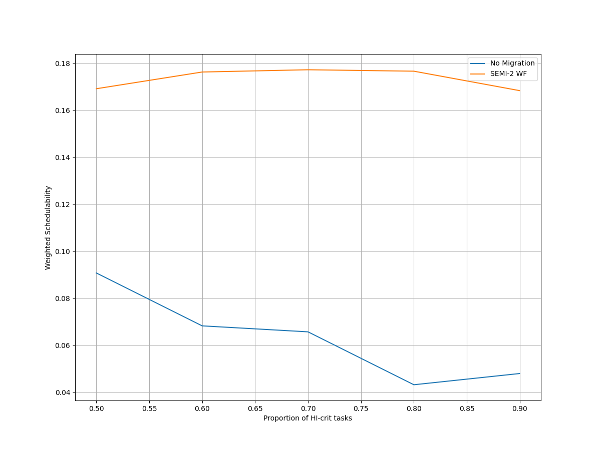
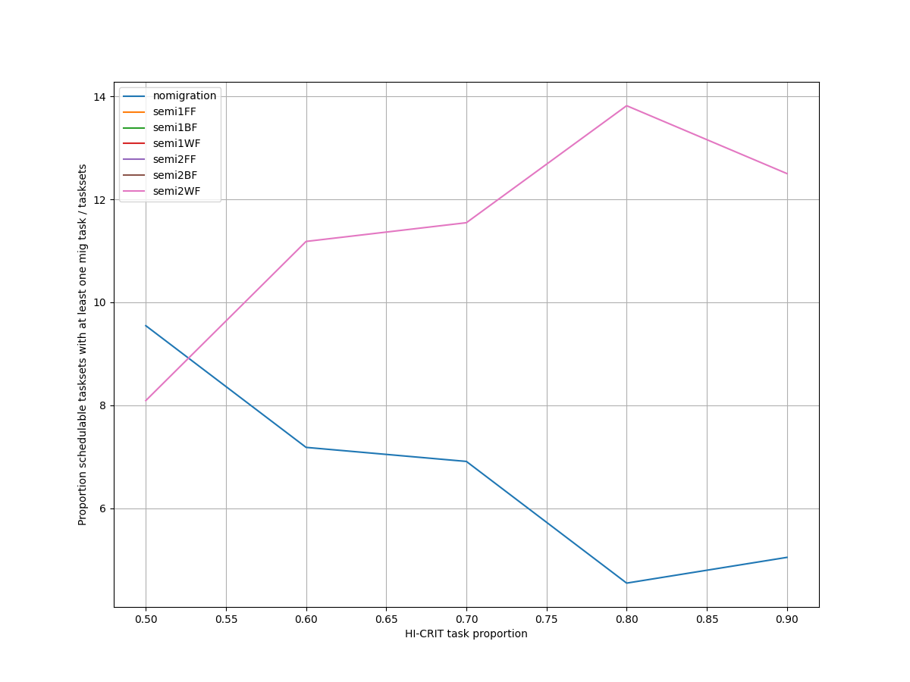
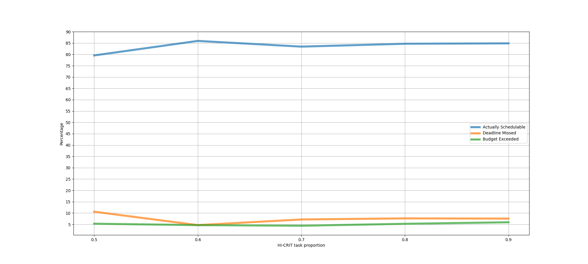
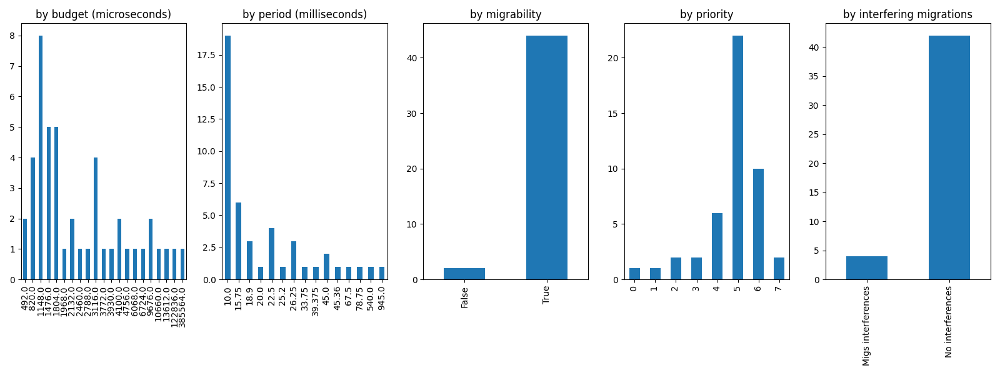
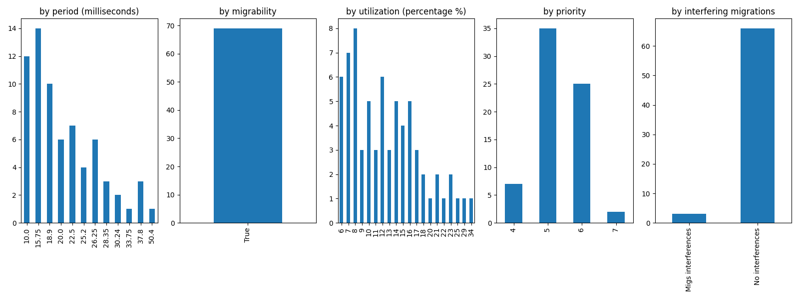
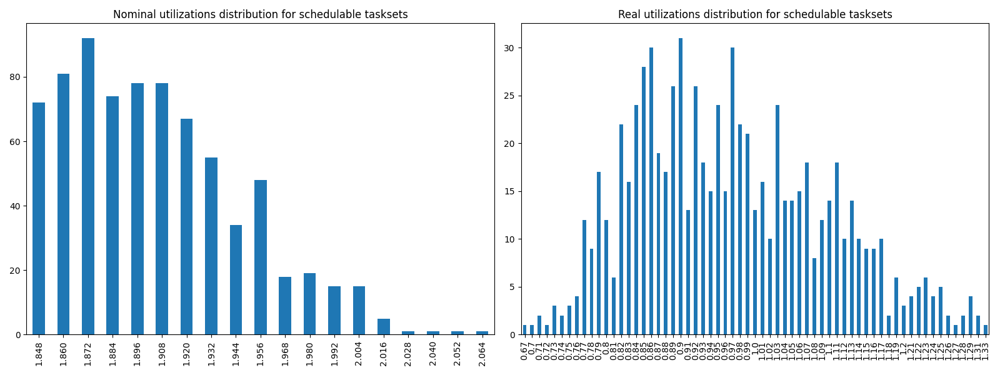
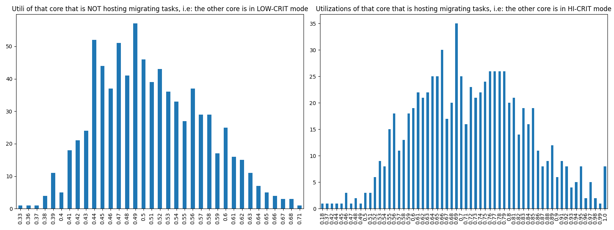

# Report on Experiment 3

## Overall data

### Experiments input parameters

**_Variable_ parameters**: those on which, in this experiment, we iterate.

| Utilization lower bound | Utilization higher bound | Utilization step |
| ------ | ------ | ------ |
| 1.848 | 2.1 | 0.012 |

| HI-CRIT proportion range | Step |
| ------ | ------ |
| [0.5, 0.9] | 0.1 |

**_Static_ parameters**: those that have a constant value.

| Criticality factor | Taskset size |
| ------ | ------ |
| 2 | 12 |

   Algorithm to generate tasks utilization: DRS algorithm <https://sigbed.org/2020/12/21/the-dirichlet-rescale-drs-algorithm-a-general-purpose-method-underpinning-synthetic-task-set-generation/>
   Utilizations range generation: `[5%, 60%]`

   **Normal** periods range from which to extract at random = `[10, 200] milliseconds`.

   **Big** periods range from which to extract at random = `[400, 1000] milliseconds`.

   From the latter, 1 or 2 periods are selected. The remaings, are selected from the former.

   Max periods armonicity: 2

### Output

| Schedulable | Not schedulable | Budget Exceeded | Safe Boundary Exceeded |
| ------ | ------ | ------ | ------ |
| 83.98% | 7.34% | 5.12% | 3.56% |

Number of executions: 899

Schedulable executions: 755/899 = 83.98%

_Not_ schedulable executions: 66/899 = 7.34%

Budget Exceeded executions: 46/899 = 5.12 %

Safe Boundary Exceeded executions: 32/899 = 3.56 %

NS + BE executions: 112/899 = 12.46 %

### **Simulations**

#### **Weighted schedulability experiment 3 according to simulations.**

#### **Percentage of (schedulable tasksets with at least one migrating tasks / number of schedulable tasksets) of experiment 3 according to simulations.** 

 

### **Real Executions**

#### **Schedulability for each level**

The tasksets with i) at least one migrating task and ii) marked as schedulable by the RTA are executed on a real target, in order to see how many of them are also schedulable in a real-world scenario. The following graph shows, for each "HI-CRIT task proportion" level (x-axis), the percentage of:

   - Actually schedulable tasksets, i.e. those that have all tasks that meet their deadlines;
   - Deadline Missed tasksets, i.e. those in which (at least) a tasks did not meet (at least) one of its deadlines; 
   - Budget Exceeded tasksets, i.e. those in which a criticality-level budget exceeding is detected (LO-crit budget for LO-crit tasks and HI-crit budget for HI-crit tasks). This type of event makes experiment invalid.

We want to see, thanks to this graphs, how many tasksets remain schedulable in the real-world. The RTA does not take into account overhead time, so we expect that there will be some tasksets that are not actually schedulable.

#### **Tasksets, grouped by differents parameters, with a Budget_Exceeded task.**

With the following graphs, we sum-up the features of the tasks that have occurred in a Criticality-level Budget Exceeded event. Each graph is like a "group-by" SQL operation.
 In the first one, "by budget", we can see, for each _criticality-level budget value_, how many tasks with that criticality-level budget has exceeded it. In the second one, we can see for each _period_ value, how many tasks has exceeded their criticality-level budget.

#### **Tasksets, grouped by differents parameters, with at least one task missing one (or more) of its deadlines.**

With the following graphs, we sum-up the features of the tasks that have missed (at least) one of them deadlines. As the Budget Exceeded graphs, each graph is like a "group-by" SQL operation.

### **Nominal utilizations VS Real utilizations about schedulable tasksets**

| Average real utilizations | Variance real utilizations | Min | Max |
| ------ | ------ | ------ | ------ |
| 0.967 | 0.016 | 0.670 | 1.330 |

### **Utils of the core that will have to accommodate migrating tasks VS Utils of the core when it is actually accomodating them**

These two graphs show the utilizations level of that core $`c_{i}`$ that, sooner or later, will have to accomodate migrating tasks of the other core $`c_{j}`$. The left one, shows the distribution utilizations levels when the core $`c_{i}`$ is **not** accomodating the other core's $`c_{j}`$ migrating tasks, i.e. $`c_{j}`$ is in **LOW-CRIT mode.**
The right one, shows the distribution utilizations levels when the core $`c_{i}`$ **is** accomodating the other core's $`c_{j}`$ migrating tasks, i.e. $`c_{j}`$ is in **HIGH-CRIT mode**.

| Average utilizations **not** hosting migs | Variance utilizations **not** hosting migs | Min | Max |
| ------ | ------ | ------ | ------ |
| 0.509 | 0.004 | 0.330 | 0.710 |

| Average utilizations hosting migs | Variance utilizations hosting migs | Min | Max |
| ------ | ------ | ------ | ------ |
| 0.719 | 0.014 | 0.180 | 1.000 |

## Bad tasksets

Click here to expand this section.

### **Not schedulable tasksets**

Click here to expand this section.

Ovvero quando almeno un task non completa entra almeno una sua deadline.

  1. Taskset **e3_semi2wf_t1002**

    Taskset execution params:
	 
    "id": "e3_semi2wf_t1002",
    "size": "12",
    "utilization": "1.968",
    "realutilization": 1.12,
    "criticality_factor": "2",
    "hicrit_proportion": "0.5"

   
 
Click here to see the deadlines missed tasks list.

   Time values are expressed as **micro-seconds**.

Task:  1

    
    "id": " 1",
    "basecpu": " 2",
    "priority": " 6",
    "period": 15750.0,
    "C(LO)": 2813.0,
    "C(HI)": 2813.0,
    "criticality": "LOW",
    "migrable": "True",
    "completedruns": " 499",
    "preemptions": " 0",
    "minresponsejitter": " 0.000000000",
    "maxresponsejitter": " 0.001431249",
    "minreleasejitter": " 0.000000000",
    "maxreleasejitter": " 8.827756895",
    "avgresponsejitter": " 0.001292754",
    "deadlinesmissed": " 1",
    "deadlinemissedtargetcore": " 0",
    "deadlinemissedaftermigration": " 0",
    "budgetexceeded": " 0",
    "budgetexceededtargetcore": " 0",
    "budgetexceededaftermigration": " 0",
    "timesmigrated": " 3",
    "timesrestored": " 2",
    "timesonc1": " 2",
    "timesonc2": " 495",
    "lockedtime": " 0.000002372"

   

   
 
Click here to see the CPUs log.

   Idle time is expressed as **seconds**.

   Util values are expressed as **percentage** %.

   CPU: 1

    
    "id": 1,
    "hyperperiod": 113400000,
    "lowtohigh": " 0",
    "hightolow": " 0",
    "idletime": 42390164,
    "util": 62.61890299823633,
    "idletimeduringhostingmig": 387742,
    "utilduringhostingmig": 63.51340033894892

   CPU: 2

    
    "id": 2,
    "hyperperiod": 113400000,
    "lowtohigh": " 35",
    "hightolow": " 35",
    "idletime": 57831894,
    "util": 49.00185714285714,
    "idletimeduringhostingmig": 0,
    "utilduringhostingmig": null

   Real Utilization: 1.12
   

   
 
Click here to see the whole tasksets.

   Time values are expressed as **micro-seconds**.

   Task:  4

    
    "id": " 4",
    "basecpu": " 1",
    "priority": " 2",
    "period": 56700.0,
    "C(LO)": 5234.0,
    "C(HI)": 10468.0,
    "criticality": "HIGH",
    "migrable": "False",
    "completedruns": " 2001",
    "preemptions": " 235",
    "minresponsejitter": " 0.000000000",
    "maxresponsejitter": " 0.030797138",
    "minreleasejitter": " 0.000000000",
    "maxreleasejitter": " 114.343307099",
    "avgresponsejitter": " 0.006315141",
    "deadlinesmissed": " 0",
    "deadlinemissedtargetcore": " 0",
    "deadlinemissedaftermigration": " 0",
    "budgetexceeded": " 0",
    "budgetexceededtargetcore": " 0",
    "budgetexceededaftermigration": " 0",
    "timesmigrated": " 0",
    "timesrestored": " 0",
    "timesonc1": " 2235",
    "timesonc2": " 0",
    "lockedtime": " 0.000049147"

   Task:  12

    
    "id": " 12",
    "basecpu": " 1",
    "priority": " 0",
    "period": 900000.0,
    "C(LO)": 75149.0,
    "C(HI)": 150299.0,
    "criticality": "HIGH",
    "migrable": "False",
    "completedruns": " 127",
    "preemptions": " 552",
    "minresponsejitter": " 0.000000000",
    "maxresponsejitter": " 0.161159841",
    "minreleasejitter": " 0.000000000",
    "maxreleasejitter": " 113.511542243",
    "avgresponsejitter": " 0.133764769",
    "deadlinesmissed": " 0",
    "deadlinemissedtargetcore": " 0",
    "deadlinemissedaftermigration": " 0",
    "budgetexceeded": " 0",
    "budgetexceededtargetcore": " 0",
    "budgetexceededaftermigration": " 0",
    "timesmigrated": " 0",
    "timesrestored": " 0",
    "timesonc1": " 678",
    "timesonc2": " 0",
    "lockedtime": " 0.000044324"

   Task:  10

    
    "id": " 10",
    "basecpu": " 1",
    "priority": " 1",
    "period": 200000.0,
    "C(LO)": 14119.0,
    "C(HI)": 28238.0,
    "criticality": "HIGH",
    "migrable": "False",
    "completedruns": " 568",
    "preemptions": " 246",
    "minresponsejitter": " 0.000000000",
    "maxresponsejitter": " 0.031409294",
    "minreleasejitter": " 0.000000000",
    "maxreleasejitter": " 114.213341862",
    "avgresponsejitter": " 0.016237108",
    "deadlinesmissed": " 0",
    "deadlinemissedtargetcore": " 0",
    "deadlinemissedaftermigration": " 0",
    "budgetexceeded": " 0",
    "budgetexceededtargetcore": " 0",
    "budgetexceededaftermigration": " 0",
    "timesmigrated": " 0",
    "timesrestored": " 0",
    "timesonc1": " 813",
    "timesonc2": " 0",
    "lockedtime": " 0.000033571"

   Task:  3

    
    "id": " 3",
    "basecpu": " 1",
    "priority": " 4",
    "period": 40000.0,
    "C(LO)": 15727.999999999998,
    "C(HI)": 15727.999999999998,
    "criticality": "LOW",
    "migrable": "False",
    "completedruns": " 2836",
    "preemptions": " 1",
    "minresponsejitter": " 0.000000000",
    "maxresponsejitter": " 0.014380829",
    "minreleasejitter": " 0.000000000",
    "maxreleasejitter": " 114.360006231",
    "avgresponsejitter": " 0.013565775",
    "deadlinesmissed": " 0",
    "deadlinemissedtargetcore": " 0",
    "deadlinemissedaftermigration": " 0",
    "budgetexceeded": " 0",
    "budgetexceededtargetcore": " 0",
    "budgetexceededaftermigration": " 0",
    "timesmigrated": " 0",
    "timesrestored": " 0",
    "timesonc1": " 2836",
    "timesonc2": " 0",
    "lockedtime": " 0.000182165"

   Task:  9

    
    "id": " 9",
    "basecpu": " 1",
    "priority": " 3",
    "period": 150000.0,
    "C(LO)": 12947.0,
    "C(HI)": 12947.0,
    "criticality": "LOW",
    "migrable": "False",
    "completedruns": " 757",
    "preemptions": " 191",
    "minresponsejitter": " 0.000000000",
    "maxresponsejitter": " 0.030500111",
    "minreleasejitter": " 0.000000000",
    "maxreleasejitter": " 114.254247264",
    "avgresponsejitter": " 0.014575417",
    "deadlinesmissed": " 0",
    "deadlinemissedtargetcore": " 0",
    "deadlinemissedaftermigration": " 0",
    "budgetexceeded": " 0",
    "budgetexceededtargetcore": " 0",
    "budgetexceededaftermigration": " 0",
    "timesmigrated": " 0",
    "timesrestored": " 0",
    "timesonc1": " 947",
    "timesonc2": " 0",
    "lockedtime": " 0.000042694"

   Task:  11

    
    "id": " 11",
    "basecpu": " 2",
    "priority": " 0",
    "period": 453600.0,
    "C(LO)": 80720.0,
    "C(HI)": 161441.0,
    "criticality": "HIGH",
    "migrable": "False",
    "completedruns": " 251",
    "preemptions": " 1548",
    "minresponsejitter": " 0.000000000",
    "maxresponsejitter": " 0.221159309",
    "minreleasejitter": " 0.000000000",
    "maxreleasejitter": " 113.962440895",
    "avgresponsejitter": " 0.103258571",
    "deadlinesmissed": " 0",
    "deadlinemissedtargetcore": " 0",
    "deadlinemissedaftermigration": " 0",
    "budgetexceeded": " 5",
    "budgetexceededtargetcore": " 0",
    "budgetexceededaftermigration": " 0",
    "timesmigrated": " 0",
    "timesrestored": " 0",
    "timesonc1": " 0",
    "timesonc2": " 1803",
    "lockedtime": " 0.000058853"

   Task:  5

    
    "id": " 5",
    "basecpu": " 2",
    "priority": " 2",
    "period": 75600.0,
    "C(LO)": 3910.0000000000005,
    "C(HI)": 7820.000000000001,
    "criticality": "HIGH",
    "migrable": "False",
    "completedruns": " 1501",
    "preemptions": " 127",
    "minresponsejitter": " 0.000000000",
    "maxresponsejitter": " 0.017476931",
    "minreleasejitter": " 0.000000000",
    "maxreleasejitter": " 114.324406240",
    "avgresponsejitter": " 0.003782438",
    "deadlinesmissed": " 0",
    "deadlinemissedtargetcore": " 0",
    "deadlinemissedaftermigration": " 0",
    "budgetexceeded": " 8",
    "budgetexceededtargetcore": " 0",
    "budgetexceededaftermigration": " 0",
    "timesmigrated": " 0",
    "timesrestored": " 0",
    "timesonc1": " 0",
    "timesonc2": " 1635",
    "lockedtime": " 0.000004907"

   Task:  6

    
    "id": " 6",
    "basecpu": " 2",
    "priority": " 1",
    "period": 87500.0,
    "C(LO)": 2813.0,
    "C(HI)": 5627.0,
    "criticality": "HIGH",
    "migrable": "False",
    "completedruns": " 1297",
    "preemptions": " 180",
    "minresponsejitter": " 0.000000000",
    "maxresponsejitter": " 0.026997958",
    "minreleasejitter": " 0.000000000",
    "maxreleasejitter": " 114.312506312",
    "avgresponsejitter": " 0.003064688",
    "deadlinesmissed": " 0",
    "deadlinemissedtargetcore": " 0",
    "deadlinemissedaftermigration": " 0",
    "budgetexceeded": " 22",
    "budgetexceededtargetcore": " 0",
    "budgetexceededaftermigration": " 0",
    "timesmigrated": " 0",
    "timesrestored": " 0",
    "timesonc1": " 0",
    "timesonc2": " 1498",
    "lockedtime": " 0.000012102"

   Task:  1

    
    "id": " 1",
    "basecpu": " 2",
    "priority": " 6",
    "period": 15750.0,
    "C(LO)": 2813.0,
    "C(HI)": 2813.0,
    "criticality": "LOW",
    "migrable": "True",
    "completedruns": " 499",
    "preemptions": " 0",
    "minresponsejitter": " 0.000000000",
    "maxresponsejitter": " 0.001431249",
    "minreleasejitter": " 0.000000000",
    "maxreleasejitter": " 8.827756895",
    "avgresponsejitter": " 0.001292754",
    "deadlinesmissed": " 1",
    "deadlinemissedtargetcore": " 0",
    "deadlinemissedaftermigration": " 0",
    "budgetexceeded": " 0",
    "budgetexceededtargetcore": " 0",
    "budgetexceededaftermigration": " 0",
    "timesmigrated": " 3",
    "timesrestored": " 2",
    "timesonc1": " 2",
    "timesonc2": " 495",
    "lockedtime": " 0.000002372"

   Task:  8

    
    "id": " 8",
    "basecpu": " 2",
    "priority": " 3",
    "period": 112500.0,
    "C(LO)": 12158.0,
    "C(HI)": 12158.0,
    "criticality": "LOW",
    "migrable": "False",
    "completedruns": " 1009",
    "preemptions": " 516",
    "minresponsejitter": " 0.000000000",
    "maxresponsejitter": " 0.025005048",
    "minreleasejitter": " 0.000000000",
    "maxreleasejitter": " 114.288413159",
    "avgresponsejitter": " 0.012361649",
    "deadlinesmissed": " 0",
    "deadlinemissedtargetcore": " 0",
    "deadlinemissedaftermigration": " 0",
    "budgetexceeded": " 0",
    "budgetexceededtargetcore": " 0",
    "budgetexceededaftermigration": " 0",
    "timesmigrated": " 0",
    "timesrestored": " 0",
    "timesonc1": " 0",
    "timesonc2": " 1524",
    "lockedtime": " 0.000039541"

   Task:  7

    
    "id": " 7",
    "basecpu": " 2",
    "priority": " 4",
    "period": 100800.0,
    "C(LO)": 10893.0,
    "C(HI)": 10893.0,
    "criticality": "LOW",
    "migrable": "False",
    "completedruns": " 1126",
    "preemptions": " 352",
    "minresponsejitter": " 0.000000000",
    "maxresponsejitter": " 0.013008976",
    "minreleasejitter": " 0.000000000",
    "maxreleasejitter": " 114.299206850",
    "avgresponsejitter": " 0.009996057",
    "deadlinesmissed": " 0",
    "deadlinemissedtargetcore": " 0",
    "deadlinemissedaftermigration": " 0",
    "budgetexceeded": " 0",
    "budgetexceededtargetcore": " 0",
    "budgetexceededaftermigration": " 0",
    "timesmigrated": " 0",
    "timesrestored": " 0",
    "timesonc1": " 0",
    "timesonc2": " 1477",
    "lockedtime": " 0.000025970"

   Task:  2

    
    "id": " 2",
    "basecpu": " 2",
    "priority": " 5",
    "period": 28350.0,
    "C(LO)": 2188.0,
    "C(HI)": 2188.0,
    "criticality": "LOW",
    "migrable": "False",
    "completedruns": " 4001",
    "preemptions": " 0",
    "minresponsejitter": " 0.000000000",
    "maxresponsejitter": " 0.002000123",
    "minreleasejitter": " 0.000000000",
    "maxreleasejitter": " 114.371656207",
    "avgresponsejitter": " 0.001882595",
    "deadlinesmissed": " 0",
    "deadlinemissedtargetcore": " 0",
    "deadlinemissedaftermigration": " 0",
    "budgetexceeded": " 0",
    "budgetexceededtargetcore": " 0",
    "budgetexceededaftermigration": " 0",
    "timesmigrated": " 0",
    "timesrestored": " 0",
    "timesonc1": " 0",
    "timesonc2": " 4000",
    "lockedtime": " 0.000112967"

   

  2. Taskset **e3_semi2wf_t1016**

    Taskset execution params:
	 
    "id": "e3_semi2wf_t1016",
    "size": "12",
    "utilization": "1.968",
    "realutilization": 1.28,
    "criticality_factor": "2",
    "hicrit_proportion": "0.5"

   
 
Click here to see the deadlines missed tasks list.

   Time values are expressed as **micro-seconds**.

Task:  2

    
    "id": " 2",
    "basecpu": " 1",
    "priority": " 6",
    "period": 26250.0,
    "C(LO)": 1330.0,
    "C(HI)": 1330.0,
    "criticality": "LOW",
    "migrable": "True",
    "completedruns": " 1441",
    "preemptions": " 1",
    "minresponsejitter": " 0.000000000",
    "maxresponsejitter": " 0.000681453",
    "minreleasejitter": " 0.000000000",
    "maxreleasejitter": " 38.773756532",
    "avgresponsejitter": " 0.000613841",
    "deadlinesmissed": " 1",
    "deadlinemissedtargetcore": " 0",
    "deadlinemissedaftermigration": " 0",
    "budgetexceeded": " 0",
    "budgetexceededtargetcore": " 0",
    "budgetexceededaftermigration": " 0",
    "timesmigrated": " 7",
    "timesrestored": " 7",
    "timesonc1": " 1394",
    "timesonc2": " 46",
    "lockedtime": " 0.000009252"

   

   
 
Click here to see the CPUs log.

   Idle time is expressed as **seconds**.

   Util values are expressed as **percentage** %.

   CPU: 1

    
    "id": 1,
    "hyperperiod": 22680000,
    "lowtohigh": " 14",
    "hightolow": " 14",
    "idletime": 13661275,
    "util": 63.859060846560844,
    "idletimeduringhostingmig": 0,
    "utilduringhostingmig": null

   CPU: 2

    
    "id": 2,
    "hyperperiod": 37800000,
    "lowtohigh": " 0",
    "hightolow": " 0",
    "idletime": 13686541,
    "util": 63.792219576719575,
    "idletimeduringhostingmig": 488465,
    "utilduringhostingmig": 62.4579687421942

   Real Utilization: 1.28
   

   
 
Click here to see the whole tasksets.

   Time values are expressed as **micro-seconds**.

   Task:  10

    
    "id": " 10",
    "basecpu": " 1",
    "priority": " 1",
    "period": 181440.0,
    "C(LO)": 16799.0,
    "C(HI)": 33599.0,
    "criticality": "HIGH",
    "migrable": "False",
    "completedruns": " 210",
    "preemptions": " 225",
    "minresponsejitter": " 0.000000000",
    "maxresponsejitter": " 0.060687964",
    "minreleasejitter": " 0.000000000",
    "maxreleasejitter": " 38.739526667",
    "avgresponsejitter": " 0.021451072",
    "deadlinesmissed": " 0",
    "deadlinemissedtargetcore": " 0",
    "deadlinemissedaftermigration": " 0",
    "budgetexceeded": " 1",
    "budgetexceededtargetcore": " 0",
    "budgetexceededaftermigration": " 0",
    "timesmigrated": " 0",
    "timesrestored": " 0",
    "timesonc1": " 435",
    "timesonc2": " 0",
    "lockedtime": " 0.000005649"

   Task:  3

    
    "id": " 3",
    "basecpu": " 1",
    "priority": " 4",
    "period": 42000.0,
    "C(LO)": 2876.0,
    "C(HI)": 5752.0,
    "criticality": "HIGH",
    "migrable": "False",
    "completedruns": " 901",
    "preemptions": " 4",
    "minresponsejitter": " 0.000000000",
    "maxresponsejitter": " 0.005229354",
    "minreleasejitter": " 0.000000000",
    "maxreleasejitter": " 38.758006378",
    "avgresponsejitter": " 0.002504886",
    "deadlinesmissed": " 0",
    "deadlinemissedtargetcore": " 0",
    "deadlinemissedaftermigration": " 0",
    "budgetexceeded": " 9",
    "budgetexceededtargetcore": " 0",
    "budgetexceededaftermigration": " 0",
    "timesmigrated": " 0",
    "timesrestored": " 0",
    "timesonc1": " 913",
    "timesonc2": " 0",
    "lockedtime": " 0.000001138"

   Task:  9

    
    "id": " 9",
    "basecpu": " 1",
    "priority": " 2",
    "period": 157500.0,
    "C(LO)": 5387.0,
    "C(HI)": 10775.0,
    "criticality": "HIGH",
    "migrable": "False",
    "completedruns": " 241",
    "preemptions": " 15",
    "minresponsejitter": " 0.000000000",
    "maxresponsejitter": " 0.011995339",
    "minreleasejitter": " 0.000000000",
    "maxreleasejitter": " 38.643163811",
    "avgresponsejitter": " 0.004919147",
    "deadlinesmissed": " 0",
    "deadlinemissedtargetcore": " 0",
    "deadlinemissedaftermigration": " 0",
    "budgetexceeded": " 4",
    "budgetexceededtargetcore": " 0",
    "budgetexceededaftermigration": " 0",
    "timesmigrated": " 0",
    "timesrestored": " 0",
    "timesonc1": " 259",
    "timesonc2": " 0",
    "lockedtime": " 0.000000502"

   Task:  7

    
    "id": " 7",
    "basecpu": " 1",
    "priority": " 3",
    "period": 118125.0,
    "C(LO)": 36862.0,
    "C(HI)": 36862.0,
    "criticality": "LOW",
    "migrable": "False",
    "completedruns": " 321",
    "preemptions": " 548",
    "minresponsejitter": " 0.000000000",
    "maxresponsejitter": " 0.041084012",
    "minreleasejitter": " 0.000000000",
    "maxreleasejitter": " 38.681881571",
    "avgresponsejitter": " 0.034742498",
    "deadlinesmissed": " 0",
    "deadlinemissedtargetcore": " 0",
    "deadlinemissedaftermigration": " 0",
    "budgetexceeded": " 0",
    "budgetexceededtargetcore": " 0",
    "budgetexceededaftermigration": " 0",
    "timesmigrated": " 0",
    "timesrestored": " 0",
    "timesonc1": " 868",
    "timesonc2": " 0",
    "lockedtime": " 0.000016048"

   Task:  12

    
    "id": " 12",
    "basecpu": " 1",
    "priority": " 0",
    "period": 945000.0,
    "C(LO)": 177053.0,
    "C(HI)": 177053.0,
    "criticality": "LOW",
    "migrable": "False",
    "completedruns": " 41",
    "preemptions": " 499",
    "minresponsejitter": " 0.000000000",
    "maxresponsejitter": " 0.302603108",
    "minreleasejitter": " 0.000000000",
    "maxreleasejitter": " 37.896727366",
    "avgresponsejitter": " 0.268951153",
    "deadlinesmissed": " 0",
    "deadlinemissedtargetcore": " 0",
    "deadlinemissedaftermigration": " 0",
    "budgetexceeded": " 0",
    "budgetexceededtargetcore": " 0",
    "budgetexceededaftermigration": " 0",
    "timesmigrated": " 0",
    "timesrestored": " 0",
    "timesonc1": " 539",
    "timesonc2": " 0",
    "lockedtime": " 0.000014198"

   Task:  6

    
    "id": " 6",
    "basecpu": " 1",
    "priority": " 5",
    "period": 108000.0,
    "C(LO)": 9029.0,
    "C(HI)": 9029.0,
    "criticality": "LOW",
    "migrable": "True",
    "completedruns": " 142",
    "preemptions": " 19",
    "minresponsejitter": " 0.000000000",
    "maxresponsejitter": " 0.005152574",
    "minreleasejitter": " 0.000000000",
    "maxreleasejitter": " 16.120661571",
    "avgresponsejitter": " 0.004222661",
    "deadlinesmissed": " 0",
    "deadlinemissedtargetcore": " 0",
    "deadlinemissedaftermigration": " 0",
    "budgetexceeded": " 0",
    "budgetexceededtargetcore": " 0",
    "budgetexceededaftermigration": " 0",
    "timesmigrated": " 3",
    "timesrestored": " 2",
    "timesonc1": " 155",
    "timesonc2": " 5",
    "lockedtime": " 0.000001312"

   Task:  2

    
    "id": " 2",
    "basecpu": " 1",
    "priority": " 6",
    "period": 26250.0,
    "C(LO)": 1330.0,
    "C(HI)": 1330.0,
    "criticality": "LOW",
    "migrable": "True",
    "completedruns": " 1441",
    "preemptions": " 1",
    "minresponsejitter": " 0.000000000",
    "maxresponsejitter": " 0.000681453",
    "minreleasejitter": " 0.000000000",
    "maxreleasejitter": " 38.773756532",
    "avgresponsejitter": " 0.000613841",
    "deadlinesmissed": " 1",
    "deadlinemissedtargetcore": " 0",
    "deadlinemissedaftermigration": " 0",
    "budgetexceeded": " 0",
    "budgetexceededtargetcore": " 0",
    "budgetexceededaftermigration": " 0",
    "timesmigrated": " 7",
    "timesrestored": " 7",
    "timesonc1": " 1394",
    "timesonc2": " 46",
    "lockedtime": " 0.000009252"

   Task:  5

    
    "id": " 5",
    "basecpu": " 2",
    "priority": " 2",
    "period": 100800.0,
    "C(LO)": 10735.0,
    "C(HI)": 21470.0,
    "criticality": "HIGH",
    "migrable": "False",
    "completedruns": " 376",
    "preemptions": " 214",
    "minresponsejitter": " 0.000000000",
    "maxresponsejitter": " 0.017881760",
    "minreleasejitter": " 0.000000000",
    "maxreleasejitter": " 38.699206351",
    "avgresponsejitter": " 0.011764727",
    "deadlinesmissed": " 0",
    "deadlinemissedtargetcore": " 0",
    "deadlinemissedaftermigration": " 0",
    "budgetexceeded": " 0",
    "budgetexceededtargetcore": " 0",
    "budgetexceededaftermigration": " 0",
    "timesmigrated": " 0",
    "timesrestored": " 0",
    "timesonc1": " 0",
    "timesonc2": " 589",
    "lockedtime": " 0.000008381"

   Task:  8

    
    "id": " 8",
    "basecpu": " 2",
    "priority": " 1",
    "period": 135000.0,
    "C(LO)": 6975.0,
    "C(HI)": 13951.0,
    "criticality": "HIGH",
    "migrable": "False",
    "completedruns": " 281",
    "preemptions": " 111",
    "minresponsejitter": " 0.000000000",
    "maxresponsejitter": " 0.023943354",
    "minreleasejitter": " 0.000000000",
    "maxreleasejitter": " 38.665006240",
    "avgresponsejitter": " 0.008540468",
    "deadlinesmissed": " 0",
    "deadlinemissedtargetcore": " 0",
    "deadlinemissedaftermigration": " 0",
    "budgetexceeded": " 0",
    "budgetexceededtargetcore": " 0",
    "budgetexceededaftermigration": " 0",
    "timesmigrated": " 0",
    "timesrestored": " 0",
    "timesonc1": " 0",
    "timesonc2": " 391",
    "lockedtime": " 0.000001757"

   Task:  4

    
    "id": " 4",
    "basecpu": " 2",
    "priority": " 3",
    "period": 87500.0,
    "C(LO)": 4262.0,
    "C(HI)": 8524.0,
    "criticality": "HIGH",
    "migrable": "False",
    "completedruns": " 433",
    "preemptions": " 54",
    "minresponsejitter": " 0.000000000",
    "maxresponsejitter": " 0.008393979",
    "minreleasejitter": " 0.000000000",
    "maxreleasejitter": " 38.712506622",
    "avgresponsejitter": " 0.004202562",
    "deadlinesmissed": " 0",
    "deadlinemissedtargetcore": " 0",
    "deadlinemissedaftermigration": " 0",
    "budgetexceeded": " 0",
    "budgetexceededtargetcore": " 0",
    "budgetexceededaftermigration": " 0",
    "timesmigrated": " 0",
    "timesrestored": " 0",
    "timesonc1": " 0",
    "timesonc2": " 486",
    "lockedtime": " 0.000008300"

   Task:  11

    
    "id": " 11",
    "basecpu": " 2",
    "priority": " 0",
    "period": 600000.0,
    "C(LO)": 168599.0,
    "C(HI)": 168599.0,
    "criticality": "LOW",
    "migrable": "False",
    "completedruns": " 64",
    "preemptions": " 884",
    "minresponsejitter": " 0.000000000",
    "maxresponsejitter": " 0.260823976",
    "minreleasejitter": " 0.000000000",
    "maxreleasejitter": " 38.208410285",
    "avgresponsejitter": " 0.237177838",
    "deadlinesmissed": " 0",
    "deadlinemissedtargetcore": " 0",
    "deadlinemissedaftermigration": " 0",
    "budgetexceeded": " 0",
    "budgetexceededtargetcore": " 0",
    "budgetexceededaftermigration": " 0",
    "timesmigrated": " 0",
    "timesrestored": " 0",
    "timesonc1": " 0",
    "timesonc2": " 947",
    "lockedtime": " 0.000017820"

   Task:  1

    
    "id": " 1",
    "basecpu": " 2",
    "priority": " 4",
    "period": 20000.0,
    "C(LO)": 4979.0,
    "C(HI)": 4979.0,
    "criticality": "LOW",
    "migrable": "False",
    "completedruns": " 1891",
    "preemptions": " 0",
    "minresponsejitter": " 0.000000000",
    "maxresponsejitter": " 0.004542883",
    "minreleasejitter": " 0.000000000",
    "maxreleasejitter": " 38.780006417",
    "avgresponsejitter": " 0.004286772",
    "deadlinesmissed": " 0",
    "deadlinemissedtargetcore": " 0",
    "deadlinemissedaftermigration": " 0",
    "budgetexceeded": " 0",
    "budgetexceededtargetcore": " 0",
    "budgetexceededaftermigration": " 0",
    "timesmigrated": " 0",
    "timesrestored": " 0",
    "timesonc1": " 0",
    "timesonc2": " 1890",
    "lockedtime": " 0.000008520"

   

  3. Taskset **e3_semi2wf_t1161**

    Taskset execution params:
	 
    "id": "e3_semi2wf_t1161",
    "size": "12",
    "utilization": "1.980",
    "realutilization": 1.01,
    "criticality_factor": "2",
    "hicrit_proportion": "0.5"

   
 
Click here to see the deadlines missed tasks list.

   Time values are expressed as **micro-seconds**.

Task:  3

    
    "id": " 3",
    "basecpu": " 1",
    "priority": " 5",
    "period": 20000.0,
    "C(LO)": 2000.0,
    "C(HI)": 2000.0,
    "criticality": "LOW",
    "migrable": "True",
    "completedruns": " 894",
    "preemptions": " 0",
    "minresponsejitter": " 0.000000000",
    "maxresponsejitter": " 0.001018258",
    "minreleasejitter": " 0.000000000",
    "maxreleasejitter": " 18.840007429",
    "avgresponsejitter": " 0.000924859",
    "deadlinesmissed": " 1",
    "deadlinemissedtargetcore": " 1",
    "deadlinemissedaftermigration": " 0",
    "budgetexceeded": " 0",
    "budgetexceededtargetcore": " 0",
    "budgetexceededaftermigration": " 0",
    "timesmigrated": " 9",
    "timesrestored": " 8",
    "timesonc1": " 883",
    "timesonc2": " 9",
    "lockedtime": " 0.000004712"

   

   
 
Click here to see the CPUs log.

   Idle time is expressed as **seconds**.

   Util values are expressed as **percentage** %.

   CPU: 1

    
    "id": 1,
    "hyperperiod": 18900000,
    "lowtohigh": " 49",
    "hightolow": " 49",
    "idletime": 16279139,
    "util": 56.93349470899471,
    "idletimeduringhostingmig": 43268,
    "utilduringhostingmig": 76.75912596953356

   CPU: 2

    
    "id": 2,
    "hyperperiod": 37800000,
    "lowtohigh": " 9",
    "hightolow": " 9",
    "idletime": 21106961,
    "util": 44.16147883597884,
    "idletimeduringhostingmig": 205342,
    "utilduringhostingmig": 69.14516686450993

   Real Utilization: 1.01
   

   
 
Click here to see the whole tasksets.

   Time values are expressed as **micro-seconds**.

   Task:  10

    
    "id": " 10",
    "basecpu": " 1",
    "priority": " 1",
    "period": 175000.0,
    "C(LO)": 23547.0,
    "C(HI)": 47095.0,
    "criticality": "HIGH",
    "migrable": "False",
    "completedruns": " 217",
    "preemptions": " 610",
    "minresponsejitter": " 0.000000000",
    "maxresponsejitter": " 0.047607480",
    "minreleasejitter": " 0.000000000",
    "maxreleasejitter": " 38.625006495",
    "avgresponsejitter": " 0.028710619",
    "deadlinesmissed": " 0",
    "deadlinemissedtargetcore": " 0",
    "deadlinemissedaftermigration": " 0",
    "budgetexceeded": " 1",
    "budgetexceededtargetcore": " 0",
    "budgetexceededaftermigration": " 0",
    "timesmigrated": " 0",
    "timesrestored": " 0",
    "timesonc1": " 827",
    "timesonc2": " 0",
    "lockedtime": " 0.000022261"

   Task:  4

    
    "id": " 4",
    "basecpu": " 1",
    "priority": " 2",
    "period": 42000.0,
    "C(LO)": 3550.0,
    "C(HI)": 7101.0,
    "criticality": "HIGH",
    "migrable": "False",
    "completedruns": " 901",
    "preemptions": " 252",
    "minresponsejitter": " 0.000000000",
    "maxresponsejitter": " 0.021763126",
    "minreleasejitter": " 0.000000000",
    "maxreleasejitter": " 38.758006279",
    "avgresponsejitter": " 0.003849805",
    "deadlinesmissed": " 0",
    "deadlinemissedtargetcore": " 0",
    "deadlinemissedaftermigration": " 0",
    "budgetexceeded": " 8",
    "budgetexceededtargetcore": " 0",
    "budgetexceededaftermigration": " 0",
    "timesmigrated": " 0",
    "timesrestored": " 0",
    "timesonc1": " 1160",
    "timesonc2": " 0",
    "lockedtime": " 0.000002492"

   Task:  1

    
    "id": " 1",
    "basecpu": " 1",
    "priority": " 4",
    "period": 10000.0,
    "C(LO)": 405.0,
    "C(HI)": 811.0,
    "criticality": "HIGH",
    "migrable": "False",
    "completedruns": " 3781",
    "preemptions": " 2",
    "minresponsejitter": " 0.000000000",
    "maxresponsejitter": " 0.002102673",
    "minreleasejitter": " 0.000000000",
    "maxreleasejitter": " 38.790006207",
    "avgresponsejitter": " 0.000349733",
    "deadlinesmissed": " 0",
    "deadlinemissedtargetcore": " 0",
    "deadlinemissedaftermigration": " 0",
    "budgetexceeded": " 40",
    "budgetexceededtargetcore": " 0",
    "budgetexceededaftermigration": " 0",
    "timesmigrated": " 0",
    "timesrestored": " 0",
    "timesonc1": " 3822",
    "timesonc2": " 0",
    "lockedtime": " 0.000033688"

   Task:  6

    
    "id": " 6",
    "basecpu": " 1",
    "priority": " 3",
    "period": 67500.0,
    "C(LO)": 17722.0,
    "C(HI)": 17722.0,
    "criticality": "LOW",
    "migrable": "False",
    "completedruns": " 561",
    "preemptions": " 829",
    "minresponsejitter": " 0.000000000",
    "maxresponsejitter": " 0.018904616",
    "minreleasejitter": " 0.000000000",
    "maxreleasejitter": " 38.732506387",
    "avgresponsejitter": " 0.016120387",
    "deadlinesmissed": " 0",
    "deadlinemissedtargetcore": " 0",
    "deadlinemissedaftermigration": " 0",
    "budgetexceeded": " 0",
    "budgetexceededtargetcore": " 0",
    "budgetexceededaftermigration": " 0",
    "timesmigrated": " 0",
    "timesrestored": " 0",
    "timesonc1": " 1389",
    "timesonc2": " 0",
    "lockedtime": " 0.000020991"

   Task:  11

    
    "id": " 11",
    "basecpu": " 1",
    "priority": " 0",
    "period": 590625.0,
    "C(LO)": 64354.99999999999,
    "C(HI)": 64354.99999999999,
    "criticality": "LOW",
    "migrable": "False",
    "completedruns": " 65",
    "preemptions": " 540",
    "minresponsejitter": " 0.000000000",
    "maxresponsejitter": " 0.127189580",
    "minreleasejitter": " 0.000000000",
    "maxreleasejitter": " 38.209381592",
    "avgresponsejitter": " 0.096973538",
    "deadlinesmissed": " 0",
    "deadlinemissedtargetcore": " 0",
    "deadlinemissedaftermigration": " 0",
    "budgetexceeded": " 0",
    "budgetexceededtargetcore": " 0",
    "budgetexceededaftermigration": " 0",
    "timesmigrated": " 0",
    "timesrestored": " 0",
    "timesonc1": " 604",
    "timesonc2": " 0",
    "lockedtime": " 0.000029444"

   Task:  3

    
    "id": " 3",
    "basecpu": " 1",
    "priority": " 5",
    "period": 20000.0,
    "C(LO)": 2000.0,
    "C(HI)": 2000.0,
    "criticality": "LOW",
    "migrable": "True",
    "completedruns": " 894",
    "preemptions": " 0",
    "minresponsejitter": " 0.000000000",
    "maxresponsejitter": " 0.001018258",
    "minreleasejitter": " 0.000000000",
    "maxreleasejitter": " 18.840007429",
    "avgresponsejitter": " 0.000924859",
    "deadlinesmissed": " 1",
    "deadlinemissedtargetcore": " 1",
    "deadlinemissedaftermigration": " 0",
    "budgetexceeded": " 0",
    "budgetexceededtargetcore": " 0",
    "budgetexceededaftermigration": " 0",
    "timesmigrated": " 9",
    "timesrestored": " 8",
    "timesonc1": " 883",
    "timesonc2": " 9",
    "lockedtime": " 0.000004712"

   Task:  5

    
    "id": " 5",
    "basecpu": " 2",
    "priority": " 2",
    "period": 65625.0,
    "C(LO)": 8995.0,
    "C(HI)": 17990.0,
    "criticality": "HIGH",
    "migrable": "False",
    "completedruns": " 577",
    "preemptions": " 97",
    "minresponsejitter": " 0.000000000",
    "maxresponsejitter": " 0.033220784",
    "minreleasejitter": " 0.000000000",
    "maxreleasejitter": " 38.734381369",
    "avgresponsejitter": " 0.008745240",
    "deadlinesmissed": " 0",
    "deadlinemissedtargetcore": " 0",
    "deadlinemissedaftermigration": " 0",
    "budgetexceeded": " 3",
    "budgetexceededtargetcore": " 0",
    "budgetexceededaftermigration": " 0",
    "timesmigrated": " 0",
    "timesrestored": " 0",
    "timesonc1": " 0",
    "timesonc2": " 676",
    "lockedtime": " 0.000010937"

   Task:  12

    
    "id": " 12",
    "basecpu": " 2",
    "priority": " 0",
    "period": 840000.0,
    "C(LO)": 61045.0,
    "C(HI)": 122090.0,
    "criticality": "HIGH",
    "migrable": "False",
    "completedruns": " 46",
    "preemptions": " 125",
    "minresponsejitter": " 0.000000000",
    "maxresponsejitter": " 0.095855556",
    "minreleasejitter": " 0.000000000",
    "maxreleasejitter": " 37.965873402",
    "avgresponsejitter": " 0.076523333",
    "deadlinesmissed": " 0",
    "deadlinemissedtargetcore": " 0",
    "deadlinemissedaftermigration": " 0",
    "budgetexceeded": " 0",
    "budgetexceededtargetcore": " 0",
    "budgetexceededaftermigration": " 0",
    "timesmigrated": " 0",
    "timesrestored": " 0",
    "timesonc1": " 0",
    "timesonc2": " 170",
    "lockedtime": " 0.000012168"

   Task:  9

    
    "id": " 9",
    "basecpu": " 2",
    "priority": " 1",
    "period": 105000.0,
    "C(LO)": 7129.0,
    "C(HI)": 14259.0,
    "criticality": "HIGH",
    "migrable": "False",
    "completedruns": " 361",
    "preemptions": " 25",
    "minresponsejitter": " 0.000000000",
    "maxresponsejitter": " 0.019913781",
    "minreleasejitter": " 0.000000000",
    "maxreleasejitter": " 38.695006447",
    "avgresponsejitter": " 0.006570583",
    "deadlinesmissed": " 0",
    "deadlinemissedtargetcore": " 0",
    "deadlinemissedaftermigration": " 0",
    "budgetexceeded": " 6",
    "budgetexceededtargetcore": " 0",
    "budgetexceededaftermigration": " 0",
    "timesmigrated": " 0",
    "timesrestored": " 0",
    "timesonc1": " 0",
    "timesonc2": " 391",
    "lockedtime": " 0.000005252"

   Task:  2

    
    "id": " 2",
    "basecpu": " 2",
    "priority": " 5",
    "period": 18900.0,
    "C(LO)": 4067.9999999999995,
    "C(HI)": 4067.9999999999995,
    "criticality": "LOW",
    "migrable": "True",
    "completedruns": " 229",
    "preemptions": " 0",
    "minresponsejitter": " 0.000000000",
    "maxresponsejitter": " 0.002058489",
    "minreleasejitter": " 0.000000000",
    "maxreleasejitter": " 5.290306955",
    "avgresponsejitter": " 0.001854553",
    "deadlinesmissed": " 0",
    "deadlinemissedtargetcore": " 0",
    "deadlinemissedaftermigration": " 0",
    "budgetexceeded": " 0",
    "budgetexceededtargetcore": " 0",
    "budgetexceededaftermigration": " 0",
    "timesmigrated": " 2",
    "timesrestored": " 2",
    "timesonc1": " 7",
    "timesonc2": " 221",
    "lockedtime": " 0.000002877"

   Task:  7

    
    "id": " 7",
    "basecpu": " 2",
    "priority": " 4",
    "period": 75000.0,
    "C(LO)": 9516.0,
    "C(HI)": 9516.0,
    "criticality": "LOW",
    "migrable": "False",
    "completedruns": " 505",
    "preemptions": " 27",
    "minresponsejitter": " 0.000000000",
    "maxresponsejitter": " 0.010459535",
    "minreleasejitter": " 0.000000000",
    "maxreleasejitter": " 38.725006336",
    "avgresponsejitter": " 0.008278619",
    "deadlinesmissed": " 0",
    "deadlinemissedtargetcore": " 0",
    "deadlinemissedaftermigration": " 0",
    "budgetexceeded": " 0",
    "budgetexceededtargetcore": " 0",
    "budgetexceededaftermigration": " 0",
    "timesmigrated": " 0",
    "timesrestored": " 0",
    "timesonc1": " 0",
    "timesonc2": " 531",
    "lockedtime": " 0.000020661"

   Task:  8

    
    "id": " 8",
    "basecpu": " 2",
    "priority": " 3",
    "period": 90000.0,
    "C(LO)": 8253.0,
    "C(HI)": 8253.0,
    "criticality": "LOW",
    "migrable": "False",
    "completedruns": " 421",
    "preemptions": " 17",
    "minresponsejitter": " 0.000000000",
    "maxresponsejitter": " 0.010327505",
    "minreleasejitter": " 0.000000000",
    "maxreleasejitter": " 38.710006949",
    "avgresponsejitter": " 0.007170811",
    "deadlinesmissed": " 0",
    "deadlinemissedtargetcore": " 0",
    "deadlinemissedaftermigration": " 0",
    "budgetexceeded": " 0",
    "budgetexceededtargetcore": " 0",
    "budgetexceededaftermigration": " 0",
    "timesmigrated": " 0",
    "timesrestored": " 0",
    "timesonc1": " 0",
    "timesonc2": " 437",
    "lockedtime": " 0.000014898"

   

  4. Taskset **e3_semi2wf_t1280**

    Taskset execution params:
	 
    "id": "e3_semi2wf_t1280",
    "size": "12",
    "utilization": "1.992",
    "realutilization": 1.1,
    "criticality_factor": "2",
    "hicrit_proportion": "0.5"

   
 
Click here to see the deadlines missed tasks list.

   Time values are expressed as **micro-seconds**.

Task:  1

    
    "id": " 1",
    "basecpu": " 2",
    "priority": " 6",
    "period": 26250.0,
    "C(LO)": 2837.0,
    "C(HI)": 2837.0,
    "criticality": "LOW",
    "migrable": "True",
    "completedruns": " 339",
    "preemptions": " 0",
    "minresponsejitter": " 0.000000000",
    "maxresponsejitter": " 0.001439276",
    "minreleasejitter": " 0.000000000",
    "maxreleasejitter": " 9.846257511",
    "avgresponsejitter": " 0.001293835",
    "deadlinesmissed": " 1",
    "deadlinemissedtargetcore": " 1",
    "deadlinemissedaftermigration": " 0",
    "budgetexceeded": " 0",
    "budgetexceededtargetcore": " 0",
    "budgetexceededaftermigration": " 0",
    "timesmigrated": " 1",
    "timesrestored": " 1",
    "timesonc1": " 4",
    "timesonc2": " 333",
    "lockedtime": " 0.000003492"

   

   
 
Click here to see the CPUs log.

   Idle time is expressed as **seconds**.

   Util values are expressed as **percentage** %.

   CPU: 1

    
    "id": 1,
    "hyperperiod": 18900000,
    "lowtohigh": " 6",
    "hightolow": " 6",
    "idletime": 15973089,
    "util": 57.74315079365079,
    "idletimeduringhostingmig": 123706,
    "utilduringhostingmig": 58.43924596255346

   CPU: 2

    
    "id": 2,
    "hyperperiod": 37800000,
    "lowtohigh": " 5",
    "hightolow": " 5",
    "idletime": 18290478,
    "util": 51.61249206349206,
    "idletimeduringhostingmig": 109736,
    "utilduringhostingmig": 62.434358718052295

   Real Utilization: 1.1
   

   
 
Click here to see the whole tasksets.

   Time values are expressed as **micro-seconds**.

   Task:  9

    
    "id": " 9",
    "basecpu": " 1",
    "priority": " 1",
    "period": 140000.0,
    "C(LO)": 20612.0,
    "C(HI)": 41225.0,
    "criticality": "HIGH",
    "migrable": "False",
    "completedruns": " 271",
    "preemptions": " 157",
    "minresponsejitter": " 0.000000000",
    "maxresponsejitter": " 0.063969601",
    "minreleasejitter": " 0.000000000",
    "maxreleasejitter": " 38.673016273",
    "avgresponsejitter": " 0.024203315",
    "deadlinesmissed": " 0",
    "deadlinemissedtargetcore": " 0",
    "deadlinemissedaftermigration": " 0",
    "budgetexceeded": " 2",
    "budgetexceededtargetcore": " 0",
    "budgetexceededaftermigration": " 0",
    "timesmigrated": " 0",
    "timesrestored": " 0",
    "timesonc1": " 429",
    "timesonc2": " 0",
    "lockedtime": " 0.000012991"

   Task:  11

    
    "id": " 11",
    "basecpu": " 1",
    "priority": " 0",
    "period": 756000.0,
    "C(LO)": 79014.0,
    "C(HI)": 158028.0,
    "criticality": "HIGH",
    "migrable": "False",
    "completedruns": " 51",
    "preemptions": " 172",
    "minresponsejitter": " 0.000000000",
    "maxresponsejitter": " 0.254485664",
    "minreleasejitter": " 0.000000000",
    "maxreleasejitter": " 38.071771081",
    "avgresponsejitter": " 0.123089823",
    "deadlinesmissed": " 0",
    "deadlinemissedtargetcore": " 0",
    "deadlinemissedaftermigration": " 0",
    "budgetexceeded": " 2",
    "budgetexceededtargetcore": " 0",
    "budgetexceededaftermigration": " 0",
    "timesmigrated": " 0",
    "timesrestored": " 0",
    "timesonc1": " 224",
    "timesonc2": " 0",
    "lockedtime": " 0.000005414"

   Task:  8

    
    "id": " 8",
    "basecpu": " 1",
    "priority": " 2",
    "period": 126000.0,
    "C(LO)": 5468.0,
    "C(HI)": 10937.0,
    "criticality": "HIGH",
    "migrable": "False",
    "completedruns": " 301",
    "preemptions": " 15",
    "minresponsejitter": " 0.000000000",
    "maxresponsejitter": " 0.009770763",
    "minreleasejitter": " 0.000000000",
    "maxreleasejitter": " 38.674007048",
    "avgresponsejitter": " 0.004840628",
    "deadlinesmissed": " 0",
    "deadlinemissedtargetcore": " 0",
    "deadlinemissedaftermigration": " 0",
    "budgetexceeded": " 2",
    "budgetexceededtargetcore": " 0",
    "budgetexceededaftermigration": " 0",
    "timesmigrated": " 0",
    "timesrestored": " 0",
    "timesonc1": " 317",
    "timesonc2": " 0",
    "lockedtime": " 0.000006589"

   Task:  6

    
    "id": " 6",
    "basecpu": " 1",
    "priority": " 3",
    "period": 75600.0,
    "C(LO)": 25383.0,
    "C(HI)": 25383.0,
    "criticality": "LOW",
    "migrable": "False",
    "completedruns": " 501",
    "preemptions": " 141",
    "minresponsejitter": " 0.000000000",
    "maxresponsejitter": " 0.025149135",
    "minreleasejitter": " 0.000000000",
    "maxreleasejitter": " 38.724406676",
    "avgresponsejitter": " 0.022376438",
    "deadlinesmissed": " 0",
    "deadlinemissedtargetcore": " 0",
    "deadlinemissedaftermigration": " 0",
    "budgetexceeded": " 0",
    "budgetexceededtargetcore": " 0",
    "budgetexceededaftermigration": " 0",
    "timesmigrated": " 0",
    "timesrestored": " 0",
    "timesonc1": " 641",
    "timesonc2": " 0",
    "lockedtime": " 0.000023769"

   Task:  5

    
    "id": " 5",
    "basecpu": " 1",
    "priority": " 4",
    "period": 75000.0,
    "C(LO)": 4187.0,
    "C(HI)": 4187.0,
    "criticality": "LOW",
    "migrable": "True",
    "completedruns": " 505",
    "preemptions": " 1",
    "minresponsejitter": " 0.000000000",
    "maxresponsejitter": " 0.002121273",
    "minreleasejitter": " 0.000000000",
    "maxreleasejitter": " 38.725006946",
    "avgresponsejitter": " 0.001918541",
    "deadlinesmissed": " 0",
    "deadlinemissedtargetcore": " 0",
    "deadlinemissedaftermigration": " 0",
    "budgetexceeded": " 0",
    "budgetexceededtargetcore": " 0",
    "budgetexceededaftermigration": " 0",
    "timesmigrated": " 4",
    "timesrestored": " 4",
    "timesonc1": " 503",
    "timesonc2": " 2",
    "lockedtime": " 0.000008853"

   Task:  12

    
    "id": " 12",
    "basecpu": " 2",
    "priority": " 0",
    "period": 787500.0,
    "C(LO)": 120385.0,
    "C(HI)": 240771.0,
    "criticality": "HIGH",
    "migrable": "False",
    "completedruns": " 49",
    "preemptions": " 524",
    "minresponsejitter": " 0.000000000",
    "maxresponsejitter": " 0.329242399",
    "minreleasejitter": " 0.000000000",
    "maxreleasejitter": " 38.012506201",
    "avgresponsejitter": " 0.167476381",
    "deadlinesmissed": " 0",
    "deadlinemissedtargetcore": " 0",
    "deadlinemissedaftermigration": " 0",
    "budgetexceeded": " 1",
    "budgetexceededtargetcore": " 0",
    "budgetexceededaftermigration": " 0",
    "timesmigrated": " 0",
    "timesrestored": " 0",
    "timesonc1": " 0",
    "timesonc2": " 573",
    "lockedtime": " 0.000015354"

   Task:  10

    
    "id": " 10",
    "basecpu": " 2",
    "priority": " 1",
    "period": 168000.0,
    "C(LO)": 15069.0,
    "C(HI)": 30138.0,
    "criticality": "HIGH",
    "migrable": "False",
    "completedruns": " 226",
    "preemptions": " 211",
    "minresponsejitter": " 0.000000000",
    "maxresponsejitter": " 0.025200835",
    "minreleasejitter": " 0.000000000",
    "maxreleasejitter": " 38.634249928",
    "avgresponsejitter": " 0.015973946",
    "deadlinesmissed": " 0",
    "deadlinemissedtargetcore": " 0",
    "deadlinemissedaftermigration": " 0",
    "budgetexceeded": " 0",
    "budgetexceededtargetcore": " 0",
    "budgetexceededaftermigration": " 0",
    "timesmigrated": " 0",
    "timesrestored": " 0",
    "timesonc1": " 0",
    "timesonc2": " 436",
    "lockedtime": " 0.000001910"

   Task:  7

    
    "id": " 7",
    "basecpu": " 2",
    "priority": " 2",
    "period": 105000.0,
    "C(LO)": 8617.0,
    "C(HI)": 17235.0,
    "criticality": "HIGH",
    "migrable": "False",
    "completedruns": " 361",
    "preemptions": " 172",
    "minresponsejitter": " 0.000000000",
    "maxresponsejitter": " 0.019463126",
    "minreleasejitter": " 0.000000000",
    "maxreleasejitter": " 38.695006607",
    "avgresponsejitter": " 0.009154000",
    "deadlinesmissed": " 0",
    "deadlinemissedtargetcore": " 0",
    "deadlinemissedaftermigration": " 0",
    "budgetexceeded": " 4",
    "budgetexceededtargetcore": " 0",
    "budgetexceededaftermigration": " 0",
    "timesmigrated": " 0",
    "timesrestored": " 0",
    "timesonc1": " 0",
    "timesonc2": " 536",
    "lockedtime": " 0.000008742"

   Task:  1

    
    "id": " 1",
    "basecpu": " 2",
    "priority": " 6",
    "period": 26250.0,
    "C(LO)": 2837.0,
    "C(HI)": 2837.0,
    "criticality": "LOW",
    "migrable": "True",
    "completedruns": " 339",
    "preemptions": " 0",
    "minresponsejitter": " 0.000000000",
    "maxresponsejitter": " 0.001439276",
    "minreleasejitter": " 0.000000000",
    "maxreleasejitter": " 9.846257511",
    "avgresponsejitter": " 0.001293835",
    "deadlinesmissed": " 1",
    "deadlinemissedtargetcore": " 1",
    "deadlinemissedaftermigration": " 0",
    "budgetexceeded": " 0",
    "budgetexceededtargetcore": " 0",
    "budgetexceededaftermigration": " 0",
    "timesmigrated": " 1",
    "timesrestored": " 1",
    "timesonc1": " 4",
    "timesonc2": " 333",
    "lockedtime": " 0.000003492"

   Task:  2

    
    "id": " 2",
    "basecpu": " 2",
    "priority": " 5",
    "period": 33750.0,
    "C(LO)": 3610.0,
    "C(HI)": 3610.0,
    "criticality": "LOW",
    "migrable": "False",
    "completedruns": " 1121",
    "preemptions": " 0",
    "minresponsejitter": " 0.000000000",
    "maxresponsejitter": " 0.003302150",
    "minreleasejitter": " 0.000000000",
    "maxreleasejitter": " 38.766256189",
    "avgresponsejitter": " 0.003112637",
    "deadlinesmissed": " 0",
    "deadlinemissedtargetcore": " 0",
    "deadlinemissedaftermigration": " 0",
    "budgetexceeded": " 0",
    "budgetexceededtargetcore": " 0",
    "budgetexceededaftermigration": " 0",
    "timesmigrated": " 0",
    "timesrestored": " 0",
    "timesonc1": " 0",
    "timesonc2": " 1120",
    "lockedtime": " 0.000008787"

   Task:  4

    
    "id": " 4",
    "basecpu": " 2",
    "priority": " 3",
    "period": 50400.0,
    "C(LO)": 4691.0,
    "C(HI)": 4691.0,
    "criticality": "LOW",
    "migrable": "False",
    "completedruns": " 751",
    "preemptions": " 158",
    "minresponsejitter": " 0.000000000",
    "maxresponsejitter": " 0.011007156",
    "minreleasejitter": " 0.000000000",
    "maxreleasejitter": " 38.749606108",
    "avgresponsejitter": " 0.004602405",
    "deadlinesmissed": " 0",
    "deadlinemissedtargetcore": " 0",
    "deadlinemissedaftermigration": " 0",
    "budgetexceeded": " 0",
    "budgetexceededtargetcore": " 0",
    "budgetexceededaftermigration": " 0",
    "timesmigrated": " 0",
    "timesrestored": " 0",
    "timesonc1": " 0",
    "timesonc2": " 908",
    "lockedtime": " 0.000020183"

   Task:  3

    
    "id": " 3",
    "basecpu": " 2",
    "priority": " 4",
    "period": 47250.0,
    "C(LO)": 2486.0,
    "C(HI)": 2486.0,
    "criticality": "LOW",
    "migrable": "False",
    "completedruns": " 801",
    "preemptions": " 0",
    "minresponsejitter": " 0.000000000",
    "maxresponsejitter": " 0.002274225",
    "minreleasejitter": " 0.000000000",
    "maxreleasejitter": " 38.752756781",
    "avgresponsejitter": " 0.002141036",
    "deadlinesmissed": " 0",
    "deadlinemissedtargetcore": " 0",
    "deadlinemissedaftermigration": " 0",
    "budgetexceeded": " 0",
    "budgetexceededtargetcore": " 0",
    "budgetexceededaftermigration": " 0",
    "timesmigrated": " 0",
    "timesrestored": " 0",
    "timesonc1": " 0",
    "timesonc2": " 800",
    "lockedtime": " 0.000002264"

   

  5. Taskset **e3_semi2wf_t2225**

    Taskset execution params:
	 
    "id": "e3_semi2wf_t2225",
    "size": "12",
    "utilization": "1.848",
    "realutilization": 0.95,
    "criticality_factor": "2",
    "hicrit_proportion": "0.6"

   
 
Click here to see the deadlines missed tasks list.

   Time values are expressed as **micro-seconds**.

Task:  1

    
    "id": " 1",
    "basecpu": " 1",
    "priority": " 6",
    "period": 18900.0,
    "C(LO)": 1268.0,
    "C(HI)": 1268.0,
    "criticality": "LOW",
    "migrable": "True",
    "completedruns": " 504",
    "preemptions": " 0",
    "minresponsejitter": " 0.000000000",
    "maxresponsejitter": " 0.000649919",
    "minreleasejitter": " 0.000000000",
    "maxreleasejitter": " 10.495007240",
    "avgresponsejitter": " 0.000585700",
    "deadlinesmissed": " 1",
    "deadlinemissedtargetcore": " 0",
    "deadlinemissedaftermigration": " 0",
    "budgetexceeded": " 0",
    "budgetexceededtargetcore": " 0",
    "budgetexceededaftermigration": " 0",
    "timesmigrated": " 3",
    "timesrestored": " 3",
    "timesonc1": " 499",
    "timesonc2": " 3",
    "lockedtime": " 0.000000835"

   

   
 
Click here to see the CPUs log.

   Idle time is expressed as **seconds**.

   Util values are expressed as **percentage** %.

   CPU: 1

    
    "id": 1,
    "hyperperiod": 28350000,
    "lowtohigh": " 19",
    "hightolow": " 19",
    "idletime": 31260789,
    "util": 44.86633333333333,
    "idletimeduringhostingmig": 0,
    "utilduringhostingmig": null

   CPU: 2

    
    "id": 2,
    "hyperperiod": 56700000,
    "lowtohigh": " 0",
    "hightolow": " 0",
    "idletime": 28083303,
    "util": 50.47036507936508,
    "idletimeduringhostingmig": 21696,
    "utilduringhostingmig": 91.97262047914161

   Real Utilization: 0.95
   

   
 
Click here to see the whole tasksets.

   Time values are expressed as **micro-seconds**.

   Task:  3

    
    "id": " 3",
    "basecpu": " 1",
    "priority": " 2",
    "period": 52500.0,
    "C(LO)": 7429.0,
    "C(HI)": 14858.0,
    "criticality": "HIGH",
    "migrable": "False",
    "completedruns": " 1081",
    "preemptions": " 153",
    "minresponsejitter": " 0.000000000",
    "maxresponsejitter": " 0.022552012",
    "minreleasejitter": " 0.000000000",
    "maxreleasejitter": " 57.647506598",
    "avgresponsejitter": " 0.007196180",
    "deadlinesmissed": " 0",
    "deadlinemissedtargetcore": " 0",
    "deadlinemissedaftermigration": " 0",
    "budgetexceeded": " 12",
    "budgetexceededtargetcore": " 0",
    "budgetexceededaftermigration": " 0",
    "timesmigrated": " 0",
    "timesrestored": " 0",
    "timesonc1": " 1245",
    "timesonc2": " 0",
    "lockedtime": " 0.000014946"

   Task:  10

    
    "id": " 10",
    "basecpu": " 1",
    "priority": " 0",
    "period": 196875.0,
    "C(LO)": 19422.0,
    "C(HI)": 38845.0,
    "criticality": "HIGH",
    "migrable": "False",
    "completedruns": " 289",
    "preemptions": " 247",
    "minresponsejitter": " 0.000000000",
    "maxresponsejitter": " 0.051171156",
    "minreleasejitter": " 0.000000000",
    "maxreleasejitter": " 57.503131315",
    "avgresponsejitter": " 0.024109177",
    "deadlinesmissed": " 0",
    "deadlinemissedtargetcore": " 0",
    "deadlinemissedaftermigration": " 0",
    "budgetexceeded": " 2",
    "budgetexceededtargetcore": " 0",
    "budgetexceededaftermigration": " 0",
    "timesmigrated": " 0",
    "timesrestored": " 0",
    "timesonc1": " 537",
    "timesonc2": " 0",
    "lockedtime": " 0.000012691"

   Task:  7

    
    "id": " 7",
    "basecpu": " 1",
    "priority": " 1",
    "period": 150000.0,
    "C(LO)": 10649.0,
    "C(HI)": 21299.0,
    "criticality": "HIGH",
    "migrable": "False",
    "completedruns": " 379",
    "preemptions": " 153",
    "minresponsejitter": " 0.000000000",
    "maxresponsejitter": " 0.030889276",
    "minreleasejitter": " 0.000000000",
    "maxreleasejitter": " 57.550006339",
    "avgresponsejitter": " 0.011882811",
    "deadlinesmissed": " 0",
    "deadlinemissedtargetcore": " 0",
    "deadlinemissedaftermigration": " 0",
    "budgetexceeded": " 5",
    "budgetexceededtargetcore": " 0",
    "budgetexceededaftermigration": " 0",
    "timesmigrated": " 0",
    "timesrestored": " 0",
    "timesonc1": " 536",
    "timesonc2": " 0",
    "lockedtime": " 0.000008177"

   Task:  4

    
    "id": " 4",
    "basecpu": " 1",
    "priority": " 5",
    "period": 101250.0,
    "C(LO)": 11346.0,
    "C(HI)": 11346.0,
    "criticality": "LOW",
    "migrable": "True",
    "completedruns": " 561",
    "preemptions": " 21",
    "minresponsejitter": " 0.000000000",
    "maxresponsejitter": " 0.006046462",
    "minreleasejitter": " 0.000000000",
    "maxreleasejitter": " 57.598757099",
    "avgresponsejitter": " 0.005207916",
    "deadlinesmissed": " 0",
    "deadlinemissedtargetcore": " 0",
    "deadlinemissedaftermigration": " 0",
    "budgetexceeded": " 0",
    "budgetexceededtargetcore": " 0",
    "budgetexceededaftermigration": " 0",
    "timesmigrated": " 0",
    "timesrestored": " 0",
    "timesonc1": " 581",
    "timesonc2": " 0",
    "lockedtime": " 0.000007814"

   Task:  6

    
    "id": " 6",
    "basecpu": " 1",
    "priority": " 3",
    "period": 135000.0,
    "C(LO)": 9927.0,
    "C(HI)": 9927.0,
    "criticality": "LOW",
    "migrable": "False",
    "completedruns": " 421",
    "preemptions": " 53",
    "minresponsejitter": " 0.000000000",
    "maxresponsejitter": " 0.015996649",
    "minreleasejitter": " 0.000000000",
    "maxreleasejitter": " 57.565006643",
    "avgresponsejitter": " 0.008883255",
    "deadlinesmissed": " 0",
    "deadlinemissedtargetcore": " 0",
    "deadlinemissedaftermigration": " 0",
    "budgetexceeded": " 0",
    "budgetexceededtargetcore": " 0",
    "budgetexceededaftermigration": " 0",
    "timesmigrated": " 0",
    "timesrestored": " 0",
    "timesonc1": " 473",
    "timesonc2": " 0",
    "lockedtime": " 0.000007802"

   Task:  1

    
    "id": " 1",
    "basecpu": " 1",
    "priority": " 6",
    "period": 18900.0,
    "C(LO)": 1268.0,
    "C(HI)": 1268.0,
    "criticality": "LOW",
    "migrable": "True",
    "completedruns": " 504",
    "preemptions": " 0",
    "minresponsejitter": " 0.000000000",
    "maxresponsejitter": " 0.000649919",
    "minreleasejitter": " 0.000000000",
    "maxreleasejitter": " 10.495007240",
    "avgresponsejitter": " 0.000585700",
    "deadlinesmissed": " 1",
    "deadlinemissedtargetcore": " 0",
    "deadlinemissedaftermigration": " 0",
    "budgetexceeded": " 0",
    "budgetexceededtargetcore": " 0",
    "budgetexceededaftermigration": " 0",
    "timesmigrated": " 3",
    "timesrestored": " 3",
    "timesonc1": " 499",
    "timesonc2": " 3",
    "lockedtime": " 0.000000835"

   Task:  5

    
    "id": " 5",
    "basecpu": " 1",
    "priority": " 4",
    "period": 113400.0,
    "C(LO)": 7548.0,
    "C(HI)": 7548.0,
    "criticality": "LOW",
    "migrable": "False",
    "completedruns": " 501",
    "preemptions": " 20",
    "minresponsejitter": " 0.000000000",
    "maxresponsejitter": " 0.012215216",
    "minreleasejitter": " 0.000000000",
    "maxreleasejitter": " 57.586606589",
    "avgresponsejitter": " 0.006716715",
    "deadlinesmissed": " 0",
    "deadlinemissedtargetcore": " 0",
    "deadlinemissedaftermigration": " 0",
    "budgetexceeded": " 0",
    "budgetexceededtargetcore": " 0",
    "budgetexceededaftermigration": " 0",
    "timesmigrated": " 0",
    "timesrestored": " 0",
    "timesonc1": " 520",
    "timesonc2": " 0",
    "lockedtime": " 0.000015108"

   Task:  9

    
    "id": " 9",
    "basecpu": " 2",
    "priority": " 2",
    "period": 168750.0,
    "C(LO)": 29303.0,
    "C(HI)": 58607.0,
    "criticality": "HIGH",
    "migrable": "False",
    "completedruns": " 337",
    "preemptions": " 241",
    "minresponsejitter": " 0.000000000",
    "maxresponsejitter": " 0.047621204",
    "minreleasejitter": " 0.000000000",
    "maxreleasejitter": " 57.531256207",
    "avgresponsejitter": " 0.033332012",
    "deadlinesmissed": " 0",
    "deadlinemissedtargetcore": " 0",
    "deadlinemissedaftermigration": " 0",
    "budgetexceeded": " 0",
    "budgetexceededtargetcore": " 0",
    "budgetexceededaftermigration": " 0",
    "timesmigrated": " 0",
    "timesrestored": " 0",
    "timesonc1": " 0",
    "timesonc2": " 577",
    "lockedtime": " 0.000027171"

   Task:  8

    
    "id": " 8",
    "basecpu": " 2",
    "priority": " 3",
    "period": 157500.0,
    "C(LO)": 11912.0,
    "C(HI)": 23825.0,
    "criticality": "HIGH",
    "migrable": "False",
    "completedruns": " 361",
    "preemptions": " 0",
    "minresponsejitter": " 0.000000000",
    "maxresponsejitter": " 0.010890375",
    "minreleasejitter": " 0.000000000",
    "maxreleasejitter": " 57.542507261",
    "avgresponsejitter": " 0.010266742",
    "deadlinesmissed": " 0",
    "deadlinemissedtargetcore": " 0",
    "deadlinemissedaftermigration": " 0",
    "budgetexceeded": " 0",
    "budgetexceededtargetcore": " 0",
    "budgetexceededaftermigration": " 0",
    "timesmigrated": " 0",
    "timesrestored": " 0",
    "timesonc1": " 0",
    "timesonc2": " 360",
    "lockedtime": " 0.000013075"

   Task:  11

    
    "id": " 11",
    "basecpu": " 2",
    "priority": " 1",
    "period": 567000.0,
    "C(LO)": 26738.0,
    "C(HI)": 53477.0,
    "criticality": "HIGH",
    "migrable": "False",
    "completedruns": " 101",
    "preemptions": " 77",
    "minresponsejitter": " 0.000000000",
    "maxresponsejitter": " 0.081569273",
    "minreleasejitter": " 0.000000000",
    "maxreleasejitter": " 57.133006910",
    "avgresponsejitter": " 0.035288772",
    "deadlinesmissed": " 0",
    "deadlinemissedtargetcore": " 0",
    "deadlinemissedaftermigration": " 0",
    "budgetexceeded": " 0",
    "budgetexceededtargetcore": " 0",
    "budgetexceededaftermigration": " 0",
    "timesmigrated": " 0",
    "timesrestored": " 0",
    "timesonc1": " 0",
    "timesonc2": " 177",
    "lockedtime": " 0.000012742"

   Task:  12

    
    "id": " 12",
    "basecpu": " 2",
    "priority": " 0",
    "period": 756000.0,
    "C(LO)": 20175.0,
    "C(HI)": 40350.0,
    "criticality": "HIGH",
    "migrable": "False",
    "completedruns": " 76",
    "preemptions": " 42",
    "minresponsejitter": " 0.000000000",
    "maxresponsejitter": " 0.073567408",
    "minreleasejitter": " 0.000000000",
    "maxreleasejitter": " 56.945229703",
    "avgresponsejitter": " 0.027899438",
    "deadlinesmissed": " 0",
    "deadlinemissedtargetcore": " 0",
    "deadlinemissedaftermigration": " 0",
    "budgetexceeded": " 0",
    "budgetexceededtargetcore": " 0",
    "budgetexceededaftermigration": " 0",
    "timesmigrated": " 0",
    "timesrestored": " 0",
    "timesonc1": " 0",
    "timesonc2": " 117",
    "lockedtime": " 0.000003811"

   Task:  2

    
    "id": " 2",
    "basecpu": " 2",
    "priority": " 4",
    "period": 45000.0,
    "C(LO)": 11706.0,
    "C(HI)": 11706.0,
    "criticality": "LOW",
    "migrable": "False",
    "completedruns": " 1261",
    "preemptions": " 1",
    "minresponsejitter": " 0.000000000",
    "maxresponsejitter": " 0.011230736",
    "minreleasejitter": " 0.000000000",
    "maxreleasejitter": " 57.655006480",
    "avgresponsejitter": " 0.010116520",
    "deadlinesmissed": " 0",
    "deadlinemissedtargetcore": " 0",
    "deadlinemissedaftermigration": " 0",
    "budgetexceeded": " 0",
    "budgetexceededtargetcore": " 0",
    "budgetexceededaftermigration": " 0",
    "timesmigrated": " 0",
    "timesrestored": " 0",
    "timesonc1": " 0",
    "timesonc2": " 1261",
    "lockedtime": " 0.000048033"

   

  6. Taskset **e3_semi2wf_t2230**

    Taskset execution params:
	 
    "id": "e3_semi2wf_t2230",
    "size": "12",
    "utilization": "1.848",
    "realutilization": 1.07,
    "criticality_factor": "2",
    "hicrit_proportion": "0.6"

   
 
Click here to see the deadlines missed tasks list.

   Time values are expressed as **micro-seconds**.

Task:  1

    
    "id": " 1",
    "basecpu": " 2",
    "priority": " 5",
    "period": 10000.0,
    "C(LO)": 1087.0,
    "C(HI)": 1087.0,
    "criticality": "LOW",
    "migrable": "True",
    "completedruns": " 5671",
    "preemptions": " 0",
    "minresponsejitter": " 0.000000000",
    "maxresponsejitter": " 0.000567568",
    "minreleasejitter": " 0.000000000",
    "maxreleasejitter": " 57.690006051",
    "avgresponsejitter": " 0.000499508",
    "deadlinesmissed": " 1",
    "deadlinemissedtargetcore": " 0",
    "deadlinemissedaftermigration": " 0",
    "budgetexceeded": " 0",
    "budgetexceededtargetcore": " 0",
    "budgetexceededaftermigration": " 0",
    "timesmigrated": " 5",
    "timesrestored": " 5",
    "timesonc1": " 4",
    "timesonc2": " 5665",
    "lockedtime": " 0.000084550"

   

   
 
Click here to see the CPUs log.

   Idle time is expressed as **seconds**.

   Util values are expressed as **percentage** %.

   CPU: 1

    
    "id": 1,
    "hyperperiod": 22680000,
    "lowtohigh": " 0",
    "hightolow": " 0",
    "idletime": 26236174,
    "util": 53.72808818342152,
    "idletimeduringhostingmig": 9124,
    "utilduringhostingmig": 83.51044603484422

   CPU: 2

    
    "id": 2,
    "hyperperiod": 56700000,
    "lowtohigh": " 6",
    "hightolow": " 6",
    "idletime": 26900615,
    "util": 52.556234567901235,
    "idletimeduringhostingmig": 0,
    "utilduringhostingmig": null

   Real Utilization: 1.07
   

   
 
Click here to see the whole tasksets.

   Time values are expressed as **micro-seconds**.

   Task:  9

    
    "id": " 9",
    "basecpu": " 1",
    "priority": " 2",
    "period": 120000.0,
    "C(LO)": 13226.0,
    "C(HI)": 26452.0,
    "criticality": "HIGH",
    "migrable": "False",
    "completedruns": " 474",
    "preemptions": " 450",
    "minresponsejitter": " 0.000000000",
    "maxresponsejitter": " 0.032053177",
    "minreleasejitter": " 0.000000000",
    "maxreleasejitter": " 57.641857940",
    "avgresponsejitter": " 0.016301012",
    "deadlinesmissed": " 0",
    "deadlinemissedtargetcore": " 0",
    "deadlinemissedaftermigration": " 0",
    "budgetexceeded": " 0",
    "budgetexceededtargetcore": " 0",
    "budgetexceededaftermigration": " 0",
    "timesmigrated": " 0",
    "timesrestored": " 0",
    "timesonc1": " 923",
    "timesonc2": " 0",
    "lockedtime": " 0.000038255"

   Task:  11

    
    "id": " 11",
    "basecpu": " 1",
    "priority": " 1",
    "period": 189000.0,
    "C(LO)": 15482.0,
    "C(HI)": 30964.0,
    "criticality": "HIGH",
    "migrable": "False",
    "completedruns": " 301",
    "preemptions": " 332",
    "minresponsejitter": " 0.000000000",
    "maxresponsejitter": " 0.045758931",
    "minreleasejitter": " 0.000000000",
    "maxreleasejitter": " 57.511006682",
    "avgresponsejitter": " 0.018705511",
    "deadlinesmissed": " 0",
    "deadlinemissedtargetcore": " 0",
    "deadlinemissedaftermigration": " 0",
    "budgetexceeded": " 0",
    "budgetexceededtargetcore": " 0",
    "budgetexceededaftermigration": " 0",
    "timesmigrated": " 0",
    "timesrestored": " 0",
    "timesonc1": " 632",
    "timesonc2": " 0",
    "lockedtime": " 0.000023658"

   Task:  12

    
    "id": " 12",
    "basecpu": " 1",
    "priority": " 0",
    "period": 472500.0,
    "C(LO)": 20461.0,
    "C(HI)": 40923.0,
    "criticality": "HIGH",
    "migrable": "False",
    "completedruns": " 121",
    "preemptions": " 232",
    "minresponsejitter": " 0.000000000",
    "maxresponsejitter": " 0.050514384",
    "minreleasejitter": " 0.000000000",
    "maxreleasejitter": " 57.227506480",
    "avgresponsejitter": " 0.027688414",
    "deadlinesmissed": " 0",
    "deadlinemissedtargetcore": " 0",
    "deadlinemissedaftermigration": " 0",
    "budgetexceeded": " 0",
    "budgetexceededtargetcore": " 0",
    "budgetexceededaftermigration": " 0",
    "timesmigrated": " 0",
    "timesrestored": " 0",
    "timesonc1": " 352",
    "timesonc2": " 0",
    "lockedtime": " 0.000013132"

   Task:  3

    
    "id": " 3",
    "basecpu": " 1",
    "priority": " 3",
    "period": 35000.0,
    "C(LO)": 1232.0,
    "C(HI)": 2464.0,
    "criticality": "HIGH",
    "migrable": "False",
    "completedruns": " 1621",
    "preemptions": " 34",
    "minresponsejitter": " 0.000000000",
    "maxresponsejitter": " 0.016470793",
    "minreleasejitter": " 0.000000000",
    "maxreleasejitter": " 57.665006550",
    "avgresponsejitter": " 0.001256195",
    "deadlinesmissed": " 0",
    "deadlinemissedtargetcore": " 0",
    "deadlinemissedaftermigration": " 0",
    "budgetexceeded": " 0",
    "budgetexceededtargetcore": " 0",
    "budgetexceededaftermigration": " 0",
    "timesmigrated": " 0",
    "timesrestored": " 0",
    "timesonc1": " 1654",
    "timesonc2": " 0",
    "lockedtime": " 0.000033682"

   Task:  6

    
    "id": " 6",
    "basecpu": " 1",
    "priority": " 4",
    "period": 70875.0,
    "C(LO)": 13127.0,
    "C(HI)": 13127.0,
    "criticality": "LOW",
    "migrable": "False",
    "completedruns": " 801",
    "preemptions": " 333",
    "minresponsejitter": " 0.000000000",
    "maxresponsejitter": " 0.015738535",
    "minreleasejitter": " 0.000000000",
    "maxreleasejitter": " 57.629131183",
    "avgresponsejitter": " 0.012823150",
    "deadlinesmissed": " 0",
    "deadlinemissedtargetcore": " 0",
    "deadlinemissedaftermigration": " 0",
    "budgetexceeded": " 0",
    "budgetexceededtargetcore": " 0",
    "budgetexceededaftermigration": " 0",
    "timesmigrated": " 0",
    "timesrestored": " 0",
    "timesonc1": " 1133",
    "timesonc2": " 0",
    "lockedtime": " 0.000078006"

   Task:  2

    
    "id": " 2",
    "basecpu": " 1",
    "priority": " 5",
    "period": 25200.0,
    "C(LO)": 4171.0,
    "C(HI)": 4171.0,
    "criticality": "LOW",
    "migrable": "False",
    "completedruns": " 2251",
    "preemptions": " 1",
    "minresponsejitter": " 0.000000000",
    "maxresponsejitter": " 0.003807637",
    "minreleasejitter": " 0.000000000",
    "maxreleasejitter": " 57.674806736",
    "avgresponsejitter": " 0.003593871",
    "deadlinesmissed": " 0",
    "deadlinemissedtargetcore": " 0",
    "deadlinemissedaftermigration": " 0",
    "budgetexceeded": " 0",
    "budgetexceededtargetcore": " 0",
    "budgetexceededaftermigration": " 0",
    "timesmigrated": " 0",
    "timesrestored": " 0",
    "timesonc1": " 2251",
    "timesonc2": " 0",
    "lockedtime": " 0.000047123"

   Task:  8

    
    "id": " 8",
    "basecpu": " 2",
    "priority": " 1",
    "period": 105000.0,
    "C(LO)": 15339.0,
    "C(HI)": 30678.0,
    "criticality": "HIGH",
    "migrable": "False",
    "completedruns": " 541",
    "preemptions": " 931",
    "minresponsejitter": " 0.000000000",
    "maxresponsejitter": " 0.050320243",
    "minreleasejitter": " 0.000000000",
    "maxreleasejitter": " 57.602644297",
    "avgresponsejitter": " 0.018433628",
    "deadlinesmissed": " 0",
    "deadlinemissedtargetcore": " 0",
    "deadlinemissedaftermigration": " 0",
    "budgetexceeded": " 3",
    "budgetexceededtargetcore": " 0",
    "budgetexceededaftermigration": " 0",
    "timesmigrated": " 0",
    "timesrestored": " 0",
    "timesonc1": " 0",
    "timesonc2": " 1474",
    "lockedtime": " 0.000034844"

   Task:  7

    
    "id": " 7",
    "basecpu": " 2",
    "priority": " 2",
    "period": 90720.0,
    "C(LO)": 5225.0,
    "C(HI)": 10450.0,
    "criticality": "HIGH",
    "migrable": "False",
    "completedruns": " 626",
    "preemptions": " 367",
    "minresponsejitter": " 0.000000000",
    "maxresponsejitter": " 0.022522655",
    "minreleasejitter": " 0.000000000",
    "maxreleasejitter": " 57.609287336",
    "avgresponsejitter": " 0.006124426",
    "deadlinesmissed": " 0",
    "deadlinemissedtargetcore": " 0",
    "deadlinemissedaftermigration": " 0",
    "budgetexceeded": " 1",
    "budgetexceededtargetcore": " 0",
    "budgetexceededaftermigration": " 0",
    "timesmigrated": " 0",
    "timesrestored": " 0",
    "timesonc1": " 0",
    "timesonc2": " 993",
    "lockedtime": " 0.000024450"

   Task:  10

    
    "id": " 10",
    "basecpu": " 2",
    "priority": " 0",
    "period": 141750.0,
    "C(LO)": 5914.0,
    "C(HI)": 11828.0,
    "criticality": "HIGH",
    "migrable": "False",
    "completedruns": " 401",
    "preemptions": " 280",
    "minresponsejitter": " 0.000000000",
    "maxresponsejitter": " 0.041054042",
    "minreleasejitter": " 0.000000000",
    "maxreleasejitter": " 57.558256991",
    "avgresponsejitter": " 0.007786048",
    "deadlinesmissed": " 0",
    "deadlinemissedtargetcore": " 0",
    "deadlinemissedaftermigration": " 0",
    "budgetexceeded": " 2",
    "budgetexceededtargetcore": " 0",
    "budgetexceededaftermigration": " 0",
    "timesmigrated": " 0",
    "timesrestored": " 0",
    "timesonc1": " 0",
    "timesonc2": " 682",
    "lockedtime": " 0.000021772"

   Task:  5

    
    "id": " 5",
    "basecpu": " 2",
    "priority": " 3",
    "period": 56250.0,
    "C(LO)": 15409.0,
    "C(HI)": 15409.0,
    "criticality": "LOW",
    "migrable": "False",
    "completedruns": " 1009",
    "preemptions": " 1474",
    "minresponsejitter": " 0.000000000",
    "maxresponsejitter": " 0.017310544",
    "minreleasejitter": " 0.000000000",
    "maxreleasejitter": " 57.643756054",
    "avgresponsejitter": " 0.014301682",
    "deadlinesmissed": " 0",
    "deadlinemissedtargetcore": " 0",
    "deadlinemissedaftermigration": " 0",
    "budgetexceeded": " 0",
    "budgetexceededtargetcore": " 0",
    "budgetexceededaftermigration": " 0",
    "timesmigrated": " 0",
    "timesrestored": " 0",
    "timesonc1": " 0",
    "timesonc2": " 2482",
    "lockedtime": " 0.000098556"

   Task:  1

    
    "id": " 1",
    "basecpu": " 2",
    "priority": " 5",
    "period": 10000.0,
    "C(LO)": 1087.0,
    "C(HI)": 1087.0,
    "criticality": "LOW",
    "migrable": "True",
    "completedruns": " 5671",
    "preemptions": " 0",
    "minresponsejitter": " 0.000000000",
    "maxresponsejitter": " 0.000567568",
    "minreleasejitter": " 0.000000000",
    "maxreleasejitter": " 57.690006051",
    "avgresponsejitter": " 0.000499508",
    "deadlinesmissed": " 1",
    "deadlinemissedtargetcore": " 0",
    "deadlinemissedaftermigration": " 0",
    "budgetexceeded": " 0",
    "budgetexceededtargetcore": " 0",
    "budgetexceededaftermigration": " 0",
    "timesmigrated": " 5",
    "timesrestored": " 5",
    "timesonc1": " 4",
    "timesonc2": " 5665",
    "lockedtime": " 0.000084550"

   Task:  4

    
    "id": " 4",
    "basecpu": " 2",
    "priority": " 4",
    "period": 54000.0,
    "C(LO)": 4451.0,
    "C(HI)": 4451.0,
    "criticality": "LOW",
    "migrable": "True",
    "completedruns": " 690",
    "preemptions": " 81",
    "minresponsejitter": " 0.000000000",
    "maxresponsejitter": " 0.002814748",
    "minreleasejitter": " 0.000000000",
    "maxreleasejitter": " 38.152006180",
    "avgresponsejitter": " 0.002094279",
    "deadlinesmissed": " 0",
    "deadlinemissedtargetcore": " 0",
    "deadlinemissedaftermigration": " 0",
    "budgetexceeded": " 0",
    "budgetexceededtargetcore": " 0",
    "budgetexceededaftermigration": " 0",
    "timesmigrated": " 1",
    "timesrestored": " 0",
    "timesonc1": " 0",
    "timesonc2": " 770",
    "lockedtime": " 0.000003883"

   

  7. Taskset **e3_semi2wf_t2254**

    Taskset execution params:
	 
    "id": "e3_semi2wf_t2254",
    "size": "12",
    "utilization": "1.848",
    "realutilization": 1.09,
    "criticality_factor": "2",
    "hicrit_proportion": "0.6"

   
 
Click here to see the deadlines missed tasks list.

   Time values are expressed as **micro-seconds**.

Task:  2

    
    "id": " 2",
    "basecpu": " 1",
    "priority": " 6",
    "period": 26250.0,
    "C(LO)": 4012.0,
    "C(HI)": 4012.0,
    "criticality": "LOW",
    "migrable": "True",
    "completedruns": " 742",
    "preemptions": " 0",
    "minresponsejitter": " 0.000000000",
    "maxresponsejitter": " 0.002036769",
    "minreleasejitter": " 0.000000000",
    "maxreleasejitter": " 20.425007357",
    "avgresponsejitter": " 0.001828850",
    "deadlinesmissed": " 1",
    "deadlinemissedtargetcore": " 0",
    "deadlinemissedaftermigration": " 0",
    "budgetexceeded": " 0",
    "budgetexceededtargetcore": " 0",
    "budgetexceededaftermigration": " 0",
    "timesmigrated": " 6",
    "timesrestored": " 5",
    "timesonc1": " 736",
    "timesonc2": " 4",
    "lockedtime": " 0.000007577"

   

   
 
Click here to see the CPUs log.

   Idle time is expressed as **seconds**.

   Util values are expressed as **percentage** %.

   CPU: 1

    
    "id": 1,
    "hyperperiod": 22680000,
    "lowtohigh": " 8",
    "hightolow": " 8",
    "idletime": 10635767,
    "util": 53.10508377425044,
    "idletimeduringhostingmig": 0,
    "utilduringhostingmig": null

   CPU: 2

    
    "id": 2,
    "hyperperiod": 11340000,
    "lowtohigh": " 0",
    "hightolow": " 0",
    "idletime": 9936538,
    "util": 56.18810405643739,
    "idletimeduringhostingmig": 62240,
    "utilduringhostingmig": 64.8570057310635

   Real Utilization: 1.09
   

   
 
Click here to see the whole tasksets.

   Time values are expressed as **micro-seconds**.

   Task:  11

    
    "id": " 11",
    "basecpu": " 1",
    "priority": " 1",
    "period": 141750.0,
    "C(LO)": 13620.0,
    "C(HI)": 27240.0,
    "criticality": "HIGH",
    "migrable": "False",
    "completedruns": " 161",
    "preemptions": " 110",
    "minresponsejitter": " 0.000000000",
    "maxresponsejitter": " 0.057336030",
    "minreleasejitter": " 0.000000000",
    "maxreleasejitter": " 23.538256751",
    "avgresponsejitter": " 0.016856526",
    "deadlinesmissed": " 0",
    "deadlinemissedtargetcore": " 0",
    "deadlinemissedaftermigration": " 0",
    "budgetexceeded": " 2",
    "budgetexceededtargetcore": " 0",
    "budgetexceededaftermigration": " 0",
    "timesmigrated": " 0",
    "timesrestored": " 0",
    "timesonc1": " 272",
    "timesonc2": " 0",
    "lockedtime": " 0.000007862"

   Task:  10

    
    "id": " 10",
    "basecpu": " 1",
    "priority": " 2",
    "period": 129600.0,
    "C(LO)": 9529.0,
    "C(HI)": 19058.0,
    "criticality": "HIGH",
    "migrable": "False",
    "completedruns": " 176",
    "preemptions": " 65",
    "minresponsejitter": " 0.000000000",
    "maxresponsejitter": " 0.035704754",
    "minreleasejitter": " 0.000000000",
    "maxreleasejitter": " 23.550406462",
    "avgresponsejitter": " 0.009783901",
    "deadlinesmissed": " 0",
    "deadlinemissedtargetcore": " 0",
    "deadlinemissedaftermigration": " 0",
    "budgetexceeded": " 1",
    "budgetexceededtargetcore": " 0",
    "budgetexceededaftermigration": " 0",
    "timesmigrated": " 0",
    "timesrestored": " 0",
    "timesonc1": " 241",
    "timesonc2": " 0",
    "lockedtime": " 0.000006393"

   Task:  12

    
    "id": " 12",
    "basecpu": " 1",
    "priority": " 0",
    "period": 567000.0,
    "C(LO)": 39676.0,
    "C(HI)": 79353.0,
    "criticality": "HIGH",
    "migrable": "False",
    "completedruns": " 41",
    "preemptions": " 95",
    "minresponsejitter": " 0.000000000",
    "maxresponsejitter": " 0.108494270",
    "minreleasejitter": " 0.000000000",
    "maxreleasejitter": " 23.124864411",
    "avgresponsejitter": " 0.052674538",
    "deadlinesmissed": " 0",
    "deadlinemissedtargetcore": " 0",
    "deadlinemissedaftermigration": " 0",
    "budgetexceeded": " 1",
    "budgetexceededtargetcore": " 0",
    "budgetexceededaftermigration": " 0",
    "timesmigrated": " 0",
    "timesrestored": " 0",
    "timesonc1": " 136",
    "timesonc2": " 0",
    "lockedtime": " 0.000005895"

   Task:  9

    
    "id": " 9",
    "basecpu": " 1",
    "priority": " 3",
    "period": 118125.0,
    "C(LO)": 2958.0,
    "C(HI)": 5916.0,
    "criticality": "HIGH",
    "migrable": "False",
    "completedruns": " 193",
    "preemptions": " 9",
    "minresponsejitter": " 0.000000000",
    "maxresponsejitter": " 0.021188529",
    "minreleasejitter": " 0.000000000",
    "maxreleasejitter": " 23.561881853",
    "avgresponsejitter": " 0.003004393",
    "deadlinesmissed": " 0",
    "deadlinemissedtargetcore": " 0",
    "deadlinemissedaftermigration": " 0",
    "budgetexceeded": " 4",
    "budgetexceededtargetcore": " 0",
    "budgetexceededaftermigration": " 0",
    "timesmigrated": " 0",
    "timesrestored": " 0",
    "timesonc1": " 205",
    "timesonc2": " 0",
    "lockedtime": " 0.000000000"

   Task:  7

    
    "id": " 7",
    "basecpu": " 1",
    "priority": " 4",
    "period": 100800.0,
    "C(LO)": 18668.0,
    "C(HI)": 18668.0,
    "criticality": "LOW",
    "migrable": "False",
    "completedruns": " 226",
    "preemptions": " 164",
    "minresponsejitter": " 0.000000000",
    "maxresponsejitter": " 0.026166517",
    "minreleasejitter": " 0.000000000",
    "maxreleasejitter": " 23.579206393",
    "avgresponsejitter": " 0.018467075",
    "deadlinesmissed": " 0",
    "deadlinemissedtargetcore": " 0",
    "deadlinemissedaftermigration": " 0",
    "budgetexceeded": " 0",
    "budgetexceededtargetcore": " 0",
    "budgetexceededaftermigration": " 0",
    "timesmigrated": " 0",
    "timesrestored": " 0",
    "timesonc1": " 389",
    "timesonc2": " 0",
    "lockedtime": " 0.000012715"

   Task:  2

    
    "id": " 2",
    "basecpu": " 1",
    "priority": " 6",
    "period": 26250.0,
    "C(LO)": 4012.0,
    "C(HI)": 4012.0,
    "criticality": "LOW",
    "migrable": "True",
    "completedruns": " 742",
    "preemptions": " 0",
    "minresponsejitter": " 0.000000000",
    "maxresponsejitter": " 0.002036769",
    "minreleasejitter": " 0.000000000",
    "maxreleasejitter": " 20.425007357",
    "avgresponsejitter": " 0.001828850",
    "deadlinesmissed": " 1",
    "deadlinemissedtargetcore": " 0",
    "deadlinemissedaftermigration": " 0",
    "budgetexceeded": " 0",
    "budgetexceededtargetcore": " 0",
    "budgetexceededaftermigration": " 0",
    "timesmigrated": " 6",
    "timesrestored": " 5",
    "timesonc1": " 736",
    "timesonc2": " 4",
    "lockedtime": " 0.000007577"

   Task:  6

    
    "id": " 6",
    "basecpu": " 1",
    "priority": " 5",
    "period": 90000.0,
    "C(LO)": 8133.0,
    "C(HI)": 8133.0,
    "criticality": "LOW",
    "migrable": "False",
    "completedruns": " 253",
    "preemptions": " 32",
    "minresponsejitter": " 0.000000000",
    "maxresponsejitter": " 0.009350913",
    "minreleasejitter": " 0.000000000",
    "maxreleasejitter": " 23.590007574",
    "avgresponsejitter": " 0.007218396",
    "deadlinesmissed": " 0",
    "deadlinemissedtargetcore": " 0",
    "deadlinemissedaftermigration": " 0",
    "budgetexceeded": " 0",
    "budgetexceededtargetcore": " 0",
    "budgetexceededaftermigration": " 0",
    "timesmigrated": " 0",
    "timesrestored": " 0",
    "timesonc1": " 284",
    "timesonc2": " 0",
    "lockedtime": " 0.000007751"

   Task:  5

    
    "id": " 5",
    "basecpu": " 2",
    "priority": " 1",
    "period": 70000.0,
    "C(LO)": 12244.0,
    "C(HI)": 24489.0,
    "criticality": "HIGH",
    "migrable": "False",
    "completedruns": " 325",
    "preemptions": " 320",
    "minresponsejitter": " 0.000000000",
    "maxresponsejitter": " 0.033614387",
    "minreleasejitter": " 0.000000000",
    "maxreleasejitter": " 23.610006372",
    "avgresponsejitter": " 0.014744898",
    "deadlinesmissed": " 0",
    "deadlinemissedtargetcore": " 0",
    "deadlinemissedaftermigration": " 0",
    "budgetexceeded": " 0",
    "budgetexceededtargetcore": " 0",
    "budgetexceededaftermigration": " 0",
    "timesmigrated": " 0",
    "timesrestored": " 0",
    "timesonc1": " 0",
    "timesonc2": " 644",
    "lockedtime": " 0.000010583"

   Task:  1

    
    "id": " 1",
    "basecpu": " 2",
    "priority": " 3",
    "period": 20000.0,
    "C(LO)": 793.0,
    "C(HI)": 1587.0,
    "criticality": "HIGH",
    "migrable": "False",
    "completedruns": " 1135",
    "preemptions": " 26",
    "minresponsejitter": " 0.000000000",
    "maxresponsejitter": " 0.002118868",
    "minreleasejitter": " 0.000000000",
    "maxreleasejitter": " 23.660006213",
    "avgresponsejitter": " 0.000710159",
    "deadlinesmissed": " 0",
    "deadlinemissedtargetcore": " 0",
    "deadlinemissedaftermigration": " 0",
    "budgetexceeded": " 0",
    "budgetexceededtargetcore": " 0",
    "budgetexceededaftermigration": " 0",
    "timesmigrated": " 0",
    "timesrestored": " 0",
    "timesonc1": " 0",
    "timesonc2": " 1160",
    "lockedtime": " 0.000013297"

   Task:  8

    
    "id": " 8",
    "basecpu": " 2",
    "priority": " 0",
    "period": 113400.0,
    "C(LO)": 3241.0,
    "C(HI)": 6482.0,
    "criticality": "HIGH",
    "migrable": "False",
    "completedruns": " 201",
    "preemptions": " 46",
    "minresponsejitter": " 0.000000000",
    "maxresponsejitter": " 0.034273760",
    "minreleasejitter": " 0.000000000",
    "maxreleasejitter": " 23.580763787",
    "avgresponsejitter": " 0.004215456",
    "deadlinesmissed": " 0",
    "deadlinemissedtargetcore": " 0",
    "deadlinemissedaftermigration": " 0",
    "budgetexceeded": " 0",
    "budgetexceededtargetcore": " 0",
    "budgetexceededaftermigration": " 0",
    "timesmigrated": " 0",
    "timesrestored": " 0",
    "timesonc1": " 0",
    "timesonc2": " 246",
    "lockedtime": " 0.000001255"

   Task:  4

    
    "id": " 4",
    "basecpu": " 2",
    "priority": " 2",
    "period": 60000.0,
    "C(LO)": 20991.0,
    "C(HI)": 20991.0,
    "criticality": "LOW",
    "migrable": "False",
    "completedruns": " 379",
    "preemptions": " 386",
    "minresponsejitter": " 0.000000000",
    "maxresponsejitter": " 0.021514111",
    "minreleasejitter": " 0.000000000",
    "maxreleasejitter": " 23.620663288",
    "avgresponsejitter": " 0.019289889",
    "deadlinesmissed": " 0",
    "deadlinemissedtargetcore": " 0",
    "deadlinemissedaftermigration": " 0",
    "budgetexceeded": " 0",
    "budgetexceededtargetcore": " 0",
    "budgetexceededaftermigration": " 0",
    "timesmigrated": " 0",
    "timesrestored": " 0",
    "timesonc1": " 0",
    "timesonc2": " 764",
    "lockedtime": " 0.000010021"

   Task:  3

    
    "id": " 3",
    "basecpu": " 2",
    "priority": " 4",
    "period": 28350.0,
    "C(LO)": 1531.0,
    "C(HI)": 1531.0,
    "criticality": "LOW",
    "migrable": "False",
    "completedruns": " 801",
    "preemptions": " 0",
    "minresponsejitter": " 0.000000000",
    "maxresponsejitter": " 0.001409877",
    "minreleasejitter": " 0.000000000",
    "maxreleasejitter": " 23.651656264",
    "avgresponsejitter": " 0.001322261",
    "deadlinesmissed": " 0",
    "deadlinemissedtargetcore": " 0",
    "deadlinemissedaftermigration": " 0",
    "budgetexceeded": " 0",
    "budgetexceededtargetcore": " 0",
    "budgetexceededaftermigration": " 0",
    "timesmigrated": " 0",
    "timesrestored": " 0",
    "timesonc1": " 0",
    "timesonc2": " 800",
    "lockedtime": " 0.000010459"

   

  8. Taskset **e3_semi2wf_t2289**

    Taskset execution params:
	 
    "id": "e3_semi2wf_t2289",
    "size": "12",
    "utilization": "1.848",
    "realutilization": 0.91,
    "criticality_factor": "2",
    "hicrit_proportion": "0.6"

   
 
Click here to see the deadlines missed tasks list.

   Time values are expressed as **micro-seconds**.

Task:  1

    
    "id": " 1",
    "basecpu": " 2",
    "priority": " 5",
    "period": 10000.0,
    "C(LO)": 2296.0,
    "C(HI)": 2296.0,
    "criticality": "LOW",
    "migrable": "True",
    "completedruns": " 625",
    "preemptions": " 0",
    "minresponsejitter": " 0.000000000",
    "maxresponsejitter": " 0.001172045",
    "minreleasejitter": " 0.000000000",
    "maxreleasejitter": " 7.230006871",
    "avgresponsejitter": " 0.001053183",
    "deadlinesmissed": " 1",
    "deadlinemissedtargetcore": " 0",
    "deadlinemissedaftermigration": " 1",
    "budgetexceeded": " 0",
    "budgetexceededtargetcore": " 0",
    "budgetexceededaftermigration": " 0",
    "timesmigrated": " 3",
    "timesrestored": " 2",
    "timesonc1": " 0",
    "timesonc2": " 623",
    "lockedtime": " 0.000002354"

   

   
 
Click here to see the CPUs log.

   Idle time is expressed as **seconds**.

   Util values are expressed as **percentage** %.

   CPU: 1

    
    "id": 1,
    "hyperperiod": 113400000,
    "lowtohigh": " 0",
    "hightolow": " 0",
    "idletime": 55239835,
    "util": 51.28762345679012,
    "idletimeduringhostingmig": 77479,
    "utilduringhostingmig": 83.4092432350252

   CPU: 2

    
    "id": 2,
    "hyperperiod": 37800000,
    "lowtohigh": " 62",
    "hightolow": " 62",
    "idletime": 68315834,
    "util": 39.75676014109347,
    "idletimeduringhostingmig": 0,
    "utilduringhostingmig": null

   Real Utilization: 0.91
   

   
 
Click here to see the whole tasksets.

   Time values are expressed as **micro-seconds**.

   Task:  5

    
    "id": " 5",
    "basecpu": " 1",
    "priority": " 2",
    "period": 60480.0,
    "C(LO)": 7074.0,
    "C(HI)": 14149.0,
    "criticality": "HIGH",
    "migrable": "False",
    "completedruns": " 1876",
    "preemptions": " 474",
    "minresponsejitter": " 0.000000000",
    "maxresponsejitter": " 0.024895973",
    "minreleasejitter": " 0.000000000",
    "maxreleasejitter": " 114.339526354",
    "avgresponsejitter": " 0.007767159",
    "deadlinesmissed": " 0",
    "deadlinemissedtargetcore": " 0",
    "deadlinemissedaftermigration": " 0",
    "budgetexceeded": " 0",
    "budgetexceededtargetcore": " 0",
    "budgetexceededaftermigration": " 0",
    "timesmigrated": " 0",
    "timesrestored": " 0",
    "timesonc1": " 2349",
    "timesonc2": " 0",
    "lockedtime": " 0.000018820"

   Task:  4

    
    "id": " 4",
    "basecpu": " 1",
    "priority": " 3",
    "period": 47250.0,
    "C(LO)": 3956.0000000000005,
    "C(HI)": 7913.0,
    "criticality": "HIGH",
    "migrable": "False",
    "completedruns": " 2401",
    "preemptions": " 6",
    "minresponsejitter": " 0.000000000",
    "maxresponsejitter": " 0.010393802",
    "minreleasejitter": " 0.000000000",
    "maxreleasejitter": " 114.352756225",
    "avgresponsejitter": " 0.003423489",
    "deadlinesmissed": " 0",
    "deadlinemissedtargetcore": " 0",
    "deadlinemissedaftermigration": " 0",
    "budgetexceeded": " 0",
    "budgetexceededtargetcore": " 0",
    "budgetexceededaftermigration": " 0",
    "timesmigrated": " 0",
    "timesrestored": " 0",
    "timesonc1": " 2406",
    "timesonc2": " 0",
    "lockedtime": " 0.000002003"

   Task:  11

    
    "id": " 11",
    "basecpu": " 1",
    "priority": " 1",
    "period": 157500.0,
    "C(LO)": 11419.0,
    "C(HI)": 22838.0,
    "criticality": "HIGH",
    "migrable": "False",
    "completedruns": " 721",
    "preemptions": " 407",
    "minresponsejitter": " 0.000000000",
    "maxresponsejitter": " 0.034968120",
    "minreleasejitter": " 0.000000000",
    "maxreleasejitter": " 114.246329444",
    "avgresponsejitter": " 0.014699670",
    "deadlinesmissed": " 0",
    "deadlinemissedtargetcore": " 0",
    "deadlinemissedaftermigration": " 0",
    "budgetexceeded": " 0",
    "budgetexceededtargetcore": " 0",
    "budgetexceededaftermigration": " 0",
    "timesmigrated": " 0",
    "timesrestored": " 0",
    "timesonc1": " 1127",
    "timesonc2": " 0",
    "lockedtime": " 0.000005294"

   Task:  12

    
    "id": " 12",
    "basecpu": " 1",
    "priority": " 0",
    "period": 590625.0,
    "C(LO)": 14858.0,
    "C(HI)": 29717.0,
    "criticality": "HIGH",
    "migrable": "False",
    "completedruns": " 193",
    "preemptions": " 161",
    "minresponsejitter": " 0.000000000",
    "maxresponsejitter": " 0.038087670",
    "minreleasejitter": " 0.000000000",
    "maxreleasejitter": " 113.809381495",
    "avgresponsejitter": " 0.019822682",
    "deadlinesmissed": " 0",
    "deadlinemissedtargetcore": " 0",
    "deadlinemissedaftermigration": " 0",
    "budgetexceeded": " 0",
    "budgetexceededtargetcore": " 0",
    "budgetexceededaftermigration": " 0",
    "timesmigrated": " 0",
    "timesrestored": " 0",
    "timesonc1": " 353",
    "timesonc2": " 0",
    "lockedtime": " 0.000006802"

   Task:  3

    
    "id": " 3",
    "basecpu": " 1",
    "priority": " 5",
    "period": 42000.0,
    "C(LO)": 7519.0,
    "C(HI)": 7519.0,
    "criticality": "LOW",
    "migrable": "False",
    "completedruns": " 2701",
    "preemptions": " 1",
    "minresponsejitter": " 0.000000000",
    "maxresponsejitter": " 0.006864886",
    "minreleasejitter": " 0.000000000",
    "maxreleasejitter": " 114.358006327",
    "avgresponsejitter": " 0.006466973",
    "deadlinesmissed": " 0",
    "deadlinemissedtargetcore": " 0",
    "deadlinemissedaftermigration": " 0",
    "budgetexceeded": " 0",
    "budgetexceededtargetcore": " 0",
    "budgetexceededaftermigration": " 0",
    "timesmigrated": " 0",
    "timesrestored": " 0",
    "timesonc1": " 2701",
    "timesonc2": " 0",
    "lockedtime": " 0.000032694"

   Task:  9

    
    "id": " 9",
    "basecpu": " 1",
    "priority": " 4",
    "period": 81000.0,
    "C(LO)": 9534.0,
    "C(HI)": 9534.0,
    "criticality": "LOW",
    "migrable": "False",
    "completedruns": " 1401",
    "preemptions": " 200",
    "minresponsejitter": " 0.000000000",
    "maxresponsejitter": " 0.015399715",
    "minreleasejitter": " 0.000000000",
    "maxreleasejitter": " 114.322806607",
    "avgresponsejitter": " 0.009125276",
    "deadlinesmissed": " 0",
    "deadlinemissedtargetcore": " 0",
    "deadlinemissedaftermigration": " 0",
    "budgetexceeded": " 0",
    "budgetexceededtargetcore": " 0",
    "budgetexceededaftermigration": " 0",
    "timesmigrated": " 0",
    "timesrestored": " 0",
    "timesonc1": " 1600",
    "timesonc2": " 0",
    "lockedtime": " 0.000020486"

   Task:  8

    
    "id": " 8",
    "basecpu": " 2",
    "priority": " 0",
    "period": 75000.0,
    "C(LO)": 12762.0,
    "C(HI)": 25524.0,
    "criticality": "HIGH",
    "migrable": "False",
    "completedruns": " 1513",
    "preemptions": " 1503",
    "minresponsejitter": " 0.000000000",
    "maxresponsejitter": " 0.035929715",
    "minreleasejitter": " 0.000000000",
    "maxreleasejitter": " 114.325006336",
    "avgresponsejitter": " 0.013983766",
    "deadlinesmissed": " 0",
    "deadlinemissedtargetcore": " 0",
    "deadlinemissedaftermigration": " 0",
    "budgetexceeded": " 20",
    "budgetexceededtargetcore": " 0",
    "budgetexceededaftermigration": " 0",
    "timesmigrated": " 0",
    "timesrestored": " 0",
    "timesonc1": " 0",
    "timesonc2": " 3035",
    "lockedtime": " 0.000018369"

   Task:  6

    
    "id": " 6",
    "basecpu": " 2",
    "priority": " 2",
    "period": 65625.0,
    "C(LO)": 5222.0,
    "C(HI)": 10444.0,
    "criticality": "HIGH",
    "migrable": "False",
    "completedruns": " 1729",
    "preemptions": " 399",
    "minresponsejitter": " 0.000000000",
    "maxresponsejitter": " 0.016436477",
    "minreleasejitter": " 0.000000000",
    "maxreleasejitter": " 114.334381886",
    "avgresponsejitter": " 0.004964087",
    "deadlinesmissed": " 0",
    "deadlinemissedtargetcore": " 0",
    "deadlinemissedaftermigration": " 0",
    "budgetexceeded": " 21",
    "budgetexceededtargetcore": " 0",
    "budgetexceededaftermigration": " 0",
    "timesmigrated": " 0",
    "timesrestored": " 0",
    "timesonc1": " 0",
    "timesonc2": " 2148",
    "lockedtime": " 0.000013886"

   Task:  7

    
    "id": " 7",
    "basecpu": " 2",
    "priority": " 1",
    "period": 72000.0,
    "C(LO)": 1844.0,
    "C(HI)": 3689.0,
    "criticality": "HIGH",
    "migrable": "False",
    "completedruns": " 1576",
    "preemptions": " 87",
    "minresponsejitter": " 0.000000000",
    "maxresponsejitter": " 0.014457976",
    "minreleasejitter": " 0.000000000",
    "maxreleasejitter": " 114.328006622",
    "avgresponsejitter": " 0.001854547",
    "deadlinesmissed": " 0",
    "deadlinemissedtargetcore": " 0",
    "deadlinemissedaftermigration": " 0",
    "budgetexceeded": " 21",
    "budgetexceededtargetcore": " 0",
    "budgetexceededaftermigration": " 0",
    "timesmigrated": " 0",
    "timesrestored": " 0",
    "timesonc1": " 0",
    "timesonc2": " 1683",
    "lockedtime": " 0.000014441"

   Task:  1

    
    "id": " 1",
    "basecpu": " 2",
    "priority": " 5",
    "period": 10000.0,
    "C(LO)": 2296.0,
    "C(HI)": 2296.0,
    "criticality": "LOW",
    "migrable": "True",
    "completedruns": " 625",
    "preemptions": " 0",
    "minresponsejitter": " 0.000000000",
    "maxresponsejitter": " 0.001172045",
    "minreleasejitter": " 0.000000000",
    "maxreleasejitter": " 7.230006871",
    "avgresponsejitter": " 0.001053183",
    "deadlinesmissed": " 1",
    "deadlinemissedtargetcore": " 0",
    "deadlinemissedaftermigration": " 1",
    "budgetexceeded": " 0",
    "budgetexceededtargetcore": " 0",
    "budgetexceededaftermigration": " 0",
    "timesmigrated": " 3",
    "timesrestored": " 2",
    "timesonc1": " 0",
    "timesonc2": " 623",
    "lockedtime": " 0.000002354"

   Task:  2

    
    "id": " 2",
    "basecpu": " 2",
    "priority": " 4",
    "period": 20000.0,
    "C(LO)": 2001.9999999999998,
    "C(HI)": 2001.9999999999998,
    "criticality": "LOW",
    "migrable": "False",
    "completedruns": " 5671",
    "preemptions": " 0",
    "minresponsejitter": " 0.000000000",
    "maxresponsejitter": " 0.001838168",
    "minreleasejitter": " 0.000000000",
    "maxreleasejitter": " 114.380006426",
    "avgresponsejitter": " 0.001725856",
    "deadlinesmissed": " 0",
    "deadlinemissedtargetcore": " 0",
    "deadlinemissedaftermigration": " 0",
    "budgetexceeded": " 0",
    "budgetexceededtargetcore": " 0",
    "budgetexceededaftermigration": " 0",
    "timesmigrated": " 0",
    "timesrestored": " 0",
    "timesonc1": " 0",
    "timesonc2": " 5670",
    "lockedtime": " 0.000021676"

   Task:  10

    
    "id": " 10",
    "basecpu": " 2",
    "priority": " 3",
    "period": 84375.0,
    "C(LO)": 6242.0,
    "C(HI)": 6242.0,
    "criticality": "LOW",
    "migrable": "False",
    "completedruns": " 1345",
    "preemptions": " 358",
    "minresponsejitter": " 0.000000000",
    "maxresponsejitter": " 0.008415477",
    "minreleasejitter": " 0.000000000",
    "maxreleasejitter": " 114.315631297",
    "avgresponsejitter": " 0.005846078",
    "deadlinesmissed": " 0",
    "deadlinemissedtargetcore": " 0",
    "deadlinemissedaftermigration": " 0",
    "budgetexceeded": " 0",
    "budgetexceededtargetcore": " 0",
    "budgetexceededaftermigration": " 0",
    "timesmigrated": " 0",
    "timesrestored": " 0",
    "timesonc1": " 0",
    "timesonc2": " 1702",
    "lockedtime": " 0.000014015"

   

  9. Taskset **e3_semi2wf_t229**

    Taskset execution params:
	 
    "id": "e3_semi2wf_t229",
    "size": "12",
    "utilization": "1.872",
    "realutilization": 1.22,
    "criticality_factor": "2",
    "hicrit_proportion": "0.5"

   
 
Click here to see the deadlines missed tasks list.

   Time values are expressed as **micro-seconds**.

Task:  1

    
    "id": " 1",
    "basecpu": " 1",
    "priority": " 6",
    "period": 15750.0,
    "C(LO)": 851.0,
    "C(HI)": 851.0,
    "criticality": "LOW",
    "migrable": "True",
    "completedruns": " 1476",
    "preemptions": " 0",
    "minresponsejitter": " 0.000000000",
    "maxresponsejitter": " 0.000436799",
    "minreleasejitter": " 0.000000000",
    "maxreleasejitter": " 24.215507559",
    "avgresponsejitter": " 0.000388015",
    "deadlinesmissed": " 1",
    "deadlinemissedtargetcore": " 0",
    "deadlinemissedaftermigration": " 0",
    "budgetexceeded": " 0",
    "budgetexceededtargetcore": " 0",
    "budgetexceededaftermigration": " 0",
    "timesmigrated": " 4",
    "timesrestored": " 3",
    "timesonc1": " 1470",
    "timesonc2": " 4",
    "lockedtime": " 0.000007517"

   

   
 
Click here to see the CPUs log.

   Idle time is expressed as **seconds**.

   Util values are expressed as **percentage** %.

   CPU: 1

    
    "id": 1,
    "hyperperiod": 56700000,
    "lowtohigh": " 9",
    "hightolow": " 9",
    "idletime": 25180000,
    "util": 55.59082892416225,
    "idletimeduringhostingmig": 0,
    "utilduringhostingmig": null

   CPU: 2

    
    "id": 2,
    "hyperperiod": 11340000,
    "lowtohigh": " 0",
    "hightolow": " 0",
    "idletime": 19220640,
    "util": 66.10116402116402,
    "idletimeduringhostingmig": 52081,
    "utilduringhostingmig": 76.73407757838919

   Real Utilization: 1.2200000000000002
   

   
 
Click here to see the whole tasksets.

   Time values are expressed as **micro-seconds**.

   Task:  5

    
    "id": " 5",
    "basecpu": " 1",
    "priority": " 2",
    "period": 75600.0,
    "C(LO)": 7475.0,
    "C(HI)": 14951.0,
    "criticality": "HIGH",
    "migrable": "False",
    "completedruns": " 751",
    "preemptions": " 205",
    "minresponsejitter": " 0.000000000",
    "maxresponsejitter": " 0.050971883",
    "minreleasejitter": " 0.000000000",
    "maxreleasejitter": " 57.624406408",
    "avgresponsejitter": " 0.008043502",
    "deadlinesmissed": " 0",
    "deadlinemissedtargetcore": " 0",
    "deadlinemissedaftermigration": " 0",
    "budgetexceeded": " 5",
    "budgetexceededtargetcore": " 0",
    "budgetexceededaftermigration": " 0",
    "timesmigrated": " 0",
    "timesrestored": " 0",
    "timesonc1": " 960",
    "timesonc2": " 0",
    "lockedtime": " 0.000009030"

   Task:  10

    
    "id": " 10",
    "basecpu": " 1",
    "priority": " 1",
    "period": 150000.0,
    "C(LO)": 13456.0,
    "C(HI)": 26912.0,
    "criticality": "HIGH",
    "migrable": "False",
    "completedruns": " 379",
    "preemptions": " 305",
    "minresponsejitter": " 0.000000000",
    "maxresponsejitter": " 0.072458937",
    "minreleasejitter": " 0.000000000",
    "maxreleasejitter": " 57.555536658",
    "avgresponsejitter": " 0.017139733",
    "deadlinesmissed": " 0",
    "deadlinemissedtargetcore": " 0",
    "deadlinemissedaftermigration": " 0",
    "budgetexceeded": " 3",
    "budgetexceededtargetcore": " 0",
    "budgetexceededaftermigration": " 0",
    "timesmigrated": " 0",
    "timesrestored": " 0",
    "timesonc1": " 686",
    "timesonc2": " 0",
    "lockedtime": " 0.000022550"

   Task:  11

    
    "id": " 11",
    "basecpu": " 1",
    "priority": " 0",
    "period": 630000.0,
    "C(LO)": 17334.0,
    "C(HI)": 34669.0,
    "criticality": "HIGH",
    "migrable": "False",
    "completedruns": " 91",
    "preemptions": " 79",
    "minresponsejitter": " 0.000000000",
    "maxresponsejitter": " 0.064007132",
    "minreleasejitter": " 0.000000000",
    "maxreleasejitter": " 57.082035676",
    "avgresponsejitter": " 0.020324300",
    "deadlinesmissed": " 0",
    "deadlinemissedtargetcore": " 0",
    "deadlinemissedaftermigration": " 0",
    "budgetexceeded": " 1",
    "budgetexceededtargetcore": " 0",
    "budgetexceededaftermigration": " 0",
    "timesmigrated": " 0",
    "timesrestored": " 0",
    "timesonc1": " 170",
    "timesonc2": " 0",
    "lockedtime": " 0.000006805"

   Task:  8

    
    "id": " 8",
    "basecpu": " 1",
    "priority": " 3",
    "period": 131250.0,
    "C(LO)": 22620.0,
    "C(HI)": 22620.0,
    "criticality": "LOW",
    "migrable": "False",
    "completedruns": " 433",
    "preemptions": " 463",
    "minresponsejitter": " 0.000000000",
    "maxresponsejitter": " 0.040879204",
    "minreleasejitter": " 0.000000000",
    "maxreleasejitter": " 57.568757498",
    "avgresponsejitter": " 0.024197826",
    "deadlinesmissed": " 0",
    "deadlinemissedtargetcore": " 0",
    "deadlinemissedaftermigration": " 0",
    "budgetexceeded": " 0",
    "budgetexceededtargetcore": " 0",
    "budgetexceededaftermigration": " 0",
    "timesmigrated": " 0",
    "timesrestored": " 0",
    "timesonc1": " 895",
    "timesonc2": " 0",
    "lockedtime": " 0.000035165"

   Task:  7

    
    "id": " 7",
    "basecpu": " 1",
    "priority": " 4",
    "period": 108000.0,
    "C(LO)": 17874.0,
    "C(HI)": 17874.0,
    "criticality": "LOW",
    "migrable": "False",
    "completedruns": " 526",
    "preemptions": " 374",
    "minresponsejitter": " 0.000000000",
    "maxresponsejitter": " 0.019850697",
    "minreleasejitter": " 0.000000000",
    "maxreleasejitter": " 57.592006799",
    "avgresponsejitter": " 0.016589051",
    "deadlinesmissed": " 0",
    "deadlinemissedtargetcore": " 0",
    "deadlinemissedaftermigration": " 0",
    "budgetexceeded": " 0",
    "budgetexceededtargetcore": " 0",
    "budgetexceededaftermigration": " 0",
    "timesmigrated": " 0",
    "timesrestored": " 0",
    "timesonc1": " 899",
    "timesonc2": " 0",
    "lockedtime": " 0.000032291"

   Task:  3

    
    "id": " 3",
    "basecpu": " 1",
    "priority": " 5",
    "period": 45360.0,
    "C(LO)": 3472.0,
    "C(HI)": 3472.0,
    "criticality": "LOW",
    "migrable": "False",
    "completedruns": " 1251",
    "preemptions": " 84",
    "minresponsejitter": " 0.000000000",
    "maxresponsejitter": " 0.003573090",
    "minreleasejitter": " 0.000000000",
    "maxreleasejitter": " 57.654646408",
    "avgresponsejitter": " 0.003016351",
    "deadlinesmissed": " 0",
    "deadlinemissedtargetcore": " 0",
    "deadlinemissedaftermigration": " 0",
    "budgetexceeded": " 0",
    "budgetexceededtargetcore": " 0",
    "budgetexceededaftermigration": " 0",
    "timesmigrated": " 0",
    "timesrestored": " 0",
    "timesonc1": " 1334",
    "timesonc2": " 0",
    "lockedtime": " 0.000043535"

   Task:  1

    
    "id": " 1",
    "basecpu": " 1",
    "priority": " 6",
    "period": 15750.0,
    "C(LO)": 851.0,
    "C(HI)": 851.0,
    "criticality": "LOW",
    "migrable": "True",
    "completedruns": " 1476",
    "preemptions": " 0",
    "minresponsejitter": " 0.000000000",
    "maxresponsejitter": " 0.000436799",
    "minreleasejitter": " 0.000000000",
    "maxreleasejitter": " 24.215507559",
    "avgresponsejitter": " 0.000388015",
    "deadlinesmissed": " 1",
    "deadlinemissedtargetcore": " 0",
    "deadlinemissedaftermigration": " 0",
    "budgetexceeded": " 0",
    "budgetexceededtargetcore": " 0",
    "budgetexceededaftermigration": " 0",
    "timesmigrated": " 4",
    "timesrestored": " 3",
    "timesonc1": " 1470",
    "timesonc2": " 4",
    "lockedtime": " 0.000007517"

   Task:  6

    
    "id": " 6",
    "basecpu": " 2",
    "priority": " 2",
    "period": 90720.0,
    "C(LO)": 10853.0,
    "C(HI)": 21707.0,
    "criticality": "HIGH",
    "migrable": "False",
    "completedruns": " 626",
    "preemptions": " 227",
    "minresponsejitter": " 0.000000000",
    "maxresponsejitter": " 0.027779405",
    "minreleasejitter": " 0.000000000",
    "maxreleasejitter": " 57.609287042",
    "avgresponsejitter": " 0.013184688",
    "deadlinesmissed": " 0",
    "deadlinemissedtargetcore": " 0",
    "deadlinemissedaftermigration": " 0",
    "budgetexceeded": " 0",
    "budgetexceededtargetcore": " 0",
    "budgetexceededaftermigration": " 0",
    "timesmigrated": " 0",
    "timesrestored": " 0",
    "timesonc1": " 0",
    "timesonc2": " 852",
    "lockedtime": " 0.000033556"

   Task:  12

    
    "id": " 12",
    "basecpu": " 2",
    "priority": " 0",
    "period": 756000.0,
    "C(LO)": 39688.0,
    "C(HI)": 79376.0,
    "criticality": "HIGH",
    "migrable": "False",
    "completedruns": " 76",
    "preemptions": " 252",
    "minresponsejitter": " 0.000000000",
    "maxresponsejitter": " 0.102052595",
    "minreleasejitter": " 0.000000000",
    "maxreleasejitter": " 56.944978802",
    "avgresponsejitter": " 0.082730153",
    "deadlinesmissed": " 0",
    "deadlinemissedtargetcore": " 0",
    "deadlinemissedaftermigration": " 0",
    "budgetexceeded": " 0",
    "budgetexceededtargetcore": " 0",
    "budgetexceededaftermigration": " 0",
    "timesmigrated": " 0",
    "timesrestored": " 0",
    "timesonc1": " 0",
    "timesonc2": " 327",
    "lockedtime": " 0.000015192"

   Task:  9

    
    "id": " 9",
    "basecpu": " 2",
    "priority": " 1",
    "period": 141750.0,
    "C(LO)": 4710.0,
    "C(HI)": 9421.0,
    "criticality": "HIGH",
    "migrable": "False",
    "completedruns": " 401",
    "preemptions": " 85",
    "minresponsejitter": " 0.000000000",
    "maxresponsejitter": " 0.031664030",
    "minreleasejitter": " 0.000000000",
    "maxreleasejitter": " 57.568678423",
    "avgresponsejitter": " 0.006292324",
    "deadlinesmissed": " 0",
    "deadlinemissedtargetcore": " 0",
    "deadlinemissedaftermigration": " 0",
    "budgetexceeded": " 0",
    "budgetexceededtargetcore": " 0",
    "budgetexceededaftermigration": " 0",
    "timesmigrated": " 0",
    "timesrestored": " 0",
    "timesonc1": " 0",
    "timesonc2": " 485",
    "lockedtime": " 0.000005628"

   Task:  2

    
    "id": " 2",
    "basecpu": " 2",
    "priority": " 4",
    "period": 28350.0,
    "C(LO)": 12217.0,
    "C(HI)": 12217.0,
    "criticality": "LOW",
    "migrable": "False",
    "completedruns": " 2001",
    "preemptions": " 1",
    "minresponsejitter": " 0.000000000",
    "maxresponsejitter": " 0.011346742",
    "minreleasejitter": " 0.000000000",
    "maxreleasejitter": " 57.671656150",
    "avgresponsejitter": " 0.010535646",
    "deadlinesmissed": " 0",
    "deadlinemissedtargetcore": " 0",
    "deadlinemissedaftermigration": " 0",
    "budgetexceeded": " 0",
    "budgetexceededtargetcore": " 0",
    "budgetexceededaftermigration": " 0",
    "timesmigrated": " 0",
    "timesrestored": " 0",
    "timesonc1": " 0",
    "timesonc2": " 2001",
    "lockedtime": " 0.000065228"

   Task:  4

    
    "id": " 4",
    "basecpu": " 2",
    "priority": " 3",
    "period": 60000.0,
    "C(LO)": 7775.0,
    "C(HI)": 7775.0,
    "criticality": "LOW",
    "migrable": "False",
    "completedruns": " 946",
    "preemptions": " 220",
    "minresponsejitter": " 0.000000000",
    "maxresponsejitter": " 0.018132084",
    "minreleasejitter": " 0.000000000",
    "maxreleasejitter": " 57.640006084",
    "avgresponsejitter": " 0.009151724",
    "deadlinesmissed": " 0",
    "deadlinemissedtargetcore": " 0",
    "deadlinemissedaftermigration": " 0",
    "budgetexceeded": " 0",
    "budgetexceededtargetcore": " 0",
    "budgetexceededaftermigration": " 0",
    "timesmigrated": " 0",
    "timesrestored": " 0",
    "timesonc1": " 0",
    "timesonc2": " 1165",
    "lockedtime": " 0.000027835"

   

  10. Taskset **e3_semi2wf_t2433**

    Taskset execution params:
	 
    "id": "e3_semi2wf_t2433",
    "size": "12",
    "utilization": "1.872",
    "realutilization": 1.12,
    "criticality_factor": "2",
    "hicrit_proportion": "0.6"

   
 
Click here to see the deadlines missed tasks list.

   Time values are expressed as **micro-seconds**.

Task:  1

    
    "id": " 1",
    "basecpu": " 1",
    "priority": " 5",
    "period": 20000.0,
    "C(LO)": 2914.0,
    "C(HI)": 2914.0,
    "criticality": "LOW",
    "migrable": "True",
    "completedruns": " 2586",
    "preemptions": " 0",
    "minresponsejitter": " 0.000000000",
    "maxresponsejitter": " 0.001478823",
    "minreleasejitter": " 0.000000000",
    "maxreleasejitter": " 52.680007351",
    "avgresponsejitter": " 0.001335952",
    "deadlinesmissed": " 1",
    "deadlinemissedtargetcore": " 0",
    "deadlinemissedaftermigration": " 0",
    "budgetexceeded": " 0",
    "budgetexceededtargetcore": " 0",
    "budgetexceededaftermigration": " 0",
    "timesmigrated": " 6",
    "timesrestored": " 5",
    "timesonc1": " 2565",
    "timesonc2": " 19",
    "lockedtime": " 0.000018727"

   

   
 
Click here to see the CPUs log.

   Idle time is expressed as **seconds**.

   Util values are expressed as **percentage** %.

   CPU: 1

    
    "id": 1,
    "hyperperiod": 113400000,
    "lowtohigh": " 25",
    "hightolow": " 25",
    "idletime": 49184463,
    "util": 56.62745767195767,
    "idletimeduringhostingmig": 0,
    "utilduringhostingmig": null

   CPU: 2

    
    "id": 2,
    "hyperperiod": 22680000,
    "lowtohigh": " 0",
    "hightolow": " 0",
    "idletime": 51479831,
    "util": 54.60332363315696,
    "idletimeduringhostingmig": 216876,
    "utilduringhostingmig": 76.60152705687138

   Real Utilization: 1.12
   

   
 
Click here to see the whole tasksets.

   Time values are expressed as **micro-seconds**.

   Task:  4

    
    "id": " 4",
    "basecpu": " 1",
    "priority": " 2",
    "period": 63000.0,
    "C(LO)": 5981.0,
    "C(HI)": 11962.0,
    "criticality": "HIGH",
    "migrable": "False",
    "completedruns": " 1801",
    "preemptions": " 340",
    "minresponsejitter": " 0.000000000",
    "maxresponsejitter": " 0.037169348",
    "minreleasejitter": " 0.000000000",
    "maxreleasejitter": " 114.346719036",
    "avgresponsejitter": " 0.006661877",
    "deadlinesmissed": " 0",
    "deadlinemissedtargetcore": " 0",
    "deadlinemissedaftermigration": " 0",
    "budgetexceeded": " 14",
    "budgetexceededtargetcore": " 0",
    "budgetexceededaftermigration": " 0",
    "timesmigrated": " 0",
    "timesrestored": " 0",
    "timesonc1": " 2154",
    "timesonc2": " 0",
    "lockedtime": " 0.000016387"

   Task:  12

    
    "id": " 12",
    "basecpu": " 1",
    "priority": " 0",
    "period": 600000.0,
    "C(LO)": 56827.0,
    "C(HI)": 113654.0,
    "criticality": "HIGH",
    "migrable": "False",
    "completedruns": " 190",
    "preemptions": " 706",
    "minresponsejitter": " 0.000000000",
    "maxresponsejitter": " 0.204608069",
    "minreleasejitter": " 0.000000000",
    "maxreleasejitter": " 113.806948264",
    "avgresponsejitter": " 0.092406378",
    "deadlinesmissed": " 0",
    "deadlinemissedtargetcore": " 0",
    "deadlinemissedaftermigration": " 0",
    "budgetexceeded": " 7",
    "budgetexceededtargetcore": " 0",
    "budgetexceededaftermigration": " 0",
    "timesmigrated": " 0",
    "timesrestored": " 0",
    "timesonc1": " 902",
    "timesonc2": " 0",
    "lockedtime": " 0.000047093"

   Task:  9

    
    "id": " 9",
    "basecpu": " 1",
    "priority": " 1",
    "period": 131250.0,
    "C(LO)": 5299.0,
    "C(HI)": 10598.0,
    "criticality": "HIGH",
    "migrable": "False",
    "completedruns": " 865",
    "preemptions": " 192",
    "minresponsejitter": " 0.000000000",
    "maxresponsejitter": " 0.041639375",
    "minreleasejitter": " 0.000000000",
    "maxreleasejitter": " 114.284803483",
    "avgresponsejitter": " 0.007028159",
    "deadlinesmissed": " 0",
    "deadlinemissedtargetcore": " 0",
    "deadlinemissedaftermigration": " 0",
    "budgetexceeded": " 4",
    "budgetexceededtargetcore": " 0",
    "budgetexceededaftermigration": " 0",
    "timesmigrated": " 0",
    "timesrestored": " 0",
    "timesonc1": " 1060",
    "timesonc2": " 0",
    "lockedtime": " 0.000009925"

   Task:  5

    
    "id": " 5",
    "basecpu": " 1",
    "priority": " 4",
    "period": 67500.0,
    "C(LO)": 16081.999999999998,
    "C(HI)": 16081.999999999998,
    "criticality": "LOW",
    "migrable": "False",
    "completedruns": " 1681",
    "preemptions": " 477",
    "minresponsejitter": " 0.000000000",
    "maxresponsejitter": " 0.016161847",
    "minreleasejitter": " 0.000000000",
    "maxreleasejitter": " 114.332506760",
    "avgresponsejitter": " 0.014260000",
    "deadlinesmissed": " 0",
    "deadlinemissedtargetcore": " 0",
    "deadlinemissedaftermigration": " 0",
    "budgetexceeded": " 0",
    "budgetexceededtargetcore": " 0",
    "budgetexceededaftermigration": " 0",
    "timesmigrated": " 0",
    "timesrestored": " 0",
    "timesonc1": " 2157",
    "timesonc2": " 0",
    "lockedtime": " 0.000061778"

   Task:  7

    
    "id": " 7",
    "basecpu": " 1",
    "priority": " 3",
    "period": 113400.0,
    "C(LO)": 16734.0,
    "C(HI)": 16734.0,
    "criticality": "LOW",
    "migrable": "False",
    "completedruns": " 1001",
    "preemptions": " 552",
    "minresponsejitter": " 0.000000000",
    "maxresponsejitter": " 0.032588342",
    "minreleasejitter": " 0.000000000",
    "maxreleasejitter": " 114.286607126",
    "avgresponsejitter": " 0.017878480",
    "deadlinesmissed": " 0",
    "deadlinemissedtargetcore": " 0",
    "deadlinemissedaftermigration": " 0",
    "budgetexceeded": " 0",
    "budgetexceededtargetcore": " 0",
    "budgetexceededaftermigration": " 0",
    "timesmigrated": " 0",
    "timesrestored": " 0",
    "timesonc1": " 1552",
    "timesonc2": " 0",
    "lockedtime": " 0.000050243"

   Task:  1

    
    "id": " 1",
    "basecpu": " 1",
    "priority": " 5",
    "period": 20000.0,
    "C(LO)": 2914.0,
    "C(HI)": 2914.0,
    "criticality": "LOW",
    "migrable": "True",
    "completedruns": " 2586",
    "preemptions": " 0",
    "minresponsejitter": " 0.000000000",
    "maxresponsejitter": " 0.001478823",
    "minreleasejitter": " 0.000000000",
    "maxreleasejitter": " 52.680007351",
    "avgresponsejitter": " 0.001335952",
    "deadlinesmissed": " 1",
    "deadlinemissedtargetcore": " 0",
    "deadlinemissedaftermigration": " 0",
    "budgetexceeded": " 0",
    "budgetexceededtargetcore": " 0",
    "budgetexceededaftermigration": " 0",
    "timesmigrated": " 6",
    "timesrestored": " 5",
    "timesonc1": " 2565",
    "timesonc2": " 19",
    "lockedtime": " 0.000018727"

   Task:  10

    
    "id": " 10",
    "basecpu": " 2",
    "priority": " 1",
    "period": 180000.0,
    "C(LO)": 21052.0,
    "C(HI)": 42104.0,
    "criticality": "HIGH",
    "migrable": "False",
    "completedruns": " 631",
    "preemptions": " 684",
    "minresponsejitter": " 0.000000000",
    "maxresponsejitter": " 0.057702384",
    "minreleasejitter": " 0.000000000",
    "maxreleasejitter": " 114.220006240",
    "avgresponsejitter": " 0.027056033",
    "deadlinesmissed": " 0",
    "deadlinemissedtargetcore": " 0",
    "deadlinemissedaftermigration": " 0",
    "budgetexceeded": " 0",
    "budgetexceededtargetcore": " 0",
    "budgetexceededaftermigration": " 0",
    "timesmigrated": " 0",
    "timesrestored": " 0",
    "timesonc1": " 0",
    "timesonc2": " 1314",
    "lockedtime": " 0.000033814"

   Task:  6

    
    "id": " 6",
    "basecpu": " 2",
    "priority": " 2",
    "period": 81000.0,
    "C(LO)": 4261.0,
    "C(HI)": 8523.0,
    "criticality": "HIGH",
    "migrable": "False",
    "completedruns": " 1401",
    "preemptions": " 197",
    "minresponsejitter": " 0.000000000",
    "maxresponsejitter": " 0.032744120",
    "minreleasejitter": " 0.000000000",
    "maxreleasejitter": " 114.319006568",
    "avgresponsejitter": " 0.004915051",
    "deadlinesmissed": " 0",
    "deadlinemissedtargetcore": " 0",
    "deadlinemissedaftermigration": " 0",
    "budgetexceeded": " 0",
    "budgetexceededtargetcore": " 0",
    "budgetexceededaftermigration": " 0",
    "timesmigrated": " 0",
    "timesrestored": " 0",
    "timesonc1": " 0",
    "timesonc2": " 1597",
    "lockedtime": " 0.000021102"

   Task:  11

    
    "id": " 11",
    "basecpu": " 2",
    "priority": " 0",
    "period": 453600.0,
    "C(LO)": 23667.0,
    "C(HI)": 47334.0,
    "criticality": "HIGH",
    "migrable": "False",
    "completedruns": " 251",
    "preemptions": " 301",
    "minresponsejitter": " 0.000000000",
    "maxresponsejitter": " 0.078641937",
    "minreleasejitter": " 0.000000000",
    "maxreleasejitter": " 113.954238288",
    "avgresponsejitter": " 0.036631580",
    "deadlinesmissed": " 0",
    "deadlinemissedtargetcore": " 0",
    "deadlinemissedaftermigration": " 0",
    "budgetexceeded": " 0",
    "budgetexceededtargetcore": " 0",
    "budgetexceededaftermigration": " 0",
    "timesmigrated": " 0",
    "timesrestored": " 0",
    "timesonc1": " 0",
    "timesonc2": " 551",
    "lockedtime": " 0.000019300"

   Task:  3

    
    "id": " 3",
    "basecpu": " 2",
    "priority": " 3",
    "period": 60480.0,
    "C(LO)": 1621.0,
    "C(HI)": 3242.0,
    "criticality": "HIGH",
    "migrable": "False",
    "completedruns": " 1876",
    "preemptions": " 62",
    "minresponsejitter": " 0.000000000",
    "maxresponsejitter": " 0.029732520",
    "minreleasejitter": " 0.000000000",
    "maxreleasejitter": " 114.339526330",
    "avgresponsejitter": " 0.001773997",
    "deadlinesmissed": " 0",
    "deadlinemissedtargetcore": " 0",
    "deadlinemissedaftermigration": " 0",
    "budgetexceeded": " 0",
    "budgetexceededtargetcore": " 0",
    "budgetexceededaftermigration": " 0",
    "timesmigrated": " 0",
    "timesrestored": " 0",
    "timesonc1": " 0",
    "timesonc2": " 1937",
    "lockedtime": " 0.000012877"

   Task:  8

    
    "id": " 8",
    "basecpu": " 2",
    "priority": " 4",
    "period": 118125.0,
    "C(LO)": 23368.0,
    "C(HI)": 23368.0,
    "criticality": "LOW",
    "migrable": "False",
    "completedruns": " 961",
    "preemptions": " 4",
    "minresponsejitter": " 0.000000000",
    "maxresponsejitter": " 0.022490514",
    "minreleasejitter": " 0.000000000",
    "maxreleasejitter": " 114.288227694",
    "avgresponsejitter": " 0.020210718",
    "deadlinesmissed": " 0",
    "deadlinemissedtargetcore": " 0",
    "deadlinemissedaftermigration": " 0",
    "budgetexceeded": " 0",
    "budgetexceededtargetcore": " 0",
    "budgetexceededaftermigration": " 0",
    "timesmigrated": " 0",
    "timesrestored": " 0",
    "timesonc1": " 0",
    "timesonc2": " 964",
    "lockedtime": " 0.000046132"

   Task:  2

    
    "id": " 2",
    "basecpu": " 2",
    "priority": " 5",
    "period": 39375.0,
    "C(LO)": 7302.0,
    "C(HI)": 7302.0,
    "criticality": "LOW",
    "migrable": "False",
    "completedruns": " 2881",
    "preemptions": " 0",
    "minresponsejitter": " 0.000000000",
    "maxresponsejitter": " 0.006662544",
    "minreleasejitter": " 0.000000000",
    "maxreleasejitter": " 114.360631261",
    "avgresponsejitter": " 0.006278967",
    "deadlinesmissed": " 0",
    "deadlinemissedtargetcore": " 0",
    "deadlinemissedaftermigration": " 0",
    "budgetexceeded": " 0",
    "budgetexceededtargetcore": " 0",
    "budgetexceededaftermigration": " 0",
    "timesmigrated": " 0",
    "timesrestored": " 0",
    "timesonc1": " 0",
    "timesonc2": " 2880",
    "lockedtime": " 0.000069108"

   

  11. Taskset **e3_semi2wf_t2719**

    Taskset execution params:
	 
    "id": "e3_semi2wf_t2719",
    "size": "12",
    "utilization": "1.908",
    "realutilization": 1.04,
    "criticality_factor": "2",
    "hicrit_proportion": "0.6"

   
 
Click here to see the deadlines missed tasks list.

   Time values are expressed as **micro-seconds**.

Task:  1

    
    "id": " 1",
    "basecpu": " 2",
    "priority": " 4",
    "period": 25200.0,
    "C(LO)": 3138.0,
    "C(HI)": 3138.0,
    "criticality": "LOW",
    "migrable": "True",
    "completedruns": " 2025",
    "preemptions": " 0",
    "minresponsejitter": " 0.000000000",
    "maxresponsejitter": " 0.001600646",
    "minreleasejitter": " 0.000000000",
    "maxreleasejitter": " 51.979606949",
    "avgresponsejitter": " 0.001434435",
    "deadlinesmissed": " 1",
    "deadlinemissedtargetcore": " 0",
    "deadlinemissedaftermigration": " 0",
    "budgetexceeded": " 0",
    "budgetexceededtargetcore": " 0",
    "budgetexceededaftermigration": " 0",
    "timesmigrated": " 6",
    "timesrestored": " 5",
    "timesonc1": " 4",
    "timesonc2": " 2019",
    "lockedtime": " 0.000020321"

   

   
 
Click here to see the CPUs log.

   Idle time is expressed as **seconds**.

   Util values are expressed as **percentage** %.

   CPU: 1

    
    "id": 1,
    "hyperperiod": 56700000,
    "lowtohigh": " 0",
    "hightolow": " 0",
    "idletime": 26850983,
    "util": 52.643768959435626,
    "idletimeduringhostingmig": 76188,
    "utilduringhostingmig": 69.72798575958168

   CPU: 2

    
    "id": 2,
    "hyperperiod": 11340000,
    "lowtohigh": " 26",
    "hightolow": " 26",
    "idletime": 28047297,
    "util": 50.533867724867726,
    "idletimeduringhostingmig": 0,
    "utilduringhostingmig": null

   Real Utilization: 1.04
   

   
 
Click here to see the whole tasksets.

   Time values are expressed as **micro-seconds**.

   Task:  9

    
    "id": " 9",
    "basecpu": " 1",
    "priority": " 2",
    "period": 101250.0,
    "C(LO)": 8905.0,
    "C(HI)": 17811.0,
    "criticality": "HIGH",
    "migrable": "False",
    "completedruns": " 561",
    "preemptions": " 265",
    "minresponsejitter": " 0.000000000",
    "maxresponsejitter": " 0.016215694",
    "minreleasejitter": " 0.000000000",
    "maxreleasejitter": " 57.598756559",
    "avgresponsejitter": " 0.008689021",
    "deadlinesmissed": " 0",
    "deadlinemissedtargetcore": " 0",
    "deadlinemissedaftermigration": " 0",
    "budgetexceeded": " 0",
    "budgetexceededtargetcore": " 0",
    "budgetexceededaftermigration": " 0",
    "timesmigrated": " 0",
    "timesrestored": " 0",
    "timesonc1": " 825",
    "timesonc2": " 0",
    "lockedtime": " 0.000006787"

   Task:  2

    
    "id": " 2",
    "basecpu": " 1",
    "priority": " 6",
    "period": 26250.0,
    "C(LO)": 2207.0,
    "C(HI)": 4414.0,
    "criticality": "HIGH",
    "migrable": "False",
    "completedruns": " 2161",
    "preemptions": " 1",
    "minresponsejitter": " 0.000000000",
    "maxresponsejitter": " 0.002022727",
    "minreleasejitter": " 0.000000000",
    "maxreleasejitter": " 57.673756426",
    "avgresponsejitter": " 0.001904138",
    "deadlinesmissed": " 0",
    "deadlinemissedtargetcore": " 0",
    "deadlinemissedaftermigration": " 0",
    "budgetexceeded": " 0",
    "budgetexceededtargetcore": " 0",
    "budgetexceededaftermigration": " 0",
    "timesmigrated": " 0",
    "timesrestored": " 0",
    "timesonc1": " 2161",
    "timesonc2": " 0",
    "lockedtime": " 0.000015180"

   Task:  5

    
    "id": " 5",
    "basecpu": " 1",
    "priority": " 4",
    "period": 56250.0,
    "C(LO)": 4524.0,
    "C(HI)": 9048.0,
    "criticality": "HIGH",
    "migrable": "False",
    "completedruns": " 1009",
    "preemptions": " 131",
    "minresponsejitter": " 0.000000000",
    "maxresponsejitter": " 0.006139844",
    "minreleasejitter": " 0.000000000",
    "maxreleasejitter": " 57.643757234",
    "avgresponsejitter": " 0.004148228",
    "deadlinesmissed": " 0",
    "deadlinemissedtargetcore": " 0",
    "deadlinemissedaftermigration": " 0",
    "budgetexceeded": " 0",
    "budgetexceededtargetcore": " 0",
    "budgetexceededaftermigration": " 0",
    "timesmigrated": " 0",
    "timesrestored": " 0",
    "timesonc1": " 1139",
    "timesonc2": " 0",
    "lockedtime": " 0.000004757"

   Task:  6

    
    "id": " 6",
    "basecpu": " 1",
    "priority": " 3",
    "period": 56700.0,
    "C(LO)": 2756.0,
    "C(HI)": 5512.0,
    "criticality": "HIGH",
    "migrable": "False",
    "completedruns": " 1001",
    "preemptions": " 169",
    "minresponsejitter": " 0.000000000",
    "maxresponsejitter": " 0.008359099",
    "minreleasejitter": " 0.000000000",
    "maxreleasejitter": " 57.643306408",
    "avgresponsejitter": " 0.002810441",
    "deadlinesmissed": " 0",
    "deadlinemissedtargetcore": " 0",
    "deadlinemissedaftermigration": " 0",
    "budgetexceeded": " 0",
    "budgetexceededtargetcore": " 0",
    "budgetexceededaftermigration": " 0",
    "timesmigrated": " 0",
    "timesrestored": " 0",
    "timesonc1": " 1169",
    "timesonc2": " 0",
    "lockedtime": " 0.000014483"

   Task:  3

    
    "id": " 3",
    "basecpu": " 1",
    "priority": " 5",
    "period": 45000.0,
    "C(LO)": 1767.0,
    "C(HI)": 3535.0,
    "criticality": "HIGH",
    "migrable": "False",
    "completedruns": " 1261",
    "preemptions": " 0",
    "minresponsejitter": " 0.000000000",
    "maxresponsejitter": " 0.001615871",
    "minreleasejitter": " 0.000000000",
    "maxreleasejitter": " 57.655006321",
    "avgresponsejitter": " 0.001527426",
    "deadlinesmissed": " 0",
    "deadlinemissedtargetcore": " 0",
    "deadlinemissedaftermigration": " 0",
    "budgetexceeded": " 0",
    "budgetexceededtargetcore": " 0",
    "budgetexceededaftermigration": " 0",
    "timesmigrated": " 0",
    "timesrestored": " 0",
    "timesonc1": " 1260",
    "timesonc2": " 0",
    "lockedtime": " 0.000028730"

   Task:  11

    
    "id": " 11",
    "basecpu": " 1",
    "priority": " 1",
    "period": 540000.0,
    "C(LO)": 99637.0,
    "C(HI)": 99637.0,
    "criticality": "LOW",
    "migrable": "False",
    "completedruns": " 106",
    "preemptions": " 956",
    "minresponsejitter": " 0.000000000",
    "maxresponsejitter": " 0.127773318",
    "minreleasejitter": " 0.000000000",
    "maxreleasejitter": " 57.161629556",
    "avgresponsejitter": " 0.118646360",
    "deadlinesmissed": " 0",
    "deadlinemissedtargetcore": " 0",
    "deadlinemissedaftermigration": " 0",
    "budgetexceeded": " 0",
    "budgetexceededtargetcore": " 0",
    "budgetexceededaftermigration": " 0",
    "timesmigrated": " 0",
    "timesrestored": " 0",
    "timesonc1": " 1061",
    "timesonc2": " 0",
    "lockedtime": " 0.000034213"

   Task:  12

    
    "id": " 12",
    "basecpu": " 1",
    "priority": " 0",
    "period": 590625.0,
    "C(LO)": 49363.0,
    "C(HI)": 49363.0,
    "criticality": "LOW",
    "migrable": "False",
    "completedruns": " 97",
    "preemptions": " 480",
    "minresponsejitter": " 0.000000000",
    "maxresponsejitter": " 0.189147994",
    "minreleasejitter": " 0.000000000",
    "maxreleasejitter": " 57.109381652",
    "avgresponsejitter": " 0.073059024",
    "deadlinesmissed": " 0",
    "deadlinemissedtargetcore": " 0",
    "deadlinemissedaftermigration": " 0",
    "budgetexceeded": " 0",
    "budgetexceededtargetcore": " 0",
    "budgetexceededaftermigration": " 0",
    "timesmigrated": " 0",
    "timesrestored": " 0",
    "timesonc1": " 576",
    "timesonc2": " 0",
    "lockedtime": " 0.000024502"

   Task:  10

    
    "id": " 10",
    "basecpu": " 2",
    "priority": " 0",
    "period": 140000.0,
    "C(LO)": 28989.0,
    "C(HI)": 57979.0,
    "criticality": "HIGH",
    "migrable": "False",
    "completedruns": " 406",
    "preemptions": " 761",
    "minresponsejitter": " 0.000000000",
    "maxresponsejitter": " 0.078626198",
    "minreleasejitter": " 0.000000000",
    "maxreleasejitter": " 57.560006303",
    "avgresponsejitter": " 0.034245366",
    "deadlinesmissed": " 0",
    "deadlinemissedtargetcore": " 0",
    "deadlinemissedaftermigration": " 0",
    "budgetexceeded": " 4",
    "budgetexceededtargetcore": " 0",
    "budgetexceededaftermigration": " 0",
    "timesmigrated": " 0",
    "timesrestored": " 0",
    "timesonc1": " 0",
    "timesonc2": " 1170",
    "lockedtime": " 0.000038300"

   Task:  7

    
    "id": " 7",
    "basecpu": " 2",
    "priority": " 1",
    "period": 81000.0,
    "C(LO)": 5380.0,
    "C(HI)": 10760.0,
    "criticality": "HIGH",
    "migrable": "False",
    "completedruns": " 701",
    "preemptions": " 98",
    "minresponsejitter": " 0.000000000",
    "maxresponsejitter": " 0.011221066",
    "minreleasejitter": " 0.000000000",
    "maxreleasejitter": " 57.626788390",
    "avgresponsejitter": " 0.004898354",
    "deadlinesmissed": " 0",
    "deadlinemissedtargetcore": " 0",
    "deadlinemissedaftermigration": " 0",
    "budgetexceeded": " 8",
    "budgetexceededtargetcore": " 0",
    "budgetexceededaftermigration": " 0",
    "timesmigrated": " 0",
    "timesrestored": " 0",
    "timesonc1": " 0",
    "timesonc2": " 806",
    "lockedtime": " 0.000007015"

   Task:  4

    
    "id": " 4",
    "basecpu": " 2",
    "priority": " 2",
    "period": 54000.0,
    "C(LO)": 2223.0,
    "C(HI)": 4446.0,
    "criticality": "HIGH",
    "migrable": "False",
    "completedruns": " 1051",
    "preemptions": " 10",
    "minresponsejitter": " 0.000000000",
    "maxresponsejitter": " 0.005397868",
    "minreleasejitter": " 0.000000000",
    "maxreleasejitter": " 57.646006393",
    "avgresponsejitter": " 0.001959294",
    "deadlinesmissed": " 0",
    "deadlinemissedtargetcore": " 0",
    "deadlinemissedaftermigration": " 0",
    "budgetexceeded": " 14",
    "budgetexceededtargetcore": " 0",
    "budgetexceededaftermigration": " 0",
    "timesmigrated": " 0",
    "timesrestored": " 0",
    "timesonc1": " 0",
    "timesonc2": " 1074",
    "lockedtime": " 0.000000652"

   Task:  8

    
    "id": " 8",
    "basecpu": " 2",
    "priority": " 3",
    "period": 90000.0,
    "C(LO)": 18475.0,
    "C(HI)": 18475.0,
    "criticality": "LOW",
    "migrable": "False",
    "completedruns": " 631",
    "preemptions": " 324",
    "minresponsejitter": " 0.000000000",
    "maxresponsejitter": " 0.018454375",
    "minreleasejitter": " 0.000000000",
    "maxreleasejitter": " 57.610006958",
    "avgresponsejitter": " 0.016703688",
    "deadlinesmissed": " 0",
    "deadlinemissedtargetcore": " 0",
    "deadlinemissedaftermigration": " 0",
    "budgetexceeded": " 0",
    "budgetexceededtargetcore": " 0",
    "budgetexceededaftermigration": " 0",
    "timesmigrated": " 0",
    "timesrestored": " 0",
    "timesonc1": " 0",
    "timesonc2": " 954",
    "lockedtime": " 0.000049973"

   Task:  1

    
    "id": " 1",
    "basecpu": " 2",
    "priority": " 4",
    "period": 25200.0,
    "C(LO)": 3138.0,
    "C(HI)": 3138.0,
    "criticality": "LOW",
    "migrable": "True",
    "completedruns": " 2025",
    "preemptions": " 0",
    "minresponsejitter": " 0.000000000",
    "maxresponsejitter": " 0.001600646",
    "minreleasejitter": " 0.000000000",
    "maxreleasejitter": " 51.979606949",
    "avgresponsejitter": " 0.001434435",
    "deadlinesmissed": " 1",
    "deadlinemissedtargetcore": " 0",
    "deadlinemissedaftermigration": " 0",
    "budgetexceeded": " 0",
    "budgetexceededtargetcore": " 0",
    "budgetexceededaftermigration": " 0",
    "timesmigrated": " 6",
    "timesrestored": " 5",
    "timesonc1": " 4",
    "timesonc2": " 2019",
    "lockedtime": " 0.000020321"

   

  12. Taskset **e3_semi2wf_t3230**

    Taskset execution params:
	 
    "id": "e3_semi2wf_t3230",
    "size": "12",
    "utilization": "1.968",
    "realutilization": 1.01,
    "criticality_factor": "2",
    "hicrit_proportion": "0.6"

   
 
Click here to see the deadlines missed tasks list.

   Time values are expressed as **micro-seconds**.

Task:  1

    
    "id": " 1",
    "basecpu": " 2",
    "priority": " 4",
    "period": 26250.0,
    "C(LO)": 2898.0,
    "C(HI)": 2898.0,
    "criticality": "LOW",
    "migrable": "True",
    "completedruns": " 433",
    "preemptions": " 0",
    "minresponsejitter": " 0.000000000",
    "maxresponsejitter": " 0.001470502",
    "minreleasejitter": " 0.000000000",
    "maxreleasejitter": " 12.313756498",
    "avgresponsejitter": " 0.001325868",
    "deadlinesmissed": " 1",
    "deadlinemissedtargetcore": " 0",
    "deadlinemissedaftermigration": " 0",
    "budgetexceeded": " 0",
    "budgetexceededtargetcore": " 0",
    "budgetexceededaftermigration": " 0",
    "timesmigrated": " 1",
    "timesrestored": " 1",
    "timesonc1": " 1",
    "timesonc2": " 430",
    "lockedtime": " 0.000001853"

   

   
 
Click here to see the CPUs log.

   Idle time is expressed as **seconds**.

   Util values are expressed as **percentage** %.

   CPU: 1

    
    "id": 1,
    "hyperperiod": 11340000,
    "lowtohigh": " 1",
    "hightolow": " 1",
    "idletime": 5206718,
    "util": 54.08537918871252,
    "idletimeduringhostingmig": 21779,
    "utilduringhostingmig": 25.73484280160949

   CPU: 2

    
    "id": 2,
    "hyperperiod": 11340000,
    "lowtohigh": " 1",
    "hightolow": " 1",
    "idletime": 5995974,
    "util": 47.125449735449735,
    "idletimeduringhostingmig": 0,
    "utilduringhostingmig": 100.0

   Real Utilization: 1.01
   

   
 
Click here to see the whole tasksets.

   Time values are expressed as **micro-seconds**.

   Task:  3

    
    "id": " 3",
    "basecpu": " 1",
    "priority": " 3",
    "period": 64800.0,
    "C(LO)": 6847.0,
    "C(HI)": 13694.0,
    "criticality": "HIGH",
    "migrable": "False",
    "completedruns": " 176",
    "preemptions": " 41",
    "minresponsejitter": " 0.000000000",
    "maxresponsejitter": " 0.024677393",
    "minreleasejitter": " 0.000000000",
    "maxreleasejitter": " 12.283942958",
    "avgresponsejitter": " 0.007333706",
    "deadlinesmissed": " 0",
    "deadlinemissedtargetcore": " 0",
    "deadlinemissedaftermigration": " 0",
    "budgetexceeded": " 0",
    "budgetexceededtargetcore": " 0",
    "budgetexceededaftermigration": " 0",
    "timesmigrated": " 0",
    "timesrestored": " 0",
    "timesonc1": " 216",
    "timesonc2": " 0",
    "lockedtime": " 0.000002817"

   Task:  10

    
    "id": " 10",
    "basecpu": " 1",
    "priority": " 2",
    "period": 162000.0,
    "C(LO)": 14140.0,
    "C(HI)": 28280.0,
    "criticality": "HIGH",
    "migrable": "False",
    "completedruns": " 71",
    "preemptions": " 30",
    "minresponsejitter": " 0.000000000",
    "maxresponsejitter": " 0.031527183",
    "minreleasejitter": " 0.000000000",
    "maxreleasejitter": " 12.178006577",
    "avgresponsejitter": " 0.014890958",
    "deadlinesmissed": " 0",
    "deadlinemissedtargetcore": " 0",
    "deadlinemissedaftermigration": " 0",
    "budgetexceeded": " 1",
    "budgetexceededtargetcore": " 0",
    "budgetexceededaftermigration": " 0",
    "timesmigrated": " 0",
    "timesrestored": " 0",
    "timesonc1": " 101",
    "timesonc2": " 0",
    "lockedtime": " 0.000001153"

   Task:  12

    
    "id": " 12",
    "basecpu": " 1",
    "priority": " 0",
    "period": 945000.0,
    "C(LO)": 73667.0,
    "C(HI)": 147335.0,
    "criticality": "HIGH",
    "migrable": "False",
    "completedruns": " 13",
    "preemptions": " 54",
    "minresponsejitter": " 0.000000000",
    "maxresponsejitter": " 0.118845018",
    "minreleasejitter": " 0.000000000",
    "maxreleasejitter": " 11.414529411",
    "avgresponsejitter": " 0.101370586",
    "deadlinesmissed": " 0",
    "deadlinemissedtargetcore": " 0",
    "deadlinemissedaftermigration": " 0",
    "budgetexceeded": " 0",
    "budgetexceededtargetcore": " 0",
    "budgetexceededaftermigration": " 0",
    "timesmigrated": " 0",
    "timesrestored": " 0",
    "timesonc1": " 66",
    "timesonc2": " 0",
    "lockedtime": " 0.000003375"

   Task:  11

    
    "id": " 11",
    "basecpu": " 1",
    "priority": " 1",
    "period": 567000.0,
    "C(LO)": 39190.0,
    "C(HI)": 78381.0,
    "criticality": "HIGH",
    "migrable": "False",
    "completedruns": " 21",
    "preemptions": " 44",
    "minresponsejitter": " 0.000000000",
    "maxresponsejitter": " 0.059798709",
    "minreleasejitter": " 0.000000000",
    "maxreleasejitter": " 11.774193138",
    "avgresponsejitter": " 0.051217976",
    "deadlinesmissed": " 0",
    "deadlinemissedtargetcore": " 0",
    "deadlinemissedaftermigration": " 0",
    "budgetexceeded": " 0",
    "budgetexceededtargetcore": " 0",
    "budgetexceededaftermigration": " 0",
    "timesmigrated": " 0",
    "timesrestored": " 0",
    "timesonc1": " 64",
    "timesonc2": " 0",
    "lockedtime": " 0.000002009"

   Task:  4

    
    "id": " 4",
    "basecpu": " 1",
    "priority": " 5",
    "period": 67500.0,
    "C(LO)": 12803.0,
    "C(HI)": 12803.0,
    "criticality": "LOW",
    "migrable": "False",
    "completedruns": " 169",
    "preemptions": " 24",
    "minresponsejitter": " 0.000000000",
    "maxresponsejitter": " 0.013013748",
    "minreleasejitter": " 0.000000000",
    "maxreleasejitter": " 12.272506739",
    "avgresponsejitter": " 0.011270547",
    "deadlinesmissed": " 0",
    "deadlinemissedtargetcore": " 0",
    "deadlinemissedaftermigration": " 0",
    "budgetexceeded": " 0",
    "budgetexceededtargetcore": " 0",
    "budgetexceededaftermigration": " 0",
    "timesmigrated": " 0",
    "timesrestored": " 0",
    "timesonc1": " 192",
    "timesonc2": " 0",
    "lockedtime": " 0.000005817"

   Task:  6

    
    "id": " 6",
    "basecpu": " 1",
    "priority": " 4",
    "period": 118125.0,
    "C(LO)": 7673.0,
    "C(HI)": 7673.0,
    "criticality": "LOW",
    "migrable": "False",
    "completedruns": " 97",
    "preemptions": " 0",
    "minresponsejitter": " 0.000000000",
    "maxresponsejitter": " 0.006985240",
    "minreleasejitter": " 0.000000000",
    "maxreleasejitter": " 12.221882336",
    "avgresponsejitter": " 0.006587321",
    "deadlinesmissed": " 0",
    "deadlinemissedtargetcore": " 0",
    "deadlinemissedaftermigration": " 0",
    "budgetexceeded": " 0",
    "budgetexceededtargetcore": " 0",
    "budgetexceededaftermigration": " 0",
    "timesmigrated": " 0",
    "timesrestored": " 0",
    "timesonc1": " 96",
    "timesonc2": " 0",
    "lockedtime": " 0.000000000"

   Task:  2

    
    "id": " 2",
    "basecpu": " 1",
    "priority": " 6",
    "period": 47250.0,
    "C(LO)": 2632.0,
    "C(HI)": 2632.0,
    "criticality": "LOW",
    "migrable": "True",
    "completedruns": " 241",
    "preemptions": " 1",
    "minresponsejitter": " 0.000000000",
    "maxresponsejitter": " 0.001339312",
    "minreleasejitter": " 0.000000000",
    "maxreleasejitter": " 12.292756420",
    "avgresponsejitter": " 0.001210520",
    "deadlinesmissed": " 0",
    "deadlinemissedtargetcore": " 0",
    "deadlinemissedaftermigration": " 0",
    "budgetexceeded": " 0",
    "budgetexceededtargetcore": " 0",
    "budgetexceededaftermigration": " 0",
    "timesmigrated": " 0",
    "timesrestored": " 0",
    "timesonc1": " 241",
    "timesonc2": " 0",
    "lockedtime": " 0.000004547"

   Task:  8

    
    "id": " 8",
    "basecpu": " 2",
    "priority": " 1",
    "period": 141750.0,
    "C(LO)": 35884.0,
    "C(HI)": 71769.0,
    "criticality": "HIGH",
    "migrable": "False",
    "completedruns": " 81",
    "preemptions": " 143",
    "minresponsejitter": " 0.000000000",
    "maxresponsejitter": " 0.051903838",
    "minreleasejitter": " 0.000000000",
    "maxreleasejitter": " 12.198256946",
    "avgresponsejitter": " 0.037229982",
    "deadlinesmissed": " 0",
    "deadlinemissedtargetcore": " 0",
    "deadlinemissedaftermigration": " 0",
    "budgetexceeded": " 0",
    "budgetexceededtargetcore": " 0",
    "budgetexceededaftermigration": " 0",
    "timesmigrated": " 0",
    "timesrestored": " 0",
    "timesonc1": " 0",
    "timesonc2": " 223",
    "lockedtime": " 0.000008997"

   Task:  9

    
    "id": " 9",
    "basecpu": " 2",
    "priority": " 0",
    "period": 151200.0,
    "C(LO)": 11372.0,
    "C(HI)": 22744.0,
    "criticality": "HIGH",
    "migrable": "False",
    "completedruns": " 76",
    "preemptions": " 39",
    "minresponsejitter": " 0.000000000",
    "maxresponsejitter": " 0.055943027",
    "minreleasejitter": " 0.000000000",
    "maxreleasejitter": " 12.192627180",
    "avgresponsejitter": " 0.014104985",
    "deadlinesmissed": " 0",
    "deadlinemissedtargetcore": " 0",
    "deadlinemissedaftermigration": " 0",
    "budgetexceeded": " 0",
    "budgetexceededtargetcore": " 0",
    "budgetexceededaftermigration": " 0",
    "timesmigrated": " 0",
    "timesrestored": " 0",
    "timesonc1": " 0",
    "timesonc2": " 114",
    "lockedtime": " 0.000002456"

   Task:  5

    
    "id": " 5",
    "basecpu": " 2",
    "priority": " 2",
    "period": 75600.0,
    "C(LO)": 4263.0,
    "C(HI)": 8527.0,
    "criticality": "HIGH",
    "migrable": "False",
    "completedruns": " 151",
    "preemptions": " 16",
    "minresponsejitter": " 0.000000000",
    "maxresponsejitter": " 0.007559601",
    "minreleasejitter": " 0.000000000",
    "maxreleasejitter": " 12.264406186",
    "avgresponsejitter": " 0.003859192",
    "deadlinesmissed": " 0",
    "deadlinemissedtargetcore": " 0",
    "deadlinemissedaftermigration": " 0",
    "budgetexceeded": " 1",
    "budgetexceededtargetcore": " 0",
    "budgetexceededaftermigration": " 0",
    "timesmigrated": " 0",
    "timesrestored": " 0",
    "timesonc1": " 0",
    "timesonc2": " 167",
    "lockedtime": " 0.000003180"

   Task:  1

    
    "id": " 1",
    "basecpu": " 2",
    "priority": " 4",
    "period": 26250.0,
    "C(LO)": 2898.0,
    "C(HI)": 2898.0,
    "criticality": "LOW",
    "migrable": "True",
    "completedruns": " 433",
    "preemptions": " 0",
    "minresponsejitter": " 0.000000000",
    "maxresponsejitter": " 0.001470502",
    "minreleasejitter": " 0.000000000",
    "maxreleasejitter": " 12.313756498",
    "avgresponsejitter": " 0.001325868",
    "deadlinesmissed": " 1",
    "deadlinemissedtargetcore": " 0",
    "deadlinemissedaftermigration": " 0",
    "budgetexceeded": " 0",
    "budgetexceededtargetcore": " 0",
    "budgetexceededaftermigration": " 0",
    "timesmigrated": " 1",
    "timesrestored": " 1",
    "timesonc1": " 1",
    "timesonc2": " 430",
    "lockedtime": " 0.000001853"

   Task:  7

    
    "id": " 7",
    "basecpu": " 2",
    "priority": " 3",
    "period": 135000.0,
    "C(LO)": 13181.0,
    "C(HI)": 13181.0,
    "criticality": "LOW",
    "migrable": "False",
    "completedruns": " 85",
    "preemptions": " 29",
    "minresponsejitter": " 0.000000000",
    "maxresponsejitter": " 0.013440483",
    "minreleasejitter": " 0.000000000",
    "maxreleasejitter": " 12.205007438",
    "avgresponsejitter": " 0.011822366",
    "deadlinesmissed": " 0",
    "deadlinemissedtargetcore": " 0",
    "deadlinemissedaftermigration": " 0",
    "budgetexceeded": " 0",
    "budgetexceededtargetcore": " 0",
    "budgetexceededaftermigration": " 0",
    "timesmigrated": " 0",
    "timesrestored": " 0",
    "timesonc1": " 0",
    "timesonc2": " 113",
    "lockedtime": " 0.000006444"

   

  13. Taskset **e3_semi2wf_t3385**

    Taskset execution params:
	 
    "id": "e3_semi2wf_t3385",
    "size": "12",
    "utilization": "1.980",
    "realutilization": 1.04,
    "criticality_factor": "2",
    "hicrit_proportion": "0.6"

   
 
Click here to see the deadlines missed tasks list.

   Time values are expressed as **micro-seconds**.

Task:  2

    
    "id": " 2",
    "basecpu": " 2",
    "priority": " 5",
    "period": 18900.0,
    "C(LO)": 1597.0,
    "C(HI)": 1597.0,
    "criticality": "LOW",
    "migrable": "True",
    "completedruns": " 1795",
    "preemptions": " 0",
    "minresponsejitter": " 0.000000000",
    "maxresponsejitter": " 0.000818703",
    "minreleasejitter": " 0.000000000",
    "maxreleasejitter": " 34.887706784",
    "avgresponsejitter": " 0.000734640",
    "deadlinesmissed": " 2",
    "deadlinemissedtargetcore": " 0",
    "deadlinemissedaftermigration": " 0",
    "budgetexceeded": " 0",
    "budgetexceededtargetcore": " 0",
    "budgetexceededaftermigration": " 0",
    "timesmigrated": " 6",
    "timesrestored": " 5",
    "timesonc1": " 6",
    "timesonc2": " 1786",
    "lockedtime": " 0.000021955"

   

   
 
Click here to see the CPUs log.

   Idle time is expressed as **seconds**.

   Util values are expressed as **percentage** %.

   CPU: 1

    
    "id": 1,
    "hyperperiod": 113400000,
    "lowtohigh": " 0",
    "hightolow": " 0",
    "idletime": 53508467,
    "util": 52.81440299823633,
    "idletimeduringhostingmig": 168407,
    "utilduringhostingmig": 68.22125690649438

   CPU: 2

    
    "id": 2,
    "hyperperiod": 28350000,
    "lowtohigh": " 27",
    "hightolow": " 27",
    "idletime": 55837280,
    "util": 50.76077601410935,
    "idletimeduringhostingmig": 0,
    "utilduringhostingmig": null

   Real Utilization: 1.04
   

   
 
Click here to see the whole tasksets.

   Time values are expressed as **micro-seconds**.

   Task:  12

    
    "id": " 12",
    "basecpu": " 1",
    "priority": " 0",
    "period": 787500.0,
    "C(LO)": 101721.0,
    "C(HI)": 203443.0,
    "criticality": "HIGH",
    "migrable": "False",
    "completedruns": " 145",
    "preemptions": " 1419",
    "minresponsejitter": " 0.000000000",
    "maxresponsejitter": " 0.167305438",
    "minreleasejitter": " 0.000000000",
    "maxreleasejitter": " 113.613209084",
    "avgresponsejitter": " 0.144789159",
    "deadlinesmissed": " 0",
    "deadlinemissedtargetcore": " 0",
    "deadlinemissedaftermigration": " 0",
    "budgetexceeded": " 0",
    "budgetexceededtargetcore": " 0",
    "budgetexceededaftermigration": " 0",
    "timesmigrated": " 0",
    "timesrestored": " 0",
    "timesonc1": " 1563",
    "timesonc2": " 0",
    "lockedtime": " 0.000039805"

   Task:  10

    
    "id": " 10",
    "basecpu": " 1",
    "priority": " 1",
    "period": 168000.0,
    "C(LO)": 18178.0,
    "C(HI)": 36356.0,
    "criticality": "HIGH",
    "migrable": "False",
    "completedruns": " 676",
    "preemptions": " 996",
    "minresponsejitter": " 0.000000000",
    "maxresponsejitter": " 0.039279483",
    "minreleasejitter": " 0.000000000",
    "maxreleasejitter": " 114.234557799",
    "avgresponsejitter": " 0.021839123",
    "deadlinesmissed": " 0",
    "deadlinemissedtargetcore": " 0",
    "deadlinemissedaftermigration": " 0",
    "budgetexceeded": " 0",
    "budgetexceededtargetcore": " 0",
    "budgetexceededaftermigration": " 0",
    "timesmigrated": " 0",
    "timesrestored": " 0",
    "timesonc1": " 1671",
    "timesonc2": " 0",
    "lockedtime": " 0.000009087"

   Task:  1

    
    "id": " 1",
    "basecpu": " 1",
    "priority": " 4",
    "period": 15750.0,
    "C(LO)": 861.0,
    "C(HI)": 1722.0,
    "criticality": "HIGH",
    "migrable": "False",
    "completedruns": " 7201",
    "preemptions": " 0",
    "minresponsejitter": " 0.000000000",
    "maxresponsejitter": " 0.000782069",
    "minreleasejitter": " 0.000000000",
    "maxreleasejitter": " 114.384256547",
    "avgresponsejitter": " 0.000726784",
    "deadlinesmissed": " 0",
    "deadlinemissedtargetcore": " 0",
    "deadlinemissedaftermigration": " 0",
    "budgetexceeded": " 0",
    "budgetexceededtargetcore": " 0",
    "budgetexceededaftermigration": " 0",
    "timesmigrated": " 0",
    "timesrestored": " 0",
    "timesonc1": " 7200",
    "timesonc2": " 0",
    "lockedtime": " 0.000044462"

   Task:  8

    
    "id": " 8",
    "basecpu": " 1",
    "priority": " 2",
    "period": 84375.0,
    "C(LO)": 4014.0,
    "C(HI)": 8029.0,
    "criticality": "HIGH",
    "migrable": "False",
    "completedruns": " 1345",
    "preemptions": " 263",
    "minresponsejitter": " 0.000000000",
    "maxresponsejitter": " 0.022678126",
    "minreleasejitter": " 0.000000000",
    "maxreleasejitter": " 114.315631495",
    "avgresponsejitter": " 0.004057745",
    "deadlinesmissed": " 0",
    "deadlinemissedtargetcore": " 0",
    "deadlinemissedaftermigration": " 0",
    "budgetexceeded": " 0",
    "budgetexceededtargetcore": " 0",
    "budgetexceededaftermigration": " 0",
    "timesmigrated": " 0",
    "timesrestored": " 0",
    "timesonc1": " 1607",
    "timesonc2": " 0",
    "lockedtime": " 0.000006757"

   Task:  5

    
    "id": " 5",
    "basecpu": " 1",
    "priority": " 5",
    "period": 70875.0,
    "C(LO)": 10963.0,
    "C(HI)": 10963.0,
    "criticality": "LOW",
    "migrable": "False",
    "completedruns": " 1601",
    "preemptions": " 9",
    "minresponsejitter": " 0.000000000",
    "maxresponsejitter": " 0.010990685",
    "minreleasejitter": " 0.000000000",
    "maxreleasejitter": " 114.329131985",
    "avgresponsejitter": " 0.009472417",
    "deadlinesmissed": " 0",
    "deadlinemissedtargetcore": " 0",
    "deadlinemissedaftermigration": " 0",
    "budgetexceeded": " 0",
    "budgetexceededtargetcore": " 0",
    "budgetexceededaftermigration": " 0",
    "timesmigrated": " 0",
    "timesrestored": " 0",
    "timesonc1": " 1609",
    "timesonc2": " 0",
    "lockedtime": " 0.000035375"

   Task:  6

    
    "id": " 6",
    "basecpu": " 1",
    "priority": " 3",
    "period": 75000.0,
    "C(LO)": 8763.0,
    "C(HI)": 8763.0,
    "criticality": "LOW",
    "migrable": "False",
    "completedruns": " 1513",
    "preemptions": " 812",
    "minresponsejitter": " 0.000000000",
    "maxresponsejitter": " 0.019178132",
    "minreleasejitter": " 0.000000000",
    "maxreleasejitter": " 114.325006529",
    "avgresponsejitter": " 0.008979757",
    "deadlinesmissed": " 0",
    "deadlinemissedtargetcore": " 0",
    "deadlinemissedaftermigration": " 0",
    "budgetexceeded": " 0",
    "budgetexceededtargetcore": " 0",
    "budgetexceededaftermigration": " 0",
    "timesmigrated": " 0",
    "timesrestored": " 0",
    "timesonc1": " 2324",
    "timesonc2": " 0",
    "lockedtime": " 0.000030745"

   Task:  7

    
    "id": " 7",
    "basecpu": " 2",
    "priority": " 2",
    "period": 75600.0,
    "C(LO)": 12933.0,
    "C(HI)": 25866.0,
    "criticality": "HIGH",
    "migrable": "False",
    "completedruns": " 1501",
    "preemptions": " 313",
    "minresponsejitter": " 0.000000000",
    "maxresponsejitter": " 0.039580937",
    "minreleasejitter": " 0.000000000",
    "maxreleasejitter": " 114.324406474",
    "avgresponsejitter": " 0.013808069",
    "deadlinesmissed": " 0",
    "deadlinemissedtargetcore": " 0",
    "deadlinemissedaftermigration": " 0",
    "budgetexceeded": " 18",
    "budgetexceededtargetcore": " 0",
    "budgetexceededaftermigration": " 0",
    "timesmigrated": " 0",
    "timesrestored": " 0",
    "timesonc1": " 0",
    "timesonc2": " 1831",
    "lockedtime": " 0.000022682"

   Task:  9

    
    "id": " 9",
    "basecpu": " 2",
    "priority": " 1",
    "period": 126000.0,
    "C(LO)": 8002.0,
    "C(HI)": 16004.999999999998,
    "criticality": "HIGH",
    "migrable": "False",
    "completedruns": " 901",
    "preemptions": " 211",
    "minresponsejitter": " 0.000000000",
    "maxresponsejitter": " 0.041812489",
    "minreleasejitter": " 0.000000000",
    "maxreleasejitter": " 114.277507661",
    "avgresponsejitter": " 0.008302880",
    "deadlinesmissed": " 0",
    "deadlinemissedtargetcore": " 0",
    "deadlinemissedaftermigration": " 0",
    "budgetexceeded": " 9",
    "budgetexceededtargetcore": " 0",
    "budgetexceededaftermigration": " 0",
    "timesmigrated": " 0",
    "timesrestored": " 0",
    "timesonc1": " 0",
    "timesonc2": " 1120",
    "lockedtime": " 0.000026547"

   Task:  11

    
    "id": " 11",
    "basecpu": " 2",
    "priority": " 0",
    "period": 525000.0,
    "C(LO)": 31870.000000000004,
    "C(HI)": 63741.00000000001,
    "criticality": "HIGH",
    "migrable": "False",
    "completedruns": " 217",
    "preemptions": " 296",
    "minresponsejitter": " 0.000000000",
    "maxresponsejitter": " 0.073706862",
    "minreleasejitter": " 0.000000000",
    "maxreleasejitter": " 113.881584565",
    "avgresponsejitter": " 0.039633330",
    "deadlinesmissed": " 0",
    "deadlinemissedtargetcore": " 0",
    "deadlinemissedaftermigration": " 0",
    "budgetexceeded": " 0",
    "budgetexceededtargetcore": " 0",
    "budgetexceededaftermigration": " 0",
    "timesmigrated": " 0",
    "timesrestored": " 0",
    "timesonc1": " 0",
    "timesonc2": " 512",
    "lockedtime": " 0.000028285"

   Task:  4

    
    "id": " 4",
    "basecpu": " 2",
    "priority": " 3",
    "period": 70000.0,
    "C(LO)": 18878.0,
    "C(HI)": 18878.0,
    "criticality": "LOW",
    "migrable": "False",
    "completedruns": " 1621",
    "preemptions": " 479",
    "minresponsejitter": " 0.000000000",
    "maxresponsejitter": " 0.019809934",
    "minreleasejitter": " 0.000000000",
    "maxreleasejitter": " 114.330007057",
    "avgresponsejitter": " 0.016575808",
    "deadlinesmissed": " 0",
    "deadlinemissedtargetcore": " 0",
    "deadlinemissedaftermigration": " 0",
    "budgetexceeded": " 0",
    "budgetexceededtargetcore": " 0",
    "budgetexceededaftermigration": " 0",
    "timesmigrated": " 0",
    "timesrestored": " 0",
    "timesonc1": " 0",
    "timesonc2": " 2099",
    "lockedtime": " 0.000068796"

   Task:  2

    
    "id": " 2",
    "basecpu": " 2",
    "priority": " 5",
    "period": 18900.0,
    "C(LO)": 1597.0,
    "C(HI)": 1597.0,
    "criticality": "LOW",
    "migrable": "True",
    "completedruns": " 1795",
    "preemptions": " 0",
    "minresponsejitter": " 0.000000000",
    "maxresponsejitter": " 0.000818703",
    "minreleasejitter": " 0.000000000",
    "maxreleasejitter": " 34.887706784",
    "avgresponsejitter": " 0.000734640",
    "deadlinesmissed": " 2",
    "deadlinemissedtargetcore": " 0",
    "deadlinemissedaftermigration": " 0",
    "budgetexceeded": " 0",
    "budgetexceededtargetcore": " 0",
    "budgetexceededaftermigration": " 0",
    "timesmigrated": " 6",
    "timesrestored": " 5",
    "timesonc1": " 6",
    "timesonc2": " 1786",
    "lockedtime": " 0.000021955"

   Task:  3

    
    "id": " 3",
    "basecpu": " 2",
    "priority": " 4",
    "period": 45360.0,
    "C(LO)": 3827.0,
    "C(HI)": 3827.0,
    "criticality": "LOW",
    "migrable": "True",
    "completedruns": " 344",
    "preemptions": " 0",
    "minresponsejitter": " 0.000000000",
    "maxresponsejitter": " 0.001944763",
    "minreleasejitter": " 0.000000000",
    "maxreleasejitter": " 16.513757189",
    "avgresponsejitter": " 0.001754399",
    "deadlinesmissed": " 0",
    "deadlinemissedtargetcore": " 0",
    "deadlinemissedaftermigration": " 0",
    "budgetexceeded": " 0",
    "budgetexceededtargetcore": " 0",
    "budgetexceededaftermigration": " 0",
    "timesmigrated": " 1",
    "timesrestored": " 1",
    "timesonc1": " 1",
    "timesonc2": " 342",
    "lockedtime": " 0.000000556"

   

  14. Taskset **e3_semi2wf_t3434**

    Taskset execution params:
	 
    "id": "e3_semi2wf_t3434",
    "size": "12",
    "utilization": "1.992",
    "realutilization": 1.04,
    "criticality_factor": "2",
    "hicrit_proportion": "0.6"

   
 
Click here to see the deadlines missed tasks list.

   Time values are expressed as **micro-seconds**.

Task:  1

    
    "id": " 1",
    "basecpu": " 2",
    "priority": " 5",
    "period": 15750.0,
    "C(LO)": 3144.0,
    "C(HI)": 3144.0,
    "criticality": "LOW",
    "migrable": "True",
    "completedruns": " 1679",
    "preemptions": " 0",
    "minresponsejitter": " 0.000000000",
    "maxresponsejitter": " 0.001599778",
    "minreleasejitter": " 0.000000000",
    "maxreleasejitter": " 27.412757057",
    "avgresponsejitter": " 0.001441198",
    "deadlinesmissed": " 2",
    "deadlinemissedtargetcore": " 1",
    "deadlinemissedaftermigration": " 0",
    "budgetexceeded": " 0",
    "budgetexceededtargetcore": " 0",
    "budgetexceededaftermigration": " 0",
    "timesmigrated": " 3",
    "timesrestored": " 2",
    "timesonc1": " 7",
    "timesonc2": " 1669",
    "lockedtime": " 0.000011928"

   

   
 
Click here to see the CPUs log.

   Idle time is expressed as **seconds**.

   Util values are expressed as **percentage** %.

   CPU: 1

    
    "id": 1,
    "hyperperiod": 113400000,
    "lowtohigh": " 14",
    "hightolow": " 14",
    "idletime": 49528014,
    "util": 56.32450264550265,
    "idletimeduringhostingmig": 230541,
    "utilduringhostingmig": 68.79068841859879

   CPU: 2

    
    "id": 2,
    "hyperperiod": 113400000,
    "lowtohigh": " 29",
    "hightolow": " 29",
    "idletime": 58420849,
    "util": 48.482496472663136,
    "idletimeduringhostingmig": 226825,
    "utilduringhostingmig": 63.211681436597424

   Real Utilization: 1.04
   

   
 
Click here to see the whole tasksets.

   Time values are expressed as **micro-seconds**.

   Task:  11

    
    "id": " 11",
    "basecpu": " 1",
    "priority": " 0",
    "period": 787500.0,
    "C(LO)": 81251.0,
    "C(HI)": 162502.0,
    "criticality": "HIGH",
    "migrable": "False",
    "completedruns": " 145",
    "preemptions": " 586",
    "minresponsejitter": " 0.000000000",
    "maxresponsejitter": " 0.248509784",
    "minreleasejitter": " 0.000000000",
    "maxreleasejitter": " 113.612586072",
    "avgresponsejitter": " 0.124870589",
    "deadlinesmissed": " 0",
    "deadlinemissedtargetcore": " 0",
    "deadlinemissedaftermigration": " 0",
    "budgetexceeded": " 1",
    "budgetexceededtargetcore": " 0",
    "budgetexceededaftermigration": " 0",
    "timesmigrated": " 0",
    "timesrestored": " 0",
    "timesonc1": " 731",
    "timesonc2": " 0",
    "lockedtime": " 0.000027387"

   Task:  8

    
    "id": " 8",
    "basecpu": " 1",
    "priority": " 1",
    "period": 168000.0,
    "C(LO)": 15295.0,
    "C(HI)": 30590.0,
    "criticality": "HIGH",
    "migrable": "False",
    "completedruns": " 676",
    "preemptions": " 243",
    "minresponsejitter": " 0.000000000",
    "maxresponsejitter": " 0.047010498",
    "minreleasejitter": " 0.000000000",
    "maxreleasejitter": " 114.232006348",
    "avgresponsejitter": " 0.016414505",
    "deadlinesmissed": " 0",
    "deadlinemissedtargetcore": " 0",
    "deadlinemissedaftermigration": " 0",
    "budgetexceeded": " 6",
    "budgetexceededtargetcore": " 0",
    "budgetexceededaftermigration": " 0",
    "timesmigrated": " 0",
    "timesrestored": " 0",
    "timesonc1": " 924",
    "timesonc2": " 0",
    "lockedtime": " 0.000020994"

   Task:  7

    
    "id": " 7",
    "basecpu": " 1",
    "priority": " 2",
    "period": 162000.0,
    "C(LO)": 10511.0,
    "C(HI)": 21022.0,
    "criticality": "HIGH",
    "migrable": "False",
    "completedruns": " 701",
    "preemptions": " 187",
    "minresponsejitter": " 0.000000000",
    "maxresponsejitter": " 0.033463862",
    "minreleasejitter": " 0.000000000",
    "maxreleasejitter": " 114.238007156",
    "avgresponsejitter": " 0.011700105",
    "deadlinesmissed": " 0",
    "deadlinemissedtargetcore": " 0",
    "deadlinemissedaftermigration": " 0",
    "budgetexceeded": " 7",
    "budgetexceededtargetcore": " 0",
    "budgetexceededaftermigration": " 0",
    "timesmigrated": " 0",
    "timesrestored": " 0",
    "timesonc1": " 894",
    "timesonc2": " 0",
    "lockedtime": " 0.000012018"

   Task:  4

    
    "id": " 4",
    "basecpu": " 1",
    "priority": " 4",
    "period": 50400.0,
    "C(LO)": 15182.0,
    "C(HI)": 15182.0,
    "criticality": "LOW",
    "migrable": "False",
    "completedruns": " 2251",
    "preemptions": " 155",
    "minresponsejitter": " 0.000000000",
    "maxresponsejitter": " 0.015512868",
    "minreleasejitter": " 0.000000000",
    "maxreleasejitter": " 114.349606523",
    "avgresponsejitter": " 0.013216447",
    "deadlinesmissed": " 0",
    "deadlinemissedtargetcore": " 0",
    "deadlinemissedaftermigration": " 0",
    "budgetexceeded": " 0",
    "budgetexceededtargetcore": " 0",
    "budgetexceededaftermigration": " 0",
    "timesmigrated": " 0",
    "timesrestored": " 0",
    "timesonc1": " 2405",
    "timesonc2": " 0",
    "lockedtime": " 0.000039943"

   Task:  3

    
    "id": " 3",
    "basecpu": " 1",
    "priority": " 5",
    "period": 42000.0,
    "C(LO)": 3360.0,
    "C(HI)": 3360.0,
    "criticality": "LOW",
    "migrable": "True",
    "completedruns": " 924",
    "preemptions": " 0",
    "minresponsejitter": " 0.000000000",
    "maxresponsejitter": " 0.001706850",
    "minreleasejitter": " 0.000000000",
    "maxreleasejitter": " 39.724007126",
    "avgresponsejitter": " 0.001533210",
    "deadlinesmissed": " 0",
    "deadlinemissedtargetcore": " 0",
    "deadlinemissedaftermigration": " 0",
    "budgetexceeded": " 0",
    "budgetexceededtargetcore": " 0",
    "budgetexceededaftermigration": " 0",
    "timesmigrated": " 3",
    "timesrestored": " 3",
    "timesonc1": " 918",
    "timesonc2": " 5",
    "lockedtime": " 0.000010378"

   Task:  6

    
    "id": " 6",
    "basecpu": " 1",
    "priority": " 3",
    "period": 90720.0,
    "C(LO)": 6792.0,
    "C(HI)": 6792.0,
    "criticality": "LOW",
    "migrable": "False",
    "completedruns": " 1251",
    "preemptions": " 84",
    "minresponsejitter": " 0.000000000",
    "maxresponsejitter": " 0.007815982",
    "minreleasejitter": " 0.000000000",
    "maxreleasejitter": " 114.312953489",
    "avgresponsejitter": " 0.005945324",
    "deadlinesmissed": " 0",
    "deadlinemissedtargetcore": " 0",
    "deadlinemissedaftermigration": " 0",
    "budgetexceeded": " 0",
    "budgetexceededtargetcore": " 0",
    "budgetexceededaftermigration": " 0",
    "timesmigrated": " 0",
    "timesrestored": " 0",
    "timesonc1": " 1334",
    "timesonc2": " 0",
    "lockedtime": " 0.000022733"

   Task:  10

    
    "id": " 10",
    "basecpu": " 2",
    "priority": " 1",
    "period": 196875.0,
    "C(LO)": 20923.0,
    "C(HI)": 41847.0,
    "criticality": "HIGH",
    "migrable": "False",
    "completedruns": " 577",
    "preemptions": " 397",
    "minresponsejitter": " 0.000000000",
    "maxresponsejitter": " 0.062178829",
    "minreleasejitter": " 0.000000000",
    "maxreleasejitter": " 114.211753486",
    "avgresponsejitter": " 0.022115483",
    "deadlinesmissed": " 0",
    "deadlinemissedtargetcore": " 0",
    "deadlinemissedaftermigration": " 0",
    "budgetexceeded": " 5",
    "budgetexceededtargetcore": " 0",
    "budgetexceededaftermigration": " 0",
    "timesmigrated": " 0",
    "timesrestored": " 0",
    "timesonc1": " 0",
    "timesonc2": " 978",
    "lockedtime": " 0.000013021"

   Task:  9

    
    "id": " 9",
    "basecpu": " 2",
    "priority": " 2",
    "period": 181440.0,
    "C(LO)": 16467.0,
    "C(HI)": 32935.0,
    "criticality": "HIGH",
    "migrable": "False",
    "completedruns": " 626",
    "preemptions": " 449",
    "minresponsejitter": " 0.000000000",
    "maxresponsejitter": " 0.040912682",
    "minreleasejitter": " 0.000000000",
    "maxreleasejitter": " 114.218566946",
    "avgresponsejitter": " 0.018417063",
    "deadlinesmissed": " 0",
    "deadlinemissedtargetcore": " 0",
    "deadlinemissedaftermigration": " 0",
    "budgetexceeded": " 8",
    "budgetexceededtargetcore": " 0",
    "budgetexceededaftermigration": " 0",
    "timesmigrated": " 0",
    "timesrestored": " 0",
    "timesonc1": " 0",
    "timesonc2": " 1082",
    "lockedtime": " 0.000038730"

   Task:  12

    
    "id": " 12",
    "basecpu": " 2",
    "priority": " 0",
    "period": 900000.0,
    "C(LO)": 53473.0,
    "C(HI)": 106946.0,
    "criticality": "HIGH",
    "migrable": "False",
    "completedruns": " 127",
    "preemptions": " 368",
    "minresponsejitter": " 0.000000000",
    "maxresponsejitter": " 0.202491243",
    "minreleasejitter": " 0.000000000",
    "maxreleasejitter": " 113.517857270",
    "avgresponsejitter": " 0.077294495",
    "deadlinesmissed": " 0",
    "deadlinemissedtargetcore": " 0",
    "deadlinemissedaftermigration": " 0",
    "budgetexceeded": " 2",
    "budgetexceededtargetcore": " 0",
    "budgetexceededaftermigration": " 0",
    "timesmigrated": " 0",
    "timesrestored": " 0",
    "timesonc1": " 0",
    "timesonc2": " 496",
    "lockedtime": " 0.000009640"

   Task:  5

    
    "id": " 5",
    "basecpu": " 2",
    "priority": " 3",
    "period": 90000.0,
    "C(LO)": 2512.0,
    "C(HI)": 5024.0,
    "criticality": "HIGH",
    "migrable": "False",
    "completedruns": " 1261",
    "preemptions": " 0",
    "minresponsejitter": " 0.000000000",
    "maxresponsejitter": " 0.004556874",
    "minreleasejitter": " 0.000000000",
    "maxreleasejitter": " 114.310006126",
    "avgresponsejitter": " 0.002191514",
    "deadlinesmissed": " 0",
    "deadlinemissedtargetcore": " 0",
    "deadlinemissedaftermigration": " 0",
    "budgetexceeded": " 14",
    "budgetexceededtargetcore": " 0",
    "budgetexceededaftermigration": " 0",
    "timesmigrated": " 0",
    "timesrestored": " 0",
    "timesonc1": " 0",
    "timesonc2": " 1274",
    "lockedtime": " 0.000008646"

   Task:  2

    
    "id": " 2",
    "basecpu": " 2",
    "priority": " 4",
    "period": 39375.0,
    "C(LO)": 9814.0,
    "C(HI)": 9814.0,
    "criticality": "LOW",
    "migrable": "False",
    "completedruns": " 2881",
    "preemptions": " 334",
    "minresponsejitter": " 0.000000000",
    "maxresponsejitter": " 0.010528384",
    "minreleasejitter": " 0.000000000",
    "maxreleasejitter": " 114.360631345",
    "avgresponsejitter": " 0.008603384",
    "deadlinesmissed": " 0",
    "deadlinemissedtargetcore": " 0",
    "deadlinemissedaftermigration": " 0",
    "budgetexceeded": " 0",
    "budgetexceededtargetcore": " 0",
    "budgetexceededaftermigration": " 0",
    "timesmigrated": " 0",
    "timesrestored": " 0",
    "timesonc1": " 0",
    "timesonc2": " 3214",
    "lockedtime": " 0.000039748"

   Task:  1

    
    "id": " 1",
    "basecpu": " 2",
    "priority": " 5",
    "period": 15750.0,
    "C(LO)": 3144.0,
    "C(HI)": 3144.0,
    "criticality": "LOW",
    "migrable": "True",
    "completedruns": " 1679",
    "preemptions": " 0",
    "minresponsejitter": " 0.000000000",
    "maxresponsejitter": " 0.001599778",
    "minreleasejitter": " 0.000000000",
    "maxreleasejitter": " 27.412757057",
    "avgresponsejitter": " 0.001441198",
    "deadlinesmissed": " 2",
    "deadlinemissedtargetcore": " 1",
    "deadlinemissedaftermigration": " 0",
    "budgetexceeded": " 0",
    "budgetexceededtargetcore": " 0",
    "budgetexceededaftermigration": " 0",
    "timesmigrated": " 3",
    "timesrestored": " 2",
    "timesonc1": " 7",
    "timesonc2": " 1669",
    "lockedtime": " 0.000011928"

   

  15. Taskset **e3_semi2wf_t443**

    Taskset execution params:
	 
    "id": "e3_semi2wf_t443",
    "size": "12",
    "utilization": "1.896",
    "realutilization": 1.11,
    "criticality_factor": "2",
    "hicrit_proportion": "0.5"

   
 
Click here to see the deadlines missed tasks list.

   Time values are expressed as **micro-seconds**.

Task:  2

    
    "id": " 2",
    "basecpu": " 2",
    "priority": " 6",
    "period": 22500.0,
    "C(LO)": 3642.0,
    "C(HI)": 3642.0,
    "criticality": "LOW",
    "migrable": "True",
    "completedruns": " 539",
    "preemptions": " 0",
    "minresponsejitter": " 0.000000000",
    "maxresponsejitter": " 0.001853898",
    "minreleasejitter": " 0.000000000",
    "maxreleasejitter": " 13.082506952",
    "avgresponsejitter": " 0.001664000",
    "deadlinesmissed": " 1",
    "deadlinemissedtargetcore": " 0",
    "deadlinemissedaftermigration": " 0",
    "budgetexceeded": " 0",
    "budgetexceededtargetcore": " 0",
    "budgetexceededaftermigration": " 0",
    "timesmigrated": " 2",
    "timesrestored": " 1",
    "timesonc1": " 1",
    "timesonc2": " 536",
    "lockedtime": " 0.000006643"

   

   
 
Click here to see the CPUs log.

   Idle time is expressed as **seconds**.

   Util values are expressed as **percentage** %.

   CPU: 1

    
    "id": 1,
    "hyperperiod": 56700000,
    "lowtohigh": " 0",
    "hightolow": " 0",
    "idletime": 22086433,
    "util": 61.04685537918871,
    "idletimeduringhostingmig": 34475,
    "utilduringhostingmig": 71.00163181535252

   CPU: 2

    
    "id": 2,
    "hyperperiod": 56700000,
    "lowtohigh": " 11",
    "hightolow": " 11",
    "idletime": 28432608,
    "util": 49.85430687830687,
    "idletimeduringhostingmig": 0,
    "utilduringhostingmig": null

   Real Utilization: 1.1099999999999999
   

   
 
Click here to see the whole tasksets.

   Time values are expressed as **micro-seconds**.

   Task:  7

    
    "id": " 7",
    "basecpu": " 1",
    "priority": " 2",
    "period": 100000.0,
    "C(LO)": 10089.0,
    "C(HI)": 20179.0,
    "criticality": "HIGH",
    "migrable": "False",
    "completedruns": " 568",
    "preemptions": " 400",
    "minresponsejitter": " 0.000000000",
    "maxresponsejitter": " 0.013476634",
    "minreleasejitter": " 0.000000000",
    "maxreleasejitter": " 57.600006607",
    "avgresponsejitter": " 0.009815138",
    "deadlinesmissed": " 0",
    "deadlinemissedtargetcore": " 0",
    "deadlinemissedaftermigration": " 0",
    "budgetexceeded": " 0",
    "budgetexceededtargetcore": " 0",
    "budgetexceededaftermigration": " 0",
    "timesmigrated": " 0",
    "timesrestored": " 0",
    "timesonc1": " 967",
    "timesonc2": " 0",
    "lockedtime": " 0.000014120"

   Task:  1

    
    "id": " 1",
    "basecpu": " 1",
    "priority": " 3",
    "period": 15750.0,
    "C(LO)": 1160.0,
    "C(HI)": 2320.0,
    "criticality": "HIGH",
    "migrable": "False",
    "completedruns": " 3601",
    "preemptions": " 0",
    "minresponsejitter": " 0.000000000",
    "maxresponsejitter": " 0.001072387",
    "minreleasejitter": " 0.000000000",
    "maxreleasejitter": " 57.684256366",
    "avgresponsejitter": " 0.001003273",
    "deadlinesmissed": " 0",
    "deadlinemissedtargetcore": " 0",
    "deadlinemissedaftermigration": " 0",
    "budgetexceeded": " 0",
    "budgetexceededtargetcore": " 0",
    "budgetexceededaftermigration": " 0",
    "timesmigrated": " 0",
    "timesrestored": " 0",
    "timesonc1": " 3600",
    "timesonc2": " 0",
    "lockedtime": " 0.000027871"

   Task:  10

    
    "id": " 10",
    "basecpu": " 1",
    "priority": " 1",
    "period": 196875.0,
    "C(LO)": 9129.0,
    "C(HI)": 18258.0,
    "criticality": "HIGH",
    "migrable": "False",
    "completedruns": " 289",
    "preemptions": " 154",
    "minresponsejitter": " 0.000000000",
    "maxresponsejitter": " 0.021189844",
    "minreleasejitter": " 0.000000000",
    "maxreleasejitter": " 57.508761213",
    "avgresponsejitter": " 0.009311736",
    "deadlinesmissed": " 0",
    "deadlinemissedtargetcore": " 0",
    "deadlinemissedaftermigration": " 0",
    "budgetexceeded": " 0",
    "budgetexceededtargetcore": " 0",
    "budgetexceededaftermigration": " 0",
    "timesmigrated": " 0",
    "timesrestored": " 0",
    "timesonc1": " 442",
    "timesonc2": " 0",
    "lockedtime": " 0.000005547"

   Task:  11

    
    "id": " 11",
    "basecpu": " 1",
    "priority": " 0",
    "period": 420000.0,
    "C(LO)": 177822.0,
    "C(HI)": 177822.0,
    "criticality": "LOW",
    "migrable": "False",
    "completedruns": " 136",
    "preemptions": " 2123",
    "minresponsejitter": " 0.000000000",
    "maxresponsejitter": " 0.222607351",
    "minreleasejitter": " 0.000000000",
    "maxreleasejitter": " 57.280006198",
    "avgresponsejitter": " 0.201480862",
    "deadlinesmissed": " 0",
    "deadlinemissedtargetcore": " 0",
    "deadlinemissedaftermigration": " 0",
    "budgetexceeded": " 0",
    "budgetexceededtargetcore": " 0",
    "budgetexceededaftermigration": " 0",
    "timesmigrated": " 0",
    "timesrestored": " 0",
    "timesonc1": " 2258",
    "timesonc2": " 0",
    "lockedtime": " 0.000098186"

   Task:  3

    
    "id": " 3",
    "basecpu": " 1",
    "priority": " 4",
    "period": 56700.0,
    "C(LO)": 3518.0,
    "C(HI)": 3518.0,
    "criticality": "LOW",
    "migrable": "False",
    "completedruns": " 1001",
    "preemptions": " 1",
    "minresponsejitter": " 0.000000000",
    "maxresponsejitter": " 0.003225649",
    "minreleasejitter": " 0.000000000",
    "maxreleasejitter": " 57.643306225",
    "avgresponsejitter": " 0.003027769",
    "deadlinesmissed": " 0",
    "deadlinemissedtargetcore": " 0",
    "deadlinemissedaftermigration": " 0",
    "budgetexceeded": " 0",
    "budgetexceededtargetcore": " 0",
    "budgetexceededaftermigration": " 0",
    "timesmigrated": " 0",
    "timesrestored": " 0",
    "timesonc1": " 1001",
    "timesonc2": " 0",
    "lockedtime": " 0.000012123"

   Task:  9

    
    "id": " 9",
    "basecpu": " 2",
    "priority": " 1",
    "period": 131250.0,
    "C(LO)": 18141.0,
    "C(HI)": 36282.0,
    "criticality": "HIGH",
    "migrable": "False",
    "completedruns": " 433",
    "preemptions": " 330",
    "minresponsejitter": " 0.000000000",
    "maxresponsejitter": " 0.046536874",
    "minreleasejitter": " 0.000000000",
    "maxreleasejitter": " 57.568756502",
    "avgresponsejitter": " 0.019725751",
    "deadlinesmissed": " 0",
    "deadlinemissedtargetcore": " 0",
    "deadlinemissedaftermigration": " 0",
    "budgetexceeded": " 4",
    "budgetexceededtargetcore": " 0",
    "budgetexceededaftermigration": " 0",
    "timesmigrated": " 0",
    "timesrestored": " 0",
    "timesonc1": " 0",
    "timesonc2": " 766",
    "lockedtime": " 0.000012691"

   Task:  5

    
    "id": " 5",
    "basecpu": " 2",
    "priority": " 3",
    "period": 90720.0,
    "C(LO)": 6672.0,
    "C(HI)": 13345.0,
    "criticality": "HIGH",
    "migrable": "False",
    "completedruns": " 626",
    "preemptions": " 97",
    "minresponsejitter": " 0.000000000",
    "maxresponsejitter": " 0.019590180",
    "minreleasejitter": " 0.000000000",
    "maxreleasejitter": " 57.609286108",
    "avgresponsejitter": " 0.006590300",
    "deadlinesmissed": " 0",
    "deadlinemissedtargetcore": " 0",
    "deadlinemissedaftermigration": " 0",
    "budgetexceeded": " 4",
    "budgetexceededtargetcore": " 0",
    "budgetexceededaftermigration": " 0",
    "timesmigrated": " 0",
    "timesrestored": " 0",
    "timesonc1": " 0",
    "timesonc2": " 726",
    "lockedtime": " 0.000014805"

   Task:  6

    
    "id": " 6",
    "basecpu": " 2",
    "priority": " 2",
    "period": 94500.0,
    "C(LO)": 3773.0,
    "C(HI)": 7547.0,
    "criticality": "HIGH",
    "migrable": "False",
    "completedruns": " 601",
    "preemptions": " 15",
    "minresponsejitter": " 0.000000000",
    "maxresponsejitter": " 0.009367643",
    "minreleasejitter": " 0.000000000",
    "maxreleasejitter": " 57.605507489",
    "avgresponsejitter": " 0.003370213",
    "deadlinesmissed": " 0",
    "deadlinemissedtargetcore": " 0",
    "deadlinemissedaftermigration": " 0",
    "budgetexceeded": " 3",
    "budgetexceededtargetcore": " 0",
    "budgetexceededaftermigration": " 0",
    "timesmigrated": " 0",
    "timesrestored": " 0",
    "timesonc1": " 0",
    "timesonc2": " 618",
    "lockedtime": " 0.000029799"

   Task:  2

    
    "id": " 2",
    "basecpu": " 2",
    "priority": " 6",
    "period": 22500.0,
    "C(LO)": 3642.0,
    "C(HI)": 3642.0,
    "criticality": "LOW",
    "migrable": "True",
    "completedruns": " 539",
    "preemptions": " 0",
    "minresponsejitter": " 0.000000000",
    "maxresponsejitter": " 0.001853898",
    "minreleasejitter": " 0.000000000",
    "maxreleasejitter": " 13.082506952",
    "avgresponsejitter": " 0.001664000",
    "deadlinesmissed": " 1",
    "deadlinemissedtargetcore": " 0",
    "deadlinemissedaftermigration": " 0",
    "budgetexceeded": " 0",
    "budgetexceededtargetcore": " 0",
    "budgetexceededaftermigration": " 0",
    "timesmigrated": " 2",
    "timesrestored": " 1",
    "timesonc1": " 1",
    "timesonc2": " 536",
    "lockedtime": " 0.000006643"

   Task:  12

    
    "id": " 12",
    "basecpu": " 2",
    "priority": " 0",
    "period": 506250.0,
    "C(LO)": 81517.0,
    "C(HI)": 81517.0,
    "criticality": "LOW",
    "migrable": "False",
    "completedruns": " 113",
    "preemptions": " 486",
    "minresponsejitter": " 0.000000000",
    "maxresponsejitter": " 0.132451508",
    "minreleasejitter": " 0.000000000",
    "maxreleasejitter": " 57.193756393",
    "avgresponsejitter": " 0.104853111",
    "deadlinesmissed": " 0",
    "deadlinemissedtargetcore": " 0",
    "deadlinemissedaftermigration": " 0",
    "budgetexceeded": " 0",
    "budgetexceededtargetcore": " 0",
    "budgetexceededaftermigration": " 0",
    "timesmigrated": " 0",
    "timesrestored": " 0",
    "timesonc1": " 0",
    "timesonc2": " 598",
    "lockedtime": " 0.000040988"

   Task:  8

    
    "id": " 8",
    "basecpu": " 2",
    "priority": " 4",
    "period": 118125.0,
    "C(LO)": 10697.0,
    "C(HI)": 10697.0,
    "criticality": "LOW",
    "migrable": "False",
    "completedruns": " 481",
    "preemptions": " 74",
    "minresponsejitter": " 0.000000000",
    "maxresponsejitter": " 0.014882213",
    "minreleasejitter": " 0.000000000",
    "maxreleasejitter": " 57.581881958",
    "avgresponsejitter": " 0.009684288",
    "deadlinesmissed": " 0",
    "deadlinemissedtargetcore": " 0",
    "deadlinemissedaftermigration": " 0",
    "budgetexceeded": " 0",
    "budgetexceededtargetcore": " 0",
    "budgetexceededaftermigration": " 0",
    "timesmigrated": " 0",
    "timesrestored": " 0",
    "timesonc1": " 0",
    "timesonc2": " 554",
    "lockedtime": " 0.000022342"

   Task:  4

    
    "id": " 4",
    "basecpu": " 2",
    "priority": " 5",
    "period": 81000.0,
    "C(LO)": 4196.0,
    "C(HI)": 4196.0,
    "criticality": "LOW",
    "migrable": "False",
    "completedruns": " 701",
    "preemptions": " 0",
    "minresponsejitter": " 0.000000000",
    "maxresponsejitter": " 0.003829459",
    "minreleasejitter": " 0.000000000",
    "maxreleasejitter": " 57.619006426",
    "avgresponsejitter": " 0.003607468",
    "deadlinesmissed": " 0",
    "deadlinemissedtargetcore": " 0",
    "deadlinemissedaftermigration": " 0",
    "budgetexceeded": " 0",
    "budgetexceededtargetcore": " 0",
    "budgetexceededaftermigration": " 0",
    "timesmigrated": " 0",
    "timesrestored": " 0",
    "timesonc1": " 0",
    "timesonc2": " 700",
    "lockedtime": " 0.000008781"

   

  16. Taskset **e3_semi2wf_t4449**

    Taskset execution params:
	 
    "id": "e3_semi2wf_t4449",
    "size": "12",
    "utilization": "1.848",
    "realutilization": 1.05,
    "criticality_factor": "2",
    "hicrit_proportion": "0.7"

   
 
Click here to see the deadlines missed tasks list.

   Time values are expressed as **micro-seconds**.

Task:  1

    
    "id": " 1",
    "basecpu": " 2",
    "priority": " 4",
    "period": 20000.0,
    "C(LO)": 1965.0000000000002,
    "C(HI)": 1965.0000000000002,
    "criticality": "LOW",
    "migrable": "True",
    "completedruns": " 432",
    "preemptions": " 1",
    "minresponsejitter": " 0.000000000",
    "maxresponsejitter": " 0.004325060",
    "minreleasejitter": " 0.000000000",
    "maxreleasejitter": " 9.600006246",
    "avgresponsejitter": " 0.000916282",
    "deadlinesmissed": " 1",
    "deadlinemissedtargetcore": " 0",
    "deadlinemissedaftermigration": " 0",
    "budgetexceeded": " 0",
    "budgetexceededtargetcore": " 0",
    "budgetexceededaftermigration": " 0",
    "timesmigrated": " 2",
    "timesrestored": " 1",
    "timesonc1": " 4",
    "timesonc2": " 427",
    "lockedtime": " 0.000004892"

   

   
 
Click here to see the CPUs log.

   Idle time is expressed as **seconds**.

   Util values are expressed as **percentage** %.

   CPU: 1

    
    "id": 1,
    "hyperperiod": 56700000,
    "lowtohigh": " 0",
    "hightolow": " 0",
    "idletime": 27372935,
    "util": 51.72321869488536,
    "idletimeduringhostingmig": 332419,
    "utilduringhostingmig": 55.41028509495564

   CPU: 2

    
    "id": 2,
    "hyperperiod": 56700000,
    "lowtohigh": " 33",
    "hightolow": " 33",
    "idletime": 26626815,
    "util": 53.03912698412698,
    "idletimeduringhostingmig": 0,
    "utilduringhostingmig": null

   Real Utilization: 1.05
   

   
 
Click here to see the whole tasksets.

   Time values are expressed as **micro-seconds**.

   Task:  3

    
    "id": " 3",
    "basecpu": " 1",
    "priority": " 5",
    "period": 25200.0,
    "C(LO)": 1853.0,
    "C(HI)": 3706.0,
    "criticality": "HIGH",
    "migrable": "False",
    "completedruns": " 2251",
    "preemptions": " 59",
    "minresponsejitter": " 0.000000000",
    "maxresponsejitter": " 0.005305706",
    "minreleasejitter": " 0.000000000",
    "maxreleasejitter": " 57.674806477",
    "avgresponsejitter": " 0.001689423",
    "deadlinesmissed": " 0",
    "deadlinemissedtargetcore": " 0",
    "deadlinemissedaftermigration": " 0",
    "budgetexceeded": " 0",
    "budgetexceededtargetcore": " 0",
    "budgetexceededaftermigration": " 0",
    "timesmigrated": " 0",
    "timesrestored": " 0",
    "timesonc1": " 2309",
    "timesonc2": " 0",
    "lockedtime": " 0.000009664"

   Task:  12

    
    "id": " 12",
    "basecpu": " 1",
    "priority": " 0",
    "period": 756000.0,
    "C(LO)": 52906.0,
    "C(HI)": 105813.0,
    "criticality": "HIGH",
    "migrable": "False",
    "completedruns": " 76",
    "preemptions": " 366",
    "minresponsejitter": " 0.000000000",
    "maxresponsejitter": " 0.117974718",
    "minreleasejitter": " 0.000000000",
    "maxreleasejitter": " 56.945529811",
    "avgresponsejitter": " 0.072050480",
    "deadlinesmissed": " 0",
    "deadlinemissedtargetcore": " 0",
    "deadlinemissedaftermigration": " 0",
    "budgetexceeded": " 0",
    "budgetexceededtargetcore": " 0",
    "budgetexceededaftermigration": " 0",
    "timesmigrated": " 0",
    "timesrestored": " 0",
    "timesonc1": " 441",
    "timesonc2": " 0",
    "lockedtime": " 0.000018402"

   Task:  9

    
    "id": " 9",
    "basecpu": " 1",
    "priority": " 1",
    "period": 162000.0,
    "C(LO)": 9472.0,
    "C(HI)": 18945.0,
    "criticality": "HIGH",
    "migrable": "False",
    "completedruns": " 351",
    "preemptions": " 270",
    "minresponsejitter": " 0.000000000",
    "maxresponsejitter": " 0.021646051",
    "minreleasejitter": " 0.000000000",
    "maxreleasejitter": " 57.566191480",
    "avgresponsejitter": " 0.010118547",
    "deadlinesmissed": " 0",
    "deadlinemissedtargetcore": " 0",
    "deadlinemissedaftermigration": " 0",
    "budgetexceeded": " 0",
    "budgetexceededtargetcore": " 0",
    "budgetexceededaftermigration": " 0",
    "timesmigrated": " 0",
    "timesrestored": " 0",
    "timesonc1": " 620",
    "timesonc2": " 0",
    "lockedtime": " 0.000009195"

   Task:  8

    
    "id": " 8",
    "basecpu": " 1",
    "priority": " 2",
    "period": 150000.0,
    "C(LO)": 7771.0,
    "C(HI)": 15542.0,
    "criticality": "HIGH",
    "migrable": "False",
    "completedruns": " 379",
    "preemptions": " 231",
    "minresponsejitter": " 0.000000000",
    "maxresponsejitter": " 0.013505492",
    "minreleasejitter": " 0.000000000",
    "maxreleasejitter": " 57.557834072",
    "avgresponsejitter": " 0.008147285",
    "deadlinesmissed": " 0",
    "deadlinemissedtargetcore": " 0",
    "deadlinemissedaftermigration": " 0",
    "budgetexceeded": " 0",
    "budgetexceededtargetcore": " 0",
    "budgetexceededaftermigration": " 0",
    "timesmigrated": " 0",
    "timesrestored": " 0",
    "timesonc1": " 609",
    "timesonc2": " 0",
    "lockedtime": " 0.000017775"

   Task:  5

    
    "id": " 5",
    "basecpu": " 1",
    "priority": " 4",
    "period": 45360.0,
    "C(LO)": 1602.0,
    "C(HI)": 3204.0,
    "criticality": "HIGH",
    "migrable": "False",
    "completedruns": " 1251",
    "preemptions": " 44",
    "minresponsejitter": " 0.000000000",
    "maxresponsejitter": " 0.006751315",
    "minreleasejitter": " 0.000000000",
    "maxreleasejitter": " 57.654646453",
    "avgresponsejitter": " 0.001502676",
    "deadlinesmissed": " 0",
    "deadlinemissedtargetcore": " 0",
    "deadlinemissedaftermigration": " 0",
    "budgetexceeded": " 0",
    "budgetexceededtargetcore": " 0",
    "budgetexceededaftermigration": " 0",
    "timesmigrated": " 0",
    "timesrestored": " 0",
    "timesonc1": " 1294",
    "timesonc2": " 0",
    "lockedtime": " 0.000004688"

   Task:  10

    
    "id": " 10",
    "basecpu": " 1",
    "priority": " 3",
    "period": 180000.0,
    "C(LO)": 37300.0,
    "C(HI)": 37300.0,
    "criticality": "LOW",
    "migrable": "False",
    "completedruns": " 316",
    "preemptions": " 852",
    "minresponsejitter": " 0.000000000",
    "maxresponsejitter": " 0.042469850",
    "minreleasejitter": " 0.000000000",
    "maxreleasejitter": " 57.520029523",
    "avgresponsejitter": " 0.038933742",
    "deadlinesmissed": " 0",
    "deadlinemissedtargetcore": " 0",
    "deadlinemissedaftermigration": " 0",
    "budgetexceeded": " 0",
    "budgetexceededtargetcore": " 0",
    "budgetexceededaftermigration": " 0",
    "timesmigrated": " 0",
    "timesrestored": " 0",
    "timesonc1": " 1167",
    "timesonc2": " 0",
    "lockedtime": " 0.000046592"

   Task:  4

    
    "id": " 4",
    "basecpu": " 1",
    "priority": " 6",
    "period": 39375.0,
    "C(LO)": 4024.0,
    "C(HI)": 4024.0,
    "criticality": "LOW",
    "migrable": "False",
    "completedruns": " 1441",
    "preemptions": " 1",
    "minresponsejitter": " 0.000000000",
    "maxresponsejitter": " 0.003679883",
    "minreleasejitter": " 0.000000000",
    "maxreleasejitter": " 57.660631495",
    "avgresponsejitter": " 0.003467913",
    "deadlinesmissed": " 0",
    "deadlinemissedtargetcore": " 0",
    "deadlinemissedaftermigration": " 0",
    "budgetexceeded": " 0",
    "budgetexceededtargetcore": " 0",
    "budgetexceededaftermigration": " 0",
    "timesmigrated": " 0",
    "timesrestored": " 0",
    "timesonc1": " 1441",
    "timesonc2": " 0",
    "lockedtime": " 0.000029282"

   Task:  7

    
    "id": " 7",
    "basecpu": " 2",
    "priority": " 1",
    "period": 113400.0,
    "C(LO)": 17827.0,
    "C(HI)": 35655.0,
    "criticality": "HIGH",
    "migrable": "False",
    "completedruns": " 501",
    "preemptions": " 440",
    "minresponsejitter": " 0.000000000",
    "maxresponsejitter": " 0.033738072",
    "minreleasejitter": " 0.000000000",
    "maxreleasejitter": " 57.586606261",
    "avgresponsejitter": " 0.017011042",
    "deadlinesmissed": " 0",
    "deadlinemissedtargetcore": " 0",
    "deadlinemissedaftermigration": " 0",
    "budgetexceeded": " 5",
    "budgetexceededtargetcore": " 0",
    "budgetexceededaftermigration": " 0",
    "timesmigrated": " 0",
    "timesrestored": " 0",
    "timesonc1": " 0",
    "timesonc2": " 945",
    "lockedtime": " 0.000036000"

   Task:  2

    
    "id": " 2",
    "basecpu": " 2",
    "priority": " 3",
    "period": 22500.0,
    "C(LO)": 1221.0,
    "C(HI)": 2442.0,
    "criticality": "HIGH",
    "migrable": "False",
    "completedruns": " 2521",
    "preemptions": " 0",
    "minresponsejitter": " 0.000000000",
    "maxresponsejitter": " 0.002240979",
    "minreleasejitter": " 0.000000000",
    "maxreleasejitter": " 57.677506342",
    "avgresponsejitter": " 0.001066135",
    "deadlinesmissed": " 0",
    "deadlinemissedtargetcore": " 0",
    "deadlinemissedaftermigration": " 0",
    "budgetexceeded": " 23",
    "budgetexceededtargetcore": " 0",
    "budgetexceededaftermigration": " 0",
    "timesmigrated": " 0",
    "timesrestored": " 0",
    "timesonc1": " 0",
    "timesonc2": " 2543",
    "lockedtime": " 0.000041793"

   Task:  6

    
    "id": " 6",
    "basecpu": " 2",
    "priority": " 2",
    "period": 105000.0,
    "C(LO)": 4965.0,
    "C(HI)": 9930.0,
    "criticality": "HIGH",
    "migrable": "False",
    "completedruns": " 541",
    "preemptions": " 8",
    "minresponsejitter": " 0.000000000",
    "maxresponsejitter": " 0.009663838",
    "minreleasejitter": " 0.000000000",
    "maxreleasejitter": " 57.595006919",
    "avgresponsejitter": " 0.004331823",
    "deadlinesmissed": " 0",
    "deadlinemissedtargetcore": " 0",
    "deadlinemissedaftermigration": " 0",
    "budgetexceeded": " 5",
    "budgetexceededtargetcore": " 0",
    "budgetexceededaftermigration": " 0",
    "timesmigrated": " 0",
    "timesrestored": " 0",
    "timesonc1": " 0",
    "timesonc2": " 553",
    "lockedtime": " 0.000003456"

   Task:  11

    
    "id": " 11",
    "basecpu": " 2",
    "priority": " 0",
    "period": 196875.0,
    "C(LO)": 67816.0,
    "C(HI)": 67816.0,
    "criticality": "LOW",
    "migrable": "False",
    "completedruns": " 289",
    "preemptions": " 1171",
    "minresponsejitter": " 0.000000000",
    "maxresponsejitter": " 0.098812270",
    "minreleasejitter": " 0.000000000",
    "maxreleasejitter": " 57.503131775",
    "avgresponsejitter": " 0.073808544",
    "deadlinesmissed": " 0",
    "deadlinemissedtargetcore": " 0",
    "deadlinemissedaftermigration": " 0",
    "budgetexceeded": " 0",
    "budgetexceededtargetcore": " 0",
    "budgetexceededaftermigration": " 0",
    "timesmigrated": " 0",
    "timesrestored": " 0",
    "timesonc1": " 0",
    "timesonc2": " 1459",
    "lockedtime": " 0.000086502"

   Task:  1

    
    "id": " 1",
    "basecpu": " 2",
    "priority": " 4",
    "period": 20000.0,
    "C(LO)": 1965.0000000000002,
    "C(HI)": 1965.0000000000002,
    "criticality": "LOW",
    "migrable": "True",
    "completedruns": " 432",
    "preemptions": " 1",
    "minresponsejitter": " 0.000000000",
    "maxresponsejitter": " 0.004325060",
    "minreleasejitter": " 0.000000000",
    "maxreleasejitter": " 9.600006246",
    "avgresponsejitter": " 0.000916282",
    "deadlinesmissed": " 1",
    "deadlinemissedtargetcore": " 0",
    "deadlinemissedaftermigration": " 0",
    "budgetexceeded": " 0",
    "budgetexceededtargetcore": " 0",
    "budgetexceededaftermigration": " 0",
    "timesmigrated": " 2",
    "timesrestored": " 1",
    "timesonc1": " 4",
    "timesonc2": " 427",
    "lockedtime": " 0.000004892"

   

  17. Taskset **e3_semi2wf_t4480**

    Taskset execution params:
	 
    "id": "e3_semi2wf_t4480",
    "size": "12",
    "utilization": "1.848",
    "realutilization": 0.97,
    "criticality_factor": "2",
    "hicrit_proportion": "0.7"

   
 
Click here to see the deadlines missed tasks list.

   Time values are expressed as **micro-seconds**.

Task:  1

    
    "id": " 1",
    "basecpu": " 1",
    "priority": " 5",
    "period": 18900.0,
    "C(LO)": 2630.0,
    "C(HI)": 2630.0,
    "criticality": "LOW",
    "migrable": "True",
    "completedruns": " 410",
    "preemptions": " 0",
    "minresponsejitter": " 0.000000000",
    "maxresponsejitter": " 0.001347700",
    "minreleasejitter": " 0.000000000",
    "maxreleasejitter": " 8.711206568",
    "avgresponsejitter": " 0.001202562",
    "deadlinesmissed": " 1",
    "deadlinemissedtargetcore": " 0",
    "deadlinemissedaftermigration": " 0",
    "budgetexceeded": " 0",
    "budgetexceededtargetcore": " 0",
    "budgetexceededaftermigration": " 0",
    "timesmigrated": " 3",
    "timesrestored": " 2",
    "timesonc1": " 406",
    "timesonc2": " 2",
    "lockedtime": " 0.000007583"

   

   
 
Click here to see the CPUs log.

   Idle time is expressed as **seconds**.

   Util values are expressed as **percentage** %.

   CPU: 1

    
    "id": 1,
    "hyperperiod": 37800000,
    "lowtohigh": " 27",
    "hightolow": " 27",
    "idletime": 34306816,
    "util": 39.494151675485014,
    "idletimeduringhostingmig": 0,
    "utilduringhostingmig": null

   CPU: 2

    
    "id": 2,
    "hyperperiod": 56700000,
    "lowtohigh": " 0",
    "hightolow": " 0",
    "idletime": 23812112,
    "util": 58.00332980599647,
    "idletimeduringhostingmig": 82498,
    "utilduringhostingmig": 77.46153341784324

   Real Utilization: 0.97
   

   
 
Click here to see the whole tasksets.

   Time values are expressed as **micro-seconds**.

   Task:  6

    
    "id": " 6",
    "basecpu": " 1",
    "priority": " 3",
    "period": 90000.0,
    "C(LO)": 9265.0,
    "C(HI)": 18531.0,
    "criticality": "HIGH",
    "migrable": "False",
    "completedruns": " 631",
    "preemptions": " 36",
    "minresponsejitter": " 0.000000000",
    "maxresponsejitter": " 0.025968709",
    "minreleasejitter": " 0.000000000",
    "maxreleasejitter": " 57.610007141",
    "avgresponsejitter": " 0.008156321",
    "deadlinesmissed": " 0",
    "deadlinemissedtargetcore": " 0",
    "deadlinemissedaftermigration": " 0",
    "budgetexceeded": " 9",
    "budgetexceededtargetcore": " 0",
    "budgetexceededaftermigration": " 0",
    "timesmigrated": " 0",
    "timesrestored": " 0",
    "timesonc1": " 675",
    "timesonc2": " 0",
    "lockedtime": " 0.000005676"

   Task:  11

    
    "id": " 11",
    "basecpu": " 1",
    "priority": " 0",
    "period": 200000.0,
    "C(LO)": 18007.0,
    "C(HI)": 36014.0,
    "criticality": "HIGH",
    "migrable": "False",
    "completedruns": " 285",
    "preemptions": " 155",
    "minresponsejitter": " 0.000000000",
    "maxresponsejitter": " 0.049672937",
    "minreleasejitter": " 0.000000000",
    "maxreleasejitter": " 57.600006357",
    "avgresponsejitter": " 0.019501417",
    "deadlinesmissed": " 0",
    "deadlinemissedtargetcore": " 0",
    "deadlinemissedaftermigration": " 0",
    "budgetexceeded": " 5",
    "budgetexceededtargetcore": " 0",
    "budgetexceededaftermigration": " 0",
    "timesmigrated": " 0",
    "timesrestored": " 0",
    "timesonc1": " 444",
    "timesonc2": " 0",
    "lockedtime": " 0.000009315"

   Task:  9

    
    "id": " 9",
    "basecpu": " 1",
    "priority": " 2",
    "period": 140000.0,
    "C(LO)": 8468.0,
    "C(HI)": 16937.0,
    "criticality": "HIGH",
    "migrable": "False",
    "completedruns": " 406",
    "preemptions": " 64",
    "minresponsejitter": " 0.000000000",
    "maxresponsejitter": " 0.032000219",
    "minreleasejitter": " 0.000000000",
    "maxreleasejitter": " 57.560006360",
    "avgresponsejitter": " 0.008565096",
    "deadlinesmissed": " 0",
    "deadlinemissedtargetcore": " 0",
    "deadlinemissedaftermigration": " 0",
    "budgetexceeded": " 7",
    "budgetexceededtargetcore": " 0",
    "budgetexceededaftermigration": " 0",
    "timesmigrated": " 0",
    "timesrestored": " 0",
    "timesonc1": " 476",
    "timesonc2": " 0",
    "lockedtime": " 0.000005952"

   Task:  10

    
    "id": " 10",
    "basecpu": " 1",
    "priority": " 1",
    "period": 157500.0,
    "C(LO)": 6689.0,
    "C(HI)": 13379.0,
    "criticality": "HIGH",
    "migrable": "False",
    "completedruns": " 361",
    "preemptions": " 13",
    "minresponsejitter": " 0.000000000",
    "maxresponsejitter": " 0.021139072",
    "minreleasejitter": " 0.000000000",
    "maxreleasejitter": " 57.542507315",
    "avgresponsejitter": " 0.006039285",
    "deadlinesmissed": " 0",
    "deadlinemissedtargetcore": " 0",
    "deadlinemissedaftermigration": " 0",
    "budgetexceeded": " 6",
    "budgetexceededtargetcore": " 0",
    "budgetexceededaftermigration": " 0",
    "timesmigrated": " 0",
    "timesrestored": " 0",
    "timesonc1": " 379",
    "timesonc2": " 0",
    "lockedtime": " 0.000011018"

   Task:  5

    
    "id": " 5",
    "basecpu": " 1",
    "priority": " 4",
    "period": 75000.0,
    "C(LO)": 11030.0,
    "C(HI)": 11030.0,
    "criticality": "LOW",
    "migrable": "False",
    "completedruns": " 757",
    "preemptions": " 55",
    "minresponsejitter": " 0.000000000",
    "maxresponsejitter": " 0.011317988",
    "minreleasejitter": " 0.000000000",
    "maxreleasejitter": " 57.625006408",
    "avgresponsejitter": " 0.009613640",
    "deadlinesmissed": " 0",
    "deadlinemissedtargetcore": " 0",
    "deadlinemissedaftermigration": " 0",
    "budgetexceeded": " 0",
    "budgetexceededtargetcore": " 0",
    "budgetexceededaftermigration": " 0",
    "timesmigrated": " 0",
    "timesrestored": " 0",
    "timesonc1": " 811",
    "timesonc2": " 0",
    "lockedtime": " 0.000021093"

   Task:  1

    
    "id": " 1",
    "basecpu": " 1",
    "priority": " 5",
    "period": 18900.0,
    "C(LO)": 2630.0,
    "C(HI)": 2630.0,
    "criticality": "LOW",
    "migrable": "True",
    "completedruns": " 410",
    "preemptions": " 0",
    "minresponsejitter": " 0.000000000",
    "maxresponsejitter": " 0.001347700",
    "minreleasejitter": " 0.000000000",
    "maxreleasejitter": " 8.711206568",
    "avgresponsejitter": " 0.001202562",
    "deadlinesmissed": " 1",
    "deadlinemissedtargetcore": " 0",
    "deadlinemissedaftermigration": " 0",
    "budgetexceeded": " 0",
    "budgetexceededtargetcore": " 0",
    "budgetexceededaftermigration": " 0",
    "timesmigrated": " 3",
    "timesrestored": " 2",
    "timesonc1": " 406",
    "timesonc2": " 2",
    "lockedtime": " 0.000007583"

   Task:  2

    
    "id": " 2",
    "basecpu": " 2",
    "priority": " 3",
    "period": 39375.0,
    "C(LO)": 4423.0,
    "C(HI)": 8846.0,
    "criticality": "HIGH",
    "migrable": "False",
    "completedruns": " 1441",
    "preemptions": " 219",
    "minresponsejitter": " 0.000000000",
    "maxresponsejitter": " 0.020579324",
    "minreleasejitter": " 0.000000000",
    "maxreleasejitter": " 57.665639192",
    "avgresponsejitter": " 0.005018408",
    "deadlinesmissed": " 0",
    "deadlinemissedtargetcore": " 0",
    "deadlinemissedaftermigration": " 0",
    "budgetexceeded": " 0",
    "budgetexceededtargetcore": " 0",
    "budgetexceededaftermigration": " 0",
    "timesmigrated": " 0",
    "timesrestored": " 0",
    "timesonc1": " 0",
    "timesonc2": " 1659",
    "lockedtime": " 0.000019036"

   Task:  12

    
    "id": " 12",
    "basecpu": " 2",
    "priority": " 0",
    "period": 700000.0,
    "C(LO)": 55983.0,
    "C(HI)": 111966.0,
    "criticality": "HIGH",
    "migrable": "False",
    "completedruns": " 82",
    "preemptions": " 388",
    "minresponsejitter": " 0.000000000",
    "maxresponsejitter": " 0.118966063",
    "minreleasejitter": " 0.000000000",
    "maxreleasejitter": " 57.007712694",
    "avgresponsejitter": " 0.093952033",
    "deadlinesmissed": " 0",
    "deadlinemissedtargetcore": " 0",
    "deadlinemissedaftermigration": " 0",
    "budgetexceeded": " 0",
    "budgetexceededtargetcore": " 0",
    "budgetexceededaftermigration": " 0",
    "timesmigrated": " 0",
    "timesrestored": " 0",
    "timesonc1": " 0",
    "timesonc2": " 469",
    "lockedtime": " 0.000012333"

   Task:  8

    
    "id": " 8",
    "basecpu": " 2",
    "priority": " 1",
    "period": 113400.0,
    "C(LO)": 8454.0,
    "C(HI)": 16909.0,
    "criticality": "HIGH",
    "migrable": "False",
    "completedruns": " 501",
    "preemptions": " 121",
    "minresponsejitter": " 0.000000000",
    "maxresponsejitter": " 0.030189141",
    "minreleasejitter": " 0.000000000",
    "maxreleasejitter": " 57.586606003",
    "avgresponsejitter": " 0.008276168",
    "deadlinesmissed": " 0",
    "deadlinemissedtargetcore": " 0",
    "deadlinemissedaftermigration": " 0",
    "budgetexceeded": " 0",
    "budgetexceededtargetcore": " 0",
    "budgetexceededaftermigration": " 0",
    "timesmigrated": " 0",
    "timesrestored": " 0",
    "timesonc1": " 0",
    "timesonc2": " 621",
    "lockedtime": " 0.000014081"

   Task:  7

    
    "id": " 7",
    "basecpu": " 2",
    "priority": " 2",
    "period": 112500.0,
    "C(LO)": 3526.0,
    "C(HI)": 7052.0,
    "criticality": "HIGH",
    "migrable": "False",
    "completedruns": " 505",
    "preemptions": " 83",
    "minresponsejitter": " 0.000000000",
    "maxresponsejitter": " 0.023547213",
    "minreleasejitter": " 0.000000000",
    "maxreleasejitter": " 57.587507030",
    "avgresponsejitter": " 0.004584405",
    "deadlinesmissed": " 0",
    "deadlinemissedtargetcore": " 0",
    "deadlinemissedaftermigration": " 0",
    "budgetexceeded": " 0",
    "budgetexceededtargetcore": " 0",
    "budgetexceededaftermigration": " 0",
    "timesmigrated": " 0",
    "timesrestored": " 0",
    "timesonc1": " 0",
    "timesonc2": " 587",
    "lockedtime": " 0.000008745"

   Task:  4

    
    "id": " 4",
    "basecpu": " 2",
    "priority": " 4",
    "period": 50400.0,
    "C(LO)": 14694.0,
    "C(HI)": 14694.0,
    "criticality": "LOW",
    "migrable": "False",
    "completedruns": " 1126",
    "preemptions": " 250",
    "minresponsejitter": " 0.000000000",
    "maxresponsejitter": " 0.016786580",
    "minreleasejitter": " 0.000000000",
    "maxreleasejitter": " 57.649606267",
    "avgresponsejitter": " 0.013384327",
    "deadlinesmissed": " 0",
    "deadlinemissedtargetcore": " 0",
    "deadlinemissedaftermigration": " 0",
    "budgetexceeded": " 0",
    "budgetexceededtargetcore": " 0",
    "budgetexceededaftermigration": " 0",
    "timesmigrated": " 0",
    "timesrestored": " 0",
    "timesonc1": " 0",
    "timesonc2": " 1375",
    "lockedtime": " 0.000031303"

   Task:  3

    
    "id": " 3",
    "basecpu": " 2",
    "priority": " 5",
    "period": 45360.0,
    "C(LO)": 3713.0,
    "C(HI)": 3713.0,
    "criticality": "LOW",
    "migrable": "False",
    "completedruns": " 1251",
    "preemptions": " 0",
    "minresponsejitter": " 0.000000000",
    "maxresponsejitter": " 0.003392228",
    "minreleasejitter": " 0.000000000",
    "maxreleasejitter": " 57.654646664",
    "avgresponsejitter": " 0.003197670",
    "deadlinesmissed": " 0",
    "deadlinemissedtargetcore": " 0",
    "deadlinemissedaftermigration": " 0",
    "budgetexceeded": " 0",
    "budgetexceededtargetcore": " 0",
    "budgetexceededaftermigration": " 0",
    "timesmigrated": " 0",
    "timesrestored": " 0",
    "timesonc1": " 0",
    "timesonc2": " 1250",
    "lockedtime": " 0.000008682"

   

  18. Taskset **e3_semi2wf_t4536**

    Taskset execution params:
	 
    "id": "e3_semi2wf_t4536",
    "size": "12",
    "utilization": "1.860",
    "realutilization": 1.04,
    "criticality_factor": "2",
    "hicrit_proportion": "0.7"

   
 
Click here to see the deadlines missed tasks list.

   Time values are expressed as **micro-seconds**.

Task:  1

    
    "id": " 1",
    "basecpu": " 1",
    "priority": " 7",
    "period": 10000.0,
    "C(LO)": 987.0,
    "C(HI)": 987.0,
    "criticality": "LOW",
    "migrable": "True",
    "completedruns": " 765",
    "preemptions": " 0",
    "minresponsejitter": " 0.000000000",
    "maxresponsejitter": " 0.000497889",
    "minreleasejitter": " 0.000000000",
    "maxreleasejitter": " 8.630007670",
    "avgresponsejitter": " 0.000451610",
    "deadlinesmissed": " 1",
    "deadlinemissedtargetcore": " 1",
    "deadlinemissedaftermigration": " 0",
    "budgetexceeded": " 0",
    "budgetexceededtargetcore": " 0",
    "budgetexceededaftermigration": " 0",
    "timesmigrated": " 2",
    "timesrestored": " 1",
    "timesonc1": " 762",
    "timesonc2": " 1",
    "lockedtime": " 0.000012285"

   

   
 
Click here to see the CPUs log.

   Idle time is expressed as **seconds**.

   Util values are expressed as **percentage** %.

   CPU: 1

    
    "id": 1,
    "hyperperiod": 113400000,
    "lowtohigh": " 52",
    "hightolow": " 52",
    "idletime": 56205964,
    "util": 50.43565784832452,
    "idletimeduringhostingmig": 0,
    "utilduringhostingmig": null

   CPU: 2

    
    "id": 2,
    "hyperperiod": 9450000,
    "lowtohigh": " 0",
    "hightolow": " 0",
    "idletime": 52367373,
    "util": 53.82065873015873,
    "idletimeduringhostingmig": 237890,
    "utilduringhostingmig": 73.4772467801206

   Real Utilization: 1.04
   

   
 
Click here to see the whole tasksets.

   Time values are expressed as **micro-seconds**.

   Task:  11

    
    "id": " 11",
    "basecpu": " 1",
    "priority": " 1",
    "period": 200000.0,
    "C(LO)": 16568.0,
    "C(HI)": 33137.0,
    "criticality": "HIGH",
    "migrable": "False",
    "completedruns": " 568",
    "preemptions": " 583",
    "minresponsejitter": " 0.000000000",
    "maxresponsejitter": " 0.051395204",
    "minreleasejitter": " 0.000000000",
    "maxreleasejitter": " 114.203447432",
    "avgresponsejitter": " 0.019201907",
    "deadlinesmissed": " 0",
    "deadlinemissedtargetcore": " 0",
    "deadlinemissedaftermigration": " 0",
    "budgetexceeded": " 7",
    "budgetexceededtargetcore": " 0",
    "budgetexceededaftermigration": " 0",
    "timesmigrated": " 0",
    "timesrestored": " 0",
    "timesonc1": " 1157",
    "timesonc2": " 0",
    "lockedtime": " 0.000014009"

   Task:  12

    
    "id": " 12",
    "basecpu": " 1",
    "priority": " 0",
    "period": 405000.0,
    "C(LO)": 32488.000000000004,
    "C(HI)": 64976.99999999999,
    "criticality": "HIGH",
    "migrable": "False",
    "completedruns": " 281",
    "preemptions": " 729",
    "minresponsejitter": " 0.000000000",
    "maxresponsejitter": " 0.085995345",
    "minreleasejitter": " 0.000000000",
    "maxreleasejitter": " 113.995006444",
    "avgresponsejitter": " 0.045384739",
    "deadlinesmissed": " 0",
    "deadlinemissedtargetcore": " 0",
    "deadlinemissedaftermigration": " 0",
    "budgetexceeded": " 3",
    "budgetexceededtargetcore": " 0",
    "budgetexceededaftermigration": " 0",
    "timesmigrated": " 0",
    "timesrestored": " 0",
    "timesonc1": " 1012",
    "timesonc2": " 0",
    "lockedtime": " 0.000035270"

   Task:  7

    
    "id": " 7",
    "basecpu": " 1",
    "priority": " 4",
    "period": 72000.0,
    "C(LO)": 4617.0,
    "C(HI)": 9234.0,
    "criticality": "HIGH",
    "migrable": "False",
    "completedruns": " 1576",
    "preemptions": " 192",
    "minresponsejitter": " 0.000000000",
    "maxresponsejitter": " 0.009443844",
    "minreleasejitter": " 0.000000000",
    "maxreleasejitter": " 114.328006565",
    "avgresponsejitter": " 0.004158210",
    "deadlinesmissed": " 0",
    "deadlinemissedtargetcore": " 0",
    "deadlinemissedaftermigration": " 0",
    "budgetexceeded": " 22",
    "budgetexceededtargetcore": " 0",
    "budgetexceededaftermigration": " 0",
    "timesmigrated": " 0",
    "timesrestored": " 0",
    "timesonc1": " 1789",
    "timesonc2": " 0",
    "lockedtime": " 0.000003748"

   Task:  10

    
    "id": " 10",
    "basecpu": " 1",
    "priority": " 2",
    "period": 168000.0,
    "C(LO)": 5800.0,
    "C(HI)": 11600.0,
    "criticality": "HIGH",
    "migrable": "False",
    "completedruns": " 676",
    "preemptions": " 236",
    "minresponsejitter": " 0.000000000",
    "maxresponsejitter": " 0.021025511",
    "minreleasejitter": " 0.000000000",
    "maxreleasejitter": " 114.232915574",
    "avgresponsejitter": " 0.005583592",
    "deadlinesmissed": " 0",
    "deadlinemissedtargetcore": " 0",
    "deadlinemissedaftermigration": " 0",
    "budgetexceeded": " 8",
    "budgetexceededtargetcore": " 0",
    "budgetexceededaftermigration": " 0",
    "timesmigrated": " 0",
    "timesrestored": " 0",
    "timesonc1": " 919",
    "timesonc2": " 0",
    "lockedtime": " 0.000007664"

   Task:  8

    
    "id": " 8",
    "basecpu": " 1",
    "priority": " 3",
    "period": 100000.0,
    "C(LO)": 2778.0,
    "C(HI)": 5557.0,
    "criticality": "HIGH",
    "migrable": "False",
    "completedruns": " 1135",
    "preemptions": " 11",
    "minresponsejitter": " 0.000000000",
    "maxresponsejitter": " 0.008979408",
    "minreleasejitter": " 0.000000000",
    "maxreleasejitter": " 114.300993390",
    "avgresponsejitter": " 0.002437021",
    "deadlinesmissed": " 0",
    "deadlinemissedtargetcore": " 0",
    "deadlinemissedaftermigration": " 0",
    "budgetexceeded": " 12",
    "budgetexceededtargetcore": " 0",
    "budgetexceededaftermigration": " 0",
    "timesmigrated": " 0",
    "timesrestored": " 0",
    "timesonc1": " 1157",
    "timesonc2": " 0",
    "lockedtime": " 0.000002018"

   Task:  4

    
    "id": " 4",
    "basecpu": " 1",
    "priority": " 5",
    "period": 60000.0,
    "C(LO)": 13644.0,
    "C(HI)": 13644.0,
    "criticality": "LOW",
    "migrable": "False",
    "completedruns": " 1891",
    "preemptions": " 128",
    "minresponsejitter": " 0.000000000",
    "maxresponsejitter": " 0.012957772",
    "minreleasejitter": " 0.000000000",
    "maxreleasejitter": " 114.341038441",
    "avgresponsejitter": " 0.011797015",
    "deadlinesmissed": " 0",
    "deadlinemissedtargetcore": " 0",
    "deadlinemissedaftermigration": " 0",
    "budgetexceeded": " 0",
    "budgetexceededtargetcore": " 0",
    "budgetexceededaftermigration": " 0",
    "timesmigrated": " 0",
    "timesrestored": " 0",
    "timesonc1": " 2018",
    "timesonc2": " 0",
    "lockedtime": " 0.000006850"

   Task:  1

    
    "id": " 1",
    "basecpu": " 1",
    "priority": " 7",
    "period": 10000.0,
    "C(LO)": 987.0,
    "C(HI)": 987.0,
    "criticality": "LOW",
    "migrable": "True",
    "completedruns": " 765",
    "preemptions": " 0",
    "minresponsejitter": " 0.000000000",
    "maxresponsejitter": " 0.000497889",
    "minreleasejitter": " 0.000000000",
    "maxreleasejitter": " 8.630007670",
    "avgresponsejitter": " 0.000451610",
    "deadlinesmissed": " 1",
    "deadlinemissedtargetcore": " 1",
    "deadlinemissedaftermigration": " 0",
    "budgetexceeded": " 0",
    "budgetexceededtargetcore": " 0",
    "budgetexceededaftermigration": " 0",
    "timesmigrated": " 2",
    "timesrestored": " 1",
    "timesonc1": " 762",
    "timesonc2": " 1",
    "lockedtime": " 0.000012285"

   Task:  2

    
    "id": " 2",
    "basecpu": " 1",
    "priority": " 6",
    "period": 20000.0,
    "C(LO)": 1195.0,
    "C(HI)": 1195.0,
    "criticality": "LOW",
    "migrable": "False",
    "completedruns": " 5671",
    "preemptions": " 1",
    "minresponsejitter": " 0.000000000",
    "maxresponsejitter": " 0.001095195",
    "minreleasejitter": " 0.000000000",
    "maxreleasejitter": " 114.380006453",
    "avgresponsejitter": " 0.001028051",
    "deadlinesmissed": " 0",
    "deadlinemissedtargetcore": " 0",
    "deadlinemissedaftermigration": " 0",
    "budgetexceeded": " 0",
    "budgetexceededtargetcore": " 0",
    "budgetexceededaftermigration": " 0",
    "timesmigrated": " 0",
    "timesrestored": " 0",
    "timesonc1": " 5671",
    "timesonc2": " 0",
    "lockedtime": " 0.000098420"

   Task:  5

    
    "id": " 5",
    "basecpu": " 2",
    "priority": " 2",
    "period": 67500.0,
    "C(LO)": 13424.0,
    "C(HI)": 26849.0,
    "criticality": "HIGH",
    "migrable": "False",
    "completedruns": " 1681",
    "preemptions": " 336",
    "minresponsejitter": " 0.000000000",
    "maxresponsejitter": " 0.028278760",
    "minreleasejitter": " 0.000000000",
    "maxreleasejitter": " 114.332506147",
    "avgresponsejitter": " 0.014598889",
    "deadlinesmissed": " 0",
    "deadlinemissedtargetcore": " 0",
    "deadlinemissedaftermigration": " 0",
    "budgetexceeded": " 0",
    "budgetexceededtargetcore": " 0",
    "budgetexceededaftermigration": " 0",
    "timesmigrated": " 0",
    "timesrestored": " 0",
    "timesonc1": " 0",
    "timesonc2": " 2016",
    "lockedtime": " 0.000049414"

   Task:  9

    
    "id": " 9",
    "basecpu": " 2",
    "priority": " 0",
    "period": 150000.0,
    "C(LO)": 6507.0,
    "C(HI)": 13014.0,
    "criticality": "HIGH",
    "migrable": "False",
    "completedruns": " 757",
    "preemptions": " 146",
    "minresponsejitter": " 0.000000000",
    "maxresponsejitter": " 0.019569859",
    "minreleasejitter": " 0.000000000",
    "maxreleasejitter": " 114.278123462",
    "avgresponsejitter": " 0.006531210",
    "deadlinesmissed": " 0",
    "deadlinemissedtargetcore": " 0",
    "deadlinemissedaftermigration": " 0",
    "budgetexceeded": " 0",
    "budgetexceededtargetcore": " 0",
    "budgetexceededaftermigration": " 0",
    "timesmigrated": " 0",
    "timesrestored": " 0",
    "timesonc1": " 0",
    "timesonc2": " 902",
    "lockedtime": " 0.000015970"

   Task:  6

    
    "id": " 6",
    "basecpu": " 2",
    "priority": " 1",
    "period": 70000.0,
    "C(LO)": 2067.0,
    "C(HI)": 4134.0,
    "criticality": "HIGH",
    "migrable": "False",
    "completedruns": " 1621",
    "preemptions": " 29",
    "minresponsejitter": " 0.000000000",
    "maxresponsejitter": " 0.017911871",
    "minreleasejitter": " 0.000000000",
    "maxreleasejitter": " 114.330006577",
    "avgresponsejitter": " 0.002009742",
    "deadlinesmissed": " 0",
    "deadlinemissedtargetcore": " 0",
    "deadlinemissedaftermigration": " 0",
    "budgetexceeded": " 0",
    "budgetexceededtargetcore": " 0",
    "budgetexceededaftermigration": " 0",
    "timesmigrated": " 0",
    "timesrestored": " 0",
    "timesonc1": " 0",
    "timesonc2": " 1649",
    "lockedtime": " 0.000026429"

   Task:  3

    
    "id": " 3",
    "basecpu": " 2",
    "priority": " 3",
    "period": 50000.0,
    "C(LO)": 17572.0,
    "C(HI)": 17572.0,
    "criticality": "LOW",
    "migrable": "False",
    "completedruns": " 2269",
    "preemptions": " 0",
    "minresponsejitter": " 0.000000000",
    "maxresponsejitter": " 0.016065823",
    "minreleasejitter": " 0.000000000",
    "maxreleasejitter": " 114.350006057",
    "avgresponsejitter": " 0.015162610",
    "deadlinesmissed": " 0",
    "deadlinemissedtargetcore": " 0",
    "deadlinemissedaftermigration": " 0",
    "budgetexceeded": " 0",
    "budgetexceededtargetcore": " 0",
    "budgetexceededaftermigration": " 0",
    "timesmigrated": " 0",
    "timesrestored": " 0",
    "timesonc1": " 0",
    "timesonc2": " 2268",
    "lockedtime": " 0.000086498"

   

  19. Taskset **e3_semi2wf_t4615**

    Taskset execution params:
	 
    "id": "e3_semi2wf_t4615",
    "size": "12",
    "utilization": "1.872",
    "realutilization": 0.88,
    "criticality_factor": "2",
    "hicrit_proportion": "0.7"

   
 
Click here to see the deadlines missed tasks list.

   Time values are expressed as **micro-seconds**.

Task:  1

    
    "id": " 1",
    "basecpu": " 2",
    "priority": " 5",
    "period": 22500.0,
    "C(LO)": 3718.0,
    "C(HI)": 3718.0,
    "criticality": "LOW",
    "migrable": "True",
    "completedruns": " 1237",
    "preemptions": " 0",
    "minresponsejitter": " 0.000000000",
    "maxresponsejitter": " 0.001893769",
    "minreleasejitter": " 0.000000000",
    "maxreleasejitter": " 28.787506796",
    "avgresponsejitter": " 0.001697168",
    "deadlinesmissed": " 1",
    "deadlinemissedtargetcore": " 0",
    "deadlinemissedaftermigration": " 0",
    "budgetexceeded": " 0",
    "budgetexceededtargetcore": " 0",
    "budgetexceededaftermigration": " 0",
    "timesmigrated": " 5",
    "timesrestored": " 4",
    "timesonc1": " 2",
    "timesonc2": " 1233",
    "lockedtime": " 0.000021318"

   

   
 
Click here to see the CPUs log.

   Idle time is expressed as **seconds**.

   Util values are expressed as **percentage** %.

   CPU: 1

    
    "id": 1,
    "hyperperiod": 113400000,
    "lowtohigh": " 53",
    "hightolow": " 53",
    "idletime": 57229536,
    "util": 49.53303703703704,
    "idletimeduringhostingmig": 40356,
    "utilduringhostingmig": 91.56155904984945

   CPU: 2

    
    "id": 2,
    "hyperperiod": 22680000,
    "lowtohigh": " 54",
    "hightolow": " 54",
    "idletime": 70853489,
    "util": 37.51896913580247,
    "idletimeduringhostingmig": 269477,
    "utilduringhostingmig": 61.00030102522244

   Real Utilization: 0.88
   

   
 
Click here to see the whole tasksets.

   Time values are expressed as **micro-seconds**.

   Task:  9

    
    "id": " 9",
    "basecpu": " 1",
    "priority": " 1",
    "period": 100000.0,
    "C(LO)": 13398.0,
    "C(HI)": 26796.0,
    "criticality": "HIGH",
    "migrable": "False",
    "completedruns": " 1135",
    "preemptions": " 218",
    "minresponsejitter": " 0.000000000",
    "maxresponsejitter": " 0.040620489",
    "minreleasejitter": " 0.000000000",
    "maxreleasejitter": " 114.300006378",
    "avgresponsejitter": " 0.012451883",
    "deadlinesmissed": " 0",
    "deadlinemissedtargetcore": " 0",
    "deadlinemissedaftermigration": " 0",
    "budgetexceeded": " 12",
    "budgetexceededtargetcore": " 0",
    "budgetexceededaftermigration": " 0",
    "timesmigrated": " 0",
    "timesrestored": " 0",
    "timesonc1": " 1364",
    "timesonc2": " 0",
    "lockedtime": " 0.000027859"

   Task:  12

    
    "id": " 12",
    "basecpu": " 1",
    "priority": " 0",
    "period": 453600.0,
    "C(LO)": 38999.0,
    "C(HI)": 77998.0,
    "criticality": "HIGH",
    "migrable": "False",
    "completedruns": " 251",
    "preemptions": " 573",
    "minresponsejitter": " 0.000000000",
    "maxresponsejitter": " 0.119969955",
    "minreleasejitter": " 0.000000000",
    "maxreleasejitter": " 113.946407366",
    "avgresponsejitter": " 0.055681808",
    "deadlinesmissed": " 0",
    "deadlinemissedtargetcore": " 0",
    "deadlinemissedaftermigration": " 0",
    "budgetexceeded": " 3",
    "budgetexceededtargetcore": " 0",
    "budgetexceededaftermigration": " 0",
    "timesmigrated": " 0",
    "timesrestored": " 0",
    "timesonc1": " 826",
    "timesonc2": " 0",
    "lockedtime": " 0.000025402"

   Task:  5

    
    "id": " 5",
    "basecpu": " 1",
    "priority": " 3",
    "period": 63000.0,
    "C(LO)": 4387.0,
    "C(HI)": 8775.0,
    "criticality": "HIGH",
    "migrable": "False",
    "completedruns": " 1801",
    "preemptions": " 93",
    "minresponsejitter": " 0.000000000",
    "maxresponsejitter": " 0.020350628",
    "minreleasejitter": " 0.000000000",
    "maxreleasejitter": " 114.337006498",
    "avgresponsejitter": " 0.004461456",
    "deadlinesmissed": " 0",
    "deadlinemissedtargetcore": " 0",
    "deadlinemissedaftermigration": " 0",
    "budgetexceeded": " 19",
    "budgetexceededtargetcore": " 0",
    "budgetexceededaftermigration": " 0",
    "timesmigrated": " 0",
    "timesrestored": " 0",
    "timesonc1": " 1912",
    "timesonc2": " 0",
    "lockedtime": " 0.000022940"

   Task:  7

    
    "id": " 7",
    "basecpu": " 1",
    "priority": " 2",
    "period": 75000.0,
    "C(LO)": 2734.0,
    "C(HI)": 5468.0,
    "criticality": "HIGH",
    "migrable": "False",
    "completedruns": " 1513",
    "preemptions": " 15",
    "minresponsejitter": " 0.000000000",
    "maxresponsejitter": " 0.008799571",
    "minreleasejitter": " 0.000000000",
    "maxreleasejitter": " 114.325006634",
    "avgresponsejitter": " 0.002422381",
    "deadlinesmissed": " 0",
    "deadlinemissedtargetcore": " 0",
    "deadlinemissedaftermigration": " 0",
    "budgetexceeded": " 19",
    "budgetexceededtargetcore": " 0",
    "budgetexceededaftermigration": " 0",
    "timesmigrated": " 0",
    "timesrestored": " 0",
    "timesonc1": " 1546",
    "timesonc2": " 0",
    "lockedtime": " 0.000007766"

   Task:  4

    
    "id": " 4",
    "basecpu": " 1",
    "priority": " 4",
    "period": 60000.0,
    "C(LO)": 14566.0,
    "C(HI)": 14566.0,
    "criticality": "LOW",
    "migrable": "False",
    "completedruns": " 1891",
    "preemptions": " 1",
    "minresponsejitter": " 0.000000000",
    "maxresponsejitter": " 0.013316637",
    "minreleasejitter": " 0.000000000",
    "maxreleasejitter": " 114.340007252",
    "avgresponsejitter": " 0.012576066",
    "deadlinesmissed": " 0",
    "deadlinemissedtargetcore": " 0",
    "deadlinemissedaftermigration": " 0",
    "budgetexceeded": " 0",
    "budgetexceededtargetcore": " 0",
    "budgetexceededaftermigration": " 0",
    "timesmigrated": " 0",
    "timesrestored": " 0",
    "timesonc1": " 1891",
    "timesonc2": " 0",
    "lockedtime": " 0.000057850"

   Task:  2

    
    "id": " 2",
    "basecpu": " 1",
    "priority": " 5",
    "period": 40000.0,
    "C(LO)": 2745.0,
    "C(HI)": 2745.0,
    "criticality": "LOW",
    "migrable": "True",
    "completedruns": " 70",
    "preemptions": " 0",
    "minresponsejitter": " 0.000000000",
    "maxresponsejitter": " 0.001397838",
    "minreleasejitter": " 0.000000000",
    "maxreleasejitter": " 3.720007096",
    "avgresponsejitter": " 0.001270850",
    "deadlinesmissed": " 0",
    "deadlinemissedtargetcore": " 0",
    "deadlinemissedaftermigration": " 0",
    "budgetexceeded": " 0",
    "budgetexceededtargetcore": " 0",
    "budgetexceededaftermigration": " 0",
    "timesmigrated": " 1",
    "timesrestored": " 0",
    "timesonc1": " 69",
    "timesonc2": " 0",
    "lockedtime": " 0.000000000"

   Task:  6

    
    "id": " 6",
    "basecpu": " 2",
    "priority": " 3",
    "period": 70875.0,
    "C(LO)": 11026.0,
    "C(HI)": 22052.0,
    "criticality": "HIGH",
    "migrable": "False",
    "completedruns": " 1601",
    "preemptions": " 368",
    "minresponsejitter": " 0.000000000",
    "maxresponsejitter": " 0.025069652",
    "minreleasejitter": " 0.000000000",
    "maxreleasejitter": " 114.329131360",
    "avgresponsejitter": " 0.010228276",
    "deadlinesmissed": " 0",
    "deadlinemissedtargetcore": " 0",
    "deadlinemissedaftermigration": " 0",
    "budgetexceeded": " 12",
    "budgetexceededtargetcore": " 0",
    "budgetexceededaftermigration": " 0",
    "timesmigrated": " 0",
    "timesrestored": " 0",
    "timesonc1": " 0",
    "timesonc2": " 1980",
    "lockedtime": " 0.000022006"

   Task:  10

    
    "id": " 10",
    "basecpu": " 2",
    "priority": " 1",
    "period": 113400.0,
    "C(LO)": 9280.0,
    "C(HI)": 18560.0,
    "criticality": "HIGH",
    "migrable": "False",
    "completedruns": " 1001",
    "preemptions": " 312",
    "minresponsejitter": " 0.000000000",
    "maxresponsejitter": " 0.033147616",
    "minreleasejitter": " 0.000000000",
    "maxreleasejitter": " 114.286606342",
    "avgresponsejitter": " 0.009318655",
    "deadlinesmissed": " 0",
    "deadlinemissedtargetcore": " 0",
    "deadlinemissedaftermigration": " 0",
    "budgetexceeded": " 11",
    "budgetexceededtargetcore": " 0",
    "budgetexceededaftermigration": " 0",
    "timesmigrated": " 0",
    "timesrestored": " 0",
    "timesonc1": " 0",
    "timesonc2": " 1323",
    "lockedtime": " 0.000015652"

   Task:  8

    
    "id": " 8",
    "basecpu": " 2",
    "priority": " 2",
    "period": 78750.0,
    "C(LO)": 3806.0,
    "C(HI)": 7613.0,
    "criticality": "HIGH",
    "migrable": "False",
    "completedruns": " 1441",
    "preemptions": " 95",
    "minresponsejitter": " 0.000000000",
    "maxresponsejitter": " 0.016456658",
    "minreleasejitter": " 0.000000000",
    "maxreleasejitter": " 114.321256468",
    "avgresponsejitter": " 0.003572066",
    "deadlinesmissed": " 0",
    "deadlinemissedtargetcore": " 0",
    "deadlinemissedaftermigration": " 0",
    "budgetexceeded": " 20",
    "budgetexceededtargetcore": " 0",
    "budgetexceededaftermigration": " 0",
    "timesmigrated": " 0",
    "timesrestored": " 0",
    "timesonc1": " 0",
    "timesonc2": " 1555",
    "lockedtime": " 0.000018006"

   Task:  11

    
    "id": " 11",
    "basecpu": " 2",
    "priority": " 0",
    "period": 129600.0,
    "C(LO)": 6231.0,
    "C(HI)": 12463.0,
    "criticality": "HIGH",
    "migrable": "False",
    "completedruns": " 876",
    "preemptions": " 202",
    "minresponsejitter": " 0.000000000",
    "maxresponsejitter": " 0.028222498",
    "minreleasejitter": " 0.000000000",
    "maxreleasejitter": " 114.270406138",
    "avgresponsejitter": " 0.007024330",
    "deadlinesmissed": " 0",
    "deadlinemissedtargetcore": " 0",
    "deadlinemissedaftermigration": " 0",
    "budgetexceeded": " 11",
    "budgetexceededtargetcore": " 0",
    "budgetexceededaftermigration": " 0",
    "timesmigrated": " 0",
    "timesrestored": " 0",
    "timesonc1": " 0",
    "timesonc2": " 1088",
    "lockedtime": " 0.000004063"

   Task:  1

    
    "id": " 1",
    "basecpu": " 2",
    "priority": " 5",
    "period": 22500.0,
    "C(LO)": 3718.0,
    "C(HI)": 3718.0,
    "criticality": "LOW",
    "migrable": "True",
    "completedruns": " 1237",
    "preemptions": " 0",
    "minresponsejitter": " 0.000000000",
    "maxresponsejitter": " 0.001893769",
    "minreleasejitter": " 0.000000000",
    "maxreleasejitter": " 28.787506796",
    "avgresponsejitter": " 0.001697168",
    "deadlinesmissed": " 1",
    "deadlinemissedtargetcore": " 0",
    "deadlinemissedaftermigration": " 0",
    "budgetexceeded": " 0",
    "budgetexceededtargetcore": " 0",
    "budgetexceededaftermigration": " 0",
    "timesmigrated": " 5",
    "timesrestored": " 4",
    "timesonc1": " 2",
    "timesonc2": " 1233",
    "lockedtime": " 0.000021318"

   Task:  3

    
    "id": " 3",
    "basecpu": " 2",
    "priority": " 4",
    "period": 54000.0,
    "C(LO)": 4075.9999999999995,
    "C(HI)": 4075.9999999999995,
    "criticality": "LOW",
    "migrable": "False",
    "completedruns": " 2101",
    "preemptions": " 0",
    "minresponsejitter": " 0.000000000",
    "maxresponsejitter": " 0.003721805",
    "minreleasejitter": " 0.000000000",
    "maxreleasejitter": " 114.346006318",
    "avgresponsejitter": " 0.003513063",
    "deadlinesmissed": " 0",
    "deadlinemissedtargetcore": " 0",
    "deadlinemissedaftermigration": " 0",
    "budgetexceeded": " 0",
    "budgetexceededtargetcore": " 0",
    "budgetexceededaftermigration": " 0",
    "timesmigrated": " 0",
    "timesrestored": " 0",
    "timesonc1": " 0",
    "timesonc2": " 2100",
    "lockedtime": " 0.000024480"

   

  20. Taskset **e3_semi2wf_t4645**

    Taskset execution params:
	 
    "id": "e3_semi2wf_t4645",
    "size": "12",
    "utilization": "1.872",
    "realutilization": 0.87,
    "criticality_factor": "2",
    "hicrit_proportion": "0.7"

   
 
Click here to see the deadlines missed tasks list.

   Time values are expressed as **micro-seconds**.

Task:  1

    
    "id": " 1",
    "basecpu": " 1",
    "priority": " 5",
    "period": 10000.0,
    "C(LO)": 1308.0,
    "C(HI)": 1308.0,
    "criticality": "LOW",
    "migrable": "True",
    "completedruns": " 800",
    "preemptions": " 0",
    "minresponsejitter": " 0.000000000",
    "maxresponsejitter": " 0.000666676",
    "minreleasejitter": " 0.000000000",
    "maxreleasejitter": " 8.980008081",
    "avgresponsejitter": " 0.000601670",
    "deadlinesmissed": " 1",
    "deadlinemissedtargetcore": " 0",
    "deadlinemissedaftermigration": " 0",
    "budgetexceeded": " 0",
    "budgetexceededtargetcore": " 0",
    "budgetexceededaftermigration": " 0",
    "timesmigrated": " 2",
    "timesrestored": " 1",
    "timesonc1": " 797",
    "timesonc2": " 1",
    "lockedtime": " 0.000002291"

   

   
 
Click here to see the CPUs log.

   Idle time is expressed as **seconds**.

   Util values are expressed as **percentage** %.

   CPU: 1

    
    "id": 1,
    "hyperperiod": 22680000,
    "lowtohigh": " 42",
    "hightolow": " 42",
    "idletime": 69652952,
    "util": 38.57764373897707,
    "idletimeduringhostingmig": 0,
    "utilduringhostingmig": null

   CPU: 2

    
    "id": 2,
    "hyperperiod": 113400000,
    "lowtohigh": " 0",
    "hightolow": " 0",
    "idletime": 58580974,
    "util": 48.341292768959434,
    "idletimeduringhostingmig": 177003,
    "utilduringhostingmig": 68.77400347537687

   Real Utilization: 0.87
   

   
 
Click here to see the whole tasksets.

   Time values are expressed as **micro-seconds**.

   Task:  8

    
    "id": " 8",
    "basecpu": " 1",
    "priority": " 2",
    "period": 129600.0,
    "C(LO)": 13852.0,
    "C(HI)": 27704.0,
    "criticality": "HIGH",
    "migrable": "False",
    "completedruns": " 876",
    "preemptions": " 440",
    "minresponsejitter": " 0.000000000",
    "maxresponsejitter": " 0.030000147",
    "minreleasejitter": " 0.000000000",
    "maxreleasejitter": " 114.270407150",
    "avgresponsejitter": " 0.014147811",
    "deadlinesmissed": " 0",
    "deadlinemissedtargetcore": " 0",
    "deadlinemissedaftermigration": " 0",
    "budgetexceeded": " 9",
    "budgetexceededtargetcore": " 0",
    "budgetexceededaftermigration": " 0",
    "timesmigrated": " 0",
    "timesrestored": " 0",
    "timesonc1": " 1324",
    "timesonc2": " 0",
    "lockedtime": " 0.000059514"

   Task:  4

    
    "id": " 4",
    "basecpu": " 1",
    "priority": " 3",
    "period": 52500.0,
    "C(LO)": 4998.0,
    "C(HI)": 9996.0,
    "criticality": "HIGH",
    "migrable": "False",
    "completedruns": " 2161",
    "preemptions": " 44",
    "minresponsejitter": " 0.000000000",
    "maxresponsejitter": " 0.014249153",
    "minreleasejitter": " 0.000000000",
    "maxreleasejitter": " 114.347507003",
    "avgresponsejitter": " 0.004364264",
    "deadlinesmissed": " 0",
    "deadlinemissedtargetcore": " 0",
    "deadlinemissedaftermigration": " 0",
    "budgetexceeded": " 21",
    "budgetexceededtargetcore": " 0",
    "budgetexceededaftermigration": " 0",
    "timesmigrated": " 0",
    "timesrestored": " 0",
    "timesonc1": " 2225",
    "timesonc2": " 0",
    "lockedtime": " 0.000096790"

   Task:  9

    
    "id": " 9",
    "basecpu": " 1",
    "priority": " 1",
    "period": 135000.0,
    "C(LO)": 11553.0,
    "C(HI)": 23107.0,
    "criticality": "HIGH",
    "migrable": "False",
    "completedruns": " 841",
    "preemptions": " 309",
    "minresponsejitter": " 0.000000000",
    "maxresponsejitter": " 0.037581688",
    "minreleasejitter": " 0.000000000",
    "maxreleasejitter": " 114.269700862",
    "avgresponsejitter": " 0.012176045",
    "deadlinesmissed": " 0",
    "deadlinemissedtargetcore": " 0",
    "deadlinemissedaftermigration": " 0",
    "budgetexceeded": " 7",
    "budgetexceededtargetcore": " 0",
    "budgetexceededaftermigration": " 0",
    "timesmigrated": " 0",
    "timesrestored": " 0",
    "timesonc1": " 1156",
    "timesonc2": " 0",
    "lockedtime": " 0.000045610"

   Task:  10

    
    "id": " 10",
    "basecpu": " 1",
    "priority": " 0",
    "period": 180000.0,
    "C(LO)": 12078.0,
    "C(HI)": 24157.0,
    "criticality": "HIGH",
    "migrable": "False",
    "completedruns": " 631",
    "preemptions": " 229",
    "minresponsejitter": " 0.000000000",
    "maxresponsejitter": " 0.037471357",
    "minreleasejitter": " 0.000000000",
    "maxreleasejitter": " 114.220006565",
    "avgresponsejitter": " 0.012999315",
    "deadlinesmissed": " 0",
    "deadlinemissedtargetcore": " 0",
    "deadlinemissedaftermigration": " 0",
    "budgetexceeded": " 5",
    "budgetexceededtargetcore": " 0",
    "budgetexceededaftermigration": " 0",
    "timesmigrated": " 0",
    "timesrestored": " 0",
    "timesonc1": " 864",
    "timesonc2": " 0",
    "lockedtime": " 0.000029913"

   Task:  1

    
    "id": " 1",
    "basecpu": " 1",
    "priority": " 5",
    "period": 10000.0,
    "C(LO)": 1308.0,
    "C(HI)": 1308.0,
    "criticality": "LOW",
    "migrable": "True",
    "completedruns": " 800",
    "preemptions": " 0",
    "minresponsejitter": " 0.000000000",
    "maxresponsejitter": " 0.000666676",
    "minreleasejitter": " 0.000000000",
    "maxreleasejitter": " 8.980008081",
    "avgresponsejitter": " 0.000601670",
    "deadlinesmissed": " 1",
    "deadlinemissedtargetcore": " 0",
    "deadlinemissedaftermigration": " 0",
    "budgetexceeded": " 0",
    "budgetexceededtargetcore": " 0",
    "budgetexceededaftermigration": " 0",
    "timesmigrated": " 2",
    "timesrestored": " 1",
    "timesonc1": " 797",
    "timesonc2": " 1",
    "lockedtime": " 0.000002291"

   Task:  6

    
    "id": " 6",
    "basecpu": " 1",
    "priority": " 4",
    "period": 67500.0,
    "C(LO)": 5645.0,
    "C(HI)": 5645.0,
    "criticality": "LOW",
    "migrable": "False",
    "completedruns": " 1681",
    "preemptions": " 38",
    "minresponsejitter": " 0.000000000",
    "maxresponsejitter": " 0.005771057",
    "minreleasejitter": " 0.000000000",
    "maxreleasejitter": " 114.332506778",
    "avgresponsejitter": " 0.004875964",
    "deadlinesmissed": " 0",
    "deadlinemissedtargetcore": " 0",
    "deadlinemissedaftermigration": " 0",
    "budgetexceeded": " 0",
    "budgetexceededtargetcore": " 0",
    "budgetexceededaftermigration": " 0",
    "timesmigrated": " 0",
    "timesrestored": " 0",
    "timesonc1": " 1718",
    "timesonc2": " 0",
    "lockedtime": " 0.000012183"

   Task:  11

    
    "id": " 11",
    "basecpu": " 2",
    "priority": " 1",
    "period": 181440.0,
    "C(LO)": 37774.0,
    "C(HI)": 75548.0,
    "criticality": "HIGH",
    "migrable": "False",
    "completedruns": " 626",
    "preemptions": " 1384",
    "minresponsejitter": " 0.000000000",
    "maxresponsejitter": " 0.055825829",
    "minreleasejitter": " 0.000000000",
    "maxreleasejitter": " 114.220808324",
    "avgresponsejitter": " 0.042042102",
    "deadlinesmissed": " 0",
    "deadlinemissedtargetcore": " 0",
    "deadlinemissedaftermigration": " 0",
    "budgetexceeded": " 0",
    "budgetexceededtargetcore": " 0",
    "budgetexceededaftermigration": " 0",
    "timesmigrated": " 0",
    "timesrestored": " 0",
    "timesonc1": " 0",
    "timesonc2": " 2009",
    "lockedtime": " 0.000102904"

   Task:  5

    
    "id": " 5",
    "basecpu": " 2",
    "priority": " 2",
    "period": 65625.0,
    "C(LO)": 5512.0,
    "C(HI)": 11025.0,
    "criticality": "HIGH",
    "migrable": "False",
    "completedruns": " 1729",
    "preemptions": " 181",
    "minresponsejitter": " 0.000000000",
    "maxresponsejitter": " 0.007523408",
    "minreleasejitter": " 0.000000000",
    "maxreleasejitter": " 114.334381462",
    "avgresponsejitter": " 0.004988568",
    "deadlinesmissed": " 0",
    "deadlinemissedtargetcore": " 0",
    "deadlinemissedaftermigration": " 0",
    "budgetexceeded": " 0",
    "budgetexceededtargetcore": " 0",
    "budgetexceededaftermigration": " 0",
    "timesmigrated": " 0",
    "timesrestored": " 0",
    "timesonc1": " 0",
    "timesonc2": " 1909",
    "lockedtime": " 0.000002255"

   Task:  3

    
    "id": " 3",
    "basecpu": " 2",
    "priority": " 3",
    "period": 45360.0,
    "C(LO)": 2735.0,
    "C(HI)": 5471.0,
    "criticality": "HIGH",
    "migrable": "False",
    "completedruns": " 2501",
    "preemptions": " 214",
    "minresponsejitter": " 0.000000000",
    "maxresponsejitter": " 0.014785622",
    "minreleasejitter": " 0.000000000",
    "maxreleasejitter": " 114.354646453",
    "avgresponsejitter": " 0.002635964",
    "deadlinesmissed": " 0",
    "deadlinemissedtargetcore": " 0",
    "deadlinemissedaftermigration": " 0",
    "budgetexceeded": " 0",
    "budgetexceededtargetcore": " 0",
    "budgetexceededaftermigration": " 0",
    "timesmigrated": " 0",
    "timesrestored": " 0",
    "timesonc1": " 0",
    "timesonc2": " 2714",
    "lockedtime": " 0.000029144"

   Task:  12

    
    "id": " 12",
    "basecpu": " 2",
    "priority": " 0",
    "period": 700000.0,
    "C(LO)": 25039.0,
    "C(HI)": 50079.0,
    "criticality": "HIGH",
    "migrable": "False",
    "completedruns": " 163",
    "preemptions": " 291",
    "minresponsejitter": " 0.000000000",
    "maxresponsejitter": " 0.080623411",
    "minreleasejitter": " 0.000000000",
    "maxreleasejitter": " 113.722561685",
    "avgresponsejitter": " 0.032267625",
    "deadlinesmissed": " 0",
    "deadlinemissedtargetcore": " 0",
    "deadlinemissedaftermigration": " 0",
    "budgetexceeded": " 0",
    "budgetexceededtargetcore": " 0",
    "budgetexceededaftermigration": " 0",
    "timesmigrated": " 0",
    "timesrestored": " 0",
    "timesonc1": " 0",
    "timesonc2": " 453",
    "lockedtime": " 0.000010523"

   Task:  7

    
    "id": " 7",
    "basecpu": " 2",
    "priority": " 4",
    "period": 105000.0,
    "C(LO)": 12171.0,
    "C(HI)": 12171.0,
    "criticality": "LOW",
    "migrable": "False",
    "completedruns": " 1081",
    "preemptions": " 0",
    "minresponsejitter": " 0.000000000",
    "maxresponsejitter": " 0.011116339",
    "minreleasejitter": " 0.000000000",
    "maxreleasejitter": " 114.296254309",
    "avgresponsejitter": " 0.010498366",
    "deadlinesmissed": " 0",
    "deadlinemissedtargetcore": " 0",
    "deadlinemissedaftermigration": " 0",
    "budgetexceeded": " 0",
    "budgetexceededtargetcore": " 0",
    "budgetexceededaftermigration": " 0",
    "timesmigrated": " 0",
    "timesrestored": " 0",
    "timesonc1": " 0",
    "timesonc2": " 1080",
    "lockedtime": " 0.000002736"

   Task:  2

    
    "id": " 2",
    "basecpu": " 2",
    "priority": " 5",
    "period": 26250.0,
    "C(LO)": 1456.0,
    "C(HI)": 1456.0,
    "criticality": "LOW",
    "migrable": "False",
    "completedruns": " 4321",
    "preemptions": " 0",
    "minresponsejitter": " 0.000000000",
    "maxresponsejitter": " 0.001342051",
    "minreleasejitter": " 0.000000000",
    "maxreleasejitter": " 114.373756144",
    "avgresponsejitter": " 0.001257841",
    "deadlinesmissed": " 0",
    "deadlinemissedtargetcore": " 0",
    "deadlinemissedaftermigration": " 0",
    "budgetexceeded": " 0",
    "budgetexceededtargetcore": " 0",
    "budgetexceededaftermigration": " 0",
    "timesmigrated": " 0",
    "timesrestored": " 0",
    "timesonc1": " 0",
    "timesonc2": " 4320",
    "lockedtime": " 0.000155964"

   

  21. Taskset **e3_semi2wf_t4704**

    Taskset execution params:
	 
    "id": "e3_semi2wf_t4704",
    "size": "12",
    "utilization": "1.884",
    "realutilization": 0.86,
    "criticality_factor": "2",
    "hicrit_proportion": "0.7"

   
 
Click here to see the deadlines missed tasks list.

   Time values are expressed as **micro-seconds**.

Task:  1

    
    "id": " 1",
    "basecpu": " 2",
    "priority": " 5",
    "period": 15750.0,
    "C(LO)": 1508.0,
    "C(HI)": 1508.0,
    "criticality": "LOW",
    "migrable": "True",
    "completedruns": " 281",
    "preemptions": " 0",
    "minresponsejitter": " 0.000000000",
    "maxresponsejitter": " 0.000772327",
    "minreleasejitter": " 0.000000000",
    "maxreleasejitter": " 5.394256895",
    "avgresponsejitter": " 0.000697069",
    "deadlinesmissed": " 1",
    "deadlinemissedtargetcore": " 0",
    "deadlinemissedaftermigration": " 0",
    "budgetexceeded": " 0",
    "budgetexceededtargetcore": " 0",
    "budgetexceededaftermigration": " 0",
    "timesmigrated": " 2",
    "timesrestored": " 1",
    "timesonc1": " 2",
    "timesonc2": " 277",
    "lockedtime": " 0.000002817"

   

   
 
Click here to see the CPUs log.

   Idle time is expressed as **seconds**.

   Util values are expressed as **percentage** %.

   CPU: 1

    
    "id": 1,
    "hyperperiod": 56700000,
    "lowtohigh": " 0",
    "hightolow": " 0",
    "idletime": 29634843,
    "util": 47.73396296296296,
    "idletimeduringhostingmig": 61882,
    "utilduringhostingmig": 59.29030051049945

   CPU: 2

    
    "id": 2,
    "hyperperiod": 22680000,
    "lowtohigh": " 7",
    "hightolow": " 7",
    "idletime": 35146069,
    "util": 38.01398765432099,
    "idletimeduringhostingmig": 0,
    "utilduringhostingmig": null

   Real Utilization: 0.86
   

   
 
Click here to see the whole tasksets.

   Time values are expressed as **micro-seconds**.

   Task:  12

    
    "id": " 12",
    "basecpu": " 1",
    "priority": " 0",
    "period": 405000.0,
    "C(LO)": 50864.0,
    "C(HI)": 101728.0,
    "criticality": "HIGH",
    "migrable": "False",
    "completedruns": " 141",
    "preemptions": " 313",
    "minresponsejitter": " 0.000000000",
    "maxresponsejitter": " 0.086087066",
    "minreleasejitter": " 0.000000000",
    "maxreleasejitter": " 57.295006339",
    "avgresponsejitter": " 0.063217841",
    "deadlinesmissed": " 0",
    "deadlinemissedtargetcore": " 0",
    "deadlinemissedaftermigration": " 0",
    "budgetexceeded": " 0",
    "budgetexceededtargetcore": " 0",
    "budgetexceededaftermigration": " 0",
    "timesmigrated": " 0",
    "timesrestored": " 0",
    "timesonc1": " 453",
    "timesonc2": " 0",
    "lockedtime": " 0.000006219"

   Task:  3

    
    "id": " 3",
    "basecpu": " 1",
    "priority": " 4",
    "period": 65625.0,
    "C(LO)": 7860.000000000001,
    "C(HI)": 15720.000000000002,
    "criticality": "HIGH",
    "migrable": "False",
    "completedruns": " 865",
    "preemptions": " 1",
    "minresponsejitter": " 0.000000000",
    "maxresponsejitter": " 0.007362964",
    "minreleasejitter": " 0.000000000",
    "maxreleasejitter": " 57.634381480",
    "avgresponsejitter": " 0.006752213",
    "deadlinesmissed": " 0",
    "deadlinemissedtargetcore": " 0",
    "deadlinemissedaftermigration": " 0",
    "budgetexceeded": " 0",
    "budgetexceededtargetcore": " 0",
    "budgetexceededaftermigration": " 0",
    "timesmigrated": " 0",
    "timesrestored": " 0",
    "timesonc1": " 865",
    "timesonc2": " 0",
    "lockedtime": " 0.000003781"

   Task:  8

    
    "id": " 8",
    "basecpu": " 1",
    "priority": " 2",
    "period": 113400.0,
    "C(LO)": 8916.0,
    "C(HI)": 17832.0,
    "criticality": "HIGH",
    "migrable": "False",
    "completedruns": " 501",
    "preemptions": " 140",
    "minresponsejitter": " 0.000000000",
    "maxresponsejitter": " 0.030482790",
    "minreleasejitter": " 0.000000000",
    "maxreleasejitter": " 57.586606216",
    "avgresponsejitter": " 0.010011721",
    "deadlinesmissed": " 0",
    "deadlinemissedtargetcore": " 0",
    "deadlinemissedaftermigration": " 0",
    "budgetexceeded": " 0",
    "budgetexceededtargetcore": " 0",
    "budgetexceededaftermigration": " 0",
    "timesmigrated": " 0",
    "timesrestored": " 0",
    "timesonc1": " 640",
    "timesonc2": " 0",
    "lockedtime": " 0.000006192"

   Task:  10

    
    "id": " 10",
    "basecpu": " 1",
    "priority": " 1",
    "period": 141750.0,
    "C(LO)": 3936.0000000000005,
    "C(HI)": 7872.000000000001,
    "criticality": "HIGH",
    "migrable": "False",
    "completedruns": " 401",
    "preemptions": " 43",
    "minresponsejitter": " 0.000000000",
    "maxresponsejitter": " 0.018890826",
    "minreleasejitter": " 0.000000000",
    "maxreleasejitter": " 57.558256279",
    "avgresponsejitter": " 0.004316459",
    "deadlinesmissed": " 0",
    "deadlinemissedtargetcore": " 0",
    "deadlinemissedaftermigration": " 0",
    "budgetexceeded": " 0",
    "budgetexceededtargetcore": " 0",
    "budgetexceededaftermigration": " 0",
    "timesmigrated": " 0",
    "timesrestored": " 0",
    "timesonc1": " 443",
    "timesonc2": " 0",
    "lockedtime": " 0.000002664"

   Task:  6

    
    "id": " 6",
    "basecpu": " 1",
    "priority": " 3",
    "period": 100000.0,
    "C(LO)": 2761.0,
    "C(HI)": 5523.0,
    "criticality": "HIGH",
    "migrable": "False",
    "completedruns": " 568",
    "preemptions": " 2",
    "minresponsejitter": " 0.000000000",
    "maxresponsejitter": " 0.014345502",
    "minreleasejitter": " 0.000000000",
    "maxreleasejitter": " 57.600006387",
    "avgresponsejitter": " 0.002415030",
    "deadlinesmissed": " 0",
    "deadlinemissedtargetcore": " 0",
    "deadlinemissedaftermigration": " 0",
    "budgetexceeded": " 0",
    "budgetexceededtargetcore": " 0",
    "budgetexceededaftermigration": " 0",
    "timesmigrated": " 0",
    "timesrestored": " 0",
    "timesonc1": " 569",
    "timesonc2": " 0",
    "lockedtime": " 0.000005586"

   Task:  4

    
    "id": " 4",
    "basecpu": " 1",
    "priority": " 5",
    "period": 84375.0,
    "C(LO)": 14635.0,
    "C(HI)": 14635.0,
    "criticality": "LOW",
    "migrable": "False",
    "completedruns": " 674",
    "preemptions": " 0",
    "minresponsejitter": " 0.000000000",
    "maxresponsejitter": " 0.013391943",
    "minreleasejitter": " 0.000000000",
    "maxreleasejitter": " 57.700012775",
    "avgresponsejitter": " 0.012660691",
    "deadlinesmissed": " 0",
    "deadlinemissedtargetcore": " 0",
    "deadlinemissedaftermigration": " 0",
    "budgetexceeded": " 0",
    "budgetexceededtargetcore": " 0",
    "budgetexceededaftermigration": " 0",
    "timesmigrated": " 0",
    "timesrestored": " 0",
    "timesonc1": " 673",
    "timesonc2": " 0",
    "lockedtime": " 0.000008306"

   Task:  11

    
    "id": " 11",
    "basecpu": " 2",
    "priority": " 0",
    "period": 181440.0,
    "C(LO)": 45505.0,
    "C(HI)": 91010.0,
    "criticality": "HIGH",
    "migrable": "False",
    "completedruns": " 314",
    "preemptions": " 419",
    "minresponsejitter": " 0.000000000",
    "maxresponsejitter": " 0.104237994",
    "minreleasejitter": " 0.000000000",
    "maxreleasejitter": " 57.609286441",
    "avgresponsejitter": " 0.046681751",
    "deadlinesmissed": " 0",
    "deadlinemissedtargetcore": " 0",
    "deadlinemissedaftermigration": " 0",
    "budgetexceeded": " 3",
    "budgetexceededtargetcore": " 0",
    "budgetexceededaftermigration": " 0",
    "timesmigrated": " 0",
    "timesrestored": " 0",
    "timesonc1": " 0",
    "timesonc2": " 735",
    "lockedtime": " 0.000012838"

   Task:  9

    
    "id": " 9",
    "basecpu": " 2",
    "priority": " 1",
    "period": 140000.0,
    "C(LO)": 9536.0,
    "C(HI)": 19073.0,
    "criticality": "HIGH",
    "migrable": "False",
    "completedruns": " 406",
    "preemptions": " 47",
    "minresponsejitter": " 0.000000000",
    "maxresponsejitter": " 0.017173252",
    "minreleasejitter": " 0.000000000",
    "maxreleasejitter": " 57.560006465",
    "avgresponsejitter": " 0.008687967",
    "deadlinesmissed": " 0",
    "deadlinemissedtargetcore": " 0",
    "deadlinemissedaftermigration": " 0",
    "budgetexceeded": " 1",
    "budgetexceededtargetcore": " 0",
    "budgetexceededaftermigration": " 0",
    "timesmigrated": " 0",
    "timesrestored": " 0",
    "timesonc1": " 0",
    "timesonc2": " 453",
    "lockedtime": " 0.000004784"

   Task:  5

    
    "id": " 5",
    "basecpu": " 2",
    "priority": " 2",
    "period": 90000.0,
    "C(LO)": 3434.0,
    "C(HI)": 6869.0,
    "criticality": "HIGH",
    "migrable": "False",
    "completedruns": " 631",
    "preemptions": " 9",
    "minresponsejitter": " 0.000000000",
    "maxresponsejitter": " 0.006176958",
    "minreleasejitter": " 0.000000000",
    "maxreleasejitter": " 57.610006748",
    "avgresponsejitter": " 0.002982763",
    "deadlinesmissed": " 0",
    "deadlinemissedtargetcore": " 0",
    "deadlinemissedaftermigration": " 0",
    "budgetexceeded": " 3",
    "budgetexceededtargetcore": " 0",
    "budgetexceededaftermigration": " 0",
    "timesmigrated": " 0",
    "timesrestored": " 0",
    "timesonc1": " 0",
    "timesonc2": " 642",
    "lockedtime": " 0.000007057"

   Task:  1

    
    "id": " 1",
    "basecpu": " 2",
    "priority": " 5",
    "period": 15750.0,
    "C(LO)": 1508.0,
    "C(HI)": 1508.0,
    "criticality": "LOW",
    "migrable": "True",
    "completedruns": " 281",
    "preemptions": " 0",
    "minresponsejitter": " 0.000000000",
    "maxresponsejitter": " 0.000772327",
    "minreleasejitter": " 0.000000000",
    "maxreleasejitter": " 5.394256895",
    "avgresponsejitter": " 0.000697069",
    "deadlinesmissed": " 1",
    "deadlinemissedtargetcore": " 0",
    "deadlinemissedaftermigration": " 0",
    "budgetexceeded": " 0",
    "budgetexceededtargetcore": " 0",
    "budgetexceededaftermigration": " 0",
    "timesmigrated": " 2",
    "timesrestored": " 1",
    "timesonc1": " 2",
    "timesonc2": " 277",
    "lockedtime": " 0.000002817"

   Task:  7

    
    "id": " 7",
    "basecpu": " 2",
    "priority": " 3",
    "period": 108000.0,
    "C(LO)": 7821.0,
    "C(HI)": 7821.0,
    "criticality": "LOW",
    "migrable": "False",
    "completedruns": " 526",
    "preemptions": " 19",
    "minresponsejitter": " 0.000000000",
    "maxresponsejitter": " 0.007697120",
    "minreleasejitter": " 0.000000000",
    "maxreleasejitter": " 57.592006303",
    "avgresponsejitter": " 0.006754480",
    "deadlinesmissed": " 0",
    "deadlinemissedtargetcore": " 0",
    "deadlinemissedaftermigration": " 0",
    "budgetexceeded": " 0",
    "budgetexceededtargetcore": " 0",
    "budgetexceededaftermigration": " 0",
    "timesmigrated": " 0",
    "timesrestored": " 0",
    "timesonc1": " 0",
    "timesonc2": " 544",
    "lockedtime": " 0.000005030"

   Task:  2

    
    "id": " 2",
    "basecpu": " 2",
    "priority": " 4",
    "period": 54000.0,
    "C(LO)": 3749.0,
    "C(HI)": 3749.0,
    "criticality": "LOW",
    "migrable": "True",
    "completedruns": " 83",
    "preemptions": " 0",
    "minresponsejitter": " 0.000000000",
    "maxresponsejitter": " 0.001898303",
    "minreleasejitter": " 0.000000000",
    "maxreleasejitter": " 5.374007045",
    "avgresponsejitter": " 0.001701877",
    "deadlinesmissed": " 0",
    "deadlinemissedtargetcore": " 0",
    "deadlinemissedaftermigration": " 0",
    "budgetexceeded": " 0",
    "budgetexceededtargetcore": " 0",
    "budgetexceededaftermigration": " 0",
    "timesmigrated": " 2",
    "timesrestored": " 1",
    "timesonc1": " 1",
    "timesonc2": " 81",
    "lockedtime": " 0.000000538"

   

  22. Taskset **e3_semi2wf_t4797**

    Taskset execution params:
	 
    "id": "e3_semi2wf_t4797",
    "size": "12",
    "utilization": "1.884",
    "realutilization": 0.92,
    "criticality_factor": "2",
    "hicrit_proportion": "0.7"

   
 
Click here to see the deadlines missed tasks list.

   Time values are expressed as **micro-seconds**.

Task:  2

    
    "id": " 2",
    "basecpu": " 1",
    "priority": " 6",
    "period": 18900.0,
    "C(LO)": 2257.0,
    "C(HI)": 2257.0,
    "criticality": "LOW",
    "migrable": "True",
    "completedruns": " 1201",
    "preemptions": " 1",
    "minresponsejitter": " 0.000000000",
    "maxresponsejitter": " 0.001148474",
    "minreleasejitter": " 0.000000000",
    "maxreleasejitter": " 23.661106583",
    "avgresponsejitter": " 0.001035781",
    "deadlinesmissed": " 2",
    "deadlinemissedtargetcore": " 0",
    "deadlinemissedaftermigration": " 0",
    "budgetexceeded": " 0",
    "budgetexceededtargetcore": " 0",
    "budgetexceededaftermigration": " 0",
    "timesmigrated": " 4",
    "timesrestored": " 4",
    "timesonc1": " 1194",
    "timesonc2": " 5",
    "lockedtime": " 0.000034508"

   

   
 
Click here to see the CPUs log.

   Idle time is expressed as **seconds**.

   Util values are expressed as **percentage** %.

   CPU: 1

    
    "id": 1,
    "hyperperiod": 22680000,
    "lowtohigh": " 6",
    "hightolow": " 6",
    "idletime": 13244454,
    "util": 41.602936507936505,
    "idletimeduringhostingmig": 0,
    "utilduringhostingmig": null

   CPU: 2

    
    "id": 2,
    "hyperperiod": 22680000,
    "lowtohigh": " 0",
    "hightolow": " 0",
    "idletime": 11369645,
    "util": 49.869290123456786,
    "idletimeduringhostingmig": 17022,
    "utilduringhostingmig": 80.80081209113467

   Real Utilization: 0.9199999999999999
   

   
 
Click here to see the whole tasksets.

   Time values are expressed as **micro-seconds**.

   Task:  7

    
    "id": " 7",
    "basecpu": " 1",
    "priority": " 3",
    "period": 90720.0,
    "C(LO)": 11839.0,
    "C(HI)": 23678.0,
    "criticality": "HIGH",
    "migrable": "False",
    "completedruns": " 251",
    "preemptions": " 171",
    "minresponsejitter": " 0.000000000",
    "maxresponsejitter": " 0.021516547",
    "minreleasejitter": " 0.000000000",
    "maxreleasejitter": " 23.591299486",
    "avgresponsejitter": " 0.011017991",
    "deadlinesmissed": " 0",
    "deadlinemissedtargetcore": " 0",
    "deadlinemissedaftermigration": " 0",
    "budgetexceeded": " 2",
    "budgetexceededtargetcore": " 0",
    "budgetexceededaftermigration": " 0",
    "timesmigrated": " 0",
    "timesrestored": " 0",
    "timesonc1": " 423",
    "timesonc2": " 0",
    "lockedtime": " 0.000012303"

   Task:  9

    
    "id": " 9",
    "basecpu": " 1",
    "priority": " 2",
    "period": 120000.0,
    "C(LO)": 14924.0,
    "C(HI)": 29848.0,
    "criticality": "HIGH",
    "migrable": "False",
    "completedruns": " 190",
    "preemptions": " 182",
    "minresponsejitter": " 0.000000000",
    "maxresponsejitter": " 0.028389081",
    "minreleasejitter": " 0.000000000",
    "maxreleasejitter": " 23.560006634",
    "avgresponsejitter": " 0.015944417",
    "deadlinesmissed": " 0",
    "deadlinemissedtargetcore": " 0",
    "deadlinemissedaftermigration": " 0",
    "budgetexceeded": " 2",
    "budgetexceededtargetcore": " 0",
    "budgetexceededaftermigration": " 0",
    "timesmigrated": " 0",
    "timesrestored": " 0",
    "timesonc1": " 373",
    "timesonc2": " 0",
    "lockedtime": " 0.000018649"

   Task:  10

    
    "id": " 10",
    "basecpu": " 1",
    "priority": " 1",
    "period": 157500.0,
    "C(LO)": 8428.0,
    "C(HI)": 16856.0,
    "criticality": "HIGH",
    "migrable": "False",
    "completedruns": " 145",
    "preemptions": " 83",
    "minresponsejitter": " 0.000000000",
    "maxresponsejitter": " 0.035552090",
    "minreleasejitter": " 0.000000000",
    "maxreleasejitter": " 23.522506664",
    "avgresponsejitter": " 0.010197808",
    "deadlinesmissed": " 0",
    "deadlinemissedtargetcore": " 0",
    "deadlinemissedaftermigration": " 0",
    "budgetexceeded": " 1",
    "budgetexceededtargetcore": " 0",
    "budgetexceededaftermigration": " 0",
    "timesmigrated": " 0",
    "timesrestored": " 0",
    "timesonc1": " 228",
    "timesonc2": " 0",
    "lockedtime": " 0.000007886"

   Task:  11

    
    "id": " 11",
    "basecpu": " 1",
    "priority": " 0",
    "period": 189000.0,
    "C(LO)": 8347.0,
    "C(HI)": 16694.0,
    "criticality": "HIGH",
    "migrable": "False",
    "completedruns": " 121",
    "preemptions": " 49",
    "minresponsejitter": " 0.000000000",
    "maxresponsejitter": " 0.041322793",
    "minreleasejitter": " 0.000000000",
    "maxreleasejitter": " 23.492092153",
    "avgresponsejitter": " 0.010223898",
    "deadlinesmissed": " 0",
    "deadlinemissedtargetcore": " 0",
    "deadlinemissedaftermigration": " 0",
    "budgetexceeded": " 1",
    "budgetexceededtargetcore": " 0",
    "budgetexceededaftermigration": " 0",
    "timesmigrated": " 0",
    "timesrestored": " 0",
    "timesonc1": " 170",
    "timesonc2": " 0",
    "lockedtime": " 0.000000255"

   Task:  2

    
    "id": " 2",
    "basecpu": " 1",
    "priority": " 6",
    "period": 18900.0,
    "C(LO)": 2257.0,
    "C(HI)": 2257.0,
    "criticality": "LOW",
    "migrable": "True",
    "completedruns": " 1201",
    "preemptions": " 1",
    "minresponsejitter": " 0.000000000",
    "maxresponsejitter": " 0.001148474",
    "minreleasejitter": " 0.000000000",
    "maxreleasejitter": " 23.661106583",
    "avgresponsejitter": " 0.001035781",
    "deadlinesmissed": " 2",
    "deadlinemissedtargetcore": " 0",
    "deadlinemissedaftermigration": " 0",
    "budgetexceeded": " 0",
    "budgetexceededtargetcore": " 0",
    "budgetexceededaftermigration": " 0",
    "timesmigrated": " 4",
    "timesrestored": " 4",
    "timesonc1": " 1194",
    "timesonc2": " 5",
    "lockedtime": " 0.000034508"

   Task:  4

    
    "id": " 4",
    "basecpu": " 1",
    "priority": " 5",
    "period": 40000.0,
    "C(LO)": 2250.0,
    "C(HI)": 2250.0,
    "criticality": "LOW",
    "migrable": "True",
    "completedruns": " 191",
    "preemptions": " 10",
    "minresponsejitter": " 0.000000000",
    "maxresponsejitter": " 0.002193811",
    "minreleasejitter": " 0.000000000",
    "maxreleasejitter": " 8.560950961",
    "avgresponsejitter": " 0.001087279",
    "deadlinesmissed": " 0",
    "deadlinemissedtargetcore": " 0",
    "deadlinemissedaftermigration": " 0",
    "budgetexceeded": " 0",
    "budgetexceededtargetcore": " 0",
    "budgetexceededaftermigration": " 0",
    "timesmigrated": " 1",
    "timesrestored": " 0",
    "timesonc1": " 200",
    "timesonc2": " 0",
    "lockedtime": " 0.000001477"

   Task:  5

    
    "id": " 5",
    "basecpu": " 1",
    "priority": " 4",
    "period": 45360.0,
    "C(LO)": 2368.0,
    "C(HI)": 2368.0,
    "criticality": "LOW",
    "migrable": "False",
    "completedruns": " 501",
    "preemptions": " 9",
    "minresponsejitter": " 0.000000000",
    "maxresponsejitter": " 0.003266135",
    "minreleasejitter": " 0.000000000",
    "maxreleasejitter": " 23.634646468",
    "avgresponsejitter": " 0.002054901",
    "deadlinesmissed": " 0",
    "deadlinemissedtargetcore": " 0",
    "deadlinemissedaftermigration": " 0",
    "budgetexceeded": " 0",
    "budgetexceededtargetcore": " 0",
    "budgetexceededaftermigration": " 0",
    "timesmigrated": " 0",
    "timesrestored": " 0",
    "timesonc1": " 509",
    "timesonc2": " 0",
    "lockedtime": " 0.000000544"

   Task:  8

    
    "id": " 8",
    "basecpu": " 2",
    "priority": " 1",
    "period": 108000.0,
    "C(LO)": 24387.0,
    "C(HI)": 48775.0,
    "criticality": "HIGH",
    "migrable": "False",
    "completedruns": " 211",
    "preemptions": " 468",
    "minresponsejitter": " 0.000000000",
    "maxresponsejitter": " 0.031360862",
    "minreleasejitter": " 0.000000000",
    "maxreleasejitter": " 23.572451456",
    "avgresponsejitter": " 0.026786456",
    "deadlinesmissed": " 0",
    "deadlinemissedtargetcore": " 0",
    "deadlinemissedaftermigration": " 0",
    "budgetexceeded": " 0",
    "budgetexceededtargetcore": " 0",
    "budgetexceededaftermigration": " 0",
    "timesmigrated": " 0",
    "timesrestored": " 0",
    "timesonc1": " 0",
    "timesonc2": " 678",
    "lockedtime": " 0.000029249"

   Task:  12

    
    "id": " 12",
    "basecpu": " 2",
    "priority": " 0",
    "period": 708750.0,
    "C(LO)": 48558.0,
    "C(HI)": 97117.0,
    "criticality": "HIGH",
    "migrable": "False",
    "completedruns": " 33",
    "preemptions": " 170",
    "minresponsejitter": " 0.000000000",
    "maxresponsejitter": " 0.088063492",
    "minreleasejitter": " 0.000000000",
    "maxreleasejitter": " 22.974049631",
    "avgresponsejitter": " 0.068171147",
    "deadlinesmissed": " 0",
    "deadlinemissedtargetcore": " 0",
    "deadlinemissedaftermigration": " 0",
    "budgetexceeded": " 0",
    "budgetexceededtargetcore": " 0",
    "budgetexceededaftermigration": " 0",
    "timesmigrated": " 0",
    "timesrestored": " 0",
    "timesonc1": " 0",
    "timesonc2": " 202",
    "lockedtime": " 0.000012535"

   Task:  6

    
    "id": " 6",
    "basecpu": " 2",
    "priority": " 2",
    "period": 64800.0,
    "C(LO)": 3053.0,
    "C(HI)": 6106.0,
    "criticality": "HIGH",
    "migrable": "False",
    "completedruns": " 351",
    "preemptions": " 64",
    "minresponsejitter": " 0.000000000",
    "maxresponsejitter": " 0.006717571",
    "minreleasejitter": " 0.000000000",
    "maxreleasejitter": " 23.615206216",
    "avgresponsejitter": " 0.003101889",
    "deadlinesmissed": " 0",
    "deadlinemissedtargetcore": " 0",
    "deadlinemissedaftermigration": " 0",
    "budgetexceeded": " 0",
    "budgetexceededtargetcore": " 0",
    "budgetexceededaftermigration": " 0",
    "timesmigrated": " 0",
    "timesrestored": " 0",
    "timesonc1": " 0",
    "timesonc2": " 414",
    "lockedtime": " 0.000001177"

   Task:  3

    
    "id": " 3",
    "basecpu": " 2",
    "priority": " 3",
    "period": 37800.0,
    "C(LO)": 1275.0,
    "C(HI)": 2550.0,
    "criticality": "HIGH",
    "migrable": "False",
    "completedruns": " 601",
    "preemptions": " 0",
    "minresponsejitter": " 0.000000000",
    "maxresponsejitter": " 0.001170468",
    "minreleasejitter": " 0.000000000",
    "maxreleasejitter": " 23.642206766",
    "avgresponsejitter": " 0.001100526",
    "deadlinesmissed": " 0",
    "deadlinemissedtargetcore": " 0",
    "deadlinemissedaftermigration": " 0",
    "budgetexceeded": " 0",
    "budgetexceededtargetcore": " 0",
    "budgetexceededaftermigration": " 0",
    "timesmigrated": " 0",
    "timesrestored": " 0",
    "timesonc1": " 0",
    "timesonc2": " 600",
    "lockedtime": " 0.000026483"

   Task:  1

    
    "id": " 1",
    "basecpu": " 2",
    "priority": " 4",
    "period": 15750.0,
    "C(LO)": 3159.0,
    "C(HI)": 3159.0,
    "criticality": "LOW",
    "migrable": "False",
    "completedruns": " 1441",
    "preemptions": " 0",
    "minresponsejitter": " 0.000000000",
    "maxresponsejitter": " 0.002879571",
    "minreleasejitter": " 0.000000000",
    "maxreleasejitter": " 23.664256159",
    "avgresponsejitter": " 0.002717616",
    "deadlinesmissed": " 0",
    "deadlinemissedtargetcore": " 0",
    "deadlinemissedaftermigration": " 0",
    "budgetexceeded": " 0",
    "budgetexceededtargetcore": " 0",
    "budgetexceededaftermigration": " 0",
    "timesmigrated": " 0",
    "timesrestored": " 0",
    "timesonc1": " 0",
    "timesonc2": " 1440",
    "lockedtime": " 0.000022252"

   

  23. Taskset **e3_semi2wf_t4857**

    Taskset execution params:
	 
    "id": "e3_semi2wf_t4857",
    "size": "12",
    "utilization": "1.896",
    "realutilization": 1.07,
    "criticality_factor": "2",
    "hicrit_proportion": "0.7"

   
 
Click here to see the deadlines missed tasks list.

   Time values are expressed as **micro-seconds**.

Task:  1

    
    "id": " 1",
    "basecpu": " 2",
    "priority": " 6",
    "period": 28350.0,
    "C(LO)": 1902.0,
    "C(HI)": 1902.0,
    "criticality": "LOW",
    "migrable": "True",
    "completedruns": " 873",
    "preemptions": " 0",
    "minresponsejitter": " 0.000000000",
    "maxresponsejitter": " 0.000971408",
    "minreleasejitter": " 0.000000000",
    "maxreleasejitter": " 25.692856595",
    "avgresponsejitter": " 0.000876505",
    "deadlinesmissed": " 2",
    "deadlinemissedtargetcore": " 0",
    "deadlinemissedaftermigration": " 0",
    "budgetexceeded": " 0",
    "budgetexceededtargetcore": " 0",
    "budgetexceededaftermigration": " 0",
    "timesmigrated": " 6",
    "timesrestored": " 5",
    "timesonc1": " 3",
    "timesonc2": " 867",
    "lockedtime": " 0.000004952"

   

   
 
Click here to see the CPUs log.

   Idle time is expressed as **seconds**.

   Util values are expressed as **percentage** %.

   CPU: 1

    
    "id": 1,
    "hyperperiod": 113400000,
    "lowtohigh": " 0",
    "hightolow": " 0",
    "idletime": 51302264,
    "util": 54.75990828924162,
    "idletimeduringhostingmig": 84866,
    "utilduringhostingmig": 84.18773639395576

   CPU: 2

    
    "id": 2,
    "hyperperiod": 22680000,
    "lowtohigh": " 34",
    "hightolow": " 34",
    "idletime": 53949487,
    "util": 52.42549647266314,
    "idletimeduringhostingmig": 0,
    "utilduringhostingmig": null

   Real Utilization: 1.07
   

   
 
Click here to see the whole tasksets.

   Time values are expressed as **micro-seconds**.

   Task:  10

    
    "id": " 10",
    "basecpu": " 1",
    "priority": " 1",
    "period": 162000.0,
    "C(LO)": 15969.0,
    "C(HI)": 31938.0,
    "criticality": "HIGH",
    "migrable": "False",
    "completedruns": " 701",
    "preemptions": " 499",
    "minresponsejitter": " 0.000000000",
    "maxresponsejitter": " 0.054043835",
    "minreleasejitter": " 0.000000000",
    "maxreleasejitter": " 114.252537562",
    "avgresponsejitter": " 0.020852712",
    "deadlinesmissed": " 0",
    "deadlinemissedtargetcore": " 0",
    "deadlinemissedaftermigration": " 0",
    "budgetexceeded": " 0",
    "budgetexceededtargetcore": " 0",
    "budgetexceededaftermigration": " 0",
    "timesmigrated": " 0",
    "timesrestored": " 0",
    "timesonc1": " 1199",
    "timesonc2": " 0",
    "lockedtime": " 0.000029589"

   Task:  9

    
    "id": " 9",
    "basecpu": " 1",
    "priority": " 2",
    "period": 120000.0,
    "C(LO)": 10413.0,
    "C(HI)": 20827.0,
    "criticality": "HIGH",
    "migrable": "False",
    "completedruns": " 946",
    "preemptions": " 384",
    "minresponsejitter": " 0.000000000",
    "maxresponsejitter": " 0.040210054",
    "minreleasejitter": " 0.000000000",
    "maxreleasejitter": " 114.280822453",
    "avgresponsejitter": " 0.012170102",
    "deadlinesmissed": " 0",
    "deadlinemissedtargetcore": " 0",
    "deadlinemissedaftermigration": " 0",
    "budgetexceeded": " 0",
    "budgetexceededtargetcore": " 0",
    "budgetexceededaftermigration": " 0",
    "timesmigrated": " 0",
    "timesrestored": " 0",
    "timesonc1": " 1329",
    "timesonc2": " 0",
    "lockedtime": " 0.000032021"

   Task:  2

    
    "id": " 2",
    "basecpu": " 1",
    "priority": " 4",
    "period": 30240.0,
    "C(LO)": 2064.0,
    "C(HI)": 4128.0,
    "criticality": "HIGH",
    "migrable": "False",
    "completedruns": " 3751",
    "preemptions": " 1",
    "minresponsejitter": " 0.000000000",
    "maxresponsejitter": " 0.001892544",
    "minreleasejitter": " 0.000000000",
    "maxreleasejitter": " 114.369766658",
    "avgresponsejitter": " 0.001778931",
    "deadlinesmissed": " 0",
    "deadlinemissedtargetcore": " 0",
    "deadlinemissedaftermigration": " 0",
    "budgetexceeded": " 0",
    "budgetexceededtargetcore": " 0",
    "budgetexceededaftermigration": " 0",
    "timesmigrated": " 0",
    "timesrestored": " 0",
    "timesonc1": " 3751",
    "timesonc2": " 0",
    "lockedtime": " 0.000012396"

   Task:  12

    
    "id": " 12",
    "basecpu": " 1",
    "priority": " 0",
    "period": 945000.0,
    "C(LO)": 36160.0,
    "C(HI)": 72320.0,
    "criticality": "HIGH",
    "migrable": "False",
    "completedruns": " 121",
    "preemptions": " 215",
    "minresponsejitter": " 0.000000000",
    "maxresponsejitter": " 0.085968192",
    "minreleasejitter": " 0.000000000",
    "maxreleasejitter": " 113.478987886",
    "avgresponsejitter": " 0.049659369",
    "deadlinesmissed": " 0",
    "deadlinemissedtargetcore": " 0",
    "deadlinemissedaftermigration": " 0",
    "budgetexceeded": " 0",
    "budgetexceededtargetcore": " 0",
    "budgetexceededaftermigration": " 0",
    "timesmigrated": " 0",
    "timesrestored": " 0",
    "timesonc1": " 335",
    "timesonc2": " 0",
    "lockedtime": " 0.000009336"

   Task:  5

    
    "id": " 5",
    "basecpu": " 1",
    "priority": " 3",
    "period": 87500.0,
    "C(LO)": 29955.0,
    "C(HI)": 29955.0,
    "criticality": "LOW",
    "migrable": "False",
    "completedruns": " 1297",
    "preemptions": " 1105",
    "minresponsejitter": " 0.000000000",
    "maxresponsejitter": " 0.029248339",
    "minreleasejitter": " 0.000000000",
    "maxreleasejitter": " 114.312506634",
    "avgresponsejitter": " 0.027337571",
    "deadlinesmissed": " 0",
    "deadlinemissedtargetcore": " 0",
    "deadlinemissedaftermigration": " 0",
    "budgetexceeded": " 0",
    "budgetexceededtargetcore": " 0",
    "budgetexceededaftermigration": " 0",
    "timesmigrated": " 0",
    "timesrestored": " 0",
    "timesonc1": " 2401",
    "timesonc2": " 0",
    "lockedtime": " 0.000124739"

   Task:  6

    
    "id": " 6",
    "basecpu": " 2",
    "priority": " 2",
    "period": 101250.0,
    "C(LO)": 14935.0,
    "C(HI)": 29871.0,
    "criticality": "HIGH",
    "migrable": "False",
    "completedruns": " 1121",
    "preemptions": " 454",
    "minresponsejitter": " 0.000000000",
    "maxresponsejitter": " 0.057110712",
    "minreleasejitter": " 0.000000000",
    "maxreleasejitter": " 114.314677856",
    "avgresponsejitter": " 0.016221976",
    "deadlinesmissed": " 0",
    "deadlinemissedtargetcore": " 0",
    "deadlinemissedaftermigration": " 0",
    "budgetexceeded": " 11",
    "budgetexceededtargetcore": " 0",
    "budgetexceededaftermigration": " 0",
    "timesmigrated": " 0",
    "timesrestored": " 0",
    "timesonc1": " 0",
    "timesonc2": " 1585",
    "lockedtime": " 0.000010066"

   Task:  8

    
    "id": " 8",
    "basecpu": " 2",
    "priority": " 1",
    "period": 118125.0,
    "C(LO)": 9769.0,
    "C(HI)": 19538.0,
    "criticality": "HIGH",
    "migrable": "False",
    "completedruns": " 961",
    "preemptions": " 255",
    "minresponsejitter": " 0.000000000",
    "maxresponsejitter": " 0.053387228",
    "minreleasejitter": " 0.000000000",
    "maxreleasejitter": " 114.281881105",
    "avgresponsejitter": " 0.010940721",
    "deadlinesmissed": " 0",
    "deadlinemissedtargetcore": " 0",
    "deadlinemissedaftermigration": " 0",
    "budgetexceeded": " 3",
    "budgetexceededtargetcore": " 0",
    "budgetexceededaftermigration": " 0",
    "timesmigrated": " 0",
    "timesrestored": " 0",
    "timesonc1": " 0",
    "timesonc2": " 1218",
    "lockedtime": " 0.000014538"

   Task:  3

    
    "id": " 3",
    "basecpu": " 2",
    "priority": " 3",
    "period": 54000.0,
    "C(LO)": 2731.0,
    "C(HI)": 5463.0,
    "criticality": "HIGH",
    "migrable": "False",
    "completedruns": " 2101",
    "preemptions": " 96",
    "minresponsejitter": " 0.000000000",
    "maxresponsejitter": " 0.009246616",
    "minreleasejitter": " 0.000000000",
    "maxreleasejitter": " 114.346006477",
    "avgresponsejitter": " 0.002516907",
    "deadlinesmissed": " 0",
    "deadlinemissedtargetcore": " 0",
    "deadlinemissedaftermigration": " 0",
    "budgetexceeded": " 18",
    "budgetexceededtargetcore": " 0",
    "budgetexceededaftermigration": " 0",
    "timesmigrated": " 0",
    "timesrestored": " 0",
    "timesonc1": " 0",
    "timesonc2": " 2214",
    "lockedtime": " 0.000021411"

   Task:  11

    
    "id": " 11",
    "basecpu": " 2",
    "priority": " 0",
    "period": 504000.0,
    "C(LO)": 13085.0,
    "C(HI)": 26171.0,
    "criticality": "HIGH",
    "migrable": "False",
    "completedruns": " 226",
    "preemptions": " 137",
    "minresponsejitter": " 0.000000000",
    "maxresponsejitter": " 0.067435120",
    "minreleasejitter": " 0.000000000",
    "maxreleasejitter": " 113.906714883",
    "avgresponsejitter": " 0.015288027",
    "deadlinesmissed": " 0",
    "deadlinemissedtargetcore": " 0",
    "deadlinemissedaftermigration": " 0",
    "budgetexceeded": " 2",
    "budgetexceededtargetcore": " 0",
    "budgetexceededaftermigration": " 0",
    "timesmigrated": " 0",
    "timesrestored": " 0",
    "timesonc1": " 0",
    "timesonc2": " 364",
    "lockedtime": " 0.000004580"

   Task:  7

    
    "id": " 7",
    "basecpu": " 2",
    "priority": " 4",
    "period": 108000.0,
    "C(LO)": 24299.0,
    "C(HI)": 24299.0,
    "criticality": "LOW",
    "migrable": "False",
    "completedruns": " 1051",
    "preemptions": " 422",
    "minresponsejitter": " 0.000000000",
    "maxresponsejitter": " 0.027636685",
    "minreleasejitter": " 0.000000000",
    "maxreleasejitter": " 114.292007153",
    "avgresponsejitter": " 0.022205529",
    "deadlinesmissed": " 0",
    "deadlinemissedtargetcore": " 0",
    "deadlinemissedaftermigration": " 0",
    "budgetexceeded": " 0",
    "budgetexceededtargetcore": " 0",
    "budgetexceededaftermigration": " 0",
    "timesmigrated": " 0",
    "timesrestored": " 0",
    "timesonc1": " 0",
    "timesonc2": " 1472",
    "lockedtime": " 0.000033363"

   Task:  1

    
    "id": " 1",
    "basecpu": " 2",
    "priority": " 6",
    "period": 28350.0,
    "C(LO)": 1902.0,
    "C(HI)": 1902.0,
    "criticality": "LOW",
    "migrable": "True",
    "completedruns": " 873",
    "preemptions": " 0",
    "minresponsejitter": " 0.000000000",
    "maxresponsejitter": " 0.000971408",
    "minreleasejitter": " 0.000000000",
    "maxreleasejitter": " 25.692856595",
    "avgresponsejitter": " 0.000876505",
    "deadlinesmissed": " 2",
    "deadlinemissedtargetcore": " 0",
    "deadlinemissedaftermigration": " 0",
    "budgetexceeded": " 0",
    "budgetexceededtargetcore": " 0",
    "budgetexceededaftermigration": " 0",
    "timesmigrated": " 6",
    "timesrestored": " 5",
    "timesonc1": " 3",
    "timesonc2": " 867",
    "lockedtime": " 0.000004952"

   Task:  4

    
    "id": " 4",
    "basecpu": " 2",
    "priority": " 5",
    "period": 78750.0,
    "C(LO)": 5060.0,
    "C(HI)": 5060.0,
    "criticality": "LOW",
    "migrable": "False",
    "completedruns": " 1441",
    "preemptions": " 35",
    "minresponsejitter": " 0.000000000",
    "maxresponsejitter": " 0.005518216",
    "minreleasejitter": " 0.000000000",
    "maxreleasejitter": " 114.321256841",
    "avgresponsejitter": " 0.004375414",
    "deadlinesmissed": " 0",
    "deadlinemissedtargetcore": " 0",
    "deadlinemissedaftermigration": " 0",
    "budgetexceeded": " 0",
    "budgetexceededtargetcore": " 0",
    "budgetexceededaftermigration": " 0",
    "timesmigrated": " 0",
    "timesrestored": " 0",
    "timesonc1": " 0",
    "timesonc2": " 1475",
    "lockedtime": " 0.000022835"

   

  24. Taskset **e3_semi2wf_t49**

    Taskset execution params:
	 
    "id": "e3_semi2wf_t49",
    "size": "12",
    "utilization": "1.848",
    "realutilization": 1.15,
    "criticality_factor": "2",
    "hicrit_proportion": "0.5"

   
 
Click here to see the deadlines missed tasks list.

   Time values are expressed as **micro-seconds**.

Task:  1

    
    "id": " 1",
    "basecpu": " 1",
    "priority": " 5",
    "period": 10000.0,
    "C(LO)": 741.0,
    "C(HI)": 741.0,
    "criticality": "LOW",
    "migrable": "True",
    "completedruns": " 747",
    "preemptions": " 0",
    "minresponsejitter": " 0.000000000",
    "maxresponsejitter": " 0.000375051",
    "minreleasejitter": " 0.000000000",
    "maxreleasejitter": " 8.450006940",
    "avgresponsejitter": " 0.000341829",
    "deadlinesmissed": " 1",
    "deadlinemissedtargetcore": " 0",
    "deadlinemissedaftermigration": " 0",
    "budgetexceeded": " 0",
    "budgetexceededtargetcore": " 0",
    "budgetexceededaftermigration": " 0",
    "timesmigrated": " 3",
    "timesrestored": " 2",
    "timesonc1": " 744",
    "timesonc2": " 1",
    "lockedtime": " 0.000004306"

   

   
 
Click here to see the CPUs log.

   Idle time is expressed as **seconds**.

   Util values are expressed as **percentage** %.

   CPU: 1

    
    "id": 1,
    "hyperperiod": 56700000,
    "lowtohigh": " 35",
    "hightolow": " 35",
    "idletime": 25721735,
    "util": 54.63538800705467,
    "idletimeduringhostingmig": 0,
    "utilduringhostingmig": null

   CPU: 2

    
    "id": 2,
    "hyperperiod": 11340000,
    "lowtohigh": " 0",
    "hightolow": " 0",
    "idletime": 22846957,
    "util": 59.705543209876545,
    "idletimeduringhostingmig": 152529,
    "utilduringhostingmig": 67.97990570038249

   Real Utilization: 1.15
   

   
 
Click here to see the whole tasksets.

   Time values are expressed as **micro-seconds**.

   Task:  2

    
    "id": " 2",
    "basecpu": " 1",
    "priority": " 4",
    "period": 25200.0,
    "C(LO)": 2983.0,
    "C(HI)": 5966.0,
    "criticality": "HIGH",
    "migrable": "False",
    "completedruns": " 2251",
    "preemptions": " 71",
    "minresponsejitter": " 0.000000000",
    "maxresponsejitter": " 0.005420144",
    "minreleasejitter": " 0.000000000",
    "maxreleasejitter": " 57.674806517",
    "avgresponsejitter": " 0.002607234",
    "deadlinesmissed": " 0",
    "deadlinemissedtargetcore": " 0",
    "deadlinemissedaftermigration": " 0",
    "budgetexceeded": " 23",
    "budgetexceededtargetcore": " 0",
    "budgetexceededaftermigration": " 0",
    "timesmigrated": " 0",
    "timesrestored": " 0",
    "timesonc1": " 2344",
    "timesonc2": " 0",
    "lockedtime": " 0.000025360"

   Task:  10

    
    "id": " 10",
    "basecpu": " 1",
    "priority": " 0",
    "period": 168750.0,
    "C(LO)": 11902.0,
    "C(HI)": 23804.0,
    "criticality": "HIGH",
    "migrable": "False",
    "completedruns": " 337",
    "preemptions": " 241",
    "minresponsejitter": " 0.000000000",
    "maxresponsejitter": " 0.037054363",
    "minreleasejitter": " 0.000000000",
    "maxreleasejitter": " 57.533909345",
    "avgresponsejitter": " 0.012248066",
    "deadlinesmissed": " 0",
    "deadlinemissedtargetcore": " 0",
    "deadlinemissedaftermigration": " 0",
    "budgetexceeded": " 6",
    "budgetexceededtargetcore": " 0",
    "budgetexceededaftermigration": " 0",
    "timesmigrated": " 0",
    "timesrestored": " 0",
    "timesonc1": " 583",
    "timesonc2": " 0",
    "lockedtime": " 0.000020327"

   Task:  6

    
    "id": " 6",
    "basecpu": " 1",
    "priority": " 1",
    "period": 90720.0,
    "C(LO)": 2731.0,
    "C(HI)": 5463.0,
    "criticality": "HIGH",
    "migrable": "False",
    "completedruns": " 626",
    "preemptions": " 93",
    "minresponsejitter": " 0.000000000",
    "maxresponsejitter": " 0.043161799",
    "minreleasejitter": " 0.000000000",
    "maxreleasejitter": " 57.633264135",
    "avgresponsejitter": " 0.003779580",
    "deadlinesmissed": " 0",
    "deadlinemissedtargetcore": " 0",
    "deadlinemissedaftermigration": " 0",
    "budgetexceeded": " 6",
    "budgetexceededtargetcore": " 0",
    "budgetexceededaftermigration": " 0",
    "timesmigrated": " 0",
    "timesrestored": " 0",
    "timesonc1": " 724",
    "timesonc2": " 0",
    "lockedtime": " 0.000030384"

   Task:  8

    
    "id": " 8",
    "basecpu": " 1",
    "priority": " 3",
    "period": 101250.0,
    "C(LO)": 33779.0,
    "C(HI)": 33779.0,
    "criticality": "LOW",
    "migrable": "False",
    "completedruns": " 561",
    "preemptions": " 916",
    "minresponsejitter": " 0.000000000",
    "maxresponsejitter": " 0.038342520",
    "minreleasejitter": " 0.000000000",
    "maxreleasejitter": " 57.598757123",
    "avgresponsejitter": " 0.032572739",
    "deadlinesmissed": " 0",
    "deadlinemissedtargetcore": " 0",
    "deadlinemissedaftermigration": " 0",
    "budgetexceeded": " 0",
    "budgetexceededtargetcore": " 0",
    "budgetexceededaftermigration": " 0",
    "timesmigrated": " 0",
    "timesrestored": " 0",
    "timesonc1": " 1476",
    "timesonc2": " 0",
    "lockedtime": " 0.000087495"

   Task:  1

    
    "id": " 1",
    "basecpu": " 1",
    "priority": " 5",
    "period": 10000.0,
    "C(LO)": 741.0,
    "C(HI)": 741.0,
    "criticality": "LOW",
    "migrable": "True",
    "completedruns": " 747",
    "preemptions": " 0",
    "minresponsejitter": " 0.000000000",
    "maxresponsejitter": " 0.000375051",
    "minreleasejitter": " 0.000000000",
    "maxreleasejitter": " 8.450006940",
    "avgresponsejitter": " 0.000341829",
    "deadlinesmissed": " 1",
    "deadlinemissedtargetcore": " 0",
    "deadlinemissedaftermigration": " 0",
    "budgetexceeded": " 0",
    "budgetexceededtargetcore": " 0",
    "budgetexceededaftermigration": " 0",
    "timesmigrated": " 3",
    "timesrestored": " 2",
    "timesonc1": " 744",
    "timesonc2": " 1",
    "lockedtime": " 0.000004306"

   Task:  9

    
    "id": " 9",
    "basecpu": " 1",
    "priority": " 2",
    "period": 118125.0,
    "C(LO)": 8500.0,
    "C(HI)": 8500.0,
    "criticality": "LOW",
    "migrable": "False",
    "completedruns": " 481",
    "preemptions": " 176",
    "minresponsejitter": " 0.000000000",
    "maxresponsejitter": " 0.010626165",
    "minreleasejitter": " 0.000000000",
    "maxreleasejitter": " 57.581881294",
    "avgresponsejitter": " 0.008033688",
    "deadlinesmissed": " 0",
    "deadlinemissedtargetcore": " 0",
    "deadlinemissedaftermigration": " 0",
    "budgetexceeded": " 0",
    "budgetexceededtargetcore": " 0",
    "budgetexceededaftermigration": " 0",
    "timesmigrated": " 0",
    "timesrestored": " 0",
    "timesonc1": " 656",
    "timesonc2": " 0",
    "lockedtime": " 0.000016613"

   Task:  5

    
    "id": " 5",
    "basecpu": " 2",
    "priority": " 2",
    "period": 54000.0,
    "C(LO)": 6535.0,
    "C(HI)": 13070.0,
    "criticality": "HIGH",
    "migrable": "False",
    "completedruns": " 1051",
    "preemptions": " 155",
    "minresponsejitter": " 0.000000000",
    "maxresponsejitter": " 0.009860282",
    "minreleasejitter": " 0.000000000",
    "maxreleasejitter": " 57.646006249",
    "avgresponsejitter": " 0.005936937",
    "deadlinesmissed": " 0",
    "deadlinemissedtargetcore": " 0",
    "deadlinemissedaftermigration": " 0",
    "budgetexceeded": " 0",
    "budgetexceededtargetcore": " 0",
    "budgetexceededaftermigration": " 0",
    "timesmigrated": " 0",
    "timesrestored": " 0",
    "timesonc1": " 0",
    "timesonc2": " 1205",
    "lockedtime": " 0.000014511"

   Task:  3

    
    "id": " 3",
    "basecpu": " 2",
    "priority": " 4",
    "period": 33750.0,
    "C(LO)": 2182.0,
    "C(HI)": 4365.0,
    "criticality": "HIGH",
    "migrable": "False",
    "completedruns": " 1681",
    "preemptions": " 0",
    "minresponsejitter": " 0.000000000",
    "maxresponsejitter": " 0.002000673",
    "minreleasejitter": " 0.000000000",
    "maxreleasejitter": " 57.666256246",
    "avgresponsejitter": " 0.001882066",
    "deadlinesmissed": " 0",
    "deadlinemissedtargetcore": " 0",
    "deadlinemissedaftermigration": " 0",
    "budgetexceeded": " 0",
    "budgetexceededtargetcore": " 0",
    "budgetexceededaftermigration": " 0",
    "timesmigrated": " 0",
    "timesrestored": " 0",
    "timesonc1": " 0",
    "timesonc2": " 1680",
    "lockedtime": " 0.000052102"

   Task:  4

    
    "id": " 4",
    "basecpu": " 2",
    "priority": " 3",
    "period": 45360.0,
    "C(LO)": 2437.0,
    "C(HI)": 4874.0,
    "criticality": "HIGH",
    "migrable": "False",
    "completedruns": " 1251",
    "preemptions": " 92",
    "minresponsejitter": " 0.000000000",
    "maxresponsejitter": " 0.004209721",
    "minreleasejitter": " 0.000000000",
    "maxreleasejitter": " 57.654646294",
    "avgresponsejitter": " 0.002237225",
    "deadlinesmissed": " 0",
    "deadlinemissedtargetcore": " 0",
    "deadlinemissedaftermigration": " 0",
    "budgetexceeded": " 0",
    "budgetexceededtargetcore": " 0",
    "budgetexceededaftermigration": " 0",
    "timesmigrated": " 0",
    "timesrestored": " 0",
    "timesonc1": " 0",
    "timesonc2": " 1342",
    "lockedtime": " 0.000045207"

   Task:  11

    
    "id": " 11",
    "basecpu": " 2",
    "priority": " 1",
    "period": 180000.0,
    "C(LO)": 39912.0,
    "C(HI)": 39912.0,
    "criticality": "LOW",
    "migrable": "False",
    "completedruns": " 316",
    "preemptions": " 929",
    "minresponsejitter": " 0.000000000",
    "maxresponsejitter": " 0.056026817",
    "minreleasejitter": " 0.000000000",
    "maxreleasejitter": " 57.520785907",
    "avgresponsejitter": " 0.045344568",
    "deadlinesmissed": " 0",
    "deadlinemissedtargetcore": " 0",
    "deadlinemissedaftermigration": " 0",
    "budgetexceeded": " 0",
    "budgetexceededtargetcore": " 0",
    "budgetexceededaftermigration": " 0",
    "timesmigrated": " 0",
    "timesrestored": " 0",
    "timesonc1": " 0",
    "timesonc2": " 1244",
    "lockedtime": " 0.000077502"

   Task:  12

    
    "id": " 12",
    "basecpu": " 2",
    "priority": " 0",
    "period": 540000.0,
    "C(LO)": 84531.0,
    "C(HI)": 84531.0,
    "criticality": "LOW",
    "migrable": "False",
    "completedruns": " 106",
    "preemptions": " 709",
    "minresponsejitter": " 0.000000000",
    "maxresponsejitter": " 0.110422748",
    "minreleasejitter": " 0.000000000",
    "maxreleasejitter": " 57.208136021",
    "avgresponsejitter": " 0.099866943",
    "deadlinesmissed": " 0",
    "deadlinemissedtargetcore": " 0",
    "deadlinemissedaftermigration": " 0",
    "budgetexceeded": " 0",
    "budgetexceededtargetcore": " 0",
    "budgetexceededaftermigration": " 0",
    "timesmigrated": " 0",
    "timesrestored": " 0",
    "timesonc1": " 0",
    "timesonc2": " 814",
    "lockedtime": " 0.000059886"

   Task:  7

    
    "id": " 7",
    "basecpu": " 2",
    "priority": " 5",
    "period": 94500.0,
    "C(LO)": 6908.0,
    "C(HI)": 6908.0,
    "criticality": "LOW",
    "migrable": "False",
    "completedruns": " 601",
    "preemptions": " 0",
    "minresponsejitter": " 0.000000000",
    "maxresponsejitter": " 0.006290336",
    "minreleasejitter": " 0.000000000",
    "maxreleasejitter": " 57.605506114",
    "avgresponsejitter": " 0.005936240",
    "deadlinesmissed": " 0",
    "deadlinemissedtargetcore": " 0",
    "deadlinemissedaftermigration": " 0",
    "budgetexceeded": " 0",
    "budgetexceededtargetcore": " 0",
    "budgetexceededaftermigration": " 0",
    "timesmigrated": " 0",
    "timesrestored": " 0",
    "timesonc1": " 0",
    "timesonc2": " 600",
    "lockedtime": " 0.000024228"

   

  25. Taskset **e3_semi2wf_t492**

    Taskset execution params:
	 
    "id": "e3_semi2wf_t492",
    "size": "12",
    "utilization": "1.896",
    "realutilization": 1.17,
    "criticality_factor": "2",
    "hicrit_proportion": "0.5"

   
 
Click here to see the deadlines missed tasks list.

   Time values are expressed as **micro-seconds**.

Task:  2

    
    "id": " 2",
    "basecpu": " 1",
    "priority": " 6",
    "period": 20000.0,
    "C(LO)": 2867.0,
    "C(HI)": 2867.0,
    "criticality": "LOW",
    "migrable": "True",
    "completedruns": " 2378",
    "preemptions": " 90",
    "minresponsejitter": " 0.000000000",
    "maxresponsejitter": " 0.001926883",
    "minreleasejitter": " 0.000000000",
    "maxreleasejitter": " 48.520009471",
    "avgresponsejitter": " 0.001330258",
    "deadlinesmissed": " 1",
    "deadlinemissedtargetcore": " 0",
    "deadlinemissedaftermigration": " 0",
    "budgetexceeded": " 0",
    "budgetexceededtargetcore": " 0",
    "budgetexceededaftermigration": " 0",
    "timesmigrated": " 5",
    "timesrestored": " 4",
    "timesonc1": " 2463",
    "timesonc2": " 3",
    "lockedtime": " 0.000008694"

Task:  1

    
    "id": " 1",
    "basecpu": " 1",
    "priority": " 7",
    "period": 15750.0,
    "C(LO)": 945.0,
    "C(HI)": 945.0,
    "criticality": "LOW",
    "migrable": "True",
    "completedruns": " 1506",
    "preemptions": " 0",
    "minresponsejitter": " 0.000000000",
    "maxresponsejitter": " 0.000474835",
    "minreleasejitter": " 0.000000000",
    "maxreleasejitter": " 24.688007048",
    "avgresponsejitter": " 0.000429817",
    "deadlinesmissed": " 1",
    "deadlinemissedtargetcore": " 0",
    "deadlinemissedaftermigration": " 0",
    "budgetexceeded": " 0",
    "budgetexceededtargetcore": " 0",
    "budgetexceededaftermigration": " 0",
    "timesmigrated": " 6",
    "timesrestored": " 5",
    "timesonc1": " 1502",
    "timesonc2": " 2",
    "lockedtime": " 0.000000000"

   

   
 
Click here to see the CPUs log.

   Idle time is expressed as **seconds**.

   Util values are expressed as **percentage** %.

   CPU: 1

    
    "id": 1,
    "hyperperiod": 56700000,
    "lowtohigh": " 19",
    "hightolow": " 19",
    "idletime": 26577466,
    "util": 53.126162257495594,
    "idletimeduringhostingmig": 0,
    "utilduringhostingmig": null

   CPU: 2

    
    "id": 2,
    "hyperperiod": 18900000,
    "lowtohigh": " 0",
    "hightolow": " 0",
    "idletime": 20658065,
    "util": 63.566022927689595,
    "idletimeduringhostingmig": 34788,
    "utilduringhostingmig": 78.62777381859289

   Real Utilization: 1.17
   

   
 
Click here to see the whole tasksets.

   Time values are expressed as **micro-seconds**.

   Task:  11

    
    "id": " 11",
    "basecpu": " 1",
    "priority": " 0",
    "period": 196875.0,
    "C(LO)": 19510.0,
    "C(HI)": 39020.0,
    "criticality": "HIGH",
    "migrable": "False",
    "completedruns": " 289",
    "preemptions": " 498",
    "minresponsejitter": " 0.000000000",
    "maxresponsejitter": " 0.061584237",
    "minreleasejitter": " 0.000000000",
    "maxreleasejitter": " 57.503131354",
    "avgresponsejitter": " 0.028107363",
    "deadlinesmissed": " 0",
    "deadlinemissedtargetcore": " 0",
    "deadlinemissedaftermigration": " 0",
    "budgetexceeded": " 3",
    "budgetexceededtargetcore": " 0",
    "budgetexceededaftermigration": " 0",
    "timesmigrated": " 0",
    "timesrestored": " 0",
    "timesonc1": " 789",
    "timesonc2": " 0",
    "lockedtime": " 0.000012462"

   Task:  8

    
    "id": " 8",
    "basecpu": " 1",
    "priority": " 1",
    "period": 113400.0,
    "C(LO)": 7606.0,
    "C(HI)": 15213.0,
    "criticality": "HIGH",
    "migrable": "False",
    "completedruns": " 501",
    "preemptions": " 290",
    "minresponsejitter": " 0.000000000",
    "maxresponsejitter": " 0.044886904",
    "minreleasejitter": " 0.000000000",
    "maxreleasejitter": " 57.586606408",
    "avgresponsejitter": " 0.009060183",
    "deadlinesmissed": " 0",
    "deadlinemissedtargetcore": " 0",
    "deadlinemissedaftermigration": " 0",
    "budgetexceeded": " 3",
    "budgetexceededtargetcore": " 0",
    "budgetexceededaftermigration": " 0",
    "timesmigrated": " 0",
    "timesrestored": " 0",
    "timesonc1": " 793",
    "timesonc2": " 0",
    "lockedtime": " 0.000006075"

   Task:  3

    
    "id": " 3",
    "basecpu": " 1",
    "priority": " 2",
    "period": 60000.0,
    "C(LO)": 2177.0,
    "C(HI)": 4355.0,
    "criticality": "HIGH",
    "migrable": "False",
    "completedruns": " 946",
    "preemptions": " 84",
    "minresponsejitter": " 0.000000000",
    "maxresponsejitter": " 0.017768282",
    "minreleasejitter": " 0.000000000",
    "maxreleasejitter": " 57.640006411",
    "avgresponsejitter": " 0.002275778",
    "deadlinesmissed": " 0",
    "deadlinemissedtargetcore": " 0",
    "deadlinemissedaftermigration": " 0",
    "budgetexceeded": " 13",
    "budgetexceededtargetcore": " 0",
    "budgetexceededaftermigration": " 0",
    "timesmigrated": " 0",
    "timesrestored": " 0",
    "timesonc1": " 1042",
    "timesonc2": " 0",
    "lockedtime": " 0.000002210"

   Task:  7

    
    "id": " 7",
    "basecpu": " 1",
    "priority": " 4",
    "period": 108000.0,
    "C(LO)": 15585.0,
    "C(HI)": 15585.0,
    "criticality": "LOW",
    "migrable": "False",
    "completedruns": " 526",
    "preemptions": " 538",
    "minresponsejitter": " 0.000000000",
    "maxresponsejitter": " 0.028056387",
    "minreleasejitter": " 0.000000000",
    "maxreleasejitter": " 57.592007234",
    "avgresponsejitter": " 0.015932360",
    "deadlinesmissed": " 0",
    "deadlinemissedtargetcore": " 0",
    "deadlinemissedaftermigration": " 0",
    "budgetexceeded": " 0",
    "budgetexceededtargetcore": " 0",
    "budgetexceededaftermigration": " 0",
    "timesmigrated": " 0",
    "timesrestored": " 0",
    "timesonc1": " 1063",
    "timesonc2": " 0",
    "lockedtime": " 0.000007204"

   Task:  2

    
    "id": " 2",
    "basecpu": " 1",
    "priority": " 6",
    "period": 20000.0,
    "C(LO)": 2867.0,
    "C(HI)": 2867.0,
    "criticality": "LOW",
    "migrable": "True",
    "completedruns": " 2378",
    "preemptions": " 90",
    "minresponsejitter": " 0.000000000",
    "maxresponsejitter": " 0.001926883",
    "minreleasejitter": " 0.000000000",
    "maxreleasejitter": " 48.520009471",
    "avgresponsejitter": " 0.001330258",
    "deadlinesmissed": " 1",
    "deadlinemissedtargetcore": " 0",
    "deadlinemissedaftermigration": " 0",
    "budgetexceeded": " 0",
    "budgetexceededtargetcore": " 0",
    "budgetexceededaftermigration": " 0",
    "timesmigrated": " 5",
    "timesrestored": " 4",
    "timesonc1": " 2463",
    "timesonc2": " 3",
    "lockedtime": " 0.000008694"

   Task:  6

    
    "id": " 6",
    "basecpu": " 1",
    "priority": " 5",
    "period": 90720.0,
    "C(LO)": 12494.0,
    "C(HI)": 12494.0,
    "criticality": "LOW",
    "migrable": "False",
    "completedruns": " 626",
    "preemptions": " 455",
    "minresponsejitter": " 0.000000000",
    "maxresponsejitter": " 0.013284535",
    "minreleasejitter": " 0.000000000",
    "maxreleasejitter": " 57.609286583",
    "avgresponsejitter": " 0.011525925",
    "deadlinesmissed": " 0",
    "deadlinemissedtargetcore": " 0",
    "deadlinemissedaftermigration": " 0",
    "budgetexceeded": " 0",
    "budgetexceededtargetcore": " 0",
    "budgetexceededaftermigration": " 0",
    "timesmigrated": " 0",
    "timesrestored": " 0",
    "timesonc1": " 1080",
    "timesonc2": " 0",
    "lockedtime": " 0.000012063"

   Task:  1

    
    "id": " 1",
    "basecpu": " 1",
    "priority": " 7",
    "period": 15750.0,
    "C(LO)": 945.0,
    "C(HI)": 945.0,
    "criticality": "LOW",
    "migrable": "True",
    "completedruns": " 1506",
    "preemptions": " 0",
    "minresponsejitter": " 0.000000000",
    "maxresponsejitter": " 0.000474835",
    "minreleasejitter": " 0.000000000",
    "maxreleasejitter": " 24.688007048",
    "avgresponsejitter": " 0.000429817",
    "deadlinesmissed": " 1",
    "deadlinemissedtargetcore": " 0",
    "deadlinemissedaftermigration": " 0",
    "budgetexceeded": " 0",
    "budgetexceededtargetcore": " 0",
    "budgetexceededaftermigration": " 0",
    "timesmigrated": " 6",
    "timesrestored": " 5",
    "timesonc1": " 1502",
    "timesonc2": " 2",
    "lockedtime": " 0.000000000"

   Task:  9

    
    "id": " 9",
    "basecpu": " 1",
    "priority": " 3",
    "period": 140000.0,
    "C(LO)": 7044.0,
    "C(HI)": 7044.0,
    "criticality": "LOW",
    "migrable": "False",
    "completedruns": " 406",
    "preemptions": " 157",
    "minresponsejitter": " 0.000000000",
    "maxresponsejitter": " 0.033574529",
    "minreleasejitter": " 0.000000000",
    "maxreleasejitter": " 57.560006769",
    "avgresponsejitter": " 0.007780673",
    "deadlinesmissed": " 0",
    "deadlinemissedtargetcore": " 0",
    "deadlinemissedaftermigration": " 0",
    "budgetexceeded": " 0",
    "budgetexceededtargetcore": " 0",
    "budgetexceededaftermigration": " 0",
    "timesmigrated": " 0",
    "timesrestored": " 0",
    "timesonc1": " 562",
    "timesonc2": " 0",
    "lockedtime": " 0.000001045"

   Task:  12

    
    "id": " 12",
    "basecpu": " 2",
    "priority": " 0",
    "period": 700000.0,
    "C(LO)": 81218.0,
    "C(HI)": 162437.0,
    "criticality": "HIGH",
    "migrable": "False",
    "completedruns": " 82",
    "preemptions": " 213",
    "minresponsejitter": " 0.000000000",
    "maxresponsejitter": " 0.164033544",
    "minreleasejitter": " 0.000000000",
    "maxreleasejitter": " 57.000006967",
    "avgresponsejitter": " 0.134023901",
    "deadlinesmissed": " 0",
    "deadlinemissedtargetcore": " 0",
    "deadlinemissedaftermigration": " 0",
    "budgetexceeded": " 0",
    "budgetexceededtargetcore": " 0",
    "budgetexceededaftermigration": " 0",
    "timesmigrated": " 0",
    "timesrestored": " 0",
    "timesonc1": " 0",
    "timesonc2": " 294",
    "lockedtime": " 0.000016940"

   Task:  4

    
    "id": " 4",
    "basecpu": " 2",
    "priority": " 2",
    "period": 75000.0,
    "C(LO)": 5008.0,
    "C(HI)": 10016.0,
    "criticality": "HIGH",
    "migrable": "False",
    "completedruns": " 757",
    "preemptions": " 0",
    "minresponsejitter": " 0.000000000",
    "maxresponsejitter": " 0.004564057",
    "minreleasejitter": " 0.000000000",
    "maxreleasejitter": " 57.651749928",
    "avgresponsejitter": " 0.004307616",
    "deadlinesmissed": " 0",
    "deadlinemissedtargetcore": " 0",
    "deadlinemissedaftermigration": " 0",
    "budgetexceeded": " 0",
    "budgetexceededtargetcore": " 0",
    "budgetexceededaftermigration": " 0",
    "timesmigrated": " 0",
    "timesrestored": " 0",
    "timesonc1": " 0",
    "timesonc2": " 756",
    "lockedtime": " 0.000008114"

   Task:  10

    
    "id": " 10",
    "basecpu": " 2",
    "priority": " 1",
    "period": 180000.0,
    "C(LO)": 6429.0,
    "C(HI)": 12859.0,
    "criticality": "HIGH",
    "migrable": "False",
    "completedruns": " 316",
    "preemptions": " 17",
    "minresponsejitter": " 0.000000000",
    "maxresponsejitter": " 0.049518529",
    "minreleasejitter": " 0.000000000",
    "maxreleasejitter": " 57.520007607",
    "avgresponsejitter": " 0.006469811",
    "deadlinesmissed": " 0",
    "deadlinemissedtargetcore": " 0",
    "deadlinemissedaftermigration": " 0",
    "budgetexceeded": " 0",
    "budgetexceededtargetcore": " 0",
    "budgetexceededaftermigration": " 0",
    "timesmigrated": " 0",
    "timesrestored": " 0",
    "timesonc1": " 0",
    "timesonc2": " 332",
    "lockedtime": " 0.000004550"

   Task:  5

    
    "id": " 5",
    "basecpu": " 2",
    "priority": " 3",
    "period": 84375.0,
    "C(LO)": 43729.0,
    "C(HI)": 43729.0,
    "criticality": "LOW",
    "migrable": "False",
    "completedruns": " 673",
    "preemptions": " 0",
    "minresponsejitter": " 0.000000000",
    "maxresponsejitter": " 0.039965219",
    "minreleasejitter": " 0.000000000",
    "maxreleasejitter": " 57.615631631",
    "avgresponsejitter": " 0.037644123",
    "deadlinesmissed": " 0",
    "deadlinemissedtargetcore": " 0",
    "deadlinemissedaftermigration": " 0",
    "budgetexceeded": " 0",
    "budgetexceededtargetcore": " 0",
    "budgetexceededaftermigration": " 0",
    "timesmigrated": " 0",
    "timesrestored": " 0",
    "timesonc1": " 0",
    "timesonc2": " 672",
    "lockedtime": " 0.000051748"

   

  26. Taskset **e3_semi2wf_t5085**

    Taskset execution params:
	 
    "id": "e3_semi2wf_t5085",
    "size": "12",
    "utilization": "1.920",
    "realutilization": 0.97,
    "criticality_factor": "2",
    "hicrit_proportion": "0.7"

   
 
Click here to see the deadlines missed tasks list.

   Time values are expressed as **micro-seconds**.

Task:  1

    
    "id": " 1",
    "basecpu": " 1",
    "priority": " 5",
    "period": 15750.0,
    "C(LO)": 2583.0,
    "C(HI)": 2583.0,
    "criticality": "LOW",
    "migrable": "True",
    "completedruns": " 546",
    "preemptions": " 0",
    "minresponsejitter": " 0.000000000",
    "maxresponsejitter": " 0.001309255",
    "minreleasejitter": " 0.000000000",
    "maxreleasejitter": " 9.568007748",
    "avgresponsejitter": " 0.001185213",
    "deadlinesmissed": " 1",
    "deadlinemissedtargetcore": " 0",
    "deadlinemissedaftermigration": " 0",
    "budgetexceeded": " 0",
    "budgetexceededtargetcore": " 0",
    "budgetexceededaftermigration": " 0",
    "timesmigrated": " 3",
    "timesrestored": " 2",
    "timesonc1": " 539",
    "timesonc2": " 5",
    "lockedtime": " 0.000009111"

   

   
 
Click here to see the CPUs log.

   Idle time is expressed as **seconds**.

   Util values are expressed as **percentage** %.

   CPU: 1

    
    "id": 1,
    "hyperperiod": 56700000,
    "lowtohigh": " 40",
    "hightolow": " 40",
    "idletime": 62490673,
    "util": 44.893586419753085,
    "idletimeduringhostingmig": 0,
    "utilduringhostingmig": null

   CPU: 2

    
    "id": 2,
    "hyperperiod": 113400000,
    "lowtohigh": " 0",
    "hightolow": " 0",
    "idletime": 54544168,
    "util": 51.901086419753085,
    "idletimeduringhostingmig": 264720,
    "utilduringhostingmig": 65.00111718253176

   Real Utilization: 0.97
   

   
 
Click here to see the whole tasksets.

   Time values are expressed as **micro-seconds**.

   Task:  12

    
    "id": " 12",
    "basecpu": " 1",
    "priority": " 0",
    "period": 472500.0,
    "C(LO)": 59340.0,
    "C(HI)": 118681.0,
    "criticality": "HIGH",
    "migrable": "False",
    "completedruns": " 241",
    "preemptions": " 601",
    "minresponsejitter": " 0.000000000",
    "maxresponsejitter": " 0.161116030",
    "minreleasejitter": " 0.000000000",
    "maxreleasejitter": " 113.931748384",
    "avgresponsejitter": " 0.069619652",
    "deadlinesmissed": " 0",
    "deadlinemissedtargetcore": " 0",
    "deadlinemissedaftermigration": " 0",
    "budgetexceeded": " 2",
    "budgetexceededtargetcore": " 0",
    "budgetexceededaftermigration": " 0",
    "timesmigrated": " 0",
    "timesrestored": " 0",
    "timesonc1": " 843",
    "timesonc2": " 0",
    "lockedtime": " 0.000074898"

   Task:  11

    
    "id": " 11",
    "basecpu": " 1",
    "priority": " 1",
    "period": 196875.0,
    "C(LO)": 17592.0,
    "C(HI)": 35184.0,
    "criticality": "HIGH",
    "migrable": "False",
    "completedruns": " 577",
    "preemptions": " 423",
    "minresponsejitter": " 0.000000000",
    "maxresponsejitter": " 0.048139808",
    "minreleasejitter": " 0.000000000",
    "maxreleasejitter": " 114.203131441",
    "avgresponsejitter": " 0.019970589",
    "deadlinesmissed": " 0",
    "deadlinemissedtargetcore": " 0",
    "deadlinemissedaftermigration": " 0",
    "budgetexceeded": " 8",
    "budgetexceededtargetcore": " 0",
    "budgetexceededaftermigration": " 0",
    "timesmigrated": " 0",
    "timesrestored": " 0",
    "timesonc1": " 1007",
    "timesonc2": " 0",
    "lockedtime": " 0.000052201"

   Task:  7

    
    "id": " 7",
    "basecpu": " 1",
    "priority": " 3",
    "period": 60000.0,
    "C(LO)": 3436.0,
    "C(HI)": 6872.0,
    "criticality": "HIGH",
    "migrable": "False",
    "completedruns": " 1891",
    "preemptions": " 116",
    "minresponsejitter": " 0.000000000",
    "maxresponsejitter": " 0.014730793",
    "minreleasejitter": " 0.000000000",
    "maxreleasejitter": " 114.340006357",
    "avgresponsejitter": " 0.003457952",
    "deadlinesmissed": " 0",
    "deadlinemissedtargetcore": " 0",
    "deadlinemissedaftermigration": " 0",
    "budgetexceeded": " 18",
    "budgetexceededtargetcore": " 0",
    "budgetexceededaftermigration": " 0",
    "timesmigrated": " 0",
    "timesrestored": " 0",
    "timesonc1": " 2024",
    "timesonc2": " 0",
    "lockedtime": " 0.000039892"

   Task:  8

    
    "id": " 8",
    "basecpu": " 1",
    "priority": " 2",
    "period": 94500.0,
    "C(LO)": 4994.0,
    "C(HI)": 9988.0,
    "criticality": "HIGH",
    "migrable": "False",
    "completedruns": " 1201",
    "preemptions": " 78",
    "minresponsejitter": " 0.000000000",
    "maxresponsejitter": " 0.011846489",
    "minreleasejitter": " 0.000000000",
    "maxreleasejitter": " 114.305507402",
    "avgresponsejitter": " 0.004520207",
    "deadlinesmissed": " 0",
    "deadlinemissedtargetcore": " 0",
    "deadlinemissedaftermigration": " 0",
    "budgetexceeded": " 12",
    "budgetexceededtargetcore": " 0",
    "budgetexceededaftermigration": " 0",
    "timesmigrated": " 0",
    "timesrestored": " 0",
    "timesonc1": " 1290",
    "timesonc2": " 0",
    "lockedtime": " 0.000029742"

   Task:  6

    
    "id": " 6",
    "basecpu": " 1",
    "priority": " 4",
    "period": 56700.0,
    "C(LO)": 10492.0,
    "C(HI)": 10492.0,
    "criticality": "LOW",
    "migrable": "False",
    "completedruns": " 2001",
    "preemptions": " 64",
    "minresponsejitter": " 0.000000000",
    "maxresponsejitter": " 0.010795171",
    "minreleasejitter": " 0.000000000",
    "maxreleasejitter": " 114.343306495",
    "avgresponsejitter": " 0.009092165",
    "deadlinesmissed": " 0",
    "deadlinemissedtargetcore": " 0",
    "deadlinemissedaftermigration": " 0",
    "budgetexceeded": " 0",
    "budgetexceededtargetcore": " 0",
    "budgetexceededaftermigration": " 0",
    "timesmigrated": " 0",
    "timesrestored": " 0",
    "timesonc1": " 2064",
    "timesonc2": " 0",
    "lockedtime": " 0.000114823"

   Task:  1

    
    "id": " 1",
    "basecpu": " 1",
    "priority": " 5",
    "period": 15750.0,
    "C(LO)": 2583.0,
    "C(HI)": 2583.0,
    "criticality": "LOW",
    "migrable": "True",
    "completedruns": " 546",
    "preemptions": " 0",
    "minresponsejitter": " 0.000000000",
    "maxresponsejitter": " 0.001309255",
    "minreleasejitter": " 0.000000000",
    "maxreleasejitter": " 9.568007748",
    "avgresponsejitter": " 0.001185213",
    "deadlinesmissed": " 1",
    "deadlinemissedtargetcore": " 0",
    "deadlinemissedaftermigration": " 0",
    "budgetexceeded": " 0",
    "budgetexceededtargetcore": " 0",
    "budgetexceededaftermigration": " 0",
    "timesmigrated": " 3",
    "timesrestored": " 2",
    "timesonc1": " 539",
    "timesonc2": " 5",
    "lockedtime": " 0.000009111"

   Task:  3

    
    "id": " 3",
    "basecpu": " 2",
    "priority": " 3",
    "period": 33750.0,
    "C(LO)": 5193.0,
    "C(HI)": 10387.0,
    "criticality": "HIGH",
    "migrable": "False",
    "completedruns": " 3361",
    "preemptions": " 960",
    "minresponsejitter": " 0.000000000",
    "maxresponsejitter": " 0.008680360",
    "minreleasejitter": " 0.000000000",
    "maxreleasejitter": " 114.366256195",
    "avgresponsejitter": " 0.005440712",
    "deadlinesmissed": " 0",
    "deadlinemissedtargetcore": " 0",
    "deadlinemissedaftermigration": " 0",
    "budgetexceeded": " 0",
    "budgetexceededtargetcore": " 0",
    "budgetexceededaftermigration": " 0",
    "timesmigrated": " 0",
    "timesrestored": " 0",
    "timesonc1": " 0",
    "timesonc2": " 4320",
    "lockedtime": " 0.000052042"

   Task:  10

    
    "id": " 10",
    "basecpu": " 2",
    "priority": " 0",
    "period": 168750.0,
    "C(LO)": 13590.0,
    "C(HI)": 27181.0,
    "criticality": "HIGH",
    "migrable": "False",
    "completedruns": " 673",
    "preemptions": " 967",
    "minresponsejitter": " 0.000000000",
    "maxresponsejitter": " 0.028543952",
    "minreleasejitter": " 0.000000000",
    "maxreleasejitter": " 114.238339634",
    "avgresponsejitter": " 0.016925943",
    "deadlinesmissed": " 0",
    "deadlinemissedtargetcore": " 0",
    "deadlinemissedaftermigration": " 0",
    "budgetexceeded": " 0",
    "budgetexceededtargetcore": " 0",
    "budgetexceededaftermigration": " 0",
    "timesmigrated": " 0",
    "timesrestored": " 0",
    "timesonc1": " 0",
    "timesonc2": " 1639",
    "lockedtime": " 0.000046559"

   Task:  9

    
    "id": " 9",
    "basecpu": " 2",
    "priority": " 1",
    "period": 100800.0,
    "C(LO)": 5596.0,
    "C(HI)": 11193.0,
    "criticality": "HIGH",
    "migrable": "False",
    "completedruns": " 1126",
    "preemptions": " 461",
    "minresponsejitter": " 0.000000000",
    "maxresponsejitter": " 0.017054820",
    "minreleasejitter": " 0.000000000",
    "maxreleasejitter": " 114.303203727",
    "avgresponsejitter": " 0.006504192",
    "deadlinesmissed": " 0",
    "deadlinemissedtargetcore": " 0",
    "deadlinemissedaftermigration": " 0",
    "budgetexceeded": " 0",
    "budgetexceededtargetcore": " 0",
    "budgetexceededaftermigration": " 0",
    "timesmigrated": " 0",
    "timesrestored": " 0",
    "timesonc1": " 0",
    "timesonc2": " 1586",
    "lockedtime": " 0.000009598"

   Task:  4

    
    "id": " 4",
    "basecpu": " 2",
    "priority": " 2",
    "period": 45360.0,
    "C(LO)": 1334.0,
    "C(HI)": 2669.0,
    "criticality": "HIGH",
    "migrable": "False",
    "completedruns": " 2501",
    "preemptions": " 181",
    "minresponsejitter": " 0.000000000",
    "maxresponsejitter": " 0.009773330",
    "minreleasejitter": " 0.000000000",
    "maxreleasejitter": " 114.354646222",
    "avgresponsejitter": " 0.001468390",
    "deadlinesmissed": " 0",
    "deadlinemissedtargetcore": " 0",
    "deadlinemissedaftermigration": " 0",
    "budgetexceeded": " 0",
    "budgetexceededtargetcore": " 0",
    "budgetexceededaftermigration": " 0",
    "timesmigrated": " 0",
    "timesrestored": " 0",
    "timesonc1": " 0",
    "timesonc2": " 2681",
    "lockedtime": " 0.000000000"

   Task:  2

    
    "id": " 2",
    "basecpu": " 2",
    "priority": " 5",
    "period": 18900.0,
    "C(LO)": 4345.0,
    "C(HI)": 4345.0,
    "criticality": "LOW",
    "migrable": "False",
    "completedruns": " 6001",
    "preemptions": " 0",
    "minresponsejitter": " 0.000000000",
    "maxresponsejitter": " 0.003974835",
    "minreleasejitter": " 0.000000000",
    "maxreleasejitter": " 114.381106012",
    "avgresponsejitter": " 0.003734303",
    "deadlinesmissed": " 0",
    "deadlinemissedtargetcore": " 0",
    "deadlinemissedaftermigration": " 0",
    "budgetexceeded": " 0",
    "budgetexceededtargetcore": " 0",
    "budgetexceededaftermigration": " 0",
    "timesmigrated": " 0",
    "timesrestored": " 0",
    "timesonc1": " 0",
    "timesonc2": " 6000",
    "lockedtime": " 0.000194661"

   Task:  5

    
    "id": " 5",
    "basecpu": " 2",
    "priority": " 4",
    "period": 52500.0,
    "C(LO)": 2735.0,
    "C(HI)": 2735.0,
    "criticality": "LOW",
    "migrable": "False",
    "completedruns": " 2161",
    "preemptions": " 240",
    "minresponsejitter": " 0.000000000",
    "maxresponsejitter": " 0.006445940",
    "minreleasejitter": " 0.000000000",
    "maxreleasejitter": " 114.347505931",
    "avgresponsejitter": " 0.002774523",
    "deadlinesmissed": " 0",
    "deadlinemissedtargetcore": " 0",
    "deadlinemissedaftermigration": " 0",
    "budgetexceeded": " 0",
    "budgetexceededtargetcore": " 0",
    "budgetexceededaftermigration": " 0",
    "timesmigrated": " 0",
    "timesrestored": " 0",
    "timesonc1": " 0",
    "timesonc2": " 2400",
    "lockedtime": " 0.000030661"

   

  27. Taskset **e3_semi2wf_t5157**

    Taskset execution params:
	 
    "id": "e3_semi2wf_t5157",
    "size": "12",
    "utilization": "1.932",
    "realutilization": 1.06,
    "criticality_factor": "2",
    "hicrit_proportion": "0.7"

   
 
Click here to see the deadlines missed tasks list.

   Time values are expressed as **micro-seconds**.

Task:  2

    
    "id": " 2",
    "basecpu": " 1",
    "priority": " 5",
    "period": 26250.0,
    "C(LO)": 2014.9999999999998,
    "C(HI)": 2014.9999999999998,
    "criticality": "LOW",
    "migrable": "True",
    "completedruns": " 9",
    "preemptions": " 0",
    "minresponsejitter": " 0.000000000",
    "maxresponsejitter": " 0.001024565",
    "minreleasejitter": " 0.000000000",
    "maxreleasejitter": " 1.183756769",
    "avgresponsejitter": " 0.000932982",
    "deadlinesmissed": " 1",
    "deadlinemissedtargetcore": " 1",
    "deadlinemissedaftermigration": " 0",
    "budgetexceeded": " 0",
    "budgetexceededtargetcore": " 0",
    "budgetexceededaftermigration": " 0",
    "timesmigrated": " 1",
    "timesrestored": " 1",
    "timesonc1": " 4",
    "timesonc2": " 3",
    "lockedtime": " 0.000000000"

Task:  1

    
    "id": " 1",
    "basecpu": " 1",
    "priority": " 6",
    "period": 25200.0,
    "C(LO)": 1930.0,
    "C(HI)": 1930.0,
    "criticality": "LOW",
    "migrable": "True",
    "completedruns": " 218",
    "preemptions": " 0",
    "minresponsejitter": " 0.000000000",
    "maxresponsejitter": " 0.000988006",
    "minreleasejitter": " 0.000000000",
    "maxreleasejitter": " 6.443208727",
    "avgresponsejitter": " 0.000894853",
    "deadlinesmissed": " 1",
    "deadlinemissedtargetcore": " 1",
    "deadlinemissedaftermigration": " 0",
    "budgetexceeded": " 0",
    "budgetexceededtargetcore": " 0",
    "budgetexceededaftermigration": " 0",
    "timesmigrated": " 3",
    "timesrestored": " 2",
    "timesonc1": " 208",
    "timesonc2": " 8",
    "lockedtime": " 0.000004003"

   

   
 
Click here to see the CPUs log.

   Idle time is expressed as **seconds**.

   Util values are expressed as **percentage** %.

   CPU: 1

    
    "id": 1,
    "hyperperiod": 113400000,
    "lowtohigh": " 47",
    "hightolow": " 47",
    "idletime": 51907903,
    "util": 54.22583509700176,
    "idletimeduringhostingmig": 0,
    "utilduringhostingmig": null

   CPU: 2

    
    "id": 2,
    "hyperperiod": 113400000,
    "lowtohigh": " 0",
    "hightolow": " 0",
    "idletime": 54373249,
    "util": 52.05180864197531,
    "idletimeduringhostingmig": 483060,
    "utilduringhostingmig": 67.41820320556965

   Real Utilization: 1.06
   

   
 
Click here to see the whole tasksets.

   Time values are expressed as **micro-seconds**.

   Task:  12

    
    "id": " 12",
    "basecpu": " 1",
    "priority": " 0",
    "period": 945000.0,
    "C(LO)": 105539.0,
    "C(HI)": 211078.0,
    "criticality": "HIGH",
    "migrable": "False",
    "completedruns": " 121",
    "preemptions": " 578",
    "minresponsejitter": " 0.000000000",
    "maxresponsejitter": " 0.330690087",
    "minreleasejitter": " 0.000000000",
    "maxreleasejitter": " 113.457707195",
    "avgresponsejitter": " 0.160566805",
    "deadlinesmissed": " 0",
    "deadlinemissedtargetcore": " 0",
    "deadlinemissedaftermigration": " 0",
    "budgetexceeded": " 2",
    "budgetexceededtargetcore": " 0",
    "budgetexceededaftermigration": " 0",
    "timesmigrated": " 0",
    "timesrestored": " 0",
    "timesonc1": " 700",
    "timesonc2": " 0",
    "lockedtime": " 0.000060802"

   Task:  9

    
    "id": " 9",
    "basecpu": " 1",
    "priority": " 1",
    "period": 101250.0,
    "C(LO)": 6949.0,
    "C(HI)": 13899.0,
    "criticality": "HIGH",
    "migrable": "False",
    "completedruns": " 1121",
    "preemptions": " 203",
    "minresponsejitter": " 0.000000000",
    "maxresponsejitter": " 0.033445850",
    "minreleasejitter": " 0.000000000",
    "maxreleasejitter": " 114.298756568",
    "avgresponsejitter": " 0.008217913",
    "deadlinesmissed": " 0",
    "deadlinemissedtargetcore": " 0",
    "deadlinemissedaftermigration": " 0",
    "budgetexceeded": " 13",
    "budgetexceededtargetcore": " 0",
    "budgetexceededaftermigration": " 0",
    "timesmigrated": " 0",
    "timesrestored": " 0",
    "timesonc1": " 1336",
    "timesonc2": " 0",
    "lockedtime": " 0.000024168"

   Task:  8

    
    "id": " 8",
    "basecpu": " 1",
    "priority": " 2",
    "period": 100800.0,
    "C(LO)": 6201.0,
    "C(HI)": 12403.0,
    "criticality": "HIGH",
    "migrable": "False",
    "completedruns": " 1126",
    "preemptions": " 73",
    "minresponsejitter": " 0.000000000",
    "maxresponsejitter": " 0.013451090",
    "minreleasejitter": " 0.000000000",
    "maxreleasejitter": " 114.313516979",
    "avgresponsejitter": " 0.005565883",
    "deadlinesmissed": " 0",
    "deadlinemissedtargetcore": " 0",
    "deadlinemissedaftermigration": " 0",
    "budgetexceeded": " 15",
    "budgetexceededtargetcore": " 0",
    "budgetexceededaftermigration": " 0",
    "timesmigrated": " 0",
    "timesrestored": " 0",
    "timesonc1": " 1213",
    "timesonc2": " 0",
    "lockedtime": " 0.000011054"

   Task:  7

    
    "id": " 7",
    "basecpu": " 1",
    "priority": " 3",
    "period": 84375.0,
    "C(LO)": 2706.0,
    "C(HI)": 5413.0,
    "criticality": "HIGH",
    "migrable": "False",
    "completedruns": " 1345",
    "preemptions": " 64",
    "minresponsejitter": " 0.000000000",
    "maxresponsejitter": " 0.020435886",
    "minreleasejitter": " 0.000000000",
    "maxreleasejitter": " 114.315632099",
    "avgresponsejitter": " 0.003050967",
    "deadlinesmissed": " 0",
    "deadlinemissedtargetcore": " 0",
    "deadlinemissedaftermigration": " 0",
    "budgetexceeded": " 17",
    "budgetexceededtargetcore": " 0",
    "budgetexceededaftermigration": " 0",
    "timesmigrated": " 0",
    "timesrestored": " 0",
    "timesonc1": " 1425",
    "timesonc2": " 0",
    "lockedtime": " 0.000030712"

   Task:  3

    
    "id": " 3",
    "basecpu": " 1",
    "priority": " 4",
    "period": 50400.0,
    "C(LO)": 17559.0,
    "C(HI)": 17559.0,
    "criticality": "LOW",
    "migrable": "False",
    "completedruns": " 2251",
    "preemptions": " 2",
    "minresponsejitter": " 0.000000000",
    "maxresponsejitter": " 0.016686649",
    "minreleasejitter": " 0.000000000",
    "maxreleasejitter": " 114.349606583",
    "avgresponsejitter": " 0.015159003",
    "deadlinesmissed": " 0",
    "deadlinemissedtargetcore": " 0",
    "deadlinemissedaftermigration": " 0",
    "budgetexceeded": " 0",
    "budgetexceededtargetcore": " 0",
    "budgetexceededaftermigration": " 0",
    "timesmigrated": " 0",
    "timesrestored": " 0",
    "timesonc1": " 2252",
    "timesonc2": " 0",
    "lockedtime": " 0.000122958"

   Task:  2

    
    "id": " 2",
    "basecpu": " 1",
    "priority": " 5",
    "period": 26250.0,
    "C(LO)": 2014.9999999999998,
    "C(HI)": 2014.9999999999998,
    "criticality": "LOW",
    "migrable": "True",
    "completedruns": " 9",
    "preemptions": " 0",
    "minresponsejitter": " 0.000000000",
    "maxresponsejitter": " 0.001024565",
    "minreleasejitter": " 0.000000000",
    "maxreleasejitter": " 1.183756769",
    "avgresponsejitter": " 0.000932982",
    "deadlinesmissed": " 1",
    "deadlinemissedtargetcore": " 1",
    "deadlinemissedaftermigration": " 0",
    "budgetexceeded": " 0",
    "budgetexceededtargetcore": " 0",
    "budgetexceededaftermigration": " 0",
    "timesmigrated": " 1",
    "timesrestored": " 1",
    "timesonc1": " 4",
    "timesonc2": " 3",
    "lockedtime": " 0.000000000"

   Task:  1

    
    "id": " 1",
    "basecpu": " 1",
    "priority": " 6",
    "period": 25200.0,
    "C(LO)": 1930.0,
    "C(HI)": 1930.0,
    "criticality": "LOW",
    "migrable": "True",
    "completedruns": " 218",
    "preemptions": " 0",
    "minresponsejitter": " 0.000000000",
    "maxresponsejitter": " 0.000988006",
    "minreleasejitter": " 0.000000000",
    "maxreleasejitter": " 6.443208727",
    "avgresponsejitter": " 0.000894853",
    "deadlinesmissed": " 1",
    "deadlinemissedtargetcore": " 1",
    "deadlinemissedaftermigration": " 0",
    "budgetexceeded": " 0",
    "budgetexceededtargetcore": " 0",
    "budgetexceededaftermigration": " 0",
    "timesmigrated": " 3",
    "timesrestored": " 2",
    "timesonc1": " 208",
    "timesonc2": " 8",
    "lockedtime": " 0.000004003"

   Task:  10

    
    "id": " 10",
    "basecpu": " 2",
    "priority": " 1",
    "period": 168000.0,
    "C(LO)": 20368.0,
    "C(HI)": 40736.0,
    "criticality": "HIGH",
    "migrable": "False",
    "completedruns": " 676",
    "preemptions": " 509",
    "minresponsejitter": " 0.000000000",
    "maxresponsejitter": " 0.043711613",
    "minreleasejitter": " 0.000000000",
    "maxreleasejitter": " 114.232006946",
    "avgresponsejitter": " 0.025145348",
    "deadlinesmissed": " 0",
    "deadlinemissedtargetcore": " 0",
    "deadlinemissedaftermigration": " 0",
    "budgetexceeded": " 0",
    "budgetexceededtargetcore": " 0",
    "budgetexceededaftermigration": " 0",
    "timesmigrated": " 0",
    "timesrestored": " 0",
    "timesonc1": " 0",
    "timesonc2": " 1184",
    "lockedtime": " 0.000044096"

   Task:  5

    
    "id": " 5",
    "basecpu": " 2",
    "priority": " 3",
    "period": 67500.0,
    "C(LO)": 4315.0,
    "C(HI)": 8631.0,
    "criticality": "HIGH",
    "migrable": "False",
    "completedruns": " 1681",
    "preemptions": " 70",
    "minresponsejitter": " 0.000000000",
    "maxresponsejitter": " 0.022797243",
    "minreleasejitter": " 0.000000000",
    "maxreleasejitter": " 114.332506132",
    "avgresponsejitter": " 0.004459568",
    "deadlinesmissed": " 0",
    "deadlinemissedtargetcore": " 0",
    "deadlinemissedaftermigration": " 0",
    "budgetexceeded": " 0",
    "budgetexceededtargetcore": " 0",
    "budgetexceededaftermigration": " 0",
    "timesmigrated": " 0",
    "timesrestored": " 0",
    "timesonc1": " 0",
    "timesonc2": " 1750",
    "lockedtime": " 0.000045216"

   Task:  11

    
    "id": " 11",
    "basecpu": " 2",
    "priority": " 0",
    "period": 168750.0,
    "C(LO)": 9213.0,
    "C(HI)": 18426.0,
    "criticality": "HIGH",
    "migrable": "False",
    "completedruns": " 673",
    "preemptions": " 182",
    "minresponsejitter": " 0.000000000",
    "maxresponsejitter": " 0.051790249",
    "minreleasejitter": " 0.000000000",
    "maxreleasejitter": " 114.231257144",
    "avgresponsejitter": " 0.011960495",
    "deadlinesmissed": " 0",
    "deadlinemissedtargetcore": " 0",
    "deadlinemissedaftermigration": " 0",
    "budgetexceeded": " 0",
    "budgetexceededtargetcore": " 0",
    "budgetexceededaftermigration": " 0",
    "timesmigrated": " 0",
    "timesrestored": " 0",
    "timesonc1": " 0",
    "timesonc2": " 854",
    "lockedtime": " 0.000024787"

   Task:  6

    
    "id": " 6",
    "basecpu": " 2",
    "priority": " 2",
    "period": 75600.0,
    "C(LO)": 3076.0,
    "C(HI)": 6153.0,
    "criticality": "HIGH",
    "migrable": "False",
    "completedruns": " 1501",
    "preemptions": " 38",
    "minresponsejitter": " 0.000000000",
    "maxresponsejitter": " 0.006674351",
    "minreleasejitter": " 0.000000000",
    "maxreleasejitter": " 114.324406348",
    "avgresponsejitter": " 0.002744802",
    "deadlinesmissed": " 0",
    "deadlinemissedtargetcore": " 0",
    "deadlinemissedaftermigration": " 0",
    "budgetexceeded": " 0",
    "budgetexceededtargetcore": " 0",
    "budgetexceededaftermigration": " 0",
    "timesmigrated": " 0",
    "timesrestored": " 0",
    "timesonc1": " 0",
    "timesonc2": " 1538",
    "lockedtime": " 0.000024012"

   Task:  4

    
    "id": " 4",
    "basecpu": " 2",
    "priority": " 4",
    "period": 64800.0,
    "C(LO)": 20828.0,
    "C(HI)": 20828.0,
    "criticality": "LOW",
    "migrable": "False",
    "completedruns": " 1751",
    "preemptions": " 2",
    "minresponsejitter": " 0.000000000",
    "maxresponsejitter": " 0.019802865",
    "minreleasejitter": " 0.000000000",
    "maxreleasejitter": " 114.335206685",
    "avgresponsejitter": " 0.017966111",
    "deadlinesmissed": " 0",
    "deadlinemissedtargetcore": " 0",
    "deadlinemissedaftermigration": " 0",
    "budgetexceeded": " 0",
    "budgetexceededtargetcore": " 0",
    "budgetexceededaftermigration": " 0",
    "timesmigrated": " 0",
    "timesrestored": " 0",
    "timesonc1": " 0",
    "timesonc2": " 1752",
    "lockedtime": " 0.000088874"

   

  28. Taskset **e3_semi2wf_t546**

    Taskset execution params:
	 
    "id": "e3_semi2wf_t546",
    "size": "12",
    "utilization": "1.908",
    "realutilization": 1.07,
    "criticality_factor": "2",
    "hicrit_proportion": "0.5"

   
 
Click here to see the deadlines missed tasks list.

   Time values are expressed as **micro-seconds**.

Task:  1

    
    "id": " 1",
    "basecpu": " 1",
    "priority": " 6",
    "period": 10000.0,
    "C(LO)": 1395.0,
    "C(HI)": 1395.0,
    "criticality": "LOW",
    "migrable": "True",
    "completedruns": " 243",
    "preemptions": " 0",
    "minresponsejitter": " 0.000000000",
    "maxresponsejitter": " 0.000711366",
    "minreleasejitter": " 0.000000000",
    "maxreleasejitter": " 3.410007147",
    "avgresponsejitter": " 0.000644219",
    "deadlinesmissed": " 1",
    "deadlinemissedtargetcore": " 0",
    "deadlinemissedaftermigration": " 0",
    "budgetexceeded": " 0",
    "budgetexceededtargetcore": " 0",
    "budgetexceededaftermigration": " 0",
    "timesmigrated": " 2",
    "timesrestored": " 1",
    "timesonc1": " 238",
    "timesonc2": " 3",
    "lockedtime": " 0.000000246"

   

   
 
Click here to see the CPUs log.

   Idle time is expressed as **seconds**.

   Util values are expressed as **percentage** %.

   CPU: 1

    
    "id": 1,
    "hyperperiod": 113400000,
    "lowtohigh": " 38",
    "hightolow": " 38",
    "idletime": 61281803,
    "util": 45.95960934744268,
    "idletimeduringhostingmig": 0,
    "utilduringhostingmig": null

   CPU: 2

    
    "id": 2,
    "hyperperiod": 56700000,
    "lowtohigh": " 0",
    "hightolow": " 0",
    "idletime": 44444820,
    "util": 60.807037037037034,
    "idletimeduringhostingmig": 112340,
    "utilduringhostingmig": 78.34939687054928

   Real Utilization: 1.07
   

   
 
Click here to see the whole tasksets.

   Time values are expressed as **micro-seconds**.

   Task:  5

    
    "id": " 5",
    "basecpu": " 1",
    "priority": " 3",
    "period": 75000.0,
    "C(LO)": 7786.0,
    "C(HI)": 15573.0,
    "criticality": "HIGH",
    "migrable": "False",
    "completedruns": " 1513",
    "preemptions": " 29",
    "minresponsejitter": " 0.000000000",
    "maxresponsejitter": " 0.022676568",
    "minreleasejitter": " 0.000000000",
    "maxreleasejitter": " 114.325006580",
    "avgresponsejitter": " 0.006769135",
    "deadlinesmissed": " 0",
    "deadlinemissedtargetcore": " 0",
    "deadlinemissedaftermigration": " 0",
    "budgetexceeded": " 12",
    "budgetexceededtargetcore": " 0",
    "budgetexceededaftermigration": " 0",
    "timesmigrated": " 0",
    "timesrestored": " 0",
    "timesonc1": " 1553",
    "timesonc2": " 0",
    "lockedtime": " 0.000001673"

   Task:  10

    
    "id": " 10",
    "basecpu": " 1",
    "priority": " 1",
    "period": 180000.0,
    "C(LO)": 13352.0,
    "C(HI)": 26705.0,
    "criticality": "HIGH",
    "migrable": "False",
    "completedruns": " 631",
    "preemptions": " 121",
    "minresponsejitter": " 0.000000000",
    "maxresponsejitter": " 0.042052859",
    "minreleasejitter": " 0.000000000",
    "maxreleasejitter": " 114.220007168",
    "avgresponsejitter": " 0.012983072",
    "deadlinesmissed": " 0",
    "deadlinemissedtargetcore": " 0",
    "deadlinemissedaftermigration": " 0",
    "budgetexceeded": " 9",
    "budgetexceededtargetcore": " 0",
    "budgetexceededaftermigration": " 0",
    "timesmigrated": " 0",
    "timesrestored": " 0",
    "timesonc1": " 760",
    "timesonc2": " 0",
    "lockedtime": " 0.000017102"

   Task:  11

    
    "id": " 11",
    "basecpu": " 1",
    "priority": " 0",
    "period": 181440.0,
    "C(LO)": 12128.0,
    "C(HI)": 24256.0,
    "criticality": "HIGH",
    "migrable": "False",
    "completedruns": " 626",
    "preemptions": " 310",
    "minresponsejitter": " 0.000000000",
    "maxresponsejitter": " 0.049296634",
    "minreleasejitter": " 0.000000000",
    "maxreleasejitter": " 114.218566414",
    "avgresponsejitter": " 0.015740330",
    "deadlinesmissed": " 0",
    "deadlinemissedtargetcore": " 0",
    "deadlinemissedaftermigration": " 0",
    "budgetexceeded": " 8",
    "budgetexceededtargetcore": " 0",
    "budgetexceededaftermigration": " 0",
    "timesmigrated": " 0",
    "timesrestored": " 0",
    "timesonc1": " 943",
    "timesonc2": " 0",
    "lockedtime": " 0.000011105"

   Task:  9

    
    "id": " 9",
    "basecpu": " 1",
    "priority": " 2",
    "period": 150000.0,
    "C(LO)": 4719.0,
    "C(HI)": 9439.0,
    "criticality": "HIGH",
    "migrable": "False",
    "completedruns": " 757",
    "preemptions": " 81",
    "minresponsejitter": " 0.000000000",
    "maxresponsejitter": " 0.016390066",
    "minreleasejitter": " 0.000000000",
    "maxreleasejitter": " 114.256576381",
    "avgresponsejitter": " 0.004875096",
    "deadlinesmissed": " 0",
    "deadlinemissedtargetcore": " 0",
    "deadlinemissedaftermigration": " 0",
    "budgetexceeded": " 9",
    "budgetexceededtargetcore": " 0",
    "budgetexceededaftermigration": " 0",
    "timesmigrated": " 0",
    "timesrestored": " 0",
    "timesonc1": " 846",
    "timesonc2": " 0",
    "lockedtime": " 0.000005492"

   Task:  3

    
    "id": " 3",
    "basecpu": " 1",
    "priority": " 5",
    "period": 56250.0,
    "C(LO)": 8935.0,
    "C(HI)": 8935.0,
    "criticality": "LOW",
    "migrable": "False",
    "completedruns": " 2017",
    "preemptions": " 31",
    "minresponsejitter": " 0.000000000",
    "maxresponsejitter": " 0.008827892",
    "minreleasejitter": " 0.000000000",
    "maxreleasejitter": " 114.343756754",
    "avgresponsejitter": " 0.007690204",
    "deadlinesmissed": " 0",
    "deadlinemissedtargetcore": " 0",
    "deadlinemissedaftermigration": " 0",
    "budgetexceeded": " 0",
    "budgetexceededtargetcore": " 0",
    "budgetexceededaftermigration": " 0",
    "timesmigrated": " 0",
    "timesrestored": " 0",
    "timesonc1": " 2047",
    "timesonc2": " 0",
    "lockedtime": " 0.000042526"

   Task:  1

    
    "id": " 1",
    "basecpu": " 1",
    "priority": " 6",
    "period": 10000.0,
    "C(LO)": 1395.0,
    "C(HI)": 1395.0,
    "criticality": "LOW",
    "migrable": "True",
    "completedruns": " 243",
    "preemptions": " 0",
    "minresponsejitter": " 0.000000000",
    "maxresponsejitter": " 0.000711366",
    "minreleasejitter": " 0.000000000",
    "maxreleasejitter": " 3.410007147",
    "avgresponsejitter": " 0.000644219",
    "deadlinesmissed": " 1",
    "deadlinemissedtargetcore": " 0",
    "deadlinemissedaftermigration": " 0",
    "budgetexceeded": " 0",
    "budgetexceededtargetcore": " 0",
    "budgetexceededaftermigration": " 0",
    "timesmigrated": " 2",
    "timesrestored": " 1",
    "timesonc1": " 238",
    "timesonc2": " 3",
    "lockedtime": " 0.000000246"

   Task:  8

    
    "id": " 8",
    "basecpu": " 1",
    "priority": " 4",
    "period": 100000.0,
    "C(LO)": 9356.0,
    "C(HI)": 9356.0,
    "criticality": "LOW",
    "migrable": "False",
    "completedruns": " 1135",
    "preemptions": " 130",
    "minresponsejitter": " 0.000000000",
    "maxresponsejitter": " 0.016655090",
    "minreleasejitter": " 0.000000000",
    "maxreleasejitter": " 114.300006547",
    "avgresponsejitter": " 0.008895700",
    "deadlinesmissed": " 0",
    "deadlinemissedtargetcore": " 0",
    "deadlinemissedaftermigration": " 0",
    "budgetexceeded": " 0",
    "budgetexceededtargetcore": " 0",
    "budgetexceededaftermigration": " 0",
    "timesmigrated": " 0",
    "timesrestored": " 0",
    "timesonc1": " 1264",
    "timesonc2": " 0",
    "lockedtime": " 0.000011916"

   Task:  12

    
    "id": " 12",
    "basecpu": " 2",
    "priority": " 0",
    "period": 675000.0,
    "C(LO)": 134335.0,
    "C(HI)": 268671.0,
    "criticality": "HIGH",
    "migrable": "False",
    "completedruns": " 169",
    "preemptions": " 1521",
    "minresponsejitter": " 0.000000000",
    "maxresponsejitter": " 0.218669523",
    "minreleasejitter": " 0.000000000",
    "maxreleasejitter": " 113.741958180",
    "avgresponsejitter": " 0.199666234",
    "deadlinesmissed": " 0",
    "deadlinemissedtargetcore": " 0",
    "deadlinemissedaftermigration": " 0",
    "budgetexceeded": " 0",
    "budgetexceededtargetcore": " 0",
    "budgetexceededaftermigration": " 0",
    "timesmigrated": " 0",
    "timesrestored": " 0",
    "timesonc1": " 0",
    "timesonc2": " 1689",
    "lockedtime": " 0.000037529"

   Task:  4

    
    "id": " 4",
    "basecpu": " 2",
    "priority": " 1",
    "period": 64800.0,
    "C(LO)": 3911.0000000000005,
    "C(HI)": 7822.000000000001,
    "criticality": "HIGH",
    "migrable": "False",
    "completedruns": " 1751",
    "preemptions": " 137",
    "minresponsejitter": " 0.000000000",
    "maxresponsejitter": " 0.025510817",
    "minreleasejitter": " 0.000000000",
    "maxreleasejitter": " 114.337010279",
    "avgresponsejitter": " 0.004035712",
    "deadlinesmissed": " 0",
    "deadlinemissedtargetcore": " 0",
    "deadlinemissedaftermigration": " 0",
    "budgetexceeded": " 0",
    "budgetexceededtargetcore": " 0",
    "budgetexceededaftermigration": " 0",
    "timesmigrated": " 0",
    "timesrestored": " 0",
    "timesonc1": " 0",
    "timesonc2": " 1887",
    "lockedtime": " 0.000006390"

   Task:  2

    
    "id": " 2",
    "basecpu": " 2",
    "priority": " 4",
    "period": 37800.0,
    "C(LO)": 10106.0,
    "C(HI)": 10106.0,
    "criticality": "LOW",
    "migrable": "False",
    "completedruns": " 3001",
    "preemptions": " 1",
    "minresponsejitter": " 0.000000000",
    "maxresponsejitter": " 0.009245006",
    "minreleasejitter": " 0.000000000",
    "maxreleasejitter": " 114.362206444",
    "avgresponsejitter": " 0.008728384",
    "deadlinesmissed": " 0",
    "deadlinemissedtargetcore": " 0",
    "deadlinemissedaftermigration": " 0",
    "budgetexceeded": " 0",
    "budgetexceededtargetcore": " 0",
    "budgetexceededaftermigration": " 0",
    "timesmigrated": " 0",
    "timesrestored": " 0",
    "timesonc1": " 0",
    "timesonc2": " 3001",
    "lockedtime": " 0.000037706"

   Task:  7

    
    "id": " 7",
    "basecpu": " 2",
    "priority": " 2",
    "period": 84375.0,
    "C(LO)": 9849.0,
    "C(HI)": 9849.0,
    "criticality": "LOW",
    "migrable": "False",
    "completedruns": " 1345",
    "preemptions": " 420",
    "minresponsejitter": " 0.000000000",
    "maxresponsejitter": " 0.022617556",
    "minreleasejitter": " 0.000000000",
    "maxreleasejitter": " 114.315631129",
    "avgresponsejitter": " 0.010991910",
    "deadlinesmissed": " 0",
    "deadlinemissedtargetcore": " 0",
    "deadlinemissedaftermigration": " 0",
    "budgetexceeded": " 0",
    "budgetexceededtargetcore": " 0",
    "budgetexceededaftermigration": " 0",
    "timesmigrated": " 0",
    "timesrestored": " 0",
    "timesonc1": " 0",
    "timesonc2": " 1764",
    "lockedtime": " 0.000043144"

   Task:  6

    
    "id": " 6",
    "basecpu": " 2",
    "priority": " 3",
    "period": 84000.0,
    "C(LO)": 5090.0,
    "C(HI)": 5090.0,
    "criticality": "LOW",
    "migrable": "False",
    "completedruns": " 1351",
    "preemptions": " 130",
    "minresponsejitter": " 0.000000000",
    "maxresponsejitter": " 0.013828306",
    "minreleasejitter": " 0.000000000",
    "maxreleasejitter": " 114.316006655",
    "avgresponsejitter": " 0.005211255",
    "deadlinesmissed": " 0",
    "deadlinemissedtargetcore": " 0",
    "deadlinemissedaftermigration": " 0",
    "budgetexceeded": " 0",
    "budgetexceededtargetcore": " 0",
    "budgetexceededaftermigration": " 0",
    "timesmigrated": " 0",
    "timesrestored": " 0",
    "timesonc1": " 0",
    "timesonc2": " 1480",
    "lockedtime": " 0.000008961"

   

  29. Taskset **e3_semi2wf_t5662**

    Taskset execution params:
	 
    "id": "e3_semi2wf_t5662",
    "size": "12",
    "utilization": "1.992",
    "realutilization": 1.02,
    "criticality_factor": "2",
    "hicrit_proportion": "0.7"

   
 
Click here to see the deadlines missed tasks list.

   Time values are expressed as **micro-seconds**.

Task:  2

    
    "id": " 2",
    "basecpu": " 1",
    "priority": " 6",
    "period": 37800.0,
    "C(LO)": 3282.0,
    "C(HI)": 3282.0,
    "criticality": "LOW",
    "migrable": "True",
    "completedruns": " 1222",
    "preemptions": " 0",
    "minresponsejitter": " 0.000000000",
    "maxresponsejitter": " 0.001672036",
    "minreleasejitter": " 0.000000000",
    "maxreleasejitter": " 47.116007450",
    "avgresponsejitter": " 0.001503387",
    "deadlinesmissed": " 1",
    "deadlinemissedtargetcore": " 0",
    "deadlinemissedaftermigration": " 0",
    "budgetexceeded": " 0",
    "budgetexceededtargetcore": " 0",
    "budgetexceededaftermigration": " 0",
    "timesmigrated": " 5",
    "timesrestored": " 4",
    "timesonc1": " 1216",
    "timesonc2": " 4",
    "lockedtime": " 0.000037667"

   

   
 
Click here to see the CPUs log.

   Idle time is expressed as **seconds**.

   Util values are expressed as **percentage** %.

   CPU: 1

    
    "id": 1,
    "hyperperiod": 113400000,
    "lowtohigh": " 22",
    "hightolow": " 22",
    "idletime": 59571984,
    "util": 47.467386243386244,
    "idletimeduringhostingmig": 0,
    "utilduringhostingmig": null

   CPU: 2

    
    "id": 2,
    "hyperperiod": 11340000,
    "lowtohigh": " 0",
    "hightolow": " 0",
    "idletime": 51229283,
    "util": 54.82426543209877,
    "idletimeduringhostingmig": 200255,
    "utilduringhostingmig": 66.08824794502453

   Real Utilization: 1.02
   

   
 
Click here to see the whole tasksets.

   Time values are expressed as **micro-seconds**.

   Task:  8

    
    "id": " 8",
    "basecpu": " 1",
    "priority": " 2",
    "period": 131250.0,
    "C(LO)": 16195.000000000002,
    "C(HI)": 32390.000000000004,
    "criticality": "HIGH",
    "migrable": "False",
    "completedruns": " 865",
    "preemptions": " 416",
    "minresponsejitter": " 0.000000000",
    "maxresponsejitter": " 0.035540060",
    "minreleasejitter": " 0.000000000",
    "maxreleasejitter": " 114.268756610",
    "avgresponsejitter": " 0.016250039",
    "deadlinesmissed": " 0",
    "deadlinemissedtargetcore": " 0",
    "deadlinemissedaftermigration": " 0",
    "budgetexceeded": " 7",
    "budgetexceededtargetcore": " 0",
    "budgetexceededaftermigration": " 0",
    "timesmigrated": " 0",
    "timesrestored": " 0",
    "timesonc1": " 1287",
    "timesonc2": " 0",
    "lockedtime": " 0.000043778"

   Task:  11

    
    "id": " 11",
    "basecpu": " 1",
    "priority": " 0",
    "period": 630000.0,
    "C(LO)": 77690.0,
    "C(HI)": 155380.0,
    "criticality": "HIGH",
    "migrable": "False",
    "completedruns": " 181",
    "preemptions": " 805",
    "minresponsejitter": " 0.000000000",
    "maxresponsejitter": " 0.199704715",
    "minreleasejitter": " 0.000000000",
    "maxreleasejitter": " 113.770006754",
    "avgresponsejitter": " 0.101456949",
    "deadlinesmissed": " 0",
    "deadlinemissedtargetcore": " 0",
    "deadlinemissedaftermigration": " 0",
    "budgetexceeded": " 2",
    "budgetexceededtargetcore": " 0",
    "budgetexceededaftermigration": " 0",
    "timesmigrated": " 0",
    "timesrestored": " 0",
    "timesonc1": " 987",
    "timesonc2": " 0",
    "lockedtime": " 0.000051357"

   Task:  9

    
    "id": " 9",
    "basecpu": " 1",
    "priority": " 1",
    "period": 168750.0,
    "C(LO)": 11799.0,
    "C(HI)": 23598.0,
    "criticality": "HIGH",
    "migrable": "False",
    "completedruns": " 673",
    "preemptions": " 328",
    "minresponsejitter": " 0.000000000",
    "maxresponsejitter": " 0.037318931",
    "minreleasejitter": " 0.000000000",
    "maxreleasejitter": " 114.236179841",
    "avgresponsejitter": " 0.012472751",
    "deadlinesmissed": " 0",
    "deadlinemissedtargetcore": " 0",
    "deadlinemissedaftermigration": " 0",
    "budgetexceeded": " 5",
    "budgetexceededtargetcore": " 0",
    "budgetexceededaftermigration": " 0",
    "timesmigrated": " 0",
    "timesrestored": " 0",
    "timesonc1": " 1005",
    "timesonc2": " 0",
    "lockedtime": " 0.000017483"

   Task:  7

    
    "id": " 7",
    "basecpu": " 1",
    "priority": " 3",
    "period": 129600.0,
    "C(LO)": 3526.0,
    "C(HI)": 7053.0,
    "criticality": "HIGH",
    "migrable": "False",
    "completedruns": " 876",
    "preemptions": " 48",
    "minresponsejitter": " 0.000000000",
    "maxresponsejitter": " 0.010910667",
    "minreleasejitter": " 0.000000000",
    "maxreleasejitter": " 114.270407180",
    "avgresponsejitter": " 0.003241943",
    "deadlinesmissed": " 0",
    "deadlinemissedtargetcore": " 0",
    "deadlinemissedaftermigration": " 0",
    "budgetexceeded": " 8",
    "budgetexceededtargetcore": " 0",
    "budgetexceededaftermigration": " 0",
    "timesmigrated": " 0",
    "timesrestored": " 0",
    "timesonc1": " 931",
    "timesonc2": " 0",
    "lockedtime": " 0.000005670"

   Task:  3

    
    "id": " 3",
    "basecpu": " 1",
    "priority": " 5",
    "period": 52500.0,
    "C(LO)": 6938.0,
    "C(HI)": 6938.0,
    "criticality": "LOW",
    "migrable": "True",
    "completedruns": " 1877",
    "preemptions": " 49",
    "minresponsejitter": " 0.000000000",
    "maxresponsejitter": " 0.005014697",
    "minreleasejitter": " 0.000000000",
    "maxreleasejitter": " 99.441588279",
    "avgresponsejitter": " 0.003199084",
    "deadlinesmissed": " 0",
    "deadlinemissedtargetcore": " 0",
    "deadlinemissedaftermigration": " 0",
    "budgetexceeded": " 0",
    "budgetexceededtargetcore": " 0",
    "budgetexceededaftermigration": " 0",
    "timesmigrated": " 11",
    "timesrestored": " 11",
    "timesonc1": " 1915",
    "timesonc2": " 10",
    "lockedtime": " 0.000025372"

   Task:  4

    
    "id": " 4",
    "basecpu": " 1",
    "priority": " 4",
    "period": 56700.0,
    "C(LO)": 7034.0,
    "C(HI)": 7034.0,
    "criticality": "LOW",
    "migrable": "False",
    "completedruns": " 2001",
    "preemptions": " 163",
    "minresponsejitter": " 0.000000000",
    "maxresponsejitter": " 0.009870712",
    "minreleasejitter": " 0.000000000",
    "maxreleasejitter": " 114.343306432",
    "avgresponsejitter": " 0.006309703",
    "deadlinesmissed": " 0",
    "deadlinemissedtargetcore": " 0",
    "deadlinemissedaftermigration": " 0",
    "budgetexceeded": " 0",
    "budgetexceededtargetcore": " 0",
    "budgetexceededaftermigration": " 0",
    "timesmigrated": " 0",
    "timesrestored": " 0",
    "timesonc1": " 2163",
    "timesonc2": " 0",
    "lockedtime": " 0.000035216"

   Task:  2

    
    "id": " 2",
    "basecpu": " 1",
    "priority": " 6",
    "period": 37800.0,
    "C(LO)": 3282.0,
    "C(HI)": 3282.0,
    "criticality": "LOW",
    "migrable": "True",
    "completedruns": " 1222",
    "preemptions": " 0",
    "minresponsejitter": " 0.000000000",
    "maxresponsejitter": " 0.001672036",
    "minreleasejitter": " 0.000000000",
    "maxreleasejitter": " 47.116007450",
    "avgresponsejitter": " 0.001503387",
    "deadlinesmissed": " 1",
    "deadlinemissedtargetcore": " 0",
    "deadlinemissedaftermigration": " 0",
    "budgetexceeded": " 0",
    "budgetexceededtargetcore": " 0",
    "budgetexceededaftermigration": " 0",
    "timesmigrated": " 5",
    "timesrestored": " 4",
    "timesonc1": " 1216",
    "timesonc2": " 4",
    "lockedtime": " 0.000037667"

   Task:  5

    
    "id": " 5",
    "basecpu": " 2",
    "priority": " 3",
    "period": 70875.0,
    "C(LO)": 9444.0,
    "C(HI)": 18888.0,
    "criticality": "HIGH",
    "migrable": "False",
    "completedruns": " 1601",
    "preemptions": " 604",
    "minresponsejitter": " 0.000000000",
    "maxresponsejitter": " 0.015709718",
    "minreleasejitter": " 0.000000000",
    "maxreleasejitter": " 114.329132126",
    "avgresponsejitter": " 0.009710117",
    "deadlinesmissed": " 0",
    "deadlinemissedtargetcore": " 0",
    "deadlinemissedaftermigration": " 0",
    "budgetexceeded": " 0",
    "budgetexceededtargetcore": " 0",
    "budgetexceededaftermigration": " 0",
    "timesmigrated": " 0",
    "timesrestored": " 0",
    "timesonc1": " 0",
    "timesonc2": " 2204",
    "lockedtime": " 0.000022213"

   Task:  6

    
    "id": " 6",
    "basecpu": " 2",
    "priority": " 2",
    "period": 75600.0,
    "C(LO)": 6052.0,
    "C(HI)": 12105.0,
    "criticality": "HIGH",
    "migrable": "False",
    "completedruns": " 1501",
    "preemptions": " 551",
    "minresponsejitter": " 0.000000000",
    "maxresponsejitter": " 0.018352342",
    "minreleasejitter": " 0.000000000",
    "maxreleasejitter": " 114.325598294",
    "avgresponsejitter": " 0.007225237",
    "deadlinesmissed": " 0",
    "deadlinemissedtargetcore": " 0",
    "deadlinemissedaftermigration": " 0",
    "budgetexceeded": " 0",
    "budgetexceededtargetcore": " 0",
    "budgetexceededaftermigration": " 0",
    "timesmigrated": " 0",
    "timesrestored": " 0",
    "timesonc1": " 0",
    "timesonc2": " 2051",
    "lockedtime": " 0.000040622"

   Task:  12

    
    "id": " 12",
    "basecpu": " 2",
    "priority": " 0",
    "period": 708750.0,
    "C(LO)": 51394.0,
    "C(HI)": 102789.0,
    "criticality": "HIGH",
    "migrable": "False",
    "completedruns": " 161",
    "preemptions": " 920",
    "minresponsejitter": " 0.000000000",
    "maxresponsejitter": " 0.095288096",
    "minreleasejitter": " 0.000000000",
    "maxreleasejitter": " 113.703850559",
    "avgresponsejitter": " 0.082880823",
    "deadlinesmissed": " 0",
    "deadlinemissedtargetcore": " 0",
    "deadlinemissedaftermigration": " 0",
    "budgetexceeded": " 0",
    "budgetexceededtargetcore": " 0",
    "budgetexceededaftermigration": " 0",
    "timesmigrated": " 0",
    "timesrestored": " 0",
    "timesonc1": " 0",
    "timesonc2": " 1080",
    "lockedtime": " 0.000023784"

   Task:  10

    
    "id": " 10",
    "basecpu": " 2",
    "priority": " 1",
    "period": 180000.0,
    "C(LO)": 7179.0,
    "C(HI)": 14358.0,
    "criticality": "HIGH",
    "migrable": "False",
    "completedruns": " 631",
    "preemptions": " 330",
    "minresponsejitter": " 0.000000000",
    "maxresponsejitter": " 0.026078324",
    "minreleasejitter": " 0.000000000",
    "maxreleasejitter": " 114.220006210",
    "avgresponsejitter": " 0.009366087",
    "deadlinesmissed": " 0",
    "deadlinemissedtargetcore": " 0",
    "deadlinemissedaftermigration": " 0",
    "budgetexceeded": " 0",
    "budgetexceededtargetcore": " 0",
    "budgetexceededaftermigration": " 0",
    "timesmigrated": " 0",
    "timesrestored": " 0",
    "timesonc1": " 0",
    "timesonc2": " 960",
    "lockedtime": " 0.000011207"

   Task:  1

    
    "id": " 1",
    "basecpu": " 2",
    "priority": " 4",
    "period": 15750.0,
    "C(LO)": 4879.0,
    "C(HI)": 4879.0,
    "criticality": "LOW",
    "migrable": "False",
    "completedruns": " 7201",
    "preemptions": " 0",
    "minresponsejitter": " 0.000000000",
    "maxresponsejitter": " 0.004459438",
    "minreleasejitter": " 0.000000000",
    "maxreleasejitter": " 114.384256120",
    "avgresponsejitter": " 0.004198468",
    "deadlinesmissed": " 0",
    "deadlinemissedtargetcore": " 0",
    "deadlinemissedaftermigration": " 0",
    "budgetexceeded": " 0",
    "budgetexceededtargetcore": " 0",
    "budgetexceededaftermigration": " 0",
    "timesmigrated": " 0",
    "timesrestored": " 0",
    "timesonc1": " 0",
    "timesonc2": " 7200",
    "lockedtime": " 0.000112505"

   

  30. Taskset **e3_semi2wf_t5668**

    Taskset execution params:
	 
    "id": "e3_semi2wf_t5668",
    "size": "12",
    "utilization": "1.992",
    "realutilization": 0.87,
    "criticality_factor": "2",
    "hicrit_proportion": "0.7"

   
 
Click here to see the deadlines missed tasks list.

   Time values are expressed as **micro-seconds**.

Task:  1

    
    "id": " 1",
    "basecpu": " 1",
    "priority": " 5",
    "period": 10000.0,
    "C(LO)": 1492.0,
    "C(HI)": 1492.0,
    "criticality": "LOW",
    "migrable": "True",
    "completedruns": " 672",
    "preemptions": " 0",
    "minresponsejitter": " 0.000000000",
    "maxresponsejitter": " 0.000758646",
    "minreleasejitter": " 0.000000000",
    "maxreleasejitter": " 7.700006676",
    "avgresponsejitter": " 0.000686204",
    "deadlinesmissed": " 3",
    "deadlinemissedtargetcore": " 2",
    "deadlinemissedaftermigration": " 0",
    "budgetexceeded": " 0",
    "budgetexceededtargetcore": " 0",
    "budgetexceededaftermigration": " 0",
    "timesmigrated": " 3",
    "timesrestored": " 2",
    "timesonc1": " 661",
    "timesonc2": " 7",
    "lockedtime": " 0.000001943"

   

   
 
Click here to see the CPUs log.

   Idle time is expressed as **seconds**.

   Util values are expressed as **percentage** %.

   CPU: 1

    
    "id": 1,
    "hyperperiod": 5670000,
    "lowtohigh": " 13",
    "hightolow": " 13",
    "idletime": 13166693,
    "util": 41.94579805996472,
    "idletimeduringhostingmig": 142492,
    "utilduringhostingmig": 54.07987006290605

   CPU: 2

    
    "id": 2,
    "hyperperiod": 22680000,
    "lowtohigh": " 19",
    "hightolow": " 19",
    "idletime": 12444072,
    "util": 45.131957671957665,
    "idletimeduringhostingmig": 50251,
    "utilduringhostingmig": 81.40250108251944

   Real Utilization: 0.87
   

   
 
Click here to see the whole tasksets.

   Time values are expressed as **micro-seconds**.

   Task:  10

    
    "id": " 10",
    "basecpu": " 1",
    "priority": " 1",
    "period": 189000.0,
    "C(LO)": 26338.0,
    "C(HI)": 52677.0,
    "criticality": "HIGH",
    "migrable": "False",
    "completedruns": " 121",
    "preemptions": " 226",
    "minresponsejitter": " 0.000000000",
    "maxresponsejitter": " 0.058727378",
    "minreleasejitter": " 0.000000000",
    "maxreleasejitter": " 23.497785958",
    "avgresponsejitter": " 0.026238595",
    "deadlinesmissed": " 0",
    "deadlinemissedtargetcore": " 0",
    "deadlinemissedaftermigration": " 0",
    "budgetexceeded": " 1",
    "budgetexceededtargetcore": " 0",
    "budgetexceededaftermigration": " 0",
    "timesmigrated": " 0",
    "timesrestored": " 0",
    "timesonc1": " 347",
    "timesonc2": " 0",
    "lockedtime": " 0.000002847"

   Task:  3

    
    "id": " 3",
    "basecpu": " 1",
    "priority": " 3",
    "period": 22500.0,
    "C(LO)": 2791.0,
    "C(HI)": 5582.0,
    "criticality": "HIGH",
    "migrable": "False",
    "completedruns": " 1009",
    "preemptions": " 27",
    "minresponsejitter": " 0.000000000",
    "maxresponsejitter": " 0.005090787",
    "minreleasejitter": " 0.000000000",
    "maxreleasejitter": " 23.657506622",
    "avgresponsejitter": " 0.002447114",
    "deadlinesmissed": " 0",
    "deadlinemissedtargetcore": " 0",
    "deadlinemissedaftermigration": " 0",
    "budgetexceeded": " 9",
    "budgetexceededtargetcore": " 0",
    "budgetexceededaftermigration": " 0",
    "timesmigrated": " 0",
    "timesrestored": " 0",
    "timesonc1": " 1044",
    "timesonc2": " 0",
    "lockedtime": " 0.000003048"

   Task:  11

    
    "id": " 11",
    "basecpu": " 1",
    "priority": " 0",
    "period": 405000.0,
    "C(LO)": 34941.0,
    "C(HI)": 69882.0,
    "criticality": "HIGH",
    "migrable": "False",
    "completedruns": " 57",
    "preemptions": " 176",
    "minresponsejitter": " 0.000000000",
    "maxresponsejitter": " 0.106731333",
    "minreleasejitter": " 0.000000000",
    "maxreleasejitter": " 23.277486586",
    "avgresponsejitter": " 0.042320387",
    "deadlinesmissed": " 0",
    "deadlinemissedtargetcore": " 0",
    "deadlinemissedaftermigration": " 0",
    "budgetexceeded": " 0",
    "budgetexceededtargetcore": " 0",
    "budgetexceededaftermigration": " 0",
    "timesmigrated": " 0",
    "timesrestored": " 0",
    "timesonc1": " 232",
    "timesonc2": " 0",
    "lockedtime": " 0.000006369"

   Task:  8

    
    "id": " 8",
    "basecpu": " 1",
    "priority": " 2",
    "period": 94500.0,
    "C(LO)": 2730.0,
    "C(HI)": 5461.0,
    "criticality": "HIGH",
    "migrable": "False",
    "completedruns": " 241",
    "preemptions": " 32",
    "minresponsejitter": " 0.000000000",
    "maxresponsejitter": " 0.007445129",
    "minreleasejitter": " 0.000000000",
    "maxreleasejitter": " 23.585507255",
    "avgresponsejitter": " 0.002626126",
    "deadlinesmissed": " 0",
    "deadlinemissedtargetcore": " 0",
    "deadlinemissedaftermigration": " 0",
    "budgetexceeded": " 3",
    "budgetexceededtargetcore": " 0",
    "budgetexceededaftermigration": " 0",
    "timesmigrated": " 0",
    "timesrestored": " 0",
    "timesonc1": " 275",
    "timesonc2": " 0",
    "lockedtime": " 0.000006180"

   Task:  1

    
    "id": " 1",
    "basecpu": " 1",
    "priority": " 5",
    "period": 10000.0,
    "C(LO)": 1492.0,
    "C(HI)": 1492.0,
    "criticality": "LOW",
    "migrable": "True",
    "completedruns": " 672",
    "preemptions": " 0",
    "minresponsejitter": " 0.000000000",
    "maxresponsejitter": " 0.000758646",
    "minreleasejitter": " 0.000000000",
    "maxreleasejitter": " 7.700006676",
    "avgresponsejitter": " 0.000686204",
    "deadlinesmissed": " 3",
    "deadlinemissedtargetcore": " 2",
    "deadlinemissedaftermigration": " 0",
    "budgetexceeded": " 0",
    "budgetexceededtargetcore": " 0",
    "budgetexceededaftermigration": " 0",
    "timesmigrated": " 3",
    "timesrestored": " 2",
    "timesonc1": " 661",
    "timesonc2": " 7",
    "lockedtime": " 0.000001943"

   Task:  6

    
    "id": " 6",
    "basecpu": " 1",
    "priority": " 4",
    "period": 63000.0,
    "C(LO)": 4991.0,
    "C(HI)": 4991.0,
    "criticality": "LOW",
    "migrable": "False",
    "completedruns": " 361",
    "preemptions": " 43",
    "minresponsejitter": " 0.000000000",
    "maxresponsejitter": " 0.005306330",
    "minreleasejitter": " 0.000000000",
    "maxreleasejitter": " 23.617006240",
    "avgresponsejitter": " 0.004382093",
    "deadlinesmissed": " 0",
    "deadlinemissedtargetcore": " 0",
    "deadlinemissedaftermigration": " 0",
    "budgetexceeded": " 0",
    "budgetexceededtargetcore": " 0",
    "budgetexceededaftermigration": " 0",
    "timesmigrated": " 0",
    "timesrestored": " 0",
    "timesonc1": " 403",
    "timesonc2": " 0",
    "lockedtime": " 0.000007219"

   Task:  7

    
    "id": " 7",
    "basecpu": " 2",
    "priority": " 2",
    "period": 84000.0,
    "C(LO)": 14208.0,
    "C(HI)": 28417.0,
    "criticality": "HIGH",
    "migrable": "False",
    "completedruns": " 271",
    "preemptions": " 183",
    "minresponsejitter": " 0.000000000",
    "maxresponsejitter": " 0.033402393",
    "minreleasejitter": " 0.000000000",
    "maxreleasejitter": " 23.596006502",
    "avgresponsejitter": " 0.014172072",
    "deadlinesmissed": " 0",
    "deadlinemissedtargetcore": " 0",
    "deadlinemissedaftermigration": " 0",
    "budgetexceeded": " 3",
    "budgetexceededtargetcore": " 0",
    "budgetexceededaftermigration": " 0",
    "timesmigrated": " 0",
    "timesrestored": " 0",
    "timesonc1": " 0",
    "timesonc2": " 456",
    "lockedtime": " 0.000011931"

   Task:  12

    
    "id": " 12",
    "basecpu": " 2",
    "priority": " 0",
    "period": 840000.0,
    "C(LO)": 86964.0,
    "C(HI)": 173928.0,
    "criticality": "HIGH",
    "migrable": "False",
    "completedruns": " 28",
    "preemptions": " 177",
    "minresponsejitter": " 0.000000000",
    "maxresponsejitter": " 0.121343589",
    "minreleasejitter": " 0.000000000",
    "maxreleasejitter": " 22.852509030",
    "avgresponsejitter": " 0.111411565",
    "deadlinesmissed": " 0",
    "deadlinemissedtargetcore": " 0",
    "deadlinemissedaftermigration": " 0",
    "budgetexceeded": " 0",
    "budgetexceededtargetcore": " 0",
    "budgetexceededaftermigration": " 0",
    "timesmigrated": " 0",
    "timesrestored": " 0",
    "timesonc1": " 0",
    "timesonc2": " 204",
    "lockedtime": " 0.000008640"

   Task:  9

    
    "id": " 9",
    "basecpu": " 2",
    "priority": " 1",
    "period": 151200.0,
    "C(LO)": 10097.0,
    "C(HI)": 20195.0,
    "criticality": "HIGH",
    "migrable": "False",
    "completedruns": " 151",
    "preemptions": " 35",
    "minresponsejitter": " 0.000000000",
    "maxresponsejitter": " 0.019399075",
    "minreleasejitter": " 0.000000000",
    "maxreleasejitter": " 23.529746315",
    "avgresponsejitter": " 0.009475508",
    "deadlinesmissed": " 0",
    "deadlinemissedtargetcore": " 0",
    "deadlinemissedaftermigration": " 0",
    "budgetexceeded": " 2",
    "budgetexceededtargetcore": " 0",
    "budgetexceededaftermigration": " 0",
    "timesmigrated": " 0",
    "timesrestored": " 0",
    "timesonc1": " 0",
    "timesonc2": " 187",
    "lockedtime": " 0.000001622"

   Task:  2

    
    "id": " 2",
    "basecpu": " 2",
    "priority": " 3",
    "period": 18900.0,
    "C(LO)": 1106.0,
    "C(HI)": 2213.0,
    "criticality": "HIGH",
    "migrable": "False",
    "completedruns": " 1201",
    "preemptions": " 1",
    "minresponsejitter": " 0.000000000",
    "maxresponsejitter": " 0.002011108",
    "minreleasejitter": " 0.000000000",
    "maxreleasejitter": " 23.661106282",
    "avgresponsejitter": " 0.000965249",
    "deadlinesmissed": " 0",
    "deadlinemissedtargetcore": " 0",
    "deadlinemissedaftermigration": " 0",
    "budgetexceeded": " 14",
    "budgetexceededtargetcore": " 0",
    "budgetexceededaftermigration": " 0",
    "timesmigrated": " 0",
    "timesrestored": " 0",
    "timesonc1": " 0",
    "timesonc2": " 1215",
    "lockedtime": " 0.000010811"

   Task:  5

    
    "id": " 5",
    "basecpu": " 2",
    "priority": " 4",
    "period": 56700.0,
    "C(LO)": 6196.0,
    "C(HI)": 6196.0,
    "criticality": "LOW",
    "migrable": "False",
    "completedruns": " 401",
    "preemptions": " 9",
    "minresponsejitter": " 0.000000000",
    "maxresponsejitter": " 0.007356120",
    "minreleasejitter": " 0.000000000",
    "maxreleasejitter": " 23.623307321",
    "avgresponsejitter": " 0.005362156",
    "deadlinesmissed": " 0",
    "deadlinemissedtargetcore": " 0",
    "deadlinemissedaftermigration": " 0",
    "budgetexceeded": " 0",
    "budgetexceededtargetcore": " 0",
    "budgetexceededaftermigration": " 0",
    "timesmigrated": " 0",
    "timesrestored": " 0",
    "timesonc1": " 0",
    "timesonc2": " 409",
    "lockedtime": " 0.000004556"

   Task:  4

    
    "id": " 4",
    "basecpu": " 2",
    "priority": " 5",
    "period": 33750.0,
    "C(LO)": 3409.0,
    "C(HI)": 3409.0,
    "criticality": "LOW",
    "migrable": "True",
    "completedruns": " 107",
    "preemptions": " 0",
    "minresponsejitter": " 0.000000000",
    "maxresponsejitter": " 0.001722201",
    "minreleasejitter": " 0.000000000",
    "maxreleasejitter": " 4.550640204",
    "avgresponsejitter": " 0.001553640",
    "deadlinesmissed": " 0",
    "deadlinemissedtargetcore": " 0",
    "deadlinemissedaftermigration": " 0",
    "budgetexceeded": " 0",
    "budgetexceededtargetcore": " 0",
    "budgetexceededaftermigration": " 0",
    "timesmigrated": " 2",
    "timesrestored": " 2",
    "timesonc1": " 1",
    "timesonc2": " 105",
    "lockedtime": " 0.000003547"

   

  31. Taskset **e3_semi2wf_t6131**

    Taskset execution params:
	 
    "id": "e3_semi2wf_t6131",
    "size": "12",
    "utilization": "2.052",
    "realutilization": 1.0,
    "criticality_factor": "2",
    "hicrit_proportion": "0.7"

   
 
Click here to see the deadlines missed tasks list.

   Time values are expressed as **micro-seconds**.

Task:  1

    
    "id": " 1",
    "basecpu": " 2",
    "priority": " 6",
    "period": 22500.0,
    "C(LO)": 2235.0,
    "C(HI)": 2235.0,
    "criticality": "LOW",
    "migrable": "True",
    "completedruns": " 1009",
    "preemptions": " 0",
    "minresponsejitter": " 0.000000000",
    "maxresponsejitter": " 0.001140012",
    "minreleasejitter": " 0.000000000",
    "maxreleasejitter": " 23.657506324",
    "avgresponsejitter": " 0.001027243",
    "deadlinesmissed": " 1",
    "deadlinemissedtargetcore": " 0",
    "deadlinemissedaftermigration": " 0",
    "budgetexceeded": " 0",
    "budgetexceededtargetcore": " 0",
    "budgetexceededaftermigration": " 0",
    "timesmigrated": " 3",
    "timesrestored": " 3",
    "timesonc1": " 2",
    "timesonc2": " 1005",
    "lockedtime": " 0.000009586"

   

   
 
Click here to see the CPUs log.

   Idle time is expressed as **seconds**.

   Util values are expressed as **percentage** %.

   CPU: 1

    
    "id": 1,
    "hyperperiod": 22680000,
    "lowtohigh": " 0",
    "hightolow": " 0",
    "idletime": 10594548,
    "util": 53.2868253968254,
    "idletimeduringhostingmig": 9617,
    "utilduringhostingmig": 89.04719602751584

   CPU: 2

    
    "id": 2,
    "hyperperiod": 22680000,
    "lowtohigh": " 8",
    "hightolow": " 8",
    "idletime": 12113501,
    "util": 46.58950176366843,
    "idletimeduringhostingmig": 0,
    "utilduringhostingmig": null

   Real Utilization: 1.0
   

   
 
Click here to see the whole tasksets.

   Time values are expressed as **micro-seconds**.

   Task:  8

    
    "id": " 8",
    "basecpu": " 1",
    "priority": " 2",
    "period": 135000.0,
    "C(LO)": 18240.0,
    "C(HI)": 36481.0,
    "criticality": "HIGH",
    "migrable": "False",
    "completedruns": " 169",
    "preemptions": " 120",
    "minresponsejitter": " 0.000000000",
    "maxresponsejitter": " 0.031428796",
    "minreleasejitter": " 0.000000000",
    "maxreleasejitter": " 23.545006682",
    "avgresponsejitter": " 0.020480192",
    "deadlinesmissed": " 0",
    "deadlinemissedtargetcore": " 0",
    "deadlinemissedaftermigration": " 0",
    "budgetexceeded": " 0",
    "budgetexceededtargetcore": " 0",
    "budgetexceededaftermigration": " 0",
    "timesmigrated": " 0",
    "timesrestored": " 0",
    "timesonc1": " 288",
    "timesonc2": " 0",
    "lockedtime": " 0.000010033"

   Task:  12

    
    "id": " 12",
    "basecpu": " 1",
    "priority": " 0",
    "period": 907200.0,
    "C(LO)": 96455.0,
    "C(HI)": 192911.0,
    "criticality": "HIGH",
    "migrable": "False",
    "completedruns": " 26",
    "preemptions": " 128",
    "minresponsejitter": " 0.000000000",
    "maxresponsejitter": " 0.154513090",
    "minreleasejitter": " 0.000000000",
    "maxreleasejitter": " 22.787069904",
    "avgresponsejitter": " 0.136535598",
    "deadlinesmissed": " 0",
    "deadlinemissedtargetcore": " 0",
    "deadlinemissedaftermigration": " 0",
    "budgetexceeded": " 0",
    "budgetexceededtargetcore": " 0",
    "budgetexceededaftermigration": " 0",
    "timesmigrated": " 0",
    "timesrestored": " 0",
    "timesonc1": " 153",
    "timesonc2": " 0",
    "lockedtime": " 0.000004192"

   Task:  2

    
    "id": " 2",
    "basecpu": " 1",
    "priority": " 3",
    "period": 37800.0,
    "C(LO)": 2409.0,
    "C(HI)": 4819.0,
    "criticality": "HIGH",
    "migrable": "False",
    "completedruns": " 601",
    "preemptions": " 0",
    "minresponsejitter": " 0.000000000",
    "maxresponsejitter": " 0.002197102",
    "minreleasejitter": " 0.000000000",
    "maxreleasejitter": " 23.642219799",
    "avgresponsejitter": " 0.002076547",
    "deadlinesmissed": " 0",
    "deadlinemissedtargetcore": " 0",
    "deadlinemissedaftermigration": " 0",
    "budgetexceeded": " 0",
    "budgetexceededtargetcore": " 0",
    "budgetexceededaftermigration": " 0",
    "timesmigrated": " 0",
    "timesrestored": " 0",
    "timesonc1": " 600",
    "timesonc2": " 0",
    "lockedtime": " 0.000002901"

   Task:  10

    
    "id": " 10",
    "basecpu": " 1",
    "priority": " 1",
    "period": 189000.0,
    "C(LO)": 6657.0,
    "C(HI)": 13315.0,
    "criticality": "HIGH",
    "migrable": "False",
    "completedruns": " 121",
    "preemptions": " 0",
    "minresponsejitter": " 0.000000000",
    "maxresponsejitter": " 0.006061183",
    "minreleasejitter": " 0.000000000",
    "maxreleasejitter": " 23.493088646",
    "avgresponsejitter": " 0.005717234",
    "deadlinesmissed": " 0",
    "deadlinemissedtargetcore": " 0",
    "deadlinemissedaftermigration": " 0",
    "budgetexceeded": " 0",
    "budgetexceededtargetcore": " 0",
    "budgetexceededaftermigration": " 0",
    "timesmigrated": " 0",
    "timesrestored": " 0",
    "timesonc1": " 120",
    "timesonc2": " 0",
    "lockedtime": " 0.000000000"

   Task:  6

    
    "id": " 6",
    "basecpu": " 1",
    "priority": " 4",
    "period": 50400.0,
    "C(LO)": 13974.0,
    "C(HI)": 13974.0,
    "criticality": "LOW",
    "migrable": "False",
    "completedruns": " 451",
    "preemptions": " 1",
    "minresponsejitter": " 0.000000000",
    "maxresponsejitter": " 0.012784009",
    "minreleasejitter": " 0.000000000",
    "maxreleasejitter": " 23.629606808",
    "avgresponsejitter": " 0.012054219",
    "deadlinesmissed": " 0",
    "deadlinemissedtargetcore": " 0",
    "deadlinemissedaftermigration": " 0",
    "budgetexceeded": " 0",
    "budgetexceededtargetcore": " 0",
    "budgetexceededaftermigration": " 0",
    "timesmigrated": " 0",
    "timesrestored": " 0",
    "timesonc1": " 451",
    "timesonc2": " 0",
    "lockedtime": " 0.000011910"

   Task:  7

    
    "id": " 7",
    "basecpu": " 2",
    "priority": " 2",
    "period": 72000.0,
    "C(LO)": 14836.0,
    "C(HI)": 29672.0,
    "criticality": "HIGH",
    "migrable": "False",
    "completedruns": " 316",
    "preemptions": " 342",
    "minresponsejitter": " 0.000000000",
    "maxresponsejitter": " 0.034076099",
    "minreleasejitter": " 0.000000000",
    "maxreleasejitter": " 23.608006408",
    "avgresponsejitter": " 0.015819036",
    "deadlinesmissed": " 0",
    "deadlinemissedtargetcore": " 0",
    "deadlinemissedaftermigration": " 0",
    "budgetexceeded": " 5",
    "budgetexceededtargetcore": " 0",
    "budgetexceededaftermigration": " 0",
    "timesmigrated": " 0",
    "timesrestored": " 0",
    "timesonc1": " 0",
    "timesonc2": " 662",
    "lockedtime": " 0.000006964"

   Task:  5

    
    "id": " 5",
    "basecpu": " 2",
    "priority": " 3",
    "period": 45360.0,
    "C(LO)": 3236.0,
    "C(HI)": 6473.0,
    "criticality": "HIGH",
    "migrable": "False",
    "completedruns": " 501",
    "preemptions": " 98",
    "minresponsejitter": " 0.000000000",
    "maxresponsejitter": " 0.010328147",
    "minreleasejitter": " 0.000000000",
    "maxreleasejitter": " 23.634646165",
    "avgresponsejitter": " 0.003175562",
    "deadlinesmissed": " 0",
    "deadlinemissedtargetcore": " 0",
    "deadlinemissedaftermigration": " 0",
    "budgetexceeded": " 2",
    "budgetexceededtargetcore": " 0",
    "budgetexceededaftermigration": " 0",
    "timesmigrated": " 0",
    "timesrestored": " 0",
    "timesonc1": " 0",
    "timesonc2": " 600",
    "lockedtime": " 0.000005736"

   Task:  9

    
    "id": " 9",
    "basecpu": " 2",
    "priority": " 1",
    "period": 180000.0,
    "C(LO)": 10075.0,
    "C(HI)": 20150.0,
    "criticality": "HIGH",
    "migrable": "False",
    "completedruns": " 127",
    "preemptions": " 95",
    "minresponsejitter": " 0.000000000",
    "maxresponsejitter": " 0.023390384",
    "minreleasejitter": " 0.000000000",
    "maxreleasejitter": " 23.502460922",
    "avgresponsejitter": " 0.010548054",
    "deadlinesmissed": " 0",
    "deadlinemissedtargetcore": " 0",
    "deadlinemissedaftermigration": " 0",
    "budgetexceeded": " 1",
    "budgetexceededtargetcore": " 0",
    "budgetexceededaftermigration": " 0",
    "timesmigrated": " 0",
    "timesrestored": " 0",
    "timesonc1": " 0",
    "timesonc2": " 222",
    "lockedtime": " 0.000001973"

   Task:  11

    
    "id": " 11",
    "basecpu": " 2",
    "priority": " 0",
    "period": 472500.0,
    "C(LO)": 13303.0,
    "C(HI)": 26607.0,
    "criticality": "HIGH",
    "migrable": "False",
    "completedruns": " 49",
    "preemptions": " 42",
    "minresponsejitter": " 0.000000000",
    "maxresponsejitter": " 0.032943453",
    "minreleasejitter": " 0.000000000",
    "maxreleasejitter": " 23.208531078",
    "avgresponsejitter": " 0.017292402",
    "deadlinesmissed": " 0",
    "deadlinemissedtargetcore": " 0",
    "deadlinemissedaftermigration": " 0",
    "budgetexceeded": " 0",
    "budgetexceededtargetcore": " 0",
    "budgetexceededaftermigration": " 0",
    "timesmigrated": " 0",
    "timesrestored": " 0",
    "timesonc1": " 0",
    "timesonc2": " 90",
    "lockedtime": " 0.000000000"

   Task:  3

    
    "id": " 3",
    "basecpu": " 2",
    "priority": " 5",
    "period": 40000.0,
    "C(LO)": 6499.0,
    "C(HI)": 6499.0,
    "criticality": "LOW",
    "migrable": "True",
    "completedruns": " 72",
    "preemptions": " 8",
    "minresponsejitter": " 0.000000000",
    "maxresponsejitter": " 0.004415811",
    "minreleasejitter": " 0.000000000",
    "maxreleasejitter": " 3.800006294",
    "avgresponsejitter": " 0.003046174",
    "deadlinesmissed": " 0",
    "deadlinemissedtargetcore": " 0",
    "deadlinemissedaftermigration": " 0",
    "budgetexceeded": " 0",
    "budgetexceededtargetcore": " 0",
    "budgetexceededaftermigration": " 0",
    "timesmigrated": " 1",
    "timesrestored": " 0",
    "timesonc1": " 0",
    "timesonc2": " 79",
    "lockedtime": " 0.000000231"

   Task:  4

    
    "id": " 4",
    "basecpu": " 2",
    "priority": " 4",
    "period": 42000.0,
    "C(LO)": 4575.0,
    "C(HI)": 4575.0,
    "criticality": "LOW",
    "migrable": "False",
    "completedruns": " 541",
    "preemptions": " 76",
    "minresponsejitter": " 0.000000000",
    "maxresponsejitter": " 0.007973321",
    "minreleasejitter": " 0.000000000",
    "maxreleasejitter": " 23.638006871",
    "avgresponsejitter": " 0.004101769",
    "deadlinesmissed": " 0",
    "deadlinemissedtargetcore": " 0",
    "deadlinemissedaftermigration": " 0",
    "budgetexceeded": " 0",
    "budgetexceededtargetcore": " 0",
    "budgetexceededaftermigration": " 0",
    "timesmigrated": " 0",
    "timesrestored": " 0",
    "timesonc1": " 0",
    "timesonc2": " 616",
    "lockedtime": " 0.000006216"

   Task:  1

    
    "id": " 1",
    "basecpu": " 2",
    "priority": " 6",
    "period": 22500.0,
    "C(LO)": 2235.0,
    "C(HI)": 2235.0,
    "criticality": "LOW",
    "migrable": "True",
    "completedruns": " 1009",
    "preemptions": " 0",
    "minresponsejitter": " 0.000000000",
    "maxresponsejitter": " 0.001140012",
    "minreleasejitter": " 0.000000000",
    "maxreleasejitter": " 23.657506324",
    "avgresponsejitter": " 0.001027243",
    "deadlinesmissed": " 1",
    "deadlinemissedtargetcore": " 0",
    "deadlinemissedaftermigration": " 0",
    "budgetexceeded": " 0",
    "budgetexceededtargetcore": " 0",
    "budgetexceededaftermigration": " 0",
    "timesmigrated": " 3",
    "timesrestored": " 3",
    "timesonc1": " 2",
    "timesonc2": " 1005",
    "lockedtime": " 0.000009586"

   

  32. Taskset **e3_semi2wf_t641**

    Taskset execution params:
	 
    "id": "e3_semi2wf_t641",
    "size": "12",
    "utilization": "1.920",
    "realutilization": 1.05,
    "criticality_factor": "2",
    "hicrit_proportion": "0.5"

   
 
Click here to see the deadlines missed tasks list.

   Time values are expressed as **micro-seconds**.

Task:  1

    
    "id": " 1",
    "basecpu": " 2",
    "priority": " 5",
    "period": 18900.0,
    "C(LO)": 2200.0,
    "C(HI)": 2200.0,
    "criticality": "LOW",
    "migrable": "True",
    "completedruns": " 2290",
    "preemptions": " 0",
    "minresponsejitter": " 0.000000000",
    "maxresponsejitter": " 0.001126994",
    "minreleasejitter": " 0.000000000",
    "maxreleasejitter": " 44.243207093",
    "avgresponsejitter": " 0.001007225",
    "deadlinesmissed": " 2",
    "deadlinemissedtargetcore": " 0",
    "deadlinemissedaftermigration": " 0",
    "budgetexceeded": " 0",
    "budgetexceededtargetcore": " 0",
    "budgetexceededaftermigration": " 0",
    "timesmigrated": " 4",
    "timesrestored": " 3",
    "timesonc1": " 5",
    "timesonc2": " 2282",
    "lockedtime": " 0.000017592"

   

   
 
Click here to see the CPUs log.

   Idle time is expressed as **seconds**.

   Util values are expressed as **percentage** %.

   CPU: 1

    
    "id": 1,
    "hyperperiod": 37800000,
    "lowtohigh": " 0",
    "hightolow": " 0",
    "idletime": 47817730,
    "util": 57.83268959435626,
    "idletimeduringhostingmig": 110205,
    "utilduringhostingmig": 68.79945642172615

   CPU: 2

    
    "id": 2,
    "hyperperiod": 113400000,
    "lowtohigh": " 18",
    "hightolow": " 18",
    "idletime": 59621120,
    "util": 47.42405643738977,
    "idletimeduringhostingmig": 0,
    "utilduringhostingmig": null

   Real Utilization: 1.0499999999999998
   

   
 
Click here to see the whole tasksets.

   Time values are expressed as **micro-seconds**.

   Task:  4

    
    "id": " 4",
    "basecpu": " 1",
    "priority": " 2",
    "period": 60000.0,
    "C(LO)": 8111.999999999999,
    "C(HI)": 16225.0,
    "criticality": "HIGH",
    "migrable": "False",
    "completedruns": " 1891",
    "preemptions": " 523",
    "minresponsejitter": " 0.000000000",
    "maxresponsejitter": " 0.023468787",
    "minreleasejitter": " 0.000000000",
    "maxreleasejitter": " 114.341743090",
    "avgresponsejitter": " 0.008950547",
    "deadlinesmissed": " 0",
    "deadlinemissedtargetcore": " 0",
    "deadlinemissedaftermigration": " 0",
    "budgetexceeded": " 0",
    "budgetexceededtargetcore": " 0",
    "budgetexceededaftermigration": " 0",
    "timesmigrated": " 0",
    "timesrestored": " 0",
    "timesonc1": " 2413",
    "timesonc2": " 0",
    "lockedtime": " 0.000045303"

   Task:  10

    
    "id": " 10",
    "basecpu": " 1",
    "priority": " 1",
    "period": 189000.0,
    "C(LO)": 24737.0,
    "C(HI)": 49474.0,
    "criticality": "HIGH",
    "migrable": "False",
    "completedruns": " 601",
    "preemptions": " 1218",
    "minresponsejitter": " 0.000000000",
    "maxresponsejitter": " 0.049405027",
    "minreleasejitter": " 0.000000000",
    "maxreleasejitter": " 114.211006432",
    "avgresponsejitter": " 0.034309748",
    "deadlinesmissed": " 0",
    "deadlinemissedtargetcore": " 0",
    "deadlinemissedaftermigration": " 0",
    "budgetexceeded": " 0",
    "budgetexceededtargetcore": " 0",
    "budgetexceededaftermigration": " 0",
    "timesmigrated": " 0",
    "timesrestored": " 0",
    "timesonc1": " 1818",
    "timesonc2": " 0",
    "lockedtime": " 0.000065240"

   Task:  12

    
    "id": " 12",
    "basecpu": " 1",
    "priority": " 0",
    "period": 600000.0,
    "C(LO)": 17504.0,
    "C(HI)": 35008.0,
    "criticality": "HIGH",
    "migrable": "False",
    "completedruns": " 190",
    "preemptions": " 256",
    "minresponsejitter": " 0.000000000",
    "maxresponsejitter": " 0.076469168",
    "minreleasejitter": " 0.000000000",
    "maxreleasejitter": " 113.808616162",
    "avgresponsejitter": " 0.027879129",
    "deadlinesmissed": " 0",
    "deadlinemissedtargetcore": " 0",
    "deadlinemissedaftermigration": " 0",
    "budgetexceeded": " 0",
    "budgetexceededtargetcore": " 0",
    "budgetexceededaftermigration": " 0",
    "timesmigrated": " 0",
    "timesrestored": " 0",
    "timesonc1": " 445",
    "timesonc2": " 0",
    "lockedtime": " 0.000006811"

   Task:  3

    
    "id": " 3",
    "basecpu": " 1",
    "priority": " 4",
    "period": 56250.0,
    "C(LO)": 10787.0,
    "C(HI)": 10787.0,
    "criticality": "LOW",
    "migrable": "False",
    "completedruns": " 2017",
    "preemptions": " 883",
    "minresponsejitter": " 0.000000000",
    "maxresponsejitter": " 0.011729111",
    "minreleasejitter": " 0.000000000",
    "maxreleasejitter": " 114.343757102",
    "avgresponsejitter": " 0.010097123",
    "deadlinesmissed": " 0",
    "deadlinemissedtargetcore": " 0",
    "deadlinemissedaftermigration": " 0",
    "budgetexceeded": " 0",
    "budgetexceededtargetcore": " 0",
    "budgetexceededaftermigration": " 0",
    "timesmigrated": " 0",
    "timesrestored": " 0",
    "timesonc1": " 2899",
    "timesonc2": " 0",
    "lockedtime": " 0.000069015"

   Task:  2

    
    "id": " 2",
    "basecpu": " 1",
    "priority": " 5",
    "period": 20000.0,
    "C(LO)": 2056.0,
    "C(HI)": 2056.0,
    "criticality": "LOW",
    "migrable": "False",
    "completedruns": " 5671",
    "preemptions": " 1",
    "minresponsejitter": " 0.000000000",
    "maxresponsejitter": " 0.001885381",
    "minreleasejitter": " 0.000000000",
    "maxreleasejitter": " 114.380006201",
    "avgresponsejitter": " 0.001768991",
    "deadlinesmissed": " 0",
    "deadlinemissedtargetcore": " 0",
    "deadlinemissedaftermigration": " 0",
    "budgetexceeded": " 0",
    "budgetexceededtargetcore": " 0",
    "budgetexceededaftermigration": " 0",
    "timesmigrated": " 0",
    "timesrestored": " 0",
    "timesonc1": " 5671",
    "timesonc2": " 0",
    "lockedtime": " 0.000028598"

   Task:  5

    
    "id": " 5",
    "basecpu": " 1",
    "priority": " 3",
    "period": 65625.0,
    "C(LO)": 5229.0,
    "C(HI)": 5229.0,
    "criticality": "LOW",
    "migrable": "False",
    "completedruns": " 1729",
    "preemptions": " 376",
    "minresponsejitter": " 0.000000000",
    "maxresponsejitter": " 0.006647616",
    "minreleasejitter": " 0.000000000",
    "maxreleasejitter": " 114.334381559",
    "avgresponsejitter": " 0.004887306",
    "deadlinesmissed": " 0",
    "deadlinemissedtargetcore": " 0",
    "deadlinemissedaftermigration": " 0",
    "budgetexceeded": " 0",
    "budgetexceededtargetcore": " 0",
    "budgetexceededaftermigration": " 0",
    "timesmigrated": " 0",
    "timesrestored": " 0",
    "timesonc1": " 2104",
    "timesonc2": " 0",
    "lockedtime": " 0.000026192"

   Task:  9

    
    "id": " 9",
    "basecpu": " 2",
    "priority": " 1",
    "period": 120000.0,
    "C(LO)": 27402.0,
    "C(HI)": 54805.0,
    "criticality": "HIGH",
    "migrable": "False",
    "completedruns": " 946",
    "preemptions": " 1102",
    "minresponsejitter": " 0.000000000",
    "maxresponsejitter": " 0.071714345",
    "minreleasejitter": " 0.000000000",
    "maxreleasejitter": " 114.280006297",
    "avgresponsejitter": " 0.030543655",
    "deadlinesmissed": " 0",
    "deadlinemissedtargetcore": " 0",
    "deadlinemissedaftermigration": " 0",
    "budgetexceeded": " 9",
    "budgetexceededtargetcore": " 0",
    "budgetexceededaftermigration": " 0",
    "timesmigrated": " 0",
    "timesrestored": " 0",
    "timesonc1": " 0",
    "timesonc2": " 2056",
    "lockedtime": " 0.000081517"

   Task:  7

    
    "id": " 7",
    "basecpu": " 2",
    "priority": " 2",
    "period": 94500.0,
    "C(LO)": 5610.0,
    "C(HI)": 11220.0,
    "criticality": "HIGH",
    "migrable": "False",
    "completedruns": " 1201",
    "preemptions": " 68",
    "minresponsejitter": " 0.000000000",
    "maxresponsejitter": " 0.022702820",
    "minreleasejitter": " 0.000000000",
    "maxreleasejitter": " 114.305507036",
    "avgresponsejitter": " 0.005396616",
    "deadlinesmissed": " 0",
    "deadlinemissedtargetcore": " 0",
    "deadlinemissedaftermigration": " 0",
    "budgetexceeded": " 9",
    "budgetexceededtargetcore": " 0",
    "budgetexceededaftermigration": " 0",
    "timesmigrated": " 0",
    "timesrestored": " 0",
    "timesonc1": " 0",
    "timesonc2": " 1277",
    "lockedtime": " 0.000026832"

   Task:  11

    
    "id": " 11",
    "basecpu": " 2",
    "priority": " 0",
    "period": 590625.0,
    "C(LO)": 16964.0,
    "C(HI)": 33928.0,
    "criticality": "HIGH",
    "migrable": "False",
    "completedruns": " 193",
    "preemptions": " 122",
    "minresponsejitter": " 0.000000000",
    "maxresponsejitter": " 0.062247111",
    "minreleasejitter": " 0.000000000",
    "maxreleasejitter": " 113.822986468",
    "avgresponsejitter": " 0.019798793",
    "deadlinesmissed": " 0",
    "deadlinemissedtargetcore": " 0",
    "deadlinemissedaftermigration": " 0",
    "budgetexceeded": " 0",
    "budgetexceededtargetcore": " 0",
    "budgetexceededaftermigration": " 0",
    "timesmigrated": " 0",
    "timesrestored": " 0",
    "timesonc1": " 0",
    "timesonc2": " 314",
    "lockedtime": " 0.000011901"

   Task:  8

    
    "id": " 8",
    "basecpu": " 2",
    "priority": " 3",
    "period": 112500.0,
    "C(LO)": 14472.0,
    "C(HI)": 14472.0,
    "criticality": "LOW",
    "migrable": "False",
    "completedruns": " 1009",
    "preemptions": " 413",
    "minresponsejitter": " 0.000000000",
    "maxresponsejitter": " 0.019125075",
    "minreleasejitter": " 0.000000000",
    "maxreleasejitter": " 114.287507556",
    "avgresponsejitter": " 0.013512508",
    "deadlinesmissed": " 0",
    "deadlinemissedtargetcore": " 0",
    "deadlinemissedaftermigration": " 0",
    "budgetexceeded": " 0",
    "budgetexceededtargetcore": " 0",
    "budgetexceededaftermigration": " 0",
    "timesmigrated": " 0",
    "timesrestored": " 0",
    "timesonc1": " 0",
    "timesonc2": " 1421",
    "lockedtime": " 0.000094862"

   Task:  1

    
    "id": " 1",
    "basecpu": " 2",
    "priority": " 5",
    "period": 18900.0,
    "C(LO)": 2200.0,
    "C(HI)": 2200.0,
    "criticality": "LOW",
    "migrable": "True",
    "completedruns": " 2290",
    "preemptions": " 0",
    "minresponsejitter": " 0.000000000",
    "maxresponsejitter": " 0.001126994",
    "minreleasejitter": " 0.000000000",
    "maxreleasejitter": " 44.243207093",
    "avgresponsejitter": " 0.001007225",
    "deadlinesmissed": " 2",
    "deadlinemissedtargetcore": " 0",
    "deadlinemissedaftermigration": " 0",
    "budgetexceeded": " 0",
    "budgetexceededtargetcore": " 0",
    "budgetexceededaftermigration": " 0",
    "timesmigrated": " 4",
    "timesrestored": " 3",
    "timesonc1": " 5",
    "timesonc2": " 2282",
    "lockedtime": " 0.000017592"

   Task:  6

    
    "id": " 6",
    "basecpu": " 2",
    "priority": " 4",
    "period": 70875.0,
    "C(LO)": 5473.0,
    "C(HI)": 5473.0,
    "criticality": "LOW",
    "migrable": "False",
    "completedruns": " 1601",
    "preemptions": " 79",
    "minresponsejitter": " 0.000000000",
    "maxresponsejitter": " 0.006091898",
    "minreleasejitter": " 0.000000000",
    "maxreleasejitter": " 114.329131553",
    "avgresponsejitter": " 0.004757907",
    "deadlinesmissed": " 0",
    "deadlinemissedtargetcore": " 0",
    "deadlinemissedaftermigration": " 0",
    "budgetexceeded": " 0",
    "budgetexceededtargetcore": " 0",
    "budgetexceededaftermigration": " 0",
    "timesmigrated": " 0",
    "timesrestored": " 0",
    "timesonc1": " 0",
    "timesonc2": " 1679",
    "lockedtime": " 0.000031438"

   

  33. Taskset **e3_semi2wf_t6659**

    Taskset execution params:
	 
    "id": "e3_semi2wf_t6659",
    "size": "12",
    "utilization": "1.848",
    "realutilization": 0.89,
    "criticality_factor": "2",
    "hicrit_proportion": "0.8"

   
 
Click here to see the deadlines missed tasks list.

   Time values are expressed as **micro-seconds**.

Task:  1

    
    "id": " 1",
    "basecpu": " 1",
    "priority": " 5",
    "period": 15750.0,
    "C(LO)": 1372.0,
    "C(HI)": 1372.0,
    "criticality": "LOW",
    "migrable": "True",
    "completedruns": " 1922",
    "preemptions": " 0",
    "minresponsejitter": " 0.000000000",
    "maxresponsejitter": " 0.000704721",
    "minreleasejitter": " 0.000000000",
    "maxreleasejitter": " 31.240009544",
    "avgresponsejitter": " 0.000633324",
    "deadlinesmissed": " 1",
    "deadlinemissedtargetcore": " 0",
    "deadlinemissedaftermigration": " 0",
    "budgetexceeded": " 0",
    "budgetexceededtargetcore": " 0",
    "budgetexceededaftermigration": " 0",
    "timesmigrated": " 11",
    "timesrestored": " 10",
    "timesonc1": " 1916",
    "timesonc2": " 4",
    "lockedtime": " 0.000006093"

   

   
 
Click here to see the CPUs log.

   Idle time is expressed as **seconds**.

   Util values are expressed as **percentage** %.

   CPU: 1

    
    "id": 1,
    "hyperperiod": 22680000,
    "lowtohigh": " 24",
    "hightolow": " 24",
    "idletime": 20654443,
    "util": 45.358616402116404,
    "idletimeduringhostingmig": 0,
    "utilduringhostingmig": null

   CPU: 2

    
    "id": 2,
    "hyperperiod": 37800000,
    "lowtohigh": " 0",
    "hightolow": " 0",
    "idletime": 21014085,
    "util": 44.407182539682545,
    "idletimeduringhostingmig": 78759,
    "utilduringhostingmig": 68.3251021524404

   Real Utilization: 0.89
   

   
 
Click here to see the whole tasksets.

   Time values are expressed as **micro-seconds**.

   Task:  11

    
    "id": " 11",
    "basecpu": " 1",
    "priority": " 0",
    "period": 181440.0,
    "C(LO)": 19965.0,
    "C(HI)": 39930.0,
    "criticality": "HIGH",
    "migrable": "False",
    "completedruns": " 210",
    "preemptions": " 357",
    "minresponsejitter": " 0.000000000",
    "maxresponsejitter": " 0.060524790",
    "minreleasejitter": " 0.000000000",
    "maxreleasejitter": " 38.739526562",
    "avgresponsejitter": " 0.024372042",
    "deadlinesmissed": " 0",
    "deadlinemissedtargetcore": " 0",
    "deadlinemissedaftermigration": " 0",
    "budgetexceeded": " 2",
    "budgetexceededtargetcore": " 0",
    "budgetexceededaftermigration": " 0",
    "timesmigrated": " 0",
    "timesrestored": " 0",
    "timesonc1": " 568",
    "timesonc2": " 0",
    "lockedtime": " 0.000013402"

   Task:  7

    
    "id": " 7",
    "basecpu": " 1",
    "priority": " 2",
    "period": 78750.0,
    "C(LO)": 6895.0,
    "C(HI)": 13790.0,
    "criticality": "HIGH",
    "migrable": "False",
    "completedruns": " 481",
    "preemptions": " 79",
    "minresponsejitter": " 0.000000000",
    "maxresponsejitter": " 0.019467276",
    "minreleasejitter": " 0.000000000",
    "maxreleasejitter": " 38.721256165",
    "avgresponsejitter": " 0.006773793",
    "deadlinesmissed": " 0",
    "deadlinemissedtargetcore": " 0",
    "deadlinemissedaftermigration": " 0",
    "budgetexceeded": " 6",
    "budgetexceededtargetcore": " 0",
    "budgetexceededaftermigration": " 0",
    "timesmigrated": " 0",
    "timesrestored": " 0",
    "timesonc1": " 565",
    "timesonc2": " 0",
    "lockedtime": " 0.000001955"

   Task:  9

    
    "id": " 9",
    "basecpu": " 1",
    "priority": " 1",
    "period": 118125.0,
    "C(LO)": 9429.0,
    "C(HI)": 18858.0,
    "criticality": "HIGH",
    "migrable": "False",
    "completedruns": " 321",
    "preemptions": " 238",
    "minresponsejitter": " 0.000000000",
    "maxresponsejitter": " 0.022597252",
    "minreleasejitter": " 0.000000000",
    "maxreleasejitter": " 38.681881450",
    "avgresponsejitter": " 0.010348802",
    "deadlinesmissed": " 0",
    "deadlinemissedtargetcore": " 0",
    "deadlinemissedaftermigration": " 0",
    "budgetexceeded": " 3",
    "budgetexceededtargetcore": " 0",
    "budgetexceededaftermigration": " 0",
    "timesmigrated": " 0",
    "timesrestored": " 0",
    "timesonc1": " 561",
    "timesonc2": " 0",
    "lockedtime": " 0.000004895"

   Task:  3

    
    "id": " 3",
    "basecpu": " 1",
    "priority": " 3",
    "period": 45000.0,
    "C(LO)": 3580.0,
    "C(HI)": 7161.0,
    "criticality": "HIGH",
    "migrable": "False",
    "completedruns": " 841",
    "preemptions": " 128",
    "minresponsejitter": " 0.000000000",
    "maxresponsejitter": " 0.014156892",
    "minreleasejitter": " 0.000000000",
    "maxreleasejitter": " 38.755007111",
    "avgresponsejitter": " 0.003455186",
    "deadlinesmissed": " 0",
    "deadlinemissedtargetcore": " 0",
    "deadlinemissedaftermigration": " 0",
    "budgetexceeded": " 13",
    "budgetexceededtargetcore": " 0",
    "budgetexceededaftermigration": " 0",
    "timesmigrated": " 0",
    "timesrestored": " 0",
    "timesonc1": " 981",
    "timesonc2": " 0",
    "lockedtime": " 0.000019039"

   Task:  5

    
    "id": " 5",
    "basecpu": " 1",
    "priority": " 4",
    "period": 64800.0,
    "C(LO)": 7995.0,
    "C(HI)": 7995.0,
    "criticality": "LOW",
    "migrable": "False",
    "completedruns": " 585",
    "preemptions": " 193",
    "minresponsejitter": " 0.000000000",
    "maxresponsejitter": " 0.007993727",
    "minreleasejitter": " 0.000000000",
    "maxreleasejitter": " 38.778406432",
    "avgresponsejitter": " 0.007110604",
    "deadlinesmissed": " 0",
    "deadlinemissedtargetcore": " 0",
    "deadlinemissedaftermigration": " 0",
    "budgetexceeded": " 0",
    "budgetexceededtargetcore": " 0",
    "budgetexceededaftermigration": " 0",
    "timesmigrated": " 0",
    "timesrestored": " 0",
    "timesonc1": " 777",
    "timesonc2": " 0",
    "lockedtime": " 0.000011643"

   Task:  1

    
    "id": " 1",
    "basecpu": " 1",
    "priority": " 5",
    "period": 15750.0,
    "C(LO)": 1372.0,
    "C(HI)": 1372.0,
    "criticality": "LOW",
    "migrable": "True",
    "completedruns": " 1922",
    "preemptions": " 0",
    "minresponsejitter": " 0.000000000",
    "maxresponsejitter": " 0.000704721",
    "minreleasejitter": " 0.000000000",
    "maxreleasejitter": " 31.240009544",
    "avgresponsejitter": " 0.000633324",
    "deadlinesmissed": " 1",
    "deadlinemissedtargetcore": " 0",
    "deadlinemissedaftermigration": " 0",
    "budgetexceeded": " 0",
    "budgetexceededtargetcore": " 0",
    "budgetexceededaftermigration": " 0",
    "timesmigrated": " 11",
    "timesrestored": " 10",
    "timesonc1": " 1916",
    "timesonc2": " 4",
    "lockedtime": " 0.000006093"

   Task:  10

    
    "id": " 10",
    "basecpu": " 2",
    "priority": " 1",
    "period": 135000.0,
    "C(LO)": 15831.999999999998,
    "C(HI)": 31663.999999999996,
    "criticality": "HIGH",
    "migrable": "False",
    "completedruns": " 281",
    "preemptions": " 193",
    "minresponsejitter": " 0.000000000",
    "maxresponsejitter": " 0.033884108",
    "minreleasejitter": " 0.000000000",
    "maxreleasejitter": " 38.665558652",
    "avgresponsejitter": " 0.017626429",
    "deadlinesmissed": " 0",
    "deadlinemissedtargetcore": " 0",
    "deadlinemissedaftermigration": " 0",
    "budgetexceeded": " 0",
    "budgetexceededtargetcore": " 0",
    "budgetexceededaftermigration": " 0",
    "timesmigrated": " 0",
    "timesrestored": " 0",
    "timesonc1": " 0",
    "timesonc2": " 473",
    "lockedtime": " 0.000013138"

   Task:  6

    
    "id": " 6",
    "basecpu": " 2",
    "priority": " 3",
    "period": 70000.0,
    "C(LO)": 6099.0,
    "C(HI)": 12199.0,
    "criticality": "HIGH",
    "migrable": "False",
    "completedruns": " 541",
    "preemptions": " 57",
    "minresponsejitter": " 0.000000000",
    "maxresponsejitter": " 0.013162015",
    "minreleasejitter": " 0.000000000",
    "maxreleasejitter": " 38.730006324",
    "avgresponsejitter": " 0.005730213",
    "deadlinesmissed": " 0",
    "deadlinemissedtargetcore": " 0",
    "deadlinemissedaftermigration": " 0",
    "budgetexceeded": " 0",
    "budgetexceededtargetcore": " 0",
    "budgetexceededaftermigration": " 0",
    "timesmigrated": " 0",
    "timesrestored": " 0",
    "timesonc1": " 0",
    "timesonc2": " 597",
    "lockedtime": " 0.000005015"

   Task:  8

    
    "id": " 8",
    "basecpu": " 2",
    "priority": " 2",
    "period": 100000.0,
    "C(LO)": 7970.0,
    "C(HI)": 15941.0,
    "criticality": "HIGH",
    "migrable": "False",
    "completedruns": " 379",
    "preemptions": " 48",
    "minresponsejitter": " 0.000000000",
    "maxresponsejitter": " 0.017529381",
    "minreleasejitter": " 0.000000000",
    "maxreleasejitter": " 38.700006174",
    "avgresponsejitter": " 0.007559480",
    "deadlinesmissed": " 0",
    "deadlinemissedtargetcore": " 0",
    "deadlinemissedaftermigration": " 0",
    "budgetexceeded": " 0",
    "budgetexceededtargetcore": " 0",
    "budgetexceededaftermigration": " 0",
    "timesmigrated": " 0",
    "timesrestored": " 0",
    "timesonc1": " 0",
    "timesonc2": " 426",
    "lockedtime": " 0.000004228"

   Task:  2

    
    "id": " 2",
    "basecpu": " 2",
    "priority": " 4",
    "period": 40000.0,
    "C(LO)": 2735.0,
    "C(HI)": 5470.0,
    "criticality": "HIGH",
    "migrable": "False",
    "completedruns": " 946",
    "preemptions": " 24",
    "minresponsejitter": " 0.000000000",
    "maxresponsejitter": " 0.007703559",
    "minreleasejitter": " 0.000000000",
    "maxreleasejitter": " 38.760006210",
    "avgresponsejitter": " 0.002477414",
    "deadlinesmissed": " 0",
    "deadlinemissedtargetcore": " 0",
    "deadlinemissedaftermigration": " 0",
    "budgetexceeded": " 0",
    "budgetexceededtargetcore": " 0",
    "budgetexceededaftermigration": " 0",
    "timesmigrated": " 0",
    "timesrestored": " 0",
    "timesonc1": " 0",
    "timesonc2": " 969",
    "lockedtime": " 0.000007192"

   Task:  12

    
    "id": " 12",
    "basecpu": " 2",
    "priority": " 0",
    "period": 420000.0,
    "C(LO)": 24007.0,
    "C(HI)": 48015.0,
    "criticality": "HIGH",
    "migrable": "False",
    "completedruns": " 91",
    "preemptions": " 102",
    "minresponsejitter": " 0.000000000",
    "maxresponsejitter": " 0.049869655",
    "minreleasejitter": " 0.000000000",
    "maxreleasejitter": " 38.385014667",
    "avgresponsejitter": " 0.028724036",
    "deadlinesmissed": " 0",
    "deadlinemissedtargetcore": " 0",
    "deadlinemissedaftermigration": " 0",
    "budgetexceeded": " 0",
    "budgetexceededtargetcore": " 0",
    "budgetexceededaftermigration": " 0",
    "timesmigrated": " 0",
    "timesrestored": " 0",
    "timesonc1": " 0",
    "timesonc2": " 192",
    "lockedtime": " 0.000005565"

   Task:  4

    
    "id": " 4",
    "basecpu": " 2",
    "priority": " 5",
    "period": 56250.0,
    "C(LO)": 5860.0,
    "C(HI)": 5860.0,
    "criticality": "LOW",
    "migrable": "False",
    "completedruns": " 673",
    "preemptions": " 0",
    "minresponsejitter": " 0.000000000",
    "maxresponsejitter": " 0.005347366",
    "minreleasejitter": " 0.000000000",
    "maxreleasejitter": " 38.743756174",
    "avgresponsejitter": " 0.005047024",
    "deadlinesmissed": " 0",
    "deadlinemissedtargetcore": " 0",
    "deadlinemissedaftermigration": " 0",
    "budgetexceeded": " 0",
    "budgetexceededtargetcore": " 0",
    "budgetexceededaftermigration": " 0",
    "timesmigrated": " 0",
    "timesrestored": " 0",
    "timesonc1": " 0",
    "timesonc2": " 672",
    "lockedtime": " 0.000013066"

   

  34. Taskset **e3_semi2wf_t6765**

    Taskset execution params:
	 
    "id": "e3_semi2wf_t6765",
    "size": "12",
    "utilization": "1.860",
    "realutilization": 0.92,
    "criticality_factor": "2",
    "hicrit_proportion": "0.8"

   
 
Click here to see the deadlines missed tasks list.

   Time values are expressed as **micro-seconds**.

Task:  1

    
    "id": " 1",
    "basecpu": " 1",
    "priority": " 6",
    "period": 15750.0,
    "C(LO)": 2397.0,
    "C(HI)": 2397.0,
    "criticality": "LOW",
    "migrable": "True",
    "completedruns": " 1158",
    "preemptions": " 0",
    "minresponsejitter": " 0.000000000",
    "maxresponsejitter": " 0.001225183",
    "minreleasejitter": " 0.000000000",
    "maxreleasejitter": " 19.207007243",
    "avgresponsejitter": " 0.001099408",
    "deadlinesmissed": " 1",
    "deadlinemissedtargetcore": " 0",
    "deadlinemissedaftermigration": " 1",
    "budgetexceeded": " 0",
    "budgetexceededtargetcore": " 0",
    "budgetexceededaftermigration": " 0",
    "timesmigrated": " 6",
    "timesrestored": " 5",
    "timesonc1": " 1154",
    "timesonc2": " 2",
    "lockedtime": " 0.000004787"

   

   
 
Click here to see the CPUs log.

   Idle time is expressed as **seconds**.

   Util values are expressed as **percentage** %.

   CPU: 1

    
    "id": 1,
    "hyperperiod": 113400000,
    "lowtohigh": " 57",
    "hightolow": " 57",
    "idletime": 66411858,
    "util": 41.43575132275132,
    "idletimeduringhostingmig": 0,
    "utilduringhostingmig": null

   CPU: 2

    
    "id": 2,
    "hyperperiod": 113400000,
    "lowtohigh": " 0",
    "hightolow": " 0",
    "idletime": 55111630,
    "util": 51.40067901234568,
    "idletimeduringhostingmig": 195912,
    "utilduringhostingmig": 73.82951353127643

   Real Utilization: 0.9199999999999999
   

   
 
Click here to see the whole tasksets.

   Time values are expressed as **micro-seconds**.

   Task:  10

    
    "id": " 10",
    "basecpu": " 1",
    "priority": " 0",
    "period": 200000.0,
    "C(LO)": 22588.0,
    "C(HI)": 45177.0,
    "criticality": "HIGH",
    "migrable": "False",
    "completedruns": " 568",
    "preemptions": " 654",
    "minresponsejitter": " 0.000000000",
    "maxresponsejitter": " 0.072879607",
    "minreleasejitter": " 0.000000000",
    "maxreleasejitter": " 114.200006691",
    "avgresponsejitter": " 0.026958369",
    "deadlinesmissed": " 0",
    "deadlinemissedtargetcore": " 0",
    "deadlinemissedaftermigration": " 0",
    "budgetexceeded": " 7",
    "budgetexceededtargetcore": " 0",
    "budgetexceededaftermigration": " 0",
    "timesmigrated": " 0",
    "timesrestored": " 0",
    "timesonc1": " 1228",
    "timesonc2": " 0",
    "lockedtime": " 0.000019492"

   Task:  8

    
    "id": " 8",
    "basecpu": " 1",
    "priority": " 1",
    "period": 168750.0,
    "C(LO)": 16959.0,
    "C(HI)": 33918.0,
    "criticality": "HIGH",
    "migrable": "False",
    "completedruns": " 673",
    "preemptions": " 529",
    "minresponsejitter": " 0.000000000",
    "maxresponsejitter": " 0.046737997",
    "minreleasejitter": " 0.000000000",
    "maxreleasejitter": " 114.233207498",
    "avgresponsejitter": " 0.018213616",
    "deadlinesmissed": " 0",
    "deadlinemissedtargetcore": " 0",
    "deadlinemissedaftermigration": " 0",
    "budgetexceeded": " 7",
    "budgetexceededtargetcore": " 0",
    "budgetexceededaftermigration": " 0",
    "timesmigrated": " 0",
    "timesrestored": " 0",
    "timesonc1": " 1208",
    "timesonc2": " 0",
    "lockedtime": " 0.000013075"

   Task:  4

    
    "id": " 4",
    "basecpu": " 1",
    "priority": " 4",
    "period": 70875.0,
    "C(LO)": 3737.0,
    "C(HI)": 7475.0,
    "criticality": "HIGH",
    "migrable": "False",
    "completedruns": " 1601",
    "preemptions": " 68",
    "minresponsejitter": " 0.000000000",
    "maxresponsejitter": " 0.014317976",
    "minreleasejitter": " 0.000000000",
    "maxreleasejitter": " 114.329131204",
    "avgresponsejitter": " 0.003549862",
    "deadlinesmissed": " 0",
    "deadlinemissedtargetcore": " 0",
    "deadlinemissedaftermigration": " 0",
    "budgetexceeded": " 19",
    "budgetexceededtargetcore": " 0",
    "budgetexceededaftermigration": " 0",
    "timesmigrated": " 0",
    "timesrestored": " 0",
    "timesonc1": " 1687",
    "timesonc2": " 0",
    "lockedtime": " 0.000011132"

   Task:  6

    
    "id": " 6",
    "basecpu": " 1",
    "priority": " 2",
    "period": 87500.0,
    "C(LO)": 3064.0,
    "C(HI)": 6128.0,
    "criticality": "HIGH",
    "migrable": "False",
    "completedruns": " 1297",
    "preemptions": " 124",
    "minresponsejitter": " 0.000000000",
    "maxresponsejitter": " 0.015197039",
    "minreleasejitter": " 0.000000000",
    "maxreleasejitter": " 114.312506492",
    "avgresponsejitter": " 0.003162976",
    "deadlinesmissed": " 0",
    "deadlinemissedtargetcore": " 0",
    "deadlinemissedaftermigration": " 0",
    "budgetexceeded": " 12",
    "budgetexceededtargetcore": " 0",
    "budgetexceededaftermigration": " 0",
    "timesmigrated": " 0",
    "timesrestored": " 0",
    "timesonc1": " 1432",
    "timesonc2": " 0",
    "lockedtime": " 0.000001694"

   Task:  5

    
    "id": " 5",
    "basecpu": " 1",
    "priority": " 3",
    "period": 84375.0,
    "C(LO)": 2342.0,
    "C(HI)": 4684.0,
    "criticality": "HIGH",
    "migrable": "False",
    "completedruns": " 1345",
    "preemptions": " 59",
    "minresponsejitter": " 0.000000000",
    "maxresponsejitter": " 0.014616237",
    "minreleasejitter": " 0.000000000",
    "maxreleasejitter": " 114.315631339",
    "avgresponsejitter": " 0.002283754",
    "deadlinesmissed": " 0",
    "deadlinemissedtargetcore": " 0",
    "deadlinemissedaftermigration": " 0",
    "budgetexceeded": " 12",
    "budgetexceededtargetcore": " 0",
    "budgetexceededaftermigration": " 0",
    "timesmigrated": " 0",
    "timesrestored": " 0",
    "timesonc1": " 1415",
    "timesonc2": " 0",
    "lockedtime": " 0.000006619"

   Task:  1

    
    "id": " 1",
    "basecpu": " 1",
    "priority": " 6",
    "period": 15750.0,
    "C(LO)": 2397.0,
    "C(HI)": 2397.0,
    "criticality": "LOW",
    "migrable": "True",
    "completedruns": " 1158",
    "preemptions": " 0",
    "minresponsejitter": " 0.000000000",
    "maxresponsejitter": " 0.001225183",
    "minreleasejitter": " 0.000000000",
    "maxreleasejitter": " 19.207007243",
    "avgresponsejitter": " 0.001099408",
    "deadlinesmissed": " 1",
    "deadlinemissedtargetcore": " 0",
    "deadlinemissedaftermigration": " 1",
    "budgetexceeded": " 0",
    "budgetexceededtargetcore": " 0",
    "budgetexceededaftermigration": " 0",
    "timesmigrated": " 6",
    "timesrestored": " 5",
    "timesonc1": " 1154",
    "timesonc2": " 2",
    "lockedtime": " 0.000004787"

   Task:  3

    
    "id": " 3",
    "basecpu": " 1",
    "priority": " 5",
    "period": 64800.0,
    "C(LO)": 8707.0,
    "C(HI)": 8707.0,
    "criticality": "LOW",
    "migrable": "False",
    "completedruns": " 1751",
    "preemptions": " 130",
    "minresponsejitter": " 0.000000000",
    "maxresponsejitter": " 0.009156568",
    "minreleasejitter": " 0.000000000",
    "maxreleasejitter": " 114.335206348",
    "avgresponsejitter": " 0.007571162",
    "deadlinesmissed": " 0",
    "deadlinemissedtargetcore": " 0",
    "deadlinemissedaftermigration": " 0",
    "budgetexceeded": " 0",
    "budgetexceededtargetcore": " 0",
    "budgetexceededaftermigration": " 0",
    "timesmigrated": " 0",
    "timesrestored": " 0",
    "timesonc1": " 1880",
    "timesonc2": " 0",
    "lockedtime": " 0.000024462"

   Task:  9

    
    "id": " 9",
    "basecpu": " 2",
    "priority": " 2",
    "period": 180000.0,
    "C(LO)": 34840.0,
    "C(HI)": 69681.0,
    "criticality": "HIGH",
    "migrable": "False",
    "completedruns": " 631",
    "preemptions": " 505",
    "minresponsejitter": " 0.000000000",
    "maxresponsejitter": " 0.050878129",
    "minreleasejitter": " 0.000000000",
    "maxreleasejitter": " 114.220006126",
    "avgresponsejitter": " 0.039203267",
    "deadlinesmissed": " 0",
    "deadlinemissedtargetcore": " 0",
    "deadlinemissedaftermigration": " 0",
    "budgetexceeded": " 0",
    "budgetexceededtargetcore": " 0",
    "budgetexceededaftermigration": " 0",
    "timesmigrated": " 0",
    "timesrestored": " 0",
    "timesonc1": " 0",
    "timesonc2": " 1135",
    "lockedtime": " 0.000039943"

   Task:  7

    
    "id": " 7",
    "basecpu": " 2",
    "priority": " 3",
    "period": 100800.0,
    "C(LO)": 5671.0,
    "C(HI)": 11342.0,
    "criticality": "HIGH",
    "migrable": "False",
    "completedruns": " 1126",
    "preemptions": " 0",
    "minresponsejitter": " 0.000000000",
    "maxresponsejitter": " 0.005160165",
    "minreleasejitter": " 0.000000000",
    "maxreleasejitter": " 114.299646039",
    "avgresponsejitter": " 0.004879195",
    "deadlinesmissed": " 0",
    "deadlinemissedtargetcore": " 0",
    "deadlinemissedaftermigration": " 0",
    "budgetexceeded": " 0",
    "budgetexceededtargetcore": " 0",
    "budgetexceededaftermigration": " 0",
    "timesmigrated": " 0",
    "timesrestored": " 0",
    "timesonc1": " 0",
    "timesonc2": " 1125",
    "lockedtime": " 0.000005042"

   Task:  12

    
    "id": " 12",
    "basecpu": " 2",
    "priority": " 0",
    "period": 590625.0,
    "C(LO)": 24151.0,
    "C(HI)": 48302.0,
    "criticality": "HIGH",
    "migrable": "False",
    "completedruns": " 193",
    "preemptions": " 135",
    "minresponsejitter": " 0.000000000",
    "maxresponsejitter": " 0.096852135",
    "minreleasejitter": " 0.000000000",
    "maxreleasejitter": " 113.809382285",
    "avgresponsejitter": " 0.033849429",
    "deadlinesmissed": " 0",
    "deadlinemissedtargetcore": " 0",
    "deadlinemissedaftermigration": " 0",
    "budgetexceeded": " 0",
    "budgetexceededtargetcore": " 0",
    "budgetexceededaftermigration": " 0",
    "timesmigrated": " 0",
    "timesrestored": " 0",
    "timesonc1": " 0",
    "timesonc2": " 327",
    "lockedtime": " 0.000006946"

   Task:  11

    
    "id": " 11",
    "basecpu": " 2",
    "priority": " 1",
    "period": 540000.0,
    "C(LO)": 16240.000000000002,
    "C(HI)": 32480.000000000004,
    "criticality": "HIGH",
    "migrable": "False",
    "completedruns": " 211",
    "preemptions": " 120",
    "minresponsejitter": " 0.000000000",
    "maxresponsejitter": " 0.033567646",
    "minreleasejitter": " 0.000000000",
    "maxreleasejitter": " 113.889515189",
    "avgresponsejitter": " 0.021209919",
    "deadlinesmissed": " 0",
    "deadlinemissedtargetcore": " 0",
    "deadlinemissedaftermigration": " 0",
    "budgetexceeded": " 0",
    "budgetexceededtargetcore": " 0",
    "budgetexceededaftermigration": " 0",
    "timesmigrated": " 0",
    "timesrestored": " 0",
    "timesonc1": " 0",
    "timesonc2": " 330",
    "lockedtime": " 0.000008216"

   Task:  2

    
    "id": " 2",
    "basecpu": " 2",
    "priority": " 4",
    "period": 56700.0,
    "C(LO)": 15529.0,
    "C(HI)": 15529.0,
    "criticality": "LOW",
    "migrable": "False",
    "completedruns": " 2001",
    "preemptions": " 0",
    "minresponsejitter": " 0.000000000",
    "maxresponsejitter": " 0.014197811",
    "minreleasejitter": " 0.000000000",
    "maxreleasejitter": " 114.343306189",
    "avgresponsejitter": " 0.013403231",
    "deadlinesmissed": " 0",
    "deadlinemissedtargetcore": " 0",
    "deadlinemissedaftermigration": " 0",
    "budgetexceeded": " 0",
    "budgetexceededtargetcore": " 0",
    "budgetexceededaftermigration": " 0",
    "timesmigrated": " 0",
    "timesrestored": " 0",
    "timesonc1": " 0",
    "timesonc2": " 2000",
    "lockedtime": " 0.000055835"

   

  35. Taskset **e3_semi2wf_t6781**

    Taskset execution params:
	 
    "id": "e3_semi2wf_t6781",
    "size": "12",
    "utilization": "1.860",
    "realutilization": 0.87,
    "criticality_factor": "2",
    "hicrit_proportion": "0.8"

   
 
Click here to see the deadlines missed tasks list.

   Time values are expressed as **micro-seconds**.

Task:  1

    
    "id": " 1",
    "basecpu": " 1",
    "priority": " 6",
    "period": 15750.0,
    "C(LO)": 1922.0,
    "C(HI)": 1922.0,
    "criticality": "LOW",
    "migrable": "True",
    "completedruns": " 3634",
    "preemptions": " 0",
    "minresponsejitter": " 0.000000000",
    "maxresponsejitter": " 0.000989036",
    "minreleasejitter": " 0.000000000",
    "maxreleasejitter": " 58.204006967",
    "avgresponsejitter": " 0.000880643",
    "deadlinesmissed": " 1",
    "deadlinemissedtargetcore": " 0",
    "deadlinemissedaftermigration": " 0",
    "budgetexceeded": " 0",
    "budgetexceededtargetcore": " 0",
    "budgetexceededaftermigration": " 0",
    "timesmigrated": " 22",
    "timesrestored": " 22",
    "timesonc1": " 3625",
    "timesonc2": " 7",
    "lockedtime": " 0.000048093"

   

   
 
Click here to see the CPUs log.

   Idle time is expressed as **seconds**.

   Util values are expressed as **percentage** %.

   CPU: 1

    
    "id": 1,
    "hyperperiod": 113400000,
    "lowtohigh": " 115",
    "hightolow": " 115",
    "idletime": 65898711,
    "util": 41.888261904761904,
    "idletimeduringhostingmig": 0,
    "utilduringhostingmig": null

   CPU: 2

    
    "id": 2,
    "hyperperiod": 18900000,
    "lowtohigh": " 0",
    "hightolow": " 0",
    "idletime": 62766587,
    "util": 44.650276014109345,
    "idletimeduringhostingmig": 129248,
    "utilduringhostingmig": 83.03235258594887

   Real Utilization: 0.87
   

   
 
Click here to see the whole tasksets.

   Time values are expressed as **micro-seconds**.

   Task:  2

    
    "id": " 2",
    "basecpu": " 1",
    "priority": " 4",
    "period": 22500.0,
    "C(LO)": 3286.0,
    "C(HI)": 6573.0,
    "criticality": "HIGH",
    "migrable": "False",
    "completedruns": " 5041",
    "preemptions": " 660",
    "minresponsejitter": " 0.000000000",
    "maxresponsejitter": " 0.009144793",
    "minreleasejitter": " 0.000000000",
    "maxreleasejitter": " 114.377506381",
    "avgresponsejitter": " 0.003084303",
    "deadlinesmissed": " 0",
    "deadlinemissedtargetcore": " 0",
    "deadlinemissedaftermigration": " 0",
    "budgetexceeded": " 66",
    "budgetexceededtargetcore": " 0",
    "budgetexceededaftermigration": " 0",
    "timesmigrated": " 0",
    "timesrestored": " 0",
    "timesonc1": " 5766",
    "timesonc2": " 0",
    "lockedtime": " 0.000062180"

   Task:  10

    
    "id": " 10",
    "basecpu": " 1",
    "priority": " 1",
    "period": 120000.0,
    "C(LO)": 10917.0,
    "C(HI)": 21834.0,
    "criticality": "HIGH",
    "migrable": "False",
    "completedruns": " 946",
    "preemptions": " 949",
    "minresponsejitter": " 0.000000000",
    "maxresponsejitter": " 0.030536039",
    "minreleasejitter": " 0.000000000",
    "maxreleasejitter": " 114.282440976",
    "avgresponsejitter": " 0.012301688",
    "deadlinesmissed": " 0",
    "deadlinemissedtargetcore": " 0",
    "deadlinemissedaftermigration": " 0",
    "budgetexceeded": " 8",
    "budgetexceededtargetcore": " 0",
    "budgetexceededaftermigration": " 0",
    "timesmigrated": " 0",
    "timesrestored": " 0",
    "timesonc1": " 1902",
    "timesonc2": " 0",
    "lockedtime": " 0.000039862"

   Task:  9

    
    "id": " 9",
    "basecpu": " 1",
    "priority": " 2",
    "period": 113400.0,
    "C(LO)": 7571.0,
    "C(HI)": 15143.0,
    "criticality": "HIGH",
    "migrable": "False",
    "completedruns": " 1001",
    "preemptions": " 643",
    "minresponsejitter": " 0.000000000",
    "maxresponsejitter": " 0.021093012",
    "minreleasejitter": " 0.000000000",
    "maxreleasejitter": " 114.286607252",
    "avgresponsejitter": " 0.008139042",
    "deadlinesmissed": " 0",
    "deadlinemissedtargetcore": " 0",
    "deadlinemissedaftermigration": " 0",
    "budgetexceeded": " 7",
    "budgetexceededtargetcore": " 0",
    "budgetexceededaftermigration": " 0",
    "timesmigrated": " 0",
    "timesrestored": " 0",
    "timesonc1": " 1650",
    "timesonc2": " 0",
    "lockedtime": " 0.000024411"

   Task:  5

    
    "id": " 5",
    "basecpu": " 1",
    "priority": " 3",
    "period": 50400.0,
    "C(LO)": 2487.0,
    "C(HI)": 4975.0,
    "criticality": "HIGH",
    "migrable": "False",
    "completedruns": " 2251",
    "preemptions": " 244",
    "minresponsejitter": " 0.000000000",
    "maxresponsejitter": " 0.008181835",
    "minreleasejitter": " 0.000000000",
    "maxreleasejitter": " 114.349606495",
    "avgresponsejitter": " 0.002489982",
    "deadlinesmissed": " 0",
    "deadlinemissedtargetcore": " 0",
    "deadlinemissedaftermigration": " 0",
    "budgetexceeded": " 29",
    "budgetexceededtargetcore": " 0",
    "budgetexceededaftermigration": " 0",
    "timesmigrated": " 0",
    "timesrestored": " 0",
    "timesonc1": " 2523",
    "timesonc2": " 0",
    "lockedtime": " 0.000013502"

   Task:  11

    
    "id": " 11",
    "basecpu": " 1",
    "priority": " 0",
    "period": 200000.0,
    "C(LO)": 5082.0,
    "C(HI)": 10165.0,
    "criticality": "HIGH",
    "migrable": "False",
    "completedruns": " 568",
    "preemptions": " 317",
    "minresponsejitter": " 0.000000000",
    "maxresponsejitter": " 0.021217207",
    "minreleasejitter": " 0.000000000",
    "maxreleasejitter": " 114.204910396",
    "avgresponsejitter": " 0.006093027",
    "deadlinesmissed": " 0",
    "deadlinemissedtargetcore": " 0",
    "deadlinemissedaftermigration": " 0",
    "budgetexceeded": " 5",
    "budgetexceededtargetcore": " 0",
    "budgetexceededaftermigration": " 0",
    "timesmigrated": " 0",
    "timesrestored": " 0",
    "timesonc1": " 889",
    "timesonc2": " 0",
    "lockedtime": " 0.000010090"

   Task:  1

    
    "id": " 1",
    "basecpu": " 1",
    "priority": " 6",
    "period": 15750.0,
    "C(LO)": 1922.0,
    "C(HI)": 1922.0,
    "criticality": "LOW",
    "migrable": "True",
    "completedruns": " 3634",
    "preemptions": " 0",
    "minresponsejitter": " 0.000000000",
    "maxresponsejitter": " 0.000989036",
    "minreleasejitter": " 0.000000000",
    "maxreleasejitter": " 58.204006967",
    "avgresponsejitter": " 0.000880643",
    "deadlinesmissed": " 1",
    "deadlinemissedtargetcore": " 0",
    "deadlinemissedaftermigration": " 0",
    "budgetexceeded": " 0",
    "budgetexceededtargetcore": " 0",
    "budgetexceededaftermigration": " 0",
    "timesmigrated": " 22",
    "timesrestored": " 22",
    "timesonc1": " 3625",
    "timesonc2": " 7",
    "lockedtime": " 0.000048093"

   Task:  4

    
    "id": " 4",
    "basecpu": " 1",
    "priority": " 5",
    "period": 40000.0,
    "C(LO)": 2733.0,
    "C(HI)": 2733.0,
    "criticality": "LOW",
    "migrable": "False",
    "completedruns": " 2836",
    "preemptions": " 203",
    "minresponsejitter": " 0.000000000",
    "maxresponsejitter": " 0.003491138",
    "minreleasejitter": " 0.000000000",
    "maxreleasejitter": " 114.360006387",
    "avgresponsejitter": " 0.002416961",
    "deadlinesmissed": " 0",
    "deadlinemissedtargetcore": " 0",
    "deadlinemissedaftermigration": " 0",
    "budgetexceeded": " 0",
    "budgetexceededtargetcore": " 0",
    "budgetexceededaftermigration": " 0",
    "timesmigrated": " 0",
    "timesrestored": " 0",
    "timesonc1": " 3038",
    "timesonc2": " 0",
    "lockedtime": " 0.000021607"

   Task:  8

    
    "id": " 8",
    "basecpu": " 2",
    "priority": " 1",
    "period": 112500.0,
    "C(LO)": 26033.0,
    "C(HI)": 52067.0,
    "criticality": "HIGH",
    "migrable": "False",
    "completedruns": " 1009",
    "preemptions": " 1142",
    "minresponsejitter": " 0.000000000",
    "maxresponsejitter": " 0.033141477",
    "minreleasejitter": " 0.000000000",
    "maxreleasejitter": " 114.287507429",
    "avgresponsejitter": " 0.025989859",
    "deadlinesmissed": " 0",
    "deadlinemissedtargetcore": " 0",
    "deadlinemissedaftermigration": " 0",
    "budgetexceeded": " 0",
    "budgetexceededtargetcore": " 0",
    "budgetexceededaftermigration": " 0",
    "timesmigrated": " 0",
    "timesrestored": " 0",
    "timesonc1": " 0",
    "timesonc2": " 2150",
    "lockedtime": " 0.000100913"

   Task:  6

    
    "id": " 6",
    "basecpu": " 2",
    "priority": " 3",
    "period": 75000.0,
    "C(LO)": 5119.0,
    "C(HI)": 10239.0,
    "criticality": "HIGH",
    "migrable": "False",
    "completedruns": " 1513",
    "preemptions": " 216",
    "minresponsejitter": " 0.000000000",
    "maxresponsejitter": " 0.007539402",
    "minreleasejitter": " 0.000000000",
    "maxreleasejitter": " 114.325005970",
    "avgresponsejitter": " 0.004797958",
    "deadlinesmissed": " 0",
    "deadlinemissedtargetcore": " 0",
    "deadlinemissedaftermigration": " 0",
    "budgetexceeded": " 0",
    "budgetexceededtargetcore": " 0",
    "budgetexceededaftermigration": " 0",
    "timesmigrated": " 0",
    "timesrestored": " 0",
    "timesonc1": " 0",
    "timesonc2": " 1728",
    "lockedtime": " 0.000037129"

   Task:  7

    
    "id": " 7",
    "basecpu": " 2",
    "priority": " 2",
    "period": 84000.0,
    "C(LO)": 4427.0,
    "C(HI)": 8854.0,
    "criticality": "HIGH",
    "migrable": "False",
    "completedruns": " 1351",
    "preemptions": " 54",
    "minresponsejitter": " 0.000000000",
    "maxresponsejitter": " 0.008621973",
    "minreleasejitter": " 0.000000000",
    "maxreleasejitter": " 114.316006084",
    "avgresponsejitter": " 0.003990162",
    "deadlinesmissed": " 0",
    "deadlinemissedtargetcore": " 0",
    "deadlinemissedaftermigration": " 0",
    "budgetexceeded": " 0",
    "budgetexceededtargetcore": " 0",
    "budgetexceededaftermigration": " 0",
    "timesmigrated": " 0",
    "timesrestored": " 0",
    "timesonc1": " 0",
    "timesonc2": " 1404",
    "lockedtime": " 0.000025703"

   Task:  12

    
    "id": " 12",
    "basecpu": " 2",
    "priority": " 0",
    "period": 540000.0,
    "C(LO)": 23296.0,
    "C(HI)": 46592.0,
    "criticality": "HIGH",
    "migrable": "False",
    "completedruns": " 211",
    "preemptions": " 296",
    "minresponsejitter": " 0.000000000",
    "maxresponsejitter": " 0.053660910",
    "minreleasejitter": " 0.000000000",
    "maxreleasejitter": " 113.862432823",
    "avgresponsejitter": " 0.027951856",
    "deadlinesmissed": " 0",
    "deadlinemissedtargetcore": " 0",
    "deadlinemissedaftermigration": " 0",
    "budgetexceeded": " 0",
    "budgetexceededtargetcore": " 0",
    "budgetexceededaftermigration": " 0",
    "timesmigrated": " 0",
    "timesrestored": " 0",
    "timesonc1": " 0",
    "timesonc2": " 506",
    "lockedtime": " 0.000021030"

   Task:  3

    
    "id": " 3",
    "basecpu": " 2",
    "priority": " 4",
    "period": 26250.0,
    "C(LO)": 3184.0,
    "C(HI)": 3184.0,
    "criticality": "LOW",
    "migrable": "False",
    "completedruns": " 4321",
    "preemptions": " 0",
    "minresponsejitter": " 0.000000000",
    "maxresponsejitter": " 0.002901850",
    "minreleasejitter": " 0.000000000",
    "maxreleasejitter": " 114.373756399",
    "avgresponsejitter": " 0.002740228",
    "deadlinesmissed": " 0",
    "deadlinemissedtargetcore": " 0",
    "deadlinemissedaftermigration": " 0",
    "budgetexceeded": " 0",
    "budgetexceededtargetcore": " 0",
    "budgetexceededaftermigration": " 0",
    "timesmigrated": " 0",
    "timesrestored": " 0",
    "timesonc1": " 0",
    "timesonc2": " 4320",
    "lockedtime": " 0.000057084"

   

  36. Taskset **e3_semi2wf_t689**

    Taskset execution params:
	 
    "id": "e3_semi2wf_t689",
    "size": "12",
    "utilization": "1.920",
    "realutilization": 1.2,
    "criticality_factor": "2",
    "hicrit_proportion": "0.5"

   
 
Click here to see the deadlines missed tasks list.

   Time values are expressed as **micro-seconds**.

Task:  1

    
    "id": " 1",
    "basecpu": " 2",
    "priority": " 6",
    "period": 15750.0,
    "C(LO)": 1873.0,
    "C(HI)": 1873.0,
    "criticality": "LOW",
    "migrable": "True",
    "completedruns": " 1804",
    "preemptions": " 0",
    "minresponsejitter": " 0.000000000",
    "maxresponsejitter": " 0.000964670",
    "minreleasejitter": " 0.000000000",
    "maxreleasejitter": " 29.383757390",
    "avgresponsejitter": " 0.000857192",
    "deadlinesmissed": " 1",
    "deadlinemissedtargetcore": " 1",
    "deadlinemissedaftermigration": " 0",
    "budgetexceeded": " 0",
    "budgetexceededtargetcore": " 0",
    "budgetexceededaftermigration": " 0",
    "timesmigrated": " 9",
    "timesrestored": " 9",
    "timesonc1": " 8",
    "timesonc2": " 1794",
    "lockedtime": " 0.000012670"

   

   
 
Click here to see the CPUs log.

   Idle time is expressed as **seconds**.

   Util values are expressed as **percentage** %.

   CPU: 1

    
    "id": 1,
    "hyperperiod": 37800000,
    "lowtohigh": " 0",
    "hightolow": " 0",
    "idletime": 38432767,
    "util": 66.10867107583775,
    "idletimeduringhostingmig": 115853,
    "utilduringhostingmig": 86.83258206549783

   CPU: 2

    
    "id": 2,
    "hyperperiod": 113400000,
    "lowtohigh": " 126",
    "hightolow": " 126",
    "idletime": 52362378,
    "util": 53.82506349206349,
    "idletimeduringhostingmig": 0,
    "utilduringhostingmig": null

   Real Utilization: 1.2000000000000002
   

   
 
Click here to see the whole tasksets.

   Time values are expressed as **micro-seconds**.

   Task:  4

    
    "id": " 4",
    "basecpu": " 1",
    "priority": " 4",
    "period": 33750.0,
    "C(LO)": 3635.0,
    "C(HI)": 7270.0,
    "criticality": "HIGH",
    "migrable": "False",
    "completedruns": " 3361",
    "preemptions": " 1",
    "minresponsejitter": " 0.000000000",
    "maxresponsejitter": " 0.003315946",
    "minreleasejitter": " 0.000000000",
    "maxreleasejitter": " 114.366256652",
    "avgresponsejitter": " 0.003128210",
    "deadlinesmissed": " 0",
    "deadlinemissedtargetcore": " 0",
    "deadlinemissedaftermigration": " 0",
    "budgetexceeded": " 0",
    "budgetexceededtargetcore": " 0",
    "budgetexceededaftermigration": " 0",
    "timesmigrated": " 0",
    "timesrestored": " 0",
    "timesonc1": " 3361",
    "timesonc2": " 0",
    "lockedtime": " 0.000084712"

   Task:  9

    
    "id": " 9",
    "basecpu": " 1",
    "priority": " 2",
    "period": 168000.0,
    "C(LO)": 9581.0,
    "C(HI)": 19162.0,
    "criticality": "HIGH",
    "migrable": "False",
    "completedruns": " 676",
    "preemptions": " 94",
    "minresponsejitter": " 0.000000000",
    "maxresponsejitter": " 0.089702790",
    "minreleasejitter": " 0.000000000",
    "maxreleasejitter": " 114.305485562",
    "avgresponsejitter": " 0.012192342",
    "deadlinesmissed": " 0",
    "deadlinemissedtargetcore": " 0",
    "deadlinemissedaftermigration": " 0",
    "budgetexceeded": " 0",
    "budgetexceededtargetcore": " 0",
    "budgetexceededaftermigration": " 0",
    "timesmigrated": " 0",
    "timesrestored": " 0",
    "timesonc1": " 769",
    "timesonc2": " 0",
    "lockedtime": " 0.000031102"

   Task:  12

    
    "id": " 12",
    "basecpu": " 1",
    "priority": " 0",
    "period": 590625.0,
    "C(LO)": 23409.0,
    "C(HI)": 46818.0,
    "criticality": "HIGH",
    "migrable": "False",
    "completedruns": " 193",
    "preemptions": " 178",
    "minresponsejitter": " 0.000000000",
    "maxresponsejitter": " 0.078928309",
    "minreleasejitter": " 0.000000000",
    "maxreleasejitter": " 113.809381973",
    "avgresponsejitter": " 0.026858198",
    "deadlinesmissed": " 0",
    "deadlinemissedtargetcore": " 0",
    "deadlinemissedaftermigration": " 0",
    "budgetexceeded": " 0",
    "budgetexceededtargetcore": " 0",
    "budgetexceededaftermigration": " 0",
    "timesmigrated": " 0",
    "timesrestored": " 0",
    "timesonc1": " 370",
    "timesonc2": " 0",
    "lockedtime": " 0.000022108"

   Task:  10

    
    "id": " 10",
    "basecpu": " 1",
    "priority": " 3",
    "period": 168750.0,
    "C(LO)": 79200.0,
    "C(HI)": 79200.0,
    "criticality": "LOW",
    "migrable": "False",
    "completedruns": " 673",
    "preemptions": " 1344",
    "minresponsejitter": " 0.000000000",
    "maxresponsejitter": " 0.078775691",
    "minreleasejitter": " 0.000000000",
    "maxreleasejitter": " 114.234527045",
    "avgresponsejitter": " 0.074660856",
    "deadlinesmissed": " 0",
    "deadlinemissedtargetcore": " 0",
    "deadlinemissedaftermigration": " 0",
    "budgetexceeded": " 0",
    "budgetexceededtargetcore": " 0",
    "budgetexceededaftermigration": " 0",
    "timesmigrated": " 0",
    "timesrestored": " 0",
    "timesonc1": " 2016",
    "timesonc2": " 0",
    "lockedtime": " 0.000194198"

   Task:  11

    
    "id": " 11",
    "basecpu": " 1",
    "priority": " 1",
    "period": 540000.0,
    "C(LO)": 49675.0,
    "C(HI)": 49675.0,
    "criticality": "LOW",
    "migrable": "False",
    "completedruns": " 211",
    "preemptions": " 277",
    "minresponsejitter": " 0.000000000",
    "maxresponsejitter": " 0.136468315",
    "minreleasejitter": " 0.000000000",
    "maxreleasejitter": " 113.863093174",
    "avgresponsejitter": " 0.064233195",
    "deadlinesmissed": " 0",
    "deadlinemissedtargetcore": " 0",
    "deadlinemissedaftermigration": " 0",
    "budgetexceeded": " 0",
    "budgetexceededtargetcore": " 0",
    "budgetexceededaftermigration": " 0",
    "timesmigrated": " 0",
    "timesrestored": " 0",
    "timesonc1": " 487",
    "timesonc2": " 0",
    "lockedtime": " 0.000029595"

   Task:  3

    
    "id": " 3",
    "basecpu": " 2",
    "priority": " 3",
    "period": 22500.0,
    "C(LO)": 3809.0,
    "C(HI)": 7619.0,
    "criticality": "HIGH",
    "migrable": "False",
    "completedruns": " 5041",
    "preemptions": " 1109",
    "minresponsejitter": " 0.000000000",
    "maxresponsejitter": " 0.014640784",
    "minreleasejitter": " 0.000000000",
    "maxreleasejitter": " 114.377506267",
    "avgresponsejitter": " 0.003650009",
    "deadlinesmissed": " 0",
    "deadlinemissedtargetcore": " 0",
    "deadlinemissedaftermigration": " 0",
    "budgetexceeded": " 54",
    "budgetexceededtargetcore": " 0",
    "budgetexceededaftermigration": " 0",
    "timesmigrated": " 0",
    "timesrestored": " 0",
    "timesonc1": " 0",
    "timesonc2": " 6203",
    "lockedtime": " 0.000125907"

   Task:  2

    
    "id": " 2",
    "basecpu": " 2",
    "priority": " 4",
    "period": 18900.0,
    "C(LO)": 586.0,
    "C(HI)": 1172.0,
    "criticality": "HIGH",
    "migrable": "False",
    "completedruns": " 6001",
    "preemptions": " 17",
    "minresponsejitter": " 0.000000000",
    "maxresponsejitter": " 0.007771153",
    "minreleasejitter": " 0.000000000",
    "maxreleasejitter": " 114.381106207",
    "avgresponsejitter": " 0.000523877",
    "deadlinesmissed": " 0",
    "deadlinemissedtargetcore": " 0",
    "deadlinemissedaftermigration": " 0",
    "budgetexceeded": " 63",
    "budgetexceededtargetcore": " 0",
    "budgetexceededaftermigration": " 0",
    "timesmigrated": " 0",
    "timesrestored": " 0",
    "timesonc1": " 0",
    "timesonc2": " 6080",
    "lockedtime": " 0.000016916"

   Task:  8

    
    "id": " 8",
    "basecpu": " 2",
    "priority": " 0",
    "period": 141750.0,
    "C(LO)": 3701.0,
    "C(HI)": 7403.0,
    "criticality": "HIGH",
    "migrable": "False",
    "completedruns": " 801",
    "preemptions": " 293",
    "minresponsejitter": " 0.000000000",
    "maxresponsejitter": " 0.045778375",
    "minreleasejitter": " 0.000000000",
    "maxreleasejitter": " 114.258256084",
    "avgresponsejitter": " 0.005014468",
    "deadlinesmissed": " 0",
    "deadlinemissedtargetcore": " 0",
    "deadlinemissedaftermigration": " 0",
    "budgetexceeded": " 9",
    "budgetexceededtargetcore": " 0",
    "budgetexceededaftermigration": " 0",
    "timesmigrated": " 0",
    "timesrestored": " 0",
    "timesonc1": " 0",
    "timesonc2": " 1102",
    "lockedtime": " 0.000003523"

   Task:  6

    
    "id": " 6",
    "basecpu": " 2",
    "priority": " 2",
    "period": 118125.0,
    "C(LO)": 16838.0,
    "C(HI)": 16838.0,
    "criticality": "LOW",
    "migrable": "False",
    "completedruns": " 961",
    "preemptions": " 1690",
    "minresponsejitter": " 0.000000000",
    "maxresponsejitter": " 0.027266189",
    "minreleasejitter": " 0.000000000",
    "maxreleasejitter": " 114.281881748",
    "avgresponsejitter": " 0.018649324",
    "deadlinesmissed": " 0",
    "deadlinemissedtargetcore": " 0",
    "deadlinemissedaftermigration": " 0",
    "budgetexceeded": " 0",
    "budgetexceededtargetcore": " 0",
    "budgetexceededaftermigration": " 0",
    "timesmigrated": " 0",
    "timesrestored": " 0",
    "timesonc1": " 0",
    "timesonc2": " 2650",
    "lockedtime": " 0.000024748"

   Task:  7

    
    "id": " 7",
    "basecpu": " 2",
    "priority": " 1",
    "period": 120000.0,
    "C(LO)": 15133.0,
    "C(HI)": 15133.0,
    "criticality": "LOW",
    "migrable": "False",
    "completedruns": " 946",
    "preemptions": " 1640",
    "minresponsejitter": " 0.000000000",
    "maxresponsejitter": " 0.045671363",
    "minreleasejitter": " 0.000000000",
    "maxreleasejitter": " 114.280006156",
    "avgresponsejitter": " 0.019565844",
    "deadlinesmissed": " 0",
    "deadlinemissedtargetcore": " 0",
    "deadlinemissedaftermigration": " 0",
    "budgetexceeded": " 0",
    "budgetexceededtargetcore": " 0",
    "budgetexceededaftermigration": " 0",
    "timesmigrated": " 0",
    "timesrestored": " 0",
    "timesonc1": " 0",
    "timesonc2": " 2585",
    "lockedtime": " 0.000037991"

   Task:  1

    
    "id": " 1",
    "basecpu": " 2",
    "priority": " 6",
    "period": 15750.0,
    "C(LO)": 1873.0,
    "C(HI)": 1873.0,
    "criticality": "LOW",
    "migrable": "True",
    "completedruns": " 1804",
    "preemptions": " 0",
    "minresponsejitter": " 0.000000000",
    "maxresponsejitter": " 0.000964670",
    "minreleasejitter": " 0.000000000",
    "maxreleasejitter": " 29.383757390",
    "avgresponsejitter": " 0.000857192",
    "deadlinesmissed": " 1",
    "deadlinemissedtargetcore": " 1",
    "deadlinemissedaftermigration": " 0",
    "budgetexceeded": " 0",
    "budgetexceededtargetcore": " 0",
    "budgetexceededaftermigration": " 0",
    "timesmigrated": " 9",
    "timesrestored": " 9",
    "timesonc1": " 8",
    "timesonc2": " 1794",
    "lockedtime": " 0.000012670"

   Task:  5

    
    "id": " 5",
    "basecpu": " 2",
    "priority": " 5",
    "period": 65625.0,
    "C(LO)": 7179.0,
    "C(HI)": 7179.0,
    "criticality": "LOW",
    "migrable": "False",
    "completedruns": " 1729",
    "preemptions": " 144",
    "minresponsejitter": " 0.000000000",
    "maxresponsejitter": " 0.007457892",
    "minreleasejitter": " 0.000000000",
    "maxreleasejitter": " 114.334381769",
    "avgresponsejitter": " 0.006250613",
    "deadlinesmissed": " 0",
    "deadlinemissedtargetcore": " 0",
    "deadlinemissedaftermigration": " 0",
    "budgetexceeded": " 0",
    "budgetexceededtargetcore": " 0",
    "budgetexceededaftermigration": " 0",
    "timesmigrated": " 0",
    "timesrestored": " 0",
    "timesonc1": " 0",
    "timesonc2": " 1872",
    "lockedtime": " 0.000024315"

   

  37. Taskset **e3_semi2wf_t6897**

    Taskset execution params:
	 
    "id": "e3_semi2wf_t6897",
    "size": "12",
    "utilization": "1.872",
    "realutilization": 0.88,
    "criticality_factor": "2",
    "hicrit_proportion": "0.8"

   
 
Click here to see the deadlines missed tasks list.

   Time values are expressed as **micro-seconds**.

Task:  1

    
    "id": " 1",
    "basecpu": " 2",
    "priority": " 5",
    "period": 10000.0,
    "C(LO)": 1513.0,
    "C(HI)": 1513.0,
    "criticality": "LOW",
    "migrable": "True",
    "completedruns": " 1767",
    "preemptions": " 0",
    "minresponsejitter": " 0.000000000",
    "maxresponsejitter": " 0.000781799",
    "minreleasejitter": " 0.000000000",
    "maxreleasejitter": " 18.650007315",
    "avgresponsejitter": " 0.000695408",
    "deadlinesmissed": " 2",
    "deadlinemissedtargetcore": " 0",
    "deadlinemissedaftermigration": " 1",
    "budgetexceeded": " 0",
    "budgetexceededtargetcore": " 0",
    "budgetexceededaftermigration": " 0",
    "timesmigrated": " 7",
    "timesrestored": " 6",
    "timesonc1": " 1",
    "timesonc2": " 1763",
    "lockedtime": " 0.000048934"

   

   
 
Click here to see the CPUs log.

   Idle time is expressed as **seconds**.

   Util values are expressed as **percentage** %.

   CPU: 1

    
    "id": 1,
    "hyperperiod": 113400000,
    "lowtohigh": " 0",
    "hightolow": " 0",
    "idletime": 58266905,
    "util": 48.61824955908289,
    "idletimeduringhostingmig": 107942,
    "utilduringhostingmig": 82.51959909506513

   CPU: 2

    
    "id": 2,
    "hyperperiod": 11340000,
    "lowtohigh": " 92",
    "hightolow": " 92",
    "idletime": 69182544,
    "util": 38.99246560846561,
    "idletimeduringhostingmig": 0,
    "utilduringhostingmig": null

   Real Utilization: 0.88
   

   
 
Click here to see the whole tasksets.

   Time values are expressed as **micro-seconds**.

   Task:  11

    
    "id": " 11",
    "basecpu": " 1",
    "priority": " 1",
    "period": 168750.0,
    "C(LO)": 21961.0,
    "C(HI)": 43923.0,
    "criticality": "HIGH",
    "migrable": "False",
    "completedruns": " 673",
    "preemptions": " 933",
    "minresponsejitter": " 0.000000000",
    "maxresponsejitter": " 0.043749486",
    "minreleasejitter": " 0.000000000",
    "maxreleasejitter": " 114.231256366",
    "avgresponsejitter": " 0.027207838",
    "deadlinesmissed": " 0",
    "deadlinemissedtargetcore": " 0",
    "deadlinemissedaftermigration": " 0",
    "budgetexceeded": " 0",
    "budgetexceededtargetcore": " 0",
    "budgetexceededaftermigration": " 0",
    "timesmigrated": " 0",
    "timesrestored": " 0",
    "timesonc1": " 1605",
    "timesonc2": " 0",
    "lockedtime": " 0.000061372"

   Task:  2

    
    "id": " 2",
    "basecpu": " 1",
    "priority": " 4",
    "period": 35000.0,
    "C(LO)": 3108.0,
    "C(HI)": 6217.0,
    "criticality": "HIGH",
    "migrable": "False",
    "completedruns": " 3241",
    "preemptions": " 0",
    "minresponsejitter": " 0.000000000",
    "maxresponsejitter": " 0.002841775",
    "minreleasejitter": " 0.000000000",
    "maxreleasejitter": " 114.367335135",
    "avgresponsejitter": " 0.002675453",
    "deadlinesmissed": " 0",
    "deadlinemissedtargetcore": " 0",
    "deadlinemissedaftermigration": " 0",
    "budgetexceeded": " 0",
    "budgetexceededtargetcore": " 0",
    "budgetexceededaftermigration": " 0",
    "timesmigrated": " 0",
    "timesrestored": " 0",
    "timesonc1": " 3240",
    "timesonc2": " 0",
    "lockedtime": " 0.000033252"

   Task:  8

    
    "id": " 8",
    "basecpu": " 1",
    "priority": " 3",
    "period": 84000.0,
    "C(LO)": 5878.0,
    "C(HI)": 11757.0,
    "criticality": "HIGH",
    "migrable": "False",
    "completedruns": " 1351",
    "preemptions": " 135",
    "minresponsejitter": " 0.000000000",
    "maxresponsejitter": " 0.013058682",
    "minreleasejitter": " 0.000000000",
    "maxreleasejitter": " 114.316006502",
    "avgresponsejitter": " 0.005750399",
    "deadlinesmissed": " 0",
    "deadlinemissedtargetcore": " 0",
    "deadlinemissedaftermigration": " 0",
    "budgetexceeded": " 0",
    "budgetexceededtargetcore": " 0",
    "budgetexceededaftermigration": " 0",
    "timesmigrated": " 0",
    "timesrestored": " 0",
    "timesonc1": " 1485",
    "timesonc2": " 0",
    "lockedtime": " 0.000007961"

   Task:  9

    
    "id": " 9",
    "basecpu": " 1",
    "priority": " 2",
    "period": 157500.0,
    "C(LO)": 7195.0,
    "C(HI)": 14391.0,
    "criticality": "HIGH",
    "migrable": "False",
    "completedruns": " 721",
    "preemptions": " 180",
    "minresponsejitter": " 0.000000000",
    "maxresponsejitter": " 0.021798318",
    "minreleasejitter": " 0.000000000",
    "maxreleasejitter": " 114.246600664",
    "avgresponsejitter": " 0.007547171",
    "deadlinesmissed": " 0",
    "deadlinemissedtargetcore": " 0",
    "deadlinemissedaftermigration": " 0",
    "budgetexceeded": " 0",
    "budgetexceededtargetcore": " 0",
    "budgetexceededaftermigration": " 0",
    "timesmigrated": " 0",
    "timesrestored": " 0",
    "timesonc1": " 900",
    "timesonc2": " 0",
    "lockedtime": " 0.000021192"

   Task:  12

    
    "id": " 12",
    "basecpu": " 1",
    "priority": " 0",
    "period": 453600.0,
    "C(LO)": 12022.0,
    "C(HI)": 24045.0,
    "criticality": "HIGH",
    "migrable": "False",
    "completedruns": " 251",
    "preemptions": " 198",
    "minresponsejitter": " 0.000000000",
    "maxresponsejitter": " 0.060926724",
    "minreleasejitter": " 0.000000000",
    "maxreleasejitter": " 113.947833102",
    "avgresponsejitter": " 0.017053159",
    "deadlinesmissed": " 0",
    "deadlinemissedtargetcore": " 0",
    "deadlinemissedaftermigration": " 0",
    "budgetexceeded": " 0",
    "budgetexceededtargetcore": " 0",
    "budgetexceededaftermigration": " 0",
    "timesmigrated": " 0",
    "timesrestored": " 0",
    "timesonc1": " 448",
    "timesonc2": " 0",
    "lockedtime": " 0.000015760"

   Task:  4

    
    "id": " 4",
    "basecpu": " 1",
    "priority": " 5",
    "period": 40000.0,
    "C(LO)": 8097.0,
    "C(HI)": 8097.0,
    "criticality": "LOW",
    "migrable": "False",
    "completedruns": " 2836",
    "preemptions": " 1",
    "minresponsejitter": " 0.000000000",
    "maxresponsejitter": " 0.007376363",
    "minreleasejitter": " 0.000000000",
    "maxreleasejitter": " 114.360006505",
    "avgresponsejitter": " 0.006973532",
    "deadlinesmissed": " 0",
    "deadlinemissedtargetcore": " 0",
    "deadlinemissedaftermigration": " 0",
    "budgetexceeded": " 0",
    "budgetexceededtargetcore": " 0",
    "budgetexceededaftermigration": " 0",
    "timesmigrated": " 0",
    "timesrestored": " 0",
    "timesonc1": " 2836",
    "timesonc2": " 0",
    "lockedtime": " 0.000075351"

   Task:  3

    
    "id": " 3",
    "basecpu": " 2",
    "priority": " 3",
    "period": 39375.0,
    "C(LO)": 9359.0,
    "C(HI)": 18719.0,
    "criticality": "HIGH",
    "migrable": "False",
    "completedruns": " 2881",
    "preemptions": " 727",
    "minresponsejitter": " 0.000000000",
    "maxresponsejitter": " 0.021749141",
    "minreleasejitter": " 0.000000000",
    "maxreleasejitter": " 114.360631213",
    "avgresponsejitter": " 0.008791631",
    "deadlinesmissed": " 0",
    "deadlinemissedtargetcore": " 0",
    "deadlinemissedaftermigration": " 0",
    "budgetexceeded": " 41",
    "budgetexceededtargetcore": " 0",
    "budgetexceededaftermigration": " 0",
    "timesmigrated": " 0",
    "timesrestored": " 0",
    "timesonc1": " 0",
    "timesonc2": " 3648",
    "lockedtime": " 0.000096210"

   Task:  5

    
    "id": " 5",
    "basecpu": " 2",
    "priority": " 2",
    "period": 45000.0,
    "C(LO)": 2834.0,
    "C(HI)": 5668.0,
    "criticality": "HIGH",
    "migrable": "False",
    "completedruns": " 2521",
    "preemptions": " 132",
    "minresponsejitter": " 0.000000000",
    "maxresponsejitter": " 0.023697144",
    "minreleasejitter": " 0.000000000",
    "maxreleasejitter": " 114.355006129",
    "avgresponsejitter": " 0.002671495",
    "deadlinesmissed": " 0",
    "deadlinemissedtargetcore": " 0",
    "deadlinemissedaftermigration": " 0",
    "budgetexceeded": " 30",
    "budgetexceededtargetcore": " 0",
    "budgetexceededaftermigration": " 0",
    "timesmigrated": " 0",
    "timesrestored": " 0",
    "timesonc1": " 0",
    "timesonc2": " 2682",
    "lockedtime": " 0.000026649"

   Task:  10

    
    "id": " 10",
    "basecpu": " 2",
    "priority": " 0",
    "period": 162000.0,
    "C(LO)": 5227.0,
    "C(HI)": 10454.0,
    "criticality": "HIGH",
    "migrable": "False",
    "completedruns": " 701",
    "preemptions": " 168",
    "minresponsejitter": " 0.000000000",
    "maxresponsejitter": " 0.017086381",
    "minreleasejitter": " 0.000000000",
    "maxreleasejitter": " 114.238006123",
    "avgresponsejitter": " 0.005744228",
    "deadlinesmissed": " 0",
    "deadlinemissedtargetcore": " 0",
    "deadlinemissedaftermigration": " 0",
    "budgetexceeded": " 3",
    "budgetexceededtargetcore": " 0",
    "budgetexceededaftermigration": " 0",
    "timesmigrated": " 0",
    "timesrestored": " 0",
    "timesonc1": " 0",
    "timesonc2": " 871",
    "lockedtime": " 0.000008508"

   Task:  7

    
    "id": " 7",
    "basecpu": " 2",
    "priority": " 1",
    "period": 67500.0,
    "C(LO)": 1955.9999999999998,
    "C(HI)": 3913.0,
    "criticality": "HIGH",
    "migrable": "False",
    "completedruns": " 1681",
    "preemptions": " 43",
    "minresponsejitter": " 0.000000000",
    "maxresponsejitter": " 0.011577447",
    "minreleasejitter": " 0.000000000",
    "maxreleasejitter": " 114.332506216",
    "avgresponsejitter": " 0.001788805",
    "deadlinesmissed": " 0",
    "deadlinemissedtargetcore": " 0",
    "deadlinemissedaftermigration": " 0",
    "budgetexceeded": " 18",
    "budgetexceededtargetcore": " 0",
    "budgetexceededaftermigration": " 0",
    "timesmigrated": " 0",
    "timesrestored": " 0",
    "timesonc1": " 0",
    "timesonc2": " 1741",
    "lockedtime": " 0.000010441"

   Task:  1

    
    "id": " 1",
    "basecpu": " 2",
    "priority": " 5",
    "period": 10000.0,
    "C(LO)": 1513.0,
    "C(HI)": 1513.0,
    "criticality": "LOW",
    "migrable": "True",
    "completedruns": " 1767",
    "preemptions": " 0",
    "minresponsejitter": " 0.000000000",
    "maxresponsejitter": " 0.000781799",
    "minreleasejitter": " 0.000000000",
    "maxreleasejitter": " 18.650007315",
    "avgresponsejitter": " 0.000695408",
    "deadlinesmissed": " 2",
    "deadlinemissedtargetcore": " 0",
    "deadlinemissedaftermigration": " 1",
    "budgetexceeded": " 0",
    "budgetexceededtargetcore": " 0",
    "budgetexceededaftermigration": " 0",
    "timesmigrated": " 7",
    "timesrestored": " 6",
    "timesonc1": " 1",
    "timesonc2": " 1763",
    "lockedtime": " 0.000048934"

   Task:  6

    
    "id": " 6",
    "basecpu": " 2",
    "priority": " 4",
    "period": 64800.0,
    "C(LO)": 4666.0,
    "C(HI)": 4666.0,
    "criticality": "LOW",
    "migrable": "False",
    "completedruns": " 1751",
    "preemptions": " 108",
    "minresponsejitter": " 0.000000000",
    "maxresponsejitter": " 0.004974511",
    "minreleasejitter": " 0.000000000",
    "maxreleasejitter": " 114.335206018",
    "avgresponsejitter": " 0.004056859",
    "deadlinesmissed": " 0",
    "deadlinemissedtargetcore": " 0",
    "deadlinemissedaftermigration": " 0",
    "budgetexceeded": " 0",
    "budgetexceededtargetcore": " 0",
    "budgetexceededaftermigration": " 0",
    "timesmigrated": " 0",
    "timesrestored": " 0",
    "timesonc1": " 0",
    "timesonc2": " 1858",
    "lockedtime": " 0.000028423"

   

  38. Taskset **e3_semi2wf_t6993**

    Taskset execution params:
	 
    "id": "e3_semi2wf_t6993",
    "size": "12",
    "utilization": "1.884",
    "realutilization": 0.93,
    "criticality_factor": "2",
    "hicrit_proportion": "0.8"

   
 
Click here to see the deadlines missed tasks list.

   Time values are expressed as **micro-seconds**.

Task:  1

    
    "id": " 1",
    "basecpu": " 2",
    "priority": " 5",
    "period": 22500.0,
    "C(LO)": 1612.0,
    "C(HI)": 1612.0,
    "criticality": "LOW",
    "migrable": "True",
    "completedruns": " 2510",
    "preemptions": " 0",
    "minresponsejitter": " 0.000000000",
    "maxresponsejitter": " 0.000828474",
    "minreleasejitter": " 0.000000000",
    "maxreleasejitter": " 57.430007766",
    "avgresponsejitter": " 0.000738955",
    "deadlinesmissed": " 1",
    "deadlinemissedtargetcore": " 0",
    "deadlinemissedaftermigration": " 0",
    "budgetexceeded": " 0",
    "budgetexceededtargetcore": " 0",
    "budgetexceededaftermigration": " 0",
    "timesmigrated": " 7",
    "timesrestored": " 6",
    "timesonc1": " 4",
    "timesonc2": " 2504",
    "lockedtime": " 0.000012667"

   

   
 
Click here to see the CPUs log.

   Idle time is expressed as **seconds**.

   Util values are expressed as **percentage** %.

   CPU: 1

    
    "id": 1,
    "hyperperiod": 56700000,
    "lowtohigh": " 0",
    "hightolow": " 0",
    "idletime": 26856473,
    "util": 52.63408641975308,
    "idletimeduringhostingmig": 12398,
    "utilduringhostingmig": 89.88875840020879

   CPU: 2

    
    "id": 2,
    "hyperperiod": 37800000,
    "lowtohigh": " 13",
    "hightolow": " 13",
    "idletime": 33846317,
    "util": 40.30631922398589,
    "idletimeduringhostingmig": 0,
    "utilduringhostingmig": null

   Real Utilization: 0.93
   

   
 
Click here to see the whole tasksets.

   Time values are expressed as **micro-seconds**.

   Task:  6

    
    "id": " 6",
    "basecpu": " 1",
    "priority": " 3",
    "period": 90720.0,
    "C(LO)": 10436.0,
    "C(HI)": 20873.0,
    "criticality": "HIGH",
    "migrable": "False",
    "completedruns": " 626",
    "preemptions": " 0",
    "minresponsejitter": " 0.000000000",
    "maxresponsejitter": " 0.009539354",
    "minreleasejitter": " 0.000000000",
    "maxreleasejitter": " 57.610591474",
    "avgresponsejitter": " 0.009009613",
    "deadlinesmissed": " 0",
    "deadlinemissedtargetcore": " 0",
    "deadlinemissedaftermigration": " 0",
    "budgetexceeded": " 0",
    "budgetexceededtargetcore": " 0",
    "budgetexceededaftermigration": " 0",
    "timesmigrated": " 0",
    "timesrestored": " 0",
    "timesonc1": " 625",
    "timesonc2": " 0",
    "lockedtime": " 0.000020132"

   Task:  12

    
    "id": " 12",
    "basecpu": " 1",
    "priority": " 0",
    "period": 453600.0,
    "C(LO)": 43448.0,
    "C(HI)": 86896.0,
    "criticality": "HIGH",
    "migrable": "False",
    "completedruns": " 126",
    "preemptions": " 300",
    "minresponsejitter": " 0.000000000",
    "maxresponsejitter": " 0.064493213",
    "minreleasejitter": " 0.000000000",
    "maxreleasejitter": " 57.270150405",
    "avgresponsejitter": " 0.055677643",
    "deadlinesmissed": " 0",
    "deadlinemissedtargetcore": " 0",
    "deadlinemissedaftermigration": " 0",
    "budgetexceeded": " 0",
    "budgetexceededtargetcore": " 0",
    "budgetexceededaftermigration": " 0",
    "timesmigrated": " 0",
    "timesrestored": " 0",
    "timesonc1": " 425",
    "timesonc2": " 0",
    "lockedtime": " 0.000014165"

   Task:  5

    
    "id": " 5",
    "basecpu": " 1",
    "priority": " 4",
    "period": 75600.0,
    "C(LO)": 4802.0,
    "C(HI)": 9605.0,
    "criticality": "HIGH",
    "migrable": "False",
    "completedruns": " 751",
    "preemptions": " 0",
    "minresponsejitter": " 0.000000000",
    "maxresponsejitter": " 0.004373015",
    "minreleasejitter": " 0.000000000",
    "maxreleasejitter": " 57.624407198",
    "avgresponsejitter": " 0.004137048",
    "deadlinesmissed": " 0",
    "deadlinemissedtargetcore": " 0",
    "deadlinemissedaftermigration": " 0",
    "budgetexceeded": " 0",
    "budgetexceededtargetcore": " 0",
    "budgetexceededaftermigration": " 0",
    "timesmigrated": " 0",
    "timesrestored": " 0",
    "timesonc1": " 750",
    "timesonc2": " 0",
    "lockedtime": " 0.000009195"

   Task:  8

    
    "id": " 8",
    "basecpu": " 1",
    "priority": " 2",
    "period": 100000.0,
    "C(LO)": 5582.0,
    "C(HI)": 11165.0,
    "criticality": "HIGH",
    "migrable": "False",
    "completedruns": " 568",
    "preemptions": " 100",
    "minresponsejitter": " 0.000000000",
    "maxresponsejitter": " 0.029135532",
    "minreleasejitter": " 0.000000000",
    "maxreleasejitter": " 57.620046733",
    "avgresponsejitter": " 0.006719775",
    "deadlinesmissed": " 0",
    "deadlinemissedtargetcore": " 0",
    "deadlinemissedaftermigration": " 0",
    "budgetexceeded": " 0",
    "budgetexceededtargetcore": " 0",
    "budgetexceededaftermigration": " 0",
    "timesmigrated": " 0",
    "timesrestored": " 0",
    "timesonc1": " 667",
    "timesonc2": " 0",
    "lockedtime": " 0.000017880"

   Task:  9

    
    "id": " 9",
    "basecpu": " 1",
    "priority": " 1",
    "period": 118125.0,
    "C(LO)": 3635.0,
    "C(HI)": 7271.0,
    "criticality": "HIGH",
    "migrable": "False",
    "completedruns": " 481",
    "preemptions": " 55",
    "minresponsejitter": " 0.000000000",
    "maxresponsejitter": " 0.028212544",
    "minreleasejitter": " 0.000000000",
    "maxreleasejitter": " 57.581881670",
    "avgresponsejitter": " 0.004261613",
    "deadlinesmissed": " 0",
    "deadlinemissedtargetcore": " 0",
    "deadlinemissedaftermigration": " 0",
    "budgetexceeded": " 0",
    "budgetexceededtargetcore": " 0",
    "budgetexceededaftermigration": " 0",
    "timesmigrated": " 0",
    "timesrestored": " 0",
    "timesonc1": " 535",
    "timesonc2": " 0",
    "lockedtime": " 0.000008276"

   Task:  3

    
    "id": " 3",
    "basecpu": " 1",
    "priority": " 5",
    "period": 50400.0,
    "C(LO)": 12470.0,
    "C(HI)": 12470.0,
    "criticality": "LOW",
    "migrable": "False",
    "completedruns": " 1126",
    "preemptions": " 2",
    "minresponsejitter": " 0.000000000",
    "maxresponsejitter": " 0.013851357",
    "minreleasejitter": " 0.000000000",
    "maxreleasejitter": " 57.649606610",
    "avgresponsejitter": " 0.010787682",
    "deadlinesmissed": " 0",
    "deadlinemissedtargetcore": " 0",
    "deadlinemissedaftermigration": " 0",
    "budgetexceeded": " 0",
    "budgetexceededtargetcore": " 0",
    "budgetexceededaftermigration": " 0",
    "timesmigrated": " 0",
    "timesrestored": " 0",
    "timesonc1": " 1127",
    "timesonc2": " 0",
    "lockedtime": " 0.000038745"

   Task:  7

    
    "id": " 7",
    "basecpu": " 2",
    "priority": " 2",
    "period": 94500.0,
    "C(LO)": 16699.0,
    "C(HI)": 33399.0,
    "criticality": "HIGH",
    "migrable": "False",
    "completedruns": " 601",
    "preemptions": " 614",
    "minresponsejitter": " 0.000000000",
    "maxresponsejitter": " 0.019850243",
    "minreleasejitter": " 0.000000000",
    "maxreleasejitter": " 57.605506186",
    "avgresponsejitter": " 0.016035030",
    "deadlinesmissed": " 0",
    "deadlinemissedtargetcore": " 0",
    "deadlinemissedaftermigration": " 0",
    "budgetexceeded": " 0",
    "budgetexceededtargetcore": " 0",
    "budgetexceededaftermigration": " 0",
    "timesmigrated": " 0",
    "timesrestored": " 0",
    "timesonc1": " 0",
    "timesonc2": " 1214",
    "lockedtime": " 0.000017372"

   Task:  10

    
    "id": " 10",
    "basecpu": " 2",
    "priority": " 1",
    "period": 140000.0,
    "C(LO)": 12855.0,
    "C(HI)": 25710.0,
    "criticality": "HIGH",
    "migrable": "False",
    "completedruns": " 406",
    "preemptions": " 421",
    "minresponsejitter": " 0.000000000",
    "maxresponsejitter": " 0.041381114",
    "minreleasejitter": " 0.000000000",
    "maxreleasejitter": " 57.560006276",
    "avgresponsejitter": " 0.014489640",
    "deadlinesmissed": " 0",
    "deadlinemissedtargetcore": " 0",
    "deadlinemissedaftermigration": " 0",
    "budgetexceeded": " 5",
    "budgetexceededtargetcore": " 0",
    "budgetexceededaftermigration": " 0",
    "timesmigrated": " 0",
    "timesrestored": " 0",
    "timesonc1": " 0",
    "timesonc2": " 831",
    "lockedtime": " 0.000014279"

   Task:  11

    
    "id": " 11",
    "basecpu": " 2",
    "priority": " 0",
    "period": 175000.0,
    "C(LO)": 10509.0,
    "C(HI)": 21018.0,
    "criticality": "HIGH",
    "migrable": "False",
    "completedruns": " 325",
    "preemptions": " 258",
    "minresponsejitter": " 0.000000000",
    "maxresponsejitter": " 0.029031889",
    "minreleasejitter": " 0.000000000",
    "maxreleasejitter": " 57.526208916",
    "avgresponsejitter": " 0.011946709",
    "deadlinesmissed": " 0",
    "deadlinemissedtargetcore": " 0",
    "deadlinemissedaftermigration": " 0",
    "budgetexceeded": " 3",
    "budgetexceededtargetcore": " 0",
    "budgetexceededaftermigration": " 0",
    "timesmigrated": " 0",
    "timesrestored": " 0",
    "timesonc1": " 0",
    "timesonc2": " 585",
    "lockedtime": " 0.000009027"

   Task:  4

    
    "id": " 4",
    "basecpu": " 2",
    "priority": " 3",
    "period": 60480.0,
    "C(LO)": 2192.0,
    "C(HI)": 4385.0,
    "criticality": "HIGH",
    "migrable": "False",
    "completedruns": " 939",
    "preemptions": " 104",
    "minresponsejitter": " 0.000000000",
    "maxresponsejitter": " 0.004532384",
    "minreleasejitter": " 0.000000000",
    "maxreleasejitter": " 57.669766321",
    "avgresponsejitter": " 0.002056883",
    "deadlinesmissed": " 0",
    "deadlinemissedtargetcore": " 0",
    "deadlinemissedaftermigration": " 0",
    "budgetexceeded": " 5",
    "budgetexceededtargetcore": " 0",
    "budgetexceededaftermigration": " 0",
    "timesmigrated": " 0",
    "timesrestored": " 0",
    "timesonc1": " 0",
    "timesonc2": " 1047",
    "lockedtime": " 0.000019745"

   Task:  2

    
    "id": " 2",
    "basecpu": " 2",
    "priority": " 4",
    "period": 33750.0,
    "C(LO)": 3822.0,
    "C(HI)": 3822.0,
    "criticality": "LOW",
    "migrable": "True",
    "completedruns": " 1681",
    "preemptions": " 0",
    "minresponsejitter": " 0.000000000",
    "maxresponsejitter": " 0.001945156",
    "minreleasejitter": " 0.000000000",
    "maxreleasejitter": " 57.666256213",
    "avgresponsejitter": " 0.001742006",
    "deadlinesmissed": " 0",
    "deadlinemissedtargetcore": " 0",
    "deadlinemissedaftermigration": " 0",
    "budgetexceeded": " 0",
    "budgetexceededtargetcore": " 0",
    "budgetexceededaftermigration": " 0",
    "timesmigrated": " 4",
    "timesrestored": " 4",
    "timesonc1": " 3",
    "timesonc2": " 1677",
    "lockedtime": " 0.000013667"

   Task:  1

    
    "id": " 1",
    "basecpu": " 2",
    "priority": " 5",
    "period": 22500.0,
    "C(LO)": 1612.0,
    "C(HI)": 1612.0,
    "criticality": "LOW",
    "migrable": "True",
    "completedruns": " 2510",
    "preemptions": " 0",
    "minresponsejitter": " 0.000000000",
    "maxresponsejitter": " 0.000828474",
    "minreleasejitter": " 0.000000000",
    "maxreleasejitter": " 57.430007766",
    "avgresponsejitter": " 0.000738955",
    "deadlinesmissed": " 1",
    "deadlinemissedtargetcore": " 0",
    "deadlinemissedaftermigration": " 0",
    "budgetexceeded": " 0",
    "budgetexceededtargetcore": " 0",
    "budgetexceededaftermigration": " 0",
    "timesmigrated": " 7",
    "timesrestored": " 6",
    "timesonc1": " 4",
    "timesonc2": " 2504",
    "lockedtime": " 0.000012667"

   

  39. Taskset **e3_semi2wf_t7078**

    Taskset execution params:
	 
    "id": "e3_semi2wf_t7078",
    "size": "12",
    "utilization": "1.896",
    "realutilization": 0.86,
    "criticality_factor": "2",
    "hicrit_proportion": "0.8"

   
 
Click here to see the deadlines missed tasks list.

   Time values are expressed as **micro-seconds**.

Task:  1

    
    "id": " 1",
    "basecpu": " 2",
    "priority": " 5",
    "period": 10000.0,
    "C(LO)": 604.0,
    "C(HI)": 604.0,
    "criticality": "LOW",
    "migrable": "True",
    "completedruns": " 177",
    "preemptions": " 0",
    "minresponsejitter": " 0.000000000",
    "maxresponsejitter": " 0.000305351",
    "minreleasejitter": " 0.000000000",
    "maxreleasejitter": " 2.750007276",
    "avgresponsejitter": " 0.000277138",
    "deadlinesmissed": " 2",
    "deadlinemissedtargetcore": " 1",
    "deadlinemissedaftermigration": " 0",
    "budgetexceeded": " 0",
    "budgetexceededtargetcore": " 0",
    "budgetexceededaftermigration": " 0",
    "timesmigrated": " 2",
    "timesrestored": " 2",
    "timesonc1": " 15",
    "timesonc2": " 159",
    "lockedtime": " 0.000001667"

   

   
 
Click here to see the CPUs log.

   Idle time is expressed as **seconds**.

   Util values are expressed as **percentage** %.

   CPU: 1

    
    "id": 1,
    "hyperperiod": 22680000,
    "lowtohigh": " 0",
    "hightolow": " 0",
    "idletime": 12830632,
    "util": 43.42754850088183,
    "idletimeduringhostingmig": 105512,
    "utilduringhostingmig": 59.45012163579974

   CPU: 2

    
    "id": 2,
    "hyperperiod": 2520000,
    "lowtohigh": " 12",
    "hightolow": " 12",
    "idletime": 12962171,
    "util": 42.84757054673721,
    "idletimeduringhostingmig": 0,
    "utilduringhostingmig": null

   Real Utilization: 0.86
   

   
 
Click here to see the whole tasksets.

   Time values are expressed as **micro-seconds**.

   Task:  10

    
    "id": " 10",
    "basecpu": " 1",
    "priority": " 1",
    "period": 189000.0,
    "C(LO)": 24696.0,
    "C(HI)": 49393.0,
    "criticality": "HIGH",
    "migrable": "False",
    "completedruns": " 121",
    "preemptions": " 105",
    "minresponsejitter": " 0.000000000",
    "maxresponsejitter": " 0.048528601",
    "minreleasejitter": " 0.000000000",
    "maxreleasejitter": " 23.491006435",
    "avgresponsejitter": " 0.027570066",
    "deadlinesmissed": " 0",
    "deadlinemissedtargetcore": " 0",
    "deadlinemissedaftermigration": " 0",
    "budgetexceeded": " 0",
    "budgetexceededtargetcore": " 0",
    "budgetexceededaftermigration": " 0",
    "timesmigrated": " 0",
    "timesrestored": " 0",
    "timesonc1": " 225",
    "timesonc2": " 0",
    "lockedtime": " 0.000006877"

   Task:  7

    
    "id": " 7",
    "basecpu": " 1",
    "priority": " 2",
    "period": 129600.0,
    "C(LO)": 13458.0,
    "C(HI)": 26916.0,
    "criticality": "HIGH",
    "migrable": "False",
    "completedruns": " 176",
    "preemptions": " 46",
    "minresponsejitter": " 0.000000000",
    "maxresponsejitter": " 0.025605838",
    "minreleasejitter": " 0.000000000",
    "maxreleasejitter": " 23.550406489",
    "avgresponsejitter": " 0.013103396",
    "deadlinesmissed": " 0",
    "deadlinemissedtargetcore": " 0",
    "deadlinemissedaftermigration": " 0",
    "budgetexceeded": " 0",
    "budgetexceededtargetcore": " 0",
    "budgetexceededaftermigration": " 0",
    "timesmigrated": " 0",
    "timesrestored": " 0",
    "timesonc1": " 221",
    "timesonc2": " 0",
    "lockedtime": " 0.000004066"

   Task:  3

    
    "id": " 3",
    "basecpu": " 1",
    "priority": " 4",
    "period": 70000.0,
    "C(LO)": 6859.0,
    "C(HI)": 13718.0,
    "criticality": "HIGH",
    "migrable": "False",
    "completedruns": " 325",
    "preemptions": " 25",
    "minresponsejitter": " 0.000000000",
    "maxresponsejitter": " 0.011691739",
    "minreleasejitter": " 0.000000000",
    "maxreleasejitter": " 23.613412084",
    "avgresponsejitter": " 0.006298547",
    "deadlinesmissed": " 0",
    "deadlinemissedtargetcore": " 0",
    "deadlinemissedaftermigration": " 0",
    "budgetexceeded": " 0",
    "budgetexceededtargetcore": " 0",
    "budgetexceededaftermigration": " 0",
    "timesmigrated": " 0",
    "timesrestored": " 0",
    "timesonc1": " 349",
    "timesonc2": " 0",
    "lockedtime": " 0.000008090"

   Task:  11

    
    "id": " 11",
    "basecpu": " 1",
    "priority": " 0",
    "period": 630000.0,
    "C(LO)": 30852.0,
    "C(HI)": 61705.0,
    "criticality": "HIGH",
    "migrable": "False",
    "completedruns": " 37",
    "preemptions": " 30",
    "minresponsejitter": " 0.000000000",
    "maxresponsejitter": " 0.051262868",
    "minreleasejitter": " 0.000000000",
    "maxreleasejitter": " 23.055803387",
    "avgresponsejitter": " 0.032872369",
    "deadlinesmissed": " 0",
    "deadlinemissedtargetcore": " 0",
    "deadlinemissedaftermigration": " 0",
    "budgetexceeded": " 0",
    "budgetexceededtargetcore": " 0",
    "budgetexceededaftermigration": " 0",
    "timesmigrated": " 0",
    "timesrestored": " 0",
    "timesonc1": " 66",
    "timesonc2": " 0",
    "lockedtime": " 0.000000240"

   Task:  5

    
    "id": " 5",
    "basecpu": " 1",
    "priority": " 3",
    "period": 100800.0,
    "C(LO)": 3590.0,
    "C(HI)": 7181.0,
    "criticality": "HIGH",
    "migrable": "False",
    "completedruns": " 226",
    "preemptions": " 9",
    "minresponsejitter": " 0.000000000",
    "maxresponsejitter": " 0.009378778",
    "minreleasejitter": " 0.000000000",
    "maxreleasejitter": " 23.579206529",
    "avgresponsejitter": " 0.003348517",
    "deadlinesmissed": " 0",
    "deadlinemissedtargetcore": " 0",
    "deadlinemissedaftermigration": " 0",
    "budgetexceeded": " 0",
    "budgetexceededtargetcore": " 0",
    "budgetexceededaftermigration": " 0",
    "timesmigrated": " 0",
    "timesrestored": " 0",
    "timesonc1": " 234",
    "timesonc2": " 0",
    "lockedtime": " 0.000000000"

   Task:  4

    
    "id": " 4",
    "basecpu": " 1",
    "priority": " 5",
    "period": 72000.0,
    "C(LO)": 6209.0,
    "C(HI)": 6209.0,
    "criticality": "LOW",
    "migrable": "False",
    "completedruns": " 316",
    "preemptions": " 1",
    "minresponsejitter": " 0.000000000",
    "maxresponsejitter": " 0.005651964",
    "minreleasejitter": " 0.000000000",
    "maxreleasejitter": " 23.608006345",
    "avgresponsejitter": " 0.005341171",
    "deadlinesmissed": " 0",
    "deadlinemissedtargetcore": " 0",
    "deadlinemissedaftermigration": " 0",
    "budgetexceeded": " 0",
    "budgetexceededtargetcore": " 0",
    "budgetexceededaftermigration": " 0",
    "timesmigrated": " 0",
    "timesrestored": " 0",
    "timesonc1": " 316",
    "timesonc2": " 0",
    "lockedtime": " 0.000004357"

   Task:  9

    
    "id": " 9",
    "basecpu": " 2",
    "priority": " 1",
    "period": 180000.0,
    "C(LO)": 43458.0,
    "C(HI)": 86916.0,
    "criticality": "HIGH",
    "migrable": "False",
    "completedruns": " 127",
    "preemptions": " 252",
    "minresponsejitter": " 0.000000000",
    "maxresponsejitter": " 0.085488354",
    "minreleasejitter": " 0.000000000",
    "maxreleasejitter": " 23.500006072",
    "avgresponsejitter": " 0.042827378",
    "deadlinesmissed": " 0",
    "deadlinemissedtargetcore": " 0",
    "deadlinemissedaftermigration": " 0",
    "budgetexceeded": " 1",
    "budgetexceededtargetcore": " 0",
    "budgetexceededaftermigration": " 0",
    "timesmigrated": " 0",
    "timesrestored": " 0",
    "timesonc1": " 0",
    "timesonc2": " 379",
    "lockedtime": " 0.000012096"

   Task:  2

    
    "id": " 2",
    "basecpu": " 2",
    "priority": " 3",
    "period": 26250.0,
    "C(LO)": 2237.0,
    "C(HI)": 4475.0,
    "criticality": "HIGH",
    "migrable": "False",
    "completedruns": " 865",
    "preemptions": " 7",
    "minresponsejitter": " 0.000000000",
    "maxresponsejitter": " 0.004062571",
    "minreleasejitter": " 0.000000000",
    "maxreleasejitter": " 23.653755979",
    "avgresponsejitter": " 0.001949090",
    "deadlinesmissed": " 0",
    "deadlinemissedtargetcore": " 0",
    "deadlinemissedaftermigration": " 0",
    "budgetexceeded": " 8",
    "budgetexceededtargetcore": " 0",
    "budgetexceededaftermigration": " 0",
    "timesmigrated": " 0",
    "timesrestored": " 0",
    "timesonc1": " 0",
    "timesonc2": " 879",
    "lockedtime": " 0.000004039"

   Task:  12

    
    "id": " 12",
    "basecpu": " 2",
    "priority": " 0",
    "period": 840000.0,
    "C(LO)": 60274.0,
    "C(HI)": 120549.0,
    "criticality": "HIGH",
    "migrable": "False",
    "completedruns": " 28",
    "preemptions": " 88",
    "minresponsejitter": " 0.000000000",
    "maxresponsejitter": " 0.167170679",
    "minreleasejitter": " 0.000000000",
    "maxreleasejitter": " 22.851834529",
    "avgresponsejitter": " 0.074187123",
    "deadlinesmissed": " 0",
    "deadlinemissedtargetcore": " 0",
    "deadlinemissedaftermigration": " 0",
    "budgetexceeded": " 1",
    "budgetexceededtargetcore": " 0",
    "budgetexceededaftermigration": " 0",
    "timesmigrated": " 0",
    "timesrestored": " 0",
    "timesonc1": " 0",
    "timesonc2": " 116",
    "lockedtime": " 0.000000622"

   Task:  6

    
    "id": " 6",
    "basecpu": " 2",
    "priority": " 2",
    "period": 105000.0,
    "C(LO)": 3020.0,
    "C(HI)": 6040.0,
    "criticality": "HIGH",
    "migrable": "False",
    "completedruns": " 217",
    "preemptions": " 4",
    "minresponsejitter": " 0.000000000",
    "maxresponsejitter": " 0.005498919",
    "minreleasejitter": " 0.000000000",
    "maxreleasejitter": " 23.576857781",
    "avgresponsejitter": " 0.002622366",
    "deadlinesmissed": " 0",
    "deadlinemissedtargetcore": " 0",
    "deadlinemissedaftermigration": " 0",
    "budgetexceeded": " 2",
    "budgetexceededtargetcore": " 0",
    "budgetexceededaftermigration": " 0",
    "timesmigrated": " 0",
    "timesrestored": " 0",
    "timesonc1": " 0",
    "timesonc2": " 222",
    "lockedtime": " 0.000000000"

   Task:  8

    
    "id": " 8",
    "basecpu": " 2",
    "priority": " 4",
    "period": 140000.0,
    "C(LO)": 8503.0,
    "C(HI)": 8503.0,
    "criticality": "LOW",
    "migrable": "False",
    "completedruns": " 163",
    "preemptions": " 0",
    "minresponsejitter": " 0.000000000",
    "maxresponsejitter": " 0.007741802",
    "minreleasejitter": " 0.000000000",
    "maxreleasejitter": " 23.540006426",
    "avgresponsejitter": " 0.007323646",
    "deadlinesmissed": " 0",
    "deadlinemissedtargetcore": " 0",
    "deadlinemissedaftermigration": " 0",
    "budgetexceeded": " 0",
    "budgetexceededtargetcore": " 0",
    "budgetexceededaftermigration": " 0",
    "timesmigrated": " 0",
    "timesrestored": " 0",
    "timesonc1": " 0",
    "timesonc2": " 162",
    "lockedtime": " 0.000009877"

   Task:  1

    
    "id": " 1",
    "basecpu": " 2",
    "priority": " 5",
    "period": 10000.0,
    "C(LO)": 604.0,
    "C(HI)": 604.0,
    "criticality": "LOW",
    "migrable": "True",
    "completedruns": " 177",
    "preemptions": " 0",
    "minresponsejitter": " 0.000000000",
    "maxresponsejitter": " 0.000305351",
    "minreleasejitter": " 0.000000000",
    "maxreleasejitter": " 2.750007276",
    "avgresponsejitter": " 0.000277138",
    "deadlinesmissed": " 2",
    "deadlinemissedtargetcore": " 1",
    "deadlinemissedaftermigration": " 0",
    "budgetexceeded": " 0",
    "budgetexceededtargetcore": " 0",
    "budgetexceededaftermigration": " 0",
    "timesmigrated": " 2",
    "timesrestored": " 2",
    "timesonc1": " 15",
    "timesonc2": " 159",
    "lockedtime": " 0.000001667"

   

  40. Taskset **e3_semi2wf_t7094**

    Taskset execution params:
	 
    "id": "e3_semi2wf_t7094",
    "size": "12",
    "utilization": "1.896",
    "realutilization": 0.84,
    "criticality_factor": "2",
    "hicrit_proportion": "0.8"

   
 
Click here to see the deadlines missed tasks list.

   Time values are expressed as **micro-seconds**.

Task:  1

    
    "id": " 1",
    "basecpu": " 2",
    "priority": " 6",
    "period": 28350.0,
    "C(LO)": 1703.0,
    "C(HI)": 1703.0,
    "criticality": "LOW",
    "migrable": "True",
    "completedruns": " 670",
    "preemptions": " 0",
    "minresponsejitter": " 0.000000000",
    "maxresponsejitter": " 0.000865886",
    "minreleasejitter": " 0.000000000",
    "maxreleasejitter": " 19.937806931",
    "avgresponsejitter": " 0.000781072",
    "deadlinesmissed": " 1",
    "deadlinemissedtargetcore": " 0",
    "deadlinemissedaftermigration": " 0",
    "budgetexceeded": " 0",
    "budgetexceededtargetcore": " 0",
    "budgetexceededaftermigration": " 0",
    "timesmigrated": " 2",
    "timesrestored": " 1",
    "timesonc1": " 1",
    "timesonc2": " 667",
    "lockedtime": " 0.000002285"

   

   
 
Click here to see the CPUs log.

   Idle time is expressed as **seconds**.

   Util values are expressed as **percentage** %.

   CPU: 1

    
    "id": 1,
    "hyperperiod": 28350000,
    "lowtohigh": " 0",
    "hightolow": " 0",
    "idletime": 27524195,
    "util": 51.45644620811288,
    "idletimeduringhostingmig": 41573,
    "utilduringhostingmig": 83.88530982781745

   CPU: 2

    
    "id": 2,
    "hyperperiod": 56700000,
    "lowtohigh": " 20",
    "hightolow": " 20",
    "idletime": 37923581,
    "util": 33.11537742504409,
    "idletimeduringhostingmig": 0,
    "utilduringhostingmig": null

   Real Utilization: 0.8400000000000001
   

   
 
Click here to see the whole tasksets.

   Time values are expressed as **micro-seconds**.

   Task:  3

    
    "id": " 3",
    "basecpu": " 1",
    "priority": " 3",
    "period": 50000.0,
    "C(LO)": 4840.0,
    "C(HI)": 9681.0,
    "criticality": "HIGH",
    "migrable": "False",
    "completedruns": " 1135",
    "preemptions": " 0",
    "minresponsejitter": " 0.000000000",
    "maxresponsejitter": " 0.004410544",
    "minreleasejitter": " 0.000000000",
    "maxreleasejitter": " 57.650006505",
    "avgresponsejitter": " 0.004170649",
    "deadlinesmissed": " 0",
    "deadlinemissedtargetcore": " 0",
    "deadlinemissedaftermigration": " 0",
    "budgetexceeded": " 0",
    "budgetexceededtargetcore": " 0",
    "budgetexceededaftermigration": " 0",
    "timesmigrated": " 0",
    "timesrestored": " 0",
    "timesonc1": " 1134",
    "timesonc2": " 0",
    "lockedtime": " 0.000014568"

   Task:  9

    
    "id": " 9",
    "basecpu": " 1",
    "priority": " 1",
    "period": 162000.0,
    "C(LO)": 15554.0,
    "C(HI)": 31109.0,
    "criticality": "HIGH",
    "migrable": "False",
    "completedruns": " 351",
    "preemptions": " 159",
    "minresponsejitter": " 0.000000000",
    "maxresponsejitter": " 0.052742126",
    "minreleasejitter": " 0.000000000",
    "maxreleasejitter": " 57.538006649",
    "avgresponsejitter": " 0.018646844",
    "deadlinesmissed": " 0",
    "deadlinemissedtargetcore": " 0",
    "deadlinemissedaftermigration": " 0",
    "budgetexceeded": " 0",
    "budgetexceededtargetcore": " 0",
    "budgetexceededaftermigration": " 0",
    "timesmigrated": " 0",
    "timesrestored": " 0",
    "timesonc1": " 509",
    "timesonc2": " 0",
    "lockedtime": " 0.000013940"

   Task:  8

    
    "id": " 8",
    "basecpu": " 1",
    "priority": " 2",
    "period": 157500.0,
    "C(LO)": 11662.0,
    "C(HI)": 23325.0,
    "criticality": "HIGH",
    "migrable": "False",
    "completedruns": " 361",
    "preemptions": " 73",
    "minresponsejitter": " 0.000000000",
    "maxresponsejitter": " 0.014975171",
    "minreleasejitter": " 0.000000000",
    "maxreleasejitter": " 57.542507189",
    "avgresponsejitter": " 0.010910757",
    "deadlinesmissed": " 0",
    "deadlinemissedtargetcore": " 0",
    "deadlinemissedaftermigration": " 0",
    "budgetexceeded": " 0",
    "budgetexceededtargetcore": " 0",
    "budgetexceededaftermigration": " 0",
    "timesmigrated": " 0",
    "timesrestored": " 0",
    "timesonc1": " 433",
    "timesonc2": " 0",
    "lockedtime": " 0.000005273"

   Task:  12

    
    "id": " 12",
    "basecpu": " 1",
    "priority": " 0",
    "period": 675000.0,
    "C(LO)": 45231.0,
    "C(HI)": 90463.0,
    "criticality": "HIGH",
    "migrable": "False",
    "completedruns": " 85",
    "preemptions": " 108",
    "minresponsejitter": " 0.000000000",
    "maxresponsejitter": " 0.097252706",
    "minreleasejitter": " 0.000000000",
    "maxreleasejitter": " 57.025006523",
    "avgresponsejitter": " 0.057886553",
    "deadlinesmissed": " 0",
    "deadlinemissedtargetcore": " 0",
    "deadlinemissedaftermigration": " 0",
    "budgetexceeded": " 0",
    "budgetexceededtargetcore": " 0",
    "budgetexceededaftermigration": " 0",
    "timesmigrated": " 0",
    "timesrestored": " 0",
    "timesonc1": " 192",
    "timesonc2": " 0",
    "lockedtime": " 0.000007342"

   Task:  5

    
    "id": " 5",
    "basecpu": " 1",
    "priority": " 4",
    "period": 105000.0,
    "C(LO)": 27498.0,
    "C(HI)": 27498.0,
    "criticality": "LOW",
    "migrable": "False",
    "completedruns": " 541",
    "preemptions": " 1",
    "minresponsejitter": " 0.000000000",
    "maxresponsejitter": " 0.025122411",
    "minreleasejitter": " 0.000000000",
    "maxreleasejitter": " 57.595006691",
    "avgresponsejitter": " 0.023728018",
    "deadlinesmissed": " 0",
    "deadlinemissedtargetcore": " 0",
    "deadlinemissedaftermigration": " 0",
    "budgetexceeded": " 0",
    "budgetexceededtargetcore": " 0",
    "budgetexceededaftermigration": " 0",
    "timesmigrated": " 0",
    "timesrestored": " 0",
    "timesonc1": " 541",
    "timesonc2": " 0",
    "lockedtime": " 0.000025351"

   Task:  10

    
    "id": " 10",
    "basecpu": " 2",
    "priority": " 1",
    "period": 175000.0,
    "C(LO)": 17469.0,
    "C(HI)": 34939.0,
    "criticality": "HIGH",
    "migrable": "False",
    "completedruns": " 325",
    "preemptions": " 193",
    "minresponsejitter": " 0.000000000",
    "maxresponsejitter": " 0.039769297",
    "minreleasejitter": " 0.000000000",
    "maxreleasejitter": " 57.525006132",
    "avgresponsejitter": " 0.017477979",
    "deadlinesmissed": " 0",
    "deadlinemissedtargetcore": " 0",
    "deadlinemissedaftermigration": " 0",
    "budgetexceeded": " 3",
    "budgetexceededtargetcore": " 0",
    "budgetexceededaftermigration": " 0",
    "timesmigrated": " 0",
    "timesrestored": " 0",
    "timesonc1": " 0",
    "timesonc2": " 520",
    "lockedtime": " 0.000013270"

   Task:  4

    
    "id": " 4",
    "basecpu": " 2",
    "priority": " 4",
    "period": 60000.0,
    "C(LO)": 5353.0,
    "C(HI)": 10707.0,
    "criticality": "HIGH",
    "migrable": "False",
    "completedruns": " 946",
    "preemptions": " 68",
    "minresponsejitter": " 0.000000000",
    "maxresponsejitter": " 0.009786207",
    "minreleasejitter": " 0.000000000",
    "maxreleasejitter": " 57.640006135",
    "avgresponsejitter": " 0.004814817",
    "deadlinesmissed": " 0",
    "deadlinemissedtargetcore": " 0",
    "deadlinemissedaftermigration": " 0",
    "budgetexceeded": " 10",
    "budgetexceededtargetcore": " 0",
    "budgetexceededaftermigration": " 0",
    "timesmigrated": " 0",
    "timesrestored": " 0",
    "timesonc1": " 0",
    "timesonc2": " 1023",
    "lockedtime": " 0.000020946"

   Task:  6

    
    "id": " 6",
    "basecpu": " 2",
    "priority": " 3",
    "period": 131250.0,
    "C(LO)": 11119.0,
    "C(HI)": 22238.0,
    "criticality": "HIGH",
    "migrable": "False",
    "completedruns": " 433",
    "preemptions": " 124",
    "minresponsejitter": " 0.000000000",
    "maxresponsejitter": " 0.028420465",
    "minreleasejitter": " 0.000000000",
    "maxreleasejitter": " 57.568756342",
    "avgresponsejitter": " 0.010651820",
    "deadlinesmissed": " 0",
    "deadlinemissedtargetcore": " 0",
    "deadlinemissedaftermigration": " 0",
    "budgetexceeded": " 4",
    "budgetexceededtargetcore": " 0",
    "budgetexceededaftermigration": " 0",
    "timesmigrated": " 0",
    "timesrestored": " 0",
    "timesonc1": " 0",
    "timesonc2": " 560",
    "lockedtime": " 0.000009736"

   Task:  7

    
    "id": " 7",
    "basecpu": " 2",
    "priority": " 2",
    "period": 151200.0,
    "C(LO)": 5179.0,
    "C(HI)": 10358.0,
    "criticality": "HIGH",
    "migrable": "False",
    "completedruns": " 376",
    "preemptions": " 37",
    "minresponsejitter": " 0.000000000",
    "maxresponsejitter": " 0.019947769",
    "minreleasejitter": " 0.000000000",
    "maxreleasejitter": " 57.548806216",
    "avgresponsejitter": " 0.005092327",
    "deadlinesmissed": " 0",
    "deadlinemissedtargetcore": " 0",
    "deadlinemissedaftermigration": " 0",
    "budgetexceeded": " 2",
    "budgetexceededtargetcore": " 0",
    "budgetexceededaftermigration": " 0",
    "timesmigrated": " 0",
    "timesrestored": " 0",
    "timesonc1": " 0",
    "timesonc2": " 414",
    "lockedtime": " 0.000003390"

   Task:  11

    
    "id": " 11",
    "basecpu": " 2",
    "priority": " 0",
    "period": 450000.0,
    "C(LO)": 15393.0,
    "C(HI)": 30787.0,
    "criticality": "HIGH",
    "migrable": "False",
    "completedruns": " 127",
    "preemptions": " 51",
    "minresponsejitter": " 0.000000000",
    "maxresponsejitter": " 0.032880607",
    "minreleasejitter": " 0.000000000",
    "maxreleasejitter": " 57.250755318",
    "avgresponsejitter": " 0.015013967",
    "deadlinesmissed": " 0",
    "deadlinemissedtargetcore": " 0",
    "deadlinemissedaftermigration": " 0",
    "budgetexceeded": " 1",
    "budgetexceededtargetcore": " 0",
    "budgetexceededaftermigration": " 0",
    "timesmigrated": " 0",
    "timesrestored": " 0",
    "timesonc1": " 0",
    "timesonc2": " 178",
    "lockedtime": " 0.000002784"

   Task:  2

    
    "id": " 2",
    "basecpu": " 2",
    "priority": " 5",
    "period": 37800.0,
    "C(LO)": 8382.0,
    "C(HI)": 8382.0,
    "criticality": "LOW",
    "migrable": "True",
    "completedruns": " 335",
    "preemptions": " 0",
    "minresponsejitter": " 0.000000000",
    "maxresponsejitter": " 0.004235108",
    "minreleasejitter": " 0.000000000",
    "maxreleasejitter": " 13.588109571",
    "avgresponsejitter": " 0.003820225",
    "deadlinesmissed": " 0",
    "deadlinemissedtargetcore": " 0",
    "deadlinemissedaftermigration": " 0",
    "budgetexceeded": " 0",
    "budgetexceededtargetcore": " 0",
    "budgetexceededaftermigration": " 0",
    "timesmigrated": " 1",
    "timesrestored": " 0",
    "timesonc1": " 0",
    "timesonc2": " 334",
    "lockedtime": " 0.000001865"

   Task:  1

    
    "id": " 1",
    "basecpu": " 2",
    "priority": " 6",
    "period": 28350.0,
    "C(LO)": 1703.0,
    "C(HI)": 1703.0,
    "criticality": "LOW",
    "migrable": "True",
    "completedruns": " 670",
    "preemptions": " 0",
    "minresponsejitter": " 0.000000000",
    "maxresponsejitter": " 0.000865886",
    "minreleasejitter": " 0.000000000",
    "maxreleasejitter": " 19.937806931",
    "avgresponsejitter": " 0.000781072",
    "deadlinesmissed": " 1",
    "deadlinemissedtargetcore": " 0",
    "deadlinemissedaftermigration": " 0",
    "budgetexceeded": " 0",
    "budgetexceededtargetcore": " 0",
    "budgetexceededaftermigration": " 0",
    "timesmigrated": " 2",
    "timesrestored": " 1",
    "timesonc1": " 1",
    "timesonc2": " 667",
    "lockedtime": " 0.000002285"

   

  41. Taskset **e3_semi2wf_t7182**

    Taskset execution params:
	 
    "id": "e3_semi2wf_t7182",
    "size": "12",
    "utilization": "1.908",
    "realutilization": 0.84,
    "criticality_factor": "2",
    "hicrit_proportion": "0.8"

   
 
Click here to see the deadlines missed tasks list.

   Time values are expressed as **micro-seconds**.

Task:  1

    
    "id": " 1",
    "basecpu": " 2",
    "priority": " 5",
    "period": 18900.0,
    "C(LO)": 6262.0,
    "C(HI)": 6262.0,
    "criticality": "LOW",
    "migrable": "True",
    "completedruns": " 1412",
    "preemptions": " 0",
    "minresponsejitter": " 0.000000000",
    "maxresponsejitter": " 0.003179685",
    "minreleasejitter": " 0.000000000",
    "maxreleasejitter": " 27.649007502",
    "avgresponsejitter": " 0.002859799",
    "deadlinesmissed": " 1",
    "deadlinemissedtargetcore": " 0",
    "deadlinemissedaftermigration": " 0",
    "budgetexceeded": " 0",
    "budgetexceededtargetcore": " 0",
    "budgetexceededaftermigration": " 0",
    "timesmigrated": " 6",
    "timesrestored": " 5",
    "timesonc1": " 5",
    "timesonc2": " 1405",
    "lockedtime": " 0.000033486"

   

   
 
Click here to see the CPUs log.

   Idle time is expressed as **seconds**.

   Util values are expressed as **percentage** %.

   CPU: 1

    
    "id": 1,
    "hyperperiod": 18900000,
    "lowtohigh": " 0",
    "hightolow": " 0",
    "idletime": 63395817,
    "util": 44.095399470899466,
    "idletimeduringhostingmig": 113856,
    "utilduringhostingmig": 76.29703650501202

   CPU: 2

    
    "id": 2,
    "hyperperiod": 113400000,
    "lowtohigh": " 32",
    "hightolow": " 32",
    "idletime": 68504526,
    "util": 39.59036507936508,
    "idletimeduringhostingmig": 0,
    "utilduringhostingmig": null

   Real Utilization: 0.8400000000000001
   

   
 
Click here to see the whole tasksets.

   Time values are expressed as **micro-seconds**.

   Task:  11

    
    "id": " 11",
    "basecpu": " 1",
    "priority": " 1",
    "period": 472500.0,
    "C(LO)": 58804.0,
    "C(HI)": 117609.0,
    "criticality": "HIGH",
    "migrable": "False",
    "completedruns": " 241",
    "preemptions": " 943",
    "minresponsejitter": " 0.000000000",
    "maxresponsejitter": " 0.077481970",
    "minreleasejitter": " 0.000000000",
    "maxreleasejitter": " 113.931182589",
    "avgresponsejitter": " 0.066276084",
    "deadlinesmissed": " 0",
    "deadlinemissedtargetcore": " 0",
    "deadlinemissedaftermigration": " 0",
    "budgetexceeded": " 0",
    "budgetexceededtargetcore": " 0",
    "budgetexceededaftermigration": " 0",
    "timesmigrated": " 0",
    "timesrestored": " 0",
    "timesonc1": " 1183",
    "timesonc2": " 0",
    "lockedtime": " 0.000052060"

   Task:  8

    
    "id": " 8",
    "basecpu": " 1",
    "priority": " 2",
    "period": 112500.0,
    "C(LO)": 10061.0,
    "C(HI)": 20123.0,
    "criticality": "HIGH",
    "migrable": "False",
    "completedruns": " 1009",
    "preemptions": " 527",
    "minresponsejitter": " 0.000000000",
    "maxresponsejitter": " 0.018925961",
    "minreleasejitter": " 0.000000000",
    "maxreleasejitter": " 114.287506520",
    "avgresponsejitter": " 0.010426384",
    "deadlinesmissed": " 0",
    "deadlinemissedtargetcore": " 0",
    "deadlinemissedaftermigration": " 0",
    "budgetexceeded": " 0",
    "budgetexceededtargetcore": " 0",
    "budgetexceededaftermigration": " 0",
    "timesmigrated": " 0",
    "timesrestored": " 0",
    "timesonc1": " 1535",
    "timesonc2": " 0",
    "lockedtime": " 0.000050628"

   Task:  12

    
    "id": " 12",
    "basecpu": " 1",
    "priority": " 0",
    "period": 787500.0,
    "C(LO)": 37435.0,
    "C(HI)": 74871.0,
    "criticality": "HIGH",
    "migrable": "False",
    "completedruns": " 145",
    "preemptions": " 432",
    "minresponsejitter": " 0.000000000",
    "maxresponsejitter": " 0.059029294",
    "minreleasejitter": " 0.000000000",
    "maxreleasejitter": " 113.624391541",
    "avgresponsejitter": " 0.045801532",
    "deadlinesmissed": " 0",
    "deadlinemissedtargetcore": " 0",
    "deadlinemissedaftermigration": " 0",
    "budgetexceeded": " 0",
    "budgetexceededtargetcore": " 0",
    "budgetexceededaftermigration": " 0",
    "timesmigrated": " 0",
    "timesrestored": " 0",
    "timesonc1": " 576",
    "timesonc2": " 0",
    "lockedtime": " 0.000029402"

   Task:  5

    
    "id": " 5",
    "basecpu": " 1",
    "priority": " 4",
    "period": 94500.0,
    "C(LO)": 4130.0,
    "C(HI)": 8260.0,
    "criticality": "HIGH",
    "migrable": "False",
    "completedruns": " 1201",
    "preemptions": " 203",
    "minresponsejitter": " 0.000000000",
    "maxresponsejitter": " 0.006882829",
    "minreleasejitter": " 0.000000000",
    "maxreleasejitter": " 114.305506408",
    "avgresponsejitter": " 0.004061961",
    "deadlinesmissed": " 0",
    "deadlinemissedtargetcore": " 0",
    "deadlinemissedaftermigration": " 0",
    "budgetexceeded": " 0",
    "budgetexceededtargetcore": " 0",
    "budgetexceededaftermigration": " 0",
    "timesmigrated": " 0",
    "timesrestored": " 0",
    "timesonc1": " 1403",
    "timesonc2": " 0",
    "lockedtime": " 0.000020520"

   Task:  7

    
    "id": " 7",
    "basecpu": " 1",
    "priority": " 3",
    "period": 108000.0,
    "C(LO)": 3699.0,
    "C(HI)": 7399.0,
    "criticality": "HIGH",
    "migrable": "False",
    "completedruns": " 1051",
    "preemptions": " 30",
    "minresponsejitter": " 0.000000000",
    "maxresponsejitter": " 0.006411904",
    "minreleasejitter": " 0.000000000",
    "maxreleasejitter": " 114.292007030",
    "avgresponsejitter": " 0.003266580",
    "deadlinesmissed": " 0",
    "deadlinemissedtargetcore": " 0",
    "deadlinemissedaftermigration": " 0",
    "budgetexceeded": " 0",
    "budgetexceededtargetcore": " 0",
    "budgetexceededaftermigration": " 0",
    "timesmigrated": " 0",
    "timesrestored": " 0",
    "timesonc1": " 1080",
    "timesonc2": " 0",
    "lockedtime": " 0.000011150"

   Task:  2

    
    "id": " 2",
    "basecpu": " 1",
    "priority": " 5",
    "period": 20000.0,
    "C(LO)": 3407.0,
    "C(HI)": 3407.0,
    "criticality": "LOW",
    "migrable": "False",
    "completedruns": " 5671",
    "preemptions": " 1",
    "minresponsejitter": " 0.000000000",
    "maxresponsejitter": " 0.003117354",
    "minreleasejitter": " 0.000000000",
    "maxreleasejitter": " 114.380006622",
    "avgresponsejitter": " 0.002931147",
    "deadlinesmissed": " 0",
    "deadlinemissedtargetcore": " 0",
    "deadlinemissedaftermigration": " 0",
    "budgetexceeded": " 0",
    "budgetexceededtargetcore": " 0",
    "budgetexceededaftermigration": " 0",
    "timesmigrated": " 0",
    "timesrestored": " 0",
    "timesonc1": " 5671",
    "timesonc2": " 0",
    "lockedtime": " 0.000059787"

   Task:  9

    
    "id": " 9",
    "basecpu": " 2",
    "priority": " 1",
    "period": 151200.0,
    "C(LO)": 21395.0,
    "C(HI)": 42791.0,
    "criticality": "HIGH",
    "migrable": "False",
    "completedruns": " 751",
    "preemptions": " 996",
    "minresponsejitter": " 0.000000000",
    "maxresponsejitter": " 0.054649330",
    "minreleasejitter": " 0.000000000",
    "maxreleasejitter": " 114.248806802",
    "avgresponsejitter": " 0.022534640",
    "deadlinesmissed": " 0",
    "deadlinemissedtargetcore": " 0",
    "deadlinemissedaftermigration": " 0",
    "budgetexceeded": " 7",
    "budgetexceededtargetcore": " 0",
    "budgetexceededaftermigration": " 0",
    "timesmigrated": " 0",
    "timesrestored": " 0",
    "timesonc1": " 0",
    "timesonc2": " 1753",
    "lockedtime": " 0.000052468"

   Task:  4

    
    "id": " 4",
    "basecpu": " 2",
    "priority": " 3",
    "period": 75000.0,
    "C(LO)": 5289.0,
    "C(HI)": 10578.0,
    "criticality": "HIGH",
    "migrable": "False",
    "completedruns": " 1513",
    "preemptions": " 104",
    "minresponsejitter": " 0.000000000",
    "maxresponsejitter": " 0.011273787",
    "minreleasejitter": " 0.000000000",
    "maxreleasejitter": " 114.325006216",
    "avgresponsejitter": " 0.004774369",
    "deadlinesmissed": " 0",
    "deadlinemissedtargetcore": " 0",
    "deadlinemissedaftermigration": " 0",
    "budgetexceeded": " 11",
    "budgetexceededtargetcore": " 0",
    "budgetexceededaftermigration": " 0",
    "timesmigrated": " 0",
    "timesrestored": " 0",
    "timesonc1": " 0",
    "timesonc2": " 1627",
    "lockedtime": " 0.000025399"

   Task:  10

    
    "id": " 10",
    "basecpu": " 2",
    "priority": " 0",
    "period": 162000.0,
    "C(LO)": 10785.0,
    "C(HI)": 21571.0,
    "criticality": "HIGH",
    "migrable": "False",
    "completedruns": " 701",
    "preemptions": " 499",
    "minresponsejitter": " 0.000000000",
    "maxresponsejitter": " 0.046468688",
    "minreleasejitter": " 0.000000000",
    "maxreleasejitter": " 114.238006153",
    "avgresponsejitter": " 0.012644862",
    "deadlinesmissed": " 0",
    "deadlinemissedtargetcore": " 0",
    "deadlinemissedaftermigration": " 0",
    "budgetexceeded": " 6",
    "budgetexceededtargetcore": " 0",
    "budgetexceededaftermigration": " 0",
    "timesmigrated": " 0",
    "timesrestored": " 0",
    "timesonc1": " 0",
    "timesonc2": " 1205",
    "lockedtime": " 0.000040075"

   Task:  6

    
    "id": " 6",
    "basecpu": " 2",
    "priority": " 2",
    "period": 100800.0,
    "C(LO)": 3498.0,
    "C(HI)": 6996.0,
    "criticality": "HIGH",
    "migrable": "False",
    "completedruns": " 1126",
    "preemptions": " 181",
    "minresponsejitter": " 0.000000000",
    "maxresponsejitter": " 0.012543378",
    "minreleasejitter": " 0.000000000",
    "maxreleasejitter": " 114.299206327",
    "avgresponsejitter": " 0.003475709",
    "deadlinesmissed": " 0",
    "deadlinemissedtargetcore": " 0",
    "deadlinemissedaftermigration": " 0",
    "budgetexceeded": " 8",
    "budgetexceededtargetcore": " 0",
    "budgetexceededaftermigration": " 0",
    "timesmigrated": " 0",
    "timesrestored": " 0",
    "timesonc1": " 0",
    "timesonc2": " 1314",
    "lockedtime": " 0.000008736"

   Task:  1

    
    "id": " 1",
    "basecpu": " 2",
    "priority": " 5",
    "period": 18900.0,
    "C(LO)": 6262.0,
    "C(HI)": 6262.0,
    "criticality": "LOW",
    "migrable": "True",
    "completedruns": " 1412",
    "preemptions": " 0",
    "minresponsejitter": " 0.000000000",
    "maxresponsejitter": " 0.003179685",
    "minreleasejitter": " 0.000000000",
    "maxreleasejitter": " 27.649007502",
    "avgresponsejitter": " 0.002859799",
    "deadlinesmissed": " 1",
    "deadlinemissedtargetcore": " 0",
    "deadlinemissedaftermigration": " 0",
    "budgetexceeded": " 0",
    "budgetexceededtargetcore": " 0",
    "budgetexceededaftermigration": " 0",
    "timesmigrated": " 6",
    "timesrestored": " 5",
    "timesonc1": " 5",
    "timesonc2": " 1405",
    "lockedtime": " 0.000033486"

   Task:  3

    
    "id": " 3",
    "basecpu": " 2",
    "priority": " 4",
    "period": 22500.0,
    "C(LO)": 2269.0,
    "C(HI)": 2269.0,
    "criticality": "LOW",
    "migrable": "False",
    "completedruns": " 5041",
    "preemptions": " 114",
    "minresponsejitter": " 0.000000000",
    "maxresponsejitter": " 0.005197730",
    "minreleasejitter": " 0.000000000",
    "maxreleasejitter": " 114.377506333",
    "avgresponsejitter": " 0.002017688",
    "deadlinesmissed": " 0",
    "deadlinemissedtargetcore": " 0",
    "deadlinemissedaftermigration": " 0",
    "budgetexceeded": " 0",
    "budgetexceededtargetcore": " 0",
    "budgetexceededaftermigration": " 0",
    "timesmigrated": " 0",
    "timesrestored": " 0",
    "timesonc1": " 0",
    "timesonc2": " 5154",
    "lockedtime": " 0.000107823"

   

  42. Taskset **e3_semi2wf_t7291**

    Taskset execution params:
	 
    "id": "e3_semi2wf_t7291",
    "size": "12",
    "utilization": "1.920",
    "realutilization": 0.81,
    "criticality_factor": "2",
    "hicrit_proportion": "0.8"

   
 
Click here to see the deadlines missed tasks list.

   Time values are expressed as **micro-seconds**.

Task:  2

    
    "id": " 2",
    "basecpu": " 2",
    "priority": " 5",
    "period": 20000.0,
    "C(LO)": 4410.0,
    "C(HI)": 4410.0,
    "criticality": "LOW",
    "migrable": "True",
    "completedruns": " 543",
    "preemptions": " 0",
    "minresponsejitter": " 0.000000000",
    "maxresponsejitter": " 0.002244057",
    "minreleasejitter": " 0.000000000",
    "maxreleasejitter": " 11.820006508",
    "avgresponsejitter": " 0.002015048",
    "deadlinesmissed": " 1",
    "deadlinemissedtargetcore": " 0",
    "deadlinemissedaftermigration": " 0",
    "budgetexceeded": " 0",
    "budgetexceededtargetcore": " 0",
    "budgetexceededaftermigration": " 0",
    "timesmigrated": " 4",
    "timesrestored": " 3",
    "timesonc1": " 4",
    "timesonc2": " 537",
    "lockedtime": " 0.000014162"

   

   
 
Click here to see the CPUs log.

   Idle time is expressed as **seconds**.

   Util values are expressed as **percentage** %.

   CPU: 1

    
    "id": 1,
    "hyperperiod": 12600000,
    "lowtohigh": " 0",
    "hightolow": " 0",
    "idletime": 61016413,
    "util": 46.19363932980599,
    "idletimeduringhostingmig": 311868,
    "utilduringhostingmig": 65.33683075657711

   CPU: 2

    
    "id": 2,
    "hyperperiod": 113400000,
    "lowtohigh": " 89",
    "hightolow": " 89",
    "idletime": 73932313,
    "util": 34.803956790123465,
    "idletimeduringhostingmig": 0,
    "utilduringhostingmig": null

   Real Utilization: 0.81
   

   
 
Click here to see the whole tasksets.

   Time values are expressed as **micro-seconds**.

   Task:  5

    
    "id": " 5",
    "basecpu": " 1",
    "priority": " 3",
    "period": 60000.0,
    "C(LO)": 9122.0,
    "C(HI)": 18244.0,
    "criticality": "HIGH",
    "migrable": "False",
    "completedruns": " 1891",
    "preemptions": " 929",
    "minresponsejitter": " 0.000000000",
    "maxresponsejitter": " 0.009178868",
    "minreleasejitter": " 0.000000000",
    "maxreleasejitter": " 114.340006937",
    "avgresponsejitter": " 0.008254246",
    "deadlinesmissed": " 0",
    "deadlinemissedtargetcore": " 0",
    "deadlinemissedaftermigration": " 0",
    "budgetexceeded": " 0",
    "budgetexceededtargetcore": " 0",
    "budgetexceededaftermigration": " 0",
    "timesmigrated": " 0",
    "timesrestored": " 0",
    "timesonc1": " 2819",
    "timesonc2": " 0",
    "lockedtime": " 0.000038396"

   Task:  9

    
    "id": " 9",
    "basecpu": " 1",
    "priority": " 1",
    "period": 175000.0,
    "C(LO)": 24812.0,
    "C(HI)": 49625.0,
    "criticality": "HIGH",
    "migrable": "False",
    "completedruns": " 649",
    "preemptions": " 1459",
    "minresponsejitter": " 0.000000000",
    "maxresponsejitter": " 0.039363480",
    "minreleasejitter": " 0.000000000",
    "maxreleasejitter": " 114.231954036",
    "avgresponsejitter": " 0.028640664",
    "deadlinesmissed": " 0",
    "deadlinemissedtargetcore": " 0",
    "deadlinemissedaftermigration": " 0",
    "budgetexceeded": " 0",
    "budgetexceededtargetcore": " 0",
    "budgetexceededaftermigration": " 0",
    "timesmigrated": " 0",
    "timesrestored": " 0",
    "timesonc1": " 2107",
    "timesonc2": " 0",
    "lockedtime": " 0.000040985"

   Task:  11

    
    "id": " 11",
    "basecpu": " 1",
    "priority": " 0",
    "period": 600000.0,
    "C(LO)": 32744.000000000004,
    "C(HI)": 65489.00000000001,
    "criticality": "HIGH",
    "migrable": "False",
    "completedruns": " 190",
    "preemptions": " 576",
    "minresponsejitter": " 0.000000000",
    "maxresponsejitter": " 0.072579153",
    "minreleasejitter": " 0.000000000",
    "maxreleasejitter": " 113.808809808",
    "avgresponsejitter": " 0.040000619",
    "deadlinesmissed": " 0",
    "deadlinemissedtargetcore": " 0",
    "deadlinemissedaftermigration": " 0",
    "budgetexceeded": " 0",
    "budgetexceededtargetcore": " 0",
    "budgetexceededaftermigration": " 0",
    "timesmigrated": " 0",
    "timesrestored": " 0",
    "timesonc1": " 765",
    "timesonc2": " 0",
    "lockedtime": " 0.000012790"

   Task:  6

    
    "id": " 6",
    "basecpu": " 1",
    "priority": " 2",
    "period": 63000.0,
    "C(LO)": 2580.0,
    "C(HI)": 5160.0,
    "criticality": "HIGH",
    "migrable": "False",
    "completedruns": " 1801",
    "preemptions": " 69",
    "minresponsejitter": " 0.000000000",
    "maxresponsejitter": " 0.010600171",
    "minreleasejitter": " 0.000000000",
    "maxreleasejitter": " 114.337831378",
    "avgresponsejitter": " 0.002523054",
    "deadlinesmissed": " 0",
    "deadlinemissedtargetcore": " 0",
    "deadlinemissedaftermigration": " 0",
    "budgetexceeded": " 0",
    "budgetexceededtargetcore": " 0",
    "budgetexceededaftermigration": " 0",
    "timesmigrated": " 0",
    "timesrestored": " 0",
    "timesonc1": " 1869",
    "timesonc2": " 0",
    "lockedtime": " 0.000004114"

   Task:  4

    
    "id": " 4",
    "basecpu": " 1",
    "priority": " 4",
    "period": 45000.0,
    "C(LO)": 3837.0,
    "C(HI)": 3837.0,
    "criticality": "LOW",
    "migrable": "False",
    "completedruns": " 2521",
    "preemptions": " 360",
    "minresponsejitter": " 0.000000000",
    "maxresponsejitter": " 0.004362045",
    "minreleasejitter": " 0.000000000",
    "maxreleasejitter": " 114.355006207",
    "avgresponsejitter": " 0.003421550",
    "deadlinesmissed": " 0",
    "deadlinemissedtargetcore": " 0",
    "deadlinemissedaftermigration": " 0",
    "budgetexceeded": " 0",
    "budgetexceededtargetcore": " 0",
    "budgetexceededaftermigration": " 0",
    "timesmigrated": " 0",
    "timesrestored": " 0",
    "timesonc1": " 2880",
    "timesonc2": " 0",
    "lockedtime": " 0.000027907"

   Task:  1

    
    "id": " 1",
    "basecpu": " 1",
    "priority": " 5",
    "period": 15750.0,
    "C(LO)": 953.0,
    "C(HI)": 953.0,
    "criticality": "LOW",
    "migrable": "False",
    "completedruns": " 7201",
    "preemptions": " 1",
    "minresponsejitter": " 0.000000000",
    "maxresponsejitter": " 0.000866183",
    "minreleasejitter": " 0.000000000",
    "maxreleasejitter": " 114.384256580",
    "avgresponsejitter": " 0.000805766",
    "deadlinesmissed": " 0",
    "deadlinemissedtargetcore": " 0",
    "deadlinemissedaftermigration": " 0",
    "budgetexceeded": " 0",
    "budgetexceededtargetcore": " 0",
    "budgetexceededaftermigration": " 0",
    "timesmigrated": " 0",
    "timesrestored": " 0",
    "timesonc1": " 7201",
    "timesonc2": " 0",
    "lockedtime": " 0.000052033"

   Task:  7

    
    "id": " 7",
    "basecpu": " 2",
    "priority": " 3",
    "period": 100000.0,
    "C(LO)": 17335.0,
    "C(HI)": 34670.0,
    "criticality": "HIGH",
    "migrable": "False",
    "completedruns": " 1135",
    "preemptions": " 598",
    "minresponsejitter": " 0.000000000",
    "maxresponsejitter": " 0.032284652",
    "minreleasejitter": " 0.000000000",
    "maxreleasejitter": " 114.300006658",
    "avgresponsejitter": " 0.015482751",
    "deadlinesmissed": " 0",
    "deadlinemissedtargetcore": " 0",
    "deadlinemissedaftermigration": " 0",
    "budgetexceeded": " 7",
    "budgetexceededtargetcore": " 0",
    "budgetexceededaftermigration": " 0",
    "timesmigrated": " 0",
    "timesrestored": " 0",
    "timesonc1": " 0",
    "timesonc2": " 1739",
    "lockedtime": " 0.000049733"

   Task:  10

    
    "id": " 10",
    "basecpu": " 2",
    "priority": " 1",
    "period": 181440.0,
    "C(LO)": 12014.0,
    "C(HI)": 24028.0,
    "criticality": "HIGH",
    "migrable": "False",
    "completedruns": " 626",
    "preemptions": " 309",
    "minresponsejitter": " 0.000000000",
    "maxresponsejitter": " 0.044921144",
    "minreleasejitter": " 0.000000000",
    "maxreleasejitter": " 114.224892033",
    "avgresponsejitter": " 0.013314462",
    "deadlinesmissed": " 0",
    "deadlinemissedtargetcore": " 0",
    "deadlinemissedaftermigration": " 0",
    "budgetexceeded": " 9",
    "budgetexceededtargetcore": " 0",
    "budgetexceededaftermigration": " 0",
    "timesmigrated": " 0",
    "timesrestored": " 0",
    "timesonc1": " 0",
    "timesonc2": " 943",
    "lockedtime": " 0.000017745"

   Task:  8

    
    "id": " 8",
    "basecpu": " 2",
    "priority": " 2",
    "period": 101250.0,
    "C(LO)": 6244.0,
    "C(HI)": 12488.0,
    "criticality": "HIGH",
    "migrable": "False",
    "completedruns": " 1121",
    "preemptions": " 271",
    "minresponsejitter": " 0.000000000",
    "maxresponsejitter": " 0.037341757",
    "minreleasejitter": " 0.000000000",
    "maxreleasejitter": " 114.298756219",
    "avgresponsejitter": " 0.006471342",
    "deadlinesmissed": " 0",
    "deadlinemissedtargetcore": " 0",
    "deadlinemissedaftermigration": " 0",
    "budgetexceeded": " 19",
    "budgetexceededtargetcore": " 0",
    "budgetexceededaftermigration": " 0",
    "timesmigrated": " 0",
    "timesrestored": " 0",
    "timesonc1": " 0",
    "timesonc2": " 1410",
    "lockedtime": " 0.000022273"

   Task:  12

    
    "id": " 12",
    "basecpu": " 2",
    "priority": " 0",
    "period": 840000.0,
    "C(LO)": 44652.0,
    "C(HI)": 89304.0,
    "criticality": "HIGH",
    "migrable": "False",
    "completedruns": " 136",
    "preemptions": " 343",
    "minresponsejitter": " 0.000000000",
    "maxresponsejitter": " 0.116696988",
    "minreleasejitter": " 0.000000000",
    "maxreleasejitter": " 113.560007117",
    "avgresponsejitter": " 0.052067405",
    "deadlinesmissed": " 0",
    "deadlinemissedtargetcore": " 0",
    "deadlinemissedaftermigration": " 0",
    "budgetexceeded": " 2",
    "budgetexceededtargetcore": " 0",
    "budgetexceededaftermigration": " 0",
    "timesmigrated": " 0",
    "timesrestored": " 0",
    "timesonc1": " 0",
    "timesonc2": " 480",
    "lockedtime": " 0.000016850"

   Task:  3

    
    "id": " 3",
    "basecpu": " 2",
    "priority": " 4",
    "period": 28350.0,
    "C(LO)": 937.0,
    "C(HI)": 1875.0,
    "criticality": "HIGH",
    "migrable": "False",
    "completedruns": " 4001",
    "preemptions": " 14",
    "minresponsejitter": " 0.000000000",
    "maxresponsejitter": " 0.003823261",
    "minreleasejitter": " 0.000000000",
    "maxreleasejitter": " 114.371656192",
    "avgresponsejitter": " 0.000813336",
    "deadlinesmissed": " 0",
    "deadlinemissedtargetcore": " 0",
    "deadlinemissedaftermigration": " 0",
    "budgetexceeded": " 52",
    "budgetexceededtargetcore": " 0",
    "budgetexceededaftermigration": " 0",
    "timesmigrated": " 0",
    "timesrestored": " 0",
    "timesonc1": " 0",
    "timesonc2": " 4066",
    "lockedtime": " 0.000050766"

   Task:  2

    
    "id": " 2",
    "basecpu": " 2",
    "priority": " 5",
    "period": 20000.0,
    "C(LO)": 4410.0,
    "C(HI)": 4410.0,
    "criticality": "LOW",
    "migrable": "True",
    "completedruns": " 543",
    "preemptions": " 0",
    "minresponsejitter": " 0.000000000",
    "maxresponsejitter": " 0.002244057",
    "minreleasejitter": " 0.000000000",
    "maxreleasejitter": " 11.820006508",
    "avgresponsejitter": " 0.002015048",
    "deadlinesmissed": " 1",
    "deadlinemissedtargetcore": " 0",
    "deadlinemissedaftermigration": " 0",
    "budgetexceeded": " 0",
    "budgetexceededtargetcore": " 0",
    "budgetexceededaftermigration": " 0",
    "timesmigrated": " 4",
    "timesrestored": " 3",
    "timesonc1": " 4",
    "timesonc2": " 537",
    "lockedtime": " 0.000014162"

   

  43. Taskset **e3_semi2wf_t7428**

    Taskset execution params:
	 
    "id": "e3_semi2wf_t7428",
    "size": "12",
    "utilization": "1.944",
    "realutilization": 0.89,
    "criticality_factor": "2",
    "hicrit_proportion": "0.8"

   
 
Click here to see the deadlines missed tasks list.

   Time values are expressed as **micro-seconds**.

Task:  1

    
    "id": " 1",
    "basecpu": " 2",
    "priority": " 6",
    "period": 18900.0,
    "C(LO)": 1296.0,
    "C(HI)": 1296.0,
    "criticality": "LOW",
    "migrable": "True",
    "completedruns": " 1469",
    "preemptions": " 0",
    "minresponsejitter": " 0.000000000",
    "maxresponsejitter": " 0.000665826",
    "minreleasejitter": " 0.000000000",
    "maxreleasejitter": " 28.726307682",
    "avgresponsejitter": " 0.000596868",
    "deadlinesmissed": " 1",
    "deadlinemissedtargetcore": " 1",
    "deadlinemissedaftermigration": " 0",
    "budgetexceeded": " 0",
    "budgetexceededtargetcore": " 0",
    "budgetexceededaftermigration": " 0",
    "timesmigrated": " 11",
    "timesrestored": " 10",
    "timesonc1": " 20",
    "timesonc2": " 1447",
    "lockedtime": " 0.000004228"

   

   
 
Click here to see the CPUs log.

   Idle time is expressed as **seconds**.

   Util values are expressed as **percentage** %.

   CPU: 1

    
    "id": 1,
    "hyperperiod": 56700000,
    "lowtohigh": " 0",
    "hightolow": " 0",
    "idletime": 31220337,
    "util": 44.93767724867725,
    "idletimeduringhostingmig": 306358,
    "utilduringhostingmig": 64.59627400970962

   CPU: 2

    
    "id": 2,
    "hyperperiod": 56700000,
    "lowtohigh": " 48",
    "hightolow": " 48",
    "idletime": 31559534,
    "util": 44.339446208112875,
    "idletimeduringhostingmig": 0,
    "utilduringhostingmig": null

   Real Utilization: 0.89
   

   
 
Click here to see the whole tasksets.

   Time values are expressed as **micro-seconds**.

   Task:  5

    
    "id": " 5",
    "basecpu": " 1",
    "priority": " 3",
    "period": 64800.0,
    "C(LO)": 12179.0,
    "C(HI)": 24358.0,
    "criticality": "HIGH",
    "migrable": "False",
    "completedruns": " 876",
    "preemptions": " 186",
    "minresponsejitter": " 0.000000000",
    "maxresponsejitter": " 0.015086228",
    "minreleasejitter": " 0.000000000",
    "maxreleasejitter": " 57.635206441",
    "avgresponsejitter": " 0.011331757",
    "deadlinesmissed": " 0",
    "deadlinemissedtargetcore": " 0",
    "deadlinemissedaftermigration": " 0",
    "budgetexceeded": " 0",
    "budgetexceededtargetcore": " 0",
    "budgetexceededaftermigration": " 0",
    "timesmigrated": " 0",
    "timesrestored": " 0",
    "timesonc1": " 1061",
    "timesonc2": " 0",
    "lockedtime": " 0.000022583"

   Task:  11

    
    "id": " 11",
    "basecpu": " 1",
    "priority": " 0",
    "period": 453600.0,
    "C(LO)": 76639.0,
    "C(HI)": 153278.0,
    "criticality": "HIGH",
    "migrable": "False",
    "completedruns": " 126",
    "preemptions": " 373",
    "minresponsejitter": " 0.000000000",
    "maxresponsejitter": " 0.100039634",
    "minreleasejitter": " 0.000000000",
    "maxreleasejitter": " 57.261039234",
    "avgresponsejitter": " 0.088700691",
    "deadlinesmissed": " 0",
    "deadlinemissedtargetcore": " 0",
    "deadlinemissedaftermigration": " 0",
    "budgetexceeded": " 0",
    "budgetexceededtargetcore": " 0",
    "budgetexceededaftermigration": " 0",
    "timesmigrated": " 0",
    "timesrestored": " 0",
    "timesonc1": " 498",
    "timesonc2": " 0",
    "lockedtime": " 0.000014123"

   Task:  8

    
    "id": " 8",
    "basecpu": " 1",
    "priority": " 2",
    "period": 162000.0,
    "C(LO)": 6460.0,
    "C(HI)": 12921.0,
    "criticality": "HIGH",
    "migrable": "False",
    "completedruns": " 351",
    "preemptions": " 34",
    "minresponsejitter": " 0.000000000",
    "maxresponsejitter": " 0.009865180",
    "minreleasejitter": " 0.000000000",
    "maxreleasejitter": " 57.538006631",
    "avgresponsejitter": " 0.005911733",
    "deadlinesmissed": " 0",
    "deadlinemissedtargetcore": " 0",
    "deadlinemissedaftermigration": " 0",
    "budgetexceeded": " 0",
    "budgetexceededtargetcore": " 0",
    "budgetexceededaftermigration": " 0",
    "timesmigrated": " 0",
    "timesrestored": " 0",
    "timesonc1": " 384",
    "timesonc2": " 0",
    "lockedtime": " 0.000003979"

   Task:  10

    
    "id": " 10",
    "basecpu": " 1",
    "priority": " 1",
    "period": 196875.0,
    "C(LO)": 6826.0,
    "C(HI)": 13652.0,
    "criticality": "HIGH",
    "migrable": "False",
    "completedruns": " 289",
    "preemptions": " 54",
    "minresponsejitter": " 0.000000000",
    "maxresponsejitter": " 0.025601622",
    "minreleasejitter": " 0.000000000",
    "maxreleasejitter": " 57.503675432",
    "avgresponsejitter": " 0.007433610",
    "deadlinesmissed": " 0",
    "deadlinemissedtargetcore": " 0",
    "deadlinemissedaftermigration": " 0",
    "budgetexceeded": " 0",
    "budgetexceededtargetcore": " 0",
    "budgetexceededaftermigration": " 0",
    "timesmigrated": " 0",
    "timesrestored": " 0",
    "timesonc1": " 342",
    "timesonc2": " 0",
    "lockedtime": " 0.000008018"

   Task:  4

    
    "id": " 4",
    "basecpu": " 1",
    "priority": " 4",
    "period": 50000.0,
    "C(LO)": 4388.0,
    "C(HI)": 4388.0,
    "criticality": "LOW",
    "migrable": "False",
    "completedruns": " 1135",
    "preemptions": " 2",
    "minresponsejitter": " 0.000000000",
    "maxresponsejitter": " 0.004522946",
    "minreleasejitter": " 0.000000000",
    "maxreleasejitter": " 57.650006300",
    "avgresponsejitter": " 0.003785315",
    "deadlinesmissed": " 0",
    "deadlinemissedtargetcore": " 0",
    "deadlinemissedaftermigration": " 0",
    "budgetexceeded": " 0",
    "budgetexceededtargetcore": " 0",
    "budgetexceededaftermigration": " 0",
    "timesmigrated": " 0",
    "timesrestored": " 0",
    "timesonc1": " 1136",
    "timesonc2": " 0",
    "lockedtime": " 0.000010709"

   Task:  6

    
    "id": " 6",
    "basecpu": " 2",
    "priority": " 3",
    "period": 78750.0,
    "C(LO)": 16020.0,
    "C(HI)": 32041.0,
    "criticality": "HIGH",
    "migrable": "False",
    "completedruns": " 721",
    "preemptions": " 541",
    "minresponsejitter": " 0.000000000",
    "maxresponsejitter": " 0.030814538",
    "minreleasejitter": " 0.000000000",
    "maxreleasejitter": " 57.622962685",
    "avgresponsejitter": " 0.014661084",
    "deadlinesmissed": " 0",
    "deadlinemissedtargetcore": " 0",
    "deadlinemissedaftermigration": " 0",
    "budgetexceeded": " 6",
    "budgetexceededtargetcore": " 0",
    "budgetexceededaftermigration": " 0",
    "timesmigrated": " 0",
    "timesrestored": " 0",
    "timesonc1": " 0",
    "timesonc2": " 1267",
    "lockedtime": " 0.000005189"

   Task:  12

    
    "id": " 12",
    "basecpu": " 2",
    "priority": " 0",
    "period": 945000.0,
    "C(LO)": 85873.0,
    "C(HI)": 171747.0,
    "criticality": "HIGH",
    "migrable": "False",
    "completedruns": " 61",
    "preemptions": " 554",
    "minresponsejitter": " 0.000000000",
    "maxresponsejitter": " 0.244594880",
    "minreleasejitter": " 0.000000000",
    "maxreleasejitter": " 56.770946583",
    "avgresponsejitter": " 0.112304009",
    "deadlinesmissed": " 0",
    "deadlinemissedtargetcore": " 0",
    "deadlinemissedaftermigration": " 0",
    "budgetexceeded": " 2",
    "budgetexceededtargetcore": " 0",
    "budgetexceededaftermigration": " 0",
    "timesmigrated": " 0",
    "timesrestored": " 0",
    "timesonc1": " 0",
    "timesonc2": " 616",
    "lockedtime": " 0.000014210"

   Task:  7

    
    "id": " 7",
    "basecpu": " 2",
    "priority": " 2",
    "period": 84000.0,
    "C(LO)": 6597.0,
    "C(HI)": 13195.0,
    "criticality": "HIGH",
    "migrable": "False",
    "completedruns": " 676",
    "preemptions": " 263",
    "minresponsejitter": " 0.000000000",
    "maxresponsejitter": " 0.037548517",
    "minreleasejitter": " 0.000000000",
    "maxreleasejitter": " 57.616006285",
    "avgresponsejitter": " 0.007270598",
    "deadlinesmissed": " 0",
    "deadlinemissedtargetcore": " 0",
    "deadlinemissedaftermigration": " 0",
    "budgetexceeded": " 8",
    "budgetexceededtargetcore": " 0",
    "budgetexceededaftermigration": " 0",
    "timesmigrated": " 0",
    "timesrestored": " 0",
    "timesonc1": " 0",
    "timesonc2": " 946",
    "lockedtime": " 0.000003631"

   Task:  2

    
    "id": " 2",
    "basecpu": " 2",
    "priority": " 4",
    "period": 28350.0,
    "C(LO)": 1080.0,
    "C(HI)": 2160.0,
    "criticality": "HIGH",
    "migrable": "False",
    "completedruns": " 2001",
    "preemptions": " 8",
    "minresponsejitter": " 0.000000000",
    "maxresponsejitter": " 0.002710916",
    "minreleasejitter": " 0.000000000",
    "maxreleasejitter": " 57.671656216",
    "avgresponsejitter": " 0.000951550",
    "deadlinesmissed": " 0",
    "deadlinemissedtargetcore": " 0",
    "deadlinemissedaftermigration": " 0",
    "budgetexceeded": " 27",
    "budgetexceededtargetcore": " 0",
    "budgetexceededaftermigration": " 0",
    "timesmigrated": " 0",
    "timesrestored": " 0",
    "timesonc1": " 0",
    "timesonc2": " 2035",
    "lockedtime": " 0.000004420"

   Task:  9

    
    "id": " 9",
    "basecpu": " 2",
    "priority": " 1",
    "period": 168750.0,
    "C(LO)": 4450.0,
    "C(HI)": 8901.0,
    "criticality": "HIGH",
    "migrable": "False",
    "completedruns": " 337",
    "preemptions": " 75",
    "minresponsejitter": " 0.000000000",
    "maxresponsejitter": " 0.016785441",
    "minreleasejitter": " 0.000000000",
    "maxreleasejitter": " 57.531256261",
    "avgresponsejitter": " 0.004410613",
    "deadlinesmissed": " 0",
    "deadlinemissedtargetcore": " 0",
    "deadlinemissedaftermigration": " 0",
    "budgetexceeded": " 5",
    "budgetexceededtargetcore": " 0",
    "budgetexceededaftermigration": " 0",
    "timesmigrated": " 0",
    "timesrestored": " 0",
    "timesonc1": " 0",
    "timesonc2": " 416",
    "lockedtime": " 0.000002697"

   Task:  1

    
    "id": " 1",
    "basecpu": " 2",
    "priority": " 6",
    "period": 18900.0,
    "C(LO)": 1296.0,
    "C(HI)": 1296.0,
    "criticality": "LOW",
    "migrable": "True",
    "completedruns": " 1469",
    "preemptions": " 0",
    "minresponsejitter": " 0.000000000",
    "maxresponsejitter": " 0.000665826",
    "minreleasejitter": " 0.000000000",
    "maxreleasejitter": " 28.726307682",
    "avgresponsejitter": " 0.000596868",
    "deadlinesmissed": " 1",
    "deadlinemissedtargetcore": " 1",
    "deadlinemissedaftermigration": " 0",
    "budgetexceeded": " 0",
    "budgetexceededtargetcore": " 0",
    "budgetexceededaftermigration": " 0",
    "timesmigrated": " 11",
    "timesrestored": " 10",
    "timesonc1": " 20",
    "timesonc2": " 1447",
    "lockedtime": " 0.000004228"

   Task:  3

    
    "id": " 3",
    "basecpu": " 2",
    "priority": " 5",
    "period": 39375.0,
    "C(LO)": 1971.0,
    "C(HI)": 1971.0,
    "criticality": "LOW",
    "migrable": "False",
    "completedruns": " 1441",
    "preemptions": " 58",
    "minresponsejitter": " 0.000000000",
    "maxresponsejitter": " 0.002447559",
    "minreleasejitter": " 0.000000000",
    "maxreleasejitter": " 57.660631222",
    "avgresponsejitter": " 0.001725198",
    "deadlinesmissed": " 0",
    "deadlinemissedtargetcore": " 0",
    "deadlinemissedaftermigration": " 0",
    "budgetexceeded": " 0",
    "budgetexceededtargetcore": " 0",
    "budgetexceededaftermigration": " 0",
    "timesmigrated": " 0",
    "timesrestored": " 0",
    "timesonc1": " 0",
    "timesonc2": " 1498",
    "lockedtime": " 0.000019715"

   

  44. Taskset **e3_semi2wf_t7469**

    Taskset execution params:
	 
    "id": "e3_semi2wf_t7469",
    "size": "12",
    "utilization": "1.944",
    "realutilization": 0.86,
    "criticality_factor": "2",
    "hicrit_proportion": "0.8"

   
 
Click here to see the deadlines missed tasks list.

   Time values are expressed as **micro-seconds**.

Task:  1

    
    "id": " 1",
    "basecpu": " 2",
    "priority": " 6",
    "period": 15750.0,
    "C(LO)": 1016.9999999999999,
    "C(HI)": 1016.9999999999999,
    "criticality": "LOW",
    "migrable": "True",
    "completedruns": " 643",
    "preemptions": " 0",
    "minresponsejitter": " 0.000000000",
    "maxresponsejitter": " 0.000523270",
    "minreleasejitter": " 0.000000000",
    "maxreleasejitter": " 11.095757090",
    "avgresponsejitter": " 0.000469970",
    "deadlinesmissed": " 1",
    "deadlinemissedtargetcore": " 0",
    "deadlinemissedaftermigration": " 0",
    "budgetexceeded": " 0",
    "budgetexceededtargetcore": " 0",
    "budgetexceededaftermigration": " 0",
    "timesmigrated": " 2",
    "timesrestored": " 1",
    "timesonc1": " 3",
    "timesonc2": " 638",
    "lockedtime": " 0.000006123"

   

   
 
Click here to see the CPUs log.

   Idle time is expressed as **seconds**.

   Util values are expressed as **percentage** %.

   CPU: 1

    
    "id": 1,
    "hyperperiod": 12600000,
    "lowtohigh": " 6",
    "hightolow": " 6",
    "idletime": 13111251,
    "util": 42.19025132275133,
    "idletimeduringhostingmig": 81619,
    "utilduringhostingmig": 52.3437226302944

   CPU: 2

    
    "id": 2,
    "hyperperiod": 22680000,
    "lowtohigh": " 11",
    "hightolow": " 11",
    "idletime": 12593840,
    "util": 44.471604938271604,
    "idletimeduringhostingmig": 0,
    "utilduringhostingmig": 100.0

   Real Utilization: 0.86
   

   
 
Click here to see the whole tasksets.

   Time values are expressed as **micro-seconds**.

   Task:  3

    
    "id": " 3",
    "basecpu": " 1",
    "priority": " 3",
    "period": 40000.0,
    "C(LO)": 6397.0,
    "C(HI)": 12795.0,
    "criticality": "HIGH",
    "migrable": "False",
    "completedruns": " 568",
    "preemptions": " 122",
    "minresponsejitter": " 0.000000000",
    "maxresponsejitter": " 0.013300339",
    "minreleasejitter": " 0.000000000",
    "maxreleasejitter": " 23.640006517",
    "avgresponsejitter": " 0.005896081",
    "deadlinesmissed": " 0",
    "deadlinemissedtargetcore": " 0",
    "deadlinemissedaftermigration": " 0",
    "budgetexceeded": " 5",
    "budgetexceededtargetcore": " 0",
    "budgetexceededaftermigration": " 0",
    "timesmigrated": " 0",
    "timesrestored": " 0",
    "timesonc1": " 694",
    "timesonc2": " 0",
    "lockedtime": " 0.000011610"

   Task:  11

    
    "id": " 11",
    "basecpu": " 1",
    "priority": " 0",
    "period": 450000.0,
    "C(LO)": 60250.0,
    "C(HI)": 120501.0,
    "criticality": "HIGH",
    "migrable": "False",
    "completedruns": " 52",
    "preemptions": " 212",
    "minresponsejitter": " 0.000000000",
    "maxresponsejitter": " 0.084985309",
    "minreleasejitter": " 0.000000000",
    "maxreleasejitter": " 23.500006508",
    "avgresponsejitter": " 0.072273171",
    "deadlinesmissed": " 0",
    "deadlinemissedtargetcore": " 0",
    "deadlinemissedaftermigration": " 0",
    "budgetexceeded": " 0",
    "budgetexceededtargetcore": " 0",
    "budgetexceededaftermigration": " 0",
    "timesmigrated": " 0",
    "timesrestored": " 0",
    "timesonc1": " 263",
    "timesonc2": " 0",
    "lockedtime": " 0.000009312"

   Task:  8

    
    "id": " 8",
    "basecpu": " 1",
    "priority": " 1",
    "period": 131250.0,
    "C(LO)": 11850.0,
    "C(HI)": 23700.0,
    "criticality": "HIGH",
    "migrable": "False",
    "completedruns": " 174",
    "preemptions": " 105",
    "minresponsejitter": " 0.000000000",
    "maxresponsejitter": " 0.020380673",
    "minreleasejitter": " 0.000000000",
    "maxreleasejitter": " 23.575006787",
    "avgresponsejitter": " 0.012638297",
    "deadlinesmissed": " 0",
    "deadlinemissedtargetcore": " 0",
    "deadlinemissedaftermigration": " 0",
    "budgetexceeded": " 0",
    "budgetexceededtargetcore": " 0",
    "budgetexceededaftermigration": " 0",
    "timesmigrated": " 0",
    "timesrestored": " 0",
    "timesonc1": " 278",
    "timesonc2": " 0",
    "lockedtime": " 0.000005225"

   Task:  6

    
    "id": " 6",
    "basecpu": " 1",
    "priority": " 2",
    "period": 100800.0,
    "C(LO)": 2940.0,
    "C(HI)": 5881.0,
    "criticality": "HIGH",
    "migrable": "False",
    "completedruns": " 226",
    "preemptions": " 15",
    "minresponsejitter": " 0.000000000",
    "maxresponsejitter": " 0.008472532",
    "minreleasejitter": " 0.000000000",
    "maxreleasejitter": " 23.580891150",
    "avgresponsejitter": " 0.002907450",
    "deadlinesmissed": " 0",
    "deadlinemissedtargetcore": " 0",
    "deadlinemissedaftermigration": " 0",
    "budgetexceeded": " 1",
    "budgetexceededtargetcore": " 0",
    "budgetexceededaftermigration": " 0",
    "timesmigrated": " 0",
    "timesrestored": " 0",
    "timesonc1": " 241",
    "timesonc2": " 0",
    "lockedtime": " 0.000000751"

   Task:  2

    
    "id": " 2",
    "basecpu": " 1",
    "priority": " 4",
    "period": 25200.0,
    "C(LO)": 3388.0,
    "C(HI)": 3388.0,
    "criticality": "LOW",
    "migrable": "True",
    "completedruns": " 901",
    "preemptions": " 1",
    "minresponsejitter": " 0.000000000",
    "maxresponsejitter": " 0.001723514",
    "minreleasejitter": " 0.000000000",
    "maxreleasejitter": " 23.654806303",
    "avgresponsejitter": " 0.001549015",
    "deadlinesmissed": " 0",
    "deadlinemissedtargetcore": " 0",
    "deadlinemissedaftermigration": " 0",
    "budgetexceeded": " 0",
    "budgetexceededtargetcore": " 0",
    "budgetexceededaftermigration": " 0",
    "timesmigrated": " 2",
    "timesrestored": " 2",
    "timesonc1": " 899",
    "timesonc2": " 2",
    "lockedtime": " 0.000010862"

   Task:  9

    
    "id": " 9",
    "basecpu": " 2",
    "priority": " 2",
    "period": 140000.0,
    "C(LO)": 25244.0,
    "C(HI)": 50488.0,
    "criticality": "HIGH",
    "migrable": "False",
    "completedruns": " 163",
    "preemptions": " 247",
    "minresponsejitter": " 0.000000000",
    "maxresponsejitter": " 0.050921718",
    "minreleasejitter": " 0.000000000",
    "maxreleasejitter": " 23.540006291",
    "avgresponsejitter": " 0.026315447",
    "deadlinesmissed": " 0",
    "deadlinemissedtargetcore": " 0",
    "deadlinemissedaftermigration": " 0",
    "budgetexceeded": " 1",
    "budgetexceededtargetcore": " 0",
    "budgetexceededaftermigration": " 0",
    "timesmigrated": " 0",
    "timesrestored": " 0",
    "timesonc1": " 0",
    "timesonc2": " 410",
    "lockedtime": " 0.000012117"

   Task:  7

    
    "id": " 7",
    "basecpu": " 2",
    "priority": " 3",
    "period": 118125.0,
    "C(LO)": 14616.0,
    "C(HI)": 29232.0,
    "criticality": "HIGH",
    "migrable": "False",
    "completedruns": " 193",
    "preemptions": " 150",
    "minresponsejitter": " 0.000000000",
    "maxresponsejitter": " 0.026953315",
    "minreleasejitter": " 0.000000000",
    "maxreleasejitter": " 23.561882006",
    "avgresponsejitter": " 0.013737363",
    "deadlinesmissed": " 0",
    "deadlinemissedtargetcore": " 0",
    "deadlinemissedaftermigration": " 0",
    "budgetexceeded": " 1",
    "budgetexceededtargetcore": " 0",
    "budgetexceededaftermigration": " 0",
    "timesmigrated": " 0",
    "timesrestored": " 0",
    "timesonc1": " 0",
    "timesonc2": " 343",
    "lockedtime": " 0.000006324"

   Task:  12

    
    "id": " 12",
    "basecpu": " 2",
    "priority": " 0",
    "period": 810000.0,
    "C(LO)": 52585.0,
    "C(HI)": 105170.0,
    "criticality": "HIGH",
    "migrable": "False",
    "completedruns": " 29",
    "preemptions": " 111",
    "minresponsejitter": " 0.000000000",
    "maxresponsejitter": " 0.097791465",
    "minreleasejitter": " 0.000000000",
    "maxreleasejitter": " 22.884863829",
    "avgresponsejitter": " 0.069019682",
    "deadlinesmissed": " 0",
    "deadlinemissedtargetcore": " 0",
    "deadlinemissedaftermigration": " 0",
    "budgetexceeded": " 0",
    "budgetexceededtargetcore": " 0",
    "budgetexceededaftermigration": " 0",
    "timesmigrated": " 0",
    "timesrestored": " 0",
    "timesonc1": " 0",
    "timesonc2": " 139",
    "lockedtime": " 0.000005111"

   Task:  10

    
    "id": " 10",
    "basecpu": " 2",
    "priority": " 1",
    "period": 168000.0,
    "C(LO)": 4956.0,
    "C(HI)": 9912.0,
    "criticality": "HIGH",
    "migrable": "False",
    "completedruns": " 136",
    "preemptions": " 49",
    "minresponsejitter": " 0.000000000",
    "maxresponsejitter": " 0.020388811",
    "minreleasejitter": " 0.000000000",
    "maxreleasejitter": " 23.514493997",
    "avgresponsejitter": " 0.005370769",
    "deadlinesmissed": " 0",
    "deadlinemissedtargetcore": " 0",
    "deadlinemissedaftermigration": " 0",
    "budgetexceeded": " 0",
    "budgetexceededtargetcore": " 0",
    "budgetexceededaftermigration": " 0",
    "timesmigrated": " 0",
    "timesrestored": " 0",
    "timesonc1": " 0",
    "timesonc2": " 184",
    "lockedtime": " 0.000001081"

   Task:  5

    
    "id": " 5",
    "basecpu": " 2",
    "priority": " 4",
    "period": 45000.0,
    "C(LO)": 1145.0,
    "C(HI)": 2291.0,
    "criticality": "HIGH",
    "migrable": "False",
    "completedruns": " 505",
    "preemptions": " 0",
    "minresponsejitter": " 0.000000000",
    "maxresponsejitter": " 0.002098856",
    "minreleasejitter": " 0.000000000",
    "maxreleasejitter": " 23.635006267",
    "avgresponsejitter": " 0.001010859",
    "deadlinesmissed": " 0",
    "deadlinemissedtargetcore": " 0",
    "deadlinemissedaftermigration": " 0",
    "budgetexceeded": " 9",
    "budgetexceededtargetcore": " 0",
    "budgetexceededaftermigration": " 0",
    "timesmigrated": " 0",
    "timesrestored": " 0",
    "timesonc1": " 0",
    "timesonc2": " 513",
    "lockedtime": " 0.000006372"

   Task:  4

    
    "id": " 4",
    "basecpu": " 2",
    "priority": " 5",
    "period": 42000.0,
    "C(LO)": 2959.0,
    "C(HI)": 2959.0,
    "criticality": "LOW",
    "migrable": "False",
    "completedruns": " 541",
    "preemptions": " 0",
    "minresponsejitter": " 0.000000000",
    "maxresponsejitter": " 0.002695991",
    "minreleasejitter": " 0.000000000",
    "maxreleasejitter": " 23.638006069",
    "avgresponsejitter": " 0.002551652",
    "deadlinesmissed": " 0",
    "deadlinemissedtargetcore": " 0",
    "deadlinemissedaftermigration": " 0",
    "budgetexceeded": " 0",
    "budgetexceededtargetcore": " 0",
    "budgetexceededaftermigration": " 0",
    "timesmigrated": " 0",
    "timesrestored": " 0",
    "timesonc1": " 0",
    "timesonc2": " 540",
    "lockedtime": " 0.000006529"

   Task:  1

    
    "id": " 1",
    "basecpu": " 2",
    "priority": " 6",
    "period": 15750.0,
    "C(LO)": 1016.9999999999999,
    "C(HI)": 1016.9999999999999,
    "criticality": "LOW",
    "migrable": "True",
    "completedruns": " 643",
    "preemptions": " 0",
    "minresponsejitter": " 0.000000000",
    "maxresponsejitter": " 0.000523270",
    "minreleasejitter": " 0.000000000",
    "maxreleasejitter": " 11.095757090",
    "avgresponsejitter": " 0.000469970",
    "deadlinesmissed": " 1",
    "deadlinemissedtargetcore": " 0",
    "deadlinemissedaftermigration": " 0",
    "budgetexceeded": " 0",
    "budgetexceededtargetcore": " 0",
    "budgetexceededaftermigration": " 0",
    "timesmigrated": " 2",
    "timesrestored": " 1",
    "timesonc1": " 3",
    "timesonc2": " 638",
    "lockedtime": " 0.000006123"

   

  45. Taskset **e3_semi2wf_t7547**

    Taskset execution params:
	 
    "id": "e3_semi2wf_t7547",
    "size": "12",
    "utilization": "1.956",
    "realutilization": 0.88,
    "criticality_factor": "2",
    "hicrit_proportion": "0.8"

   
 
Click here to see the deadlines missed tasks list.

   Time values are expressed as **micro-seconds**.

Task:  1

    
    "id": " 1",
    "basecpu": " 1",
    "priority": " 5",
    "period": 18900.0,
    "C(LO)": 2766.0,
    "C(HI)": 2766.0,
    "criticality": "LOW",
    "migrable": "True",
    "completedruns": " 996",
    "preemptions": " 0",
    "minresponsejitter": " 0.000000000",
    "maxresponsejitter": " 0.001409880",
    "minreleasejitter": " 0.000000000",
    "maxreleasejitter": " 19.786607153",
    "avgresponsejitter": " 0.001265883",
    "deadlinesmissed": " 2",
    "deadlinemissedtargetcore": " 0",
    "deadlinemissedaftermigration": " 0",
    "budgetexceeded": " 0",
    "budgetexceededtargetcore": " 0",
    "budgetexceededaftermigration": " 0",
    "timesmigrated": " 5",
    "timesrestored": " 4",
    "timesonc1": " 991",
    "timesonc2": " 2",
    "lockedtime": " 0.000013000"

   

   
 
Click here to see the CPUs log.

   Idle time is expressed as **seconds**.

   Util values are expressed as **percentage** %.

   CPU: 1

    
    "id": 1,
    "hyperperiod": 22680000,
    "lowtohigh": " 14",
    "hightolow": " 14",
    "idletime": 12965336,
    "util": 42.83361552028219,
    "idletimeduringhostingmig": 0,
    "utilduringhostingmig": null

   CPU: 2

    
    "id": 2,
    "hyperperiod": 22680000,
    "lowtohigh": " 0",
    "hightolow": " 0",
    "idletime": 12410174,
    "util": 45.28141975308642,
    "idletimeduringhostingmig": 84136,
    "utilduringhostingmig": 56.51639111267307

   Real Utilization: 0.88
   

   
 
Click here to see the whole tasksets.

   Time values are expressed as **micro-seconds**.

   Task:  8

    
    "id": " 8",
    "basecpu": " 1",
    "priority": " 2",
    "period": 135000.0,
    "C(LO)": 19875.0,
    "C(HI)": 39750.0,
    "criticality": "HIGH",
    "migrable": "False",
    "completedruns": " 169",
    "preemptions": " 219",
    "minresponsejitter": " 0.000000000",
    "maxresponsejitter": " 0.044445811",
    "minreleasejitter": " 0.000000000",
    "maxreleasejitter": " 23.545006556",
    "avgresponsejitter": " 0.020597384",
    "deadlinesmissed": " 0",
    "deadlinemissedtargetcore": " 0",
    "deadlinemissedaftermigration": " 0",
    "budgetexceeded": " 3",
    "budgetexceededtargetcore": " 0",
    "budgetexceededaftermigration": " 0",
    "timesmigrated": " 0",
    "timesrestored": " 0",
    "timesonc1": " 390",
    "timesonc2": " 0",
    "lockedtime": " 0.000006297"

   Task:  12

    
    "id": " 12",
    "basecpu": " 1",
    "priority": " 0",
    "period": 648000.0,
    "C(LO)": 70481.0,
    "C(HI)": 140962.0,
    "criticality": "HIGH",
    "migrable": "False",
    "completedruns": " 36",
    "preemptions": " 232",
    "minresponsejitter": " 0.000000000",
    "maxresponsejitter": " 0.104197132",
    "minreleasejitter": " 0.000000000",
    "maxreleasejitter": " 23.032006679",
    "avgresponsejitter": " 0.084355949",
    "deadlinesmissed": " 0",
    "deadlinemissedtargetcore": " 0",
    "deadlinemissedaftermigration": " 0",
    "budgetexceeded": " 0",
    "budgetexceededtargetcore": " 0",
    "budgetexceededaftermigration": " 0",
    "timesmigrated": " 0",
    "timesrestored": " 0",
    "timesonc1": " 267",
    "timesonc2": " 0",
    "lockedtime": " 0.000011288"

   Task:  5

    
    "id": " 5",
    "basecpu": " 1",
    "priority": " 3",
    "period": 56700.0,
    "C(LO)": 4924.0,
    "C(HI)": 9848.0,
    "criticality": "HIGH",
    "migrable": "False",
    "completedruns": " 401",
    "preemptions": " 60",
    "minresponsejitter": " 0.000000000",
    "maxresponsejitter": " 0.008748213",
    "minreleasejitter": " 0.000000000",
    "maxreleasejitter": " 23.623306787",
    "avgresponsejitter": " 0.004404102",
    "deadlinesmissed": " 0",
    "deadlinemissedtargetcore": " 0",
    "deadlinemissedaftermigration": " 0",
    "budgetexceeded": " 2",
    "budgetexceededtargetcore": " 0",
    "budgetexceededaftermigration": " 0",
    "timesmigrated": " 0",
    "timesrestored": " 0",
    "timesonc1": " 462",
    "timesonc2": " 0",
    "lockedtime": " 0.000001294"

   Task:  2

    
    "id": " 2",
    "basecpu": " 1",
    "priority": " 4",
    "period": 26250.0,
    "C(LO)": 1184.0,
    "C(HI)": 2369.0,
    "criticality": "HIGH",
    "migrable": "False",
    "completedruns": " 865",
    "preemptions": " 16",
    "minresponsejitter": " 0.000000000",
    "maxresponsejitter": " 0.002502255",
    "minreleasejitter": " 0.000000000",
    "maxreleasejitter": " 23.653756622",
    "avgresponsejitter": " 0.001054832",
    "deadlinesmissed": " 0",
    "deadlinemissedtargetcore": " 0",
    "deadlinemissedaftermigration": " 0",
    "budgetexceeded": " 6",
    "budgetexceededtargetcore": " 0",
    "budgetexceededaftermigration": " 0",
    "timesmigrated": " 0",
    "timesrestored": " 0",
    "timesonc1": " 886",
    "timesonc2": " 0",
    "lockedtime": " 0.000002177"

   Task:  9

    
    "id": " 9",
    "basecpu": " 1",
    "priority": " 1",
    "period": 141750.0,
    "C(LO)": 5494.0,
    "C(HI)": 10988.0,
    "criticality": "HIGH",
    "migrable": "False",
    "completedruns": " 161",
    "preemptions": " 14",
    "minresponsejitter": " 0.000000000",
    "maxresponsejitter": " 0.009743736",
    "minreleasejitter": " 0.000000000",
    "maxreleasejitter": " 23.538256604",
    "avgresponsejitter": " 0.004920060",
    "deadlinesmissed": " 0",
    "deadlinemissedtargetcore": " 0",
    "deadlinemissedaftermigration": " 0",
    "budgetexceeded": " 3",
    "budgetexceededtargetcore": " 0",
    "budgetexceededaftermigration": " 0",
    "timesmigrated": " 0",
    "timesrestored": " 0",
    "timesonc1": " 177",
    "timesonc2": " 0",
    "lockedtime": " 0.000000000"

   Task:  1

    
    "id": " 1",
    "basecpu": " 1",
    "priority": " 5",
    "period": 18900.0,
    "C(LO)": 2766.0,
    "C(HI)": 2766.0,
    "criticality": "LOW",
    "migrable": "True",
    "completedruns": " 996",
    "preemptions": " 0",
    "minresponsejitter": " 0.000000000",
    "maxresponsejitter": " 0.001409880",
    "minreleasejitter": " 0.000000000",
    "maxreleasejitter": " 19.786607153",
    "avgresponsejitter": " 0.001265883",
    "deadlinesmissed": " 2",
    "deadlinemissedtargetcore": " 0",
    "deadlinemissedaftermigration": " 0",
    "budgetexceeded": " 0",
    "budgetexceededtargetcore": " 0",
    "budgetexceededaftermigration": " 0",
    "timesmigrated": " 5",
    "timesrestored": " 4",
    "timesonc1": " 991",
    "timesonc2": " 2",
    "lockedtime": " 0.000013000"

   Task:  11

    
    "id": " 11",
    "basecpu": " 2",
    "priority": " 0",
    "period": 472500.0,
    "C(LO)": 89004.0,
    "C(HI)": 178008.0,
    "criticality": "HIGH",
    "migrable": "False",
    "completedruns": " 49",
    "preemptions": " 297",
    "minresponsejitter": " 0.000000000",
    "maxresponsejitter": " 0.118986505",
    "minreleasejitter": " 0.000000000",
    "maxreleasejitter": " 23.209369907",
    "avgresponsejitter": " 0.104349502",
    "deadlinesmissed": " 0",
    "deadlinemissedtargetcore": " 0",
    "deadlinemissedaftermigration": " 0",
    "budgetexceeded": " 0",
    "budgetexceededtargetcore": " 0",
    "budgetexceededaftermigration": " 0",
    "timesmigrated": " 0",
    "timesrestored": " 0",
    "timesonc1": " 0",
    "timesonc2": " 345",
    "lockedtime": " 0.000012652"

   Task:  10

    
    "id": " 10",
    "basecpu": " 2",
    "priority": " 1",
    "period": 162000.0,
    "C(LO)": 14423.0,
    "C(HI)": 28846.0,
    "criticality": "HIGH",
    "migrable": "False",
    "completedruns": " 141",
    "preemptions": " 85",
    "minresponsejitter": " 0.000000000",
    "maxresponsejitter": " 0.020355369",
    "minreleasejitter": " 0.000000000",
    "maxreleasejitter": " 23.518006877",
    "avgresponsejitter": " 0.014619363",
    "deadlinesmissed": " 0",
    "deadlinemissedtargetcore": " 0",
    "deadlinemissedaftermigration": " 0",
    "budgetexceeded": " 0",
    "budgetexceededtargetcore": " 0",
    "budgetexceededaftermigration": " 0",
    "timesmigrated": " 0",
    "timesrestored": " 0",
    "timesonc1": " 0",
    "timesonc2": " 225",
    "lockedtime": " 0.000003117"

   Task:  4

    
    "id": " 4",
    "basecpu": " 2",
    "priority": " 4",
    "period": 45360.0,
    "C(LO)": 3746.0,
    "C(HI)": 7493.0,
    "criticality": "HIGH",
    "migrable": "False",
    "completedruns": " 501",
    "preemptions": " 0",
    "minresponsejitter": " 0.000000000",
    "maxresponsejitter": " 0.003416048",
    "minreleasejitter": " 0.000000000",
    "maxreleasejitter": " 23.634646324",
    "avgresponsejitter": " 0.003220733",
    "deadlinesmissed": " 0",
    "deadlinemissedtargetcore": " 0",
    "deadlinemissedaftermigration": " 0",
    "budgetexceeded": " 0",
    "budgetexceededtargetcore": " 0",
    "budgetexceededaftermigration": " 0",
    "timesmigrated": " 0",
    "timesrestored": " 0",
    "timesonc1": " 0",
    "timesonc2": " 500",
    "lockedtime": " 0.000002625"

   Task:  7

    
    "id": " 7",
    "basecpu": " 2",
    "priority": " 2",
    "period": 129600.0,
    "C(LO)": 5756.0,
    "C(HI)": 11513.0,
    "criticality": "HIGH",
    "migrable": "False",
    "completedruns": " 176",
    "preemptions": " 35",
    "minresponsejitter": " 0.000000000",
    "maxresponsejitter": " 0.009102216",
    "minreleasejitter": " 0.000000000",
    "maxreleasejitter": " 23.550406354",
    "avgresponsejitter": " 0.005385483",
    "deadlinesmissed": " 0",
    "deadlinemissedtargetcore": " 0",
    "deadlinemissedaftermigration": " 0",
    "budgetexceeded": " 0",
    "budgetexceededtargetcore": " 0",
    "budgetexceededaftermigration": " 0",
    "timesmigrated": " 0",
    "timesrestored": " 0",
    "timesonc1": " 0",
    "timesonc2": " 210",
    "lockedtime": " 0.000001619"

   Task:  6

    
    "id": " 6",
    "basecpu": " 2",
    "priority": " 3",
    "period": 63000.0,
    "C(LO)": 1803.0,
    "C(HI)": 3607.0,
    "criticality": "HIGH",
    "migrable": "False",
    "completedruns": " 361",
    "preemptions": " 0",
    "minresponsejitter": " 0.000000000",
    "maxresponsejitter": " 0.001646646",
    "minreleasejitter": " 0.000000000",
    "maxreleasejitter": " 23.617006465",
    "avgresponsejitter": " 0.001552126",
    "deadlinesmissed": " 0",
    "deadlinemissedtargetcore": " 0",
    "deadlinemissedaftermigration": " 0",
    "budgetexceeded": " 0",
    "budgetexceededtargetcore": " 0",
    "budgetexceededaftermigration": " 0",
    "timesmigrated": " 0",
    "timesrestored": " 0",
    "timesonc1": " 0",
    "timesonc2": " 360",
    "lockedtime": " 0.000006691"

   Task:  3

    
    "id": " 3",
    "basecpu": " 2",
    "priority": " 5",
    "period": 30240.0,
    "C(LO)": 2723.0,
    "C(HI)": 2723.0,
    "criticality": "LOW",
    "migrable": "False",
    "completedruns": " 751",
    "preemptions": " 0",
    "minresponsejitter": " 0.000000000",
    "maxresponsejitter": " 0.002488850",
    "minreleasejitter": " 0.000000000",
    "maxreleasejitter": " 23.649766508",
    "avgresponsejitter": " 0.002347853",
    "deadlinesmissed": " 0",
    "deadlinemissedtargetcore": " 0",
    "deadlinemissedaftermigration": " 0",
    "budgetexceeded": " 0",
    "budgetexceededtargetcore": " 0",
    "budgetexceededaftermigration": " 0",
    "timesmigrated": " 0",
    "timesrestored": " 0",
    "timesonc1": " 0",
    "timesonc2": " 750",
    "lockedtime": " 0.000008532"

   

  46. Taskset **e3_semi2wf_t7571**

    Taskset execution params:
	 
    "id": "e3_semi2wf_t7571",
    "size": "12",
    "utilization": "1.956",
    "realutilization": 1.01,
    "criticality_factor": "2",
    "hicrit_proportion": "0.8"

   
 
Click here to see the deadlines missed tasks list.

   Time values are expressed as **micro-seconds**.

Task:  1

    
    "id": " 1",
    "basecpu": " 2",
    "priority": " 6",
    "period": 22500.0,
    "C(LO)": 5436.0,
    "C(HI)": 5436.0,
    "criticality": "LOW",
    "migrable": "True",
    "completedruns": " 1009",
    "preemptions": " 0",
    "minresponsejitter": " 0.000000000",
    "maxresponsejitter": " 0.002757562",
    "minreleasejitter": " 0.000000000",
    "maxreleasejitter": " 23.657506264",
    "avgresponsejitter": " 0.002477459",
    "deadlinesmissed": " 1",
    "deadlinemissedtargetcore": " 1",
    "deadlinemissedaftermigration": " 0",
    "budgetexceeded": " 0",
    "budgetexceededtargetcore": " 0",
    "budgetexceededaftermigration": " 0",
    "timesmigrated": " 4",
    "timesrestored": " 4",
    "timesonc1": " 2",
    "timesonc2": " 1005",
    "lockedtime": " 0.000006465"

   

   
 
Click here to see the CPUs log.

   Idle time is expressed as **seconds**.

   Util values are expressed as **percentage** %.

   CPU: 1

    
    "id": 1,
    "hyperperiod": 1575000,
    "lowtohigh": " 0",
    "hightolow": " 0",
    "idletime": 11367636,
    "util": 49.87814814814815,
    "idletimeduringhostingmig": 47637,
    "utilduringhostingmig": 50.47820030355324

   CPU: 2

    
    "id": 2,
    "hyperperiod": 22680000,
    "lowtohigh": " 6",
    "hightolow": " 6",
    "idletime": 11194257,
    "util": 50.64260582010582,
    "idletimeduringhostingmig": 0,
    "utilduringhostingmig": null

   Real Utilization: 1.01
   

   
 
Click here to see the whole tasksets.

   Time values are expressed as **micro-seconds**.

   Task:  10

    
    "id": " 10",
    "basecpu": " 1",
    "priority": " 1",
    "period": 196875.0,
    "C(LO)": 24721.0,
    "C(HI)": 49442.0,
    "criticality": "HIGH",
    "migrable": "False",
    "completedruns": " 117",
    "preemptions": " 43",
    "minresponsejitter": " 0.000000000",
    "maxresponsejitter": " 0.031967847",
    "minreleasejitter": " 0.000000000",
    "maxreleasejitter": " 23.643004805",
    "avgresponsejitter": " 0.023502459",
    "deadlinesmissed": " 0",
    "deadlinemissedtargetcore": " 0",
    "deadlinemissedaftermigration": " 0",
    "budgetexceeded": " 0",
    "budgetexceededtargetcore": " 0",
    "budgetexceededaftermigration": " 0",
    "timesmigrated": " 0",
    "timesrestored": " 0",
    "timesonc1": " 159",
    "timesonc2": " 0",
    "lockedtime": " 0.000007991"

   Task:  6

    
    "id": " 6",
    "basecpu": " 1",
    "priority": " 2",
    "period": 105000.0,
    "C(LO)": 8207.0,
    "C(HI)": 16414.0,
    "criticality": "HIGH",
    "migrable": "False",
    "completedruns": " 217",
    "preemptions": " 72",
    "minresponsejitter": " 0.000000000",
    "maxresponsejitter": " 0.009921105",
    "minreleasejitter": " 0.000000000",
    "maxreleasejitter": " 23.575008072",
    "avgresponsejitter": " 0.007845835",
    "deadlinesmissed": " 0",
    "deadlinemissedtargetcore": " 0",
    "deadlinemissedaftermigration": " 0",
    "budgetexceeded": " 0",
    "budgetexceededtargetcore": " 0",
    "budgetexceededaftermigration": " 0",
    "timesmigrated": " 0",
    "timesrestored": " 0",
    "timesonc1": " 288",
    "timesonc2": " 0",
    "lockedtime": " 0.000005348"

   Task:  3

    
    "id": " 3",
    "basecpu": " 1",
    "priority": " 4",
    "period": 39375.0,
    "C(LO)": 2696.0,
    "C(HI)": 5392.0,
    "criticality": "HIGH",
    "migrable": "False",
    "completedruns": " 577",
    "preemptions": " 1",
    "minresponsejitter": " 0.000000000",
    "maxresponsejitter": " 0.002458360",
    "minreleasejitter": " 0.000000000",
    "maxreleasejitter": " 23.640632462",
    "avgresponsejitter": " 0.002325565",
    "deadlinesmissed": " 0",
    "deadlinemissedtargetcore": " 0",
    "deadlinemissedaftermigration": " 0",
    "budgetexceeded": " 0",
    "budgetexceededtargetcore": " 0",
    "budgetexceededaftermigration": " 0",
    "timesmigrated": " 0",
    "timesrestored": " 0",
    "timesonc1": " 577",
    "timesonc2": " 0",
    "lockedtime": " 0.000011898"

   Task:  11

    
    "id": " 11",
    "basecpu": " 1",
    "priority": " 0",
    "period": 525000.0,
    "C(LO)": 29474.0,
    "C(HI)": 58948.0,
    "criticality": "HIGH",
    "migrable": "False",
    "completedruns": " 45",
    "preemptions": " 44",
    "minresponsejitter": " 0.000000000",
    "maxresponsejitter": " 0.029187886",
    "minreleasejitter": " 0.000000000",
    "maxreleasejitter": " 23.582214625",
    "avgresponsejitter": " 0.027963315",
    "deadlinesmissed": " 0",
    "deadlinemissedtargetcore": " 0",
    "deadlinemissedaftermigration": " 0",
    "budgetexceeded": " 0",
    "budgetexceededtargetcore": " 0",
    "budgetexceededaftermigration": " 0",
    "timesmigrated": " 0",
    "timesrestored": " 0",
    "timesonc1": " 88",
    "timesonc2": " 0",
    "lockedtime": " 0.000008709"

   Task:  7

    
    "id": " 7",
    "basecpu": " 1",
    "priority": " 3",
    "period": 157500.0,
    "C(LO)": 38727.0,
    "C(HI)": 38727.0,
    "criticality": "LOW",
    "migrable": "False",
    "completedruns": " 145",
    "preemptions": " 1",
    "minresponsejitter": " 0.000000000",
    "maxresponsejitter": " 0.036973432",
    "minreleasejitter": " 0.000000000",
    "maxreleasejitter": " 23.524872502",
    "avgresponsejitter": " 0.033472477",
    "deadlinesmissed": " 0",
    "deadlinemissedtargetcore": " 0",
    "deadlinemissedaftermigration": " 0",
    "budgetexceeded": " 0",
    "budgetexceededtargetcore": " 0",
    "budgetexceededaftermigration": " 0",
    "timesmigrated": " 0",
    "timesrestored": " 0",
    "timesonc1": " 145",
    "timesonc2": " 0",
    "lockedtime": " 0.000000000"

   Task:  12

    
    "id": " 12",
    "basecpu": " 2",
    "priority": " 0",
    "period": 567000.0,
    "C(LO)": 80093.0,
    "C(HI)": 160187.0,
    "criticality": "HIGH",
    "migrable": "False",
    "completedruns": " 41",
    "preemptions": " 392",
    "minresponsejitter": " 0.000000000",
    "maxresponsejitter": " 0.116463111",
    "minreleasejitter": " 0.000000000",
    "maxreleasejitter": " 23.128405492",
    "avgresponsejitter": " 0.104504991",
    "deadlinesmissed": " 0",
    "deadlinemissedtargetcore": " 0",
    "deadlinemissedaftermigration": " 0",
    "budgetexceeded": " 0",
    "budgetexceededtargetcore": " 0",
    "budgetexceededaftermigration": " 0",
    "timesmigrated": " 0",
    "timesrestored": " 0",
    "timesonc1": " 0",
    "timesonc2": " 432",
    "lockedtime": " 0.000020565"

   Task:  5

    
    "id": " 5",
    "basecpu": " 2",
    "priority": " 3",
    "period": 70000.0,
    "C(LO)": 5249.0,
    "C(HI)": 10499.0,
    "criticality": "HIGH",
    "migrable": "False",
    "completedruns": " 325",
    "preemptions": " 55",
    "minresponsejitter": " 0.000000000",
    "maxresponsejitter": " 0.011794069",
    "minreleasejitter": " 0.000000000",
    "maxreleasejitter": " 23.610006258",
    "avgresponsejitter": " 0.004973465",
    "deadlinesmissed": " 0",
    "deadlinemissedtargetcore": " 0",
    "deadlinemissedaftermigration": " 0",
    "budgetexceeded": " 2",
    "budgetexceededtargetcore": " 0",
    "budgetexceededaftermigration": " 0",
    "timesmigrated": " 0",
    "timesrestored": " 0",
    "timesonc1": " 0",
    "timesonc2": " 381",
    "lockedtime": " 0.000000000"

   Task:  4

    
    "id": " 4",
    "basecpu": " 2",
    "priority": " 4",
    "period": 50400.0,
    "C(LO)": 3098.0,
    "C(HI)": 6196.0,
    "criticality": "HIGH",
    "migrable": "False",
    "completedruns": " 451",
    "preemptions": " 90",
    "minresponsejitter": " 0.000000000",
    "maxresponsejitter": " 0.005542366",
    "minreleasejitter": " 0.000000000",
    "maxreleasejitter": " 23.629795970",
    "avgresponsejitter": " 0.003157511",
    "deadlinesmissed": " 0",
    "deadlinemissedtargetcore": " 0",
    "deadlinemissedaftermigration": " 0",
    "budgetexceeded": " 2",
    "budgetexceededtargetcore": " 0",
    "budgetexceededaftermigration": " 0",
    "timesmigrated": " 0",
    "timesrestored": " 0",
    "timesonc1": " 0",
    "timesonc2": " 542",
    "lockedtime": " 0.000000000"

   Task:  8

    
    "id": " 8",
    "basecpu": " 2",
    "priority": " 2",
    "period": 181440.0,
    "C(LO)": 7373.0,
    "C(HI)": 14746.0,
    "criticality": "HIGH",
    "migrable": "False",
    "completedruns": " 126",
    "preemptions": " 86",
    "minresponsejitter": " 0.000000000",
    "maxresponsejitter": " 0.019645691",
    "minreleasejitter": " 0.000000000",
    "maxreleasejitter": " 23.498567018",
    "avgresponsejitter": " 0.008496793",
    "deadlinesmissed": " 0",
    "deadlinemissedtargetcore": " 0",
    "deadlinemissedaftermigration": " 0",
    "budgetexceeded": " 1",
    "budgetexceededtargetcore": " 0",
    "budgetexceededaftermigration": " 0",
    "timesmigrated": " 0",
    "timesrestored": " 0",
    "timesonc1": " 0",
    "timesonc2": " 212",
    "lockedtime": " 0.000003955"

   Task:  9

    
    "id": " 9",
    "basecpu": " 2",
    "priority": " 1",
    "period": 189000.0,
    "C(LO)": 7141.0,
    "C(HI)": 14283.0,
    "criticality": "HIGH",
    "migrable": "False",
    "completedruns": " 121",
    "preemptions": " 77",
    "minresponsejitter": " 0.000000000",
    "maxresponsejitter": " 0.021600787",
    "minreleasejitter": " 0.000000000",
    "maxreleasejitter": " 23.491006327",
    "avgresponsejitter": " 0.008331772",
    "deadlinesmissed": " 0",
    "deadlinemissedtargetcore": " 0",
    "deadlinemissedaftermigration": " 0",
    "budgetexceeded": " 1",
    "budgetexceededtargetcore": " 0",
    "budgetexceededaftermigration": " 0",
    "timesmigrated": " 0",
    "timesrestored": " 0",
    "timesonc1": " 0",
    "timesonc2": " 198",
    "lockedtime": " 0.000000375"

   Task:  1

    
    "id": " 1",
    "basecpu": " 2",
    "priority": " 6",
    "period": 22500.0,
    "C(LO)": 5436.0,
    "C(HI)": 5436.0,
    "criticality": "LOW",
    "migrable": "True",
    "completedruns": " 1009",
    "preemptions": " 0",
    "minresponsejitter": " 0.000000000",
    "maxresponsejitter": " 0.002757562",
    "minreleasejitter": " 0.000000000",
    "maxreleasejitter": " 23.657506264",
    "avgresponsejitter": " 0.002477459",
    "deadlinesmissed": " 1",
    "deadlinemissedtargetcore": " 1",
    "deadlinemissedaftermigration": " 0",
    "budgetexceeded": " 0",
    "budgetexceededtargetcore": " 0",
    "budgetexceededaftermigration": " 0",
    "timesmigrated": " 4",
    "timesrestored": " 4",
    "timesonc1": " 2",
    "timesonc2": " 1005",
    "lockedtime": " 0.000006465"

   Task:  2

    
    "id": " 2",
    "basecpu": " 2",
    "priority": " 5",
    "period": 26250.0,
    "C(LO)": 2610.0,
    "C(HI)": 2610.0,
    "criticality": "LOW",
    "migrable": "False",
    "completedruns": " 865",
    "preemptions": " 0",
    "minresponsejitter": " 0.000000000",
    "maxresponsejitter": " 0.002389874",
    "minreleasejitter": " 0.000000000",
    "maxreleasejitter": " 23.653756508",
    "avgresponsejitter": " 0.002254207",
    "deadlinesmissed": " 0",
    "deadlinemissedtargetcore": " 0",
    "deadlinemissedaftermigration": " 0",
    "budgetexceeded": " 0",
    "budgetexceededtargetcore": " 0",
    "budgetexceededaftermigration": " 0",
    "timesmigrated": " 0",
    "timesrestored": " 0",
    "timesonc1": " 0",
    "timesonc2": " 864",
    "lockedtime": " 0.000021072"

   

  47. Taskset **e3_semi2wf_t7611**

    Taskset execution params:
	 
    "id": "e3_semi2wf_t7611",
    "size": "12",
    "utilization": "1.968",
    "realutilization": 0.92,
    "criticality_factor": "2",
    "hicrit_proportion": "0.8"

   
 
Click here to see the deadlines missed tasks list.

   Time values are expressed as **micro-seconds**.

Task:  2

    
    "id": " 2",
    "basecpu": " 1",
    "priority": " 5",
    "period": 22500.0,
    "C(LO)": 1594.0,
    "C(HI)": 1594.0,
    "criticality": "LOW",
    "migrable": "True",
    "completedruns": " 348",
    "preemptions": " 0",
    "minresponsejitter": " 0.000000000",
    "maxresponsejitter": " 0.000811021",
    "minreleasejitter": " 0.000000000",
    "maxreleasejitter": " 8.785006342",
    "avgresponsejitter": " 0.000731523",
    "deadlinesmissed": " 1",
    "deadlinemissedtargetcore": " 1",
    "deadlinemissedaftermigration": " 0",
    "budgetexceeded": " 0",
    "budgetexceededtargetcore": " 0",
    "budgetexceededaftermigration": " 0",
    "timesmigrated": " 3",
    "timesrestored": " 2",
    "timesonc1": " 343",
    "timesonc2": " 3",
    "lockedtime": " 0.000004946"

   

   
 
Click here to see the CPUs log.

   Idle time is expressed as **seconds**.

   Util values are expressed as **percentage** %.

   CPU: 1

    
    "id": 1,
    "hyperperiod": 28350000,
    "lowtohigh": " 29",
    "hightolow": " 29",
    "idletime": 15191653,
    "util": 46.41392239858907,
    "idletimeduringhostingmig": 0,
    "utilduringhostingmig": null

   CPU: 2

    
    "id": 2,
    "hyperperiod": 28350000,
    "lowtohigh": " 0",
    "hightolow": " 0",
    "idletime": 15197414,
    "util": 46.39360141093475,
    "idletimeduringhostingmig": 111306,
    "utilduringhostingmig": 68.0778937707927

   Real Utilization: 0.92
   

   
 
Click here to see the whole tasksets.

   Time values are expressed as **micro-seconds**.

   Task:  1

    
    "id": " 1",
    "basecpu": " 1",
    "priority": " 3",
    "period": 18900.0,
    "C(LO)": 3715.0,
    "C(HI)": 7431.0,
    "criticality": "HIGH",
    "migrable": "False",
    "completedruns": " 1501",
    "preemptions": " 53",
    "minresponsejitter": " 0.000000000",
    "maxresponsejitter": " 0.007512114",
    "minreleasejitter": " 0.000000000",
    "maxreleasejitter": " 29.331106700",
    "avgresponsejitter": " 0.003268988",
    "deadlinesmissed": " 0",
    "deadlinemissedtargetcore": " 0",
    "deadlinemissedaftermigration": " 0",
    "budgetexceeded": " 21",
    "budgetexceededtargetcore": " 0",
    "budgetexceededaftermigration": " 0",
    "timesmigrated": " 0",
    "timesrestored": " 0",
    "timesonc1": " 1574",
    "timesonc2": " 0",
    "lockedtime": " 0.000015108"

   Task:  7

    
    "id": " 7",
    "basecpu": " 1",
    "priority": " 2",
    "period": 50000.0,
    "C(LO)": 5034.0,
    "C(HI)": 10068.0,
    "criticality": "HIGH",
    "migrable": "False",
    "completedruns": " 568",
    "preemptions": " 197",
    "minresponsejitter": " 0.000000000",
    "maxresponsejitter": " 0.015523535",
    "minreleasejitter": " 0.000000000",
    "maxreleasejitter": " 29.300006387",
    "avgresponsejitter": " 0.005563658",
    "deadlinesmissed": " 0",
    "deadlinemissedtargetcore": " 0",
    "deadlinemissedaftermigration": " 0",
    "budgetexceeded": " 5",
    "budgetexceededtargetcore": " 0",
    "budgetexceededaftermigration": " 0",
    "timesmigrated": " 0",
    "timesrestored": " 0",
    "timesonc1": " 769",
    "timesonc2": " 0",
    "lockedtime": " 0.000010018"

   Task:  11

    
    "id": " 11",
    "basecpu": " 1",
    "priority": " 0",
    "period": 567000.0,
    "C(LO)": 51732.0,
    "C(HI)": 103464.0,
    "criticality": "HIGH",
    "migrable": "False",
    "completedruns": " 51",
    "preemptions": " 288",
    "minresponsejitter": " 0.000000000",
    "maxresponsejitter": " 0.082108132",
    "minreleasejitter": " 0.000000000",
    "maxreleasejitter": " 28.788876006",
    "avgresponsejitter": " 0.069116312",
    "deadlinesmissed": " 0",
    "deadlinemissedtargetcore": " 0",
    "deadlinemissedaftermigration": " 0",
    "budgetexceeded": " 0",
    "budgetexceededtargetcore": " 0",
    "budgetexceededaftermigration": " 0",
    "timesmigrated": " 0",
    "timesrestored": " 0",
    "timesonc1": " 338",
    "timesonc2": " 0",
    "lockedtime": " 0.000007916"

   Task:  9

    
    "id": " 9",
    "basecpu": " 1",
    "priority": " 1",
    "period": 168750.0,
    "C(LO)": 5192.0,
    "C(HI)": 10385.0,
    "criticality": "HIGH",
    "migrable": "False",
    "completedruns": " 169",
    "preemptions": " 64",
    "minresponsejitter": " 0.000000000",
    "maxresponsejitter": " 0.015763919",
    "minreleasejitter": " 0.000000000",
    "maxreleasejitter": " 29.185700075",
    "avgresponsejitter": " 0.006128691",
    "deadlinesmissed": " 0",
    "deadlinemissedtargetcore": " 0",
    "deadlinemissedaftermigration": " 0",
    "budgetexceeded": " 3",
    "budgetexceededtargetcore": " 0",
    "budgetexceededaftermigration": " 0",
    "timesmigrated": " 0",
    "timesrestored": " 0",
    "timesonc1": " 235",
    "timesonc2": " 0",
    "lockedtime": " 0.000004153"

   Task:  4

    
    "id": " 4",
    "basecpu": " 1",
    "priority": " 4",
    "period": 28350.0,
    "C(LO)": 2935.0,
    "C(HI)": 2935.0,
    "criticality": "LOW",
    "migrable": "False",
    "completedruns": " 1001",
    "preemptions": " 28",
    "minresponsejitter": " 0.000000000",
    "maxresponsejitter": " 0.003467204",
    "minreleasejitter": " 0.000000000",
    "maxreleasejitter": " 29.321656610",
    "avgresponsejitter": " 0.002554580",
    "deadlinesmissed": " 0",
    "deadlinemissedtargetcore": " 0",
    "deadlinemissedaftermigration": " 0",
    "budgetexceeded": " 0",
    "budgetexceededtargetcore": " 0",
    "budgetexceededaftermigration": " 0",
    "timesmigrated": " 0",
    "timesrestored": " 0",
    "timesonc1": " 1028",
    "timesonc2": " 0",
    "lockedtime": " 0.000014619"

   Task:  2

    
    "id": " 2",
    "basecpu": " 1",
    "priority": " 5",
    "period": 22500.0,
    "C(LO)": 1594.0,
    "C(HI)": 1594.0,
    "criticality": "LOW",
    "migrable": "True",
    "completedruns": " 348",
    "preemptions": " 0",
    "minresponsejitter": " 0.000000000",
    "maxresponsejitter": " 0.000811021",
    "minreleasejitter": " 0.000000000",
    "maxreleasejitter": " 8.785006342",
    "avgresponsejitter": " 0.000731523",
    "deadlinesmissed": " 1",
    "deadlinemissedtargetcore": " 1",
    "deadlinemissedaftermigration": " 0",
    "budgetexceeded": " 0",
    "budgetexceededtargetcore": " 0",
    "budgetexceededaftermigration": " 0",
    "timesmigrated": " 3",
    "timesrestored": " 2",
    "timesonc1": " 343",
    "timesonc2": " 3",
    "lockedtime": " 0.000004946"

   Task:  6

    
    "id": " 6",
    "basecpu": " 2",
    "priority": " 3",
    "period": 45360.0,
    "C(LO)": 9451.0,
    "C(HI)": 18902.0,
    "criticality": "HIGH",
    "migrable": "False",
    "completedruns": " 626",
    "preemptions": " 254",
    "minresponsejitter": " 0.000000000",
    "maxresponsejitter": " 0.013458306",
    "minreleasejitter": " 0.000000000",
    "maxreleasejitter": " 29.304646240",
    "avgresponsejitter": " 0.009148913",
    "deadlinesmissed": " 0",
    "deadlinemissedtargetcore": " 0",
    "deadlinemissedaftermigration": " 0",
    "budgetexceeded": " 0",
    "budgetexceededtargetcore": " 0",
    "budgetexceededaftermigration": " 0",
    "timesmigrated": " 0",
    "timesrestored": " 0",
    "timesonc1": " 0",
    "timesonc2": " 879",
    "lockedtime": " 0.000020811"

   Task:  10

    
    "id": " 10",
    "basecpu": " 2",
    "priority": " 1",
    "period": 175000.0,
    "C(LO)": 16737.0,
    "C(HI)": 33474.0,
    "criticality": "HIGH",
    "migrable": "False",
    "completedruns": " 163",
    "preemptions": " 221",
    "minresponsejitter": " 0.000000000",
    "maxresponsejitter": " 0.030373195",
    "minreleasejitter": " 0.000000000",
    "maxreleasejitter": " 29.176799814",
    "avgresponsejitter": " 0.020455393",
    "deadlinesmissed": " 0",
    "deadlinemissedtargetcore": " 0",
    "deadlinemissedaftermigration": " 0",
    "budgetexceeded": " 0",
    "budgetexceededtargetcore": " 0",
    "budgetexceededaftermigration": " 0",
    "timesmigrated": " 0",
    "timesrestored": " 0",
    "timesonc1": " 0",
    "timesonc2": " 383",
    "lockedtime": " 0.000010886"

   Task:  12

    
    "id": " 12",
    "basecpu": " 2",
    "priority": " 0",
    "period": 810000.0,
    "C(LO)": 37285.0,
    "C(HI)": 74570.0,
    "criticality": "HIGH",
    "migrable": "False",
    "completedruns": " 36",
    "preemptions": " 129",
    "minresponsejitter": " 0.000000000",
    "maxresponsejitter": " 0.077124616",
    "minreleasejitter": " 0.000000000",
    "maxreleasejitter": " 28.542822766",
    "avgresponsejitter": " 0.051849868",
    "deadlinesmissed": " 0",
    "deadlinemissedtargetcore": " 0",
    "deadlinemissedaftermigration": " 0",
    "budgetexceeded": " 0",
    "budgetexceededtargetcore": " 0",
    "budgetexceededaftermigration": " 0",
    "timesmigrated": " 0",
    "timesrestored": " 0",
    "timesonc1": " 0",
    "timesonc2": " 164",
    "lockedtime": " 0.000006141"

   Task:  8

    
    "id": " 8",
    "basecpu": " 2",
    "priority": " 2",
    "period": 56250.0,
    "C(LO)": 2095.0,
    "C(HI)": 4190.0,
    "criticality": "HIGH",
    "migrable": "False",
    "completedruns": " 505",
    "preemptions": " 34",
    "minresponsejitter": " 0.000000000",
    "maxresponsejitter": " 0.014027246",
    "minreleasejitter": " 0.000000000",
    "maxreleasejitter": " 29.293756195",
    "avgresponsejitter": " 0.002198066",
    "deadlinesmissed": " 0",
    "deadlinemissedtargetcore": " 0",
    "deadlinemissedaftermigration": " 0",
    "budgetexceeded": " 0",
    "budgetexceededtargetcore": " 0",
    "budgetexceededaftermigration": " 0",
    "timesmigrated": " 0",
    "timesrestored": " 0",
    "timesonc1": " 0",
    "timesonc2": " 538",
    "lockedtime": " 0.000009562"

   Task:  3

    
    "id": " 3",
    "basecpu": " 2",
    "priority": " 4",
    "period": 26250.0,
    "C(LO)": 819.0,
    "C(HI)": 1638.0,
    "criticality": "HIGH",
    "migrable": "False",
    "completedruns": " 1081",
    "preemptions": " 0",
    "minresponsejitter": " 0.000000000",
    "maxresponsejitter": " 0.000742634",
    "minreleasejitter": " 0.000000000",
    "maxreleasejitter": " 29.323756261",
    "avgresponsejitter": " 0.000698249",
    "deadlinesmissed": " 0",
    "deadlinemissedtargetcore": " 0",
    "deadlinemissedaftermigration": " 0",
    "budgetexceeded": " 0",
    "budgetexceededtargetcore": " 0",
    "budgetexceededaftermigration": " 0",
    "timesmigrated": " 0",
    "timesrestored": " 0",
    "timesonc1": " 0",
    "timesonc2": " 1080",
    "lockedtime": " 0.000000772"

   Task:  5

    
    "id": " 5",
    "basecpu": " 2",
    "priority": " 5",
    "period": 39375.0,
    "C(LO)": 4645.0,
    "C(HI)": 4645.0,
    "criticality": "LOW",
    "migrable": "False",
    "completedruns": " 721",
    "preemptions": " 0",
    "minresponsejitter": " 0.000000000",
    "maxresponsejitter": " 0.004244453",
    "minreleasejitter": " 0.000000000",
    "maxreleasejitter": " 29.310631823",
    "avgresponsejitter": " 0.003999390",
    "deadlinesmissed": " 0",
    "deadlinemissedtargetcore": " 0",
    "deadlinemissedaftermigration": " 0",
    "budgetexceeded": " 0",
    "budgetexceededtargetcore": " 0",
    "budgetexceededaftermigration": " 0",
    "timesmigrated": " 0",
    "timesrestored": " 0",
    "timesonc1": " 0",
    "timesonc2": " 720",
    "lockedtime": " 0.000010048"

   

  48. Taskset **e3_semi2wf_t7636**

    Taskset execution params:
	 
    "id": "e3_semi2wf_t7636",
    "size": "12",
    "utilization": "1.968",
    "realutilization": 0.97,
    "criticality_factor": "2",
    "hicrit_proportion": "0.8"

   
 
Click here to see the deadlines missed tasks list.

   Time values are expressed as **micro-seconds**.

Task:  1

    
    "id": " 1",
    "basecpu": " 2",
    "priority": " 6",
    "period": 10000.0,
    "C(LO)": 2166.0,
    "C(HI)": 2166.0,
    "criticality": "LOW",
    "migrable": "True",
    "completedruns": " 3938",
    "preemptions": " 0",
    "minresponsejitter": " 0.000000000",
    "maxresponsejitter": " 0.001102718",
    "minreleasejitter": " 0.000000000",
    "maxreleasejitter": " 40.360008688",
    "avgresponsejitter": " 0.000989006",
    "deadlinesmissed": " 3",
    "deadlinemissedtargetcore": " 1",
    "deadlinemissedaftermigration": " 0",
    "budgetexceeded": " 0",
    "budgetexceededtargetcore": " 0",
    "budgetexceededaftermigration": " 0",
    "timesmigrated": " 11",
    "timesrestored": " 10",
    "timesonc1": " 8",
    "timesonc2": " 3926",
    "lockedtime": " 0.000042120"

   

   
 
Click here to see the CPUs log.

   Idle time is expressed as **seconds**.

   Util values are expressed as **percentage** %.

   CPU: 1

    
    "id": 1,
    "hyperperiod": 7560000,
    "lowtohigh": " 0",
    "hightolow": " 0",
    "idletime": 57855027,
    "util": 48.98145767195767,
    "idletimeduringhostingmig": 318523,
    "utilduringhostingmig": 57.94587358003306

   CPU: 2

    
    "id": 2,
    "hyperperiod": 113400000,
    "lowtohigh": " 39",
    "hightolow": " 39",
    "idletime": 58981910,
    "util": 47.987733686067024,
    "idletimeduringhostingmig": 0,
    "utilduringhostingmig": null

   Real Utilization: 0.97
   

   
 
Click here to see the whole tasksets.

   Time values are expressed as **micro-seconds**.

   Task:  7

    
    "id": " 7",
    "basecpu": " 1",
    "priority": " 1",
    "period": 78750.0,
    "C(LO)": 8864.0,
    "C(HI)": 17729.0,
    "criticality": "HIGH",
    "migrable": "False",
    "completedruns": " 1441",
    "preemptions": " 646",
    "minresponsejitter": " 0.000000000",
    "maxresponsejitter": " 0.017408904",
    "minreleasejitter": " 0.000000000",
    "maxreleasejitter": " 114.321256751",
    "avgresponsejitter": " 0.009799339",
    "deadlinesmissed": " 0",
    "deadlinemissedtargetcore": " 0",
    "deadlinemissedaftermigration": " 0",
    "budgetexceeded": " 0",
    "budgetexceededtargetcore": " 0",
    "budgetexceededaftermigration": " 0",
    "timesmigrated": " 0",
    "timesrestored": " 0",
    "timesonc1": " 2086",
    "timesonc2": " 0",
    "lockedtime": " 0.000039865"

   Task:  9

    
    "id": " 9",
    "basecpu": " 1",
    "priority": " 0",
    "period": 120000.0,
    "C(LO)": 11124.0,
    "C(HI)": 22248.0,
    "criticality": "HIGH",
    "migrable": "False",
    "completedruns": " 946",
    "preemptions": " 648",
    "minresponsejitter": " 0.000000000",
    "maxresponsejitter": " 0.023350610",
    "minreleasejitter": " 0.000000000",
    "maxreleasejitter": " 114.283781760",
    "avgresponsejitter": " 0.013578697",
    "deadlinesmissed": " 0",
    "deadlinemissedtargetcore": " 0",
    "deadlinemissedaftermigration": " 0",
    "budgetexceeded": " 0",
    "budgetexceededtargetcore": " 0",
    "budgetexceededaftermigration": " 0",
    "timesmigrated": " 0",
    "timesrestored": " 0",
    "timesonc1": " 1593",
    "timesonc2": " 0",
    "lockedtime": " 0.000018805"

   Task:  5

    
    "id": " 5",
    "basecpu": " 1",
    "priority": " 2",
    "period": 60000.0,
    "C(LO)": 4451.0,
    "C(HI)": 8903.0,
    "criticality": "HIGH",
    "migrable": "False",
    "completedruns": " 1891",
    "preemptions": " 373",
    "minresponsejitter": " 0.000000000",
    "maxresponsejitter": " 0.009659381",
    "minreleasejitter": " 0.000000000",
    "maxreleasejitter": " 114.340007775",
    "avgresponsejitter": " 0.004752357",
    "deadlinesmissed": " 0",
    "deadlinemissedtargetcore": " 0",
    "deadlinemissedaftermigration": " 0",
    "budgetexceeded": " 0",
    "budgetexceededtargetcore": " 0",
    "budgetexceededaftermigration": " 0",
    "timesmigrated": " 0",
    "timesrestored": " 0",
    "timesonc1": " 2263",
    "timesonc2": " 0",
    "lockedtime": " 0.000064790"

   Task:  4

    
    "id": " 4",
    "basecpu": " 1",
    "priority": " 3",
    "period": 37800.0,
    "C(LO)": 1554.0,
    "C(HI)": 3108.0,
    "criticality": "HIGH",
    "migrable": "False",
    "completedruns": " 3001",
    "preemptions": " 0",
    "minresponsejitter": " 0.000000000",
    "maxresponsejitter": " 0.001431015",
    "minreleasejitter": " 0.000000000",
    "maxreleasejitter": " 114.366249820",
    "avgresponsejitter": " 0.001338616",
    "deadlinesmissed": " 0",
    "deadlinemissedtargetcore": " 0",
    "deadlinemissedaftermigration": " 0",
    "budgetexceeded": " 0",
    "budgetexceededtargetcore": " 0",
    "budgetexceededaftermigration": " 0",
    "timesmigrated": " 0",
    "timesrestored": " 0",
    "timesonc1": " 3000",
    "timesonc2": " 0",
    "lockedtime": " 0.000021468"

   Task:  2

    
    "id": " 2",
    "basecpu": " 1",
    "priority": " 4",
    "period": 18900.0,
    "C(LO)": 4663.0,
    "C(HI)": 4663.0,
    "criticality": "LOW",
    "migrable": "False",
    "completedruns": " 6001",
    "preemptions": " 3",
    "minresponsejitter": " 0.000000000",
    "maxresponsejitter": " 0.005294571",
    "minreleasejitter": " 0.000000000",
    "maxreleasejitter": " 114.381106511",
    "avgresponsejitter": " 0.004013477",
    "deadlinesmissed": " 0",
    "deadlinemissedtargetcore": " 0",
    "deadlinemissedaftermigration": " 0",
    "budgetexceeded": " 0",
    "budgetexceededtargetcore": " 0",
    "budgetexceededaftermigration": " 0",
    "timesmigrated": " 0",
    "timesrestored": " 0",
    "timesonc1": " 6004",
    "timesonc2": " 0",
    "lockedtime": " 0.000118450"

   Task:  8

    
    "id": " 8",
    "basecpu": " 2",
    "priority": " 3",
    "period": 101250.0,
    "C(LO)": 13382.0,
    "C(HI)": 26765.0,
    "criticality": "HIGH",
    "migrable": "False",
    "completedruns": " 1121",
    "preemptions": " 1133",
    "minresponsejitter": " 0.000000000",
    "maxresponsejitter": " 0.034758417",
    "minreleasejitter": " 0.000000000",
    "maxreleasejitter": " 114.298756396",
    "avgresponsejitter": " 0.014494667",
    "deadlinesmissed": " 0",
    "deadlinemissedtargetcore": " 0",
    "deadlinemissedaftermigration": " 0",
    "budgetexceeded": " 13",
    "budgetexceededtargetcore": " 0",
    "budgetexceededaftermigration": " 0",
    "timesmigrated": " 0",
    "timesrestored": " 0",
    "timesonc1": " 0",
    "timesonc2": " 2266",
    "lockedtime": " 0.000053688"

   Task:  11

    
    "id": " 11",
    "basecpu": " 2",
    "priority": " 1",
    "period": 504000.0,
    "C(LO)": 39171.0,
    "C(HI)": 78342.0,
    "criticality": "HIGH",
    "migrable": "False",
    "completedruns": " 226",
    "preemptions": " 823",
    "minresponsejitter": " 0.000000000",
    "maxresponsejitter": " 0.110917583",
    "minreleasejitter": " 0.000000000",
    "maxreleasejitter": " 113.910523129",
    "avgresponsejitter": " 0.051520856",
    "deadlinesmissed": " 0",
    "deadlinemissedtargetcore": " 0",
    "deadlinemissedaftermigration": " 0",
    "budgetexceeded": " 4",
    "budgetexceededtargetcore": " 0",
    "budgetexceededaftermigration": " 0",
    "timesmigrated": " 0",
    "timesrestored": " 0",
    "timesonc1": " 0",
    "timesonc2": " 1052",
    "lockedtime": " 0.000036790"

   Task:  6

    
    "id": " 6",
    "basecpu": " 2",
    "priority": " 4",
    "period": 63000.0,
    "C(LO)": 3761.0,
    "C(HI)": 7523.0,
    "criticality": "HIGH",
    "migrable": "False",
    "completedruns": " 1801",
    "preemptions": " 364",
    "minresponsejitter": " 0.000000000",
    "maxresponsejitter": " 0.010609111",
    "minreleasejitter": " 0.000000000",
    "maxreleasejitter": " 114.337006333",
    "avgresponsejitter": " 0.003779973",
    "deadlinesmissed": " 0",
    "deadlinemissedtargetcore": " 0",
    "deadlinemissedaftermigration": " 0",
    "budgetexceeded": " 13",
    "budgetexceededtargetcore": " 0",
    "budgetexceededaftermigration": " 0",
    "timesmigrated": " 0",
    "timesrestored": " 0",
    "timesonc1": " 0",
    "timesonc2": " 2177",
    "lockedtime": " 0.000043474"

   Task:  10

    
    "id": " 10",
    "basecpu": " 2",
    "priority": " 2",
    "period": 175000.0,
    "C(LO)": 7651.0,
    "C(HI)": 15302.0,
    "criticality": "HIGH",
    "migrable": "False",
    "completedruns": " 649",
    "preemptions": " 380",
    "minresponsejitter": " 0.000000000",
    "maxresponsejitter": " 0.037114171",
    "minreleasejitter": " 0.000000000",
    "maxreleasejitter": " 114.229376426",
    "avgresponsejitter": " 0.009310532",
    "deadlinesmissed": " 0",
    "deadlinemissedtargetcore": " 0",
    "deadlinemissedaftermigration": " 0",
    "budgetexceeded": " 7",
    "budgetexceededtargetcore": " 0",
    "budgetexceededaftermigration": " 0",
    "timesmigrated": " 0",
    "timesrestored": " 0",
    "timesonc1": " 0",
    "timesonc2": " 1035",
    "lockedtime": " 0.000013928"

   Task:  12

    
    "id": " 12",
    "basecpu": " 2",
    "priority": " 0",
    "period": 810000.0,
    "C(LO)": 31981.999999999996,
    "C(HI)": 63964.99999999999,
    "criticality": "HIGH",
    "migrable": "False",
    "completedruns": " 141",
    "preemptions": " 432",
    "minresponsejitter": " 0.000000000",
    "maxresponsejitter": " 0.138994559",
    "minreleasejitter": " 0.000000000",
    "maxreleasejitter": " 113.604500826",
    "avgresponsejitter": " 0.042934048",
    "deadlinesmissed": " 0",
    "deadlinemissedtargetcore": " 0",
    "deadlinemissedaftermigration": " 0",
    "budgetexceeded": " 2",
    "budgetexceededtargetcore": " 0",
    "budgetexceededaftermigration": " 0",
    "timesmigrated": " 0",
    "timesrestored": " 0",
    "timesonc1": " 0",
    "timesonc2": " 574",
    "lockedtime": " 0.000019483"

   Task:  1

    
    "id": " 1",
    "basecpu": " 2",
    "priority": " 6",
    "period": 10000.0,
    "C(LO)": 2166.0,
    "C(HI)": 2166.0,
    "criticality": "LOW",
    "migrable": "True",
    "completedruns": " 3938",
    "preemptions": " 0",
    "minresponsejitter": " 0.000000000",
    "maxresponsejitter": " 0.001102718",
    "minreleasejitter": " 0.000000000",
    "maxreleasejitter": " 40.360008688",
    "avgresponsejitter": " 0.000989006",
    "deadlinesmissed": " 3",
    "deadlinemissedtargetcore": " 1",
    "deadlinemissedaftermigration": " 0",
    "budgetexceeded": " 0",
    "budgetexceededtargetcore": " 0",
    "budgetexceededaftermigration": " 0",
    "timesmigrated": " 11",
    "timesrestored": " 10",
    "timesonc1": " 8",
    "timesonc2": " 3926",
    "lockedtime": " 0.000042120"

   Task:  3

    
    "id": " 3",
    "basecpu": " 2",
    "priority": " 5",
    "period": 20000.0,
    "C(LO)": 3156.0,
    "C(HI)": 3156.0,
    "criticality": "LOW",
    "migrable": "False",
    "completedruns": " 5671",
    "preemptions": " 0",
    "minresponsejitter": " 0.000000000",
    "maxresponsejitter": " 0.002887523",
    "minreleasejitter": " 0.000000000",
    "maxreleasejitter": " 114.380006505",
    "avgresponsejitter": " 0.002714775",
    "deadlinesmissed": " 0",
    "deadlinemissedtargetcore": " 0",
    "deadlinemissedaftermigration": " 0",
    "budgetexceeded": " 0",
    "budgetexceededtargetcore": " 0",
    "budgetexceededaftermigration": " 0",
    "timesmigrated": " 0",
    "timesrestored": " 0",
    "timesonc1": " 0",
    "timesonc2": " 5670",
    "lockedtime": " 0.000065748"

   

  49. Taskset **e3_semi2wf_t7752**

    Taskset execution params:
	 
    "id": "e3_semi2wf_t7752",
    "size": "12",
    "utilization": "1.980",
    "realutilization": 0.86,
    "criticality_factor": "2",
    "hicrit_proportion": "0.8"

   
 
Click here to see the deadlines missed tasks list.

   Time values are expressed as **micro-seconds**.

Task:  2

    
    "id": " 2",
    "basecpu": " 1",
    "priority": " 5",
    "period": 25200.0,
    "C(LO)": 1510.0,
    "C(HI)": 1510.0,
    "criticality": "LOW",
    "migrable": "True",
    "completedruns": " 537",
    "preemptions": " 0",
    "minresponsejitter": " 0.000000000",
    "maxresponsejitter": " 0.000783802",
    "minreleasejitter": " 0.000000000",
    "maxreleasejitter": " 14.482007775",
    "avgresponsejitter": " 0.000697324",
    "deadlinesmissed": " 1",
    "deadlinemissedtargetcore": " 0",
    "deadlinemissedaftermigration": " 0",
    "budgetexceeded": " 0",
    "budgetexceededtargetcore": " 0",
    "budgetexceededaftermigration": " 0",
    "timesmigrated": " 4",
    "timesrestored": " 3",
    "timesonc1": " 524",
    "timesonc2": " 11",
    "lockedtime": " 0.000009111"

   

   
 
Click here to see the CPUs log.

   Idle time is expressed as **seconds**.

   Util values are expressed as **percentage** %.

   CPU: 1

    
    "id": 1,
    "hyperperiod": 9450000,
    "lowtohigh": " 61",
    "hightolow": " 61",
    "idletime": 67930344,
    "util": 40.096698412698416,
    "idletimeduringhostingmig": 0,
    "utilduringhostingmig": null

   CPU: 2

    
    "id": 2,
    "hyperperiod": 113400000,
    "lowtohigh": " 0",
    "hightolow": " 0",
    "idletime": 61338563,
    "util": 45.909556437389774,
    "idletimeduringhostingmig": 535804,
    "utilduringhostingmig": 61.18335547753969

   Real Utilization: 0.8600000000000001
   

   
 
Click here to see the whole tasksets.

   Time values are expressed as **micro-seconds**.

   Task:  11

    
    "id": " 11",
    "basecpu": " 1",
    "priority": " 0",
    "period": 472500.0,
    "C(LO)": 93943.0,
    "C(HI)": 187887.0,
    "criticality": "HIGH",
    "migrable": "False",
    "completedruns": " 241",
    "preemptions": " 1242",
    "minresponsejitter": " 0.000000000",
    "maxresponsejitter": " 0.221273568",
    "minreleasejitter": " 0.000000000",
    "maxreleasejitter": " 113.927507279",
    "avgresponsejitter": " 0.104305315",
    "deadlinesmissed": " 0",
    "deadlinemissedtargetcore": " 0",
    "deadlinemissedaftermigration": " 0",
    "budgetexceeded": " 3",
    "budgetexceededtargetcore": " 0",
    "budgetexceededaftermigration": " 0",
    "timesmigrated": " 0",
    "timesrestored": " 0",
    "timesonc1": " 1485",
    "timesonc2": " 0",
    "lockedtime": " 0.000031847"

   Task:  7

    
    "id": " 7",
    "basecpu": " 1",
    "priority": " 2",
    "period": 84375.0,
    "C(LO)": 10280.0,
    "C(HI)": 20561.0,
    "criticality": "HIGH",
    "migrable": "False",
    "completedruns": " 1345",
    "preemptions": " 365",
    "minresponsejitter": " 0.000000000",
    "maxresponsejitter": " 0.022576718",
    "minreleasejitter": " 0.000000000",
    "maxreleasejitter": " 114.315631622",
    "avgresponsejitter": " 0.009435511",
    "deadlinesmissed": " 0",
    "deadlinemissedtargetcore": " 0",
    "deadlinemissedaftermigration": " 0",
    "budgetexceeded": " 17",
    "budgetexceededtargetcore": " 0",
    "budgetexceededaftermigration": " 0",
    "timesmigrated": " 0",
    "timesrestored": " 0",
    "timesonc1": " 1726",
    "timesonc2": " 0",
    "lockedtime": " 0.000012075"

   Task:  8

    
    "id": " 8",
    "basecpu": " 1",
    "priority": " 1",
    "period": 90000.0,
    "C(LO)": 6054.0,
    "C(HI)": 12108.0,
    "criticality": "HIGH",
    "migrable": "False",
    "completedruns": " 1261",
    "preemptions": " 78",
    "minresponsejitter": " 0.000000000",
    "maxresponsejitter": " 0.019684408",
    "minreleasejitter": " 0.000000000",
    "maxreleasejitter": " 114.310006625",
    "avgresponsejitter": " 0.005436432",
    "deadlinesmissed": " 0",
    "deadlinemissedtargetcore": " 0",
    "deadlinemissedaftermigration": " 0",
    "budgetexceeded": " 18",
    "budgetexceededtargetcore": " 0",
    "budgetexceededaftermigration": " 0",
    "timesmigrated": " 0",
    "timesrestored": " 0",
    "timesonc1": " 1356",
    "timesonc2": " 0",
    "lockedtime": " 0.000005060"

   Task:  5

    
    "id": " 5",
    "basecpu": " 1",
    "priority": " 3",
    "period": 50000.0,
    "C(LO)": 1847.0,
    "C(HI)": 3694.0,
    "criticality": "HIGH",
    "migrable": "False",
    "completedruns": " 2269",
    "preemptions": " 20",
    "minresponsejitter": " 0.000000000",
    "maxresponsejitter": " 0.003375721",
    "minreleasejitter": " 0.000000000",
    "maxreleasejitter": " 114.350006348",
    "avgresponsejitter": " 0.001612589",
    "deadlinesmissed": " 0",
    "deadlinemissedtargetcore": " 0",
    "deadlinemissedaftermigration": " 0",
    "budgetexceeded": " 23",
    "budgetexceededtargetcore": " 0",
    "budgetexceededaftermigration": " 0",
    "timesmigrated": " 0",
    "timesrestored": " 0",
    "timesonc1": " 2311",
    "timesonc2": " 0",
    "lockedtime": " 0.000001465"

   Task:  4

    
    "id": " 4",
    "basecpu": " 1",
    "priority": " 4",
    "period": 42000.0,
    "C(LO)": 4160.0,
    "C(HI)": 4160.0,
    "criticality": "LOW",
    "migrable": "True",
    "completedruns": " 1543",
    "preemptions": " 0",
    "minresponsejitter": " 0.000000000",
    "maxresponsejitter": " 0.002122432",
    "minreleasejitter": " 0.000000000",
    "maxreleasejitter": " 65.722006991",
    "avgresponsejitter": " 0.001900757",
    "deadlinesmissed": " 0",
    "deadlinemissedtargetcore": " 0",
    "deadlinemissedaftermigration": " 0",
    "budgetexceeded": " 0",
    "budgetexceededtargetcore": " 0",
    "budgetexceededaftermigration": " 0",
    "timesmigrated": " 11",
    "timesrestored": " 10",
    "timesonc1": " 1525",
    "timesonc2": " 17",
    "lockedtime": " 0.000025556"

   Task:  2

    
    "id": " 2",
    "basecpu": " 1",
    "priority": " 5",
    "period": 25200.0,
    "C(LO)": 1510.0,
    "C(HI)": 1510.0,
    "criticality": "LOW",
    "migrable": "True",
    "completedruns": " 537",
    "preemptions": " 0",
    "minresponsejitter": " 0.000000000",
    "maxresponsejitter": " 0.000783802",
    "minreleasejitter": " 0.000000000",
    "maxreleasejitter": " 14.482007775",
    "avgresponsejitter": " 0.000697324",
    "deadlinesmissed": " 1",
    "deadlinemissedtargetcore": " 0",
    "deadlinemissedaftermigration": " 0",
    "budgetexceeded": " 0",
    "budgetexceededtargetcore": " 0",
    "budgetexceededaftermigration": " 0",
    "timesmigrated": " 4",
    "timesrestored": " 3",
    "timesonc1": " 524",
    "timesonc2": " 11",
    "lockedtime": " 0.000009111"

   Task:  6

    
    "id": " 6",
    "basecpu": " 2",
    "priority": " 3",
    "period": 56700.0,
    "C(LO)": 12881.0,
    "C(HI)": 25762.0,
    "criticality": "HIGH",
    "migrable": "False",
    "completedruns": " 2001",
    "preemptions": " 4",
    "minresponsejitter": " 0.000000000",
    "maxresponsejitter": " 0.013657808",
    "minreleasejitter": " 0.000000000",
    "maxreleasejitter": " 114.345994141",
    "avgresponsejitter": " 0.011123123",
    "deadlinesmissed": " 0",
    "deadlinemissedtargetcore": " 0",
    "deadlinemissedaftermigration": " 0",
    "budgetexceeded": " 0",
    "budgetexceededtargetcore": " 0",
    "budgetexceededaftermigration": " 0",
    "timesmigrated": " 0",
    "timesrestored": " 0",
    "timesonc1": " 0",
    "timesonc2": " 2004",
    "lockedtime": " 0.000021360"

   Task:  10

    
    "id": " 10",
    "basecpu": " 2",
    "priority": " 1",
    "period": 168000.0,
    "C(LO)": 16899.0,
    "C(HI)": 33799.0,
    "criticality": "HIGH",
    "migrable": "False",
    "completedruns": " 676",
    "preemptions": " 1144",
    "minresponsejitter": " 0.000000000",
    "maxresponsejitter": " 0.035539477",
    "minreleasejitter": " 0.000000000",
    "maxreleasejitter": " 114.244110033",
    "avgresponsejitter": " 0.020289318",
    "deadlinesmissed": " 0",
    "deadlinemissedtargetcore": " 0",
    "deadlinemissedaftermigration": " 0",
    "budgetexceeded": " 0",
    "budgetexceededtargetcore": " 0",
    "budgetexceededaftermigration": " 0",
    "timesmigrated": " 0",
    "timesrestored": " 0",
    "timesonc1": " 0",
    "timesonc2": " 1819",
    "lockedtime": " 0.000029877"

   Task:  12

    
    "id": " 12",
    "basecpu": " 2",
    "priority": " 0",
    "period": 787500.0,
    "C(LO)": 33824.0,
    "C(HI)": 67648.0,
    "criticality": "HIGH",
    "migrable": "False",
    "completedruns": " 145",
    "preemptions": " 484",
    "minresponsejitter": " 0.000000000",
    "maxresponsejitter": " 0.078913195",
    "minreleasejitter": " 0.000000000",
    "maxreleasejitter": " 113.619913285",
    "avgresponsejitter": " 0.045932441",
    "deadlinesmissed": " 0",
    "deadlinemissedtargetcore": " 0",
    "deadlinemissedaftermigration": " 0",
    "budgetexceeded": " 0",
    "budgetexceededtargetcore": " 0",
    "budgetexceededaftermigration": " 0",
    "timesmigrated": " 0",
    "timesrestored": " 0",
    "timesonc1": " 0",
    "timesonc2": " 628",
    "lockedtime": " 0.000006369"

   Task:  9

    
    "id": " 9",
    "basecpu": " 2",
    "priority": " 2",
    "period": 90720.0,
    "C(LO)": 3479.0,
    "C(HI)": 6959.0,
    "criticality": "HIGH",
    "migrable": "False",
    "completedruns": " 1251",
    "preemptions": " 5",
    "minresponsejitter": " 0.000000000",
    "maxresponsejitter": " 0.005421829",
    "minreleasejitter": " 0.000000000",
    "maxreleasejitter": " 114.309286246",
    "avgresponsejitter": " 0.003000075",
    "deadlinesmissed": " 0",
    "deadlinemissedtargetcore": " 0",
    "deadlinemissedaftermigration": " 0",
    "budgetexceeded": " 0",
    "budgetexceededtargetcore": " 0",
    "budgetexceededaftermigration": " 0",
    "timesmigrated": " 0",
    "timesrestored": " 0",
    "timesonc1": " 0",
    "timesonc2": " 1255",
    "lockedtime": " 0.000004877"

   Task:  1

    
    "id": " 1",
    "basecpu": " 2",
    "priority": " 4",
    "period": 18900.0,
    "C(LO)": 597.0,
    "C(HI)": 1194.0,
    "criticality": "HIGH",
    "migrable": "False",
    "completedruns": " 6001",
    "preemptions": " 0",
    "minresponsejitter": " 0.000000000",
    "maxresponsejitter": " 0.000543646",
    "minreleasejitter": " 0.000000000",
    "maxreleasejitter": " 114.381106222",
    "avgresponsejitter": " 0.000506174",
    "deadlinesmissed": " 0",
    "deadlinemissedtargetcore": " 0",
    "deadlinemissedaftermigration": " 0",
    "budgetexceeded": " 0",
    "budgetexceededtargetcore": " 0",
    "budgetexceededaftermigration": " 0",
    "timesmigrated": " 0",
    "timesrestored": " 0",
    "timesonc1": " 0",
    "timesonc2": " 6000",
    "lockedtime": " 0.000026156"

   Task:  3

    
    "id": " 3",
    "basecpu": " 2",
    "priority": " 5",
    "period": 28350.0,
    "C(LO)": 2547.0,
    "C(HI)": 2547.0,
    "criticality": "LOW",
    "migrable": "False",
    "completedruns": " 4001",
    "preemptions": " 0",
    "minresponsejitter": " 0.000000000",
    "maxresponsejitter": " 0.002335354",
    "minreleasejitter": " 0.000000000",
    "maxreleasejitter": " 114.371656120",
    "avgresponsejitter": " 0.002194303",
    "deadlinesmissed": " 0",
    "deadlinemissedtargetcore": " 0",
    "deadlinemissedaftermigration": " 0",
    "budgetexceeded": " 0",
    "budgetexceededtargetcore": " 0",
    "budgetexceededaftermigration": " 0",
    "timesmigrated": " 0",
    "timesrestored": " 0",
    "timesonc1": " 0",
    "timesonc2": " 4000",
    "lockedtime": " 0.000011655"

   

  50. Taskset **e3_semi2wf_t8**

    Taskset execution params:
	 
    "id": "e3_semi2wf_t8",
    "size": "12",
    "utilization": "1.848",
    "realutilization": 1.12,
    "criticality_factor": "2",
    "hicrit_proportion": "0.5"

   
 
Click here to see the deadlines missed tasks list.

   Time values are expressed as **micro-seconds**.

Task:  1

    
    "id": " 1",
    "basecpu": " 1",
    "priority": " 5",
    "period": 15750.0,
    "C(LO)": 1257.0,
    "C(HI)": 1257.0,
    "criticality": "LOW",
    "migrable": "True",
    "completedruns": " 2174",
    "preemptions": " 0",
    "minresponsejitter": " 0.000000000",
    "maxresponsejitter": " 0.000643453",
    "minreleasejitter": " 0.000000000",
    "maxreleasejitter": " 35.209007363",
    "avgresponsejitter": " 0.000577598",
    "deadlinesmissed": " 1",
    "deadlinemissedtargetcore": " 1",
    "deadlinemissedaftermigration": " 0",
    "budgetexceeded": " 0",
    "budgetexceededtargetcore": " 0",
    "budgetexceededaftermigration": " 0",
    "timesmigrated": " 6",
    "timesrestored": " 5",
    "timesonc1": " 2169",
    "timesonc2": " 3",
    "lockedtime": " 0.000019393"

   

   
 
Click here to see the CPUs log.

   Idle time is expressed as **seconds**.

   Util values are expressed as **percentage** %.

   CPU: 1

    
    "id": 1,
    "hyperperiod": 113400000,
    "lowtohigh": " 21",
    "hightolow": " 21",
    "idletime": 57030035,
    "util": 49.70896384479718,
    "idletimeduringhostingmig": 0,
    "utilduringhostingmig": null

   CPU: 2

    
    "id": 2,
    "hyperperiod": 18900000,
    "lowtohigh": " 0",
    "hightolow": " 0",
    "idletime": 43190434,
    "util": 61.9131975308642,
    "idletimeduringhostingmig": 128337,
    "utilduringhostingmig": 73.05299449666882

   Real Utilization: 1.12
   

   
 
Click here to see the whole tasksets.

   Time values are expressed as **micro-seconds**.

   Task:  11

    
    "id": " 11",
    "basecpu": " 1",
    "priority": " 0",
    "period": 200000.0,
    "C(LO)": 22800.0,
    "C(HI)": 45601.0,
    "criticality": "HIGH",
    "migrable": "False",
    "completedruns": " 568",
    "preemptions": " 1034",
    "minresponsejitter": " 0.000000000",
    "maxresponsejitter": " 0.084348517",
    "minreleasejitter": " 0.000000000",
    "maxreleasejitter": " 114.209020580",
    "avgresponsejitter": " 0.028297694",
    "deadlinesmissed": " 0",
    "deadlinemissedtargetcore": " 0",
    "deadlinemissedaftermigration": " 0",
    "budgetexceeded": " 3",
    "budgetexceededtargetcore": " 0",
    "budgetexceededaftermigration": " 0",
    "timesmigrated": " 0",
    "timesrestored": " 0",
    "timesonc1": " 1604",
    "timesonc2": " 0",
    "lockedtime": " 0.000049267"

   Task:  7

    
    "id": " 7",
    "basecpu": " 1",
    "priority": " 2",
    "period": 141750.0,
    "C(LO)": 11245.0,
    "C(HI)": 22490.0,
    "criticality": "HIGH",
    "migrable": "False",
    "completedruns": " 801",
    "preemptions": " 526",
    "minresponsejitter": " 0.000000000",
    "maxresponsejitter": " 0.033212156",
    "minreleasejitter": " 0.000000000",
    "maxreleasejitter": " 114.259393949",
    "avgresponsejitter": " 0.012369213",
    "deadlinesmissed": " 0",
    "deadlinemissedtargetcore": " 0",
    "deadlinemissedaftermigration": " 0",
    "budgetexceeded": " 8",
    "budgetexceededtargetcore": " 0",
    "budgetexceededaftermigration": " 0",
    "timesmigrated": " 0",
    "timesrestored": " 0",
    "timesonc1": " 1334",
    "timesonc2": " 0",
    "lockedtime": " 0.000025931"

   Task:  8

    
    "id": " 8",
    "basecpu": " 1",
    "priority": " 1",
    "period": 150000.0,
    "C(LO)": 10142.0,
    "C(HI)": 20285.0,
    "criticality": "HIGH",
    "migrable": "False",
    "completedruns": " 757",
    "preemptions": " 520",
    "minresponsejitter": " 0.000000000",
    "maxresponsejitter": " 0.040087673",
    "minreleasejitter": " 0.000000000",
    "maxreleasejitter": " 114.270621610",
    "avgresponsejitter": " 0.012102165",
    "deadlinesmissed": " 0",
    "deadlinemissedtargetcore": " 0",
    "deadlinemissedaftermigration": " 0",
    "budgetexceeded": " 10",
    "budgetexceededtargetcore": " 0",
    "budgetexceededaftermigration": " 0",
    "timesmigrated": " 0",
    "timesrestored": " 0",
    "timesonc1": " 1286",
    "timesonc2": " 0",
    "lockedtime": " 0.000027889"

   Task:  3

    
    "id": " 3",
    "basecpu": " 1",
    "priority": " 3",
    "period": 50400.0,
    "C(LO)": 12321.0,
    "C(HI)": 12321.0,
    "criticality": "LOW",
    "migrable": "False",
    "completedruns": " 2251",
    "preemptions": " 1423",
    "minresponsejitter": " 0.000000000",
    "maxresponsejitter": " 0.012940583",
    "minreleasejitter": " 0.000000000",
    "maxreleasejitter": " 114.349606538",
    "avgresponsejitter": " 0.011240808",
    "deadlinesmissed": " 0",
    "deadlinemissedtargetcore": " 0",
    "deadlinemissedaftermigration": " 0",
    "budgetexceeded": " 0",
    "budgetexceededtargetcore": " 0",
    "budgetexceededaftermigration": " 0",
    "timesmigrated": " 0",
    "timesrestored": " 0",
    "timesonc1": " 3673",
    "timesonc2": " 0",
    "lockedtime": " 0.000055060"

   Task:  1

    
    "id": " 1",
    "basecpu": " 1",
    "priority": " 5",
    "period": 15750.0,
    "C(LO)": 1257.0,
    "C(HI)": 1257.0,
    "criticality": "LOW",
    "migrable": "True",
    "completedruns": " 2174",
    "preemptions": " 0",
    "minresponsejitter": " 0.000000000",
    "maxresponsejitter": " 0.000643453",
    "minreleasejitter": " 0.000000000",
    "maxreleasejitter": " 35.209007363",
    "avgresponsejitter": " 0.000577598",
    "deadlinesmissed": " 1",
    "deadlinemissedtargetcore": " 1",
    "deadlinemissedaftermigration": " 0",
    "budgetexceeded": " 0",
    "budgetexceededtargetcore": " 0",
    "budgetexceededaftermigration": " 0",
    "timesmigrated": " 6",
    "timesrestored": " 5",
    "timesonc1": " 2169",
    "timesonc2": " 3",
    "lockedtime": " 0.000019393"

   Task:  2

    
    "id": " 2",
    "basecpu": " 1",
    "priority": " 4",
    "period": 22500.0,
    "C(LO)": 1206.0,
    "C(HI)": 1206.0,
    "criticality": "LOW",
    "migrable": "False",
    "completedruns": " 5041",
    "preemptions": " 1",
    "minresponsejitter": " 0.000000000",
    "maxresponsejitter": " 0.001111207",
    "minreleasejitter": " 0.000000000",
    "maxreleasejitter": " 114.377506381",
    "avgresponsejitter": " 0.001041093",
    "deadlinesmissed": " 0",
    "deadlinemissedtargetcore": " 0",
    "deadlinemissedaftermigration": " 0",
    "budgetexceeded": " 0",
    "budgetexceededtargetcore": " 0",
    "budgetexceededaftermigration": " 0",
    "timesmigrated": " 0",
    "timesrestored": " 0",
    "timesonc1": " 5041",
    "timesonc2": " 0",
    "lockedtime": " 0.000063162"

   Task:  12

    
    "id": " 12",
    "basecpu": " 2",
    "priority": " 0",
    "period": 945000.0,
    "C(LO)": 122243.0,
    "C(HI)": 244487.0,
    "criticality": "HIGH",
    "migrable": "False",
    "completedruns": " 121",
    "preemptions": " 658",
    "minresponsejitter": " 0.000000000",
    "maxresponsejitter": " 0.231382357",
    "minreleasejitter": " 0.000000000",
    "maxreleasejitter": " 113.469347655",
    "avgresponsejitter": " 0.192953592",
    "deadlinesmissed": " 0",
    "deadlinemissedtargetcore": " 0",
    "deadlinemissedaftermigration": " 0",
    "budgetexceeded": " 0",
    "budgetexceededtargetcore": " 0",
    "budgetexceededaftermigration": " 0",
    "timesmigrated": " 0",
    "timesrestored": " 0",
    "timesonc1": " 0",
    "timesonc2": " 778",
    "lockedtime": " 0.000084529"

   Task:  9

    
    "id": " 9",
    "basecpu": " 2",
    "priority": " 2",
    "period": 157500.0,
    "C(LO)": 11752.0,
    "C(HI)": 23504.0,
    "criticality": "HIGH",
    "migrable": "False",
    "completedruns": " 721",
    "preemptions": " 165",
    "minresponsejitter": " 0.000000000",
    "maxresponsejitter": " 0.020007498",
    "minreleasejitter": " 0.000000000",
    "maxreleasejitter": " 114.242506589",
    "avgresponsejitter": " 0.011219408",
    "deadlinesmissed": " 0",
    "deadlinemissedtargetcore": " 0",
    "deadlinemissedaftermigration": " 0",
    "budgetexceeded": " 0",
    "budgetexceededtargetcore": " 0",
    "budgetexceededaftermigration": " 0",
    "timesmigrated": " 0",
    "timesrestored": " 0",
    "timesonc1": " 0",
    "timesonc2": " 885",
    "lockedtime": " 0.000026937"

   Task:  10

    
    "id": " 10",
    "basecpu": " 2",
    "priority": " 1",
    "period": 189000.0,
    "C(LO)": 5268.0,
    "C(HI)": 10537.0,
    "criticality": "HIGH",
    "migrable": "False",
    "completedruns": " 601",
    "preemptions": " 136",
    "minresponsejitter": " 0.000000000",
    "maxresponsejitter": " 0.014139237",
    "minreleasejitter": " 0.000000000",
    "maxreleasejitter": " 114.211006649",
    "avgresponsejitter": " 0.005602673",
    "deadlinesmissed": " 0",
    "deadlinemissedtargetcore": " 0",
    "deadlinemissedaftermigration": " 0",
    "budgetexceeded": " 0",
    "budgetexceededtargetcore": " 0",
    "budgetexceededaftermigration": " 0",
    "timesmigrated": " 0",
    "timesrestored": " 0",
    "timesonc1": " 0",
    "timesonc2": " 736",
    "lockedtime": " 0.000022835"

   Task:  6

    
    "id": " 6",
    "basecpu": " 2",
    "priority": " 3",
    "period": 126000.0,
    "C(LO)": 42629.0,
    "C(HI)": 42629.0,
    "criticality": "LOW",
    "migrable": "False",
    "completedruns": " 901",
    "preemptions": " 911",
    "minresponsejitter": " 0.000000000",
    "maxresponsejitter": " 0.048278940",
    "minreleasejitter": " 0.000000000",
    "maxreleasejitter": " 114.274006547",
    "avgresponsejitter": " 0.041578303",
    "deadlinesmissed": " 0",
    "deadlinemissedtargetcore": " 0",
    "deadlinemissedaftermigration": " 0",
    "budgetexceeded": " 0",
    "budgetexceededtargetcore": " 0",
    "budgetexceededaftermigration": " 0",
    "timesmigrated": " 0",
    "timesrestored": " 0",
    "timesonc1": " 0",
    "timesonc2": " 1811",
    "lockedtime": " 0.000147390"

   Task:  4

    
    "id": " 4",
    "basecpu": " 2",
    "priority": " 5",
    "period": 60000.0,
    "C(LO)": 4577.0,
    "C(HI)": 4577.0,
    "criticality": "LOW",
    "migrable": "False",
    "completedruns": " 1891",
    "preemptions": " 0",
    "minresponsejitter": " 0.000000000",
    "maxresponsejitter": " 0.004174282",
    "minreleasejitter": " 0.000000000",
    "maxreleasejitter": " 114.340006171",
    "avgresponsejitter": " 0.003940508",
    "deadlinesmissed": " 0",
    "deadlinemissedtargetcore": " 0",
    "deadlinemissedaftermigration": " 0",
    "budgetexceeded": " 0",
    "budgetexceededtargetcore": " 0",
    "budgetexceededaftermigration": " 0",
    "timesmigrated": " 0",
    "timesrestored": " 0",
    "timesonc1": " 0",
    "timesonc2": " 1890",
    "lockedtime": " 0.000060468"

   Task:  5

    
    "id": " 5",
    "basecpu": " 2",
    "priority": " 4",
    "period": 84375.0,
    "C(LO)": 5888.0,
    "C(HI)": 5888.0,
    "criticality": "LOW",
    "migrable": "False",
    "completedruns": " 1345",
    "preemptions": " 84",
    "minresponsejitter": " 0.000000000",
    "maxresponsejitter": " 0.009387306",
    "minreleasejitter": " 0.000000000",
    "maxreleasejitter": " 114.315631084",
    "avgresponsejitter": " 0.005307294",
    "deadlinesmissed": " 0",
    "deadlinemissedtargetcore": " 0",
    "deadlinemissedaftermigration": " 0",
    "budgetexceeded": " 0",
    "budgetexceededtargetcore": " 0",
    "budgetexceededaftermigration": " 0",
    "timesmigrated": " 0",
    "timesrestored": " 0",
    "timesonc1": " 0",
    "timesonc2": " 1428",
    "lockedtime": " 0.000032312"

   

  51. Taskset **e3_semi2wf_t819**

    Taskset execution params:
	 
    "id": "e3_semi2wf_t819",
    "size": "12",
    "utilization": "1.944",
    "realutilization": 1.19,
    "criticality_factor": "2",
    "hicrit_proportion": "0.5"

   
 
Click here to see the deadlines missed tasks list.

   Time values are expressed as **micro-seconds**.

Task:  1

    
    "id": " 1",
    "basecpu": " 2",
    "priority": " 5",
    "period": 18900.0,
    "C(LO)": 1977.0,
    "C(HI)": 1977.0,
    "criticality": "LOW",
    "migrable": "True",
    "completedruns": " 4379",
    "preemptions": " 0",
    "minresponsejitter": " 0.000000000",
    "maxresponsejitter": " 0.001011246",
    "minreleasejitter": " 0.000000000",
    "maxreleasejitter": " 83.725307730",
    "avgresponsejitter": " 0.000902796",
    "deadlinesmissed": " 1",
    "deadlinemissedtargetcore": " 0",
    "deadlinemissedaftermigration": " 0",
    "budgetexceeded": " 0",
    "budgetexceededtargetcore": " 0",
    "budgetexceededaftermigration": " 0",
    "timesmigrated": " 8",
    "timesrestored": " 7",
    "timesonc1": " 18",
    "timesonc2": " 4359",
    "lockedtime": " 0.000111393"

   

   
 
Click here to see the CPUs log.

   Idle time is expressed as **seconds**.

   Util values are expressed as **percentage** %.

   CPU: 1

    
    "id": 1,
    "hyperperiod": 113400000,
    "lowtohigh": " 0",
    "hightolow": " 0",
    "idletime": 42044067,
    "util": 62.924103174603175,
    "idletimeduringhostingmig": 183399,
    "utilduringhostingmig": 74.00682572572941

   CPU: 2

    
    "id": 2,
    "hyperperiod": 113400000,
    "lowtohigh": " 23",
    "hightolow": " 23",
    "idletime": 49669149,
    "util": 56.20004497354497,
    "idletimeduringhostingmig": 0,
    "utilduringhostingmig": null

   Real Utilization: 1.19
   

   
 
Click here to see the whole tasksets.

   Time values are expressed as **micro-seconds**.

   Task:  3

    
    "id": " 3",
    "basecpu": " 1",
    "priority": " 2",
    "period": 42000.0,
    "C(LO)": 3535.0,
    "C(HI)": 7071.0,
    "criticality": "HIGH",
    "migrable": "False",
    "completedruns": " 2701",
    "preemptions": " 318",
    "minresponsejitter": " 0.000000000",
    "maxresponsejitter": " 0.008693210",
    "minreleasejitter": " 0.000000000",
    "maxreleasejitter": " 114.358006502",
    "avgresponsejitter": " 0.003332616",
    "deadlinesmissed": " 0",
    "deadlinemissedtargetcore": " 0",
    "deadlinemissedaftermigration": " 0",
    "budgetexceeded": " 0",
    "budgetexceededtargetcore": " 0",
    "budgetexceededaftermigration": " 0",
    "timesmigrated": " 0",
    "timesrestored": " 0",
    "timesonc1": " 3018",
    "timesonc2": " 0",
    "lockedtime": " 0.000019826"

   Task:  2

    
    "id": " 2",
    "basecpu": " 1",
    "priority": " 3",
    "period": 28350.0,
    "C(LO)": 2323.0,
    "C(HI)": 4647.0,
    "criticality": "HIGH",
    "migrable": "False",
    "completedruns": " 4001",
    "preemptions": " 232",
    "minresponsejitter": " 0.000000000",
    "maxresponsejitter": " 0.013737964",
    "minreleasejitter": " 0.000000000",
    "maxreleasejitter": " 114.371656354",
    "avgresponsejitter": " 0.002331859",
    "deadlinesmissed": " 0",
    "deadlinemissedtargetcore": " 0",
    "deadlinemissedaftermigration": " 0",
    "budgetexceeded": " 0",
    "budgetexceededtargetcore": " 0",
    "budgetexceededaftermigration": " 0",
    "timesmigrated": " 0",
    "timesrestored": " 0",
    "timesonc1": " 4232",
    "timesonc2": " 0",
    "lockedtime": " 0.000045471"

   Task:  12

    
    "id": " 12",
    "basecpu": " 1",
    "priority": " 0",
    "period": 600000.0,
    "C(LO)": 40504.0,
    "C(HI)": 81008.0,
    "criticality": "HIGH",
    "migrable": "False",
    "completedruns": " 190",
    "preemptions": " 692",
    "minresponsejitter": " 0.000000000",
    "maxresponsejitter": " 0.106437814",
    "minreleasejitter": " 0.000000000",
    "maxreleasejitter": " 113.800007342",
    "avgresponsejitter": " 0.067940904",
    "deadlinesmissed": " 0",
    "deadlinemissedtargetcore": " 0",
    "deadlinemissedaftermigration": " 0",
    "budgetexceeded": " 0",
    "budgetexceededtargetcore": " 0",
    "budgetexceededaftermigration": " 0",
    "timesmigrated": " 0",
    "timesrestored": " 0",
    "timesonc1": " 881",
    "timesonc2": " 0",
    "lockedtime": " 0.000042937"

   Task:  9

    
    "id": " 9",
    "basecpu": " 1",
    "priority": " 1",
    "period": 113400.0,
    "C(LO)": 34201.0,
    "C(HI)": 34201.0,
    "criticality": "LOW",
    "migrable": "False",
    "completedruns": " 1001",
    "preemptions": " 2383",
    "minresponsejitter": " 0.000000000",
    "maxresponsejitter": " 0.050613327",
    "minreleasejitter": " 0.000000000",
    "maxreleasejitter": " 114.288672643",
    "avgresponsejitter": " 0.040400616",
    "deadlinesmissed": " 0",
    "deadlinemissedtargetcore": " 0",
    "deadlinemissedaftermigration": " 0",
    "budgetexceeded": " 0",
    "budgetexceededtargetcore": " 0",
    "budgetexceededaftermigration": " 0",
    "timesmigrated": " 0",
    "timesrestored": " 0",
    "timesonc1": " 3383",
    "timesonc2": " 0",
    "lockedtime": " 0.000056523"

   Task:  7

    
    "id": " 7",
    "basecpu": " 1",
    "priority": " 4",
    "period": 70000.0,
    "C(LO)": 9098.0,
    "C(HI)": 9098.0,
    "criticality": "LOW",
    "migrable": "False",
    "completedruns": " 1621",
    "preemptions": " 204",
    "minresponsejitter": " 0.000000000",
    "maxresponsejitter": " 0.011798390",
    "minreleasejitter": " 0.000000000",
    "maxreleasejitter": " 114.330006511",
    "avgresponsejitter": " 0.008236517",
    "deadlinesmissed": " 0",
    "deadlinemissedtargetcore": " 0",
    "deadlinemissedaftermigration": " 0",
    "budgetexceeded": " 0",
    "budgetexceededtargetcore": " 0",
    "budgetexceededaftermigration": " 0",
    "timesmigrated": " 0",
    "timesrestored": " 0",
    "timesonc1": " 1824",
    "timesonc2": " 0",
    "lockedtime": " 0.000049138"

   Task:  6

    
    "id": " 6",
    "basecpu": " 1",
    "priority": " 5",
    "period": 60480.0,
    "C(LO)": 3892.0,
    "C(HI)": 3892.0,
    "criticality": "LOW",
    "migrable": "False",
    "completedruns": " 1876",
    "preemptions": " 1",
    "minresponsejitter": " 0.000000000",
    "maxresponsejitter": " 0.003555096",
    "minreleasejitter": " 0.000000000",
    "maxreleasejitter": " 114.339526237",
    "avgresponsejitter": " 0.003344459",
    "deadlinesmissed": " 0",
    "deadlinemissedtargetcore": " 0",
    "deadlinemissedaftermigration": " 0",
    "budgetexceeded": " 0",
    "budgetexceededtargetcore": " 0",
    "budgetexceededaftermigration": " 0",
    "timesmigrated": " 0",
    "timesrestored": " 0",
    "timesonc1": " 1876",
    "timesonc2": " 0",
    "lockedtime": " 0.000031078"

   Task:  11

    
    "id": " 11",
    "basecpu": " 2",
    "priority": " 0",
    "period": 540000.0,
    "C(LO)": 92683.0,
    "C(HI)": 185367.0,
    "criticality": "HIGH",
    "migrable": "False",
    "completedruns": " 211",
    "preemptions": " 1720",
    "minresponsejitter": " 0.000000000",
    "maxresponsejitter": " 0.260377532",
    "minreleasejitter": " 0.000000000",
    "maxreleasejitter": " 113.860006222",
    "avgresponsejitter": " 0.130236964",
    "deadlinesmissed": " 0",
    "deadlinemissedtargetcore": " 0",
    "deadlinemissedaftermigration": " 0",
    "budgetexceeded": " 1",
    "budgetexceededtargetcore": " 0",
    "budgetexceededaftermigration": " 0",
    "timesmigrated": " 0",
    "timesrestored": " 0",
    "timesonc1": " 0",
    "timesonc2": " 1931",
    "lockedtime": " 0.000078456"

   Task:  4

    
    "id": " 4",
    "basecpu": " 2",
    "priority": " 2",
    "period": 45360.0,
    "C(LO)": 2230.0,
    "C(HI)": 4461.0,
    "criticality": "HIGH",
    "migrable": "False",
    "completedruns": " 2501",
    "preemptions": " 190",
    "minresponsejitter": " 0.000000000",
    "maxresponsejitter": " 0.023057453",
    "minreleasejitter": " 0.000000000",
    "maxreleasejitter": " 114.354646036",
    "avgresponsejitter": " 0.002394168",
    "deadlinesmissed": " 0",
    "deadlinemissedtargetcore": " 0",
    "deadlinemissedaftermigration": " 0",
    "budgetexceeded": " 19",
    "budgetexceededtargetcore": " 0",
    "budgetexceededaftermigration": " 0",
    "timesmigrated": " 0",
    "timesrestored": " 0",
    "timesonc1": " 0",
    "timesonc2": " 2709",
    "lockedtime": " 0.000044384"

   Task:  10

    
    "id": " 10",
    "basecpu": " 2",
    "priority": " 1",
    "period": 200000.0,
    "C(LO)": 9502.0,
    "C(HI)": 19004.0,
    "criticality": "HIGH",
    "migrable": "False",
    "completedruns": " 568",
    "preemptions": " 394",
    "minresponsejitter": " 0.000000000",
    "maxresponsejitter": " 0.031982946",
    "minreleasejitter": " 0.000000000",
    "maxreleasejitter": " 114.200006207",
    "avgresponsejitter": " 0.011701123",
    "deadlinesmissed": " 0",
    "deadlinemissedtargetcore": " 0",
    "deadlinemissedaftermigration": " 0",
    "budgetexceeded": " 3",
    "budgetexceededtargetcore": " 0",
    "budgetexceededaftermigration": " 0",
    "timesmigrated": " 0",
    "timesrestored": " 0",
    "timesonc1": " 0",
    "timesonc2": " 964",
    "lockedtime": " 0.000025093"

   Task:  5

    
    "id": " 5",
    "basecpu": " 2",
    "priority": " 4",
    "period": 56250.0,
    "C(LO)": 11018.0,
    "C(HI)": 11018.0,
    "criticality": "LOW",
    "migrable": "False",
    "completedruns": " 2017",
    "preemptions": " 722",
    "minresponsejitter": " 0.000000000",
    "maxresponsejitter": " 0.011048390",
    "minreleasejitter": " 0.000000000",
    "maxreleasejitter": " 114.343756255",
    "avgresponsejitter": " 0.009837844",
    "deadlinesmissed": " 0",
    "deadlinemissedtargetcore": " 0",
    "deadlinemissedaftermigration": " 0",
    "budgetexceeded": " 0",
    "budgetexceededtargetcore": " 0",
    "budgetexceededaftermigration": " 0",
    "timesmigrated": " 0",
    "timesrestored": " 0",
    "timesonc1": " 0",
    "timesonc2": " 2738",
    "lockedtime": " 0.000063183"

   Task:  8

    
    "id": " 8",
    "basecpu": " 2",
    "priority": " 3",
    "period": 81000.0,
    "C(LO)": 11629.0,
    "C(HI)": 11629.0,
    "criticality": "LOW",
    "migrable": "False",
    "completedruns": " 1401",
    "preemptions": " 695",
    "minresponsejitter": " 0.000000000",
    "maxresponsejitter": " 0.021574261",
    "minreleasejitter": " 0.000000000",
    "maxreleasejitter": " 114.319006195",
    "avgresponsejitter": " 0.011941748",
    "deadlinesmissed": " 0",
    "deadlinemissedtargetcore": " 0",
    "deadlinemissedaftermigration": " 0",
    "budgetexceeded": " 0",
    "budgetexceededtargetcore": " 0",
    "budgetexceededaftermigration": " 0",
    "timesmigrated": " 0",
    "timesrestored": " 0",
    "timesonc1": " 0",
    "timesonc2": " 2095",
    "lockedtime": " 0.000044252"

   Task:  1

    
    "id": " 1",
    "basecpu": " 2",
    "priority": " 5",
    "period": 18900.0,
    "C(LO)": 1977.0,
    "C(HI)": 1977.0,
    "criticality": "LOW",
    "migrable": "True",
    "completedruns": " 4379",
    "preemptions": " 0",
    "minresponsejitter": " 0.000000000",
    "maxresponsejitter": " 0.001011246",
    "minreleasejitter": " 0.000000000",
    "maxreleasejitter": " 83.725307730",
    "avgresponsejitter": " 0.000902796",
    "deadlinesmissed": " 1",
    "deadlinemissedtargetcore": " 0",
    "deadlinemissedaftermigration": " 0",
    "budgetexceeded": " 0",
    "budgetexceededtargetcore": " 0",
    "budgetexceededaftermigration": " 0",
    "timesmigrated": " 8",
    "timesrestored": " 7",
    "timesonc1": " 18",
    "timesonc2": " 4359",
    "lockedtime": " 0.000111393"

   

  52. Taskset **e3_semi2wf_t8841**

    Taskset execution params:
	 
    "id": "e3_semi2wf_t8841",
    "size": "12",
    "utilization": "1.848",
    "realutilization": 0.78,
    "criticality_factor": "2",
    "hicrit_proportion": "0.9"

   
 
Click here to see the deadlines missed tasks list.

   Time values are expressed as **micro-seconds**.

Task:  1

    
    "id": " 1",
    "basecpu": " 1",
    "priority": " 5",
    "period": 33750.0,
    "C(LO)": 5197.0,
    "C(HI)": 5197.0,
    "criticality": "LOW",
    "migrable": "True",
    "completedruns": " 1020",
    "preemptions": " 0",
    "minresponsejitter": " 0.000000000",
    "maxresponsejitter": " 0.002634405",
    "minreleasejitter": " 0.000000000",
    "maxreleasejitter": " 35.357506955",
    "avgresponsejitter": " 0.002369622",
    "deadlinesmissed": " 1",
    "deadlinemissedtargetcore": " 0",
    "deadlinemissedaftermigration": " 0",
    "budgetexceeded": " 0",
    "budgetexceededtargetcore": " 0",
    "budgetexceededaftermigration": " 0",
    "timesmigrated": " 5",
    "timesrestored": " 4",
    "timesonc1": " 1014",
    "timesonc2": " 4",
    "lockedtime": " 0.000009144"

   

   
 
Click here to see the CPUs log.

   Idle time is expressed as **seconds**.

   Util values are expressed as **percentage** %.

   CPU: 1

    
    "id": 1,
    "hyperperiod": 113400000,
    "lowtohigh": " 38",
    "hightolow": " 38",
    "idletime": 70284987,
    "util": 38.02029365079365,
    "idletimeduringhostingmig": 0,
    "utilduringhostingmig": null

   CPU: 2

    
    "id": 2,
    "hyperperiod": 56700000,
    "lowtohigh": " 0",
    "hightolow": " 0",
    "idletime": 67942828,
    "util": 40.08568959435627,
    "idletimeduringhostingmig": 276776,
    "utilduringhostingmig": 67.21370510150655

   Real Utilization: 0.78
   

   
 
Click here to see the whole tasksets.

   Time values are expressed as **micro-seconds**.

   Task:  7

    
    "id": " 7",
    "basecpu": " 1",
    "priority": " 3",
    "period": 162000.0,
    "C(LO)": 22450.0,
    "C(HI)": 44901.0,
    "criticality": "HIGH",
    "migrable": "False",
    "completedruns": " 701",
    "preemptions": " 113",
    "minresponsejitter": " 0.000000000",
    "maxresponsejitter": " 0.041216129",
    "minreleasejitter": " 0.000000000",
    "maxreleasejitter": " 114.238007258",
    "avgresponsejitter": " 0.019950039",
    "deadlinesmissed": " 0",
    "deadlinemissedtargetcore": " 0",
    "deadlinemissedaftermigration": " 0",
    "budgetexceeded": " 6",
    "budgetexceededtargetcore": " 0",
    "budgetexceededaftermigration": " 0",
    "timesmigrated": " 0",
    "timesrestored": " 0",
    "timesonc1": " 819",
    "timesonc2": " 0",
    "lockedtime": " 0.000027532"

   Task:  6

    
    "id": " 6",
    "basecpu": " 1",
    "priority": " 4",
    "period": 108000.0,
    "C(LO)": 10948.0,
    "C(HI)": 21896.0,
    "criticality": "HIGH",
    "migrable": "False",
    "completedruns": " 1051",
    "preemptions": " 64",
    "minresponsejitter": " 0.000000000",
    "maxresponsejitter": " 0.022211408",
    "minreleasejitter": " 0.000000000",
    "maxreleasejitter": " 114.292006835",
    "avgresponsejitter": " 0.009695171",
    "deadlinesmissed": " 0",
    "deadlinemissedtargetcore": " 0",
    "deadlinemissedaftermigration": " 0",
    "budgetexceeded": " 12",
    "budgetexceededtargetcore": " 0",
    "budgetexceededaftermigration": " 0",
    "timesmigrated": " 0",
    "timesrestored": " 0",
    "timesonc1": " 1126",
    "timesonc2": " 0",
    "lockedtime": " 0.000021354"

   Task:  8

    
    "id": " 8",
    "basecpu": " 1",
    "priority": " 2",
    "period": 175000.0,
    "C(LO)": 15675.999999999998,
    "C(HI)": 31351.999999999996,
    "criticality": "HIGH",
    "migrable": "False",
    "completedruns": " 649",
    "preemptions": " 184",
    "minresponsejitter": " 0.000000000",
    "maxresponsejitter": " 0.056258739",
    "minreleasejitter": " 0.000000000",
    "maxreleasejitter": " 114.225007492",
    "avgresponsejitter": " 0.016974426",
    "deadlinesmissed": " 0",
    "deadlinemissedtargetcore": " 0",
    "deadlinemissedaftermigration": " 0",
    "budgetexceeded": " 14",
    "budgetexceededtargetcore": " 0",
    "budgetexceededaftermigration": " 0",
    "timesmigrated": " 0",
    "timesrestored": " 0",
    "timesonc1": " 846",
    "timesonc2": " 0",
    "lockedtime": " 0.000017339"

   Task:  11

    
    "id": " 11",
    "basecpu": " 1",
    "priority": " 0",
    "period": 648000.0,
    "C(LO)": 26480.0,
    "C(HI)": 52960.0,
    "criticality": "HIGH",
    "migrable": "False",
    "completedruns": " 176",
    "preemptions": " 79",
    "minresponsejitter": " 0.000000000",
    "maxresponsejitter": " 0.065120787",
    "minreleasejitter": " 0.000000000",
    "maxreleasejitter": " 113.780880628",
    "avgresponsejitter": " 0.026678096",
    "deadlinesmissed": " 0",
    "deadlinemissedtargetcore": " 0",
    "deadlinemissedaftermigration": " 0",
    "budgetexceeded": " 2",
    "budgetexceededtargetcore": " 0",
    "budgetexceededaftermigration": " 0",
    "timesmigrated": " 0",
    "timesrestored": " 0",
    "timesonc1": " 256",
    "timesonc2": " 0",
    "lockedtime": " 0.000005631"

   Task:  9

    
    "id": " 9",
    "basecpu": " 1",
    "priority": " 1",
    "period": 180000.0,
    "C(LO)": 7134.0,
    "C(HI)": 14268.0,
    "criticality": "HIGH",
    "migrable": "False",
    "completedruns": " 631",
    "preemptions": " 48",
    "minresponsejitter": " 0.000000000",
    "maxresponsejitter": " 0.039576847",
    "minreleasejitter": " 0.000000000",
    "maxreleasejitter": " 114.220006495",
    "avgresponsejitter": " 0.006895808",
    "deadlinesmissed": " 0",
    "deadlinemissedtargetcore": " 0",
    "deadlinemissedaftermigration": " 0",
    "budgetexceeded": " 4",
    "budgetexceededtargetcore": " 0",
    "budgetexceededaftermigration": " 0",
    "timesmigrated": " 0",
    "timesrestored": " 0",
    "timesonc1": " 682",
    "timesonc2": " 0",
    "lockedtime": " 0.000003411"

   Task:  1

    
    "id": " 1",
    "basecpu": " 1",
    "priority": " 5",
    "period": 33750.0,
    "C(LO)": 5197.0,
    "C(HI)": 5197.0,
    "criticality": "LOW",
    "migrable": "True",
    "completedruns": " 1020",
    "preemptions": " 0",
    "minresponsejitter": " 0.000000000",
    "maxresponsejitter": " 0.002634405",
    "minreleasejitter": " 0.000000000",
    "maxreleasejitter": " 35.357506955",
    "avgresponsejitter": " 0.002369622",
    "deadlinesmissed": " 1",
    "deadlinemissedtargetcore": " 0",
    "deadlinemissedaftermigration": " 0",
    "budgetexceeded": " 0",
    "budgetexceededtargetcore": " 0",
    "budgetexceededaftermigration": " 0",
    "timesmigrated": " 5",
    "timesrestored": " 4",
    "timesonc1": " 1014",
    "timesonc2": " 4",
    "lockedtime": " 0.000009144"

   Task:  12

    
    "id": " 12",
    "basecpu": " 2",
    "priority": " 0",
    "period": 756000.0,
    "C(LO)": 129437.0,
    "C(HI)": 258874.0,
    "criticality": "HIGH",
    "migrable": "False",
    "completedruns": " 151",
    "preemptions": " 850",
    "minresponsejitter": " 0.000000000",
    "maxresponsejitter": " 0.164687550",
    "minreleasejitter": " 0.000000000",
    "maxreleasejitter": " 113.646885583",
    "avgresponsejitter": " 0.145697601",
    "deadlinesmissed": " 0",
    "deadlinemissedtargetcore": " 0",
    "deadlinemissedaftermigration": " 0",
    "budgetexceeded": " 0",
    "budgetexceededtargetcore": " 0",
    "budgetexceededaftermigration": " 0",
    "timesmigrated": " 0",
    "timesrestored": " 0",
    "timesonc1": " 0",
    "timesonc2": " 1000",
    "lockedtime": " 0.000026474"

   Task:  5

    
    "id": " 5",
    "basecpu": " 2",
    "priority": " 2",
    "period": 90720.0,
    "C(LO)": 8602.0,
    "C(HI)": 17205.0,
    "criticality": "HIGH",
    "migrable": "False",
    "completedruns": " 1251",
    "preemptions": " 338",
    "minresponsejitter": " 0.000000000",
    "maxresponsejitter": " 0.016888174",
    "minreleasejitter": " 0.000000000",
    "maxreleasejitter": " 114.309286381",
    "avgresponsejitter": " 0.008289186",
    "deadlinesmissed": " 0",
    "deadlinemissedtargetcore": " 0",
    "deadlinemissedaftermigration": " 0",
    "budgetexceeded": " 0",
    "budgetexceededtargetcore": " 0",
    "budgetexceededaftermigration": " 0",
    "timesmigrated": " 0",
    "timesrestored": " 0",
    "timesonc1": " 0",
    "timesonc2": " 1588",
    "lockedtime": " 0.000008751"

   Task:  10

    
    "id": " 10",
    "basecpu": " 2",
    "priority": " 1",
    "period": 196875.0,
    "C(LO)": 11506.0,
    "C(HI)": 23012.0,
    "criticality": "HIGH",
    "migrable": "False",
    "completedruns": " 577",
    "preemptions": " 136",
    "minresponsejitter": " 0.000000000",
    "maxresponsejitter": " 0.024535228",
    "minreleasejitter": " 0.000000000",
    "maxreleasejitter": " 114.203131249",
    "avgresponsejitter": " 0.011137456",
    "deadlinesmissed": " 0",
    "deadlinemissedtargetcore": " 0",
    "deadlinemissedaftermigration": " 0",
    "budgetexceeded": " 0",
    "budgetexceededtargetcore": " 0",
    "budgetexceededaftermigration": " 0",
    "timesmigrated": " 0",
    "timesrestored": " 0",
    "timesonc1": " 0",
    "timesonc2": " 712",
    "lockedtime": " 0.000002502"

   Task:  4

    
    "id": " 4",
    "basecpu": " 2",
    "priority": " 3",
    "period": 87500.0,
    "C(LO)": 4700.0,
    "C(HI)": 9400.0,
    "criticality": "HIGH",
    "migrable": "False",
    "completedruns": " 1297",
    "preemptions": " 120",
    "minresponsejitter": " 0.000000000",
    "maxresponsejitter": " 0.007303402",
    "minreleasejitter": " 0.000000000",
    "maxreleasejitter": " 114.312506682",
    "avgresponsejitter": " 0.004297162",
    "deadlinesmissed": " 0",
    "deadlinemissedtargetcore": " 0",
    "deadlinemissedaftermigration": " 0",
    "budgetexceeded": " 0",
    "budgetexceededtargetcore": " 0",
    "budgetexceededaftermigration": " 0",
    "timesmigrated": " 0",
    "timesrestored": " 0",
    "timesonc1": " 0",
    "timesonc2": " 1416",
    "lockedtime": " 0.000049697"

   Task:  3

    
    "id": " 3",
    "basecpu": " 2",
    "priority": " 4",
    "period": 84375.0,
    "C(LO)": 2727.0,
    "C(HI)": 5455.0,
    "criticality": "HIGH",
    "migrable": "False",
    "completedruns": " 1345",
    "preemptions": " 45",
    "minresponsejitter": " 0.000000000",
    "maxresponsejitter": " 0.005519273",
    "minreleasejitter": " 0.000000000",
    "maxreleasejitter": " 114.315632036",
    "avgresponsejitter": " 0.002444646",
    "deadlinesmissed": " 0",
    "deadlinemissedtargetcore": " 0",
    "deadlinemissedaftermigration": " 0",
    "budgetexceeded": " 0",
    "budgetexceededtargetcore": " 0",
    "budgetexceededaftermigration": " 0",
    "timesmigrated": " 0",
    "timesrestored": " 0",
    "timesonc1": " 0",
    "timesonc2": " 1389",
    "lockedtime": " 0.000020375"

   Task:  2

    
    "id": " 2",
    "basecpu": " 2",
    "priority": " 5",
    "period": 63000.0,
    "C(LO)": 3330.0,
    "C(HI)": 3330.0,
    "criticality": "LOW",
    "migrable": "False",
    "completedruns": " 1801",
    "preemptions": " 0",
    "minresponsejitter": " 0.000000000",
    "maxresponsejitter": " 0.003041096",
    "minreleasejitter": " 0.000000000",
    "maxreleasejitter": " 114.337006363",
    "avgresponsejitter": " 0.002868994",
    "deadlinesmissed": " 0",
    "deadlinemissedtargetcore": " 0",
    "deadlinemissedaftermigration": " 0",
    "budgetexceeded": " 0",
    "budgetexceededtargetcore": " 0",
    "budgetexceededaftermigration": " 0",
    "timesmigrated": " 0",
    "timesrestored": " 0",
    "timesonc1": " 0",
    "timesonc2": " 1800",
    "lockedtime": " 0.000025432"

   

  53. Taskset **e3_semi2wf_t8896**

    Taskset execution params:
	 
    "id": "e3_semi2wf_t8896",
    "size": "12",
    "utilization": "1.848",
    "realutilization": 0.85,
    "criticality_factor": "2",
    "hicrit_proportion": "0.9"

   
 
Click here to see the deadlines missed tasks list.

   Time values are expressed as **micro-seconds**.

Task:  1

    
    "id": " 1",
    "basecpu": " 1",
    "priority": " 6",
    "period": 28350.0,
    "C(LO)": 5695.0,
    "C(HI)": 5695.0,
    "criticality": "LOW",
    "migrable": "True",
    "completedruns": " 1085",
    "preemptions": " 0",
    "minresponsejitter": " 0.000000000",
    "maxresponsejitter": " 0.002896550",
    "minreleasejitter": " 0.000000000",
    "maxreleasejitter": " 31.703056468",
    "avgresponsejitter": " 0.002600769",
    "deadlinesmissed": " 1",
    "deadlinemissedtargetcore": " 0",
    "deadlinemissedaftermigration": " 0",
    "budgetexceeded": " 0",
    "budgetexceededtargetcore": " 0",
    "budgetexceededaftermigration": " 0",
    "timesmigrated": " 4",
    "timesrestored": " 3",
    "timesonc1": " 1081",
    "timesonc2": " 2",
    "lockedtime": " 0.000010195"

   

   
 
Click here to see the CPUs log.

   Idle time is expressed as **seconds**.

   Util values are expressed as **percentage** %.

   CPU: 1

    
    "id": 1,
    "hyperperiod": 113400000,
    "lowtohigh": " 57",
    "hightolow": " 57",
    "idletime": 75623541,
    "util": 33.31257407407408,
    "idletimeduringhostingmig": 0,
    "utilduringhostingmig": null

   CPU: 2

    
    "id": 2,
    "hyperperiod": 56700000,
    "lowtohigh": " 0",
    "hightolow": " 0",
    "idletime": 54476994,
    "util": 51.96032275132275,
    "idletimeduringhostingmig": 47236,
    "utilduringhostingmig": 91.09074105509346

   Real Utilization: 0.8500000000000001
   

   
 
Click here to see the whole tasksets.

   Time values are expressed as **micro-seconds**.

   Task:  7

    
    "id": " 7",
    "basecpu": " 1",
    "priority": " 3",
    "period": 100800.0,
    "C(LO)": 9022.0,
    "C(HI)": 18045.0,
    "criticality": "HIGH",
    "migrable": "False",
    "completedruns": " 1126",
    "preemptions": " 180",
    "minresponsejitter": " 0.000000000",
    "maxresponsejitter": " 0.016352751",
    "minreleasejitter": " 0.000000000",
    "maxreleasejitter": " 114.299206447",
    "avgresponsejitter": " 0.008200294",
    "deadlinesmissed": " 0",
    "deadlinemissedtargetcore": " 0",
    "deadlinemissedaftermigration": " 0",
    "budgetexceeded": " 8",
    "budgetexceededtargetcore": " 0",
    "budgetexceededaftermigration": " 0",
    "timesmigrated": " 0",
    "timesrestored": " 0",
    "timesonc1": " 1313",
    "timesonc2": " 0",
    "lockedtime": " 0.000012751"

   Task:  3

    
    "id": " 3",
    "basecpu": " 1",
    "priority": " 5",
    "period": 84000.0,
    "C(LO)": 6706.0,
    "C(HI)": 13412.0,
    "criticality": "HIGH",
    "migrable": "False",
    "completedruns": " 1351",
    "preemptions": " 71",
    "minresponsejitter": " 0.000000000",
    "maxresponsejitter": " 0.014718168",
    "minreleasejitter": " 0.000000000",
    "maxreleasejitter": " 114.316006769",
    "avgresponsejitter": " 0.005954048",
    "deadlinesmissed": " 0",
    "deadlinemissedtargetcore": " 0",
    "deadlinemissedaftermigration": " 0",
    "budgetexceeded": " 11",
    "budgetexceededtargetcore": " 0",
    "budgetexceededaftermigration": " 0",
    "timesmigrated": " 0",
    "timesrestored": " 0",
    "timesonc1": " 1432",
    "timesonc2": " 0",
    "lockedtime": " 0.000014523"

   Task:  11

    
    "id": " 11",
    "basecpu": " 1",
    "priority": " 0",
    "period": 196875.0,
    "C(LO)": 11589.0,
    "C(HI)": 23178.0,
    "criticality": "HIGH",
    "migrable": "False",
    "completedruns": " 577",
    "preemptions": " 213",
    "minresponsejitter": " 0.000000000",
    "maxresponsejitter": " 0.036298357",
    "minreleasejitter": " 0.000000000",
    "maxreleasejitter": " 114.206074126",
    "avgresponsejitter": " 0.012589994",
    "deadlinesmissed": " 0",
    "deadlinemissedtargetcore": " 0",
    "deadlinemissedaftermigration": " 0",
    "budgetexceeded": " 7",
    "budgetexceededtargetcore": " 0",
    "budgetexceededaftermigration": " 0",
    "timesmigrated": " 0",
    "timesrestored": " 0",
    "timesonc1": " 796",
    "timesonc2": " 0",
    "lockedtime": " 0.000002994"

   Task:  8

    
    "id": " 8",
    "basecpu": " 1",
    "priority": " 2",
    "period": 126000.0,
    "C(LO)": 7368.0,
    "C(HI)": 14736.0,
    "criticality": "HIGH",
    "migrable": "False",
    "completedruns": " 901",
    "preemptions": " 113",
    "minresponsejitter": " 0.000000000",
    "maxresponsejitter": " 0.017640177",
    "minreleasejitter": " 0.000000000",
    "maxreleasejitter": " 114.274006432",
    "avgresponsejitter": " 0.006719414",
    "deadlinesmissed": " 0",
    "deadlinemissedtargetcore": " 0",
    "deadlinemissedaftermigration": " 0",
    "budgetexceeded": " 10",
    "budgetexceededtargetcore": " 0",
    "budgetexceededaftermigration": " 0",
    "timesmigrated": " 0",
    "timesrestored": " 0",
    "timesonc1": " 1023",
    "timesonc2": " 0",
    "lockedtime": " 0.000005631"

   Task:  10

    
    "id": " 10",
    "basecpu": " 1",
    "priority": " 1",
    "period": 157500.0,
    "C(LO)": 5791.0,
    "C(HI)": 11582.0,
    "criticality": "HIGH",
    "migrable": "False",
    "completedruns": " 721",
    "preemptions": " 42",
    "minresponsejitter": " 0.000000000",
    "maxresponsejitter": " 0.022448456",
    "minreleasejitter": " 0.000000000",
    "maxreleasejitter": " 114.242506805",
    "avgresponsejitter": " 0.005252820",
    "deadlinesmissed": " 0",
    "deadlinemissedtargetcore": " 0",
    "deadlinemissedaftermigration": " 0",
    "budgetexceeded": " 6",
    "budgetexceededtargetcore": " 0",
    "budgetexceededaftermigration": " 0",
    "timesmigrated": " 0",
    "timesrestored": " 0",
    "timesonc1": " 768",
    "timesonc2": " 0",
    "lockedtime": " 0.000006958"

   Task:  4

    
    "id": " 4",
    "basecpu": " 1",
    "priority": " 4",
    "period": 84375.0,
    "C(LO)": 2576.0,
    "C(HI)": 5152.0,
    "criticality": "HIGH",
    "migrable": "False",
    "completedruns": " 1345",
    "preemptions": " 61",
    "minresponsejitter": " 0.000000000",
    "maxresponsejitter": " 0.011196138",
    "minreleasejitter": " 0.000000000",
    "maxreleasejitter": " 114.315631390",
    "avgresponsejitter": " 0.002450165",
    "deadlinesmissed": " 0",
    "deadlinemissedtargetcore": " 0",
    "deadlinemissedaftermigration": " 0",
    "budgetexceeded": " 15",
    "budgetexceededtargetcore": " 0",
    "budgetexceededaftermigration": " 0",
    "timesmigrated": " 0",
    "timesrestored": " 0",
    "timesonc1": " 1420",
    "timesonc2": " 0",
    "lockedtime": " 0.000010925"

   Task:  1

    
    "id": " 1",
    "basecpu": " 1",
    "priority": " 6",
    "period": 28350.0,
    "C(LO)": 5695.0,
    "C(HI)": 5695.0,
    "criticality": "LOW",
    "migrable": "True",
    "completedruns": " 1085",
    "preemptions": " 0",
    "minresponsejitter": " 0.000000000",
    "maxresponsejitter": " 0.002896550",
    "minreleasejitter": " 0.000000000",
    "maxreleasejitter": " 31.703056468",
    "avgresponsejitter": " 0.002600769",
    "deadlinesmissed": " 1",
    "deadlinemissedtargetcore": " 0",
    "deadlinemissedaftermigration": " 0",
    "budgetexceeded": " 0",
    "budgetexceededtargetcore": " 0",
    "budgetexceededaftermigration": " 0",
    "timesmigrated": " 4",
    "timesrestored": " 3",
    "timesonc1": " 1081",
    "timesonc2": " 2",
    "lockedtime": " 0.000010195"

   Task:  6

    
    "id": " 6",
    "basecpu": " 2",
    "priority": " 2",
    "period": 100000.0,
    "C(LO)": 15994.999999999998,
    "C(HI)": 31991.0,
    "criticality": "HIGH",
    "migrable": "False",
    "completedruns": " 1135",
    "preemptions": " 375",
    "minresponsejitter": " 0.000000000",
    "maxresponsejitter": " 0.038579168",
    "minreleasejitter": " 0.000000000",
    "maxreleasejitter": " 114.300006237",
    "avgresponsejitter": " 0.017417405",
    "deadlinesmissed": " 0",
    "deadlinemissedtargetcore": " 0",
    "deadlinemissedaftermigration": " 0",
    "budgetexceeded": " 0",
    "budgetexceededtargetcore": " 0",
    "budgetexceededaftermigration": " 0",
    "timesmigrated": " 0",
    "timesrestored": " 0",
    "timesonc1": " 0",
    "timesonc2": " 1509",
    "lockedtime": " 0.000017297"

   Task:  12

    
    "id": " 12",
    "basecpu": " 2",
    "priority": " 0",
    "period": 675000.0,
    "C(LO)": 49156.0,
    "C(HI)": 98313.0,
    "criticality": "HIGH",
    "migrable": "False",
    "completedruns": " 169",
    "preemptions": " 294",
    "minresponsejitter": " 0.000000000",
    "maxresponsejitter": " 0.092301721",
    "minreleasejitter": " 0.000000000",
    "maxreleasejitter": " 113.738966901",
    "avgresponsejitter": " 0.066886027",
    "deadlinesmissed": " 0",
    "deadlinemissedtargetcore": " 0",
    "deadlinemissedaftermigration": " 0",
    "budgetexceeded": " 0",
    "budgetexceededtargetcore": " 0",
    "budgetexceededaftermigration": " 0",
    "timesmigrated": " 0",
    "timesrestored": " 0",
    "timesonc1": " 0",
    "timesonc2": " 462",
    "lockedtime": " 0.000013565"

   Task:  2

    
    "id": " 2",
    "basecpu": " 2",
    "priority": " 3",
    "period": 70875.0,
    "C(LO)": 3752.0,
    "C(HI)": 7504.0,
    "criticality": "HIGH",
    "migrable": "False",
    "completedruns": " 1601",
    "preemptions": " 48",
    "minresponsejitter": " 0.000000000",
    "maxresponsejitter": " 0.024240907",
    "minreleasejitter": " 0.000000000",
    "maxreleasejitter": " 114.332380222",
    "avgresponsejitter": " 0.003823565",
    "deadlinesmissed": " 0",
    "deadlinemissedtargetcore": " 0",
    "deadlinemissedaftermigration": " 0",
    "budgetexceeded": " 0",
    "budgetexceededtargetcore": " 0",
    "budgetexceededaftermigration": " 0",
    "timesmigrated": " 0",
    "timesrestored": " 0",
    "timesonc1": " 0",
    "timesonc2": " 1648",
    "lockedtime": " 0.000019258"

   Task:  9

    
    "id": " 9",
    "basecpu": " 2",
    "priority": " 1",
    "period": 140000.0,
    "C(LO)": 7370.0,
    "C(HI)": 14740.0,
    "criticality": "HIGH",
    "migrable": "False",
    "completedruns": " 811",
    "preemptions": " 69",
    "minresponsejitter": " 0.000000000",
    "maxresponsejitter": " 0.010098709",
    "minreleasejitter": " 0.000000000",
    "maxreleasejitter": " 114.261540733",
    "avgresponsejitter": " 0.006601132",
    "deadlinesmissed": " 0",
    "deadlinemissedtargetcore": " 0",
    "deadlinemissedaftermigration": " 0",
    "budgetexceeded": " 0",
    "budgetexceededtargetcore": " 0",
    "budgetexceededaftermigration": " 0",
    "timesmigrated": " 0",
    "timesrestored": " 0",
    "timesonc1": " 0",
    "timesonc2": " 879",
    "lockedtime": " 0.000011267"

   Task:  5

    
    "id": " 5",
    "basecpu": " 2",
    "priority": " 4",
    "period": 87500.0,
    "C(LO)": 22956.0,
    "C(HI)": 22956.0,
    "criticality": "LOW",
    "migrable": "False",
    "completedruns": " 1297",
    "preemptions": " 0",
    "minresponsejitter": " 0.000000000",
    "maxresponsejitter": " 0.020978276",
    "minreleasejitter": " 0.000000000",
    "maxreleasejitter": " 114.312506790",
    "avgresponsejitter": " 0.019850228",
    "deadlinesmissed": " 0",
    "deadlinemissedtargetcore": " 0",
    "deadlinemissedaftermigration": " 0",
    "budgetexceeded": " 0",
    "budgetexceededtargetcore": " 0",
    "budgetexceededaftermigration": " 0",
    "timesmigrated": " 0",
    "timesrestored": " 0",
    "timesonc1": " 0",
    "timesonc2": " 1296",
    "lockedtime": " 0.000039505"

   

  54. Taskset **e3_semi2wf_t8948**

    Taskset execution params:
	 
    "id": "e3_semi2wf_t8948",
    "size": "12",
    "utilization": "1.860",
    "realutilization": 0.73,
    "criticality_factor": "2",
    "hicrit_proportion": "0.9"

   
 
Click here to see the deadlines missed tasks list.

   Time values are expressed as **micro-seconds**.

Task:  2

    
    "id": " 2",
    "basecpu": " 2",
    "priority": " 4",
    "period": 30240.0,
    "C(LO)": 8739.0,
    "C(HI)": 8739.0,
    "criticality": "LOW",
    "migrable": "True",
    "completedruns": " 192",
    "preemptions": " 1",
    "minresponsejitter": " 0.000000000",
    "maxresponsejitter": " 0.005184429",
    "minreleasejitter": " 0.000000000",
    "maxreleasejitter": " 6.745607793",
    "avgresponsejitter": " 0.003996604",
    "deadlinesmissed": " 1",
    "deadlinemissedtargetcore": " 0",
    "deadlinemissedaftermigration": " 0",
    "budgetexceeded": " 0",
    "budgetexceededtargetcore": " 0",
    "budgetexceededaftermigration": " 0",
    "timesmigrated": " 2",
    "timesrestored": " 2",
    "timesonc1": " 4",
    "timesonc2": " 187",
    "lockedtime": " 0.000005880"

   

   
 
Click here to see the CPUs log.

   Idle time is expressed as **seconds**.

   Util values are expressed as **percentage** %.

   CPU: 1

    
    "id": 1,
    "hyperperiod": 113400000,
    "lowtohigh": " 0",
    "hightolow": " 0",
    "idletime": 67999531,
    "util": 40.03568694885361,
    "idletimeduringhostingmig": 244968,
    "utilduringhostingmig": 61.96420752554942

   CPU: 2

    
    "id": 2,
    "hyperperiod": 113400000,
    "lowtohigh": " 58",
    "hightolow": " 58",
    "idletime": 76383028,
    "util": 32.64283245149912,
    "idletimeduringhostingmig": 0,
    "utilduringhostingmig": null

   Real Utilization: 0.73
   

   
 
Click here to see the whole tasksets.

   Time values are expressed as **micro-seconds**.

   Task:  8

    
    "id": " 8",
    "basecpu": " 1",
    "priority": " 2",
    "period": 105000.0,
    "C(LO)": 12228.0,
    "C(HI)": 24457.0,
    "criticality": "HIGH",
    "migrable": "False",
    "completedruns": " 1081",
    "preemptions": " 1513",
    "minresponsejitter": " 0.000000000",
    "maxresponsejitter": " 0.025002312",
    "minreleasejitter": " 0.000000000",
    "maxreleasejitter": " 114.295006291",
    "avgresponsejitter": " 0.012868435",
    "deadlinesmissed": " 0",
    "deadlinemissedtargetcore": " 0",
    "deadlinemissedaftermigration": " 0",
    "budgetexceeded": " 0",
    "budgetexceededtargetcore": " 0",
    "budgetexceededaftermigration": " 0",
    "timesmigrated": " 0",
    "timesrestored": " 0",
    "timesonc1": " 2593",
    "timesonc2": " 0",
    "lockedtime": " 0.000011679"

   Task:  6

    
    "id": " 6",
    "basecpu": " 1",
    "priority": " 4",
    "period": 100800.0,
    "C(LO)": 8052.0,
    "C(HI)": 16105.000000000002,
    "criticality": "HIGH",
    "migrable": "False",
    "completedruns": " 1126",
    "preemptions": " 895",
    "minresponsejitter": " 0.000000000",
    "maxresponsejitter": " 0.009712586",
    "minreleasejitter": " 0.000000000",
    "maxreleasejitter": " 114.299206940",
    "avgresponsejitter": " 0.007633099",
    "deadlinesmissed": " 0",
    "deadlinemissedtargetcore": " 0",
    "deadlinemissedaftermigration": " 0",
    "budgetexceeded": " 0",
    "budgetexceededtargetcore": " 0",
    "budgetexceededaftermigration": " 0",
    "timesmigrated": " 0",
    "timesrestored": " 0",
    "timesonc1": " 2020",
    "timesonc2": " 0",
    "lockedtime": " 0.000036595"

   Task:  11

    
    "id": " 11",
    "basecpu": " 1",
    "priority": " 0",
    "period": 196875.0,
    "C(LO)": 13459.0,
    "C(HI)": 26918.0,
    "criticality": "HIGH",
    "migrable": "False",
    "completedruns": " 577",
    "preemptions": " 1029",
    "minresponsejitter": " 0.000000000",
    "maxresponsejitter": " 0.038559826",
    "minreleasejitter": " 0.000000000",
    "maxreleasejitter": " 114.213668898",
    "avgresponsejitter": " 0.015846646",
    "deadlinesmissed": " 0",
    "deadlinemissedtargetcore": " 0",
    "deadlinemissedaftermigration": " 0",
    "budgetexceeded": " 0",
    "budgetexceededtargetcore": " 0",
    "budgetexceededaftermigration": " 0",
    "timesmigrated": " 0",
    "timesrestored": " 0",
    "timesonc1": " 1605",
    "timesonc2": " 0",
    "lockedtime": " 0.000032814"

   Task:  7

    
    "id": " 7",
    "basecpu": " 1",
    "priority": " 3",
    "period": 101250.0,
    "C(LO)": 4161.0,
    "C(HI)": 8322.0,
    "criticality": "HIGH",
    "migrable": "False",
    "completedruns": " 1121",
    "preemptions": " 374",
    "minresponsejitter": " 0.000000000",
    "maxresponsejitter": " 0.013403471",
    "minreleasejitter": " 0.000000000",
    "maxreleasejitter": " 114.298757006",
    "avgresponsejitter": " 0.004138072",
    "deadlinesmissed": " 0",
    "deadlinemissedtargetcore": " 0",
    "deadlinemissedaftermigration": " 0",
    "budgetexceeded": " 0",
    "budgetexceededtargetcore": " 0",
    "budgetexceededaftermigration": " 0",
    "timesmigrated": " 0",
    "timesrestored": " 0",
    "timesonc1": " 1494",
    "timesonc2": " 0",
    "lockedtime": " 0.000015153"

   Task:  9

    
    "id": " 9",
    "basecpu": " 1",
    "priority": " 1",
    "period": 126000.0,
    "C(LO)": 4544.0,
    "C(HI)": 9089.0,
    "criticality": "HIGH",
    "migrable": "False",
    "completedruns": " 901",
    "preemptions": " 389",
    "minresponsejitter": " 0.000000000",
    "maxresponsejitter": " 0.008571676",
    "minreleasejitter": " 0.000000000",
    "maxreleasejitter": " 114.274006381",
    "avgresponsejitter": " 0.004363910",
    "deadlinesmissed": " 0",
    "deadlinemissedtargetcore": " 0",
    "deadlinemissedaftermigration": " 0",
    "budgetexceeded": " 0",
    "budgetexceededtargetcore": " 0",
    "budgetexceededaftermigration": " 0",
    "timesmigrated": " 0",
    "timesrestored": " 0",
    "timesonc1": " 1289",
    "timesonc2": " 0",
    "lockedtime": " 0.000000775"

   Task:  4

    
    "id": " 4",
    "basecpu": " 1",
    "priority": " 5",
    "period": 54000.0,
    "C(LO)": 1806.0,
    "C(HI)": 3612.0,
    "criticality": "HIGH",
    "migrable": "False",
    "completedruns": " 2101",
    "preemptions": " 0",
    "minresponsejitter": " 0.000000000",
    "maxresponsejitter": " 0.001653766",
    "minreleasejitter": " 0.000000000",
    "maxreleasejitter": " 114.346006282",
    "avgresponsejitter": " 0.001558646",
    "deadlinesmissed": " 0",
    "deadlinemissedtargetcore": " 0",
    "deadlinemissedaftermigration": " 0",
    "budgetexceeded": " 0",
    "budgetexceededtargetcore": " 0",
    "budgetexceededaftermigration": " 0",
    "timesmigrated": " 0",
    "timesrestored": " 0",
    "timesonc1": " 2100",
    "timesonc2": " 0",
    "lockedtime": " 0.000013865"

   Task:  1

    
    "id": " 1",
    "basecpu": " 1",
    "priority": " 6",
    "period": 10000.0,
    "C(LO)": 878.0,
    "C(HI)": 878.0,
    "criticality": "LOW",
    "migrable": "False",
    "completedruns": " 11341",
    "preemptions": " 1",
    "minresponsejitter": " 0.000000000",
    "maxresponsejitter": " 0.000805985",
    "minreleasejitter": " 0.000000000",
    "maxreleasejitter": " 114.390006423",
    "avgresponsejitter": " 0.000744474",
    "deadlinesmissed": " 0",
    "deadlinemissedtargetcore": " 0",
    "deadlinemissedaftermigration": " 0",
    "budgetexceeded": " 0",
    "budgetexceededtargetcore": " 0",
    "budgetexceededaftermigration": " 0",
    "timesmigrated": " 0",
    "timesrestored": " 0",
    "timesonc1": " 11341",
    "timesonc2": " 0",
    "lockedtime": " 0.000061357"

   Task:  3

    
    "id": " 3",
    "basecpu": " 2",
    "priority": " 3",
    "period": 37800.0,
    "C(LO)": 7153.0,
    "C(HI)": 14307.0,
    "criticality": "HIGH",
    "migrable": "False",
    "completedruns": " 3001",
    "preemptions": " 0",
    "minresponsejitter": " 0.000000000",
    "maxresponsejitter": " 0.013044105",
    "minreleasejitter": " 0.000000000",
    "maxreleasejitter": " 114.362206420",
    "avgresponsejitter": " 0.006234057",
    "deadlinesmissed": " 0",
    "deadlinemissedtargetcore": " 0",
    "deadlinemissedaftermigration": " 0",
    "budgetexceeded": " 34",
    "budgetexceededtargetcore": " 0",
    "budgetexceededaftermigration": " 0",
    "timesmigrated": " 0",
    "timesrestored": " 0",
    "timesonc1": " 0",
    "timesonc2": " 3034",
    "lockedtime": " 0.000090814"

   Task:  10

    
    "id": " 10",
    "basecpu": " 2",
    "priority": " 1",
    "period": 131250.0,
    "C(LO)": 9623.0,
    "C(HI)": 19246.0,
    "criticality": "HIGH",
    "migrable": "False",
    "completedruns": " 865",
    "preemptions": " 222",
    "minresponsejitter": " 0.000000000",
    "maxresponsejitter": " 0.023470748",
    "minreleasejitter": " 0.000000000",
    "maxreleasejitter": " 114.268756126",
    "avgresponsejitter": " 0.009982538",
    "deadlinesmissed": " 0",
    "deadlinemissedtargetcore": " 0",
    "deadlinemissedaftermigration": " 0",
    "budgetexceeded": " 5",
    "budgetexceededtargetcore": " 0",
    "budgetexceededaftermigration": " 0",
    "timesmigrated": " 0",
    "timesrestored": " 0",
    "timesonc1": " 0",
    "timesonc2": " 1091",
    "lockedtime": " 0.000028622"

   Task:  5

    
    "id": " 5",
    "basecpu": " 2",
    "priority": " 2",
    "period": 70000.0,
    "C(LO)": 4737.0,
    "C(HI)": 9475.0,
    "criticality": "HIGH",
    "migrable": "False",
    "completedruns": " 1621",
    "preemptions": " 148",
    "minresponsejitter": " 0.000000000",
    "maxresponsejitter": " 0.016762550",
    "minreleasejitter": " 0.000000000",
    "maxreleasejitter": " 114.330272610",
    "avgresponsejitter": " 0.004678670",
    "deadlinesmissed": " 0",
    "deadlinemissedtargetcore": " 0",
    "deadlinemissedaftermigration": " 0",
    "budgetexceeded": " 17",
    "budgetexceededtargetcore": " 0",
    "budgetexceededaftermigration": " 0",
    "timesmigrated": " 0",
    "timesrestored": " 0",
    "timesonc1": " 0",
    "timesonc2": " 1785",
    "lockedtime": " 0.000090748"

   Task:  12

    
    "id": " 12",
    "basecpu": " 2",
    "priority": " 0",
    "period": 907200.0,
    "C(LO)": 32654.000000000004,
    "C(HI)": 65308.00000000001,
    "criticality": "HIGH",
    "migrable": "False",
    "completedruns": " 126",
    "preemptions": " 155",
    "minresponsejitter": " 0.000000000",
    "maxresponsejitter": " 0.090756453",
    "minreleasejitter": " 0.000000000",
    "maxreleasejitter": " 113.500437315",
    "avgresponsejitter": " 0.036707105",
    "deadlinesmissed": " 0",
    "deadlinemissedtargetcore": " 0",
    "deadlinemissedaftermigration": " 0",
    "budgetexceeded": " 2",
    "budgetexceededtargetcore": " 0",
    "budgetexceededaftermigration": " 0",
    "timesmigrated": " 0",
    "timesrestored": " 0",
    "timesonc1": " 0",
    "timesonc2": " 282",
    "lockedtime": " 0.000015907"

   Task:  2

    
    "id": " 2",
    "basecpu": " 2",
    "priority": " 4",
    "period": 30240.0,
    "C(LO)": 8739.0,
    "C(HI)": 8739.0,
    "criticality": "LOW",
    "migrable": "True",
    "completedruns": " 192",
    "preemptions": " 1",
    "minresponsejitter": " 0.000000000",
    "maxresponsejitter": " 0.005184429",
    "minreleasejitter": " 0.000000000",
    "maxreleasejitter": " 6.745607793",
    "avgresponsejitter": " 0.003996604",
    "deadlinesmissed": " 1",
    "deadlinemissedtargetcore": " 0",
    "deadlinemissedaftermigration": " 0",
    "budgetexceeded": " 0",
    "budgetexceededtargetcore": " 0",
    "budgetexceededaftermigration": " 0",
    "timesmigrated": " 2",
    "timesrestored": " 2",
    "timesonc1": " 4",
    "timesonc2": " 187",
    "lockedtime": " 0.000005880"

   

  55. Taskset **e3_semi2wf_t8951**

    Taskset execution params:
	 
    "id": "e3_semi2wf_t8951",
    "size": "12",
    "utilization": "1.860",
    "realutilization": 0.8,
    "criticality_factor": "2",
    "hicrit_proportion": "0.9"

   
 
Click here to see the deadlines missed tasks list.

   Time values are expressed as **micro-seconds**.

Task:  2

    
    "id": " 2",
    "basecpu": " 1",
    "priority": " 5",
    "period": 30240.0,
    "C(LO)": 3635.0,
    "C(HI)": 3635.0,
    "criticality": "LOW",
    "migrable": "True",
    "completedruns": " 444",
    "preemptions": " 0",
    "minresponsejitter": " 0.000000000",
    "maxresponsejitter": " 0.001845129",
    "minreleasejitter": " 0.000000000",
    "maxreleasejitter": " 14.366087165",
    "avgresponsejitter": " 0.001668970",
    "deadlinesmissed": " 2",
    "deadlinemissedtargetcore": " 0",
    "deadlinemissedaftermigration": " 0",
    "budgetexceeded": " 0",
    "budgetexceededtargetcore": " 0",
    "budgetexceededaftermigration": " 0",
    "timesmigrated": " 3",
    "timesrestored": " 2",
    "timesonc1": " 439",
    "timesonc2": " 2",
    "lockedtime": " 0.000002039"

   

   
 
Click here to see the CPUs log.

   Idle time is expressed as **seconds**.

   Util values are expressed as **percentage** %.

   CPU: 1

    
    "id": 1,
    "hyperperiod": 113400000,
    "lowtohigh": " 71",
    "hightolow": " 71",
    "idletime": 72696731,
    "util": 35.8935352733686,
    "idletimeduringhostingmig": 0,
    "utilduringhostingmig": null

   CPU: 2

    
    "id": 2,
    "hyperperiod": 37800000,
    "lowtohigh": " 0",
    "hightolow": " 0",
    "idletime": 63462043,
    "util": 44.03699911816579,
    "idletimeduringhostingmig": 219562,
    "utilduringhostingmig": 70.4531171569795

   Real Utilization: 0.8
   

   
 
Click here to see the whole tasksets.

   Time values are expressed as **micro-seconds**.

   Task:  3

    
    "id": " 3",
    "basecpu": " 1",
    "priority": " 4",
    "period": 40000.0,
    "C(LO)": 4290.0,
    "C(HI)": 8580.0,
    "criticality": "HIGH",
    "migrable": "False",
    "completedruns": " 2836",
    "preemptions": " 42",
    "minresponsejitter": " 0.000000000",
    "maxresponsejitter": " 0.008972495",
    "minreleasejitter": " 0.000000000",
    "maxreleasejitter": " 114.360006399",
    "avgresponsejitter": " 0.003751649",
    "deadlinesmissed": " 0",
    "deadlinemissedtargetcore": " 0",
    "deadlinemissedaftermigration": " 0",
    "budgetexceeded": " 26",
    "budgetexceededtargetcore": " 0",
    "budgetexceededaftermigration": " 0",
    "timesmigrated": " 0",
    "timesrestored": " 0",
    "timesonc1": " 2903",
    "timesonc2": " 0",
    "lockedtime": " 0.000026300"

   Task:  5

    
    "id": " 5",
    "basecpu": " 1",
    "priority": " 3",
    "period": 65625.0,
    "C(LO)": 5887.0,
    "C(HI)": 11774.0,
    "criticality": "HIGH",
    "migrable": "False",
    "completedruns": " 1729",
    "preemptions": " 244",
    "minresponsejitter": " 0.000000000",
    "maxresponsejitter": " 0.013923315",
    "minreleasejitter": " 0.000000000",
    "maxreleasejitter": " 114.334381589",
    "avgresponsejitter": " 0.005609423",
    "deadlinesmissed": " 0",
    "deadlinemissedtargetcore": " 0",
    "deadlinemissedaftermigration": " 0",
    "budgetexceeded": " 13",
    "budgetexceededtargetcore": " 0",
    "budgetexceededaftermigration": " 0",
    "timesmigrated": " 0",
    "timesrestored": " 0",
    "timesonc1": " 1985",
    "timesonc2": " 0",
    "lockedtime": " 0.000013535"

   Task:  9

    
    "id": " 9",
    "basecpu": " 1",
    "priority": " 1",
    "period": 135000.0,
    "C(LO)": 10491.0,
    "C(HI)": 20982.0,
    "criticality": "HIGH",
    "migrable": "False",
    "completedruns": " 841",
    "preemptions": " 319",
    "minresponsejitter": " 0.000000000",
    "maxresponsejitter": " 0.032845700",
    "minreleasejitter": " 0.000000000",
    "maxreleasejitter": " 114.265006465",
    "avgresponsejitter": " 0.011217640",
    "deadlinesmissed": " 0",
    "deadlinemissedtargetcore": " 0",
    "deadlinemissedaftermigration": " 0",
    "budgetexceeded": " 11",
    "budgetexceededtargetcore": " 0",
    "budgetexceededaftermigration": " 0",
    "timesmigrated": " 0",
    "timesrestored": " 0",
    "timesonc1": " 1170",
    "timesonc2": " 0",
    "lockedtime": " 0.000004327"

   Task:  7

    
    "id": " 7",
    "basecpu": " 1",
    "priority": " 2",
    "period": 113400.0,
    "C(LO)": 8583.0,
    "C(HI)": 17166.0,
    "criticality": "HIGH",
    "migrable": "False",
    "completedruns": " 1001",
    "preemptions": " 310",
    "minresponsejitter": " 0.000000000",
    "maxresponsejitter": " 0.024224045",
    "minreleasejitter": " 0.000000000",
    "maxreleasejitter": " 114.286606384",
    "avgresponsejitter": " 0.008862276",
    "deadlinesmissed": " 0",
    "deadlinemissedtargetcore": " 0",
    "deadlinemissedaftermigration": " 0",
    "budgetexceeded": " 12",
    "budgetexceededtargetcore": " 0",
    "budgetexceededaftermigration": " 0",
    "timesmigrated": " 0",
    "timesrestored": " 0",
    "timesonc1": " 1322",
    "timesonc2": " 0",
    "lockedtime": " 0.000018177"

   Task:  11

    
    "id": " 11",
    "basecpu": " 1",
    "priority": " 0",
    "period": 175000.0,
    "C(LO)": 9333.0,
    "C(HI)": 18667.0,
    "criticality": "HIGH",
    "migrable": "False",
    "completedruns": " 649",
    "preemptions": " 221",
    "minresponsejitter": " 0.000000000",
    "maxresponsejitter": " 0.041333841",
    "minreleasejitter": " 0.000000000",
    "maxreleasejitter": " 114.225006634",
    "avgresponsejitter": " 0.010282664",
    "deadlinesmissed": " 0",
    "deadlinemissedtargetcore": " 0",
    "deadlinemissedaftermigration": " 0",
    "budgetexceeded": " 9",
    "budgetexceededtargetcore": " 0",
    "budgetexceededaftermigration": " 0",
    "timesmigrated": " 0",
    "timesrestored": " 0",
    "timesonc1": " 878",
    "timesonc2": " 0",
    "lockedtime": " 0.000003159"

   Task:  2

    
    "id": " 2",
    "basecpu": " 1",
    "priority": " 5",
    "period": 30240.0,
    "C(LO)": 3635.0,
    "C(HI)": 3635.0,
    "criticality": "LOW",
    "migrable": "True",
    "completedruns": " 444",
    "preemptions": " 0",
    "minresponsejitter": " 0.000000000",
    "maxresponsejitter": " 0.001845129",
    "minreleasejitter": " 0.000000000",
    "maxreleasejitter": " 14.366087165",
    "avgresponsejitter": " 0.001668970",
    "deadlinesmissed": " 2",
    "deadlinemissedtargetcore": " 0",
    "deadlinemissedaftermigration": " 0",
    "budgetexceeded": " 0",
    "budgetexceededtargetcore": " 0",
    "budgetexceededaftermigration": " 0",
    "timesmigrated": " 3",
    "timesrestored": " 2",
    "timesonc1": " 439",
    "timesonc2": " 2",
    "lockedtime": " 0.000002039"

   Task:  10

    
    "id": " 10",
    "basecpu": " 2",
    "priority": " 1",
    "period": 150000.0,
    "C(LO)": 23648.0,
    "C(HI)": 47296.0,
    "criticality": "HIGH",
    "migrable": "False",
    "completedruns": " 757",
    "preemptions": " 1616",
    "minresponsejitter": " 0.000000000",
    "maxresponsejitter": " 0.040061898",
    "minreleasejitter": " 0.000000000",
    "maxreleasejitter": " 114.250006123",
    "avgresponsejitter": " 0.025629997",
    "deadlinesmissed": " 0",
    "deadlinemissedtargetcore": " 0",
    "deadlinemissedaftermigration": " 0",
    "budgetexceeded": " 0",
    "budgetexceededtargetcore": " 0",
    "budgetexceededaftermigration": " 0",
    "timesmigrated": " 0",
    "timesrestored": " 0",
    "timesonc1": " 0",
    "timesonc2": " 2372",
    "lockedtime": " 0.000033312"

   Task:  8

    
    "id": " 8",
    "basecpu": " 2",
    "priority": " 2",
    "period": 126000.0,
    "C(LO)": 10405.0,
    "C(HI)": 20810.0,
    "criticality": "HIGH",
    "migrable": "False",
    "completedruns": " 901",
    "preemptions": " 150",
    "minresponsejitter": " 0.000000000",
    "maxresponsejitter": " 0.010693973",
    "minreleasejitter": " 0.000000000",
    "maxreleasejitter": " 114.276588270",
    "avgresponsejitter": " 0.009174015",
    "deadlinesmissed": " 0",
    "deadlinemissedtargetcore": " 0",
    "deadlinemissedaftermigration": " 0",
    "budgetexceeded": " 0",
    "budgetexceededtargetcore": " 0",
    "budgetexceededaftermigration": " 0",
    "timesmigrated": " 0",
    "timesrestored": " 0",
    "timesonc1": " 0",
    "timesonc2": " 1050",
    "lockedtime": " 0.000002844"

   Task:  12

    
    "id": " 12",
    "basecpu": " 2",
    "priority": " 0",
    "period": 420000.0,
    "C(LO)": 31841.0,
    "C(HI)": 63682.0,
    "criticality": "HIGH",
    "migrable": "False",
    "completedruns": " 271",
    "preemptions": " 790",
    "minresponsejitter": " 0.000000000",
    "maxresponsejitter": " 0.069205973",
    "minreleasejitter": " 0.000000000",
    "maxreleasejitter": " 113.981367787",
    "avgresponsejitter": " 0.038750952",
    "deadlinesmissed": " 0",
    "deadlinemissedtargetcore": " 0",
    "deadlinemissedaftermigration": " 0",
    "budgetexceeded": " 0",
    "budgetexceededtargetcore": " 0",
    "budgetexceededaftermigration": " 0",
    "timesmigrated": " 0",
    "timesrestored": " 0",
    "timesonc1": " 0",
    "timesonc2": " 1060",
    "lockedtime": " 0.000007592"

   Task:  6

    
    "id": " 6",
    "basecpu": " 2",
    "priority": " 3",
    "period": 72000.0,
    "C(LO)": 5207.0,
    "C(HI)": 10414.0,
    "criticality": "HIGH",
    "migrable": "False",
    "completedruns": " 1576",
    "preemptions": " 332",
    "minresponsejitter": " 0.000000000",
    "maxresponsejitter": " 0.005956847",
    "minreleasejitter": " 0.000000000",
    "maxreleasejitter": " 114.328006033",
    "avgresponsejitter": " 0.004728811",
    "deadlinesmissed": " 0",
    "deadlinemissedtargetcore": " 0",
    "deadlinemissedaftermigration": " 0",
    "budgetexceeded": " 0",
    "budgetexceededtargetcore": " 0",
    "budgetexceededaftermigration": " 0",
    "timesmigrated": " 0",
    "timesrestored": " 0",
    "timesonc1": " 0",
    "timesonc2": " 1907",
    "lockedtime": " 0.000021556"

   Task:  4

    
    "id": " 4",
    "basecpu": " 2",
    "priority": " 4",
    "period": 42000.0,
    "C(LO)": 1517.0,
    "C(HI)": 3035.0,
    "criticality": "HIGH",
    "migrable": "False",
    "completedruns": " 2701",
    "preemptions": " 0",
    "minresponsejitter": " 0.000000000",
    "maxresponsejitter": " 0.001385877",
    "minreleasejitter": " 0.000000000",
    "maxreleasejitter": " 114.358006099",
    "avgresponsejitter": " 0.001310727",
    "deadlinesmissed": " 0",
    "deadlinemissedtargetcore": " 0",
    "deadlinemissedaftermigration": " 0",
    "budgetexceeded": " 0",
    "budgetexceededtargetcore": " 0",
    "budgetexceededaftermigration": " 0",
    "timesmigrated": " 0",
    "timesrestored": " 0",
    "timesonc1": " 0",
    "timesonc2": " 2700",
    "lockedtime": " 0.000010114"

   Task:  1

    
    "id": " 1",
    "basecpu": " 2",
    "priority": " 5",
    "period": 15750.0,
    "C(LO)": 1313.0,
    "C(HI)": 1313.0,
    "criticality": "LOW",
    "migrable": "False",
    "completedruns": " 7201",
    "preemptions": " 0",
    "minresponsejitter": " 0.000000000",
    "maxresponsejitter": " 0.001210354",
    "minreleasejitter": " 0.000000000",
    "maxreleasejitter": " 114.384256078",
    "avgresponsejitter": " 0.001131123",
    "deadlinesmissed": " 0",
    "deadlinemissedtargetcore": " 0",
    "deadlinemissedaftermigration": " 0",
    "budgetexceeded": " 0",
    "budgetexceededtargetcore": " 0",
    "budgetexceededaftermigration": " 0",
    "timesmigrated": " 0",
    "timesrestored": " 0",
    "timesonc1": " 0",
    "timesonc2": " 7200",
    "lockedtime": " 0.000034450"

   

  56. Taskset **e3_semi2wf_t8992**

    Taskset execution params:
	 
    "id": "e3_semi2wf_t8992",
    "size": "12",
    "utilization": "1.860",
    "realutilization": 0.83,
    "criticality_factor": "2",
    "hicrit_proportion": "0.9"

   
 
Click here to see the deadlines missed tasks list.

   Time values are expressed as **micro-seconds**.

Task:  1

    
    "id": " 1",
    "basecpu": " 2",
    "priority": " 4",
    "period": 15750.0,
    "C(LO)": 819.0,
    "C(HI)": 819.0,
    "criticality": "LOW",
    "migrable": "True",
    "completedruns": " 1201",
    "preemptions": " 0",
    "minresponsejitter": " 0.000000000",
    "maxresponsejitter": " 0.000413177",
    "minreleasejitter": " 0.000000000",
    "maxreleasejitter": " 19.884256102",
    "avgresponsejitter": " 0.000373808",
    "deadlinesmissed": " 3",
    "deadlinemissedtargetcore": " 1",
    "deadlinemissedaftermigration": " 0",
    "budgetexceeded": " 0",
    "budgetexceededtargetcore": " 0",
    "budgetexceededaftermigration": " 0",
    "timesmigrated": " 5",
    "timesrestored": " 5",
    "timesonc1": " 4",
    "timesonc2": " 1193",
    "lockedtime": " 0.000012480"

   

   
 
Click here to see the CPUs log.

   Idle time is expressed as **seconds**.

   Util values are expressed as **percentage** %.

   CPU: 1

    
    "id": 1,
    "hyperperiod": 18900000,
    "lowtohigh": " 0",
    "hightolow": " 0",
    "idletime": 10772380,
    "util": 43.00328042328042,
    "idletimeduringhostingmig": 22827,
    "utilduringhostingmig": 77.07027483124398

   CPU: 2

    
    "id": 2,
    "hyperperiod": 18900000,
    "lowtohigh": " 8",
    "hightolow": " 8",
    "idletime": 11262393,
    "util": 40.41061904761904,
    "idletimeduringhostingmig": 0,
    "utilduringhostingmig": null

   Real Utilization: 0.8300000000000001
   

   
 
Click here to see the whole tasksets.

   Time values are expressed as **micro-seconds**.

   Task:  10

    
    "id": " 10",
    "basecpu": " 1",
    "priority": " 2",
    "period": 180000.0,
    "C(LO)": 21307.0,
    "C(HI)": 42614.0,
    "criticality": "HIGH",
    "migrable": "False",
    "completedruns": " 106",
    "preemptions": " 70",
    "minresponsejitter": " 0.000000000",
    "maxresponsejitter": " 0.034397526",
    "minreleasejitter": " 0.000000000",
    "maxreleasejitter": " 19.720006453",
    "avgresponsejitter": " 0.021097315",
    "deadlinesmissed": " 0",
    "deadlinemissedtargetcore": " 0",
    "deadlinemissedaftermigration": " 0",
    "budgetexceeded": " 0",
    "budgetexceededtargetcore": " 0",
    "budgetexceededaftermigration": " 0",
    "timesmigrated": " 0",
    "timesrestored": " 0",
    "timesonc1": " 175",
    "timesonc2": " 0",
    "lockedtime": " 0.000007198"

   Task:  6

    
    "id": " 6",
    "basecpu": " 1",
    "priority": " 4",
    "period": 105000.0,
    "C(LO)": 11581.0,
    "C(HI)": 23162.0,
    "criticality": "HIGH",
    "migrable": "False",
    "completedruns": " 181",
    "preemptions": " 55",
    "minresponsejitter": " 0.000000000",
    "maxresponsejitter": " 0.015207991",
    "minreleasejitter": " 0.000000000",
    "maxreleasejitter": " 19.795006294",
    "avgresponsejitter": " 0.010583216",
    "deadlinesmissed": " 0",
    "deadlinemissedtargetcore": " 0",
    "deadlinemissedaftermigration": " 0",
    "budgetexceeded": " 0",
    "budgetexceededtargetcore": " 0",
    "budgetexceededaftermigration": " 0",
    "timesmigrated": " 0",
    "timesrestored": " 0",
    "timesonc1": " 235",
    "timesonc2": " 0",
    "lockedtime": " 0.000001736"

   Task:  12

    
    "id": " 12",
    "basecpu": " 1",
    "priority": " 0",
    "period": 756000.0,
    "C(LO)": 73950.0,
    "C(HI)": 147901.0,
    "criticality": "HIGH",
    "migrable": "False",
    "completedruns": " 26",
    "preemptions": " 124",
    "minresponsejitter": " 0.000000000",
    "maxresponsejitter": " 0.113818553",
    "minreleasejitter": " 0.000000000",
    "maxreleasejitter": " 19.144007138",
    "avgresponsejitter": " 0.093114778",
    "deadlinesmissed": " 0",
    "deadlinemissedtargetcore": " 0",
    "deadlinemissedaftermigration": " 0",
    "budgetexceeded": " 0",
    "budgetexceededtargetcore": " 0",
    "budgetexceededaftermigration": " 0",
    "timesmigrated": " 0",
    "timesrestored": " 0",
    "timesonc1": " 149",
    "timesonc2": " 0",
    "lockedtime": " 0.000005628"

   Task:  7

    
    "id": " 7",
    "basecpu": " 1",
    "priority": " 3",
    "period": 112500.0,
    "C(LO)": 4755.0,
    "C(HI)": 9510.0,
    "criticality": "HIGH",
    "migrable": "False",
    "completedruns": " 169",
    "preemptions": " 3",
    "minresponsejitter": " 0.000000000",
    "maxresponsejitter": " 0.005837598",
    "minreleasejitter": " 0.000000000",
    "maxreleasejitter": " 19.787506898",
    "avgresponsejitter": " 0.004121814",
    "deadlinesmissed": " 0",
    "deadlinemissedtargetcore": " 0",
    "deadlinemissedaftermigration": " 0",
    "budgetexceeded": " 0",
    "budgetexceededtargetcore": " 0",
    "budgetexceededaftermigration": " 0",
    "timesmigrated": " 0",
    "timesrestored": " 0",
    "timesonc1": " 171",
    "timesonc2": " 0",
    "lockedtime": " 0.000000231"

   Task:  11

    
    "id": " 11",
    "basecpu": " 1",
    "priority": " 1",
    "period": 196875.0,
    "C(LO)": 7425.0,
    "C(HI)": 14851.0,
    "criticality": "HIGH",
    "migrable": "False",
    "completedruns": " 97",
    "preemptions": " 22",
    "minresponsejitter": " 0.000000000",
    "maxresponsejitter": " 0.027571715",
    "minreleasejitter": " 0.000000000",
    "maxreleasejitter": " 19.705221150",
    "avgresponsejitter": " 0.007573850",
    "deadlinesmissed": " 0",
    "deadlinemissedtargetcore": " 0",
    "deadlinemissedaftermigration": " 0",
    "budgetexceeded": " 0",
    "budgetexceededtargetcore": " 0",
    "budgetexceededaftermigration": " 0",
    "timesmigrated": " 0",
    "timesrestored": " 0",
    "timesonc1": " 118",
    "timesonc2": " 0",
    "lockedtime": " 0.000003429"

   Task:  5

    
    "id": " 5",
    "basecpu": " 1",
    "priority": " 5",
    "period": 100000.0,
    "C(LO)": 3618.0,
    "C(HI)": 7237.0,
    "criticality": "HIGH",
    "migrable": "False",
    "completedruns": " 190",
    "preemptions": " 14",
    "minresponsejitter": " 0.000000000",
    "maxresponsejitter": " 0.004951237",
    "minreleasejitter": " 0.000000000",
    "maxreleasejitter": " 19.800333426",
    "avgresponsejitter": " 0.003243757",
    "deadlinesmissed": " 0",
    "deadlinemissedtargetcore": " 0",
    "deadlinemissedaftermigration": " 0",
    "budgetexceeded": " 0",
    "budgetexceededtargetcore": " 0",
    "budgetexceededaftermigration": " 0",
    "timesmigrated": " 0",
    "timesrestored": " 0",
    "timesonc1": " 203",
    "timesonc2": " 0",
    "lockedtime": " 0.000000961"

   Task:  2

    
    "id": " 2",
    "basecpu": " 1",
    "priority": " 6",
    "period": 33750.0,
    "C(LO)": 1878.0,
    "C(HI)": 1878.0,
    "criticality": "LOW",
    "migrable": "False",
    "completedruns": " 561",
    "preemptions": " 1",
    "minresponsejitter": " 0.000000000",
    "maxresponsejitter": " 0.001715631",
    "minreleasejitter": " 0.000000000",
    "maxreleasejitter": " 19.866256444",
    "avgresponsejitter": " 0.001614111",
    "deadlinesmissed": " 0",
    "deadlinemissedtargetcore": " 0",
    "deadlinemissedaftermigration": " 0",
    "budgetexceeded": " 0",
    "budgetexceededtargetcore": " 0",
    "budgetexceededaftermigration": " 0",
    "timesmigrated": " 0",
    "timesrestored": " 0",
    "timesonc1": " 561",
    "timesonc2": " 0",
    "lockedtime": " 0.000005748"

   Task:  9

    
    "id": " 9",
    "basecpu": " 2",
    "priority": " 0",
    "period": 175000.0,
    "C(LO)": 39383.0,
    "C(HI)": 78767.0,
    "criticality": "HIGH",
    "migrable": "False",
    "completedruns": " 109",
    "preemptions": " 365",
    "minresponsejitter": " 0.000000000",
    "maxresponsejitter": " 0.088194841",
    "minreleasejitter": " 0.000000000",
    "maxreleasejitter": " 19.725006294",
    "avgresponsejitter": " 0.042010949",
    "deadlinesmissed": " 0",
    "deadlinemissedtargetcore": " 0",
    "deadlinemissedaftermigration": " 0",
    "budgetexceeded": " 1",
    "budgetexceededtargetcore": " 0",
    "budgetexceededaftermigration": " 0",
    "timesmigrated": " 0",
    "timesrestored": " 0",
    "timesonc1": " 0",
    "timesonc2": " 474",
    "lockedtime": " 0.000008907"

   Task:  3

    
    "id": " 3",
    "basecpu": " 2",
    "priority": " 3",
    "period": 50400.0,
    "C(LO)": 5105.0,
    "C(HI)": 10210.0,
    "criticality": "HIGH",
    "migrable": "False",
    "completedruns": " 376",
    "preemptions": " 75",
    "minresponsejitter": " 0.000000000",
    "maxresponsejitter": " 0.009597970",
    "minreleasejitter": " 0.000000000",
    "maxreleasejitter": " 19.849606072",
    "avgresponsejitter": " 0.004516583",
    "deadlinesmissed": " 0",
    "deadlinemissedtargetcore": " 0",
    "deadlinemissedaftermigration": " 0",
    "budgetexceeded": " 4",
    "budgetexceededtargetcore": " 0",
    "budgetexceededaftermigration": " 0",
    "timesmigrated": " 0",
    "timesrestored": " 0",
    "timesonc1": " 0",
    "timesonc2": " 454",
    "lockedtime": " 0.000003535"

   Task:  8

    
    "id": " 8",
    "basecpu": " 2",
    "priority": " 1",
    "period": 118125.0,
    "C(LO)": 9581.0,
    "C(HI)": 19163.0,
    "criticality": "HIGH",
    "migrable": "False",
    "completedruns": " 161",
    "preemptions": " 93",
    "minresponsejitter": " 0.000000000",
    "maxresponsejitter": " 0.017941817",
    "minreleasejitter": " 0.000000000",
    "maxreleasejitter": " 19.781881123",
    "avgresponsejitter": " 0.009300961",
    "deadlinesmissed": " 0",
    "deadlinemissedtargetcore": " 0",
    "deadlinemissedaftermigration": " 0",
    "budgetexceeded": " 2",
    "budgetexceededtargetcore": " 0",
    "budgetexceededaftermigration": " 0",
    "timesmigrated": " 0",
    "timesrestored": " 0",
    "timesonc1": " 0",
    "timesonc2": " 255",
    "lockedtime": " 0.000000658"

   Task:  4

    
    "id": " 4",
    "basecpu": " 2",
    "priority": " 2",
    "period": 65625.0,
    "C(LO)": 1708.0,
    "C(HI)": 3416.0,
    "criticality": "HIGH",
    "migrable": "False",
    "completedruns": " 289",
    "preemptions": " 7",
    "minresponsejitter": " 0.000000000",
    "maxresponsejitter": " 0.005962483",
    "minreleasejitter": " 0.000000000",
    "maxreleasejitter": " 19.834381351",
    "avgresponsejitter": " 0.001571225",
    "deadlinesmissed": " 0",
    "deadlinemissedtargetcore": " 0",
    "deadlinemissedaftermigration": " 0",
    "budgetexceeded": " 1",
    "budgetexceededtargetcore": " 0",
    "budgetexceededaftermigration": " 0",
    "timesmigrated": " 0",
    "timesrestored": " 0",
    "timesonc1": " 0",
    "timesonc2": " 296",
    "lockedtime": " 0.000005246"

   Task:  1

    
    "id": " 1",
    "basecpu": " 2",
    "priority": " 4",
    "period": 15750.0,
    "C(LO)": 819.0,
    "C(HI)": 819.0,
    "criticality": "LOW",
    "migrable": "True",
    "completedruns": " 1201",
    "preemptions": " 0",
    "minresponsejitter": " 0.000000000",
    "maxresponsejitter": " 0.000413177",
    "minreleasejitter": " 0.000000000",
    "maxreleasejitter": " 19.884256102",
    "avgresponsejitter": " 0.000373808",
    "deadlinesmissed": " 3",
    "deadlinemissedtargetcore": " 1",
    "deadlinemissedaftermigration": " 0",
    "budgetexceeded": " 0",
    "budgetexceededtargetcore": " 0",
    "budgetexceededaftermigration": " 0",
    "timesmigrated": " 5",
    "timesrestored": " 5",
    "timesonc1": " 4",
    "timesonc2": " 1193",
    "lockedtime": " 0.000012480"

   

  57. Taskset **e3_semi2wf_t9003**

    Taskset execution params:
	 
    "id": "e3_semi2wf_t9003",
    "size": "12",
    "utilization": "1.872",
    "realutilization": 0.83,
    "criticality_factor": "2",
    "hicrit_proportion": "0.9"

   
 
Click here to see the deadlines missed tasks list.

   Time values are expressed as **micro-seconds**.

Task:  3

    
    "id": " 3",
    "basecpu": " 1",
    "priority": " 4",
    "period": 37800.0,
    "C(LO)": 5071.0,
    "C(HI)": 5071.0,
    "criticality": "LOW",
    "migrable": "True",
    "completedruns": " 1468",
    "preemptions": " 0",
    "minresponsejitter": " 0.000000000",
    "maxresponsejitter": " 0.002573009",
    "minreleasejitter": " 0.000000000",
    "maxreleasejitter": " 56.419556685",
    "avgresponsejitter": " 0.002312240",
    "deadlinesmissed": " 3",
    "deadlinemissedtargetcore": " 0",
    "deadlinemissedaftermigration": " 0",
    "budgetexceeded": " 0",
    "budgetexceededtargetcore": " 0",
    "budgetexceededaftermigration": " 0",
    "timesmigrated": " 11",
    "timesrestored": " 11",
    "timesonc1": " 1457",
    "timesonc2": " 7",
    "lockedtime": " 0.000014423"

   

   
 
Click here to see the CPUs log.

   Idle time is expressed as **seconds**.

   Util values are expressed as **percentage** %.

   CPU: 1

    
    "id": 1,
    "hyperperiod": 113400000,
    "lowtohigh": " 40",
    "hightolow": " 40",
    "idletime": 70997574,
    "util": 37.39191005291005,
    "idletimeduringhostingmig": 0,
    "utilduringhostingmig": null

   CPU: 2

    
    "id": 2,
    "hyperperiod": 18900000,
    "lowtohigh": " 0",
    "hightolow": " 0",
    "idletime": 61433292,
    "util": 45.82602116402117,
    "idletimeduringhostingmig": 176656,
    "utilduringhostingmig": 69.80925704070698

   Real Utilization: 0.8300000000000001
   

   
 
Click here to see the whole tasksets.

   Time values are expressed as **micro-seconds**.

   Task:  7

    
    "id": " 7",
    "basecpu": " 1",
    "priority": " 2",
    "period": 105000.0,
    "C(LO)": 14308.0,
    "C(HI)": 28616.0,
    "criticality": "HIGH",
    "migrable": "False",
    "completedruns": " 1081",
    "preemptions": " 303",
    "minresponsejitter": " 0.000000000",
    "maxresponsejitter": " 0.119190760",
    "minreleasejitter": " 0.000000000",
    "maxreleasejitter": " 114.295007369",
    "avgresponsejitter": " 0.013377538",
    "deadlinesmissed": " 0",
    "deadlinemissedtargetcore": " 0",
    "deadlinemissedaftermigration": " 0",
    "budgetexceeded": " 12",
    "budgetexceededtargetcore": " 0",
    "budgetexceededaftermigration": " 0",
    "timesmigrated": " 0",
    "timesrestored": " 0",
    "timesonc1": " 1395",
    "timesonc2": " 0",
    "lockedtime": " 0.000038402"

   Task:  10

    
    "id": " 10",
    "basecpu": " 1",
    "priority": " 0",
    "period": 200000.0,
    "C(LO)": 23017.0,
    "C(HI)": 46035.0,
    "criticality": "HIGH",
    "migrable": "False",
    "completedruns": " 568",
    "preemptions": " 397",
    "minresponsejitter": " 0.000000000",
    "maxresponsejitter": " 0.067449027",
    "minreleasejitter": " 0.000000000",
    "maxreleasejitter": " 114.201789288",
    "avgresponsejitter": " 0.024396465",
    "deadlinesmissed": " 0",
    "deadlinemissedtargetcore": " 0",
    "deadlinemissedaftermigration": " 0",
    "budgetexceeded": " 5",
    "budgetexceededtargetcore": " 0",
    "budgetexceededaftermigration": " 0",
    "timesmigrated": " 0",
    "timesrestored": " 0",
    "timesonc1": " 969",
    "timesonc2": " 0",
    "lockedtime": " 0.000044480"

   Task:  8

    
    "id": " 8",
    "basecpu": " 1",
    "priority": " 1",
    "period": 150000.0,
    "C(LO)": 14536.0,
    "C(HI)": 29072.0,
    "criticality": "HIGH",
    "migrable": "False",
    "completedruns": " 757",
    "preemptions": " 259",
    "minresponsejitter": " 0.000000000",
    "maxresponsejitter": " 0.041624168",
    "minreleasejitter": " 0.000000000",
    "maxreleasejitter": " 114.250006556",
    "avgresponsejitter": " 0.014044270",
    "deadlinesmissed": " 0",
    "deadlinemissedtargetcore": " 0",
    "deadlinemissedaftermigration": " 0",
    "budgetexceeded": " 7",
    "budgetexceededtargetcore": " 0",
    "budgetexceededaftermigration": " 0",
    "timesmigrated": " 0",
    "timesrestored": " 0",
    "timesonc1": " 1022",
    "timesonc2": " 0",
    "lockedtime": " 0.000024916"

   Task:  5

    
    "id": " 5",
    "basecpu": " 1",
    "priority": " 3",
    "period": 81000.0,
    "C(LO)": 3641.0,
    "C(HI)": 7283.0,
    "criticality": "HIGH",
    "migrable": "False",
    "completedruns": " 1401",
    "preemptions": " 1",
    "minresponsejitter": " 0.000000000",
    "maxresponsejitter": " 0.006625628",
    "minreleasejitter": " 0.000000000",
    "maxreleasejitter": " 114.319006426",
    "avgresponsejitter": " 0.003176432",
    "deadlinesmissed": " 0",
    "deadlinemissedtargetcore": " 0",
    "deadlinemissedaftermigration": " 0",
    "budgetexceeded": " 16",
    "budgetexceededtargetcore": " 0",
    "budgetexceededaftermigration": " 0",
    "timesmigrated": " 0",
    "timesrestored": " 0",
    "timesonc1": " 1417",
    "timesonc2": " 0",
    "lockedtime": " 0.000018805"

   Task:  3

    
    "id": " 3",
    "basecpu": " 1",
    "priority": " 4",
    "period": 37800.0,
    "C(LO)": 5071.0,
    "C(HI)": 5071.0,
    "criticality": "LOW",
    "migrable": "True",
    "completedruns": " 1468",
    "preemptions": " 0",
    "minresponsejitter": " 0.000000000",
    "maxresponsejitter": " 0.002573009",
    "minreleasejitter": " 0.000000000",
    "maxreleasejitter": " 56.419556685",
    "avgresponsejitter": " 0.002312240",
    "deadlinesmissed": " 3",
    "deadlinemissedtargetcore": " 0",
    "deadlinemissedaftermigration": " 0",
    "budgetexceeded": " 0",
    "budgetexceededtargetcore": " 0",
    "budgetexceededaftermigration": " 0",
    "timesmigrated": " 11",
    "timesrestored": " 11",
    "timesonc1": " 1457",
    "timesonc2": " 7",
    "lockedtime": " 0.000014423"

   Task:  6

    
    "id": " 6",
    "basecpu": " 2",
    "priority": " 3",
    "period": 94500.0,
    "C(LO)": 14398.0,
    "C(HI)": 28797.0,
    "criticality": "HIGH",
    "migrable": "False",
    "completedruns": " 1201",
    "preemptions": " 1474",
    "minresponsejitter": " 0.000000000",
    "maxresponsejitter": " 0.018164117",
    "minreleasejitter": " 0.000000000",
    "maxreleasejitter": " 114.305506207",
    "avgresponsejitter": " 0.014570802",
    "deadlinesmissed": " 0",
    "deadlinemissedtargetcore": " 0",
    "deadlinemissedaftermigration": " 0",
    "budgetexceeded": " 0",
    "budgetexceededtargetcore": " 0",
    "budgetexceededaftermigration": " 0",
    "timesmigrated": " 0",
    "timesrestored": " 0",
    "timesonc1": " 0",
    "timesonc2": " 2674",
    "lockedtime": " 0.000067414"

   Task:  9

    
    "id": " 9",
    "basecpu": " 2",
    "priority": " 2",
    "period": 175000.0,
    "C(LO)": 17954.0,
    "C(HI)": 35908.0,
    "criticality": "HIGH",
    "migrable": "False",
    "completedruns": " 649",
    "preemptions": " 814",
    "minresponsejitter": " 0.000000000",
    "maxresponsejitter": " 0.036482694",
    "minreleasejitter": " 0.000000000",
    "maxreleasejitter": " 114.226529207",
    "avgresponsejitter": " 0.019859447",
    "deadlinesmissed": " 0",
    "deadlinemissedtargetcore": " 0",
    "deadlinemissedaftermigration": " 0",
    "budgetexceeded": " 0",
    "budgetexceededtargetcore": " 0",
    "budgetexceededaftermigration": " 0",
    "timesmigrated": " 0",
    "timesrestored": " 0",
    "timesonc1": " 0",
    "timesonc2": " 1462",
    "lockedtime": " 0.000015796"

   Task:  2

    
    "id": " 2",
    "basecpu": " 2",
    "priority": " 5",
    "period": 35000.0,
    "C(LO)": 1783.0,
    "C(HI)": 3566.0,
    "criticality": "HIGH",
    "migrable": "False",
    "completedruns": " 3241",
    "preemptions": " 0",
    "minresponsejitter": " 0.000000000",
    "maxresponsejitter": " 0.001631387",
    "minreleasejitter": " 0.000000000",
    "maxreleasejitter": " 114.365006063",
    "avgresponsejitter": " 0.001539604",
    "deadlinesmissed": " 0",
    "deadlinemissedtargetcore": " 0",
    "deadlinemissedaftermigration": " 0",
    "budgetexceeded": " 0",
    "budgetexceededtargetcore": " 0",
    "budgetexceededaftermigration": " 0",
    "timesmigrated": " 0",
    "timesrestored": " 0",
    "timesonc1": " 0",
    "timesonc2": " 3240",
    "lockedtime": " 0.000050529"

   Task:  11

    
    "id": " 11",
    "basecpu": " 2",
    "priority": " 1",
    "period": 450000.0,
    "C(LO)": 20913.0,
    "C(HI)": 41826.0,
    "criticality": "HIGH",
    "migrable": "False",
    "completedruns": " 253",
    "preemptions": " 463",
    "minresponsejitter": " 0.000000000",
    "maxresponsejitter": " 0.054116117",
    "minreleasejitter": " 0.000000000",
    "maxreleasejitter": " 113.952005009",
    "avgresponsejitter": " 0.025751027",
    "deadlinesmissed": " 0",
    "deadlinemissedtargetcore": " 0",
    "deadlinemissedaftermigration": " 0",
    "budgetexceeded": " 0",
    "budgetexceededtargetcore": " 0",
    "budgetexceededaftermigration": " 0",
    "timesmigrated": " 0",
    "timesrestored": " 0",
    "timesonc1": " 0",
    "timesonc2": " 715",
    "lockedtime": " 0.000010015"

   Task:  4

    
    "id": " 4",
    "basecpu": " 2",
    "priority": " 4",
    "period": 39375.0,
    "C(LO)": 1491.0,
    "C(HI)": 2983.0,
    "criticality": "HIGH",
    "migrable": "False",
    "completedruns": " 2881",
    "preemptions": " 0",
    "minresponsejitter": " 0.000000000",
    "maxresponsejitter": " 0.001363153",
    "minreleasejitter": " 0.000000000",
    "maxreleasejitter": " 114.360631186",
    "avgresponsejitter": " 0.001284216",
    "deadlinesmissed": " 0",
    "deadlinemissedtargetcore": " 0",
    "deadlinemissedaftermigration": " 0",
    "budgetexceeded": " 0",
    "budgetexceededtargetcore": " 0",
    "budgetexceededaftermigration": " 0",
    "timesmigrated": " 0",
    "timesrestored": " 0",
    "timesonc1": " 0",
    "timesonc2": " 2880",
    "lockedtime": " 0.000000000"

   Task:  12

    
    "id": " 12",
    "basecpu": " 2",
    "priority": " 0",
    "period": 900000.0,
    "C(LO)": 28719.0,
    "C(HI)": 57438.0,
    "criticality": "HIGH",
    "migrable": "False",
    "completedruns": " 127",
    "preemptions": " 409",
    "minresponsejitter": " 0.000000000",
    "maxresponsejitter": " 0.066341342",
    "minreleasejitter": " 0.000000000",
    "maxreleasejitter": " 113.519791108",
    "avgresponsejitter": " 0.039663817",
    "deadlinesmissed": " 0",
    "deadlinemissedtargetcore": " 0",
    "deadlinemissedaftermigration": " 0",
    "budgetexceeded": " 0",
    "budgetexceededtargetcore": " 0",
    "budgetexceededaftermigration": " 0",
    "timesmigrated": " 0",
    "timesrestored": " 0",
    "timesonc1": " 0",
    "timesonc2": " 535",
    "lockedtime": " 0.000014321"

   Task:  1

    
    "id": " 1",
    "basecpu": " 2",
    "priority": " 6",
    "period": 22500.0,
    "C(LO)": 2407.0,
    "C(HI)": 2407.0,
    "criticality": "LOW",
    "migrable": "False",
    "completedruns": " 5041",
    "preemptions": " 0",
    "minresponsejitter": " 0.000000000",
    "maxresponsejitter": " 0.002197745",
    "minreleasejitter": " 0.000000000",
    "maxreleasejitter": " 114.377506213",
    "avgresponsejitter": " 0.002070303",
    "deadlinesmissed": " 0",
    "deadlinemissedtargetcore": " 0",
    "deadlinemissedaftermigration": " 0",
    "budgetexceeded": " 0",
    "budgetexceededtargetcore": " 0",
    "budgetexceededaftermigration": " 0",
    "timesmigrated": " 0",
    "timesrestored": " 0",
    "timesonc1": " 0",
    "timesonc2": " 5040",
    "lockedtime": " 0.000042850"

   

  58. Taskset **e3_semi2wf_t903**

    Taskset execution params:
	 
    "id": "e3_semi2wf_t903",
    "size": "12",
    "utilization": "1.956",
    "realutilization": 1.19,
    "criticality_factor": "2",
    "hicrit_proportion": "0.5"

   
 
Click here to see the deadlines missed tasks list.

   Time values are expressed as **micro-seconds**.

Task:  1

    
    "id": " 1",
    "basecpu": " 2",
    "priority": " 5",
    "period": 10000.0,
    "C(LO)": 1180.0,
    "C(HI)": 1180.0,
    "criticality": "LOW",
    "migrable": "True",
    "completedruns": " 3781",
    "preemptions": " 0",
    "minresponsejitter": " 0.000000000",
    "maxresponsejitter": " 0.000612186",
    "minreleasejitter": " 0.000000000",
    "maxreleasejitter": " 38.790006168",
    "avgresponsejitter": " 0.000541817",
    "deadlinesmissed": " 2",
    "deadlinemissedtargetcore": " 0",
    "deadlinemissedaftermigration": " 0",
    "budgetexceeded": " 0",
    "budgetexceededtargetcore": " 0",
    "budgetexceededaftermigration": " 0",
    "timesmigrated": " 3",
    "timesrestored": " 3",
    "timesonc1": " 11",
    "timesonc2": " 3767",
    "lockedtime": " 0.000012955"

   

   
 
Click here to see the CPUs log.

   Idle time is expressed as **seconds**.

   Util values are expressed as **percentage** %.

   CPU: 1

    
    "id": 1,
    "hyperperiod": 22680000,
    "lowtohigh": " 8",
    "hightolow": " 8",
    "idletime": 15214026,
    "util": 59.75125396825397,
    "idletimeduringhostingmig": 14177,
    "utilduringhostingmig": 87.52035633489142

   CPU: 2

    
    "id": 2,
    "hyperperiod": 37800000,
    "lowtohigh": " 3",
    "hightolow": " 3",
    "idletime": 15599934,
    "util": 58.730333333333334,
    "idletimeduringhostingmig": 109630,
    "utilduringhostingmig": 60.262572221859756

   Real Utilization: 1.19
   

   
 
Click here to see the whole tasksets.

   Time values are expressed as **micro-seconds**.

   Task:  12

    
    "id": " 12",
    "basecpu": " 1",
    "priority": " 0",
    "period": 708750.0,
    "C(LO)": 94767.0,
    "C(HI)": 189534.0,
    "criticality": "HIGH",
    "migrable": "False",
    "completedruns": " 55",
    "preemptions": " 298",
    "minresponsejitter": " 0.000000000",
    "maxresponsejitter": " 0.176184402",
    "minreleasejitter": " 0.000000000",
    "maxreleasejitter": " 38.576273111",
    "avgresponsejitter": " 0.148512339",
    "deadlinesmissed": " 0",
    "deadlinemissedtargetcore": " 0",
    "deadlinemissedaftermigration": " 0",
    "budgetexceeded": " 0",
    "budgetexceededtargetcore": " 0",
    "budgetexceededaftermigration": " 0",
    "timesmigrated": " 0",
    "timesrestored": " 0",
    "timesonc1": " 352",
    "timesonc2": " 0",
    "lockedtime": " 0.000019480"

   Task:  7

    
    "id": " 7",
    "basecpu": " 1",
    "priority": " 2",
    "period": 126000.0,
    "C(LO)": 7732.0,
    "C(HI)": 15464.0,
    "criticality": "HIGH",
    "migrable": "False",
    "completedruns": " 301",
    "preemptions": " 31",
    "minresponsejitter": " 0.000000000",
    "maxresponsejitter": " 0.024903057",
    "minreleasejitter": " 0.000000000",
    "maxreleasejitter": " 38.674007351",
    "avgresponsejitter": " 0.007332477",
    "deadlinesmissed": " 0",
    "deadlinemissedtargetcore": " 0",
    "deadlinemissedaftermigration": " 0",
    "budgetexceeded": " 6",
    "budgetexceededtargetcore": " 0",
    "budgetexceededaftermigration": " 0",
    "timesmigrated": " 0",
    "timesrestored": " 0",
    "timesonc1": " 337",
    "timesonc2": " 0",
    "lockedtime": " 0.000004916"

   Task:  9

    
    "id": " 9",
    "basecpu": " 1",
    "priority": " 1",
    "period": 181440.0,
    "C(LO)": 10082.0,
    "C(HI)": 20165.0,
    "criticality": "HIGH",
    "migrable": "False",
    "completedruns": " 210",
    "preemptions": " 102",
    "minresponsejitter": " 0.000000000",
    "maxresponsejitter": " 0.029071538",
    "minreleasejitter": " 0.000000000",
    "maxreleasejitter": " 38.739526523",
    "avgresponsejitter": " 0.011652009",
    "deadlinesmissed": " 0",
    "deadlinemissedtargetcore": " 0",
    "deadlinemissedaftermigration": " 0",
    "budgetexceeded": " 2",
    "budgetexceededtargetcore": " 0",
    "budgetexceededaftermigration": " 0",
    "timesmigrated": " 0",
    "timesrestored": " 0",
    "timesonc1": " 313",
    "timesonc2": " 0",
    "lockedtime": " 0.000006997"

   Task:  3

    
    "id": " 3",
    "basecpu": " 1",
    "priority": " 4",
    "period": 52500.0,
    "C(LO)": 12924.0,
    "C(HI)": 12924.0,
    "criticality": "LOW",
    "migrable": "False",
    "completedruns": " 721",
    "preemptions": " 2",
    "minresponsejitter": " 0.000000000",
    "maxresponsejitter": " 0.011809339",
    "minreleasejitter": " 0.000000000",
    "maxreleasejitter": " 38.747507592",
    "avgresponsejitter": " 0.011135336",
    "deadlinesmissed": " 0",
    "deadlinemissedtargetcore": " 0",
    "deadlinemissedaftermigration": " 0",
    "budgetexceeded": " 0",
    "budgetexceededtargetcore": " 0",
    "budgetexceededaftermigration": " 0",
    "timesmigrated": " 0",
    "timesrestored": " 0",
    "timesonc1": " 722",
    "timesonc2": " 0",
    "lockedtime": " 0.000018396"

   Task:  5

    
    "id": " 5",
    "basecpu": " 1",
    "priority": " 3",
    "period": 113400.0,
    "C(LO)": 15945.999999999998,
    "C(HI)": 15945.999999999998,
    "criticality": "LOW",
    "migrable": "False",
    "completedruns": " 335",
    "preemptions": " 205",
    "minresponsejitter": " 0.000000000",
    "maxresponsejitter": " 0.027508850",
    "minreleasejitter": " 0.000000000",
    "maxreleasejitter": " 38.762285808",
    "avgresponsejitter": " 0.017500201",
    "deadlinesmissed": " 0",
    "deadlinemissedtargetcore": " 0",
    "deadlinemissedaftermigration": " 0",
    "budgetexceeded": " 0",
    "budgetexceededtargetcore": " 0",
    "budgetexceededaftermigration": " 0",
    "timesmigrated": " 0",
    "timesrestored": " 0",
    "timesonc1": " 539",
    "timesonc2": " 0",
    "lockedtime": " 0.000015937"

   Task:  2

    
    "id": " 2",
    "basecpu": " 1",
    "priority": " 5",
    "period": 39375.0,
    "C(LO)": 3667.0,
    "C(HI)": 3667.0,
    "criticality": "LOW",
    "migrable": "True",
    "completedruns": " 961",
    "preemptions": " 2",
    "minresponsejitter": " 0.000000000",
    "maxresponsejitter": " 0.002431462",
    "minreleasejitter": " 0.000000000",
    "maxreleasejitter": " 38.760631511",
    "avgresponsejitter": " 0.001676333",
    "deadlinesmissed": " 0",
    "deadlinemissedtargetcore": " 0",
    "deadlinemissedaftermigration": " 0",
    "budgetexceeded": " 0",
    "budgetexceededtargetcore": " 0",
    "budgetexceededaftermigration": " 0",
    "timesmigrated": " 6",
    "timesrestored": " 6",
    "timesonc1": " 956",
    "timesonc2": " 6",
    "lockedtime": " 0.000020399"

   Task:  10

    
    "id": " 10",
    "basecpu": " 2",
    "priority": " 1",
    "period": 200000.0,
    "C(LO)": 28840.0,
    "C(HI)": 57680.0,
    "criticality": "HIGH",
    "migrable": "False",
    "completedruns": " 190",
    "preemptions": " 571",
    "minresponsejitter": " 0.000000000",
    "maxresponsejitter": " 0.088755207",
    "minreleasejitter": " 0.000000000",
    "maxreleasejitter": " 38.600517532",
    "avgresponsejitter": " 0.037393883",
    "deadlinesmissed": " 0",
    "deadlinemissedtargetcore": " 0",
    "deadlinemissedaftermigration": " 0",
    "budgetexceeded": " 1",
    "budgetexceededtargetcore": " 0",
    "budgetexceededaftermigration": " 0",
    "timesmigrated": " 0",
    "timesrestored": " 0",
    "timesonc1": " 0",
    "timesonc2": " 761",
    "lockedtime": " 0.000011192"

   Task:  11

    
    "id": " 11",
    "basecpu": " 2",
    "priority": " 0",
    "period": 675000.0,
    "C(LO)": 37675.0,
    "C(HI)": 75351.0,
    "criticality": "HIGH",
    "migrable": "False",
    "completedruns": " 57",
    "preemptions": " 249",
    "minresponsejitter": " 0.000000000",
    "maxresponsejitter": " 0.118888529",
    "minreleasejitter": " 0.000000000",
    "maxreleasejitter": " 38.139144910",
    "avgresponsejitter": " 0.060587042",
    "deadlinesmissed": " 0",
    "deadlinemissedtargetcore": " 0",
    "deadlinemissedaftermigration": " 0",
    "budgetexceeded": " 1",
    "budgetexceededtargetcore": " 0",
    "budgetexceededaftermigration": " 0",
    "timesmigrated": " 0",
    "timesrestored": " 0",
    "timesonc1": " 0",
    "timesonc2": " 306",
    "lockedtime": " 0.000004922"

   Task:  8

    
    "id": " 8",
    "basecpu": " 2",
    "priority": " 2",
    "period": 180000.0,
    "C(LO)": 7833.0,
    "C(HI)": 15667.0,
    "criticality": "HIGH",
    "migrable": "False",
    "completedruns": " 211",
    "preemptions": " 82",
    "minresponsejitter": " 0.000000000",
    "maxresponsejitter": " 0.036427862",
    "minreleasejitter": " 0.000000000",
    "maxreleasejitter": " 38.620525502",
    "avgresponsejitter": " 0.009263363",
    "deadlinesmissed": " 0",
    "deadlinemissedtargetcore": " 0",
    "deadlinemissedaftermigration": " 0",
    "budgetexceeded": " 1",
    "budgetexceededtargetcore": " 0",
    "budgetexceededaftermigration": " 0",
    "timesmigrated": " 0",
    "timesrestored": " 0",
    "timesonc1": " 0",
    "timesonc2": " 293",
    "lockedtime": " 0.000001937"

   Task:  4

    
    "id": " 4",
    "basecpu": " 2",
    "priority": " 4",
    "period": 75600.0,
    "C(LO)": 22245.0,
    "C(HI)": 22245.0,
    "criticality": "LOW",
    "migrable": "False",
    "completedruns": " 501",
    "preemptions": " 987",
    "minresponsejitter": " 0.000000000",
    "maxresponsejitter": " 0.021963937",
    "minreleasejitter": " 0.000000000",
    "maxreleasejitter": " 38.724406141",
    "avgresponsejitter": " 0.020326955",
    "deadlinesmissed": " 0",
    "deadlinemissedtargetcore": " 0",
    "deadlinemissedaftermigration": " 0",
    "budgetexceeded": " 0",
    "budgetexceededtargetcore": " 0",
    "budgetexceededaftermigration": " 0",
    "timesmigrated": " 0",
    "timesrestored": " 0",
    "timesonc1": " 0",
    "timesonc2": " 1487",
    "lockedtime": " 0.000029766"

   Task:  1

    
    "id": " 1",
    "basecpu": " 2",
    "priority": " 5",
    "period": 10000.0,
    "C(LO)": 1180.0,
    "C(HI)": 1180.0,
    "criticality": "LOW",
    "migrable": "True",
    "completedruns": " 3781",
    "preemptions": " 0",
    "minresponsejitter": " 0.000000000",
    "maxresponsejitter": " 0.000612186",
    "minreleasejitter": " 0.000000000",
    "maxreleasejitter": " 38.790006168",
    "avgresponsejitter": " 0.000541817",
    "deadlinesmissed": " 2",
    "deadlinemissedtargetcore": " 0",
    "deadlinemissedaftermigration": " 0",
    "budgetexceeded": " 0",
    "budgetexceededtargetcore": " 0",
    "budgetexceededaftermigration": " 0",
    "timesmigrated": " 3",
    "timesrestored": " 3",
    "timesonc1": " 11",
    "timesonc2": " 3767",
    "lockedtime": " 0.000012955"

   Task:  6

    
    "id": " 6",
    "basecpu": " 2",
    "priority": " 3",
    "period": 118125.0,
    "C(LO)": 8906.0,
    "C(HI)": 8906.0,
    "criticality": "LOW",
    "migrable": "False",
    "completedruns": " 321",
    "preemptions": " 267",
    "minresponsejitter": " 0.000000000",
    "maxresponsejitter": " 0.029798556",
    "minreleasejitter": " 0.000000000",
    "maxreleasejitter": " 38.681881381",
    "avgresponsejitter": " 0.009360126",
    "deadlinesmissed": " 0",
    "deadlinemissedtargetcore": " 0",
    "deadlinemissedaftermigration": " 0",
    "budgetexceeded": " 0",
    "budgetexceededtargetcore": " 0",
    "budgetexceededaftermigration": " 0",
    "timesmigrated": " 0",
    "timesrestored": " 0",
    "timesonc1": " 0",
    "timesonc2": " 587",
    "lockedtime": " 0.000017480"

   

  59. Taskset **e3_semi2wf_t9176**

    Taskset execution params:
	 
    "id": "e3_semi2wf_t9176",
    "size": "12",
    "utilization": "1.884",
    "realutilization": 0.83,
    "criticality_factor": "2",
    "hicrit_proportion": "0.9"

   
 
Click here to see the deadlines missed tasks list.

   Time values are expressed as **micro-seconds**.

Task:  1

    
    "id": " 1",
    "basecpu": " 2",
    "priority": " 5",
    "period": 25200.0,
    "C(LO)": 1682.0,
    "C(HI)": 1682.0,
    "criticality": "LOW",
    "migrable": "True",
    "completedruns": " 1718",
    "preemptions": " 0",
    "minresponsejitter": " 0.000000000",
    "maxresponsejitter": " 0.000857162",
    "minreleasejitter": " 0.000000000",
    "maxreleasejitter": " 44.243207823",
    "avgresponsejitter": " 0.000776625",
    "deadlinesmissed": " 1",
    "deadlinemissedtargetcore": " 0",
    "deadlinemissedaftermigration": " 0",
    "budgetexceeded": " 0",
    "budgetexceededtargetcore": " 0",
    "budgetexceededaftermigration": " 0",
    "timesmigrated": " 6",
    "timesrestored": " 5",
    "timesonc1": " 4",
    "timesonc2": " 1712",
    "lockedtime": " 0.000036348"

   

   
 
Click here to see the CPUs log.

   Idle time is expressed as **seconds**.

   Util values are expressed as **percentage** %.

   CPU: 1

    
    "id": 1,
    "hyperperiod": 56700000,
    "lowtohigh": " 0",
    "hightolow": " 0",
    "idletime": 63745200,
    "util": 43.787301587301585,
    "idletimeduringhostingmig": 190431,
    "utilduringhostingmig": 62.65026213129512

   CPU: 2

    
    "id": 2,
    "hyperperiod": 113400000,
    "lowtohigh": " 43",
    "hightolow": " 43",
    "idletime": 68978999,
    "util": 39.17195855379189,
    "idletimeduringhostingmig": 0,
    "utilduringhostingmig": null

   Real Utilization: 0.8300000000000001
   

   
 
Click here to see the whole tasksets.

   Time values are expressed as **micro-seconds**.

   Task:  7

    
    "id": " 7",
    "basecpu": " 1",
    "priority": " 2",
    "period": 135000.0,
    "C(LO)": 21352.0,
    "C(HI)": 42704.0,
    "criticality": "HIGH",
    "migrable": "False",
    "completedruns": " 841",
    "preemptions": " 663",
    "minresponsejitter": " 0.000000000",
    "maxresponsejitter": " 0.022356688",
    "minreleasejitter": " 0.000000000",
    "maxreleasejitter": " 114.266682333",
    "avgresponsejitter": " 0.020296514",
    "deadlinesmissed": " 0",
    "deadlinemissedtargetcore": " 0",
    "deadlinemissedaftermigration": " 0",
    "budgetexceeded": " 0",
    "budgetexceededtargetcore": " 0",
    "budgetexceededaftermigration": " 0",
    "timesmigrated": " 0",
    "timesrestored": " 0",
    "timesonc1": " 1503",
    "timesonc2": " 0",
    "lockedtime": " 0.000078381"

   Task:  11

    
    "id": " 11",
    "basecpu": " 1",
    "priority": " 0",
    "period": 506250.0,
    "C(LO)": 74209.0,
    "C(HI)": 148419.0,
    "criticality": "HIGH",
    "migrable": "False",
    "completedruns": " 225",
    "preemptions": " 1198",
    "minresponsejitter": " 0.000000000",
    "maxresponsejitter": " 0.106627297",
    "minreleasejitter": " 0.000000000",
    "maxreleasejitter": " 113.895355610",
    "avgresponsejitter": " 0.087773087",
    "deadlinesmissed": " 0",
    "deadlinemissedtargetcore": " 0",
    "deadlinemissedaftermigration": " 0",
    "budgetexceeded": " 0",
    "budgetexceededtargetcore": " 0",
    "budgetexceededaftermigration": " 0",
    "timesmigrated": " 0",
    "timesrestored": " 0",
    "timesonc1": " 1422",
    "timesonc2": " 0",
    "lockedtime": " 0.000081060"

   Task:  2

    
    "id": " 2",
    "basecpu": " 1",
    "priority": " 4",
    "period": 33750.0,
    "C(LO)": 1864.0,
    "C(HI)": 3729.0,
    "criticality": "HIGH",
    "migrable": "False",
    "completedruns": " 3361",
    "preemptions": " 121",
    "minresponsejitter": " 0.000000000",
    "maxresponsejitter": " 0.003941547",
    "minreleasejitter": " 0.000000000",
    "maxreleasejitter": " 114.367218967",
    "avgresponsejitter": " 0.001683288",
    "deadlinesmissed": " 0",
    "deadlinemissedtargetcore": " 0",
    "deadlinemissedaftermigration": " 0",
    "budgetexceeded": " 0",
    "budgetexceededtargetcore": " 0",
    "budgetexceededaftermigration": " 0",
    "timesmigrated": " 0",
    "timesrestored": " 0",
    "timesonc1": " 3481",
    "timesonc2": " 0",
    "lockedtime": " 0.000011688"

   Task:  5

    
    "id": " 5",
    "basecpu": " 1",
    "priority": " 3",
    "period": 63000.0,
    "C(LO)": 3181.0,
    "C(HI)": 6363.0,
    "criticality": "HIGH",
    "migrable": "False",
    "completedruns": " 1801",
    "preemptions": " 120",
    "minresponsejitter": " 0.000000000",
    "maxresponsejitter": " 0.004599150",
    "minreleasejitter": " 0.000000000",
    "maxreleasejitter": " 114.337006339",
    "avgresponsejitter": " 0.002841691",
    "deadlinesmissed": " 0",
    "deadlinemissedtargetcore": " 0",
    "deadlinemissedaftermigration": " 0",
    "budgetexceeded": " 0",
    "budgetexceededtargetcore": " 0",
    "budgetexceededaftermigration": " 0",
    "timesmigrated": " 0",
    "timesrestored": " 0",
    "timesonc1": " 1920",
    "timesonc2": " 0",
    "lockedtime": " 0.000030829"

   Task:  9

    
    "id": " 9",
    "basecpu": " 1",
    "priority": " 1",
    "period": 151200.0,
    "C(LO)": 3961.0,
    "C(HI)": 7922.0,
    "criticality": "HIGH",
    "migrable": "False",
    "completedruns": " 751",
    "preemptions": " 147",
    "minresponsejitter": " 0.000000000",
    "maxresponsejitter": " 0.007336937",
    "minreleasejitter": " 0.000000000",
    "maxreleasejitter": " 114.248806643",
    "avgresponsejitter": " 0.003840649",
    "deadlinesmissed": " 0",
    "deadlinemissedtargetcore": " 0",
    "deadlinemissedaftermigration": " 0",
    "budgetexceeded": " 0",
    "budgetexceededtargetcore": " 0",
    "budgetexceededaftermigration": " 0",
    "timesmigrated": " 0",
    "timesrestored": " 0",
    "timesonc1": " 897",
    "timesonc2": " 0",
    "lockedtime": " 0.000025042"

   Task:  3

    
    "id": " 3",
    "basecpu": " 1",
    "priority": " 5",
    "period": 35000.0,
    "C(LO)": 2441.0,
    "C(HI)": 2441.0,
    "criticality": "LOW",
    "migrable": "False",
    "completedruns": " 3241",
    "preemptions": " 1",
    "minresponsejitter": " 0.000000000",
    "maxresponsejitter": " 0.002237550",
    "minreleasejitter": " 0.000000000",
    "maxreleasejitter": " 114.365006390",
    "avgresponsejitter": " 0.002104333",
    "deadlinesmissed": " 0",
    "deadlinemissedtargetcore": " 0",
    "deadlinemissedaftermigration": " 0",
    "budgetexceeded": " 0",
    "budgetexceededtargetcore": " 0",
    "budgetexceededaftermigration": " 0",
    "timesmigrated": " 0",
    "timesrestored": " 0",
    "timesonc1": " 3241",
    "timesonc2": " 0",
    "lockedtime": " 0.000050498"

   Task:  10

    
    "id": " 10",
    "basecpu": " 2",
    "priority": " 1",
    "period": 162000.0,
    "C(LO)": 35712.0,
    "C(HI)": 71424.0,
    "criticality": "HIGH",
    "migrable": "False",
    "completedruns": " 701",
    "preemptions": " 1162",
    "minresponsejitter": " 0.000000000",
    "maxresponsejitter": " 0.078452979",
    "minreleasejitter": " 0.000000000",
    "maxreleasejitter": " 114.238006523",
    "avgresponsejitter": " 0.036587619",
    "deadlinesmissed": " 0",
    "deadlinemissedtargetcore": " 0",
    "deadlinemissedaftermigration": " 0",
    "budgetexceeded": " 3",
    "budgetexceededtargetcore": " 0",
    "budgetexceededaftermigration": " 0",
    "timesmigrated": " 0",
    "timesrestored": " 0",
    "timesonc1": " 0",
    "timesonc2": " 1865",
    "lockedtime": " 0.000097784"

   Task:  6

    
    "id": " 6",
    "basecpu": " 2",
    "priority": " 3",
    "period": 105000.0,
    "C(LO)": 8024.0,
    "C(HI)": 16049.0,
    "criticality": "HIGH",
    "migrable": "False",
    "completedruns": " 1081",
    "preemptions": " 169",
    "minresponsejitter": " 0.000000000",
    "maxresponsejitter": " 0.017303195",
    "minreleasejitter": " 0.000000000",
    "maxreleasejitter": " 114.295006129",
    "avgresponsejitter": " 0.007315550",
    "deadlinesmissed": " 0",
    "deadlinemissedtargetcore": " 0",
    "deadlinemissedaftermigration": " 0",
    "budgetexceeded": " 14",
    "budgetexceededtargetcore": " 0",
    "budgetexceededaftermigration": " 0",
    "timesmigrated": " 0",
    "timesrestored": " 0",
    "timesonc1": " 0",
    "timesonc2": " 1263",
    "lockedtime": " 0.000075117"

   Task:  4

    
    "id": " 4",
    "basecpu": " 2",
    "priority": " 4",
    "period": 37800.0,
    "C(LO)": 2772.0,
    "C(HI)": 5544.0,
    "criticality": "HIGH",
    "migrable": "False",
    "completedruns": " 3001",
    "preemptions": " 0",
    "minresponsejitter": " 0.000000000",
    "maxresponsejitter": " 0.005050348",
    "minreleasejitter": " 0.000000000",
    "maxreleasejitter": " 114.362206661",
    "avgresponsejitter": " 0.002402835",
    "deadlinesmissed": " 0",
    "deadlinemissedtargetcore": " 0",
    "deadlinemissedaftermigration": " 0",
    "budgetexceeded": " 20",
    "budgetexceededtargetcore": " 0",
    "budgetexceededaftermigration": " 0",
    "timesmigrated": " 0",
    "timesrestored": " 0",
    "timesonc1": " 0",
    "timesonc2": " 3020",
    "lockedtime": " 0.000053117"

   Task:  8

    
    "id": " 8",
    "basecpu": " 2",
    "priority": " 2",
    "period": 141750.0,
    "C(LO)": 5127.0,
    "C(HI)": 10254.0,
    "criticality": "HIGH",
    "migrable": "False",
    "completedruns": " 801",
    "preemptions": " 47",
    "minresponsejitter": " 0.000000000",
    "maxresponsejitter": " 0.018776147",
    "minreleasejitter": " 0.000000000",
    "maxreleasejitter": " 114.258257018",
    "avgresponsejitter": " 0.004502901",
    "deadlinesmissed": " 0",
    "deadlinemissedtargetcore": " 0",
    "deadlinemissedaftermigration": " 0",
    "budgetexceeded": " 6",
    "budgetexceededtargetcore": " 0",
    "budgetexceededaftermigration": " 0",
    "timesmigrated": " 0",
    "timesrestored": " 0",
    "timesonc1": " 0",
    "timesonc2": " 853",
    "lockedtime": " 0.000011384"

   Task:  12

    
    "id": " 12",
    "basecpu": " 2",
    "priority": " 0",
    "period": 600000.0,
    "C(LO)": 18395.0,
    "C(HI)": 36790.0,
    "criticality": "HIGH",
    "migrable": "False",
    "completedruns": " 190",
    "preemptions": " 178",
    "minresponsejitter": " 0.000000000",
    "maxresponsejitter": " 0.064644514",
    "minreleasejitter": " 0.000000000",
    "maxreleasejitter": " 113.800006189",
    "avgresponsejitter": " 0.022378105",
    "deadlinesmissed": " 0",
    "deadlinemissedtargetcore": " 0",
    "deadlinemissedaftermigration": " 0",
    "budgetexceeded": " 0",
    "budgetexceededtargetcore": " 0",
    "budgetexceededaftermigration": " 0",
    "timesmigrated": " 0",
    "timesrestored": " 0",
    "timesonc1": " 0",
    "timesonc2": " 367",
    "lockedtime": " 0.000014607"

   Task:  1

    
    "id": " 1",
    "basecpu": " 2",
    "priority": " 5",
    "period": 25200.0,
    "C(LO)": 1682.0,
    "C(HI)": 1682.0,
    "criticality": "LOW",
    "migrable": "True",
    "completedruns": " 1718",
    "preemptions": " 0",
    "minresponsejitter": " 0.000000000",
    "maxresponsejitter": " 0.000857162",
    "minreleasejitter": " 0.000000000",
    "maxreleasejitter": " 44.243207823",
    "avgresponsejitter": " 0.000776625",
    "deadlinesmissed": " 1",
    "deadlinemissedtargetcore": " 0",
    "deadlinemissedaftermigration": " 0",
    "budgetexceeded": " 0",
    "budgetexceededtargetcore": " 0",
    "budgetexceededaftermigration": " 0",
    "timesmigrated": " 6",
    "timesrestored": " 5",
    "timesonc1": " 4",
    "timesonc2": " 1712",
    "lockedtime": " 0.000036348"

   

  60. Taskset **e3_semi2wf_t9199**

    Taskset execution params:
	 
    "id": "e3_semi2wf_t9199",
    "size": "12",
    "utilization": "1.884",
    "realutilization": 0.87,
    "criticality_factor": "2",
    "hicrit_proportion": "0.9"

   
 
Click here to see the deadlines missed tasks list.

   Time values are expressed as **micro-seconds**.

Task:  2

    
    "id": " 2",
    "basecpu": " 1",
    "priority": " 5",
    "period": 26250.0,
    "C(LO)": 3960.0,
    "C(HI)": 3960.0,
    "criticality": "LOW",
    "migrable": "True",
    "completedruns": " 221",
    "preemptions": " 0",
    "minresponsejitter": " 0.000000000",
    "maxresponsejitter": " 0.002006201",
    "minreleasejitter": " 0.000000000",
    "maxreleasejitter": " 6.748758057",
    "avgresponsejitter": " 0.001820096",
    "deadlinesmissed": " 1",
    "deadlinemissedtargetcore": " 0",
    "deadlinemissedaftermigration": " 0",
    "budgetexceeded": " 0",
    "budgetexceededtargetcore": " 0",
    "budgetexceededaftermigration": " 0",
    "timesmigrated": " 2",
    "timesrestored": " 1",
    "timesonc1": " 218",
    "timesonc2": " 1",
    "lockedtime": " 0.000002844"

   

   
 
Click here to see the CPUs log.

   Idle time is expressed as **seconds**.

   Util values are expressed as **percentage** %.

   CPU: 1

    
    "id": 1,
    "hyperperiod": 4200000,
    "lowtohigh": " 5",
    "hightolow": " 5",
    "idletime": 7106791,
    "util": 37.32988536155203,
    "idletimeduringhostingmig": 0,
    "utilduringhostingmig": null

   CPU: 2

    
    "id": 2,
    "hyperperiod": 11340000,
    "lowtohigh": " 0",
    "hightolow": " 0",
    "idletime": 5724851,
    "util": 49.51630511463845,
    "idletimeduringhostingmig": 25693,
    "utilduringhostingmig": 62.00103527323819

   Real Utilization: 0.87
   

   
 
Click here to see the whole tasksets.

   Time values are expressed as **micro-seconds**.

   Task:  7

    
    "id": " 7",
    "basecpu": " 1",
    "priority": " 3",
    "period": 87500.0,
    "C(LO)": 12643.0,
    "C(HI)": 25286.0,
    "criticality": "HIGH",
    "migrable": "False",
    "completedruns": " 131",
    "preemptions": " 24",
    "minresponsejitter": " 0.000000000",
    "maxresponsejitter": " 0.027327150",
    "minreleasejitter": " 0.000000000",
    "maxreleasejitter": " 12.287506979",
    "avgresponsejitter": " 0.011371994",
    "deadlinesmissed": " 0",
    "deadlinemissedtargetcore": " 0",
    "deadlinemissedaftermigration": " 0",
    "budgetexceeded": " 1",
    "budgetexceededtargetcore": " 0",
    "budgetexceededaftermigration": " 0",
    "timesmigrated": " 0",
    "timesrestored": " 0",
    "timesonc1": " 155",
    "timesonc2": " 0",
    "lockedtime": " 0.000002177"

   Task:  9

    
    "id": " 9",
    "basecpu": " 1",
    "priority": " 2",
    "period": 120000.0,
    "C(LO)": 11925.0,
    "C(HI)": 23850.0,
    "criticality": "HIGH",
    "migrable": "False",
    "completedruns": " 96",
    "preemptions": " 38",
    "minresponsejitter": " 0.000000000",
    "maxresponsejitter": " 0.032549045",
    "minreleasejitter": " 0.000000000",
    "maxreleasejitter": " 12.280006279",
    "avgresponsejitter": " 0.012773748",
    "deadlinesmissed": " 0",
    "deadlinemissedtargetcore": " 0",
    "deadlinemissedaftermigration": " 0",
    "budgetexceeded": " 2",
    "budgetexceededtargetcore": " 0",
    "budgetexceededaftermigration": " 0",
    "timesmigrated": " 0",
    "timesrestored": " 0",
    "timesonc1": " 135",
    "timesonc2": " 0",
    "lockedtime": " 0.000001384"

   Task:  6

    
    "id": " 6",
    "basecpu": " 1",
    "priority": " 4",
    "period": 70000.0,
    "C(LO)": 5216.0,
    "C(HI)": 10432.0,
    "criticality": "HIGH",
    "migrable": "False",
    "completedruns": " 163",
    "preemptions": " 1",
    "minresponsejitter": " 0.000000000",
    "maxresponsejitter": " 0.009221751",
    "minreleasejitter": " 0.000000000",
    "maxreleasejitter": " 12.270006631",
    "avgresponsejitter": " 0.004492868",
    "deadlinesmissed": " 0",
    "deadlinemissedtargetcore": " 0",
    "deadlinemissedaftermigration": " 0",
    "budgetexceeded": " 1",
    "budgetexceededtargetcore": " 0",
    "budgetexceededaftermigration": " 0",
    "timesmigrated": " 0",
    "timesrestored": " 0",
    "timesonc1": " 164",
    "timesonc2": " 0",
    "lockedtime": " 0.000000643"

   Task:  10

    
    "id": " 10",
    "basecpu": " 1",
    "priority": " 1",
    "period": 140000.0,
    "C(LO)": 5414.0,
    "C(HI)": 10829.0,
    "criticality": "HIGH",
    "migrable": "False",
    "completedruns": " 82",
    "preemptions": " 18",
    "minresponsejitter": " 0.000000000",
    "maxresponsejitter": " 0.018054147",
    "minreleasejitter": " 0.000000000",
    "maxreleasejitter": " 12.214709571",
    "avgresponsejitter": " 0.005659826",
    "deadlinesmissed": " 0",
    "deadlinemissedtargetcore": " 0",
    "deadlinemissedaftermigration": " 0",
    "budgetexceeded": " 0",
    "budgetexceededtargetcore": " 0",
    "budgetexceededaftermigration": " 0",
    "timesmigrated": " 0",
    "timesrestored": " 0",
    "timesonc1": " 99",
    "timesonc2": " 0",
    "lockedtime": " 0.000000655"

   Task:  11

    
    "id": " 11",
    "basecpu": " 1",
    "priority": " 0",
    "period": 200000.0,
    "C(LO)": 5708.0,
    "C(HI)": 11416.0,
    "criticality": "HIGH",
    "migrable": "False",
    "completedruns": " 58",
    "preemptions": " 10",
    "minresponsejitter": " 0.000000000",
    "maxresponsejitter": " 0.016011658",
    "minreleasejitter": " 0.000000000",
    "maxreleasejitter": " 12.219123622",
    "avgresponsejitter": " 0.005854622",
    "deadlinesmissed": " 0",
    "deadlinemissedtargetcore": " 0",
    "deadlinemissedaftermigration": " 0",
    "budgetexceeded": " 1",
    "budgetexceededtargetcore": " 0",
    "budgetexceededaftermigration": " 0",
    "timesmigrated": " 0",
    "timesrestored": " 0",
    "timesonc1": " 68",
    "timesonc2": " 0",
    "lockedtime": " 0.000000258"

   Task:  2

    
    "id": " 2",
    "basecpu": " 1",
    "priority": " 5",
    "period": 26250.0,
    "C(LO)": 3960.0,
    "C(HI)": 3960.0,
    "criticality": "LOW",
    "migrable": "True",
    "completedruns": " 221",
    "preemptions": " 0",
    "minresponsejitter": " 0.000000000",
    "maxresponsejitter": " 0.002006201",
    "minreleasejitter": " 0.000000000",
    "maxreleasejitter": " 6.748758057",
    "avgresponsejitter": " 0.001820096",
    "deadlinesmissed": " 1",
    "deadlinemissedtargetcore": " 0",
    "deadlinemissedaftermigration": " 0",
    "budgetexceeded": " 0",
    "budgetexceededtargetcore": " 0",
    "budgetexceededaftermigration": " 0",
    "timesmigrated": " 2",
    "timesrestored": " 1",
    "timesonc1": " 218",
    "timesonc2": " 1",
    "lockedtime": " 0.000002844"

   Task:  4

    
    "id": " 4",
    "basecpu": " 2",
    "priority": " 3",
    "period": 39375.0,
    "C(LO)": 5885.0,
    "C(HI)": 11771.0,
    "criticality": "HIGH",
    "migrable": "False",
    "completedruns": " 289",
    "preemptions": " 72",
    "minresponsejitter": " 0.000000000",
    "maxresponsejitter": " 0.011486910",
    "minreleasejitter": " 0.000000000",
    "maxreleasejitter": " 12.300631192",
    "avgresponsejitter": " 0.006045970",
    "deadlinesmissed": " 0",
    "deadlinemissedtargetcore": " 0",
    "deadlinemissedaftermigration": " 0",
    "budgetexceeded": " 0",
    "budgetexceededtargetcore": " 0",
    "budgetexceededaftermigration": " 0",
    "timesmigrated": " 0",
    "timesrestored": " 0",
    "timesonc1": " 0",
    "timesonc2": " 360",
    "lockedtime": " 0.000003402"

   Task:  12

    
    "id": " 12",
    "basecpu": " 2",
    "priority": " 0",
    "period": 453600.0,
    "C(LO)": 44559.0,
    "C(HI)": 89118.0,
    "criticality": "HIGH",
    "migrable": "False",
    "completedruns": " 26",
    "preemptions": " 109",
    "minresponsejitter": " 0.000000000",
    "maxresponsejitter": " 0.067040354",
    "minreleasejitter": " 0.000000000",
    "maxreleasejitter": " 11.892496766",
    "avgresponsejitter": " 0.060245616",
    "deadlinesmissed": " 0",
    "deadlinemissedtargetcore": " 0",
    "deadlinemissedaftermigration": " 0",
    "budgetexceeded": " 0",
    "budgetexceededtargetcore": " 0",
    "budgetexceededaftermigration": " 0",
    "timesmigrated": " 0",
    "timesrestored": " 0",
    "timesonc1": " 0",
    "timesonc2": " 134",
    "lockedtime": " 0.000002673"

   Task:  3

    
    "id": " 3",
    "basecpu": " 2",
    "priority": " 4",
    "period": 37800.0,
    "C(LO)": 2539.0,
    "C(HI)": 5078.0,
    "criticality": "HIGH",
    "migrable": "False",
    "completedruns": " 301",
    "preemptions": " 0",
    "minresponsejitter": " 0.000000000",
    "maxresponsejitter": " 0.002319375",
    "minreleasejitter": " 0.000000000",
    "maxreleasejitter": " 12.302206703",
    "avgresponsejitter": " 0.002184333",
    "deadlinesmissed": " 0",
    "deadlinemissedtargetcore": " 0",
    "deadlinemissedaftermigration": " 0",
    "budgetexceeded": " 0",
    "budgetexceededtargetcore": " 0",
    "budgetexceededaftermigration": " 0",
    "timesmigrated": " 0",
    "timesrestored": " 0",
    "timesonc1": " 0",
    "timesonc2": " 300",
    "lockedtime": " 0.000000246"

   Task:  8

    
    "id": " 8",
    "basecpu": " 2",
    "priority": " 1",
    "period": 101250.0,
    "C(LO)": 4828.0,
    "C(HI)": 9656.0,
    "criticality": "HIGH",
    "migrable": "False",
    "completedruns": " 113",
    "preemptions": " 42",
    "minresponsejitter": " 0.000000000",
    "maxresponsejitter": " 0.015788613",
    "minreleasejitter": " 0.000000000",
    "maxreleasejitter": " 12.238756363",
    "avgresponsejitter": " 0.005942420",
    "deadlinesmissed": " 0",
    "deadlinemissedtargetcore": " 0",
    "deadlinemissedaftermigration": " 0",
    "budgetexceeded": " 0",
    "budgetexceededtargetcore": " 0",
    "budgetexceededaftermigration": " 0",
    "timesmigrated": " 0",
    "timesrestored": " 0",
    "timesonc1": " 0",
    "timesonc2": " 154",
    "lockedtime": " 0.000000000"

   Task:  5

    
    "id": " 5",
    "basecpu": " 2",
    "priority": " 2",
    "period": 67500.0,
    "C(LO)": 1914.0,
    "C(HI)": 3828.0,
    "criticality": "HIGH",
    "migrable": "False",
    "completedruns": " 169",
    "preemptions": " 13",
    "minresponsejitter": " 0.000000000",
    "maxresponsejitter": " 0.010785465",
    "minreleasejitter": " 0.000000000",
    "maxreleasejitter": " 12.272506348",
    "avgresponsejitter": " 0.001954348",
    "deadlinesmissed": " 0",
    "deadlinemissedtargetcore": " 0",
    "deadlinemissedaftermigration": " 0",
    "budgetexceeded": " 0",
    "budgetexceededtargetcore": " 0",
    "budgetexceededaftermigration": " 0",
    "timesmigrated": " 0",
    "timesrestored": " 0",
    "timesonc1": " 0",
    "timesonc2": " 181",
    "lockedtime": " 0.000000883"

   Task:  1

    
    "id": " 1",
    "basecpu": " 2",
    "priority": " 5",
    "period": 25200.0,
    "C(LO)": 4537.0,
    "C(HI)": 4537.0,
    "criticality": "LOW",
    "migrable": "False",
    "completedruns": " 451",
    "preemptions": " 0",
    "minresponsejitter": " 0.000000000",
    "maxresponsejitter": " 0.004127976",
    "minreleasejitter": " 0.000000000",
    "maxreleasejitter": " 12.314806207",
    "avgresponsejitter": " 0.003905511",
    "deadlinesmissed": " 0",
    "deadlinemissedtargetcore": " 0",
    "deadlinemissedaftermigration": " 0",
    "budgetexceeded": " 0",
    "budgetexceededtargetcore": " 0",
    "budgetexceededaftermigration": " 0",
    "timesmigrated": " 0",
    "timesrestored": " 0",
    "timesonc1": " 0",
    "timesonc2": " 450",
    "lockedtime": " 0.000002348"

   

  61. Taskset **e3_semi2wf_t9202**

    Taskset execution params:
	 
    "id": "e3_semi2wf_t9202",
    "size": "12",
    "utilization": "1.896",
    "realutilization": 0.84,
    "criticality_factor": "2",
    "hicrit_proportion": "0.9"

   
 
Click here to see the deadlines missed tasks list.

   Time values are expressed as **micro-seconds**.

Task:  1

    
    "id": " 1",
    "basecpu": " 1",
    "priority": " 6",
    "period": 10000.0,
    "C(LO)": 1189.0,
    "C(HI)": 1189.0,
    "criticality": "LOW",
    "migrable": "True",
    "completedruns": " 815",
    "preemptions": " 0",
    "minresponsejitter": " 0.000000000",
    "maxresponsejitter": " 0.000612586",
    "minreleasejitter": " 0.000000000",
    "maxreleasejitter": " 9.130007030",
    "avgresponsejitter": " 0.000548517",
    "deadlinesmissed": " 1",
    "deadlinemissedtargetcore": " 1",
    "deadlinemissedaftermigration": " 0",
    "budgetexceeded": " 0",
    "budgetexceededtargetcore": " 0",
    "budgetexceededaftermigration": " 0",
    "timesmigrated": " 4",
    "timesrestored": " 3",
    "timesonc1": " 812",
    "timesonc2": " 1",
    "lockedtime": " 0.000011535"

   

   
 
Click here to see the CPUs log.

   Idle time is expressed as **seconds**.

   Util values are expressed as **percentage** %.

   CPU: 1

    
    "id": 1,
    "hyperperiod": 7560000,
    "lowtohigh": " 40",
    "hightolow": " 40",
    "idletime": 17240919,
    "util": 39.1854708994709,
    "idletimeduringhostingmig": 0,
    "utilduringhostingmig": null

   CPU: 2

    
    "id": 2,
    "hyperperiod": 28350000,
    "lowtohigh": " 0",
    "hightolow": " 0",
    "idletime": 15499964,
    "util": 45.32640564373898,
    "idletimeduringhostingmig": 20880,
    "utilduringhostingmig": 91.14905450029036

   Real Utilization: 0.8400000000000001
   

   
 
Click here to see the whole tasksets.

   Time values are expressed as **micro-seconds**.

   Task:  9

    
    "id": " 9",
    "basecpu": " 1",
    "priority": " 1",
    "period": 72000.0,
    "C(LO)": 10169.0,
    "C(HI)": 20339.0,
    "criticality": "HIGH",
    "migrable": "False",
    "completedruns": " 395",
    "preemptions": " 424",
    "minresponsejitter": " 0.000000000",
    "maxresponsejitter": " 0.025856450",
    "minreleasejitter": " 0.000000000",
    "maxreleasejitter": " 29.296006456",
    "avgresponsejitter": " 0.010872276",
    "deadlinesmissed": " 0",
    "deadlinemissedtargetcore": " 0",
    "deadlinemissedaftermigration": " 0",
    "budgetexceeded": " 6",
    "budgetexceededtargetcore": " 0",
    "budgetexceededaftermigration": " 0",
    "timesmigrated": " 0",
    "timesrestored": " 0",
    "timesonc1": " 824",
    "timesonc2": " 0",
    "lockedtime": " 0.000013646"

   Task:  2

    
    "id": " 2",
    "basecpu": " 1",
    "priority": " 5",
    "period": 30240.0,
    "C(LO)": 2605.0,
    "C(HI)": 5210.0,
    "criticality": "HIGH",
    "migrable": "False",
    "completedruns": " 939",
    "preemptions": " 55",
    "minresponsejitter": " 0.000000000",
    "maxresponsejitter": " 0.004716850",
    "minreleasejitter": " 0.000000000",
    "maxreleasejitter": " 29.334886495",
    "avgresponsejitter": " 0.002311559",
    "deadlinesmissed": " 0",
    "deadlinemissedtargetcore": " 0",
    "deadlinemissedaftermigration": " 0",
    "budgetexceeded": " 13",
    "budgetexceededtargetcore": " 0",
    "budgetexceededaftermigration": " 0",
    "timesmigrated": " 0",
    "timesrestored": " 0",
    "timesonc1": " 1006",
    "timesonc2": " 0",
    "lockedtime": " 0.000006553"

   Task:  10

    
    "id": " 10",
    "basecpu": " 1",
    "priority": " 0",
    "period": 118125.0,
    "C(LO)": 8817.0,
    "C(HI)": 17634.0,
    "criticality": "HIGH",
    "migrable": "False",
    "completedruns": " 241",
    "preemptions": " 231",
    "minresponsejitter": " 0.000000000",
    "maxresponsejitter": " 0.024716288",
    "minreleasejitter": " 0.000000000",
    "maxreleasejitter": " 29.237518063",
    "avgresponsejitter": " 0.010399018",
    "deadlinesmissed": " 0",
    "deadlinemissedtargetcore": " 0",
    "deadlinemissedaftermigration": " 0",
    "budgetexceeded": " 4",
    "budgetexceededtargetcore": " 0",
    "budgetexceededaftermigration": " 0",
    "timesmigrated": " 0",
    "timesrestored": " 0",
    "timesonc1": " 475",
    "timesonc2": " 0",
    "lockedtime": " 0.000009667"

   Task:  7

    
    "id": " 7",
    "basecpu": " 1",
    "priority": " 2",
    "period": 63000.0,
    "C(LO)": 3522.0,
    "C(HI)": 7045.0,
    "criticality": "HIGH",
    "migrable": "False",
    "completedruns": " 451",
    "preemptions": " 92",
    "minresponsejitter": " 0.000000000",
    "maxresponsejitter": " 0.009876622",
    "minreleasejitter": " 0.000000000",
    "maxreleasejitter": " 29.287006556",
    "avgresponsejitter": " 0.003345414",
    "deadlinesmissed": " 0",
    "deadlinemissedtargetcore": " 0",
    "deadlinemissedaftermigration": " 0",
    "budgetexceeded": " 3",
    "budgetexceededtargetcore": " 0",
    "budgetexceededaftermigration": " 0",
    "timesmigrated": " 0",
    "timesrestored": " 0",
    "timesonc1": " 545",
    "timesonc2": " 0",
    "lockedtime": " 0.000001300"

   Task:  5

    
    "id": " 5",
    "basecpu": " 1",
    "priority": " 3",
    "period": 39375.0,
    "C(LO)": 1500.0,
    "C(HI)": 3001.0,
    "criticality": "HIGH",
    "migrable": "False",
    "completedruns": " 721",
    "preemptions": " 53",
    "minresponsejitter": " 0.000000000",
    "maxresponsejitter": " 0.005901303",
    "minreleasejitter": " 0.000000000",
    "maxreleasejitter": " 29.310631453",
    "avgresponsejitter": " 0.001429450",
    "deadlinesmissed": " 0",
    "deadlinemissedtargetcore": " 0",
    "deadlinemissedaftermigration": " 0",
    "budgetexceeded": " 8",
    "budgetexceededtargetcore": " 0",
    "budgetexceededaftermigration": " 0",
    "timesmigrated": " 0",
    "timesrestored": " 0",
    "timesonc1": " 781",
    "timesonc2": " 0",
    "lockedtime": " 0.000003144"

   Task:  4

    
    "id": " 4",
    "basecpu": " 1",
    "priority": " 4",
    "period": 35000.0,
    "C(LO)": 1105.0,
    "C(HI)": 2211.0,
    "criticality": "HIGH",
    "migrable": "False",
    "completedruns": " 811",
    "preemptions": " 25",
    "minresponsejitter": " 0.000000000",
    "maxresponsejitter": " 0.005409643",
    "minreleasejitter": " 0.000000000",
    "maxreleasejitter": " 29.315006517",
    "avgresponsejitter": " 0.001030628",
    "deadlinesmissed": " 0",
    "deadlinemissedtargetcore": " 0",
    "deadlinemissedaftermigration": " 0",
    "budgetexceeded": " 6",
    "budgetexceededtargetcore": " 0",
    "budgetexceededaftermigration": " 0",
    "timesmigrated": " 0",
    "timesrestored": " 0",
    "timesonc1": " 841",
    "timesonc2": " 0",
    "lockedtime": " 0.000009772"

   Task:  1

    
    "id": " 1",
    "basecpu": " 1",
    "priority": " 6",
    "period": 10000.0,
    "C(LO)": 1189.0,
    "C(HI)": 1189.0,
    "criticality": "LOW",
    "migrable": "True",
    "completedruns": " 815",
    "preemptions": " 0",
    "minresponsejitter": " 0.000000000",
    "maxresponsejitter": " 0.000612586",
    "minreleasejitter": " 0.000000000",
    "maxreleasejitter": " 9.130007030",
    "avgresponsejitter": " 0.000548517",
    "deadlinesmissed": " 1",
    "deadlinemissedtargetcore": " 1",
    "deadlinemissedaftermigration": " 0",
    "budgetexceeded": " 0",
    "budgetexceededtargetcore": " 0",
    "budgetexceededaftermigration": " 0",
    "timesmigrated": " 4",
    "timesrestored": " 3",
    "timesonc1": " 812",
    "timesonc2": " 1",
    "lockedtime": " 0.000011535"

   Task:  11

    
    "id": " 11",
    "basecpu": " 2",
    "priority": " 1",
    "period": 168750.0,
    "C(LO)": 36019.0,
    "C(HI)": 72038.0,
    "criticality": "HIGH",
    "migrable": "False",
    "completedruns": " 169",
    "preemptions": " 334",
    "minresponsejitter": " 0.000000000",
    "maxresponsejitter": " 0.042671922",
    "minreleasejitter": " 0.000000000",
    "maxreleasejitter": " 29.184709366",
    "avgresponsejitter": " 0.038010859",
    "deadlinesmissed": " 0",
    "deadlinemissedtargetcore": " 0",
    "deadlinemissedaftermigration": " 0",
    "budgetexceeded": " 0",
    "budgetexceededtargetcore": " 0",
    "budgetexceededaftermigration": " 0",
    "timesmigrated": " 0",
    "timesrestored": " 0",
    "timesonc1": " 0",
    "timesonc2": " 502",
    "lockedtime": " 0.000028649"

   Task:  12

    
    "id": " 12",
    "basecpu": " 2",
    "priority": " 0",
    "period": 506250.0,
    "C(LO)": 37999.0,
    "C(HI)": 75998.0,
    "criticality": "HIGH",
    "migrable": "False",
    "completedruns": " 57",
    "preemptions": " 117",
    "minresponsejitter": " 0.000000000",
    "maxresponsejitter": " 0.046950162",
    "minreleasejitter": " 0.000000000",
    "maxreleasejitter": " 28.889033204",
    "avgresponsejitter": " 0.040563294",
    "deadlinesmissed": " 0",
    "deadlinemissedtargetcore": " 0",
    "deadlinemissedaftermigration": " 0",
    "budgetexceeded": " 0",
    "budgetexceededtargetcore": " 0",
    "budgetexceededaftermigration": " 0",
    "timesmigrated": " 0",
    "timesrestored": " 0",
    "timesonc1": " 0",
    "timesonc2": " 173",
    "lockedtime": " 0.000012258"

   Task:  8

    
    "id": " 8",
    "basecpu": " 2",
    "priority": " 2",
    "period": 70000.0,
    "C(LO)": 5036.0,
    "C(HI)": 10072.0,
    "criticality": "HIGH",
    "migrable": "False",
    "completedruns": " 406",
    "preemptions": " 45",
    "minresponsejitter": " 0.000000000",
    "maxresponsejitter": " 0.008356114",
    "minreleasejitter": " 0.000000000",
    "maxreleasejitter": " 29.280007405",
    "avgresponsejitter": " 0.004731733",
    "deadlinesmissed": " 0",
    "deadlinemissedtargetcore": " 0",
    "deadlinemissedaftermigration": " 0",
    "budgetexceeded": " 0",
    "budgetexceededtargetcore": " 0",
    "budgetexceededaftermigration": " 0",
    "timesmigrated": " 0",
    "timesrestored": " 0",
    "timesonc1": " 0",
    "timesonc2": " 450",
    "lockedtime": " 0.000017033"

   Task:  6

    
    "id": " 6",
    "basecpu": " 2",
    "priority": " 3",
    "period": 50000.0,
    "C(LO)": 1875.0,
    "C(HI)": 3751.0,
    "criticality": "HIGH",
    "migrable": "False",
    "completedruns": " 568",
    "preemptions": " 21",
    "minresponsejitter": " 0.000000000",
    "maxresponsejitter": " 0.005565105",
    "minreleasejitter": " 0.000000000",
    "maxreleasejitter": " 29.300006222",
    "avgresponsejitter": " 0.001759060",
    "deadlinesmissed": " 0",
    "deadlinemissedtargetcore": " 0",
    "deadlinemissedaftermigration": " 0",
    "budgetexceeded": " 0",
    "budgetexceededtargetcore": " 0",
    "budgetexceededaftermigration": " 0",
    "timesmigrated": " 0",
    "timesrestored": " 0",
    "timesonc1": " 0",
    "timesonc2": " 588",
    "lockedtime": " 0.000013159"

   Task:  3

    
    "id": " 3",
    "basecpu": " 2",
    "priority": " 4",
    "period": 33750.0,
    "C(LO)": 4243.0,
    "C(HI)": 4243.0,
    "criticality": "LOW",
    "migrable": "False",
    "completedruns": " 841",
    "preemptions": " 0",
    "minresponsejitter": " 0.000000000",
    "maxresponsejitter": " 0.003875330",
    "minreleasejitter": " 0.000000000",
    "maxreleasejitter": " 29.316256318",
    "avgresponsejitter": " 0.003654420",
    "deadlinesmissed": " 0",
    "deadlinemissedtargetcore": " 0",
    "deadlinemissedaftermigration": " 0",
    "budgetexceeded": " 0",
    "budgetexceededtargetcore": " 0",
    "budgetexceededaftermigration": " 0",
    "timesmigrated": " 0",
    "timesrestored": " 0",
    "timesonc1": " 0",
    "timesonc2": " 840",
    "lockedtime": " 0.000015703"

   

  62. Taskset **e3_semi2wf_t9384**

    Taskset execution params:
	 
    "id": "e3_semi2wf_t9384",
    "size": "12",
    "utilization": "1.908",
    "realutilization": 0.86,
    "criticality_factor": "2",
    "hicrit_proportion": "0.9"

   
 
Click here to see the deadlines missed tasks list.

   Time values are expressed as **micro-seconds**.

Task:  4

    
    "id": " 4",
    "basecpu": " 2",
    "priority": " 5",
    "period": 37800.0,
    "C(LO)": 2742.0,
    "C(HI)": 2742.0,
    "criticality": "LOW",
    "migrable": "True",
    "completedruns": " 751",
    "preemptions": " 0",
    "minresponsejitter": " 0.000000000",
    "maxresponsejitter": " 0.001393964",
    "minreleasejitter": " 0.000000000",
    "maxreleasejitter": " 29.312207607",
    "avgresponsejitter": " 0.001255643",
    "deadlinesmissed": " 1",
    "deadlinemissedtargetcore": " 0",
    "deadlinemissedaftermigration": " 0",
    "budgetexceeded": " 0",
    "budgetexceededtargetcore": " 0",
    "budgetexceededaftermigration": " 0",
    "timesmigrated": " 7",
    "timesrestored": " 7",
    "timesonc1": " 7",
    "timesonc2": " 742",
    "lockedtime": " 0.000049132"

   

   
 
Click here to see the CPUs log.

   Idle time is expressed as **seconds**.

   Util values are expressed as **percentage** %.

   CPU: 1

    
    "id": 1,
    "hyperperiod": 28350000,
    "lowtohigh": " 0",
    "hightolow": " 0",
    "idletime": 15756336,
    "util": 44.42209523809524,
    "idletimeduringhostingmig": 100348,
    "utilduringhostingmig": 62.33395266783027

   CPU: 2

    
    "id": 2,
    "hyperperiod": 11340000,
    "lowtohigh": " 25",
    "hightolow": " 25",
    "idletime": 16407307,
    "util": 42.1259012345679,
    "idletimeduringhostingmig": 0,
    "utilduringhostingmig": null

   Real Utilization: 0.86
   

   
 
Click here to see the whole tasksets.

   Time values are expressed as **micro-seconds**.

   Task:  3

    
    "id": " 3",
    "basecpu": " 1",
    "priority": " 3",
    "period": 26250.0,
    "C(LO)": 3147.0,
    "C(HI)": 6294.0,
    "criticality": "HIGH",
    "migrable": "False",
    "completedruns": " 1081",
    "preemptions": " 172",
    "minresponsejitter": " 0.000000000",
    "maxresponsejitter": " 0.005581784",
    "minreleasejitter": " 0.000000000",
    "maxreleasejitter": " 29.323756363",
    "avgresponsejitter": " 0.002913411",
    "deadlinesmissed": " 0",
    "deadlinemissedtargetcore": " 0",
    "deadlinemissedaftermigration": " 0",
    "budgetexceeded": " 0",
    "budgetexceededtargetcore": " 0",
    "budgetexceededaftermigration": " 0",
    "timesmigrated": " 0",
    "timesrestored": " 0",
    "timesonc1": " 1252",
    "timesonc2": " 0",
    "lockedtime": " 0.000019006"

   Task:  5

    
    "id": " 5",
    "basecpu": " 1",
    "priority": " 2",
    "period": 39375.0,
    "C(LO)": 4397.0,
    "C(HI)": 8795.0,
    "criticality": "HIGH",
    "migrable": "False",
    "completedruns": " 721",
    "preemptions": " 180",
    "minresponsejitter": " 0.000000000",
    "maxresponsejitter": " 0.005210240",
    "minreleasejitter": " 0.000000000",
    "maxreleasejitter": " 29.310631622",
    "avgresponsejitter": " 0.004073682",
    "deadlinesmissed": " 0",
    "deadlinemissedtargetcore": " 0",
    "deadlinemissedaftermigration": " 0",
    "budgetexceeded": " 0",
    "budgetexceededtargetcore": " 0",
    "budgetexceededaftermigration": " 0",
    "timesmigrated": " 0",
    "timesrestored": " 0",
    "timesonc1": " 900",
    "timesonc2": " 0",
    "lockedtime": " 0.000020565"

   Task:  11

    
    "id": " 11",
    "basecpu": " 1",
    "priority": " 0",
    "period": 162000.0,
    "C(LO)": 16654.0,
    "C(HI)": 33309.0,
    "criticality": "HIGH",
    "migrable": "False",
    "completedruns": " 176",
    "preemptions": " 423",
    "minresponsejitter": " 0.000000000",
    "maxresponsejitter": " 0.029754324",
    "minreleasejitter": " 0.000000000",
    "maxreleasejitter": " 29.188006348",
    "avgresponsejitter": " 0.021341886",
    "deadlinesmissed": " 0",
    "deadlinemissedtargetcore": " 0",
    "deadlinemissedaftermigration": " 0",
    "budgetexceeded": " 0",
    "budgetexceededtargetcore": " 0",
    "budgetexceededaftermigration": " 0",
    "timesmigrated": " 0",
    "timesrestored": " 0",
    "timesonc1": " 598",
    "timesonc2": " 0",
    "lockedtime": " 0.000022294"

   Task:  1

    
    "id": " 1",
    "basecpu": " 1",
    "priority": " 4",
    "period": 18900.0,
    "C(LO)": 1325.0,
    "C(HI)": 2651.0,
    "criticality": "HIGH",
    "migrable": "False",
    "completedruns": " 1501",
    "preemptions": " 60",
    "minresponsejitter": " 0.000000000",
    "maxresponsejitter": " 0.002762462",
    "minreleasejitter": " 0.000000000",
    "maxreleasejitter": " 29.331106336",
    "avgresponsejitter": " 0.001202856",
    "deadlinesmissed": " 0",
    "deadlinemissedtargetcore": " 0",
    "deadlinemissedaftermigration": " 0",
    "budgetexceeded": " 0",
    "budgetexceededtargetcore": " 0",
    "budgetexceededaftermigration": " 0",
    "timesmigrated": " 0",
    "timesrestored": " 0",
    "timesonc1": " 1560",
    "timesonc2": " 0",
    "lockedtime": " 0.000029979"

   Task:  10

    
    "id": " 10",
    "basecpu": " 1",
    "priority": " 1",
    "period": 112500.0,
    "C(LO)": 3667.0,
    "C(HI)": 7335.0,
    "criticality": "HIGH",
    "migrable": "False",
    "completedruns": " 253",
    "preemptions": " 80",
    "minresponsejitter": " 0.000000000",
    "maxresponsejitter": " 0.007366997",
    "minreleasejitter": " 0.000000000",
    "maxreleasejitter": " 29.239322643",
    "avgresponsejitter": " 0.003910826",
    "deadlinesmissed": " 0",
    "deadlinemissedtargetcore": " 0",
    "deadlinemissedaftermigration": " 0",
    "budgetexceeded": " 0",
    "budgetexceededtargetcore": " 0",
    "budgetexceededaftermigration": " 0",
    "timesmigrated": " 0",
    "timesrestored": " 0",
    "timesonc1": " 332",
    "timesonc2": " 0",
    "lockedtime": " 0.000006195"

   Task:  2

    
    "id": " 2",
    "basecpu": " 1",
    "priority": " 5",
    "period": 22500.0,
    "C(LO)": 1707.0,
    "C(HI)": 1707.0,
    "criticality": "LOW",
    "migrable": "False",
    "completedruns": " 1261",
    "preemptions": " 1",
    "minresponsejitter": " 0.000000000",
    "maxresponsejitter": " 0.001564667",
    "minreleasejitter": " 0.000000000",
    "maxreleasejitter": " 29.327506369",
    "avgresponsejitter": " 0.001475426",
    "deadlinesmissed": " 0",
    "deadlinemissedtargetcore": " 0",
    "deadlinemissedaftermigration": " 0",
    "budgetexceeded": " 0",
    "budgetexceededtargetcore": " 0",
    "budgetexceededaftermigration": " 0",
    "timesmigrated": " 0",
    "timesrestored": " 0",
    "timesonc1": " 1261",
    "timesonc2": " 0",
    "lockedtime": " 0.000005739"

   Task:  7

    
    "id": " 7",
    "basecpu": " 2",
    "priority": " 3",
    "period": 47250.0,
    "C(LO)": 7439.0,
    "C(HI)": 14879.0,
    "criticality": "HIGH",
    "migrable": "False",
    "completedruns": " 601",
    "preemptions": " 87",
    "minresponsejitter": " 0.000000000",
    "maxresponsejitter": " 0.017001318",
    "minreleasejitter": " 0.000000000",
    "maxreleasejitter": " 29.302756492",
    "avgresponsejitter": " 0.006867456",
    "deadlinesmissed": " 0",
    "deadlinemissedtargetcore": " 0",
    "deadlinemissedaftermigration": " 0",
    "budgetexceeded": " 9",
    "budgetexceededtargetcore": " 0",
    "budgetexceededaftermigration": " 0",
    "timesmigrated": " 0",
    "timesrestored": " 0",
    "timesonc1": " 0",
    "timesonc2": " 696",
    "lockedtime": " 0.000019138"

   Task:  9

    
    "id": " 9",
    "basecpu": " 2",
    "priority": " 1",
    "period": 105000.0,
    "C(LO)": 11069.0,
    "C(HI)": 22138.0,
    "criticality": "HIGH",
    "migrable": "False",
    "completedruns": " 271",
    "preemptions": " 180",
    "minresponsejitter": " 0.000000000",
    "maxresponsejitter": " 0.028596979",
    "minreleasejitter": " 0.000000000",
    "maxreleasejitter": " 29.245007153",
    "avgresponsejitter": " 0.011997601",
    "deadlinesmissed": " 0",
    "deadlinemissedtargetcore": " 0",
    "deadlinemissedaftermigration": " 0",
    "budgetexceeded": " 3",
    "budgetexceededtargetcore": " 0",
    "budgetexceededaftermigration": " 0",
    "timesmigrated": " 0",
    "timesrestored": " 0",
    "timesonc1": " 0",
    "timesonc2": " 453",
    "lockedtime": " 0.000034342"

   Task:  8

    
    "id": " 8",
    "basecpu": " 2",
    "priority": " 2",
    "period": 63000.0,
    "C(LO)": 5115.0,
    "C(HI)": 10231.0,
    "criticality": "HIGH",
    "migrable": "False",
    "completedruns": " 451",
    "preemptions": " 41",
    "minresponsejitter": " 0.000000000",
    "maxresponsejitter": " 0.009243886",
    "minreleasejitter": " 0.000000000",
    "maxreleasejitter": " 29.287006505",
    "avgresponsejitter": " 0.004687345",
    "deadlinesmissed": " 0",
    "deadlinemissedtargetcore": " 0",
    "deadlinemissedaftermigration": " 0",
    "budgetexceeded": " 4",
    "budgetexceededtargetcore": " 0",
    "budgetexceededaftermigration": " 0",
    "timesmigrated": " 0",
    "timesrestored": " 0",
    "timesonc1": " 0",
    "timesonc2": " 495",
    "lockedtime": " 0.000001760"

   Task:  6

    
    "id": " 6",
    "basecpu": " 2",
    "priority": " 4",
    "period": 45360.0,
    "C(LO)": 3127.0,
    "C(HI)": 6254.0,
    "criticality": "HIGH",
    "migrable": "False",
    "completedruns": " 626",
    "preemptions": " 0",
    "minresponsejitter": " 0.000000000",
    "maxresponsejitter": " 0.005691529",
    "minreleasejitter": " 0.000000000",
    "maxreleasejitter": " 29.304646958",
    "avgresponsejitter": " 0.002729811",
    "deadlinesmissed": " 0",
    "deadlinemissedtargetcore": " 0",
    "deadlinemissedaftermigration": " 0",
    "budgetexceeded": " 8",
    "budgetexceededtargetcore": " 0",
    "budgetexceededaftermigration": " 0",
    "timesmigrated": " 0",
    "timesrestored": " 0",
    "timesonc1": " 0",
    "timesonc2": " 633",
    "lockedtime": " 0.000002796"

   Task:  12

    
    "id": " 12",
    "basecpu": " 2",
    "priority": " 0",
    "period": 453600.0,
    "C(LO)": 13429.0,
    "C(HI)": 26858.0,
    "criticality": "HIGH",
    "migrable": "False",
    "completedruns": " 64",
    "preemptions": " 40",
    "minresponsejitter": " 0.000000000",
    "maxresponsejitter": " 0.044040045",
    "minreleasejitter": " 0.000000000",
    "maxreleasejitter": " 29.127091889",
    "avgresponsejitter": " 0.016331255",
    "deadlinesmissed": " 0",
    "deadlinemissedtargetcore": " 0",
    "deadlinemissedaftermigration": " 0",
    "budgetexceeded": " 1",
    "budgetexceededtargetcore": " 0",
    "budgetexceededaftermigration": " 0",
    "timesmigrated": " 0",
    "timesrestored": " 0",
    "timesonc1": " 0",
    "timesonc2": " 104",
    "lockedtime": " 0.000003511"

   Task:  4

    
    "id": " 4",
    "basecpu": " 2",
    "priority": " 5",
    "period": 37800.0,
    "C(LO)": 2742.0,
    "C(HI)": 2742.0,
    "criticality": "LOW",
    "migrable": "True",
    "completedruns": " 751",
    "preemptions": " 0",
    "minresponsejitter": " 0.000000000",
    "maxresponsejitter": " 0.001393964",
    "minreleasejitter": " 0.000000000",
    "maxreleasejitter": " 29.312207607",
    "avgresponsejitter": " 0.001255643",
    "deadlinesmissed": " 1",
    "deadlinemissedtargetcore": " 0",
    "deadlinemissedaftermigration": " 0",
    "budgetexceeded": " 0",
    "budgetexceededtargetcore": " 0",
    "budgetexceededaftermigration": " 0",
    "timesmigrated": " 7",
    "timesrestored": " 7",
    "timesonc1": " 7",
    "timesonc2": " 742",
    "lockedtime": " 0.000049132"

   

  63. Taskset **e3_semi2wf_t9424**

    Taskset execution params:
	 
    "id": "e3_semi2wf_t9424",
    "size": "12",
    "utilization": "1.920",
    "realutilization": 0.85,
    "criticality_factor": "2",
    "hicrit_proportion": "0.9"

   
 
Click here to see the deadlines missed tasks list.

   Time values are expressed as **micro-seconds**.

Task:  2

    
    "id": " 2",
    "basecpu": " 2",
    "priority": " 4",
    "period": 50400.0,
    "C(LO)": 10239.0,
    "C(HI)": 10239.0,
    "criticality": "LOW",
    "migrable": "True",
    "completedruns": " 2073",
    "preemptions": " 0",
    "minresponsejitter": " 0.000000000",
    "maxresponsejitter": " 0.005210009",
    "minreleasejitter": " 0.000000000",
    "maxreleasejitter": " 105.378406345",
    "avgresponsejitter": " 0.004687577",
    "deadlinesmissed": " 2",
    "deadlinemissedtargetcore": " 0",
    "deadlinemissedaftermigration": " 0",
    "budgetexceeded": " 0",
    "budgetexceededtargetcore": " 0",
    "budgetexceededaftermigration": " 0",
    "timesmigrated": " 8",
    "timesrestored": " 7",
    "timesonc1": " 8",
    "timesonc2": " 2062",
    "lockedtime": " 0.000025411"

   

   
 
Click here to see the CPUs log.

   Idle time is expressed as **seconds**.

   Util values are expressed as **percentage** %.

   CPU: 1

    
    "id": 1,
    "hyperperiod": 113400000,
    "lowtohigh": " 0",
    "hightolow": " 0",
    "idletime": 66607604,
    "util": 41.26313580246913,
    "idletimeduringhostingmig": 265704,
    "utilduringhostingmig": 56.05699769786457

   CPU: 2

    
    "id": 2,
    "hyperperiod": 37800000,
    "lowtohigh": " 19",
    "hightolow": " 19",
    "idletime": 63468360,
    "util": 44.03142857142858,
    "idletimeduringhostingmig": 0,
    "utilduringhostingmig": null

   Real Utilization: 0.85
   

   
 
Click here to see the whole tasksets.

   Time values are expressed as **micro-seconds**.

   Task:  1

    
    "id": " 1",
    "basecpu": " 1",
    "priority": " 5",
    "period": 26250.0,
    "C(LO)": 3861.0,
    "C(HI)": 7722.0,
    "criticality": "HIGH",
    "migrable": "False",
    "completedruns": " 4321",
    "preemptions": " 0",
    "minresponsejitter": " 0.000000000",
    "maxresponsejitter": " 0.003524979",
    "minreleasejitter": " 0.000000000",
    "maxreleasejitter": " 114.373756366",
    "avgresponsejitter": " 0.003322520",
    "deadlinesmissed": " 0",
    "deadlinemissedtargetcore": " 0",
    "deadlinemissedaftermigration": " 0",
    "budgetexceeded": " 0",
    "budgetexceededtargetcore": " 0",
    "budgetexceededaftermigration": " 0",
    "timesmigrated": " 0",
    "timesrestored": " 0",
    "timesonc1": " 4320",
    "timesonc2": " 0",
    "lockedtime": " 0.000008060"

   Task:  8

    
    "id": " 8",
    "basecpu": " 1",
    "priority": " 1",
    "period": 150000.0,
    "C(LO)": 15069.0,
    "C(HI)": 30139.0,
    "criticality": "HIGH",
    "migrable": "False",
    "completedruns": " 757",
    "preemptions": " 616",
    "minresponsejitter": " 0.000000000",
    "maxresponsejitter": " 0.022482072",
    "minreleasejitter": " 0.000000000",
    "maxreleasejitter": " 114.253866051",
    "avgresponsejitter": " 0.015827006",
    "deadlinesmissed": " 0",
    "deadlinemissedtargetcore": " 0",
    "deadlinemissedaftermigration": " 0",
    "budgetexceeded": " 0",
    "budgetexceededtargetcore": " 0",
    "budgetexceededaftermigration": " 0",
    "timesmigrated": " 0",
    "timesrestored": " 0",
    "timesonc1": " 1372",
    "timesonc2": " 0",
    "lockedtime": " 0.000012276"

   Task:  5

    
    "id": " 5",
    "basecpu": " 1",
    "priority": " 3",
    "period": 75000.0,
    "C(LO)": 4544.0,
    "C(HI)": 9088.0,
    "criticality": "HIGH",
    "migrable": "False",
    "completedruns": " 1513",
    "preemptions": " 291",
    "minresponsejitter": " 0.000000000",
    "maxresponsejitter": " 0.011651177",
    "minreleasejitter": " 0.000000000",
    "maxreleasejitter": " 114.325006429",
    "avgresponsejitter": " 0.004516817",
    "deadlinesmissed": " 0",
    "deadlinemissedtargetcore": " 0",
    "deadlinemissedaftermigration": " 0",
    "budgetexceeded": " 0",
    "budgetexceededtargetcore": " 0",
    "budgetexceededaftermigration": " 0",
    "timesmigrated": " 0",
    "timesrestored": " 0",
    "timesonc1": " 1803",
    "timesonc2": " 0",
    "lockedtime": " 0.000003982"

   Task:  11

    
    "id": " 11",
    "basecpu": " 1",
    "priority": " 0",
    "period": 567000.0,
    "C(LO)": 25145.0,
    "C(HI)": 50291.0,
    "criticality": "HIGH",
    "migrable": "False",
    "completedruns": " 201",
    "preemptions": " 439",
    "minresponsejitter": " 0.000000000",
    "maxresponsejitter": " 0.055021450",
    "minreleasejitter": " 0.000000000",
    "maxreleasejitter": " 113.833006823",
    "avgresponsejitter": " 0.032396345",
    "deadlinesmissed": " 0",
    "deadlinemissedtargetcore": " 0",
    "deadlinemissedaftermigration": " 0",
    "budgetexceeded": " 0",
    "budgetexceededtargetcore": " 0",
    "budgetexceededaftermigration": " 0",
    "timesmigrated": " 0",
    "timesrestored": " 0",
    "timesonc1": " 639",
    "timesonc2": " 0",
    "lockedtime": " 0.000006571"

   Task:  4

    
    "id": " 4",
    "basecpu": " 1",
    "priority": " 4",
    "period": 60480.0,
    "C(LO)": 2599.0,
    "C(HI)": 5198.0,
    "criticality": "HIGH",
    "migrable": "False",
    "completedruns": " 1876",
    "preemptions": " 240",
    "minresponsejitter": " 0.000000000",
    "maxresponsejitter": " 0.008634796",
    "minreleasejitter": " 0.000000000",
    "maxreleasejitter": " 114.339526468",
    "avgresponsejitter": " 0.002642288",
    "deadlinesmissed": " 0",
    "deadlinemissedtargetcore": " 0",
    "deadlinemissedaftermigration": " 0",
    "budgetexceeded": " 0",
    "budgetexceededtargetcore": " 0",
    "budgetexceededaftermigration": " 0",
    "timesmigrated": " 0",
    "timesrestored": " 0",
    "timesonc1": " 2115",
    "timesonc2": " 0",
    "lockedtime": " 0.000027715"

   Task:  7

    
    "id": " 7",
    "basecpu": " 1",
    "priority": " 2",
    "period": 118125.0,
    "C(LO)": 3532.0,
    "C(HI)": 7065.0,
    "criticality": "HIGH",
    "migrable": "False",
    "completedruns": " 961",
    "preemptions": " 135",
    "minresponsejitter": " 0.000000000",
    "maxresponsejitter": " 0.012254892",
    "minreleasejitter": " 0.000000000",
    "maxreleasejitter": " 114.283807492",
    "avgresponsejitter": " 0.003573643",
    "deadlinesmissed": " 0",
    "deadlinemissedtargetcore": " 0",
    "deadlinemissedaftermigration": " 0",
    "budgetexceeded": " 0",
    "budgetexceededtargetcore": " 0",
    "budgetexceededaftermigration": " 0",
    "timesmigrated": " 0",
    "timesrestored": " 0",
    "timesonc1": " 1095",
    "timesonc2": " 0",
    "lockedtime": " 0.000002300"

   Task:  3

    
    "id": " 3",
    "basecpu": " 1",
    "priority": " 6",
    "period": 60000.0,
    "C(LO)": 3121.0,
    "C(HI)": 3121.0,
    "criticality": "LOW",
    "migrable": "False",
    "completedruns": " 1891",
    "preemptions": " 1",
    "minresponsejitter": " 0.000000000",
    "maxresponsejitter": " 0.002849060",
    "minreleasejitter": " 0.000000000",
    "maxreleasejitter": " 114.340006865",
    "avgresponsejitter": " 0.002680847",
    "deadlinesmissed": " 0",
    "deadlinemissedtargetcore": " 0",
    "deadlinemissedaftermigration": " 0",
    "budgetexceeded": " 0",
    "budgetexceededtargetcore": " 0",
    "budgetexceededaftermigration": " 0",
    "timesmigrated": " 0",
    "timesrestored": " 0",
    "timesonc1": " 1891",
    "timesonc2": " 0",
    "lockedtime": " 0.000026144"

   Task:  10

    
    "id": " 10",
    "basecpu": " 2",
    "priority": " 1",
    "period": 200000.0,
    "C(LO)": 47719.0,
    "C(HI)": 95439.0,
    "criticality": "HIGH",
    "migrable": "False",
    "completedruns": " 568",
    "preemptions": " 712",
    "minresponsejitter": " 0.000000000",
    "maxresponsejitter": " 0.105442171",
    "minreleasejitter": " 0.000000000",
    "maxreleasejitter": " 114.200006096",
    "avgresponsejitter": " 0.049262649",
    "deadlinesmissed": " 0",
    "deadlinemissedtargetcore": " 0",
    "deadlinemissedaftermigration": " 0",
    "budgetexceeded": " 5",
    "budgetexceededtargetcore": " 0",
    "budgetexceededaftermigration": " 0",
    "timesmigrated": " 0",
    "timesrestored": " 0",
    "timesonc1": " 0",
    "timesonc2": " 1284",
    "lockedtime": " 0.000039381"

   Task:  12

    
    "id": " 12",
    "basecpu": " 2",
    "priority": " 0",
    "period": 840000.0,
    "C(LO)": 58349.0,
    "C(HI)": 116699.0,
    "criticality": "HIGH",
    "migrable": "False",
    "completedruns": " 136",
    "preemptions": " 193",
    "minresponsejitter": " 0.000000000",
    "maxresponsejitter": " 0.177606931",
    "minreleasejitter": " 0.000000000",
    "maxreleasejitter": " 113.564065688",
    "avgresponsejitter": " 0.069551069",
    "deadlinesmissed": " 0",
    "deadlinemissedtargetcore": " 0",
    "deadlinemissedaftermigration": " 0",
    "budgetexceeded": " 2",
    "budgetexceededtargetcore": " 0",
    "budgetexceededaftermigration": " 0",
    "timesmigrated": " 0",
    "timesrestored": " 0",
    "timesonc1": " 0",
    "timesonc2": " 330",
    "lockedtime": " 0.000006060"

   Task:  6

    
    "id": " 6",
    "basecpu": " 2",
    "priority": " 3",
    "period": 84000.0,
    "C(LO)": 4750.0,
    "C(HI)": 9500.0,
    "criticality": "HIGH",
    "migrable": "False",
    "completedruns": " 1351",
    "preemptions": " 0",
    "minresponsejitter": " 0.000000000",
    "maxresponsejitter": " 0.008636562",
    "minreleasejitter": " 0.000000000",
    "maxreleasejitter": " 114.316006462",
    "avgresponsejitter": " 0.004117066",
    "deadlinesmissed": " 0",
    "deadlinemissedtargetcore": " 0",
    "deadlinemissedaftermigration": " 0",
    "budgetexceeded": " 8",
    "budgetexceededtargetcore": " 0",
    "budgetexceededaftermigration": " 0",
    "timesmigrated": " 0",
    "timesrestored": " 0",
    "timesonc1": " 0",
    "timesonc2": " 1358",
    "lockedtime": " 0.000006847"

   Task:  9

    
    "id": " 9",
    "basecpu": " 2",
    "priority": " 2",
    "period": 151200.0,
    "C(LO)": 6412.0,
    "C(HI)": 12824.0,
    "criticality": "HIGH",
    "migrable": "False",
    "completedruns": " 751",
    "preemptions": " 0",
    "minresponsejitter": " 0.000000000",
    "maxresponsejitter": " 0.011674967",
    "minreleasejitter": " 0.000000000",
    "maxreleasejitter": " 114.248806610",
    "avgresponsejitter": " 0.005546471",
    "deadlinesmissed": " 0",
    "deadlinemissedtargetcore": " 0",
    "deadlinemissedaftermigration": " 0",
    "budgetexceeded": " 4",
    "budgetexceededtargetcore": " 0",
    "budgetexceededaftermigration": " 0",
    "timesmigrated": " 0",
    "timesrestored": " 0",
    "timesonc1": " 0",
    "timesonc2": " 754",
    "lockedtime": " 0.000003706"

   Task:  2

    
    "id": " 2",
    "basecpu": " 2",
    "priority": " 4",
    "period": 50400.0,
    "C(LO)": 10239.0,
    "C(HI)": 10239.0,
    "criticality": "LOW",
    "migrable": "True",
    "completedruns": " 2073",
    "preemptions": " 0",
    "minresponsejitter": " 0.000000000",
    "maxresponsejitter": " 0.005210009",
    "minreleasejitter": " 0.000000000",
    "maxreleasejitter": " 105.378406345",
    "avgresponsejitter": " 0.004687577",
    "deadlinesmissed": " 2",
    "deadlinemissedtargetcore": " 0",
    "deadlinemissedaftermigration": " 0",
    "budgetexceeded": " 0",
    "budgetexceededtargetcore": " 0",
    "budgetexceededaftermigration": " 0",
    "timesmigrated": " 8",
    "timesrestored": " 7",
    "timesonc1": " 8",
    "timesonc2": " 2062",
    "lockedtime": " 0.000025411"

   

  64. Taskset **e3_semi2wf_t9484**

    Taskset execution params:
	 
    "id": "e3_semi2wf_t9484",
    "size": "12",
    "utilization": "1.920",
    "realutilization": 0.85,
    "criticality_factor": "2",
    "hicrit_proportion": "0.9"

   
 
Click here to see the deadlines missed tasks list.

   Time values are expressed as **micro-seconds**.

Task:  1

    
    "id": " 1",
    "basecpu": " 2",
    "priority": " 5",
    "period": 15750.0,
    "C(LO)": 884.0,
    "C(HI)": 884.0,
    "criticality": "LOW",
    "migrable": "True",
    "completedruns": " 894",
    "preemptions": " 0",
    "minresponsejitter": " 0.000000000",
    "maxresponsejitter": " 0.000443835",
    "minreleasejitter": " 0.000000000",
    "maxreleasejitter": " 15.049006910",
    "avgresponsejitter": " 0.000402393",
    "deadlinesmissed": " 2",
    "deadlinemissedtargetcore": " 0",
    "deadlinemissedaftermigration": " 0",
    "budgetexceeded": " 0",
    "budgetexceededtargetcore": " 0",
    "budgetexceededaftermigration": " 0",
    "timesmigrated": " 4",
    "timesrestored": " 3",
    "timesonc1": " 3",
    "timesonc2": " 888",
    "lockedtime": " 0.000014456"

   

   
 
Click here to see the CPUs log.

   Idle time is expressed as **seconds**.

   Util values are expressed as **percentage** %.

   CPU: 1

    
    "id": 1,
    "hyperperiod": 56700000,
    "lowtohigh": " 0",
    "hightolow": " 0",
    "idletime": 30931737,
    "util": 45.44667195767196,
    "idletimeduringhostingmig": 152170,
    "utilduringhostingmig": 63.943321564817666

   CPU: 2

    
    "id": 2,
    "hyperperiod": 9450000,
    "lowtohigh": " 26",
    "hightolow": " 26",
    "idletime": 34196732,
    "util": 39.688303350970024,
    "idletimeduringhostingmig": 0,
    "utilduringhostingmig": null

   Real Utilization: 0.8500000000000001
   

   
 
Click here to see the whole tasksets.

   Time values are expressed as **micro-seconds**.

   Task:  5

    
    "id": " 5",
    "basecpu": " 1",
    "priority": " 2",
    "period": 64800.0,
    "C(LO)": 10827.0,
    "C(HI)": 21655.0,
    "criticality": "HIGH",
    "migrable": "False",
    "completedruns": " 876",
    "preemptions": " 718",
    "minresponsejitter": " 0.000000000",
    "maxresponsejitter": " 0.015357673",
    "minreleasejitter": " 0.000000000",
    "maxreleasejitter": " 57.635206556",
    "avgresponsejitter": " 0.010674982",
    "deadlinesmissed": " 0",
    "deadlinemissedtargetcore": " 0",
    "deadlinemissedaftermigration": " 0",
    "budgetexceeded": " 0",
    "budgetexceededtargetcore": " 0",
    "budgetexceededaftermigration": " 0",
    "timesmigrated": " 0",
    "timesrestored": " 0",
    "timesonc1": " 1593",
    "timesonc2": " 0",
    "lockedtime": " 0.000020520"

   Task:  12

    
    "id": " 12",
    "basecpu": " 1",
    "priority": " 0",
    "period": 787500.0,
    "C(LO)": 111813.0,
    "C(HI)": 223626.0,
    "criticality": "HIGH",
    "migrable": "False",
    "completedruns": " 73",
    "preemptions": " 891",
    "minresponsejitter": " 0.000000000",
    "maxresponsejitter": " 0.162194450",
    "minreleasejitter": " 0.000000000",
    "maxreleasejitter": " 56.913640366",
    "avgresponsejitter": " 0.142613907",
    "deadlinesmissed": " 0",
    "deadlinemissedtargetcore": " 0",
    "deadlinemissedaftermigration": " 0",
    "budgetexceeded": " 0",
    "budgetexceededtargetcore": " 0",
    "budgetexceededaftermigration": " 0",
    "timesmigrated": " 0",
    "timesrestored": " 0",
    "timesonc1": " 963",
    "timesonc2": " 0",
    "lockedtime": " 0.000015204"

   Task:  2

    
    "id": " 2",
    "basecpu": " 1",
    "priority": " 4",
    "period": 20000.0,
    "C(LO)": 1350.0,
    "C(HI)": 2701.0,
    "criticality": "HIGH",
    "migrable": "False",
    "completedruns": " 2836",
    "preemptions": " 70",
    "minresponsejitter": " 0.000000000",
    "maxresponsejitter": " 0.004362288",
    "minreleasejitter": " 0.000000000",
    "maxreleasejitter": " 57.680006607",
    "avgresponsejitter": " 0.001242192",
    "deadlinesmissed": " 0",
    "deadlinemissedtargetcore": " 0",
    "deadlinemissedaftermigration": " 0",
    "budgetexceeded": " 0",
    "budgetexceededtargetcore": " 0",
    "budgetexceededaftermigration": " 0",
    "timesmigrated": " 0",
    "timesrestored": " 0",
    "timesonc1": " 2905",
    "timesonc2": " 0",
    "lockedtime": " 0.000007778"

   Task:  7

    
    "id": " 7",
    "basecpu": " 1",
    "priority": " 1",
    "period": 75000.0,
    "C(LO)": 2915.0,
    "C(HI)": 5831.0,
    "criticality": "HIGH",
    "migrable": "False",
    "completedruns": " 757",
    "preemptions": " 141",
    "minresponsejitter": " 0.000000000",
    "maxresponsejitter": " 0.017726159",
    "minreleasejitter": " 0.000000000",
    "maxreleasejitter": " 57.625006547",
    "avgresponsejitter": " 0.003266399",
    "deadlinesmissed": " 0",
    "deadlinemissedtargetcore": " 0",
    "deadlinemissedaftermigration": " 0",
    "budgetexceeded": " 0",
    "budgetexceededtargetcore": " 0",
    "budgetexceededaftermigration": " 0",
    "timesmigrated": " 0",
    "timesrestored": " 0",
    "timesonc1": " 897",
    "timesonc2": " 0",
    "lockedtime": " 0.000006565"

   Task:  3

    
    "id": " 3",
    "basecpu": " 1",
    "priority": " 3",
    "period": 39375.0,
    "C(LO)": 1284.0,
    "C(HI)": 2568.0,
    "criticality": "HIGH",
    "migrable": "False",
    "completedruns": " 1441",
    "preemptions": " 87",
    "minresponsejitter": " 0.000000000",
    "maxresponsejitter": " 0.005530967",
    "minreleasejitter": " 0.000000000",
    "maxreleasejitter": " 57.661192360",
    "avgresponsejitter": " 0.001223408",
    "deadlinesmissed": " 0",
    "deadlinemissedtargetcore": " 0",
    "deadlinemissedaftermigration": " 0",
    "budgetexceeded": " 0",
    "budgetexceededtargetcore": " 0",
    "budgetexceededaftermigration": " 0",
    "timesmigrated": " 0",
    "timesrestored": " 0",
    "timesonc1": " 1527",
    "timesonc2": " 0",
    "lockedtime": " 0.000018060"

   Task:  4

    
    "id": " 4",
    "basecpu": " 1",
    "priority": " 5",
    "period": 45360.0,
    "C(LO)": 3470.0,
    "C(HI)": 3470.0,
    "criticality": "LOW",
    "migrable": "False",
    "completedruns": " 1251",
    "preemptions": " 1",
    "minresponsejitter": " 0.000000000",
    "maxresponsejitter": " 0.003172009",
    "minreleasejitter": " 0.000000000",
    "maxreleasejitter": " 57.654646544",
    "avgresponsejitter": " 0.002993030",
    "deadlinesmissed": " 0",
    "deadlinemissedtargetcore": " 0",
    "deadlinemissedaftermigration": " 0",
    "budgetexceeded": " 0",
    "budgetexceededtargetcore": " 0",
    "budgetexceededaftermigration": " 0",
    "timesmigrated": " 0",
    "timesrestored": " 0",
    "timesonc1": " 1251",
    "timesonc2": " 0",
    "lockedtime": " 0.000010985"

   Task:  6

    
    "id": " 6",
    "basecpu": " 2",
    "priority": " 4",
    "period": 67500.0,
    "C(LO)": 13400.0,
    "C(HI)": 26801.0,
    "criticality": "HIGH",
    "migrable": "False",
    "completedruns": " 841",
    "preemptions": " 141",
    "minresponsejitter": " 0.000000000",
    "maxresponsejitter": " 0.024657814",
    "minreleasejitter": " 0.000000000",
    "maxreleasejitter": " 57.632506489",
    "avgresponsejitter": " 0.011806174",
    "deadlinesmissed": " 0",
    "deadlinemissedtargetcore": " 0",
    "deadlinemissedaftermigration": " 0",
    "budgetexceeded": " 13",
    "budgetexceededtargetcore": " 0",
    "budgetexceededaftermigration": " 0",
    "timesmigrated": " 0",
    "timesrestored": " 0",
    "timesonc1": " 0",
    "timesonc2": " 994",
    "lockedtime": " 0.000029036"

   Task:  8

    
    "id": " 8",
    "basecpu": " 2",
    "priority": " 3",
    "period": 112500.0,
    "C(LO)": 13256.0,
    "C(HI)": 26512.0,
    "criticality": "HIGH",
    "migrable": "False",
    "completedruns": " 505",
    "preemptions": " 87",
    "minresponsejitter": " 0.000000000",
    "maxresponsejitter": " 0.023290541",
    "minreleasejitter": " 0.000000000",
    "maxreleasejitter": " 57.587506333",
    "avgresponsejitter": " 0.011567081",
    "deadlinesmissed": " 0",
    "deadlinemissedtargetcore": " 0",
    "deadlinemissedaftermigration": " 0",
    "budgetexceeded": " 3",
    "budgetexceededtargetcore": " 0",
    "budgetexceededaftermigration": " 0",
    "timesmigrated": " 0",
    "timesrestored": " 0",
    "timesonc1": " 0",
    "timesonc2": " 594",
    "lockedtime": " 0.000018357"

   Task:  10

    
    "id": " 10",
    "basecpu": " 2",
    "priority": " 1",
    "period": 196875.0,
    "C(LO)": 10356.0,
    "C(HI)": 20713.0,
    "criticality": "HIGH",
    "migrable": "False",
    "completedruns": " 289",
    "preemptions": " 72",
    "minresponsejitter": " 0.000000000",
    "maxresponsejitter": " 0.025551898",
    "minreleasejitter": " 0.000000000",
    "maxreleasejitter": " 57.508896114",
    "avgresponsejitter": " 0.010228841",
    "deadlinesmissed": " 0",
    "deadlinemissedtargetcore": " 0",
    "deadlinemissedaftermigration": " 0",
    "budgetexceeded": " 4",
    "budgetexceededtargetcore": " 0",
    "budgetexceededaftermigration": " 0",
    "timesmigrated": " 0",
    "timesrestored": " 0",
    "timesonc1": " 0",
    "timesonc2": " 364",
    "lockedtime": " 0.000014201"

   Task:  11

    
    "id": " 11",
    "basecpu": " 2",
    "priority": " 0",
    "period": 450000.0,
    "C(LO)": 21591.0,
    "C(HI)": 43183.0,
    "criticality": "HIGH",
    "migrable": "False",
    "completedruns": " 127",
    "preemptions": " 93",
    "minresponsejitter": " 0.000000000",
    "maxresponsejitter": " 0.058649189",
    "minreleasejitter": " 0.000000000",
    "maxreleasejitter": " 57.261705970",
    "avgresponsejitter": " 0.024390282",
    "deadlinesmissed": " 0",
    "deadlinemissedtargetcore": " 0",
    "deadlinemissedaftermigration": " 0",
    "budgetexceeded": " 2",
    "budgetexceededtargetcore": " 0",
    "budgetexceededaftermigration": " 0",
    "timesmigrated": " 0",
    "timesrestored": " 0",
    "timesonc1": " 0",
    "timesonc2": " 221",
    "lockedtime": " 0.000006679"

   Task:  9

    
    "id": " 9",
    "basecpu": " 2",
    "priority": " 2",
    "period": 135000.0,
    "C(LO)": 3863.0,
    "C(HI)": 7727.0,
    "criticality": "HIGH",
    "migrable": "False",
    "completedruns": " 421",
    "preemptions": " 19",
    "minresponsejitter": " 0.000000000",
    "maxresponsejitter": " 0.007136390",
    "minreleasejitter": " 0.000000000",
    "maxreleasejitter": " 57.576110363",
    "avgresponsejitter": " 0.003375673",
    "deadlinesmissed": " 0",
    "deadlinemissedtargetcore": " 0",
    "deadlinemissedaftermigration": " 0",
    "budgetexceeded": " 4",
    "budgetexceededtargetcore": " 0",
    "budgetexceededaftermigration": " 0",
    "timesmigrated": " 0",
    "timesrestored": " 0",
    "timesonc1": " 0",
    "timesonc2": " 443",
    "lockedtime": " 0.000001778"

   Task:  1

    
    "id": " 1",
    "basecpu": " 2",
    "priority": " 5",
    "period": 15750.0,
    "C(LO)": 884.0,
    "C(HI)": 884.0,
    "criticality": "LOW",
    "migrable": "True",
    "completedruns": " 894",
    "preemptions": " 0",
    "minresponsejitter": " 0.000000000",
    "maxresponsejitter": " 0.000443835",
    "minreleasejitter": " 0.000000000",
    "maxreleasejitter": " 15.049006910",
    "avgresponsejitter": " 0.000402393",
    "deadlinesmissed": " 2",
    "deadlinemissedtargetcore": " 0",
    "deadlinemissedaftermigration": " 0",
    "budgetexceeded": " 0",
    "budgetexceededtargetcore": " 0",
    "budgetexceededaftermigration": " 0",
    "timesmigrated": " 4",
    "timesrestored": " 3",
    "timesonc1": " 3",
    "timesonc2": " 888",
    "lockedtime": " 0.000014456"

   

  65. Taskset **e3_semi2wf_t9498**

    Taskset execution params:
	 
    "id": "e3_semi2wf_t9498",
    "size": "12",
    "utilization": "1.920",
    "realutilization": 0.78,
    "criticality_factor": "2",
    "hicrit_proportion": "0.9"

   
 
Click here to see the deadlines missed tasks list.

   Time values are expressed as **micro-seconds**.

Task:  1

    
    "id": " 1",
    "basecpu": " 1",
    "priority": " 5",
    "period": 18900.0,
    "C(LO)": 3336.0,
    "C(HI)": 3336.0,
    "criticality": "LOW",
    "migrable": "True",
    "completedruns": " 343",
    "preemptions": " 0",
    "minresponsejitter": " 0.000000000",
    "maxresponsejitter": " 0.001691907",
    "minreleasejitter": " 0.000000000",
    "maxreleasejitter": " 7.444906715",
    "avgresponsejitter": " 0.001528495",
    "deadlinesmissed": " 1",
    "deadlinemissedtargetcore": " 0",
    "deadlinemissedaftermigration": " 0",
    "budgetexceeded": " 0",
    "budgetexceededtargetcore": " 0",
    "budgetexceededaftermigration": " 0",
    "timesmigrated": " 5",
    "timesrestored": " 4",
    "timesonc1": " 338",
    "timesonc2": " 3",
    "lockedtime": " 0.000001694"

Task:  2

    
    "id": " 2",
    "basecpu": " 2",
    "priority": " 5",
    "period": 22500.0,
    "C(LO)": 2974.0,
    "C(HI)": 2974.0,
    "criticality": "LOW",
    "migrable": "True",
    "completedruns": " 1681",
    "preemptions": " 0",
    "minresponsejitter": " 0.000000000",
    "maxresponsejitter": " 0.001515207",
    "minreleasejitter": " 0.000000000",
    "maxreleasejitter": " 38.777506871",
    "avgresponsejitter": " 0.001362559",
    "deadlinesmissed": " 1",
    "deadlinemissedtargetcore": " 1",
    "deadlinemissedaftermigration": " 0",
    "budgetexceeded": " 0",
    "budgetexceededtargetcore": " 0",
    "budgetexceededaftermigration": " 0",
    "timesmigrated": " 5",
    "timesrestored": " 5",
    "timesonc1": " 5",
    "timesonc2": " 1674",
    "lockedtime": " 0.000047243"

   

   
 
Click here to see the CPUs log.

   Idle time is expressed as **seconds**.

   Util values are expressed as **percentage** %.

   CPU: 1

    
    "id": 1,
    "hyperperiod": 37800000,
    "lowtohigh": " 25",
    "hightolow": " 25",
    "idletime": 24015373,
    "util": 36.46726719576719,
    "idletimeduringhostingmig": 81079,
    "utilduringhostingmig": 64.67700055764672

   CPU: 2

    
    "id": 2,
    "hyperperiod": 28350000,
    "lowtohigh": " 20",
    "hightolow": " 20",
    "idletime": 22068406,
    "util": 41.61797354497354,
    "idletimeduringhostingmig": 83496,
    "utilduringhostingmig": 69.4393405901601

   Real Utilization: 0.78
   

   
 
Click here to see the whole tasksets.

   Time values are expressed as **micro-seconds**.

   Task:  5

    
    "id": " 5",
    "basecpu": " 1",
    "priority": " 3",
    "period": 67500.0,
    "C(LO)": 8194.0,
    "C(HI)": 16388.0,
    "criticality": "HIGH",
    "migrable": "False",
    "completedruns": " 561",
    "preemptions": " 30",
    "minresponsejitter": " 0.000000000",
    "maxresponsejitter": " 0.020017991",
    "minreleasejitter": " 0.000000000",
    "maxreleasejitter": " 38.732506538",
    "avgresponsejitter": " 0.007229318",
    "deadlinesmissed": " 0",
    "deadlinemissedtargetcore": " 0",
    "deadlinemissedaftermigration": " 0",
    "budgetexceeded": " 8",
    "budgetexceededtargetcore": " 0",
    "budgetexceededaftermigration": " 0",
    "timesmigrated": " 0",
    "timesrestored": " 0",
    "timesonc1": " 598",
    "timesonc2": " 0",
    "lockedtime": " 0.000019553"

   Task:  4

    
    "id": " 4",
    "basecpu": " 1",
    "priority": " 4",
    "period": 54000.0,
    "C(LO)": 6295.0,
    "C(HI)": 12591.0,
    "criticality": "HIGH",
    "migrable": "False",
    "completedruns": " 701",
    "preemptions": " 26",
    "minresponsejitter": " 0.000000000",
    "maxresponsejitter": " 0.011435402",
    "minreleasejitter": " 0.000000000",
    "maxreleasejitter": " 38.746006468",
    "avgresponsejitter": " 0.005558099",
    "deadlinesmissed": " 0",
    "deadlinemissedtargetcore": " 0",
    "deadlinemissedaftermigration": " 0",
    "budgetexceeded": " 9",
    "budgetexceededtargetcore": " 0",
    "budgetexceededaftermigration": " 0",
    "timesmigrated": " 0",
    "timesrestored": " 0",
    "timesonc1": " 735",
    "timesonc2": " 0",
    "lockedtime": " 0.000004444"

   Task:  8

    
    "id": " 8",
    "basecpu": " 1",
    "priority": " 2",
    "period": 100800.0,
    "C(LO)": 7840.0,
    "C(HI)": 15681.0,
    "criticality": "HIGH",
    "migrable": "False",
    "completedruns": " 376",
    "preemptions": " 83",
    "minresponsejitter": " 0.000000000",
    "maxresponsejitter": " 0.020902943",
    "minreleasejitter": " 0.000000000",
    "maxreleasejitter": " 38.699206655",
    "avgresponsejitter": " 0.008106586",
    "deadlinesmissed": " 0",
    "deadlinemissedtargetcore": " 0",
    "deadlinemissedaftermigration": " 0",
    "budgetexceeded": " 4",
    "budgetexceededtargetcore": " 0",
    "budgetexceededaftermigration": " 0",
    "timesmigrated": " 0",
    "timesrestored": " 0",
    "timesonc1": " 462",
    "timesonc2": " 0",
    "lockedtime": " 0.000005751"

   Task:  9

    
    "id": " 9",
    "basecpu": " 1",
    "priority": " 1",
    "period": 135000.0,
    "C(LO)": 6850.0,
    "C(HI)": 13700.0,
    "criticality": "HIGH",
    "migrable": "False",
    "completedruns": " 281",
    "preemptions": " 38",
    "minresponsejitter": " 0.000000000",
    "maxresponsejitter": " 0.014880237",
    "minreleasejitter": " 0.000000000",
    "maxreleasejitter": " 38.672197117",
    "avgresponsejitter": " 0.006539943",
    "deadlinesmissed": " 0",
    "deadlinemissedtargetcore": " 0",
    "deadlinemissedaftermigration": " 0",
    "budgetexceeded": " 2",
    "budgetexceededtargetcore": " 0",
    "budgetexceededaftermigration": " 0",
    "timesmigrated": " 0",
    "timesrestored": " 0",
    "timesonc1": " 320",
    "timesonc2": " 0",
    "lockedtime": " 0.000000351"

   Task:  12

    
    "id": " 12",
    "basecpu": " 1",
    "priority": " 0",
    "period": 700000.0,
    "C(LO)": 23427.0,
    "C(HI)": 46855.0,
    "criticality": "HIGH",
    "migrable": "False",
    "completedruns": " 55",
    "preemptions": " 58",
    "minresponsejitter": " 0.000000000",
    "maxresponsejitter": " 0.056278781",
    "minreleasejitter": " 0.000000000",
    "maxreleasejitter": " 38.106859048",
    "avgresponsejitter": " 0.029486652",
    "deadlinesmissed": " 0",
    "deadlinemissedtargetcore": " 0",
    "deadlinemissedaftermigration": " 0",
    "budgetexceeded": " 2",
    "budgetexceededtargetcore": " 0",
    "budgetexceededaftermigration": " 0",
    "timesmigrated": " 0",
    "timesrestored": " 0",
    "timesonc1": " 114",
    "timesonc2": " 0",
    "lockedtime": " 0.000005465"

   Task:  1

    
    "id": " 1",
    "basecpu": " 1",
    "priority": " 5",
    "period": 18900.0,
    "C(LO)": 3336.0,
    "C(HI)": 3336.0,
    "criticality": "LOW",
    "migrable": "True",
    "completedruns": " 343",
    "preemptions": " 0",
    "minresponsejitter": " 0.000000000",
    "maxresponsejitter": " 0.001691907",
    "minreleasejitter": " 0.000000000",
    "maxreleasejitter": " 7.444906715",
    "avgresponsejitter": " 0.001528495",
    "deadlinesmissed": " 1",
    "deadlinemissedtargetcore": " 0",
    "deadlinemissedaftermigration": " 0",
    "budgetexceeded": " 0",
    "budgetexceededtargetcore": " 0",
    "budgetexceededaftermigration": " 0",
    "timesmigrated": " 5",
    "timesrestored": " 4",
    "timesonc1": " 338",
    "timesonc2": " 3",
    "lockedtime": " 0.000001694"

   Task:  10

    
    "id": " 10",
    "basecpu": " 2",
    "priority": " 1",
    "period": 189000.0,
    "C(LO)": 35343.0,
    "C(HI)": 70687.0,
    "criticality": "HIGH",
    "migrable": "False",
    "completedruns": " 201",
    "preemptions": " 503",
    "minresponsejitter": " 0.000000000",
    "maxresponsejitter": " 0.079085550",
    "minreleasejitter": " 0.000000000",
    "maxreleasejitter": " 38.611006405",
    "avgresponsejitter": " 0.038773315",
    "deadlinesmissed": " 0",
    "deadlinemissedtargetcore": " 0",
    "deadlinemissedaftermigration": " 0",
    "budgetexceeded": " 3",
    "budgetexceededtargetcore": " 0",
    "budgetexceededaftermigration": " 0",
    "timesmigrated": " 0",
    "timesrestored": " 0",
    "timesonc1": " 0",
    "timesonc2": " 706",
    "lockedtime": " 0.000029763"

   Task:  7

    
    "id": " 7",
    "basecpu": " 2",
    "priority": " 2",
    "period": 90000.0,
    "C(LO)": 7847.0,
    "C(HI)": 15695.0,
    "criticality": "HIGH",
    "migrable": "False",
    "completedruns": " 421",
    "preemptions": " 40",
    "minresponsejitter": " 0.000000000",
    "maxresponsejitter": " 0.015916429",
    "minreleasejitter": " 0.000000000",
    "maxreleasejitter": " 38.711268396",
    "avgresponsejitter": " 0.007015778",
    "deadlinesmissed": " 0",
    "deadlinemissedtargetcore": " 0",
    "deadlinemissedaftermigration": " 0",
    "budgetexceeded": " 4",
    "budgetexceededtargetcore": " 0",
    "budgetexceededaftermigration": " 0",
    "timesmigrated": " 0",
    "timesrestored": " 0",
    "timesonc1": " 0",
    "timesonc2": " 464",
    "lockedtime": " 0.000000303"

   Task:  3

    
    "id": " 3",
    "basecpu": " 2",
    "priority": " 4",
    "period": 33750.0,
    "C(LO)": 2290.0,
    "C(HI)": 4581.0,
    "criticality": "HIGH",
    "migrable": "False",
    "completedruns": " 1121",
    "preemptions": " 0",
    "minresponsejitter": " 0.000000000",
    "maxresponsejitter": " 0.004175060",
    "minreleasejitter": " 0.000000000",
    "maxreleasejitter": " 38.766256075",
    "avgresponsejitter": " 0.001990952",
    "deadlinesmissed": " 0",
    "deadlinemissedtargetcore": " 0",
    "deadlinemissedaftermigration": " 0",
    "budgetexceeded": " 8",
    "budgetexceededtargetcore": " 0",
    "budgetexceededaftermigration": " 0",
    "timesmigrated": " 0",
    "timesrestored": " 0",
    "timesonc1": " 0",
    "timesonc2": " 1128",
    "lockedtime": " 0.000000613"

   Task:  6

    
    "id": " 6",
    "basecpu": " 2",
    "priority": " 3",
    "period": 70875.0,
    "C(LO)": 2666.0,
    "C(HI)": 5333.0,
    "criticality": "HIGH",
    "migrable": "False",
    "completedruns": " 535",
    "preemptions": " 51",
    "minresponsejitter": " 0.000000000",
    "maxresponsejitter": " 0.008888387",
    "minreleasejitter": " 0.000000000",
    "maxreleasejitter": " 38.776381033",
    "avgresponsejitter": " 0.002453396",
    "deadlinesmissed": " 0",
    "deadlinemissedtargetcore": " 0",
    "deadlinemissedaftermigration": " 0",
    "budgetexceeded": " 5",
    "budgetexceededtargetcore": " 0",
    "budgetexceededaftermigration": " 0",
    "timesmigrated": " 0",
    "timesrestored": " 0",
    "timesonc1": " 0",
    "timesonc2": " 590",
    "lockedtime": " 0.000005018"

   Task:  11

    
    "id": " 11",
    "basecpu": " 2",
    "priority": " 0",
    "period": 506250.0,
    "C(LO)": 13142.0,
    "C(HI)": 26285.0,
    "criticality": "HIGH",
    "migrable": "False",
    "completedruns": " 76",
    "preemptions": " 47",
    "minresponsejitter": " 0.000000000",
    "maxresponsejitter": " 0.057758550",
    "minreleasejitter": " 0.000000000",
    "maxreleasejitter": " 38.467855180",
    "avgresponsejitter": " 0.015693372",
    "deadlinesmissed": " 0",
    "deadlinemissedtargetcore": " 0",
    "deadlinemissedaftermigration": " 0",
    "budgetexceeded": " 0",
    "budgetexceededtargetcore": " 0",
    "budgetexceededaftermigration": " 0",
    "timesmigrated": " 0",
    "timesrestored": " 0",
    "timesonc1": " 0",
    "timesonc2": " 122",
    "lockedtime": " 0.000000922"

   Task:  2

    
    "id": " 2",
    "basecpu": " 2",
    "priority": " 5",
    "period": 22500.0,
    "C(LO)": 2974.0,
    "C(HI)": 2974.0,
    "criticality": "LOW",
    "migrable": "True",
    "completedruns": " 1681",
    "preemptions": " 0",
    "minresponsejitter": " 0.000000000",
    "maxresponsejitter": " 0.001515207",
    "minreleasejitter": " 0.000000000",
    "maxreleasejitter": " 38.777506871",
    "avgresponsejitter": " 0.001362559",
    "deadlinesmissed": " 1",
    "deadlinemissedtargetcore": " 1",
    "deadlinemissedaftermigration": " 0",
    "budgetexceeded": " 0",
    "budgetexceededtargetcore": " 0",
    "budgetexceededaftermigration": " 0",
    "timesmigrated": " 5",
    "timesrestored": " 5",
    "timesonc1": " 5",
    "timesonc2": " 1674",
    "lockedtime": " 0.000047243"

   

  66. Taskset **e3_semi2wf_t9506**

    Taskset execution params:
	 
    "id": "e3_semi2wf_t9506",
    "size": "12",
    "utilization": "1.932",
    "realutilization": 0.85,
    "criticality_factor": "2",
    "hicrit_proportion": "0.9"

   
 
Click here to see the deadlines missed tasks list.

   Time values are expressed as **micro-seconds**.

Task:  2

    
    "id": " 2",
    "basecpu": " 1",
    "priority": " 6",
    "period": 20000.0,
    "C(LO)": 1526.0,
    "C(HI)": 1526.0,
    "criticality": "LOW",
    "migrable": "True",
    "completedruns": " 1098",
    "preemptions": " 0",
    "minresponsejitter": " 0.000000000",
    "maxresponsejitter": " 0.000781006",
    "minreleasejitter": " 0.000000000",
    "maxreleasejitter": " 22.920555661",
    "avgresponsejitter": " 0.000702949",
    "deadlinesmissed": " 2",
    "deadlinemissedtargetcore": " 0",
    "deadlinemissedaftermigration": " 0",
    "budgetexceeded": " 0",
    "budgetexceededtargetcore": " 0",
    "budgetexceededaftermigration": " 0",
    "timesmigrated": " 9",
    "timesrestored": " 9",
    "timesonc1": " 1086",
    "timesonc2": " 9",
    "lockedtime": " 0.000031688"

   

   
 
Click here to see the CPUs log.

   Idle time is expressed as **seconds**.

   Util values are expressed as **percentage** %.

   CPU: 1

    
    "id": 1,
    "hyperperiod": 56700000,
    "lowtohigh": " 39",
    "hightolow": " 39",
    "idletime": 34149211,
    "util": 39.772114638447974,
    "idletimeduringhostingmig": 0,
    "utilduringhostingmig": null

   CPU: 2

    
    "id": 2,
    "hyperperiod": 11340000,
    "lowtohigh": " 0",
    "hightolow": " 0",
    "idletime": 31303745,
    "util": 44.790573192239854,
    "idletimeduringhostingmig": 146477,
    "utilduringhostingmig": 63.3430850198579

   Real Utilization: 0.8500000000000001
   

   
 
Click here to see the whole tasksets.

   Time values are expressed as **micro-seconds**.

   Task:  3

    
    "id": " 3",
    "basecpu": " 1",
    "priority": " 5",
    "period": 35000.0,
    "C(LO)": 3382.0,
    "C(HI)": 6764.0,
    "criticality": "HIGH",
    "migrable": "False",
    "completedruns": " 1621",
    "preemptions": " 1",
    "minresponsejitter": " 0.000000000",
    "maxresponsejitter": " 0.006180826",
    "minreleasejitter": " 0.000000000",
    "maxreleasejitter": " 57.665006925",
    "avgresponsejitter": " 0.002935880",
    "deadlinesmissed": " 0",
    "deadlinemissedtargetcore": " 0",
    "deadlinemissedaftermigration": " 0",
    "budgetexceeded": " 11",
    "budgetexceededtargetcore": " 0",
    "budgetexceededaftermigration": " 0",
    "timesmigrated": " 0",
    "timesrestored": " 0",
    "timesonc1": " 1632",
    "timesonc2": " 0",
    "lockedtime": " 0.000018901"

   Task:  9

    
    "id": " 9",
    "basecpu": " 1",
    "priority": " 1",
    "period": 150000.0,
    "C(LO)": 12863.0,
    "C(HI)": 25727.0,
    "criticality": "HIGH",
    "migrable": "False",
    "completedruns": " 379",
    "preemptions": " 318",
    "minresponsejitter": " 0.000000000",
    "maxresponsejitter": " 0.037622054",
    "minreleasejitter": " 0.000000000",
    "maxreleasejitter": " 57.550007324",
    "avgresponsejitter": " 0.014363054",
    "deadlinesmissed": " 0",
    "deadlinemissedtargetcore": " 0",
    "deadlinemissedaftermigration": " 0",
    "budgetexceeded": " 4",
    "budgetexceededtargetcore": " 0",
    "budgetexceededaftermigration": " 0",
    "timesmigrated": " 0",
    "timesrestored": " 0",
    "timesonc1": " 700",
    "timesonc2": " 0",
    "lockedtime": " 0.000037480"

   Task:  5

    
    "id": " 5",
    "basecpu": " 1",
    "priority": " 4",
    "period": 56250.0,
    "C(LO)": 4651.0,
    "C(HI)": 9303.0,
    "criticality": "HIGH",
    "migrable": "False",
    "completedruns": " 1009",
    "preemptions": " 183",
    "minresponsejitter": " 0.000000000",
    "maxresponsejitter": " 0.011254171",
    "minreleasejitter": " 0.000000000",
    "maxreleasejitter": " 57.643756447",
    "avgresponsejitter": " 0.004419523",
    "deadlinesmissed": " 0",
    "deadlinemissedtargetcore": " 0",
    "deadlinemissedaftermigration": " 0",
    "budgetexceeded": " 9",
    "budgetexceededtargetcore": " 0",
    "budgetexceededaftermigration": " 0",
    "timesmigrated": " 0",
    "timesrestored": " 0",
    "timesonc1": " 1200",
    "timesonc2": " 0",
    "lockedtime": " 0.000029138"

   Task:  7

    
    "id": " 7",
    "basecpu": " 1",
    "priority": " 2",
    "period": 101250.0,
    "C(LO)": 7512.0,
    "C(HI)": 15025.0,
    "criticality": "HIGH",
    "migrable": "False",
    "completedruns": " 561",
    "preemptions": " 207",
    "minresponsejitter": " 0.000000000",
    "maxresponsejitter": " 0.017780934",
    "minreleasejitter": " 0.000000000",
    "maxreleasejitter": " 57.598756285",
    "avgresponsejitter": " 0.007545907",
    "deadlinesmissed": " 0",
    "deadlinemissedtargetcore": " 0",
    "deadlinemissedaftermigration": " 0",
    "budgetexceeded": " 7",
    "budgetexceededtargetcore": " 0",
    "budgetexceededaftermigration": " 0",
    "timesmigrated": " 0",
    "timesrestored": " 0",
    "timesonc1": " 774",
    "timesonc2": " 0",
    "lockedtime": " 0.000026465"

   Task:  6

    
    "id": " 6",
    "basecpu": " 1",
    "priority": " 3",
    "period": 63000.0,
    "C(LO)": 4550.0,
    "C(HI)": 9101.0,
    "criticality": "HIGH",
    "migrable": "False",
    "completedruns": " 901",
    "preemptions": " 114",
    "minresponsejitter": " 0.000000000",
    "maxresponsejitter": " 0.012342252",
    "minreleasejitter": " 0.000000000",
    "maxreleasejitter": " 57.637006489",
    "avgresponsejitter": " 0.004182919",
    "deadlinesmissed": " 0",
    "deadlinemissedtargetcore": " 0",
    "deadlinemissedaftermigration": " 0",
    "budgetexceeded": " 6",
    "budgetexceededtargetcore": " 0",
    "budgetexceededaftermigration": " 0",
    "timesmigrated": " 0",
    "timesrestored": " 0",
    "timesonc1": " 1020",
    "timesonc2": " 0",
    "lockedtime": " 0.000028547"

   Task:  11

    
    "id": " 11",
    "basecpu": " 1",
    "priority": " 0",
    "period": 472500.0,
    "C(LO)": 13548.0,
    "C(HI)": 27096.0,
    "criticality": "HIGH",
    "migrable": "False",
    "completedruns": " 121",
    "preemptions": " 90",
    "minresponsejitter": " 0.000000000",
    "maxresponsejitter": " 0.035730129",
    "minreleasejitter": " 0.000000000",
    "maxreleasejitter": " 57.227506556",
    "avgresponsejitter": " 0.015127180",
    "deadlinesmissed": " 0",
    "deadlinemissedtargetcore": " 0",
    "deadlinemissedaftermigration": " 0",
    "budgetexceeded": " 2",
    "budgetexceededtargetcore": " 0",
    "budgetexceededaftermigration": " 0",
    "timesmigrated": " 0",
    "timesrestored": " 0",
    "timesonc1": " 212",
    "timesonc2": " 0",
    "lockedtime": " 0.000008015"

   Task:  2

    
    "id": " 2",
    "basecpu": " 1",
    "priority": " 6",
    "period": 20000.0,
    "C(LO)": 1526.0,
    "C(HI)": 1526.0,
    "criticality": "LOW",
    "migrable": "True",
    "completedruns": " 1098",
    "preemptions": " 0",
    "minresponsejitter": " 0.000000000",
    "maxresponsejitter": " 0.000781006",
    "minreleasejitter": " 0.000000000",
    "maxreleasejitter": " 22.920555661",
    "avgresponsejitter": " 0.000702949",
    "deadlinesmissed": " 2",
    "deadlinemissedtargetcore": " 0",
    "deadlinemissedaftermigration": " 0",
    "budgetexceeded": " 0",
    "budgetexceededtargetcore": " 0",
    "budgetexceededaftermigration": " 0",
    "timesmigrated": " 9",
    "timesrestored": " 9",
    "timesonc1": " 1086",
    "timesonc2": " 9",
    "lockedtime": " 0.000031688"

   Task:  4

    
    "id": " 4",
    "basecpu": " 2",
    "priority": " 3",
    "period": 42000.0,
    "C(LO)": 11215.0,
    "C(HI)": 22430.0,
    "criticality": "HIGH",
    "migrable": "False",
    "completedruns": " 1351",
    "preemptions": " 1270",
    "minresponsejitter": " 0.000000000",
    "maxresponsejitter": " 0.011232234",
    "minreleasejitter": " 0.000000000",
    "maxreleasejitter": " 57.658006129",
    "avgresponsejitter": " 0.010185946",
    "deadlinesmissed": " 0",
    "deadlinemissedtargetcore": " 0",
    "deadlinemissedaftermigration": " 0",
    "budgetexceeded": " 0",
    "budgetexceededtargetcore": " 0",
    "budgetexceededaftermigration": " 0",
    "timesmigrated": " 0",
    "timesrestored": " 0",
    "timesonc1": " 0",
    "timesonc2": " 2620",
    "lockedtime": " 0.000081916"

   Task:  8

    
    "id": " 8",
    "basecpu": " 2",
    "priority": " 2",
    "period": 135000.0,
    "C(LO)": 9886.0,
    "C(HI)": 19772.0,
    "criticality": "HIGH",
    "migrable": "False",
    "completedruns": " 421",
    "preemptions": " 326",
    "minresponsejitter": " 0.000000000",
    "maxresponsejitter": " 0.020178414",
    "minreleasejitter": " 0.000000000",
    "maxreleasejitter": " 57.565006216",
    "avgresponsejitter": " 0.010737276",
    "deadlinesmissed": " 0",
    "deadlinemissedtargetcore": " 0",
    "deadlinemissedaftermigration": " 0",
    "budgetexceeded": " 0",
    "budgetexceededtargetcore": " 0",
    "budgetexceededaftermigration": " 0",
    "timesmigrated": " 0",
    "timesrestored": " 0",
    "timesonc1": " 0",
    "timesonc2": " 746",
    "lockedtime": " 0.000024868"

   Task:  12

    
    "id": " 12",
    "basecpu": " 2",
    "priority": " 0",
    "period": 567000.0,
    "C(LO)": 38180.0,
    "C(HI)": 76360.0,
    "criticality": "HIGH",
    "migrable": "False",
    "completedruns": " 101",
    "preemptions": " 476",
    "minresponsejitter": " 0.000000000",
    "maxresponsejitter": " 0.062145994",
    "minreleasejitter": " 0.000000000",
    "maxreleasejitter": " 57.133006369",
    "avgresponsejitter": " 0.049322646",
    "deadlinesmissed": " 0",
    "deadlinemissedtargetcore": " 0",
    "deadlinemissedaftermigration": " 0",
    "budgetexceeded": " 0",
    "budgetexceededtargetcore": " 0",
    "budgetexceededaftermigration": " 0",
    "timesmigrated": " 0",
    "timesrestored": " 0",
    "timesonc1": " 0",
    "timesonc2": " 576",
    "lockedtime": " 0.000034042"

   Task:  10

    
    "id": " 10",
    "basecpu": " 2",
    "priority": " 1",
    "period": 151200.0,
    "C(LO)": 7521.0,
    "C(HI)": 15043.0,
    "criticality": "HIGH",
    "migrable": "False",
    "completedruns": " 376",
    "preemptions": " 268",
    "minresponsejitter": " 0.000000000",
    "maxresponsejitter": " 0.026863808",
    "minreleasejitter": " 0.000000000",
    "maxreleasejitter": " 57.548806423",
    "avgresponsejitter": " 0.007582799",
    "deadlinesmissed": " 0",
    "deadlinemissedtargetcore": " 0",
    "deadlinemissedaftermigration": " 0",
    "budgetexceeded": " 0",
    "budgetexceededtargetcore": " 0",
    "budgetexceededaftermigration": " 0",
    "timesmigrated": " 0",
    "timesrestored": " 0",
    "timesonc1": " 0",
    "timesonc2": " 643",
    "lockedtime": " 0.000017108"

   Task:  1

    
    "id": " 1",
    "basecpu": " 2",
    "priority": " 4",
    "period": 10000.0,
    "C(LO)": 606.0,
    "C(HI)": 606.0,
    "criticality": "LOW",
    "migrable": "False",
    "completedruns": " 5671",
    "preemptions": " 0",
    "minresponsejitter": " 0.000000000",
    "maxresponsejitter": " 0.000551333",
    "minreleasejitter": " 0.000000000",
    "maxreleasejitter": " 57.690006150",
    "avgresponsejitter": " 0.000513135",
    "deadlinesmissed": " 0",
    "deadlinemissedtargetcore": " 0",
    "deadlinemissedaftermigration": " 0",
    "budgetexceeded": " 0",
    "budgetexceededtargetcore": " 0",
    "budgetexceededaftermigration": " 0",
    "timesmigrated": " 0",
    "timesrestored": " 0",
    "timesonc1": " 0",
    "timesonc2": " 5670",
    "lockedtime": " 0.000160520"

   

### **Criticality Level Budget Exceeded**

Click here to expand this section.

Ovvero quando un task di un taskset ha ecceduto il suo criticality-level budget, cioè un LO-crit task che eccede il suo LO-crit budget, oppure un HI-crit task che eccede il suo HI-crit budget.

  2. Taskset **e3_semi2wf_t1520**

    Taskset execution params:
	 
    "id": "e3_semi2wf_t1520",
    "size": "12",
    "utilization": "2.028",
    "realutilization": 1.98,
    "criticality_factor": "2",
    "hicrit_proportion": "0.5"

   
 
Click here to see the guilty task.

   Time values are expressed as **micro-seconds**.

Task:  1

    
    "id": " 1",
    "basecpu": " 1",
    "priority": " 5",
    "period": 10000.0,
    "C(LO)": 704.0,
    "C(HI)": 704.0,
    "criticality": "LOW",
    "migrable": "True",
    "completedruns": " 189",
    "preemptions": " 1",
    "minresponsejitter": " 0.000000000",
    "maxresponsejitter": " 0.000363114",
    "minreleasejitter": " 0.000000000",
    "maxreleasejitter": " 2.890352060",
    "avgresponsejitter": " 0.000323688",
    "deadlinesmissed": " 2",
    "deadlinemissedtargetcore": " 0",
    "deadlinemissedaftermigration": " 0",
    "budgetexceeded": " 1",
    "budgetexceededtargetcore": " 0",
    "budgetexceededaftermigration": " 0",
    "timesmigrated": " 1",
    "timesrestored": " 1",
    "timesonc1": " 186",
    "timesonc2": " 1",
    "lockedtime": " 0.000001796"

   

   
 
Click here to see the CPUs log.

   Idle time is expressed as **seconds**.

   Util values are expressed as **percentage** %.

   CPU: 1

    
    "id": 1,
    "hyperperiod": 11340000,
    "lowtohigh": " 1",
    "hightolow": " 1",
    "idletime": 849894,
    "util": 99.25053439153439,
    "idletimeduringhostingmig": 0,
    "utilduringhostingmig": null

   CPU: 2

    
    "id": 2,
    "hyperperiod": 113400000,
    "lowtohigh": " 0",
    "hightolow": " 0",
    "idletime": 821889,
    "util": 99.27523015873015,
    "idletimeduringhostingmig": 0,
    "utilduringhostingmig": 100.0

   Real Utilization: 1.98
   

   
 
Click here to see the whole tasksets.

   Time values are expressed as **micro-seconds**.

   Task:  3

    
    "id": " 3",
    "basecpu": " 1",
    "priority": " 3",
    "period": 45000.0,
    "C(LO)": 5700.0,
    "C(HI)": 11400.0,
    "criticality": "HIGH",
    "migrable": "False",
    "completedruns": " 43",
    "preemptions": " 19",
    "minresponsejitter": " 0.000000000",
    "maxresponsejitter": " 0.011342970",
    "minreleasejitter": " 0.000000000",
    "maxreleasejitter": " 2.845007520",
    "avgresponsejitter": " 0.005747159",
    "deadlinesmissed": " 0",
    "deadlinemissedtargetcore": " 0",
    "deadlinemissedaftermigration": " 0",
    "budgetexceeded": " 0",
    "budgetexceededtargetcore": " 0",
    "budgetexceededaftermigration": " 0",
    "timesmigrated": " 0",
    "timesrestored": " 0",
    "timesonc1": " 61",
    "timesonc2": " 0",
    "lockedtime": " 0.000000961"

   Task:  9

    
    "id": " 9",
    "basecpu": " 1",
    "priority": " 1",
    "period": 151200.0,
    "C(LO)": 17388.0,
    "C(HI)": 34776.0,
    "criticality": "HIGH",
    "migrable": "False",
    "completedruns": " 14",
    "preemptions": " 31",
    "minresponsejitter": " 0.000000000",
    "maxresponsejitter": " 0.039795931",
    "minreleasejitter": " 0.000000000",
    "maxreleasejitter": " 2.819804892",
    "avgresponsejitter": " 0.019793108",
    "deadlinesmissed": " 0",
    "deadlinemissedtargetcore": " 0",
    "deadlinemissedaftermigration": " 0",
    "budgetexceeded": " 1",
    "budgetexceededtargetcore": " 0",
    "budgetexceededaftermigration": " 0",
    "timesmigrated": " 0",
    "timesrestored": " 0",
    "timesonc1": " 45",
    "timesonc2": " 0",
    "lockedtime": " 0.000000000"

   Task:  4

    
    "id": " 4",
    "basecpu": " 1",
    "priority": " 2",
    "period": 54000.0,
    "C(LO)": 2918.0,
    "C(HI)": 5836.0,
    "criticality": "HIGH",
    "migrable": "False",
    "completedruns": " 36",
    "preemptions": " 8",
    "minresponsejitter": " 0.000000000",
    "maxresponsejitter": " 0.008402910",
    "minreleasejitter": " 0.000000000",
    "maxreleasejitter": " 2.836007123",
    "avgresponsejitter": " 0.002727703",
    "deadlinesmissed": " 0",
    "deadlinemissedtargetcore": " 0",
    "deadlinemissedaftermigration": " 0",
    "budgetexceeded": " 0",
    "budgetexceededtargetcore": " 0",
    "budgetexceededaftermigration": " 0",
    "timesmigrated": " 0",
    "timesrestored": " 0",
    "timesonc1": " 43",
    "timesonc2": " 0",
    "lockedtime": " 0.000000000"

   Task:  11

    
    "id": " 11",
    "basecpu": " 1",
    "priority": " 0",
    "period": 630000.0,
    "C(LO)": 133285.0,
    "C(HI)": 133285.0,
    "criticality": "LOW",
    "migrable": "False",
    "completedruns": " 4",
    "preemptions": " 56",
    "minresponsejitter": " 0.000000000",
    "maxresponsejitter": " 0.181080637",
    "minreleasejitter": " 0.000000000",
    "maxreleasejitter": " 2.265530640",
    "avgresponsejitter": " 0.176570069",
    "deadlinesmissed": " 0",
    "deadlinemissedtargetcore": " 0",
    "deadlinemissedaftermigration": " 0",
    "budgetexceeded": " 0",
    "budgetexceededtargetcore": " 0",
    "budgetexceededaftermigration": " 0",
    "timesmigrated": " 0",
    "timesrestored": " 0",
    "timesonc1": " 59",
    "timesonc2": " 0",
    "lockedtime": " 0.000002489"

   Task:  7

    
    "id": " 7",
    "basecpu": " 1",
    "priority": " 4",
    "period": 90720.0,
    "C(LO)": 11465.0,
    "C(HI)": 11465.0,
    "criticality": "LOW",
    "migrable": "True",
    "completedruns": " 22",
    "preemptions": " 7",
    "minresponsejitter": " 0.000000000",
    "maxresponsejitter": " 0.006003150",
    "minreleasejitter": " 0.000000000",
    "maxreleasejitter": " 2.814407417",
    "avgresponsejitter": " 0.005473447",
    "deadlinesmissed": " 0",
    "deadlinemissedtargetcore": " 0",
    "deadlinemissedaftermigration": " 0",
    "budgetexceeded": " 0",
    "budgetexceededtargetcore": " 0",
    "budgetexceededaftermigration": " 0",
    "timesmigrated": " 0",
    "timesrestored": " 0",
    "timesonc1": " 28",
    "timesonc2": " 0",
    "lockedtime": " 0.000000000"

   Task:  1

    
    "id": " 1",
    "basecpu": " 1",
    "priority": " 5",
    "period": 10000.0,
    "C(LO)": 704.0,
    "C(HI)": 704.0,
    "criticality": "LOW",
    "migrable": "True",
    "completedruns": " 189",
    "preemptions": " 1",
    "minresponsejitter": " 0.000000000",
    "maxresponsejitter": " 0.000363114",
    "minreleasejitter": " 0.000000000",
    "maxreleasejitter": " 2.890352060",
    "avgresponsejitter": " 0.000323688",
    "deadlinesmissed": " 2",
    "deadlinemissedtargetcore": " 0",
    "deadlinemissedaftermigration": " 0",
    "budgetexceeded": " 1",
    "budgetexceededtargetcore": " 0",
    "budgetexceededaftermigration": " 0",
    "timesmigrated": " 1",
    "timesrestored": " 1",
    "timesonc1": " 186",
    "timesonc2": " 1",
    "lockedtime": " 0.000001796"

   Task:  6

    
    "id": " 6",
    "basecpu": " 2",
    "priority": " 2",
    "period": 67500.0,
    "C(LO)": 9866.0,
    "C(HI)": 19732.0,
    "criticality": "HIGH",
    "migrable": "False",
    "completedruns": " 29",
    "preemptions": " 2",
    "minresponsejitter": " 0.000000000",
    "maxresponsejitter": " 0.010831126",
    "minreleasejitter": " 0.000000000",
    "maxreleasejitter": " 2.826296952",
    "avgresponsejitter": " 0.008662622",
    "deadlinesmissed": " 0",
    "deadlinemissedtargetcore": " 0",
    "deadlinemissedaftermigration": " 0",
    "budgetexceeded": " 0",
    "budgetexceededtargetcore": " 0",
    "budgetexceededaftermigration": " 0",
    "timesmigrated": " 0",
    "timesrestored": " 0",
    "timesonc1": " 0",
    "timesonc2": " 30",
    "lockedtime": " 0.000000625"

   Task:  8

    
    "id": " 8",
    "basecpu": " 2",
    "priority": " 1",
    "period": 118125.0,
    "C(LO)": 12736.0,
    "C(HI)": 25473.0,
    "criticality": "HIGH",
    "migrable": "False",
    "completedruns": " 17",
    "preemptions": " 7",
    "minresponsejitter": " 0.000000000",
    "maxresponsejitter": " 0.042613225",
    "minreleasejitter": " 0.000000000",
    "maxreleasejitter": " 2.771881426",
    "avgresponsejitter": " 0.013835529",
    "deadlinesmissed": " 0",
    "deadlinemissedtargetcore": " 0",
    "deadlinemissedaftermigration": " 0",
    "budgetexceeded": " 0",
    "budgetexceededtargetcore": " 0",
    "budgetexceededaftermigration": " 0",
    "timesmigrated": " 0",
    "timesrestored": " 0",
    "timesonc1": " 0",
    "timesonc2": " 23",
    "lockedtime": " 0.000001456"

   Task:  5

    
    "id": " 5",
    "basecpu": " 2",
    "priority": " 3",
    "period": 60000.0,
    "C(LO)": 2270.0,
    "C(HI)": 4541.0,
    "criticality": "HIGH",
    "migrable": "False",
    "completedruns": " 33",
    "preemptions": " 0",
    "minresponsejitter": " 0.000000000",
    "maxresponsejitter": " 0.002066685",
    "minreleasejitter": " 0.000000000",
    "maxreleasejitter": " 2.860007766",
    "avgresponsejitter": " 0.001962601",
    "deadlinesmissed": " 0",
    "deadlinemissedtargetcore": " 0",
    "deadlinemissedaftermigration": " 0",
    "budgetexceeded": " 0",
    "budgetexceededtargetcore": " 0",
    "budgetexceededaftermigration": " 0",
    "timesmigrated": " 0",
    "timesrestored": " 0",
    "timesonc1": " 0",
    "timesonc2": " 32",
    "lockedtime": " 0.000000676"

   Task:  2

    
    "id": " 2",
    "basecpu": " 2",
    "priority": " 5",
    "period": 33750.0,
    "C(LO)": 8175.999999999999,
    "C(HI)": 8175.999999999999,
    "criticality": "LOW",
    "migrable": "True",
    "completedruns": " 57",
    "preemptions": " 1",
    "minresponsejitter": " 0.000000000",
    "maxresponsejitter": " 0.004119084",
    "minreleasejitter": " 0.000000000",
    "maxreleasejitter": " 2.856583643",
    "avgresponsejitter": " 0.003717273",
    "deadlinesmissed": " 0",
    "deadlinemissedtargetcore": " 0",
    "deadlinemissedaftermigration": " 0",
    "budgetexceeded": " 0",
    "budgetexceededtargetcore": " 0",
    "budgetexceededaftermigration": " 0",
    "timesmigrated": " 0",
    "timesrestored": " 0",
    "timesonc1": " 0",
    "timesonc2": " 57",
    "lockedtime": " 0.000000697"

   Task:  12

    
    "id": " 12",
    "basecpu": " 2",
    "priority": " 0",
    "period": 900000.0,
    "C(LO)": 94338.0,
    "C(HI)": 94338.0,
    "criticality": "LOW",
    "migrable": "False",
    "completedruns": " 3",
    "preemptions": " 15",
    "minresponsejitter": " 0.000000000",
    "maxresponsejitter": " 0.149591553",
    "minreleasejitter": " 0.000000000",
    "maxreleasejitter": " 1.902043054",
    "avgresponsejitter": " 0.135276231",
    "deadlinesmissed": " 0",
    "deadlinemissedtargetcore": " 0",
    "deadlinemissedaftermigration": " 0",
    "budgetexceeded": " 0",
    "budgetexceededtargetcore": " 0",
    "budgetexceededaftermigration": " 0",
    "timesmigrated": " 0",
    "timesrestored": " 0",
    "timesonc1": " 0",
    "timesonc2": " 17",
    "lockedtime": " 0.000001754"

   Task:  10

    
    "id": " 10",
    "basecpu": " 2",
    "priority": " 4",
    "period": 200000.0,
    "C(LO)": 19477.0,
    "C(HI)": 19477.0,
    "criticality": "LOW",
    "migrable": "False",
    "completedruns": " 11",
    "preemptions": " 6",
    "minresponsejitter": " 0.000000000",
    "maxresponsejitter": " 0.020747480",
    "minreleasejitter": " 0.000000000",
    "maxreleasejitter": " 2.800009039",
    "avgresponsejitter": " 0.018598198",
    "deadlinesmissed": " 0",
    "deadlinemissedtargetcore": " 0",
    "deadlinemissedaftermigration": " 0",
    "budgetexceeded": " 0",
    "budgetexceededtargetcore": " 0",
    "budgetexceededaftermigration": " 0",
    "timesmigrated": " 0",
    "timesrestored": " 0",
    "timesonc1": " 0",
    "timesonc2": " 16",
    "lockedtime": " 0.000001580"

   

  3. Taskset **e3_semi2wf_t2213**

    Taskset execution params:
	 
    "id": "e3_semi2wf_t2213",
    "size": "12",
    "utilization": "1.848",
    "realutilization": 1.95,
    "criticality_factor": "2",
    "hicrit_proportion": "0.6"

   
 
Click here to see the guilty task.

   Time values are expressed as **micro-seconds**.

Task:  1

    
    "id": " 1",
    "basecpu": " 2",
    "priority": " 2",
    "period": 10000.0,
    "C(LO)": 547.0,
    "C(HI)": 547.0,
    "criticality": "LOW",
    "migrable": "True",
    "completedruns": " 678",
    "preemptions": " 1",
    "minresponsejitter": " 0.000000000",
    "maxresponsejitter": " 0.000282736",
    "minreleasejitter": " 0.000000000",
    "maxreleasejitter": " 7.770939162",
    "avgresponsejitter": " 0.000254315",
    "deadlinesmissed": " 2",
    "deadlinemissedtargetcore": " 0",
    "deadlinemissedaftermigration": " 2",
    "budgetexceeded": " 1",
    "budgetexceededtargetcore": " 0",
    "budgetexceededaftermigration": " 0",
    "timesmigrated": " 2",
    "timesrestored": " 2",
    "timesonc1": " 4",
    "timesonc2": " 672",
    "lockedtime": " 0.000010000"

   

   
 
Click here to see the CPUs log.

   Idle time is expressed as **seconds**.

   Util values are expressed as **percentage** %.

   CPU: 1

    
    "id": 1,
    "hyperperiod": 113400000,
    "lowtohigh": " 0",
    "hightolow": " 0",
    "idletime": 2788481,
    "util": 97.54102204585539,
    "idletimeduringhostingmig": 29378,
    "utilduringhostingmig": 60.30375505019796

   CPU: 2

    
    "id": 2,
    "hyperperiod": 1890000,
    "lowtohigh": " 2",
    "hightolow": " 2",
    "idletime": 3028159,
    "util": 97.32966578483246,
    "idletimeduringhostingmig": 0,
    "utilduringhostingmig": null

   Real Utilization: 1.95
   

   
 
Click here to see the whole tasksets.

   Time values are expressed as **micro-seconds**.

   Task:  4

    
    "id": " 4",
    "basecpu": " 1",
    "priority": " 4",
    "period": 50000.0,
    "C(LO)": 3349.0,
    "C(HI)": 6699.0,
    "criticality": "HIGH",
    "migrable": "False",
    "completedruns": " 136",
    "preemptions": " 48",
    "minresponsejitter": " 0.000000000",
    "maxresponsejitter": " 0.023874399",
    "minreleasejitter": " 0.000000000",
    "maxreleasejitter": " 7.700007847",
    "avgresponsejitter": " 0.004149075",
    "deadlinesmissed": " 0",
    "deadlinemissedtargetcore": " 0",
    "deadlinemissedaftermigration": " 0",
    "budgetexceeded": " 0",
    "budgetexceededtargetcore": " 0",
    "budgetexceededaftermigration": " 0",
    "timesmigrated": " 0",
    "timesrestored": " 0",
    "timesonc1": " 183",
    "timesonc2": " 0",
    "lockedtime": " 0.000005246"

   Task:  9

    
    "id": " 9",
    "basecpu": " 1",
    "priority": " 3",
    "period": 131250.0,
    "C(LO)": 7449.0,
    "C(HI)": 14899.0,
    "criticality": "HIGH",
    "migrable": "False",
    "completedruns": " 53",
    "preemptions": " 41",
    "minresponsejitter": " 0.000000000",
    "maxresponsejitter": " 0.031351652",
    "minreleasejitter": " 0.000000000",
    "maxreleasejitter": " 7.698489357",
    "avgresponsejitter": " 0.010270183",
    "deadlinesmissed": " 0",
    "deadlinemissedtargetcore": " 0",
    "deadlinemissedaftermigration": " 0",
    "budgetexceeded": " 0",
    "budgetexceededtargetcore": " 0",
    "budgetexceededaftermigration": " 0",
    "timesmigrated": " 0",
    "timesrestored": " 0",
    "timesonc1": " 93",
    "timesonc2": " 0",
    "lockedtime": " 0.000002003"

   Task:  11

    
    "id": " 11",
    "basecpu": " 1",
    "priority": " 1",
    "period": 708750.0,
    "C(LO)": 34454.0,
    "C(HI)": 68909.0,
    "criticality": "HIGH",
    "migrable": "False",
    "completedruns": " 11",
    "preemptions": " 51",
    "minresponsejitter": " 0.000000000",
    "maxresponsejitter": " 0.069171742",
    "minreleasejitter": " 0.000000000",
    "maxreleasejitter": " 7.380096450",
    "avgresponsejitter": " 0.058108973",
    "deadlinesmissed": " 0",
    "deadlinemissedtargetcore": " 0",
    "deadlinemissedaftermigration": " 0",
    "budgetexceeded": " 0",
    "budgetexceededtargetcore": " 0",
    "budgetexceededaftermigration": " 0",
    "timesmigrated": " 0",
    "timesrestored": " 0",
    "timesonc1": " 61",
    "timesonc2": " 0",
    "lockedtime": " 0.000002243"

   Task:  3

    
    "id": " 3",
    "basecpu": " 1",
    "priority": " 5",
    "period": 42000.0,
    "C(LO)": 2020.0,
    "C(HI)": 4040.0,
    "criticality": "HIGH",
    "migrable": "False",
    "completedruns": " 163",
    "preemptions": " 13",
    "minresponsejitter": " 0.000000000",
    "maxresponsejitter": " 0.020381676",
    "minreleasejitter": " 0.000000000",
    "maxreleasejitter": " 7.767605150",
    "avgresponsejitter": " 0.002393045",
    "deadlinesmissed": " 0",
    "deadlinemissedtargetcore": " 0",
    "deadlinemissedaftermigration": " 0",
    "budgetexceeded": " 0",
    "budgetexceededtargetcore": " 0",
    "budgetexceededaftermigration": " 0",
    "timesmigrated": " 0",
    "timesrestored": " 0",
    "timesonc1": " 175",
    "timesonc2": " 0",
    "lockedtime": " 0.000001739"

   Task:  10

    
    "id": " 10",
    "basecpu": " 1",
    "priority": " 2",
    "period": 162000.0,
    "C(LO)": 4129.0,
    "C(HI)": 8258.0,
    "criticality": "HIGH",
    "migrable": "False",
    "completedruns": " 43",
    "preemptions": " 16",
    "minresponsejitter": " 0.000000000",
    "maxresponsejitter": " 0.011581009",
    "minreleasejitter": " 0.000000000",
    "maxreleasejitter": " 7.642006544",
    "avgresponsejitter": " 0.004530141",
    "deadlinesmissed": " 0",
    "deadlinemissedtargetcore": " 0",
    "deadlinemissedaftermigration": " 0",
    "budgetexceeded": " 0",
    "budgetexceededtargetcore": " 0",
    "budgetexceededaftermigration": " 0",
    "timesmigrated": " 0",
    "timesrestored": " 0",
    "timesonc1": " 58",
    "timesonc2": " 0",
    "lockedtime": " 0.000000832"

   Task:  12

    
    "id": " 12",
    "basecpu": " 1",
    "priority": " 0",
    "period": 907200.0,
    "C(LO)": 22715.0,
    "C(HI)": 45431.0,
    "criticality": "HIGH",
    "migrable": "False",
    "completedruns": " 9",
    "preemptions": " 26",
    "minresponsejitter": " 0.000000000",
    "maxresponsejitter": " 0.092615033",
    "minreleasejitter": " 0.000000000",
    "maxreleasejitter": " 7.367674904",
    "avgresponsejitter": " 0.040335303",
    "deadlinesmissed": " 0",
    "deadlinemissedtargetcore": " 0",
    "deadlinemissedaftermigration": " 0",
    "budgetexceeded": " 0",
    "budgetexceededtargetcore": " 0",
    "budgetexceededaftermigration": " 0",
    "timesmigrated": " 0",
    "timesrestored": " 0",
    "timesonc1": " 34",
    "timesonc2": " 0",
    "lockedtime": " 0.000001315"

   Task:  7

    
    "id": " 7",
    "basecpu": " 1",
    "priority": " 6",
    "period": 67500.0,
    "C(LO)": 16316.0,
    "C(HI)": 16316.0,
    "criticality": "LOW",
    "migrable": "False",
    "completedruns": " 102",
    "preemptions": " 121",
    "minresponsejitter": " 0.000000000",
    "maxresponsejitter": " 0.020253754",
    "minreleasejitter": " 0.000000000",
    "maxreleasejitter": " 7.750008592",
    "avgresponsejitter": " 0.016083541",
    "deadlinesmissed": " 0",
    "deadlinemissedtargetcore": " 0",
    "deadlinemissedaftermigration": " 0",
    "budgetexceeded": " 0",
    "budgetexceededtargetcore": " 0",
    "budgetexceededaftermigration": " 0",
    "timesmigrated": " 0",
    "timesrestored": " 0",
    "timesonc1": " 222",
    "timesonc2": " 0",
    "lockedtime": " 0.000011051"

   Task:  2

    
    "id": " 2",
    "basecpu": " 1",
    "priority": " 8",
    "period": 15750.0,
    "C(LO)": 1574.0,
    "C(HI)": 1574.0,
    "criticality": "LOW",
    "migrable": "False",
    "completedruns": " 431",
    "preemptions": " 0",
    "minresponsejitter": " 0.000000000",
    "maxresponsejitter": " 0.001442700",
    "minreleasejitter": " 0.000000000",
    "maxreleasejitter": " 7.756757258",
    "avgresponsejitter": " 0.001356811",
    "deadlinesmissed": " 0",
    "deadlinemissedtargetcore": " 0",
    "deadlinemissedaftermigration": " 0",
    "budgetexceeded": " 0",
    "budgetexceededtargetcore": " 0",
    "budgetexceededaftermigration": " 0",
    "timesmigrated": " 0",
    "timesrestored": " 0",
    "timesonc1": " 430",
    "timesonc2": " 0",
    "lockedtime": " 0.000007679"

   Task:  5

    
    "id": " 5",
    "basecpu": " 1",
    "priority": " 7",
    "period": 50400.0,
    "C(LO)": 3054.0,
    "C(HI)": 3054.0,
    "criticality": "LOW",
    "migrable": "False",
    "completedruns": " 136",
    "preemptions": " 0",
    "minresponsejitter": " 0.000000000",
    "maxresponsejitter": " 0.002788318",
    "minreleasejitter": " 0.000000000",
    "maxreleasejitter": " 7.753607069",
    "avgresponsejitter": " 0.002656177",
    "deadlinesmissed": " 0",
    "deadlinemissedtargetcore": " 0",
    "deadlinemissedaftermigration": " 0",
    "budgetexceeded": " 0",
    "budgetexceededtargetcore": " 0",
    "budgetexceededaftermigration": " 0",
    "timesmigrated": " 0",
    "timesrestored": " 0",
    "timesonc1": " 135",
    "timesonc2": " 0",
    "lockedtime": " 0.000000631"

   Task:  8

    
    "id": " 8",
    "basecpu": " 2",
    "priority": " 0",
    "period": 94500.0,
    "C(LO)": 23661.0,
    "C(HI)": 47323.0,
    "criticality": "HIGH",
    "migrable": "False",
    "completedruns": " 73",
    "preemptions": " 156",
    "minresponsejitter": " 0.000000000",
    "maxresponsejitter": " 0.061766456",
    "minreleasejitter": " 0.000000000",
    "maxreleasejitter": " 7.709507459",
    "avgresponsejitter": " 0.022044033",
    "deadlinesmissed": " 0",
    "deadlinemissedtargetcore": " 0",
    "deadlinemissedaftermigration": " 0",
    "budgetexceeded": " 2",
    "budgetexceededtargetcore": " 0",
    "budgetexceededaftermigration": " 0",
    "timesmigrated": " 0",
    "timesrestored": " 0",
    "timesonc1": " 0",
    "timesonc2": " 230",
    "lockedtime": " 0.000012180"

   Task:  6

    
    "id": " 6",
    "basecpu": " 2",
    "priority": " 1",
    "period": 63000.0,
    "C(LO)": 21936.0,
    "C(HI)": 21936.0,
    "criticality": "LOW",
    "migrable": "False",
    "completedruns": " 109",
    "preemptions": " 200",
    "minresponsejitter": " 0.000000000",
    "maxresponsejitter": " 0.020594198",
    "minreleasejitter": " 0.000000000",
    "maxreleasejitter": " 7.741006910",
    "avgresponsejitter": " 0.019438943",
    "deadlinesmissed": " 0",
    "deadlinemissedtargetcore": " 0",
    "deadlinemissedaftermigration": " 0",
    "budgetexceeded": " 0",
    "budgetexceededtargetcore": " 0",
    "budgetexceededaftermigration": " 0",
    "timesmigrated": " 0",
    "timesrestored": " 0",
    "timesonc1": " 0",
    "timesonc2": " 308",
    "lockedtime": " 0.000013108"

   Task:  1

    
    "id": " 1",
    "basecpu": " 2",
    "priority": " 2",
    "period": 10000.0,
    "C(LO)": 547.0,
    "C(HI)": 547.0,
    "criticality": "LOW",
    "migrable": "True",
    "completedruns": " 678",
    "preemptions": " 1",
    "minresponsejitter": " 0.000000000",
    "maxresponsejitter": " 0.000282736",
    "minreleasejitter": " 0.000000000",
    "maxreleasejitter": " 7.770939162",
    "avgresponsejitter": " 0.000254315",
    "deadlinesmissed": " 2",
    "deadlinemissedtargetcore": " 0",
    "deadlinemissedaftermigration": " 2",
    "budgetexceeded": " 1",
    "budgetexceededtargetcore": " 0",
    "budgetexceededaftermigration": " 0",
    "timesmigrated": " 2",
    "timesrestored": " 2",
    "timesonc1": " 4",
    "timesonc2": " 672",
    "lockedtime": " 0.000010000"

   

  4. Taskset **e3_semi2wf_t2453**

    Taskset execution params:
	 
    "id": "e3_semi2wf_t2453",
    "size": "12",
    "utilization": "1.872",
    "realutilization": 1.86,
    "criticality_factor": "2",
    "hicrit_proportion": "0.6"

   
 
Click here to see the guilty task.

   Time values are expressed as **micro-seconds**.

Task:  1

    
    "id": " 1",
    "basecpu": " 2",
    "priority": " 5",
    "period": 15750.0,
    "C(LO)": 1139.0,
    "C(HI)": 1139.0,
    "criticality": "LOW",
    "migrable": "True",
    "completedruns": " 1032",
    "preemptions": " 1",
    "minresponsejitter": " 0.000000000",
    "maxresponsejitter": " 0.000581553",
    "minreleasejitter": " 0.000000000",
    "maxreleasejitter": " 17.238886568",
    "avgresponsejitter": " 0.000526282",
    "deadlinesmissed": " 2",
    "deadlinemissedtargetcore": " 1",
    "deadlinemissedaftermigration": " 0",
    "budgetexceeded": " 1",
    "budgetexceededtargetcore": " 0",
    "budgetexceededaftermigration": " 0",
    "timesmigrated": " 3",
    "timesrestored": " 3",
    "timesonc1": " 2",
    "timesonc2": " 1028",
    "lockedtime": " 0.000010483"

   

   
 
Click here to see the CPUs log.

   Idle time is expressed as **seconds**.

   Util values are expressed as **percentage** %.

   CPU: 1

    
    "id": 1,
    "hyperperiod": 113400000,
    "lowtohigh": " 0",
    "hightolow": " 0",
    "idletime": 7499408,
    "util": 93.38676543209877,
    "idletimeduringhostingmig": 30567,
    "utilduringhostingmig": 60.81555737873039

   CPU: 2

    
    "id": 2,
    "hyperperiod": 37800000,
    "lowtohigh": " 3",
    "hightolow": " 3",
    "idletime": 7756115,
    "util": 93.16039241622575,
    "idletimeduringhostingmig": 0,
    "utilduringhostingmig": null

   Real Utilization: 1.86
   

   
 
Click here to see the whole tasksets.

   Time values are expressed as **micro-seconds**.

   Task:  12

    
    "id": " 12",
    "basecpu": " 1",
    "priority": " 0",
    "period": 708750.0,
    "C(LO)": 91247.0,
    "C(HI)": 182494.0,
    "criticality": "HIGH",
    "migrable": "False",
    "completedruns": " 24",
    "preemptions": " 104",
    "minresponsejitter": " 0.000000000",
    "maxresponsejitter": " 0.157265132",
    "minreleasejitter": " 0.000000000",
    "maxreleasejitter": " 16.607677312",
    "avgresponsejitter": " 0.126128931",
    "deadlinesmissed": " 0",
    "deadlinemissedtargetcore": " 0",
    "deadlinemissedaftermigration": " 0",
    "budgetexceeded": " 0",
    "budgetexceededtargetcore": " 0",
    "budgetexceededaftermigration": " 0",
    "timesmigrated": " 0",
    "timesrestored": " 0",
    "timesonc1": " 127",
    "timesonc2": " 0",
    "lockedtime": " 0.000009081"

   Task:  8

    
    "id": " 8",
    "basecpu": " 1",
    "priority": " 1",
    "period": 113400.0,
    "C(LO)": 11676.0,
    "C(HI)": 23352.0,
    "criticality": "HIGH",
    "migrable": "False",
    "completedruns": " 145",
    "preemptions": " 40",
    "minresponsejitter": " 0.000000000",
    "maxresponsejitter": " 0.035274547",
    "minreleasejitter": " 0.000000000",
    "maxreleasejitter": " 17.216290856",
    "avgresponsejitter": " 0.012328054",
    "deadlinesmissed": " 0",
    "deadlinemissedtargetcore": " 0",
    "deadlinemissedaftermigration": " 0",
    "budgetexceeded": " 0",
    "budgetexceededtargetcore": " 0",
    "budgetexceededaftermigration": " 0",
    "timesmigrated": " 0",
    "timesrestored": " 0",
    "timesonc1": " 184",
    "timesonc2": " 0",
    "lockedtime": " 0.000003021"

   Task:  6

    
    "id": " 6",
    "basecpu": " 1",
    "priority": " 3",
    "period": 100000.0,
    "C(LO)": 5849.0,
    "C(HI)": 11699.0,
    "criticality": "HIGH",
    "migrable": "False",
    "completedruns": " 164",
    "preemptions": " 19",
    "minresponsejitter": " 0.000000000",
    "maxresponsejitter": " 0.025447495",
    "minreleasejitter": " 0.000000000",
    "maxreleasejitter": " 17.211202435",
    "avgresponsejitter": " 0.006338213",
    "deadlinesmissed": " 0",
    "deadlinemissedtargetcore": " 0",
    "deadlinemissedaftermigration": " 0",
    "budgetexceeded": " 0",
    "budgetexceededtargetcore": " 0",
    "budgetexceededaftermigration": " 0",
    "timesmigrated": " 0",
    "timesrestored": " 0",
    "timesonc1": " 182",
    "timesonc2": " 0",
    "lockedtime": " 0.000002216"

   Task:  7

    
    "id": " 7",
    "basecpu": " 1",
    "priority": " 2",
    "period": 100800.0,
    "C(LO)": 3172.0,
    "C(HI)": 6344.0,
    "criticality": "HIGH",
    "migrable": "False",
    "completedruns": " 162",
    "preemptions": " 11",
    "minresponsejitter": " 0.000000000",
    "maxresponsejitter": " 0.028310441",
    "minreleasejitter": " 0.000000000",
    "maxreleasejitter": " 17.128006523",
    "avgresponsejitter": " 0.003466312",
    "deadlinesmissed": " 0",
    "deadlinemissedtargetcore": " 0",
    "deadlinemissedaftermigration": " 0",
    "budgetexceeded": " 0",
    "budgetexceededtargetcore": " 0",
    "budgetexceededaftermigration": " 0",
    "timesmigrated": " 0",
    "timesrestored": " 0",
    "timesonc1": " 172",
    "timesonc2": " 0",
    "lockedtime": " 0.000001724"

   Task:  4

    
    "id": " 4",
    "basecpu": " 1",
    "priority": " 5",
    "period": 70875.0,
    "C(LO)": 11525.0,
    "C(HI)": 11525.0,
    "criticality": "LOW",
    "migrable": "False",
    "completedruns": " 231",
    "preemptions": " 0",
    "minresponsejitter": " 0.000000000",
    "maxresponsejitter": " 0.010533751",
    "minreleasejitter": " 0.000000000",
    "maxreleasejitter": " 17.230381784",
    "avgresponsejitter": " 0.009928739",
    "deadlinesmissed": " 0",
    "deadlinemissedtargetcore": " 0",
    "deadlinemissedaftermigration": " 0",
    "budgetexceeded": " 0",
    "budgetexceededtargetcore": " 0",
    "budgetexceededaftermigration": " 0",
    "timesmigrated": " 0",
    "timesrestored": " 0",
    "timesonc1": " 230",
    "timesonc2": " 0",
    "lockedtime": " 0.000013931"

   Task:  5

    
    "id": " 5",
    "basecpu": " 1",
    "priority": " 4",
    "period": 84375.0,
    "C(LO)": 11410.0,
    "C(HI)": 11410.0,
    "criticality": "LOW",
    "migrable": "False",
    "completedruns": " 194",
    "preemptions": " 23",
    "minresponsejitter": " 0.000000000",
    "maxresponsejitter": " 0.020912111",
    "minreleasejitter": " 0.000000000",
    "maxreleasejitter": " 17.201107054",
    "avgresponsejitter": " 0.011015730",
    "deadlinesmissed": " 0",
    "deadlinemissedtargetcore": " 0",
    "deadlinemissedaftermigration": " 0",
    "budgetexceeded": " 0",
    "budgetexceededtargetcore": " 0",
    "budgetexceededaftermigration": " 0",
    "timesmigrated": " 0",
    "timesrestored": " 0",
    "timesonc1": " 216",
    "timesonc2": " 0",
    "lockedtime": " 0.000009865"

   Task:  11

    
    "id": " 11",
    "basecpu": " 2",
    "priority": " 0",
    "period": 168000.0,
    "C(LO)": 28458.0,
    "C(HI)": 56916.0,
    "criticality": "HIGH",
    "migrable": "False",
    "completedruns": " 98",
    "preemptions": " 319",
    "minresponsejitter": " 0.000000000",
    "maxresponsejitter": " 0.089963805",
    "minreleasejitter": " 0.000000000",
    "maxreleasejitter": " 17.128594715",
    "avgresponsejitter": " 0.037269324",
    "deadlinesmissed": " 0",
    "deadlinemissedtargetcore": " 0",
    "deadlinemissedaftermigration": " 0",
    "budgetexceeded": " 1",
    "budgetexceededtargetcore": " 0",
    "budgetexceededaftermigration": " 0",
    "timesmigrated": " 0",
    "timesrestored": " 0",
    "timesonc1": " 0",
    "timesonc2": " 417",
    "lockedtime": " 0.000011760"

   Task:  10

    
    "id": " 10",
    "basecpu": " 2",
    "priority": " 1",
    "period": 151200.0,
    "C(LO)": 13289.0,
    "C(HI)": 26579.0,
    "criticality": "HIGH",
    "migrable": "False",
    "completedruns": " 109",
    "preemptions": " 115",
    "minresponsejitter": " 0.000000000",
    "maxresponsejitter": " 0.033669234",
    "minreleasejitter": " 0.000000000",
    "maxreleasejitter": " 17.187722808",
    "avgresponsejitter": " 0.013298381",
    "deadlinesmissed": " 0",
    "deadlinemissedtargetcore": " 0",
    "deadlinemissedaftermigration": " 0",
    "budgetexceeded": " 2",
    "budgetexceededtargetcore": " 0",
    "budgetexceededaftermigration": " 0",
    "timesmigrated": " 0",
    "timesrestored": " 0",
    "timesonc1": " 0",
    "timesonc2": " 225",
    "lockedtime": " 0.000002129"

   Task:  9

    
    "id": " 9",
    "basecpu": " 2",
    "priority": " 2",
    "period": 118125.0,
    "C(LO)": 4814.0,
    "C(HI)": 9629.0,
    "criticality": "HIGH",
    "migrable": "False",
    "completedruns": " 139",
    "preemptions": " 30",
    "minresponsejitter": " 0.000000000",
    "maxresponsejitter": " 0.012721240",
    "minreleasejitter": " 0.000000000",
    "maxreleasejitter": " 17.183462075",
    "avgresponsejitter": " 0.004911697",
    "deadlinesmissed": " 0",
    "deadlinemissedtargetcore": " 0",
    "deadlinemissedaftermigration": " 0",
    "budgetexceeded": " 0",
    "budgetexceededtargetcore": " 0",
    "budgetexceededaftermigration": " 0",
    "timesmigrated": " 0",
    "timesrestored": " 0",
    "timesonc1": " 0",
    "timesonc2": " 168",
    "lockedtime": " 0.000002078"

   Task:  2

    
    "id": " 2",
    "basecpu": " 2",
    "priority": " 4",
    "period": 30240.0,
    "C(LO)": 5720.0,
    "C(HI)": 5720.0,
    "criticality": "LOW",
    "migrable": "False",
    "completedruns": " 538",
    "preemptions": " 155",
    "minresponsejitter": " 0.000000000",
    "maxresponsejitter": " 0.005801676",
    "minreleasejitter": " 0.000000000",
    "maxreleasejitter": " 17.208646871",
    "avgresponsejitter": " 0.005086042",
    "deadlinesmissed": " 0",
    "deadlinemissedtargetcore": " 0",
    "deadlinemissedaftermigration": " 0",
    "budgetexceeded": " 0",
    "budgetexceededtargetcore": " 0",
    "budgetexceededaftermigration": " 0",
    "timesmigrated": " 0",
    "timesrestored": " 0",
    "timesonc1": " 0",
    "timesonc2": " 692",
    "lockedtime": " 0.000008637"

   Task:  3

    
    "id": " 3",
    "basecpu": " 2",
    "priority": " 3",
    "period": 56250.0,
    "C(LO)": 4117.0,
    "C(HI)": 4117.0,
    "criticality": "LOW",
    "migrable": "False",
    "completedruns": " 290",
    "preemptions": " 80",
    "minresponsejitter": " 0.000000000",
    "maxresponsejitter": " 0.009490255",
    "minreleasejitter": " 0.000000000",
    "maxreleasejitter": " 17.200007634",
    "avgresponsejitter": " 0.004263775",
    "deadlinesmissed": " 0",
    "deadlinemissedtargetcore": " 0",
    "deadlinemissedaftermigration": " 0",
    "budgetexceeded": " 0",
    "budgetexceededtargetcore": " 0",
    "budgetexceededaftermigration": " 0",
    "timesmigrated": " 0",
    "timesrestored": " 0",
    "timesonc1": " 0",
    "timesonc2": " 369",
    "lockedtime": " 0.000007709"

   Task:  1

    
    "id": " 1",
    "basecpu": " 2",
    "priority": " 5",
    "period": 15750.0,
    "C(LO)": 1139.0,
    "C(HI)": 1139.0,
    "criticality": "LOW",
    "migrable": "True",
    "completedruns": " 1032",
    "preemptions": " 1",
    "minresponsejitter": " 0.000000000",
    "maxresponsejitter": " 0.000581553",
    "minreleasejitter": " 0.000000000",
    "maxreleasejitter": " 17.238886568",
    "avgresponsejitter": " 0.000526282",
    "deadlinesmissed": " 2",
    "deadlinemissedtargetcore": " 1",
    "deadlinemissedaftermigration": " 0",
    "budgetexceeded": " 1",
    "budgetexceededtargetcore": " 0",
    "budgetexceededaftermigration": " 0",
    "timesmigrated": " 3",
    "timesrestored": " 3",
    "timesonc1": " 2",
    "timesonc2": " 1028",
    "lockedtime": " 0.000010483"

   

  5. Taskset **e3_semi2wf_t2484**

    Taskset execution params:
	 
    "id": "e3_semi2wf_t2484",
    "size": "12",
    "utilization": "1.872",
    "realutilization": 1.24,
    "criticality_factor": "2",
    "hicrit_proportion": "0.6"

   
 
Click here to see the guilty task.

   Time values are expressed as **micro-seconds**.

Task:  3

    
    "id": " 3",
    "basecpu": " 2",
    "priority": " 2",
    "period": 45000.0,
    "C(LO)": 6751.0,
    "C(HI)": 13503.0,
    "criticality": "HIGH",
    "migrable": "False",
    "completedruns": " 1815",
    "preemptions": " 343",
    "minresponsejitter": " 0.000000000",
    "maxresponsejitter": " 0.016617102",
    "minreleasejitter": " 0.000000000",
    "maxreleasejitter": " 82.585006994",
    "avgresponsejitter": " 0.006249444",
    "deadlinesmissed": " 0",
    "deadlinemissedtargetcore": " 0",
    "deadlinemissedaftermigration": " 0",
    "budgetexceeded": " 3",
    "budgetexceededtargetcore": " 0",
    "budgetexceededaftermigration": " 0",
    "timesmigrated": " 0",
    "timesrestored": " 0",
    "timesonc1": " 0",
    "timesonc2": " 2159",
    "lockedtime": " 0.000023721"

   

   
 
Click here to see the CPUs log.

   Idle time is expressed as **seconds**.

   Util values are expressed as **percentage** %.

   CPU: 1

    
    "id": 1,
    "hyperperiod": 113400000,
    "lowtohigh": " 17",
    "hightolow": " 17",
    "idletime": 49193012,
    "util": 56.6199188712522,
    "idletimeduringhostingmig": 0,
    "utilduringhostingmig": 100.0

   CPU: 2

    
    "id": 2,
    "hyperperiod": 113400000,
    "lowtohigh": " 2",
    "hightolow": " 1",
    "idletime": 37609259,
    "util": 66.83486860670195,
    "idletimeduringhostingmig": 102273,
    "utilduringhostingmig": 64.29489104099316

   Real Utilization: 1.24
   

   
 
Click here to see the whole tasksets.

   Time values are expressed as **micro-seconds**.

   Task:  10

    
    "id": " 10",
    "basecpu": " 1",
    "priority": " 1",
    "period": 175000.0,
    "C(LO)": 23967.0,
    "C(HI)": 47934.0,
    "criticality": "HIGH",
    "migrable": "False",
    "completedruns": " 468",
    "preemptions": " 514",
    "minresponsejitter": " 0.000000000",
    "maxresponsejitter": " 0.068229667",
    "minreleasejitter": " 0.000000000",
    "maxreleasejitter": " 82.550007198",
    "avgresponsejitter": " 0.026921610",
    "deadlinesmissed": " 0",
    "deadlinemissedtargetcore": " 0",
    "deadlinemissedaftermigration": " 0",
    "budgetexceeded": " 3",
    "budgetexceededtargetcore": " 0",
    "budgetexceededaftermigration": " 0",
    "timesmigrated": " 0",
    "timesrestored": " 0",
    "timesonc1": " 984",
    "timesonc2": " 0",
    "lockedtime": " 0.000035964"

   Task:  7

    
    "id": " 7",
    "basecpu": " 1",
    "priority": " 3",
    "period": 129600.0,
    "C(LO)": 11953.0,
    "C(HI)": 23906.0,
    "criticality": "HIGH",
    "migrable": "False",
    "completedruns": " 632",
    "preemptions": " 202",
    "minresponsejitter": " 0.000000000",
    "maxresponsejitter": " 0.026286856",
    "minreleasejitter": " 0.000000000",
    "maxreleasejitter": " 82.653131949",
    "avgresponsejitter": " 0.011611646",
    "deadlinesmissed": " 0",
    "deadlinemissedtargetcore": " 0",
    "deadlinemissedaftermigration": " 0",
    "budgetexceeded": " 10",
    "budgetexceededtargetcore": " 0",
    "budgetexceededaftermigration": " 0",
    "timesmigrated": " 0",
    "timesrestored": " 0",
    "timesonc1": " 843",
    "timesonc2": " 0",
    "lockedtime": " 0.000007039"

   Task:  12

    
    "id": " 12",
    "basecpu": " 1",
    "priority": " 0",
    "period": 708750.0,
    "C(LO)": 24233.0,
    "C(HI)": 48466.0,
    "criticality": "HIGH",
    "migrable": "False",
    "completedruns": " 117",
    "preemptions": " 120",
    "minresponsejitter": " 0.000000000",
    "maxresponsejitter": " 0.080225628",
    "minreleasejitter": " 0.000000000",
    "maxreleasejitter": " 82.506256685",
    "avgresponsejitter": " 0.029279255",
    "deadlinesmissed": " 0",
    "deadlinemissedtargetcore": " 0",
    "deadlinemissedaftermigration": " 0",
    "budgetexceeded": " 1",
    "budgetexceededtargetcore": " 0",
    "budgetexceededaftermigration": " 0",
    "timesmigrated": " 0",
    "timesrestored": " 0",
    "timesonc1": " 237",
    "timesonc2": " 0",
    "lockedtime": " 0.000005502"

   Task:  9

    
    "id": " 9",
    "basecpu": " 1",
    "priority": " 2",
    "period": 162000.0,
    "C(LO)": 4153.0,
    "C(HI)": 8306.0,
    "criticality": "HIGH",
    "migrable": "False",
    "completedruns": " 505",
    "preemptions": " 34",
    "minresponsejitter": " 0.000000000",
    "maxresponsejitter": " 0.007929348",
    "minreleasejitter": " 0.000000000",
    "maxreleasejitter": " 82.486006396",
    "avgresponsejitter": " 0.003744009",
    "deadlinesmissed": " 0",
    "deadlinemissedtargetcore": " 0",
    "deadlinemissedaftermigration": " 0",
    "budgetexceeded": " 3",
    "budgetexceededtargetcore": " 0",
    "budgetexceededaftermigration": " 0",
    "timesmigrated": " 0",
    "timesrestored": " 0",
    "timesonc1": " 541",
    "timesonc2": " 0",
    "lockedtime": " 0.000005030"

   Task:  4

    
    "id": " 4",
    "basecpu": " 1",
    "priority": " 5",
    "period": 45360.0,
    "C(LO)": 8580.0,
    "C(HI)": 8580.0,
    "criticality": "LOW",
    "migrable": "True",
    "completedruns": " 1002",
    "preemptions": " 58",
    "minresponsejitter": " 0.000000000",
    "maxresponsejitter": " 0.005420673",
    "minreleasejitter": " 0.000000000",
    "maxreleasejitter": " 46.360010970",
    "avgresponsejitter": " 0.003971733",
    "deadlinesmissed": " 1",
    "deadlinemissedtargetcore": " 0",
    "deadlinemissedaftermigration": " 0",
    "budgetexceeded": " 0",
    "budgetexceededtargetcore": " 0",
    "budgetexceededaftermigration": " 0",
    "timesmigrated": " 6",
    "timesrestored": " 5",
    "timesonc1": " 1054",
    "timesonc2": " 4",
    "lockedtime": " 0.000021886"

   Task:  1

    
    "id": " 1",
    "basecpu": " 1",
    "priority": " 6",
    "period": 18900.0,
    "C(LO)": 2176.0,
    "C(HI)": 2176.0,
    "criticality": "LOW",
    "migrable": "True",
    "completedruns": " 1004",
    "preemptions": " 0",
    "minresponsejitter": " 0.000000000",
    "maxresponsejitter": " 0.001110069",
    "minreleasejitter": " 0.000000000",
    "maxreleasejitter": " 19.937808012",
    "avgresponsejitter": " 0.000993844",
    "deadlinesmissed": " 0",
    "deadlinemissedtargetcore": " 0",
    "deadlinemissedaftermigration": " 0",
    "budgetexceeded": " 0",
    "budgetexceededtargetcore": " 0",
    "budgetexceededaftermigration": " 0",
    "timesmigrated": " 6",
    "timesrestored": " 5",
    "timesonc1": " 996",
    "timesonc2": " 7",
    "lockedtime": " 0.000006075"

   Task:  5

    
    "id": " 5",
    "basecpu": " 1",
    "priority": " 4",
    "period": 56700.0,
    "C(LO)": 5618.0,
    "C(HI)": 5618.0,
    "criticality": "LOW",
    "migrable": "False",
    "completedruns": " 1442",
    "preemptions": " 0",
    "minresponsejitter": " 0.000000000",
    "maxresponsejitter": " 0.005115489",
    "minreleasejitter": " 0.000000000",
    "maxreleasejitter": " 82.648009715",
    "avgresponsejitter": " 0.004833174",
    "deadlinesmissed": " 0",
    "deadlinemissedtargetcore": " 0",
    "deadlinemissedaftermigration": " 0",
    "budgetexceeded": " 0",
    "budgetexceededtargetcore": " 0",
    "budgetexceededaftermigration": " 0",
    "timesmigrated": " 0",
    "timesrestored": " 0",
    "timesonc1": " 1441",
    "timesonc2": " 0",
    "lockedtime": " 0.000005787"

   Task:  3

    
    "id": " 3",
    "basecpu": " 2",
    "priority": " 2",
    "period": 45000.0,
    "C(LO)": 6751.0,
    "C(HI)": 13503.0,
    "criticality": "HIGH",
    "migrable": "False",
    "completedruns": " 1815",
    "preemptions": " 343",
    "minresponsejitter": " 0.000000000",
    "maxresponsejitter": " 0.016617102",
    "minreleasejitter": " 0.000000000",
    "maxreleasejitter": " 82.585006994",
    "avgresponsejitter": " 0.006249444",
    "deadlinesmissed": " 0",
    "deadlinemissedtargetcore": " 0",
    "deadlinemissedaftermigration": " 0",
    "budgetexceeded": " 3",
    "budgetexceededtargetcore": " 0",
    "budgetexceededaftermigration": " 0",
    "timesmigrated": " 0",
    "timesrestored": " 0",
    "timesonc1": " 0",
    "timesonc2": " 2159",
    "lockedtime": " 0.000023721"

   Task:  2

    
    "id": " 2",
    "basecpu": " 2",
    "priority": " 3",
    "period": 30240.0,
    "C(LO)": 2635.0,
    "C(HI)": 5271.0,
    "criticality": "HIGH",
    "migrable": "False",
    "completedruns": " 2702",
    "preemptions": " 54",
    "minresponsejitter": " 0.000000000",
    "maxresponsejitter": " 0.020030784",
    "minreleasejitter": " 0.000000000",
    "maxreleasejitter": " 82.648008315",
    "avgresponsejitter": " 0.002600742",
    "deadlinesmissed": " 0",
    "deadlinemissedtargetcore": " 0",
    "deadlinemissedaftermigration": " 0",
    "budgetexceeded": " 0",
    "budgetexceededtargetcore": " 0",
    "budgetexceededaftermigration": " 0",
    "timesmigrated": " 0",
    "timesrestored": " 0",
    "timesonc1": " 0",
    "timesonc2": " 2755",
    "lockedtime": " 0.000040210"

   Task:  11

    
    "id": " 11",
    "basecpu": " 2",
    "priority": " 0",
    "period": 504000.0,
    "C(LO)": 15027.0,
    "C(HI)": 30055.0,
    "criticality": "HIGH",
    "migrable": "False",
    "completedruns": " 163",
    "preemptions": " 146",
    "minresponsejitter": " 0.000000000",
    "maxresponsejitter": " 0.031988805",
    "minreleasejitter": " 0.000000000",
    "maxreleasejitter": " 82.160506093",
    "avgresponsejitter": " 0.018151036",
    "deadlinesmissed": " 0",
    "deadlinemissedtargetcore": " 0",
    "deadlinemissedaftermigration": " 0",
    "budgetexceeded": " 0",
    "budgetexceededtargetcore": " 0",
    "budgetexceededaftermigration": " 0",
    "timesmigrated": " 0",
    "timesrestored": " 0",
    "timesonc1": " 0",
    "timesonc2": " 308",
    "lockedtime": " 0.000004474"

   Task:  6

    
    "id": " 6",
    "basecpu": " 2",
    "priority": " 4",
    "period": 72000.0,
    "C(LO)": 19334.0,
    "C(HI)": 19334.0,
    "criticality": "LOW",
    "migrable": "False",
    "completedruns": " 1136",
    "preemptions": " 4",
    "minresponsejitter": " 0.000000000",
    "maxresponsejitter": " 0.023702769",
    "minreleasejitter": " 0.000000000",
    "maxreleasejitter": " 82.630006324",
    "avgresponsejitter": " 0.016712694",
    "deadlinesmissed": " 0",
    "deadlinemissedtargetcore": " 0",
    "deadlinemissedaftermigration": " 0",
    "budgetexceeded": " 0",
    "budgetexceededtargetcore": " 0",
    "budgetexceededaftermigration": " 0",
    "timesmigrated": " 0",
    "timesrestored": " 0",
    "timesonc1": " 0",
    "timesonc2": " 1139",
    "lockedtime": " 0.000040775"

   Task:  8

    
    "id": " 8",
    "basecpu": " 2",
    "priority": " 1",
    "period": 131250.0,
    "C(LO)": 11549.0,
    "C(HI)": 11549.0,
    "criticality": "LOW",
    "migrable": "False",
    "completedruns": " 624",
    "preemptions": " 452",
    "minresponsejitter": " 0.000000000",
    "maxresponsejitter": " 0.038157928",
    "minreleasejitter": " 0.000000000",
    "maxreleasejitter": " 82.637506225",
    "avgresponsejitter": " 0.015537075",
    "deadlinesmissed": " 0",
    "deadlinemissedtargetcore": " 0",
    "deadlinemissedaftermigration": " 0",
    "budgetexceeded": " 0",
    "budgetexceededtargetcore": " 0",
    "budgetexceededaftermigration": " 0",
    "timesmigrated": " 0",
    "timesrestored": " 0",
    "timesonc1": " 0",
    "timesonc2": " 1075",
    "lockedtime": " 0.000017021"

   

  6. Taskset **e3_semi2wf_t2648**

    Taskset execution params:
	 
    "id": "e3_semi2wf_t2648",
    "size": "12",
    "utilization": "1.896",
    "realutilization": 1.96,
    "criticality_factor": "2",
    "hicrit_proportion": "0.6"

   
 
Click here to see the guilty task.

   Time values are expressed as **micro-seconds**.

Task:  11

    
    "id": " 11",
    "basecpu": " 2",
    "priority": " 1",
    "period": 540000.0,
    "C(LO)": 122753.0,
    "C(HI)": 122753.0,
    "criticality": "LOW",
    "migrable": "True",
    "completedruns": " 9",
    "preemptions": " 26",
    "minresponsejitter": " 0.000000000",
    "maxresponsejitter": " 0.081024880",
    "minreleasejitter": " 0.000000000",
    "maxreleasejitter": " 4.805160183",
    "avgresponsejitter": " 0.064778979",
    "deadlinesmissed": " 0",
    "deadlinemissedtargetcore": " 0",
    "deadlinemissedaftermigration": " 0",
    "budgetexceeded": " 1",
    "budgetexceededtargetcore": " 1",
    "budgetexceededaftermigration": " 1",
    "timesmigrated": " 1",
    "timesrestored": " 0",
    "timesonc1": " 9",
    "timesonc2": " 25",
    "lockedtime": " 0.000000853"

   

   
 
Click here to see the CPUs log.

   Idle time is expressed as **seconds**.

   Util values are expressed as **percentage** %.

   CPU: 1

    
    "id": 1,
    "hyperperiod": 113400000,
    "lowtohigh": " 3",
    "hightolow": " 3",
    "idletime": 2407507,
    "util": 97.87697795414462,
    "idletimeduringhostingmig": 74382,
    "utilduringhostingmig": null

   CPU: 2

    
    "id": 2,
    "hyperperiod": 3780000,
    "lowtohigh": " 1",
    "hightolow": " 0",
    "idletime": 2517908,
    "util": 97.77962257495591,
    "idletimeduringhostingmig": 3328,
    "utilduringhostingmig": 84.7395451210565

   Real Utilization: 1.96
   

   
 
Click here to see the whole tasksets.

   Time values are expressed as **micro-seconds**.

   Task:  5

    
    "id": " 5",
    "basecpu": " 1",
    "priority": " 3",
    "period": 56700.0,
    "C(LO)": 5632.0,
    "C(HI)": 11264.0,
    "criticality": "HIGH",
    "migrable": "False",
    "completedruns": " 82",
    "preemptions": " 8",
    "minresponsejitter": " 0.000000000",
    "maxresponsejitter": " 0.012838961",
    "minreleasejitter": " 0.000000000",
    "maxreleasejitter": " 5.544980354",
    "avgresponsejitter": " 0.005543910",
    "deadlinesmissed": " 0",
    "deadlinemissedtargetcore": " 0",
    "deadlinemissedaftermigration": " 0",
    "budgetexceeded": " 1",
    "budgetexceededtargetcore": " 0",
    "budgetexceededaftermigration": " 0",
    "timesmigrated": " 0",
    "timesrestored": " 0",
    "timesonc1": " 90",
    "timesonc2": " 0",
    "lockedtime": " 0.000001075"

   Task:  1

    
    "id": " 1",
    "basecpu": " 1",
    "priority": " 4",
    "period": 25200.0,
    "C(LO)": 2375.0,
    "C(HI)": 4750.0,
    "criticality": "HIGH",
    "migrable": "False",
    "completedruns": " 182",
    "preemptions": " 0",
    "minresponsejitter": " 0.000000000",
    "maxresponsejitter": " 0.004275841",
    "minreleasejitter": " 0.000000000",
    "maxreleasejitter": " 5.542888354",
    "avgresponsejitter": " 0.002072222",
    "deadlinesmissed": " 0",
    "deadlinemissedtargetcore": " 0",
    "deadlinemissedaftermigration": " 0",
    "budgetexceeded": " 2",
    "budgetexceededtargetcore": " 0",
    "budgetexceededaftermigration": " 0",
    "timesmigrated": " 0",
    "timesrestored": " 0",
    "timesonc1": " 183",
    "timesonc2": " 0",
    "lockedtime": " 0.000001856"

   Task:  9

    
    "id": " 9",
    "basecpu": " 1",
    "priority": " 1",
    "period": 131250.0,
    "C(LO)": 9028.0,
    "C(HI)": 18057.0,
    "criticality": "HIGH",
    "migrable": "False",
    "completedruns": " 36",
    "preemptions": " 26",
    "minresponsejitter": " 0.000000000",
    "maxresponsejitter": " 0.022578940",
    "minreleasejitter": " 0.000000000",
    "maxreleasejitter": " 5.464300198",
    "avgresponsejitter": " 0.011296282",
    "deadlinesmissed": " 0",
    "deadlinemissedtargetcore": " 0",
    "deadlinemissedaftermigration": " 0",
    "budgetexceeded": " 0",
    "budgetexceededtargetcore": " 0",
    "budgetexceededaftermigration": " 0",
    "timesmigrated": " 0",
    "timesrestored": " 0",
    "timesonc1": " 61",
    "timesonc2": " 0",
    "lockedtime": " 0.000001381"

   Task:  10

    
    "id": " 10",
    "basecpu": " 1",
    "priority": " 0",
    "period": 200000.0,
    "C(LO)": 12143.0,
    "C(HI)": 24286.0,
    "criticality": "HIGH",
    "migrable": "False",
    "completedruns": " 24",
    "preemptions": " 28",
    "minresponsejitter": " 0.000000000",
    "maxresponsejitter": " 0.034878793",
    "minreleasejitter": " 0.000000000",
    "maxreleasejitter": " 5.400006772",
    "avgresponsejitter": " 0.016236580",
    "deadlinesmissed": " 0",
    "deadlinemissedtargetcore": " 0",
    "deadlinemissedaftermigration": " 0",
    "budgetexceeded": " 0",
    "budgetexceededtargetcore": " 0",
    "budgetexceededaftermigration": " 0",
    "timesmigrated": " 0",
    "timesrestored": " 0",
    "timesonc1": " 51",
    "timesonc2": " 0",
    "lockedtime": " 0.000002327"

   Task:  7

    
    "id": " 7",
    "basecpu": " 1",
    "priority": " 2",
    "period": 105000.0,
    "C(LO)": 4229.0,
    "C(HI)": 8459.0,
    "criticality": "HIGH",
    "migrable": "False",
    "completedruns": " 45",
    "preemptions": " 8",
    "minresponsejitter": " 0.000000000",
    "maxresponsejitter": " 0.015472213",
    "minreleasejitter": " 0.000000000",
    "maxreleasejitter": " 5.515006901",
    "avgresponsejitter": " 0.004632817",
    "deadlinesmissed": " 0",
    "deadlinemissedtargetcore": " 0",
    "deadlinemissedaftermigration": " 0",
    "budgetexceeded": " 0",
    "budgetexceededtargetcore": " 0",
    "budgetexceededaftermigration": " 0",
    "timesmigrated": " 0",
    "timesrestored": " 0",
    "timesonc1": " 52",
    "timesonc2": " 0",
    "lockedtime": " 0.000000952"

   Task:  4

    
    "id": " 4",
    "basecpu": " 1",
    "priority": " 5",
    "period": 54000.0,
    "C(LO)": 6517.0,
    "C(HI)": 6517.0,
    "criticality": "LOW",
    "migrable": "False",
    "completedruns": " 86",
    "preemptions": " 10",
    "minresponsejitter": " 0.000000000",
    "maxresponsejitter": " 0.007626847",
    "minreleasejitter": " 0.000000000",
    "maxreleasejitter": " 5.537601171",
    "avgresponsejitter": " 0.005769387",
    "deadlinesmissed": " 0",
    "deadlinemissedtargetcore": " 0",
    "deadlinemissedaftermigration": " 0",
    "budgetexceeded": " 0",
    "budgetexceededtargetcore": " 0",
    "budgetexceededaftermigration": " 0",
    "timesmigrated": " 0",
    "timesrestored": " 0",
    "timesonc1": " 95",
    "timesonc2": " 0",
    "lockedtime": " 0.000000652"

   Task:  2

    
    "id": " 2",
    "basecpu": " 1",
    "priority": " 6",
    "period": 37800.0,
    "C(LO)": 3885.0,
    "C(HI)": 3885.0,
    "criticality": "LOW",
    "migrable": "True",
    "completedruns": " 122",
    "preemptions": " 0",
    "minresponsejitter": " 0.000000000",
    "maxresponsejitter": " 0.001967129",
    "minreleasejitter": " 0.000000000",
    "maxreleasejitter": " 5.536010069",
    "avgresponsejitter": " 0.001763916",
    "deadlinesmissed": " 0",
    "deadlinemissedtargetcore": " 0",
    "deadlinemissedaftermigration": " 0",
    "budgetexceeded": " 0",
    "budgetexceededtargetcore": " 0",
    "budgetexceededaftermigration": " 0",
    "timesmigrated": " 0",
    "timesrestored": " 0",
    "timesonc1": " 121",
    "timesonc2": " 0",
    "lockedtime": " 0.000000676"

   Task:  8

    
    "id": " 8",
    "basecpu": " 2",
    "priority": " 2",
    "period": 118125.0,
    "C(LO)": 24020.0,
    "C(HI)": 48041.0,
    "criticality": "HIGH",
    "migrable": "False",
    "completedruns": " 39",
    "preemptions": " 25",
    "minresponsejitter": " 0.000000000",
    "maxresponsejitter": " 0.044896940",
    "minreleasejitter": " 0.000000000",
    "maxreleasejitter": " 5.370632066",
    "avgresponsejitter": " 0.022627060",
    "deadlinesmissed": " 0",
    "deadlinemissedtargetcore": " 0",
    "deadlinemissedaftermigration": " 0",
    "budgetexceeded": " 1",
    "budgetexceededtargetcore": " 0",
    "budgetexceededaftermigration": " 0",
    "timesmigrated": " 0",
    "timesrestored": " 0",
    "timesonc1": " 0",
    "timesonc2": " 64",
    "lockedtime": " 0.000003658"

   Task:  12

    
    "id": " 12",
    "basecpu": " 2",
    "priority": " 0",
    "period": 756000.0,
    "C(LO)": 50490.0,
    "C(HI)": 100980.0,
    "criticality": "HIGH",
    "migrable": "False",
    "completedruns": " 7",
    "preemptions": " 13",
    "minresponsejitter": " 0.000000000",
    "maxresponsejitter": " 0.072286790",
    "minreleasejitter": " 0.000000000",
    "maxreleasejitter": " 4.862254826",
    "avgresponsejitter": " 0.062604333",
    "deadlinesmissed": " 0",
    "deadlinemissedtargetcore": " 0",
    "deadlinemissedaftermigration": " 0",
    "budgetexceeded": " 0",
    "budgetexceededtargetcore": " 0",
    "budgetexceededaftermigration": " 0",
    "timesmigrated": " 0",
    "timesrestored": " 0",
    "timesonc1": " 0",
    "timesonc2": " 19",
    "lockedtime": " 0.000000363"

   Task:  3

    
    "id": " 3",
    "basecpu": " 2",
    "priority": " 3",
    "period": 42000.0,
    "C(LO)": 2460.0,
    "C(HI)": 4921.0,
    "criticality": "HIGH",
    "migrable": "False",
    "completedruns": " 107",
    "preemptions": " 0",
    "minresponsejitter": " 0.000000000",
    "maxresponsejitter": " 0.002243324",
    "minreleasejitter": " 0.000000000",
    "maxreleasejitter": " 5.410008658",
    "avgresponsejitter": " 0.002129042",
    "deadlinesmissed": " 0",
    "deadlinemissedtargetcore": " 0",
    "deadlinemissedaftermigration": " 0",
    "budgetexceeded": " 0",
    "budgetexceededtargetcore": " 0",
    "budgetexceededaftermigration": " 0",
    "timesmigrated": " 0",
    "timesrestored": " 0",
    "timesonc1": " 0",
    "timesonc2": " 106",
    "lockedtime": " 0.000001859"

   Task:  11

    
    "id": " 11",
    "basecpu": " 2",
    "priority": " 1",
    "period": 540000.0,
    "C(LO)": 122753.0,
    "C(HI)": 122753.0,
    "criticality": "LOW",
    "migrable": "True",
    "completedruns": " 9",
    "preemptions": " 26",
    "minresponsejitter": " 0.000000000",
    "maxresponsejitter": " 0.081024880",
    "minreleasejitter": " 0.000000000",
    "maxreleasejitter": " 4.805160183",
    "avgresponsejitter": " 0.064778979",
    "deadlinesmissed": " 0",
    "deadlinemissedtargetcore": " 0",
    "deadlinemissedaftermigration": " 0",
    "budgetexceeded": " 1",
    "budgetexceededtargetcore": " 1",
    "budgetexceededaftermigration": " 1",
    "timesmigrated": " 1",
    "timesrestored": " 0",
    "timesonc1": " 9",
    "timesonc2": " 25",
    "lockedtime": " 0.000000853"

   Task:  6

    
    "id": " 6",
    "basecpu": " 2",
    "priority": " 4",
    "period": 90000.0,
    "C(LO)": 5488.0,
    "C(HI)": 5488.0,
    "criticality": "LOW",
    "migrable": "True",
    "completedruns": " 52",
    "preemptions": " 0",
    "minresponsejitter": " 0.000000000",
    "maxresponsejitter": " 0.002767096",
    "minreleasejitter": " 0.000000000",
    "maxreleasejitter": " 5.500098288",
    "avgresponsejitter": " 0.002517934",
    "deadlinesmissed": " 0",
    "deadlinemissedtargetcore": " 0",
    "deadlinemissedaftermigration": " 0",
    "budgetexceeded": " 0",
    "budgetexceededtargetcore": " 0",
    "budgetexceededaftermigration": " 0",
    "timesmigrated": " 1",
    "timesrestored": " 0",
    "timesonc1": " 2",
    "timesonc2": " 49",
    "lockedtime": " 0.000001477"

   

  7. Taskset **e3_semi2wf_t2683**

    Taskset execution params:
	 
    "id": "e3_semi2wf_t2683",
    "size": "12",
    "utilization": "1.896",
    "realutilization": 1.98,
    "criticality_factor": "2",
    "hicrit_proportion": "0.6"

   
 
Click here to see the guilty task.

   Time values are expressed as **micro-seconds**.

Task:  1

    
    "id": " 1",
    "basecpu": " 1",
    "priority": " 6",
    "period": 10000.0,
    "C(LO)": 1168.0,
    "C(HI)": 1168.0,
    "criticality": "LOW",
    "migrable": "True",
    "completedruns": " 351",
    "preemptions": " 1",
    "minresponsejitter": " 0.000000000",
    "maxresponsejitter": " 0.000606898",
    "minreleasejitter": " 0.000000000",
    "maxreleasejitter": " 4.499730937",
    "avgresponsejitter": " 0.000539874",
    "deadlinesmissed": " 3",
    "deadlinemissedtargetcore": " 2",
    "deadlinemissedaftermigration": " 1",
    "budgetexceeded": " 1",
    "budgetexceededtargetcore": " 1",
    "budgetexceededaftermigration": " 0",
    "timesmigrated": " 2",
    "timesrestored": " 1",
    "timesonc1": " 347",
    "timesonc2": " 1",
    "lockedtime": " 0.000001264"

   

   
 
Click here to see the CPUs log.

   Idle time is expressed as **seconds**.

   Util values are expressed as **percentage** %.

   CPU: 1

    
    "id": 1,
    "hyperperiod": 113400000,
    "lowtohigh": " 2",
    "hightolow": " 1",
    "idletime": 1385118,
    "util": 98.77855555555556,
    "idletimeduringhostingmig": 0,
    "utilduringhostingmig": null

   CPU: 2

    
    "id": 2,
    "hyperperiod": 56700000,
    "lowtohigh": " 0",
    "hightolow": " 0",
    "idletime": 1509496,
    "util": 98.66887477954144,
    "idletimeduringhostingmig": 22560,
    "utilduringhostingmig": 2.6579219882637233

   Real Utilization: 1.98
   

   
 
Click here to see the whole tasksets.

   Time values are expressed as **micro-seconds**.

   Task:  2

    
    "id": " 2",
    "basecpu": " 1",
    "priority": " 4",
    "period": 39375.0,
    "C(LO)": 4072.0,
    "C(HI)": 8144.999999999999,
    "criticality": "HIGH",
    "migrable": "False",
    "completedruns": " 90",
    "preemptions": " 30",
    "minresponsejitter": " 0.000000000",
    "maxresponsejitter": " 0.007305508",
    "minreleasejitter": " 0.000000000",
    "maxreleasejitter": " 4.465007084",
    "avgresponsejitter": " 0.003748336",
    "deadlinesmissed": " 0",
    "deadlinemissedtargetcore": " 0",
    "deadlinemissedaftermigration": " 0",
    "budgetexceeded": " 1",
    "budgetexceededtargetcore": " 0",
    "budgetexceededaftermigration": " 0",
    "timesmigrated": " 0",
    "timesrestored": " 0",
    "timesonc1": " 120",
    "timesonc2": " 0",
    "lockedtime": " 0.000000901"

   Task:  9

    
    "id": " 9",
    "basecpu": " 1",
    "priority": " 1",
    "period": 150000.0,
    "C(LO)": 10686.0,
    "C(HI)": 21372.0,
    "criticality": "HIGH",
    "migrable": "False",
    "completedruns": " 25",
    "preemptions": " 29",
    "minresponsejitter": " 0.000000000",
    "maxresponsejitter": " 0.045445234",
    "minreleasejitter": " 0.000000000",
    "maxreleasejitter": " 4.450595177",
    "avgresponsejitter": " 0.015322658",
    "deadlinesmissed": " 0",
    "deadlinemissedtargetcore": " 0",
    "deadlinemissedaftermigration": " 0",
    "budgetexceeded": " 0",
    "budgetexceededtargetcore": " 0",
    "budgetexceededaftermigration": " 0",
    "timesmigrated": " 0",
    "timesrestored": " 0",
    "timesonc1": " 53",
    "timesonc2": " 0",
    "lockedtime": " 0.000000598"

   Task:  12

    
    "id": " 12",
    "basecpu": " 1",
    "priority": " 0",
    "period": 840000.0,
    "C(LO)": 49051.0,
    "C(HI)": 98102.0,
    "criticality": "HIGH",
    "migrable": "False",
    "completedruns": " 5",
    "preemptions": " 42",
    "minresponsejitter": " 0.000000000",
    "maxresponsejitter": " 0.094535544",
    "minreleasejitter": " 0.000000000",
    "maxreleasejitter": " 3.527377697",
    "avgresponsejitter": " 0.061231222",
    "deadlinesmissed": " 0",
    "deadlinemissedtargetcore": " 0",
    "deadlinemissedaftermigration": " 0",
    "budgetexceeded": " 1",
    "budgetexceededtargetcore": " 0",
    "budgetexceededaftermigration": " 0",
    "timesmigrated": " 0",
    "timesrestored": " 0",
    "timesonc1": " 47",
    "timesonc2": " 0",
    "lockedtime": " 0.000000312"

   Task:  5

    
    "id": " 5",
    "basecpu": " 1",
    "priority": " 2",
    "period": 84000.0,
    "C(LO)": 2801.0,
    "C(HI)": 5602.0,
    "criticality": "HIGH",
    "migrable": "False",
    "completedruns": " 43",
    "preemptions": " 13",
    "minresponsejitter": " 0.000000000",
    "maxresponsejitter": " 0.042647366",
    "minreleasejitter": " 0.000000000",
    "maxreleasejitter": " 4.444007054",
    "avgresponsejitter": " 0.004711243",
    "deadlinesmissed": " 0",
    "deadlinemissedtargetcore": " 0",
    "deadlinemissedaftermigration": " 0",
    "budgetexceeded": " 0",
    "budgetexceededtargetcore": " 0",
    "budgetexceededaftermigration": " 0",
    "timesmigrated": " 0",
    "timesrestored": " 0",
    "timesonc1": " 55",
    "timesonc2": " 0",
    "lockedtime": " 0.000000333"

   Task:  7

    
    "id": " 7",
    "basecpu": " 1",
    "priority": " 3",
    "period": 113400.0,
    "C(LO)": 27504.0,
    "C(HI)": 27504.0,
    "criticality": "LOW",
    "migrable": "False",
    "completedruns": " 32",
    "preemptions": " 98",
    "minresponsejitter": " 0.000000000",
    "maxresponsejitter": " 0.032708228",
    "minreleasejitter": " 0.000000000",
    "maxreleasejitter": " 4.402007207",
    "avgresponsejitter": " 0.027937165",
    "deadlinesmissed": " 0",
    "deadlinemissedtargetcore": " 0",
    "deadlinemissedaftermigration": " 0",
    "budgetexceeded": " 0",
    "budgetexceededtargetcore": " 0",
    "budgetexceededaftermigration": " 0",
    "timesmigrated": " 0",
    "timesrestored": " 0",
    "timesonc1": " 129",
    "timesonc2": " 0",
    "lockedtime": " 0.000002538"

   Task:  1

    
    "id": " 1",
    "basecpu": " 1",
    "priority": " 6",
    "period": 10000.0,
    "C(LO)": 1168.0,
    "C(HI)": 1168.0,
    "criticality": "LOW",
    "migrable": "True",
    "completedruns": " 351",
    "preemptions": " 1",
    "minresponsejitter": " 0.000000000",
    "maxresponsejitter": " 0.000606898",
    "minreleasejitter": " 0.000000000",
    "maxreleasejitter": " 4.499730937",
    "avgresponsejitter": " 0.000539874",
    "deadlinesmissed": " 3",
    "deadlinemissedtargetcore": " 2",
    "deadlinemissedaftermigration": " 1",
    "budgetexceeded": " 1",
    "budgetexceededtargetcore": " 1",
    "budgetexceededaftermigration": " 0",
    "timesmigrated": " 2",
    "timesrestored": " 1",
    "timesonc1": " 347",
    "timesonc2": " 1",
    "lockedtime": " 0.000001264"

   Task:  6

    
    "id": " 6",
    "basecpu": " 1",
    "priority": " 5",
    "period": 112500.0,
    "C(LO)": 11219.0,
    "C(HI)": 11219.0,
    "criticality": "LOW",
    "migrable": "False",
    "completedruns": " 33",
    "preemptions": " 28",
    "minresponsejitter": " 0.000000000",
    "maxresponsejitter": " 0.010633102",
    "minreleasejitter": " 0.000000000",
    "maxreleasejitter": " 4.487506823",
    "avgresponsejitter": " 0.010015483",
    "deadlinesmissed": " 0",
    "deadlinemissedtargetcore": " 0",
    "deadlinemissedaftermigration": " 0",
    "budgetexceeded": " 0",
    "budgetexceededtargetcore": " 0",
    "budgetexceededaftermigration": " 0",
    "timesmigrated": " 0",
    "timesrestored": " 0",
    "timesonc1": " 60",
    "timesonc2": " 0",
    "lockedtime": " 0.000001132"

   Task:  8

    
    "id": " 8",
    "basecpu": " 2",
    "priority": " 2",
    "period": 131250.0,
    "C(LO)": 18046.0,
    "C(HI)": 36092.0,
    "criticality": "HIGH",
    "migrable": "False",
    "completedruns": " 28",
    "preemptions": " 2",
    "minresponsejitter": " 0.000000000",
    "maxresponsejitter": " 0.023816973",
    "minreleasejitter": " 0.000000000",
    "maxreleasejitter": " 4.424335453",
    "avgresponsejitter": " 0.016347108",
    "deadlinesmissed": " 0",
    "deadlinemissedtargetcore": " 0",
    "deadlinemissedaftermigration": " 0",
    "budgetexceeded": " 0",
    "budgetexceededtargetcore": " 0",
    "budgetexceededaftermigration": " 0",
    "timesmigrated": " 0",
    "timesrestored": " 0",
    "timesonc1": " 0",
    "timesonc2": " 29",
    "lockedtime": " 0.000000688"

   Task:  11

    
    "id": " 11",
    "basecpu": " 2",
    "priority": " 0",
    "period": 630000.0,
    "C(LO)": 41907.0,
    "C(HI)": 83814.0,
    "criticality": "HIGH",
    "migrable": "False",
    "completedruns": " 7",
    "preemptions": " 13",
    "minresponsejitter": " 0.000000000",
    "maxresponsejitter": " 0.084910886",
    "minreleasejitter": " 0.000000000",
    "maxreleasejitter": " 4.191262991",
    "avgresponsejitter": " 0.060208694",
    "deadlinesmissed": " 0",
    "deadlinemissedtargetcore": " 0",
    "deadlinemissedaftermigration": " 0",
    "budgetexceeded": " 0",
    "budgetexceededtargetcore": " 0",
    "budgetexceededaftermigration": " 0",
    "timesmigrated": " 0",
    "timesrestored": " 0",
    "timesonc1": " 0",
    "timesonc2": " 19",
    "lockedtime": " 0.000000000"

   Task:  10

    
    "id": " 10",
    "basecpu": " 2",
    "priority": " 1",
    "period": 175000.0,
    "C(LO)": 8446.0,
    "C(HI)": 16892.0,
    "criticality": "HIGH",
    "migrable": "False",
    "completedruns": " 21",
    "preemptions": " 3",
    "minresponsejitter": " 0.000000000",
    "maxresponsejitter": " 0.015810258",
    "minreleasejitter": " 0.000000000",
    "maxreleasejitter": " 4.325433090",
    "avgresponsejitter": " 0.008453423",
    "deadlinesmissed": " 0",
    "deadlinemissedtargetcore": " 0",
    "deadlinemissedaftermigration": " 0",
    "budgetexceeded": " 0",
    "budgetexceededtargetcore": " 0",
    "budgetexceededaftermigration": " 0",
    "timesmigrated": " 0",
    "timesrestored": " 0",
    "timesonc1": " 0",
    "timesonc2": " 23",
    "lockedtime": " 0.000000405"

   Task:  3

    
    "id": " 3",
    "basecpu": " 2",
    "priority": " 4",
    "period": 52500.0,
    "C(LO)": 13181.0,
    "C(HI)": 13181.0,
    "criticality": "LOW",
    "migrable": "False",
    "completedruns": " 68",
    "preemptions": " 0",
    "minresponsejitter": " 0.000000000",
    "maxresponsejitter": " 0.012005679",
    "minreleasejitter": " 0.000000000",
    "maxreleasejitter": " 4.465007688",
    "avgresponsejitter": " 0.011361342",
    "deadlinesmissed": " 0",
    "deadlinemissedtargetcore": " 0",
    "deadlinemissedaftermigration": " 0",
    "budgetexceeded": " 0",
    "budgetexceededtargetcore": " 0",
    "budgetexceededaftermigration": " 0",
    "timesmigrated": " 0",
    "timesrestored": " 0",
    "timesonc1": " 0",
    "timesonc2": " 67",
    "lockedtime": " 0.000002417"

   Task:  4

    
    "id": " 4",
    "basecpu": " 2",
    "priority": " 3",
    "period": 64800.0,
    "C(LO)": 9619.0,
    "C(HI)": 9619.0,
    "criticality": "LOW",
    "migrable": "False",
    "completedruns": " 55",
    "preemptions": " 8",
    "minresponsejitter": " 0.000000000",
    "maxresponsejitter": " 0.020620414",
    "minreleasejitter": " 0.000000000",
    "maxreleasejitter": " 4.434407051",
    "avgresponsejitter": " 0.009909667",
    "deadlinesmissed": " 0",
    "deadlinemissedtargetcore": " 0",
    "deadlinemissedaftermigration": " 0",
    "budgetexceeded": " 0",
    "budgetexceededtargetcore": " 0",
    "budgetexceededaftermigration": " 0",
    "timesmigrated": " 0",
    "timesrestored": " 0",
    "timesonc1": " 0",
    "timesonc2": " 62",
    "lockedtime": " 0.000001414"

   

  8. Taskset **e3_semi2wf_t2734**

    Taskset execution params:
	 
    "id": "e3_semi2wf_t2734",
    "size": "12",
    "utilization": "1.908",
    "realutilization": 1.98,
    "criticality_factor": "2",
    "hicrit_proportion": "0.6"

   
 
Click here to see the guilty task.

   Time values are expressed as **micro-seconds**.

Task:  1

    
    "id": " 1",
    "basecpu": " 2",
    "priority": " 4",
    "period": 10000.0,
    "C(LO)": 562.0,
    "C(HI)": 562.0,
    "criticality": "LOW",
    "migrable": "True",
    "completedruns": " 269",
    "preemptions": " 1",
    "minresponsejitter": " 0.000000000",
    "maxresponsejitter": " 0.000290351",
    "minreleasejitter": " 0.000000000",
    "maxreleasejitter": " 3.688278417",
    "avgresponsejitter": " 0.000262796",
    "deadlinesmissed": " 2",
    "deadlinemissedtargetcore": " 0",
    "deadlinemissedaftermigration": " 0",
    "budgetexceeded": " 1",
    "budgetexceededtargetcore": " 0",
    "budgetexceededaftermigration": " 0",
    "timesmigrated": " 1",
    "timesrestored": " 1",
    "timesonc1": " 5",
    "timesonc2": " 262",
    "lockedtime": " 0.000005366"

   

   
 
Click here to see the CPUs log.

   Idle time is expressed as **seconds**.

   Util values are expressed as **percentage** %.

   CPU: 1

    
    "id": 1,
    "hyperperiod": 113400000,
    "lowtohigh": " 0",
    "hightolow": " 0",
    "idletime": 1377698,
    "util": 98.7850987654321,
    "idletimeduringhostingmig": 23788,
    "utilduringhostingmig": 51.474848027416265

   CPU: 2

    
    "id": 2,
    "hyperperiod": 18900000,
    "lowtohigh": " 1",
    "hightolow": " 1",
    "idletime": 1231606,
    "util": 98.91392768959436,
    "idletimeduringhostingmig": 0,
    "utilduringhostingmig": null

   Real Utilization: 1.98
   

   
 
Click here to see the whole tasksets.

   Time values are expressed as **micro-seconds**.

   Task:  4

    
    "id": " 4",
    "basecpu": " 1",
    "priority": " 3",
    "period": 56250.0,
    "C(LO)": 7744.0,
    "C(HI)": 15489.0,
    "criticality": "HIGH",
    "migrable": "False",
    "completedruns": " 49",
    "preemptions": " 11",
    "minresponsejitter": " 0.000000000",
    "maxresponsejitter": " 0.017281363",
    "minreleasejitter": " 0.000000000",
    "maxreleasejitter": " 3.649769988",
    "avgresponsejitter": " 0.007512045",
    "deadlinesmissed": " 0",
    "deadlinemissedtargetcore": " 0",
    "deadlinemissedaftermigration": " 0",
    "budgetexceeded": " 0",
    "budgetexceededtargetcore": " 0",
    "budgetexceededaftermigration": " 0",
    "timesmigrated": " 0",
    "timesrestored": " 0",
    "timesonc1": " 59",
    "timesonc2": " 0",
    "lockedtime": " 0.000002051"

   Task:  6

    
    "id": " 6",
    "basecpu": " 1",
    "priority": " 2",
    "period": 60480.0,
    "C(LO)": 6735.0,
    "C(HI)": 13470.0,
    "criticality": "HIGH",
    "migrable": "False",
    "completedruns": " 46",
    "preemptions": " 20",
    "minresponsejitter": " 0.000000000",
    "maxresponsejitter": " 0.016601045",
    "minreleasejitter": " 0.000000000",
    "maxreleasejitter": " 3.661126282",
    "avgresponsejitter": " 0.007015715",
    "deadlinesmissed": " 0",
    "deadlinemissedtargetcore": " 0",
    "deadlinemissedaftermigration": " 0",
    "budgetexceeded": " 0",
    "budgetexceededtargetcore": " 0",
    "budgetexceededaftermigration": " 0",
    "timesmigrated": " 0",
    "timesrestored": " 0",
    "timesonc1": " 65",
    "timesonc2": " 0",
    "lockedtime": " 0.000000523"

   Task:  11

    
    "id": " 11",
    "basecpu": " 1",
    "priority": " 0",
    "period": 162000.0,
    "C(LO)": 11017.0,
    "C(HI)": 22034.0,
    "criticality": "HIGH",
    "migrable": "False",
    "completedruns": " 18",
    "preemptions": " 19",
    "minresponsejitter": " 0.000000000",
    "maxresponsejitter": " 0.026519120",
    "minreleasejitter": " 0.000000000",
    "maxreleasejitter": " 3.596747177",
    "avgresponsejitter": " 0.014192907",
    "deadlinesmissed": " 0",
    "deadlinemissedtargetcore": " 0",
    "deadlinemissedaftermigration": " 0",
    "budgetexceeded": " 0",
    "budgetexceededtargetcore": " 0",
    "budgetexceededaftermigration": " 0",
    "timesmigrated": " 0",
    "timesrestored": " 0",
    "timesonc1": " 36",
    "timesonc2": " 0",
    "lockedtime": " 0.000001300"

   Task:  9

    
    "id": " 9",
    "basecpu": " 1",
    "priority": " 1",
    "period": 100000.0,
    "C(LO)": 3073.0,
    "C(HI)": 6147.0,
    "criticality": "HIGH",
    "migrable": "False",
    "completedruns": " 28",
    "preemptions": " 10",
    "minresponsejitter": " 0.000000000",
    "maxresponsejitter": " 0.009032631",
    "minreleasejitter": " 0.000000000",
    "maxreleasejitter": " 3.600007018",
    "avgresponsejitter": " 0.003527502",
    "deadlinesmissed": " 0",
    "deadlinemissedtargetcore": " 0",
    "deadlinemissedaftermigration": " 0",
    "budgetexceeded": " 0",
    "budgetexceededtargetcore": " 0",
    "budgetexceededaftermigration": " 0",
    "timesmigrated": " 0",
    "timesrestored": " 0",
    "timesonc1": " 37",
    "timesonc2": " 0",
    "lockedtime": " 0.000000733"

   Task:  5

    
    "id": " 5",
    "basecpu": " 1",
    "priority": " 5",
    "period": 60000.0,
    "C(LO)": 6634.0,
    "C(HI)": 6634.0,
    "criticality": "LOW",
    "migrable": "False",
    "completedruns": " 46",
    "preemptions": " 0",
    "minresponsejitter": " 0.000000000",
    "maxresponsejitter": " 0.006034769",
    "minreleasejitter": " 0.000000000",
    "maxreleasejitter": " 3.640007228",
    "avgresponsejitter": " 0.005682685",
    "deadlinesmissed": " 0",
    "deadlinemissedtargetcore": " 0",
    "deadlinemissedaftermigration": " 0",
    "budgetexceeded": " 0",
    "budgetexceededtargetcore": " 0",
    "budgetexceededaftermigration": " 0",
    "timesmigrated": " 0",
    "timesrestored": " 0",
    "timesonc1": " 45",
    "timesonc2": " 0",
    "lockedtime": " 0.000000402"

   Task:  7

    
    "id": " 7",
    "basecpu": " 1",
    "priority": " 4",
    "period": 63000.0,
    "C(LO)": 4112.0,
    "C(HI)": 4112.0,
    "criticality": "LOW",
    "migrable": "False",
    "completedruns": " 44",
    "preemptions": " 5",
    "minresponsejitter": " 0.000000000",
    "maxresponsejitter": " 0.009626943",
    "minreleasejitter": " 0.000000000",
    "maxreleasejitter": " 3.646044526",
    "avgresponsejitter": " 0.003853631",
    "deadlinesmissed": " 0",
    "deadlinemissedtargetcore": " 0",
    "deadlinemissedaftermigration": " 0",
    "budgetexceeded": " 0",
    "budgetexceededtargetcore": " 0",
    "budgetexceededaftermigration": " 0",
    "timesmigrated": " 0",
    "timesrestored": " 0",
    "timesonc1": " 48",
    "timesonc2": " 0",
    "lockedtime": " 0.000001156"

   Task:  2

    
    "id": " 2",
    "basecpu": " 1",
    "priority": " 6",
    "period": 22500.0,
    "C(LO)": 1346.0,
    "C(HI)": 1346.0,
    "criticality": "LOW",
    "migrable": "True",
    "completedruns": " 121",
    "preemptions": " 0",
    "minresponsejitter": " 0.000000000",
    "maxresponsejitter": " 0.000687730",
    "minreleasejitter": " 0.000000000",
    "maxreleasejitter": " 3.677506147",
    "avgresponsejitter": " 0.000619135",
    "deadlinesmissed": " 0",
    "deadlinemissedtargetcore": " 0",
    "deadlinemissedaftermigration": " 0",
    "budgetexceeded": " 0",
    "budgetexceededtargetcore": " 0",
    "budgetexceededaftermigration": " 0",
    "timesmigrated": " 0",
    "timesrestored": " 0",
    "timesonc1": " 120",
    "timesonc2": " 0",
    "lockedtime": " 0.000000667"

   Task:  10

    
    "id": " 10",
    "basecpu": " 2",
    "priority": " 1",
    "period": 131250.0,
    "C(LO)": 24323.0,
    "C(HI)": 48646.0,
    "criticality": "HIGH",
    "migrable": "False",
    "completedruns": " 22",
    "preemptions": " 53",
    "minresponsejitter": " 0.000000000",
    "maxresponsejitter": " 0.048161189",
    "minreleasejitter": " 0.000000000",
    "maxreleasejitter": " 3.631903874",
    "avgresponsejitter": " 0.029392721",
    "deadlinesmissed": " 0",
    "deadlinemissedtargetcore": " 0",
    "deadlinemissedaftermigration": " 0",
    "budgetexceeded": " 0",
    "budgetexceededtargetcore": " 0",
    "budgetexceededaftermigration": " 0",
    "timesmigrated": " 0",
    "timesrestored": " 0",
    "timesonc1": " 0",
    "timesonc2": " 74",
    "lockedtime": " 0.000003315"

   Task:  3

    
    "id": " 3",
    "basecpu": " 2",
    "priority": " 2",
    "period": 42000.0,
    "C(LO)": 4143.0,
    "C(HI)": 8286.0,
    "criticality": "HIGH",
    "migrable": "False",
    "completedruns": " 65",
    "preemptions": " 14",
    "minresponsejitter": " 0.000000000",
    "maxresponsejitter": " 0.027890967",
    "minreleasejitter": " 0.000000000",
    "maxreleasejitter": " 3.646007715",
    "avgresponsejitter": " 0.003977901",
    "deadlinesmissed": " 0",
    "deadlinemissedtargetcore": " 0",
    "deadlinemissedaftermigration": " 0",
    "budgetexceeded": " 1",
    "budgetexceededtargetcore": " 0",
    "budgetexceededaftermigration": " 0",
    "timesmigrated": " 0",
    "timesrestored": " 0",
    "timesonc1": " 0",
    "timesonc2": " 79",
    "lockedtime": " 0.000001309"

   Task:  12

    
    "id": " 12",
    "basecpu": " 2",
    "priority": " 0",
    "period": 540000.0,
    "C(LO)": 24398.0,
    "C(HI)": 48797.0,
    "criticality": "HIGH",
    "migrable": "False",
    "completedruns": " 6",
    "preemptions": " 11",
    "minresponsejitter": " 0.000000000",
    "maxresponsejitter": " 0.025650027",
    "minreleasejitter": " 0.000000000",
    "maxreleasejitter": " 3.180861195",
    "avgresponsejitter": " 0.023150532",
    "deadlinesmissed": " 0",
    "deadlinemissedtargetcore": " 0",
    "deadlinemissedaftermigration": " 0",
    "budgetexceeded": " 0",
    "budgetexceededtargetcore": " 0",
    "budgetexceededaftermigration": " 0",
    "timesmigrated": " 0",
    "timesrestored": " 0",
    "timesonc1": " 0",
    "timesonc2": " 16",
    "lockedtime": " 0.000000000"

   Task:  8

    
    "id": " 8",
    "basecpu": " 2",
    "priority": " 3",
    "period": 90000.0,
    "C(LO)": 23597.0,
    "C(HI)": 23597.0,
    "criticality": "LOW",
    "migrable": "False",
    "completedruns": " 31",
    "preemptions": " 53",
    "minresponsejitter": " 0.000000000",
    "maxresponsejitter": " 0.022038634",
    "minreleasejitter": " 0.000000000",
    "maxreleasejitter": " 3.610008408",
    "avgresponsejitter": " 0.020809826",
    "deadlinesmissed": " 0",
    "deadlinemissedtargetcore": " 0",
    "deadlinemissedaftermigration": " 0",
    "budgetexceeded": " 0",
    "budgetexceededtargetcore": " 0",
    "budgetexceededaftermigration": " 0",
    "timesmigrated": " 0",
    "timesrestored": " 0",
    "timesonc1": " 0",
    "timesonc2": " 83",
    "lockedtime": " 0.000002186"

   Task:  1

    
    "id": " 1",
    "basecpu": " 2",
    "priority": " 4",
    "period": 10000.0,
    "C(LO)": 562.0,
    "C(HI)": 562.0,
    "criticality": "LOW",
    "migrable": "True",
    "completedruns": " 269",
    "preemptions": " 1",
    "minresponsejitter": " 0.000000000",
    "maxresponsejitter": " 0.000290351",
    "minreleasejitter": " 0.000000000",
    "maxreleasejitter": " 3.688278417",
    "avgresponsejitter": " 0.000262796",
    "deadlinesmissed": " 2",
    "deadlinemissedtargetcore": " 0",
    "deadlinemissedaftermigration": " 0",
    "budgetexceeded": " 1",
    "budgetexceededtargetcore": " 0",
    "budgetexceededaftermigration": " 0",
    "timesmigrated": " 1",
    "timesrestored": " 1",
    "timesonc1": " 5",
    "timesonc2": " 262",
    "lockedtime": " 0.000005366"

   

  9. Taskset **e3_semi2wf_t2762**

    Taskset execution params:
	 
    "id": "e3_semi2wf_t2762",
    "size": "12",
    "utilization": "1.908",
    "realutilization": 1.84,
    "criticality_factor": "2",
    "hicrit_proportion": "0.6"

   
 
Click here to see the guilty task.

   Time values are expressed as **micro-seconds**.

Task:  1

    
    "id": " 1",
    "basecpu": " 2",
    "priority": " 6",
    "period": 10000.0,
    "C(LO)": 2151.0,
    "C(HI)": 2151.0,
    "criticality": "LOW",
    "migrable": "True",
    "completedruns": " 488",
    "preemptions": " 1",
    "minresponsejitter": " 0.000000000",
    "maxresponsejitter": " 0.001096297",
    "minreleasejitter": " 0.000000000",
    "maxreleasejitter": " 5.877236889",
    "avgresponsejitter": " 0.000987649",
    "deadlinesmissed": " 2",
    "deadlinemissedtargetcore": " 0",
    "deadlinemissedaftermigration": " 0",
    "budgetexceeded": " 1",
    "budgetexceededtargetcore": " 0",
    "budgetexceededaftermigration": " 0",
    "timesmigrated": " 3",
    "timesrestored": " 3",
    "timesonc1": " 10",
    "timesonc2": " 476",
    "lockedtime": " 0.000020568"

   

   
 
Click here to see the CPUs log.

   Idle time is expressed as **seconds**.

   Util values are expressed as **percentage** %.

   CPU: 1

    
    "id": 1,
    "hyperperiod": 18900000,
    "lowtohigh": " 0",
    "hightolow": " 0",
    "idletime": 1857844,
    "util": 91.8084479717813,
    "idletimeduringhostingmig": 21677,
    "utilduringhostingmig": 75.30221376568036

   CPU: 2

    
    "id": 2,
    "hyperperiod": 22680000,
    "lowtohigh": " 4",
    "hightolow": " 4",
    "idletime": 1872773,
    "util": 91.74262345679013,
    "idletimeduringhostingmig": 0,
    "utilduringhostingmig": null

   Real Utilization: 1.84
   

   
 
Click here to see the whole tasksets.

   Time values are expressed as **micro-seconds**.

   Task:  6

    
    "id": " 6",
    "basecpu": " 1",
    "priority": " 2",
    "period": 94500.0,
    "C(LO)": 7766.0,
    "C(HI)": 15533.0,
    "criticality": "HIGH",
    "migrable": "False",
    "completedruns": " 53",
    "preemptions": " 28",
    "minresponsejitter": " 0.000000000",
    "maxresponsejitter": " 0.017669279",
    "minreleasejitter": " 0.000000000",
    "maxreleasejitter": " 5.819507270",
    "avgresponsejitter": " 0.010076952",
    "deadlinesmissed": " 0",
    "deadlinemissedtargetcore": " 0",
    "deadlinemissedaftermigration": " 0",
    "budgetexceeded": " 0",
    "budgetexceededtargetcore": " 0",
    "budgetexceededaftermigration": " 0",
    "timesmigrated": " 0",
    "timesrestored": " 0",
    "timesonc1": " 80",
    "timesonc2": " 0",
    "lockedtime": " 0.000004342"

   Task:  12

    
    "id": " 12",
    "basecpu": " 1",
    "priority": " 0",
    "period": 756000.0,
    "C(LO)": 56707.0,
    "C(HI)": 113415.0,
    "criticality": "HIGH",
    "migrable": "False",
    "completedruns": " 8",
    "preemptions": " 52",
    "minresponsejitter": " 0.000000000",
    "maxresponsejitter": " 0.113562471",
    "minreleasejitter": " 0.000000000",
    "maxreleasejitter": " 5.552866985",
    "avgresponsejitter": " 0.106391096",
    "deadlinesmissed": " 0",
    "deadlinemissedtargetcore": " 0",
    "deadlinemissedaftermigration": " 0",
    "budgetexceeded": " 0",
    "budgetexceededtargetcore": " 0",
    "budgetexceededaftermigration": " 0",
    "timesmigrated": " 0",
    "timesrestored": " 0",
    "timesonc1": " 59",
    "timesonc2": " 0",
    "lockedtime": " 0.000010423"

   Task:  8

    
    "id": " 8",
    "basecpu": " 1",
    "priority": " 1",
    "period": 131250.0,
    "C(LO)": 3969.0000000000005,
    "C(HI)": 7938.000000000001,
    "criticality": "HIGH",
    "migrable": "False",
    "completedruns": " 39",
    "preemptions": " 9",
    "minresponsejitter": " 0.000000000",
    "maxresponsejitter": " 0.016083024",
    "minreleasejitter": " 0.000000000",
    "maxreleasejitter": " 5.866049688",
    "avgresponsejitter": " 0.005080282",
    "deadlinesmissed": " 0",
    "deadlinemissedtargetcore": " 0",
    "deadlinemissedaftermigration": " 0",
    "budgetexceeded": " 0",
    "budgetexceededtargetcore": " 0",
    "budgetexceededaftermigration": " 0",
    "timesmigrated": " 0",
    "timesrestored": " 0",
    "timesonc1": " 47",
    "timesonc2": " 0",
    "lockedtime": " 0.000000949"

   Task:  2

    
    "id": " 2",
    "basecpu": " 1",
    "priority": " 4",
    "period": 20000.0,
    "C(LO)": 6604.0,
    "C(HI)": 6604.0,
    "criticality": "LOW",
    "migrable": "False",
    "completedruns": " 245",
    "preemptions": " 0",
    "minresponsejitter": " 0.000000000",
    "maxresponsejitter": " 0.006004592",
    "minreleasejitter": " 0.000000000",
    "maxreleasejitter": " 5.860007126",
    "avgresponsejitter": " 0.005670595",
    "deadlinesmissed": " 0",
    "deadlinemissedtargetcore": " 0",
    "deadlinemissedaftermigration": " 0",
    "budgetexceeded": " 0",
    "budgetexceededtargetcore": " 0",
    "budgetexceededaftermigration": " 0",
    "timesmigrated": " 0",
    "timesrestored": " 0",
    "timesonc1": " 244",
    "timesonc2": " 0",
    "lockedtime": " 0.000019483"

   Task:  3

    
    "id": " 3",
    "basecpu": " 1",
    "priority": " 3",
    "period": 26250.0,
    "C(LO)": 4916.0,
    "C(HI)": 4916.0,
    "criticality": "LOW",
    "migrable": "False",
    "completedruns": " 187",
    "preemptions": " 37",
    "minresponsejitter": " 0.000000000",
    "maxresponsejitter": " 0.010368664",
    "minreleasejitter": " 0.000000000",
    "maxreleasejitter": " 5.856257252",
    "avgresponsejitter": " 0.005320429",
    "deadlinesmissed": " 0",
    "deadlinemissedtargetcore": " 0",
    "deadlinemissedaftermigration": " 0",
    "budgetexceeded": " 0",
    "budgetexceededtargetcore": " 0",
    "budgetexceededaftermigration": " 0",
    "timesmigrated": " 0",
    "timesrestored": " 0",
    "timesonc1": " 223",
    "timesonc2": " 0",
    "lockedtime": " 0.000005739"

   Task:  7

    
    "id": " 7",
    "basecpu": " 2",
    "priority": " 3",
    "period": 126000.0,
    "C(LO)": 11766.0,
    "C(HI)": 23533.0,
    "criticality": "HIGH",
    "migrable": "False",
    "completedruns": " 40",
    "preemptions": " 59",
    "minresponsejitter": " 0.000000000",
    "maxresponsejitter": " 0.031416646",
    "minreleasejitter": " 0.000000000",
    "maxreleasejitter": " 5.788006333",
    "avgresponsejitter": " 0.013843631",
    "deadlinesmissed": " 0",
    "deadlinemissedtargetcore": " 0",
    "deadlinemissedaftermigration": " 0",
    "budgetexceeded": " 1",
    "budgetexceededtargetcore": " 0",
    "budgetexceededaftermigration": " 0",
    "timesmigrated": " 0",
    "timesrestored": " 0",
    "timesonc1": " 0",
    "timesonc2": " 99",
    "lockedtime": " 0.000004270"

   Task:  9

    
    "id": " 9",
    "basecpu": " 2",
    "priority": " 2",
    "period": 141750.0,
    "C(LO)": 6707.0,
    "C(HI)": 13415.0,
    "criticality": "HIGH",
    "migrable": "False",
    "completedruns": " 36",
    "preemptions": " 25",
    "minresponsejitter": " 0.000000000",
    "maxresponsejitter": " 0.022374973",
    "minreleasejitter": " 0.000000000",
    "maxreleasejitter": " 5.819506399",
    "avgresponsejitter": " 0.007575132",
    "deadlinesmissed": " 0",
    "deadlinemissedtargetcore": " 0",
    "deadlinemissedaftermigration": " 0",
    "budgetexceeded": " 1",
    "budgetexceededtargetcore": " 0",
    "budgetexceededaftermigration": " 0",
    "timesmigrated": " 0",
    "timesrestored": " 0",
    "timesonc1": " 0",
    "timesonc2": " 61",
    "lockedtime": " 0.000001589"

   Task:  4

    
    "id": " 4",
    "basecpu": " 2",
    "priority": " 4",
    "period": 37800.0,
    "C(LO)": 1652.0,
    "C(HI)": 3304.0,
    "criticality": "HIGH",
    "migrable": "False",
    "completedruns": " 130",
    "preemptions": " 18",
    "minresponsejitter": " 0.000000000",
    "maxresponsejitter": " 0.010247438",
    "minreleasejitter": " 0.000000000",
    "maxreleasejitter": " 5.838406961",
    "avgresponsejitter": " 0.001656577",
    "deadlinesmissed": " 0",
    "deadlinemissedtargetcore": " 0",
    "deadlinemissedaftermigration": " 0",
    "budgetexceeded": " 2",
    "budgetexceededtargetcore": " 0",
    "budgetexceededaftermigration": " 0",
    "timesmigrated": " 0",
    "timesrestored": " 0",
    "timesonc1": " 0",
    "timesonc2": " 149",
    "lockedtime": " 0.000002336"

   Task:  10

    
    "id": " 10",
    "basecpu": " 2",
    "priority": " 1",
    "period": 181440.0,
    "C(LO)": 5098.0,
    "C(HI)": 10196.0,
    "criticality": "HIGH",
    "migrable": "False",
    "completedruns": " 28",
    "preemptions": " 17",
    "minresponsejitter": " 0.000000000",
    "maxresponsejitter": " 0.016900721",
    "minreleasejitter": " 0.000000000",
    "maxreleasejitter": " 5.717446736",
    "avgresponsejitter": " 0.005992495",
    "deadlinesmissed": " 0",
    "deadlinemissedtargetcore": " 0",
    "deadlinemissedaftermigration": " 0",
    "budgetexceeded": " 0",
    "budgetexceededtargetcore": " 0",
    "budgetexceededaftermigration": " 0",
    "timesmigrated": " 0",
    "timesrestored": " 0",
    "timesonc1": " 0",
    "timesonc2": " 44",
    "lockedtime": " 0.000000351"

   Task:  1

    
    "id": " 1",
    "basecpu": " 2",
    "priority": " 6",
    "period": 10000.0,
    "C(LO)": 2151.0,
    "C(HI)": 2151.0,
    "criticality": "LOW",
    "migrable": "True",
    "completedruns": " 488",
    "preemptions": " 1",
    "minresponsejitter": " 0.000000000",
    "maxresponsejitter": " 0.001096297",
    "minreleasejitter": " 0.000000000",
    "maxreleasejitter": " 5.877236889",
    "avgresponsejitter": " 0.000987649",
    "deadlinesmissed": " 2",
    "deadlinemissedtargetcore": " 0",
    "deadlinemissedaftermigration": " 0",
    "budgetexceeded": " 1",
    "budgetexceededtargetcore": " 0",
    "budgetexceededaftermigration": " 0",
    "timesmigrated": " 3",
    "timesrestored": " 3",
    "timesonc1": " 10",
    "timesonc2": " 476",
    "lockedtime": " 0.000020568"

   Task:  11

    
    "id": " 11",
    "basecpu": " 2",
    "priority": " 0",
    "period": 420000.0,
    "C(LO)": 85273.0,
    "C(HI)": 85273.0,
    "criticality": "LOW",
    "migrable": "False",
    "completedruns": " 13",
    "preemptions": " 160",
    "minresponsejitter": " 0.000000000",
    "maxresponsejitter": " 0.134820694",
    "minreleasejitter": " 0.000000000",
    "maxreleasejitter": " 5.629083492",
    "avgresponsejitter": " 0.125519168",
    "deadlinesmissed": " 0",
    "deadlinemissedtargetcore": " 0",
    "deadlinemissedaftermigration": " 0",
    "budgetexceeded": " 0",
    "budgetexceededtargetcore": " 0",
    "budgetexceededaftermigration": " 0",
    "timesmigrated": " 0",
    "timesrestored": " 0",
    "timesonc1": " 0",
    "timesonc2": " 172",
    "lockedtime": " 0.000015003"

   Task:  5

    
    "id": " 5",
    "basecpu": " 2",
    "priority": " 5",
    "period": 52500.0,
    "C(LO)": 9047.0,
    "C(HI)": 9047.0,
    "criticality": "LOW",
    "migrable": "False",
    "completedruns": " 94",
    "preemptions": " 66",
    "minresponsejitter": " 0.000000000",
    "maxresponsejitter": " 0.009296483",
    "minreleasejitter": " 0.000000000",
    "maxreleasejitter": " 5.830008177",
    "avgresponsejitter": " 0.008542973",
    "deadlinesmissed": " 0",
    "deadlinemissedtargetcore": " 0",
    "deadlinemissedaftermigration": " 0",
    "budgetexceeded": " 0",
    "budgetexceededtargetcore": " 0",
    "budgetexceededaftermigration": " 0",
    "timesmigrated": " 0",
    "timesrestored": " 0",
    "timesonc1": " 0",
    "timesonc2": " 159",
    "lockedtime": " 0.000010802"

   

  10. Taskset **e3_semi2wf_t2943**

    Taskset execution params:
	 
    "id": "e3_semi2wf_t2943",
    "size": "12",
    "utilization": "1.932",
    "realutilization": 1.93,
    "criticality_factor": "2",
    "hicrit_proportion": "0.6"

   
 
Click here to see the guilty task.

   Time values are expressed as **micro-seconds**.

Task:  1

    
    "id": " 1",
    "basecpu": " 1",
    "priority": " 5",
    "period": 10000.0,
    "C(LO)": 1055.0,
    "C(HI)": 1055.0,
    "criticality": "LOW",
    "migrable": "True",
    "completedruns": " 863",
    "preemptions": " 1",
    "minresponsejitter": " 0.000000000",
    "maxresponsejitter": " 0.000543673",
    "minreleasejitter": " 0.000000000",
    "maxreleasejitter": " 9.640556159",
    "avgresponsejitter": " 0.000486589",
    "deadlinesmissed": " 2",
    "deadlinemissedtargetcore": " 0",
    "deadlinemissedaftermigration": " 0",
    "budgetexceeded": " 1",
    "budgetexceededtargetcore": " 0",
    "budgetexceededaftermigration": " 0",
    "timesmigrated": " 1",
    "timesrestored": " 1",
    "timesonc1": " 860",
    "timesonc2": " 1",
    "lockedtime": " 0.000009637"

   

   
 
Click here to see the CPUs log.

   Idle time is expressed as **seconds**.

   Util values are expressed as **percentage** %.

   CPU: 1

    
    "id": 1,
    "hyperperiod": 113400000,
    "lowtohigh": " 1",
    "hightolow": " 1",
    "idletime": 3363464,
    "util": 97.0339823633157,
    "idletimeduringhostingmig": 6934,
    "utilduringhostingmig": 84.77114996046737

   CPU: 2

    
    "id": 2,
    "hyperperiod": 113400000,
    "lowtohigh": " 10",
    "hightolow": " 10",
    "idletime": 4468354,
    "util": 96.05965255731923,
    "idletimeduringhostingmig": 0,
    "utilduringhostingmig": 100.0

   Real Utilization: 1.93
   

   
 
Click here to see the whole tasksets.

   Time values are expressed as **micro-seconds**.

   Task:  12

    
    "id": " 12",
    "basecpu": " 1",
    "priority": " 0",
    "period": 900000.0,
    "C(LO)": 136678.0,
    "C(HI)": 273357.0,
    "criticality": "HIGH",
    "migrable": "False",
    "completedruns": " 11",
    "preemptions": " 148",
    "minresponsejitter": " 0.000000000",
    "maxresponsejitter": " 0.234900252",
    "minreleasejitter": " 0.000000000",
    "maxreleasejitter": " 9.123812820",
    "avgresponsejitter": " 0.207225547",
    "deadlinesmissed": " 0",
    "deadlinemissedtargetcore": " 0",
    "deadlinemissedaftermigration": " 0",
    "budgetexceeded": " 0",
    "budgetexceededtargetcore": " 0",
    "budgetexceededaftermigration": " 0",
    "timesmigrated": " 0",
    "timesrestored": " 0",
    "timesonc1": " 158",
    "timesonc2": " 0",
    "lockedtime": " 0.000010393"

   Task:  9

    
    "id": " 9",
    "basecpu": " 1",
    "priority": " 2",
    "period": 168000.0,
    "C(LO)": 14917.0,
    "C(HI)": 29834.0,
    "criticality": "HIGH",
    "migrable": "False",
    "completedruns": " 53",
    "preemptions": " 63",
    "minresponsejitter": " 0.000000000",
    "maxresponsejitter": " 0.038667462",
    "minreleasejitter": " 0.000000000",
    "maxreleasejitter": " 9.573361775",
    "avgresponsejitter": " 0.017281471",
    "deadlinesmissed": " 0",
    "deadlinemissedtargetcore": " 0",
    "deadlinemissedaftermigration": " 0",
    "budgetexceeded": " 1",
    "budgetexceededtargetcore": " 0",
    "budgetexceededaftermigration": " 0",
    "timesmigrated": " 0",
    "timesrestored": " 0",
    "timesonc1": " 116",
    "timesonc2": " 0",
    "lockedtime": " 0.000004511"

   Task:  11

    
    "id": " 11",
    "basecpu": " 1",
    "priority": " 1",
    "period": 196875.0,
    "C(LO)": 6168.0,
    "C(HI)": 12336.0,
    "criticality": "HIGH",
    "migrable": "False",
    "completedruns": " 45",
    "preemptions": " 22",
    "minresponsejitter": " 0.000000000",
    "maxresponsejitter": " 0.026778042",
    "minreleasejitter": " 0.000000000",
    "maxreleasejitter": " 9.465631441",
    "avgresponsejitter": " 0.006843138",
    "deadlinesmissed": " 0",
    "deadlinemissedtargetcore": " 0",
    "deadlinemissedaftermigration": " 0",
    "budgetexceeded": " 0",
    "budgetexceededtargetcore": " 0",
    "budgetexceededaftermigration": " 0",
    "timesmigrated": " 0",
    "timesrestored": " 0",
    "timesonc1": " 66",
    "timesonc2": " 0",
    "lockedtime": " 0.000000997"

   Task:  7

    
    "id": " 7",
    "basecpu": " 1",
    "priority": " 4",
    "period": 120000.0,
    "C(LO)": 23477.0,
    "C(HI)": 23477.0,
    "criticality": "LOW",
    "migrable": "False",
    "completedruns": " 73",
    "preemptions": " 144",
    "minresponsejitter": " 0.000000000",
    "maxresponsejitter": " 0.022466796",
    "minreleasejitter": " 0.000000000",
    "maxreleasejitter": " 9.520486928",
    "avgresponsejitter": " 0.021379943",
    "deadlinesmissed": " 0",
    "deadlinemissedtargetcore": " 0",
    "deadlinemissedaftermigration": " 0",
    "budgetexceeded": " 0",
    "budgetexceededtargetcore": " 0",
    "budgetexceededaftermigration": " 0",
    "timesmigrated": " 0",
    "timesrestored": " 0",
    "timesonc1": " 216",
    "timesonc2": " 0",
    "lockedtime": " 0.000006559"

   Task:  8

    
    "id": " 8",
    "basecpu": " 1",
    "priority": " 3",
    "period": 150000.0,
    "C(LO)": 25249.0,
    "C(HI)": 25249.0,
    "criticality": "LOW",
    "migrable": "False",
    "completedruns": " 59",
    "preemptions": " 116",
    "minresponsejitter": " 0.000000000",
    "maxresponsejitter": " 0.024038673",
    "minreleasejitter": " 0.000000000",
    "maxreleasejitter": " 9.550487676",
    "avgresponsejitter": " 0.022810411",
    "deadlinesmissed": " 0",
    "deadlinemissedtargetcore": " 0",
    "deadlinemissedaftermigration": " 0",
    "budgetexceeded": " 0",
    "budgetexceededtargetcore": " 0",
    "budgetexceededaftermigration": " 0",
    "timesmigrated": " 0",
    "timesrestored": " 0",
    "timesonc1": " 174",
    "timesonc2": " 0",
    "lockedtime": " 0.000005417"

   Task:  1

    
    "id": " 1",
    "basecpu": " 1",
    "priority": " 5",
    "period": 10000.0,
    "C(LO)": 1055.0,
    "C(HI)": 1055.0,
    "criticality": "LOW",
    "migrable": "True",
    "completedruns": " 863",
    "preemptions": " 1",
    "minresponsejitter": " 0.000000000",
    "maxresponsejitter": " 0.000543673",
    "minreleasejitter": " 0.000000000",
    "maxreleasejitter": " 9.640556159",
    "avgresponsejitter": " 0.000486589",
    "deadlinesmissed": " 2",
    "deadlinemissedtargetcore": " 0",
    "deadlinemissedaftermigration": " 0",
    "budgetexceeded": " 1",
    "budgetexceededtargetcore": " 0",
    "budgetexceededaftermigration": " 0",
    "timesmigrated": " 1",
    "timesrestored": " 1",
    "timesonc1": " 860",
    "timesonc2": " 1",
    "lockedtime": " 0.000009637"

   Task:  4

    
    "id": " 4",
    "basecpu": " 2",
    "priority": " 2",
    "period": 35000.0,
    "C(LO)": 6312.0,
    "C(HI)": 12624.0,
    "criticality": "HIGH",
    "migrable": "False",
    "completedruns": " 248",
    "preemptions": " 111",
    "minresponsejitter": " 0.000000000",
    "maxresponsejitter": " 0.012464309",
    "minreleasejitter": " 0.000000000",
    "maxreleasejitter": " 9.610006886",
    "avgresponsejitter": " 0.006074832",
    "deadlinesmissed": " 0",
    "deadlinemissedtargetcore": " 0",
    "deadlinemissedaftermigration": " 0",
    "budgetexceeded": " 3",
    "budgetexceededtargetcore": " 0",
    "budgetexceededaftermigration": " 0",
    "timesmigrated": " 0",
    "timesrestored": " 0",
    "timesonc1": " 0",
    "timesonc2": " 361",
    "lockedtime": " 0.000011892"

   Task:  10

    
    "id": " 10",
    "basecpu": " 2",
    "priority": " 0",
    "period": 168750.0,
    "C(LO)": 10300.0,
    "C(HI)": 20600.0,
    "criticality": "HIGH",
    "migrable": "False",
    "completedruns": " 53",
    "preemptions": " 53",
    "minresponsejitter": " 0.000000000",
    "maxresponsejitter": " 0.042470495",
    "minreleasejitter": " 0.000000000",
    "maxreleasejitter": " 9.606256114",
    "avgresponsejitter": " 0.013729511",
    "deadlinesmissed": " 0",
    "deadlinemissedtargetcore": " 0",
    "deadlinemissedaftermigration": " 0",
    "budgetexceeded": " 1",
    "budgetexceededtargetcore": " 0",
    "budgetexceededaftermigration": " 0",
    "timesmigrated": " 0",
    "timesrestored": " 0",
    "timesonc1": " 0",
    "timesonc2": " 106",
    "lockedtime": " 0.000000964"

   Task:  2

    
    "id": " 2",
    "basecpu": " 2",
    "priority": " 4",
    "period": 22500.0,
    "C(LO)": 680.0,
    "C(HI)": 1361.0,
    "criticality": "HIGH",
    "migrable": "False",
    "completedruns": " 386",
    "preemptions": " 0",
    "minresponsejitter": " 0.000000000",
    "maxresponsejitter": " 0.001229610",
    "minreleasejitter": " 0.000000000",
    "maxreleasejitter": " 9.640006865",
    "avgresponsejitter": " 0.000589378",
    "deadlinesmissed": " 0",
    "deadlinemissedtargetcore": " 0",
    "deadlinemissedaftermigration": " 0",
    "budgetexceeded": " 5",
    "budgetexceededtargetcore": " 0",
    "budgetexceededaftermigration": " 0",
    "timesmigrated": " 0",
    "timesrestored": " 0",
    "timesonc1": " 0",
    "timesonc2": " 390",
    "lockedtime": " 0.000007931"

   Task:  3

    
    "id": " 3",
    "basecpu": " 2",
    "priority": " 3",
    "period": 28350.0,
    "C(LO)": 776.0,
    "C(HI)": 1552.0,
    "criticality": "HIGH",
    "migrable": "False",
    "completedruns": " 306",
    "preemptions": " 3",
    "minresponsejitter": " 0.000000000",
    "maxresponsejitter": " 0.001328946",
    "minreleasejitter": " 0.000000000",
    "maxreleasejitter": " 9.618406844",
    "avgresponsejitter": " 0.000665883",
    "deadlinesmissed": " 0",
    "deadlinemissedtargetcore": " 0",
    "deadlinemissedaftermigration": " 0",
    "budgetexceeded": " 1",
    "budgetexceededtargetcore": " 0",
    "budgetexceededaftermigration": " 0",
    "timesmigrated": " 0",
    "timesrestored": " 0",
    "timesonc1": " 0",
    "timesonc2": " 309",
    "lockedtime": " 0.000000697"

   Task:  6

    
    "id": " 6",
    "basecpu": " 2",
    "priority": " 1",
    "period": 100800.0,
    "C(LO)": 18037.0,
    "C(HI)": 18037.0,
    "criticality": "LOW",
    "migrable": "False",
    "completedruns": " 87",
    "preemptions": " 149",
    "minresponsejitter": " 0.000000000",
    "maxresponsejitter": " 0.032891868",
    "minreleasejitter": " 0.000000000",
    "maxreleasejitter": " 9.568006342",
    "avgresponsejitter": " 0.020136586",
    "deadlinesmissed": " 0",
    "deadlinemissedtargetcore": " 0",
    "deadlinemissedaftermigration": " 0",
    "budgetexceeded": " 0",
    "budgetexceededtargetcore": " 0",
    "budgetexceededaftermigration": " 0",
    "timesmigrated": " 0",
    "timesrestored": " 0",
    "timesonc1": " 0",
    "timesonc2": " 235",
    "lockedtime": " 0.000006042"

   Task:  5

    
    "id": " 5",
    "basecpu": " 2",
    "priority": " 5",
    "period": 81000.0,
    "C(LO)": 11463.0,
    "C(HI)": 11463.0,
    "criticality": "LOW",
    "migrable": "True",
    "completedruns": " 108",
    "preemptions": " 1",
    "minresponsejitter": " 0.000000000",
    "maxresponsejitter": " 0.005837505",
    "minreleasejitter": " 0.000000000",
    "maxreleasejitter": " 9.586006784",
    "avgresponsejitter": " 0.005312324",
    "deadlinesmissed": " 0",
    "deadlinemissedtargetcore": " 0",
    "deadlinemissedaftermigration": " 0",
    "budgetexceeded": " 0",
    "budgetexceededtargetcore": " 0",
    "budgetexceededaftermigration": " 0",
    "timesmigrated": " 1",
    "timesrestored": " 1",
    "timesonc1": " 1",
    "timesonc2": " 107",
    "lockedtime": " 0.000002360"

   

  11. Taskset **e3_semi2wf_t3420**

    Taskset execution params:
	 
    "id": "e3_semi2wf_t3420",
    "size": "12",
    "utilization": "1.992",
    "realutilization": 1.67,
    "criticality_factor": "2",
    "hicrit_proportion": "0.6"

   
 
Click here to see the guilty task.

   Time values are expressed as **micro-seconds**.

Task:  1

    
    "id": " 1",
    "basecpu": " 2",
    "priority": " 7",
    "period": 18900.0,
    "C(LO)": 2765.0,
    "C(HI)": 2765.0,
    "criticality": "LOW",
    "migrable": "True",
    "completedruns": " 1148",
    "preemptions": " 1",
    "minresponsejitter": " 0.000000000",
    "maxresponsejitter": " 0.001408775",
    "minreleasejitter": " 0.000000000",
    "maxreleasejitter": " 22.683401619",
    "avgresponsejitter": " 0.001265613",
    "deadlinesmissed": " 2",
    "deadlinemissedtargetcore": " 0",
    "deadlinemissedaftermigration": " 0",
    "budgetexceeded": " 1",
    "budgetexceededtargetcore": " 0",
    "budgetexceededaftermigration": " 0",
    "timesmigrated": " 2",
    "timesrestored": " 2",
    "timesonc1": " 2",
    "timesonc2": " 1144",
    "lockedtime": " 0.000029429"

   

   
 
Click here to see the CPUs log.

   Idle time is expressed as **seconds**.

   Util values are expressed as **percentage** %.

   CPU: 1

    
    "id": 1,
    "hyperperiod": 11340000,
    "lowtohigh": " 0",
    "hightolow": " 0",
    "idletime": 9164994,
    "util": 83.83598941798942,
    "idletimeduringhostingmig": 17115,
    "utilduringhostingmig": 52.60971895334349

   CPU: 2

    
    "id": 2,
    "hyperperiod": 56700000,
    "lowtohigh": " 4",
    "hightolow": " 4",
    "idletime": 9746413,
    "util": 82.81055908289241,
    "idletimeduringhostingmig": 0,
    "utilduringhostingmig": null

   Real Utilization: 1.67
   

   
 
Click here to see the whole tasksets.

   Time values are expressed as **micro-seconds**.

   Task:  2

    
    "id": " 2",
    "basecpu": " 1",
    "priority": " 3",
    "period": 25200.0,
    "C(LO)": 4047.0000000000005,
    "C(HI)": 8094.000000000001,
    "criticality": "HIGH",
    "migrable": "False",
    "completedruns": " 862",
    "preemptions": " 0",
    "minresponsejitter": " 0.000000000",
    "maxresponsejitter": " 0.003691796",
    "minreleasejitter": " 0.000000000",
    "maxreleasejitter": " 22.672006727",
    "avgresponsejitter": " 0.003481192",
    "deadlinesmissed": " 0",
    "deadlinemissedtargetcore": " 0",
    "deadlinemissedaftermigration": " 0",
    "budgetexceeded": " 0",
    "budgetexceededtargetcore": " 0",
    "budgetexceededaftermigration": " 0",
    "timesmigrated": " 0",
    "timesrestored": " 0",
    "timesonc1": " 861",
    "timesonc2": " 0",
    "lockedtime": " 0.000011589"

   Task:  5

    
    "id": " 5",
    "basecpu": " 1",
    "priority": " 1",
    "period": 75600.0,
    "C(LO)": 5183.0,
    "C(HI)": 10366.0,
    "criticality": "HIGH",
    "migrable": "False",
    "completedruns": " 288",
    "preemptions": " 96",
    "minresponsejitter": " 0.000000000",
    "maxresponsejitter": " 0.008395264",
    "minreleasejitter": " 0.000000000",
    "maxreleasejitter": " 22.626403931",
    "avgresponsejitter": " 0.005643477",
    "deadlinesmissed": " 0",
    "deadlinemissedtargetcore": " 0",
    "deadlinemissedaftermigration": " 0",
    "budgetexceeded": " 0",
    "budgetexceededtargetcore": " 0",
    "budgetexceededaftermigration": " 0",
    "timesmigrated": " 0",
    "timesrestored": " 0",
    "timesonc1": " 383",
    "timesonc2": " 0",
    "lockedtime": " 0.000001189"

   Task:  12

    
    "id": " 12",
    "basecpu": " 1",
    "priority": " 0",
    "period": 540000.0,
    "C(LO)": 30286.0,
    "C(HI)": 60573.0,
    "criticality": "HIGH",
    "migrable": "False",
    "completedruns": " 42",
    "preemptions": " 77",
    "minresponsejitter": " 0.000000000",
    "maxresponsejitter": " 0.061140435",
    "minreleasejitter": " 0.000000000",
    "maxreleasejitter": " 22.600006465",
    "avgresponsejitter": " 0.049878408",
    "deadlinesmissed": " 0",
    "deadlinemissedtargetcore": " 0",
    "deadlinemissedaftermigration": " 0",
    "budgetexceeded": " 0",
    "budgetexceededtargetcore": " 0",
    "budgetexceededaftermigration": " 0",
    "timesmigrated": " 0",
    "timesrestored": " 0",
    "timesonc1": " 118",
    "timesonc2": " 0",
    "lockedtime": " 0.000010913"

   Task:  4

    
    "id": " 4",
    "basecpu": " 1",
    "priority": " 2",
    "period": 56700.0,
    "C(LO)": 21582.0,
    "C(HI)": 21582.0,
    "criticality": "LOW",
    "migrable": "False",
    "completedruns": " 384",
    "preemptions": " 235",
    "minresponsejitter": " 0.000000000",
    "maxresponsejitter": " 0.023346258",
    "minreleasejitter": " 0.000000000",
    "maxreleasejitter": " 22.659406766",
    "avgresponsejitter": " 0.020793877",
    "deadlinesmissed": " 0",
    "deadlinemissedtargetcore": " 0",
    "deadlinemissedaftermigration": " 0",
    "budgetexceeded": " 0",
    "budgetexceededtargetcore": " 0",
    "budgetexceededaftermigration": " 0",
    "timesmigrated": " 0",
    "timesrestored": " 0",
    "timesonc1": " 618",
    "timesonc2": " 0",
    "lockedtime": " 0.000025444"

   Task:  9

    
    "id": " 9",
    "basecpu": " 2",
    "priority": " 2",
    "period": 141750.0,
    "C(LO)": 25494.0,
    "C(HI)": 50989.0,
    "criticality": "HIGH",
    "migrable": "False",
    "completedruns": " 154",
    "preemptions": " 310",
    "minresponsejitter": " 0.000000000",
    "maxresponsejitter": " 0.053486928",
    "minreleasejitter": " 0.000000000",
    "maxreleasejitter": " 22.547323117",
    "avgresponsejitter": " 0.029913658",
    "deadlinesmissed": " 0",
    "deadlinemissedtargetcore": " 0",
    "deadlinemissedaftermigration": " 0",
    "budgetexceeded": " 1",
    "budgetexceededtargetcore": " 0",
    "budgetexceededaftermigration": " 0",
    "timesmigrated": " 0",
    "timesrestored": " 0",
    "timesonc1": " 0",
    "timesonc2": " 464",
    "lockedtime": " 0.000014526"

   Task:  10

    
    "id": " 10",
    "basecpu": " 2",
    "priority": " 1",
    "period": 168750.0,
    "C(LO)": 10441.0,
    "C(HI)": 20883.0,
    "criticality": "HIGH",
    "migrable": "False",
    "completedruns": " 130",
    "preemptions": " 126",
    "minresponsejitter": " 0.000000000",
    "maxresponsejitter": " 0.063281637",
    "minreleasejitter": " 0.000000000",
    "maxreleasejitter": " 22.607511895",
    "avgresponsejitter": " 0.014322435",
    "deadlinesmissed": " 0",
    "deadlinemissedtargetcore": " 0",
    "deadlinemissedaftermigration": " 0",
    "budgetexceeded": " 1",
    "budgetexceededtargetcore": " 0",
    "budgetexceededaftermigration": " 0",
    "timesmigrated": " 0",
    "timesrestored": " 0",
    "timesonc1": " 0",
    "timesonc2": " 256",
    "lockedtime": " 0.000006378"

   Task:  6

    
    "id": " 6",
    "basecpu": " 2",
    "priority": " 3",
    "period": 90720.0,
    "C(LO)": 3257.0,
    "C(HI)": 6514.0,
    "criticality": "HIGH",
    "migrable": "False",
    "completedruns": " 240",
    "preemptions": " 33",
    "minresponsejitter": " 0.000000000",
    "maxresponsejitter": " 0.028226649",
    "minreleasejitter": " 0.000000000",
    "maxreleasejitter": " 22.591366919",
    "avgresponsejitter": " 0.003575183",
    "deadlinesmissed": " 0",
    "deadlinemissedtargetcore": " 0",
    "deadlinemissedaftermigration": " 0",
    "budgetexceeded": " 2",
    "budgetexceededtargetcore": " 0",
    "budgetexceededaftermigration": " 0",
    "timesmigrated": " 0",
    "timesrestored": " 0",
    "timesonc1": " 0",
    "timesonc2": " 274",
    "lockedtime": " 0.000000273"

   Task:  11

    
    "id": " 11",
    "basecpu": " 2",
    "priority": " 0",
    "period": 405000.0,
    "C(LO)": 12304.0,
    "C(HI)": 24608.0,
    "criticality": "HIGH",
    "migrable": "False",
    "completedruns": " 55",
    "preemptions": " 67",
    "minresponsejitter": " 0.000000000",
    "maxresponsejitter": " 0.043525132",
    "minreleasejitter": " 0.000000000",
    "maxreleasejitter": " 22.465006069",
    "avgresponsejitter": " 0.017070309",
    "deadlinesmissed": " 0",
    "deadlinemissedtargetcore": " 0",
    "deadlinemissedaftermigration": " 0",
    "budgetexceeded": " 0",
    "budgetexceededtargetcore": " 0",
    "budgetexceededaftermigration": " 0",
    "timesmigrated": " 0",
    "timesrestored": " 0",
    "timesonc1": " 0",
    "timesonc2": " 121",
    "lockedtime": " 0.000003958"

   Task:  1

    
    "id": " 1",
    "basecpu": " 2",
    "priority": " 7",
    "period": 18900.0,
    "C(LO)": 2765.0,
    "C(HI)": 2765.0,
    "criticality": "LOW",
    "migrable": "True",
    "completedruns": " 1148",
    "preemptions": " 1",
    "minresponsejitter": " 0.000000000",
    "maxresponsejitter": " 0.001408775",
    "minreleasejitter": " 0.000000000",
    "maxreleasejitter": " 22.683401619",
    "avgresponsejitter": " 0.001265613",
    "deadlinesmissed": " 2",
    "deadlinemissedtargetcore": " 0",
    "deadlinemissedaftermigration": " 0",
    "budgetexceeded": " 1",
    "budgetexceededtargetcore": " 0",
    "budgetexceededaftermigration": " 0",
    "timesmigrated": " 2",
    "timesrestored": " 2",
    "timesonc1": " 2",
    "timesonc2": " 1144",
    "lockedtime": " 0.000029429"

   Task:  8

    
    "id": " 8",
    "basecpu": " 2",
    "priority": " 4",
    "period": 140000.0,
    "C(LO)": 20082.0,
    "C(HI)": 20082.0,
    "criticality": "LOW",
    "migrable": "False",
    "completedruns": " 156",
    "preemptions": " 207",
    "minresponsejitter": " 0.000000000",
    "maxresponsejitter": " 0.028393438",
    "minreleasejitter": " 0.000000000",
    "maxreleasejitter": " 22.560007252",
    "avgresponsejitter": " 0.019500387",
    "deadlinesmissed": " 0",
    "deadlinemissedtargetcore": " 0",
    "deadlinemissedaftermigration": " 0",
    "budgetexceeded": " 0",
    "budgetexceededtargetcore": " 0",
    "budgetexceededaftermigration": " 0",
    "timesmigrated": " 0",
    "timesrestored": " 0",
    "timesonc1": " 0",
    "timesonc2": " 362",
    "lockedtime": " 0.000014631"

   Task:  7

    
    "id": " 7",
    "basecpu": " 2",
    "priority": " 5",
    "period": 100000.0,
    "C(LO)": 7301.0,
    "C(HI)": 7301.0,
    "criticality": "LOW",
    "migrable": "False",
    "completedruns": " 218",
    "preemptions": " 97",
    "minresponsejitter": " 0.000000000",
    "maxresponsejitter": " 0.009554285",
    "minreleasejitter": " 0.000000000",
    "maxreleasejitter": " 22.600007955",
    "avgresponsejitter": " 0.006864919",
    "deadlinesmissed": " 0",
    "deadlinemissedtargetcore": " 0",
    "deadlinemissedaftermigration": " 0",
    "budgetexceeded": " 0",
    "budgetexceededtargetcore": " 0",
    "budgetexceededaftermigration": " 0",
    "timesmigrated": " 0",
    "timesrestored": " 0",
    "timesonc1": " 0",
    "timesonc2": " 314",
    "lockedtime": " 0.000007799"

   Task:  3

    
    "id": " 3",
    "basecpu": " 2",
    "priority": " 6",
    "period": 52500.0,
    "C(LO)": 3256.0,
    "C(HI)": 3256.0,
    "criticality": "LOW",
    "migrable": "True",
    "completedruns": " 414",
    "preemptions": " 0",
    "minresponsejitter": " 0.000000000",
    "maxresponsejitter": " 0.001653291",
    "minreleasejitter": " 0.000000000",
    "maxreleasejitter": " 22.630006366",
    "avgresponsejitter": " 0.001492030",
    "deadlinesmissed": " 0",
    "deadlinemissedtargetcore": " 0",
    "deadlinemissedaftermigration": " 0",
    "budgetexceeded": " 0",
    "budgetexceededtargetcore": " 0",
    "budgetexceededaftermigration": " 0",
    "timesmigrated": " 0",
    "timesrestored": " 0",
    "timesonc1": " 0",
    "timesonc2": " 413",
    "lockedtime": " 0.000001853"

   

  12. Taskset **e3_semi2wf_t4660**

    Taskset execution params:
	 
    "id": "e3_semi2wf_t4660",
    "size": "12",
    "utilization": "1.872",
    "realutilization": 1.95,
    "criticality_factor": "2",
    "hicrit_proportion": "0.7"

   
 
Click here to see the guilty task.

   Time values are expressed as **micro-seconds**.

Task:  3

    
    "id": " 3",
    "basecpu": " 1",
    "priority": " 5",
    "period": 26250.0,
    "C(LO)": 1500.0,
    "C(HI)": 1500.0,
    "criticality": "LOW",
    "migrable": "True",
    "completedruns": " 206",
    "preemptions": " 1",
    "minresponsejitter": " 0.000000000",
    "maxresponsejitter": " 0.000765667",
    "minreleasejitter": " 0.000000000",
    "maxreleasejitter": " 6.387196003",
    "avgresponsejitter": " 0.000685535",
    "deadlinesmissed": " 2",
    "deadlinemissedtargetcore": " 0",
    "deadlinemissedaftermigration": " 0",
    "budgetexceeded": " 1",
    "budgetexceededtargetcore": " 0",
    "budgetexceededaftermigration": " 0",
    "timesmigrated": " 1",
    "timesrestored": " 1",
    "timesonc1": " 203",
    "timesonc2": " 1",
    "lockedtime": " 0.000002673"

   

   
 
Click here to see the CPUs log.

   Idle time is expressed as **seconds**.

   Util values are expressed as **percentage** %.

   CPU: 1

    
    "id": 1,
    "hyperperiod": 113400000,
    "lowtohigh": " 1",
    "hightolow": " 1",
    "idletime": 2726659,
    "util": 97.59553880070547,
    "idletimeduringhostingmig": 17296,
    "utilduringhostingmig": 76.54143496541435

   CPU: 2

    
    "id": 2,
    "hyperperiod": 56700000,
    "lowtohigh": " 7",
    "hightolow": " 7",
    "idletime": 2980796,
    "util": 97.37143209876544,
    "idletimeduringhostingmig": 5859,
    "utilduringhostingmig": 24.07671374886614

   Real Utilization: 1.95
   

   
 
Click here to see the whole tasksets.

   Time values are expressed as **micro-seconds**.

   Task:  12

    
    "id": " 12",
    "basecpu": " 1",
    "priority": " 0",
    "period": 907200.0,
    "C(LO)": 114369.0,
    "C(HI)": 228739.0,
    "criticality": "HIGH",
    "migrable": "False",
    "completedruns": " 7",
    "preemptions": " 44",
    "minresponsejitter": " 0.000000000",
    "maxresponsejitter": " 0.152604249",
    "minreleasejitter": " 0.000000000",
    "maxreleasejitter": " 5.560897748",
    "avgresponsejitter": " 0.142679321",
    "deadlinesmissed": " 0",
    "deadlinemissedtargetcore": " 0",
    "deadlinemissedaftermigration": " 0",
    "budgetexceeded": " 0",
    "budgetexceededtargetcore": " 0",
    "budgetexceededaftermigration": " 0",
    "timesmigrated": " 0",
    "timesrestored": " 0",
    "timesonc1": " 50",
    "timesonc2": " 0",
    "lockedtime": " 0.000004751"

   Task:  8

    
    "id": " 8",
    "basecpu": " 1",
    "priority": " 3",
    "period": 94500.0,
    "C(LO)": 9883.0,
    "C(HI)": 19766.0,
    "criticality": "HIGH",
    "migrable": "False",
    "completedruns": " 58",
    "preemptions": " 11",
    "minresponsejitter": " 0.000000000",
    "maxresponsejitter": " 0.017598447",
    "minreleasejitter": " 0.000000000",
    "maxreleasejitter": " 6.292007213",
    "avgresponsejitter": " 0.008861234",
    "deadlinesmissed": " 0",
    "deadlinemissedtargetcore": " 0",
    "deadlinemissedaftermigration": " 0",
    "budgetexceeded": " 1",
    "budgetexceededtargetcore": " 0",
    "budgetexceededaftermigration": " 0",
    "timesmigrated": " 0",
    "timesrestored": " 0",
    "timesonc1": " 69",
    "timesonc2": " 0",
    "lockedtime": " 0.000002444"

   Task:  11

    
    "id": " 11",
    "basecpu": " 1",
    "priority": " 1",
    "period": 787500.0,
    "C(LO)": 59003.0,
    "C(HI)": 118006.0,
    "criticality": "HIGH",
    "migrable": "False",
    "completedruns": " 8",
    "preemptions": " 19",
    "minresponsejitter": " 0.000000000",
    "maxresponsejitter": " 0.076173838",
    "minreleasejitter": " 0.000000000",
    "maxreleasejitter": " 5.734613997",
    "avgresponsejitter": " 0.067749772",
    "deadlinesmissed": " 0",
    "deadlinemissedtargetcore": " 0",
    "deadlinemissedaftermigration": " 0",
    "budgetexceeded": " 0",
    "budgetexceededtargetcore": " 0",
    "budgetexceededaftermigration": " 0",
    "timesmigrated": " 0",
    "timesrestored": " 0",
    "timesonc1": " 26",
    "timesonc2": " 0",
    "lockedtime": " 0.000001135"

   Task:  10

    
    "id": " 10",
    "basecpu": " 1",
    "priority": " 2",
    "period": 141750.0,
    "C(LO)": 5031.0,
    "C(HI)": 10062.0,
    "criticality": "HIGH",
    "migrable": "False",
    "completedruns": " 39",
    "preemptions": " 7",
    "minresponsejitter": " 0.000000000",
    "maxresponsejitter": " 0.005072784",
    "minreleasejitter": " 0.000000000",
    "maxreleasejitter": " 6.257012592",
    "avgresponsejitter": " 0.004430075",
    "deadlinesmissed": " 0",
    "deadlinemissedtargetcore": " 0",
    "deadlinemissedaftermigration": " 0",
    "budgetexceeded": " 0",
    "budgetexceededtargetcore": " 0",
    "budgetexceededaftermigration": " 0",
    "timesmigrated": " 0",
    "timesrestored": " 0",
    "timesonc1": " 45",
    "timesonc2": " 0",
    "lockedtime": " 0.000000694"

   Task:  5

    
    "id": " 5",
    "basecpu": " 1",
    "priority": " 4",
    "period": 70875.0,
    "C(LO)": 13913.0,
    "C(HI)": 13913.0,
    "criticality": "LOW",
    "migrable": "False",
    "completedruns": " 77",
    "preemptions": " 30",
    "minresponsejitter": " 0.000000000",
    "maxresponsejitter": " 0.013394934",
    "minreleasejitter": " 0.000000000",
    "maxreleasejitter": " 6.315631952",
    "avgresponsejitter": " 0.012263468",
    "deadlinesmissed": " 0",
    "deadlinemissedtargetcore": " 0",
    "deadlinemissedaftermigration": " 0",
    "budgetexceeded": " 0",
    "budgetexceededtargetcore": " 0",
    "budgetexceededaftermigration": " 0",
    "timesmigrated": " 0",
    "timesrestored": " 0",
    "timesonc1": " 106",
    "timesonc2": " 0",
    "lockedtime": " 0.000003495"

   Task:  3

    
    "id": " 3",
    "basecpu": " 1",
    "priority": " 5",
    "period": 26250.0,
    "C(LO)": 1500.0,
    "C(HI)": 1500.0,
    "criticality": "LOW",
    "migrable": "True",
    "completedruns": " 206",
    "preemptions": " 1",
    "minresponsejitter": " 0.000000000",
    "maxresponsejitter": " 0.000765667",
    "minreleasejitter": " 0.000000000",
    "maxreleasejitter": " 6.387196003",
    "avgresponsejitter": " 0.000685535",
    "deadlinesmissed": " 2",
    "deadlinemissedtargetcore": " 0",
    "deadlinemissedaftermigration": " 0",
    "budgetexceeded": " 1",
    "budgetexceededtargetcore": " 0",
    "budgetexceededaftermigration": " 0",
    "timesmigrated": " 1",
    "timesrestored": " 1",
    "timesonc1": " 203",
    "timesonc2": " 1",
    "lockedtime": " 0.000002673"

   Task:  6

    
    "id": " 6",
    "basecpu": " 2",
    "priority": " 2",
    "period": 75000.0,
    "C(LO)": 16346.0,
    "C(HI)": 32693.0,
    "criticality": "HIGH",
    "migrable": "False",
    "completedruns": " 73",
    "preemptions": " 139",
    "minresponsejitter": " 0.000000000",
    "maxresponsejitter": " 0.034304904",
    "minreleasejitter": " 0.000000000",
    "maxreleasejitter": " 6.325006084",
    "avgresponsejitter": " 0.017107300",
    "deadlinesmissed": " 0",
    "deadlinemissedtargetcore": " 0",
    "deadlinemissedaftermigration": " 0",
    "budgetexceeded": " 3",
    "budgetexceededtargetcore": " 0",
    "budgetexceededaftermigration": " 0",
    "timesmigrated": " 0",
    "timesrestored": " 0",
    "timesonc1": " 0",
    "timesonc2": " 214",
    "lockedtime": " 0.000005631"

   Task:  7

    
    "id": " 7",
    "basecpu": " 2",
    "priority": " 1",
    "period": 81000.0,
    "C(LO)": 6417.0,
    "C(HI)": 12835.0,
    "criticality": "HIGH",
    "migrable": "False",
    "completedruns": " 68",
    "preemptions": " 55",
    "minresponsejitter": " 0.000000000",
    "maxresponsejitter": " 0.039317180",
    "minreleasejitter": " 0.000000000",
    "maxreleasejitter": " 6.357716934",
    "avgresponsejitter": " 0.007570141",
    "deadlinesmissed": " 0",
    "deadlinemissedtargetcore": " 0",
    "deadlinemissedaftermigration": " 0",
    "budgetexceeded": " 1",
    "budgetexceededtargetcore": " 0",
    "budgetexceededaftermigration": " 0",
    "timesmigrated": " 0",
    "timesrestored": " 0",
    "timesonc1": " 0",
    "timesonc2": " 123",
    "lockedtime": " 0.000000718"

   Task:  9

    
    "id": " 9",
    "basecpu": " 2",
    "priority": " 0",
    "period": 108000.0,
    "C(LO)": 3835.0,
    "C(HI)": 7670.0,
    "criticality": "HIGH",
    "migrable": "False",
    "completedruns": " 51",
    "preemptions": " 19",
    "minresponsejitter": " 0.000000000",
    "maxresponsejitter": " 0.023321354",
    "minreleasejitter": " 0.000000000",
    "maxreleasejitter": " 6.295698138",
    "avgresponsejitter": " 0.004800126",
    "deadlinesmissed": " 0",
    "deadlinemissedtargetcore": " 0",
    "deadlinemissedaftermigration": " 0",
    "budgetexceeded": " 1",
    "budgetexceededtargetcore": " 0",
    "budgetexceededaftermigration": " 0",
    "timesmigrated": " 0",
    "timesrestored": " 0",
    "timesonc1": " 0",
    "timesonc2": " 70",
    "lockedtime": " 0.000000390"

   Task:  2

    
    "id": " 2",
    "basecpu": " 2",
    "priority": " 3",
    "period": 20000.0,
    "C(LO)": 684.0,
    "C(HI)": 1369.0,
    "criticality": "HIGH",
    "migrable": "False",
    "completedruns": " 271",
    "preemptions": " 11",
    "minresponsejitter": " 0.000000000",
    "maxresponsejitter": " 0.004022625",
    "minreleasejitter": " 0.000000000",
    "maxreleasejitter": " 6.380005949",
    "avgresponsejitter": " 0.000634390",
    "deadlinesmissed": " 0",
    "deadlinemissedtargetcore": " 0",
    "deadlinemissedaftermigration": " 0",
    "budgetexceeded": " 2",
    "budgetexceededtargetcore": " 0",
    "budgetexceededaftermigration": " 0",
    "timesmigrated": " 0",
    "timesrestored": " 0",
    "timesonc1": " 0",
    "timesonc2": " 283",
    "lockedtime": " 0.000000631"

   Task:  1

    
    "id": " 1",
    "basecpu": " 2",
    "priority": " 5",
    "period": 15750.0,
    "C(LO)": 2238.0,
    "C(HI)": 2238.0,
    "criticality": "LOW",
    "migrable": "True",
    "completedruns": " 344",
    "preemptions": " 0",
    "minresponsejitter": " 0.000000000",
    "maxresponsejitter": " 0.001148544",
    "minreleasejitter": " 0.000000000",
    "maxreleasejitter": " 6.386506387",
    "avgresponsejitter": " 0.001021556",
    "deadlinesmissed": " 0",
    "deadlinemissedtargetcore": " 0",
    "deadlinemissedaftermigration": " 0",
    "budgetexceeded": " 0",
    "budgetexceededtargetcore": " 0",
    "budgetexceededaftermigration": " 0",
    "timesmigrated": " 3",
    "timesrestored": " 3",
    "timesonc1": " 1",
    "timesonc2": " 342",
    "lockedtime": " 0.000007477"

   Task:  4

    
    "id": " 4",
    "basecpu": " 2",
    "priority": " 4",
    "period": 50400.0,
    "C(LO)": 3043.0,
    "C(HI)": 3043.0,
    "criticality": "LOW",
    "migrable": "False",
    "completedruns": " 108",
    "preemptions": " 0",
    "minresponsejitter": " 0.000000000",
    "maxresponsejitter": " 0.002771979",
    "minreleasejitter": " 0.000000000",
    "maxreleasejitter": " 6.342406865",
    "avgresponsejitter": " 0.002618441",
    "deadlinesmissed": " 0",
    "deadlinemissedtargetcore": " 0",
    "deadlinemissedaftermigration": " 0",
    "budgetexceeded": " 0",
    "budgetexceededtargetcore": " 0",
    "budgetexceededaftermigration": " 0",
    "timesmigrated": " 0",
    "timesrestored": " 0",
    "timesonc1": " 0",
    "timesonc2": " 107",
    "lockedtime": " 0.000000300"

   

  13. Taskset **e3_semi2wf_t4814**

    Taskset execution params:
	 
    "id": "e3_semi2wf_t4814",
    "size": "12",
    "utilization": "1.896",
    "realutilization": 1.96,
    "criticality_factor": "2",
    "hicrit_proportion": "0.7"

   
 
Click here to see the guilty task.

   Time values are expressed as **micro-seconds**.

Task:  5

    
    "id": " 5",
    "basecpu": " 2",
    "priority": " 5",
    "period": 78750.0,
    "C(LO)": 4120.0,
    "C(HI)": 4120.0,
    "criticality": "LOW",
    "migrable": "True",
    "completedruns": " 56",
    "preemptions": " 1",
    "minresponsejitter": " 0.000000000",
    "maxresponsejitter": " 0.002090688",
    "minreleasejitter": " 0.000000000",
    "maxreleasejitter": " 5.252508255",
    "avgresponsejitter": " 0.001882447",
    "deadlinesmissed": " 0",
    "deadlinemissedtargetcore": " 0",
    "deadlinemissedaftermigration": " 0",
    "budgetexceeded": " 1",
    "budgetexceededtargetcore": " 0",
    "budgetexceededaftermigration": " 0",
    "timesmigrated": " 1",
    "timesrestored": " 1",
    "timesonc1": " 1",
    "timesonc2": " 55",
    "lockedtime": " 0.000001063"

   

   
 
Click here to see the CPUs log.

   Idle time is expressed as **seconds**.

   Util values are expressed as **percentage** %.

   CPU: 1

    
    "id": 1,
    "hyperperiod": 56700000,
    "lowtohigh": " 0",
    "hightolow": " 0",
    "idletime": 1960902,
    "util": 98.27080952380952,
    "idletimeduringhostingmig": 31019,
    "utilduringhostingmig": 36.35300393959291

   CPU: 2

    
    "id": 2,
    "hyperperiod": 113400000,
    "lowtohigh": " 4",
    "hightolow": " 4",
    "idletime": 2236980,
    "util": 98.0273544973545,
    "idletimeduringhostingmig": 0,
    "utilduringhostingmig": null

   Real Utilization: 1.96
   

   
 
Click here to see the whole tasksets.

   Time values are expressed as **micro-seconds**.

   Task:  12

    
    "id": " 12",
    "basecpu": " 1",
    "priority": " 0",
    "period": 472500.0,
    "C(LO)": 74610.0,
    "C(HI)": 149220.0,
    "criticality": "HIGH",
    "migrable": "False",
    "completedruns": " 10",
    "preemptions": " 50",
    "minresponsejitter": " 0.000000000",
    "maxresponsejitter": " 0.112595408",
    "minreleasejitter": " 0.000000000",
    "maxreleasejitter": " 4.783453474",
    "avgresponsejitter": " 0.103430655",
    "deadlinesmissed": " 0",
    "deadlinemissedtargetcore": " 0",
    "deadlinemissedaftermigration": " 0",
    "budgetexceeded": " 0",
    "budgetexceededtargetcore": " 0",
    "budgetexceededaftermigration": " 0",
    "timesmigrated": " 0",
    "timesrestored": " 0",
    "timesonc1": " 59",
    "timesonc2": " 0",
    "lockedtime": " 0.000001243"

   Task:  2

    
    "id": " 2",
    "basecpu": " 1",
    "priority": " 3",
    "period": 28350.0,
    "C(LO)": 1818.0,
    "C(HI)": 3637.0,
    "criticality": "HIGH",
    "migrable": "False",
    "completedruns": " 154",
    "preemptions": " 0",
    "minresponsejitter": " 0.000000000",
    "maxresponsejitter": " 0.001660553",
    "minreleasejitter": " 0.000000000",
    "maxreleasejitter": " 5.320881387",
    "avgresponsejitter": " 0.001574592",
    "deadlinesmissed": " 0",
    "deadlinemissedtargetcore": " 0",
    "deadlinemissedaftermigration": " 0",
    "budgetexceeded": " 0",
    "budgetexceededtargetcore": " 0",
    "budgetexceededaftermigration": " 0",
    "timesmigrated": " 0",
    "timesrestored": " 0",
    "timesonc1": " 153",
    "timesonc2": " 0",
    "lockedtime": " 0.000002198"

   Task:  7

    
    "id": " 7",
    "basecpu": " 1",
    "priority": " 1",
    "period": 100000.0,
    "C(LO)": 4919.0,
    "C(HI)": 9838.0,
    "criticality": "HIGH",
    "migrable": "False",
    "completedruns": " 45",
    "preemptions": " 10",
    "minresponsejitter": " 0.000000000",
    "maxresponsejitter": " 0.018024498",
    "minreleasejitter": " 0.000000000",
    "maxreleasejitter": " 5.300007670",
    "avgresponsejitter": " 0.005663754",
    "deadlinesmissed": " 0",
    "deadlinemissedtargetcore": " 0",
    "deadlinemissedaftermigration": " 0",
    "budgetexceeded": " 0",
    "budgetexceededtargetcore": " 0",
    "budgetexceededaftermigration": " 0",
    "timesmigrated": " 0",
    "timesrestored": " 0",
    "timesonc1": " 54",
    "timesonc2": " 0",
    "lockedtime": " 0.000001492"

   Task:  6

    
    "id": " 6",
    "basecpu": " 1",
    "priority": " 2",
    "period": 84000.0,
    "C(LO)": 3943.0000000000005,
    "C(HI)": 7886.000000000001,
    "criticality": "HIGH",
    "migrable": "False",
    "completedruns": " 53",
    "preemptions": " 10",
    "minresponsejitter": " 0.000000000",
    "maxresponsejitter": " 0.017581255",
    "minreleasejitter": " 0.000000000",
    "maxreleasejitter": " 5.284007108",
    "avgresponsejitter": " 0.004592700",
    "deadlinesmissed": " 0",
    "deadlinemissedtargetcore": " 0",
    "deadlinemissedaftermigration": " 0",
    "budgetexceeded": " 0",
    "budgetexceededtargetcore": " 0",
    "budgetexceededaftermigration": " 0",
    "timesmigrated": " 0",
    "timesrestored": " 0",
    "timesonc1": " 62",
    "timesonc2": " 0",
    "lockedtime": " 0.000000868"

   Task:  3

    
    "id": " 3",
    "basecpu": " 1",
    "priority": " 4",
    "period": 45360.0,
    "C(LO)": 13750.0,
    "C(HI)": 13750.0,
    "criticality": "LOW",
    "migrable": "False",
    "completedruns": " 97",
    "preemptions": " 0",
    "minresponsejitter": " 0.000000000",
    "maxresponsejitter": " 0.012556279",
    "minreleasejitter": " 0.000000000",
    "maxreleasejitter": " 5.309207937",
    "avgresponsejitter": " 0.011903811",
    "deadlinesmissed": " 0",
    "deadlinemissedtargetcore": " 0",
    "deadlinemissedaftermigration": " 0",
    "budgetexceeded": " 0",
    "budgetexceededtargetcore": " 0",
    "budgetexceededaftermigration": " 0",
    "timesmigrated": " 0",
    "timesrestored": " 0",
    "timesonc1": " 96",
    "timesonc2": " 0",
    "lockedtime": " 0.000007544"

   Task:  1

    
    "id": " 1",
    "basecpu": " 2",
    "priority": " 4",
    "period": 20000.0,
    "C(LO)": 4328.0,
    "C(HI)": 8656.0,
    "criticality": "HIGH",
    "migrable": "False",
    "completedruns": " 218",
    "preemptions": " 15",
    "minresponsejitter": " 0.000000000",
    "maxresponsejitter": " 0.007941270",
    "minreleasejitter": " 0.000000000",
    "maxreleasejitter": " 5.320007333",
    "avgresponsejitter": " 0.003925219",
    "deadlinesmissed": " 0",
    "deadlinemissedtargetcore": " 0",
    "deadlinemissedaftermigration": " 0",
    "budgetexceeded": " 2",
    "budgetexceededtargetcore": " 0",
    "budgetexceededaftermigration": " 0",
    "timesmigrated": " 0",
    "timesrestored": " 0",
    "timesonc1": " 0",
    "timesonc2": " 234",
    "lockedtime": " 0.000001997"

   Task:  9

    
    "id": " 9",
    "basecpu": " 2",
    "priority": " 2",
    "period": 162000.0,
    "C(LO)": 10244.0,
    "C(HI)": 20489.0,
    "criticality": "HIGH",
    "migrable": "False",
    "completedruns": " 28",
    "preemptions": " 20",
    "minresponsejitter": " 0.000000000",
    "maxresponsejitter": " 0.033883336",
    "minreleasejitter": " 0.000000000",
    "maxreleasejitter": " 5.226843402",
    "avgresponsejitter": " 0.012775631",
    "deadlinesmissed": " 0",
    "deadlinemissedtargetcore": " 0",
    "deadlinemissedaftermigration": " 0",
    "budgetexceeded": " 2",
    "budgetexceededtargetcore": " 0",
    "budgetexceededaftermigration": " 0",
    "timesmigrated": " 0",
    "timesrestored": " 0",
    "timesonc1": " 0",
    "timesonc2": " 49",
    "lockedtime": " 0.000000249"

   Task:  11

    
    "id": " 11",
    "basecpu": " 2",
    "priority": " 0",
    "period": 180000.0,
    "C(LO)": 6563.0,
    "C(HI)": 13127.0,
    "criticality": "HIGH",
    "migrable": "False",
    "completedruns": " 26",
    "preemptions": " 3",
    "minresponsejitter": " 0.000000000",
    "maxresponsejitter": " 0.008225991",
    "minreleasejitter": " 0.000000000",
    "maxreleasejitter": " 5.323689784",
    "avgresponsejitter": " 0.005955970",
    "deadlinesmissed": " 0",
    "deadlinemissedtargetcore": " 0",
    "deadlinemissedaftermigration": " 0",
    "budgetexceeded": " 0",
    "budgetexceededtargetcore": " 0",
    "budgetexceededaftermigration": " 0",
    "timesmigrated": " 0",
    "timesrestored": " 0",
    "timesonc1": " 0",
    "timesonc2": " 28",
    "lockedtime": " 0.000000000"

   Task:  10

    
    "id": " 10",
    "basecpu": " 2",
    "priority": " 1",
    "period": 168000.0,
    "C(LO)": 5375.0,
    "C(HI)": 10751.0,
    "criticality": "HIGH",
    "migrable": "False",
    "completedruns": " 27",
    "preemptions": " 6",
    "minresponsejitter": " 0.000000000",
    "maxresponsejitter": " 0.012427342",
    "minreleasejitter": " 0.000000000",
    "maxreleasejitter": " 5.249172024",
    "avgresponsejitter": " 0.005757060",
    "deadlinesmissed": " 0",
    "deadlinemissedtargetcore": " 0",
    "deadlinemissedaftermigration": " 0",
    "budgetexceeded": " 0",
    "budgetexceededtargetcore": " 0",
    "budgetexceededaftermigration": " 0",
    "timesmigrated": " 0",
    "timesrestored": " 0",
    "timesonc1": " 0",
    "timesonc2": " 32",
    "lockedtime": " 0.000001114"

   Task:  8

    
    "id": " 8",
    "basecpu": " 2",
    "priority": " 3",
    "period": 150000.0,
    "C(LO)": 20279.0,
    "C(HI)": 20279.0,
    "criticality": "LOW",
    "migrable": "False",
    "completedruns": " 30",
    "preemptions": " 41",
    "minresponsejitter": " 0.000000000",
    "maxresponsejitter": " 0.025758721",
    "minreleasejitter": " 0.000000000",
    "maxreleasejitter": " 5.205875766",
    "avgresponsejitter": " 0.022563721",
    "deadlinesmissed": " 0",
    "deadlinemissedtargetcore": " 0",
    "deadlinemissedaftermigration": " 0",
    "budgetexceeded": " 0",
    "budgetexceededtargetcore": " 0",
    "budgetexceededaftermigration": " 0",
    "timesmigrated": " 0",
    "timesrestored": " 0",
    "timesonc1": " 0",
    "timesonc2": " 70",
    "lockedtime": " 0.000001063"

   Task:  4

    
    "id": " 4",
    "basecpu": " 2",
    "priority": " 6",
    "period": 65625.0,
    "C(LO)": 4770.0,
    "C(HI)": 4770.0,
    "criticality": "LOW",
    "migrable": "True",
    "completedruns": " 68",
    "preemptions": " 0",
    "minresponsejitter": " 0.000000000",
    "maxresponsejitter": " 0.002411928",
    "minreleasejitter": " 0.000000000",
    "maxreleasejitter": " 5.331257366",
    "avgresponsejitter": " 0.002158808",
    "deadlinesmissed": " 0",
    "deadlinemissedtargetcore": " 0",
    "deadlinemissedaftermigration": " 0",
    "budgetexceeded": " 0",
    "budgetexceededtargetcore": " 0",
    "budgetexceededaftermigration": " 0",
    "timesmigrated": " 0",
    "timesrestored": " 0",
    "timesonc1": " 0",
    "timesonc2": " 67",
    "lockedtime": " 0.000000375"

   Task:  5

    
    "id": " 5",
    "basecpu": " 2",
    "priority": " 5",
    "period": 78750.0,
    "C(LO)": 4120.0,
    "C(HI)": 4120.0,
    "criticality": "LOW",
    "migrable": "True",
    "completedruns": " 56",
    "preemptions": " 1",
    "minresponsejitter": " 0.000000000",
    "maxresponsejitter": " 0.002090688",
    "minreleasejitter": " 0.000000000",
    "maxreleasejitter": " 5.252508255",
    "avgresponsejitter": " 0.001882447",
    "deadlinesmissed": " 0",
    "deadlinemissedtargetcore": " 0",
    "deadlinemissedaftermigration": " 0",
    "budgetexceeded": " 1",
    "budgetexceededtargetcore": " 0",
    "budgetexceededaftermigration": " 0",
    "timesmigrated": " 1",
    "timesrestored": " 1",
    "timesonc1": " 1",
    "timesonc2": " 55",
    "lockedtime": " 0.000001063"

   

  14. Taskset **e3_semi2wf_t4951**

    Taskset execution params:
	 
    "id": "e3_semi2wf_t4951",
    "size": "12",
    "utilization": "1.908",
    "realutilization": 2.0,
    "criticality_factor": "2",
    "hicrit_proportion": "0.7"

   
 
Click here to see the guilty task.

   Time values are expressed as **micro-seconds**.

Task:  1

    
    "id": " 1",
    "basecpu": " 1",
    "priority": " 5",
    "period": 15750.0,
    "C(LO)": 1523.0,
    "C(HI)": 1523.0,
    "criticality": "LOW",
    "migrable": "True",
    "completedruns": " 72",
    "preemptions": " 1",
    "minresponsejitter": " 0.000000000",
    "maxresponsejitter": " 0.000779877",
    "minreleasejitter": " 0.000000000",
    "maxreleasejitter": " 2.134786378",
    "avgresponsejitter": " 0.000709952",
    "deadlinesmissed": " 2",
    "deadlinemissedtargetcore": " 0",
    "deadlinemissedaftermigration": " 0",
    "budgetexceeded": " 1",
    "budgetexceededtargetcore": " 0",
    "budgetexceededaftermigration": " 0",
    "timesmigrated": " 1",
    "timesrestored": " 1",
    "timesonc1": " 64",
    "timesonc2": " 6",
    "lockedtime": " 0.000002021"

   

   
 
Click here to see the CPUs log.

   Idle time is expressed as **seconds**.

   Util values are expressed as **percentage** %.

   CPU: 1

    
    "id": 1,
    "hyperperiod": 113400000,
    "lowtohigh": " 1",
    "hightolow": " 1",
    "idletime": 407549,
    "util": 99.64060934744268,
    "idletimeduringhostingmig": 0,
    "utilduringhostingmig": null

   CPU: 2

    
    "id": 2,
    "hyperperiod": 22680000,
    "lowtohigh": " 0",
    "hightolow": " 0",
    "idletime": 536419,
    "util": 99.52696737213404,
    "idletimeduringhostingmig": 46023,
    "utilduringhostingmig": 53.77871066876902

   Real Utilization: 2.0
   

   
 
Click here to see the whole tasksets.

   Time values are expressed as **micro-seconds**.

   Task:  10

    
    "id": " 10",
    "basecpu": " 1",
    "priority": " 2",
    "period": 200000.0,
    "C(LO)": 20394.0,
    "C(HI)": 40789.0,
    "criticality": "HIGH",
    "migrable": "False",
    "completedruns": " 7",
    "preemptions": " 5",
    "minresponsejitter": " 0.000000000",
    "maxresponsejitter": " 0.019283676",
    "minreleasejitter": " 0.000000000",
    "maxreleasejitter": " 2.033907754",
    "avgresponsejitter": " 0.017916865",
    "deadlinesmissed": " 0",
    "deadlinemissedtargetcore": " 0",
    "deadlinemissedaftermigration": " 0",
    "budgetexceeded": " 0",
    "budgetexceededtargetcore": " 0",
    "budgetexceededaftermigration": " 0",
    "timesmigrated": " 0",
    "timesrestored": " 0",
    "timesonc1": " 11",
    "timesonc2": " 0",
    "lockedtime": " 0.000000544"

   Task:  11

    
    "id": " 11",
    "basecpu": " 1",
    "priority": " 1",
    "period": 450000.0,
    "C(LO)": 31563.0,
    "C(HI)": 63127.0,
    "criticality": "HIGH",
    "migrable": "False",
    "completedruns": " 4",
    "preemptions": " 6",
    "minresponsejitter": " 0.000000000",
    "maxresponsejitter": " 0.033642384",
    "minreleasejitter": " 0.000000000",
    "maxreleasejitter": " 1.900007495",
    "avgresponsejitter": " 0.030457276",
    "deadlinesmissed": " 0",
    "deadlinemissedtargetcore": " 0",
    "deadlinemissedaftermigration": " 0",
    "budgetexceeded": " 0",
    "budgetexceededtargetcore": " 0",
    "budgetexceededaftermigration": " 0",
    "timesmigrated": " 0",
    "timesrestored": " 0",
    "timesonc1": " 9",
    "timesonc2": " 0",
    "lockedtime": " 0.000000523"

   Task:  12

    
    "id": " 12",
    "basecpu": " 1",
    "priority": " 0",
    "period": 900000.0,
    "C(LO)": 45072.0,
    "C(HI)": 90144.0,
    "criticality": "HIGH",
    "migrable": "False",
    "completedruns": " 3",
    "preemptions": " 7",
    "minresponsejitter": " 0.000000000",
    "maxresponsejitter": " 0.146660483",
    "minreleasejitter": " 0.000000000",
    "maxreleasejitter": " 1.933656619",
    "avgresponsejitter": " 0.074631141",
    "deadlinesmissed": " 0",
    "deadlinemissedtargetcore": " 0",
    "deadlinemissedaftermigration": " 0",
    "budgetexceeded": " 1",
    "budgetexceededtargetcore": " 0",
    "budgetexceededaftermigration": " 0",
    "timesmigrated": " 0",
    "timesrestored": " 0",
    "timesonc1": " 10",
    "timesonc2": " 0",
    "lockedtime": " 0.000000420"

   Task:  8

    
    "id": " 8",
    "basecpu": " 1",
    "priority": " 3",
    "period": 151200.0,
    "C(LO)": 5701.0,
    "C(HI)": 11403.0,
    "criticality": "HIGH",
    "migrable": "False",
    "completedruns": " 9",
    "preemptions": " 5",
    "minresponsejitter": " 0.000000000",
    "maxresponsejitter": " 0.005567598",
    "minreleasejitter": " 0.000000000",
    "maxreleasejitter": " 2.058407402",
    "avgresponsejitter": " 0.005302661",
    "deadlinesmissed": " 0",
    "deadlinemissedtargetcore": " 0",
    "deadlinemissedaftermigration": " 0",
    "budgetexceeded": " 0",
    "budgetexceededtargetcore": " 0",
    "budgetexceededaftermigration": " 0",
    "timesmigrated": " 0",
    "timesrestored": " 0",
    "timesonc1": " 13",
    "timesonc2": " 0",
    "lockedtime": " 0.000000580"

   Task:  7

    
    "id": " 7",
    "basecpu": " 1",
    "priority": " 4",
    "period": 141750.0,
    "C(LO)": 49940.0,
    "C(HI)": 49940.0,
    "criticality": "LOW",
    "migrable": "False",
    "completedruns": " 9",
    "preemptions": " 14",
    "minresponsejitter": " 0.000000000",
    "maxresponsejitter": " 0.045971895",
    "minreleasejitter": " 0.000000000",
    "maxreleasejitter": " 1.992258532",
    "avgresponsejitter": " 0.043508270",
    "deadlinesmissed": " 0",
    "deadlinemissedtargetcore": " 0",
    "deadlinemissedaftermigration": " 0",
    "budgetexceeded": " 0",
    "budgetexceededtargetcore": " 0",
    "budgetexceededaftermigration": " 0",
    "timesmigrated": " 0",
    "timesrestored": " 0",
    "timesonc1": " 22",
    "timesonc2": " 0",
    "lockedtime": " 0.000002300"

   Task:  1

    
    "id": " 1",
    "basecpu": " 1",
    "priority": " 5",
    "period": 15750.0,
    "C(LO)": 1523.0,
    "C(HI)": 1523.0,
    "criticality": "LOW",
    "migrable": "True",
    "completedruns": " 72",
    "preemptions": " 1",
    "minresponsejitter": " 0.000000000",
    "maxresponsejitter": " 0.000779877",
    "minreleasejitter": " 0.000000000",
    "maxreleasejitter": " 2.134786378",
    "avgresponsejitter": " 0.000709952",
    "deadlinesmissed": " 2",
    "deadlinemissedtargetcore": " 0",
    "deadlinemissedaftermigration": " 0",
    "budgetexceeded": " 1",
    "budgetexceededtargetcore": " 0",
    "budgetexceededaftermigration": " 0",
    "timesmigrated": " 1",
    "timesrestored": " 1",
    "timesonc1": " 64",
    "timesonc2": " 6",
    "lockedtime": " 0.000002021"

   Task:  4

    
    "id": " 4",
    "basecpu": " 2",
    "priority": " 2",
    "period": 100800.0,
    "C(LO)": 15730.999999999998,
    "C(HI)": 31461.999999999996,
    "criticality": "HIGH",
    "migrable": "False",
    "completedruns": " 12",
    "preemptions": " 21",
    "minresponsejitter": " 0.000000000",
    "maxresponsejitter": " 0.038261550",
    "minreleasejitter": " 0.000000000",
    "maxreleasejitter": " 2.011644631",
    "avgresponsejitter": " 0.030470348",
    "deadlinesmissed": " 0",
    "deadlinemissedtargetcore": " 0",
    "deadlinemissedaftermigration": " 0",
    "budgetexceeded": " 0",
    "budgetexceededtargetcore": " 0",
    "budgetexceededaftermigration": " 0",
    "timesmigrated": " 0",
    "timesrestored": " 0",
    "timesonc1": " 0",
    "timesonc2": " 32",
    "lockedtime": " 0.000000261"

   Task:  3

    
    "id": " 3",
    "basecpu": " 2",
    "priority": " 3",
    "period": 63000.0,
    "C(LO)": 3382.0,
    "C(HI)": 6765.0,
    "criticality": "HIGH",
    "migrable": "False",
    "completedruns": " 19",
    "preemptions": " 3",
    "minresponsejitter": " 0.000000000",
    "maxresponsejitter": " 0.022190300",
    "minreleasejitter": " 0.000000000",
    "maxreleasejitter": " 2.071670700",
    "avgresponsejitter": " 0.004019024",
    "deadlinesmissed": " 0",
    "deadlinemissedtargetcore": " 0",
    "deadlinemissedaftermigration": " 0",
    "budgetexceeded": " 0",
    "budgetexceededtargetcore": " 0",
    "budgetexceededaftermigration": " 0",
    "timesmigrated": " 0",
    "timesrestored": " 0",
    "timesonc1": " 0",
    "timesonc2": " 21",
    "lockedtime": " 0.000000682"

   Task:  9

    
    "id": " 9",
    "basecpu": " 2",
    "priority": " 0",
    "period": 181440.0,
    "C(LO)": 7489.0,
    "C(HI)": 14979.0,
    "criticality": "HIGH",
    "migrable": "False",
    "completedruns": " 8",
    "preemptions": " 2",
    "minresponsejitter": " 0.000000000",
    "maxresponsejitter": " 0.010702078",
    "minreleasejitter": " 0.000000000",
    "maxreleasejitter": " 2.088646009",
    "avgresponsejitter": " 0.007183538",
    "deadlinesmissed": " 0",
    "deadlinemissedtargetcore": " 0",
    "deadlinemissedaftermigration": " 0",
    "budgetexceeded": " 0",
    "budgetexceededtargetcore": " 0",
    "budgetexceededaftermigration": " 0",
    "timesmigrated": " 0",
    "timesrestored": " 0",
    "timesonc1": " 0",
    "timesonc2": " 9",
    "lockedtime": " 0.000000213"

   Task:  6

    
    "id": " 6",
    "basecpu": " 2",
    "priority": " 1",
    "period": 113400.0,
    "C(LO)": 3575.0,
    "C(HI)": 7150.0,
    "criticality": "HIGH",
    "migrable": "False",
    "completedruns": " 11",
    "preemptions": " 0",
    "minresponsejitter": " 0.000000000",
    "maxresponsejitter": " 0.003234748",
    "minreleasejitter": " 0.000000000",
    "maxreleasejitter": " 2.046394138",
    "avgresponsejitter": " 0.003028586",
    "deadlinesmissed": " 0",
    "deadlinemissedtargetcore": " 0",
    "deadlinemissedaftermigration": " 0",
    "budgetexceeded": " 0",
    "budgetexceededtargetcore": " 0",
    "budgetexceededaftermigration": " 0",
    "timesmigrated": " 0",
    "timesrestored": " 0",
    "timesonc1": " 0",
    "timesonc2": " 10",
    "lockedtime": " 0.000000000"

   Task:  5

    
    "id": " 5",
    "basecpu": " 2",
    "priority": " 4",
    "period": 101250.0,
    "C(LO)": 21156.0,
    "C(HI)": 21156.0,
    "criticality": "LOW",
    "migrable": "False",
    "completedruns": " 13",
    "preemptions": " 13",
    "minresponsejitter": " 0.000000000",
    "maxresponsejitter": " 0.020739640",
    "minreleasejitter": " 0.000000000",
    "maxreleasejitter": " 2.113756751",
    "avgresponsejitter": " 0.019824012",
    "deadlinesmissed": " 0",
    "deadlinemissedtargetcore": " 0",
    "deadlinemissedaftermigration": " 0",
    "budgetexceeded": " 0",
    "budgetexceededtargetcore": " 0",
    "budgetexceededaftermigration": " 0",
    "timesmigrated": " 0",
    "timesrestored": " 0",
    "timesonc1": " 0",
    "timesonc2": " 25",
    "lockedtime": " 0.000000372"

   Task:  2

    
    "id": " 2",
    "basecpu": " 2",
    "priority": " 5",
    "period": 18900.0,
    "C(LO)": 3119.0,
    "C(HI)": 3119.0,
    "criticality": "LOW",
    "migrable": "True",
    "completedruns": " 62",
    "preemptions": " 0",
    "minresponsejitter": " 0.000000000",
    "maxresponsejitter": " 0.001576396",
    "minreleasejitter": " 0.000000000",
    "maxreleasejitter": " 2.134008895",
    "avgresponsejitter": " 0.001419652",
    "deadlinesmissed": " 0",
    "deadlinemissedtargetcore": " 0",
    "deadlinemissedaftermigration": " 0",
    "budgetexceeded": " 0",
    "budgetexceededtargetcore": " 0",
    "budgetexceededaftermigration": " 0",
    "timesmigrated": " 0",
    "timesrestored": " 0",
    "timesonc1": " 0",
    "timesonc2": " 61",
    "lockedtime": " 0.000002150"

   

  15. Taskset **e3_semi2wf_t5078**

    Taskset execution params:
	 
    "id": "e3_semi2wf_t5078",
    "size": "12",
    "utilization": "1.920",
    "realutilization": 1.89,
    "criticality_factor": "2",
    "hicrit_proportion": "0.7"

   
 
Click here to see the guilty task.

   Time values are expressed as **micro-seconds**.

Task:  1

    
    "id": " 1",
    "basecpu": " 2",
    "priority": " 6",
    "period": 20000.0,
    "C(LO)": 1968.0000000000002,
    "C(HI)": 1968.0000000000002,
    "criticality": "LOW",
    "migrable": "True",
    "completedruns": " 631",
    "preemptions": " 1",
    "minresponsejitter": " 0.000000000",
    "maxresponsejitter": " 0.001003009",
    "minreleasejitter": " 0.000000000",
    "maxreleasejitter": " 13.600910598",
    "avgresponsejitter": " 0.000903610",
    "deadlinesmissed": " 3",
    "deadlinemissedtargetcore": " 0",
    "deadlinemissedaftermigration": " 0",
    "budgetexceeded": " 1",
    "budgetexceededtargetcore": " 0",
    "budgetexceededaftermigration": " 0",
    "timesmigrated": " 3",
    "timesrestored": " 3",
    "timesonc1": " 7",
    "timesonc2": " 621",
    "lockedtime": " 0.000023051"

   

   
 
Click here to see the CPUs log.

   Idle time is expressed as **seconds**.

   Util values are expressed as **percentage** %.

   CPU: 1

    
    "id": 1,
    "hyperperiod": 113400000,
    "lowtohigh": " 0",
    "hightolow": " 0",
    "idletime": 6509224,
    "util": 94.25994356261023,
    "idletimeduringhostingmig": 49210,
    "utilduringhostingmig": 63.700873362445414

   CPU: 2

    
    "id": 2,
    "hyperperiod": 113400000,
    "lowtohigh": " 5",
    "hightolow": " 5",
    "idletime": 6073904,
    "util": 94.64382363315697,
    "idletimeduringhostingmig": 0,
    "utilduringhostingmig": null

   Real Utilization: 1.89
   

   
 
Click here to see the whole tasksets.

   Time values are expressed as **micro-seconds**.

   Task:  11

    
    "id": " 11",
    "basecpu": " 1",
    "priority": " 0",
    "period": 196875.0,
    "C(LO)": 34459.0,
    "C(HI)": 68918.0,
    "criticality": "HIGH",
    "migrable": "False",
    "completedruns": " 65",
    "preemptions": " 165",
    "minresponsejitter": " 0.000000000",
    "maxresponsejitter": " 0.057747616",
    "minreleasejitter": " 0.000000000",
    "maxreleasejitter": " 13.403132201",
    "avgresponsejitter": " 0.036070583",
    "deadlinesmissed": " 0",
    "deadlinemissedtargetcore": " 0",
    "deadlinemissedaftermigration": " 0",
    "budgetexceeded": " 0",
    "budgetexceededtargetcore": " 0",
    "budgetexceededaftermigration": " 0",
    "timesmigrated": " 0",
    "timesrestored": " 0",
    "timesonc1": " 229",
    "timesonc2": " 0",
    "lockedtime": " 0.000018180"

   Task:  2

    
    "id": " 2",
    "basecpu": " 1",
    "priority": " 3",
    "period": 22500.0,
    "C(LO)": 1975.0000000000002,
    "C(HI)": 3950.9999999999995,
    "criticality": "HIGH",
    "migrable": "False",
    "completedruns": " 561",
    "preemptions": " 0",
    "minresponsejitter": " 0.000000000",
    "maxresponsejitter": " 0.001799922",
    "minreleasejitter": " 0.000000000",
    "maxreleasejitter": " 13.577506336",
    "avgresponsejitter": " 0.001703535",
    "deadlinesmissed": " 0",
    "deadlinemissedtargetcore": " 0",
    "deadlinemissedaftermigration": " 0",
    "budgetexceeded": " 0",
    "budgetexceededtargetcore": " 0",
    "budgetexceededaftermigration": " 0",
    "timesmigrated": " 0",
    "timesrestored": " 0",
    "timesonc1": " 560",
    "timesonc2": " 0",
    "lockedtime": " 0.000007655"

   Task:  3

    
    "id": " 3",
    "basecpu": " 1",
    "priority": " 2",
    "period": 40000.0,
    "C(LO)": 2289.0,
    "C(HI)": 4578.0,
    "criticality": "HIGH",
    "migrable": "False",
    "completedruns": " 316",
    "preemptions": " 5",
    "minresponsejitter": " 0.000000000",
    "maxresponsejitter": " 0.017352435",
    "minreleasejitter": " 0.000000000",
    "maxreleasejitter": " 13.560007562",
    "avgresponsejitter": " 0.002209790",
    "deadlinesmissed": " 0",
    "deadlinemissedtargetcore": " 0",
    "deadlinemissedaftermigration": " 0",
    "budgetexceeded": " 0",
    "budgetexceededtargetcore": " 0",
    "budgetexceededaftermigration": " 0",
    "timesmigrated": " 0",
    "timesrestored": " 0",
    "timesonc1": " 320",
    "timesonc2": " 0",
    "lockedtime": " 0.000009808"

   Task:  9

    
    "id": " 9",
    "basecpu": " 1",
    "priority": " 1",
    "period": 141750.0,
    "C(LO)": 5494.0,
    "C(HI)": 10989.0,
    "criticality": "HIGH",
    "migrable": "False",
    "completedruns": " 90",
    "preemptions": " 28",
    "minresponsejitter": " 0.000000000",
    "maxresponsejitter": " 0.008652637",
    "minreleasejitter": " 0.000000000",
    "maxreleasejitter": " 13.474006207",
    "avgresponsejitter": " 0.005333444",
    "deadlinesmissed": " 0",
    "deadlinemissedtargetcore": " 0",
    "deadlinemissedaftermigration": " 0",
    "budgetexceeded": " 0",
    "budgetexceededtargetcore": " 0",
    "budgetexceededaftermigration": " 0",
    "timesmigrated": " 0",
    "timesrestored": " 0",
    "timesonc1": " 117",
    "timesonc2": " 0",
    "lockedtime": " 0.000002375"

   Task:  5

    
    "id": " 5",
    "basecpu": " 1",
    "priority": " 4",
    "period": 78750.0,
    "C(LO)": 15779.999999999998,
    "C(HI)": 15779.999999999998,
    "criticality": "LOW",
    "migrable": "False",
    "completedruns": " 161",
    "preemptions": " 2",
    "minresponsejitter": " 0.000000000",
    "maxresponsejitter": " 0.014388156",
    "minreleasejitter": " 0.000000000",
    "maxreleasejitter": " 13.521257775",
    "avgresponsejitter": " 0.013594006",
    "deadlinesmissed": " 0",
    "deadlinemissedtargetcore": " 0",
    "deadlinemissedaftermigration": " 0",
    "budgetexceeded": " 0",
    "budgetexceededtargetcore": " 0",
    "budgetexceededaftermigration": " 0",
    "timesmigrated": " 0",
    "timesrestored": " 0",
    "timesonc1": " 162",
    "timesonc2": " 0",
    "lockedtime": " 0.000020249"

   Task:  7

    
    "id": " 7",
    "basecpu": " 2",
    "priority": " 2",
    "period": 112500.0,
    "C(LO)": 21713.0,
    "C(HI)": 43427.0,
    "criticality": "HIGH",
    "migrable": "False",
    "completedruns": " 113",
    "preemptions": " 143",
    "minresponsejitter": " 0.000000000",
    "maxresponsejitter": " 0.058735393",
    "minreleasejitter": " 0.000000000",
    "maxreleasejitter": " 13.490362180",
    "avgresponsejitter": " 0.022800829",
    "deadlinesmissed": " 0",
    "deadlinemissedtargetcore": " 0",
    "deadlinemissedaftermigration": " 0",
    "budgetexceeded": " 1",
    "budgetexceededtargetcore": " 0",
    "budgetexceededaftermigration": " 0",
    "timesmigrated": " 0",
    "timesrestored": " 0",
    "timesonc1": " 0",
    "timesonc2": " 256",
    "lockedtime": " 0.000012538"

   Task:  12

    
    "id": " 12",
    "basecpu": " 2",
    "priority": " 0",
    "period": 700000.0,
    "C(LO)": 45131.0,
    "C(HI)": 90262.0,
    "criticality": "HIGH",
    "migrable": "False",
    "completedruns": " 19",
    "preemptions": " 75",
    "minresponsejitter": " 0.000000000",
    "maxresponsejitter": " 0.139973985",
    "minreleasejitter": " 0.000000000",
    "maxreleasejitter": " 12.906931402",
    "avgresponsejitter": " 0.068468679",
    "deadlinesmissed": " 0",
    "deadlinemissedtargetcore": " 0",
    "deadlinemissedaftermigration": " 0",
    "budgetexceeded": " 1",
    "budgetexceededtargetcore": " 0",
    "budgetexceededaftermigration": " 0",
    "timesmigrated": " 0",
    "timesrestored": " 0",
    "timesonc1": " 0",
    "timesonc2": " 94",
    "lockedtime": " 0.000009468"

   Task:  4

    
    "id": " 4",
    "basecpu": " 2",
    "priority": " 3",
    "period": 56250.0,
    "C(LO)": 3310.0,
    "C(HI)": 6621.0,
    "criticality": "HIGH",
    "migrable": "False",
    "completedruns": " 225",
    "preemptions": " 30",
    "minresponsejitter": " 0.000000000",
    "maxresponsejitter": " 0.005955330",
    "minreleasejitter": " 0.000000000",
    "maxreleasejitter": " 13.543757078",
    "avgresponsejitter": " 0.003029282",
    "deadlinesmissed": " 0",
    "deadlinemissedtargetcore": " 0",
    "deadlinemissedaftermigration": " 0",
    "budgetexceeded": " 3",
    "budgetexceededtargetcore": " 0",
    "budgetexceededaftermigration": " 0",
    "timesmigrated": " 0",
    "timesrestored": " 0",
    "timesonc1": " 0",
    "timesonc2": " 257",
    "lockedtime": " 0.000007964"

   Task:  10

    
    "id": " 10",
    "basecpu": " 2",
    "priority": " 1",
    "period": 181440.0,
    "C(LO)": 8218.0,
    "C(HI)": 16437.0,
    "criticality": "HIGH",
    "migrable": "False",
    "completedruns": " 71",
    "preemptions": " 32",
    "minresponsejitter": " 0.000000000",
    "maxresponsejitter": " 0.048089429",
    "minreleasejitter": " 0.000000000",
    "maxreleasejitter": " 13.549104156",
    "avgresponsejitter": " 0.009829856",
    "deadlinesmissed": " 0",
    "deadlinemissedtargetcore": " 0",
    "deadlinemissedaftermigration": " 0",
    "budgetexceeded": " 0",
    "budgetexceededtargetcore": " 0",
    "budgetexceededaftermigration": " 0",
    "timesmigrated": " 0",
    "timesrestored": " 0",
    "timesonc1": " 0",
    "timesonc2": " 102",
    "lockedtime": " 0.000002694"

   Task:  1

    
    "id": " 1",
    "basecpu": " 2",
    "priority": " 6",
    "period": 20000.0,
    "C(LO)": 1968.0000000000002,
    "C(HI)": 1968.0000000000002,
    "criticality": "LOW",
    "migrable": "True",
    "completedruns": " 631",
    "preemptions": " 1",
    "minresponsejitter": " 0.000000000",
    "maxresponsejitter": " 0.001003009",
    "minreleasejitter": " 0.000000000",
    "maxreleasejitter": " 13.600910598",
    "avgresponsejitter": " 0.000903610",
    "deadlinesmissed": " 3",
    "deadlinemissedtargetcore": " 0",
    "deadlinemissedaftermigration": " 0",
    "budgetexceeded": " 1",
    "budgetexceededtargetcore": " 0",
    "budgetexceededaftermigration": " 0",
    "timesmigrated": " 3",
    "timesrestored": " 3",
    "timesonc1": " 7",
    "timesonc2": " 621",
    "lockedtime": " 0.000023051"

   Task:  8

    
    "id": " 8",
    "basecpu": " 2",
    "priority": " 4",
    "period": 118125.0,
    "C(LO)": 11333.0,
    "C(HI)": 11333.0,
    "criticality": "LOW",
    "migrable": "False",
    "completedruns": " 108",
    "preemptions": " 61",
    "minresponsejitter": " 0.000000000",
    "maxresponsejitter": " 0.017795820",
    "minreleasejitter": " 0.000000000",
    "maxreleasejitter": " 13.521256964",
    "avgresponsejitter": " 0.010779547",
    "deadlinesmissed": " 0",
    "deadlinemissedtargetcore": " 0",
    "deadlinemissedaftermigration": " 0",
    "budgetexceeded": " 0",
    "budgetexceededtargetcore": " 0",
    "budgetexceededaftermigration": " 0",
    "timesmigrated": " 0",
    "timesrestored": " 0",
    "timesonc1": " 0",
    "timesonc2": " 168",
    "lockedtime": " 0.000007486"

   Task:  6

    
    "id": " 6",
    "basecpu": " 2",
    "priority": " 5",
    "period": 87500.0,
    "C(LO)": 7376.0,
    "C(HI)": 7376.0,
    "criticality": "LOW",
    "migrable": "False",
    "completedruns": " 145",
    "preemptions": " 36",
    "minresponsejitter": " 0.000000000",
    "maxresponsejitter": " 0.007578757",
    "minreleasejitter": " 0.000000000",
    "maxreleasejitter": " 13.512507207",
    "avgresponsejitter": " 0.006554529",
    "deadlinesmissed": " 0",
    "deadlinemissedtargetcore": " 0",
    "deadlinemissedaftermigration": " 0",
    "budgetexceeded": " 0",
    "budgetexceededtargetcore": " 0",
    "budgetexceededaftermigration": " 0",
    "timesmigrated": " 0",
    "timesrestored": " 0",
    "timesonc1": " 0",
    "timesonc2": " 180",
    "lockedtime": " 0.000002685"

   

  16. Taskset **e3_semi2wf_t5173**

    Taskset execution params:
	 
    "id": "e3_semi2wf_t5173",
    "size": "12",
    "utilization": "1.932",
    "realutilization": 1.85,
    "criticality_factor": "2",
    "hicrit_proportion": "0.7"

   
 
Click here to see the guilty task.

   Time values are expressed as **micro-seconds**.

Task:  1

    
    "id": " 1",
    "basecpu": " 2",
    "priority": " 5",
    "period": 10000.0,
    "C(LO)": 1778.0,
    "C(HI)": 1778.0,
    "criticality": "LOW",
    "migrable": "True",
    "completedruns": " 1736",
    "preemptions": " 1",
    "minresponsejitter": " 0.000000000",
    "maxresponsejitter": " 0.000903535",
    "minreleasejitter": " 0.000000000",
    "maxreleasejitter": " 18.360853502",
    "avgresponsejitter": " 0.000815429",
    "deadlinesmissed": " 3",
    "deadlinemissedtargetcore": " 0",
    "deadlinemissedaftermigration": " 1",
    "budgetexceeded": " 1",
    "budgetexceededtargetcore": " 0",
    "budgetexceededaftermigration": " 0",
    "timesmigrated": " 3",
    "timesrestored": " 3",
    "timesonc1": " 1",
    "timesonc2": " 1732",
    "lockedtime": " 0.000012249"

   

   
 
Click here to see the CPUs log.

   Idle time is expressed as **seconds**.

   Util values are expressed as **percentage** %.

   CPU: 1

    
    "id": 1,
    "hyperperiod": 113400000,
    "lowtohigh": " 0",
    "hightolow": " 0",
    "idletime": 7837223,
    "util": 93.08886860670194,
    "idletimeduringhostingmig": 0,
    "utilduringhostingmig": 100.0

   CPU: 2

    
    "id": 2,
    "hyperperiod": 7560000,
    "lowtohigh": " 3",
    "hightolow": " 3",
    "idletime": 9251720,
    "util": 91.84151675485009,
    "idletimeduringhostingmig": 0,
    "utilduringhostingmig": null

   Real Utilization: 1.85
   

   
 
Click here to see the whole tasksets.

   Time values are expressed as **micro-seconds**.

   Task:  4

    
    "id": " 4",
    "basecpu": " 1",
    "priority": " 3",
    "period": 72000.0,
    "C(LO)": 8218.0,
    "C(HI)": 16436.0,
    "criticality": "HIGH",
    "migrable": "False",
    "completedruns": " 243",
    "preemptions": " 37",
    "minresponsejitter": " 0.000000000",
    "maxresponsejitter": " 0.027095850",
    "minreleasejitter": " 0.000000000",
    "maxreleasejitter": " 18.352007039",
    "avgresponsejitter": " 0.008695495",
    "deadlinesmissed": " 0",
    "deadlinemissedtargetcore": " 0",
    "deadlinemissedaftermigration": " 0",
    "budgetexceeded": " 0",
    "budgetexceededtargetcore": " 0",
    "budgetexceededaftermigration": " 0",
    "timesmigrated": " 0",
    "timesrestored": " 0",
    "timesonc1": " 279",
    "timesonc2": " 0",
    "lockedtime": " 0.000005748"

   Task:  12

    
    "id": " 12",
    "basecpu": " 1",
    "priority": " 0",
    "period": 907200.0,
    "C(LO)": 96201.0,
    "C(HI)": 192403.0,
    "criticality": "HIGH",
    "migrable": "False",
    "completedruns": " 20",
    "preemptions": " 114",
    "minresponsejitter": " 0.000000000",
    "maxresponsejitter": " 0.163201715",
    "minreleasejitter": " 0.000000000",
    "maxreleasejitter": " 17.334799541",
    "avgresponsejitter": " 0.144977583",
    "deadlinesmissed": " 0",
    "deadlinemissedtargetcore": " 0",
    "deadlinemissedaftermigration": " 0",
    "budgetexceeded": " 0",
    "budgetexceededtargetcore": " 0",
    "budgetexceededaftermigration": " 0",
    "timesmigrated": " 0",
    "timesrestored": " 0",
    "timesonc1": " 133",
    "timesonc2": " 0",
    "lockedtime": " 0.000003631"

   Task:  6

    
    "id": " 6",
    "basecpu": " 1",
    "priority": " 2",
    "period": 75600.0,
    "C(LO)": 5700.0,
    "C(HI)": 11401.0,
    "criticality": "HIGH",
    "migrable": "False",
    "completedruns": " 231",
    "preemptions": " 31",
    "minresponsejitter": " 0.000000000",
    "maxresponsejitter": " 0.031550372",
    "minreleasejitter": " 0.000000000",
    "maxreleasejitter": " 18.312407348",
    "avgresponsejitter": " 0.006174811",
    "deadlinesmissed": " 0",
    "deadlinemissedtargetcore": " 0",
    "deadlinemissedaftermigration": " 0",
    "budgetexceeded": " 0",
    "budgetexceededtargetcore": " 0",
    "budgetexceededaftermigration": " 0",
    "timesmigrated": " 0",
    "timesrestored": " 0",
    "timesonc1": " 261",
    "timesonc2": " 0",
    "lockedtime": " 0.000003138"

   Task:  7

    
    "id": " 7",
    "basecpu": " 1",
    "priority": " 1",
    "period": 87500.0,
    "C(LO)": 2355.0,
    "C(HI)": 4711.0,
    "criticality": "HIGH",
    "migrable": "False",
    "completedruns": " 200",
    "preemptions": " 19",
    "minresponsejitter": " 0.000000000",
    "maxresponsejitter": " 0.014119171",
    "minreleasejitter": " 0.000000000",
    "maxreleasejitter": " 18.337725946",
    "avgresponsejitter": " 0.002656183",
    "deadlinesmissed": " 0",
    "deadlinemissedtargetcore": " 0",
    "deadlinemissedaftermigration": " 0",
    "budgetexceeded": " 0",
    "budgetexceededtargetcore": " 0",
    "budgetexceededaftermigration": " 0",
    "timesmigrated": " 0",
    "timesrestored": " 0",
    "timesonc1": " 218",
    "timesonc2": " 0",
    "lockedtime": " 0.000000679"

   Task:  5

    
    "id": " 5",
    "basecpu": " 1",
    "priority": " 4",
    "period": 75000.0,
    "C(LO)": 14063.0,
    "C(HI)": 14063.0,
    "criticality": "LOW",
    "migrable": "False",
    "completedruns": " 233",
    "preemptions": " 39",
    "minresponsejitter": " 0.000000000",
    "maxresponsejitter": " 0.020672802",
    "minreleasejitter": " 0.000000000",
    "maxreleasejitter": " 18.325787682",
    "avgresponsejitter": " 0.013386514",
    "deadlinesmissed": " 0",
    "deadlinemissedtargetcore": " 0",
    "deadlinemissedaftermigration": " 0",
    "budgetexceeded": " 0",
    "budgetexceededtargetcore": " 0",
    "budgetexceededaftermigration": " 0",
    "timesmigrated": " 0",
    "timesrestored": " 0",
    "timesonc1": " 271",
    "timesonc2": " 0",
    "lockedtime": " 0.000005150"

   Task:  3

    
    "id": " 3",
    "basecpu": " 1",
    "priority": " 5",
    "period": 70875.0,
    "C(LO)": 8617.0,
    "C(HI)": 8617.0,
    "criticality": "LOW",
    "migrable": "False",
    "completedruns": " 246",
    "preemptions": " 0",
    "minresponsejitter": " 0.000000000",
    "maxresponsejitter": " 0.007850492",
    "minreleasejitter": " 0.000000000",
    "maxreleasejitter": " 18.293507027",
    "avgresponsejitter": " 0.007415847",
    "deadlinesmissed": " 0",
    "deadlinemissedtargetcore": " 0",
    "deadlinemissedaftermigration": " 0",
    "budgetexceeded": " 0",
    "budgetexceededtargetcore": " 0",
    "budgetexceededaftermigration": " 0",
    "timesmigrated": " 0",
    "timesrestored": " 0",
    "timesonc1": " 245",
    "timesonc2": " 0",
    "lockedtime": " 0.000005225"

   Task:  9

    
    "id": " 9",
    "basecpu": " 2",
    "priority": " 2",
    "period": 135000.0,
    "C(LO)": 16557.0,
    "C(HI)": 33115.0,
    "criticality": "HIGH",
    "migrable": "False",
    "completedruns": " 130",
    "preemptions": " 201",
    "minresponsejitter": " 0.000000000",
    "maxresponsejitter": " 0.031617027",
    "minreleasejitter": " 0.000000000",
    "maxreleasejitter": " 18.296254568",
    "avgresponsejitter": " 0.017515447",
    "deadlinesmissed": " 0",
    "deadlinemissedtargetcore": " 0",
    "deadlinemissedaftermigration": " 0",
    "budgetexceeded": " 2",
    "budgetexceededtargetcore": " 0",
    "budgetexceededaftermigration": " 0",
    "timesmigrated": " 0",
    "timesrestored": " 0",
    "timesonc1": " 0",
    "timesonc2": " 332",
    "lockedtime": " 0.000003775"

   Task:  8

    
    "id": " 8",
    "basecpu": " 2",
    "priority": " 3",
    "period": 120000.0,
    "C(LO)": 11014.0,
    "C(HI)": 22028.0,
    "criticality": "HIGH",
    "migrable": "False",
    "completedruns": " 146",
    "preemptions": " 113",
    "minresponsejitter": " 0.000000000",
    "maxresponsejitter": " 0.015875426",
    "minreleasejitter": " 0.000000000",
    "maxreleasejitter": " 18.280825333",
    "avgresponsejitter": " 0.010594189",
    "deadlinesmissed": " 0",
    "deadlinemissedtargetcore": " 0",
    "deadlinemissedaftermigration": " 0",
    "budgetexceeded": " 0",
    "budgetexceededtargetcore": " 0",
    "budgetexceededaftermigration": " 0",
    "timesmigrated": " 0",
    "timesrestored": " 0",
    "timesonc1": " 0",
    "timesonc2": " 258",
    "lockedtime": " 0.000000628"

   Task:  11

    
    "id": " 11",
    "basecpu": " 2",
    "priority": " 0",
    "period": 472500.0,
    "C(LO)": 37558.0,
    "C(HI)": 75117.0,
    "criticality": "HIGH",
    "migrable": "False",
    "completedruns": " 38",
    "preemptions": " 149",
    "minresponsejitter": " 0.000000000",
    "maxresponsejitter": " 0.062155622",
    "minreleasejitter": " 0.000000000",
    "maxreleasejitter": " 18.032249243",
    "avgresponsejitter": " 0.046004646",
    "deadlinesmissed": " 0",
    "deadlinemissedtargetcore": " 0",
    "deadlinemissedaftermigration": " 0",
    "budgetexceeded": " 0",
    "budgetexceededtargetcore": " 0",
    "budgetexceededaftermigration": " 0",
    "timesmigrated": " 0",
    "timesrestored": " 0",
    "timesonc1": " 0",
    "timesonc2": " 186",
    "lockedtime": " 0.000003420"

   Task:  10

    
    "id": " 10",
    "basecpu": " 2",
    "priority": " 1",
    "period": 140000.0,
    "C(LO)": 9114.0,
    "C(HI)": 18228.0,
    "criticality": "HIGH",
    "migrable": "False",
    "completedruns": " 125",
    "preemptions": " 111",
    "minresponsejitter": " 0.000000000",
    "maxresponsejitter": " 0.025001123",
    "minreleasejitter": " 0.000000000",
    "maxreleasejitter": " 18.225905396",
    "avgresponsejitter": " 0.009123739",
    "deadlinesmissed": " 0",
    "deadlinemissedtargetcore": " 0",
    "deadlinemissedaftermigration": " 0",
    "budgetexceeded": " 1",
    "budgetexceededtargetcore": " 0",
    "budgetexceededaftermigration": " 0",
    "timesmigrated": " 0",
    "timesrestored": " 0",
    "timesonc1": " 0",
    "timesonc2": " 236",
    "lockedtime": " 0.000001796"

   Task:  1

    
    "id": " 1",
    "basecpu": " 2",
    "priority": " 5",
    "period": 10000.0,
    "C(LO)": 1778.0,
    "C(HI)": 1778.0,
    "criticality": "LOW",
    "migrable": "True",
    "completedruns": " 1736",
    "preemptions": " 1",
    "minresponsejitter": " 0.000000000",
    "maxresponsejitter": " 0.000903535",
    "minreleasejitter": " 0.000000000",
    "maxreleasejitter": " 18.360853502",
    "avgresponsejitter": " 0.000815429",
    "deadlinesmissed": " 3",
    "deadlinemissedtargetcore": " 0",
    "deadlinemissedaftermigration": " 1",
    "budgetexceeded": " 1",
    "budgetexceededtargetcore": " 0",
    "budgetexceededaftermigration": " 0",
    "timesmigrated": " 3",
    "timesrestored": " 3",
    "timesonc1": " 1",
    "timesonc2": " 1732",
    "lockedtime": " 0.000012249"

   Task:  2

    
    "id": " 2",
    "basecpu": " 2",
    "priority": " 4",
    "period": 70000.0,
    "C(LO)": 5740.0,
    "C(HI)": 5740.0,
    "criticality": "LOW",
    "migrable": "False",
    "completedruns": " 249",
    "preemptions": " 0",
    "minresponsejitter": " 0.000000000",
    "maxresponsejitter": " 0.005226976",
    "minreleasejitter": " 0.000000000",
    "maxreleasejitter": " 18.290855649",
    "avgresponsejitter": " 0.004931285",
    "deadlinesmissed": " 0",
    "deadlinemissedtargetcore": " 0",
    "deadlinemissedaftermigration": " 0",
    "budgetexceeded": " 0",
    "budgetexceededtargetcore": " 0",
    "budgetexceededaftermigration": " 0",
    "timesmigrated": " 0",
    "timesrestored": " 0",
    "timesonc1": " 0",
    "timesonc2": " 248",
    "lockedtime": " 0.000000856"

   

  17. Taskset **e3_semi2wf_t5288**

    Taskset execution params:
	 
    "id": "e3_semi2wf_t5288",
    "size": "12",
    "utilization": "1.944",
    "realutilization": 1.94,
    "criticality_factor": "2",
    "hicrit_proportion": "0.7"

   
 
Click here to see the guilty task.

   Time values are expressed as **micro-seconds**.

Task:  1

    
    "id": " 1",
    "basecpu": " 2",
    "priority": " 5",
    "period": 22500.0,
    "C(LO)": 3815.0,
    "C(HI)": 3815.0,
    "criticality": "LOW",
    "migrable": "True",
    "completedruns": " 281",
    "preemptions": " 1",
    "minresponsejitter": " 0.000000000",
    "maxresponsejitter": " 0.001936586",
    "minreleasejitter": " 0.000000000",
    "maxreleasejitter": " 7.301843114",
    "avgresponsejitter": " 0.001732015",
    "deadlinesmissed": " 3",
    "deadlinemissedtargetcore": " 0",
    "deadlinemissedaftermigration": " 0",
    "budgetexceeded": " 1",
    "budgetexceededtargetcore": " 0",
    "budgetexceededaftermigration": " 0",
    "timesmigrated": " 2",
    "timesrestored": " 2",
    "timesonc1": " 7",
    "timesonc2": " 271",
    "lockedtime": " 0.000003961"

   

   
 
Click here to see the CPUs log.

   Idle time is expressed as **seconds**.

   Util values are expressed as **percentage** %.

   CPU: 1

    
    "id": 1,
    "hyperperiod": 22680000,
    "lowtohigh": " 0",
    "hightolow": " 0",
    "idletime": 2889197,
    "util": 97.45220723104056,
    "idletimeduringhostingmig": 78506,
    "utilduringhostingmig": 55.722874578412465

   CPU: 2

    
    "id": 2,
    "hyperperiod": 113400000,
    "lowtohigh": " 3",
    "hightolow": " 3",
    "idletime": 3089458,
    "util": 97.2756102292769,
    "idletimeduringhostingmig": 0,
    "utilduringhostingmig": null

   Real Utilization: 1.94
   

   
 
Click here to see the whole tasksets.

   Time values are expressed as **micro-seconds**.

   Task:  12

    
    "id": " 12",
    "basecpu": " 1",
    "priority": " 0",
    "period": 810000.0,
    "C(LO)": 100240.0,
    "C(HI)": 200480.0,
    "criticality": "HIGH",
    "migrable": "False",
    "completedruns": " 9",
    "preemptions": " 87",
    "minresponsejitter": " 0.000000000",
    "maxresponsejitter": " 0.160980090",
    "minreleasejitter": " 0.000000000",
    "maxreleasejitter": " 6.693564997",
    "avgresponsejitter": " 0.146860246",
    "deadlinesmissed": " 0",
    "deadlinemissedtargetcore": " 0",
    "deadlinemissedaftermigration": " 0",
    "budgetexceeded": " 0",
    "budgetexceededtargetcore": " 0",
    "budgetexceededaftermigration": " 0",
    "timesmigrated": " 0",
    "timesrestored": " 0",
    "timesonc1": " 95",
    "timesonc2": " 0",
    "lockedtime": " 0.000004186"

   Task:  8

    
    "id": " 8",
    "basecpu": " 1",
    "priority": " 1",
    "period": 118125.0,
    "C(LO)": 14352.0,
    "C(HI)": 28704.0,
    "criticality": "HIGH",
    "migrable": "False",
    "completedruns": " 55",
    "preemptions": " 52",
    "minresponsejitter": " 0.000000000",
    "maxresponsejitter": " 0.021821967",
    "minreleasejitter": " 0.000000000",
    "maxreleasejitter": " 7.263364453",
    "avgresponsejitter": " 0.015988063",
    "deadlinesmissed": " 0",
    "deadlinemissedtargetcore": " 0",
    "deadlinemissedaftermigration": " 0",
    "budgetexceeded": " 0",
    "budgetexceededtargetcore": " 0",
    "budgetexceededaftermigration": " 0",
    "timesmigrated": " 0",
    "timesrestored": " 0",
    "timesonc1": " 106",
    "timesonc2": " 0",
    "lockedtime": " 0.000001871"

   Task:  4

    
    "id": " 4",
    "basecpu": " 1",
    "priority": " 3",
    "period": 42000.0,
    "C(LO)": 2192.0,
    "C(HI)": 4385.0,
    "criticality": "HIGH",
    "migrable": "False",
    "completedruns": " 151",
    "preemptions": " 0",
    "minresponsejitter": " 0.000000000",
    "maxresponsejitter": " 0.002001799",
    "minreleasejitter": " 0.000000000",
    "maxreleasejitter": " 7.258006291",
    "avgresponsejitter": " 0.001898075",
    "deadlinesmissed": " 0",
    "deadlinemissedtargetcore": " 0",
    "deadlinemissedaftermigration": " 0",
    "budgetexceeded": " 0",
    "budgetexceededtargetcore": " 0",
    "budgetexceededaftermigration": " 0",
    "timesmigrated": " 0",
    "timesrestored": " 0",
    "timesonc1": " 150",
    "timesonc2": " 0",
    "lockedtime": " 0.000002682"

   Task:  5

    
    "id": " 5",
    "basecpu": " 1",
    "priority": " 2",
    "period": 72000.0,
    "C(LO)": 2372.0,
    "C(HI)": 4745.0,
    "criticality": "HIGH",
    "migrable": "False",
    "completedruns": " 89",
    "preemptions": " 7",
    "minresponsejitter": " 0.000000000",
    "maxresponsejitter": " 0.006772964",
    "minreleasejitter": " 0.000000000",
    "maxreleasejitter": " 7.264007063",
    "avgresponsejitter": " 0.002298742",
    "deadlinesmissed": " 0",
    "deadlinemissedtargetcore": " 0",
    "deadlinemissedaftermigration": " 0",
    "budgetexceeded": " 0",
    "budgetexceededtargetcore": " 0",
    "budgetexceededaftermigration": " 0",
    "timesmigrated": " 0",
    "timesrestored": " 0",
    "timesonc1": " 95",
    "timesonc2": " 0",
    "lockedtime": " 0.000000315"

   Task:  2

    
    "id": " 2",
    "basecpu": " 1",
    "priority": " 5",
    "period": 25200.0,
    "C(LO)": 5317.0,
    "C(HI)": 5317.0,
    "criticality": "LOW",
    "migrable": "False",
    "completedruns": " 251",
    "preemptions": " 1",
    "minresponsejitter": " 0.000000000",
    "maxresponsejitter": " 0.004848898",
    "minreleasejitter": " 0.000000000",
    "maxreleasejitter": " 7.274807015",
    "avgresponsejitter": " 0.004569982",
    "deadlinesmissed": " 0",
    "deadlinemissedtargetcore": " 0",
    "deadlinemissedaftermigration": " 0",
    "budgetexceeded": " 0",
    "budgetexceededtargetcore": " 0",
    "budgetexceededaftermigration": " 0",
    "timesmigrated": " 0",
    "timesrestored": " 0",
    "timesonc1": " 251",
    "timesonc2": " 0",
    "lockedtime": " 0.000001303"

   Task:  3

    
    "id": " 3",
    "basecpu": " 1",
    "priority": " 4",
    "period": 39375.0,
    "C(LO)": 3152.0,
    "C(HI)": 3152.0,
    "criticality": "LOW",
    "migrable": "False",
    "completedruns": " 161",
    "preemptions": " 10",
    "minresponsejitter": " 0.000000000",
    "maxresponsejitter": " 0.007343529",
    "minreleasejitter": " 0.000000000",
    "maxreleasejitter": " 7.260632544",
    "avgresponsejitter": " 0.002992123",
    "deadlinesmissed": " 0",
    "deadlinemissedtargetcore": " 0",
    "deadlinemissedaftermigration": " 0",
    "budgetexceeded": " 0",
    "budgetexceededtargetcore": " 0",
    "budgetexceededaftermigration": " 0",
    "timesmigrated": " 0",
    "timesrestored": " 0",
    "timesonc1": " 170",
    "timesonc2": " 0",
    "lockedtime": " 0.000002033"

   Task:  11

    
    "id": " 11",
    "basecpu": " 2",
    "priority": " 0",
    "period": 756000.0,
    "C(LO)": 158675.0,
    "C(HI)": 317351.0,
    "criticality": "HIGH",
    "migrable": "False",
    "completedruns": " 10",
    "preemptions": " 100",
    "minresponsejitter": " 0.000000000",
    "maxresponsejitter": " 0.201563583",
    "minreleasejitter": " 0.000000000",
    "maxreleasejitter": " 7.064506288",
    "avgresponsejitter": " 0.194928225",
    "deadlinesmissed": " 0",
    "deadlinemissedtargetcore": " 0",
    "deadlinemissedaftermigration": " 0",
    "budgetexceeded": " 0",
    "budgetexceededtargetcore": " 0",
    "budgetexceededaftermigration": " 0",
    "timesmigrated": " 0",
    "timesrestored": " 0",
    "timesonc1": " 0",
    "timesonc2": " 109",
    "lockedtime": " 0.000005381"

   Task:  9

    
    "id": " 9",
    "basecpu": " 2",
    "priority": " 2",
    "period": 181440.0,
    "C(LO)": 11511.0,
    "C(HI)": 23023.0,
    "criticality": "HIGH",
    "migrable": "False",
    "completedruns": " 36",
    "preemptions": " 19",
    "minresponsejitter": " 0.000000000",
    "maxresponsejitter": " 0.026203426",
    "minreleasejitter": " 0.000000000",
    "maxreleasejitter": " 7.168967192",
    "avgresponsejitter": " 0.012303934",
    "deadlinesmissed": " 0",
    "deadlinemissedtargetcore": " 0",
    "deadlinemissedaftermigration": " 0",
    "budgetexceeded": " 0",
    "budgetexceededtargetcore": " 0",
    "budgetexceededaftermigration": " 0",
    "timesmigrated": " 0",
    "timesrestored": " 0",
    "timesonc1": " 0",
    "timesonc2": " 54",
    "lockedtime": " 0.000001916"

   Task:  7

    
    "id": " 7",
    "basecpu": " 2",
    "priority": " 3",
    "period": 100000.0,
    "C(LO)": 4121.0,
    "C(HI)": 8243.0,
    "criticality": "HIGH",
    "migrable": "False",
    "completedruns": " 64",
    "preemptions": " 7",
    "minresponsejitter": " 0.000000000",
    "maxresponsejitter": " 0.016018072",
    "minreleasejitter": " 0.000000000",
    "maxreleasejitter": " 7.200006859",
    "avgresponsejitter": " 0.004069895",
    "deadlinesmissed": " 0",
    "deadlinemissedtargetcore": " 0",
    "deadlinemissedaftermigration": " 0",
    "budgetexceeded": " 3",
    "budgetexceededtargetcore": " 0",
    "budgetexceededaftermigration": " 0",
    "timesmigrated": " 0",
    "timesrestored": " 0",
    "timesonc1": " 0",
    "timesonc2": " 73",
    "lockedtime": " 0.000000000"

   Task:  10

    
    "id": " 10",
    "basecpu": " 2",
    "priority": " 1",
    "period": 189000.0,
    "C(LO)": 5054.0,
    "C(HI)": 10108.0,
    "criticality": "HIGH",
    "migrable": "False",
    "completedruns": " 35",
    "preemptions": " 3",
    "minresponsejitter": " 0.000000000",
    "maxresponsejitter": " 0.006442267",
    "minreleasejitter": " 0.000000000",
    "maxreleasejitter": " 7.237007261",
    "avgresponsejitter": " 0.004529733",
    "deadlinesmissed": " 0",
    "deadlinemissedtargetcore": " 0",
    "deadlinemissedaftermigration": " 0",
    "budgetexceeded": " 0",
    "budgetexceededtargetcore": " 0",
    "budgetexceededaftermigration": " 0",
    "timesmigrated": " 0",
    "timesrestored": " 0",
    "timesonc1": " 0",
    "timesonc2": " 37",
    "lockedtime": " 0.000000000"

   Task:  1

    
    "id": " 1",
    "basecpu": " 2",
    "priority": " 5",
    "period": 22500.0,
    "C(LO)": 3815.0,
    "C(HI)": 3815.0,
    "criticality": "LOW",
    "migrable": "True",
    "completedruns": " 281",
    "preemptions": " 1",
    "minresponsejitter": " 0.000000000",
    "maxresponsejitter": " 0.001936586",
    "minreleasejitter": " 0.000000000",
    "maxreleasejitter": " 7.301843114",
    "avgresponsejitter": " 0.001732015",
    "deadlinesmissed": " 3",
    "deadlinemissedtargetcore": " 0",
    "deadlinemissedaftermigration": " 0",
    "budgetexceeded": " 1",
    "budgetexceededtargetcore": " 0",
    "budgetexceededaftermigration": " 0",
    "timesmigrated": " 2",
    "timesrestored": " 2",
    "timesonc1": " 7",
    "timesonc2": " 271",
    "lockedtime": " 0.000003961"

   Task:  6

    
    "id": " 6",
    "basecpu": " 2",
    "priority": " 4",
    "period": 84000.0,
    "C(LO)": 11756.0,
    "C(HI)": 11756.0,
    "criticality": "LOW",
    "migrable": "False",
    "completedruns": " 76",
    "preemptions": " 31",
    "minresponsejitter": " 0.000000000",
    "maxresponsejitter": " 0.012621270",
    "minreleasejitter": " 0.000000000",
    "maxreleasejitter": " 7.216007685",
    "avgresponsejitter": " 0.010848087",
    "deadlinesmissed": " 0",
    "deadlinemissedtargetcore": " 0",
    "deadlinemissedaftermigration": " 0",
    "budgetexceeded": " 0",
    "budgetexceededtargetcore": " 0",
    "budgetexceededaftermigration": " 0",
    "timesmigrated": " 0",
    "timesrestored": " 0",
    "timesonc1": " 0",
    "timesonc2": " 106",
    "lockedtime": " 0.000004553"

   

  18. Taskset **e3_semi2wf_t5523**

    Taskset execution params:
	 
    "id": "e3_semi2wf_t5523",
    "size": "12",
    "utilization": "1.980",
    "realutilization": 1.93,
    "criticality_factor": "2",
    "hicrit_proportion": "0.7"

   
 
Click here to see the guilty task.

   Time values are expressed as **micro-seconds**.

Task:  1

    
    "id": " 1",
    "basecpu": " 1",
    "priority": " 5",
    "period": 10000.0,
    "C(LO)": 911.0,
    "C(HI)": 911.0,
    "criticality": "LOW",
    "migrable": "True",
    "completedruns": " 763",
    "preemptions": " 1",
    "minresponsejitter": " 0.000000000",
    "maxresponsejitter": " 0.000459372",
    "minreleasejitter": " 0.000000000",
    "maxreleasejitter": " 8.620944228",
    "avgresponsejitter": " 0.000416030",
    "deadlinesmissed": " 2",
    "deadlinemissedtargetcore": " 0",
    "deadlinemissedaftermigration": " 0",
    "budgetexceeded": " 1",
    "budgetexceededtargetcore": " 0",
    "budgetexceededaftermigration": " 0",
    "timesmigrated": " 1",
    "timesrestored": " 1",
    "timesonc1": " 760",
    "timesonc2": " 1",
    "lockedtime": " 0.000002682"

   

   
 
Click here to see the CPUs log.

   Idle time is expressed as **seconds**.

   Util values are expressed as **percentage** %.

   CPU: 1

    
    "id": 1,
    "hyperperiod": 113400000,
    "lowtohigh": " 1",
    "hightolow": " 1",
    "idletime": 3804586,
    "util": 96.64498589065256,
    "idletimeduringhostingmig": 46790,
    "utilduringhostingmig": 50.732847576127696

   CPU: 2

    
    "id": 2,
    "hyperperiod": 56700000,
    "lowtohigh": " 3",
    "hightolow": " 3",
    "idletime": 4134413,
    "util": 96.3541331569665,
    "idletimeduringhostingmig": 8678,
    "utilduringhostingmig": 15.804792859221877

   Real Utilization: 1.93
   

   
 
Click here to see the whole tasksets.

   Time values are expressed as **micro-seconds**.

   Task:  7

    
    "id": " 7",
    "basecpu": " 1",
    "priority": " 2",
    "period": 90720.0,
    "C(LO)": 12014.0,
    "C(HI)": 24029.0,
    "criticality": "HIGH",
    "migrable": "False",
    "completedruns": " 85",
    "preemptions": " 113",
    "minresponsejitter": " 0.000000000",
    "maxresponsejitter": " 0.023162778",
    "minreleasejitter": " 0.000000000",
    "maxreleasejitter": " 8.529766589",
    "avgresponsejitter": " 0.012541240",
    "deadlinesmissed": " 0",
    "deadlinemissedtargetcore": " 0",
    "deadlinemissedaftermigration": " 0",
    "budgetexceeded": " 0",
    "budgetexceededtargetcore": " 0",
    "budgetexceededaftermigration": " 0",
    "timesmigrated": " 0",
    "timesrestored": " 0",
    "timesonc1": " 197",
    "timesonc2": " 0",
    "lockedtime": " 0.000002610"

   Task:  11

    
    "id": " 11",
    "basecpu": " 1",
    "priority": " 0",
    "period": 525000.0,
    "C(LO)": 63192.0,
    "C(HI)": 126384.0,
    "criticality": "HIGH",
    "migrable": "False",
    "completedruns": " 16",
    "preemptions": " 127",
    "minresponsejitter": " 0.000000000",
    "maxresponsejitter": " 0.101002183",
    "minreleasejitter": " 0.000000000",
    "maxreleasejitter": " 8.365319781",
    "avgresponsejitter": " 0.086627562",
    "deadlinesmissed": " 0",
    "deadlinemissedtargetcore": " 0",
    "deadlinemissedaftermigration": " 0",
    "budgetexceeded": " 0",
    "budgetexceededtargetcore": " 0",
    "budgetexceededaftermigration": " 0",
    "timesmigrated": " 0",
    "timesrestored": " 0",
    "timesonc1": " 142",
    "timesonc2": " 0",
    "lockedtime": " 0.000002189"

   Task:  9

    
    "id": " 9",
    "basecpu": " 1",
    "priority": " 1",
    "period": 140000.0,
    "C(LO)": 12680.0,
    "C(HI)": 25361.0,
    "criticality": "HIGH",
    "migrable": "False",
    "completedruns": " 56",
    "preemptions": " 74",
    "minresponsejitter": " 0.000000000",
    "maxresponsejitter": " 0.033994276",
    "minreleasejitter": " 0.000000000",
    "maxreleasejitter": " 8.571978979",
    "avgresponsejitter": " 0.015145057",
    "deadlinesmissed": " 0",
    "deadlinemissedtargetcore": " 0",
    "deadlinemissedaftermigration": " 0",
    "budgetexceeded": " 1",
    "budgetexceededtargetcore": " 0",
    "budgetexceededaftermigration": " 0",
    "timesmigrated": " 0",
    "timesrestored": " 0",
    "timesonc1": " 130",
    "timesonc2": " 0",
    "lockedtime": " 0.000001054"

   Task:  4

    
    "id": " 4",
    "basecpu": " 1",
    "priority": " 3",
    "period": 63000.0,
    "C(LO)": 1999.0,
    "C(HI)": 3998.0,
    "criticality": "HIGH",
    "migrable": "False",
    "completedruns": " 122",
    "preemptions": " 14",
    "minresponsejitter": " 0.000000000",
    "maxresponsejitter": " 0.002255511",
    "minreleasejitter": " 0.000000000",
    "maxreleasejitter": " 8.569874210",
    "avgresponsejitter": " 0.001774616",
    "deadlinesmissed": " 0",
    "deadlinemissedtargetcore": " 0",
    "deadlinemissedaftermigration": " 0",
    "budgetexceeded": " 0",
    "budgetexceededtargetcore": " 0",
    "budgetexceededaftermigration": " 0",
    "timesmigrated": " 0",
    "timesrestored": " 0",
    "timesonc1": " 135",
    "timesonc2": " 0",
    "lockedtime": " 0.000002132"

   Task:  5

    
    "id": " 5",
    "basecpu": " 1",
    "priority": " 4",
    "period": 72000.0,
    "C(LO)": 10669.0,
    "C(HI)": 10669.0,
    "criticality": "LOW",
    "migrable": "False",
    "completedruns": " 107",
    "preemptions": " 89",
    "minresponsejitter": " 0.000000000",
    "maxresponsejitter": " 0.010200991",
    "minreleasejitter": " 0.000000000",
    "maxreleasejitter": " 8.560474682",
    "avgresponsejitter": " 0.009534207",
    "deadlinesmissed": " 0",
    "deadlinemissedtargetcore": " 0",
    "deadlinemissedaftermigration": " 0",
    "budgetexceeded": " 0",
    "budgetexceededtargetcore": " 0",
    "budgetexceededaftermigration": " 0",
    "timesmigrated": " 0",
    "timesrestored": " 0",
    "timesonc1": " 195",
    "timesonc2": " 0",
    "lockedtime": " 0.000000724"

   Task:  1

    
    "id": " 1",
    "basecpu": " 1",
    "priority": " 5",
    "period": 10000.0,
    "C(LO)": 911.0,
    "C(HI)": 911.0,
    "criticality": "LOW",
    "migrable": "True",
    "completedruns": " 763",
    "preemptions": " 1",
    "minresponsejitter": " 0.000000000",
    "maxresponsejitter": " 0.000459372",
    "minreleasejitter": " 0.000000000",
    "maxreleasejitter": " 8.620944228",
    "avgresponsejitter": " 0.000416030",
    "deadlinesmissed": " 2",
    "deadlinemissedtargetcore": " 0",
    "deadlinemissedaftermigration": " 0",
    "budgetexceeded": " 1",
    "budgetexceededtargetcore": " 0",
    "budgetexceededaftermigration": " 0",
    "timesmigrated": " 1",
    "timesrestored": " 1",
    "timesonc1": " 760",
    "timesonc2": " 1",
    "lockedtime": " 0.000002682"

   Task:  10

    
    "id": " 10",
    "basecpu": " 2",
    "priority": " 1",
    "period": 141750.0,
    "C(LO)": 36123.0,
    "C(HI)": 72246.0,
    "criticality": "HIGH",
    "migrable": "False",
    "completedruns": " 55",
    "preemptions": " 74",
    "minresponsejitter": " 0.000000000",
    "maxresponsejitter": " 0.084384195",
    "minreleasejitter": " 0.000000000",
    "maxreleasejitter": " 8.519111805",
    "avgresponsejitter": " 0.038438495",
    "deadlinesmissed": " 0",
    "deadlinemissedtargetcore": " 0",
    "deadlinemissedaftermigration": " 0",
    "budgetexceeded": " 2",
    "budgetexceededtargetcore": " 0",
    "budgetexceededaftermigration": " 0",
    "timesmigrated": " 0",
    "timesrestored": " 0",
    "timesonc1": " 0",
    "timesonc2": " 130",
    "lockedtime": " 0.000004165"

   Task:  8

    
    "id": " 8",
    "basecpu": " 2",
    "priority": " 2",
    "period": 126000.0,
    "C(LO)": 8569.0,
    "C(HI)": 17138.0,
    "criticality": "HIGH",
    "migrable": "False",
    "completedruns": " 62",
    "preemptions": " 8",
    "minresponsejitter": " 0.000000000",
    "maxresponsejitter": " 0.018349051",
    "minreleasejitter": " 0.000000000",
    "maxreleasejitter": " 8.561023724",
    "avgresponsejitter": " 0.008608165",
    "deadlinesmissed": " 0",
    "deadlinemissedtargetcore": " 0",
    "deadlinemissedaftermigration": " 0",
    "budgetexceeded": " 0",
    "budgetexceededtargetcore": " 0",
    "budgetexceededaftermigration": " 0",
    "timesmigrated": " 0",
    "timesrestored": " 0",
    "timesonc1": " 0",
    "timesonc2": " 69",
    "lockedtime": " 0.000000000"

   Task:  12

    
    "id": " 12",
    "basecpu": " 2",
    "priority": " 0",
    "period": 900000.0,
    "C(LO)": 28646.0,
    "C(HI)": 57293.0,
    "criticality": "HIGH",
    "migrable": "False",
    "completedruns": " 10",
    "preemptions": " 8",
    "minresponsejitter": " 0.000000000",
    "maxresponsejitter": " 0.035675919",
    "minreleasejitter": " 0.000000000",
    "maxreleasejitter": " 8.200006931",
    "avgresponsejitter": " 0.026222072",
    "deadlinesmissed": " 0",
    "deadlinemissedtargetcore": " 0",
    "deadlinemissedaftermigration": " 0",
    "budgetexceeded": " 0",
    "budgetexceededtargetcore": " 0",
    "budgetexceededaftermigration": " 0",
    "timesmigrated": " 0",
    "timesrestored": " 0",
    "timesonc1": " 0",
    "timesonc2": " 17",
    "lockedtime": " 0.000000309"

   Task:  3

    
    "id": " 3",
    "basecpu": " 2",
    "priority": " 3",
    "period": 42000.0,
    "C(LO)": 1159.0,
    "C(HI)": 2319.0,
    "criticality": "HIGH",
    "migrable": "False",
    "completedruns": " 183",
    "preemptions": " 2",
    "minresponsejitter": " 0.000000000",
    "maxresponsejitter": " 0.011259207",
    "minreleasejitter": " 0.000000000",
    "maxreleasejitter": " 8.603326267",
    "avgresponsejitter": " 0.001114147",
    "deadlinesmissed": " 0",
    "deadlinemissedtargetcore": " 0",
    "deadlinemissedaftermigration": " 0",
    "budgetexceeded": " 1",
    "budgetexceededtargetcore": " 0",
    "budgetexceededaftermigration": " 0",
    "timesmigrated": " 0",
    "timesrestored": " 0",
    "timesonc1": " 0",
    "timesonc2": " 185",
    "lockedtime": " 0.000004943"

   Task:  6

    
    "id": " 6",
    "basecpu": " 2",
    "priority": " 4",
    "period": 84375.0,
    "C(LO)": 10204.0,
    "C(HI)": 10204.0,
    "criticality": "LOW",
    "migrable": "False",
    "completedruns": " 92",
    "preemptions": " 0",
    "minresponsejitter": " 0.000000000",
    "maxresponsejitter": " 0.009313826",
    "minreleasejitter": " 0.000000000",
    "maxreleasejitter": " 8.594152595",
    "avgresponsejitter": " 0.008814877",
    "deadlinesmissed": " 0",
    "deadlinemissedtargetcore": " 0",
    "deadlinemissedaftermigration": " 0",
    "budgetexceeded": " 0",
    "budgetexceededtargetcore": " 0",
    "budgetexceededaftermigration": " 0",
    "timesmigrated": " 0",
    "timesrestored": " 0",
    "timesonc1": " 0",
    "timesonc2": " 91",
    "lockedtime": " 0.000000465"

   Task:  2

    
    "id": " 2",
    "basecpu": " 2",
    "priority": " 5",
    "period": 33750.0,
    "C(LO)": 3542.0,
    "C(HI)": 3542.0,
    "criticality": "LOW",
    "migrable": "True",
    "completedruns": " 36",
    "preemptions": " 0",
    "minresponsejitter": " 0.000000000",
    "maxresponsejitter": " 0.001798970",
    "minreleasejitter": " 0.000000000",
    "maxreleasejitter": " 2.147506979",
    "avgresponsejitter": " 0.001609042",
    "deadlinesmissed": " 0",
    "deadlinemissedtargetcore": " 0",
    "deadlinemissedaftermigration": " 0",
    "budgetexceeded": " 0",
    "budgetexceededtargetcore": " 0",
    "budgetexceededaftermigration": " 0",
    "timesmigrated": " 1",
    "timesrestored": " 0",
    "timesonc1": " 0",
    "timesonc2": " 35",
    "lockedtime": " 0.000000288"

   

  19. Taskset **e3_semi2wf_t599**

    Taskset execution params:
	 
    "id": "e3_semi2wf_t599",
    "size": "12",
    "utilization": "1.908",
    "realutilization": 1.98,
    "criticality_factor": "2",
    "hicrit_proportion": "0.5"

   
 
Click here to see the guilty task.

   Time values are expressed as **micro-seconds**.

Task:  2

    
    "id": " 2",
    "basecpu": " 2",
    "priority": " 5",
    "period": 22500.0,
    "C(LO)": 3119.0,
    "C(HI)": 3119.0,
    "criticality": "LOW",
    "migrable": "True",
    "completedruns": " 191",
    "preemptions": " 1",
    "minresponsejitter": " 0.000000000",
    "maxresponsejitter": " 0.001584643",
    "minreleasejitter": " 0.000000000",
    "maxreleasejitter": " 5.276806556",
    "avgresponsejitter": " 0.001424856",
    "deadlinesmissed": " 1",
    "deadlinemissedtargetcore": " 0",
    "deadlinemissedaftermigration": " 0",
    "budgetexceeded": " 1",
    "budgetexceededtargetcore": " 0",
    "budgetexceededaftermigration": " 0",
    "timesmigrated": " 1",
    "timesrestored": " 1",
    "timesonc1": " 1",
    "timesonc2": " 189",
    "lockedtime": " 0.000002336"

   

   
 
Click here to see the CPUs log.

   Idle time is expressed as **seconds**.

   Util values are expressed as **percentage** %.

   CPU: 1

    
    "id": 1,
    "hyperperiod": 113400000,
    "lowtohigh": " 1",
    "hightolow": " 1",
    "idletime": 1422954,
    "util": 98.74519047619047,
    "idletimeduringhostingmig": 0,
    "utilduringhostingmig": 100.0

   CPU: 2

    
    "id": 2,
    "hyperperiod": 22680000,
    "lowtohigh": " 3",
    "hightolow": " 3",
    "idletime": 1642570,
    "util": 98.55152557319224,
    "idletimeduringhostingmig": 0,
    "utilduringhostingmig": 100.0

   Real Utilization: 1.98
   

   
 
Click here to see the whole tasksets.

   Time values are expressed as **micro-seconds**.

   Task:  8

    
    "id": " 8",
    "basecpu": " 1",
    "priority": " 1",
    "period": 168750.0,
    "C(LO)": 12692.0,
    "C(HI)": 25385.0,
    "criticality": "HIGH",
    "migrable": "False",
    "completedruns": " 27",
    "preemptions": " 13",
    "minresponsejitter": " 0.000000000",
    "maxresponsejitter": " 0.034224988",
    "minreleasejitter": " 0.000000000",
    "maxreleasejitter": " 5.244179432",
    "avgresponsejitter": " 0.014229535",
    "deadlinesmissed": " 0",
    "deadlinemissedtargetcore": " 0",
    "deadlinemissedaftermigration": " 0",
    "budgetexceeded": " 0",
    "budgetexceededtargetcore": " 0",
    "budgetexceededaftermigration": " 0",
    "timesmigrated": " 0",
    "timesrestored": " 0",
    "timesonc1": " 39",
    "timesonc2": " 0",
    "lockedtime": " 0.000001583"

   Task:  7

    
    "id": " 7",
    "basecpu": " 1",
    "priority": " 2",
    "period": 108000.0,
    "C(LO)": 6409.0,
    "C(HI)": 12818.0,
    "criticality": "HIGH",
    "migrable": "False",
    "completedruns": " 40",
    "preemptions": " 12",
    "minresponsejitter": " 0.000000000",
    "maxresponsejitter": " 0.042778904",
    "minreleasejitter": " 0.000000000",
    "maxreleasejitter": " 5.104006970",
    "avgresponsejitter": " 0.007133102",
    "deadlinesmissed": " 0",
    "deadlinemissedtargetcore": " 0",
    "deadlinemissedaftermigration": " 0",
    "budgetexceeded": " 1",
    "budgetexceededtargetcore": " 0",
    "budgetexceededaftermigration": " 0",
    "timesmigrated": " 0",
    "timesrestored": " 0",
    "timesonc1": " 52",
    "timesonc2": " 0",
    "lockedtime": " 0.000000237"

   Task:  3

    
    "id": " 3",
    "basecpu": " 1",
    "priority": " 4",
    "period": 30240.0,
    "C(LO)": 1388.0,
    "C(HI)": 2776.0,
    "criticality": "HIGH",
    "migrable": "False",
    "completedruns": " 143",
    "preemptions": " 2",
    "minresponsejitter": " 0.000000000",
    "maxresponsejitter": " 0.018636048",
    "minreleasejitter": " 0.000000000",
    "maxreleasejitter": " 5.263848234",
    "avgresponsejitter": " 0.001440691",
    "deadlinesmissed": " 0",
    "deadlinemissedtargetcore": " 0",
    "deadlinemissedaftermigration": " 0",
    "budgetexceeded": " 0",
    "budgetexceededtargetcore": " 0",
    "budgetexceededaftermigration": " 0",
    "timesmigrated": " 0",
    "timesrestored": " 0",
    "timesonc1": " 144",
    "timesonc2": " 0",
    "lockedtime": " 0.000002285"

   Task:  5

    
    "id": " 5",
    "basecpu": " 1",
    "priority": " 5",
    "period": 81000.0,
    "C(LO)": 19302.0,
    "C(HI)": 19302.0,
    "criticality": "LOW",
    "migrable": "False",
    "completedruns": " 54",
    "preemptions": " 0",
    "minresponsejitter": " 0.000000000",
    "maxresponsejitter": " 0.017620186",
    "minreleasejitter": " 0.000000000",
    "maxreleasejitter": " 5.213439216",
    "avgresponsejitter": " 0.016689414",
    "deadlinesmissed": " 0",
    "deadlinemissedtargetcore": " 0",
    "deadlinemissedaftermigration": " 0",
    "budgetexceeded": " 0",
    "budgetexceededtargetcore": " 0",
    "budgetexceededaftermigration": " 0",
    "timesmigrated": " 0",
    "timesrestored": " 0",
    "timesonc1": " 53",
    "timesonc2": " 0",
    "lockedtime": " 0.000002360"

   Task:  11

    
    "id": " 11",
    "basecpu": " 1",
    "priority": " 3",
    "period": 200000.0,
    "C(LO)": 42782.0,
    "C(HI)": 42782.0,
    "criticality": "LOW",
    "migrable": "False",
    "completedruns": " 23",
    "preemptions": " 37",
    "minresponsejitter": " 0.000000000",
    "maxresponsejitter": " 0.058696351",
    "minreleasejitter": " 0.000000000",
    "maxreleasejitter": " 5.200007532",
    "avgresponsejitter": " 0.045348514",
    "deadlinesmissed": " 0",
    "deadlinemissedtargetcore": " 0",
    "deadlinemissedaftermigration": " 0",
    "budgetexceeded": " 0",
    "budgetexceededtargetcore": " 0",
    "budgetexceededaftermigration": " 0",
    "timesmigrated": " 0",
    "timesrestored": " 0",
    "timesonc1": " 59",
    "timesonc2": " 0",
    "lockedtime": " 0.000004649"

   Task:  12

    
    "id": " 12",
    "basecpu": " 1",
    "priority": " 0",
    "period": 756000.0,
    "C(LO)": 94584.0,
    "C(HI)": 94584.0,
    "criticality": "LOW",
    "migrable": "False",
    "completedruns": " 7",
    "preemptions": " 34",
    "minresponsejitter": " 0.000000000",
    "maxresponsejitter": " 0.207240099",
    "minreleasejitter": " 0.000000000",
    "maxreleasejitter": " 4.786725562",
    "avgresponsejitter": " 0.177365405",
    "deadlinesmissed": " 0",
    "deadlinemissedtargetcore": " 0",
    "deadlinemissedaftermigration": " 0",
    "budgetexceeded": " 0",
    "budgetexceededtargetcore": " 0",
    "budgetexceededaftermigration": " 0",
    "timesmigrated": " 0",
    "timesrestored": " 0",
    "timesonc1": " 40",
    "timesonc2": " 0",
    "lockedtime": " 0.000000502"

   Task:  10

    
    "id": " 10",
    "basecpu": " 2",
    "priority": " 0",
    "period": 181440.0,
    "C(LO)": 25398.0,
    "C(HI)": 50797.0,
    "criticality": "HIGH",
    "migrable": "False",
    "completedruns": " 25",
    "preemptions": " 74",
    "minresponsejitter": " 0.000000000",
    "maxresponsejitter": " 0.046255595",
    "minreleasejitter": " 0.000000000",
    "maxreleasejitter": " 5.181248661",
    "avgresponsejitter": " 0.030397976",
    "deadlinesmissed": " 0",
    "deadlinemissedtargetcore": " 0",
    "deadlinemissedaftermigration": " 0",
    "budgetexceeded": " 0",
    "budgetexceededtargetcore": " 0",
    "budgetexceededaftermigration": " 0",
    "timesmigrated": " 0",
    "timesrestored": " 0",
    "timesonc1": " 0",
    "timesonc2": " 98",
    "lockedtime": " 0.000001940"

   Task:  1

    
    "id": " 1",
    "basecpu": " 2",
    "priority": " 4",
    "period": 15750.0,
    "C(LO)": 485.0,
    "C(HI)": 970.0,
    "criticality": "HIGH",
    "migrable": "False",
    "completedruns": " 271",
    "preemptions": " 0",
    "minresponsejitter": " 0.000000000",
    "maxresponsejitter": " 0.000870670",
    "minreleasejitter": " 0.000000000",
    "maxreleasejitter": " 5.238141453",
    "avgresponsejitter": " 0.000424366",
    "deadlinesmissed": " 0",
    "deadlinemissedtargetcore": " 0",
    "deadlinemissedaftermigration": " 0",
    "budgetexceeded": " 3",
    "budgetexceededtargetcore": " 0",
    "budgetexceededaftermigration": " 0",
    "timesmigrated": " 0",
    "timesrestored": " 0",
    "timesonc1": " 0",
    "timesonc2": " 273",
    "lockedtime": " 0.000000691"

   Task:  4

    
    "id": " 4",
    "basecpu": " 2",
    "priority": " 2",
    "period": 64800.0,
    "C(LO)": 1896.0,
    "C(HI)": 3793.0,
    "criticality": "HIGH",
    "migrable": "False",
    "completedruns": " 67",
    "preemptions": " 8",
    "minresponsejitter": " 0.000000000",
    "maxresponsejitter": " 0.003497084",
    "minreleasejitter": " 0.000000000",
    "maxreleasejitter": " 5.217972904",
    "avgresponsejitter": " 0.001724231",
    "deadlinesmissed": " 0",
    "deadlinemissedtargetcore": " 0",
    "deadlinemissedaftermigration": " 0",
    "budgetexceeded": " 0",
    "budgetexceededtargetcore": " 0",
    "budgetexceededaftermigration": " 0",
    "timesmigrated": " 0",
    "timesrestored": " 0",
    "timesonc1": " 0",
    "timesonc2": " 74",
    "lockedtime": " 0.000000679"

   Task:  9

    
    "id": " 9",
    "basecpu": " 2",
    "priority": " 1",
    "period": 180000.0,
    "C(LO)": 41911.0,
    "C(HI)": 41911.0,
    "criticality": "LOW",
    "migrable": "False",
    "completedruns": " 25",
    "preemptions": " 110",
    "minresponsejitter": " 0.000000000",
    "maxresponsejitter": " 0.062520483",
    "minreleasejitter": " 0.000000000",
    "maxreleasejitter": " 5.141452345",
    "avgresponsejitter": " 0.045595012",
    "deadlinesmissed": " 0",
    "deadlinemissedtargetcore": " 0",
    "deadlinemissedaftermigration": " 0",
    "budgetexceeded": " 0",
    "budgetexceededtargetcore": " 0",
    "budgetexceededaftermigration": " 0",
    "timesmigrated": " 0",
    "timesrestored": " 0",
    "timesonc1": " 0",
    "timesonc2": " 134",
    "lockedtime": " 0.000004871"

   Task:  6

    
    "id": " 6",
    "basecpu": " 2",
    "priority": " 3",
    "period": 105000.0,
    "C(LO)": 20804.0,
    "C(HI)": 20804.0,
    "criticality": "LOW",
    "migrable": "False",
    "completedruns": " 42",
    "preemptions": " 67",
    "minresponsejitter": " 0.000000000",
    "maxresponsejitter": " 0.020680727",
    "minreleasejitter": " 0.000000000",
    "maxreleasejitter": " 5.200007033",
    "avgresponsejitter": " 0.019138276",
    "deadlinesmissed": " 0",
    "deadlinemissedtargetcore": " 0",
    "deadlinemissedaftermigration": " 0",
    "budgetexceeded": " 0",
    "budgetexceededtargetcore": " 0",
    "budgetexceededaftermigration": " 0",
    "timesmigrated": " 0",
    "timesrestored": " 0",
    "timesonc1": " 0",
    "timesonc2": " 108",
    "lockedtime": " 0.000002165"

   Task:  2

    
    "id": " 2",
    "basecpu": " 2",
    "priority": " 5",
    "period": 22500.0,
    "C(LO)": 3119.0,
    "C(HI)": 3119.0,
    "criticality": "LOW",
    "migrable": "True",
    "completedruns": " 191",
    "preemptions": " 1",
    "minresponsejitter": " 0.000000000",
    "maxresponsejitter": " 0.001584643",
    "minreleasejitter": " 0.000000000",
    "maxreleasejitter": " 5.276806556",
    "avgresponsejitter": " 0.001424856",
    "deadlinesmissed": " 1",
    "deadlinemissedtargetcore": " 0",
    "deadlinemissedaftermigration": " 0",
    "budgetexceeded": " 1",
    "budgetexceededtargetcore": " 0",
    "budgetexceededaftermigration": " 0",
    "timesmigrated": " 1",
    "timesrestored": " 1",
    "timesonc1": " 1",
    "timesonc2": " 189",
    "lockedtime": " 0.000002336"

   

  20. Taskset **e3_semi2wf_t6406**

    Taskset execution params:
	 
    "id": "e3_semi2wf_t6406",
    "size": "12",
    "utilization": "2.088",
    "realutilization": 1.9,
    "criticality_factor": "2",
    "hicrit_proportion": "0.7"

   
 
Click here to see the guilty task.

   Time values are expressed as **micro-seconds**.

Task:  1

    
    "id": " 1",
    "basecpu": " 1",
    "priority": " 6",
    "period": 10000.0,
    "C(LO)": 1519.0,
    "C(HI)": 1519.0,
    "criticality": "LOW",
    "migrable": "True",
    "completedruns": " 1216",
    "preemptions": " 1",
    "minresponsejitter": " 0.000000000",
    "maxresponsejitter": " 0.000781613",
    "minreleasejitter": " 0.000000000",
    "maxreleasejitter": " 13.149937532",
    "avgresponsejitter": " 0.000698126",
    "deadlinesmissed": " 3",
    "deadlinemissedtargetcore": " 0",
    "deadlinemissedaftermigration": " 3",
    "budgetexceeded": " 1",
    "budgetexceededtargetcore": " 0",
    "budgetexceededaftermigration": " 0",
    "timesmigrated": " 9",
    "timesrestored": " 9",
    "timesonc1": " 1212",
    "timesonc2": " 1",
    "lockedtime": " 0.000003186"

   

   
 
Click here to see the CPUs log.

   Idle time is expressed as **seconds**.

   Util values are expressed as **percentage** %.

   CPU: 1

    
    "id": 1,
    "hyperperiod": 113400000,
    "lowtohigh": " 12",
    "hightolow": " 12",
    "idletime": 5202538,
    "util": 95.41222398589065,
    "idletimeduringhostingmig": 51914,
    "utilduringhostingmig": 59.385072758566736

   CPU: 2

    
    "id": 2,
    "hyperperiod": 56700000,
    "lowtohigh": " 4",
    "hightolow": " 4",
    "idletime": 5897016,
    "util": 94.79980952380953,
    "idletimeduringhostingmig": 3706,
    "utilduringhostingmig": 95.60525566834266

   Real Utilization: 1.9
   

   
 
Click here to see the whole tasksets.

   Time values are expressed as **micro-seconds**.

   Task:  2

    
    "id": " 2",
    "basecpu": " 1",
    "priority": " 4",
    "period": 25200.0,
    "C(LO)": 2975.0,
    "C(HI)": 5951.0,
    "criticality": "HIGH",
    "migrable": "False",
    "completedruns": " 484",
    "preemptions": " 169",
    "minresponsejitter": " 0.000000000",
    "maxresponsejitter": " 0.010900532",
    "minreleasejitter": " 0.000000000",
    "maxreleasejitter": " 13.146407129",
    "avgresponsejitter": " 0.003130817",
    "deadlinesmissed": " 0",
    "deadlinemissedtargetcore": " 0",
    "deadlinemissedaftermigration": " 0",
    "budgetexceeded": " 7",
    "budgetexceededtargetcore": " 0",
    "budgetexceededaftermigration": " 0",
    "timesmigrated": " 0",
    "timesrestored": " 0",
    "timesonc1": " 659",
    "timesonc2": " 0",
    "lockedtime": " 0.000005682"

   Task:  6

    
    "id": " 6",
    "basecpu": " 1",
    "priority": " 3",
    "period": 64800.0,
    "C(LO)": 5682.0,
    "C(HI)": 11364.0,
    "criticality": "HIGH",
    "migrable": "False",
    "completedruns": " 189",
    "preemptions": " 142",
    "minresponsejitter": " 0.000000000",
    "maxresponsejitter": " 0.020742180",
    "minreleasejitter": " 0.000000000",
    "maxreleasejitter": " 13.117606643",
    "avgresponsejitter": " 0.006991357",
    "deadlinesmissed": " 0",
    "deadlinemissedtargetcore": " 0",
    "deadlinemissedaftermigration": " 0",
    "budgetexceeded": " 3",
    "budgetexceededtargetcore": " 0",
    "budgetexceededaftermigration": " 0",
    "timesmigrated": " 0",
    "timesrestored": " 0",
    "timesonc1": " 333",
    "timesonc2": " 0",
    "lockedtime": " 0.000004111"

   Task:  9

    
    "id": " 9",
    "basecpu": " 1",
    "priority": " 1",
    "period": 120000.0,
    "C(LO)": 9916.0,
    "C(HI)": 19833.0,
    "criticality": "HIGH",
    "migrable": "False",
    "completedruns": " 103",
    "preemptions": " 146",
    "minresponsejitter": " 0.000000000",
    "maxresponsejitter": " 0.027798568",
    "minreleasejitter": " 0.000000000",
    "maxreleasejitter": " 13.138355276",
    "avgresponsejitter": " 0.013698351",
    "deadlinesmissed": " 0",
    "deadlinemissedtargetcore": " 0",
    "deadlinemissedaftermigration": " 0",
    "budgetexceeded": " 0",
    "budgetexceededtargetcore": " 0",
    "budgetexceededaftermigration": " 0",
    "timesmigrated": " 0",
    "timesrestored": " 0",
    "timesonc1": " 248",
    "timesonc2": " 0",
    "lockedtime": " 0.000004514"

   Task:  8

    
    "id": " 8",
    "basecpu": " 1",
    "priority": " 2",
    "period": 70000.0,
    "C(LO)": 3363.0,
    "C(HI)": 6726.0,
    "criticality": "HIGH",
    "migrable": "False",
    "completedruns": " 175",
    "preemptions": " 32",
    "minresponsejitter": " 0.000000000",
    "maxresponsejitter": " 0.018808282",
    "minreleasejitter": " 0.000000000",
    "maxreleasejitter": " 13.110687270",
    "avgresponsejitter": " 0.004452162",
    "deadlinesmissed": " 0",
    "deadlinemissedtargetcore": " 0",
    "deadlinemissedaftermigration": " 0",
    "budgetexceeded": " 2",
    "budgetexceededtargetcore": " 0",
    "budgetexceededaftermigration": " 0",
    "timesmigrated": " 0",
    "timesrestored": " 0",
    "timesonc1": " 208",
    "timesonc2": " 0",
    "lockedtime": " 0.000000390"

   Task:  12

    
    "id": " 12",
    "basecpu": " 1",
    "priority": " 0",
    "period": 675000.0,
    "C(LO)": 18642.0,
    "C(HI)": 37285.0,
    "criticality": "HIGH",
    "migrable": "False",
    "completedruns": " 19",
    "preemptions": " 55",
    "minresponsejitter": " 0.000000000",
    "maxresponsejitter": " 0.056137009",
    "minreleasejitter": " 0.000000000",
    "maxreleasejitter": " 12.475334156",
    "avgresponsejitter": " 0.030742649",
    "deadlinesmissed": " 0",
    "deadlinemissedtargetcore": " 0",
    "deadlinemissedaftermigration": " 0",
    "budgetexceeded": " 0",
    "budgetexceededtargetcore": " 0",
    "budgetexceededaftermigration": " 0",
    "timesmigrated": " 0",
    "timesrestored": " 0",
    "timesonc1": " 73",
    "timesonc2": " 0",
    "lockedtime": " 0.000001619"

   Task:  4

    
    "id": " 4",
    "basecpu": " 1",
    "priority": " 5",
    "period": 39375.0,
    "C(LO)": 8146.000000000001,
    "C(HI)": 8146.000000000001,
    "criticality": "LOW",
    "migrable": "False",
    "completedruns": " 310",
    "preemptions": " 209",
    "minresponsejitter": " 0.000000000",
    "maxresponsejitter": " 0.008330042",
    "minreleasejitter": " 0.000000000",
    "maxreleasejitter": " 13.127507078",
    "avgresponsejitter": " 0.007504871",
    "deadlinesmissed": " 0",
    "deadlinemissedtargetcore": " 0",
    "deadlinemissedaftermigration": " 0",
    "budgetexceeded": " 0",
    "budgetexceededtargetcore": " 0",
    "budgetexceededaftermigration": " 0",
    "timesmigrated": " 0",
    "timesrestored": " 0",
    "timesonc1": " 518",
    "timesonc2": " 0",
    "lockedtime": " 0.000007045"

   Task:  1

    
    "id": " 1",
    "basecpu": " 1",
    "priority": " 6",
    "period": 10000.0,
    "C(LO)": 1519.0,
    "C(HI)": 1519.0,
    "criticality": "LOW",
    "migrable": "True",
    "completedruns": " 1216",
    "preemptions": " 1",
    "minresponsejitter": " 0.000000000",
    "maxresponsejitter": " 0.000781613",
    "minreleasejitter": " 0.000000000",
    "maxreleasejitter": " 13.149937532",
    "avgresponsejitter": " 0.000698126",
    "deadlinesmissed": " 3",
    "deadlinemissedtargetcore": " 0",
    "deadlinemissedaftermigration": " 3",
    "budgetexceeded": " 1",
    "budgetexceededtargetcore": " 0",
    "budgetexceededaftermigration": " 0",
    "timesmigrated": " 9",
    "timesrestored": " 9",
    "timesonc1": " 1212",
    "timesonc2": " 1",
    "lockedtime": " 0.000003186"

   Task:  7

    
    "id": " 7",
    "basecpu": " 2",
    "priority": " 2",
    "period": 67500.0,
    "C(LO)": 16808.0,
    "C(HI)": 33617.0,
    "criticality": "HIGH",
    "migrable": "False",
    "completedruns": " 181",
    "preemptions": " 63",
    "minresponsejitter": " 0.000000000",
    "maxresponsejitter": " 0.042067327",
    "minreleasejitter": " 0.000000000",
    "maxreleasejitter": " 13.082506339",
    "avgresponsejitter": " 0.017148132",
    "deadlinesmissed": " 0",
    "deadlinemissedtargetcore": " 0",
    "deadlinemissedaftermigration": " 0",
    "budgetexceeded": " 3",
    "budgetexceededtargetcore": " 0",
    "budgetexceededaftermigration": " 0",
    "timesmigrated": " 0",
    "timesrestored": " 0",
    "timesonc1": " 0",
    "timesonc2": " 246",
    "lockedtime": " 0.000011171"

   Task:  11

    
    "id": " 11",
    "basecpu": " 2",
    "priority": " 0",
    "period": 506250.0,
    "C(LO)": 32541.0,
    "C(HI)": 65082.0,
    "criticality": "HIGH",
    "migrable": "False",
    "completedruns": " 25",
    "preemptions": " 24",
    "minresponsejitter": " 0.000000000",
    "maxresponsejitter": " 0.085475069",
    "minreleasejitter": " 0.000000000",
    "maxreleasejitter": " 12.655228306",
    "avgresponsejitter": " 0.040608171",
    "deadlinesmissed": " 0",
    "deadlinemissedtargetcore": " 0",
    "deadlinemissedaftermigration": " 0",
    "budgetexceeded": " 1",
    "budgetexceededtargetcore": " 0",
    "budgetexceededaftermigration": " 0",
    "timesmigrated": " 0",
    "timesrestored": " 0",
    "timesonc1": " 0",
    "timesonc2": " 49",
    "lockedtime": " 0.000001754"

   Task:  10

    
    "id": " 10",
    "basecpu": " 2",
    "priority": " 1",
    "period": 126000.0,
    "C(LO)": 4934.0,
    "C(HI)": 9868.0,
    "criticality": "HIGH",
    "migrable": "False",
    "completedruns": " 98",
    "preemptions": " 9",
    "minresponsejitter": " 0.000000000",
    "maxresponsejitter": " 0.029074820",
    "minreleasejitter": " 0.000000000",
    "maxreleasejitter": " 13.107118063",
    "avgresponsejitter": " 0.004948345",
    "deadlinesmissed": " 0",
    "deadlinemissedtargetcore": " 0",
    "deadlinemissedaftermigration": " 0",
    "budgetexceeded": " 0",
    "budgetexceededtargetcore": " 0",
    "budgetexceededaftermigration": " 0",
    "timesmigrated": " 0",
    "timesrestored": " 0",
    "timesonc1": " 0",
    "timesonc2": " 106",
    "lockedtime": " 0.000002538"

   Task:  5

    
    "id": " 5",
    "basecpu": " 2",
    "priority": " 3",
    "period": 56250.0,
    "C(LO)": 12623.0,
    "C(HI)": 12623.0,
    "criticality": "LOW",
    "migrable": "False",
    "completedruns": " 217",
    "preemptions": " 22",
    "minresponsejitter": " 0.000000000",
    "maxresponsejitter": " 0.012474231",
    "minreleasejitter": " 0.000000000",
    "maxreleasejitter": " 13.093756679",
    "avgresponsejitter": " 0.010981075",
    "deadlinesmissed": " 0",
    "deadlinemissedtargetcore": " 0",
    "deadlinemissedaftermigration": " 0",
    "budgetexceeded": " 0",
    "budgetexceededtargetcore": " 0",
    "budgetexceededaftermigration": " 0",
    "timesmigrated": " 0",
    "timesrestored": " 0",
    "timesonc1": " 0",
    "timesonc2": " 238",
    "lockedtime": " 0.000008541"

   Task:  3

    
    "id": " 3",
    "basecpu": " 2",
    "priority": " 4",
    "period": 30240.0,
    "C(LO)": 2166.0,
    "C(HI)": 2166.0,
    "criticality": "LOW",
    "migrable": "True",
    "completedruns": " 122",
    "preemptions": " 0",
    "minresponsejitter": " 0.000000000",
    "maxresponsejitter": " 0.001102595",
    "minreleasejitter": " 0.000000000",
    "maxreleasejitter": " 4.628808859",
    "avgresponsejitter": " 0.001001997",
    "deadlinesmissed": " 0",
    "deadlinemissedtargetcore": " 0",
    "deadlinemissedaftermigration": " 0",
    "budgetexceeded": " 0",
    "budgetexceededtargetcore": " 0",
    "budgetexceededaftermigration": " 0",
    "timesmigrated": " 2",
    "timesrestored": " 2",
    "timesonc1": " 2",
    "timesonc2": " 119",
    "lockedtime": " 0.000001667"

   

  21. Taskset **e3_semi2wf_t6616**

    Taskset execution params:
	 
    "id": "e3_semi2wf_t6616",
    "size": "12",
    "utilization": "1.848",
    "realutilization": 1.98,
    "criticality_factor": "2",
    "hicrit_proportion": "0.8"

   
 
Click here to see the guilty task.

   Time values are expressed as **micro-seconds**.

Task:  1

    
    "id": " 1",
    "basecpu": " 2",
    "priority": " 6",
    "period": 10000.0,
    "C(LO)": 1160.0,
    "C(HI)": 1160.0,
    "criticality": "LOW",
    "migrable": "True",
    "completedruns": " 177",
    "preemptions": " 1",
    "minresponsejitter": " 0.000000000",
    "maxresponsejitter": " 0.000596153",
    "minreleasejitter": " 0.000000000",
    "maxreleasejitter": " 2.785508577",
    "avgresponsejitter": " 0.000534195",
    "deadlinesmissed": " 3",
    "deadlinemissedtargetcore": " 1",
    "deadlinemissedaftermigration": " 0",
    "budgetexceeded": " 1",
    "budgetexceededtargetcore": " 0",
    "budgetexceededaftermigration": " 0",
    "timesmigrated": " 2",
    "timesrestored": " 2",
    "timesonc1": " 2",
    "timesonc2": " 172",
    "lockedtime": " 0.000003357"

   

   
 
Click here to see the CPUs log.

   Idle time is expressed as **seconds**.

   Util values are expressed as **percentage** %.

   CPU: 1

    
    "id": 1,
    "hyperperiod": 22680000,
    "lowtohigh": " 0",
    "hightolow": " 0",
    "idletime": 825234,
    "util": 99.27228042328042,
    "idletimeduringhostingmig": 13851,
    "utilduringhostingmig": 51.44089188052167

   CPU: 2

    
    "id": 2,
    "hyperperiod": 113400000,
    "lowtohigh": " 2",
    "hightolow": " 2",
    "idletime": 1045396,
    "util": 99.07813403880071,
    "idletimeduringhostingmig": 0,
    "utilduringhostingmig": null

   Real Utilization: 1.98
   

   
 
Click here to see the whole tasksets.

   Time values are expressed as **micro-seconds**.

   Task:  5

    
    "id": " 5",
    "basecpu": " 1",
    "priority": " 2",
    "period": 70000.0,
    "C(LO)": 7863.999999999999,
    "C(HI)": 15729.0,
    "criticality": "HIGH",
    "migrable": "False",
    "completedruns": " 27",
    "preemptions": " 7",
    "minresponsejitter": " 0.000000000",
    "maxresponsejitter": " 0.025172204",
    "minreleasejitter": " 0.000000000",
    "maxreleasejitter": " 2.750006417",
    "avgresponsejitter": " 0.007975279",
    "deadlinesmissed": " 0",
    "deadlinemissedtargetcore": " 0",
    "deadlinemissedaftermigration": " 0",
    "budgetexceeded": " 0",
    "budgetexceededtargetcore": " 0",
    "budgetexceededaftermigration": " 0",
    "timesmigrated": " 0",
    "timesrestored": " 0",
    "timesonc1": " 33",
    "timesonc2": " 0",
    "lockedtime": " 0.000002135"

   Task:  12

    
    "id": " 12",
    "basecpu": " 1",
    "priority": " 0",
    "period": 756000.0,
    "C(LO)": 82026.0,
    "C(HI)": 164052.0,
    "criticality": "HIGH",
    "migrable": "False",
    "completedruns": " 4",
    "preemptions": " 17",
    "minresponsejitter": " 0.000000000",
    "maxresponsejitter": " 0.138206907",
    "minreleasejitter": " 0.000000000",
    "maxreleasejitter": " 2.514533237",
    "avgresponsejitter": " 0.121710009",
    "deadlinesmissed": " 0",
    "deadlinemissedtargetcore": " 0",
    "deadlinemissedaftermigration": " 0",
    "budgetexceeded": " 0",
    "budgetexceededtargetcore": " 0",
    "budgetexceededaftermigration": " 0",
    "timesmigrated": " 0",
    "timesrestored": " 0",
    "timesonc1": " 20",
    "timesonc2": " 0",
    "lockedtime": " 0.000002342"

   Task:  3

    
    "id": " 3",
    "basecpu": " 1",
    "priority": " 3",
    "period": 37800.0,
    "C(LO)": 2838.0,
    "C(HI)": 5677.0,
    "criticality": "HIGH",
    "migrable": "False",
    "completedruns": " 49",
    "preemptions": " 1",
    "minresponsejitter": " 0.000000000",
    "maxresponsejitter": " 0.022353721",
    "minreleasejitter": " 0.000000000",
    "maxreleasejitter": " 2.776606180",
    "avgresponsejitter": " 0.002862318",
    "deadlinesmissed": " 0",
    "deadlinemissedtargetcore": " 0",
    "deadlinemissedaftermigration": " 0",
    "budgetexceeded": " 0",
    "budgetexceededtargetcore": " 0",
    "budgetexceededaftermigration": " 0",
    "timesmigrated": " 0",
    "timesrestored": " 0",
    "timesonc1": " 49",
    "timesonc2": " 0",
    "lockedtime": " 0.000001955"

   Task:  8

    
    "id": " 8",
    "basecpu": " 1",
    "priority": " 1",
    "period": 120000.0,
    "C(LO)": 7616.0,
    "C(HI)": 15232.0,
    "criticality": "HIGH",
    "migrable": "False",
    "completedruns": " 16",
    "preemptions": " 2",
    "minresponsejitter": " 0.000000000",
    "maxresponsejitter": " 0.028348760",
    "minreleasejitter": " 0.000000000",
    "maxreleasejitter": " 2.686768850",
    "avgresponsejitter": " 0.007922655",
    "deadlinesmissed": " 0",
    "deadlinemissedtargetcore": " 0",
    "deadlinemissedaftermigration": " 0",
    "budgetexceeded": " 0",
    "budgetexceededtargetcore": " 0",
    "budgetexceededaftermigration": " 0",
    "timesmigrated": " 0",
    "timesrestored": " 0",
    "timesonc1": " 17",
    "timesonc2": " 0",
    "lockedtime": " 0.000000402"

   Task:  6

    
    "id": " 6",
    "basecpu": " 1",
    "priority": " 4",
    "period": 101250.0,
    "C(LO)": 22220.0,
    "C(HI)": 22220.0,
    "criticality": "LOW",
    "migrable": "False",
    "completedruns": " 19",
    "preemptions": " 1",
    "minresponsejitter": " 0.000000000",
    "maxresponsejitter": " 0.021281384",
    "minreleasejitter": " 0.000000000",
    "maxreleasejitter": " 2.722270910",
    "avgresponsejitter": " 0.019393871",
    "deadlinesmissed": " 0",
    "deadlinemissedtargetcore": " 0",
    "deadlinemissedaftermigration": " 0",
    "budgetexceeded": " 0",
    "budgetexceededtargetcore": " 0",
    "budgetexceededaftermigration": " 0",
    "timesmigrated": " 0",
    "timesrestored": " 0",
    "timesonc1": " 19",
    "timesonc2": " 0",
    "lockedtime": " 0.000002426"

   Task:  7

    
    "id": " 7",
    "basecpu": " 2",
    "priority": " 3",
    "period": 112500.0,
    "C(LO)": 18004.0,
    "C(HI)": 36009.0,
    "criticality": "HIGH",
    "migrable": "False",
    "completedruns": " 17",
    "preemptions": " 43",
    "minresponsejitter": " 0.000000000",
    "maxresponsejitter": " 0.033994928",
    "minreleasejitter": " 0.000000000",
    "maxreleasejitter": " 2.687508093",
    "avgresponsejitter": " 0.019200279",
    "deadlinesmissed": " 0",
    "deadlinemissedtargetcore": " 0",
    "deadlinemissedaftermigration": " 0",
    "budgetexceeded": " 1",
    "budgetexceededtargetcore": " 0",
    "budgetexceededaftermigration": " 0",
    "timesmigrated": " 0",
    "timesrestored": " 0",
    "timesonc1": " 0",
    "timesonc2": " 60",
    "lockedtime": " 0.000003243"

   Task:  4

    
    "id": " 4",
    "basecpu": " 2",
    "priority": " 4",
    "period": 52500.0,
    "C(LO)": 4273.0,
    "C(HI)": 8547.0,
    "criticality": "HIGH",
    "migrable": "False",
    "completedruns": " 35",
    "preemptions": " 11",
    "minresponsejitter": " 0.000000000",
    "maxresponsejitter": " 0.004855862",
    "minreleasejitter": " 0.000000000",
    "maxreleasejitter": " 2.732506748",
    "avgresponsejitter": " 0.003902568",
    "deadlinesmissed": " 0",
    "deadlinemissedtargetcore": " 0",
    "deadlinemissedaftermigration": " 0",
    "budgetexceeded": " 0",
    "budgetexceededtargetcore": " 0",
    "budgetexceededaftermigration": " 0",
    "timesmigrated": " 0",
    "timesrestored": " 0",
    "timesonc1": " 0",
    "timesonc2": " 45",
    "lockedtime": " 0.000000000"

   Task:  10

    
    "id": " 10",
    "basecpu": " 2",
    "priority": " 1",
    "period": 168750.0,
    "C(LO)": 11419.0,
    "C(HI)": 22838.0,
    "criticality": "HIGH",
    "migrable": "False",
    "completedruns": " 12",
    "preemptions": " 16",
    "minresponsejitter": " 0.000000000",
    "maxresponsejitter": " 0.014783805",
    "minreleasejitter": " 0.000000000",
    "maxreleasejitter": " 2.722298805",
    "avgresponsejitter": " 0.011492246",
    "deadlinesmissed": " 0",
    "deadlinemissedtargetcore": " 0",
    "deadlinemissedaftermigration": " 0",
    "budgetexceeded": " 0",
    "budgetexceededtargetcore": " 0",
    "budgetexceededaftermigration": " 0",
    "timesmigrated": " 0",
    "timesrestored": " 0",
    "timesonc1": " 0",
    "timesonc2": " 27",
    "lockedtime": " 0.000000745"

   Task:  9

    
    "id": " 9",
    "basecpu": " 2",
    "priority": " 2",
    "period": 129600.0,
    "C(LO)": 4132.0,
    "C(HI)": 8265.0,
    "criticality": "HIGH",
    "migrable": "False",
    "completedruns": " 15",
    "preemptions": " 10",
    "minresponsejitter": " 0.000000000",
    "maxresponsejitter": " 0.037485715",
    "minreleasejitter": " 0.000000000",
    "maxreleasejitter": " 2.684806414",
    "avgresponsejitter": " 0.006397961",
    "deadlinesmissed": " 0",
    "deadlinemissedtargetcore": " 0",
    "deadlinemissedaftermigration": " 0",
    "budgetexceeded": " 0",
    "budgetexceededtargetcore": " 0",
    "budgetexceededaftermigration": " 0",
    "timesmigrated": " 0",
    "timesrestored": " 0",
    "timesonc1": " 0",
    "timesonc2": " 24",
    "lockedtime": " 0.000000000"

   Task:  11

    
    "id": " 11",
    "basecpu": " 2",
    "priority": " 0",
    "period": 181440.0,
    "C(LO)": 4772.0,
    "C(HI)": 9544.0,
    "criticality": "HIGH",
    "migrable": "False",
    "completedruns": " 11",
    "preemptions": " 3",
    "minresponsejitter": " 0.000000000",
    "maxresponsejitter": " 0.009122655",
    "minreleasejitter": " 0.000000000",
    "maxreleasejitter": " 2.632966117",
    "avgresponsejitter": " 0.005081883",
    "deadlinesmissed": " 0",
    "deadlinemissedtargetcore": " 0",
    "deadlinemissedaftermigration": " 0",
    "budgetexceeded": " 1",
    "budgetexceededtargetcore": " 0",
    "budgetexceededaftermigration": " 0",
    "timesmigrated": " 0",
    "timesrestored": " 0",
    "timesonc1": " 0",
    "timesonc2": " 14",
    "lockedtime": " 0.000000000"

   Task:  1

    
    "id": " 1",
    "basecpu": " 2",
    "priority": " 6",
    "period": 10000.0,
    "C(LO)": 1160.0,
    "C(HI)": 1160.0,
    "criticality": "LOW",
    "migrable": "True",
    "completedruns": " 177",
    "preemptions": " 1",
    "minresponsejitter": " 0.000000000",
    "maxresponsejitter": " 0.000596153",
    "minreleasejitter": " 0.000000000",
    "maxreleasejitter": " 2.785508577",
    "avgresponsejitter": " 0.000534195",
    "deadlinesmissed": " 3",
    "deadlinemissedtargetcore": " 1",
    "deadlinemissedaftermigration": " 0",
    "budgetexceeded": " 1",
    "budgetexceededtargetcore": " 0",
    "budgetexceededaftermigration": " 0",
    "timesmigrated": " 2",
    "timesrestored": " 2",
    "timesonc1": " 2",
    "timesonc2": " 172",
    "lockedtime": " 0.000003357"

   Task:  2

    
    "id": " 2",
    "basecpu": " 2",
    "priority": " 5",
    "period": 28350.0,
    "C(LO)": 1672.0,
    "C(HI)": 1672.0,
    "criticality": "LOW",
    "migrable": "True",
    "completedruns": " 63",
    "preemptions": " 1",
    "minresponsejitter": " 0.000000000",
    "maxresponsejitter": " 0.001352183",
    "minreleasejitter": " 0.000000000",
    "maxreleasejitter": " 2.730540943",
    "avgresponsejitter": " 0.000768766",
    "deadlinesmissed": " 0",
    "deadlinemissedtargetcore": " 0",
    "deadlinemissedaftermigration": " 0",
    "budgetexceeded": " 0",
    "budgetexceededtargetcore": " 0",
    "budgetexceededaftermigration": " 0",
    "timesmigrated": " 1",
    "timesrestored": " 1",
    "timesonc1": " 1",
    "timesonc2": " 62",
    "lockedtime": " 0.000001174"

   

  22. Taskset **e3_semi2wf_t6639**

    Taskset execution params:
	 
    "id": "e3_semi2wf_t6639",
    "size": "12",
    "utilization": "1.848",
    "realutilization": 1.86,
    "criticality_factor": "2",
    "hicrit_proportion": "0.8"

   
 
Click here to see the guilty task.

   Time values are expressed as **micro-seconds**.

Task:  2

    
    "id": " 2",
    "basecpu": " 2",
    "priority": " 5",
    "period": 45000.0,
    "C(LO)": 6176.0,
    "C(HI)": 6176.0,
    "criticality": "LOW",
    "migrable": "True",
    "completedruns": " 157",
    "preemptions": " 1",
    "minresponsejitter": " 0.000000000",
    "maxresponsejitter": " 0.003131988",
    "minreleasejitter": " 0.000000000",
    "maxreleasejitter": " 8.020009105",
    "avgresponsejitter": " 0.002821441",
    "deadlinesmissed": " 1",
    "deadlinemissedtargetcore": " 0",
    "deadlinemissedaftermigration": " 0",
    "budgetexceeded": " 1",
    "budgetexceededtargetcore": " 0",
    "budgetexceededaftermigration": " 0",
    "timesmigrated": " 1",
    "timesrestored": " 1",
    "timesonc1": " 1",
    "timesonc2": " 155",
    "lockedtime": " 0.000001456"

   

   
 
Click here to see the CPUs log.

   Idle time is expressed as **seconds**.

   Util values are expressed as **percentage** %.

   CPU: 1

    
    "id": 1,
    "hyperperiod": 56700000,
    "lowtohigh": " 0",
    "hightolow": " 0",
    "idletime": 3712841,
    "util": 93.45177954144621,
    "idletimeduringhostingmig": 21781,
    "utilduringhostingmig": 50.796304244696955

   CPU: 2

    
    "id": 2,
    "hyperperiod": 37800000,
    "lowtohigh": " 1",
    "hightolow": " 1",
    "idletime": 3836833,
    "util": 93.2330987654321,
    "idletimeduringhostingmig": 0,
    "utilduringhostingmig": null

   Real Utilization: 1.86
   

   
 
Click here to see the whole tasksets.

   Time values are expressed as **micro-seconds**.

   Task:  5

    
    "id": " 5",
    "basecpu": " 1",
    "priority": " 3",
    "period": 67500.0,
    "C(LO)": 9203.0,
    "C(HI)": 18406.0,
    "criticality": "HIGH",
    "migrable": "False",
    "completedruns": " 105",
    "preemptions": " 33",
    "minresponsejitter": " 0.000000000",
    "maxresponsejitter": " 0.017794538",
    "minreleasejitter": " 0.000000000",
    "maxreleasejitter": " 7.952506961",
    "avgresponsejitter": " 0.008941721",
    "deadlinesmissed": " 0",
    "deadlinemissedtargetcore": " 0",
    "deadlinemissedaftermigration": " 0",
    "budgetexceeded": " 0",
    "budgetexceededtargetcore": " 0",
    "budgetexceededaftermigration": " 0",
    "timesmigrated": " 0",
    "timesrestored": " 0",
    "timesonc1": " 137",
    "timesonc2": " 0",
    "lockedtime": " 0.000002706"

   Task:  10

    
    "id": " 10",
    "basecpu": " 1",
    "priority": " 1",
    "period": 189000.0,
    "C(LO)": 18813.0,
    "C(HI)": 37626.0,
    "criticality": "HIGH",
    "migrable": "False",
    "completedruns": " 39",
    "preemptions": " 30",
    "minresponsejitter": " 0.000000000",
    "maxresponsejitter": " 0.034730643",
    "minreleasejitter": " 0.000000000",
    "maxreleasejitter": " 7.993739607",
    "avgresponsejitter": " 0.020607790",
    "deadlinesmissed": " 0",
    "deadlinemissedtargetcore": " 0",
    "deadlinemissedaftermigration": " 0",
    "budgetexceeded": " 0",
    "budgetexceededtargetcore": " 0",
    "budgetexceededaftermigration": " 0",
    "timesmigrated": " 0",
    "timesrestored": " 0",
    "timesonc1": " 68",
    "timesonc2": " 0",
    "lockedtime": " 0.000000586"

   Task:  11

    
    "id": " 11",
    "basecpu": " 1",
    "priority": " 0",
    "period": 525000.0,
    "C(LO)": 25412.0,
    "C(HI)": 50825.0,
    "criticality": "HIGH",
    "migrable": "False",
    "completedruns": " 15",
    "preemptions": " 31",
    "minresponsejitter": " 0.000000000",
    "maxresponsejitter": " 0.055937919",
    "minreleasejitter": " 0.000000000",
    "maxreleasejitter": " 7.841768502",
    "avgresponsejitter": " 0.034544967",
    "deadlinesmissed": " 0",
    "deadlinemissedtargetcore": " 0",
    "deadlinemissedaftermigration": " 0",
    "budgetexceeded": " 0",
    "budgetexceededtargetcore": " 0",
    "budgetexceededaftermigration": " 0",
    "timesmigrated": " 0",
    "timesrestored": " 0",
    "timesonc1": " 45",
    "timesonc2": " 0",
    "lockedtime": " 0.000001201"

   Task:  1

    
    "id": " 1",
    "basecpu": " 1",
    "priority": " 4",
    "period": 18900.0,
    "C(LO)": 863.0,
    "C(HI)": 1727.0,
    "criticality": "HIGH",
    "migrable": "False",
    "completedruns": " 373",
    "preemptions": " 0",
    "minresponsejitter": " 0.000000000",
    "maxresponsejitter": " 0.000781114",
    "minreleasejitter": " 0.000000000",
    "maxreleasejitter": " 8.011906486",
    "avgresponsejitter": " 0.000735640",
    "deadlinesmissed": " 0",
    "deadlinemissedtargetcore": " 0",
    "deadlinemissedaftermigration": " 0",
    "budgetexceeded": " 0",
    "budgetexceededtargetcore": " 0",
    "budgetexceededaftermigration": " 0",
    "timesmigrated": " 0",
    "timesrestored": " 0",
    "timesonc1": " 372",
    "timesonc2": " 0",
    "lockedtime": " 0.000000751"

   Task:  8

    
    "id": " 8",
    "basecpu": " 1",
    "priority": " 2",
    "period": 151200.0,
    "C(LO)": 4693.0,
    "C(HI)": 9387.0,
    "criticality": "HIGH",
    "migrable": "False",
    "completedruns": " 48",
    "preemptions": " 5",
    "minresponsejitter": " 0.000000000",
    "maxresponsejitter": " 0.012118652",
    "minreleasejitter": " 0.000000000",
    "maxreleasejitter": " 7.961433574",
    "avgresponsejitter": " 0.004442814",
    "deadlinesmissed": " 0",
    "deadlinemissedtargetcore": " 0",
    "deadlinemissedaftermigration": " 0",
    "budgetexceeded": " 0",
    "budgetexceededtargetcore": " 0",
    "budgetexceededaftermigration": " 0",
    "timesmigrated": " 0",
    "timesrestored": " 0",
    "timesonc1": " 52",
    "timesonc2": " 0",
    "lockedtime": " 0.000000000"

   Task:  3

    
    "id": " 3",
    "basecpu": " 1",
    "priority": " 5",
    "period": 56700.0,
    "C(LO)": 10131.0,
    "C(HI)": 10131.0,
    "criticality": "LOW",
    "migrable": "False",
    "completedruns": " 125",
    "preemptions": " 0",
    "minresponsejitter": " 0.000000000",
    "maxresponsejitter": " 0.009258883",
    "minreleasejitter": " 0.000000000",
    "maxreleasejitter": " 7.974107904",
    "avgresponsejitter": " 0.008726288",
    "deadlinesmissed": " 0",
    "deadlinemissedtargetcore": " 0",
    "deadlinemissedaftermigration": " 0",
    "budgetexceeded": " 0",
    "budgetexceededtargetcore": " 0",
    "budgetexceededaftermigration": " 0",
    "timesmigrated": " 0",
    "timesrestored": " 0",
    "timesonc1": " 124",
    "timesonc2": " 0",
    "lockedtime": " 0.000003357"

   Task:  6

    
    "id": " 6",
    "basecpu": " 2",
    "priority": " 3",
    "period": 135000.0,
    "C(LO)": 28011.0,
    "C(HI)": 56023.0,
    "criticality": "HIGH",
    "migrable": "False",
    "completedruns": " 53",
    "preemptions": " 13",
    "minresponsejitter": " 0.000000000",
    "maxresponsejitter": " 0.054527982",
    "minreleasejitter": " 0.000000000",
    "maxreleasejitter": " 7.887892682",
    "avgresponsejitter": " 0.025766574",
    "deadlinesmissed": " 0",
    "deadlinemissedtargetcore": " 0",
    "deadlinemissedaftermigration": " 0",
    "budgetexceeded": " 1",
    "budgetexceededtargetcore": " 0",
    "budgetexceededaftermigration": " 0",
    "timesmigrated": " 0",
    "timesrestored": " 0",
    "timesonc1": " 0",
    "timesonc2": " 66",
    "lockedtime": " 0.000000625"

   Task:  9

    
    "id": " 9",
    "basecpu": " 2",
    "priority": " 1",
    "period": 168000.0,
    "C(LO)": 13440.0,
    "C(HI)": 26881.0,
    "criticality": "HIGH",
    "migrable": "False",
    "completedruns": " 43",
    "preemptions": " 18",
    "minresponsejitter": " 0.000000000",
    "maxresponsejitter": " 0.049461381",
    "minreleasejitter": " 0.000000000",
    "maxreleasejitter": " 7.948227348",
    "avgresponsejitter": " 0.015691535",
    "deadlinesmissed": " 0",
    "deadlinemissedtargetcore": " 0",
    "deadlinemissedaftermigration": " 0",
    "budgetexceeded": " 0",
    "budgetexceededtargetcore": " 0",
    "budgetexceededaftermigration": " 0",
    "timesmigrated": " 0",
    "timesrestored": " 0",
    "timesonc1": " 0",
    "timesonc2": " 60",
    "lockedtime": " 0.000001117"

   Task:  7

    
    "id": " 7",
    "basecpu": " 2",
    "priority": " 2",
    "period": 150000.0,
    "C(LO)": 6827.0,
    "C(HI)": 13655.0,
    "criticality": "HIGH",
    "migrable": "False",
    "completedruns": " 48",
    "preemptions": " 3",
    "minresponsejitter": " 0.000000000",
    "maxresponsejitter": " 0.010346420",
    "minreleasejitter": " 0.000000000",
    "maxreleasejitter": " 7.942427853",
    "avgresponsejitter": " 0.006178862",
    "deadlinesmissed": " 0",
    "deadlinemissedtargetcore": " 0",
    "deadlinemissedaftermigration": " 0",
    "budgetexceeded": " 0",
    "budgetexceededtargetcore": " 0",
    "budgetexceededaftermigration": " 0",
    "timesmigrated": " 0",
    "timesrestored": " 0",
    "timesonc1": " 0",
    "timesonc2": " 50",
    "lockedtime": " 0.000000240"

   Task:  12

    
    "id": " 12",
    "basecpu": " 2",
    "priority": " 0",
    "period": 590625.0,
    "C(LO)": 17112.0,
    "C(HI)": 34225.0,
    "criticality": "HIGH",
    "migrable": "False",
    "completedruns": " 13",
    "preemptions": " 7",
    "minresponsejitter": " 0.000000000",
    "maxresponsejitter": " 0.025330210",
    "minreleasejitter": " 0.000000000",
    "maxreleasejitter": " 7.511825529",
    "avgresponsejitter": " 0.018341420",
    "deadlinesmissed": " 0",
    "deadlinemissedtargetcore": " 0",
    "deadlinemissedaftermigration": " 0",
    "budgetexceeded": " 0",
    "budgetexceededtargetcore": " 0",
    "budgetexceededaftermigration": " 0",
    "timesmigrated": " 0",
    "timesrestored": " 0",
    "timesonc1": " 0",
    "timesonc2": " 19",
    "lockedtime": " 0.000000000"

   Task:  2

    
    "id": " 2",
    "basecpu": " 2",
    "priority": " 5",
    "period": 45000.0,
    "C(LO)": 6176.0,
    "C(HI)": 6176.0,
    "criticality": "LOW",
    "migrable": "True",
    "completedruns": " 157",
    "preemptions": " 1",
    "minresponsejitter": " 0.000000000",
    "maxresponsejitter": " 0.003131988",
    "minreleasejitter": " 0.000000000",
    "maxreleasejitter": " 8.020009105",
    "avgresponsejitter": " 0.002821441",
    "deadlinesmissed": " 1",
    "deadlinemissedtargetcore": " 0",
    "deadlinemissedaftermigration": " 0",
    "budgetexceeded": " 1",
    "budgetexceededtargetcore": " 0",
    "budgetexceededaftermigration": " 0",
    "timesmigrated": " 1",
    "timesrestored": " 1",
    "timesonc1": " 1",
    "timesonc2": " 155",
    "lockedtime": " 0.000001456"

   Task:  4

    
    "id": " 4",
    "basecpu": " 2",
    "priority": " 4",
    "period": 60000.0,
    "C(LO)": 5160.0,
    "C(HI)": 5160.0,
    "criticality": "LOW",
    "migrable": "False",
    "completedruns": " 118",
    "preemptions": " 0",
    "minresponsejitter": " 0.000000000",
    "maxresponsejitter": " 0.004700703",
    "minreleasejitter": " 0.000000000",
    "maxreleasejitter": " 7.960007138",
    "avgresponsejitter": " 0.004434712",
    "deadlinesmissed": " 0",
    "deadlinemissedtargetcore": " 0",
    "deadlinemissedaftermigration": " 0",
    "budgetexceeded": " 0",
    "budgetexceededtargetcore": " 0",
    "budgetexceededaftermigration": " 0",
    "timesmigrated": " 0",
    "timesrestored": " 0",
    "timesonc1": " 0",
    "timesonc2": " 117",
    "lockedtime": " 0.000000000"

   

  23. Taskset **e3_semi2wf_t6669**

    Taskset execution params:
	 
    "id": "e3_semi2wf_t6669",
    "size": "12",
    "utilization": "1.848",
    "realutilization": 1.83,
    "criticality_factor": "2",
    "hicrit_proportion": "0.8"

   
 
Click here to see the guilty task.

   Time values are expressed as **micro-seconds**.

Task:  1

    
    "id": " 1",
    "basecpu": " 2",
    "priority": " 5",
    "period": 18900.0,
    "C(LO)": 1970.0,
    "C(HI)": 1970.0,
    "criticality": "LOW",
    "migrable": "True",
    "completedruns": " 911",
    "preemptions": " 1",
    "minresponsejitter": " 0.000000000",
    "maxresponsejitter": " 0.001010790",
    "minreleasejitter": " 0.000000000",
    "maxreleasejitter": " 18.213321462",
    "avgresponsejitter": " 0.000906781",
    "deadlinesmissed": " 2",
    "deadlinemissedtargetcore": " 0",
    "deadlinemissedaftermigration": " 0",
    "budgetexceeded": " 1",
    "budgetexceededtargetcore": " 0",
    "budgetexceededaftermigration": " 0",
    "timesmigrated": " 2",
    "timesrestored": " 2",
    "timesonc1": " 3",
    "timesonc2": " 906",
    "lockedtime": " 0.000026150"

   

   
 
Click here to see the CPUs log.

   Idle time is expressed as **seconds**.

   Util values are expressed as **percentage** %.

   CPU: 1

    
    "id": 1,
    "hyperperiod": 113400000,
    "lowtohigh": " 0",
    "hightolow": " 0",
    "idletime": 9499114,
    "util": 91.62335626102293,
    "idletimeduringhostingmig": 25543,
    "utilduringhostingmig": 43.942852126585606

   CPU: 2

    
    "id": 2,
    "hyperperiod": 18900000,
    "lowtohigh": " 2",
    "hightolow": " 2",
    "idletime": 9979808,
    "util": 91.19946384479718,
    "idletimeduringhostingmig": 0,
    "utilduringhostingmig": null

   Real Utilization: 1.83
   

   
 
Click here to see the whole tasksets.

   Time values are expressed as **micro-seconds**.

   Task:  10

    
    "id": " 10",
    "basecpu": " 1",
    "priority": " 2",
    "period": 181440.0,
    "C(LO)": 25020.0,
    "C(HI)": 50041.0,
    "criticality": "HIGH",
    "migrable": "False",
    "completedruns": " 96",
    "preemptions": " 95",
    "minresponsejitter": " 0.000000000",
    "maxresponsejitter": " 0.031200105",
    "minreleasejitter": " 0.000000000",
    "maxreleasejitter": " 18.056858553",
    "avgresponsejitter": " 0.025814676",
    "deadlinesmissed": " 0",
    "deadlinemissedtargetcore": " 0",
    "deadlinemissedaftermigration": " 0",
    "budgetexceeded": " 0",
    "budgetexceededtargetcore": " 0",
    "budgetexceededaftermigration": " 0",
    "timesmigrated": " 0",
    "timesrestored": " 0",
    "timesonc1": " 190",
    "timesonc2": " 0",
    "lockedtime": " 0.000010691"

   Task:  12

    
    "id": " 12",
    "basecpu": " 1",
    "priority": " 0",
    "period": 540000.0,
    "C(LO)": 46617.0,
    "C(HI)": 93234.0,
    "criticality": "HIGH",
    "migrable": "False",
    "completedruns": " 33",
    "preemptions": " 80",
    "minresponsejitter": " 0.000000000",
    "maxresponsejitter": " 0.097328225",
    "minreleasejitter": " 0.000000000",
    "maxreleasejitter": " 17.740006667",
    "avgresponsejitter": " 0.059162817",
    "deadlinesmissed": " 0",
    "deadlinemissedtargetcore": " 0",
    "deadlinemissedaftermigration": " 0",
    "budgetexceeded": " 0",
    "budgetexceededtargetcore": " 0",
    "budgetexceededaftermigration": " 0",
    "timesmigrated": " 0",
    "timesrestored": " 0",
    "timesonc1": " 112",
    "timesonc2": " 0",
    "lockedtime": " 0.000005222"

   Task:  6

    
    "id": " 6",
    "basecpu": " 1",
    "priority": " 3",
    "period": 100800.0,
    "C(LO)": 6291.0,
    "C(HI)": 12583.0,
    "criticality": "HIGH",
    "migrable": "False",
    "completedruns": " 172",
    "preemptions": " 0",
    "minresponsejitter": " 0.000000000",
    "maxresponsejitter": " 0.005728342",
    "minreleasejitter": " 0.000000000",
    "maxreleasejitter": " 18.136006814",
    "avgresponsejitter": " 0.005405492",
    "deadlinesmissed": " 0",
    "deadlinemissedtargetcore": " 0",
    "deadlinemissedaftermigration": " 0",
    "budgetexceeded": " 0",
    "budgetexceededtargetcore": " 0",
    "budgetexceededaftermigration": " 0",
    "timesmigrated": " 0",
    "timesrestored": " 0",
    "timesonc1": " 171",
    "timesonc2": " 0",
    "lockedtime": " 0.000000231"

   Task:  2

    
    "id": " 2",
    "basecpu": " 1",
    "priority": " 4",
    "period": 30240.0,
    "C(LO)": 1769.0,
    "C(HI)": 3539.0,
    "criticality": "HIGH",
    "migrable": "False",
    "completedruns": " 571",
    "preemptions": " 0",
    "minresponsejitter": " 0.000000000",
    "maxresponsejitter": " 0.001615492",
    "minreleasejitter": " 0.000000000",
    "maxreleasejitter": " 18.206566381",
    "avgresponsejitter": " 0.001524811",
    "deadlinesmissed": " 0",
    "deadlinemissedtargetcore": " 0",
    "deadlinemissedaftermigration": " 0",
    "budgetexceeded": " 0",
    "budgetexceededtargetcore": " 0",
    "budgetexceededaftermigration": " 0",
    "timesmigrated": " 0",
    "timesrestored": " 0",
    "timesonc1": " 570",
    "timesonc2": " 0",
    "lockedtime": " 0.000004477"

   Task:  11

    
    "id": " 11",
    "basecpu": " 1",
    "priority": " 1",
    "period": 453600.0,
    "C(LO)": 14248.0,
    "C(HI)": 28496.0,
    "criticality": "HIGH",
    "migrable": "False",
    "completedruns": " 39",
    "preemptions": " 0",
    "minresponsejitter": " 0.000000000",
    "maxresponsejitter": " 0.012964072",
    "minreleasejitter": " 0.000000000",
    "maxreleasejitter": " 17.791587820",
    "avgresponsejitter": " 0.012259315",
    "deadlinesmissed": " 0",
    "deadlinemissedtargetcore": " 0",
    "deadlinemissedaftermigration": " 0",
    "budgetexceeded": " 0",
    "budgetexceededtargetcore": " 0",
    "budgetexceededaftermigration": " 0",
    "timesmigrated": " 0",
    "timesrestored": " 0",
    "timesonc1": " 38",
    "timesonc2": " 0",
    "lockedtime": " 0.000000000"

   Task:  4

    
    "id": " 4",
    "basecpu": " 1",
    "priority": " 5",
    "period": 56700.0,
    "C(LO)": 7927.0,
    "C(HI)": 7927.0,
    "criticality": "LOW",
    "migrable": "False",
    "completedruns": " 305",
    "preemptions": " 0",
    "minresponsejitter": " 0.000000000",
    "maxresponsejitter": " 0.007232285",
    "minreleasejitter": " 0.000000000",
    "maxreleasejitter": " 18.180106661",
    "avgresponsejitter": " 0.006837589",
    "deadlinesmissed": " 0",
    "deadlinemissedtargetcore": " 0",
    "deadlinemissedaftermigration": " 0",
    "budgetexceeded": " 0",
    "budgetexceededtargetcore": " 0",
    "budgetexceededaftermigration": " 0",
    "timesmigrated": " 0",
    "timesrestored": " 0",
    "timesonc1": " 304",
    "timesonc2": " 0",
    "lockedtime": " 0.000013826"

   Task:  9

    
    "id": " 9",
    "basecpu": " 2",
    "priority": " 0",
    "period": 180000.0,
    "C(LO)": 37988.0,
    "C(HI)": 75976.0,
    "criticality": "HIGH",
    "migrable": "False",
    "completedruns": " 97",
    "preemptions": " 298",
    "minresponsejitter": " 0.000000000",
    "maxresponsejitter": " 0.054306369",
    "minreleasejitter": " 0.000000000",
    "maxreleasejitter": " 18.107940129",
    "avgresponsejitter": " 0.041129607",
    "deadlinesmissed": " 0",
    "deadlinemissedtargetcore": " 0",
    "deadlinemissedaftermigration": " 0",
    "budgetexceeded": " 0",
    "budgetexceededtargetcore": " 0",
    "budgetexceededaftermigration": " 0",
    "timesmigrated": " 0",
    "timesrestored": " 0",
    "timesonc1": " 0",
    "timesonc2": " 394",
    "lockedtime": " 0.000013261"

   Task:  3

    
    "id": " 3",
    "basecpu": " 2",
    "priority": " 3",
    "period": 56250.0,
    "C(LO)": 4470.0,
    "C(HI)": 8941.0,
    "criticality": "HIGH",
    "migrable": "False",
    "completedruns": " 307",
    "preemptions": " 71",
    "minresponsejitter": " 0.000000000",
    "maxresponsejitter": " 0.008072556",
    "minreleasejitter": " 0.000000000",
    "maxreleasejitter": " 18.156256345",
    "avgresponsejitter": " 0.004082273",
    "deadlinesmissed": " 0",
    "deadlinemissedtargetcore": " 0",
    "deadlinemissedaftermigration": " 0",
    "budgetexceeded": " 2",
    "budgetexceededtargetcore": " 0",
    "budgetexceededaftermigration": " 0",
    "timesmigrated": " 0",
    "timesrestored": " 0",
    "timesonc1": " 0",
    "timesonc2": " 379",
    "lockedtime": " 0.000006093"

   Task:  7

    
    "id": " 7",
    "basecpu": " 2",
    "priority": " 2",
    "period": 118125.0,
    "C(LO)": 6173.0,
    "C(HI)": 12346.0,
    "criticality": "HIGH",
    "migrable": "False",
    "completedruns": " 147",
    "preemptions": " 47",
    "minresponsejitter": " 0.000000000",
    "maxresponsejitter": " 0.010454495",
    "minreleasejitter": " 0.000000000",
    "maxreleasejitter": " 18.128131949",
    "avgresponsejitter": " 0.005868063",
    "deadlinesmissed": " 0",
    "deadlinemissedtargetcore": " 0",
    "deadlinemissedaftermigration": " 0",
    "budgetexceeded": " 0",
    "budgetexceededtargetcore": " 0",
    "budgetexceededaftermigration": " 0",
    "timesmigrated": " 0",
    "timesrestored": " 0",
    "timesonc1": " 0",
    "timesonc2": " 193",
    "lockedtime": " 0.000002342"

   Task:  8

    
    "id": " 8",
    "basecpu": " 2",
    "priority": " 1",
    "period": 140000.0,
    "C(LO)": 6095.0,
    "C(HI)": 12191.0,
    "criticality": "HIGH",
    "migrable": "False",
    "completedruns": " 124",
    "preemptions": " 55",
    "minresponsejitter": " 0.000000000",
    "maxresponsejitter": " 0.015247423",
    "minreleasejitter": " 0.000000000",
    "maxreleasejitter": " 18.080006096",
    "avgresponsejitter": " 0.006237586",
    "deadlinesmissed": " 0",
    "deadlinemissedtargetcore": " 0",
    "deadlinemissedaftermigration": " 0",
    "budgetexceeded": " 0",
    "budgetexceededtargetcore": " 0",
    "budgetexceededaftermigration": " 0",
    "timesmigrated": " 0",
    "timesrestored": " 0",
    "timesonc1": " 0",
    "timesonc2": " 178",
    "lockedtime": " 0.000002231"

   Task:  1

    
    "id": " 1",
    "basecpu": " 2",
    "priority": " 5",
    "period": 18900.0,
    "C(LO)": 1970.0,
    "C(HI)": 1970.0,
    "criticality": "LOW",
    "migrable": "True",
    "completedruns": " 911",
    "preemptions": " 1",
    "minresponsejitter": " 0.000000000",
    "maxresponsejitter": " 0.001010790",
    "minreleasejitter": " 0.000000000",
    "maxreleasejitter": " 18.213321462",
    "avgresponsejitter": " 0.000906781",
    "deadlinesmissed": " 2",
    "deadlinemissedtargetcore": " 0",
    "deadlinemissedaftermigration": " 0",
    "budgetexceeded": " 1",
    "budgetexceededtargetcore": " 0",
    "budgetexceededaftermigration": " 0",
    "timesmigrated": " 2",
    "timesrestored": " 2",
    "timesonc1": " 3",
    "timesonc2": " 906",
    "lockedtime": " 0.000026150"

   Task:  5

    
    "id": " 5",
    "basecpu": " 2",
    "priority": " 4",
    "period": 87500.0,
    "C(LO)": 6834.0,
    "C(HI)": 6834.0,
    "criticality": "LOW",
    "migrable": "True",
    "completedruns": " 198",
    "preemptions": " 29",
    "minresponsejitter": " 0.000000000",
    "maxresponsejitter": " 0.004398811",
    "minreleasejitter": " 0.000000000",
    "maxreleasejitter": " 18.150006517",
    "avgresponsejitter": " 0.003242640",
    "deadlinesmissed": " 0",
    "deadlinemissedtargetcore": " 0",
    "deadlinemissedaftermigration": " 0",
    "budgetexceeded": " 0",
    "budgetexceededtargetcore": " 0",
    "budgetexceededaftermigration": " 0",
    "timesmigrated": " 0",
    "timesrestored": " 0",
    "timesonc1": " 0",
    "timesonc2": " 226",
    "lockedtime": " 0.000002273"

   

  24. Taskset **e3_semi2wf_t6697**

    Taskset execution params:
	 
    "id": "e3_semi2wf_t6697",
    "size": "12",
    "utilization": "1.848",
    "realutilization": 1.88,
    "criticality_factor": "2",
    "hicrit_proportion": "0.8"

   
 
Click here to see the guilty task.

   Time values are expressed as **micro-seconds**.

Task:  12

    
    "id": " 12",
    "basecpu": " 2",
    "priority": " 0",
    "period": 945000.0,
    "C(LO)": 385531.0,
    "C(HI)": 385531.0,
    "criticality": "LOW",
    "migrable": "True",
    "completedruns": " 13",
    "preemptions": " 126",
    "minresponsejitter": " 0.000000000",
    "maxresponsejitter": " 0.277915661",
    "minreleasejitter": " 0.000000000",
    "maxreleasejitter": " 11.398230228",
    "avgresponsejitter": " 0.237527387",
    "deadlinesmissed": " 0",
    "deadlinemissedtargetcore": " 0",
    "deadlinemissedaftermigration": " 0",
    "budgetexceeded": " 1",
    "budgetexceededtargetcore": " 1",
    "budgetexceededaftermigration": " 1",
    "timesmigrated": " 1",
    "timesrestored": " 0",
    "timesonc1": " 37",
    "timesonc2": " 101",
    "lockedtime": " 0.000006135"

   

   
 
Click here to see the CPUs log.

   Idle time is expressed as **seconds**.

   Util values are expressed as **percentage** %.

   CPU: 1

    
    "id": 1,
    "hyperperiod": 113400000,
    "lowtohigh": " 0",
    "hightolow": " 0",
    "idletime": 7662716,
    "util": 93.24275485008818,
    "idletimeduringhostingmig": 370322,
    "utilduringhostingmig": -1181.1250259461704

   CPU: 2

    
    "id": 2,
    "hyperperiod": 56700000,
    "lowtohigh": " 4",
    "hightolow": " 3",
    "idletime": 5885277,
    "util": 94.81016137566138,
    "idletimeduringhostingmig": 0,
    "utilduringhostingmig": null

   Real Utilization: 1.88
   

   
 
Click here to see the whole tasksets.

   Time values are expressed as **micro-seconds**.

   Task:  2

    
    "id": " 2",
    "basecpu": " 1",
    "priority": " 4",
    "period": 50000.0,
    "C(LO)": 3871.0,
    "C(HI)": 7742.0,
    "criticality": "HIGH",
    "migrable": "False",
    "completedruns": " 240",
    "preemptions": " 38",
    "minresponsejitter": " 0.000000000",
    "maxresponsejitter": " 0.007406444",
    "minreleasejitter": " 0.000000000",
    "maxreleasejitter": " 12.900008057",
    "avgresponsejitter": " 0.003562393",
    "deadlinesmissed": " 0",
    "deadlinemissedtargetcore": " 0",
    "deadlinemissedaftermigration": " 0",
    "budgetexceeded": " 0",
    "budgetexceededtargetcore": " 0",
    "budgetexceededaftermigration": " 0",
    "timesmigrated": " 0",
    "timesrestored": " 0",
    "timesonc1": " 277",
    "timesonc2": " 0",
    "lockedtime": " 0.000000919"

   Task:  8

    
    "id": " 8",
    "basecpu": " 1",
    "priority": " 2",
    "period": 140000.0,
    "C(LO)": 9965.0,
    "C(HI)": 19930.0,
    "criticality": "HIGH",
    "migrable": "False",
    "completedruns": " 87",
    "preemptions": " 46",
    "minresponsejitter": " 0.000000000",
    "maxresponsejitter": " 0.018969922",
    "minreleasejitter": " 0.000000000",
    "maxreleasejitter": " 12.903276039",
    "avgresponsejitter": " 0.009741625",
    "deadlinesmissed": " 0",
    "deadlinemissedtargetcore": " 0",
    "deadlinemissedaftermigration": " 0",
    "budgetexceeded": " 0",
    "budgetexceededtargetcore": " 0",
    "budgetexceededaftermigration": " 0",
    "timesmigrated": " 0",
    "timesrestored": " 0",
    "timesonc1": " 132",
    "timesonc2": " 0",
    "lockedtime": " 0.000001772"

   Task:  10

    
    "id": " 10",
    "basecpu": " 1",
    "priority": " 1",
    "period": 189000.0,
    "C(LO)": 12451.0,
    "C(HI)": 24903.0,
    "criticality": "HIGH",
    "migrable": "False",
    "completedruns": " 65",
    "preemptions": " 46",
    "minresponsejitter": " 0.000000000",
    "maxresponsejitter": " 0.032330658",
    "minreleasejitter": " 0.000000000",
    "maxreleasejitter": " 12.913133180",
    "avgresponsejitter": " 0.013385213",
    "deadlinesmissed": " 0",
    "deadlinemissedtargetcore": " 0",
    "deadlinemissedaftermigration": " 0",
    "budgetexceeded": " 0",
    "budgetexceededtargetcore": " 0",
    "budgetexceededaftermigration": " 0",
    "timesmigrated": " 0",
    "timesrestored": " 0",
    "timesonc1": " 110",
    "timesonc2": " 0",
    "lockedtime": " 0.000001168"

   Task:  7

    
    "id": " 7",
    "basecpu": " 1",
    "priority": " 3",
    "period": 129600.0,
    "C(LO)": 6833.0,
    "C(HI)": 13667.0,
    "criticality": "HIGH",
    "migrable": "False",
    "completedruns": " 94",
    "preemptions": " 29",
    "minresponsejitter": " 0.000000000",
    "maxresponsejitter": " 0.010200967",
    "minreleasejitter": " 0.000000000",
    "maxreleasejitter": " 12.923207159",
    "avgresponsejitter": " 0.006478820",
    "deadlinesmissed": " 0",
    "deadlinemissedtargetcore": " 0",
    "deadlinemissedaftermigration": " 0",
    "budgetexceeded": " 0",
    "budgetexceededtargetcore": " 0",
    "budgetexceededaftermigration": " 0",
    "timesmigrated": " 0",
    "timesrestored": " 0",
    "timesonc1": " 122",
    "timesonc2": " 0",
    "lockedtime": " 0.000001129"

   Task:  11

    
    "id": " 11",
    "basecpu": " 1",
    "priority": " 0",
    "period": 196875.0,
    "C(LO)": 8689.0,
    "C(HI)": 17379.0,
    "criticality": "HIGH",
    "migrable": "False",
    "completedruns": " 62",
    "preemptions": " 41",
    "minresponsejitter": " 0.000000000",
    "maxresponsejitter": " 0.029636147",
    "minreleasejitter": " 0.000000000",
    "maxreleasejitter": " 12.812506988",
    "avgresponsejitter": " 0.009819979",
    "deadlinesmissed": " 0",
    "deadlinemissedtargetcore": " 0",
    "deadlinemissedaftermigration": " 0",
    "budgetexceeded": " 0",
    "budgetexceededtargetcore": " 0",
    "budgetexceededaftermigration": " 0",
    "timesmigrated": " 0",
    "timesrestored": " 0",
    "timesonc1": " 102",
    "timesonc2": " 0",
    "lockedtime": " 0.000000634"

   Task:  1

    
    "id": " 1",
    "basecpu": " 1",
    "priority": " 5",
    "period": 28350.0,
    "C(LO)": 915.0,
    "C(HI)": 1830.0,
    "criticality": "HIGH",
    "migrable": "False",
    "completedruns": " 423",
    "preemptions": " 0",
    "minresponsejitter": " 0.000000000",
    "maxresponsejitter": " 0.000827517",
    "minreleasejitter": " 0.000000000",
    "maxreleasejitter": " 12.937314411",
    "avgresponsejitter": " 0.000775961",
    "deadlinesmissed": " 0",
    "deadlinemissedtargetcore": " 0",
    "deadlinemissedaftermigration": " 0",
    "budgetexceeded": " 0",
    "budgetexceededtargetcore": " 0",
    "budgetexceededaftermigration": " 0",
    "timesmigrated": " 0",
    "timesrestored": " 0",
    "timesonc1": " 422",
    "timesonc2": " 0",
    "lockedtime": " 0.000001318"

   Task:  3

    
    "id": " 3",
    "basecpu": " 1",
    "priority": " 6",
    "period": 54000.0,
    "C(LO)": 3718.0,
    "C(HI)": 3718.0,
    "criticality": "LOW",
    "migrable": "False",
    "completedruns": " 223",
    "preemptions": " 0",
    "minresponsejitter": " 0.000000000",
    "maxresponsejitter": " 0.003393634",
    "minreleasejitter": " 0.000000000",
    "maxreleasejitter": " 12.934007012",
    "avgresponsejitter": " 0.003207453",
    "deadlinesmissed": " 0",
    "deadlinemissedtargetcore": " 0",
    "deadlinemissedaftermigration": " 0",
    "budgetexceeded": " 0",
    "budgetexceededtargetcore": " 0",
    "budgetexceededaftermigration": " 0",
    "timesmigrated": " 0",
    "timesrestored": " 0",
    "timesonc1": " 222",
    "timesonc2": " 0",
    "lockedtime": " 0.000002018"

   Task:  9

    
    "id": " 9",
    "basecpu": " 2",
    "priority": " 1",
    "period": 168750.0,
    "C(LO)": 32396.0,
    "C(HI)": 64793.0,
    "criticality": "HIGH",
    "migrable": "False",
    "completedruns": " 70",
    "preemptions": " 43",
    "minresponsejitter": " 0.000000000",
    "maxresponsejitter": " 0.037259366",
    "minreleasejitter": " 0.000000000",
    "maxreleasejitter": " 12.478106814",
    "avgresponsejitter": " 0.030081538",
    "deadlinesmissed": " 0",
    "deadlinemissedtargetcore": " 0",
    "deadlinemissedaftermigration": " 0",
    "budgetexceeded": " 0",
    "budgetexceededtargetcore": " 0",
    "budgetexceededaftermigration": " 0",
    "timesmigrated": " 0",
    "timesrestored": " 0",
    "timesonc1": " 0",
    "timesonc2": " 112",
    "lockedtime": " 0.000004243"

   Task:  4

    
    "id": " 4",
    "basecpu": " 2",
    "priority": " 4",
    "period": 56250.0,
    "C(LO)": 3488.0,
    "C(HI)": 6976.0,
    "criticality": "HIGH",
    "migrable": "False",
    "completedruns": " 207",
    "preemptions": " 0",
    "minresponsejitter": " 0.000000000",
    "maxresponsejitter": " 0.006062159",
    "minreleasejitter": " 0.000000000",
    "maxreleasejitter": " 12.531256823",
    "avgresponsejitter": " 0.003009102",
    "deadlinesmissed": " 0",
    "deadlinemissedtargetcore": " 0",
    "deadlinemissedaftermigration": " 0",
    "budgetexceeded": " 1",
    "budgetexceededtargetcore": " 0",
    "budgetexceededaftermigration": " 0",
    "timesmigrated": " 0",
    "timesrestored": " 0",
    "timesonc1": " 0",
    "timesonc2": " 207",
    "lockedtime": " 0.000005559"

   Task:  5

    
    "id": " 5",
    "basecpu": " 2",
    "priority": " 3",
    "period": 90720.0,
    "C(LO)": 4445.0,
    "C(HI)": 8891.0,
    "criticality": "HIGH",
    "migrable": "False",
    "completedruns": " 129",
    "preemptions": " 8",
    "minresponsejitter": " 0.000000000",
    "maxresponsejitter": " 0.008006039",
    "minreleasejitter": " 0.000000000",
    "maxreleasejitter": " 12.521446622",
    "avgresponsejitter": " 0.004102459",
    "deadlinesmissed": " 0",
    "deadlinemissedtargetcore": " 0",
    "deadlinemissedaftermigration": " 0",
    "budgetexceeded": " 3",
    "budgetexceededtargetcore": " 0",
    "budgetexceededaftermigration": " 0",
    "timesmigrated": " 0",
    "timesrestored": " 0",
    "timesonc1": " 0",
    "timesonc2": " 139",
    "lockedtime": " 0.000001505"

   Task:  6

    
    "id": " 6",
    "basecpu": " 2",
    "priority": " 2",
    "period": 94500.0,
    "C(LO)": 3679.0,
    "C(HI)": 7358.0,
    "criticality": "HIGH",
    "migrable": "False",
    "completedruns": " 124",
    "preemptions": " 4",
    "minresponsejitter": " 0.000000000",
    "maxresponsejitter": " 0.009962589",
    "minreleasejitter": " 0.000000000",
    "maxreleasejitter": " 12.529006129",
    "avgresponsejitter": " 0.003295646",
    "deadlinesmissed": " 0",
    "deadlinemissedtargetcore": " 0",
    "deadlinemissedaftermigration": " 0",
    "budgetexceeded": " 0",
    "budgetexceededtargetcore": " 0",
    "budgetexceededaftermigration": " 0",
    "timesmigrated": " 0",
    "timesrestored": " 0",
    "timesonc1": " 0",
    "timesonc2": " 127",
    "lockedtime": " 0.000003441"

   Task:  12

    
    "id": " 12",
    "basecpu": " 2",
    "priority": " 0",
    "period": 945000.0,
    "C(LO)": 385531.0,
    "C(HI)": 385531.0,
    "criticality": "LOW",
    "migrable": "True",
    "completedruns": " 13",
    "preemptions": " 126",
    "minresponsejitter": " 0.000000000",
    "maxresponsejitter": " 0.277915661",
    "minreleasejitter": " 0.000000000",
    "maxreleasejitter": " 11.398230228",
    "avgresponsejitter": " 0.237527387",
    "deadlinesmissed": " 0",
    "deadlinemissedtargetcore": " 0",
    "deadlinemissedaftermigration": " 0",
    "budgetexceeded": " 1",
    "budgetexceededtargetcore": " 1",
    "budgetexceededaftermigration": " 1",
    "timesmigrated": " 1",
    "timesrestored": " 0",
    "timesonc1": " 37",
    "timesonc2": " 101",
    "lockedtime": " 0.000006135"

   

  25. Taskset **e3_semi2wf_t6715**

    Taskset execution params:
	 
    "id": "e3_semi2wf_t6715",
    "size": "12",
    "utilization": "1.860",
    "realutilization": 1.96,
    "criticality_factor": "2",
    "hicrit_proportion": "0.8"

   
 
Click here to see the guilty task.

   Time values are expressed as **micro-seconds**.

Task:  1

    
    "id": " 1",
    "basecpu": " 1",
    "priority": " 5",
    "period": 10000.0,
    "C(LO)": 3058.0,
    "C(HI)": 3058.0,
    "criticality": "LOW",
    "migrable": "True",
    "completedruns": " 352",
    "preemptions": " 1",
    "minresponsejitter": " 0.000000000",
    "maxresponsejitter": " 0.001554204",
    "minreleasejitter": " 0.000000000",
    "maxreleasejitter": " 4.509315922",
    "avgresponsejitter": " 0.001399766",
    "deadlinesmissed": " 2",
    "deadlinemissedtargetcore": " 0",
    "deadlinemissedaftermigration": " 0",
    "budgetexceeded": " 1",
    "budgetexceededtargetcore": " 0",
    "budgetexceededaftermigration": " 0",
    "timesmigrated": " 1",
    "timesrestored": " 1",
    "timesonc1": " 349",
    "timesonc2": " 1",
    "lockedtime": " 0.000009520"

   

   
 
Click here to see the CPUs log.

   Idle time is expressed as **seconds**.

   Util values are expressed as **percentage** %.

   CPU: 1

    
    "id": 1,
    "hyperperiod": 37800000,
    "lowtohigh": " 1",
    "hightolow": " 1",
    "idletime": 2014053,
    "util": 98.22393915343915,
    "idletimeduringhostingmig": 0,
    "utilduringhostingmig": null

   CPU: 2

    
    "id": 2,
    "hyperperiod": 113400000,
    "lowtohigh": " 0",
    "hightolow": " 0",
    "idletime": 1801492,
    "util": 98.41138271604939,
    "idletimeduringhostingmig": 17,
    "utilduringhostingmig": 99.03078677309009

   Real Utilization: 1.96
   

   
 
Click here to see the whole tasksets.

   Time values are expressed as **micro-seconds**.

   Task:  4

    
    "id": " 4",
    "basecpu": " 1",
    "priority": " 4",
    "period": 52500.0,
    "C(LO)": 6244.0,
    "C(HI)": 12489.0,
    "criticality": "HIGH",
    "migrable": "False",
    "completedruns": " 68",
    "preemptions": " 33",
    "minresponsejitter": " 0.000000000",
    "maxresponsejitter": " 0.007181354",
    "minreleasejitter": " 0.000000000",
    "maxreleasejitter": " 4.465007342",
    "avgresponsejitter": " 0.006070895",
    "deadlinesmissed": " 0",
    "deadlinemissedtargetcore": " 0",
    "deadlinemissedaftermigration": " 0",
    "budgetexceeded": " 0",
    "budgetexceededtargetcore": " 0",
    "budgetexceededaftermigration": " 0",
    "timesmigrated": " 0",
    "timesrestored": " 0",
    "timesonc1": " 100",
    "timesonc2": " 0",
    "lockedtime": " 0.000002709"

   Task:  9

    
    "id": " 9",
    "basecpu": " 1",
    "priority": " 1",
    "period": 105000.0,
    "C(LO)": 6805.0,
    "C(HI)": 13611.0,
    "criticality": "HIGH",
    "migrable": "False",
    "completedruns": " 35",
    "preemptions": " 23",
    "minresponsejitter": " 0.000000000",
    "maxresponsejitter": " 0.010888946",
    "minreleasejitter": " 0.000000000",
    "maxreleasejitter": " 4.471697604",
    "avgresponsejitter": " 0.007212979",
    "deadlinesmissed": " 0",
    "deadlinemissedtargetcore": " 0",
    "deadlinemissedaftermigration": " 0",
    "budgetexceeded": " 0",
    "budgetexceededtargetcore": " 0",
    "budgetexceededaftermigration": " 0",
    "timesmigrated": " 0",
    "timesrestored": " 0",
    "timesonc1": " 57",
    "timesonc2": " 0",
    "lockedtime": " 0.000001667"

   Task:  6

    
    "id": " 6",
    "basecpu": " 1",
    "priority": " 3",
    "period": 60480.0,
    "C(LO)": 3888.0,
    "C(HI)": 7777.0,
    "criticality": "HIGH",
    "migrable": "False",
    "completedruns": " 59",
    "preemptions": " 21",
    "minresponsejitter": " 0.000000000",
    "maxresponsejitter": " 0.010338826",
    "minreleasejitter": " 0.000000000",
    "maxreleasejitter": " 4.447366219",
    "avgresponsejitter": " 0.004170991",
    "deadlinesmissed": " 0",
    "deadlinemissedtargetcore": " 0",
    "deadlinemissedaftermigration": " 0",
    "budgetexceeded": " 0",
    "budgetexceededtargetcore": " 0",
    "budgetexceededaftermigration": " 0",
    "timesmigrated": " 0",
    "timesrestored": " 0",
    "timesonc1": " 79",
    "timesonc2": " 0",
    "lockedtime": " 0.000001075"

   Task:  10

    
    "id": " 10",
    "basecpu": " 1",
    "priority": " 0",
    "period": 196875.0,
    "C(LO)": 9574.0,
    "C(HI)": 19148.0,
    "criticality": "HIGH",
    "migrable": "False",
    "completedruns": " 19",
    "preemptions": " 17",
    "minresponsejitter": " 0.000000000",
    "maxresponsejitter": " 0.013159420",
    "minreleasejitter": " 0.000000000",
    "maxreleasejitter": " 4.346881216",
    "avgresponsejitter": " 0.009767829",
    "deadlinesmissed": " 0",
    "deadlinemissedtargetcore": " 0",
    "deadlinemissedaftermigration": " 0",
    "budgetexceeded": " 0",
    "budgetexceededtargetcore": " 0",
    "budgetexceededaftermigration": " 0",
    "timesmigrated": " 0",
    "timesrestored": " 0",
    "timesonc1": " 35",
    "timesonc2": " 0",
    "lockedtime": " 0.000001754"

   Task:  8

    
    "id": " 8",
    "basecpu": " 1",
    "priority": " 2",
    "period": 75600.0,
    "C(LO)": 2378.0,
    "C(HI)": 4756.0,
    "criticality": "HIGH",
    "migrable": "False",
    "completedruns": " 48",
    "preemptions": " 9",
    "minresponsejitter": " 0.000000000",
    "maxresponsejitter": " 0.007363243",
    "minreleasejitter": " 0.000000000",
    "maxreleasejitter": " 4.477606432",
    "avgresponsejitter": " 0.002504553",
    "deadlinesmissed": " 0",
    "deadlinemissedtargetcore": " 0",
    "deadlinemissedaftermigration": " 0",
    "budgetexceeded": " 1",
    "budgetexceededtargetcore": " 0",
    "budgetexceededaftermigration": " 0",
    "timesmigrated": " 0",
    "timesrestored": " 0",
    "timesonc1": " 57",
    "timesonc2": " 0",
    "lockedtime": " 0.000000538"

   Task:  1

    
    "id": " 1",
    "basecpu": " 1",
    "priority": " 5",
    "period": 10000.0,
    "C(LO)": 3058.0,
    "C(HI)": 3058.0,
    "criticality": "LOW",
    "migrable": "True",
    "completedruns": " 352",
    "preemptions": " 1",
    "minresponsejitter": " 0.000000000",
    "maxresponsejitter": " 0.001554204",
    "minreleasejitter": " 0.000000000",
    "maxreleasejitter": " 4.509315922",
    "avgresponsejitter": " 0.001399766",
    "deadlinesmissed": " 2",
    "deadlinemissedtargetcore": " 0",
    "deadlinemissedaftermigration": " 0",
    "budgetexceeded": " 1",
    "budgetexceededtargetcore": " 0",
    "budgetexceededaftermigration": " 0",
    "timesmigrated": " 1",
    "timesrestored": " 1",
    "timesonc1": " 349",
    "timesonc2": " 1",
    "lockedtime": " 0.000009520"

   Task:  5

    
    "id": " 5",
    "basecpu": " 2",
    "priority": " 3",
    "period": 60000.0,
    "C(LO)": 13625.0,
    "C(HI)": 27251.0,
    "criticality": "HIGH",
    "migrable": "False",
    "completedruns": " 60",
    "preemptions": " 24",
    "minresponsejitter": " 0.000000000",
    "maxresponsejitter": " 0.013775970",
    "minreleasejitter": " 0.000000000",
    "maxreleasejitter": " 4.486763420",
    "avgresponsejitter": " 0.012349823",
    "deadlinesmissed": " 0",
    "deadlinemissedtargetcore": " 0",
    "deadlinemissedaftermigration": " 0",
    "budgetexceeded": " 0",
    "budgetexceededtargetcore": " 0",
    "budgetexceededaftermigration": " 0",
    "timesmigrated": " 0",
    "timesrestored": " 0",
    "timesonc1": " 0",
    "timesonc2": " 83",
    "lockedtime": " 0.000003231"

   Task:  7

    
    "id": " 7",
    "basecpu": " 2",
    "priority": " 2",
    "period": 67500.0,
    "C(LO)": 3413.0,
    "C(HI)": 6827.0,
    "criticality": "HIGH",
    "migrable": "False",
    "completedruns": " 53",
    "preemptions": " 9",
    "minresponsejitter": " 0.000000000",
    "maxresponsejitter": " 0.009650697",
    "minreleasejitter": " 0.000000000",
    "maxreleasejitter": " 4.445728267",
    "avgresponsejitter": " 0.003395523",
    "deadlinesmissed": " 0",
    "deadlinemissedtargetcore": " 0",
    "deadlinemissedaftermigration": " 0",
    "budgetexceeded": " 0",
    "budgetexceededtargetcore": " 0",
    "budgetexceededaftermigration": " 0",
    "timesmigrated": " 0",
    "timesrestored": " 0",
    "timesonc1": " 0",
    "timesonc2": " 61",
    "lockedtime": " 0.000000925"

   Task:  11

    
    "id": " 11",
    "basecpu": " 2",
    "priority": " 1",
    "period": 453600.0,
    "C(LO)": 15699.000000000002,
    "C(HI)": 31398.000000000004,
    "criticality": "HIGH",
    "migrable": "False",
    "completedruns": " 9",
    "preemptions": " 7",
    "minresponsejitter": " 0.000000000",
    "maxresponsejitter": " 0.033735715",
    "minreleasejitter": " 0.000000000",
    "maxreleasejitter": " 4.176823135",
    "avgresponsejitter": " 0.020699880",
    "deadlinesmissed": " 0",
    "deadlinemissedtargetcore": " 0",
    "deadlinemissedaftermigration": " 0",
    "budgetexceeded": " 0",
    "budgetexceededtargetcore": " 0",
    "budgetexceededaftermigration": " 0",
    "timesmigrated": " 0",
    "timesrestored": " 0",
    "timesonc1": " 0",
    "timesonc2": " 15",
    "lockedtime": " 0.000001246"

   Task:  12

    
    "id": " 12",
    "basecpu": " 2",
    "priority": " 0",
    "period": 700000.0,
    "C(LO)": 21318.0,
    "C(HI)": 42637.0,
    "criticality": "HIGH",
    "migrable": "False",
    "completedruns": " 6",
    "preemptions": " 14",
    "minresponsejitter": " 0.000000000",
    "maxresponsejitter": " 0.041804724",
    "minreleasejitter": " 0.000000000",
    "maxreleasejitter": " 3.805643649",
    "avgresponsejitter": " 0.035126330",
    "deadlinesmissed": " 0",
    "deadlinemissedtargetcore": " 0",
    "deadlinemissedaftermigration": " 0",
    "budgetexceeded": " 0",
    "budgetexceededtargetcore": " 0",
    "budgetexceededaftermigration": " 0",
    "timesmigrated": " 0",
    "timesrestored": " 0",
    "timesonc1": " 0",
    "timesonc2": " 19",
    "lockedtime": " 0.000001357"

   Task:  3

    
    "id": " 3",
    "basecpu": " 2",
    "priority": " 4",
    "period": 40000.0,
    "C(LO)": 6276.0,
    "C(HI)": 6276.0,
    "criticality": "LOW",
    "migrable": "False",
    "completedruns": " 89",
    "preemptions": " 18",
    "minresponsejitter": " 0.000000000",
    "maxresponsejitter": " 0.007160646",
    "minreleasejitter": " 0.000000000",
    "maxreleasejitter": " 4.481461138",
    "avgresponsejitter": " 0.005663811",
    "deadlinesmissed": " 0",
    "deadlinemissedtargetcore": " 0",
    "deadlinemissedaftermigration": " 0",
    "budgetexceeded": " 0",
    "budgetexceededtargetcore": " 0",
    "budgetexceededaftermigration": " 0",
    "timesmigrated": " 0",
    "timesrestored": " 0",
    "timesonc1": " 0",
    "timesonc2": " 106",
    "lockedtime": " 0.000007658"

   Task:  2

    
    "id": " 2",
    "basecpu": " 2",
    "priority": " 5",
    "period": 28350.0,
    "C(LO)": 1572.0,
    "C(HI)": 1572.0,
    "criticality": "LOW",
    "migrable": "False",
    "completedruns": " 125",
    "preemptions": " 0",
    "minresponsejitter": " 0.000000000",
    "maxresponsejitter": " 0.001438733",
    "minreleasejitter": " 0.000000000",
    "maxreleasejitter": " 4.487056739",
    "avgresponsejitter": " 0.001355399",
    "deadlinesmissed": " 0",
    "deadlinemissedtargetcore": " 0",
    "deadlinemissedaftermigration": " 0",
    "budgetexceeded": " 0",
    "budgetexceededtargetcore": " 0",
    "budgetexceededaftermigration": " 0",
    "timesmigrated": " 0",
    "timesrestored": " 0",
    "timesonc1": " 0",
    "timesonc2": " 124",
    "lockedtime": " 0.000002850"

   

  26. Taskset **e3_semi2wf_t695**

    Taskset execution params:
	 
    "id": "e3_semi2wf_t695",
    "size": "12",
    "utilization": "1.920",
    "realutilization": 1.96,
    "criticality_factor": "2",
    "hicrit_proportion": "0.5"

   
 
Click here to see the guilty task.

   Time values are expressed as **micro-seconds**.

Task:  1

    
    "id": " 1",
    "basecpu": " 2",
    "priority": " 5",
    "period": 18900.0,
    "C(LO)": 1549.0,
    "C(HI)": 1549.0,
    "criticality": "LOW",
    "migrable": "True",
    "completedruns": " 223",
    "preemptions": " 1",
    "minresponsejitter": " 0.000000000",
    "maxresponsejitter": " 0.000788276",
    "minreleasejitter": " 0.000000000",
    "maxreleasejitter": " 5.200710192",
    "avgresponsejitter": " 0.000709769",
    "deadlinesmissed": " 2",
    "deadlinemissedtargetcore": " 2",
    "deadlinemissedaftermigration": " 0",
    "budgetexceeded": " 1",
    "budgetexceededtargetcore": " 1",
    "budgetexceededaftermigration": " 0",
    "timesmigrated": " 2",
    "timesrestored": " 1",
    "timesonc1": " 1",
    "timesonc2": " 220",
    "lockedtime": " 0.000001559"

   

   
 
Click here to see the CPUs log.

   Idle time is expressed as **seconds**.

   Util values are expressed as **percentage** %.

   CPU: 1

    
    "id": 1,
    "hyperperiod": 113400000,
    "lowtohigh": " 4",
    "hightolow": " 4",
    "idletime": 1982520,
    "util": 98.25174603174604,
    "idletimeduringhostingmig": 53707,
    "utilduringhostingmig": -385.9922178988326

   CPU: 2

    
    "id": 2,
    "hyperperiod": 56700000,
    "lowtohigh": " 2",
    "hightolow": " 1",
    "idletime": 1764512,
    "util": 98.44399294532627,
    "idletimeduringhostingmig": 76123,
    "utilduringhostingmig": 58.717203379719514

   Real Utilization: 1.96
   

   
 
Click here to see the whole tasksets.

   Time values are expressed as **micro-seconds**.

   Task:  11

    
    "id": " 11",
    "basecpu": " 1",
    "priority": " 0",
    "period": 472500.0,
    "C(LO)": 57294.0,
    "C(HI)": 114589.0,
    "criticality": "HIGH",
    "migrable": "False",
    "completedruns": " 10",
    "preemptions": " 12",
    "minresponsejitter": " 0.000000000",
    "maxresponsejitter": " 0.099077069",
    "minreleasejitter": " 0.000000000",
    "maxreleasejitter": " 4.784908081",
    "avgresponsejitter": " 0.074084000",
    "deadlinesmissed": " 0",
    "deadlinemissedtargetcore": " 0",
    "deadlinemissedaftermigration": " 0",
    "budgetexceeded": " 0",
    "budgetexceededtargetcore": " 0",
    "budgetexceededaftermigration": " 0",
    "timesmigrated": " 0",
    "timesrestored": " 0",
    "timesonc1": " 21",
    "timesonc2": " 0",
    "lockedtime": " 0.000000871"

   Task:  6

    
    "id": " 6",
    "basecpu": " 1",
    "priority": " 2",
    "period": 120000.0,
    "C(LO)": 12991.0,
    "C(HI)": 25983.0,
    "criticality": "HIGH",
    "migrable": "False",
    "completedruns": " 36",
    "preemptions": " 8",
    "minresponsejitter": " 0.000000000",
    "maxresponsejitter": " 0.044542414",
    "minreleasejitter": " 0.000000000",
    "maxreleasejitter": " 5.091273544",
    "avgresponsejitter": " 0.015862096",
    "deadlinesmissed": " 0",
    "deadlinemissedtargetcore": " 0",
    "deadlinemissedaftermigration": " 0",
    "budgetexceeded": " 2",
    "budgetexceededtargetcore": " 0",
    "budgetexceededaftermigration": " 0",
    "timesmigrated": " 0",
    "timesrestored": " 0",
    "timesonc1": " 45",
    "timesonc2": " 0",
    "lockedtime": " 0.000001492"

   Task:  9

    
    "id": " 9",
    "basecpu": " 1",
    "priority": " 1",
    "period": 157500.0,
    "C(LO)": 5716.0,
    "C(HI)": 11433.0,
    "criticality": "HIGH",
    "migrable": "False",
    "completedruns": " 28",
    "preemptions": " 1",
    "minresponsejitter": " 0.000000000",
    "maxresponsejitter": " 0.024777018",
    "minreleasejitter": " 0.000000000",
    "maxreleasejitter": " 5.102342294",
    "avgresponsejitter": " 0.005769060",
    "deadlinesmissed": " 0",
    "deadlinemissedtargetcore": " 0",
    "deadlinemissedaftermigration": " 0",
    "budgetexceeded": " 2",
    "budgetexceededtargetcore": " 0",
    "budgetexceededaftermigration": " 0",
    "timesmigrated": " 0",
    "timesrestored": " 0",
    "timesonc1": " 30",
    "timesonc2": " 0",
    "lockedtime": " 0.000000240"

   Task:  7

    
    "id": " 7",
    "basecpu": " 1",
    "priority": " 4",
    "period": 131250.0,
    "C(LO)": 26803.0,
    "C(HI)": 26803.0,
    "criticality": "LOW",
    "migrable": "False",
    "completedruns": " 33",
    "preemptions": " 6",
    "minresponsejitter": " 0.000000000",
    "maxresponsejitter": " 0.025639979",
    "minreleasejitter": " 0.000000000",
    "maxreleasejitter": " 5.068756477",
    "avgresponsejitter": " 0.023312871",
    "deadlinesmissed": " 0",
    "deadlinemissedtargetcore": " 0",
    "deadlinemissedaftermigration": " 0",
    "budgetexceeded": " 0",
    "budgetexceededtargetcore": " 0",
    "budgetexceededaftermigration": " 0",
    "timesmigrated": " 0",
    "timesrestored": " 0",
    "timesonc1": " 38",
    "timesonc2": " 0",
    "lockedtime": " 0.000002234"

   Task:  8

    
    "id": " 8",
    "basecpu": " 1",
    "priority": " 3",
    "period": 141750.0,
    "C(LO)": 16705.0,
    "C(HI)": 16705.0,
    "criticality": "LOW",
    "migrable": "False",
    "completedruns": " 31",
    "preemptions": " 4",
    "minresponsejitter": " 0.000000000",
    "maxresponsejitter": " 0.039035387",
    "minreleasejitter": " 0.000000000",
    "maxreleasejitter": " 5.110757120",
    "avgresponsejitter": " 0.016134168",
    "deadlinesmissed": " 0",
    "deadlinemissedtargetcore": " 0",
    "deadlinemissedaftermigration": " 0",
    "budgetexceeded": " 0",
    "budgetexceededtargetcore": " 0",
    "budgetexceededaftermigration": " 0",
    "timesmigrated": " 0",
    "timesrestored": " 0",
    "timesonc1": " 34",
    "timesonc2": " 0",
    "lockedtime": " 0.000001315"

   Task:  3

    
    "id": " 3",
    "basecpu": " 1",
    "priority": " 5",
    "period": 45000.0,
    "C(LO)": 4248.0,
    "C(HI)": 4248.0,
    "criticality": "LOW",
    "migrable": "True",
    "completedruns": " 23",
    "preemptions": " 0",
    "minresponsejitter": " 0.000000000",
    "maxresponsejitter": " 0.002143024",
    "minreleasejitter": " 0.000000000",
    "maxreleasejitter": " 1.945008408",
    "avgresponsejitter": " 0.001940625",
    "deadlinesmissed": " 0",
    "deadlinemissedtargetcore": " 0",
    "deadlinemissedaftermigration": " 0",
    "budgetexceeded": " 0",
    "budgetexceededtargetcore": " 0",
    "budgetexceededaftermigration": " 0",
    "timesmigrated": " 1",
    "timesrestored": " 0",
    "timesonc1": " 22",
    "timesonc2": " 0",
    "lockedtime": " 0.000001000"

   Task:  4

    
    "id": " 4",
    "basecpu": " 2",
    "priority": " 2",
    "period": 75000.0,
    "C(LO)": 14139.0,
    "C(HI)": 28278.0,
    "criticality": "HIGH",
    "migrable": "False",
    "completedruns": " 57",
    "preemptions": " 61",
    "minresponsejitter": " 0.000000000",
    "maxresponsejitter": " 0.036538036",
    "minreleasejitter": " 0.000000000",
    "maxreleasejitter": " 5.125006577",
    "avgresponsejitter": " 0.017696994",
    "deadlinesmissed": " 0",
    "deadlinemissedtargetcore": " 0",
    "deadlinemissedaftermigration": " 0",
    "budgetexceeded": " 1",
    "budgetexceededtargetcore": " 0",
    "budgetexceededaftermigration": " 0",
    "timesmigrated": " 0",
    "timesrestored": " 0",
    "timesonc1": " 0",
    "timesonc2": " 118",
    "lockedtime": " 0.000002285"

   Task:  12

    
    "id": " 12",
    "basecpu": " 2",
    "priority": " 0",
    "period": 590625.0,
    "C(LO)": 36435.0,
    "C(HI)": 72870.0,
    "criticality": "HIGH",
    "migrable": "False",
    "completedruns": " 8",
    "preemptions": " 32",
    "minresponsejitter": " 0.000000000",
    "maxresponsejitter": " 0.074709853",
    "minreleasejitter": " 0.000000000",
    "maxreleasejitter": " 4.562742003",
    "avgresponsejitter": " 0.056306802",
    "deadlinesmissed": " 0",
    "deadlinemissedtargetcore": " 0",
    "deadlinemissedaftermigration": " 0",
    "budgetexceeded": " 0",
    "budgetexceededtargetcore": " 0",
    "budgetexceededaftermigration": " 0",
    "timesmigrated": " 0",
    "timesrestored": " 0",
    "timesonc1": " 0",
    "timesonc2": " 39",
    "lockedtime": " 0.000000706"

   Task:  10

    
    "id": " 10",
    "basecpu": " 2",
    "priority": " 1",
    "period": 180000.0,
    "C(LO)": 4836.0,
    "C(HI)": 9673.0,
    "criticality": "HIGH",
    "migrable": "False",
    "completedruns": " 25",
    "preemptions": " 8",
    "minresponsejitter": " 0.000000000",
    "maxresponsejitter": " 0.008525375",
    "minreleasejitter": " 0.000000000",
    "maxreleasejitter": " 5.141459468",
    "avgresponsejitter": " 0.004974363",
    "deadlinesmissed": " 0",
    "deadlinemissedtargetcore": " 0",
    "deadlinemissedaftermigration": " 0",
    "budgetexceeded": " 1",
    "budgetexceededtargetcore": " 0",
    "budgetexceededaftermigration": " 0",
    "timesmigrated": " 0",
    "timesrestored": " 0",
    "timesonc1": " 0",
    "timesonc2": " 33",
    "lockedtime": " 0.000000000"

   Task:  5

    
    "id": " 5",
    "basecpu": " 2",
    "priority": " 3",
    "period": 101250.0,
    "C(LO)": 17573.0,
    "C(HI)": 17573.0,
    "criticality": "LOW",
    "migrable": "False",
    "completedruns": " 43",
    "preemptions": " 53",
    "minresponsejitter": " 0.000000000",
    "maxresponsejitter": " 0.020294189",
    "minreleasejitter": " 0.000000000",
    "maxreleasejitter": " 5.151257030",
    "avgresponsejitter": " 0.017599153",
    "deadlinesmissed": " 0",
    "deadlinemissedtargetcore": " 0",
    "deadlinemissedaftermigration": " 0",
    "budgetexceeded": " 0",
    "budgetexceededtargetcore": " 0",
    "budgetexceededaftermigration": " 0",
    "timesmigrated": " 0",
    "timesrestored": " 0",
    "timesonc1": " 0",
    "timesonc2": " 95",
    "lockedtime": " 0.000000655"

   Task:  2

    
    "id": " 2",
    "basecpu": " 2",
    "priority": " 4",
    "period": 25200.0,
    "C(LO)": 4086.0,
    "C(HI)": 4086.0,
    "criticality": "LOW",
    "migrable": "False",
    "completedruns": " 168",
    "preemptions": " 0",
    "minresponsejitter": " 0.000000000",
    "maxresponsejitter": " 0.003720027",
    "minreleasejitter": " 0.000000000",
    "maxreleasejitter": " 5.183206856",
    "avgresponsejitter": " 0.003511255",
    "deadlinesmissed": " 0",
    "deadlinemissedtargetcore": " 0",
    "deadlinemissedaftermigration": " 0",
    "budgetexceeded": " 0",
    "budgetexceededtargetcore": " 0",
    "budgetexceededaftermigration": " 0",
    "timesmigrated": " 0",
    "timesrestored": " 0",
    "timesonc1": " 0",
    "timesonc2": " 167",
    "lockedtime": " 0.000000312"

   Task:  1

    
    "id": " 1",
    "basecpu": " 2",
    "priority": " 5",
    "period": 18900.0,
    "C(LO)": 1549.0,
    "C(HI)": 1549.0,
    "criticality": "LOW",
    "migrable": "True",
    "completedruns": " 223",
    "preemptions": " 1",
    "minresponsejitter": " 0.000000000",
    "maxresponsejitter": " 0.000788276",
    "minreleasejitter": " 0.000000000",
    "maxreleasejitter": " 5.200710192",
    "avgresponsejitter": " 0.000709769",
    "deadlinesmissed": " 2",
    "deadlinemissedtargetcore": " 2",
    "deadlinemissedaftermigration": " 0",
    "budgetexceeded": " 1",
    "budgetexceededtargetcore": " 1",
    "budgetexceededaftermigration": " 0",
    "timesmigrated": " 2",
    "timesrestored": " 1",
    "timesonc1": " 1",
    "timesonc2": " 220",
    "lockedtime": " 0.000001559"

   

  27. Taskset **e3_semi2wf_t6977**

    Taskset execution params:
	 
    "id": "e3_semi2wf_t6977",
    "size": "12",
    "utilization": "1.884",
    "realutilization": 1.82,
    "criticality_factor": "2",
    "hicrit_proportion": "0.8"

   
 
Click here to see the guilty task.

   Time values are expressed as **micro-seconds**.

Task:  1

    
    "id": " 1",
    "basecpu": " 1",
    "priority": " 7",
    "period": 15750.0,
    "C(LO)": 1079.0,
    "C(HI)": 1079.0,
    "criticality": "LOW",
    "migrable": "True",
    "completedruns": " 621",
    "preemptions": " 1",
    "minresponsejitter": " 0.000000000",
    "maxresponsejitter": " 0.000558688",
    "minreleasejitter": " 0.000000000",
    "maxreleasejitter": " 10.765008039",
    "avgresponsejitter": " 0.000498868",
    "deadlinesmissed": " 1",
    "deadlinemissedtargetcore": " 0",
    "deadlinemissedaftermigration": " 0",
    "budgetexceeded": " 1",
    "budgetexceededtargetcore": " 0",
    "budgetexceededaftermigration": " 0",
    "timesmigrated": " 5",
    "timesrestored": " 5",
    "timesonc1": " 618",
    "timesonc2": " 2",
    "lockedtime": " 0.000008174"

   

   
 
Click here to see the CPUs log.

   Idle time is expressed as **seconds**.

   Util values are expressed as **percentage** %.

   CPU: 1

    
    "id": 1,
    "hyperperiod": 56700000,
    "lowtohigh": " 10",
    "hightolow": " 10",
    "idletime": 5774364,
    "util": 89.81593650793651,
    "idletimeduringhostingmig": 0,
    "utilduringhostingmig": null

   CPU: 2

    
    "id": 2,
    "hyperperiod": 7560000,
    "lowtohigh": " 0",
    "hightolow": " 0",
    "idletime": 4563712,
    "util": 91.95112522045855,
    "idletimeduringhostingmig": 4821,
    "utilduringhostingmig": 93.21874164826355

   Real Utilization: 1.82
   

   
 
Click here to see the whole tasksets.

   Time values are expressed as **micro-seconds**.

   Task:  4

    
    "id": " 4",
    "basecpu": " 1",
    "priority": " 5",
    "period": 56250.0,
    "C(LO)": 6550.0,
    "C(HI)": 13101.0,
    "criticality": "HIGH",
    "migrable": "False",
    "completedruns": " 175",
    "preemptions": " 55",
    "minresponsejitter": " 0.000000000",
    "maxresponsejitter": " 0.011520243",
    "minreleasejitter": " 0.000000000",
    "maxreleasejitter": " 10.731257171",
    "avgresponsejitter": " 0.005839895",
    "deadlinesmissed": " 0",
    "deadlinemissedtargetcore": " 0",
    "deadlinemissedaftermigration": " 0",
    "budgetexceeded": " 1",
    "budgetexceededtargetcore": " 0",
    "budgetexceededaftermigration": " 0",
    "timesmigrated": " 0",
    "timesrestored": " 0",
    "timesonc1": " 230",
    "timesonc2": " 0",
    "lockedtime": " 0.000004631"

   Task:  9

    
    "id": " 9",
    "basecpu": " 1",
    "priority": " 1",
    "period": 101250.0,
    "C(LO)": 8510.0,
    "C(HI)": 17021.0,
    "criticality": "HIGH",
    "migrable": "False",
    "completedruns": " 98",
    "preemptions": " 64",
    "minresponsejitter": " 0.000000000",
    "maxresponsejitter": " 0.021265931",
    "minreleasejitter": " 0.000000000",
    "maxreleasejitter": " 10.730579264",
    "avgresponsejitter": " 0.008710111",
    "deadlinesmissed": " 0",
    "deadlinemissedtargetcore": " 0",
    "deadlinemissedaftermigration": " 0",
    "budgetexceeded": " 1",
    "budgetexceededtargetcore": " 0",
    "budgetexceededaftermigration": " 0",
    "timesmigrated": " 0",
    "timesrestored": " 0",
    "timesonc1": " 162",
    "timesonc2": " 0",
    "lockedtime": " 0.000003514"

   Task:  5

    
    "id": " 5",
    "basecpu": " 1",
    "priority": " 4",
    "period": 64800.0,
    "C(LO)": 4562.0,
    "C(HI)": 9124.0,
    "criticality": "HIGH",
    "migrable": "False",
    "completedruns": " 152",
    "preemptions": " 55",
    "minresponsejitter": " 0.000000000",
    "maxresponsejitter": " 0.011975183",
    "minreleasejitter": " 0.000000000",
    "maxreleasejitter": " 10.722105529",
    "avgresponsejitter": " 0.004683748",
    "deadlinesmissed": " 0",
    "deadlinemissedtargetcore": " 0",
    "deadlinemissedaftermigration": " 0",
    "budgetexceeded": " 3",
    "budgetexceededtargetcore": " 0",
    "budgetexceededaftermigration": " 0",
    "timesmigrated": " 0",
    "timesrestored": " 0",
    "timesonc1": " 209",
    "timesonc2": " 0",
    "lockedtime": " 0.000002856"

   Task:  6

    
    "id": " 6",
    "basecpu": " 1",
    "priority": " 3",
    "period": 78750.0,
    "C(LO)": 3527.0,
    "C(HI)": 7055.0,
    "criticality": "HIGH",
    "migrable": "False",
    "completedruns": " 125",
    "preemptions": " 7",
    "minresponsejitter": " 0.000000000",
    "maxresponsejitter": " 0.007275925",
    "minreleasejitter": " 0.000000000",
    "maxreleasejitter": " 10.686760895",
    "avgresponsejitter": " 0.003321210",
    "deadlinesmissed": " 0",
    "deadlinemissedtargetcore": " 0",
    "deadlinemissedaftermigration": " 0",
    "budgetexceeded": " 3",
    "budgetexceededtargetcore": " 0",
    "budgetexceededaftermigration": " 0",
    "timesmigrated": " 0",
    "timesrestored": " 0",
    "timesonc1": " 134",
    "timesonc2": " 0",
    "lockedtime": " 0.000000000"

   Task:  12

    
    "id": " 12",
    "basecpu": " 1",
    "priority": " 0",
    "period": 756000.0,
    "C(LO)": 25913.0,
    "C(HI)": 51826.0,
    "criticality": "HIGH",
    "migrable": "False",
    "completedruns": " 14",
    "preemptions": " 34",
    "minresponsejitter": " 0.000000000",
    "maxresponsejitter": " 0.046703913",
    "minreleasejitter": " 0.000000000",
    "maxreleasejitter": " 10.076290438",
    "avgresponsejitter": " 0.032796919",
    "deadlinesmissed": " 0",
    "deadlinemissedtargetcore": " 0",
    "deadlinemissedaftermigration": " 0",
    "budgetexceeded": " 0",
    "budgetexceededtargetcore": " 0",
    "budgetexceededaftermigration": " 0",
    "timesmigrated": " 0",
    "timesrestored": " 0",
    "timesonc1": " 47",
    "timesonc2": " 0",
    "lockedtime": " 0.000000000"

   Task:  7

    
    "id": " 7",
    "basecpu": " 1",
    "priority": " 2",
    "period": 90000.0,
    "C(LO)": 2529.0,
    "C(HI)": 5058.0,
    "criticality": "HIGH",
    "migrable": "False",
    "completedruns": " 110",
    "preemptions": " 22",
    "minresponsejitter": " 0.000000000",
    "maxresponsejitter": " 0.013131330",
    "minreleasejitter": " 0.000000000",
    "maxreleasejitter": " 10.725990372",
    "avgresponsejitter": " 0.002566787",
    "deadlinesmissed": " 0",
    "deadlinemissedtargetcore": " 0",
    "deadlinemissedaftermigration": " 0",
    "budgetexceeded": " 2",
    "budgetexceededtargetcore": " 0",
    "budgetexceededaftermigration": " 0",
    "timesmigrated": " 0",
    "timesrestored": " 0",
    "timesonc1": " 133",
    "timesonc2": " 0",
    "lockedtime": " 0.000001438"

   Task:  2

    
    "id": " 2",
    "basecpu": " 1",
    "priority": " 6",
    "period": 45000.0,
    "C(LO)": 4278.0,
    "C(HI)": 4278.0,
    "criticality": "LOW",
    "migrable": "True",
    "completedruns": " 218",
    "preemptions": " 0",
    "minresponsejitter": " 0.000000000",
    "maxresponsejitter": " 0.002166285",
    "minreleasejitter": " 0.000000000",
    "maxreleasejitter": " 10.720009595",
    "avgresponsejitter": " 0.001946246",
    "deadlinesmissed": " 0",
    "deadlinemissedtargetcore": " 0",
    "deadlinemissedaftermigration": " 0",
    "budgetexceeded": " 0",
    "budgetexceededtargetcore": " 0",
    "budgetexceededaftermigration": " 0",
    "timesmigrated": " 0",
    "timesrestored": " 0",
    "timesonc1": " 217",
    "timesonc2": " 0",
    "lockedtime": " 0.000001099"

   Task:  1

    
    "id": " 1",
    "basecpu": " 1",
    "priority": " 7",
    "period": 15750.0,
    "C(LO)": 1079.0,
    "C(HI)": 1079.0,
    "criticality": "LOW",
    "migrable": "True",
    "completedruns": " 621",
    "preemptions": " 1",
    "minresponsejitter": " 0.000000000",
    "maxresponsejitter": " 0.000558688",
    "minreleasejitter": " 0.000000000",
    "maxreleasejitter": " 10.765008039",
    "avgresponsejitter": " 0.000498868",
    "deadlinesmissed": " 1",
    "deadlinemissedtargetcore": " 0",
    "deadlinemissedaftermigration": " 0",
    "budgetexceeded": " 1",
    "budgetexceededtargetcore": " 0",
    "budgetexceededaftermigration": " 0",
    "timesmigrated": " 5",
    "timesrestored": " 5",
    "timesonc1": " 618",
    "timesonc2": " 2",
    "lockedtime": " 0.000008174"

   Task:  8

    
    "id": " 8",
    "basecpu": " 2",
    "priority": " 2",
    "period": 100800.0,
    "C(LO)": 24795.0,
    "C(HI)": 49590.0,
    "criticality": "HIGH",
    "migrable": "False",
    "completedruns": " 98",
    "preemptions": " 39",
    "minresponsejitter": " 0.000000000",
    "maxresponsejitter": " 0.033789315",
    "minreleasejitter": " 0.000000000",
    "maxreleasejitter": " 10.676806378",
    "avgresponsejitter": " 0.025544084",
    "deadlinesmissed": " 0",
    "deadlinemissedtargetcore": " 0",
    "deadlinemissedaftermigration": " 0",
    "budgetexceeded": " 0",
    "budgetexceededtargetcore": " 0",
    "budgetexceededaftermigration": " 0",
    "timesmigrated": " 0",
    "timesrestored": " 0",
    "timesonc1": " 0",
    "timesonc2": " 136",
    "lockedtime": " 0.000010090"

   Task:  10

    
    "id": " 10",
    "basecpu": " 2",
    "priority": " 1",
    "period": 180000.0,
    "C(LO)": 12401.0,
    "C(HI)": 24803.0,
    "criticality": "HIGH",
    "migrable": "False",
    "completedruns": " 56",
    "preemptions": " 18",
    "minresponsejitter": " 0.000000000",
    "maxresponsejitter": " 0.044048745",
    "minreleasejitter": " 0.000000000",
    "maxreleasejitter": " 10.720006880",
    "avgresponsejitter": " 0.015393345",
    "deadlinesmissed": " 0",
    "deadlinemissedtargetcore": " 0",
    "deadlinemissedaftermigration": " 0",
    "budgetexceeded": " 0",
    "budgetexceededtargetcore": " 0",
    "budgetexceededaftermigration": " 0",
    "timesmigrated": " 0",
    "timesrestored": " 0",
    "timesonc1": " 0",
    "timesonc2": " 73",
    "lockedtime": " 0.000002096"

   Task:  11

    
    "id": " 11",
    "basecpu": " 2",
    "priority": " 0",
    "period": 630000.0,
    "C(LO)": 23189.0,
    "C(HI)": 46378.0,
    "criticality": "HIGH",
    "migrable": "False",
    "completedruns": " 17",
    "preemptions": " 11",
    "minresponsejitter": " 0.000000000",
    "maxresponsejitter": " 0.052412120",
    "minreleasejitter": " 0.000000000",
    "maxreleasejitter": " 10.460092183",
    "avgresponsejitter": " 0.029826919",
    "deadlinesmissed": " 0",
    "deadlinemissedtargetcore": " 0",
    "deadlinemissedaftermigration": " 0",
    "budgetexceeded": " 0",
    "budgetexceededtargetcore": " 0",
    "budgetexceededaftermigration": " 0",
    "timesmigrated": " 0",
    "timesrestored": " 0",
    "timesonc1": " 0",
    "timesonc2": " 27",
    "lockedtime": " 0.000002502"

   Task:  3

    
    "id": " 3",
    "basecpu": " 2",
    "priority": " 3",
    "period": 47250.0,
    "C(LO)": 12322.0,
    "C(HI)": 12322.0,
    "criticality": "LOW",
    "migrable": "False",
    "completedruns": " 208",
    "preemptions": " 0",
    "minresponsejitter": " 0.000000000",
    "maxresponsejitter": " 0.011258189",
    "minreleasejitter": " 0.000000000",
    "maxreleasejitter": " 10.734048505",
    "avgresponsejitter": " 0.010639339",
    "deadlinesmissed": " 0",
    "deadlinemissedtargetcore": " 0",
    "deadlinemissedaftermigration": " 0",
    "budgetexceeded": " 0",
    "budgetexceededtargetcore": " 0",
    "budgetexceededaftermigration": " 0",
    "timesmigrated": " 0",
    "timesrestored": " 0",
    "timesonc1": " 0",
    "timesonc2": " 207",
    "lockedtime": " 0.000013649"

   

  28. Taskset **e3_semi2wf_t7169**

    Taskset execution params:
	 
    "id": "e3_semi2wf_t7169",
    "size": "12",
    "utilization": "1.908",
    "realutilization": 1.93,
    "criticality_factor": "2",
    "hicrit_proportion": "0.8"

   
 
Click here to see the guilty task.

   Time values are expressed as **micro-seconds**.

Task:  1

    
    "id": " 1",
    "basecpu": " 2",
    "priority": " 6",
    "period": 10000.0,
    "C(LO)": 2471.0,
    "C(HI)": 2471.0,
    "criticality": "LOW",
    "migrable": "True",
    "completedruns": " 943",
    "preemptions": " 1",
    "minresponsejitter": " 0.000000000",
    "maxresponsejitter": " 0.001262832",
    "minreleasejitter": " 0.000000000",
    "maxreleasejitter": " 10.435955225",
    "avgresponsejitter": " 0.001134234",
    "deadlinesmissed": " 2",
    "deadlinemissedtargetcore": " 0",
    "deadlinemissedaftermigration": " 0",
    "budgetexceeded": " 1",
    "budgetexceededtargetcore": " 0",
    "budgetexceededaftermigration": " 0",
    "timesmigrated": " 2",
    "timesrestored": " 2",
    "timesonc1": " 5",
    "timesonc2": " 936",
    "lockedtime": " 0.000008234"

   

   
 
Click here to see the CPUs log.

   Idle time is expressed as **seconds**.

   Util values are expressed as **percentage** %.

   CPU: 1

    
    "id": 1,
    "hyperperiod": 3780000,
    "lowtohigh": " 0",
    "hightolow": " 0",
    "idletime": 4171997,
    "util": 96.32099029982363,
    "idletimeduringhostingmig": 4471,
    "utilduringhostingmig": 90.75819587415768

   CPU: 2

    
    "id": 2,
    "hyperperiod": 113400000,
    "lowtohigh": " 2",
    "hightolow": " 2",
    "idletime": 3962122,
    "util": 96.50606525573193,
    "idletimeduringhostingmig": 0,
    "utilduringhostingmig": null

   Real Utilization: 1.93
   

   
 
Click here to see the whole tasksets.

   Time values are expressed as **micro-seconds**.

   Task:  11

    
    "id": " 11",
    "basecpu": " 1",
    "priority": " 0",
    "period": 151200.0,
    "C(LO)": 12715.0,
    "C(HI)": 25430.0,
    "criticality": "HIGH",
    "migrable": "False",
    "completedruns": " 64",
    "preemptions": " 50",
    "minresponsejitter": " 0.000000000",
    "maxresponsejitter": " 0.033616477",
    "minreleasejitter": " 0.000000000",
    "maxreleasejitter": " 10.374965898",
    "avgresponsejitter": " 0.016332192",
    "deadlinesmissed": " 0",
    "deadlinemissedtargetcore": " 0",
    "deadlinemissedaftermigration": " 0",
    "budgetexceeded": " 0",
    "budgetexceededtargetcore": " 0",
    "budgetexceededaftermigration": " 0",
    "timesmigrated": " 0",
    "timesrestored": " 0",
    "timesonc1": " 113",
    "timesonc2": " 0",
    "lockedtime": " 0.000002925"

   Task:  3

    
    "id": " 3",
    "basecpu": " 1",
    "priority": " 2",
    "period": 35000.0,
    "C(LO)": 2521.0,
    "C(HI)": 5042.0,
    "criticality": "HIGH",
    "migrable": "False",
    "completedruns": " 271",
    "preemptions": " 34",
    "minresponsejitter": " 0.000000000",
    "maxresponsejitter": " 0.002838799",
    "minreleasejitter": " 0.000000000",
    "maxreleasejitter": " 10.417484580",
    "avgresponsejitter": " 0.002232964",
    "deadlinesmissed": " 0",
    "deadlinemissedtargetcore": " 0",
    "deadlinemissedaftermigration": " 0",
    "budgetexceeded": " 0",
    "budgetexceededtargetcore": " 0",
    "budgetexceededaftermigration": " 0",
    "timesmigrated": " 0",
    "timesrestored": " 0",
    "timesonc1": " 304",
    "timesonc2": " 0",
    "lockedtime": " 0.000003535"

   Task:  6

    
    "id": " 6",
    "basecpu": " 1",
    "priority": " 1",
    "period": 67500.0,
    "C(LO)": 2512.0,
    "C(HI)": 5024.0,
    "criticality": "HIGH",
    "migrable": "False",
    "completedruns": " 141",
    "preemptions": " 19",
    "minresponsejitter": " 0.000000000",
    "maxresponsejitter": " 0.002842943",
    "minreleasejitter": " 0.000000000",
    "maxreleasejitter": " 10.383433468",
    "avgresponsejitter": " 0.002238363",
    "deadlinesmissed": " 0",
    "deadlinemissedtargetcore": " 0",
    "deadlinemissedaftermigration": " 0",
    "budgetexceeded": " 0",
    "budgetexceededtargetcore": " 0",
    "budgetexceededaftermigration": " 0",
    "timesmigrated": " 0",
    "timesrestored": " 0",
    "timesonc1": " 159",
    "timesonc2": " 0",
    "lockedtime": " 0.000003150"

   Task:  2

    
    "id": " 2",
    "basecpu": " 1",
    "priority": " 4",
    "period": 18900.0,
    "C(LO)": 629.0,
    "C(HI)": 1258.0,
    "criticality": "HIGH",
    "migrable": "False",
    "completedruns": " 501",
    "preemptions": " 0",
    "minresponsejitter": " 0.000000000",
    "maxresponsejitter": " 0.000567186",
    "minreleasejitter": " 0.000000000",
    "maxreleasejitter": " 10.431106285",
    "avgresponsejitter": " 0.000536408",
    "deadlinesmissed": " 0",
    "deadlinemissedtargetcore": " 0",
    "deadlinemissedaftermigration": " 0",
    "budgetexceeded": " 0",
    "budgetexceededtargetcore": " 0",
    "budgetexceededaftermigration": " 0",
    "timesmigrated": " 0",
    "timesrestored": " 0",
    "timesonc1": " 500",
    "timesonc2": " 0",
    "lockedtime": " 0.000002387"

   Task:  4

    
    "id": " 4",
    "basecpu": " 1",
    "priority": " 3",
    "period": 52500.0,
    "C(LO)": 21894.0,
    "C(HI)": 21894.0,
    "criticality": "LOW",
    "migrable": "False",
    "completedruns": " 181",
    "preemptions": " 174",
    "minresponsejitter": " 0.000000000",
    "maxresponsejitter": " 0.023882057",
    "minreleasejitter": " 0.000000000",
    "maxreleasejitter": " 10.397506252",
    "avgresponsejitter": " 0.019431631",
    "deadlinesmissed": " 0",
    "deadlinemissedtargetcore": " 0",
    "deadlinemissedaftermigration": " 0",
    "budgetexceeded": " 0",
    "budgetexceededtargetcore": " 0",
    "budgetexceededaftermigration": " 0",
    "timesmigrated": " 0",
    "timesrestored": " 0",
    "timesonc1": " 354",
    "timesonc2": " 0",
    "lockedtime": " 0.000027000"

   Task:  9

    
    "id": " 9",
    "basecpu": " 2",
    "priority": " 2",
    "period": 135000.0,
    "C(LO)": 14747.0,
    "C(HI)": 29495.0,
    "criticality": "HIGH",
    "migrable": "False",
    "completedruns": " 71",
    "preemptions": " 116",
    "minresponsejitter": " 0.000000000",
    "maxresponsejitter": " 0.037895003",
    "minreleasejitter": " 0.000000000",
    "maxreleasejitter": " 10.329353276",
    "avgresponsejitter": " 0.019226078",
    "deadlinesmissed": " 0",
    "deadlinemissedtargetcore": " 0",
    "deadlinemissedaftermigration": " 0",
    "budgetexceeded": " 1",
    "budgetexceededtargetcore": " 0",
    "budgetexceededaftermigration": " 0",
    "timesmigrated": " 0",
    "timesrestored": " 0",
    "timesonc1": " 0",
    "timesonc2": " 187",
    "lockedtime": " 0.000003559"

   Task:  7

    
    "id": " 7",
    "basecpu": " 2",
    "priority": " 4",
    "period": 78750.0,
    "C(LO)": 4248.0,
    "C(HI)": 8497.0,
    "criticality": "HIGH",
    "migrable": "False",
    "completedruns": " 121",
    "preemptions": " 49",
    "minresponsejitter": " 0.000000000",
    "maxresponsejitter": " 0.021378480",
    "minreleasejitter": " 0.000000000",
    "maxreleasejitter": " 10.371257051",
    "avgresponsejitter": " 0.005031258",
    "deadlinesmissed": " 0",
    "deadlinemissedtargetcore": " 0",
    "deadlinemissedaftermigration": " 0",
    "budgetexceeded": " 1",
    "budgetexceededtargetcore": " 0",
    "budgetexceededaftermigration": " 0",
    "timesmigrated": " 0",
    "timesrestored": " 0",
    "timesonc1": " 0",
    "timesonc2": " 170",
    "lockedtime": " 0.000002673"

   Task:  8

    
    "id": " 8",
    "basecpu": " 2",
    "priority": " 3",
    "period": 112500.0,
    "C(LO)": 3805.0,
    "C(HI)": 7611.0,
    "criticality": "HIGH",
    "migrable": "False",
    "completedruns": " 85",
    "preemptions": " 25",
    "minresponsejitter": " 0.000000000",
    "maxresponsejitter": " 0.025399994",
    "minreleasejitter": " 0.000000000",
    "maxreleasejitter": " 10.337507036",
    "avgresponsejitter": " 0.004192420",
    "deadlinesmissed": " 0",
    "deadlinemissedtargetcore": " 0",
    "deadlinemissedaftermigration": " 0",
    "budgetexceeded": " 0",
    "budgetexceededtargetcore": " 0",
    "budgetexceededaftermigration": " 0",
    "timesmigrated": " 0",
    "timesrestored": " 0",
    "timesonc1": " 0",
    "timesonc2": " 109",
    "lockedtime": " 0.000001880"

   Task:  12

    
    "id": " 12",
    "basecpu": " 2",
    "priority": " 0",
    "period": 405000.0,
    "C(LO)": 11909.0,
    "C(HI)": 23819.0,
    "criticality": "HIGH",
    "migrable": "False",
    "completedruns": " 25",
    "preemptions": " 42",
    "minresponsejitter": " 0.000000000",
    "maxresponsejitter": " 0.038776225",
    "minreleasejitter": " 0.000000000",
    "maxreleasejitter": " 10.364082961",
    "avgresponsejitter": " 0.018883970",
    "deadlinesmissed": " 0",
    "deadlinemissedtargetcore": " 0",
    "deadlinemissedaftermigration": " 0",
    "budgetexceeded": " 0",
    "budgetexceededtargetcore": " 0",
    "budgetexceededaftermigration": " 0",
    "timesmigrated": " 0",
    "timesrestored": " 0",
    "timesonc1": " 0",
    "timesonc2": " 66",
    "lockedtime": " 0.000001228"

   Task:  10

    
    "id": " 10",
    "basecpu": " 2",
    "priority": " 1",
    "period": 141750.0,
    "C(LO)": 4038.0,
    "C(HI)": 8076.0,
    "criticality": "HIGH",
    "migrable": "False",
    "completedruns": " 68",
    "preemptions": " 39",
    "minresponsejitter": " 0.000000000",
    "maxresponsejitter": " 0.023311598",
    "minreleasejitter": " 0.000000000",
    "maxreleasejitter": " 10.360580240",
    "avgresponsejitter": " 0.005362790",
    "deadlinesmissed": " 0",
    "deadlinemissedtargetcore": " 0",
    "deadlinemissedaftermigration": " 0",
    "budgetexceeded": " 0",
    "budgetexceededtargetcore": " 0",
    "budgetexceededaftermigration": " 0",
    "timesmigrated": " 0",
    "timesrestored": " 0",
    "timesonc1": " 0",
    "timesonc2": " 106",
    "lockedtime": " 0.000002114"

   Task:  5

    
    "id": " 5",
    "basecpu": " 2",
    "priority": " 5",
    "period": 60480.0,
    "C(LO)": 16979.0,
    "C(HI)": 16979.0,
    "criticality": "LOW",
    "migrable": "False",
    "completedruns": " 157",
    "preemptions": " 238",
    "minresponsejitter": " 0.000000000",
    "maxresponsejitter": " 0.017868051",
    "minreleasejitter": " 0.000000000",
    "maxreleasejitter": " 10.374407889",
    "avgresponsejitter": " 0.016412342",
    "deadlinesmissed": " 0",
    "deadlinemissedtargetcore": " 0",
    "deadlinemissedaftermigration": " 0",
    "budgetexceeded": " 0",
    "budgetexceededtargetcore": " 0",
    "budgetexceededaftermigration": " 0",
    "timesmigrated": " 0",
    "timesrestored": " 0",
    "timesonc1": " 0",
    "timesonc2": " 394",
    "lockedtime": " 0.000017904"

   Task:  1

    
    "id": " 1",
    "basecpu": " 2",
    "priority": " 6",
    "period": 10000.0,
    "C(LO)": 2471.0,
    "C(HI)": 2471.0,
    "criticality": "LOW",
    "migrable": "True",
    "completedruns": " 943",
    "preemptions": " 1",
    "minresponsejitter": " 0.000000000",
    "maxresponsejitter": " 0.001262832",
    "minreleasejitter": " 0.000000000",
    "maxreleasejitter": " 10.435955225",
    "avgresponsejitter": " 0.001134234",
    "deadlinesmissed": " 2",
    "deadlinemissedtargetcore": " 0",
    "deadlinemissedaftermigration": " 0",
    "budgetexceeded": " 1",
    "budgetexceededtargetcore": " 0",
    "budgetexceededaftermigration": " 0",
    "timesmigrated": " 2",
    "timesrestored": " 2",
    "timesonc1": " 5",
    "timesonc2": " 936",
    "lockedtime": " 0.000008234"

   

  29. Taskset **e3_semi2wf_t7177**

    Taskset execution params:
	 
    "id": "e3_semi2wf_t7177",
    "size": "12",
    "utilization": "1.908",
    "realutilization": 1.84,
    "criticality_factor": "2",
    "hicrit_proportion": "0.8"

   
 
Click here to see the guilty task.

   Time values are expressed as **micro-seconds**.

Task:  1

    
    "id": " 1",
    "basecpu": " 2",
    "priority": " 5",
    "period": 22500.0,
    "C(LO)": 2962.0,
    "C(HI)": 2962.0,
    "criticality": "LOW",
    "migrable": "True",
    "completedruns": " 710",
    "preemptions": " 1",
    "minresponsejitter": " 0.000000000",
    "maxresponsejitter": " 0.001500508",
    "minreleasejitter": " 0.000000000",
    "maxreleasejitter": " 16.961367000",
    "avgresponsejitter": " 0.001354991",
    "deadlinesmissed": " 3",
    "deadlinemissedtargetcore": " 0",
    "deadlinemissedaftermigration": " 0",
    "budgetexceeded": " 1",
    "budgetexceededtargetcore": " 0",
    "budgetexceededaftermigration": " 0",
    "timesmigrated": " 4",
    "timesrestored": " 4",
    "timesonc1": " 4",
    "timesonc2": " 703",
    "lockedtime": " 0.000002270"

   

   
 
Click here to see the CPUs log.

   Idle time is expressed as **seconds**.

   Util values are expressed as **percentage** %.

   CPU: 1

    
    "id": 1,
    "hyperperiod": 113400000,
    "lowtohigh": " 0",
    "hightolow": " 0",
    "idletime": 8705683,
    "util": 92.32303086419753,
    "idletimeduringhostingmig": 30888,
    "utilduringhostingmig": 75.84686121797878

   CPU: 2

    
    "id": 2,
    "hyperperiod": 11340000,
    "lowtohigh": " 8",
    "hightolow": " 8",
    "idletime": 9057569,
    "util": 92.01272574955908,
    "idletimeduringhostingmig": 0,
    "utilduringhostingmig": null

   Real Utilization: 1.84
   

   
 
Click here to see the whole tasksets.

   Time values are expressed as **micro-seconds**.

   Task:  12

    
    "id": " 12",
    "basecpu": " 1",
    "priority": " 0",
    "period": 700000.0,
    "C(LO)": 84118.0,
    "C(HI)": 168237.0,
    "criticality": "HIGH",
    "migrable": "False",
    "completedruns": " 24",
    "preemptions": " 96",
    "minresponsejitter": " 0.000000000",
    "maxresponsejitter": " 0.121571240",
    "minreleasejitter": " 0.000000000",
    "maxreleasejitter": " 16.400006613",
    "avgresponsejitter": " 0.108274643",
    "deadlinesmissed": " 0",
    "deadlinemissedtargetcore": " 0",
    "deadlinemissedaftermigration": " 0",
    "budgetexceeded": " 0",
    "budgetexceededtargetcore": " 0",
    "budgetexceededaftermigration": " 0",
    "timesmigrated": " 0",
    "timesrestored": " 0",
    "timesonc1": " 119",
    "timesonc2": " 0",
    "lockedtime": " 0.000005462"

   Task:  10

    
    "id": " 10",
    "basecpu": " 1",
    "priority": " 1",
    "period": 126000.0,
    "C(LO)": 10027.0,
    "C(HI)": 20055.0,
    "criticality": "HIGH",
    "migrable": "False",
    "completedruns": " 128",
    "preemptions": " 32",
    "minresponsejitter": " 0.000000000",
    "maxresponsejitter": " 0.026720204",
    "minreleasejitter": " 0.000000000",
    "maxreleasejitter": " 16.883186414",
    "avgresponsejitter": " 0.010224201",
    "deadlinesmissed": " 0",
    "deadlinemissedtargetcore": " 0",
    "deadlinemissedaftermigration": " 0",
    "budgetexceeded": " 0",
    "budgetexceededtargetcore": " 0",
    "budgetexceededaftermigration": " 0",
    "timesmigrated": " 0",
    "timesrestored": " 0",
    "timesonc1": " 159",
    "timesonc2": " 0",
    "lockedtime": " 0.000001270"

   Task:  9

    
    "id": " 9",
    "basecpu": " 1",
    "priority": " 2",
    "period": 118125.0,
    "C(LO)": 8185.0,
    "C(HI)": 16370.0,
    "criticality": "HIGH",
    "migrable": "False",
    "completedruns": " 137",
    "preemptions": " 29",
    "minresponsejitter": " 0.000000000",
    "maxresponsejitter": " 0.019600991",
    "minreleasejitter": " 0.000000000",
    "maxreleasejitter": " 16.948986456",
    "avgresponsejitter": " 0.008477339",
    "deadlinesmissed": " 0",
    "deadlinemissedtargetcore": " 0",
    "deadlinemissedaftermigration": " 0",
    "budgetexceeded": " 0",
    "budgetexceededtargetcore": " 0",
    "budgetexceededaftermigration": " 0",
    "timesmigrated": " 0",
    "timesrestored": " 0",
    "timesonc1": " 165",
    "timesonc2": " 0",
    "lockedtime": " 0.000000907"

   Task:  5

    
    "id": " 5",
    "basecpu": " 1",
    "priority": " 3",
    "period": 75600.0,
    "C(LO)": 4351.0,
    "C(HI)": 8703.0,
    "criticality": "HIGH",
    "migrable": "False",
    "completedruns": " 213",
    "preemptions": " 3",
    "minresponsejitter": " 0.000000000",
    "maxresponsejitter": " 0.005960685",
    "minreleasejitter": " 0.000000000",
    "maxreleasejitter": " 16.951607084",
    "avgresponsejitter": " 0.003789123",
    "deadlinesmissed": " 0",
    "deadlinemissedtargetcore": " 0",
    "deadlinemissedaftermigration": " 0",
    "budgetexceeded": " 0",
    "budgetexceededtargetcore": " 0",
    "budgetexceededaftermigration": " 0",
    "timesmigrated": " 0",
    "timesrestored": " 0",
    "timesonc1": " 215",
    "timesonc2": " 0",
    "lockedtime": " 0.000002123"

   Task:  4

    
    "id": " 4",
    "basecpu": " 1",
    "priority": " 4",
    "period": 70875.0,
    "C(LO)": 2504.0,
    "C(HI)": 5008.0,
    "criticality": "HIGH",
    "migrable": "False",
    "completedruns": " 227",
    "preemptions": " 7",
    "minresponsejitter": " 0.000000000",
    "maxresponsejitter": " 0.011057910",
    "minreleasejitter": " 0.000000000",
    "maxreleasejitter": " 16.946882342",
    "avgresponsejitter": " 0.002421216",
    "deadlinesmissed": " 0",
    "deadlinemissedtargetcore": " 0",
    "deadlinemissedaftermigration": " 0",
    "budgetexceeded": " 0",
    "budgetexceededtargetcore": " 0",
    "budgetexceededaftermigration": " 0",
    "timesmigrated": " 0",
    "timesrestored": " 0",
    "timesonc1": " 233",
    "timesonc2": " 0",
    "lockedtime": " 0.000001012"

   Task:  3

    
    "id": " 3",
    "basecpu": " 1",
    "priority": " 5",
    "period": 60480.0,
    "C(LO)": 9725.0,
    "C(HI)": 9725.0,
    "criticality": "LOW",
    "migrable": "False",
    "completedruns": " 265",
    "preemptions": " 0",
    "minresponsejitter": " 0.000000000",
    "maxresponsejitter": " 0.008862694",
    "minreleasejitter": " 0.000000000",
    "maxreleasejitter": " 16.906246279",
    "avgresponsejitter": " 0.008357447",
    "deadlinesmissed": " 0",
    "deadlinemissedtargetcore": " 0",
    "deadlinemissedaftermigration": " 0",
    "budgetexceeded": " 0",
    "budgetexceededtargetcore": " 0",
    "budgetexceededaftermigration": " 0",
    "timesmigrated": " 0",
    "timesrestored": " 0",
    "timesonc1": " 264",
    "timesonc2": " 0",
    "lockedtime": " 0.000001402"

   Task:  7

    
    "id": " 7",
    "basecpu": " 2",
    "priority": " 2",
    "period": 105000.0,
    "C(LO)": 19028.0,
    "C(HI)": 38057.0,
    "criticality": "HIGH",
    "migrable": "False",
    "completedruns": " 153",
    "preemptions": " 145",
    "minresponsejitter": " 0.000000000",
    "maxresponsejitter": " 0.036123282",
    "minreleasejitter": " 0.000000000",
    "maxreleasejitter": " 16.855006814",
    "avgresponsejitter": " 0.018667207",
    "deadlinesmissed": " 0",
    "deadlinemissedtargetcore": " 0",
    "deadlinemissedaftermigration": " 0",
    "budgetexceeded": " 1",
    "budgetexceededtargetcore": " 0",
    "budgetexceededaftermigration": " 0",
    "timesmigrated": " 0",
    "timesrestored": " 0",
    "timesonc1": " 0",
    "timesonc2": " 298",
    "lockedtime": " 0.000003360"

   Task:  6

    
    "id": " 6",
    "basecpu": " 2",
    "priority": " 3",
    "period": 84000.0,
    "C(LO)": 6181.0,
    "C(HI)": 12362.0,
    "criticality": "HIGH",
    "migrable": "False",
    "completedruns": " 191",
    "preemptions": " 46",
    "minresponsejitter": " 0.000000000",
    "maxresponsejitter": " 0.015048580",
    "minreleasejitter": " 0.000000000",
    "maxreleasejitter": " 16.876008432",
    "avgresponsejitter": " 0.005827712",
    "deadlinesmissed": " 0",
    "deadlinemissedtargetcore": " 0",
    "deadlinemissedaftermigration": " 0",
    "budgetexceeded": " 4",
    "budgetexceededtargetcore": " 0",
    "budgetexceededaftermigration": " 0",
    "timesmigrated": " 0",
    "timesrestored": " 0",
    "timesonc1": " 0",
    "timesonc2": " 240",
    "lockedtime": " 0.000003742"

   Task:  11

    
    "id": " 11",
    "basecpu": " 2",
    "priority": " 0",
    "period": 180000.0,
    "C(LO)": 10901.0,
    "C(HI)": 21803.0,
    "criticality": "HIGH",
    "migrable": "False",
    "completedruns": " 90",
    "preemptions": " 18",
    "minresponsejitter": " 0.000000000",
    "maxresponsejitter": " 0.046467874",
    "minreleasejitter": " 0.000000000",
    "maxreleasejitter": " 16.841237276",
    "avgresponsejitter": " 0.011044832",
    "deadlinesmissed": " 0",
    "deadlinemissedtargetcore": " 0",
    "deadlinemissedaftermigration": " 0",
    "budgetexceeded": " 1",
    "budgetexceededtargetcore": " 0",
    "budgetexceededaftermigration": " 0",
    "timesmigrated": " 0",
    "timesrestored": " 0",
    "timesonc1": " 0",
    "timesonc2": " 108",
    "lockedtime": " 0.000001907"

   Task:  8

    
    "id": " 8",
    "basecpu": " 2",
    "priority": " 1",
    "period": 113400.0,
    "C(LO)": 6152.0,
    "C(HI)": 12305.0,
    "criticality": "HIGH",
    "migrable": "False",
    "completedruns": " 142",
    "preemptions": " 48",
    "minresponsejitter": " 0.000000000",
    "maxresponsejitter": " 0.032789655",
    "minreleasejitter": " 0.000000000",
    "maxreleasejitter": " 16.881237988",
    "avgresponsejitter": " 0.007169643",
    "deadlinesmissed": " 0",
    "deadlinemissedtargetcore": " 0",
    "deadlinemissedaftermigration": " 0",
    "budgetexceeded": " 2",
    "budgetexceededtargetcore": " 0",
    "budgetexceededaftermigration": " 0",
    "timesmigrated": " 0",
    "timesrestored": " 0",
    "timesonc1": " 0",
    "timesonc2": " 191",
    "lockedtime": " 0.000003697"

   Task:  2

    
    "id": " 2",
    "basecpu": " 2",
    "priority": " 4",
    "period": 54000.0,
    "C(LO)": 8226.0,
    "C(HI)": 8226.0,
    "criticality": "LOW",
    "migrable": "True",
    "completedruns": " 205",
    "preemptions": " 0",
    "minresponsejitter": " 0.000000000",
    "maxresponsejitter": " 0.004158574",
    "minreleasejitter": " 0.000000000",
    "maxreleasejitter": " 11.962006255",
    "avgresponsejitter": " 0.003757991",
    "deadlinesmissed": " 0",
    "deadlinemissedtargetcore": " 0",
    "deadlinemissedaftermigration": " 0",
    "budgetexceeded": " 0",
    "budgetexceededtargetcore": " 0",
    "budgetexceededaftermigration": " 0",
    "timesmigrated": " 2",
    "timesrestored": " 1",
    "timesonc1": " 1",
    "timesonc2": " 203",
    "lockedtime": " 0.000000517"

   Task:  1

    
    "id": " 1",
    "basecpu": " 2",
    "priority": " 5",
    "period": 22500.0,
    "C(LO)": 2962.0,
    "C(HI)": 2962.0,
    "criticality": "LOW",
    "migrable": "True",
    "completedruns": " 710",
    "preemptions": " 1",
    "minresponsejitter": " 0.000000000",
    "maxresponsejitter": " 0.001500508",
    "minreleasejitter": " 0.000000000",
    "maxreleasejitter": " 16.961367000",
    "avgresponsejitter": " 0.001354991",
    "deadlinesmissed": " 3",
    "deadlinemissedtargetcore": " 0",
    "deadlinemissedaftermigration": " 0",
    "budgetexceeded": " 1",
    "budgetexceededtargetcore": " 0",
    "budgetexceededaftermigration": " 0",
    "timesmigrated": " 4",
    "timesrestored": " 4",
    "timesonc1": " 4",
    "timesonc2": " 703",
    "lockedtime": " 0.000002270"

   

  30. Taskset **e3_semi2wf_t7230**

    Taskset execution params:
	 
    "id": "e3_semi2wf_t7230",
    "size": "12",
    "utilization": "1.920",
    "realutilization": 1.81,
    "criticality_factor": "2",
    "hicrit_proportion": "0.8"

   
 
Click here to see the guilty task.

   Time values are expressed as **micro-seconds**.

Task:  2

    
    "id": " 2",
    "basecpu": " 1",
    "priority": " 3",
    "period": 26250.0,
    "C(LO)": 1478.0,
    "C(HI)": 2956.0,
    "criticality": "HIGH",
    "migrable": "False",
    "completedruns": " 758",
    "preemptions": " 14",
    "minresponsejitter": " 0.000000000",
    "maxresponsejitter": " 0.020228925",
    "minreleasejitter": " 0.000000000",
    "maxreleasejitter": " 20.845007309",
    "avgresponsejitter": " 0.001566631",
    "deadlinesmissed": " 0",
    "deadlinemissedtargetcore": " 0",
    "deadlinemissedaftermigration": " 0",
    "budgetexceeded": " 2",
    "budgetexceededtargetcore": " 0",
    "budgetexceededaftermigration": " 0",
    "timesmigrated": " 0",
    "timesrestored": " 0",
    "timesonc1": " 772",
    "timesonc2": " 0",
    "lockedtime": " 0.000006144"

   

   
 
Click here to see the CPUs log.

   Idle time is expressed as **seconds**.

   Util values are expressed as **percentage** %.

   CPU: 1

    
    "id": 1,
    "hyperperiod": 56700000,
    "lowtohigh": " 1",
    "hightolow": " 0",
    "idletime": 9834461,
    "util": 91.32763580246913,
    "idletimeduringhostingmig": 30301,
    "utilduringhostingmig": 74.65009077143168

   CPU: 2

    
    "id": 2,
    "hyperperiod": 113400000,
    "lowtohigh": " 14",
    "hightolow": " 14",
    "idletime": 11417588,
    "util": 89.93158024691358,
    "idletimeduringhostingmig": 0,
    "utilduringhostingmig": null

   Real Utilization: 1.81
   

   
 
Click here to see the whole tasksets.

   Time values are expressed as **micro-seconds**.

   Task:  12

    
    "id": " 12",
    "basecpu": " 1",
    "priority": " 0",
    "period": 675000.0,
    "C(LO)": 92859.0,
    "C(HI)": 185718.0,
    "criticality": "HIGH",
    "migrable": "False",
    "completedruns": " 31",
    "preemptions": " 186",
    "minresponsejitter": " 0.000000000",
    "maxresponsejitter": " 0.148253817",
    "minreleasejitter": " 0.000000000",
    "maxreleasejitter": " 20.575006544",
    "avgresponsejitter": " 0.124584952",
    "deadlinesmissed": " 0",
    "deadlinemissedtargetcore": " 0",
    "deadlinemissedaftermigration": " 0",
    "budgetexceeded": " 0",
    "budgetexceededtargetcore": " 0",
    "budgetexceededaftermigration": " 0",
    "timesmigrated": " 0",
    "timesrestored": " 0",
    "timesonc1": " 216",
    "timesonc2": " 0",
    "lockedtime": " 0.000016676"

   Task:  5

    
    "id": " 5",
    "basecpu": " 1",
    "priority": " 2",
    "period": 54000.0,
    "C(LO)": 5320.0,
    "C(HI)": 10640.0,
    "criticality": "HIGH",
    "migrable": "False",
    "completedruns": " 369",
    "preemptions": " 77",
    "minresponsejitter": " 0.000000000",
    "maxresponsejitter": " 0.025052628",
    "minreleasejitter": " 0.000000000",
    "maxreleasejitter": " 20.818006652",
    "avgresponsejitter": " 0.005645132",
    "deadlinesmissed": " 0",
    "deadlinemissedtargetcore": " 0",
    "deadlinemissedaftermigration": " 0",
    "budgetexceeded": " 0",
    "budgetexceededtargetcore": " 0",
    "budgetexceededaftermigration": " 0",
    "timesmigrated": " 0",
    "timesrestored": " 0",
    "timesonc1": " 445",
    "timesonc2": " 0",
    "lockedtime": " 0.000006495"

   Task:  9

    
    "id": " 9",
    "basecpu": " 1",
    "priority": " 1",
    "period": 196875.0,
    "C(LO)": 11728.0,
    "C(HI)": 23456.0,
    "criticality": "HIGH",
    "migrable": "False",
    "completedruns": " 102",
    "preemptions": " 50",
    "minresponsejitter": " 0.000000000",
    "maxresponsejitter": " 0.035442162",
    "minreleasejitter": " 0.000000000",
    "maxreleasejitter": " 20.705469994",
    "avgresponsejitter": " 0.013848739",
    "deadlinesmissed": " 0",
    "deadlinemissedtargetcore": " 0",
    "deadlinemissedaftermigration": " 0",
    "budgetexceeded": " 0",
    "budgetexceededtargetcore": " 0",
    "budgetexceededaftermigration": " 0",
    "timesmigrated": " 0",
    "timesrestored": " 0",
    "timesonc1": " 151",
    "timesonc2": " 0",
    "lockedtime": " 0.000004937"

   Task:  2

    
    "id": " 2",
    "basecpu": " 1",
    "priority": " 3",
    "period": 26250.0,
    "C(LO)": 1478.0,
    "C(HI)": 2956.0,
    "criticality": "HIGH",
    "migrable": "False",
    "completedruns": " 758",
    "preemptions": " 14",
    "minresponsejitter": " 0.000000000",
    "maxresponsejitter": " 0.020228925",
    "minreleasejitter": " 0.000000000",
    "maxreleasejitter": " 20.845007309",
    "avgresponsejitter": " 0.001566631",
    "deadlinesmissed": " 0",
    "deadlinemissedtargetcore": " 0",
    "deadlinemissedaftermigration": " 0",
    "budgetexceeded": " 2",
    "budgetexceededtargetcore": " 0",
    "budgetexceededaftermigration": " 0",
    "timesmigrated": " 0",
    "timesrestored": " 0",
    "timesonc1": " 772",
    "timesonc2": " 0",
    "lockedtime": " 0.000006144"

   Task:  7

    
    "id": " 7",
    "basecpu": " 1",
    "priority": " 4",
    "period": 90720.0,
    "C(LO)": 20803.0,
    "C(HI)": 20803.0,
    "criticality": "LOW",
    "migrable": "False",
    "completedruns": " 221",
    "preemptions": " 1",
    "minresponsejitter": " 0.000000000",
    "maxresponsejitter": " 0.019023036",
    "minreleasejitter": " 0.000000000",
    "maxreleasejitter": " 20.867686571",
    "avgresponsejitter": " 0.017948697",
    "deadlinesmissed": " 0",
    "deadlinemissedtargetcore": " 0",
    "deadlinemissedaftermigration": " 0",
    "budgetexceeded": " 0",
    "budgetexceededtargetcore": " 0",
    "budgetexceededaftermigration": " 0",
    "timesmigrated": " 0",
    "timesrestored": " 0",
    "timesonc1": " 221",
    "timesonc2": " 0",
    "lockedtime": " 0.000022312"

   Task:  10

    
    "id": " 10",
    "basecpu": " 2",
    "priority": " 1",
    "period": 200000.0,
    "C(LO)": 28899.0,
    "C(HI)": 57799.0,
    "criticality": "HIGH",
    "migrable": "False",
    "completedruns": " 101",
    "preemptions": " 244",
    "minresponsejitter": " 0.000000000",
    "maxresponsejitter": " 0.065981378",
    "minreleasejitter": " 0.000000000",
    "maxreleasejitter": " 20.805099231",
    "avgresponsejitter": " 0.032960168",
    "deadlinesmissed": " 0",
    "deadlinemissedtargetcore": " 0",
    "deadlinemissedaftermigration": " 0",
    "budgetexceeded": " 1",
    "budgetexceededtargetcore": " 0",
    "budgetexceededaftermigration": " 0",
    "timesmigrated": " 0",
    "timesrestored": " 0",
    "timesonc1": " 0",
    "timesonc2": " 345",
    "lockedtime": " 0.000011964"

   Task:  3

    
    "id": " 3",
    "basecpu": " 2",
    "priority": " 3",
    "period": 30240.0,
    "C(LO)": 2182.0,
    "C(HI)": 4364.0,
    "criticality": "HIGH",
    "migrable": "False",
    "completedruns": " 659",
    "preemptions": " 13",
    "minresponsejitter": " 0.000000000",
    "maxresponsejitter": " 0.008647279",
    "minreleasejitter": " 0.000000000",
    "maxreleasejitter": " 20.867686970",
    "avgresponsejitter": " 0.002026901",
    "deadlinesmissed": " 0",
    "deadlinemissedtargetcore": " 0",
    "deadlinemissedaftermigration": " 0",
    "budgetexceeded": " 6",
    "budgetexceededtargetcore": " 0",
    "budgetexceededaftermigration": " 0",
    "timesmigrated": " 0",
    "timesrestored": " 0",
    "timesonc1": " 0",
    "timesonc2": " 677",
    "lockedtime": " 0.000013847"

   Task:  8

    
    "id": " 8",
    "basecpu": " 2",
    "priority": " 2",
    "period": 135000.0,
    "C(LO)": 8961.0,
    "C(HI)": 17923.0,
    "criticality": "HIGH",
    "migrable": "False",
    "completedruns": " 149",
    "preemptions": " 87",
    "minresponsejitter": " 0.000000000",
    "maxresponsejitter": " 0.017597514",
    "minreleasejitter": " 0.000000000",
    "maxreleasejitter": " 20.845006420",
    "avgresponsejitter": " 0.008997685",
    "deadlinesmissed": " 0",
    "deadlinemissedtargetcore": " 0",
    "deadlinemissedaftermigration": " 0",
    "budgetexceeded": " 0",
    "budgetexceededtargetcore": " 0",
    "budgetexceededaftermigration": " 0",
    "timesmigrated": " 0",
    "timesrestored": " 0",
    "timesonc1": " 0",
    "timesonc2": " 235",
    "lockedtime": " 0.000007838"

   Task:  1

    
    "id": " 1",
    "basecpu": " 2",
    "priority": " 4",
    "period": 25200.0,
    "C(LO)": 1500.0,
    "C(HI)": 3000.0,
    "criticality": "HIGH",
    "migrable": "False",
    "completedruns": " 790",
    "preemptions": " 0",
    "minresponsejitter": " 0.000000000",
    "maxresponsejitter": " 0.002739360",
    "minreleasejitter": " 0.000000000",
    "maxreleasejitter": " 20.857606297",
    "avgresponsejitter": " 0.001312039",
    "deadlinesmissed": " 0",
    "deadlinemissedtargetcore": " 0",
    "deadlinemissedaftermigration": " 0",
    "budgetexceeded": " 7",
    "budgetexceededtargetcore": " 0",
    "budgetexceededaftermigration": " 0",
    "timesmigrated": " 0",
    "timesrestored": " 0",
    "timesonc1": " 0",
    "timesonc2": " 796",
    "lockedtime": " 0.000004898"

   Task:  11

    
    "id": " 11",
    "basecpu": " 2",
    "priority": " 0",
    "period": 648000.0,
    "C(LO)": 30006.0,
    "C(HI)": 60013.0,
    "criticality": "HIGH",
    "migrable": "False",
    "completedruns": " 32",
    "preemptions": " 79",
    "minresponsejitter": " 0.000000000",
    "maxresponsejitter": " 0.071386991",
    "minreleasejitter": " 0.000000000",
    "maxreleasejitter": " 20.456024937",
    "avgresponsejitter": " 0.037573901",
    "deadlinesmissed": " 0",
    "deadlinemissedtargetcore": " 0",
    "deadlinemissedaftermigration": " 0",
    "budgetexceeded": " 0",
    "budgetexceededtargetcore": " 0",
    "budgetexceededaftermigration": " 0",
    "timesmigrated": " 0",
    "timesrestored": " 0",
    "timesonc1": " 0",
    "timesonc2": " 110",
    "lockedtime": " 0.000002805"

   Task:  4

    
    "id": " 4",
    "basecpu": " 2",
    "priority": " 6",
    "period": 37800.0,
    "C(LO)": 4744.0,
    "C(HI)": 4744.0,
    "criticality": "LOW",
    "migrable": "True",
    "completedruns": " 124",
    "preemptions": " 0",
    "minresponsejitter": " 0.000000000",
    "maxresponsejitter": " 0.002404048",
    "minreleasejitter": " 0.000000000",
    "maxreleasejitter": " 5.611607598",
    "avgresponsejitter": " 0.002168180",
    "deadlinesmissed": " 0",
    "deadlinemissedtargetcore": " 0",
    "deadlinemissedaftermigration": " 0",
    "budgetexceeded": " 0",
    "budgetexceededtargetcore": " 0",
    "budgetexceededaftermigration": " 0",
    "timesmigrated": " 1",
    "timesrestored": " 0",
    "timesonc1": " 0",
    "timesonc2": " 123",
    "lockedtime": " 0.000001108"

   Task:  6

    
    "id": " 6",
    "basecpu": " 2",
    "priority": " 5",
    "period": 72000.0,
    "C(LO)": 6005.0,
    "C(HI)": 6005.0,
    "criticality": "LOW",
    "migrable": "False",
    "completedruns": " 277",
    "preemptions": " 8",
    "minresponsejitter": " 0.000000000",
    "maxresponsejitter": " 0.007794030",
    "minreleasejitter": " 0.000000000",
    "maxreleasejitter": " 20.800007438",
    "avgresponsejitter": " 0.005227847",
    "deadlinesmissed": " 0",
    "deadlinemissedtargetcore": " 0",
    "deadlinemissedaftermigration": " 0",
    "budgetexceeded": " 0",
    "budgetexceededtargetcore": " 0",
    "budgetexceededaftermigration": " 0",
    "timesmigrated": " 0",
    "timesrestored": " 0",
    "timesonc1": " 0",
    "timesonc2": " 284",
    "lockedtime": " 0.000008222"

   

  31. Taskset **e3_semi2wf_t7518**

    Taskset execution params:
	 
    "id": "e3_semi2wf_t7518",
    "size": "12",
    "utilization": "1.956",
    "realutilization": 1.62,
    "criticality_factor": "2",
    "hicrit_proportion": "0.8"

   
 
Click here to see the guilty task.

   Time values are expressed as **micro-seconds**.

Task:  1

    
    "id": " 1",
    "basecpu": " 2",
    "priority": " 6",
    "period": 10000.0,
    "C(LO)": 1189.0,
    "C(HI)": 1189.0,
    "criticality": "LOW",
    "migrable": "True",
    "completedruns": " 403",
    "preemptions": " 1",
    "minresponsejitter": " 0.000000000",
    "maxresponsejitter": " 0.000612225",
    "minreleasejitter": " 0.000000000",
    "maxreleasejitter": " 5.032585817",
    "avgresponsejitter": " 0.000547084",
    "deadlinesmissed": " 2",
    "deadlinemissedtargetcore": " 0",
    "deadlinemissedaftermigration": " 0",
    "budgetexceeded": " 1",
    "budgetexceededtargetcore": " 0",
    "budgetexceededaftermigration": " 0",
    "timesmigrated": " 2",
    "timesrestored": " 2",
    "timesonc1": " 2",
    "timesonc2": " 399",
    "lockedtime": " 0.000001141"

   

   
 
Click here to see the CPUs log.

   Idle time is expressed as **seconds**.

   Util values are expressed as **percentage** %.

   CPU: 1

    
    "id": 1,
    "hyperperiod": 11340000,
    "lowtohigh": " 0",
    "hightolow": " 0",
    "idletime": 2037299,
    "util": 82.03440035273368,
    "idletimeduringhostingmig": 10490,
    "utilduringhostingmig": 48.99596440900471

   CPU: 2

    
    "id": 2,
    "hyperperiod": 11340000,
    "lowtohigh": " 2",
    "hightolow": " 2",
    "idletime": 2217106,
    "util": 80.44880070546736,
    "idletimeduringhostingmig": 0,
    "utilduringhostingmig": null

   Real Utilization: 1.62
   

   
 
Click here to see the whole tasksets.

   Time values are expressed as **micro-seconds**.

   Task:  6

    
    "id": " 6",
    "basecpu": " 1",
    "priority": " 3",
    "period": 90720.0,
    "C(LO)": 11053.0,
    "C(HI)": 22106.0,
    "criticality": "HIGH",
    "migrable": "False",
    "completedruns": " 46",
    "preemptions": " 27",
    "minresponsejitter": " 0.000000000",
    "maxresponsejitter": " 0.012250360",
    "minreleasejitter": " 0.000000000",
    "maxreleasejitter": " 4.993579399",
    "avgresponsejitter": " 0.010784270",
    "deadlinesmissed": " 0",
    "deadlinemissedtargetcore": " 0",
    "deadlinemissedaftermigration": " 0",
    "budgetexceeded": " 0",
    "budgetexceededtargetcore": " 0",
    "budgetexceededaftermigration": " 0",
    "timesmigrated": " 0",
    "timesrestored": " 0",
    "timesonc1": " 72",
    "timesonc2": " 0",
    "lockedtime": " 0.000001856"

   Task:  11

    
    "id": " 11",
    "basecpu": " 1",
    "priority": " 1",
    "period": 708750.0,
    "C(LO)": 84924.0,
    "C(HI)": 169848.0,
    "criticality": "HIGH",
    "migrable": "False",
    "completedruns": " 7",
    "preemptions": " 40",
    "minresponsejitter": " 0.000000000",
    "maxresponsejitter": " 0.109252309",
    "minreleasejitter": " 0.000000000",
    "maxreleasejitter": " 4.549540102",
    "avgresponsejitter": " 0.099387240",
    "deadlinesmissed": " 0",
    "deadlinemissedtargetcore": " 0",
    "deadlinemissedaftermigration": " 0",
    "budgetexceeded": " 0",
    "budgetexceededtargetcore": " 0",
    "budgetexceededaftermigration": " 0",
    "timesmigrated": " 0",
    "timesrestored": " 0",
    "timesonc1": " 46",
    "timesonc2": " 0",
    "lockedtime": " 0.000002814"

   Task:  12

    
    "id": " 12",
    "basecpu": " 1",
    "priority": " 0",
    "period": 756000.0,
    "C(LO)": 65100.00000000001,
    "C(HI)": 130201.00000000001,
    "criticality": "HIGH",
    "migrable": "False",
    "completedruns": " 7",
    "preemptions": " 29",
    "minresponsejitter": " 0.000000000",
    "maxresponsejitter": " 0.085538426",
    "minreleasejitter": " 0.000000000",
    "maxreleasejitter": " 4.790440586",
    "avgresponsejitter": " 0.077926595",
    "deadlinesmissed": " 0",
    "deadlinemissedtargetcore": " 0",
    "deadlinemissedaftermigration": " 0",
    "budgetexceeded": " 0",
    "budgetexceededtargetcore": " 0",
    "budgetexceededaftermigration": " 0",
    "timesmigrated": " 0",
    "timesrestored": " 0",
    "timesonc1": " 35",
    "timesonc2": " 0",
    "lockedtime": " 0.000001637"

   Task:  8

    
    "id": " 8",
    "basecpu": " 1",
    "priority": " 2",
    "period": 151200.0,
    "C(LO)": 10001.0,
    "C(HI)": 20003.0,
    "criticality": "HIGH",
    "migrable": "False",
    "completedruns": " 28",
    "preemptions": " 12",
    "minresponsejitter": " 0.000000000",
    "maxresponsejitter": " 0.011033471",
    "minreleasejitter": " 0.000000000",
    "maxreleasejitter": " 4.931207156",
    "avgresponsejitter": " 0.009595351",
    "deadlinesmissed": " 0",
    "deadlinemissedtargetcore": " 0",
    "deadlinemissedaftermigration": " 0",
    "budgetexceeded": " 0",
    "budgetexceededtargetcore": " 0",
    "budgetexceededaftermigration": " 0",
    "timesmigrated": " 0",
    "timesrestored": " 0",
    "timesonc1": " 39",
    "timesonc2": " 0",
    "lockedtime": " 0.000002517"

   Task:  2

    
    "id": " 2",
    "basecpu": " 1",
    "priority": " 4",
    "period": 15750.0,
    "C(LO)": 2398.0,
    "C(HI)": 2398.0,
    "criticality": "LOW",
    "migrable": "False",
    "completedruns": " 257",
    "preemptions": " 1",
    "minresponsejitter": " 0.000000000",
    "maxresponsejitter": " 0.002190162",
    "minreleasejitter": " 0.000000000",
    "maxreleasejitter": " 5.016256411",
    "avgresponsejitter": " 0.002071096",
    "deadlinesmissed": " 0",
    "deadlinemissedtargetcore": " 0",
    "deadlinemissedaftermigration": " 0",
    "budgetexceeded": " 0",
    "budgetexceededtargetcore": " 0",
    "budgetexceededaftermigration": " 0",
    "timesmigrated": " 0",
    "timesrestored": " 0",
    "timesonc1": " 257",
    "timesonc2": " 0",
    "lockedtime": " 0.000003393"

   Task:  4

    
    "id": " 4",
    "basecpu": " 2",
    "priority": " 4",
    "period": 81000.0,
    "C(LO)": 11311.0,
    "C(HI)": 22622.0,
    "criticality": "HIGH",
    "migrable": "False",
    "completedruns": " 51",
    "preemptions": " 66",
    "minresponsejitter": " 0.000000000",
    "maxresponsejitter": " 0.021413495",
    "minreleasejitter": " 0.000000000",
    "maxreleasejitter": " 4.969007970",
    "avgresponsejitter": " 0.010963745",
    "deadlinesmissed": " 0",
    "deadlinemissedtargetcore": " 0",
    "deadlinemissedaftermigration": " 0",
    "budgetexceeded": " 1",
    "budgetexceededtargetcore": " 0",
    "budgetexceededaftermigration": " 0",
    "timesmigrated": " 0",
    "timesrestored": " 0",
    "timesonc1": " 0",
    "timesonc2": " 117",
    "lockedtime": " 0.000001691"

   Task:  10

    
    "id": " 10",
    "basecpu": " 2",
    "priority": " 0",
    "period": 162000.0,
    "C(LO)": 18758.0,
    "C(HI)": 37516.0,
    "criticality": "HIGH",
    "migrable": "False",
    "completedruns": " 26",
    "preemptions": " 74",
    "minresponsejitter": " 0.000000000",
    "maxresponsejitter": " 0.027290429",
    "minreleasejitter": " 0.000000000",
    "maxreleasejitter": " 4.898525529",
    "avgresponsejitter": " 0.020425607",
    "deadlinesmissed": " 0",
    "deadlinemissedtargetcore": " 0",
    "deadlinemissedaftermigration": " 0",
    "budgetexceeded": " 0",
    "budgetexceededtargetcore": " 0",
    "budgetexceededaftermigration": " 0",
    "timesmigrated": " 0",
    "timesrestored": " 0",
    "timesonc1": " 0",
    "timesonc2": " 99",
    "lockedtime": " 0.000002916"

   Task:  7

    
    "id": " 7",
    "basecpu": " 2",
    "priority": " 2",
    "period": 94500.0,
    "C(LO)": 6840.0,
    "C(HI)": 13681.0,
    "criticality": "HIGH",
    "migrable": "False",
    "completedruns": " 44",
    "preemptions": " 32",
    "minresponsejitter": " 0.000000000",
    "maxresponsejitter": " 0.008003814",
    "minreleasejitter": " 0.000000000",
    "maxreleasejitter": " 4.990428456",
    "avgresponsejitter": " 0.006384721",
    "deadlinesmissed": " 0",
    "deadlinemissedtargetcore": " 0",
    "deadlinemissedaftermigration": " 0",
    "budgetexceeded": " 0",
    "budgetexceededtargetcore": " 0",
    "budgetexceededaftermigration": " 0",
    "timesmigrated": " 0",
    "timesrestored": " 0",
    "timesonc1": " 0",
    "timesonc2": " 75",
    "lockedtime": " 0.000002952"

   Task:  9

    
    "id": " 9",
    "basecpu": " 2",
    "priority": " 1",
    "period": 157500.0,
    "C(LO)": 6836.0,
    "C(HI)": 13672.0,
    "criticality": "HIGH",
    "migrable": "False",
    "completedruns": " 27",
    "preemptions": " 26",
    "minresponsejitter": " 0.000000000",
    "maxresponsejitter": " 0.019509240",
    "minreleasejitter": " 0.000000000",
    "maxreleasejitter": " 4.937506640",
    "avgresponsejitter": " 0.008198631",
    "deadlinesmissed": " 0",
    "deadlinemissedtargetcore": " 0",
    "deadlinemissedaftermigration": " 0",
    "budgetexceeded": " 1",
    "budgetexceededtargetcore": " 0",
    "budgetexceededaftermigration": " 0",
    "timesmigrated": " 0",
    "timesrestored": " 0",
    "timesonc1": " 0",
    "timesonc2": " 53",
    "lockedtime": " 0.000002087"

   Task:  5

    
    "id": " 5",
    "basecpu": " 2",
    "priority": " 3",
    "period": 84000.0,
    "C(LO)": 2797.0,
    "C(HI)": 5595.0,
    "criticality": "HIGH",
    "migrable": "False",
    "completedruns": " 49",
    "preemptions": " 8",
    "minresponsejitter": " 0.000000000",
    "maxresponsejitter": " 0.003113751",
    "minreleasejitter": " 0.000000000",
    "maxreleasejitter": " 4.948006225",
    "avgresponsejitter": " 0.002524432",
    "deadlinesmissed": " 0",
    "deadlinemissedtargetcore": " 0",
    "deadlinemissedaftermigration": " 0",
    "budgetexceeded": " 0",
    "budgetexceededtargetcore": " 0",
    "budgetexceededaftermigration": " 0",
    "timesmigrated": " 0",
    "timesrestored": " 0",
    "timesonc1": " 0",
    "timesonc2": " 56",
    "lockedtime": " 0.000001294"

   Task:  1

    
    "id": " 1",
    "basecpu": " 2",
    "priority": " 6",
    "period": 10000.0,
    "C(LO)": 1189.0,
    "C(HI)": 1189.0,
    "criticality": "LOW",
    "migrable": "True",
    "completedruns": " 403",
    "preemptions": " 1",
    "minresponsejitter": " 0.000000000",
    "maxresponsejitter": " 0.000612225",
    "minreleasejitter": " 0.000000000",
    "maxreleasejitter": " 5.032585817",
    "avgresponsejitter": " 0.000547084",
    "deadlinesmissed": " 2",
    "deadlinemissedtargetcore": " 0",
    "deadlinemissedaftermigration": " 0",
    "budgetexceeded": " 1",
    "budgetexceededtargetcore": " 0",
    "budgetexceededaftermigration": " 0",
    "timesmigrated": " 2",
    "timesrestored": " 2",
    "timesonc1": " 2",
    "timesonc2": " 399",
    "lockedtime": " 0.000001141"

   Task:  3

    
    "id": " 3",
    "basecpu": " 2",
    "priority": " 5",
    "period": 30240.0,
    "C(LO)": 2657.0,
    "C(HI)": 2657.0,
    "criticality": "LOW",
    "migrable": "True",
    "completedruns": " 134",
    "preemptions": " 15",
    "minresponsejitter": " 0.000000000",
    "maxresponsejitter": " 0.001925297",
    "minreleasejitter": " 0.000000000",
    "maxreleasejitter": " 4.992260264",
    "avgresponsejitter": " 0.001271679",
    "deadlinesmissed": " 0",
    "deadlinemissedtargetcore": " 0",
    "deadlinemissedaftermigration": " 0",
    "budgetexceeded": " 0",
    "budgetexceededtargetcore": " 0",
    "budgetexceededaftermigration": " 0",
    "timesmigrated": " 1",
    "timesrestored": " 1",
    "timesonc1": " 1",
    "timesonc2": " 147",
    "lockedtime": " 0.000003015"

   

  32. Taskset **e3_semi2wf_t764**

    Taskset execution params:
	 
    "id": "e3_semi2wf_t764",
    "size": "12",
    "utilization": "1.932",
    "realutilization": 1.6,
    "criticality_factor": "2",
    "hicrit_proportion": "0.5"

   
 
Click here to see the guilty task.

   Time values are expressed as **micro-seconds**.

Task:  2

    
    "id": " 2",
    "basecpu": " 2",
    "priority": " 4",
    "period": 22500.0,
    "C(LO)": 1793.0,
    "C(HI)": 1793.0,
    "criticality": "LOW",
    "migrable": "True",
    "completedruns": " 1294",
    "preemptions": " 1",
    "minresponsejitter": " 0.000000000",
    "maxresponsejitter": " 0.000918808",
    "minreleasejitter": " 0.000000000",
    "maxreleasejitter": " 30.096871940",
    "avgresponsejitter": " 0.000821408",
    "deadlinesmissed": " 2",
    "deadlinemissedtargetcore": " 0",
    "deadlinemissedaftermigration": " 0",
    "budgetexceeded": " 1",
    "budgetexceededtargetcore": " 0",
    "budgetexceededaftermigration": " 0",
    "timesmigrated": " 5",
    "timesrestored": " 5",
    "timesonc1": " 8",
    "timesonc2": " 1284",
    "lockedtime": " 0.000005874"

   

   
 
Click here to see the CPUs log.

   Idle time is expressed as **seconds**.

   Util values are expressed as **percentage** %.

   CPU: 1

    
    "id": 1,
    "hyperperiod": 18900000,
    "lowtohigh": " 0",
    "hightolow": " 0",
    "idletime": 11648328,
    "util": 79.45621164021165,
    "idletimeduringhostingmig": 10224,
    "utilduringhostingmig": 94.91431840226826

   CPU: 2

    
    "id": 2,
    "hyperperiod": 56700000,
    "lowtohigh": " 7",
    "hightolow": " 7",
    "idletime": 10769148,
    "util": 81.00679365079365,
    "idletimeduringhostingmig": 0,
    "utilduringhostingmig": null

   Real Utilization: 1.6
   

   
 
Click here to see the whole tasksets.

   Time values are expressed as **micro-seconds**.

   Task:  7

    
    "id": " 7",
    "basecpu": " 1",
    "priority": " 3",
    "period": 70000.0,
    "C(LO)": 5308.0,
    "C(HI)": 10617.0,
    "criticality": "HIGH",
    "migrable": "False",
    "completedruns": " 417",
    "preemptions": " 48",
    "minresponsejitter": " 0.000000000",
    "maxresponsejitter": " 0.006822586",
    "minreleasejitter": " 0.000000000",
    "maxreleasejitter": " 30.050006958",
    "avgresponsejitter": " 0.004684961",
    "deadlinesmissed": " 0",
    "deadlinemissedtargetcore": " 0",
    "deadlinemissedaftermigration": " 0",
    "budgetexceeded": " 0",
    "budgetexceededtargetcore": " 0",
    "budgetexceededaftermigration": " 0",
    "timesmigrated": " 0",
    "timesrestored": " 0",
    "timesonc1": " 464",
    "timesonc2": " 0",
    "lockedtime": " 0.000009880"

   Task:  9

    
    "id": " 9",
    "basecpu": " 1",
    "priority": " 2",
    "period": 140000.0,
    "C(LO)": 9960.0,
    "C(HI)": 19921.0,
    "criticality": "HIGH",
    "migrable": "False",
    "completedruns": " 209",
    "preemptions": " 67",
    "minresponsejitter": " 0.000000000",
    "maxresponsejitter": " 0.012318108",
    "minreleasejitter": " 0.000000000",
    "maxreleasejitter": " 29.989190144",
    "avgresponsejitter": " 0.009126796",
    "deadlinesmissed": " 0",
    "deadlinemissedtargetcore": " 0",
    "deadlinemissedaftermigration": " 0",
    "budgetexceeded": " 0",
    "budgetexceededtargetcore": " 0",
    "budgetexceededaftermigration": " 0",
    "timesmigrated": " 0",
    "timesrestored": " 0",
    "timesonc1": " 275",
    "timesonc2": " 0",
    "lockedtime": " 0.000002757"

   Task:  5

    
    "id": " 5",
    "basecpu": " 1",
    "priority": " 4",
    "period": 63000.0,
    "C(LO)": 2562.0,
    "C(HI)": 5125.0,
    "criticality": "HIGH",
    "migrable": "False",
    "completedruns": " 463",
    "preemptions": " 0",
    "minresponsejitter": " 0.000000000",
    "maxresponsejitter": " 0.002342441",
    "minreleasejitter": " 0.000000000",
    "maxreleasejitter": " 30.043007129",
    "avgresponsejitter": " 0.002210408",
    "deadlinesmissed": " 0",
    "deadlinemissedtargetcore": " 0",
    "deadlinemissedaftermigration": " 0",
    "budgetexceeded": " 0",
    "budgetexceededtargetcore": " 0",
    "budgetexceededaftermigration": " 0",
    "timesmigrated": " 0",
    "timesrestored": " 0",
    "timesonc1": " 462",
    "timesonc2": " 0",
    "lockedtime": " 0.000000474"

   Task:  4

    
    "id": " 4",
    "basecpu": " 1",
    "priority": " 5",
    "period": 37800.0,
    "C(LO)": 1253.0,
    "C(HI)": 2507.0,
    "criticality": "HIGH",
    "migrable": "False",
    "completedruns": " 771",
    "preemptions": " 1",
    "minresponsejitter": " 0.000000000",
    "maxresponsejitter": " 0.001495790",
    "minreleasejitter": " 0.000000000",
    "maxreleasejitter": " 30.068206895",
    "avgresponsejitter": " 0.001085592",
    "deadlinesmissed": " 0",
    "deadlinemissedtargetcore": " 0",
    "deadlinemissedaftermigration": " 0",
    "budgetexceeded": " 0",
    "budgetexceededtargetcore": " 0",
    "budgetexceededaftermigration": " 0",
    "timesmigrated": " 0",
    "timesrestored": " 0",
    "timesonc1": " 771",
    "timesonc2": " 0",
    "lockedtime": " 0.000009126"

   Task:  11

    
    "id": " 11",
    "basecpu": " 1",
    "priority": " 1",
    "period": 472500.0,
    "C(LO)": 130951.00000000001,
    "C(HI)": 130951.00000000001,
    "criticality": "LOW",
    "migrable": "False",
    "completedruns": " 63",
    "preemptions": " 349",
    "minresponsejitter": " 0.000000000",
    "maxresponsejitter": " 0.145729195",
    "minreleasejitter": " 0.000000000",
    "maxreleasejitter": " 29.822506862",
    "avgresponsejitter": " 0.137680405",
    "deadlinesmissed": " 0",
    "deadlinemissedtargetcore": " 0",
    "deadlinemissedaftermigration": " 0",
    "budgetexceeded": " 0",
    "budgetexceededtargetcore": " 0",
    "budgetexceededaftermigration": " 0",
    "timesmigrated": " 0",
    "timesrestored": " 0",
    "timesonc1": " 411",
    "timesonc2": " 0",
    "lockedtime": " 0.000026535"

   Task:  12

    
    "id": " 12",
    "basecpu": " 1",
    "priority": " 0",
    "period": 525000.0,
    "C(LO)": 100693.0,
    "C(HI)": 100693.0,
    "criticality": "LOW",
    "migrable": "False",
    "completedruns": " 57",
    "preemptions": " 277",
    "minresponsejitter": " 0.000000000",
    "maxresponsejitter": " 0.254786015",
    "minreleasejitter": " 0.000000000",
    "maxreleasejitter": " 29.958327748",
    "avgresponsejitter": " 0.126299264",
    "deadlinesmissed": " 0",
    "deadlinemissedtargetcore": " 0",
    "deadlinemissedaftermigration": " 0",
    "budgetexceeded": " 0",
    "budgetexceededtargetcore": " 0",
    "budgetexceededaftermigration": " 0",
    "timesmigrated": " 0",
    "timesrestored": " 0",
    "timesonc1": " 333",
    "timesonc2": " 0",
    "lockedtime": " 0.000022477"

   Task:  6

    
    "id": " 6",
    "basecpu": " 2",
    "priority": " 2",
    "period": 64800.0,
    "C(LO)": 9877.0,
    "C(HI)": 19755.0,
    "criticality": "HIGH",
    "migrable": "False",
    "completedruns": " 450",
    "preemptions": " 487",
    "minresponsejitter": " 0.000000000",
    "maxresponsejitter": " 0.018449676",
    "minreleasejitter": " 0.000000000",
    "maxreleasejitter": " 30.030408712",
    "avgresponsejitter": " 0.009509811",
    "deadlinesmissed": " 0",
    "deadlinemissedtargetcore": " 0",
    "deadlinemissedaftermigration": " 0",
    "budgetexceeded": " 5",
    "budgetexceededtargetcore": " 0",
    "budgetexceededaftermigration": " 0",
    "timesmigrated": " 0",
    "timesrestored": " 0",
    "timesonc1": " 0",
    "timesonc2": " 941",
    "lockedtime": " 0.000010276"

   Task:  8

    
    "id": " 8",
    "basecpu": " 2",
    "priority": " 1",
    "period": 113400.0,
    "C(LO)": 4579.0,
    "C(HI)": 9159.0,
    "criticality": "HIGH",
    "migrable": "False",
    "completedruns": " 258",
    "preemptions": " 125",
    "minresponsejitter": " 0.000000000",
    "maxresponsejitter": " 0.009220940",
    "minreleasejitter": " 0.000000000",
    "maxreleasejitter": " 30.038464216",
    "avgresponsejitter": " 0.004354544",
    "deadlinesmissed": " 0",
    "deadlinemissedtargetcore": " 0",
    "deadlinemissedaftermigration": " 0",
    "budgetexceeded": " 2",
    "budgetexceededtargetcore": " 0",
    "budgetexceededaftermigration": " 0",
    "timesmigrated": " 0",
    "timesrestored": " 0",
    "timesonc1": " 0",
    "timesonc2": " 384",
    "lockedtime": " 0.000014649"

   Task:  10

    
    "id": " 10",
    "basecpu": " 2",
    "priority": " 0",
    "period": 196875.0,
    "C(LO)": 81500.0,
    "C(HI)": 81500.0,
    "criticality": "LOW",
    "migrable": "False",
    "completedruns": " 149",
    "preemptions": " 1618",
    "minresponsejitter": " 0.000000000",
    "maxresponsejitter": " 0.110110273",
    "minreleasejitter": " 0.000000000",
    "maxreleasejitter": " 29.940630988",
    "avgresponsejitter": " 0.094680186",
    "deadlinesmissed": " 0",
    "deadlinemissedtargetcore": " 0",
    "deadlinemissedaftermigration": " 0",
    "budgetexceeded": " 0",
    "budgetexceededtargetcore": " 0",
    "budgetexceededaftermigration": " 0",
    "timesmigrated": " 0",
    "timesrestored": " 0",
    "timesonc1": " 0",
    "timesonc2": " 1766",
    "lockedtime": " 0.000038255"

   Task:  3

    
    "id": " 3",
    "basecpu": " 2",
    "priority": " 3",
    "period": 26250.0,
    "C(LO)": 2379.0,
    "C(HI)": 2379.0,
    "criticality": "LOW",
    "migrable": "True",
    "completedruns": " 1108",
    "preemptions": " 0",
    "minresponsejitter": " 0.000000000",
    "maxresponsejitter": " 0.001217604",
    "minreleasejitter": " 0.000000000",
    "maxreleasejitter": " 30.032506919",
    "avgresponsejitter": " 0.001089688",
    "deadlinesmissed": " 1",
    "deadlinemissedtargetcore": " 1",
    "deadlinemissedaftermigration": " 0",
    "budgetexceeded": " 0",
    "budgetexceededtargetcore": " 0",
    "budgetexceededaftermigration": " 0",
    "timesmigrated": " 4",
    "timesrestored": " 4",
    "timesonc1": " 6",
    "timesonc2": " 1100",
    "lockedtime": " 0.000005177"

   Task:  2

    
    "id": " 2",
    "basecpu": " 2",
    "priority": " 4",
    "period": 22500.0,
    "C(LO)": 1793.0,
    "C(HI)": 1793.0,
    "criticality": "LOW",
    "migrable": "True",
    "completedruns": " 1294",
    "preemptions": " 1",
    "minresponsejitter": " 0.000000000",
    "maxresponsejitter": " 0.000918808",
    "minreleasejitter": " 0.000000000",
    "maxreleasejitter": " 30.096871940",
    "avgresponsejitter": " 0.000821408",
    "deadlinesmissed": " 2",
    "deadlinemissedtargetcore": " 0",
    "deadlinemissedaftermigration": " 0",
    "budgetexceeded": " 1",
    "budgetexceededtargetcore": " 0",
    "budgetexceededaftermigration": " 0",
    "timesmigrated": " 5",
    "timesrestored": " 5",
    "timesonc1": " 8",
    "timesonc2": " 1284",
    "lockedtime": " 0.000005874"

   Task:  1

    
    "id": " 1",
    "basecpu": " 2",
    "priority": " 5",
    "period": 20000.0,
    "C(LO)": 1028.0,
    "C(HI)": 1028.0,
    "criticality": "LOW",
    "migrable": "True",
    "completedruns": " 1456",
    "preemptions": " 0",
    "minresponsejitter": " 0.000000000",
    "maxresponsejitter": " 0.000527688",
    "minreleasejitter": " 0.000000000",
    "maxreleasejitter": " 30.095639601",
    "avgresponsejitter": " 0.000474276",
    "deadlinesmissed": " 4",
    "deadlinemissedtargetcore": " 1",
    "deadlinemissedaftermigration": " 0",
    "budgetexceeded": " 0",
    "budgetexceededtargetcore": " 0",
    "budgetexceededaftermigration": " 0",
    "timesmigrated": " 5",
    "timesrestored": " 5",
    "timesonc1": " 8",
    "timesonc2": " 1443",
    "lockedtime": " 0.000006393"

   

  33. Taskset **e3_semi2wf_t7670**

    Taskset execution params:
	 
    "id": "e3_semi2wf_t7670",
    "size": "12",
    "utilization": "1.968",
    "realutilization": 1.98,
    "criticality_factor": "2",
    "hicrit_proportion": "0.8"

   
 
Click here to see the guilty task.

   Time values are expressed as **micro-seconds**.

Task:  1

    
    "id": " 1",
    "basecpu": " 1",
    "priority": " 6",
    "period": 10000.0,
    "C(LO)": 1425.0,
    "C(HI)": 1425.0,
    "criticality": "LOW",
    "migrable": "True",
    "completedruns": " 164",
    "preemptions": " 1",
    "minresponsejitter": " 0.000000000",
    "maxresponsejitter": " 0.000727036",
    "minreleasejitter": " 0.000000000",
    "maxreleasejitter": " 2.650692192",
    "avgresponsejitter": " 0.000652354",
    "deadlinesmissed": " 2",
    "deadlinemissedtargetcore": " 0",
    "deadlinemissedaftermigration": " 0",
    "budgetexceeded": " 1",
    "budgetexceededtargetcore": " 0",
    "budgetexceededaftermigration": " 0",
    "timesmigrated": " 1",
    "timesrestored": " 1",
    "timesonc1": " 161",
    "timesonc2": " 1",
    "lockedtime": " 0.000001291"

   

   
 
Click here to see the CPUs log.

   Idle time is expressed as **seconds**.

   Util values are expressed as **percentage** %.

   CPU: 1

    
    "id": 1,
    "hyperperiod": 56700000,
    "lowtohigh": " 1",
    "hightolow": " 1",
    "idletime": 820926,
    "util": 98.55215873015872,
    "idletimeduringhostingmig": 0,
    "utilduringhostingmig": null

   CPU: 2

    
    "id": 2,
    "hyperperiod": 18900000,
    "lowtohigh": " 0",
    "hightolow": " 0",
    "idletime": 816592,
    "util": 98.5598024691358,
    "idletimeduringhostingmig": 1350,
    "utilduringhostingmig": 65.09824198552224

   Real Utilization: 1.98
   

   
 
Click here to see the whole tasksets.

   Time values are expressed as **micro-seconds**.

   Task:  11

    
    "id": " 11",
    "basecpu": " 1",
    "priority": " 0",
    "period": 450000.0,
    "C(LO)": 53442.0,
    "C(HI)": 106885.0,
    "criticality": "HIGH",
    "migrable": "False",
    "completedruns": " 5",
    "preemptions": " 28",
    "minresponsejitter": " 0.000000000",
    "maxresponsejitter": " 0.089884721",
    "minreleasejitter": " 0.000000000",
    "maxreleasejitter": " 2.353361586",
    "avgresponsejitter": " 0.063350985",
    "deadlinesmissed": " 0",
    "deadlinemissedtargetcore": " 0",
    "deadlinemissedaftermigration": " 0",
    "budgetexceeded": " 0",
    "budgetexceededtargetcore": " 0",
    "budgetexceededaftermigration": " 0",
    "timesmigrated": " 0",
    "timesrestored": " 0",
    "timesonc1": " 32",
    "timesonc2": " 0",
    "lockedtime": " 0.000003306"

   Task:  10

    
    "id": " 10",
    "basecpu": " 1",
    "priority": " 1",
    "period": 175000.0,
    "C(LO)": 19874.0,
    "C(HI)": 39748.0,
    "criticality": "HIGH",
    "migrable": "False",
    "completedruns": " 11",
    "preemptions": " 23",
    "minresponsejitter": " 0.000000000",
    "maxresponsejitter": " 0.029989868",
    "minreleasejitter": " 0.000000000",
    "maxreleasejitter": " 2.579899691",
    "avgresponsejitter": " 0.020550913",
    "deadlinesmissed": " 0",
    "deadlinemissedtargetcore": " 0",
    "deadlinemissedaftermigration": " 0",
    "budgetexceeded": " 0",
    "budgetexceededtargetcore": " 0",
    "budgetexceededaftermigration": " 0",
    "timesmigrated": " 0",
    "timesrestored": " 0",
    "timesonc1": " 33",
    "timesonc2": " 0",
    "lockedtime": " 0.000001727"

   Task:  9

    
    "id": " 9",
    "basecpu": " 1",
    "priority": " 2",
    "period": 141750.0,
    "C(LO)": 9920.0,
    "C(HI)": 19841.0,
    "criticality": "HIGH",
    "migrable": "False",
    "completedruns": " 13",
    "preemptions": " 11",
    "minresponsejitter": " 0.000000000",
    "maxresponsejitter": " 0.012123562",
    "minreleasejitter": " 0.000000000",
    "maxreleasejitter": " 2.559256435",
    "avgresponsejitter": " 0.009528940",
    "deadlinesmissed": " 0",
    "deadlinemissedtargetcore": " 0",
    "deadlinemissedaftermigration": " 0",
    "budgetexceeded": " 0",
    "budgetexceededtargetcore": " 0",
    "budgetexceededaftermigration": " 0",
    "timesmigrated": " 0",
    "timesrestored": " 0",
    "timesonc1": " 23",
    "timesonc2": " 0",
    "lockedtime": " 0.000000739"

   Task:  8

    
    "id": " 8",
    "basecpu": " 1",
    "priority": " 3",
    "period": 105000.0,
    "C(LO)": 5457.0,
    "C(HI)": 10915.0,
    "criticality": "HIGH",
    "migrable": "False",
    "completedruns": " 17",
    "preemptions": " 1",
    "minresponsejitter": " 0.000000000",
    "maxresponsejitter": " 0.005043318",
    "minreleasejitter": " 0.000000000",
    "maxreleasejitter": " 2.575008099",
    "avgresponsejitter": " 0.004719174",
    "deadlinesmissed": " 0",
    "deadlinemissedtargetcore": " 0",
    "deadlinemissedaftermigration": " 0",
    "budgetexceeded": " 0",
    "budgetexceededtargetcore": " 0",
    "budgetexceededaftermigration": " 0",
    "timesmigrated": " 0",
    "timesrestored": " 0",
    "timesonc1": " 17",
    "timesonc2": " 0",
    "lockedtime": " 0.000000544"

   Task:  6

    
    "id": " 6",
    "basecpu": " 1",
    "priority": " 4",
    "period": 84000.0,
    "C(LO)": 2644.0,
    "C(HI)": 5289.0,
    "criticality": "HIGH",
    "migrable": "False",
    "completedruns": " 21",
    "preemptions": " 4",
    "minresponsejitter": " 0.000000000",
    "maxresponsejitter": " 0.004782823",
    "minreleasejitter": " 0.000000000",
    "maxreleasejitter": " 2.596007189",
    "avgresponsejitter": " 0.002506820",
    "deadlinesmissed": " 0",
    "deadlinemissedtargetcore": " 0",
    "deadlinemissedaftermigration": " 0",
    "budgetexceeded": " 1",
    "budgetexceededtargetcore": " 0",
    "budgetexceededaftermigration": " 0",
    "timesmigrated": " 0",
    "timesrestored": " 0",
    "timesonc1": " 25",
    "timesonc2": " 0",
    "lockedtime": " 0.000000198"

   Task:  1

    
    "id": " 1",
    "basecpu": " 1",
    "priority": " 6",
    "period": 10000.0,
    "C(LO)": 1425.0,
    "C(HI)": 1425.0,
    "criticality": "LOW",
    "migrable": "True",
    "completedruns": " 164",
    "preemptions": " 1",
    "minresponsejitter": " 0.000000000",
    "maxresponsejitter": " 0.000727036",
    "minreleasejitter": " 0.000000000",
    "maxreleasejitter": " 2.650692192",
    "avgresponsejitter": " 0.000652354",
    "deadlinesmissed": " 2",
    "deadlinemissedtargetcore": " 0",
    "deadlinemissedaftermigration": " 0",
    "budgetexceeded": " 1",
    "budgetexceededtargetcore": " 0",
    "budgetexceededaftermigration": " 0",
    "timesmigrated": " 1",
    "timesrestored": " 1",
    "timesonc1": " 161",
    "timesonc2": " 1",
    "lockedtime": " 0.000001291"

   Task:  3

    
    "id": " 3",
    "basecpu": " 1",
    "priority": " 5",
    "period": 50000.0,
    "C(LO)": 6389.0,
    "C(HI)": 6389.0,
    "criticality": "LOW",
    "migrable": "True",
    "completedruns": " 34",
    "preemptions": " 0",
    "minresponsejitter": " 0.000000000",
    "maxresponsejitter": " 0.003211099",
    "minreleasejitter": " 0.000000000",
    "maxreleasejitter": " 2.602530652",
    "avgresponsejitter": " 0.002907586",
    "deadlinesmissed": " 0",
    "deadlinemissedtargetcore": " 0",
    "deadlinemissedaftermigration": " 0",
    "budgetexceeded": " 0",
    "budgetexceededtargetcore": " 0",
    "budgetexceededaftermigration": " 0",
    "timesmigrated": " 1",
    "timesrestored": " 1",
    "timesonc1": " 33",
    "timesonc2": " 0",
    "lockedtime": " 0.000000000"

   Task:  12

    
    "id": " 12",
    "basecpu": " 2",
    "priority": " 0",
    "period": 900000.0,
    "C(LO)": 116355.0,
    "C(HI)": 232710.0,
    "criticality": "HIGH",
    "migrable": "False",
    "completedruns": " 3",
    "preemptions": " 20",
    "minresponsejitter": " 0.000000000",
    "maxresponsejitter": " 0.155882964",
    "minreleasejitter": " 0.000000000",
    "maxreleasejitter": " 1.914416030",
    "avgresponsejitter": " 0.155799009",
    "deadlinesmissed": " 0",
    "deadlinemissedtargetcore": " 0",
    "deadlinemissedaftermigration": " 0",
    "budgetexceeded": " 0",
    "budgetexceededtargetcore": " 0",
    "budgetexceededaftermigration": " 0",
    "timesmigrated": " 0",
    "timesrestored": " 0",
    "timesonc1": " 0",
    "timesonc2": " 22",
    "lockedtime": " 0.000003036"

   Task:  5

    
    "id": " 5",
    "basecpu": " 2",
    "priority": " 2",
    "period": 75600.0,
    "C(LO)": 6972.0,
    "C(HI)": 13945.0,
    "criticality": "HIGH",
    "migrable": "False",
    "completedruns": " 23",
    "preemptions": " 7",
    "minresponsejitter": " 0.000000000",
    "maxresponsejitter": " 0.010140402",
    "minreleasejitter": " 0.000000000",
    "maxreleasejitter": " 2.587606186",
    "avgresponsejitter": " 0.007062871",
    "deadlinesmissed": " 0",
    "deadlinemissedtargetcore": " 0",
    "deadlinemissedaftermigration": " 0",
    "budgetexceeded": " 0",
    "budgetexceededtargetcore": " 0",
    "budgetexceededaftermigration": " 0",
    "timesmigrated": " 0",
    "timesrestored": " 0",
    "timesonc1": " 0",
    "timesonc2": " 29",
    "lockedtime": " 0.000000901"

   Task:  4

    
    "id": " 4",
    "basecpu": " 2",
    "priority": " 3",
    "period": 52500.0,
    "C(LO)": 4660.0,
    "C(HI)": 9321.0,
    "criticality": "HIGH",
    "migrable": "False",
    "completedruns": " 33",
    "preemptions": " 4",
    "minresponsejitter": " 0.000000000",
    "maxresponsejitter": " 0.007762700",
    "minreleasejitter": " 0.000000000",
    "maxreleasejitter": " 2.627506123",
    "avgresponsejitter": " 0.004422601",
    "deadlinesmissed": " 0",
    "deadlinemissedtargetcore": " 0",
    "deadlinemissedaftermigration": " 0",
    "budgetexceeded": " 0",
    "budgetexceededtargetcore": " 0",
    "budgetexceededaftermigration": " 0",
    "timesmigrated": " 0",
    "timesrestored": " 0",
    "timesonc1": " 0",
    "timesonc2": " 36",
    "lockedtime": " 0.000001399"

   Task:  7

    
    "id": " 7",
    "basecpu": " 2",
    "priority": " 1",
    "period": 100000.0,
    "C(LO)": 5072.0,
    "C(HI)": 10145.0,
    "criticality": "HIGH",
    "migrable": "False",
    "completedruns": " 18",
    "preemptions": " 4",
    "minresponsejitter": " 0.000000000",
    "maxresponsejitter": " 0.014262390",
    "minreleasejitter": " 0.000000000",
    "maxreleasejitter": " 2.604380030",
    "avgresponsejitter": " 0.005822186",
    "deadlinesmissed": " 0",
    "deadlinemissedtargetcore": " 0",
    "deadlinemissedaftermigration": " 0",
    "budgetexceeded": " 0",
    "budgetexceededtargetcore": " 0",
    "budgetexceededaftermigration": " 0",
    "timesmigrated": " 0",
    "timesrestored": " 0",
    "timesonc1": " 0",
    "timesonc2": " 21",
    "lockedtime": " 0.000000207"

   Task:  2

    
    "id": " 2",
    "basecpu": " 2",
    "priority": " 4",
    "period": 20000.0,
    "C(LO)": 4081.0000000000005,
    "C(HI)": 4081.0000000000005,
    "criticality": "LOW",
    "migrable": "False",
    "completedruns": " 84",
    "preemptions": " 0",
    "minresponsejitter": " 0.000000000",
    "maxresponsejitter": " 0.003713267",
    "minreleasejitter": " 0.000000000",
    "maxreleasejitter": " 2.640006129",
    "avgresponsejitter": " 0.003520144",
    "deadlinesmissed": " 0",
    "deadlinemissedtargetcore": " 0",
    "deadlinemissedaftermigration": " 0",
    "budgetexceeded": " 0",
    "budgetexceededtargetcore": " 0",
    "budgetexceededaftermigration": " 0",
    "timesmigrated": " 0",
    "timesrestored": " 0",
    "timesonc1": " 0",
    "timesonc2": " 83",
    "lockedtime": " 0.000006279"

   

  34. Taskset **e3_semi2wf_t782**

    Taskset execution params:
	 
    "id": "e3_semi2wf_t782",
    "size": "12",
    "utilization": "1.932",
    "realutilization": 1.83,
    "criticality_factor": "2",
    "hicrit_proportion": "0.5"

   
 
Click here to see the guilty task.

   Time values are expressed as **micro-seconds**.

Task:  1

    
    "id": " 1",
    "basecpu": " 2",
    "priority": " 5",
    "period": 10000.0,
    "C(LO)": 1092.0,
    "C(HI)": 1092.0,
    "criticality": "LOW",
    "migrable": "True",
    "completedruns": " 689",
    "preemptions": " 1",
    "minresponsejitter": " 0.000000000",
    "maxresponsejitter": " 0.000567015",
    "minreleasejitter": " 0.000000000",
    "maxreleasejitter": " 7.888477724",
    "avgresponsejitter": " 0.000506649",
    "deadlinesmissed": " 3",
    "deadlinemissedtargetcore": " 0",
    "deadlinemissedaftermigration": " 0",
    "budgetexceeded": " 1",
    "budgetexceededtargetcore": " 0",
    "budgetexceededaftermigration": " 0",
    "timesmigrated": " 2",
    "timesrestored": " 2",
    "timesonc1": " 10",
    "timesonc2": " 676",
    "lockedtime": " 0.000026429"

   

   
 
Click here to see the CPUs log.

   Idle time is expressed as **seconds**.

   Util values are expressed as **percentage** %.

   CPU: 1

    
    "id": 1,
    "hyperperiod": 12600000,
    "lowtohigh": " 3",
    "hightolow": " 3",
    "idletime": 3559466,
    "util": 90.58342328042328,
    "idletimeduringhostingmig": 42638,
    "utilduringhostingmig": 56.71840264736634

   CPU: 2

    
    "id": 2,
    "hyperperiod": 37800000,
    "lowtohigh": " 2",
    "hightolow": " 2",
    "idletime": 3135410,
    "util": 91.70526455026454,
    "idletimeduringhostingmig": 10682,
    "utilduringhostingmig": 60.50140511758615

   Real Utilization: 1.83
   

   
 
Click here to see the whole tasksets.

   Time values are expressed as **micro-seconds**.

   Task:  4

    
    "id": " 4",
    "basecpu": " 1",
    "priority": " 2",
    "period": 39375.0,
    "C(LO)": 6122.0,
    "C(HI)": 12245.0,
    "criticality": "HIGH",
    "migrable": "False",
    "completedruns": " 176",
    "preemptions": " 67",
    "minresponsejitter": " 0.000000000",
    "maxresponsejitter": " 0.011854192",
    "minreleasejitter": " 0.000000000",
    "maxreleasejitter": " 7.851257078",
    "avgresponsejitter": " 0.005862736",
    "deadlinesmissed": " 0",
    "deadlinemissedtargetcore": " 0",
    "deadlinemissedaftermigration": " 0",
    "budgetexceeded": " 1",
    "budgetexceededtargetcore": " 0",
    "budgetexceededaftermigration": " 0",
    "timesmigrated": " 0",
    "timesrestored": " 0",
    "timesonc1": " 243",
    "timesonc2": " 0",
    "lockedtime": " 0.000009553"

   Task:  9

    
    "id": " 9",
    "basecpu": " 1",
    "priority": " 1",
    "period": 120000.0,
    "C(LO)": 12730.0,
    "C(HI)": 25460.0,
    "criticality": "HIGH",
    "migrable": "False",
    "completedruns": " 59",
    "preemptions": " 53",
    "minresponsejitter": " 0.000000000",
    "maxresponsejitter": " 0.027013706",
    "minreleasejitter": " 0.000000000",
    "maxreleasejitter": " 7.841364078",
    "avgresponsejitter": " 0.015003315",
    "deadlinesmissed": " 0",
    "deadlinemissedtargetcore": " 0",
    "deadlinemissedaftermigration": " 0",
    "budgetexceeded": " 0",
    "budgetexceededtargetcore": " 0",
    "budgetexceededaftermigration": " 0",
    "timesmigrated": " 0",
    "timesrestored": " 0",
    "timesonc1": " 111",
    "timesonc2": " 0",
    "lockedtime": " 0.000004462"

   Task:  11

    
    "id": " 11",
    "basecpu": " 1",
    "priority": " 0",
    "period": 180000.0,
    "C(LO)": 7473.0,
    "C(HI)": 14946.0,
    "criticality": "HIGH",
    "migrable": "False",
    "completedruns": " 40",
    "preemptions": " 25",
    "minresponsejitter": " 0.000000000",
    "maxresponsejitter": " 0.022111105",
    "minreleasejitter": " 0.000000000",
    "maxreleasejitter": " 7.858619459",
    "avgresponsejitter": " 0.009282874",
    "deadlinesmissed": " 0",
    "deadlinemissedtargetcore": " 0",
    "deadlinemissedaftermigration": " 0",
    "budgetexceeded": " 2",
    "budgetexceededtargetcore": " 0",
    "budgetexceededaftermigration": " 0",
    "timesmigrated": " 0",
    "timesrestored": " 0",
    "timesonc1": " 66",
    "timesonc2": " 0",
    "lockedtime": " 0.000003868"

   Task:  3

    
    "id": " 3",
    "basecpu": " 1",
    "priority": " 4",
    "period": 35000.0,
    "C(LO)": 5084.0,
    "C(HI)": 5084.0,
    "criticality": "LOW",
    "migrable": "True",
    "completedruns": " 198",
    "preemptions": " 0",
    "minresponsejitter": " 0.000000000",
    "maxresponsejitter": " 0.002580757",
    "minreleasejitter": " 0.000000000",
    "maxreleasejitter": " 7.860857006",
    "avgresponsejitter": " 0.002328336",
    "deadlinesmissed": " 0",
    "deadlinemissedtargetcore": " 0",
    "deadlinemissedaftermigration": " 0",
    "budgetexceeded": " 0",
    "budgetexceededtargetcore": " 0",
    "budgetexceededaftermigration": " 0",
    "timesmigrated": " 0",
    "timesrestored": " 0",
    "timesonc1": " 197",
    "timesonc2": " 0",
    "lockedtime": " 0.000002808"

   Task:  7

    
    "id": " 7",
    "basecpu": " 1",
    "priority": " 3",
    "period": 65625.0,
    "C(LO)": 8040.0,
    "C(HI)": 8040.0,
    "criticality": "LOW",
    "migrable": "False",
    "completedruns": " 106",
    "preemptions": " 47",
    "minresponsejitter": " 0.000000000",
    "maxresponsejitter": " 0.010561162",
    "minreleasejitter": " 0.000000000",
    "maxreleasejitter": " 7.827434021",
    "avgresponsejitter": " 0.007497532",
    "deadlinesmissed": " 0",
    "deadlinemissedtargetcore": " 0",
    "deadlinemissedaftermigration": " 0",
    "budgetexceeded": " 0",
    "budgetexceededtargetcore": " 0",
    "budgetexceededaftermigration": " 0",
    "timesmigrated": " 0",
    "timesrestored": " 0",
    "timesonc1": " 152",
    "timesonc2": " 0",
    "lockedtime": " 0.000007423"

   Task:  2

    
    "id": " 2",
    "basecpu": " 1",
    "priority": " 5",
    "period": 20000.0,
    "C(LO)": 1868.0,
    "C(HI)": 1868.0,
    "criticality": "LOW",
    "migrable": "True",
    "completedruns": " 346",
    "preemptions": " 0",
    "minresponsejitter": " 0.000000000",
    "maxresponsejitter": " 0.000957444",
    "minreleasejitter": " 0.000000000",
    "maxreleasejitter": " 7.880006435",
    "avgresponsejitter": " 0.000858667",
    "deadlinesmissed": " 0",
    "deadlinemissedtargetcore": " 0",
    "deadlinemissedaftermigration": " 0",
    "budgetexceeded": " 0",
    "budgetexceededtargetcore": " 0",
    "budgetexceededaftermigration": " 0",
    "timesmigrated": " 0",
    "timesrestored": " 0",
    "timesonc1": " 345",
    "timesonc2": " 0",
    "lockedtime": " 0.000013489"

   Task:  10

    
    "id": " 10",
    "basecpu": " 2",
    "priority": " 1",
    "period": 131250.0,
    "C(LO)": 23529.0,
    "C(HI)": 47058.0,
    "criticality": "HIGH",
    "migrable": "False",
    "completedruns": " 54",
    "preemptions": " 165",
    "minresponsejitter": " 0.000000000",
    "maxresponsejitter": " 0.049169988",
    "minreleasejitter": " 0.000000000",
    "maxreleasejitter": " 7.825006892",
    "avgresponsejitter": " 0.025462237",
    "deadlinesmissed": " 0",
    "deadlinemissedtargetcore": " 0",
    "deadlinemissedaftermigration": " 0",
    "budgetexceeded": " 1",
    "budgetexceededtargetcore": " 0",
    "budgetexceededaftermigration": " 0",
    "timesmigrated": " 0",
    "timesrestored": " 0",
    "timesonc1": " 0",
    "timesonc2": " 219",
    "lockedtime": " 0.000014189"

   Task:  8

    
    "id": " 8",
    "basecpu": " 2",
    "priority": " 2",
    "period": 100800.0,
    "C(LO)": 6666.0,
    "C(HI)": 13332.0,
    "criticality": "HIGH",
    "migrable": "False",
    "completedruns": " 70",
    "preemptions": " 40",
    "minresponsejitter": " 0.000000000",
    "maxresponsejitter": " 0.008170523",
    "minreleasejitter": " 0.000000000",
    "maxreleasejitter": " 7.854406550",
    "avgresponsejitter": " 0.006121090",
    "deadlinesmissed": " 0",
    "deadlinemissedtargetcore": " 0",
    "deadlinemissedaftermigration": " 0",
    "budgetexceeded": " 0",
    "budgetexceededtargetcore": " 0",
    "budgetexceededaftermigration": " 0",
    "timesmigrated": " 0",
    "timesrestored": " 0",
    "timesonc1": " 0",
    "timesonc2": " 109",
    "lockedtime": " 0.000003574"

   Task:  6

    
    "id": " 6",
    "basecpu": " 2",
    "priority": " 3",
    "period": 60480.0,
    "C(LO)": 3296.0,
    "C(HI)": 6593.0,
    "criticality": "HIGH",
    "migrable": "False",
    "completedruns": " 115",
    "preemptions": " 35",
    "minresponsejitter": " 0.000000000",
    "maxresponsejitter": " 0.005773541",
    "minreleasejitter": " 0.000000000",
    "maxreleasejitter": " 7.834247051",
    "avgresponsejitter": " 0.003098931",
    "deadlinesmissed": " 0",
    "deadlinemissedtargetcore": " 0",
    "deadlinemissedaftermigration": " 0",
    "budgetexceeded": " 1",
    "budgetexceededtargetcore": " 0",
    "budgetexceededaftermigration": " 0",
    "timesmigrated": " 0",
    "timesrestored": " 0",
    "timesonc1": " 0",
    "timesonc2": " 150",
    "lockedtime": " 0.000004547"

   Task:  12

    
    "id": " 12",
    "basecpu": " 2",
    "priority": " 0",
    "period": 600000.0,
    "C(LO)": 120903.0,
    "C(HI)": 120903.0,
    "criticality": "LOW",
    "migrable": "False",
    "completedruns": " 13",
    "preemptions": " 195",
    "minresponsejitter": " 0.000000000",
    "maxresponsejitter": " 0.186490682",
    "minreleasejitter": " 0.000000000",
    "maxreleasejitter": " 7.600526195",
    "avgresponsejitter": " 0.162035378",
    "deadlinesmissed": " 0",
    "deadlinemissedtargetcore": " 0",
    "deadlinemissedaftermigration": " 0",
    "budgetexceeded": " 0",
    "budgetexceededtargetcore": " 0",
    "budgetexceededaftermigration": " 0",
    "timesmigrated": " 0",
    "timesrestored": " 0",
    "timesonc1": " 0",
    "timesonc2": " 207",
    "lockedtime": " 0.000017204"

   Task:  1

    
    "id": " 1",
    "basecpu": " 2",
    "priority": " 5",
    "period": 10000.0,
    "C(LO)": 1092.0,
    "C(HI)": 1092.0,
    "criticality": "LOW",
    "migrable": "True",
    "completedruns": " 689",
    "preemptions": " 1",
    "minresponsejitter": " 0.000000000",
    "maxresponsejitter": " 0.000567015",
    "minreleasejitter": " 0.000000000",
    "maxreleasejitter": " 7.888477724",
    "avgresponsejitter": " 0.000506649",
    "deadlinesmissed": " 3",
    "deadlinemissedtargetcore": " 0",
    "deadlinemissedaftermigration": " 0",
    "budgetexceeded": " 1",
    "budgetexceededtargetcore": " 0",
    "budgetexceededaftermigration": " 0",
    "timesmigrated": " 2",
    "timesrestored": " 2",
    "timesonc1": " 10",
    "timesonc2": " 676",
    "lockedtime": " 0.000026429"

   Task:  5

    
    "id": " 5",
    "basecpu": " 2",
    "priority": " 4",
    "period": 42000.0,
    "C(LO)": 2270.0,
    "C(HI)": 2270.0,
    "criticality": "LOW",
    "migrable": "False",
    "completedruns": " 165",
    "preemptions": " 8",
    "minresponsejitter": " 0.000000000",
    "maxresponsejitter": " 0.002622949",
    "minreleasejitter": " 0.000000000",
    "maxreleasejitter": " 7.846007063",
    "avgresponsejitter": " 0.001980787",
    "deadlinesmissed": " 0",
    "deadlinemissedtargetcore": " 0",
    "deadlinemissedaftermigration": " 0",
    "budgetexceeded": " 0",
    "budgetexceededtargetcore": " 0",
    "budgetexceededaftermigration": " 0",
    "timesmigrated": " 0",
    "timesrestored": " 0",
    "timesonc1": " 0",
    "timesonc2": " 172",
    "lockedtime": " 0.000000000"

   

  35. Taskset **e3_semi2wf_t892**

    Taskset execution params:
	 
    "id": "e3_semi2wf_t892",
    "size": "12",
    "utilization": "1.944",
    "realutilization": 1.81,
    "criticality_factor": "2",
    "hicrit_proportion": "0.5"

   
 
Click here to see the guilty task.

   Time values are expressed as **micro-seconds**.

Task:  2

    
    "id": " 2",
    "basecpu": " 1",
    "priority": " 6",
    "period": 45360.0,
    "C(LO)": 9692.0,
    "C(HI)": 9692.0,
    "criticality": "LOW",
    "migrable": "True",
    "completedruns": " 856",
    "preemptions": " 1",
    "minresponsejitter": " 0.000000000",
    "maxresponsejitter": " 0.004908459",
    "minreleasejitter": " 0.000000000",
    "maxreleasejitter": " 39.797824835",
    "avgresponsejitter": " 0.004431162",
    "deadlinesmissed": " 3",
    "deadlinemissedtargetcore": " 0",
    "deadlinemissedaftermigration": " 3",
    "budgetexceeded": " 1",
    "budgetexceededtargetcore": " 0",
    "budgetexceededaftermigration": " 0",
    "timesmigrated": " 5",
    "timesrestored": " 5",
    "timesonc1": " 852",
    "timesonc2": " 1",
    "lockedtime": " 0.000001520"

   

   
 
Click here to see the CPUs log.

   Idle time is expressed as **seconds**.

   Util values are expressed as **percentage** %.

   CPU: 1

    
    "id": 1,
    "hyperperiod": 113400000,
    "lowtohigh": " 15",
    "hightolow": " 15",
    "idletime": 17970576,
    "util": 84.15293121693122,
    "idletimeduringhostingmig": 34884,
    "utilduringhostingmig": 58.9034317825713

   CPU: 2

    
    "id": 2,
    "hyperperiod": 11340000,
    "lowtohigh": " 4",
    "hightolow": " 4",
    "idletime": 3087018,
    "util": 97.2777619047619,
    "idletimeduringhostingmig": 19280,
    "utilduringhostingmig": 95.97404848264644

   Real Utilization: 1.81
   

   
 
Click here to see the whole tasksets.

   Time values are expressed as **micro-seconds**.

   Task:  7

    
    "id": " 7",
    "basecpu": " 1",
    "priority": " 2",
    "period": 140000.0,
    "C(LO)": 13027.0,
    "C(HI)": 26054.0,
    "criticality": "HIGH",
    "migrable": "False",
    "completedruns": " 279",
    "preemptions": " 182",
    "minresponsejitter": " 0.000000000",
    "maxresponsejitter": " 0.051107006",
    "minreleasejitter": " 0.000000000",
    "maxreleasejitter": " 39.780007009",
    "avgresponsejitter": " 0.015076742",
    "deadlinesmissed": " 0",
    "deadlinemissedtargetcore": " 0",
    "deadlinemissedaftermigration": " 0",
    "budgetexceeded": " 4",
    "budgetexceededtargetcore": " 0",
    "budgetexceededaftermigration": " 0",
    "timesmigrated": " 0",
    "timesrestored": " 0",
    "timesonc1": " 464",
    "timesonc2": " 0",
    "lockedtime": " 0.000001763"

   Task:  11

    
    "id": " 11",
    "basecpu": " 1",
    "priority": " 1",
    "period": 840000.0,
    "C(LO)": 54466.0,
    "C(HI)": 108933.0,
    "criticality": "HIGH",
    "migrable": "False",
    "completedruns": " 48",
    "preemptions": " 142",
    "minresponsejitter": " 0.000000000",
    "maxresponsejitter": " 0.100634165",
    "minreleasejitter": " 0.000000000",
    "maxreleasejitter": " 39.668946093",
    "avgresponsejitter": " 0.068843075",
    "deadlinesmissed": " 0",
    "deadlinemissedtargetcore": " 0",
    "deadlinemissedaftermigration": " 0",
    "budgetexceeded": " 0",
    "budgetexceededtargetcore": " 0",
    "budgetexceededaftermigration": " 0",
    "timesmigrated": " 0",
    "timesrestored": " 0",
    "timesonc1": " 189",
    "timesonc2": " 0",
    "lockedtime": " 0.000001547"

   Task:  12

    
    "id": " 12",
    "basecpu": " 1",
    "priority": " 0",
    "period": 900000.0,
    "C(LO)": 57192.0,
    "C(HI)": 114384.0,
    "criticality": "HIGH",
    "migrable": "False",
    "completedruns": " 45",
    "preemptions": " 147",
    "minresponsejitter": " 0.000000000",
    "maxresponsejitter": " 0.169600547",
    "minreleasejitter": " 0.000000000",
    "maxreleasejitter": " 39.730958282",
    "avgresponsejitter": " 0.076583219",
    "deadlinesmissed": " 0",
    "deadlinemissedtargetcore": " 0",
    "deadlinemissedaftermigration": " 0",
    "budgetexceeded": " 0",
    "budgetexceededtargetcore": " 0",
    "budgetexceededaftermigration": " 0",
    "timesmigrated": " 0",
    "timesrestored": " 0",
    "timesonc1": " 191",
    "timesonc2": " 0",
    "lockedtime": " 0.000001132"

   Task:  1

    
    "id": " 1",
    "basecpu": " 1",
    "priority": " 4",
    "period": 30240.0,
    "C(LO)": 1646.0,
    "C(HI)": 3293.0,
    "criticality": "HIGH",
    "migrable": "False",
    "completedruns": " 1284",
    "preemptions": " 12",
    "minresponsejitter": " 0.000000000",
    "maxresponsejitter": " 0.016077279",
    "minreleasejitter": " 0.000000000",
    "maxreleasejitter": " 39.767687006",
    "avgresponsejitter": " 0.001561910",
    "deadlinesmissed": " 0",
    "deadlinemissedtargetcore": " 0",
    "deadlinemissedaftermigration": " 0",
    "budgetexceeded": " 11",
    "budgetexceededtargetcore": " 0",
    "budgetexceededaftermigration": " 0",
    "timesmigrated": " 0",
    "timesrestored": " 0",
    "timesonc1": " 1306",
    "timesonc2": " 0",
    "lockedtime": " 0.000000544"

   Task:  2

    
    "id": " 2",
    "basecpu": " 1",
    "priority": " 6",
    "period": 45360.0,
    "C(LO)": 9692.0,
    "C(HI)": 9692.0,
    "criticality": "LOW",
    "migrable": "True",
    "completedruns": " 856",
    "preemptions": " 1",
    "minresponsejitter": " 0.000000000",
    "maxresponsejitter": " 0.004908459",
    "minreleasejitter": " 0.000000000",
    "maxreleasejitter": " 39.797824835",
    "avgresponsejitter": " 0.004431162",
    "deadlinesmissed": " 3",
    "deadlinemissedtargetcore": " 0",
    "deadlinemissedaftermigration": " 3",
    "budgetexceeded": " 1",
    "budgetexceededtargetcore": " 0",
    "budgetexceededaftermigration": " 0",
    "timesmigrated": " 5",
    "timesrestored": " 5",
    "timesonc1": " 852",
    "timesonc2": " 1",
    "lockedtime": " 0.000001520"

   Task:  8

    
    "id": " 8",
    "basecpu": " 1",
    "priority": " 5",
    "period": 141750.0,
    "C(LO)": 16294.0,
    "C(HI)": 16294.0,
    "criticality": "LOW",
    "migrable": "False",
    "completedruns": " 275",
    "preemptions": " 68",
    "minresponsejitter": " 0.000000000",
    "maxresponsejitter": " 0.019461063",
    "minreleasejitter": " 0.000000000",
    "maxreleasejitter": " 39.697756907",
    "avgresponsejitter": " 0.015145865",
    "deadlinesmissed": " 0",
    "deadlinemissedtargetcore": " 0",
    "deadlinemissedaftermigration": " 0",
    "budgetexceeded": " 0",
    "budgetexceededtargetcore": " 0",
    "budgetexceededaftermigration": " 0",
    "timesmigrated": " 0",
    "timesrestored": " 0",
    "timesonc1": " 342",
    "timesonc2": " 0",
    "lockedtime": " 0.000003099"

   Task:  10

    
    "id": " 10",
    "basecpu": " 1",
    "priority": " 3",
    "period": 200000.0,
    "C(LO)": 22323.0,
    "C(HI)": 22323.0,
    "criticality": "LOW",
    "migrable": "False",
    "completedruns": " 195",
    "preemptions": " 187",
    "minresponsejitter": " 0.000000000",
    "maxresponsejitter": " 0.041803655",
    "minreleasejitter": " 0.000000000",
    "maxreleasejitter": " 39.600006483",
    "avgresponsejitter": " 0.024528042",
    "deadlinesmissed": " 0",
    "deadlinemissedtargetcore": " 0",
    "deadlinemissedaftermigration": " 0",
    "budgetexceeded": " 0",
    "budgetexceededtargetcore": " 0",
    "budgetexceededaftermigration": " 0",
    "timesmigrated": " 0",
    "timesrestored": " 0",
    "timesonc1": " 381",
    "timesonc2": " 0",
    "lockedtime": " 0.000001688"

   Task:  5

    
    "id": " 5",
    "basecpu": " 2",
    "priority": " 1",
    "period": 70875.0,
    "C(LO)": 12700.0,
    "C(HI)": 25401.0,
    "criticality": "HIGH",
    "migrable": "False",
    "completedruns": " 93",
    "preemptions": " 20",
    "minresponsejitter": " 0.000000000",
    "maxresponsejitter": " 0.023004814",
    "minreleasejitter": " 0.000000000",
    "maxreleasejitter": " 7.449631360",
    "avgresponsejitter": " 0.011850748",
    "deadlinesmissed": " 0",
    "deadlinemissedtargetcore": " 0",
    "deadlinemissedaftermigration": " 0",
    "budgetexceeded": " 2",
    "budgetexceededtargetcore": " 0",
    "budgetexceededaftermigration": " 0",
    "timesmigrated": " 0",
    "timesrestored": " 0",
    "timesonc1": " 0",
    "timesonc2": " 114",
    "lockedtime": " 0.000003874"

   Task:  3

    
    "id": " 3",
    "basecpu": " 2",
    "priority": " 2",
    "period": 63000.0,
    "C(LO)": 3734.0,
    "C(HI)": 7468.0,
    "criticality": "HIGH",
    "migrable": "False",
    "completedruns": " 104",
    "preemptions": " 1",
    "minresponsejitter": " 0.000000000",
    "maxresponsejitter": " 0.006736243",
    "minreleasejitter": " 0.000000000",
    "maxreleasejitter": " 7.426006402",
    "avgresponsejitter": " 0.003308336",
    "deadlinesmissed": " 0",
    "deadlinemissedtargetcore": " 0",
    "deadlinemissedaftermigration": " 0",
    "budgetexceeded": " 2",
    "budgetexceededtargetcore": " 0",
    "budgetexceededaftermigration": " 0",
    "timesmigrated": " 0",
    "timesrestored": " 0",
    "timesonc1": " 0",
    "timesonc2": " 106",
    "lockedtime": " 0.000001180"

   Task:  9

    
    "id": " 9",
    "basecpu": " 2",
    "priority": " 0",
    "period": 180000.0,
    "C(LO)": 59219.0,
    "C(HI)": 59219.0,
    "criticality": "LOW",
    "migrable": "False",
    "completedruns": " 37",
    "preemptions": " 71",
    "minresponsejitter": " 0.000000000",
    "maxresponsejitter": " 0.070400862",
    "minreleasejitter": " 0.000000000",
    "maxreleasejitter": " 7.305492147",
    "avgresponsejitter": " 0.064564739",
    "deadlinesmissed": " 0",
    "deadlinemissedtargetcore": " 0",
    "deadlinemissedaftermigration": " 0",
    "budgetexceeded": " 0",
    "budgetexceededtargetcore": " 0",
    "budgetexceededaftermigration": " 0",
    "timesmigrated": " 0",
    "timesrestored": " 0",
    "timesonc1": " 0",
    "timesonc2": " 107",
    "lockedtime": " 0.000003769"

   Task:  4

    
    "id": " 4",
    "basecpu": " 2",
    "priority": " 4",
    "period": 64800.0,
    "C(LO)": 6113.0,
    "C(HI)": 6113.0,
    "criticality": "LOW",
    "migrable": "True",
    "completedruns": " 4",
    "preemptions": " 0",
    "minresponsejitter": " 0.000000000",
    "maxresponsejitter": " 0.002924547",
    "minreleasejitter": " 0.000000000",
    "maxreleasejitter": " 1.129606189",
    "avgresponsejitter": " 0.002822664",
    "deadlinesmissed": " 0",
    "deadlinemissedtargetcore": " 0",
    "deadlinemissedaftermigration": " 0",
    "budgetexceeded": " 0",
    "budgetexceededtargetcore": " 0",
    "budgetexceededaftermigration": " 0",
    "timesmigrated": " 1",
    "timesrestored": " 0",
    "timesonc1": " 0",
    "timesonc2": " 3",
    "lockedtime": " 0.000000000"

   Task:  6

    
    "id": " 6",
    "basecpu": " 2",
    "priority": " 3",
    "period": 84000.0,
    "C(LO)": 4340.0,
    "C(HI)": 4340.0,
    "criticality": "LOW",
    "migrable": "True",
    "completedruns": " 79",
    "preemptions": " 0",
    "minresponsejitter": " 0.000000000",
    "maxresponsejitter": " 0.002196934",
    "minreleasejitter": " 0.000000000",
    "maxreleasejitter": " 7.471366772",
    "avgresponsejitter": " 0.001968766",
    "deadlinesmissed": " 0",
    "deadlinemissedtargetcore": " 0",
    "deadlinemissedaftermigration": " 0",
    "budgetexceeded": " 0",
    "budgetexceededtargetcore": " 0",
    "budgetexceededaftermigration": " 0",
    "timesmigrated": " 1",
    "timesrestored": " 1",
    "timesonc1": " 1",
    "timesonc2": " 77",
    "lockedtime": " 0.000001937"

   

  36. Taskset **e3_semi2wf_t8936**

    Taskset execution params:
	 
    "id": "e3_semi2wf_t8936",
    "size": "12",
    "utilization": "1.860",
    "realutilization": 1.98,
    "criticality_factor": "2",
    "hicrit_proportion": "0.9"

   
 
Click here to see the guilty task.

   Time values are expressed as **micro-seconds**.

Task:  1

    
    "id": " 1",
    "basecpu": " 2",
    "priority": " 5",
    "period": 10000.0,
    "C(LO)": 1762.0,
    "C(HI)": 1762.0,
    "criticality": "LOW",
    "migrable": "True",
    "completedruns": " 127",
    "preemptions": " 1",
    "minresponsejitter": " 0.000000000",
    "maxresponsejitter": " 0.000895237",
    "minreleasejitter": " 0.000000000",
    "maxreleasejitter": " 2.260787694",
    "avgresponsejitter": " 0.000806838",
    "deadlinesmissed": " 3",
    "deadlinemissedtargetcore": " 0",
    "deadlinemissedaftermigration": " 1",
    "budgetexceeded": " 1",
    "budgetexceededtargetcore": " 0",
    "budgetexceededaftermigration": " 0",
    "timesmigrated": " 2",
    "timesrestored": " 2",
    "timesonc1": " 3",
    "timesonc2": " 121",
    "lockedtime": " 0.000002787"

   

   
 
Click here to see the CPUs log.

   Idle time is expressed as **seconds**.

   Util values are expressed as **percentage** %.

   CPU: 1

    
    "id": 1,
    "hyperperiod": 56700000,
    "lowtohigh": " 0",
    "hightolow": " 0",
    "idletime": 739715,
    "util": 98.69538800705467,
    "idletimeduringhostingmig": 20450,
    "utilduringhostingmig": 59.486498801434315

   CPU: 2

    
    "id": 2,
    "hyperperiod": 56700000,
    "lowtohigh": " 2",
    "hightolow": " 2",
    "idletime": 632781,
    "util": 98.88398412698413,
    "idletimeduringhostingmig": 0,
    "utilduringhostingmig": null

   Real Utilization: 1.98
   

   
 
Click here to see the whole tasksets.

   Time values are expressed as **micro-seconds**.

   Task:  6

    
    "id": " 6",
    "basecpu": " 1",
    "priority": " 2",
    "period": 81000.0,
    "C(LO)": 10573.0,
    "C(HI)": 21147.0,
    "criticality": "HIGH",
    "migrable": "False",
    "completedruns": " 17",
    "preemptions": " 11",
    "minresponsejitter": " 0.000000000",
    "maxresponsejitter": " 0.013019252",
    "minreleasejitter": " 0.000000000",
    "maxreleasejitter": " 2.216953291",
    "avgresponsejitter": " 0.010309814",
    "deadlinesmissed": " 0",
    "deadlinemissedtargetcore": " 0",
    "deadlinemissedaftermigration": " 0",
    "budgetexceeded": " 0",
    "budgetexceededtargetcore": " 0",
    "budgetexceededaftermigration": " 0",
    "timesmigrated": " 0",
    "timesrestored": " 0",
    "timesonc1": " 27",
    "timesonc2": " 0",
    "lockedtime": " 0.000000411"

   Task:  10

    
    "id": " 10",
    "basecpu": " 1",
    "priority": " 0",
    "period": 162000.0,
    "C(LO)": 15928.000000000002,
    "C(HI)": 31857.000000000004,
    "criticality": "HIGH",
    "migrable": "False",
    "completedruns": " 9",
    "preemptions": " 12",
    "minresponsejitter": " 0.000000000",
    "maxresponsejitter": " 0.024216003",
    "minreleasejitter": " 0.000000000",
    "maxreleasejitter": " 2.150649547",
    "avgresponsejitter": " 0.017001423",
    "deadlinesmissed": " 0",
    "deadlinemissedtargetcore": " 0",
    "deadlinemissedaftermigration": " 0",
    "budgetexceeded": " 0",
    "budgetexceededtargetcore": " 0",
    "budgetexceededaftermigration": " 0",
    "timesmigrated": " 0",
    "timesrestored": " 0",
    "timesonc1": " 20",
    "timesonc2": " 0",
    "lockedtime": " 0.000001231"

   Task:  5

    
    "id": " 5",
    "basecpu": " 1",
    "priority": " 3",
    "period": 56700.0,
    "C(LO)": 5041.0,
    "C(HI)": 10082.0,
    "criticality": "HIGH",
    "migrable": "False",
    "completedruns": " 24",
    "preemptions": " 6",
    "minresponsejitter": " 0.000000000",
    "maxresponsejitter": " 0.006634018",
    "minreleasejitter": " 0.000000000",
    "maxreleasejitter": " 2.247406315",
    "avgresponsejitter": " 0.004683300",
    "deadlinesmissed": " 0",
    "deadlinemissedtargetcore": " 0",
    "deadlinemissedaftermigration": " 0",
    "budgetexceeded": " 0",
    "budgetexceededtargetcore": " 0",
    "budgetexceededaftermigration": " 0",
    "timesmigrated": " 0",
    "timesrestored": " 0",
    "timesonc1": " 29",
    "timesonc2": " 0",
    "lockedtime": " 0.000000474"

   Task:  3

    
    "id": " 3",
    "basecpu": " 1",
    "priority": " 4",
    "period": 39375.0,
    "C(LO)": 2320.0,
    "C(HI)": 4641.0,
    "criticality": "HIGH",
    "migrable": "False",
    "completedruns": " 33",
    "preemptions": " 1",
    "minresponsejitter": " 0.000000000",
    "maxresponsejitter": " 0.002120538",
    "minreleasejitter": " 0.000000000",
    "maxreleasejitter": " 2.220825384",
    "avgresponsejitter": " 0.002007141",
    "deadlinesmissed": " 0",
    "deadlinemissedtargetcore": " 0",
    "deadlinemissedaftermigration": " 0",
    "budgetexceeded": " 0",
    "budgetexceededtargetcore": " 0",
    "budgetexceededaftermigration": " 0",
    "timesmigrated": " 0",
    "timesrestored": " 0",
    "timesonc1": " 33",
    "timesonc2": " 0",
    "lockedtime": " 0.000000000"

   Task:  9

    
    "id": " 9",
    "basecpu": " 1",
    "priority": " 1",
    "period": 100000.0,
    "C(LO)": 2983.0,
    "C(HI)": 5966.0,
    "criticality": "HIGH",
    "migrable": "False",
    "completedruns": " 14",
    "preemptions": " 2",
    "minresponsejitter": " 0.000000000",
    "maxresponsejitter": " 0.005789366",
    "minreleasejitter": " 0.000000000",
    "maxreleasejitter": " 2.200006640",
    "avgresponsejitter": " 0.002883483",
    "deadlinesmissed": " 0",
    "deadlinemissedtargetcore": " 0",
    "deadlinemissedaftermigration": " 0",
    "budgetexceeded": " 0",
    "budgetexceededtargetcore": " 0",
    "budgetexceededaftermigration": " 0",
    "timesmigrated": " 0",
    "timesrestored": " 0",
    "timesonc1": " 15",
    "timesonc2": " 0",
    "lockedtime": " 0.000000432"

   Task:  2

    
    "id": " 2",
    "basecpu": " 1",
    "priority": " 5",
    "period": 22500.0,
    "C(LO)": 1297.0,
    "C(HI)": 1297.0,
    "criticality": "LOW",
    "migrable": "False",
    "completedruns": " 58",
    "preemptions": " 0",
    "minresponsejitter": " 0.000000000",
    "maxresponsejitter": " 0.001178838",
    "minreleasejitter": " 0.000000000",
    "maxreleasejitter": " 2.260007643",
    "avgresponsejitter": " 0.001117225",
    "deadlinesmissed": " 0",
    "deadlinemissedtargetcore": " 0",
    "deadlinemissedaftermigration": " 0",
    "budgetexceeded": " 0",
    "budgetexceededtargetcore": " 0",
    "budgetexceededaftermigration": " 0",
    "timesmigrated": " 0",
    "timesrestored": " 0",
    "timesonc1": " 57",
    "timesonc2": " 0",
    "lockedtime": " 0.000000000"

   Task:  8

    
    "id": " 8",
    "basecpu": " 2",
    "priority": " 2",
    "period": 90000.0,
    "C(LO)": 13613.0,
    "C(HI)": 27227.0,
    "criticality": "HIGH",
    "migrable": "False",
    "completedruns": " 15",
    "preemptions": " 16",
    "minresponsejitter": " 0.000000000",
    "maxresponsejitter": " 0.020455508",
    "minreleasejitter": " 0.000000000",
    "maxreleasejitter": " 2.170818198",
    "avgresponsejitter": " 0.014553123",
    "deadlinesmissed": " 0",
    "deadlinemissedtargetcore": " 0",
    "deadlinemissedaftermigration": " 0",
    "budgetexceeded": " 0",
    "budgetexceededtargetcore": " 0",
    "budgetexceededaftermigration": " 0",
    "timesmigrated": " 0",
    "timesrestored": " 0",
    "timesonc1": " 0",
    "timesonc2": " 30",
    "lockedtime": " 0.000000622"

   Task:  4

    
    "id": " 4",
    "basecpu": " 2",
    "priority": " 4",
    "period": 50400.0,
    "C(LO)": 4627.0,
    "C(HI)": 9255.0,
    "criticality": "HIGH",
    "migrable": "False",
    "completedruns": " 26",
    "preemptions": " 9",
    "minresponsejitter": " 0.000000000",
    "maxresponsejitter": " 0.008111682",
    "minreleasejitter": " 0.000000000",
    "maxreleasejitter": " 2.209607165",
    "avgresponsejitter": " 0.004417327",
    "deadlinesmissed": " 0",
    "deadlinemissedtargetcore": " 0",
    "deadlinemissedaftermigration": " 0",
    "budgetexceeded": " 1",
    "budgetexceededtargetcore": " 0",
    "budgetexceededaftermigration": " 0",
    "timesmigrated": " 0",
    "timesrestored": " 0",
    "timesonc1": " 0",
    "timesonc2": " 35",
    "lockedtime": " 0.000000306"

   Task:  12

    
    "id": " 12",
    "basecpu": " 2",
    "priority": " 0",
    "period": 567000.0,
    "C(LO)": 41978.0,
    "C(HI)": 83956.0,
    "criticality": "HIGH",
    "migrable": "False",
    "completedruns": " 4",
    "preemptions": " 17",
    "minresponsejitter": " 0.000000000",
    "maxresponsejitter": " 0.104931859",
    "minreleasejitter": " 0.000000000",
    "maxreleasejitter": " 2.134006982",
    "avgresponsejitter": " 0.059546339",
    "deadlinesmissed": " 0",
    "deadlinemissedtargetcore": " 0",
    "deadlinemissedaftermigration": " 0",
    "budgetexceeded": " 1",
    "budgetexceededtargetcore": " 0",
    "budgetexceededaftermigration": " 0",
    "timesmigrated": " 0",
    "timesrestored": " 0",
    "timesonc1": " 0",
    "timesonc2": " 21",
    "lockedtime": " 0.000001222"

   Task:  7

    
    "id": " 7",
    "basecpu": " 2",
    "priority": " 3",
    "period": 84000.0,
    "C(LO)": 5243.0,
    "C(HI)": 10486.0,
    "criticality": "HIGH",
    "migrable": "False",
    "completedruns": " 16",
    "preemptions": " 6",
    "minresponsejitter": " 0.000000000",
    "maxresponsejitter": " 0.005522748",
    "minreleasejitter": " 0.000000000",
    "maxreleasejitter": " 2.176007237",
    "avgresponsejitter": " 0.004848276",
    "deadlinesmissed": " 0",
    "deadlinemissedtargetcore": " 0",
    "deadlinemissedaftermigration": " 0",
    "budgetexceeded": " 0",
    "budgetexceededtargetcore": " 0",
    "budgetexceededaftermigration": " 0",
    "timesmigrated": " 0",
    "timesrestored": " 0",
    "timesonc1": " 0",
    "timesonc2": " 21",
    "lockedtime": " 0.000000000"

   Task:  11

    
    "id": " 11",
    "basecpu": " 2",
    "priority": " 1",
    "period": 525000.0,
    "C(LO)": 14151.0,
    "C(HI)": 28303.0,
    "criticality": "HIGH",
    "migrable": "False",
    "completedruns": " 4",
    "preemptions": " 3",
    "minresponsejitter": " 0.000000000",
    "maxresponsejitter": " 0.016260183",
    "minreleasejitter": " 0.000000000",
    "maxreleasejitter": " 2.050739613",
    "avgresponsejitter": " 0.013821541",
    "deadlinesmissed": " 0",
    "deadlinemissedtargetcore": " 0",
    "deadlinemissedaftermigration": " 0",
    "budgetexceeded": " 0",
    "budgetexceededtargetcore": " 0",
    "budgetexceededaftermigration": " 0",
    "timesmigrated": " 0",
    "timesrestored": " 0",
    "timesonc1": " 0",
    "timesonc2": " 6",
    "lockedtime": " 0.000000000"

   Task:  1

    
    "id": " 1",
    "basecpu": " 2",
    "priority": " 5",
    "period": 10000.0,
    "C(LO)": 1762.0,
    "C(HI)": 1762.0,
    "criticality": "LOW",
    "migrable": "True",
    "completedruns": " 127",
    "preemptions": " 1",
    "minresponsejitter": " 0.000000000",
    "maxresponsejitter": " 0.000895237",
    "minreleasejitter": " 0.000000000",
    "maxreleasejitter": " 2.260787694",
    "avgresponsejitter": " 0.000806838",
    "deadlinesmissed": " 3",
    "deadlinemissedtargetcore": " 0",
    "deadlinemissedaftermigration": " 1",
    "budgetexceeded": " 1",
    "budgetexceededtargetcore": " 0",
    "budgetexceededaftermigration": " 0",
    "timesmigrated": " 2",
    "timesrestored": " 2",
    "timesonc1": " 3",
    "timesonc2": " 121",
    "lockedtime": " 0.000002787"

   

  37. Taskset **e3_semi2wf_t8956**

    Taskset execution params:
	 
    "id": "e3_semi2wf_t8956",
    "size": "12",
    "utilization": "1.860",
    "realutilization": 1.63,
    "criticality_factor": "2",
    "hicrit_proportion": "0.9"

   
 
Click here to see the guilty task.

   Time values are expressed as **micro-seconds**.

Task:  1

    
    "id": " 1",
    "basecpu": " 1",
    "priority": " 5",
    "period": 15750.0,
    "C(LO)": 4032.0,
    "C(HI)": 4032.0,
    "criticality": "LOW",
    "migrable": "True",
    "completedruns": " 2354",
    "preemptions": " 1",
    "minresponsejitter": " 0.000000000",
    "maxresponsejitter": " 0.002053231",
    "minreleasejitter": " 0.000000000",
    "maxreleasejitter": " 38.059433063",
    "avgresponsejitter": " 0.001845973",
    "deadlinesmissed": " 3",
    "deadlinemissedtargetcore": " 0",
    "deadlinemissedaftermigration": " 0",
    "budgetexceeded": " 1",
    "budgetexceededtargetcore": " 0",
    "budgetexceededaftermigration": " 0",
    "timesmigrated": " 8",
    "timesrestored": " 8",
    "timesonc1": " 2348",
    "timesonc2": " 3",
    "lockedtime": " 0.000013243"

   

   
 
Click here to see the CPUs log.

   Idle time is expressed as **seconds**.

   Util values are expressed as **percentage** %.

   CPU: 1

    
    "id": 1,
    "hyperperiod": 113400000,
    "lowtohigh": " 20",
    "hightolow": " 20",
    "idletime": 20688462,
    "util": 81.75620634920635,
    "idletimeduringhostingmig": 0,
    "utilduringhostingmig": null

   CPU: 2

    
    "id": 2,
    "hyperperiod": 56700000,
    "lowtohigh": " 0",
    "hightolow": " 0",
    "idletime": 21904366,
    "util": 80.68398059964727,
    "idletimeduringhostingmig": 13283,
    "utilduringhostingmig": 91.77996571633672

   Real Utilization: 1.63
   

   
 
Click here to see the whole tasksets.

   Time values are expressed as **micro-seconds**.

   Task:  5

    
    "id": " 5",
    "basecpu": " 1",
    "priority": " 2",
    "period": 101250.0,
    "C(LO)": 12321.0,
    "C(HI)": 24642.0,
    "criticality": "HIGH",
    "migrable": "False",
    "completedruns": " 367",
    "preemptions": " 328",
    "minresponsejitter": " 0.000000000",
    "maxresponsejitter": " 0.023663559",
    "minreleasejitter": " 0.000000000",
    "maxreleasejitter": " 37.957729219",
    "avgresponsejitter": " 0.013153291",
    "deadlinesmissed": " 0",
    "deadlinemissedtargetcore": " 0",
    "deadlinemissedaftermigration": " 0",
    "budgetexceeded": " 1",
    "budgetexceededtargetcore": " 0",
    "budgetexceededaftermigration": " 0",
    "timesmigrated": " 0",
    "timesrestored": " 0",
    "timesonc1": " 695",
    "timesonc2": " 0",
    "lockedtime": " 0.000004526"

   Task:  2

    
    "id": " 2",
    "basecpu": " 1",
    "priority": " 4",
    "period": 60480.0,
    "C(LO)": 5437.0,
    "C(HI)": 10875.0,
    "criticality": "HIGH",
    "migrable": "False",
    "completedruns": " 614",
    "preemptions": " 172",
    "minresponsejitter": " 0.000000000",
    "maxresponsejitter": " 0.011831670",
    "minreleasejitter": " 0.000000000",
    "maxreleasejitter": " 38.013766889",
    "avgresponsejitter": " 0.005285784",
    "deadlinesmissed": " 0",
    "deadlinemissedtargetcore": " 0",
    "deadlinemissedaftermigration": " 0",
    "budgetexceeded": " 10",
    "budgetexceededtargetcore": " 0",
    "budgetexceededaftermigration": " 0",
    "timesmigrated": " 0",
    "timesrestored": " 0",
    "timesonc1": " 795",
    "timesonc2": " 0",
    "lockedtime": " 0.000005934"

   Task:  7

    
    "id": " 7",
    "basecpu": " 1",
    "priority": " 1",
    "period": 113400.0,
    "C(LO)": 8279.0,
    "C(HI)": 16559.0,
    "criticality": "HIGH",
    "migrable": "False",
    "completedruns": " 328",
    "preemptions": " 203",
    "minresponsejitter": " 0.000000000",
    "maxresponsejitter": " 0.029081634",
    "minreleasejitter": " 0.000000000",
    "maxreleasejitter": " 37.970293426",
    "avgresponsejitter": " 0.009408162",
    "deadlinesmissed": " 0",
    "deadlinemissedtargetcore": " 0",
    "deadlinemissedaftermigration": " 0",
    "budgetexceeded": " 4",
    "budgetexceededtargetcore": " 0",
    "budgetexceededaftermigration": " 0",
    "timesmigrated": " 0",
    "timesrestored": " 0",
    "timesonc1": " 534",
    "timesonc2": " 0",
    "lockedtime": " 0.000003619"

   Task:  10

    
    "id": " 10",
    "basecpu": " 1",
    "priority": " 0",
    "period": 200000.0,
    "C(LO)": 10058.0,
    "C(HI)": 20117.0,
    "criticality": "HIGH",
    "migrable": "False",
    "completedruns": " 187",
    "preemptions": " 179",
    "minresponsejitter": " 0.000000000",
    "maxresponsejitter": " 0.039070000",
    "minreleasejitter": " 0.000000000",
    "maxreleasejitter": " 38.000006805",
    "avgresponsejitter": " 0.013188354",
    "deadlinesmissed": " 0",
    "deadlinemissedtargetcore": " 0",
    "deadlinemissedaftermigration": " 0",
    "budgetexceeded": " 2",
    "budgetexceededtargetcore": " 0",
    "budgetexceededaftermigration": " 0",
    "timesmigrated": " 0",
    "timesrestored": " 0",
    "timesonc1": " 367",
    "timesonc2": " 0",
    "lockedtime": " 0.000001580"

   Task:  4

    
    "id": " 4",
    "basecpu": " 1",
    "priority": " 3",
    "period": 90000.0,
    "C(LO)": 3161.0,
    "C(HI)": 6323.0,
    "criticality": "HIGH",
    "migrable": "False",
    "completedruns": " 413",
    "preemptions": " 69",
    "minresponsejitter": " 0.000000000",
    "maxresponsejitter": " 0.009714868",
    "minreleasejitter": " 0.000000000",
    "maxreleasejitter": " 37.990006288",
    "avgresponsejitter": " 0.003235423",
    "deadlinesmissed": " 0",
    "deadlinemissedtargetcore": " 0",
    "deadlinemissedaftermigration": " 0",
    "budgetexceeded": " 3",
    "budgetexceededtargetcore": " 0",
    "budgetexceededaftermigration": " 0",
    "timesmigrated": " 0",
    "timesrestored": " 0",
    "timesonc1": " 484",
    "timesonc2": " 0",
    "lockedtime": " 0.000003159"

   Task:  1

    
    "id": " 1",
    "basecpu": " 1",
    "priority": " 5",
    "period": 15750.0,
    "C(LO)": 4032.0,
    "C(HI)": 4032.0,
    "criticality": "LOW",
    "migrable": "True",
    "completedruns": " 2354",
    "preemptions": " 1",
    "minresponsejitter": " 0.000000000",
    "maxresponsejitter": " 0.002053231",
    "minreleasejitter": " 0.000000000",
    "maxreleasejitter": " 38.059433063",
    "avgresponsejitter": " 0.001845973",
    "deadlinesmissed": " 3",
    "deadlinemissedtargetcore": " 0",
    "deadlinemissedaftermigration": " 0",
    "budgetexceeded": " 1",
    "budgetexceededtargetcore": " 0",
    "budgetexceededaftermigration": " 0",
    "timesmigrated": " 8",
    "timesrestored": " 8",
    "timesonc1": " 2348",
    "timesonc2": " 3",
    "lockedtime": " 0.000013243"

   Task:  9

    
    "id": " 9",
    "basecpu": " 2",
    "priority": " 2",
    "period": 180000.0,
    "C(LO)": 31849.000000000004,
    "C(HI)": 63698.00000000001,
    "criticality": "HIGH",
    "migrable": "False",
    "completedruns": " 207",
    "preemptions": " 140",
    "minresponsejitter": " 0.000000000",
    "maxresponsejitter": " 0.045370907",
    "minreleasejitter": " 0.000000000",
    "maxreleasejitter": " 37.900006760",
    "avgresponsejitter": " 0.031349333",
    "deadlinesmissed": " 0",
    "deadlinemissedtargetcore": " 0",
    "deadlinemissedaftermigration": " 0",
    "budgetexceeded": " 0",
    "budgetexceededtargetcore": " 0",
    "budgetexceededaftermigration": " 0",
    "timesmigrated": " 0",
    "timesrestored": " 0",
    "timesonc1": " 0",
    "timesonc2": " 346",
    "lockedtime": " 0.000024538"

   Task:  6

    
    "id": " 6",
    "basecpu": " 2",
    "priority": " 4",
    "period": 105000.0,
    "C(LO)": 9216.0,
    "C(HI)": 18432.0,
    "criticality": "HIGH",
    "migrable": "False",
    "completedruns": " 354",
    "preemptions": " 0",
    "minresponsejitter": " 0.000000000",
    "maxresponsejitter": " 0.008390934",
    "minreleasejitter": " 0.000000000",
    "maxreleasejitter": " 37.965855967",
    "avgresponsejitter": " 0.007915489",
    "deadlinesmissed": " 0",
    "deadlinemissedtargetcore": " 0",
    "deadlinemissedaftermigration": " 0",
    "budgetexceeded": " 0",
    "budgetexceededtargetcore": " 0",
    "budgetexceededaftermigration": " 0",
    "timesmigrated": " 0",
    "timesrestored": " 0",
    "timesonc1": " 0",
    "timesonc2": " 353",
    "lockedtime": " 0.000006234"

   Task:  12

    
    "id": " 12",
    "basecpu": " 2",
    "priority": " 0",
    "period": 787500.0,
    "C(LO)": 50270.0,
    "C(HI)": 100540.0,
    "criticality": "HIGH",
    "migrable": "False",
    "completedruns": " 48",
    "preemptions": " 62",
    "minresponsejitter": " 0.000000000",
    "maxresponsejitter": " 0.110205363",
    "minreleasejitter": " 0.000000000",
    "maxreleasejitter": " 37.235877826",
    "avgresponsejitter": " 0.059652847",
    "deadlinesmissed": " 0",
    "deadlinemissedtargetcore": " 0",
    "deadlinemissedaftermigration": " 0",
    "budgetexceeded": " 0",
    "budgetexceededtargetcore": " 0",
    "budgetexceededaftermigration": " 0",
    "timesmigrated": " 0",
    "timesrestored": " 0",
    "timesonc1": " 0",
    "timesonc2": " 109",
    "lockedtime": " 0.000004051"

   Task:  11

    
    "id": " 11",
    "basecpu": " 2",
    "priority": " 1",
    "period": 567000.0,
    "C(LO)": 21322.0,
    "C(HI)": 42645.0,
    "criticality": "HIGH",
    "migrable": "False",
    "completedruns": " 67",
    "preemptions": " 26",
    "minresponsejitter": " 0.000000000",
    "maxresponsejitter": " 0.056688282",
    "minreleasejitter": " 0.000000000",
    "maxreleasejitter": " 37.862811357",
    "avgresponsejitter": " 0.023193324",
    "deadlinesmissed": " 0",
    "deadlinemissedtargetcore": " 0",
    "deadlinemissedaftermigration": " 0",
    "budgetexceeded": " 0",
    "budgetexceededtargetcore": " 0",
    "budgetexceededaftermigration": " 0",
    "timesmigrated": " 0",
    "timesrestored": " 0",
    "timesonc1": " 0",
    "timesonc2": " 92",
    "lockedtime": " 0.000002517"

   Task:  8

    
    "id": " 8",
    "basecpu": " 2",
    "priority": " 3",
    "period": 131250.0,
    "C(LO)": 3359.0,
    "C(HI)": 6718.0,
    "criticality": "HIGH",
    "migrable": "False",
    "completedruns": " 284",
    "preemptions": " 0",
    "minresponsejitter": " 0.000000000",
    "maxresponsejitter": " 0.003062330",
    "minreleasejitter": " 0.000000000",
    "maxreleasejitter": " 38.014520928",
    "avgresponsejitter": " 0.002901426",
    "deadlinesmissed": " 0",
    "deadlinemissedtargetcore": " 0",
    "deadlinemissedaftermigration": " 0",
    "budgetexceeded": " 0",
    "budgetexceededtargetcore": " 0",
    "budgetexceededaftermigration": " 0",
    "timesmigrated": " 0",
    "timesrestored": " 0",
    "timesonc1": " 0",
    "timesonc2": " 283",
    "lockedtime": " 0.000004129"

   Task:  3

    
    "id": " 3",
    "basecpu": " 2",
    "priority": " 5",
    "period": 84000.0,
    "C(LO)": 6750.0,
    "C(HI)": 6750.0,
    "criticality": "LOW",
    "migrable": "False",
    "completedruns": " 443",
    "preemptions": " 0",
    "minresponsejitter": " 0.000000000",
    "maxresponsejitter": " 0.006149577",
    "minreleasejitter": " 0.000000000",
    "maxreleasejitter": " 38.044006922",
    "avgresponsejitter": " 0.005807688",
    "deadlinesmissed": " 0",
    "deadlinemissedtargetcore": " 0",
    "deadlinemissedaftermigration": " 0",
    "budgetexceeded": " 0",
    "budgetexceededtargetcore": " 0",
    "budgetexceededaftermigration": " 0",
    "timesmigrated": " 0",
    "timesrestored": " 0",
    "timesonc1": " 0",
    "timesonc2": " 442",
    "lockedtime": " 0.000010000"

   

  38. Taskset **e3_semi2wf_t9023**

    Taskset execution params:
	 
    "id": "e3_semi2wf_t9023",
    "size": "12",
    "utilization": "1.872",
    "realutilization": 1.45,
    "criticality_factor": "2",
    "hicrit_proportion": "0.9"

   
 
Click here to see the guilty task.

   Time values are expressed as **micro-seconds**.

Task:  5

    
    "id": " 5",
    "basecpu": " 2",
    "priority": " 4",
    "period": 67500.0,
    "C(LO)": 9624.0,
    "C(HI)": 9624.0,
    "criticality": "LOW",
    "migrable": "True",
    "completedruns": " 426",
    "preemptions": " 109",
    "minresponsejitter": " 0.000000000",
    "maxresponsejitter": " 0.006539523",
    "minreleasejitter": " 0.000000000",
    "maxreleasejitter": " 29.621574835",
    "avgresponsejitter": " 0.004800390",
    "deadlinesmissed": " 0",
    "deadlinemissedtargetcore": " 0",
    "deadlinemissedaftermigration": " 0",
    "budgetexceeded": " 1",
    "budgetexceededtargetcore": " 1",
    "budgetexceededaftermigration": " 1",
    "timesmigrated": " 6",
    "timesrestored": " 5",
    "timesonc1": " 3",
    "timesonc2": " 531",
    "lockedtime": " 0.000004631"

   

   
 
Click here to see the CPUs log.

   Idle time is expressed as **seconds**.

   Util values are expressed as **percentage** %.

   CPU: 1

    
    "id": 1,
    "hyperperiod": 22680000,
    "lowtohigh": " 0",
    "hightolow": " 0",
    "idletime": 14367805,
    "util": 74.65995590828925,
    "idletimeduringhostingmig": 59863,
    "utilduringhostingmig": 72.06931464537833

   CPU: 2

    
    "id": 2,
    "hyperperiod": 56700000,
    "lowtohigh": " 57",
    "hightolow": " 56",
    "idletime": 16901228,
    "util": 70.1918377425044,
    "idletimeduringhostingmig": 0,
    "utilduringhostingmig": null

   Real Utilization: 1.45
   

   
 
Click here to see the whole tasksets.

   Time values are expressed as **micro-seconds**.

   Task:  10

    
    "id": " 10",
    "basecpu": " 1",
    "priority": " 1",
    "period": 120000.0,
    "C(LO)": 11120.0,
    "C(HI)": 22241.0,
    "criticality": "HIGH",
    "migrable": "False",
    "completedruns": " 241",
    "preemptions": " 94",
    "minresponsejitter": " 0.000000000",
    "maxresponsejitter": " 0.021122156",
    "minreleasejitter": " 0.000000000",
    "maxreleasejitter": " 29.680007444",
    "avgresponsejitter": " 0.011443583",
    "deadlinesmissed": " 0",
    "deadlinemissedtargetcore": " 0",
    "deadlinemissedaftermigration": " 0",
    "budgetexceeded": " 0",
    "budgetexceededtargetcore": " 0",
    "budgetexceededaftermigration": " 0",
    "timesmigrated": " 0",
    "timesrestored": " 0",
    "timesonc1": " 334",
    "timesonc2": " 0",
    "lockedtime": " 0.000007682"

   Task:  4

    
    "id": " 4",
    "basecpu": " 1",
    "priority": " 3",
    "period": 63000.0,
    "C(LO)": 5247.0,
    "C(HI)": 10495.0,
    "criticality": "HIGH",
    "migrable": "False",
    "completedruns": " 457",
    "preemptions": " 16",
    "minresponsejitter": " 0.000000000",
    "maxresponsejitter": " 0.008525715",
    "minreleasejitter": " 0.000000000",
    "maxreleasejitter": " 29.669876949",
    "avgresponsejitter": " 0.004639904",
    "deadlinesmissed": " 0",
    "deadlinemissedtargetcore": " 0",
    "deadlinemissedaftermigration": " 0",
    "budgetexceeded": " 0",
    "budgetexceededtargetcore": " 0",
    "budgetexceededaftermigration": " 0",
    "timesmigrated": " 0",
    "timesrestored": " 0",
    "timesonc1": " 472",
    "timesonc2": " 0",
    "lockedtime": " 0.000009093"

   Task:  3

    
    "id": " 3",
    "basecpu": " 1",
    "priority": " 4",
    "period": 54000.0,
    "C(LO)": 4231.0,
    "C(HI)": 8462.0,
    "criticality": "HIGH",
    "migrable": "False",
    "completedruns": " 533",
    "preemptions": " 0",
    "minresponsejitter": " 0.000000000",
    "maxresponsejitter": " 0.003857883",
    "minreleasejitter": " 0.000000000",
    "maxreleasejitter": " 29.674007282",
    "avgresponsejitter": " 0.003636351",
    "deadlinesmissed": " 0",
    "deadlinemissedtargetcore": " 0",
    "deadlinemissedaftermigration": " 0",
    "budgetexceeded": " 0",
    "budgetexceededtargetcore": " 0",
    "budgetexceededaftermigration": " 0",
    "timesmigrated": " 0",
    "timesrestored": " 0",
    "timesonc1": " 532",
    "timesonc2": " 0",
    "lockedtime": " 0.000006237"

   Task:  12

    
    "id": " 12",
    "basecpu": " 1",
    "priority": " 0",
    "period": 405000.0,
    "C(LO)": 27638.0,
    "C(HI)": 55276.0,
    "criticality": "HIGH",
    "migrable": "False",
    "completedruns": " 72",
    "preemptions": " 102",
    "minresponsejitter": " 0.000000000",
    "maxresponsejitter": " 0.050067778",
    "minreleasejitter": " 0.000000000",
    "maxreleasejitter": " 29.361598946",
    "avgresponsejitter": " 0.035369553",
    "deadlinesmissed": " 0",
    "deadlinemissedtargetcore": " 0",
    "deadlinemissedaftermigration": " 0",
    "budgetexceeded": " 0",
    "budgetexceededtargetcore": " 0",
    "budgetexceededaftermigration": " 0",
    "timesmigrated": " 0",
    "timesrestored": " 0",
    "timesonc1": " 173",
    "timesonc2": " 0",
    "lockedtime": " 0.000004444"

   Task:  7

    
    "id": " 7",
    "basecpu": " 1",
    "priority": " 2",
    "period": 94500.0,
    "C(LO)": 3806.0,
    "C(HI)": 7612.0,
    "criticality": "HIGH",
    "migrable": "False",
    "completedruns": " 305",
    "preemptions": " 0",
    "minresponsejitter": " 0.000000000",
    "maxresponsejitter": " 0.003468826",
    "minreleasejitter": " 0.000000000",
    "maxreleasejitter": " 29.633506489",
    "avgresponsejitter": " 0.003282426",
    "deadlinesmissed": " 0",
    "deadlinemissedtargetcore": " 0",
    "deadlinemissedaftermigration": " 0",
    "budgetexceeded": " 0",
    "budgetexceededtargetcore": " 0",
    "budgetexceededaftermigration": " 0",
    "timesmigrated": " 0",
    "timesrestored": " 0",
    "timesonc1": " 304",
    "timesonc2": " 0",
    "lockedtime": " 0.000002069"

   Task:  6

    
    "id": " 6",
    "basecpu": " 1",
    "priority": " 5",
    "period": 72000.0,
    "C(LO)": 15464.0,
    "C(HI)": 15464.0,
    "criticality": "LOW",
    "migrable": "False",
    "completedruns": " 400",
    "preemptions": " 1",
    "minresponsejitter": " 0.000000000",
    "maxresponsejitter": " 0.017231505",
    "minreleasejitter": " 0.000000000",
    "maxreleasejitter": " 29.656006550",
    "avgresponsejitter": " 0.013366550",
    "deadlinesmissed": " 0",
    "deadlinemissedtargetcore": " 0",
    "deadlinemissedaftermigration": " 0",
    "budgetexceeded": " 0",
    "budgetexceededtargetcore": " 0",
    "budgetexceededaftermigration": " 0",
    "timesmigrated": " 0",
    "timesrestored": " 0",
    "timesonc1": " 400",
    "timesonc2": " 0",
    "lockedtime": " 0.000011535"

   Task:  1

    
    "id": " 1",
    "basecpu": " 2",
    "priority": " 5",
    "period": 10000.0,
    "C(LO)": 1842.0,
    "C(HI)": 3685.0,
    "criticality": "HIGH",
    "migrable": "False",
    "completedruns": " 2872",
    "preemptions": " 0",
    "minresponsejitter": " 0.000000000",
    "maxresponsejitter": " 0.003367601",
    "minreleasejitter": " 0.000000000",
    "maxreleasejitter": " 29.700007396",
    "avgresponsejitter": " 0.001612676",
    "deadlinesmissed": " 0",
    "deadlinemissedtargetcore": " 0",
    "deadlinemissedaftermigration": " 0",
    "budgetexceeded": " 37",
    "budgetexceededtargetcore": " 0",
    "budgetexceededaftermigration": " 0",
    "timesmigrated": " 0",
    "timesrestored": " 0",
    "timesonc1": " 0",
    "timesonc2": " 2908",
    "lockedtime": " 0.000019222"

   Task:  9

    
    "id": " 9",
    "basecpu": " 2",
    "priority": " 1",
    "period": 101250.0,
    "C(LO)": 7830.0,
    "C(HI)": 15661.000000000002,
    "criticality": "HIGH",
    "migrable": "False",
    "completedruns": " 285",
    "preemptions": " 309",
    "minresponsejitter": " 0.000000000",
    "maxresponsejitter": " 0.018268171",
    "minreleasejitter": " 0.000000000",
    "maxreleasejitter": " 29.653756123",
    "avgresponsejitter": " 0.008927039",
    "deadlinesmissed": " 0",
    "deadlinemissedtargetcore": " 0",
    "deadlinemissedaftermigration": " 0",
    "budgetexceeded": " 5",
    "budgetexceededtargetcore": " 0",
    "budgetexceededaftermigration": " 0",
    "timesmigrated": " 0",
    "timesrestored": " 0",
    "timesonc1": " 0",
    "timesonc2": " 598",
    "lockedtime": " 0.000004348"

   Task:  8

    
    "id": " 8",
    "basecpu": " 2",
    "priority": " 2",
    "period": 100000.0,
    "C(LO)": 5599.0,
    "C(HI)": 11199.0,
    "criticality": "HIGH",
    "migrable": "False",
    "completedruns": " 289",
    "preemptions": " 101",
    "minresponsejitter": " 0.000000000",
    "maxresponsejitter": " 0.012249444",
    "minreleasejitter": " 0.000000000",
    "maxreleasejitter": " 29.701606003",
    "avgresponsejitter": " 0.005520952",
    "deadlinesmissed": " 0",
    "deadlinemissedtargetcore": " 0",
    "deadlinemissedaftermigration": " 0",
    "budgetexceeded": " 0",
    "budgetexceededtargetcore": " 0",
    "budgetexceededaftermigration": " 0",
    "timesmigrated": " 0",
    "timesrestored": " 0",
    "timesonc1": " 0",
    "timesonc2": " 389",
    "lockedtime": " 0.000001207"

   Task:  2

    
    "id": " 2",
    "basecpu": " 2",
    "priority": " 3",
    "period": 26250.0,
    "C(LO)": 1146.0,
    "C(HI)": 2293.0,
    "criticality": "HIGH",
    "migrable": "False",
    "completedruns": " 1095",
    "preemptions": " 31",
    "minresponsejitter": " 0.000000000",
    "maxresponsejitter": " 0.003786096",
    "minreleasejitter": " 0.000000000",
    "maxreleasejitter": " 29.693380781",
    "avgresponsejitter": " 0.001051207",
    "deadlinesmissed": " 0",
    "deadlinemissedtargetcore": " 0",
    "deadlinemissedaftermigration": " 0",
    "budgetexceeded": " 15",
    "budgetexceededtargetcore": " 0",
    "budgetexceededaftermigration": " 0",
    "timesmigrated": " 0",
    "timesrestored": " 0",
    "timesonc1": " 0",
    "timesonc2": " 1140",
    "lockedtime": " 0.000000850"

   Task:  11

    
    "id": " 11",
    "basecpu": " 2",
    "priority": " 0",
    "period": 168750.0,
    "C(LO)": 5595.0,
    "C(HI)": 11190.0,
    "criticality": "HIGH",
    "migrable": "False",
    "completedruns": " 172",
    "preemptions": " 131",
    "minresponsejitter": " 0.000000000",
    "maxresponsejitter": " 0.013996021",
    "minreleasejitter": " 0.000000000",
    "maxreleasejitter": " 29.694347498",
    "avgresponsejitter": " 0.006059300",
    "deadlinesmissed": " 0",
    "deadlinemissedtargetcore": " 0",
    "deadlinemissedaftermigration": " 0",
    "budgetexceeded": " 0",
    "budgetexceededtargetcore": " 0",
    "budgetexceededaftermigration": " 0",
    "timesmigrated": " 0",
    "timesrestored": " 0",
    "timesonc1": " 0",
    "timesonc2": " 302",
    "lockedtime": " 0.000002892"

   Task:  5

    
    "id": " 5",
    "basecpu": " 2",
    "priority": " 4",
    "period": 67500.0,
    "C(LO)": 9624.0,
    "C(HI)": 9624.0,
    "criticality": "LOW",
    "migrable": "True",
    "completedruns": " 426",
    "preemptions": " 109",
    "minresponsejitter": " 0.000000000",
    "maxresponsejitter": " 0.006539523",
    "minreleasejitter": " 0.000000000",
    "maxreleasejitter": " 29.621574835",
    "avgresponsejitter": " 0.004800390",
    "deadlinesmissed": " 0",
    "deadlinemissedtargetcore": " 0",
    "deadlinemissedaftermigration": " 0",
    "budgetexceeded": " 1",
    "budgetexceededtargetcore": " 1",
    "budgetexceededaftermigration": " 1",
    "timesmigrated": " 6",
    "timesrestored": " 5",
    "timesonc1": " 3",
    "timesonc2": " 531",
    "lockedtime": " 0.000004631"

   

  39. Taskset **e3_semi2wf_t9089**

    Taskset execution params:
	 
    "id": "e3_semi2wf_t9089",
    "size": "12",
    "utilization": "1.872",
    "realutilization": 1.96,
    "criticality_factor": "2",
    "hicrit_proportion": "0.9"

   
 
Click here to see the guilty task.

   Time values are expressed as **micro-seconds**.

Task:  1

    
    "id": " 1",
    "basecpu": " 1",
    "priority": " 5",
    "period": 15750.0,
    "C(LO)": 811.0,
    "C(HI)": 811.0,
    "criticality": "LOW",
    "migrable": "True",
    "completedruns": " 265",
    "preemptions": " 1",
    "minresponsejitter": " 0.000000000",
    "maxresponsejitter": " 0.000412838",
    "minreleasejitter": " 0.000000000",
    "maxreleasejitter": " 5.158373402",
    "avgresponsejitter": " 0.000372219",
    "deadlinesmissed": " 2",
    "deadlinemissedtargetcore": " 0",
    "deadlinemissedaftermigration": " 0",
    "budgetexceeded": " 1",
    "budgetexceededtargetcore": " 0",
    "budgetexceededaftermigration": " 0",
    "timesmigrated": " 2",
    "timesrestored": " 2",
    "timesonc1": " 262",
    "timesonc2": " 1",
    "lockedtime": " 0.000003225"

   

   
 
Click here to see the CPUs log.

   Idle time is expressed as **seconds**.

   Util values are expressed as **percentage** %.

   CPU: 1

    
    "id": 1,
    "hyperperiod": 37800000,
    "lowtohigh": " 3",
    "hightolow": " 3",
    "idletime": 2457976,
    "util": 97.83247266313933,
    "idletimeduringhostingmig": 0,
    "utilduringhostingmig": null

   CPU: 2

    
    "id": 2,
    "hyperperiod": 113400000,
    "lowtohigh": " 0",
    "hightolow": " 0",
    "idletime": 2286722,
    "util": 97.98349029982363,
    "idletimeduringhostingmig": 0,
    "utilduringhostingmig": 100.0

   Real Utilization: 1.96
   

   
 
Click here to see the whole tasksets.

   Time values are expressed as **micro-seconds**.

   Task:  10

    
    "id": " 10",
    "basecpu": " 1",
    "priority": " 0",
    "period": 131250.0,
    "C(LO)": 18910.0,
    "C(HI)": 37821.0,
    "criticality": "HIGH",
    "migrable": "False",
    "completedruns": " 33",
    "preemptions": " 63",
    "minresponsejitter": " 0.000000000",
    "maxresponsejitter": " 0.047225592",
    "minreleasejitter": " 0.000000000",
    "maxreleasejitter": " 5.068756520",
    "avgresponsejitter": " 0.021869661",
    "deadlinesmissed": " 0",
    "deadlinemissedtargetcore": " 0",
    "deadlinemissedaftermigration": " 0",
    "budgetexceeded": " 1",
    "budgetexceededtargetcore": " 0",
    "budgetexceededaftermigration": " 0",
    "timesmigrated": " 0",
    "timesrestored": " 0",
    "timesonc1": " 96",
    "timesonc2": " 0",
    "lockedtime": " 0.000004925"

   Task:  4

    
    "id": " 4",
    "basecpu": " 1",
    "priority": " 4",
    "period": 42000.0,
    "C(LO)": 5343.0,
    "C(HI)": 10687.0,
    "criticality": "HIGH",
    "migrable": "False",
    "completedruns": " 100",
    "preemptions": " 0",
    "minresponsejitter": " 0.000000000",
    "maxresponsejitter": " 0.004862168",
    "minreleasejitter": " 0.000000000",
    "maxreleasejitter": " 5.116006517",
    "avgresponsejitter": " 0.004597880",
    "deadlinesmissed": " 0",
    "deadlinemissedtargetcore": " 0",
    "deadlinemissedaftermigration": " 0",
    "budgetexceeded": " 0",
    "budgetexceededtargetcore": " 0",
    "budgetexceededaftermigration": " 0",
    "timesmigrated": " 0",
    "timesrestored": " 0",
    "timesonc1": " 99",
    "timesonc2": " 0",
    "lockedtime": " 0.000000000"

   Task:  7

    
    "id": " 7",
    "basecpu": " 1",
    "priority": " 2",
    "period": 75600.0,
    "C(LO)": 4934.0,
    "C(HI)": 9868.0,
    "criticality": "HIGH",
    "migrable": "False",
    "completedruns": " 56",
    "preemptions": " 13",
    "minresponsejitter": " 0.000000000",
    "maxresponsejitter": " 0.008618075",
    "minreleasejitter": " 0.000000000",
    "maxreleasejitter": " 5.082407763",
    "avgresponsejitter": " 0.004520577",
    "deadlinesmissed": " 0",
    "deadlinemissedtargetcore": " 0",
    "deadlinemissedaftermigration": " 0",
    "budgetexceeded": " 1",
    "budgetexceededtargetcore": " 0",
    "budgetexceededaftermigration": " 0",
    "timesmigrated": " 0",
    "timesrestored": " 0",
    "timesonc1": " 69",
    "timesonc2": " 0",
    "lockedtime": " 0.000002688"

   Task:  6

    
    "id": " 6",
    "basecpu": " 1",
    "priority": " 3",
    "period": 72000.0,
    "C(LO)": 3946.0,
    "C(HI)": 7892.0,
    "criticality": "HIGH",
    "migrable": "False",
    "completedruns": " 59",
    "preemptions": " 8",
    "minresponsejitter": " 0.000000000",
    "maxresponsejitter": " 0.007052183",
    "minreleasejitter": " 0.000000000",
    "maxreleasejitter": " 5.104007165",
    "avgresponsejitter": " 0.003517063",
    "deadlinesmissed": " 0",
    "deadlinemissedtargetcore": " 0",
    "deadlinemissedaftermigration": " 0",
    "budgetexceeded": " 1",
    "budgetexceededtargetcore": " 0",
    "budgetexceededaftermigration": " 0",
    "timesmigrated": " 0",
    "timesrestored": " 0",
    "timesonc1": " 67",
    "timesonc2": " 0",
    "lockedtime": " 0.000000724"

   Task:  8

    
    "id": " 8",
    "basecpu": " 1",
    "priority": " 1",
    "period": 94500.0,
    "C(LO)": 4406.0,
    "C(HI)": 8812.0,
    "criticality": "HIGH",
    "migrable": "False",
    "completedruns": " 45",
    "preemptions": " 3",
    "minresponsejitter": " 0.000000000",
    "maxresponsejitter": " 0.004319111",
    "minreleasejitter": " 0.000000000",
    "maxreleasejitter": " 5.063926616",
    "avgresponsejitter": " 0.003814772",
    "deadlinesmissed": " 0",
    "deadlinemissedtargetcore": " 0",
    "deadlinemissedaftermigration": " 0",
    "budgetexceeded": " 0",
    "budgetexceededtargetcore": " 0",
    "budgetexceededaftermigration": " 0",
    "timesmigrated": " 0",
    "timesrestored": " 0",
    "timesonc1": " 47",
    "timesonc2": " 0",
    "lockedtime": " 0.000000000"

   Task:  1

    
    "id": " 1",
    "basecpu": " 1",
    "priority": " 5",
    "period": 15750.0,
    "C(LO)": 811.0,
    "C(HI)": 811.0,
    "criticality": "LOW",
    "migrable": "True",
    "completedruns": " 265",
    "preemptions": " 1",
    "minresponsejitter": " 0.000000000",
    "maxresponsejitter": " 0.000412838",
    "minreleasejitter": " 0.000000000",
    "maxreleasejitter": " 5.158373402",
    "avgresponsejitter": " 0.000372219",
    "deadlinesmissed": " 2",
    "deadlinemissedtargetcore": " 0",
    "deadlinemissedaftermigration": " 0",
    "budgetexceeded": " 1",
    "budgetexceededtargetcore": " 0",
    "budgetexceededaftermigration": " 0",
    "timesmigrated": " 2",
    "timesrestored": " 2",
    "timesonc1": " 262",
    "timesonc2": " 1",
    "lockedtime": " 0.000003225"

   Task:  2

    
    "id": " 2",
    "basecpu": " 2",
    "priority": " 4",
    "period": 28350.0,
    "C(LO)": 4475.0,
    "C(HI)": 8950.0,
    "criticality": "HIGH",
    "migrable": "False",
    "completedruns": " 148",
    "preemptions": " 0",
    "minresponsejitter": " 0.000000000",
    "maxresponsejitter": " 0.004076399",
    "minreleasejitter": " 0.000000000",
    "maxreleasejitter": " 5.139106901",
    "avgresponsejitter": " 0.003844784",
    "deadlinesmissed": " 0",
    "deadlinemissedtargetcore": " 0",
    "deadlinemissedaftermigration": " 0",
    "budgetexceeded": " 0",
    "budgetexceededtargetcore": " 0",
    "budgetexceededaftermigration": " 0",
    "timesmigrated": " 0",
    "timesrestored": " 0",
    "timesonc1": " 0",
    "timesonc2": " 147",
    "lockedtime": " 0.000001643"

   Task:  12

    
    "id": " 12",
    "basecpu": " 2",
    "priority": " 0",
    "period": 810000.0,
    "C(LO)": 88309.0,
    "C(HI)": 176619.0,
    "criticality": "HIGH",
    "migrable": "False",
    "completedruns": " 6",
    "preemptions": " 41",
    "minresponsejitter": " 0.000000000",
    "maxresponsejitter": " 0.119391027",
    "minreleasejitter": " 0.000000000",
    "maxreleasejitter": " 4.250041309",
    "avgresponsejitter": " 0.111077706",
    "deadlinesmissed": " 0",
    "deadlinemissedtargetcore": " 0",
    "deadlinemissedaftermigration": " 0",
    "budgetexceeded": " 0",
    "budgetexceededtargetcore": " 0",
    "budgetexceededaftermigration": " 0",
    "timesmigrated": " 0",
    "timesrestored": " 0",
    "timesonc1": " 0",
    "timesonc2": " 46",
    "lockedtime": " 0.000003799"

   Task:  5

    
    "id": " 5",
    "basecpu": " 2",
    "priority": " 3",
    "period": 60000.0,
    "C(LO)": 5737.0,
    "C(HI)": 11475.0,
    "criticality": "HIGH",
    "migrable": "False",
    "completedruns": " 71",
    "preemptions": " 16",
    "minresponsejitter": " 0.000000000",
    "maxresponsejitter": " 0.011227165",
    "minreleasejitter": " 0.000000000",
    "maxreleasejitter": " 5.142881871",
    "avgresponsejitter": " 0.005803532",
    "deadlinesmissed": " 0",
    "deadlinemissedtargetcore": " 0",
    "deadlinemissedaftermigration": " 0",
    "budgetexceeded": " 0",
    "budgetexceededtargetcore": " 0",
    "budgetexceededaftermigration": " 0",
    "timesmigrated": " 0",
    "timesrestored": " 0",
    "timesonc1": " 0",
    "timesonc2": " 86",
    "lockedtime": " 0.000001390"

   Task:  9

    
    "id": " 9",
    "basecpu": " 2",
    "priority": " 2",
    "period": 120000.0,
    "C(LO)": 5651.0,
    "C(HI)": 11303.0,
    "criticality": "HIGH",
    "migrable": "False",
    "completedruns": " 36",
    "preemptions": " 11",
    "minresponsejitter": " 0.000000000",
    "maxresponsejitter": " 0.010833937",
    "minreleasejitter": " 0.000000000",
    "maxreleasejitter": " 5.090889441",
    "avgresponsejitter": " 0.005954601",
    "deadlinesmissed": " 0",
    "deadlinemissedtargetcore": " 0",
    "deadlinemissedaftermigration": " 0",
    "budgetexceeded": " 0",
    "budgetexceededtargetcore": " 0",
    "budgetexceededaftermigration": " 0",
    "timesmigrated": " 0",
    "timesrestored": " 0",
    "timesonc1": " 0",
    "timesonc2": " 46",
    "lockedtime": " 0.000001138"

   Task:  11

    
    "id": " 11",
    "basecpu": " 2",
    "priority": " 1",
    "period": 175000.0,
    "C(LO)": 5531.0,
    "C(HI)": 11063.0,
    "criticality": "HIGH",
    "migrable": "False",
    "completedruns": " 25",
    "preemptions": " 5",
    "minresponsejitter": " 0.000000000",
    "maxresponsejitter": " 0.008596922",
    "minreleasejitter": " 0.000000000",
    "maxreleasejitter": " 5.025006093",
    "avgresponsejitter": " 0.005395757",
    "deadlinesmissed": " 0",
    "deadlinemissedtargetcore": " 0",
    "deadlinemissedaftermigration": " 0",
    "budgetexceeded": " 0",
    "budgetexceededtargetcore": " 0",
    "budgetexceededaftermigration": " 0",
    "timesmigrated": " 0",
    "timesrestored": " 0",
    "timesonc1": " 0",
    "timesonc2": " 29",
    "lockedtime": " 0.000001006"

   Task:  3

    
    "id": " 3",
    "basecpu": " 2",
    "priority": " 5",
    "period": 37800.0,
    "C(LO)": 2344.0,
    "C(HI)": 2344.0,
    "criticality": "LOW",
    "migrable": "False",
    "completedruns": " 111",
    "preemptions": " 1",
    "minresponsejitter": " 0.000000000",
    "maxresponsejitter": " 0.002143261",
    "minreleasejitter": " 0.000000000",
    "maxreleasejitter": " 5.120207288",
    "avgresponsejitter": " 0.002011682",
    "deadlinesmissed": " 0",
    "deadlinemissedtargetcore": " 0",
    "deadlinemissedaftermigration": " 0",
    "budgetexceeded": " 0",
    "budgetexceededtargetcore": " 0",
    "budgetexceededaftermigration": " 0",
    "timesmigrated": " 0",
    "timesrestored": " 0",
    "timesonc1": " 0",
    "timesonc2": " 111",
    "lockedtime": " 0.000004066"

   

  40. Taskset **e3_semi2wf_t9133**

    Taskset execution params:
	 
    "id": "e3_semi2wf_t9133",
    "size": "12",
    "utilization": "1.884",
    "realutilization": 1.92,
    "criticality_factor": "2",
    "hicrit_proportion": "0.9"

   
 
Click here to see the guilty task.

   Time values are expressed as **micro-seconds**.

Task:  1

    
    "id": " 1",
    "basecpu": " 2",
    "priority": " 3",
    "period": 15750.0,
    "C(LO)": 3930.0000000000005,
    "C(HI)": 3930.0000000000005,
    "criticality": "LOW",
    "migrable": "True",
    "completedruns": " 536",
    "preemptions": " 1",
    "minresponsejitter": " 0.000000000",
    "maxresponsejitter": " 0.001990772",
    "minreleasejitter": " 0.000000000",
    "maxreleasejitter": " 9.426256709",
    "avgresponsejitter": " 0.001795222",
    "deadlinesmissed": " 2",
    "deadlinemissedtargetcore": " 0",
    "deadlinemissedaftermigration": " 1",
    "budgetexceeded": " 1",
    "budgetexceededtargetcore": " 0",
    "budgetexceededaftermigration": " 0",
    "timesmigrated": " 2",
    "timesrestored": " 2",
    "timesonc1": " 2",
    "timesonc2": " 532",
    "lockedtime": " 0.000016372"

   

   
 
Click here to see the CPUs log.

   Idle time is expressed as **seconds**.

   Util values are expressed as **percentage** %.

   CPU: 1

    
    "id": 1,
    "hyperperiod": 113400000,
    "lowtohigh": " 0",
    "hightolow": " 0",
    "idletime": 4841488,
    "util": 95.73061022927689,
    "idletimeduringhostingmig": 18739,
    "utilduringhostingmig": 55.13228780079014

   CPU: 2

    
    "id": 2,
    "hyperperiod": 1181250,
    "lowtohigh": " 2",
    "hightolow": " 2",
    "idletime": 4662711,
    "util": 95.8882619047619,
    "idletimeduringhostingmig": 0,
    "utilduringhostingmig": null

   Real Utilization: 1.92
   

   
 
Click here to see the whole tasksets.

   Time values are expressed as **micro-seconds**.

   Task:  11

    
    "id": " 11",
    "basecpu": " 1",
    "priority": " 1",
    "period": 540000.0,
    "C(LO)": 50754.0,
    "C(HI)": 101508.0,
    "criticality": "HIGH",
    "migrable": "False",
    "completedruns": " 17",
    "preemptions": " 62",
    "minresponsejitter": " 0.000000000",
    "maxresponsejitter": " 0.076155868",
    "minreleasejitter": " 0.000000000",
    "maxreleasejitter": " 9.104428372",
    "avgresponsejitter": " 0.058074330",
    "deadlinesmissed": " 0",
    "deadlinemissedtargetcore": " 0",
    "deadlinemissedaftermigration": " 0",
    "budgetexceeded": " 0",
    "budgetexceededtargetcore": " 0",
    "budgetexceededaftermigration": " 0",
    "timesmigrated": " 0",
    "timesrestored": " 0",
    "timesonc1": " 78",
    "timesonc2": " 0",
    "lockedtime": " 0.000001805"

   Task:  6

    
    "id": " 6",
    "basecpu": " 1",
    "priority": " 5",
    "period": 100800.0,
    "C(LO)": 9415.0,
    "C(HI)": 18831.0,
    "criticality": "HIGH",
    "migrable": "False",
    "completedruns": " 85",
    "preemptions": " 41",
    "minresponsejitter": " 0.000000000",
    "maxresponsejitter": " 0.011638261",
    "minreleasejitter": " 0.000000000",
    "maxreleasejitter": " 9.366406724",
    "avgresponsejitter": " 0.008932838",
    "deadlinesmissed": " 0",
    "deadlinemissedtargetcore": " 0",
    "deadlinemissedaftermigration": " 0",
    "budgetexceeded": " 0",
    "budgetexceededtargetcore": " 0",
    "budgetexceededaftermigration": " 0",
    "timesmigrated": " 0",
    "timesrestored": " 0",
    "timesonc1": " 125",
    "timesonc2": " 0",
    "lockedtime": " 0.000002081"

   Task:  8

    
    "id": " 8",
    "basecpu": " 1",
    "priority": " 3",
    "period": 129600.0,
    "C(LO)": 7510.0,
    "C(HI)": 15021.0,
    "criticality": "HIGH",
    "migrable": "False",
    "completedruns": " 66",
    "preemptions": " 38",
    "minresponsejitter": " 0.000000000",
    "maxresponsejitter": " 0.012385961",
    "minreleasejitter": " 0.000000000",
    "maxreleasejitter": " 9.294406498",
    "avgresponsejitter": " 0.007586483",
    "deadlinesmissed": " 0",
    "deadlinemissedtargetcore": " 0",
    "deadlinemissedaftermigration": " 0",
    "budgetexceeded": " 0",
    "budgetexceededtargetcore": " 0",
    "budgetexceededaftermigration": " 0",
    "timesmigrated": " 0",
    "timesrestored": " 0",
    "timesonc1": " 103",
    "timesonc2": " 0",
    "lockedtime": " 0.000003000"

   Task:  10

    
    "id": " 10",
    "basecpu": " 1",
    "priority": " 2",
    "period": 175000.0,
    "C(LO)": 10056.0,
    "C(HI)": 20112.0,
    "criticality": "HIGH",
    "migrable": "False",
    "completedruns": " 50",
    "preemptions": " 33",
    "minresponsejitter": " 0.000000000",
    "maxresponsejitter": " 0.020080928",
    "minreleasejitter": " 0.000000000",
    "maxreleasejitter": " 9.401583886",
    "avgresponsejitter": " 0.010898216",
    "deadlinesmissed": " 0",
    "deadlinemissedtargetcore": " 0",
    "deadlinemissedaftermigration": " 0",
    "budgetexceeded": " 0",
    "budgetexceededtargetcore": " 0",
    "budgetexceededaftermigration": " 0",
    "timesmigrated": " 0",
    "timesrestored": " 0",
    "timesonc1": " 82",
    "timesonc2": " 0",
    "lockedtime": " 0.000002165"

   Task:  3

    
    "id": " 3",
    "basecpu": " 1",
    "priority": " 6",
    "period": 47250.0,
    "C(LO)": 1708.0,
    "C(HI)": 3417.0,
    "criticality": "HIGH",
    "migrable": "False",
    "completedruns": " 180",
    "preemptions": " 13",
    "minresponsejitter": " 0.000000000",
    "maxresponsejitter": " 0.003190904",
    "minreleasejitter": " 0.000000000",
    "maxreleasejitter": " 9.410507886",
    "avgresponsejitter": " 0.001594853",
    "deadlinesmissed": " 0",
    "deadlinemissedtargetcore": " 0",
    "deadlinemissedaftermigration": " 0",
    "budgetexceeded": " 0",
    "budgetexceededtargetcore": " 0",
    "budgetexceededaftermigration": " 0",
    "timesmigrated": " 0",
    "timesrestored": " 0",
    "timesonc1": " 192",
    "timesonc2": " 0",
    "lockedtime": " 0.000010279"

   Task:  7

    
    "id": " 7",
    "basecpu": " 1",
    "priority": " 4",
    "period": 112500.0,
    "C(LO)": 3255.0,
    "C(HI)": 6511.0,
    "criticality": "HIGH",
    "migrable": "False",
    "completedruns": " 76",
    "preemptions": " 13",
    "minresponsejitter": " 0.000000000",
    "maxresponsejitter": " 0.012487634",
    "minreleasejitter": " 0.000000000",
    "maxreleasejitter": " 9.325006234",
    "avgresponsejitter": " 0.003298787",
    "deadlinesmissed": " 0",
    "deadlinemissedtargetcore": " 0",
    "deadlinemissedaftermigration": " 0",
    "budgetexceeded": " 0",
    "budgetexceededtargetcore": " 0",
    "budgetexceededaftermigration": " 0",
    "timesmigrated": " 0",
    "timesrestored": " 0",
    "timesonc1": " 88",
    "timesonc2": " 0",
    "lockedtime": " 0.000001652"

   Task:  12

    
    "id": " 12",
    "basecpu": " 1",
    "priority": " 0",
    "period": 840000.0,
    "C(LO)": 21514.0,
    "C(HI)": 43029.0,
    "criticality": "HIGH",
    "migrable": "False",
    "completedruns": " 11",
    "preemptions": " 17",
    "minresponsejitter": " 0.000000000",
    "maxresponsejitter": " 0.040076598",
    "minreleasejitter": " 0.000000000",
    "maxreleasejitter": " 8.618466327",
    "avgresponsejitter": " 0.026105378",
    "deadlinesmissed": " 0",
    "deadlinemissedtargetcore": " 0",
    "deadlinemissedaftermigration": " 0",
    "budgetexceeded": " 0",
    "budgetexceededtargetcore": " 0",
    "budgetexceededaftermigration": " 0",
    "timesmigrated": " 0",
    "timesrestored": " 0",
    "timesonc1": " 27",
    "timesonc2": " 0",
    "lockedtime": " 0.000000390"

   Task:  2

    
    "id": " 2",
    "basecpu": " 1",
    "priority": " 7",
    "period": 20000.0,
    "C(LO)": 1849.0,
    "C(HI)": 1849.0,
    "criticality": "LOW",
    "migrable": "False",
    "completedruns": " 423",
    "preemptions": " 0",
    "minresponsejitter": " 0.000000000",
    "maxresponsejitter": " 0.001693099",
    "minreleasejitter": " 0.000000000",
    "maxreleasejitter": " 9.420006931",
    "avgresponsejitter": " 0.001602384",
    "deadlinesmissed": " 0",
    "deadlinemissedtargetcore": " 0",
    "deadlinemissedaftermigration": " 0",
    "budgetexceeded": " 0",
    "budgetexceededtargetcore": " 0",
    "budgetexceededaftermigration": " 0",
    "timesmigrated": " 0",
    "timesrestored": " 0",
    "timesonc1": " 422",
    "timesonc2": " 0",
    "lockedtime": " 0.000002940"

   Task:  4

    
    "id": " 4",
    "basecpu": " 2",
    "priority": " 2",
    "period": 78750.0,
    "C(LO)": 23167.0,
    "C(HI)": 46335.0,
    "criticality": "HIGH",
    "migrable": "False",
    "completedruns": " 108",
    "preemptions": " 107",
    "minresponsejitter": " 0.000000000",
    "maxresponsejitter": " 0.043818838",
    "minreleasejitter": " 0.000000000",
    "maxreleasejitter": " 9.349135201",
    "avgresponsejitter": " 0.022204438",
    "deadlinesmissed": " 0",
    "deadlinemissedtargetcore": " 0",
    "deadlinemissedaftermigration": " 0",
    "budgetexceeded": " 2",
    "budgetexceededtargetcore": " 0",
    "budgetexceededaftermigration": " 0",
    "timesmigrated": " 0",
    "timesrestored": " 0",
    "timesonc1": " 0",
    "timesonc2": " 216",
    "lockedtime": " 0.000009559"

   Task:  5

    
    "id": " 5",
    "basecpu": " 2",
    "priority": " 1",
    "period": 84375.0,
    "C(LO)": 4805.0,
    "C(HI)": 9610.0,
    "criticality": "HIGH",
    "migrable": "False",
    "completedruns": " 101",
    "preemptions": " 21",
    "minresponsejitter": " 0.000000000",
    "maxresponsejitter": " 0.006377324",
    "minreleasejitter": " 0.000000000",
    "maxreleasejitter": " 9.392754099",
    "avgresponsejitter": " 0.004528922",
    "deadlinesmissed": " 0",
    "deadlinemissedtargetcore": " 0",
    "deadlinemissedaftermigration": " 0",
    "budgetexceeded": " 0",
    "budgetexceededtargetcore": " 0",
    "budgetexceededaftermigration": " 0",
    "timesmigrated": " 0",
    "timesrestored": " 0",
    "timesonc1": " 0",
    "timesonc2": " 121",
    "lockedtime": " 0.000003003"

   Task:  9

    
    "id": " 9",
    "basecpu": " 2",
    "priority": " 0",
    "period": 131250.0,
    "C(LO)": 3451.0,
    "C(HI)": 6903.0,
    "criticality": "HIGH",
    "migrable": "False",
    "completedruns": " 66",
    "preemptions": " 2",
    "minresponsejitter": " 0.000000000",
    "maxresponsejitter": " 0.004764279",
    "minreleasejitter": " 0.000000000",
    "maxreleasejitter": " 9.400007225",
    "avgresponsejitter": " 0.003044955",
    "deadlinesmissed": " 0",
    "deadlinemissedtargetcore": " 0",
    "deadlinemissedaftermigration": " 0",
    "budgetexceeded": " 0",
    "budgetexceededtargetcore": " 0",
    "budgetexceededaftermigration": " 0",
    "timesmigrated": " 0",
    "timesrestored": " 0",
    "timesonc1": " 0",
    "timesonc2": " 67",
    "lockedtime": " 0.000000405"

   Task:  1

    
    "id": " 1",
    "basecpu": " 2",
    "priority": " 3",
    "period": 15750.0,
    "C(LO)": 3930.0000000000005,
    "C(HI)": 3930.0000000000005,
    "criticality": "LOW",
    "migrable": "True",
    "completedruns": " 536",
    "preemptions": " 1",
    "minresponsejitter": " 0.000000000",
    "maxresponsejitter": " 0.001990772",
    "minreleasejitter": " 0.000000000",
    "maxreleasejitter": " 9.426256709",
    "avgresponsejitter": " 0.001795222",
    "deadlinesmissed": " 2",
    "deadlinemissedtargetcore": " 0",
    "deadlinemissedaftermigration": " 1",
    "budgetexceeded": " 1",
    "budgetexceededtargetcore": " 0",
    "budgetexceededaftermigration": " 0",
    "timesmigrated": " 2",
    "timesrestored": " 2",
    "timesonc1": " 2",
    "timesonc2": " 532",
    "lockedtime": " 0.000016372"

   

  41. Taskset **e3_semi2wf_t9159**

    Taskset execution params:
	 
    "id": "e3_semi2wf_t9159",
    "size": "12",
    "utilization": "1.884",
    "realutilization": 1.17,
    "criticality_factor": "2",
    "hicrit_proportion": "0.9"

   
 
Click here to see the guilty task.

   Time values are expressed as **micro-seconds**.

Task:  1

    
    "id": " 1",
    "basecpu": " 2",
    "priority": " 4",
    "period": 10000.0,
    "C(LO)": 1078.0,
    "C(HI)": 1078.0,
    "criticality": "LOW",
    "migrable": "True",
    "completedruns": " 835",
    "preemptions": " 1",
    "minresponsejitter": " 0.000000000",
    "maxresponsejitter": " 0.000558321",
    "minreleasejitter": " 0.000000000",
    "maxreleasejitter": " 9.340471387",
    "avgresponsejitter": " 0.000499946",
    "deadlinesmissed": " 2",
    "deadlinemissedtargetcore": " 0",
    "deadlinemissedaftermigration": " 0",
    "budgetexceeded": " 1",
    "budgetexceededtargetcore": " 0",
    "budgetexceededaftermigration": " 0",
    "timesmigrated": " 1",
    "timesrestored": " 1",
    "timesonc1": " 2",
    "timesonc2": " 831",
    "lockedtime": " 0.000013745"

   

   
 
Click here to see the CPUs log.

   Idle time is expressed as **seconds**.

   Util values are expressed as **percentage** %.

   CPU: 1

    
    "id": 1,
    "hyperperiod": 6300000,
    "lowtohigh": " 0",
    "hightolow": " 0",
    "idletime": 4428531,
    "util": 60.947698412698415,
    "idletimeduringhostingmig": 0,
    "utilduringhostingmig": 100.0

   CPU: 2

    
    "id": 2,
    "hyperperiod": 11340000,
    "lowtohigh": " 1",
    "hightolow": " 1",
    "idletime": 4940697,
    "util": 56.43124338624339,
    "idletimeduringhostingmig": 0,
    "utilduringhostingmig": null

   Real Utilization: 1.17
   

   
 
Click here to see the whole tasksets.

   Time values are expressed as **micro-seconds**.

   Task:  4

    
    "id": " 4",
    "basecpu": " 1",
    "priority": " 4",
    "period": 52500.0,
    "C(LO)": 7035.0,
    "C(HI)": 14071.0,
    "criticality": "HIGH",
    "migrable": "False",
    "completedruns": " 160",
    "preemptions": " 15",
    "minresponsejitter": " 0.000000000",
    "maxresponsejitter": " 0.008714057",
    "minreleasejitter": " 0.000000000",
    "maxreleasejitter": " 9.298819141",
    "avgresponsejitter": " 0.006225862",
    "deadlinesmissed": " 0",
    "deadlinemissedtargetcore": " 0",
    "deadlinemissedaftermigration": " 0",
    "budgetexceeded": " 0",
    "budgetexceededtargetcore": " 0",
    "budgetexceededaftermigration": " 0",
    "timesmigrated": " 0",
    "timesrestored": " 0",
    "timesonc1": " 174",
    "timesonc2": " 0",
    "lockedtime": " 0.000002369"

   Task:  7

    
    "id": " 7",
    "basecpu": " 1",
    "priority": " 3",
    "period": 100000.0,
    "C(LO)": 13003.0,
    "C(HI)": 26007.0,
    "criticality": "HIGH",
    "migrable": "False",
    "completedruns": " 85",
    "preemptions": " 41",
    "minresponsejitter": " 0.000000000",
    "maxresponsejitter": " 0.021656844",
    "minreleasejitter": " 0.000000000",
    "maxreleasejitter": " 9.307539805",
    "avgresponsejitter": " 0.013797514",
    "deadlinesmissed": " 0",
    "deadlinemissedtargetcore": " 0",
    "deadlinemissedaftermigration": " 0",
    "budgetexceeded": " 0",
    "budgetexceededtargetcore": " 0",
    "budgetexceededaftermigration": " 0",
    "timesmigrated": " 0",
    "timesrestored": " 0",
    "timesonc1": " 125",
    "timesonc2": " 0",
    "lockedtime": " 0.000002622"

   Task:  3

    
    "id": " 3",
    "basecpu": " 1",
    "priority": " 5",
    "period": 50000.0,
    "C(LO)": 2265.0,
    "C(HI)": 4530.0,
    "criticality": "HIGH",
    "migrable": "False",
    "completedruns": " 168",
    "preemptions": " 0",
    "minresponsejitter": " 0.000000000",
    "maxresponsejitter": " 0.002066718",
    "minreleasejitter": " 0.000000000",
    "maxreleasejitter": " 9.300543315",
    "avgresponsejitter": " 0.001950243",
    "deadlinesmissed": " 0",
    "deadlinemissedtargetcore": " 0",
    "deadlinemissedaftermigration": " 0",
    "budgetexceeded": " 0",
    "budgetexceededtargetcore": " 0",
    "budgetexceededaftermigration": " 0",
    "timesmigrated": " 0",
    "timesrestored": " 0",
    "timesonc1": " 167",
    "timesonc2": " 0",
    "lockedtime": " 0.000005595"

   Task:  11

    
    "id": " 11",
    "basecpu": " 1",
    "priority": " 1",
    "period": 420000.0,
    "C(LO)": 18205.0,
    "C(HI)": 36411.0,
    "criticality": "HIGH",
    "migrable": "False",
    "completedruns": " 21",
    "preemptions": " 12",
    "minresponsejitter": " 0.000000000",
    "maxresponsejitter": " 0.033455114",
    "minreleasejitter": " 0.000000000",
    "maxreleasejitter": " 8.993453859",
    "avgresponsejitter": " 0.019811961",
    "deadlinesmissed": " 0",
    "deadlinemissedtargetcore": " 0",
    "deadlinemissedaftermigration": " 0",
    "budgetexceeded": " 0",
    "budgetexceededtargetcore": " 0",
    "budgetexceededaftermigration": " 0",
    "timesmigrated": " 0",
    "timesrestored": " 0",
    "timesonc1": " 32",
    "timesonc2": " 0",
    "lockedtime": " 0.000000625"

   Task:  12

    
    "id": " 12",
    "basecpu": " 1",
    "priority": " 0",
    "period": 450000.0,
    "C(LO)": 17452.0,
    "C(HI)": 34905.0,
    "criticality": "HIGH",
    "migrable": "False",
    "completedruns": " 20",
    "preemptions": " 15",
    "minresponsejitter": " 0.000000000",
    "maxresponsejitter": " 0.025527889",
    "minreleasejitter": " 0.000000000",
    "maxreleasejitter": " 9.112561637",
    "avgresponsejitter": " 0.020037387",
    "deadlinesmissed": " 0",
    "deadlinemissedtargetcore": " 0",
    "deadlinemissedaftermigration": " 0",
    "budgetexceeded": " 0",
    "budgetexceededtargetcore": " 0",
    "budgetexceededaftermigration": " 0",
    "timesmigrated": " 0",
    "timesrestored": " 0",
    "timesonc1": " 34",
    "timesonc2": " 0",
    "lockedtime": " 0.000001099"

   Task:  9

    
    "id": " 9",
    "basecpu": " 1",
    "priority": " 2",
    "period": 140000.0,
    "C(LO)": 3626.0,
    "C(HI)": 7252.0,
    "criticality": "HIGH",
    "migrable": "False",
    "completedruns": " 61",
    "preemptions": " 8",
    "minresponsejitter": " 0.000000000",
    "maxresponsejitter": " 0.009560141",
    "minreleasejitter": " 0.000000000",
    "maxreleasejitter": " 9.263529183",
    "avgresponsejitter": " 0.003659868",
    "deadlinesmissed": " 0",
    "deadlinemissedtargetcore": " 0",
    "deadlinemissedaftermigration": " 0",
    "budgetexceeded": " 0",
    "budgetexceededtargetcore": " 0",
    "budgetexceededaftermigration": " 0",
    "timesmigrated": " 0",
    "timesrestored": " 0",
    "timesonc1": " 68",
    "timesonc2": " 0",
    "lockedtime": " 0.000000405"

   Task:  2

    
    "id": " 2",
    "basecpu": " 1",
    "priority": " 6",
    "period": 35000.0,
    "C(LO)": 4260.0,
    "C(HI)": 4260.0,
    "criticality": "LOW",
    "migrable": "False",
    "completedruns": " 240",
    "preemptions": " 0",
    "minresponsejitter": " 0.000000000",
    "maxresponsejitter": " 0.003882141",
    "minreleasejitter": " 0.000000000",
    "maxreleasejitter": " 9.330006177",
    "avgresponsejitter": " 0.003685354",
    "deadlinesmissed": " 0",
    "deadlinemissedtargetcore": " 0",
    "deadlinemissedaftermigration": " 0",
    "budgetexceeded": " 0",
    "budgetexceededtargetcore": " 0",
    "budgetexceededaftermigration": " 0",
    "timesmigrated": " 0",
    "timesrestored": " 0",
    "timesonc1": " 239",
    "timesonc2": " 0",
    "lockedtime": " 0.000005165"

   Task:  10

    
    "id": " 10",
    "basecpu": " 2",
    "priority": " 0",
    "period": 162000.0,
    "C(LO)": 37570.0,
    "C(HI)": 75140.0,
    "criticality": "HIGH",
    "migrable": "False",
    "completedruns": " 53",
    "preemptions": " 220",
    "minresponsejitter": " 0.000000000",
    "maxresponsejitter": " 0.049009688",
    "minreleasejitter": " 0.000000000",
    "maxreleasejitter": " 9.262006147",
    "avgresponsejitter": " 0.039338300",
    "deadlinesmissed": " 0",
    "deadlinemissedtargetcore": " 0",
    "deadlinemissedaftermigration": " 0",
    "budgetexceeded": " 0",
    "budgetexceededtargetcore": " 0",
    "budgetexceededaftermigration": " 0",
    "timesmigrated": " 0",
    "timesrestored": " 0",
    "timesonc1": " 0",
    "timesonc2": " 272",
    "lockedtime": " 0.000013315"

   Task:  5

    
    "id": " 5",
    "basecpu": " 2",
    "priority": " 3",
    "period": 60000.0,
    "C(LO)": 5965.0,
    "C(HI)": 11930.0,
    "criticality": "HIGH",
    "migrable": "False",
    "completedruns": " 140",
    "preemptions": " 0",
    "minresponsejitter": " 0.000000000",
    "maxresponsejitter": " 0.005434090",
    "minreleasejitter": " 0.000000000",
    "maxreleasejitter": " 9.280479922",
    "avgresponsejitter": " 0.005134087",
    "deadlinesmissed": " 0",
    "deadlinemissedtargetcore": " 0",
    "deadlinemissedaftermigration": " 0",
    "budgetexceeded": " 0",
    "budgetexceededtargetcore": " 0",
    "budgetexceededaftermigration": " 0",
    "timesmigrated": " 0",
    "timesrestored": " 0",
    "timesonc1": " 0",
    "timesonc2": " 139",
    "lockedtime": " 0.000000000"

   Task:  6

    
    "id": " 6",
    "basecpu": " 2",
    "priority": " 2",
    "period": 70875.0,
    "C(LO)": 2897.0,
    "C(HI)": 5794.0,
    "criticality": "HIGH",
    "migrable": "False",
    "completedruns": " 119",
    "preemptions": " 28",
    "minresponsejitter": " 0.000000000",
    "maxresponsejitter": " 0.008178553",
    "minreleasejitter": " 0.000000000",
    "maxreleasejitter": " 9.292381961",
    "avgresponsejitter": " 0.002883721",
    "deadlinesmissed": " 0",
    "deadlinemissedtargetcore": " 0",
    "deadlinemissedaftermigration": " 0",
    "budgetexceeded": " 1",
    "budgetexceededtargetcore": " 0",
    "budgetexceededaftermigration": " 0",
    "timesmigrated": " 0",
    "timesrestored": " 0",
    "timesonc1": " 0",
    "timesonc2": " 147",
    "lockedtime": " 0.000000880"

   Task:  8

    
    "id": " 8",
    "basecpu": " 2",
    "priority": " 1",
    "period": 113400.0,
    "C(LO)": 4260.0,
    "C(HI)": 8521.0,
    "criticality": "HIGH",
    "migrable": "False",
    "completedruns": " 75",
    "preemptions": " 28",
    "minresponsejitter": " 0.000000000",
    "maxresponsejitter": " 0.009443718",
    "minreleasejitter": " 0.000000000",
    "maxreleasejitter": " 9.278207114",
    "avgresponsejitter": " 0.004150922",
    "deadlinesmissed": " 0",
    "deadlinemissedtargetcore": " 0",
    "deadlinemissedaftermigration": " 0",
    "budgetexceeded": " 0",
    "budgetexceededtargetcore": " 0",
    "budgetexceededaftermigration": " 0",
    "timesmigrated": " 0",
    "timesrestored": " 0",
    "timesonc1": " 0",
    "timesonc2": " 102",
    "lockedtime": " 0.000000775"

   Task:  1

    
    "id": " 1",
    "basecpu": " 2",
    "priority": " 4",
    "period": 10000.0,
    "C(LO)": 1078.0,
    "C(HI)": 1078.0,
    "criticality": "LOW",
    "migrable": "True",
    "completedruns": " 835",
    "preemptions": " 1",
    "minresponsejitter": " 0.000000000",
    "maxresponsejitter": " 0.000558321",
    "minreleasejitter": " 0.000000000",
    "maxreleasejitter": " 9.340471387",
    "avgresponsejitter": " 0.000499946",
    "deadlinesmissed": " 2",
    "deadlinemissedtargetcore": " 0",
    "deadlinemissedaftermigration": " 0",
    "budgetexceeded": " 1",
    "budgetexceededtargetcore": " 0",
    "budgetexceededaftermigration": " 0",
    "timesmigrated": " 1",
    "timesrestored": " 1",
    "timesonc1": " 2",
    "timesonc2": " 831",
    "lockedtime": " 0.000013745"

   

  42. Taskset **e3_semi2wf_t9309**

    Taskset execution params:
	 
    "id": "e3_semi2wf_t9309",
    "size": "12",
    "utilization": "1.908",
    "realutilization": 1.98,
    "criticality_factor": "2",
    "hicrit_proportion": "0.9"

   
 
Click here to see the guilty task.

   Time values are expressed as **micro-seconds**.

Task:  4

    
    "id": " 4",
    "basecpu": " 1",
    "priority": " 4",
    "period": 39375.0,
    "C(LO)": 10600.0,
    "C(HI)": 10600.0,
    "criticality": "LOW",
    "migrable": "True",
    "completedruns": " 21",
    "preemptions": " 13",
    "minresponsejitter": " 0.000000000",
    "maxresponsejitter": " 0.005971030",
    "minreleasejitter": " 0.000000000",
    "maxreleasejitter": " 1.748131363",
    "avgresponsejitter": " 0.005309865",
    "deadlinesmissed": " 0",
    "deadlinemissedtargetcore": " 0",
    "deadlinemissedaftermigration": " 0",
    "budgetexceeded": " 1",
    "budgetexceededtargetcore": " 1",
    "budgetexceededaftermigration": " 1",
    "timesmigrated": " 1",
    "timesrestored": " 0",
    "timesonc1": " 32",
    "timesonc2": " 1",
    "lockedtime": " 0.000000000"

   

   
 
Click here to see the CPUs log.

   Idle time is expressed as **seconds**.

   Util values are expressed as **percentage** %.

   CPU: 1

    
    "id": 1,
    "hyperperiod": 37800000,
    "lowtohigh": " 1",
    "hightolow": " 0",
    "idletime": 403503,
    "util": 98.93253174603174,
    "idletimeduringhostingmig": 0,
    "utilduringhostingmig": null

   CPU: 2

    
    "id": 2,
    "hyperperiod": 22680000,
    "lowtohigh": " 0",
    "hightolow": " 0",
    "idletime": 446314,
    "util": 98.81927513227514,
    "idletimeduringhostingmig": 3113,
    "utilduringhostingmig": null

   Real Utilization: 1.98
   

   
 
Click here to see the whole tasksets.

   Time values are expressed as **micro-seconds**.

   Task:  9

    
    "id": " 9",
    "basecpu": " 1",
    "priority": " 2",
    "period": 151200.0,
    "C(LO)": 19510.0,
    "C(HI)": 39021.0,
    "criticality": "HIGH",
    "migrable": "False",
    "completedruns": " 7",
    "preemptions": " 15",
    "minresponsejitter": " 0.000000000",
    "maxresponsejitter": " 0.025447970",
    "minreleasejitter": " 0.000000000",
    "maxreleasejitter": " 1.756006853",
    "avgresponsejitter": " 0.020985955",
    "deadlinesmissed": " 0",
    "deadlinemissedtargetcore": " 0",
    "deadlinemissedaftermigration": " 0",
    "budgetexceeded": " 0",
    "budgetexceededtargetcore": " 0",
    "budgetexceededaftermigration": " 0",
    "timesmigrated": " 0",
    "timesrestored": " 0",
    "timesonc1": " 21",
    "timesonc2": " 0",
    "lockedtime": " 0.000000240"

   Task:  10

    
    "id": " 10",
    "basecpu": " 1",
    "priority": " 1",
    "period": 168000.0,
    "C(LO)": 16208.0,
    "C(HI)": 32417.0,
    "criticality": "HIGH",
    "migrable": "False",
    "completedruns": " 6",
    "preemptions": " 11",
    "minresponsejitter": " 0.000000000",
    "maxresponsejitter": " 0.021807742",
    "minreleasejitter": " 0.000000000",
    "maxreleasejitter": " 1.674327471",
    "avgresponsejitter": " 0.018464492",
    "deadlinesmissed": " 0",
    "deadlinemissedtargetcore": " 0",
    "deadlinemissedaftermigration": " 0",
    "budgetexceeded": " 0",
    "budgetexceededtargetcore": " 0",
    "budgetexceededaftermigration": " 0",
    "timesmigrated": " 0",
    "timesrestored": " 0",
    "timesonc1": " 16",
    "timesonc2": " 0",
    "lockedtime": " 0.000000000"

   Task:  1

    
    "id": " 1",
    "basecpu": " 1",
    "priority": " 5",
    "period": 10000.0,
    "C(LO)": 679.0,
    "C(HI)": 1358.0,
    "criticality": "HIGH",
    "migrable": "False",
    "completedruns": " 82",
    "preemptions": " 0",
    "minresponsejitter": " 0.000000000",
    "maxresponsejitter": " 0.001195784",
    "minreleasejitter": " 0.000000000",
    "maxreleasejitter": " 1.800007523",
    "avgresponsejitter": " 0.000588069",
    "deadlinesmissed": " 0",
    "deadlinemissedtargetcore": " 0",
    "deadlinemissedaftermigration": " 0",
    "budgetexceeded": " 1",
    "budgetexceededtargetcore": " 0",
    "budgetexceededaftermigration": " 0",
    "timesmigrated": " 0",
    "timesrestored": " 0",
    "timesonc1": " 82",
    "timesonc2": " 0",
    "lockedtime": " 0.000000000"

   Task:  12

    
    "id": " 12",
    "basecpu": " 1",
    "priority": " 0",
    "period": 787500.0,
    "C(LO)": 42615.0,
    "C(HI)": 85231.0,
    "criticality": "HIGH",
    "migrable": "False",
    "completedruns": " 2",
    "preemptions": " 7",
    "minresponsejitter": " 0.000000000",
    "maxresponsejitter": " 0.044808877",
    "minreleasejitter": " 0.000000000",
    "maxreleasejitter": " 1.047113057",
    "avgresponsejitter": " 0.044808877",
    "deadlinesmissed": " 0",
    "deadlinemissedtargetcore": " 0",
    "deadlinemissedaftermigration": " 0",
    "budgetexceeded": " 0",
    "budgetexceededtargetcore": " 0",
    "budgetexceededaftermigration": " 0",
    "timesmigrated": " 0",
    "timesrestored": " 0",
    "timesonc1": " 8",
    "timesonc2": " 0",
    "lockedtime": " 0.000000000"

   Task:  3

    
    "id": " 3",
    "basecpu": " 1",
    "priority": " 3",
    "period": 35000.0,
    "C(LO)": 1425.0,
    "C(HI)": 2850.0,
    "criticality": "HIGH",
    "migrable": "False",
    "completedruns": " 24",
    "preemptions": " 0",
    "minresponsejitter": " 0.000000000",
    "maxresponsejitter": " 0.001305189",
    "minreleasejitter": " 0.000000000",
    "maxreleasejitter": " 1.770564249",
    "avgresponsejitter": " 0.001225324",
    "deadlinesmissed": " 0",
    "deadlinemissedtargetcore": " 0",
    "deadlinemissedaftermigration": " 0",
    "budgetexceeded": " 0",
    "budgetexceededtargetcore": " 0",
    "budgetexceededaftermigration": " 0",
    "timesmigrated": " 0",
    "timesrestored": " 0",
    "timesonc1": " 23",
    "timesonc2": " 0",
    "lockedtime": " 0.000000000"

   Task:  4

    
    "id": " 4",
    "basecpu": " 1",
    "priority": " 4",
    "period": 39375.0,
    "C(LO)": 10600.0,
    "C(HI)": 10600.0,
    "criticality": "LOW",
    "migrable": "True",
    "completedruns": " 21",
    "preemptions": " 13",
    "minresponsejitter": " 0.000000000",
    "maxresponsejitter": " 0.005971030",
    "minreleasejitter": " 0.000000000",
    "maxreleasejitter": " 1.748131363",
    "avgresponsejitter": " 0.005309865",
    "deadlinesmissed": " 0",
    "deadlinemissedtargetcore": " 0",
    "deadlinemissedaftermigration": " 0",
    "budgetexceeded": " 1",
    "budgetexceededtargetcore": " 1",
    "budgetexceededaftermigration": " 1",
    "timesmigrated": " 1",
    "timesrestored": " 0",
    "timesonc1": " 32",
    "timesonc2": " 1",
    "lockedtime": " 0.000000000"

   Task:  7

    
    "id": " 7",
    "basecpu": " 2",
    "priority": " 2",
    "period": 120000.0,
    "C(LO)": 19925.0,
    "C(HI)": 39851.0,
    "criticality": "HIGH",
    "migrable": "False",
    "completedruns": " 8",
    "preemptions": " 7",
    "minresponsejitter": " 0.000000000",
    "maxresponsejitter": " 0.026084486",
    "minreleasejitter": " 0.000000000",
    "maxreleasejitter": " 1.720006895",
    "avgresponsejitter": " 0.019468219",
    "deadlinesmissed": " 0",
    "deadlinemissedtargetcore": " 0",
    "deadlinemissedaftermigration": " 0",
    "budgetexceeded": " 0",
    "budgetexceededtargetcore": " 0",
    "budgetexceededaftermigration": " 0",
    "timesmigrated": " 0",
    "timesrestored": " 0",
    "timesonc1": " 0",
    "timesonc2": " 14",
    "lockedtime": " 0.000000901"

   Task:  8

    
    "id": " 8",
    "basecpu": " 2",
    "priority": " 1",
    "period": 126000.0,
    "C(LO)": 10974.0,
    "C(HI)": 21948.0,
    "criticality": "HIGH",
    "migrable": "False",
    "completedruns": " 8",
    "preemptions": " 4",
    "minresponsejitter": " 0.000000000",
    "maxresponsejitter": " 0.010548450",
    "minreleasejitter": " 0.000000000",
    "maxreleasejitter": " 1.763169811",
    "avgresponsejitter": " 0.009826084",
    "deadlinesmissed": " 0",
    "deadlinemissedtargetcore": " 0",
    "deadlinemissedaftermigration": " 0",
    "budgetexceeded": " 0",
    "budgetexceededtargetcore": " 0",
    "budgetexceededaftermigration": " 0",
    "timesmigrated": " 0",
    "timesrestored": " 0",
    "timesonc1": " 0",
    "timesonc2": " 11",
    "lockedtime": " 0.000000000"

   Task:  11

    
    "id": " 11",
    "basecpu": " 2",
    "priority": " 0",
    "period": 504000.0,
    "C(LO)": 27541.0,
    "C(HI)": 55082.0,
    "criticality": "HIGH",
    "migrable": "False",
    "completedruns": " 3",
    "preemptions": " 4",
    "minresponsejitter": " 0.000000000",
    "maxresponsejitter": " 0.028545237",
    "minreleasejitter": " 0.000000000",
    "maxreleasejitter": " 1.516867390",
    "avgresponsejitter": " 0.027930997",
    "deadlinesmissed": " 0",
    "deadlinemissedtargetcore": " 0",
    "deadlinemissedaftermigration": " 0",
    "budgetexceeded": " 0",
    "budgetexceededtargetcore": " 0",
    "budgetexceededaftermigration": " 0",
    "timesmigrated": " 0",
    "timesrestored": " 0",
    "timesonc1": " 0",
    "timesonc2": " 6",
    "lockedtime": " 0.000000000"

   Task:  5

    
    "id": " 5",
    "basecpu": " 2",
    "priority": " 3",
    "period": 50400.0,
    "C(LO)": 2577.0,
    "C(HI)": 5154.0,
    "criticality": "HIGH",
    "migrable": "False",
    "completedruns": " 17",
    "preemptions": " 0",
    "minresponsejitter": " 0.000000000",
    "maxresponsejitter": " 0.002350027",
    "minreleasejitter": " 0.000000000",
    "maxreleasejitter": " 1.760916435",
    "avgresponsejitter": " 0.002225520",
    "deadlinesmissed": " 0",
    "deadlinemissedtargetcore": " 0",
    "deadlinemissedaftermigration": " 0",
    "budgetexceeded": " 0",
    "budgetexceededtargetcore": " 0",
    "budgetexceededaftermigration": " 0",
    "timesmigrated": " 0",
    "timesrestored": " 0",
    "timesonc1": " 0",
    "timesonc2": " 16",
    "lockedtime": " 0.000000000"

   Task:  2

    
    "id": " 2",
    "basecpu": " 2",
    "priority": " 4",
    "period": 28350.0,
    "C(LO)": 928.0,
    "C(HI)": 1857.0,
    "criticality": "HIGH",
    "migrable": "False",
    "completedruns": " 29",
    "preemptions": " 0",
    "minresponsejitter": " 0.000000000",
    "maxresponsejitter": " 0.000833306",
    "minreleasejitter": " 0.000000000",
    "maxreleasejitter": " 1.765456898",
    "avgresponsejitter": " 0.000786973",
    "deadlinesmissed": " 0",
    "deadlinemissedtargetcore": " 0",
    "deadlinemissedaftermigration": " 0",
    "budgetexceeded": " 0",
    "budgetexceededtargetcore": " 0",
    "budgetexceededaftermigration": " 0",
    "timesmigrated": " 0",
    "timesrestored": " 0",
    "timesonc1": " 0",
    "timesonc2": " 28",
    "lockedtime": " 0.000000000"

   Task:  6

    
    "id": " 6",
    "basecpu": " 2",
    "priority": " 5",
    "period": 75600.0,
    "C(LO)": 5957.0,
    "C(HI)": 5957.0,
    "criticality": "LOW",
    "migrable": "False",
    "completedruns": " 12",
    "preemptions": " 0",
    "minresponsejitter": " 0.000000000",
    "maxresponsejitter": " 0.005406060",
    "minreleasejitter": " 0.000000000",
    "maxreleasejitter": " 1.756009210",
    "avgresponsejitter": " 0.005098375",
    "deadlinesmissed": " 0",
    "deadlinemissedtargetcore": " 0",
    "deadlinemissedaftermigration": " 0",
    "budgetexceeded": " 0",
    "budgetexceededtargetcore": " 0",
    "budgetexceededaftermigration": " 0",
    "timesmigrated": " 0",
    "timesrestored": " 0",
    "timesonc1": " 0",
    "timesonc2": " 11",
    "lockedtime": " 0.000000135"

   

  43. Taskset **e3_semi2wf_t9312**

    Taskset execution params:
	 
    "id": "e3_semi2wf_t9312",
    "size": "12",
    "utilization": "1.908",
    "realutilization": 1.89,
    "criticality_factor": "2",
    "hicrit_proportion": "0.9"

   
 
Click here to see the guilty task.

   Time values are expressed as **micro-seconds**.

Task:  2

    
    "id": " 2",
    "basecpu": " 2",
    "priority": " 5",
    "period": 33750.0,
    "C(LO)": 1831.0,
    "C(HI)": 1831.0,
    "criticality": "LOW",
    "migrable": "True",
    "completedruns": " 323",
    "preemptions": " 1",
    "minresponsejitter": " 0.000000000",
    "maxresponsejitter": " 0.000933751",
    "minreleasejitter": " 0.000000000",
    "maxreleasejitter": " 11.836006754",
    "avgresponsejitter": " 0.000842228",
    "deadlinesmissed": " 0",
    "deadlinemissedtargetcore": " 0",
    "deadlinemissedaftermigration": " 0",
    "budgetexceeded": " 1",
    "budgetexceededtargetcore": " 0",
    "budgetexceededaftermigration": " 0",
    "timesmigrated": " 2",
    "timesrestored": " 2",
    "timesonc1": " 2",
    "timesonc2": " 321",
    "lockedtime": " 0.000003096"

   

   
 
Click here to see the CPUs log.

   Idle time is expressed as **seconds**.

   Util values are expressed as **percentage** %.

   CPU: 1

    
    "id": 1,
    "hyperperiod": 113400000,
    "lowtohigh": " 0",
    "hightolow": " 0",
    "idletime": 6082136,
    "util": 94.63656437389771,
    "idletimeduringhostingmig": 10151,
    "utilduringhostingmig": 79.97277354693604

   CPU: 2

    
    "id": 2,
    "hyperperiod": 22680000,
    "lowtohigh": " 7",
    "hightolow": " 7",
    "idletime": 6310669,
    "util": 94.43503615520282,
    "idletimeduringhostingmig": 0,
    "utilduringhostingmig": null

   Real Utilization: 1.89
   

   
 
Click here to see the whole tasksets.

   Time values are expressed as **micro-seconds**.

   Task:  10

    
    "id": " 10",
    "basecpu": " 1",
    "priority": " 1",
    "period": 168750.0,
    "C(LO)": 30629.0,
    "C(HI)": 61258.0,
    "criticality": "HIGH",
    "migrable": "False",
    "completedruns": " 66",
    "preemptions": " 54",
    "minresponsejitter": " 0.000000000",
    "maxresponsejitter": " 0.035783739",
    "minreleasejitter": " 0.000000000",
    "maxreleasejitter": " 11.805354832",
    "avgresponsejitter": " 0.029399453",
    "deadlinesmissed": " 0",
    "deadlinemissedtargetcore": " 0",
    "deadlinemissedaftermigration": " 0",
    "budgetexceeded": " 0",
    "budgetexceededtargetcore": " 0",
    "budgetexceededaftermigration": " 0",
    "timesmigrated": " 0",
    "timesrestored": " 0",
    "timesonc1": " 119",
    "timesonc2": " 0",
    "lockedtime": " 0.000002318"

   Task:  12

    
    "id": " 12",
    "basecpu": " 1",
    "priority": " 0",
    "period": 907200.0,
    "C(LO)": 100724.0,
    "C(HI)": 201448.0,
    "criticality": "HIGH",
    "migrable": "False",
    "completedruns": " 13",
    "preemptions": " 73",
    "minresponsejitter": " 0.000000000",
    "maxresponsejitter": " 0.145242832",
    "minreleasejitter": " 0.000000000",
    "maxreleasejitter": " 10.993479279",
    "avgresponsejitter": " 0.119684910",
    "deadlinesmissed": " 0",
    "deadlinemissedtargetcore": " 0",
    "deadlinemissedaftermigration": " 0",
    "budgetexceeded": " 0",
    "budgetexceededtargetcore": " 0",
    "budgetexceededaftermigration": " 0",
    "timesmigrated": " 0",
    "timesrestored": " 0",
    "timesonc1": " 85",
    "timesonc2": " 0",
    "lockedtime": " 0.000002517"

   Task:  8

    
    "id": " 8",
    "basecpu": " 1",
    "priority": " 2",
    "period": 87500.0,
    "C(LO)": 6386.0,
    "C(HI)": 12772.0,
    "criticality": "HIGH",
    "migrable": "False",
    "completedruns": " 126",
    "preemptions": " 14",
    "minresponsejitter": " 0.000000000",
    "maxresponsejitter": " 0.011461045",
    "minreleasejitter": " 0.000000000",
    "maxreleasejitter": " 11.850006474",
    "avgresponsejitter": " 0.005792586",
    "deadlinesmissed": " 0",
    "deadlinemissedtargetcore": " 0",
    "deadlinemissedaftermigration": " 0",
    "budgetexceeded": " 0",
    "budgetexceededtargetcore": " 0",
    "budgetexceededaftermigration": " 0",
    "timesmigrated": " 0",
    "timesrestored": " 0",
    "timesonc1": " 139",
    "timesonc2": " 0",
    "lockedtime": " 0.000000255"

   Task:  7

    
    "id": " 7",
    "basecpu": " 1",
    "priority": " 3",
    "period": 84375.0,
    "C(LO)": 4573.0,
    "C(HI)": 9146.0,
    "criticality": "HIGH",
    "migrable": "False",
    "completedruns": " 130",
    "preemptions": " 11",
    "minresponsejitter": " 0.000000000",
    "maxresponsejitter": " 0.006324156",
    "minreleasejitter": " 0.000000000",
    "maxreleasejitter": " 11.801263363",
    "avgresponsejitter": " 0.004091964",
    "deadlinesmissed": " 0",
    "deadlinemissedtargetcore": " 0",
    "deadlinemissedaftermigration": " 0",
    "budgetexceeded": " 0",
    "budgetexceededtargetcore": " 0",
    "budgetexceededaftermigration": " 0",
    "timesmigrated": " 0",
    "timesrestored": " 0",
    "timesonc1": " 140",
    "timesonc2": " 0",
    "lockedtime": " 0.000001000"

   Task:  5

    
    "id": " 5",
    "basecpu": " 1",
    "priority": " 4",
    "period": 56250.0,
    "C(LO)": 1467.0,
    "C(HI)": 2935.0,
    "criticality": "HIGH",
    "migrable": "False",
    "completedruns": " 195",
    "preemptions": " 3",
    "minresponsejitter": " 0.000000000",
    "maxresponsejitter": " 0.003476072",
    "minreleasejitter": " 0.000000000",
    "maxreleasejitter": " 11.856256222",
    "avgresponsejitter": " 0.001297420",
    "deadlinesmissed": " 0",
    "deadlinemissedtargetcore": " 0",
    "deadlinemissedaftermigration": " 0",
    "budgetexceeded": " 0",
    "budgetexceededtargetcore": " 0",
    "budgetexceededaftermigration": " 0",
    "timesmigrated": " 0",
    "timesrestored": " 0",
    "timesonc1": " 197",
    "timesonc2": " 0",
    "lockedtime": " 0.000003171"

   Task:  3

    
    "id": " 3",
    "basecpu": " 1",
    "priority": " 5",
    "period": 42000.0,
    "C(LO)": 2481.0,
    "C(HI)": 2481.0,
    "criticality": "LOW",
    "migrable": "False",
    "completedruns": " 260",
    "preemptions": " 0",
    "minresponsejitter": " 0.000000000",
    "maxresponsejitter": " 0.002267691",
    "minreleasejitter": " 0.000000000",
    "maxreleasejitter": " 11.836939736",
    "avgresponsejitter": " 0.002141147",
    "deadlinesmissed": " 0",
    "deadlinemissedtargetcore": " 0",
    "deadlinemissedaftermigration": " 0",
    "budgetexceeded": " 0",
    "budgetexceededtargetcore": " 0",
    "budgetexceededaftermigration": " 0",
    "timesmigrated": " 0",
    "timesrestored": " 0",
    "timesonc1": " 259",
    "timesonc2": " 0",
    "lockedtime": " 0.000003120"

   Task:  6

    
    "id": " 6",
    "basecpu": " 2",
    "priority": " 2",
    "period": 75600.0,
    "C(LO)": 15360.0,
    "C(HI)": 30721.0,
    "criticality": "HIGH",
    "migrable": "False",
    "completedruns": " 145",
    "preemptions": " 132",
    "minresponsejitter": " 0.000000000",
    "maxresponsejitter": " 0.029817748",
    "minreleasejitter": " 0.000000000",
    "maxreleasejitter": " 11.810807168",
    "avgresponsejitter": " 0.014956330",
    "deadlinesmissed": " 0",
    "deadlinemissedtargetcore": " 0",
    "deadlinemissedaftermigration": " 0",
    "budgetexceeded": " 1",
    "budgetexceededtargetcore": " 0",
    "budgetexceededaftermigration": " 0",
    "timesmigrated": " 0",
    "timesrestored": " 0",
    "timesonc1": " 0",
    "timesonc2": " 277",
    "lockedtime": " 0.000004652"

   Task:  9

    
    "id": " 9",
    "basecpu": " 2",
    "priority": " 1",
    "period": 108000.0,
    "C(LO)": 9677.0,
    "C(HI)": 19354.0,
    "criticality": "HIGH",
    "migrable": "False",
    "completedruns": " 102",
    "preemptions": " 65",
    "minresponsejitter": " 0.000000000",
    "maxresponsejitter": " 0.032033219",
    "minreleasejitter": " 0.000000000",
    "maxreleasejitter": " 11.804878171",
    "avgresponsejitter": " 0.010018414",
    "deadlinesmissed": " 0",
    "deadlinemissedtargetcore": " 0",
    "deadlinemissedaftermigration": " 0",
    "budgetexceeded": " 2",
    "budgetexceededtargetcore": " 0",
    "budgetexceededaftermigration": " 0",
    "timesmigrated": " 0",
    "timesrestored": " 0",
    "timesonc1": " 0",
    "timesonc2": " 168",
    "lockedtime": " 0.000000826"

   Task:  1

    
    "id": " 1",
    "basecpu": " 2",
    "priority": " 4",
    "period": 28350.0,
    "C(LO)": 1791.0,
    "C(HI)": 3582.0,
    "criticality": "HIGH",
    "migrable": "False",
    "completedruns": " 385",
    "preemptions": " 15",
    "minresponsejitter": " 0.000000000",
    "maxresponsejitter": " 0.003924811",
    "minreleasejitter": " 0.000000000",
    "maxreleasejitter": " 11.858057105",
    "avgresponsejitter": " 0.001599342",
    "deadlinesmissed": " 0",
    "deadlinemissedtargetcore": " 0",
    "deadlinemissedaftermigration": " 0",
    "budgetexceeded": " 4",
    "budgetexceededtargetcore": " 0",
    "budgetexceededaftermigration": " 0",
    "timesmigrated": " 0",
    "timesrestored": " 0",
    "timesonc1": " 0",
    "timesonc2": " 403",
    "lockedtime": " 0.000001655"

   Task:  4

    
    "id": " 4",
    "basecpu": " 2",
    "priority": " 3",
    "period": 45000.0,
    "C(LO)": 2802.0,
    "C(HI)": 5605.0,
    "criticality": "HIGH",
    "migrable": "False",
    "completedruns": " 243",
    "preemptions": " 24",
    "minresponsejitter": " 0.000000000",
    "maxresponsejitter": " 0.004101228",
    "minreleasejitter": " 0.000000000",
    "maxreleasejitter": " 11.845007399",
    "avgresponsejitter": " 0.002560015",
    "deadlinesmissed": " 0",
    "deadlinemissedtargetcore": " 0",
    "deadlinemissedaftermigration": " 0",
    "budgetexceeded": " 0",
    "budgetexceededtargetcore": " 0",
    "budgetexceededaftermigration": " 0",
    "timesmigrated": " 0",
    "timesrestored": " 0",
    "timesonc1": " 0",
    "timesonc2": " 266",
    "lockedtime": " 0.000003847"

   Task:  11

    
    "id": " 11",
    "basecpu": " 2",
    "priority": " 0",
    "period": 504000.0,
    "C(LO)": 16760.0,
    "C(HI)": 33521.0,
    "criticality": "HIGH",
    "migrable": "False",
    "completedruns": " 23",
    "preemptions": " 26",
    "minresponsejitter": " 0.000000000",
    "maxresponsejitter": " 0.018994369",
    "minreleasejitter": " 0.000000000",
    "maxreleasejitter": " 11.608496673",
    "avgresponsejitter": " 0.016300754",
    "deadlinesmissed": " 0",
    "deadlinemissedtargetcore": " 0",
    "deadlinemissedaftermigration": " 0",
    "budgetexceeded": " 0",
    "budgetexceededtargetcore": " 0",
    "budgetexceededaftermigration": " 0",
    "timesmigrated": " 0",
    "timesrestored": " 0",
    "timesonc1": " 0",
    "timesonc2": " 48",
    "lockedtime": " 0.000003057"

   Task:  2

    
    "id": " 2",
    "basecpu": " 2",
    "priority": " 5",
    "period": 33750.0,
    "C(LO)": 1831.0,
    "C(HI)": 1831.0,
    "criticality": "LOW",
    "migrable": "True",
    "completedruns": " 323",
    "preemptions": " 1",
    "minresponsejitter": " 0.000000000",
    "maxresponsejitter": " 0.000933751",
    "minreleasejitter": " 0.000000000",
    "maxreleasejitter": " 11.836006754",
    "avgresponsejitter": " 0.000842228",
    "deadlinesmissed": " 0",
    "deadlinemissedtargetcore": " 0",
    "deadlinemissedaftermigration": " 0",
    "budgetexceeded": " 1",
    "budgetexceededtargetcore": " 0",
    "budgetexceededaftermigration": " 0",
    "timesmigrated": " 2",
    "timesrestored": " 2",
    "timesonc1": " 2",
    "timesonc2": " 321",
    "lockedtime": " 0.000003096"

   

  44. Taskset **e3_semi2wf_t9385**

    Taskset execution params:
	 
    "id": "e3_semi2wf_t9385",
    "size": "12",
    "utilization": "1.908",
    "realutilization": 1.8,
    "criticality_factor": "2",
    "hicrit_proportion": "0.9"

   
 
Click here to see the guilty task.

   Time values are expressed as **micro-seconds**.

Task:  1

    
    "id": " 1",
    "basecpu": " 1",
    "priority": " 6",
    "period": 10000.0,
    "C(LO)": 897.0,
    "C(HI)": 897.0,
    "criticality": "LOW",
    "migrable": "True",
    "completedruns": " 676",
    "preemptions": " 1",
    "minresponsejitter": " 0.000000000",
    "maxresponsejitter": " 0.000451649",
    "minreleasejitter": " 0.000000000",
    "maxreleasejitter": " 7.750387030",
    "avgresponsejitter": " 0.000409177",
    "deadlinesmissed": " 2",
    "deadlinemissedtargetcore": " 0",
    "deadlinemissedaftermigration": " 0",
    "budgetexceeded": " 1",
    "budgetexceededtargetcore": " 0",
    "budgetexceededaftermigration": " 0",
    "timesmigrated": " 3",
    "timesrestored": " 3",
    "timesonc1": " 667",
    "timesonc2": " 7",
    "lockedtime": " 0.000003150"

   

   
 
Click here to see the CPUs log.

   Idle time is expressed as **seconds**.

   Util values are expressed as **percentage** %.

   CPU: 1

    
    "id": 1,
    "hyperperiod": 37800000,
    "lowtohigh": " 5",
    "hightolow": " 5",
    "idletime": 3812990,
    "util": 89.91272486772486,
    "idletimeduringhostingmig": 0,
    "utilduringhostingmig": null

   CPU: 2

    
    "id": 2,
    "hyperperiod": 22680000,
    "lowtohigh": " 0",
    "hightolow": " 0",
    "idletime": 3615408,
    "util": 90.43542857142857,
    "idletimeduringhostingmig": 30490,
    "utilduringhostingmig": 55.82823863471735

   Real Utilization: 1.8
   

   
 
Click here to see the whole tasksets.

   Time values are expressed as **micro-seconds**.

   Task:  4

    
    "id": " 4",
    "basecpu": " 1",
    "priority": " 5",
    "period": 33750.0,
    "C(LO)": 3535.0,
    "C(HI)": 7070.0,
    "criticality": "HIGH",
    "migrable": "False",
    "completedruns": " 201",
    "preemptions": " 50",
    "minresponsejitter": " 0.000000000",
    "maxresponsejitter": " 0.006551288",
    "minreleasejitter": " 0.000000000",
    "maxreleasejitter": " 7.716256565",
    "avgresponsejitter": " 0.003179222",
    "deadlinesmissed": " 0",
    "deadlinemissedtargetcore": " 0",
    "deadlinemissedaftermigration": " 0",
    "budgetexceeded": " 2",
    "budgetexceededtargetcore": " 0",
    "budgetexceededaftermigration": " 0",
    "timesmigrated": " 0",
    "timesrestored": " 0",
    "timesonc1": " 252",
    "timesonc2": " 0",
    "lockedtime": " 0.000001207"

   Task:  7

    
    "id": " 7",
    "basecpu": " 1",
    "priority": " 3",
    "period": 157500.0,
    "C(LO)": 15695.0,
    "C(HI)": 31391.000000000004,
    "criticality": "HIGH",
    "migrable": "False",
    "completedruns": " 44",
    "preemptions": " 75",
    "minresponsejitter": " 0.000000000",
    "maxresponsejitter": " 0.032599913",
    "minreleasejitter": " 0.000000000",
    "maxreleasejitter": " 7.618138039",
    "avgresponsejitter": " 0.015854613",
    "deadlinesmissed": " 0",
    "deadlinemissedtargetcore": " 0",
    "deadlinemissedaftermigration": " 0",
    "budgetexceeded": " 1",
    "budgetexceededtargetcore": " 0",
    "budgetexceededaftermigration": " 0",
    "timesmigrated": " 0",
    "timesrestored": " 0",
    "timesonc1": " 119",
    "timesonc2": " 0",
    "lockedtime": " 0.000002339"

   Task:  9

    
    "id": " 9",
    "basecpu": " 1",
    "priority": " 2",
    "period": 180000.0,
    "C(LO)": 16289.000000000002,
    "C(HI)": 32578.999999999996,
    "criticality": "HIGH",
    "migrable": "False",
    "completedruns": " 39",
    "preemptions": " 67",
    "minresponsejitter": " 0.000000000",
    "maxresponsejitter": " 0.020535396",
    "minreleasejitter": " 0.000000000",
    "maxreleasejitter": " 7.660441832",
    "avgresponsejitter": " 0.015996321",
    "deadlinesmissed": " 0",
    "deadlinemissedtargetcore": " 0",
    "deadlinemissedaftermigration": " 0",
    "budgetexceeded": " 0",
    "budgetexceededtargetcore": " 0",
    "budgetexceededaftermigration": " 0",
    "timesmigrated": " 0",
    "timesrestored": " 0",
    "timesonc1": " 105",
    "timesonc2": " 0",
    "lockedtime": " 0.000001057"

   Task:  11

    
    "id": " 11",
    "basecpu": " 1",
    "priority": " 0",
    "period": 540000.0,
    "C(LO)": 42088.0,
    "C(HI)": 84177.0,
    "criticality": "HIGH",
    "migrable": "False",
    "completedruns": " 14",
    "preemptions": " 80",
    "minresponsejitter": " 0.000000000",
    "maxresponsejitter": " 0.102424429",
    "minreleasejitter": " 0.000000000",
    "maxreleasejitter": " 7.498122309",
    "avgresponsejitter": " 0.053643643",
    "deadlinesmissed": " 0",
    "deadlinemissedtargetcore": " 0",
    "deadlinemissedaftermigration": " 0",
    "budgetexceeded": " 1",
    "budgetexceededtargetcore": " 0",
    "budgetexceededaftermigration": " 0",
    "timesmigrated": " 0",
    "timesrestored": " 0",
    "timesonc1": " 94",
    "timesonc2": " 0",
    "lockedtime": " 0.000003351"

   Task:  10

    
    "id": " 10",
    "basecpu": " 1",
    "priority": " 1",
    "period": 200000.0,
    "C(LO)": 7933.000000000001,
    "C(HI)": 15866.000000000002,
    "criticality": "HIGH",
    "migrable": "False",
    "completedruns": " 35",
    "preemptions": " 26",
    "minresponsejitter": " 0.000000000",
    "maxresponsejitter": " 0.025517883",
    "minreleasejitter": " 0.000000000",
    "maxreleasejitter": " 7.602182126",
    "avgresponsejitter": " 0.009217054",
    "deadlinesmissed": " 0",
    "deadlinemissedtargetcore": " 0",
    "deadlinemissedaftermigration": " 0",
    "budgetexceeded": " 0",
    "budgetexceededtargetcore": " 0",
    "budgetexceededaftermigration": " 0",
    "timesmigrated": " 0",
    "timesrestored": " 0",
    "timesonc1": " 60",
    "timesonc2": " 0",
    "lockedtime": " 0.000000769"

   Task:  6

    
    "id": " 6",
    "basecpu": " 1",
    "priority": " 4",
    "period": 75000.0,
    "C(LO)": 1994.0,
    "C(HI)": 3989.0000000000005,
    "criticality": "HIGH",
    "migrable": "False",
    "completedruns": " 91",
    "preemptions": " 0",
    "minresponsejitter": " 0.000000000",
    "maxresponsejitter": " 0.003538529",
    "minreleasejitter": " 0.000000000",
    "maxreleasejitter": " 7.675007234",
    "avgresponsejitter": " 0.001738336",
    "deadlinesmissed": " 0",
    "deadlinemissedtargetcore": " 0",
    "deadlinemissedaftermigration": " 0",
    "budgetexceeded": " 1",
    "budgetexceededtargetcore": " 0",
    "budgetexceededaftermigration": " 0",
    "timesmigrated": " 0",
    "timesrestored": " 0",
    "timesonc1": " 91",
    "timesonc2": " 0",
    "lockedtime": " 0.000000000"

   Task:  1

    
    "id": " 1",
    "basecpu": " 1",
    "priority": " 6",
    "period": 10000.0,
    "C(LO)": 897.0,
    "C(HI)": 897.0,
    "criticality": "LOW",
    "migrable": "True",
    "completedruns": " 676",
    "preemptions": " 1",
    "minresponsejitter": " 0.000000000",
    "maxresponsejitter": " 0.000451649",
    "minreleasejitter": " 0.000000000",
    "maxreleasejitter": " 7.750387030",
    "avgresponsejitter": " 0.000409177",
    "deadlinesmissed": " 2",
    "deadlinemissedtargetcore": " 0",
    "deadlinemissedaftermigration": " 0",
    "budgetexceeded": " 1",
    "budgetexceededtargetcore": " 0",
    "budgetexceededaftermigration": " 0",
    "timesmigrated": " 3",
    "timesrestored": " 3",
    "timesonc1": " 667",
    "timesonc2": " 7",
    "lockedtime": " 0.000003150"

   Task:  8

    
    "id": " 8",
    "basecpu": " 2",
    "priority": " 1",
    "period": 162000.0,
    "C(LO)": 28739.0,
    "C(HI)": 57478.0,
    "criticality": "HIGH",
    "migrable": "False",
    "completedruns": " 43",
    "preemptions": " 122",
    "minresponsejitter": " 0.000000000",
    "maxresponsejitter": " 0.034955237",
    "minreleasejitter": " 0.000000000",
    "maxreleasejitter": " 7.643858922",
    "avgresponsejitter": " 0.030816979",
    "deadlinesmissed": " 0",
    "deadlinemissedtargetcore": " 0",
    "deadlinemissedaftermigration": " 0",
    "budgetexceeded": " 0",
    "budgetexceededtargetcore": " 0",
    "budgetexceededaftermigration": " 0",
    "timesmigrated": " 0",
    "timesrestored": " 0",
    "timesonc1": " 0",
    "timesonc2": " 164",
    "lockedtime": " 0.000002931"

   Task:  12

    
    "id": " 12",
    "basecpu": " 2",
    "priority": " 0",
    "period": 810000.0,
    "C(LO)": 79836.0,
    "C(HI)": 159673.0,
    "criticality": "HIGH",
    "migrable": "False",
    "completedruns": " 10",
    "preemptions": " 76",
    "minresponsejitter": " 0.000000000",
    "maxresponsejitter": " 0.095304550",
    "minreleasejitter": " 0.000000000",
    "maxreleasejitter": " 7.515946351",
    "avgresponsejitter": " 0.087026147",
    "deadlinesmissed": " 0",
    "deadlinemissedtargetcore": " 0",
    "deadlinemissedaftermigration": " 0",
    "budgetexceeded": " 0",
    "budgetexceededtargetcore": " 0",
    "budgetexceededaftermigration": " 0",
    "timesmigrated": " 0",
    "timesrestored": " 0",
    "timesonc1": " 0",
    "timesonc2": " 85",
    "lockedtime": " 0.000002021"

   Task:  2

    
    "id": " 2",
    "basecpu": " 2",
    "priority": " 3",
    "period": 15750.0,
    "C(LO)": 1315.0,
    "C(HI)": 2630.0,
    "criticality": "HIGH",
    "migrable": "False",
    "completedruns": " 430",
    "preemptions": " 0",
    "minresponsejitter": " 0.000000000",
    "maxresponsejitter": " 0.001201363",
    "minreleasejitter": " 0.000000000",
    "maxreleasejitter": " 7.741006048",
    "avgresponsejitter": " 0.001132943",
    "deadlinesmissed": " 0",
    "deadlinemissedtargetcore": " 0",
    "deadlinemissedaftermigration": " 0",
    "budgetexceeded": " 0",
    "budgetexceededtargetcore": " 0",
    "budgetexceededaftermigration": " 0",
    "timesmigrated": " 0",
    "timesrestored": " 0",
    "timesonc1": " 0",
    "timesonc2": " 429",
    "lockedtime": " 0.000000000"

   Task:  5

    
    "id": " 5",
    "basecpu": " 2",
    "priority": " 2",
    "period": 72000.0,
    "C(LO)": 3981.0,
    "C(HI)": 7962.0,
    "criticality": "HIGH",
    "migrable": "False",
    "completedruns": " 95",
    "preemptions": " 24",
    "minresponsejitter": " 0.000000000",
    "maxresponsejitter": " 0.007173294",
    "minreleasejitter": " 0.000000000",
    "maxreleasejitter": " 7.697403135",
    "avgresponsejitter": " 0.003904673",
    "deadlinesmissed": " 0",
    "deadlinemissedtargetcore": " 0",
    "deadlinemissedaftermigration": " 0",
    "budgetexceeded": " 0",
    "budgetexceededtargetcore": " 0",
    "budgetexceededaftermigration": " 0",
    "timesmigrated": " 0",
    "timesrestored": " 0",
    "timesonc1": " 0",
    "timesonc2": " 118",
    "lockedtime": " 0.000000462"

   Task:  3

    
    "id": " 3",
    "basecpu": " 2",
    "priority": " 4",
    "period": 26250.0,
    "C(LO)": 2901.0,
    "C(HI)": 2901.0,
    "criticality": "LOW",
    "migrable": "False",
    "completedruns": " 259",
    "preemptions": " 0",
    "minresponsejitter": " 0.000000000",
    "maxresponsejitter": " 0.002641369",
    "minreleasejitter": " 0.000000000",
    "maxreleasejitter": " 7.746256093",
    "avgresponsejitter": " 0.002497571",
    "deadlinesmissed": " 0",
    "deadlinemissedtargetcore": " 0",
    "deadlinemissedaftermigration": " 0",
    "budgetexceeded": " 0",
    "budgetexceededtargetcore": " 0",
    "budgetexceededaftermigration": " 0",
    "timesmigrated": " 0",
    "timesrestored": " 0",
    "timesonc1": " 0",
    "timesonc2": " 258",
    "lockedtime": " 0.000003886"

   

  45. Taskset **e3_semi2wf_t941**

    Taskset execution params:
	 
    "id": "e3_semi2wf_t941",
    "size": "12",
    "utilization": "1.956",
    "realutilization": 1.33,
    "criticality_factor": "2",
    "hicrit_proportion": "0.5"

   
 
Click here to see the guilty task.

   Time values are expressed as **micro-seconds**.

Task:  1

    
    "id": " 1",
    "basecpu": " 2",
    "priority": " 4",
    "period": 10000.0,
    "C(LO)": 1653.0,
    "C(HI)": 1653.0,
    "criticality": "LOW",
    "migrable": "True",
    "completedruns": " 8730",
    "preemptions": " 1",
    "minresponsejitter": " 0.000000000",
    "maxresponsejitter": " 0.000850865",
    "minreleasejitter": " 0.000000000",
    "maxreleasejitter": " 88.290714754",
    "avgresponsejitter": " 0.000754736",
    "deadlinesmissed": " 2",
    "deadlinemissedtargetcore": " 2",
    "deadlinemissedaftermigration": " 0",
    "budgetexceeded": " 1",
    "budgetexceededtargetcore": " 1",
    "budgetexceededaftermigration": " 0",
    "timesmigrated": " 1",
    "timesrestored": " 0",
    "timesonc1": " 1",
    "timesonc2": " 8727",
    "lockedtime": " 0.000158715"

   

   
 
Click here to see the CPUs log.

   Idle time is expressed as **seconds**.

   Util values are expressed as **percentage** %.

   CPU: 1

    
    "id": 1,
    "hyperperiod": 113400000,
    "lowtohigh": " 0",
    "hightolow": " 0",
    "idletime": 37659268,
    "util": 66.79076895943562,
    "idletimeduringhostingmig": 22849,
    "utilduringhostingmig": null

   CPU: 2

    
    "id": 2,
    "hyperperiod": 37800000,
    "lowtohigh": " 1",
    "hightolow": " 0",
    "idletime": 39076057,
    "util": 65.5413959435626,
    "idletimeduringhostingmig": 0,
    "utilduringhostingmig": null

   Real Utilization: 1.33
   

   
 
Click here to see the whole tasksets.

   Time values are expressed as **micro-seconds**.

   Task:  11

    
    "id": " 11",
    "basecpu": " 1",
    "priority": " 0",
    "period": 453600.0,
    "C(LO)": 39889.0,
    "C(HI)": 79779.0,
    "criticality": "HIGH",
    "migrable": "False",
    "completedruns": " 194",
    "preemptions": " 569",
    "minresponsejitter": " 0.000000000",
    "maxresponsejitter": " 0.061580574",
    "minreleasejitter": " 0.000000000",
    "maxreleasejitter": " 88.130356354",
    "avgresponsejitter": " 0.046471598",
    "deadlinesmissed": " 0",
    "deadlinemissedtargetcore": " 0",
    "deadlinemissedaftermigration": " 0",
    "budgetexceeded": " 0",
    "budgetexceededtargetcore": " 0",
    "budgetexceededaftermigration": " 0",
    "timesmigrated": " 0",
    "timesrestored": " 0",
    "timesonc1": " 762",
    "timesonc2": " 0",
    "lockedtime": " 0.000041222"

   Task:  5

    
    "id": " 5",
    "basecpu": " 1",
    "priority": " 3",
    "period": 56700.0,
    "C(LO)": 3603.0,
    "C(HI)": 7207.0,
    "criticality": "HIGH",
    "migrable": "False",
    "completedruns": " 1541",
    "preemptions": " 235",
    "minresponsejitter": " 0.000000000",
    "maxresponsejitter": " 0.038817952",
    "minreleasejitter": " 0.000000000",
    "maxreleasejitter": " 88.261307066",
    "avgresponsejitter": " 0.003667727",
    "deadlinesmissed": " 0",
    "deadlinemissedtargetcore": " 0",
    "deadlinemissedaftermigration": " 0",
    "budgetexceeded": " 0",
    "budgetexceededtargetcore": " 0",
    "budgetexceededaftermigration": " 0",
    "timesmigrated": " 0",
    "timesrestored": " 0",
    "timesonc1": " 1775",
    "timesonc2": " 0",
    "lockedtime": " 0.000023195"

   Task:  10

    
    "id": " 10",
    "basecpu": " 1",
    "priority": " 1",
    "period": 168750.0,
    "C(LO)": 7976.0,
    "C(HI)": 15952.999999999998,
    "criticality": "HIGH",
    "migrable": "False",
    "completedruns": " 519",
    "preemptions": " 270",
    "minresponsejitter": " 0.000000000",
    "maxresponsejitter": " 0.048623018",
    "minreleasejitter": " 0.000000000",
    "maxreleasejitter": " 88.248738898",
    "avgresponsejitter": " 0.010194667",
    "deadlinesmissed": " 0",
    "deadlinemissedtargetcore": " 0",
    "deadlinemissedaftermigration": " 0",
    "budgetexceeded": " 0",
    "budgetexceededtargetcore": " 0",
    "budgetexceededaftermigration": " 0",
    "timesmigrated": " 0",
    "timesrestored": " 0",
    "timesonc1": " 788",
    "timesonc2": " 0",
    "lockedtime": " 0.000011216"

   Task:  7

    
    "id": " 7",
    "basecpu": " 1",
    "priority": " 2",
    "period": 72000.0,
    "C(LO)": 3040.0,
    "C(HI)": 6080.0,
    "criticality": "HIGH",
    "migrable": "False",
    "completedruns": " 1214",
    "preemptions": " 126",
    "minresponsejitter": " 0.000000000",
    "maxresponsejitter": " 0.012414126",
    "minreleasejitter": " 0.000000000",
    "maxreleasejitter": " 88.264463219",
    "avgresponsejitter": " 0.002860084",
    "deadlinesmissed": " 0",
    "deadlinemissedtargetcore": " 0",
    "deadlinemissedaftermigration": " 0",
    "budgetexceeded": " 0",
    "budgetexceededtargetcore": " 0",
    "budgetexceededaftermigration": " 0",
    "timesmigrated": " 0",
    "timesrestored": " 0",
    "timesonc1": " 1339",
    "timesonc2": " 0",
    "lockedtime": " 0.000008700"

   Task:  3

    
    "id": " 3",
    "basecpu": " 1",
    "priority": " 5",
    "period": 35000.0,
    "C(LO)": 1234.0,
    "C(HI)": 2468.0,
    "criticality": "HIGH",
    "migrable": "False",
    "completedruns": " 2495",
    "preemptions": " 0",
    "minresponsejitter": " 0.000000000",
    "maxresponsejitter": " 0.001133982",
    "minreleasejitter": " 0.000000000",
    "maxreleasejitter": " 88.259939117",
    "avgresponsejitter": " 0.001062967",
    "deadlinesmissed": " 0",
    "deadlinemissedtargetcore": " 0",
    "deadlinemissedaftermigration": " 0",
    "budgetexceeded": " 0",
    "budgetexceededtargetcore": " 0",
    "budgetexceededaftermigration": " 0",
    "timesmigrated": " 0",
    "timesrestored": " 0",
    "timesonc1": " 2494",
    "timesonc2": " 0",
    "lockedtime": " 0.000056733"

   Task:  9

    
    "id": " 9",
    "basecpu": " 1",
    "priority": " 4",
    "period": 129600.0,
    "C(LO)": 32146.0,
    "C(HI)": 32146.0,
    "criticality": "LOW",
    "migrable": "False",
    "completedruns": " 675",
    "preemptions": " 898",
    "minresponsejitter": " 0.000000000",
    "maxresponsejitter": " 0.036815423",
    "minreleasejitter": " 0.000000000",
    "maxreleasejitter": " 88.221146808",
    "avgresponsejitter": " 0.031874685",
    "deadlinesmissed": " 0",
    "deadlinemissedtargetcore": " 0",
    "deadlinemissedaftermigration": " 0",
    "budgetexceeded": " 0",
    "budgetexceededtargetcore": " 0",
    "budgetexceededaftermigration": " 0",
    "timesmigrated": " 0",
    "timesrestored": " 0",
    "timesonc1": " 1572",
    "timesonc2": " 0",
    "lockedtime": " 0.000080012"

   Task:  4

    
    "id": " 4",
    "basecpu": " 1",
    "priority": " 6",
    "period": 45000.0,
    "C(LO)": 6015.0,
    "C(HI)": 6015.0,
    "criticality": "LOW",
    "migrable": "False",
    "completedruns": " 1941",
    "preemptions": " 0",
    "minresponsejitter": " 0.000000000",
    "maxresponsejitter": " 0.005489559",
    "minreleasejitter": " 0.000000000",
    "maxreleasejitter": " 88.255008126",
    "avgresponsejitter": " 0.005174820",
    "deadlinesmissed": " 0",
    "deadlinemissedtargetcore": " 0",
    "deadlinemissedaftermigration": " 0",
    "budgetexceeded": " 0",
    "budgetexceededtargetcore": " 0",
    "budgetexceededaftermigration": " 0",
    "timesmigrated": " 0",
    "timesrestored": " 0",
    "timesonc1": " 1940",
    "timesonc2": " 0",
    "lockedtime": " 0.000065607"

   Task:  12

    
    "id": " 12",
    "basecpu": " 2",
    "priority": " 0",
    "period": 600000.0,
    "C(LO)": 169491.0,
    "C(HI)": 338983.0,
    "criticality": "HIGH",
    "migrable": "False",
    "completedruns": " 146",
    "preemptions": " 3198",
    "minresponsejitter": " 0.000000000",
    "maxresponsejitter": " 0.203713069",
    "minreleasejitter": " 0.000000000",
    "maxreleasejitter": " 87.422721228",
    "avgresponsejitter": " 0.194486700",
    "deadlinesmissed": " 0",
    "deadlinemissedtargetcore": " 0",
    "deadlinemissedaftermigration": " 0",
    "budgetexceeded": " 1",
    "budgetexceededtargetcore": " 0",
    "budgetexceededaftermigration": " 0",
    "timesmigrated": " 0",
    "timesrestored": " 0",
    "timesonc1": " 0",
    "timesonc2": " 3344",
    "lockedtime": " 0.000120072"

   Task:  8

    
    "id": " 8",
    "basecpu": " 2",
    "priority": " 1",
    "period": 120000.0,
    "C(LO)": 21087.0,
    "C(HI)": 21087.0,
    "criticality": "LOW",
    "migrable": "False",
    "completedruns": " 729",
    "preemptions": " 1852",
    "minresponsejitter": " 0.000000000",
    "maxresponsejitter": " 0.021684736",
    "minreleasejitter": " 0.000000000",
    "maxreleasejitter": " 88.244769162",
    "avgresponsejitter": " 0.020230736",
    "deadlinesmissed": " 0",
    "deadlinemissedtargetcore": " 0",
    "deadlinemissedaftermigration": " 0",
    "budgetexceeded": " 0",
    "budgetexceededtargetcore": " 0",
    "budgetexceededaftermigration": " 0",
    "timesmigrated": " 0",
    "timesrestored": " 0",
    "timesonc1": " 0",
    "timesonc2": " 2580",
    "lockedtime": " 0.000034318"

   Task:  1

    
    "id": " 1",
    "basecpu": " 2",
    "priority": " 4",
    "period": 10000.0,
    "C(LO)": 1653.0,
    "C(HI)": 1653.0,
    "criticality": "LOW",
    "migrable": "True",
    "completedruns": " 8730",
    "preemptions": " 1",
    "minresponsejitter": " 0.000000000",
    "maxresponsejitter": " 0.000850865",
    "minreleasejitter": " 0.000000000",
    "maxreleasejitter": " 88.290714754",
    "avgresponsejitter": " 0.000754736",
    "deadlinesmissed": " 2",
    "deadlinemissedtargetcore": " 2",
    "deadlinemissedaftermigration": " 0",
    "budgetexceeded": " 1",
    "budgetexceededtargetcore": " 1",
    "budgetexceededaftermigration": " 0",
    "timesmigrated": " 1",
    "timesrestored": " 0",
    "timesonc1": " 1",
    "timesonc2": " 8727",
    "lockedtime": " 0.000158715"

   Task:  6

    
    "id": " 6",
    "basecpu": " 2",
    "priority": " 2",
    "period": 60000.0,
    "C(LO)": 3544.0,
    "C(HI)": 3544.0,
    "criticality": "LOW",
    "migrable": "False",
    "completedruns": " 1456",
    "preemptions": " 146",
    "minresponsejitter": " 0.000000000",
    "maxresponsejitter": " 0.004068258",
    "minreleasejitter": " 0.000000000",
    "maxreleasejitter": " 88.240841138",
    "avgresponsejitter": " 0.003128715",
    "deadlinesmissed": " 0",
    "deadlinemissedtargetcore": " 0",
    "deadlinemissedaftermigration": " 0",
    "budgetexceeded": " 0",
    "budgetexceededtargetcore": " 0",
    "budgetexceededaftermigration": " 0",
    "timesmigrated": " 0",
    "timesrestored": " 0",
    "timesonc1": " 0",
    "timesonc2": " 1601",
    "lockedtime": " 0.000000727"

   Task:  2

    
    "id": " 2",
    "basecpu": " 2",
    "priority": " 3",
    "period": 30240.0,
    "C(LO)": 1711.0,
    "C(HI)": 1711.0,
    "criticality": "LOW",
    "migrable": "True",
    "completedruns": " 2887",
    "preemptions": " 219",
    "minresponsejitter": " 0.000000000",
    "maxresponsejitter": " 0.001727063",
    "minreleasejitter": " 0.000000000",
    "maxreleasejitter": " 88.242406592",
    "avgresponsejitter": " 0.000841078",
    "deadlinesmissed": " 0",
    "deadlinemissedtargetcore": " 0",
    "deadlinemissedaftermigration": " 0",
    "budgetexceeded": " 0",
    "budgetexceededtargetcore": " 0",
    "budgetexceededaftermigration": " 0",
    "timesmigrated": " 1",
    "timesrestored": " 0",
    "timesonc1": " 0",
    "timesonc2": " 3105",
    "lockedtime": " 0.000014805"

   

  46. Taskset **e3_semi2wf_t9444**

    Taskset execution params:
	 
    "id": "e3_semi2wf_t9444",
    "size": "12",
    "utilization": "1.920",
    "realutilization": 1.96,
    "criticality_factor": "2",
    "hicrit_proportion": "0.9"

   
 
Click here to see the guilty task.

   Time values are expressed as **micro-seconds**.

Task:  1

    
    "id": " 1",
    "basecpu": " 2",
    "priority": " 5",
    "period": 26250.0,
    "C(LO)": 6732.0,
    "C(HI)": 6732.0,
    "criticality": "LOW",
    "migrable": "True",
    "completedruns": " 130",
    "preemptions": " 1",
    "minresponsejitter": " 0.000000000",
    "maxresponsejitter": " 0.003407450",
    "minreleasejitter": " 0.000000000",
    "maxreleasejitter": " 4.403399171",
    "avgresponsejitter": " 0.003089225",
    "deadlinesmissed": " 2",
    "deadlinemissedtargetcore": " 0",
    "deadlinemissedaftermigration": " 0",
    "budgetexceeded": " 1",
    "budgetexceededtargetcore": " 0",
    "budgetexceededaftermigration": " 0",
    "timesmigrated": " 1",
    "timesrestored": " 1",
    "timesonc1": " 1",
    "timesonc2": " 127",
    "lockedtime": " 0.000002814"

   

   
 
Click here to see the CPUs log.

   Idle time is expressed as **seconds**.

   Util values are expressed as **percentage** %.

   CPU: 1

    
    "id": 1,
    "hyperperiod": 5670000,
    "lowtohigh": " 0",
    "hightolow": " 0",
    "idletime": 1849800,
    "util": 98.36878306878307,
    "idletimeduringhostingmig": 19057,
    "utilduringhostingmig": 28.907707229724693

   CPU: 2

    
    "id": 2,
    "hyperperiod": 113400000,
    "lowtohigh": " 1",
    "hightolow": " 1",
    "idletime": 1877316,
    "util": 98.34451851851851,
    "idletimeduringhostingmig": 0,
    "utilduringhostingmig": null

   Real Utilization: 1.96
   

   
 
Click here to see the whole tasksets.

   Time values are expressed as **micro-seconds**.

   Task:  5

    
    "id": " 5",
    "basecpu": " 1",
    "priority": " 2",
    "period": 70875.0,
    "C(LO)": 9632.0,
    "C(HI)": 19265.0,
    "criticality": "HIGH",
    "migrable": "False",
    "completedruns": " 49",
    "preemptions": " 15",
    "minresponsejitter": " 0.000000000",
    "maxresponsejitter": " 0.013167132",
    "minreleasejitter": " 0.000000000",
    "maxreleasejitter": " 4.331132306",
    "avgresponsejitter": " 0.009326538",
    "deadlinesmissed": " 0",
    "deadlinemissedtargetcore": " 0",
    "deadlinemissedaftermigration": " 0",
    "budgetexceeded": " 0",
    "budgetexceededtargetcore": " 0",
    "budgetexceededaftermigration": " 0",
    "timesmigrated": " 0",
    "timesrestored": " 0",
    "timesonc1": " 63",
    "timesonc2": " 0",
    "lockedtime": " 0.000000652"

   Task:  9

    
    "id": " 9",
    "basecpu": " 1",
    "priority": " 1",
    "period": 157500.0,
    "C(LO)": 19900.0,
    "C(HI)": 39801.0,
    "criticality": "HIGH",
    "migrable": "False",
    "completedruns": " 23",
    "preemptions": " 34",
    "minresponsejitter": " 0.000000000",
    "maxresponsejitter": " 0.032231006",
    "minreleasejitter": " 0.000000000",
    "maxreleasejitter": " 4.310468997",
    "avgresponsejitter": " 0.022430982",
    "deadlinesmissed": " 0",
    "deadlinemissedtargetcore": " 0",
    "deadlinemissedaftermigration": " 0",
    "budgetexceeded": " 0",
    "budgetexceededtargetcore": " 0",
    "budgetexceededaftermigration": " 0",
    "timesmigrated": " 0",
    "timesrestored": " 0",
    "timesonc1": " 56",
    "timesonc2": " 0",
    "lockedtime": " 0.000002405"

   Task:  2

    
    "id": " 2",
    "basecpu": " 1",
    "priority": " 4",
    "period": 28350.0,
    "C(LO)": 1576.0,
    "C(HI)": 3152.0,
    "criticality": "HIGH",
    "migrable": "False",
    "completedruns": " 121",
    "preemptions": " 3",
    "minresponsejitter": " 0.000000000",
    "maxresponsejitter": " 0.006299559",
    "minreleasejitter": " 0.000000000",
    "maxreleasejitter": " 4.373656321",
    "avgresponsejitter": " 0.001485087",
    "deadlinesmissed": " 0",
    "deadlinemissedtargetcore": " 0",
    "deadlinemissedaftermigration": " 0",
    "budgetexceeded": " 0",
    "budgetexceededtargetcore": " 0",
    "budgetexceededaftermigration": " 0",
    "timesmigrated": " 0",
    "timesrestored": " 0",
    "timesonc1": " 123",
    "timesonc2": " 0",
    "lockedtime": " 0.000000477"

   Task:  12

    
    "id": " 12",
    "basecpu": " 1",
    "priority": " 0",
    "period": 945000.0,
    "C(LO)": 40725.0,
    "C(HI)": 81450.0,
    "criticality": "HIGH",
    "migrable": "False",
    "completedruns": " 5",
    "preemptions": " 19",
    "minresponsejitter": " 0.000000000",
    "maxresponsejitter": " 0.056888730",
    "minreleasejitter": " 0.000000000",
    "maxreleasejitter": " 3.870302033",
    "avgresponsejitter": " 0.053169195",
    "deadlinesmissed": " 0",
    "deadlinemissedtargetcore": " 0",
    "deadlinemissedaftermigration": " 0",
    "budgetexceeded": " 0",
    "budgetexceededtargetcore": " 0",
    "budgetexceededaftermigration": " 0",
    "timesmigrated": " 0",
    "timesrestored": " 0",
    "timesonc1": " 23",
    "timesonc2": " 0",
    "lockedtime": " 0.000000838"

   Task:  4

    
    "id": " 4",
    "basecpu": " 1",
    "priority": " 3",
    "period": 54000.0,
    "C(LO)": 1535.0,
    "C(HI)": 3071.0,
    "criticality": "HIGH",
    "migrable": "False",
    "completedruns": " 64",
    "preemptions": " 2",
    "minresponsejitter": " 0.000000000",
    "maxresponsejitter": " 0.002837456",
    "minreleasejitter": " 0.000000000",
    "maxreleasejitter": " 4.348006429",
    "avgresponsejitter": " 0.001368997",
    "deadlinesmissed": " 0",
    "deadlinemissedtargetcore": " 0",
    "deadlinemissedaftermigration": " 0",
    "budgetexceeded": " 0",
    "budgetexceededtargetcore": " 0",
    "budgetexceededaftermigration": " 0",
    "timesmigrated": " 0",
    "timesrestored": " 0",
    "timesonc1": " 65",
    "timesonc2": " 0",
    "lockedtime": " 0.000000805"

   Task:  3

    
    "id": " 3",
    "basecpu": " 1",
    "priority": " 5",
    "period": 42000.0,
    "C(LO)": 5474.0,
    "C(HI)": 5474.0,
    "criticality": "LOW",
    "migrable": "False",
    "completedruns": " 83",
    "preemptions": " 0",
    "minresponsejitter": " 0.000000000",
    "maxresponsejitter": " 0.004977574",
    "minreleasejitter": " 0.000000000",
    "maxreleasejitter": " 4.402009967",
    "avgresponsejitter": " 0.004749940",
    "deadlinesmissed": " 0",
    "deadlinemissedtargetcore": " 0",
    "deadlinemissedaftermigration": " 0",
    "budgetexceeded": " 0",
    "budgetexceededtargetcore": " 0",
    "budgetexceededaftermigration": " 0",
    "timesmigrated": " 0",
    "timesrestored": " 0",
    "timesonc1": " 82",
    "timesonc2": " 0",
    "lockedtime": " 0.000001249"

   Task:  7

    
    "id": " 7",
    "basecpu": " 2",
    "priority": " 3",
    "period": 141750.0,
    "C(LO)": 22600.0,
    "C(HI)": 45201.0,
    "criticality": "HIGH",
    "migrable": "False",
    "completedruns": " 25",
    "preemptions": " 23",
    "minresponsejitter": " 0.000000000",
    "maxresponsejitter": " 0.042283952",
    "minreleasejitter": " 0.000000000",
    "maxreleasejitter": " 4.260256363",
    "avgresponsejitter": " 0.023761144",
    "deadlinesmissed": " 0",
    "deadlinemissedtargetcore": " 0",
    "deadlinemissedaftermigration": " 0",
    "budgetexceeded": " 1",
    "budgetexceededtargetcore": " 0",
    "budgetexceededaftermigration": " 0",
    "timesmigrated": " 0",
    "timesrestored": " 0",
    "timesonc1": " 0",
    "timesonc2": " 48",
    "lockedtime": " 0.000001829"

   Task:  6

    
    "id": " 6",
    "basecpu": " 2",
    "priority": " 4",
    "period": 81000.0,
    "C(LO)": 6392.0,
    "C(HI)": 12784.0,
    "criticality": "HIGH",
    "migrable": "False",
    "completedruns": " 43",
    "preemptions": " 7",
    "minresponsejitter": " 0.000000000",
    "maxresponsejitter": " 0.009073165",
    "minreleasejitter": " 0.000000000",
    "maxreleasejitter": " 4.321006562",
    "avgresponsejitter": " 0.006028459",
    "deadlinesmissed": " 0",
    "deadlinemissedtargetcore": " 0",
    "deadlinemissedaftermigration": " 0",
    "budgetexceeded": " 0",
    "budgetexceededtargetcore": " 0",
    "budgetexceededaftermigration": " 0",
    "timesmigrated": " 0",
    "timesrestored": " 0",
    "timesonc1": " 0",
    "timesonc2": " 49",
    "lockedtime": " 0.000001198"

   Task:  10

    
    "id": " 10",
    "basecpu": " 2",
    "priority": " 1",
    "period": 181440.0,
    "C(LO)": 11397.0,
    "C(HI)": 22794.0,
    "criticality": "HIGH",
    "migrable": "False",
    "completedruns": " 20",
    "preemptions": " 13",
    "minresponsejitter": " 0.000000000",
    "maxresponsejitter": " 0.039246054",
    "minreleasejitter": " 0.000000000",
    "maxreleasejitter": " 4.302547459",
    "avgresponsejitter": " 0.014442411",
    "deadlinesmissed": " 0",
    "deadlinemissedtargetcore": " 0",
    "deadlinemissedaftermigration": " 0",
    "budgetexceeded": " 0",
    "budgetexceededtargetcore": " 0",
    "budgetexceededaftermigration": " 0",
    "timesmigrated": " 0",
    "timesrestored": " 0",
    "timesonc1": " 0",
    "timesonc2": " 32",
    "lockedtime": " 0.000001150"

   Task:  11

    
    "id": " 11",
    "basecpu": " 2",
    "priority": " 0",
    "period": 200000.0,
    "C(LO)": 9058.0,
    "C(HI)": 18117.0,
    "criticality": "HIGH",
    "migrable": "False",
    "completedruns": " 18",
    "preemptions": " 8",
    "minresponsejitter": " 0.000000000",
    "maxresponsejitter": " 0.016457102",
    "minreleasejitter": " 0.000000000",
    "maxreleasejitter": " 4.200006192",
    "avgresponsejitter": " 0.009831607",
    "deadlinesmissed": " 0",
    "deadlinemissedtargetcore": " 0",
    "deadlinemissedaftermigration": " 0",
    "budgetexceeded": " 0",
    "budgetexceededtargetcore": " 0",
    "budgetexceededaftermigration": " 0",
    "timesmigrated": " 0",
    "timesrestored": " 0",
    "timesonc1": " 0",
    "timesonc2": " 25",
    "lockedtime": " 0.000000000"

   Task:  8

    
    "id": " 8",
    "basecpu": " 2",
    "priority": " 2",
    "period": 151200.0,
    "C(LO)": 4643.0,
    "C(HI)": 9287.0,
    "criticality": "HIGH",
    "migrable": "False",
    "completedruns": " 24",
    "preemptions": " 3",
    "minresponsejitter": " 0.000000000",
    "maxresponsejitter": " 0.007224997",
    "minreleasejitter": " 0.000000000",
    "maxreleasejitter": " 4.326406162",
    "avgresponsejitter": " 0.004373676",
    "deadlinesmissed": " 0",
    "deadlinemissedtargetcore": " 0",
    "deadlinemissedaftermigration": " 0",
    "budgetexceeded": " 0",
    "budgetexceededtargetcore": " 0",
    "budgetexceededaftermigration": " 0",
    "timesmigrated": " 0",
    "timesrestored": " 0",
    "timesonc1": " 0",
    "timesonc2": " 26",
    "lockedtime": " 0.000000135"

   Task:  1

    
    "id": " 1",
    "basecpu": " 2",
    "priority": " 5",
    "period": 26250.0,
    "C(LO)": 6732.0,
    "C(HI)": 6732.0,
    "criticality": "LOW",
    "migrable": "True",
    "completedruns": " 130",
    "preemptions": " 1",
    "minresponsejitter": " 0.000000000",
    "maxresponsejitter": " 0.003407450",
    "minreleasejitter": " 0.000000000",
    "maxreleasejitter": " 4.403399171",
    "avgresponsejitter": " 0.003089225",
    "deadlinesmissed": " 2",
    "deadlinemissedtargetcore": " 0",
    "deadlinemissedaftermigration": " 0",
    "budgetexceeded": " 1",
    "budgetexceededtargetcore": " 0",
    "budgetexceededaftermigration": " 0",
    "timesmigrated": " 1",
    "timesrestored": " 1",
    "timesonc1": " 1",
    "timesonc2": " 127",
    "lockedtime": " 0.000002814"

   

  47. Taskset **e3_semi2wf_t9644**

    Taskset execution params:
	 
    "id": "e3_semi2wf_t9644",
    "size": "12",
    "utilization": "1.944",
    "realutilization": 1.67,
    "criticality_factor": "2",
    "hicrit_proportion": "0.9"

   
 
Click here to see the guilty task.

   Time values are expressed as **micro-seconds**.

Task:  2

    
    "id": " 2",
    "basecpu": " 1",
    "priority": " 5",
    "period": 25200.0,
    "C(LO)": 4742.0,
    "C(HI)": 4742.0,
    "criticality": "LOW",
    "migrable": "True",
    "completedruns": " 1261",
    "preemptions": " 1",
    "minresponsejitter": " 0.000000000",
    "maxresponsejitter": " 0.002405000",
    "minreleasejitter": " 0.000000000",
    "maxreleasejitter": " 32.752008396",
    "avgresponsejitter": " 0.002171177",
    "deadlinesmissed": " 2",
    "deadlinemissedtargetcore": " 1",
    "deadlinemissedaftermigration": " 0",
    "budgetexceeded": " 1",
    "budgetexceededtargetcore": " 1",
    "budgetexceededaftermigration": " 0",
    "timesmigrated": " 8",
    "timesrestored": " 7",
    "timesonc1": " 1251",
    "timesonc2": " 8",
    "lockedtime": " 0.000032520"

   

   
 
Click here to see the CPUs log.

   Idle time is expressed as **seconds**.

   Util values are expressed as **percentage** %.

   CPU: 1

    
    "id": 1,
    "hyperperiod": 113400000,
    "lowtohigh": " 16",
    "hightolow": " 15",
    "idletime": 17787620,
    "util": 84.31426807760141,
    "idletimeduringhostingmig": 70233,
    "utilduringhostingmig": 77.78182002239755

   CPU: 2

    
    "id": 2,
    "hyperperiod": 56700000,
    "lowtohigh": " 23",
    "hightolow": " 23",
    "idletime": 19424850,
    "util": 82.87050264550264,
    "idletimeduringhostingmig": 114140,
    "utilduringhostingmig": 57.0873216984608

   Real Utilization: 1.67
   

   
 
Click here to see the whole tasksets.

   Time values are expressed as **micro-seconds**.

   Task:  10

    
    "id": " 10",
    "basecpu": " 1",
    "priority": " 1",
    "period": 180000.0,
    "C(LO)": 26492.0,
    "C(HI)": 52984.0,
    "criticality": "HIGH",
    "migrable": "False",
    "completedruns": " 178",
    "preemptions": " 285",
    "minresponsejitter": " 0.000000000",
    "maxresponsejitter": " 0.057609246",
    "minreleasejitter": " 0.000000000",
    "maxreleasejitter": " 32.686594213",
    "avgresponsejitter": " 0.027476925",
    "deadlinesmissed": " 0",
    "deadlinemissedtargetcore": " 0",
    "deadlinemissedaftermigration": " 0",
    "budgetexceeded": " 3",
    "budgetexceededtargetcore": " 0",
    "budgetexceededaftermigration": " 0",
    "timesmigrated": " 0",
    "timesrestored": " 0",
    "timesonc1": " 465",
    "timesonc2": " 0",
    "lockedtime": " 0.000029559"

   Task:  12

    
    "id": " 12",
    "basecpu": " 1",
    "priority": " 0",
    "period": 810000.0,
    "C(LO)": 75618.0,
    "C(HI)": 151236.0,
    "criticality": "HIGH",
    "migrable": "False",
    "completedruns": " 40",
    "preemptions": " 224",
    "minresponsejitter": " 0.000000000",
    "maxresponsejitter": " 0.108522712",
    "minreleasejitter": " 0.000000000",
    "maxreleasejitter": " 31.810326691",
    "avgresponsejitter": " 0.083355673",
    "deadlinesmissed": " 0",
    "deadlinemissedtargetcore": " 0",
    "deadlinemissedaftermigration": " 0",
    "budgetexceeded": " 1",
    "budgetexceededtargetcore": " 0",
    "budgetexceededaftermigration": " 0",
    "timesmigrated": " 0",
    "timesrestored": " 0",
    "timesonc1": " 264",
    "timesonc2": " 0",
    "lockedtime": " 0.000018865"

   Task:  6

    
    "id": " 6",
    "basecpu": " 1",
    "priority": " 3",
    "period": 90000.0,
    "C(LO)": 5915.0,
    "C(HI)": 11831.0,
    "criticality": "HIGH",
    "migrable": "False",
    "completedruns": " 354",
    "preemptions": " 53",
    "minresponsejitter": " 0.000000000",
    "maxresponsejitter": " 0.011993631",
    "minreleasejitter": " 0.000000000",
    "maxreleasejitter": " 32.681476913",
    "avgresponsejitter": " 0.005473922",
    "deadlinesmissed": " 0",
    "deadlinemissedtargetcore": " 0",
    "deadlinemissedaftermigration": " 0",
    "budgetexceeded": " 4",
    "budgetexceededtargetcore": " 0",
    "budgetexceededaftermigration": " 0",
    "timesmigrated": " 0",
    "timesrestored": " 0",
    "timesonc1": " 410",
    "timesonc2": " 0",
    "lockedtime": " 0.000013054"

   Task:  8

    
    "id": " 8",
    "basecpu": " 1",
    "priority": " 2",
    "period": 168750.0,
    "C(LO)": 8514.0,
    "C(HI)": 17029.0,
    "criticality": "HIGH",
    "migrable": "False",
    "completedruns": " 190",
    "preemptions": " 92",
    "minresponsejitter": " 0.000000000",
    "maxresponsejitter": " 0.017056994",
    "minreleasejitter": " 0.000000000",
    "maxreleasejitter": " 32.725007264",
    "avgresponsejitter": " 0.008395372",
    "deadlinesmissed": " 0",
    "deadlinemissedtargetcore": " 0",
    "deadlinemissedaftermigration": " 0",
    "budgetexceeded": " 1",
    "budgetexceededtargetcore": " 0",
    "budgetexceededaftermigration": " 0",
    "timesmigrated": " 0",
    "timesrestored": " 0",
    "timesonc1": " 282",
    "timesonc2": " 0",
    "lockedtime": " 0.000005234"

   Task:  3

    
    "id": " 3",
    "basecpu": " 1",
    "priority": " 4",
    "period": 40000.0,
    "C(LO)": 1706.0,
    "C(HI)": 3413.0,
    "criticality": "HIGH",
    "migrable": "False",
    "completedruns": " 795",
    "preemptions": " 38",
    "minresponsejitter": " 0.000000000",
    "maxresponsejitter": " 0.005387105",
    "minreleasejitter": " 0.000000000",
    "maxreleasejitter": " 32.720007156",
    "avgresponsejitter": " 0.001592438",
    "deadlinesmissed": " 0",
    "deadlinemissedtargetcore": " 0",
    "deadlinemissedaftermigration": " 0",
    "budgetexceeded": " 7",
    "budgetexceededtargetcore": " 0",
    "budgetexceededaftermigration": " 0",
    "timesmigrated": " 0",
    "timesrestored": " 0",
    "timesonc1": " 839",
    "timesonc2": " 0",
    "lockedtime": " 0.000003267"

   Task:  2

    
    "id": " 2",
    "basecpu": " 1",
    "priority": " 5",
    "period": 25200.0,
    "C(LO)": 4742.0,
    "C(HI)": 4742.0,
    "criticality": "LOW",
    "migrable": "True",
    "completedruns": " 1261",
    "preemptions": " 1",
    "minresponsejitter": " 0.000000000",
    "maxresponsejitter": " 0.002405000",
    "minreleasejitter": " 0.000000000",
    "maxreleasejitter": " 32.752008396",
    "avgresponsejitter": " 0.002171177",
    "deadlinesmissed": " 2",
    "deadlinemissedtargetcore": " 1",
    "deadlinemissedaftermigration": " 0",
    "budgetexceeded": " 1",
    "budgetexceededtargetcore": " 1",
    "budgetexceededaftermigration": " 0",
    "timesmigrated": " 8",
    "timesrestored": " 7",
    "timesonc1": " 1251",
    "timesonc2": " 8",
    "lockedtime": " 0.000032520"

   Task:  4

    
    "id": " 4",
    "basecpu": " 2",
    "priority": " 4",
    "period": 50400.0,
    "C(LO)": 10847.0,
    "C(HI)": 21695.0,
    "criticality": "HIGH",
    "migrable": "False",
    "completedruns": " 631",
    "preemptions": " 50",
    "minresponsejitter": " 0.000000000",
    "maxresponsejitter": " 0.019826147",
    "minreleasejitter": " 0.000000000",
    "maxreleasejitter": " 32.701606375",
    "avgresponsejitter": " 0.009594553",
    "deadlinesmissed": " 0",
    "deadlinemissedtargetcore": " 0",
    "deadlinemissedaftermigration": " 0",
    "budgetexceeded": " 8",
    "budgetexceededtargetcore": " 0",
    "budgetexceededaftermigration": " 0",
    "timesmigrated": " 0",
    "timesrestored": " 0",
    "timesonc1": " 0",
    "timesonc2": " 688",
    "lockedtime": " 0.000056039"

   Task:  9

    
    "id": " 9",
    "basecpu": " 2",
    "priority": " 1",
    "period": 175000.0,
    "C(LO)": 13684.0,
    "C(HI)": 27368.0,
    "criticality": "HIGH",
    "migrable": "False",
    "completedruns": " 183",
    "preemptions": " 95",
    "minresponsejitter": " 0.000000000",
    "maxresponsejitter": " 0.053196321",
    "minreleasejitter": " 0.000000000",
    "maxreleasejitter": " 32.675006111",
    "avgresponsejitter": " 0.015719592",
    "deadlinesmissed": " 0",
    "deadlinemissedtargetcore": " 0",
    "deadlinemissedaftermigration": " 0",
    "budgetexceeded": " 3",
    "budgetexceededtargetcore": " 0",
    "budgetexceededaftermigration": " 0",
    "timesmigrated": " 0",
    "timesrestored": " 0",
    "timesonc1": " 0",
    "timesonc2": " 280",
    "lockedtime": " 0.000012237"

   Task:  5

    
    "id": " 5",
    "basecpu": " 2",
    "priority": " 3",
    "period": 70875.0,
    "C(LO)": 3995.0000000000005,
    "C(HI)": 7990.000000000001,
    "criticality": "HIGH",
    "migrable": "False",
    "completedruns": " 449",
    "preemptions": " 41",
    "minresponsejitter": " 0.000000000",
    "maxresponsejitter": " 0.015902303",
    "minreleasejitter": " 0.000000000",
    "maxreleasejitter": " 32.681131943",
    "avgresponsejitter": " 0.004129508",
    "deadlinesmissed": " 0",
    "deadlinemissedtargetcore": " 0",
    "deadlinemissedaftermigration": " 0",
    "budgetexceeded": " 7",
    "budgetexceededtargetcore": " 0",
    "budgetexceededaftermigration": " 0",
    "timesmigrated": " 0",
    "timesrestored": " 0",
    "timesonc1": " 0",
    "timesonc2": " 496",
    "lockedtime": " 0.000007048"

   Task:  7

    
    "id": " 7",
    "basecpu": " 2",
    "priority": " 2",
    "period": 151200.0,
    "C(LO)": 6458.0,
    "C(HI)": 12917.0,
    "criticality": "HIGH",
    "migrable": "False",
    "completedruns": " 211",
    "preemptions": " 32",
    "minresponsejitter": " 0.000000000",
    "maxresponsejitter": " 0.015087805",
    "minreleasejitter": " 0.000000000",
    "maxreleasejitter": " 32.613583459",
    "avgresponsejitter": " 0.006100967",
    "deadlinesmissed": " 0",
    "deadlinemissedtargetcore": " 0",
    "deadlinemissedaftermigration": " 0",
    "budgetexceeded": " 5",
    "budgetexceededtargetcore": " 0",
    "budgetexceededaftermigration": " 0",
    "timesmigrated": " 0",
    "timesrestored": " 0",
    "timesonc1": " 0",
    "timesonc2": " 247",
    "lockedtime": " 0.000001712"

   Task:  11

    
    "id": " 11",
    "basecpu": " 2",
    "priority": " 0",
    "period": 405000.0,
    "C(LO)": 15165.0,
    "C(HI)": 30331.0,
    "criticality": "HIGH",
    "migrable": "False",
    "completedruns": " 80",
    "preemptions": " 36",
    "minresponsejitter": " 0.000000000",
    "maxresponsejitter": " 0.047139592",
    "minreleasejitter": " 0.000000000",
    "maxreleasejitter": " 32.590007063",
    "avgresponsejitter": " 0.017929571",
    "deadlinesmissed": " 0",
    "deadlinemissedtargetcore": " 0",
    "deadlinemissedaftermigration": " 0",
    "budgetexceeded": " 0",
    "budgetexceededtargetcore": " 0",
    "budgetexceededaftermigration": " 0",
    "timesmigrated": " 0",
    "timesrestored": " 0",
    "timesonc1": " 0",
    "timesonc2": " 115",
    "lockedtime": " 0.000004207"

   Task:  1

    
    "id": " 1",
    "basecpu": " 2",
    "priority": " 5",
    "period": 22500.0,
    "C(LO)": 2184.0,
    "C(HI)": 2184.0,
    "criticality": "LOW",
    "migrable": "True",
    "completedruns": " 290",
    "preemptions": " 0",
    "minresponsejitter": " 0.000000000",
    "maxresponsejitter": " 0.001111171",
    "minreleasejitter": " 0.000000000",
    "maxreleasejitter": " 7.480008514",
    "avgresponsejitter": " 0.001000051",
    "deadlinesmissed": " 0",
    "deadlinemissedtargetcore": " 0",
    "deadlinemissedaftermigration": " 0",
    "budgetexceeded": " 0",
    "budgetexceededtargetcore": " 0",
    "budgetexceededaftermigration": " 0",
    "timesmigrated": " 3",
    "timesrestored": " 2",
    "timesonc1": " 1",
    "timesonc2": " 288",
    "lockedtime": " 0.000007054"

   

### **Safe Boundary Exceeded**

Click here to expand this section.

Ovvero quando un taskset ha troppi core (2 nel contesto dual-core) eseguenti in HI-crit mode.

  1. Taskset **e3_semi2wf_t1048**

    Taskset execution params:
	 
    "id": "e3_semi2wf_t1048",
    "size": "12",
    "utilization": "1.968",
    "realutilization": 1.88,
    "criticality_factor": "2",
    "hicrit_proportion": "0.5"

   
 
Click here to see the CPUs log.

   Idle time is expressed as **seconds**.

   Util values are expressed as **percentage** %.

   CPU: 1

    
    "id": 1,
    "hyperperiod": 18900000,
    "lowtohigh": " 4",
    "hightolow": " 3",
    "idletime": 1432090,
    "util": 93.68567019400352,
    "idletimeduringhostingmig": 85589,
    "utilduringhostingmig": 69.60315656386288

   CPU: 2

    
    "id": 2,
    "hyperperiod": 22680000,
    "lowtohigh": " 4",
    "hightolow": " 3",
    "idletime": 1260438,
    "util": 94.44251322751323,
    "idletimeduringhostingmig": 30420,
    "utilduringhostingmig": 38.11916434427063

   Real Utilization: 1.88
   

   
 
Click here to see the whole tasksets.

   Time values are expressed as **micro-seconds**.

   Task:  5

    
    "id": " 5",
    "basecpu": " 1",
    "priority": " 1",
    "period": 56250.0,
    "C(LO)": 5939.0,
    "C(HI)": 11878.0,
    "criticality": "HIGH",
    "migrable": "False",
    "completedruns": " 63",
    "preemptions": " 13",
    "minresponsejitter": " 0.000000000",
    "maxresponsejitter": " 0.008111054",
    "minreleasejitter": " 0.000000000",
    "maxreleasejitter": " 4.431256339",
    "avgresponsejitter": " 0.005504318",
    "deadlinesmissed": " 0",
    "deadlinemissedtargetcore": " 0",
    "deadlinemissedaftermigration": " 0",
    "budgetexceeded": " 0",
    "budgetexceededtargetcore": " 0",
    "budgetexceededaftermigration": " 0",
    "timesmigrated": " 0",
    "timesrestored": " 0",
    "timesonc1": " 75",
    "timesonc2": " 0",
    "lockedtime": " 0.000002309"

   Task:  1

    
    "id": " 1",
    "basecpu": " 1",
    "priority": " 3",
    "period": 25200.0,
    "C(LO)": 2196.0,
    "C(HI)": 4393.0,
    "criticality": "HIGH",
    "migrable": "False",
    "completedruns": " 138",
    "preemptions": " 3",
    "minresponsejitter": " 0.000000000",
    "maxresponsejitter": " 0.005042258",
    "minreleasejitter": " 0.000000000",
    "maxreleasejitter": " 4.428426886",
    "avgresponsejitter": " 0.001989105",
    "deadlinesmissed": " 0",
    "deadlinemissedtargetcore": " 0",
    "deadlinemissedaftermigration": " 0",
    "budgetexceeded": " 4",
    "budgetexceededtargetcore": " 0",
    "budgetexceededaftermigration": " 0",
    "timesmigrated": " 0",
    "timesrestored": " 0",
    "timesonc1": " 144",
    "timesonc2": " 0",
    "lockedtime": " 0.000003916"

   Task:  4

    
    "id": " 4",
    "basecpu": " 1",
    "priority": " 2",
    "period": 45000.0,
    "C(LO)": 2533.0,
    "C(HI)": 5067.0,
    "criticality": "HIGH",
    "migrable": "False",
    "completedruns": " 78",
    "preemptions": " 8",
    "minresponsejitter": " 0.000000000",
    "maxresponsejitter": " 0.004231192",
    "minreleasejitter": " 0.000000000",
    "maxreleasejitter": " 4.420007183",
    "avgresponsejitter": " 0.002371417",
    "deadlinesmissed": " 0",
    "deadlinemissedtargetcore": " 0",
    "deadlinemissedaftermigration": " 0",
    "budgetexceeded": " 0",
    "budgetexceededtargetcore": " 0",
    "budgetexceededaftermigration": " 0",
    "timesmigrated": " 0",
    "timesrestored": " 0",
    "timesonc1": " 85",
    "timesonc2": " 0",
    "lockedtime": " 0.000000718"

   Task:  10

    
    "id": " 10",
    "basecpu": " 1",
    "priority": " 0",
    "period": 157500.0,
    "C(LO)": 61870.0,
    "C(HI)": 61870.0,
    "criticality": "LOW",
    "migrable": "False",
    "completedruns": " 23",
    "preemptions": " 102",
    "minresponsejitter": " 0.000000000",
    "maxresponsejitter": " 0.083061105",
    "minreleasejitter": " 0.000000000",
    "maxreleasejitter": " 4.310407748",
    "avgresponsejitter": " 0.067934961",
    "deadlinesmissed": " 0",
    "deadlinemissedtargetcore": " 0",
    "deadlinemissedaftermigration": " 0",
    "budgetexceeded": " 0",
    "budgetexceededtargetcore": " 0",
    "budgetexceededaftermigration": " 0",
    "timesmigrated": " 0",
    "timesrestored": " 0",
    "timesonc1": " 124",
    "timesonc2": " 0",
    "lockedtime": " 0.000006300"

   Task:  9

    
    "id": " 9",
    "basecpu": " 1",
    "priority": " 4",
    "period": 118125.0,
    "C(LO)": 6577.0,
    "C(HI)": 6577.0,
    "criticality": "LOW",
    "migrable": "True",
    "completedruns": " 31",
    "preemptions": " 1",
    "minresponsejitter": " 0.000000000",
    "maxresponsejitter": " 0.004284814",
    "minreleasejitter": " 0.000000000",
    "maxreleasejitter": " 4.425631417",
    "avgresponsejitter": " 0.003062883",
    "deadlinesmissed": " 0",
    "deadlinemissedtargetcore": " 0",
    "deadlinemissedaftermigration": " 0",
    "budgetexceeded": " 0",
    "budgetexceededtargetcore": " 0",
    "budgetexceededaftermigration": " 0",
    "timesmigrated": " 1",
    "timesrestored": " 1",
    "timesonc1": " 30",
    "timesonc2": " 1",
    "lockedtime": " 0.000000243"

   Task:  6

    
    "id": " 6",
    "basecpu": " 2",
    "priority": " 3",
    "period": 75600.0,
    "C(LO)": 9896.0,
    "C(HI)": 19792.0,
    "criticality": "HIGH",
    "migrable": "False",
    "completedruns": " 47",
    "preemptions": " 9",
    "minresponsejitter": " 0.000000000",
    "maxresponsejitter": " 0.017161640",
    "minreleasejitter": " 0.000000000",
    "maxreleasejitter": " 4.404754688",
    "avgresponsejitter": " 0.009351474",
    "deadlinesmissed": " 0",
    "deadlinemissedtargetcore": " 0",
    "deadlinemissedaftermigration": " 0",
    "budgetexceeded": " 1",
    "budgetexceededtargetcore": " 0",
    "budgetexceededaftermigration": " 0",
    "timesmigrated": " 0",
    "timesrestored": " 0",
    "timesonc1": " 0",
    "timesonc2": " 56",
    "lockedtime": " 0.000001805"

   Task:  3

    
    "id": " 3",
    "basecpu": " 2",
    "priority": " 4",
    "period": 42000.0,
    "C(LO)": 3221.0,
    "C(HI)": 6442.0,
    "criticality": "HIGH",
    "migrable": "False",
    "completedruns": " 84",
    "preemptions": " 2",
    "minresponsejitter": " 0.000000000",
    "maxresponsejitter": " 0.005608664",
    "minreleasejitter": " 0.000000000",
    "maxreleasejitter": " 4.444006961",
    "avgresponsejitter": " 0.002863147",
    "deadlinesmissed": " 0",
    "deadlinemissedtargetcore": " 0",
    "deadlinemissedaftermigration": " 0",
    "budgetexceeded": " 1",
    "budgetexceededtargetcore": " 0",
    "budgetexceededaftermigration": " 0",
    "timesmigrated": " 0",
    "timesrestored": " 0",
    "timesonc1": " 0",
    "timesonc2": " 86",
    "lockedtime": " 0.000001604"

   Task:  7

    
    "id": " 7",
    "basecpu": " 2",
    "priority": " 2",
    "period": 84000.0,
    "C(LO)": 4552.0,
    "C(HI)": 9104.0,
    "criticality": "HIGH",
    "migrable": "False",
    "completedruns": " 42",
    "preemptions": " 10",
    "minresponsejitter": " 0.000000000",
    "maxresponsejitter": " 0.012631724",
    "minreleasejitter": " 0.000000000",
    "maxreleasejitter": " 4.362714538",
    "avgresponsejitter": " 0.004493979",
    "deadlinesmissed": " 0",
    "deadlinemissedtargetcore": " 0",
    "deadlinemissedaftermigration": " 0",
    "budgetexceeded": " 2",
    "budgetexceededtargetcore": " 0",
    "budgetexceededaftermigration": " 0",
    "timesmigrated": " 0",
    "timesrestored": " 0",
    "timesonc1": " 0",
    "timesonc2": " 53",
    "lockedtime": " 0.000000231"

   Task:  8

    
    "id": " 8",
    "basecpu": " 2",
    "priority": " 5",
    "period": 100800.0,
    "C(LO)": 13850.0,
    "C(HI)": 13850.0,
    "criticality": "LOW",
    "migrable": "False",
    "completedruns": " 36",
    "preemptions": " 10",
    "minresponsejitter": " 0.000000000",
    "maxresponsejitter": " 0.014027862",
    "minreleasejitter": " 0.000000000",
    "maxreleasejitter": " 4.427206234",
    "avgresponsejitter": " 0.012519889",
    "deadlinesmissed": " 0",
    "deadlinemissedtargetcore": " 0",
    "deadlinemissedaftermigration": " 0",
    "budgetexceeded": " 0",
    "budgetexceededtargetcore": " 0",
    "budgetexceededaftermigration": " 0",
    "timesmigrated": " 0",
    "timesrestored": " 0",
    "timesonc1": " 0",
    "timesonc2": " 45",
    "lockedtime": " 0.000003369"

   Task:  12

    
    "id": " 12",
    "basecpu": " 2",
    "priority": " 0",
    "period": 756000.0,
    "C(LO)": 101748.0,
    "C(HI)": 101748.0,
    "criticality": "LOW",
    "migrable": "False",
    "completedruns": " 6",
    "preemptions": " 34",
    "minresponsejitter": " 0.000000000",
    "maxresponsejitter": " 0.208062477",
    "minreleasejitter": " 0.000000000",
    "maxreleasejitter": " 4.052818255",
    "avgresponsejitter": " 0.155568673",
    "deadlinesmissed": " 0",
    "deadlinemissedtargetcore": " 0",
    "deadlinemissedaftermigration": " 0",
    "budgetexceeded": " 0",
    "budgetexceededtargetcore": " 0",
    "budgetexceededaftermigration": " 0",
    "timesmigrated": " 0",
    "timesrestored": " 0",
    "timesonc1": " 0",
    "timesonc2": " 39",
    "lockedtime": " 0.000003048"

   Task:  11

    
    "id": " 11",
    "basecpu": " 2",
    "priority": " 1",
    "period": 405000.0,
    "C(LO)": 45946.0,
    "C(HI)": 45946.0,
    "criticality": "LOW",
    "migrable": "False",
    "completedruns": " 10",
    "preemptions": " 27",
    "minresponsejitter": " 0.000000000",
    "maxresponsejitter": " 0.062839655",
    "minreleasejitter": " 0.000000000",
    "maxreleasejitter": " 4.243907303",
    "avgresponsejitter": " 0.056708616",
    "deadlinesmissed": " 0",
    "deadlinemissedtargetcore": " 0",
    "deadlinemissedaftermigration": " 0",
    "budgetexceeded": " 0",
    "budgetexceededtargetcore": " 0",
    "budgetexceededaftermigration": " 0",
    "timesmigrated": " 0",
    "timesrestored": " 0",
    "timesonc1": " 0",
    "timesonc2": " 36",
    "lockedtime": " 0.000002264"

   Task:  2

    
    "id": " 2",
    "basecpu": " 2",
    "priority": " 6",
    "period": 30240.0,
    "C(LO)": 3396.0,
    "C(HI)": 3396.0,
    "criticality": "LOW",
    "migrable": "True",
    "completedruns": " 116",
    "preemptions": " 0",
    "minresponsejitter": " 0.000000000",
    "maxresponsejitter": " 0.001721745",
    "minreleasejitter": " 0.000000000",
    "maxreleasejitter": " 4.447366904",
    "avgresponsejitter": " 0.001555402",
    "deadlinesmissed": " 0",
    "deadlinemissedtargetcore": " 0",
    "deadlinemissedaftermigration": " 0",
    "budgetexceeded": " 0",
    "budgetexceededtargetcore": " 0",
    "budgetexceededaftermigration": " 0",
    "timesmigrated": " 2",
    "timesrestored": " 2",
    "timesonc1": " 9",
    "timesonc2": " 106",
    "lockedtime": " 0.000001526"

   

  2. Taskset **e3_semi2wf_t2606**

    Taskset execution params:
	 
    "id": "e3_semi2wf_t2606",
    "size": "12",
    "utilization": "1.896",
    "realutilization": 1.86,
    "criticality_factor": "2",
    "hicrit_proportion": "0.6"

   
 
Click here to see the CPUs log.

   Idle time is expressed as **seconds**.

   Util values are expressed as **percentage** %.

   CPU: 1

    
    "id": 1,
    "hyperperiod": 113400000,
    "lowtohigh": " 6",
    "hightolow": " 5",
    "idletime": 7067397,
    "util": 93.76772751322751,
    "idletimeduringhostingmig": 5669,
    "utilduringhostingmig": 87.5066114245416

   CPU: 2

    
    "id": 2,
    "hyperperiod": 22680000,
    "lowtohigh": " 3",
    "hightolow": " 2",
    "idletime": 8741466,
    "util": 92.29147619047619,
    "idletimeduringhostingmig": 1007,
    "utilduringhostingmig": 93.64909182643794

   Real Utilization: 1.8599999999999999
   

   
 
Click here to see the whole tasksets.

   Time values are expressed as **micro-seconds**.

   Task:  5

    
    "id": " 5",
    "basecpu": " 1",
    "priority": " 3",
    "period": 60000.0,
    "C(LO)": 7204.0,
    "C(HI)": 14408.0,
    "criticality": "HIGH",
    "migrable": "False",
    "completedruns": " 264",
    "preemptions": " 78",
    "minresponsejitter": " 0.000000000",
    "maxresponsejitter": " 0.027936964",
    "minreleasejitter": " 0.000000000",
    "maxreleasejitter": " 16.720006517",
    "avgresponsejitter": " 0.007194946",
    "deadlinesmissed": " 0",
    "deadlinemissedtargetcore": " 0",
    "deadlinemissedaftermigration": " 0",
    "budgetexceeded": " 1",
    "budgetexceededtargetcore": " 0",
    "budgetexceededaftermigration": " 0",
    "timesmigrated": " 0",
    "timesrestored": " 0",
    "timesonc1": " 342",
    "timesonc2": " 0",
    "lockedtime": " 0.000007622"

   Task:  12

    
    "id": " 12",
    "basecpu": " 1",
    "priority": " 0",
    "period": 420000.0,
    "C(LO)": 49707.0,
    "C(HI)": 99414.0,
    "criticality": "HIGH",
    "migrable": "False",
    "completedruns": " 39",
    "preemptions": " 131",
    "minresponsejitter": " 0.000000000",
    "maxresponsejitter": " 0.081078126",
    "minreleasejitter": " 0.000000000",
    "maxreleasejitter": " 16.553335417",
    "avgresponsejitter": " 0.067329694",
    "deadlinesmissed": " 0",
    "deadlinemissedtargetcore": " 0",
    "deadlinemissedaftermigration": " 0",
    "budgetexceeded": " 0",
    "budgetexceededtargetcore": " 0",
    "budgetexceededaftermigration": " 0",
    "timesmigrated": " 0",
    "timesrestored": " 0",
    "timesonc1": " 169",
    "timesonc2": " 0",
    "lockedtime": " 0.000007024"

   Task:  9

    
    "id": " 9",
    "basecpu": " 1",
    "priority": " 1",
    "period": 112500.0,
    "C(LO)": 6315.0,
    "C(HI)": 12630.0,
    "criticality": "HIGH",
    "migrable": "False",
    "completedruns": " 141",
    "preemptions": " 38",
    "minresponsejitter": " 0.000000000",
    "maxresponsejitter": " 0.023874574",
    "minreleasejitter": " 0.000000000",
    "maxreleasejitter": " 16.637506375",
    "avgresponsejitter": " 0.006412168",
    "deadlinesmissed": " 0",
    "deadlinemissedtargetcore": " 0",
    "deadlinemissedaftermigration": " 0",
    "budgetexceeded": " 1",
    "budgetexceededtargetcore": " 0",
    "budgetexceededaftermigration": " 0",
    "timesmigrated": " 0",
    "timesrestored": " 0",
    "timesonc1": " 179",
    "timesonc2": " 0",
    "lockedtime": " 0.000001462"

   Task:  6

    
    "id": " 6",
    "basecpu": " 1",
    "priority": " 2",
    "period": 60480.0,
    "C(LO)": 1762.0,
    "C(HI)": 3525.0,
    "criticality": "HIGH",
    "migrable": "False",
    "completedruns": " 261",
    "preemptions": " 27",
    "minresponsejitter": " 0.000000000",
    "maxresponsejitter": " 0.023861547",
    "minreleasejitter": " 0.000000000",
    "maxreleasejitter": " 16.667166550",
    "avgresponsejitter": " 0.002426730",
    "deadlinesmissed": " 0",
    "deadlinemissedtargetcore": " 0",
    "deadlinemissedaftermigration": " 0",
    "budgetexceeded": " 4",
    "budgetexceededtargetcore": " 0",
    "budgetexceededaftermigration": " 0",
    "timesmigrated": " 0",
    "timesrestored": " 0",
    "timesonc1": " 291",
    "timesonc2": " 0",
    "lockedtime": " 0.000001949"

   Task:  8

    
    "id": " 8",
    "basecpu": " 1",
    "priority": " 4",
    "period": 101250.0,
    "C(LO)": 18315.0,
    "C(HI)": 18315.0,
    "criticality": "LOW",
    "migrable": "False",
    "completedruns": " 157",
    "preemptions": " 125",
    "minresponsejitter": " 0.000000000",
    "maxresponsejitter": " 0.022153622",
    "minreleasejitter": " 0.000000000",
    "maxreleasejitter": " 16.693756486",
    "avgresponsejitter": " 0.017560195",
    "deadlinesmissed": " 0",
    "deadlinemissedtargetcore": " 0",
    "deadlinemissedaftermigration": " 0",
    "budgetexceeded": " 0",
    "budgetexceededtargetcore": " 0",
    "budgetexceededaftermigration": " 0",
    "timesmigrated": " 0",
    "timesrestored": " 0",
    "timesonc1": " 281",
    "timesonc2": " 0",
    "lockedtime": " 0.000009210"

   Task:  4

    
    "id": " 4",
    "basecpu": " 1",
    "priority": " 5",
    "period": 52500.0,
    "C(LO)": 5147.0,
    "C(HI)": 5147.0,
    "criticality": "LOW",
    "migrable": "False",
    "completedruns": " 301",
    "preemptions": " 44",
    "minresponsejitter": " 0.000000000",
    "maxresponsejitter": " 0.005594955",
    "minreleasejitter": " 0.000000000",
    "maxreleasejitter": " 16.697506985",
    "avgresponsejitter": " 0.004550742",
    "deadlinesmissed": " 0",
    "deadlinemissedtargetcore": " 0",
    "deadlinemissedaftermigration": " 0",
    "budgetexceeded": " 0",
    "budgetexceededtargetcore": " 0",
    "budgetexceededaftermigration": " 0",
    "timesmigrated": " 0",
    "timesrestored": " 0",
    "timesonc1": " 344",
    "timesonc2": " 0",
    "lockedtime": " 0.000005072"

   Task:  3

    
    "id": " 3",
    "basecpu": " 1",
    "priority": " 6",
    "period": 30240.0,
    "C(LO)": 1760.0,
    "C(HI)": 1760.0,
    "criticality": "LOW",
    "migrable": "True",
    "completedruns": " 522",
    "preemptions": " 0",
    "minresponsejitter": " 0.000000000",
    "maxresponsejitter": " 0.000903880",
    "minreleasejitter": " 0.000000000",
    "maxreleasejitter": " 16.724808372",
    "avgresponsejitter": " 0.000808300",
    "deadlinesmissed": " 0",
    "deadlinemissedtargetcore": " 0",
    "deadlinemissedaftermigration": " 0",
    "budgetexceeded": " 0",
    "budgetexceededtargetcore": " 0",
    "budgetexceededaftermigration": " 0",
    "timesmigrated": " 0",
    "timesrestored": " 0",
    "timesonc1": " 521",
    "timesonc2": " 0",
    "lockedtime": " 0.000006111"

   Task:  11

    
    "id": " 11",
    "basecpu": " 2",
    "priority": " 0",
    "period": 180000.0,
    "C(LO)": 40556.0,
    "C(HI)": 81112.0,
    "criticality": "HIGH",
    "migrable": "False",
    "completedruns": " 88",
    "preemptions": " 202",
    "minresponsejitter": " 0.000000000",
    "maxresponsejitter": " 0.087600297",
    "minreleasejitter": " 0.000000000",
    "maxreleasejitter": " 16.483019550",
    "avgresponsejitter": " 0.045628042",
    "deadlinesmissed": " 0",
    "deadlinemissedtargetcore": " 0",
    "deadlinemissedaftermigration": " 0",
    "budgetexceeded": " 2",
    "budgetexceededtargetcore": " 0",
    "budgetexceededaftermigration": " 0",
    "timesmigrated": " 0",
    "timesrestored": " 0",
    "timesonc1": " 0",
    "timesonc2": " 291",
    "lockedtime": " 0.000014342"

   Task:  10

    
    "id": " 10",
    "basecpu": " 2",
    "priority": " 1",
    "period": 151200.0,
    "C(LO)": 12981.0,
    "C(HI)": 25963.0,
    "criticality": "HIGH",
    "migrable": "False",
    "completedruns": " 105",
    "preemptions": " 45",
    "minresponsejitter": " 0.000000000",
    "maxresponsejitter": " 0.022805562",
    "minreleasejitter": " 0.000000000",
    "maxreleasejitter": " 16.573606754",
    "avgresponsejitter": " 0.012648973",
    "deadlinesmissed": " 0",
    "deadlinemissedtargetcore": " 0",
    "deadlinemissedaftermigration": " 0",
    "budgetexceeded": " 1",
    "budgetexceededtargetcore": " 0",
    "budgetexceededaftermigration": " 0",
    "timesmigrated": " 0",
    "timesrestored": " 0",
    "timesonc1": " 0",
    "timesonc2": " 150",
    "lockedtime": " 0.000007126"

   Task:  7

    
    "id": " 7",
    "basecpu": " 2",
    "priority": " 2",
    "period": 100800.0,
    "C(LO)": 2593.0,
    "C(HI)": 5186.0,
    "criticality": "HIGH",
    "migrable": "False",
    "completedruns": " 158",
    "preemptions": " 4",
    "minresponsejitter": " 0.000000000",
    "maxresponsejitter": " 0.006135754",
    "minreleasejitter": " 0.000000000",
    "maxreleasejitter": " 16.724809150",
    "avgresponsejitter": " 0.002278541",
    "deadlinesmissed": " 0",
    "deadlinemissedtargetcore": " 0",
    "deadlinemissedaftermigration": " 0",
    "budgetexceeded": " 0",
    "budgetexceededtargetcore": " 0",
    "budgetexceededaftermigration": " 0",
    "timesmigrated": " 0",
    "timesrestored": " 0",
    "timesonc1": " 0",
    "timesonc2": " 161",
    "lockedtime": " 0.000002378"

   Task:  2

    
    "id": " 2",
    "basecpu": " 2",
    "priority": " 3",
    "period": 28350.0,
    "C(LO)": 4538.0,
    "C(HI)": 4538.0,
    "criticality": "LOW",
    "migrable": "False",
    "completedruns": " 556",
    "preemptions": " 15",
    "minresponsejitter": " 0.000000000",
    "maxresponsejitter": " 0.005020544",
    "minreleasejitter": " 0.000000000",
    "maxreleasejitter": " 16.705906604",
    "avgresponsejitter": " 0.003932670",
    "deadlinesmissed": " 0",
    "deadlinemissedtargetcore": " 0",
    "deadlinemissedaftermigration": " 0",
    "budgetexceeded": " 0",
    "budgetexceededtargetcore": " 0",
    "budgetexceededaftermigration": " 0",
    "timesmigrated": " 0",
    "timesrestored": " 0",
    "timesonc1": " 0",
    "timesonc2": " 570",
    "lockedtime": " 0.000006165"

   Task:  1

    
    "id": " 1",
    "basecpu": " 2",
    "priority": " 4",
    "period": 26250.0,
    "C(LO)": 2035.0,
    "C(HI)": 2035.0,
    "criticality": "LOW",
    "migrable": "True",
    "completedruns": " 148",
    "preemptions": " 0",
    "minresponsejitter": " 0.000000000",
    "maxresponsejitter": " 0.001033736",
    "minreleasejitter": " 0.000000000",
    "maxreleasejitter": " 4.832507390",
    "avgresponsejitter": " 0.000930423",
    "deadlinesmissed": " 0",
    "deadlinemissedtargetcore": " 0",
    "deadlinemissedaftermigration": " 0",
    "budgetexceeded": " 0",
    "budgetexceededtargetcore": " 0",
    "budgetexceededaftermigration": " 0",
    "timesmigrated": " 1",
    "timesrestored": " 0",
    "timesonc1": " 0",
    "timesonc2": " 147",
    "lockedtime": " 0.000004045"

   

  3. Taskset **e3_semi2wf_t2607**

    Taskset execution params:
	 
    "id": "e3_semi2wf_t2607",
    "size": "12",
    "utilization": "1.896",
    "realutilization": 1.79,
    "criticality_factor": "2",
    "hicrit_proportion": "0.6"

   
 
Click here to see the CPUs log.

   Idle time is expressed as **seconds**.

   Util values are expressed as **percentage** %.

   CPU: 1

    
    "id": 1,
    "hyperperiod": 113400000,
    "lowtohigh": " 17",
    "hightolow": " 16",
    "idletime": 11791506,
    "util": 89.60184656084655,
    "idletimeduringhostingmig": 75345,
    "utilduringhostingmig": 59.59186956988094

   CPU: 2

    
    "id": 2,
    "hyperperiod": 113400000,
    "lowtohigh": " 12",
    "hightolow": " 11",
    "idletime": 12398430,
    "util": 89.06664021164022,
    "idletimeduringhostingmig": 136679,
    "utilduringhostingmig": 61.638379863650776

   Real Utilization: 1.79
   

   
 
Click here to see the whole tasksets.

   Time values are expressed as **micro-seconds**.

   Task:  10

    
    "id": " 10",
    "basecpu": " 1",
    "priority": " 1",
    "period": 189000.0,
    "C(LO)": 23127.0,
    "C(HI)": 46255.0,
    "criticality": "HIGH",
    "migrable": "False",
    "completedruns": " 134",
    "preemptions": " 108",
    "minresponsejitter": " 0.000000000",
    "maxresponsejitter": " 0.080189369",
    "minreleasejitter": " 0.000000000",
    "maxreleasejitter": " 25.950403724",
    "avgresponsejitter": " 0.027922814",
    "deadlinesmissed": " 0",
    "deadlinemissedtargetcore": " 0",
    "deadlinemissedaftermigration": " 0",
    "budgetexceeded": " 3",
    "budgetexceededtargetcore": " 0",
    "budgetexceededaftermigration": " 0",
    "timesmigrated": " 0",
    "timesrestored": " 0",
    "timesonc1": " 244",
    "timesonc2": " 0",
    "lockedtime": " 0.000006234"

   Task:  1

    
    "id": " 1",
    "basecpu": " 1",
    "priority": " 3",
    "period": 30240.0,
    "C(LO)": 2810.0,
    "C(HI)": 5620.0,
    "criticality": "HIGH",
    "migrable": "False",
    "completedruns": " 829",
    "preemptions": " 14",
    "minresponsejitter": " 0.000000000",
    "maxresponsejitter": " 0.005964679",
    "minreleasejitter": " 0.000000000",
    "maxreleasejitter": " 26.008486547",
    "avgresponsejitter": " 0.002512964",
    "deadlinesmissed": " 0",
    "deadlinemissedtargetcore": " 0",
    "deadlinemissedaftermigration": " 0",
    "budgetexceeded": " 12",
    "budgetexceededtargetcore": " 0",
    "budgetexceededaftermigration": " 0",
    "timesmigrated": " 0",
    "timesrestored": " 0",
    "timesonc1": " 854",
    "timesonc2": " 0",
    "lockedtime": " 0.000010667"

   Task:  11

    
    "id": " 11",
    "basecpu": " 1",
    "priority": " 0",
    "period": 472500.0,
    "C(LO)": 34766.0,
    "C(HI)": 69533.0,
    "criticality": "HIGH",
    "migrable": "False",
    "completedruns": " 54",
    "preemptions": " 88",
    "minresponsejitter": " 0.000000000",
    "maxresponsejitter": " 0.108720243",
    "minreleasejitter": " 0.000000000",
    "maxreleasejitter": " 25.592038330",
    "avgresponsejitter": " 0.044230087",
    "deadlinesmissed": " 0",
    "deadlinemissedtargetcore": " 0",
    "deadlinemissedaftermigration": " 0",
    "budgetexceeded": " 2",
    "budgetexceededtargetcore": " 0",
    "budgetexceededaftermigration": " 0",
    "timesmigrated": " 0",
    "timesrestored": " 0",
    "timesonc1": " 143",
    "timesonc2": " 0",
    "lockedtime": " 0.000005066"

   Task:  7

    
    "id": " 7",
    "basecpu": " 1",
    "priority": " 2",
    "period": 129600.0,
    "C(LO)": 37450.0,
    "C(HI)": 37450.0,
    "criticality": "LOW",
    "migrable": "False",
    "completedruns": " 194",
    "preemptions": " 256",
    "minresponsejitter": " 0.000000000",
    "maxresponsejitter": " 0.042199952",
    "minreleasejitter": " 0.000000000",
    "maxreleasejitter": " 25.883206973",
    "avgresponsejitter": " 0.035879480",
    "deadlinesmissed": " 0",
    "deadlinemissedtargetcore": " 0",
    "deadlinemissedaftermigration": " 0",
    "budgetexceeded": " 0",
    "budgetexceededtargetcore": " 0",
    "budgetexceededaftermigration": " 0",
    "timesmigrated": " 0",
    "timesrestored": " 0",
    "timesonc1": " 449",
    "timesonc2": " 0",
    "lockedtime": " 0.000019228"

   Task:  4

    
    "id": " 4",
    "basecpu": " 1",
    "priority": " 4",
    "period": 75000.0,
    "C(LO)": 6828.0,
    "C(HI)": 6828.0,
    "criticality": "LOW",
    "migrable": "True",
    "completedruns": " 185",
    "preemptions": " 1",
    "minresponsejitter": " 0.000000000",
    "maxresponsejitter": " 0.004614309",
    "minreleasejitter": " 0.000000000",
    "maxreleasejitter": " 14.725006739",
    "avgresponsejitter": " 0.003125820",
    "deadlinesmissed": " 0",
    "deadlinemissedtargetcore": " 0",
    "deadlinemissedaftermigration": " 0",
    "budgetexceeded": " 0",
    "budgetexceededtargetcore": " 0",
    "budgetexceededaftermigration": " 0",
    "timesmigrated": " 6",
    "timesrestored": " 6",
    "timesonc1": " 179",
    "timesonc2": " 6",
    "lockedtime": " 0.000010991"

   Task:  8

    
    "id": " 8",
    "basecpu": " 2",
    "priority": " 1",
    "period": 150000.0,
    "C(LO)": 23491.0,
    "C(HI)": 46982.0,
    "criticality": "HIGH",
    "migrable": "False",
    "completedruns": " 168",
    "preemptions": " 143",
    "minresponsejitter": " 0.000000000",
    "maxresponsejitter": " 0.061404489",
    "minreleasejitter": " 0.000000000",
    "maxreleasejitter": " 25.900006234",
    "avgresponsejitter": " 0.027080958",
    "deadlinesmissed": " 0",
    "deadlinemissedtargetcore": " 0",
    "deadlinemissedaftermigration": " 0",
    "budgetexceeded": " 1",
    "budgetexceededtargetcore": " 0",
    "budgetexceededaftermigration": " 0",
    "timesmigrated": " 0",
    "timesrestored": " 0",
    "timesonc1": " 0",
    "timesonc2": " 311",
    "lockedtime": " 0.000011568"

   Task:  3

    
    "id": " 3",
    "basecpu": " 2",
    "priority": " 3",
    "period": 56250.0,
    "C(LO)": 4437.0,
    "C(HI)": 8875.0,
    "criticality": "HIGH",
    "migrable": "False",
    "completedruns": " 446",
    "preemptions": " 29",
    "minresponsejitter": " 0.000000000",
    "maxresponsejitter": " 0.025307171",
    "minreleasejitter": " 0.000000000",
    "maxreleasejitter": " 25.989113015",
    "avgresponsejitter": " 0.004362685",
    "deadlinesmissed": " 0",
    "deadlinemissedtargetcore": " 0",
    "deadlinemissedaftermigration": " 0",
    "budgetexceeded": " 5",
    "budgetexceededtargetcore": " 0",
    "budgetexceededaftermigration": " 0",
    "timesmigrated": " 0",
    "timesrestored": " 0",
    "timesonc1": " 0",
    "timesonc2": " 479",
    "lockedtime": " 0.000003952"

   Task:  12

    
    "id": " 12",
    "basecpu": " 2",
    "priority": " 0",
    "period": 907200.0,
    "C(LO)": 43370.0,
    "C(HI)": 86740.0,
    "criticality": "HIGH",
    "migrable": "False",
    "completedruns": " 29",
    "preemptions": " 51",
    "minresponsejitter": " 0.000000000",
    "maxresponsejitter": " 0.101824285",
    "minreleasejitter": " 0.000000000",
    "maxreleasejitter": " 25.499063090",
    "avgresponsejitter": " 0.056308727",
    "deadlinesmissed": " 0",
    "deadlinemissedtargetcore": " 0",
    "deadlinemissedaftermigration": " 0",
    "budgetexceeded": " 0",
    "budgetexceededtargetcore": " 0",
    "budgetexceededaftermigration": " 0",
    "timesmigrated": " 0",
    "timesrestored": " 0",
    "timesonc1": " 0",
    "timesonc2": " 79",
    "lockedtime": " 0.000001447"

   Task:  5

    
    "id": " 5",
    "basecpu": " 2",
    "priority": " 2",
    "period": 87500.0,
    "C(LO)": 3093.0,
    "C(HI)": 6186.0,
    "criticality": "HIGH",
    "migrable": "False",
    "completedruns": " 287",
    "preemptions": " 12",
    "minresponsejitter": " 0.000000000",
    "maxresponsejitter": " 0.019095063",
    "minreleasejitter": " 0.000000000",
    "maxreleasejitter": " 25.937506111",
    "avgresponsejitter": " 0.002872649",
    "deadlinesmissed": " 0",
    "deadlinemissedtargetcore": " 0",
    "deadlinemissedaftermigration": " 0",
    "budgetexceeded": " 6",
    "budgetexceededtargetcore": " 0",
    "budgetexceededaftermigration": " 0",
    "timesmigrated": " 0",
    "timesrestored": " 0",
    "timesonc1": " 0",
    "timesonc2": " 304",
    "lockedtime": " 0.000001204"

   Task:  6

    
    "id": " 6",
    "basecpu": " 2",
    "priority": " 5",
    "period": 126000.0,
    "C(LO)": 18940.0,
    "C(HI)": 18940.0,
    "criticality": "LOW",
    "migrable": "False",
    "completedruns": " 200",
    "preemptions": " 36",
    "minresponsejitter": " 0.000000000",
    "maxresponsejitter": " 0.018592769",
    "minreleasejitter": " 0.000000000",
    "maxreleasejitter": " 25.948006225",
    "avgresponsejitter": " 0.016523183",
    "deadlinesmissed": " 0",
    "deadlinemissedtargetcore": " 0",
    "deadlinemissedaftermigration": " 0",
    "budgetexceeded": " 0",
    "budgetexceededtargetcore": " 0",
    "budgetexceededaftermigration": " 0",
    "timesmigrated": " 0",
    "timesrestored": " 0",
    "timesonc1": " 0",
    "timesonc2": " 235",
    "lockedtime": " 0.000006985"

   Task:  9

    
    "id": " 9",
    "basecpu": " 2",
    "priority": " 4",
    "period": 168750.0,
    "C(LO)": 15640.000000000002,
    "C(HI)": 15640.000000000002,
    "criticality": "LOW",
    "migrable": "False",
    "completedruns": " 150",
    "preemptions": " 34",
    "minresponsejitter": " 0.000000000",
    "maxresponsejitter": " 0.032186282",
    "minreleasejitter": " 0.000000000",
    "maxreleasejitter": " 25.975007129",
    "avgresponsejitter": " 0.014898838",
    "deadlinesmissed": " 0",
    "deadlinemissedtargetcore": " 0",
    "deadlinemissedaftermigration": " 0",
    "budgetexceeded": " 0",
    "budgetexceededtargetcore": " 0",
    "budgetexceededaftermigration": " 0",
    "timesmigrated": " 0",
    "timesrestored": " 0",
    "timesonc1": " 0",
    "timesonc2": " 183",
    "lockedtime": " 0.000003477"

   Task:  2

    
    "id": " 2",
    "basecpu": " 2",
    "priority": " 6",
    "period": 45360.0,
    "C(LO)": 2626.0,
    "C(HI)": 2626.0,
    "criticality": "LOW",
    "migrable": "True",
    "completedruns": " 310",
    "preemptions": " 0",
    "minresponsejitter": " 0.000000000",
    "maxresponsejitter": " 0.001331643",
    "minreleasejitter": " 0.000000000",
    "maxreleasejitter": " 14.970886844",
    "avgresponsejitter": " 0.001204030",
    "deadlinesmissed": " 0",
    "deadlinemissedtargetcore": " 0",
    "deadlinemissedaftermigration": " 0",
    "budgetexceeded": " 0",
    "budgetexceededtargetcore": " 0",
    "budgetexceededaftermigration": " 0",
    "timesmigrated": " 3",
    "timesrestored": " 3",
    "timesonc1": " 2",
    "timesonc2": " 307",
    "lockedtime": " 0.000013604"

   

  4. Taskset **e3_semi2wf_t2646**

    Taskset execution params:
	 
    "id": "e3_semi2wf_t2646",
    "size": "12",
    "utilization": "1.896",
    "realutilization": 1.04,
    "criticality_factor": "2",
    "hicrit_proportion": "0.6"

   
 
Click here to see the CPUs log.

   Idle time is expressed as **seconds**.

   Util values are expressed as **percentage** %.

   CPU: 1

    
    "id": 1,
    "hyperperiod": 113400000,
    "lowtohigh": " 13",
    "hightolow": " 12",
    "idletime": 49100072,
    "util": 56.70187654320988,
    "idletimeduringhostingmig": 73835,
    "utilduringhostingmig": 82.41881485644076

   CPU: 2

    
    "id": 2,
    "hyperperiod": 113400000,
    "lowtohigh": " 33",
    "hightolow": " 32",
    "idletime": 59796480,
    "util": 47.269417989417995,
    "idletimeduringhostingmig": 329451,
    "utilduringhostingmig": 44.53556144420913

   Real Utilization: 1.04
   

   
 
Click here to see the whole tasksets.

   Time values are expressed as **micro-seconds**.

   Task:  12

    
    "id": " 12",
    "basecpu": " 1",
    "priority": " 0",
    "period": 810000.0,
    "C(LO)": 105947.0,
    "C(HI)": 211894.0,
    "criticality": "HIGH",
    "migrable": "False",
    "completedruns": " 133",
    "preemptions": " 595",
    "minresponsejitter": " 0.000000000",
    "maxresponsejitter": " 0.313272964",
    "minreleasejitter": " 0.000000000",
    "maxreleasejitter": " 107.110007571",
    "avgresponsejitter": " 0.156539351",
    "deadlinesmissed": " 0",
    "deadlinemissedtargetcore": " 0",
    "deadlinemissedaftermigration": " 0",
    "budgetexceeded": " 3",
    "budgetexceededtargetcore": " 0",
    "budgetexceededaftermigration": " 0",
    "timesmigrated": " 0",
    "timesrestored": " 0",
    "timesonc1": " 730",
    "timesonc2": " 0",
    "lockedtime": " 0.000028336"

   Task:  11

    
    "id": " 11",
    "basecpu": " 1",
    "priority": " 1",
    "period": 196875.0,
    "C(LO)": 19127.0,
    "C(HI)": 38254.0,
    "criticality": "HIGH",
    "migrable": "False",
    "completedruns": " 546",
    "preemptions": " 281",
    "minresponsejitter": " 0.000000000",
    "maxresponsejitter": " 0.059597321",
    "minreleasejitter": " 0.000000000",
    "maxreleasejitter": " 108.105506006",
    "avgresponsejitter": " 0.022552237",
    "deadlinesmissed": " 0",
    "deadlinemissedtargetcore": " 0",
    "deadlinemissedaftermigration": " 0",
    "budgetexceeded": " 4",
    "budgetexceededtargetcore": " 0",
    "budgetexceededaftermigration": " 0",
    "timesmigrated": " 0",
    "timesrestored": " 0",
    "timesonc1": " 830",
    "timesonc2": " 0",
    "lockedtime": " 0.000016571"

   Task:  9

    
    "id": " 9",
    "basecpu": " 1",
    "priority": " 2",
    "period": 151200.0,
    "C(LO)": 8941.0,
    "C(HI)": 17882.0,
    "criticality": "HIGH",
    "migrable": "False",
    "completedruns": " 710",
    "preemptions": " 76",
    "minresponsejitter": " 0.000000000",
    "maxresponsejitter": " 0.016333904",
    "minreleasejitter": " 0.000000000",
    "maxreleasejitter": " 108.062426760",
    "avgresponsejitter": " 0.008321961",
    "deadlinesmissed": " 0",
    "deadlinemissedtargetcore": " 0",
    "deadlinemissedaftermigration": " 0",
    "budgetexceeded": " 6",
    "budgetexceededtargetcore": " 0",
    "budgetexceededaftermigration": " 0",
    "timesmigrated": " 0",
    "timesrestored": " 0",
    "timesonc1": " 791",
    "timesonc2": " 0",
    "lockedtime": " 0.000010685"

   Task:  3

    
    "id": " 3",
    "basecpu": " 1",
    "priority": " 4",
    "period": 60480.0,
    "C(LO)": 15170.0,
    "C(HI)": 15170.0,
    "criticality": "LOW",
    "migrable": "False",
    "completedruns": " 1774",
    "preemptions": " 68",
    "minresponsejitter": " 0.000000000",
    "maxresponsejitter": " 0.016126745",
    "minreleasejitter": " 0.000000000",
    "maxreleasejitter": " 108.170567183",
    "avgresponsejitter": " 0.013181024",
    "deadlinesmissed": " 0",
    "deadlinemissedtargetcore": " 0",
    "deadlinemissedaftermigration": " 0",
    "budgetexceeded": " 0",
    "budgetexceededtargetcore": " 0",
    "budgetexceededaftermigration": " 0",
    "timesmigrated": " 0",
    "timesrestored": " 0",
    "timesonc1": " 1841",
    "timesonc2": " 0",
    "lockedtime": " 0.000047447"

   Task:  2

    
    "id": " 2",
    "basecpu": " 1",
    "priority": " 5",
    "period": 40000.0,
    "C(LO)": 4511.0,
    "C(HI)": 4511.0,
    "criticality": "LOW",
    "migrable": "True",
    "completedruns": " 330",
    "preemptions": " 0",
    "minresponsejitter": " 0.000000000",
    "maxresponsejitter": " 0.002289210",
    "minreleasejitter": " 0.000000000",
    "maxreleasejitter": " 14.120006649",
    "avgresponsejitter": " 0.002073393",
    "deadlinesmissed": " 0",
    "deadlinemissedtargetcore": " 0",
    "deadlinemissedaftermigration": " 0",
    "budgetexceeded": " 0",
    "budgetexceededtargetcore": " 0",
    "budgetexceededaftermigration": " 0",
    "timesmigrated": " 1",
    "timesrestored": " 1",
    "timesonc1": " 326",
    "timesonc2": " 3",
    "lockedtime": " 0.000003123"

   Task:  5

    
    "id": " 5",
    "basecpu": " 1",
    "priority": " 3",
    "period": 87500.0,
    "C(LO)": 6742.0,
    "C(HI)": 6742.0,
    "criticality": "LOW",
    "migrable": "False",
    "completedruns": " 1226",
    "preemptions": " 139",
    "minresponsejitter": " 0.000000000",
    "maxresponsejitter": " 0.021539547",
    "minreleasejitter": " 0.000000000",
    "maxreleasejitter": " 108.100008883",
    "avgresponsejitter": " 0.007110811",
    "deadlinesmissed": " 0",
    "deadlinemissedtargetcore": " 0",
    "deadlinemissedaftermigration": " 0",
    "budgetexceeded": " 0",
    "budgetexceededtargetcore": " 0",
    "budgetexceededaftermigration": " 0",
    "timesmigrated": " 0",
    "timesrestored": " 0",
    "timesonc1": " 1364",
    "timesonc2": " 0",
    "lockedtime": " 0.000022709"

   Task:  4

    
    "id": " 4",
    "basecpu": " 2",
    "priority": " 3",
    "period": 70875.0,
    "C(LO)": 10768.0,
    "C(HI)": 21536.0,
    "criticality": "HIGH",
    "migrable": "False",
    "completedruns": " 1513",
    "preemptions": " 128",
    "minresponsejitter": " 0.000000000",
    "maxresponsejitter": " 0.020429586",
    "minreleasejitter": " 0.000000000",
    "maxreleasejitter": " 108.092131360",
    "avgresponsejitter": " 0.009441736",
    "deadlinesmissed": " 0",
    "deadlinemissedtargetcore": " 0",
    "deadlinemissedaftermigration": " 0",
    "budgetexceeded": " 12",
    "budgetexceededtargetcore": " 0",
    "budgetexceededaftermigration": " 0",
    "timesmigrated": " 0",
    "timesrestored": " 0",
    "timesonc1": " 0",
    "timesonc2": " 1652",
    "lockedtime": " 0.000021559"

   Task:  8

    
    "id": " 8",
    "basecpu": " 2",
    "priority": " 1",
    "period": 140000.0,
    "C(LO)": 12754.0,
    "C(HI)": 25508.0,
    "criticality": "HIGH",
    "migrable": "False",
    "completedruns": " 767",
    "preemptions": " 261",
    "minresponsejitter": " 0.000000000",
    "maxresponsejitter": " 0.058903514",
    "minreleasejitter": " 0.000000000",
    "maxreleasejitter": " 108.105996114",
    "avgresponsejitter": " 0.015014502",
    "deadlinesmissed": " 0",
    "deadlinemissedtargetcore": " 0",
    "deadlinemissedaftermigration": " 0",
    "budgetexceeded": " 5",
    "budgetexceededtargetcore": " 0",
    "budgetexceededaftermigration": " 0",
    "timesmigrated": " 0",
    "timesrestored": " 0",
    "timesonc1": " 0",
    "timesonc2": " 1032",
    "lockedtime": " 0.000011709"

   Task:  7

    
    "id": " 7",
    "basecpu": " 2",
    "priority": " 2",
    "period": 131250.0,
    "C(LO)": 5756.0,
    "C(HI)": 11512.0,
    "criticality": "HIGH",
    "migrable": "False",
    "completedruns": " 818",
    "preemptions": " 50",
    "minresponsejitter": " 0.000000000",
    "maxresponsejitter": " 0.028473450",
    "minreleasejitter": " 0.000000000",
    "maxreleasejitter": " 108.100939387",
    "avgresponsejitter": " 0.005483477",
    "deadlinesmissed": " 0",
    "deadlinemissedtargetcore": " 0",
    "deadlinemissedaftermigration": " 0",
    "budgetexceeded": " 14",
    "budgetexceededtargetcore": " 0",
    "budgetexceededaftermigration": " 0",
    "timesmigrated": " 0",
    "timesrestored": " 0",
    "timesonc1": " 0",
    "timesonc2": " 881",
    "lockedtime": " 0.000021489"

   Task:  10

    
    "id": " 10",
    "basecpu": " 2",
    "priority": " 0",
    "period": 162000.0,
    "C(LO)": 7033.0,
    "C(HI)": 14066.0,
    "criticality": "HIGH",
    "migrable": "False",
    "completedruns": " 663",
    "preemptions": " 123",
    "minresponsejitter": " 0.000000000",
    "maxresponsejitter": " 0.034370054",
    "minreleasejitter": " 0.000000000",
    "maxreleasejitter": " 108.082006414",
    "avgresponsejitter": " 0.008039736",
    "deadlinesmissed": " 0",
    "deadlinemissedtargetcore": " 0",
    "deadlinemissedaftermigration": " 0",
    "budgetexceeded": " 2",
    "budgetexceededtargetcore": " 0",
    "budgetexceededaftermigration": " 0",
    "timesmigrated": " 0",
    "timesrestored": " 0",
    "timesonc1": " 0",
    "timesonc2": " 787",
    "lockedtime": " 0.000010471"

   Task:  6

    
    "id": " 6",
    "basecpu": " 2",
    "priority": " 4",
    "period": 118125.0,
    "C(LO)": 20043.0,
    "C(HI)": 20043.0,
    "criticality": "LOW",
    "migrable": "False",
    "completedruns": " 909",
    "preemptions": " 131",
    "minresponsejitter": " 0.000000000",
    "maxresponsejitter": " 0.021299556",
    "minreleasejitter": " 0.000000000",
    "maxreleasejitter": " 108.139381646",
    "avgresponsejitter": " 0.017386402",
    "deadlinesmissed": " 0",
    "deadlinemissedtargetcore": " 0",
    "deadlinemissedaftermigration": " 0",
    "budgetexceeded": " 0",
    "budgetexceededtargetcore": " 0",
    "budgetexceededaftermigration": " 0",
    "timesmigrated": " 0",
    "timesrestored": " 0",
    "timesonc1": " 0",
    "timesonc2": " 1039",
    "lockedtime": " 0.000031559"

   Task:  1

    
    "id": " 1",
    "basecpu": " 2",
    "priority": " 5",
    "period": 35000.0,
    "C(LO)": 1779.0,
    "C(HI)": 1779.0,
    "criticality": "LOW",
    "migrable": "True",
    "completedruns": " 1025",
    "preemptions": " 0",
    "minresponsejitter": " 0.000000000",
    "maxresponsejitter": " 0.000910532",
    "minreleasejitter": " 0.000000000",
    "maxreleasejitter": " 36.805006919",
    "avgresponsejitter": " 0.000812616",
    "deadlinesmissed": " 0",
    "deadlinemissedtargetcore": " 0",
    "deadlinemissedaftermigration": " 0",
    "budgetexceeded": " 0",
    "budgetexceededtargetcore": " 0",
    "budgetexceededaftermigration": " 0",
    "timesmigrated": " 1",
    "timesrestored": " 0",
    "timesonc1": " 0",
    "timesonc2": " 1024",
    "lockedtime": " 0.000019802"

   

  5. Taskset **e3_semi2wf_t2686**

    Taskset execution params:
	 
    "id": "e3_semi2wf_t2686",
    "size": "12",
    "utilization": "1.896",
    "realutilization": 1.89,
    "criticality_factor": "2",
    "hicrit_proportion": "0.6"

   
 
Click here to see the CPUs log.

   Idle time is expressed as **seconds**.

   Util values are expressed as **percentage** %.

   CPU: 1

    
    "id": 1,
    "hyperperiod": 113400000,
    "lowtohigh": " 6",
    "hightolow": " 5",
    "idletime": 5787650,
    "util": 94.89625220458554,
    "idletimeduringhostingmig": 0,
    "utilduringhostingmig": 100.0

   CPU: 2

    
    "id": 2,
    "hyperperiod": 28350000,
    "lowtohigh": " 8",
    "hightolow": " 7",
    "idletime": 7210410,
    "util": 93.64161375661375,
    "idletimeduringhostingmig": 103280,
    "utilduringhostingmig": 47.16081468937537

   Real Utilization: 1.89
   

   
 
Click here to see the whole tasksets.

   Time values are expressed as **micro-seconds**.

   Task:  12

    
    "id": " 12",
    "basecpu": " 1",
    "priority": " 0",
    "period": 648000.0,
    "C(LO)": 74872.0,
    "C(HI)": 149745.0,
    "criticality": "HIGH",
    "migrable": "False",
    "completedruns": " 22",
    "preemptions": " 126",
    "minresponsejitter": " 0.000000000",
    "maxresponsejitter": " 0.212923006",
    "minreleasejitter": " 0.000000000",
    "maxreleasejitter": " 13.982458402",
    "avgresponsejitter": " 0.118437240",
    "deadlinesmissed": " 0",
    "deadlinemissedtargetcore": " 0",
    "deadlinemissedaftermigration": " 0",
    "budgetexceeded": " 2",
    "budgetexceededtargetcore": " 0",
    "budgetexceededaftermigration": " 0",
    "timesmigrated": " 0",
    "timesrestored": " 0",
    "timesonc1": " 149",
    "timesonc2": " 0",
    "lockedtime": " 0.000013357"

   Task:  9

    
    "id": " 9",
    "basecpu": " 1",
    "priority": " 2",
    "period": 129600.0,
    "C(LO)": 10060.0,
    "C(HI)": 20121.0,
    "criticality": "HIGH",
    "migrable": "False",
    "completedruns": " 107",
    "preemptions": " 64",
    "minresponsejitter": " 0.000000000",
    "maxresponsejitter": " 0.030463547",
    "minreleasejitter": " 0.000000000",
    "maxreleasejitter": " 14.610084102",
    "avgresponsejitter": " 0.012412898",
    "deadlinesmissed": " 0",
    "deadlinemissedtargetcore": " 0",
    "deadlinemissedaftermigration": " 0",
    "budgetexceeded": " 1",
    "budgetexceededtargetcore": " 0",
    "budgetexceededaftermigration": " 0",
    "timesmigrated": " 0",
    "timesrestored": " 0",
    "timesonc1": " 171",
    "timesonc2": " 0",
    "lockedtime": " 0.000004423"

   Task:  11

    
    "id": " 11",
    "basecpu": " 1",
    "priority": " 1",
    "period": 506250.0,
    "C(LO)": 22501.0,
    "C(HI)": 45002.0,
    "criticality": "HIGH",
    "migrable": "False",
    "completedruns": " 28",
    "preemptions": " 47",
    "minresponsejitter": " 0.000000000",
    "maxresponsejitter": " 0.053435955",
    "minreleasejitter": " 0.000000000",
    "maxreleasejitter": " 14.175151078",
    "avgresponsejitter": " 0.030437910",
    "deadlinesmissed": " 0",
    "deadlinemissedtargetcore": " 0",
    "deadlinemissedaftermigration": " 0",
    "budgetexceeded": " 0",
    "budgetexceededtargetcore": " 0",
    "budgetexceededaftermigration": " 0",
    "timesmigrated": " 0",
    "timesrestored": " 0",
    "timesonc1": " 74",
    "timesonc2": " 0",
    "lockedtime": " 0.000001682"

   Task:  8

    
    "id": " 8",
    "basecpu": " 1",
    "priority": " 3",
    "period": 120000.0,
    "C(LO)": 4264.0,
    "C(HI)": 8528.0,
    "criticality": "HIGH",
    "migrable": "False",
    "completedruns": " 115",
    "preemptions": " 11",
    "minresponsejitter": " 0.000000000",
    "maxresponsejitter": " 0.007520742",
    "minreleasejitter": " 0.000000000",
    "maxreleasejitter": " 14.560006459",
    "avgresponsejitter": " 0.003947697",
    "deadlinesmissed": " 0",
    "deadlinemissedtargetcore": " 0",
    "deadlinemissedaftermigration": " 0",
    "budgetexceeded": " 3",
    "budgetexceededtargetcore": " 0",
    "budgetexceededaftermigration": " 0",
    "timesmigrated": " 0",
    "timesrestored": " 0",
    "timesonc1": " 128",
    "timesonc2": " 0",
    "lockedtime": " 0.000001733"

   Task:  6

    
    "id": " 6",
    "basecpu": " 1",
    "priority": " 4",
    "period": 70000.0,
    "C(LO)": 18624.0,
    "C(HI)": 18624.0,
    "criticality": "LOW",
    "migrable": "False",
    "completedruns": " 197",
    "preemptions": " 129",
    "minresponsejitter": " 0.000000000",
    "maxresponsejitter": " 0.021200072",
    "minreleasejitter": " 0.000000000",
    "maxreleasejitter": " 14.652059808",
    "avgresponsejitter": " 0.017349342",
    "deadlinesmissed": " 0",
    "deadlinemissedtargetcore": " 0",
    "deadlinemissedaftermigration": " 0",
    "budgetexceeded": " 0",
    "budgetexceededtargetcore": " 0",
    "budgetexceededaftermigration": " 0",
    "timesmigrated": " 0",
    "timesrestored": " 0",
    "timesonc1": " 325",
    "timesonc2": " 0",
    "lockedtime": " 0.000017345"

   Task:  2

    
    "id": " 2",
    "basecpu": " 1",
    "priority": " 6",
    "period": 39375.0,
    "C(LO)": 4111.0,
    "C(HI)": 4111.0,
    "criticality": "LOW",
    "migrable": "True",
    "completedruns": " 348",
    "preemptions": " 0",
    "minresponsejitter": " 0.000000000",
    "maxresponsejitter": " 0.002083312",
    "minreleasejitter": " 0.000000000",
    "maxreleasejitter": " 14.623757511",
    "avgresponsejitter": " 0.001880508",
    "deadlinesmissed": " 0",
    "deadlinemissedtargetcore": " 0",
    "deadlinemissedaftermigration": " 0",
    "budgetexceeded": " 0",
    "budgetexceededtargetcore": " 0",
    "budgetexceededaftermigration": " 0",
    "timesmigrated": " 3",
    "timesrestored": " 2",
    "timesonc1": " 341",
    "timesonc2": " 6",
    "lockedtime": " 0.000011865"

   Task:  3

    
    "id": " 3",
    "basecpu": " 1",
    "priority": " 5",
    "period": 42000.0,
    "C(LO)": 2444.0,
    "C(HI)": 2444.0,
    "criticality": "LOW",
    "migrable": "False",
    "completedruns": " 327",
    "preemptions": " 0",
    "minresponsejitter": " 0.000000000",
    "maxresponsejitter": " 0.002228700",
    "minreleasejitter": " 0.000000000",
    "maxreleasejitter": " 14.650008856",
    "avgresponsejitter": " 0.002112177",
    "deadlinesmissed": " 0",
    "deadlinemissedtargetcore": " 0",
    "deadlinemissedaftermigration": " 0",
    "budgetexceeded": " 0",
    "budgetexceededtargetcore": " 0",
    "budgetexceededaftermigration": " 0",
    "timesmigrated": " 0",
    "timesrestored": " 0",
    "timesonc1": " 326",
    "timesonc2": " 0",
    "lockedtime": " 0.000006093"

   Task:  7

    
    "id": " 7",
    "basecpu": " 2",
    "priority": " 1",
    "period": 70875.0,
    "C(LO)": 15140.0,
    "C(HI)": 30280.0,
    "criticality": "HIGH",
    "migrable": "False",
    "completedruns": " 194",
    "preemptions": " 193",
    "minresponsejitter": " 0.000000000",
    "maxresponsejitter": " 0.039116318",
    "minreleasejitter": " 0.000000000",
    "maxreleasejitter": " 14.619911324",
    "avgresponsejitter": " 0.016585682",
    "deadlinesmissed": " 0",
    "deadlinemissedtargetcore": " 0",
    "deadlinemissedaftermigration": " 0",
    "budgetexceeded": " 2",
    "budgetexceededtargetcore": " 0",
    "budgetexceededaftermigration": " 0",
    "timesmigrated": " 0",
    "timesrestored": " 0",
    "timesonc1": " 0",
    "timesonc2": " 388",
    "lockedtime": " 0.000009285"

   Task:  1

    
    "id": " 1",
    "basecpu": " 2",
    "priority": " 3",
    "period": 15750.0,
    "C(LO)": 634.0,
    "C(HI)": 1268.0,
    "criticality": "HIGH",
    "migrable": "False",
    "completedruns": " 868",
    "preemptions": " 1",
    "minresponsejitter": " 0.000000000",
    "maxresponsejitter": " 0.001138120",
    "minreleasejitter": " 0.000000000",
    "maxreleasejitter": " 14.639506426",
    "avgresponsejitter": " 0.000546429",
    "deadlinesmissed": " 0",
    "deadlinemissedtargetcore": " 0",
    "deadlinemissedaftermigration": " 0",
    "budgetexceeded": " 6",
    "budgetexceededtargetcore": " 0",
    "budgetexceededaftermigration": " 0",
    "timesmigrated": " 0",
    "timesrestored": " 0",
    "timesonc1": " 0",
    "timesonc2": " 874",
    "lockedtime": " 0.000018123"

   Task:  10

    
    "id": " 10",
    "basecpu": " 2",
    "priority": " 0",
    "period": 175000.0,
    "C(LO)": 4634.0,
    "C(HI)": 9269.0,
    "criticality": "HIGH",
    "migrable": "False",
    "completedruns": " 80",
    "preemptions": " 29",
    "minresponsejitter": " 0.000000000",
    "maxresponsejitter": " 0.032501123",
    "minreleasejitter": " 0.000000000",
    "maxreleasejitter": " 14.650006360",
    "avgresponsejitter": " 0.006373465",
    "deadlinesmissed": " 0",
    "deadlinemissedtargetcore": " 0",
    "deadlinemissedaftermigration": " 0",
    "budgetexceeded": " 0",
    "budgetexceededtargetcore": " 0",
    "budgetexceededaftermigration": " 0",
    "timesmigrated": " 0",
    "timesrestored": " 0",
    "timesonc1": " 0",
    "timesonc2": " 108",
    "lockedtime": " 0.000002309"

   Task:  5

    
    "id": " 5",
    "basecpu": " 2",
    "priority": " 2",
    "period": 54000.0,
    "C(LO)": 13024.0,
    "C(HI)": 13024.0,
    "criticality": "LOW",
    "migrable": "False",
    "completedruns": " 254",
    "preemptions": " 178",
    "minresponsejitter": " 0.000000000",
    "maxresponsejitter": " 0.014792303",
    "minreleasejitter": " 0.000000000",
    "maxreleasejitter": " 14.608587757",
    "avgresponsejitter": " 0.011743703",
    "deadlinesmissed": " 0",
    "deadlinemissedtargetcore": " 0",
    "deadlinemissedaftermigration": " 0",
    "budgetexceeded": " 0",
    "budgetexceededtargetcore": " 0",
    "budgetexceededaftermigration": " 0",
    "timesmigrated": " 0",
    "timesrestored": " 0",
    "timesonc1": " 0",
    "timesonc2": " 431",
    "lockedtime": " 0.000009027"

   Task:  4

    
    "id": " 4",
    "basecpu": " 2",
    "priority": " 4",
    "period": 45000.0,
    "C(LO)": 5357.0,
    "C(HI)": 5357.0,
    "criticality": "LOW",
    "migrable": "True",
    "completedruns": " 102",
    "preemptions": " 0",
    "minresponsejitter": " 0.000000000",
    "maxresponsejitter": " 0.002702793",
    "minreleasejitter": " 0.000000000",
    "maxreleasejitter": " 5.500006345",
    "avgresponsejitter": " 0.002452186",
    "deadlinesmissed": " 0",
    "deadlinemissedtargetcore": " 0",
    "deadlinemissedaftermigration": " 0",
    "budgetexceeded": " 0",
    "budgetexceededtargetcore": " 0",
    "budgetexceededaftermigration": " 0",
    "timesmigrated": " 1",
    "timesrestored": " 0",
    "timesonc1": " 0",
    "timesonc2": " 101",
    "lockedtime": " 0.000001754"

   

  6. Taskset **e3_semi2wf_t2814**

    Taskset execution params:
	 
    "id": "e3_semi2wf_t2814",
    "size": "12",
    "utilization": "1.920",
    "realutilization": 1.94,
    "criticality_factor": "2",
    "hicrit_proportion": "0.6"

   
 
Click here to see the CPUs log.

   Idle time is expressed as **seconds**.

   Util values are expressed as **percentage** %.

   CPU: 1

    
    "id": 1,
    "hyperperiod": 18900000,
    "lowtohigh": " 1",
    "hightolow": " 0",
    "idletime": 613021,
    "util": 96.75650264550265,
    "idletimeduringhostingmig": 1467,
    "utilduringhostingmig": 92.35300250208508

   CPU: 2

    
    "id": 2,
    "hyperperiod": 18900000,
    "lowtohigh": " 2",
    "hightolow": " 1",
    "idletime": 570432,
    "util": 96.98184126984127,
    "idletimeduringhostingmig": 0,
    "utilduringhostingmig": null

   Real Utilization: 1.94
   

   
 
Click here to see the whole tasksets.

   Time values are expressed as **micro-seconds**.

   Task:  7

    
    "id": " 7",
    "basecpu": " 1",
    "priority": " 1",
    "period": 90000.0,
    "C(LO)": 6050.0,
    "C(HI)": 12101.0,
    "criticality": "HIGH",
    "migrable": "False",
    "completedruns": " 20",
    "preemptions": " 6",
    "minresponsejitter": " 0.000000000",
    "maxresponsejitter": " 0.007239733",
    "minreleasejitter": " 0.000000000",
    "maxreleasejitter": " 2.620008060",
    "avgresponsejitter": " 0.005718568",
    "deadlinesmissed": " 0",
    "deadlinemissedtargetcore": " 0",
    "deadlinemissedaftermigration": " 0",
    "budgetexceeded": " 0",
    "budgetexceededtargetcore": " 0",
    "budgetexceededaftermigration": " 0",
    "timesmigrated": " 0",
    "timesrestored": " 0",
    "timesonc1": " 25",
    "timesonc2": " 0",
    "lockedtime": " 0.000000492"

   Task:  10

    
    "id": " 10",
    "basecpu": " 1",
    "priority": " 0",
    "period": 131250.0,
    "C(LO)": 8206.0,
    "C(HI)": 16412.0,
    "criticality": "HIGH",
    "migrable": "False",
    "completedruns": " 14",
    "preemptions": " 4",
    "minresponsejitter": " 0.000000000",
    "maxresponsejitter": " 0.012638087",
    "minreleasejitter": " 0.000000000",
    "maxreleasejitter": " 2.619307622",
    "avgresponsejitter": " 0.007804216",
    "deadlinesmissed": " 0",
    "deadlinemissedtargetcore": " 0",
    "deadlinemissedaftermigration": " 0",
    "budgetexceeded": " 0",
    "budgetexceededtargetcore": " 0",
    "budgetexceededaftermigration": " 0",
    "timesmigrated": " 0",
    "timesrestored": " 0",
    "timesonc1": " 17",
    "timesonc2": " 0",
    "lockedtime": " 0.000000853"

   Task:  4

    
    "id": " 4",
    "basecpu": " 1",
    "priority": " 2",
    "period": 65625.0,
    "C(LO)": 2107.0,
    "C(HI)": 4215.0,
    "criticality": "HIGH",
    "migrable": "False",
    "completedruns": " 27",
    "preemptions": " 1",
    "minresponsejitter": " 0.000000000",
    "maxresponsejitter": " 0.001928991",
    "minreleasejitter": " 0.000000000",
    "maxreleasejitter": " 2.640631691",
    "avgresponsejitter": " 0.001835084",
    "deadlinesmissed": " 0",
    "deadlinemissedtargetcore": " 0",
    "deadlinemissedaftermigration": " 0",
    "budgetexceeded": " 1",
    "budgetexceededtargetcore": " 0",
    "budgetexceededaftermigration": " 0",
    "timesmigrated": " 0",
    "timesrestored": " 0",
    "timesonc1": " 28",
    "timesonc2": " 0",
    "lockedtime": " 0.000000144"

   Task:  6

    
    "id": " 6",
    "basecpu": " 1",
    "priority": " 3",
    "period": 87500.0,
    "C(LO)": 46066.0,
    "C(HI)": 46066.0,
    "criticality": "LOW",
    "migrable": "False",
    "completedruns": " 21",
    "preemptions": " 10",
    "minresponsejitter": " 0.000000000",
    "maxresponsejitter": " 0.043787961",
    "minreleasejitter": " 0.000000000",
    "maxreleasejitter": " 2.662506324",
    "avgresponsejitter": " 0.041300985",
    "deadlinesmissed": " 0",
    "deadlinemissedtargetcore": " 0",
    "deadlinemissedaftermigration": " 0",
    "budgetexceeded": " 0",
    "budgetexceededtargetcore": " 0",
    "budgetexceededaftermigration": " 0",
    "timesmigrated": " 0",
    "timesrestored": " 0",
    "timesonc1": " 30",
    "timesonc2": " 0",
    "lockedtime": " 0.000003246"

   Task:  5

    
    "id": " 5",
    "basecpu": " 1",
    "priority": " 4",
    "period": 70000.0,
    "C(LO)": 4273.0,
    "C(HI)": 4273.0,
    "criticality": "LOW",
    "migrable": "True",
    "completedruns": " 26",
    "preemptions": " 0",
    "minresponsejitter": " 0.000000000",
    "maxresponsejitter": " 0.002165538",
    "minreleasejitter": " 0.000000000",
    "maxreleasejitter": " 2.680008051",
    "avgresponsejitter": " 0.001921994",
    "deadlinesmissed": " 0",
    "deadlinemissedtargetcore": " 0",
    "deadlinemissedaftermigration": " 0",
    "budgetexceeded": " 0",
    "budgetexceededtargetcore": " 0",
    "budgetexceededaftermigration": " 0",
    "timesmigrated": " 0",
    "timesrestored": " 0",
    "timesonc1": " 25",
    "timesonc2": " 0",
    "lockedtime": " 0.000000252"

   Task:  11

    
    "id": " 11",
    "basecpu": " 2",
    "priority": " 1",
    "period": 140000.0,
    "C(LO)": 12104.0,
    "C(HI)": 24209.0,
    "criticality": "HIGH",
    "migrable": "False",
    "completedruns": " 13",
    "preemptions": " 12",
    "minresponsejitter": " 0.000000000",
    "maxresponsejitter": " 0.068335835",
    "minreleasejitter": " 0.000000000",
    "maxreleasejitter": " 2.561722036",
    "avgresponsejitter": " 0.020756249",
    "deadlinesmissed": " 0",
    "deadlinemissedtargetcore": " 0",
    "deadlinemissedaftermigration": " 0",
    "budgetexceeded": " 0",
    "budgetexceededtargetcore": " 0",
    "budgetexceededaftermigration": " 0",
    "timesmigrated": " 0",
    "timesrestored": " 0",
    "timesonc1": " 0",
    "timesonc2": " 24",
    "lockedtime": " 0.000000622"

   Task:  2

    
    "id": " 2",
    "basecpu": " 2",
    "priority": " 5",
    "period": 33750.0,
    "C(LO)": 1262.0,
    "C(HI)": 2525.0,
    "criticality": "HIGH",
    "migrable": "False",
    "completedruns": " 52",
    "preemptions": " 2",
    "minresponsejitter": " 0.000000000",
    "maxresponsejitter": " 0.003296982",
    "minreleasejitter": " 0.000000000",
    "maxreleasejitter": " 2.687507898",
    "avgresponsejitter": " 0.001166877",
    "deadlinesmissed": " 0",
    "deadlinemissedtargetcore": " 0",
    "deadlinemissedaftermigration": " 0",
    "budgetexceeded": " 0",
    "budgetexceededtargetcore": " 0",
    "budgetexceededaftermigration": " 0",
    "timesmigrated": " 0",
    "timesrestored": " 0",
    "timesonc1": " 0",
    "timesonc2": " 53",
    "lockedtime": " 0.000000231"

   Task:  3

    
    "id": " 3",
    "basecpu": " 2",
    "priority": " 4",
    "period": 37800.0,
    "C(LO)": 1283.0,
    "C(HI)": 2566.0,
    "criticality": "HIGH",
    "migrable": "False",
    "completedruns": " 47",
    "preemptions": " 2",
    "minresponsejitter": " 0.000000000",
    "maxresponsejitter": " 0.003309634",
    "minreleasejitter": " 0.000000000",
    "maxreleasejitter": " 2.701006820",
    "avgresponsejitter": " 0.001189913",
    "deadlinesmissed": " 0",
    "deadlinemissedtargetcore": " 0",
    "deadlinemissedaftermigration": " 0",
    "budgetexceeded": " 2",
    "budgetexceededtargetcore": " 0",
    "budgetexceededaftermigration": " 0",
    "timesmigrated": " 0",
    "timesrestored": " 0",
    "timesonc1": " 0",
    "timesonc2": " 50",
    "lockedtime": " 0.000000000"

   Task:  12

    
    "id": " 12",
    "basecpu": " 2",
    "priority": " 0",
    "period": 945000.0,
    "C(LO)": 27425.0,
    "C(HI)": 54850.0,
    "criticality": "HIGH",
    "migrable": "False",
    "completedruns": " 3",
    "preemptions": " 5",
    "minresponsejitter": " 0.000000000",
    "maxresponsejitter": " 0.037135553",
    "minreleasejitter": " 0.000000000",
    "maxreleasejitter": " 1.971662261",
    "avgresponsejitter": " 0.030664003",
    "deadlinesmissed": " 0",
    "deadlinemissedtargetcore": " 0",
    "deadlinemissedaftermigration": " 0",
    "budgetexceeded": " 0",
    "budgetexceededtargetcore": " 0",
    "budgetexceededaftermigration": " 0",
    "timesmigrated": " 0",
    "timesrestored": " 0",
    "timesonc1": " 0",
    "timesonc2": " 7",
    "lockedtime": " 0.000000363"

   Task:  8

    
    "id": " 8",
    "basecpu": " 2",
    "priority": " 3",
    "period": 112500.0,
    "C(LO)": 29560.0,
    "C(HI)": 29560.0,
    "criticality": "LOW",
    "migrable": "False",
    "completedruns": " 17",
    "preemptions": " 33",
    "minresponsejitter": " 0.000000000",
    "maxresponsejitter": " 0.031005168",
    "minreleasejitter": " 0.000000000",
    "maxreleasejitter": " 2.688638465",
    "avgresponsejitter": " 0.028576733",
    "deadlinesmissed": " 0",
    "deadlinemissedtargetcore": " 0",
    "deadlinemissedaftermigration": " 0",
    "budgetexceeded": " 0",
    "budgetexceededtargetcore": " 0",
    "budgetexceededaftermigration": " 0",
    "timesmigrated": " 0",
    "timesrestored": " 0",
    "timesonc1": " 0",
    "timesonc2": " 49",
    "lockedtime": " 0.000000946"

   Task:  9

    
    "id": " 9",
    "basecpu": " 2",
    "priority": " 2",
    "period": 118125.0,
    "C(LO)": 26366.0,
    "C(HI)": 26366.0,
    "criticality": "LOW",
    "migrable": "False",
    "completedruns": " 16",
    "preemptions": " 27",
    "minresponsejitter": " 0.000000000",
    "maxresponsejitter": " 0.027755856",
    "minreleasejitter": " 0.000000000",
    "maxreleasejitter": " 2.654903066",
    "avgresponsejitter": " 0.025482886",
    "deadlinesmissed": " 0",
    "deadlinemissedtargetcore": " 0",
    "deadlinemissedaftermigration": " 0",
    "budgetexceeded": " 0",
    "budgetexceededtargetcore": " 0",
    "budgetexceededaftermigration": " 0",
    "timesmigrated": " 0",
    "timesrestored": " 0",
    "timesonc1": " 0",
    "timesonc2": " 42",
    "lockedtime": " 0.000001526"

   Task:  1

    
    "id": " 1",
    "basecpu": " 2",
    "priority": " 6",
    "period": 30240.0,
    "C(LO)": 4508.0,
    "C(HI)": 4508.0,
    "criticality": "LOW",
    "migrable": "True",
    "completedruns": " 57",
    "preemptions": " 0",
    "minresponsejitter": " 0.000000000",
    "maxresponsejitter": " 0.002288652",
    "minreleasejitter": " 0.000000000",
    "maxreleasejitter": " 2.663207976",
    "avgresponsejitter": " 0.002048321",
    "deadlinesmissed": " 0",
    "deadlinemissedtargetcore": " 0",
    "deadlinemissedaftermigration": " 0",
    "budgetexceeded": " 0",
    "budgetexceededtargetcore": " 0",
    "budgetexceededaftermigration": " 0",
    "timesmigrated": " 1",
    "timesrestored": " 0",
    "timesonc1": " 0",
    "timesonc2": " 56",
    "lockedtime": " 0.000000399"

   

  7. Taskset **e3_semi2wf_t2881**

    Taskset execution params:
	 
    "id": "e3_semi2wf_t2881",
    "size": "12",
    "utilization": "1.920",
    "realutilization": 1.0,
    "criticality_factor": "2",
    "hicrit_proportion": "0.6"

   
 
Click here to see the CPUs log.

   Idle time is expressed as **seconds**.

   Util values are expressed as **percentage** %.

   CPU: 1

    
    "id": 1,
    "hyperperiod": 14175000,
    "lowtohigh": " 30",
    "hightolow": " 29",
    "idletime": 60483069,
    "util": 46.663960317460315,
    "idletimeduringhostingmig": 685388,
    "utilduringhostingmig": 52.54810871062771

   CPU: 2

    
    "id": 2,
    "hyperperiod": 113400000,
    "lowtohigh": " 42",
    "hightolow": " 41",
    "idletime": 52751841,
    "util": 53.481621693121696,
    "idletimeduringhostingmig": 130452,
    "utilduringhostingmig": 76.92862751756192

   Real Utilization: 1.0
   

   
 
Click here to see the whole tasksets.

   Time values are expressed as **micro-seconds**.

   Task:  8

    
    "id": " 8",
    "basecpu": " 1",
    "priority": " 2",
    "period": 157500.0,
    "C(LO)": 19313.0,
    "C(HI)": 38627.0,
    "criticality": "HIGH",
    "migrable": "False",
    "completedruns": " 703",
    "preemptions": " 400",
    "minresponsejitter": " 0.000000000",
    "maxresponsejitter": " 0.050321210",
    "minreleasejitter": " 0.000000000",
    "maxreleasejitter": " 111.407507009",
    "avgresponsejitter": " 0.020369598",
    "deadlinesmissed": " 0",
    "deadlinemissedtargetcore": " 0",
    "deadlinemissedaftermigration": " 0",
    "budgetexceeded": " 9",
    "budgetexceededtargetcore": " 0",
    "budgetexceededaftermigration": " 0",
    "timesmigrated": " 0",
    "timesrestored": " 0",
    "timesonc1": " 1111",
    "timesonc2": " 0",
    "lockedtime": " 0.000033213"

   Task:  11

    
    "id": " 11",
    "basecpu": " 1",
    "priority": " 0",
    "period": 525000.0,
    "C(LO)": 45246.0,
    "C(HI)": 90493.0,
    "criticality": "HIGH",
    "migrable": "False",
    "completedruns": " 212",
    "preemptions": " 252",
    "minresponsejitter": " 0.000000000",
    "maxresponsejitter": " 0.082697195",
    "minreleasejitter": " 0.000000000",
    "maxreleasejitter": " 111.284063925",
    "avgresponsejitter": " 0.049901586",
    "deadlinesmissed": " 0",
    "deadlinemissedtargetcore": " 0",
    "deadlinemissedaftermigration": " 0",
    "budgetexceeded": " 0",
    "budgetexceededtargetcore": " 0",
    "budgetexceededaftermigration": " 0",
    "timesmigrated": " 0",
    "timesrestored": " 0",
    "timesonc1": " 463",
    "timesonc2": " 0",
    "lockedtime": " 0.000011207"

   Task:  5

    
    "id": " 5",
    "basecpu": " 1",
    "priority": " 3",
    "period": 75000.0,
    "C(LO)": 4803.0,
    "C(HI)": 9607.0,
    "criticality": "HIGH",
    "migrable": "False",
    "completedruns": " 1474",
    "preemptions": " 13",
    "minresponsejitter": " 0.000000000",
    "maxresponsejitter": " 0.017633051",
    "minreleasejitter": " 0.000000000",
    "maxreleasejitter": " 111.400006613",
    "avgresponsejitter": " 0.004235210",
    "deadlinesmissed": " 0",
    "deadlinemissedtargetcore": " 0",
    "deadlinemissedaftermigration": " 0",
    "budgetexceeded": " 14",
    "budgetexceededtargetcore": " 0",
    "budgetexceededaftermigration": " 0",
    "timesmigrated": " 0",
    "timesrestored": " 0",
    "timesonc1": " 1500",
    "timesonc2": " 0",
    "lockedtime": " 0.000003913"

   Task:  10

    
    "id": " 10",
    "basecpu": " 1",
    "priority": " 1",
    "period": 196875.0,
    "C(LO)": 7798.0,
    "C(HI)": 15596.0,
    "criticality": "HIGH",
    "migrable": "False",
    "completedruns": " 562",
    "preemptions": " 96",
    "minresponsejitter": " 0.000000000",
    "maxresponsejitter": " 0.018517535",
    "minreleasejitter": " 0.000000000",
    "maxreleasejitter": " 111.277307511",
    "avgresponsejitter": " 0.007713667",
    "deadlinesmissed": " 0",
    "deadlinemissedtargetcore": " 0",
    "deadlinemissedaftermigration": " 0",
    "budgetexceeded": " 7",
    "budgetexceededtargetcore": " 0",
    "budgetexceededaftermigration": " 0",
    "timesmigrated": " 0",
    "timesrestored": " 0",
    "timesonc1": " 664",
    "timesonc2": " 0",
    "lockedtime": " 0.000002492"

   Task:  3

    
    "id": " 3",
    "basecpu": " 1",
    "priority": " 5",
    "period": 65625.0,
    "C(LO)": 8274.0,
    "C(HI)": 8274.0,
    "criticality": "LOW",
    "migrable": "False",
    "completedruns": " 1685",
    "preemptions": " 0",
    "minresponsejitter": " 0.000000000",
    "maxresponsejitter": " 0.007544036",
    "minreleasejitter": " 0.000000000",
    "maxreleasejitter": " 111.446882447",
    "avgresponsejitter": " 0.007114378",
    "deadlinesmissed": " 0",
    "deadlinemissedtargetcore": " 0",
    "deadlinemissedaftermigration": " 0",
    "budgetexceeded": " 0",
    "budgetexceededtargetcore": " 0",
    "budgetexceededaftermigration": " 0",
    "timesmigrated": " 0",
    "timesrestored": " 0",
    "timesonc1": " 1684",
    "timesonc2": " 0",
    "lockedtime": " 0.000046634"

   Task:  2

    
    "id": " 2",
    "basecpu": " 1",
    "priority": " 6",
    "period": 56250.0,
    "C(LO)": 7009.0,
    "C(HI)": 7009.0,
    "criticality": "LOW",
    "migrable": "True",
    "completedruns": " 95",
    "preemptions": " 0",
    "minresponsejitter": " 0.000000000",
    "maxresponsejitter": " 0.003544366",
    "minreleasejitter": " 0.000000000",
    "maxreleasejitter": " 6.231256589",
    "avgresponsejitter": " 0.003188664",
    "deadlinesmissed": " 0",
    "deadlinemissedtargetcore": " 0",
    "deadlinemissedaftermigration": " 0",
    "budgetexceeded": " 0",
    "budgetexceededtargetcore": " 0",
    "budgetexceededaftermigration": " 0",
    "timesmigrated": " 1",
    "timesrestored": " 0",
    "timesonc1": " 94",
    "timesonc2": " 0",
    "lockedtime": " 0.000000616"

   Task:  7

    
    "id": " 7",
    "basecpu": " 1",
    "priority": " 4",
    "period": 135000.0,
    "C(LO)": 10745.0,
    "C(HI)": 10745.0,
    "criticality": "LOW",
    "migrable": "False",
    "completedruns": " 820",
    "preemptions": " 104",
    "minresponsejitter": " 0.000000000",
    "maxresponsejitter": " 0.019256769",
    "minreleasejitter": " 0.000000000",
    "maxreleasejitter": " 111.430006727",
    "avgresponsejitter": " 0.010167006",
    "deadlinesmissed": " 0",
    "deadlinemissedtargetcore": " 0",
    "deadlinemissedaftermigration": " 0",
    "budgetexceeded": " 0",
    "budgetexceededtargetcore": " 0",
    "budgetexceededaftermigration": " 0",
    "timesmigrated": " 0",
    "timesrestored": " 0",
    "timesonc1": " 923",
    "timesonc2": " 0",
    "lockedtime": " 0.000018390"

   Task:  12

    
    "id": " 12",
    "basecpu": " 2",
    "priority": " 0",
    "period": 540000.0,
    "C(LO)": 117132.0,
    "C(HI)": 234264.0,
    "criticality": "HIGH",
    "migrable": "False",
    "completedruns": " 205",
    "preemptions": " 915",
    "minresponsejitter": " 0.000000000",
    "maxresponsejitter": " 0.155495345",
    "minreleasejitter": " 0.000000000",
    "maxreleasejitter": " 110.621330303",
    "avgresponsejitter": " 0.142617886",
    "deadlinesmissed": " 0",
    "deadlinemissedtargetcore": " 0",
    "deadlinemissedaftermigration": " 0",
    "budgetexceeded": " 1",
    "budgetexceededtargetcore": " 0",
    "budgetexceededaftermigration": " 0",
    "timesmigrated": " 0",
    "timesrestored": " 0",
    "timesonc1": " 0",
    "timesonc2": " 1120",
    "lockedtime": " 0.000064958"

   Task:  9

    
    "id": " 9",
    "basecpu": " 2",
    "priority": " 1",
    "period": 175000.0,
    "C(LO)": 9837.0,
    "C(HI)": 19674.0,
    "criticality": "HIGH",
    "migrable": "False",
    "completedruns": " 633",
    "preemptions": " 156",
    "minresponsejitter": " 0.000000000",
    "maxresponsejitter": " 0.048444709",
    "minreleasejitter": " 0.000000000",
    "maxreleasejitter": " 111.431056559",
    "avgresponsejitter": " 0.010389132",
    "deadlinesmissed": " 0",
    "deadlinemissedtargetcore": " 0",
    "deadlinemissedaftermigration": " 0",
    "budgetexceeded": " 6",
    "budgetexceededtargetcore": " 0",
    "budgetexceededaftermigration": " 0",
    "timesmigrated": " 0",
    "timesrestored": " 0",
    "timesonc1": " 0",
    "timesonc2": " 794",
    "lockedtime": " 0.000009604"

   Task:  1

    
    "id": " 1",
    "basecpu": " 2",
    "priority": " 3",
    "period": 39375.0,
    "C(LO)": 1489.0,
    "C(HI)": 2979.0,
    "criticality": "HIGH",
    "migrable": "False",
    "completedruns": " 2807",
    "preemptions": " 0",
    "minresponsejitter": " 0.000000000",
    "maxresponsejitter": " 0.002721610",
    "minreleasejitter": " 0.000000000",
    "maxreleasejitter": " 111.446883345",
    "avgresponsejitter": " 0.001300589",
    "deadlinesmissed": " 0",
    "deadlinemissedtargetcore": " 0",
    "deadlinemissedaftermigration": " 0",
    "budgetexceeded": " 35",
    "budgetexceededtargetcore": " 0",
    "budgetexceededaftermigration": " 0",
    "timesmigrated": " 0",
    "timesrestored": " 0",
    "timesonc1": " 0",
    "timesonc2": " 2841",
    "lockedtime": " 0.000055015"

   Task:  6

    
    "id": " 6",
    "basecpu": " 2",
    "priority": " 2",
    "period": 120000.0,
    "C(LO)": 34128.0,
    "C(HI)": 34128.0,
    "criticality": "LOW",
    "migrable": "False",
    "completedruns": " 922",
    "preemptions": " 734",
    "minresponsejitter": " 0.000000000",
    "maxresponsejitter": " 0.034654547",
    "minreleasejitter": " 0.000000000",
    "maxreleasejitter": " 111.400007928",
    "avgresponsejitter": " 0.030612751",
    "deadlinesmissed": " 0",
    "deadlinemissedtargetcore": " 0",
    "deadlinemissedaftermigration": " 0",
    "budgetexceeded": " 0",
    "budgetexceededtargetcore": " 0",
    "budgetexceededaftermigration": " 0",
    "timesmigrated": " 0",
    "timesrestored": " 0",
    "timesonc1": " 0",
    "timesonc2": " 1655",
    "lockedtime": " 0.000072105"

   Task:  4

    
    "id": " 4",
    "basecpu": " 2",
    "priority": " 4",
    "period": 70875.0,
    "C(LO)": 4141.0,
    "C(HI)": 4141.0,
    "criticality": "LOW",
    "migrable": "True",
    "completedruns": " 323",
    "preemptions": " 0",
    "minresponsejitter": " 0.000000000",
    "maxresponsejitter": " 0.002097718",
    "minreleasejitter": " 0.000000000",
    "maxreleasejitter": " 23.750881724",
    "avgresponsejitter": " 0.001897874",
    "deadlinesmissed": " 0",
    "deadlinemissedtargetcore": " 0",
    "deadlinemissedaftermigration": " 0",
    "budgetexceeded": " 0",
    "budgetexceededtargetcore": " 0",
    "budgetexceededaftermigration": " 0",
    "timesmigrated": " 4",
    "timesrestored": " 3",
    "timesonc1": " 4",
    "timesonc2": " 318",
    "lockedtime": " 0.000001682"

   

  8. Taskset **e3_semi2wf_t302**

    Taskset execution params:
	 
    "id": "e3_semi2wf_t302",
    "size": "12",
    "utilization": "1.884",
    "realutilization": 1.35,
    "criticality_factor": "2",
    "hicrit_proportion": "0.5"

   
 
Click here to see the CPUs log.

   Idle time is expressed as **seconds**.

   Util values are expressed as **percentage** %.

   CPU: 1

    
    "id": 1,
    "hyperperiod": 28350000,
    "lowtohigh": " 17",
    "hightolow": " 16",
    "idletime": 17506328,
    "util": 69.12464197530863,
    "idletimeduringhostingmig": 157517,
    "utilduringhostingmig": 56.19088145558513

   CPU: 2

    
    "id": 2,
    "hyperperiod": 56700000,
    "lowtohigh": " 38",
    "hightolow": " 37",
    "idletime": 19157392,
    "util": 66.21271252204585,
    "idletimeduringhostingmig": 106939,
    "utilduringhostingmig": 55.68819846436252

   Real Utilization: 1.35
   

   
 
Click here to see the whole tasksets.

   Time values are expressed as **micro-seconds**.

   Task:  3

    
    "id": " 3",
    "basecpu": " 1",
    "priority": " 2",
    "period": 25200.0,
    "C(LO)": 2426.0,
    "C(HI)": 4853.0,
    "criticality": "HIGH",
    "migrable": "False",
    "completedruns": " 1503",
    "preemptions": " 26",
    "minresponsejitter": " 0.000000000",
    "maxresponsejitter": " 0.011903498",
    "minreleasejitter": " 0.000000000",
    "maxreleasejitter": " 38.825869589",
    "avgresponsejitter": " 0.002226189",
    "deadlinesmissed": " 0",
    "deadlinemissedtargetcore": " 0",
    "deadlinemissedaftermigration": " 0",
    "budgetexceeded": " 12",
    "budgetexceededtargetcore": " 0",
    "budgetexceededaftermigration": " 0",
    "timesmigrated": " 0",
    "timesrestored": " 0",
    "timesonc1": " 1540",
    "timesonc2": " 0",
    "lockedtime": " 0.000002183"

   Task:  11

    
    "id": " 11",
    "basecpu": " 1",
    "priority": " 1",
    "period": 175000.0,
    "C(LO)": 15262.0,
    "C(HI)": 30525.0,
    "criticality": "HIGH",
    "migrable": "False",
    "completedruns": " 217",
    "preemptions": " 243",
    "minresponsejitter": " 0.000000000",
    "maxresponsejitter": " 0.051991808",
    "minreleasejitter": " 0.000000000",
    "maxreleasejitter": " 38.629521363",
    "avgresponsejitter": " 0.019196655",
    "deadlinesmissed": " 0",
    "deadlinemissedtargetcore": " 0",
    "deadlinemissedaftermigration": " 0",
    "budgetexceeded": " 5",
    "budgetexceededtargetcore": " 0",
    "budgetexceededaftermigration": " 0",
    "timesmigrated": " 0",
    "timesrestored": " 0",
    "timesonc1": " 464",
    "timesonc2": " 0",
    "lockedtime": " 0.000009910"

   Task:  12

    
    "id": " 12",
    "basecpu": " 1",
    "priority": " 0",
    "period": 472500.0,
    "C(LO)": 35949.0,
    "C(HI)": 71899.0,
    "criticality": "HIGH",
    "migrable": "False",
    "completedruns": " 81",
    "preemptions": " 243",
    "minresponsejitter": " 0.000000000",
    "maxresponsejitter": " 0.079524252",
    "minreleasejitter": " 0.000000000",
    "maxreleasejitter": " 38.327506246",
    "avgresponsejitter": " 0.050432342",
    "deadlinesmissed": " 0",
    "deadlinemissedtargetcore": " 0",
    "deadlinemissedaftermigration": " 0",
    "budgetexceeded": " 0",
    "budgetexceededtargetcore": " 0",
    "budgetexceededaftermigration": " 0",
    "timesmigrated": " 0",
    "timesrestored": " 0",
    "timesonc1": " 323",
    "timesonc2": " 0",
    "lockedtime": " 0.000004748"

   Task:  4

    
    "id": " 4",
    "basecpu": " 1",
    "priority": " 4",
    "period": 28350.0,
    "C(LO)": 7929.0,
    "C(HI)": 7929.0,
    "criticality": "LOW",
    "migrable": "False",
    "completedruns": " 1336",
    "preemptions": " 0",
    "minresponsejitter": " 0.000000000",
    "maxresponsejitter": " 0.007233580",
    "minreleasejitter": " 0.000000000",
    "maxreleasejitter": " 38.818907120",
    "avgresponsejitter": " 0.006820108",
    "deadlinesmissed": " 0",
    "deadlinemissedtargetcore": " 0",
    "deadlinemissedaftermigration": " 0",
    "budgetexceeded": " 0",
    "budgetexceededtargetcore": " 0",
    "budgetexceededaftermigration": " 0",
    "timesmigrated": " 0",
    "timesrestored": " 0",
    "timesonc1": " 1335",
    "timesonc2": " 0",
    "lockedtime": " 0.000025535"

   Task:  2

    
    "id": " 2",
    "basecpu": " 1",
    "priority": " 5",
    "period": 15750.0,
    "C(LO)": 1354.0,
    "C(HI)": 1354.0,
    "criticality": "LOW",
    "migrable": "True",
    "completedruns": " 3",
    "preemptions": " 0",
    "minresponsejitter": " 0.000000000",
    "maxresponsejitter": " 0.000588544",
    "minreleasejitter": " 0.000000000",
    "maxreleasejitter": " 1.015758096",
    "avgresponsejitter": " 0.000580372",
    "deadlinesmissed": " 0",
    "deadlinemissedtargetcore": " 0",
    "deadlinemissedaftermigration": " 0",
    "budgetexceeded": " 0",
    "budgetexceededtargetcore": " 0",
    "budgetexceededaftermigration": " 0",
    "timesmigrated": " 1",
    "timesrestored": " 0",
    "timesonc1": " 2",
    "timesonc2": " 0",
    "lockedtime": " 0.000000234"

   Task:  8

    
    "id": " 8",
    "basecpu": " 1",
    "priority": " 3",
    "period": 105000.0,
    "C(LO)": 8419.0,
    "C(HI)": 8419.0,
    "criticality": "LOW",
    "migrable": "False",
    "completedruns": " 362",
    "preemptions": " 83",
    "minresponsejitter": " 0.000000000",
    "maxresponsejitter": " 0.014845502",
    "minreleasejitter": " 0.000000000",
    "maxreleasejitter": " 38.800009565",
    "avgresponsejitter": " 0.008806414",
    "deadlinesmissed": " 0",
    "deadlinemissedtargetcore": " 0",
    "deadlinemissedaftermigration": " 0",
    "budgetexceeded": " 0",
    "budgetexceededtargetcore": " 0",
    "budgetexceededaftermigration": " 0",
    "timesmigrated": " 0",
    "timesrestored": " 0",
    "timesonc1": " 444",
    "timesonc2": " 0",
    "lockedtime": " 0.000012057"

   Task:  10

    
    "id": " 10",
    "basecpu": " 2",
    "priority": " 0",
    "period": 141750.0,
    "C(LO)": 21337.0,
    "C(HI)": 42675.0,
    "criticality": "HIGH",
    "migrable": "False",
    "completedruns": " 268",
    "preemptions": " 591",
    "minresponsejitter": " 0.000000000",
    "maxresponsejitter": " 0.057641631",
    "minreleasejitter": " 0.000000000",
    "maxreleasejitter": " 38.709784111",
    "avgresponsejitter": " 0.026265144",
    "deadlinesmissed": " 0",
    "deadlinemissedtargetcore": " 0",
    "deadlinemissedaftermigration": " 0",
    "budgetexceeded": " 2",
    "budgetexceededtargetcore": " 0",
    "budgetexceededaftermigration": " 0",
    "timesmigrated": " 0",
    "timesrestored": " 0",
    "timesonc1": " 0",
    "timesonc2": " 860",
    "lockedtime": " 0.000025511"

   Task:  1

    
    "id": " 1",
    "basecpu": " 2",
    "priority": " 4",
    "period": 10000.0,
    "C(LO)": 842.0,
    "C(HI)": 1684.0,
    "criticality": "HIGH",
    "migrable": "False",
    "completedruns": " 3785",
    "preemptions": " 0",
    "minresponsejitter": " 0.000000000",
    "maxresponsejitter": " 0.001520477",
    "minreleasejitter": " 0.000000000",
    "maxreleasejitter": " 38.830007039",
    "avgresponsejitter": " 0.000723351",
    "deadlinesmissed": " 0",
    "deadlinemissedtargetcore": " 0",
    "deadlinemissedaftermigration": " 0",
    "budgetexceeded": " 32",
    "budgetexceededtargetcore": " 0",
    "budgetexceededaftermigration": " 0",
    "timesmigrated": " 0",
    "timesrestored": " 0",
    "timesonc1": " 0",
    "timesonc2": " 3816",
    "lockedtime": " 0.000011453"

   Task:  5

    
    "id": " 5",
    "basecpu": " 2",
    "priority": " 1",
    "period": 70000.0,
    "C(LO)": 2839.0,
    "C(HI)": 5679.0,
    "criticality": "HIGH",
    "migrable": "False",
    "completedruns": " 541",
    "preemptions": " 12",
    "minresponsejitter": " 0.000000000",
    "maxresponsejitter": " 0.005131739",
    "minreleasejitter": " 0.000000000",
    "maxreleasejitter": " 38.730755736",
    "avgresponsejitter": " 0.002484099",
    "deadlinesmissed": " 0",
    "deadlinemissedtargetcore": " 0",
    "deadlinemissedaftermigration": " 0",
    "budgetexceeded": " 4",
    "budgetexceededtargetcore": " 0",
    "budgetexceededaftermigration": " 0",
    "timesmigrated": " 0",
    "timesrestored": " 0",
    "timesonc1": " 0",
    "timesonc2": " 556",
    "lockedtime": " 0.000001099"

   Task:  9

    
    "id": " 9",
    "basecpu": " 2",
    "priority": " 2",
    "period": 131250.0,
    "C(LO)": 23809.0,
    "C(HI)": 23809.0,
    "criticality": "LOW",
    "migrable": "False",
    "completedruns": " 289",
    "preemptions": " 661",
    "minresponsejitter": " 0.000000000",
    "maxresponsejitter": " 0.035632712",
    "minreleasejitter": " 0.000000000",
    "maxreleasejitter": " 38.668756285",
    "avgresponsejitter": " 0.024130288",
    "deadlinesmissed": " 0",
    "deadlinemissedtargetcore": " 0",
    "deadlinemissedaftermigration": " 0",
    "budgetexceeded": " 0",
    "budgetexceededtargetcore": " 0",
    "budgetexceededaftermigration": " 0",
    "timesmigrated": " 0",
    "timesrestored": " 0",
    "timesonc1": " 0",
    "timesonc2": " 949",
    "lockedtime": " 0.000016042"

   Task:  7

    
    "id": " 7",
    "basecpu": " 2",
    "priority": " 3",
    "period": 100000.0,
    "C(LO)": 10912.0,
    "C(HI)": 10912.0,
    "criticality": "LOW",
    "migrable": "False",
    "completedruns": " 380",
    "preemptions": " 255",
    "minresponsejitter": " 0.000000000",
    "maxresponsejitter": " 0.013417577",
    "minreleasejitter": " 0.000000000",
    "maxreleasejitter": " 38.801483526",
    "avgresponsejitter": " 0.009945880",
    "deadlinesmissed": " 0",
    "deadlinemissedtargetcore": " 0",
    "deadlinemissedaftermigration": " 0",
    "budgetexceeded": " 0",
    "budgetexceededtargetcore": " 0",
    "budgetexceededaftermigration": " 0",
    "timesmigrated": " 0",
    "timesrestored": " 0",
    "timesonc1": " 0",
    "timesonc2": " 634",
    "lockedtime": " 0.000007661"

   Task:  6

    
    "id": " 6",
    "basecpu": " 2",
    "priority": " 5",
    "period": 81000.0,
    "C(LO)": 6300.0,
    "C(HI)": 6300.0,
    "criticality": "LOW",
    "migrable": "True",
    "completedruns": " 33",
    "preemptions": " 0",
    "minresponsejitter": " 0.000000000",
    "maxresponsejitter": " 0.003185754",
    "minreleasejitter": " 0.000000000",
    "maxreleasejitter": " 3.520008781",
    "avgresponsejitter": " 0.002887171",
    "deadlinesmissed": " 0",
    "deadlinemissedtargetcore": " 0",
    "deadlinemissedaftermigration": " 0",
    "budgetexceeded": " 0",
    "budgetexceededtargetcore": " 0",
    "budgetexceededaftermigration": " 0",
    "timesmigrated": " 1",
    "timesrestored": " 1",
    "timesonc1": " 1",
    "timesonc2": " 31",
    "lockedtime": " 0.000000495"

   

  9. Taskset **e3_semi2wf_t3069**

    Taskset execution params:
	 
    "id": "e3_semi2wf_t3069",
    "size": "12",
    "utilization": "1.944",
    "realutilization": 1.1,
    "criticality_factor": "2",
    "hicrit_proportion": "0.6"

   
 
Click here to see the CPUs log.

   Idle time is expressed as **seconds**.

   Util values are expressed as **percentage** %.

   CPU: 1

    
    "id": 1,
    "hyperperiod": 37800000,
    "lowtohigh": " 48",
    "hightolow": " 47",
    "idletime": 54937328,
    "util": 51.55438447971781,
    "idletimeduringhostingmig": 358847,
    "utilduringhostingmig": 49.594547709647564

   CPU: 2

    
    "id": 2,
    "hyperperiod": 113400000,
    "lowtohigh": " 21",
    "hightolow": " 20",
    "idletime": 47776505,
    "util": 57.869043209876544,
    "idletimeduringhostingmig": 125967,
    "utilduringhostingmig": 78.88192405895163

   Real Utilization: 1.1
   

   
 
Click here to see the whole tasksets.

   Time values are expressed as **micro-seconds**.

   Task:  11

    
    "id": " 11",
    "basecpu": " 1",
    "priority": " 0",
    "period": 200000.0,
    "C(LO)": 29093.0,
    "C(HI)": 58187.0,
    "criticality": "HIGH",
    "migrable": "False",
    "completedruns": " 490",
    "preemptions": " 577",
    "minresponsejitter": " 0.000000000",
    "maxresponsejitter": " 0.097578562",
    "minreleasejitter": " 0.000000000",
    "maxreleasejitter": " 98.600006246",
    "avgresponsejitter": " 0.035229486",
    "deadlinesmissed": " 0",
    "deadlinemissedtargetcore": " 0",
    "deadlinemissedaftermigration": " 0",
    "budgetexceeded": " 5",
    "budgetexceededtargetcore": " 0",
    "budgetexceededaftermigration": " 0",
    "timesmigrated": " 0",
    "timesrestored": " 0",
    "timesonc1": " 1071",
    "timesonc2": " 0",
    "lockedtime": " 0.000057282"

   Task:  1

    
    "id": " 1",
    "basecpu": " 1",
    "priority": " 3",
    "period": 35000.0,
    "C(LO)": 4936.0,
    "C(HI)": 9873.0,
    "criticality": "HIGH",
    "migrable": "False",
    "completedruns": " 2797",
    "preemptions": " 29",
    "minresponsejitter": " 0.000000000",
    "maxresponsejitter": " 0.008983345",
    "minreleasejitter": " 0.000000000",
    "maxreleasejitter": " 98.825007958",
    "avgresponsejitter": " 0.004331913",
    "deadlinesmissed": " 0",
    "deadlinemissedtargetcore": " 0",
    "deadlinemissedaftermigration": " 0",
    "budgetexceeded": " 36",
    "budgetexceededtargetcore": " 0",
    "budgetexceededaftermigration": " 0",
    "timesmigrated": " 0",
    "timesrestored": " 0",
    "timesonc1": " 2861",
    "timesonc2": " 0",
    "lockedtime": " 0.000074514"

   Task:  5

    
    "id": " 5",
    "basecpu": " 1",
    "priority": " 1",
    "period": 87500.0,
    "C(LO)": 6109.0,
    "C(HI)": 12219.0,
    "criticality": "HIGH",
    "migrable": "False",
    "completedruns": " 1120",
    "preemptions": " 78",
    "minresponsejitter": " 0.000000000",
    "maxresponsejitter": " 0.035210486",
    "minreleasejitter": " 0.000000000",
    "maxreleasejitter": " 98.829195544",
    "avgresponsejitter": " 0.006322153",
    "deadlinesmissed": " 0",
    "deadlinemissedtargetcore": " 0",
    "deadlinemissedaftermigration": " 0",
    "budgetexceeded": " 7",
    "budgetexceededtargetcore": " 0",
    "budgetexceededaftermigration": " 0",
    "timesmigrated": " 0",
    "timesrestored": " 0",
    "timesonc1": " 1204",
    "timesonc2": " 0",
    "lockedtime": " 0.000013622"

   Task:  10

    
    "id": " 10",
    "basecpu": " 1",
    "priority": " 2",
    "period": 189000.0,
    "C(LO)": 26326.0,
    "C(HI)": 26326.0,
    "criticality": "LOW",
    "migrable": "False",
    "completedruns": " 519",
    "preemptions": " 324",
    "minresponsejitter": " 0.000000000",
    "maxresponsejitter": " 0.032463432",
    "minreleasejitter": " 0.000000000",
    "maxreleasejitter": " 98.713006631",
    "avgresponsejitter": " 0.025367688",
    "deadlinesmissed": " 0",
    "deadlinemissedtargetcore": " 0",
    "deadlinemissedaftermigration": " 0",
    "budgetexceeded": " 0",
    "budgetexceededtargetcore": " 0",
    "budgetexceededaftermigration": " 0",
    "timesmigrated": " 0",
    "timesrestored": " 0",
    "timesonc1": " 842",
    "timesonc2": " 0",
    "lockedtime": " 0.000040544"

   Task:  3

    
    "id": " 3",
    "basecpu": " 1",
    "priority": " 4",
    "period": 54000.0,
    "C(LO)": 5775.0,
    "C(HI)": 5775.0,
    "criticality": "LOW",
    "migrable": "True",
    "completedruns": " 250",
    "preemptions": " 0",
    "minresponsejitter": " 0.000000000",
    "maxresponsejitter": " 0.002924628",
    "minreleasejitter": " 0.000000000",
    "maxreleasejitter": " 14.392007471",
    "avgresponsejitter": " 0.002654228",
    "deadlinesmissed": " 0",
    "deadlinemissedtargetcore": " 0",
    "deadlinemissedaftermigration": " 0",
    "budgetexceeded": " 0",
    "budgetexceededtargetcore": " 0",
    "budgetexceededaftermigration": " 0",
    "timesmigrated": " 1",
    "timesrestored": " 0",
    "timesonc1": " 249",
    "timesonc2": " 0",
    "lockedtime": " 0.000006378"

   Task:  12

    
    "id": " 12",
    "basecpu": " 2",
    "priority": " 0",
    "period": 787500.0,
    "C(LO)": 152946.0,
    "C(HI)": 305893.0,
    "criticality": "HIGH",
    "migrable": "False",
    "completedruns": " 125",
    "preemptions": " 1094",
    "minresponsejitter": " 0.000000000",
    "maxresponsejitter": " 0.427187135",
    "minreleasejitter": " 0.000000000",
    "maxreleasejitter": " 97.876010769",
    "avgresponsejitter": " 0.194335270",
    "deadlinesmissed": " 0",
    "deadlinemissedtargetcore": " 0",
    "deadlinemissedaftermigration": " 0",
    "budgetexceeded": " 2",
    "budgetexceededtargetcore": " 0",
    "budgetexceededaftermigration": " 0",
    "timesmigrated": " 0",
    "timesrestored": " 0",
    "timesonc1": " 0",
    "timesonc2": " 1220",
    "lockedtime": " 0.000077348"

   Task:  9

    
    "id": " 9",
    "basecpu": " 2",
    "priority": " 1",
    "period": 150000.0,
    "C(LO)": 14441.0,
    "C(HI)": 28882.0,
    "criticality": "HIGH",
    "migrable": "False",
    "completedruns": " 654",
    "preemptions": " 278",
    "minresponsejitter": " 0.000000000",
    "maxresponsejitter": " 0.041101844",
    "minreleasejitter": " 0.000000000",
    "maxreleasejitter": " 98.807267928",
    "avgresponsejitter": " 0.014252952",
    "deadlinesmissed": " 0",
    "deadlinemissedtargetcore": " 0",
    "deadlinemissedaftermigration": " 0",
    "budgetexceeded": " 2",
    "budgetexceededtargetcore": " 0",
    "budgetexceededaftermigration": " 0",
    "timesmigrated": " 0",
    "timesrestored": " 0",
    "timesonc1": " 0",
    "timesonc2": " 933",
    "lockedtime": " 0.000016297"

   Task:  6

    
    "id": " 6",
    "basecpu": " 2",
    "priority": " 2",
    "period": 101250.0,
    "C(LO)": 5084.0,
    "C(HI)": 10169.0,
    "criticality": "HIGH",
    "migrable": "False",
    "completedruns": " 968",
    "preemptions": " 135",
    "minresponsejitter": " 0.000000000",
    "maxresponsejitter": " 0.026831643",
    "minreleasejitter": " 0.000000000",
    "maxreleasejitter": " 98.807506973",
    "avgresponsejitter": " 0.005276423",
    "deadlinesmissed": " 0",
    "deadlinemissedtargetcore": " 0",
    "deadlinemissedaftermigration": " 0",
    "budgetexceeded": " 8",
    "budgetexceededtargetcore": " 0",
    "budgetexceededaftermigration": " 0",
    "timesmigrated": " 0",
    "timesrestored": " 0",
    "timesonc1": " 0",
    "timesonc2": " 1110",
    "lockedtime": " 0.000010282"

   Task:  4

    
    "id": " 4",
    "basecpu": " 2",
    "priority": " 3",
    "period": 70000.0,
    "C(LO)": 2067.0,
    "C(HI)": 4135.0,
    "criticality": "HIGH",
    "migrable": "False",
    "completedruns": " 1399",
    "preemptions": " 21",
    "minresponsejitter": " 0.000000000",
    "maxresponsejitter": " 0.003750583",
    "minreleasejitter": " 0.000000000",
    "maxreleasejitter": " 98.794631390",
    "avgresponsejitter": " 0.001809354",
    "deadlinesmissed": " 0",
    "deadlinemissedtargetcore": " 0",
    "deadlinemissedaftermigration": " 0",
    "budgetexceeded": " 9",
    "budgetexceededtargetcore": " 0",
    "budgetexceededaftermigration": " 0",
    "timesmigrated": " 0",
    "timesrestored": " 0",
    "timesonc1": " 0",
    "timesonc2": " 1428",
    "lockedtime": " 0.000067330"

   Task:  8

    
    "id": " 8",
    "basecpu": " 2",
    "priority": " 4",
    "period": 131250.0,
    "C(LO)": 15749.0,
    "C(HI)": 15749.0,
    "criticality": "LOW",
    "migrable": "False",
    "completedruns": " 747",
    "preemptions": " 221",
    "minresponsejitter": " 0.000000000",
    "maxresponsejitter": " 0.023083141",
    "minreleasejitter": " 0.000000000",
    "maxreleasejitter": " 98.781256991",
    "avgresponsejitter": " 0.014537243",
    "deadlinesmissed": " 0",
    "deadlinemissedtargetcore": " 0",
    "deadlinemissedaftermigration": " 0",
    "budgetexceeded": " 0",
    "budgetexceededtargetcore": " 0",
    "budgetexceededaftermigration": " 0",
    "timesmigrated": " 0",
    "timesrestored": " 0",
    "timesonc1": " 0",
    "timesonc2": " 967",
    "lockedtime": " 0.000032802"

   Task:  7

    
    "id": " 7",
    "basecpu": " 2",
    "priority": " 5",
    "period": 120000.0,
    "C(LO)": 8790.0,
    "C(HI)": 8790.0,
    "criticality": "LOW",
    "migrable": "False",
    "completedruns": " 817",
    "preemptions": " 0",
    "minresponsejitter": " 0.000000000",
    "maxresponsejitter": " 0.008004721",
    "minreleasejitter": " 0.000000000",
    "maxreleasejitter": " 98.800008231",
    "avgresponsejitter": " 0.007562727",
    "deadlinesmissed": " 0",
    "deadlinemissedtargetcore": " 0",
    "deadlinemissedaftermigration": " 0",
    "budgetexceeded": " 0",
    "budgetexceededtargetcore": " 0",
    "budgetexceededaftermigration": " 0",
    "timesmigrated": " 0",
    "timesrestored": " 0",
    "timesonc1": " 0",
    "timesonc2": " 816",
    "lockedtime": " 0.000020024"

   Task:  2

    
    "id": " 2",
    "basecpu": " 2",
    "priority": " 6",
    "period": 45000.0,
    "C(LO)": 2308.0,
    "C(HI)": 2308.0,
    "criticality": "LOW",
    "migrable": "True",
    "completedruns": " 1860",
    "preemptions": " 0",
    "minresponsejitter": " 0.000000000",
    "maxresponsejitter": " 0.001171321",
    "minreleasejitter": " 0.000000000",
    "maxreleasejitter": " 84.610006793",
    "avgresponsejitter": " 0.001055940",
    "deadlinesmissed": " 0",
    "deadlinemissedtargetcore": " 0",
    "deadlinemissedaftermigration": " 0",
    "budgetexceeded": " 0",
    "budgetexceededtargetcore": " 0",
    "budgetexceededaftermigration": " 0",
    "timesmigrated": " 6",
    "timesrestored": " 5",
    "timesonc1": " 13",
    "timesonc2": " 1846",
    "lockedtime": " 0.000018006"

   

  10. Taskset **e3_semi2wf_t3196**

    Taskset execution params:
	 
    "id": "e3_semi2wf_t3196",
    "size": "12",
    "utilization": "1.956",
    "realutilization": 1.86,
    "criticality_factor": "2",
    "hicrit_proportion": "0.6"

   
 
Click here to see the CPUs log.

   Idle time is expressed as **seconds**.

   Util values are expressed as **percentage** %.

   CPU: 1

    
    "id": 1,
    "hyperperiod": 28350000,
    "lowtohigh": " 4",
    "hightolow": " 3",
    "idletime": 3687217,
    "util": 93.49697178130512,
    "idletimeduringhostingmig": 40122,
    "utilduringhostingmig": -57.54505831075508

   CPU: 2

    
    "id": 2,
    "hyperperiod": 56700000,
    "lowtohigh": " 5",
    "hightolow": " 4",
    "idletime": 3865212,
    "util": 93.18304761904761,
    "idletimeduringhostingmig": 57837,
    "utilduringhostingmig": 46.45515479188268

   Real Utilization: 1.86
   

   
 
Click here to see the whole tasksets.

   Time values are expressed as **micro-seconds**.

   Task:  12

    
    "id": " 12",
    "basecpu": " 1",
    "priority": " 0",
    "period": 708750.0,
    "C(LO)": 83576.0,
    "C(HI)": 167152.0,
    "criticality": "HIGH",
    "migrable": "False",
    "completedruns": " 12",
    "preemptions": " 59",
    "minresponsejitter": " 0.000000000",
    "maxresponsejitter": " 0.221684964",
    "minreleasejitter": " 0.000000000",
    "maxreleasejitter": " 8.099810889",
    "avgresponsejitter": " 0.126779153",
    "deadlinesmissed": " 0",
    "deadlinemissedtargetcore": " 0",
    "deadlinemissedaftermigration": " 0",
    "budgetexceeded": " 1",
    "budgetexceededtargetcore": " 0",
    "budgetexceededaftermigration": " 0",
    "timesmigrated": " 0",
    "timesrestored": " 0",
    "timesonc1": " 71",
    "timesonc2": " 0",
    "lockedtime": " 0.000003550"

   Task:  7

    
    "id": " 7",
    "basecpu": " 1",
    "priority": " 2",
    "period": 87500.0,
    "C(LO)": 8182.0,
    "C(HI)": 16365.000000000002,
    "criticality": "HIGH",
    "migrable": "False",
    "completedruns": " 89",
    "preemptions": " 18",
    "minresponsejitter": " 0.000000000",
    "maxresponsejitter": " 0.012352619",
    "minreleasejitter": " 0.000000000",
    "maxreleasejitter": " 8.612506586",
    "avgresponsejitter": " 0.007800631",
    "deadlinesmissed": " 0",
    "deadlinemissedtargetcore": " 0",
    "deadlinemissedaftermigration": " 0",
    "budgetexceeded": " 1",
    "budgetexceededtargetcore": " 0",
    "budgetexceededaftermigration": " 0",
    "timesmigrated": " 0",
    "timesrestored": " 0",
    "timesonc1": " 107",
    "timesonc2": " 0",
    "lockedtime": " 0.000002174"

   Task:  9

    
    "id": " 9",
    "basecpu": " 1",
    "priority": " 1",
    "period": 101250.0,
    "C(LO)": 6385.0,
    "C(HI)": 12771.0,
    "criticality": "HIGH",
    "migrable": "False",
    "completedruns": " 77",
    "preemptions": " 19",
    "minresponsejitter": " 0.000000000",
    "maxresponsejitter": " 0.029749489",
    "minreleasejitter": " 0.000000000",
    "maxreleasejitter": " 8.593756622",
    "avgresponsejitter": " 0.007527670",
    "deadlinesmissed": " 0",
    "deadlinemissedtargetcore": " 0",
    "deadlinemissedaftermigration": " 0",
    "budgetexceeded": " 1",
    "budgetexceededtargetcore": " 0",
    "budgetexceededaftermigration": " 0",
    "timesmigrated": " 0",
    "timesrestored": " 0",
    "timesonc1": " 96",
    "timesonc2": " 0",
    "lockedtime": " 0.000001099"

   Task:  5

    
    "id": " 5",
    "basecpu": " 1",
    "priority": " 3",
    "period": 81000.0,
    "C(LO)": 3010.0,
    "C(HI)": 6020.0,
    "criticality": "HIGH",
    "migrable": "False",
    "completedruns": " 97",
    "preemptions": " 1",
    "minresponsejitter": " 0.000000000",
    "maxresponsejitter": " 0.014485357",
    "minreleasejitter": " 0.000000000",
    "maxreleasejitter": " 8.695007559",
    "avgresponsejitter": " 0.002734348",
    "deadlinesmissed": " 0",
    "deadlinemissedtargetcore": " 0",
    "deadlinemissedaftermigration": " 0",
    "budgetexceeded": " 1",
    "budgetexceededtargetcore": " 0",
    "budgetexceededaftermigration": " 0",
    "timesmigrated": " 0",
    "timesrestored": " 0",
    "timesonc1": " 98",
    "timesonc2": " 0",
    "lockedtime": " 0.000000240"

   Task:  4

    
    "id": " 4",
    "basecpu": " 1",
    "priority": " 4",
    "period": 75000.0,
    "C(LO)": 14275.0,
    "C(HI)": 14275.0,
    "criticality": "LOW",
    "migrable": "False",
    "completedruns": " 104",
    "preemptions": " 20",
    "minresponsejitter": " 0.000000000",
    "maxresponsejitter": " 0.018021351",
    "minreleasejitter": " 0.000000000",
    "maxreleasejitter": " 8.650007177",
    "avgresponsejitter": " 0.013174087",
    "deadlinesmissed": " 0",
    "deadlinemissedtargetcore": " 0",
    "deadlinemissedaftermigration": " 0",
    "budgetexceeded": " 0",
    "budgetexceededtargetcore": " 0",
    "budgetexceededaftermigration": " 0",
    "timesmigrated": " 0",
    "timesrestored": " 0",
    "timesonc1": " 123",
    "timesonc2": " 0",
    "lockedtime": " 0.000004231"

   Task:  3

    
    "id": " 3",
    "basecpu": " 1",
    "priority": " 5",
    "period": 63000.0,
    "C(LO)": 10437.0,
    "C(HI)": 10437.0,
    "criticality": "LOW",
    "migrable": "True",
    "completedruns": " 124",
    "preemptions": " 0",
    "minresponsejitter": " 0.000000000",
    "maxresponsejitter": " 0.005299913",
    "minreleasejitter": " 0.000000000",
    "maxreleasejitter": " 8.686006820",
    "avgresponsejitter": " 0.004800489",
    "deadlinesmissed": " 0",
    "deadlinemissedtargetcore": " 0",
    "deadlinemissedaftermigration": " 0",
    "budgetexceeded": " 0",
    "budgetexceededtargetcore": " 0",
    "budgetexceededaftermigration": " 0",
    "timesmigrated": " 1",
    "timesrestored": " 1",
    "timesonc1": " 121",
    "timesonc2": " 2",
    "lockedtime": " 0.000006114"

   Task:  11

    
    "id": " 11",
    "basecpu": " 2",
    "priority": " 0",
    "period": 450000.0,
    "C(LO)": 63129.00000000001,
    "C(HI)": 126259.00000000001,
    "criticality": "HIGH",
    "migrable": "False",
    "completedruns": " 18",
    "preemptions": " 176",
    "minresponsejitter": " 0.000000000",
    "maxresponsejitter": " 0.096941748",
    "minreleasejitter": " 0.000000000",
    "maxreleasejitter": " 8.202151381",
    "avgresponsejitter": " 0.084464153",
    "deadlinesmissed": " 0",
    "deadlinemissedtargetcore": " 0",
    "deadlinemissedaftermigration": " 0",
    "budgetexceeded": " 0",
    "budgetexceededtargetcore": " 0",
    "budgetexceededaftermigration": " 0",
    "timesmigrated": " 0",
    "timesrestored": " 0",
    "timesonc1": " 0",
    "timesonc2": " 193",
    "lockedtime": " 0.000003198"

   Task:  6

    
    "id": " 6",
    "basecpu": " 2",
    "priority": " 2",
    "period": 84000.0,
    "C(LO)": 6313.0,
    "C(HI)": 12627.0,
    "criticality": "HIGH",
    "migrable": "False",
    "completedruns": " 93",
    "preemptions": " 66",
    "minresponsejitter": " 0.000000000",
    "maxresponsejitter": " 0.018788033",
    "minreleasejitter": " 0.000000000",
    "maxreleasejitter": " 8.644006015",
    "avgresponsejitter": " 0.006832135",
    "deadlinesmissed": " 0",
    "deadlinemissedtargetcore": " 0",
    "deadlinemissedaftermigration": " 0",
    "budgetexceeded": " 2",
    "budgetexceededtargetcore": " 0",
    "budgetexceededaftermigration": " 0",
    "timesmigrated": " 0",
    "timesrestored": " 0",
    "timesonc1": " 0",
    "timesonc2": " 160",
    "lockedtime": " 0.000002192"

   Task:  2

    
    "id": " 2",
    "basecpu": " 2",
    "priority": " 3",
    "period": 22500.0,
    "C(LO)": 1228.0,
    "C(HI)": 2457.0,
    "criticality": "HIGH",
    "migrable": "False",
    "completedruns": " 344",
    "preemptions": " 9",
    "minresponsejitter": " 0.000000000",
    "maxresponsejitter": " 0.013139093",
    "minreleasejitter": " 0.000000000",
    "maxreleasejitter": " 8.695008315",
    "avgresponsejitter": " 0.001194183",
    "deadlinesmissed": " 0",
    "deadlinemissedtargetcore": " 0",
    "deadlinemissedaftermigration": " 0",
    "budgetexceeded": " 3",
    "budgetexceededtargetcore": " 0",
    "budgetexceededaftermigration": " 0",
    "timesmigrated": " 0",
    "timesrestored": " 0",
    "timesonc1": " 0",
    "timesonc2": " 355",
    "lockedtime": " 0.000003303"

   Task:  10

    
    "id": " 10",
    "basecpu": " 2",
    "priority": " 1",
    "period": 135000.0,
    "C(LO)": 5359.0,
    "C(HI)": 10719.0,
    "criticality": "HIGH",
    "migrable": "False",
    "completedruns": " 59",
    "preemptions": " 36",
    "minresponsejitter": " 0.000000000",
    "maxresponsejitter": " 0.023653745",
    "minreleasejitter": " 0.000000000",
    "maxreleasejitter": " 8.696116063",
    "avgresponsejitter": " 0.007219868",
    "deadlinesmissed": " 0",
    "deadlinemissedtargetcore": " 0",
    "deadlinemissedaftermigration": " 0",
    "budgetexceeded": " 0",
    "budgetexceededtargetcore": " 0",
    "budgetexceededaftermigration": " 0",
    "timesmigrated": " 0",
    "timesrestored": " 0",
    "timesonc1": " 0",
    "timesonc2": " 94",
    "lockedtime": " 0.000000000"

   Task:  1

    
    "id": " 1",
    "basecpu": " 2",
    "priority": " 5",
    "period": 10000.0,
    "C(LO)": 2210.0,
    "C(HI)": 2210.0,
    "criticality": "LOW",
    "migrable": "True",
    "completedruns": " 767",
    "preemptions": " 0",
    "minresponsejitter": " 0.000000000",
    "maxresponsejitter": " 0.001125216",
    "minreleasejitter": " 0.000000000",
    "maxreleasejitter": " 8.650008195",
    "avgresponsejitter": " 0.001014459",
    "deadlinesmissed": " 0",
    "deadlinemissedtargetcore": " 0",
    "deadlinemissedaftermigration": " 0",
    "budgetexceeded": " 0",
    "budgetexceededtargetcore": " 0",
    "budgetexceededaftermigration": " 0",
    "timesmigrated": " 3",
    "timesrestored": " 2",
    "timesonc1": " 3",
    "timesonc2": " 763",
    "lockedtime": " 0.000005706"

   Task:  8

    
    "id": " 8",
    "basecpu": " 2",
    "priority": " 4",
    "period": 90720.0,
    "C(LO)": 12344.0,
    "C(HI)": 12344.0,
    "criticality": "LOW",
    "migrable": "False",
    "completedruns": " 86",
    "preemptions": " 97",
    "minresponsejitter": " 0.000000000",
    "maxresponsejitter": " 0.013316511",
    "minreleasejitter": " 0.000000000",
    "maxreleasejitter": " 8.621016108",
    "avgresponsejitter": " 0.011843339",
    "deadlinesmissed": " 0",
    "deadlinemissedtargetcore": " 0",
    "deadlinemissedaftermigration": " 0",
    "budgetexceeded": " 0",
    "budgetexceededtargetcore": " 0",
    "budgetexceededaftermigration": " 0",
    "timesmigrated": " 0",
    "timesrestored": " 0",
    "timesonc1": " 0",
    "timesonc2": " 182",
    "lockedtime": " 0.000004667"

   

  11. Taskset **e3_semi2wf_t3609**

    Taskset execution params:
	 
    "id": "e3_semi2wf_t3609",
    "size": "12",
    "utilization": "2.016",
    "realutilization": 2.0,
    "criticality_factor": "2",
    "hicrit_proportion": "0.6"

   
 
Click here to see the CPUs log.

   Idle time is expressed as **seconds**.

   Util values are expressed as **percentage** %.

   CPU: 1

    
    "id": 1,
    "hyperperiod": 37800000,
    "lowtohigh": " 1",
    "hightolow": " 0",
    "idletime": 63828,
    "util": 99.94371428571428,
    "idletimeduringhostingmig": 28316,
    "utilduringhostingmig": null

   CPU: 2

    
    "id": 2,
    "hyperperiod": 113400000,
    "lowtohigh": " 1",
    "hightolow": " 0",
    "idletime": 10592,
    "util": 99.99065961199294,
    "idletimeduringhostingmig": 0,
    "utilduringhostingmig": null

   Real Utilization: 2.0
   

   
 
Click here to see the whole tasksets.

   Time values are expressed as **micro-seconds**.

   Task:  11

    
    "id": " 11",
    "basecpu": " 1",
    "priority": " 0",
    "period": 472500.0,
    "C(LO)": 61141.0,
    "C(HI)": 122282.0,
    "criticality": "HIGH",
    "migrable": "False",
    "completedruns": " 2",
    "preemptions": " 4",
    "minresponsejitter": " 0.000000000",
    "maxresponsejitter": " 0.075680598",
    "minreleasejitter": " 0.000000000",
    "maxreleasejitter": " 1.032795045",
    "avgresponsejitter": " 0.075680598",
    "deadlinesmissed": " 0",
    "deadlinemissedtargetcore": " 0",
    "deadlinemissedaftermigration": " 0",
    "budgetexceeded": " 0",
    "budgetexceededtargetcore": " 0",
    "budgetexceededaftermigration": " 0",
    "timesmigrated": " 0",
    "timesrestored": " 0",
    "timesonc1": " 5",
    "timesonc2": " 0",
    "lockedtime": " 0.000000000"

   Task:  1

    
    "id": " 1",
    "basecpu": " 1",
    "priority": " 4",
    "period": 18900.0,
    "C(LO)": 1973.0,
    "C(HI)": 3947.0,
    "criticality": "HIGH",
    "migrable": "False",
    "completedruns": " 13",
    "preemptions": " 1",
    "minresponsejitter": " 0.000000000",
    "maxresponsejitter": " 0.001789231",
    "minreleasejitter": " 0.000000000",
    "maxreleasejitter": " 1.207906928",
    "avgresponsejitter": " 0.001704667",
    "deadlinesmissed": " 0",
    "deadlinemissedtargetcore": " 0",
    "deadlinemissedaftermigration": " 0",
    "budgetexceeded": " 1",
    "budgetexceededtargetcore": " 0",
    "budgetexceededaftermigration": " 0",
    "timesmigrated": " 0",
    "timesrestored": " 0",
    "timesonc1": " 14",
    "timesonc2": " 0",
    "lockedtime": " 0.000000285"

   Task:  9

    
    "id": " 9",
    "basecpu": " 1",
    "priority": " 1",
    "period": 168750.0,
    "C(LO)": 11083.0,
    "C(HI)": 22166.0,
    "criticality": "HIGH",
    "migrable": "False",
    "completedruns": " 3",
    "preemptions": " 1",
    "minresponsejitter": " 0.000000000",
    "maxresponsejitter": " 0.021752823",
    "minreleasejitter": " 0.000000000",
    "maxreleasejitter": " 1.173269670",
    "avgresponsejitter": " 0.013835682",
    "deadlinesmissed": " 0",
    "deadlinemissedtargetcore": " 0",
    "deadlinemissedaftermigration": " 0",
    "budgetexceeded": " 0",
    "budgetexceededtargetcore": " 0",
    "budgetexceededaftermigration": " 0",
    "timesmigrated": " 0",
    "timesrestored": " 0",
    "timesonc1": " 3",
    "timesonc2": " 0",
    "lockedtime": " 0.000000000"

   Task:  7

    
    "id": " 7",
    "basecpu": " 1",
    "priority": " 2",
    "period": 120000.0,
    "C(LO)": 5843.0,
    "C(HI)": 11687.0,
    "criticality": "HIGH",
    "migrable": "False",
    "completedruns": " 3",
    "preemptions": " 2",
    "minresponsejitter": " 0.000000000",
    "maxresponsejitter": " 0.018605859",
    "minreleasejitter": " 0.000000000",
    "maxreleasejitter": " 1.120006649",
    "avgresponsejitter": " 0.010703126",
    "deadlinesmissed": " 0",
    "deadlinemissedtargetcore": " 0",
    "deadlinemissedaftermigration": " 0",
    "budgetexceeded": " 0",
    "budgetexceededtargetcore": " 0",
    "budgetexceededaftermigration": " 0",
    "timesmigrated": " 0",
    "timesrestored": " 0",
    "timesonc1": " 4",
    "timesonc2": " 0",
    "lockedtime": " 0.000000000"

   Task:  4

    
    "id": " 4",
    "basecpu": " 1",
    "priority": " 3",
    "period": 60480.0,
    "C(LO)": 12860.0,
    "C(HI)": 12860.0,
    "criticality": "LOW",
    "migrable": "False",
    "completedruns": " 5",
    "preemptions": " 2",
    "minresponsejitter": " 0.000000000",
    "maxresponsejitter": " 0.013415297",
    "minreleasejitter": " 0.000000000",
    "maxreleasejitter": " 1.181447306",
    "avgresponsejitter": " 0.011924189",
    "deadlinesmissed": " 0",
    "deadlinemissedtargetcore": " 0",
    "deadlinemissedaftermigration": " 0",
    "budgetexceeded": " 0",
    "budgetexceededtargetcore": " 0",
    "budgetexceededaftermigration": " 0",
    "timesmigrated": " 0",
    "timesrestored": " 0",
    "timesonc1": " 6",
    "timesonc2": " 0",
    "lockedtime": " 0.000000360"

   Task:  3

    
    "id": " 3",
    "basecpu": " 1",
    "priority": " 5",
    "period": 56250.0,
    "C(LO)": 5831.0,
    "C(HI)": 5831.0,
    "criticality": "LOW",
    "migrable": "True",
    "completedruns": " 6",
    "preemptions": " 1",
    "minresponsejitter": " 0.000000000",
    "maxresponsejitter": " 0.004232267",
    "minreleasejitter": " 0.000000000",
    "maxreleasejitter": " 1.225006324",
    "avgresponsejitter": " 0.003111913",
    "deadlinesmissed": " 0",
    "deadlinemissedtargetcore": " 0",
    "deadlinemissedaftermigration": " 0",
    "budgetexceeded": " 0",
    "budgetexceededtargetcore": " 0",
    "budgetexceededaftermigration": " 0",
    "timesmigrated": " 0",
    "timesrestored": " 0",
    "timesonc1": " 6",
    "timesonc2": " 0",
    "lockedtime": " 0.000000000"

   Task:  10

    
    "id": " 10",
    "basecpu": " 2",
    "priority": " 1",
    "period": 189000.0,
    "C(LO)": 40184.0,
    "C(HI)": 80368.0,
    "criticality": "HIGH",
    "migrable": "False",
    "completedruns": " 2",
    "preemptions": " 2",
    "minresponsejitter": " 0.000000000",
    "maxresponsejitter": " 0.035227808",
    "minreleasejitter": " 0.000000000",
    "maxreleasejitter": " 1.026233526",
    "avgresponsejitter": " 0.035227808",
    "deadlinesmissed": " 0",
    "deadlinemissedtargetcore": " 0",
    "deadlinemissedaftermigration": " 0",
    "budgetexceeded": " 0",
    "budgetexceededtargetcore": " 0",
    "budgetexceededaftermigration": " 0",
    "timesmigrated": " 0",
    "timesrestored": " 0",
    "timesonc1": " 0",
    "timesonc2": " 3",
    "lockedtime": " 0.000000435"

   Task:  12

    
    "id": " 12",
    "basecpu": " 2",
    "priority": " 0",
    "period": 907200.0,
    "C(LO)": 82931.0,
    "C(HI)": 165863.0,
    "criticality": "HIGH",
    "migrable": "False",
    "completedruns": " 2",
    "preemptions": " 4",
    "minresponsejitter": " 0.000000000",
    "maxresponsejitter": " 0.095956132",
    "minreleasejitter": " 0.000000000",
    "maxreleasejitter": " 1.061465724",
    "avgresponsejitter": " 0.095956132",
    "deadlinesmissed": " 0",
    "deadlinemissedtargetcore": " 0",
    "deadlinemissedaftermigration": " 0",
    "budgetexceeded": " 0",
    "budgetexceededtargetcore": " 0",
    "budgetexceededaftermigration": " 0",
    "timesmigrated": " 0",
    "timesrestored": " 0",
    "timesonc1": " 0",
    "timesonc2": " 5",
    "lockedtime": " 0.000000772"

   Task:  8

    
    "id": " 8",
    "basecpu": " 2",
    "priority": " 2",
    "period": 168000.0,
    "C(LO)": 7802.0,
    "C(HI)": 15605.0,
    "criticality": "HIGH",
    "migrable": "False",
    "completedruns": " 3",
    "preemptions": " 2",
    "minresponsejitter": " 0.000000000",
    "maxresponsejitter": " 0.032845556",
    "minreleasejitter": " 0.000000000",
    "maxreleasejitter": " 1.168006264",
    "avgresponsejitter": " 0.015652883",
    "deadlinesmissed": " 0",
    "deadlinemissedtargetcore": " 0",
    "deadlinemissedaftermigration": " 0",
    "budgetexceeded": " 1",
    "budgetexceededtargetcore": " 0",
    "budgetexceededaftermigration": " 0",
    "timesmigrated": " 0",
    "timesrestored": " 0",
    "timesonc1": " 0",
    "timesonc2": " 5",
    "lockedtime": " 0.000000426"

   Task:  5

    
    "id": " 5",
    "basecpu": " 2",
    "priority": " 4",
    "period": 84375.0,
    "C(LO)": 10140.0,
    "C(HI)": 10140.0,
    "criticality": "LOW",
    "migrable": "False",
    "completedruns": " 4",
    "preemptions": " 0",
    "minresponsejitter": " 0.000000000",
    "maxresponsejitter": " 0.008968285",
    "minreleasejitter": " 0.000000000",
    "maxreleasejitter": " 1.168757138",
    "avgresponsejitter": " 0.008855330",
    "deadlinesmissed": " 0",
    "deadlinemissedtargetcore": " 0",
    "deadlinemissedaftermigration": " 0",
    "budgetexceeded": " 0",
    "budgetexceededtargetcore": " 0",
    "budgetexceededaftermigration": " 0",
    "timesmigrated": " 0",
    "timesrestored": " 0",
    "timesonc1": " 0",
    "timesonc2": " 3",
    "lockedtime": " 0.000000135"

   Task:  6

    
    "id": " 6",
    "basecpu": " 2",
    "priority": " 3",
    "period": 90720.0,
    "C(LO)": 10301.0,
    "C(HI)": 10301.0,
    "criticality": "LOW",
    "migrable": "False",
    "completedruns": " 4",
    "preemptions": " 1",
    "minresponsejitter": " 0.000000000",
    "maxresponsejitter": " 0.009917408",
    "minreleasejitter": " 0.000000000",
    "maxreleasejitter": " 1.181447943",
    "avgresponsejitter": " 0.009337489",
    "deadlinesmissed": " 0",
    "deadlinemissedtargetcore": " 0",
    "deadlinemissedaftermigration": " 0",
    "budgetexceeded": " 0",
    "budgetexceededtargetcore": " 0",
    "budgetexceededaftermigration": " 0",
    "timesmigrated": " 0",
    "timesrestored": " 0",
    "timesonc1": " 0",
    "timesonc2": " 4",
    "lockedtime": " 0.000000261"

   Task:  2

    
    "id": " 2",
    "basecpu": " 2",
    "priority": " 5",
    "period": 37800.0,
    "C(LO)": 2592.0,
    "C(HI)": 2592.0,
    "criticality": "LOW",
    "migrable": "True",
    "completedruns": " 8",
    "preemptions": " 0",
    "minresponsejitter": " 0.000000000",
    "maxresponsejitter": " 0.001294039",
    "minreleasejitter": " 0.000000000",
    "maxreleasejitter": " 1.226807667",
    "avgresponsejitter": " 0.001170856",
    "deadlinesmissed": " 0",
    "deadlinemissedtargetcore": " 0",
    "deadlinemissedaftermigration": " 0",
    "budgetexceeded": " 0",
    "budgetexceededtargetcore": " 0",
    "budgetexceededaftermigration": " 0",
    "timesmigrated": " 1",
    "timesrestored": " 0",
    "timesonc1": " 1",
    "timesonc2": " 6",
    "lockedtime": " 0.000000165"

   

  12. Taskset **e3_semi2wf_t43**

    Taskset execution params:
	 
    "id": "e3_semi2wf_t43",
    "size": "12",
    "utilization": "1.848",
    "realutilization": 1.53,
    "criticality_factor": "2",
    "hicrit_proportion": "0.5"

   
 
Click here to see the CPUs log.

   Idle time is expressed as **seconds**.

   Util values are expressed as **percentage** %.

   CPU: 1

    
    "id": 1,
    "hyperperiod": 113400000,
    "lowtohigh": " 11",
    "hightolow": " 10",
    "idletime": 24982400,
    "util": 77.96966490299823,
    "idletimeduringhostingmig": 29200,
    "utilduringhostingmig": 90.05723897698523

   CPU: 2

    
    "id": 2,
    "hyperperiod": 18900000,
    "lowtohigh": " 33",
    "hightolow": " 32",
    "idletime": 28145449,
    "util": 75.18038007054673,
    "idletimeduringhostingmig": 159534,
    "utilduringhostingmig": 59.90771944903083

   Real Utilization: 1.53
   

   
 
Click here to see the whole tasksets.

   Time values are expressed as **micro-seconds**.

   Task:  12

    
    "id": " 12",
    "basecpu": " 1",
    "priority": " 0",
    "period": 907200.0,
    "C(LO)": 95067.0,
    "C(HI)": 190135.0,
    "criticality": "HIGH",
    "migrable": "False",
    "completedruns": " 66",
    "preemptions": " 396",
    "minresponsejitter": " 0.000000000",
    "maxresponsejitter": " 0.364139622",
    "minreleasejitter": " 0.000000000",
    "maxreleasejitter": " 59.060807045",
    "avgresponsejitter": " 0.156919634",
    "deadlinesmissed": " 0",
    "deadlinemissedtargetcore": " 0",
    "deadlinemissedaftermigration": " 0",
    "budgetexceeded": " 2",
    "budgetexceededtargetcore": " 0",
    "budgetexceededaftermigration": " 0",
    "timesmigrated": " 0",
    "timesrestored": " 0",
    "timesonc1": " 463",
    "timesonc2": " 0",
    "lockedtime": " 0.000028150"

   Task:  11

    
    "id": " 11",
    "basecpu": " 1",
    "priority": " 1",
    "period": 708750.0,
    "C(LO)": 45038.0,
    "C(HI)": 90076.0,
    "criticality": "HIGH",
    "migrable": "False",
    "completedruns": " 85",
    "preemptions": " 276",
    "minresponsejitter": " 0.000000000",
    "maxresponsejitter": " 0.077062856",
    "minreleasejitter": " 0.000000000",
    "maxreleasejitter": " 59.833275426",
    "avgresponsejitter": " 0.062607916",
    "deadlinesmissed": " 0",
    "deadlinemissedtargetcore": " 0",
    "deadlinemissedaftermigration": " 0",
    "budgetexceeded": " 0",
    "budgetexceededtargetcore": " 0",
    "budgetexceededaftermigration": " 0",
    "timesmigrated": " 0",
    "timesrestored": " 0",
    "timesonc1": " 360",
    "timesonc2": " 0",
    "lockedtime": " 0.000011952"

   Task:  8

    
    "id": " 8",
    "basecpu": " 1",
    "priority": " 2",
    "period": 81000.0,
    "C(LO)": 4328.0,
    "C(HI)": 8657.0,
    "criticality": "HIGH",
    "migrable": "False",
    "completedruns": " 732",
    "preemptions": " 130",
    "minresponsejitter": " 0.000000000",
    "maxresponsejitter": " 0.035367898",
    "minreleasejitter": " 0.000000000",
    "maxreleasejitter": " 60.130007114",
    "avgresponsejitter": " 0.005828264",
    "deadlinesmissed": " 0",
    "deadlinemissedtargetcore": " 0",
    "deadlinemissedaftermigration": " 0",
    "budgetexceeded": " 9",
    "budgetexceededtargetcore": " 0",
    "budgetexceededaftermigration": " 0",
    "timesmigrated": " 0",
    "timesrestored": " 0",
    "timesonc1": " 870",
    "timesonc2": " 0",
    "lockedtime": " 0.000007387"

   Task:  4

    
    "id": " 4",
    "basecpu": " 1",
    "priority": " 4",
    "period": 52500.0,
    "C(LO)": 16874.0,
    "C(HI)": 16874.0,
    "criticality": "LOW",
    "migrable": "False",
    "completedruns": " 1128",
    "preemptions": " 265",
    "minresponsejitter": " 0.000000000",
    "maxresponsejitter": " 0.016120366",
    "minreleasejitter": " 0.000000000",
    "maxreleasejitter": " 60.115007144",
    "avgresponsejitter": " 0.014734961",
    "deadlinesmissed": " 0",
    "deadlinemissedtargetcore": " 0",
    "deadlinemissedaftermigration": " 0",
    "budgetexceeded": " 0",
    "budgetexceededtargetcore": " 0",
    "budgetexceededaftermigration": " 0",
    "timesmigrated": " 0",
    "timesrestored": " 0",
    "timesonc1": " 1392",
    "timesonc2": " 0",
    "lockedtime": " 0.000030021"

   Task:  10

    
    "id": " 10",
    "basecpu": " 1",
    "priority": " 3",
    "period": 175000.0,
    "C(LO)": 17390.0,
    "C(HI)": 17390.0,
    "criticality": "LOW",
    "migrable": "False",
    "completedruns": " 340",
    "preemptions": " 144",
    "minresponsejitter": " 0.000000000",
    "maxresponsejitter": " 0.030366441",
    "minreleasejitter": " 0.000000000",
    "maxreleasejitter": " 60.150007889",
    "avgresponsejitter": " 0.015383171",
    "deadlinesmissed": " 0",
    "deadlinemissedtargetcore": " 0",
    "deadlinemissedaftermigration": " 0",
    "budgetexceeded": " 0",
    "budgetexceededtargetcore": " 0",
    "budgetexceededaftermigration": " 0",
    "timesmigrated": " 0",
    "timesrestored": " 0",
    "timesonc1": " 483",
    "timesonc2": " 0",
    "lockedtime": " 0.000017432"

   Task:  1

    
    "id": " 1",
    "basecpu": " 1",
    "priority": " 5",
    "period": 22500.0,
    "C(LO)": 1440.0,
    "C(HI)": 1440.0,
    "criticality": "LOW",
    "migrable": "True",
    "completedruns": " 1524",
    "preemptions": " 0",
    "minresponsejitter": " 0.000000000",
    "maxresponsejitter": " 0.000744411",
    "minreleasejitter": " 0.000000000",
    "maxreleasejitter": " 35.245007444",
    "avgresponsejitter": " 0.000664348",
    "deadlinesmissed": " 0",
    "deadlinemissedtargetcore": " 0",
    "deadlinemissedaftermigration": " 0",
    "budgetexceeded": " 0",
    "budgetexceededtargetcore": " 0",
    "budgetexceededaftermigration": " 0",
    "timesmigrated": " 3",
    "timesrestored": " 2",
    "timesonc1": " 1511",
    "timesonc2": " 12",
    "lockedtime": " 0.000014778"

   Task:  2

    
    "id": " 2",
    "basecpu": " 2",
    "priority": " 3",
    "period": 37800.0,
    "C(LO)": 4703.0,
    "C(HI)": 9407.0,
    "criticality": "HIGH",
    "migrable": "False",
    "completedruns": " 1566",
    "preemptions": " 145",
    "minresponsejitter": " 0.000000000",
    "maxresponsejitter": " 0.015756255",
    "minreleasejitter": " 0.000000000",
    "maxreleasejitter": " 60.119206294",
    "avgresponsejitter": " 0.004625411",
    "deadlinesmissed": " 0",
    "deadlinemissedtargetcore": " 0",
    "deadlinemissedaftermigration": " 0",
    "budgetexceeded": " 11",
    "budgetexceededtargetcore": " 0",
    "budgetexceededaftermigration": " 0",
    "timesmigrated": " 0",
    "timesrestored": " 0",
    "timesonc1": " 0",
    "timesonc2": " 1721",
    "lockedtime": " 0.000020171"

   Task:  6

    
    "id": " 6",
    "basecpu": " 2",
    "priority": " 2",
    "period": 65625.0,
    "C(LO)": 3672.0,
    "C(HI)": 7344.0,
    "criticality": "HIGH",
    "migrable": "False",
    "completedruns": " 903",
    "preemptions": " 123",
    "minresponsejitter": " 0.000000000",
    "maxresponsejitter": " 0.018273102",
    "minreleasejitter": " 0.000000000",
    "maxreleasejitter": " 60.128130958",
    "avgresponsejitter": " 0.003937351",
    "deadlinesmissed": " 0",
    "deadlinemissedtargetcore": " 0",
    "deadlinemissedaftermigration": " 0",
    "budgetexceeded": " 11",
    "budgetexceededtargetcore": " 0",
    "budgetexceededaftermigration": " 0",
    "timesmigrated": " 0",
    "timesrestored": " 0",
    "timesonc1": " 0",
    "timesonc2": " 1036",
    "lockedtime": " 0.000012201"

   Task:  7

    
    "id": " 7",
    "basecpu": " 2",
    "priority": " 1",
    "period": 70000.0,
    "C(LO)": 3672.0,
    "C(HI)": 7344.0,
    "criticality": "HIGH",
    "migrable": "False",
    "completedruns": " 846",
    "preemptions": " 104",
    "minresponsejitter": " 0.000000000",
    "maxresponsejitter": " 0.018222483",
    "minreleasejitter": " 0.000000000",
    "maxreleasejitter": " 60.080006874",
    "avgresponsejitter": " 0.003740811",
    "deadlinesmissed": " 0",
    "deadlinemissedtargetcore": " 0",
    "deadlinemissedaftermigration": " 0",
    "budgetexceeded": " 11",
    "budgetexceededtargetcore": " 0",
    "budgetexceededaftermigration": " 0",
    "timesmigrated": " 0",
    "timesrestored": " 0",
    "timesonc1": " 0",
    "timesonc2": " 960",
    "lockedtime": " 0.000015498"

   Task:  9

    
    "id": " 9",
    "basecpu": " 2",
    "priority": " 0",
    "period": 118125.0,
    "C(LO)": 24896.0,
    "C(HI)": 24896.0,
    "criticality": "LOW",
    "migrable": "False",
    "completedruns": " 502",
    "preemptions": " 803",
    "minresponsejitter": " 0.000000000",
    "maxresponsejitter": " 0.047014372",
    "minreleasejitter": " 0.000000000",
    "maxreleasejitter": " 60.065568586",
    "avgresponsejitter": " 0.030819198",
    "deadlinesmissed": " 0",
    "deadlinemissedtargetcore": " 0",
    "deadlinemissedaftermigration": " 0",
    "budgetexceeded": " 0",
    "budgetexceededtargetcore": " 0",
    "budgetexceededaftermigration": " 0",
    "timesmigrated": " 0",
    "timesrestored": " 0",
    "timesonc1": " 0",
    "timesonc2": " 1304",
    "lockedtime": " 0.000032586"

   Task:  5

    
    "id": " 5",
    "basecpu": " 2",
    "priority": " 4",
    "period": 60000.0,
    "C(LO)": 8644.0,
    "C(HI)": 8644.0,
    "criticality": "LOW",
    "migrable": "False",
    "completedruns": " 987",
    "preemptions": " 1",
    "minresponsejitter": " 0.000000000",
    "maxresponsejitter": " 0.008190195",
    "minreleasejitter": " 0.000000000",
    "maxreleasejitter": " 60.100006156",
    "avgresponsejitter": " 0.007448610",
    "deadlinesmissed": " 0",
    "deadlinemissedtargetcore": " 0",
    "deadlinemissedaftermigration": " 0",
    "budgetexceeded": " 0",
    "budgetexceededtargetcore": " 0",
    "budgetexceededaftermigration": " 0",
    "timesmigrated": " 0",
    "timesrestored": " 0",
    "timesonc1": " 0",
    "timesonc2": " 987",
    "lockedtime": " 0.000031432"

   Task:  3

    
    "id": " 3",
    "basecpu": " 2",
    "priority": " 5",
    "period": 50000.0,
    "C(LO)": 4953.0,
    "C(HI)": 4953.0,
    "criticality": "LOW",
    "migrable": "True",
    "completedruns": " 366",
    "preemptions": " 0",
    "minresponsejitter": " 0.000000000",
    "maxresponsejitter": " 0.002512946",
    "minreleasejitter": " 0.000000000",
    "maxreleasejitter": " 19.200008423",
    "avgresponsejitter": " 0.002269087",
    "deadlinesmissed": " 0",
    "deadlinemissedtargetcore": " 0",
    "deadlinemissedaftermigration": " 0",
    "budgetexceeded": " 0",
    "budgetexceededtargetcore": " 0",
    "budgetexceededaftermigration": " 0",
    "timesmigrated": " 3",
    "timesrestored": " 3",
    "timesonc1": " 2",
    "timesonc2": " 363",
    "lockedtime": " 0.000007781"

   

  13. Taskset **e3_semi2wf_t4531**

    Taskset execution params:
	 
    "id": "e3_semi2wf_t4531",
    "size": "12",
    "utilization": "1.860",
    "realutilization": 1.93,
    "criticality_factor": "2",
    "hicrit_proportion": "0.7"

   
 
Click here to see the CPUs log.

   Idle time is expressed as **seconds**.

   Util values are expressed as **percentage** %.

   CPU: 1

    
    "id": 1,
    "hyperperiod": 113400000,
    "lowtohigh": " 3",
    "hightolow": " 2",
    "idletime": 3909835,
    "util": 96.55217372134038,
    "idletimeduringhostingmig": 208,
    "utilduringhostingmig": 98.51651094786392

   CPU: 2

    
    "id": 2,
    "hyperperiod": 37800000,
    "lowtohigh": " 7",
    "hightolow": " 6",
    "idletime": 4028486,
    "util": 96.44754320987654,
    "idletimeduringhostingmig": 79206,
    "utilduringhostingmig": -295.51582942175173

   Real Utilization: 1.93
   

   
 
Click here to see the whole tasksets.

   Time values are expressed as **micro-seconds**.

   Task:  11

    
    "id": " 11",
    "basecpu": " 1",
    "priority": " 1",
    "period": 590625.0,
    "C(LO)": 88604.0,
    "C(HI)": 177208.0,
    "criticality": "HIGH",
    "migrable": "False",
    "completedruns": " 14",
    "preemptions": " 28",
    "minresponsejitter": " 0.000000000",
    "maxresponsejitter": " 0.106531721",
    "minreleasejitter": " 0.000000000",
    "maxreleasejitter": " 8.099025480",
    "avgresponsejitter": " 0.097030177",
    "deadlinesmissed": " 0",
    "deadlinemissedtargetcore": " 0",
    "deadlinemissedaftermigration": " 0",
    "budgetexceeded": " 0",
    "budgetexceededtargetcore": " 0",
    "budgetexceededaftermigration": " 0",
    "timesmigrated": " 0",
    "timesrestored": " 0",
    "timesonc1": " 41",
    "timesonc2": " 0",
    "lockedtime": " 0.000002414"

   Task:  6

    
    "id": " 6",
    "basecpu": " 1",
    "priority": " 3",
    "period": 105000.0,
    "C(LO)": 11208.0,
    "C(HI)": 22417.0,
    "criticality": "HIGH",
    "migrable": "False",
    "completedruns": " 70",
    "preemptions": " 8",
    "minresponsejitter": " 0.000000000",
    "maxresponsejitter": " 0.020448153",
    "minreleasejitter": " 0.000000000",
    "maxreleasejitter": " 8.149212300",
    "avgresponsejitter": " 0.010244129",
    "deadlinesmissed": " 0",
    "deadlinemissedtargetcore": " 0",
    "deadlinemissedaftermigration": " 0",
    "budgetexceeded": " 1",
    "budgetexceededtargetcore": " 0",
    "budgetexceededaftermigration": " 0",
    "timesmigrated": " 0",
    "timesrestored": " 0",
    "timesonc1": " 78",
    "timesonc2": " 0",
    "lockedtime": " 0.000001399"

   Task:  12

    
    "id": " 12",
    "basecpu": " 1",
    "priority": " 0",
    "period": 708750.0,
    "C(LO)": 71877.0,
    "C(HI)": 143754.0,
    "criticality": "HIGH",
    "migrable": "False",
    "completedruns": " 11",
    "preemptions": " 16",
    "minresponsejitter": " 0.000000000",
    "maxresponsejitter": " 0.086550387",
    "minreleasejitter": " 0.000000000",
    "maxreleasejitter": " 7.378756348",
    "avgresponsejitter": " 0.073020009",
    "deadlinesmissed": " 0",
    "deadlinemissedtargetcore": " 0",
    "deadlinemissedaftermigration": " 0",
    "budgetexceeded": " 0",
    "budgetexceededtargetcore": " 0",
    "budgetexceededaftermigration": " 0",
    "timesmigrated": " 0",
    "timesrestored": " 0",
    "timesonc1": " 26",
    "timesonc2": " 0",
    "lockedtime": " 0.000001997"

   Task:  10

    
    "id": " 10",
    "basecpu": " 1",
    "priority": " 2",
    "period": 157500.0,
    "C(LO)": 6373.0,
    "C(HI)": 12746.0,
    "criticality": "HIGH",
    "migrable": "False",
    "completedruns": " 47",
    "preemptions": " 2",
    "minresponsejitter": " 0.000000000",
    "maxresponsejitter": " 0.011599880",
    "minreleasejitter": " 0.000000000",
    "maxreleasejitter": " 8.087508742",
    "avgresponsejitter": " 0.005984189",
    "deadlinesmissed": " 0",
    "deadlinemissedtargetcore": " 0",
    "deadlinemissedaftermigration": " 0",
    "budgetexceeded": " 2",
    "budgetexceededtargetcore": " 0",
    "budgetexceededaftermigration": " 0",
    "timesmigrated": " 0",
    "timesrestored": " 0",
    "timesonc1": " 50",
    "timesonc2": " 0",
    "lockedtime": " 0.000001048"

   Task:  7

    
    "id": " 7",
    "basecpu": " 1",
    "priority": " 5",
    "period": 108000.0,
    "C(LO)": 8367.0,
    "C(HI)": 8367.0,
    "criticality": "LOW",
    "migrable": "True",
    "completedruns": " 68",
    "preemptions": " 1",
    "minresponsejitter": " 0.000000000",
    "maxresponsejitter": " 0.005569733",
    "minreleasejitter": " 0.000000000",
    "maxreleasejitter": " 8.130715147",
    "avgresponsejitter": " 0.003822285",
    "deadlinesmissed": " 0",
    "deadlinemissedtargetcore": " 0",
    "deadlinemissedaftermigration": " 0",
    "budgetexceeded": " 0",
    "budgetexceededtargetcore": " 0",
    "budgetexceededaftermigration": " 0",
    "timesmigrated": " 1",
    "timesrestored": " 0",
    "timesonc1": " 66",
    "timesonc2": " 2",
    "lockedtime": " 0.000002420"

   Task:  8

    
    "id": " 8",
    "basecpu": " 1",
    "priority": " 4",
    "period": 140000.0,
    "C(LO)": 10361.0,
    "C(HI)": 10361.0,
    "criticality": "LOW",
    "migrable": "False",
    "completedruns": " 53",
    "preemptions": " 4",
    "minresponsejitter": " 0.000000000",
    "maxresponsejitter": " 0.013439862",
    "minreleasejitter": " 0.000000000",
    "maxreleasejitter": " 8.140008267",
    "avgresponsejitter": " 0.009254492",
    "deadlinesmissed": " 0",
    "deadlinemissedtargetcore": " 0",
    "deadlinemissedaftermigration": " 0",
    "budgetexceeded": " 0",
    "budgetexceededtargetcore": " 0",
    "budgetexceededaftermigration": " 0",
    "timesmigrated": " 0",
    "timesrestored": " 0",
    "timesonc1": " 56",
    "timesonc2": " 0",
    "lockedtime": " 0.000000580"

   Task:  9

    
    "id": " 9",
    "basecpu": " 2",
    "priority": " 0",
    "period": 150000.0,
    "C(LO)": 23515.0,
    "C(HI)": 47030.0,
    "criticality": "HIGH",
    "migrable": "False",
    "completedruns": " 49",
    "preemptions": " 76",
    "minresponsejitter": " 0.000000000",
    "maxresponsejitter": " 0.037744925",
    "minreleasejitter": " 0.000000000",
    "maxreleasejitter": " 8.050006240",
    "avgresponsejitter": " 0.026089979",
    "deadlinesmissed": " 0",
    "deadlinemissedtargetcore": " 0",
    "deadlinemissedaftermigration": " 0",
    "budgetexceeded": " 0",
    "budgetexceededtargetcore": " 0",
    "budgetexceededaftermigration": " 0",
    "timesmigrated": " 0",
    "timesrestored": " 0",
    "timesonc1": " 0",
    "timesonc2": " 124",
    "lockedtime": " 0.000002375"

   Task:  1

    
    "id": " 1",
    "basecpu": " 2",
    "priority": " 3",
    "period": 22500.0,
    "C(LO)": 2287.0,
    "C(HI)": 4575.0,
    "criticality": "HIGH",
    "migrable": "False",
    "completedruns": " 322",
    "preemptions": " 6",
    "minresponsejitter": " 0.000000000",
    "maxresponsejitter": " 0.010864559",
    "minreleasejitter": " 0.000000000",
    "maxreleasejitter": " 8.202336135",
    "avgresponsejitter": " 0.002141387",
    "deadlinesmissed": " 0",
    "deadlinemissedtargetcore": " 0",
    "deadlinemissedaftermigration": " 0",
    "budgetexceeded": " 6",
    "budgetexceededtargetcore": " 0",
    "budgetexceededaftermigration": " 0",
    "timesmigrated": " 0",
    "timesrestored": " 0",
    "timesonc1": " 0",
    "timesonc2": " 333",
    "lockedtime": " 0.000002784"

   Task:  4

    
    "id": " 4",
    "basecpu": " 2",
    "priority": " 1",
    "period": 100000.0,
    "C(LO)": 6579.0,
    "C(HI)": 13158.0,
    "criticality": "HIGH",
    "migrable": "False",
    "completedruns": " 74",
    "preemptions": " 27",
    "minresponsejitter": " 0.000000000",
    "maxresponsejitter": " 0.018977468",
    "minreleasejitter": " 0.000000000",
    "maxreleasejitter": " 8.206006955",
    "avgresponsejitter": " 0.007444363",
    "deadlinesmissed": " 0",
    "deadlinemissedtargetcore": " 0",
    "deadlinemissedaftermigration": " 0",
    "budgetexceeded": " 0",
    "budgetexceededtargetcore": " 0",
    "budgetexceededaftermigration": " 0",
    "timesmigrated": " 0",
    "timesrestored": " 0",
    "timesonc1": " 0",
    "timesonc2": " 100",
    "lockedtime": " 0.000001979"

   Task:  2

    
    "id": " 2",
    "basecpu": " 2",
    "priority": " 2",
    "period": 45000.0,
    "C(LO)": 1975.0000000000002,
    "C(HI)": 3950.0000000000005,
    "criticality": "HIGH",
    "migrable": "False",
    "completedruns": " 162",
    "preemptions": " 2",
    "minresponsejitter": " 0.000000000",
    "maxresponsejitter": " 0.010737652",
    "minreleasejitter": " 0.000000000",
    "maxreleasejitter": " 8.204213760",
    "avgresponsejitter": " 0.001822234",
    "deadlinesmissed": " 0",
    "deadlinemissedtargetcore": " 0",
    "deadlinemissedaftermigration": " 0",
    "budgetexceeded": " 1",
    "budgetexceededtargetcore": " 0",
    "budgetexceededaftermigration": " 0",
    "timesmigrated": " 0",
    "timesrestored": " 0",
    "timesonc1": " 0",
    "timesonc2": " 164",
    "lockedtime": " 0.000000000"

   Task:  5

    
    "id": " 5",
    "basecpu": " 2",
    "priority": " 4",
    "period": 100800.0,
    "C(LO)": 9924.0,
    "C(HI)": 9924.0,
    "criticality": "LOW",
    "migrable": "False",
    "completedruns": " 73",
    "preemptions": " 0",
    "minresponsejitter": " 0.000000000",
    "maxresponsejitter": " 0.009013523",
    "minreleasejitter": " 0.000000000",
    "maxreleasejitter": " 8.156806955",
    "avgresponsejitter": " 0.008558072",
    "deadlinesmissed": " 0",
    "deadlinemissedtargetcore": " 0",
    "deadlinemissedaftermigration": " 0",
    "budgetexceeded": " 0",
    "budgetexceededtargetcore": " 0",
    "budgetexceededaftermigration": " 0",
    "timesmigrated": " 0",
    "timesrestored": " 0",
    "timesonc1": " 0",
    "timesonc2": " 72",
    "lockedtime": " 0.000001532"

   Task:  3

    
    "id": " 3",
    "basecpu": " 2",
    "priority": " 5",
    "period": 72000.0,
    "C(LO)": 5505.0,
    "C(HI)": 5505.0,
    "criticality": "LOW",
    "migrable": "True",
    "completedruns": " 102",
    "preemptions": " 0",
    "minresponsejitter": " 0.000000000",
    "maxresponsejitter": " 0.002786114",
    "minreleasejitter": " 0.000000000",
    "maxreleasejitter": " 8.200010141",
    "avgresponsejitter": " 0.002528553",
    "deadlinesmissed": " 0",
    "deadlinemissedtargetcore": " 0",
    "deadlinemissedaftermigration": " 0",
    "budgetexceeded": " 0",
    "budgetexceededtargetcore": " 0",
    "budgetexceededaftermigration": " 0",
    "timesmigrated": " 0",
    "timesrestored": " 0",
    "timesonc1": " 0",
    "timesonc2": " 101",
    "lockedtime": " 0.000002799"

   

  14. Taskset **e3_semi2wf_t4996**

    Taskset execution params:
	 
    "id": "e3_semi2wf_t4996",
    "size": "12",
    "utilization": "1.908",
    "realutilization": 1.41,
    "criticality_factor": "2",
    "hicrit_proportion": "0.7"

   
 
Click here to see the CPUs log.

   Idle time is expressed as **seconds**.

   Util values are expressed as **percentage** %.

   CPU: 1

    
    "id": 1,
    "hyperperiod": 113400000,
    "lowtohigh": " 18",
    "hightolow": " 17",
    "idletime": 30359078,
    "util": 73.22832627865961,
    "idletimeduringhostingmig": 136171,
    "utilduringhostingmig": 69.36528541121578

   CPU: 2

    
    "id": 2,
    "hyperperiod": 18900000,
    "lowtohigh": " 15",
    "hightolow": " 14",
    "idletime": 35967328,
    "util": 68.28277954144622,
    "idletimeduringhostingmig": 118085,
    "utilduringhostingmig": 62.15600373039859

   Real Utilization: 1.4100000000000001
   

   
 
Click here to see the whole tasksets.

   Time values are expressed as **micro-seconds**.

   Task:  5

    
    "id": " 5",
    "basecpu": " 1",
    "priority": " 3",
    "period": 126000.0,
    "C(LO)": 21154.0,
    "C(HI)": 42309.0,
    "criticality": "HIGH",
    "migrable": "False",
    "completedruns": " 452",
    "preemptions": " 80",
    "minresponsejitter": " 0.000000000",
    "maxresponsejitter": " 0.037711012",
    "minreleasejitter": " 0.000000000",
    "maxreleasejitter": " 57.716072619",
    "avgresponsejitter": " 0.021188327",
    "deadlinesmissed": " 0",
    "deadlinemissedtargetcore": " 0",
    "deadlinemissedaftermigration": " 0",
    "budgetexceeded": " 3",
    "budgetexceededtargetcore": " 0",
    "budgetexceededaftermigration": " 0",
    "timesmigrated": " 0",
    "timesrestored": " 0",
    "timesonc1": " 534",
    "timesonc2": " 0",
    "lockedtime": " 0.000018399"

   Task:  11

    
    "id": " 11",
    "basecpu": " 1",
    "priority": " 0",
    "period": 405000.0,
    "C(LO)": 36087.0,
    "C(HI)": 72174.0,
    "criticality": "HIGH",
    "migrable": "False",
    "completedruns": " 141",
    "preemptions": " 136",
    "minresponsejitter": " 0.000000000",
    "maxresponsejitter": " 0.092652769",
    "minreleasejitter": " 0.000000000",
    "maxreleasejitter": " 57.295006474",
    "avgresponsejitter": " 0.045623357",
    "deadlinesmissed": " 0",
    "deadlinemissedtargetcore": " 0",
    "deadlinemissedaftermigration": " 0",
    "budgetexceeded": " 2",
    "budgetexceededtargetcore": " 0",
    "budgetexceededaftermigration": " 0",
    "timesmigrated": " 0",
    "timesrestored": " 0",
    "timesonc1": " 278",
    "timesonc2": " 0",
    "lockedtime": " 0.000010177"

   Task:  6

    
    "id": " 6",
    "basecpu": " 1",
    "priority": " 2",
    "period": 131250.0,
    "C(LO)": 7331.0,
    "C(HI)": 14663.0,
    "criticality": "HIGH",
    "migrable": "False",
    "completedruns": " 434",
    "preemptions": " 60",
    "minresponsejitter": " 0.000000000",
    "maxresponsejitter": " 0.048007414",
    "minreleasejitter": " 0.000000000",
    "maxreleasejitter": " 57.733835120",
    "avgresponsejitter": " 0.008723297",
    "deadlinesmissed": " 0",
    "deadlinemissedtargetcore": " 0",
    "deadlinemissedaftermigration": " 0",
    "budgetexceeded": " 7",
    "budgetexceededtargetcore": " 0",
    "budgetexceededaftermigration": " 0",
    "timesmigrated": " 0",
    "timesrestored": " 0",
    "timesonc1": " 500",
    "timesonc2": " 0",
    "lockedtime": " 0.000004952"

   Task:  9

    
    "id": " 9",
    "basecpu": " 1",
    "priority": " 1",
    "period": 181440.0,
    "C(LO)": 5056.0,
    "C(HI)": 10112.0,
    "criticality": "HIGH",
    "migrable": "False",
    "completedruns": " 314",
    "preemptions": " 35",
    "minresponsejitter": " 0.000000000",
    "maxresponsejitter": " 0.040973252",
    "minreleasejitter": " 0.000000000",
    "maxreleasejitter": " 57.616690523",
    "avgresponsejitter": " 0.005902009",
    "deadlinesmissed": " 0",
    "deadlinemissedtargetcore": " 0",
    "deadlinemissedaftermigration": " 0",
    "budgetexceeded": " 6",
    "budgetexceededtargetcore": " 0",
    "budgetexceededaftermigration": " 0",
    "timesmigrated": " 0",
    "timesrestored": " 0",
    "timesonc1": " 354",
    "timesonc2": " 0",
    "lockedtime": " 0.000001796"

   Task:  4

    
    "id": " 4",
    "basecpu": " 1",
    "priority": " 4",
    "period": 100000.0,
    "C(LO)": 18791.0,
    "C(HI)": 18791.0,
    "criticality": "LOW",
    "migrable": "False",
    "completedruns": " 569",
    "preemptions": " 18",
    "minresponsejitter": " 0.000000000",
    "maxresponsejitter": " 0.020214390",
    "minreleasejitter": " 0.000000000",
    "maxreleasejitter": " 57.700010435",
    "avgresponsejitter": " 0.016312321",
    "deadlinesmissed": " 0",
    "deadlinemissedtargetcore": " 0",
    "deadlinemissedaftermigration": " 0",
    "budgetexceeded": " 0",
    "budgetexceededtargetcore": " 0",
    "budgetexceededaftermigration": " 0",
    "timesmigrated": " 0",
    "timesrestored": " 0",
    "timesonc1": " 586",
    "timesonc2": " 0",
    "lockedtime": " 0.000013823"

   Task:  3

    
    "id": " 3",
    "basecpu": " 1",
    "priority": " 5",
    "period": 84000.0,
    "C(LO)": 6278.0,
    "C(HI)": 6278.0,
    "criticality": "LOW",
    "migrable": "True",
    "completedruns": " 120",
    "preemptions": " 0",
    "minresponsejitter": " 0.000000000",
    "maxresponsejitter": " 0.003177631",
    "minreleasejitter": " 0.000000000",
    "maxreleasejitter": " 10.912007150",
    "avgresponsejitter": " 0.002905556",
    "deadlinesmissed": " 0",
    "deadlinemissedtargetcore": " 0",
    "deadlinemissedaftermigration": " 0",
    "budgetexceeded": " 0",
    "budgetexceededtargetcore": " 0",
    "budgetexceededaftermigration": " 0",
    "timesmigrated": " 1",
    "timesrestored": " 0",
    "timesonc1": " 119",
    "timesonc2": " 0",
    "lockedtime": " 0.000000396"

   Task:  8

    
    "id": " 8",
    "basecpu": " 2",
    "priority": " 2",
    "period": 175000.0,
    "C(LO)": 41622.0,
    "C(HI)": 83245.0,
    "criticality": "HIGH",
    "migrable": "False",
    "completedruns": " 325",
    "preemptions": " 342",
    "minresponsejitter": " 0.000000000",
    "maxresponsejitter": " 0.090158739",
    "minreleasejitter": " 0.000000000",
    "maxreleasejitter": " 57.525006141",
    "avgresponsejitter": " 0.040777270",
    "deadlinesmissed": " 0",
    "deadlinemissedtargetcore": " 0",
    "deadlinemissedaftermigration": " 0",
    "budgetexceeded": " 7",
    "budgetexceededtargetcore": " 0",
    "budgetexceededaftermigration": " 0",
    "timesmigrated": " 0",
    "timesrestored": " 0",
    "timesonc1": " 0",
    "timesonc2": " 673",
    "lockedtime": " 0.000017844"

   Task:  7

    
    "id": " 7",
    "basecpu": " 2",
    "priority": " 3",
    "period": 168750.0,
    "C(LO)": 11119.0,
    "C(HI)": 22239.0,
    "criticality": "HIGH",
    "migrable": "False",
    "completedruns": " 338",
    "preemptions": " 2",
    "minresponsejitter": " 0.000000000",
    "maxresponsejitter": " 0.022053616",
    "minreleasejitter": " 0.000000000",
    "maxreleasejitter": " 57.702145318",
    "avgresponsejitter": " 0.009750871",
    "deadlinesmissed": " 0",
    "deadlinemissedtargetcore": " 0",
    "deadlinemissedaftermigration": " 0",
    "budgetexceeded": " 5",
    "budgetexceededtargetcore": " 0",
    "budgetexceededaftermigration": " 0",
    "timesmigrated": " 0",
    "timesrestored": " 0",
    "timesonc1": " 0",
    "timesonc2": " 344",
    "lockedtime": " 0.000002520"

   Task:  10

    
    "id": " 10",
    "basecpu": " 2",
    "priority": " 1",
    "period": 196875.0,
    "C(LO)": 6257.0,
    "C(HI)": 12514.0,
    "criticality": "HIGH",
    "migrable": "False",
    "completedruns": " 289",
    "preemptions": " 18",
    "minresponsejitter": " 0.000000000",
    "maxresponsejitter": " 0.011138514",
    "minreleasejitter": " 0.000000000",
    "maxreleasejitter": " 57.503131300",
    "avgresponsejitter": " 0.005549607",
    "deadlinesmissed": " 0",
    "deadlinemissedtargetcore": " 0",
    "deadlinemissedaftermigration": " 0",
    "budgetexceeded": " 1",
    "budgetexceededtargetcore": " 0",
    "budgetexceededaftermigration": " 0",
    "timesmigrated": " 0",
    "timesrestored": " 0",
    "timesonc1": " 0",
    "timesonc2": " 307",
    "lockedtime": " 0.000003751"

   Task:  12

    
    "id": " 12",
    "basecpu": " 2",
    "priority": " 0",
    "period": 472500.0,
    "C(LO)": 12600.0,
    "C(HI)": 25200.0,
    "criticality": "HIGH",
    "migrable": "False",
    "completedruns": " 121",
    "preemptions": " 24",
    "minresponsejitter": " 0.000000000",
    "maxresponsejitter": " 0.065871120",
    "minreleasejitter": " 0.000000000",
    "maxreleasejitter": " 57.227506514",
    "avgresponsejitter": " 0.011823261",
    "deadlinesmissed": " 0",
    "deadlinemissedtargetcore": " 0",
    "deadlinemissedaftermigration": " 0",
    "budgetexceeded": " 2",
    "budgetexceededtargetcore": " 0",
    "budgetexceededaftermigration": " 0",
    "timesmigrated": " 0",
    "timesrestored": " 0",
    "timesonc1": " 0",
    "timesonc2": " 146",
    "lockedtime": " 0.000000000"

   Task:  1

    
    "id": " 1",
    "basecpu": " 2",
    "priority": " 5",
    "period": 10000.0,
    "C(LO)": 1854.0,
    "C(HI)": 1854.0,
    "criticality": "LOW",
    "migrable": "True",
    "completedruns": " 8",
    "preemptions": " 0",
    "minresponsejitter": " 0.000000000",
    "maxresponsejitter": " 0.000940604",
    "minreleasejitter": " 0.000000000",
    "maxreleasejitter": " 1.060007027",
    "avgresponsejitter": " 0.000874072",
    "deadlinesmissed": " 0",
    "deadlinemissedtargetcore": " 0",
    "deadlinemissedaftermigration": " 0",
    "budgetexceeded": " 0",
    "budgetexceededtargetcore": " 0",
    "budgetexceededaftermigration": " 0",
    "timesmigrated": " 1",
    "timesrestored": " 0",
    "timesonc1": " 0",
    "timesonc2": " 7",
    "lockedtime": " 0.000000000"

   Task:  2

    
    "id": " 2",
    "basecpu": " 2",
    "priority": " 4",
    "period": 45000.0,
    "C(LO)": 2432.0,
    "C(HI)": 2432.0,
    "criticality": "LOW",
    "migrable": "False",
    "completedruns": " 1263",
    "preemptions": " 0",
    "minresponsejitter": " 0.000000000",
    "maxresponsejitter": " 0.002221237",
    "minreleasejitter": " 0.000000000",
    "maxreleasejitter": " 57.745006847",
    "avgresponsejitter": " 0.002102000",
    "deadlinesmissed": " 0",
    "deadlinemissedtargetcore": " 0",
    "deadlinemissedaftermigration": " 0",
    "budgetexceeded": " 0",
    "budgetexceededtargetcore": " 0",
    "budgetexceededaftermigration": " 0",
    "timesmigrated": " 0",
    "timesrestored": " 0",
    "timesonc1": " 0",
    "timesonc2": " 1262",
    "lockedtime": " 0.000020144"

   

  15. Taskset **e3_semi2wf_t5162**

    Taskset execution params:
	 
    "id": "e3_semi2wf_t5162",
    "size": "12",
    "utilization": "1.932",
    "realutilization": 0.94,
    "criticality_factor": "2",
    "hicrit_proportion": "0.7"

   
 
Click here to see the CPUs log.

   Idle time is expressed as **seconds**.

   Util values are expressed as **percentage** %.

   CPU: 1

    
    "id": 1,
    "hyperperiod": 113400000,
    "lowtohigh": " 42",
    "hightolow": " 41",
    "idletime": 60168317,
    "util": 46.94151940035274,
    "idletimeduringhostingmig": 358063,
    "utilduringhostingmig": 59.05984557529662

   CPU: 2

    
    "id": 2,
    "hyperperiod": 22680000,
    "lowtohigh": " 43",
    "hightolow": " 42",
    "idletime": 60001722,
    "util": 47.08842857142857,
    "idletimeduringhostingmig": 275488,
    "utilduringhostingmig": 68.76489542870489

   Real Utilization: 0.94
   

   
 
Click here to see the whole tasksets.

   Time values are expressed as **micro-seconds**.

   Task:  8

    
    "id": " 8",
    "basecpu": " 1",
    "priority": " 2",
    "period": 140000.0,
    "C(LO)": 18885.0,
    "C(HI)": 37770.0,
    "criticality": "HIGH",
    "migrable": "False",
    "completedruns": " 745",
    "preemptions": " 238",
    "minresponsejitter": " 0.000000000",
    "maxresponsejitter": " 0.049456171",
    "minreleasejitter": " 0.000000000",
    "maxreleasejitter": " 105.020006745",
    "avgresponsejitter": " 0.017970453",
    "deadlinesmissed": " 0",
    "deadlinemissedtargetcore": " 0",
    "deadlinemissedaftermigration": " 0",
    "budgetexceeded": " 11",
    "budgetexceededtargetcore": " 0",
    "budgetexceededaftermigration": " 0",
    "timesmigrated": " 0",
    "timesrestored": " 0",
    "timesonc1": " 993",
    "timesonc2": " 0",
    "lockedtime": " 0.000047574"

   Task:  12

    
    "id": " 12",
    "basecpu": " 1",
    "priority": " 0",
    "period": 472500.0,
    "C(LO)": 49945.0,
    "C(HI)": 99891.0,
    "criticality": "HIGH",
    "migrable": "False",
    "completedruns": " 222",
    "preemptions": " 504",
    "minresponsejitter": " 0.000000000",
    "maxresponsejitter": " 0.144982820",
    "minreleasejitter": " 0.000000000",
    "maxreleasejitter": " 104.971125345",
    "avgresponsejitter": " 0.060488751",
    "deadlinesmissed": " 0",
    "deadlinemissedtargetcore": " 0",
    "deadlinemissedaftermigration": " 0",
    "budgetexceeded": " 3",
    "budgetexceededtargetcore": " 0",
    "budgetexceededaftermigration": " 0",
    "timesmigrated": " 0",
    "timesrestored": " 0",
    "timesonc1": " 728",
    "timesonc2": " 0",
    "lockedtime": " 0.000035273"

   Task:  9

    
    "id": " 9",
    "basecpu": " 1",
    "priority": " 1",
    "period": 168750.0,
    "C(LO)": 13979.0,
    "C(HI)": 27958.0,
    "criticality": "HIGH",
    "migrable": "False",
    "completedruns": " 618",
    "preemptions": " 342",
    "minresponsejitter": " 0.000000000",
    "maxresponsejitter": " 0.057374568",
    "minreleasejitter": " 0.000000000",
    "maxreleasejitter": " 104.950008664",
    "avgresponsejitter": " 0.015893997",
    "deadlinesmissed": " 0",
    "deadlinemissedtargetcore": " 0",
    "deadlinemissedaftermigration": " 0",
    "budgetexceeded": " 13",
    "budgetexceededtargetcore": " 0",
    "budgetexceededaftermigration": " 0",
    "timesmigrated": " 0",
    "timesrestored": " 0",
    "timesonc1": " 972",
    "timesonc2": " 0",
    "lockedtime": " 0.000030447"

   Task:  6

    
    "id": " 6",
    "basecpu": " 1",
    "priority": " 3",
    "period": 90720.0,
    "C(LO)": 6426.0,
    "C(HI)": 12852.0,
    "criticality": "HIGH",
    "migrable": "False",
    "completedruns": " 1149",
    "preemptions": " 162",
    "minresponsejitter": " 0.000000000",
    "maxresponsejitter": " 0.014431144",
    "minreleasejitter": " 0.000000000",
    "maxreleasejitter": " 105.055847213",
    "avgresponsejitter": " 0.006004087",
    "deadlinesmissed": " 0",
    "deadlinemissedtargetcore": " 0",
    "deadlinemissedaftermigration": " 0",
    "budgetexceeded": " 15",
    "budgetexceededtargetcore": " 0",
    "budgetexceededaftermigration": " 0",
    "timesmigrated": " 0",
    "timesrestored": " 0",
    "timesonc1": " 1325",
    "timesonc2": " 0",
    "lockedtime": " 0.000053892"

   Task:  1

    
    "id": " 1",
    "basecpu": " 1",
    "priority": " 5",
    "period": 28350.0,
    "C(LO)": 2427.0,
    "C(HI)": 2427.0,
    "criticality": "LOW",
    "migrable": "True",
    "completedruns": " 287",
    "preemptions": " 0",
    "minresponsejitter": " 0.000000000",
    "maxresponsejitter": " 0.001242183",
    "minreleasejitter": " 0.000000000",
    "maxreleasejitter": " 9.079756970",
    "avgresponsejitter": " 0.001111180",
    "deadlinesmissed": " 0",
    "deadlinemissedtargetcore": " 0",
    "deadlinemissedaftermigration": " 0",
    "budgetexceeded": " 0",
    "budgetexceededtargetcore": " 0",
    "budgetexceededaftermigration": " 0",
    "timesmigrated": " 4",
    "timesrestored": " 3",
    "timesonc1": " 283",
    "timesonc2": " 3",
    "lockedtime": " 0.000003102"

   Task:  3

    
    "id": " 3",
    "basecpu": " 1",
    "priority": " 4",
    "period": 40000.0,
    "C(LO)": 3326.0,
    "C(HI)": 3326.0,
    "criticality": "LOW",
    "migrable": "False",
    "completedruns": " 2605",
    "preemptions": " 20",
    "minresponsejitter": " 0.000000000",
    "maxresponsejitter": " 0.004139168",
    "minreleasejitter": " 0.000000000",
    "maxreleasejitter": " 105.120006871",
    "avgresponsejitter": " 0.002877676",
    "deadlinesmissed": " 0",
    "deadlinemissedtargetcore": " 0",
    "deadlinemissedaftermigration": " 0",
    "budgetexceeded": " 0",
    "budgetexceededtargetcore": " 0",
    "budgetexceededaftermigration": " 0",
    "timesmigrated": " 0",
    "timesrestored": " 0",
    "timesonc1": " 2624",
    "timesonc2": " 0",
    "lockedtime": " 0.000037453"

   Task:  10

    
    "id": " 10",
    "basecpu": " 2",
    "priority": " 1",
    "period": 181440.0,
    "C(LO)": 34294.0,
    "C(HI)": 68589.0,
    "criticality": "HIGH",
    "migrable": "False",
    "completedruns": " 575",
    "preemptions": " 641",
    "minresponsejitter": " 0.000000000",
    "maxresponsejitter": " 0.075728429",
    "minreleasejitter": " 0.000000000",
    "maxreleasejitter": " 104.967836303",
    "avgresponsejitter": " 0.033543075",
    "deadlinesmissed": " 0",
    "deadlinemissedtargetcore": " 0",
    "deadlinemissedaftermigration": " 0",
    "budgetexceeded": " 6",
    "budgetexceededtargetcore": " 0",
    "budgetexceededaftermigration": " 0",
    "timesmigrated": " 0",
    "timesrestored": " 0",
    "timesonc1": " 0",
    "timesonc2": " 1221",
    "lockedtime": " 0.000016153"

   Task:  7

    
    "id": " 7",
    "basecpu": " 2",
    "priority": " 2",
    "period": 100800.0,
    "C(LO)": 8796.0,
    "C(HI)": 17592.0,
    "criticality": "HIGH",
    "migrable": "False",
    "completedruns": " 1034",
    "preemptions": " 215",
    "minresponsejitter": " 0.000000000",
    "maxresponsejitter": " 0.020302372",
    "minreleasejitter": " 0.000000000",
    "maxreleasejitter": " 105.025606234",
    "avgresponsejitter": " 0.008159096",
    "deadlinesmissed": " 0",
    "deadlinemissedtargetcore": " 0",
    "deadlinemissedaftermigration": " 0",
    "budgetexceeded": " 12",
    "budgetexceededtargetcore": " 0",
    "budgetexceededaftermigration": " 0",
    "timesmigrated": " 0",
    "timesrestored": " 0",
    "timesonc1": " 0",
    "timesonc2": " 1260",
    "lockedtime": " 0.000002502"

   Task:  11

    
    "id": " 11",
    "basecpu": " 2",
    "priority": " 0",
    "period": 453600.0,
    "C(LO)": 33384.0,
    "C(HI)": 66769.0,
    "criticality": "HIGH",
    "migrable": "False",
    "completedruns": " 231",
    "preemptions": " 279",
    "minresponsejitter": " 0.000000000",
    "maxresponsejitter": " 0.076259273",
    "minreleasejitter": " 0.000000000",
    "maxreleasejitter": " 104.877054883",
    "avgresponsejitter": " 0.032090144",
    "deadlinesmissed": " 0",
    "deadlinemissedtargetcore": " 0",
    "deadlinemissedaftermigration": " 0",
    "budgetexceeded": " 2",
    "budgetexceededtargetcore": " 0",
    "budgetexceededaftermigration": " 0",
    "timesmigrated": " 0",
    "timesrestored": " 0",
    "timesonc1": " 0",
    "timesonc2": " 511",
    "lockedtime": " 0.000005177"

   Task:  4

    
    "id": " 4",
    "basecpu": " 2",
    "priority": " 3",
    "period": 42000.0,
    "C(LO)": 2530.0,
    "C(HI)": 5060.0,
    "criticality": "HIGH",
    "migrable": "False",
    "completedruns": " 2481",
    "preemptions": " 108",
    "minresponsejitter": " 0.000000000",
    "maxresponsejitter": " 0.007178895",
    "minreleasejitter": " 0.000000000",
    "maxreleasejitter": " 105.118006255",
    "avgresponsejitter": " 0.002307312",
    "deadlinesmissed": " 0",
    "deadlinemissedtargetcore": " 0",
    "deadlinemissedaftermigration": " 0",
    "budgetexceeded": " 23",
    "budgetexceededtargetcore": " 0",
    "budgetexceededaftermigration": " 0",
    "timesmigrated": " 0",
    "timesrestored": " 0",
    "timesonc1": " 0",
    "timesonc2": " 2611",
    "lockedtime": " 0.000025345"

   Task:  2

    
    "id": " 2",
    "basecpu": " 2",
    "priority": " 5",
    "period": 33750.0,
    "C(LO)": 2866.0,
    "C(HI)": 2866.0,
    "criticality": "LOW",
    "migrable": "True",
    "completedruns": " 461",
    "preemptions": " 0",
    "minresponsejitter": " 0.000000000",
    "maxresponsejitter": " 0.001463276",
    "minreleasejitter": " 0.000000000",
    "maxreleasejitter": " 16.491256414",
    "avgresponsejitter": " 0.001318324",
    "deadlinesmissed": " 0",
    "deadlinemissedtargetcore": " 0",
    "deadlinemissedaftermigration": " 0",
    "budgetexceeded": " 0",
    "budgetexceededtargetcore": " 0",
    "budgetexceededaftermigration": " 0",
    "timesmigrated": " 2",
    "timesrestored": " 2",
    "timesonc1": " 3",
    "timesonc2": " 457",
    "lockedtime": " 0.000010162"

   Task:  5

    
    "id": " 5",
    "basecpu": " 2",
    "priority": " 4",
    "period": 45360.0,
    "C(LO)": 3151.0,
    "C(HI)": 3151.0,
    "criticality": "LOW",
    "migrable": "False",
    "completedruns": " 2297",
    "preemptions": " 26",
    "minresponsejitter": " 0.000000000",
    "maxresponsejitter": " 0.004207844",
    "minreleasejitter": " 0.000000000",
    "maxreleasejitter": " 105.101206366",
    "avgresponsejitter": " 0.002723315",
    "deadlinesmissed": " 0",
    "deadlinemissedtargetcore": " 0",
    "deadlinemissedaftermigration": " 0",
    "budgetexceeded": " 0",
    "budgetexceededtargetcore": " 0",
    "budgetexceededaftermigration": " 0",
    "timesmigrated": " 0",
    "timesrestored": " 0",
    "timesonc1": " 0",
    "timesonc2": " 2322",
    "lockedtime": " 0.000097183"

   

  16. Taskset **e3_semi2wf_t5177**

    Taskset execution params:
	 
    "id": "e3_semi2wf_t5177",
    "size": "12",
    "utilization": "1.932",
    "realutilization": 1.55,
    "criticality_factor": "2",
    "hicrit_proportion": "0.7"

   
 
Click here to see the CPUs log.

   Idle time is expressed as **seconds**.

   Util values are expressed as **percentage** %.

   CPU: 1

    
    "id": 1,
    "hyperperiod": 11340000,
    "lowtohigh": " 10",
    "hightolow": " 9",
    "idletime": 24728182,
    "util": 78.1938430335097,
    "idletimeduringhostingmig": 112881,
    "utilduringhostingmig": 67.3611894208166

   CPU: 2

    
    "id": 2,
    "hyperperiod": 113400000,
    "lowtohigh": " 38",
    "hightolow": " 37",
    "idletime": 26332712,
    "util": 76.77891358024692,
    "idletimeduringhostingmig": 34694,
    "utilduringhostingmig": 81.8040688313255

   Real Utilization: 1.55
   

   
 
Click here to see the whole tasksets.

   Time values are expressed as **micro-seconds**.

   Task:  6

    
    "id": " 6",
    "basecpu": " 1",
    "priority": " 3",
    "period": 63000.0,
    "C(LO)": 6842.0,
    "C(HI)": 13685.0,
    "criticality": "HIGH",
    "migrable": "False",
    "completedruns": " 759",
    "preemptions": " 0",
    "minresponsejitter": " 0.000000000",
    "maxresponsejitter": " 0.012150532",
    "minreleasejitter": " 0.000000000",
    "maxreleasejitter": " 48.691007084",
    "avgresponsejitter": " 0.005913186",
    "deadlinesmissed": " 0",
    "deadlinemissedtargetcore": " 0",
    "deadlinemissedaftermigration": " 0",
    "budgetexceeded": " 3",
    "budgetexceededtargetcore": " 0",
    "budgetexceededaftermigration": " 0",
    "timesmigrated": " 0",
    "timesrestored": " 0",
    "timesonc1": " 761",
    "timesonc2": " 0",
    "lockedtime": " 0.000004294"

   Task:  8

    
    "id": " 8",
    "basecpu": " 1",
    "priority": " 2",
    "period": 105000.0,
    "C(LO)": 11298.0,
    "C(HI)": 22597.0,
    "criticality": "HIGH",
    "migrable": "False",
    "completedruns": " 456",
    "preemptions": " 208",
    "minresponsejitter": " 0.000000000",
    "maxresponsejitter": " 0.034688225",
    "minreleasejitter": " 0.000000000",
    "maxreleasejitter": " 48.670006976",
    "avgresponsejitter": " 0.011558529",
    "deadlinesmissed": " 0",
    "deadlinemissedtargetcore": " 0",
    "deadlinemissedaftermigration": " 0",
    "budgetexceeded": " 5",
    "budgetexceededtargetcore": " 0",
    "budgetexceededaftermigration": " 0",
    "timesmigrated": " 0",
    "timesrestored": " 0",
    "timesonc1": " 668",
    "timesonc2": " 0",
    "lockedtime": " 0.000025733"

   Task:  12

    
    "id": " 12",
    "basecpu": " 1",
    "priority": " 0",
    "period": 453600.0,
    "C(LO)": 35781.0,
    "C(HI)": 71563.0,
    "criticality": "HIGH",
    "migrable": "False",
    "completedruns": " 106",
    "preemptions": " 259",
    "minresponsejitter": " 0.000000000",
    "maxresponsejitter": " 0.105889009",
    "minreleasejitter": " 0.000000000",
    "maxreleasejitter": " 48.175944991",
    "avgresponsejitter": " 0.048183742",
    "deadlinesmissed": " 0",
    "deadlinemissedtargetcore": " 0",
    "deadlinemissedaftermigration": " 0",
    "budgetexceeded": " 2",
    "budgetexceededtargetcore": " 0",
    "budgetexceededaftermigration": " 0",
    "timesmigrated": " 0",
    "timesrestored": " 0",
    "timesonc1": " 366",
    "timesonc2": " 0",
    "lockedtime": " 0.000017330"

   Task:  10

    
    "id": " 10",
    "basecpu": " 1",
    "priority": " 1",
    "period": 141750.0,
    "C(LO)": 10317.0,
    "C(HI)": 20635.0,
    "criticality": "HIGH",
    "migrable": "False",
    "completedruns": " 338",
    "preemptions": " 92",
    "minresponsejitter": " 0.000000000",
    "maxresponsejitter": " 0.027915616",
    "minreleasejitter": " 0.000000000",
    "maxreleasejitter": " 48.642291285",
    "avgresponsejitter": " 0.010801261",
    "deadlinesmissed": " 0",
    "deadlinemissedtargetcore": " 0",
    "deadlinemissedaftermigration": " 0",
    "budgetexceeded": " 0",
    "budgetexceededtargetcore": " 0",
    "budgetexceededaftermigration": " 0",
    "timesmigrated": " 0",
    "timesrestored": " 0",
    "timesonc1": " 429",
    "timesonc2": " 0",
    "lockedtime": " 0.000018772"

   Task:  5

    
    "id": " 5",
    "basecpu": " 1",
    "priority": " 4",
    "period": 54000.0,
    "C(LO)": 7384.0,
    "C(HI)": 7384.0,
    "criticality": "LOW",
    "migrable": "False",
    "completedruns": " 885",
    "preemptions": " 125",
    "minresponsejitter": " 0.000000000",
    "maxresponsejitter": " 0.008500673",
    "minreleasejitter": " 0.000000000",
    "maxreleasejitter": " 48.682006883",
    "avgresponsejitter": " 0.006573802",
    "deadlinesmissed": " 0",
    "deadlinemissedtargetcore": " 0",
    "deadlinemissedaftermigration": " 0",
    "budgetexceeded": " 0",
    "budgetexceededtargetcore": " 0",
    "budgetexceededaftermigration": " 0",
    "timesmigrated": " 0",
    "timesrestored": " 0",
    "timesonc1": " 1009",
    "timesonc2": " 0",
    "lockedtime": " 0.000014715"

   Task:  3

    
    "id": " 3",
    "basecpu": " 1",
    "priority": " 5",
    "period": 37800.0,
    "C(LO)": 3633.0,
    "C(HI)": 3633.0,
    "criticality": "LOW",
    "migrable": "True",
    "completedruns": " 1264",
    "preemptions": " 0",
    "minresponsejitter": " 0.000000000",
    "maxresponsejitter": " 0.001845601",
    "minreleasejitter": " 0.000000000",
    "maxreleasejitter": " 48.703606922",
    "avgresponsejitter": " 0.001655961",
    "deadlinesmissed": " 0",
    "deadlinemissedtargetcore": " 0",
    "deadlinemissedaftermigration": " 0",
    "budgetexceeded": " 0",
    "budgetexceededtargetcore": " 0",
    "budgetexceededaftermigration": " 0",
    "timesmigrated": " 3",
    "timesrestored": " 3",
    "timesonc1": " 1261",
    "timesonc2": " 2",
    "lockedtime": " 0.000024535"

   Task:  11

    
    "id": " 11",
    "basecpu": " 2",
    "priority": " 0",
    "period": 196875.0,
    "C(LO)": 44525.0,
    "C(HI)": 89051.0,
    "criticality": "HIGH",
    "migrable": "False",
    "completedruns": " 243",
    "preemptions": " 743",
    "minresponsejitter": " 0.000000000",
    "maxresponsejitter": " 0.064192078",
    "minreleasejitter": " 0.000000000",
    "maxreleasejitter": " 48.446881255",
    "avgresponsejitter": " 0.050112820",
    "deadlinesmissed": " 0",
    "deadlinemissedtargetcore": " 0",
    "deadlinemissedaftermigration": " 0",
    "budgetexceeded": " 1",
    "budgetexceededtargetcore": " 0",
    "budgetexceededaftermigration": " 0",
    "timesmigrated": " 0",
    "timesrestored": " 0",
    "timesonc1": " 0",
    "timesonc2": " 986",
    "lockedtime": " 0.000056024"

   Task:  2

    
    "id": " 2",
    "basecpu": " 2",
    "priority": " 3",
    "period": 28350.0,
    "C(LO)": 2201.0,
    "C(HI)": 4403.0,
    "criticality": "HIGH",
    "migrable": "False",
    "completedruns": " 1684",
    "preemptions": " 1",
    "minresponsejitter": " 0.000000000",
    "maxresponsejitter": " 0.004017231",
    "minreleasejitter": " 0.000000000",
    "maxreleasejitter": " 48.687544150",
    "avgresponsejitter": " 0.001917285",
    "deadlinesmissed": " 0",
    "deadlinemissedtargetcore": " 0",
    "deadlinemissedaftermigration": " 0",
    "budgetexceeded": " 19",
    "budgetexceededtargetcore": " 0",
    "budgetexceededaftermigration": " 0",
    "timesmigrated": " 0",
    "timesrestored": " 0",
    "timesonc1": " 0",
    "timesonc2": " 1703",
    "lockedtime": " 0.000043006"

   Task:  4

    
    "id": " 4",
    "basecpu": " 2",
    "priority": " 2",
    "period": 47250.0,
    "C(LO)": 2655.0,
    "C(HI)": 5310.0,
    "criticality": "HIGH",
    "migrable": "False",
    "completedruns": " 1011",
    "preemptions": " 25",
    "minresponsejitter": " 0.000000000",
    "maxresponsejitter": " 0.012657991",
    "minreleasejitter": " 0.000000000",
    "maxreleasejitter": " 48.675257099",
    "avgresponsejitter": " 0.002429300",
    "deadlinesmissed": " 0",
    "deadlinemissedtargetcore": " 0",
    "deadlinemissedaftermigration": " 0",
    "budgetexceeded": " 12",
    "budgetexceededtargetcore": " 0",
    "budgetexceededaftermigration": " 0",
    "timesmigrated": " 0",
    "timesrestored": " 0",
    "timesonc1": " 0",
    "timesonc2": " 1047",
    "lockedtime": " 0.000004913"

   Task:  9

    
    "id": " 9",
    "basecpu": " 2",
    "priority": " 1",
    "period": 135000.0,
    "C(LO)": 5732.0,
    "C(HI)": 11464.0,
    "criticality": "HIGH",
    "migrable": "False",
    "completedruns": " 355",
    "preemptions": " 79",
    "minresponsejitter": " 0.000000000",
    "maxresponsejitter": " 0.019317967",
    "minreleasejitter": " 0.000000000",
    "maxreleasejitter": " 48.655006718",
    "avgresponsejitter": " 0.005735189",
    "deadlinesmissed": " 0",
    "deadlinemissedtargetcore": " 0",
    "deadlinemissedaftermigration": " 0",
    "budgetexceeded": " 6",
    "budgetexceededtargetcore": " 0",
    "budgetexceededaftermigration": " 0",
    "timesmigrated": " 0",
    "timesrestored": " 0",
    "timesonc1": " 0",
    "timesonc2": " 439",
    "lockedtime": " 0.000009727"

   Task:  7

    
    "id": " 7",
    "basecpu": " 2",
    "priority": " 4",
    "period": 100800.0,
    "C(LO)": 10725.0,
    "C(HI)": 10725.0,
    "criticality": "LOW",
    "migrable": "False",
    "completedruns": " 475",
    "preemptions": " 0",
    "minresponsejitter": " 0.000000000",
    "maxresponsejitter": " 0.009814580",
    "minreleasejitter": " 0.000000000",
    "maxreleasejitter": " 48.678406808",
    "avgresponsejitter": " 0.009247357",
    "deadlinesmissed": " 0",
    "deadlinemissedtargetcore": " 0",
    "deadlinemissedaftermigration": " 0",
    "budgetexceeded": " 0",
    "budgetexceededtargetcore": " 0",
    "budgetexceededaftermigration": " 0",
    "timesmigrated": " 0",
    "timesrestored": " 0",
    "timesonc1": " 0",
    "timesonc2": " 474",
    "lockedtime": " 0.000019453"

   Task:  1

    
    "id": " 1",
    "basecpu": " 2",
    "priority": " 5",
    "period": 25200.0,
    "C(LO)": 1309.0,
    "C(HI)": 1309.0,
    "criticality": "LOW",
    "migrable": "True",
    "completedruns": " 440",
    "preemptions": " 0",
    "minresponsejitter": " 0.000000000",
    "maxresponsejitter": " 0.000666345",
    "minreleasejitter": " 0.000000000",
    "maxreleasejitter": " 12.037607793",
    "avgresponsejitter": " 0.000600952",
    "deadlinesmissed": " 0",
    "deadlinemissedtargetcore": " 0",
    "deadlinemissedaftermigration": " 0",
    "budgetexceeded": " 0",
    "budgetexceededtargetcore": " 0",
    "budgetexceededaftermigration": " 0",
    "timesmigrated": " 2",
    "timesrestored": " 1",
    "timesonc1": " 0",
    "timesonc2": " 439",
    "lockedtime": " 0.000014802"

   

  17. Taskset **e3_semi2wf_t5366**

    Taskset execution params:
	 
    "id": "e3_semi2wf_t5366",
    "size": "12",
    "utilization": "1.956",
    "realutilization": 1.5,
    "criticality_factor": "2",
    "hicrit_proportion": "0.7"

   
 
Click here to see the CPUs log.

   Idle time is expressed as **seconds**.

   Util values are expressed as **percentage** %.

   CPU: 1

    
    "id": 1,
    "hyperperiod": 56700000,
    "lowtohigh": " 12",
    "hightolow": " 11",
    "idletime": 14264389,
    "util": 74.84234744268078,
    "idletimeduringhostingmig": 197185,
    "utilduringhostingmig": 57.91195843809898

   CPU: 2

    
    "id": 2,
    "hyperperiod": 18900000,
    "lowtohigh": " 28",
    "hightolow": " 27",
    "idletime": 14336811,
    "util": 74.71461904761904,
    "idletimeduringhostingmig": 28920,
    "utilduringhostingmig": 77.25324251409874

   Real Utilization: 1.5
   

   
 
Click here to see the whole tasksets.

   Time values are expressed as **micro-seconds**.

   Task:  10

    
    "id": " 10",
    "basecpu": " 1",
    "priority": " 0",
    "period": 175000.0,
    "C(LO)": 33726.0,
    "C(HI)": 67453.0,
    "criticality": "HIGH",
    "migrable": "False",
    "completedruns": " 148",
    "preemptions": " 230",
    "minresponsejitter": " 0.000000000",
    "maxresponsejitter": " 0.077448637",
    "minreleasejitter": " 0.000000000",
    "maxreleasejitter": " 26.551299384",
    "avgresponsejitter": " 0.038204015",
    "deadlinesmissed": " 0",
    "deadlinemissedtargetcore": " 0",
    "deadlinemissedaftermigration": " 0",
    "budgetexceeded": " 1",
    "budgetexceededtargetcore": " 0",
    "budgetexceededaftermigration": " 0",
    "timesmigrated": " 0",
    "timesrestored": " 0",
    "timesonc1": " 378",
    "timesonc2": " 0",
    "lockedtime": " 0.000014303"

   Task:  9

    
    "id": " 9",
    "basecpu": " 1",
    "priority": " 1",
    "period": 81000.0,
    "C(LO)": 13234.0,
    "C(HI)": 26468.0,
    "criticality": "HIGH",
    "migrable": "False",
    "completedruns": " 320",
    "preemptions": " 163",
    "minresponsejitter": " 0.000000000",
    "maxresponsejitter": " 0.031475931",
    "minreleasejitter": " 0.000000000",
    "maxreleasejitter": " 26.758007667",
    "avgresponsejitter": " 0.012979069",
    "deadlinesmissed": " 0",
    "deadlinemissedtargetcore": " 0",
    "deadlinemissedaftermigration": " 0",
    "budgetexceeded": " 5",
    "budgetexceededtargetcore": " 0",
    "budgetexceededaftermigration": " 0",
    "timesmigrated": " 0",
    "timesrestored": " 0",
    "timesonc1": " 487",
    "timesonc2": " 0",
    "lockedtime": " 0.000009826"

   Task:  6

    
    "id": " 6",
    "basecpu": " 1",
    "priority": " 2",
    "period": 35000.0,
    "C(LO)": 1563.0,
    "C(HI)": 3127.0,
    "criticality": "HIGH",
    "migrable": "False",
    "completedruns": " 738",
    "preemptions": " 4",
    "minresponsejitter": " 0.000000000",
    "maxresponsejitter": " 0.002817162",
    "minreleasejitter": " 0.000000000",
    "maxreleasejitter": " 26.760007381",
    "avgresponsejitter": " 0.001363354",
    "deadlinesmissed": " 0",
    "deadlinemissedtargetcore": " 0",
    "deadlinemissedaftermigration": " 0",
    "budgetexceeded": " 6",
    "budgetexceededtargetcore": " 0",
    "budgetexceededaftermigration": " 0",
    "timesmigrated": " 0",
    "timesrestored": " 0",
    "timesonc1": " 747",
    "timesonc2": " 0",
    "lockedtime": " 0.000004598"

   Task:  8

    
    "id": " 8",
    "basecpu": " 1",
    "priority": " 3",
    "period": 60000.0,
    "C(LO)": 6379.0,
    "C(HI)": 6379.0,
    "criticality": "LOW",
    "migrable": "False",
    "completedruns": " 431",
    "preemptions": " 13",
    "minresponsejitter": " 0.000000000",
    "maxresponsejitter": " 0.006338408",
    "minreleasejitter": " 0.000000000",
    "maxreleasejitter": " 26.740007420",
    "avgresponsejitter": " 0.005511580",
    "deadlinesmissed": " 0",
    "deadlinemissedtargetcore": " 0",
    "deadlinemissedaftermigration": " 0",
    "budgetexceeded": " 0",
    "budgetexceededtargetcore": " 0",
    "budgetexceededaftermigration": " 0",
    "timesmigrated": " 0",
    "timesrestored": " 0",
    "timesonc1": " 443",
    "timesonc2": " 0",
    "lockedtime": " 0.000006604"

   Task:  2

    
    "id": " 2",
    "basecpu": " 1",
    "priority": " 4",
    "period": 18900.0,
    "C(LO)": 1134.0,
    "C(HI)": 1134.0,
    "criticality": "LOW",
    "migrable": "True",
    "completedruns": " 135",
    "preemptions": " 0",
    "minresponsejitter": " 0.000000000",
    "maxresponsejitter": " 0.000581532",
    "minreleasejitter": " 0.000000000",
    "maxreleasejitter": " 3.513707339",
    "avgresponsejitter": " 0.000520255",
    "deadlinesmissed": " 0",
    "deadlinemissedtargetcore": " 0",
    "deadlinemissedaftermigration": " 0",
    "budgetexceeded": " 0",
    "budgetexceededtargetcore": " 0",
    "budgetexceededaftermigration": " 0",
    "timesmigrated": " 2",
    "timesrestored": " 1",
    "timesonc1": " 133",
    "timesonc2": " 1",
    "lockedtime": " 0.000000742"

   Task:  12

    
    "id": " 12",
    "basecpu": " 2",
    "priority": " 0",
    "period": 525000.0,
    "C(LO)": 101878.0,
    "C(HI)": 203756.0,
    "criticality": "HIGH",
    "migrable": "False",
    "completedruns": " 50",
    "preemptions": " 679",
    "minresponsejitter": " 0.000000000",
    "maxresponsejitter": " 0.252880862",
    "minreleasejitter": " 0.000000000",
    "maxreleasejitter": " 26.208777240",
    "avgresponsejitter": " 0.120262201",
    "deadlinesmissed": " 0",
    "deadlinemissedtargetcore": " 0",
    "deadlinemissedaftermigration": " 0",
    "budgetexceeded": " 1",
    "budgetexceededtargetcore": " 0",
    "budgetexceededaftermigration": " 0",
    "timesmigrated": " 0",
    "timesrestored": " 0",
    "timesonc1": " 0",
    "timesonc2": " 729",
    "lockedtime": " 0.000014736"

   Task:  4

    
    "id": " 4",
    "basecpu": " 2",
    "priority": " 3",
    "period": 30240.0,
    "C(LO)": 3364.0,
    "C(HI)": 6728.0,
    "criticality": "HIGH",
    "migrable": "False",
    "completedruns": " 853",
    "preemptions": " 210",
    "minresponsejitter": " 0.000000000",
    "maxresponsejitter": " 0.008213673",
    "minreleasejitter": " 0.000000000",
    "maxreleasejitter": " 26.734246823",
    "avgresponsejitter": " 0.003202480",
    "deadlinesmissed": " 0",
    "deadlinemissedtargetcore": " 0",
    "deadlinemissedaftermigration": " 0",
    "budgetexceeded": " 10",
    "budgetexceededtargetcore": " 0",
    "budgetexceededaftermigration": " 0",
    "timesmigrated": " 0",
    "timesrestored": " 0",
    "timesonc1": " 0",
    "timesonc2": " 1072",
    "lockedtime": " 0.000008577"

   Task:  11

    
    "id": " 11",
    "basecpu": " 2",
    "priority": " 1",
    "period": 196875.0,
    "C(LO)": 9639.0,
    "C(HI)": 19279.0,
    "criticality": "HIGH",
    "migrable": "False",
    "completedruns": " 132",
    "preemptions": " 125",
    "minresponsejitter": " 0.000000000",
    "maxresponsejitter": " 0.017850988",
    "minreleasejitter": " 0.000000000",
    "maxreleasejitter": " 26.593756282",
    "avgresponsejitter": " 0.010236027",
    "deadlinesmissed": " 0",
    "deadlinemissedtargetcore": " 0",
    "deadlinemissedaftermigration": " 0",
    "budgetexceeded": " 1",
    "budgetexceededtargetcore": " 0",
    "budgetexceededaftermigration": " 0",
    "timesmigrated": " 0",
    "timesrestored": " 0",
    "timesonc1": " 0",
    "timesonc2": " 257",
    "lockedtime": " 0.000003240"

   Task:  7

    
    "id": " 7",
    "basecpu": " 2",
    "priority": " 2",
    "period": 54000.0,
    "C(LO)": 2432.0,
    "C(HI)": 4864.0,
    "criticality": "HIGH",
    "migrable": "False",
    "completedruns": " 479",
    "preemptions": " 40",
    "minresponsejitter": " 0.000000000",
    "maxresponsejitter": " 0.007202126",
    "minreleasejitter": " 0.000000000",
    "maxreleasejitter": " 26.758006847",
    "avgresponsejitter": " 0.002254970",
    "deadlinesmissed": " 0",
    "deadlinemissedtargetcore": " 0",
    "deadlinemissedaftermigration": " 0",
    "budgetexceeded": " 4",
    "budgetexceededtargetcore": " 0",
    "budgetexceededaftermigration": " 0",
    "timesmigrated": " 0",
    "timesrestored": " 0",
    "timesonc1": " 0",
    "timesonc2": " 522",
    "lockedtime": " 0.000006964"

   Task:  3

    
    "id": " 3",
    "basecpu": " 2",
    "priority": " 4",
    "period": 22500.0,
    "C(LO)": 687.0,
    "C(HI)": 1375.0,
    "criticality": "HIGH",
    "migrable": "False",
    "completedruns": " 1147",
    "preemptions": " 13",
    "minresponsejitter": " 0.000000000",
    "maxresponsejitter": " 0.001244204",
    "minreleasejitter": " 0.000000000",
    "maxreleasejitter": " 26.762506763",
    "avgresponsejitter": " 0.000598766",
    "deadlinesmissed": " 0",
    "deadlinemissedtargetcore": " 0",
    "deadlinemissedaftermigration": " 0",
    "budgetexceeded": " 12",
    "budgetexceededtargetcore": " 0",
    "budgetexceededaftermigration": " 0",
    "timesmigrated": " 0",
    "timesrestored": " 0",
    "timesonc1": " 0",
    "timesonc2": " 1171",
    "lockedtime": " 0.000008661"

   Task:  1

    
    "id": " 1",
    "basecpu": " 2",
    "priority": " 6",
    "period": 15750.0,
    "C(LO)": 1132.0,
    "C(HI)": 1132.0,
    "criticality": "LOW",
    "migrable": "True",
    "completedruns": " 744",
    "preemptions": " 0",
    "minresponsejitter": " 0.000000000",
    "maxresponsejitter": " 0.000581288",
    "minreleasejitter": " 0.000000000",
    "maxreleasejitter": " 12.686506838",
    "avgresponsejitter": " 0.000521667",
    "deadlinesmissed": " 0",
    "deadlinemissedtargetcore": " 0",
    "deadlinemissedaftermigration": " 0",
    "budgetexceeded": " 0",
    "budgetexceededtargetcore": " 0",
    "budgetexceededaftermigration": " 0",
    "timesmigrated": " 4",
    "timesrestored": " 3",
    "timesonc1": " 10",
    "timesonc2": " 733",
    "lockedtime": " 0.000005877"

   Task:  5

    
    "id": " 5",
    "basecpu": " 2",
    "priority": " 5",
    "period": 33750.0,
    "C(LO)": 1905.0,
    "C(HI)": 1905.0,
    "criticality": "LOW",
    "migrable": "False",
    "completedruns": " 765",
    "preemptions": " 0",
    "minresponsejitter": " 0.000000000",
    "maxresponsejitter": " 0.001745261",
    "minreleasejitter": " 0.000000000",
    "maxreleasejitter": " 26.751257195",
    "avgresponsejitter": " 0.001645375",
    "deadlinesmissed": " 0",
    "deadlinemissedtargetcore": " 0",
    "deadlinemissedaftermigration": " 0",
    "budgetexceeded": " 0",
    "budgetexceededtargetcore": " 0",
    "budgetexceededaftermigration": " 0",
    "timesmigrated": " 0",
    "timesrestored": " 0",
    "timesonc1": " 0",
    "timesonc2": " 764",
    "lockedtime": " 0.000006189"

   

  18. Taskset **e3_semi2wf_t5373**

    Taskset execution params:
	 
    "id": "e3_semi2wf_t5373",
    "size": "12",
    "utilization": "1.956",
    "realutilization": 1.8,
    "criticality_factor": "2",
    "hicrit_proportion": "0.7"

   
 
Click here to see the CPUs log.

   Idle time is expressed as **seconds**.

   Util values are expressed as **percentage** %.

   CPU: 1

    
    "id": 1,
    "hyperperiod": 113400000,
    "lowtohigh": " 11",
    "hightolow": " 10",
    "idletime": 11177087,
    "util": 90.14366225749559,
    "idletimeduringhostingmig": 67199,
    "utilduringhostingmig": 60.04981956755664

   CPU: 2

    
    "id": 2,
    "hyperperiod": 113400000,
    "lowtohigh": " 11",
    "hightolow": " 10",
    "idletime": 11136077,
    "util": 90.17982627865962,
    "idletimeduringhostingmig": 98810,
    "utilduringhostingmig": 42.349207090096506

   Real Utilization: 1.8
   

   
 
Click here to see the whole tasksets.

   Time values are expressed as **micro-seconds**.

   Task:  11

    
    "id": " 11",
    "basecpu": " 1",
    "priority": " 0",
    "period": 420000.0,
    "C(LO)": 58172.0,
    "C(HI)": 116345.0,
    "criticality": "HIGH",
    "migrable": "False",
    "completedruns": " 50",
    "preemptions": " 180",
    "minresponsejitter": " 0.000000000",
    "maxresponsejitter": " 0.150677420",
    "minreleasejitter": " 0.000000000",
    "maxreleasejitter": " 21.162465141",
    "avgresponsejitter": " 0.073262544",
    "deadlinesmissed": " 0",
    "deadlinemissedtargetcore": " 0",
    "deadlinemissedaftermigration": " 0",
    "budgetexceeded": " 1",
    "budgetexceededtargetcore": " 0",
    "budgetexceededaftermigration": " 0",
    "timesmigrated": " 0",
    "timesrestored": " 0",
    "timesonc1": " 230",
    "timesonc2": " 0",
    "lockedtime": " 0.000009420"

   Task:  3

    
    "id": " 3",
    "basecpu": " 1",
    "priority": " 3",
    "period": 56250.0,
    "C(LO)": 6648.0,
    "C(HI)": 13296.0,
    "criticality": "HIGH",
    "migrable": "False",
    "completedruns": " 363",
    "preemptions": " 69",
    "minresponsejitter": " 0.000000000",
    "maxresponsejitter": " 0.013412297",
    "minreleasejitter": " 0.000000000",
    "maxreleasejitter": " 21.306387934",
    "avgresponsejitter": " 0.006153970",
    "deadlinesmissed": " 0",
    "deadlinemissedtargetcore": " 0",
    "deadlinemissedaftermigration": " 0",
    "budgetexceeded": " 3",
    "budgetexceededtargetcore": " 0",
    "budgetexceededaftermigration": " 0",
    "timesmigrated": " 0",
    "timesrestored": " 0",
    "timesonc1": " 434",
    "timesonc2": " 0",
    "lockedtime": " 0.000004622"

   Task:  9

    
    "id": " 9",
    "basecpu": " 1",
    "priority": " 1",
    "period": 150000.0,
    "C(LO)": 11315.0,
    "C(HI)": 22631.0,
    "criticality": "HIGH",
    "migrable": "False",
    "completedruns": " 137",
    "preemptions": " 61",
    "minresponsejitter": " 0.000000000",
    "maxresponsejitter": " 0.024684946",
    "minreleasejitter": " 0.000000000",
    "maxreleasejitter": " 21.258999997",
    "avgresponsejitter": " 0.011173997",
    "deadlinesmissed": " 0",
    "deadlinemissedtargetcore": " 0",
    "deadlinemissedaftermigration": " 0",
    "budgetexceeded": " 1",
    "budgetexceededtargetcore": " 0",
    "budgetexceededaftermigration": " 0",
    "timesmigrated": " 0",
    "timesrestored": " 0",
    "timesonc1": " 198",
    "timesonc2": " 0",
    "lockedtime": " 0.000005327"

   Task:  7

    
    "id": " 7",
    "basecpu": " 1",
    "priority": " 2",
    "period": 84375.0,
    "C(LO)": 3941.0,
    "C(HI)": 7882.999999999999,
    "criticality": "HIGH",
    "migrable": "False",
    "completedruns": " 243",
    "preemptions": " 31",
    "minresponsejitter": " 0.000000000",
    "maxresponsejitter": " 0.008072372",
    "minreleasejitter": " 0.000000000",
    "maxreleasejitter": " 21.334381631",
    "avgresponsejitter": " 0.003698027",
    "deadlinesmissed": " 0",
    "deadlinemissedtargetcore": " 0",
    "deadlinemissedaftermigration": " 0",
    "budgetexceeded": " 2",
    "budgetexceededtargetcore": " 0",
    "budgetexceededaftermigration": " 0",
    "timesmigrated": " 0",
    "timesrestored": " 0",
    "timesonc1": " 275",
    "timesonc2": " 0",
    "lockedtime": " 0.000002189"

   Task:  2

    
    "id": " 2",
    "basecpu": " 1",
    "priority": " 4",
    "period": 45360.0,
    "C(LO)": 1819.0,
    "C(HI)": 3639.0,
    "criticality": "HIGH",
    "migrable": "False",
    "completedruns": " 451",
    "preemptions": " 13",
    "minresponsejitter": " 0.000000000",
    "maxresponsejitter": " 0.010967117",
    "minreleasejitter": " 0.000000000",
    "maxreleasejitter": " 21.366646841",
    "avgresponsejitter": " 0.001727802",
    "deadlinesmissed": " 0",
    "deadlinemissedtargetcore": " 0",
    "deadlinemissedaftermigration": " 0",
    "budgetexceeded": " 4",
    "budgetexceededtargetcore": " 0",
    "budgetexceededaftermigration": " 0",
    "timesmigrated": " 0",
    "timesrestored": " 0",
    "timesonc1": " 467",
    "timesonc2": " 0",
    "lockedtime": " 0.000006339"

   Task:  5

    
    "id": " 5",
    "basecpu": " 1",
    "priority": " 6",
    "period": 72000.0,
    "C(LO)": 5747.0,
    "C(HI)": 5747.0,
    "criticality": "LOW",
    "migrable": "True",
    "completedruns": " 284",
    "preemptions": " 0",
    "minresponsejitter": " 0.000000000",
    "maxresponsejitter": " 0.002918102",
    "minreleasejitter": " 0.000000000",
    "maxreleasejitter": " 21.304006378",
    "avgresponsejitter": " 0.002632631",
    "deadlinesmissed": " 0",
    "deadlinemissedtargetcore": " 0",
    "deadlinemissedaftermigration": " 0",
    "budgetexceeded": " 0",
    "budgetexceededtargetcore": " 0",
    "budgetexceededaftermigration": " 0",
    "timesmigrated": " 2",
    "timesrestored": " 2",
    "timesonc1": " 281",
    "timesonc2": " 2",
    "lockedtime": " 0.000005000"

   Task:  10

    
    "id": " 10",
    "basecpu": " 1",
    "priority": " 5",
    "period": 196875.0,
    "C(LO)": 10419.0,
    "C(HI)": 10419.0,
    "criticality": "LOW",
    "migrable": "False",
    "completedruns": " 105",
    "preemptions": " 13",
    "minresponsejitter": " 0.000000000",
    "maxresponsejitter": " 0.012268958",
    "minreleasejitter": " 0.000000000",
    "maxreleasejitter": " 21.278131396",
    "avgresponsejitter": " 0.009289535",
    "deadlinesmissed": " 0",
    "deadlinemissedtargetcore": " 0",
    "deadlinemissedaftermigration": " 0",
    "budgetexceeded": " 0",
    "budgetexceededtargetcore": " 0",
    "budgetexceededaftermigration": " 0",
    "timesmigrated": " 0",
    "timesrestored": " 0",
    "timesonc1": " 117",
    "timesonc2": " 0",
    "lockedtime": " 0.000002438"

   Task:  12

    
    "id": " 12",
    "basecpu": " 2",
    "priority": " 0",
    "period": 450000.0,
    "C(LO)": 112549.0,
    "C(HI)": 225099.0,
    "criticality": "HIGH",
    "migrable": "False",
    "completedruns": " 47",
    "preemptions": " 316",
    "minresponsejitter": " 0.000000000",
    "maxresponsejitter": " 0.132785874",
    "minreleasejitter": " 0.000000000",
    "maxreleasejitter": " 21.250006321",
    "avgresponsejitter": " 0.123881291",
    "deadlinesmissed": " 0",
    "deadlinemissedtargetcore": " 0",
    "deadlinemissedaftermigration": " 0",
    "budgetexceeded": " 0",
    "budgetexceededtargetcore": " 0",
    "budgetexceededaftermigration": " 0",
    "timesmigrated": " 0",
    "timesrestored": " 0",
    "timesonc1": " 0",
    "timesonc2": " 362",
    "lockedtime": " 0.000010700"

   Task:  4

    
    "id": " 4",
    "basecpu": " 2",
    "priority": " 1",
    "period": 60000.0,
    "C(LO)": 4741.0,
    "C(HI)": 9483.0,
    "criticality": "HIGH",
    "migrable": "False",
    "completedruns": " 341",
    "preemptions": " 57",
    "minresponsejitter": " 0.000000000",
    "maxresponsejitter": " 0.010220489",
    "minreleasejitter": " 0.000000000",
    "maxreleasejitter": " 21.340007132",
    "avgresponsejitter": " 0.004564306",
    "deadlinesmissed": " 0",
    "deadlinemissedtargetcore": " 0",
    "deadlinemissedaftermigration": " 0",
    "budgetexceeded": " 7",
    "budgetexceededtargetcore": " 0",
    "budgetexceededaftermigration": " 0",
    "timesmigrated": " 0",
    "timesrestored": " 0",
    "timesonc1": " 0",
    "timesonc2": " 404",
    "lockedtime": " 0.000005048"

   Task:  1

    
    "id": " 1",
    "basecpu": " 2",
    "priority": " 2",
    "period": 28350.0,
    "C(LO)": 1977.0,
    "C(HI)": 3955.0,
    "criticality": "HIGH",
    "migrable": "False",
    "completedruns": " 720",
    "preemptions": " 14",
    "minresponsejitter": " 0.000000000",
    "maxresponsejitter": " 0.008928345",
    "minreleasejitter": " 0.000000000",
    "maxreleasejitter": " 21.355306844",
    "avgresponsejitter": " 0.001837943",
    "deadlinesmissed": " 0",
    "deadlinemissedtargetcore": " 0",
    "deadlinemissedaftermigration": " 0",
    "budgetexceeded": " 4",
    "budgetexceededtargetcore": " 0",
    "budgetexceededaftermigration": " 0",
    "timesmigrated": " 0",
    "timesrestored": " 0",
    "timesonc1": " 0",
    "timesonc2": " 737",
    "lockedtime": " 0.000004066"

   Task:  6

    
    "id": " 6",
    "basecpu": " 2",
    "priority": " 4",
    "period": 75600.0,
    "C(LO)": 8175.0,
    "C(HI)": 8175.0,
    "criticality": "LOW",
    "migrable": "True",
    "completedruns": " 190",
    "preemptions": " 0",
    "minresponsejitter": " 0.000000000",
    "maxresponsejitter": " 0.004135267",
    "minreleasejitter": " 0.000000000",
    "maxreleasejitter": " 15.212806213",
    "avgresponsejitter": " 0.003702144",
    "deadlinesmissed": " 0",
    "deadlinemissedtargetcore": " 0",
    "deadlinemissedaftermigration": " 0",
    "budgetexceeded": " 0",
    "budgetexceededtargetcore": " 0",
    "budgetexceededaftermigration": " 0",
    "timesmigrated": " 3",
    "timesrestored": " 2",
    "timesonc1": " 1",
    "timesonc2": " 188",
    "lockedtime": " 0.000005976"

   Task:  8

    
    "id": " 8",
    "basecpu": " 2",
    "priority": " 3",
    "period": 100000.0,
    "C(LO)": 7937.0,
    "C(HI)": 7937.0,
    "criticality": "LOW",
    "migrable": "False",
    "completedruns": " 205",
    "preemptions": " 14",
    "minresponsejitter": " 0.000000000",
    "maxresponsejitter": " 0.011297529",
    "minreleasejitter": " 0.000000000",
    "maxreleasejitter": " 21.300006592",
    "avgresponsejitter": " 0.007093799",
    "deadlinesmissed": " 0",
    "deadlinemissedtargetcore": " 0",
    "deadlinemissedaftermigration": " 0",
    "budgetexceeded": " 0",
    "budgetexceededtargetcore": " 0",
    "budgetexceededaftermigration": " 0",
    "timesmigrated": " 0",
    "timesrestored": " 0",
    "timesonc1": " 0",
    "timesonc2": " 218",
    "lockedtime": " 0.000005168"

   

  19. Taskset **e3_semi2wf_t5592**

    Taskset execution params:
	 
    "id": "e3_semi2wf_t5592",
    "size": "12",
    "utilization": "1.980",
    "realutilization": 1.45,
    "criticality_factor": "2",
    "hicrit_proportion": "0.7"

   
 
Click here to see the CPUs log.

   Idle time is expressed as **seconds**.

   Util values are expressed as **percentage** %.

   CPU: 1

    
    "id": 1,
    "hyperperiod": 56700000,
    "lowtohigh": " 15",
    "hightolow": " 14",
    "idletime": 16671084,
    "util": 70.59773544973545,
    "idletimeduringhostingmig": 69555,
    "utilduringhostingmig": 52.10073617012485

   CPU: 2

    
    "id": 2,
    "hyperperiod": 28350000,
    "lowtohigh": " 10",
    "hightolow": " 9",
    "idletime": 14565504,
    "util": 74.31128042328042,
    "idletimeduringhostingmig": 156028,
    "utilduringhostingmig": 45.49049748462829

   Real Utilization: 1.45
   

   
 
Click here to see the whole tasksets.

   Time values are expressed as **micro-seconds**.

   Task:  11

    
    "id": " 11",
    "basecpu": " 1",
    "priority": " 0",
    "period": 700000.0,
    "C(LO)": 116545.0,
    "C(HI)": 233090.0,
    "criticality": "HIGH",
    "migrable": "False",
    "completedruns": " 41",
    "preemptions": " 269",
    "minresponsejitter": " 0.000000000",
    "maxresponsejitter": " 0.267283300",
    "minreleasejitter": " 0.000000000",
    "maxreleasejitter": " 28.316585222",
    "avgresponsejitter": " 0.135162838",
    "deadlinesmissed": " 0",
    "deadlinemissedtargetcore": " 0",
    "deadlinemissedaftermigration": " 0",
    "budgetexceeded": " 1",
    "budgetexceededtargetcore": " 0",
    "budgetexceededaftermigration": " 0",
    "timesmigrated": " 0",
    "timesrestored": " 0",
    "timesonc1": " 310",
    "timesonc2": " 0",
    "lockedtime": " 0.000026402"

   Task:  8

    
    "id": " 8",
    "basecpu": " 1",
    "priority": " 2",
    "period": 150000.0,
    "C(LO)": 19421.0,
    "C(HI)": 38842.0,
    "criticality": "HIGH",
    "migrable": "False",
    "completedruns": " 189",
    "preemptions": " 127",
    "minresponsejitter": " 0.000000000",
    "maxresponsejitter": " 0.041942342",
    "minreleasejitter": " 0.000000000",
    "maxreleasejitter": " 29.050007369",
    "avgresponsejitter": " 0.018688598",
    "deadlinesmissed": " 0",
    "deadlinemissedtargetcore": " 0",
    "deadlinemissedaftermigration": " 0",
    "budgetexceeded": " 1",
    "budgetexceededtargetcore": " 0",
    "budgetexceededaftermigration": " 0",
    "timesmigrated": " 0",
    "timesrestored": " 0",
    "timesonc1": " 316",
    "timesonc2": " 0",
    "lockedtime": " 0.000016075"

   Task:  9

    
    "id": " 9",
    "basecpu": " 1",
    "priority": " 1",
    "period": 162000.0,
    "C(LO)": 6885.0,
    "C(HI)": 13771.0,
    "criticality": "HIGH",
    "migrable": "False",
    "completedruns": " 175",
    "preemptions": " 46",
    "minresponsejitter": " 0.000000000",
    "maxresponsejitter": " 0.029825264",
    "minreleasejitter": " 0.000000000",
    "maxreleasejitter": " 29.026007153",
    "avgresponsejitter": " 0.006719285",
    "deadlinesmissed": " 0",
    "deadlinemissedtargetcore": " 0",
    "deadlinemissedaftermigration": " 0",
    "budgetexceeded": " 2",
    "budgetexceededtargetcore": " 0",
    "budgetexceededaftermigration": " 0",
    "timesmigrated": " 0",
    "timesrestored": " 0",
    "timesonc1": " 222",
    "timesonc2": " 0",
    "lockedtime": " 0.000003021"

   Task:  3

    
    "id": " 3",
    "basecpu": " 1",
    "priority": " 3",
    "period": 37800.0,
    "C(LO)": 1090.0,
    "C(HI)": 2180.0,
    "criticality": "HIGH",
    "migrable": "False",
    "completedruns": " 745",
    "preemptions": " 12",
    "minresponsejitter": " 0.000000000",
    "maxresponsejitter": " 0.001991375",
    "minreleasejitter": " 0.000000000",
    "maxreleasejitter": " 29.085407219",
    "avgresponsejitter": " 0.000968520",
    "deadlinesmissed": " 0",
    "deadlinemissedtargetcore": " 0",
    "deadlinemissedaftermigration": " 0",
    "budgetexceeded": " 11",
    "budgetexceededtargetcore": " 0",
    "budgetexceededaftermigration": " 0",
    "timesmigrated": " 0",
    "timesrestored": " 0",
    "timesonc1": " 767",
    "timesonc2": " 0",
    "lockedtime": " 0.000012835"

   Task:  1

    
    "id": " 1",
    "basecpu": " 1",
    "priority": " 5",
    "period": 10000.0,
    "C(LO)": 1938.0,
    "C(HI)": 1938.0,
    "criticality": "LOW",
    "migrable": "True",
    "completedruns": " 565",
    "preemptions": " 0",
    "minresponsejitter": " 0.000000000",
    "maxresponsejitter": " 0.000986988",
    "minreleasejitter": " 0.000000000",
    "maxreleasejitter": " 6.630007066",
    "avgresponsejitter": " 0.000888429",
    "deadlinesmissed": " 0",
    "deadlinemissedtargetcore": " 0",
    "deadlinemissedaftermigration": " 0",
    "budgetexceeded": " 0",
    "budgetexceededtargetcore": " 0",
    "budgetexceededaftermigration": " 0",
    "timesmigrated": " 2",
    "timesrestored": " 1",
    "timesonc1": " 564",
    "timesonc2": " 0",
    "lockedtime": " 0.000008447"

   Task:  7

    
    "id": " 7",
    "basecpu": " 1",
    "priority": " 4",
    "period": 113400.0,
    "C(LO)": 8254.0,
    "C(HI)": 8254.0,
    "criticality": "LOW",
    "migrable": "False",
    "completedruns": " 250",
    "preemptions": " 37",
    "minresponsejitter": " 0.000000000",
    "maxresponsejitter": " 0.008428084",
    "minreleasejitter": " 0.000000000",
    "maxreleasejitter": " 29.123208745",
    "avgresponsejitter": " 0.007215781",
    "deadlinesmissed": " 0",
    "deadlinemissedtargetcore": " 0",
    "deadlinemissedaftermigration": " 0",
    "budgetexceeded": " 0",
    "budgetexceededtargetcore": " 0",
    "budgetexceededaftermigration": " 0",
    "timesmigrated": " 0",
    "timesrestored": " 0",
    "timesonc1": " 286",
    "timesonc2": " 0",
    "lockedtime": " 0.000005339"

   Task:  10

    
    "id": " 10",
    "basecpu": " 2",
    "priority": " 1",
    "period": 175000.0,
    "C(LO)": 37030.0,
    "C(HI)": 74060.0,
    "criticality": "HIGH",
    "migrable": "False",
    "completedruns": " 162",
    "preemptions": " 416",
    "minresponsejitter": " 0.000000000",
    "maxresponsejitter": " 0.082355814",
    "minreleasejitter": " 0.000000000",
    "maxreleasejitter": " 29.002548132",
    "avgresponsejitter": " 0.041712432",
    "deadlinesmissed": " 0",
    "deadlinemissedtargetcore": " 0",
    "deadlinemissedaftermigration": " 0",
    "budgetexceeded": " 1",
    "budgetexceededtargetcore": " 0",
    "budgetexceededaftermigration": " 0",
    "timesmigrated": " 0",
    "timesrestored": " 0",
    "timesonc1": " 0",
    "timesonc2": " 578",
    "lockedtime": " 0.000025189"

   Task:  6

    
    "id": " 6",
    "basecpu": " 2",
    "priority": " 2",
    "period": 75600.0,
    "C(LO)": 4679.0,
    "C(HI)": 9359.0,
    "criticality": "HIGH",
    "migrable": "False",
    "completedruns": " 373",
    "preemptions": " 103",
    "minresponsejitter": " 0.000000000",
    "maxresponsejitter": " 0.012554096",
    "minreleasejitter": " 0.000000000",
    "maxreleasejitter": " 29.047606465",
    "avgresponsejitter": " 0.004866048",
    "deadlinesmissed": " 0",
    "deadlinemissedtargetcore": " 0",
    "deadlinemissedaftermigration": " 0",
    "budgetexceeded": " 3",
    "budgetexceededtargetcore": " 0",
    "budgetexceededaftermigration": " 0",
    "timesmigrated": " 0",
    "timesrestored": " 0",
    "timesonc1": " 0",
    "timesonc2": " 478",
    "lockedtime": " 0.000018853"

   Task:  5

    
    "id": " 5",
    "basecpu": " 2",
    "priority": " 3",
    "period": 50000.0,
    "C(LO)": 2987.0,
    "C(HI)": 5974.0,
    "criticality": "HIGH",
    "migrable": "False",
    "completedruns": " 564",
    "preemptions": " 65",
    "minresponsejitter": " 0.000000000",
    "maxresponsejitter": " 0.009623069",
    "minreleasejitter": " 0.000000000",
    "maxreleasejitter": " 29.100006243",
    "avgresponsejitter": " 0.002964610",
    "deadlinesmissed": " 0",
    "deadlinemissedtargetcore": " 0",
    "deadlinemissedaftermigration": " 0",
    "budgetexceeded": " 6",
    "budgetexceededtargetcore": " 0",
    "budgetexceededaftermigration": " 0",
    "timesmigrated": " 0",
    "timesrestored": " 0",
    "timesonc1": " 0",
    "timesonc2": " 634",
    "lockedtime": " 0.000015847"

   Task:  12

    
    "id": " 12",
    "basecpu": " 2",
    "priority": " 0",
    "period": 810000.0,
    "C(LO)": 33918.0,
    "C(HI)": 67837.0,
    "criticality": "HIGH",
    "migrable": "False",
    "completedruns": " 36",
    "preemptions": " 106",
    "minresponsejitter": " 0.000000000",
    "maxresponsejitter": " 0.086644249",
    "minreleasejitter": " 0.000000000",
    "maxreleasejitter": " 28.540007688",
    "avgresponsejitter": " 0.047633309",
    "deadlinesmissed": " 0",
    "deadlinemissedtargetcore": " 0",
    "deadlinemissedaftermigration": " 0",
    "budgetexceeded": " 0",
    "budgetexceededtargetcore": " 0",
    "budgetexceededaftermigration": " 0",
    "timesmigrated": " 0",
    "timesrestored": " 0",
    "timesonc1": " 0",
    "timesonc2": " 141",
    "lockedtime": " 0.000006423"

   Task:  4

    
    "id": " 4",
    "basecpu": " 2",
    "priority": " 4",
    "period": 39375.0,
    "C(LO)": 4929.0,
    "C(HI)": 4929.0,
    "criticality": "LOW",
    "migrable": "False",
    "completedruns": " 716",
    "preemptions": " 0",
    "minresponsejitter": " 0.000000000",
    "maxresponsejitter": " 0.004492964",
    "minreleasejitter": " 0.000000000",
    "maxreleasejitter": " 29.115110024",
    "avgresponsejitter": " 0.004251393",
    "deadlinesmissed": " 0",
    "deadlinemissedtargetcore": " 0",
    "deadlinemissedaftermigration": " 0",
    "budgetexceeded": " 0",
    "budgetexceededtargetcore": " 0",
    "budgetexceededaftermigration": " 0",
    "timesmigrated": " 0",
    "timesrestored": " 0",
    "timesonc1": " 0",
    "timesonc2": " 715",
    "lockedtime": " 0.000011862"

   Task:  2

    
    "id": " 2",
    "basecpu": " 2",
    "priority": " 5",
    "period": 26250.0,
    "C(LO)": 2710.0,
    "C(HI)": 2710.0,
    "criticality": "LOW",
    "migrable": "True",
    "completedruns": " 1073",
    "preemptions": " 0",
    "minresponsejitter": " 0.000000000",
    "maxresponsejitter": " 0.001378324",
    "minreleasejitter": " 0.000000000",
    "maxreleasejitter": " 29.113757081",
    "avgresponsejitter": " 0.001236580",
    "deadlinesmissed": " 0",
    "deadlinemissedtargetcore": " 0",
    "deadlinemissedaftermigration": " 0",
    "budgetexceeded": " 0",
    "budgetexceededtargetcore": " 0",
    "budgetexceededaftermigration": " 0",
    "timesmigrated": " 3",
    "timesrestored": " 3",
    "timesonc1": " 4",
    "timesonc2": " 1068",
    "lockedtime": " 0.000005949"

   

  20. Taskset **e3_semi2wf_t5604**

    Taskset execution params:
	 
    "id": "e3_semi2wf_t5604",
    "size": "12",
    "utilization": "1.992",
    "realutilization": 1.4,
    "criticality_factor": "2",
    "hicrit_proportion": "0.7"

   
 
Click here to see the CPUs log.

   Idle time is expressed as **seconds**.

   Util values are expressed as **percentage** %.

   CPU: 1

    
    "id": 1,
    "hyperperiod": 18900000,
    "lowtohigh": " 23",
    "hightolow": " 22",
    "idletime": 17065134,
    "util": 69.9027619047619,
    "idletimeduringhostingmig": 149828,
    "utilduringhostingmig": 29.134208348113987

   CPU: 2

    
    "id": 2,
    "hyperperiod": 56700000,
    "lowtohigh": " 10",
    "hightolow": " 9",
    "idletime": 17041999,
    "util": 69.94356437389771,
    "idletimeduringhostingmig": 90317,
    "utilduringhostingmig": 72.66078817763812

   Real Utilization: 1.4
   

   
 
Click here to see the whole tasksets.

   Time values are expressed as **micro-seconds**.

   Task:  12

    
    "id": " 12",
    "basecpu": " 1",
    "priority": " 0",
    "period": 900000.0,
    "C(LO)": 150414.0,
    "C(HI)": 300828.0,
    "criticality": "HIGH",
    "migrable": "False",
    "completedruns": " 37",
    "preemptions": " 415",
    "minresponsejitter": " 0.000000000",
    "maxresponsejitter": " 0.368200444",
    "minreleasejitter": " 0.000000000",
    "maxreleasejitter": " 32.519469351",
    "avgresponsejitter": " 0.193305571",
    "deadlinesmissed": " 0",
    "deadlinemissedtargetcore": " 0",
    "deadlinemissedaftermigration": " 0",
    "budgetexceeded": " 1",
    "budgetexceededtargetcore": " 0",
    "budgetexceededaftermigration": " 0",
    "timesmigrated": " 0",
    "timesrestored": " 0",
    "timesonc1": " 452",
    "timesonc2": " 0",
    "lockedtime": " 0.000015060"

   Task:  2

    
    "id": " 2",
    "basecpu": " 1",
    "priority": " 3",
    "period": 42000.0,
    "C(LO)": 3911.9999999999995,
    "C(HI)": 7825.0,
    "criticality": "HIGH",
    "migrable": "False",
    "completedruns": " 773",
    "preemptions": " 1",
    "minresponsejitter": " 0.000000000",
    "maxresponsejitter": " 0.007105192",
    "minreleasejitter": " 0.000000000",
    "maxreleasejitter": " 33.382006742",
    "avgresponsejitter": " 0.003398733",
    "deadlinesmissed": " 0",
    "deadlinemissedtargetcore": " 0",
    "deadlinemissedaftermigration": " 0",
    "budgetexceeded": " 8",
    "budgetexceededtargetcore": " 0",
    "budgetexceededaftermigration": " 0",
    "timesmigrated": " 0",
    "timesrestored": " 0",
    "timesonc1": " 781",
    "timesonc2": " 0",
    "lockedtime": " 0.000003153"

   Task:  5

    
    "id": " 5",
    "basecpu": " 1",
    "priority": " 2",
    "period": 65625.0,
    "C(LO)": 5114.0,
    "C(HI)": 10229.0,
    "criticality": "HIGH",
    "migrable": "False",
    "completedruns": " 496",
    "preemptions": " 93",
    "minresponsejitter": " 0.000000000",
    "maxresponsejitter": " 0.018963246",
    "minreleasejitter": " 0.000000000",
    "maxreleasejitter": " 33.418757060",
    "avgresponsejitter": " 0.005085805",
    "deadlinesmissed": " 0",
    "deadlinemissedtargetcore": " 0",
    "deadlinemissedaftermigration": " 0",
    "budgetexceeded": " 5",
    "budgetexceededtargetcore": " 0",
    "budgetexceededaftermigration": " 0",
    "timesmigrated": " 0",
    "timesrestored": " 0",
    "timesonc1": " 593",
    "timesonc2": " 0",
    "lockedtime": " 0.000005159"

   Task:  10

    
    "id": " 10",
    "basecpu": " 1",
    "priority": " 1",
    "period": 157500.0,
    "C(LO)": 8911.0,
    "C(HI)": 17823.0,
    "criticality": "HIGH",
    "migrable": "False",
    "completedruns": " 207",
    "preemptions": " 40",
    "minresponsejitter": " 0.000000000",
    "maxresponsejitter": " 0.023840721",
    "minreleasejitter": " 0.000000000",
    "maxreleasejitter": " 33.292016375",
    "avgresponsejitter": " 0.008854553",
    "deadlinesmissed": " 0",
    "deadlinemissedtargetcore": " 0",
    "deadlinemissedaftermigration": " 0",
    "budgetexceeded": " 3",
    "budgetexceededtargetcore": " 0",
    "budgetexceededaftermigration": " 0",
    "timesmigrated": " 0",
    "timesrestored": " 0",
    "timesonc1": " 249",
    "timesonc2": " 0",
    "lockedtime": " 0.000003057"

   Task:  1

    
    "id": " 1",
    "basecpu": " 1",
    "priority": " 4",
    "period": 35000.0,
    "C(LO)": 1282.0,
    "C(HI)": 2565.0,
    "criticality": "HIGH",
    "migrable": "False",
    "completedruns": " 928",
    "preemptions": " 5",
    "minresponsejitter": " 0.000000000",
    "maxresponsejitter": " 0.011583222",
    "minreleasejitter": " 0.000000000",
    "maxreleasejitter": " 33.410007273",
    "avgresponsejitter": " 0.001167429",
    "deadlinesmissed": " 0",
    "deadlinemissedtargetcore": " 0",
    "deadlinemissedaftermigration": " 0",
    "budgetexceeded": " 6",
    "budgetexceededtargetcore": " 0",
    "budgetexceededaftermigration": " 0",
    "timesmigrated": " 0",
    "timesrestored": " 0",
    "timesonc1": " 938",
    "timesonc2": " 0",
    "lockedtime": " 0.000001778"

   Task:  9

    
    "id": " 9",
    "basecpu": " 1",
    "priority": " 5",
    "period": 151200.0,
    "C(LO)": 11447.0,
    "C(HI)": 11447.0,
    "criticality": "LOW",
    "migrable": "False",
    "completedruns": " 216",
    "preemptions": " 17",
    "minresponsejitter": " 0.000000000",
    "maxresponsejitter": " 0.013738877",
    "minreleasejitter": " 0.000000000",
    "maxreleasejitter": " 33.356807997",
    "avgresponsejitter": " 0.010084177",
    "deadlinesmissed": " 0",
    "deadlinemissedtargetcore": " 0",
    "deadlinemissedaftermigration": " 0",
    "budgetexceeded": " 0",
    "budgetexceededtargetcore": " 0",
    "budgetexceededaftermigration": " 0",
    "timesmigrated": " 0",
    "timesrestored": " 0",
    "timesonc1": " 232",
    "timesonc2": " 0",
    "lockedtime": " 0.000013676"

   Task:  8

    
    "id": " 8",
    "basecpu": " 1",
    "priority": " 6",
    "period": 105000.0,
    "C(LO)": 6642.0,
    "C(HI)": 6642.0,
    "criticality": "LOW",
    "migrable": "True",
    "completedruns": " 310",
    "preemptions": " 0",
    "minresponsejitter": " 0.000000000",
    "maxresponsejitter": " 0.003361261",
    "minreleasejitter": " 0.000000000",
    "maxreleasejitter": " 33.340009093",
    "avgresponsejitter": " 0.003023583",
    "deadlinesmissed": " 0",
    "deadlinemissedtargetcore": " 0",
    "deadlinemissedaftermigration": " 0",
    "budgetexceeded": " 0",
    "budgetexceededtargetcore": " 0",
    "budgetexceededaftermigration": " 0",
    "timesmigrated": " 2",
    "timesrestored": " 2",
    "timesonc1": " 308",
    "timesonc2": " 1",
    "lockedtime": " 0.000000913"

   Task:  6

    
    "id": " 6",
    "basecpu": " 2",
    "priority": " 2",
    "period": 75600.0,
    "C(LO)": 20632.0,
    "C(HI)": 41265.0,
    "criticality": "HIGH",
    "migrable": "False",
    "completedruns": " 430",
    "preemptions": " 144",
    "minresponsejitter": " 0.000000000",
    "maxresponsejitter": " 0.039593330",
    "minreleasejitter": " 0.000000000",
    "maxreleasejitter": " 33.356807054",
    "avgresponsejitter": " 0.018650553",
    "deadlinesmissed": " 0",
    "deadlinemissedtargetcore": " 0",
    "deadlinemissedaftermigration": " 0",
    "budgetexceeded": " 4",
    "budgetexceededtargetcore": " 0",
    "budgetexceededaftermigration": " 0",
    "timesmigrated": " 0",
    "timesrestored": " 0",
    "timesonc1": " 0",
    "timesonc2": " 577",
    "lockedtime": " 0.000012456"

   Task:  7

    
    "id": " 7",
    "basecpu": " 2",
    "priority": " 1",
    "period": 90000.0,
    "C(LO)": 6948.0,
    "C(HI)": 13896.0,
    "criticality": "HIGH",
    "migrable": "False",
    "completedruns": " 362",
    "preemptions": " 79",
    "minresponsejitter": " 0.000000000",
    "maxresponsejitter": " 0.028768973",
    "minreleasejitter": " 0.000000000",
    "maxreleasejitter": " 33.400007673",
    "avgresponsejitter": " 0.007263622",
    "deadlinesmissed": " 0",
    "deadlinemissedtargetcore": " 0",
    "deadlinemissedaftermigration": " 0",
    "budgetexceeded": " 1",
    "budgetexceededtargetcore": " 0",
    "budgetexceededaftermigration": " 0",
    "timesmigrated": " 0",
    "timesrestored": " 0",
    "timesonc1": " 0",
    "timesonc2": " 441",
    "lockedtime": " 0.000005087"

   Task:  3

    
    "id": " 3",
    "basecpu": " 2",
    "priority": " 3",
    "period": 45360.0,
    "C(LO)": 2300.0,
    "C(HI)": 4601.0,
    "criticality": "HIGH",
    "migrable": "False",
    "completedruns": " 716",
    "preemptions": " 0",
    "minresponsejitter": " 0.000000000",
    "maxresponsejitter": " 0.004131817",
    "minreleasejitter": " 0.000000000",
    "maxreleasejitter": " 33.387047285",
    "avgresponsejitter": " 0.001997847",
    "deadlinesmissed": " 0",
    "deadlinemissedtargetcore": " 0",
    "deadlinemissedaftermigration": " 0",
    "budgetexceeded": " 5",
    "budgetexceededtargetcore": " 0",
    "budgetexceededaftermigration": " 0",
    "timesmigrated": " 0",
    "timesrestored": " 0",
    "timesonc1": " 0",
    "timesonc2": " 720",
    "lockedtime": " 0.000002880"

   Task:  11

    
    "id": " 11",
    "basecpu": " 2",
    "priority": " 0",
    "period": 787500.0,
    "C(LO)": 90439.0,
    "C(HI)": 90439.0,
    "criticality": "LOW",
    "migrable": "False",
    "completedruns": " 42",
    "preemptions": " 199",
    "minresponsejitter": " 0.000000000",
    "maxresponsejitter": " 0.159064565",
    "minreleasejitter": " 0.000000000",
    "maxreleasejitter": " 32.505710901",
    "avgresponsejitter": " 0.117841985",
    "deadlinesmissed": " 0",
    "deadlinemissedtargetcore": " 0",
    "deadlinemissedaftermigration": " 0",
    "budgetexceeded": " 0",
    "budgetexceededtargetcore": " 0",
    "budgetexceededaftermigration": " 0",
    "timesmigrated": " 0",
    "timesrestored": " 0",
    "timesonc1": " 0",
    "timesonc2": " 240",
    "lockedtime": " 0.000008835"

   Task:  4

    
    "id": " 4",
    "basecpu": " 2",
    "priority": " 4",
    "period": 50400.0,
    "C(LO)": 3708.0,
    "C(HI)": 3708.0,
    "criticality": "LOW",
    "migrable": "True",
    "completedruns": " 470",
    "preemptions": " 0",
    "minresponsejitter": " 0.000000000",
    "maxresponsejitter": " 0.001882907",
    "minreleasejitter": " 0.000000000",
    "maxreleasejitter": " 24.587208255",
    "avgresponsejitter": " 0.001692474",
    "deadlinesmissed": " 0",
    "deadlinemissedtargetcore": " 0",
    "deadlinemissedaftermigration": " 0",
    "budgetexceeded": " 0",
    "budgetexceededtargetcore": " 0",
    "budgetexceededaftermigration": " 0",
    "timesmigrated": " 3",
    "timesrestored": " 2",
    "timesonc1": " 2",
    "timesonc2": " 467",
    "lockedtime": " 0.000013063"

   

  21. Taskset **e3_semi2wf_t5723**

    Taskset execution params:
	 
    "id": "e3_semi2wf_t5723",
    "size": "12",
    "utilization": "2.004",
    "realutilization": 1.94,
    "criticality_factor": "2",
    "hicrit_proportion": "0.7"

   
 
Click here to see the CPUs log.

   Idle time is expressed as **seconds**.

   Util values are expressed as **percentage** %.

   CPU: 1

    
    "id": 1,
    "hyperperiod": 113400000,
    "lowtohigh": " 6",
    "hightolow": " 5",
    "idletime": 3953267,
    "util": 96.51387389770723,
    "idletimeduringhostingmig": 20886,
    "utilduringhostingmig": -1112.188044109112

   CPU: 2

    
    "id": 2,
    "hyperperiod": 113400000,
    "lowtohigh": " 2",
    "hightolow": " 1",
    "idletime": 3927731,
    "util": 96.53639241622575,
    "idletimeduringhostingmig": 0,
    "utilduringhostingmig": 100.0

   Real Utilization: 1.94
   

   
 
Click here to see the whole tasksets.

   Time values are expressed as **micro-seconds**.

   Task:  1

    
    "id": " 1",
    "basecpu": " 1",
    "priority": " 3",
    "period": 28350.0,
    "C(LO)": 4666.0,
    "C(HI)": 9333.0,
    "criticality": "HIGH",
    "migrable": "False",
    "completedruns": " 270",
    "preemptions": " 36",
    "minresponsejitter": " 0.000000000",
    "maxresponsejitter": " 0.012697886",
    "minreleasejitter": " 0.000000000",
    "maxreleasejitter": " 8.597807784",
    "avgresponsejitter": " 0.004630081",
    "deadlinesmissed": " 0",
    "deadlinemissedtargetcore": " 0",
    "deadlinemissedaftermigration": " 0",
    "budgetexceeded": " 4",
    "budgetexceededtargetcore": " 0",
    "budgetexceededaftermigration": " 0",
    "timesmigrated": " 0",
    "timesrestored": " 0",
    "timesonc1": " 309",
    "timesonc2": " 0",
    "lockedtime": " 0.000006009"

   Task:  8

    
    "id": " 8",
    "basecpu": " 1",
    "priority": " 1",
    "period": 129600.0,
    "C(LO)": 15748.000000000002,
    "C(HI)": 31496.999999999996,
    "criticality": "HIGH",
    "migrable": "False",
    "completedruns": " 60",
    "preemptions": " 56",
    "minresponsejitter": " 0.000000000",
    "maxresponsejitter": " 0.043697685",
    "minreleasejitter": " 0.000000000",
    "maxreleasejitter": " 8.521041556",
    "avgresponsejitter": " 0.018481345",
    "deadlinesmissed": " 0",
    "deadlinemissedtargetcore": " 0",
    "deadlinemissedaftermigration": " 0",
    "budgetexceeded": " 1",
    "budgetexceededtargetcore": " 0",
    "budgetexceededaftermigration": " 0",
    "timesmigrated": " 0",
    "timesrestored": " 0",
    "timesonc1": " 116",
    "timesonc2": " 0",
    "lockedtime": " 0.000004129"

   Task:  7

    
    "id": " 7",
    "basecpu": " 1",
    "priority": " 2",
    "period": 78750.0,
    "C(LO)": 5127.0,
    "C(HI)": 10255.0,
    "criticality": "HIGH",
    "migrable": "False",
    "completedruns": " 98",
    "preemptions": " 26",
    "minresponsejitter": " 0.000000000",
    "maxresponsejitter": " 0.013103526",
    "minreleasejitter": " 0.000000000",
    "maxreleasejitter": " 8.560007381",
    "avgresponsejitter": " 0.005782423",
    "deadlinesmissed": " 0",
    "deadlinemissedtargetcore": " 0",
    "deadlinemissedaftermigration": " 0",
    "budgetexceeded": " 1",
    "budgetexceededtargetcore": " 0",
    "budgetexceededaftermigration": " 0",
    "timesmigrated": " 0",
    "timesrestored": " 0",
    "timesonc1": " 124",
    "timesonc2": " 0",
    "lockedtime": " 0.000003916"

   Task:  12

    
    "id": " 12",
    "basecpu": " 1",
    "priority": " 0",
    "period": 840000.0,
    "C(LO)": 25320.0,
    "C(HI)": 50641.0,
    "criticality": "HIGH",
    "migrable": "False",
    "completedruns": " 11",
    "preemptions": " 19",
    "minresponsejitter": " 0.000000000",
    "maxresponsejitter": " 0.055801084",
    "minreleasejitter": " 0.000000000",
    "maxreleasejitter": " 8.564180291",
    "avgresponsejitter": " 0.040035520",
    "deadlinesmissed": " 0",
    "deadlinemissedtargetcore": " 0",
    "deadlinemissedaftermigration": " 0",
    "budgetexceeded": " 0",
    "budgetexceededtargetcore": " 0",
    "budgetexceededaftermigration": " 0",
    "timesmigrated": " 0",
    "timesrestored": " 0",
    "timesonc1": " 29",
    "timesonc2": " 0",
    "lockedtime": " 0.000000727"

   Task:  3

    
    "id": " 3",
    "basecpu": " 1",
    "priority": " 5",
    "period": 50000.0,
    "C(LO)": 8814.0,
    "C(HI)": 8814.0,
    "criticality": "LOW",
    "migrable": "True",
    "completedruns": " 154",
    "preemptions": " 0",
    "minresponsejitter": " 0.000000000",
    "maxresponsejitter": " 0.004466640",
    "minreleasejitter": " 0.000000000",
    "maxreleasejitter": " 8.600006850",
    "avgresponsejitter": " 0.004021408",
    "deadlinesmissed": " 0",
    "deadlinemissedtargetcore": " 0",
    "deadlinemissedaftermigration": " 0",
    "budgetexceeded": " 0",
    "budgetexceededtargetcore": " 0",
    "budgetexceededaftermigration": " 0",
    "timesmigrated": " 1",
    "timesrestored": " 1",
    "timesonc1": " 153",
    "timesonc2": " 0",
    "lockedtime": " 0.000002429"

   Task:  6

    
    "id": " 6",
    "basecpu": " 1",
    "priority": " 4",
    "period": 64800.0,
    "C(LO)": 4803.0,
    "C(HI)": 4803.0,
    "criticality": "LOW",
    "migrable": "False",
    "completedruns": " 119",
    "preemptions": " 8",
    "minresponsejitter": " 0.000000000",
    "maxresponsejitter": " 0.008531847",
    "minreleasejitter": " 0.000000000",
    "maxreleasejitter": " 8.581607108",
    "avgresponsejitter": " 0.004419498",
    "deadlinesmissed": " 0",
    "deadlinemissedtargetcore": " 0",
    "deadlinemissedaftermigration": " 0",
    "budgetexceeded": " 0",
    "budgetexceededtargetcore": " 0",
    "budgetexceededaftermigration": " 0",
    "timesmigrated": " 0",
    "timesrestored": " 0",
    "timesonc1": " 126",
    "timesonc2": " 0",
    "lockedtime": " 0.000002889"

   Task:  9

    
    "id": " 9",
    "basecpu": " 2",
    "priority": " 2",
    "period": 157500.0,
    "C(LO)": 31404.0,
    "C(HI)": 62808.0,
    "criticality": "HIGH",
    "migrable": "False",
    "completedruns": " 50",
    "preemptions": " 71",
    "minresponsejitter": " 0.000000000",
    "maxresponsejitter": " 0.064120907",
    "minreleasejitter": " 0.000000000",
    "maxreleasejitter": " 8.564075213",
    "avgresponsejitter": " 0.032327129",
    "deadlinesmissed": " 0",
    "deadlinemissedtargetcore": " 0",
    "deadlinemissedaftermigration": " 0",
    "budgetexceeded": " 1",
    "budgetexceededtargetcore": " 0",
    "budgetexceededaftermigration": " 0",
    "timesmigrated": " 0",
    "timesrestored": " 0",
    "timesonc1": " 0",
    "timesonc2": " 121",
    "lockedtime": " 0.000003883"

   Task:  11

    
    "id": " 11",
    "basecpu": " 2",
    "priority": " 0",
    "period": 708750.0,
    "C(LO)": 50455.0,
    "C(HI)": 100911.0,
    "criticality": "HIGH",
    "migrable": "False",
    "completedruns": " 12",
    "preemptions": " 34",
    "minresponsejitter": " 0.000000000",
    "maxresponsejitter": " 0.064527580",
    "minreleasejitter": " 0.000000000",
    "maxreleasejitter": " 8.126162673",
    "avgresponsejitter": " 0.056272940",
    "deadlinesmissed": " 0",
    "deadlinemissedtargetcore": " 0",
    "deadlinemissedaftermigration": " 0",
    "budgetexceeded": " 0",
    "budgetexceededtargetcore": " 0",
    "budgetexceededaftermigration": " 0",
    "timesmigrated": " 0",
    "timesrestored": " 0",
    "timesonc1": " 0",
    "timesonc2": " 45",
    "lockedtime": " 0.000000658"

   Task:  2

    
    "id": " 2",
    "basecpu": " 2",
    "priority": " 3",
    "period": 30240.0,
    "C(LO)": 2129.0,
    "C(HI)": 4259.0,
    "criticality": "HIGH",
    "migrable": "False",
    "completedruns": " 254",
    "preemptions": " 7",
    "minresponsejitter": " 0.000000000",
    "maxresponsejitter": " 0.009658003",
    "minreleasejitter": " 0.000000000",
    "maxreleasejitter": " 8.620486604",
    "avgresponsejitter": " 0.001931925",
    "deadlinesmissed": " 0",
    "deadlinemissedtargetcore": " 0",
    "deadlinemissedaftermigration": " 0",
    "budgetexceeded": " 1",
    "budgetexceededtargetcore": " 0",
    "budgetexceededaftermigration": " 0",
    "timesmigrated": " 0",
    "timesrestored": " 0",
    "timesonc1": " 0",
    "timesonc2": " 261",
    "lockedtime": " 0.000000676"

   Task:  10

    
    "id": " 10",
    "basecpu": " 2",
    "priority": " 1",
    "period": 168000.0,
    "C(LO)": 8418.0,
    "C(HI)": 16837.0,
    "criticality": "HIGH",
    "migrable": "False",
    "completedruns": " 46",
    "preemptions": " 16",
    "minresponsejitter": " 0.000000000",
    "maxresponsejitter": " 0.045062955",
    "minreleasejitter": " 0.000000000",
    "maxreleasejitter": " 8.392006447",
    "avgresponsejitter": " 0.008881823",
    "deadlinesmissed": " 0",
    "deadlinemissedtargetcore": " 0",
    "deadlinemissedaftermigration": " 0",
    "budgetexceeded": " 0",
    "budgetexceededtargetcore": " 0",
    "budgetexceededaftermigration": " 0",
    "timesmigrated": " 0",
    "timesrestored": " 0",
    "timesonc1": " 0",
    "timesonc2": " 61",
    "lockedtime": " 0.000001706"

   Task:  5

    
    "id": " 5",
    "basecpu": " 2",
    "priority": " 4",
    "period": 56700.0,
    "C(LO)": 6366.0,
    "C(HI)": 6366.0,
    "criticality": "LOW",
    "migrable": "False",
    "completedruns": " 136",
    "preemptions": " 10",
    "minresponsejitter": " 0.000000000",
    "maxresponsejitter": " 0.008330961",
    "minreleasejitter": " 0.000000000",
    "maxreleasejitter": " 8.597807123",
    "avgresponsejitter": " 0.005656961",
    "deadlinesmissed": " 0",
    "deadlinemissedtargetcore": " 0",
    "deadlinemissedaftermigration": " 0",
    "budgetexceeded": " 0",
    "budgetexceededtargetcore": " 0",
    "budgetexceededaftermigration": " 0",
    "timesmigrated": " 0",
    "timesrestored": " 0",
    "timesonc1": " 0",
    "timesonc2": " 145",
    "lockedtime": " 0.000008946"

   Task:  4

    
    "id": " 4",
    "basecpu": " 2",
    "priority": " 5",
    "period": 52500.0,
    "C(LO)": 5054.0,
    "C(HI)": 5054.0,
    "criticality": "LOW",
    "migrable": "True",
    "completedruns": " 147",
    "preemptions": " 0",
    "minresponsejitter": " 0.000000000",
    "maxresponsejitter": " 0.002557423",
    "minreleasejitter": " 0.000000000",
    "maxreleasejitter": " 8.626156733",
    "avgresponsejitter": " 0.002308021",
    "deadlinesmissed": " 0",
    "deadlinemissedtargetcore": " 0",
    "deadlinemissedaftermigration": " 0",
    "budgetexceeded": " 0",
    "budgetexceededtargetcore": " 0",
    "budgetexceededaftermigration": " 0",
    "timesmigrated": " 1",
    "timesrestored": " 0",
    "timesonc1": " 1",
    "timesonc2": " 145",
    "lockedtime": " 0.000004682"

   

  22. Taskset **e3_semi2wf_t6824**

    Taskset execution params:
	 
    "id": "e3_semi2wf_t6824",
    "size": "12",
    "utilization": "1.872",
    "realutilization": 1.45,
    "criticality_factor": "2",
    "hicrit_proportion": "0.8"

   
 
Click here to see the CPUs log.

   Idle time is expressed as **seconds**.

   Util values are expressed as **percentage** %.

   CPU: 1

    
    "id": 1,
    "hyperperiod": 113400000,
    "lowtohigh": " 18",
    "hightolow": " 17",
    "idletime": 31709399,
    "util": 72.03756701940034,
    "idletimeduringhostingmig": 59006,
    "utilduringhostingmig": 79.81845295099461

   CPU: 2

    
    "id": 2,
    "hyperperiod": 113400000,
    "lowtohigh": " 29",
    "hightolow": " 28",
    "idletime": 30479720,
    "util": 73.12194003527337,
    "idletimeduringhostingmig": 182438,
    "utilduringhostingmig": 52.36804728784176

   Real Utilization: 1.45
   

   
 
Click here to see the whole tasksets.

   Time values are expressed as **micro-seconds**.

   Task:  12

    
    "id": " 12",
    "basecpu": " 1",
    "priority": " 0",
    "period": 648000.0,
    "C(LO)": 80818.0,
    "C(HI)": 161637.0,
    "criticality": "HIGH",
    "migrable": "False",
    "completedruns": " 81",
    "preemptions": " 242",
    "minresponsejitter": " 0.000000000",
    "maxresponsejitter": " 0.116692372",
    "minreleasejitter": " 0.000000000",
    "maxreleasejitter": " 52.193543315",
    "avgresponsejitter": " 0.094066886",
    "deadlinesmissed": " 0",
    "deadlinemissedtargetcore": " 0",
    "deadlinemissedaftermigration": " 0",
    "budgetexceeded": " 0",
    "budgetexceededtargetcore": " 0",
    "budgetexceededaftermigration": " 0",
    "timesmigrated": " 0",
    "timesrestored": " 0",
    "timesonc1": " 322",
    "timesonc2": " 0",
    "lockedtime": " 0.000017955"

   Task:  8

    
    "id": " 8",
    "basecpu": " 1",
    "priority": " 3",
    "period": 90720.0,
    "C(LO)": 9155.0,
    "C(HI)": 18311.0,
    "criticality": "HIGH",
    "migrable": "False",
    "completedruns": " 570",
    "preemptions": " 82",
    "minresponsejitter": " 0.000000000",
    "maxresponsejitter": " 0.023032003",
    "minreleasejitter": " 0.000000000",
    "maxreleasejitter": " 52.528966450",
    "avgresponsejitter": " 0.008625925",
    "deadlinesmissed": " 0",
    "deadlinemissedtargetcore": " 0",
    "deadlinemissedaftermigration": " 0",
    "budgetexceeded": " 11",
    "budgetexceededtargetcore": " 0",
    "budgetexceededaftermigration": " 0",
    "timesmigrated": " 0",
    "timesrestored": " 0",
    "timesonc1": " 662",
    "timesonc2": " 0",
    "lockedtime": " 0.000013934"

   Task:  7

    
    "id": " 7",
    "basecpu": " 1",
    "priority": " 4",
    "period": 87500.0,
    "C(LO)": 7142.0,
    "C(HI)": 14284.0,
    "criticality": "HIGH",
    "migrable": "False",
    "completedruns": " 592",
    "preemptions": " 32",
    "minresponsejitter": " 0.000000000",
    "maxresponsejitter": " 0.012905847",
    "minreleasejitter": " 0.000000000",
    "maxreleasejitter": " 52.625007003",
    "avgresponsejitter": " 0.006228462",
    "deadlinesmissed": " 0",
    "deadlinemissedtargetcore": " 0",
    "deadlinemissedaftermigration": " 0",
    "budgetexceeded": " 4",
    "budgetexceededtargetcore": " 0",
    "budgetexceededaftermigration": " 0",
    "timesmigrated": " 0",
    "timesrestored": " 0",
    "timesonc1": " 627",
    "timesonc2": " 0",
    "lockedtime": " 0.000011105"

   Task:  9

    
    "id": " 9",
    "basecpu": " 1",
    "priority": " 2",
    "period": 150000.0,
    "C(LO)": 10817.0,
    "C(HI)": 21634.0,
    "criticality": "HIGH",
    "migrable": "False",
    "completedruns": " 346",
    "preemptions": " 69",
    "minresponsejitter": " 0.000000000",
    "maxresponsejitter": " 0.027039673",
    "minreleasejitter": " 0.000000000",
    "maxreleasejitter": " 52.600007312",
    "avgresponsejitter": " 0.010480315",
    "deadlinesmissed": " 0",
    "deadlinemissedtargetcore": " 0",
    "deadlinemissedaftermigration": " 0",
    "budgetexceeded": " 2",
    "budgetexceededtargetcore": " 0",
    "budgetexceededaftermigration": " 0",
    "timesmigrated": " 0",
    "timesrestored": " 0",
    "timesonc1": " 416",
    "timesonc2": " 0",
    "lockedtime": " 0.000009291"

   Task:  10

    
    "id": " 10",
    "basecpu": " 1",
    "priority": " 1",
    "period": 180000.0,
    "C(LO)": 9507.0,
    "C(HI)": 19015.0,
    "criticality": "HIGH",
    "migrable": "False",
    "completedruns": " 288",
    "preemptions": " 73",
    "minresponsejitter": " 0.000000000",
    "maxresponsejitter": " 0.023923931",
    "minreleasejitter": " 0.000000000",
    "maxreleasejitter": " 52.480007111",
    "avgresponsejitter": " 0.009803084",
    "deadlinesmissed": " 0",
    "deadlinemissedtargetcore": " 0",
    "deadlinemissedaftermigration": " 0",
    "budgetexceeded": " 1",
    "budgetexceededtargetcore": " 0",
    "budgetexceededaftermigration": " 0",
    "timesmigrated": " 0",
    "timesrestored": " 0",
    "timesonc1": " 361",
    "timesonc2": " 0",
    "lockedtime": " 0.000007222"

   Task:  1

    
    "id": " 1",
    "basecpu": " 1",
    "priority": " 5",
    "period": 28350.0,
    "C(LO)": 2206.0,
    "C(HI)": 2206.0,
    "criticality": "LOW",
    "migrable": "True",
    "completedruns": " 462",
    "preemptions": " 0",
    "minresponsejitter": " 0.000000000",
    "maxresponsejitter": " 0.001126598",
    "minreleasejitter": " 0.000000000",
    "maxreleasejitter": " 14.041008213",
    "avgresponsejitter": " 0.001014159",
    "deadlinesmissed": " 0",
    "deadlinemissedtargetcore": " 0",
    "deadlinemissedaftermigration": " 0",
    "budgetexceeded": " 0",
    "budgetexceededtargetcore": " 0",
    "budgetexceededaftermigration": " 0",
    "timesmigrated": " 4",
    "timesrestored": " 3",
    "timesonc1": " 460",
    "timesonc2": " 1",
    "lockedtime": " 0.000005390"

   Task:  3

    
    "id": " 3",
    "basecpu": " 2",
    "priority": " 2",
    "period": 54000.0,
    "C(LO)": 8185.0,
    "C(HI)": 16371.0,
    "criticality": "HIGH",
    "migrable": "False",
    "completedruns": " 958",
    "preemptions": " 107",
    "minresponsejitter": " 0.000000000",
    "maxresponsejitter": " 0.021195649",
    "minreleasejitter": " 0.000000000",
    "maxreleasejitter": " 52.624006949",
    "avgresponsejitter": " 0.007513426",
    "deadlinesmissed": " 0",
    "deadlinemissedtargetcore": " 0",
    "deadlinemissedaftermigration": " 0",
    "budgetexceeded": " 6",
    "budgetexceededtargetcore": " 0",
    "budgetexceededaftermigration": " 0",
    "timesmigrated": " 0",
    "timesrestored": " 0",
    "timesonc1": " 0",
    "timesonc2": " 1070",
    "lockedtime": " 0.000005733"

   Task:  11

    
    "id": " 11",
    "basecpu": " 2",
    "priority": " 0",
    "period": 200000.0,
    "C(LO)": 19637.0,
    "C(HI)": 39275.0,
    "criticality": "HIGH",
    "migrable": "False",
    "completedruns": " 259",
    "preemptions": " 292",
    "minresponsejitter": " 0.000000000",
    "maxresponsejitter": " 0.056767586",
    "minreleasejitter": " 0.000000000",
    "maxreleasejitter": " 52.400006426",
    "avgresponsejitter": " 0.023933841",
    "deadlinesmissed": " 0",
    "deadlinemissedtargetcore": " 0",
    "deadlinemissedaftermigration": " 0",
    "budgetexceeded": " 3",
    "budgetexceededtargetcore": " 0",
    "budgetexceededaftermigration": " 0",
    "timesmigrated": " 0",
    "timesrestored": " 0",
    "timesonc1": " 0",
    "timesonc2": " 553",
    "lockedtime": " 0.000012529"

   Task:  6

    
    "id": " 6",
    "basecpu": " 2",
    "priority": " 1",
    "period": 81000.0,
    "C(LO)": 6081.0,
    "C(HI)": 12162.0,
    "criticality": "HIGH",
    "migrable": "False",
    "completedruns": " 639",
    "preemptions": " 104",
    "minresponsejitter": " 0.000000000",
    "maxresponsejitter": " 0.017461754",
    "minreleasejitter": " 0.000000000",
    "maxreleasejitter": " 52.601096583",
    "avgresponsejitter": " 0.005896477",
    "deadlinesmissed": " 0",
    "deadlinemissedtargetcore": " 0",
    "deadlinemissedaftermigration": " 0",
    "budgetexceeded": " 10",
    "budgetexceededtargetcore": " 0",
    "budgetexceededaftermigration": " 0",
    "timesmigrated": " 0",
    "timesrestored": " 0",
    "timesonc1": " 0",
    "timesonc2": " 752",
    "lockedtime": " 0.000004006"

   Task:  2

    
    "id": " 2",
    "basecpu": " 2",
    "priority": " 3",
    "period": 45000.0,
    "C(LO)": 2911.0,
    "C(HI)": 5822.0,
    "criticality": "HIGH",
    "migrable": "False",
    "completedruns": " 1149",
    "preemptions": " 44",
    "minresponsejitter": " 0.000000000",
    "maxresponsejitter": " 0.006655634",
    "minreleasejitter": " 0.000000000",
    "maxreleasejitter": " 52.615006877",
    "avgresponsejitter": " 0.002681285",
    "deadlinesmissed": " 0",
    "deadlinemissedtargetcore": " 0",
    "deadlinemissedaftermigration": " 0",
    "budgetexceeded": " 10",
    "budgetexceededtargetcore": " 0",
    "budgetexceededaftermigration": " 0",
    "timesmigrated": " 0",
    "timesrestored": " 0",
    "timesonc1": " 0",
    "timesonc2": " 1202",
    "lockedtime": " 0.000021535"

   Task:  4

    
    "id": " 4",
    "basecpu": " 2",
    "priority": " 5",
    "period": 67500.0,
    "C(LO)": 5903.0,
    "C(HI)": 5903.0,
    "criticality": "LOW",
    "migrable": "True",
    "completedruns": " 282",
    "preemptions": " 0",
    "minresponsejitter": " 0.000000000",
    "maxresponsejitter": " 0.002986351",
    "minreleasejitter": " 0.000000000",
    "maxreleasejitter": " 19.900008288",
    "avgresponsejitter": " 0.002685877",
    "deadlinesmissed": " 0",
    "deadlinemissedtargetcore": " 0",
    "deadlinemissedaftermigration": " 0",
    "budgetexceeded": " 0",
    "budgetexceededtargetcore": " 0",
    "budgetexceededaftermigration": " 0",
    "timesmigrated": " 3",
    "timesrestored": " 2",
    "timesonc1": " 0",
    "timesonc2": " 281",
    "lockedtime": " 0.000002520"

   Task:  5

    
    "id": " 5",
    "basecpu": " 2",
    "priority": " 4",
    "period": 70875.0,
    "C(LO)": 4477.0,
    "C(HI)": 4477.0,
    "criticality": "LOW",
    "migrable": "False",
    "completedruns": " 730",
    "preemptions": " 12",
    "minresponsejitter": " 0.000000000",
    "maxresponsejitter": " 0.006805511",
    "minreleasejitter": " 0.000000000",
    "maxreleasejitter": " 52.597007102",
    "avgresponsejitter": " 0.003887970",
    "deadlinesmissed": " 0",
    "deadlinemissedtargetcore": " 0",
    "deadlinemissedaftermigration": " 0",
    "budgetexceeded": " 0",
    "budgetexceededtargetcore": " 0",
    "budgetexceededaftermigration": " 0",
    "timesmigrated": " 0",
    "timesrestored": " 0",
    "timesonc1": " 0",
    "timesonc2": " 741",
    "lockedtime": " 0.000009402"

   

  23. Taskset **e3_semi2wf_t7398**

    Taskset execution params:
	 
    "id": "e3_semi2wf_t7398",
    "size": "12",
    "utilization": "1.932",
    "realutilization": 1.19,
    "criticality_factor": "2",
    "hicrit_proportion": "0.8"

   
 
Click here to see the CPUs log.

   Idle time is expressed as **seconds**.

   Util values are expressed as **percentage** %.

   CPU: 1

    
    "id": 1,
    "hyperperiod": 11340000,
    "lowtohigh": " 38",
    "hightolow": " 37",
    "idletime": 43480106,
    "util": 61.65775485008818,
    "idletimeduringhostingmig": 91959,
    "utilduringhostingmig": 62.840344284155655

   CPU: 2

    
    "id": 2,
    "hyperperiod": 113400000,
    "lowtohigh": " 27",
    "hightolow": " 26",
    "idletime": 48549564,
    "util": 57.187333333333335,
    "idletimeduringhostingmig": 212879,
    "utilduringhostingmig": 60.309907840545314

   Real Utilization: 1.19
   

   
 
Click here to see the whole tasksets.

   Time values are expressed as **micro-seconds**.

   Task:  7

    
    "id": " 7",
    "basecpu": " 1",
    "priority": " 3",
    "period": 90000.0,
    "C(LO)": 10146.0,
    "C(HI)": 20293.0,
    "criticality": "HIGH",
    "migrable": "False",
    "completedruns": " 856",
    "preemptions": " 188",
    "minresponsejitter": " 0.000000000",
    "maxresponsejitter": " 0.030605078",
    "minreleasejitter": " 0.000000000",
    "maxreleasejitter": " 77.862313345",
    "avgresponsejitter": " 0.009628249",
    "deadlinesmissed": " 0",
    "deadlinemissedtargetcore": " 0",
    "deadlinemissedaftermigration": " 0",
    "budgetexceeded": " 12",
    "budgetexceededtargetcore": " 0",
    "budgetexceededaftermigration": " 0",
    "timesmigrated": " 0",
    "timesrestored": " 0",
    "timesonc1": " 1055",
    "timesonc2": " 0",
    "lockedtime": " 0.000017315"

   Task:  12

    
    "id": " 12",
    "basecpu": " 1",
    "priority": " 0",
    "period": 630000.0,
    "C(LO)": 55934.0,
    "C(HI)": 111868.0,
    "criticality": "HIGH",
    "migrable": "False",
    "completedruns": " 123",
    "preemptions": " 523",
    "minresponsejitter": " 0.000000000",
    "maxresponsejitter": " 0.155086595",
    "minreleasejitter": " 0.000000000",
    "maxreleasejitter": " 77.240863604",
    "avgresponsejitter": " 0.066967306",
    "deadlinesmissed": " 0",
    "deadlinemissedtargetcore": " 0",
    "deadlinemissedaftermigration": " 0",
    "budgetexceeded": " 2",
    "budgetexceededtargetcore": " 0",
    "budgetexceededaftermigration": " 0",
    "timesmigrated": " 0",
    "timesrestored": " 0",
    "timesonc1": " 647",
    "timesonc2": " 0",
    "lockedtime": " 0.000010045"

   Task:  5

    
    "id": " 5",
    "basecpu": " 1",
    "priority": " 4",
    "period": 70875.0,
    "C(LO)": 6066.0,
    "C(HI)": 12133.0,
    "criticality": "HIGH",
    "migrable": "False",
    "completedruns": " 1087",
    "preemptions": " 277",
    "minresponsejitter": " 0.000000000",
    "maxresponsejitter": " 0.014174646",
    "minreleasejitter": " 0.000000000",
    "maxreleasejitter": " 77.899382511",
    "avgresponsejitter": " 0.005834147",
    "deadlinesmissed": " 0",
    "deadlinemissedtargetcore": " 0",
    "deadlinemissedaftermigration": " 0",
    "budgetexceeded": " 15",
    "budgetexceededtargetcore": " 0",
    "budgetexceededaftermigration": " 0",
    "timesmigrated": " 0",
    "timesrestored": " 0",
    "timesonc1": " 1378",
    "timesonc2": " 0",
    "lockedtime": " 0.000011820"

   Task:  11

    
    "id": " 11",
    "basecpu": " 1",
    "priority": " 1",
    "period": 420000.0,
    "C(LO)": 16849.0,
    "C(HI)": 33698.0,
    "criticality": "HIGH",
    "migrable": "False",
    "completedruns": " 185",
    "preemptions": " 210",
    "minresponsejitter": " 0.000000000",
    "maxresponsejitter": " 0.037108802",
    "minreleasejitter": " 0.000000000",
    "maxreleasejitter": " 77.880852417",
    "avgresponsejitter": " 0.018512024",
    "deadlinesmissed": " 0",
    "deadlinemissedtargetcore": " 0",
    "deadlinemissedaftermigration": " 0",
    "budgetexceeded": " 1",
    "budgetexceededtargetcore": " 0",
    "budgetexceededaftermigration": " 0",
    "timesmigrated": " 0",
    "timesrestored": " 0",
    "timesonc1": " 395",
    "timesonc2": " 0",
    "lockedtime": " 0.000002814"

   Task:  9

    
    "id": " 9",
    "basecpu": " 1",
    "priority": " 2",
    "period": 151200.0,
    "C(LO)": 5575.0,
    "C(HI)": 11150.0,
    "criticality": "HIGH",
    "migrable": "False",
    "completedruns": " 510",
    "preemptions": " 161",
    "minresponsejitter": " 0.000000000",
    "maxresponsejitter": " 0.023130186",
    "minreleasejitter": " 0.000000000",
    "maxreleasejitter": " 77.809606664",
    "avgresponsejitter": " 0.006176673",
    "deadlinesmissed": " 0",
    "deadlinemissedtargetcore": " 0",
    "deadlinemissedaftermigration": " 0",
    "budgetexceeded": " 8",
    "budgetexceededtargetcore": " 0",
    "budgetexceededaftermigration": " 0",
    "timesmigrated": " 0",
    "timesrestored": " 0",
    "timesonc1": " 678",
    "timesonc2": " 0",
    "lockedtime": " 0.000012192"

   Task:  1

    
    "id": " 1",
    "basecpu": " 1",
    "priority": " 6",
    "period": 10000.0,
    "C(LO)": 1720.0,
    "C(HI)": 1720.0,
    "criticality": "LOW",
    "migrable": "True",
    "completedruns": " 770",
    "preemptions": " 0",
    "minresponsejitter": " 0.000000000",
    "maxresponsejitter": " 0.000880910",
    "minreleasejitter": " 0.000000000",
    "maxreleasejitter": " 8.680007105",
    "avgresponsejitter": " 0.000795562",
    "deadlinesmissed": " 0",
    "deadlinemissedtargetcore": " 0",
    "deadlinemissedaftermigration": " 0",
    "budgetexceeded": " 0",
    "budgetexceededtargetcore": " 0",
    "budgetexceededaftermigration": " 0",
    "timesmigrated": " 3",
    "timesrestored": " 2",
    "timesonc1": " 765",
    "timesonc2": " 4",
    "lockedtime": " 0.000002610"

   Task:  2

    
    "id": " 2",
    "basecpu": " 1",
    "priority": " 5",
    "period": 22500.0,
    "C(LO)": 2797.0,
    "C(HI)": 2797.0,
    "criticality": "LOW",
    "migrable": "False",
    "completedruns": " 3420",
    "preemptions": " 19",
    "minresponsejitter": " 0.000000000",
    "maxresponsejitter": " 0.003398619",
    "minreleasejitter": " 0.000000000",
    "maxreleasejitter": " 77.905007150",
    "avgresponsejitter": " 0.002415619",
    "deadlinesmissed": " 0",
    "deadlinemissedtargetcore": " 0",
    "deadlinemissedaftermigration": " 0",
    "budgetexceeded": " 0",
    "budgetexceededtargetcore": " 0",
    "budgetexceededaftermigration": " 0",
    "timesmigrated": " 0",
    "timesrestored": " 0",
    "timesonc1": " 3438",
    "timesonc2": " 0",
    "lockedtime": " 0.000015381"

   Task:  6

    
    "id": " 6",
    "basecpu": " 2",
    "priority": " 2",
    "period": 84000.0,
    "C(LO)": 17340.0,
    "C(HI)": 34680.0,
    "criticality": "HIGH",
    "migrable": "False",
    "completedruns": " 917",
    "preemptions": " 455",
    "minresponsejitter": " 0.000000000",
    "maxresponsejitter": " 0.036757913",
    "minreleasejitter": " 0.000000000",
    "maxreleasejitter": " 77.860007306",
    "avgresponsejitter": " 0.016366766",
    "deadlinesmissed": " 0",
    "deadlinemissedtargetcore": " 0",
    "deadlinemissedaftermigration": " 0",
    "budgetexceeded": " 6",
    "budgetexceededtargetcore": " 0",
    "budgetexceededaftermigration": " 0",
    "timesmigrated": " 0",
    "timesrestored": " 0",
    "timesonc1": " 0",
    "timesonc2": " 1377",
    "lockedtime": " 0.000013787"

   Task:  8

    
    "id": " 8",
    "basecpu": " 2",
    "priority": " 1",
    "period": 126000.0,
    "C(LO)": 9952.0,
    "C(HI)": 19904.0,
    "criticality": "HIGH",
    "migrable": "False",
    "completedruns": " 612",
    "preemptions": " 197",
    "minresponsejitter": " 0.000000000",
    "maxresponsejitter": " 0.022947141",
    "minreleasejitter": " 0.000000000",
    "maxreleasejitter": " 77.875648162",
    "avgresponsejitter": " 0.009473634",
    "deadlinesmissed": " 0",
    "deadlinemissedtargetcore": " 0",
    "deadlinemissedaftermigration": " 0",
    "budgetexceeded": " 5",
    "budgetexceededtargetcore": " 0",
    "budgetexceededaftermigration": " 0",
    "timesmigrated": " 0",
    "timesrestored": " 0",
    "timesonc1": " 0",
    "timesonc2": " 813",
    "lockedtime": " 0.000003207"

   Task:  4

    
    "id": " 4",
    "basecpu": " 2",
    "priority": " 3",
    "period": 64800.0,
    "C(LO)": 3499.0,
    "C(HI)": 6999.0,
    "criticality": "HIGH",
    "migrable": "False",
    "completedruns": " 1188",
    "preemptions": " 1",
    "minresponsejitter": " 0.000000000",
    "maxresponsejitter": " 0.006339886",
    "minreleasejitter": " 0.000000000",
    "maxreleasejitter": " 77.852806402",
    "avgresponsejitter": " 0.003039685",
    "deadlinesmissed": " 0",
    "deadlinemissedtargetcore": " 0",
    "deadlinemissedaftermigration": " 0",
    "budgetexceeded": " 11",
    "budgetexceededtargetcore": " 0",
    "budgetexceededaftermigration": " 0",
    "timesmigrated": " 0",
    "timesrestored": " 0",
    "timesonc1": " 0",
    "timesonc2": " 1199",
    "lockedtime": " 0.000008150"

   Task:  10

    
    "id": " 10",
    "basecpu": " 2",
    "priority": " 0",
    "period": 200000.0,
    "C(LO)": 5906.0,
    "C(HI)": 11812.0,
    "criticality": "HIGH",
    "migrable": "False",
    "completedruns": " 386",
    "preemptions": " 101",
    "minresponsejitter": " 0.000000000",
    "maxresponsejitter": " 0.036788021",
    "minreleasejitter": " 0.000000000",
    "maxreleasejitter": " 77.800006351",
    "avgresponsejitter": " 0.006810952",
    "deadlinesmissed": " 0",
    "deadlinemissedtargetcore": " 0",
    "deadlinemissedaftermigration": " 0",
    "budgetexceeded": " 5",
    "budgetexceededtargetcore": " 0",
    "budgetexceededaftermigration": " 0",
    "timesmigrated": " 0",
    "timesrestored": " 0",
    "timesonc1": " 0",
    "timesonc2": " 491",
    "lockedtime": " 0.000005850"

   Task:  3

    
    "id": " 3",
    "basecpu": " 2",
    "priority": " 4",
    "period": 30240.0,
    "C(LO)": 5126.0,
    "C(HI)": 5126.0,
    "criticality": "LOW",
    "migrable": "True",
    "completedruns": " 1569",
    "preemptions": " 0",
    "minresponsejitter": " 0.000000000",
    "maxresponsejitter": " 0.002604432",
    "minreleasejitter": " 0.000000000",
    "maxreleasejitter": " 48.386086817",
    "avgresponsejitter": " 0.002339802",
    "deadlinesmissed": " 0",
    "deadlinemissedtargetcore": " 0",
    "deadlinemissedaftermigration": " 0",
    "budgetexceeded": " 0",
    "budgetexceededtargetcore": " 0",
    "budgetexceededaftermigration": " 0",
    "timesmigrated": " 4",
    "timesrestored": " 3",
    "timesonc1": " 2",
    "timesonc2": " 1566",
    "lockedtime": " 0.000017559"

   

  24. Taskset **e3_semi2wf_t745**

    Taskset execution params:
	 
    "id": "e3_semi2wf_t745",
    "size": "12",
    "utilization": "1.932",
    "realutilization": 1.85,
    "criticality_factor": "2",
    "hicrit_proportion": "0.5"

   
 
Click here to see the CPUs log.

   Idle time is expressed as **seconds**.

   Util values are expressed as **percentage** %.

   CPU: 1

    
    "id": 1,
    "hyperperiod": 113400000,
    "lowtohigh": " 4",
    "hightolow": " 3",
    "idletime": 8069551,
    "util": 92.8839938271605,
    "idletimeduringhostingmig": 16725,
    "utilduringhostingmig": -24.525351798079072

   CPU: 2

    
    "id": 2,
    "hyperperiod": 28350000,
    "lowtohigh": " 3",
    "hightolow": " 2",
    "idletime": 9123236,
    "util": 91.95481834215167,
    "idletimeduringhostingmig": 115957,
    "utilduringhostingmig": 48.32598785210405

   Real Utilization: 1.85
   

   
 
Click here to see the whole tasksets.

   Time values are expressed as **micro-seconds**.

   Task:  12

    
    "id": " 12",
    "basecpu": " 1",
    "priority": " 0",
    "period": 840000.0,
    "C(LO)": 99655.0,
    "C(HI)": 199310.0,
    "criticality": "HIGH",
    "migrable": "False",
    "completedruns": " 22",
    "preemptions": " 107",
    "minresponsejitter": " 0.000000000",
    "maxresponsejitter": " 0.164144706",
    "minreleasejitter": " 0.000000000",
    "maxreleasejitter": " 17.820647643",
    "avgresponsejitter": " 0.141228492",
    "deadlinesmissed": " 0",
    "deadlinemissedtargetcore": " 0",
    "deadlinemissedaftermigration": " 0",
    "budgetexceeded": " 0",
    "budgetexceededtargetcore": " 0",
    "budgetexceededaftermigration": " 0",
    "timesmigrated": " 0",
    "timesrestored": " 0",
    "timesonc1": " 128",
    "timesonc2": " 0",
    "lockedtime": " 0.000008886"

   Task:  8

    
    "id": " 8",
    "basecpu": " 1",
    "priority": " 2",
    "period": 140000.0,
    "C(LO)": 16268.999999999998,
    "C(HI)": 32539.0,
    "criticality": "HIGH",
    "migrable": "False",
    "completedruns": " 125",
    "preemptions": " 59",
    "minresponsejitter": " 0.000000000",
    "maxresponsejitter": " 0.034283829",
    "minreleasejitter": " 0.000000000",
    "maxreleasejitter": " 18.227932273",
    "avgresponsejitter": " 0.017736189",
    "deadlinesmissed": " 0",
    "deadlinemissedtargetcore": " 0",
    "deadlinemissedaftermigration": " 0",
    "budgetexceeded": " 0",
    "budgetexceededtargetcore": " 0",
    "budgetexceededaftermigration": " 0",
    "timesmigrated": " 0",
    "timesrestored": " 0",
    "timesonc1": " 183",
    "timesonc2": " 0",
    "lockedtime": " 0.000005498"

   Task:  7

    
    "id": " 7",
    "basecpu": " 1",
    "priority": " 3",
    "period": 126000.0,
    "C(LO)": 6586.0,
    "C(HI)": 13172.0,
    "criticality": "HIGH",
    "migrable": "False",
    "completedruns": " 138",
    "preemptions": " 18",
    "minresponsejitter": " 0.000000000",
    "maxresponsejitter": " 0.024598895",
    "minreleasejitter": " 0.000000000",
    "maxreleasejitter": " 18.142060345",
    "avgresponsejitter": " 0.006795177",
    "deadlinesmissed": " 0",
    "deadlinemissedtargetcore": " 0",
    "deadlinemissedaftermigration": " 0",
    "budgetexceeded": " 3",
    "budgetexceededtargetcore": " 0",
    "budgetexceededaftermigration": " 0",
    "timesmigrated": " 0",
    "timesrestored": " 0",
    "timesonc1": " 158",
    "timesonc2": " 0",
    "lockedtime": " 0.000000739"

   Task:  10

    
    "id": " 10",
    "basecpu": " 1",
    "priority": " 1",
    "period": 168750.0,
    "C(LO)": 5954.0,
    "C(HI)": 11908.0,
    "criticality": "HIGH",
    "migrable": "False",
    "completedruns": " 104",
    "preemptions": " 23",
    "minresponsejitter": " 0.000000000",
    "maxresponsejitter": " 0.025388811",
    "minreleasejitter": " 0.000000000",
    "maxreleasejitter": " 18.241689874",
    "avgresponsejitter": " 0.006623405",
    "deadlinesmissed": " 0",
    "deadlinemissedtargetcore": " 0",
    "deadlinemissedaftermigration": " 0",
    "budgetexceeded": " 1",
    "budgetexceededtargetcore": " 0",
    "budgetexceededaftermigration": " 0",
    "timesmigrated": " 0",
    "timesrestored": " 0",
    "timesonc1": " 127",
    "timesonc2": " 0",
    "lockedtime": " 0.000001862"

   Task:  6

    
    "id": " 6",
    "basecpu": " 1",
    "priority": " 4",
    "period": 84375.0,
    "C(LO)": 12566.0,
    "C(HI)": 12566.0,
    "criticality": "LOW",
    "migrable": "False",
    "completedruns": " 206",
    "preemptions": " 74",
    "minresponsejitter": " 0.000000000",
    "maxresponsejitter": " 0.020073381",
    "minreleasejitter": " 0.000000000",
    "maxreleasejitter": " 18.212508042",
    "avgresponsejitter": " 0.012180532",
    "deadlinesmissed": " 0",
    "deadlinemissedtargetcore": " 0",
    "deadlinemissedaftermigration": " 0",
    "budgetexceeded": " 0",
    "budgetexceededtargetcore": " 0",
    "budgetexceededaftermigration": " 0",
    "timesmigrated": " 0",
    "timesrestored": " 0",
    "timesonc1": " 279",
    "timesonc2": " 0",
    "lockedtime": " 0.000006498"

   Task:  2

    
    "id": " 2",
    "basecpu": " 1",
    "priority": " 7",
    "period": 45360.0,
    "C(LO)": 5792.0,
    "C(HI)": 5792.0,
    "criticality": "LOW",
    "migrable": "True",
    "completedruns": " 132",
    "preemptions": " 0",
    "minresponsejitter": " 0.000000000",
    "maxresponsejitter": " 0.002931441",
    "minreleasejitter": " 0.000000000",
    "maxreleasejitter": " 6.896807243",
    "avgresponsejitter": " 0.002609249",
    "deadlinesmissed": " 0",
    "deadlinemissedtargetcore": " 0",
    "deadlinemissedaftermigration": " 0",
    "budgetexceeded": " 0",
    "budgetexceededtargetcore": " 0",
    "budgetexceededaftermigration": " 0",
    "timesmigrated": " 2",
    "timesrestored": " 1",
    "timesonc1": " 129",
    "timesonc2": " 2",
    "lockedtime": " 0.000000231"

   Task:  5

    
    "id": " 5",
    "basecpu": " 1",
    "priority": " 5",
    "period": 70000.0,
    "C(LO)": 4523.0,
    "C(HI)": 4523.0,
    "criticality": "LOW",
    "migrable": "False",
    "completedruns": " 248",
    "preemptions": " 7",
    "minresponsejitter": " 0.000000000",
    "maxresponsejitter": " 0.007012288",
    "minreleasejitter": " 0.000000000",
    "maxreleasejitter": " 18.220008934",
    "avgresponsejitter": " 0.003970898",
    "deadlinesmissed": " 0",
    "deadlinemissedtargetcore": " 0",
    "deadlinemissedaftermigration": " 0",
    "budgetexceeded": " 0",
    "budgetexceededtargetcore": " 0",
    "budgetexceededaftermigration": " 0",
    "timesmigrated": " 0",
    "timesrestored": " 0",
    "timesonc1": " 254",
    "timesonc2": " 0",
    "lockedtime": " 0.000003129"

   Task:  3

    
    "id": " 3",
    "basecpu": " 1",
    "priority": " 6",
    "period": 63000.0,
    "C(LO)": 3412.0,
    "C(HI)": 3412.0,
    "criticality": "LOW",
    "migrable": "False",
    "completedruns": " 276",
    "preemptions": " 5",
    "minresponsejitter": " 0.000000000",
    "maxresponsejitter": " 0.005686492",
    "minreleasejitter": " 0.000000000",
    "maxreleasejitter": " 18.263813096",
    "avgresponsejitter": " 0.002982715",
    "deadlinesmissed": " 0",
    "deadlinemissedtargetcore": " 0",
    "deadlinemissedaftermigration": " 0",
    "budgetexceeded": " 0",
    "budgetexceededtargetcore": " 0",
    "budgetexceededaftermigration": " 0",
    "timesmigrated": " 0",
    "timesrestored": " 0",
    "timesonc1": " 280",
    "timesonc2": " 0",
    "lockedtime": " 0.000009126"

   Task:  11

    
    "id": " 11",
    "basecpu": " 2",
    "priority": " 0",
    "period": 189000.0,
    "C(LO)": 40706.0,
    "C(HI)": 81413.0,
    "criticality": "HIGH",
    "migrable": "False",
    "completedruns": " 92",
    "preemptions": " 135",
    "minresponsejitter": " 0.000000000",
    "maxresponsejitter": " 0.074149294",
    "minreleasejitter": " 0.000000000",
    "maxreleasejitter": " 18.017398970",
    "avgresponsejitter": " 0.046120222",
    "deadlinesmissed": " 0",
    "deadlinemissedtargetcore": " 0",
    "deadlinemissedaftermigration": " 0",
    "budgetexceeded": " 1",
    "budgetexceededtargetcore": " 0",
    "budgetexceededaftermigration": " 0",
    "timesmigrated": " 0",
    "timesrestored": " 0",
    "timesonc1": " 0",
    "timesonc2": " 227",
    "lockedtime": " 0.000011375"

   Task:  4

    
    "id": " 4",
    "basecpu": " 2",
    "priority": " 1",
    "period": 67500.0,
    "C(LO)": 6261.0,
    "C(HI)": 12522.0,
    "criticality": "HIGH",
    "migrable": "False",
    "completedruns": " 257",
    "preemptions": " 25",
    "minresponsejitter": " 0.000000000",
    "maxresponsejitter": " 0.012837063",
    "minreleasejitter": " 0.000000000",
    "maxreleasejitter": " 18.212507865",
    "avgresponsejitter": " 0.005601556",
    "deadlinesmissed": " 0",
    "deadlinemissedtargetcore": " 0",
    "deadlinemissedaftermigration": " 0",
    "budgetexceeded": " 2",
    "budgetexceededtargetcore": " 0",
    "budgetexceededaftermigration": " 0",
    "timesmigrated": " 0",
    "timesrestored": " 0",
    "timesonc1": " 0",
    "timesonc2": " 283",
    "lockedtime": " 0.000004315"

   Task:  9

    
    "id": " 9",
    "basecpu": " 2",
    "priority": " 2",
    "period": 150000.0,
    "C(LO)": 27835.0,
    "C(HI)": 27835.0,
    "criticality": "LOW",
    "migrable": "False",
    "completedruns": " 116",
    "preemptions": " 62",
    "minresponsejitter": " 0.000000000",
    "maxresponsejitter": " 0.028493502",
    "minreleasejitter": " 0.000000000",
    "maxreleasejitter": " 18.100006138",
    "avgresponsejitter": " 0.024956051",
    "deadlinesmissed": " 0",
    "deadlinemissedtargetcore": " 0",
    "deadlinemissedaftermigration": " 0",
    "budgetexceeded": " 0",
    "budgetexceededtargetcore": " 0",
    "budgetexceededaftermigration": " 0",
    "timesmigrated": " 0",
    "timesrestored": " 0",
    "timesonc1": " 0",
    "timesonc2": " 177",
    "lockedtime": " 0.000005213"

   Task:  1

    
    "id": " 1",
    "basecpu": " 2",
    "priority": " 3",
    "period": 42000.0,
    "C(LO)": 3776.0,
    "C(HI)": 3776.0,
    "criticality": "LOW",
    "migrable": "True",
    "completedruns": " 413",
    "preemptions": " 0",
    "minresponsejitter": " 0.000000000",
    "maxresponsejitter": " 0.001913375",
    "minreleasejitter": " 0.000000000",
    "maxreleasejitter": " 18.262008159",
    "avgresponsejitter": " 0.001723643",
    "deadlinesmissed": " 0",
    "deadlinemissedtargetcore": " 0",
    "deadlinemissedaftermigration": " 0",
    "budgetexceeded": " 0",
    "budgetexceededtargetcore": " 0",
    "budgetexceededaftermigration": " 0",
    "timesmigrated": " 1",
    "timesrestored": " 0",
    "timesonc1": " 1",
    "timesonc2": " 411",
    "lockedtime": " 0.000012309"

   

  25. Taskset **e3_semi2wf_t7652**

    Taskset execution params:
	 
    "id": "e3_semi2wf_t7652",
    "size": "12",
    "utilization": "1.968",
    "realutilization": 1.96,
    "criticality_factor": "2",
    "hicrit_proportion": "0.8"

   
 
Click here to see the CPUs log.

   Idle time is expressed as **seconds**.

   Util values are expressed as **percentage** %.

   CPU: 1

    
    "id": 1,
    "hyperperiod": 11340000,
    "lowtohigh": " 4",
    "hightolow": " 3",
    "idletime": 2567757,
    "util": 97.73566402116403,
    "idletimeduringhostingmig": 18572,
    "utilduringhostingmig": 67.65023515067061

   CPU: 2

    
    "id": 2,
    "hyperperiod": 113400000,
    "lowtohigh": " 3",
    "hightolow": " 2",
    "idletime": 2427231,
    "util": 97.85958465608465,
    "idletimeduringhostingmig": 316,
    "utilduringhostingmig": 97.12857791912766

   Real Utilization: 1.96
   

   
 
Click here to see the whole tasksets.

   Time values are expressed as **micro-seconds**.

   Task:  4

    
    "id": " 4",
    "basecpu": " 1",
    "priority": " 4",
    "period": 35000.0,
    "C(LO)": 4676.0,
    "C(HI)": 9352.0,
    "criticality": "HIGH",
    "migrable": "False",
    "completedruns": " 131",
    "preemptions": " 0",
    "minresponsejitter": " 0.000000000",
    "maxresponsejitter": " 0.008258697",
    "minreleasejitter": " 0.000000000",
    "maxreleasejitter": " 5.515006589",
    "avgresponsejitter": " 0.004080141",
    "deadlinesmissed": " 0",
    "deadlinemissedtargetcore": " 0",
    "deadlinemissedaftermigration": " 0",
    "budgetexceeded": " 2",
    "budgetexceededtargetcore": " 0",
    "budgetexceededaftermigration": " 0",
    "timesmigrated": " 0",
    "timesrestored": " 0",
    "timesonc1": " 132",
    "timesonc2": " 0",
    "lockedtime": " 0.000000742"

   Task:  5

    
    "id": " 5",
    "basecpu": " 1",
    "priority": " 3",
    "period": 39375.0,
    "C(LO)": 4768.0,
    "C(HI)": 9537.0,
    "criticality": "HIGH",
    "migrable": "False",
    "completedruns": " 117",
    "preemptions": " 31",
    "minresponsejitter": " 0.000000000",
    "maxresponsejitter": " 0.008617955",
    "minreleasejitter": " 0.000000000",
    "maxreleasejitter": " 5.528131577",
    "avgresponsejitter": " 0.004683480",
    "deadlinesmissed": " 0",
    "deadlinemissedtargetcore": " 0",
    "deadlinemissedaftermigration": " 0",
    "budgetexceeded": " 1",
    "budgetexceededtargetcore": " 0",
    "budgetexceededaftermigration": " 0",
    "timesmigrated": " 0",
    "timesrestored": " 0",
    "timesonc1": " 148",
    "timesonc2": " 0",
    "lockedtime": " 0.000001928"

   Task:  11

    
    "id": " 11",
    "basecpu": " 1",
    "priority": " 0",
    "period": 453600.0,
    "C(LO)": 32778.0,
    "C(HI)": 65557.0,
    "criticality": "HIGH",
    "migrable": "False",
    "completedruns": " 11",
    "preemptions": " 41",
    "minresponsejitter": " 0.000000000",
    "maxresponsejitter": " 0.053459366",
    "minreleasejitter": " 0.000000000",
    "maxreleasejitter": " 5.082407447",
    "avgresponsejitter": " 0.044255964",
    "deadlinesmissed": " 0",
    "deadlinemissedtargetcore": " 0",
    "deadlinemissedaftermigration": " 0",
    "budgetexceeded": " 0",
    "budgetexceededtargetcore": " 0",
    "budgetexceededaftermigration": " 0",
    "timesmigrated": " 0",
    "timesrestored": " 0",
    "timesonc1": " 51",
    "timesonc2": " 0",
    "lockedtime": " 0.000000946"

   Task:  7

    
    "id": " 7",
    "basecpu": " 1",
    "priority": " 2",
    "period": 63000.0,
    "C(LO)": 2351.0,
    "C(HI)": 4703.0,
    "criticality": "HIGH",
    "migrable": "False",
    "completedruns": " 74",
    "preemptions": " 6",
    "minresponsejitter": " 0.000000000",
    "maxresponsejitter": " 0.004013520",
    "minreleasejitter": " 0.000000000",
    "maxreleasejitter": " 5.536008498",
    "avgresponsejitter": " 0.002159712",
    "deadlinesmissed": " 0",
    "deadlinemissedtargetcore": " 0",
    "deadlinemissedaftermigration": " 0",
    "budgetexceeded": " 0",
    "budgetexceededtargetcore": " 0",
    "budgetexceededaftermigration": " 0",
    "timesmigrated": " 0",
    "timesrestored": " 0",
    "timesonc1": " 79",
    "timesonc2": " 0",
    "lockedtime": " 0.000000538"

   Task:  10

    
    "id": " 10",
    "basecpu": " 1",
    "priority": " 1",
    "period": 189000.0,
    "C(LO)": 6036.0,
    "C(HI)": 12072.0,
    "criticality": "HIGH",
    "migrable": "False",
    "completedruns": " 25",
    "preemptions": " 12",
    "minresponsejitter": " 0.000000000",
    "maxresponsejitter": " 0.011515712",
    "minreleasejitter": " 0.000000000",
    "maxreleasejitter": " 5.349042814",
    "avgresponsejitter": " 0.006505267",
    "deadlinesmissed": " 0",
    "deadlinemissedtargetcore": " 0",
    "deadlinemissedaftermigration": " 0",
    "budgetexceeded": " 1",
    "budgetexceededtargetcore": " 0",
    "budgetexceededaftermigration": " 0",
    "timesmigrated": " 0",
    "timesrestored": " 0",
    "timesonc1": " 37",
    "timesonc2": " 0",
    "lockedtime": " 0.000000117"

   Task:  1

    
    "id": " 1",
    "basecpu": " 1",
    "priority": " 5",
    "period": 20000.0,
    "C(LO)": 3778.0,
    "C(HI)": 3778.0,
    "criticality": "LOW",
    "migrable": "True",
    "completedruns": " 229",
    "preemptions": " 0",
    "minresponsejitter": " 0.000000000",
    "maxresponsejitter": " 0.001913985",
    "minreleasejitter": " 0.000000000",
    "maxreleasejitter": " 5.540007171",
    "avgresponsejitter": " 0.001729468",
    "deadlinesmissed": " 0",
    "deadlinemissedtargetcore": " 0",
    "deadlinemissedaftermigration": " 0",
    "budgetexceeded": " 0",
    "budgetexceededtargetcore": " 0",
    "budgetexceededaftermigration": " 0",
    "timesmigrated": " 0",
    "timesrestored": " 0",
    "timesonc1": " 228",
    "timesonc2": " 0",
    "lockedtime": " 0.000002420"

   Task:  9

    
    "id": " 9",
    "basecpu": " 2",
    "priority": " 1",
    "period": 120000.0,
    "C(LO)": 17659.0,
    "C(HI)": 35319.0,
    "criticality": "HIGH",
    "migrable": "False",
    "completedruns": " 39",
    "preemptions": " 50",
    "minresponsejitter": " 0.000000000",
    "maxresponsejitter": " 0.035035865",
    "minreleasejitter": " 0.000000000",
    "maxreleasejitter": " 5.440006225",
    "avgresponsejitter": " 0.020161465",
    "deadlinesmissed": " 0",
    "deadlinemissedtargetcore": " 0",
    "deadlinemissedaftermigration": " 0",
    "budgetexceeded": " 1",
    "budgetexceededtargetcore": " 0",
    "budgetexceededaftermigration": " 0",
    "timesmigrated": " 0",
    "timesrestored": " 0",
    "timesonc1": " 0",
    "timesonc2": " 89",
    "lockedtime": " 0.000004081"

   Task:  2

    
    "id": " 2",
    "basecpu": " 2",
    "priority": " 3",
    "period": 28350.0,
    "C(LO)": 2539.0,
    "C(HI)": 5078.0,
    "criticality": "HIGH",
    "migrable": "False",
    "completedruns": " 162",
    "preemptions": " 6",
    "minresponsejitter": " 0.000000000",
    "maxresponsejitter": " 0.007495817",
    "minreleasejitter": " 0.000000000",
    "maxreleasejitter": " 5.538342679",
    "avgresponsejitter": " 0.002344577",
    "deadlinesmissed": " 0",
    "deadlinemissedtargetcore": " 0",
    "deadlinemissedaftermigration": " 0",
    "budgetexceeded": " 2",
    "budgetexceededtargetcore": " 0",
    "budgetexceededaftermigration": " 0",
    "timesmigrated": " 0",
    "timesrestored": " 0",
    "timesonc1": " 0",
    "timesonc2": " 169",
    "lockedtime": " 0.000001021"

   Task:  12

    
    "id": " 12",
    "basecpu": " 2",
    "priority": " 0",
    "period": 525000.0,
    "C(LO)": 45056.0,
    "C(HI)": 90113.0,
    "criticality": "HIGH",
    "migrable": "False",
    "completedruns": " 10",
    "preemptions": " 35",
    "minresponsejitter": " 0.000000000",
    "maxresponsejitter": " 0.080059360",
    "minreleasejitter": " 0.000000000",
    "maxreleasejitter": " 5.218432183",
    "avgresponsejitter": " 0.058767177",
    "deadlinesmissed": " 0",
    "deadlinemissedtargetcore": " 0",
    "deadlinemissedaftermigration": " 0",
    "budgetexceeded": " 0",
    "budgetexceededtargetcore": " 0",
    "budgetexceededaftermigration": " 0",
    "timesmigrated": " 0",
    "timesrestored": " 0",
    "timesonc1": " 0",
    "timesonc2": " 44",
    "lockedtime": " 0.000001216"

   Task:  8

    
    "id": " 8",
    "basecpu": " 2",
    "priority": " 2",
    "period": 113400.0,
    "C(LO)": 5543.0,
    "C(HI)": 11087.0,
    "criticality": "HIGH",
    "migrable": "False",
    "completedruns": " 41",
    "preemptions": " 6",
    "minresponsejitter": " 0.000000000",
    "maxresponsejitter": " 0.008290793",
    "minreleasejitter": " 0.000000000",
    "maxreleasejitter": " 5.426489012",
    "avgresponsejitter": " 0.005152255",
    "deadlinesmissed": " 0",
    "deadlinemissedtargetcore": " 0",
    "deadlinemissedaftermigration": " 0",
    "budgetexceeded": " 0",
    "budgetexceededtargetcore": " 0",
    "budgetexceededaftermigration": " 0",
    "timesmigrated": " 0",
    "timesrestored": " 0",
    "timesonc1": " 0",
    "timesonc2": " 46",
    "lockedtime": " 0.000001616"

   Task:  3

    
    "id": " 3",
    "basecpu": " 2",
    "priority": " 5",
    "period": 33750.0,
    "C(LO)": 6443.0,
    "C(HI)": 6443.0,
    "criticality": "LOW",
    "migrable": "True",
    "completedruns": " 136",
    "preemptions": " 0",
    "minresponsejitter": " 0.000000000",
    "maxresponsejitter": " 0.003263126",
    "minreleasejitter": " 0.000000000",
    "maxreleasejitter": " 5.522506285",
    "avgresponsejitter": " 0.002960748",
    "deadlinesmissed": " 0",
    "deadlinemissedtargetcore": " 0",
    "deadlinemissedaftermigration": " 0",
    "budgetexceeded": " 0",
    "budgetexceededtargetcore": " 0",
    "budgetexceededaftermigration": " 0",
    "timesmigrated": " 2",
    "timesrestored": " 2",
    "timesonc1": " 1",
    "timesonc2": " 134",
    "lockedtime": " 0.000001685"

   Task:  6

    
    "id": " 6",
    "basecpu": " 2",
    "priority": " 4",
    "period": 50400.0,
    "C(LO)": 2660.0,
    "C(HI)": 2660.0,
    "criticality": "LOW",
    "migrable": "False",
    "completedruns": " 92",
    "preemptions": " 9",
    "minresponsejitter": " 0.000000000",
    "maxresponsejitter": " 0.005580441",
    "minreleasejitter": " 0.000000000",
    "maxreleasejitter": " 5.536009225",
    "avgresponsejitter": " 0.002594225",
    "deadlinesmissed": " 0",
    "deadlinemissedtargetcore": " 0",
    "deadlinemissedaftermigration": " 0",
    "budgetexceeded": " 0",
    "budgetexceededtargetcore": " 0",
    "budgetexceededaftermigration": " 0",
    "timesmigrated": " 0",
    "timesrestored": " 0",
    "timesonc1": " 0",
    "timesonc2": " 100",
    "lockedtime": " 0.000000571"

   

  26. Taskset **e3_semi2wf_t7847**

    Taskset execution params:
	 
    "id": "e3_semi2wf_t7847",
    "size": "12",
    "utilization": "1.992",
    "realutilization": 1.03,
    "criticality_factor": "2",
    "hicrit_proportion": "0.8"

   
 
Click here to see the CPUs log.

   Idle time is expressed as **seconds**.

   Util values are expressed as **percentage** %.

   CPU: 1

    
    "id": 1,
    "hyperperiod": 22680000,
    "lowtohigh": " 74",
    "hightolow": " 73",
    "idletime": 59046194,
    "util": 47.93104585537918,
    "idletimeduringhostingmig": 607357,
    "utilduringhostingmig": 52.73607759489445

   CPU: 2

    
    "id": 2,
    "hyperperiod": 113400000,
    "lowtohigh": " 53",
    "hightolow": " 52",
    "idletime": 51136121,
    "util": 54.90641887125221,
    "idletimeduringhostingmig": 661498,
    "utilduringhostingmig": 51.49319289415291

   Real Utilization: 1.03
   

   
 
Click here to see the whole tasksets.

   Time values are expressed as **micro-seconds**.

   Task:  10

    
    "id": " 10",
    "basecpu": " 1",
    "priority": " 1",
    "period": 181440.0,
    "C(LO)": 23690.0,
    "C(HI)": 47381.0,
    "criticality": "HIGH",
    "migrable": "False",
    "completedruns": " 533",
    "preemptions": " 683",
    "minresponsejitter": " 0.000000000",
    "maxresponsejitter": " 0.051805826",
    "minreleasejitter": " 0.000000000",
    "maxreleasejitter": " 97.344646468",
    "avgresponsejitter": " 0.024584607",
    "deadlinesmissed": " 0",
    "deadlinemissedtargetcore": " 0",
    "deadlinemissedaftermigration": " 0",
    "budgetexceeded": " 4",
    "budgetexceededtargetcore": " 0",
    "budgetexceededaftermigration": " 0",
    "timesmigrated": " 0",
    "timesrestored": " 0",
    "timesonc1": " 1219",
    "timesonc2": " 0",
    "lockedtime": " 0.000042249"

   Task:  11

    
    "id": " 11",
    "basecpu": " 1",
    "priority": " 0",
    "period": 708750.0,
    "C(LO)": 76921.0,
    "C(HI)": 153843.0,
    "criticality": "HIGH",
    "migrable": "False",
    "completedruns": " 137",
    "preemptions": " 643",
    "minresponsejitter": " 0.000000000",
    "maxresponsejitter": " 0.110311922",
    "minreleasejitter": " 0.000000000",
    "maxreleasejitter": " 96.684883036",
    "avgresponsejitter": " 0.090318865",
    "deadlinesmissed": " 0",
    "deadlinemissedtargetcore": " 0",
    "deadlinemissedaftermigration": " 0",
    "budgetexceeded": " 0",
    "budgetexceededtargetcore": " 0",
    "budgetexceededaftermigration": " 0",
    "timesmigrated": " 0",
    "timesrestored": " 0",
    "timesonc1": " 779",
    "timesonc2": " 0",
    "lockedtime": " 0.000029673"

   Task:  3

    
    "id": " 3",
    "basecpu": " 1",
    "priority": " 3",
    "period": 40000.0,
    "C(LO)": 3014.0,
    "C(HI)": 6029.0,
    "criticality": "HIGH",
    "migrable": "False",
    "completedruns": " 2412",
    "preemptions": " 152",
    "minresponsejitter": " 0.000000000",
    "maxresponsejitter": " 0.009245850",
    "minreleasejitter": " 0.000000000",
    "maxreleasejitter": " 97.400007441",
    "avgresponsejitter": " 0.002767357",
    "deadlinesmissed": " 0",
    "deadlinemissedtargetcore": " 0",
    "deadlinemissedaftermigration": " 0",
    "budgetexceeded": " 24",
    "budgetexceededtargetcore": " 0",
    "budgetexceededaftermigration": " 0",
    "timesmigrated": " 0",
    "timesrestored": " 0",
    "timesonc1": " 2587",
    "timesonc2": " 0",
    "lockedtime": " 0.000016270"

   Task:  2

    
    "id": " 2",
    "basecpu": " 1",
    "priority": " 4",
    "period": 39375.0,
    "C(LO)": 2523.0,
    "C(HI)": 5046.0,
    "criticality": "HIGH",
    "migrable": "False",
    "completedruns": " 2451",
    "preemptions": " 0",
    "minresponsejitter": " 0.000000000",
    "maxresponsejitter": " 0.004609724",
    "minreleasejitter": " 0.000000000",
    "maxreleasejitter": " 97.429382360",
    "avgresponsejitter": " 0.002200420",
    "deadlinesmissed": " 0",
    "deadlinemissedtargetcore": " 0",
    "deadlinemissedaftermigration": " 0",
    "budgetexceeded": " 26",
    "budgetexceededtargetcore": " 0",
    "budgetexceededaftermigration": " 0",
    "timesmigrated": " 0",
    "timesrestored": " 0",
    "timesonc1": " 2476",
    "timesonc2": " 0",
    "lockedtime": " 0.000007625"

   Task:  6

    
    "id": " 6",
    "basecpu": " 1",
    "priority": " 2",
    "period": 63000.0,
    "C(LO)": 3891.0,
    "C(HI)": 7782.0,
    "criticality": "HIGH",
    "migrable": "False",
    "completedruns": " 1532",
    "preemptions": " 152",
    "minresponsejitter": " 0.000000000",
    "maxresponsejitter": " 0.011742444",
    "minreleasejitter": " 0.000000000",
    "maxreleasejitter": " 97.392097712",
    "avgresponsejitter": " 0.003655775",
    "deadlinesmissed": " 0",
    "deadlinemissedtargetcore": " 0",
    "deadlinemissedaftermigration": " 0",
    "budgetexceeded": " 20",
    "budgetexceededtargetcore": " 0",
    "budgetexceededaftermigration": " 0",
    "timesmigrated": " 0",
    "timesrestored": " 0",
    "timesonc1": " 1703",
    "timesonc2": " 0",
    "lockedtime": " 0.000030994"

   Task:  7

    
    "id": " 7",
    "basecpu": " 1",
    "priority": " 5",
    "period": 78750.0,
    "C(LO)": 9174.0,
    "C(HI)": 9174.0,
    "criticality": "LOW",
    "migrable": "True",
    "completedruns": " 74",
    "preemptions": " 0",
    "minresponsejitter": " 0.000000000",
    "maxresponsejitter": " 0.004619874",
    "minreleasejitter": " 0.000000000",
    "maxreleasejitter": " 6.670009742",
    "avgresponsejitter": " 0.004227312",
    "deadlinesmissed": " 0",
    "deadlinemissedtargetcore": " 0",
    "deadlinemissedaftermigration": " 0",
    "budgetexceeded": " 0",
    "budgetexceededtargetcore": " 0",
    "budgetexceededaftermigration": " 0",
    "timesmigrated": " 2",
    "timesrestored": " 1",
    "timesonc1": " 72",
    "timesonc2": " 1",
    "lockedtime": " 0.000000934"

   Task:  12

    
    "id": " 12",
    "basecpu": " 2",
    "priority": " 0",
    "period": 840000.0,
    "C(LO)": 155103.0,
    "C(HI)": 310206.0,
    "criticality": "HIGH",
    "migrable": "False",
    "completedruns": " 116",
    "preemptions": " 1112",
    "minresponsejitter": " 0.000000000",
    "maxresponsejitter": " 0.217893279",
    "minreleasejitter": " 0.000000000",
    "maxreleasejitter": " 96.771228492",
    "avgresponsejitter": " 0.189562393",
    "deadlinesmissed": " 0",
    "deadlinemissedtargetcore": " 0",
    "deadlinemissedaftermigration": " 0",
    "budgetexceeded": " 0",
    "budgetexceededtargetcore": " 0",
    "budgetexceededaftermigration": " 0",
    "timesmigrated": " 0",
    "timesrestored": " 0",
    "timesonc1": " 0",
    "timesonc2": " 1227",
    "lockedtime": " 0.000056360"

   Task:  9

    
    "id": " 9",
    "basecpu": " 2",
    "priority": " 1",
    "period": 168000.0,
    "C(LO)": 12728.0,
    "C(HI)": 25456.0,
    "criticality": "HIGH",
    "migrable": "False",
    "completedruns": " 575",
    "preemptions": " 355",
    "minresponsejitter": " 0.000000000",
    "maxresponsejitter": " 0.039914375",
    "minreleasejitter": " 0.000000000",
    "maxreleasejitter": " 97.264006081",
    "avgresponsejitter": " 0.014192592",
    "deadlinesmissed": " 0",
    "deadlinemissedtargetcore": " 0",
    "deadlinemissedaftermigration": " 0",
    "budgetexceeded": " 7",
    "budgetexceededtargetcore": " 0",
    "budgetexceededaftermigration": " 0",
    "timesmigrated": " 0",
    "timesrestored": " 0",
    "timesonc1": " 0",
    "timesonc2": " 936",
    "lockedtime": " 0.000019060"

   Task:  4

    
    "id": " 4",
    "basecpu": " 2",
    "priority": " 2",
    "period": 45360.0,
    "C(LO)": 3155.0,
    "C(HI)": 6311.0,
    "criticality": "HIGH",
    "migrable": "False",
    "completedruns": " 2127",
    "preemptions": " 79",
    "minresponsejitter": " 0.000000000",
    "maxresponsejitter": " 0.019568117",
    "minreleasejitter": " 0.000000000",
    "maxreleasejitter": " 97.391974273",
    "avgresponsejitter": " 0.003108414",
    "deadlinesmissed": " 0",
    "deadlinemissedtargetcore": " 0",
    "deadlinemissedaftermigration": " 0",
    "budgetexceeded": " 20",
    "budgetexceededtargetcore": " 0",
    "budgetexceededaftermigration": " 0",
    "timesmigrated": " 0",
    "timesrestored": " 0",
    "timesonc1": " 0",
    "timesonc2": " 2225",
    "lockedtime": " 0.000034688"

   Task:  1

    
    "id": " 1",
    "basecpu": " 2",
    "priority": " 3",
    "period": 37800.0,
    "C(LO)": 2407.0,
    "C(HI)": 4815.0,
    "criticality": "HIGH",
    "migrable": "False",
    "completedruns": " 2553",
    "preemptions": " 45",
    "minresponsejitter": " 0.000000000",
    "maxresponsejitter": " 0.017207498",
    "minreleasejitter": " 0.000000000",
    "maxreleasejitter": " 97.427806177",
    "avgresponsejitter": " 0.002307474",
    "deadlinesmissed": " 0",
    "deadlinemissedtargetcore": " 0",
    "deadlinemissedaftermigration": " 0",
    "budgetexceeded": " 26",
    "budgetexceededtargetcore": " 0",
    "budgetexceededaftermigration": " 0",
    "timesmigrated": " 0",
    "timesrestored": " 0",
    "timesonc1": " 0",
    "timesonc2": " 2623",
    "lockedtime": " 0.000036865"

   Task:  8

    
    "id": " 8",
    "basecpu": " 2",
    "priority": " 4",
    "period": 112500.0,
    "C(LO)": 14847.0,
    "C(HI)": 14847.0,
    "criticality": "LOW",
    "migrable": "False",
    "completedruns": " 859",
    "preemptions": " 85",
    "minresponsejitter": " 0.000000000",
    "maxresponsejitter": " 0.015464045",
    "minreleasejitter": " 0.000000000",
    "maxreleasejitter": " 97.412506441",
    "avgresponsejitter": " 0.012986583",
    "deadlinesmissed": " 0",
    "deadlinemissedtargetcore": " 0",
    "deadlinemissedaftermigration": " 0",
    "budgetexceeded": " 0",
    "budgetexceededtargetcore": " 0",
    "budgetexceededaftermigration": " 0",
    "timesmigrated": " 0",
    "timesrestored": " 0",
    "timesonc1": " 0",
    "timesonc2": " 943",
    "lockedtime": " 0.000039946"

   Task:  5

    
    "id": " 5",
    "basecpu": " 2",
    "priority": " 5",
    "period": 50400.0,
    "C(LO)": 3806.0,
    "C(HI)": 3806.0,
    "criticality": "LOW",
    "migrable": "True",
    "completedruns": " 789",
    "preemptions": " 0",
    "minresponsejitter": " 0.000000000",
    "maxresponsejitter": " 0.001930234",
    "minreleasejitter": " 0.000000000",
    "maxreleasejitter": " 40.664806826",
    "avgresponsejitter": " 0.001748619",
    "deadlinesmissed": " 0",
    "deadlinemissedtargetcore": " 0",
    "deadlinemissedaftermigration": " 0",
    "budgetexceeded": " 0",
    "budgetexceededtargetcore": " 0",
    "budgetexceededaftermigration": " 0",
    "timesmigrated": " 7",
    "timesrestored": " 7",
    "timesonc1": " 16",
    "timesonc2": " 772",
    "lockedtime": " 0.000011727"

   

  27. Taskset **e3_semi2wf_t7916**

    Taskset execution params:
	 
    "id": "e3_semi2wf_t7916",
    "size": "12",
    "utilization": "2.004",
    "realutilization": 1.77,
    "criticality_factor": "2",
    "hicrit_proportion": "0.8"

   
 
Click here to see the CPUs log.

   Idle time is expressed as **seconds**.

   Util values are expressed as **percentage** %.

   CPU: 1

    
    "id": 1,
    "hyperperiod": 113400000,
    "lowtohigh": " 14",
    "hightolow": " 13",
    "idletime": 13950747,
    "util": 87.69775396825396,
    "idletimeduringhostingmig": 24747,
    "utilduringhostingmig": 81.94110993541796

   CPU: 2

    
    "id": 2,
    "hyperperiod": 11340000,
    "lowtohigh": " 18",
    "hightolow": " 17",
    "idletime": 12015928,
    "util": 89.40394356261022,
    "idletimeduringhostingmig": 161135,
    "utilduringhostingmig": 64.41207650514599

   Real Utilization: 1.77
   

   
 
Click here to see the whole tasksets.

   Time values are expressed as **micro-seconds**.

   Task:  12

    
    "id": " 12",
    "basecpu": " 1",
    "priority": " 0",
    "period": 840000.0,
    "C(LO)": 128483.99999999999,
    "C(HI)": 256969.0,
    "criticality": "HIGH",
    "migrable": "False",
    "completedruns": " 28",
    "preemptions": " 186",
    "minresponsejitter": " 0.000000000",
    "maxresponsejitter": " 0.186492838",
    "minreleasejitter": " 0.000000000",
    "maxreleasejitter": " 22.841605835",
    "avgresponsejitter": " 0.141912336",
    "deadlinesmissed": " 0",
    "deadlinemissedtargetcore": " 0",
    "deadlinemissedaftermigration": " 0",
    "budgetexceeded": " 0",
    "budgetexceededtargetcore": " 0",
    "budgetexceededaftermigration": " 0",
    "timesmigrated": " 0",
    "timesrestored": " 0",
    "timesonc1": " 213",
    "timesonc2": " 0",
    "lockedtime": " 0.000030742"

   Task:  10

    
    "id": " 10",
    "basecpu": " 1",
    "priority": " 1",
    "period": 200000.0,
    "C(LO)": 27106.0,
    "C(HI)": 54213.0,
    "criticality": "HIGH",
    "migrable": "False",
    "completedruns": " 115",
    "preemptions": " 148",
    "minresponsejitter": " 0.000000000",
    "maxresponsejitter": " 0.060125087",
    "minreleasejitter": " 0.000000000",
    "maxreleasejitter": " 23.600006354",
    "avgresponsejitter": " 0.027421610",
    "deadlinesmissed": " 0",
    "deadlinemissedtargetcore": " 0",
    "deadlinemissedaftermigration": " 0",
    "budgetexceeded": " 4",
    "budgetexceededtargetcore": " 0",
    "budgetexceededaftermigration": " 0",
    "timesmigrated": " 0",
    "timesrestored": " 0",
    "timesonc1": " 266",
    "timesonc2": " 0",
    "lockedtime": " 0.000021498"

   Task:  8

    
    "id": " 8",
    "basecpu": " 1",
    "priority": " 2",
    "period": 90720.0,
    "C(LO)": 6166.0,
    "C(HI)": 12332.0,
    "criticality": "HIGH",
    "migrable": "False",
    "completedruns": " 252",
    "preemptions": " 28",
    "minresponsejitter": " 0.000000000",
    "maxresponsejitter": " 0.014169823",
    "minreleasejitter": " 0.000000000",
    "maxreleasejitter": " 23.683072625",
    "avgresponsejitter": " 0.005531300",
    "deadlinesmissed": " 0",
    "deadlinemissedtargetcore": " 0",
    "deadlinemissedaftermigration": " 0",
    "budgetexceeded": " 2",
    "budgetexceededtargetcore": " 0",
    "budgetexceededaftermigration": " 0",
    "timesmigrated": " 0",
    "timesrestored": " 0",
    "timesonc1": " 281",
    "timesonc2": " 0",
    "lockedtime": " 0.000007844"

   Task:  4

    
    "id": " 4",
    "basecpu": " 1",
    "priority": " 4",
    "period": 37800.0,
    "C(LO)": 1688.0,
    "C(HI)": 3377.0,
    "criticality": "HIGH",
    "migrable": "False",
    "completedruns": " 604",
    "preemptions": " 3",
    "minresponsejitter": " 0.000000000",
    "maxresponsejitter": " 0.003070937",
    "minreleasejitter": " 0.000000000",
    "maxreleasejitter": " 23.755608360",
    "avgresponsejitter": " 0.001469868",
    "deadlinesmissed": " 0",
    "deadlinemissedtargetcore": " 0",
    "deadlinemissedaftermigration": " 0",
    "budgetexceeded": " 3",
    "budgetexceededtargetcore": " 0",
    "budgetexceededaftermigration": " 0",
    "timesmigrated": " 0",
    "timesrestored": " 0",
    "timesonc1": " 609",
    "timesonc2": " 0",
    "lockedtime": " 0.000021877"

   Task:  7

    
    "id": " 7",
    "basecpu": " 1",
    "priority": " 3",
    "period": 60000.0,
    "C(LO)": 1872.0,
    "C(HI)": 3744.0,
    "criticality": "HIGH",
    "migrable": "False",
    "completedruns": " 381",
    "preemptions": " 12",
    "minresponsejitter": " 0.000000000",
    "maxresponsejitter": " 0.003399826",
    "minreleasejitter": " 0.000000000",
    "maxreleasejitter": " 23.740007126",
    "avgresponsejitter": " 0.001685973",
    "deadlinesmissed": " 0",
    "deadlinemissedtargetcore": " 0",
    "deadlinemissedaftermigration": " 0",
    "budgetexceeded": " 5",
    "budgetexceededtargetcore": " 0",
    "budgetexceededaftermigration": " 0",
    "timesmigrated": " 0",
    "timesrestored": " 0",
    "timesonc1": " 397",
    "timesonc2": " 0",
    "lockedtime": " 0.000010532"

   Task:  2

    
    "id": " 2",
    "basecpu": " 1",
    "priority": " 5",
    "period": 26250.0,
    "C(LO)": 2888.0,
    "C(HI)": 2888.0,
    "criticality": "LOW",
    "migrable": "True",
    "completedruns": " 94",
    "preemptions": " 0",
    "minresponsejitter": " 0.000000000",
    "maxresponsejitter": " 0.001470523",
    "minreleasejitter": " 0.000000000",
    "maxreleasejitter": " 3.415007201",
    "avgresponsejitter": " 0.001317213",
    "deadlinesmissed": " 1",
    "deadlinemissedtargetcore": " 0",
    "deadlinemissedaftermigration": " 0",
    "budgetexceeded": " 0",
    "budgetexceededtargetcore": " 0",
    "budgetexceededaftermigration": " 0",
    "timesmigrated": " 2",
    "timesrestored": " 1",
    "timesonc1": " 86",
    "timesonc2": " 6",
    "lockedtime": " 0.000000589"

   Task:  1

    
    "id": " 1",
    "basecpu": " 2",
    "priority": " 3",
    "period": 18900.0,
    "C(LO)": 3670.0,
    "C(HI)": 7341.0,
    "criticality": "HIGH",
    "migrable": "False",
    "completedruns": " 1205",
    "preemptions": " 12",
    "minresponsejitter": " 0.000000000",
    "maxresponsejitter": " 0.009376324",
    "minreleasejitter": " 0.000000000",
    "maxreleasejitter": " 23.736706697",
    "avgresponsejitter": " 0.003204252",
    "deadlinesmissed": " 0",
    "deadlinemissedtargetcore": " 0",
    "deadlinemissedaftermigration": " 0",
    "budgetexceeded": " 11",
    "budgetexceededtargetcore": " 0",
    "budgetexceededaftermigration": " 0",
    "timesmigrated": " 0",
    "timesrestored": " 0",
    "timesonc1": " 0",
    "timesonc2": " 1227",
    "lockedtime": " 0.000045048"

   Task:  9

    
    "id": " 9",
    "basecpu": " 2",
    "priority": " 1",
    "period": 180000.0,
    "C(LO)": 15885.0,
    "C(HI)": 31770.0,
    "criticality": "HIGH",
    "migrable": "False",
    "completedruns": " 128",
    "preemptions": " 160",
    "minresponsejitter": " 0.000000000",
    "maxresponsejitter": " 0.046468535",
    "minreleasejitter": " 0.000000000",
    "maxreleasejitter": " 23.690128456",
    "avgresponsejitter": " 0.018808408",
    "deadlinesmissed": " 0",
    "deadlinemissedtargetcore": " 0",
    "deadlinemissedaftermigration": " 0",
    "budgetexceeded": " 1",
    "budgetexceededtargetcore": " 0",
    "budgetexceededaftermigration": " 0",
    "timesmigrated": " 0",
    "timesrestored": " 0",
    "timesonc1": " 0",
    "timesonc2": " 288",
    "lockedtime": " 0.000013850"

   Task:  11

    
    "id": " 11",
    "basecpu": " 2",
    "priority": " 0",
    "period": 708750.0,
    "C(LO)": 51539.0,
    "C(HI)": 103078.0,
    "criticality": "HIGH",
    "migrable": "False",
    "completedruns": " 33",
    "preemptions": " 168",
    "minresponsejitter": " 0.000000000",
    "maxresponsejitter": " 0.090107048",
    "minreleasejitter": " 0.000000000",
    "maxreleasejitter": " 22.979283835",
    "avgresponsejitter": " 0.072144066",
    "deadlinesmissed": " 0",
    "deadlinemissedtargetcore": " 0",
    "deadlinemissedaftermigration": " 0",
    "budgetexceeded": " 0",
    "budgetexceededtargetcore": " 0",
    "budgetexceededaftermigration": " 0",
    "timesmigrated": " 0",
    "timesrestored": " 0",
    "timesonc1": " 0",
    "timesonc2": " 200",
    "lockedtime": " 0.000015420"

   Task:  5

    
    "id": " 5",
    "basecpu": " 2",
    "priority": " 2",
    "period": 45000.0,
    "C(LO)": 2706.0,
    "C(HI)": 5413.0,
    "criticality": "HIGH",
    "migrable": "False",
    "completedruns": " 507",
    "preemptions": " 77",
    "minresponsejitter": " 0.000000000",
    "maxresponsejitter": " 0.012560201",
    "minreleasejitter": " 0.000000000",
    "maxreleasejitter": " 23.725006748",
    "avgresponsejitter": " 0.003009198",
    "deadlinesmissed": " 0",
    "deadlinemissedtargetcore": " 0",
    "deadlinemissedaftermigration": " 0",
    "budgetexceeded": " 6",
    "budgetexceededtargetcore": " 0",
    "budgetexceededaftermigration": " 0",
    "timesmigrated": " 0",
    "timesrestored": " 0",
    "timesonc1": " 0",
    "timesonc2": " 589",
    "lockedtime": " 0.000010847"

   Task:  6

    
    "id": " 6",
    "basecpu": " 2",
    "priority": " 4",
    "period": 45360.0,
    "C(LO)": 5516.0,
    "C(HI)": 5516.0,
    "criticality": "LOW",
    "migrable": "False",
    "completedruns": " 503",
    "preemptions": " 4",
    "minresponsejitter": " 0.000000000",
    "maxresponsejitter": " 0.006145766",
    "minreleasejitter": " 0.000000000",
    "maxreleasejitter": " 23.725366739",
    "avgresponsejitter": " 0.004763177",
    "deadlinesmissed": " 0",
    "deadlinemissedtargetcore": " 0",
    "deadlinemissedaftermigration": " 0",
    "budgetexceeded": " 0",
    "budgetexceededtargetcore": " 0",
    "budgetexceededaftermigration": " 0",
    "timesmigrated": " 0",
    "timesrestored": " 0",
    "timesonc1": " 0",
    "timesonc2": " 506",
    "lockedtime": " 0.000024775"

   Task:  3

    
    "id": " 3",
    "basecpu": " 2",
    "priority": " 5",
    "period": 33750.0,
    "C(LO)": 2598.0,
    "C(HI)": 2598.0,
    "criticality": "LOW",
    "migrable": "True",
    "completedruns": " 61",
    "preemptions": " 0",
    "minresponsejitter": " 0.000000000",
    "maxresponsejitter": " 0.001308213",
    "minreleasejitter": " 0.000000000",
    "maxreleasejitter": " 2.991256610",
    "avgresponsejitter": " 0.001196198",
    "deadlinesmissed": " 0",
    "deadlinemissedtargetcore": " 0",
    "deadlinemissedaftermigration": " 0",
    "budgetexceeded": " 0",
    "budgetexceededtargetcore": " 0",
    "budgetexceededaftermigration": " 0",
    "timesmigrated": " 1",
    "timesrestored": " 0",
    "timesonc1": " 0",
    "timesonc2": " 60",
    "lockedtime": " 0.000001742"

   

  28. Taskset **e3_semi2wf_t797**

    Taskset execution params:
	 
    "id": "e3_semi2wf_t797",
    "size": "12",
    "utilization": "1.932",
    "realutilization": 1.07,
    "criticality_factor": "2",
    "hicrit_proportion": "0.5"

   
 
Click here to see the CPUs log.

   Idle time is expressed as **seconds**.

   Util values are expressed as **percentage** %.

   CPU: 1

    
    "id": 1,
    "hyperperiod": 18900000,
    "lowtohigh": " 12",
    "hightolow": " 11",
    "idletime": 9716839,
    "util": 48.58815343915344,
    "idletimeduringhostingmig": 42720,
    "utilduringhostingmig": null

   CPU: 2

    
    "id": 2,
    "hyperperiod": 18900000,
    "lowtohigh": " 1",
    "hightolow": " 0",
    "idletime": 7904570,
    "util": 58.17687830687831,
    "idletimeduringhostingmig": 41179,
    "utilduringhostingmig": 60.46031532656079

   Real Utilization: 1.0699999999999998
   

   
 
Click here to see the whole tasksets.

   Time values are expressed as **micro-seconds**.

   Task:  10

    
    "id": " 10",
    "basecpu": " 1",
    "priority": " 0",
    "period": 196875.0,
    "C(LO)": 22889.0,
    "C(HI)": 45778.0,
    "criticality": "HIGH",
    "migrable": "False",
    "completedruns": " 89",
    "preemptions": " 157",
    "minresponsejitter": " 0.000000000",
    "maxresponsejitter": " 0.055936138",
    "minreleasejitter": " 0.000000000",
    "maxreleasejitter": " 18.128131384",
    "avgresponsejitter": " 0.029106580",
    "deadlinesmissed": " 0",
    "deadlinemissedtargetcore": " 0",
    "deadlinemissedaftermigration": " 0",
    "budgetexceeded": " 1",
    "budgetexceededtargetcore": " 0",
    "budgetexceededaftermigration": " 0",
    "timesmigrated": " 0",
    "timesrestored": " 0",
    "timesonc1": " 246",
    "timesonc2": " 0",
    "lockedtime": " 0.000014880"

   Task:  7

    
    "id": " 7",
    "basecpu": " 1",
    "priority": " 1",
    "period": 100000.0,
    "C(LO)": 11165.0,
    "C(HI)": 22330.0,
    "criticality": "HIGH",
    "migrable": "False",
    "completedruns": " 174",
    "preemptions": " 46",
    "minresponsejitter": " 0.000000000",
    "maxresponsejitter": " 0.025593114",
    "minreleasejitter": " 0.000000000",
    "maxreleasejitter": " 18.204634712",
    "avgresponsejitter": " 0.011034135",
    "deadlinesmissed": " 0",
    "deadlinemissedtargetcore": " 0",
    "deadlinemissedaftermigration": " 0",
    "budgetexceeded": " 1",
    "budgetexceededtargetcore": " 0",
    "budgetexceededaftermigration": " 0",
    "timesmigrated": " 0",
    "timesrestored": " 0",
    "timesonc1": " 220",
    "timesonc2": " 0",
    "lockedtime": " 0.000008300"

   Task:  1

    
    "id": " 1",
    "basecpu": " 1",
    "priority": " 3",
    "period": 20000.0,
    "C(LO)": 1511.0,
    "C(HI)": 3022.0,
    "criticality": "HIGH",
    "migrable": "False",
    "completedruns": " 864",
    "preemptions": " 1",
    "minresponsejitter": " 0.000000000",
    "maxresponsejitter": " 0.002758336",
    "minreleasejitter": " 0.000000000",
    "maxreleasejitter": " 18.240006610",
    "avgresponsejitter": " 0.001318219",
    "deadlinesmissed": " 0",
    "deadlinemissedtargetcore": " 0",
    "deadlinemissedaftermigration": " 0",
    "budgetexceeded": " 10",
    "budgetexceededtargetcore": " 0",
    "budgetexceededaftermigration": " 0",
    "timesmigrated": " 0",
    "timesrestored": " 0",
    "timesonc1": " 874",
    "timesonc2": " 0",
    "lockedtime": " 0.000008060"

   Task:  3

    
    "id": " 3",
    "basecpu": " 1",
    "priority": " 5",
    "period": 35000.0,
    "C(LO)": 6849.0,
    "C(HI)": 6849.0,
    "criticality": "LOW",
    "migrable": "True",
    "completedruns": " 140",
    "preemptions": " 0",
    "minresponsejitter": " 0.000000000",
    "maxresponsejitter": " 0.003468679",
    "minreleasejitter": " 0.000000000",
    "maxreleasejitter": " 5.830006547",
    "avgresponsejitter": " 0.003147694",
    "deadlinesmissed": " 0",
    "deadlinemissedtargetcore": " 0",
    "deadlinemissedaftermigration": " 0",
    "budgetexceeded": " 0",
    "budgetexceededtargetcore": " 0",
    "budgetexceededaftermigration": " 0",
    "timesmigrated": " 1",
    "timesrestored": " 0",
    "timesonc1": " 139",
    "timesonc2": " 0",
    "lockedtime": " 0.000000991"

   Task:  8

    
    "id": " 8",
    "basecpu": " 1",
    "priority": " 2",
    "period": 135000.0,
    "C(LO)": 12497.0,
    "C(HI)": 12497.0,
    "criticality": "LOW",
    "migrable": "False",
    "completedruns": " 129",
    "preemptions": " 89",
    "minresponsejitter": " 0.000000000",
    "maxresponsejitter": " 0.019177213",
    "minreleasejitter": " 0.000000000",
    "maxreleasejitter": " 18.145007483",
    "avgresponsejitter": " 0.012435276",
    "deadlinesmissed": " 0",
    "deadlinemissedtargetcore": " 0",
    "deadlinemissedaftermigration": " 0",
    "budgetexceeded": " 0",
    "budgetexceededtargetcore": " 0",
    "budgetexceededaftermigration": " 0",
    "timesmigrated": " 0",
    "timesrestored": " 0",
    "timesonc1": " 217",
    "timesonc2": " 0",
    "lockedtime": " 0.000005502"

   Task:  4

    
    "id": " 4",
    "basecpu": " 1",
    "priority": " 4",
    "period": 50000.0,
    "C(LO)": 3812.0,
    "C(HI)": 3812.0,
    "criticality": "LOW",
    "migrable": "False",
    "completedruns": " 347",
    "preemptions": " 0",
    "minresponsejitter": " 0.000000000",
    "maxresponsejitter": " 0.003477709",
    "minreleasejitter": " 0.000000000",
    "maxreleasejitter": " 18.250006667",
    "avgresponsejitter": " 0.003276321",
    "deadlinesmissed": " 0",
    "deadlinemissedtargetcore": " 0",
    "deadlinemissedaftermigration": " 0",
    "budgetexceeded": " 0",
    "budgetexceededtargetcore": " 0",
    "budgetexceededaftermigration": " 0",
    "timesmigrated": " 0",
    "timesrestored": " 0",
    "timesonc1": " 346",
    "timesonc2": " 0",
    "lockedtime": " 0.000004342"

   Task:  11

    
    "id": " 11",
    "basecpu": " 2",
    "priority": " 1",
    "period": 525000.0,
    "C(LO)": 72776.0,
    "C(HI)": 145553.0,
    "criticality": "HIGH",
    "migrable": "False",
    "completedruns": " 34",
    "preemptions": " 133",
    "minresponsejitter": " 0.000000000",
    "maxresponsejitter": " 0.104369240",
    "minreleasejitter": " 0.000000000",
    "maxreleasejitter": " 17.817599931",
    "avgresponsejitter": " 0.090577249",
    "deadlinesmissed": " 0",
    "deadlinemissedtargetcore": " 0",
    "deadlinemissedaftermigration": " 0",
    "budgetexceeded": " 0",
    "budgetexceededtargetcore": " 0",
    "budgetexceededaftermigration": " 0",
    "timesmigrated": " 0",
    "timesrestored": " 0",
    "timesonc1": " 0",
    "timesonc2": " 166",
    "lockedtime": " 0.000016628"

   Task:  9

    
    "id": " 9",
    "basecpu": " 2",
    "priority": " 2",
    "period": 140000.0,
    "C(LO)": 13878.0,
    "C(HI)": 27757.0,
    "criticality": "HIGH",
    "migrable": "False",
    "completedruns": " 125",
    "preemptions": " 51",
    "minresponsejitter": " 0.000000000",
    "maxresponsejitter": " 0.036164195",
    "minreleasejitter": " 0.000000000",
    "maxreleasejitter": " 18.225131631",
    "avgresponsejitter": " 0.014349679",
    "deadlinesmissed": " 0",
    "deadlinemissedtargetcore": " 0",
    "deadlinemissedaftermigration": " 0",
    "budgetexceeded": " 0",
    "budgetexceededtargetcore": " 0",
    "budgetexceededaftermigration": " 0",
    "timesmigrated": " 0",
    "timesrestored": " 0",
    "timesonc1": " 0",
    "timesonc2": " 175",
    "lockedtime": " 0.000006838"

   Task:  12

    
    "id": " 12",
    "basecpu": " 2",
    "priority": " 0",
    "period": 900000.0,
    "C(LO)": 67211.0,
    "C(HI)": 134422.0,
    "criticality": "HIGH",
    "migrable": "False",
    "completedruns": " 20",
    "preemptions": " 90",
    "minresponsejitter": " 0.000000000",
    "maxresponsejitter": " 0.173696093",
    "minreleasejitter": " 0.000000000",
    "maxreleasejitter": " 17.206302664",
    "avgresponsejitter": " 0.103007219",
    "deadlinesmissed": " 0",
    "deadlinemissedtargetcore": " 0",
    "deadlinemissedaftermigration": " 0",
    "budgetexceeded": " 1",
    "budgetexceededtargetcore": " 0",
    "budgetexceededaftermigration": " 0",
    "timesmigrated": " 0",
    "timesrestored": " 0",
    "timesonc1": " 0",
    "timesonc2": " 110",
    "lockedtime": " 0.000010078"

   Task:  6

    
    "id": " 6",
    "basecpu": " 2",
    "priority": " 3",
    "period": 78750.0,
    "C(LO)": 13563.0,
    "C(HI)": 13563.0,
    "criticality": "LOW",
    "migrable": "False",
    "completedruns": " 221",
    "preemptions": " 96",
    "minresponsejitter": " 0.000000000",
    "maxresponsejitter": " 0.018804207",
    "minreleasejitter": " 0.000000000",
    "maxreleasejitter": " 18.246256853",
    "avgresponsejitter": " 0.012961568",
    "deadlinesmissed": " 0",
    "deadlinemissedtargetcore": " 0",
    "deadlinemissedaftermigration": " 0",
    "budgetexceeded": " 0",
    "budgetexceededtargetcore": " 0",
    "budgetexceededaftermigration": " 0",
    "timesmigrated": " 0",
    "timesrestored": " 0",
    "timesonc1": " 0",
    "timesonc2": " 316",
    "lockedtime": " 0.000012174"

   Task:  5

    
    "id": " 5",
    "basecpu": " 2",
    "priority": " 4",
    "period": 60000.0,
    "C(LO)": 6278.0,
    "C(HI)": 6278.0,
    "criticality": "LOW",
    "migrable": "False",
    "completedruns": " 289",
    "preemptions": " 32",
    "minresponsejitter": " 0.000000000",
    "maxresponsejitter": " 0.006659925",
    "minreleasejitter": " 0.000000000",
    "maxreleasejitter": " 18.220008532",
    "avgresponsejitter": " 0.005502724",
    "deadlinesmissed": " 0",
    "deadlinemissedtargetcore": " 0",
    "deadlinemissedaftermigration": " 0",
    "budgetexceeded": " 0",
    "budgetexceededtargetcore": " 0",
    "budgetexceededaftermigration": " 0",
    "timesmigrated": " 0",
    "timesrestored": " 0",
    "timesonc1": " 0",
    "timesonc2": " 320",
    "lockedtime": " 0.000019583"

   Task:  2

    
    "id": " 2",
    "basecpu": " 2",
    "priority": " 5",
    "period": 33750.0,
    "C(LO)": 1983.0,
    "C(HI)": 1983.0,
    "criticality": "LOW",
    "migrable": "True",
    "completedruns": " 511",
    "preemptions": " 0",
    "minresponsejitter": " 0.000000000",
    "maxresponsejitter": " 0.001010189",
    "minreleasejitter": " 0.000000000",
    "maxreleasejitter": " 18.178756523",
    "avgresponsejitter": " 0.000908402",
    "deadlinesmissed": " 0",
    "deadlinemissedtargetcore": " 0",
    "deadlinemissedaftermigration": " 0",
    "budgetexceeded": " 0",
    "budgetexceededtargetcore": " 0",
    "budgetexceededaftermigration": " 0",
    "timesmigrated": " 1",
    "timesrestored": " 0",
    "timesonc1": " 0",
    "timesonc2": " 510",
    "lockedtime": " 0.000008799"

   

  29. Taskset **e3_semi2wf_t9292**

    Taskset execution params:
	 
    "id": "e3_semi2wf_t9292",
    "size": "12",
    "utilization": "1.896",
    "realutilization": 1.66,
    "criticality_factor": "2",
    "hicrit_proportion": "0.9"

   
 
Click here to see the CPUs log.

   Idle time is expressed as **seconds**.

   Util values are expressed as **percentage** %.

   CPU: 1

    
    "id": 1,
    "hyperperiod": 11340000,
    "lowtohigh": " 25",
    "hightolow": " 24",
    "idletime": 19077454,
    "util": 83.17684832451499,
    "idletimeduringhostingmig": 46536,
    "utilduringhostingmig": 81.40479025645534

   CPU: 2

    
    "id": 2,
    "hyperperiod": 113400000,
    "lowtohigh": " 33",
    "hightolow": " 32",
    "idletime": 19500184,
    "util": 82.80407054673721,
    "idletimeduringhostingmig": 70645,
    "utilduringhostingmig": 67.77173565934618

   Real Utilization: 1.66
   

   
 
Click here to see the whole tasksets.

   Time values are expressed as **micro-seconds**.

   Task:  3

    
    "id": " 3",
    "basecpu": " 1",
    "priority": " 3",
    "period": 56700.0,
    "C(LO)": 8379.0,
    "C(HI)": 16759.0,
    "criticality": "HIGH",
    "migrable": "False",
    "completedruns": " 572",
    "preemptions": " 148",
    "minresponsejitter": " 0.000000000",
    "maxresponsejitter": " 0.017362970",
    "minreleasejitter": " 0.000000000",
    "maxreleasejitter": " 33.319007234",
    "avgresponsejitter": " 0.007616015",
    "deadlinesmissed": " 0",
    "deadlinemissedtargetcore": " 0",
    "deadlinemissedaftermigration": " 0",
    "budgetexceeded": " 12",
    "budgetexceededtargetcore": " 0",
    "budgetexceededaftermigration": " 0",
    "timesmigrated": " 0",
    "timesrestored": " 0",
    "timesonc1": " 731",
    "timesonc2": " 0",
    "lockedtime": " 0.000013495"

   Task:  11

    
    "id": " 11",
    "basecpu": " 1",
    "priority": " 1",
    "period": 180000.0,
    "C(LO)": 21340.0,
    "C(HI)": 42681.0,
    "criticality": "HIGH",
    "migrable": "False",
    "completedruns": " 181",
    "preemptions": " 239",
    "minresponsejitter": " 0.000000000",
    "maxresponsejitter": " 0.039152739",
    "minreleasejitter": " 0.000000000",
    "maxreleasejitter": " 33.220006682",
    "avgresponsejitter": " 0.022721192",
    "deadlinesmissed": " 0",
    "deadlinemissedtargetcore": " 0",
    "deadlinemissedaftermigration": " 0",
    "budgetexceeded": " 0",
    "budgetexceededtargetcore": " 0",
    "budgetexceededaftermigration": " 0",
    "timesmigrated": " 0",
    "timesrestored": " 0",
    "timesonc1": " 419",
    "timesonc2": " 0",
    "lockedtime": " 0.000009724"

   Task:  12

    
    "id": " 12",
    "basecpu": " 1",
    "priority": " 0",
    "period": 420000.0,
    "C(LO)": 39738.0,
    "C(HI)": 79477.0,
    "criticality": "HIGH",
    "migrable": "False",
    "completedruns": " 78",
    "preemptions": " 236",
    "minresponsejitter": " 0.000000000",
    "maxresponsejitter": " 0.053974006",
    "minreleasejitter": " 0.000000000",
    "maxreleasejitter": " 32.920006583",
    "avgresponsejitter": " 0.044164538",
    "deadlinesmissed": " 0",
    "deadlinemissedtargetcore": " 0",
    "deadlinemissedaftermigration": " 0",
    "budgetexceeded": " 0",
    "budgetexceededtargetcore": " 0",
    "budgetexceededaftermigration": " 0",
    "timesmigrated": " 0",
    "timesrestored": " 0",
    "timesonc1": " 313",
    "timesonc2": " 0",
    "lockedtime": " 0.000009102"

   Task:  2

    
    "id": " 2",
    "basecpu": " 1",
    "priority": " 4",
    "period": 25200.0,
    "C(LO)": 1102.0,
    "C(HI)": 2204.0,
    "criticality": "HIGH",
    "migrable": "False",
    "completedruns": " 1287",
    "preemptions": " 0",
    "minresponsejitter": " 0.000000000",
    "maxresponsejitter": " 0.002012150",
    "minreleasejitter": " 0.000000000",
    "maxreleasejitter": " 33.382007051",
    "avgresponsejitter": " 0.000961952",
    "deadlinesmissed": " 0",
    "deadlinemissedtargetcore": " 0",
    "deadlinemissedaftermigration": " 0",
    "budgetexceeded": " 12",
    "budgetexceededtargetcore": " 0",
    "budgetexceededaftermigration": " 0",
    "timesmigrated": " 0",
    "timesrestored": " 0",
    "timesonc1": " 1298",
    "timesonc2": " 0",
    "lockedtime": " 0.000004111"

   Task:  7

    
    "id": " 7",
    "basecpu": " 1",
    "priority": " 2",
    "period": 101250.0,
    "C(LO)": 2976.0,
    "C(HI)": 5952.0,
    "criticality": "HIGH",
    "migrable": "False",
    "completedruns": " 321",
    "preemptions": " 31",
    "minresponsejitter": " 0.000000000",
    "maxresponsejitter": " 0.012753580",
    "minreleasejitter": " 0.000000000",
    "maxreleasejitter": " 33.298756483",
    "avgresponsejitter": " 0.002694288",
    "deadlinesmissed": " 0",
    "deadlinemissedtargetcore": " 0",
    "deadlinemissedaftermigration": " 0",
    "budgetexceeded": " 1",
    "budgetexceededtargetcore": " 0",
    "budgetexceededaftermigration": " 0",
    "timesmigrated": " 0",
    "timesrestored": " 0",
    "timesonc1": " 352",
    "timesonc2": " 0",
    "lockedtime": " 0.000000853"

   Task:  5

    
    "id": " 5",
    "basecpu": " 1",
    "priority": " 5",
    "period": 64800.0,
    "C(LO)": 4372.0,
    "C(HI)": 4372.0,
    "criticality": "LOW",
    "migrable": "True",
    "completedruns": " 501",
    "preemptions": " 0",
    "minresponsejitter": " 0.000000000",
    "maxresponsejitter": " 0.002220532",
    "minreleasejitter": " 0.000000000",
    "maxreleasejitter": " 33.335206363",
    "avgresponsejitter": " 0.002007093",
    "deadlinesmissed": " 0",
    "deadlinemissedtargetcore": " 0",
    "deadlinemissedaftermigration": " 0",
    "budgetexceeded": " 0",
    "budgetexceededtargetcore": " 0",
    "budgetexceededaftermigration": " 0",
    "timesmigrated": " 1",
    "timesrestored": " 1",
    "timesonc1": " 499",
    "timesonc2": " 1",
    "lockedtime": " 0.000003216"

   Task:  6

    
    "id": " 6",
    "basecpu": " 2",
    "priority": " 3",
    "period": 72000.0,
    "C(LO)": 13072.0,
    "C(HI)": 26145.0,
    "criticality": "HIGH",
    "migrable": "False",
    "completedruns": " 451",
    "preemptions": " 215",
    "minresponsejitter": " 0.000000000",
    "maxresponsejitter": " 0.024944652",
    "minreleasejitter": " 0.000000000",
    "maxreleasejitter": " 33.328007336",
    "avgresponsejitter": " 0.012144652",
    "deadlinesmissed": " 0",
    "deadlinemissedtargetcore": " 0",
    "deadlinemissedaftermigration": " 0",
    "budgetexceeded": " 5",
    "budgetexceededtargetcore": " 0",
    "budgetexceededaftermigration": " 0",
    "timesmigrated": " 0",
    "timesrestored": " 0",
    "timesonc1": " 0",
    "timesonc2": " 670",
    "lockedtime": " 0.000009913"

   Task:  8

    
    "id": " 8",
    "basecpu": " 2",
    "priority": " 2",
    "period": 141750.0,
    "C(LO)": 15976.0,
    "C(HI)": 31953.000000000004,
    "criticality": "HIGH",
    "migrable": "False",
    "completedruns": " 230",
    "preemptions": " 222",
    "minresponsejitter": " 0.000000000",
    "maxresponsejitter": " 0.045014880",
    "minreleasejitter": " 0.000000000",
    "maxreleasejitter": " 33.319006324",
    "avgresponsejitter": " 0.017719210",
    "deadlinesmissed": " 0",
    "deadlinemissedtargetcore": " 0",
    "deadlinemissedaftermigration": " 0",
    "budgetexceeded": " 2",
    "budgetexceededtargetcore": " 0",
    "budgetexceededaftermigration": " 0",
    "timesmigrated": " 0",
    "timesrestored": " 0",
    "timesonc1": " 0",
    "timesonc2": " 453",
    "lockedtime": " 0.000016931"

   Task:  1

    
    "id": " 1",
    "basecpu": " 2",
    "priority": " 4",
    "period": 20000.0,
    "C(LO)": 1463.0,
    "C(HI)": 2926.0,
    "criticality": "HIGH",
    "migrable": "False",
    "completedruns": " 1621",
    "preemptions": " 12",
    "minresponsejitter": " 0.000000000",
    "maxresponsejitter": " 0.004353976",
    "minreleasejitter": " 0.000000000",
    "maxreleasejitter": " 33.380007081",
    "avgresponsejitter": " 0.001303450",
    "deadlinesmissed": " 0",
    "deadlinemissedtargetcore": " 0",
    "deadlinemissedaftermigration": " 0",
    "budgetexceeded": " 21",
    "budgetexceededtargetcore": " 0",
    "budgetexceededaftermigration": " 0",
    "timesmigrated": " 0",
    "timesrestored": " 0",
    "timesonc1": " 0",
    "timesonc2": " 1653",
    "lockedtime": " 0.000016156"

   Task:  10

    
    "id": " 10",
    "basecpu": " 2",
    "priority": " 0",
    "period": 175000.0,
    "C(LO)": 6803.0,
    "C(HI)": 13607.0,
    "criticality": "HIGH",
    "migrable": "False",
    "completedruns": " 186",
    "preemptions": " 86",
    "minresponsejitter": " 0.000000000",
    "maxresponsejitter": " 0.036882171",
    "minreleasejitter": " 0.000000000",
    "maxreleasejitter": " 33.205006700",
    "avgresponsejitter": " 0.008542904",
    "deadlinesmissed": " 0",
    "deadlinemissedtargetcore": " 0",
    "deadlinemissedaftermigration": " 0",
    "budgetexceeded": " 4",
    "budgetexceededtargetcore": " 0",
    "budgetexceededaftermigration": " 0",
    "timesmigrated": " 0",
    "timesrestored": " 0",
    "timesonc1": " 0",
    "timesonc2": " 275",
    "lockedtime": " 0.000003321"

   Task:  9

    
    "id": " 9",
    "basecpu": " 2",
    "priority": " 1",
    "period": 162000.0,
    "C(LO)": 4123.0,
    "C(HI)": 8246.0,
    "criticality": "HIGH",
    "migrable": "False",
    "completedruns": " 201",
    "preemptions": " 36",
    "minresponsejitter": " 0.000000000",
    "maxresponsejitter": " 0.016483766",
    "minreleasejitter": " 0.000000000",
    "maxreleasejitter": " 33.238006174",
    "avgresponsejitter": " 0.003948739",
    "deadlinesmissed": " 0",
    "deadlinemissedtargetcore": " 0",
    "deadlinemissedaftermigration": " 0",
    "budgetexceeded": " 1",
    "budgetexceededtargetcore": " 0",
    "budgetexceededaftermigration": " 0",
    "timesmigrated": " 0",
    "timesrestored": " 0",
    "timesonc1": " 0",
    "timesonc2": " 237",
    "lockedtime": " 0.000006649"

   Task:  4

    
    "id": " 4",
    "basecpu": " 2",
    "priority": " 5",
    "period": 63000.0,
    "C(LO)": 6096.0,
    "C(HI)": 6096.0,
    "criticality": "LOW",
    "migrable": "True",
    "completedruns": " 224",
    "preemptions": " 0",
    "minresponsejitter": " 0.000000000",
    "maxresponsejitter": " 0.003087330",
    "minreleasejitter": " 0.000000000",
    "maxreleasejitter": " 14.986006318",
    "avgresponsejitter": " 0.002786351",
    "deadlinesmissed": " 0",
    "deadlinemissedtargetcore": " 0",
    "deadlinemissedaftermigration": " 0",
    "budgetexceeded": " 0",
    "budgetexceededtargetcore": " 0",
    "budgetexceededaftermigration": " 0",
    "timesmigrated": " 1",
    "timesrestored": " 0",
    "timesonc1": " 0",
    "timesonc2": " 223",
    "lockedtime": " 0.000011988"

   

  30. Taskset **e3_semi2wf_t937**

    Taskset execution params:
	 
    "id": "e3_semi2wf_t937",
    "size": "12",
    "utilization": "1.956",
    "realutilization": 1.78,
    "criticality_factor": "2",
    "hicrit_proportion": "0.5"

   
 
Click here to see the CPUs log.

   Idle time is expressed as **seconds**.

   Util values are expressed as **percentage** %.

   CPU: 1

    
    "id": 1,
    "hyperperiod": 113400000,
    "lowtohigh": " 9",
    "hightolow": " 8",
    "idletime": 13472142,
    "util": 88.11980423280423,
    "idletimeduringhostingmig": 96168,
    "utilduringhostingmig": 60.287741264112455

   CPU: 2

    
    "id": 2,
    "hyperperiod": 7560000,
    "lowtohigh": " 10",
    "hightolow": " 9",
    "idletime": 11904870,
    "util": 89.50187830687831,
    "idletimeduringhostingmig": 31944,
    "utilduringhostingmig": 56.026650514839496

   Real Utilization: 1.78
   

   
 
Click here to see the whole tasksets.

   Time values are expressed as **micro-seconds**.

   Task:  11

    
    "id": " 11",
    "basecpu": " 1",
    "priority": " 1",
    "period": 189000.0,
    "C(LO)": 18529.0,
    "C(HI)": 37058.0,
    "criticality": "HIGH",
    "migrable": "False",
    "completedruns": " 138",
    "preemptions": " 170",
    "minresponsejitter": " 0.000000000",
    "maxresponsejitter": " 0.062014123",
    "minreleasejitter": " 0.000000000",
    "maxreleasejitter": " 26.706945994",
    "avgresponsejitter": " 0.022246114",
    "deadlinesmissed": " 0",
    "deadlinemissedtargetcore": " 0",
    "deadlinemissedaftermigration": " 0",
    "budgetexceeded": " 1",
    "budgetexceededtargetcore": " 0",
    "budgetexceededaftermigration": " 0",
    "timesmigrated": " 0",
    "timesrestored": " 0",
    "timesonc1": " 308",
    "timesonc2": " 0",
    "lockedtime": " 0.000006553"

   Task:  10

    
    "id": " 10",
    "basecpu": " 1",
    "priority": " 2",
    "period": 181440.0,
    "C(LO)": 10367.0,
    "C(HI)": 20734.0,
    "criticality": "HIGH",
    "migrable": "False",
    "completedruns": " 143",
    "preemptions": " 94",
    "minresponsejitter": " 0.000000000",
    "maxresponsejitter": " 0.023730832",
    "minreleasejitter": " 0.000000000",
    "maxreleasejitter": " 26.583047276",
    "avgresponsejitter": " 0.011904805",
    "deadlinesmissed": " 0",
    "deadlinemissedtargetcore": " 0",
    "deadlinemissedaftermigration": " 0",
    "budgetexceeded": " 2",
    "budgetexceededtargetcore": " 0",
    "budgetexceededaftermigration": " 0",
    "timesmigrated": " 0",
    "timesrestored": " 0",
    "timesonc1": " 238",
    "timesonc2": " 0",
    "lockedtime": " 0.000004111"

   Task:  12

    
    "id": " 12",
    "basecpu": " 1",
    "priority": " 0",
    "period": 945000.0,
    "C(LO)": 49426.0,
    "C(HI)": 98852.0,
    "criticality": "HIGH",
    "migrable": "False",
    "completedruns": " 29",
    "preemptions": " 115",
    "minresponsejitter": " 0.000000000",
    "maxresponsejitter": " 0.089185429",
    "minreleasejitter": " 0.000000000",
    "maxreleasejitter": " 26.537488505",
    "avgresponsejitter": " 0.065126246",
    "deadlinesmissed": " 0",
    "deadlinemissedtargetcore": " 0",
    "deadlinemissedaftermigration": " 0",
    "budgetexceeded": " 0",
    "budgetexceededtargetcore": " 0",
    "budgetexceededaftermigration": " 0",
    "timesmigrated": " 0",
    "timesrestored": " 0",
    "timesonc1": " 143",
    "timesonc2": " 0",
    "lockedtime": " 0.000006045"

   Task:  7

    
    "id": " 7",
    "basecpu": " 1",
    "priority": " 3",
    "period": 81000.0,
    "C(LO)": 3512.0,
    "C(HI)": 7025.0,
    "criticality": "HIGH",
    "migrable": "False",
    "completedruns": " 319",
    "preemptions": " 65",
    "minresponsejitter": " 0.000000000",
    "maxresponsejitter": " 0.016139994",
    "minreleasejitter": " 0.000000000",
    "maxreleasejitter": " 26.677006207",
    "avgresponsejitter": " 0.003935348",
    "deadlinesmissed": " 0",
    "deadlinemissedtargetcore": " 0",
    "deadlinemissedaftermigration": " 0",
    "budgetexceeded": " 5",
    "budgetexceededtargetcore": " 0",
    "budgetexceededaftermigration": " 0",
    "timesmigrated": " 0",
    "timesrestored": " 0",
    "timesonc1": " 388",
    "timesonc2": " 0",
    "lockedtime": " 0.000004721"

   Task:  6

    
    "id": " 6",
    "basecpu": " 1",
    "priority": " 4",
    "period": 78750.0,
    "C(LO)": 2070.0,
    "C(HI)": 4141.0,
    "criticality": "HIGH",
    "migrable": "False",
    "completedruns": " 329",
    "preemptions": " 7",
    "minresponsejitter": " 0.000000000",
    "maxresponsejitter": " 0.009357832",
    "minreleasejitter": " 0.000000000",
    "maxreleasejitter": " 26.757022141",
    "avgresponsejitter": " 0.001944291",
    "deadlinesmissed": " 0",
    "deadlinemissedtargetcore": " 0",
    "deadlinemissedaftermigration": " 0",
    "budgetexceeded": " 1",
    "budgetexceededtargetcore": " 0",
    "budgetexceededaftermigration": " 0",
    "timesmigrated": " 0",
    "timesrestored": " 0",
    "timesonc1": " 336",
    "timesonc2": " 0",
    "lockedtime": " 0.000000000"

   Task:  2

    
    "id": " 2",
    "basecpu": " 1",
    "priority": " 7",
    "period": 33750.0,
    "C(LO)": 7624.0,
    "C(HI)": 7624.0,
    "criticality": "LOW",
    "migrable": "True",
    "completedruns": " 250",
    "preemptions": " 0",
    "minresponsejitter": " 0.000000000",
    "maxresponsejitter": " 0.003868796",
    "minreleasejitter": " 0.000000000",
    "maxreleasejitter": " 9.370006745",
    "avgresponsejitter": " 0.003493177",
    "deadlinesmissed": " 0",
    "deadlinemissedtargetcore": " 0",
    "deadlinemissedaftermigration": " 0",
    "budgetexceeded": " 0",
    "budgetexceededtargetcore": " 0",
    "budgetexceededaftermigration": " 0",
    "timesmigrated": " 1",
    "timesrestored": " 1",
    "timesonc1": " 248",
    "timesonc2": " 1",
    "lockedtime": " 0.000005072"

   Task:  5

    
    "id": " 5",
    "basecpu": " 1",
    "priority": " 5",
    "period": 50000.0,
    "C(LO)": 8230.0,
    "C(HI)": 8230.0,
    "criticality": "LOW",
    "migrable": "False",
    "completedruns": " 517",
    "preemptions": " 111",
    "minresponsejitter": " 0.000000000",
    "maxresponsejitter": " 0.013123973",
    "minreleasejitter": " 0.000000000",
    "maxreleasejitter": " 26.750006420",
    "avgresponsejitter": " 0.007621874",
    "deadlinesmissed": " 0",
    "deadlinemissedtargetcore": " 0",
    "deadlinemissedaftermigration": " 0",
    "budgetexceeded": " 0",
    "budgetexceededtargetcore": " 0",
    "budgetexceededaftermigration": " 0",
    "timesmigrated": " 0",
    "timesrestored": " 0",
    "timesonc1": " 627",
    "timesonc2": " 0",
    "lockedtime": " 0.000007757"

   Task:  3

    
    "id": " 3",
    "basecpu": " 1",
    "priority": " 6",
    "period": 35000.0,
    "C(LO)": 2349.0,
    "C(HI)": 2349.0,
    "criticality": "LOW",
    "migrable": "False",
    "completedruns": " 738",
    "preemptions": " 8",
    "minresponsejitter": " 0.000000000",
    "maxresponsejitter": " 0.005978877",
    "minreleasejitter": " 0.000000000",
    "maxreleasejitter": " 26.760007189",
    "avgresponsejitter": " 0.002066871",
    "deadlinesmissed": " 0",
    "deadlinemissedtargetcore": " 0",
    "deadlinemissedaftermigration": " 0",
    "budgetexceeded": " 0",
    "budgetexceededtargetcore": " 0",
    "budgetexceededaftermigration": " 0",
    "timesmigrated": " 0",
    "timesrestored": " 0",
    "timesonc1": " 745",
    "timesonc2": " 0",
    "lockedtime": " 0.000009363"

   Task:  4

    
    "id": " 4",
    "basecpu": " 2",
    "priority": " 1",
    "period": 45000.0,
    "C(LO)": 11750.0,
    "C(HI)": 23501.0,
    "criticality": "HIGH",
    "migrable": "False",
    "completedruns": " 574",
    "preemptions": " 41",
    "minresponsejitter": " 0.000000000",
    "maxresponsejitter": " 0.030293763",
    "minreleasejitter": " 0.000000000",
    "maxreleasejitter": " 26.740006351",
    "avgresponsejitter": " 0.010396610",
    "deadlinesmissed": " 0",
    "deadlinemissedtargetcore": " 0",
    "deadlinemissedaftermigration": " 0",
    "budgetexceeded": " 10",
    "budgetexceededtargetcore": " 0",
    "budgetexceededaftermigration": " 0",
    "timesmigrated": " 0",
    "timesrestored": " 0",
    "timesonc1": " 0",
    "timesonc2": " 624",
    "lockedtime": " 0.000018327"

   Task:  9

    
    "id": " 9",
    "basecpu": " 2",
    "priority": " 0",
    "period": 140000.0,
    "C(LO)": 36448.0,
    "C(HI)": 36448.0,
    "criticality": "LOW",
    "migrable": "False",
    "completedruns": " 185",
    "preemptions": " 228",
    "minresponsejitter": " 0.000000000",
    "maxresponsejitter": " 0.062546375",
    "minreleasejitter": " 0.000000000",
    "maxreleasejitter": " 26.620006937",
    "avgresponsejitter": " 0.042705108",
    "deadlinesmissed": " 0",
    "deadlinemissedtargetcore": " 0",
    "deadlinemissedaftermigration": " 0",
    "budgetexceeded": " 0",
    "budgetexceededtargetcore": " 0",
    "budgetexceededaftermigration": " 0",
    "timesmigrated": " 0",
    "timesrestored": " 0",
    "timesonc1": " 0",
    "timesonc2": " 412",
    "lockedtime": " 0.000021462"

   Task:  8

    
    "id": " 8",
    "basecpu": " 2",
    "priority": " 2",
    "period": 120000.0,
    "C(LO)": 10807.0,
    "C(HI)": 10807.0,
    "criticality": "LOW",
    "migrable": "False",
    "completedruns": " 216",
    "preemptions": " 0",
    "minresponsejitter": " 0.000000000",
    "maxresponsejitter": " 0.009873751",
    "minreleasejitter": " 0.000000000",
    "maxreleasejitter": " 26.680006297",
    "avgresponsejitter": " 0.009315015",
    "deadlinesmissed": " 0",
    "deadlinemissedtargetcore": " 0",
    "deadlinemissedaftermigration": " 0",
    "budgetexceeded": " 0",
    "budgetexceededtargetcore": " 0",
    "budgetexceededaftermigration": " 0",
    "timesmigrated": " 0",
    "timesrestored": " 0",
    "timesonc1": " 0",
    "timesonc2": " 215",
    "lockedtime": " 0.000004057"

   Task:  1

    
    "id": " 1",
    "basecpu": " 2",
    "priority": " 3",
    "period": 20000.0,
    "C(LO)": 1427.0,
    "C(HI)": 1427.0,
    "criticality": "LOW",
    "migrable": "True",
    "completedruns": " 202",
    "preemptions": " 0",
    "minresponsejitter": " 0.000000000",
    "maxresponsejitter": " 0.000727027",
    "minreleasejitter": " 0.000000000",
    "maxreleasejitter": " 5.000007685",
    "avgresponsejitter": " 0.000656336",
    "deadlinesmissed": " 0",
    "deadlinemissedtargetcore": " 0",
    "deadlinemissedaftermigration": " 0",
    "budgetexceeded": " 0",
    "budgetexceededtargetcore": " 0",
    "budgetexceededaftermigration": " 0",
    "timesmigrated": " 1",
    "timesrestored": " 0",
    "timesonc1": " 0",
    "timesonc2": " 201",
    "lockedtime": " 0.000004351"

   

  31. Taskset **e3_semi2wf_t9410**

    Taskset execution params:
	 
    "id": "e3_semi2wf_t9410",
    "size": "12",
    "utilization": "1.920",
    "realutilization": 1.61,
    "criticality_factor": "2",
    "hicrit_proportion": "0.9"

   
 
Click here to see the CPUs log.

   Idle time is expressed as **seconds**.

   Util values are expressed as **percentage** %.

   CPU: 1

    
    "id": 1,
    "hyperperiod": 56700000,
    "lowtohigh": " 37",
    "hightolow": " 36",
    "idletime": 10747236,
    "util": 81.04543915343915,
    "idletimeduringhostingmig": 33918,
    "utilduringhostingmig": 51.92550281348773

   CPU: 2

    
    "id": 2,
    "hyperperiod": 28350000,
    "lowtohigh": " 6",
    "hightolow": " 5",
    "idletime": 11281451,
    "util": 80.10326102292768,
    "idletimeduringhostingmig": 164934,
    "utilduringhostingmig": 61.54147488003134

   Real Utilization: 1.61
   

   
 
Click here to see the whole tasksets.

   Time values are expressed as **micro-seconds**.

   Task:  11

    
    "id": " 11",
    "basecpu": " 1",
    "priority": " 1",
    "period": 180000.0,
    "C(LO)": 28096.0,
    "C(HI)": 56193.0,
    "criticality": "HIGH",
    "migrable": "False",
    "completedruns": " 106",
    "preemptions": " 382",
    "minresponsejitter": " 0.000000000",
    "maxresponsejitter": " 0.072174444",
    "minreleasejitter": " 0.000000000",
    "maxreleasejitter": " 19.720892967",
    "avgresponsejitter": " 0.031885351",
    "deadlinesmissed": " 0",
    "deadlinemissedtargetcore": " 0",
    "deadlinemissedaftermigration": " 0",
    "budgetexceeded": " 0",
    "budgetexceededtargetcore": " 0",
    "budgetexceededaftermigration": " 0",
    "timesmigrated": " 0",
    "timesrestored": " 0",
    "timesonc1": " 487",
    "timesonc2": " 0",
    "lockedtime": " 0.000004189"

   Task:  1

    
    "id": " 1",
    "basecpu": " 1",
    "priority": " 5",
    "period": 10000.0,
    "C(LO)": 985.0,
    "C(HI)": 1971.0,
    "criticality": "HIGH",
    "migrable": "False",
    "completedruns": " 1893",
    "preemptions": " 0",
    "minresponsejitter": " 0.000000000",
    "maxresponsejitter": " 0.001789138",
    "minreleasejitter": " 0.000000000",
    "maxreleasejitter": " 19.910006853",
    "avgresponsejitter": " 0.000855051",
    "deadlinesmissed": " 0",
    "deadlinemissedtargetcore": " 0",
    "deadlinemissedaftermigration": " 0",
    "budgetexceeded": " 25",
    "budgetexceededtargetcore": " 0",
    "budgetexceededaftermigration": " 0",
    "timesmigrated": " 0",
    "timesrestored": " 0",
    "timesonc1": " 1917",
    "timesonc2": " 0",
    "lockedtime": " 0.000005171"

   Task:  8

    
    "id": " 8",
    "basecpu": " 1",
    "priority": " 2",
    "period": 87500.0,
    "C(LO)": 5936.0,
    "C(HI)": 11873.0,
    "criticality": "HIGH",
    "migrable": "False",
    "completedruns": " 218",
    "preemptions": " 144",
    "minresponsejitter": " 0.000000000",
    "maxresponsejitter": " 0.014003432",
    "minreleasejitter": " 0.000000000",
    "maxreleasejitter": " 19.903723856",
    "avgresponsejitter": " 0.006163048",
    "deadlinesmissed": " 0",
    "deadlinemissedtargetcore": " 0",
    "deadlinemissedaftermigration": " 0",
    "budgetexceeded": " 4",
    "budgetexceededtargetcore": " 0",
    "budgetexceededaftermigration": " 0",
    "timesmigrated": " 0",
    "timesrestored": " 0",
    "timesonc1": " 365",
    "timesonc2": " 0",
    "lockedtime": " 0.000003604"

   Task:  3

    
    "id": " 3",
    "basecpu": " 1",
    "priority": " 4",
    "period": 45360.0,
    "C(LO)": 2311.0,
    "C(HI)": 4622.0,
    "criticality": "HIGH",
    "migrable": "False",
    "completedruns": " 418",
    "preemptions": " 84",
    "minresponsejitter": " 0.000000000",
    "maxresponsejitter": " 0.005027670",
    "minreleasejitter": " 0.000000000",
    "maxreleasejitter": " 19.869766486",
    "avgresponsejitter": " 0.002196835",
    "deadlinesmissed": " 0",
    "deadlinemissedtargetcore": " 0",
    "deadlinemissedaftermigration": " 0",
    "budgetexceeded": " 5",
    "budgetexceededtargetcore": " 0",
    "budgetexceededaftermigration": " 0",
    "timesmigrated": " 0",
    "timesrestored": " 0",
    "timesonc1": " 506",
    "timesonc2": " 0",
    "lockedtime": " 0.000000973"

   Task:  6

    
    "id": " 6",
    "basecpu": " 1",
    "priority": " 3",
    "period": 75000.0,
    "C(LO)": 3207.0,
    "C(HI)": 6415.0,
    "criticality": "HIGH",
    "migrable": "False",
    "completedruns": " 254",
    "preemptions": " 25",
    "minresponsejitter": " 0.000000000",
    "maxresponsejitter": " 0.006490132",
    "minreleasejitter": " 0.000000000",
    "maxreleasejitter": " 19.900842751",
    "avgresponsejitter": " 0.002967676",
    "deadlinesmissed": " 0",
    "deadlinemissedtargetcore": " 0",
    "deadlinemissedaftermigration": " 0",
    "budgetexceeded": " 2",
    "budgetexceededtargetcore": " 0",
    "budgetexceededaftermigration": " 0",
    "timesmigrated": " 0",
    "timesrestored": " 0",
    "timesonc1": " 280",
    "timesonc2": " 0",
    "lockedtime": " 0.000003096"

   Task:  12

    
    "id": " 12",
    "basecpu": " 1",
    "priority": " 0",
    "period": 810000.0,
    "C(LO)": 31686.0,
    "C(HI)": 63372.0,
    "criticality": "HIGH",
    "migrable": "False",
    "completedruns": " 25",
    "preemptions": " 104",
    "minresponsejitter": " 0.000000000",
    "maxresponsejitter": " 0.073593411",
    "minreleasejitter": " 0.000000000",
    "maxreleasejitter": " 19.633140210",
    "avgresponsejitter": " 0.036882231",
    "deadlinesmissed": " 0",
    "deadlinemissedtargetcore": " 0",
    "deadlinemissedaftermigration": " 0",
    "budgetexceeded": " 1",
    "budgetexceededtargetcore": " 0",
    "budgetexceededaftermigration": " 0",
    "timesmigrated": " 0",
    "timesrestored": " 0",
    "timesonc1": " 129",
    "timesonc2": " 0",
    "lockedtime": " 0.000000616"

   Task:  7

    
    "id": " 7",
    "basecpu": " 1",
    "priority": " 6",
    "period": 81000.0,
    "C(LO)": 5345.0,
    "C(HI)": 5345.0,
    "criticality": "LOW",
    "migrable": "True",
    "completedruns": " 235",
    "preemptions": " 1",
    "minresponsejitter": " 0.000000000",
    "maxresponsejitter": " 0.004261652",
    "minreleasejitter": " 0.000000000",
    "maxreleasejitter": " 19.873006414",
    "avgresponsejitter": " 0.002449393",
    "deadlinesmissed": " 0",
    "deadlinemissedtargetcore": " 0",
    "deadlinemissedaftermigration": " 0",
    "budgetexceeded": " 0",
    "budgetexceededtargetcore": " 0",
    "budgetexceededaftermigration": " 0",
    "timesmigrated": " 2",
    "timesrestored": " 1",
    "timesonc1": " 233",
    "timesonc2": " 2",
    "lockedtime": " 0.000004646"

   Task:  4

    
    "id": " 4",
    "basecpu": " 2",
    "priority": " 3",
    "period": 54000.0,
    "C(LO)": 14568.0,
    "C(HI)": 29137.0,
    "criticality": "HIGH",
    "migrable": "False",
    "completedruns": " 351",
    "preemptions": " 56",
    "minresponsejitter": " 0.000000000",
    "maxresponsejitter": " 0.026624694",
    "minreleasejitter": " 0.000000000",
    "maxreleasejitter": " 19.846006111",
    "avgresponsejitter": " 0.012970964",
    "deadlinesmissed": " 0",
    "deadlinemissedtargetcore": " 0",
    "deadlinemissedaftermigration": " 0",
    "budgetexceeded": " 5",
    "budgetexceededtargetcore": " 0",
    "budgetexceededaftermigration": " 0",
    "timesmigrated": " 0",
    "timesrestored": " 0",
    "timesonc1": " 0",
    "timesonc2": " 411",
    "lockedtime": " 0.000012625"

   Task:  10

    
    "id": " 10",
    "basecpu": " 2",
    "priority": " 0",
    "period": 157500.0,
    "C(LO)": 9869.0,
    "C(HI)": 19738.0,
    "criticality": "HIGH",
    "migrable": "False",
    "completedruns": " 121",
    "preemptions": " 42",
    "minresponsejitter": " 0.000000000",
    "maxresponsejitter": " 0.026872733",
    "minreleasejitter": " 0.000000000",
    "maxreleasejitter": " 19.750670234",
    "avgresponsejitter": " 0.011302102",
    "deadlinesmissed": " 0",
    "deadlinemissedtargetcore": " 0",
    "deadlinemissedaftermigration": " 0",
    "budgetexceeded": " 0",
    "budgetexceededtargetcore": " 0",
    "budgetexceededaftermigration": " 0",
    "timesmigrated": " 0",
    "timesrestored": " 0",
    "timesonc1": " 0",
    "timesonc2": " 162",
    "lockedtime": " 0.000002144"

   Task:  5

    
    "id": " 5",
    "basecpu": " 2",
    "priority": " 2",
    "period": 63000.0,
    "C(LO)": 2715.0,
    "C(HI)": 5431.0,
    "criticality": "HIGH",
    "migrable": "False",
    "completedruns": " 301",
    "preemptions": " 27",
    "minresponsejitter": " 0.000000000",
    "maxresponsejitter": " 0.004783240",
    "minreleasejitter": " 0.000000000",
    "maxreleasejitter": " 19.837006306",
    "avgresponsejitter": " 0.002501405",
    "deadlinesmissed": " 0",
    "deadlinemissedtargetcore": " 0",
    "deadlinemissedaftermigration": " 0",
    "budgetexceeded": " 1",
    "budgetexceededtargetcore": " 0",
    "budgetexceededaftermigration": " 0",
    "timesmigrated": " 0",
    "timesrestored": " 0",
    "timesonc1": " 0",
    "timesonc2": " 328",
    "lockedtime": " 0.000002123"

   Task:  9

    
    "id": " 9",
    "basecpu": " 2",
    "priority": " 1",
    "period": 112500.0,
    "C(LO)": 4642.0,
    "C(HI)": 9285.0,
    "criticality": "HIGH",
    "migrable": "False",
    "completedruns": " 169",
    "preemptions": " 5",
    "minresponsejitter": " 0.000000000",
    "maxresponsejitter": " 0.006624595",
    "minreleasejitter": " 0.000000000",
    "maxreleasejitter": " 19.787506411",
    "avgresponsejitter": " 0.004070330",
    "deadlinesmissed": " 0",
    "deadlinemissedtargetcore": " 0",
    "deadlinemissedaftermigration": " 0",
    "budgetexceeded": " 0",
    "budgetexceededtargetcore": " 0",
    "budgetexceededaftermigration": " 0",
    "timesmigrated": " 0",
    "timesrestored": " 0",
    "timesonc1": " 0",
    "timesonc2": " 173",
    "lockedtime": " 0.000002285"

   Task:  2

    
    "id": " 2",
    "basecpu": " 2",
    "priority": " 4",
    "period": 33750.0,
    "C(LO)": 3698.0,
    "C(HI)": 3698.0,
    "criticality": "LOW",
    "migrable": "True",
    "completedruns": " 446",
    "preemptions": " 0",
    "minresponsejitter": " 0.000000000",
    "maxresponsejitter": " 0.001875598",
    "minreleasejitter": " 0.000000000",
    "maxreleasejitter": " 15.985007769",
    "avgresponsejitter": " 0.001702339",
    "deadlinesmissed": " 0",
    "deadlinemissedtargetcore": " 0",
    "deadlinemissedaftermigration": " 0",
    "budgetexceeded": " 0",
    "budgetexceededtargetcore": " 0",
    "budgetexceededaftermigration": " 0",
    "timesmigrated": " 4",
    "timesrestored": " 4",
    "timesonc1": " 3",
    "timesonc2": " 442",
    "lockedtime": " 0.000005075"

   

  32. Taskset **e3_semi2wf_t9537**

    Taskset execution params:
	 
    "id": "e3_semi2wf_t9537",
    "size": "12",
    "utilization": "1.932",
    "realutilization": 1.74,
    "criticality_factor": "2",
    "hicrit_proportion": "0.9"

   
 
Click here to see the CPUs log.

   Idle time is expressed as **seconds**.

   Util values are expressed as **percentage** %.

   CPU: 1

    
    "id": 1,
    "hyperperiod": 56700000,
    "lowtohigh": " 21",
    "hightolow": " 20",
    "idletime": 14734404,
    "util": 87.00669841269841,
    "idletimeduringhostingmig": 108808,
    "utilduringhostingmig": 42.79495497011151

   CPU: 2

    
    "id": 2,
    "hyperperiod": 113400000,
    "lowtohigh": " 12",
    "hightolow": " 11",
    "idletime": 14554551,
    "util": 87.16529894179894,
    "idletimeduringhostingmig": 20136,
    "utilduringhostingmig": 82.90792723815667

   Real Utilization: 1.74
   

   
 
Click here to see the whole tasksets.

   Time values are expressed as **micro-seconds**.

   Task:  5

    
    "id": " 5",
    "basecpu": " 1",
    "priority": " 2",
    "period": 45360.0,
    "C(LO)": 6426.0,
    "C(HI)": 12853.0,
    "criticality": "HIGH",
    "migrable": "False",
    "completedruns": " 541",
    "preemptions": " 245",
    "minresponsejitter": " 0.000000000",
    "maxresponsejitter": " 0.017246646",
    "minreleasejitter": " 0.000000000",
    "maxreleasejitter": " 25.449046465",
    "avgresponsejitter": " 0.006749453",
    "deadlinesmissed": " 0",
    "deadlinemissedtargetcore": " 0",
    "deadlinemissedaftermigration": " 0",
    "budgetexceeded": " 3",
    "budgetexceededtargetcore": " 0",
    "budgetexceededaftermigration": " 0",
    "timesmigrated": " 0",
    "timesrestored": " 0",
    "timesonc1": " 788",
    "timesonc2": " 0",
    "lockedtime": " 0.000010042"

   Task:  4

    
    "id": " 4",
    "basecpu": " 1",
    "priority": " 3",
    "period": 35000.0,
    "C(LO)": 4841.0,
    "C(HI)": 9682.0,
    "criticality": "HIGH",
    "migrable": "False",
    "completedruns": " 700",
    "preemptions": " 88",
    "minresponsejitter": " 0.000000000",
    "maxresponsejitter": " 0.010336721",
    "minreleasejitter": " 0.000000000",
    "maxreleasejitter": " 25.430006646",
    "avgresponsejitter": " 0.004388628",
    "deadlinesmissed": " 0",
    "deadlinemissedtargetcore": " 0",
    "deadlinemissedaftermigration": " 0",
    "budgetexceeded": " 4",
    "budgetexceededtargetcore": " 0",
    "budgetexceededaftermigration": " 0",
    "timesmigrated": " 0",
    "timesrestored": " 0",
    "timesonc1": " 791",
    "timesonc2": " 0",
    "lockedtime": " 0.000009018"

   Task:  2

    
    "id": " 2",
    "basecpu": " 1",
    "priority": " 4",
    "period": 22500.0,
    "C(LO)": 1930.0,
    "C(HI)": 3861.0,
    "criticality": "HIGH",
    "migrable": "False",
    "completedruns": " 1088",
    "preemptions": " 1",
    "minresponsejitter": " 0.000000000",
    "maxresponsejitter": " 0.003530601",
    "minreleasejitter": " 0.000000000",
    "maxreleasejitter": " 25.435006619",
    "avgresponsejitter": " 0.001679453",
    "deadlinesmissed": " 0",
    "deadlinemissedtargetcore": " 0",
    "deadlinemissedaftermigration": " 0",
    "budgetexceeded": " 10",
    "budgetexceededtargetcore": " 0",
    "budgetexceededaftermigration": " 0",
    "timesmigrated": " 0",
    "timesrestored": " 0",
    "timesonc1": " 1098",
    "timesonc2": " 0",
    "lockedtime": " 0.000010096"

   Task:  8

    
    "id": " 8",
    "basecpu": " 1",
    "priority": " 1",
    "period": 87500.0,
    "C(LO)": 3828.0,
    "C(HI)": 7656.0,
    "criticality": "HIGH",
    "migrable": "False",
    "completedruns": " 281",
    "preemptions": " 63",
    "minresponsejitter": " 0.000000000",
    "maxresponsejitter": " 0.014787162",
    "minreleasejitter": " 0.000000000",
    "maxreleasejitter": " 25.414214138",
    "avgresponsejitter": " 0.004017147",
    "deadlinesmissed": " 0",
    "deadlinemissedtargetcore": " 0",
    "deadlinemissedaftermigration": " 0",
    "budgetexceeded": " 2",
    "budgetexceededtargetcore": " 0",
    "budgetexceededaftermigration": " 0",
    "timesmigrated": " 0",
    "timesrestored": " 0",
    "timesonc1": " 345",
    "timesonc2": " 0",
    "lockedtime": " 0.000000982"

   Task:  9

    
    "id": " 9",
    "basecpu": " 1",
    "priority": " 0",
    "period": 140000.0,
    "C(LO)": 5415.0,
    "C(HI)": 10831.0,
    "criticality": "HIGH",
    "migrable": "False",
    "completedruns": " 176",
    "preemptions": " 58",
    "minresponsejitter": " 0.000000000",
    "maxresponsejitter": " 0.014135168",
    "minreleasejitter": " 0.000000000",
    "maxreleasejitter": " 25.370033198",
    "avgresponsejitter": " 0.005822426",
    "deadlinesmissed": " 0",
    "deadlinemissedtargetcore": " 0",
    "deadlinemissedaftermigration": " 0",
    "budgetexceeded": " 2",
    "budgetexceededtargetcore": " 0",
    "budgetexceededaftermigration": " 0",
    "timesmigrated": " 0",
    "timesrestored": " 0",
    "timesonc1": " 235",
    "timesonc2": " 0",
    "lockedtime": " 0.000002228"

   Task:  1

    
    "id": " 1",
    "basecpu": " 1",
    "priority": " 5",
    "period": 20000.0,
    "C(LO)": 1201.0,
    "C(HI)": 1201.0,
    "criticality": "LOW",
    "migrable": "True",
    "completedruns": " 303",
    "preemptions": " 0",
    "minresponsejitter": " 0.000000000",
    "maxresponsejitter": " 0.000620775",
    "minreleasejitter": " 0.000000000",
    "maxreleasejitter": " 7.020008279",
    "avgresponsejitter": " 0.000551444",
    "deadlinesmissed": " 0",
    "deadlinemissedtargetcore": " 0",
    "deadlinemissedaftermigration": " 0",
    "budgetexceeded": " 0",
    "budgetexceededtargetcore": " 0",
    "budgetexceededaftermigration": " 0",
    "timesmigrated": " 2",
    "timesrestored": " 1",
    "timesonc1": " 302",
    "timesonc2": " 0",
    "lockedtime": " 0.000001925"

   Task:  11

    
    "id": " 11",
    "basecpu": " 2",
    "priority": " 1",
    "period": 181440.0,
    "C(LO)": 29736.0,
    "C(HI)": 59473.0,
    "criticality": "HIGH",
    "migrable": "False",
    "completedruns": " 136",
    "preemptions": " 171",
    "minresponsejitter": " 0.000000000",
    "maxresponsejitter": " 0.063918793",
    "minreleasejitter": " 0.000000000",
    "maxreleasejitter": " 25.312966408",
    "avgresponsejitter": " 0.030101640",
    "deadlinesmissed": " 0",
    "deadlinemissedtargetcore": " 0",
    "deadlinemissedaftermigration": " 0",
    "budgetexceeded": " 2",
    "budgetexceededtargetcore": " 0",
    "budgetexceededaftermigration": " 0",
    "timesmigrated": " 0",
    "timesrestored": " 0",
    "timesonc1": " 0",
    "timesonc2": " 308",
    "lockedtime": " 0.000021556"

   Task:  12

    
    "id": " 12",
    "basecpu": " 2",
    "priority": " 0",
    "period": 567000.0,
    "C(LO)": 75489.0,
    "C(HI)": 150979.0,
    "criticality": "HIGH",
    "migrable": "False",
    "completedruns": " 44",
    "preemptions": " 155",
    "minresponsejitter": " 0.000000000",
    "maxresponsejitter": " 0.110191132",
    "minreleasejitter": " 0.000000000",
    "maxreleasejitter": " 24.817015817",
    "avgresponsejitter": " 0.084837180",
    "deadlinesmissed": " 0",
    "deadlinemissedtargetcore": " 0",
    "deadlinemissedaftermigration": " 0",
    "budgetexceeded": " 0",
    "budgetexceededtargetcore": " 0",
    "budgetexceededaftermigration": " 0",
    "timesmigrated": " 0",
    "timesrestored": " 0",
    "timesonc1": " 0",
    "timesonc2": " 198",
    "lockedtime": " 0.000018255"

   Task:  6

    
    "id": " 6",
    "basecpu": " 2",
    "priority": " 4",
    "period": 52500.0,
    "C(LO)": 3535.0,
    "C(HI)": 7071.0,
    "criticality": "HIGH",
    "migrable": "False",
    "completedruns": " 467",
    "preemptions": " 0",
    "minresponsejitter": " 0.000000000",
    "maxresponsejitter": " 0.006300817",
    "minreleasejitter": " 0.000000000",
    "maxreleasejitter": " 25.412507474",
    "avgresponsejitter": " 0.003094225",
    "deadlinesmissed": " 0",
    "deadlinemissedtargetcore": " 0",
    "deadlinemissedaftermigration": " 0",
    "budgetexceeded": " 6",
    "budgetexceededtargetcore": " 0",
    "budgetexceededaftermigration": " 0",
    "timesmigrated": " 0",
    "timesrestored": " 0",
    "timesonc1": " 0",
    "timesonc2": " 472",
    "lockedtime": " 0.000022853"

   Task:  7

    
    "id": " 7",
    "basecpu": " 2",
    "priority": " 3",
    "period": 63000.0,
    "C(LO)": 3510.0,
    "C(HI)": 7021.0,
    "criticality": "HIGH",
    "migrable": "False",
    "completedruns": " 390",
    "preemptions": " 8",
    "minresponsejitter": " 0.000000000",
    "maxresponsejitter": " 0.006383583",
    "minreleasejitter": " 0.000000000",
    "maxreleasejitter": " 25.444007189",
    "avgresponsejitter": " 0.003076934",
    "deadlinesmissed": " 0",
    "deadlinemissedtargetcore": " 0",
    "deadlinemissedaftermigration": " 0",
    "budgetexceeded": " 3",
    "budgetexceededtargetcore": " 0",
    "budgetexceededaftermigration": " 0",
    "timesmigrated": " 0",
    "timesrestored": " 0",
    "timesonc1": " 0",
    "timesonc2": " 400",
    "lockedtime": " 0.000001859"

   Task:  10

    
    "id": " 10",
    "basecpu": " 2",
    "priority": " 2",
    "period": 150000.0,
    "C(LO)": 3927.0,
    "C(HI)": 7854.999999999999,
    "criticality": "HIGH",
    "migrable": "False",
    "completedruns": " 165",
    "preemptions": " 8",
    "minresponsejitter": " 0.000000000",
    "maxresponsejitter": " 0.009651790",
    "minreleasejitter": " 0.000000000",
    "maxreleasejitter": " 25.450007015",
    "avgresponsejitter": " 0.003563631",
    "deadlinesmissed": " 0",
    "deadlinemissedtargetcore": " 0",
    "deadlinemissedaftermigration": " 0",
    "budgetexceeded": " 1",
    "budgetexceededtargetcore": " 0",
    "budgetexceededaftermigration": " 0",
    "timesmigrated": " 0",
    "timesrestored": " 0",
    "timesonc1": " 0",
    "timesonc2": " 173",
    "lockedtime": " 0.000005075"

   Task:  3

    
    "id": " 3",
    "basecpu": " 2",
    "priority": " 5",
    "period": 33750.0,
    "C(LO)": 2796.0,
    "C(HI)": 2796.0,
    "criticality": "LOW",
    "migrable": "True",
    "completedruns": " 240",
    "preemptions": " 0",
    "minresponsejitter": " 0.000000000",
    "maxresponsejitter": " 0.001416706",
    "minreleasejitter": " 0.000000000",
    "maxreleasejitter": " 9.032508306",
    "avgresponsejitter": " 0.001265781",
    "deadlinesmissed": " 0",
    "deadlinemissedtargetcore": " 0",
    "deadlinemissedaftermigration": " 0",
    "budgetexceeded": " 0",
    "budgetexceededtargetcore": " 0",
    "budgetexceededaftermigration": " 0",
    "timesmigrated": " 2",
    "timesrestored": " 2",
    "timesonc1": " 3",
    "timesonc2": " 236",
    "lockedtime": " 0.000008021"

   

## Focus for each HI-CRIT task proportion level.

Click here to expand this section.

### Level 0.5

   Tasksets executed: 132

   - Tasksets actually schedulable: 105/132 = 79.54545454545455 %

   - Tasksets **not** schedulable: 14/132 = 10.606060606060606 %

   - Tasksets exceeding level-criticality budget: 7/132 = 5.303030303030303 %

   - Tasksets exceeding safe boundary: 6/132 = 4.545454545454546 %

### Level 0.6

   Tasksets executed: 192

   - Tasksets actually schedulable: 165/192 = 85.9375 %

   - Tasksets **not** schedulable: 9/192 = 4.6875 %

   - Tasksets exceeding level-criticality budget: 9/192 = 4.6875 %

   - Tasksets exceeding safe boundary: 9/192 = 4.6875 %

### Level 0.7

   Tasksets executed: 181

   - Tasksets actually schedulable: 151/181 = 83.42541436464089 %

   - Tasksets **not** schedulable: 13/181 = 7.18232044198895 %

   - Tasksets exceeding level-criticality budget: 8/181 = 4.41988950276243 %

   - Tasksets exceeding safe boundary: 9/181 = 4.972375690607735 %

### Level 0.8

   Tasksets executed: 209

   - Tasksets actually schedulable: 177/209 = 84.688995215311 %

   - Tasksets **not** schedulable: 16/209 = 7.655502392344498 %

   - Tasksets exceeding level-criticality budget: 11/209 = 5.263157894736842 %

   - Tasksets exceeding safe boundary: 5/209 = 2.3923444976076556 %

### Level 0.9

   Tasksets executed: 185

   - Tasksets actually schedulable: 157/185 = 84.86486486486487 %

   - Tasksets **not** schedulable: 14/185 = 7.567567567567568 %

   - Tasksets exceeding level-criticality budget: 11/185 = 5.9459459459459465 %

   - Tasksets exceeding safe boundary: 3/185 = 1.6216216216216217 %

